# HybridSpec: Exploiting Hybrid-Bonding Memory to Accelerate LLM Serving through Heterogeneous Architecture and Speculative Decoding

Zongle Huang<sup>1,2</sup>, Wenbin Jia<sup>1,2</sup>, Yaolei Li<sup>1,2</sup>, Xinyuan Lin<sup>1,2</sup>, Shupei Fan<sup>1</sup>, Chen Tang<sup>1,2</sup>, Shuwen Deng<sup>1,†</sup>, Yongpan Liu<sup>1,2,†</sup>

<sup>1</sup>Department of Electronic Engineering, Tsinghua University,

<sup>2</sup>Beijing National Research Center for Information Science and Technology

{huangzl23, jwb22, li-yl21, linxinyu22, fansp19, tangc20}@mails.tsinghua.edu.cn,

{shuwend, ypliu}@tsinghua.edu.cn

Abstract—Large Language Models (LLMs) are widely used in latency-sensitive serving. Their autoregressive inference demands both high memory bandwidth for token generation and large capacity for massive parameters and growing KV caches. This dual requirement poses a fundamental challenge for memory systems. Hybrid bonding (HB), a recent packaging advancement that delivers unprecedented bandwidth via 3D DRAM-logic stacking, yet faces capacity limitations that confine prior designs to small models or edge settings.

We identify that speculative decoding (SD), a lossless method where a lightweight draft model proposes draft tokens that are then verified in parallel by the target model, *polarizes* memory demands and thus enables separate memory optimization under physical constraints. The low-arithmetic-intensity draft model requires high bandwidth but little capacity, while the compute-intensive target model requires large capacity but tolerates lower bandwidth. Based on this insight, we present HybridSpec, a heterogeneous system that combines a high-bandwidth HB stack with large-capacity LPDDR5X. We adopt a mapping where communication between XPU and HB stack occurs only at draft-verification boundaries, reducing data transfer.

To fully exploit this architecture under dynamic online serving, we further propose: (1) asynchronous batching to balance latency and throughput; (2) utilization-aware speculation that adapts to runtime workloads; and (3) prefill-verification arbitration to mitigate resource contention. Evaluations show HybridSpec improves latency and energy by  $3.02\times$  and  $1.96\times$  over GPU baselines, supports  $2.97\times$  higher request rates under the same service-level objectives (SLOs), and remains cost-effective. While prior heterogeneous designs emphasize arithmetic intensity matching, we reveal that absolute memory capacity can be a limiting factor, with significant impact on serving latency.

*Index Terms*—hybrid-bonding, LLM serving, heterogeneous architecture, speculative decoding

### I. INTRODUCTION

Large Language Models (LLMs) have become central to interactive AI applications, where low-latency serving is critical. LLM inference consists of prefill and decoding stages: the former is compute-bound, while the latter is memory-bound and often *dominates* end-to-end latency [55], [74]. Moreover, LLM serving must store both model parameters and

| Work                     | Benchmark and Constraints                                                                                                                |  |  |  |  |
|--------------------------|------------------------------------------------------------------------------------------------------------------------------------------|--|--|--|--|
| [76]                     | Vision, ResNet/YOLO/ViT, 50~500M parameters                                                                                              |  |  |  |  |
| [50]                     | Recommendation, using 3-layer MLP, ∼1M parameters                                                                                        |  |  |  |  |
| H <sup>2</sup> -LLM [35] | LLM, ≤8B, low-batch static inference                                                                                                     |  |  |  |  |
| TokSIM [78]              | LLM, aggressive 2-bit quantization and 4-tier DRAM stacking                                                                              |  |  |  |  |
| Our work                 | LLM, supporting dynamic serving of $10\sim 100 \text{B}$ LLMs, no constraints for data format, mature and cost-effective 1-tier stacking |  |  |  |  |

TABLE I

COMPARISON WITH CURRENT WORKS WITH HYBRID-BONDING MEMORY

KV caches produced during inference, imposing substantial capacity demands. These requirements expose a software-hardware tension: LLM serving needs both high bandwidth and large capacity, yet satisfying both simultaneously with a single memory technology is challenging.

Hybrid bonding (HB) has emerged as a promising packaging technology for high-bandwidth memory to accelerate memory-bound decoding, yet it still faces this bandwidthcapacity tradeoff. HB vertically stacks DRAM and logic dies through dense metal-to-metal interconnects. Compared to HBM, whose TSVs occupy  $> 10\mu m$  pitches [19], [25], [66], HB achieves much finer pitches  $(2\sim3\mu m [17], [27], [69])$ , delivering superior bandwidth. Compared to processing-inmemory (PIM), HB enables separate fabrication of logic and DRAM, better retaining DRAM capacity and realizing more capable compute units. However, a single DRAM tier usually offers ≤20GB within the reticle limit, and stacking more tiers requires extra efforts in manufacturing mini-TSVs and heat dissipation. Given the rapid model growth, packaging advances alone are insufficient to close the capacity gap. Consequently, existing HB-based works target smaller models, edge LLMs, or rely on quantization, as shown in Table I.

We identify that speculative decoding (SD) [6], [33], a lossless algorithm, can be adopted to *polarize* memory demands between bandwidth and capacity. SD employs a small draft model to generate token candidates sequentially, which are then verified in parallel by the target model. The draft model, typically <1/10 the size of the target [24], [48], [70], is predominantly memory-bound [4], [43], [77]. Therefore, it requires high bandwidth but only *modest* capacity. The target model, in contrast, performs higher-arithmetic-intensity opera-

<sup>&</sup>lt;sup>†</sup>Corresponding authors.

tions, allowing it to *tolerate lower bandwidth* in exchange for larger memory that holds massive parameters and KV cache.

Based on these insights, we propose HybridSpec, a heterogeneous system for low-latency LLM serving. It comprises an XPU backed by large-capacity LPDDR5X, and a HB-based DRAM-to-logic stack. The target model runs on the XPU, where its parameters and growing KV caches benefit from LPDDR5X's capacity to sustain high concurrency. The draft model runs on the HB stack, exploiting its bandwidth for fast memory-bound decoding. Together, they reduce end-toend inference latency. Unlike prior *operator-level* mapping that frequently shuttles intermediate results between heterogeneous units [23], [36], [55], HybridSpec adopts *model-level* mapping, confining communication to draft-verification boundaries.

While the heterogeneous architecture is promising for lowlatency LLM serving, it necessitates tailored scheduling to achieve high utilization. Prior LLM-specialized accelerators primarily target *static offline inference*, offering limited guidance for latency-sensitive online serving. We therefore propose the following optimizations:

- (1) Asynchronous batching: LLM serving faces an inherent tension between *latency* and *throughput*. We extend continuous batching [73] to the proposed heterogeneous architectures to improve responsiveness while preserving high parallelism.
- (2) Utilization-aware speculation: Hardware resources are *fixed* while workloads are *dynamic* according to user inputs, creating utilization gaps. We dynamically adjust draft generation strategies based on runtime device utilization.
- (3) Prefill-verification arbitration: SD's multiple stages *compete* for XPU resources. We prioritize prefilling to prevent downstream stage stalling, and apply chunking and merging strategies to further enhance utilization.

In summary, we make the following contributions:

- We identify that existing memories struggle to simultaneously satisfy LLM serving's bandwidth and capacity demands, and adopt speculative decoding to decouple the two, enabling separate memory adaptation. (Section III)
- At the architectural level, we propose HybridSpec, a heterogeneous platform that combines high-bandwidth hybrid-bonding DRAM with large-capacity LPDDR5X to match the distinct memory demands of draft and target models, while reducing inter-component communication overhead. (Section IV)
- At the scheduling level, we design the following strategies to improve the heterogeneous platform's utilization for online LLM serving: (1) asynchronous batching; (2) load-balanced speculation scheme; (3) prefill-verification arbitration. (Section V)
- Our evaluation based on fabricated HB vias and chip prototype demonstrates that compared to GPU solutions, HybridSpec achieves an average of 3.02x/1.96x latency/energy reduction and supports 2.97x higher request rates under the same SLO. (Section VI)

HybridSpec addresses a fundamental tension in LLM serving: the need for both high bandwidth and large capacity,

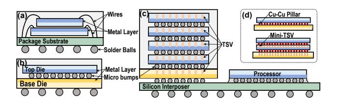

Fig. 1. (a) The wire-bonding-based 3D stacking. (b) The two-tier face-to-face 3D stacking with microbump connection. (c) The multi-tier face-to-back 3D stacking with microbump connection and TSV. (d) 3D packaging with hybrid bonding vias. It substitutes micro bumps with finer Cu-Cu pillars, and mini-TSVs are required for cross-tier transfer.

which no single memory technology can fully satisfy. By combining SD with heterogeneous architecture, HybridSpec allows separate optimizations under practical physical constraints. We further provide a new insight for heterogeneous design: while mapping operators by arithmetic intensity is important, insufficient memory capacity—often underemphasized—can become a critical bottleneck that significantly increases latency.

## II. BACKGROUND

# *A. 3D Stacking and Hybrid Bonding Technology*

The demand for higher-density and more energy-efficient connections has driven a packaging transition from 2D to 3D. By vertically stacking multiple dies, 3D packaging reduces area and shortens interconnect length, delivering lower latency and power consumption under signal integrity constraints [26]. The evolution of 3D packaging, driven by the pursuit of higher interconnect density (Gbps/mm), is as follows:

- (1) Wire Bonding: Direct die stacking with peripheral connections [13], [72] using metal wires (20-600 µm pitches [9]), shown in Fig. 1(a). Wire bonding is cheap, but bonding pads are limited to the chip perimeter.
- (2) Microbump + TSV (Through-Silicon Via): Utilizes chip surfaces for electrical contacts. *Face-to-face stacking* [18], [50](Fig. 1(b)) support only dual-tier integration, using precisely aligned microbumps as connection. Multi-tier integration needs *face-to-back stacking* [32], [51], [53] (Fig. 1(c)), using TSVs for cross-tier transmission. TSV, along with keepout zones, typically occupy ∼10µm pitches [19], [25], [66], and is expensive due to the high aspect ratio via etching [8], [44] across the die. HBM exemplifies this approach.
- (3) Hybrid Bonding (HB): HB replaces conventional microbumps with direct dielectric-to-dielectric and metal-tometal bonds, achieving superior interconnect density with 2–3 µm pitches [17], [69]. Recent HB-based processing-nearmemory architectures [35], [50], [76] integrate computing units into the logic die to exploit the high bandwidth enabled by HB. In practice, single DRAM stacks with *face-to-face* integration are relatively mature and widely used [17], [35], [50], [76], while deeper stacking with *face-to-back* integration requires expensive mini-TSVs [26], [69] to match the finepitch HB connections, as shown in Fig. 1(d).


Fig. 2. LLM model structure and its processing stages. (a) Transformer structure. (b) Attention variants of MHA and GQA. (c) Auto-regressive generation process and latency metrics.

#### B. LLM Structure and Generative Inference Phases

Modern LLMs are built upon the Transformer architecture, which stacks multiple layers containing attention and feedforward (FFN) blocks, as shown in Fig. 2(a). FFN blocks apply simple linear and non-linear transformations, while attention blocks capture token dependencies through query/key/value (Q/K/V) mechanism and scaled dot-product attention. Variants such as Multi-Head Attention (MHA) [67] and Grouped Query Attention (GQA) [2] differ in how attention heads share key and value vectors, as illustrated in Fig. 2(b).

LLM inference consists of two stages: prefill and decode. Prefill processes the entire input in a single forward pass and stores the resulting K/V tensors as the KV cache. Decode then iteratively generates tokens. At each step, it computes only the representation of the newly generated token by reusing the cached K/V from previous steps, and appends the corresponding K/V tensors to the KV cache until the response is complete. The overall process is illustrated in Fig. 2(c).

In LLM serving, requests arrive dynamically, with performance evaluated under service-level objectives (SLOs) [41]: *Time-To-First-Token (TTFT)*, which measures prefilling latency and indicates how quickly users see the initial response; *Time-Per-Output-Token (TPOT)*, which captures decoding latency and reflects the speed of response generation; and *end-to-end (E2E)* latency, which represents the total time from request receipt to completion.

## C. Speculative Decoding

Speculative decoding (SD) introduces a lightweight draft model to assist the target model during decoding [6], [33]. As shown in Fig. 3(a), it reformulates decoding into *draft* and *verification* phases: the draft model predicts several tokens (the

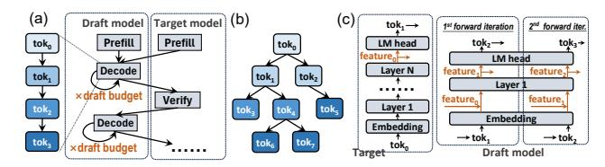

Fig. 3. Speculative decoding (SD) and its variants. (a) The execution flow of chain-like SD. (b) The illustration of the speculation tree and its corresponding context mask used during verification. (c) The hidden-state-based SD methods.

draft budget), and the target model validates all candidates in a single forward pass under rejection sampling. SD guarantees distributional equivalence with standard decoding, ensuring lossless output [6], [33], [48].

Beyond basic chain-like speculation, recent advances extend SD to more expressive forms and tighter model integration. Tree-based variants [3], [38], [48], [64] allow the draft model to propose multiple candidates per step, improving acceptance probability while maintaining verification efficiency via masked attention, as shown in Fig. 3(b). Hidden-state-based SD [3], [12], [37]–[39] embeds a lightweight speculation head into the target model, which predicts the next token using both the last generated token and its last-layer representations.

Recent SD implementations achieve draft-token acceptance rates up to  $\sim 80\%$  [39]. Owing to its model-agnostic and lossless nature, SD has been widely adopted in frameworks such as vLLM, SGLang, and llama.cpp, underscoring its generality as a unified paradigm for autoregressive LLM decoding.

## III. CHALLENGES AND MOTIVATION

#### A. Hardware: Memory's Bandwidth-Capacity Tradeoff

Hybrid bonding achieves high DRAM bandwidth through dense interconnects with 2–3  $\mu$ m via pitches [69], with a single DRAM die providing approximately 20 GB within the reticle area [17], [35]. Increasing capacity through multilayer stacking necessitates extra efforts. First, stacking more layers worsens thermal dissipation, as inner dies have limited heat escape paths. Second, multi-layer designs require *face-to-back* (rather than face-to-face) integration with *mini-TSVs to penetrate* intermediate DRAM dies. To preserve HB's bandwidth advantage, mini-TSV pitches need to match the fine HB via pitches, entailing high aspect ratios and tight alignment tolerances, which increase manufacturing difficulty. Even HBM, with its relatively larger TSV pitches ( $\sim$ 10  $\mu$ m), took over a decade to reach 12-layer stacking [32].

Meanwhile, LLM serving demands both large capacity and high bandwidth. Model sizes have grown rapidly to hundreds of billions of parameters, and inference additionally stores KV caches that grow with request count and sequence length. For example, serving Llama2-13B with 50 concurrent 512-token requests requires approximately 20 GB for KV cache alone (FP16). KV cache footprint directly bounds concurrency; when no memory remains to accommodate additional KV caches, new requests must stall until memory is freed. At

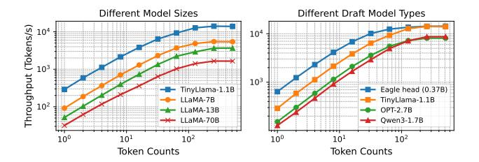

Fig. 4. Throughput versus token count for different model sizes (left) and types (right). Low token counts cause memory bottlenecks, preventing full GPU utilization regardless of model architecture. Tested on A800.

the same time, autoregressive decoding remains predominantly memory-bound [55], [75], requiring high bandwidth to reduce per-token latency.

This reflects *a fundamental trade-off inherent in memory systems*: At a given level of packaging capability and cost, high capacity and bandwidth cannot be achieved simultaneously. Relying solely on packaging advances to accommodate model scaling is insufficient given current trends.

#### B. Software: Heterogeneity in Speculative Decoding

Although speculative decoding alone can already accelerate LLM inference, current homogeneous deployment limits further potential speedup due to two inefficiencies:

(1) Mismatched arithmetic intensity causes resource underutilization. Hardware utilization depends on the balance between arithmetic intensity (the ratio of computation to memory access) and the hardware's compute-to-memory bandwidth ratio. When the arithmetic intensity falls below this ratio, the system is memory-bound with underutilized compute units; otherwise, it becomes compute-bound. For LLM inference, arithmetic intensity scales with the number of tokens processed per forward pass [5], [31], [81]. Given that modern GPUs exhibit compute-to-memory ratios of 100–300 [10], [11], achieving full compute utilization requires processing on the order of hundreds of tokens per pass. Fig. 4 empirically confirms this behavior: throughput increases with token count and eventually plateaus at the compute-bound regime regardless of model size and series.

SD creates a divergence in arithmetic intensity between models. The target model verifies tokens *accumulated* over *multiple* draft rounds in a single pass, thus having higher arithmetic intensity. Therefore, implementing both on homogeneous hardware will suffer from underutilization inherently.

(2) Heterogeneous models disrupt scheduling efficiency. Modern serving systems rely on continuous batching [73] to interleave requests and maintain throughput. This assumes identical model structures across stages, which SD violates: prefill and verification run on the target model, while decoding runs on the draft model. Such heterogeneity prevents unified batching and incurs bubbles, as shown in Fig. 5. Even if requests are delayed to synchronize draft and verification phases, differences in draft budgets across requests [45], [56], [71]

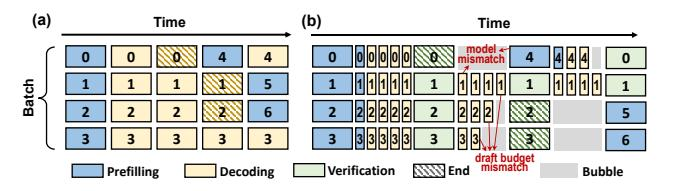

Fig. 5. Batching overview. Numbers annotated on the figure refer to different requests. (a) The continuous batching in normal auto-regressive decoding. (b) The ragged batching caused by model heterogeneity in speculative decoding.

introduce stragglers that block faster ones, thereby creating bubbles and degrading efficiency.

#### C. Synergy: Heterogeneous Architecture as Mutual Solution

HB-based heterogeneous architecture and SD can complement each other. For HB stacks, SD provides a new form of *compression* by introducing a lightweight surrogate. Besides, SD leaves operations with higher arithmetic intensity for the target model, thereby relaxing bandwidth pressure and enabling higher capacity provisioning. *Capacity is critical*, as it stores KV caches and thus sets concurrency limits. For SD, the HB part provides high bandwidth suited to the memory-bound draft decoding phase, while the heterogeneous architecture naturally accommodates mixed computational characteristics without scheduling conflicts.

We then justify why high-performance XPUs (GPUs/TPUs) combined with hybrid-bonding stacks represent a particularly suitable choice to realize this synergy. Other common heterogeneous platforms are considered:

- (1) XPU with CPU: This configuration has been used in recent works like [28], [29], where the CPU also serves as the processor with a low compute-to-memory ratio. However, since the *absolute* memory bandwidth determines the absolute decoding speed, the relatively low CPU memory bandwidth ( $\sim$ 300GB/s) still creates bottlenecks in decoding.
- (2) XPU with different compute-to-memory ratio: This configuration has been used in [55], [79], where different generations of XPU usually differ in compute capacity and memory bandwidth. However, such differences are typically 2-3×, while the gaps in arithmetic intensity and capacity between the draft and target models reach an order of magnitude. This mismatch means that XPUs assigned to draft models still waste considerable computing power and capacity.
- (3) XPU with PIM: Unlike HB, PIM fabricates logic within the DRAM process rather than a separate logic process. This makes its compute units area-inefficient, resulting in a more severe capacity-bandwidth tradeoff. This fabrication distinction also leads to differences in mapping and integration efficiency. We provide a dedicated comparison with PIM-based heterogeneous systems in Sec. VII-A.

Fundamentally, SD *polarizes* arithmetic intensity and footprint across models, enabling *separate optimization* for bandwidth and capacity. This approach is more practical than simultaneously optimizing both bandwidth and capacity.


Fig. 6. Package and architecture overview. (a)/(b) The top/side view of HybridSpec's package. (c) The HB stack contains a DRAM and a logic tier. Two tiers are stacked face-to-face by hybrid bonding vias. Adjacent logic blocks are interconnected on the logic tier. (d) The architecture of logic dies.

#### IV. HYBRIDSPEC ARCHITECTURE

In this section, we introduce HybridSpec, a heterogeneous platform that contains an HB stack and an XPU with corresponding memory, as shown in Fig. 6. We first present architectural designs, then demonstrate the execution flow.

## A. The Hybrid-bonding Stack Processing Unit

Fig. 6(c) illustrates the architecture of the HB stack. Considering the integration issues analyzed in Sec. III-A, we adopt the mature face-to-face stacking comprising one DRAM tier and one logic tier, interconnected through hybrid bonding vias.

The DRAM tier is diced from a wafer of DRAM dies along lithographic scribe lines, as shown in Fig. 6(c). Each DRAM die contains multiple banks that operate independently. Each bank is associated with a set of HB I/Os that interface with the underlying logic die. Accordingly, the logic die is arranged to *align with* individual DRAM-die footprints to facilitate subsequent assembly. Since a DRAM die's area determines how many banks and HB I/O sites it contains, both aggregate bandwidth and capacity scale with die area.

The logic tier contains logic blocks that interface with the DRAM dies for data access and perform computation. Each logic block encompasses input/output activation buffers, controllers, and a distributed computing array. Each array element performs multiply-accumulate operations, holding small local buffers and HB controllers for communication with DRAM banks above, as shown in Fig. 6(d). Adjacent interconnects between logic blocks facilitate inter-block communication. The logic tier also comprises global controllers, instruction/address/task buffers, and external interface implementations.

We now discuss the packaging for *the logic die to the sub-strate*, which limits the XPU-HB transfer bandwidth. Existing HBM systems typically employ TSVs in the logic tier for this connection [18], [32], [53], providing high bandwidth but at high cost. In HybridSpec, however, SD significantly reduces data movement between the HB stack and XPU. The primary transfers consist of draft model KV caches and token lists, rather than target model KV caches or per-layer intermediates. Therefore, we adopt cost-effective wire bonding [63] for the logic die to substrate connection. As experiment VI-G shows,

data transfer overhead accounts for less than 1% of total execution time, validating that wire bonding provides sufficient bandwidth for our system.

## B. The XPU Processing Unit

The XPU component comprises both compute and memory. Leading GPUs such as A100/H100 employ a silicon interposer to connect HBM to the compute die. While this design provides high memory bandwidth, it incurs high cost and limited capacity, failing to fully exploit the benefits of *heterogeneous architecture* and the relaxed bandwidth requirements enabled by SD for the target model.

Therefore, we adopt the stacked LPDDR5X with wire bonding package as specified in [54]. Although LPDDR was originally developed for edge devices, LPDDR5X has gained widespread adoption owing to its balanced capacity, bandwidth, and power characteristics. Each package incorporates 8 stacked layers, with each layer containing 4×16Gb LPDDR5X dies, delivering a total capacity of 64GB. Each package provides 128 DQ pins at 8.5 Gb/s/pin, yielding an aggregate bandwidth of 136GB/s. By equipping the XPU with eight such packages as shown in Fig. 6(a), a total capacity of 512GB and a bandwidth of 1.1TB/s are achieved. The feasibility of trace routing between LPDDR5X and the XPU within PCIe card form factors has been validated [54]. In HybridSpec, the reduced bandwidth has modest impacts (as SD lifts the arithmetic intensity of the target models), while the increased memory capacity provides significant advantages (as it accommodates larger KV caches and enables higher concurrency). Experiments in Sec. VI-F further validate this by comparing performance when adopting different memory types for the XPU.

Together, the HybridSpec PCB accommodates three primary package types: the XPU, the HB stack, and LPDDR5X, as illustrated in Fig. 6(b).

#### C. Execution Flow

This subsection outlines the *per-request* execution flow (*batching* is discussed in Sec. V). Upon receiving a request, the system performs prefill for both the target and draft models on the XPU, then transfers the request to the HB stack for iterative

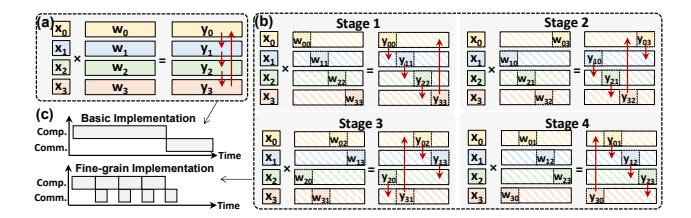

Fig. 7. Comparison of basic implementation of TP (subfigure (a)) and our fine-grained method (subfigure (b)). Subfigure (c) compares their timelines.

decoding. Once the draft budget is reached, the draft tokens are transferred back to the XPU for verification. The XPU then returns the accepted tokens to the HB stack, which clears the KV cache of mis-speculated tokens and resumes draft decoding from the accepted token sequence. This draft-verification cycle repeats until an EOS token appears. Regarding memory, the HB stack stores the draft model and its KV cache, while XPU holds both target and draft models and the target KV cache.

Hidden-state-based SD follows a similar flow, except that whenever the XPU transfers data to the HB stack (prefill or verification), it also sends the *last-layer hidden states*, as shown in Fig. 3(c). Regarding memory, in addition to the data storage in the standalone draft case, both the XPU and HB stack buffer temporary hidden state for the next iteration.

The dataflow on the HB stack includes two hierarchies:

- 1) Inter-logic block level: We enhance the tensor parallelism (TP) with fine-grained computation-communication overlap to achieve latency hiding. We follow the conventional TP matrix partitioning approach [62], where weights are partitioned along output and input channels alternately. Our approach differs in execution: rather than completing all computation before initiating collective communication as shown in Fig. 7(a), we decompose computation into tiles and pipeline each with ring-based communication as shown in Fig. 7(b). This fine-grained execution effectively masks the majority of communication latency, as shown in Fig. 7(c).
- 2) Intra-logic block level: Due to the relatively small sizes of input/output activations in decoding, we adopt weight-stationary for GEMM (and KV cache stationary for attention), to maximize weight (KV cache) reuse. Formally, HybridSpec adopts  $Opr1 \times Opr2 = Res$  pattern with Opr2 stationary. Opr2 is directly mapped from HB DRAM onto the compute array, while Opr1 is read from activations and broadcast across array elements. Individual elements utilize their adder trees to compute partial sums, which are subsequently aggregated in block-level buffers. The dataflow follows well-established designs proposed by previous accelerators [7], [36], [52], [61].

#### V. SCHEDULING OPTIMIZATION

In this section, we present the scheduling optimizations for HybridSpec to further reduce inference latency and enhance utilization. While prior studies focus on design-space exploration (DSE) for *static offline inference*, such design-time


Fig. 8. Asynchronous batching flow of XPU and HB stack. (a) Timeline of batch execution with annotated request arrivals and task transfers. (b) Task pool states at representative time points from (a), showing XPU (blue) and HB stack (brown) transitions during scheduling.

decisions are immutable after fabrication. In the context of *dynamic online serving*, runtime scheduling therefore becomes the primary lever to accommodate fluctuating request patterns.

#### A. Asynchronous Batching

During serving, requests arrive at arbitrary intervals, requiring efficient batching to *improve throughput* and *minimize queuing latency*. Following the principle of continuous batching [73], we design an asynchronous batching strategy optimized for heterogeneous architectures.

Each request is decomposed into discrete tasks of three types: prefill, decode, and verification, as mentioned in Sec. IV-C. Each processing unit (XPU or HB stack) maintains a task pool storing the metadata of pending tasks (type, context state, token count, etc.). As shown in Fig. 8, an idle unit immediately forms a batch from available tasks in the pool for execution, while a busy unit defers batching until the current iteration completes.

Each task corresponds to a single forward pass of either the target or draft model. For the XPU, tasks may originate from newly injected external requests (T0, T1 in Fig. 8), or from the HB stack when verification of decoded results is required (T3 in Fig. 8). For the HB stack, tasks may come from the XPU when a new round of speculation is needed after verification (T2, T4 in Fig. 8), or internally from ongoing decoding processes when the number of generated tokens has

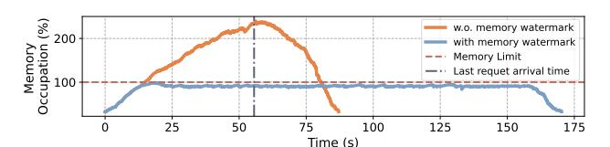

Fig. 9. Under the same workload, memory occupation over time with / without the watermark mechanism.

not reached the draft budget (T5 in Fig. 8). The memory and computation considerations in batching are as follows.

- 1) Memory: Memory constraints mainly stem from the KV cache. As requests progress, the cache expands until completion, and under high request rates or long sequences, it can exceed available memory even when model parameters fit. We mitigate this issue with a watermark-based strategy: when memory utilization exceeds a preset threshold, prefilling tasks are temporarily suspended to limit KV cache growth. Fig. 9 demonstrates that this mechanism effectively stabilizes memory usage. Fig. 9 also indicates that a larger memory can reduce processing time.
- 2) Computation: On the HB stack, decoding tasks of different requests are batched jointly, with shared parameters except for attention KV caches as handled by previous works [1], [23], [73]. The XPU performs prefilling and verification. Draft prefills are executed individually due to different parameters, incurring negligible overhead given the lightweight draft model. Target prefills and verification are batched jointly, with possible contention handled in Sec. V-C.

Compared to offline batched inference, our batching is characterized by two key features: (1) *Asynchronous execution:* iterations across different processing units do not have strictly aligned start and end times. (2) *Dynamic batch composition:* the set of requests in each batch changes across iterations, unlike the static composition in offline batching.

## B. The Utilization-aware Speculation Scheme

To further bridge the gap between dynamic workloads and fixed hardware, we introduce runtime adaptability through speculation-based scheduling. As analyzed in Sec. III-B, arithmetic intensity is affected by per-iteration token count. By tuning draft budgets and tree shapes, we can therefore modulate the arithmetic intensity of tasks across heterogeneous units, better utilizing idle compute or memory resources. Chain speculation is treated as a special case of tree speculation with width one in the following analysis.

While improving resource utilization, the strategy must still preserve speculation effectiveness. We establish the following principles based on algorithm experiments.

- (1) Increasing the draft budget extends the accepted token length but exhibits diminishing gains beyond a threshold (Fig. 10(a)). To avoid redundant computation on rejected drafts, we set B as the upper bound of the draft budget.
- (2) Under a fixed total budget, the accepted draft length first increases and then decreases with tree width (Fig. 10(b)), reflecting a trade-off between exploration and depth. Wider


Fig. 10. Accepted token length trends for different speculation configurations. Measurements from the open-source implementation of [64]. (a) Effect of draft tree budget. (b) Impact of tree width on accepted token length under a fixed budget. The red curve denotes the Support Vector Regression (SVR) fitting.

# Algorithm 1 The utilization-aware speculation

**Input**: draft budget bound *B*, speculation lookup table *T*, initialized *draft\_budget* and *tree\_width*.

```
while (after prefilling) and (no EOS) do
   # Decoding stage starts.
   current draft tree size = 0
   p = T[draft\_budget]
                           \triangleright Get optimal tree width p (the tree width
that achieves the best accepted token length given the draft_budget).
   while (current\_draft\_tree\_size \le draft\_budget) do
       AI_{\rm HB} = HB\_stack.process()

       if AI_{HB} < HB\_stack.roofline then
           tree\_width = min(p, tree\_width + 1)
           tree\_width = \max(1, tree\_width - 1)
       HB_stack.add_task(DecodeTask(tree_width))
       current_draft_tree_size += tree_width
   end while
   # Verification stage starts.
   XPU.add_task (VerifyTask(draft_budget))
   AI_{XPU} = XPU.process()
   if AI_{XPU} < XPU.roofline then
       draft\_budget = min(B, 2 \times draft\_budget)
       draft\_budget = \max(1, draft\_budget/2)
   end if
end while
```

trees cover more candidates but shorten per-branch length. We maintain a lookup table T to record the optimal width transition point p for each given draft budget.

The utilization-aware speculation strategy is summarized in Alg. 1. Starting with an initialized draft tree budget and tree width, the optimal width p is retrieved from table T. During draft decoding, the HB stack estimates arithmetic intensity using the number of processed tokens per iteration. The  $tree\_width$  is adjusted to make the arithmetic intensity of HB's tasks approach the turning point of the HB roofline model within the range [1,p], thus achieving higher resource utilization while avoiding wasting computation on discarded drafts. Similarly, during verification, the XPU adjusts the  $draft\_budget$  for the next round within [1,B].

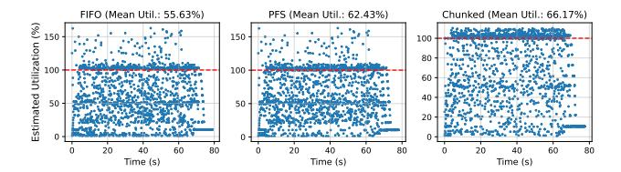

Fig. 11. Comparison of utilization across different schemes, with each point representing one iteration. The average utilization progressively improves across FIFO (55.63%), PFS (62.43%), and chunked schemes (66.17%).

#### C. Prefill-Verification Arbitration

With SD deployed, the XPU executes both prefill and verification tasks. A naive FIFO (First-in-First-out) scheduler processes requests in arrival order, but fails to *exploit batching opportunities under high request rates*. Under FIFO, verification tasks of earlier requests can delay subsequent prefills. Since completing a prefill effectively materializes a request into schedulable downstream work, such blocking reduces the number of active requests available for batching, thereby limiting concurrency and utilization. To address this, we adopt a PFS (Prefill-First Scheduling) policy that *prioritizes prefill tasks* over verification tasks when memory permits, increasing the pool of schedulable requests.

Prefill lengths also vary widely (from tens to thousands of tokens), introducing temporal imbalance in compute utilization. Short prefills complete quickly and underutilize the XPU, while long prefills occupy it for extended periods, delaying subsequent scheduling decisions. Building upon PFS and inspired by [1], we develop CHK, which increases scheduling flexibility by partitioning long prefills along the sequence dimension. This facilitates packing batches that better match the XPU's compute—memory ratio, thereby improving utilization. Chunking requires corresponding adjustments to attention masks to preserve sequence alignment.

Fig. 11 compares the utilization of FIFO, PFS, and CHK scheduling, showing progressively higher utilization as more iterations reach full XPU occupancy.

In summary, batches on the XPU fall into three categories: (1) Verification-only: occurs when no prefill tasks are pending or when memory reaches the watermark. (2) Prefill-only: occurs when no verification tasks are pending or when chunked long prefills alone saturate the compute resources. (3) Mixed prefill-verification: occurs when short prefills are combined with verification to fully utilize compute power.

### VI. EXPERIMENTS

## A. Experiment Settings

**Benchmarks:** We use three typical SD pairs of target/draft models with varying parameter counts: Llama2-13B [47] / TinyLlama1.1B [65], Qwen3-32B [59] / Qwen3-1.7B [58], and OPT-66B [16] / OPT-2.7B [15]. All models operate with FP16/BF16 precision. We use ShareGPT as our dataset, generating workloads following vLLM's *benchmark\_serving.py* [68]. System load is controlled by adjusting the *request* 

rate rather than fixed batch sizes. In online serving, batch sizes fluctuate dynamically based on both request arrival rate and sequence lengths, making request rate a more realistic load indicator. Tab. II reports typical steady-state batch size statistics and throughput for varying request rates. We primarily evaluate request rates up to 4 per device, which already constitutes a relatively high per-device load. Beyond this point, SLO degrades rapidly on GPUs, as observed by previous works [55], [73], [79]. Request rates in the hundreds are collectively served by cluster-scale resources. Under the utilization-aware scheme in Sec. V-B, the upper bound of tree budget B is set to 32 to mitigate compute waste on unaccepted tokens. The average draft\_budget and tree\_width decrease at higher request rates: (30.74, 3.72), (22.78, 3.10), (15.51, 2.31), and (9.25, 1.58) at rates 1,2,3,4, respectively.

TABLE II

BATCH SIZE AND TOTAL THROUGHPUT (INCLUDING PREFILL AND DECODING) STATISTICS ON REQUEST RATES ON GPU.

| Req. rate | Mean  | Median | Variance | Min   | Max   |
|-----------|-------|--------|----------|-------|-------|
| 1         | 4.83  | 5.00   | 3.77     | 2.00  | 8.00  |
| 2         | 13.40 | 13.00  | 10.30    | 10.00 | 18.00 |
| 3         | 27.00 | 27.00  | 13.60    | 21.00 | 32.00 |
| 4         | 37.86 | 37.00  | 9.14     | 34.00 | 43.00 |

**Baselines:** We compare HybridSpec against four baselines: two GPU-based approaches (a, b) and two HB-based heterogeneous approaches (c, d). The three model pairs of increasing sizes are deployed on 1, 2, and 4 devices, respectively.

- (a) <u>GPU-AR</u>: Autoregressive inference executed on A800-80GB-PCIe GPUs with vLLM [30].
- (b) <u>GPU-SD</u>: Speculative decoding performed on A800-80GB-PCIe GPUs with vLLM.
- (c) <u>HB-ATTEN</u>: Autoregressive inference performed on our HB-based hybrid platform, with part of the model (attention) allocated to the HB stack. The rationale of this approach is to map operators with lower arithmetic intensity in batched LLM inference onto high-bandwidth memory devices, as adopted in prior heterogeneous works [23], [36], [60].
- (d) <u>HB-ATTEN-QT</u>: HB-ATTEN with 4-bit quantization [21] for KV cache to relieve the hybrid-bonding DRAM's capacity burden. However, quantization inevitably introduces performance degradation.

Hardware Configuration: Our prototype adopts a face-to-face hybrid bonding stack (Fig. 6(c)), occupying 408 mm² (24.7×16.47 mm) and operating at 400 MHz. The memory tier integrates four 2.5 GB DRAM dies (11.75×7.96 mm each), each featuring 80 I/O groups with 256-bit width, delivering 10 GB total capacity and 4 TB/s aggregate bandwidth. DRAM energy is 0.88 pJ/bit, following the characterization in [17]. The logic tier comprises four blocks, each equipped with 140 KB activation SRAM, 512 KB distributed weight SRAM, and 80×64 FP16/BF16 MAC units. Fig. 13 shows the silicon details for the HB stack. The XPU adopts GA100 GPU core, and its LPDDR5X memory follows specifications in [54].


Fig. 12. Overall comparison of latency and energy between HybridSpec and other baselines. HybridSpec shows consistent advantages in both latency and energy consumption under various request rates. All results are normalized to GPU-AR.

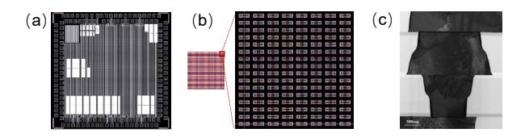

Fig. 13. (a) Floorplan of the logic block prototype. (b) Zoomed-in layout of HB vias. (c) Transmission electron microscope (TEM) photo of HB vias.

We further extended SplitwiseSim [55] to develop an event-based simulator to explore performance across diverse work-loads, as shown in Fig. 14. The HB stack simulation uses the hardware parameters above. For XPU, we build a piece-wise linear performance model by fitting profiling results of GPUs across different parallelism, sequence lengths, and batch sizes, as previous works [46], [55] have performed.

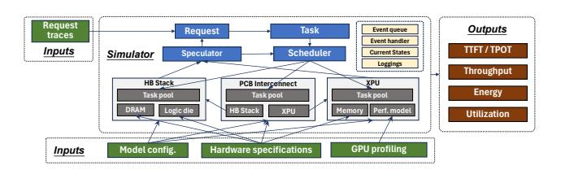

Fig. 14. Simulation Pipeline. HBstack parameters are silicon-derived.

**Metrics:** We evaluate different systems primarily using the following metrics: (1) Latency: End-to-end latency for all requests in the given trace. For straightforward understanding, we report speedup in experiments, which is inversely proportional to latency. (2) Energy: Total energy consumption required to complete all requests in the workload. We present this as energy efficiency, which is inversely proportional to energy. (3) TTFT/TPOT: Time-to-first-token and time-peroutput-token respectively, as introduced in the Background section. We report mean, median, and P99 values for both metrics across all requests to capture the distribution characteristics. (4) Throughput: Total processed token counts divided by total processing time.

Experiments are designed to answer the following aspects:

- (1) How does HybridSpec perform compared to baselines in terms of latency, energy consumption, throughput, and SLO attainment? (Sec. VI-B, VI-C)
- (2) How effective is the scheduling policy adopted in Hybrid-Spec, and what tradeoffs does it introduce? (Sec. VI-D, VI-E)
- (3) How do different hardware configurations affect the overall system performance of HybridSpec? (Sec. VI-F, VI-G)
- (4) The generalization of HybridSpec, including sensitivity to speculation accuracy and cost analysis. (Sec. VI-H, VI-I)

#### B. Overall Comparison

Fig. 12 compares the end-to-end speedup and energy efficiency of HybridSpec against other baselines. HybridSpec outperforms both GPU-based and hybrid-bonding-based solutions, achieving an average speedup of 3.02x and energy efficiency improvement of 1.96x.

Latency: HybridSpec delivers consistent speedups across request rates, with gains increasing under heavier loads. The improvement arises as baselines experience severe degradation at high concurrency (detailed in Sec. VI-C). HybridSpec sustains performance by fully exploiting heterogeneous compute and memory resources enabled by advanced HB integration. Speedup also scales with model size. For larger models, limited HBM capacity in baselines necessitates tensor parallelism across devices, introducing additional all-reduce communication. In contrast, HybridSpec provides sufficient on-stack memory to store both weights and KV caches, enabling data parallelism where each device independently serves complete requests, eliminating inter-device communication.

Notably, pairing HB memory with low arithmetic intensity operators does not guarantee acceleration. HB-ATTEN sometimes even underperforms conventional setups, as its limited HB DRAM can store only few KV caches, restricting concurrency and causing request suspension delays. The quantized variant, HB-ATTEN-QT, mitigates this bottleneck and ranks second after HybridSpec, albeit with quality loss.

**Energy:** HybridSpec also achieves energy savings over the baselines, though to a lesser extent than latency improvements.


Fig. 15. Throughput comparison. Throughput is computed as total tokens processed (prefill and decoding) divided by total processing time.

This gap arises from two factors. First, energy accumulates over the device's entire active period and thus correlates with total execution time rather than per-request latency. Because the workload is injected within a one-minute interval for all baselines, performance differences primarily affect the post-injection drain phase, resulting in limited variation in makespan. Second, HybridSpec integrates an additional HB stack that inevitably adds some power draw. Nevertheless, due to the energy-efficient hybrid bonding and modest compute load, the XPU remains the dominant contributor to overall energy consumption.

**Throughput**: Fig. 15 compares throughput across different request rates and models. HybridSpec's throughput gains over baselines are correlated with request rate, ranging from 1.15x at 1 req/s to 1.94x at 4 req/s. At low rates, requests arrive sparsely, so prior requests have little effect on total processing time. As the rate increases, temporally close requests induce queuing and delay propagation, making performance gaps between HybridSpec and baselines more obvious. Rather than sacrificing throughput for latency, HybridSpec simultaneously achieves better throughput and lower latency by leveraging advances in packaging, algorithms, and scheduling.

#### C. SLO Comparison

Fig. 16 compares the TTFT and TPOT of different solutions. We categorized the ShareGPT requests by sequence length bins as annotated in subtitles. Fig. 16 is evaluated on Llama2-13B to eliminate the impacts of cross-GPU communication.

All solutions show relatively stable latency initially, but exhibit *sharp rise* beyond saturation points. Additionally, saturation happens at lower request rates for longer sequences, as they require more iterations and impose heavier per-request load. Across all cases, HybridSpec consistently achieves lower TTFT and TPOT than other solutions while sustaining higher request rates before saturation. Under identical TTFT/TPOT requirements, HybridSpec can sustain 2.97× higher request rates than GPU baselines on average.

Among the baselines, HB-ATTEN degrades most rapidly despite employing a heterogeneous HB-based platform similar to HybridSpec and mapping operators by arithmetic intensity. The root cause is the *limited capacity*: mapping attention to the HB stack requires storing KV caches that grow with both request rate and sequence length. Once capacity is exhausted, incoming requests must be suspended, sharply inflating TTFT. HB-ATTEN-QT substantially alleviates this issue through KV cache quantization.

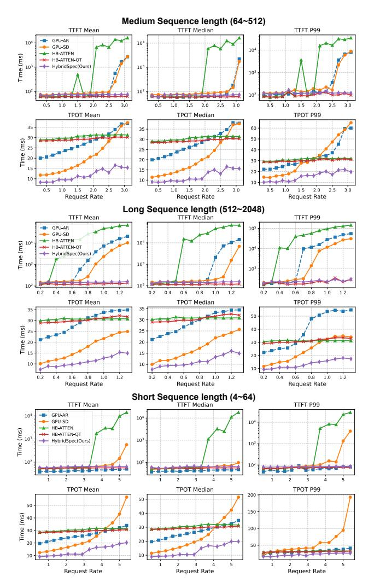

Fig. 16. TTFT and TPOT comparison between HybridSpec and baselines under different sequence length and request rates. HybridSpec's TTFT and TPOT grow slower than baselines and can serve higher request rates.

In contrast, HybridSpec remains robust under long-context workloads. In HybridSpec, the target model's KV cache resides *entirely* in the large-capacity LPDDR, avoiding the capacity-induced stalls observed in baselines. The HB stack only stores the draft model's KV cache, which is significantly smaller, while still providing the high bandwidth needed to accelerate memory-bound draft decoding. These results confirm that HybridSpec's advantage at high request rates stems from the heterogeneous memory scheme, and becomes more pronounced as sequence length increases.

### D. Ablation Study of Scheduling Optimizations

**Dynamic Speculation:** Fig. 17 (a) presents the speedup of the dynamic utilization-aware speculation scheme over fixed-budget speculation, achieving an average improvement of  $1.81 \times$ . The results are averaged across models, considering

that HybridSpec does not require tensor parallelism and performance is similar across models. As shown in Fig. 17(a), the speedup declines with increasing request rate. This is because higher request rates intensify the workload and raise overall system utilization, leaving fewer idle resources for dynamic speculation to exploit. Moreover, longer sequences are more sensitive to dynamic speculation, since they involve more rounds of drafting and verification.

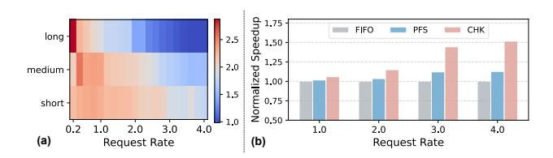

Fig. 17. The speedup of scheduling optimizations, including (a) dynamic speculation, and (b) batching strategies.

**Batching Strategies:** Fig. 17 (b) shows the speedups achieved by preemption and chunking optimizations demonstrated in Sec. V-C. Results are also averaged across models as above. Prioritizing prefill over verification tasks yields an average speedup of 1.10×, while combining request chunking with prefill preemption achieves an average speedup of 1.29×. The speedups of scheduling optimizations grow with request rates. This is because higher request rates intensify system load, and with limited computational resources, effective scheduling strategies become critical for mitigating resource contention and maintaining performance.

# E. SLO Tradeoff of Arbitration

As described in Sec. V-C, HybridSpec adopts a prefill-first scheduling (PFS) policy that prioritizes incoming prefill tasks over pending verification tasks. Fig. 18 further quantifies how this arbitration decision affects the TTFT-TPOT trade-off.

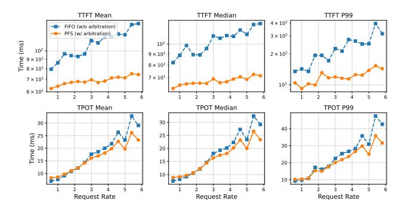

Fig. 18. TTFT and TPOT comparison between FIFO (w/o arbitration) and PFS (w/ arbitration) under varying request rates.

When arbitration is disabled (i.e., all tasks are processed in FIFO order), the system exhibits slightly better TPOT but notably worse TTFT. Under FIFO, verification tasks are not preempted by new prefills, so the draft-verify cycle proceeds with shorter turnaround and faster token generation. However,

incoming requests must queue behind pending verifications before prefill can begin, increasing TTFT.

As request rates increase, the TPOT advantage of FIFO diminishes. Under heavy load, FIFO stalls new requests behind verifications, delaying their entry into the decoding pipeline. Then, fewer requests are available for batching. PFS instead completes prefills promptly, feeding more requests into the pipeline sooner and improving overall utilization, which in turn benefits TPOT.

## F. The Impact of Different XPU Memory

Fig. 19 compares the latency when replacing the 512GB 1.1TB/s LPDDR memory with 40GB 1555GB/s HBM2 or 80GB 1935GB/s HBM2e, both offered as A100 options. Evaluations are conducted on Llama-13B, as the 40 GB HBM2 cannot accommodate larger models. At a low request rate of 1 req/s, high-bandwidth memories deliver substantial speedups over LPDDR. However, as the request rate increases, their advantage diminishes, and the 40 GB configuration even performs worse than the LPDDR. At low request rates, memory can accommodate both model weights and KV caches. As request rates rise, the expanding KV cache makes memory capacity the bottleneck, limiting batch size. Consequently, new requests must wait for memory to be freed, increasing latency. In HybridSpec, LPDDR5X provides sufficient capacity to avoid this issue. Since the HB stack handles most memorybound operations, the lower bandwidth has reduced impacts on overall performance.

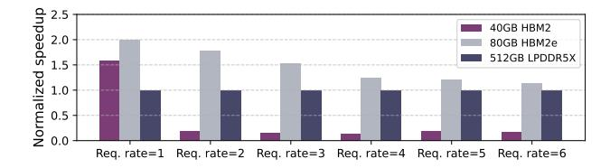

Fig. 19. Comparison when XPU is equipped with different memories.

While HBM provides substantial speedup at low request rates, this advantage is less crucial since SLOs are already satisfied in these cases. Moreover, larger XPU memory can offer greater benefits for larger models and longer sequences by enabling higher concurrency and reducing distributed communication.

## G. The Impact of Data Movement between XPU and HB Stack

Fig. 20 shows the data movement overhead between XPU and HB Stack. We sweep bandwidth density from 2 to 8 GB/s/mm (total bandwidth = density  $\times$  die side length) and link latency from 1 to  $16\mu$ s, sourced from [34].

Data movement overhead is negligible, taking only several milliseconds and contributing less than 1% of total processing time in most cases. Link latency dominates over bandwidth because transfers in HybridSpec consist mainly of small packets. The largest transfer is the draft model's KV cache, approximately several MB for  $1\sim3$ B drafters. Verified and

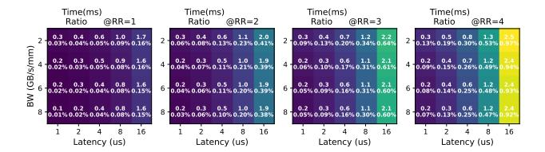

Fig. 20. Data movement overheads under different bandwidth and latency.

candidate token lists amount to merely hundreds of bytes. Even for hidden-state-based speculative decoding methods that require additional feature transfers, the data volume reaches only tens of KB. Given the aggregate transfer bandwidth of tens of GB/s, all of the aforementioned transfer costs are minimal. In contrast, link latency is constant regardless of data volume, and the frequent communication required between XPU and HB stacks makes it the dominant source of overhead.

It is worth noting that operator-level mapping, such as HB-Attention, would incur substantially greater transfer overhead. This is because data movement in such designs is no longer confined to the verification-draft boundary, but occurs at every forward pass. Moreover, the transferred content is no longer limited to the verified token list; it encompasses the activations preceding and following attention for all Transformer layers. As a result, the total transfer volume increases by several orders of magnitude compared to the baseline approach, imposing stringent bandwidth requirements.

#### H. Sensitivity to Draft Model Accuracy

We sweep *speculation efficiency*, defined as the ratio of accepted tokens to the total draft budget, as the controlled variable to represent different levels of draft model accuracy. We did not use acceptance rate, as acceptance rate is measured under *chain-based* Markov assumptions [37]–[39] and cannot directly apply to tree-based SD.

As shown in Fig. 21, latency decreases with speculation efficiency. The sensitivity moderates as efficiency increases. This indicates that once the draft model accuracy reaches a certain level, its impact on latency becomes limited.

To relate these results to common SD methods, we use red vertical lines to mark the speculation efficiency achievable under chain-based speculation at typical acceptance rates [6], [38], [48], [64]. Speculation efficiency is computed as  $(1 - \alpha^{draft\_budget})/((1 - \alpha) \cdot draft\_budget)$  following [6], [33]. Since tree-based methods outperform chain-based approaches under the same draft budgets, they operate in the regime to the right of these reference lines.

#### I. Cost Analysis

A100 and HybridSpec employ identical main computing chips but differ in memory and packaging. A100 integrates 80 GB HBM2e with interposer packaging, whereas HybridSpec combines an HB stack with eight 64 GB LPDDR5X modules using wire bonding. HBM is estimated to account for over 50% of A100's cost (~\$8,000) [40], [49]. For HybridSpec, the LPDDR5X modules (~\$400 each) and 400


Fig. 21. Latency under varying speculation efficiency. The red vertical line denotes the reference speculation efficiency of a chain-based method with corresponding acceptance rates.

mm² hybrid bonding ( $\sim$ \$400 [14], [42]) together total about  $\sim$ \$3,600. Moreover, A100's TSV-based interposer packaging incurs higher assembly cost than HybridSpec's wire-bonding design. Therefore, HybridSpec is estimated to be more cost-effective, primarily owing to its significantly lower memory and packaging cost.

#### VII. DISCUSSION

## A. Comparison with PIM-Based Heterogeneous Systems

The use of high-bandwidth memory and arithmetic-intensity matching in HybridSpec naturally invites comparison with previous PIM-based heterogeneous designs [20], [22], [36]. We identify two key differences between them.

- (1) Fabrication. PIM embeds logic within the DRAM process, whose characteristics (e.g., limited drive current, high-capacitance cell etching) make it ill-suited for efficient logic fabrication, typically sacrificing  $\sim$ 50% capacity for simple MAC arrays. In contrast, HybridSpec fabricates logic and DRAM on separate processes and integrates them via hybrid bonding, where fine-pitch  $(2-3\mu m)$  bonding vias occupy less than 3% of DRAM die area. Therefore, HB-based integration has a more favorable capacity–bandwidth tradeoff than PIM-based architecture.
- (2) Mapping Strategy. Due to limited fabrication capability, PIM can only integrate simple MAC units and thus requires a companion XPU to handle non-linear operators and data movement, enforcing *operator-level* partitioning across XPU and PIM stacks. In contrast, HybridSpec's hybrid-bonded stack integrates a complete logic die, thus enabling *model-level* partitioning across XPU and HB stack, which naturally matches SD's draft-verification boundary with low communication. As shown in Fig. 22, HybridSpec significantly reduces data movements while achieving higher hardware integration density for the same serving workload.


Fig. 22. Comparison between (a) HybridSpec and (b) typical PIM-based heterogeneous architecture [36], which requires two separate XPUs for the draft and target models.

More broadly, this work reveals an overlooked insight in heterogeneous systems: *arithmetic intensity alone is insufficient as a mapping criterion.* In online serving with continuously growing KV caches, mapping low-intensity operators onto high-bandwidth memory without accounting for capacity constraints restricts request concurrency and increases latency (see HB-ATTEN baseline, Fig. 16). Instead, HybridSpec exploits algorithmic opportunities to relax the trade-off between memory and bandwidth.

## *B. Scalability Analysis*

Horizontal Scaling. A single HybridSpec device comprises an HB stack, XPU, and LPDDR5X modules. Scaling to multiple devices follows two strategies, depending on model size. For models ∼100B parameters, *data parallelism* distributes requests across devices, as demonstrated in Sec. VI-B, where Qwen3-32B and OPT-66B are deployed on 2 and 4 devices, respectively. A global controller (e.g., a host CPU) balances the load, and no extra inter-device communication is required between DP ranks. Even larger models (e.g., LLaMA-405B) need *tensor parallelism* to partition model weights across devices. TP ranks execute synchronously, so the only additional overhead is all-reduce communication between devices. Since HybridSpec has a larger per-device capacity (512GB LPDDR5X) than GPU (80GB HBM), fewer TP ranks are needed to avoid out-of-memory, thus reducing communication overhead and improving scalability.

Vertical Scaling. Vertical scaling refers to stacking more DRAM layers beyond the single-layer integration adopted in this work. A heterogeneous architecture is still necessitated, as the HB stack alone cannot provide sufficient compute for prefill and large-batch processing. For HybridSpec, larger stacking supports a bigger draft model, improving speculation accuracy and overall speedup; for HB-ATTEN, it supports more KV caches, increasing request concurrency and mitigating high TTFT under heavy load (Fig. 16). Even so, HybridSpec still benefits from less XPU-HB data movement and lower pressure on high-bandwidth memory than HB-ATTEN. Deeper stacking, however, raises thermal and manufacturing costs as mentioned Sec. III-A, and advances in packaging alone are insufficient to keep pace with model scaling.

# VIII. RELATED WORK

## *A. LLM Serving*

LLM inference with distinct prefilling and decoding stages has motivated extensive research on improving resource utilization. ORCA [73] first proposed continuous batching, reducing the granularity of batching from the request level to the iteration level, significantly reducing latency. Paged Attention [30] mitigated KV cache memory fragmentation through paged management, reducing memory usage and increasing batch capacity. Sarathi [1] equipped decoding with chunked prefilling in the same batch, alleviating the high memory bandwidth demands of decoding. Nanoflow [80] introduced finegrained execution flows, further balancing the computational intensity of different operators to improve resource utilization. The above works target homogeneous systems, while other works adopt heterogeneous platforms. Both Splitwise [55] and Distserve [79] proposed PD separation, placing prefilling and decoding on distinct groups of GPUs with different compute-to-bandwidth ratios. Mooncake [57] also implements PD separation while considering multi-level storage for KV cache optimization. Building on these contributions, we further reduce LLM inference latency through advances in packaging.

# *B. Utilizing Emerging Memory For LLM Acceleration*

Recent efforts exploit emerging memory and packaging technologies to accelerate LLM inference. NeuPIM [23] and IANUS [60] offloads memory-bound attention to PIM modules for batched acceleration. Park et al. [54] replace costly HBM with LPDDR-based CXL-PNM to alleviate capacity limits and inter-node communication. Lincoln [63] enhances Flash-based edge inference by hybrid-bonding PNM logic with Flash dies. SpecPIM [36] leverages PIM-enabled DSE to exploit varying arithmetic intensity in speculative decoding. H² [35] explores heterogeneous memory combining conventional and hybridbonding NMP channels for small-scale LLMs (≤8B). 3D-TokCIM [78] employs compute-in-memory (CIM) macros and models a four-layer HB stack for LLM acceleration, relying on 2/3-bit quantization. While they demonstrate significant improvements over conventional architectures, they evaluate static batches without considering dynamically arriving requests, which is a key distinction from our work.

# IX. CONCLUSION

LLM serving simultaneously demands high memory bandwidth and large memory capacity, but it's hard for a single memory to satisfy both. We adopt speculative decoding to polarize these requirements, and propose a heterogeneous platform that combines high-bandwidth HB-based DRAM with large-capacity LPDDR5X to resolve this tension. We further design a suite of scheduling strategies, including asynchronous batching, utilization-aware speculation, and prefill-verification arbitration, to improve hardware utilization in online serving scenarios. Evaluations show that HybridSpec achieves latency/energy gains across diverse settings. We also reveal that, for LLMs serving on heterogeneous platforms, focusing solely on arithmetic intensity matching while ignoring memory capacity constraints may lead to unexpected long latency.

# ACKNOWLEDGEMENTS

This paper was supported by the Fundamental and Interdisciplinary Disciplines Breakthrough Plan of the Ministry of Education of China (No. JYB2025XDXM120), the Natural Science Foundation of Hubei Province of China (No. 2024AFB478), and the Science and Technology Major Project of the Science, Technology & Innovation Bureau of Wuhan Municipality (No. 2024060802020160). We sincerely thank the reviewers of ISCA 2026 and HPCA 2026 for their constructive feedback. We sincerely thank the Yangtze Laboratory (Wuhan 430205, China) for providing hardware resources related to hybrid bonding.

## REFERENCES

- [1] A. Agrawal, A. Panwar, J. Mohan, N. Kwatra, B. S. Gulavani, and R. Ramjee, "Sarathi: Efficient llm inference by piggybacking decodes with chunked prefills," *arXiv preprint arXiv:2308.16369*, 2023.
- [2] J. Ainslie, J. Lee-Thorp, M. de Jong, Y. Zemlyanskiy, F. Lebron, and ´ S. Sanghai, "Gqa: Training generalized multi-query transformer models from multi-head checkpoints," *arXiv preprint arXiv:2305.13245*, 2023.
- [3] T. Cai, Y. Li, Z. Geng, H. Peng, J. D. Lee, D. Chen, and T. Dao, "Medusa: Simple llm inference acceleration framework with multiple decoding heads," *arXiv preprint arXiv:2401.10774*, 2024.
- [4] Z. Cai, M. Cao, H. Chen, K. Chen, K. Chen, X. Chen, X. Chen, Z. Chen, Z. Chen, P. Chu, X. Dong, H. Duan, Q. Fan, Z. Fei, Y. Gao, J. Ge, C. Gu, Y. Gu, T. Gui, A. Guo, Q. Guo, C. He, Y. Hu, T. Huang, T. Jiang, P. Jiao, Z. Jin, Z. Lei, J. Li, J. Li, L. Li, S. Li, W. Li, Y. Li, H. Liu, J. Liu, J. Hong, K. Liu, K. Liu, X. Liu, C. Lv, H. Lv, K. Lv, L. Ma, R. Ma, Z. Ma, W. Ning, L. Ouyang, J. Qiu, Y. Qu, F. Shang, Y. Shao, D. Song, Z. Song, Z. Sui, P. Sun, Y. Sun, H. Tang, B. Wang, G. Wang, J. Wang, J. Wang, R. Wang, Y. Wang, Z. Wang, X. Wei, Q. Weng, F. Wu, Y. Xiong, C. Xu, R. Xu, H. Yan, Y. Yan, X. Yang, H. Ye, H. Ying, J. Yu, J. Yu, Y. Zang, C. Zhang, L. Zhang, P. Zhang, P. Zhang, R. Zhang, S. Zhang, S. Zhang, W. Zhang, W. Zhang, X. Zhang, X. Zhang, H. Zhao, Q. Zhao, X. Zhao, F. Zhou, Z. Zhou, J. Zhuo, Y. Zou, X. Qiu, Y. Qiao, and D. Lin, "Internlm2 technical report," 2024. [Online]. Available: https://arxiv.org/abs/2403.17297
- [5] C. Chen, "Transformer inference arithmetic," https://kipp.ly/transformerinference-arithmetic/, 2022.
- [6] C. Chen, S. Borgeaud, G. Irving, J.-B. Lespiau, L. Sifre, and J. Jumper, "Accelerating large language model decoding with speculative sampling," *arXiv preprint arXiv:2302.01318*, 2023.
- [7] Y. Chen, T. Luo, S. Liu, S. Zhang, L. He, J. Wang, L. Li, T. Chen, Z. Xu, N. Sun, and O. Temam, "Dadiannao: A machine-learning supercomputer," in *2014 47th Annual IEEE/ACM International Symposium on Microarchitecture*, 2014, pp. 609–622.
- [8] K.-J. Chui, H.-Y. Li, K.-F. Chang, S. Bhattacharya, and M. Yu, "A cost model analysis comparing via-middle and via-last tsv processes," in *2015 IEEE 17th Electronics Packaging and Technology Conference (EPTC)*. IEEE, 2015, pp. 1–4.
- [9] B. Chylak, "Developments in fine pitch copper wire bonding production," in *2009 11th Electronics Packaging Technology Conference*. IEEE, 2009, pp. 1–6.
- [10] N. Corporation and Affiliates, "Nvidia a100 datasheet," 2020. [Online]. Available: https://www.nvidia.com/content/dam/en-zz/Solutions/Data-Center/a100/pdf/nvidia-a100-datasheet.pdf
- [11] N. Corporation and Affiliates, "Nvidia h100 tensor core gpu," 2024. [Online]. Available: https://resources.nvidia.com/en-us-hopperarchitecture/nvidia-tensor-core-gpu-datasheet
- [12] DeepSeek-AI, A. Liu, B. Feng, B. Xue, B. Wang, B. Wu, C. Lu, C. Zhao, C. Deng, C. Zhang, C. Ruan, D. Dai, D. Guo, D. Yang, D. Chen, D. Ji, E. Li, F. Lin, F. Dai, F. Luo, G. Hao, G. Chen, G. Li, H. Zhang, H. Bao, H. Xu, H. Wang, H. Zhang, H. Ding, H. Xin, H. Gao, H. Li, H. Qu, J. L. Cai, J. Liang, J. Guo, J. Ni, J. Li, J. Wang, J. Chen, J. Chen, J. Yuan, J. Qiu, J. Li, J. Song, K. Dong, K. Hu, K. Gao, K. Guan, K. Huang, K. Yu, L. Wang, L. Zhang, L. Xu, L. Xia, L. Zhao, L. Wang, L. Zhang, M. Li, M. Wang, M. Zhang, M. Zhang, M. Tang, M. Li, N. Tian, P. Huang, P. Wang, P. Zhang, Q. Wang, Q. Zhu, Q. Chen, Q. Du, R. J. Chen, R. L. Jin, R. Ge, R. Zhang, R. Pan, R. Wang, R. Xu, R. Zhang, R. Chen, S. S. Li, S. Lu, S. Zhou, S. Chen, S. Wu, S. Ye, S. Ye, S. Ma, S. Wang, S. Zhou, S. Yu, S. Zhou, S. Pan, T. Wang, T. Yun, T. Pei, T. Sun, W. L. Xiao, W. Zeng, W. Zhao, W. An, W. Liu, W. Liang, W. Gao, W. Yu, W. Zhang, X. Q. Li, X. Jin, X. Wang, X. Bi, X. Liu, X. Wang, X. Shen, X. Chen, X. Zhang, X. Chen, X. Nie, X. Sun, X. Wang, X. Cheng, X. Liu, X. Xie, X. Liu, X. Yu, X. Song, X. Shan, X. Zhou, X. Yang, X. Li, X. Su, X. Lin, Y. K. Li, Y. Q. Wang, Y. X. Wei, Y. X. Zhu, Y. Zhang, Y. Xu, Y. Xu, Y. Huang, Y. Li, Y. Zhao, Y. Sun, Y. Li, Y. Wang, Y. Yu, Y. Zheng, Y. Zhang, Y. Shi, Y. Xiong, Y. He, Y. Tang, Y. Piao, Y. Wang, Y. Tan, Y. Ma, Y. Liu, Y. Guo, Y. Wu, Y. Ou, Y. Zhu, Y. Wang, Y. Gong, Y. Zou, Y. He, Y. Zha, Y. Xiong, Y. Ma, Y. Yan, Y. Luo, Y. You, Y. Liu, Y. Zhou, Z. F. Wu, Z. Z. Ren, Z. Ren, Z. Sha, Z. Fu, Z. Xu, Z. Huang, Z. Zhang, Z. Xie, Z. Zhang, Z. Hao, Z. Gou, Z. Ma, Z. Yan, Z. Shao, Z. Xu, Z. Wu, Z. Zhang, Z. Li, Z. Gu, Z. Zhu, Z. Liu, Z. Li, Z. Xie, Z. Song, Z. Gao, and Z. Pan, "Deepseek-v3 technical report," 2025. [Online]. Available: https://arxiv.org/abs/2412.19437

- [13] M. Djuric, "A peek inside apple's a4 processor," 2010. [Online]. Available: https://zh.ifixit.com/News/14223/a-peek-insideapples-a4-processor
- [14] M. X. Dylan Patel and J. Koch, "Hybrid bonding process flow," 2024. [Online]. Available: https://semianalysis.com/2024/02/09/hybridbonding-process-flow-advanced/
- [15] facebook, "opt-2.7b," 2020. [Online]. Available: https://huggingface.co/ facebook/opt-2.7b
- [16] facebook, "opt-66b," 2020. [Online]. Available: https://huggingface.co/ facebook/opt-66b
- [17] B. Fujun, J. Xiping, W. Song, Y. Bing, T. Jie, Z. Fengguo, W. Chunjuan, W. Fan, L. Xiaodong, Y. Guoqing, F. Ni, L. Qiannan, L. Hua, W. Kexin, D. Huifu, B. Liang, J. Xuerong, L. Jin, L. Mei, W. Zhengwen, H. Sheng, Z. Jun, Z. Qiong, S. Peng, Y. Daohong, C. Kau, D. Yang, C.-S. Ho, S. Hongbin, L. Hangbing, L. Ming, K. Yi, and R. Qiwei, "A stacked embedded dram array for lpddr4/4x using hybrid bonding 3d integration with 34gb/s/1gb 0.88pj/b logic-to-memory interface," in *2020 IEEE International Electron Devices Meeting (IEDM)*, 2020, pp. 6.6.1–6.6.4.
- [18] W. Gomes, S. Khushu, D. B. Ingerly, P. N. Stover, N. I. Chowdhury, F. O'Mahony, A. Balankutty, N. Dolev, M. G. Dixon, L. Jiang, S. Prekke, B. Patra, P. V. Rott, and R. Kumar, "8.1 lakefield and mobility compute: A 3d stacked 10nm and 22ffl hybrid processor system in 12×12mm2, 1mm package-on-package," in *2020 IEEE International Solid-State Circuits Conference - (ISSCC)*, 2020, pp. 144–146.
- [19] T. Haruta, T. Nakajima, J. Hashizume, T. Umebayashi, H. Takahashi, K. Taniguchi, M. Kuroda, H. Sumihiro, K. Enoki, T. Yamasaki, K. Ikezawa, A. Kitahara, M. Zen, M. Oyama, H. Koga, H. Tsugawa, T. Ogita, T. Nagano, S. Takano, and T. Nomoto, "4.6 a 1/2.3inch 20mpixel 3-layer stacked cmos image sensor with dram," in *2017 IEEE International Solid-State Circuits Conference (ISSCC)*, 2017, pp. 76–77.
- [20] S. He, Z. Zhu, Y. He, and T. Jia, "LP-Spec: Leveraging LPDDR PIM for efficient LLM mobile speculative inference with architecturedataflow co-optimization," in *2025 IEEE/ACM International Conference on Computer Aided Design (ICCAD)*. IEEE, 2025, pp. 1–9.
- [21] Y. He, L. Zhang, W. Wu, J. Liu, H. Zhou, and B. Zhuang, "Zipcache: Accurate and efficient kv cache quantization with salient token identification," *Advances in Neural Information Processing Systems*, vol. 37, pp. 68 287–68 307, 2024.
- [22] Y. He, H. Mao, C. Giannoula, M. Sadrosadati, J. Gomez-Luna, H. Li, ´ X. Li, Y. Wang, and O. Mutlu, "PAPI: Exploiting dynamic parallelism in large language model decoding with a processing-in-memory-enabled computing system," in *Proceedings of the 30th ACM International Conference on Architectural Support for Programming Languages and Operating Systems (ASPLOS)*, 2025.
- [23] G. Heo, S. Lee, J. Cho, H. Choi, S. Lee, H. Ham, G. Kim, D. Mahajan, and J. Park, "Neupims: Npu-pim heterogeneous acceleration for batched llm inferencing," in *Proceedings of the 29th ACM International Conference on Architectural Support for Programming Languages and Operating Systems, Volume 3*, 2024, pp. 722–737.
- [24] Z. Huang, L. Zhu, Z. Zhan, T. Hu, W. Mao, X. Yu, Y. Liu, and T. Zhang, "Moesd: Unveil speculative decoding's potential for accelerating sparse moe," 2025. [Online]. Available: https://arxiv.org/abs/2505.19645
- [25] S. S. Iyer and T. Kirihata, "Three-dimensional integration: A tutorial for designers," *IEEE solid-state circuits magazine*, vol. 7, no. 4, pp. 63–74, 2015.
- [26] X. Jiang, X. Jia, S. Wang, Y. Guo, F. Guo, X. Long, L. Geng, J. Yang, and M. Liu, "A cross-process signal integrity analysis (cpsia) method and design optimization for wafer-on-wafer stacked dram," *Micromachines*, vol. 15, no. 5, p. 557, 2024.
- [27] X. Jiang, F. Zuo, S. Wang, X. Zhou, Y. Wang, Q. Liu, Q. Ren, and M. Liu, "A 1596-gb/s 48-gb stacked embedded dram 384-core soc with hybrid bonding integration," *IEEE Solid-State Circuits Letters*, vol. 5, pp. 110–113, 2022.
- [28] K. Kamahori, T. Tang, Y. Gu, K. Zhu, and B. Kasikci, "Fiddler: Cpu-gpu orchestration for fast inference of mixture-of-experts models," 2025. [Online]. Available: https://arxiv.org/abs/2402.07033
- [29] ktransformers, "ktransformers: A flexible framework for experiencing cutting-edge llm inference optimizations," 2024. [Online]. Available: https://github.com/kvcache-ai/KTransformers
- [30] W. Kwon, Z. Li, S. Zhuang, Y. Sheng, L. Zheng, C. H. Yu, J. Gonzalez, H. Zhang, and I. Stoica, "Efficient memory management for large language model serving with pagedattention," in *Proceedings of the 29th symposium on operating systems principles*, 2023, pp. 611–626.

- [31] W. Kwon, Z. Li, S. Zhuang, Y. Sheng, L. Zheng, C. H. Yu, J. E. Gonzalez, H. Zhang, and I. Stoica, "Efficient memory management for large language model serving with PagedAttention," in *Proceedings of the 29th Symposium on Operating Systems Principles (SOSP)*, 2023, pp. 611–626.
- [32] J. Lee, K. Cho, C. K. Lee, Y. Lee, J.-H. Park, S.-H. Oh, Y. Ju, C. Jeong, H. S. Cho, J. Lee, T.-S. Yun, J. H. Cho, S. Oh, J. Moon, Y.-J. Park, H.-S. Choi, I.-K. Kim, S. M. Yang, S.-Y. Kim, J. Jang, J. Kim, S.-H. Lee, Y. Jeon, J. Park, T.-K. Kim, D. Ka, S. Oh, J. Kim, J. Jeon, S. Kim, K. T. Kim, T. Kim, H. Yang, D. Yang, M. Lee, H. Song, D. Jang, J. Shin, H. Kim, C. Baek, H. Jeong, J. Yoon, S.-K. Lim, K. Y. Lee, Y. J. Koo, M.-J. Park, J. Cho, and J. Kim, "13.4 a 48gb 16-high 1280gb/s hbm3e dram with all-around power tsv and a 6-phase rdqs scheme for tsv area optimization," in *2024 IEEE International Solid-State Circuits Conference (ISSCC)*, vol. 67, 2024, pp. 238–240.
- [33] Y. Leviathan, M. Kalman, and Y. Matias, "Fast inference from transformers via speculative decoding," in *International Conference on Machine Learning*. PMLR, 2023, pp. 19 274–19 286.
- [34] A. Li, S. L. Song, J. Chen, J. Li, X. Liu, N. R. Tallent, and K. J. Barker, "Evaluating modern gpu interconnect: Pcie, nvlink, nv-sli, nvswitch and gpudirect," *IEEE Transactions on Parallel and Distributed Systems*, vol. 31, no. 1, p. 94–110, Jan. 2020. [Online]. Available: http://dx.doi.org/10.1109/TPDS.2019.2928289
- [35] C. Li, Y. Yin, X. Wu, J. Zhu, Z. Gao, D. Niu, Q. Wu, X. Si, Y. Xie, C. Zhang, and G. Sun, "H2-llm: Hardware-dataflow co-exploration for heterogeneous hybrid-bonding-based low-batch llm inference," in *Proceedings of the 52nd Annual International Symposium on Computer Architecture*, ser. ISCA '25. New York, NY, USA: Association for Computing Machinery, 2025, p. 194–210. [Online]. Available: https://doi.org/10.1145/3695053.3731008
- [36] C. Li, Z. Zhou, S. Zheng, J. Zhang, Y. Liang, and G. Sun, "Specpim: Accelerating speculative inference on pim-enabled system via architecturedataflow co-exploration," in *Proceedings of the 29th ACM International Conference on Architectural Support for Programming Languages and Operating Systems, Volume 3*, 2024, pp. 950–965.
- [37] Y. Li, F. Wei, C. Zhang, and H. Zhang, "Eagle-2: Faster inference of language models with dynamic draft trees," 2024. [Online]. Available: https://arxiv.org/abs/2406.16858
- [38] Y. Li, F. Wei, C. Zhang, and H. Zhang, "Eagle: Speculative sampling requires rethinking feature uncertainty," *arXiv preprint arXiv:2401.15077*, 2024.
- [39] Y. Li, F. Wei, C. Zhang, and H. Zhang, "Eagle-3: Scaling up inference acceleration of large language models via training-time test," *arXiv preprint arXiv:2503.01840*, 2025.
- [40] X. Lin, C. Li, Z. Huang, C. Wang, B. Xiao, H. Yang, S. Duan, and Y. Liu, "Enhancing memory efficiency in large language model training through chronos-aware pipeline parallelism," 2025. [Online]. Available: https://arxiv.org/abs/2503.03182
- [41] X. Liu, C. Daniel, L. Hu, W. Kwon, Z. Li, X. Mo, A. Cheung, Z. Deng, I. Stoica, and H. Zhang, "Optimizing speculative decoding for serving large language models using goodput," *arXiv preprint arXiv:2406.14066*, 2024.
- [42] A. P. Lujan, "Cost and yield analysis of die-to-wafer hybrid bonding," in *2022 International Conference on Electronics Packaging (ICEP)*. IEEE, 2022, pp. 129–130.
- [43] K. Lv, H. Guo, Q. Guo, and X. Qiu, "Duodecoding: Hardware-aware heterogeneous speculative decoding with dynamic multi-sequence drafting," *arXiv preprint arXiv:2503.00784*, 2025.
- [44] R. Mahajan, R. Sankman, N. Patel, D.-W. Kim, K. Aygun, Z. Qian, Y. Mekonnen, I. Salama, S. Sharan, D. Iyengar, and D. Mallik, "Embedded multi-die interconnect bridge (emib) – a high density, high bandwidth packaging interconnect," in *2016 IEEE 66th Electronic Components and Technology Conference (ECTC)*, 2016, pp. 557–565.
- [45] J. Mamou, O. Pereg, D. Korat, M. Berchansky, N. Timor, M. Wasserblat, and R. Schwartz, "Dynamic speculation lookahead accelerates speculative decoding of large language models," 2024. [Online]. Available: https://arxiv.org/abs/2405.04304
- [46] Y. Mei, Y. Zhuang, X. Miao, J. Yang, Z. Jia, and R. Vinayak, "Helix: Serving large language models over heterogeneous gpus and network via max-flow," in *Proceedings of the 30th ACM International Conference on Architectural Support for Programming Languages and Operating Systems, Volume 1*, 2025, pp. 586–602.
- [47] metal llama, "Llama-2-13b-chat-hf," 2023. [Online]. Available: https: //huggingface.co/meta-llama/Llama-2-13b-chat-hf

- [48] X. Miao, G. Oliaro, Z. Zhang, X. Cheng, Z. Wang, Z. Zhang, R. Y. Y. Wong, A. Zhu, L. Yang, X. Shi, C. Shi, Z. Chen, D. Arfeen, R. Abhyankar, and Z. Jia, "Specinfer: Accelerating large language model serving with tree-based speculative inference and verification," in *Proceedings of the 29th ACM International Conference on Architectural Support for Programming Languages and Operating Systems, Volume 3*, ser. ASPLOS '24. ACM, Apr. 2024, p. 932–949. [Online]. Available: http://dx.doi.org/10.1145/3620666.3651335
- [49] T. P. Morgan, "He who can pay top dollar for hbm memory controls ai training," 2024. [Online]. Available: https://semianalysis.com/2024/02/ 09/hybrid-bonding-process-flow-advanced/
- [50] D. Niu, S. Li, Y. Wang, W. Han, Z. Zhang, Y. Guan, T. Guan, F. Sun, F. Xue, L. Duan, Y. Fang, H. Zheng, X. Jiang, S. Wang, F. Zuo, Y. Wang, B. Yu, Q. Ren, and Y. Xie, "184qps/w 64mb/mm23d logic-to-dram hybrid bonding with process-near-memory engine for recommendation system," in *2022 IEEE International Solid-State Circuits Conference (ISSCC)*, vol. 65, 2022, pp. 1–3.
- [51] C.-S. Oh, K. C. Chun, Y.-Y. Byun, Y.-K. Kim, S.-Y. Kim, Y. Ryu, J. Park, S. Kim, S. Cha, D. Shin, J. Lee, J.-P. Son, B.-K. Ho, S.-J. Cho, B. Kil, S. Ahn, B. Lim, Y. Park, K. Lee, M.-K. Lee, S. Baek, J. Noh, J.-W. Lee, S. Lee, S. Kim, B. Lim, S.-K. Choi, J.-G. Kim, H.-I. Choi, H.-J. Kwon, J. J. Kong, K. Sohn, N. S. Kim, K.-I. Park, and J.-B. Lee, "22.1 a 1.1v 16gb 640gb/s hbm2e dram with a data-bus window-extension technique and a synergetic on-die ecc scheme," in *2020 IEEE International Solid-State Circuits Conference - (ISSCC)*, 2020, pp. 330–332.
- [52] A. Parashar, P. Raina, Y. S. Shao, Y.-H. Chen, V. A. Ying, A. Mukkara, R. Venkatesan, B. Khailany, S. W. Keckler, and J. Emer, "Timeloop: A systematic approach to dnn accelerator evaluation," in *2019 IEEE international symposium on performance analysis of systems and software (ISPASS)*. IEEE, 2019, pp. 304–315.
- [53] M.-J. Park, J. Lee, K. Cho, J. Park, J. Moon, S.-H. Lee, T.-K. Kim, S. Oh, S. Choi, Y. Choi, H. S. Cho, T. Yun, Y. J. Koo, J.-S. Lee, B.-K. Yoon, Y.-J. Park, S. Oh, C. K. Lee, S.-H. Lee, H.-W. Kim, Y. Ju, S.-K. Lim, K. Y. Lee, S.-H. Lee, W. S. We, S. Kim, S. M. Yang, K. Lee, I.-K. Kim, Y. Jeon, J.-H. Park, J. C. Yun, S. Kim, D.-Y. Lee, S.-H. Oh, J.-H. Shin, Y. Lee, J. Jang, and J. Cho, "A 192-gb 12-high 896-gb/s hbm3 dram with a tsv auto-calibration scheme and machine-learning-based layout optimization," *IEEE Journal of Solid-State Circuits*, vol. 58, no. 1, pp. 256–269, 2023.
- [54] S.-S. Park, K. Kim, J. So, J. Jung, J. Lee, K. Woo, N. Kim, Y. Lee, H. Kim, Y. Kwon, J. Kim, J. Lee, Y. Cho, Y. Tai, J. Cho, H. Song, J. H. Ahn, and N. S. Kim, "An lpddr-based cxl-pnm platform for tco-efficient inference of transformer-based large language models," in *2024 IEEE International Symposium on High-Performance Computer Architecture (HPCA)*, 2024, pp. 970–982.
- [55] P. Patel, E. Choukse, C. Zhang, A. Shah, ´I. Goiri, S. Maleki, and R. Bianchini, "Splitwise: Efficient generative llm inference using phase splitting," in *2024 ACM/IEEE 51st Annual International Symposium on Computer Architecture (ISCA)*. IEEE, 2024, pp. 118–132.
- [56] H. Qian, S. K. Gonugondla, S. Ha, M. Shang, S. K. Gouda, R. Nallapati, S. Sengupta, X. Ma, and A. Deoras, "Bass: Batched attention-optimized speculative sampling," *arXiv preprint arXiv:2404.15778*, 2024.
- [57] R. Qin, Z. Li, W. He, M. Zhang, Y. Wu, W. Zheng, and X. Xu, "Mooncake: A kvcache-centric disaggregated architecture for llm serving," *arXiv preprint arXiv:2407.00079*, 2024.
- [58] Qwen, "Qwen3-1.7b," 2025. [Online]. Available: https://huggingface. co/Qwen/Qwen3-1.7B
- [59] Qwen, "Qwen3-32b," 2025. [Online]. Available: https://huggingface.co/ Qwen/Qwen3-32B
- [60] M. Seo, X. T. Nguyen, S. J. Hwang, Y. Kwon, G. Kim, C. Park, I. Kim, J. Park, J. Kim, W. Shin, J. Won, H. Choi, K. Kim, D. Kwon, C. Jeong, S. Lee, Y. Choi, W. Byun, S. Baek, H.-J. Lee, and J. Kim, "Ianus: Integrated accelerator based on npu-pim unified memory system," in *Proceedings of the 29th ACM International Conference on Architectural Support for Programming Languages and Operating Systems, Volume 3*, ser. ASPLOS '24. New York, NY, USA: Association for Computing Machinery, 2024, p. 545–560. [Online]. Available: https://doi.org/10.1145/3620666.3651324
- [61] Y. S. Shao, J. Clemons, R. Venkatesan, B. Zimmer, M. Fojtik, N. Jiang, B. Keller, A. Klinefelter, N. Pinckney, P. Raina, S. G. Tell, Y. Zhang, W. J. Dally, J. Emer, C. T. Gray, B. Khailany, and S. W. Keckler, "Simba: Scaling deep-learning inference with multi-chip-modulebased architecture," in *Proceedings of the 52nd Annual IEEE/ACM International Symposium on Microarchitecture*, ser. MICRO '52. New

- York, NY, USA: Association for Computing Machinery, 2019, p. 14–27. [Online]. Available: https://doi.org/10.1145/3352460.3358302
- [62] M. Shoeybi, M. Patwary, R. Puri, P. LeGresley, J. Casper, and B. Catanzaro, "Megatron-lm: Training multi-billion parameter language models using model parallelism," *arXiv preprint arXiv:1909.08053*, 2019.
- [63] W. Sun, M. Gao, Z. Li, A. Zhang, I. Y. Chou, J. Zhu, S. Wei, and L. Liu, "Lincoln: Real-time 50˜ 100b llm inference on consumer devices with lpddr-interfaced, compute-enabled flash memory," in *2025 IEEE International Symposium on High Performance Computer Architecture (HPCA)*. IEEE, 2025, pp. 1734–1750.
- [64] R. Svirschevski, A. May, Z. Chen, B. Chen, Z. Jia, and M. Ryabinin, "Specexec: Massively parallel speculative decoding for interactive llm inference on consumer devices," *Advances in Neural Information Processing Systems*, vol. 37, pp. 16 342–16 368, 2024.
- [65] TinyLlama, "Tinyllama-1.1b-chat-v1.0," 2024. [Online]. Available: https://huggingface.co/TinyLlama/TinyLlama-1.1B-Chat-v1.0
- [66] H. Tsugawa, H. Takahashi, R. Nakamura, T. Umebayashi, T. Ogita, H. Okano, K. Iwase, H. Kawashima, T. Yamasaki, D. Yoneyama, J. Hashizume, T. Nakajima, K. Murata, Y. Kanaishi, K. Ikeda, K. Tatani, T. Nagano, H. Nakayama, T. Haruta, and T. Nomoto, "Pixel/dram/logic 3-layer stacked cmos image sensor technology," in *2017 IEEE International Electron Devices Meeting (IEDM)*, 2017, pp. 3.2.1–3.2.4.
- [67] A. Vaswani, N. Shazeer, N. Parmar, J. Uszkoreit, L. Jones, A. N. Gomez, Ł. Kaiser, and I. Polosukhin, "Attention is all you need," *Advances in neural information processing systems*, vol. 30, 2017.
- [68] vllm project, "benchmark serving.py," 2023. [Online]. Available: https://github.com/vllm-project/vllm/blob/v0.7.3/benchmarks/ benchmark serving.py
- [69] S. Wang, B. Yu, W. Xiao, F. Bai, X. Long, L. Bai, X. Jia, F. Zuo, J. Tan, Y. Guo, P. Sun, J. Zhou, Q. Zhan, S. Hu, Y. Zhou, Y. Kang, Q. Ren, and X. Jiang, "A 135 gbps/gbit 0.66 pj/bit stacked embedded dram with multilayer arrays by fine pitch hybrid bonding and mini-tsv," in *2023 IEEE Symposium on VLSI Technology and Circuits (VLSI Technology and Circuits)*, 2023, pp. 1–2.
- [70] H. Xia, Z. Yang, Q. Dong, P. Wang, Y. Li, T. Ge, T. Liu, W. Li, and Z. Sui, "Unlocking efficiency in large language model inference: A comprehensive survey of speculative decoding," *arXiv preprint arXiv:2401.07851*, 2024.
- [71] yesredpig, "Per-sequence speculative decoding," 2025. [Online]. Available: https://github.com/vllm-project/vllm/issues/17984
- [72] A. Yoshida, J. Taniguchi, K. Murata, M. Kada, Y. Yamamoto, Y. Takagi, T. Notomi, and A. Fujita, "A study on package stacking process for package-on-package (pop)," in *56th Electronic Components and Technology Conference 2006*. ieee, 2006, pp. 6–pp.
- [73] G.-I. Yu, J. S. Jeong, G.-W. Kim, S. Kim, and B.-G. Chun, "Orca: A distributed serving system for {Transformer-Based} generative models," in *16th USENIX Symposium on Operating Systems Design and Implementation (OSDI 22)*, 2022, pp. 521–538.
- [74] Z. Yuan, Y. Shang, Y. Zhou, Z. Dong, Z. Zhou, C. Xue, B. Wu, Z. Li, Q. Gu, Y. J. Lee, Y. Yan, B. Chen, G. Sun, and K. Keutzer, "Llm inference unveiled: Survey and roofline model insights," 2024. [Online]. Available: https://arxiv.org/abs/2402.16363
- [75] Z. Yuan, Y. Shang, Y. Zhou, Z. Dong, Z. Zhou, C. Xue, B. Wu, Z. Li, Q. Gu, Y. J. Lee, Y. Yan, B. Chen, G. Sun, and K. Keutzer, "Llm inference unveiled: Survey and roofline model insights," 2024. [Online]. Available: https://arxiv.org/abs/2402.16363
- [76] Z. Yue, H. Wang, J. Fang, J. Deng, G. Lu, F. Tu, R. Guo, Y. Li, Y. Qin, Y. Wang, C. Li, H. Han, S. Wei, Y. Hu, and S. Yin, "Exploiting similarity opportunities of emerging vision ai models on hybrid bonding architecture," in *2024 ACM/IEEE 51st Annual International Symposium on Computer Architecture (ISCA)*, 2024, pp. 396–409.
- [77] O. Zafrir, I. Margulis, D. Shteyman, S. Guskin, and G. Boudoukh, "Fastdraft: How to train your draft," *arXiv preprint arXiv:2411.11055*, 2024.
- [78] W. Zhao, B. Lv, M. Wu, P. Chen, F. Yan, Y. Ma, T. Jia, R. Huang, and L. Ye, "3d-toksim: Stacking 3d memory with token-stationary computein-memory for speculative llm inference," in *2025 62nd ACM/IEEE Design Automation Conference (DAC)*, 2025, pp. 1–7.
- [79] Y. Zhong, S. Liu, J. Chen, J. Hu, Y. Zhu, X. Liu, X. Jin, and H. Zhang, "{DistServe}: Disaggregating prefill and decoding for goodput-optimized large language model serving," in *18th USENIX Symposium on Operating Systems Design and Implementation (OSDI 24)*, 2024, pp. 193–210.

- [80] K. Zhu, Y. Gao, Y. Zhao, L. Zhao, G. Zuo, Y. Gu, D. Xie, T. Tang, Q. Xu, Z. Ye, K. Kamahori, C.-Y. Lin, Z. Wang, S. Wang, A. Krishnamurthy, and B. Kasikci, "Nanoflow: Towards optimal large language model serving throughput," 2025. [Online]. Available: https://arxiv.org/abs/2408.12757
- [81] K. Zhu, Y. Gao, Y. Zhao, L. Zhao, G. Zuo, Y. Gu, D. Xie, Z. Ye, K. Kamahori, C.-Y. Lin, Z. Wang, S. Wang, A. Krishnamurthy, and B. Kasikci, "NanoFlow: Towards optimal large language model serving throughput," in *19th USENIX Symposium on Operating Systems Design and Implementation (OSDI 25)*. Boston, MA: USENIX Association, Jul. 2025, pp. 749–765. [Online]. Available: https://www.usenix.org/conference/osdi25/presentation/zhu-kan