# HyperDrive: Hierarchical Exploitation of Memory Efficiency for GPU-Based FHE Acceleration

Guang Fan<sup>†</sup>, Yi Chen<sup>‡</sup>, Lei Chen<sup>†</sup>, Liang Kong<sup>†</sup>, Chao Niu<sup>†</sup>, Dian Jiao<sup>§</sup>, Yilan Zhu<sup>†</sup>, Geng Yang<sup>†</sup>, Shengyu Fan<sup>§</sup>, Xianglong Deng<sup>§</sup>, Fangyu Zheng<sup>¶</sup>, Jian Weng<sup>||</sup>, Meng Li<sup>‡</sup>, Yisong Chang<sup>†</sup>, Shoumeng Yan<sup>†\*</sup>, Mingzhe Zhang<sup>†\*</sup>

<sup>†</sup>Ant Group <sup>‡</sup>Peking University <sup>§</sup>Institute of Information Engineering, CAS

¶University of Chinese Academy of Sciences <sup>||</sup>King Abdullah University of Science and Technology {fanguang.fg, shoumeng.ysm, huayi.zmz}@antgroup.com

Abstract—The escalating demand for encrypted data computation emphasizes the importance of Fully Homomorphic Encryption (FHE). With a massively parallel architecture, GPUs have emerged as de facto accelerators for practical FHE deployment. However, the performance of existing GPU-based FHE solutions remains severely limited by frequent memory accesses, leading to under-utilized computing capability.

To identify the performance bottlenecks, we conduct detailed profiling experiments across both the Number Theoretic Transform (NTT) arithmetic level and the bootstrapping level. At the arithmetic level, we observe that GPU instruction pipeline stalls are incurred by various memory access patterns within the inner and outer parts of a divided NTT. Meanwhile, redundant data movements between on-chip memory and off-chip global memory are exhibited in the conventional step-by-step GPU kernel execution mode of FHE operations.

Based on these observations, we introduce HyperDrive, a hierarchical optimization strategy towards arithmetic and operation level, respectively, to exploit memory access efficiency in GPU-based FHE. Specifically, we first design a fine-grained register data access method in each FP64 Tensor Core thread for the inner part of NTT to reduce frequent interactions with shared memory. Secondly, we develop a structured coalescing scheme for off-chip global memory access for the outer part of NTT. Last but not least, at the operation level, we propose a memory-aware co-optimization for NTT and the cross-poly kernels. To further mitigate bottlenecks, we employ a ciphertextreusing multiply-and-accumulate within plaintext and ciphertext. Compared with representative solutions, WarpDrive and Neo, HyperDrive delivers speedups of  $2.0 \times$  to  $5.5 \times$  in NTT,  $2.2 \times$  to 3.7 $\times$  in homomorphic multiplication, and 3.7 $\times$  to 8.2 $\times$  in endto-end workloads.

# I. INTRODUCTION

Ensuring robust data privacy is a paramount challenge in sensitive domains like healthcare, finance, and artificial intelligence. Fully Homomorphic Encryption (FHE) addresses this by allowing arbitrary computations on encrypted data, yielding a result that decrypts to the identical plaintext outcome. This capability enables secure data outsourcing and privacy-preserving collaboration. Among FHE schemes, the CKKS scheme [12] has emerged as a cornerstone for modern applications like artificial intelligence by providing an efficient framework for computations on real numbers.

Despite its promise, the practical deployment of FHE is hindered by its immense computational cost. The complex

polynomial arithmetic underlying FHE schemes, especially the frequent execution of the Number Theoretic Transform (NTT) [40], makes hardware acceleration essential. In response, the quest for practical FHE has spurred extensive research into hardware acceleration using ASIC solutions [25], [27], [29], [43], [44], FPGA systems [3], [42], [48], [49], and GPU platforms [14], [16], [21], [22], [47].

Among these platforms, GPUs are a compelling choice for FHE acceleration due to their highly parallel architecture. Existing research leverages both specialized Tensor Cores (TCUs) and general CUDA cores to accelerate FHE. Specifically, TensorFHE [16] utilizes INT8 TCUs for NTT acceleration, while WarpDrive [14] introduces NTT decomposition to further optimize TCU utilization. To circumvent precision limitations, Neo [21] adopts double-precision (FP64) TCUs. On the other hand, Over100x [22] and Phantom [47] employ kernel fusion to mitigate memory access overhead between operators, but remain obstructed by persistent fusion barriers.

Through detailed breakdown and micro-architectural analysis, we identified several critical impediments to performance. First, existing TCU-based designs are hindered by either the high multi-precision arithmetic (MPA) overhead in INT8-based approaches like WarpDrive [14] or the intense shared memory (SMEM) traffic in FP64-based designs like Neo [21]. Second, existing NTT implementations lack full memory coalescing, resulting in fragmented global memory (GMEM) transactions due to disorganized access patterns. Third, current kernel fusion strategies fail to effectively address cross-polynomial operations, leaving considerable performance potential untapped. Finally, the plaintext-multiply-and-add (PMAC) operation remains inefficient due to unresolved data access patterns within existing fusion frameworks.

To address these challenges, we present **HyperDrive**, a hierarchical GPU-based FHE acceleration solution. It incorporates a fine-grained register-level data access strategy for NTT-innerpart and a structured coalescing scheme for NTT-outer-part. Furthermore, the framework includes memory-aware kernel co-optimizations and a ciphertext-reuse PMAC to bridge the efficiency gap in complex cross-polynomial and CRPMAC operations. Our main contributions are as follows:

• Through in-depth micro-architectural profiling, we identify distinct categories of pipeline stalls across both the inner

<sup>\*</sup> Mingzhe Zhang and Shoumeng Yan are corresponding authors.

TABLE I: Symbols and notations used in this paper.

| Symbol           | Definition                                                                                    |
|------------------|-----------------------------------------------------------------------------------------------|
| $L(\ell)$        | Maximum (current) number of limbs in a ciphertext (a limb                                     |
|                  | is one RNS component polynomial modulo a prime $q_i$ ).                                       |
| dnum             | Decomposition number [20].                                                                    |
| $\alpha$         | Number of special prime moduli.                                                               |
| β                | $\lceil \ell/\alpha \rceil$ . Current decomposition number.                                   |
| $\overline{N}$   | Degree of a polynomial.                                                                       |
| $q_i$            | (Special) Prime modulus, where $1 \le i \le L + \alpha$ .                                     |
| $Q_L$            | Product of (prime) moduli, $\prod_{i=1}^{L} q_i$ .                                            |
| $P_{\alpha}$     | Product of special (prime) moduli, $\prod_{i=L+1}^{L+\alpha} q_i$ .                           |
| $\omega_n$       | Primitive $n$ -th root of unity in $\mathbb{Z}_{q_i}$ .                                       |
| $\zeta_n$        | Vector of n twiddle factors where $[\boldsymbol{\zeta}_n]_i = \omega_n^i$ for $0 \le i < n$ . |
| $N_1, N_2$       | NTT decomposition factors, where $N = N_1 \cdot N_2$ .                                        |
| $N_{13}, N_{23}$ | Small decomposition factors used in NTT,                                                      |
|                  | where $N_1 = 8 \times 8 \cdot N_{13}$ and $N_2 = 8 \times 8 \cdot N_{23}$ .                   |

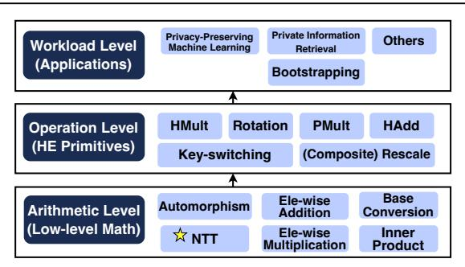

Fig. 1: CKKS Computational Hierarchy.

and outer parts of the NTT. Furthermore, we uncover critical performance bottlenecks at the operation level, specifically targeting the inefficiencies in cross-polynomial operations and PMAC operations that current solutions fail to address.

- We present a fine-grained, register-level data access strategy to alleviate SMEM-related pipeline stalls. We propose a structured coalescing scheme to resolve GMEM-induced stalls. Additionally, we devise kernel co-optimizations and a ciphertext-reuse PMAC to overcome the efficiency barriers inherent in cross-polynomial and CRPMAC operations.
- Through detailed evaluation, we demonstrate HyperDrive 's effectiveness, quantifying significant performance gains from low-level kernels to end-to-end workloads.

#### II. BACKGROUND

# A. CKKS Overview

CKKS is a representative FHE scheme for approximate arithmetic [12]. It encodes a vector of complex numbers into a plaintext polynomial  $m \in \mathcal{R}_Q = \mathbb{Z}_Q[X]/\langle X^N + 1 \rangle$ , where Qis the ciphertext modulus and N is the polynomial degree. A ciphertext is represented as a tuple of polynomials  $(c_0, c_1) \in$  $\mathcal{R}_O^2$ , which satisfies the decryption relation  $c_0 + s \cdot c_1 = m + e$ . Here, s is the secret key and e is a small encryption noise that ensures security but limits the depth of computation.

An end-to-end CKKS-based system stack can be decomposed into three hierarchical levels, as illustrated in Fig. 1. The underlying arithmetic primitives serve as the building blocks for CKKS operations, which subsequently compose the toplevel workloads. The following subsections briefly introduce CKKS arithmetic, operations and bootstrapping; for formal definitions, please refer to [10]-[12], [20].

# Algorithm 1 GPU-Efficient Hierarchical NTT Decomposition [5] **Input:** Polynomial $a(x) \in \mathbb{Z}_q[x]/(x^N+1)$ with coefficient vector $\mathbf{a} \in \mathbb{Z}_q^N$ , where $N=N_1\cdot N_2,\ N_1=64\cdot N_{13}$ and $N_2=64\cdot N_{23}$ ;

```
Twiddle factor vectors \boldsymbol{\zeta}_n \in \mathbb{Z}_q for n \in \{64, N_{13}, N_{23}, N_1, N_2, N, 2N\};

Twiddle factor vectors \boldsymbol{W}_{N_1}, \boldsymbol{W}_{N_2}, \boldsymbol{W}_N \in \mathbb{Z}_q^N defined by entries [\boldsymbol{W}_{N_1}]_{i,j,k,l} = \omega_{N_1}^{ij} [\boldsymbol{W}_{N_2}]_{i,j,k,l} = \omega_{N_2}^{kl} and [\boldsymbol{W}_N]_{n_1,n_2} = \omega_{N_1}^{n_1,n_2}.
       for indices i, k \in [0,64), j \in [0,N_{13}), l \in [0,N_{23}), n_1 \in [0,N_1), and
       n_2 \in [0, N_2).
Output: \bar{\mathbf{a}} = \text{NTT}(\mathbf{a}) \in \mathbb{Z}_a^N, the transformed coefficient vector.

 1: a ← GMEM-Load GMEM
                                                                                                        ▶ Parallel load a across blocks
 2: \mathbf{a} \leftarrow \mathbf{a} \odot \boldsymbol{\zeta}_{2N}[1:N]
                                                                                                         ⊳ Negacyclic convolution [32]
 3: SMEM \leftarrow \mathbf{a}
                                                                                                          ⊳ — Inner-NTT (Stage 1) —
  4: for j \in [0, N_{13}), k \in [0, 64), l \in [0, N_{23}) do
  5:
                \mathbf{u} \leftarrow \texttt{SMEM}[:,j,k,l]
  6:
7:
                \mathbf{v} \leftarrow \mathrm{NTT}_{64}(\mathbf{u}, \boldsymbol{\zeta}_{64})

    Can be accelerated by Tensor Cores

                \texttt{SMEM}[:,j,k,l] \gets
 8: d ← SMEM
9: \mathbf{d} \leftarrow \mathbf{d} \odot \mathbf{W}_{N_1}
10: \mathbf{d} \leftarrow \operatorname{Permute}(\mathbf{d}, \dim_0 \leftrightarrow \dim_1)

11: for i \in [0, 64), k \in [0, 64), l \in [0, N_{23}) do
12: \mathbf{c}[:,i,k,l] \leftarrow \text{NTT}_{N_{13}}(\mathbf{d}[:,i,k,l],\boldsymbol{\zeta}_{N_{13}})
13: \mathbf{c} \leftarrow \mathbf{c} \odot \mathbf{W}_N
                                                                                 \rightharpoonup Outer twiddle factors across N_1 and N_2
14: \mathbf{c} \leftarrow \operatorname{Permute}(\mathbf{c}, (\dim_0, \dim_1) \leftrightarrow (\dim_2, \dim_3))
15: \operatorname{GMEM} \xleftarrow{\operatorname{GMEM-Store}} \mathbf{c}

⊳ Global transpose

16: SMEM ←GMEM-Load C
                                                                                   \rightharpoonup Parallel load intermediate {\bf c} into SMEM
                                                                                                          ▷ — Inner-NTT (Stage 2) —
 17: for j \in [0, N_{23}), k \in [0, N_{13}), l \in [0, 64) do
             \mathbf{u} \leftarrow \text{SMEM}[:, j, k, l]

\mathbf{v} \leftarrow \text{NTT}_{64}(\mathbf{u}, \boldsymbol{\zeta}_{64})
                                                                                         > Can be accelerated by Tensor Cores
 20:
                 \texttt{SMEM}[:,j,k,l] \leftarrow
21: b ← SMEM
22: \mathbf{b} \leftarrow \mathbf{b} \odot \mathbf{W}_{N_2}
23: \mathbf{b} \leftarrow \text{Permute}(\mathbf{b}, \dim_0 \leftrightarrow \dim_1)
```

# B. CKKS Arithmetic

26: GMEM ← GMEM-Store ā

24: for  $i \in [0, 64), k \in [0, N_{13}), l \in [0, 64)$  do  $\mathbf{\bar{a}}[:,i,k,l] \leftarrow \text{NTT}_{N_{23}}(\mathbf{b}[:,i,k,l],\boldsymbol{\zeta}_{N_{23}})$ 

In this paper, we focus on RNS-CKKS [11], the widely adopted variant of CKKS that represents the large modulus Q (or  $Q_L$ ) using the Residue Number System (RNS) [17]. Specifically,  $Q_L$  is decomposed into L smaller moduli  $q_i$ , and RNS polynomials are defined over  $\mathcal{R}_{Q_L}$ . To efficiently support high-level operations, CKKS arithmetic can be categorized into the following three types based on data flow.

1) Poly-Wise Arithmetic: Poly-wise arithmetic includes NTT and automorphism (auto). Its four steps are: (a) columnwise NTTs on the data matrix, (b) element-wise twiddle factor multiplication (EWMult, also known as Hadamard product), (c) a matrix transpose to reorder the data, and (d) rowwise NTTs on the transposed matrix. In our approach, we recursively apply this 4-step method, as shown in Alg. 1. To optimize its execution on a GPU, we partition the computation into an *Inner-NTT* (NTT-Inner-part) and an *Outer-NTT* (NTT-Outer-part), which are defined as follows:

- *Inner-NTT*: The base case of the recursive NTT algorithm: a radix-64 NTT executed entirely on-chip, involving SMEM reads and writes.
- Outer-NTT: All other operations in NTT, excluding the


Fig. 2: Computation and data flow across the key steps (BConv, NTT, and IP) in KeySwitch.

*Inner-NTT*, comprise the EWMult, recursive calls on subproblems (*Residual NTTs*), the transpose, and GMEM/on-chip data transfers.

The base radix of 64 is selected to match the FP64-TCU's  $8 \times 4 \times 8$  Matrix Multiply-Accumulate (MMA) dimension, which facilitates an efficient  $8 \times 8$  decomposition. This provides a versatile foundation for handling the large polynomial degrees (N) common in FHE.

- 2) Element-Wise Arithmetic (EWArith): EWArith includes modular element-wise addition (EWAdd or  $\oplus$ ) and multiplication (EWMult or  $\odot$ ). In the NTT domain, polynomial addition and multiplication are reduced to EWAdd and EWMult.
- 3) Cross-Poly Arithmetic: Cross-poly arithmetic includes RNS base conversion (BConv) and inner product (IP): **BConv** transforms RNS polynomials between different RNS bases, enabling base extension. BConv must be performed in the non-NTT domain. RNS-CKKS adopts the fast BConv [6], which consists of two stages: EWMult (BConv<sub>1</sub>) and matrix multiplication (BConv<sub>2</sub>) (see Fig. 2). **IP** performs EWMult followed by accumulation across  $\beta$  digits, as shown in Fig. 2.

#### C. CKKS Operations

Given two ciphertexts at level  $\ell$ ,  $\operatorname{ct}_0$  and  $\operatorname{ct}_1$  in  $\mathcal{R}^2_{Q_\ell}$ , the following are the common CKKS evaluation operations (outputs are also in  $\mathcal{R}^2_{Q_\ell}$ ): **Homomorphic Addition (HAdd)** performs component-wise addition of two ciphertexts. **Homomorphic Multiplication (HMult)** multiplies two ciphertexts and relinearizes the result using Key-switching (KeySwitch). **Plaintext Multiplication (PMult)** multiplies a plaintext polynomial with a ciphertext. **Plaintext-Multiply-and-Add (PMAC)** combines PMult and HAdd to compute a linear combination of ciphertexts with plaintext coefficients. **Rotation (Rot)** applies a Frobenius automorphism to rotate packed slots in the ciphertext, followed by KeySwitch. **Rescaling (Rescale)** is needed after HMult and PMult to maintain fixed-point precision by reducing the modulus. To better manage precision loss, we adopt the composite scaling technique as proposed in [1], [25].

**Key-switching (KeySwitch)** is a procedure that converts a ciphertext from one secret key to another without decryption, which is essential for relinearizing ciphertexts after HMULT and restoring the key basis during Rots. We adopt the hybrid KeySwitch from [20] for its balance of computational efficiency and storage overhead. The process first decomposes the final component of the ciphertext in  $\mathcal{R}_{Q_\ell}$  into  $\beta$  digits.

A **ModUp** operation (involving NTT and BConv) then lifts these digits into the extended ring  $\mathcal{R}_{PQ_\ell}$ . The lifted values are multiplied with the evaluation key (**evk**) in  $\mathcal{R}_{PQ_\ell}^{2\times\beta}$  via an **IP**, and is then brought back to  $\mathcal{R}_{Q_\ell}^2$  using **ModDown**, which involves NTT and BConv. Finally, this output is added to the remaining components of the original ciphertext. Fig. 2 shows the key steps prior to ModDown. Due to its high computational complexity and frequent execution, KeySwitch constitutes the primary performance bottleneck at the CKKS operation level.

# D. CKKS Bootstrapping

As a foundational workload level operation, bootstrapping enables FHE by refreshing a ciphertext's level budget. Despite its necessity, this process is computationally intensive, driving extensive optimization research [7], [8], [10], [20]. The key components of CKKS bootstrapping are summarized below.

- Modulus Raising restores the ciphertext to the full modulus but introduces a residual term into the message. Subsequent bootstrapping steps aim to eliminate this residual.
- Coefficients-to-Slots (CtS) and Slots-to-Coefficients (StC) homomorphically perform encoding and decoding, respectively. While a naive implementation requires O(N) Rots for plaintext-ciphertext matrix-vector multiplication (PCMM), the Baby-Step/Giant-Step (BSGS) algorithm [18] reduces this complexity to  $O(\sqrt{N})$ . In addition, hoisting is applied to reuse the ModUp output across baby-step Rots (BS-Rot), reducing the BS-Rot overhead. [7] further introduced *double-hoisting* to reduce the number of ModDowns in BSGS PCMM. While these techniques significantly reduce the Rot overhead, they do not decrease the number of PMult and HAdd (PMAC). At high levels  $\ell$ , PMACs may dominate cost.
- Modular Reduction eliminates the residual term by homomorphically evaluating an approximate polynomial.

# E. GPU Memory Overheads in Kernel Switching.

While GPUs provide massive parallelism for FHE workloads, their conventional discrete kernel execution model introduces severe memory bottlenecks. Specifically, because onchip storage (e.g., registers and SMEM) is volatile across kernel boundaries, intermediate data must be written back to slow, off-chip global memory upon kernel completion and re-fetched by subsequent dependent kernels. Given the massive polynomial sizes in CKKS (e.g.,  $N=2^{16}$ ) and the deep pipelines of FHE operations, this repeated off-chip

TABLE II: Key GPU warp states for performance analysis.

| Warp State         | Description                                                                                                                    |
|--------------------|--------------------------------------------------------------------------------------------------------------------------------|
|                    | Stall Long Scoreboard Stalled on a data dependency from a long-latency memory<br>operation, such as a GMEM access.             |
| Stall LG Throttle  | Stalled as the instruction queue for Global/Local (LG) memory<br>is full, often from intense GMEM accesses.                    |
|                    | Stall Short Scoreboard Stalled on a data dependency from a short-latency memory<br>I/O instruction (e.g., SMEM access).        |
| Stall MIO Throttle | Stalled as the memory I/O instruction queue is full, often from<br>intense SMEM access.                                        |
| Compute            | Waits for an instruction to complete on a functional unit (e.g.,<br>FPU, ALU).                                                 |
| Eligible           | Ready to execute, waiting in a pool of ready warps from which<br>the scheduler selects one to issue an instruction each cycle. |

data traversal drastically diminishes arithmetic intensity and quickly saturates memory bandwidth. Consequently, avoiding these expensive inter-kernel memory transfers by keeping intermediate FHE data on-chip motivates maximize kernel fusion, a pivotal technique for GPU-based FHE acceleration.

# *F. Warp Scheduling and Pipeline Stalls in GPU*

To maximize throughput, GPU schedulers hide latency from memory access and instruction dependencies by rapidly switching execution among concurrent warps. However, when pipeline stalls become excessive, the scheduler may fail to find an eligible warp, leading to underutilization of the SM's computational units. The primary types of these stalls, which are the main focus of our performance analysis, are detailed in Table II. Since the number of concurrent warps is constrained by on-chip resources (e.g., register files, shared memory), identifying and minimizing the root causes of these pipeline stalls is critical for achieving high performance.

# III. MOTIVATION

To characterize the performance bottlenecks of TCUaccelerated CKKS, we reproduce the WarpDrive design [14], a representative TCU-based GPU FHE solution, including its 4-step NTT decomposition and warp level TCU mapping. Moreover, to analyze the FP64 TCU execution path in a controlled manner, we incorporate Neo's use of FP64- TCU [21] and implement an FP64-TCU-NTT variant. We implement CKKS evaluation operators and bootstrapping by following the algorithms in [7]. We additionally incorporate WarpDrive's parallelism-enhanced kernel design [14] and the intra- and inter-operation fusion techniques from [22], so that the baseline reflects a competitive GPU FHE implementation.

To identify the root causes of the remaining inefficiencies, we conduct systematic profiling using NVIDIA Nsight Compute [37], collecting kernel level time breakdowns and microarchitectural metrics for arithmetic kernels and end-toend workflows. Based on these measurements, the rest of this section presents a three-part bottleneck analysis that focuses on the *Inner-NTT*, the *Outer-NTT*, and FHE operations.

# *A. Inefficiency within the Tensor-Core-Based NTT-Inner-Part*

First, we analyze the existing TCU-based NTT acceleration schemes for FHE and find that these approaches still suffer from various efficiency issues.

On one hand, TensorFHE [16] and WarpDrive [14] use the INT8 data type. Since TCUs lack native support for the


Fig. 3: INT8-TCU-NTT (N = 2 <sup>16</sup>) latency (µs) breakdown. (The number of sets is 1 and 2, each comprising 36 limbs.)


Fig. 4: FP64-TCU-NTT (N = 2<sup>16</sup> , #limbs = 36) execution cycles and warp states proportion breakdown.

wide integer multiplications (e.g., 32×32-bit) required by NTT, these methods must rely on a costly multi-precision arithmetic (MPA) pipeline, including bit-splitting, an increased number of arithmetic operations, and bit-merging. Our analysis quantifies this inefficiency, showing that the MPA pipeline overhead is 26% ∼ 28% of the total computation time (Fig. 3).

On the other hand, Neo [21] utilizes FP64 TCUs to largely reduce MPA pipeline overhead. However, current FP64-TCU-NTT solutions still face severe SMEM access bottlenecks. Our profiling of the 32-bit wordsize, FP64-based NTT implementation (Fig. 4) reveals substantial inefficiencies. A mismatch between current NTT acceleration methods and hardware architecture leads to frequent data movement to and from SMEM during *Inner-NTT* (detailed in §IV-B), resulting in a high fraction of stall cycles due to SMEM access. Specifically, the proportion of stalled cycles reaches 77% and 72% in NTT stage-1 and stage-2, respectively, while stalls attributable to shared memory contribute 32% and 48% of these stalls.

# *B. Bottlenecks in NTT-Outer-Part*

In GPU kernels, a single uncached GMEM access incurs several hundred clock cycles of latency [35]. Therefore, reducing the GMEM access frequency via coalescing is a crucial optimization. However, two main issues limit the effectiveness of coalesced accesses in the NTT context.

One issue is that, due to algorithmic constraints, the 4-step NTT requires processing the column-wise inner NTTs before the row-wise ones, resulting in inherently non-contiguous data access. To enable coalesced GMEM accesses, it is common to process multiple sets (pads) of inner NTTs within a single thread block [13], [14]. Nevertheless, to balance per-block workload and maximize parallelism, the number of innerlayer NTTs (pads) processed within one block is restricted, preventing full utilization of the coalesced GMEM access.

Another challenge is that NTT requires recurrent accesses to distinct twiddle factors across various stages, including negacyclic convolution [32], Hadamard products, and *Inner-NTTs*. Previous approaches generally lacked detailed designs for the memory access patterns associated with these operations.

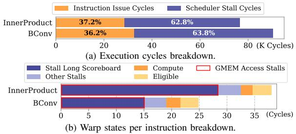

Fig. 5: Typical cross-poly kernels ( $N=2^{16}, L=28, \beta=2$ ) execution cycles and warp states proportion breakdown.

As shown in Fig. 4, the baseline NTT implementation is significantly bottlenecked by GMEM-related stalls, comprising 45.9% and 22.6% of warp cycles in stages 1 and 2, respectively. The higher stall rate in stage 1 is primarily attributed to the outer-layer Hadamard product. This inefficiency is compounded by the hardware requirement of 128-byte transactions (32 words) to achieve full bandwidth utilization.

#### C. Constraints in Operation Level Fusion

To analyze the operation-level bottleneck, we performed an execution time breakdown of the bootstrapping process (Fig. 6). Apart from NTT, cross-poly and PMAC-related kernels also represent performance bottlenecks in FHE workloads. These issues can become even more pronounced after NTT optimization. Our CKKS bootstrapping implementation (Fig. 6) employs the intra- and inter-operation fusion techniques from [22]. Although kernel fusion is a well-established strategy to mitigate the overhead of sequential execution in FHE workloads, current methods still possess significant limitations.

For **cross-poly kernels**, we consider this aspect to be the main challenge in kernel fusion optimization. Cross-poly kernels cannot be directly fused with the NTT kernel because NTT requires processing multiple *pads* of a single polynomial within one block, while cross-poly kernels need to handle multiple polynomials simultaneously. This leads to a significant increase in per-block data dimensions, causing resource constraints and reduced parallelism. Therefore, it is challenging to co-optimize these kernels with the NTT.

However, the cross-poly kernels have large input and output dimensions, as shown in Fig. 2. We analyze the stall behavior of the BConv (in ModUp) and IP kernels. As shown in Fig. 5, the proportion of stalls attributed to the "stall long scoreboard" (caused by off-chip memory accesses) reached 60.6% for BConv and 74.6% for the IP kernel, respectively.

For **PMAC-related kernels**, prior work [22] identifies them as bottlenecks in CtS/StC stages of bootstrapping. To address this, a batched PMAC design was proposed for BSGS PCMM, as shown in Fig. 7, which reduces GMEM traffic for intermediate results. However, their kernel fusion approach still repeatedly loads the same baby-step ciphertext in each PMAC stage, introducing redundant GMEM reads.

#### D. Opportunities and Challenges

**Root Causes of Performance Inefficiencies.** These performance bottlenecks are multifaceted. (i) For *Inner-NTT*,


Fig. 6: CKKS bootstrapping execution time breakdown on A100 GPU  $(N=2^{16},L=48,\beta=3)$ .

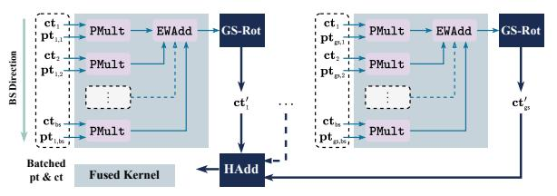

Fig. 7: Batched PMAC for BSGS PCMM from [22] (BS phase omitted). Here, the number of non-zero diagonals is  $bs \times gs$ . Ciphertexts  $ct_i$  are outputs from BS-Rots, ciphertexts  $ct'_j$  are inputs to giant-step Rots (GS-Rots), and plaintexts  $pt_{i,j}$  are encoded diagonals for  $i = 1, \ldots, bs$  and  $j = 1, \ldots, gs$ .

inefficiencies arise primarily from suboptimal implementation patterns that fail to fully exploit the underlying register-level potential of Tensor Cores. (ii) For *Outer-NTT*, the performance bottlenecks result from a structural conflict between the algorithmic logic and the requirements for coalesced memory access, alongside simplistic handling of twiddle factors. (iii) At the operation level, these critical constraints on kernel fusion originate from a fundamental dimension conflict between NTT and cross-polynomial arithmetic in FHE, primarily due to a suboptimal computation order that fails to exploit the temporal locality of baby-step ciphertexts across giant-step outputs.

Hierarchical Optimization Opportunities. The preceding analysis illuminates three hierarchical opportunities for a comprehensive solution. (i) For *Inner-NTT*, there is a clear opportunity to leverage FP64 TCUs to eliminate multi-precision arithmetic (MPA) pipeline overhead and minimize shared memory (SMEM) access. (ii) For *Outer-NTT*, we identify an opportunity for a memory-friendly design with row-major access patterns to maximize global memory (GMEM) bandwidth. (iii) At the operation level, the primary opportunity lies in breaking down the barriers to co-optimizing memory-bound cross-poly kernels and enabling ciphertext reuse in PMAC by reordering the Baby-Step/Giant-Step (BSGS) workflow.

Underlying Technical Challenges. Realizing these opportunities requires overcoming significant hurdles. (i) Moving beyond textbook GEMM methods requires reverse-engineering the thread-mapping of TCU fragments to execute the entire Inner-NTT, including transpositions, strictly within registers. (ii) Transitioning to a row-major NTT faces a structural conflict between NTT logic and the hardware's coalesced memory constraints, further complicated by the divergent indexing logic of various twiddle factors and the system-level consistency challenges introduced by transposed storage. (iii) At the operation level, a fundamental dimensional mismatch exists: NTT kernels are designed for "intra-polynomial" processing, whereas BConv and IP kernels operate "interpolynomial." This structural discrepancy, coupled with severe resource constraints, means that direct kernel fusion risks


Fig. 8: The hierarchical memory optimization framework of HyperDrive, including glossaries of optimizations and terminologies.

exhausting hardware resources and reducing GPU occupancy.

To systematically address these hierarchical bottlenecks and architectural and algorithmic challenges, we propose a holistic solution, **HyperDrive**, which integrates the aforementioned optimizations to maximize GPU efficiency for FHE. Details of this solution are provided in the following section.

#### IV. HYPERDRIVE CORE DESIGN

#### A. Design Overview

To systematically dismantle multi-level memory bottlenecks in GPU-based FHE, we propose HyperDrive, a hierarchical memory optimization strategy. As illustrated in Fig. 8, our core design targets inefficiencies across three levels, comprising both hardware-specific and generally applicable techniques. (i) First, specifically tailored for TCU-based execution, the Inner-NTT optimization (Fig. 8A) mitigates frequent SMEM buffer swapping by introducing a register-resident pipeline that combines Thread-Level Memory Optimization (TLMOP) and Transpose Optimization (TransOP). In contrast, the subsequent optimizations are generalizable to both TCU and **CUDA Core.** (ii) For the *Outer-NTT* (Fig. 8B), we propose a structured coalescing design leveraging a Row-Major NTT scheme (RowMaj) and Twiddle Factor access Optimization (TFOP) to transform strided memory transactions into fully coalesced GMEM accesses. (iii) Finally, at the operation level (Fig. 8C), the Row-Major layout fundamentally enables Memory-Aware Kernel Co-optimization (COOP). By fusing cross-polynomial operations with the NTT, COOP keeps highdimensional intermediate data resident on-chip, effectively hiding memory latency and avoiding off-chip data transfers. Compared to state-of-the-art designs such as WarpDrive [14], HyperDrive offers a more comprehensive hierarchical solution that bridges the gap between hardware arithmetic and memory efficiency, with key distinctions summarized in Table III. Guided by this framework, the following sections provide a deep dive into our core contributions.

TABLE III: Design Comparison: WarpDrive [14] vs. HyperDrive.

| Feature                                                                        | WarpDrive [14]                                                                                               | HyperDrive (Ours)                                                                                       |
|--------------------------------------------------------------------------------|--------------------------------------------------------------------------------------------------------------|---------------------------------------------------------------------------------------------------------|
| TCU Precision Inner Transpose Outer NTT Access Fusion Scope Optimization Scope | INT8 (High MPA overhead)<br>Explicit<br>Column-Major (Strided)<br>Element-wise Only<br>Exclude Bootstrapping | FP64 (Low MPA cost)<br>Implicit<br>Row-Major (Coalesced)<br>Include Cross-poly<br>Include Bootstrapping |

#### B. A Register-Based Data Access Method for Inner-NTT

To facilitate targeted optimization, we partition the NTT computation into the inner part (*Inner-NTT*) and the outer part (*Outer-NTT*), as illustrated in Alg. 1. The *Inner-NTT* not only carries the main computational load but also requires frequent data synchronization, resulting in intensive SMEM access. This subsection introduces an FP64-TCU-based *Inner-NTT* scheme designed to minimize this SMEM overhead.

1) NTT Decomposition for TCUs: We compute the NTT by iteratively applying the 4-step NTT algorithm, recasting the innermost small-dimension NTTs as MMA operations. For commonly used N values in CKKS ( $2^{13}$  to  $2^{16}$ ), computing a single stage within an individual block is impractical due to parallelism requirements and limited on-chip resources. We decompose each NTT into two stages and distribute the computation across multiple blocks. To balance the workload between stages, we ensure  $N_1$  and  $N_2$  are as close as possible. To further refine the decomposition granularity, FP64 MMA operates on matrices of dimension 848. For NTTs from  $2^{13}$ to  $2^{16}$ , decomposition follows the form:  $N_1 = 88N_{13}, N_2 =$  $88N_{23}$ , where the pairs  $(N_{13}, N_{23})$  are (2, 1), (4, 1), (2, 4),and (4,4) for  $N=2^{13},2^{14},2^{15}$ , and  $2^{16}$ , respectively. The radix-64 (88) component is designated the *Inner-NTT* and processed using Tensor Cores.

This approach leverages high-throughput TCUs while maintaining  $O(N \log N)$  complexity. By iterating the 4-step decomposition t times until reaching a constant base size k ( $N = k^{t+1}$ ), the complexity of Inner-NTTs ( $C_{NTT} = Nk(t+1)$ ) and Hadamard product ( $C_{HP} = t \cdot O(N)$ ) both scale as  $O(N \log N)$ . Consequently, this recursive decomposition en-

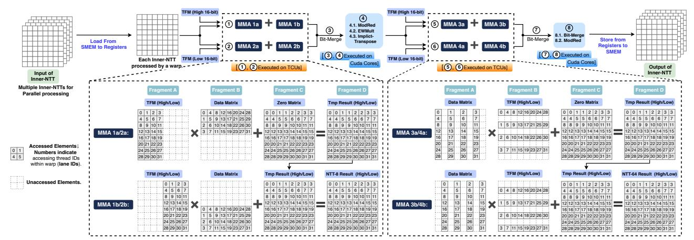

Fig. 9: Execution flow of an MMA-based Inner-NTT with lane ID to matrix element mapping (numbers in matrices indicate lane IDs).

sures that the overall computational cost remains  $O(N \log N)$ .

Processing the 32-bit word size on FP64-TCU also requires an MPA scheme. FP64 supports up to 53 bits of precision. For a 32-bit multiplication, we need to split one multiplicand into two parts (each 16-bit), multiply each by the other multiplicand (32-bit), and finally perform bit merging on the results. This produces intermediate products that do not exceed 48 bits. Because an FP64 Tensor Core processes a single  $8 \times 4 \times 8$  MMA operation per instruction, each resulting value is an accumulation of 8 products. After accumulation, the results remain within FP64's precision range, and the final bit merging can be accomplished using the INT64 type. Thus, a single 32-bit multiplication requires only two FP64 multiplications, significantly reducing MPA overhead compared to implementations using the INT8 type (16 multiplications) [14], [16].

- 2) Limitation of Warp-Level Data Access: Relying on warp-level data loads and stores to match the warp-wide execution of Tensor Core MMA operations, prior work [21] suffers from excessive shared memory accesses (§III-A). Since Inner-NTT involves processing two inner stages of radix-8 NTT computations along with MPA operations, the intermediate processing steps become quite intensive. We present an overview of Inner-NTT in Fig. 8(A). When using auto-filled fragments, a single Inner-NTT (for N=65,536) generates 6.13 MB of shared memory traffic. The total shared memory access for a single KeySwitch can reach several gigabytes.
- *3) Thread-Level Memory Optimization (TLMOP)*: To improve the performance of NTT, we design a **thread-level** *Inner-NTT* acceleration scheme that minimizes memory access by analyzing and leveraging the data layout of FP64 fragments.

**Data Layout Analysis.** In HyperDrive, we conduct the analysis of the data layout for FP64 tensor fragments. To minimize memory access, it is necessary to replace the automatic, SMEM-based fragment filling with a fine-grained, register-based one. Our analysis of the matrix data of MMA operations reveals how data for a single MMA computation is distributed across 32 threads. With FP64 precision, the supported matrix dimension for the MMA operation is 848, and the data distributions for its inputs and outputs are shown in Fig. 9. Each thread is assigned one data item from Fragment

A and Fragment B, and two data items from Fragment C. The computation results in Fragment D are also evenly distributed among all threads.

**Computation Flow.** Based on the analyzed data layout, we design the computational flow and lane IDs mapping for the radix-64 Inner-NTT, as illustrated in Fig. 9. In this scheme, each 64-point Inner-NTT computation is executed by a single warp. The warp first performs two MMA computations (MMA 1 and 2), multiplying the data matrix with the high and low 16-bit components of the twiddle factor matrix (TFM), respectively. This process effectively completes eight radix-8 NTT computations. Subsequently, bit-merging (Bit-Merge), modular reduction (ModRed), and element-wise multiplication (EWMult) are executed sequentially. The results then undergo two additional MMA computations (MMA 3 and 4). Finally, Bit-Merge and ModRed operations complete one radix-64 NTT computation. Fig. 9 depicts the data distribution across each warp during the entire process. The data distribution for MMA 2 is the same as that for MMA 1, and the distribution for MMA 4 is the same as for MMA 3. As shown in Fig. 8(A), SMEM is accessed only when reading the global input and writing the final result, with no intermediate SMEM operations required throughout the computation.

**Data Movement.** NTT operations exhibit strong data dependencies, necessitating cross-thread data exchange even within the *Inner-NTT*. In our TCU-based approach, the MMA operations involve transfers of data from Fragments A and B to Fragment D across threads. Leveraging TCU-specific cross-thread exchange mechanisms instead of SMEM-based transfers enables a completely SMEM-access-free *Inner-NTT*.

**Multi-Inner-NTT Processing.** Within a full NTT computation, multiple *Inner-NTT* operations execute concurrently within a single GPU block. To balance parallelism with onchip resource utilization, we employ a hybrid strategy that combines parallel execution across multiple warps and blocks and serial looping within each warp.

4) Transpose Optimization in Inner-NTT (TransOP): The Inner-NTT also employs the 4-step NTT algorithm, which includes a transpose operation. Conventionally, the transpose is a memory-bound operation, requiring a full read-write cycle


Fig. 10: Comparison of column-major and row-major NTT, with data for one thread block (e.g., the first) highlighted in yellow.

on SMEM. Our design utilizes an implicit transpose, avoiding extra memory access. We leverage the distinct distributions of Fragments A, B, D across threads to implement the transpose using MMA operations. Specifically, we treat the data matrix as Fragment B during MMA 1/2, and as Fragment A during MMA 3/4. Furthermore, within MMA 3a/4a we select columns 1, 3, 5, 7 for Fragment A, while in MMA 3b/4b we select columns 2, 4, 6, 8 (Fig. 9). This approach allows us to proceed directly from the results of MMA 1/2 to MMA 3/4 without exchanging data with other threads. Only intermediate operations like Bit-Merge on thread-local data are required.

While an explicit transpose in a basic scheme (which already necessitates multiple transposes) doesn't increase SMEM accesses, using SMEM for an explicit transpose in our memory-minimizing *Inner-NTT* scheme would double SMEM traffic, making the implicit transpose critically important.

#### C. A Structured Coalescing Design for Outer-NTT

1) Row-Major NTT (RowMaj): In the 4-step NTT, the polynomial is viewed as a 2D array, and the inner operations are first performed column-wise. This approach dictates a column-major memory access pattern for 3/4 of GMEM operations, which is highly inefficient because it prevents memory coalescing, causing severe bandwidth underutilization and pipeline stalls. To address this, we introduce a data layout transformation that enables an efficient computational scheme.

Pre-transposed Format and Its System-wide Impact. To enable our solution, relevant data—including ciphertexts, keys, and plaintexts—are converted to and maintained in a pre-transposed format throughout their lifecycle on the GPU. This format only modifies the data's memory layout, not its numerical values. Throughout NTT/INTT operations, the pre-transposed format is maintained for both input and output data. The Auto kernel, which performs index permutations, maintains fully coalesced input reads, while its correspondingly adjusted output benefits from improved spatial locality, providing a modest performance improvement. Other kernels that perform element-wise operations are unaffected, as their logic is independent of the data's two-dimensional layout.

**Preprocessing and Postprocessing.** The overhead introduced by converting data to and from the pre-transposed format is negligible for two key reasons. First, the process is achieved at zero cost by simply adjusting the output layout during polynomial operations, rather than executing a separate transpose kernel. Second, and critically, this operation

is performed during encoding and decoding on single-limb data (specifically, before RNS decomposition and after RNS reconstruction). This avoids the high cost of transposing the full, multi-limb RNS representation.

The Row-Major NTT Scheme. This scheme directly addresses the memory access bottleneck by changing the data access to match the pre-transposed data layout. By pre-transposing the polynomial, what were originally columns can now be accessed as rows. This allows the 3/4 of GMEM accesses to become row-major, enabling fully coalesced memory access and resolving the critical performance bottleneck. As illustrated in Fig. 10, the required transpose step is strategically integrated into the write-back stage of Kernel 1, thereby avoiding the overhead of a standalone kernel launch and ensuring that data fetching remains consistently row-major.

2) Twiddle Factor Access Optimization (TFOP): NTT uses distinct twiddle factors for operations like negacyclic convolution and the Hadamard product. Because these factors depend on application-specific moduli, they cannot be statically hard-coded. Instead, they must be generated during initialization and loaded from off-chip memory at runtime, necessitating specialized access strategies for different twiddle factor types.

**Negacyclic Convolution.** Negacyclic convolution involves an element-wise multiplication with twiddle factors before the NTT and after the INTT. The twiddle factors needed for this step correspond to the indices of the NTT input/INTT output. In row-major NTT, these factors are read sequentially to ensure coalesced memory access. For the INTT, we eliminate a modular multiplication by pre-computing the product of the twiddle factors and the scaling term  $(N^{-1} \mod q_i)$ .

Hadamard Product (Outer-Layer). The iterative 4-step NTT involves multiple Hadamard products (EWMult). The outermost Hadamard product occurs between Kernel 1 and Kernel 2. Since the twiddle factor indices for this stage deviate from the data indices, we pre-order these factors (designated TF-XY) to facilitate coalesced memory access. Depending on the layout, this EWMult is fused into either the end of Kernel 1 (Col-Major NTT) or the start of Kernel 2 (Row-Major NTT) to ensure alignment with row-wise access patterns.

**Hadamard Product (Inner-Layer).** For multiple inner pads processed within a single block, the inner Hadamard product involves identical operations where the twiddle factors can be reused. Given that  $N_1$  and  $N_2$  are allocated to similar magnitudes, each block stores at most 256 data elements for this operation when  $N \leq 2^{16}$ . These elements, named TF256, are stored in SMEM to facilitate reuse across threads.

**Twiddle Factor Matrix (TFM).** In the *Inner-NTT*, the radix-8 NTT is performed using matrix multiplication, which requires an  $8 \times 8$  matrix of twiddle factors. This matrix is reusable across warps and shared between the first and second radix-8 NTTs. Therefore, we also store this matrix in SMEM.

**Residual NTT.** Twiddle factors are also from TF256.

Overall, the basic NTT kernels suffer from inefficient memory access, featuring 7 sparse and 4 limited-locality GMEM accesses, versus only 1 coalesced GMEM access. In contrast, after adopting row-major NTT and our memory-

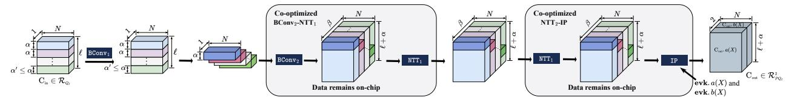

Fig. 11: Computation flow and data layout across key steps (co-optimized BConv, NTT, and IP) in KeySwitch.

friendly twiddle factor access strategy, a single NTT features just 1 limited-locality access, while the remaining 9 are fully coalesced. The current twiddle factor access strategy requires storing, per modulus: 2N factors for negacyclic convolution (NTT/INTT), N for the Hadamard product (outer layer), and 256 each for TF256 and TFM. This results in a total GMEM consumption of only 27MB across 36 layers, with each thread block occupying 2KB of SMEM during computation.

- D. Memory-Aware Kernel Co-optimization Strategies (COOP)
  In this section, we present the co-optimization strategies applied to cross-poly operations and the NTT.
- 1) Bridging Cross-Poly Operations and NTT: As shown in Fig. 2, both BConv and IP are cross-poly operations. Driven by the high dimensionality of the data, these kernels exhibit significantly higher memory access demands than others.

In previous works [14], [22], [47], cross-poly operations and NTT kernels are typically separate kernels instead of being fused, as such fusion limits parallelism and significantly increases per-block computation and data loading. The core issue is conflicting data access patterns. A conventional columnmajor NTT accesses multiple data segments (pads) within a single polynomial. In contrast, cross-polynomial operations require data exchange across multiple polynomials, expanding the access footprint from a 2D space  $(N_1 \times \#pad)$  to a 3D one  $(N_1 \times \#pad \times \#poly)$ . This 3D access pattern creates a significant bottleneck: it severely constrains kernel launch configurations (grid/block sizes) and can cause a block's register and shared memory requirements to exceed SM capacity. Consequently, these resource and configuration constraints render kernel fusion impractical.

By eliminating the multi-pad constraint, a row-major NTT reduces per-block data dimensionality, thereby enabling kernel fusion. Leveraging this, we fuse ( $\texttt{BConv}_2 - \texttt{NTT}_1$ ) and ( $\texttt{NTT}_2 - \texttt{IP}$ ) into co-optimized kernels (Alg. 2 and 3). This strategy, illustrated in the dataflow diagram (Fig. 11), keeps intermediate results resident on-chip, eliminating the costly overhead of moving high-dimensional data between stages.

As shown in Alg. 2, the BConv reduction occurs over the  $\alpha'$  dimension (Line 6). By assigning each thread block to a single limb i, the intermediate coefficients are stored in SMEM and then processed by NTT Stage-1. This design avoids materializing the  $L+\alpha-\alpha'$  dimension in global memory, enabling a seamless on-chip pipeline. Similarly, Alg. 3 maintains intermediate NTT results in registers for immediate IP accumulation to further minimize off-chip data movement.

Additionally,  $BConv_1$  is fused with the preceding  $INTT_2$  (INTT<sub>2</sub>-BConv<sub>1</sub>). Fusing  $BConv_1$  and  $BConv_2$  is impractical because  $BConv_2$ 's matrix multiplication structure would cause

```
Algorithm 2 Co-optimized BConv Stage 2 and NTT Stage 1
```

```
Input: Decomposed Source Limbs: \mathbf{c}=\{c_{d,j,n_2,n_1}\in\mathbb{Z}_q\mid 0\leq d<\beta,0\leq d
                    j < \alpha'_d, 0 \le n_2 < N_2, 0 \le n_1 < N_1\},
\mathbf{BConv \ Matrix \ Elements: } \mathbf{b} = \{(b_{d,j,i} = \hat{q}_k \bmod q_i) \in \mathbb{Z}_{q_i} \mid 0 \le j < \alpha'_d, 0 \le i < \ell + \alpha - \alpha'_d), \text{ where } \alpha'_d \text{ is limb count of current digit } d.
Output: \tilde{\mathbf{c}} = \{\tilde{c}_{d,i,n_2,k_1} \in \mathbb{Z}_{q_i} \mid 0 \leq d < \beta, 0 \leq i < \ell + \alpha - \alpha_d, 0 \leq n_2 < N_2, 0 \leq k_1 < N_1 \}.
       1.
                   for d=0 to \beta-1 do
       2:
                                  for i=0 to (\ell+\alpha-\alpha')-1 do
      3:
                                                for n_2 = 0 to N_2 - 1 do
                                                                                                                                                                                                > Processed by each Thread Block
                                                                                                             \triangleright — Stage 2 of BConv (GMEM \rightarrow Reg \rightarrow SMEM) –
         4:
5:
                                                                 for n_1 = 0 to N_1 - 1 do
                                                                              for j=0 to \alpha'-1 do
         6:
                                                                                            v_c \xleftarrow{\text{GMEM-Load}} c_{djn_2n_1}
         7:

                                                                                             v_b \xleftarrow{\text{GMEM-Load}} b_{dji}
         8:
                                                                              9:
      10:

    Store for reuse
    Store for reuse
    Store for reuse
    Store for reuse
    Store for reuse
    Store for reuse
    Store for reuse
    Store for reuse
    Store for reuse
    Store for reuse
    Store for reuse
    Store for reuse
    Store for reuse
    Store for reuse
    Store for reuse
    Store for reuse
    Store for reuse
    Store for reuse
    Store for reuse
    Store for reuse
    Store for reuse
    Store for reuse
    Store for reuse
    Store for reuse
    Store for reuse
    Store for reuse
    Store for reuse
    Store for reuse
    Store for reuse
    Store for reuse
    Store for reuse
    Store for reuse
    Store for reuse
    Store for reuse
    Store for reuse
    Store for reuse
    Store for reuse
    Store for reuse
    Store for reuse
    Store for reuse
    Store for reuse
    Store for reuse
    Store for reuse
    Store for reuse
    Store for reuse
    Store for reuse
    Store for reuse
    Store for reuse
    Store for reuse
    Store for reuse
    Store for reuse
    Store for reuse
    Store for reuse
    Store for reuse
    Store for reuse
    Store for reuse
    Store for reuse
    Store for reuse
    Store for reuse
    Store for reuse
    Store for reuse
    Store for reuse
    Store for reuse
    Store for reuse
    Store for reuse
    Store for reuse
    Store for reuse
    Store for reuse
    Store for reuse
    Store for reuse
    Store for reuse
    Store for reuse
    Store for reuse
    Store for reuse
    Store for reuse
    Store for reuse
    Store for reuse
    Store for reuse
    Store for reuse
    Store for reuse
    Store for reuse
    Store for reuse
    Store for reuse
    Store for reuse
    Store for reuse
    Store for reuse
    Store for reuse
    Store for reuse
    Store for reuse
    Store for reuse
    Store for reuse
    Store for reuse
    Store for reuse
    Store for reuse
    Store for reuse
    Store for reuse
    Store for reuse
    Store for reuse
    Store for reuse
    Store for reuse
    Store for reuse
    Store for reuse

                                                                                                                    \triangleright — Stage 1 of NTT (SMEM \rightarrow Reg \rightarrow GMEM) –
                                                                 for k_1 = 0 to N_1 - 1 do
     11
     12:
                                                                               res = 0
                                                                              for n_1 = 0 to N_1 - 1 do
     13:
                                                                                            v_s \xleftarrow{\text{SMEM-Load}} \text{SMEM}[n_1]

     14.
                                                                                             res = res + v_s \times \omega_{2N}^{n_1}
     15:
                                                                                                                                                                                                                                                   \pmod{q_i}
                                                                             \widetilde{c}_{din_2k_1} \xleftarrow{\text{GMEM-Store}} res
     16:
                                                                                                                                                                                                                                                             ⊳ Final write-back
```

redundant computations, as different blocks would independently re-calculate results based on the same shared input data.

2) Data Prefetching: Kernel fusion creates a longer instruction pipeline, expanding the design space for co-optimization. This extended pipeline provides a crucial opportunity for data prefetching to hide memory latency.

The ideal candidate for prefetching is the **evk** used in the IP operation. The key required for IP is twice the size of the input data, resulting in high memory access density. Consequently, stalls related to GMEM access dominate significantly (Fig. 5). Moreover, the IP kernel's low arithmetic intensity offers insufficient overlap for effective prefetching on its own.

Fusing IP with the NTT kernel solves this problem. The evk is prefetched into on-chip memory (line 5 of Alg. 3) during the NTT's execution phase. This strategy effectively overlaps the evk's memory access latency with the NTT's computation, achieving a much better balance between memory operations and arithmetic workloads. The result is significantly reduced memory stalls and enhanced overall kernel efficiency.

3) Register Pressure Mitigation: Another challenge arising from the fusion of cross-poly and NTT operations is the increased demand for registers. This issue is particularly pronounced when the cross-poly operation is positioned later. During the NTT computation, registers are required to store temporary variables, while the cross-poly operation necessitates registers for intermediate multiply-accumulate (MAC) re-

#### Algorithm 3 Co-optimized NTT Stage 2 and InnerProduct

```
\begin{array}{ll} \text{Input: Partial NTT Input: } \mathbf{c}^{(1)} &= \{c_{i,k_1,n_2,d} \in \mathbb{Z}_{q_i} \mid i \in [0,\ell+\alpha) \backslash [d\alpha,d\alpha + \alpha'_d), 0 \leq k_1 < N_1, 0 \leq n_2 < N_2, 0 \leq d < \beta\}, \\ & \text{Full NTT Input: } \mathbf{c}^{(2)} &= \{c_{i,k_1,k_2,d} \in \mathbb{Z}_{q_i} \mid j\alpha \leq i < d\alpha + \alpha'_d, 0 \leq k_1 < N_1, 0 \leq k_2 < N_2, 0 \leq d < \beta\}, \\ & \text{Evaluation Key: evk} &= \{evk_{i,k_1,k_2,d} \in \mathbb{Z}_{q_i} \mid 0 \leq i < \ell + \alpha, 0 \leq k_1 < N_1, 0 \leq k_2 < N_2, 0 \leq d < \beta\}, \\ & \text{Output: } \tilde{c} &= \{\tilde{c}_{i,k_1,k_2} \in \mathbb{Z}_{q_i} \mid 0 \leq i < \ell + \alpha, 0 \leq k_2 < N_2\}. \\ &1: \text{ for } i = 0 \text{ to } (\ell + \alpha) - 1 \text{ do} \\ &2: &\text{ for } k_1 = 0 \text{ to } N_1 - 1 \text{ do} \end{array}
```


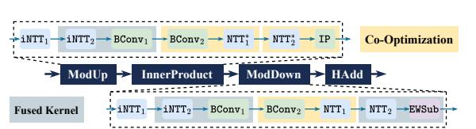

Fig. 12: Co-optimization and kernel fusion for standard KeySwitch. NTT\* represents the NTT× $\beta$  in Fig. 2 with reusing inputs in the NTT domain. All other NTTs are sized according to the number of limbs in their respective inputs.

sults. The kernel of ( $NTT_2-IP$ ) involves a dual-loop structure: inner-loop operations handle inner-layer NTT computations (line 10 of Alg. 3), while outer-loop operations perform MAC operations across multiple data and keys (line 4).

In this scenario, register requirements for both kernels are combined, and data prefetching further increases register consumption. The overall demand for register resources becomes significant, necessitating more efficient register utilization. To address this, we increase register reuse and abandon the lazy reduction strategy commonly used in conventional IP implementations. Instead, we perform reduction immediately after each multiplication, which prevents a doubling of the bit width for intermediate results and effectively reduces the number of registers required to store temporary values by half.

# V. HYPERDRIVE BOOTSTRAPPING OPTIMIZATION

This section presents optimizations for bootstrapping that center on a workflow-level operation reordering technique. First, we integrate HyperDrive's co-optimized kernels into the bootstrapping procedure. We then apply operation reordering to enable further kernel fusion or batching.

#### A. Integration of Co-optimized Kernels

Typically, HyperDrive replaces all standard KeySwitch operations with its co-optimized kernels (see Fig. 12). However,

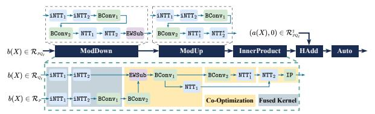

Fig. 13: The workflow for GS-Rots, comparing a naive kernel mapping (top) with our co-optimized kernel mapping featuring operation reordering (bottom). NTT\* is defined in Fig. 12.

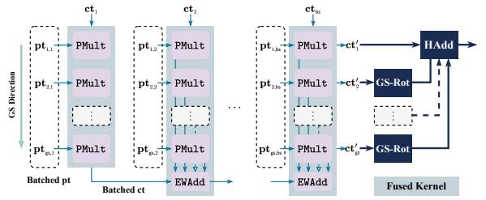

Fig. 14: Ciphertext-reusing PMAC for BSGS PCMM. All symbols are consistent with those in Fig. 7.

advanced CKKS bootstrapping adopts BSGS [18] and double hoisting [7] to mitigate the CtS/StC overhead, and thus bypasses standard KeySwitch. To support such procedures, specific adaptations of our method are required.

In the BS phase, only one pre-rotation (or ModUp) is performed and reused across BS-Rots, leaving no room for (NTT $_2$  – IP) co-optimization. Moreover, double hoisting retains all PMAC intermediates in  $\mathcal{R}_{PQ_\ell}$ , eliminating ModDown and offering just one (BConv $_2$ -NTT $_1$ ) opportunity in ModUp. In contrast, the GS phase performs a ModDown on the ciphertext's b(X) part to re-enter  $\mathcal{R}_{Q_\ell}$ , followed by a standard KeySwitch without ModDown (see Fig. 13).

While our co-optimization strategies can be directly applied to the naive kernel mapping (top half of Fig. 13), we identify a more advanced optimization: since ModDown is immediately followed by ModUp, EWSub can be moved earlier. This reordering (bottom of Fig. 13) allows: 1) batching the INTTs of ModDown and ModUp, 2) merging their adjacent steps into a (BConv2-NTT1) kernel that also fuses EWArith ops, and 3) better load balance for the final (NTT2-IP) kernel.

# B. Ciphertext-Reused PMAC (CRPMAC) in BSGS PCMM

As discussed in § III-C, prior work only fused PMult and HAdd operations during each round of GS ciphertext generation. However, this approach still incurs redundant ciphertext reads during the BS phase. In contrast, HyperDrive defers all GS-Rots until the end, as shown in Fig. 14. This enables batch processing of the PMAC stages, where a single BS ciphertext is multiplied with a batch of plaintexts to produce batched ciphertext outputs, maximizing data reuse in PMAC. Additionally, we apply vectorized memory access to all EWArith kernels to alleviate bandwidth pressure. In hoisting scenarios, our method batches in the GS direction, resulting in a smaller memory footprint compared to [22] (see Fig. 7), which batches in the BS direction.

#### VI. METHODOLOGY

TABLE IV: Parameter sets used for the evaluation.

|                    | N        | L      | WordSize | dnum | BatchSize |
|--------------------|----------|--------|----------|------|-----------|
| Set-A <sup>†</sup> | $2^{16}$ | 34 + 1 | 36       | 9    | 128       |
| Set-A'             | $2^{16}$ | 34 + 1 | 36       | 3    | 1         |
| Set-B              | $2^{16}$ | 34 + 1 | 32       | 35   | 1         |
| Set-C              | $2^{16}$ | 34 + 2 | 32       | 3    | 1         |
| Set-D              | $2^{16}$ | 37 + 2 | 32       | 3    | 1         |
| Set-E              | $2^{16}$ | 46 + 2 | 32       | 3    | 1         |
| Set-F              | $2^{16}$ | 46 + 2 | 32       | 4    | 1         |

<sup>&</sup>lt;sup>†</sup> This set of parameters uses KLSS KeySwitch [28] and includes two special parameters,  $WordSize_T=48$  and  $\widetilde{\alpha}=5$ , which determine the decomposition structure in KLSS KeySwitch.

TABLE V: Optimization techniques and implementation variants.

| Imp./Opt.         | Description                                                                           |
|-------------------|---------------------------------------------------------------------------------------|
| Individual Optimi | zations:                                                                              |
| TLMOP             | Thread-Level Inner-NTT Memory OPtimization (§ IV-B3).                                 |
| TransOP           | Transpose OPtimization of Inner-NTT (§ IV-B4).                                        |
| TFOP              | Twiddle Factor access OPtimization (§ IV-C2).                                         |
| RowMaj            | Row-Major NTT (§ IV-C1).                                                              |
| COOP              | CO-OPtimization for NTT and cross-poly kernels (§ IV-D & § V-A).                      |
| CRPMAC            | Ciphertext-Reusing PMAC (§ V-B).                                                      |
| Baselines and Co. | mbined Methods:                                                                       |
| BASE              | Using FP64-TCU-based NTT without the above optimizations, equipped with re-           |
|                   | implemented intra- and inter-operation fusion [22] and parallel-enhanced design [14]. |
| BASE-MDRS         | BASE incorporated with the moddown-merge-rescale technique used in [2].               |
| BASE-EXT*         | BASE incorporated with optimization techniques used in Cheddar [24].                  |
| InnerOP           | BASE with Inner-NTT optimizations: TLMOP, TransOP.                                    |
| OuterOP           | BASE with Outer-NTT optimizations: TFOP, and RowMaj.                                  |
| NTT+              | BASE with all NTT optimizations: TLMOP, TransOP, TFOP, RowMaj.                        |
| HyperDrive-COI    | RE BASE enhanced with NTT+, COOP, and CRPMAC.                                         |

<sup>\*</sup> Covering sequential and parallel fusions [24], as well as methods employed in Cheddar such as sparsesecret encapsulation [8], moddown-merge-rescale [2], and rescale hoisting [31].

BASE-EXT enhanced with NTT+, COOP, and CRPMAC

Unless otherwise specified, all experiments are carried out on a system featuring an NVIDIA A100-PCIE-80G GPU (1.41 GHz) alongside an INTEL XEON PLATINUM 8558P CPU (2.7GHz), using CUDA 12.8 [39] and GCC 11.4 [41]. All comparative GPU-based approaches are evaluated using the A100 GPU. For performance analysis, NVIDIA NSIGHT Compute [37] is used to gather metrics such as executed instructions, execution cycles, and different stall types.

The experimental parameters used in §VII are shown in Table IV. The optimization techniques and control groups are presented in Table V. HyperDrive's performance is benchmarked using the following four representative FHE workloads.

- Bootstrapping (Bootstrap/Boot): The bootstrapping procedure is optimized with slim [9] and double-hoisting [7] algorithms. Under double scaling (DS) [1], CtS and StC each consume 6 levels, while EvalMod consumes 16 levels.
- **HELR**: HELR [26] implements logistic regression training under the CKKS scheme. The model undergoes 32 training iterations, each processing a batch of 1,024, and the average latency per iteration is reported.
- **ResNet**: [30] implements ResNet20/32/56/110 models for CNN inference on encrypted CIFAR-10 data. We adapt the 65-degree approximate ReLU to match the Set-E.

# VII. RESULTS

#### A. Performance

We present a comprehensive performance evaluation of HyperDrive against state-of-the-art frameworks, with detailed results for NTT, CKKS operations, and end-to-end CKKS workloads presented in Table VI, VII, and VIII, respectively.

For the core NTT operation, HyperDrive achieves significant throughput improvements of  $19.3 \times, 5.5 \times$ , and  $2.0 \times$  over

TABLE VI: Throughput (KOPS) of NTT for HyperDrive and previous acceleration studies, and HyperDrive speedup.

| Setting | HyperDrive | Method (TP)           | Speedup | Method (TP)            | Speedup |
|---------|------------|-----------------------|---------|------------------------|---------|
| 32-bit  | 932.6      | TensorFHE [16] (48.3) | 19.3×   | WarpDrive [14] (468.0) | 2.0×    |
| 36-bit  | 526.1      | TensorFHE [21] (25.5) | 20.6×   | Neo [21] (95.3)        | 5.5×    |

TABLE VII: Execution time  $(\mu s)$  of representative CKKS operations for HyperDrive and previous acceleration studies.

| Scheme (Params)                  | HMult | Rot   | Rescale | HAdd |
|----------------------------------|-------|-------|---------|------|
| TensorFHE* [21] (SetA)           | 32524 | 32499 | 115     | 47   |
| Neo [21] (SetA)                  | 3472  | 3422  | 114     | 46   |
| HyperDrive (SetA')               | 956   | 902   | 188.4   | 66.6 |
| FIDESlib [4] (SetE)              | 1951  | 2086  | 333     | 153  |
| Cheddar [24] (SetF) <sup>‡</sup> | 774   | 724   | 152     | 49   |
| HyperDrive (SetE)                | 769   | 721   | 150     | 43   |
| WarpDrive [14] (SetB)            | 4284  | 4341  | 241     | 61   |
| HyperDrive (SetB)                | 1955  | 1878  | 116     | 40   |

<sup>\*</sup> The performance of TensorFHE with double scaling is from [21].

TensorFHE [16], Neo [21], and WarpDrive [14], respectively, which are all prominent works that optimize NTT using Tensor Cores. Against Neo, which also uses FP64-TCUs, our speedup is driven by dual memory access optimizations for both Inner-NTT and Outer-NTT. Compared to TensorFHE and WarpDrive, HyperDrive gains an additional advantage from a more lightweight MPA pipeline. For typical homomorphic operations like HMult and Rot, the performance gains are driven by HyperDrive's NTT optimizations (NTT+) and specialized COOP kernels. This results in an average speedup of  $35.0\times$ ,  $3.7\times$ , and  $2.2\times$  over TensorFHE, Neo, and WarpDrive, respectively. Notably, HMult speedups exceed standalone NTT gains in several cases, as COOP eliminates the severe GMEM-bound bottlenecks of BConv and IP while simultaneously reducing NTT's memory demands through onchip data reuse. HyperDrive also outperforms the open-source FIDESlib [4] by  $2.2-3.6\times$ . At the workload level, HyperDrive achieves an average speedup of  $27.8\times$ ,  $8.2\times$ , and  $3.7\times$  over the same baselines. To evaluate the performance of HyperDrive on deeper networks, we also assess CKKS-based ResNet110 inference (Table IX).

Our performance on CKKS operations is comparable to Cheddar [24], a concurrent work. Notably, our memory-focused optimizations are orthogonal to Cheddar's computational enhancements (e.g., a 25-30 prime system, signed reduction). Our kernel co-optimization is also orthogonal to their kernel fusion. Cheddar focuses on the fusion of element-wise kernels, while our approach enables the fusion and co-optimization of NTT with cross-polynomial kernels. Our implementation incorporates techniques used in Cheddar, which considerably enhance performance on FHE workloads. In this setting, we have achieved performance that surpasses Cheddar.

# B. Effectiveness of Optimization

1) NTT Optimization: Fig. 15 presents an ablation study illustrating the impact of cumulatively applying our optimizations on NTT performance. By progressively enabling TLMOP, TransOP, TFOP, and RowMaj, the NTT latency is

<sup>&</sup>lt;sup>‡</sup> Tested with the pre-compiled library [24]. SetF (a built-in parameter) has the same *L* as SetE.

TABLE VIII: Comparison of CKKS workload execution times between HyperDrive and prior acceleration studies.

| Scheme<br>(Params)        | Boot<br>(ms) | HELR<br>(ms) | ResNet20<br>(s) | ResNet32<br>(s) | ResNet56<br>(s) |
|---------------------------|--------------|--------------|-----------------|-----------------|-----------------|
| TensorFHE [21] (SetA)     | 850          | 730          | 40.68           | 66.19           | 117.3           |
| Neo [21] (SetA)           | 240          | 220          | 12.03           | 19.68           | 34.98           |
| WarpDrive [14] (SetC)     | 121          | -            | -               | -               | -               |
| WarpDrive [14] (SetD)     | -            | 113          | 5.88            | -               | -               |
| Cheddar <sup>‡</sup> [24] | 40.0         | 51.9         | 1.32            | -               | -               |
| HyperDrive (SetD)         | 33.54        | -            | -               | -               | -               |
| HyperDrive (SetE)         | 39.49        | 43.42        | 1.27            | 2.07            | 3.68            |
| HyperDrive (SetF)         | 38.91        | 42.12        | 1.21            | 1.99            | 3.55            |

<sup>&</sup>lt;sup>‡</sup> Specific parameters are not disclosed.

TABLE IX: Performance of CKKS-Based ResNet110 Inference.

| Model     | HyperDrive (SetE) | HyperDrive (SetF) |
|-----------|-------------------|-------------------|
| ResNet110 | 7.04s             | 7.3s              |

reduced by 32.5%, 3.3%, 25.7%, and 19.7% at each respective step, culminating in a final latency of 50.2 ms for 36-limbs, representing an overall reduction of 61.1%. Concurrently, throughput is boosted by 53.3%, 3.7%, 52.7%, and 23.6%, reaching a peak of 932.6 KOPS, a total 3.0× performance improvement. Notably, TLMOP delivers the most substantial improvement, due to its significant reduction in SMEM access.

Fig. 16 compares the NTT execution time breakdown of HyperDrive against the INT8-TCU-based WarpDrive. Beyond the performance gains achieved in the Outer-NTT, Hyper-Drive delivers a substantial reduction in the MPA overhead. Specifically, the execution time dedicated to the MPA pipeline is reduced by 84%–91% relative to the baseline, ultimately accounting for a mere 5.0%–7.3% of the total NTT latency. This confirms that leveraging FP64-TCUs for the Inner-NTT effectively minimizes the multi-precision arithmetic costs, addressing a critical bottleneck in prior INT8-based solutions.

Fig. 17 illustrates the impact of our NTT optimizations on pipeline stalls. For the Inner-NTT, TLMOP cuts scheduler stall cycles in  $NTT_1$  and  $NTT_2$  by 44.2%, while adding TransOP increases the cumulative reduction to 50%. By lowering shared memory usage, TLMOP also boosts kernel occupancy from 55.0% and 62.3% to 76.8% and 77.0%, respectively. Although higher occupancy slightly increases total warp stalls per instruction, TLMOP cuts SMEM-related stalls by 33.2%, a figure that improves to 38.9% with TransOP.

Subsequently, we examine the *Outer-NTT* optimizations, with results presented in Fig. 18. Similarly, applying TFOP and RowMaj leads to a 27.4% reduction in scheduler stall cycles, which increases to a cumulative 39.3% after both are enabled. The corresponding reduction in the GMEM-related warp stall proportion starts at 50.9% from TFOP alone, and grows to a cumulative 59.5% with the addition of RowMaj.

2) Operation Level Optimization: To evaluate the COOP method, we conduct a comparative experiment between NTT+ and HyperDrive on the Keyswitch operation. As illustrated in Fig. 19, COOP boosts the overall performance by  $1.24\times$ . As shown in Fig. 20, (BConv<sub>2</sub> - NTT<sub>1</sub>) kernel outperforms the separate execution by  $1.36\times$ . On the other hand, (NTT<sub>2</sub> - IP) outperform its individual counterparts by  $1.32\times$ .

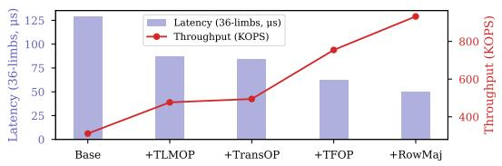

Fig. 15: Evaluation of NTT latency and throughput under incremental optimizations: TLMOP, TransOP, TFOP, RowMaj.

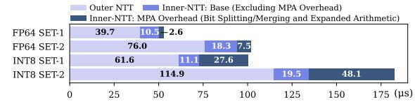

Fig. 16: Comparison of the latency breakdown for HyperDrive (FP64-TCU) NTT and reproduced WarpDrive (INT8-TCU) NTT ( $N=2^{16}$ , 1 or 2 sets of 36 limbs each).


Fig. 17: Comparison of execution cycles and warp state proportions of FP64-TCU-NTT  $(N=2^{16}, \#limbs=36)$  with base and incremental *Inner-NTT* optimizations.

Fig. 20 also details the scheduler and warp stall proportions of the relevant kernels. With COOP optimization, the fused ( $\mathbb{BConv}_2 - \mathbb{NTT}_1$ ) and ( $\mathbb{NTT}_2 - \mathbb{IP}$ ) kernels better balance memory access and computation than their standalone counterparts, leading to a marked decrease in GMEM-related warp stalls. While the ( $\mathbb{NTT}_2 - \mathbb{IP}$ ) kernel sees a dramatic drop in GMEM stalls, its scheduler stall reduction is modest, as it is constrained by the available parallelism.

Table X presents the register consumption and occupancy across various kernels. Compared to Base, NTT+ achieves higher occupancy by replacing FP64 fragments with 32-bit registers, reducing the per-thread footprint. While the NTT-IP kernel exhibits higher register usage due to intermediate accumulations for IP calculations, we forego lazy reduction to cap register usage at 72 per thread (35.3% occupancy). This fusion remains highly beneficial, as COOP significantly mitigates long scoreboard stalls during IP computation.

TABLE X: Registers and Occupancy of cross-poly and NTT  $kernels(N=2^{16}, L=32, \beta=2)$ 

|                                | NTT        | Stage 1    | BCONV      |               | NTT Stage 2 |            | IP         |            |
|--------------------------------|------------|------------|------------|---------------|-------------|------------|------------|------------|
| Metric                         | Base       | NTT+       | BConv      | BConv-<br>NTT | Base        | NTT+       | IP         | NTT-<br>IP |
| Reg. / Thread<br>Occupancy (%) | 48<br>57.8 | 32<br>92.5 | 48<br>54.6 | 32<br>85.7    | 48<br>57.2  | 32<br>82.5 | 32<br>80.4 | 72<br>35.3 |


Fig. 18: Comparison of execution cycles and warp state proportions of FP64-TCU-NTT ( $N=2^{16}$ , #limbs=36) with base and incremental *Outer-NTT* optimizations.

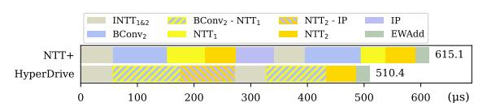

Fig. 19: Comparison of the latency ( $\mu s$ ) breakdown of KeySwitch ( $N=2^{16},L=32,\beta=2$ ) for NTT+ and HyperDrive.

To individually analyze the contributions of NTT+, COOP, and CRPMAC, we break down bootstrap execution time across configurations (Fig. 21). Since NTT dominates Keyswitch and Rescale, the NTT+ setting alone delivers speedups over BASE: 1.49× for bootstrap, 1.63× for Keyswitch, and 1.89× for Rescale. HyperDrive-CORE builds on this, pushing the overall bootstrap performance by another 1.21×. This gain is driven by COOP, which accelerates Keyswitch and Rescale by a further 1.24× and 1.21×, respectively, and by CRPMAC, which reduces the significant overhead of redundant ciphertext reads compared to batched PMAC, leading to a 1.34× performance boost for CtS/StC EWArith. Cumulatively, HyperDrive-CORE's bootstrap is 1.85× faster than BASE. Furthermore, HyperDrive achieves 3.10× and 1.64× speedups over BASE-MDRS and BASE-EXT, respectively.

3) Future Scalability and Architectural Stability: The roadmap of flagship HPC GPU platforms (Table XI) reflects a continued trend of scaling FP64 performance to support high-precision scientific and cryptographic workloads [33], [34], [36], [38]. From an architectural perspective, the FP64 Tensor Core design has maintained a degree of consistency across recent generations. This architectural similarity allows HyperDrive to be executed on H100. Evaluation results on the H100 (Table XII) indicate that HyperDrive can benefit from the increased compute density of newer hardware. These observations suggest that the optimizations in HyperDrive remain applicable as HPC architectures continue to evolve.

TABLE XI: FP64 TCU Performance across GPU Generations.

| A100 (Ampere) | H100 (Hopper) | B200 (Blackwell) | Rubin    |
|---------------|---------------|------------------|----------|
| 19.5 [33]     | 67 [34]       | 37 [36]          | 200 [38] |

#### VIII. RELATED WORK

Numerous studies explored accelerating FHE on GPUs [4], [15], [23], [47]. [22] provided the first support for CKKS


Fig. 20: Comparison of kernel execution cycles, and warp states per instruction breakdown of cross-poly and NTT kernels ( $N = 2^{16}$ , L = 32,  $\beta = 2$ ) between NTT+ and HyperDrive.

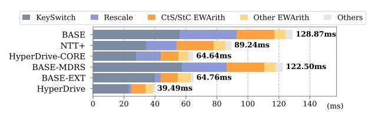

Fig. 21: Bootstrap latency breakdown across configurations (Set-E).

TABLE XII: HyperDrive Performance (TFLOPS) Scaling on H100.

| Metric (Set-E)            | A100       | H100        |  |
|---------------------------|------------|-------------|--|
| NTT Throughput (32-bit)   | 932.6 KOPS | 1669.5 KOPS |  |
| KeySwitch Latency (SET-E) | 710.0 μs   | 414.0 μs    |  |
| Bootstrap Latency (SET-E) | 39.4 ms    | 24.7 ms     |  |

bootstrapping on GPUs. Others [45], [46] focused on accelerating programmable bootstrapping in TFHE and FHEW. Recent efforts shifted to specialized hardware, particularly TCUs. While TensorFHE [16] showcased TCU potential, they struggled with the overhead of frequent on-chip/off-chip data movement. WarpDrive [14] reduced memory stalls through NTT decomposition. Neo [21] transforms scalar and elementwise multiplications into matrix operations, effectively utilizing the TCU's FP components. The recent work, Cheddar [24], further innovates by introducing prime system and modular reduction optimizations, plus more extensive kernel fusion.

#### IX. CONCLUSION

This paper presents HyperDrive, a solution addressing multi-level memory bottlenecks in GPU-based FHE acceleration. HyperDrive combines fine-grained register access for *Inner-NTT*, a structured memory coalescing scheme for *Outer-NTT*, and operation-level optimizations like kernel cooptimization and ciphertext reuse to reduce memory traffic. Compared with representative solutions, WarpDrive and Neo, HyperDrive achieves speedups of  $2.0 \times$  to  $5.5 \times$  in NTT,  $2.2 \times$  to  $3.7 \times$  in HMult, and  $3.7 \times$  to  $8.2 \times$  in end-to-end workloads.

#### X. ACKNOWLEDGEMENTS

This work is supported in part by the National Cryptographic Science Foundation of China under Grant No. 2025NCSF02005.

# REFERENCES

- [1] R. Agrawal, J. H. Ahn, F. Bergamaschi, R. Cammarota, J. H. Cheon, F. DM de Souza, H. Gong, M. Kang, D. Kim, J. Kim *et al.*, "Highprecision RNS-CKKS on fixed but smaller word-size architectures: theory and application," in *Proceedings of the 11th Workshop on Encrypted Computing & Applied Homomorphic Cryptography*, 2023, pp. 23–34.
- [2] R. Agrawal, L. De Castro, C. Juvekar, A. Chandrakasan, V. Vaikuntanathan, and A. Joshi, "Mad: Memory-aware design techniques for accelerating fully homomorphic encryption," in *Proceedings of the 56th Annual IEEE/ACM International Symposium on Microarchitecture*, 2023, pp. 685–697.
- [3] R. Agrawal, L. de Castro, G. Yang, C. Juvekar, R. Yazicigil, A. Chandrakasan, V. Vaikuntanathan, and A. Joshi, "FAB: An FPGA-based accelerator for bootstrappable fully homomorphic encryption," in *2023 IEEE International Symposium on High-Performance Computer Architecture (HPCA)*. IEEE, 2023, pp. 882–895.
- [4] C. Agullo-Domingo, ´ O. Vera-L ´ opez, S. Guzelhan, L. Daksha, ´ A. El Jerari, K. Shivdikar, R. Agrawal, D. Kaeli, A. Joshi, and J. L. Abellan, "FIDESlib: A fully-fledged open-source FHE library for ´ efficient CKKS on GPUs," in *2025 IEEE International Symposium on Performance Analysis of Systems and Software (ISPASS)*. IEEE, 2025, pp. 1–3. [Online]. Available: https://github.com/CAPS-UMU/FIDESlib
- [5] D. H. Bailey, "FFTs in external or hierarchical memory," *The journal of Supercomputing*, vol. 4, no. 1, pp. 23–35, 1990.
- [6] J. Bajard, J. Eynard, M. A. Hasan, and V. Zucca, "A full RNS variant of FV like somewhat homomorphic encryption schemes," in *International Conference on Selected Areas in Cryptography*. Springer, 2016, pp. 423–442.
- [7] J. Bossuat, C. Mouchet, J. Troncoso-Pastoriza, and J. Hubaux, "Efficient bootstrapping for approximate homomorphic encryption with non-sparse keys," in *Annual International Conference on the Theory and Applications of Cryptographic Techniques*. Springer, 2021, pp. 587–617.
- [8] J. Bossuat, J. R. Troncoso-Pastoriza, and J. Hubaux, "Bootstrapping for approximate homomorphic encryption with negligible failure-probability by using sparse-secret encapsulation," in *Applied Cryptography and Network Security - 20th International Conference, ACNS 2022, Rome, Italy, June 20-23, 2022, Proceedings*, ser. Lecture Notes in Computer Science, G. Ateniese and D. Venturi, Eds., vol. 13269. Springer, 2022, pp. 521–541. [Online]. Available: https://doi.org/10.1007/978-3-031-09234-3 26
- [9] H. Chen and K. Han, "Homomorphic lower digits removal and improved fhe bootstrapping," in *Annual International Conference on the Theory and Applications of Cryptographic Techniques*. Springer, 2018, pp. 315–337.
- [10] J. H. Cheon, K. Han, A. Kim, M. Kim, and Y. Song, "Bootstrapping for approximate homomorphic encryption," in *Annual International Conference on the Theory and Applications of Cryptographic Techniques*. Springer, 2018, pp. 360–384.
- [11] ——, "A full RNS variant of approximate homomorphic encryption," in *International Conference on Selected Areas in Cryptography*. Springer, 2018, pp. 347–368.
- [12] J. H. Cheon, A. Kim, M. Kim, and Y. Song, "Homomorphic encryption for arithmetic of approximate numbers," in *International Conference on the Theory and Application of Cryptology and Information Security*. Springer, 2017, pp. 409–437.
- [13] W. Dai and B. Sunar, "cuHE: A homomorphic encryption accelerator library," in *International Conference on Cryptography and Information Security in the Balkans*. Springer, 2015, pp. 169–186.
- [14] G. Fan, M. Zhang, F. Zheng, S. Fan, T. Zhou, X. Deng, W. Tang, L. Kong, Y. Song, and S. Yan, "WarpDrive: GPU-based fully homomorphic encryption acceleration leveraging tensor and CUDA cores," in *2025 IEEE International Symposium on High Performance Computer Architecture (HPCA)*. IEEE, 2025, pp. 1187–1200.
- [15] G. Fan, F. Zheng, L. Wan, L. Gao, Y. Zhao, J. Dong, Y. Song, Y. Wang, and J. Lin, "Towards faster fully homomorphic encryption implementation with integer and floating-point computing power of GPUs," in *2023 IEEE International Parallel and Distributed Processing Symposium (IPDPS)*. IEEE, 2023, pp. 798–808.
- [16] S. Fan, Z. Wang, W. Xu, R. Hou, D. Meng, and M. Zhang, "TensorFHE: Achieving practical computation on encrypted data using GPGPU," in *2023 IEEE International Symposium on High-Performance Computer Architecture (HPCA)*. IEEE, 2023, pp. 922–934.

- [17] H. L. Garner, "The residue number system," in *Papers presented at the the March 3-5, 1959, western joint computer conference*, 1959, pp. 146–153.
- [18] S. Halevi and V. Shoup, "Faster homomorphic linear transformations in HElib," in *Annual International Cryptology Conference*. Springer, 2018, pp. 93–120.
- [19] K. Han, S. Hong, J. H. Cheon, and D. Park, "Logistic regression on homomorphic encrypted data at scale," in *Proceedings of the AAAI conference on artificial intelligence*, vol. 33, no. 01, 2019, pp. 9466– 9471.
- [20] K. Han and D. Ki, "Better bootstrapping for approximate homomorphic encryption," in *Cryptographers' Track at the RSA Conference*. Springer, 2020, pp. 364–390.
- [21] D. Jiao, X. Deng, Z. Wang, S. Fan, Y. Chen, D. Meng, R. Hou, and M. Zhang, "Neo: Towards efficient fully homomorphic encryption acceleration using tensor core," in *Proceedings of the 52nd Annual International Symposium on Computer Architecture*, 2025, pp. 107–121.
- [22] W. Jung, S. Kim, J. H. Ahn, J. H. Cheon, and Y. Lee, "Over 100x faster bootstrapping in fully homomorphic encryption through memorycentric optimization with GPUs," *IACR Transactions on Cryptographic Hardware and Embedded Systems*, vol. 2021, no. 1, pp. 114–148, 2021.
- [23] W. Jung, E. Lee, S. Kim, J. Kim, N. Kim, K. Lee, C. Min, J. H. Cheon, and J. H. Ahn, "Accelerating fully homomorphic encryption through architecture-centric analysis and optimization," *IEEE Access*, vol. 9, pp. 98 772–98 789, 2021.
- [24] J. Kim, W. Choi, and J. H. Ahn, "Cheddar: A swift fully homomorphic encryption library for CUDA GPUs," *arXiv preprint arXiv:2407.13055*, 2024. [Online]. Available: https://github.com/scale-snu/cheddar-fhe
- [25] J. Kim, S. Kim, J. Choi, J. Park, D. Kim, and J. H. Ahn, "SHARP: A short-word hierarchical accelerator for robust and practical fully homomorphic encryption," in *Proceedings of the 50th Annual International Symposium on Computer Architecture*, 2023, pp. 1–15.
- [26] M. Kim, Y. Song, S. Wang, Y. Xia, and X. Jiang, "Secure logistic regression based on homomorphic encryption: Design and evaluation," *JMIR Medical Informatics*, vol. 6, no. 2, p. e19, 2018.
- [27] J. Kim, G. Lee, S. Kim, G. Sohn, M. Rhu, J. Kim, and J. H. Ahn, "Ark: Fully homomorphic encryption accelerator with runtime data generation and inter-operation key reuse," in *2022 55th IEEE/ACM International Symposium on Microarchitecture (MICRO)*. IEEE, 2022, pp. 1237– 1254.
- [28] M. Kim, D. Lee, J. Seo, and Y. Song, "Accelerating HE operations from key decomposition technique," in *Advances in Cryptology - CRYPTO 2023 - 43rd Annual International Cryptology Conference, CRYPTO 2023, Santa Barbara, CA, USA, August 20-24, 2023, Proceedings, Part IV*, ser. Lecture Notes in Computer Science, H. Handschuh and A. Lysyanskaya, Eds., vol. 14084. Springer, 2023, pp. 70–92. [Online]. Available: https://doi.org/10.1007/978-3-031-38551-3 3
- [29] S. Kim, J. Kim, M. J. Kim, W. Jung, J. Kim, M. Rhu, and J. H. Ahn, "BTS: An accelerator for bootstrappable fully homomorphic encryption," in *Proceedings of the 49th annual international symposium on computer architecture*, 2022, pp. 711–725.
- [30] E. Lee, J. Lee, J. Lee, Y. Kim, Y. Kim, J. No, and W. Choi, "Lowcomplexity deep convolutional neural networks on fully homomorphic encryption using multiplexed parallel convolutions," in *International Conference on Machine Learning*. PMLR, 2022, pp. 12 403–12 422.
- [31] Y. Lee, S. Cheon, D. Kim, D. Lee, and H. Kim, "Performance-aware scale analysis with reserve for homomorphic encryption," in *Proceedings of the 29th ACM International Conference on Architectural Support for Programming Languages and Operating Systems, Volume 1*, 2024, pp. 302–317.
- [32] H. J. Nussbaumer, *Fast Fourier Transform and Convolution Algorithms*. Springer, 1982.
- [33] NVIDIA, "Nvidia a100 tensor core gpu architecture datasheet," 2021. [Online]. Available: https://www.nvidia.com/content/dam/enzz/Solutions/Data-Center/a100/pdf/nvidia-a100-datasheet-nvidia-us-2188504-web.pdf
- [34] ——, "Nvidia h100 tensor core gpu datasheet," 2023. [Online]. Available: https://resources.nvidia.com/en-us-gpu-resources/h100-datasheet-24306
- [35] NVIDIA, "CUDA C Best Practices Guide," 2024. [Online]. Available: https://docs.nvidia.com/cuda/cuda-c-best-practices-guide/#memoryinstructions

- [36] NVIDIA, "Nvidia blackwell architecture datasheet," 2024. [Online]. Available: https://nvdam.widen.net/s/wwnsxrhm2w/blackwelldatasheet-3384703
- [37] ——, *NVIDIA NSIGHT Compute Documentation*, 2024. [Online]. Available: https://developer.nvidia.com/nsight-compute
- [38] ——, "Nvidia rubin platform," 2024. [Online]. Available: https://www. nvidia.com/en-us/data-center/vera-rubin-nvl72/
- [39] ——, *CUDA Toolkit Documentation*, 2025. [Online]. Available: https: //docs.nvidia.com/cuda/archive/12.8.0/
- [40] J. M. Pollard, "The fast fourier transform in a finite field," *Mathematics of computation*, vol. 25, no. 114, pp. 365–374, 1971.
- [41] GNU Project, *GCC 11 Release Notes*, 2023. [Online]. Available: https: //gcc.gnu.org/gcc-11/
- [42] M. S. Riazi, K. Laine, B. Pelton, and W. Dai, "HEAX: An architecture for computing on encrypted data," in *Proceedings of the Twenty-Fifth International Conference on Architectural Support for Programming Languages and Operating Systems*, 2020, pp. 1295–1309.
- [43] N. Samardzic, A. Feldmann, A. Krastev, S. Devadas, R. Dreslinski, C. Peikert, and D. Sanchez, "F1: A fast and programmable accelerator for fully homomorphic encryption," in *MICRO-54: 54th Annual IEEE/ACM International Symposium on Microarchitecture*, 2021, pp. 238–252.
- [44] N. Samardzic, A. Feldmann, A. Krastev, N. Manohar, N. Genise, S. Devadas, K. Eldefrawy, C. Peikert, and D. Sanchez, "Craterlake: a hardware accelerator for efficient unbounded computation on encrypted data," in *Proceedings of the 49th Annual International Symposium on Computer Architecture*, 2022, pp. 173–187.
- [45] S. Shen, H. Yang, Z. Liu, Y. Liu, X. Lu, W. Dai, L. Zhou, Y. Zhao, and R. C. Cheung, "VeloFHE: GPU acceleration for FHEW and TFHE bootstrapping," *IACR Transactions on Cryptographic Hardware and Embedded Systems*, vol. 2025, no. 3, pp. 81–114, 2025.
- [46] Y. Xiao, F. Liu, Y. Ku, M. Ho, C. Hsu, M. Chang, S. Hung, and W. Chen, "GPU acceleration for FHEW/TFHE bootstrapping," *IACR Transactions on Cryptographic Hardware and Embedded Systems*, vol. 2025, no. 1, pp. 314–339, 2025. [Online]. Available: https://doi.org/10.46586/tches.v2025.i1.314-339
- [47] H. Yang, S. Shen, W. Dai, L. Zhou, Z. Liu, and Y. Zhao, "Phantom: A CUDA-accelerated word-wise homomorphic encryption library," *IEEE Transactions on Dependable and Secure Computing*, 2024.
- [48] Y. Yang, H. Zhang, S. Fan, H. Lu, M. Zhang, and X. Li, "Poseidon: Practical homomorphic encryption accelerator," in *2023 IEEE International Symposium on High-Performance Computer Architecture (HPCA)*. IEEE, 2023, pp. 870–881.
- [49] Y. Zhu, X. Wang, L. Ju, and S. Guo, "FxHENN: FPGA-based acceleration framework for homomorphic encrypted CNN inference," in *2023 IEEE International Symposium on High-Performance Computer Architecture (HPCA)*. IEEE, 2023, pp. 896–907.