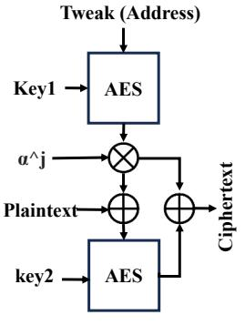
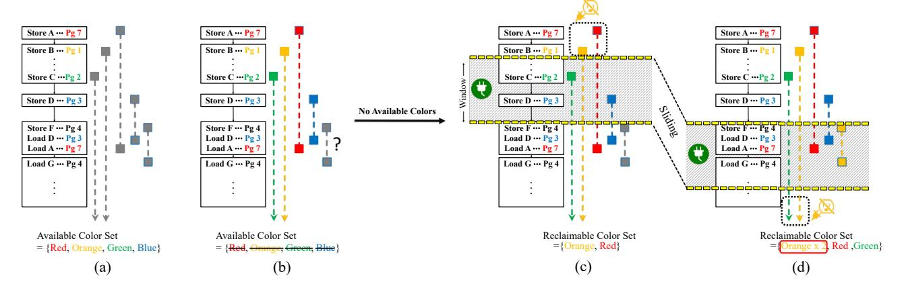
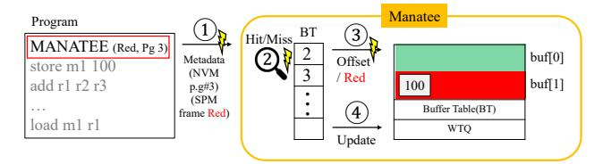
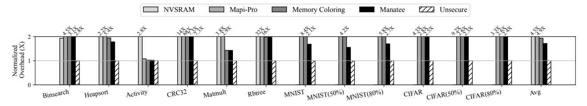
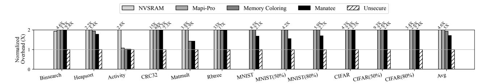
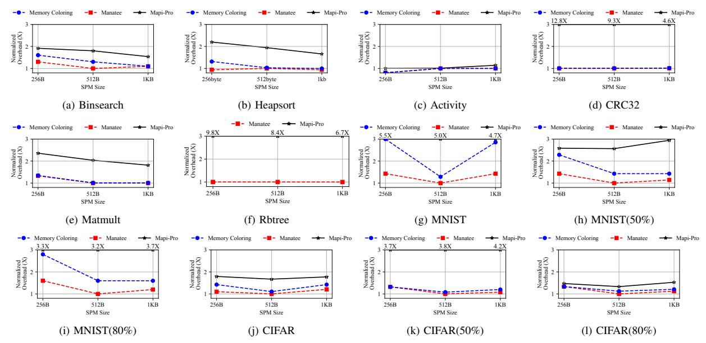
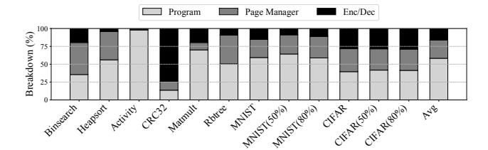
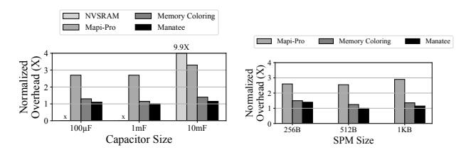
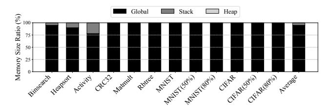

# Intermittence-Aware Speculative Page Coloring for Secure NVM

Jongouk Choi Junyeong Park Nicholas L'Heureux Yan Solihin *University of Central Florida* {*jongouk.choi, junyeong.park, nicholas.lheureux, yan.solihin*}*@ucf.edu*

Hyunwoo Joe *ETRI / UST hwjoe@etri.re.kr*

Changhee Jung *Purdue University chjung@purdue.edu*

*Abstract*—This paper revisits volatile scratchpad memory (SPM) for data confidentiality in an energy harvesting system (EHS) that suffers frequent power outages and thus features nonvolatile memory (NVM). Our insight is that low-cost data confidentiality can be achieved by using on-chip SPM as main memory and off-chip NVM as secondary storage. This strategic design naturally provides EHS with secure main memory (as SPM data vanish on an outage), encrypting them only when persistent in NVM. To realize this in a purely software manner, we introduce MANATEE, a compiler-directed memory management scheme that logically structures NVM pages and preallocates them in SPM. A key innovation of MANATEE is its intermittenceaware speculative page coloring that is explicitly designed taking into account frequent power outages. This design limits the requirement for page conflict resolution to the typically brief poweron period of EHS, providing greater flexibility in page coloring. If the period is longer than usual, two pages that would have been separated by an outage may instead be accessed within the same cycle, competing for the same SPM frame. To handle such a page miss (misspeculation), MANATEE devises page manager runtime that evicts the old SPM frame, encrypting and persisting it, and fetches the new NVM page decrypting it upon retrieval. Our evaluation shows that the page miss rate is not significant (≈ 1%), and MANATEE delivers a 2–3× speedup over the state-of-the-art work. These results demonstrate that MANATEE enables practical and secure memory for EHS, providing data confidentiality with minimal performance overhead.

#### I. INTRODUCTION

An energy harvesting system (EHS) has emerged as an alternative to battery-equipped Internet of Things (IoT) devices [2]. Without relying on batteries, EHS can sustain itself by harnessing ambient energy, e.g., from kinetic, radio frequency (RF), and thermal sources. However, they are inherently unstable, exposing EHS to frequent and unpredictable power failures. To address this problem, EHS utilizes a tiny capacitor as an energy buffer and implements a just-in-time (JIT) checkpointing mechanism; it persists all volatile data just before power failure using residual capacitor energy and restores them in the wake of the failure [3], [16]–[21], [47], [52], [65], [72], [88]. EHS typically builds on a low-power microcontroller (MCU), that lacks caches due to the difficulty of keeping them intact from an outage, and uses nonvolatile memory (NVM) as main memory [19], [31]–[34], [49], [90], [91], [96], [99]. Thus, across a power failure, the EHS needs only JIT checkpoint/restore registers to/from NVM.

Nevertheless, a critical security concern remains unresolved in EHS, i.e., data confidentiality. Since NVM is durable surviving power outages, EHS should encrypt all the data in NVM; otherwise, attackers can probe unencrypted NVM and extract sensitive information therein during the outages. This vulnerability poses a significant risk to end-users with severe consequences, including not only privacy violations but also security breaches such as unauthorized access and control. Therefore, ensuring data confidentiality in EHS devices is essential to enable their integration into secure IoT environments. [13], [35], [36], [100].

Unfortunately, it is a daunting challenge for EHS to realize data confidentiality, given the dual requirement of maintaining lightweight operation for energy efficiency and guaranteeing crash consistency for correct recovery [15], [16], [35], [36], [45], [100]. In the absence of a cache, loads and stores directly access NVM—becoming the most energy-consuming operation in EHS—and thus always involve decryption and encryption, further increasing the latency of already slow NVM accesses. Moreover, for crash consistency, EHS must persist the ciphertext—encrypted in a large granularity (e.g., 16 bytes) by Advanced Encryption Standard (AES)—in a failure-atomic manner. Persisting only a portion of such multiword ciphertext due to a power failure in between makes it impossible to decrypt data in NVM [13], [66].

To this end, this paper proposes to use the on-chip scratchpad memory (SPM) of existing MCUs as main memory and their off-chip NVM as secondary storage. The insight is that such a memory hierarchy naturally provides EHS with secure main memory because the on-chip SPM is within a secure domain and volatile losing all the data upon power failure. That is, they only need to be encrypted when persistent in NVM, leading to a question of how SPM should be persisted with crash consistency guarantee. One possible approach is to JIT checkpoint not just registers but also the SPM with them both encrypted upon power failure.

However, such a naive approach is lacking in several ways. First, a significant amount of energy must be reserved to encrypt and checkpoint the entire SPM atomically even before impending power failure, rendering the approach neither scalable nor energy-efficient. Figure 1 shows that tested benchmarks can spend only a small amount of harvested energy for program execution, while consuming most of the energy for encrypting and checkpointing SPM to NVM as well as restoring them from NVM to SPM across power failure. One might think of using a supercapacitor, but this causes power failure recovery to take a much longer time in that such a large capacitor must be recharged before rebooting, result-

Fig. 1: Portion of energy available for application execution with SPM JIT-checkpointed upon power failure; experiment is done atop a typical EHS: MSP430FR5994 microcontroller with  $100\mu F$  capacitor.

ing in significant performance degradation. More importantly, regardless of capacitor size, the naive approach cannot even utilize the full capacity of NVM as it is dedicated to checkpoint storage, i.e., main memory space is limited to SPM that is often much smaller than NVM in EHS devices.

To achieve energy-efficient data confidentiality, this paper presents MANATEE, a novel compiler/runtime co-designed memory management scheme for the proposed SPM-NVM memory hierarchy. The key challenge of realizing the memory hierarchy is managing explicit data transfers between SPM and NVM without capping the address space to the SPM size. Note that EHS architecture is simple without caches and lacks virtual memory support such as memory management units (MMUs) and translation lookaside buffers (TLBs) due to the low-power requirements. Consequently, the efficiency of memory management is crucial in determining the overall performance of the EHS backed by the proposed memory hierarchy of MANATEE.

Especially for software-only memory management, MANATEE logically partitions NVM into pages with SPM structured into page frames, and maps each page to one of the page frames in the SPM. To achieve this, MANATEE takes advantage of compile-time page coloring [63] and interacts with its runtime for page management during program execution. That is, the static page mapping provides a hint to the page manager runtime so that it dynamically checks if the pre-mapped SPM page frame holds a necessary page to be accessed—which can be done within a few clock cycles without relying on any hardware support.

To improve the efficiency of the page management, MANATEE introduces a new page reclamation strategy, considering a unique characteristic of EHS devices; they reboot only after the capacitor is fully charged and last until it drains. Both the short burst of execution followed by a long power outage for recharging and their repetitions characterize EHS program behavior, which is called *intermittent execution* [68]. Thus, for a given capacitor size, the execution distance is often consistent [54], which leads to a predictable power-on period between power outages.

In light of this, MANATEE creates intermittence-aware speculative page coloring—designed to exploit the short power

period of EHS. The key insight is that pages need to be assigned different colors (SPM page frames) only during these power-on intervals, thereby confining the page conflict resolution to a very brief window. However, if the power-on period lasts longer than usual, two pages that should have been separated by a power outage might be instead accessed within the same cycle, contending for the same SPM frame; such contention can compromise program correctness if either page performs writes. To handle such a page miss (mispeculation), MANATEE devises page manager runtime that evicts the old SPM frame, encrypting and persisting its data, and fetches the new NVM page decrypting it upon retrieval. The integration of compile-time speculative page coloring and runtime misspeculation handling provides substantial flexibility in page coloring, thereby enhancing the performance of EHS.

In contrast to conventional page coloring [63] that spills a conflicting page to off-chip memory, MANATEE accommodates all pages in the SPM at the cost of occasional page misses at run time. At each page conflict point where no color (i.e., no empty SPM frame) is available, MANATEE steals the color of the page whose access is as distant from the point as the power-on period in that the page is unlikely to be used in the same period. Since compilers cannot know when a power failure occurs, we conservatively assume it may precede or follow the conflict point. Accordingly, MANATEE employs a sliding window—sized to match the power-on period—to scan pages outside the window bidirectionally from the conflict point. Among these candidates, MANATEE reclaims (steals) the farthest page in either direction, encrypting and persisting it to NVM, thereby freeing the corresponding SPM frame. This strategy ensures that only the necessary pages remain resident in SPM during each power-on period, effectively minimizing page misses and thereby improving the performance of EHS.

Our experiments demonstrate that MANATEE provides secure NVM support while improving performance by an average of 12% over a scheme, that integrates with a prior memory coloring approach [63] lacking our distance formulation, and achieving a 2–3× speedup compared to the state-of-the-art profiling-based approach [9]. Finally, we make the following contributions:

- MANATEE is the first practical secure NVM solution for EHS. We propose a new memory hierarchy that uses SPM as main memory and NVM as secondary storage to achieve data confidentiality on the cheap.
- MANATEE devises intermittence-aware speculative page coloring with frequent power outages in mind. This limits the requirement for page conflict resolution to the brief power-on period of EHS, providing greater flexibility in the coloring with less SPM pressure and ultimately improving the performance of EHS significantly
- MANATEE significantly outperforms the state-of-the-art secure memory solution, achieving a 2–3× speedup on average across all 12 benchmarks, including 6 intermittent learning workloads.

## II. BACKGROUND AND MOTIVATION

#### *A. EHS Basics and Target Applications*

The harvested power of EHS is very weak (0∼2000µW [69]). In this harsh environment, EHS operates for a short amount of time (e.g., 15ms [54]), quickly depleting the capacitor energy but hibernating for a long time (e.g., more than 1s). To correctly recover from the frequent outages, EHS requires some form of crash consistency. Arguably, JIT checkpointing is the most popular way to offer EHS crash consistency guarantee. The JIT checkpointing mechanism detects an impending outage by using a voltage monitor. When capacitor voltage drops below a *Vbackup* threshold, the monitor signals the core to initiate the checkpointing. Upon receiving the signal, the core pauses program execution, checkpoint both a program counter (PC) and other registers to NVM (or nonvolatile registers [21], [88] if exist), and hibernates until the voltage reaches another threshold (*Vrestore*) to restore registers before resuming from the PC. That is, *Vbackup* and *Vrestore* should be set higher than nominal voltage to prevent the JIT checkpoint/restoration from being power-interrupted.

Applications. We target emerging energy harvesting wearables, e.g., implantable sensors [80], contact lenses [64], smart face masks [23], and human-warmth sensors [62]. These applications harvest ambient energy and run an infinite loop that repeatedly senses and alarms when something turns out to be wrong based on the sensing result. As with any other privacy-critical application, users here do not expect that their medical records can be exposed at the time of taking off or discarding the wearable devices. Note that these devices often lack the luxury of (remote) NVM erasure, and thus if they are lost or stolen, any unencrypted data in NVM is vulnerable to breaches in the end.

# *B. At-Rest Memory Security*

To ensure data confidentiality, all writes to NVM must be encrypted. For this purpose, this paper leverages a tweakable block cipher mode (AES-XTS), widely adopted in the industry for memory (AMD SME [53] and Intel TDX [1]) and storage (e.g. Microsoft Bit-Locker [75]), among others. Figure 2 illustrates the operation of AES-XTS, where two AES keys are used together with a tweak (address). The upshot is that AES-XTS *ensures*

Fig. 2: AES-XTS [26].

*data confidentiality without an integrity tree for verification*. In contrast, AES-CTR (counter-encryption mode) requires an integrity tree not only to protect data integrity, but also to protect confidentiality because it relies on counter freshness guarantee [83]. That is, AES-XTS is not susceptible to the counter replay attacks [83] that breaks the confidentiality guarantee—though it cannot prevent data tampering due to the lack of integrity verification. Also, AES-XTS provides stronger confidentiality guarantees than AES-CTR [87], e.g., AES-CTR is vulnerable to single-bit-flip attacks whereas AES-XTS remains resistant.

# *C. Crash Consistency*

While AES-XTS ensures data confidentiality, its large encryption/decryption granularity (e.g., 16 or 32 bytes) introduces a challenge for crash consistency in EHS devices. Each ciphertext block must be persisted in a failure atomic manner; otherwise, any parts of the ciphertext, which are left behind a power failure, make it impossible to decrypt the incompletely persisted ciphertext when it is read [18], [36], [67], [86], [90], [100]. This challenge is particularly critical in most of powerhungry EHS devices. That is because they guarantee 2-byte atomic stores, while a 64-byte page spans four XTS blocks. Thus, persisting a (64-byte) page requires completing all four 16-byte blocks atomically with additional hardware support, or incorporating transactional mechanisms that can detect and recover from partial writes. Either way is not suitable for EHS due to its strict energy-efficiency and low-cost demands.

#### *D. Revisiting Scratchpad Memory*

SPM technologies have demonstrated several advantages over traditional hardware-managed cache; they are known to be more energy-efficient, offer faster access times, and occupy less area compared to caches [14], [27]–[30], [89]. However, unlike cache, SPM requires software support to place code/data [27], [29], [30]. Most low-power MCUs used in EHS even lack hardware support for virtual memory, i.e., the MCU cannot automatically manage data transfers between NVM and SPM. To address the limitation, prior works suggest two types of approaches: a profiling-based approach [9], [27], [29], [30] and a compiler-directed approach [63].

Profile-based Approach. Mapi-Pro [9], the state-of-the-art work, employs integer linear programming (ILP) formulation guided by profiling information to achieve optimal data placement between SPM and NVM. This technique classifies pages as hot or cold based on their profiled access frequency; hot pages are mapped to SPM, while cold pages remain in NVM. As a result, frequently accessed data can benefit from faster access in the SPM, improving overall performance. Here, two problems stand out. First, once data is mapped, they do not move between SPM and NVM, though the static mapping is optimal thanks to ILP. That is, Mapi-Pro [9] cannot effectively support those applications whose locality dynamically varies over time and code space, amplifying NVM accesses as in a direct NVM access model. Second, Mapi-Pro [9] backups the entire content of the SPM to NVM using a JIT checkpointing mechanism similar to NVSRAM-based design that must dedicate a significant amount of energy for failure-atomic checkpoint/restoration [24], [56], [57].

Compiler-directed Approach. Unlike profiling-based approaches, compiler-directed approaches can automate the data placement between SPM and NVM. A representative technique is *memory coloring* [63] that partitions the data section of a program into a series of pages and analyzes their live ranges throughout the code. Especially for allocating pages to the limited number of SPM page frames, memory coloring takes advantage of a graph coloring algorithm (as in register allocation) by treating each SPM page frame as the coloring target. However, the compiler-directed approach still represents static data placement, fixing the page location exclusively to SPM or NVM. As with Mapi-Pro, memory coloring is thus incapable of handling those workloads with varying locality in an energy-efficient way atop EHS.

#### *E. Threat Model*

This paper assumes the goal of attackers is to break data confidentiality by exploiting the residual data left in off-chip NVM after power failure [66]. That is, once attackers access the NVM, they will be able to extract confidential data of the victim EHS easily if the memory is not encrypted [13], [35], [36], [38]–[40], [100]. It is important to note that we assume attackers cannot physically access the victim EHS device while it is in use, and users do not reuse the device after removing or discarding it. This is reasonable since our target applications are wearables and implants, such as smart contact lenses [64], wearable sensors [80], and smart face masks [23]. They are inherently single-use in nature and follow disposal hygiene standards. After disposal, an attacker may read out data from the off-chip NVM, while the on-chip SPM remains in the trust boundary, augmented with secure boot and attestation [59]. Consistent with prior work [66], ensuring data integrity is outside the scope of this work.

Based on the aforementioned threat model, all forms of sidechannel attacks, power-glitch [4], [11], [37], [98], stale-page injection, signal interference attacks [15], [16] are considered out of scope, as in prior works [35], [36], [100]. Also, cold boot attacks and their variants [5], [6], [43], [74], [95], that extract data from on-chip memory even after power loss, are beyond the scope of this work, following the conventions of prior works [35], [36], [92], [100]. Our focus is rather on overcoming the confidentiality challenges specific to offchip NVM in low-power and resource-constrained EHS—as discussed in Section I—to enable the use of EHS in secure IoT systems.

As shown in Figure 3, this paper assumes that SPM is on-chip and thus within the trust boundary while off-chip NVM is out of the boundary. Our trust is limited to specific components of the system software, notably the program code area. We assume that these components are devoid of any code vulnerabilities, which is plausible because of a small code base that lends itself to formal verification [39]. Finally, we trust the encryption hardware of the CPU as with prior security work [8], [36], [55], [56], [94].

# III. MANATEE DESIGN

The goal of MANATEE is to offer EHS secure main memory on the cheap with compiler-directed paging. In particular,

Fig. 4: Memory mappings in MANATEE

MANATEE proposes to exploit the on-chip SPM of MCUs as the main memory and their off-chip NVM as secondary storage. Figure 3 shows this SPM-NVM memory model, which aligns with commodity MCUs including MSP430 series [51] though they often use NVM as main memory when deployed for EHS. Since SPM is volatile and loses its contents on power failure, the only time its data must be secured is when it is written to NVM.

The core of MANATEE is intermittence-aware speculative page coloring designed to leverage the short power-on periods of EHS. The key insight is simple: NVM pages only need to be assigned distinct colors (or SPM frames) during the brief time the EHS is powered on, eliminating the need to maintain these distinctions across the entire

Fig. 3: MANATEE overview

program execution. In case misspeculation happens, i.e., EHS lasts longer than the usual power-on period leaving two pages in conflict for the same SPM frame, MANATEE also devises its page manager runtime. It dynamically tracks if the page to be accessed exists in the corresponding SPM frame (colored statically), judging a page miss or hit with per-page tag matching. To handle a page miss (misspeculation), the page manager swaps the conflicting SPM frame with the NVM page being accessed, with encrypting the former and decrypting the latter.

In particular, MANATEE analyzes the entire memory address space using the linker-generated .map file at compile time to delineate the page for its static page coloring. By identifying the physical addresses of a data section from the .map file, MANATEE partitions it into logical pages (e.g., 64B) as a linear page array and generates page-level annotations. Using these annotations, MANATEE maps each program variable in the data section to one or more logical pages—depending on its size—and performs points-to analysis to measure their live range [78] which is the basis for determining conflict (interference) between pages during the coloring.

Figure 4 shows our memory organization where the program layout separates the text segment (stored in ROM) from the data, heap, and stack segments (stored in NVM). Upon execution, the heap and stack are preloaded into SPM, allocating them as dedicated pages, while data pages are loaded on demand into their pre-mapped frames in SPM. Nonetheless, dynamic memory allocation is often restricted in embedded systems [25], [51], [76], [77], [79]. According to the threat model in Section II-E, only the on-chip SPM resides within the trust boundary.

#### A. Intermittence-aware Speculative Coloring

MANATEE leverages memory paging to amortize encryption and decryption costs over a larger granularity, allowing the operations to occur less frequently than they would at the word level. To reduce page faults in SPM, we once considered *memory coloring* [63] that formulates the problem of allocating pages to SPM frames as a graph coloring problem, analogous to register allocation where each SPM page frame refers to an architectural register in the analogy. Traditionally, such a page coloring [63] analyzes the *live range* [78] of statically delineated pages (e.g., part of an array) and assigns different colors to conflicting pages—whose live range collides with each other—so that they map to the different SPM frames.

However, this conventional coloring [63] is lacking for EHSs, as it ignores their frequent outages and the resulting short power-on period. Suppose 2 pages X and Y in conflict at compile are accessed in order, and 2 distinct SPM page frames are allocated conventionally. However, they might not coexist in the SPM under the intermittent execution, provided power failure occurs after access to X wiping out all SPM frames, i.e.,  $(X_{frame}^{SPM} \rightarrow Outage \rightarrow Y_{frame}^{SPM})$ . In this case, Y can reuse the SPM frame of X unless it is accessed again in the same power-on window with Y. The lesson here is that pages need to be assigned different colors (SPM frames) only during the short power-on interval, forming the basis of our intermittence-aware page coloring. The implication is that page-conflict resolution is limited to such a short window, which offers greater flexibility in coloring and lowers SPM frame pressure.

Building on these observations, MANATEE introduces an intermittence-aware speculative page coloring, which fundamentally differs from conventional page coloring [63]. MANATEE exploits a speculated power-on period as a window size and applies distance coloring that enforces page conflict freedom only within this short window. In other words, MANATEE assigns pages to different colors (i.e., mapped to different SPM frames) only if they are likely to be live

within the same power-on interval. Pages whose accesses are separated by more than the power-on window are allowed to share a color, speculating that they do not coexist in SPM across power outages.

However, if ambient energy source conditions are stronger than expected, the actual power-on period becomes longer than the speculated window, leading to misspeculation. Such misspeculation can lead to program correctness issue due to two reasons. First, a page may end up occupying two SPM frames if the compiler incorrectly predicts that the page will be dead and assigns a new color. Second, two pages may incorrectly share the same frame if the compiler assumes one of them will be evicted before the other, even though both remain live.

To address the misspeculation issue, MANATEE incorporates runtime support, called *page manager*, which ensures correct page-to-SPM mappings even when compiler speculation turns out to be wrong. Upon every page access, *page manager* checks a small metadata structure, Buffer Table (BT), to determine whether the required page is in SPM or not. If the expected fram contains a different page due to misspeculation, page manager evicts the stale page to NVM, loading the required page into the frame, and updating the BT accordingly. With the help of page manager, MANATEE ensures program correctness under any energy harvesting environments, while still enabling intermittent-aware speculative page coloring.

#### B. Extended Distance Boundary-Sliding Window

Unlike conventional coloring where pages conflict if they are both live at any point of the entire program and must be resolved by assigning them different colors or permanently spilling one to memory, the intermittent-aware page speculative coloring only needs to resolve page conflicts within a short power-on window around the conflict point. Since compilers cannot determine when power failure may occur, we assume that it can happen both before and after the conflict point. To this end, MANATEE employs a sliding-window mechanism, that expands the power-on window both backward and forward from the conflict point, to identify what pages are likely to coexist with the conflicting page during a single power cycle. That is, the pages within this expanded window are assigned different colors; if page conflicts occur, MANATEE resolves them by reusing colors from the farthest pages outside the expanded window—effectively stealing colors that are unlikely to be needed during that power-on window. As a result, unlike conventional coloring, MANATEE avoids permanent memory spills by allowing pages to compete dynamically for SPM

Figure 5 illustrates the overall coloring process of MANATEE, including the sliding window. After the liveness analysis is completed, MANATEE first performs an interference-based coloring, as shown in (a). When a color assignment conflict occurs due to a shortage of available colors, MANATEE invokes the sliding-window mechanism to identify colors that are not used within the window and reassigns them to address the conflict. MANATEE begins by

Fig. 5: Intermittence-aware speculative coloring protocols. (a) describes the liveness analysis, (b) shows page coloring with the liveness analysis, (c) and (d) illustrate that MANATEE leverage sliding window to steal a color for Pg 4

examining the pages beyond the power-on window. Colors located outside the window may appear "live" under static interference analysis, but are unlikely to coexist with the current page during the expected power-on period. Thus, their colors can be safely reused without causing conflicts. In Figure (c), for example, orange and red fall outside the boundary and are considered available for reassignment.

MANATEE slides the power-on window forward to consider the case where a power outage occurs later than expected (d). This forwarded window identifies additional colors that are unlikely to coexist with the current page and can therefore be reused. For instance, in (d), orange and green newly appear outside the boundary, and consequently, orange, red, and green are all recognized reclaimable colors. MANATEE then selects the final reusable color from the union of colors identified by the two windows. In the example, the backward window yields red, orange, while the forward window yields orange, green, producing the combined set orange, red, green. Among these, orange is chosen first because it appears in both windows.

In some cases, the backward and forward windows may present disjoint color sets. When this occurs, MANATEE prioritizes the backward window because the backward window represents the execution state immediately before a power failure. By considering both backward and forward outage scenarios, MANATEE accounts for the inherent unpredictability of power failures in energy harvesting environments; this bidirectional sliding-window approach conservatively covers possible outages.

#### C. Discussion

While MANATEE uses static analysis for page mapping, it can be extended with runtime support for dynamic memory allocation though such runtime support not only increases complexity but also incurs performance overhead (will be discussed in Sec. V-B). Also, users may profile program behavior and leverage hot/cold page information manually. Furthermore, MANATEE can be extended with a compiler

optimization pass or a poss-pass binary optimizer to reorder global variables based on their temporal affinity [78]. We leave these as our future work.

Handling Loops and I/O. For any pages in I/O operations and loops whose iteration counts are unknown at compile time, our page coloring algorithm is unable to employ the sliding window. To address this challenge, MANATEE compiler designates specific colors for these pages, mapping them to dedicated page buffers that do not conflict with other pages. MANATEE excludes the colored pages from the set of colors. In our implementation, MANATEE reserves two pages for loops and I/O operations, as our workloads show that loops are mostly small and can be covered by only a few colors. For memory-intensive loops, MANATEE could instead release all colors for loop and I/O. We leave this optimization as our future work.

#### IV. IMPLEMENTATION

#### A. Compiler

MANATEE is composed of two main components: a compiler and a runtime system. MANATEE compiler performs static analysis and inserts hints for MANATEE runtime. The runtime manages page swapping, persis-

Fig. 6: Compiler workflow

tence, and encryption/decryption during execution and across power failures.

MANATEE compilation process is built upon the design described in Section III. The compiler translates this model into concrete transformations and metadata generation and produces a binary that the runtime can interpret without modification. Figure 6 illustrates the overall workflow of the MANATEE compiler. To obtain page-level layout information, MANATEE parses the .map file generated by the MCU compiler toolchain. In the first stage, MANATEE leverages

a linker to generate a .map file that specifies how program sections such as .text, .data, and .bss are placed in NVM or ROM. Although this stage uses the linker, MANATEE does not perform the actual linking process; instead, it only leverages the linker-generated mapping information to extract the NVM addresses in the data section and convert them into page numbers, which serve as input for page coloring.

With the mapping information, MANATEE conducts static analysis, constructing the control flow graph (CFG) of a given program. On the CFG, MANATEE performs page-level liveness analysis by leveraging alias analysis [7]. Across all tested benchmarks, MANATEE pointer analysis achieves more than 99% precision thanks to the linker-time mapping information, which consists mostly of must-alias or no-alias. For mayalias pointers, MANATEE conservatively assigns a new color if possible, or the farthest available color otherwise. The reason for such high pointer analysis precision is twofold. First, in our workloads, about 97% of pointers refer to global arrays, and their addresses are visible from the map file. Second, most memory access instructions are based on simple addressing modes while only a few use a symbolic mode where the exact target address is not clearly visible. Furthermore, MANATEE compiler unrolls loops whose iteration count is statically known and performs the pointer analysis on the unrolled loops. For loops whose iteration count is unknown at compile time, MANATEE reserves colors without pointer analysis (as discussed in Sec. III-C).

After that, MANATEE first performs interference graphbased page coloring to assign NVM pages and SPM frames. When a page miss occurs—i.e., when no remaining colors can be assigned, MANATEE then applies an intermittenceaware speculative coloring with a sliding window(distance boundary). MANATEE conducts both reverse and forward depth-first search (DFS) starting from the conflict point. The sliding window size is set to the power-on period. During each traversal, it scans the set of accessed pages and identifies their associated colors:  $C_{\text{accessed}} \subseteq C_{\text{total}}$ , where  $C_{accessed}$  and  $C_{\text{total}}$ denote the set of colors mapped to the pages accessed within the sliding window, and the total set of colors, respectively. The set of colors mapped to reclaimable pages is defined as follows:  $C_{\text{available}} = C_{\text{total}} - C_{\text{accessed}} = \{c \in C_{\text{total}} \mid c \notin C_{\text{accessed}}\}.$ Here,  $C_{\text{available}}$  represents the colors mapped to pages that are not accessed within the sliding window, which MANATEE can reuse for new pages. Finally, MANATEE links the generated metadata into the program binary. The metadata contains the page number and color associated with each instruction, allowing the runtime to manage page placement and migration during execution accurately.

**Distance Boundary** The distance boundary is derived from the power-on period,  $T_{on}$ , under intermittent computation.  $T_{on}$  can be estimated by dividing the available energy (i.e., energy buffered in a capacitor at wake-up) by the net power drain:  $T_{on} = \frac{E_{buf}}{P_{device} - P_{input}}$ , where  $E_{buf}$  is the energy buffer size given by a device manual, and  $P_{input}$  is the input power from ambient source. Here, we assume that  $P_{input}$  is weak yet

stable for a target application (e.g., wearable), and it can also be given at the system design time [47]. Finally, MANATEE obtains  $P_{device}$  by exploiting a static cost model [16]–[20], [47]:  $P_{device} = V_{dd}I_{leak} + C_{msp}V_{dd}^2f$ , where  $V_{dd}$  is the supply voltage of the MCU, f is its frequency,  $I_{leak}$  is the average leakage current, and  $C_{msp}$  represents the capacitance of the MCU;  $V_{dd}$ ,  $I_{leak}$ ,  $C_{device}$ , and f can all be found from a device manual [16]–[20], [47].

Once  $T_{on}$  is calculated, MANATEE compiler converts it to the MCU cycles. The compiler then traverses the control flow graph (CFG) of a given workload, while accumulating the execution time (cycles) of instructions on each CFG path both backward and forward, using a static energy/timing cost model [18], [19], [22], [71], [72], [84], [99]. During the instruction time accumulation on each CFG path, if the sum becomes greater than or equal to the  $T_{on}$ , then the compiler sets the boundary. Note that to account for possible variations in the leakage current ( $I_{leak}$ ) or energy profile, MANATEE employs a 20% safety margin by conservatively placing boundaries longer than the estimated power-on period. Even if the actual power-on period is longer than the estimated boundary, the correctness is always preserved—though performance degradation may occur with potential page faults after the boundary is crossed.

#### B. Runtime

MANATEE runtime manages pages in SPM-NVM memory hierarchy while ensuring crash consistency. For page management, MANATEE runtime employs a page manager with a software-managed page table, BT.1 The page manager handles page loading, eviction, encryption, and decryption, utilizing the AES accelerator/libraries provided by the MSP430FR5994 as used in prior works [55], [57].2 MANATEE also uses a Write Tracking Queue (WTQ), a lightweight structure that simply tracks which SPM pages have been dirtied. Each WTQ entry records the dirty page number and its SPM frame number. The code sizes of the page manager and the WTQ are 491B and 1,028B, respectively.

MANATEE compiler instruments each load/store instruction with two hints, the NVM page number and the page color. The color directly indicates which SPM frame the page should be loaded into, eliminating the need for the page manager runtime to perform any table lookups. With the help of MANATEE compiler, on each load/store instruction, the page manager checks a specific entry of the BT, as specified by the MANATEE compiler, to verify whether the page currently resides in its assigned SPM frame. If the requested page is not present, the manager fetches the page from NVM, decrypts it using AES-XTS, and updates the BT (and WTQ, if the instruction is a store). If the target SPM frame is already occupied by another page, the manager evicts the existing page, encrypting it and writing it back to NVM. The page manager also computes the offset of the memory address

&lt;sup>1The number of BT entries equals the number of SPM page frames (colors).

2We implemented an AES-XTS encryption/decryption mechanism with the AES accelerator/libraries as described in Sec. II-B.

Fig. 7: Running example of MANATEE memory management: (a–b) Just-booted state with empty SPM page buffer, fetching Page 7 from NVM on an SPM miss; (c–d) Accessing Page 7 directly from SPM without additional NVM fetch; (e) Power failure before storing to Page 5; (f) After recovery, fetching Page 5 from NVM on an SPM miss

within the page and provides this offset information to each SPM frame.

Figure 8 provides an overview of MANATEE page management workflow. Suppose a (decrypted) Page 3 is in the SPM, and the first instruction of a given program is store m1 100. 1 In this scenario, MANATEE calls the page manager before executing the store instruction, using a hint provided by the MANATEE compiler, the associated NVM page number and its page color, and computes the offset within that page at runtime from the address of the instruction. 2 The page manager then checks the BT to determine whether the requested page is already loaded in the SPM. 3 Since the BT already holds page number 3 at buffer index 1, the access is a hit and the store proceeds directly in the SPM at the computed offset, updating only the corresponding part of the page. 

The store instruction writes the value 100 to buffer index 1(red). @ After that, MANATEE records the update (buffer index 1, page number 3) in the WTQ.

Crash Consistency Support. To guarantee crash consistency, each page manager call must be failure-atomic. Consider the workflow in Figure 8. If power failure happens immediately at ①, i.e., after supplying the page number and color, then nothing has been updated in SPM; even though SPM loses its contents because of the power failure, the recovery runtime can fetch the lost page(s) by checking the BT in the wake of the failure. However, if power failure happens at ②, i.e., after the BT lookup reports a hit but before the store instruction, then the rebooted system has an empty SPM; so naive replaying would attempt to write to a buffer index with no resident page, thus violating crash consistency. Likewise, if power failure happens at ③, i.e., after the page update in SPM completes but before the WTQ is updated, then the JIT checkpoint would miss the dirty entry, losing the data permanently.

To address the challenges, MANATEE sets the backup voltage threshold ( $V_{backup}$ ) high enough to guarantee failure-atomicity of every page manager operation. Upon receiving a power failure interrupt (i.e., JIT checkpoint signal) during any page manager operation, MANATEE allows the current atomic operation to complete before initiating the checkpoint-

ing. Because the energy buffer is provisioned to cover both the page manager operation and the subsequent checkpoint, MANATEE guarantees crash consistency without causing an inconsistent state. This design also addresses the challenge of large encryption granularity (Sec. IV-B). The page manager buffers in-flight 16B ciphertext blocks in an internal buffer within the SPM. Once four 16B blocks are accumulated to form a 64B page, the page manager flushes them atomically as a single encrypted page; this is also backed by the failure-atomicity support for the page manager operation.

Checkpoint & Recovery. The JIT checkpointing mechanism detects an impending power loss using a voltage monitor [52], [71], [88]. When the capacitor voltage falls below a threshold, the monitor signals the processor to initiate JIT checkpointing. As a part of the JIT checkpointing, MANATEE runtime encrypts and persists all updated but not-yet-persisted pages recorded in the WTQ, together with other volatile processor state, updating the pages in NVM. The backup threshold  $(V_{backup})$  is provisioned so that these actions complete before shutdown. Concretely, we set the backup threshold to cover three operations: first, flushing two WTQ entries; second, completing the page manager call; and third, checkpointing program states (e.g., saving registers, heap, and stack and flipping the completion flag).

At the final step of checkpointing, Manatee flips a dedicated flag bit from 0 to 1 in NVM, indicating successful completion. In the wake of power failure, Manatee runtime resumes from the most recent checkpoint and checks the flag bit. If the flag bit is 1, Manatee runtime first resets it to 0 and then resumes execution from the checkpointed state. However, if the bit remains 0, the previous checkpoint is deemed incomplete and potentially compromised, and program execution is aborted to prevent attacks or inconsistent recovery. When power is restored with a fully charged capacitor, Manatee runtime resumes from the most recent checkpoint.

# C. Putting it All Together

Figure 7 presents the running example of MANATEE, detailing how pages are managed and persisted across power failures. SPM provides five page buffers, and the system

Fig. 8: Overview of MANATEE runtime with crash consistency support

maintains two entries in the WTQ. We assume that the system has sufficient energy to always make two WTQ checkpoints feasible. The program is assumed to be compiled, where the compiler assigns each instruction a page number and a corresponding color. These parameters are passed to the page manager. As shown in (a) and (b), when executing Store A, the instruction is augmented with its associated parameters (A, page number, and its color). If the requested page is not in the SPM, an SPM miss occurs. In response, the page manager fetches the page from NVM, decrypts it, and updates the page number and buffer (color) into the WTQ. As illustrated in (c) and (d), subsequent load to the same page are directly accessed from the SPM. On an SPM miss, the requested page is fetched from NVM and decrypted before being placed into the page buffer. In the event of a power failure, as shown in (e), all dirty pages recorded in the WTQ are re-encrypted and persisted back to NVM. During normal execution, if the WTQ becomes full, the oldest entry is evicted, and the corresponding dirty page is re-encrypted before being written to NVM. In addition, JIT checkpointing preserves volatile states such as registers. After recharging and rebooting, the previously loaded Page 7 is no longer in the SPM and the WTQ is reset. The execution then resumes with the next instruction, which triggers a fetch of Page 5 in the SPM (f).

#### V. EVALUATION

#### A. Experimental Setting

conducted all the experiments MSP430FR5994 [51] with a 1mF capacitor and developed MANATEE. We instrumented load and store instructions with a special mark by using the LLVM compiler infrastructure [58]. The benchmarks were compiled with -O3 optimization level. Then, the instrumented program is linked using TI's MSP430 GCC toolchain to generate the binary executable. We measured the total execution time of twelve benchmark applications tested in prior works [9], [57], [81], including machine learning (ML) workloads [70] with different sparsity levels [10], [48], [50], on the state-of-the-art (Mapi-Pro [9], NVSRAM [56], Memory Coloring [63]), and MANATEE. Also, our benchmarks also includes traditional memoryintensive benchmark such as Matmult and CRC32, which help evaluate MANATEE under high memory pressure.

Unsecure serves as a baseline, representing MANATEE without any security mechanisms enabled. MANATEE denotes the intermittence-aware speculative coloring described in Sec. III.

Memory Coloring is a model with security support. NVSRAM maintains data persistence by checkpointing the entire SPM when a power failure is detected. The system checkpoints all volatile memory to NVM so that execution can resume from the same state after power is back. Mapi-Pro places memory pages based on profiling. It collects memory access traces, identifies hot and cold pages using integer linear programming (ILP) based optimization, and maps hot pages to the SPM while cold pages are stored in NVM. During power outages, Mapi-Pro checkpoints the entire SPM contents into NVM to preserve state. Both NVSRAM and Mapi-Pro rely on whole SPM checkpointing, which may introduce overhead when checkpoints occur frequently.

By default, we configured the SPM size to 512 bytes. This setting was heuristically chosen based on our own preliminary experiments, where we observed that 512 byte SPM offered the best performance for the prior works. We further conduct a sensitivity analysis of varying SPM sizes, which will be discussed in Sec. V-D.

Using this default configuration, we evaluated all schemes in realistic energy harvesting situations. For such experiments, we utilized a power generator board with MSP430FR5994 to incur power failures [17]; we employed three power traces, thermal, RFHome, and solar, from prior works [17], [19], [42], [69], which were collected from real sources.

#### B. Execution Time Overhead Analysis

Figure 9, Figure 10, and Figure 11 describe the normalized overhead of each secure NVM design using thermal, RFHome, and solar traces [17], [19], [42], [69], respectively. This experiment takes into account both power-on and power-off periods. For performance analysis, we use Unsecure as the baseline. Across all applications and power traces, MANATEE consistently achieves the lowest overhead among secure designs. Its average normalized overhead remains low—1.71× for thermal, 1.71× for RFHome, and 1.72× for solar. This efficiency comes from MANATEE 's intermittence-aware speculative coloring, which effectively suppresses page conflicts and minimizes page-swapping overhead. Memory Coloring incurs substantially higher costs, exhibiting an average overhead of 1.93× relative to Unsecure. This gap highlights the benefit of intermittence-aware design in reducing page conflicts, and MANATEE further improves efficiency by approximately 12% compared to Memory Coloring on average. Mapi-Pro incurs significantly higher overheads, reaching 4.9× across thermal, RFHome, and solar. This overhead is primarily due to its full SPM checkpointing and the fact that all non-hot pages must be accessed from NVM, causing extra overhead.

NVSRAM shows a similar trend: while it also performs full SPM checkpointing, it is slightly faster than Mapi-Pro because execution itself occurs entirely in the SPM. Its overhead reaches 4.5×, 4.6×, and 4.6× on thermal, RFHome, and solar, respectively. However, NVSRAM fails to scale to larger workloads; for ML benchmarks such as MNIST and CIFAR, the checkpointing cost exceeds the energy of the capacitor, making execution infeasible under intermittent power.

Fig. 9: Normalized overhead of each scheme compared to MANATEE in thermal trace

Fig. 10: Normalized overhead of each scheme compared to MANATEE in RFHome.

Fig. 11: Normalized overhead of each scheme compared to MANATEE in Solar.

**Power-On Period Analysis.** We measured the power-on periods across all traces we used. The average power-on periods for thermal, RFHome, and solar were 2701.7 ms, 2662.8ms, and 2680.0ms. The longest power-on periods for thermal, RFHome, and solar were 2706.69ms, 2698.45ms, and 2705.43ms.

**Performance Breakdown.** Figure 13 illustrates the performance breakdown of MANATEE under a thermal trace. CRC32 shows significant encryption and decryption overhead, accounting for nearly 74% of the total execution time, which reflects its write-intensive nature. In contrast, Activity, which uses a relatively small number of pages, spends the majority of its time on actual program execution, with minimal overhead from page management and encryption. Across the other benchmarks, program execution accounts for about 58% of the total time, while page management and encryption consume around 25% and 16%.

**Memory Footprint Analysis.** We also profiled the memory footprint, running the benchmark applications. Figure 20 shows that global arrays in the data section account for about 95% of the total memory footprint on average across all benchmarks. This characteristic simplifies pointer analysis and improves its accuracy, as most memory references target statically allocated global arrays.

#### C. Page Miss Rate Analysis

To examine the effect of sliding-window analysis, we evaluated the page miss rates of MANATEE and Memory Coloring under the thermal trace, as shown in Figure 14. In general, MANATEE achieves about 50% page miss rate reduction compared to the Memory Coloring without sliding window; the miss rate of the coloring without sliding window is about 2.05% while MANATEE is about 0.99%.

**Misestimation Analysis.** We measured the misestimation rate of Manatee and its impact on the overall performance as shown in Figure 18. We found that the performance overhead increases when the misestimation rate increases. In particular, when Manatee misestimates the power-on period by 100%, i.e., it assumes frequent power failures even when none occur, it causes about up to 16% performance overhead compared to the ideal case with accurate no-power-failure estimation.

#### D. Sensitivity Analysis

Capacitor Size Variation. We measured the total execution time of each design using a thermal trace while varying the capacitor size between  $100\mu\text{F}$ , 1mF, and 10mF. As shown in Figure 15, NVSRAM, Mapi-Pro, Memory Coloring, and MANATEE perform best with a 1mF capacitor. In the case of NVSRAM, the system failed to operate under small capacitors

Fig. 12: Sensitivity analysis on applications varying the SPM size and SPM management schemes in thermal trace

Fig. 13: Performance breakdown of MANATEE in thermal

Fig. 14: Missrate of MANATEE

pacitor size

Fig. 15: Performance over- Fig. 16: Normalized overhead head in thermal varying ca- of each SPM size on average in thermal trace.

Fig. 17: Slowdown Fig. 18: Slowdown Fig. 19: Compile on a Cortex-M33 under power-on pe- time overhead over with MB datasets. riod misestimation varing SPM sizes

Fig. 20: Memory footprint breakdown

such as 100 µF and even 1mF. This is because the energy required to checkpoint and recover the entire SRAM exceeds the total energy capacity of these small capacitors. While NVSRAM was able to execute only with a large capacitor, such as 10mF, it still exhibited poor performance. A significant portion of the harvested energy had to be reserved for checkpointing and recovery, reducing the energy available for actual computation. This resulted in more frequent power failures and ultimately led to degraded performance.

Scratchpad Memory Size Variation. For the SPM size sensitivity analysis, we measured the total execution time of each benchmark application in all schemes, using the thermal trace. We set MANATEE with 512B SPM as our baseline and compared the performance to others as shown in Figure 12. Because larger SPMs increase leakage and smaller ones increase page misses, 512B offers the most balanced performance under intermittent power. Also, MANATEE consistently outperforms other approaches regardless of the size of the SPM. For a given SPM configuration, MANATEE can map NVM pages to SPM page frames of varying sizes accordingly. Workload Variation. We measured the total execution time of each scheme across ML benchmark applications using a thermal trace while varying input dataset sizes of 512KB, 1MB, 2MB, and 4MB. Since the MSP430 platform has limited NVM capacity, we conducted the experiments on the STM32 platform equipped with an ARM Cortex-M33 and 4MB of off-chip MRAM as the secondary memory. For performance measurement, we configured the SPM size to 512B and used a 1mF capacitor as default; we set MANATEE with 512KB dataset as a baseline. From the experiments, we found that MANATEE always outperforms Mapi-Pro by about 5.7x while NVSRAM is unavailable due to the expensive checkpoint/recovery support, as shown in Figure 17.

Compilation Time Overhead. Figure 19 shows the normalized compilation time overhead of MANATEE's page coloring algorithm across varying SPM sizes. As the SPM size increases, more page frames become available, which expands the coloring search space and thus increases compilation time. Discussion. For EHS devices equipped with endurance-limited or error-prone NVMs [44], [60], [61], [93], MANATEE can leverage the per-page checksum verification and lightweight wear-leveling schemes [12], [82], [85], [93], [97], that can track per-page access counts and migrate a page to a free space once its count exceeds a predefined threshold. MANATEE with the wear-leveling support causes about 15% performance overhead on average compared to MANATEE mostly due to the increased burden on MANATEE page manager.

# VI. RELATED WORK

The majority of prior works exploit counter-mode encryption (CME), which has the unique performance advantage of overlapping decryption latency with the memory fetch latency [35], [36], [92], [100]. However, the CME alone cannot ensure data confidentiality. That is because attackers may reuse the OTP with replaying older counter values, which ends up permitting plaintext to be deduced from ciphertext and thus breaks the privacy foundation of the encryption [83]. To avoid such OTP reuse, the CME must ensure counter freshness with data integrity verification, such as a Bonsai Merkle Tree or a counter tree [35], [36], [83], [92], [100]. However, we discovered that the CME with such integrity verification support consumes a significant amount of power (about 50x slowdown compared to MANATEE). This implies that resorting to an integrity tree is not a viable option for EHS where energy-efficiency is the utmost design aspect.

Another prior works introduced various security protection schemes for EHS such as memory protection [41] and memory isolation [46]. The prior works claim that EHS can fail to protect checkpointed data since they are susceptible to alteration due to either programmer mistakes or remote softwarebased I/O attacks. To address this issue, they aim to develop a trusted computing scheme by isolating memory [46] or by protecting/managing memory with a hypervisor [41]. Although they protect or isolate memory, they are vulnerable to our threat model (Sec. II-E).

Some prior studies highlighted multiple security weaknesses in EHS. Choi et al. [15] reported that EHS devices with voltage-monitoring components are prone to electromagnetic interference (EMI), which can trigger denial-of-service conditions or corrupt stored data. In another study, the same group revealed that EHS devices are susceptible to attacks targeting capacitor wear, where malicious manipulation of charging cycles or over-voltage events accelerates component degradation, potentially leading to service interruptions, and data corruption. Such EMI, fault injection, and hardware degradation attacks are out of our scope.

Recently, Maeng et al., introduced a compiler-directed memory encryption scheme for battery-equipped embedded devices [73] running ML applications. The prior work uses counter-mode encryption and forms a superblock by grouping multiple memory tiles to reduce memory access amplification by encrypting and persisting large blocks at once when writing to NVM. However, to eliminate the need for a Merkle tree, the scheme requires storing all counters in on-chip storage, which is neither scalable nor realistic as no existing device has such storage. Unlike the prior work, MANATEE introduces a compiler-directed memory management scheme with intermittence-aware speculative page coloring.

### VII. CONCLUSION

MANATEE introduces a novel memory hierarchy for powerhungry EHS by employing SPM as main memory and NVM as secondary memory. MANATEE complements this with a compiler-directed paging mechanism. In particular, MANATEE formulates the problem of mapping pages between SPM and NVM as that of intermittence-aware speculative page coloring. Our experiments demonstrate that MANATEE provides EHS with secure NVM support on the cheap, while improving performance by an average of 12% compared to the traditional page coloring approach—that lacks intermittence consideration [63]—and achieving a 2–3× speedup over the state-of-theart profiling-based memory mapping technique [9]. Overall, MANATEE demonstrates that its compiler-directed memory management is a viable and highly effective strategy for enabling secure, low-cost NVM support in EHS.

#### ACKNOWLEDGMENT

The authors thank anonymous reviewers for invaluable their feedback. This research was supported by the ITEA4 Eureka Project (ADVISOR: 23014) and funded by the MOTIE and the KIAT through the Project No. P0029852 in ETRI, and by the NSF grants 2314680, 2314681, 2153749, 2001124, 2106629, and 2312206 as well as ONR grant N00014-23-1-2136 and N00014-20-1-2750.

#### REFERENCES

- [1] "Intel® 64 and ia-32 architectures software developer's manual," 2016.
- [2] S. Ahmed, B. Islam, K. S. Yildirim, M. Zimmerling, P. Pawełczak, M. H. Alizai, B. Lucia, L. Mottola, J. Sorber, and J. Hester, "The internet of batteryless things," *Communications of the ACM*, vol. 67, no. 3, pp. 64–73, 2024.
- [3] K. Akhunov, K. S. Yildirim, J. Choi, and C. Jung, "Adaptive computing in memory meets conventional batteryless platforms," *ACM Transactions on Embedded Computing Systems*, vol. 24, no. 6, pp. 1–26, 2025.
- [4] I. Alshaer, B. Colombier, C. Deleuze, V. Beroulle, and P. Maistri, "Microarchitectural insights intounexplained behaviors under clock glitch fault injection," in *Smart Card Research and Advanced Applications: 22nd International Conference, CARDIS 2023, Amsterdam, The Netherlands, November 14–16, 2023, Revised Selected Papers*. Berlin, Heidelberg: Springer-Verlag, 2023, p. 3–22. [Online]. Available: https://doi.org/10.1007/978-3-031-54409-5 1
- [5] N. A. Anagnostopoulos, T. Arul, M. Rosenstihl, A. Schaller, S. Gabmeyer, and S. Katzenbeisser, "Low-temperature data remanence attacks against intrinsic sram pufs," in *2018 21st Euromicro Conference on Digital System Design (DSD)*. IEEE, 2018, pp. 581–585.
- [6] ——, "Attacking sram pufs using very-low-temperature data remanence," *Microprocessors and Microsystems*, vol. 71, p. 102864, 2019.
- [7] L. O. Andersen, "Program analysis and specialization for the c programming language," University of Copenhagen, Tech. Rep., 1994.
- [8] A. Awad, M. Ye, Y. Solihin, L. Njilla, and K. A. Zubair, "Triadnvm: Persistency for integrity-protected and encrypted non-volatile memories," in *Proceedings of the 46th International Symposium on Computer Architecture*, 2019, pp. 104–115.
- [9] S. J. Badri, M. Saini, and N. Goel, "Mapi-pro: an energy efficient memory mapping technique for intermittent computing," *ACM Transactions on Architecture and Code Optimization*, vol. 20, no. 4, pp. 1–25, 2023.
- [10] A. Brahmakshatriya, E. Furst, V. A. Ying, C. Hsu, C. Hong, M. Ruttenberg, Y. Zhang, D. C. Jung, D. Richmond, M. B. Taylor *et al.*, "Taming the zoo: The unified graphit compiler framework for novel architectures," in *2021 ACM/IEEE 48th Annual International Symposium on Computer Architecture (ISCA)*. IEEE, 2021, pp. 429–442.
- [11] R. Buhren, H.-N. Jacob, T. Krachenfels, and J.-P. Seifert, "One glitch to rule them all: Fault injection attacks against amd's secure encrypted virtualization," in *Proceedings of the 2021 ACM SIGSAC Conference on Computer and Communications Security*, 2021, pp. 2875–2889.
- [12] Y.-M. Chang, P.-C. Hsiu, Y.-H. Chang, C.-H. Chen, T.-W. Kuo, and C.-Y. M. Wang, "Improving pcm endurance with a constant-cost wear leveling design," *ACM Transactions on Design Automation of Electronic Systems (TODAES)*, vol. 22, no. 1, pp. 1–27, 2016.
- [13] S. Chhabra and Y. Solihin, "i-nvmm: A secure non-volatile main memory system with incremental encryption," in *Proceedings of the 38th annual international symposium on Computer architecture*, 2011, pp. 177–188.
- [14] H. Cho, B. Egger, J. Lee, and H. Shin, "Dynamic data scratchpad memory management for a memory subsystem with an mmu," in *Proceedings of the 2007 ACM SIGPLAN/SIGBED conference on Languages, compilers, and tools for embedded systems*, 2007, pp. 195–206.
- [15] J. Choi, H. Joe, C. Jung, and J. Choi, "Defending against emi attacks on just-in-time checkpoint for resilient intermittent systems," in *2024 57th IEEE/ACM International Symposium on Microarchitecture (MICRO)*. IEEE, 2024, pp. 121–135.
- [16] J. Choi, J. Choi, H. Joe, and C. Jung, "Caphammer: Exploiting capacitor vulnerability of energy harvesting systems," *IEEE Transactions on Computer-Aided Design of Integrated Circuits and Systems*, vol. 43, no. 11, pp. 3804–3815, 2024.
- [17] J. Choi, H. Joe, and C. Jung, "Capos: Capacitor error resilience for energy harvesting systems," *IEEE Transactions on Computer-Aided Design of Integrated Circuits and Systems*, vol. 41, no. 11, pp. 4539– 4550, 2022.
- [18] J. Choi, H. Joe, Y. Kim, and C. Jung, "Achieving stagnation-free intermittent computation with boundary-free adaptive execution," in *2019 IEEE Real-Time and Embedded Technology and Applications Symposium (RTAS)*. IEEE, 2019, pp. 331–344.
- [19] J. Choi, L. Kittinger, Q. Liu, and C. Jung, "Compiler-directed highperformance intermittent computation with power failure immunity," in *2022 IEEE 28th Real-Time and Embedded Technology and Applications Symposium (RTAS)*. IEEE, 2022, pp. 40–54.

- [20] J. Choi, Q. Liu, and C. Jung, "Cospec: Compiler directed speculative intermittent computation," in *Proceedings of the 52nd Annual IEEE/ACM International Symposium on Microarchitecture*. ACM, 2019, pp. 399–412.
- [21] J. Choi, J. Zeng, D. Lee, C. Min, and C. Jung, "Write-light cache for energy harvesting systems," in *Proceedings of the 50th Annual International Symposium on Computer Architecture*, 2023, pp. 1–13.
- [22] A. Colin, G. Harvey, A. P. Sample, and B. Lucia, "An energy-aware debugger for intermittently powered systems," *IEEE Micro*, vol. 37, no. 3, pp. 116–125, 2017.
- [23] A. Curtiss, B. Rothrock, A. Bakar, N. Arora, J. Huang, Z. Englhardt, A.-P. Empedrado, C. Wang, S. Ahmed, Y. Zhang *et al.*, "Facebit: Smart face masks platform," *Proceedings of the ACM on Interactive, Mobile, Wearable and Ubiquitous Technologies*, vol. 5, no. 4, pp. 1–44, 2021.
- [24] D. Dinu, A. S. Krishnan, and P. Schaumont, "Sia: Secure intermittent architecture for off-the-shelf resource-constrained microcontrollers." in *HOST*, 2019, pp. 208–217.
- [25] C. Donnarumma, P. Fara, G. Serra, S. Di Leonardi, and M. Marinoni, "En-50128 certification-oriented design of a safety-critical hard realtime kernel," in *2019 IEEE International Symposium on Software Reliability Engineering Workshops (ISSREW)*, 2019, pp. 314–317.
- [26] M. J. Dworkin, "Sp 800-38e. recommendation for block cipher modes of operation: the xts-aes mode for confidentiality on storage devices," Gaithersburg, MD, USA, Tech. Rep., 2010.
- [27] B. Egger, C. Kim, C. Jang, Y. Nam, J. Lee, and S. L. Min, "A dynamic code placement technique for scratchpad memory using postpass optimization," in *Proceedings of the 2006 international conference on Compilers, architecture and synthesis for embedded systems*, 2006, pp. 223–233.
- [28] B. Egger, J. Lee, and H. Shin, "Scratchpad memory management for portable systems with a memory management unit," in *Proceedings of the 6th ACM & IEEE International conference on Embedded software*, 2006, pp. 321–330.
- [29] ——, "Dynamic scratchpad memory management for code in portable systems with an mmu," *ACM Transactions on Embedded Computing Systems (TECS)*, vol. 7, no. 2, pp. 1–38, 2008.
- [30] ——, "Scratchpad memory management in a multitasking environment," in *Proceedings of the 8th ACM international conference on Embedded software*, 2008, pp. 265–274.
- [31] G. Fang, J. Choi, and C. Jung, "Hybrid power failure recovery for intermittent computing," in *Proceedings of the 43rd IEEE/ACM International Conference on Computer-Aided Design*, 2024, pp. 1–9.
- [32] G. Fang and C. Jung, "Rethinking dead block prediction for intermittent computing," in *2025 IEEE International Symposium on High Performance Computer Architecture (HPCA)*. IEEE, 2025, pp. 732–744.
- [33] G. Fang, J. Zeng, A. Gupta, and C. Jung, "Rethinking prefetching for intermittent computing," in *Proceedings of the 52nd Annual International Symposium on Computer Architecture*, 2025, pp. 225–240.
- [34] G. Fang, J. Zeng, Y. Zhou, and C. Jung, "Intermittence-aware cache compression," in *2026 IEEE International Symposium on High Performance Computer Architecture (HPCA)*. IEEE, 2026, pp. 1–17.
- [35] A. Freij, S. Yuan, H. Zhou, and Y. Solihin, "Persist level parallelism: Streamlining integrity tree updates for secure persistent memory," in *2020 53rd Annual IEEE/ACM International Symposium on Microarchitecture (MICRO)*. IEEE, 2020, pp. 14–27.
- [36] A. Freij, H. Zhou, and Y. Solihin, "Bonsai merkle forests: Efficiently achieving crash consistency in secure persistent memory," in *MICRO-54: 54th Annual IEEE/ACM International Symposium on Microarchitecture*, 2021, pp. 1227–1240.
- [37] K. Gomina, J.-B. Rigaud, P. Gendrier, P. Candelier, and A. Tria, "Power supply glitch attacks: Design and evaluation of detection circuits," in *2014 IEEE International Symposium on Hardware-Oriented Security and Trust (HOST)*, 2014, pp. 136–141.
- [38] D. Greenspan, N. U. Mustafa, J. Choi, M. Heinrich, and Y. Solihin, "Persistent memory objects on the cheap," in *Proceedings of the 39th ACM International Conference on Supercomputing*, 2025, pp. 1234– 1249.
- [39] D. Greenspan, N. U. Mustafa, A. Delgado, C. Bramham, C. Prats, S. Wallace, M. Heinrich, and Y. Solihin, "Loapp: Improving the performance of persistent memory objects via low-overhead at-rest pmo protection," in *2024 International Symposium on Secure and Private Execution Environment Design (SEED)*. IEEE, 2024, pp. 131–142.
- [40] D. Greenspan, N. U. Mustafa, Z. Kolega, M. Heinrich, and Y. Solihin, "Improving the security and programmability of persistent memory

- objects," in *2022 IEEE International Symposium on Secure and Private Execution Environment Design (SEED)*. IEEE, 2022, pp. 157–168.
- [41] M. Grisafi, M. Ammar, K. S. Yildirim, and B. Crispo, "Mpi: Memory protection for intermittent computing," *IEEE Transactions on Information Forensics and Security*, vol. 17, pp. 3597–3610, 2022.
- [42] Y. Gu *et al.*, "Nvpsim: A simulator for architecture explorations of nonvolatile processors," in *Design Automation Conference (ASP-DAC), 2016 21st Asia and South Pacific*, 2016.
- [43] J. A. Halderman, S. D. Schoen, N. Heninger, W. Clarkson, W. Paul, J. A. Calandrino, A. J. Feldman, J. Appelbaum, and E. W. Felten, "Lest we remember: cold-boot attacks on encryption keys," *Communications of the ACM*, vol. 52, no. 5, pp. 91–98, 2009.
- [44] Y. Han, J. Dong, K. Weng, Y. Wang, and X. Li, "Enhanced wear-rate leveling for pram lifetime improvement considering process variation," *IEEE Transactions on Very Large Scale Integration (VLSI) Systems*, vol. 24, no. 1, pp. 92–102, 2015.
- [45] Y. Han, Z. Hu, J. Choi, K. A. Zubair, A. Awad, C. Jung, and B. B. Kang, "A novel efficient crash consistency solution enabling rollback recovery for secure nvm in low-power energy harvesting systems," *IEEE Transactions on Dependable and Secure Computing*, vol. 22, no. 3, pp. 2179–2196, 2024.
- [46] T. Hardin, R. Scott, P. Proctor, J. Hester, J. Sorber, and D. Kotz, "Application memory isolation on ultra-low-power mcus," in *2018* {*USENIX*} *Annual Technical Conference (*{*USENIX*}{*ATC*} *18)*, 2018, pp. 127–132.
- [47] N. Hassan, B. Min, C. Jung, Y. Solihin, and J. Choi, "Warmcache: Exploiting stt-ram cache for low-power intermittent systems," in *Proceedings of the 52nd Annual International Symposium on Computer Architecture*, 2025, pp. 586–600.
- [48] R. Henry, O. Hsu, R. Yadav, S. Chou, K. Olukotun, S. Amarasinghe, and F. Kjolstad, "Compilation of sparse array programming models," *Proceedings of the ACM on Programming Languages*, vol. 5, no. OOPSLA, pp. 1–29, 2021.
- [49] M. Hicks, "Clank: Architectural support for intermittent computation," in *In Proceedings of ISCA '17*. ACM, 2017.
- [50] O. Hsu, M. Strange, R. Sharma, J. Won, K. Olukotun, J. S. Emer, M. A. Horowitz, and F. Kjølstad, "The sparse abstract machine," in *Proceedings of the 28th ACM International Conference on Architectural Support for Programming Languages and Operating Systems, Volume 3*, 2023, pp. 710–726.
- [51] T. Instrument, "Msp430fr5994launchpad development kit (mspexp430fr5994)," Mar 2016.
- [52] H. Jayakumar, A. Raha, and V. Raghunathan, "Quickrecall: A low overhead hw/sw approach for enabling computations across power cycles in transiently powered computers," in *2014 27th International Conference on VLSI Design and 2014 13th International Conference on Embedded Systems*. IEEE, 2014, pp. 330–335.
- [53] D. Kaplan, J. Powell, and T. Woller, "Amd memory encryption," *White paper*, vol. 13, p. 12, 2016.
- [54] A. C. Kiwan Maeng and B. Lucia, "Alpaca: intermittent execution without checkpoints," in *Proc. ACM Program. Lang.1, OOPSLA, Article 96*, October 2017.
- [55] A. S. Krishnan and P. Schaumont, "Hardware support for secure intermittent architectures," in *Workshop on Energy-Secure System Architectures (ESSA)*, 2019.
- [56] ——, "Benchmarking and configuring security levels in intermittent computing," *ACM Transactions on Embedded Computing Systems (TECS)*, vol. 21, no. 4, pp. 1–22, 2022.
- [57] A. S. Krishnan, C. Suslowicz, D. Dinu, and P. Schaumont, "Secure intermittent computing protocol: Protecting state across power loss," in *2019 Design, Automation & Test in Europe Conference & Exhibition (DATE)*. IEEE, 2019, pp. 734–739.
- [58] C. Lattner and V. Adve, "Llvm: A compilation framework for lifelong program analysis & transformation," in *Proceedings of the International Symposium on Code Generation and Optimization*, ser. CGO '04. Washington, DC, USA: IEEE Computer Society, 2004, pp. 75–.
- [59] I. Lebedev, K. Hogan, and S. Devadas, "Secure boot and remote attestation in the sanctum processor," in *2018 IEEE 31st Computer Security Foundations Symposium (CSF)*. IEEE, 2018, pp. 46–60.
- [60] B. C. Lee, E. Ipek, O. Mutlu, and D. Burger, "Architecting phase change memory as a scalable dram alternative," in *Proceedings of the 36th annual international symposium on Computer architecture*, 2009, pp. 2–13.

- [61] B. C. Lee, P. Zhou, J. Yang, Y. Zhang, B. Zhao, E. Ipek, O. Mutlu, and D. Burger, "Phase-change technology and the future of main memory," *IEEE micro*, vol. 30, no. 1, pp. 143–143, 2010.
- [62] V. Leonov, T. Torfs, P. Fiorini, and C. Van Hoof, "Thermoelectric converters of human warmth for self-powered wireless sensor nodes," *Sensors Journal, IEEE*, pp. 650 – 657, 06 2007.
- [63] L. Li, L. Gao, and J. Xue, "Memory coloring: A compiler approach for scratchpad memory management," in *14th International Conference on Parallel Architectures and Compilation Techniques (PACT'05)*. IEEE, 2005, pp. 329–338.
- [64] Y.-T. Liao, H. Yao, A. Lingley, B. Parviz, and B. P. Otis, "A 3uw cmos glucose sensor for wireless contact-lens tear glucose monitoring," *IEEE Journal of Solid-State Circuits*, vol. 47, no. 1, pp. 335–344, 2011.
- [65] Q. Liu and C. Jung, "Lightweight hardware support for transparent consistency-aware checkpointing in intermittent energy-harvesting systems," in *2016 5th Non-Volatile Memory Systems and Applications Symposium (NVMSA)*. IEEE, 2016, pp. 1–6.
- [66] S. Liu, A. Kolli, J. Ren, and S. Khan, "Crash consistency in encrypted non-volatile main memory systems," in *2018 IEEE International Symposium on High Performance Computer Architecture (HPCA)*. IEEE, 2018, pp. 310–323.
- [67] S. Liu, K. Seemakhupt, G. Pekhimenko, A. Kolli, and S. Khan, "Janus: Optimizing memory and storage support for non-volatile memory systems," in *2019 ACM/IEEE 46th Annual International Symposium on Computer Architecture (ISCA)*. IEEE, 2019, pp. 143–156.
- [68] B. Lucia, V. Balaji, A. Colin, K. Maeng, and E. Ruppel, "Intermittent computing: Challenges and opportunities," in *LIPIcs-Leibniz International Proceedings in Informatics*, vol. 71. Schloss Dagstuhl-Leibniz-Zentrum fuer Informatik, 2017.
- [69] K. Ma, Y. Zheng, S. Li, K. Swaminathan, X. Li, Y. Liu, J. Sampson, Y. Xie, and V. Narayanan, "Architecture exploration for ambient energy harvesting nonvolatile processors," in *Proceedings of 2015 IEEE 21st International Symposium on High Performance Computer Architecture (HPCA)*, ser. HPCA '15. Piscataway, NJ, USA: IEEE Press, 2015, pp. 526–537.
- [70] K. Maeng and B. Lucia, "Adaptive dynamic checkpointing for safe efficient intermittent computing," in *13th USENIX Symposium on Operating Systems Design and Implementation (OSDI 18)*. Carlsbad, CA: USENIX Association, 2018, pp. 129–144. [Online]. Available: https://www.usenix.org/conference/osdi18/presentation/maeng
- [71] ——, "Supporting peripherals in intermittent systems with just-in-time checkpoints," in *Proceedings of the 40th ACM SIGPLAN Conference on Programming Language Design and Implementation*. ACM, 2019, pp. 1101–1116.
- [72] ——, "Adaptive low-overhead scheduling for periodic and reactive intermittent execution," in *Proceedings of the 41st ACM SIGPLAN Conference on Programming Language Design and Implementation*, 2020, pp. 1005–1021.
- [73] ——, "Compiler-based memory encryption for machine learning on commodity low-power devices," in *Proceedings of the 33rd ACM SIGPLAN International Conference on Compiler Construction*, 2024, pp. 198–211.
- [74] J. Mahmod and M. Hicks, "Sram has no chill: exploiting power domain separation to steal on-chip secrets," in *Proceedings of the 27th ACM International Conference on Architectural Support for Programming Languages and Operating Systems*, 2022, pp. 1043–1055.
- [75] Microsoft, "Bitlocker module (powershell)," https://docs.microsoft. com/powershell/module/bitlocker, 2025, accessed: 2025-08-18.
- [76] A. Mine and D. Delmas, "Towards an industrial use of sound static ´ analysis for the verification of concurrent embedded avionics software," in *2015 International Conference on Embedded Software (EMSOFT)*. IEEE, 2015, pp. 65–74.
- [77] MISRA, *MISRA C:2012 Guidelines for the Use of the C Language in Critical Systems, Third Edition, First Revision*, MIRA Ltd, Nuneaton, Warwickshire CV10 0TU, UK, 2023. [Online]. Available: https://misra.org.uk/product/misra-c2012-third-edition-first-revision/
- [78] S. Muchnick, *Advanced Compiler Design Implementation*. Morgan Kaufmann Publishers, 1997.
- [79] N. Nguyen, A. Dominguez, and R. Barua, "Memory allocation for embedded systems with a compile-time-unknown scratch-pad size," *ACM Transactions on Embedded Computing Systems (TECS)*, vol. 8, no. 3, pp. 1–32, 2009.

- [80] S. Nirjon, "Lifelong learning on harvested energy," in *Proceedings of the 16th Annual International Conference on Mobile Systems, Applications, and Services*. ACM, 2018, pp. 500–501.
- [81] J. Pallister, S. Hollis, and J. Bennett, "Beebs: Open benchmarks for energy measurements on embedded platforms," 2013.
- [82] S. Resch, H. Cilasun, Z. Chowdhury, M. Zabihi, Z. Zhao, J.-P. Wang, S. Sapatnekar, and U. R. Karpuzcu, "On endurance of processing in (nonvolatile) memory," in *Proceedings of the 50th Annual International Symposium on Computer Architecture*, 2023, pp. 1–13.
- [83] B. Rogers, S. Chhabra, M. Prvulovic, and Y. Solihin, "Using address independent seed encryption and bonsai merkle trees to make secure processors os-and performance-friendly," in *40th Annual IEEE/ACM International Symposium on Microarchitecture (MICRO 2007)*. IEEE, 2007, pp. 183–196.
- [84] E. Ruppel, M. Surbatovich, H. Desai, K. Maeng, and B. Lucia, "An architectural charge management interface for energy-harvesting systems," in *2022 55th IEEE/ACM International Symposium on Microarchitecture (MICRO)*. IEEE, 2022, pp. 318–335.
- [85] M. K. Tavana, A. K. Ziabari, M. Arjomand, M. Kandemir, C. Das, and D. Kaeli, "Remap: A reliability/endurance mechanism for advancing pcm," in *Proceedings of the International Symposium on Memory Systems*, 2017, pp. 385–398.
- [86] S. Thomas, K. Workneh, J. McCarty, J. Izraelevitz, T. Lehman, and R. I. Bahar, "A midsummer night's tree: Efficient and high performance secure scm," in *Proceedings of the 29th ACM International Conference on Architectural Support for Programming Languages and Operating Systems, Volume 3*, 2024, pp. 22–37.
- [87] X. Wang, J. Kotra, A. Jones, W. Xiong, and X. Jian, "Counter-light memory encryption," in *2024 ACM/IEEE 51st Annual International Symposium on Computer Architecture (ISCA)*. IEEE, 2024, pp. 724– 738.
- [88] Y. Wang, Y. Liu, S. Li, D. Zhang, B. Zhao, M.-F. Chiang, Y. Yan, B. Sai, and H. Yang, "A 3us wake-up time nonvolatile processor based on ferroelectric flip-flops," in *ESSCIRC (ESSCIRC), 2012 Proceedings of the*. IEEE, 2012, pp. 149–152.
- [89] H. Williams and M. Hicks, "A software caching runtime for embedded nvram systems," in *Proceedings of the 29th ACM International Conference on Architectural Support for Programming Languages and Operating Systems, Volume 4*, 2024, pp. 1–16.
- [90] J. V. D. Woude and M. Hicks, "Intermittent computation without hardware support or programmer intervention," in *12th USENIX Symposium on Operating Systems Design and Implementation (OSDI 16)*. Savannah, GA: USENIX Association, 2016, pp. 17–32.
- [91] Y. Wu, B. Min, M. Ismail, W. Xiong, C. Jung, and D. Lee, "{IntOS}: Persistent embedded operating system and language support for multithreaded intermittent computing," in *18th USENIX Symposium on Operating Systems Design and Implementation (OSDI 24)*, 2024, pp. 425–443.
- [92] C. Yan, D. Englender, M. Prvulovic, B. Rogers, and Y. Solihin, "Improving cost, performance, and security of memory encryption and authentication," *ACM SIGARCH Computer Architecture News*, vol. 34, no. 2, pp. 179–190, 2006.
- [93] L. Yavits, L. Orosa, S. Mahar, J. D. Ferreira, M. Erez, R. Ginosar, and O. Mutlu, "Wolfram: Enhancing wear-leveling and fault tolerance in resistive memories using programmable address decoders," in *2020 IEEE 38th International Conference on Computer Design (ICCD)*. IEEE, 2020, pp. 187–196.
- [94] C. Ye, Y. Xu, X. Shen, Y. Sha, X. Liao, H. Jin, and Y. Solihin, "Specpmt: Speculative logging for resolving crash consistency overhead of persistent memory," in *Proceedings of the 28th ACM International Conference on Architectural Support for Programming Languages and Operating Systems, Volume 2*, 2023, pp. 762–777.
- [95] S. F. Yitbarek, M. T. Aga, R. Das, and T. Austin, "Cold boot attacks are still hot: Security analysis of memory scramblers in modern processors," in *2017 IEEE International Symposium on High Performance Computer Architecture (HPCA)*. IEEE, 2017, pp. 313–324.
- [96] J. Zeng, J. Choi, X. Fu, A. P. Shreepathi, D. Lee, C. Min, and C. Jung, "Replaycache: Enabling volatile cachesfor energy harvesting systems," in *MICRO-54: 54th Annual IEEE/ACM International Symposium on Microarchitecture*, 2021, pp. 170–182.
- [97] J. Zhang, C. Wang, Z. Zhu, D. Kline, A. K. Jones, H. Yang, and Y. Wang, "Realizing extreme endurance through fault-aware wear leveling and improved tolerance," in *2023 IEEE International Symposium*

- *on High-Performance Computer Architecture (HPCA)*. IEEE, 2023, pp. 964–976.
- [98] Z. Zhang, S. Petkova-Nikova, and V. Nikov, "Glitch-stopping circuits: Hardware secure masking without registers," in *Proceedings of the 2024 on ACM SIGSAC Conference on Computer and Communications Security*, ser. CCS '24. New York, NY, USA: Association for Computing Machinery, 2024, p. 3406–3420. [Online]. Available: https://doi.org/10.1145/3658644.3670335
- [99] Y. Zhou, J. Zeng, J. Jeong, J. Choi, and C. Jung, "Sweepcache: Intermittence-aware cache on the cheap," in *Proceedings of the 56th Annual IEEE/ACM International Symposium on Microarchitecture*, 2023, pp. 1059–1074.
- [100] K. A. Zubair and A. Awad, "Anubis: ultra-low overhead and recovery time for secure non-volatile memories," in *Proceedings of the 46th International Symposium on Computer Architecture*, 2019, pp. 157– 168.