# LIBRA: A High-Accuracy, Cost-Aware, and Coordinated Multi-GPU Page Prefetcher

Xiangyue Huang

*Computer Science and Engineering University of California, Santa Cruz* Santa Cruz, CA, USA hxiangyu@ucsc.edu

Yanan Guo *Computer Science University of Rochester* Rochester, NY, USA yguo51@cs.rochester.edu

Yuanchao Xu *Computer Science and Engineering University of California, Santa Cruz* Santa Cruz, CA, USA yxu314@ucsc.edu

*Abstract*—Multi-GPU systems increasingly rely on unified virtual memory to satisfy the growing memory demands of modern applications. However, their performance is often limited by noncoherent Non-Uniform Memory Access overheads, where remote accesses are costly and page migration can introduce substantial data-movement overhead. Existing migration techniques are either reactive, placing migration on the critical path, or predictive but designed mainly for CPU-GPU settings. In multi-GPU environments, existing methods, such as NVIDIA's Tree-Based Neighboring Prefetcher and its variants, suffer from low accuracy, overlook the trade-off between remote access and migration, and may cause ping-pong page movements across GPUs. To address these limitations, we propose LIBRA, an access-patternaware, cost-aware, and coordinated page prefetcher for multi-GPU systems. LIBRA uses stride-based prediction to identify GPU memory access patterns, estimates future access benefits to guide migration decisions, and coordinates requests across GPUs based on predicted demand and current page locations. Comprehensive evaluations demonstrate that LIBRA significantly improves performance, outperforming state-of-the-art reactive (GRIT) and predictive (Forest) migration methods by 30% and 35%, respectively.

*Index Terms*—GPU, Memory Systems, Unified Virtual Memory, Prefetching

# I. INTRODUCTION

In recent years, multi-GPU systems have emerged as a powerful solution to bridge the growing gap between GPU memory capacity and the increasing demands of modern applications [24], [27], [52], [59]. Commercial platforms, such as NVIDIA DGX [48] and Intel Xe [25], integrate multiple GPUs connected via high-bandwidth interconnects such as PCIe [45] and NVLink [19]. Through Unified Virtual Memory (UVM), multi-GPU systems provide extensive aggregated memory capacity, simplifying programming and application deployment. Despite their potential, the performance of multi-GPU systems is often limited by the overhead associated with non-coherent Non-Uniform Memory Access (NUMA) [5], [6], [21]–[23], [43], [60]. When a GPU requires data from another GPU's memory, it can perform a remote access. However, despite the high latency of remote accesses, the fetched data cannot be cached due to a lack of coherence. Alternatively, a GPU can migrate the page containing the required data into its own memory to enable local, cacheable accesses.

Recent research has investigated GPU page migration techniques [21]–[23], [35], [37], [38], [43], [60], broadly classified into two categories: reactive page migration and predictive page migration. Reactive page migration initiates migration only after remote accesses to a page have already occurred, performing all migrations on the critical path and consequently incurring substantial overhead. For example, GRIT, the stateof-the-art (SOTA) reactive method, spends 36% of the total execution time on page migrations (see Section VI-B1). In contrast, predictive page migration proactively migrates pages likely to be accessed soon, thus offloading migration overhead from the critical path to enhance performance. Existing SOTA predictive methods target CPU-GPU page migration and are based on NVIDIA's Tree-Based Neighboring Prefetcher (TBNP) [21]–[23], [38], a spatial locality prefetcher, which prefetches adjacent pages from CPU memory to GPU memory based on access locality.

However, the spatial locality-based page prefetcher, designed for CPU-GPU page prefetching, is inefficient for multi-GPU environments due to the following three reasons: (1) Low accuracy of spatial locality prefetchers in multi-GPU environments: Spatial locality prefetchers inherently trade prefetching accuracy (the fraction of prefetched pages actually accessed) for enhanced coverage (the fraction of accessed pages prefetched and residing in local memory at access time) [14], [20], [58]. In multi-GPU settings, independent GPUs may redundantly prefetch identical pages, diminishing the effectiveness of spatial locality prefetchers by reducing both accuracy and coverage. Our analysis demonstrates that Forest, a state-of-the-art spatial locality-based page prefetcher, achieves only 42% prefetching accuracy (see Section III-B). (2) Overlooked cost–benefit trade-off in multi-GPU page migration: Migrating a page currently being accessed by a GPU from CPU memory to GPU memory generally improves performance due to the high latency of GPU-to-CPU memory accesses. However, this benefit does not always hold in multi-GPU scenarios. Given the low latency of inter-GPU communication enabled by NVLink, remote access can be more advantageous than migration, particularly when the migrated pages are infrequently accessed by a GPU. (3) Ping-pong effects in multi-GPU page prefetching: Processing prefetch requests individually without coordination can induce "pingpong" behavior, wherein multiple GPUs repeatedly migrate the same page back and forth within a short interval. This phenomenon increases inter-GPU traffic and contention, exacerbating access latency rather than mitigating it.

This paper addresses this research gap by proposing an effective page prefetcher for Multi-GPU systems. Unlike prior spatial locality-based prefetchers designed for CPU-GPU page prefetching, we advocate the adoption of stride-based prefetchers for multi-GPU page prefetching, given the importance of prefetching accuracy in multi-GPU contexts. Previous studies on hardware cache prefetchers typically classify them into two categories: spatial locality prefetchers [10], [14] and stride-based prefetchers [26], [44]. Each type offers distinct advantages depending on access patterns, but stridebased prefetchers generally achieve higher accuracy and fewer prefetch requests, making them particularly suitable for multi-GPU page prefetching.

We introduce LIBRA, a high-accuracy, cost-aware, and coordinated multi-GPU stride-based page prefetcher that addresses the aforementioned limitations through three innovations. First, LIBRA integrates a high-accuracy stride-based prefetcher designed to precisely identify GPU memory access patterns, improving prefetching accuracy through dynamicdepth stride-based prediction. Second, LIBRA employs costaware analysis by estimating future GPU accesses to guide prefetch decisions. Third, LIBRA utilizes a coordinator that evaluates prefetch requests from all GPUs, considering both predicted future accesses and the current locations of pages, facilitating informed decisions based on comprehensive cross-GPU cost-benefit analyses.

We evaluated LIBRA using the MGPUSIM [55] simulator and 23 benchmarks with various access patterns from four benchmark suites. The results show that LIBRA significantly enhances performance, outperforming the SOTA reactive method, GRIT [60], and the predictive method, Forest [38], by 30% and 35% on average, respectively. Overall, this paper makes the following contributions:

- 1) We qualitatively and quantitatively assess the limitations of prior work on multi-GPU page migration.
- 2) We introduce LIBRA, an access-pattern-aware, costaware, and coordinated multi-GPU page prefetcher that addresses these limitations.
- 3) We conduct a comprehensive evaluation to compare LI-BRA against seven related works on 23 benchmarks, demonstrating the efficacy of LIBRA.

# II. BACKGROUND

## *A. UVM-Enabled Multi-GPU System*

This paper targets Unified Virtual Memory (UVM)-managed discrete multi-GPU systems, where GPUs are interconnected via high-bandwidth links such as PCIe [45] and NVLink [19]. Figure 1 shows the baseline architecture. Each GPU contains multiple streaming multiprocessors (SMs).

Modern GPUs use hierarchical Translation Lookaside Buffers (TLBs) to accelerate address translation. Each Texture Processing Cluster (TPC) contains an L1 TLB shared by two Streaming Multiprocessors (SMs), while an L2 TLB covers

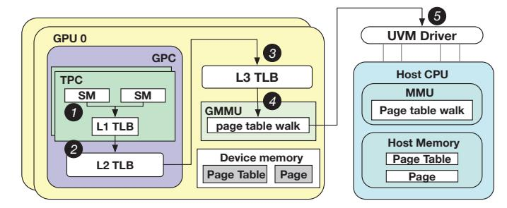

Fig. 1. UVM-managed Multi-GPU overview

all SMs within a GPU Processing Cluster (GPC). An L3 TLB serves all GPCs in the GPU. Each discrete GPU manages its own memory and page tables, with translation handled by the GPU Memory Management Unit (GMMU). In UVM systems, the CPU-resident UVM driver maintains a unified page table and coordinates page faults across GPUs.

Figure 1 illustrates the translation flow. On a memory access, the L1 cache and L1 TLB are accessed in parallel using a virtually indexed, physically tagged cache 1 . On an L1 TLB miss, the request checks the Miss Status Holding Register (MSHR); if unresolved, it proceeds to the L2 TLB 2 and then the L3 TLB 3 . If no translation is found, the request is forwarded to the GMMU 4 , which performs a multi-level page-table walk, often aided by a page-walk cache. If the mapping is still missing, a far-fault is generated and recorded in the GMMU MSHR, triggering an interrupt to the UVM driver 5 . The driver resolves the fault using its unified page table and updates mappings across CPU and GPU memories.

## *B. Predictive Page Migration*

Previous studies have explored page prefetching (i.e., predictive page migration), in CPU-GPU systems using UVM [21]–[23], [38] and in disaggregated memory environments [7], [36].

Fig. 2. NVIDIA tree-based neighborhood prefetcher [21]

A recent study [21] shows that NVIDIA GPUs use Tree-Based Neighborhood Prefetching (TBNP) in CUDA drivers for CPU–GPU page migration under UVM. Allocated UVM memory is first divided into 2MB large pages, which are further partitioned into 64KB logical blocks forming a complete binary tree (Figure 2). Each non-leaf node maintains metadata recording the number of total and migrated child nodes. TBNP migrates data at the leaf level, transferring the entire 64KB block upon a far-fault. It further prefetches remaining leaf nodes of a subtree once more than 50% of its leaf nodes have migrated, assuming strong spatial locality.

Figure 2 illustrates the process with four far-faults. The first two faults  $\P^0$  migrate blocks  $B_0^3$  and  $B_1^3$ , updating the valid sizes of  $B_0^2$ ,  $B_0^1$ ,  $B_0^0$  to 128KB. The third fault  $\P^0$  migrates  $B_3^3$ , increasing  $B_0^1$  and  $B_1^2$  to 192KB and 64KB, respectively; since  $B_0^1$  exceeds 50% of 256KB, node  $B_2^3$  is prefetched. The fourth access  $\P^0$  migrates  $B_4^3$ , increasing  $B_0^0$  to 320KB and triggering prefetches of  $B_5^3$ ,  $B_6^3$ , and  $B_7^3$ .

## C. Reactive Multi-GPU Page Migration

Prior work explores reactive page migration for UVM-managed multi-GPU systems, where migration is triggered after remote accesses. Existing approaches mainly include: (i) on-touch migration [11], (ii) access counter-based migration [53], and (iii) page duplication [43]. On-touch migration moves a page to the requesting GPU upon the first remote access, which may cause frequent migrations and ping-pong effects when multiple GPUs access the same page. Access counter-based migration delays migration until a threshold number of remote accesses occurs, reducing migration frequency but increasing initial access latency. Page duplication replicates read-only pages across GPUs to enable local reads, but requires invalidations when writes occur. The SOTA approach, GRIT [60], dynamically selects the most suitable strategy on a per-page basis to improve performance.

#### III. MOTIVATION

## A. Qualitative Discussion of Prior Work

GRIT [60] and OASIS [61] employ reactive page migration for multi-GPU scenarios, which is less effective than predictive methods because all migrations occur on the critical path. TBNP-EA [23] and Forest [38] are predictive spatial locality prefetchers based on TBNP [21], designed for CPU-GPU page migration. TBNP-EA dynamically adjusts prefetch thresholds according to page fault counts, whereas Forest adaptively modifies prefetch block sizes and tree depth based on access patterns. However, these GPU page prefetchers all suffer from limitations associated with relying solely on spatial locality. Moreover, none of these methods considers the cost-benefit trade-offs of migration or multi-GPU coordination, rendering them ineffective for multi-GPU page prefetching, as summarized in Table I.

TABLE I COMPARISON OF RELATED WORK

| Work Name    | Context   | Migration method              | High prefetching accuracy | Cost benefit analysis | Multi-GPU coordination |
|--------------|-----------|----------------------------------|---------------------------------|-----------------------------|---------------------------|
| TBNP-EA [23] | CPU-GPU   | Predictive (spatial locality) | ×                               | Х                           | Х                         |
| Forest [38]  | CPU-GPU   | Predictive (spatial locality) | ×                               | Х                           | ×                         |
| GRIT [60]    | Multi-GPU | Reactive                         | N/A                             | Х                           | X                         |
| LIBRA (ours) | Multi-GPU | Predictive (stride-based)     | 1                               | 1                           | 1                         |

#### B. Quantitative Evaluation of Prior Work

We quantitatively evaluate two state-of-the-art prefetchers, TBNP-EA and Forest, using the industry-validated MGPUsim simulator [55]. We simulate a 4-GPU system, with each GPU maintaining its own local page table and GMMU. Following prior studies on multi-GPU systems [11], [32], [34], [38], [60], we evaluate eight applications with diverse access patterns: Convolution 2D (C2D), Matrix Multiplication (MM), Matrix Transpose (MT), Image To Column (IM2COL), BERT Mini (BERT-M), BERT Base (BERT-B), GPT 2 Mini (GPT2-M), and GPT 2 (GPT2). Details of our evaluation methodology are presented in Section V.

#### **Evaluation Metric Definitions:**

- **Prefetch accuracy:** The percentage of prefetched pages accessed by the destination GPU.
- Prefetch coverage: The percentage of accessed pages that were prefetched and reside in local memory at the time of access.
- Page migration overhead: The critical-path latency introduced by page migration, including TLB invalidations, SM pipeline flushes, cache flushes, and data transfers. Only the initial far-fault-triggered page migration is counted as overhead; subsequent prefetches are excluded.
- Remote access overhead: The execution time incurred by remote memory accesses.
- Translation overhead: The execution time incurred by far-faults, excluding page migration and prefetching.
- Remote access changes: The total number of remote access changes incurred by performing a page migration, compared to eliminating this migration until the next migration event for the same page, aggregated across all GPUs' accesses to this page.

**Prefetching Accuracy and Coverage:** Table II presents the prefetching accuracy and coverage of these two methods.

TABLE II
PREFETCHING ACCURACY AND COVERAGE

|             |         | C2D | MM | MT | IM2COL | BERT-M | BERT-B | GPT2-M | GPT2 | AVG |
|-------------|---------|-----|----|----|--------|--------|--------|--------|------|-----|
|             | TBNP-EA | 18  | 31 | 36 | 37     | 30     | 33     | 34     | 34   | 32  |
| Accuracy(%) | Forest  | 29  | 49 | 59 | 36     | 39     | 38     | 44     | 44   | 42  |
|             | TBNP-EA | 18  | 28 | 45 | 36     | 31     | 34     | 35     | 35   | 33  |
| Coverage(%) | Forest  | 30  | 50 | 60 | 37     | 35     | 38     | 41     | 41   | 42  |

TBNP-EA and Forest, both based on TBNP, achieve limited prefetching coverage (33% and 42%), providing insufficient reduction of page migration overhead on the critical path. Their low prefetching accuracy (32% and 42%) also introduces substantial unnecessary inter-GPU traffic and contention. The low prefetching accuracy and coverage stems from the multi-GPU context, which differs from the single-GPU CPU-GPU setting for which TBNP was designed: workloads are partitioned across GPUs so each GPU accesses only a fraction of the data, reducing spatial locality, while concurrent accesses to the same pages across GPUs cause contention and frequent page migrations (ping-pong behavior), further degrading prefetching accuracy and coverage.

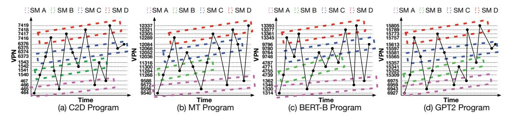

Fig. 3. Four SMs' access patterns of (a) C2D, (b) MT, (c) BERT-B and (d) GPT2

Fig. 4. VPN accesses of a SM: (a) C2D, (b) MT, (c) BERT-B, (d) GPT-2. VPN access strides of a way of a SM: (e) C2D, (f) MT, (g) BERT-B, (h) GPT-2.

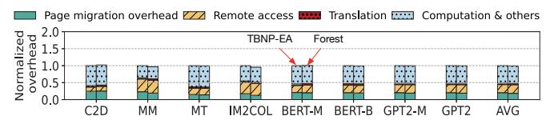

Fig. 5. Performance breakdown normalized to TBNP-EA

Page Migration Overhead: Figure 5 presents the performance breakdown of these two methods, illustrating that page migration and remote accesses constitute a substantial portion of the total execution time. Specifically, page migration and remote accesses collectively account for an average of 43% of the total access time in TBNP-EA (migration: 20%, remote access: 23%) and 45% in Forest (migration: 19%, remote access: 26%). The high page migration overhead results from low prefetching coverage, which ineffectively hides migration latency on the critical path. Remote accesses primarily occur when handling page migration. The significant remote access overhead also stems from limited prefetching coverage, which insufficiently converts remote accesses into local accesses.

Remote Access Changes: We evaluate remote access changes across all GPUs for each page migration or prefetching event. Figure 6 illustrates the results, categorizing migrations into three groups based on their total remote access changes: fewer than 0, between 0 and 200, and greater than 200. According to our simulator, a page migration incurs overhead roughly equivalent to 200 remote GPU accesses; thus, only migrations reducing more than 200 remote accesses are considered beneficial. The beneficial criterion that more than 200 remote accesses justify the page migration overhead may vary depending on system parameters, such as NVLink latency and page migration size. Additionally, we note that NVIDIA

UVM adopts an access-counter-based migration policy option, initiating migration when remote accesses exceed a threshold of 256 [49], which aligns with our findings and analysis.

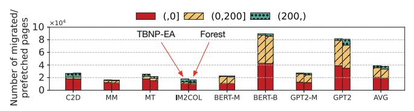

Fig. 6. Total remote access changes for all migrated/prefetched pages.

Due to the lack of cost-benefit analysis and multi-GPU coordination, page migrations may increase remote accesses at the source GPU without sufficiently reducing them at the destination, increasing total remote accesses. Specifically, 53% of migrations in TBNP-EA and 51% in Forest result in higher total remote accesses across all GPUs, introducing additional overhead. Furthermore, without quantitatively balancing migration costs against the benefits of reduced future remote accesses, only 7% of migrations in TBNP-EA and 10% in Forest yield benefits, highlighting the importance of considering cost-benefit trade-offs and multi-GPU coordination for each page migration and prefetching.

**Takeaway #1:** Spatial-locality prefetchers designed for CPU–GPU systems are ineffective in multi-GPU environments, as they exhibit low accuracy and coverage, incur substantial migration and remote-access overheads, and generate a large volume of migrated or prefetched pages whose benefits do not justify the associated costs.

## C. Multi-GPU Page Access Patterns

We conduct experiments to better understand GPU access patterns and derive insights for designing a high-accuracy stride-based page prefetcher for multi-GPU scenarios. Specifically, we analyze the Virtual Page Numbers (VPNs) accessed by each SM across multiple applications, presenting some examples due to space limitations.

Figure 3 illustrates the memory accesses of four SMs across four programs. Although the four SMs within each program exhibit identical strides (e.g., stride of 16 in MT, BERT-B, and GPT-2, and stride of 1 in C2D), the extensive parallelism inherent in GPUs results in these accesses occurring nonsequentially across SMs. TBNP-EA and Forest experience reduced accuracy and coverage due to non-adjacent accesses. Thus, an effective prefetcher should individually learn each SM's access pattern to enhance prefetching accuracy and coverage.

Figure 4 (a–d) present the VPN accesses of a single SM for four different programs, showing multiple ways with strided access patterns within each SM. A way represents an independent memory access stream originating from one or more SMs. Accesses are grouped into different ways based on an address-distance threshold separating memory regions. Figure 4 (e–h) depict the VPN access strides within one way of a SM, demonstrating that even a single way can exhibit stride shifts (e.g., from stride 8 to 4 in Figure 4 (h)) and multiple concurrent strides (e.g., strides 1, 6, and 7 in Figure 4 (g)).

Takeaway #2: An effective stride-based prefetcher should individually learn each SM's access pattern and accommodate its multi-way and multi-stride characteristics to improve prefetching accuracy and coverage.

# IV. DESIGN

# *A. Overview*

Based on Takeaway 1 and 2, we introduce LIBRA, a High-Accuracy, Cost-Aware, and Coordinated multi-GPU stride-based page prefetcher that addresses limitations of prior work through three key innovations. (1) High-Accuracy Per-GPU Hardware Multi-way Multi-stride Prefetcher: LIBRA equips each GPU with a hardware Multi-way Multi-stride Prefetcher (MMP) to accurately capture page access patterns per SM and generate high-accuracy prefetching requests via dynamic-depth stride prediction, guided by our observation in Take Away 2. (2) Cost-benefit analysis of prefetching requests. In contrast to existing methods that do not estimate future accesses for migrated or prefetched pages, LIBRA monitors accesses to selected prefetched pages, enabling accurate prediction of their subsequent GPU access counts. (3) Multi-GPU Page Prefetching Coordinator. LIBRA introduces a software-based Page Prefetching Coordinator (PPC) on the CPU, which quantitatively evaluates prefetch requests from all GPUs, considers estimated future accesses, and coordinates decisions across GPUs based on global cost-benefit analyses.

Figure 7 provides an overview of LIBRA, whose high-level workflow is as follows. All L3 TLB misses are forwarded to the prefetcher to facilitate learning of access patterns. Farfaults are managed by the prefetcher, which triggers predictions as necessary. The prefetcher predicts pages to be

Fig. 7. LIBRA overview

accessed along with their anticipated future access counts on the local GPU, subsequently generating and forwarding prefetch requests to the PPC. The PPC on the host CPU quantitatively evaluates incoming prefetch requests and coordinates prefetching decisions across all GPUs based on comprehensive cost-benefit analyses.

# *B. Multi-way Multi-stride Prefetcher*

Based on Takeaway 2, we propose the Multi-way Multistride Prefetcher (MMP) to learn page access patterns and generate prefetching requests guided by three design principles derived from multi-GPU program behaviors: (1) Per-Way and Per-SM Basis: Individual learning and prediction at a perway and per-SM granularity enhances accuracy, as merging accesses across ways or SMs obscures ordering due to GPU parallelism. (2) Multiple Ways: Maintaining multiple ways per SM captures diverse access patterns within each SM. (3) Multiple Strides: Supporting multiple strides per way captures concurrent strides and accommodates stride variations.

*1) Dynamic-Depth Prefetching:* To further improve prefetching accuracy, we propose dynamic-depth prefetching for multiple strides within each way of an SM. Given that a single way within an SM may exhibit multiple concurrent strides, we introduce a Dynamic-Depth prefetching strategy, wherein the number of pages prefetched per stride dynamically adjusts according to its recent frequency. Specifically, we maintain counters for the four most frequent strides, and prefetching more pages to strides that have recently occurred more frequently, improving predictive accuracy. While optimization of the exact increment of predicted pages per likelihood level is reserved for future exploration, in this paper, we conservatively prefetch one additional page for each 25% increase in stride occurrence likelihood.

$$stride\_likelihood = \frac{the\_counter\_of\_this\_stride}{the\_sum\_of\_all\_stride\_counters} \tag{1}$$

Figure 8 illustrates the dynamic-depth prefetching process and the intermediate values involved. The upper table shows the recorded data for a way in a SM, including the last VPN that triggered far-faults, the access count for a page in this way, four strides and their associated counters, and the total of all stride counters. A far-fault with VPN 0xa2 initiates the prediction process, during which the prefetcher calculates the likelihood of each stride using Equation 1 1 . It then predicts a strided pattern for each stride based on the VPN of

Fig. 8. Dynamic-depth prefetching

the initiating far-fault. We propose dynamic-depth prefetching, which determines the number of pages to prefetch for each stride based on its likelihood. For instance, the first stride (+2) with a likelihood of 0.52 results in the prefetching of two pages (0xa2+1\*(+2),0xa2+2\*(+2)) 2. The prefetch request is formulated, includes the VPNs of four pages and an estimated number of future accesses derived from the table 3. Upon the appearance of a fifth stride, the least frequent stride is removed.

2) Prefetcher Components and Workflow: To efficiently materialize the Multi-way Multi-stride Prefetcher (MMP) using dynamic-depth, we design the prefetcher that comprises two components: the Triggered Table and the Multi-way Multi-stride Access Table (MMAT), as illustrated in Figure 9. The Triggered Table, indexed by VPN, caches recent farfaults that trigger prediction to avoid redundant predictions from multiple SMs. The entries in the triggered table are periodically cleared. The MMAT maintains each SM's multi-way, multi-stride access patterns in a compressed format to generate high-accuracy and cost-aware prefetch requests.

Fig. 9. Multi-way multi-stride prefetcher design

The prefetcher workflow operates as follows: Upon a far-fault, the VPN is first checked against the Triggered Table ①. If the VPN exists, no further action is taken as this VPN is in the process of prefetching. Otherwise, the VPN is added to the Triggered Table and routed to the MMAT, which generates a prefetch request containing one or more pages ②. The prefetch request is then sent to the Page Prefetching Coordinator ③. The coordinator's decision is returned to the GMMU to resolve the original far-fault and migrate all, some, or none of the requested pages ④. Additionally, L3 TLB misses are forwarded to the MMAT, which learns these accesses using a compressed representation to maintain multi-way multi-stride

access patterns for each SM **⑤**. Finally, the access counts of the selected pages are periodically provided to update MMAT.

3) Multi-way Multi-stride Access Table (MMAT): We propose MMAT, illustrated in Figure 10, to efficiently learn and predict access patterns in a compressed format. MMAT comprises four rows corresponding to the four ways of each SM. Each row contains a 36-bit last VPN indicating the most recent VPN accessed, an 8-bit access counter tracking accesses to a previously accessed page in this way, four 6-bit strides with associated 6-bit occurrence counters, an 8-bit sum representing the total of all stride counters, and a 36-bit currently monitoring VPN. When the runtime provides access counts, the monitoring VPNs determine which way will be updated, as a way may be evicted if a fifth way appears in a SM.

Fig. 10. Multi-way Multi-stride Access Table

The access pattern learning process from L3 TLB misses is as follows. An L3 TLB miss is forwarded to the corresponding ways of the SM that initiate the miss **1**. Based on prior work describing the default mechanism in NVIDIA GPUs [33], [65], whether a TLB miss carries the source SM information is not specified. LIBRA extends the TLB-miss metadata to include the source SM information. The VPN of the miss is compared with the last VPNs across four ways; if the difference between this VPN and any last VPN is less than a threshold, the TLB miss is regarded as that way. In cases where multiple ways meet this criterion, the way with the smallest difference is selected. If no matches meet this criterion, a new way is created, replacing the existing way with the lowest access counter if the SM already records four ways **2**. This L3 TLB miss then updates the content in the matched way: the difference between the miss's VPN and the last VPN represents the stride. If this stride already exists, its counter is incremented; otherwise, it replaces the least frequent stride. Subsequently, the sum of all stride counters is adjusted, and the last VPN of this way is updated to the VPN of the current miss **3**.

The prediction procedure for handling a far-fault in MMAT is detailed as follows. Upon its occurrence, a far-fault is routed to the corresponding ways within the SM that initiated the miss **A**. The VPN associated with the far-fault is compared against the most recent VPNs stored across four ways. If the VPN difference is below a threshold (set to 512 in our design; optimization of this parameter is reserved for future work), the far-fault is attributed to that way. If multiple ways satisfy this criterion, the way with the minimal VPN difference is selected **B**. Subsequently, the prefetcher employs historical access patterns from the chosen way to generate prefetch re-

quests, following the algorithm described in Section IV-B1 and depicted in Figure 8 **©**. Prefetch requests with predicted future accesses are forwarded to the page prefetching coordinator **D**.

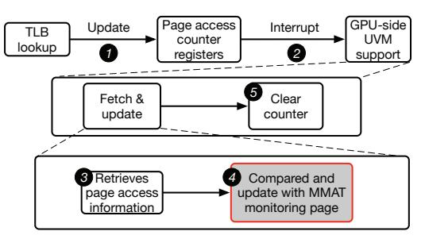

Fig. 11. Access counter update logic

4) Access Counter Update: We extend existing NVIDIA GPU mechanisms [22], [38], which record per-page local memory access counts, to update the monitored VPN's access count in MMAT.

Figure 11 illustrates the procedure for updating access counters in MMAT, extending the existing mechanism with modifications only to step **4**. Existing mechanisms maintain per-page access counters using registers automatically updated by the GMMU during TLB lookups upon every local memory access [22], [38] **①**. When a page's access counter reaches a predefined threshold, GPU hardware triggers an interrupt and records the event information in a ring buffer. The per-GPU-side UVM support continuously processes these interrupts **2**, retrieving entries from the ring buffer by invoking fetch\_access\_counter\_buffer\_entries(.), thus obtaining one or more access-counter buffer entries **3**. Each entry contains metadata (e.g., virtual addresses) identifying pages whose counters have reached the threshold. We modified fetch\_access\_counter\_buffer\_entries(.) to compare each reported page's virtual address against MMAT's monitored pages. Upon finding a match, the corresponding MMAT entry is updated by incrementing its counter by the threshold value **4**. After this update, the runtime proceeds to clear the hardware access-counter buffer **5**.

#### C. Page Prefetching Coordinator (PPC)

Without coordinated page prefetching across multiple GPUs, existing solutions incur a substantial number of migrations whose overheads outweigh their performance benefits, leading to migration such as ping-pong effects (see Section III-B).

We introduce the Page Prefetching Coordinator (PPC), designed to manage prefetch requests along with estimated accesses from our MMP. PPC is implemented as a software module within the CPU-side UVM runtime, avoiding any additional hardware changes. The main goal of the PPC is to allow a page migration only when its benefits exceed the overhead based on anticipated accesses for this page; otherwise, it proactively creates PTEs in response to the prefetch request. The PPC supports both CPU-GPU and GPU-GPU migrations. Given the lower memory bandwidth and higher latency of CPU memory compared to GPU memory, our

PPC implements first-touch CPU-GPU migration and quantitatively coordinated GPU-GPU migration. LIBRA follows the default first-touch CPU-GPU migration policy used in existing UVM systems [21] for initial page placement due to high CPU access latency. For GPU-GPU migrations, PPC records previous prefetch requests and their estimated future accesses. Migration decisions are based on this table, which determines whether and to which GPU a page should be migrated.

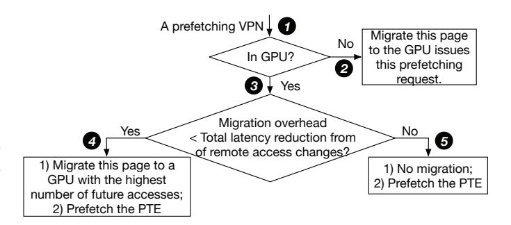

Fig. 12. Coordination logic

1) PPC Logic: Figure 12 illustrates the coordination logic of PPC. Upon receiving a prefetching VPN, PPC first checks whether the page resides in a GPU ①. If not, PPC migrates it to the requesting GPU as it is the first GPU access to this page ②. If this page is in GPU, PPC estimates whether the migration overhead is lower than the total latency reduction from migrating the page from one GPU to another with the highest estimated access count, based on Equation 2 ③. If the estimated benefit exceeds the overhead, PPC performs the migration to the GPU with the highest estimated access count and prefetches the PTE for the requesting GPU ④. Otherwise, no migration is performed, and only the PTEs are prefetched ⑤.

$$lat_{remote} * (acc_{highest} - acc_{source}) > page\_migration\_overhead$$
 (2)

Equation 2 defines the cost-benefit estimation of migrating a page among GPUs. Here,  $acc_{highest}$  denotes the highest estimated access count among all GPUs for the requested page, and  $acc_{source}$  represents the estimated access count of the GPU currently holding the page. The term  $lat_{remote}$  refers to the average latency of remote memory accesses across GPUs, while  $page\_migration\_overhead$  captures the total latency incurred during migration. In our experiments, we measure the average values of these components to estimate both the migration overhead and the potential performance benefit.

2) PPC Design: We design the PPC as a lightweight runtime module for coordinating prefetch decisions, as depicted in Figure 13. The PPC comprises a runtime component and a PPC hash table indexed by hashed VPN values in the CPU-side UVM runtime. Upon receiving a prefetch request, if the corresponding VPN is not present, the PPC runtime dynamically creates a new PPC hash table entry indexed by the hashed VPN value, initializing all fields to zero and recording the actual VPN. Each PPC table entry has a 36-bit actual VPN,

a recent-migration flag (1 bit), a recent-use flag (1 bit), the current GPU ID indicating the GPU where the page resides (3 bits), and eight access counters (8 bits each) that estimate access intensity across GPUs.

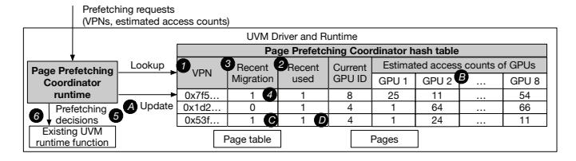

Fig. 13. Page prefetching coordinator design

For each prefetch request, the PPC runtime hashes each VPN within the request and retrieves the corresponding entry matching the hashed VPN value from PPC hash table **①**. If an entry is found, the estimated access count for the requesting GPU is updated based on the received value, and the recent-use bit is set **2**. If the recent-migration bit is already set, indicating a recent migration, no further action is taken 3. Otherwise, the PPC runtime applies Equation 2, using the updated estimated access counts and the current GPU ID, to decide whether the migration should occur. If migration is warranted, the recent-migration bit is set **4**, and the migration is executed by invoking the existing CPU-side UVM runtime function **⑤**. Specifically, the function uvm\_api\_migrate(.) is utilized for actual migrations, whereas uvm\_va\_block\_map(.) is employed to obtain only the translated PTE without migration. If no entry is found at step **2**, the PPC runtime creates a new entry. For pages residing in CPU memory, migration is permitted by default; for pages on other GPUs, migration decisions are made according to Equation 2 **6**.

The PPC runtime periodically performs a global maintenance operation on the PPC table . First, it right-shifts all access counters to decay historical access estimates, ensuring that the counters more accurately capture future access behaviors . Next, all recent-migration bits are cleared to enable subsequent migrations . and all recent-use bits are reset to facilitate more effective eviction decisions. Entries whose recent-use bits are already unset are reclaimed to free table capacity . The PPC hash table employs existing hashtable management techniques, including conflict resolution and dynamic resizing [54].

# D. Other Details

A remaining consideration is how LIBRA handles scenarios where a single SM concurrently executes CTAs from different processes. A straightforward solution would be to index PPC entries by PID so that each process maintains its own access-pattern state. However, this approach can inflate the table size when many processes are active. Instead, we leverage a property of modern NVIDIA GPUs: process-level context switches are coarse-grained and occur infrequently. In practice, an SM typically runs CTAs from one process for long intervals before switching to another [31]. When a context switch does

occur, LIBRA simply reloads the MMAT state for the new process, rather than maintaining multiple concurrent entries.

## E. Summary of Components and Interaction

The only newly introduced hardware component is the multi-way multi-stride prefetcher, which includes the Trigger Table and MMAT. All other components are implemented in software, including the page prefetching coordinator and modifications to the CPU UVM driver and runtime.

The high-level interaction among these components operates as follows. Neither the CPU-side UVM runtime nor the GPUside UVM support polls GPUs or continuously reads memorymapped registers; instead, both operate on demand and respond to interrupts or events. The GPU-side UVM support receives hardware access-counter update events and updates the corresponding MMAT counters. When a GPU page fault occurs and the page has not recently triggered prefetching, the prefetcher performs prediction and sends a prefetch request containing access information to the CPU-side UVM runtime via an interrupt. The runtime processes the request using previously collected access information to determine whether and where to perform page prefetching or migration. If prefetching or migration is selected, the operation is executed using the existing CPU-side UVM runtime mechanisms, which issue the corresponding events to the relevant GPUs.

#### F. Area Overhead

Our design incorporates the MMAT as on-chip components, The MMAT includes 100 SMs, each with 4 ways; each way comprises a 36-bit VPN, four sets each with a 6-bit stride and counter, a 36-bit monitor VPN, and a 10-bit total access counter, totaling 6,500 bytes per GPU.

We also evaluate MMAT using CACTI [57]. The estimated read energy per access is 0.0051 nJ (5.094 pJ), and the write energy per access is 0.0062 nJ (6.174 pJ). The data array area is 0.00964041  $mm^2$ , and the tag array area is 0.0031502  $mm^2$ , resulting in a total MMAT hardware area of 0.01279061  $mm^2$ . MMAT requires 6,500 bytes per GPU, which corresponds to 52,000 bits. Assuming a standard 6T SRAM cell [9] and approximating one NAND2-equivalent gate as four transistors, each bit corresponds to about 1.5 NAND2 gates. This results in an estimated storage cost of approximately  $7.8 \times 10^4$  NAND2-equivalent gates.

## G. Multi-Rack GPU Support

We discuss the potential extension of LIBRA to multi-rack GPU systems. Since the detailed design of UVM support for multi-rack GPUs has not been publicly disclosed, we consider two possible designs based on page-table organization. The first design adopts a **Centralized Page Table**, where one rack acts as the master rack and maintains the unified page table for the UVM memory across all racks. The second design adopts **Partitioned Page Tables**, where each rack's UVM runtime maintains the page table only for rack-local UVM memory.

We focus on the second design, as the first can be derived similarly. Under the partitioned design, the UVM runtime already supports remote access and page migration by routing requests to the appropriate per-rack GPU UVM runtime. Each rack maintains recent PTEs that point to pages located in other racks, enabling remote accesses, while page migrations coherently update the page tables across racks.

To extend LIBRA to this multi-rack UVM system, two modifications are required. First, the PPC needs to be extended into a per-rack PPC, which manages prefetch requests for pages stored in that rack's UVM memory. Second, LIBRA's cost–benefit model must be updated to account for multi-rack communication characteristics. In particular, remote-access latency should distinguish between intra-rack and inter-rack accesses, and page migration overhead should incorporate the costs of cross-rack page-table updates, cross-rack TLB invalidations, and inter-rack data transfer latency.

# V. EVALUATION METHODOLOGY

Simulator: We conduct experiments using the industryvalidated MGPUsim simulator [55], following prior work on multi-GPU systems [11], [32], [34], [38], [60]. We target a 4-GPU system, where each GPU maintains its own local page table and GMMU. Configurations are summarized in Table III.

TABLE III BASELINE MULTI-GPU CONFIGURATION

| Module            | Configuration                                  |  |  |
|-------------------|------------------------------------------------|--|--|
| SM                | 1.0 GHz, 108 per GPU                           |  |  |
| L1 D-Cache        | 64 KB, 4-way                                   |  |  |
| L1 I-Cache        | 32 KB, 4-way                                   |  |  |
| L2 Cache          | 2 MB, 8-way                                    |  |  |
| DRAM              | Configured to 70% of application's memory      |  |  |
|                   | footprint [11], [60]                           |  |  |
| L1 TLB            | 16 entries, 16-way, 1-cycle lookup latency,    |  |  |
|                   | TPC shared, LRU replacement policy             |  |  |
|                   | 128 entries, 8-way, 16 sub-entries per entry,  |  |  |
| L2 TLB            | 10-cycle lookup latency, GPC shared,           |  |  |
|                   | LRU replacement policy                         |  |  |
|                   | 1024 entries, 8-way, 16 sub-entries per entry, |  |  |
| L3 TLB            | 40-cycle lookup latency, GPU shared,           |  |  |
|                   | LRU replacement policy                         |  |  |
|                   | GMMU 8 shared page table walkers,              |  |  |
| Page Table Walk   | 100-cycle latency per level                    |  |  |
| Inter-GPU Network | 300 GB/s NVLink 3.0                            |  |  |
| CPU-GPU Network   | 32 GB/s PCIe-v4                                |  |  |

Applications and Workloads: Following prior work on multi-GPU page migration [11], [60], we use 23 applications with various multi-GPU memory access and page sharing patterns from AMDAPPSDK [8], Hetero-Mark [56], SHOC [15], and DNN-MARK [17] benchmark suites as listed in Table IV. We use the default input sets of these applications for evaluation. Compared Related Work: We compare seven state-of-the-art methods: (1) TBNP-O [21]: NVIDIA's TBNP with on-touch migration, migrating accessed pages immediately to local GPU memory; (2) TBNP-F [21]: TBNP with first-touch migration, migrating a page only once upon initial access; (3) TBNP-AT [22]: Adaptive Threshold adjusts between remote zero-copy access and migration using hardware counters; (4) TBNP-EA [23]: Early Adapter dynamically tunes prefetch thresholds based on page fault variations; (5) Forest [38]: Modifies prefetch size for blocks and trees based on access sequences;

TABLE IV BENCHMARK APPLICATIONS

| Abbr.   | Application                         | Memory Footprint (per GPU) | Access Pattern |
|---------|-------------------------------------|----------------------------------|-------------------|
| SC      | Simple Convolution                  | 32 MB                            | Adjacent          |
| C2D     | Convolution 2D                      | 23 MB                            | Adjacent          |
| MM      | Matrix Multiplication               | 8 MB                             | Scatter-Gather    |
| MT      | Matrix Transpose                    | 16 MB                            | Scatter-Gather    |
| FIR     | Finite Impulse Resp.                | 38 MB                            | Adjacent          |
| ST      | Stencil 2D                          | 8 MB                             | Adjacent          |
| IM2COL  | Image To Column                     | 20 MB                            | Scatter-Gather    |
| FFT     | Fast Fourier Transform              | 12 MB                            | Scatter-Gather    |
| LeNet   | LeNet                               | 6 MB                             | Mixed             |
| VGG     | Visual Geometry Group 16-layer      | 55 MB                            | Mixed             |
| BS      | Bitonic Sort                        | 7 MB                             | Random            |
| BERT-T  | BERT Tiny                           | 68 MB                            | Mixed             |
| BERT-M  | BERT Mini                           | 136 MB                           | Mixed             |
| BERT-ME | BERT Medium                         | 272 MB                           | Mixed             |
| BERT-B  | BERT Base                           | 544 MB                           | Mixed             |
| GPT2-M  | GPT-2 Mini                          | 65 MB                            | Mixed             |
| GPT2    | GPT-2                               | 196 MB                           | Mixed             |
| BFS     | Breadth-First Search                | 8 MB                             | Random            |
| PR      | Page Rank                           | 8 MB                             | Random            |
| MIS     | Max. Independent Set                | 4 MB                             | Random            |
| SSSP    | Single Source Shortest Path         | 14 MB                            | Random            |
| SPMV    | Sparse Matrix Vector Multiplication | 14 MB                            | Random            |
| KM      | K-Means Clustering Algorithm        | 33 MB                            | Random            |

(6) HOPP [36]: Prefetches pages based on categorized access patterns in disaggregated memory; (7) GRIT [60]: Reactively selects migration strategies among on-touch, counter-based, and duplication methods.

## VI. EVALUATION

## *A. End-to-End Performance*

Figure 14 displays the normalized end-to-end performance across seven related works. For regular benchmarks, LIBRA yields performance improvements of 44%, 37%, 31%, and 29% over TBNP-EA, Forest, HOPP, and GRIT, respectively. For irregular benchmarks, the numbers are 30%, 29%, 38%, and 36%, overall, the numbers are 40%, 35%, 32%, and 30%. These results underscore our method's effectiveness in optimizing page migration strategies and improving overall performance.

These performance gains primarily stem from LIBRA's capability to prefetch pages based on access patterns and to make cost-benefit aware, coordinated migration decisions. For example, in the FIR benchmark, LIBRA achieves performance improvements of 48% and 53% over GRIT and Forest, respectively. FIR has a significant proportion of pages that are infrequently accessed. In such scenarios, the cost of remote access is lower than that of migrating pages. Other approaches that lack cost-aware designs may still migrate pages frequently. In the ST benchmark, LIBRA outperforms Forest and GRIT by 31% and 40%, respectively. This gain stems from ST's access pattern, where GPUs access certain pages intensively but briefly, causing excessive migrations under spatial locality prefetchers (TBNP-O, TBNP-F, TBNP-EA, Forest) and GRIT's on-demand migration.

# *B. Detailed Analysis*

*1) Performance Breakdown:* Figure 15 provides a detailed breakdown of each method. The definitions of these metrics

Fig. 14. End-to-end performance normalized to TBNP-O (left: regular benchmarks, middle: irregular benchmarks, right: overall average)

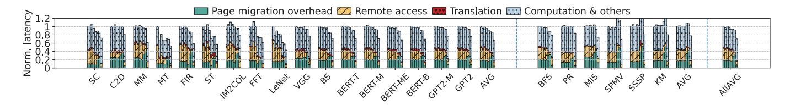

Fig. 15. Performance breakdown normalized to TBNP-O (left: regular benchmarks, middle: irregular benchmarks, right: overall average). The bars for each benchmark, from left to right, represent TBNP-O, TBNP-F, TBNP-AT, TBNP-EA, Forest, HOPP, GRIT, and LIBRA

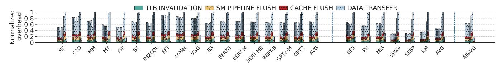

Fig. 16. Breakdowns of page migration overhead normalized to GRIT (left: regular benchmarks, middle: irregular benchmarks, right: overall average). The bars for each benchmark, from left to right, represent TBNP-O, TBNP-F, TBNP-AT, TBNP-EA, Forest, HOPP, GRIT, and LIBRA

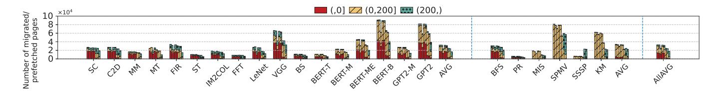

Fig. 17. Total remote access changes for all migrated/prefetched pages (left: regular benchmarks, middle: irregular benchmarks, right: overall average). The bars for each benchmark, from left to right, represent TBNP-O, TBNP-F, TBNP-AT, TBNP-EA, Forest, HOPP, GRIT, and LIBRA

are in Section III-B. TBNP-EA prefetcher exhibits substantial proportions of remote access (26% on average) and page migration (18% on average) due to low prefetching coverage and accuracy. GRIT, a reactive method, uses more page migrations to reduce remote accesses, with migrations occupying 36% and remote accesses occupying 5% of the total time. Conversely, LIBRA evaluates migration costs and benefits to make informed decisions, reducing the combined total of migration and remote access times of GRIT by 59%. Additionally, the accurate predictive method employed by LIBRA also reduces translation overhead by 54% compared to GRIT.

*2) Breakdown of Page Migration Overhead:* Figure 16 presents the page migration overhead of all evaluated methods, normalized to GRIT. Migration overhead comprises flushing in-flight instructions from the SM pipeline, invalidating cache contents and TLBs on the source GPU, and the data transfer latency, with data transfer being the dominant contributor. LIBRA incurs only 16% additional overhead compared to GRIT, owing to its access-pattern-aware prefetching, which enhances accuracy and coverage. In contrast, TBNP-O, TBNP-F, TBNP-AT, TBNP-EA and Forest exhibit similarly high overheads. HOPP incurs approximately 89% of GRIT's overhead, reflecting its limited ability to hide migration latency due to low prefetch accuracy.

*3) Remote Access Changes:* We evaluate remote access changes across GPUs for each migration or prefetching event. Figure 17 categorizes migrations based on total remote access changes: fewer than 0, between 0 and 200, and greater than 200. Our simulator equates migration overhead to approximately 200 remote GPU accesses; thus, only migrations reducing more than 200 accesses are beneficial. This finding aligns with NVIDIA UVM's migration threshold of 256 remote accesses [49].

In LIBRA, over 95% of migrations successfully reduce remote access counts for migrated pages, with more than 69% proving beneficial. This underscores the effectiveness of LIBRA's cost-awareness and multi-GPU coordination mechanisms in making informed migration decisions. In contrast, TBNP-based methods show a significantly lower percentage of beneficial migrations; the best among them, Forest, achieves only 12% beneficial migrations. HOPP and GRIT perform slightly better than Forest, with beneficial migration percent-

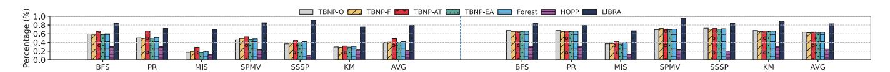

Fig. 18. Prefetching Accuracy (left) and Coverage (right) for irregular benchmarks

Fig. 19. Impact of each LIBRA design component on overall performance (left: regular benchmarks, middle: irregular benchmarks, right: overall average)

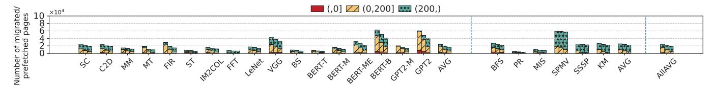

Fig. 20. Total remote access changes for migrated/prefetched pages (left: regular benchmarks, middle: irregular benchmarks, right: overall average). The bars for each benchmark, from left to right, represent LIBRA w/o cost estimation & coordination, LIBRA w/o coordination, and LIBRA

ages of 18% and 34%, respectively. The lower effectiveness of these methods is due to their lack of cost-aware and coordinated multi-GPU strategies.

TABLE V PREFETCHER COMPARISON

| Abbr.        | Accuracy (%) | Coverage(%) | Average number of prefetched pages |
|--------------|--------------|-------------|---------------------------------------|
| TBNP-O [21]  | 33.8%        | 42.2%       | 28548                                 |
| TBNP-F [21]  | 39.3%        | 42.8%       | 25406                                 |
| TBNP-AT [22] | 47.4%        | 42.9%       | 21333                                 |
| TBNP-EA [23] | 36.2%        | 43.2%       | 27557                                 |
| Forest [38]  | 42.9%        | 48.9%       | 26617                                 |
| HOPP [36]    | 34.4%        | 12.3%       | 9675                                  |
| LIBRA (ours) | 81.8%        | 83.9%       | 19967                                 |

- *4) Prefetching Accuracy and Coverage:* Table V displays the page prefetching coverage of all prefetchers. The baseline average number of page faults are 24007. The results show that LIBRA conceals over 83% of migration latency from the critical path thanks to its access-pattern-aware design. In contrast, TBNP-based methods provide 44% prefetching coverage, hiding about 44% of page migration from the critical path but at the cost of a large number of page prefetches. In benchmarks with large strides, such as FFT, LIBRA achieves 95% prefetching coverage, whereas TBNP-based methods only manage about 12%. For benchmarks with high spatial locality, LIBRA slightly outperforms TBNP-based methods, although the latter achieve similar coverage at the expense of prefetching many more pages.
- *5) CPU Overhead:* We also measured the CPU overhead for processing prefetching requests, based on the number of prefetched pages. Since the CPU-side UVM runtime already handles tasks such as page table walks, LIBRA introduces only 3.2% overhead in CPU time. TBNP-EA, Forest, and HOPP introduce 0.4%, 0.4%, and 0.1% overhead in CPU time, respectively.

TABLE VI CPU OVERHEAD COMPARISON

| Name of the work | Average CPU overhead (%) |
|------------------|--------------------------|
| TBNP-O [21]      | 0.4                      |
| TBNP-F [21]      | 0.4                      |
| TBNP-AT [22]     | 0.3                      |
| TBNP-EA [23]     | 0.4                      |
| Forest [38]      | 0.4                      |
| HOPP [36]        | 0.1                      |
| LIBRA (ours)     | 3.2                      |

# *C. Irregular Benchmark Analysis*

Figure 18 shows the accuracy and coverage for irregular benchmarks. The results indicate that LIBRA conceals over 82% of migration latency from the critical path due to its access-pattern-aware design, achieving an accuracy of 79%. In contrast, TBNP-based methods provide 62% prefetch coverage, hiding about 62% of page migration latency from the critical path, but at the cost of a large number of unnecessary page prefetches, resulting in an accuracy of only 40%. These results demonstrate that LIBRA remains effective for irregular benchmarks and continues to outperform TBNP-based approaches.

## *D. Ablation Study*

We conducted an ablation study to assess the contributions of cost-awareness and multi-GPU coordination. "LIBRA w/o cost estimation & coordination" removes both features, while "LIBRA w/o coordination" removes only the multi-GPU coordination. Figure 19 and Figure 20 illustrate the impact of each LIBRA design component on page prefetching decisions and overall performance normalized to TBNP-O, respectively. Without cost estimation and coordination, LIBRA issues an average of 24K page migrations, of which 7% are unnecessary—resulting in increased remote accesses—and

Fig. 21. Performance with 15%, 25%, 35%, 40% and 50% Threshold (left: regular benchmarks, middle: irregular benchmarks, right: overall average)

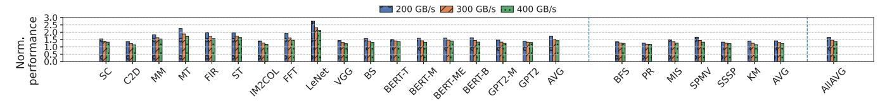

Fig. 22. Performance with 200 GB/s, 300 GB/s, and 400 GB/s NVLink Bandwidth (Left: Regular benchmarks Middle: Irregular benchmarks Right: Overall Average Results)

55% are inefficient, where the reduction in remote access does not justify the migration cost.

With cost estimation, LIBRA can assess the trade-off between migration cost and benefit, reducing total page migrations by 16%, unnecessary migrations by 31%, and inefficient migrations by 36%, leading to a 12% performance improvement. Adding multi-GPU coordination further eliminates pingpong migrations and selects the optimal destination GPU, reducing total migrations by an additional 13%, unnecessary migrations by 35%, and inefficient migrations by 45%, with an 6% performance gain. These two designs work synergistically to enhance overall performance.

## *E. Sensitive Study*

- *1) Performance with Different Prefetching Threshold:* Figure 21 shows the performance under different prefetching thresholds. While some benchmarks, such as LeNet, benefit from a higher threshold—where a 50% threshold improves performance by 5%—others, such as Bitonic Sort, prefer more conservative prefetching; using a 15% threshold yields a 13% performance improvement. Overall, a 25% threshold provides the best performance on average, outperforming thresholds of 15%, 35%, 40%, and 50% by 3%, 2%, 1%, and 1%, respectively. We leave the dynamic tuning of the threshold as future work.
- *2) Performance with Different Network Bandwidth:* Figure 22 shows the performance under different bandwidth settings. At 200 GB/s, LIBRA outperforms TBNP-o by 64.7%; at 300 GB/s, the improvement is 46%; and at 400 GB/s, it is 36.8%. These results demonstrate LIBRA's effectiveness across different bandwidth conditions, with smaller gains at higher bandwidth because page migration overhead accounts for a smaller fraction of execution time.
- *3) Performance with Different Numbers of GPUs:* We evaluate our approach using systems equipped with 1, 8, 16 and 32 GPUs to demonstrate LIBRA's generality. The multi-GPU simulator is scaled down in all components, including compute units, cache, memory, NVLink, etc. The scaled down simulator can accurately model recent GPU performance [55]. We adopt memory footprints consistent with prior multi-GPU studies [11], [32], [34], [60]; despite their relatively small

absolute values, these footprints are sufficiently large within the scaled-down simulator to effectively evaluate page migration. In the 1 GPU setup, LIBRA still achieves performance improvements, 25%, 18%, 35%, 30% over TBNP-EA, Forest, HOPP, and GRIT, respectively. We proportionally increase the workload size to scale up to 8 16 and 32 GPUs. [61] As shown in Figure 23, LIBRA achieves significant performance improvements, 40%, 31%, 29%, 24% over TBNP-EA, Forest, HOPP, and GRIT, respectively, in the 8-GPU configuration. In the 16-GPU setup, the gains remain substantial at 41%, 39%, 28%, 31%, respectively. In the 32-GPU setup, LIBRA still prevail other methods, 40%, 29%, 27%, 22% over TBNP-EA, Forest, HOPP, and GRIT. These results demonstrate LIBRA's effectiveness across environments with more GPUs.

Fig. 23. Average performance with 1, 8, 16, and 32 GPUs

Fig. 24. Memory oversubscription performance

*4) Memory oversubscription:* To evaluate LIBRA under memory oversubscription, we keep the application working sets the same and reduce each GPU's memory capacity. Following prior work [61], we evaluate 125% and 150% memory oversubscription, where total application data exceeds total GPU memory by 25% and 50%, respectively, with excess data placed in CPU memory. As shown in Figure 24, LIBRA achieves performance gains of 32%, 29%, 29%, 27% over TBNP-EA, Forest, HOPP, and GRIT at 125% oversubscription, and 30%, 28%, 26%, 24% at 150%. These results demonstrate LIBRA's effectiveness under memory oversubscription.

Fig. 25. End-to-end performance results normalized to TBNP-O in multi-rack environment (left: regular benchmarks, middle: irregular benchmarks, right: overall average)

# *F. Multi-Rack Evaluation*

In addition to the simulator configuration shown in Table III, we evaluate LIBRA in a multi-rack setting. In modern multi-rack GPU clusters, the node-to-node fabric is typically provisioned with NDR 400 Gb/s interconnects [47], with NIC throughput matching the link class (e.g., ConnectX-7 provides 400 Gb/s throughput [46]). Our simulator models two racks, each containing one node equipped with eight GPUs. The experimental results are shown in Figure 25. LIBRA achieves performance improvements of 74%, 65%, 60%, and 56% over TBNP-EA, Forest, HOPP, and GRIT, respectively. These results highlight the effectiveness of LIBRA in multirack environments through cost-aware analysis, multi-GPU coordination, and high-accuracy prefetching.

## VII. RELATED WORK

GPU Page Migration and Placement. Prior work [1]–[3], [11], [12], [16], [43], [60] has explored techniques to improve page placement. Dashti et al. [16] reduce remote access costs using interleaving, replication, and migration. Agarwal et al. [3] dynamically manage hot and cold pages in hybrid memory systems. Griffin [11] classifies pages by runtime access patterns to reduce migration overhead. GPS [43] introduces a subscription model for multi-GPU memory management, while OASIS [61] dynamically identifies object patterns and selects appropriate page management policies at runtime.

GPU Prefetching. GPU prefetching has been widely studied to improve memory latency hiding. Cache-line–based approaches include MTA [29], CTA-aware prefetching [28], and Snake [42], which exploit intra-/inter-warp or inter-thread stride patterns. Tree-based locality prefetchers [21], [22], [38] capture spatial access patterns using binary tree structures. However, these techniques target single-GPU systems. Extending them to multi-GPU environments introduces two key challenges: (1) cache-line prefetching may trigger coherence overhead when accessing remote pages, and (2) tree-based spatial methods do not account for cross-device coordination and migration cost.

Disaggregated Memory Page Migration. Prior work has explored page migration and placement across NUMA and tiered memory systems [18], [30], [39], [40], [62]–[64]. Early work such as Whitney et al. [62] considers migration rate and cost but does not provide a concrete mechanism to estimate migration benefits. Subsequent systems [30], [40], [63], [64] manage page placement in heterogeneous memories by tracking page access patterns and migrating hot or cold pages across tiers, while approaches like Leap [39] use majority trends to guide prefetching. However, these works primarily target CPU-based or single-node environments and do not address challenges of page migration of multiple GPUs. In contrast, LIBRA explicitly models migration cost based on access counts and coordinates decisions across GPUs, enabling migration and prefetching decisions tailored to multi-GPU systems.

CPU Prefetchers. Over the years, numerous CPU prefetchers [4], [10], [13], [26], [41], [50], [51] have been proposed to reduce memory-access latency by predicting future data references. Examples include SPP [26], which leverages compressed path histories and confidence-based throttling; the Best Offset Prefetcher (BOF) [41], which searches for an optimal offset; Bingo [10], which correlates recurring spatial access patterns; IPCP [50], which classifies instruction pointers to guide prefetching; and Pythia [13], which uses reinforcement learning to adapt prefetch decisions. However, these techniques operate at cache-line granularity. While the approaches used to learn and predict access patterns in CPU prefetching remain applicable to multi-GPU systems, naively applying them to GPUs may introduce significant overhead. LIBRA extends the stride-based prefetching approach to pagelevel prefetching in multi-GPU systems, combining a multiway, multi-stride prefetcher with a runtime coordinator that considers migration cost and cross-GPU access behavior to mitigate page ping-pong and migration overhead.

## VIII. CONCLUSION

Given the increasing scale of applications, multi-GPU page migration has become increasingly important. In this paper, we analyze the limitations of existing multi-GPU reactive and predictive page migration strategies. We introduce LI-BRA, a novel multi-GPU page prefetcher that addresses these shortcomings by incorporating access-pattern awareness, cost awareness, and coordination across multiple GPUs. Our comprehensive evaluations across diverse benchmarks show that LIBRA significantly improves performance, outperforming GRIT and Forest by 30% and 35% on average, respectively.

## ACKNOWLEDGMENT

We sincerely thank the anonymous reviewers from ISCA 2026 for their insightful feedback. This work is supported in part by the National Science Foundation (NSF) under Grant No. CNS-2350230, IIS-2543427, and OAC-2530649. Any opinions, findings, or recommendations expressed in this material are those of the authors and do not necessarily reflect the views of NSF.

## REFERENCES

- [1] N. Agarwal, D. Nellans, M. O'Connor, S. W. Keckler, and T. F. Wenisch, "Unlocking bandwidth for gpus in cc-numa systems," in *2015 IEEE 21st International Symposium on High Performance Computer Architecture (HPCA)*, 2015, pp. 354–365.
- [2] N. Agarwal, D. Nellans, M. Stephenson, M. O'Connor, and S. W. Keckler, "Page placement strategies for gpus within heterogeneous memory systems," *SIGPLAN Not.*, vol. 50, no. 4, p. 607–618, Mar. 2015. [Online]. Available: https://doi.org/10.1145/2775054.2694381
- [3] N. Agarwal and T. F. Wenisch, "Thermostat: Application-transparent page management for two-tiered main memory," *SIGPLAN Not.*, vol. 52, no. 4, p. 631–644, Apr. 2017. [Online]. Available: https://doi.org/10.1145/3093336.3037706
- [4] S. Ainsworth and L. Mukhanov, "Triangel: A high-performance, accurate, timely on-chip temporal prefetcher," in *2024 ACM/IEEE 51st Annual International Symposium on Computer Architecture (ISCA)*, 2024, pp. 1202–1216.
- [5] T. Allen and R. Ge, "Demystifying gpu uvm cost with deep runtime and workload analysis," in *2021 IEEE International Parallel and Distributed Processing Symposium (IPDPS)*, 2021, pp. 141–150.
- [6] T. Allen and R. Ge, "In-depth analyses of unified virtual memory system for gpu accelerated computing," in *Proceedings of the International Conference for High Performance Computing, Networking, Storage and Analysis*, ser. SC '21. New York, NY, USA: Association for Computing Machinery, 2021. [Online]. Available: https://doi.org/10.1145/3458817.3480855
- [7] E. Amaro, C. Branner-Augmon, Z. Luo, A. Ousterhout, M. K. Aguilera, A. Panda, S. Ratnasamy, and S. Shenker, "Can far memory improve job throughput?" in *Proceedings of the Fifteenth European Conference on Computer Systems*, ser. EuroSys '20. New York, NY, USA: Association for Computing Machinery, 2020. [Online]. Available: https://doi.org/10.1145/3342195.3387522
- [8] AMD, *AMD APP SDK OpenCL Optimization Guide*, 2015.
- [9] G. Apostolidis, D. Balobas, and N. Konofaos, "Design and simulation of 6t sram cell architectures in 32nm technology," *Journal of Engineering Science and Technology Review*, vol. 9, no. 5, pp. 145–149, 2016.
- [10] M. Bakhshalipour, M. Shakerinava, P. Lotfi-Kamran, and H. Sarbazi-Azad, "Bingo spatial data prefetcher," in *2019 IEEE International Symposium on High Performance Computer Architecture (HPCA)*, 2019, pp. 399–411.
- [11] T. Baruah, Y. Sun, A. T. Dinc¸er, S. A. Mojumder, J. L. Abellan, ´ Y. Ukidave, A. Joshi, N. Rubin, J. Kim, and D. Kaeli, "Griffin: Hardware-software support for efficient page migration in multi-gpu systems," in *2020 IEEE International Symposium on High Performance Computer Architecture (HPCA)*, 2020, pp. 596–609.
- [12] L. Belayneh, H. Ye, K.-Y. Chen, D. Blaauw, T. Mudge, R. Dreslinski, and N. Talati, "Locality-aware optimizations for improving remote memory latency in multi-gpu systems," in *Proceedings of the International Conference on Parallel Architectures and Compilation Techniques*, ser. PACT '22. New York, NY, USA: Association for Computing Machinery, 2023, p. 304–316. [Online]. Available: https://doi.org/10.1145/3559009.3569649
- [13] R. Bera, K. Kanellopoulos, A. Nori, T. Shahroodi, S. Subramoney, and O. Mutlu, "Pythia: A customizable hardware prefetching framework using online reinforcement learning," in *MICRO-54: 54th Annual IEEE/ACM International Symposium on Microarchitecture*, ser. MICRO '21. New York, NY, USA: Association for Computing Machinery, 2021, p. 1121–1137. [Online]. Available: https://doi.org/10.1145/ 3466752.3480114
- [14] R. Bera, A. V. Nori, O. Mutlu, and S. Subramoney, "Dspatch: Dual spatial pattern prefetcher," in *Proceedings of the 52nd Annual IEEE/ACM International Symposium on Microarchitecture*, 2019, pp. 531–544.
- [15] A. Danalis, G. Marin, C. McCurdy, J. S. Meredith, P. C. Roth, K. Spafford, V. Tipparaju, and J. S. Vetter, "The scalable heterogeneous computing (shoc) benchmark suite," in *Proceedings of the 3rd Workshop on General-Purpose Computation on Graphics Processing Units*, ser. GPGPU-3. New York, NY, USA: Association for Computing Machinery, 2010, p. 63–74. [Online]. Available: https://doi.org/10.1145/1735688.1735702
- [16] M. Dashti, A. Fedorova, J. Funston, F. Gaud, R. Lachaize, B. Lepers, V. Quema, and M. Roth, "Traffic management: a holistic approach to memory placement on numa systems," *SIGPLAN*

- *Not.*, vol. 48, no. 4, p. 381–394, Mar. 2013. [Online]. Available: https://doi.org/10.1145/2499368.2451157
- [17] S. Dong and D. Kaeli, "Dnnmark: A deep neural network benchmark suite for gpus," in *Proceedings of the General Purpose GPUs*, ser. GPGPU-10. New York, NY, USA: Association for Computing Machinery, 2017, p. 63–72. [Online]. Available: https: //doi.org/10.1145/3038228.3038239
- [18] P. Duraisamy, W. Xu, S. Hare, R. Rajwar, D. Culler, Z. Xu, J. Fan, C. Kennelly, B. McCloskey, D. Mijailovic, B. Morris, C. Mukherjee, J. Ren, G. Thelen, P. Turner, C. Villavieja, P. Ranganathan, and A. Vahdat, "Towards an adaptable systems architecture for memory tiering at warehouse-scale," in *Proceedings of the 28th ACM International Conference on Architectural Support for Programming Languages and Operating Systems, Volume 3*, ser. ASPLOS 2023. New York, NY, USA: Association for Computing Machinery, 2023, p. 727–741. [Online]. Available: https://doi.org/10.1145/3582016.3582031
- [19] D. Foley and J. Danskin, "Ultra-performance pascal gpu and nvlink interconnect," *IEEE Micro*, vol. 37, no. 2, pp. 7–17, 2017.
- [20] J. W. Fu, J. H. Patel, and B. L. Janssens, "Stride directed prefetching in scalar processors," *ACM SIGMICRO Newsletter*, vol. 23, no. 1-2, pp. 102–110, 1992.
- [21] D. Ganguly, Z. Zhang, J. Yang, and R. Melhem, "Interplay between hardware prefetcher and page eviction policy in cpu-gpu unified virtual memory," in *2019 ACM/IEEE 46th Annual International Symposium on Computer Architecture (ISCA)*, 2019, pp. 224–235.
- [22] D. Ganguly, Z. Zhang, J. Yang, and R. Melhem, "Adaptive page migration for irregular data-intensive applications under gpu memory oversubscription," in *2020 IEEE International Parallel and Distributed Processing Symposium (IPDPS)*. IEEE, 2020, pp. 451–461.
- [23] S. Go, H. Lee, J. Kim, J. Lee, M. K. Yoon, and W. W. Ro, "Earlyadaptor: An adaptive framework forproactive uvm memory management," in *2023 IEEE International Symposium on Performance Analysis of Systems and Software (ISPASS)*, 2023, pp. 248–258.
- [24] T. D. Hartley, U. Catalyurek, A. Ruiz, F. Igual, R. Mayo, and M. Ujaldon, "Biomedical image analysis on a cooperative cluster of gpus and multicores," in *ACM International Conference on Supercomputing 25th Anniversary Volume*. New York, NY, USA: Association for Computing Machinery, 2008, p. 413–423. [Online]. Available: https://doi.org/10.1145/2591635.2667189
- [25] Intel. (2018) The future of core, intel gpus, 10nm, and hybrid x86. [Online]. [Online]. Available: https://www.anandtech.com/show/13699/ intel-architecture-day-2018-core-future-hybrid-x86/5
- [26] J. Kim, S. H. Pugsley, P. V. Gratz, A. N. Reddy, C. Wilkerson, and Z. Chishti, "Path confidence based lookahead prefetching," in *2016 49th Annual IEEE/ACM International Symposium on Microarchitecture (MICRO)*, 2016, pp. 1–12.
- [27] I. King. (2017) Chipmakers nvidia, amd ride cryptocurrency wave for now. [Online]. [Online]. Available: https://www.bloomberg.com/news/articles/2017-07- 17/chipmakers-nvidia-amd-ride-cryptocurrency-wave-for-now
- [28] G. Koo, H. Jeon, Z. Liu, N. S. Kim, and M. Annavaram, "Cta-aware prefetching and scheduling for gpu," in *2018 IEEE International Parallel and Distributed Processing Symposium (IPDPS)*, 2018, pp. 137–148.
- [29] J. Lee, N. B. Lakshminarayana, H. Kim, and R. Vuduc, "Manythread aware prefetching mechanisms for gpgpu applications," in *2010 43rd Annual IEEE/ACM International Symposium on Microarchitecture*, 2010, pp. 213–224.
- [30] T. Lee, S. K. Monga, C. Min, and Y. I. Eom, "Memtis: Efficient memory tiering with dynamic page classification and page size determination," in *Proceedings of the 29th Symposium on Operating Systems Principles*, ser. SOSP '23. New York, NY, USA: Association for Computing Machinery, 2023, p. 17–34. [Online]. Available: https://doi.org/10.1145/3600006.3613167
- [31] A. Li, S. L. Song, W. Liu, X. Liu, A. Kumar, and H. Corporaal, "Locality-aware cta clustering for modern gpus," *ACM SIGARCH Computer Architecture News*, vol. 45, no. 1, pp. 297–311, 2017.
- [32] B. Li, Y. Guo, Y. Wang, A. Jaleel, J. Yang, and X. Tang, "Idyll: Enhancing page translation in multi-gpus via light weight pte invalidations," in *Proceedings of the 56th Annual IEEE/ACM International Symposium on Microarchitecture*, ser. MICRO '23. New York, NY, USA: Association for Computing Machinery, 2023, p. 1163–1177. [Online]. Available: https://doi.org/10.1145/3613424. 3614269

- [33] B. Li, Y. Wang, T. Wang, L. Eeckhout, J. Yang, A. Jaleel, and X. Tang, "Star: Sub-entry sharing-aware tlb for multi-instance gpu," in *2024 57th IEEE/ACM International Symposium on Microarchitecture (MICRO)*. IEEE, 2024, pp. 309–323.
- [34] B. Li, J. Yin, A. Holey, Y. Zhang, J. Yang, and X. Tang, "Trans-fw: Short circuiting page table walk in multi-gpu systems via remote forwarding," in *2023 IEEE International Symposium on High-Performance Computer Architecture (HPCA)*, 2023, pp. 456–470.
- [35] C. Li, R. Ausavarungnirun, C. J. Rossbach, Y. Zhang, O. Mutlu, Y. Guo, and J. Yang, "A framework for memory oversubscription management in graphics processing units," in *Proceedings of the Twenty-Fourth International Conference on Architectural Support for Programming Languages and Operating Systems*, ser. ASPLOS '19. New York, NY, USA: Association for Computing Machinery, 2019, p. 49–63. [Online]. Available: https://doi.org/10.1145/3297858.3304044
- [36] H. Li, K. Liu, T. Liang, Z. Li, T. Lu, H. Yuan, Y. Xia, Y. Bao, M. Chen, and Y. Shan, "Hopp: Hardware-software co-designed page prefetching for disaggregated memory," in *2023 IEEE International Symposium on High-Performance Computer Architecture (HPCA)*, 2023, pp. 1168– 1181.
- [37] L. Li and B. Chapman, "Compiler assisted hybrid implicit and explicit gpu memory management under unified address space," in *Proceedings of the International Conference for High Performance Computing, Networking, Storage and Analysis*, ser. SC '19. New York, NY, USA: Association for Computing Machinery, 2019. [Online]. Available: https://doi.org/10.1145/3295500.3356141
- [38] M. Lin, Y. Feng, G. Cox, and H. Jeon, "Forest: Access-aware gpu uvm management," in *Proceedings of the 52nd Annual International Symposium on Computer Architecture*, 2025, pp. 137–152.
- [39] H. A. Maruf and M. Chowdhury, "Effectively prefetching remote memory with leap," in *2020 USENIX Annual Technical Conference (USENIX ATC 20)*. USENIX Association, Jul. 2020, pp. 843– 857. [Online]. Available: https://www.usenix.org/conference/atc20/ presentation/al-maruf
- [40] H. A. Maruf, H. Wang, A. Dhanotia, J. Weiner, N. Agarwal, P. Bhattacharya, C. Petersen, M. Chowdhury, S. Kanaujia, and P. Chauhan, "Tpp: Transparent page placement for cxl-enabled tieredmemory," in *Proceedings of the 28th ACM International Conference on Architectural Support for Programming Languages and Operating Systems, Volume 3*, ser. ASPLOS 2023. New York, NY, USA: Association for Computing Machinery, 2023, p. 742–755. [Online]. Available: https://doi.org/10.1145/3582016.3582063
- [41] P. Michaud, "Best-offset hardware prefetching," in *2016 IEEE International Symposium on High Performance Computer Architecture (HPCA)*, 2016, pp. 469–480.
- [42] S. Mostofi, H. Falahati, N. Mahani, P. Lotfi-Kamran, and H. Sarbazi-Azad, "Snake: A variable-length chain-based prefetching for gpus," in *Proceedings of the 56th Annual IEEE/ACM International Symposium on Microarchitecture*, ser. MICRO '23. New York, NY, USA: Association for Computing Machinery, 2023, p. 728–741. [Online]. Available: https://doi.org/10.1145/3613424.3623782
- [43] H. Muthukrishnan, D. Lustig, D. Nellans, and T. Wenisch, "Gps: A global publish-subscribe model for multi-gpu memory management," in *MICRO-54: 54th Annual IEEE/ACM International Symposium on Microarchitecture*, ser. MICRO '21. New York, NY, USA: Association for Computing Machinery, 2021, p. 46–58. [Online]. Available: https://doi.org/10.1145/3466752.3480088
- [44] A. Navarro-Torres, B. Panda, J. Alastruey-Benede, P. Ib ´ a´nez, V. Vi ˜ nals- ˜ Yufera, and A. Ros, "Berti: an accurate local-delta data prefetcher," in ´ *2022 55th IEEE/ACM International Symposium on Microarchitecture (MICRO)*, 2022, pp. 975–991.
- [45] R. Neugebauer, G. Antichi, J. F. Zazo, Y. Audzevich, S. Lopez-Buedo, ´ and A. W. Moore, "Understanding pcie performance for end host networking," in *Proceedings of the 2018 Conference of the ACM Special Interest Group on Data Communication*, ser. SIGCOMM '18. New York, NY, USA: Association for Computing Machinery, 2018, p. 327–341. [Online]. Available: https://doi.org/10.1145/3230543.3230560
- [46] NVIDIA. Nvidia connectx-7 ndr 400g infiniband adapter card datasheet. [Online]. Available: https://www.nvidia.com/content/dam/en-zz/Solutions/networking/ infiniband-adapters/infiniband-connectx7-data-sheet.pdf
- [47] NVIDIA. Nvidia quantum-2 infiniband platform. [Online]. Available: https://www.nvidia.com/en-us/networking/quantum2/

- [48] NVIDIA. (2018) Db2 launch datasheet deep learning letter web. [Online]. [Online]. Available: https://www.scribd.com/document/336084072/61681-DB2-Launch-Datasheet-Deep-Learning-Letter-WEB-NVidia-Deep-Learning-Box
- [49] NVIDIA. (2022) Nvidia linux open gpu kernel module source. [Online]. [Online]. Available: https://github.com/NVIDIA/open-gpukernel-modules
- [50] S. Pakalapati and B. Panda, "Bouquet of instruction pointers: Instruction pointer classifier-based spatial hardware prefetching," in *2020 ACM/IEEE 47th Annual International Symposium on Computer Architecture (ISCA)*, 2020, pp. 118–131.
- [51] B. Panda, "Clip: Load criticality based data prefetching for bandwidthconstrained many-core systems," in *Proceedings of the 56th Annual IEEE/ACM International Symposium on Microarchitecture*, ser. MICRO '23. New York, NY, USA: Association for Computing Machinery, 2023, p. 714–727. [Online]. Available: https://doi.org/10.1145/3613424. 3614245
- [52] E. Park, J. Ahn, S. Hong, S. Yoo, and S. Lee, "Memory fast-forward: A low cost special function unit to enhance energy efficiency in gpu for big data processing," in *2015 Design, Automation & Test in Europe Conference & Exhibition (DATE)*, 2015, pp. 1341–1346.
- [53] N. Sakharnykh. (2017) Unified memory on pascal and volta. [Online]. [Online]. Available: http://on-demand.gputechconf.com/gtc/2017/presentation/s7285 nikolay-sakharnykh-unified-memory-on-pascal-and-volta.pdf
- [54] D. Skarlatos, A. Kokolis, T. Xu, and J. Torrellas, "Elastic cuckoo page tables: Rethinking virtual memory translation for parallelism," in *Proceedings of the Twenty-Fifth International Conference on Architectural Support for Programming Languages and Operating Systems*, ser. ASPLOS '20. New York, NY, USA: Association for Computing Machinery, 2020, p. 1093–1108. [Online]. Available: https://doi.org/10.1145/3373376.3378493
- [55] Y. Sun, T. Baruah, S. A. Mojumder, S. Dong, X. Gong, S. Treadway, Y. Bao, S. Hance, C. McCardwell, V. Zhao, H. Barclay, A. K. Ziabari, Z. Chen, R. Ubal, J. L. Abellan, J. Kim, A. Joshi, and D. Kaeli, "Mg- ´ pusim: Enabling multi-gpu performance modeling and optimization," in *2019 ACM/IEEE 46th Annual International Symposium on Computer Architecture (ISCA)*, 2019, pp. 197–209.
- [56] Y. Sun, X. Gong, A. K. Ziabari, L. Yu, X. Li, S. Mukherjee, C. Mccardwell, A. Villegas, and D. Kaeli, "Hetero-mark, a benchmark suite for cpu-gpu collaborative computing," in *2016 IEEE International Symposium on Workload Characterization (IISWC)*, 2016, pp. 1–10.
- [57] S. Thoziyoor, J. H. Ahn, M. Monchiero, J. B. Brockman, and N. P. Jouppi, "A comprehensive memory modeling tool and its application to the design and analysis of future memory hierarchies," in *2008 International Symposium on Computer Architecture*, 2008, pp. 51–62.
- [58] J. Wang, R. Panda, and L. K. John, "Prefetching for cloud workloads: An analysis based on address patterns," in *2017 IEEE International Symposium on Performance Analysis of Systems and Software (ISPASS)*. IEEE, 2017, pp. 163–172.
- [59] L. Wang, J. Ye, Y. Zhao, W. Wu, A. Li, S. L. Song, Z. Xu, and T. Kraska, "Superneurons: dynamic gpu memory management for training deep neural networks," *SIGPLAN Not.*, vol. 53, no. 1, p. 41–53, Feb. 2018. [Online]. Available: https://doi.org/10.1145/3200691.3178491
- [60] Y. Wang, B. Li, A. Jaleel, J. Yang, and X. Tang, "Grit: Enhancing multi-gpu performance with fine-grained dynamic page placement," in *2024 IEEE International Symposium on High-Performance Computer Architecture (HPCA)*, 2024, pp. 1080–1094.
- [61] Y. Wang, B. Li, M. T. I. Ziad, L. Eeckhout, J. Yang, A. Jaleel, and X. Tang, "Oasis: Object-aware page management for multi-gpu systems." HPCA, 2025.
- [62] S. Whitney, J. McCalpin, N. Bitar, J. Richardson, and L. Stevens, "The sgi origin software environment and application performance," in *Proceedings IEEE COMPCON 97. Digest of Papers*, 1997, pp. 165–170.
- [63] L. Xiang, Z. Lin, W. Deng, H. Lu, J. Rao, Y. Yuan, and R. Wang, "Nomad: non-exclusive memory tiering via transactional page migration," in *Proceedings of the 18th USENIX Conference on Operating Systems Design and Implementation*, ser. OSDI'24. USA: USENIX Association, 2024.
- [64] Z. Yan, D. Lustig, D. Nellans, and A. Bhattacharjee, "Nimble page management for tiered memory systems," in *Proceedings of the Twenty-Fourth International Conference on Architectural Support for Programming Languages and Operating Systems*, ser. ASPLOS '19.

New York, NY, USA: Association for Computing Machinery, 2019, p. 331–345. [Online]. Available: https://doi.org/10.1145/3297858.3304024 [65] Z. Zhang, T. Allen, F. Yao, X. Gao, and R. Ge, "Tunnels for bootlegging: Fully reverse-engineering gpu tlbs for challenging isolation guarantees of nvidia mig," in *Proceedings of the 2023 ACM SIGSAC Conference on Computer and Communications Security*, ser. CCS '23. New York, NY, USA: Association for Computing Machinery, 2023, p. 960–974. [Online]. Available: https://doi.org/10.1145/3576915.3616672