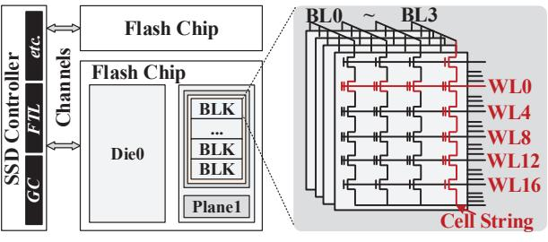
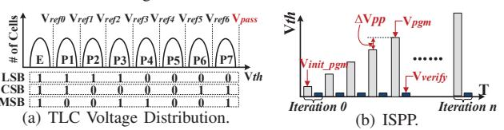
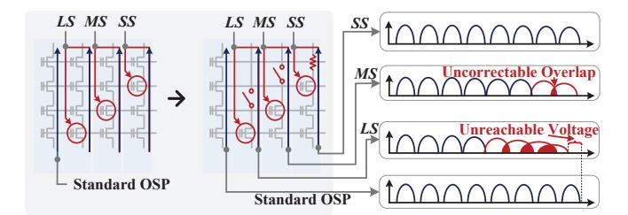
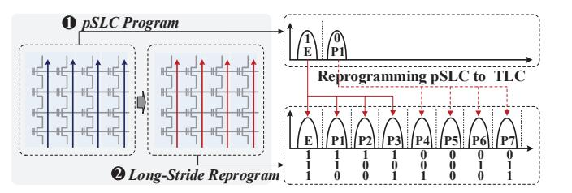
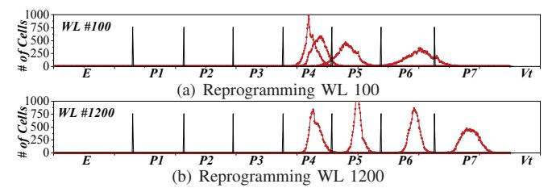
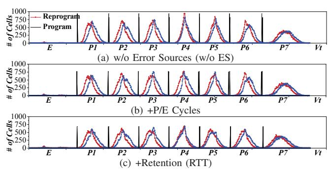
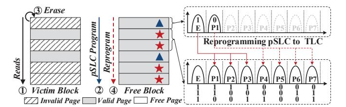
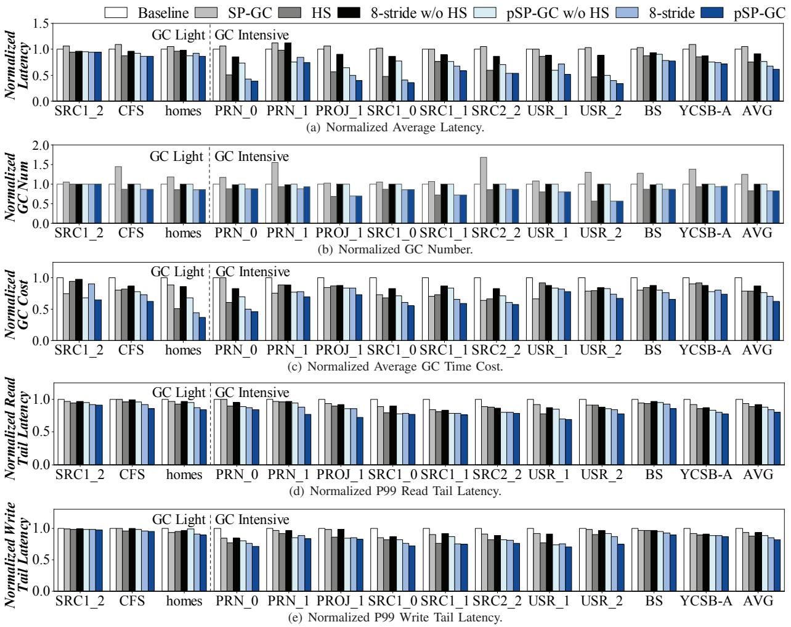
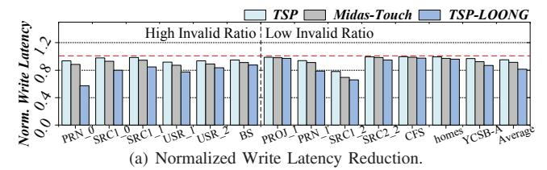
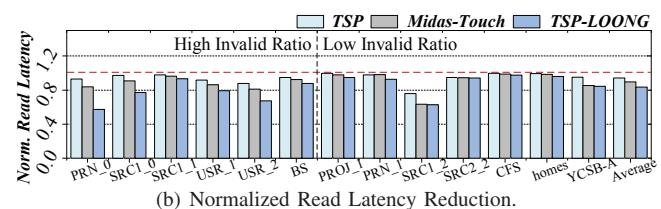

# LOONG: Utilizing Long-Stride Reprogramming to Enhance the Performance of SSDs

Congming Gao1, Jiancong Zheng1, Xufeng Yang1, Qiao Li2, Jian Chen3, Tianyu Ren3, Zheng Wan1 Yina Lv1, Xin Xin4, Min Ye5, Chun Jason Xue2 and Jiwu Shu1,3 1Xiamen University, 2Mohamed bin Zayed University of Artificial Intelligence, 3Tsinghua University 4University of Central Florida, 5City University of Hong Kong

*Abstract*—NAND flash-based SSDs enforce strict sequential page programming within blocks, primarily due to reliability constraints. However, enabling reprogramming of pages after initial writes could unlock significant optimization opportunities, such as accelerating valid page movement during garbage collection or program operations. Toward this objective, prior work has explored reprogramming. Nevertheless, its effort faces a critical limitation: reprogramming is restricted to a small subset of wordlines per block (i.e., stride), rather than extending to all WLs per block. In this work, we advance beyond this constraint with LOONG, a method that expands the reprogramming stride to encompass entire blocks. LOONG introduces a long-stride reprogram operation, which spatially decouples programming steps. First, all WLs in a block undergo sequential programming in SLC mode to maximize performance. These pages are then uniformly reprogrammed to TLC mode, preserving storage capacity. LOONG requires no hardware modifications and can be deployed solely via firmware updates. We evaluate LOONG's efficiency with two case studies: GC acceleration and program operation optimization. Experimental results demonstrate average latency is reduced by 37.5% and 18.1%, respectively, in these two scenarios.

*Index Terms*—SSD, Reprogramming, GC, Performance Optimization, NAND Flash.

# I. INTRODUCTION

NAND flash memory based SSDs are widely adopted for their excellent performance. Within an SSD, NAND flash memory is inherently designed for sequential program, requiring all WLs within a flash block to be programmed in a strict unidirectional sequence, from the bottom to the top WL along the bitline. This programming sequence constraint primarily stems from the impact of background pattern dependency (BPD): programmed cells develop high resistance, blocking electron flow to underlying cells [11], [19], [20], [24], [35]. Violating this sequence may allow the BPD to block electron injection into the target cell, leading to reliability degradation, referred to as the BPD-caused reliability issue.

The practical consequences of sequential programming constraint are twofold. First, it severely restricts SSD management flexibility, particularly for garbage collection (GC).

We thank the anonymous reviewers for their valuable suggestions. The work is supported by the National Natural Science Foundation of China (Grant No. 62572409, U22B2023), National Key Research and Development Program of China (Grant No. 2024YFB4505201, 2024YFB4504400), Fundamental Research Funds for the Central Universities (Grant No. 20720250166, 20720250167), and Xiaomi Young Talents Program. Qiao Li is the corresponding author.

Specifically, all valid pages migrated during GC are forced to be finalized using high-latency One-Shot Programming (OSP) operations. This significantly increases blocking time for incoming I/O requests [8], [10], [39], [54]. To mitigate this, certain programming schemes decouple OSP into two stages: a fast first step with low latency and a slow second step with high latency. In these schemes, the first step is leveraged to accelerate valid page migration. However, these methods dictate an extremely narrow temporal-spatial window between the two steps (typically restricted to 2 WLs for Two-Step Programming (TSP) and 8 wordlines (WLs) for [19]). Consequently, this rigid timing forces the controller to execute high-latency second-step programming for nearly one-third of all valid pages migrated during GC, undermining the intended performance gains [8], [10], [39], [54]. Second, the narrow temporal-spatial window between programming steps ensures that most data written in the first step remains valid when the second step is triggered. Consequently, the SSD must endure the full latency of precise programming control, even when the pre-programmed data has been invalidated. This constraint precludes the optimization of the second step, such as using larger voltage increments to reduce electron injection cycles when pre-programmed pages were to become invalid [12], [37], [42].

Increasing the stride to the block level enhances the flexibility of programming sequences. This expanded temporal-spatial window unlocks significant opportunities for performance optimization. Specifically, block-scale long-stride programming increases the likelihood of utilizing fast, first-step programming to accelerate GC, and can capture a higher volume of page invalidations that occur in the interim, thereby streamlining the overall programming process. However, increasing the stride aggravates the BPD-caused reliability issue, as more programmed cells between the two programming steps creates higher resistance, thereby blocking electron flow to target cells. Based on real-chip evaluations, we find that there are two factors affecting the severity of BPD's impact, stride and the programmed cell voltage. While prior work [19] has investigated the reliability impact of stride on BPD and limits the stride to 8 WLs, it overlooks the impact of programmed cell voltage and allows cells to be programmed to high levels during the first programming step.

Instead, in this work, we separately quantify these two factors' impact (see Section III), and find that programmed cell voltage is the more critical one and dominates the BPDcaused reliability issue. This is because the programmed cell voltage induces channel pinch-off effect [15], which can significantly obstruct electron flow, whereas the strideinduced series resistance has only a marginal effect on the overall resistance [40]. Motivated by this, we propose LOONG, a technique that inhibits the programmed cell voltage induced channel pinch-off effect by lowering programmed cell voltages (setting to the lowest two voltage states in this work) during the first programming step, thereby enabling long stride between two programming steps. LOONG operates in two phases: (1) a first step performed across all WLs while simultaneously satisfying low-latency requirements, followed by (2) a subsequent second step that sequentially reprograms all previously programmed WLs, beginning from the first WL, to restore and preserve full capacity.

The effectiveness of LOONG is analyzed from two dimensions: First, we conduct real-device experiments demonstrating that LOONG retains its reliability and performance benefits under real-world conditions, including the presence of error sources. Second, we develop and evaluate a practical integration strategy with SSD systems. We demonstrate LOONG's performance benefits through two case studies: First, GC Optimization: valid pages are programmed using LOONG's fast first step for low-latency migration. After valid page movement completes, the block is reclaimed through the second programming step without capacity loss. Second, Programming Optimization: when data written by the first step becomes invalid before the second step executes, subsequent data can be encoded using fewer voltage states, significantly improving programming performance. Experimentally, LOONG reduces average latency versus baseline by 37.5% in GC optimization and 18.1% in programming optimization, confirming its effectiveness in enhancing SSD performance.

We summarized our contributions as follows: (1) We firstly analyzed the BPD severity of these two key factors, which constraint on applying long-stride reprogramming on 3D TLC NAND flash memory; (2) We then proposed a long-stride reprogram operation (LOONG), which is verified on real 3D TLC NAND flash memory without scarifying reliability and performance; (3) We evaluated the proposed LOONG with two case studies. The experimental results show that LOONG effectively improves the performance of 3D TLC SSDs.

#### II. BACKGROUND AND RELATED WORKS

#### A. 3D NAND Flash Memory based SSD

Modern SSDs have advanced significantly, incorporating high bit-density cells and transitioning from 2D to 3D architectures [28], [29], [55]. Currently, NAND flash cells are classified into four types: SLC (Single-Level Cell), MLC (Multi-Level Cell), TLC, and QLC, which store 1, 2, 3, and 4 bits per cell, respectively. By combining these technologies, 3D NAND flash memory based SSDs can significantly increase storage capacity while reducing cost per bit. A typical SSD is composed of two main components: the SSD controller and the flash array, as shown in Figure 1. The SSD controller manages

Fig. 1. The Architecture of SSD.

Fig. 2. Voltage Distribution of TLC and Its ISPP.

functions such as GC and the Flash Translation Layer (FTL). To maximize parallelism, the flash array is organized into four levels: channel, chip, die, and plane [9], [17], [18]. Within each plane, blocks contain many WLs, and each WL consists of thousands of flash cells. Flash cells in different WLs but sharing the same bitline (BL) are connected in a cell string.

Figure 2(a) illustrates the voltage distribution of TLC [45]. In this figure, the x-axis represents the threshold voltage  $(V_{th})$  in the flash cell, while the y-axis shows the numbers of cells in each state. By charging different amounts of electrons into the cell, the entire voltage range is divided into eight states (E, P1 to P7). Each state encodes three bits of information: the Least-Significant Bit (LSB), Central-Significant Bit (CSB), and Most-Significant Bit (MSB). The three-bit values are represented by moving the state from "E" to the right along the x-axis, which is achieved through a program operation. For read operation, sensing circuits use different reference voltages  $(V_{ref})$  to distinguish these states [5].

#### B. Incremental Step Pulse Program

The program operation is realized by gradually injecting electrons into the flash cell (i.e., Incremental Step Pulse Program, ISPP) [45], [48]. As shown in Figure 2(b), initially, an initial program voltage ( $V_{int\_pgm}$ ) is applied to electron injection. After a fixed duration  $(t_{pqm})$ , a verify voltage  $(V_{verify})$  is applied to check if the cell's voltage has reached the desired state. If not, the subsequent iteration increases the program voltage  $(V_{pgm})$  by an increment of  $\Delta V_{pp}$ , followed by another verify voltage. This iterative process continues until the verify voltage confirms that the cell has reached the desired state. If the number of iterations approaches the maximum ISPP limit, the operation fails and is halted. The durations for the program and verify voltages in each iteration remain constant; thus, the program latency is linearly correlated with the number of iterations (denoted as n) executed before termination, expressed as  $n \times (t_{pqm} + t_{verify})$ . Additionally, the number of iterations is also influenced by the value of  $\Delta V_{pp}$ . Increasing  $\Delta V_{pp}$  reduces the required iterations, speeding up the program process. This approach is known as coarse programming. Conversely, fine programming uses a smaller  $\Delta V_{pp}$ , enabling

Fig. 3. Reprogramming in 3D TLC NAND Flash Memory. tighter voltage distribution. However, this precision demands more ISPP iterations, resulting in higher program latency.

Currently, there are two types of programming schemes for TLC flash memory, OSP and TSP. For OSP, all eight voltage states are created within one-step, where the ISPP process is applied and continues until the cell's voltage reaches the desired state. In contrast, TSP starts with a first coarse programming step, which raises the cell's voltage to an intermediate state (either "1" or "0"). Next, a second fine programming step adjusts the voltage to a higher target level. During this second step, two additional bits are programmed into the cell using a smaller ΔVpp, leading to finer control but increased latency. Compared to TSP, OSP dedicates less time to precise voltage control (i.e., using fewer electron injection cycles), thereby leading to lower program latency. Currently, OSP has matured as a key technique in commercial charge-trap (CT) NAND flash-based SSDs, exemplified by Samsung's V-NAND SSDs [25]. CT technology's inherent immunity to coupling effects ensures reliable OSP without sacrificing endurance. Additionally, its performance benefits make it ideal for high-performance 3D SSDs. This approach has been extensively validated in both industry and academia [25], [30], [41], [47], [53]. Aligning with these precedents, our work adopts CT flash memory with one-shot programming as the default, leveraging its reliability advantages.

### *C. Reprogram Operation*

Recent works have proposed decoupling OSP into two steps and extending the stride between two programming steps to enhance the performance of SSDs [7], [19], [44]. Prior works identified two primary factors that challenge the reliability of reprogram operations [19]: cell-to-cell interference [3] and background pattern dependency (BPD) [11], [24], [35]. While cell-to-cell interference is generally less severe, its severity increasing with the frequency of successive program operations on a single cell. To mitigate this, prior works [2], [3] have proposed operating the two programming steps in an interleaving mode across two WLs, ensuring that each cell experiences interference only once.

The BPD refers to its influence on the current-voltage characteristics of a flash memory cell. As discussed in [19], when more cells in a cell string are programmed, the overall resistance of the string increases [24]. This rise in resistance, caused by the already programmed cells above the target cell, results in the string behaving like a closed circuit, which hinders further electron injection into the target cell and negatively impacts reliability [45]. Figure 3 serves as an illustrative example. The left side of the figure presents four types of program operations. In standard OSP, the cell string is programmed in a single direction. Besides this, three different reprogramming operations are executed, with the first programming step carried out sequentially and the second step, or "reprogramming", performed with varying strides: long-stride (LS), medium-stride (MS), and short-stride (SS). A long-stride reprogram operation indicates that many WLs remain under-programmed between these two steps, while a short-stride reprogram operation implies that only a few underprogrammed WLs between steps. As depicted in Figure 3, these different program operations lead to varying voltage distributions. The short-stride reprogram operation exhibits greater resilience to BPD because it introduces less resistance to electron flow, leading to a more distinct voltage distribution. However, as the stride increases, voltage states may overlap or become unreachable, leading to bit errors. The long-stride reprogram operation faces a significant reliability challenge, as the desired state may not be achievable within the maximum ISPP iterations due to the substantial resistance caused by BPD. Prior work [19] has shown that the reprogram operation can be executed reliably with a short stride, spanning 8 WLs across two layers within a block.

# III. DESIGN

In this work, we aim to develop a novel programming mechanism, LOONG, that pushes this stride to the block scale. LOONG builds upon the standard OSP and is integrated into the SSD as an optional programming policy. Under normal conditions, the SSD uses a standard OSP, while LOONG is employed in specific optimization scenarios.

Key Challenges of LOONG involve two aspects: The first is mitigating the reliability issue, which is primarily caused by BPD, while maintaining its performance advantage. The second is avoiding hardware modification while both standard OSP and LOONG are supported concurrently. Standard SSDs typically avoid implementing dual programming mechanisms, as switching between them while dynamically adjusting ΔVpp introduces significant complexity to the program engine. Therefore, we should ensure implementing LOONG within the existing program engine, requiring no hardware alterations.

Solution 1: To address the first challenge, we first quantitatively analyze the impact of two key BPD factors, the stride length and the programmed cell's voltage, by systematically varying both factors and measuring the resulting bit errors per page. We conduct two evaluations. First, for the stride length, we configure each reprogram operation to transition cell voltages from state P3 to P7, consistent with prior work [19], while varying the stride length from 2 to 12 WLs. Second, to evaluate the impact of the programmed cell's voltage level, we fix the stride length to encompass all WLs within a block, where cells are initially programmed to intermediate state (E, P1, P2 and P3), and subsequently transitioned to P7 during the reprogramming step. The results are shown in Figure 4(a) and Figure 4(b), respectively.

Fig. 4. The Impact Factors of BPD.

The results in Figure 4(a) demonstrate that increasing the stride length to 12 WLs causes a dramatic 39-fold increase in bit errors compared to the standard TSP (2 WL stride). This exponential growth highlights stride length's significant impact on BPD. Since bit errors were measured immediately after the first programming step (isolating other error sources impact), the prior work cautiously selected an 8-WL stride as optimal (indicated by the red circle in this figure). In contrast, Figure 4(b) shows that the programmed cell voltage poses a more severe reliability challenge than stride length, further confirming that the channel pinch-off effect contributes to a significantly higher resistance increase than the stride-induced series resistance effect. The channel pinch-off effect exhibits a threshold behavior, where its impact abruptly intensifies once a critical point is reached. Specifically, reprogramming cells from state P1 to P7 maintains error rates close to baseline levels, comparable to reprogramming from state E to P7. However, when reprogramming starts from state P2 or beyond, it triggers a sharp, nonlinear surge in errors (e.g., a 24,576fold error surge over the baseline when reprogramming from state P3 to P7). Therefore, to mitigate reliability impacts when extending stride length across all WLs within a block, the initial programmed state should be restricted to P1. Motivated by this, LOONG limits cells' voltage to the first two states in the first programming step, enabling stride extension across all WLs within the block. Additionally, by leveraging lower programmed states, the required ISPP cycles are reduced, thereby decreasing the latency of the first step.

Solution 2: To address the second challenge, LOONG employs a coding-based method without introducing hardware modifications. As shown in Figure 5, LOONG (1) sequentially programs all WLs at reduced voltage (i.e., pseudo-SLC (pSLC) mode, storing 1 bit per cell by utilizing only the first two states), followed by (2) performs long-stride reprogramming that encodes transitions from state E to the first four states or from P1 to the last four states. This coding-based method is implemented using standard OSP. First, LOONG pads the user page with two dummy pages to form a three-page group, encoding cells into the first two voltage states and performing a single OSP as the first programming step. Next, the stored page is retrieved and combined with two new user pages to form another three-page group. A reprogramming step is then performed via a single OSP as the second step of LOONG.

**LOONG's contributions**: First, we provide a new physical insight into 3D flash memory reliability by identifying programmed cell voltage as the primary determinant. While prior work [16] attributed reprogramming failures to spatial

Fig. 5. Coding Based LOONG.

TABLE I
THE LATENCY OF DIFFERENT PROGRAM TYPES.

|              | pSLC Program | SLC Program | Reprogram | One-shot Programming |
|--------------|--------------|-------------|-----------|----------------------|
| Latency (µs) | 114          | 96          | 955       | 1100                 |

constraints (i.e., narrow WL strides), our deep characterization reveals that the reliability bottleneck is fundamentally voltage-driven. We demonstrate that maintaining cells in a low-voltage state effectively mitigates the Channel Pinch-off Effect, thereby minimizing the BPD effect. This discovery redefines the physical reliability model of 3D NAND and provides the theoretical foundation for breaking the rigid sequential programming constraints.

Second, we propose LOONG, a novel programming architecture that achieves full-block reprogramming through spatio-temporal decoupling. Leveraging our physical insights, LOONG separates the high-speed pSLC programming from the high-density TLC programming across an entire block. Unlike traditional coupled programming that requires localized completion of all programming steps, LOONG allows the SSD to defer high-latency TLC programming penalties across a much larger temporal and spatial window. This architectural decoupling enables a reconfigurable programming that can be deployed via firmware without hardware modifications.

Third, our work establishes a generalized quantitative framework for identifying voltage range for the first programming step across different flash memory (e.g., QLC). This serves as a blueprint for future workload-aware SSD architectures, allowing for a fine-grained, runtime trade-off between reliability, capacity, and system performance.

# IV. REAL DEVICE VERIFICATION

We independently verify the capabilities required for pSLC programming and long-stride reprogramming.

#### A. pSLC Programming Characteristics

We utilize an FPGA-based testbed and employ multiple 3D TLC NAND flash chips, each containing 232 layers per block and 16 KB per page. For the pSLC programming, it begins with an OSP that writes data to the first page while padding the next two pages with '1's as temporary dummies. Then, data written after pSLC programming is read back and compared to the original page to quantify bit errors. We conduct each evaluation multiple times and average the results.

1) Reliability of pSLC Programming: We measure bit error number under varying retention times and P/E cycles, two primary error sources in flash memory [2]–[5]. The retention time for pSLC data is set by baking the chip at 120°C for three hours, a process equivalent to extending the retention time

TABLE II THE AVERAGE AND MAXIMUM NUMBERS OF BIT ERRORS PER PAGE.

|     | E→P7  | P1→P7 | P2→P7  | P3→P7    | P4→P7    | P5→P7    | P6→P7  |
|-----|-------|-------|--------|----------|----------|----------|--------|
| Ave | 0.068 | 0.083 | 155.75 | 36929.98 | 30154.68 | 22518.19 | 231.84 |
| Max | 6     | 5     | 4570   | 147456   | 147455   | 147412   | 27943  |

to one year under normal conditions, according to Arrhenius Law [1]. For P/E cycles, we adopt 1K cycles, consistent with the most-related work [19]. The results show that the number of bit errors is within the range of several dozen per page, which remains well within the correction capability of the ECC (1280-bit/page). Our pSLC programming minimizes the error increase by using a OSP. In this process, only the first page is filled with user data, and the rest are populated with dummy '1's, which prevents the open block issue.

2) Latency of pSLC Programming: We use the same testbed to evaluate the pSLC program latency, with the results presented in Table I. For comparison, the standard SLC program operation is enabled by the SLC Enable Command [38], [54], which uses TLC as SLC by charging electrons with a larger  $\Delta V_{pp}$ . The results show that pSLC and standard SLC program operations have comparable latencies, averaging approximately 114  $\mu$ s and 96  $\mu$ s, respectively. This is because the program latency is determined by both  $\Delta V_{pp}$  and the number of ISPP cycles. Flash cells in standard SLC mode utilize a large  $\Delta V_{pp}$  in each ISPP cycle to speed up the program operation. Conversely, flash cells in pSLC mode can achieve a fast pSLC program operation with fewer ISPP cycles while only the first two states are programmed.

Takeaway #1: Data programmed using the pSLC program operation can achieve SLC-like program latency without compromising data reliability.

### B. Long-Stride Reprogramming Characteristics

We require reprogram operations to be executed sequentially with a block-scale stride. To ensure our evaluation accounts for the worst-case scenario, we adopt a two-fold methodology. First, to maximize the BPD effect, we utilize a block-scale stride where reprogramming begins from the first WL only after the entire block has completed pSLC programming. Second, we conduct extensive empirical testing across multiple flash chips, randomly selecting three blocks per chip and repeating each test three times. Consequently, the results in Table II represent the maximum bit error number derived from the evaluations. While we cannot guarantee the success of every operation due to other process issues, commodity SSDs can inherently detect such failures via ISPP verify operations and re-issue commands to alternative physical locations.

1) Reliable Long-Stride Reprogramming: To validate the feasibility of long-stride reprogramming, we extend Figure 4(b)'s evaluation by varying the initial programmed state from E to P6, then reprogramming each to the final P7 state. Each reprogramming is configured with the block-scale stride. Reprogramming from state E serves as the baseline, mirroring a standard OSP. We present both average and maximum bit

Fig. 6. Bit Error Distribution under Different Reprogrammings.

error numbers per page in Table II, while Figure 6 illustrates the distribution of bit errors per page across different WLs.

In Table II, two observations emerge. First, when the cell is reprogrammed from state P1, its reliability demonstrate a resemblance to those observed in standard OSP, transitioning from state E to P7. This phenomenon arises because the cell is programmed into state P1 with minimal voltage, thereby minimizing the impact of BPD. Second, when the pre-programmed state changes from P2 to P6, the number of bit errors initially increases and then decreases. In the case of the rising trend (P2 $\rightarrow$ P7 to P3 $\rightarrow$ P7), as the voltage before reprogram operation increases, the impact of BPD exacerbates, resulting in more failed reprogram operations due to the maximum ISPP cycle limitation (typical 15-30). As demonstrated in Figure 6, more reprogram operation failures occur in WLs closer to the top of the block (i.e., lowernumbered WLs), which experience a more severe BPD impact. Conversely, in cases showing decreasing bit errors (P4 $\rightarrow$ P7 to  $P6 \rightarrow P7$ ), while reliability issues from BPD persist, the cell can still be successfully reprogrammed to state P7 within the ISPP cycle constraints. These two observations indicate that only reprogramming cells from the first two states to higher states does not introduce significant reliability issue. To further verify this, we examine the threshold voltage distributions during the reprogramming of states P4 to P7 as a representative case. As illustrated in Figure 7, when the first programming step is completed (reaching state P4), the impact of the WL position becomes evident. When reprogramming occurs on WLs closer to the top of the block (e.g., WL #100 in Figure 7(a)), the voltage distribution exhibits a significant left-shift. This results in significant overlap between state distributions. In some cases, the threshold voltage fails to reach the target state altogether because the ISPP cycle limit is exhausted, thereby substantially increasing the bit errors. In contrast, for WLs closer to the bottom of the block (e.g., WL #1200 in Figure 7(b)), the distributions remain more distinct and wellseparated. This is because the BPD impact on WL #1200 is marginalized by the reduced cumulative resistance, allowing for a more stable and reliable programming window.

Besides, the latencies of reprogramming and standard OSP are presented in Table I. The results show average latencies of approximately 955 µs for the former (from P1 to P7 as the worst case) and 1100 µs for the latter (from E to P7). This difference occurs because reprogramming requires less voltage charging than standard OSP, needing at most 6/7 of the maximum voltage. Due to additional overhead from read and channel transfers during the second step, LOONG introduces slight latency increase compared to standard OSP (under 2%).

Fig. 7. Distribution of Reprogramming P4 to P7 at Different WLs.

# Takeaway #2: Reprogram operation has a latency similar to that of OSP without sacrificing reliability.

2) Reliability Impact of Error Sources: The previous section evaluates reliability immediately after finishing LOONG's second step. We here extend this analysis by incorporating key error sources: retention and P/E cycles. For fair comparison, the standard OSP is configured with identical retention and P/E cycle conditions as LOONG.

For retention, the flash chip is heated to 120°C for three hours, which corresponds to retention of one year at 40°C [1]. For P/E cycles, flash blocks undergo repeated program and erase operations (program, reprogram, and erase operations for LOONG) over a total of 1K cycles, consistent with [19]. The voltage distribution and number of bit errors are displayed in Figure 8 1. As shown in Figure 8, the voltage distributions of all states can be easily distinguished from those of neighboring states. This indicates that, compared to the standard OSP, the long-stride reprogram operation can still achieve good reliability. However, we also observe that the voltage distribution of the long-stride reprogramming is more likely to be left-shift. This is because, due to BPD, electrons are harder to inject into the desired state, resulting in more cells being clustered on the left side.

Next, we give a more detailed analysis. We collect the occurrence of bit errors per page after OSP and long-stride reprogram operations. Considering the error sources (both P/E cycles and retention time), we observe that the long-stride reprogram operation introduces an average of 96 bit errors per page, which is well within the correctable capability of ECC (1280-bit/page). Interestingly, we also find that the standard OSP tends to generate more bit errors than the long-stride reprogram operation. In the worst case, OSP causes an average of 101.8 bit errors per page. The reason why long-stride reprogram operation has fewer bit errors primarily stems from its two-step programming process. In the first step, the cell is programmed to state E or P1, raising the cell's voltage. In the second step, the long-stride reprogram operation brings the cell's voltage to the desired state. However, due to the impact of BPD, it is harder to increase the cell's voltage to a high value (the same reason why the voltage distribution of longstride reprogram operation in Figure 8 is more left-shifted). As a result, after these two steps, compared to standard OSP, the voltage distribution of reprogram operation has a smaller voltage difference, where state E tends to have a higher voltage

1Voltage calibration is inherently involved during the evaluation to fine-tune read reference voltage for minimizing the number of bit errors [2], [5], [22].

Fig. 8. Distribution of OSP and Long-Stride Reprogramming.

TABLE III
THE COMPARISON OF DISTURB EFFECTS.

|              | Count | Operation Time (µs) | Voltage Drop  |
|--------------|-------|---------------------|---------------|
| One-shot PRG | 1279  | 1100                | $V_{p\_pass}$ |
| pSLC PRG     | 1279  | 114                 | $V_{p\_pass}$ |
| ReP          | 1279  | 955                 | $V_{p\_pass}$ |
| pSLC Read    | 1279  | 25                  | $V_{r\_pass}$ |

while other states have lower voltages. In 3D NAND flash memory, higher cell voltages accelerate electron leakage [2]–[4], [6], a process quantified by the Fowler-Nordheim (FN) tunneling model where leaked electrons follow  $N_e \propto J_{FN} \cdot T_S$  [21], [36], [45]. Here, total number of electrons leaked from a cell is defined by  $N_e$ ,  $J_{FN}$  depends exponentially on the cell's threshold voltage  $(V_{th})$ , while  $T_S$  denotes retention time. Due to its two-step programming, LOONG maintains a lower average  $V_{th}$  than OSP, reducing leakage currents and slightly improving reliability [5], [46].

Takeaway #3: The pages programmed in pSLC mode can be reprogrammed to TLC mode with long stride without sacrificing reliability.

#### C. Disturb Effects

Long-stride reprogramming increases the number of program and read operations per block compared to standard OSP, raising concerns about heightened read and program disturb effects. Like retention issues, disturb errors are governed by the FN tunneling model, where the number of unintentionally injected electrons  $(N_e)$  follows the relationship:  $N_e \propto J_{FN} \cdot T_S$ . In this model, the tunneling current density  $(J_{FN})$  is driven by the voltage differential between the pass voltage  $(V_{pass})$  and the cell threshold voltage  $(V_{th})$ , while  $T_S$  represents the cumulative operation time. Consequently, evaluating disturb severity simplifies to analyzing the variations in this voltage gap and the total stress duration.

For both standard OSP and long-stride programming, the worst-case disturb occurs at the last WL of a block, as it endures cumulative stress from all preceding program and read operations. This impact is most severe for cells remaining in the erased state, where a minimum  $V_{th}$  maximizes the potential difference  $(V_{pass}-V_{th})$ . Under these conditions, the cumulative disturb effects are summarized as follows:

As shown in Table III, the last WL in a 1280-WL block endures 1,279 disturb instances. The stress duration and voltage drop are calculated for the worst-case erased state, where

 $V_{p\_pass}$  and  $V_{r\_pass}$  denote the pass voltages for program and read operations, respectively, with  $V_{r\_pass} < V_{p\_pass}$  [45]. While the first row represents the OSP baseline, the subsequent rows detail the three stages of long-stride reprogramming: pSLC programming, pSLC read, and final reprogramming. Consequently, long-stride reprogramming exhibits a lower total disturb impact than standard OSP, as it reduces both cumulative operation time and the effective voltage difference.

#### V. CASE STUDIES

In this section, we integrate LOONG into two case studies, including GC-oriented optimization and program-oriented optimization, to verify its efficiency.

# A. GC-Oriented Optimization

Prior works leverage the performance benefits of SLC programming to accelerate valid page movement during GC, thereby reducing GC's time cost [38], [54]. This approach, termed SLC-Program GC (SP-GC), comes at a cost: blocks programmed in SLC mode retain only one-third of their original TLC capacity, resulting in significant capacity loss. Since the remaining two-thirds of the block's capacity becomes unusable, additional compensatory GCs are required to reclaim the wasted space, introducing further time overhead. In our preliminary study (corresponding figures are omitted due to the page limit), SP-GC reduces total GC time by 21% compared to the baseline due to the accelerated valid page movement per GC. However, this comes at a cost: the number of GC operations and valid page movements increase by 1.25 times and 1.48 times, respectively. This inefficiency in GC optimization occurs because compensatory GCs must migrate additional valid pages back to TLC blocks. Experiment details are provided in Section VI. To address this issue, we propose pSLC-Program GC (pSP-GC). Unlike SP-GC, pSP-GC leverages LOONG to preserve the performance benefits of pSLC programming without sacrificing block capacity and triggering additional compensatory GCs.

In detail, we use the pSLC program operation in LOONG to speed up valid page movement, and then use long-stride reprogram operation to restore capacity by converting SLC mode back to TLC mode. Figure 9 illustrates an example of the entire process. Initially, a block is chosen for GC, and its valid pages are sequentially read out and written to a free block using pSLC program operations, as depicted by step ① and step ②. Once the valid page movement is completed, the victim block is erased, as indicated by step ③. Finally, the cells programmed in pSLC mode are reprogrammed with another two pages from the host or background-GC (bg-GC), thereby restoring the lost capacity, delineated as step ④.

The design of pSP-GC is straightforward, yet a challenge remains: capacity loss can occur if pSP-GC is frequently triggered without timely reprogramming pSLC pages. To address this issue, we introduce constraints in both the temporal and spatial domains for triggering pSP-GC. Within the temporal domain, pSP-GC operates exclusively during foreground GC to minimize its time cost and thereby reduce blocking of host

Fig. 9. GC-Oriented Optimization with LOONG.

Fig. 10. Program-Oriented Optimization with LOONG.

I/Os. Spatially, each pSP-GC instance is constrained to using only one block for storing valid pages in pSLC mode. This design choice stems from experimental findings indicating that over 71.5% of blocks contain fewer than one-third valid pages. That is, in most cases, a single block is enough to hold all valid pages from reclaimed block. For blocks holding a substantial number of valid pages, reprogram operations occur only after all WLs within the block have been programmed via pSLC writes. Crucially, this process introduces no significant additional overhead for valid page movement compared to the baseline. This is because, as evaluated in Section IV, the latency of LOONG (pSLC programming + pSLC read + reprogramming) is comparable to that of a standard OSP. Furthermore, since the data stored in pSLC pages originates from reclaimed blocks and is typically cold, we utilize cold data, either from bg-GCs or directly provided by the host, for the reprogramming step. This ensures all pages within the reprogrammed block exhibit similar hotness characteristics.

#### B. Program-Oriented Optimization

With the aid of LOONG, the separation distance between two programming steps can be extended to the entire block. When executing the second reprogram operation, there may exist more pages that have been invalidated. Therefore, for the invalid page, its coupled two pages sharing the same WL can be reprogrammed with fewer voltage states.

Figure 10 illustrates an example of this process. Initially, a block is programmed sequentially using the pSLC program operations, as shown in step ①. During this phase, some pages may be invalidated by update operations, indicated in step ②. For WLs containing invalid pages (identified by modified FTL, discussed in Section V-C), the reprogram operation uses only the first five voltage states to represent the two additional pages, with the first two states encoded as "11", as shown in step ③. In this scenario, the reprogram operation shifts the voltage state from E to at most P4, effectively reducing the reprogram latency to approximately 4/7 of the one-shot programming operation (around 710 µs based on the evaluation). To realize this, we have to configure two types of reprogramming mechanisms, where the first type only

Fig. 11. FTL Modification.

reprograms the first two states to the first five states while the second type reprograms the first two states to the all states.

To differentiate the voltage distributions after two types of reprogramming mechanisms, an additional 1-bit is added to the FTL to indicate whether the WL is encoded with a reduced number of states. Before reading, this bit is checked. If the bit is set, it indicates that the data is encoded with fewer states, and the MLC read is applied. Otherwise, the TLC read is used to retrieve data. As specified in Section VI, this approach incurs a space overhead of approximately 1.35 MB.

#### C. FTL Modification

The Flash Translation Layer (FTL) requires additional modification, which can be realized by updating controller firmware. FTL records the mapping between logical page number (LPN) and physical page number (PPN) to facilitate address translation from the host to the SSD. To support the address mapping of LOONG, as shown in Figure 11(a), we assume that a specific block comprises several WLs, identified by a number i. Consequently, physical TLC page addresses are assigned as  $i \times 3$ ,  $i \times 3 + 1$ , and  $i \times 3 + 2$ . During pSLC program operation, unused pages with PPNs  $i \times 3 + 1$  and  $i \times 3 + 2$  are skipped, while only the PPN of the pSLC page, which is  $i \times 3$ , is recorded in the address mapping. These unused PPNs are subsequently utilized when the corresponding pSLC pages are reprogrammed. In addition to address mapping management, the modified FTL incorporates an additional Reprogrammable Block Pointer (RBP) that tracks the current location of the reprogrammable block within each plane. Before initiating a reprogram operation, the modified FTL checks the value of RBP to locate the reprogrammable block. As illustrated in Figure 11(b), within each reprogrammable block, two active page pointers exist: the pSLC Page Pointer (SP) and the Reprogrammable Page Pointer (RP). These pointers identify the active programmable free page location and the active reprogrammable pSLC page location for the block, enabling precise execution of subsequent reprogram operations. Specifically, the reprogram operation begins from the RP location and continues until the SP location. Based on the evaluation settings in Section VI, these two additional data structures, an extra Reprogrammable Block Pointer and two additional Active Page Pointers per Reprogrammable Block, introduce a space overhead of approximately 192 bytes.

When implementing the modified FTL, the GC-oriented optimization operates as follows: Upon triggering pSP-GC, a free block is selected and its address is assigned to the RBP. Valid pages are programmed in either pSLC or TLC mode, depending on the number of valid pages; simultaneously,

the RP and SP are updated to new locations. After pSP-GC completes, host writes or bg-GC resumes programming this block starting from the updated RP. For program-oriented optimization, address mapping follows the modified FTL. Before reprogram operation, the validity table is checked to determine if fewer state shifts are required. Additionally, 1 bit per page records whether the current WL uses reduced voltage-state encoding, as discussed in Section V-B.

#### D. Discussion

Different TLC Encoding Rules: TLC flash uses Gray coding to store data. In a Gray code, neighboring voltage states differ by only one bit. This ensures that if a voltage shift occurs, it only causes a single-bit error, which is easy to fix [43]. Gray codes are usually described by an a-b-cformat, representing how many sensing operations are needed to read the LSB, CSB, and MSB pages. In this paper, we use the common 1-2-4 Gray code. As shown in Figure 2(a), the E state (111) and the P1 state (110) differ only in the third bit. Because of this, LOONG can use that third bit during the first programming step to tell the difference between a "1" and a "0". Other Gray codes, like 2-3-2, follow the same rule: only one bit changes between neighboring states. For example, if the E state is "111" and the P1 state is "011", LOONG simply uses the first bit to represent the data during the first programming step.

**Extend to QLC:** We also implement LOONG on QLC, which involves programming the first two states initially, followed by reprogramming from the E and P1 states to higher states. Note that due to the high density of QLC flash memory, the time gap between two programming steps can be longer than in TLC-based reprogramming. As a result, more data may become invalid during the interval between these steps. Nevertheless, the reprogramming operation can still proceed by reading the invalid data, which persists until the entire block is erased, and then carrying out the subsequent reprogramming. This process aligns with the standard TSP approach in QLC flash memory, where the second programming step must read the data written during the first step, regardless of whether that data remains valid or has since become invalid. Our evaluation results indicate that the pSLC program latency is approximately 86 us, marginally lower than standard SLC programming due to QLC's narrower voltage margin. The reprogramming latency is about 4.8 ms, slightly higher than the total program latency of QLC (4.2 ms). In terms of reliability under 1K P/E cycles and a 1-year retention period, pSLC pages exhibit about 100~200 bit errors per page, which remains within correctable limits. Reprogrammed OLC cells show 1537.2 bit errors per page, a reduction over the 1620.8 errors per page in standard QLC programming, attributable to the mechanisms discussed in Section IV-B2. While these results demonstrate LOONG's potential in QLC, this work primarily uses TLC to maintain a direct comparison with [19], which was also implemented on TLC.

**Potential Scenarios:** GC optimization and programming optimization are a classic and critical target for SSD per-

formance, which is why it serves as a primary case studies in this work. Besides these, LOONG can also be adopted in several potential scenarios. (1) SLC Caching. Traditional SLC caching accelerates write performance but inevitably encounters a write cliff when the cache is exhausted, triggering high-latency data migrations to TLC space. LOONG mitigates this by operating flash in pSLC mode and leveraging its unique ability to reprogram cells once the initial pSLC capacity is full. This strategy maintains high-performance write speeds longer and avoids the immediate performance degradation typically caused by premature data folding and migration. (2) Dynamic Space Configuration. LOONG enables the SSD to dynamically balance the trade-off between performance and capacity based on real-time application requirements. Under bursty workloads, LOONG aggressively allocates more flash blocks to pSLC mode to sustain peak throughput. Conversely, when storage density is prioritized, the system can transition flash cells back to TLC mode after the pSLC stages are programmed. This architectural flexibility allows the SSD to adapt its physical storage characteristics to the specific demands of diverse applications. (3) Multi-stream Priority Isolation. LOONG exploits the performance hierarchy of pSLC, reprogramming, and standard TLC programming to enforce strict isolation among heterogeneous data streams. For performance-critical streams, LOONG prioritizes pSLC programming to ensure minimal latency and high throughput. Conversely, lower-priority streams are serviced via reprogramming or standard TLC operations, effectively sequestering their resource consumption and preventing background traffic from interfering with the service-level objectives (SLOs) of foreground applications.

**Firmware Implementation:** LOONG's implementation mirrors the approach of existing technologies like Samsung Turbo Write. These products support dual programming modes by burning two distinct programming logics into the controller and toggling between them via a mode register. Similarly, our solution is realized through a firmware-level modification that burns LOONG's programming logic into the controller and leverages the same register mechanism to enable its strategy.

Crash Consistency: SSDs ensure data integrity by periodically persisting the mapping table and leveraging Out-of-Band (OOB) metadata for reconstruction. Since mappings are maintained at page granularity, each programming step independently commits the LPN alongside the data to the OOB area [51]. In the event of a crash, LOONG scans physical pages to retrieve these LPNs and rebuild the mapping table. Because each step persistently commits both data and its associated LPN, any page completed before a crash remains fully recoverable. This provides robust crash consistency for LOONG without requiring additional hardware overhead.

# VI. EXPERIMENT

#### A. Experimental Setup

A workload-driven flash simulator is used in this work [23], [52], [56]. We have significantly enhanced the original version of this simulator to support state-of-the-art SSD devices,

incorporating advanced hardware configurations and essential functionalities. The simulator is extended based on a real TLC chip [27] and organized as an SSD with 520 GB in size. The latency values are set based on our tested flash chips. Note that, the reprogram overhead (specifically the reading of pre-programmed data) is already factored into the reprogram latency. More parameters can be found in Table IV.

Four types of workloads are adopted, including Microsoft Research Cambridge (MSRC‡) [32], [34], [49], Microsoft Production Server (MSPS†) [26], [32], [34], Florida International University (FIU\*) [32]-[34] and Yahoo! Cloud Serving Benchmark (YCSB) [13]. All I/O workloads are opensource and collected from production servers, such as the open-source MSRC gathered from Microsoft's servers using blktrace. These workloads contain essential request characteristics, including arrival timestamp, type, logical address, and size, which represent the same inputs processed by real SSDs when the system converts host requests into device commands. These workloads have been renewed in modern SSD based storage servers, and also been widely used in prior works to verify the design efficiency of SSD optimizations. The characteristics of workloads are presented in Table V. Note that, RV, WV, RS, WS, R Pct, and W Pct indicate total read/write data volume, average read/write request size, and the percentages of read/write requests.

Metrics include: **Average Latency:** We measure end-to-end latency from request issuance to completion. Since our simulator is event-driven, this metric inherently includes queuing delays and GC blocking time, serving as the primary indicator of scheme efficiency. **GC Frequency & Overhead:** We track the total number of GC events and the time spent on page migration and erasure. These metrics, along with the average cost per GC, quantify the effectiveness of our GC optimizations. **Tail Latency (QoS):** We derive the 95th and 99th percentile latencies for read and write operations to assess the Quality of Service (QoS) across different schemes.

#### B. GC-Oriented Optimization Results

1) Evaluated Schemes.: We evaluate five schemes. Baseline: The warmed SSD serves as the baseline, where GC is initiated, and its valid pages are sequentially migrated within the same plane using an OSP. Conventional SLC-**Programming based GC (SP-GC):** SP-GC [38] is selected as the comparison method. This approach leverages SLCs to accelerate the movement of valid pages from the victim TLC block. Hotness Separation (HS): This scheme partitions write requests into hot and cold categories and directs them to different blocks accordingly. The threshold for determining hotness is set to 1 minute, as more than 60% of write requests are updated within this timeframe [19]. 8-stride: This scheme integrates reprogramming and SP-GC, but the distance between pSLC and reprogramming is limited to 8 WLs [19]. This scheme is implemented both with and without hotness separation to distinguish the benefit achieved by HS. **pSP-GC:** The proposed pSP-GC integrates LOONG with SP-

TABLE IV PARAMETERS OF SIMULATED SSD.

| Parameters         | Value  | Parameters        | Value    |  |
|--------------------|--------|-------------------|----------|--|
| Number of Channels | 8      | TR LSB (in Page)  | 25 us    |  |
| Chips per Channel  | 2      | TR CSB (in Page)  | 50 us    |  |
| Planes per Chip    | 2      | TR MSB (in Page)  | 100 us   |  |
| Blks per Plane     | 278    | TW SLC (in Page)  | 96 us    |  |
| WLs per Blk        | 1280   | TW T LC (in Page) | 1.1 ms   |  |
| Layer Number       | 320    | TErase (in Blk)   | 3.0 ms   |  |
| Page Size          | 16 KB  | Transfer Rate     | 1.2 GB/s |  |
| Program pSLC       | Value  | ReProgram TLC     | Value    |  |
| TW (in Page)       | 114 us | TW (in Page)      | 955 us   |  |

TABLE V THE CHARACTERISTICS OF WORKLOADS.

| Workloads RV(GB) WV(GB) RS(KB) WS(KB) |        |        |      |      | R Pct  | W Pct         |
|---------------------------------------|--------|--------|------|------|--------|---------------|
| PRN 0‡                                | 26.2   | 91.9   | 46   | 19   |        | 10.79% 89.21% |
| PRN 1‡                                | 362.7  | 61.6   | 45   | 23   |        | 75.34% 24.66% |
| PROJ 1‡                               | 1500.7 | 51.2   | 74   | 21   |        | 89.44% 10.56% |
| SRC1 0‡                               | 1458.4 | 1618.3 | 72   | 104  |        | 56.43% 43.57% |
| SRC1 1‡                               | 2971.3 | 60.7   | 72   | 29   | 95.26% | 4.74%         |
| SRC1 2‡                               | 2.48   | 35.81  | 16.9 | 44.9 | 15.5%  | 84.5%         |
| SRC2 2‡                               | 45.6   | 78.6   | 136  | 102  |        | 30.33% 69.67% |
| USR 1‡                                | 1156.3 | 19.0   | 103  | 21   | 92.67% | 7.33%         |
| USR 2‡                                | 830.6  | 52.9   | 102  | 28   |        | 81.13% 18.87% |
| BS†                                   | 142.4  | 253.7  | 42   | 57   |        | 43.52% 56.48% |
| CFS†                                  | 44.6   | 23.2   | 17   | 25   |        | 73.79% 26.21% |
| Homes∗                                | 17.7   | 46.8   | 81   | 16   | 6.92%  | 93.08%        |
| YCSB                                  | 584.9  | 877.3  | 24   | 24   |        | 40.00% 60.00% |

GC. Additionally, pSP-GC is also implemented both with and without hotness separation.

*2) Performance Improvement:* Figure 12 shows the average latency, total GC number, average GC time cost and read/write tail latency of different schemes, with the results of SP-GC, HS, 8-stride w/o HS, pSP-GC w/o HS, 8-stride and pSP-GC normalized to the baseline. The workloads are further divided into GC-light and GC-intensive group based on the number of pages migrated per GC. For example, SRC1\_2 migrates only tens of pages per GC under the baseline, whereas GCintensive workloads such as SRC1\_1 require migrating around 2,000 valid pages per GC. Firstly, as shown in Figure 12(a), SP-GC struggles to achieve lower latency than the baseline, whereas HS consistently demonstrates lower latency than the baseline. On average, SP-GC increases latency by 1.05 times compared to the baseline, while HS reduces latency by 25.0% relative to the baseline. The poorer performance of SP-GC is due to the increased number of GCs, some of which are needed to reclaim SLC blocks for capacity saving. As shown in Figure 12(b), SP-GC increases the number of GCs by 1.25 times compared to the baseline. However, HS clusters data with similar hotness into the same block, allowing more pages in the block to be invalidated simultaneously. This results in GCs being triggered with lower cost for valid page movement, reclaiming more space at once. Consequently, HS demonstrates better performance and a lower number of GCs compared to the baseline. Figure 12(b) and Figure 12(c) indicate that HS reduces the number of GCs and the average GC time cost by 16.7% and 21.3% compared to the baseline.

Secondly, both 8-stride w/o HS and pSP-GC w/o HS can reduce the average latency compared with the baseline and SP-GC. Specifically, 8-stride w/o HS reduces the average latency of 8% and 12.8% compared to the baseline and SP-GC, while pSP-GC w/o HS reduces the average latency of 24.0% and 27.8%, respectively. The latency reduction relative to the baseline is due to the advantage of programming valid pages to pSLC pages, while the reduction relative to SP-GC is attributed to the decreased impact of GCs, as the number of GCs is reduced by 20.0%. However, due to the difference in WL stride, the performance improvement achieved by 8-stride w/o HS is significantly smaller than that of pSP-GC w/o HS.

Thirdly, both 8-stride and pSP-GC can further reduce latency on top of HS, with pSP-GC exhibiting the most significant improvement. On the one hand, HS strategy can reduce the number of migrated pages and the number of GCs. As shown in Figure 12(b), pSP-GC has a similar number of GCs as HS. On the other hand, the pSLC program operation further lowers the cost of valid page movement, while the reprogram operation prevents performance penalty from additional compensated GCs. According to the result in Figure 12(a), 8-stride decreases the latency of 10.8% compared to HS, whereas pSP-GC can achieve a 20.7% latency reduction. There are also several notable workloads. For read-dominate workloads, USR\_1 and SRC1\_1 are highly sensitive to GC impact. As shown in Figure 13(b), applying the hotness separation scheme significantly reduces GC frequency, by 20.3% for USR\_1 and 27.9% for SRC1\_1, thereby minimizing host I/O blocking. Furthermore, Figure 13(c) illustrates that integrating reprogramming (pSP-GC) further lowers average GC overhead by 22.2% and 40.5%, respectively, further reducing blocking time. These two factors are the primary drivers of the observed latency reduction. For write-dominate workloads, such as SRC1\_2, its limited gains stem from two factors. First, its GC operations migrate only 14 pages on average, causing minimal blocking impact compared to other workloads that migrate thousands of pages. Second, most pages within the block exhibit similar hotness; thus, the hotness separation scheme reduces GC frequency by only 2%. Consequently, while it reduces average latency by 9.1% relative to the baseline, it achieves less than a 1% improvement over alternative reprogramming schemes. Overall, pSP-GC consistently outperforms other schemes and delivers the best performance across all workloads, and achieves 37.5% average latency reduction compared to baseline.

Fourthly, pSP-GC can also achieve improvement in other metrics like tail latency and IOPS, compared with baseline. In Figure 12(d) and Figure 12(e), pSP-GC reduces the 99th percentile read tail latency by 20% and write tail latency by 18% on average. We observe similar improvements for the 95th percentile tail latency. In terms of IOPS, pSP-GC can get an average improvement of 1.8, achieving up to 2.9. These results above demonstrate that our scheme delivers significant improvements in GC-oriented optimization.

Fig. 12. Performance Comparison among Baseline, SP-GC, HS, 8-stride w/o HS, pSP-GC w/o HS, 8-stride and pSP-GC.

Fig. 13. The Breakdown of Valid Pages Programmed in TLC/SLC/pSLC.

*3) Programming and Reprogramming During GC:* As we have presented above, the main performance benefit of pSP-GC results from programming valid pages in pSLC mode and restoring capacity through reprogram operations. Figure 13 illustrates the ratios of valid pages programmed or reprogrammed in different modes. First, the reduction in valid pages is primarily attributed to the HS strategy, allowing 8-stride and pSP-GC to maintain a similar valid page number to HS while reducing the total number by 32.4% compared to the baseline. Second, SP-GC migrates valid pages in SLC mode which can reduce GC time cost. However, these pages in SLC mode can trigger additional GCs to reclaim space, whereas in pSP-GC, they stem from reprogram operations. Third, while the HS strategy reduces the number of valid pages during GC, 8-stride and pSP-GC further accelerate valid page migration. This approach enhances performance and makes GC more efficient than HS alone. On average, 8-stride allows 26% of valid pages benefit from the pSLC program operation. Further, pSP-GC enables 51.9% of valid pages to benefit during valid page movement due to longer WL distance.

*4) Reprogrammed by Host Writes:* pSP-GC employs cold host write requests to reprogram underutilized blocks that have been programmed in pSLC mode. However, if there are too many valid pages during each GC, the benefits of pSLC program operations could be reduced. Specifically, if the number of valid pages exceeds one-third of the pages per block, cold write requests or valid pages from bg-GC should be included in the reprogram operation. To evaluate this impact, we first evaluate the average number of valid pages during each GC. The results indicate that, on average, 37.3% of valid pages in pSP-GC are moved, which is slightly more than one-third of the total pages per block (i.e., 1280). Across all workloads, three workloads have valid pages that amount to nearly two-thirds of the total pages per block. This means that in most cases, pSP-GC can still improve GC efficiency by programming most valid pages in pSLC mode without the reprogram operations. On the other hand, if too many host write requests are needed to reprogram pSLC pages, performance could also be affected. We calculate the ratio of write requests used to reprogram pSLC pages. Since all write requests for reprogramming pSLC pages originate from cold write requests, the ratio of cold write requests to total write requests is also collected. The results indicate that, on average, pSP-GC uses about 23.7% of host write requests to reprogram pSLC pages, which accounts for 74% of total cold write requests. That is, the negative performance impact of the reprogram operation is not significant.

- *5) The Case without Cold Data:* In this section, in order to reveal the performance of pSP-GC in the worst-case scenario, where no cold data is present from either bg-GC or the host, we set all incoming data as the hot data. Consequently, the reprogrammable block must be reprogrammed with valid pages from subsequent pSP-GC. We collect and normalize the average latency, GC count, GC time cost, and the number of valid pages for both HS and pSP-GC relative to the baseline. On average, when no cold data is used for reprogramming, pSP-GC reduces latency by 21.8% compared to the baseline and by 1.2% compared to HS. The results indicate that, in the worst-case scenario, pSP-GC still can degenerate into the HS, without causing performance decrease while adopting reprogram operation within SSDs.
- *6) GC-insensitive Workloads:* We category GC-insensitive workloads into two categories. The first category consists of workloads that are inherently small in size or with fewer update operations, and therefore rarely trigger GC operations. This group includes CFS from the MSPS set, SRC1\_2 from the MSRC set, as well as homes from the FIU dataset, which we refer to as GC-light workloads, as shown in Figure 12. The second category is constructed by reducing the warm-up ratio of the workloads used in the previous experiments, thereby lowering the frequency of GC operations during evaluation, names synthetic GC-insensitive workloads. The experimental results show that, in the first case, GC-light workloads achieve only a 3% reduction in average latency, while the the second case achieves a 3.6% reduction. It is important to note that GC-oriented optimization is fundamentally designed to optimize GC operations; therefore, its performance benefits are inherently limited in GC-insensitive scenarios. Nevertheless, in terms of Program-oriented Optimization, these workloads can still obtain noticeable performance gains.

### *C. Program-Oriented Optimization Results*

- *1) Evaluated Schemes:* We evaluate four schemes. Baseline: The baseline uses OSP to write three pages simultaneously. TSP: This scheme uses program-oriented optimization proposed in this work. But its stride is limited to two WLs that persist with the default setting. Midas-Touch [37]: This scheme selects different second programming strategies based on the number of invalid pages generated after the first programming step. TSP-LOONG: This scheme extends the stride and enables more pages being invalidated during the interval between two programming steps.
- *2) Performance Improvement:* Figure 14 showcases the average write and read latency reduction of different schemes, with the results of TSP, Midas-Touch and TSP-LOONG normalized to the baseline. First of all, the reductions in both write and read latency stem from the fewer voltage states that need to be encoded into the cell.For write requests, having fewer voltage states means that fewer ISPP iterations are necessary to increase the cell's voltage to the desired level.In the case of read requests, fewer voltage states require fewer sensing operations to distinguish the stored bits.

Firstly, Figure 14(a) shows the results of write latency reduction, where TSP and Midas-Touch can achieves slight write latency reduction while TSP-LOONG can further decrease the latency. On average, TSP reduces the write latency to 95.1% and Midas reduces the write latency to 91.4% compared to the baseline, while TSP-LOONG reduces latency to 81.3% relative to the baseline. The improved write performance of TSP-LOONG is due to the increased number of pages being invalidated during the two programming steps. This allows the reprogram operations targeting the wordline containing these invalid pages to shift the current voltage state to a lower level, resulting in reduced write latency. Secondly, as shown in Figure 14(b), the read latency reduction has a similar results with that of the write latency reduction. This is because, fewer voltage states contributes to both write and read latency reduction. Compared to the baseline, TSP and Midas-Touch reduce average read latency to 93.1% and 89.7%, respectively. While TSP-LONG can reduce average read latency to 80.4%. At most, for PRN\_0, TSP-LOONG reduces the average read latency to 57.7%, 64.7% and 68.9%, compared with the baseline, TSP and Midas-Touch. Averagely, TSP-LOONG achieves latency reductions of 81.9% , 86.4% and 88.7%, compared to the baseline, TSP and Midas-Touch.

*3) The Ratio of Invalid Pages:* In this section, we collect the number of pages being invalidated during two programming steps and then normalize the results of TSP-LOONG to TSP and to Midas-Touch.The results are presented in Figure 15. Furthermore, we categorize the workloads into High Invalid Ratio and Low Invalid Ratio. Specifically, a workload is classified as High Invalid Ratio if the normalized invalid page count of TSP-LOONG relative to TSP exceeds 10. We can see that TSP-LOONG can greatly increase the number of pages being invalidated during two programming steps. This is because the stride of reprogram operation is the entire block, thus giving

Fig. 14. Performance Comparison among Baseline, TSP and TSP-LOONG.

Fig. 15. The Ratio of Increased Number of Invalid Pages.

more chances to invalidate programmed data. Overall, TSP-LOONG increases the number of invalid pages by a factor of 8.8 and 3.3 compared to TSP and Midas-Touch. Additionally, the ratio of the increase in the number of invalid pages is not directly correlated with the latency reduction achieved. This is because latency reduction is influenced by multiple factors, including request size [14] and access patterns [31] and so on. However, the reduced voltage states still contribute to latency reduction, as read and write operations can be performed in MLC-like cells instead of TLC.

# D. Extended Case Study: SLC Caching Performance

Modern SSDs typically reserve a fixed SLC cache (e.g., 5% of capacity) to accelerate writes. Incoming data is first written to this low-latency cache and later flushed to high-density flash during idle periods. However, once this fixed cache is exhausted, performance often suffers a cliff-like drop as writes must directly target high-latency, high-density cells. LOONG enables an elastic SLC cache design. By leveraging reprogramming, free high-density cells can be temporarily programmed in pSLC mode to absorb host writes. Under extreme workloads, a significant portion (or even all) of the available flash can act as an extended cache, effectively mitigating the performance degradation caused by conventional cache exhaustion.

With the same evaluation setup, the results indicate that, compared with the design without SLC cache, LOONG-based SLC cache reduces the average latency by 36.2%, while the conventional SLC cache achieves a reduction of 26.1%. The performance gap mainly stems from workloads with intensive write traffic. Under such conditions, the conventional fixed-size SLC cache can quickly become saturated, leading to a cliff-like performance degradation when subsequent writes are forced to directly target TLC space. In contrast, the LOONG-based SLC cache provides elastic capacity through pSLC programming, which largely mitigates cache saturation and significantly alleviates the resulting performance drop. In terms of write amplification, the LOONG-based SLC cache achieves up to 13% reduction compared with the conventional SLC cache. This improvement stems from differences in the data migration

process. In the conventional SLC cache, cached data must first be flushed to TLC space before GC is performed, while the LOONG-based SLC cache directly reprograms SLC cache using the migrated paged from GCs. Overall, the LOONG-based SLC cache provides a more efficient flexible caching mechanism compared with the conventional SLC cache.

The above evaluation results including GC-oriented optimization, Program-oriented optimization, and the extended case study demonstrate that, for the majority of workloads, LOONG can improve performance by being applied in at least one of these aspects.

### E. Reliability Discussion

To ensure consistency with reliability analysis in Section IV, our setup utilizes real-world program and reprogram latencies as simulator parameters, ensuring that the reliability-induced latency overhead has been fully factored into our simulation.

While read latency can increase as reliability deteriorates with rising P/E cycles and retention time, modern SSDs employ dynamic read calibration [50] to mitigate this. By dynamically adjusting sensing voltage references, this mechanism minimizes the performance penalties associated with reliability degradation. Furthermore, because calibration is only triggered when a read operation requires multiple retries, its impact on average performance remains negligible as long as retry frequencies are low. In this work, we assume a constant read latency across all evaluated schemes for three reasons. First, as illustrated in Figure 8, LOONG maintains a voltage distribution similar to the baseline, implying that read calibration frequencies remain comparable. Second, our evaluations show that the total volume per workload is relatively small; specifically, a block undergoes at most 12 P/E cycles, a wear-out level insufficient to trigger read-retry or calibration. Third, since each workload duration is limited to several hours, retention-induced errors are not a factor. Consequently, reliability-induced variations in read performance are insignificant in this context, allowing us to use a uniform read latency for all evaluated schemes.

# VII. CONCLUSIONS

In this paper, we introduced LOONG, a novel reprogram operation, of which the first programming step adopts pSLC program operation to accelerate program latency and the second programming step uses long-stride reprogram operation to restore capacity. We integrate LOONG into two case studies, GC-oriented optimization and program-oriented optimization. The experimental results indicate that these two case studies with LOONG can greatly improve the performance of SSDs.

### REFERENCES

- [1] *JEDEC STANDARD:Stress-Test-Driven Qualification of Integrated Circuits JESD47H.01*. JEDEC, 2011.
- [2] Y. Cai, S. Ghose, E. F. Haratsch, and et al., "Error characterization, mitigation, and recovery in flash-memory-based solid-state drives," *Proceedings of the IEEE*, 2017.
- [3] Y. Cai, S. Ghose, Y. Luo, and et al., "Vulnerabilities in mlc nand flash memory programming: Experimental analysis, exploits, and mitigation techniques," in *Proceedings of the 23rd International Symposium on High Performance Computer Architecture (HPCA)*. IEEE, 2017.
- [4] Y. Cai, E. F. Haratsch, O. Mutlu, and et al., "Error patterns in mlc nand flash memory: Measurement, characterization, and analysis," in *Proceedings of the Design, Automation & Test in Europe Conference & Exhibition (DATE)*. IEEE, 2012.
- [5] Y. Cai, Y. Luo, E. F. Haratsch, and et al., "Data retention in mlc nand flash memory: Characterization, optimization, and recovery," in *Proceedings of the 21st International Symposium on High Performance Computer Architecture (HPCA)*. IEEE, 2015.
- [6] Y. Cai, O. Mutlu, E. F. Haratsch, and et al., "Program interference in mlc nand flash memory: Characterization, modeling, and mitigation," in *Proceedings of the 31st International Conference on Computer Design (ICCD)*. IEEE, 2013.
- [7] Y.-M. Chang, Y.-C. Li, P.-H. Lin, and et al., "Realizing erase-free slc flash memory with rewritable programming design," in *Proceedings of the International Conference on Hardware/Software Codesign and System Synthesis (CODES+ISSS)*. ACM, 2016.
- [8] Y.-M. Chang, Y.-C. Li, P.-H. Lin, H.-P. Li, and Y.-H. Chang, "Realizing erase-free slc flash memory with rewritable programming design," in *Proceedings of the Eleventh IEEE/ACM/IFIP International Conference on Hardware/Software Codesign and System Synthesis (CODES)*. ACM, 2016.
- [9] F. Chen, B. Hou, and R. Lee, "Internal parallelism of flash memorybased solid-state drives," *ACM Transactions on Storage (TOS)*, 2016.
- [10] T.-Y. Chen, Y.-H. Chang, Y.-H. Kuan, and Y.-M. Chang, "Virtualgc: Enabling erase-free garbage collection to upgrade the performance of rewritable slc nand flash memory," in *Proceedings of the 54th Annual Design Automation Conference (DAC)*. ACM, 2017.
- [11] W.-C. Chen, H.-T. Lue, K.-P. Chang, and et al., "Study of the programming sequence induced back-pattern effect in split-page 3d vertical-gate (vg) nand flash," in *Proceedings of the International Symposium on VLSI Technology, Systems and Application (VLSI-TSA)*. IEEE, 2014.
- [12] W. Choi, M. Jung, and M. Kandemir, "Invalid data-aware coding to enhance the read performance of high-density flash memories," in *Proceedings of the 51st Annual IEEE/ACM International Symposium on Microarchitecture (MICRO)*. IEEE, 2018.
- [13] B. F. Cooper, A. Silberstein, E. Tam, and et al., "Benchmarking cloud serving systems with ycsb," in *Proceedings of the 1st Symposium on Cloud Computing (SoCC)*. ACM, 2010.
- [14] N. Elyasi, M. Arjomand, A. Sivasubramaniam, and et al., "Exploiting intra-request slack to improve ssd performance," in *Proceedings of the 22rd ACM International Conference on Architectural Support for Programming Languages and Operating Systems (ASPLOS)*. ACM, 2017.
- [15] H. Fujii, J. Yoo, D. Jeong, S. Min, M. Kim, U. Kwon, and D. S. Kim, "Analysis and optimization of an analog mosfet with a slit well at channel center towards higher output resistance," in *IEEE 52nd European Solid-State Device Research Conference (ESSDERC)*. IEEE, 2022.
- [16] C. Gao, L. Shi, Y. Di, and et al., "Exploiting chip idleness for minimizing garbage collection—induced chip access conflict on ssds," *ACM Transactions on Design Automation of Electronic Systems (TODAES)*, 2017.
- [17] C. Gao, L. Shi, C. J. Xue, and et al., "Parallel all the time: Plane level parallelism exploration for high performance ssds," in *Proceedings of the 35th Symposium on Mass Storage Systems and Technologies (MSST)*. IEEE, 2019.
- [18] C. Gao, L. Shi, M. Zhao, C. J. Xue, K. Wu, and E. H.-M. Sha, "Exploiting parallelism in i/o scheduling for access conflict minimization in flash-based solid state drives," in *2014 30th Symposium on Mass Storage Systems and Technologies (MSST)*. IEEE, 2014.
- [19] C. Gao, M. Ye, Q. Li, and et al., "Constructing large, durable and fast ssd system via reprogramming 3d tlc flash memory," in *Proceedings of the*

- *52nd Annual IEEE/ACM International Symposium on Microarchitecture (MICRO)*. ACM, 2019.
- [20] C. Gao, M. Ye, C. J. Xue, and et al., "Reprogramming 3d tlc flash memory based solid state drives," *ACM Transactions on Storage (TOS)*, 2022.
- [21] K. Ha, J. Jeong, and J. Kim, "An integrated approach for managing read disturbs in high-density nand flash memory," *IEEE Transactions on Computer-Aided Design of Integrated Circuits and Systems*, 2015.
- [22] E. F. Haratsch, "Controller technologies for managing 3d nand flash memories," *Flash Memory Summit*, 2017.
- [23] Y. Hu, H. Jiang, D. Feng, and et al., "Performance impact and interplay of ssd parallelism through advanced commands, allocation strategy and data granularity," in *Proceedings of the International Conference on Supercomputing (SC)*. ACM, 2011.
- [24] T.-S. Jung, Y.-J. Choi, K.-D. Suh, and et al., "A 117-mm/sup 2/3.3-v only 128-mb multilevel nand flash memory for mass storage applications," *IEEE Journal of Solid-State Circuits (JSSC)*, 1996.
- [25] D. Kang, M. Kim, S. C. Jeon, W. Jung, J. Park, G. Choo, D.-k. Shim, A. Kavala, S.-B. Kim, K.-M. Kang *et al.*, "13.4 a 512gb 3-bit/cell 3d 6 th-generation v-nand flash memory with 82mb/s write throughput and 1.2 gb/s interface," in *2019 IEEE International Solid-State Circuits Conference-(ISSCC)*. IEEE, 2019.
- [26] S. Kavalanekar, B. Worthington, Q. Zhang, and et al., "Characterization of storage workload traces from production windows servers," in *Proceedings of the International Symposium on Workload Characterization (IISWC)*. IEEE, 2008.
- [27] B. Kim, S. Lee, B. Hah, and et al., "28.2 a high-performance 1tb 3b/cell 3d-nand flash with a 194mb/s write throughput on over 300 layers i," in *Proceedings of the International Solid-State Circuits Conference (ISSCC)*. IEEE, 2023.
- [28] C. Kim, J.-H. Cho, W. Jeong, and et al., "11.4 a 512gb 3b/cell 64-stacked wl 3d v-nand flash memory," in *Proceedings of the International Solid-State Circuits Conference (ISSCC)*. IEEE, 2017.
- [29] H. Kim, S.-J. Ahn, Y. G. Shin, and et al., "Evolution of nand flash memory: from 2d to 3d as a storage market leader," in *Proceedings of the International Memory Workshop (IMW)*. IEEE, 2017.
- [30] J. Kim, M. Kang, Y. Han, Y.-G. Kim, and L.-S. Kim, "Optimstore: In-storage optimization of large scale dnns with on-die processing," in *2023 IEEE International Symposium on High-Performance Computer Architecture (HPCA)*. IEEE, 2023.
- [31] S. Kim, J. Han, H. Eom, and et al., "Improving i/o performance in distributed file systems for flash-based ssds by access pattern reshaping," *Future Generation Computer Systems (FGCS)*, 2021.
- [32] S. Koh, J. Zhang, M. Kwon, and et al., "Understanding system characteristics of online erasure coding on scalable, distributed and large-scale ssd array systems," in *Proceedings of the International Symposium on Workload Characterization (IISWC)*. IEEE, 2017.
- [33] R. Koller and R. Rangaswami, "I/o deduplication: Utilizing content similarity to improve i/o performance," *ACM Transactions on Storage (TOS)*, 2010.
- [34] M. Kwon, J. Zhang, G. Park, and et al., "Tracetracker: Hardware/software co-evaluation for large-scale i/o workload reconstruction," in *Proceedings of the International Symposium on Workload Characterization (IISWC)*. IEEE, 2017.
- [35] S. Lee, J.-y. Lee, I.-h. Park, J. Park, and et al., "7.5 a 128gb 2b/cell nand flash memory in 14nm technology with tprog= 640μs and 800mb/s i/o rate," in *Proceedings of the International Solid-State Circuits Conference (ISSCC)*. IEEE, 2016.
- [36] M. Lenzlinger and E. Snow, "Fowler-nordheim tunneling into thermally grown sio2," *Journal of Applied physics*, 1969.
- [37] Q. Li, H. Dang, Z. Wan, and et al., "Midas touch: Invalid-data assisted reliability and performance boost for 3d high-density flash," in *Proceedings of the 2024 IEEE International Symposium on High-Performance Computer Architecture (HPCA)*. IEEE, 2024.
- [38] S. Li, W. Tong, J. Liu, and et al., "Accelerating garbage collection for 3d mlc flash memory with slc blocks," in *Proceedings of the IEEE/ACM International Conference on Computer-Aided Design (IC-CAD)*. IEEE/ACM, 2019.
- [39] S. Li, W. Tong, J. Liu, B. Wu, and Y. Feng, "Accelerating garbage collection for 3d mlc flash memory with slc blocks," in *2019 IEEE/ACM International Conference on Computer-Aided Design (ICCAD)*. ACM, 2019.

- [40] Y. Lin, Z. Ma, S. Li, T. Wen, Y. Zhou, H. Su, S. Zhou, L. Lin, Y. Li, and K. Chen, "Characterization and modeling of mosfet series resistance down to 4 k," *IEEE Journal of the Electron Devices Society*, 2025.
- [41] W. Liu, F. Wu, X. Chen, M. Zhang, Y. Wang, X. Lu, and C. Xie, "Characterization summary of performance, reliability, and threshold voltage distribution of 3d charge-trap nand flash memory," *ACM Transactions on Storage (TOS)*, 2022.
- [42] L. Long, J. Huang, C. Gao, D. Liu, R. Liu, and Y. Jiang, "Adar: Application-specific data allocation and reprogramming optimization for 3-d tlc flash memory," *IEEE Transactions on Computer-Aided Design of Integrated Circuits and Systems*, 2023.
- [43] Y. Lv, L. Shi, Q. Li, C. Gao, Y. Song, L. Luo, and Y. Zhang, "Mgc: Multiple-gray-code for 3d nand flash based high-density ssds," in *2023 IEEE International Symposium on High-Performance Computer Architecture (HPCA)*, 2023.
- [44] F. Margaglia, G. Yadgar, E. Yaakobi, and et al., "The devil is in the details: Implementing flash page reuse with wom codes," in *Proceedings of the 14th USENIX Conference on File and Storage Technologies (FAST)*. USENIX, 2016.
- [45] R. Micheloni, L. Crippa, and A. Marelli, *Inside NAND flash memories*. Springer Science & Business Media, 2010.
- [46] K. Mizoguchi, T. Takahashi, S. Aritome, and K. Takeuchi, "Dataretention characteristics comparison of 2d and 3d tlc nand flash memories," in *2017 IEEE International Memory Workshop (IMW)*, 2017.
- [47] R. Nadig, M. Sadrosadati, H. Mao, and et al., "Venice: Improving solid-state drive parallelism at low cost via conflict-free accesses," in *Proceedings of the 50th Annual International Symposium on Computer Architecture (ISCA)*. ACM, 2023.
- [48] K. Nam, C. Park, J.-S. Yoon, and et al., "Origin of incremental step pulse programming (ispp) slope degradation in charge trap nitride based multi-layer 3d nand flash," *Solid-State Electronics*, 2021.
- [49] D. Narayanan, E. Thereska, A. Donnelly, and et al., "Migrating server storage to ssds: analysis of tradeoffs," in *Proceedings of the 4th ACM European Conference on Computer Systems (Eurosys)*. ACM, 2009.
- [50] N. Papandreou, N. Ioannou, T. Parnell, R. Pletka, M. Stanisavljevic, R. Stoica, S. Tomic, and H. Pozidis, "Reliability of 3d nand flash memory with a focus on read voltage calibration from a system aspect," in *2019 19th Non-Volatile Memory Technology Symposium (NVMTS)*. IEEE, 2019.
- [51] H. Qin, D. Feng, W. Tong, Y. Zhao, S. Qiu, F. Liu, and S. Li, "Better atomic writes by exposing the flash out-of-band area to file systems," in *Proceedings of the 22nd ACM SIGPLAN/SIGBED International Conference on Languages, Compilers, and Tools for Embedded Systems*, 2021, pp. 12–23.
- [52] Y. Wang, S. Li, Q. Zheng, L. Song, Z. Li, A. Chang, H. l. Li, and Y. Chen, "Ndsearch: Accelerating graph-traversal-based approximate nearest neighbor search through near data processing," in *2024 ACM/IEEE 51st Annual International Symposium on Computer Architecture (ISCA)*. IEEE, 2024.
- [53] D. Wei, H. Feng, M. Liu, Y. Song, Z. Piao, C. Hu, and L. Qiao, "Edge word-line reliability problem in 3-d nand flash memory: Observations, analysis, and solutions," *IEEE Transactions on Very Large Scale Integration (VLSI) Systems*, 2023.
- [54] B. Wu, M. Peng, D. Feng, and et al., "Dualfs: A coordinative flash file system with flash block dual-mode switching," in *Proceedings of the 38th International Conference on Computer Design (ICCD)*. IEEE, 2020.
- [55] J. H. Yoon, R. Godse, G. Tressler, and et al., "3d-nand scaling & 3dscm–implications to enterprise storage," *Flash Memory Summit*, 2017.
- [56] Z. Yu, S. Liang, T. Ma, Y. Cai, Z. Nan, D. Huang, X. Song, Y. Hao, J. Zhang, T. Zhi, Y. Zhao, Z. Du, X. Hu, Q. Guo, and T. Chen, "Cambricon-llm: A chiplet-based hybrid architecture for on-device inference of 70b llm," in *2024 57th IEEE/ACM International Symposium on Microarchitecture (MICRO)*. IEEE, 2024.