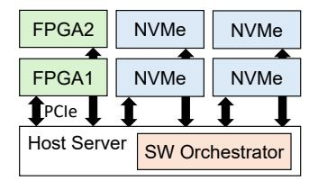
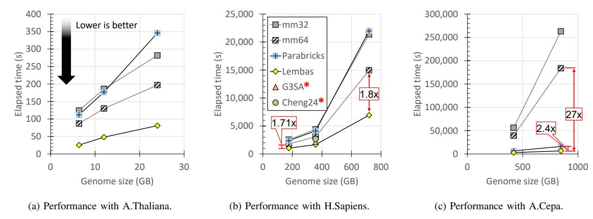
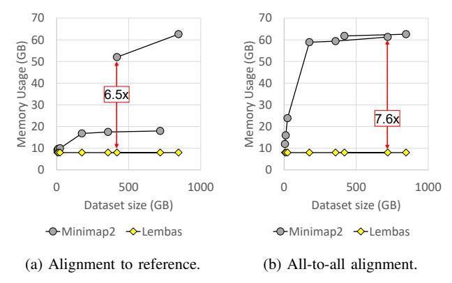
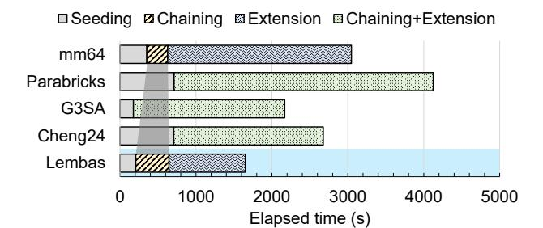
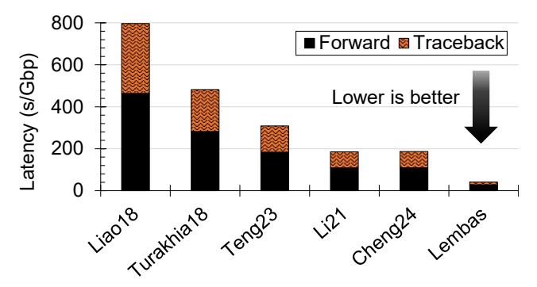
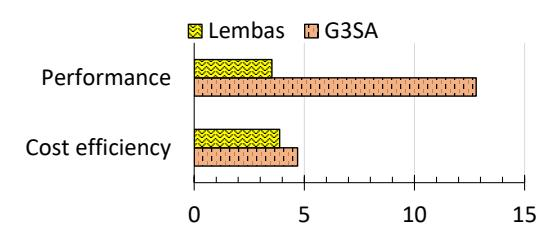

# Lembas: Cost-Efficient Genome Alignment with External Memory and FPGA Acceleration

Seongyoung Kang

*Department of Computer Science University of California, Irvine* Irvine, USA seongyk3@uci.edu

# Se-Min Lim

*College of Computer Science Kookmin University* Seoul, South Korea seminl1@kookmin.ac.kr

Sang-Woo Jun

*Department of Computer Science University of California, Irvine* Irvine, USA swjun@ics.uci.edu

*Abstract*—We present Lembas, a cost-efficient long-read genome alignment system designed to scale to the escalating memory and computational requirements of future genomic workloads. Conventional long-read aligners face two distinct scalability constraints in different stages of the pipeline: seeding demands large memory capacity, while extension demands high computational throughput, making larger genomes and deeper sequencing increasingly costly to support. Lembas improves scalability by reducing both the memory capacity required for seeding and the compute resources required for extension through a combination of reconfigurable FPGA acceleration and external-memory algorithms over NVMe SSDs. To our knowledge, Lembas is the first long-read genome alignment system to address both limitations in a single end-to-end system using offthe-shelf components, while preserving the algorithmic behavior of Minimap2. Lembas introduces two novel accelerators: The external-memory columnsort-based seeding accelerator to minimize memory requirements without performance loss, and a tiled Smith-Waterman-Gotoh extension accelerator which achieves competitive traceback performance despite the low clock speed of FPGAs. These novel accelerators, in addition to a conventional streaming chaining accelerator, time-shares each FPGA in the system. We built a prototype using an affordable desktop-class host with 16 GB of DRAM and 12 x86 cores, augmented with two mid-range Xilinx U50 FPGAs and M.2 NVMe SSDs. The resulting system performs on par with 3× costlier state-of-the-art A100 GPU-accelerated system and outperforms a 2× costlier state-ofthe-art FPGA-accelerated system, resulting in corresponding cost and power efficiency. More importantly, Lembas achieves higher relative performance with larger genomes or deeper sequencing depth, ensuring current and future scalability.

*Index Terms*—Genomics, Field programmable gate arrays, Nonvolatile memory, Scalability.

# I. INTRODUCTION

The cost and throughput of genome sequencing have been enjoying exponential reduction, but the cost of computation and memory continues to be one of the primary challenges facing their analysis. Beyond relatively simple algorithms such as mutation calling against a known reference genome, there are myriad more powerful and precise approaches that require deeper analysis of more genomic data. For example, de novo assembly of long-read genome sequences can better reconstruct complex structures in the genome [5], whole-genome alignment between oranisms can discover orthologous genes and evolutionary relationships [9], and Genome-Wide Association Studies (GWAS) can discover complex associations between genes and diseases by analyzing large populations of genomes [77]. Such tools are expected to enable accurate, personalized medical interventions via finer-grained categorization of tumor subgroups and medical dosage planning [4], as well as better understanding of rare diseases [58], [62] and aging [56]. In agriculture, high-quality assemblies are expected to facilitate better management of livestock, crops, and weeds, and contribute to the design of resilient future crop varieties [28], [39], [46].

However, powerful algorithms require more complex analytics of larger datasets, leading to high computational and memory costs prohibitive for widespread application. For example, accurate de novo assembly requires much deeper genome sequencing depth (e.g., 50+) to overcome the inherent errors in sequence reads, compared to reference alignment (e.g., 10+) [21], [30], [49], [54]. Furthermore, both de novo assembly and whole-genome alignment also require so-called *all-to-all* alignment between all pairs of long reads instead of against a single pre-assembled reference. The vast data coupled with the algorithm complexity results in an order of magnitude higher resource requirements, where accurate alignment tools take hundreds to thousands of CPU hours and hundreds of gigabytes to terabytes of memory [13], [49]. These problems are further compounded by the rapidly increasing size of collected genomic data. Not only does the size of population-scale collection of human genomes require correspondingly large and powerful systems for workloads such as GWAS [82], genomes of crop plants such as onions include numerous repeated regions result in multi-fold larger genomes than humans [18].

Unfortunately, it is unclear whether conventional sources of scalability will be helpful in solving this problem. Not only do existing software genome assembly tools demonstrate sublinear scalability with more parallel cores [13] primarily due to Amdahl's law constraints, the performance gains from general-purpose CPUs are expected to stagnate [38], and the future scalability of memory capacity is uncertain [40], [67]. Existing attempts of using computation accelerators such as Graphics Processing Units (GPUs) and Field-Programmable Gate Arrays (FPGAs) have only resulted in marginal success in terms of *cost-efficiency*. In our experiments, we show that when normalized to cost, no state-of-the-art alignment accelerator definitively beats a baseline software implementation of a state-of-the-art genome alignment tool, Minimap2, running on 64 cores.

Genome alignment is a valuable target for acceleration because it accounts for the vast majority of runtime and memory consumption of workflows such as whole-genome alignment [6] and de novo assembly. For example, our experiments with the popular NextDenovo [27] tool for the human genome shows that 76% of the total runtime is spent performing all-to-all alignment between long reads using Minimap2, while consuming an order of magnitude more memory compared to any other component.

Fig. 1: Variability in memory and computational overhead.

We present Lembas, which introduces two novel subsystems to reduce both memory and computational cost of genome alignment. Figure 1 illustrates our measurement of the memory and computational overhead of Minimap2 during all-to-all alignment of the PacBio long reads of the human genome. Minimap2 consists of three sub-steps, where the seed step has the highest memory requirement by far, and the extend step has the highest processing overhead. These results are consistent with published results using the same technology [71]. Lembas addresses both challenges with two novel FPGA accelerators: First, a seeding accelerator which removes the need for a memory-resident hash table via an external-memory columnsort accelerator coupled with NVMe SSDs. Second, an extend accelerator which implements a tiled Smith-Waterman-Gotoh algorithm capable of high-performance traceback despite the low clock speed of FPGAs. These two novel subsystems are coupled with a state-of-the-art chaining accelerator inspired by a published design [23]. We do not claim novelty for this subsystem. These three accelerators time-share each FPGA instead of requiring three FPGAs, since they are executed in a temporally disjoint manner.

We constructed a prototype Lembas appliance using a desktop-class machine with 16 GB of DRAM and 12 x86 cores, augmented with two mid-range Xilinx U50 FPGAs and four M.2 NVMe SSDs. This affordable prototype, which is made possible by the 7× reduction in memory and vastly reduced CPU overhead, was evaluated against conventional Minimap2 running on the CPU, as well as GPU and FPGA-accelerated systems, each of which require significantly costlier hardware. As we detail below, as well as in Section VII, Lembas achieves superior cost and power efficiency compared to all evaluated systems. The details about

the GPU and FPGA-accelerated system configurations and cost analysis (for both on-premise and cloud) are presented in Section VII-A. Each system was evaluated using synthetic long reads generated from real pre-assembled reference genomes of various sizes and sequencing depth [64].

First, Lembas delivers almost  $3\times$  the cost-efficiency compared to state-of-the-art GPU-accelerated system  $G^3SA$  [25], and over  $5\times$  compared to a beta version of NVIDIA's official implementation of accelerated Minimap2 [63], when aligning PacBio human long reads to a reference. The GPU-accelerated systems were evaluated with up to 128 CPU cores, 128 GB of DRAM, and either an NVIDIA A6000 or A100 GPU, requiring up to  $3\times$  the cost to purchase or rent compared to the Lembas prototype. Despite the cost difference, Lembas performs on-par with  $G^3SA$ , and almost  $2\times$  faster than the NVIDIA implementation, resulting in superior cost-efficiency.

Second, Lembas delivers over  $2\times$  cost-efficiency compared to state-of-the-art FPGA-accelerated systems [8]. The comparison FPGA system reports performance using a Xilinx Kintex Ultrascale FPGA and 40 host threads, requiring  $1.44\times$  the cost to purchase or rent compared to the Lembas prototype. The Lembas system achieves about 60% higher performance compared to this system, primarily thanks to the tiled extension accelerator, resulting in over  $2\times$  superior cost-efficiency. We also present superior performance and efficiency against published FPGA accelerators implementing subsets of Minimap2.

The primary contribution of Lembas is dramatically reducing both capital and operational costs of scalable genome alignment targeting more complex analysis approaches, such as population-wide genomic analysis, de novo assembly, and organisms with larger genomes. This contribution is enabled by its sub-contributions:

- FPGA-optimized Smith-Waterman-Gotoh algorithm using tiled traceback.
- Memory-efficient seeding using an FPGA-accelerated external-memory columnsort algorithm.
- Detailed cost and power efficiency analysis compared to state-of-the-art systems.

We emphasize that Lembas does not introduce any new optimizations or approximations which trade accuracy for performance, and implements the first algorithmic principles as presented by Minimap2 [42]. Since the Minimap2 software package implements many undocumented heuristic optimizations that do reduce the search space, Lembas often ends up doing more work to arrive at its results. As a result, the results of Lembas will always include all results Minimap2 would have discovered, under the same configurations. For example, Lembas avoids Minimap2's quality degradation caused by its memory chunking behavior when working with genomes larger than available memory, since Lembas always works with the whole genome using external memory NVMes.

The remainder of this paper is organized as follows: We present some background and related works in Section II. We present the architecture of Lembas, including three accelerators for the stages of Minimap2, in Sections III, IV V, and

VI. We provide in-depth evaluation results in Section VII, and conclude with discussions in Section VIII.

### II. BACKGROUND AND RELATED WORKS

### *A. Sequence Alignment and Genome Assembly*

Sequence alignment is a fundamental computational kernel that underlies modern genomics, enabling tasks such as read mapping, variant detection, as well as reference-based or de novo genome assembly [20], [43], [51], [73]. Given two sequences, alignment determines the best possible correspondence between them by allowing edits such as insertions, deletions, and substitutions, while considering the biological probability of each type of edit.

Because discovering a globally optimal alignment is computationally prohibitive, many techniques have been proposed to target an attractive balance of accuracy and performance [3], [25], [31], [32], [47], [83]. Two de facto standard alignment tools are Minimap2 [42] and BWA-MEM [41], and their specific accuracy configuration is taken as gold standard in many situations [31], [52], [63], [71].

We note that while BWA-MEM is an important software reference for sequence alignment, Lembas targets Minimap2 based long-read workflows, especially due to its support for the all-to-all alignment feature used by de novo assemblers and whole-genome alignment [6], [27], [35], [36], [85]; therefore, Minimap2 is the direct baseline in our evaluation, while BWA-MEM is discussed as a broader context.

De novo genome assembly, instead of aligning against a reference, is a particularly important example of computationally expensive genomics [4]. De novo achieves high accuracy by avoiding reference bias [7], [11], but because it treats the entire read dataset as both reference and query, in a so-called all-toall alignment, its quadratic computational overhead is often prohibitively high. Assembling even a modest genome such as Arabidopsis thaliana (∼140 Mb) can take hours on 32-core systems with hundreds of gigabytes of DRAM, while humanscale genomes may require terabytes of memory and multiweek runtimes [74]. Typical de novo assemblers internally use Minimap2 for all-to-all alignment [35], [36], [74], and Minimap2 represents the dominant computation and memory capacity overhead of these application. As such, Minimap2 is a valuable target of optimization.

### *B. Minimap2 Overview*

Minimap2 [42] implements a popular *seed*, *chain*, *extend* alignment approach. Seeding discovers small, exact matches between the two sequences in a resource-efficient, but accurate manner using *minimizers* [69], which are the lexicographically smallest k-mers within a sliding window. Matching pairs of minimizers are typically discovered using hash tables, and referred to as *anchors*. Chaining processes the anchor list to discover long, matching chains of anchors by linking them whenever possible. This is done through a dynamic programming approach, which assigns a chaining score to each anchor by rewarding overlaps between anchors and penalizing gaps, as well as with some heuristic adjustments. Once anchor chains are established, an approximate matching algorithm such as Smith–Waterman–Gotoh (SWG) is used on each chain to finally determine the alignments between the reference and query. SWG is a dynamic programming algorithm that computes an O(N2 ) score matrix between the two chains, and then performs a traceback of the optimal path to determine the alignment. Various configurations for SWG exist to balance accuracy and performance. One example is a gap penalty, which can assign different penalties for insertion and deletion, at a specific location. Minimap2 uses the Affine gap penalty by default. Another example is banded and adaptive banded Smith Waterman algorithms, which ignore the unlikely edges of the score matrix [15], [26], [34], [45], [48], [72].

### *C. Acceleration Landscape and Limitations*

Various attempts have tried to mitigate the performance overhead of alignment using acceleration, to varying success. To the best of our knowledge, we demonstrate that (1) no accelerated system focused on minimizing memory capacity overhead, and (2) even high-performance accelerated systems do not significantly improve end-to-end cost efficiency.

Designs optimized for modern general-purpose CPUs pair mature software stacks with wide SIMD (SSE/AVX/AVX-512). Optimizations include learned indexes for faster seeding, SIMD-vectorized chaining, and wider-vector SWG, which yield notable end-to-end speedups [14], [33], [80], [81]. Nevertheless, chaining remains difficult to vectorize due to its tight dependency and control-heavy nature, and throughput can be limited by cache capacity and vector width [22], [76].

GPUs offer massive data-level parallelism and excel on regular inner loops (e.g., DP cell updates) [16], [59], [68], leading to many accelerated alignment systems [12], [17], [71]. In fact, NVIDIA has released a beta version of its GPU-accelerated Minimap2 replacement [63]. However, many of these systems only focus on a subset of stages, due to limited GPU memory capacity and data movement overhead. Examples include chaining [12], [23], [71] and score matrix computation [12], [66], [84] but not traceback [26], [44], [70], leading to limited end-to-end improvements. One recent work has targeted GPU acceleration of all three stages [25], and achieves over 2× performance improvement over 128 thread software. Unfortunately, we demonstrate that even this system does not significantly improve cost-efficiency after accounting for GPU cost. Urgent limitations to GPU acceleration include warp divergence, irregular memory access, and dynamic termination caused by following the exact behavior of Minimap2 [71], prompting numerous research efforts to address these issues [66], [84].

FPGAs provide attractive performance and power efficiency while avoiding issues like warp divergence, often leading to superior performance and power efficiency compared to GPUs [23]. Many FPGA-accelerated systems have been proposed [23], [53], [57]. However, due to PCIe data movement overhead and capacity limitations of accelerator memory, most published systems accelerate only a subset of the algorithm: either the *chaining* step [12], [17], [23], [57], [71], or the alignment score generation [12], [66], [84]. Unfortunately, focusing on these subsets is often insufficient to ensure overall scalability. For example, many systems accelerate banded or adaptive banded Smith–Waterman [8], [15], [48], [70], [72], yet often omit traceback or provide only marginal gains over software [8], [48], [61]. This is because unlike the score matrix computation which is readily parallelizable, traceback has a tight dependency between steps, leading to low performance on lower clock speeds of FPGAs. We describe this limitation in more detail in Section VI.

Some systems have proposed specialized hardware, either as standalone ASICs [19], [24], [79], near-storage and nearmemory accelerators [55] or as CPU extensions [10], [60]. These systems often overcome many limitations of existing processing and memory systems, but producing custom designs is costly.

## III. OVERALL LEMBAS ARCHITECTURE

Figure 2 describes the overall architecture of a Lembas system, which incorporates multiple FPGAs and NVMe SSDs. As we describe in Section VII-A, the default configuration for our prototype includes two Xilinx Alveo U50 FPGAs and four 1 TB M.2 NVMe SSDs. A software orchestrator is responsible for programming appropriate bitfiles into each FPGA, data movement, and a minimal amount of computation.

We choose FPGAs instead of GPUs for Lembas, because existing work has shown that GPU chaining implementations using general-purpose warp processors are inefficient compared to reconfigurable FPGA acceleration [23], [53].

The two-FPGA system is our default configuration because it is the cheapest configuration which outperformed both stateof-the-art GPU and FPGA-accelerated systems, as we describe in Section VII. Four NVMe SSDs were used to provide sufficient bandwidth for the two FPGAs. More FPGAs and NVMe devices will improve performance at a marginal cost increase. We present scalability analysis with more FPGAs in Section VII-H.

Fig. 2: A Lembas system with multiple FPGAs and SSDs.

Figure 3 illustrates the typical three-step seed-chain-extend approach to genome alignment, and how accelerators for each step time-share multiple FPGAs in a Lembas system. Input to the system is a database of query reads and a reference. The reference can be a pre-assembled reference (for referencebased alignment), or another database of reads (for all-to-all alignment). Output of the system is the alignment results in a SAM file format. All FPGAs in the system are programmed with an identical bitfile at any given time, and the whole system is working on one of the three steps at any given time. Both input and output of the system, as well as the intermediate data between each step (anchors, chains) are stored in the NVMe storage. The programming of the FPGAs and orchestration of the data movement back and forth over the PCIe is managed by the software orchestrator. NVMe is used as persistent intermediate storage between stages rather than as an accelerator cache, allowing the seeding stage to exceed both host DRAM and FPGA HBM capacity while still feeding later stages through sequential streams.

Fig. 3: Accelerators time-share all FPGAs in lockstep.

Each of the accelerated steps focuses on either improving performance (chaining, extension) or minimizing memory footprint without sacrificing performance (seeding). This way, Lembas mitigates the resource bottlenecks described in the Introduction. The details about each accelerated step are presented in the following sections.

# IV. MEMORY-EFFICIENT SEEDING ACCELERATOR

The vast majority of Minimap2's memory overhead is used to construct and lookup a hash table of minimizers to discover anchors between the reference and query. Since hash table access based on minimizers is considered unpredictably random, conventional systems must keep the table memoryresident and suffer the expensive memory capacity overhead.

Lembas removes the memory-resident hash table requirement by sorting the list of hash table entries from both reference and query according to their minimizers. Once the list is sorted, discovering anchors becomes a straightforward streaming operation where matching keys are found from two sorted lists. After creating a list of anchors, the list is sorted once again to order it according to its location in the reference.

Fig. 4: The seeding step repeatedly uses a columnsort accelerator to remove random accesses into memory.

Figure 4 illustrates the seeding process implemented by Lembas. All boxes in the figure represent accelerators. We note that since minimizer parsing and anchor matching are quite simple, they share a bitfile with the more complex columnsort accelerator, resulting in a single bitfile for the seeding step.

First, the reference and query are streamed into the minimizer parse, which extracts minimizers and emits a stream of 〈minimizer, index〉 tuples. For alignment workloads, the query stream will consist of the entire read dataset. For referencebased alignment the reference stream would be the entire pre-assembled reference, while for all-to-all alignment, the reference stream would also be the entire read dataset. Since the resulting minimizer stream will likely be larger than the on-board memory capacity of the FPGA, they are streamed out of the FPGA over PCIe and stored in NVMe.

The minimizer stream, stored in NVMe, is then sorted according to the lexicographic order of the minimizers, using the external-memory columnsort accelerator. As we describe in Section IV-1, the sorting process involves multiple phases of data movement between the FPGA and NVMe over PCIe. Once the two streams are sorted and stored in NVMe, they are streamed into the anchor matching accelerator, which simply zips the two sorted lists to discover matches. The result is a new stream of anchors, which are tuples of 〈idxQ, idxR〉, or in other words, pairs of query and reference indices with matching minimizers. Due to its size, the anchor stream is streamed out of the FPGA and stored in NVMe. This stream is sorted again using the external-memory columnsort accelerator according to its idxR, which becomes the final output of the seeding step.

We note that more advanced algorithms use heuristic anchor filtering, which try to filter out unpromising anchors. Many approaches exist, including immediately checking whether each anchor is part of a larger exact match. We intentionally do not implement such heuristic optimizations for two reasons: First, we avoid algorithmic deviations from Minimap2 which may degrade its accuracy. Second, because they would require random access into the input datasets, which would again incur costly memory requirements. We demonstrate in Section VII that this choice results in amplified work for the later stages. However, Lembas still ultimately achieves superior performance, as well as superior cost efficiency due to reduced system cost. We will continue improving Lembas to incorporate and evaluate heuristic optimizations which do not incur high memory requirements or accuracy degradation.

*1) External-memory columnsort accelerator:* Because a CPU implementation of columnsort requires too many cores (200+) to achieve competitive seeding performance, Lembas overcomes the high computational overhead of sorting using an external-memory sorting accelerator. The sorting accelerator implements a novel external-memory variant of columnsort [29], [37]. Columnsort is a parallel sorting algorithm that globally sorts a grid of values by repeating the process of sorting individual columns independently and then shifting or transposing the grid. Columnsort is very efficiently parallelizable because each column does not need to communicate with other columns during sorting or transposition. In the interest of space, we guide readers to existing work on the algorithm and implementation [29], [37].

Fig. 5: The external-memory columnsort accelerator consists of multiple parallel kernels to saturate PCIe.

Lembas implements a novel, external-memory columnsort accelerator targeting modern FPGAs equipped with High Bandwidth Memory (HBM), using an array of independent sorting kernels. Our accelerator design differs from existing accelerator implementations of columnsort since our design must target datasets exceeding accelerator memory, and this difference motivates many changes in design decisions. This accelerator is illustrated in Figure 5 using two kernels to sort two columns. Thanks to the independently parallel nature of columnsort, each sorting kernel can take ownership of a pair of HBM *banks*, i.e., *pseudo-channels (PC)*, and focus on sorting one bank, using the other one as a scratchpad. Each 256 MB column is stored in NVMe storage, and moved back and forth to each accelerator by the software orchestrator for sorting and transposition. Each sorter implements a 16-to-1 merger, which merge-sorts a buffer by recursively merging 16 sorted sub-buffers into 1. Each merger is single-issue, meaning it invariably emits one element per cycle. In our case, each element is 16 bytes in size, consisting of a minimizer and its offset.

Unlike existing in-memory designs, our external-memory columnsort accelerator, can achieve optimal performance within system limitations with simple 16-to-1 single-issue mergers, on 256 MB columns, without requiring complex wide-issue mergers capable of emitting multiple elements per cycle [29]. The reasoning behind this decision is the following: A single-issue merger with 16-byte elements needs to make six sweeps to fully sort a 256 MB chunk. Each kernel running at 250 MHz processes data at 4 GB/s, resulting in 4/6 GB/s of bandwidth requirement over the PCIe per kernel. We were able to fit 16, but not 32, kernels in the U50 FPGA, and the 16 kernels can collectively saturate the ˜8 GB/s of duplex PCIe bandwidth on the U50 FPGA, which is the maximum performance we can get from this device. Faster, wider-issue 16-to-1 mergers cannot improve performance because the performance is already limited by PCIe bandwidth. On the other hand, 16 to-1 mergers was discovered from design-space exploration as the optimal design in terms of the bandwidth per chipspace. Larger fan-in mergers (e.g., 32-to-1) can potentially improve performance by reducing the number of sweeps over a column, but we can fit fewer number of them on chip due to the increased size. Smaller fan-in mergers may save chip space per merger, but require more passes over the dataset. Furthermore, because the U50 FPGA has only 32 HBM PCs, having more than 16 mergers means mergers must start sharing each HBM PC, requiring additional arbiter logic.

Since columnsort requires columnwise sorting to be done four times, the transposed grid must be transported back to the FPGA three more times before the whole grid is sorted. As a result, the 8 GB/s PCIe bandwidth translates to up to 2 GB/s of effective end-to-end sorting throughput.

Between the columnwise sorting phases, columnsort requires transposition and shifting of the grid, as illustrated in Figure 5. To achieve this, each kernel reshapes its sorted column into a transposed subgrid before emitting it to software. To reconstruct each transposed column into a contiguous format, the host-side software must perform some simple large-chunk (multi-KB) memcpy operations after receiving each chunk. A multi-core desktop CPU was more than capable of such a simple operation.

We note that columnsort places an algorithmic constraint on the size of the grid it can sort. Given a grid with r rows and c columns, r ≥ 2c 2 must hold. Since r is limited by the 256 MB bank size of the U50's HBM, this creates a limitation on how many columns Lembas can sort. Assuming 16-byte elements, Lembas can sort up to 512 GB of data. In the rare case the anchor list exceeds this limit, each list is sorted in 512 GB chunks, and then merged by software.

# V. ACCELERATED CHAINING

For the chaining stage, Lembas adopts an FPGA-friendly design inspired by Guo et al. [23], which reformulates the original 1D dynamic programming algorithm for enhanced parallelism. We do not claim novelty for this design, but briefly describe its operation for completeness. We direct the readers to the original publication for more details on the chaining accelerator design. As this design was sufficient to saturate the PCIe bandwidth within the U50's chip resource limitations, we clean-room re-implemented the idea as published.

The original, software chaining algorithm employs onedimensional dynamic programming, where each anchor is evaluated against up to N preceding anchors to compute its chaining score. This process identifies the optimal predecessor through a max reduction across all candidates, which can create a critical path in hardware implementations.

To mitigate this, Lembas adopts the reordering strategy introduced in [23], where instead of looking backward to compute the current score, each anchor propagates its score forward to update the next N anchors for incremental max reduction. This approach computes max reduction over N pipelined cycles, effectively breaks the dependency chain which was limited by the single wide max-reduction operation. The resulting fully pipelined FPGA implementation has an initiation interval of 1, maintaining high throughput across parallel processing elements. Figure 6 shows an overview of the architecture, illustrating how each anchor's score is forwarded to subsequent anchors.

Fig. 6: Chaining accelerator design.

### VI. EFFICIENT EXTENSION WITH TILED TRACEBACK

Lembas employs a novel extension accelerator which implements a hardware-accelerated banded Smith-Waterman-Gotoh (SWG) algorithm with an affine gap penalty. The extension accelerator introduces a fully pipelined score matrix calculation as well as FPGA-optimized backtracking via a novel tiled algorithm capable of high-performance backtracking despite the low clock speed of FPGAs.

### *A. Score matrix calculation*

Lembas implements a conventional cascaded parallel array of PEs to compute the score matrix, similar to other existing accelerators [8], [26], [48], [70]. Figure 7a shows the highlevel design of a kernel for score matrix calculation, consisting of a 1D systolic array of processing elements (PEs) where each PE computes a row of the dynamic programming (DP) matrix in a staggered fashion. Once each PE finishes computing a row, it moves to a new row.

Figure 7b illustrates the PE microarchitecture, capable of highly efficient pipelining via forwarding registers, as well as supporting tiled traceback. Because Lembas implements the affine gap penalty by default [42], each PE computes three values for each cell: S[i][j], E[i][j], and F[i][j], for score, gap penalty, and insertion penalty, respectively. These three values are computed using four inputs: S[i−1][j−1], E[i−1][j], F[i][j−1], and bj , which is the next character in the query. This data access pattern is also illustrated in Figure 7a. Since F is read from the left cell while each PE is moving right, this value is simply cached in each PE. E is generated by PE1 and read by PE2, one cycle later, and bj is used by PE1 is used also by PE2, one cycle later. These values move through a E,b register between the PEs. S is generated by PE1 and read by PE2 two cycles later due to the diagonal dependency, so this value moves through a two-element FIFO.

### *B. Tiled bit-parallel traceback*

A prominent novelty of Lembas's extension accelerator is in its tiled bit-parallel backtracking algorithm, which overcomes the low clock speed limitation of FPGAs. The novelty is that each tile boundary cell stores the complete intra-tile traceback history needed to jump to the next tile, allowing traceback to advance at tile granularity rather than one cell per cycle.

Fig. 7: Parallel PEs cooperate to compute the score matrix.

While the forward pass of extension (i.e., computing the score matrix) is readily parallelizable, resulting in many efficient FPGA implementations, the backward pass (i.e., traceback) is conventionally not well-suited for FPGAs [8], [48], [61]. This is because each traceback step depends on decisions made in the previous step, incurring a tight dependency. As a result, efficient traceback implementations benefit from high, multi-GHz clock speeds, making FPGA implementations inefficient due to their low clock speeds in the 100s of MHz. Some previous work on efficient backtracking attempted to overcome this limitation using 2-bit encodings for backtracking paths [8], or computed backtracking in block units for interblock parallelism [25], [61].

(a) Blocked bit-parallel backtracking in 4x4 blocks. (b) Communication between PEs.

Fig. 8: Tiled traceback and PE architecture.

Our design takes the approach of using tiles to increase the number of traceback steps taken per clock cycle. We divide the alignment matrix into large 8 × 8 tiles, and encode path information such that traceback route from any edge cell can be computed within a single cycle. Figure 8a illustrates our approach with 4×4 tiles. The best path to any edge cell of each tile (gray cells), starting from a cell immediately outside the current tile (a gray cell in an adjacent tile), is encoded in each edge cell in its entirety. A typical 2-bit encoding is used to encode x and y offsets [8]. Figure 8a shows an example encoding, 11111010, which encodes a four-step path to a cell in the next tile. Given this vector, the location of the next cell in the next tile can be computed simply by popcounting x and y bits in the encoding. This way, backtracking can be done at a much coarser granularity, in the units of 8 × 8 tiles per cycle (red arrows) instead of single cells (black arrows).

In the accelerator architecture, this approach is implemented using "history registers", illustrated in Figures 7b and 8b as Hist Reg. Each history register maintains the best history to a sliding window of two most recently visited cells, as illustrated in Figure 8b. When a PE computes a score for the current cell and determines another step of the path, one of the three input history registers is selected accordingly, and the newly determined path is appended to it.

We choose a tile size of 8×8 because the history register access could not meet timing with larger tiles. This tile size is a good fit with the 512-bit HBM interface, since each tile stores 32 × 15 = 480 bits. (Maximum path length for each edge tile is 16 for an 8×8 tile, where each step encoded using 2 bits. There are 15 edge cells in each tile) We note that our traceback accelerator actually prefetches four tiles for every tile loaded, to mitigate the impact of HBM access latency. We also note that larger tiles did not significantly increase the PE area overhead, due to the small footprint of the area registers compared to the rest of the PE.

## VII. EVALUATIONS

In this section, we demonstrate that among the state-of-theart systems evaluated, Lembas is both cheapest and consumes least power, but also the fastest, and most scalable with no optimizations for problem space reduction, which trades accuracy for performance. We first present the evaluated system configurations and the resulting performance comparisons, and then delve deeper into resource efficiency and stepwise ablation studies.

## *A. System Configurations*

We implemented a Lembas prototype using a desktopclass machine equipped with two mid-range Xilinx Alveo U50 FPGAs and four 1 TB NVMe SSDs used for storing intermediate data between pipeline stages. The original software Minimap2 [42] was evaluated using a 64-core AMD EPYC CPU with 128 GB of DRAM. We also evaluated NVIDIA's GPU-accelerated Minimap2 implementation ("Parabricks" [63]), running on a 32-core Xeon CPU with 128 GB memory, augmented with an NVIDIA A100 GPU (80 GB HBM). These three system configurations are summarized in Table I. We note that while our system has a CPU with a higher clock speed, it is the cheapest and oldest, desktopclass processor. Furthermore, the performance of Lembas is not significantly affected by CPU performance since the vast majority of work is done in the FPGA. We evaluate the impact of CPU performance for Lembas in Section VII-H.

We also compare against two published state-of-the-art accelerated systems, which are end-to-end Minimap2 compatible. G3SA [25] is a GPU-accelerated system that presents performance on a 128-core Threadripper and an NVIDIA A6000 GPU. Cheng24 [8] is an FPGA-accelerated system that presents performance on a 40-thread Xeon E5 and an XCKU115 FPGA.

We exclude published accelerators which only support a single step instead of end-to-end alignment, since the goal of Lembas is to provide end-to-end scalability and cost-efficiency improvements, as a drop-in replacement for Minimap2. We do present evaluations on extension accelerators in Section VII-I3 since all compared systems have a common goal of improving performance. We emphasize that our seeding accelerator's goal is reducing memory capacity requirements, and we do not claim novelty for the design of the chaining accelerator. We also exclude some published end-to-end systems, such as [52], if they are older and less efficient (only 76% over 8 cores) compared to Cheng24 or G3SA.

TABLE I: Evaluated system configurations.

| Name       | CPU             | Memory      | Accelerator   |
|------------|-----------------|-------------|---------------|
| Minimap2   | AMD EPYC 7742   | 384 GB DDR4 | -             |
|            | 128-thread      |             |               |
|            | 2.25 GHz, 2019  |             |               |
| Parabricks | Xeon Gold 6248R | 128 GB DDR4 | NVIDIA A100   |
|            | 48-thread       |             | 80 GB HBM     |
|            | 3 GHz, 2020     |             |               |
| Lembas     | i7-8700         | 32 GB DDR4  | 2x Xilinx U50 |
|            | 16-thread       | 4 M.2 SSD   | 8 GB HBM      |
|            | 3.2 GHz, 2017   |             |               |

All locally run systems (Lembas, Parabricks, mm64) were configured with a 20kbps band for banded Smith-Waterman. This is the default configuration for Minimap2, and is larger than the average length of the PacBio HG002 human genome.

### *B. Cost analysis*

Accurate cost analysis is critical for precise evaluation, due to the great heterogeneity of the compared systems. Table II presents our relative cost assessment of each system compared to Lembas, calculated using both the on-premise purchasing cost, as well as the hourly rate of AWS instances capable of hosting each system. We emphasize that Lembas is the cheapest system among the ones evaluated.

All system resource requirements were conservatively estimated to benefit the comparison systems instead of Lembas. The GPU instance used for cost assessment (for Parabricks, G 3SA) equips only 48 cores and an A10G GPU, although performance was measured using much more powerful A100 or A6000 GPUs. Minimap2 cost is assessed using a 64-core Graviton 2 instance, although performance was measured with a much faster AMD EPYC CPU, resulting in a relatively low AWS instance price (1.1×) compared to the purchasing price (2.5×). On the other hand, the cloud cost of Lembas was assessed using a machine with a very powerful VU47P FPGA (\$15,000+) and 256 GB of DRAM, although performance was measured with only 16 GB of DRAM and two Alveo U50 boards (\$3,000 ea.). We note that Cheng24 [8] can be hosted on the same FPGA instance as Lembas, but we use the purchasing cost to calculate the relative cost because the difference in DRAM and FPGA usage is an important distinguishing factor between the two systems. Even for Cheng24, we compute the purchasing cost considering a cheaper KCU105 board, although the publication lists a costlier board with a much larger XCKU115 chip and 16 GB of DRAM, since the specific board price was not available online.

TABLE II: Cost analysis of evaluated systems.

|               | Minimap2  | GPU         | Cheng24    | Lembas     |
|---------------|-----------|-------------|------------|------------|
| Purchase (\$) | 20,000    | 24,500      | 11,500     | 8,000      |
| AWS (\$/h)    | 2.176     | 5.62        | 1.98       | 1.98       |
| Instance      | c6g.metal | g5.12xlarge | f2.6xlarge | f2.5xlarge |
| Relative Cost | ˜1.1      | ˜3          | ˜1.44*     | 1          |

### *C. Evaluated Datasets*

We evaluate Lembas using three representative organisms with varying genome sizes and complexity: *Arabidopsis thaliana*, *Homo sapiens*, and *Allium cepa* (onion). These organisms span a wide spectrum of genome sizes from 135 Mbp to over 16 Gbp, allowing us to test scalability across small, medium, and large genomes. The synthetic read datasets were generated using PBSIM3 [65], a long-read simulator that produces realistic PacBio CLR-style reads from reference genomes. We use synthetic read dataset to evaluate each system on varying sequencing coverage, ranging from 15× to 100×, to assess scalability with more or less data. We use PBSIM3 to generate realistic read datasets based on realworld reference genomes: TAIR10 (A.Thaliana), HG16 (H. Sapiens), and DHCU066619 (A. Cepa). Table III summarizes the evaluated datasets, including genome sizes, coverage, and total dataset sizes.

TABLE III: Evaluated datasets.

| Organism    | Reference Size (bp) | Coverage     | Size (GB)   |
|-------------|------------------------|--------------|-------------|
| A. Thaliana | 119 Mbp                | 30x/50x/100x | 6.4/12/24   |
| H. Sapiens  | 3.1 Gbp                | 30x/50x/100x | 176/357/719 |
| A. Cepa     | 14.9 Gbp               | 15x/30x      | 419/ 846    |

## *D. Lembas FPGA Resource Utilization*

Table IV presents the FPGA resource utilization for each stage of Lembas on each of the Xilinx Alveo U50 devices.

TABLE IV: FPGA resource usage per step on Xilinx U50

| Step   | LUTs Used        | BRAM Used    |
|--------|------------------|--------------|
| Seed   | 361,624 (41.53%) | 517 (38.47%) |
| Chain  | 273,951 (31.46%) | 200 (14.88%) |
| Extend | 431,957 (49.61%) | 105 (7.81%)  |

The sorting accelerator for seeding instantiates 16 columnsort kernels, which collectively make use of all 32 HBM pseudo-channels on the U50 FPGA, while consuming less than half of LUTs and BRAM resources. We were unable to place and route 32 kernels, but this was not an issue since PCIe bandwidth was the primary bottleneck even with 16 kernels. Similarly, the chaining stage maintains a moderate footprint, benefiting from a compact kernel structure and an efficient score propagation design. It instantiates four kernels, each with a single PE, which can again saturate the available PCIe bandwidth. The extension accelerator instantiates 16 kernels, each equipped with 16 processing elements configured with 8x8 tiles. It utilizes less than half of the available LUTs and only a modest portion of BRAM, ensuring the published

Fig. 9: End-to-end performance evaluation with alignment to reference. Performance of G3SA and Cheng24 (marked with \*) are derived from respective publications. (Lower is better.)

performance can be maintained even with more complex logic, such as more complex gap penalty schemes.

Fig. 10: Reference-based human genome alignment performance and cost efficiency. Performance of G3SA and Cheng24 (marked with \*) are derived from respective publications. (normalized to 64-thread Minimap2, higher is better.)

#### E. End-to-end performance of reference-based alignment

We first present the performance evaluations of referencebased alignment, used for workloads including reference-based assembly and reference-guided de novo assembly.

1) Runtime and scalability analysis: Figures 9a, 9b, and 9c present the runtimes of all evaluated systems for reference-based alignment for all evaluated datasets. mm32 and mm64 represent the runtime of software Minimap2 with 32 and 64 threads, respectively.

The figures show that Lembas consistently achieves superior performance compared to all evaluated systems, despite its lower cost. On the 100x human genome, Lembas outperforms the next best system, mm64, by  $1.8\times$ . On the larger onion genomes, Lembas outperforms mm64 by  $27\times$ , and the Parabricks GPU-accelerated system by  $2.4\times$ .

The GPU-accelerated Parabricks system is often faster than mm32 but slower than mm64, except for larger genomes, such as the human 100x and the onion genome. This is consistent with the numbers in existing publications, where GPU-accelerated chaining systems achieved around 2× performance compared to 32-thread systems [12], [71].

We observe that both accelerated systems, Lembas and Parabricks, perform better on larger genomes such as the deeper versions of A.Thaliana and H.Sapiens, as well as on the larger genome of A.Cepa. First of all, such a trend emphasizes the scalability of accelerated systems and their importance for future genome workloads. In addition, it suggests that the relatively high performance is due to the increase in chaining overhead, since that is what the Parabricks system accelerates.

We note that the performance of the other state-of-the-art systems (G3SA and Cheng24) were taken from their respective publications, since the software artifacts were not available online for local evaluation. This is why their comparisons are only available for H.Sapiens with a relatively low coverage. The G3SA paper presents the end-to-end execution time of reference-based alignment of the HG002 human genome with 50x coverage. They also present their own evaluation results with Parabricks, which almost exactly match our results in Figure 9b, allowing accurate comparison between G3SA and Lembas using it as the common reference. Cheng24 presents relative performance compared to a 40-thread system, but there is some confusion because the cited processor, E5-2689 v4, only has 20 threads. We incorporated the performance using mm32 as the common reference, especially since our CPU is newer and more powerful. We also used the best-case scenario performance from the publication, where a synthetic dataset with uniform 16 kbp reads was used. In Figure 9 and 10, the marked G3SA and Cheng24 bars use publication-reported performance numbers, while cost efficiency is computed using the cost model in Table II; all other unmarked bars are locally measured in our evaluation environment.

Fig. 11: End-to-end performance evaluation with all-to-all alignment. (Lower is better.)

2) Cost-efficiency analysis: Figure 10 presents the relative performance of Lembas against state-of-the-art GPU-accelerated system G³SA [25] and FPGA-accelerated system Cheng24 [8], as well as their cost-efficiency calculated using the system costs estimated in Section VII-A. Comparison was done using the reference-based human genome alignment, since it was the only long-read configuration these publications reported. Lembas outperforms all compared systems, and achieves over 2× cost-efficiency improvements over the next best systems, mm64 and Cheng24.

#### F. End-to-end performance of all-to-all alignment

We present the performance evaluations of all-to-all alignment, used for de novo assembly. All performance, memory usage, and accuracy-related parameters were generated by the NextDenovo [27] de novo assembly tool in its default settings, to represent a typical workflow for de novo assembly. We are unable to present comparisons against accelerated systems including Parabricks, G3SA, and Cheng24, because they either did not publish all-to-all results (G3SA, Cheng24) or did not support it (Parabricks). We present stepwise performance breakdown in Section VII-I as proxy.

1) Runtime and scalability analysis: Figure 11 presents the performance of all-to-all alignment across all tested datasets, demonstrating that Lembas achieves superior performance and cost efficiency compared to the software solutions. Unfortunately, Parabricks or other accelerated system performance is not included in this chart. The Parabricks Minimap2 beta implementation does not support all-to-all alignment yet, and no published performance numbers exist for all-to-all alignment acceleration of long-read genomes, to our knowledge. All-to-all short read alignment acceleration has been demonstrated [1], [50], as well as long read alignment comparisons against a custom Darwin implementation [2], but no all-to-all long-read alignment compared against Minimap2 or other comparable baselines. We present comparisons against Minimap2 software as a proxy, and present step-wise perfor-

mance breakdown in Section VII-I to reason about accelerator performance.

Lembas also demonstrates good scalability in the all-to-all example, although not as pronounced as the onion genome in the reference-based alignment workload. As seen in Figure 11b and 11c, the performance gap between mm64 and Lembas does grow with deeper coverage. Furthermore, Lembas reduces the memory requirement of all-to-all alignment by over  $7\times$ , as we present with more detail in Section VII-G.

Fig. 12: Cost efficiency normalized to mm64.

2) Cost-efficiency analysis: As seen in Figure 12, Lembas consistently achieves about 3× higher cost-efficiency compared to mm64, on the larger genomes. This is higher than the cost efficiency improvements seen with the human genome for reference-based alignment, but lower than with the onion genome for reference-based alignment.

#### G. Memory efficiency analysis

A primary goal of Lembas is to reduce the cost overhead of large capacity memory. As described in Section III, Lembas removes the memory capacity overhead of the seeding step using the external memory columnsort accelerator. Figure 13 demonstrates the resulting memory efficiency of Lembas, which invariably consumes around 8 GB of system memory

even with very large datasets, unlike the software implementation, where memory consumption grows with larger data. To be representative of real-world workflow, we used default parameters for the software Minimap2 as generated by NextDenovo for each workload.

From Figure 13, we can see that Minimap2 is performing memory chunking to reduce memory usage, as memory usage is limited to roughly 60 GBs despite the growing genome sizes. We note that Minimap2 provides a runtime parameter for tuning its memory usage, and we noticed that reduced memory usage actually does not impact performance very much, but does impact the output quality. Because seeding is the primary memory bottleneck, Minimap2 constructs multiple hash tables for seeding when met with memory capacity limitations. The output quality difference happens because Minimap2 does not check for matches between different hash chunks during anchor computation. We emphasize that Lembas does not suffer from this quality degradation since it always uses the whole hash via the columnsorter. Because the level of acceptable accuracy is dependent on the workload and situation, we simply present this data under default configurations.

The reduction of memory capacity requirements has benefits beyond simply making machines cheaper today, because it can separate the scalability of genome alignment and assembly from memory capacity scaling. Since memory capacity per dollar may not scale as they used to [40], [67], separating scalability from DRAM capacity can benefit continued future scalability of the application.

#### H. Scalability analysis

Figure 14 illustrates the scalability of Lembas, either with more CPU threads or with more FPGAs, using reference-based alignment of the human genome (50x).

We note two observations from Figure 14a. First, it shows that the software scalability quickly saturates with more threads, where more than 32 threads do not contribute significantly to performance. This matches the observations made in existing work [13]. Second, the scalability of the GPUaccelerated Parabricks system appears to be worse than the

Fig. 13: Memory consumption of Minimap2.

reference, with more threads.

(a) Human genome (50x) alignment to (b) Lembas scalability with

Fig. 14: Lembas scalability analysis.

purely software system, because a single GPU quickly becomes the performance bottleneck. This is also consistent with existing work [23], [53], which showed that GPU chaining implementations using general-purpose warp processors are inefficient compared to reconfigurable FPGA acceleration.

We also present the multi-FPGA scalability analysis of Lembas in Figure 14b. The default configuration of Lembas is with two U50 FPGAs, which achieves the best performance compared to all compared systems as well as the lowest cost. However, thanks to the inherent task-level parallelism across kernels, Lembas can make very good use of a variable number of FPGAs and achieve near-linear scalability. The potential limitations to scalability come not from the FPGA, but from the CPU and NVMe storage. The CPU needs to perform bookkeeping functions such as moving data, accessing storage, and invoking kernels. Our 12-core host processor did not reach full utilization even with three FPGAs, suggesting that even more FPGAs can be supported on this low-cost server. On the other hand, the four NVMe devices on our prototype were almost fully saturated during the seeding and chaining steps with two FPGAs, and became the performance bottleneck for the three-FPGA system. But we do not believe this to be a fundamental limitation, because adding two more SSDs is a relatively minor overhead compared to the rest of the system.

# I. Stepwise performance breakdown

In this section, we provide a performance breakdown of Lembas across the three steps and analyze their performance improvements compared to other systems. Figure 15 illustrates the performance breakdown of Lembas, mm64, Parabricks, G3SA, and Cheng24 across the three steps, while performing reference-based alignment on the human genome with coverage of 50. Only mm64 and Lembas report breakdown across all three steps. First, the breakdown of mm64 matches the chaining overhead for the PacBio long read human datasets as reported in existing work [13]. Meanwhile, the Parabricks and Cheng24 systems pipeline chaining and extension, making it difficult to separate them. On the other hand, G3SA reports the relative performance improvements of the two latter steps compared to software. However, its GPU-optimized seeding algorithm appears to increase the amount of work for the latter stages, making it difficult to reason about the accurate breakdown ratios. For example, G3SA reports 4× and 10× improvement in the chaining and extensions stages, respectively, but the overall system improvement is about 2×, suggesting that more work was created at the seeding stage compared to baseline Minimap2. This is a similar behavior to our own Lembas due to some design decisions of seeding, which we detail below.

Fig. 15: Stepwise performance

*1) Seeding performance evaluation:* As illustrated in Figure 15, Lembas demonstrates competitive seeding performance. It is faster than mm64 by 70%, and is slower than G 3SA by 15%. We note that our measured seeding performance matches the numbers presented in existing work [23]. We also note that since Cheng24 did not accelerate seeding and did not separately report seeding performance, we use the seeding performance from our mm32 results.

We argue that such competitive performance is an excellent result, since the goal of our seeding accelerator is not to improve performance, but to minimize memory requirements. Figure 13 shows that Lembas reduced overall memory requirements by 7×, resulting in a dramatic reduction in system cost, without significant performance overhead.

*2) Chaining performance evaluation:* As Lembas implemented an FPGA-optimized chaining accelerator inspired by [23], it demonstrates similarly high performance, only limited by the available PCIe bandwidth. The Lembas chaining accelerator, using one FPGA, achieves 2.21× performance compared to mm64. This is an improvement to what was achieved by existing work using the AWS EC2 F1 [23], which is subject to similar PCIe limitations. The PCIe bandwidth limitation is the primary reason we did not instantiate more kernels for the chaining accelerator despite low chip resource utilization (Table IV), and also why we observe near-linear performance scalability with more FPGAs in Section VII-H.

Figure 15 appears to show *slower* chaining performance compared to mm64, although our chaining accelerator is much faster than software. The competitive performance of seeding is due to the high performance of hardware-accelerated sorting. Meanwhile, the chaining performance exhibits a similar behavior to G3SA, caused by different heuristic optimizations in the seeding stage. The off-the-shelf Minimap2 incorporates many heuristics for filtering out unlikely anchors during the seeding step to reduce downstream computation; we chose not to include them in favor of exact minimizer matches, as described in Section IV. As a result, 7.06× more chains were generated for the chaining accelerator.

*3) Extension performance evaluation:* The extension accelerator achieves about 48 GCUPS (Giga Cells Updated Per Second) per FPGA, adding up to 96 GCUPS across the two FPGAs in our default configuration. This is almost 4× the performance of mm64 (27.21 GCUPS). However, the breakdown in Figure 15 doesn't appear that much faster, again due to the increased number of data generated by our seeding implementation.

Fig. 16: Extension step breakdown.

Figure 16 compares the performance of our extension accelerator against two state-of-the-art FPGA aligners, Cheng24 [8] and Li21 [45]. We note that this figure only reports the results of one FPGA in Lembas, and that Cheng24 uses a larger FPGA, as illustrated in Section VII-A. The figure evaluates various configurations of *banded* Smith-Waterman, with band width spanning from 512, to 13K (average length of PacBio HG002) to 25K (near-maximum read length in PacBio HG002). For reference, recent studies have used W=1024 as a good balance between accuracy and performance [42], [75], but the default Minimap2 implementation uses a much wider, 20kbp band. The figure separates the latency into the forward path (score matrix calculation) and the traceback path. Thanks to an efficient forward engine and our novel tiled traceback scheme, Lembas delivers the lowest total latency across all evaluated W. At W=2048, Lembas reduces traceback overhead by 1.77× relative to the next-best design. While the overhead of traceback becomes somewhat negligible with larger bands, it is a significant benefit for the popular, narrower bands [42], [75].

Figure 17 compares Lembas against a broader set of stateof-the-art FPGA aligners, which are Liao18 [48], Turakhia18 [79], Teng23 [78], Li21 [45], and Cheng24 [8], under a fixed band width of W=1024, which was the configuration commonly available in the respective publications.

Figure 18 compares our extension accelerator to G3SA, and shows we deliver competitive cost-efficiency. G3SA reports roughly 8× improvement of extension performance compared to mm2-fast [33], which reports 1.65× improvement over

Fig. 17: Extension step breakdown for band width 1024.

default Minimap2. Using this number as a proxy, we discover that while Lembas delivers lower extension performance, it achieves competitive cost efficiency thanks to lower hardware requirements. We do note, however, it is difficult to do accurate comparisons based on published performance relationships because G3SA does not report its band width configuration. Default Lembas uses a 20 kbp band according to the default Minimap2 configuration.

Fig. 18: Cost-efficiency of the extension accelerator.

#### J. Power efficiency analysis

Figure 19 presents the power efficiency evaluations of reference-based alignment using Lembas and other compared systems, normalized to mm64. We used measured average power consumption numbers from Lembas, mm64, and Parabricks, rounded to the nearest 10 W. The numbers were 230 W, 320 W, and 420 W, respectively. G³SA and Cheng24 systems assumed the same power consumption as Parabricks and Lembas, which is a conservative estimate considering their higher resource requirements.

We make two observations from these results. First, Lembas achieves superior power efficiency compared to all evaluated systems, thanks to the reduced power consumption of fewer threads, smaller memory, as well as power efficiency of the FPGA accelerator. Lembas always achieves more than 2.3× efficiency compared to mm64, and over 2× compared to G³SA. Second, the power efficiency of Parabricks is typically *lower* compared to mm64 due to the added power consumption of the A100 GPU, despite the smaller number of CPU cores kept busy (32 vs. 64). Furthermore, while we do not present a chart for all-to-all alignment results, Lembas also achieves

superior power efficiency on all-to-all alignment, achieving between 2.2× to 3.9× power efficiency compared to mm64.

- (a) Human+reference (50x).
- (b) Alignment to reference.

Fig. 19: Power efficiency evaluations.

#### VIII. CONCLUSION

Lembas is a genome alignment appliance that achieves  $7\times$  reduction of memory requirements and minimizes CPU overhead, through heterogeneous FPGA acceleration and external-memory algorithms. Lembas achieves competitive performance with  $3\times$  costlier state-of-the-art systems, aiming to make future genomic workloads feasible even as Moore's law faces its end. We are making all aspects of Lembas open source, so that the benefits of affordable and scalable sequence alignment can reach beyond our collaborators.

## ACKNOWLEDGMENT

This research is partially supported by the PRISM (000705769) center under the JUMP 2.0 program by DARPA/SRC. This work was also supported by the Institute of Information & Communications Technology Planning & Evaluation(IITP) grant funded by the Korea Government(MSIT) (No.RS-2025-02219317, AI Star Fellowship(Kookmin University)).

#### REFERENCES

- [1] N. Ahmed, J. Lévy, S. Ren, H. Mushtaq, K. Bertels, and Z. Al-Ars, "Gasal2: a gpu accelerated sequence alignment library for high-throughput ngs data," *BMC bioinformatics*, vol. 20, no. 1, p. 520, 2019.
- [2] N. Ahmed, T. D. Qiu, K. Bertels, and Z. Al-Ars, "Gpu acceleration of darwin read overlapper for de novo assembly of long dna reads," BMC bioinformatics, vol. 21, no. Suppl 13, p. 388, 2020.
- [3] M. Alser, T. Shahroodi, J. Gómez-Luna, C. Alkan, and O. Mutlu, "Sneakysnake: a fast and accurate universal genome pre-alignment filter for cpus, gpus and fpgas," *Bioinformatics*, vol. 36, no. 22-23, pp. 5282– 5290, 2020.
- [4] E. A. Ashley, "Towards precision medicine," *Nature Reviews Genetics*, vol. 17, no. 9, pp. 507–522, 2016.
- [5] M. J. Chaisson, R. K. Wilson, and E. E. Eichler, "Genetic variation and the de novo assembly of human genomes," *Nature Reviews Genetics*, vol. 16, no. 11, pp. 627–640, 2015.
- [6] G. Chandra, M. Vasimuddin, S. Misra, and C. Jain, "Accelerating minimap2 for whole-genome alignment," *Bioinformatics*, vol. 42, no. 3, p. btag083, 2026.
- [7] N.-C. Chen, B. Solomon, T. Mun, S. Iyer, and B. Langmead, "Reference flow: reducing reference bias using multiple population genomes," *Genome biology*, vol. 22, pp. 1–17, 2021.

- [8] J. Cheng, L. Hu, W. Xu, H. Chen, and T. Xia, "Hardware acceleration of minimap2 genomic sequence alignment algorithm," in *Proceedings of the 53rd International Conference on Parallel Processing*, 2024, pp. 887–897.
- [9] A. L. Delcher, S. Kasif, R. D. Fleischmann, J. Peterson, O. White, and S. L. Salzberg, "Alignment of whole genomes," *Nucleic acids research*, vol. 27, no. 11, pp. 2369–2376, 1999.
- [10] M. Doblas, P. J. Shih, O. Lostes-Cazorla, M. Moreto, C. Batten, and S. Marco-Sola, "Smx: Heterogeneous architecture for universal sequence alignment acceleration," in *Proceedings of the 58th IEEE/ACM International Symposium on Microarchitecture®*, 2025, pp. 1656–1671.
- [11] S. Dolenz, T. van der Valk, C. Jin, J. Oppenheimer, M. B. Sharif, L. Orlando, B. Shapiro, L. Dalen, and P. D. Heintzman, "Unravelling ´ reference bias in ancient dna datasets," *Bioinformatics*, vol. 40, no. 7, p. btae436, 2024.
- [12] J. Dong, X. Liu, H. Sadasivan, S. Sitaraman, and S. Narayanasamy, "mm2-gb: Gpu accelerated minimap2 for long read dna mapping," in *Proceedings of the 15th ACM International Conference on Bioinformatics, Computational Biology and Health Informatics*, 2024, pp. 1–9.
- [13] E. Espinosa, R. Bautista, I. Fernandez, R. Larrosa, E. L. Zapata, and O. Plata, "Comparing assembly strategies for third-generation sequencing technologies across different genomes," *Genomics*, vol. 115, no. 5, p. 110700, 2023.
- [14] M. Farrar, "Striped smith–waterman speeds database searches six times over other simd implementations," *Bioinformatics*, vol. 23, no. 2, pp. 156–161, 2007.
- [15] Y. Feng, Z. Li, G. Gudukbay Akbulut, V. Narayanan, M. T. Kandemir, and C. R. Das, "Fpga-based accelerator for adaptive banded event alignment in nanopore sequencing data analysis," *BMC bioinformatics*, vol. 26, no. 1, p. 83, 2025.
- [16] Z. Feng, S. Qiu, L. Wang, and Q. Luo, "Accelerating long read alignment on three processors," in *Proceedings of the 48th International Conference on Parallel Processing*, 2019, pp. 1–10.
- [17] ——, "Accelerating long read alignment on three processors," in *Proceedings of the 48th International Conference on Parallel Processing*, 2019, pp. 1–10.
- [18] R. Finkers, M. van Kaauwen, K. Ament, K. Burger-Meijer, R. Egging, H. Huits, L. Kodde, L. Kroon, M. Shigyo, S. Sato *et al.*, "Insights from the first genome assembly of onion (allium cepa)," *G3*, vol. 11, no. 9, p. jkab243, 2021.
- [19] D. Fujiki, A. Subramaniyan, T. Zhang, Y. Zeng, R. Das, D. Blaauw, and S. Narayanasamy, "Genax: A genome sequencing accelerator," in *2018 ACM/IEEE 45th Annual International Symposium on Computer Architecture (ISCA)*. IEEE, 2018, pp. 69–82.
- [20] L. Gonzalez-Garcia, D. Guevara-Barrientos, D. Lozano-Arce, J. Gil, J. D´ıaz-Riano, E. Duarte, G. Andrade, J. C. Bojac ˜ a, M. C. Hoyos- ´ Sanchez, C. Chavarro *et al.*, "New algorithms for accurate and efficient de novo genome assembly from long dna sequencing reads," *Life Science Alliance*, vol. 6, no. 5, 2023.
- [21] D. Gordon, J. Huddleston, M. J. Chaisson, C. M. Hill, Z. N. Kronenberg, K. M. Munson, M. Malig, A. Raja, I. Fiddes, L. W. Hillier *et al.*, "Longread sequence assembly of the gorilla genome," *Science*, vol. 352, no. 6281, p. aae0344, 2016.
- [22] L. Guo, X. Qiu, and J. Cong, "Hardware acceleration of long read pairwise overlap for genome assembly," in *Proc. FPGA*, 2020, analyzes loop-carried dependencies and critical path in Minimap2 chaining DP.
- [23] L. Guo, J. Lau, Z. Ruan, P. Wei, and J. Cong, "Hardware acceleration of long read pairwise overlapping in genome sequencing: A race between fpga and gpu," in *2019 IEEE 27th Annual International Symposium on Field-Programmable Custom Computing Machines (FCCM)*. IEEE, 2019, pp. 127–135.
- [24] A. Haghi, L. Alvarez, J. Front, J. M. de Haro Ruiz, R. Figueras, M. Doblas, S. Marco-Sola, and M. Moreto, "Wfasic: a high-performance asic accelerator for dna sequence alignment on a risc-v soc," in *Proceedings of the 52nd International Conference on Parallel Processing*, 2023, pp. 392–401.
- [25] Y. Han, S. Kim, S. Park, and J. Lee, "Gˆ 3sa: A gpu-accelerated gold standard genomics library for end-to-end sequence alignment," in *Proceedings of the 39th ACM International Conference on Supercomputing*, 2025, pp. 173–188.
- [26] B. Harris, A. C. Jacob, J. M. Lancaster, J. Buhler, and R. D. Chamberlain, "A banded smith-waterman fpga accelerator for mercury blastp," in *2007 International Conference on Field Programmable Logic and Applications*. IEEE, 2007, pp. 765–769.

- [27] J. Hu, Z. Wang, Z. Sun, B. Hu, A. O. Ayoola, F. Liang, J. Li, J. R. Sandoval, D. N. Cooper, K. Ye *et al.*, "Nextdenovo: an efficient error correction and accurate assembly tool for noisy long reads," *Genome Biology*, vol. 25, no. 1, p. 107, 2024.
- [28] M. Iorizzo, D. A. Senalik, D. Grzebelus, M. Bowman, P. F. Cavagnaro, M. Matvienko, H. Ashrafi, A. Van Deynze, and P. W. Simon, "De novo assembly and characterization of the carrot transcriptome reveals novel genes, new markers, and genetic diversity," *BMC genomics*, vol. 12, pp. 1–14, 2011.
- [29] S. Jayaraman, B. Zhang, and V. Prasanna, "Hypersort: High-performance parallel sorting on hbm-enabled fpga," in *2022 International Conference on Field-Programmable Technology (ICFPT)*. IEEE, 2022, pp. 1–11.
- [30] H. Jung, C. Winefield, A. Bombarely, P. Prentis, and P. Waterhouse, "Tools and strategies for long-read sequencing and de novo assembly of plant genomes," *Trends in plant science*, vol. 24, no. 8, pp. 700–724, 2019.
- [31] Y. Jung and D. Han, "Bwa-meme: Bwa-mem emulated with a machine learning approach," *Bioinformatics*, vol. 38, no. 9, pp. 2404–2413, 2022.
- [32] S. Kalikar, C. Jain, M. Vasimuddin, and S. Misra, "Accelerating minimap2 for long-read sequencing applications on modern cpus," *Nature Computational Science*, vol. 2, no. 2, pp. 78–83, 2022.
- [33] ——, "Accelerating minimap2 for long-read sequencing applications on modern cpus," *Nature Computational Science*, vol. 2, no. 2, pp. 78–83, 2022.
- [34] K. Koliogeorgi, D. Soudris, and S. Xydis, "Profile-driven banded smith-waterman acceleration for short read alignment," in *2023 60th ACM/IEEE Design Automation Conference (DAC)*. IEEE, 2023, pp. 1–6.
- [35] M. Kolmogorov, D. M. Bickhart, B. Behsaz, A. Gurevich, M. Rayko, S. B. Shin, K. Kuhn, J. Yuan, E. Polevikov, T. P. Smith *et al.*, "metaflye: scalable long-read metagenome assembly using repeat graphs," *Nature Methods*, vol. 17, no. 11, pp. 1103–1110, 2020.
- [36] S. Koren, B. P. Walenz, K. Berlin, J. R. Miller, N. H. Bergman, and A. M. Phillippy, "Canu: scalable and accurate long-read assembly via adaptive k-mer weighting and repeat separation," *Genome research*, vol. 27, no. 5, pp. 722–736, 2017.
- [37] T. Leighton, "Tight bounds on the complexity of parallel sorting," in *Proceedings of the sixteenth annual ACM symposium on Theory of computing*, 1984, pp. 71–80.
- [38] C. E. Leiserson, N. C. Thompson, J. S. Emer, B. C. Kuszmaul, B. W. Lampson, D. Sanchez, and T. B. Schardl, "There's plenty of room at the top: What will drive computer performance after moore's law?" *Science*, vol. 368, no. 6495, p. eaam9744, 2020.
- [39] T. Leslie and R. S. Baucom, "De novo assembly and annotation of the transcriptome of the agricultural weed ipomoea purpurea uncovers gene expression changes associated with herbicide resistance," *G3: Genes, Genomes, Genetics*, vol. 4, no. 10, pp. 2035–2047, 2014.
- [40] P. Levis, "It's the end of dram as we know it." 2023, accessed: 2025-04-09. [Online]. Available: https://www.irtf.org/anrw/2023/slides-117-anrw-sessa-keynote-its-the-end-of-dram-as-we-know-it-02.pdf
- [41] H. Li, "Aligning sequence reads, clone sequences and assembly contigs with bwa-mem," *arXiv preprint arXiv:1303.3997*, 2013.
- [42] ——, "Minimap2: pairwise alignment for nucleotide sequences," *Bioinformatics*, vol. 34, no. 18, pp. 3094–3100, 2018.
- [43] H. Li and R. Durbin, "Genome assembly in the telomere-to-telomere era," *Nature Reviews Genetics*, vol. 25, no. 9, pp. 658–670, 2024.
- [44] I. T. Li, W. Shum, and K. Truong, "160-fold acceleration of the smithwaterman algorithm using a field programmable gate array (fpga)," *BMC bioinformatics*, vol. 8, pp. 1–7, 2007.
- [45] L. Li, J. Lin, and Z. Wang, "Pipebsw: A two-stage pipeline structure for banded smith-waterman algorithm on fpga," in *2021 IEEE Computer Society Annual Symposium on VLSI (ISVLSI)*. IEEE, 2021, pp. 182– 187.
- [46] T.-T. Li, T. Xia, J.-Q. Wu, H. Hong, Z.-L. Sun, M. Wang, F.-R. Ding, J. Wang, S. Jiang, J. Li *et al.*, "De novo genome assembly depicts the immune genomic characteristics of cattle," *Nature Communications*, vol. 14, no. 1, p. 6601, 2023.
- [47] Y. Li, J. M. Patel, and A. Terrell, "Wham: a high-throughput sequence alignment method," *ACM Transactions on Database Systems (TODS)*, vol. 37, no. 4, pp. 1–39, 2012.
- [48] Y.-L. Liao, Y.-C. Li, N.-C. Chen, and Y.-C. Lu, "Adaptively banded smith-waterman algorithm for long reads and its hardware accelerator," in *2018 IEEE 29th International Conference on Application-specific*

- *Systems, Architectures and Processors (ASAP)*. IEEE, 2018, pp. 1– 9.
- [49] Y. H. Liu, C. Luo, S. G. Golding, J. B. Ioffe, and X. M. Zhou, "Tradeoffs in alignment and assembly-based methods for structural variant detection with long-read sequencing data," *Nature communications*, vol. 15, no. 1, p. 2447, 2024.
- [50] Y. Liu and B. Schmidt, "Gswabe: faster gpu-accelerated sequence alignment with optimal alignment retrieval for short dna sequences," *Concurrency and Computation: Practice and Experience*, vol. 27, no. 4, pp. 958–972, 2015.
- [51] Y. Liu, X. Shen, Y. Gong, Y. Liu, B. Song, and X. Zeng, "Sequence alignment/map format: a comprehensive review of approaches and applications," *Briefings in Bioinformatics*, vol. 24, no. 5, p. bbad320, 2023.
- [52] K. Liyanage, H. Samarakoon, S. Parameswaran, and H. Gamaarachchi, "Efficient end-to-end long-read sequence mapping using minimap2 fpga integrated with hardware accelerated chaining," *Scientific Reports*, vol. 13, no. 1, p. 20174, 2023.
- [53] ——, "Efficient end-to-end long-read sequence mapping using minimap2-fpga integrated with hardware accelerated chaining," *Scientific Reports*, vol. 13, no. 1, p. 20174, 2023.
- [54] G. A. Logsdon, M. R. Vollger, and E. E. Eichler, "Long-read human genome sequencing and its applications," *Nature Reviews Genetics*, vol. 21, no. 10, pp. 597–614, 2020.
- [55] N. Mansouri Ghiasi, J. Park, H. Mustafa, J. Kim, A. Olgun, A. Gollwitzer, D. Senol Cali, C. Firtina, H. Mao, N. Almadhoun Alserr *et al.*, "Genstore: A high-performance in-storage processing system for genome sequence analysis," in *Proceedings of the 27th ACM International Conference on Architectural Support for Programming Languages and Operating Systems*, 2022, pp. 635–654.
- [56] D. L. McCartney, J. L. Min, R. C. Richmond, A. T. Lu, M. K. Sobczyk, G. Davies, L. Broer, X. Guo, A. Jeong, J. Jung *et al.*, "Genomewide association studies identify 137 genetic loci for dna methylation biomarkers of aging," *Genome biology*, vol. 22, no. 1, p. 194, 2021.
- [57] P. Meng, M. Jacobsen, M. Kimura, V. Dergachev, T. Anantharaman, M. Requa, and R. Kastner, "Hardware accelerated novel optical de novo assembly for large-scale genomes," in *2014 24th International Conference on Field Programmable Logic and Applications (FPL)*. IEEE, 2014, pp. 1–8.
- [58] S. Mitsuhashi and N. Matsumoto, "Long-read sequencing for rare human genetic diseases," *Journal of Human Genetics*, vol. 65, no. 1, pp. 11–19, 2020.
- [59] A. Muller, B. Schmidt, R. Membarth, R. Leißa, and S. Hack, "Any- ¨ seq/gpu: a novel approach for faster sequence alignment on gpus," in *Proceedings of the 36th ACM International Conference on Supercomputing*, 2022, pp. 1–11.
- [60] A. Nag, C. Ramachandra, R. Balasubramonian, R. Stutsman, E. Giacomin, H. Kambalasubramanyam, and P.-E. Gaillardon, "Gencache: Leveraging in-cache operators for efficient sequence alignment," in *Proceedings of the 52nd Annual IEEE/ACM International Symposium on Microarchitecture*, 2019, pp. 334–346.
- [61] Z. Nawaz, M. Nadeem, H. Van Someren, and K. Bertels, "A parallel fpga design of the smith-waterman traceback," in *2010 International Conference on Field-Programmable Technology*. IEEE, 2010, pp. 454– 459.
- [62] S. Negi, S. L. Stenton, S. I. Berger, P. Canigiula, B. McNulty, I. Violich, J. Gardner, T. Hillaker, S. M. O'Rourke, M. C. O'Leary *et al.*, "Advancing long-read nanopore genome assembly and accurate variant calling for rare disease detection," *The American Journal of Human Genetics*, vol. 112, no. 2, pp. 428–449, 2025.
- [63] NVIDIA, "minimap2 (beta) run a gpu-accelerated minimap2." 2025, accessed: 2025-04-09. [Online]. Available: https://docs.nvidia.com/ clara/parabricks/latest/documentation/tooldocs/man minimap2.html
- [64] Y. Ono, "Pbsim3: simulator for all types of pacific biosciences (pacbio) and oxford nanopore technologies (ont) long reads." 2025, accessed: 2025-04-09. [Online]. Available: https://github.com/yukiteruono/pbsim3
- [65] Y. Ono, M. Hamada, and K. Asai, "Pbsim3: a simulator for all types of pacbio and ont long reads," *NAR genomics and bioinformatics*, vol. 4, no. 4, p. lqac092, 2022.
- [66] S. Park, J. Hong, J. Song, H. Kim, Y. Kim, and J. Lee, "Agatha: Fast and efficient gpu acceleration of guided sequence alignment for long read mapping," in *Proceedings of the 29th ACM SIGPLAN Annual Symposium on Principles and Practice of Parallel Programming*, 2024, pp. 431–444.

- [67] M. Patel, T. Shahroodi, A. Manglik, A. G. Yaglıkc¸ı, A. Olgun, H. Luo, ˘ and O. Mutlu, "Rethinking the producer-consumer relationship in modern dram-based systems," *IEEE Access*, 2024.
- [68] M. Pham, Y. Tu, and X. Lv, "Accelerating bwa-mem read mapping on gpus," in *Proceedings of the 37th international conference on supercomputing*, 2023, pp. 155–166.
- [69] M. Roberts, W. Hayes, B. R. Hunt, S. M. Mount, and J. A. Yorke, "Reducing storage requirements for biological sequence comparison," *Bioinformatics*, vol. 20, no. 18, pp. 3363–3369, 2004.
- [70] E. Rucci, C. Garcia, G. Botella, A. De Giusti, M. Naiouf, and M. Prieto-Matias, "Swifold: Smith-waterman implementation on fpga with opencl for long dna sequences," *BMC systems biology*, vol. 12, pp. 43–53, 2018.
- [71] H. Sadasivan, M. Maric, E. Dawson, V. Iyer, J. Israeli, and S. Narayanasamy, "Accelerating minimap2 for accurate long read alignment on gpus," *Journal of biotechnology and biomedicine*, vol. 6, no. 1, p. 13, 2023.
- [72] S. Samarasinghe, P. Premathilaka, W. Herath, H. Gamaarachchi, and R. Ragel, "Energy efficient adaptive banded event alignment using opencl on fpgas," in *2021 10th international conference on information and automation for sustainability (ICIAfS)*. IEEE, 2021, pp. 369–374.
- [73] H. M. Schilbert, A. Rempel, and B. Pucker, "Comparison of read mapping and variant calling tools for the analysis of plant ngs data," *Plants*, vol. 9, no. 4, p. 439, 2020.
- [74] K. Shafin, T. Pesout, R. Lorig-Roach, M. Haukness, H. E. Olsen, C. Bosworth, J. Armstrong, K. Tigyi, N. Maurer, S. Koren *et al.*, "Nanopore sequencing and the shasta toolkit enable efficient de novo assembly of eleven human genomes," *Nature biotechnology*, vol. 38, no. 9, pp. 1044–1053, 2020.
- [75] H. Shao and J. Ruan, "Bsalign: a library for nucleotide sequence alignment," *Genomics, Proteomics & Bioinformatics*, vol. 22, no. 2, p. qzae025, 2024.
- [76] K. Suzuki and M. Kasahara, "Introducing difference recurrence relations for faster semi-global alignment of long sequences," *BMC Bioinformatics*, vol. 19, no. 45, 2018.
- [77] V. Tam, N. Patel, M. Turcotte, Y. Bosse, G. Par ´ e, and D. Meyre, ´ "Benefits and limitations of genome-wide association studies," *Nature Reviews Genetics*, vol. 20, no. 8, pp. 467–484, 2019.
- [78] C. Teng, R. W. Achjian, J. C. Wang, and F. J. Fonseca, "Adapting the gact-x aligner to accelerate minimap2 in an fpga cloud instance," *Applied Sciences*, vol. 13, no. 7, p. 4385, 2023.
- [79] Y. Turakhia, G. Bejerano, and W. J. Dally, "Darwin: A genomics coprocessor provides up to 15,000 x acceleration on long read assembly," *ACM SIGPLAN Notices*, vol. 53, no. 2, pp. 199–213, 2018.
- [80] M. Vasimuddin, S. Misra, H. Li, and S. Aluru, "Efficient architectureaware acceleration of bwa-mem for multicore systems," in *2019 IEEE international parallel and distributed processing symposium (IPDPS)*. IEEE, 2019, pp. 314–324.
- [81] Z. Xia, Y. Cui, A. Zhang, T. Tang, L. Peng, C. Huang, C. Yang, and X. Liao, "A review of parallel implementations for the smith– waterman algorithm," *Interdisciplinary Sciences: Computational Life Sciences*, vol. 14, no. 1, pp. 1–14, 2022.
- [82] L. Yin, H. Zhang, Z. Tang, J. Xu, D. Yin, Z. Zhang, X. Yuan, M. Zhu, S. Zhao, X. Li *et al.*, "rmvp: a memory-efficient, visualizationenhanced, and parallel-accelerated tool for genome-wide association study," *Genomics, proteomics & bioinformatics*, vol. 19, no. 4, pp. 619– 628, 2021.
- [83] A. Zeni, G. W. Di Donato, L. Di Tucci, M. Rabozzi, and M. D. Santambrogio, "The importance of being x-drop: High performance genome alignment on reconfigurable hardware," in *2021 IEEE 29th Annual International Symposium on Field-Programmable Custom Computing Machines (FCCM)*. IEEE Computer Society, 2021, pp. 133–141.
- [84] A. Zeni, G. Guidi, M. Ellis, N. Ding, M. D. Santambrogio, S. Hofmeyr, A. Buluc¸, L. Oliker, and K. Yelick, "Logan: High-performance gpubased x-drop long-read alignment," in *2020 IEEE International Parallel and Distributed Processing Symposium (IPDPS)*. IEEE, 2020, pp. 462– 471.
- [85] A. V. Zimin, G. Marc¸ais, D. Puiu, M. Roberts, S. L. Salzberg, and J. A. Yorke, "The masurca genome assembler," *Bioinformatics*, vol. 29, no. 21, pp. 2669–2677, 2013.