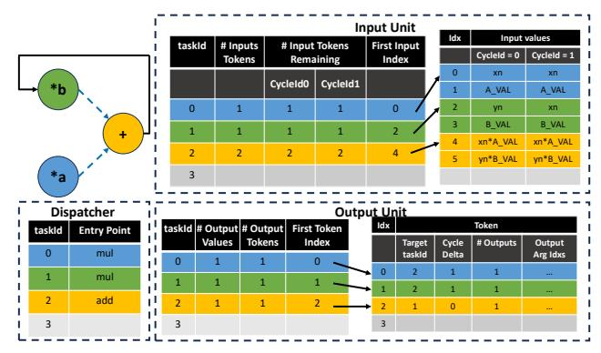
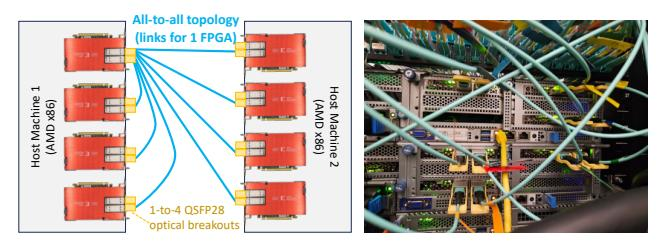
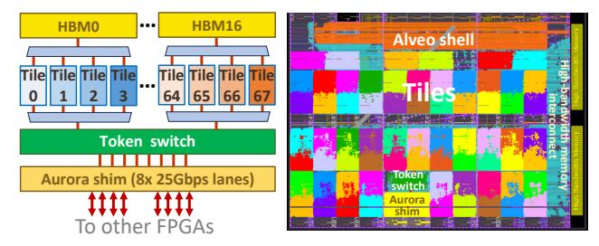
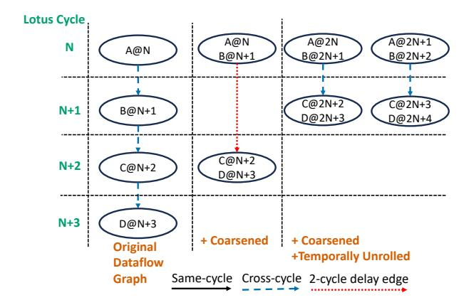
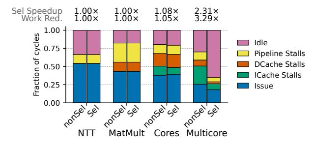
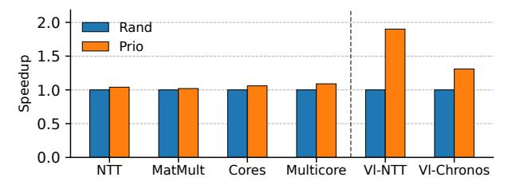

# Lotus: A Multi-FPGA Task Dataflow Architecture to Accelerate Cycle-Level Simulation

Fares Elsabbagh MIT CSAIL Cambridge, MA, USA farese@csail.mit.edu Joel S. Emer MIT CSAIL Cambridge, MA, USA emer@csail.mit.edu Daniel Sanchez MIT CSAIL Cambridge, MA, USA sanchez@csail.mit.edu

Abstract—Simulation is crucial to design and build hardware. But simulating large and complex digital designs is slow. Hardware emulators are the standard accelerator for cycle-level RTL simulation, but these systems are expensive, inefficient, slow to compile for, and limited to simulating RTL. Emulators consist of many chips, typically FPGAs, to which the design is compiled. Emulators are bottlenecked by communication, and use FPGAs at a fraction of their speed.

We present Lotus, a large-scale architecture that accelerates cycle-level simulation. Lotus uses multiple FPGAs like emulators, but takes a different approach: rather than mapping logic directly to FPGAs, Lotus implements thousands of simple cores, along with hardware support that enables software simulation to scale. Lotus simulates digital systems by encoding them as large dataflow graphs of tiny tasks that run on these cores. Lotus uses dataflow execution to extract abundant parallelism; task priorities to focus work on the critical path; and selective execution to avoid ineffectual work. We contribute new implementations of these techniques that scale to multiple chips and require simple hardware. We also develop a compiler to use Lotus efficiently from high-level dataflow graphs.

We build an implementation of Lotus using 8 FPGAs, featuring over two thousand cores. On several large designs, this Lotus prototype achieves speeds comparable to emulators, while reducing the number of FPGAs needed by up to  $7.5\times$  and improving performance per FPGA by up to  $23\times$ . Lotus is also  $8\times$  faster than a 128-core server. Overall, Lotus is the first system to show that software simulation can outperform emulators by leveraging large-scale parallelism.

#### I. Introduction

Simulation is crucial to design and verify hardware. But as processors and SoCs integrate more components like CPU cores, domain-specific accelerators, and increasingly complex memory hierarchies, fast simulation becomes more challenging.

In this work, we focus on accelerating *cycle-level* simulation, where the full design is simulated cycle by cycle. Cycle-level simulation is commonly used in Register-Transfer-Level (RTL) simulation [5, 34, 41] of hardware written in a Hardware Description Language (HDL), like SystemVerilog. But cycle-level simulation has applications beyond RTL, e.g., to build cycle-accurate simulators [28].

Cycle-level simulation is slow in CPUs, which has prompted substantial work to accelerate it. *Hardware emulators* are the state-of-the-art accelerators for cycle-level simulation, and specifically focus on RTL simulation. An emulator consists of tens to thousands of reconfigurable chips, typically FPGAs. To simulate a design, the emulator synthesizes it to gates,

maps these gates across FPGAs, and runs them in lockstep, communicating values across FPGAs each simulated cycle [4, 6, 8, 9, 36]. Emulators have significant limitations: they are large, expensive platforms; they suffer from long compile times (days to weeks for large designs); the size of the system limits the size of circuit they can simulate; and they are limited to RTL, so they cannot support models written in software.

Despite these limitations, emulators are widely used by chip designers. Their market size is about \$2 billion, and is growing rapidly due to the increasing complexity of commercial chips [33]. Moreover, the high cost and limited applicability of emulators hinders chip design and restricts it to the few large companies who can afford them.

Cycle-level simulation can also be done in software. However, simulation is slow in current multicore CPUs because parallelizing the simulated model introduces frequent communication and synchronization, limiting scalability even with state-of-the-art parallelization techniques [41]. Prior work has observed this challenge and proposed single-chip systems, ASH [15] and Manticore [17], that provide hardware support for fine-grained parallelism. These systems scale simulation workloads to hundreds of cores, but they are limited to a single chip, so they do not reach the speeds of emulators and do not scale to very large designs.

We present Lotus, a large-scale parallel architecture tailored to cycle-level simulation. Lotus scales software simulation to reach emulator-level performance, but retains the flexibility and compilation speed of software simulators. Lotus consists of multiple FPGAs, each with hundreds of general-purpose cores, combined with hardware support for fine-grained parallelism.

Our approach builds on a key insight: multi-FPGA emulators are inefficient because they are bottlenecked by communication. When a hardware design fits on a single FPGA, it can run at high speed (e.g., over  $100\,\mathrm{MHz}$ ). But large designs require multiple FPGAs, and logic mapped to different FPGAs communicates every simulated cycle. Because inter-FPGA communication takes hundreds of nanoseconds, this limits simulation performance to a few MHz, and each FPGA runs about  $100\times$  slower than its achievable speed.

Since communication latency dominates multi-FPGA emulators, we argue there is little point in mapping hardware spatially (i.e., directly) to FPGAs. Instead, Lotus expresses programs as a collection of tasks, maps these tasks across the

system, and executes them *over time* using thousands of cores. As a result of this temporal execution, multiple tasks reuse the same FPGA resources. This improves efficiency and enables Lotus to simulate much larger systems than would fit spatially in its FPGAs. Temporal execution also enables decoupling communication and computation, hiding long communication latencies between FPGAs.

While Lotus builds on a simple insight, making it practical requires several novel techniques and a substantial amount of hardware-software co-design and engineering.

To make Lotus possible, we contribute hardware and software techniques along with a carefully engineered implementation: 1. Lotus architecture: Lotus is a massively parallel, distributedmemory architecture. Lotus consists of multiple chips (FPGAs in our implementation), each with its own memory. Each Lotus chip integrates multiple tiles, and each tile has several cores and a task unit that provides hardware support for fine-grained parallelism. Lotus adopts a task dataflow execution model, where the program is encoded as a dataflow graph of small tasks that is executed each simulated cycle. Task units receive and buffer task inputs, dispatch ready tasks to cores, and send task outputs to consumer tasks. Lotus implements two techniques that improve simulation performance: prioritized execution gives priorities to tasks, and runs higher-priority ready tasks first, focusing the system on the critical path; and selective execution skips executing a task if its inputs do not change across cycles, avoiding ineffectual work.

Prior work ASH [15] also proposed a task dataflow execution model with prioritized and selective execution. But ASH uses implementations that are inefficient, especially on an FPGA, and hard to scale: tasks generate the dataflow graph dynamically as they execute, which complicates the implementation of dataflow and prioritization hardware; and selective execution is achieved through speculation, which adds overheads and would require a large and growing amount of speculative state as the system scales to many chips. Instead, Lotus leverages the static nature of the dataflow graph to simplify task units and prioritization mechanisms, and Lotus implements selective execution with non-speculative synchronization (CMB-style [11]); this causes more communication but requires less logic than speculation, a good tradeoff for FPGAs.

- 2. Lotus multi-FPGA prototype: We develop a highly optimized Lotus prototype with 8 interconnected Alveo U55C FPGAs. This prototype implements 2,176 RISC-V cores in 544 tiles, running at 400 MHz. It has a peak throughput of about 900 giga-instructions/s, similar to high-end servers of similar cost to the FPGAs we use, and dispatches over 200 billion tasks/s, enabling 10-instruction tasks to run efficiently. We contribute highly optimized RISC-V cores, task units, caches, and interconnects to enable this level of performance.
- **3. Lotus compiler:** Software RTL simulators compile programs to an intermediate software language, typically C/C++. We develop a C++-based domain-specific language (DSL) that serves as this intermediate language, and enables writing Lotus programs using high-level dataflow graphs. We then build a compiler that produces efficient implementations for both Lotus


Fig. 1: Example 2-stage pipeline that computes  $y[n] = a \cdot x[n-1] + b \cdot y[n-1]$ .

and multicore CPUs. The compiler uses several techniques to use many cores well, including hierarchical partitioning to minimize cross-chip communication, and novel task coarsening techniques to increase throughput and utilization. The compiler also reuses code across tasks to minimize icache pressure.

We have also adapted Verilator, the state-of-the-art opensource RTL simulator, to produce Lotus programs from Verilog. We show that benchmarks written directly in our C++-based DSL are much faster, due to limitations in Verilator that make it very hard to scale to thousands of cores. While our Lotus Verilator compiler also outperforms CPUs substantially, the resulting programs do not reach emulation-level speeds. We leave optimized Verilog-to-Lotus compilation to future work.

We evaluate Lotus running on 8 FPGAs and compare it with hardware emulation and multi-threaded shared-memory CPU baselines. We simulate six benchmarks that represent both large functional units (like systolic arrays) and multicore systems. We show that Lotus achieves similar speeds to emulation platforms (gmean 42% faster) while using  $3\times$  fewer chips. We also show that Lotus is gmean  $8\times$  faster than the multi-threaded CPU baseline running on a 128-core server.

Overall, Lotus achieves several technical firsts. Lotus is the first multi-chip simulation accelerator that uses temporal mapping, where general-purpose cores execute simulation tasks over time. Lotus is also the first simulation accelerator to demonstrate speeds rivaling emulators, challenging the conventional wisdom that cores are too slow for this purpose.

Our Lotus implementation is open-source and available at http://lotus.csail.mit.edu.

## II. BACKGROUND AND MOTIVATION

In this section, we describe synchronous dataflow graphs, a common representation used by Lotus and prior work, and we present prior work on simulation acceleration.

#### A. Synchronous dataflow graphs

Cycle-level simulation requires evaluating how signals and state (registers and memory) evolve over clock cycles. *Dataflow graphs*, specifically synchronous dataflow (SDF) graphs [26], are a common method to perform a cycle-level evaluation of hardware designs. In an SDF graph, nodes represent computation and edges represent communication between nodes. Fig. 1a shows an example 2-stage pipeline that computes

y[n] = a · x[n − 1] + b · y[n − 1], and Fig. 1b shows how this circuit can be represented as a dataflow graph. Combinational logic is represented using nodes, which consume one or more input values. Each node can fire when all its inputs are available, producing output values that are communicated to other nodes through edges. Edges have a delay in cycles: wires turn into 0-cycle or same-cycle edges, and registers turn into 1-cycle or cross-cycle edges. The dataflow graph is evaluated repeatedly, consuming a set of inputs and producing a set of outputs on each simulated cycle.

## *B. Software RTL simulators and accelerators*

Software simulators [5, 16, 30, 34, 41, 44] compile RTL designs to programs that run in serial or parallel processors.

Verilator [34], the current state-of-the-art open-source RTL simulator, compiles the target circuit into a multi-threaded C++ program. Verilator extracts the dataflow graph and maps each graph node to run on a thread. Nodes are scheduled statically within the thread, and Verilator adds the necessary inter-thread synchronization to enforce data dependences among communicating nodes placed on different threads.

Software simulators are hard to parallelize in current multicores, because communication and synchronization through shared memory add large overheads. Verilator rarely scales beyond a few threads, because same-cycle edges (wires) induce frequent communication. The RepCut [41] simulator alleviates this problem by replicating nodes and restricting communication to happen between simulated cycles. But even state-of-the-art RepCut scales to only tens of threads.

Prior work has observed this problem, and has proposed specialized architectures for simulation. ASH [15] provides hardware support for small dataflow tasks with priorities and implements selective execution using speculation. ASH is a single-chip ASIC with 256 simple cores, and was evaluated in simulation. Manticore [17] is a multicore that exploits bulk-synchronous parallelism and static scheduling to avoid synchronization overheads; Manticore handles dynamic-latency events (such as memory accesses, needed to, e.g., simulate large memories in the design) by globally pausing execution (e.g., through clock gating). Manticore was prototyped using a single FPGA, using a 225-core implementation.

Lotus is an architecture specialized for software simulation, like ASH and Manticore, but has substantial differences. First, Lotus is a multi-FPGA, distributed-memory architecture, whereas ASH and Manticore are limited to a single chip, as they use techniques that would be hard to scale to multiple chips (e.g., speculative execution in ASH, and a single, gateable global clock in Manticore). Second, Lotus has a multi-FPGA implementation that enables emulator-level performance and improved efficiency when simulating large designs.

Lotus is closer to ASH and adopts its techniques: dataflow tasks, prioritized execution, and selective execution. But ASH's techniques would be overly expensive, especially on FPGAs. Specifically, ASH dynamically unfolds the dataflow graph: when tasks produce output values, they enqueue them to other tasks, and include the necessary metadata for the task (e.g., a

function pointer and priority). Task management hardware uses small buffers to coalesce task arguments, and spills non-fitting arguments to (cache) memory. This design is sensible for an ASIC, because it enables sharing limited on-chip memory to store the dataflow graph. But it introduces undue complexity, causes extra communication (as task metadata is sent from producer tasks), and is a poor fit to FPGAs.

Instead, Lotus leverages that the dataflow graph is static to adopt a much simpler design: task units support a fixed number of tasks, these tasks are statically mapped to tiles, and task units have sufficient memory to hold the inputs and metadata for all tasks, never spilling to memory. Lotus limits the size of the dataflow graph, but if a larger graph is needed, one just needs to produce a different Lotus configuration that allocates more memory to task units and less to caches. As a result, Lotus task units have 17× less logic (the dominant resource) than the equivalent ASH task management hardware. Moreover, ASH uses speculative execution to implement selective execution, which would add substantial overheads on FPGAs [1]; Lotus opts for simpler non-speculative selective execution, which results in more messages but takes a trivial amount of logic, about 1% of the design.

## *C. Hardware emulation and emulator-style accelerators*

Hardware emulators consist of multiple reconfigurable chips, either FPGAs [9, 36] or ASIC gate processors [6, 8]. They perform RTL-level simulation by synthesizing the circuit to gates, and mapping the circuit spatially across its reconfigurable chips. Currently, the fastest commercial emulators use FPGAs (e.g., ZeBu, Protium [9, 36]), so we focus on them; ASIC-based emulators (e.g., Palladium [8]) are slower but more flexible (e.g., compilation times are faster).

Although emulators are widely used, they come with severe drawbacks. Compiling a large design can take days to weeks, as it requires partitioning the netlist across emulator chips, and placing and routing each partition. And because the circuit is directly mapped to emulator hardware, the size of the emulator limits the size of the simulated circuit. Simulating leading-edge chips with billions of gates requires emulators with thousands of chips, which are large and expensive.

Moreover, emulators are inefficient because they are bottlenecked by communication: despite careful partitioning and time-multiplexing of I/O pins [4], gates mapped to different emulator chips communicate every cycle, and the latency and sometimes bandwidth of cross-chip communication limits performance. While a single FPGA can run at hundreds of MHz, communication limits speed to a few MHz at most.

By contrast, Lotus clocks its FPGAs at a high speed and leverages asynchronous communication to overlap communication and computation. This higher frequency makes up for the overheads of using cores rather than mapping the circuit directly to FPGA resources, and enables many tasks to reuse each core, reducing the amount of FPGAs needed over emulators.

Prior work has proposed multi-FPGA systems that work on the same principle as emulators (mapping logic directly to FPGAs), but use techniques to ameliorate their bottlenecks:


Fig. 2: Lotus system overview.

DIABLO [38], FireSim [7, 23], and SMAPPIC [12] are multi-FPGA simulation and prototyping platforms that achieve higher speeds than emulators but target a restricted class of designs: those consisting of small components connected through highlatency channels, like small servers that communicate through a network. These systems fit each component within an FPGA, and leverage the high-latency communication across components to clock FPGAs faster. However, large monolithic designs require cycle-by-cycle communication, which these systems do not support.

RAMP Gold [39], FAME [40], and HASim [29] simulate multicore processors using FPGAs, and leverage time-division multiplexing to simulate multiple cores with the same set of FPGA resources. Time-multiplexing enables mapping more cores per FPGA, but these platforms require manual changes to implement time-multiplexing and are limited to cores.

Finally, FireAxe [42] is an open-source multi-FPGA emulator that uses commodity FPGAs. FireAxe supports user-guided partitioning of large designs, time-multiplexes I/O in the style of Virtual Wires [4], and can be combined with FAME to reduce resource utilization. Lotus uses commodity FPGAs like FireAxe, so we use FireAxe's achieved performance to compare with emulators in Sec. VII.

## III. LOTUS ARCHITECTURE

Fig. 2 shows an overview of Lotus hardware. Lotus is a parallel system consisting of multiple FPGAs, each with its own memory. Each FPGA contains multiple tiles; each tile has several cores, a tile-private cache, and a *task unit* that buffers task inputs, dispatches ready tasks to cores, and sends task outputs to consumer tasks located at the same or other tiles.

In this section, we explain Lotus's execution model and the design of its task units, which enable Lotus's three key features: dataflow tasks, prioritized execution, and selective execution.

# *A. Execution Model and ISA*

Lotus programs are expressed as synchronous dataflow graphs (Sec. II-A) where dataflow nodes are *tasks*. Tasks are implemented as functions that execute in cores; Fig. 3 shows the code and corresponding assembly for the two tasks in

```
void add(int v0 , int v1) {
  int res = v0 + v1;
  lotus :: stream_outputs (res);
  lotus :: finish_task ();
void mult(int v0 , int v1) {
  int res = v0 * v1;
  lotus :: stream_outputs (res);
  lotus :: finish_task ();
                                      add:
                                        add a2 , a0 , a1
                                        stream_outputs a2 , zero
                                        finish_task
                                      mult:
                                        mul a2 , a0 , a1
                                        stream_outputs a2 , zero
                                        finish_task
```

(a) C++ task code.

(b) Assembly code.

Fig. 3: Code for Lotus implementations of tasks in Fig. 1b.

Fig. 1b. Tasks have one or more input values, and can produce output values for other tasks. For example, each of the tasks in Fig. 3 takes two inputs and produces one output; inputs and outputs are passed through registers. We add two instructions to the ISA to support task execution. First, stream\_outputs reads up to two register values and streams them as outputs. Second, finish\_task finishes the execution of the current task, making the core available to execute other tasks. Tasks can run arbitrary code, including memory accesses (described below) and other side effects (e.g., stopping the simulation).

The dataflow graph is executed repeatedly, once per simulated cycle. Tasks are connected through directed edges in the dataflow graph, which represent communication between tasks; as discussed in Sec. II-A, edges can be same- or cross-cycle, denoting communication from the producer at cycle N to the consumer at cycles N or N+1, respectively. Each invocation of a task produces an output *token* through each of its outgoing edges; a task becomes ready for execution only once it has received a token through all of its incoming edges. Each token may carry data values (up to two in our implementation), but can also be valueless, in which case it serves to order the execution of dependent tasks. Task may have dependences that require order tokens, e.g., to prevent a producer from overwriting values that have not been consumed yet (Sec. V).

Lotus maps the graph statically across tiles: each task is mapped to a single tile, and always runs in that tile. Unlike prior task-dataflow architectures [15, 18], Lotus does not dynamically unfold the dataflow graph. Instead, task units collectively store all the information about the dataflow graph, including the function pointer and output token destinations for each task, and provide enough storage to store inputs for a fixed number of invocations per task (two versions in our implementation, which allows overlapping successive cycles).

Task units handle all aspects of dataflow execution: they buffer received inputs for each task, mark tasks ready once they have received all input tokens, dispatch ready tasks to cores, and produce output tokens after the task has finished execution. This approach minimizes the work done by general-purpose cores. In particular, note that task code produces output values, not tokens. For example, the *add* task code in Fig. 3 produces a single output value, but the *add* task in Fig. 1b has two output edges. The task unit produces a token for each edge, forwarding the output value to the two consumers.

Lotus supports coherent shared memory *within a tile*, but not across tiles; the only way to communicate across tiles is


Fig. 4: Lotus task unit organization.

by passing values through tokens. Shared memory is useful to, e.g., communicate large values among tasks that do not fit in registers, or maintain data in the simulated models that is only partially accessed, like large memories. Lotus implements a simple task-oriented memory model: a task's stores are guaranteed to happen before loads of later tasks (and in particular, loads of dependent tasks), but accesses by concurrent tasks have no ordering guarantees. This enables a simple coherence implementation based on self-invalidations, as advocated by DeNovo [13].

#### B. Task Unit Microarchitecture

**Task unit organization:** Fig. 4 shows the internal organization of each task unit, including its main components and how they implement dataflow execution.

The task unit consists of an *input unit*, a *dispatcher*, and an *output unit*. The input unit receives tokens from the *token network*, which connects all tiles in the system. The token's values (if any) are written to the input memory, and the input unit counts the number of remaining tokens for the task. Once all tokens have been received, the task is marked ready by enqueuing it into the *ready queue*.

The dispatcher dequeues tasks from the ready queue and sends them to cores for execution. The dispatcher stores metadata needed for task execution, such as the task pointer, and also streams the task's inputs from the input memory.

Finally, the output unit receives outputs from running tasks; once the task finishes, the output unit produces tokens for the task's output edges, sending them through the token network. **Storage structures:** Each Lotus task unit features dedicated storage to hold a fixed number of tasks, exploiting the abundant distributed memory available on FPGAs. Each task in the dataflow graph is given a unique *taskId*, and most memories in the task unit are indexed by *taskId*, avoiding associative lookups. For example, when a token is received from the network, it carries a (*cycleId*, *taskId*) tuple that enables the input unit to directly access the metadata for the invocation of the task at the specified cycle.

We observe that tasks have a highly variable number of inputs and outgoing edges. Therefore, we provide a variable amount of storage per task for both inputs and output token metadata. This enables supporting generous limits (e.g., up to 15 input



Fig. 5: Lotus task unit memories, configured with the dataflow graph from Fig. 1b.

values and 63 output tokens per task in our implementation) while provisioning storage for smaller average values (e.g., 4 input values and 8 output tokens per task).

Fig. 5 shows the memories in the task unit, as well as an example dataflow graph and the contents of these memories when the graph is mapped to a single tile. Most memories are indexed by *taskId*, and variable-storage memories (for inputs and output tokens) are indexed by ranges stored in a different memory, requiring a level of indirection. All memories are loaded with task and dataflow graph information at configuration time, after which execution can begin.

**Versioning:** To enable overlapping the execution of successive cycles, task units store multiple versions of invocation-specific data, specifically input values and count of received tokens. Our implementation manages two versions, for even and odd cycles, which allows overlapping consecutive cycles.

#### C. Prioritized execution

Lotus task units implement prioritized execution: each task is given a priority, and ready tasks are dispatched in priority order. ASH [15] showed that prioritized execution is useful for simulation workloads, as it enables focusing hardware resources on critical-path work. Simulated systems often have intervals of plentiful parallelism, and unordered execution (as is typical in dataflow machines) can defer critical-path tasks until late in the cycle, becoming the long-pole and hurting performance.

The challenge is that prior systems have implemented prioritized execution using complex priority queues, like pipelined heaps [1, 14, 15, 21], that are expensive on FPGAs.

Lotus leverages the static nature of the dataflow graph to implement prioritized execution much more cheaply: since each task is given a *taskId*, we use this as the priority order: tasks with lower ids have higher priority. And since *taskId* is a dense and relatively narrow identifier, we implement a priority queue based on *hierarchical bitmaps*.

Fig. 6 shows the structure of the priority queue. At the lowest level, each bit corresponds to the ready bit of a task invocation; the number of bits in this bitmap is the number of tasks per tile multiplied by the number of versions per task (e.g., 1024-2 in our implementation). Enqueuing a ready task invocation


Fig. 6: Priority queue implemented as a hierachical bitmap.

requires setting its corresponding bit, and dequeueing tasks is done by traversing and clearing the bitmap in order.

Because the lowest-level bitmap is sparse, traversing it in order would be slow. The higher-level bitmaps accelerate this process by summarizing readiness information: each bit at those levels corresponds to a region in its lower level (e.g., 32 elements), and indicates whether any task in the region is ready. Enqueuing a ready task requires setting its corresponding region bits in upper-level bitmaps, and dequeuing tasks is done by using region bits to find the earliest set bit.

We build a fully pipelined implementation of this structure, which enables enqueuing and dequeuing a task every cycle, regardless of the sparsity pattern.

#### D. Selective execution

Many hardware designs have limited activity factors, which manifest as tasks whose inputs (and outputs) do not change from those of the previous cycle. Repeatedly executing a task with the same inputs is wasteful. Selective execution avoids this ineffectual work by skipping these tasks.

Lotus implements selective execution with *conservative synchronization*, using the Chandy-Misra-Bryant algorithm [11]: task units detect when inputs have not changed, skip executing the task, and send *null* output tokens that tell consumers to reuse their old input values instead. ASH [15] also implemented selective execution, but did so with speculative synchronization, using the Time Warp algorithm [20]: instead of sending null messages, consumers assume that missing input tokens stem from skipped tasks, and run anyway; a late-arriving token causes the task to roll back and reexecute. While optimistic synchronization elides the cost of sending null messages, it is costly to implement in FPGAs, incurring about a  $2\times$  overhead [1]. Our selective execution implementation is much simpler, adding 1% of logic to each tile (Sec. IV).

Selective execution requires minor modifications to the task unit. The input unit must check input values in non-null tokens against old values to detect when they match and the task can be skipped, and for null tokens, it must copy old input values to the current version. We do this by using separate memories to store odd- and even-cycle inputs, and using a 4-stage pipeline that performs these operations at full throughput. If the task is skipped, the dispatcher sends it to the output unit instead of to a core, and the output unit sends null messages.

Selective execution cannot be used in all cases: some tasks can have side effects (Sec. V) and cannot be skipped even if their inputs do not change; and some tokens encode read-after-write data dependences through memory, so if the producer task runs, the consumer must run. We extend task and token



Fig. 7: Lotus 8-FPGA prototype system.

metadata to support these cases, and if an invocation has sideeffects or receives a *non-null* order token, it is not skipped even if all inputs match.

#### IV. LOTUS PROTOTYPE

We have built a Lotus prototype using 8 interconnected FPGAs. This prototype is important to demonstrate that Lotus can compete with emulators, because constant factors matter, and prior multicore FPGA platforms are substantially less efficient than our prototype. For example, the Chronos prototype [1] supports up to 48 simple RISC-V cores on an FPGA of the same size as the ones we use, and runs at 125 MHz. By contrast, Lotus implements 272 cores per FPGA and runs at 400 MHz, providing 18× higher throughput per FPGA than Chronos. Moreover, Chronos is not a multi-FPGA system; at 8 FPGAs, Lotus has 145× higher instruction throughput.

In this section we detail the implementation of the prototype, focusing on the design choices that make Lotus efficient.

**Prototype system:** We build a system with 8 AMD Alveo U55C FPGAs spread across two servers. Fig. 7 shows this system. Each server has 4 FPGAs, as well as 2 64-core, 128-thread AMD Zen 3 CPUs (EPYC 7763) and 1 TB of memory; we use one of the servers as the CPU baseline in our evaluation.

FPGAs are directly connected through optical links. Each FPGA has only two QSFP28 interfaces, so prior multi-FPGA system using Alveo or similar FPGAs have connected them in a ring [3, 42]. Instead, we leverage that QSFP28 internally uses four independent lanes to connect all FPGAs in a dancehall (all-to-all) topology: we use 1:4 optical breakout cables to connect 7 of these lanes to the other FPGAs (we use a patch panel atop the servers to keep the system manageable). This network has a 350GB/s bisection bandwidth.

We adopted an all-to-all topology to provide direct communication among FPGAs without incurring the cost of a high-performance network switch. This setup has the added benefit of yielding low latency, 200ns FPGA-to-FPGA, similar to the inter-socket latency in modern CPU servers. However, commercial Ethernet switches provide sub-microsecond latency, and would enable larger Lotus systems (e.g., 128 FPGAs connected through a top-of-rack-switch).

This system has a cost of \$86K. The cost of the FPGAs is \$37K, the inter-FPGA interconnect is \$1,200, and the cost of both servers is \$48 K.

**FPGA-level organization:** Fig. 8 shows the logical organization of each FPGA: tiles are directly connected to HBM



Fig. 8: Lotus FPGA organization and floorplan.

| Tiles<br>Memory<br>Token<br>network | 68 tiles, 272 cores (4 cores/tile), 400 MHz<br>HBM2, 16 GB, 17 ports used (1 port per 4 tiles)<br>25x25 2-stage butterfly switch (1 port per 4 tiles,<br>plus 8 ports for inter-FPGA communication) |
|-------------------------------------|-----------------------------------------------------------------------------------------------------------------------------------------------------------------------------------------------------|
| Cores                               | RV32IM, 4-stage pipeline, 1-cycle DM I/D caches                                                                                                                                                     |
| L2 cache                            | 128 KB, 4-way, LRU, 512-bit lines, up to 16 concurrent requests, serves 128 bits/cycle                                                                                                              |
| Task unit                           | 1024 tasks/tile, 8K-element input value and output token memories; up to 15 input values, 63 output tokens, and 255 input tokens per task                                                           |

TABLE I: Configuration parameters of Lotus FPGA.

| Component     | LUTs | Regs | BRAMs | URAMs | DSPs |
|---------------|------|------|-------|-------|------|
| FPGA          | 860K | 956K | 1236  | 544   | 1092 |
| Tile          | 9.3K | 9.3K | 24    | 15    | 16   |
| Core (4/tile) | 1474 | 1027 | 2     | _     | 4    |
| L2 cache      | 688  | 1268 | 1.5   | 4     | -    |
| Task unit     | 1914 | 2249 | 5.5   | 4     | -    |
| Other tile    | 801  | 1626 | -     | -     | -    |

TABLE II: FPGA resource utilization of entire design, tile, and components within the tile.

memory channels, and communicate tokens through a token network. Tiles also have a control interface that the host uses to load Lotus programs, control their execution, and observe outputs and performance counters. Table I details the configuration of the FPGA for the system we evaluate.

The token network is implemented as a butterfly switch in each FPGA, which connects the tiles and provides connectivity to the inter-FPGA links. We implement an inter-FPGA communication shim that uses AMD's low-level Aurora protocol and IP. Our Aurora shim serializes tokens to each 64-bit lane, buffers them for transmission, and performs error detection (links experience occasional bitflips). We implement a sliding-window algorithm similar to TCP's, which serves to both retransmit tokens on an error and to implement flow control.

To reduce token switch and memory interconnect costs, we use concentration: we form groups of four tiles, and each group uses a single memory channel and switch port. In practice, this provides plentiful token and memory bandwidth, while enabling us to fit 68 tiles per FPGA.

**Tile microarchitecture:** Each tile has 4 custom RISC-V cores, a 128 KB L2 cache, and a task unit that supports 1024 tasks. Table I details the tile's configuration, and Table II shows the

resource utilization of different components.

We develop a highly optimized core that implements the RV32IM ISA plus Lotus's instructions. The core is a 4-stage pipeline (fetch/decode/execute+memory/writeback) with direct-mapped, 4KB instruction and data caches, full data bypassing, PC bypassing, a pipelined multiplier, and a sequential divider. Data and PC bypassing enable the core to pay at most 1 stall for each load-to-use hazard and taken branch, enabling high IPC with control-intensive code despite not using dynamic branch prediction. The core also implements an instruction prefetcher and an input task buffer, so the task unit can dispatch a task to the core while the current task is executing. The core takes 1474 LUTs. This core provides substantially higher performance per LUT than prior open-source or available RISC-V softcores [19], including Taiga [27], VexRiscv [35], PicoRV32 [43], and AMD's MicroBlaze V [2].

We implement a pipelined and banked L2 that enables many concurrent requests cheaply while preserving Lotus's memory model. To implement Lotus's memory model, we use write-through data L1 caches, and the core self-invalidates shared L1 data at the end of each task.

We implement task units as described in Sec. III. All task unit components are fully pipelined.

Physical design and frequency optimizations: Fig. 8 shows the physical layout of the FPGA: tiles take most area; the Aurora shim is located at the bottom center, next to the transceivers; and the token switch is located next to the Aurora shim. The shell (on top) provides connectivity to the host. Table II reports the resource utilization of each FPGA: LUTs are the critical resource (66% utilization), followed by BRAMs (61%) and URAMs (57%), which are larger and denser memories (36KB). DSPs are less used (12%).

We implement Lotus in Bluespec SystemVerilog with a 400 MHz target frequency. While configurations with a few tiles close timing at 400 MHz, larger configurations require careful physical design: with the standard Vivado flow, frequency tops out at 270 MHz and the FPGA cannot pack more than 64 tiles. We floorplan the design manually and leverage RapidWright [25] to achieve high performance, implementing each tile shape separately and then replicating it. Even with this approach, the 68-tile design closes timing at 340 MHz, as the final Vivado implementation run worsens a small number of critical paths. Nonetheless, we observe that timing analysis is conservative, and the resulting bitstream runs correctly up to 470 MHz. We leave a 15% timing margin and run the final design at 400 MHz.

## V. LOTUS COMPILER

While it is possible to write Lotus tasks and dataflow graphs directly, doing so would be tedious. Instead, we implement a simple, C++-embedded Domain-Specific Language (DSL) to write Synchronous Dataflow Graphs. Then, we implement a compiler that produces efficient Lotus programs from these specifications. The compiler maps tasks to tiles, decides what data is passed through dataflow tokens or memory, and performs

```
// Task definitions
void mult(In <int> v0 , In <int> v1 , Out <int> res) {
    res = v0 * v1;
}
void add (In <int> v0 , In <int> v1 , Out <int> res) {
    res = v0 + v1;
}
using Mem = array <int, NumIters >;
void Xn_feeder (InOut <Word > cycle , PartialIn <Mem > xns ,
                Out <int> xn) {
    xn = xns[cycle ++];
}
void Yn_checker (InOut <Word > cycle , PartialIn <Mem > refYns ,
                 In <int> yn) {
    if (yn != refYns[cycle ++]) lotus :: simFail ();
}
// Dataflow graph definition
void genDfg () {
  Reg <int> xn_a (0); Reg <int> yn_b (0);
  Wire <int> xn; Wire <int> yn;
  // Compute tasks
  Reg <int> a(A_VAL); // constant
  task(mult , xn , a, xn_a);
  Reg <int> b(B_VAL); // constant
  task(mult , yn , b, yn_b);
  task(adder , xn_a , yn_b , yn);
  // Test harness: Feeder and checker tasks
  Reg <Word > xn_cycle (0);
  Reg <Mem > xns(/* values of X*/);
  task(Xn_feeder , xn_cycle , xns , xn);
  Reg <Word > yn_cycle (0);
  Reg <Mem > refYns(/* reference values of Y*/);
  task(Yn_checker , yn_cycle , refYns , yn);
}
```

Fig. 9: Lotus DSL code for the dataflow graph in Fig. 1b.

optimizations like coarsening to improve efficiency. We also implement an efficient CPU backend for this compiler.

## *A. Lotus language*

Lotus DSL programs contain two types of code: *task function definitions*, and a *dataflow graph definition* that builds a dataflow graph of these task functions. Fig. 9 shows an example Lotus DSL program.

Tasks are defined with functions, which specify its inputs and outputs through arguments. Each argument must be of one of six types: In/Out/InOut<T> denote an input, output, or input and output value (which is both produced and consumed by this task) of type T; and PartialIn/PartialOut/PartialInOut<T> denote a value that is *partially* read, written, or read and written. Conveying that values are partially accessed is useful, because they help the compiler decide whether the value should be in memory or passed through dataflow tokens—specifically, this biases the compiler to place large, partially accessed values in memory. For example, in Fig. 9, the feeder and checker tasks use arrays to hold input and reference output values, but they access only a single element per invocation; simulated memories or objects like caches are also naturally partially accessed.

The dataflow graph is also specified using code. The library provides two types of edges and a function to create


Fig. 10: Lotus compilation flow.

task nodes. Edges are either Reg<T>, a cross-cycle edge with an initial value, or Wire<T>, a same-cycle edge. Task nodes are created through the task(taskFunction, edge0, edge1,...) syntax. An edge must have at most one producer, and can have multiple consumers (a Reg<T> edge with no producer is a constant value).

Note that this dataflow graph is not directly a Lotus program e.g., task functions have an unbounded number of arguments, and the dataflow graph does not map tasks to tiles. The compiler lowers this to an executable Lotus program.

## *B. Compilation flow*

Fig. 10 shows the compilation flow. The compiler takes a Lotus DSL program as input. It first produces the dataflow graph by compiling and executing the dataflow graph definition code (we implement a C++ library that makes the dataflow graph definition code emit a textual representation of the graph; this leverages the C++ compiler to simplify our compiler, e.g., by using it for typechecking). Then, a series of compiler passes, described in Sec. V-C, produce a Lotus program, which consists of *task unit configuration data* and an *executable* with task code and data for each tile.

## *C. Compiler passes*

Fig. 10 lists all the compiler passes.

Mapping: Mapping tasks to tiles is a complex problem. An efficient mapping needs to achieve several conflicting goals: *(1)* minimize inter-tile communication volume, *(2)* balance work across tiles, and *(3)* avoid placing communication latencies on the critical path.

A key challenge is that the inter-tile network is not uniform: inter-FPGA communication has significantly higher latency and lower bandwidth than intra-FPGA communication. To address this, we use a hierarchical partitioning algorithm to minimize inter-FPGA traffic: tasks are first mapped to FPGAs, and then to tiles within each FPGA. We perform hypergraph partitioning with PaToH [10] for both mapping steps to balance work while reducing communication.

We introduce two restrictions to the mapping algorithm. First, we enforce any two tasks that communicate with a same-cycle edge must be placed on the same FPGA, ensuring that high inter-FPGA latencies do not increase critical path. Second, we enforce that tasks communicate through memory must be placed in the same tile, as the architecture does not support inter-tile coherence.

Communication: Lotus supports two kinds of communication between tasks: direct dataflow communication and memorybased communication. Memory communication is needed for



Fig. 11: *Coarsening* and *temporal unrolling* of dataflow graph.

two reasons. First, large memories (like caches or SRAM modules), which are partially accessed, are better stored in memory than passed around through dataflow tokens every cycle. Second, each Lotus task can only receive a limited number of input values through tokens. If a task function exceeds this limit, some values must be passed through memory; we call this *overflow memory*. The compiler prioritizes dataflow communication for inter-tile and non-constant inputs. Furthermore, the compiler seeks to produce task code that can be reused across many tasks. To this end, the compiler does not fold constants or pointers to in-memory objects into each function, and passes them as arguments instead.

Order Edges: Lotus adds order edges across tasks to enforce data and structural dependences among tasks that communicate values. Order edges enforce that one task invocation must execute before another, and are implemented as tokens with no data. For example, if task A@N communicates a value to B@N through single-buffered memory, then B@N must run before A@N + 1 overwrites the value. Thus, the compiler adds an order edge from B@N to A@N + 1.

Coarsening and Temporal Unrolling: When tasks are very short, it is helpful to *coarsen* the dataflow graph, i.e., build larger tasks, each of which performs the work of multiple original tasks. Our running example from Fig. 3 shows this well: the mult and add tasks perform a single instruction of useful work, and combining them into a larger task would be more efficient. Specifically, it would reduce task initiation overheads and improve the computation to communication ratio, as dataflow edges would become task-internal values.

The challenge is that it is often useful to coarsen tasks connected by cross-cycle edges. Fig. 11 shows this with an example dataflow graph that describes a 4-stage pipeline. We can coarsen tasks with cross-cycle edges by having higher-delay outgoing edges—this is the reverse transformation as retiming, pushing registers out of the task. But since the architecture does not support higher-delay outgoing edges (e.g., two cycles in Fig. 11), this would require extra tasks and add overhead.

To avoid this, the compiler temporally unrolls the dataflow graph, replicating it multiple times to fill the task units. This has the effect of enabling higher-delay edges. For example,

| Benchmark  | Description            | Tasks | Edges  | Instructions |
|------------|------------------------|-------|--------|--------------|
| NTT        | 2048-point NTT pipe    | 11264 | 51200  | 381955       |
| MatMult    | 256x256 systolic array | 33664 | 345856 | 1042365      |
| Cores      | 4096 indep. cores      | 24576 | 143360 | 374720       |
| Multicore  | 4096 cores with 2-D    | 43008 | 382924 | 1131892      |
|            | mesh network           |       |        |              |
| Vl-NTT     | 2048-point NTT pipe    | 37234 | 126004 | 918596       |
| Vl-Chronos | 512 cores              | 42499 | 250389 | 2803555      |

TABLE III: Benchmark characteristics. *Instrs* is the average number of dynamic instructions per simulated cycle.

Fig. 11 shows unrolling by a factor of two, which improves computation/communication ratio by 3×.

While coarsening small tasks is beneficial, coarsened tasks often have a larger number of inputs and outputs. When this occurs, the coarsened task may exceed the limit of input values receivable through tokens, forcing some values to be communicated through overflow memory, which is less efficient. Thus, the compiler prioritizes coarsening tasks that minimize the increase of input values, specifically inputs produced by tasks mapped on non-local tiles. The compiler also stops performing temporal unrolling and coarsening if doing so increases overall instructions per simulated cycle.

# *D. Multicore CPU backend*

We also implement an multicore CPU backend for Lotus DSL programs. This backend implements RepCut-style [41] partitioning to map tasks to threads while avoiding singlecycle cross-thread communication. We use PaToH to perform hypergraph partitioning. We also perform several optimizations: we place values in memory to avoid false sharing, implement cross-cycle synchronization using a scalable tree barrier, and pin threads to CPU cores to place them in nearby cores, which reduces communication cost.

# VI. METHODOLOGY

We evaluate Lotus as described in Sec. IV.

Compilers: We use two compilers: the Lotus compiler (Sec. V), with hand-written benchmarks in the Lotus DSL; and a modified version of Verilator [34] that produces Lotus programs directly from Verilog, with Verilog benchmarks. Our Verilator-based compiler produces a dataflow graph and then applies the same passes as the Lotus compiler.

Benchmarks: We simulate six large hardware designs, summarized in Table III. Four are written in the Lotus DSL:

- *1. NTT* is a pipeline that computes Number Theoretic Transforms (NTT). NTTs are similar in structure to FFTs, but use modular arithmetic; NTT functional units are a key component of cryptographic accelerators [24, 31, 32]. We use the NTT unit from the CraterLake FHE accelerator [32]. This unit performs 2048-point NTTs using a 2048-wide, 11-stage pipeline with 11264 modular multipliers.
- *2. MatMult* is a large systolic array that performs matrix multiplication. We simulate a 256x256 systolic array, which requires 64K multiply-accumulate (MAC) units, modeled after the TPU's matrix multiplication unit [22].
- *3. Cores* is an array of 4096 *independent* cores, each running quicksort on random data. We implement 5-stage RV32IM cores

|                                | NTT   | MatMult | Cores | Multicore | gmean   | Vl-NTT | Vl-Chronos | Vl-gmean |
|--------------------------------|-------|---------|-------|-----------|---------|--------|------------|----------|
| Lotus sim speed                | 2474  | 1452    | 953   | 485       | 1135.84 | 116    | 165        | 138.78   |
| CPU sim speed                  | 493   | 253     | 70    | 46        | 142.37  | 4.3    | 2.9        | 3.52     |
| Emulator sim speed             | 800   | 800     | 800   | 800       | 800.00  | 800    | 800        | 800.00   |
| Emulator FPGAs                 | 60    | 30      | 10    | 15        | 22.80   | 60     | 11         | 25.69    |
| Speedup vs CPU                 | 5.01  | 5.72    | 13.56 | 10.42     | 7.98    | 27.24  | 57.10      | 39.44    |
| Speedup vs Emulator            | 3.09  | 1.82    | 1.19  | 0.61      | 1.42    | 0.15   | 0.21       | 0.17     |
| Reduction in FPGAs vs Emulator | 7.50  | 3.75    | 1.25  | 1.88      | 2.85    | 7.50   | 1.38       | 3.21     |
| Speedup per FPGA vs Emulator   | 23.20 | 6.81    | 1.49  | 1.14      | 4.05    | 1.09   | 0.28       | 0.56     |

TABLE IV: Simulation speeds (in KHz), speedups, and FPGAs utilized vs. CPU and Emulator baselines. All Lotus simulations use 8 FPGAs.

modeled after VexRiscv [35]. Each core has 32 KB instruction and data memories. This is the only benchmark without meaningful global communication, which lets us evaluate the CPU baseline in a setting with little communication. This is also a building block for the next benchmark.

*4. Multicore* is a 4096-core multicore. Cores use the same pipeline as above, but they have 32 KB caches, and use a mesh network (with 4 cores and a memory bank per node) to implement coherent shared memory. This system runs a parallel sorting benchmark.

Benchmarks 1–3 are written at the level of abstraction of RTL, i.e., we write them to model what a good RTL-to-C compiler would produce. For example, we implement the cores using one task per pipeline stage, with pipeline registers and bypass paths as in a hardware design. Parts of the Multicore benchmark are written at a higher level of abstraction to show that Lotus supports cycle-level modeling beyond RTL. Specifically, mesh routers pass cache line data more directly than serializing it flit-by-flit to reduce overheads, though they still model the timing of transfers and buffer usage accurately.

Finally, we use two Verilog benchmarks:

- *5. Vl-NTT* is the same benchmark as NTT,written in Verilog.
- *6. Vl-Chronos* is the Chronos manycore with RISC-V cores, running the sssp graph benchmark [1]. We use a configuration with 64 tiles and 512 cores.

CPU baseline: We report CPU numbers using one of the servers in our prototype, with 2 64-core AMD Zen 3 processors at 2.45 GHz. We use our compiler's CPU backend for the Lotus DSL benchmarks, and parallel Verilator for the Verilog benchmarks. For each benchmark, we sweep the number of threads and only report the best result.

Emulator baseline: Commercial emulator platforms are expensive and unavailable for academic research. Instead, we estimate performance using the results from FireAxe [42]. FireAxe achieves a 800 KHz speed when using two directly connected FPGAs in cycle-exact mode [42, Fig. 11]. We adopt this emulation speed, which is limited by the latency of cycleby-cycle communication between FPGAs. FireSim also reports faster speeds (up to 1.6 MHz), but those rely on a fast mode that introduces inaccuracies. FireSim achieves lower speeds when using PCIe communication or with more than two FPGAs [42, Fig. 13], because it connects FPGAs in a ring. We optimistically assume 800 KHz at any FPGA count, even though direct FPGAto-FPGA connections are not possible for the benchmarks we evaluate (using breakout cables as we do in Lotus, we could



Fig. 12: Breakdown of core cycles for Lotus without and with selective execution, and impact of selective execution on performance and work. Work reduction is measured as the ratio of instructions executed.

use all-to-all connections up to 9 FPGAs, but our benchmarks need between 10 and 60 FPGAs for emulation).

We optimistically estimate the number of FPGAs as follows: for each benchmark, we sweep design sizes, and find the largest design that fits in one Alveo U55C FPGA; we then report the number of FPGAs needed to scale to the full benchmark. This is optimistic because it ignores additional logic needed for emulation (e.g., inter-FPGA communication, virtual wires, etc.), as well as potential communication bottlenecks that would degrade performance.

## VII. EVALUATION

# *A. Lotus performance and resource efficiency*

Table IV reports the performance, in KHz, of Lotus, the CPU baseline, and the emulator baseline, as well as the number of FPGAs needed for emulation. Each column reports results for a different benchmark; Lotus DSL benchmarks are on the left, and Verilog benchmarks on the right. We also report gmean figures for each class of benchmarks. Based on these figures, the table reports the speedups of Lotus over the CPU and emulator baselines, the reduction in FPGAs of Lotus over the emulator, and the *speedup per FPGA* of Lotus over the emulator (this is the product of speedup and FPGA reduction, and seeks to reflect how iso-scale systems would perform).

On Lotus DSL benchmarks, Lotus outperforms emulators by gmean 42% while using gmean 2.85× fewer FPGAs. Lotus is the first accelerator that outperforms emulation on cyclelevel simulations for such large designs. Furthermore, Lotus outperforms the CPU baseline by gmean 8×. On Verilator benchmarks, Lotus is even faster over the CPU, by gmean


Fig. 13: Lotus performance across number of FPGAs.


Fig. 14: Lotus performance on benchmarks of different sizes.


Fig. 15: Impact of coarsening and temporal unrolling in Lotus.

 $39.4\times$ , but it is substantially slower than the emulator, owing to efficiency and scalability limitations in Verilator.

Fig. 12 provides insight into these results. Each bar shows a breakdown of how Lotus cores spend cycles: issuing (and completing) instructions, stalled on instruction cache misses, data cache misses, pipeline stalls (due to control and data hazards), or idle, i.e., without a task to run. Each group of two bars shows results for one benchmark, both when selective execution is disabled (left bar) and enabled (right bar). Finally, each bar group reports the speedup that selective execution achieves over non-selective execution, and its reduction of work (measured as the ratio of instructions executed).

Overall, Fig. 12 shows that most benchmarks achieve high core utilizaton: except for Multicore with selective execution, cores are idle a small fraction of the time (20-30%). Moreover, selective execution achieves a major speedup only in Multicore, where activity factors are lower. We now analyze each benchmark.

NTT and MatMult achieve excellent utilization on Lotus, with 52% and 45% of cycles spent committing instructions. MatMult has about 20% of idle cycles; these are due to the time that each core takes to complete the current task and load arguments for the next task. NTT's idle cycles are higher, 32%, because frequent inter-tile communication drives the per-FPGA switches near saturation. Selective execution has no effect on these pipelines, as inputs to each task change every cycle. The CPU also does well on these benchmarks, because they are regular and arithmetic-heavy, and our CPU backend achieves high IPC and can leverage vector instructions. On these benchmarks, Lotus is both substantially faster and more efficient than emulators, e.g., on NTT, it is 3.1× faster with 7.5× fewer FPGAs.

Cores is less regular, yet Lotus achieves good efficiency, with 42% of cycles spent committing instructions. Instruction cache stalls take 11% of core cycles, and are due to L2 bandwidth pressure: although cores use instruction prefetchers, misses are frequent enough that they drive the L2 cache near saturation, and prefetchers cannot access instructions far ahead enough of use. Selective execution achieves a modest speedup because this benchmark simulates cores with fast local memories, so pipelines rarely have long stalls.

Multicore shows a substantial difference between selective

and non-selective execution. With non-selective execution, utilization is similarly high to the other benchmarks, though instruction cache stalls take 25% of cycles due to the benchmark's larger code footprint. With selective execution, work is substantially reduced, with  $3.3\times$  fewer instructions, as the simulated cores incur longer stalls due to cache misses, and the components of the simulated memory system (e.g., caches and network routers) have lower activity factors. However, idle cycles grow to 60%, primarily due to load imbalance caused by selective execution. Overall, selective execution results in a  $2.3\times$  speedup.

The CPU is also slower on the Cores and Multicore benchmarks, especially on Cores, due to frequent data-dependent branches that limit the IPC of the CPU's OOO cores. Lotus is still slightly faster (19% speedup) than the emulator on Cores; it is slower on Multicore, but the emulator needs almost twice the FPGAs, and Lotus achieves higher speedup per FPGA.

Finally, the Verilog benchmarks show different trends. Comparing *NTT* and *Vl-NTT* is especially illustrative, since they are different implementations of the same benchmark. Lotus and the CPU are 21× and 114× slower on *Vl-NTT*, even though *Vl-NTT* only has 2.4× more instructions than *NTT* (Table III). A key factor is *lack of instruction reuse*: Verilator produces separate code for each replicated unit in the design, which places significant pressure on the instruction cache. Lotus is less affected by instruction cache pressure because it can keep most code in nearby L2s, but Verilator also produces parallelism bottlenecks and load imbalance. Overall, Lotus cores spend about 10% of cycles committing instructions. *Vl-Chronos* shows similar bottlenecks, with worse load imbalance, because Verilator often produces larger tasks than needed on this design, limiting parallelism in Lotus.

Overall, the Verilog results highlight performance pitfalls in Verilator; while we believe these issues are addressable, they would require substantial engineering, and the results for Lotus DSL programs demonstrate that Lotus can compete with emulators at RTL-level simulation.

# B. Lotus scales well to multiple FPGAs

Fig. 13 shows how Lotus's performance changes as we scale from 1 to 8 FPGAs. Each line shows performance for a single benchmark, relative to 1-FPGA performance. *NTT* scales slightly sublinearly due to growing inter-tile communication;

MatMult scales slightly superlinearly because increased task queue capacity reduces communication through memory on larger systems; Cores scales slightly sublinearly due to memory effects: each task fits in Lotus core L1s, and smaller systems reuse each task across more invocations; and Multicore scales slightly superlinearly up to 4 FPGAs due to increased L2 memory, then drops somewhat at 8 FPGAs due to increased load imbalance.

These results show that Lotus uses multiple FPGAs effectively, thanks to its partitioning and decoupling strategies.

#### C. Lotus gracefully handles designs of different sizes

A key advantage of Lotus over emulators is that the same system can simulate designs of a wide range of sizes—larger designs just take longer to simulate. Fig. 14 shows this by reporting how performance changes as we sweep that size of these designs. Each line reports performance for one benchmark, relative to the default size. The x-axis shows relative design size, measured in *work* (this is because not all benchmarks scale linearly as we change parameters, e.g., NTT scales with NlogN). We sweep parameters to cover designs from  $1/4 \times$  to  $4 \times$  larger than the default size.

On larger designs, Lotus scales down perfectly, being about  $4\times$  slower when benchmarks at  $4\times$  larger. On smaller designs, Lotus is always faster; with  $4\times$  smaller designs, Lotus is  $1.3\times-3.8\times$  faster, not reaching  $4\times$  because smaller benchmarks have more limited parallelism.

#### D. Lotus configuration can be tuned to the workload

Our default Lotus configuration seeks to achieve good overall performance across diverse benchmarks, but it is possible to build alternative configurations that improve performance on specific applications. For example, we have seen that NTT is limited by inter-tile communication. To remove this limitation, we implement an alternative configuration with fewer, larger tiles: we can fit 36 8-core tiles, for a total of 288 cores per FPGA, at 400 MHz; we use smaller concentration factors (2:1), which keeps inter-tile bandwdith per core constant.

NTT achieves 3.2 MHz in this configuration, 28% faster than with our default configuration. Most of this speedup comes from reducing inter-tile communication (by having fewer tiles, more communicating tasks run in the same tile), which reduces idle time; the remaining speedup stems from having 6% more cores. This configuration has more modest benefits on MatMult (6% faster), but hurts performance on Cores and Multicore, which become bottlenecked on the lower task unit throughput.

#### E. Impact of Lotus features

Coarsening and temporal unrolling: Fig. 15 shows the impact of coarsening and temporal unrolling in Lotus. NTT and MatMult use  $2\times$  and  $4\times$  unrolling and achieve  $3.0\times$  and  $3.4\times$  speedups, respectively. These benchmarks have small tasks that have low computation-to-communication ratio. Unrolling allows coarsening multiple of these tasks (e.g., a  $4\times4$  grid of PEs), improving performance substantially.

Cores uses  $2 \times$  unrolling, which allows merging tasks that simulate successive pipeline stages. This reduces instructions


Fig. 16: Impact of mapping techniques.

by 12%, but results in a smaller 5% speedup because coarsened tasks cause more misses and reduce selective execution. Finally, the compiler does not use unrolling on Multicore, because coarsening across cycles creates large tasks that increase instruction counts (e.g., by needing to use overflow memory).

Task mapping: Fig. 16 shows the impact of task mapping. We compare three mapping algorithms: (1) Hier is the hierarchical mapping algorithm we have used so far, which uses two rounds of hypergraph partitioning, first to partition tasks across FPGAs, and then to partition tasks across tiles in each FPGA (as described in Sec. V-C); (2) Flat is a simpler variant of our algorithm that uses a single round of hypergraph partitioning to partition tasks among tiles; and (3) Rand assigns each task to a random tile. Fig. 16a reports the performance of these mapping algorithms on each benchmark, normalized to Rand. Both Flat and Hier outperform Rand substantially, with Hier achieving significant speedups over Flat on two benchmarks, NTT and Multicore. Overall, Hier is  $3.3 \times -10.3 \times$  faster than Rand, showing that good partitioning is important for scalability.

Fig. 16b gives more insight into these results by showing a breakdown of values communicated through dataflow edges, by whether the edges are tile-local (i.e., producer and consumer tasks are on the same tile), device-local (i.e., producer and consumer tasks are on different tiles of the same FPGA), or cross-device (i.e., producer and consumer tasks are on different FPGAs). The difference in locality between random mapping and the other techniques is clear; note how most edges are cross-device with random mapping, and the fraction of local edges is only higher than pure random assignment due to same-tile constraints (recall that tasks that share memory must be on the same tile). Flat and hierarchical mapping have small differences, showing that performance is very sensitive to even small changes in cross-device communication. For example,



Fig. 17: Impact of task prioritization.

going from flat to hierarchical on Multicore reduces fraction of cross-device edges from 0.57% to 0.49%. This minor change leads to a  $1.7\times$  speedup, because cross-device communication is very expensive.

Task prioritization: Fig. 17 shows the impact of task prioritization on performance. Due to the design of the dispatcher, each task must be assigned *some* priority. Thus, we compare assigning random priorities with our prioritization. The results show the impact of prioritization is variable. Prioritization is most beneficial for Verilator-based benchmarks, as they have limited parallelism and are dominated by a limited number of long tasks. Lack of proper priorities makes some of these tasks run late, hurting performance by up to almost  $1.9\times$ . However, for benchmarks like NTT that have no same-cycle dependencies and relatively uniform task sizes, prioritization has a minor benefit. The speedups in these benchmarks are attributed to prioritizing tasks with longer communication latencies.

#### F. Lotus power consumption

We profile power consumption of the Lotus prototype using the power sensors in the servers' power supplies and FPGAs. We report power consumption for the NTT benchmark, but observe power is nearly constant across benchmarks. The entire system (two servers with four FPGAs each) consumes 1,050 W, and the eight FPGAs consume 420 W (i.e., 55 W per FPGA). Server CPUs are mostly idle during simulation.

While commercial emulators do not publish power consumption on specific benchmarks, they are large platforms with much higher TDPs. For example, ZeBu Server 5 advertises a power consumption of <6kW per billion gates emulated [37] (our benchmarks have over a billion ASIC gates).

#### VIII. CONCLUSION

Lotus shows that task-level dataflow execution can effectively accelerate cycle-level simulation. Thanks to novel implementations of dataflow execution, task prioritization, and selective execution that are particularly well suited to FPGAs, Lotus scales to thousands of simple cores, and achieves similar performance to emulators while improving hardware utilization. By exploiting fine-grained parallelism in software, these techniques open the door to a new wave of software simulators that can replace cumbersome emulators.

Lotus is the first simulation accelerator to offer competitive performance with emulators—in our evaluation, it outperforms emulation on three out of four benchmarks. Beyond performance, Lotus offers several advantages. First, Lotus uses FPGA resources more efficiently, requiring fewer FPGAs than emulation across all benchmarks. Second, Lotus compiles benchmarks in seconds, whereas emulators take days to weeks for large designs. Third, with a fixed number of FPGAs, Lotus can trade performance for scale and simulate much larger designs, whereas in emulators, the number of FPGAs limits the size of the simulated systems. Finally, Lotus supports simulation of mixed RTL and cycle-level models, unlike emulators.

Lotus also opens up exciting research avenues. For example, it may be possible to achieve higher speedups by tailoring the ISA more deeply, by combining general-purpose cores with small specialized cores that run common parts of a design more efficiently, and by developing more advanced synchronization techniques that better leverage low activity factors. Compiler optimizations can also help reduce overheads, e.g., by better packing narrow data values into words to use fewer instructions. We believe these approaches can substantially improve performance and utilization, especially on less-regular designs like Multicore, where the utilization of Lotus is lower. Another open question is to what degree Lotus can scale, and what latencies it can tolerate efficiently; for example, cloud providers give access to hundreds of FPGAs, but these FPGAs are not directly interconnected. Lotus could motivate cloud providers to offer large sets of tightly interconnected FPGAs, much like they do for e.g., ML training accelerators. Finally, since Lotus is a programmable platform, it can be extended to perform simulation at different levels of abstraction (e.g., event-driven microarchitectural simulation or transaction-level modeling with SystemC), and could seamlessly combine these simulations, e.g., using RTL simulation for a specific part of the design, and microarchitectural simulation for the rest of the system. We leave these endeavors to future work.

#### ACKNOWLEDGMENTS

We dedicate this paper to Arvind, our late colleague, mentor, and friend. Arvind's pionieering work in dataflow architectures and hardware design has been inspirational and foundational to this eponymous project.

We are grateful to all who have supported and given feedback on this work. Serge Leef, Sung-Kyu Lim, Dinesh Gaitonde, and Trevor Bauer have championed this project and provided invaluable technical guidance. Chris Lavin helped us with RapidWright and modified it to enable our use case. This work's infrastructure and ideas build on ASH, to which Shabnam Sheikhha, Victor Ying, Quan Nguyen, Vedantha Venkatapathy, and Ferran Hermida Rivera have contributed. Courtney Golden, Alex Krastev, Maggie Du, Viansa Schmulbach, Stella Lau, and our anonymous reviewers provided helpful feedback on earlier versions of this manuscript.

This work was supported in part by the National Science Foundation under grant CCF-2217099, DARPA under contract N00014-21-1-2960, and the Semiconductor Research Corporation under contract 2024-AH-3282. The views and conclusions in this document are those of the authors and should not be interpreted as representing the official policies, either expressed or implied, of the U.S. Government.

#### REFERENCES

- [1] M. Abeydeera and D. Sanchez, "Chronos: Efficient speculative parallelism for accelerators," in *Proc. of the 25th intl. conf. on Architectural Support for Programming Languages and Operating Systems*, 2020.
- [2] AMD, *MicroBlaze V Processor Reference Guide (UG1629)*, AMD, 2024, https://docs.amd.com/r/en-US/ug1629-microblaze-v-user-guide.
- [3] AWS, "FPGA Hardware and Software Development Kit," https://github. com/aws/aws-fpga, 2017.
- [4] J. Babb, R. Tessier, M. Dahl, S. Z. Hanono, D. M. Hoki, and A. Agarwal, "Logic emulation with virtual wires," *IEEE Transactions on Computer-Aided Design of Integrated Circuits and Systems*, vol. 16, no. 6, 1997.
- [5] S. Beamer and D. Donofrio, "Efficiently exploiting low activity factors to accelerate RTL simulation," in *Proc. of the 57th Design Automation Conf.*, 2020.
- [6] D. K. Beece, G. Deiberg, G. Papp, and F. Villante, "The IBM Engineering Verification Engine," in *Proc. of the 25th Design Automation Conf.*, 1988.
- [7] D. Biancolin, A. Magyar, S. Karandikar, A. Amid, B. Nikolic, J. Bachrach, ´ and K. Asanovic, "Accessible, FPGA resource-optimized simulation of ´ multiclock systems in firesim," *IEEE Micro*, vol. 41, no. 4, 2021.
- [8] Cadence, "Palladium Z1 enterprise emulation platform," https://www.cadence.com/content/dam/cadence-www/global/en\_ US/documents/tools/system-design-verification/palladium-z1-ds.pdf, archived at https://perma.cc/MD6F-EYGQ, 2015.
- [9] ——, "Protium X1 enterprise prototyping platform," https://www.cadence.com/en\_US/home/tools/system-design-andverification/emulation-and-prototyping/protium.html, 2019.
- [10] U. V. Catalyurek and C. Aykanat, "PaToH: A multilevel hypergraph partitioning tool," in *Proc. of the 10th SIAM Conf. on Parallel Processing for Scientific Computing*, 2001.
- [11] K. M. Chandy and J. Misra, "Asynchronous distributed simulation via a sequence of parallel computations," *Comm. ACM*, vol. 24, no. 4, 1981.
- [12] G. Chirkov and D. Wentzlaff, "SMAPPIC: Scalable multi-FPGA architecture prototype platform in the cloud," in *Proc. of the 28th intl. conf. on Architectural Support for Programming Languages and Operating Systems*, 2023.
- [13] B. Choi, R. Komuravelli, H. Sung, R. Smolinski, N. Honarmand, S. V. Adve, V. S. Adve, N. P. Carter, and C.-T. Chou, "DeNovo: Rethinking the memory hierarchy for disciplined parallelism," in *Proc. of the 20th Intl. Conf. on Parallel Architectures and Compilation Techniques*, 2011.
- [14] V. Dadu, S. Liu, and T. Nowatzki, "PolyGraph: Exposing the value of flexibility for graph processing accelerators," in *Proc. of the 48th annual Intl. Symp. on Computer Architecture*, 2021.
- [15] F. Elsabbagh, S. Sheikhha, V. A. Ying, Q. M. Nguyen, J. S. Emer, and D. Sanchez, "Accelerating RTL simulation with hardware-software co-design," in *Proc. of the 56th annual IEEE/ACM intl. symp. on Microarchitecture*, 2023.
- [16] M. Emami, T. Bourgeat, and J. R. Larus, "Parendi: Thousand-way parallel RTL simulation," in *Proc. of the 30th intl. conf. on Architectural Support for Programming Languages and Operating Systems*, 2025.
- [17] M. Emami, S. Kashani, K. Kamahori, M. S. Pourghannad, R. Raj, and J. R. Larus, "Manticore: Hardware-accelerated RTL simulation with static bulk-synchronous parallelism," in *Proc. of the 29th intl. conf. on Architectural Support for Programming Languages and Operating Systems*, 2024.
- [18] Y. Etsion, F. Cabarcas, A. Rico, A. Ramirez, R. M. Badia, E. Ayguade, J. Labarta, and M. Valero, "Task Superscalar: An out-of-order task pipeline," in *Proc. of the 43rd annual IEEE/ACM intl. symp. on Microarchitecture*, 2010.
- [19] C. Heinz, Y. Lavan, J. Hofmann, and A. Koch, "A catalog and inhardware evaluation of open-source drop-in compatible RISC-V softcore processors," in *Proc. of the 2019 Intl. Conf. on ReConFigurable Computing and FPGAs (ReConFig)*, 2019.
- [20] D. Jefferson, B. Beckman, F. Wieland, L. Blume, M. DiLoreto, P. Hontalas, P. Laroche, K. Sturdevant, J. Tupman, V. Warren, J. Wedel, H. Younger, and S. Bellenot, "Distributed simulation and the Time Warp Operating System," in *Proc. of the 11th Symp. on Operating System Principles*, 1987.
- [21] M. C. Jeffrey, S. Subramanian, C. Yan, J. Emer, and D. Sanchez, "A scalable architecture for ordered parallelism," in *Proc. of the 48th annual IEEE/ACM intl. symp. on Microarchitecture*, 2015.
- [22] N. P. Jouppi, C. Young, N. Patil, D. Patterson, G. Agrawal, R. Bajwa, S. Bates, S. Bhatia, N. Boden, A. Borchers *et al.*, "In-datacenter

- performance analysis of a Tensor Processing Unit," in *Proc. of the 44th annual Intl. Symp. on Computer Architecture*, 2017.
- [23] S. Karandikar, H. Mao, D. Kim, D. Biancolin, A. Amid, D. Lee, N. Pemberton, E. Amaro, C. Schmidt, A. Chopra, Q. Huang, K. Kovacs, B. Nikolic, R. Katz, J. Bachrach, and K. Asanovic, "FireSim: FPGAaccelerated cycle-exact scale-out system simulation in the public cloud," in *Proc. of the 45th annual Intl. Symp. on Computer Architecture*, 2018.
- [24] S. Kim, J. Kim, M. J. Kim, W. Jung, J. Kim, M. Rhu, and J. H. Ahn, "BTS: An accelerator for bootstrappable fully homomorphic encryption," in *Proc. of the 49th annual Intl. Symp. on Computer Architecture*, 2022.
- [25] C. Lavin and A. Kaviani, "RapidWright: Enabling custom crafted implementations for FPGAs," in *Proc. of the 26th IEEE Annual Intl. Symp. on Field-Programmable Custom Computing Machines*, 2018.
- [26] E. A. Lee and D. G. Messerschmitt, "Synchronous data flow," *Proc. of the IEEE*, vol. 75, no. 9, 2005.
- [27] E. Matthews and L. Shannon, "TAIGA: A new RISC-V soft-processor framework enabling high performance CPU architectural features," in *Proc. of the 27th Intl. Conf. on Field Programmable Logic and Applications (FPL)*, 2017.
- [28] C. J. Mauer, M. D. Hill, and D. A. Wood, "Full-system timing-first simulation," in *Proc. of the 2002 ACM SIGMETRICS intl. conf. on Measurement and modeling of computer systems*, 2002.
- [29] M. Pellauer, M. Adler, M. Kinsy, A. Parashar, and J. Emer, "HAsim: FPGA-based high-detail multicore simulation using time-division multiplexing," in *Proc. of the 17th IEEE intl. symp. on High Performance Computer Architecture*, 2011.
- [30] C. Pit-Claudel, T. Bourgeat, S. Lau, Arvind, and A. Chlipala, "Effective simulation and debugging for a high-level hardware language using software compilers," in *Proc. of the 26th intl. conf. on Architectural Support for Programming Languages and Operating Systems*, 2021.
- [31] N. Samardzic, A. Feldmann, A. Krastev, S. Devadas, R. Dreslinski, C. Peikert, and D. Sanchez, "F1: A fast and programmable accelerator for fully homomorphic encryption," in *Proc. of the 54th annual IEEE/ACM intl. symp. on Microarchitecture*, 2021.
- [32] N. Samardzic, A. Feldmann, A. Krastev, N. Manohar, N. Genise, S. Devadas, K. Eldefrawy, C. Peikert, and D. Sanchez, "CraterLake: a hardware accelerator for efficient unbounded computation on encrypted data." in *Proc. of the 49th annual Intl. Symp. on Computer Architecture*, 2022.
- [33] R. Sharma, "Hardware Emulation System Market Research Report 2033," https://growthmarketreports.com/report/hardware-emulationsystem-market, 2024.
- [34] W. Snyder, "Verilator," https://www.veripool.org/verilator/, 2003.
- [35] SpinalHDL, "A FPGA friendly 32 bit RISC-V CPU implementation," https://github.com/SpinalHDL/VexRiscv, 2018.
- [36] Synopsys Inc., "ZeBu Server 4," https://www.synopsys.com/verification/ emulation/zebu-server.html, 2018.
- [37] ——, "ZeBu Server 5 Datasheet," https://www.synopsys.com/verification/ emulation/zebu-server.html, 2023.
- [38] Z. Tan, Z. Qian, X. Chen, K. Asanovic, and D. Patterson, "DIABLO: A warehouse-scale computer network simulator using FPGAs," in *Proc. of the 20th intl. conf. on Architectural Support for Programming Languages and Operating Systems*, 2015.
- [39] Z. Tan, A. Waterman, R. Avizienis, Y. Lee, H. Cook, D. Patterson, and K. Asanovic, "RAMP Gold: an FPGA-based architecture simulator for ´ multiprocessors," in *Proc. of the 47th Design Automation Conf.*, 2010.
- [40] Z. Tan, A. Waterman, H. Cook, S. Bird, K. Asanovic, and D. Patterson, ´ "A case for FAME: FPGA architecture model execution," in *Proc. of the 37th annual Intl. Symp. on Computer Architecture*, 2010.
- [41] H. Wang and S. Beamer, "RepCut: Superlinear Parallel RTL Simulation with Replication-Aided Partitioning," in *Proc. of the 28th intl. conf. on Architectural Support for Programming Languages and Operating Systems*, 2023.
- [42] J. Whangbo, E. Lim, C. L. Zhang, K. Anderson, A. Gonzalez, R. Gupta, N. Krishnakumar, S. Karandikar, B. Nikolic, Y. S. Shao ´ *et al.*, "FireAxe: Partitioned FPGA-Accelerated Simulation of Large-Scale RTL Designs," in *Proc. of the 51st annual Intl. Symp. on Computer Architecture*, 2024.
- [43] C. Wolf, "PicoRV32: A size-optimized RISC-V CPU," in *RISC-V Workshop*, 2016.
- [44] Y. Zhu, B. Chen, C. W. Fletcher, and N. Nayak, "RTeAAL Sim: Using tensor algebra to represent and accelerate RTL simulation," in *Proc. of the 31st intl. conf. on Architectural Support for Programming Languages and Operating Systems*, 2026.