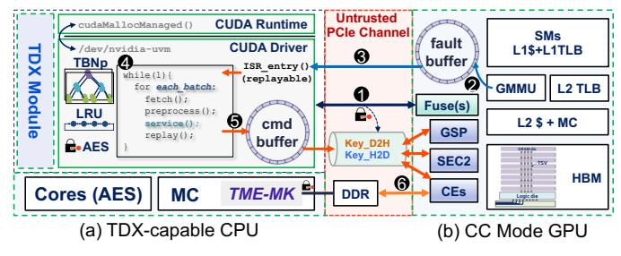
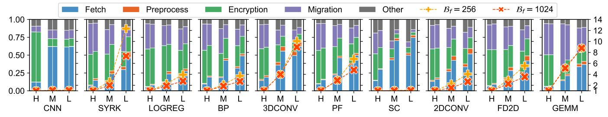
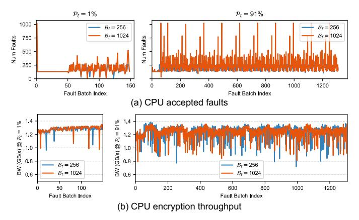
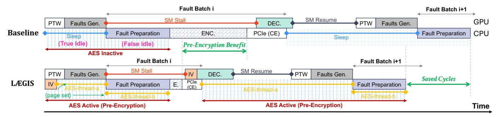
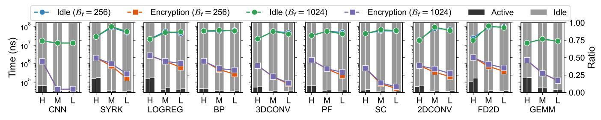
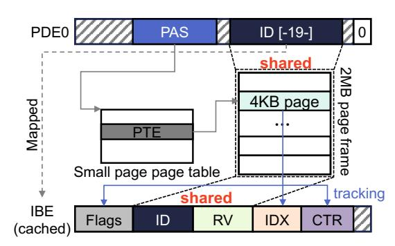
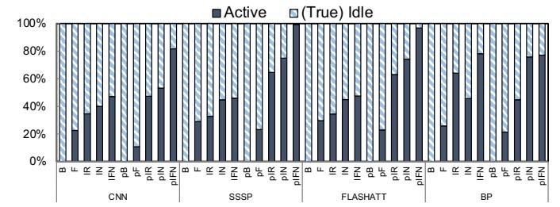
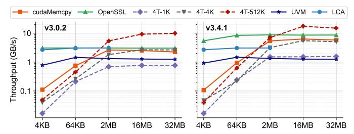

# LÆGIS: Pinpointing and Addressing Performance Overheads of GPU-based Confidential Computing

Yang Yang *University of Virginia* Charlottesville, Virginia, USA yangyang@virginia.edu

Adwait Jog *University of Virginia* Charlottesville, Virginia, USA ajog@virginia.edu

*Abstract*—GPU-based Confidential Computing (CC) combines a CPU trusted execution environment (TEE) with a CC-capable GPU to protect data in use. However, it faces a memory wall: GPU memory is far more limited than CPU memory. Unified virtual memory (UVM) alleviates this constraint by allowing the CPU and GPU to share a single address space, with pages managed jointly by the GPU's memory management unit (GMMU) and a CPU-side UVM driver. This design, however, is fault-driven and introduces significant overhead — when the GPU accesses pages residing in CPU memory, it triggers page faults that are aggregated by the GMMU and processed in batches by the driver. Under CC, every page migrated in this process must additionally be encrypted to ensure confidentiality and integrity, further amplifying the cost.

We identify three key inefficiencies in UVM-based GPU CC. First, it requires tight CPU–GPU synchronization to negotiate initialization vectors (IVs) for AES-GCM encryption, placing encryption on the critical path. While this design avoids storing IVs and thus eliminates the overhead of integrity-tree maintenance, the resulting synchronization overhead significantly degrades performance. Second, the driver thread often sits idle while waiting for new fault batches to arrive, wasting CPU cycles that could otherwise be used for encryption. Third, even when the CPU is utilized, CPU software encryption throughput is low (1.3 GB/s) because UVM relies on Linux Kernel Crypto APIs that are not currently parallelized, further compounding the slowdown.

To address these inefficiencies, we propose LÆGIS, a design that opportunistically pre-encrypts pages on the CPU. LÆGIS leverages secure high-bandwidth memory (HBM) for flexible IV management, introducing an IV Bank stored in 3D-stacked HBM that decouples encryption from CPU–GPU synchronization while eliminating the need for integrity trees. This enables out-of-order encryption and substantially improves UVM performance under CC. Our evaluation shows that LÆGIS significantly reduces CC overhead, achieving up to 3.13× (2.22× on average) and 5.05× (2.74× on average) speedup over the CC baseline under default and aggressive prefetching, respectively.

*Index Terms*—GPUs, Confidential Computing, Performance

# I. INTRODUCTION

<span id="page-0-1"></span>GPU-based Confidential Computing (CC) [\[1\]](#page-13-0)–[\[9\]](#page-13-1) is an emerging paradigm that combines a CPU trusted execution environment (TEE, e.g., Intel TDX [\[10\]](#page-13-2), [\[11\]](#page-13-3)) with a confidential computing-capable GPU (e.g., NVIDIA H100 [\[12\]](#page-13-4)) to protect data in use. This approach has gained traction for workloads that handle sensitive information in cloud environments or AI pipelines [\[4\]](#page-13-5), [\[9\]](#page-13-1). However, GPU-based CC introduces two major challenges. First, it relies on encryption schemes such

<span id="page-0-0"></span>

1

Fig. 1: (a) Confidential Computing system with unified virtual memory and (b) Counter-mode memory encryption.

as AES-XTS [\[13\]](#page-13-6) and AES-GCM [\[14\]](#page-13-7), which incur significant performance overheads in current systems [\[5\]](#page-13-8), [\[6\]](#page-13-9). Second, GPUs suffer from the memory wall problem [\[15\]](#page-13-10): although high-bandwidth memory (HBM) provides fast access, it is both costly and limited in capacity compared to CPU memory or external storage devices such as SSDs.

Unified Virtual Memory (UVM) [\[16\]](#page-13-11)–[\[44\]](#page-14-0) addresses the problem of memory wall by allowing the GPU, CPU, and other devices to share a unified address space (Section [II-A\)](#page-1-0), enabling transparent access to different memory devices. As shown in Figure [1\(](#page-0-0)a), UVM allows transparent page migration between CPU DRAM, GPU HBM and even external devices such as CXL-attached memory or SSDs. This capability further enables oversubscription, allowing applications to use more memory than the GPU physically provides via on-demand page migration and eviction. However, UVM's fault-driven page migration and eviction introduce significant overhead even without CC [\[18\]](#page-13-12), [\[20\]](#page-13-13), [\[28\]](#page-13-14). When combined with CC, the performance cost increases significantly. Each page migration across trust boundaries (i.e., between the CPU and GPU packages) triggers counter-mode encryption (Section [II-B\)](#page-2-0), which adds latency on the critical path [\[5\]](#page-13-8), [\[6\]](#page-13-9). During encryption, both the CPU and GPU must agree on an initialization vector (IV) to correctly perform encryption and decryption. In current CC implementations, IV correctness relies on access order. Each memory access increments the IV, and because accesses are symmetric between the CPU and GPU, both sides can stay synchronized. Such a design also helps in defending replay attacks [\[6\]](#page-13-9). However, this design

Copyright © 2026 IEEE. This paper will appear in the Proceedings of International Symposium on Computer Architecture (ISCA), Raleigh, NC, June 2026. Personal use of this material is permitted. Permission from IEEE must be obtained for all other uses, in any current or future media, including reprinting/republishing this material for advertising or promotional purposes, creating new collective works, for resale or redistribution to servers or lists, or reuse of any copyrighted component of this work in other works by sending a request to pubs-permissions@ieee.org.

tightly couples encryption with the data transfer order. As a result, encryption remains on the critical path and cannot be easily overlapped with computation [6].

When it comes to encryption: TEE-based memory encryption across CPUs [45]-[53], GPUs [54]-[57], and NVMs [58]-[63] typically relies on counter-mode encryption with explicit IV and message authentication code (MAC) storage (see Figure 1(b)). Each cache line (CL) maintains its own IV and MAC, both protected by integrity trees, enabling encryption via one-time pad (OTP), i.e., OTP =  $AES(IV_{CL}, key)$ . Because IVs are decoupled from access, OTPs can be generated ahead of time or out-of-order. However, this flexibility incurs high cost: Intel SGX, for instance, reserves 25% of enclave memory for metadata [46]. In contrast, we observed that UVM page migration under CC adopts a synchronous encryption model where IVs are derived implicitly from an access-ordered counter:  $IV_t \leftarrow increment(IV_{t-1})$ . The IV is determined only when the data is accessed. This design avoids IV management, but it also makes encryption depend directly on the runtime access order. As a result, encryption must be performed synchronously on the critical path. We therefore propose to bring flexible IV management back to GPU-based CC. However, the encryption scheme required for UVM under GPU CC differs from prior solutions as summarize in Table I. It highlights few mismatches between prior counter-mode schemes and UVM under CC. Prior schemes assume an integrity tree, per-CL counters, and encrypted memory. These assumptions are unnecessary here: GPU-based CC deprecates the integrity tree, UVM migrates data at page granularity, and HBM is already trusted (Section II-C). Meanwhile, prior schemes provide decoupled OTP, which remain desirable because it removes tight runtime synchronization. The challenge is therefore to recover this flexibility without inheriting the mismatched granularity and memory encryption assumptions.

To address this challenge, we first analyze UVM faultservice implementation and performance under CC by instrumenting the NVIDIA Linux Open GPU Kernel Module [64] (Section III). Our analysis reveals three key inefficiencies in the current design: (i) current UVM under CC requires tight CPU-GPU synchronization to negotiate initialization vectors (IVs) for AES-GCM encryption for each 4 KB page, which places CPU-side encryption on the critical path; (ii) the driver thread frequently sits idle while waiting for new fault batches to arrive, wasting CPU resources that could otherwise be spent on encryption; (iii) CPU software encryption throughput is itself low (1.3 GB/s) because UVM uses Linux Kernel Crypto APIs that are currently not parallelized, which further degrades performance. These characteristics for UVM under CC have not been exploited in prior work. Even in state-of-the-art designs such as PipeLLM [6], which rely on prediction, IVs remain tied to memory access order, as mispredictions can result in stale ciphertext (Section IV-B).

Based on these observations, we propose LÆGIS (Sec-

TABLE I: Encryption Schemes Comparison

<span id="page-1-1"></span>

| Consideration  | <b>Prior Counter Mode</b> | GPU-based CC (UVM)         |
|----------------|---------------------------|----------------------------|
| IV / MAC       | ✓ Explicit per-CL         | × Implicit, access-based   |
| Integrity Tree | × Required                | √ Deprecated               |
| OTP Timing     | √ Decoupled               | × On-access only           |
| Granularity    | × Cache-line (64B/128B)   | ✓ Page-level (64KB, 2MB)   |
| Memory         | × Encrypted DRAM          | ✓ Plaintext HBM [65], [66] |

tion IV).<sup>2</sup>. Under the widely adopted assumption that HBM is secure (Section II-C), LÆGIS co-designs HBM-resident explicit IV management with UVM behavior (e.g., driver thread idleness) to improve the performance of general UVM workloads under GPU-based CC via opportunistic pre-encryption. At a high level, LÆGIS makes three key contributions: (i) it reintroduces explicit IV management in GPU-based CC while decoupling encryption from CPU–GPU synchronization, without requiring integrity trees; (ii) it introduces the IV Bank, an HBM-resident GPU structure that maintains perpage<sup>3</sup> IVs for secure and flexible IV tracking (Section V), thereby fully decoupling encryption from access ordering; and (iii) it leverages opportunities at the CPU to pre-encrypt pages, improving UVM performance under CC (Section VII).

To the best of our knowledge, this is the first work that makes the following contributions:

- We conduct an in-depth performance dissection of UVM under CC by instrumenting the GPU driver, examining how page migration and encryption work in practice.
- On CC-enabled real GPU hardware, we identify three major inefficiencies in CC UVM fault servicing: namely, synchronized encryption, driver thread idleness, and low CPU software encryption throughput.
- We propose LÆGIS, a design that opportunistically performs page pre-encryption and leverages secure HBM for flexible IV management.
- Grounded in the results from real GPU hardware, we implement LÆGIS on top of GPGPU-Sim [67], [68]. Our evaluation shows that LÆGIS significantly reduces CC overhead, achieving up to 3.13× (2.22× on average) and 5.05× (2.74× on average) speedup over the CC baseline under default and aggressive prefetching, respectively.

#### II. BACKGROUND

In this section, we present an overview of GPU-based confidential computing. Next, we describe how unified virtual memory works in conjunction with confidential computing. This is followed by a description of the cryptographic mechanisms employed in such systems. Finally, we describe the threat model considered in this work.

# <span id="page-1-0"></span>A. UVM in TDX-based GPU CC System

As shown in Figure 2, GPU-based Confidential Computing (CC) [1]-[8] relies on both a CPU trusted execution

<span id="page-1-2"></span><sup>&</sup>lt;sup>1</sup>Section IV identifies an additional opportunity for CPU-side preencryption once the fault batch has arrived, during the fault preparation stage.

<span id="page-1-3"></span><sup>&</sup>lt;sup>2</sup>LÆGIS is derived from the Old Norse word for opportunity and is also a fusion of Lance and Aegis

<span id="page-1-4"></span><sup>&</sup>lt;sup>3</sup>Unless otherwise specified, the term page or big page refers to a VABlock, which is 2 MB in size. The term base page refers to a 4 KB page.

<span id="page-2-1"></span>

Fig. 2: TDX-based GPU confidential computing architecture. The dashed green parts are trusted components.

environment (TEE), such as Intel Trust Domain Extensions (TDX) [11], [69]–[72], and a CC-capable GPU, such as the NVIDIA H100 [12], [73], [74]. CPU TEE achieves VM-level isolation that enables a transition from the insecure world to the secure world without code modification.

The new VM-level isolation provided by Intel TDX and AMD SEV-SNP [75] can incorporate the entire GPU runtime and kernel driver into a confidential virtual machine (CVM) or trust domain (TD) in Intel terminology.<sup>4</sup> Once the GPU is in the CC mode, it can communicate with the TD through encrypted channels. The TD is managed by a secure software component called the TDX Module [72], [76], which can be viewed as a lightweight hypervisor, as shown in Figure 1 and Figure 2. Similar to other CPU TEEs, memory encryption [46] is integrated for TD memory access.

The GPU architecture consists of SMs, architectural engines, a GPU memory management unit (GMMU), and memory partitions, as shown in Figure 2(b). The architectural engines include several copy engines (CEs) capable of initiating DMA operations that orchestrate data movement between the CPU and GPU [77]. In a CC-capable GPU, the CEs are enhanced with hardware AES engines to ensure confidentiality and authentication. There are several security-related engines, such as the GPU System Processor (GSP) and the Secure Processor (SEC2). Both are RISC-V microcontrollers, as noted by Gu et al. [7], [78], [79]. Like the CEs, the GSP/SEC2 integrate hardware AES engines to accelerate cryptographic operations. NVIDIA patents [78], [79] also indicate the presence of onchip fuses used to store security keys.

Once GPU CC is ready and all keys are securely established (1), we describe how Unified Virtual Memory (UVM) operates. First, user-level CUDA runtime API calls interact with the driver module (e.g., /dev/nvidia-uvm). For example, cudaMallocManaged allocates UVM-managed memory, which can be accessed by both the CPU and GPU without explicit copy operations. GPU page faults trigger page migration, which is a source of significant performance overhead. The kernel module then handles GPU requests, such as fault batch handling. When GPU threads attempt to access a page, they first check its page table entry (PTE) by performing a page table walk (PTW). If the PTE is invalid, a replayable fault is triggered and handled by the GMMU. The fault information is stored in a fault buffer [18] (2).

The GPU then interrupts the CPU for batch handling [18], which first fetches the fault information (3). To improve efficiency, the driver groups faults into batches [18]. We define fault batching count  $(\mathcal{B}_f)$  as the maximum number of faults that form a batch. Under UVM, the default value of  $\mathcal{B}_f$  is 256. The interrupt service routine (ISR) then **pre-processes** the fault batches for future service and replay (4). We refer these steps (3) and 4) before actual fault service as fault preparation. When CPU services these faults, it performs page encryption in AES-GCM format and pushes corresponding commands (such as DMA migration and GPU decryption) to GPU via a pushbuffer (5). This communication traverses through the untrusted PCIe channel. Therefore, the commands and subsequent data transfers (6) must be submitted to a secure channel with per-direction keys already established. Note that currently there is no dedicated AES engine to be used by the driver, therefore, encryption of pages is performed in software. Once the GPU receives the required pages, the corresponding engines decrypts them and store them in HBM as plaintext (see Section II-C for more details).

UVM organizes memory into 2 MB virtual address blocks (VABlocks), each consisting of contiguous 64 KB basic blocks. To reduce repeated batch handling, UVM uses a tree-based neighborhood prefetcher (**TBNp**) [20], [21], [27], [80] that proactively migrates nearby data. TBNp represents each VABlock as a five-level full binary tree with 32 leaf nodes, where each leaf corresponds to one basic block. It migrates at leaf granularity, so a fault on a base page migrates the entire leaf containing that page. TBNp uses a tree-based prefetching threshold ( $\mathcal{P}_t$ ): once the migrated-leaf fraction exceeds  $\mathcal{P}_t$ , TBNp assumes high locality and migrates the remaining leaves.  $\mathcal{P}_t$  controls prefetching aggressiveness, with lower values triggering prefetching earlier.

#### <span id="page-2-0"></span>B. Memory Encryption

The memory encryption engine (MEE) [46] is a hardware component in the memory controller that performs AES-based encryption and decryption for memory accesses, protecting data against physical memory attacks. Commercial TEEs commonly use two AES modes: counter-mode encryption (CME) and counter-less encryption (CLE). NVIDIA CC uses a variant of CME, AES-GCM [14], to protect data over the CPU-GPU interconnect [5], [6]. The GPU also includes onchip AES-GCM engines, as discussed in Section II-A. In contrast, TDX protects private CPU memory with a Total Memory Encryption-Multi-Key (TME-MK) engine [81], [82] in the memory controller, which performs AES-XTS [13], [83] encryption and decryption for all accesses to private TDX memory. However, currently there is no dedicated CPU-side AES-GCM engine available for CC. Since AES operates on 128-bit inputs, or AES blocks, encrypting a large message requires multiple AES invocations. For AES-GCM, the nonce used to generate the OTP must never repeat under the same key. The nonce is typically constructed from a 96-bit IV and a 32-bit self-incrementing counter [14]. This layout can be cus-

<span id="page-2-2"></span><sup>&</sup>lt;sup>4</sup>We use Intel and NVIDIA terminology in this study.

<span id="page-3-3"></span>

Fig. 3: Breakdown of CPU batch handling time (stacked bars) and processed fault batches (points). The left y-axis shows the time fraction of each component. The x-axis shows the TBN<sup>p</sup> threshold (Pt): H, M, and L denote 1%, 51%, and 91%, respectively. The left and right stacked bars use B<sup>f</sup> values of 256 and 1024. The right y-axis shows the total processed batches, normalized to the batches observed under P<sup>t</sup> of 1%. Collected on real hardware.

tomized [\[46\]](#page-14-7), as long as uniqueness is preserved.[5](#page-3-2) Section [III](#page-3-1) provides a more detailed analysis of the CC encryption stack.

# <span id="page-3-0"></span>*C. Threat Model*

Our threat model is consistent with prior studies on TDX and GPU TEEs [\[5\]](#page-13-8), [\[6\]](#page-13-9), [\[65\]](#page-14-9), [\[84\]](#page-15-11)–[\[87\]](#page-15-12). The Trusted Computing Base (TCB) includes all on-chip components of both the CPU and GPU. Private memory of TD is enforced to be encrypted through TME-MK. Unauthorized access to private memory will always return zero [\[88\]](#page-15-13). The attacker can gain both privileged and physical access to the system. Side-channels attacks [\[89\]](#page-15-14), [\[90\]](#page-15-15) and other threats are outside the scope of this study. We assume the GPU's memory, which is composed of 3D-stacked HBM [\[91\]](#page-15-16), [\[92\]](#page-15-17), is secure and resistant to physical attacks [\[56\]](#page-14-15), [\[66\]](#page-14-10), [\[74\]](#page-15-1), [\[85\]](#page-15-18)–[\[87\]](#page-15-12), [\[93\]](#page-15-19)–[\[100\]](#page-15-20). This assumption is based on the physical design of HBM, where memory dies are integrated into package and internally connected using through-silicon vias (TSVs). Moreover, there have been no publicly known RowHammerstyle [\[101\]](#page-15-21)–[\[104\]](#page-15-22) attacks targeting GPU HBM. Therefore, we adopt the assumption that GPU HBM is secure and does not require memory encryption. A similar assumption can also be extended to CPU, such as Intel Xeon Max CPUs [\[97\]](#page-15-23), [\[105\]](#page-15-24) where HBM stacks are integrated.

# *D. HBM and Its Security*

LÆGIS adopts the same HBM-trusted threat model used by prior GPU-TEE work and current NVIDIA GPU CC [\[12\]](#page-13-4), [\[106\]](#page-15-25). This model has been used since Graviton [\[65\]](#page-14-9) and is widely adopted by later studies [\[56\]](#page-14-15), [\[66\]](#page-14-10), [\[85\]](#page-15-18), [\[87\]](#page-15-12), [\[97\]](#page-15-23)– [\[99\]](#page-15-26). Graviton assumes GPU on-package HBM is *extremely hard* to snoop or tamper with [\[65\]](#page-14-9). NVIDIA CC similarly treats HBM attacks as hypothetical and excludes them from its CC threat model [\[74\]](#page-15-1). Prior work also discusses 3D integration as a security primitive [\[86\]](#page-15-27), [\[97\]](#page-15-23), [\[99\]](#page-15-26), [\[100\]](#page-15-20). BOLT [\[66\]](#page-14-10) is the first to explicitly rely on HBM and a customized accelerator for an oblivious MAP algorithm. We also note that, although RowHammer-style attacks are widely studied [\[101\]](#page-15-21)–[\[104\]](#page-15-22), current evidence does not establish such attacks on deployed server-class HBM GPUs (e.g., A100/H100). GPUHammer [\[103\]](#page-15-28) demonstrates a discrete-GPU attack on GDDR6, not server GPU-HBM platforms, and discusses how evolving HBM refresh/ECC mechanisms and NVIDIA CC further narrow the attack surface.

# <span id="page-3-1"></span>III. PERFORMANCE DISSECTION OF UVM WITH CC

The core function of the UVM driver is to handle GPUgenerated page faults. As discussed earlier, this process (batch handling) comprises several key steps: fault fetching, preprocessing, fault servicing, and issuing GPU replay to resume SM execution. Various configuration parameters influence how faults are generated and handled throughout this pipeline. Given that batch handling critically impacts UVM efficiency, we analyze its behavior under CC in this section. Our experimental methodology is described in Section [VI.](#page-9-1)

Batch Handling Performance. The current UVM driver exposes a few tunable parameters. In this study, we focus on two such parameters: *fault batching count* (B<sup>f</sup> ) and *treebased prefetching threshold* (Pt), which are discussed in Section [II-A.](#page-1-0) Given that batch handling is already expensive under UVM [\[18\]](#page-13-12), we find that CC amplifies the cost further due to overheads related to encryption [\[5\]](#page-13-8). To address this problem, the first step is to reduce the number of fault batches handled at the CPU side. For a given workload, aggressive prefetching can help reducing the fault batches as it facilitates transfer of more data per fault batch handling. However, a small value of P<sup>t</sup> may also lead to unnecessary prefetching. Under CC, this unnecessary prefetching also increases the encryption overhead. Nevertheless, our experiments (discussed next) indicate that benefits of reducing the number of faults processed can outweigh the drawbacks of increased encryption overhead.

In Figure [3,](#page-3-3) we dissect the time spent by CPU to perform batch handling. The stacked bars show the time breakdown across batch handling components under different B<sup>f</sup> and Pt, while the points report the normalized total number of fault batches processed. We first observe that regardless of the choice of P<sup>t</sup> or B<sup>f</sup> , encryption occupies a large portion of the batch handling time on CPU. For example, in CNN with aggressive prefetching, encryption accounts for more than 70% of this handling time on CPU. In GEMM, the encryption share decreased from 44% to 16% when switching from P<sup>t</sup> = 1% to 91% at B<sup>f</sup> =256. However, reduced encryption time

<span id="page-3-2"></span><sup>5</sup> If messages m<sup>1</sup> and m<sup>2</sup> are encrypted under the same nonce, producing ciphertexts c<sup>1</sup> and c2, then c1⊕c<sup>2</sup> = m1⊕m2, which can reveal information about the plaintexts.

<span id="page-4-0"></span>

Fig. 4: Fault generation rate and encryption throughput per batch of GEMM. Collected on real hardware.

does not always translate to better performance. In GEMM, the number of fault batches increases from 149 to 1310, an 8.7× growth (see Figure [4\(](#page-4-0)a)), while the number of GPU-generated faults grows more than 11×. It is evident that aggressive prefetching results in a relatively lower fault generation rate. As a result, although the encrypted data volume is smaller, the additional batch handling overhead dominates. For most applications, a smaller P<sup>t</sup> (i.e., aggressive prefetching) is therefore beneficial [\[27\]](#page-13-18). CNN workloads, however, present a counterexample. In CNN, the number of fault batches grew by only 8.3%, due to its memory access properties. Meanwhile, the amount of encrypted data is reduced by 96.8%, which far outweighs the modest increase in batch handling overhead.

Observation 1: Aggressive prefetching (P<sup>t</sup> = 1%) reduces costly GPU-CPU fault batch handling-related interactions. However, it shifts the burden to encryption – i.e., time spent on encryption can exceed 70% of the total fault batch handling time on CPU. Thus, encryption is a critical performance bottleneck under CC with UVM.

Encryption Mechanism Demystified. A key difference of UVM under CC is the *encrypted paging*, where pages are migrated over PCIe in encrypted form to prevent physical attacks. Since encryption is a major source of overhead (Observation 1), we examine its implementation inside the GPU driver. Listing [1](#page-4-1) shows a simplified version of the CPU-to-GPU migration routine; it runs during servicing of every fault batch. Each TDX page is encrypted with AES-GCM (line 4). Since TDX memory is protected by the TME-MK engine, each page is first decrypted on read before CC-required AES-GCM encryption. AES-GCM always operates on 4KB pages and is bound to a push channel, where an IV is managed through *synchronization*. In our evaluation, TME-MK adds only about 40 cycles to memory-access latency thanks to its dedicated hardware implementation. After encryption, a CE copy command is injected into the channel (line 6), which triggers a DMA transfer and asynchronous GPU-side decryption that can be pipelined. As a result, decryption latency on the GPU can be hidden.

Moreover, encryption differs substantially across GPU

memory-management paths (e.g., UVM vs. non-UVM [\[6\]](#page-13-9)) that limits which optimizations apply to UVM. In GPUbased CC, crypto-libraries are used in a *data plane* for CPU– GPU memory movement (e.g., AES encryption) and a *control plane* for CC services (e.g., provisioning). For UVM, the *kernel-space* NVIDIA driver exposes a *Cryptography Services Library (CSL)* interface [\[64\]](#page-14-8). Such CPU-side encryption, which lies on the critical path (as shown in Listing [1\)](#page-4-1), is therefore expected to rely on internal CSL calls, rather than user-space OpenSSL [\[107\]](#page-15-29). Although the call chain is proprietary, the net effect is that UVM encryption is realized through the Linux Kernel Crypto API (LCA) [\[108\]](#page-15-30), which we confirm using bpftrace [\[109\]](#page-15-31) tracing of CSL interactions with libspdm [\[110\]](#page-15-32), [\[111\]](#page-15-33) and kernel AEAD encryption (crypto\_aead\_encrypt). The thread model of this kernel path also matters. Replayable UVM fault servicing (Section [II-A\)](#page-1-0) is commonly funneled through a driver-managed work queue that is serviced by a single kernel thread. As a result, encryption on the UVM fault-service chain tends to inherit this *serialization*. This structure can limit parallelism in practice and shapes which optimizations are feasible for UVM workloads. Kernel modules also do not dynamically link against user-space libcrypto, so upgrading OpenSSL does not directly affect nvidia\_uvm.ko. In contrast, for non-UVM applications, OpenSSL covers data-plane encryption, as confirmed by prior studies [\[5\]](#page-13-8), [\[6\]](#page-13-9). Unlike the kernelside UVM path, user-space cryptography can exploit CPU parallelism via standard threading (e.g., std::thread in [\[6\]](#page-13-9)). We compare these implementations in Section [VIII-A.](#page-11-0)

Observation 2: Under GPU-based CC, UVM paging encryption is a kernel-space, Linux Kernel Crypto API (LCA)-backed path that operates synchronously at 4KB page granularity with IV synchronization. This differs from user-space OpenSSL-based bulk encryption and inherently limits parallelization opportunities.

```
1 va_bb = dma_alloc_coherent();
2 for_each_va_block_page_in_region(page_index, region) {
3 void *va_src = kmap(src_page);
4 uvm_cc_cpu_encrypt(push->channel, va_bb, va_src, iv,
     ,→ PAGE_SIZE, va_tag);
5 kunmap(src_page);
6 gpu->parent->ce->decrypt(push, gpu_dst, va_bb, PAGE_SIZE,
     ,→ va_tag);
7 }
```

Listing 1: Demonstration of CPU-side encryption and GPUside decryption process in the nvidia-uvm driver.

Encryption Performance. We measure the actual UVM encryption throughput and, as expected, it remains consistent across applications. Taking GEMM as a representative case, Figure [4\(](#page-4-0)b) shows the throughput per fault batch. The average values are 1.28 GB/s (i.e., 2.98 µs for encrypting a 4 KB page) and 1.24 GB/s for P<sup>t</sup> = 1% and 91%, respectively. This is much lower than non-UVM CC data migration bandwidth (around 3.03 GB/s [\[5\]](#page-13-8)). Thus, both the implementation and the performance of encryption present a major obstacle to optimizing UVM performance.

<span id="page-5-1"></span>

Fig. 5: Pre-Encryption from LÆGIS increases encryption activity leading to improved performance (i.e., saved cycles).

<span id="page-5-2"></span>

Fig. 6: Bars show the fraction of CPU time during which the driver thread is active versus (true) idle. Lines show the average idle duration between consecutive batches and the average encryption time per batch. The left y-axis shows time (ns) in log scale. the x-axis shows the  $\mathcal{P}_t$  level, H, M and L stands for 1%, 51% and 91%. Collected on real hardware.

**Observation 3:** GPU CC presents slow (1.3 GB/s) and synchronous software encryption in UVM, placing it on the critical path. Such low throughput presents significant performance overhead. Note that TDX hardware for AES adds only 40 cycles. Thus, the bottleneck lies in the software encryption path.

# IV. OVERVIEW OF OUR APPROACH: LÆGIS

<span id="page-5-0"></span>Based on the findings presented in the previous section, we analyze the challenges that CC introduces for UVM and motivate the design of LÆGIS by addressing three questions: when to encrypt, how to encrypt and what to encrypt.

#### A. Idle Service Routine: When to Encrypt?

As discussed in Section II-A, encryption occurs during the servicing of every fault batch. Since batch handling is interrupt-driven, the driver thread might remain idle when no GPU faults are generated (i.e., when no fault batch is being processed). Hence, we focus on when to encrypt during batch handling. Figure 5-Baseline illustrates idle behavior during batch handling. It shows one complete fault batch (batch i) with both CPU and GPU activity. Fault preparation includes steps before encryption (e.g., fetch and preprocessing) and matches the UVM flow described in Section II-A. As shown, during idle periods, the driver thread sleeps and there are no CPU AES activities, even though GPU execution may continue. This underutilization becomes more significant given the already limited encryption bandwidth (Observation 3). We observe that these idle periods are long across various  $\mathcal{P}_t$  and  $\mathcal{B}_f$  values. We approximate the average idle time as:  $Idle[n] = \frac{1}{n-1} \sum_{i=1}^{n-1} s[i] - (s[i-1] + H[i-1]), \text{ where } n \text{ is}$ the number of processed batches, s[i] is the start time of batch i, and H[i] denotes the time spent on CPU handling the i-th batch (characterized in Figure 3). We also refer to this type of idleness as **true idle**, during which the driver thread sleeps.

Taking  $\mathcal{P}_t = 1\%$  as an example, true idle time is  $12\times$ longer than average encryption time (not shown), meaning that if the VABlocks to be migrated in future batches can be predicted, then pre-encryption can fully overlap with idle periods. Figure 6 shows the average true idle time versus encryption time, along with the fractions of driver active time and idle time for each application. On average, the driver remains true idle for 87% of its execution time, during which CPU resources (e.g., cycles that could be used for encryption) are underutilized. Meanwhile, from the perspective of CPU AES activity, even during fault preparation (e.g., fetching and preprocessing), the AES instruction is not executing. We term this duration as false idle. Hence, with an extra assisted thread running AES, pre-encryption can overlap with fault preparation for additional benefits. Both types of idleness are illustrated in Figure 5–Baseline. Notably, the length of false idle time depends on the number of pages serviced within each batch. As shown in Figure 5-LÆGIS, decoupled IV access (Section V) enables out-of-order encryption during idle periods. Specifically, the order of pre-encrypted pages does not need to match the actual page access order. When preencrypted pages are later requested in fault batches, no further encryption cycles are needed on the critical path. Since preencrypted pages can be directly committed and written to bounce buffer, it also improves PCIe efficiency. This results in pre-encryption benefit and saved cycles. We will discuss how to select candidate pages for pre-encryption in Section IV-C, Section V-B, and Section VI.

Opportunity 1: Between fault batches, the driver thread enters true idle, and during fault preparation the thread that is not running AES instructions experiences false idle. Both these intervals can be utilized to hide (some) encryption latency if pre-encryption is applied.

# <span id="page-6-0"></span>*B. Synchronized Encryption: How to Encrypt?*

As discussed in previous sections, although idle periods can be used for pre-encryption, the question of *how to encrypt* remains challenging. This arises from the synchronous nature of current encryption, where the IV is tightly coupled with access order. A possible solution is to rely on prediction, as in PipeLLM [\[6\]](#page-13-9), which speculatively decouples encryption. However, misprediction risks both performance and security by breaking IV consistency.

<span id="page-6-3"></span>

Fig. 7: Demonstration of IV prediction adopted from [\[6\]](#page-13-9).

In speculative encryption, PipeLLM predicts future CPUside IV (cIV) values, as shown in Figure [7.](#page-6-3) The GPUside IV (gIV) is incremented when encrypted data from the CPU arrives. This protocol creates an implicit synchronization channel between the CPU and GPU. Thus, a future value cIV<sup>x</sup> can be viewed as the output of a predictor (Pred), which takes the past history and the current cIV as inputs and predicts the cIV value that will be used at time x. From an oracle's perspective, suppose that at time x the actual cIV is s and the predicted cIV is q. If the prediction is correct, then s = q and increment(p) = s, so the pre-encrypted ciphertext remains valid. However, this correctness can only be confirmed at runtime, when the actual cIV is assigned. If the prediction is wrong, e.g., s > q, then the pre-encrypted ciphertext ct<sup>x</sup> = AES-GCM(q, page<sup>x</sup> ) is invalid. In this case, the predicted cIV q is stale and may collide with a prior encryption using the same cIV, violating AES-GCM's IV-uniqueness requirement. More generally, any incorrect prediction that uses a stale or uncommitted IV can create a security vulnerability. To avoid this, PipeLLM writes predicted ciphertexts to TDX-encrypted memory, which adds more complexity. We identify the root cause as the lack of explicit IV visibility on both the CPU and GPU sides. To address this limitation, we propose decoupling encryption through explicit IV management (Section [V-A\)](#page-7-0).

Observation 4: Synchronous encryption degrades both performance and security when applying prediction. It also limits the benefits that rely on flexible timing and ordering. We identify the root cause of this limitation as the absence of explicit IV management.

# <span id="page-6-2"></span>*C. Closer Look of Fault Behaviors: What to Encrypt?*

Finally, to determine *what to encrypt*, we next explore how to leverage Opportunity 1 for pre-encryption candidate selection. As illustrated in Figure [8,](#page-6-4) we examine the fault buffer activity of 2DCONV under the default prefetching threshold as an example. This is conducted on a simulated platform (see Section [VI](#page-9-1) for more details) to obtain fine-grained activity traces that are typically unavailable on real hardware.

<span id="page-6-4"></span>

Fig. 8: Fault buffer events for 2DCONV. The left y-axis shows the number of base pages scheduled for service (sched\_pages), and the right y-axis shows the number of entries recorded in the fault buffer (fb\_entries).

First, we observe that pages scheduled when a page-fault event occurs may not be served within a single fault batch. This reflects that the fault buffer maintains multiple entries, rather than just one. This behavior is expected due to the high degree of parallelism in GPUs: warps across many SMs may fault on different virtual addresses simultaneously. These requests are forwarded to the GMMU, which coalesces them into page fault requests. Given diverse access patterns, threads may fault on different VABlocks. Consequently, while the GMMU schedules a fault batch at a given cycle, not all pending faults are served immediately; they are instead split across multiple batches. As already shown in Figure [6,](#page-5-2) due to internal hardware mechanisms and runtime behavior, idle time naturally arises between these batches. As long as the driver can access the fault buffer contents [\[21\]](#page-13-17), [\[112\]](#page-16-0), it can prefetch additional fault buffer entries as candidates for encryption during this idle period.

Opportunity 2: The UVM driver can anticipate future accesses using information already in the fault buffer, or through any existing predictive model.

## V. DESIGN AND IMPLEMENTATION OF LÆGIS

<span id="page-6-1"></span>LÆGIS addresses two major research questions: *RQ1*: *How to design an encryption scheme tailored for GPU-based CC that can support out-of-order encryption*; *RQ2*: *With this scheme, how to perform efficient batch handling*. To this end, LÆGIS introduces the following key mechanisms:

- (*i*) Leverages HBM in GPU for metadata (e.g., IV) storage.
- (*ii*) Decouples encryption from access ordering by introducing explicit IV management between CPU and GPU thereby enabling arbitrary encryption orderings.
- (*iii*) Proposes an out-of-order pre-encryption scheme. Combined with (*i*) and (*ii*), this design leverages false and true idle intervals to reduce encryption overhead.

<span id="page-7-1"></span>

Fig. 9: IV Bank stored across HBM hierarchy.

# <span id="page-7-0"></span>A. HBM-Assisted Encryption

To enable flexible cryptographic operations and further optimizations, the first step is to decouple IV management from the actual data transfer.

**Insights.** As discussed in Section IV-B, current CC designs rely on implicit IV synchronization, where each encryption step causes the IV on both ends to increment. This synchronization introduces significant overhead, as it lies on the critical path. However, since HBM is considered secure [66], LÆGIS decouples encryption by explicitly storing metadata (e.g., IV) in HBM rather than relying on CPU-GPU synchronization. Also, under this threat model, once data arrives at the GPU, it can be stored in plaintext. Thus, MACs are no longer needed after verification, integrity tree protection can be deprecated, and on-chip GPU memory accesses also do not require encryption, decryption, or verification.

IV Bank Concepts. To the best of our knowledge, this is the first work to leverage the secure nature of HBM and introduce explicit IV storage within it. As shown in Figure 9 (right), we reserve a logical region, termed the IV Bank, in each HBM stack (see Table II for configuration details). IVs are interleaved across all channels and banks. The IV Bank stores per-VABlock IV Bank Entries (IBEs). IBEs are accessible to the memory controller and can be transferred over HBM's TSVs to the on-chip network for routing to other engines, such as CE. GPU IV Bank uses HBM, however, for CPU-side IV Bank, it can be implemented in both TDX-protected memory or HBM. We only require GPU to be HBM-integrated.

Organize IV Bank. LÆGIS reserves space (512 K lines) per HBM stack on GPU to store IV bank entries. Each line holds a 128-bit entry for one VABlock, resulting in 8 MB overhead per stack (i.e., 4 big pages). These lines are mapped to reserved physical addresses during page allocation. Figure 10 shows the address mapping. For an 8-channel HBM stack with 16 banks per channel, interleaving 4 big pages maps VABlock offsets from 0x0 to 0x1FFFFF. The higher address bits span 0x0 to 0x3, using physical address bits 17-22 as the row index. This requires 64 rows per bank, which fit within a single sub-array (Figure 9, right). Each 1 KB row stores 64 IVs, and each access gathers one entry from 16 columns. This layout balances load across banks and avoids hotspots. IVs and data can share subarrays, though more advanced mappings could enable parallel access, which we leave for future work. The design scales to multiple HBM stacks via stack-specific mappings [34].

**IV** Construction. We do not store the 96-bit IV directly. We

also avoid address-dependent IVs, as page swapping caused by prefetching or eviction may change physical address mappings. This makes address-derived IVs unreliable. A natural alternative is to initialize IVs sequentially or randomly. Sequential initialization can lead to duplicate IVs due to varying page fault order. With random initialization, the probability that two entries collide is bounded by well-known birthday bound [46], [113]:  $q^2 \cdot 2^{-95.26}$ , where q is the number of initialized entries. This probability is non-negligible given the size of our IV Bank.

<span id="page-7-2"></span>

Fig. 10: HBM address mapping of a single stack.

IV Bank Entry. To avoid IV collisions, we divide the 96-bit IV into two parts: a 19-bit identifier (ID) and a 77-bit random value (RV). The RV is generated using a secure pseudorandom function (PRF) with a shared key for initialization. Since the CPU and GPU can negotiate keys securely [7], both sides initialize their IV Bank with matching values. Each IV Bank entry is 128 bits (see Figure 9, right-bottom) and includes the IV and control flags. The V-bit marks whether the entry is valid. The D-bit indicates if the entry has been modified. The O-bit signals overflow of the IV, and the R-bit triggers key rotation and re-encryption on RV overflow (Section V-C). A 9-bit CTR tracks access to base pages within a VABlock. Remaining bits are currently unused but reserved for future extensions. Although the figure shows the GPU-side layout, the CPU maintains a similar structure.

Indexing the IV Bank. Since IV Bank entries are allocated per 2 MB VABlock, we use the page table walk to extract the indexing information. Specifically, we repurpose 19 unused bits in the page directory level 0 entries (PDE0) [114] to store the ID, as shown in Figure 11. The ID is then used to index the actual IBE stored in IV Bank, which are mapped to specific HBM channels via the address layout in Figure 10. As illustrated in Figure 9(left), once an IBE is fetched by the memory controller (MC) in GPU, it is sent to the CE (DMA engine [115]–[118]) via a shared crossbar [77], [116]. It will also be cached into a small on-chip IV cache. Then the CE will construct a 128-bit input to an AES engine using the 96-bit IV, a 17-bit block index within the 2 MB page, and padding. This AES engine will then generate an OTP to perform decryption. With IV Bank support, the CPU and GPU can encrypt and

decrypt independently, enabling out-of-order and decoupled encryption/decryption.

Support for Different Page Sizes. Our design also supports 4 KB and 64 KB pages without modifying the IV Bank structure or increasing page table size. Prior work [119] and public documentation [114] show that the PDEO can handle 2 MB, 64 KB, and 4 KB pages. PDEO contains separate fields—PAS for small-page tables and PAB for big-page tables. Each 16 B PDEO has at least 29 unused bits, which we reuse. For 4 KB pages, we keep the same IV Bank granularity. Since pages are decrypted when they arrive at the GPU, all 4 KB pages within a 2 MB VABlock share the same ID and RV (as shown in Figure 11), differing only by offset. The RV is incremented only after all 512 pages in the block are migrated. To support partial migration, each IBE includes a 9-bit counter to track how many 4 KB pages have been migrated. The same mechanism applies to 64 KB pages.

<span id="page-8-2"></span>

Fig. 11: IV Bank Entry with small page size.

Eviction Support. LÆGIS naturally supports eviction. For example, under a VABlock-LRU policy [20], an entire VABlock will be evicted. Hence, the RV of the corresponding IBE is incremented, and all pages in the block are refreshed using the new RV. Eviction is orthogonal to our mechanism, and LÆGIS can be integrated with existing eviction policies. Therefore, IV Bank coherence can also be ensured similarly to how UVM page-fault driven coherence works.

# <span id="page-8-0"></span>B. Walkthrough Example

To illustrate this mechanism, consider a scenario where the GPU begins generating faults. Suppose the fault buffer contains at least two entries,  $F_A$  and  $F_B$ , with  $F_A$  scheduled to be served in the next batch.  $F_A$  requires at least page  $_A$ , and  $F_B$  requires at least page  $_B$ . We start by examining the system state before the faults occur.

**A**: **Initialization.** The CPU-side IV Bank is initialized first. During this process, the driver and microcontroller [112] set up the page table for memory allocated through cudaMallocManaged. Each page receives a physical frame number (PFN) and a unique ID, typically generated incrementally from a random source. All UVM-managed pages are logically placed in a candidate set  $S_a$  and marked as not yet AES-GCM encrypted. For example, assume page A has ID ID<sub>A</sub>. The corresponding IV Bank entry at CPU at line ID<sub>A</sub> is initialized with ID<sub>A</sub> and a random value RV<sub>A</sub>. This entry is

then written to IV Bank indexed by  $ID_A$  at CPU. The entry sets both the D-bit and V-bit to 1, indicating that the entry has been initialized.

- **B**: Batch Handling and Pre-Encryption. When  $F_A$  is triggered, the driver service it at CPU and this encryption is on the critical path. Meanwhile,  $F_B$  is prefetched from GPU and prepared for pre-encryption once the CE finishes with  $F_A$ . To pre-encrypt  $F_B$ ,  $IV_B$  is reconstructed from the IV Bank at CPU using  $ID_B$ , and is used to encrypt each AES block as: page [blkidx]  $\oplus$  AES( $K_{h2d}$ , RV $_B$  ||  $ID_B$  || blkidx ||  $0^{15}$ ) Once done, the page is marked as pre-encrypted. The system continues encrypting the rest of  $F_B$ 's pages in the background. After finishing  $F_B$ , it proceeds to pre-encrypt pages from the candidate set  $S_a$ . As pages get encrypted, they are removed from  $S_a$ .
- **©**: Saved Cycles. When  $F_B$  is eventually handled, the preencryption thread switches to fault preparation, while another thread continues pre-encrypting future candidates. For each page in  $F_B$ , if it was already pre-encrypted, it is marked as ready without delay. Otherwise, encryption happens during servicing, as usual.
- **D**: **Page Migration.** Once all  $F_B$  pages are ready, a 109-bit MAC is generated. The system writes the MAC and the ID to the bounce buffer next to the encrypted page. Using DMA, the CE sends the page and a 128-bit value (MAC $_B \parallel ID_B$ ) to the GPU. CTR will be incremented as well.
- **B**: **Recovery.** After receiving the encrypted page and MAC, the GPU extracts  $ID_B$  and verifies the MAC. The CE uses this ID to get the IV entry from GPU HBM and decrypt the page. If this is the first time the page has arrived (i.e., both V and D bits are 0), the CE initializes the IV Bank entry at GPU, based on the process explained in step A. Once decryption is done, the page is written to HBM in GPU. If the page was evicted before, the CE retrieves  $ID_B$  from PDE0 to fetch the correct IV and proceed.

#### <span id="page-8-1"></span>C. Hardware Overhead and Security

LÆGIS adds a small fully associative IV cache with 16 entries, requiring only 256B of SRAM, or 0.02% of the L2 cache size. LÆGIS introduces no new cryptographic hardware engines, so its hardware and power overheads are negligible. LÆGIS also does not introduce new security risks. It uses the NIST-standard IV length [14]: each VABlock is assigned an IV from a unique 19-bit ID and a 77-bit RV. The RV is initialized randomly from a PRF and incremented on each access. The main concern is RV overflow. If the initial value is RV<sub>0</sub>, the remaining space is  $2^{77}-{\mbox{RV}}_0.$  Since  ${\mbox{RV}}_0$  is sampled uniformly from a PRF,  $\mathbb{E}[RV_0] = (2^{77} - 1)/2$ , so  $\mathbb{E}[2^{77} - RV_0] \approx 2^{76}$ , which is sufficient for page swaps. For side channels, LÆGIS follows the NVIDIA GPU CC threat model, which does not claim to eliminate side-channel attacks [70], [74]. We also assume correct driver behavior, consistent with TDX software trust assumptions. Compared to PipeLLM [6], LÆGIS avoids a misprediction NOP channel: PipeLLM mispredictions may create externally visible NOP operations, while LÆGIS always commits pre-encrypted ciphertexts. An observer may still see shorter PCIe active time for a fault batch, but this coarse signal can also arise in PipeLLM and page-fault side channels [\[120\]](#page-16-7), [\[121\]](#page-16-8). LÆGIS does not expose new plaintext or stale ciphertext, and it adds no new microarchitectural interactions beyond the existing UVM path.

# *D. Scalability of* LÆGIS

The IV Bank uses only 8 MB of HBM in our design point, scaling to more HBM stacks is an address-mapping issue, not a storage issue. Additional stacks do not require replicating the IV Bank; firmware only needs to update the physical-address mapping used to locate each IV entry. In multi-GPU CC, the key question is where encryption state resides. If GPUs share an address space, the extension is analogous: pages map to IV Bank entries via firmware-managed address mapping, and GPUs fetch IVs on demand. The main additional cost is cross-GPU traffic [\[122\]](#page-16-9), whose impact depends on interconnect bandwidth/latency and locality. Our current 19-bit ID supports up to 1 TB of HBM; larger systems can increase the ID width (trading off RV bits) as long as it still fits in unused PDE0 bits. Alternatively, the IV Bank can be replicated per GPU with coherence across replicas. This increases complexity but keeps overhead small (8 MB per GPU).

# VI. EXPERIMENTAL METHODOLOGY

<span id="page-9-1"></span>To evaluate LÆGIS under realistic hardware constraints, we extend GPGPU-Sim v4.2 (based on commit-id 84c6cf4) [\[67\]](#page-14-11), [\[68\]](#page-14-12), a widely used cycle-level GPU simulator, with UVMSmart [\[20\]](#page-13-13) support for virtual memory, including a shared GMMU and batch handling. Table [II\(](#page-9-2)A) shows the GPU configuration, and Table [II\(](#page-9-2)B) lists the HBM2 stack parameters. To better reflect real-world CC behavior, we also profile a physical setup (Table [II\(](#page-9-2)C)) and use these measured values in our simulations.

TABLE II: Configuration Parameters

<span id="page-9-2"></span>

| (A) GPU [68], [123], [124]                                                      |                                                     |  |
|---------------------------------------------------------------------------------|-----------------------------------------------------|--|
| 80 SMs, 64 warps/SM; shared GMMU; private TLB; crossbar network                 |                                                     |  |
| L2: 1 MB (64 KB/bank), 128B line (32B sector), 120-cycle latency                |                                                     |  |
| 8GB HBM2 (1 stack); Page size: 4 KB base, 2 MB big; PCIe: 64 GB/s per direction |                                                     |  |
| Pt: 51% (default), 1% (aggressive); Bt: 128; driver thread switch: 2 µs         |                                                     |  |
| IV cache: 16 entries, fully assoc., 20-cycle hit latency, LRU                   |                                                     |  |
| Fault preparation and idle time: profiled per base page and Pt                  |                                                     |  |
| (B) Memory Node [123], [125]–[127]                                              |                                                     |  |
| 8GB 4-Hi stack, 8 channels, 16 pseudo channels, 1KB page                        |                                                     |  |
| FR-FCFS; 16 banks, 4 bank groups/channel; 128-bit interface (BL4/channel)       |                                                     |  |
| 256 GB/s via 8 channels @1GHz; CL:RCD:RAS:WR:RP = 14:14:33:16:14                |                                                     |  |
| Static mapping: RR.RRRRRRRR.RRRRRRRB.BBCCBDDD.CCCSSSSS                          |                                                     |  |
| (C) CC Hardware [5], [128]                                                      |                                                     |  |
| CPU                                                                             | 5th Gen Intel Xeon 6530 Gold @2.1GHz, 32 cores      |  |
| System                                                                          | Supermicro SYS-421GE-TNRT3                          |  |
| Software                                                                        | Linux 6.2.0-mvp10v1+8-generic, OpenSSL v3.0.2       |  |
| Hypervisor                                                                      | QEMU 7.2.0 (TDX patched), TDX 1.5 (tag 2023ww15)    |  |
| GPU                                                                             | NVIDIA H100, PCIe 5.0, CUDA 12.4, Driver 550.163.01 |  |

Implementation Details. We extend GPGPU-Sim with a UVM batch handling model that follows prior UVM studies [\[20\]](#page-13-13)– [\[26\]](#page-13-20), [\[38\]](#page-14-17), including fault batching, adjustable prefetch thresholds, and tree-based prefetching. In addition to prior models, we explicitly model fault preparation time, driver thread idle windows, and page-encryption performance using profiles collected from real hardware under different prefetching/batching thresholds (Section [III\)](#page-3-1). We model the CPU-side encryption using measured kernel-space UVM encryption throughput (other options are discussed in Section [VIII-B\)](#page-11-1), and the GPUside design using an pipelined AES engine on the CE/GMMU path. We model the GPU IV Bank as HBM-resident metadata with firmware-managed address mapping, plus a small onchip IV cache with hit/miss tracking and a simple write-back policy. We also implement a pre-encryption scheduler that uses idle windows to select candidate pages from the current UVM context.

Workloads. We evaluate LÆGIS using 16 applications from widely adopted benchmark suites [\[20\]](#page-13-13), [\[129\]](#page-16-15)–[\[131\]](#page-16-16). Additionally, we include a CNN workload from [\[129\]](#page-16-15) and a standalone FlashAttention kernel [\[132\]](#page-16-17). These workloads generate a significant number of page faults, demonstrate diverse computational and memory access patterns, and have been extensively used in prior studies on UVM.

Methods. We implement and evaluate the following methods within our simulation framework:

- Baseline: Models existing GPU-based CC hardware, where encryption is tightly synchronized and lies on the critical path. Pages are encrypted and transferred in 4 KB granularity. Prefetching follows the default TBNp threshold. Overheads are modeled using profiled data. IV access is synchronized.
- Ideal: An idealized CC baseline where crypto-level overheads are perfectly hidden, while system-level costs (e.g., batch handling overhead) remain. No IV access is required.
- F-LÆGIS: Leverages *false idle* periods for preencryption. Candidate pages are selected based on the next available fault buffer entries when the previous batch is dispatched.
- IR-LÆGIS: Utilizes *true idle* periods to speculatively pre-encrypt pages. Candidate pages are randomly sampled from CPU-resident pages.
- IN-LÆGIS: Same policy to choose candidate pages as in F-LÆGIS but operates only during *true idle* periods.
- IFN-LÆGIS: Represents the full design of LÆGIS. It combines both false and true idle periods to maximize encryption utilization. Initially, candidate pages are chosen from the fault buffer. If idle time remains after processing those pages, additional available pages managed by the UVM driver are sequentially pre-encrypted.

Each LÆGIS variant requires IV access. For each method above, they apply default prefetching (Pt:51%) , we also evaluate an aggressive prefetching version of them (e.g., pIFN-LÆGIS).

# VII. EVALUATION

<span id="page-9-0"></span>Overall Performance. Figure [12](#page-10-0) reports speedups across 16 applications (geometric mean included). We begin by examining Baseline and pBaseline to understand how encryption overhead undermines the effectiveness of aggressive prefetching. Ideal outperforms Baseline by 2.36× on average, confirming that encryption is the primary performance limiter. Unless otherwise noted, all reported speedups are normalized

<span id="page-10-0"></span>

Fig. 12: Performance comparison among baseline configurations and LÆGIS settings. All values are normalized to baseline.

to Baseline. Aggressive prefetching alone (pBaseline) recovers only 22% over Baseline, consistent with prior non-CC results [\[27\]](#page-13-18). However, when prefetching is paired with no encryption overhead (pIdeal), the gain jumps to 4.60×, which reveals the substantial performance headroom that encryption overhead currently suppresses. For 3DCONV, NW, and SSSP, aggressive prefetching degrades performance by 2 to 5% over Baseline, which is contrary to prior findings [\[27\]](#page-13-18). This stems from a fundamental trade-off: while prefetching reduces fault frequency, each fault batch now serves more base pages, increasing the volume of data that must be encrypted and outweighing the benefit of fewer faults. CNN illustrates this starkly where where the prefetching benefit drops from 1.97× with pIdeal to just 1.08× with pBaseline.

Next, we examine F-LÆGIS and pF-LÆGIS. Unlike the baseline configurations, these schemes leverage false idle time (i.e., fault preparation time) to offload a portion of the encryption cost from the critical path. As a result, F-LÆGIS achieves a 1.51× speedup on average over Baseline. However, false idle intervals alone are insufficient under aggressive prefetching. pF-LÆGIS reaches a 1.37× speedup, which is lower than F-LÆGIS because aggressive prefetching increases per-batch encryption demand. However, pF-LÆGIS still benefits consistently from prefetching. None of the applications exhibit performance degradation, indicating that preencryption successfully mitigates the additional encryption pressure introduced by aggressive prefetching.

We now examine the impact of utilizing true idle time through IN-LÆGIS and pIN-LÆGIS. Since true idle periods are longer than false idle ones, more pages can be preencrypted during these intervals. On average, IN-LÆGIS achieves a 2.17× speedup over Baseline, narrowing the performance gap with Ideal to just 9%. This demonstrates that leveraging true idle time allows LÆGIS to approach the performance of an ideal GPU-based CC system. However, even after leveraging true idle time, benefits with aggressive prefetching are still limited. pIN-LÆGIS achieves a 2.10× speedup, comparing to pIdeal (4.60×) this is a 54.4% gap. To further understand the impact of page candidate selection, we evaluate a simple random candidate page selection strategy (IR-LÆGIS and pIR-LÆGIS). On average, IR-LÆGIS and pIR-LÆGIS achieve speedups of 1.38× and 1.62×, respectively. While these gains are smaller than those of IN-LÆGIS

and pIN-LÆGIS, they still provide notable improvements over the baselines. These methods show that LÆGIS can work with any page encryption order and are compatible with prior efforts [\[20\]](#page-13-13), [\[21\]](#page-13-17), [\[25\]](#page-13-21)–[\[27\]](#page-13-18) in UVM access prediction and prefetching.

Lastly, we examine the full version of LÆGIS, namely IFN-LÆGIS and pIFN-LÆGIS, which pre-encrypts fault-buffer candidate pages during both types of idle types (false and true) and then sequentially pre-encrypt any remaining CPU-resident pages. These two variants deliver the highest performance among all evaluated designs. On average, IFN-LÆGIS achieves a 2.22× speedup, with a maximum of 3.13×, narrowing the gap with Ideal to only 5.8%. Meanwhile, pIFN-LÆGIS further improves performance under aggressive prefetching. It achieves a maximum speedup of 5.05× and an average of 2.74×, narrowing the gap with pIdeal to 40.34%. Together, these results show that leveraging both idle intervals is essential for approaching ideal CC performance.

<span id="page-10-1"></span>

Fig. 13: Effect of LÆGIS on various execution time components for selected applications

Performance Breakdown. To gain deeper insight, Figure [13](#page-10-1) breaks down the execution time of four representative applications into six components: kernel (GPU SM execution and memory operations), fault batch handling, PCIe transfer, CPU encryption, GPU decryption, and IV access. We observe that LÆGIS effectively reduces CPU-side encryption overhead. Since pre-encryption can prepare pages in batches, PCIe can transmit data in larger bursts, thereby improving link utilization. However, offloading encryption from the critical path allows GPU decryption latency to surface, indicating that even specialized decryption hardware does not eliminate crypto overhead entirely [\[133\]](#page-16-18). Despite the improvements, fault preparation still dominates a significant portion of execution time. However, because LÆGIS leverages this time for pre-encryption, reducing fault preparation latency could diminish the benefit from encryption offloading. This highlights a trade-off that must be considered carefully in future UVM design under CC. Finally, we note that IV access incurs minimal overhead. As discussed in Section [I,](#page-0-1) GPU-based CC uses per-page IVs rather than per-CL counters. This coarser granularity leads to infrequent IV accesses to IV Bank with high locality, mitigating the typical IV access bottlenecks observed in traditional schemes.

<span id="page-11-2"></span>

Fig. 14: Effect of LÆGIS on fraction of CPU time during which the driver thread is active versus (true) idle.

Idle to Active Ratio. We examine how idle periods are used for active computation. Figure [14](#page-11-2) shows the fraction of time during which the driver thread is active versus (true) idle across four applications. We observe that applying LÆGIS increases the active ratio, indicating more efficient resource utilization. For example, in SSSP and FLASHATT with pIFN-LÆGIS, the active ratios reach 99.4% and 96.8%, respectively. On average, IFN-LÆGIS achieves a 53.2% active ratio, while pIFN-LÆGIS improves this to 88.3%.

<span id="page-11-3"></span>

Fig. 15: Throughput of AES implementations. Collected on real hardware. The x-axis shows size of data to be encrypted.

# VIII. SENSITIVITY STUDY

## <span id="page-11-0"></span>*A. Performance of AES Implementation*

As discussed in Section [III,](#page-3-1) current GPU-based CC stacks use different AES implementations. A key divide is between non-UVM and UVM applications, which also separates userspace and kernel-space paths. However, the performance impact of these choices remains unclear. To this end, we implemented and measured both user-space and kernel-space AES performance with two different OpenSSL versions (as suggested by [\[134\]](#page-16-19)) and threading settings. The results are shown in Figure [15.](#page-11-3) Besides LCA and UVM, the other implementations are user-space-based. LCA sustains about 2.5 GB/s on a 2 MB buffer, whereas the UVM driver includes additional costs that reduce effective throughput to about 1.3 GB/s. We evaluate user-space AES with four threads (4T) and chunk sizes of 1 KB, 4 KB, and 512 KB. As expected from Section [III,](#page-3-1) the OpenSSL version does not affect LCA and thus does not benefit UVM; we also validate this with end-toend UVM application profiling. In contrast, newer OpenSSL versions improve peak user-space throughput from 3.03 GB/s to 8.61 GB/s, yielding similar gains for cudaMemcpy. Multithreading helps only for sufficiently large data: it adds overheads (setup/dispatch, IV management, lock, synchronization, etc.) and does not help at 4 KB granularity, but can yield substantial speedups for larger sizes with an appropriate chunk size. These results show that user-space optimizations do not translate to UVM. LÆGIS does not rely on OpenSSL, so it can accommodate varying encryption throughput configurations while still delivering substantial gains (Section [VIII-B\)](#page-11-1).

<span id="page-11-4"></span>

Fig. 16: Speedup of LÆGIS with multi-threading and hardware-acceleration support. Higher is better.

# <span id="page-11-1"></span>*B. Faster Cryptographic Operations*

To study how different cryptographic implementations affect LÆGIS, we propose accelerated-LÆGIS, this variant is named X-IFN-LÆGIS, which is build on top of IFN-LÆGIS but with a hardware AES engine on the CPU side. We also evaluated new baselines X-Baseline (Baseline with a CPU-side hardware AES engine) and MT-Baseline (Baseline with hypothetical CPU-side multi-threading encryption). These new designs also comes with aggressive-prefetching variants. For MT-Baseline, we assume OpenSSL-style 4-thread encryption [\[6\]](#page-13-9) and use throughput from Figure [15](#page-11-3) (up to 7 GB/s). We do not assume new protocols or devices such as PCIe/CXL IDE [\[135\]](#page-16-20)–[\[137\]](#page-16-21) or TEE-IO [\[138\]](#page-16-22), [\[139\]](#page-16-23); instead, we maximize existing platform resources. X-LÆGIS reuses under-utilized CPU TME-MK engines (Section [II-B\)](#page-2-0). These engines are mostly idle during GPU kernel execution. Yet accesses to private TDX memory already trigger AES-XTS decryption before data reaches the core, after which the engine becomes available again. Since TME-MK's AES-XTS operates over the *same* Galois Field as AES-GCM, AES-GCM can be supported with reconfiguration cost without adding new hardware. The resulting AES datapath has a 40-cycle fill latency and sustains 16 B/cycle throughput. Results are shown in Figure [16,](#page-11-4) and its y-axis shows speedup.

Simply adding threads or deploying faster AES hardware does not address the core bottleneck: CPU–GPU synchronization. Under default prefetching, fewer pages get migrated and idle windows are shorter than aggressive prefetching. In this context, multi-threading can degrade performance: MT-Baseline drops by 35% on average, while IFN-LÆGIS could achieve 2.22×. With aggressive prefetching, more pages are encrypted, but still not enough to satisfy multi-threading efficiency, which demands larger volumes of data to perform optimally. MT-pBaseline improves to 1.08× on average, but remains far behind pIFN-LÆGIS (2.74×) due to threadcontext overhead. This is because encryption is still synchronized and hence latency cannot be effectively hidden.

Hardware acceleration shows a similar pattern: X-Baseline reaches 1.19× on average and X-pBaseline reaches 1.58×, still leaving a 42.5% gap to pIFN-LÆGIS. Meanwhile, X-IFN-LÆGIS (2.13×) slightly underperforms IFN-LÆGIS (by 4.3%) under default prefetching because there are too few pages to amortize engine-management overhead, and the short idle windows are insufficient to complete a nonpreemptible encryption attempt (especially in SYRK). We leave preemptible-LÆGIS as future work. In contrast, combining LÆGIS under aggressive prefetching with hardware acceleration amplifies the benefit. X-pIFN-LÆGIS achieves 3.57× average speedup (up to 6.82× for 2DCONV), reducing the overhead from 40.34% to only a 22.31% gap from the ideal setting. When comparing with hardware-accelerated baseline design, average speedups of LÆGIS are 1.78×, and 2.26× under default and aggressive prefetching, respectively.

## IX. RELATED WORKS

To the best of our knowledge, LÆGIS is the first work in the CC UVM setting to redesign IV management with the explicit goal of addressing performance bottlenecks arising from encryption and fault batch handling. The latest work on optimizing GPU-based CC is PipeLLM [\[6\]](#page-13-9), which targets non-UVM KV-cache workloads and uses swap prediction to overlap encryption with data transfer. However, due to hardware constraints, PipeLLM still uses synchronized IV semantics. Under mispredictions, it either issues extra NOPs via cudaMemcpyAsync to advance the IV, or discards the preencrypted ciphertext. As a result, misprediction overhead can appear for less regular workloads beyond KV-cache swapping (e.g., up to 8.3% from NOPs), and discarding ciphertext can further amplify such overhead. Moreover, as discussed in Section [V-C,](#page-8-1) NOPs can introduce timing channels. In contrast, LÆGIS is the first to target UVM-based GPU CC. It provides decoupled IV management via the IV Bank, completely eliminating synchronized IV semantics. Since IVs can be random-accessed, pre-encrypted data can be directly committed, avoiding the NOP/discard-based misprediction handling in PipeLLM. Combining LÆGIS with PipeLLM could therefore remove misprediction overhead (e.g., the 8.3% NOP overhead) and extend prediction-based encryption beyond KVcache swapping to more general CUDA workloads. We leave this integration as a part of future work.

Other works that adopt the same threat model also differ from LÆGIS in both setting and mechanism. Graviton [\[65\]](#page-14-9), HIX [\[85\]](#page-15-18), Telekine [\[98\]](#page-15-34), GEVISOR [\[87\]](#page-15-12) focus on GPU-TEE construction (e.g., DMA/MMIO isolation and leakage mitigation), and not explicit IV management for UVM page-level counter-mode encryption. BOLT [\[66\]](#page-14-10) is closest in leveraging HBM, but targets oblivious maps on a customized FPGA platform and does not study CC, UVM, page-level countermode encryption, or the UVM batch handling critical path.

Recent studies propose secure near-data processing using TEEs and secret sharing [\[140\]](#page-16-24) on NDP-enabled memory [\[133\]](#page-16-18). With advances in HBM-based near-/in-memory computing [\[141\]](#page-16-25), a secure HBM substrate can help revisit and extend these approaches. Moreover, prior work has explored HBM as part of tiered/hybrid memory systems and DRAM caches [\[142\]](#page-16-26)–[\[145\]](#page-16-27). LÆGIS opens a new security dimension for tiered/hybrid memory systems, extending HBM's role beyond performance.

# X. CONCLUSIONS

This work shows that the performance cost of UVM-based GPU CC is not only the cryptographic computation itself, but also the synchronization and serialization that current designs impose around it. By using secure 3D-stacked HBM as an in-memory IV Bank, our proposed LÆGIS shows that IV management can be decoupled from CPU–GPU synchronization. This decoupling allows LÆGIS to opportunistically preencrypt data during otherwise idle driver time, while avoiding the metadata cost of integrity trees. More broadly, our results suggest that secure on-package memory is a useful primitive for rethinking the confidential computing stack, and that revisiting long-standing design assumptions (such as the necessity of strict IV ordering) can unlock substantial performance under CC. We hope these findings inform future work on confidential computing for GPU-based and other accelerator-rich systems.

# CODE AND DATA AVAILABILITY

Artifacts for this paper are available at: [https://github.com/](https://github.com/insight-cal-uva/laegis-isca26-artifact) [insight-cal-uva/laegis-isca26-artifact.](https://github.com/insight-cal-uva/laegis-isca26-artifact) Note that this paper focuses solely on performance and does not uncover any new security vulnerabilities.

## ACKNOWLEDGMENTS

We thank the anonymous reviewers of ISCA 2026 for their detailed and constructive feedback. We also thank Wei-Kai Lin for insightful discussions and for pointing us to the BOLT (CCS 2025) paper. This work was supported by a start-up grant from the University of Virginia (UVA) and was performed using computing facilities at UVA. Generative AI tools were used in preparing this manuscript for editing and grammar checking; all outputs were inspected by the authors.

## REFERENCES

- <span id="page-13-0"></span>[1] Confidential Computing Consortium. [https://confidentialcomputing.io/.](https://confidentialcomputing.io/) Accessed: 2024-12-09.
- [2] Dominic P Mulligan, Gustavo Petri, Nick Spinale, Gareth Stockwell, and Hugo JM Vincent. Confidential Computing—a brave new world. In *2021 International Symposium on Secure and Private Execution Environment Design (SEED)*, pages 132–138. IEEE, 2021.
- [3] Gobikrishna Dhanuskodi, Sudeshna Guha, Vidhya Krishnan, Aruna Manjunatha, Michael O'Connor, Rob Nertney, and Phil Rogers. Creating the First Confidential GPUs: The team at NVIDIA brings confidentiality and integrity to user code and data for accelerated computing. *Queue*, 21(4):68–93, 2023.
- <span id="page-13-5"></span>[4] Apoorve Mohan, Mengmei Ye, Hubertus Franke, Mudhakar Srivatsa, Zhuoran Liu, and Nelson Mimura Gonzalez. Securing AI Inference in the Cloud: Is CPU-GPU Confidential Computing Ready? In *2024 IEEE 17th International Conference on Cloud Computing (CLOUD)*, pages 164–175. IEEE, 2024.
- <span id="page-13-8"></span>[5] Yang Yang, Mohammad Sonji, and Adwait Jog. Dissecting Performance Overheads of Confidential Computing on GPU-based Systems. In *Proceedings of the IEEE International Symposium on Performance Analysis of Systems and Software (ISPASS)*, 2025.
- <span id="page-13-9"></span>[6] Yifan Tan, Cheng Tan, Zeyu Mi, and Haibo Chen. PipeLLM: Fast and Confidential Large Language Model Services with Speculative Pipelined Encryption. In *Proceedings of the 30th ACM International Conference on Architectural Support for Programming Languages and Operating Systems (ASPLOS)*, 2025.
- <span id="page-13-16"></span>[7] Zhongshu Gu, Enriquillo Valdez, Salman Ahmed, Julian James Stephen, Michael Le, Hani Jamjoom, Shixuan Zhao, and Zhiqiang Lin. NVIDIA GPU Confidential Computing Demystified. *arXiv preprint arXiv:2507.02770*, 2025.
- <span id="page-13-15"></span>[8] Yongqin Wang, Rachit Rajat, Jonghyun Lee, Tingting Tang, and Murali Annavaram. Fastrack: Fast IO for Secure ML using GPU TEEs. *arXiv preprint arXiv:2410.15240*, 2024.
- <span id="page-13-1"></span>[9] Marcin Chrapek, Marcin Copik, Etienne Mettaz, and Torsten Hoefler. Confidential LLM Inference: Performance and Cost Across CPU and GPU TEEs. In *2025 IEEE International Symposium on Workload Characterization (IISWC)*, pages 84–98. IEEE, 2025.
- <span id="page-13-2"></span>[10] Intel Corporation. Intel Trust Domain Extensions. [https://](https://cdrdv2-public.intel.com/690419/TDX-Whitepaper-February2022.pdf) [cdrdv2-public.intel.com/690419/TDX-Whitepaper-February2022.pdf,](https://cdrdv2-public.intel.com/690419/TDX-Whitepaper-February2022.pdf) February 2022. White Paper; Accessed: 2025-08-04.
- <span id="page-13-3"></span>[11] Intel Corporation. Intel Trust Domain Extensions (Intel TDX) Overview. [https://www.intel.com/content/www/us/en/developer/tools/](https://www.intel.com/content/www/us/en/developer/tools/trust-domain-extensions/overview.html) [trust-domain-extensions/overview.html.](https://www.intel.com/content/www/us/en/developer/tools/trust-domain-extensions/overview.html) Accessed: 2024-12-09.
- <span id="page-13-4"></span>[12] NVIDIA Corporation. NVIDIA Confidential Computing. [https://www.](https://www.nvidia.com/en-us/data-center/solutions/confidential-computing/) [nvidia.com/en-us/data-center/solutions/confidential-computing/.](https://www.nvidia.com/en-us/data-center/solutions/confidential-computing/) Accessed: 2024-12-09.
- <span id="page-13-6"></span>[13] IEEE Standard for Cryptographic Protection of Data on Block-Oriented Storage Devices. Technical Report IEEE Std 1619-2007, 2007.
- <span id="page-13-7"></span>[14] Morris Dworkin. Recommendation for Block Cipher Modes of Operation: Galois/Counter Mode (GCM) and GMAC. NIST Special Publication 800-38D, National Institute of Standards and Technology (NIST), November 2007. Accessed: 2024-12-09.
- <span id="page-13-10"></span>[15] Amir Gholami, Zhewei Yao, Sehoon Kim, Coleman Hooper, Michael W Mahoney, and Kurt Keutzer. Ai and memory wall. *IEEE Micro*, 44(3):33–39, 2024.
- <span id="page-13-11"></span>[16] NVIDIA Corporation. NVIDIA Tesla V100 GPU Architecture Whitepaper. Technical report, NVIDIA Corporation, 2018. Accessed: 2025-02-27.
- [17] Tyler Allen and Rong Ge. Demystifying GPU UVM Cost with Deep Runtime and Workload Analysis. In *2021 IEEE International Parallel and Distributed Processing Symposium (IPDPS)*, pages 141– 150. IEEE, 2021.
- <span id="page-13-12"></span>[18] Tyler Allen, Bennett Cooper, and Rong Ge. Fine-grain Quantitative Analysis of Demand Paging in Unified Virtual Memory. *ACM Transactions on Architecture and Code Optimization*, 21(1):1–24, 2024.
- [19] Tyler Allen and Rong Ge. In-Depth Analyses of Unified Virtual Memory System for GPU Accelerated Computing. In *Proceedings of the International Conference for High Performance Computing, Networking, Storage and Analysis*, pages 1–15, 2021.
- <span id="page-13-13"></span>[20] Debashis Ganguly, Ziyu Zhang, Jun Yang, and Rami Melhem. Interplay Between Hardware Prefetcher and Page Eviction Policy in CPU-GPU Unified Virtual Memory. In *Proceedings of the 46th International Symposium on Computer Architecture*, pages 224–235, 2019.

- <span id="page-13-17"></span>[21] Mao Lin, Yuan Feng, Guilherme Cox, and Hyeran Jeon. Forest: Accessaware GPU UVM Management. In *Proceedings of the 52nd Annual International Symposium on Computer Architecture*, pages 137–152, 2025.
- [22] Jeongmin Hong, Sungjun Cho, Geonwoo Park, Wonhyuk Yang, Young-Ho Gong, and Gwangsun Kim. Bandwidth-Effective DRAM Cache for GPUs with Storage-Class Memory. In *2024 IEEE International Symposium on High-Performance Computer Architecture (HPCA)*, pages 139–155. IEEE, 2024.
- [23] Haoyang Zhang, Yirui Zhou, Yuqi Xue, Yiqi Liu, and Jian Huang. G10: Enabling an Efficient Unified GPU Memory and Storage Architecture with Smart Tensor Migrations. In *Proceedings of the 56th Annual IEEE/ACM International Symposium on Microarchitecture*, pages 395– 410, 2023.
- [24] Xinjian Long, Xiangyang Gong, Bo Zhang, and Huiyang Zhou. Deep Learning Based Data Prefetching in CPU-GPU Unified Virtual Memory. *Journal of Parallel and Distributed Computing*, 174:19–31, 2023.
- <span id="page-13-21"></span>[25] Debashis Ganguly, Rami Melhem, and Jun Yang. An Adaptive Framework for Oversubscription Management in CPU-GPU Unified Memory. In *2021 Design, Automation & Test in Europe Conference & Exhibition (DATE)*, pages 1212–1217, 2021.
- <span id="page-13-20"></span>[26] Debashis Ganguly, Ziyu Zhang, Jun Yang, and Rami Melhem. Adaptive Page Migration for Irregular Data-intensive Applications under GPU Memory Oversubscription. In *2020 IEEE International Parallel and Distributed Processing Symposium (IPDPS)*, pages 451–461, 2020.
- <span id="page-13-18"></span>[27] Seokjin Go, Hyunwuk Lee, Junsung Kim, Jiwon Lee, Myung Kuk Yoon, and Won Woo Ro. Early-adaptor: An Adaptive Framework for Proactive UVM Memory Management. In *2023 IEEE International Symposium on Performance Analysis of Systems and Software (ISPASS)*, pages 248–258. IEEE, 2023.
- <span id="page-13-14"></span>[28] Hyojong Kim, Jaewoong Sim, Prasun Gera, Ramyad Hadidi, and Hyesoon Kim. Batch-Aware Unified Memory Management in GPUs for Irregular Workloads. In *Proceedings of the Twenty-Fifth International Conference on Architectural Support for Programming Languages and Operating Systems*, pages 1357–1370, 2020.
- [29] Rachata Ausavarungnirun, Joshua Landgraf, Vance Miller, Saugata Ghose, Jayneel Gandhi, Christopher J Rossbach, and Onur Mutlu. Mosaic: a GPU Memory Manager with Application-Transparent Support for Multiple Page Sizes. In *Proceedings of the 50th Annual IEEE/ACM International Symposium on Microarchitecture*, pages 136–150, 2017.
- [30] Rachata Ausavarungnirun, Vance Miller, Joshua Landgraf, Saugata Ghose, Jayneel Gandhi, Adwait Jog, Christopher J Rossbach, and Onur Mutlu. MASK: Redesigning the GPU Memory Hierarchy to Support Multi-Application Concurrency. *ACM SIGPLAN Notices*, 53(2):503– 518, 2018.
- [31] Yuan Feng, Yuke Li, Jiwon Lee, Won Woo Ro, and Hyeran Jeon. Heliostat: Harnessing Ray Tracing Accelerators for Page Table Walks. In *Proceedings of the 52nd Annual International Symposium on Computer Architecture*, ISCA '25, page 122–136, New York, NY, USA, 2025. Association for Computing Machinery.
- [32] Yuan Feng, Seonjin Na, Hyesoon Kim, and Hyeran Jeon. Barre Chord: Efficient Virtual Memory Translation for Multi-Chip-Module GPUs. In *Proceedings of the 51st Annual International Symposium on Computer Architecture*, ISCA '24, page 834–847. IEEE Press, 2025.
- [33] B Pratheek, Guilherme Cox, Jan Vesely, and Arkaprava Basu. SUV: Static Analysis Guided Unified Virtual Memory. In *2024 57th IEEE/ACM International Symposium on Microarchitecture (MICRO)*, pages 293–308. IEEE, 2024.
- <span id="page-13-19"></span>[34] Junhyeok Park, Sungbin Jang, Osang Kwon, Yongho Lee, and Seokin Hong. Leveraging Chiplet-Locality for Efficient Memory Mapping in Multi-Chip Module GPUs. In *Proceedings of the 58th IEEE/ACM International Symposium on Microarchitecture®*, pages 1040–1057, 2025.
- [35] Junhyeok Park, Osang Kwon, Yongho Lee, Seongwook Kim, Gwangeun Byeon, Jihun Yoon, Prashant J Nair, and Seokin Hong. A Case for Speculative Address Translation with Rapid Validation for GPUs. In *2024 57th IEEE/ACM International Symposium on Microarchitecture (MICRO)*, pages 278–292. IEEE, 2024.
- [36] Yeonan Ha, Jiho Park, Hanna Cha, Jiwon Lee, Joonsung Kim, Won Woo Ro, and Youngsok Kim. LATPC: Accelerating GPU Address Translation Using Locality-Aware TLB Prefetching and MSHR Compression. In *Proceedings of the 58th IEEE/ACM International Symposium on Microarchitecture®*, pages 418–431, 2025.

- [37] Sungbin Jang, Junhyeok Park, Yongho Lee, Osang Kwon, Donghyun Kim, Juyoung Seok, and Seokin Hong. SoftWalker: Supporting Software Page Table Walk for Irregular GPU Applications. In *Proceedings of the 58th IEEE/ACM International Symposium on Microarchitecture®*, pages 401–417, 2025.
- <span id="page-14-17"></span>[38] Jiwon Lee, Ju Min Lee, Yunho Oh, William J Song, and Won Woo Ro. SnakeByte: A TLB Design with Adaptive and Recursive Page Merging in GPUs. In *2023 IEEE International Symposium on High-Performance Computer Architecture (HPCA)*, pages 1195–1207. IEEE, 2023.
- [39] Nathan Jones, Tyler Allen, and Rong Ge. HELM: Characterizing Unified Memory Accesses to Improve GPU Performance under Memory Oversubscription. In *Proceedings of the International Conference for High Performance Computing, Networking, Storage and Analysis*, SC '25, page 490–504, New York, NY, USA, 2025. Association for Computing Machinery.
- [40] Bingyao Li, Yanan Guo, Yueqi Wang, Aamer Jaleel, Jun Yang, and Xulong Tang. IDYLL: Enhancing Page Translation in Multi-GPUs via Light Weight PTE Invalidations. In *Proceedings of the 56th Annual IEEE/ACM International Symposium on Microarchitecture*, pages 1163–1177, 2023.
- [41] Weihang Shen, Yinqiu Chen, Rong Chen, and Haibo Chen. MSched: GPU Multitasking via Proactive Memory Scheduling. *arXiv preprint arXiv:2512.24637*, 2025.
- [42] Jane Rhee, Eunbi Jeong, Jiwon Lee, and Myung Kuk Yoon. Understanding Distributed Training of Large Language Models with Unified Virtual Memory. In *2025 IEEE International Symposium on Workload Characterization (IISWC)*, pages 70–83. IEEE, 2025.
- [43] Yueqi Wang, Bingyao Li, Mohamed Tarek Ibn Ziad, Lieven Eeckhout, Jun Yang, Aamer Jaleel, and Xulong Tang. OASIS: Object-Aware Page Management for Multi-GPU Systems. In *2025 IEEE International Symposium on High Performance Computer Architecture (HPCA)*, pages 1678–1692. IEEE, 2025.
- <span id="page-14-0"></span>[44] Hyunkyun Shin, Seongtae Bang, Hyungwon Park, and Daehoon Kim. ARIADNE: Adaptive UVM Management for Efficient GPU Memory Oversubscription. In *2026 IEEE International Symposium on High Performance Computer Architecture (HPCA)*, pages 1–15. IEEE, 2026.
- <span id="page-14-1"></span>[45] G Edward Suh, Dwaine Clarke, Blaise Gassend, Marten Van Dijk, and Srinivas Devadas. AEGIS: Architecture for Tamper-Evident and Tamper-Tesistant Processing. In *ACM International Conference on Supercomputing 25th Anniversary Volume*, pages 357–368, 2003.
- <span id="page-14-7"></span>[46] Shay Gueron. Memory encryption for General-Purpose Processors. *IEEE Security & Privacy*, 14(6):54–62, 2016.
- [47] Xin Wang, Jagadish Kotra, Alex Jones, Wenjie Xiong, and Xun Jian. Counter-light Memory Encryption. In *2024 ACM/IEEE 51st Annual International Symposium on Computer Architecture (ISCA)*, pages 724– 738. IEEE, 2024.
- [48] Brian Rogers, Siddhartha Chhabra, Milos Prvulovic, and Yan Solihin. Using Address Independent Seed Encryption and Bonsai Merkle Trees to Make Secure Processors OS- and Performance-Friendly. In *40th Annual IEEE/ACM International Symposium on Microarchitecture (MI-CRO 2007)*, pages 183–196, 2007.
- [49] Chenyu Yan, Daniel Englender, Milos Prvulovic, Brian Rogers, and Yan Solihin. Improving Cost, Performance, and Security of Memory Encryption and Authentication. *ACM SIGARCH Computer Architecture News*, 34(2):179–190, 2006.
- [50] Gururaj Saileshwar, Prashant J Nair, Prakash Ramrakhyani, Wendy Elsasser, Jose A Joao, and Moinuddin K Qureshi. Morphable Counters: Enabling Compact Integrity Trees For Low-Overhead Secure Memories. In *2018 51st Annual IEEE/ACM International Symposium on Microarchitecture (MICRO)*, pages 416–427. IEEE, 2018.
- [51] Meysam Taassori, Ali Shafiee, and Rajeev Balasubramonian. VAULT: Reducing Paging Overheads in SGX with Efficient Integrity Verification Structures. In *Proceedings of the Twenty-Third International Conference on Architectural Support for Programming Languages and Operating Systems*, pages 665–678, 2018.
- [52] Gururaj Saileshwar, Prashant J Nair, Prakash Ramrakhyani, Wendy Elsasser, and Moinuddin K Qureshi. SYNERGY: Rethinking Secure-Memory Design for Error-Correcting Memories. In *2018 IEEE International Symposium on High Performance Computer Architecture (HPCA)*, pages 454–465. IEEE, 2018.
- <span id="page-14-2"></span>[53] Chuanhan Li, Jishen Zhao, and Yuanchao Xu. Efficient Security Support for CXL Memory through Adaptive Incremental Offloaded (Re-)Encryption. In *Proceedings of the 58th IEEE/ACM International*

- *Symposium on Microarchitecture*, MICRO '25, page 1102–1116, New York, NY, USA, 2025. Association for Computing Machinery.
- <span id="page-14-3"></span>[54] Seonjin Na, Sunho Lee, Yeonjae Kim, Jongse Park, and Jaehyuk Huh. Common Counters: Compressed Encryption Counters for Secure GPU Memory. In *2021 IEEE International Symposium on High-Performance Computer Architecture (HPCA)*, pages 1–13. IEEE, 2021.
- [55] Rahaf Abdullah, Hyokeun Lee, Huiyang Zhou, and Amro Awad. Salus: Efficient Security Support for CXL-Expanded GPU Memory. In *2024 IEEE International Symposium on High-Performance Computer Architecture (HPCA)*, pages 1–15. IEEE, 2024.
- <span id="page-14-15"></span>[56] Seonjin Na, Jungwoo Kim, Sunho Lee, and Jaehyuk Huh. Supporting Secure Multi-GPU Computing with Dynamic and Batched Metadata Management. In *2024 IEEE International Symposium on High-Performance Computer Architecture (HPCA)*, pages 204–217. IEEE, 2024.
- <span id="page-14-4"></span>[57] Shougang Yuan, Ardhi Wiratama Baskara Yudha, Yan Solihin, and Huiyang Zhou. Analyzing Secure Memory Architecture for GPUs. In *2021 IEEE International Symposium on Performance Analysis of Systems and Software (ISPASS)*, pages 59–69. IEEE, 2021.
- <span id="page-14-5"></span>[58] Md Hafizul Islam Chowdhuryy, Myoungsoo Jung, Fan Yao, and Amro Awad. D-Shield: Enabling Processor-side Encryption and Integrity Verification for Secure NVMe Drives. In *2023 IEEE International Symposium on High-Performance Computer Architecture (HPCA)*, pages 908–921. IEEE, 2023.
- [59] Vinson Young, Prashant J Nair, and Moinuddin K Qureshi. DEUCE: Write-Efficient Encryption for Non-Volatile Memories. *ACM SIGARCH Computer Architecture News*, 43(1):33–44, 2015.
- [60] Wei Zhao, Dan Feng, Yu Hua, Wei Tong, Jingning Liu, Jie Xu, Chunyan Li, Gaoxiang Xu, and Yiran Chen. MORE2: Morphable Encryption and Encoding for Secure NVM. In *2021 IEEE/ACM International Conference On Computer Aided Design (ICCAD)*, pages 1–8. IEEE, 2021.
- [61] Shivam Swami, Joydeep Rakshit, and Kartik Mohanram. SECRET: Smartly EnCRypted Energy EfficienT Non-Volatile Memories. In *Proceedings of the 53rd Annual Design Automation Conference*, pages 1–6, 2016.
- [62] Shivam Swami and Kartik Mohanram. ACME: Advanced Counter Mode Encryption for Secure Non-Volatile Memories. In *Proceedings of the 55th Annual Design Automation Conference*, pages 1–6, 2018.
- <span id="page-14-6"></span>[63] Siddhartha Chhabra and Yan Solihin. i-NVMM: A Secure Non-Volatile Main Memory System with Incremental Encryption. *SIGARCH Comput. Archit. News*, 39(3):177–188, June 2011.
- <span id="page-14-8"></span>[64] NVIDIA Corporation. NVIDIA Open GPU Kernel Modules. [https:](https://github.com/NVIDIA/open-gpu-kernel-modules) [//github.com/NVIDIA/open-gpu-kernel-modules,](https://github.com/NVIDIA/open-gpu-kernel-modules) 2022.
- <span id="page-14-9"></span>[65] Stavros Volos, Kapil Vaswani, and Rodrigo Bruno. Graviton: Trusted Execution Environments on GPUs. In *13th USENIX Symposium on Operating Systems Design and Implementation (OSDI 18)*, pages 681– 696, 2018.
- <span id="page-14-10"></span>[66] Yitong Guo, Hongbo Chen, Haobin Hiroki Chen, Yukui Luo, XiaoFeng Wang, and Chenghong Wang. BOLT: Bandwidth-Optimized Lightning-Fast Oblivious Map Powered by Secure HBM Accelerators. In *Proceedings of the 2025 ACM on Computer and Communications Security (CCS '25)*. ACM, 2025.
- <span id="page-14-11"></span>[67] Ali Bakhoda, George L Yuan, Wilson WL Fung, Henry Wong, and Tor M Aamodt. Analyzing CUDA Workloads Using a Detailed GPU Simulator. In *2009 IEEE international symposium on performance analysis of systems and software*, pages 163–174. IEEE, 2009.
- <span id="page-14-12"></span>[68] Mahmoud Khairy, Zhesheng Shen, Tor M Aamodt, and Timothy G Rogers. Accel-Sim: An Extensible Simulation Framework for Validated GPU Modeling. In *2020 ACM/IEEE 47th Annual International Symposium on Computer Architecture (ISCA)*, pages 473–486. IEEE, 2020.
- <span id="page-14-13"></span>[69] Intel Corporation. TDX Support for Intel Xeon Processors. [https://www.intel.com/content/www/us/en/support/articles/000091103/](https://www.intel.com/content/www/us/en/support/articles/000091103/processors/intel-xeon-processors.html) [processors/intel-xeon-processors.html.](https://www.intel.com/content/www/us/en/support/articles/000091103/processors/intel-xeon-processors.html) Accessed: 2024-12-09.
- <span id="page-14-16"></span>[70] Erdem Aktas, Cfir Cohen, Josh Eads, James Forshaw, and Felix Wilhelm. Intel Trust Domain Extensions (TDX) Security Review. Technical report, Google technical report, 2023.
- [71] Intel Corporation. Intel TDX Tools. [https://github.com/intel/tdx-tools.](https://github.com/intel/tdx-tools)
- <span id="page-14-14"></span>[72] Intel Corporation. Intel Trust Domain Extension Guest Kernel Hardening Documentation. [https://intel.github.io/](https://intel.github.io/ccc-linux-guest-hardening-docs/index.html) [ccc-linux-guest-hardening-docs/index.html,](https://intel.github.io/ccc-linux-guest-hardening-docs/index.html) 2025. Accessed: 2025- 02-27.

- <span id="page-15-0"></span>[73] NVIDIA Corporation. Deployment Guide for SecureAI. [https://docs.](https://docs.nvidia.com/cc-deployment-guide-tdx.pdf) [nvidia.com/cc-deployment-guide-tdx.pdf.](https://docs.nvidia.com/cc-deployment-guide-tdx.pdf) Accessed: 2025-3-28.
- <span id="page-15-1"></span>[74] Rob Nertney. The Developer's View to Secure an Application and Data on NVIDIA H100 with Confidential Computing. [https://www.nvidia.](https://www.nvidia.com/en-us/on-demand/session/gtcspring23-s51684/) [com/en-us/on-demand/session/gtcspring23-s51684/.](https://www.nvidia.com/en-us/on-demand/session/gtcspring23-s51684/) GTC Spring 2023, Accessed: 2024-12-09.
- <span id="page-15-2"></span>[75] Advanced Micro Devices (AMD). AMD SEV-SNP: Strengthening VM Isolation with Integrity Protection and More. [https://www.amd.com/](https://www.amd.com/content/dam/amd/en/documents/epyc-business-docs/white-papers/SEV-SNP-strengthening-vm-isolation-with-integrity-protection-and-more.pdf) [content/dam/amd/en/documents/epyc-business-docs/white-papers/](https://www.amd.com/content/dam/amd/en/documents/epyc-business-docs/white-papers/SEV-SNP-strengthening-vm-isolation-with-integrity-protection-and-more.pdf) [SEV-SNP-strengthening-vm-isolation-with-integrity-protection-and-mo](https://www.amd.com/content/dam/amd/en/documents/epyc-business-docs/white-papers/SEV-SNP-strengthening-vm-isolation-with-integrity-protection-and-more.pdf)re. [pdf,](https://www.amd.com/content/dam/amd/en/documents/epyc-business-docs/white-papers/SEV-SNP-strengthening-vm-isolation-with-integrity-protection-and-more.pdf) 2020. White Paper.
- <span id="page-15-3"></span>[76] Intel Corporation. Intel Trust Domain Extensions (Intel TDX) Module Base Architecture Specification, 2025. Version 1.5.
- <span id="page-15-4"></span>[77] Joshua Bakita and James H Anderson. Demystifying NVIDIA GPU Internals to Enable Reliable GPU Management. In *Proceedings of the 30th IEEE Real-Time and Embedded Technology and Applications Symposium*. IEEE, 2024.
- <span id="page-15-5"></span>[78] Philip Rogers, Mark Overby, Vyas Venkataraman, Naveen Cherukuri, James Leroy Deming, Gobikrishna Dhanuskodi, Dwayne Swoboda, Lucien DUNNING, Aruna Manjunatha, Aaron Jiricek, et al. Confidential computing using Parallel Processors with Code and Data Protection, September 21 2023. US Patent App. 18/185,654.
- <span id="page-15-6"></span>[79] Philip Rogers, Mark Overby, Vyas Venkataraman, Naveen Cherukuri, James Leroy Deming, Gobikrishna Dhanuskodi, Dwayne Swoboda, Lucien DUNNING, Aruna Manjunatha, Aaron Jiricek, et al. Confidential Computing using Multi-instancing of Parallel Processors, September 21 2023. US Patent App. 18/123,222.
- <span id="page-15-7"></span>[80] Jane Rhee, Ikyoung Choi, Gunjae Koo, Yunho Oh, and Myung Kuk Yoon. Beyond VABlock: Improving Transformer workloads through aggressive prefetching. *Journal of Systems Architecture*, 162, 2025.
- <span id="page-15-8"></span>[81] Intel® Architecture Memory Encryption Technologies Specification. Technical Report Revision 1.5, Intel Corporation, October 2024. Accessed: 2024-12-09.
- <span id="page-15-9"></span>[82] Intel Corporation. Runtime Encryption of Memory with Intel® Total Memory Encryption–Multi-Key (Intel® TME-MK). [https://www.intel.com/content/www/us/en/developer/articles/news/](https://www.intel.com/content/www/us/en/developer/articles/news/runtime-encryption-of-memory-with-intel-tme-mk.html) [runtime-encryption-of-memory-with-intel-tme-mk.html.](https://www.intel.com/content/www/us/en/developer/articles/news/runtime-encryption-of-memory-with-intel-tme-mk.html) Accessed: 2024-12-09.
- <span id="page-15-10"></span>[83] National Institute of Standards and Technology. Recommendation for Block Cipher Modes of Operation: The XTS-AES Mode for Confidentiality on Storage Devices. NIST Special Publication 800- 38E, U.S. Department of Commerce, National Institute of Standards and Technology, 2010. Accessed: 2024-12-09.
- <span id="page-15-11"></span>[84] Misanori Misono, Dimitrios Stavrakakis, Nuno Santos, and Pramod Bhatotia. Confidential VMs Explained: An Empirical Analysis of AMD SEV-SNP and Intel TDX. In *Proceedings of the 2025 ACM SIGMETRICS International Conference on Measurement and Modeling of Computer Systems (SIGMETRICS '25)*, 2025.
- <span id="page-15-18"></span>[85] Insu Jang, Adrian Tang, Taehoon Kim, Simha Sethumadhavan, and Jaehyuk Huh. Heterogeneous Isolated Execution for Commodity GPUs. In *Proceedings of the Twenty-Fourth International Conference on Architectural Support for Programming Languages and Operating Systems*, pages 455–468, 2019.
- <span id="page-15-27"></span>[86] Shaizeen Aga and Satish Narayanasamy. InvisiMem: Smart Memory Defenses for Memory Bus Side Channel. In *Proceedings of the 44th Annual International Symposium on Computer Architecture*, ISCA '17, page 94–106, New York, NY, USA, 2017. Association for Computing Machinery.
- <span id="page-15-12"></span>[87] Xiaolong Wu, Dave Jing Tian, and Chung Hwan Kim. Building GPU TEEs using CPU Secure Enclaves with GEVisor. In *Proceedings of the 2023 ACM Symposium on Cloud Computing*, SoCC '23, page 249–264, New York, NY, USA, 2023. Association for Computing Machinery.
- <span id="page-15-13"></span>[88] Pau-Chen Cheng, Wojciech Ozga, Enriquillo Valdez, Salman Ahmed, Zhongshu Gu, Hani Jamjoom, Hubertus Franke, and James Bottomley. Intel tdx Demystified: A Top-Down Approach. *ACM Computing Surveys*, 56(9):1–33, 2024.
- <span id="page-15-14"></span>[89] Gurunath Kadam, Danfeng Zhang, and Adwait Jog. BCoal: Bucketing-Based Memory Coalescing for Efficient and Secure GPUs. In *2020 IEEE International Symposium on High Performance Computer Architecture (HPCA)*, pages 570–581. IEEE, 2020.
- <span id="page-15-15"></span>[90] Gurunath Kadam, Danfeng Zhang, and Adwait Jog. RCoal: Mitigating GPU Timing Attack via Subwarp-Based Randomized Coalescing Techniques. In *2018 IEEE international symposium on high performance computer architecture (HPCA)*, pages 156–167. IEEE, 2018.

- <span id="page-15-16"></span>[91] Jong Chern Lee, Jihwan Kim, Kyung Whan Kim, Young Jun Ku, Dae Suk Kim, Chunseok Jeong, Tae Sik Yun, Hongjung Kim, Ho Sung Cho, Sangmuk Oh, et al. High Bandwidth Memory (HBM) with TSV Technique. In *2016 International SoC Design Conference (ISOCC)*, pages 181–182. IEEE, 2016.
- <span id="page-15-17"></span>[92] JEDEC Solid State Technology Association. HIGH BAND-WIDTH MEMORY (HBM3) DRAM. [https://www.jedec.org/](https://www.jedec.org/standards-documents/docs/jesd238a) [standards-documents/docs/jesd238a.](https://www.jedec.org/standards-documents/docs/jesd238a) Accessed: 2024-12-09.
- <span id="page-15-19"></span>[93] Peng Gu, Shuangchen Li, Dylan Stow, Russell Barnes, Liu Liu, Yuan Xie, and Eren Kursun. Leveraging 3D Technologies for Hardware Security: Opportunities and Challenges. In *2016 International Great Lakes Symposium on VLSI (GLSVLSI)*, pages 347–352, 2016.
- [94] Akhila Gundu, Ali Shafiee Ardestani, Manjunath Shevgoor, and Rajeev Balasubramonian. A Case for Near Data Security. In *Workshop on Near-Data Processing*, 2014.
- [95] Semiconductor Engineering. Designing For Security. [https://](https://semiengineering.com/designing-for-security-2/) [semiengineering.com/designing-for-security-2/.](https://semiengineering.com/designing-for-security-2/) Accessed: 2024-12- 09.
- [96] Jesse De Meulemeester, David Oswald, Ingrid Verbauwhede, and Jo Van Bulck. Battering RAM: Low-Cost Interposer Attacks on Confidential Computing via Dynamic Memory Aliasings. In *47th IEEE Symposium on Security and Privacy (S&P)*, May 2026.
- <span id="page-15-23"></span>[97] Kwanghoon Choi, Igjae Kim, Sunho Lee, and Jaehyuk Huh. Shield-CXL: A Practical Obliviousness Support with Sealed CXL Memory. *ACM Transactions on Architecture and Code Optimization*, 22(1):1–25, 2025.
- <span id="page-15-34"></span>[98] Tyler Hunt, Zhipeng Jia, Vance Miller, Ariel Szekely, Yige Hu, Christopher J Rossbach, and Emmett Witchel. Telekine: Secure Computing with Cloud GPUs. In *17th USENIX Symposium on Networked Systems Design and Implementation (NSDI 20)*, pages 817–833, 2020.
- <span id="page-15-26"></span>[99] Juechu Dong, Jonah Rosenblum, and Satish Narayanasamy. Toleo: Scaling Freshness to Tera-scale Memory using CXL and PIM. (arXiv:2410.12749), 2024. arXiv:2410.12749 [cs].
- <span id="page-15-20"></span>[100] Jonathan Valamehr, Mohit Tiwari, Timothy Sherwood, Ryan Kastner, Ted Huffmire, Cynthia Irvine, and Timothy Levin. Hardware Assistance for Trustworthy Systems through 3-D Integration. In *Proceedings of the 26th Annual Computer Security Applications Conference*, pages 199–210, 2010.
- <span id="page-15-21"></span>[101] Yoongu Kim, Ross Daly, Jeremie Kim, Chris Fallin, Ji Hye Lee, Donghyuk Lee, Chris Wilkerson, Konrad Lai, and Onur Mutlu. Flipping Bits in Memory Without Accessing Them: An Experimental Study of DRAM Disturbance Errors. *ACM SIGARCH Computer Architecture News*, 42(3):361–372, 2014.
- [102] Onur Mutlu and Jeremie S Kim. Rowhammer: A retrospective. *IEEE Transactions on Computer-Aided Design of Integrated Circuits and Systems*, 39(8):1555–1571, 2019.
- <span id="page-15-28"></span>[103] Chris S. Lin, Joyce Qu, and Gururaj Saileshwar. GPUHammer: Rowhammer Attacks on GPU Memories are Practical. In *Proceedings of the 34th USENIX Conference on Security Symposium*, SEC '25, USA, 2025. USENIX Association.
- <span id="page-15-22"></span>[104] Ataberk Olgun, Majd Osseiran, A Giray Yaglıkc¸ı, Yahya Can Tu ˘ grul, ˘ Haocong Luo, Steve Rhyner, Behzad Salami, Juan Gomez Luna, and Onur Mutlu. Read Disturbance in High Bandwidth Memory: A Detailed Experimental Study on HBM2 DRAM Chips. In *2024 54th Annual IEEE/IFIP International Conference on Dependable Systems and Networks (DSN)*, pages 75–89. IEEE, 2024.
- <span id="page-15-24"></span>[105] Intel Corporation. Intel Xeon Max Series Processors. [https://www.intel.com/content/www/us/en/products/details/processors/](https://www.intel.com/content/www/us/en/products/details/processors/xeon/max-series.html) [xeon/max-series.html,](https://www.intel.com/content/www/us/en/products/details/processors/xeon/max-series.html) 2025. Accessed: 2025-03-28.
- <span id="page-15-25"></span>[106] NVIDIA Kicks Off the Next Generation of AI With Rubin — Six New Chips, One Incredible AI Supercomputer. NVIDIA Newsroom press release, January 2026. Online press release.
- <span id="page-15-29"></span>[107] OpenSSL Software Foundation. OpenSSL. [https://github.com/openssl/](https://github.com/openssl/openssl) [openssl.](https://github.com/openssl/openssl) Accessed: 2024-12-09.
- <span id="page-15-30"></span>[108] Stephan Mueller and Marek Vasut. Linux Kernel Crypto API. The Linux Kernel Documentation (v5.8.0). Online documentation page.
- <span id="page-15-31"></span>[109] bpftrace. GitHub repository. Online repository.
- <span id="page-15-32"></span>[110] DMTF. libspdm: An Open Source Implementation of DMTF's SPDM Specification. [https://github.com/DMTF/libspdm.](https://github.com/DMTF/libspdm) Accessed: 2024-12- 09.
- <span id="page-15-33"></span>[111] NVIDIA Corporation. libspdm in NVIDIA Open GPU Kernel Modules. [https://github.com/NVIDIA/open-gpu-kernel-modules/blob/main/](https://github.com/NVIDIA/open-gpu-kernel-modules/blob/main/kernel-open/nvidia/libspdm_aead.c) [kernel-open/nvidia/libspdm](https://github.com/NVIDIA/open-gpu-kernel-modules/blob/main/kernel-open/nvidia/libspdm_aead.c) aead.c. Accessed: 2026-2-20.

- <span id="page-16-0"></span>[112] Yusuke Fujii, Takuya Azumi, Nobuhiko Nishio, and Shinpei Kato. Exploring Microcontrollers in GPUs. In *Proceedings of the 4th Asia-Pacific Workshop on Systems*, pages 1–6, 2013.
- <span id="page-16-1"></span>[113] Kazuhiko Minematsu. How to Thwart Birthday Attacks Against MACs via Small Randomness. In *International Workshop on Fast Software Encryption*, pages 230–249. Springer, 2010.
- <span id="page-16-2"></span>[114] NVIDIA Corporation. Pascal MMU Format Changes. [https:](https://nvidia.github.io/open-gpu-doc/pascal/gp100-mmu-format.pdf) [//nvidia.github.io/open-gpu-doc/pascal/gp100-mmu-format.pdf.](https://nvidia.github.io/open-gpu-doc/pascal/gp100-mmu-format.pdf) Accessed: 2025-08-08.
- <span id="page-16-3"></span>[115] Thomas Benz, Michael Rogenmoser, Paul Scheffler, Samuel Riedel, Alessandro Ottaviano, Andreas Kurth, Torsten Hoefler, and Luca Benini. A High-Performance, Energy-Efficient Modular DMA Engine Architecture. *IEEE Transactions on Computers*, 73(1):263–277, 2023.
- <span id="page-16-5"></span>[116] Minsoo Rhu, Mike O'Connor, Niladrish Chatterjee, Jeff Pool, Youngeun Kwon, and Stephen W Keckler. Compressing DMA Engine: Leveraging Activation Sparsity for Training Deep Neural Networks. In *2018 IEEE International Symposium on High Performance Computer Architecture (HPCA)*, pages 78–91. IEEE, 2018.
- [117] Jose Fernando Zazo, Sergio Lopez-Buedo, Yury Audzevich, and Andrew W Moore. A PCIe DMA Engine to Support the Virtualization of 40 Gbps FPGA-Accelerated Network Appliances. In *2015 International Conference on ReConFigurable Computing and FPGAs (ReConFig)*, pages 1–6. IEEE, 2015.
- <span id="page-16-4"></span>[118] Lorenzo Rota, M Caselle, S Chilingaryan, A Kopmann, and M Weber. A PCIe DMA Architecture for Multi-Gigabyte Per Second Data Transmission. *IEEE Transactions on Nuclear Science*, 62(3):972–976, 2015.
- <span id="page-16-6"></span>[119] Zhenkai Zhang, Tyler Allen, Fan Yao, Xing Gao, and Rong Ge. TunneLs for Bootlegging: Fully Reverse-Engineering GPU TLBs for Challenging Isolation Guarantees of NVIDIA MIG. In *Proceedings of the 2023 ACM SIGSAC Conference on Computer and Communications Security*, CCS '23, pages 960–974, New York, NY, USA, 2023. Association for Computing Machinery.
- <span id="page-16-7"></span>[120] Yuanzhong Xu, Weidong Cui, and Marcus Peinado. Controlled-Channel Attacks: Deterministic Side Channels for Untrusted Operating Systems. In *2015 IEEE Symposium on Security and Privacy*, pages 640–656. IEEE, 2015.
- <span id="page-16-8"></span>[121] Zirui Neil Zhao, Adam Morrison, Christopher W Fletcher, and Josep Torrellas. Binoculars: Contention-Based Side-Channel Attacks Exploiting the Page Walker. In *31st USENIX Security Symposium (USENIX Security 22)*, pages 699–716, 2022.
- <span id="page-16-9"></span>[122] Amel Fatima, Yang Yang, Yifan Sun, Rachata Ausavarungnirun, and Adwait Jog. NetCrafter: Tailoring Network Traffic for Non-Uniform Bandwidth Multi-GPU Systems. In *Proceedings of the 52nd Annual International Symposium on Computer Architecture*, ISCA '25, page 1064–1078, New York, NY, USA, 2025. Association for Computing Machinery.
- <span id="page-16-10"></span>[123] Niladrish Chatterjee, Mike O'Connor, Donghyuk Lee, Daniel R Johnson, Stephen W Keckler, Minsoo Rhu, and William J Dally. Architecting an Energy-Efficient DRAM System for GPUs. In *2017 IEEE International Symposium on High Performance Computer Architecture (HPCA)*, pages 73–84. IEEE, 2017.
- <span id="page-16-11"></span>[124] Xia Zhao, Guangda Zhang, Lu Wang, and Huadong Dai. UGPU: Dynamically Constructing Unbalanced GPUs for Enhanced Resource Efficiency. In *Proceedings of the 52nd Annual International Symposium on Computer Architecture*, pages 1356–1369, 2025.
- <span id="page-16-12"></span>[125] Integrating and Operating HBM2E Memory. Technical report, Micron Technology, Inc., 2021.
- [126] Shang Li, Zhiyuan Yang, Dhiraj Reddy, Ankur Srivastava, and Bruce Jacob. DRAMsim3: A Cycle-Accurate, Thermal-Capable DRAM Simulator. *IEEE Computer Architecture Letters*, 19(2):106–109, 2020.
- <span id="page-16-13"></span>[127] Byoungchan Oh, Nam Sung Kim, Jeongseob Ahn, Bingchao Li, Ronald G Dreslinski, and Trevor Mudge. A Load Balancing Technique for Memory Channels. In *Proceedings of the International Symposium on Memory Systems*, pages 55–66, 2018.
- <span id="page-16-14"></span>[128] NVIDIA Corporation. NVIDIA Linux Open GPU Kernel Module Source. [https://github.com/NVIDIA/open-gpu-kernel-modules/tree/](https://github.com/NVIDIA/open-gpu-kernel-modules/tree/main/kernel-open/nvidia-uvm) [main/kernel-open/nvidia-uvm.](https://github.com/NVIDIA/open-gpu-kernel-modules/tree/main/kernel-open/nvidia-uvm) Accessed: 2024-12-09.
- <span id="page-16-15"></span>[129] Yongbin Gu, Wenxuan Wu, Yunfan Li, and Lizhong Chen. UVMBench: A Comprehensive Benchmark Suite for Researching Unified Virtual Memory in GPUs. *arXiv preprint arXiv:2007.09822*, 2020.
- [130] Shuai Che, Michael Boyer, Jiayuan Meng, David Tarjan, Jeremy W Sheaffer, Sang-Ha Lee, and Kevin Skadron. Rodinia: A Benchmark Suite for Heterogeneous Computing. In *2009 IEEE international*

- *symposium on workload characterization (IISWC)*, pages 44–54. IEEE, 2009.
- <span id="page-16-16"></span>[131] Scott Grauer-Gray, Lifan Xu, Robert Searles, Sudhee Ayalasomayajula, and John Cavazos. Auto-tuning a High-Level Language Targeted to GPU Codes. In *2012 innovative parallel computing (InPar)*, pages 1–10. IEEE, 2012.
- <span id="page-16-17"></span>[132] Tri Dao. FlashAttention-2: Faster Attention with Better Parallelism and Work Partitioning. *arXiv preprint arXiv:2307.08691*, 2023.
- <span id="page-16-18"></span>[133] Wenjie Xiong, Liu Ke, Dimitrije Jankov, Michael Kounavis, Xiaochen Wang, Eric Northup, Jie Amy Yang, Bilge Acun, Carole-Jean Wu, Ping Tak Peter Tang, G. Edward Suh, Xuan Zhang, and Hsien-Hsin S. Lee. SecNDP: Secure Near-Data Processing with Untrusted Memory. In *2022 IEEE International Symposium on High-Performance Computer Architecture (HPCA)*, pages 244–258, 2022.
- <span id="page-16-19"></span>[134] OpenSSL Details. GitHub repository documentation: Azure/az-cgpu-onboarding. Online documentation page.
- <span id="page-16-20"></span>[135] PCI-SIG. Integrity and Data Encryption (IDE) ECN Deep Dive. [https://pcisig.com/sites/default/files/files/PCIe%20Security%](https://pcisig.com/sites/default/files/files/PCIe%20Security%20Webinar_Aug%202020_PDF.pdf) 20Webinar [Aug%202020](https://pcisig.com/sites/default/files/files/PCIe%20Security%20Webinar_Aug%202020_PDF.pdf) PDF.pdf. Accessed: 2024-12-09.
- [136] PCI-SIG. Integrity and Data Encryption (IDE) ECN. Accessed: 2024- 10-27.
- <span id="page-16-21"></span>[137] Compute Express Link Consortium. CXL 2.0 Specification, 2024. Accessed: 2024-10-27.
- <span id="page-16-22"></span>[138] TEE Device Interface Security Protocol. PCI-SIG PCI Express ECN (Base Specification). Online ECN page.
- <span id="page-16-23"></span>[139] Intel Corporation. Intel® TDX Connect TEE-IO Device Guide. [https://www.intel.com/content/www/us/en/content-details/772642/](https://www.intel.com/content/www/us/en/content-details/772642/intel-tdx-connect-tee-io-device-guide.html) [intel-tdx-connect-tee-io-device-guide.html.](https://www.intel.com/content/www/us/en/content-details/772642/intel-tdx-connect-tee-io-device-guide.html) Accessed: 2024-12-09.
- <span id="page-16-24"></span>[140] Adi Shamir. How to Share a Secret. *Commun. ACM*, 22(11):612–613, November 1979.
- <span id="page-16-25"></span>[141] Sukhan Lee, Shin-haeng Kang, Jaehoon Lee, Hyeonsu Kim, Eojin Lee, Seungwoo Seo, Hosang Yoon, Seungwon Lee, Kyounghwan Lim, Hyunsung Shin, et al. Hardware Architecture and Software Stack for PIM Based on Commercial DRAM Technology : Industrial Product. In *2021 ACM/IEEE 48th Annual International Symposium on Computer Architecture (ISCA)*, pages 43–56. IEEE, 2021.
- <span id="page-16-26"></span>[142] Xiangyao Yu, Christopher J Hughes, Nadathur Satish, Onur Mutlu, and Srinivas Devadas. Banshee: Bandwidth-Efficient DRAM Caching via Software/Hardware Cooperation. In *Proceedings of the 50th Annual IEEE/ACM International Symposium on Microarchitecture*, pages 1– 14, 2017.
- [143] Mitesh R Meswani, Sergey Blagodurov, David Roberts, John Slice, Mike Ignatowski, and Gabriel H Loh. Heterogeneous Memory Architectures: A HW/SW Approach for Mixing Die-stacked and Offpackage Memories. In *2015 IEEE 21st International Symposium on High Performance Computer Architecture (HPCA)*, pages 126–136. IEEE, 2015.
- [144] Chia Chen Chou, Aamer Jaleel, and Moinuddin K Qureshi. CAMEO: A Two-Level Memory Organization with Capacity of Main Memory and Flexibility of Hardware-Managed Cache. In *2014 47th Annual IEEE/ACM International Symposium on Microarchitecture*, pages 1– 12. IEEE, 2014.
- <span id="page-16-27"></span>[145] Gabriel H Loh, Nuwan Jayasena, Kevin Mcgrath, Mike O'Connor, Steve Reinhardt, and Jaewoong Chung. Challenges in Heterogeneous Die-Stacked and Off-Chip Memory Systems. In *3rd workshop on socs, heterogeneous architectures and workloads*, volume 20, page 12, 2012.