# MLX: <u>Multi-Layer Execution for Structured LLM</u> Workload Acceleration on Spatial Architectures

Haibin Wu1,2, Wenming Li1,2,\*, Zhihua Fan1,2, Zirui Ma1,2, Yuqun Liu1,2, Tengfei Xia1,2, Yanhuan Liu1,2,3, Kunming Zhang1,2,3, Xiaochun Ye1,2, Dongrui Fan1,2, Jian Weng4

1State Key Lab of Processors, Institute of Computing Technology, Chinese Academy of Sciences, Beijing, China

2University of Chinese Academy of Sciences, Beijing, China

3Ricore IC Technologies Ltd., China

4King Abdullah University of Science and Technology, Thuwal, Saudi Arabia

{wuhaibin, liwenming, yexiaochun, fandr}@ict.ac.cn, {liuyanhuan, zhangkunming}@ri-core.cn, jian.weng@kaust.edu.sa

Abstract—Structured sparsity is a promising approach to scaling large-language-model (LLM) inference, but existing forms such as butterfly-structured sparse projections and transformations often map inefficiently to GPUs due to deep stage dependencies and limited bulk parallelism. This paper presents MLX, an algorithm-architecture co-design for structured LLM inference. MLX couples semantic-aware FFT compression and hierarchical sparse projections with spatial dataflow execution, enabling staged structured operators to run efficiently on compact arrays. MLX defines Closed Dependency Components (CDCs) to capture deterministic forward-only dataflow regions that can be folded across layers and pipelined on compact arrays. It then realizes CDCs through a multi-layer execution architecture with bounded-hop skip-hop routing, tag-based scheduling, and decoupled compute/transfer pipelines to overlap communication and computation across deep operators. We prototype MLX in 12 nm and show that it achieves 3.2× hardware speedup and 3.1× energy savings over Jetson Xavier. A transformer-specialized reduced design further delivers up to 5.7× speedup over prior sparse accelerators. MLX also scales nearly linearly to 8×8 meshes and remains effective for long sequences from 1K to 4K, demonstrating that structured operator semantics can be translated into efficient spatial execution for sparse LLMs.

Index Terms—Dataflow Architecture, Spatial Accelerators, Structured Sparsity, Large Language Models

#### I. INTRODUCTION

Transformer models have become a dominant foundation for modern AI across natural language processing (NLP) [1], computer vision (CV) [2], and multimodal tasks. Despite their strong reasonability, these models heavily rely on matrix multiplications (shown in Fig 1(a)), which turns out to have scaling cost: (i) self-attention incurs  $O(n^2d)$  compute and substantial data traffic, and (ii) linear projections incur  $O(nd^2)$  compute with  $O(d^2)$  parameter storage. As n grows, the quadratic attention term and the associated memory movement increasingly dominate end-to-end latency and energy.

Prior work reduces this cost through *structured* approximations that preserve regularity while lowering computation. One direction applies butterfly factorizations to *linear projections* [3, 4, 5, 6], replacing dense weights (Fig. 1(b)) with structured matrices and reducing computation to butterfly-sparse matrix multiplication (BSMM). This reduces the cost of the projection layers, but Q, K, and V are still dense, so

subsequent attention process remains the dominant bottleneck for long contexts. A second direction (Fig. 1(c)) modifies or replaces *token mixing* by sparse attention [7, 8] or Fourier transform [9], thereby reducing the cost of quadratic attention. Aggressive Fourier-style mixing greatly lowers token-interaction complexity, resulting in a great reduction in FLOPs.

Although promising, scaling these approaches to modern LLMs exposes two practical challenges. First, existing factorizations of butterfly sparsity are applied to the full projection matrix; at large d, the decomposition problem grows in complexity, becomes harder to convergence, and can incur larger approximation error. Second, fully replacing contentdependent attention with FFT-style token mixing removes explicit token-to-token interactions, which can hurt accuracy and is not readily applicable to standard LLM pipelines. Our key observation is twofold: LLM layers exhibit semantic frequency locality along the sequence dimension, which we exploit to selectively retain informative frequency components for FFTbased token mixing, while block structure localizes butterfly sparsity to smaller submatrices, making decomposition easier to converge with smaller accuracy loss. Together, these two insights unify Fourier operations and factorization under a single structured butterfly sparsity. However, turning these arithmetic savings into effective speedups remains difficult on bulk-parallel architectures, motivating a co-designed approach that better exploits structured and predictable data reuse.

Our profiling results in Fig. 2 reveal this disconnection. Although FFT attention can reduce the arithmetic count by more than  $10\times$  in theory, the realized end-to-end speedup is often far smaller. For example, on an NVIDIA AGX Orin with batch size 64, FFT-based structured transformer blocks achieve only  $3.77\times$  and  $2.56\times$  speedups over dense baselines at sequence lengths of 8K and 512, respectively. To explain why FLOP reductions are under-realized on GPUs, we use a roofline analysis to separate compute- and bandwidthbound regimes. Orin exposes the edge-case symptom, while H100 provides a modern reference envelope. Fig. 3 plots the H100 roofline using optimized *cuFFT*. Both FFT and butterfly running on CUDA cores have much lower operational intensity (OI) than dense GEMM on TensorCore Units (TCUs), placing them in a bandwidth-dominated regime. Yet they still fall far below the CUDA bandwidth roofline, indicating inefficiencies

\* Wenming Li is the corresponding author.

Fig. 1: Tradeoffs among different implementations of transformer blocks. Operational intensity (OI) is measured as effective FLOPs per byte of off-chip DRAM traffic, accounting only for the projection and attention phases.

Fig. 2: Profiling results on NVIDIA AGX Orin. Hatched are FFTbased kernels applying FFT and BSMM on attention and projection.

beyond memory-boundedness. We attribute this gap primarily to multi-stage data reordering that disrupts locality and to execution-unit mismatch, as detailed in Sec. II-B.

To address both limits of existing butterfly-based methods and their hardware misalignment, we present MLX, a structured LLM co-design. As shown in Fig. 7, MLX combines semantic-aware compression along the sequence dimension with hierarchical butterfly sparsity along the hidden dimension. Together, these operators decompose computation into bounded closed sets with strictly forward layer-aligned dependencies, which are inefficient under bulk-synchronous execution but map naturally to spatial dataflow [10, 11, 12, 13, 14]. This insight leads to Multi-Layer Execution (MLX), a folded abstraction that enables ordered data reuse and cross-layer pipelining on a compact dataflow array. Our contributions are:

- Butterfly Dataflow for LLM Acceleration: We combine layer-aware spectral truncation to shorten token sequences with hierarchical butterfly decomposition to reduce projection complexity. Together, they lower compute and memory costs in mainstream LLMs while preserving structured sparsity for efficient dataflow execution.
- Multi-Layer Execution: A general multi-layer execution model that folds cross-layer dependencies into locality-preserving pipelines, enabling efficient execution of deeply stacked structured operators on spatial arrays.
- Layer-Folded Spatial Substrate: We build a spatial substrate that enables inter-layer dataflow routing, decoupled compute-transfer pipelines, and flexible array mapping. This design allows dense and sparse operators to be folded and deeply overlapped on a compact array,

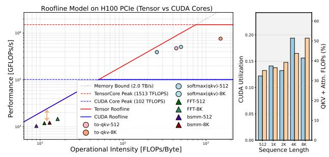

Fig. 3: Roofline model and CUDA utilization of LLaMA2-7B (FP16) during the prefill phase (N = 512, 8K) on NVIDIA H100 GPU.

sustaining high utilization across LLM workloads.

• Taped Out Chip: This work benefits from prior real hardware development, and the proposed accelerator is a simplified and reduced variant derived from a general-purpose dataflow design. A real-world tape-out brings higher confidence in the design feasibility and rationale.

The evaluation shows that our improved Transformer block reduces FLOPs to 30% of a shape-matched dense Transformer block, with <1.8% accuracy degradation. Relative to previous FFT-based Transformers, it improves accuracy by 1.9% while using fewer FLOPs. Our proposed accelerator achieves up to 5.8x speedup and  $2.6\times$  energy saving over prior SOTA sparse accelerators. The taped-out design, in the same technology node and with similar peak FLOP/s as the NVIDIA Jetson Xavier, achieves  $3.2\times$  speedup and  $3.1\times$  energy savings on the proposed sparsified Transformer models.

# II. BACKGROUND AND MOTIVATION

#### A. Prior Structured Sparsity in Transformers

Sparsity reduces effective computation and data movement by removing unnecessary weights, activations, or interactions. Structure makes this reduction predictable by constraining sparse patterns into regular blocks, staged transforms, or deterministic mixing paths rather than arbitrary irregular nonzeros. Together, they provide both algorithmic compression and architectural regularity, exposing reusable dataflow, bounded dependencies, and specializable execution schedules. Prior works [6, 15, 16, 17] exploit such structured operators to lower

the complexity of Transformer blocks. We next discuss the rationales and tradeoffs of two previous sparsity approaches, block-diagonal matrices (butterfly factorization) and Fourier transformations.

Limits of Prior Butterfly Sparsity. Fig 4(a) shows butterfly sparsity factorization. This method enables the replacement of dense weight matrices in both the projection and feed-forward phases with structured sparse matrices. The dense matrix can be approximated by a product of block-diagonal matrices [4, 6]. There are  $\log_2 n$  sparse factor matrices in total, each performing structured pairwise mixing at a fixed distance. We denote the k-th factor as  $B_n^{(k)} \in \mathbb{R}^{n \times n}$ , where n is a power of two and stage k mixes index pairs with distance  $2^k$ . Under a 2parameter  $2 \times 2$  mixing parameterization, each factor contains 2n parameters; thus the total parameter count is  $2n\log_2 n$ , yielding a compression ratio of  $2\log_2 n/n$  relative to a dense  $n \times n$  matrix. Multiplication with these butterfly factor matrices (BSMM) requires only  $O(n^2 \log n)$  complexity—an order-ofmagnitude reduction compared to the  $O(n^3)$  cost of dense projection. However, the decomposition of arbitrary large dense matrices itself incurs substantial compute overhead and becomes harder to solve in offline stage [6, 18], making the method less practical at parameter scales in LLMs.

Limits of FFT-based Attention. A prior alternative is to replace attention with Fourier-transform-based token mixing (Fig. 4(b)). This approach uses 2-D FFT [9, 19] to globally mix token and hidden dimensions through fixed Fourier bases. It removes attention's content-dependent pairwise weighting, but also loses the ability to adapt interactions to input-specific local or semantic dependencies. Although its cost is subquadratic (e.g.,  $O(ND\log N)$ ), it may underperform attention on tasks that rely on fine-grained token interactions, and it is less compatible with prefill/decode pipelines where cachebased incremental updates are critical [20, 21, 22].

# B. Structural Execution Mismatch on GPUs

Fig. 3 shows that butterfly kernels in the attention phase have lower OI and thus are bandwidth-dominated, yet their achieved performance still fall below the CUDA bandwidth roofline. This indicates a gap beyond memory-boundedness, rooted in the mismatch between butterfly dataflow and GPU execution. In particular, FFT pipelines involve multi-stage strided and shuffling accesses that break locality and hinder bandwidth utilization, consistent with the high cache-miss rates in Fig. 2. Unlike dense baselines that map efficiently to TCUs, butterfly stages are mostly executed as CUDA's vector primitives with frequent memory accesses and data reordering, limiting end-to-end speedup despite reduced FLOPs.

At a deeper level, this mismatch stems from the *stage-wise* dependency structure of BSMM and FFT (Fig. 8). As working sets expand across stages, they require ordered data exchanges that conflict with GPUs' bulk-synchronous, tile-regular execution, unlike 2:4 structured sparsity on TCUs, which preserves tile-local, dense-like access. Realizing butterfly permutations within tiles therefore incurs costly data shuffling. Although recent TCU-based FFT designs [19, 23] improve

Fig. 4: Improve transformer blocks using structured sparsity.

over CUDA cores, they still leave utilization headroom due to block decompositions that add extra work beyond the ideal  $O(N\log N)$  cost and only partially fill TCU pipelines.

Overall, these limitations motivate a closer look at butterfly sparsity in LLM workloads. We next characterize its structure and identify opportunities for our co-design.

**Challenge: Operator Heterogeneity.** Butterfly-based acceleration spans BSMM, FFT, and dense projections, which exhibit distinct dataflow patterns. This heterogeneity complicates specialization, seemingly requiring disparate hardware support.

**Opportunity 1: Unified Dependency Structure.** Despite their differences, FFT and BSMM share fixed, hierarchical butterfly stages (Fig. 4(c)), and dense projections also can be expressed as blocked producer—consumer streams. Together, they follow a shared stage-wise dependency representation, enabling a unified execution pipeline across these kernels.

Challenge: Limited Fine-Grained Parallelism on GPUs. BSMM introduces long-range stride mixing and load—sync cycles that prevent GPUs from exploiting fine-grained reuse within a single matrix—vector transformation.

**Opportunity 2: Predictable Cross-Layer Dataflow.** At the same time, BSMM retains an explicit staged structure. Each stage produces outputs that feed a small, predetermined set of consumers in the next stage, as shown in Fig. 8. This structured dependency enables partial results to be routed directly to subsequent stages, forming a fine-grained *multi-layer* dataflow pipeline without global-memory round-trips.

**Opportunity 3: Orthogonal Dimension Parallelism.** FFT-based sequence compression and BSMM projections expose abundant hidden- and token-level parallelism orthogonal to the multi-layer pipeline. It can be exploited through vectorization or temporal multi-iteration execution on spatial dataflow, ensuring throughput while preserving the staged schedule.

Takeaway: Both BSMM and FFT reduce to the same behavior: continuously stage-wise structured linear transforms that yield predictable producer-consumer dependencies.

Fig. 5: Dominant frequencies of QKV in layers of Llama2-7B.

Fig. 6: Freq. energy of token sequences in Layer-1/16 of Llama2.

#### C. Spatial Dataflow: The Base Design

Structured operators expose predictable cross-stage dependencies, but GPUs often execute them as separated stages with frequent synchronization, strided/permuted exchanges, and poor locality. In contrast, spatial dataflow architectures [11, 24, 25] can realize such ordered dependencies through explicit operand routing and deterministic mesh flow, sustaining parallelism through pipelined temporal execution. Prior work [10, 26] has exploited similar dataflow properties for sparse computation. Butterfly operators provide an even stronger structure: their dependencies are sparse, fixed, bounded, and strictly forward across stages. This not only reduces routing complexity, but also allows partial results to remain in flight across successive stages, forming a deeply pipelined dataflow instead of isolated stage-by-stage executions.

These properties motivate Multi-Layer Execution, which folds ordered cross-stage dependencies onto a compact spatial array to maximize data reuse, overlap communication with computation window, and sustain high PE/FU utilization.

# III. ALGORITHMIC INNOVATIONS

We first motivate our algorithmic innovation, the hybridized transformer block, which combines compression and sparsity techniques to speedup LLMs at modern scales.

### A. Semantic-Aware Fourier Compression

In this section, we explain how FFT compression is applied to context sequences. Transformer layers exhibit distinct semantic behaviors: shallow layers tend to focus on local, fine-grained token details, whereas deeper layers encode broader contextual information. From a signal-processing perspective, this manifests as different frequency profiles over the sequence-length N: fine-grained patterns map to higher-frequency components, while contextual abstractions shift energy toward lower frequencies. We confirm this by applying FFT to the Q, K, V vectors of Llama2-7B [27] across transformer layers (Fig. 5). The K spectrum in Fig. 6 shows that layer 1 is dominated by the high-frequency content on the right side, while layer 16 is smoother with low frequency dominated. Although Q/K/V are intermediate representations, their frequency profiles reflect how each layer aggregates

Fig. 7: Our approach: hybridizing structured sparsity and FFT (Decompression is symmetric and omitted).

semantic information along the sequence dimension. Motivated by the observed spectral features, we define a per-layer chunk length  $L_l$  as the sequence interval that matches the shortest prominent variation scale of layer l. Let  $\tilde{f}_H$  denote the highest-frequency spectral peak whose energy exceeds a relative threshold (e.g., a fixed fraction of the peak energy). We define the nominal scale  $\tilde{L}=N/\tilde{f}_H$  and quantize it to a power-of-two for hardware-friendly alignment:

$$\tilde{L} = N / \tilde{f}_H, \qquad L = \text{Pow2Round}(\tilde{L}).$$
 (1)

**High-level Idea**: Chunking from N fixes the FFT length to L and localizes token mixing in semantic-aware intervals, while enabling efficient, streaming-friendly Fourier compression that removes less-dominant high-frequency components with minor loss of informative content (Fig. 7(b)). Specifically, for each matrix of  $Q, K, V \in \mathbb{R}^{N \times D}$  after projection: (1) reshape into N/L chunks and perform N/L independent L-point FFTs per feature dimension to obtain chunk-wise spectra; (2) truncate the last (1-s) fraction of high-frequency coefficients along each L-dimension, keep leading informative sL components [28]; (3) apply an sL-point iFFT to the retained coefficients per chunk, re-generating a shorten token representation in a low-frequency subspace.

This process discards low-energy high-frequency components and yields a tunable compute–accuracy trade-off via s. We evaluate representative operating points (e.g., s=0.5, 0.75) in Sec. VII. The shortened sequence reduces prefill cost to  $O(s^2N^2D)$ , while also shrinking the attention matrix and easing buffering pressure and memory traffic. Because this quadratic term still dominates the attention pipeline, the additional chunked-FFT overhead of  $O(ND \log L)$  is comparatively minor, making FFT-based compression cost-effective.

TABLE I: Comparison of Butterfly-based Kernels in LLMs.

| Butterfly Kernel              | Prefill                       | Decode                    | Accutunable |                                       |       |
|-------------------------------|-------------------------------|---------------------------|-------------|---------------------------------------|-------|
| 2D-FFT BSMM                | Attn. QKV / FFN            | \ \frac{\lambda}{\lambda} | ×           | ×                                     | Prior |
| FFT Compress Hierarc. BSMM | Attn. / KV Cache QKV / FFN | \ \frac{1}{4}             | √ ✓      | $\checkmark$ $(s)$ $\checkmark$ $(B)$ | Ours  |

In prefill, semantic-FFT is applied to the prompt in fixedsize L-token chunks. In decode, although N grows, we keep L fixed and avoid re-transforming the full prefix. Completed chunks reuse cached compressed blocks, while new tokens accumulate in a local buffer. Once the buffer reaches L, we trigger FFT compression and append a new block. This yields an append-only, chunk-granular cache and amortizes FFT overhead over L tokens, remaining compatible with KVcache decoding process.

# B. Hierarchical Butterfly Decomposition

Conventional BSMM applies butterfly decomposition to the entire weight matrix, which is theoretically expensive and impractical for large LLM models [4, 6]. We instead adopt a hierarchical variant that confines butterfly structure within local tiles. The weight matrix W is partitioned into  $(D/B)\times(D/B)$  tiles of size  $B\times B$ , and apply butterfly factors only within each tile. Therefore, the total butterfly parameter computation becomes  $(D/B)^2 \cdot O(B \log B) = O\left(\frac{D^2}{B} \log B\right)$ , compared to the global factoring of  $O(D \log D)$ :  $O\left(\frac{\log D}{D}\right) \implies O\left(\frac{\log B}{B}\right) \tag{2}$ 

$$O(\frac{\log D}{D}) \Rightarrow O(\frac{\log B}{B})$$
 (2)

The tile size B therefore provides another tunable accuracy efficiency knob: under fixed butterfly factoring, increasing B enforces a stronger structured sparsity (lower complexity ratio,  $O(\log B/B)$ ), which reduces compute cost but tends to increase approximation error. This structure naturally maps to a hierarchical, tile-wise execution: inter-tile computation follows a coarse-grained blocked-GEMM dataflow, while intratile BSMM realizes fine-grained structured butterfly dataflow. Hybridized Butterfly Kernels. As listed in Table I, prior butterfly-based uses (e.g., FFT attention variants and global BSMM [6, 9, 29]) have mostly been studied in settings that do not directly address prefill-decode inference at modern LLM scales. We therefore couple semantic-aware chunked FFT (sequence dimension N) with hierarchical BSMM (hidden dimension D). Together, they expose parallelism in orthogonal dimensions and induce complementary dataflows. This motivates the spatial execution model introduced next, which co-designs hardware and mapping support to translate these algorithmic benefits into unified spatial acceleration.

# C. Operator Abstraction: Multi-Layer Execution (MLX)

Chunked FFT and hierarchical BSMM can be expressed as sequences of stages with layer-aligned, forward-only dependencies. More broadly, other structured-sparse operators with staged, stride-regular dependencies also fit this abstraction. Because each stage has a bounded array-resident footprint, execution can be folded over time: only a subset of stages

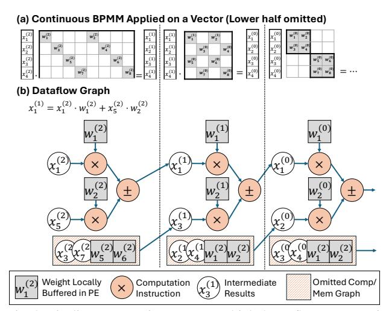

Fig. 8: Pipeline computations across multiple butterfly-sparse matrix multiplications (BSMMs).

resides on the array at once, while the others are timemultiplexed in dependency order. We call this execution abstraction MLX, which decouples logical stage depth from physical array size, enabling deep pipelining through folded execution on a compact PE array. A detailed formalization of MLX is provided in Sec. V-B.

#### IV. MLX ARCHITECTURE

This section describes how to realize MLX paradigm in hardware. As overviewed in Fig. 9, the architecture consists of a host controller, scratchpad memory and a mesh of processing elements (PEs) connected by a hop-encoded network.

#### A. BSMM as the Motivating Case for MLX Design

Among the operators in our hybrid model, BSMM provides the clearest illustration of why MLX is required. As shown in Fig. 8(b), each BSMM layer consumes the immediate output of the previous one, forming a deep and strictly layered dataflow with entirely predictable pipelined dependency [30, 31, 32]. In principle, consecutive BSMM layers could overlap on a spatial array to expose substantial but fine-grained parallelism. However, the full BSMM dataflow graph is far too large and too deeply layered to map onto a fixed-size mesh at once. Once compute units are shared across BSMM layers, the accelerator must introduce additional specialization to sustain high throughput: (1) schedule instructions so that different BSMM layers can execute in a staggered highly utilized fashion among FUs and (2) route intermediate results through short, predictable paths to their explicit downstream.

Our goal is to build such an accelerator that is specialized for large structured dataflow graphs with moderate arithmetic intensity, capable of orchestrating overlapped layer execution and explicit low-latency data transfer, as presented in Fig. 9(a).

## B. Skip-Hop NoC Topology for Layer-Folded Execution

Layer folding turns cross-layer dependencies into bounded, regular communication patterns. In BSMM and FFT, each folded layer accesses deterministic stride- $2^k$  neighbors, which are poorly served by global-memory traffic but naturally match a topology-aware mesh NoC. MLX therefore adopts a *skip-hop mesh* (Fig. 9(b)), extending each PE with fixed-distance links in addition to local-neighbor forwarding. These links directly span the folded dependency radius and reduce most cross-layer transfers to one or two hops.

To realize these transfers with minimal hardware state, MLX uses a hop-encoded data-movement primitive. Each xfer instruction carries only a residual hop count, routing direction, and destination register. Routers are stateless: when the hop count reaches zero, the value is written locally. Otherwise, the router consumes the largest admissible step—unit or skip—and forwards the data packet. This converts structured MLX dependencies into deterministic bounded-hop transfers, avoiding routing tables, virtual channels, and dynamic route computation. The same primitive naturally covers butterfly strides, FFT pairings, dense-MM systolic motion, and bounded window interactions (Sec. V-C), providing a unified spatial substrate for folded execution.

# C. Spatial PE: Enabling Layer-Folded Execution

μ-Architecture. MLX's folded-layer execution requires each PE to advance multiple layers concurrently: loading inputs for future layers, computing the current layer, and forwarding outputs from previous layers. Rather than tracking these interactions with fine-grained instruction-level hazards, MLX decouples each PE into four independent pipelines for memory movement, dataflow transfer, and heterogeneous arithmetic, as shown in Fig. 9(c). This decoupling is critical for MLX's hybrid operators, which mix real/complex arithmetic with activation and normalization functions, as shown in Fig. 9(d). Managing these heterogeneous units with a single instruction-level scheduler would involve substantial area and control complexity. MLX instead separates them into parallel pipelines, allowing each PE to schedule at *layer* granularity while naturally overlapping the phases of layers. As a result, multiple layers effectively time-share the same PE resources, sustaining high utilization over an active-layer window while keeping PE control lightweight.

Layer-encoded Instruction Store. Executing many MLX layers would require a large instruction buffer to hold all per-layer operations ( $\Theta(K \cdot I_{\text{layer}})$ ). Instead, MLX exploits a key structural property: each layer forms a *fixed reusable* instruction template whose internal order never changes. We therefore encode each logical layer as a compact *tagged block*, a short static instruction sequence plus a loop trip count, that captures the exact computation footprint of that layer. These tagged blocks are revisited repeatedly as the folded execution window slides forward, decoupling the instruction-store size from the total number of layers. Only a small set of active blocks must reside in the PE at any time, allowing a constant-footprint instruction hierarchy regardless of operator depth.

(1) Layer-aligned scheduling. Tagged blocks align the hardware scheduling unit with MLX layer boundaries. Each block carries a tag, a buffered instruction sequence, and a loop tripcount n, allowing the PE to track readiness, progress, and

Fig. 9: The spatial accelerator design of MLX architecture.

completion at *layer* granularity. This avoids per-instruction bookkeeping, large dependency tables, and fine-grained hazard metadata, while preserving the semantic boundaries required by folded-layer execution.

(2) Active-window pipeline overlap. Tagged blocks act as schedulable entries in the active-layer window across decoupled PE pipelines. Within this window, different folded layers can occupy different pipeline phases simultaneously—one loading inputs, another computing, and a third forwarding results. The tag identifies which active layer each block belongs to, allowing the PE to advance multiple layers as a structured pipeline. This exposes cross-layer parallelism while keeping control coarse, predictable, and low-cost.

**Hybridized Scheduling.** MLX exposes a scheduling regime that is neither fully dynamic nor fully static. A fully dynamic scheduler [12] must track fine-grained dependencies across operations within FFT/BSMM layers, whereas a fully static schedule would require the compiler to jointly reason about routing, cycle timing, and resource conflicts across all folded layers. MLX instead separates intra-layer determinism from cross-layer elasticity. Within each folded layer, dependencies are local and ordered, allowing the compiler to emit a static instruction sequence. Across layers, communication is reduced to a small set of topology-aligned tag events, such as transfers and forwardings, which hardware arbitrates elastically [33, 34]. Thus, software fixes the deterministic local schedule, while hardware only manages tag-level cross-layer coordination, reducing scheduling state without relying on fine-grained dynamic wakeup or global cycle-level planning.

In Fig. 9(c), each folded layer is a coarse execution window identified by a tag. The arbiter sees only the layer's *frontier* instruction inst\_i and resolves contention across decoupled pipelines. Tag IDs encode the valid *partial order* among layers. Prioritizing smaller tags preserves dependency correctness while allowing layers to overlap and hide latency. When a

layer's LD completes, it sets a ready bit in the tag entry to enable the next stage(s) (compute and/or xfer); each pipeline selects among ready tags subject to resource availability. If multiple layers are ready, the arbiter can round-robin, using Tag ID as a tie-breaker. Fig. 9(d) shows how this coarse arbitration works. When tag1's add and tag2's mul contend for the compute pipeline, the arbiter grants the lower tag and stalls the other block, making decision at block/tag granularity.

### D. Design Parameters

The design parameters are determined by the characteristics of MLX operators and the hybrid network model:

**Principle 1 – SIMD Width.** For GEMM, the compute block of a layer operates on a  $n \times n$  dense tile. A tile performs  $n^3$  MACs while reading  $2n^2$  input operands, giving a baseline compute—traffic ratio of n/2 and a necessary condition  $n \ge 4$  to sustain non-trivial reuse. BSMM tiles impose an orthogonal constraint: butterfly sparsity must be meaningful. For a full n-point butterfly with  $k = \log_2 n$  stages, the nonzero density is  $\frac{2\log_2 n}{n}$ , which suggests a minimum power-of-two width of  $n \ge 8$  for sparsity to be effective. Therefore, 8-way SIMD is a necessary *lower bound* that our reduced design adheres to, while our full design adopts 32-way SIMD to better exploit parallelism and sustain higher throughput under MLX.

Principle 2 - Mesh Size and Instruction Storage Co-Scale. As the meshscales out, MLX's dependency radius grows, increasing physical hop distances for inter-layer loads and butterfly exchanges. This increases the communication latency in cycles, including  $T_{\rm load}$  and  $T_{\rm xfer}$ . To sustain utilization, each active layer block must provide sufficient compute to hide the dominant communication latency:

$$T_{\text{compute}}(\text{block}) \ge \max(T_{\text{load}}, T_{\text{xfer}}).$$

As a result, larger meshes require a larger active-layer window and proportionally more on-chip instruction storage to keep the pipelines full. Because MLX schedules execution at the granularity of tagged blocks, each block can exploit structured intra-block reuse (e.g., arithmetic reuse in butterfly primitives or intra-tile reuse in MM), thereby raising its effective compute intensity in contrast to instruction-level dataflow where operands are often consumed once within a node. This higher block-level intensity helps hide the stride-inflated communication latency,  $T_{\rm load}$  and  $T_{\rm xfer}$ , as the mesh scales. Coverage can therefore be maintained by enlarging the block's compute budget C or the number of concurrently active tags  $B_T$ :

$$B_T \cdot C \geq T_{\text{load}} + T_{\text{xfer}}.$$

Consequently, instruction-store capacity is governed not by per-kernel instruction count, but by the *coverage window* needed to amortize load/transfer latencies at scale. Based on this trade-off between scale and latency, we choose a compact design point: a  $4\times 4$  mesh with 32 instructions per PE, which is sufficient to satisfy the coverage condition.

**Principle 3 - Precision Support and Non-linearity.** Our attention model supports full-sequence FFTs up to 8192 points, requiring 4096 distinct twiddle factors. Since sub-FP16

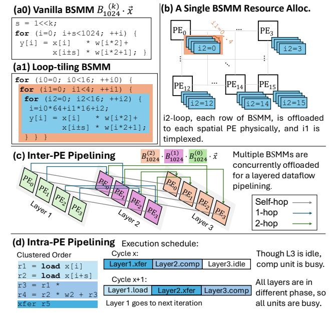

Fig. 10: Allocating computing resources for BSMMs. (For clarity, batch-based SIMD and vertical hops for stride =4,8 are omitted.)

precision destabilizes butterfly accumulation, MLX uses FP16 as the minimum stable precision. Transcendental units are integrated into each PE to support nonlinear operations, but they operate at only a quarter of the SIMD width.

**Host Controller:** In Fig. 9(a), the accelerator is orchestrated by a small RISC-V host core, which handles outer-loop control while issuing compact commands to the spatial array. Only minimal ISA extensions are required to load MLX configurations and coordinate memory movement, keeping the control plane compatible with existing RISC-V software.

# V. MAPPING LLM OPERATORS UNDER MLX

We describe how to map three core structured operators onto MLX, and present the formalization and abstraction for it.

# A. Mapping Structured Operators of Hybrid Model

**BSMM as an Example.** Fig. 10(a) abstracts a butterfly-sparse matrix–vector product. We express it as three nested loops. As shown in Fig. 10(b), the innermost loop i2 is fully unrolled across the  $4\times 4$  mesh. The middle loop i1 runs locally within each PE, and the results then flow across the array in subsequent butterfly-layer execution. While the outer loop  $i_0$ , together with an independent dimension  $i_{\perp}$  orthogonal to the butterfly computation, advances as dataflow graph iterations driven by an on-chip sequencer. This decomposition yields a closed-set sample of 64 output elements that can be computed concurrently across the array (for clarity, we omit vectorization details here and focus on the dependency structure). The closed set represents the largest footprint whose producer–consumer dependencies remain entirely within the PE array, allowing us to pipeline MLX without spilling intermediate values.

**Stride-aligned Data Routing.** Butterfly layers exhibit deterministic stride patterns  $(\pm 2, \pm 4, \pm 8, ...)$ , which map directly

to hop distances on our skip-hop mesh. As shown in Fig. 10(c), each  $PE_x$  routes its partial sum to the consumer  $PE_{x+s}$  at an offset equal to the layer's stride. The further stride=4, 8 will be converted to a 1-/2-hop *vertically* (y= $\pm 1, \pm 2$ ), which is omitted for clarity in Fig. 10(c). This alignment allows several BSMM layers to execute concurrently without routing contention, forming a strictly layered on-chip pipeline.

Intra-PE Pipelining via Tagged Blocks. Each tagged block has a fixed instruction layout into groups: loads at the beginning, comps in the middle, and xfers at the end (Fig. 10(d)). This regular layout allows the PE's decoupled memory, compute, and transfer pipelines to overlap blocks from different layers. Although the memory pipeline may occasionally idle in middle layers, the dominant compute pipeline remains continuously occupied. Thus, MLX replaces fine-grained operation scheduling with lightweight tagged-block orchestration, sustaining high utilization with limited hardware complexity. Utilization results are reported in Sect. VII-C.

**Optimizing Data Layout.** In Fig. 11(a), the scratchpad SRAM uses SIMD-striped rows and supports two access patterns. Column-wise access aligns SIMD lanes with the sequence axis N for BSMM, while row-wise access streams contiguous elements along the hidden axis D for chunk FFT. With row width V (here  $V\!=\!8$ ), this lane-striped layout keeps the orthogonal SIMD patterns of FFT and BSMM aligned to the same SRAM organization. It therefore avoids full-array transposes between operators, allowing intermediate data to remain in-place and array-resident for a continuous FFT-BSMM dataflow.

Closed-set Locality. In chunked FFT, each L-point segment forms a closed dependency set. A k-layer BSMM has the same property: with block size  $B = 2^k$ , an *n*-element vector partitions into  $\frac{n}{B}$  disjoint closed sets of size B, and all butterfly interactions stay within each set. However, as L or B grows, the default index/layout ordering turns layer exchanges into long-stride shuffles (e.g., half-array strides when B = n/2), breaking spatial locality and forcing intermediates to traverse long distances on the mesh (Fig. 11(b)). Our key observation is that the butterfly dependency graph is algebraically partitionable: FFT and BSMM can be reordered to strictly respect their closed sets. This enables decomposing a long butterfly pipeline into reusable dataflow stages. Between stages, an I/O shuffle reindexes scratchpad values using the access primitive in Fig. 11(a). As shown in Fig. 11(c), the shuffled stage-2 value  $B_8'(0)$  is logically inherited from stage-1  $B_8(2)$ , but is remapped to the same spatial footprint and execution template as  $B_8(0)$ . Thus, long-range butterfly dependencies are converted into repeated compact local dataflows plus a bounded number of inter-stage exchanges.

# B. Generalizing MLX from Closed-Set Locality

A key insight from *closed-set locality* is that many structured operators (e.g., FFT, BSMM, block MM, and structured attention) share a common execution form: their dataflow graphs follow a forward-only layered dependency structure over *repeatable* local components with *bounded* interfaces. MLX exploits this structure to (i) compile each component

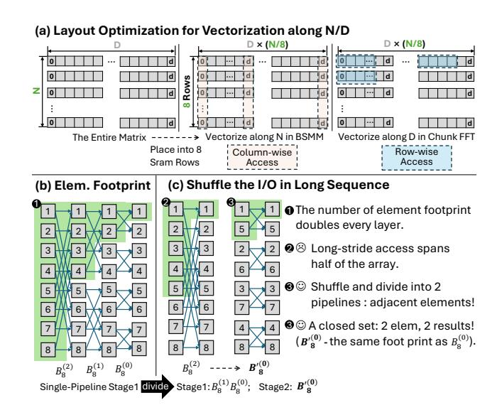

Fig. 11: (a) Optimize data layout for SIMD-friendly packing; (b) Data footprint of BSMM; (c) Shuffling for a smaller-footprint closed set.

into a short tagged instruction block and (ii) execute layers as a deep pipeline on a fixed mesh with bounded in-flight state. Closed Dependency Components (CDCs). Given an operator dataflow graph G = (V, E), a CDC is a subgraph  $C \subseteq V$  that is closed to incoming dependencies:

$$\forall v \in C : (v) \subseteq C \cup \operatorname{In}(C),$$

where  $\operatorname{In}(C)$  denotes external inputs to C. A CDC forms a self-contained local update region with bounded locality. Unlike arbitrary tiling, a CDC is defined by the operator's closed dependency pattern rather than by a heuristic blocking choice. Each CDC has a fixed input/output interface: its exchanged values are determined only by the template parameters, such as butterfly width or MM/CONV block shape, and do not grow with the overall problem size. Thus, structured operators contain many recurring CDC instances with identical interfaces, allowing MLX to reuse the same tagged-block template across them.

**Forward-Only Layering.** Many structured operators can be expressed as CDC layers  $\{C_0, \ldots, C_K\}$  where each edge is intra-layer or to the next layer:

$$(u \rightarrow v) \in E \Rightarrow \ell(v) = \ell(u) \text{ or } \ell(v) = \ell(u) + 1,$$
 (3)

with layer index  $\ell(\cdot)$ . CDCs within a layer are parallel and inter-layer dependencies are strictly forward-only, forming a pipeline without long-range or cyclic dependencies. As depth increases, layers typically expand interaction scope from local to more global while preserving the adjacent-layer constraint. **Encoding of Layered Routing.** MLX assigns each CDC a lightweight index  $\ell$  for its pipeline class. According to Eq. 3, a CDC communicates only within  $\ell$  or to  $\ell+1$ , so  $\ell$  directly selects the next-stage routing class, while the endpoint PEs are determined by a static placement of CDC-to-PE. For structured operators, transfers often belong to a small set of affine offsets, so routing can be compactly parameterized by  $(\Delta x, \Delta y)$ , but the key property is the *finite routing class* induced between

Fig. 12: Folded MLX dataflow for sliding-window attention: overlapping FMA/FMAX/FEXP stages on the same 2D array.

layers. Each CDC is executed by a loop-driven tagged block and is triggered by a tag-based dependency:

$$C_i \mapsto loop(k) tagged\_kernel_i(k),$$

where a PE replays a short tagged instruction block across CDC instances, amortizing decode and operation scheduling. **Principle and Implications.** Any structured operator that can be expressed as CDC layers  $(C_0,\ldots,C_K)$  over closed working sets  $S_0\subseteq\cdots\subseteq S_K$  with strictly forward dependencies (Eq. 3) is MLX-executable. The inter-layer edges of CDC form a deterministic forward pipeline, eliminating global scheduling. This structure also enables *spatial folding*, which overlays many logical CDC layers onto a fixed mesh and decouples logical depth from physical array size. In practice, folding need not keep all logical layers active. A small in-flight window is sufficient to sustain FU utilization while bounding on-chip buffering. The same principle also extends to other layered structured operators beyond butterfly kernels.

## C. Structured Kernels Beyond Butterfly Operators

To demonstrate that MLX is not limited to FFT/butterfly-style homogeneous kernels, we include a second structured workload example from transformer inference: a sliding-window attention (SWA) tile. Although its computation mixes different primitives (matrix accumulation, reductions, exponentiation, and normalization), its dataflow can still be expressed as a small sequence of CDC layers with strictly staged dependencies, which directly maps to MLX folding on the same 2D array, as shown in Fig. 12: (i) windowed score accumulation ( $QK^{\top}$ , FMA-dominant), (ii) row-wise max reduction, (iii) exponentiation and normalization statistics (FEXP + sum/broadcast), and (iv) weighted accumulation and normalization (SV, FDIV, FMA).

These CDC layers form an adjacent dependency chain where each layer consumes only the immediately preceding layer's CDC-boundary outputs (plus tile-local state). By *folding* the logical layers onto a compact on-chip matrix pipeline on the same PE array, CDC batches from different layers can be partially in-flight, while all inter-layer communication occurs only through explicit CDC-boundary xfer operations, making transfers checkable and bounded. Since different lay-

Fig. 13: Mapping a dense MM to MLX in multi-layer dataflow.

ers stress different FU primitives (FMA, FMAX and FEXP), tagged-block execution can easily exploits this heterogeneity. With sufficient latency-window coverage at layer granularity, MLX achieves steady-state overlap while keeping the number of concurrently active layers bounded.

MM kernels also fit MLX. In Fig. 13, each PE computes an  $8\times 8$  SIMD-aligned tile and accumulates psums under propagation of forward-only operands across the  $4\times 4$  mesh. We then fold a sequence of tiles onto this compact mesh and issue them as MLX layers, using a fixed load-comp-xfer template to stagger phases and overlap work. This is beneficial when the per-tile compute is short (e.g., small K) or tiles are partial (common in attention), where folding amortizes fill/drain and boundary overheads to improve utilization.

### VI. METHODOLOGY

# A. Software / Hardware Implementation

Our design inherits practical experience from a real tapedout design. The proposed MLX architecture is a profiledriven, specialized subset of a general-purpose dataflow design implemented in Verilog RTL and synthesized in 12nm @1GHz using Synopsys DC. Profiling across FFT, BSMM, and dense LLM kernels revealed that many features of the general design were unnecessary for structured operators and impeded the multi-layer execution model. This enabled a streamlined architecture tailored explicitly for hybrid LLM workloads.

**Power & Area:** The floorplan of the full taped-out design (Fig. 14) serves as the reference for projecting area and power. Guided by the parameter analyses in Sec. IV-D, we reduce SIMD width from 32 to 8 and *remove unused units* such as vector shuffles, division, and high-precision floating-point pipelines. The resulting reduced design occupies only 10% of the area and 8% of the power of the original chip (Table II). The full-design power is measured post-silicon, while the reduced-design power is estimated from post-synthesis reports. **Performance:** We report performance using both (i) the cycle-accurate MLX simulator used during architectural exploration and (ii) measurements from the taped-out hardware. Both numbers will be reported to compare with counterpart accelerators with the same peak performance as shown in Table, IV.

**Software Deployment:** A RISC-V CPU serves as the host controller for our accelerator. To embed spatial accelerator bitstreams into C programs, developers write dataflow-style assembly specifying each PE's operations or use a LLVM-based C compiler [35] for programming. A lightweight "spatial assembler" then compiles this text format into binary and exports it as a header file for configuration on the MLX.

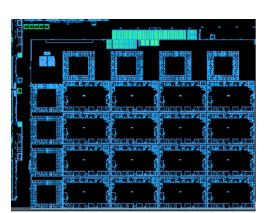

|                    | Area-mm 2 | Power-mW    |
|--------------------|----------------------|-------------|
| Config Network     | 0.018                | 11.3        |
| Data Network       | 0.092                | 56.2        |
| Control Logic      | 0.011                | 7.5         |
| Tag Buffer         | 0.019                | 9.3         |
| Register File      | 0.044                | 28.7        |
| FU (SIMD32)        | 0.298                | 252.4 (70%) |
| PE (Skip-hop cost) | 0.482 (6.2%)         | 365.4       |
| PE Array           | 7.712                | 5846.4      |
| Ruduced (SIMD8)    | 0.772                | 433.8       |

Fig. 14: MLX floorplan. TABLE II: Area and Power.

## B. Benchmark Models and Hardware Baselines

- (1) From the algorithmic perspective, we evaluate our hybrid sparse method (FFT Compression and BSMM) on accuracy and computation reduction, using representative models of BERT, VIT as well as two LLMs Llama2-7B and InternLM2-7B, as detailed in Table III with their acronyms marked in parentheses. We also make a speedup comparison on the H100 for the two attention implementations of Llama2-7B.
- (2) From the architectural perspective, MLX provides a unified execution pattern for structured operators. To assess how this translates into hardware efficiency on LLM workloads, we evaluate MLX using a set of representative hardware baselines, as summarized in Table IV.

To ensure a fair and comprehensive comparison, we adopt a two-pronged evaluation strategy: the real taped-out design (1 TOp/s) is compared against an NVIDIA GPUs, while a reduced 256 GOp/s version is tuned in our simulator [36] to match several prior algorithm—accelerator co-designs with identical peak throughput [26, 29, 37, 38, 39, 40]. The performance numbers for these baselines are quoted directly from their original papers. To distinguish MLX's architectural benefit from algorithmic (ALGO) savings, we also list the FLOP reduction achieved by each prior work on T in the last row of Table IV. Jetson Xavier is chosen for its comparable peak performance (1.7 TFLOP/s vs. our 1 TFLOp/s) and identical 12 nm technology node. At last, We also compare against two more advanced GPUs (AGX Orin and RTX-3090) to demonstrate the generality of our efficiency gains.

# VII. EVALUATION

### A. Validating Algorithmic Improvements

As shown in Fig. 15, we evaluate both FFT-CMP and hierarchical BSMM on multiple models to confirm that the proposed structured operators provide predictable accuracy-compute tradeoffs across typical Transformers.

The ViT model [2, 42] is included because its modest size allows full training from scratch, enabling a clean, theory-oriented validation of our butterfly sparsity methods. Replacing dense projections with block-based decomposition ("bd.\*") reduces FLOPs by 45–55% but only with slight accuracy loss. Using 2D-FFT token mixing as in FNet ("fnet.fft") [9] yields a similar compute reduction but suffers a 2–3% accuracy degradation. In contrast, our FFT-CMP at s=0.5 achieves a 65% FLOP reduction with only a 1.6% accuracy drop relative to the dense baseline, outperforming existing FFT-based transformers [9] in both efficiency and accuracy.

TABLE III: Single-layer Transformer (T) & 5 Models (V, F, B, I, L).

| Bench. | Trans. ( <b>T</b> ) [41] | VIT (V) [42] | FABNet ( <b>F</b> )[29] | BERT ( <b>B</b> ) [1] | BERT ( <b>B0</b> )[43] | InternLM2 -7B ( <b>I</b> ) [44] | Llama2-7B (L) [27] |
|--------|--------------------------|-----------------|----------------------------|--------------------------|---------------------------|------------------------------------|-----------------------|
| D      | 1K                       | 196             | 128                        | 8K                       | 512                       | 1K to 4K                           | 128 to 2K             |
|        | 512                      | 1K              | 768                        | 1K                       | 1K                        | 4K                                 | 4K                    |

TABLE IV: Baseline Accelerators and Target Workloads.

| Hardware      | Freq. (GHz) | Peak Perf (Op/s)                           | Tech. Node (Norm. Ratio 6 ) | Power (W)                                  | Bench. | Algo. FLOP Saving on T                     |
|---------------|----------------|-----------------------------------------------|-------------------------------------------|-----------------------------------------------|--------|-----------------------------------------------|
| MLX           | 1.0            | 1 T 1 (FP16) 256 G 2 | 12 nm                                     | $5.85^{1} + 0.6^{3}$ $0.41^{2} + 0.11^{3}$ | All    | 4.1 ( <i>s</i> =0.75) 6.1 ( <i>s</i> =0.5) |
| Jetson Xavier | 1.0            | $1.7T^4(6T^5)$                                | 12 nm                                     | 15                                            | L      | 1                                             |
| FABNet[29]    | 0.2            |                                               | 16nm (FPGA)                               | 11.35                                         | T, F   | 13.5                                          |
| SpAtten[37]   | 1.0            |                                               | $40\mathrm{nm}~(5\times)$                 | 1.06                                          | T      | 3.0                                           |
| DOTA[26]      | 1.0            |                                               | $22 \mathrm{nm} (2\times)$                | 0.86                                          | T      | 5.0                                           |
| Sanger[38]    | 1.0            | 256 G                                         | $55 \mathrm{nm} (7\times)$                | 0.80                                          | T      | 5.9                                           |
| ViTALity[39]  | 0.5            |                                               | $28  \text{nm}  (3 \times)$               | 1.46                                          | T      | 5.9                                           |
| BitVert[40]   | 0.8            |                                               | 28 nm                                     | 0.17 (int8)                                   | T      | 4.0                                           |

 $^1$  Full design;  $^2$  Reduced design;  $^3$  Mem. power;  $^4$  CUDA peak perf.;  $^5$  TCU peak perf.;  $^6$  Normalized to 12 nm node using the  $P \propto C \cdot V_{dd}^2 \cdot f$  model.

BERT [1] is also small enough for retraining, allowing us to apply layer-wise FFT compression using the semantic interval length L (Eq. 1) together with hierarchical BSMM sparsity (( $\overline{3}2$ )). Fig. 15(b) shows five cases applying our hybrid method to the last k layers with (s=0.5). As k increases, the computation drops predictably, while accuracy degrades modestly. Replacing all 12 layers achieves 69% FLOP reduction with only 1.75% EM and 1.3% F1 loss.

Fig. 15(c,d) evaluates FFT compression in the attention phase and block-based BSMM in QKV projection for LLMs, with LoRA fine-tuning [45] to refine the compressed layers. We tested on Winogrande-xl [46] (N=512), Wikitext-2/103 [47] (1K/2K), and Ada-LEval [48] (1K/2K/4K). We progressively apply structured operators to more than 60% of transformer layers. With respective uniform settings of s=0.75 and s=0.5, we reduce 57%-64% and 67%-72% of the QKV+Attention computation within the modified layers, with an overall accuracy drop below 1.45% across all variants. Although some layers tolerate even more aggressive compression, we use a uniform s to clearly show sensitivity to compression strength and avoid per-layer tuning. (e.g., ada-2k/4k and wiki-103), InternLM2-7B with GQA [49] yields greater savings at s=0.5 due to its reduced cost of KV projection. In auto-regressive text generation, we observe that the compressed models can converge in fewer epochs and yield slightly lower perplexity. In Fig. 16, we also evaluate the sensitivity of hierarchical BSMM to block size  $B \in \{16, 32, 64\}$ . Larger B achieves greater linear-layer FLOP reduction but generally incurs larger accuracy loss. Across our evaluated long-context settings, B = 32 provides the best tradeoff, while B can be further co-tuned with FFT compression s to reach different accuracy-efficiency points.

**Performance on H100:** To assess how well modern GPUs handle butterfly sparsity, we deploy our hybrid compressed Llama2-7B on H100 under two benchmarks: eager attention and FlashAttention2 (FA) [50, 51], using a conservative sparsity setting - (s=0.5, B=32). Fig. 17 shows the speedup over

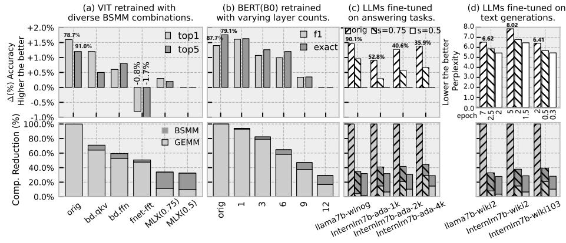

Fig. 15: Accuracy and efficiency sensitivity under FFT cmp. and BSMM (Compute reduction measured over QKV proj. and attn. in representative sparsified layers (>60%) of Llama2 and InternLM2).

Fig. 16: Accuracy and perplexity sensitivity to block size B under fixed s=0.75 on three models.

Fig. 17: H100 Speedup on Llama2-7B (s=0.5, B=32).

the original model. In the compute-heavy prefill phase, FFT-CMP achieves up to  $2.72\times$  speedup over eager and  $1.64\times$  over FA for long sequences, while showing little benefit for short ones. The gains on H100 are modest because FFT-CMP runs at the *PyTorch* level without fusing with FA, and TensorCores provide limited support for butterfly sparsity, causing execution to fall back to CUDA cores. In the decode phase, FFT-CMP reduces KV-cache traffic, and together with block-BSMM yields a 1.4– $1.9\times$  end-to-end speedup.

# B. MLX Performance

Prior Sparse Accelerators: Fig. 18 compares MLX with five representative sparse accelerators, using technologynormalized energy numbers quoted from the original papers [26, 29, 37, 38, 39, 40] and scaled with the process factors in Table IV. SpAtten is the baseline ("1.0"). Under two settings of s=0.75/0.5, MLX achieves  $2.93-4.10\times$  and 4.14-5.8× speedups over the first three accelerators under dynamic sparsity, benefiting from a unified butterfly acceleration in both attention and projection. Compared to ViTALiTy, which targets low-rank vision transformers, MLX delivers 1.28× and 1.81× speedups at comparable FLOP reductions. MLX also outperforms BitVert by 2.3×; BitVert reports higher energy savings (2×) mainly due to its INT8 precision, whereas MLX operates in FP16. Fig. 18(c) further reports hardware–software affinity (speedup normalized by FLOP savings). MLX attains consistently high affinity because BSMM/FFT are strongly FMA-dominant: most cycles are spent on regular MAC operations in the PEs, with only modest control and bookkeeping overhead, in contrast to irregular sparse kernels that require data-dependent indexing or selection. This also underscores the practical ease of deploying butterfly sparsity.

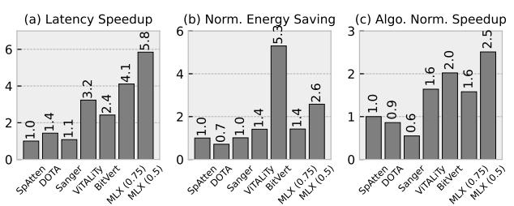

Fig. 18: Comparison with prior sparse accelerators on a single transformer block (N=1024, D=512).

TABLE V: FPGA Resource Usage Comparison.

Fig. 19: Speedup o/ FABNet-Large.

Real-world Butterfly Accelerator: FABNet [29] is the closest prior design, proposing an FPGA-based butterfly-accelerator co-design that uses 2D-FFT for attention and global BSMM for FFNs, excluding exponentiation operators. We re-implement the same model and parameter settings on MLX. Fig. 19 shows that MLX delivers  $1.19 \times -1.30 \times$  end-toend speedup across context lengths, with 1.14× LUT overhead (Table V) under this workload setting; LUTs are the limiting FPGA resource in FABNet-style deployments [52]. Breaking down the gains, 2D-FFT attention improves by  $1.11 \times -1.23 \times$ , while BSMM-FFN improves by  $1.21 \times -1.31 \times$ . The smaller FFT-side gain is consistent with FABNet's stronger specialization for complex-valued butterfly operations, which narrows MLX's FFT headroom. The peak speedup at 512 occurs when the workload fits MLX's largest single-stage BSMM footprint, avoiding stage transitions and associated SPM round-trips.

**NVIDIA Xavier GPU:** Fig. 20 compares eight kernels of Llama2-7B's for short (256) and long (8K) token inputs, on Jetson Xavier and MLX. In Fig. 20(a), MLX 's butterfly-sparse kernels achieve 3.1× speedup and 3.2× energy savings compared with Xavier's dense TensorCore kernels. Fig. 20(b)

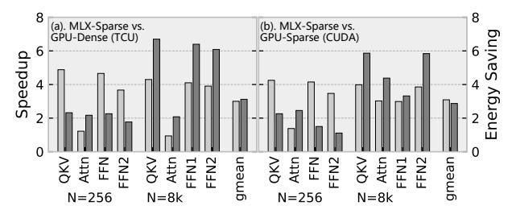

Fig. 20: Full design's speedup over NVIDIA Jetson Xavier.

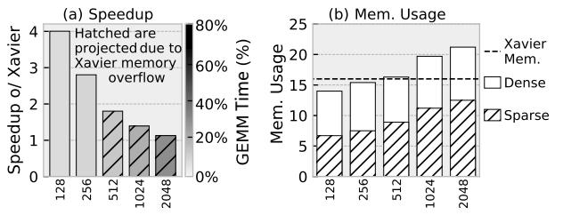

Fig. 21: (a) End-to-end speedup of Llama2-7B over Jetson Xavier on different context length. (b) Memory usage (GB).

further shows  $3.2\times$  speedup and  $3.1\times$  energy savings on average over sparsified CUDA execution. On GPUs, dense kernels often use Tensor Cores, whereas butterfly and structured-sparse kernels typically run on CUDA cores. This compresses the relative gain from sparsity while highlighting the value of MLX 's specialization in structured acceleration.

Fig. 21 presents an end-to-end comparison between a sparsified Llama2-7B on MLX 's and a dense model on Xavier. All inference operators, including RMSNorm and positional embeddings, are supported by MLX via instruction-driven programmability and the required compute units (vector shuffle and transcendental supports) in our full design. Due to its 16 GB memory capacity, Xavier cannot sustain over a 512token context, while MLX processes sequences up to 2048. Although speedup diminishes when dense linear layers dominate, MLX maintains robust advantages across long-context settings enabled by BSMM and FFT-CMP sparsification.

# C. Resource Utilization and Scalability

Fig. 22 summarizes PE utilization on BSMM and FFT-CMP kernels. For small sizes, kernel-launch overhead is around 17%, but it drops below 12% as kernel sizes grow. We group load/store/transfer units as a unified data-supply pipeline, which exhibits consistent latency behavior. BSMM and FFT show similar utilization trends since both map to multi-stage butterfly operators, with minor differences caused by real versus complex arithmetic. Overall compute utilization reaches about 90%, showing that our instruction scheduling effectively hides data-movement latency and pipeline idleness.

We evaluate scalability using transformer blocks of sizes  $N=\{512,1K,2K,4K,8K\}$  with D=512, batched by 8 to provide sufficient parallelism for all designs. Four configurations are tested by combining 8- vs. 32-way SIMD with  $4\times4$  vs.  $8\times8$  meshes, each offering  $4\times$  peak compute scaling. As shown in Fig. 23, both dimensions scale nearly linearly, yielding mean speedups of  $3.9\times$  (SIMD) and  $3.6\times$  (mesh), and up to  $14\times$ 

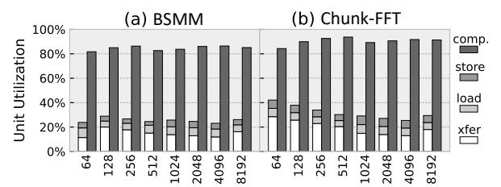

Fig. 22: PE resource utilization breakdown.

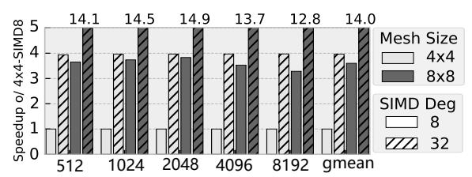

Fig. 23: The scalability over SIMD degree and mesh size.

when scaled jointly. SIMD benefits directly from token-level parallelism, but cannot grow indefinitely due to multi-ported *registerFile* cost and limited per-layer parallelism.

Mesh scaling offers a more sustainable path by exploiting inter-layer pipelining. A lightweight skip-hop interconnect reduces multi-hop latency and enables near-linear scaling for the  $8\times8$  mesh, with almost 6.2% area overhead and modest timing overhead even at 1 GHz in 12 nm.

#### D. Sensitivity on Structured LLM Workloads

Fig. 24 compares MLX against stronger AGX Orin and RTX-3090 across our structured-workload suite, spanning multiple models and sequence settings at batch size 32. Despite substantially lower peak compute and bandwidth, MLX still outperforms Orin on a subset of butterfly-style operators. On several small FFT/BSMM cases, the gap to RTX also narrows, which is partly attributable to MLX's compact fabric and lower launch overheads. Across operators from FFT-CMP to BSMM with increasing block sizes and SWA, the computation pattern becomes progressively coarser and more tile-regular. This increased regularity exposes more bulk parallelism and maps more naturally to GPUs' dense execution, so MLX's speed advantage correspondingly diminishes. Even so, MLX retains an average normalized speedup of  $3.6 \times$  and  $2.3 \times$  on the two SWA cases (W: window width, Q: block size).

To factor out peak-resource differences, Fig. 25 reports roofline utilization, i.e., achieved performance normalized to the roofline limit under compute and bandwidth constraints. Butterfly structured operators achieve 52%–84% utilization on MLX, compared to 12%–29% on Orin and 8.2%–31% on RTX, indicating more efficient execution of deep stagewise dependencies on MLX. For SWA, MLX's overlapped pipeline sustains 43%–75% FMA utilization. The remaining gap is primarily due to bandwidth loss from windowed KV traffic, yet MLX still exceeds the GPU baselines (10.8%–31% and 8.9%–28%). Overall, these results indicate that MLX generalizes beyond butterfly sparsity to efficiently support a broader range of structured operators.

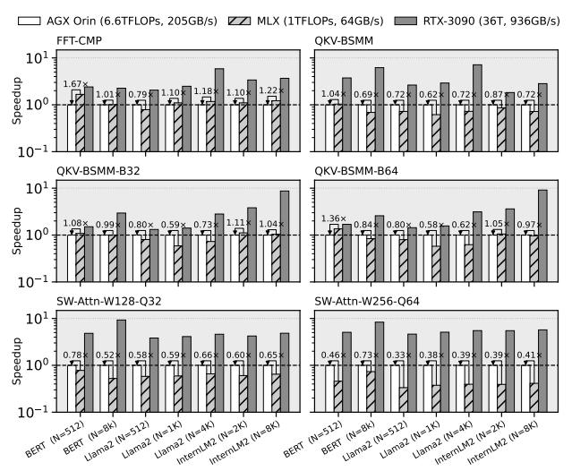

Fig. 24: Structured-operator sweep on Orin and RTX-3090.

Fig. 25: Utilization  $(P_{\rm achieve}/\min(P_{\rm peak}, OI \cdot BW))$  of FMA operation on four representative model and sequence cases.

# E. Discussion on Generalization and Flexibility

MLX handles diverse shapes and long sequences by decomposing semantic-aware FFT and hierarchical BSMM into parameterizable CDC blocks (L, B), ensuring efficiency scales with block count while preserving footprint and locality. MLX primarily relies on structured, predictable dataflow that is pre-compiled into CDC boundaries and executed via tagged blocks. A lightweight assisted runtime provides essential flexibility by scheduling these pre-defined CDC sequences, handling coarse-grained irregularity (e.g., bucketed MoE). For more irregular patterns, MLX maintains functional correctness via credit-based flow control, though extreme imbalance can introduce bubbles and reduce utilization. Since the current design point keeps xfer compact and efficient, supporting firegrained dynamic patterns would require predicated transfers (mask/segment encoding) and additional control state, reflecting a clear flexibility-efficiency trade-off left to future work.

# VIII. RELATED WORKS

We discuss related work in sparse transformer acceleration and spatial dataflow to situate MLX within prior research. **Sparse Accelerator Design:** Recent accelerators [24, 26, 37, 53, 54, 55] primarily target dynamic or unstructured sparsity, or exploit sparsity-like patterns in graph workloads [56, 57, 58]. Structured sparsity remains less explored in practice.

While prior analytical frameworks study its potential benefits [59, 60], they do not extend to end-to-end, realized hardware. In contrast, MLX provides practical knobs to tune structured sparsity granularity in attention blocks [61, 62], enabling adaptive trade-offs across model variants. Co-designed systems such as FABNet [29] and EIE [63] are closest to our goal, while these butterfly-oriented designs [64, 65, 66] lack generality and adaptability for modern AI workloads.

**LLM Acceleration:** Other LLM systems largely focus on numerical optimizations, such as quantization [67] and bitlevel sparsity [40, 68, 69] as well as online–offline hybrid KV-cache quantization [22, 70]. MLX instead explores an *orthogonal* axis via structured sequence/hidden compression, which complements low-bit arithmetic and may enable hybrid optimizations that further reduce memory traffic.

Spatial Dataflow Paradigm: Spatial dataflow architectures provide dependency-driven execution and ISA-exposed resource allocation, enabling aggressive software pipelining [30, 71]. Prior designs enhance sparsity support through address generation [72, 73], buffering optimizations [11], and sparse-aware execution [10, 74]. Execution in spatial arrays is shaped jointly by PEs and interconnects[75, 76, 77], with heterogeneity explored along timing and resource dimensions [78]. MLX differs from conventional dataflow designs in that it exploits the regularity of predictable dependencies as a first-class mapping abstraction. This allows large, regularized dataflow graphs to be folded onto compact spatial arrays, effectively decoupling logical graph scale from physical array size—an ability that prior designs have not explicitly addressed.

# IX. CONCLUSION

This work presented MLX, a unified algorithm-architecture co-design for structured LLM acceleration. By combining semantic FFT compression with hierarchical butterfly decomposition, MLX exposes predictable, accuracy-tunable sparsity. We identify a common staged dependency pattern across FFT, BSMM, and related structured operators, and build Multi-Layer Execution to fold these deep operators into compact spatial dataflow. MLX integrates skip-hop routing, tag-based scheduling, and decoupled pipelines to sustain high utilization under staged execution. Experiments on Llama2-7B and InternLM2-7B show 57%-72% compute reduction with minor accuracy loss. Our 12 nm prototype demonstrates competitive gains over edge GPUs and prior sparse accelerators, while scaling to larger meshes and longer sequences. Overall, these results suggest that MLX extends beyond butterfly sparsity and provides a general substrate for efficiently accelerating a broader class of structured operators.

#### ACKNOWLEDGMENT

This work was supported by National Key R&D Program of China (Grant No.2023YFB4503500), Jiangsu Provincial Frontier Technology RD Program (Grant No.BF2024029), CAS Project for Young Scientists in Basic Research under Grant YSBR-029, National Natural Science Foundation of China (Grant No.62502498), and Beijing Natural Science Foundation (Grant No.L234078).

# REFERENCES

- [1] J. Devlin, M. Chang, K. Lee, and K. Toutanova, "BERT: pre-training of deep bidirectional transformers for language understanding," in *NAACL-HLT 2019*.
- [2] A. Dosovitskiy, L. Beyer *et al.*, "An image is worth 16x16 words: Transformers for image recognition at scale," in *9th International Conference on Learning Representations, ICLR 2021*.
- [3] T. Dao, A. Gu, M. Eichhorn, A. Rudra, and C. Re,´ "Learning fast algorithms for linear transforms using butterfly factorizations," in *Proceedings of the 36th International Conference on Machine Learning, ICML 2019*.
- [4] T. Dao, B. Chen, N. S. Sohoni, A. D. Desai *et al.*, "Monarch: Expressive structured matrices for efficient and accurate training," in *International Conference on Machine Learning, ICML 2022*.
- [5] B. Li, S. Pandey, H. Fang *et al.*, "FTRANS: energyefficient acceleration of transformers using FPGA," in *ISLPED, 2020*.
- [6] T. Dao, A. Gu, M. Eichhorn, A. Rudra, and C. Re,´ "Learning fast algorithms for linear transforms using butterfly factorizations," in *Proceedings of the 36th International Conference on Machine Learning, ICML 2019*.
- [7] M. Zaheer, G. Guruganesh, A. Dubey, J. Ainslie, C. Alberti, S. Ontan˜on, P. Pham, A. Ravula, Q. Wang, L. Yang, ´ and A. Ahmed, "Big bird: Transformers for longer sequences," *CoRR*, vol. abs/2007.14062, 2020.
- [8] P. Zhang, X. Dai, J. Yang, B. Xiao, L. Yuan, L. Zhang, and J. Gao, "Multi-scale vision longformer: A new vision transformer for high-resolution image encoding," in *International Conference on Computer Vision, ICCV 2021*.
- [9] J. Lee-Thorp, J. Ainslie, I. Eckstein, and S. Ontan˜on, ´ "Fnet: Mixing tokens with fourier transforms," in *NAACL*, 2021.
- [10] V. Dadu, J. Weng, S. Liu, and T. Nowatzki, "Towards general purpose acceleration by exploiting common datadependence forms," in *Proceedings of the 52nd Annual IEEE/ACM International Symposium on Microarchitecture, MICRO 2019*.
- [11] H. Kwon, A. Samajdar, and T. Krishna, "MAERI: enabling flexible dataflow mapping over DNN accelerators via reconfigurable interconnects," in *ASPLOS 2018*.
- [12] A. Parashar, M. Pellauer, M. Adler, B. Ahsan, N. Crago, D. Lustig, V. Pavlov, A. Zhai *et al.*, "Triggered instructions: a control paradigm for spatially-programmed architectures," in *Proceedings of the 40th Annual International Symposium on Computer Architecture*, 2013.
- [13] Z. Chen, Z. Qu, Y. Quan, L. Liu, Y. Ding, and Y. Xie, "Dynamic N: M fine-grained structured sparse attention mechanism," in *Proceedings of the 28th ACM SIGPLAN Annual Symposium on Principles and Practice of Parallel Programming, PPoPP 2023*.
- [14] R. Prabhakar, R. Sivaramakrishnan, D. Gandhi, Y. Du *et al.*, "Sambanova sn40l: Scaling the ai memory wall

- with dataflow and composition of experts," in *57th IEEE/ACM International Symposium on Microarchitecture (MICRO)*, 2024.
- [15] G. Shen, J. Zhao, Q. Chen, J. Leng, C. Li, and M. Guo, "SALO: an efficient spatial accelerator enabling hybrid sparse attention mechanisms for long sequences," in *59th ACM/IEEE Design Automation Conference*, 2022.
- [16] J. Zhao, P. Zeng, G. Shen, Q. Chen, and M. Guo, "Hardware–software co-design enabling static and dynamic sparse attention mechanisms," *IEEE Transactions on Computer-Aided Design of Integrated Circuits and Systems*, 2024.
- [17] Y. Qin, Y. Wang, D. Deng, Z. Zhao, X. Yang, L. Liu, S. Wei, Y. Hu, and S. Yin, "Fact: Ffn-attention cooptimized transformer architecture with eager correlation prediction," in *Proceedings of the 50th Annual International Symposium on Computer Architecture*, 2023.
- [18] L. Zheng, E. Riccietti, and R. Gribonval, "Efficient identification of butterfly sparse matrix factorizations," *SIAM Journal on Mathematics of Data Science*, vol. 5, no. 1, pp. 22–49, 2023.
- [19] D. Y. Fu, H. Kumbong, E. Nguyen, and C. Re, "Flashfft- ´ conv: Efficient convolutions for long sequences with tensor cores," in *The Twelfth International Conference on Learning Representations (ICLR)*, 2024.
- [20] A. K. Kamath, R. Prabhu, J. Mohan, S. Peter, R. Ramjee, and A. Panwar, "Pod-attention: Unlocking full prefilldecode overlap for faster LLM inference," in *ASPLOS 2025*.
- [21] Y. Zhao, D. Wu, and J. Wang, "ALISA: accelerating large language model inference via sparsity-aware KV caching," in *51st ACM/IEEE Annual International Symposium on Computer Architecture, ISCA 2024*.
- [22] M. Kim, S. Hong, R. Ko, S. Choi, H. Lee, J. Kim, J. Kim, and J. Park, "Oaken: Fast and efficient LLM serving with online-offline hybrid KV cache quantization," in *Proceedings of the 52nd Annual International Symposium on Computer Architecture, ISCA 2025*.
- [23] B. Li, S. Cheng, and J. Lin, "tcfft: A fast half-precision fft library for nvidia tensor cores," in *2021 IEEE International Conference on Cluster Computing (CLUSTER)*, 2021.
- [24] Y.-H. Chen, T.-J. Yang, J. Emer, and V. Sze, "Eyeriss v2: A flexible accelerator for emerging deep neural networks on mobile devices," *IEEE Journal on Emerging and Selected Topics in Circuits and Systems*, 2019.
- [25] T. Liu, Z. Fan, W. Li, Z. Wang, Y. Qiu, S. Tang, H. Wu, Y. Liu, X. Ye, and D. Fan, "Dfgas: Exploring the balance of hw-sw scheduling through the dfg-aware scheme," *ACM Trans. Archit. Code Optim.*, 2025.
- [26] Z. Qu, L. Liu, F. Tu, Z. Chen, Y. Ding, and Y. Xie, "DOTA: detect and omit weak attentions for scalable transformer acceleration," in *ASPLOS '22*.
- [27] H. Touvron, L. Martin, K. Stone, P. Albert, A. Almahairi *et al.*, "Llama 2: Open foundation and fine-tuned chat models," *CoRR*, vol. abs/2307.09288, 2023.

- [28] M. H. Rasheed, O. M. Salih, M. M. Siddeq, and M. A. Rodrigues, "Image compression based on 2d discrete fourier transform and matrix minimization algorithm," *Array*, vol. 6, p. 100024, 2020.
- [29] H. Fan, T. Chau, S. I. Venieris, R. Lee *et al.*, "Adaptable butterfly accelerator for attention-based nns via hardware and algorithm co-design," in *55th IEEE/ACM International Symposium on Microarchitecture, MICRO*, 2022.
- [30] T. Nowatzki, V. Gangadhar, N. Ardalani, and K. Sankaralingam, "Stream-dataflow acceleration," in *Proceedings of the 44th Annual International Symposium on Computer Architecture, ISCA 2017*.
- [31] T. Plano and J. Buhler, "Scheduling irregular dataflow pipelines on SIMD architectures," in *WPMVP@PPoPP '20: Sixth Workshop on Programming Models for SIMD/Vector Processing, 2020*.
- [32] T. J. Repetti, J. P. Cerqueira, M. A. Kim, and M. Seok, "Pipelining a triggered processing element," in *Proceedings of the 50th Annual IEEE/ACM International Symposium on Microarchitecture, MICRO 2017*.
- [33] O. Ragheb, R. Beidas, and J. Anderson, "Statically scheduled vs. elastic cgra architectures: Impact on mapping feasibility," in *2023 IEEE International Parallel and Distributed Processing Symposium Workshops (IPDPSW)*, 2023, pp. 468–475.
- [34] A. Shukla and Y. Simmhan, "Toward reliable and rapid elasticity for streaming dataflows on clouds," in *38th IEEE International Conference on Distributed Computing Systems, ICDCS 2018, Vienna, Austria, July 2-6, 2018*.
- [35] H. Zhao, Y. Xiang, Y. Liu, X. Ye, D. Zeng, J. Yang, W. Cui, Q. Chen, J. Leng, and M. Guo, "DACO: unlocking latent dataflow opportunities in edge-side SIMT accelerators," in *Advanced Parallel Processing Technologies - 16th International Symposium, APPT 2025*.
- [36] X. Ye, D. Fan, N. Sun, S. Tang, M. Zhang, and H. Zhang, "Simict: A fast and flexible framework for performance and power evaluation of large-scale architecture," in *International Symposium on Low Power Electronics and Design (ISLPED), 2013*.
- [37] H. Wang, Z. Zhang, and S. Han, "Spatten: Efficient sparse attention architecture with cascade token and head pruning," in *2021 IEEE International Symposium on High-Performance Computer Architecture (HPCA)*, 2021, pp. 97–110.
- [38] L. Lu, Y. Jin, H. Bi, Z. Luo, P. Li, T. Wang, and Y. Liang, "Sanger: A co-design framework for enabling sparse attention using reconfigurable architecture," in *MICRO '21: 54th Annual IEEE/ACM International Symposium on Microarchitecture*.
- [39] J. Dass, S. Wu, H. Shi, C. Li, Z. Ye, Z. Wang, and Y. Lin, "Vitality: Unifying low-rank and sparse approximation for vision transformer acceleration with a linear taylor attention," in *IEEE International Symposium on High-Performance Computer Architecture, HPCA 2023*.
- [40] Y. Chen, J. Meng, J. Seo, and M. S. Abdelfattah, "BBS:

- bi-directional bit-level sparsity for deep learning acceleration," in *57th IEEE/ACM International Symposium on Microarchitecture, MICRO 2024*.
- [41] A. Vaswani, N. Shazeer, N. Parmar, J. Uszkoreit *et al.*, "Attention is all you need," in *Advances in Neural Information Processing Systems 30: Annual Conference on Neural Information Processing Systems 2017*.
- [42] Y. Di, Z. Jiang, and H. Zhang, "A public dataset for fine-grained ship classification in optical remote sensing images," *Remote. Sens.*, vol. 13, no. 4, p. 747, 2021.
- [43] P. Rajpurkar, J. Zhang, K. Lopyrev, and P. Liang, "Squad: 100, 000+ questions for machine comprehension of text," in *Proceedings of the 2016 Conference on Empirical Methods in Natural Language Processing, EMNLP 2016*.
- [44] Z. Cai, M. Cao, H. Chen, K. Chen, K. Chen, X. Chen, X. Chen *et al.*, "Internlm2 technical report," 2024. [Online]. Available: https://arxiv.org/abs/2403.17297
- [45] Y. Xu, L. Xie, X. Gu, X. Chen, H. Chang, H. Zhang, Z. Chen, X. Zhang, and Q. Tian, "Qa-lora: Quantizationaware low-rank adaptation of large language models," in *The Twelfth International Conference on Learning Representations, ICLR 2024*.
- [46] K. Sakaguchi, R. L. Bras, C. Bhagavatula, and Y. Choi, "Winogrande: An adversarial winograd schema challenge at scale," in *The Thirty-Fourth AAAI Conference on Artificial Intelligence, AAAI 2020*.
- [47] S. Merity, C. Xiong, J. Bradbury, and R. Socher, "Pointer sentinel mixture models," 2016. [Online]. Available: https://arxiv.org/abs/1609.07843
- [48] C. Wang, H. Duan, S. Zhang, D. Lin, and K. Chen, "Ada-leval: Evaluating long-context llms with lengthadaptable benchmarks," 2024. [Online]. Available: https://arxiv.org/abs/2404.06480
- [49] J. Ainslie, J. Lee-Thorp, M. de Jong, Y. Zemlyanskiy, F. Lebron, and S. Sanghai, "GQA: training general- ´ ized multi-query transformer models from multi-head checkpoints," in *Proceedings of the 2023 Conference on Empirical Methods in Natural Language Processing, EMNLP 2023*.
- [50] M. Pagliardini, D. Paliotta, M. Jaggi, and F. Fleuret, "Fast attention over long sequences with dynamic sparse flash attention," in *Advances in Neural Information Processing Systems 36: Annual Conference on Neural Information Processing Systems NeurIPS 2023*.
- [51] T. Dao, "Flashattention-2: Faster attention with better parallelism and work partitioning," in *The International Conference on Learning Representations, ICLR 2024*.
- [52] S. Liu, J. Weng, D. Kupsh, A. Sohrabizadeh, Z. Wang *et al.*, "Overgen: Improving fpga usability through domain-specific overlay generation," in *Proceedings of the 55th Annual IEEE/ACM International Symposium on Microarchitecture*, 2023.
- [53] U. Bakhtiar, H. Hosseini, and B. Asgari, "Acamar: A dynamically reconfigurable scientific computing accelerator for robust convergence and minimal resource underutilization," in *2024 57th IEEE/ACM International*

- *Symposium on Microarchitecture (MICRO)*.
- [54] H. Wang, J. Fang, X. Tang, Z. Yue, J. Li, Y. Qin, S. Guan, Q. Yang, Y. Wang, C. Li, Y. Hu, and S. Yin, "SOFA: A compute-memory optimized sparsity accelerator via cross-stage coordinated tiling," in *57th IEEE/ACM International Symposium on Microarchitecture, MICRO 2024*.
- [55] Z. Fan, W. Li, Z. Wang, T. Liu, H. Wu, Y. Liu, M. Wu, X. Wu *et al.*, "Accelerating convolutional neural networks by exploiting the sparsity of output activation," *IEEE Trans. Parallel Distributed Syst.*, 2023.
- [56] M. C. Jeffrey, S. Subramanian, C. Yan, J. Emer, and D. Sanchez, "A scalable architecture for ordered parallelism," in *Proceedings of the 48th International Symposium on Microarchitecture*, 2015.
- [57] V. Dadu and T. Nowatzki, "Taskstream: accelerating taskparallel workloads by recovering program structure," in *ASPLOS '22*, 2022.
- [58] V. Dadu, S. Liu, and T. Nowatzki, "Polygraph: exposing the value of flexibility for graph processing accelerators," in *Proceedings of the 48th Annual International Symposium on Computer Architecture*, 2021.
- [59] Y. N. Wu, J. S. Emer, and V. Sze, "Accelergy: An architecture-level energy estimation methodology for accelerator designs," in *2019 IEEE/ACM International Conference on Computer-Aided Design (ICCAD)*, 2019.
- [60] Y. N. Wu, P.-A. Tsai, A. Parashar, V. Sze, and J. S. Emer, "Sparseloop: An analytical approach to sparse tensor accelerator modeling," in *2022 55th IEEE/ACM International Symposium on Microarchitecture (MICRO)*.
- [61] J. Liu, S. Zeng, J. Zhao, L. Ding, Z. Wang, J. Li, Z. Zhu, X. Ning, C. Zhang, Y. Wang, and G. Dai, "TB-STC: transposable block-wise N: M structured sparse tensor core," in *IEEE International Symposium on High Performance Computer Architecture, HPCA 2025*.
- [62] X. Xiong, Z. Chen, Y. Liang, M. Tian, J. Shang, J. Zhong, and D. Liu, "Dynax: Sparse attention acceleration with dynamic X: M fine-grained structured pruning," in *ASP-LOS 2025*.
- [63] S. Han, X. Liu, H. Mao, J. Pu, A. Pedram, M. A. Horowitz, and W. J. Dally, "Eie: efficient inference engine on compressed deep neural network," in *Proceedings of the 43rd International Symposium on Computer Architecture*, 2016.
- [64] D. Wang, X. Du, L. Yin, C. Lin, H. Ma, W. Ren, H. Wang, X. Wang *et al.*, "Mapu: A novel mathematical computing architecture," in *2016 IEEE International Symposium on High Performance Computer Architecture (HPCA)*.
- [65] S. Fan, Z. Wang, W. Xu, R. Hou, D. Meng, and M. Zhang, "Tensorfhe: Achieving practical computation on encrypted data using gpgpu," in *2023 IEEE International Symposium on High-Performance Computer Architecture (HPCA)*, 2023.
- [66] M. Garrido, "A survey on pipelined fft hardware architectures," *Journal of Signal Processing Systems*, 2021.
- [67] A. H. Zadeh, M. Mahmoud, A. Abdelhadi, and

- A. Moshovos, "Mokey: enabling narrow fixed-point inference for out-of-the-box floating-point transformer models," in *ISCA '22: The 49th Annual International Symposium on Computer Architecture*, 2022.
- [68] Y. Liu, W. Li, K. Zhang, Y. Liu, S. Wen, L. Wang, T. Liu, H. Wu, Z. Fan, X. Ye, D. Fan, and X. An, "Bitred: Taming non-uniform bit-level sparsity with a programmable RISC-V ISA for DNN acceleration," in *Proceedings of the 31st ACM International Conference on Architectural Support for Programming Languages and Operating Systems, ASPLOS 2026*.
- [69] H. Lu, L. Chang, C. Li, Z. Zhu, S. Lu, Y. Liu, and M. Zhang, "Distilling bit-level sparsity parallelism for general purpose deep learning acceleration," in *MICRO-54*, 2021.
- [70] H. Wang, Y. Li, H. Xu, Y. Wang, L. Liu, J. Yang, and Y. Han, "LAD: efficient accelerator for generative inference of LLM with locality aware decoding," in *IEEE International Symposium on High Performance Computer Architecture, HPCA 2025*.
- [71] T. Nowatzki, N. Ardalani, K. Sankaralingam, and J. Weng, "Hybrid optimization/heuristic instruction scheduling for programmable accelerator codesign," ser. PACT '18, 2018.
- [72] Z. Li, P. Dangi, C. Yin, T. K. Bandara *et al.*, "Enhancing CGRA efficiency through aligned compute and communication provisioning," in *ASPLOS 2025*.
- [73] J. Weng, S. Liu, V. Dadu, Z. Wang, P. Shah, and T. Nowatzki, "Dsagen: Synthesizing programmable spatial accelerators," in *2020 ACM/IEEE 47th Annual International Symposium on Computer Architecture (ISCA)*.
- [74] L. Wu, A. Lottarini, T. K. Paine, M. A. Kim, and K. A. Ross, "Q100: the architecture and design of a database processing unit," in *Proceedings of the 19th International Conference on Architectural Support for Programming Languages and Operating Systems*, 2014.
- [75] W. Li, Z. Fan, T. Liu, Z. Wang, H. Wu, M. Wu, K. Zhang, Y. Liu, N. Sun, X. Ye, and D. Fan, "DFU-E: A dataflow architecture for edge DSP and AI applications," *IEEE Trans. Parallel Distributed Syst.*, 2025.
- [76] R. Prabhakar, Y. Zhang, D. Koeplinger *et al.*, "Plasticine: A reconfigurable architecture for parallel paterns," in *Proceedings of the 44th Annual International Symposium on Computer Architecture*, ser. ISCA '17.
- [77] H. Wu, W. Li, Z. Fan, Z. Wang, T. Liu *et al.*, "Alleviating transfer latency in dataflow accelerator for DSP applications," in *41st IEEE International Conference on Computer Design, ICCD 2023*.
- [78] J. Weng, S. Liu, Z. Wang, V. Dadu, and T. Nowatzki, "A hybrid systolic-dataflow architecture for inductive matrix algorithms," in *2020 IEEE International Symposium on High Performance Computer Architecture (HPCA)*.