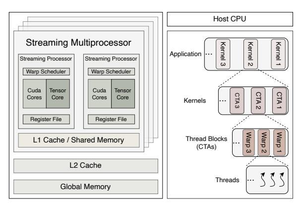
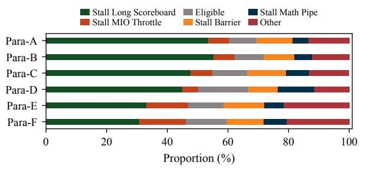
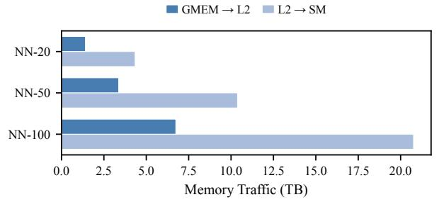
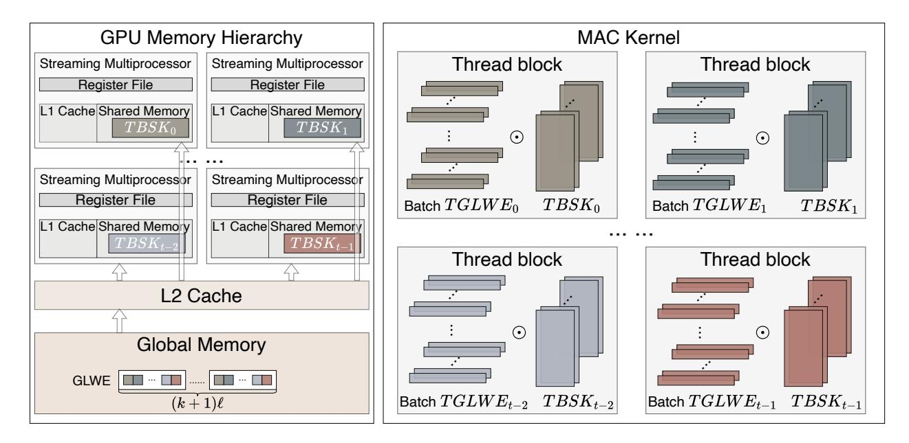
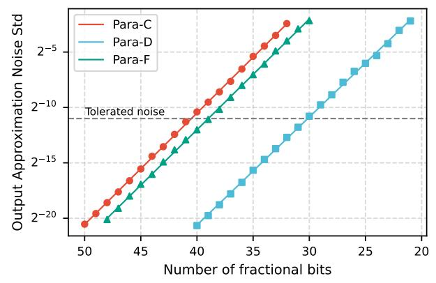
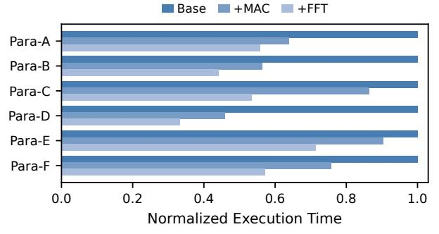
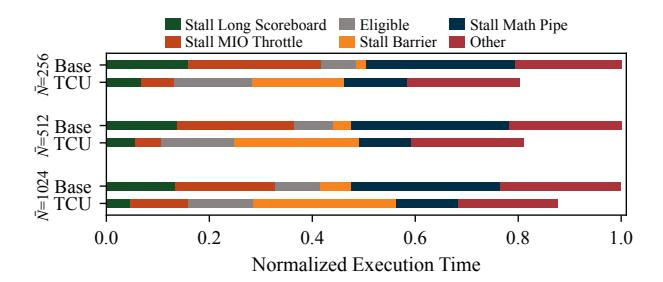

# MNEMOS: A GPU-based TFHE Acceleration Framework with Memory Access Optimization

# Junyi Zhang<sup>∗</sup>

*State Key Laboratory of Cyberspace Security Defense, Institute of Information Engineering, CAS*, Beijing, China *School of Cyber Security, University of Chinese Academy of Sciences*, Beijing, China zhangjunyi@iie.ac.cn

# Xianglong Deng<sup>∗</sup>

*State Key Laboratory of Cyberspace Security Defense, Institute of Information Engineering, CAS*, Beijing, China *School of Cyber Security, University of Chinese Academy of Sciences*, Beijing, China dengxianglong@iie.ac.cn

# Yi Chen

*School of Integrated Circuits, Peking University*, Beijing, China yichen25@stu.pku.edu.cn

# Guang Fan

*Computing System Lab, Ant Group*, Beijing, China fanguang.fg@antgroup.com

# Lei Chen

*Computing System Lab, Ant Group*, Beijing, China chenlei2014@mails.ucas.ac.cn

# Dian Jiao

*State Key Laboratory of Cyberspace Security Defense, Institute of Information Engineering, CAS*, Beijing, China *School of Cyber Security, University of Chinese Academy of Sciences*, Beijing, China jiaodian@iie.ac.cn

# Zhiwei Wang†

*State Key Laboratory of Cyberspace Security Defense, Institute of Information Engineering, CAS*, Beijing, China wangzhiwei@iie.ac.cn

# Shengyu Fan

*State Key Key Laboratory of Cyberspace Security Defense, Institute of Information Engineering, CAS*, Beijing, China *School of Cyber Security, University of Chinese Academy of Sciences*, Beijing, China fanshengyu@iie.ac.cn

# Mingzhe Zhang†

*Computing System Lab, Ant Group*, Beijing, China smartzmz@gmail.com

*Abstract*—Fully Homomorphic Encryption over Torus (TFHE) provides a promising approach for privacy-preserving computing by enabling computation directly on encrypted data. However, this strong security guarantee comes at the cost of enormous computational overhead compared with plaintext computation. Modern Graphics Processing Units (GPUs), equipped with thousands of parallel computing cores and high memory bandwidth, offer an attractive platform for accelerating TFHE workloads. By exploiting their massive parallelism, the latency of TFHE primitives can be significantly reduced, making privacy-preserving computing practical. Nevertheless, executing the TFHE applications on the GPU remains limited.

In this paper, we propose *MNEMOS*, a TFHE acceleration framework for GPU platform, optimizing the memory access during TFHE execution. In our study, we observe that severe pipeline stalls occur during TFHE kernel execution, primarily caused by frequent memory accesses and cache misses, which significantly degrade overall performance. Moreover, the utilization of Tensor Cores (TCUs) is far from optimal. Due to the excessive memory access latency caused by frequent memory accesses, the computational throughput of TCUs cannot be fully exploited. To address these issues, we propose a *memory-aware* algorithmic optimization that improves reuse efficiency through data re-layout and access scheduling. In addition, we introduce a Tensor-Core-optimized FFT mapping strategy that mitigates performance degradation caused by cache misses and enhances the effective utilization of TCUs during PBS computation. Experiments demonstrate that our optimizations highly enhance the performance of TFHE-based applications by 1.96× on average and up to 2.23× in the best case.

*Index Terms*—Fully Homomorphic Encryption, TFHE, GPU Acceleration, Memory Access Optimization, Programmable Bootstrapping

# I. INTRODUCTION

Fully Homomorphic Encryption over the Torus (TFHE) enables computation directly on encrypted data, eliminating the need for decryption at any stage of the computation.

<sup>\*</sup>Both authors contributed equally to this research.

<sup>†</sup>Corresponding authors.

This strong security guarantee, however, comes at the cost of substantial computational overhead compared with operations on plaintext. Prior work has addressed this challenge by accelerating TFHE with ASIC-based accelerators [6, 27, 28], achieving impressive performance improvements. Nevertheless, designing and fabricating large-scale ASICs is extremely costly and time-consuming, which limits their practicality and widespread adoption in rapidly evolving application scenarios.

Modern Graphics Processing Units (GPUs), with thousands of parallel computing cores and high memory bandwidth, have demonstrated significant performance advantages for highly parallel workloads such as neural networks [16]. In addition to conventional CUDA Cores, modern GPUs incorporate specialized Tensor Cores designed to accelerate dense matrix and tensor operations using mixed-precision arithmetic (e.g., FP64, FP16, INT8). By offering extremely high throughput for matrix-multiply-accumulate (MMA) operations and exposing these capabilities through warp-level primitives, Tensor Cores further enhance the GPU's suitability for workloads that exhibit large-scale vectorization, fine-grained parallelism, and regular memory access patterns. Motivated by these architectural strengths, prior research has leveraged GPUs to accelerate CKKS-based FHE schemes, achieving substantial speedups [8, 10, 12, 38].

In contrast, TFHE-based schemes are particularly well-suited for general-purpose computation over arbitrary-precision or unbounded integers, without being restricted to fixed-point representations. This makes TFHE a natural fit for control-intensive, bit-level, and logic-heavy workloads, such as privacy-preserving quantized neural networks that require exact, rather than approximate, computation. However, these characteristics also mean that TFHE often incurs significantly higher computational and memory demands, which in turn makes GPUs a particularly suitable platform for accelerating TFHE applications.

In this paper, we systematically analyze ZAMA's existing GPU implementation of TFHE-based applications. Our analysis uncovers that the current design does not fully exploit batching opportunities inherent in realistic TFHE workloads and pays insufficient attention to data reuse, both of which limit the achievable performance limits. Furthermore, to the best of our knowledge, this is the first work to investigate mapping high-precision TFHE-related FFT operations onto Tensor Cores and to critically examine the limitations of directly adopting Tensor Core mapping strategies developed for CKKS-based schemes [8, 10] in the TFHE context.

To overcome these limitations, we propose memory-aware algorithmic optimizations for TFHE computations that significantly improve data reuse and reduce memory pipeline stalls by decreasing expensive accesses to L2 cache and global memory. We further design and implement a Tensor Core-based FFT kernel tailored to TFHE, together with an optimized memory access pattern that mitigates the overhead of shared-memory accesses and better exploits warp-level parallelism. Finally, we perform an in-depth analysis of the numerical precision requirements of floating-point arithmetic in PBS,

TABLE I: Summary of TFHE parameter notation.

| Symbols        | Description                     |
|----------------|---------------------------------|
| $\overline{N}$ | Size of polynomial              |
| n              | Dimension of LWE Ciphertext     |
| k              | Dimension of GLWE Ciphertext    |
| $\beta$        | bit width of Decomposition base |
| $\ell$         | Bootstrapping key level         |
| $\lambda$      | Security level                  |

characterizing the minimum bit-width necessary to guarantee correctness and exploring the potential for leveraging lower-precision Tensor Core operations.

This work makes the following major contributions:

- We propose a novel reuse method for executing TFHE applications on GPUs, which reduces redundant memory accesses and improves computational efficiency.
- We design a new mapping method and memory access format for executing the FFT on Tensor Cores, and further analyze the precision requirements of FFT computation for TFHE applications.
- We apply kernel fusion using a cross-iteration kernel, which further enhances data reuse for FFT and IFFT operations and alleviates memory access pressure.
- MNEMOS improves TFHE application performance by  $1.96\times$  on average and up to  $2.23\times$  in the best case, and improves the throughput of PBS by up to  $3.01\times$ .

#### II. BACKGROUND

# A. TFHE Scheme

Torus-based Fully Homomorphic Encryption (TFHE) supports arbitrary computation over encrypted data (ciphertext) in both Boolean and integer domains. It enables direct evaluation of logical operations, such as comparisons and bitwise functions, as well as exact high-precision arithmetic [4, 18]. With its bit-level expressiveness and precise computation semantics, TFHE is well suited for applications requiring deterministic and accurate processing, such as quantized neural network inference, where encrypted data can be evaluated without approximation [35].

The cornerstone of TFHE is its programmable bootstrapping (PBS), a fundamental operation that simultaneously refreshes ciphertexts and evaluates arbitrary functions on ciphertext [4]. Algorithm 1 presents the overview of PBS. During PBS, the accumulated noise within a ciphertext is reduced while a user-defined function f(m) is homomorphically applied to the underlying plaintext m. The process consists of four sequential stages: Modulus Switching  $\rightarrow$  Blind Rotation  $\rightarrow$  Sample Extraction  $\rightarrow$  Key Switching.

The input of programmable bootstrapping is an LWE ciphertext consisting of (n+1) scalar elements, denoted as  $\mathbf{c}=(a_0,a_1,a_2,\ldots,a_{n-1},b)$ . In the first stage, the Modulus Switching operation rescales and rounds each component of the ciphertext from modulus p to 2N, such that  $\tilde{a}i=\lfloor 2Na_i \rceil 2N$  and  $\tilde{b}=\lfloor 2Nb \rceil_{2N}$ . This transformation maps the ciphertext into the torus domain, thereby enabling subsequent torus-based homomorphic operations.

Next, the rounded ciphertext undergoes a Blind Rotation operation, which leverages the key-dependent

# Algorithm 1: Programmable Bootstrapping

```
Input: LWE ciphertext c = (a_1, \ldots, a_n, b) \in T_q^{n+1}
   Require: BSK, KSK, TP
   Output: LWE ciphertext c'' \in T_q^{n+1}
   // Modulus-Switching
\tilde{c} = (\tilde{a}_1, \dots, \tilde{a}_n, \tilde{b}) \leftarrow MS(c)
  ACC_0 \leftarrow \text{TP}
    // Blind Rotation
3 for i=1 to n do
        // Rotation
        ACC_{rotate} \leftarrow X^{\tilde{a}_i} \cdot ACC_{i-1} - ACC_{i-1};
            Decompose and FFT
        ACC_{fourier} \leftarrow Decompose\&FFT(ACC_{rotate});
        // MAC: Production of ACC_{fourier}
        // and pre-computed BSK
        ACC_{fourier} \leftarrow ACC_{fourier} \odot BSK;
            IFFT and Accumulation
        ACC_i = IFFT(ACC_{fourier}) + ACC_{i-1};
8 end
       Sample Extraction
   c' = (a'_1, \dots, a'_{kN}, b') \leftarrow \text{SE}(ACC_n)
   // Key Switch
10 c'' = (0, \dots, b') - \sum_{i=1}^{kN} \sum_{j=1}^{lk} (a'_i)_j \cdot \text{KSK}(i, j)
11 return c''
```

coefficients  $\tilde{a}_i$  to homomorphically rotate the test polynomial (TP) that encodes the target function  $f(\cdot)$ . At the beginning of this process, the accumulator  $\mathbf{ACC}_0$  is initialized to the test polynomial, i.e.,  $\mathbf{ACC}_0 = \mathrm{TP}$ , where TP is a **GLWE** ciphertext composed of (k+1) polynomials, each with N coefficients storing the full set of values of f(m).

Then, the rotation operation is applied to the previous accumulator  $\mathbf{ACC}_{i-1}$  as  $\mathbf{ACC}_i = \mathbf{X}^{\tilde{a}_i}\mathbf{ACC}_{i-1}$ , where  $\mathbf{X}^{\tilde{a}_i}$  denotes the rotation operator. Afterward, the result of  $\mathbf{X}^{\tilde{a}_i}\mathbf{ACC}_{i-1} - \mathbf{ACC}_{i-1}$  is decomposed into l base- $\beta$  digits through the Decompose procedure, which bit-slices and rounds each polynomial coefficient into l groups. This produces an intermediate ciphertext represented as a  $(k+1) \times l$  matrix of polynomials, upon which a matrix multiplication, known as the  $External\ Product$ , is performed.

The decomposed polynomial matrix of dimension  $1 \times (k+1)l$  is multiplied with the corresponding **Bootstrapping Key BSK**i of dimension  $(k+1)l \times (k+1)$ , generating a temporary ciphertext that is then integrated into **ACC**i. The Blind Rotation is performed iteratively for all n coefficients  $\tilde{a}_i$ , resulting in a final accumulator containing (k+1) polynomials. This accumulator is then processed by Sample Extraction, which extracts the  $0^{\text{th}}$  plaintext component from the GLWE ciphertext. This operation converts a GLWE ciphertext of shape  $(k+1) \times N$  into an LWE ciphertext of dimension kN+1. For the i-th component, Sample Extraction consists of a series of permutations defined in Eq. 1.

$$SE^{i}((A_{0}, A_{1}, A_{2}, ..., A_{n-1}, B))$$

$$= SE^{i}((a_{0,0}, a_{0,1}, ..., a_{0,N-1}), (a_{1,0}, a_{1,1}, ..., a_{1,N-1}), ..., (b_{0}, b_{1}, ..., b_{N-1}))$$

$$= ((a_{0,0}, ..., a_{0,i}, -a_{0,N-1}, ..., -a_{0,N-i-1}), (a_{1,0}, ..., a_{1,i}, -a_{1,N-1}, ..., -a_{1,N-i-1}), ..., (b_{i}))$$

$$(1)$$



Fig. 1: Overview of GPU architecture.

The output of Sample Extraction is then processed by Keyswitch, which reduces the LWE ciphertext dimension from kN+1 to its original size of N+1. It first decomposes the ciphertext into  $l_k$  components, and then combines them with the corresponding key material according to Eq. 2.

$$c'' = (0, ..., b') - \sum_{i=1}^{kN} \sum_{j=1}^{l_k} (a'_i)_j \cdot KSK_{(i,j)}$$
 (2)

We note that Blind Rotation is the most computationally intensive stage of the PBS. This is primarily due to the large number of (I)FFT operations: the Decomposition is performed in the coefficient domain, whereas the polynomial multiplications in the  $External\ Product$  must be executed in the pointwise (Fourier) domain to reduce arithmetic cost. Furthermore, the BSK introduces substantial computational and memory overhead, as it contains  $(k+1)l\times(k+1)\times N\times n$  elements. To better characterize these impacts, this work conducts a detailed architectural analysis of PBS on commercial hardware and introduces several hardware-oriented algorithmic optimizations to improve computational efficiency.

# B. GPU Architecture

Modern GPGPUs integrate many parallel streaming multiprocessors (SMs), each containing multiple streaming processors (SPs), also known as CUDA cores. As shown in Fig. 1, all SPs, including CUDA cores and Tensor Cores, access data through the L1 cache and scratchpad memory (SPM), also called shared memory. All SMs communicate through a unified L2 cache, where each memory request corresponds to a 128-byte cache line. For example, the NVIDIA A100 has 108 SMs, each with 192 KB of combined L1 cache and SPM, and all SMs share a 40 MB unified L2 cache [22].

This hierarchical memory organization largely determines GPU performance, as many workloads are bound by memory bandwidth and latency rather than compute capability. On a cache miss, data is fetched from global memory through the L2 and L1 caches before reaching the SPs, introducing significant latency. Therefore, efficient memory access patterns, including locality, cache reuse, and coalescing, are essential for high throughput.

As shown in Fig. 1, GPU workloads are expressed as multiple kernels for execution. Each kernel contains multiple thread blocks (CTAs), which are scheduled onto SMs and share on-chip resources within the same CTA. Each CTA is further divided into warps, usually with 32 threads executing in SIMT fashion. Since pipeline efficiency depends strongly on warp scheduling and stall handling, warp behavior is a key factor in overall performance. During execution, a warp may stall because of long-latency operations such as memory accesses. The scheduler hides this delay by switching to another ready warp, but when many warps wait for memory at the same time, the stall cannot be fully masked, reducing streaming processor utilization. Therefore, minimizing warp stalls and improving memory efficiency are essential for high GPU throughput. In this paper, we analyze warp behavior in TFHE execution, identify key bottlenecks, and propose optimizations to improve TFHE kernel throughput on modern

In NVIDIA CUDA, a warp is the basic scheduling unit and consists of 32 parallel threads. These threads follow the SIMT model and execute the same instruction in lockstep. Although efficient, performance can drop when warp divergence occurs, that is, when threads take different controlflow paths and must execute serially. Therefore, efficient GPU algorithm design aims to keep execution paths within a warp as coherent as possible. Warp-Matrix Multiply-Accumulate (WMMA) is a CUDA API that exposes the Tensor Cores on modern NVIDIA GPUs. Tensor Cores accelerate matrix multiply-accumulate operations of the form  $D = A \times B + C$ . A WMMA instruction is executed cooperatively by an entire warp, with 32 threads processing a small matrix tile together. The tile dimensions, denoted by (M, N, K) for  $D_{M \times N} =$  $A_{M\times K}\times B_{K\times N}+C_{M\times N}$ , depend on the data precision. For example, half-precision supports  $16 \times 16 \times 16$  tiles, while double-precision is limited to smaller  $8 \times 8 \times 4$  tiles.

#### C. Tangent FFT Algorithm for Negacyclic Convolution

Polynomial multiplication in the ring  $\mathcal{R}_q = \mathbb{Z}_q[X]/(X^N+1)$  is a core and expensive operation in lattice-based FHE. This multiplication corresponds to a **negacyclic convolution**, which can be accelerated from  $O(N^2)$  to  $O(N\log N)$  using FFT-based techniques. However, a standard FFT computes cyclic convolution (modulo  $X^N-1$ ), so a specialized transform is required.

We adopt the Tangent FFT [2, 3, 21], which reduces the negacyclic convolution to a standard complex FFT of size N/2 with lightweight pre- and post-processing. Compared to other approaches (e.g., doubling the polynomial length to 2N), the Tangent FFT yields simpler and fully parallelizable auxiliary operations, making it well suited for GPU execution.

**Forward transform.** Given the coefficient vector  $\mathbf{a}$  of length N, the forward Tangent FFT is defined as

$$\mathbf{c} = \text{TFFT}[\mathbf{a}] = \text{FFT}_{N/2}[\mathbf{b}],$$

where b is a complex vector of length N/2 constructed by

$$b_j = (a_j - i \cdot a_{j+N/2}) \cdot \omega^j, \quad j \in [0, N/2),$$

and  $\omega = e^{-i\pi/N}$  is a primitive 2N-th root of unity.

**Inverse transform.** The inverse Tangent FFT recovers the coefficients from the transformed representation **c**:

$$\mathbf{b} = (IFFT_{N/2}[\mathbf{c}])^*,$$

$$a_j = \operatorname{Re}(b_j \cdot \omega^j), \quad a_{j+N/2} = \operatorname{Im}(b_j \cdot \omega^j), \quad j \in [0, N/2).$$

**Negacyclic convolution.** Using this transform pair, the negacyclic product of two polynomials with coefficient vectors  ${\bf u}$  and  ${\bf v}$  is computed as

$$\mathbf{c} = \mathrm{ITFFT}\big[\mathrm{TFFT}[\mathbf{u}] \circ \mathrm{TFFT}[\mathbf{v}]\big],$$

where o denotes element-wise multiplication.

## D. The Four-Step FFT Algorithm

The four-step FFT¹ is a cache-friendly variant of the Cooley–Tukey algorithm that restructures a large 1D DFT into smaller, independent sub-transforms on a 2D data layout, enabling efficient parallelization.

**Overview.** Let the DFT size be  $N=n_1\times n_2$ . The input sequence is arranged into an  $n_1\times n_2$  matrix, and the algorithm proceeds in four stages: (1)  $n_2$  column-wise FFTs of size  $n_1$ ; (2) element-wise twiddle factor multiplication; (3) matrix transposition; and (4)  $n_1$  row-wise FFTs of size  $n_2$ .

**Derivation.** The standard DFT is defined as

$$X[k] = \sum_{j=0}^{N-1} x[j] W_N^{jk}, \quad W_N = e^{-2\pi i/N}.$$
 (3)

Using the index mappings  $j = j_1n_2 + j_2$  and  $k = k_1 + k_2n_1$ , the DFT decomposes as

$$X[k_1 + k_2 n_1] = \sum_{j_2=0}^{n_2-1} \left[ \left( \sum_{j_1=0}^{n_1-1} x[j_1 n_2 + j_2] W_{n_1}^{j_1 k_1} \right) W_N^{j_2 k_1} \right] W_{n_2}^{j_2 k_2}$$
(4

where the inner sum corresponds to the column-wise FFTs (step 1),  $W_N^{j_2k_1}$  is the twiddle factor (step 2), and the outer sum corresponds to the row-wise FFTs (step 4). The transposition (step 3) reorders the data between the two stages of subtransforms to maintain memory locality.

Tensor Core affinity and recursive decomposition. A key property of the four-step FFT is that the column-wise and row-wise sub-transforms are batched DFTs, each expressible as a matrix-matrix multiplication. This matrix formulation maps naturally onto GPU Tensor Cores. Furthermore, the decomposition is inherently recursive: each sub-DFT of size  $n_1$  or  $n_2$  can itself be decomposed via the four-step procedure with a chosen radix, enabling a hierarchical breakdown.

<sup>&</sup>lt;sup>1</sup>In this context, we refer to the decomposition base in the 4-step FFT as the radix. For instance, a decomposition with a base of 8 is referred to as radix-8


Fig. 2: TFHE-encrypted neural network.<sup>2</sup>

# E. TFHE Applications

Figure 2 illustrates how a plaintext neural network is translated into its TFHE-encrypted counterpart. The key principle is that each layer's operation must be replaced by a corresponding homomorphic primitive. We use the convolution and ReLU layers as examples. In the convolution layer, the plaintext multiply-accumulate operations are replaced by homomorphic addition and constant multiplication between quantized plaintext filter weights and LWE ciphertext inputs. The ReLU activation, a non-linear function, cannot be expressed through linear homomorphic operations alone; instead, it is evaluated by encoding the function into the test polynomial of a PBS. More details on TFHE-based neural network inference can be found in [35].

In practice, ZAMA's bit-removal rounding technique [17] is commonly applied before each activation function to reduce the output bit-width that grows through accumulation in preceding linear operations. This rounding is itself implemented via PBS and is critical for maintaining manageable parameters: without it, the accumulated bit-width would require a substantially larger polynomial dimension N, leading to severe computational overhead [1]. As a result, a single inference pass involves a large number of PBS invocations for both activation evaluation and bit-width management, making PBS the dominant contributor to both computational cost and memory footprint.

# III. MOTIVATION

#### A. Pipeline Stalls from Excessive Off-SM Memory Access

As discussed in the previous section, warp-level execution behavior critically affects overall application performance. Fig. 3 presents a statistical breakdown of pipeline stalls in the PBS kernel—the most time-consuming component—under various parameter configurations. Our analysis reveals that stall\_long\_scoreboard dominates the execution, accounting for over 50% of total runtime across most settings. This stall type primarily arises from frequent memory dependencies resulting from intensive bootstrapping key

<sup>2</sup>For clarity, this figure illustrates only the direct mapping between plaintext and ciphertext operations, omitting auxiliary techniques such as bit-width management (e.g., bit-removal rounding).



Fig. 3: PBS stall breakdown.

accesses. When combined with stall\_MIO\_throttle, memory-dependency stalls exceed 60% of the total execution time, confirming that PBS is predominantly memory-bound. Although the Para-E and Para-F configurations partially mitigate these stalls, they introduce a higher proportion of stall\_MIO\_Throttle events, which are triggered by contention on shared memory and L1 cache operations. Overall, these results indicate that memory access latency remains the primary performance bottleneck of the PBS kernel, even under optimized configurations.

To alleviate stalls induced by memory access latency, prior research has explored batching techniques to enhance computational efficiency through data reuse [8, 10]. In TFHE-based applications, batching naturally arises since ciphertexts within the same convolutional layer share identical parameters and can thus execute PBS operations concurrently. However, our findings reveal that even with batching enabled in existing implementations [42], data reuse remains insufficient, resulting in frequent pipeline stalls. To understand this inefficiency, we analyzed the GPU's internal data movement during the execution of a representative CNN layer. As illustrated in Fig. 4, the data transferred from the L2 cache to the L1 cache far exceeds that from global memory to the L2 cache. This observation indicates that data—primarily the PBS key—loaded from global memory is repeatedly fetched from the L2 cache but not effectively retained within the SM's storage (i.e., L1 cache or shared memory). Such redundant L2 accesses incur additional latency, further reinforcing the memory-bound bottleneck that constrains PBS performance.

These observations indicate that, although batched ciphertexts execute PBS operations with identical parameter configurations during encrypted inference, data reuse is far from fully exploited. The large bootstrapping key—shared across all ciphertexts—becomes "hot data" simultaneously accessed by multiple SMs, turning the L2 cache bandwidth and latency into the dominant system bottleneck. In practice, current batching mechanisms provide only L2-level reuse, failing to promote SM-level data locality, where high-throughput reuse would yield the most benefit. This insight motivates the need for a memory-locality-aware PBS design that explicitly coordinates data reuse across SMs, minimizes redundant key movement, and ultimately enhances the throughput of encrypted neural network inference.



Fig. 4: Memory traffic in DeepCNN application.


Fig. 5: Normalized FFT execution time and stall breakdown. The 'Base' and 'TCU' labels denote the implementations using CUDA Cores and Tensor Cores, respectively. The FFT length is denoted by  $\bar{N}$ , which is set to half of the PBS parameter ( $\bar{N}=N/2$ ). All results are normalized to the 'Base' performance for each respective  $\bar{N}$ .

#### B. Inefficient Tensor Core Utilization

Tensor Cores are the most powerful compute units on modern GPUs and also occupy the largest portion of the chip area [44]. However, their potential remains largely underexplored for accelerating TFHE workloads. Prior studies have begun to map the Number Theoretic Transform (NTT) onto Tensor Cores [8, 10]. In contrast, the FFT computation in TFHE requires higher numerical precision (FP64), making a direct mapping onto Tensor Cores more challenging.

Our findings highlight an important optimization opportunity: improving memory locality and enhancing SM-level data reuse to fully unleash the computational capability of Tensor Cores for FFT acceleration.

#### IV. DESIGN

#### A. Framework Overview

We present *MNEMOS*, a novel design for the TFHE PBS procedure. The proposed kernel structure is depicted in Fig. 6. To clearly illustrate our cross-iteration kernel design, the Blind Rotation loop is unrolled for two iterations. Fig. 7 details the tiling method for the MAC kernel. For clarity, the Tiled Bootstrapping Key is abbreviated as TBSK, and the tiled GLWE is abbreviated as TGLWE.

#### B. Memory-aware Algorithm Optimization

MAC operation constitutes a significant memory-intensive bottleneck in our pipeline. This is primarily attributed to two factors. First, the BSK is pre-computed and reused across PBS

operations within a batch, rather than being generated on-thefly. Second, performing the MAC operation for a single set of GLWE requires fetching a volume of BSK data that is (k+1) times larger than the GLWE data itself. We observed a critical opportunity for optimization: within the same iteration, different PBS instances all access an identical portion of the BSK. This observation inspired our core design principle—to compute a single BSK against multiple GLWEs concurrently. However, a naive approach of caching the entire BSK in shared memory to facilitate this reuse is impractical. Such a strategy would lead to excessive shared memory consumption, drastically reducing GPU occupancy. Furthermore, on architectures like the NVIDIA A100, where the L1 cache and shared memory share the same physical hardware, heavily favoring shared memory allocation can cannibalize the L1 cache capacity, resulting in diminished L1 hit rates. For certain cryptographic parameter sets, the required BSK size even exceeds the maximum available shared memory, rendering this approach infeasible.

To circumvent the aforementioned memory constraints, we propose a tiling methodology. We leverage the fact that the multiplication between the BSK and the Fourier Coefficients is an element-wise Hadamard product. This property obviates the need for a single thread block to hold the entire BSK; instead, it only needs to process a corresponding tile of the BSK against a tile of the GLWE. This decomposition reduces the perthread-block memory footprint, thereby enabling numerous GLWE MAC operations to be processed concurrently within a single kernel launch and substantially improving BSK data reuse (Fig. 7). A further critical consideration for this memorybound kernel is ensuring coalesced access to global memory to maximize bandwidth utilization. However, the output data layout from the preceding FFT stage is not naturally contiguous for our tiling scheme, and performing an explicit data reorganization would introduce prohibitive overhead. Our solution is to strategically define the tile geometry rather than altering the data layout. Specifically, by defining a tile to consist of a small number of contiguous elements from the original data—for instance, two consecutive complex FP64 elements (16 bytes each)—we can ensure that each memory access naturally forms a 32-byte segment. This aligns with the GPU's memory transaction granularity, thus guaranteeing fully coalesced memory access.

The selection of the tile size presents a trade-off between memory access efficiency and data reuse. On one hand, to maximize global memory bandwidth, the access pattern should align with the GPU's memory transaction granularity. For modern NVIDIA architectures, memory transactions are optimally serviced in 128-byte segments. Tile sizes corresponding to 32, 64, or 128 bytes (equivalent to 2, 4, or 8 complex FP64 elements, respectively) are viable candidates for achieving coalesced access. On the other hand, the tile size inversely affects the degree of BSK reuse. A smaller tile size allows for a larger number of thread blocks to collaboratively process a single BSK tile, thereby increasing its reuse factor. However, our analysis indicates that the bandwidth for BSK access, after


Fig. 6: Kernel design overview. The blind rotation loop is shown with two unrolled iterations, highlighting cross-iteration kernel fusion. The fused kernel improves locality by reusing IFFT outputs and precomputed constants across several consecutive FFT computations.



Fig. 7: BSK reuse design. Colors are used to indicate the memory region where the data is stored. TBSK and TGLWE represent the **tiled** Bootstrapping Key and the **tiled** GLWE ciphertext, respectively. A single thread block reads the same tile from a batch of GLWE. The total number of tiles is denoted by t, and the symbol ⊙ represents the Hadamard product.

initial reuse optimizations, is no longer the primary bottleneck compared to the access of the Fourier Coefficients. Therefore, we prioritize a larger tile size to improve instruction-level parallelism and reduce loop overhead within each thread. Based on this trade-off analysis, we determined that a tile size of 8 (128 bytes) yields the optimal performance, and it is adopted in our final design.

# C. FFT Optimization based on Tensor Core

1) Kernel Fusion: We employ Tensor Cores for the FFT-based arithmetic, where performance for the small transforms in TFHE is memory-bound. One of our optimizations is a cross-iteration fusion technique that exploits data symmetry between adjacent loop iterations. The algorithm requires two sets of coefficients: Twiddle Factors and Precomputation Factors. We identify that the IFFT and FFT use conjugate versions of these same coefficient sets. Based on this, we constructed a fused kernel that spans this iteration boundary, executing the tail end of iteration i and the head of iteration i+1

as a single workload. This approach facilitates the reuse of both coefficient sets directly from on-chip memory across iterations, completely eliminating redundant global memory loads for these factors within the main loop. The impact of this optimization scales directly with the number of loop iterations, which is governed by the decomposition parameter  $\ell$ .

2) Tensor Core Optimization: Our FFT implementation is architected to align with the underlying hardware capabilities of the NVIDIA A100 GPU, and is also compatible with subsequent data center GPUs such as the H100. Tensor Cores on the A100 provide native support for double-precision matrix multiplications of shape M, N, K = 8, 8, 4 [25]. Since Tensor Cores do not natively support complex-valued arithmetic, we decompose complex matrix multiplication into real-valued operations. Given two complex matrices  $\mathbf{A} = \mathbf{A}_r + i\mathbf{A}_i$  and  $\mathbf{B} = \mathbf{B}_r + i\mathbf{B}_i$ , their product is computed as:  $\mathbf{AB} = (\mathbf{A}_r\mathbf{B}_r - \mathbf{A}_i\mathbf{B}_i) + i(\mathbf{A}_r\mathbf{B}_i + \mathbf{A}_i\mathbf{B}_r)$ . This is a mathematical identity that introduces no additional computational overhead;

| 0                              | 1                        | 2                              | 3                              | 0                                    | 1                                    | 2                                    | 3                                    | 0                          | 4                          |                         |                                  | _                          | -                                |                                  | 28                               | 0                                   | 0                             | 1                                   | 1                                   | 2                               | 2                               | 3                               | 3                               |
|--------------------------------|--------------------------|--------------------------------|--------------------------------|--------------------------------------|--------------------------------------|--------------------------------------|--------------------------------------|----------------------------|----------------------------|-------------------------|----------------------------------|----------------------------|----------------------------------|----------------------------------|----------------------------------|-------------------------------------|-------------------------------|-------------------------------------|-------------------------------------|---------------------------------|---------------------------------|---------------------------------|---------------------------------|
| 4                              | 5                        | 6                              | 7                              | 4                                    | 5                                    | 6                                    | 7                                    | 1                          | 5                          |                         |                                  | _                          |                                  |                                  | 29                               | 4                                   | 4                             | 5                                   | 5                                   | 6                               | 6                               | 7                               | 7                               |
| 8                              | 9                        | 10                             | 11                             | 8                                    | 9                                    | 10                                   | 11                                   | 2                          | 6                          | 10                      | 14                               | 18                         | 22                               | 26                               | 30                               | 8                                   | 8                             | 9                                   | 9                                   | 10                              | 10                              | 11                              | 11                              |
| 12                             | 13                       | 14                             | 15                             | 12                                   | 13                                   | 14                                   | 15                                   | 3                          | 7                          | 11                      | 15                               | 19                         | 23                               | 27                               | 31                               | 12                                  | 12                            | 13                                  | 13                                  | 14                              | 14                              | 15                              | 15                              |
| 16                             | 17                       | 18                             | 19                             | 16                                   | 17                                   | 18                                   | 19                                   | 0                          | 4                          | 8                       | 12                               | 16                         | 20                               | 24                               | 28                               | 16                                  | 16                            | 17                                  | 17                                  | 18                              | 18                              | 19                              | 19                              |
| 20                             | 21                       | 22                             | 23                             | 20                                   | 21                                   | 22                                   | 23                                   | 1                          | 5                          | 9                       | 13                               | 17                         | 21                               | 25                               | 29                               | 20                                  | 20                            | 21                                  | 21                                  | 22                              | 22                              | 23                              | 23                              |
| 24                             | 25                       | 26                             | 27                             | 24                                   | 25                                   | 26                                   | 27                                   | 2                          | 6                          | 10                      | 14                               | 18                         | 22                               | 26                               | 30                               | 24                                  | 24                            | 25                                  | 25                                  | 26                              | 26                              | 27                              | 27                              |
| 28                             | 29                       | 30                             | 31                             | 28                                   | 29                                   | 30                                   | 31                                   | 3                          | 7                          | 11                      | 15                               | 19                         | 23                               | 27                               | 31                               | 28                                  | 28                            | 29                                  | 29                                  | 30                              | 30                              | 31                              | 31                              |
|                                | Fo                       | ur                             | ier                            | М                                    | atı                                  | ix                                   |                                      |                            |                            |                         | Inp                              | out                        | :                                |                                  |                                  |                                     |                               | R                                   | es                                  | ult                             | 1                               |                                 |                                 |
|                                |                          |                                |                                |                                      |                                      | _                                    |                                      |                            | ~                          |                         |                                  |                            |                                  |                                  | c                                | α,                                  |                               | 4                                   |                                     |                                 |                                 |                                 |                                 |
|                                |                          |                                |                                | F                                    | <b>1</b> :                           | Te                                   | nsc                                  | r (                        | 0                          | re                      | M                                | ap                         | pın                              | g                                | ot i                             | Sta                                 | ıge                           | -1.                                 |                                     |                                 |                                 |                                 |                                 |
| 0                              | 0                        | 1                              | 1                              | 2                                    | <b>1</b> :                           | Te<br>3                              | nsc<br>3                             | or (                       | 4                          |                         |                                  |                            |                                  |                                  | of<br>28                         | Sta<br>0                            | ge<br>0                       | -1.<br> 1                           | 1                                   | 2                               | 2                               | 3                               | 3                               |
| 0                              | 0                        | 1 5                            | 1 5                            |                                      |                                      |                                      |                                      |                            |                            | 8                       | 12                               | 16                         | 20                               | 24                               |                                  |                                     |                               |                                     |                                     | 2                               | 2                               | 3                               | 3                               |
| _                              | _                        | _                              | _                              | 2<br>6                               | 6                                    | 7                                    | 3                                    | 0                          | 4                          | 8                       | 12<br>12                         | 16<br>16                   | 20<br>20                         | 24<br>24                         | 28                               | 0                                   | 0                             | 1                                   | 1                                   | 6                               | _                               | 7                               | 7                               |
| 4                              | 4                        | 5                              | 5                              | 2<br>6<br>10                         | 2<br>6<br>10                         | 3<br>7<br>11                         | 3<br>7<br>11                         | 0                          | 4                          | 8<br>8<br>9             | 12<br>12<br>13                   | 16<br>16<br>17             | 20<br>20<br>21                   | 24<br>24<br>25                   | 28<br>28                         | 0<br>4<br>8                         | 0                             | 1<br>5<br>9                         | 1<br>5<br>9                         | 6<br>10                         | 6<br>10                         | 7<br>11                         | 7<br>11                         |
| 4<br>8<br>12                   | 4                        | 5<br>9<br>13                   | 5<br>9<br>13                   | 2<br>6<br>10<br>14                   | 2<br>6<br>10<br>14                   | 3<br>7<br>11<br>15                   | 3<br>7<br>11<br>15                   | 0<br>0<br>1                | 4<br>4<br>5<br>5           | 8<br>8<br>9             | 12<br>12<br>13<br>13             | 16<br>16<br>17             | 20<br>20<br>21<br>21             | 24<br>24<br>25<br>25             | 28<br>28<br>29                   | 0<br>4<br>8<br>12                   | 0<br>4<br>8                   | 1<br>5<br>9<br>13                   | 1<br>5<br>9<br>13                   | 6<br>10<br>14                   | 6<br>10<br>14                   | 7<br>11<br>15                   | 7<br>11<br>15                   |
| 4<br>8<br>12<br>16             | 4<br>8<br>12             | 5<br>9<br>13<br>17             | 5<br>9<br>13<br>17             | 2<br>6<br>10<br>14<br>18             | 2<br>6<br>10<br>14<br>18             | 3<br>7<br>11<br>15<br>19             | 3<br>7<br>11<br>15<br>19             | 0<br>0<br>1                | 4<br>4<br>5<br>5<br>6      | 8<br>9<br>9             | 12<br>13<br>13<br>14             | 16<br>16<br>17<br>17<br>18 | 20<br>20<br>21<br>21<br>22       | 24<br>24<br>25<br>25<br>26       | 28<br>28<br>29<br>29             | 0<br>4<br>8<br>12<br>16             | 0<br>4<br>8<br>12             | 1<br>5<br>9<br>13                   | 1<br>5<br>9<br>13                   | 6<br>10<br>14<br>18             | 6<br>10<br>14<br>18             | 7<br>11<br>15<br>19             | 7<br>11<br>15<br>19             |
| 4<br>8<br>12<br>16<br>20       | 4<br>8<br>12<br>16       | 5<br>9<br>13<br>17<br>21       | 5<br>9<br>13<br>17<br>21       | 2<br>6<br>10<br>14<br>18<br>22       | 2<br>6<br>10<br>14<br>18<br>22       | 3<br>7<br>11<br>15<br>19<br>23       | 3<br>7<br>11<br>15<br>19<br>23       | 0<br>0<br>1<br>1<br>2      | 4<br>4<br>5<br>5<br>6      | 8<br>9<br>9<br>10       | 12<br>13<br>13<br>14<br>14       | 16<br>16<br>17<br>17<br>18 | 20<br>20<br>21<br>21<br>22       | 24<br>24<br>25<br>25<br>26<br>26 | 28<br>28<br>29<br>29<br>30<br>30 | 0<br>4<br>8<br>12<br>16<br>20       | 0<br>4<br>8<br>12<br>16       | 1<br>5<br>9<br>13<br>17<br>21       | 1<br>5<br>9<br>13<br>17<br>21       | 6<br>10<br>14<br>18<br>22       | 6<br>10<br>14<br>18<br>22       | 7<br>11<br>15<br>19<br>23       | 7<br>11<br>15<br>19<br>23       |
| 4<br>8<br>12<br>16<br>20<br>24 | 4<br>8<br>12<br>16<br>20 | 5<br>9<br>13<br>17<br>21<br>25 | 5<br>9<br>13<br>17<br>21<br>25 | 2<br>6<br>10<br>14<br>18<br>22<br>26 | 2<br>6<br>10<br>14<br>18<br>22<br>26 | 3<br>7<br>11<br>15<br>19<br>23<br>27 | 3<br>7<br>11<br>15<br>19<br>23<br>27 | 0<br>0<br>1<br>1<br>2<br>2 | 4<br>4<br>5<br>5<br>6<br>6 | 8<br>9<br>9<br>10<br>10 | 12<br>13<br>13<br>14<br>14<br>15 | 16<br>17<br>17<br>18<br>18 | 20<br>20<br>21<br>21<br>22<br>22 | 24<br>25<br>25<br>26<br>26<br>27 | 28<br>29<br>29<br>30<br>30<br>31 | 0<br>4<br>8<br>12<br>16<br>20<br>24 | 0<br>4<br>8<br>12<br>16<br>20 | 1<br>5<br>9<br>13<br>17<br>21<br>25 | 1<br>5<br>9<br>13<br>17<br>21<br>25 | 6<br>10<br>14<br>18<br>22<br>26 | 6<br>10<br>14<br>18<br>22<br>26 | 7<br>11<br>15<br>19<br>23<br>27 | 7<br>11<br>15<br>19<br>23<br>27 |

B: Tensor Core Mapping of Stage-2.

Fig. 8: Fused two-stage computation of a 64-point FFT on Tensor Cores. The number within each cell indicates the lane whose register file holds that element. Subfigure (A) shows the data layout for the first stage. Instead of writing to shared memory, intermediate results are kept in registers, multiplied by twiddle factors, and immediately consumed by the second stage, shown in (B). This fusion eliminates intermediate memory round-trip. Data for separate WMMA operations is color-coded, and numbers indicate the warp lane ID.

each of the four resulting real-valued matrix multiplications maps directly to two Tensor Core wmma operations.

An *n*-point DFT can be expressed as an  $n \times n$  matrix–vector product; by batching multiple such products, it maps naturally to a matrix multiplication. Given the native  $8 \times 8 \times 4$  WMMA primitive, we establish the 8-point FFT as the fundamental base case for our recursive decomposition. Any FFT of size N > 8 is first decomposed using the 4-step FFT with a radix of 8. We identified a further optimization opportunity for 64-point FFTs: since shared memory access constitutes a significant bottleneck for Tensor Core-based FFTs, we devised a specialized algorithm for the 64-point case, illustrated in Fig. 8. This method eliminates one entire round-trip of shared memory access and synchronization compared to a standard two-level (8 × 8) decomposition, reducing on-chip data movement and latency. We therefore employ a hierarchical decomposition strategy: for any transform of size N > 64, we prioritize a radix-64 step; for remaining factors where  $8 < N \le 64$ , we fall back to radix-8; and for factors smaller than 8 points, we utilize a CUDA Core-based approach accelerated with warpshuffle instructions. This layered strategy ensures that the most efficient available operation is used for the largest possible factor of the transform size.

Accessing the Fourier matrix with the memory layout required by our kernel presents a performance challenge. A conventional approach would pre-load the matrix into shared memory. However, to satisfy the varied access patterns of the algorithm, this would necessitate either dynamically transposing the matrix on-chip—incurring significant instruction and

| 0  | 1  | 8  | 9  | 16 | 17 | 24 | 25 |
|----|----|----|----|----|----|----|----|
| 26 | 27 | 2  | 3  | 10 | 11 | 18 | 19 |
| 20 | 21 | 28 | 29 | 4  | 5  | 12 | 13 |
| 14 | 15 | 22 | 23 | 30 | 31 | 6  | 7  |

Fig. 9: An example of  $4\times 8$  matrix transpose. The different colors represent distinct thread subgroups, each comprising 8 lanes. The number within each cell indicates the specific lane ID responsible for processing that element.

latency overhead—or storing multiple layouts simultaneously, which increases shared memory pressure and complicates kernel design. We introduce a more efficient alternative: on-thefly generation of the Fourier matrix elements. This method is predicated on a key observation: all entries in an 8-point DFT matrix are drawn from the sparse set  $\{0, \pm 1, \pm \sin(\pi/4)\}$ . Instead of fetching pre-calculated values from memory, we generate them arithmetically in registers at runtime. This strategy completely obviates shared memory loads for the Fourier matrix, eliminating the associated latency, bank conflicts, and layout management complexity. The computational cost of generation is negligible compared to the latency of a shared memory access, effectively substituting a memory operation with minimal computation—a highly favorable trade-off.

3) Shared Memory Swizzling for Wide Data Types: The matrix transpositions required by our FFT kernels are performed in shared memory. Naive row- or column-major access patterns cause severe bank conflicts; the standard remedy is Swizzling, which applies a bitwise XOR to each thread's address so that co-active threads map to distinct banks.

In our case, each element is a double-precision complex number, spanning four consecutive 4-byte banks—unlike the common single-bank-per-element scenario. To ensure conflict-free access under this wider data footprint, our swizzle pattern is designed such that any group of eight contiguous threads maps to 32 mutually distinct banks.

Fig. 9 provides a simplified illustrative example using a  $4\times 8$  matrix of 16-byte elements. Each color represents a subgroup of eight consecutive lanes, and the lane ID in each cell indicates the thread responsible for that element. The example demonstrates how a swizzle pattern can guarantee conflict-free parallel access when each element spans multiple banks.

4) Precision Analysis: We investigate the precision requirements of the internal FFT in TFHE's PBS through a noise-based analysis. Our study targets 4-bit plaintext messages under the classic DeepCNN-X application setting. The numerical precision required for PBS is determined through separate analyses of the integer and fractional parts [36]. For the integer part, the bit-width is chosen statistically to ensure a negligible overflow probability, such as  $2^{-64}$ . For the fractional part, the key concern is the noise accumulated during computation. To quantify the effect of fractional bit-



Fig. 10: Output approximation noise std versus fractional bits for Parameter-C, D, and F. Following [36], the output approximation noise std refers to the noise level within the modular space [0, 1), obtained by normalizing the noise from the 64-bit integer space to this unit interval.

width on noise accumulation, we replace standard double-precision arithmetic with fixed-point representations of varying fractional bit-widths and evaluate three parameter sets. The measured noise levels in Figure 10 are compared with the theoretical bound from [5], also adopted in [36]. All experiments use a 64-bit ciphertext space, following ZAMA's default setting for non-Boolean applications. The results show that correctness requires at least 30 fractional bits, and often more than 35. Since standard single-precision (FP32, 24 mantissa bit-width) and half-precision (FP16, 11 mantissa bit-width) formats provide far fewer effective mantissa bits, they are insufficient to meet this requirement. A detailed discussion is provided in Section VII-A and Section VII-C.

#### V. METHODOLOGY

# A. Experimental Setup

Our implementation uses Python (v3.8.20) and Rustc (v1.85.0), and is built on ZAMA's open-source libraries, including TFHE-rs [42] (v0.11.2), Concrete-Python [41] (v2.10.0), and Concrete-ML [40] (v1.9.0). Experiments are conducted on a high-performance server with dual-socket Intel Xeon Platinum 8558P CPUs (96 cores total) and an NVIDIA A100 80GB PCIe GPU. We comprehensively compare our solution with ZAMA's implementation as the baseline.

We evaluate PBS throughput across several representative parameter sets, which are summarized in Table II: Para-A to Para-D are generated by the Concrete compiler for CNN-based applications, Para-E is from the tfhe-rs benchmark, and Para-F is adopted from [28]. These sets form the baseline configurations for our evaluation, and all meet the 128-bit security requirement. For direct comparison with prior work, we additionally include two commonly used parameter sets, Para-I and Para-II, for cross-platform evaluation on different hardware architectures. Because the decomposition base  $\beta$  is not explicitly specified in Para-F, Para-I, or Para-II, we choose a sufficiently large  $\beta$  to ensure correctness.

TABLE II: PBS parameter sets in MNEMOS.

|         | N    | k | $\ell$ | β  | n   | λ       |
|---------|------|---|--------|----|-----|---------|
| Para-A  | 512  | 4 | 1      | 23 | 532 | 128-bit |
| Para-B  | 512  | 4 | 2      | 16 | 679 | 128-bit |
| Para-C  | 1024 | 2 | 2      | 15 | 728 | 128-bit |
| Para-D  | 512  | 4 | 11     | 4  | 654 | 128-bit |
| Para-E  | 2048 | 1 | 1      | 23 | 742 | 128-bit |
| Para-F  | 2048 | 1 | 3      | 12 | 592 | 128-bit |
| Para-I  | 1024 | 1 | 2      | 16 | 500 | 80-bit  |
| Para-II | 1024 | 1 | 3      | 12 | 630 | 110-bit |

#### B. Configuration

For all applications except AES, the plaintext bit-width [43] is fixed at 4 bits in both implementations. When a linear operation increases the bit-width beyond this limit, the Concrete compiler automatically invokes PBS-based rounding to restore it to 4 bits. The baseline also adopts a different kernel fusion strategy from ours: it fuses the operations from Rotation to FFT into one kernel and places the remaining operations in a second kernel.

By default, the Concrete backend partitions PBS tasks across available devices, distributing workloads between the CPU and GPU based on an internal heuristic. To ensure a fair and consistent comparison, we modify this task partitioning strategy so that all PBS operations are offloaded exclusively to the GPU.

#### C. Benchmarks

We leverage the conventional TFHE-based applications as the workloads for our evaluation.

- 1) Programmable Bootstrapping. We evaluate PBS throughput against ZAMA's state-of-the-art open-source framework using a standard 128-bit security parameter set commonly adopted in practical applications and ZAMA's official benchmarks. The batch size is fixed at 4096 for throughput measurement. We additionally benchmark PBS throughput on an NVIDIA H100 80GB PCIe GPU.
- 2) DeepCNN-X model variants [28]. The models take  $8\times8\times1$  inputs. Each network consists of a  $3\times3$  convolution with 2 filters, a  $3\times3$  convolution with 92 filters and stride 2, X successive  $1\times1$  convolutional layers with 92 filters each  $X \in 20, 50, 100$ , a  $2\times2$  convolution with 16 filters, and a fully connected layer with 10 outputs. We benchmark these models using ZAMA's Concrete-ML library with its official CUDA backend as the baseline. Since the default backend does not offload all operations, including PBS, to the GPU, we modify it to execute all computations exclusively on the GPU. This fully GPU-based version is used as the baseline in all experiments.
- 3) VGG-9 model for CIFAR-10 dataset [28]. It takes 32×32×3 images as input and consists of six 3×3 convolutional layers with 64, 64, 128, 128, 256, and 256 filters, respectively. A 2×2 average pooling layer follows the second and fourth convolutional layers. The network is followed by three fully connected layers, with 512, 512, and 10 neurons, respectively.
- 4) Advanced Standard (AES) [33]. We consider the AES-128 variant, where a 128-bit plaintext block is encrypted into a 128-bit ciphertext under a 128-bit secret key. The workload contains 192 independent inputs.

TABLE III: Throughput of PBS (#P BS / second).

|        |       | A100   |         |       | H100   |         |
|--------|-------|--------|---------|-------|--------|---------|
|        | ZAMA  | MNEMOS | Speedup | ZAMA  | MNEMOS | Speedup |
| Para-A | 13014 | 23332  | 1.79×   | 26498 | 42506  | 1.60×   |
| Para-B | 5743  | 12971  | 2.26×   | 11403 | 23034  | 2.02×   |
| Para-C | 5368  | 10044  | 1.87×   | 10218 | 17690  | 1.73×   |
| Para-D | 1010  | 3044   | 3.01×   | 2134  | 6106   | 2.86×   |
| Para-E | 6559  | 9160   | 1.40×   | 13996 | 17471  | 1.25×   |
| Para-F | 3511  | 6149   | 1.75×   | 7390  | 11305  | 1.53×   |

TABLE IV: Comparison of PBS throughput.

|                |            | Para | Throughput | Speedup of    |
|----------------|------------|------|------------|---------------|
|                | Platform   | Set  | (BS/s)     | MNEMOS (H100) |
|                | Intel Xeon | I    | 63         | 615.0×        |
| Concrete [41]  | Gold 6226R | II   | 36         | 676.3×        |
| NuFHE [20]     | Titan RTX  | I    | 2500       | 15.5×         |
|                |            | II   | 550        | 44.3×         |
| cuFHE [37]     | A100       | II   | 5555       | 4.4×          |
| VeloFHE [34]   | A100       | II   | 7501       | 3.2×          |
|                |            | I    | 4000       | 9.7×          |
| XEHC [19]      | FPGA       | II   | 2800       | 8.7×          |
| MATCHA [11]    | ASIC       | I    | 10000      | 3.9×          |
| Strix [27]     |            | I    | 74696      | 0.52×         |
|                | ASIC       | II   | 39600      | 0.61×         |
| Morphling [28] | ASIC       | I    | 147615     | 0.26×         |
|                |            | II   | 78692      | 0.31×         |
|                |            | I    | 22007      | 1.76×         |
| MNEMOS         | A100       | II   | 13744      | 1.77×         |
|                | H100       | I    | 38748      | −             |
|                |            | II   | 24348      | −             |

VI. RESULTS

# *A. Benchmark Performance*

In this section, we compare the PBS throughput across different parameter sets. As shown in Table III, our implementation achieves an average 1.8× higher throughput than ZAMA's library for these commonly used parameters. For Para-A to Para-D, which are parameter sets generated by the Concrete compiler for CNN applications, our implementation delivers an average speedup of 2.23× and a maximum speedup of 3.01× over the baseline on the A100 GPU.

Table III also shows the PBS throughput results on the H100. Our method achieves an average speedup of 1.83× and a maximum speedup of 2.86×, comparable to the improvements observed on the A100, demonstrating the effectiveness of our approach on newer GPU architectures. The small differences in speedup are likely due to architectural differences between the two GPUs, including SM count, cache size, and Tensor Core throughput, indicating room for further architecture-specific tuning on the H100.

As reported in Table IV, *MNEMOS* achieves 22,007 BS/s and 13,744 BS/s on the A100, and 38,748 BS/s and 24,348 BS/s on the H100, for Parameter Sets I and II, respectively. Among all GPU-based implementations, MNEMOS on the H100 delivers the highest throughput on programmable platforms, with speedups of up to 615.0× over the CPU baseline, 44.3× over NuFHE, 4.4× over cuFHE, and 3.2× over VeloFHE. Even on the A100, MNEMOS still outperforms cuFHE and VeloFHE by 2.47× and 1.83×, respectively. While ASIC designs such as Strix and Morphling achieve higher absolute throughput, MNEMOS on the H100 still attains 51.9% and 26.2% of their throughput.



Fig. 11: Ablation Study.

TABLE V: Performance comparison of different applications.

|             |            | Execution Time (s) | Speedup of MNEMOS |            |         |
|-------------|------------|--------------------|-------------------|------------|---------|
| Application | CPU        | ZAMA               | MNEMOS            | vs CPU     |         |
|             | (1 thread) | (GPU)              |                   | (1 thread) | vs ZAMA |
| DeepCNN-20  | 1784.89    | 31.39              | 15.42             | 115.77×    | 2.03×   |
| DeepCNN-50  | 4586.34    | 72.64              | 36.72             | 124.90×    | 1.97×   |
| DeepCNN-100 | 8406.41    | 136.42             | 66.70             | 126.07×    | 2.04×   |
| AES         | 20181.28   | 279.74             | 182.44            | 110.61×    | 1.53×   |
| VGG-9       | 21485.33   | 303.945            | 137.31            | 234.71×    | 2.21×   |

For the DeepCNN applications, our method achieves around 2× speedup over ZAMA's fully GPU-offloaded implementation across networks with different depths. The detailed results are shown in Table V. The table also reports results for VGG-9 and AES. VGG-9 shows a larger speedup due to its larger batch size, highlighting the advantage of *MNEMOS* in large-batch scenarios, as further discussed in Section VI-D. For AES, a bit-level application, *MNEMOS* achieves a 1.53× speedup. For additional context, we also compare against a single-thread CPU implementation, over which *MNEMOS* delivers an average speedup of 142.4×.

# *B. Ablation Study*

For the MAC component, we implement BSK reuse, which significantly reduces the largest source of memory access within the PBS operation. In a naive implementation, the same BSK must be repeatedly read for each PBS. The memory access volume of the BSK itself is (k + 1) times that of the GLWE data, consuming substantial memory bandwidth, particularly when the parameter k is large. Our reuse strategy, however, renders the memory access overhead of the BSK insignificant relative to that of the GLWE data.

For our fused FFT kernel, we employ multiple optimization techniques. We utilized Tensor Cores to accelerate the FFT operations and fused multiple FFT/IFFT passes into a single kernel to enhance data reuse. Furthermore, the Fourier matrix, which typically consumes significant shared memory bandwidth and is highly prone to bank conflicts, was generated on-the-fly instead. We also adopt a swizzling technique to mitigate severe bank conflicts during the transposition process. Moreover, by leveraging the layout of Tensor Core fragments within a warp, we successfully eliminate one explicit transpose operation when performing 64-point FFTs.

To illustrate the impact of our individual design components on the final performance, we conduct an ablation study for


Fig. 12: PBS stall breakdown of MNEMOS.



Fig. 13: FFT normalized execution time and stall breakdown. The 'Base' denotes the implementations using CUDA Cores, and 'TCU' denotes the MNEMOS implementation.

these parameter sets. Fig. 11 illustrates the effect of each design component on PBS throughput under different parameters. We present normalized results: ZAMA's implementation serves as our baseline, "+MAC" includes only our MAC kernel optimizations, and "+FFT" represents our final, fully-optimized implementation. The MAC optimization alone provides  $1.10\times$  to  $1.77\times$  speedup over the baseline, with the most pronounced gains on configurations where k is large. Conversely, when N is relatively large while k and  $\ell$  are small, the FFT optimizations provide a greater performance contribution.

#### C. Stall Breakdown

As demonstrated in Fig. 12, as a result of our optimizations, the latency from the stall\_long\_scoreboard has been significantly reduced, now accounting for only about 20% of the total execution time (and dropping below 15% for Para-E). Consequently, Stall Math Pipe has emerged as a more prominent contributor to the overall stall distribution. This shift indicates that our optimizations have effectively alleviated memory-related bottlenecks, causing compute-unit stalls to account for a larger fraction of the total execution time. Additionally, we compare the normalized execution time of the FFT, with the results presented in Fig. 13. This comparison highlights the effectiveness of our optimizations on the FFT's global and shared memory access patterns. The normalized execution time of our FFT kernel demonstrates a significant reduction in latency caused by shared memory operations, specifically stall\_MIO\_Throttle. Quantitatively, we reduced this latency by a factor of 3.2× for a problem size


Fig. 14: Memory traffic in MNEMOS DeepCNN application.


Fig. 15: Impact of batch size on the execution time of PBS on A100. The chart compares our implementation with the baseline using the Para-B parameter set.

of  $\bar{N}=256$ . This improvement factor is  $2.9\times$  and  $1.8\times$  for  $\bar{N}=512$  and  $\bar{N}=1024$ , respectively.

Our data reuse strategy significantly reduces memory traffic, as shown in Fig. 14. It brings the GMEM-to-L2 and L2-to-SM transfer volumes into a much better balance, with both substantially lower than those of the baseline. Compared to the baseline, the optimized design reduces GMEM-to-L2 traffic by average of 15.7% and L2-to-SM traffic by an average of 69.4%.

#### D. Sensitivity Study to Batch Size

The scalability with respect to batch size is a crucial determinant of the practical throughput of PBS. We present a sensitivity analysis, using the Para-B parameter set, to empirically validate the performance characteristics of our proposed method against a baseline implementation. The results are depicted in Fig. 15. The architectural limitation of the baseline lies in its memory access pattern: each thread block independently fetches the entire BSK. At small batch sizes, this pattern can still benefit from L2 cache locality — for instance, on an NVIDIA A100 GPU with a 40 MB L2 cache, a batch size of 256 yields a working set of approximately 10 MB, which fits comfortably within the L2 and enables effective BSK reuse. However, as the batch size grows beyond 1024, the aggregate working set surpasses the L2 cache capacity, and the baseline suffers from significant performance degradation due to memory bandwidth saturation and cache thrashing. As shown in Fig. 15, our method maintains robust and consistent performance across a wide range of batch sizes, in stark contrast to the steep performance decline observed in the baseline.


Fig. 16: Sensitivity analysis of parameters. Starting from a baseline configuration of  $(N=512,\,K=1,\,\ell=1)$ , we individually vary the parameters  $N,\,K$ , and  $\ell$  to demonstrate their respective impacts on how the contributions of the MAC optimization and the Fused FFT kernel to the total speedup change as each parameter is adjusted.

#### E. Sensitivity Study to Parameters

Figure 16 breaks down the performance gains from our MAC and FFT optimizations under different parameter settings, starting from the baseline configuration  $(N=512,k=1,\ell=1)$ .

We first study the effect of increasing k. As shown in Fig. 16(a), the contribution of the MAC optimization grows steadily with k. This trend follows directly from its design: when k increases, the memory footprint of the BSK becomes more dominant, and our reuse strategy, which reduces this memory overhead, becomes increasingly effective. This result is also practically important. As reported in [1], the security level depends on kN, and parameter sets with larger k are commonly used in libraries such as Concrete to achieve higher security. Therefore, our MAC optimization is especially beneficial for secure and widely used parameter configurations.

Fig. 16(b) shows the impact of varying  $\ell$ . Unlike the case of increasing k, the relative contributions of the two optimizations remain largely unchanged. This is because a larger  $\ell$  benefits both components simultaneously. On the one hand, our fused-kernel design enables the FFT optimization to exploit greater data reuse as  $\ell$  increases. On the other hand, the MAC kernel also achieves higher speedup because a larger  $\ell$  increases its workload and improves memory access efficiency. Fig. 16(c) presents the results for varying N. As N increases, FFT computation accounts for a larger fraction of the total execution time, making the FFT optimization an increasingly dominant source of the overall speedup.

#### VII. DISCUSSION

# A. Precision of TFHE

**Data type precision and cryptographic parameters**: the correctness of PBS depends heavily on both the floating-point precision employed during computation and the selection of cryptographic parameters. A prior study [1] introduced ZAMA's parameter selection methodology, which jointly optimizes security, computational cost, and noise growth. In [1],

the PBS noise variance<sup>3</sup> is derived as  $n \cdot 2^{\omega} \cdot \ell \cdot 2^{2\beta} \cdot N^2 \cdot (k+1)$ , where  $\omega \approx 2 \cdot (64-53)-2.6$ . This formula assumes the PBS computation is performed within a 64-bit ciphertext space, where 53 represents the mantissa bit-width of FP64, and 2.6 is an empirical constant. This expression demonstrates that reducing floating-point precision significantly exacerbates noise growth: while parameters such as n,  $\ell$ , and k influence the noise variance linearly, N contributes quadratically, the impact of the mantissa bit-width is exponential. Furthermore, this formula elucidates why double-precision floating-point arithmetic suffices for ZAMA's parameter sets: these parameters are explicitly optimized under a rounding-error model targeting the FP64 data type.

Plaintext bit-width and function complexity: The plaintext bit-width affects the noise variance indirectly by influencing the selection of cryptographic parameters. Increasing the plaintext bit-width reduces the tolerance margin for noise within the ciphertext space, thereby elevating the probability of decryption failure under an equivalent noise level. Conversely, the complexity of the evaluated function exerts a negligible effect on noise growth, as arbitrary functions in TFHE are uniformly implemented via a PBS lookup table.

#### B. FP64 Support Across GPU Architectures

As previously discussed, the TFHE FFT evaluation strictly requires double-precision floating-point arithmetic to guarantee decryption correctness; single-precision or half-precision formats are insufficient. However, high-throughput FP64 support is not available across all NVIDIA GPUs. Specifically, on most consumer-grade GPUs, the FP64 throughput is artificially limited to 1/64 of the FP32 throughput, whereas on data center GPUs such as the A100 and H100, it achieves a 1/2 ratio. Notably, successive generations of flagship data center GPUs have consistently delivered robust FP64 capabilities [23, 24, 26]. Furthermore, hardware support for FP64 Tensor Cores has been a standard feature on these flagship architectures since the introduction of the A100. Consequently, the optimization methodologies proposed in this work are well-positioned to remain highly applicable and effective on current and future generations of data center GPUs.

# C. Leveraging Low-Precision Arithmetic

Despite the current FP64 requirement, exploring reducedprecision approaches remains a worthwhile direction for potentially accelerating TFHE on GPUs. One possible strategy is to decompose FP64 values into multiple lower-precision floating-point or fixed-point representations, which could then be processed using the higher throughput of GPU Tensor Cores for low-precision data types (e.g., FP16, INT8).

From a parameter-selection perspective, increasing the decomposition level  $\ell$  may offer a complementary path toward relaxing precision requirements. Although a larger  $\ell$  increases the number of FFT operations, it allows the decomposition

<sup>&</sup>lt;sup>3</sup>The original formula in [1] uses  $\beta$  to denote the decomposition base, which corresponds to  $2^{\beta}$  under the notation of our paper. For consistency, we adapt the formula to match our notation.

base parameter β to be reduced. Since the influence of ℓ on the noise variance is linear, whereas the impact of β is exponential (as 2 2β in the noise formula), appropriately increasing ℓ while decreasing β could, in certain configurations, relax the overall noise budget and potentially reduce the number of splits required in a precision-decomposition scheme.

# VIII. RELATED WORK

Hardware acceleration for Fully Homomorphic Encryption is an active area of research. For the TFHE scheme, various ASIC and FPGA accelerators have been proposed. ASIC-based efforts have introduced architectural innovations such as bootstrapping key unrolling[11], two-level ciphertext batching[27], and transform-domain reuse[28] to enhance throughput. More recently, the focus has expanded towards general-purpose acceleration, exemplified by [6], the first unified architecture designed to support both the CKKS and TFHE schemes, as well as the conversion between them.

Among FPGA-based TFHE accelerators, FPT [36] is particularly notable. It is the first design to employ compact fixedpoint arithmetic throughout the entire PBS process, and it introduces a method for determining the minimum bit-width required to preserve correctness. This result shows that highprecision floating-point arithmetic is not always necessary.

Beyond TFHE, a large body of work has explored FPGAand ASIC-based acceleration for BGV, BFV, and CKKS [9, 14, 29–32, 39]. In parallel, GPU acceleration for FHE has also been actively studied, mainly in the context of CKKS. For example, prior works have investigated the use of Tensor Cores to accelerate NTT [8, 10, 12], while others have focused on 32-bit RNS implementations and aggressive kernel fusion to improve performance [13]. These studies demonstrate the strong potential of GPUs for FHE acceleration, although they largely target arithmetic-oriented schemes.

More recently, several works have explored accelerating transforms such as FFT and NTT by mapping them to matrix multiplications on GPU Tensor Cores [7, 15]. However, these studies mainly rely on the native support of Tensor Cores for low-precision formats, such as half precision.

# IX. CONCLUSION

In this paper, we propose a high-performance GPU acceleration framework for TFHE's PBS to address its severe memorybound bottlenecks. Our key contributions include novel data reuse mechanisms and optimized Tensor Core based FFT execution. Specifically, we design a BSK tiling method for crossciphertext key reuse, a cross-iteration kernel fusion strategy for FFT/IFFT data sharing, and an optimized four-step FFT on Tensor Cores with on-the-fly Fourier matrix generation and a swizzled transposition scheme to reduce shared-memory traffic and bank conflicts. Under 128-bit security parameters, our framework achieves stable performance and outperforms the state-of-the-art ZAMA implementation, providing up to 3.01× PBS throughput and 1.96× speedup in real-world scenarios.

### ACKNOWLEDGMENTS

We thank the anonymous reviewers for their insightful comments and constructive suggestions. This work was supported by the National Key R&D Program of China under Grant Nos. 2023YFB4503200 and 2023YFB4503201, the Strategic Priority Research Program of the Chinese Academy of Sciences under Grant No. XDB0690100, and the National Natural Science Foundation of China under Grant No. 62502516.

# REFERENCES

- [1] L. Bergerat, A. Boudi, Q. Bourgerie, I. Chillotti, D. Ligier, J.-B. Orfila, and S. Tap, "Parameter optimization and larger precision for (t) fhe: L. bergerat et al." *Journal of Cryptology*, vol. 36, no. 3, p. 28, 2023.
- [2] D. J. Bernstein, "The tangent fft," in *International Symposium on Applied Algebra, Algebraic Algorithms, and Error-Correcting Codes*. Springer, 2007, pp. 291–300.
- [3] D. J. Bernstein, "Fast multiplication and its applications," *Algorithmic number theory*, vol. 44, pp. 325–384, 2008.
- [4] I. Chillotti, N. Gama, M. Georgieva, and M. Izabachene, ` "Tfhe: fast fully homomorphic encryption over the torus," *Journal of Cryptology*, vol. 33, no. 1, pp. 34–91, 2020.
- [5] I. Chillotti, N. Gama, M. Georgieva, and M. Izabachene, ` "Tfhe: Fast fully homomorphic encryption over the torus: I. chillotti et al." *Journal of Cryptology*, vol. 33, no. 1, pp. 34–91, 2020.
- [6] X. Deng, S. Fan, Z. Hu, Z. Tian, Z. Yang, J. Yu, D. Cao, D. Meng, R. Hou, M. Li *et al.*, "Trinity: A general purpose fhe accelerator," in *2024 57th IEEE/ACM International Symposium on Microarchitecture (MICRO)*. IEEE, 2024, pp. 338–351.
- [7] S. Durrani, M. S. Chughtai, M. Hidayetoglu, R. Tahir, A. Dakkak, L. Rauchwerger, F. Zaffar, and W.-m. Hwu, "Accelerating fourier and number theoretic transforms using tensor cores and warp shuffles," in *2021 30th International conference on parallel architectures and compilation techniques (PACT)*. IEEE, 2021, pp. 345– 355.
- [8] G. Fan, M. Zhang, F. Zheng, S. Fan, T. Zhou, X. Deng, W. Tang, L. Kong, Y. Song, and S. Yan, "Warpdrive: Gpu-based fully homomorphic encryption acceleration leveraging tensor and cuda cores," in *2025 IEEE International Symposium on High Performance Computer Architecture (HPCA)*, 2025, pp. 1187–1200.
- [9] S. Fan, X. Deng, L. Kong, G. Shi, G. Fan, D. Meng, R. Hou, and M. Zhang, "Fast: An fhe accelerator for scalable-parallelism with tunable-bit," in *Proceedings of the 52nd Annual International Symposium on Computer Architecture*, 2025, pp. 92–106.
- [10] S. Fan, Z. Wang, W. Xu, R. Hou, D. Meng, and M. Zhang, "Tensorfhe: Achieving practical computation on encrypted data using gpgpu," in *2023 IEEE International Symposium on High-Performance Computer Architecture (HPCA)*. IEEE, 2023, pp. 922–934.
- [11] L. Jiang, Q. Lou, and N. Joshi, "Matcha: A fast and energy-efficient accelerator for fully homomorphic en-

- cryption over the torus," in *Proceedings of the 59th ACM/IEEE Design Automation Conference*, 2022, pp. 235–240.
- [12] D. Jiao, X. Deng, Z. Wang, S. Fan, Y. Chen, D. Meng, R. Hou, and M. Zhang, "Neo: Towards efficient fully homomorphic encryption acceleration using tensor core," in *Proceedings of the 52nd Annual International Symposium on Computer Architecture*, 2025, pp. 107–121.
- [13] J. Kim, W. Choi, and J. H. Ahn, "Cheddar: A swift fully homomorphic encryption library for cuda gpus," *arXiv preprint arXiv:2407.13055*, 2024.
- [14] J. Kim, G. Lee, S. Kim, G. Sohn, M. Rhu, J. Kim, and J. H. Ahn, "Ark: Fully homomorphic encryption accelerator with runtime data generation and inter-operation key reuse," in *2022 55th IEEE/ACM International Symposium on Microarchitecture (MICRO)*. IEEE, 2022, pp. 1237– 1254.
- [15] B. Li, S. Cheng, and J. Lin, "tcfft: A fast half-precision fft library for nvidia tensor cores," in *2021 IEEE International Conference on Cluster Computing (CLUSTER)*. IEEE, 2021, pp. 1–11.
- [16] C. Liu, M. Yu, Y. Sun, and T. E. Carlson, "The sparsityaware lazygpu architecture," in *Proceedings of the 52nd Annual International Symposium on Computer Architecture*, 2025, pp. 1020–1034.
- [17] L. Montero, J. Frery, C. Kherfallah, R. Bredehoft, and A. Stoian, "Neural network training on encrypted data with tfhe," *arXiv preprint arXiv:2401.16136*, 2024.
- [18] C. Mouchet, J.-P. Bossuat, J. Troncoso-Pastoriza, and J. Hubaux, "Lattigo: A multiparty homomorphic encryption library in go," in *WAHC 2020–8th Workshop on Encrypted Computing & Applied Homomorphic Cryptography*, 2020.
- [19] K. Nam, H. Oh, H. Moon, and Y. Paek, "Accelerating n-bit operations over tfhe on commodity cpu-fpga," in *Proceedings of the 41st IEEE/ACM International Conference on Computer-Aided Design*, 2022, pp. 1–9.
- [20] nucypher, "Nufhe, a GPU-powered Torus-FHE implementation," https://github.com/nucypher/nufhe, 2020.
- [21] NuCypher, "NuFHE: Implementation details," https://nufhe.readthedocs.io/en/latest/implementation details.html, 2020.
- [22] NVIDIA Corporation, "NVIDIA A100 Tensor Core GPU Architecture," NVIDIA White Paper, May 2020. [Online]. Available: https://images.nvidia.cn/aem-dam/en-zz/Solutions/ data-center/nvidia-ampere-architecture-whitepaper.pdf
- [23] NVIDIA Corporation, "NVIDIA A100 Tensor Core GPU Datasheet," https://www.nvidia.com/content/dam/enzz/Solutions/Data-Center/a100/pdf/nvidia-a100 datasheet-nvidia-us-2188504-web.pdf, 2020.
- [24] NVIDIA Corporation, "NVIDIA H100 Tensor Core GPU," https://www.nvidia.com/en-us/data-center/h100/, 2022.
- [25] NVIDIA Corporation, "CUDA C++ Programming Guide," Online Documentation, May 2024. [On-

- line]. Available: https://docs.nvidia.com/cuda/cuda-cprogramming-guide/
- [26] NVIDIA Corporation, "NVIDIA Blackwell Architecture Datasheet," https://nvdam.widen.net/s/wwnsxrhm2w/ blackwell-datasheet-3384703, 2024.
- [27] A. Putra, Y. Chen, J. Kim, J.-Y. Kim *et al.*, "Strix: An end-to-end streaming architecture with two-level ciphertext batching for fully homomorphic encryption with programmable bootstrapping," *arXiv e-prints*, pp. arXiv– 2305, 2023.
- [28] A. Putra, J.-Y. Kim *et al.*, "Morphling: A throughputmaximized tfhe-based accelerator using transformdomain reuse," in *2024 IEEE International Symposium on High-Performance Computer Architecture (HPCA)*. IEEE, 2024, pp. 249–262.
- [29] S. S. Roy, K. Jarvinen, J. Vliegen, F. Vercauteren, and ¨ I. Verbauwhede, "Hepcloud: An fpga-based multicore processor for fv somewhat homomorphic function evaluation," *IEEE Transactions on Computers*, vol. 67, no. 11, pp. 1637–1650, 2018.
- [30] S. S. Roy, F. Turan, K. Jarvinen, F. Vercauteren, and I. Verbauwhede, "Fpga-based high-performance parallel architecture for homomorphic computing on encrypted data," in *2019 IEEE International symposium on high performance computer architecture (HPCA)*. IEEE, 2019, pp. 387–398.
- [31] N. Samardzic, A. Feldmann, A. Krastev, S. Devadas, R. Dreslinski, C. Peikert, and D. Sanchez, "F1: A fast and programmable accelerator for fully homomorphic encryption," in *MICRO-54: 54th Annual IEEE/ACM International Symposium on Microarchitecture*, 2021, pp. 238–252.
- [32] N. Samardzic, A. Feldmann, A. Krastev, N. Manohar, N. Genise, S. Devadas, K. Eldefrawy, C. Peikert, and D. Sanchez, "Craterlake: a hardware accelerator for efficient unbounded computation on encrypted data," in *Proceedings of the 49th Annual International Symposium on Computer Architecture*, 2022, pp. 173–187.
- [33] sharkbot1, "tfhe-aes-128: An implementation of AES-128 in TFHE," https://github.com/sharkbot1/tfhe-aes-128, 2025.
- [34] S. Shen, H. Yang, Z. Liu, Y. Liu, X. Lu, W. Dai, L. Zhou, Y. Zhao, and R. C. Cheung, "Velofhe: Gpu acceleration for fhew and tfhe bootstrapping," *IACR Transactions on Cryptographic Hardware and Embedded Systems*, vol. 2025, no. 3, pp. 81–114, 2025.
- [35] A. Stoian, J. Frery, R. Bredehoft, L. Montero, C. Kherfallah, and B. Chevallier-Mames, "Deep neural networks for encrypted inference with tfhe," in *International Symposium on Cyber Security, Cryptology, and Machine Learning*. Springer, 2023, pp. 493–500.
- [36] M. Van Beirendonck, J.-P. D'Anvers, and I. Verbauwhede, "Fpt: a fixed-point accelerator for torus fully homomorphic encryption," *arXiv preprint arXiv:2211.13696*, 2022.
- [37] vernamlab, "cuFHE: CUDA-Accelerated Fully Ho-

- momorphic Encryption Library," https://github.com/ vernamlab/cuFHE, October 2024.
- [38] H. Yang, S. Shen, W. Dai, L. Zhou, Z. Liu, and Y. Zhao, "Phantom: A cuda-accelerated word-wise homomorphic encryption library," *IEEE Transactions on Dependable and Secure Computing*, vol. 21, no. 5, pp. 4895–4906, 2024.
- [39] Y. Yang, H. Zhang, S. Fan, H. Lu, M. Zhang, and X. Li, "Poseidon: Practical homomorphic encryption accelerator," in *2023 IEEE International Symposium on High-Performance Computer Architecture (HPCA)*. IEEE, 2023, pp. 870–881.
- [40] Zama, "Concrete ML: a privacy-preserving machine learning library using fully homomorphic encryption for data scientists," 2022, https://github.com/zama-ai/ concrete-ml.
- [41] Zama, "Concrete: TFHE Compiler that converts python programs into FHE equivalent," 2022, https://github.com/ zama-ai/concrete.
- [42] Zama, "TFHE-rs: A Pure Rust Implementation of the TFHE Scheme for Boolean and Integer Arithmetics Over Encrypted Data," 2022, https://github.com/zama-ai/tfhers.
- [43] Zama, "Rounded activations and quantizers," https://docs.zama.org/concrete-ml/explanations/ advanced features#rounded-activations-and-quantizers, 2026.
- [44] M. Zhu, T. Zhang, Z. Gu, and Y. Xie, "Sparse tensor core: Algorithm and hardware co-design for vector-wise sparse neural networks on modern gpus," in *Proceedings of the 52nd Annual IEEE/ACM International Symposium on Microarchitecture*, 2019, pp. 359–371.