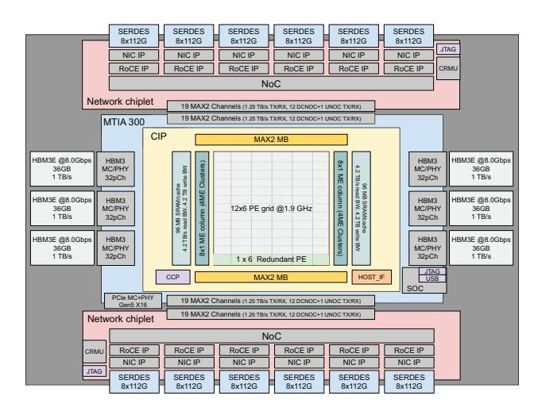
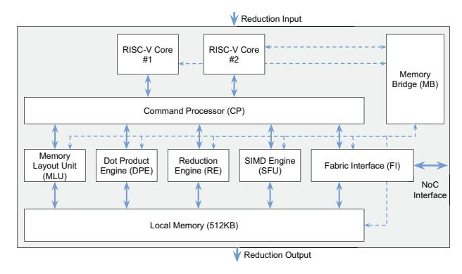
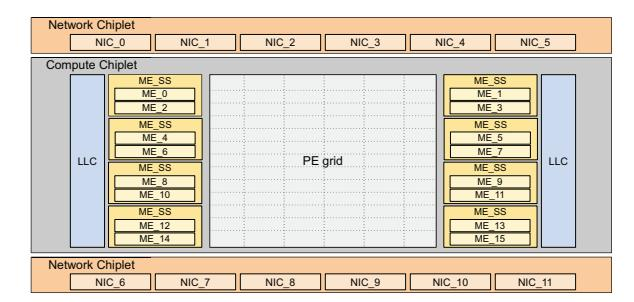
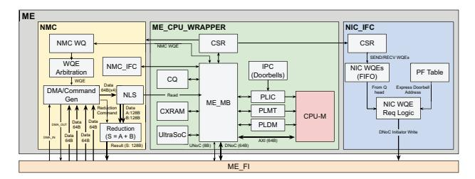
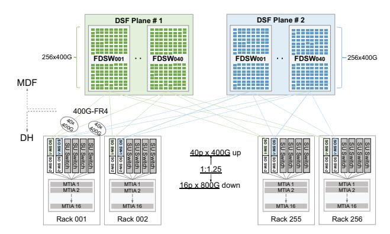
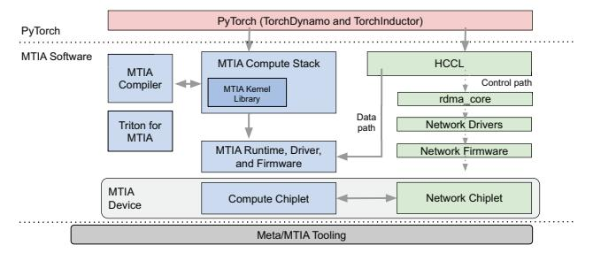
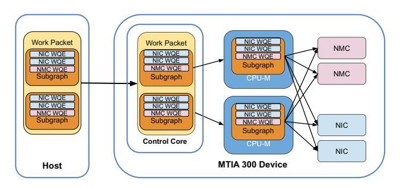
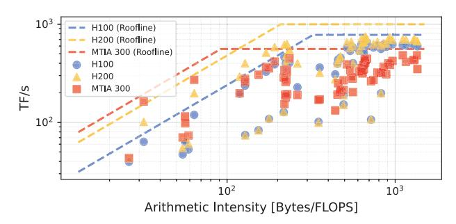
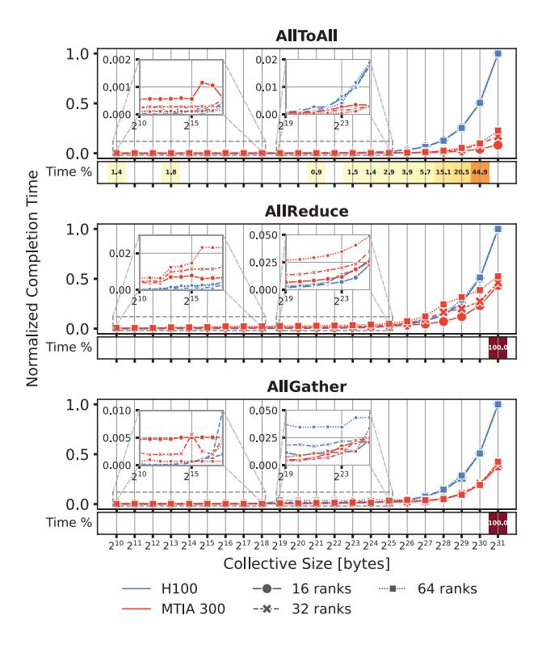

# MTIA 300: Meta's First Training Chip Featuring Built-in NICs and Collective Offloading Engines

MTIA Team∗ Meta Platforms

*Abstract*—We present MTIA 300, Meta's first AI training chip optimized for Deep Learning Recommendation Models (DLRMs). Unlike GenAI training, DLRM training requires modest FLOPS but large memory, high network bandwidth, and frequent collective communication; this combination often leads to low accelerator utilization. MTIA 300 addresses these challenges with three key innovations: (1) built-in NIC chiplets with 12×800 Gbps RDMA NICs to ensure high network performance and eliminate PCIe overhead; (2) dedicated message engines for collective offloading, delivering throughput comparable to compute engines while using only one-third of the chip area; and (3) nearmemory compute, placing message engines close to HBM, cache, and I/O, with specialized hardware to accelerate reductionbased collectives such as ReduceScatter. While motivated by DLRMs, these broadly applicable design principles carry over to subsequent MTIA generations (MTIA 400, 450, and 500) optimized for GenAI models. To our knowledge, MTIA 300 is the first accelerator with built-in NIC chiplets and general-purpose collective offloading engines, enabling efficient scale-up and scaleout communication. Furthermore, while MTIA 300's combination of moderate FLOPS and higher HBM bandwidth and capacity was initially optimized for training DLRMs, these characteristics make it effective for GenAI inference. Performance evaluation shows that MTIA 300 is competitive with same-generation GPUs while offering cost advantages.

# I. INTRODUCTION

AI workloads continue to grow rapidly across the industry. At Meta, products like Facebook and Instagram rely on Deep Learning Recommendation Models (DLRMs) [26] to deliver personalized content, including ads, short videos, and friend posts. This growth has driven the in-house development of Meta's AI chips. We previously introduced MTIA 1 [10] and MTIA 2i [7] (a.k.a. MTIA 100 and 200), both optimized for DLRM inference, with MTIA 2i now deployed at a scale of hundreds of thousands of chips. This paper presents the next step in that evolution: Meta's first training chip, MTIA 300.

Meta supports two major AI workloads: GenAI and DLRMs. DLRM training differs from GenAI training: it requires fewer FLOPS but larger HBM capacity, higher network bandwidth, and more frequent communications. This combination often leads to low accelerator utilization. Unlike generalpurpose GPUs, MTIA 300 is optimized for DLRMs, featuring a design that intentionally diverges from GPU architectures to reflect this focus.

To motivate MTIA 300's design for DLRMs, we first summarize the workload characteristics. DLRMs often apply multi-layer perceptrons (MLPs) to dense features (e.g., user age) and embedding tables to sparse categorical features (e.g., post IDs), connected via a dense interaction layer. Dense components require high FLOPS (though far less than GenAI), while sparse components require irregularly accessing ultra-large embedding tables and are often memory-bound or instruction-bound. Because embedding tables often exceed a single accelerator's memory capacity (sometimes representing over 99% of model parameters), DLRMs employ hybrid parallelism in training: dense layers use data parallelism, and sparse layers shard embedding tables table-wise or row-wise [14]. This approach enables the training of large models without sacrificing compute efficiency in dense layers.

This mix of data and model parallelism for different model components introduces complex communication patterns. With data parallelism, each accelerator receives a local batch and performs an AllReduce to synchronize gradients. Model parallelism adds AllToAllv collectives to exchange features and redistribute results for forward and backward passes. Moreover, many DLRMs use the distributed Shampoo optimizer [12], [32] for dense components, which adds an AllGather during the optimization phase. Efficient execution of these collectives is necessary for achieving high performance.

As DLRMs stress the communication data path, MTIA 300 incorporates the following features to address this challenge:

- *Built-in NIC chiplets*: MTIA 300 adopts a chiplet architecture, embedding two NIC chiplets with a total of 12 highly optimized 800Gbps RDMA NICs. Built-in NICs avoid PCIe overhead between the accelerator and NICs, and the NICs can be used flexibly for scale-up or scale-out networks.
- *Collective offloading*: In GPUs, compute engines and the host CPU handle collective operations, which is often inefficient. MTIA 300, in contrast, utilizes dedicated message engines that deliver the same communication throughput for these operations as compute engines while using only one-third of the chip area.
- *Near memory compute*: Compute and message engines share the network-on-chip for memory and I/O access. To avoid congestion from high-bandwidth collectives, message engines are placed at the chip edges, next to HBM, cache, and I/O. The message engine's near-memory-compute logic block delivers high throughput for all reduction-based collectives, including Reduce, AllReduce, and ReduceScatter.

∗ The full list of authors is in the appendix. Corresponding author: Chunqiang Tang, tang@meta.com.

In addition to outlining MTIA 300's unique hardware features and overall architecture, we describe the software stack, highlighting the collectives library, which provides a familiar interface while effectively leveraging MTIA's specialized message engines and built-in NICs for efficient communication.

Contributions. While many GPUs and AI ASICs have been reported [1], [3], [6], [11], [15], [17], [18], [22]–[24], [30], [33], our experience reveals unique requirements for DL-RMs that prior work does not address. To our knowledge, MTIA 300 is the first accelerator with built-in NIC chiplets and general-purpose collective offloading engines, avoiding the inefficiencies of using compute engines for collectives and enabling flexible networking for both scale-up and scale-out. In comparison, although the TPU's sparse core [16] can also offload remote access to embedding tables, it is specialized for a non-RDMA, non-switched torus network and lacks a general collective library interface, limiting its applicability to other industry accelerators, which are typically built around RDMA and similar collective library interfaces.

Although MTIA 300's distinguishing features—built-in NIC chiplets, collective offloading, and near-memory compute—were originally motivated by DLRM training, these design principles remain broadly applicable and have been adopted in subsequent MTIA generations optimized for GenAI models. While the development of MTIA 300 began several years ago to compete with H100 and H200 GPUs, its successor, MTIA 400 [34], was designed to rival GB300 GPUs. Furthermore, the upcoming MTIA 450 and 500 [34] target industry-leading GenAI inference performance against future GPUs. In this paper, we focus on MTIA 300, leaving the technical details of later generations for future publications.

The rest of the paper is organized as follows. Section II provides an overview of MTIA 300's chip architecture, focusing on its message engine for collective offloading. Section III details the rack and network architecture. Section IV describes the software stack, emphasizing the collective library that leverages MTIA 300's offloading capabilities. Section V evaluates MTIA 300's performance. Section VI discusses its challenges and limitations. Finally, Section VII reviews related work, and Section VIII concludes the paper.

#### II. MTIA 300 ARCHITECTURE

Figure 1 shows an overview of MTIA 300, which adopts a chiplet architecture. To highlight its distinguishing features, we first compare MTIA 300 with MTIA-2i and then with GPUs.

## A. Comparing MTIA 300 with MTIA-2i and GPUs

Table I compares the specifications of MTIA 300 and MTIA-2i [7]. With MTIA-2i designed for inference and MTIA 300 for training, MTIA 300 introduces several changes: ≈3x larger area, ≈10x higher Thermal Design Power (TDP), liquid cooling (versus air cooling), HBM3E (versus LPDDR), FP8 compute (versus INT8), >3x BF16 FLOPS, a 2.5D CoWoS package, a reticle-sized compute die, network chiplets supporting RoCE, and message engines to offload collective communication. Notably, the SIMD compute is increased

Fig. 1: MTIA 300 with chiplets for compute, network, and HBM.

to >6x for FP32, resulting in a 16:1 GEMM:SIMD ratio compared to 32:1 in MTIA-2i; this increase is substantial given the rising demand and diversity of non-GEMM compute in training (e.g., table-batched embedding forward/backward, and optimizers).

Unlike general-purpose GPUs, MTIA 300 is optimized for DLRMs. Table II highlights the features that distinguish it from H100 GPUs. Notably, MTIA 300 deemphasizes peak FLOPS and emphasizes HBM bandwidth and networking, featuring embedded NIC chiplets and dedicated hardware support for collective communication offloading.

# B. MTIA 300 Compute Chiplet

Figure 2 shows the MTIA 300 compute chiplet architecture. It consists of a 12×6 grid of Processing Elements (PEs) for computation and 16 Message Engines (MEs) for collective operations. On the east and west sides, SRAM banks can be used as last-level cache (LLC) or last-level scratch (LLS). Each side connects to 3 twelve-high HBM3E stacks. The PEs are connected to each other and to on- and off-chip memory through a mesh interconnect.

**Network-on-Chip (NoC):** The NoC is a 2D mesh of routers that connects PEs and MEs within the main grid. It also links the compute chiplet to control and host interface blocks, as well as to the chiplet interface IP blocks on the north and south edges, which attach to the network chiplets. The NoC provides channels for data, control, utility (e.g., register access and debug), synchronization, and reductions. To improve performance and scalability, we introduce cluster routers that connect six PEs locally, reducing total hop latency. Unlike MTIA-2i, the compute chiplet does not use a memory crossbar; instead, the NoC handles bank selection routing. It implements L-routing—first traveling along one dimension (e.g., X) and then along the other (Y)—to distribute traffic evenly across the grid, and it uses virtual lanes to avoid deadlocks.

Fig. 2: Architecture of the MTIA 300 compute chiplet.

**Host Interface:** MTIA 300 provides a high-performance host interface with PCIe, DMA, and a secure boot processor. It includes interfaces for host management of the compute and network chiplets, as well as a debug interface.

**Control Core:** This is a RISC-V quad SMP core coordinating execution across the PEs and MEs. It includes the associated context RAM, mailbox registers, and MSI-X interrupts.

**Redundancy:** To improve yield for a reticle-limited die, the compute chiplet includes a redundant row of PEs. Because PEs consume the most area and distributed memory, and given the east-west organization of memory and the NoC routing paths, adding a redundant row is the simplest solution. Each PE column can tolerate one faulty PE by replacing it with the corresponding PE in the redundant row. This is configured at boot, remains transparent to software, and does not impact NoC performance.

# C. Processing Element (PE)

Figure 3 shows the internal architecture of a PE. Each PE includes two RISC-V cores, fixed-function units for accelerating compute and data movement, and internal memory with a memory bridge connecting all components.

**Memory Bridge (MB):** The MB provides data and configuration connectivity between all components in the PE through an internal NoC. It also contains peripherals such as an interrupt controller, machine timer, and debug/trace modules.

**Local Memory:** Each PE includes 512 KB of fast local memory (LS). The LS is software-managed and split into Circular Buffers (CBs) of controllable sizes.

RISC-V Cores: The RISC-V cores execute the application code and issue commands to the Command Processor for the fixed-function units. MTIA 300 has two 64 B-wide vector cores that provide additional SIMD throughput and a symmetric programming model, allowing the same code sequence to run on either core. MTIA uses an asynchronous

TABLE I: Comparing the specifications of MTIA 300 and MTIA-2i.

|                   |                     | MTIA 300                             | MTIA-2i                        |  |
|-------------------|---------------------|--------------------------------------|--------------------------------|--|
| Frequency         |                     | 1.9 GHz                              | 1.35 GHz                       |  |
| Instances         |                     | 7.2B gates, 511M FLOPS               | 2.35B gates, 103M FLOPS        |  |
| Area              |                     | Compute chiplet: 25.6mm x 31.4mm     |                                |  |
|                   |                     | Network chiplet (2x): 25.6mm x 9.3mm | 25.6mm x 16.4mm                |  |
| Package           |                     | 77.5mm x 77.5mm                      | 50mm x 40mm                    |  |
|                   |                     | (50.3mm x 51.9mm 3.2x interposer)    |                                |  |
| Voltage           |                     | 0.85 V                               | 0.85 V                         |  |
| TDP               |                     | 912W (667W typical)                  | 85W (65W typical)              |  |
| Host connection   |                     | 16x PCIe Gen5 (64 GB/s)              | 8x PCIe Gen5 (32 GB/s)         |  |
|                   | Domain size         | 16 nodes                             | N/A                            |  |
| Scale-up network  | Bandwidth           | 800 GB/s (up to 1000 GB/s)           |                                |  |
| Scale-out network | Domain size         | 4096 L1, L2 unlimited                | N/A                            |  |
|                   | Bandwidth           | 200 GB/s                             |                                |  |
| GEMM TOPS         |                     | 1120 TFLOPS/s (FP8)                  | 354 TOPS/s (INT8)              |  |
|                   |                     | 560 TFLOPS/s (FP16/BF16)             | 177 TFLOPS/s (FP16/BF16)       |  |
|                   | RISC-V vector core  | 42.5 (INT8/FP16)                     | 5.5 (INT8), 2.8 (FP16)         |  |
| SIMD TOPS         |                     | 21.3 (BF16/FP32)                     | 1.4 (BF16/FP32)                |  |
|                   | SIMD engine         | 42.5 (FP8/FP16/BF16/FP32)            | 5.5 (INT8/FP16/BF16/FP32)      |  |
|                   | Per-PE local memory | 512 KB                               | 384 KB                         |  |
| Memory capacity   | On-chip SRAM        | 192 MB                               | 256 MB                         |  |
|                   | Off-chip memory     | 216 GB (6 stacks HBM3E)              | 64-128 GB (16 channels LPDDR5) |  |
|                   | Per-PE local memory | 1.9 TB/s (R+W)                       | 1.0 TB/s (R+W)                 |  |
| Memory bandwidth  | On-chip SRAM        | 11.4 TB/s (R+W)                      | 2.7 TB/s (R+W)                 |  |
|                   | Off-chip memory     | 6.1 TB/s (R or W)                    | 204.8 GB/s (R or W)            |  |

Fig. 3: Processing Element (PE) architecture.

dataflow execution model. The programmer writes a kernel that generates a sequence of custom instructions for the fixedfunction units, where data movement and computation occur as dependencies are resolved.

Memory Layout Unit (MLU): The MLU performs memory layout transformations, including transpose, reshape, slice, and concatenation.

Dot Product Engine (DPE): The DPE performs General Matrix Multiplication (GEMM) operations and is used in both the forward and backward passes of training. It operates on two input tensors: the first is read and cached in the DPE, while the second streams from LS to compute a dot product with all rows of the first tensor. The DPE includes two 32×64B×32 Multiply-Accumulate (MAC) tiles, delivering a total throughput of 7.82 TFLOPS per PE with FP16/BF16 inputs and FP32 output. It also supports FP8 inputs (in S1E4M3 or S1E5M2 formats) and TF32 inputs, which are useful for certain ranking and recommendation use cases where higher precision is required.

Reduction Engine (RE): The RE stores intermediate matrix multiplication results from the DPE and performs inter-PE reductions via a dedicated reduction network. It can receive and accumulate results before forwarding them to the next PE or to the SIMD engine for further processing.

SIMD Engine (SFU): The SFU supports quantization, elementwise operations, and non-linear functions. It consists of an execution pipeline with floating-point ALUs and lookup tables (LUTs) to approximate non-linear functions. The SFU can receive input from the RE or read directly from the LS. For training, we removed INT8 and added FP8 alongside FP16, BF16, and FP32. The SIMD width was increased from 32 to 128 elements per cycle to achieve a GEMM:SIMD ratio of 16:1 (half of MTIA-2i), reflecting the high portion

TABLE II: Differentiating features of MTIA 300 versus H100 GPUs and how they enable efficient DLRM training.

| Differentiator                                                           | MTIA 300 Advantage                                                     | Rationale and Benefit                                                                                                                                                                                             |
|--------------------------------------------------------------------------|------------------------------------------------------------------------|-------------------------------------------------------------------------------------------------------------------------------------------------------------------------------------------------------------------|
| HBM bytes-to-FLOPS ra tio                                             | > 2x higher                                                            | DLRM's large sparse features typically prevent effective utilization of high peak FLOPS. Instead, a higher HBM bytes-to-FLOPS ratio enables balanced resource use and higher model FLOPS utilization (MFU). |
| Network bytes-to-FLOPS ratio                                          | > 5x higher                                                            | DLRM training tends to have low compute complexity and high exposed communication, so higher network bandwidth improves MFU.                                                                                   |
| Large global SRAM                                                        | > 3x capacity                                                          | Improves utilization of GEMM and SIMD compute by capturing more locality in both dense and sparse operators.                                                                                                   |
| Flexible IO to meet net work demands                                  | NICs can be partitioned between scale-up and scale-out networks.    | Supports a flat network of up to 1.2 TB/s and allows adjusting scale-up to scale-out ratios based on model needs.                                                                                              |
| Hardware support for collectives and on-device data movement | High utilization due to compute communication overlap.              | Message Engines (MEs) and Near Memory Compute (NMCs) work in coordination with the control cores and the PE grid to maximize concurrency.                                                                      |
| Optimizations for DLRMs                                                  | Accelerates sparse feature process ing and backward pass operators. | Table-batched embedding (TBE) and sparse optimizers are memory- and instruction-bound. MTIA 300 provides dedicated embedding caches and indexed DMA support for TBE, as well as radix-sort acceleration.    |
| Hardware support for ea ger mode                                      | Fast and flexible job dispatch with Work Queue Engines (WQEs)       | Eager mode is important for development and debugging and allows for more flexible model deployment; speeding it up improves developer velocity.                                                               |
| Reliability                                                              | Additional compute and memory improves yield and tolerates errors.  | Employs a redundant row of PEs in the 12x6 PE grid as well as provides ECC for SRAMs and HBM to mitigate failures.                                                                                             |

of computation spent on non-GEMM operations. Additional SIMD throughput is available via the two RISC-V cores.

Based on the requirements of DLRM training, we implement several SFU improvements, including higher throughput for non-linear operations on high-precision data types and added support for min/max, clamping, and stochastic rounding. MTIA 300 also supports hardware-accelerated radix sort to accelerate the embedding backward operation. In the forward pass, sparse offsets and indices are packed so that a single output index maps to a contiguous subset of inputs. In the backward pass, sparse indices must be sorted so that a contiguous subset maps to a single embedding table index. Radix sort fetches elements from LS, sorts them via bucketization, creates histograms, and stores the bucketized elements in memory, speeding up the backward embedding operation.

Command Processor (CP): This processor handles the execution of custom instructions from the RISC-V cores across the fixed-function units, including scheduling and dependency checking. The CP arbitrates LS access between the RISC-V cores and the fixed-function units. It also provides the programmer with a circular buffer (CB) abstraction and manages dependency tracking to ensure correct producer-consumer usage of the CBs.

Fabric Interface (FI): The FI is a DMA engine for transferring data between PE local memory and on-chip or off-chip memory via the NoC. It also enforces packet fragmentation and leaky-bucket traffic shaping to smooth traffic and limit congestion.

Two enhancements to the FI and Command Processor provide more powerful data-movement abstractions. First, MTIA 300 supports byte-aligned DMA for tensor slicing, eliminating the software overhead of layout transformations. Second, it adds hardware-accelerated indexed DMA transfers for scatters and gathers. The Command Processor generates sequences of reads or writes using a list of indices in LS, which is particularly useful for embedding table lookups.

# *D. Message Engine (ME)*

As DLRM training stresses the communication infrastructure, the ME is designed to address GPU limitations and achieve the following objectives.

Avoid host involvement in the data path: By integrating NICs into the MTIA 300 package, we avoid the PCIe data path. Moreover, managing 1.2 TB/s of IO via the host CPU would slow down work submission and completion queue handling and consume a significant number of host cores. Therefore, we offload these tasks to the ME.

Offload collective operations from PEs: In GPUs, compute cores handle processing collective reduction operations, which can be area-inefficient. The MEs deliver similar reduction bandwidth using only one-third the area of PE cores, maximizing area efficiency for collective operations.

Reduce NoC contention: High-bandwidth collective communication on compute cores also stresses the NoC due to heavy traffic. Placing the MEs at the edges of the PE grid minimizes cross-grid congestion. (Figure 4).

Figure 5 shows the ME architecture designed to address these limitations. It consists of three main functional blocks.

CPU-M and peripherals: The ME contains a single scalar RISC-V core (CPU-M), similar to the PE vector cores, and 256 KB of context SRAM. An important feature is the single large shared Completion Queue (CQ) per ME, which eliminates the need to poll multiple queues and prevents CQ overflow.

NIC interface: As MTIA 300 includes 12 separate RDMA NICs within the package, we want to avoid the ME managing a significant number of doorbell addresses in software. This is handled by the NIC interface, which receives work requests

Fig. 4: Each MTIA 300 network chiplet consists of six RoCE NICs.

Fig. 5: Message Engine (ME) architecture.

(WRs) in a single FIFO and distributes them to the correct doorbells on the appropriate NICs.

**Near Memory Compute (NMC):** The NMC is a reduction block capable of 128 B/cycle for reductions or DMA, dropping to 96 B/cycle if all are active concurrently. The MEs can provide up to 2.8 TB/s of reductions, over twice the I/O bandwidth (1.2 TB/s). This block is used in all reduction-based collectives, including Reduce, AllReduce, and ReduceScatter.

# E. MTIA 300 Network Chiplet

To avoid the PCIe overhead, we directly integrate RDMA NICs (based on third-party NIC IP) into the MTIA 300 package as network chiplets, as shown in Figure 4. Each of the two network chiplets contains six custom 800 Gbps (100 GB/s) RDMA IP blocks, providing 600 GB/s throughput per chiplet. We use a die-to-die interface and 112G SerDes to achieve high bandwidth density. The custom RDMA IP blocks are optimized as follows.

**Express Doorbells**: To minimize transaction-posting latency, we introduce "express doorbells," which use the work request (WR) itself as the doorbell write, avoiding an additional HBM ring-buffer read (800 ns per transaction). With express doorbells, each IP block supports up to 24,576 outstanding work requests divided among 1,024 Queue Pairs (QPs).

**Removal of QP caching:** We remove QP caching, as it consumes significant chip area. This limits each NIC chiplet to 1,100 active QPs, well beyond our workload requirements, which typically involve only a few hundred ranks.

Simplified packet processing pipeline: Typical NICs support many features, such as virtual switching and TC offloads (e.g.,

Fig. 6: MTIA training chassis showing position of compute & network blades.

cls\_flower), which we do not need. Removing them simplifies the packet processing pipeline.

**AXI steering tag:** By supporting custom steering tags, we can leverage features like separate cache partitions in the compute chiplet for different traffic types.

#### III. SYSTEM ARCHITECTURE: RACK AND NETWORK

# A. Rack System

As models evolve rapidly, we aim to provide a flexible system architecture that accommodates last-minute changes, compensating for the slower silicon development process where decisions are made well in advance. To this end, we designed the MTIA training system with separate compute and network blades. Each MTIA training chassis contains 16 compute blade slots and six network blade slots, all connected via a pair of cable backplanes. Not all network blades need to be installed. The compute blades are placed vertically to minimize the size of the cable backplane, a historically sensitive component in terms of machining precision.

We design two types of network blades for scale-up and scale-out. The scale-up blade uses an ASIC chosen for its lower latency and power consumption, and multiple racks can be combined to form larger scale-up domains. The scale-out blade supports a disaggregated scheduled fabric that avoids hot links by using packet spray, while ensuring in-order packet delivery as well as providing reliability via a fabric-level, end-to-end credit mechanism. Each blade delivers 200 GB/s of I/O per compute blade, and the number of blades used can be configured according to the chosen scale-up or scale-out setup. Both blades are liquid-cooled.

The compute blade consists of a single CPU with 512 GB of RAM and one MTIA 300 accelerator. The 1:1 mapping keeps nodes simple, accommodating unpredictable CPU demands and avoiding PCIe contention. Both the CPU and accelerator are liquid-cooled.

Fig. 7: Network architecture.

#### B. Network Design

MTIA 300's network architecture is shown in Figure 7. The scale-out network provides 200 GB/s of bandwidth, while the scale-up network currently offers 800 GB/s per accelerator, with the option to reach 1 TB/s. This approach optimizes power consumption and cost based on the requirements. We use a scale-up domain of 16 nodes (one rack) and a first-level scale-out domain of 4,096 nodes, with the option to add a second-level switch network to expand the scale-out domain to 16K nodes or more if needed.

#### IV. SOFTWARE STACK

Figure 8 shows MTIA 300's software stack, which delivers a PyTorch-native experience. It supports a broad range of PyTorch libraries such as FSDP2, DTensor, TorchRec, and XFormers for rapid development of training and inference solutions. It uses the latest PyTorch stack with TorchDynamo for graph capture and TorchInductor for Triton code generation. It supports both eager and graph modes, offers a CUDA-compatible runtime API, and allows kernel authoring in C++ or Triton. We also leverage coding agents for automated kernel generation [13], [21].

The MTIA compiler, built as a custom PyTorch backend, traces forward graphs with TorchDynamo and generates backward graphs via AOTAutograd. It applies MTIA-optimized operator decompositions and supports both handwritten pattern-based fusion and compiler-driven fusion through TorchInductor. It implements a suite of memory optimizations tailored for training workloads. For example, its graph scheduler uses heuristics (e.g., integer linear programming) to reduce peak memory pressure in each training iteration. In addition, the compiler performs activation rematerialization to enable larger effective batch sizes and improve HBM utilization.

A notable distinction from GPUs is MTIA's ability to capture compute and collective operations in a single graph. Collectives traced via torch.export or torch.compile are compiled into one monolithic graph along with compute operators. This lowers sub-graph launch overhead, improving efficiency and determinism. Dependencies between compute and communication are managed via semaphores. Currently,

Fig. 8: MTIA 300 software stack.

Fig. 9: An example of mapping work from CPU-C to CPU-Ms.

statically shaped collectives are fully supported, with ongoing work for dynamically shaped collectives and device-resident AllToAll with dynamic send/recv counts.

Compared with GPUs, MTIA 300 features Message Engines (MEs) for communication offloading and network chiplets for integrated NICs, enabling efficient communication without PCIe traffic or host/PE involvement. To leverage these hardware features, our collective communications library, called HCCL (Section IV-B), uses the MTIA streaming interface to submit all communication operations. Internally, HCCL uses RDMA verbs to drive the network chiplets.

To manage stream order, the control core (CPU-C) was extended from MTIA-2i to dispatch work for both the PE grid and the MEs. Work arrives at the control core in packets containing compute and/or communication tasks; the core ensures dependencies are met before dispatch. Work packets for communication may include multiple subgraphs, which HCCL maps to MEs for parallel execution. Each ME can run multiple subgraphs concurrently; thus, the 16 MEs can handle many subgraphs in parallel. Upon completion, the MEs report status back to the control core to unblock subsequent work.

## A. Collective Graph Processing

Figure 9 shows an example of dispatching subgraphs to the CPU-Ms. Subgraphs are represented as arrays of work queue entries (WQEs), each describing an operation of one of several types, examples include: SEND, RECV, WRITE, WAIT, SET, REDUCE. Some map directly to RDMA work requests (i.e., SEND, RECV, and WRITE) with similar fields and semantics (e.g., queue pair ID, local and target address, length, lkey, rkey, etc.). The SET WQE writes a value to local memory (HBM or cache), while the WAIT WQE stalls until a comparator on a memory location is satisfied (e.g., wait for address  $0 \times abcdef > 10$ ). The REDUCE WQE performs a sum operation,  $S = A + 10 \times 10^{-1}$ 

Fig. 10: Example of an AllReduce ring algorithm with 4 nodes.

B, where S can overlap with A or B, or optionally performs a memory copy, acting like a DMA engine.

WQEs also include internal fields to aid processing. Flow control fields define ordering between WQEs, enabling common communication patterns such as rings, recursive doubling, and ordered trees. These are the fields that can be defined to specify ordering:

- wqe\_sync: Do not issue this WQE until the specified previous WQE (counting backward from the current one) has completed.
- fence: Do not issue any additional WQEs until this one completes.
- rx\_sync: Wait for all outstanding receive WQEs to complete before issuing this one.
- sync: Wait for all previous WQEs to complete before issuing this one.

The near-memory compute (NMC) engine (Section II-D) efficiently performs reductions. Its proximity to cache and HBM enables it to execute the essential operations for AllReduce or ReduceScatter without using the PE grid, minimizing resource sharing between communication and compute operations.

Putting it all together, Figure 10 illustrates a simplified AllReduce ring algorithm [29] which takes place in a ReduceScatter phase and AllGather phase translated into WQEs with dependencies. Reading from bottom to top, the first receive and send have no dependencies and can be posted in parallel. The subsequent add operation depends on the preceding receive, which then unblocks the next receive and send. This repeats until all data is locally reduced (the ReduceScatter phase). The final three steps depict the AllGather phase, where each step depends on the previous for data movement.

# *B. Collective Communications Library (HCCL)*

HCCL constructs work packets and subgraphs that use the network chiplets and NMC engines. It uses the RDMA verbs to manage the control path. For example, to create queue pairs (QPs) between two peers, it calls ibv\_create\_qp and then ibv\_modify\_qp to move them to "ready to receive" and "ready to send," as with any standard RDMA workflow. Creating these QPs also involves mapping them to express doorbells via the NIC interface. WC errors are detected inline by the ME. Errors that do not trigger WCs are captured via ibv\_get\_async\_event.

Due to the lack of hardware QP caching (Section II-E), each NIC supports a limited number of active QPs accessible by HCCL (1,088). HCCL manages this by connecting QPs only when needed, designing collective algorithms to minimize unused QPs, and reusing QPs within communicators. Because of our flexibility in using the NICs, we have 12 NICs with 13,056 queue pairs that can be split or shared between the scale-up and scale-out communication domains.

For the data path, HCCL provides an API similar to other collective communication libraries, including familiar collectives (e.g., AlltoAll, AllReduce, ReduceScatter, AllGather) and point-to-point communication (i.e., send and receive) using communicators to define participating device groups. This API is primarily exposed through PyTorch distributed interfaces (both PyTorch Distributed [8] and torchcomms [35]). Backends for these interfaces translate PyTorch semantics, such as Tensors and process groups, into communication library semantics of contiguous buffers and communicators with associated resources.

When a user calls a HCCL communication API, the library prepares the communication for offload to the device. Unlike many libraries where communication is host-driven, HCCL is uninvolved once the work reaches the device. It determines the most efficient algorithms and communication channels a priori based on outstanding work, system topology, communication type and other parameters, selecting the algorithm and corresponding resources. The library then translates this into work packets, subgraphs, and WQEs for device execution.

Parallelism occurs at multiple levels. Work packets for a single collective execute in the same stream, enforcing ordering between algorithm phases if needed. Within a work packet, subgraphs execute logically in parallel, though hardware availability may queue some until the required ME is free. Subgraphs can also define dependencies between each other using semantics like WAIT and SET as described above. WQEs are issued sequentially but only block when specified via the flow control field. Together, these mechanisms let HCCL maximize parallelism, efficiently using network bandwidth and reduction capacity. Figure 11 visualizes this flow.

HCCL maintains a thread that tracks the status of outstanding work to clean up resources no longer needed and monitor for errors. This thread also allows HCCL to signal operation completion to the application, depending on the interface used such as TorchWork objects in torchcomms interface.

# V. EVALUATION

Proper evaluation of MTIA 300 requires situating it in the fast-evolving AI accelerator landscape. Development of MTIA 300 started several years ago to compete with H100 and H200 GPUs. Its successor, MTIA 400 [34], was designed

Fig. 11: Execution of an HCCL collective operation across host and device components.

to rival GB300 GPUs, while MTIA 450 and 500 [34] target industry-leading GenAI inference performance against future GPUs. In this context, Table III compares MTIA 300, H100, and H200. We evaluate MTIA 300 using both microbenchmarks and production-scale DLRM training workloads. Additionally, although MTIA 300 was optimized for DLRMs, its superior HBM capacity and bandwidth make it effective for GenAI inference, which we also evaluate in this section.

TABLE III: Evaluation testbeds.

|                            |             | MTIA 300        | H100(∗)        | H200           |
|----------------------------|-------------|-----------------|----------------|----------------|
| Peak FLOPS/s (BF16)        |             | 560 TF/s        | 780 TF/s(∗)    | 1000 TF/s      |
| HBM                        | Capacity    | 216 GB          | 96 GB          | 141 GB         |
|                            | Bandwidth   | 6.1 TB/s        | 2.4 TB/s       | 4.8 TB/s       |
| Power (accelerator / host) |             | 912W/1500W      | 500W/6500W     | 700W/8850W     |
| # of accelerators per host |             | 1               | 8              | 8              |
| Scale-up                   | Domain size | 16 accelerators | 8 accelerators | 8 accelerators |
| network                    | Bandwidth   | 800 GB/s        | 450 GB/s       | 450 GB/s       |
| Scale-out network       | Bandwidth   | 200 GB/s        | 50 GB/s        | 50 GB/s        |

(\*) *To achieve better performance per watt, we use a custom H100 configuration with a 500W power cap, which reduces peak performance from 1,000 TFLOPS at 700W.*

# *A. Compute Operations*

To begin, we assess compute performance using several microbenchmarks.

Embedding performance: Embedding operators, particularly table-batched embedding [36], are important computational components in the sparse portions of DLRMs. As shown in Figure 12, our evaluation of embedding operator performance across various shapes and input distributions from production workloads demonstrates MTIA 300's strong performance: MTIA 300 achieves 2.0× and 1.6× speedups for forward operations and 2.1× and 1.6× speedups for backward operations (geometric mean) compared with H100 and H200, respectively. This high performance is enabled by MTIA 300's high memory and cache bandwidth, as well as its specialized functional units, such as radix sort, which accelerate embedding operators. We note that embedding performance does not scale linearly with HBM bandwidth and therefore does not

Fig. 12: Performance of forward and backward table-batched embedding operations.

Fig. 13: Memory bandwidth achieved by a kernel performing BF16 additions.

reach a 2.5× speedup compared with H100. Skewed input data, where most indices reference the same feature, often causes embedding operators to become cache-bound or instructionbound rather than memory-bandwidth-bound.

Memory bandwidth: Figure 13 illustrates the memory bandwidth for element-wise addition on MTIA 300, H100, and H200 using a simple BF16-add kernel across various tensor sizes. The results show that MTIA 300 reaches up to 5.57 TB/s for large data sizes (91% of its peak HBM bandwidth), surpassing the H100's 2.26 TB/s (94%) and H200's 4.40 TB/s (92%). While MTIA 300 shows comparable HBM efficiency and higher bandwidth for large memory operations, it shows lower performance for fine-grained kernels. We discuss this per-kernel latency in Section VI.

GEMM performance: GEMMs are a major component of the dense layers in DLRMs. Figure 14 shows BF16-GEMM performance across various sizes encountered in production. The results indicate that MTIA 300 performs well on smaller, memory-bound GEMMs due to its high memory bandwidth. However, for larger matrices, MTIA 300 shows lower performance, limited by its peak FLOPS. When the arithmetic intensity exceeds 400 bytes/FLOPS, H100 achieves 63% efficiency, compared with MTIA 300's 59% for the tested shapes,

Fig. 14: GEMM performance versus roofline for MTIA 300, H100, and H200.

though MTIA 300's is higher than H200's 54% efficiency. Since MTIA 300 reaches over 90% efficiency on favorable shapes in our microbenchmarks, this lower efficiency is due to our GEMM library, which still needs further optimization. We discuss further kernel optimizations in Section VI.

## *B. Collective Operations*

This section compares the performance of three widely used collectives in production training models: AllGather, AllReduce, and AllToAll. Figure 15 shows their normalized latencies on MTIA 300 and H100 across varying numbers of accelerators. MTIA 300 generally demonstrates superior performance for all three collective operations within the message size ranges used by our models (denoted by the "*Time %*" in Figure 15). This speedup is particularly notable when using 16 or more accelerators or message sizes over 16 MB, which we attribute to MTIA 300's larger scale-up domain size and 2.2× higher scale-up bandwidth. For small message sizes, H100 with NCCL currently tends to outperform MTIA 300 with HCCL. We have not yet fully optimized the software stack for small messages, as they currently account for only a small percentage of the wall-clock time in the training workloads we actively run on MTIA 300.

# *C. Overlapping Compute and Collective Operations*

MTIA 300 features a hardware architecture that offloads collective operations, effectively minimizing the performance impact on compute kernels during concurrent execution. To evaluate the interaction between compute kernels and collectives, we developed a microbenchmark that runs 1,000 TF32 GEMMs of size 4K × 4K × 4K while simultaneously executing various collective operations with representative message sizes across 16 accelerators. Figure 16 shows the efficiency of computation and communication when performed in parallel; 100% efficiency indicates that the platform achieves the same performance as when running only computation or only communication operations. MTIA 300 sustains high efficiency for both, demonstrating minimal interference between the two. This is enabled by dedicated message engines and nearmemory compute units, which process collective operations independently from the main compute engines. In contrast, H100 experiences contention for streaming multiprocessors

Fig. 15: Performance of collective operations. "*Time%*" represents the ratio of execution time for collectives with different message sizes in our workloads.

Fig. 16: Performance degradation due to concurrent execution of collectives and computation.

when collectives and computation are executed concurrently, resulting in notable performance degradation. MTIA 300's ability to decouple collectives from computation is particularly beneficial for DLRMs, which rely on frequent collective operations for distributed training.

# *D. Production Training Workload*

MTIA 300 has demonstrated promising results on production training workloads. This section examines MTIA 300's performance when training a DLRM model [26], which contains approximately 150 billion parameters (with 99% in the

Fig. 17: Message sizes and latencies of collective operations across the 40 accelerators used in training. AA, AR, and AG denote AllToAllv, AllReduce, and AllGather, respectively.

sparse component). Training a single sample requires roughly 3 billion floating-point operations. We implemented the model using TorchRec [14] and fully compiled it with PyTorch's graph compiler, TorchInductor [2], on both MTIA 300 and H100 to maximize performance. The model uses the distributed Shampoo [32] optimizer and is parallelized via a distributed data-parallel scheme.

*1) Collectives:* To compare collective execution times, we configured the model using 40 accelerators with a local batch size of 6,144. Figure 17 illustrates the message statistics and latencies for each training iteration. As shown in the first chart, AllReduce and AllGather operations handle substantial data, with incoming messages of 1.6 GB and 2.1 GB, respectively. However, the 35 AllToAllv operations present a unique performance challenge; they involve sparse-data distributions with highly variable message sizes ranging from 1 KB to 1 GB. The second chart demonstrates MTIA 300's superior performance over H100 for large-scale AllToAll and AllReduce operations. Overall, MTIA 300's communication performance exceeds that of H100 by 3.9×.

*2) End-to-end training performance:* While models implemented for GPUs can run directly on MTIA 300, performance is maximized when models are co-designed with its architecture. Below, we highlight three co-design strategies that collectively enable MTIA 300 to achieve a 1.42× higher Perf/TCO than H100 for the DLRM model.

CPU offloading for Shampoo. The matrix eigendecomposition operator is a compute-intensive component of the Shampoo optimizer's preconditioning step. While

TABLE IV: Perf/TCO with different local batch sizes.

| Local batch size | Accelerators  | Normalized Perf/TCO (higher is better) |
|------------------|---------------|-------------------------------------------|
| 6144             | 40 × H100     | 1.00                                      |
| 6144             | 40 × MTIA 300 | 1.39                                      |
| 10240            | 24 × MTIA 300 | 1.42                                      |

H100 utilizes the cuSOLVER library for this operation, implementing a numerically accurate and efficient version on MTIA 300 is difficult due to performance-accuracy trade-offs. However, MTIA 300's 1:1 host-to-accelerator ratio enables offloading these computations to the host CPU, ensuring sufficient numerical precision. In contrast, using a 1:8 ratio (typical of H100 systems) would incur a 7.8% performance loss, underscoring the advantages of MTIA 300's balanced architecture.

Disable quantized communication. Since this model was originally optimized for H100, it enables row-wise FP8 quantized communication by default to reduce data volume. However, on MTIA 300, this process relies on inefficient RISC-V operations rather than native support. By disabling FP8 quantization and leveraging MTIA 300's high network bandwidth, we avoid these resource-intensive operations and achieve a 4.4% performance improvement.

Large training batches. Increasing the local batch size on MTIA 300 optimizes distributed training performance. By enlarging the local batch size, we can reduce the number of trainers while maintaining a constant global batch size, thereby improving kernel granularity and minimizing communication overhead. Table IV compares Perf/TCO across different local batch sizes. MTIA 300's substantial HBM capacity supports larger batch sizes, such as 10,240, which increases Perf/TCO by 2% over the 6,144 baseline used for H100. Leveraging MTIA 300's memory to increase local batch size is thus an effective strategy for boosting training efficiency.

Future optimization opportunities. We aim to further enhance performance through several targeted optimizations. Beyond refining kernels for GEMM and small collective operations, we are developing strategies tailored to MTIA 300's unique hardware. This includes a TorchRec sharding strategy specialized for MTIA 300's performance profile, leveraging its distinct kernel, communication, and memory trade-offs to reduce load imbalance and iteration time. Additionally, we are exploring kernel co-location within the same grid—rather than sequential execution on a 12×6 grid—to increase PE utilization. Together, these optimizations are expected to improve MTIA 300's efficiency and throughput.

# *E. LLM Inference*

While MTIA 300 was originally optimized for training DL-RMs, it is also effective for serving Large Language Models (LLMs). For this study, we use H200 as the reference platform instead of H100, as H100's HBM capacity is insufficient to run the DeepSeek-R1 model [9] used in the evaluation. We use

Fig. 18: Performance of DeepSeek-R1 inference on MTIA 300 and H200. The "CL" values on the curves denote different concurrency levels L.

InferenceMax [5], an open-source LLM inference benchmark, running on the vLLM inference runtime [20]. Attention and KV-cache are stored and computed in BF16, while mixtureof-experts (MoE) computation uses FP8; these precisions are natively supported on both MTIA 300 and H200. We focus on an online short-prompt scenario: each request draws its input and output lengths independently and uniformly at random from [0.8×1024, 1024] tokens. These are tested across a sweep of batch sizes (concurrency levels from 4 to 256), measuring throughput (tokens/sec) and latency.

Because a single accelerator cannot host the full model, we evaluate 8-accelerator configurations on both platforms (8 × MTIA 300 and 8 × H200). We consider two sharding strategies: TP8-TP8 (tensor parallelism applied to both attention and MoE across 8 accelerators) and DP8-EP8 (data parallelism for attention components combined with expert parallelism for MoE). In TP8-TP8, each layer's weight matrices are sharded across all 8 devices; every device computes a slice of each operation and synchronizes via AllReduce after each parallel region. In DP8-EP8, the dense layers (attention and shared MLPs) are replicated across all 8 devices, with each device processing an independent batch of requests, while the MoE portions are partitioned so that each device owns 1/8th of the experts and tokens are routed between devices via AllToAll communication. For this evaluation, we configured the servers using mixed batching.

Figure 18 shows the performance on MTIA 300 and H200, where the x-axis denotes the client-side end-to-end latency of each request and the y-axis denotes the total token throughput per accelerator. The results demonstrate that MTIA 300 outperforms H200 overall on the InferenceMax benchmark. In this configuration, execution time is decode-dominant, allowing MTIA 300 to leverage its high HBM bandwidth and outperform H200 at high concurrency levels (over 64). However, the performance gap is not uniform across all operating points; the gap is smaller at low concurrency levels. This is due to MTIA 300's higher small-batch communication overhead compared with the fast intra-node communication on H200 via NVLink, as well as certain kernels not being fully parallelized beyond the batch/token dimension, which leads to the underutilization of PE cores on MTIA 300.

# VI. CHALLENGES AND LIMITATIONS

While MTIA 300 is optimized for DLRM training, it has limitations that we aim to address in subsequent MTIA generations. In particular, balancing specialization and generalization remains crucial for adapting to evolving models. In addition to supporting DLRMs, our roadmap for MTIA 400, 450, and 500 [34] expands support for LLM workloads, specifically prioritizing LLM inference performance.

Compute-heavy workloads. Modern GenAI models are compute-intensive, requiring large-scale, low-precision matrix operations. This trend is beginning to influence DLRMs, which are adopting larger dense components and Transformer architectures, further increasing computational demands. Consequently, we designed MTIA 400 [34] with higher FLOPS to address these challenges.

Low-precision data types. Supporting new data types on MTIA 300 is challenging, especially as models adopt formats with custom scaling, such as row-wise or block-wise scaling for MX4 and NVFP4. While MTIA 300 handles standard hardware-accelerated casts, these emerging types often require specialized scaling that is not natively supported, forcing a fallback to RISC-V execution. This fallback reduces performance and complicates the integration and optimization of models using these advanced data representations. To address this limitation, we introduced native support for MX4 in MTIA 400 [34].

Numerical accuracy. Hardware fungibility—the expectation of consistent results across platforms—is important. Achieving numerical parity between MTIA 300 and existing systems is challenging: differences in floating-point arithmetic (precision, rounding, and supported data types) and in kernel or operator implementations (algorithm choices and operation order) can cause convergence issues that only appear after hours or days of training. We have developed numerical debugging tools to address these challenges, but they still require time to mature.

Eager mode. Eager mode is convenient for model development, particularly for debugging and rapid prototyping, although graph mode is typically used in production. However, eager mode faces significant performance challenges. Unlike NVIDIA's highly optimized low-latency systems, MTIA 300's eager mode incurs substantial host-side overheads—arising from the Python interpreter, dynamic dispatch, and devicehost communication—that do not scale with faster accelerator hardware. Consequently, as accelerators improve, the host becomes the bottleneck, highlighting the need for better eager mode support.

Training time. Optimizing training time on MTIA 300 requires balancing complex trade-offs. MTIA 300 excels with large batch sizes by leveraging abundant HBM and efficient computation. However, the global batch size must be controlled to preserve model convergence, often forcing smaller local batches. While some users favor faster training by running more trainers with smaller batches, this can underutilize HBM and amplify host-runtime overheads from fine-grained operators. The challenge lies in reconciling these competing requirements.

Model enablement and operator authoring. Training DL-RMs requires orders of magnitude more operators and shapes than inference. Some are performance-sensitive and justify significant developer effort for maximum performance, while others are "tail" operators that do not. This contrasts with LLMs, where the operator and shape surface area is relatively well-defined. Additionally, ranking engineers perform extensive experimentation, leading to frequent model iterations. Each new model snapshot we enabled required new operators, shapes, and graph transformations. Beyond adding support in TorchInductor and writing manual kernels, we needed substantial infrastructure to collect production traces, synthesize operator and shape tests, and maintain a CI/CD environment to increase coverage and developer velocity. To this end, we have achieved early success in leveraging coding agents for automated kernel generation [13], [21].

# VII. RELATED WORK

Due to the surge in AI workloads, the trend of developing in-house AI chips has gained significant momentum among major IT companies, including Google [17], Amazon [11], Huawei [22], IBM [23], Microsoft [1], Alibaba [15], Baidu [28], OpenAI [27], Tesla [25], Tencent [19], and Meta [7], [10]. Additionally, many startups, such as Cerebras [24], Groq [3], SambaNova [30], Cambricon [4], and Rivos [31], offer AI chips as alternatives to GPUs from established vendors [6], [18], [33].

Compared with Meta's prior inference chips [7], [10], MTIA 300—our first training chip—introduces three distinguishing features: (1) built-in NIC chiplets, (2) dedicated message engines for collective offloading, and (3) nearmemory compute to accelerate reduction-based collectives. To our knowledge, these features are unique among existing AI accelerators.

Although Google TPU's sparse core [16] can offload communication, it is specialized for a non-RDMA, non-switched torus network and lacks a general collective library interface. This limits the applicability of the sparse core's technology to other industry accelerators, which are typically built around RDMA and similar collective library interfaces.

Most custom AI ASICs focus on inference in graph mode and lack first-class support for eager mode, which is important for PyTorch's usability by model developers. In contrast, MTIA provides a native, PyTorch-first software ecosystem supporting TorchDynamo, TorchInductor, Triton, and both eager and graph modes, with a CUDA-like runtime API that simplifies model porting. Notably, while both MTIA and other chips [30] adopt a dataflow architecture in which computations occur as their dependencies are resolved, MTIA is the only one to provide a native PyTorch experience. Finally, whereas modern AI ASICs are primarily optimized for GenAI models, MTIA 300 is optimized for DLRMs.

## VIII. CONCLUSION

We presented the design and evaluation of MTIA 300, our first in-house AI chip for DLRM training. With its first-ofits-kind integrated NICs and collective offloading engines, we demonstrate improved efficiency on a recommendation model training workload compared with GPUs. For future work, we are accelerating the development of Meta's next-generation AI chips [34], which will address the growing demands of LLM training and inference workloads alongside recommendation tasks. We expect that the shift toward in-house AI chips will drive new model co-design opportunities and the next wave of model innovations.

# REFERENCES

- [1] "Azure Maia for the era of AI: From silicon to software to systems," 2024. [Online]. Available: https://azure.microsoft.com/en-us/blog/azuremaia-for-the-era-of-ai-from-silicon-to-software-to-systems/
- [2] "Torchinductor," 2024. [Online]. Available: https://pytorch.org/docs/ stable/torch.compiler dynamo overview.html
- [3] D. Abts, J. Kim, G. Kimmell, M. Boyd, K. Kang, S. Parmar, A. Ling, A. Bitar, I. Ahmed, and J. Ross, "The Groq Software-defined Scale-out Tensor Streaming Multiprocessor: From Chips-to-systems Architectural Overview," in *2022 IEEE Hot Chips 34 Symposium (HCS)*. IEEE Computer Society, 2022, pp. 1–69.
- [4] Bloomberg, "Cambricon aims to triple output to replace nvidia in china," 2025, https://www.bloomberg.com/news/articles/2025-12-04/ cambricon-aims-to-triple-chip-output-to-replace-nvidia-in-china.
- [5] K. Chen, D. Patel, D. Nishball, C. Quilici, and C. K. Wen, "InferenceMAX™: Open Source Inference Benchmarking," 2025, https: //newsletter.semianalysis.com/p/inferencemax-open-source-inference.
- [6] J. Choquette, W. Gandhi, O. Giroux, N. Stam, and R. Krashinsky, "NVIDIA A100 Tensor Core GPU: Performance and Innovation," *IEEE Micro*, vol. 41, no. 2, pp. 29–35, 2021.
- [7] J. Coburn, C. Tang, S. A. Asal, N. Agrawal, R. Chinta, H. Dixit, B. Dodds, S. Dwarakapuram, A. Firoozshahian, C. Gao *et al.*, "Meta's Second Generation AI Chip: Model-Chip Co-Design and Productionization Experiences," in *Proceedings of the 52nd Annual International Symposium on Computer Architecture*, 2025, pp. 1689–1702.
- [8] W. Constable and W. Feng, "Pytorch distributed overview," 2020, https: //docs.pytorch.org/tutorials/beginner/dist overview.html.
- [9] DeepSeek-AI, "DeepSeek-R1: Incentivizing Reasoning Capability in LLMs via Reinforcement Learning," 2025. [Online]. Available: https://arxiv.org/abs/2501.12948
- [10] A. Firoozshahian, J. Coburn, R. Levenstein, R. Nattoji, A. Kamath, O. Wu, G. Grewal, H. Aepala, B. Jakka, B. Dreyer *et al.*, "MTIA: First Generation Silicon Targeting Meta's Recommendation Systems," in *Proceedings of the 50th Annual International Symposium on Computer Architecture*, 2023, pp. 1–13.

- [11] X. Fu, Z. Zhang, H. Fan, G. Huang, M. El-Shabani, R. Huang, R. Solanki, F. Wu, R. Diamant, and Y. Wang, "Distributed Training of Large Language Models on AWS Trainium," in *Proceedings of the 2024 ACM Symposium on Cloud Computing*, 2024, pp. 961–976.
- [12] V. Gupta, T. Koren, and Y. Singer, "Shampoo: Preconditioned stochastic tensor optimization," in *International Conference on Machine Learning*. PMLR, 2018, pp. 1842–1850.
- [13] A. M. Hammond, A. Markosyan, A. Dontula, S. Mahns, Z. Fisches, D. Pedchenko, K. Muzumdar, N. Supper, M. Saroufim, J. Isaacson, L. Wang, W. Hunt, K. Gondkar, R. Levenstein, G. Synnaeve, R. Li, J. Kahn, and A. Mathews, "Agentic Operator Generation for ML ASICs," in *Ninth Annual Conference on Machine Learning and Systems (MLSys'26)*, 2026.
- [14] D. Ivchenko, D. Van Der Staay, C. Taylor, X. Liu, W. Feng, R. Kindi, A. Sudarshan, and S. Sefati, "TorchRec: a PyTorch Domain Library for Recommendation Systems," in *Proceedings of the 16th ACM Conference on Recommender Systems*, 2022, pp. 482–483.
- [15] Y. Jiao, L. Han, and X. Long, "Hanguang 800 NPU—The Ultimate AI Inference Solution for Data Centers," in *2020 IEEE Hot Chips 32 Symposium (HCS)*. IEEE Computer Society, 2020, pp. 1–29.
- [16] N. Jouppi, G. Kurian, S. Li, P. Ma, R. Nagarajan, L. Nai, N. Patil, S. Subramanian, A. Swing, B. Towles *et al.*, "TPU v4: An optically reconfigurable supercomputer for machine learning with hardware support for embeddings," in *Proceedings of the 50th annual international symposium on computer architecture*, 2023, pp. 1–14.
- [17] N. P. Jouppi, D. H. Yoon, M. Ashcraft, M. Gottscho, T. B. Jablin, G. Kurian, J. Laudon, S. Li, P. Ma, X. Ma, T. Norrie, N. Patil, S. Prasad, and C. Young, "Ten Lessons From Three Generations Shaped Google's TPUv4i," in *2021 ACM/IEEE 48th Annual International Symposium on Computer Architecture (ISCA)*. IEEE, 2021, pp. 1–14.
- [18] R. Kaplan, "Intel Gaudi 3 AI Accelerator: Architected for Gen AI Training and Inference," in *2024 IEEE Hot Chips 36 Symposium (HCS)*. IEEE, 2024, pp. 1–16.
- [19] A. Kharpal, "Tencent launches three new chips as China's tech giants bolster efforts in semiconductors," 2021, https://www.cnbc.com/2021/ 11/04/chinas-tencent-launches-three-new-chips-.html.
- [20] W. Kwon, Z. Li, S. Zhuang, Y. Sheng, L. Zheng, C. H. Yu, J. E. Gonzalez, H. Zhang, and I. Stoica, "Efficient Memory Management for Large Language Model Serving with PagedAttention," in *Proceedings of the ACM SIGOPS 29th Symposium on Operating Systems Principles*, 2023.
- [21] G. Liao, H. Qin, Y. Wang, A. Golden, M. Kuchnik, Y. Yetim, J. J. Ang, C. Fu, Y. He, S. Hsia, Z. Jiang, D. Li, U. Pashkevich, V. Puvvada, F. Shi, M. Steiner, R. Xiao, N. Yan, X. Yu, Z. Fang, R. Levenstein, K. Ho, H. Zhu, A. Hammond, R. Li, A. Mathews, K. Gondkar, A. Zainul-Abedin, K. Singh, H. Yu, W. Chi, B. Huang, S. Zhang, N. Weller, Z. Marine, W. Cook, C.-J. Wu, and G. Liu, "KernelEvolve: Scaling Agentic Kernel Coding for Heterogeneous AI Accelerators at Meta," 2026.
- [22] H. Liao, J. Tu, J. Xia, H. Liu, X. Zhou, H. Yuan, and Y. Hu, "Ascend: a scalable and unified architecture for ubiquitous deep neural network computing: Industry track paper," in *2021 IEEE International Symposium on High-Performance Computer Architecture (HPCA)*. IEEE, 2021, pp. 789–801.
- [23] C. Lichtenau, A. Buyuktosunoglu, R. Bertran, P. Figuli, C. Jacobi, N. Papandreou, H. Pozidis, A. Saporito, A. Sica, and E. Tzortzatos, "AI accelerator on IBM Telum processor: Industrial product," in *Proceedings of the 49th Annual International Symposium on Computer Architecture*, 2022, pp. 1012–1028.
- [24] S. Lie, "Cerebras architecture deep dive: First look inside the hardware/software co-design for deep learning," *IEEE Micro*, vol. 43, no. 3, pp. 18–30, 2023.
- [25] E. Musk, "Tesla's ai chip," 2025, https://x.com/elonmusk/status/ 1992499020590108745.
- [26] M. Naumov, D. Mudigere, H.-J. M. Shi, J. Huang, N. Sundaraman, J. Park, X. Wang, U. Gupta, C.-J. Wu, A. G. Azzolini *et al.*, "Deep learning recommendation model for personalization and recommendation systems," *arXiv preprint arXiv:1906.00091*, 2019.
- [27] OpenAI, "Openai and broadcom announce strategic collaboration to deploy 10 gigawatts of openai-designed ai accelerators," 2025, https://openai.com/index/openai-and-broadcom-announcestrategic-collaboration/.
- [28] J. Ouyang, X. Du, Y. Ma, and J. Liu, "Kunlun: A 14nm highperformance ai processor for diversified workloads," in *2021 IEEE*

- *International Solid-State Circuits Conference (ISSCC)*, vol. 64. IEEE, 2021, pp. 50–51.
- [29] P. Patarasuk and X. Yuan, "Bandwidth optimal all-reduce algorithms for clusters of workstations," *Journal of Parallel and Distributed Computing*, vol. 69, pp. 117–124, 02 2009.
- [30] R. Prabhakar, "SambaNova SN40L RDU: Breaking the Barrier of Trillion+ Parameter Scale Gen AI Computing," in *2024 IEEE Hot Chips 36 Symposium (HCS)*. IEEE, 2024, pp. 1–24.
- [31] Rivos, "From silicon to ai solutions," 2025, https://www.rivosinc.com/.
- [32] H.-J. M. Shi, T.-H. Lee, S. Iwasaki, J. Gallego-Posada, Z. Li, K. Rangadurai, D. Mudigere, and M. Rabbat, "A distributed data-parallel Py-Torch implementation of the distributed shampoo optimizer for training neural networks at-scale," *arXiv preprint arXiv:2309.06497*, 2023.
- [33] A. Smith and V. Alla, "AMD Instinct MI300X Generative AI Accelerator and Platform Architecture," in *2024 IEEE Hot Chips 36 Symposium (HCS)*. IEEE Computer Society, 2024, pp. 1–22.
- [34] Y. J. Song, A. Tulloch, H. Reddy, C. Tang, and V. Thakkar. Four MTIA Chips in Two Years: Scaling AI Experiences for Billions. [Online]. Available: https://ai.meta.com/blog/meta-mtia-scale-ai-chipsfor-billions/
- [35] Team torchcomms at Meta, "torchcomms: a modern PyTorch communications API," 2025, https://pytorch.org/blog/torchcomms/.
- [36] D. Zha, L. Feng, B. Bhushanam, D. Choudhary, J. Nie, Y. Tian, J. Chae, Y. Ma, A. Kejariwal, and X. Hu, "Autoshard: Automated embedding table sharding for recommender systems," in *Proceedings of the 28th ACM SIGKDD Conference on Knowledge Discovery and Data Mining*, 2022, pp. 4461–4471.

# APPENDIX: CONTRIBUTORS TO MTIA 300

Aadesh Karki, Aakash Dineshkumar Verma, Aaron Barnes, Aarti Ramesh, Abde Patanwala, Abdullah Alperen, Abel Bernabeu, Abhinav Jauhri, Adam Belay, Adam Hutchin, Adam Incera, Adel Abouchaev, Aditya Bhagwat, Adrian Lewis, Adrian Tung, Aidan Malone, Ajaya Durg, Ajit Mathews, Ajit Punj, Akshata Nagabhushana, Albert Zhao, Alberto Zeni, Alec Hammond, Alex Finestead, Alex Grbic, Alex Mastro, Alexander Finestead, Alexander Kabaev, Alexey Andronov, Alexey Pervushin, Ali Abyaneh, Alvin Lee, Aman Dontula, Amin Firoozshahian, Amin Qassoud, Amithash Prasad, Ana Zehtabioskuie, Anand Jayaraman, Anand Singh, Ananya Garg, Anastasiia Grishina, Andrew Luo, Andrew Uderian, Andrew Xi, An Wang, Andy Ficek, Anil Sunil, Anirban Banerjee, Anirudh Shaktawat, Anita Zhang, Anjali Chourdia, Anmol Shridhar Poojary, Anshul Bansal, Anthony Chan, Anuja Kalekar, Anurag Jain, Archana Koppula, Arindam Basak, Arnab De, Artem Vursalov, Arun Ananthapadmanaban, Arun Karthik Sengottuvel, Arushi Sharma, Arvind Srinivasan, Ashay Narsale, Ashutosh Tiwari, Ashwin Narasimha, Ashwin Ramachandran, Aulihan Teng, Ayush Bhesaniya, Bahar Salamatian, Baheerathan Anandharengan, Baihong Jin , Bala Praveen, Bala Ram, Barry Von Ahsen, Bartosz Bogdanski, Basant Vinaik, Ben Finch, Bence Tilk, Benjamin Ghaemmaghami, Bhasker Jakka , Blaine Burton Rister, Blake Becker, Blake Matheny, Bob Dreyer, Bogdan Stolojan, Bogdan Vygovsky, Boye Oshin, Boyue Zheng, Bradley Hall, Brian Dodds, Brian Ko, Cao Gao, Cathy Wang, Chad Austin, Chak Kanumetta, Chandrasekhar Nagarajan, Changkyu Kim, Changru Liu, Changxu Zhang, Chao Gu, Chao Liu, Cheng-Chiang Chen, Chenyu Xu , Chidambaram Muthu, Chintan Patel, chintan patel , Chloe Xu, Chris Beauchene, Chris Bray, Chris Emmons, Chung-Fu Lin, Chunqiang Tang, Cindy Cao, Cindy Chen, Claudia Lira, Codrin Popa, Colby Boyer, Cory Modlin, Cristian Lumezanu, Cyrus Daruwala, Da Li, Dag Moxnes, Daifeng Guo, Dan Rabinovitsj, Daniel Berkovitch, Daniel Hou, Daniel Martin, Daniel Moore, Daniel Prilik, Daniel Wang, Daniel Winkelman, Danilo Carvalho Grael, Darryl Daniel , Darshan Sangal Ramesh, David Eklov, David Ramon Prados, David Reiss, Dayeol Lee, Deepa Palamadai Sundar, Deepika Vegiraju, Deng Pan, Devika Vishwanath, Dezhan Tu, Dhara Patel, Dheepak Jayaraman, Dibakar Barua, Dimple Lalwani, Dipal Saluja, Doe Hyun Yoon, Domagoj Babic, Domi Yan, Duckhwan Kim, Ebenezer Tachie Menson, Eda Sahin, Edwin Ng, Edwin Zhang, Eirik Kosaka, Ejaz Mohammed, Eleanor Ozer, Emmanuel Menage, Eric Lin , Eric Wang, Erum Kazi, Ethan Li, Eugene Burmako, Evan Ezell, Evan Lee, Fangran Xu, Farishta Mahzoz, Fedor Anikeev, Feny Patel, Ferze Patawaran, Fuhou Tian, Ganesh Ajjanagadde, Gaoxiang Liu, Garima Gupta, Gaurav Agarwal, Gaurav Sudheer Bhangle, Gautham Suryanarayana, Gayden Pack, Geonhwa Jeong, George Utsin, Giancarlo Colmenares, Gigi Sebestian, Gilad Goldfarb, Gilbert Liu, Gireesh Vijayakumar, Giri Prasanna Mugunda Krishnan, Girish Nagaraj, Gleb Kurtsou, Granthana Rangaswamy, Greeshma Sasikumar, Gregory R. Steinbrecher, Guangyu Wang, Guanhua Wang, Guogang Hua, Guoqiang Jerry Chen, Gurdeepak Grewal, H M Ata-E-Rabbi, Hadi Asgharimoghaddam, Haibo Lin, Haishan Zhu, Halil Cirit, Haluk Ucar, Handong Li, Hangchen Yu, Hanwen Zhang, Hao Jin, Hao Meng, Hao Shen, Haresh Sakariya, Hariharan Bhagavatheeswaran, Harikrishna Reddy, Harish Aepala, Harsha Jagannati, Harshal Ramtekkar, Harshitha Pilla, Hengsheng Chen, Hengyu Zhao, Herman Chin, Himanshu Sanghavi, Hoang Nam Nguyen, Hong Guo, Hongyi Zeng, Hwijoon Lim, Hyunho Yeo, Ilia Nadeliaev, Indranil Banerjee, Ivan Bendyna, Ivy Wu , Jack Berezny, Jack Montgomery, Jaden Padua, Jae Won Seo, Jaesoo Lee, Jake Lee, James Custer, James Hegeman, James Zhang, Jan Szczepaniec, Jason Lee, Jason Pruitt, Jason White, Jatinder Singh, Jazlyn Li, Jeageun Jung, Jeff Chien Cheng Liu, Jeff Fugate, Jeff Heath, Jeffrey Montesano, Jenny Yu, Jeremy Fitzhardinge, Jeremy Yang, Jessica Vandebon, Jian Huang, Jie Yang, Jim Wan, Jiu Xu, Joanne Maria Athaide, Joe Xu, Joel Coburn, Joel Frank, John Choi, John Sundharam, Jonah Saltzman, Jonas Olsson, Jong Bin Lim, Jongsoo Park, Jordan Fix, Jose Anto Akkara, Jose Cortez, Joseph Provine, Joshua Held , Josiah Gaskin, Joy Zhang, Joyce Wu, Ju Chen, Julian St James, Jun Liu, Jun Luo, Junhan Hu, Junqiang Lan, Justin Evans, Kai Yuan Chi, Kalpit Munot, Kalyan Chakravarthy Kurapati, Karan Jariwala, Karthni Lakshmanan, Karunakar Reddy Rachamreddy, Kaushal Gandhi, Kaushik Krishnamurthy, Kausik Dawn, Kaustubh Gondkar, Kayvon Shakeri, Keerthi Manthati, Keith Busch, Keivan Dabiri, Kelvin Le, Kevin Quinn, Kingsley Adeoye, Kirsten Lee, Kirtesh Patil, Kishore Sriadibhatla, Klint Qinami, Konstantin Saunichev, Kowshik Chandrasekar, Krish Skandakran, Krishna Noru, Krishna Thottempudi, Kristian Evensen, Kunming Ho, Lang Su, Lars Paul Huse, Laurent Isenegger, Lawrence Jacob, Leendert van den Berg, Lei Feng, Lei Gao, Lekha Madurainayagam, Leland Jansen, Likith Manjunatha, Linda Cheng, Lingjun Wu, Linu Thomas, Lite Ye, Lizhi Xiang, Logan Wendholt, Lucas Furukawa Gadani, Lunwen He, Maaz Bin Musa, Magnus Roscoe, Mahesh Maddury, Mahima Bathla, Mallikharjuna Marasu, Manan Patel, Mandar Nevpurkar, Manish Modi, Marc Seeger, Marcelo Montoreano, Marek Latuskiewicz, Mario Flajslik, Markus Le Roux, Martin Daniel Schatz, Martin Karp, Martin Michalak, Marvin Kim, Mat Wood, Matt Hoover, Matt Smith, Matthew Edwards, Matthew Massey, Max Bremer, Megan Lewis, Mei Yi Niu, Mengchi Zhang, Michael Butler, Michael Haken , Michael Levesque-Dion, Michael Liu, Michael Roberts, Michael Wrighton, Michael Xiong, Mike Jin, Mike Tsai, Milap Joshi, Miles Green, Mitch Gamburg, Mohammad Janani, Mohammed Sourouri, Mor Tzur, Morgan Bakker, Mounika Patel, Mrinalini Padmanabhan, Murali Dixit, Mustafa Ozdal, Mustafa Quraish, Nadav Rotem, Nagesh Sreedhara, Naina Kuruballi Mahesh, Nairan Zhang, Nakul Iyer, Nan Wei, Nan Zhang, Nanda Unnikrishnan, narayan Mantha, Navin Kumar Adhikari, Nguyen Dinh Pham, Nhat Nguyen, Nick Emerson, Nicolaas Viljoen, Nikita Vetoshkin, Nikolai Bozhenov, Nikunj Bhansali, Nitish Natu, Olivia Wu, Omar Awad, Pallavi Shurpali, Pankaj Kansal, Pat Vignola, Patrick Hanley, Patrick Toulme, Paul Baumstarck, Pavan Balaji, Pavan Yalamanchili, Pedro Mogollon, Peter Delevoryas, Philip Reames, Poorvaja Ramani, Pouya Dormiani, Prahlad Venkatapuram, Prakriti Choudhury, Prankur Gupta, Prasad Pandit, Prasanna Sane, Prasanth Jampani, Prashanth Kannan, Prasun Prakash, Pratish Behera, Pratyush Patel, Praveen Ramachandran, Preyas Janak Shah, Pritam Chopda, Pritesh Modi, Pyeongsu Park, Qiaochu Yuan, QingJian Li, Rabib Alam, Raghav Gupta, Raghuvardhan Moola, Rajeev Nair, Rajesh Rathi, Rajiv Krishnamurthy, Rajkumar Manicka Rajendran, Rakesh Agrawal, Rakesh Murahari Bugudi, Rakesh Nattoji, Ram Gupta, Ramakoteswara Rao Chennamsetti, Ran Huo, Ranwei Hu, Ravi Setty, Richard Li, Richard Wareing, Richard Zhang, Ripunjaya Seethammagari, Rodrigo De Castro, Rohan Mallya, Rohit Date, Roman Levenstein, Roman Tereshin, Rongchun Zhou, Ruddhi Arun Chaphekar, Rumit Desai, Rupa Raghavan, Ryan Morris, Ryan Xia, Sai Darshan Grandhi, Sai Kiran Uppala, Salina Dbritto, Samantak Gangopadhyay, Sameer Abu Asal, Sameer Kumar, Sameer Shripad, Samit Ashdhir, Samu Chakki , Sanjana Bhattacharya, Sanjay Desai, Santosh Anand, Saritha Dwarakapuram, Sathish Kumar Sivakumar, Satish Nadathur, Satya Arvapalli, Satyabrata Sarangi, Saurabh Sureka, Saurav Kunnath, Scott Rostrup, Sergii Vystoropskyi, Seth Goldstein, Shailendra Jha, Shan Wei, Shayan Ebrahimi, Shayan Raisi, Shenli Zou, Shideh Shahidi, Shintaro Iwasaki, Shivayogi Ugaji, Shiyan Pan, Shmeelok Chakraborty, Shobhit Kanaujia, Sasank Shouri Yerragolla, Shree Kesava Narayan Prasanna, Shreesha Rajshekhar, Shruti Daftari, Siddharth Bhargav, Siddharth Singh, Sidney Tsang, Siji Medaiyese, Sili Chen, Simerjeet Singh, Simran Barnwal, Site Cao, Sivanandh Ramadass, Siyan Lin, Simon Mahns, Sneha Sharma, Soheil Gharahi, Soman Cheng, Soubhik Rakshit, Sreeram Ravinoothala, Sridhar Gopianth, Srikanth Alaparthi, Srinagesh Loke, Srinidhi Devale, Srinivas Putta, Srinivas Vaidyanathan, Stephanie Sun, Sterling Hughes, Steve Lascos, Stig Arne Olsen, Suji Velupillai, Sujith Srinivasan, Sumanth Batchu, Sumit Pasricha, Sundaram Raju, Sundeep Kolliboyina, Sungjun Cho, Supamas Sirichotiyakul, Surendra Rajupalem, Sureshkumar Govindaraj, Suryadev Sahadevan Rajesh, Tanmay Zargar, Tarun Karra, Teja Kala, tejasvi chakravarthy, Thomas Sellinger, Tiago Antunes, Tim Sham, Tingyun Liu, Travis Graham, Tristan Konolige, Tristan Trouwen, Truls Edvard Stokke, Trung Truong, Ushma Bharucha, Usman Ali, Vaibhav Desai, Vaman Sripada, Vangelis Tasoulas, Ved Kushwaha, Venkatesh Merugu, Venkatesh Veluvolu, Victor Perez Carrasco, Vignesh Hariharan, Vignesh Kannan, Vijay Mohan, Vikas Agrawal, Vimal Vasudevan, Vinatha Rao, Vinayak Halemani, Vincent Liu, Vineet Badhwar, Vinod Bhat, Vinod Subramanian, Visala Vaduganathan, Vishal Gala, Vivek Radhakrishnan, Vlad Cojanu, Walid Taha, Wang Xu, Wayne Su, Wei Lin Guay, Wei Xia, Weidong Xu, Wen Wang, Wen Zhang, Wenting Zhao, Wenyin Fu, Wenying Zhang , Wesley Bland, Will Cromar, Willie Wei, Wushi Dong, Xianliang Zha, Xiao He, Xiaolong Xie, Xiaoqing Shi, Xiaotian Hu, Xilin Bai, Xin Tong, Xin Wang, Xin Zhou, Xinchen Guo, Xing Ye, Xinran Rui, Xinyi Chen, Xu Wang, Xuzhong Feng, Yan Xiong, Yang Yang, Yaron Kretchmer, Yaxin Tang, Yee Jiun Song, Yifei Zhao, Yijing Zeng, Yimeng Yang, Yin Hang, Yogesh Agrawal, Yong Cong Sin, Youlin Zhang, Yudhan Rajoo, Yudi Sun, Yueming Li, Yufei Yuan, Yuhan Chen, Yuheng Wang, Yunqing Chen, Yutan Zhang, Yuvin Madhaya Weerasinghe, Zachary Marzec, Ze Sheng, Zejun Huang, Zewei Jiang, Zhaoqi Zhu, Zhejing Sang, Zhonglin Han, Zitong Zeng, Zizeng Meng.