# MXFFP: Microscaling Flexible Floating Point Format for Large-Scale AI Model Acceleration

Sungwoo Kim\*†

Yonsei University
Seoul, Republic of Korea
sungwoo.kim@yonsei.ac.kr

Hyunwuk Lee Yonsei University Seoul, Republic of Korea hyunwuklee0519@gmail.com

Mingu Jung

Yonsei University
Seoul, Republic of Korea
mingu.jung@yonsei.ac.kr

Sungbin Kim\*

Yonsei University
Seoul, Republic of Korea sungbin.kim@yonsei.ac.kr

Junsung Kim Yonsei University Seoul, Republic of Korea junsung.kim@yonsei.ac.kr

Murali Annavaram
University of Southern California
Los Angeles, CA, USA
annavara@usc.edu

Dongho Ha<sup>§</sup>

Meta Platforms

Sunnyvale, CA, USA
dongho9601@gmail.com

Seunghyun Lee Yonsei University Seoul, Republic of Korea seunghyun.lee@yonsei.ac.kr

Won Woo Ro

Yonsei University
Seoul, Republic of Korea
wro@yonsei.ac.kr

Abstract—The rise of AI/ML applications has reignited interest in floating-point formats beyond the IEEE 754 standard, leading to innovations such as Microscaling Floating-Point (MXFP). MXFP groups values into blocks that share a common exponent, allowing them to be represented as scaled FP values. This enables a reduced memory footprint and efficient hardware execution. However, due to the trend of shrinking bit-widths and increasing block sizes, MXFP faces growing inter-block and intra-block value diversity. The limited number of exponent and mantissa bits forces a tradeoff between range and precision across blocks, while packing more values into a block amplifies the variation within each block. As a result, fewer bits with larger blocks often lead to precision loss and degraded model accuracy.

In this paper, we observe that these limitations can be addressed by flexibly assigning exponent and mantissa bits to match the value distribution of each block or element within a block, rather than relying on a single fixed MXFP configuration. Based on this observation, we propose MXFFP, a flexible numeric format that leverages diverse exponent-mantissa configurations at both the block and sub-block levels. This diversity allows MXFFP to better preserve the original value distribution, leading to higher inference accuracy for ML models even with larger block sizes. To support this format, we introduce efficient conversion mechanisms that transform FP16/BF16 values into MXFFP with a minimal runtime overhead and design a Tensor Core based hardware architecture that interprets and executes MXFFP using only a single configuration bit per block. Our evaluation shows that MXFFP significantly improves numerical accuracy, reducing perplexity by 2–5 $\times$  in 4-bit settings across multiple LLMs, while maintaining hardware performance comparable to MXFP.

## I. Introduction

Recent machine learning (ML) models have achieved remarkable success by attaining high accuracy through large

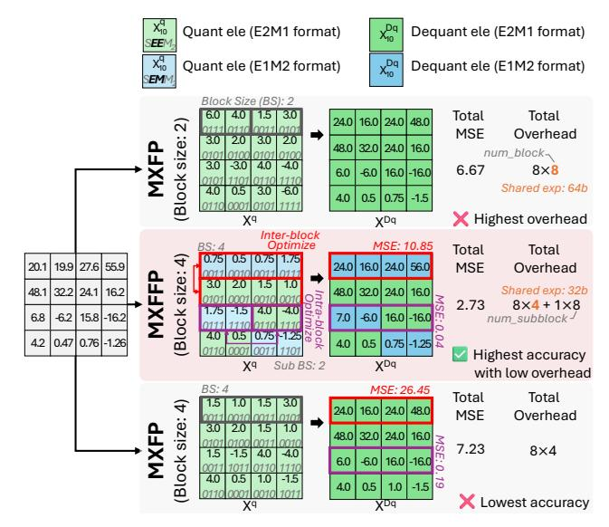

Fig. 1: Comparison of MXFP and MXFFP in various block sizes. MXFFP achieves the highest accuracy with low overhead by utilizing inter- and intra-block optimization. The shared exponent is represented in 8-bit.

model sizes [1], [4], [16], [39]. However, such models, particularly large language models (LLMs), have a large memory footprint which limits their inference performance [12], [19], [37], [50]. To reduce the memory footprint of these models, quantization has been extensively studied [3], [32], [38], [52], [63], [67]. By representing data with a low bit-width, it reduces memory capacity requirements and improves efficiency in DRAM, SRAM, and interconnect accesses, leading to higher throughput and energy efficiency.

<sup>\*</sup>Both authors contributed equally to this work.

<sup>&</sup>lt;sup>†</sup>This paper is done when the author was a visiting scholar at University of Southern California.

<sup>§</sup> This research was done in the author's personal capacity and that the views in the paper do not represent those of Meta.

Among various quantization techniques, floating-point quantization [32], [40], [41], [52], [58], [70] has received significant attention. Floating-point formats can maintain higher accuracy even at extremely low bit-widths (e.g, 4-bit) compared to integer formats, thereby achieving high effectiveness in low-bit quantization [7], [41], [64]. Furthermore, modern accelerators (e.g., NVIDIA Blackwell GPU Tensor Cores [22], [46]) natively support extremely low-bit floating-point formats such as FP4, while integer formats such as INT4 are not supported. This architectural trend has made floating-point quantization increasingly favorable in recent designs.

One of the most notable floating point formats is the Microscaling Floating Point (MXFP) format [47], [53], developed under the Open Compute Project by AMD, Intel, Microsoft, NVIDIA, and Qualcomm. MXFP mitigates the limitations of conventional low-bit floating point formats [60], [62] (e.g, FP4) method. MXFP takes a number of FP values, called a block, and employs an 8-bit shared exponent per block. The values in the block are then represented using fewer bits of mantissa and exponent. The block is typically selected to be a collection of values that are operated on together, such as a tile of weight matrix values. By using a shared exponent across a block, MXFP expands the representable dynamic range, achieving higher inference accuracy compared to other quantization based schemes. Combined with hardware accelerators that operate efficiently on block-structured data, MXFP also enables higher inference throughput.

Recent trends in MXFP design are moving toward extremely low bit-widths (e.g., 4-bit) to reduce the memory footprint of large models. However, while the shared exponent alleviates inter-block range mismatch, extremely low bit-width formats inherently reduce both value range and resolution. As a result, different blocks require different range–resolution characteristics, leading to *inter-block value diversity* that an existing low bit-width format cannot accommodate. In addition, while larger block sizes reduce metadata overhead and improve hardware efficiency, they also increase the number of elements within each block, which in turn introduces greater variation of value distributions within each block and leads to higher *intra-block value diversity*. Consequently, these recent trends degrade model accuracy, thereby imposing inherent limitations on the MXFP format.

To address these issues, we revisit the representation of floating-point data. Floating point data can be represented using various exponent and mantissa configurations within the same bit-width, such as E3M0 (3-bit exponent, 0-bit mantissa), E2M1, E1M2, or E0M3 for a 4-bit data. We show later (Fig. 3) that such diverse representations can lead to a distinct tradeoff between value range and resolution. Thus we observe an opportunity to use different configurations across blocks, or even elements within the same block, which may provide more accurate numerical representation than a single fixed configuration as in MXFP (e.g., E2M1 in MXFP4).

We performed a detailed characterization of data format preferences for various data blocks in Llama3-8B. Our analysis reveals that the optimal configuration (exponent and mantissa bit-widths) varies significantly across different blocks of weights and activations. We demonstrate that when each block or element within each block adopts the configuration that best matches its value distribution characteristics, we can achieve higher accuracy than MXFP. (More details of this analysis are shown in Section III and in Fig. 5, Fig. 7 and Fig. 8.) This analysis provides strong motivation that such flexibility can effectively overcome the inherent limitations caused by extremely low bit-widths and large block sizes.

Motivated by this observation, we propose a new data format, Microscaling Flexible Floating-Point (MXFFP), an extension of the MXFP format that supports multiple exponent–mantissa configurations within a single bit-width, effectively addressing both inter- and intra-block diversity. Fig. 1 shows the key concept of the MXFFP. First, MXFFP resolves inter-block diversity by introducing a lightweight configuration field that allows each block to independently select its bit configuration. Second, MXFFP mitigates intra-block diversity through a sub-block structure, where large blocks are partitioned into smaller sub-blocks that share the same exponent but are allowed to use different bit configurations. By combining these two techniques our results show that MXFFP achieves higher accuracy than MXFP under the same block size.

Furthermore, since ML computations requires run-time data (e.g., input activations) and MXFFP supports multiple bit configurations, supporting MXFFP may introduce conversion overhead. To address this, we also propose an efficient conversion mechanism that uses the diversity of values within a block to select the best exponent and mantissa bit width configuration with negligible run-time overhead while preserving high accuracy.

To fully exploit the benefits of MXFFP, we also propose an MXFFP Tensor Core that extends the conventional Tensor Core design with minimal hardware modifications. Since MXFFP supports multiple exponent-mantissa configurations, we introduce a bit mapper that decodes these configurations into a unified format, enabling execution on a single-format arithmetic unit and preserving high hardware utilization. Also, we further extend the dot-product unit to operate on this unified format with only minor modifications. Through this design, MXFFP preserves the benefits of extremely low bitwidth and large block size while maintaining numerical accuracy, providing an efficient and flexible floating point format on modern accelerators.

In summary, our main contributions are as follows:

- We propose MXFFP, an MXFP-based design that enables both inter- and intra-block optimizations, achieving higher hardware efficiency and accuracy.
- We design the MXFFP Tensor Core, which efficiently integrates MXFFP into existing accelerator architectures with minimal hardware modification.
- Our evaluation shows that MXFFP significantly improves numerical accuracy, reducing perplexity by 2–5× in 4-bit settings across multiple LLMs compared to MXFP while

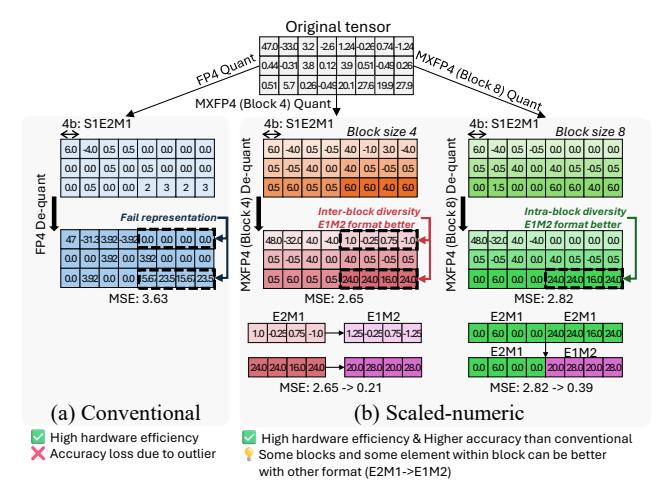

Fig. 2: Examples of floating point low bit-width formats. (a) Conventional 4-bit (FP4) format. (b) Scaled-numeric 4-bit (MXFP4) format.

sustaining accuracy at large block sizes with  $4 \times$  low meta-data overhead.

#### II. LOW BIT-WIDTH FLOATING-POINT FORMATS

## A. Conventional Low Bit-width Floating-point Formats

Conventional low-bit floating point formats can be processed as shown in Fig. 2(a). It quantizes the entire tensor using a single precision level (e.g., 4-bit), as depicted in Eq. 1:

$$X_{fp4}^{q} = Quant\left(\frac{X^{fp16}}{S_{fp4}^{X}}\right), \quad S_{fp4}^{X} = \frac{\max(\left|X^{fp16}\right|)}{\text{MAX}^{fp4}} \quad (1)$$

As shown in the equation, the scaling factor  $(S_{fp4}^X)$  is obtained by dividing the absolute maximum value of the original 16-bit floating-point tensor by the maximum representable value of FP4 (MAX<sup>fp4</sup>). Using this scaling factor, the tensor is quantized into the FP4 format  $(X_{fp4}^q)$ . The conventional lowbit floating point represents all elements using a uniform 4-bit which is lower than baseline 16-bit floating-point tensor, achieving high hardware efficiency. However, outliers increase the scaling factor of the tensor, causing normal elements to lose representation and resulting in low accuracy [18], [28], [66], [71].

## B. Emerging Low Bit-width Floating-point Formats

Recently, scaled numeric formats such as MXFP [13], [14], [17], [53] have emerged to address the limitations of conventional formats as shown in Fig. 2(b). It quantizes the tensor in single precision while applying quantization in a block-wise manner. In this scheme, the entire tensor is partitioned into multiple blocks, and each block utilizes an independent 8-bit shared exponent  $(E_b^{\rm shared})$ , as depicted in Eq. 2.

$$\begin{split} X_{b,fp4}^q &= Quant \left( \frac{X_b^{fp16}}{2^{E_b^{\text{shared}}}} \right) \\ E_b^{\text{shared}} &= \left| \log_2 \left( \max_b (|X_b^{fp16}|) \right) \right| - E_{element}^{\text{MAX}} \end{split} \tag{2}$$


Fig. 3: Value distribution for different 4-bit floating-point bit configurations.

In this equation,  $E_{element}^{\rm MAX}$  represents the maximum exponent value of the FP4 format used for each element in the 4-bit MXFP configuration. For the default S1E2M1 configuration (1-bit sign, 2-bit exponent, and 1-bit mantissa),  $E_{element}^{\rm MAX}$  can be derived as shown in Eq. 3.

$$Bias = 2^{2-1} - 1 = 1,$$
  
 $E_{element}^{MAX} = 11_2 - Bias = 3 - 1 = 2.$  (3)

By using block-specific shared exponents, the scaled numeric format effectively expands the representable dynamic range [32], [47], [53]. As a result, it mitigates the impact of outliers and achieves higher accuracy than the conventional low-bit floating point format [32].

#### III. MOTIVATION

A. Potential Limitations of Emerging Low Bit-width Floatingpoint Formats

Recent trends in MXFP move toward using extremely low bit-widths (e.g., 4-bit) and large block sizes (e.g., block size 256) to maximize hardware efficiency. While MXFP improves accuracy by exploiting inter-block value distribution through a shared exponent, extremely low-bit quantization reduces the available value range and resolution, which can incur interblock value diversity. In addition, although large block sizes reduce metadata overhead (e.g., an 8-bit shared exponent) and improve hardware efficiency, they increase the number of elements within each block, thereby increase intra-block value diversity.

MXFP assigns a single fixed bit configuration to all blocks (e.g., S1E2M1 in MXFP4). Such a fixed configuration may not effectively handle the inter and intra block diversity. As illustrated in Fig. 2(b), when using block size 4, all blocks adopt the S1E2M1 configuration. However, due to inter-block diversity, two of the blocks are better matched by different configurations, and exploiting these could yield higher accuracy. Moreover, with block size 8, although all elements within the block use the same S1E2M1 bit configuration, certain elements would be better represented by different bit configurations due to intra-block diversity. Consequently, the fixed bit configuration scheme of MXFP is unable to address the inter and intra block diversity, resulting in inherent limitations that prevent MXFP from achieving the highest accuracy and hardware efficiency.


Fig. 4: Example of exponent values and expected bit configuration of blocks. We use input activations of the layer 9 query projection in Llama3-8B.

#### B. Trade-offs in Low Bit-width Floating-Point Configurations

To address the limitations of low bit-width floating point formats, especially scaled numeric formats, we revisit the floating point representation. Fig. 3 illustrates an example of four possible bit configurations for 4-bit floating-point data. Each configuration defines a distinct allocation of exponent and mantissa bits. As shown in the figure, each configuration exhibits a clear trade-off between the representable value range and resolution. Formats with more exponent bits can represent a wider dynamic range, but at the cost of lower resolution, whereas formats with more mantissa bits achieve higher resolution but a narrower range. The choice of exponent-mantissa allocation fundamentally determines how effectively low-precision formats can represent the original data, directly influencing numerical accuracy. Given these trade-offs, it is important to examine whether actual tensors exhibit diverse numerical characteristics across blocks, which may render a single fixed configuration suboptimal.

## C. Inter-block Value Diversity

In the scaled numeric format (e.g., MXFP), the block-shared exponent is introduced to mitigate value range discrepancies across tensors by adjusting the value for each block. However, even after normalization with a shared exponent, inter-block differences in value distribution can still remain.

To verify this assumption, we conduct an initial experiment, as shown in Fig. 4. The heatmap in the figure illustrates the required exponent values of elements both before and after normalization with the shared exponent, as well as the distribution of required exponent values within each block. As observed, even after normalization, the lower region (e.g., Block 25) still demands larger exponent values, while the upper region (e.g., Block 679) reveals that most elements require smaller exponent values.

Consequently, when quantized into MXFP4, blocks in the lower region must configure their elements using the default E2M1 format to preserve representability across the wider value range. In contrast, blocks in the upper region can configure their elements using the E1M2 format, allocating fewer bits to the exponent and more bits to the mantissa,


Fig. 5: Ratio of exponent bits selected by the oracle format in Llama3-8B.


Fig. 6: MSE comparison of MXFP and Oracle format in 8, 6, and, 4-bit setting. We use Llama3-8b for evaluation.

thereby improving resolution and better representing values within the fixed bit-width.

Building on this observation, we define an oracle format that allows each block to adopt the configuration best suited to its numerical characteristics to obtain the minimum error in the final representation, thereby estimating the potential benefit of dynamic configurability. The oracle format follows the MXFP structure, where each block consists of 32 elements with an 8-bit shared exponent. The key difference is that each block can be represented using any possible exponent—mantissa configuration within a given bit-width. For example, in the 4-bit case, the elements in each block can be represented as E0M3, E1M2, E2M1, or E3M0. The oracle format selects the configuration that minimizes the mean squared error (MSE) compared to the BF16 baseline format.

To analyze the effectiveness of dynamic formats under a fixed bit-width, we first examine the ratio of configurations selected by the oracle format, focusing on the exponent bit-width chosen for each element in both activations and weights, as shown in Fig. 5. We use three bit-widths, 8-, 6-, and 4-bits, on the Llama3-8B model for this analysis. As shown in the figure, activations and weights exhibit different tendencies in configuration selection. Although the oracle predominantly selects one or two exponent-bit choices in all cases, the exact preference differs between activations and weights and across bit-widths. These variations indicate that relying on a single fixed configuration is inadequate, motivating the use of multiple configurable bit formats.

To quantify the degree of error reduction, we measure the MSE of the oracle and MXFP formats against the baseline BF16 values, as shown in Fig. 6. Our analysis reveals that the oracle format consistently achieves lower MSE than MXFP across all bit-widths. This improvement stems from the oracle format's ability to adapt the exponent-mantissa allocation to

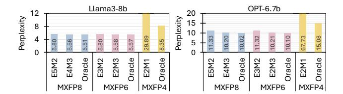

Fig. 7: Perplexity comparison of MXFP and Oracle format in 8, 6, and 4-bit setting. All results use a block size of 32.

the value characteristics of each block. As shown in Fig. 5, most blocks favor one or two exponent bits, while configurations with larger exponent bits (e.g., four or five bits) are rarely selected. Consequently, fixed MXFP8 formats such as E5M2 and E4M3 become misaligned with the observed characteristics and incur a higher MSE. The oracle format, in contrast, achieves lower MSE than the fixed MXFP formats not only at 8 bit but also at 6 bit and 4 bit precision by utilizing dynamic bit configuration selection.

Moreover, to examine how these MSE differences translate into actual model accuracy, we measure the perplexity of two language models, Llama3-8B and OPT-6.7B, on the WikiText2 dataset. As shown in Fig. 7, the oracle format consistently achieves lower perplexity than the MXFP formats across all bit-widths. The difference becomes especially prominent in the 4-bit setting, where MXFP4 suffers from severe degradation in both models. In contrast, the oracle format in 4-bit setting achieves 8.3 and 15.1 perplexity for Llama3 and OPT, respectively, comparable to perplexity of higher bit-width setting. The consistent results across both models indicate that the benefit of dynamic configuration is broadly effective.

#### D. Intra-block Value Diversity

While MXFP mitigates inter-block value diversity through a block-shared exponent, the 8-bit shared exponent still introduces nontrivial storage and computation overhead per block. One straightforward way to amortize this overhead is to increase the block size, since fewer shared exponents are required. For example, in Llama3-405B, increasing the block size from 32 to 256 reduces the metadata footprint from 11.7GB to 1.46GB, potentially improving overall efficiency. However, larger blocks also force more elements to share the same exponent and bit configuration (in the oracle format), which reduces the ability to capture fine-grained value variations within a block and can degrade numerical accuracy.

To examine this effect, we measure the perplexity across different block sizes, as shown in Fig. 8. As observed, the perplexity of MXFP4 (E2M1) increases as the block size grows, and the same trend appears even in the oracle format that employs dynamic per-block configuration. This is because, while the oracle format allows different bit configurations across blocks, all elements within a single block still share the same bit configuration. Hence, as the block size grows, certain elements within the block may require different configurations to maintain representation.

To address this limitation, we propose an initial idea referred to as sub-blocking. The key idea of sub-blocking is to divide

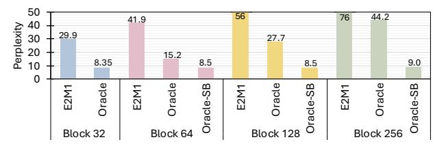

Fig. 8: Perplexity of various 4-bit quantization method across different block size. We use Llama3-8b model for evaluation. Oracle-SB refers to oracle format with the sub-blocking technique (sub-block size: 32).

a block into smaller sub-blocks, allowing each sub-block to use a different exponent and mantissa configuration even within the same block. We integrate this technique with the oracle format, which we refer to as oracle-SB format. As shown in Fig. 8, oracle-SB format achieves lower perplexity compared to oracle format in all block sizes and almost same perplexity compared to oracle format in smaller block size. Furthermore, the oracle-SB format almost does not incur perplexity degradation even as the block size increases. For example, while the oracle format records a perplexity of 15.2 and 44.2 at a block size of 64 and 256, oracle-SB format achieves 8.5 and 9.0 at a block size of 64 and 256. As a result, sub-blocking effectively handles intra-block diversity using efficient exponent and mantissa configurations, thereby enabling large block sizes and improving hardware efficiency.

#### IV. MXFFP FORMAT

To realize the oracle format in practical systems, three key requirements must be satisfied: (1) a new data type capable of supporting multiple exponent—mantissa configurations under a fixed bit-width, (2) an efficient mechanism to select the optimal configuration for each block and sub-block, and (3) hardware support to enable such dynamic configurability. This section introduces the proposed format and configuration selection method, and we will present the corresponding hardware implementation in Section V.

## A. Data Format and Memory Layout

Following the design of the MX format, MXFFP divides tensors into blocks of N elements, each normalized by a shared exponent. To provide representational flexibility without increasing total bit-width, MXFFP introduces a 1-bit configuration field per block. Since the E1Mx and E2Mx configurations dominate across all bit-widths (4, 6, and 8 bits) as shown in Fig. 5, we select these two configurations to provide hardware simplicity and best numerical representation.

Based on these selections, the 4-bit MXFFP format can be illustrated, as shown in Fig. 9. Each block consists of a shared exponent, a configuration bit, and N quantized elements. While the shared exponent normalizes the values of each block following the MX format's approach, the configuration bit encodes the bit configuration that applies to all elements in that block. This lightweight addition enables each block to adapt range-resolution trade-offs based on its numerical distribution,

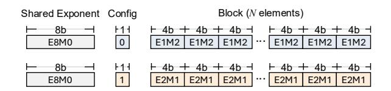

Fig. 9: Example of 4-bit MXFFP format with a shared exponent and a configuration bit selecting E1M2 or E2M1 (ExMy: 1 sign bit, x exponent bits, y mantissa bits).


(a) Block set (8 blocks, block size 32) (b) Large block (1 block, block size 256)

Fig. 10: Memory layout of MXFFP format. (a) and (b) shows the layout of block size 32 and 256.

rather than relying on a fixed configuration. This composition generalizes directly to the 6- and 8-bit MXFFP variants.

A 1-bit configuration field is not byte addressable, which can reduce hardware efficiency. To address this issue, we utilize a block-set structure, as illustrated in Fig. 10(a). Each block set groups eight 1-bit configuration fields from eight blocks into a single one-byte configuration set, thereby maintaining byte addressability in memory and enabling a more practical hardware design. Consequently, each set requires 9B of metadata, 1B for configuration bits, and 8B for shared exponents to manage 8 blocks (256 elements in total).

As demonstrated in Fig. 8, using a large block reduces the overhead of the 8-bit shared exponent, thereby improving hardware efficiency, but unfortunately leads to accuracy degradation. To mitigate this limitation, we employ a *sub-blocking* mechanism for large block sizes (e.g., 256 block size), as illustrated in Fig. 10(b). Each sub-block consists of 32 elements and utilizes its own 1-bit configuration field. The configuration bits from eight sub-blocks are grouped into a single configuration set, enabling byte-addressable access. In addition, a single shared exponent is used across all sub-blocks. This unified layout design supports a wide range of block sizes without structural modification and maintains a byte-aligned organization with a small metadata footprint.

#### B. Efficient Conversion Mechanism

To convert high-precision data into the MXFFP format, the bit configuration of each block or sub-block (for large block sizes) must be determined. Since the weights of ML moduels are known in advance, we perform static offline conversion of weights into the MXFFP format. Each block (or sub-block) is quantized under both E1Mx and E2Mx configurations, and the one that yields a smaller quantization error (e.g., lower MSE) is selected as the oracle format, as described in Section III-C, without incurring any runtime overhead. In

TABLE I: Comparison of value representation between E1M2 and E2M1 configurations in MXFFP4

| Relative exponent | E1M2 representation                   | E2M1 representation         | Configuration comparison |
|-------------------|---------------------------------------|-----------------------------|--------------------------|
| 0                 | $2^1 \times 1.\mathbf{x}\mathbf{x}_2$ | $2^2 \times 1.x_2$          | E1M2 > E2M1              |
| -1                | $2^1 \times 0.1x_2$                   | $2^1 \times 1.x_2$          | E1M2 = E2M1              |
| -2                | $2^1 \times 0.01_2$                   | $2^0 \times 1.\mathbf{x}_2$ | E1M2 < E2M1              |
| -3                | $2^1 \times 0.00_2$                   | $2^0 \times 0.1_2$          | E1M2 < E2M1              |
| -4                | $2^1 \times 0.00_2$                   | $2^{0} \times 0.0_{2}$      | E1M2 = E2M1              |

contrast, input activations in ML computations are runtime data and thus unknown prior to execution. Applying the same comparison process for activations in runtime would incur significant conversion overhead. To address this, we propose an efficient conversion mechanism that exploits the exponent distribution of elements within a block (or sub-block) to select the most suitable bit configuration for runtime data conversion with negligible overhead.

In runtime conversion, MXFFP follows a conversion flow similar to MXFP: each block is normalized using a shared exponent and then quantized into a low-bit format. However, unlike MXFP, the shared exponent in MXFFP depends on the bit configuration (E1Mx or E2Mx), because each configuration uses a different exponent bias and maximum exponent value( $E_{element}^{\rm MAX}$ ). Therefore, MXFFP must select the configuration before computing the shared exponent.

To efficiently determine the configuration, we exploit the value distribution within each block. Specifically, we examine the exponent of each element and compute their relative magnitude. Let  $E_i$  denote the exponent of the element i. We first find the maximum exponent in the block  $E_b^{\rm MAX}$ , and subtract it from all element exponents to obtain a *relative exponent*:

$$E_i^r = E_i - E_b^{\text{MAX}}. (4)$$

The resulting  $E_i^r$  values are always 0 or negative, reflecting how small each element is relative to the block maximum.

These relative exponents reveal which configuration provides better representational fidelity. As shown in Table I, in MXFFP4, E1M2 provides finer resolution when  $E_i^r=0$  due to its larger number of mantissa bits, whereas E2M1 yields a more expressive representation for  $E_i^r \in \{-2, -3\}$  because of its additional exponent bit. For intermediate or very small relative exponents, both configurations offer comparable representational capability. Importantly, while the exact thresholds differ for MXFFP6 and MXFFP8, the overall trend remains the same across all precisions: E1Mx favors larger relative exponents, whereas E2Mx favors smaller ones.

Based on this observation, we design a lightweight configuration-selection rule. In MXFFP4, we count the number of elements with  $E_i^r=0$  (favoring E1M2), denoted  $count_{E1}$ , and the number of elements with  $E_i^r\in\{-2,-3\}$  (favoring E2M1), denoted  $count_{E2}$ . Because  $E_i^r=0$  elements carry larger magnitudes and dominate numerical fidelity, we apply quadratic weighting. The configuration decision rule is:

# Algorithm 1 Efficient MXFFP4 Runtime Conversion

```
Require: Block (or sub-block) \mathbf{x} = \{x_1, \dots, x_N\}
Ensure: Shared exponent E_b^{\text{shared}}, config cfg, quantized values \hat{\mathbf{x}}
  1: Get exponents: E_i \leftarrow \text{exponent}(x_i)
  2: E_b^{\text{MAX}^1} \leftarrow \max_i E_i
  3: Compute relative exponents: E_i^r \leftarrow E_i - E_b^{\text{MAX}}
 4: count_{E1} \leftarrow |\{E_i^r = 0\}|
5: count_{E2} \leftarrow |\{E_i^r \in \{-2, -3\}\}|
 6: if count_{E1}^2 > count_{E2} then
          cfg \leftarrow E1M2, \quad E_{element}^{MAX} \leftarrow 1
  7:
 8: else
          cfg \leftarrow E2M1, \quad E_{element}^{MAX} \leftarrow 2
10: end if
11: Unified shared exponent: E_b^{\text{shared}} \leftarrow E_b^{\text{MAX}} - E_{element}^{\text{MAX}}
12: Quantize each element:
                                   \hat{x}_i \leftarrow \operatorname{quant}(x_i/2^{E_b^{\text{shared}}})
13: return (E_h^{\text{shared}}, \text{cfg}, \hat{\mathbf{x}})
```

Config = 
$$\begin{cases} E1Mx, & count_{E1}^2 > count_{E2}, \\ E2Mx, & \text{otherwise.} \end{cases}$$
 (5)

After selecting the configuration, MXFFP computes the shared exponent in the same manner as MXFP. However, large blocks, which are internally divided into multiple sub-blocks, require an additional consideration. When a block is split into sub-blocks, each sub-block may select a different configuration (E1Mx or E2Mx). Because these configurations use different  $E_{element}^{\rm MAX}$  values (1 for E1Mx and 2 for E2Mx), they naturally require different shared exponents.

To avoid storing multiple shared exponents, we adopt a unified approach. We first compute and store the shared exponent assuming the E2Mx configuration. When the shared exponent is used, sub-blocks configured as E2Mx simply use this stored value directly, while sub-blocks configured as E1Mx subtract one from it to obtain their correct shared exponent. This simple approach allows all sub-blocks to reuse the same hardware path for exponent computation with negligible overhead, while still respecting the correct bias of each configuration.

Algorithm 1 summarizes the complete MXFFP runtime conversion procedure, requiring only a few additional operations beyond MXFP and incurring minimal hardware overhead. Despite its simplicity, the proposed conversion method closely matches oracle behavior with negligible overhead, as validated in Fig. 20.

## V. MXFFP TENSOR CORE

To fully exploit the benefits of MXFFP in hardware, several design considerations must be addressed. Since the MXFFP format employs multiple bit configurations (E1Mx and E2Mx), the compute pipeline must inspect the configuration of each block, properly align operand bits, and route them to compatible low-bit execution lanes. Furthermore, after computation, the output values must be reorganized into blocks and converted back into the MXFFP representation by deriving a shared exponent and selecting the appropriate configuration

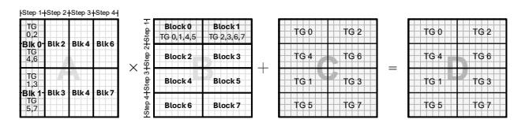

Fig. 11: MXFFP data flow and threadgroup mapping. Each block within a block set is assigned to specific threadgroups (TGs) and steps, enabling step-wise execution while maintaining configuration and shared exponent information.

for each block. In this section, we describe the hardware design based on these considerations and describe its key components and dataflow in detail.

#### A. Overview

Modern GPU Tensor Cores, widely used for ML acceleration, now support multiple low-precision floating-point formats such as FP4, FP6, FP8, and MXFP formats [22], [46]. MXFP formats apply block-wise shared scaling, meaning that Tensor Cores already provide hardware primitives for shared-exponent operation and format-specific low-bit conversions [2], [54]. Building on these capabilities, we design the MXFFP Tensor Core as an extension of the conventional Tensor Core pipeline, enabling flexible configurations without disrupting existing compute or data paths.

Fig. 12(a) shows an overview of MXFFP Tensor Core. MXFFP blocks are fetched into the matrix buffer and retained in their configured format until entering the dot-product unit. Inside the dot-product unit, a lightweight mapper interprets the configuration bits and aligns the incoming elements to the low-precision arithmetic units. After multiplication and accumulation, the results are rescaled using each block's shared exponent and accumulated into high-precision block outputs. Finally, the MXFFP converter reconstructs new MXFFP blocks by determining the shared exponent, following the MX methodology, and selecting the most suitable configuration for each block or sub-block.

Through this design, the MXFFP Tensor Core enables accurate computation across multiple low-bit configurations, while preserving the memory-bandwidth benefits of uniformly low-bit operands. Note that the MXFFP Tensor Core natively supports both block-level and sub-block-level execution. In the following description, we first present the design for block-level processing and then detail the additional mechanisms required for sub-block support.

#### B. Data Flow

Tensor Cores execute matrix multiply and accumulate (MMA) operations by dividing a  $16 \times 16$  output tile into eight  $4 \times 8$  submatrices [29], [51], [55]. Each submatrix is computed iteratively by a dedicated *threadgroup* (TG) consisting of four dot-product units as shown in Fig. 12(a). The computation proceeds over four steps, where each step accumulates partial sums to form the final output matrix as shown in Fig. 11.

Fig. 11 highlights the data flow of Step 1. Each threadgroup fetches its assigned tile from the operand buses into its matrix

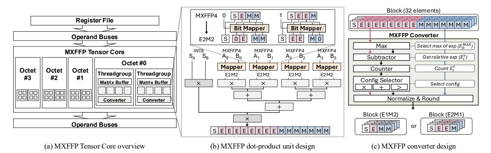

Fig. 12: MXFFP Tensor Core design.

buffer and performs operations on the corresponding input and output tiles. For example, TG0 multiplies the first  $4\times4$  tile of matrix A with the corresponding  $4\times8$  tiles of matrices B and C to produce the first  $4\times8$  tile of matrix D.

Building upon this mapping, MXFFP assigns each block within a block set to specific threadgroups and steps, as illustrated in Fig. 11. For instance, different subsets of threadgroups are responsible for distinct blocks of matrices A and B during Step 1, ensuring that all TGs operate on separate MXFFP blocks while maintaining consistent data reuse. Steps 2–4 follow the same mapping pattern, with each threadgroup accessing the corresponding blocks for its designated step.

To support this mapping, each threadgroup maintains two small registers: a *configuration register* (2B) and a *shared exponent register* (2B) for matricies A and B. The configuration register stores the configuration set of the block set, while the shared exponent register holds the shared exponent value for each block. At the beginning of a block-set operation, the configuration register is loaded and retained across the four steps, enabling each TG to select the appropriate configuration bit for the block it processes in each step. The shared exponent register is updated at every step, loading the scale value corresponding to the assigned block for that step.

## C. Dot-product Unit

The dot-product unit performs the core fused multiply—accumulate operations using tiles fetched from the matrix buffer [17], [29], [51], [55]. Each unit receives a  $4\times1$  fragment from matrix A and a  $1\times4$  fragment from matrix B, producing a four-element dot product every cycle. Since operands are stored in MXFFP format, which supports multiple exponent—mantissa configurations under the same bit-width, the unit must first expand and align incoming elements before computation.

Fig. 12(b) illustrates the MXFFP dot-product datapath for MXFFP4. Each MXFFP operand is fed through a lightweight *bit mapper* prior to entering the arithmetic core. The mapper is implemented as a compact multiplexer array that reinterprets the incoming 4-bit word according to the configuration bit. When the configuration is E1M2, the mapper routes only the

most-significant exponent bit into the exponent field and fills the remaining positions using the most-significant mantissa bits. When the configuration is E2M1, two exponent bits are forwarded directly, and a single mantissa bit is appended to form the final aligned format.

To accommodate both mapped representations, the FP4 (E2M1) arithmetic core is minimally extended to support an internal E2M2 format. Specifically, one additional mantissa bit is added to the significand path. The corresponding normalization unit is widened to handle the increased precision, while exponent biasing and range handling remain unchanged. The area and power overhead to support this is negligible since only the significand pipeline is widened (see Section VI-D).

After computation, each element is multiplied by its corresponding block's shared exponent prior to accumulation, consistent with MX processing semantics. Accumulated results are stored in high-precision accumulators (e.g., FP16 or BF16), ensuring numerical stability across the full dot-product sequence. Although the example focuses on MXFFP4, the same mechanism applies to MXFFP6 and MXFFP8.

# D. Converter

After completing the computation of a block set, each threadgroup produces its own output tile consisting of 32 elements, as illustrated in Fig. 11. These 32 elements correspond to a single MXFFP block. To finalize the computation, each threadgroup aggregates its high-precision results into a block and converts them back into the MXFFP format through a dedicated MXFFP converter, as shown in Fig. 12(c).

The MXFFP converter performs the dynamic conversion procedure described in Algorithm 1. It first determines the maximum exponent  $(E_b^{\rm MAX})$  among the 32 elements using the Max unit. The Subtractor then computes the difference between  $E_b^{\rm MAX}$  and each element's exponent to obtain relative exponents  $(E_i^r)$ . To capture the exponent distribution across the block, a Counter counts the occurrences of each  $E_i^r$ . Based on the counter output, the Config Selector determines the optimal configuration (e.g., E1M2 or E2M1) for the block. Finally, the Normalization & Round unit normalizes all elements according to the selected configuration and generates the final MXFFP block.

Through this process, the converter produces block-level results that match the configuration chosen by the selector. The configuration bit is extracted from the Config Selector, while the shared exponent value is derived in the Normalization & Rounding unit. Importantly, the Max and Normalization & Round units are already employed in the baseline MXFP design. Therefore, the MXFFP converter only requires minor extensions to support dynamic configuration selection.

#### E. Large Block Support

The MXFFP Tensor Core naturally supports large blocks using a sub-block structure. When executing a large block with N=256, each sub-block follows the same dataflow as the standard block described in Fig. 11. Because a large block requires only a single configuration set and a single shared exponent, these parameters are loaded into registers at the beginning of execution and reused across the four compute steps. During computation, each sub-block is processed by a single threadgroup, following the same mapping and execution pattern as in the base block set.

After computation, however, sub-blocks require two additional mechanisms during the conversion stage. As discussed in Section IV-B, although each sub-block selects its own configuration bit, all sub-blocks must share a single unified scale because they belong to the same large block. To support this requirement, the converters first synchronize the maximum exponent across the entire block. Each threadgroup locally determines the maximum exponent  $(E_b^{\rm MAX})$  of its sub-block, and these local maximum exponents are then synchronized across threadgroups to obtain the global  $E_b^{\rm MAX}$ .

Once synchronization completes, each threadgroup independently selects its configuration bit using the same exponent-distribution-based rule as in the standard MXFFP block. Although configuration bits may differ across sub-blocks, the shared exponent for the entire block is computed assuming that all sub-blocks use the E2Mx configuration. For sub-blocks adopting the E1Mx configuration, the difference in representable exponent range is compensated by adjusting the effective shared exponent, subtracting one from the shared exponent, before it is used in the dot-product pipeline. This mechanism enables all sub-blocks to share a consistent scale while retaining per–sub-block configurability.

# VI. EVALUATION

## A. Evaluation Methodology

We evaluate MXFFP across four axes: numerical accuracy, block scalability, hardware efficiency, and dynamic conversion sensitivity. We evaluate accuracy using perplexity on WikiText-2 [43] and three zero-shot tasks: ARC-easy [11], ARC-challenge [11], and Lambada [48] we use seven representative LLMs, Llama3-8B [16], Llama2-7B [57], Mistral-7B-v0.3 [23], Deepseek-llm-7b-chat [5], OPT-6.7B [69], Qwen2.5-14B [56], and Vicuna-13B [10]. We compare perplexity BF16 baseline with MXFP and MXFFP quantized to 8-bit, 6-bit, and 4-bit, using post-training quantization. MXFP values are converted following the OCP-compliant


Fig. 13: Perplexity of MXFP and MXFFP across seven models at 8-, 6-, and 4-bit precisions.

conversion rule [47], and MXFFP builds on this pipeline with block- and sub-block-level bit configuration selection. All tensors involved in MMA operations during LLM inference are converted to MX formats.

For hardware performance evaluation, we extend Accel-Sim [25] using a configuration derived from the NVIDIA RTX 5090 GPU [46]. We use the CUTLASS library [45] to generate GEMM kernels and extract their instruction traces for simulation. We also model the additional memory accesses required to fetch the shared exponent (for both MXFP and MXFFP) and the configuration bits (for MXFFP only), ensuring that the performance impact of metadata traffic is accurately captured. For hardware cost evaluation, we implement both the baseline MXFP Tensor Core and our MXFFP-enhanced design in RTL and synthesize them using Synopsys Design Compiler with the FreePDK 45nm technology library.

#### B. Numerical Accuracy

Fig. 13 presents the numerical accuracy results across all models and bit-width settings. Across both 8-bit and 6-bit configurations, MXFFP consistently achieves slightly lower perplexity compared to MXFP. In the 8-bit setting, the perplexity of Llama3-8B decreases from 5.55 with MXFP (E4M3) to 5.50 with MXFFP, and the perplexity of OPT-6.7B decreases from 10.12 to 9.89. A similar trend is observed in the 6-bit configuration. The gain is relatively small at these bit widths since MXFP already approaches BF16 level accuracy, leaving limited room for further gains.

By contrast, the advantage of MXFFP becomes much more significant in the ultra-low 4-bit setting. MXFP significantly raises perplexity across all models, mainly due to the fixed E2M1 bit configuration, whose limited resolution and dynamic range under 4-bit quantization make it unable to represent the diverse value distributions across blocks. For example, the perplexity of Llama3-8B increases to 30.98 with MXFP4, whereas MXFFP reduces it to 10.23. The difference is even larger for OPT-6.7B: MXFP yields a perplexity of 88.81, while MXFFP reduces it to 16.32. MXFFP also provides substantial perplexity reduction on larger models. For instance, on Owen2.5-14B, perplexity decreases from 15.90 to 6.93, and on Vicuna-13B, from 38.13 to 13.31. This significant improvement arises from the ability of MXFFP to dynamically select the exponent-mantissa configuration that best matches the value distributions across blocks, enabling more accurate representation even under a strict 4-bit budget.

Fig. 14 reports the accuracy on three zero-shot tasks, ARC-easy, ARC-challenge, and Lambada, across seven models. At


Fig. 14: Accuracy results of zero-shot tasks using MXFP and MXFFP across seven models at 8-, 6-, and 4-bit precisions.

8- and 6-bit, both MXFP and MXFFP closely match BF16, with negligible average drop (within ~0.5%). In contrast, MXFP4 exhibits substantial accuracy degradation, with average drops of 18.9%, 24.9%, and 28.6% on ARC-easy, ARC-challenge, and Lambada, respectively, indicating that naive 4-bit quantization is unreliable across models and tasks. MXFFP significantly mitigates this issue in the 4-bit setting. Compared to MXFP4, MXFFP4 improves the average score by 16–29% and reduces the gap to BF16 to 5–12% depending on the task. A similar trend is observed in larger models. For Qwen2.5-14B and Vicuna-13B, MXFP4 incurs average score drops of 5.4%, 3.5%, and 10.7% on ARC-easy, ARC-challenge, and Lambada, respectively, while MXFFP4 reduces them to 3.5%, 3.3%, and 7.0%, further demonstrating the effectiveness of MXFFP in extremely low-bit settings.

## C. Block Scalability

We also examine how changes in block size affect numerical accuracy, particularly in the 4-bit configuration where representational limits are most restrictive. As block size increases, more elements are forced to share the same exponent, which increases intra-block value diversity and leads to accuracy degradation. MXFFP mitigates this accuracy degradation by leveraging sub-block level optimization, which reduces variation among values within each block and keeps accuracy stable as block size increases. As shown in Fig. 15, MXFFP maintains stable perplexity across block sizes up to 256. For instance, in Llama3-8B, MXFFP records perplexities of 10.2, 13.5, 16.81, and 24.3 for block sizes 32, 64, 128, and 256, respectively, values that remain significantly lower than MXFP at every block size. Notably, MXFFP at block size 256 still outperforms MXFP at its default block size of 32, highlighting the effectiveness of sub-block adaptation.


Fig. 15: Perplexity of MXFP and MXFFP across different block sizes for three models under 4-bit configurations.


Fig. 16: GEMM speedup of MXFP and MXFFP (normalized to BF16) across different matrix sizes and bit-widths.

#### D. Hardware Efficiency

**Performance.** Since MXFFP introduces an additional 1-bit configuration field per block or sub-block, we evaluate how much this extra metadata affects memory traffic and overall latency. We measure GEMM latency for MXFP and MXFFP across matrix sizes of 256, 512, and 1024, and report speedup over a BF16 baseline using Accel-Sim in Fig. 16. Across all precision settings, MXFFP achieves nearly identical speedup to MXFP, indicating that the additional bit configuration bits introduces no measurable latency overhead.

As shown in Fig. 13, MXFP4 suffers from significant accuracy degradation, making 4-bit quantization unreliable for large-scale models. Due to this accuracy limitation, the substantial performance benefit of 4-bit Tensor Core operations, providing up to a  $2.7\times$  speedup in  $1024\times1024\times1024$  GEMM evaluation, compared to  $1.8\times$  for 8- and 6-bit settings, cannot be effectively leveraged in practice. In contrast, MXFFP preserves numerical accuracy in the 4-bit setting by applying both inter-block and intra-block optimization. This enables practical exploitation of the performance advantages of 4-bit execution while maintaining model accuracy, allowing models to benefit from the speedups that MXFP4 cannot utilize.

In Fig. 16, the 8- and 6-bit settings show nearly identical speedups for both MXFP and MXFFP because 6-bit operands are packed into an 8-bit container in the Tensor Core datapath. As a result, 6-bit execution largely reuses the 8-bit compute pipeline and incurs similar operand traffic, leading to comparable throughput. In contrast, 4-bit execution uses a narrower datapath with higher throughput and lower operand traffic, resulting in higher speedup.

To validate the performance benefit of MXFFP in real applications, we further evaluate end-to-end inference latency across seven language models. As shown in Fig.17, during the prefill stage with 1024 input tokens, both MXFP and MXFFP achieve 1.55× speedup over BF16 in the 8- and 6-bit settings, and 2.08× in the 4-bit setting on average. Consistent with Fig.16, MXFP and MXFFP show nearly identical latency, indicating negligible overhead from the additional MXFFP metadata. Although the end-to-end speedup is smaller than

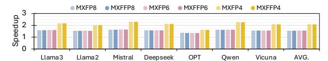

Fig. 17: Speedup of MXFP and MXFFP normalized to BF16 across seven language models.

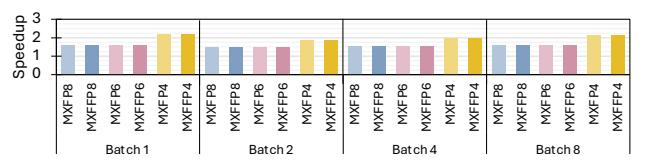

Fig. 18: Speedup of MXFP and MXFFP normalized to BF16 across batch sizes on Llama3-8b.

the isolated GEMM speedup because non-GEMM operations remain on the baseline path, MXFP/MXFFP still provides substantial latency reduction. Note that larger models show a similar trend, also achieving an average speedup of  $2.18\times$  in the 4-bit setting.

We also measure end-to-end latency on Llama3-8B in the prefill stage with a sequence length of 1024, using batch sizes of 1, 2, 4, and 8 to evaluate the sensitivity of MXFFP to batch size. Fig. 18 shows that the speedup of MXFFP over BF16 is largely insensitive to batch size. In MXFFP, the 8-bit and 6-bit settings remain in the range of  $1.47\times-1.60\times$ , while the 4-bit setting achieves  $1.86\times-2.18\times$  across all batch sizes. Overall, these results suggest that MXFFP maintains consistent end-to-end acceleration across different batch sizes.

Area and Power Overhead. Supporting MXFFP requires only minor hardware changes. Since NVIDIA Tensor Core microarchitecture details are not publicly available, we model a representative 4-bit low-bit datapath and compare it with an MXFFP-extended version to estimate relative overhead. This methodology likely overestimates the overhead of a full Tensor Core, as it excludes other hardware components (e.g., pipeline registers, operand buffers, and multi-precision units) that would enlarge the baseline area and power.

To support MXFFP, the dot-product unit is slightly widened, the converter is extended, and a lightweight bit mapper is added. The dot-product unit contributes the largest area increase (26.4%), while the converter adds 4.3% and the bit mapper incurs negligible cost. Aggregated over four dot-product units, one converter, and sixteen bit mappers in a threadgroup, the total area overhead is 22.26%. Scaled to a GPU with 192 Tensor Cores, this corresponds to only 0.038% of a 750 mm² die, indicating negligible system-level overhead.

Power overhead follows a similar trend. The power of the dot-product unit increases by about 24.4%, the converter by roughly 9.6%, and the bit mapper adds only a negligible amount, resulting in an overall threadgroup power increase of approximately 21.4%. However, since the extended datapath is not always fully active and most of the power in the dot-product unit is dynamic (over 86% in our synthesis results), applying per-configuration power gating to disable inactive datapath segments reduces the effective power overhead to


Fig. 19: Energy consumption breakdown of MXFP and MXFFP normalized to BF16 in GEMM operations.


Fig. 20: Comparison of oracle and MXFFP configuration selection in a 4-bit setting and resulting numerical error.

around 12%. As a result, MXFFP can be easily integrated into real designs due to its small area and power cost, making it a highly efficient choice given its substantial accuracy benefits and block size scalability at 4 bits.

**Energy Consumption.** To evaluate the energy consumption of MXFFP, we use AccelWattch [24] with synthesis-derived power numbers for our hardware model. Fig. 19 reports the energy breakdown of MXFP and MXFFP for GEMM, normalized to BF16. Overall, MXFFP exhibits nearly identical energy consumption to MXFP across all matrix sizes and precisions, indicating that the additional MXFFP metadata and lightweight mapping/conversion logic introduce negligible energy overhead.

In terms of breakdown, register-file (RF) and core execution dominate the overall energy, and the added MXFFP logic (accounted in core execution) contributes negligibly to the total. We also observe that 6-bit and 8-bit configurations consume similar energy, consistent with our performance results: 6-bit operands use the same compute pipeline and incur similar operand traffic as 8-bit. In contrast, in the  $1024\times1024\times1024$  case, 4-bit execution substantially reduces total energy to  $0.35\times$  of BF16, mainly due to reduced operand traffic and faster execution enabled by the 4-bit datapath.

## E. Ablation Study: Effectiveness of Runtime Conversion

To validate the effectiveness of runtime conversion, we conduct an ablation study. We examine whether MXFFP selects activation configurations similarly to the oracle and whether this leads to measurable numerical benefits. Runtime conversion is applied only to activations. Since weights are static and can be converted offline, MXFFP uses the same oracle-guided conversion as in Section IV-B, yielding identical per-block exponent configuration choices and the same weight configuration-ratio distribution as in Fig. 5. As shown in Fig. 20(a), MXFFP closely matches the oracle's exponent—mantissa configuration choices across all exponent-bit options, indicating that its lightweight heuristic effectively captures

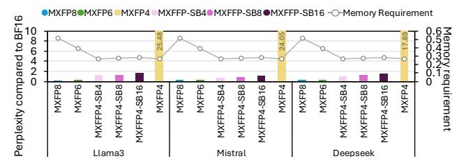

Fig. 21: Perplexity and memory requirement of MXFP and MXFFP across various bit and sub-block size compared to BF16. We use 32 block size for the MXFFP.

the block-level characteristics exploited by the oracle with negligible runtime cost.

Next, we evaluate the numerical impact of this alignment. Fig. 20(b) reports the MSE of activations and final outputs for the oracle, fixed E2M1, and MXFFP. For activations, MXFFP achieves MSE between E2M1 and the oracle, while for final outputs it attains MSE nearly identical to the oracle. Since output error is more directly related to model accuracy, this result suggests that MXFFP effectively approximates oracle behavior using only low-cost exponent statistics, making runtime conversion both effective and practical.

#### VII. DISCUSSION

## A. Ablation Study of Various Block and Sub-block Size

MXFFP might improve accuracy by using a fine granularity of sub-block by simply modifying the memory layout, which allows it to better capture intra-block value diversity. To examine the impact of this granularity, we conduct a detailed evaluation of perplexity and memory requirement across different sub-block sizes as shown in Fig 21. As the sub-block size decreases, MXFFP achieves perplexity closer to that of BF16. In particular, with a sub-block size of 4, the average perplexity degradation is only 0.98, whereas MXFP4 exhibits significant accuracy degradation. In addition, although reducing the sub-block size introduces additional metadata, the overhead remains modest because MXFFP requires only one extra bit for bit configuration per sub-block. Consequently, MXFFP with a sub-block size of 4 still achieves 47.8% and 29.1% lower memory requirement than MXFP8 and MXFP6, respectively. This reduction is particularly important for memory-intensive applications, where memory footprint and bandwidth can significantly affect performance.

#### B. Comparison with Prior Work

To verify the effectiveness of MXFFP compared with prior work, we evaluate MXFFP against four existing low bit methods, including M-ANT [20], BitMoD [8], Microscopiq [52], and MX+ [32], using perplexity and memory requirement. For a fair comparison, we fix the block size of all methods to 32. Following the study in Section VII-A, MXFFP is evaluated with a sub-block size of 4. M-ANT, Microscopiq, MX+, and MXFFP use the W4A4 setting, whereas BitMoD uses W4A8, following its original configuration.

As shown in Fig. 22, MXFFP achieves the lowest perplexity among these methods on Mistral-7B and DeepSeek, while


Fig. 22: Perplexity and memory requirement, normalized to BF16, for several 4-bit schemes including MXFFP. MXFFP uses a sub-block size of 4.

remaining close to BF16. Although BitMoD shows lower perplexity on Llama3-8B, this is partly because it uses 8-bit activations, which also increase its memory requirement. Accordingly, MXFFP still requires 9.38% less memory than BitMoD. While MXFFP use 0.5% higher memory than that of Microscopiq, MXFFP achieves 0.36 lower perplexity on average, suggesting that it is a more effective low-bit design in practice. Overall, MXFFP achieves the best accuracy-memory trade-off among the evaluated methods by addressing both inter-block and intra-block value diversity with lightweight metadata overhead, further demonstrating the effectiveness of our design.

## C. Generality beyond Language Models

Since models beyond LLMs may also exhibit value diversity, we analyze the oracle-selected exponent-bit distribution in ViT-base [61] to examine whether similar behavior is also observed in non-LLM workloads. As shown in Fig. 23, the oracle predominantly selects intermediate exponent-bit settings (E1 and E2) for both activations and weights across 8-, 6-, and 4-bit precisions, while other configurations are rarely chosen. This observation is consistent with our LLM analysis, suggesting that similar exponent-selection behavior also arises in non-LLM models.

We further evaluate ViT [61] to examine whether MXFFP generalizes to non-LLM workloads. Fig. 24 reports Top-1 accuracy for ViT-base and ViT-large under 8-, 6-, and 4-bit settings. At 8- and 6-bit, both MXFP and MXFFP closely match BF16 accuracy. At 4-bit, MXFP suffers noticeable degradation, whereas MXFFP substantially recovers accuracy, improving from 76.46% to 79.36% on ViT-base and from 79.54% to 81.36% on ViT-large.

Furthermore, Fig. 24(c) shows that MXFFP's runtime selection method for activation exponent-bit configurations closely matches an oracle policy, indicating that it can robustly adapt to varying activation characteristics and generalize effectively beyond LLM workloads. These results indicate that the challenge addressed by MXFFP is not limited to language models. MXFFP improves accuracy through flexible exponent-bit allocation and retains the speedup benefits of low-bit execution through efficient runtime conversion.

#### D. Discussion of Bit Configuration Selection

To further verify the robustness of our two-configuration scheme, we evaluated the bit configuration that achieves the lowest MSE across multiple models and layers, as shown


Fig. 23: Ratio of exponent bits selected by the oracle format for activation (a) and weight (b) in ViT-base.

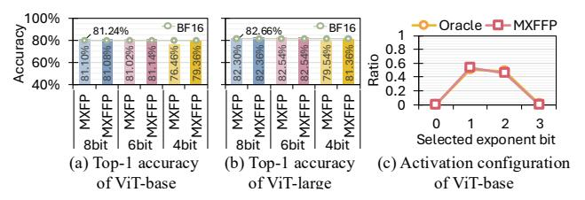

Fig. 24: Top-1 accuracy of ViT-base (a) and ViT-large (b), and selected configuration from activation of ViT-base in a 4-bit setting (c).

in Fig. 25. We found that the two dominant configurations, E1Mx and E2Mx, account for 97.2% of the lowest MSE selections across all models and layers, while the remaining bit configurations are selected in only 2.8% of cases. These results demonstrate the robustness of our two-configuration scheme.

If a target model requires greater flexibility in bit-configuration selection, MXFFP can support it in two ways. First, MXFFP can adopt an alternative pair of presets, such as E0/E2 or E2/E3, when the model favors a different range-precision tradeoff. Our runtime selection logic, which is based on relative exponents (Table I), directly generalizes to any preset pair by selecting the better-matching option for each block. Second, MXFFP can be extended to support more than two configurations by widening the selector and enabling the conversion/compute units to handle additional formats, at the cost of higher area/power and design complexity. In this paper, however, we focus on the minimal 1-bit design, which captures most of the accuracy benefit with negligible overhead.

# VIII. RELATED WORK

To accelerate ML models, various techniques such as sparsity [27], [34], [49], [59], [65] and quantization [6], [9], [26], [30], [44] have been extensively studied. Among these, quantization has emerged as a particularly effective approach for reducing model size and computational cost [8], [18], [20], [31]. In particular, floating point quantization has gained significant attention since modern accelerators natively support low-bit floating point formats while maintaining high accuracy [40], [41], [58], [70]. Among these approaches, block-scaled low-precision formats are especially promising since they achieve higher accuracy than conventional low-bit floating point formats while also providing high performance by amortizing scaling metadata across groups [15], [21], [32], [35], [36], [52].


Fig. 25: Layerwise exponent-mantissa bit distribution in Llama3-8B and Mistral-7B.

More recently, microscaling formats with shared microexponents, such as SMX and MX, introduce an additional finegrained scaling level to improve low-bit fidelity while preserving the underlying block structure [14], [53]. Subsequent work has extended this line of research in three main directions. First, some methods refine scaling granularity to better match value distributions across blocks [14]. Second, other methods introduce more flexible numerical representations within a fixed block structure to better capture variation inside a block [32], [52], [68]. Lastly, recent works combine both ideas to further exploit the value distribution [33], [42].

However, these approaches still manage scale assignment and representation selection within the same structural unit. Consequently, they cannot independently tune scaling granularity and bit configuration granularity, which limits their ability to simultaneously handle inter-block and intra-block value diversity in a lightweight manner. MXFFP overcomes this limitation by decoupling the two granularities. This design allows MXFFP to preserve coarse-grained scaling for low metadata overhead while applying finer-grained bit configuration control where additional flexibility is needed. As a result, MXFFP expands the design space of block-scaled low-precision formats and provides a more effective and practical way to balance accuracy and metadata cost.

#### IX. CONCLUSION

In this work, we introduce MXFFP, a flexible microscaling floating-point format that adapts exponent–mantissa configurations at both the block and sub-block levels, addressing the inter- and intra-block value diversity that limits existing MXFP designs. We further develop the MXFFP Tensor Core, which integrates this format into existing accelerator pipelines through lightweight mapping and dynamic conversion with minimal hardware modification. Our evaluation shows that MXFFP reduces LLM perplexity by  $2–5\times$  under 4-bit quantization and maintains high accuracy even at large block sizes, while reducing metadata overhead by up to  $4\times$ .

## X. ACKNOWLEDGEMENT

This work was supported by the National Research Foundation of Korea(NRF) grant funded by the Korea government(MSIT)(RS-2024-00357037), and by the Samsung Electronics, under Grant IO250214-11969-01. Won Woo Ro is the corresponding author.

## REFERENCES

- [1] S. Agarwal, L. Ahmad, J. Ai, S. Altman, A. Applebaum, E. Arbus, R. K. Arora, Y. Bai, B. Baker, H. Bao *et al.*, "gpt-oss-120b & gpt-oss-20b model card," *arXiv preprint arXiv:2508.10925*, 2025.
- [2] E. Alvarez, O. Almog, E. Chung, S. Layton, D. Stosic, R. Krashinsky, and K. Aubrey. (2025, June) Introducing nvfp4 for efficient and accurate low-precision inference. Accessed: 2025-11- 14. [Online]. Available: https://developer.nvidia.com/blog/introducingnvfp4-for-efficient-and-accurate-low-precision-inference/
- [3] S. Ashkboos, A. Mohtashami, M. L. Croci, B. Li, P. Cameron, M. Jaggi, D. Alistarh, T. Hoefler, and J. Hensman, "Quarot: Outlier-free 4-bit inference in rotated llms," *Advances in Neural Information Processing Systems*, vol. 37, pp. 100 213–100 240, 2024.
- [4] J. Bai, S. Bai, Y. Chu, Z. Cui, K. Dang, X. Deng, Y. Fan, W. Ge, Y. Han, F. Huang *et al.*, "Qwen technical report," *arXiv preprint arXiv:2309.16609*, 2023.
- [5] X. Bi, D. Chen, G. Chen, S. Chen, D. Dai, C. Deng, H. Ding, K. Dong, Q. Du, Z. Fu *et al.*, "Deepseek llm: Scaling open-source language models with longtermism," *arXiv preprint arXiv:2401.02954*, 2024.
- [6] H. Chen, Y. Hao, Y. Zou, and X. Chen, "Oa-lama: An outlier-adaptive llm inference accelerator with memory-aligned mixed-precision group quantization," in *2025 IEEE/ACM International Conference On Computer Aided Design (ICCAD)*. IEEE, 2025, pp. 1–9.
- [7] M. Chen, M. Wu, H. Jin, Z. Yuan, J. Liu, C. Zhang, Y. Li, J. Huang, J. Ma, Z. Xue *et al.*, "Int vs fp: A comprehensive study of fine-grained low-bit quantization formats," *arXiv preprint arXiv:2510.25602*, 2025.
- [8] Y. Chen, A. F. AbouElhamayed, X. Dai, Y. Wang, M. Andronic, G. A. Constantinides, and M. S. Abdelfattah, "Bitmod: Bit-serial mixture-ofdatatype llm acceleration," in *2025 IEEE International Symposium on High Performance Computer Architecture (HPCA)*. IEEE, 2025, pp. 1082–1097.
- [9] F. Cheng, C. Guo, C. Wei, J. Zhang, C. Zhou, E. Hanson, J. Zhang, X. Liu, H. Li, and Y. Chen, "Ecco: Improving memory bandwidth and capacity for llms via entropy-aware cache compression," in *Proceedings of the 52nd Annual International Symposium on Computer Architecture*, 2025, pp. 793–807.
- [10] W.-L. Chiang, Z. Li, Z. Lin, Y. Sheng, Z. Wu, H. Zhang, L. Zheng, S. Zhuang, Y. Zhuang, J. E. Gonzalez, I. Stoica, and E. P. Xing, "Vicuna: An open-source chatbot impressing gpt-4 with 90%\* chatgpt quality," March 2023. [Online]. Available: https://lmsys.org/blog/2023-03-30-vicuna/
- [11] P. Clark, I. Cowhey, O. Etzioni, T. Khot, A. Sabharwal, C. Schoenick, and O. Tafjord, "Think you have solved question answering? try arc, the ai2 reasoning challenge," *arXiv preprint arXiv:1803.05457*, 2018.
- [12] T. Dao, "Flashattention-2: Faster attention with better parallelism and work partitioning," *arXiv preprint arXiv:2307.08691*, 2023.
- [13] B. Darvish Rouhani, D. Lo, R. Zhao, M. Liu, J. Fowers, K. Ovtcharov, A. Vinogradsky, S. Massengill, L. Yang, R. Bittner *et al.*, "Pushing the limits of narrow precision inferencing at cloud scale with microsoft floating point," *Advances in neural information processing systems*, vol. 33, pp. 10 271–10 281, 2020.
- [14] B. Darvish Rouhani, R. Zhao, V. Elango, R. Shafipour, M. Hall, M. Mesmakhosroshahi, A. More, L. Melnick, M. Golub, G. Varatkar *et al.*, "With shared microexponents, a little shifting goes a long way," in *Proceedings of the 50th Annual International Symposium on Computer Architecture*, 2023, pp. 1–13.
- [15] M. Drumond, T. Lin, M. Jaggi, and B. Falsafi, "Training dnns with hybrid block floating point," *Advances in Neural Information Processing Systems*, vol. 31, 2018.
- [16] A. Dubey, A. Jauhri, A. Pandey, A. Kadian, A. Al-Dahle, A. Letman, A. Mathur, A. Schelten, A. Yang, A. Fan *et al.*, "The llama 3 herd of models," *arXiv e-prints*, pp. arXiv–2407, 2024.
- [17] M. Gil, D. Ha, S. B. Harma, M. K. Yoon, B. Falsafi, W. W. Ro, and Y. Oh, "Avant-garde: Empowering gpus with scaled numeric formats," in *Proceedings of the 52nd Annual International Symposium on Computer Architecture*, 2025, pp. 153–165.
- [18] C. Guo, J. Tang, W. Hu, J. Leng, C. Zhang, F. Yang, Y. Liu, M. Guo, and Y. Zhu, "Olive: Accelerating large language models via hardwarefriendly outlier-victim pair quantization," in *Proceedings of the 50th Annual International Symposium on Computer Architecture*, 2023, pp. 1–15.
- [19] Y. He, H. Mao, C. Giannoula, M. Sadrosadati, J. Gomez-Luna, H. Li, ´ X. Li, Y. Wang, and O. Mutlu, "Papi: Exploiting dynamic parallelism in

- large language model decoding with a processing-in-memory-enabled computing system," in *Proceedings of the 30th ACM International Conference on Architectural Support for Programming Languages and Operating Systems, Volume 2*, 2025, pp. 766–782.
- [20] W. Hu, H. Zhang, C. Guo, Y. Feng, R. Guan, Z. Hua, Z. Liu, Y. Guan, M. Guo, and J. Leng, "M-ant: Efficient low-bit group quantization for llms via mathematically adaptive numerical type," in *2025 IEEE International Symposium on High Performance Computer Architecture (HPCA)*. IEEE, 2025, pp. 1112–1126.
- [21] W. Hu, Z. Zhang, H. Zhang, C. Zhang, C. Guo, Y. Feng, T. Hu, G. Li, G. Hu, J. Wang *et al.*, "M2xfp: A metadata-augmented microscaling data format for efficient low-bit quantization," in *Proceedings of the 31st ACM International Conference on Architectural Support for Programming Languages and Operating Systems, Volume 2*, 2026, pp. 1151– 1167.
- [22] A. Jarmusch, N. Graddon, and S. Chandrasekaran, "Dissecting the nvidia blackwell architecture with microbenchmarks," *arXiv preprint arXiv:2507.10789*, 2025.
- [23] A. Q. Jiang, A. Sablayrolles, A. Mensch, C. Bamford, D. S. Chaplot, D. de las Casas, F. Bressand, G. Lengyel, G. Lample, L. Saulnier, L. R. Lavaud, M.-A. Lachaux, P. Stock, T. L. Scao, T. Lavril, T. Wang, T. Lacroix, and W. E. Sayed, "Mistral 7b," 2023. [Online]. Available: https://arxiv.org/abs/2310.06825
- [24] V. Kandiah, S. Peverelle, M. Khairy, J. Pan, A. Manjunath, T. G. Rogers, T. M. Aamodt, and N. Hardavellas, "Accelwattch: A power modeling framework for modern gpus," in *MICRO-54: 54th Annual IEEE/ACM International symposium on microarchitecture*, 2021, pp. 738–753.
- [25] M. Khairy, Z. Shen, T. M. Aamodt, and T. G. Rogers, "Accel-sim: An extensible simulation framework for validated gpu modeling," in *2020 ACM/IEEE 47th Annual International Symposium on Computer Architecture (ISCA)*. IEEE, 2020, pp. 473–486.
- [26] S. Kim, Y. Chou, B. Kim, J. Oh, and H.-J. Yoo, "Gyrot: Leveraging hidden synergy between rotation and fine-grained group quantization for low-bit llm inference," in *2026 IEEE International Symposium on High Performance Computer Architecture (HPCA)*. IEEE, 2026, pp. 1–15.
- [27] S. Kim, H. Lee, W. Cho, M. Park, and W. W. Ro, "Ditto: Accelerating diffusion model via temporal value similarity," in *2025 IEEE International Symposium on High Performance Computer Architecture (HPCA)*. IEEE, 2025, pp. 338–352.
- [28] S. Kim, H. Lee, S. Kim, C. Kim, and W. W. Ro, "Airgun: Adaptive granularity quantization for accelerating large language models," in *2024 IEEE 42nd International Conference on Computer Design (ICCD)*. IEEE, 2024, pp. 645–652.
- [29] S. Kim, D. Ha, S. Sung, and W. W. Ro, "Maximoff: Designing matrix multiplication accelerator for effective multiply-add operations offloading," *IEEE Transactions on Emerging Topics in Computing*, 2025.
- [30] H. Lee, H. Jang, S. Kim, S. Kim, W. Cho, and W. W. Ro, "Exploiting inherent properties of complex numbers for accelerating complex valued neural networks," in *Proceedings of the 56th Annual IEEE/ACM International Symposium on Microarchitecture*, 2023, pp. 1121–1134.
- [31] H. Lee, S. Kim, S. Kim, and W. W. Ro, "Cvmax: Accelerator architecture with polar form multiplication for complex-valued neural networks," in *2025 62nd ACM/IEEE Design Automation Conference (DAC)*. IEEE, 2025, pp. 1–7.
- [32] J. Lee, J. Park, S. Cha, J. Cho, and J. Sim, "Mx+: Pushing the limits of microscaling formats for efficient large language model serving," in *Proceedings of the 58th IEEE/ACM International Symposium on Microarchitecture®*, 2025, pp. 869–883.
- [33] S. Lee, J. Choi, S. Noh, J. Koo, and J. Kung, "Dbps: Dynamic block size and precision scaling for efficient dnn training supported by risc-v isa extensions," in *2023 60th ACM/IEEE Design Automation Conference (DAC)*. IEEE, 2023, pp. 1–6.
- [34] S. Lee, D. Ha, S. Kim, S. Kim, H. Lee, and W. W. Ro, "Bitl: A hybrid bit-serial and parallel deep learning accelerator for critical path reduction," in *Proceedings of the 58th IEEE/ACM International Symposium on Microarchitecture*, 2025, pp. 1565–1578.
- [35] H. Li, S. Tian, C. Lin, Z. Zhao, and K. Zhan, "Faar: Format-aware adaptive rounding for nvfp4," *arXiv preprint arXiv:2603.22370*, 2026.
- [36] J.-F. Li, M. Zhang, X. Xia, H. Bao, H. Bai, Z. Dong, and X. Yu, "Batquant: Outlier-resilient mxfp4 quantization via learnable block-wise optimization," *arXiv preprint arXiv:2603.16590*, 2026.
- [37] S. Li, Y. Chen, C. Li, Y. Fu, Z. Wang, Z. Yu, H. You, Z. Ye, W. Zhou, Y. Zhang *et al.*, "Orches: Orchestrated test-time-compute-

- based llm reasoning on collaborative gpu-pim heterogeneous system," in *Proceedings of the 58th IEEE/ACM International Symposium on Microarchitecture®*, 2025, pp. 476–489.
- [38] J. Lin, J. Tang, H. Tang, S. Yang, W.-M. Chen, W.-C. Wang, G. Xiao, X. Dang, C. Gan, and S. Han, "Awq: Activation-aware weight quantization for on-device llm compression and acceleration," *Proceedings of machine learning and systems*, vol. 6, pp. 87–100, 2024.
- [39] A. Liu, B. Feng, B. Xue, B. Wang, B. Wu, C. Lu, C. Zhao, C. Deng, C. Zhang, C. Ruan *et al.*, "Deepseek-v3 technical report," *arXiv preprint arXiv:2412.19437*, 2024.
- [40] F. Liu, W. Zhao, Z. He, Y. Wang, Z. Wang, C. Dai, X. Liang, and L. Jiang, "Improving neural network efficiency via post-training quantization with adaptive floating-point," in *Proceedings of the IEEE/CVF international conference on computer vision*, 2021, pp. 5281–5290.
- [41] S.-y. Liu, Z. Liu, X. Huang, P. Dong, and K.-T. Cheng, "Llm-fp4: 4-bit floating-point quantized transformers," *arXiv preprint arXiv:2310.16836*, 2023.
- [42] Y.-C. Lo, G.-Y. Wei, and D. Brooks, "Nanoscaling floating-point (nxfp): Nanomantissa, adaptive microexponents, and code recycling for direct-cast compression of large language models," *arXiv preprint arXiv:2412.19821*, 2024.
- [43] S. Merity, C. Xiong, J. Bradbury, and R. Socher, "Pointer sentinel mixture models," *arXiv preprint arXiv:1609.07843*, 2016.
- [44] Z. Mo, L. Wang, J. Wei, Z. Zeng, S. Cao, L. Ma, N. Jing, T. Cao, J. Xue, F. Yang *et al.*, "Lut tensor core: A software-hardware co-design for lut-based low-bit llm inference," in *Proceedings of the 52nd Annual International Symposium on Computer Architecture*, 2025, pp. 514–528.
- [45] NVIDIA, "Cutlass," https://github.com/NVIDIA/cutlass, 2025.
- [46] NVIDIA Corporation, "Nvidia rtx blackwell gpu architecture," https://images.nvidia.com/aem-dam/Solutions/geforce/blackwell/nvidiartx-blackwell-gpu-architecture.pdf, 2025, white Paper.
- [47] Open Compute Project Foundation, "Ocp microscaling formats (mx) specification version 1.0," https://www.opencompute.org/documents/ ocp-microscaling-formats-mx-v1-0-spec-final-pdf, Open Compute Project, Tech. Rep. v1.0, Sep. 2023, specification.
- [48] D. Paperno, G. Kruszewski, A. Lazaridou, Q. N. Pham, R. Bernardi, S. Pezzelle, M. Baroni, G. Boleda, and R. Fernandez, "The lambada ´ dataset: Word prediction requiring a broad discourse context," *arXiv preprint arXiv:1606.06031*, 2016.
- [49] A. Parashar, M. Rhu, A. Mukkara, A. Puglielli, R. Venkatesan, B. Khailany, J. Emer, S. W. Keckler, and W. J. Dally, "Scnn: An accelerator for compressed-sparse convolutional neural networks," *ACM SIGARCH computer architecture news*, vol. 45, no. 2, pp. 27–40, 2017.
- [50] J. Park, J. Choi, K. Kyung, M. J. Kim, Y. Kwon, N. S. Kim, and J. H. Ahn, "Attacc! unleashing the power of pim for batched transformerbased generative model inference," in *Proceedings of the 29th ACM International Conference on Architectural Support for Programming Languages and Operating Systems, Volume 2*, 2024, pp. 103–119.
- [51] M. A. Raihan, N. Goli, and T. M. Aamodt, "Modeling deep learning accelerator enabled gpus," in *2019 IEEE International Symposium on Performance Analysis of Systems and Software (ISPASS)*. IEEE, 2019, pp. 79–92.
- [52] A. Ramachandran, S. Kundu, and T. Krishna, "Microscopiq: Accelerating foundational models through outlier-aware microscaling quantization," in *Proceedings of the 52nd Annual International Symposium on Computer Architecture*, 2025, pp. 1193–1209.
- [53] B. D. Rouhani, R. Zhao, A. More, M. Hall, A. Khodamoradi, S. Deng, D. Choudhary, M. Cornea, E. Dellinger, K. Denolf *et al.*, "Microscaling data formats for deep learning," *arXiv preprint arXiv:2310.10537*, 2023.
- [54] K. Sevegnani, U. Uppal, R. Oberman, and Z. Zhu. (2025, July) Per-tensor and per-block scaling strategies for effective fp8 training. Accessed: 2025-11-14. [Online]. Available: https://developer.nvidia.com/blog/per-tensor-and-per-blockscaling-strategies-for-effective-fp8-training/
- [55] S. Sung, S. Hur, S. Kim, D. Ha, Y. Oh, and W. W. Ro, "Mad macce: Supporting multiply-add operations for democratizing matrix-multiplication accelerators," in *Proceedings of the 56th Annual IEEE/ACM International Symposium on Microarchitecture*, 2023, pp. 367–379.
- [56] Q. Team, "Qwen2.5: A party of foundation models," September 2024. [Online]. Available: https://qwenlm.github.io/blog/qwen2.5/
- [57] H. Touvron, L. Martin, K. Stone, P. Albert, A. Almahairi, Y. Babaei, N. Bashlykov, S. Batra, P. Bhargava, S. Bhosale *et al.*, "Llama 2: Open foundation and fine-tuned chat models," *arXiv preprint arXiv:2307.09288*, 2023.

- [58] A. Tseng, T. Yu, and Y. Park, "Training llms with mxfp4," *arXiv preprint arXiv:2502.20586*, 2025.
- [59] H. Wang, Z. Zhang, and S. Han, "Spatten: Efficient sparse attention architecture with cascade token and head pruning," in *2021 IEEE international symposium on high-performance computer architecture (HPCA)*. IEEE, 2021, pp. 97–110.
- [60] J. Wang, H. Liu, D. Feng, J. Ding, and B. Ding, "Fp4-quantization: Lossless 4bit quantization for large language models," in *2024 IEEE International Conference on Joint Cloud Computing (JCC)*. IEEE, 2024, pp. 61–67.
- [61] B. Wu, C. Xu, X. Dai, A. Wan, P. Zhang, Z. Yan, M. Tomizuka, J. Gonzalez, K. Keutzer, and P. Vajda, "Visual transformers: Tokenbased image representation and processing for computer vision," 2020.
- [62] X. Wu, H. Xia, S. Youn, Z. Zheng, S. Chen, A. Bakhtiari, M. Wyatt, R. Y. Aminabadi, Y. He, O. Ruwase *et al.*, "Zeroquant (4+ 2): Redefining llms quantization with a new fp6-centric strategy for diverse generative tasks," *arXiv preprint arXiv:2312.08583*, 2023.
- [63] G. Xiao, J. Lin, M. Seznec, H. Wu, J. Demouth, and S. Han, "Smoothquant: Accurate and efficient post-training quantization for large language models," in *International conference on machine learning*. PMLR, 2023, pp. 38 087–38 099.
- [64] H. Yang, S. Deng, A. Nagpal, M. Naumov, M. Janani, T. Liu, and H. Guan, "An empirical study of microscaling formats for low-precision llm training," in *2025 IEEE 32nd Symposium on Computer Arithmetic (ARITH)*. IEEE Computer Society, 2025, pp. 1–8.
- [65] H. You, Z. Sun, H. Shi, Z. Yu, Y. Zhao, Y. Zhang, C. Li, B. Li, and Y. Lin, "Vitcod: Vision transformer acceleration via dedicated algorithm and accelerator co-design," in *2023 IEEE International Symposium on High-Performance Computer Architecture (HPCA)*. IEEE, 2023, pp. 273–286.
- [66] A. H. Zadeh, I. Edo, O. M. Awad, and A. Moshovos, "Gobo: Quantizing attention-based nlp models for low latency and energy efficient inference," in *2020 53rd Annual IEEE/ACM International Symposium on Microarchitecture (MICRO)*. IEEE, 2020, pp. 811–824.
- [67] J. Zhang, J. Wei, H. Huang, P. Zhang, J. Zhu, and J. Chen, "Sageattention: Accurate 8-bit attention for plug-and-play inference acceleration," *arXiv preprint arXiv:2410.02367*, 2024.
- [68] S. Q. Zhang, B. McDanel, and H. Kung, "Fast: Dnn training under variable precision block floating point with stochastic rounding," in *2022 IEEE International Symposium on High-Performance Computer Architecture (HPCA)*. IEEE, 2022, pp. 846–860.
- [69] S. Zhang, S. Roller, N. Goyal, M. Artetxe, M. Chen, S. Chen, C. Dewan, M. Diab, X. Li, X. V. Lin *et al.*, "Opt: Open pre-trained transformer language models," *arXiv preprint arXiv:2205.01068*, 2022.
- [70] Y. Zhang, S. Zhang, S. Cao, D. Du, J. Wei, T. Cao, and N. Xu, "Afpq: Asymmetric floating point quantization for llms," *arXiv preprint arXiv:2311.01792*, 2023.
- [71] Y. Zhao, C.-Y. Lin, K. Zhu, Z. Ye, L. Chen, S. Zheng, L. Ceze, A. Krishnamurthy, T. Chen, and B. Kasikci, "Atom: Low-bit quantization for efficient and accurate llm serving," *Proceedings of Machine Learning and Systems*, vol. 6, pp. 196–209, 2024.