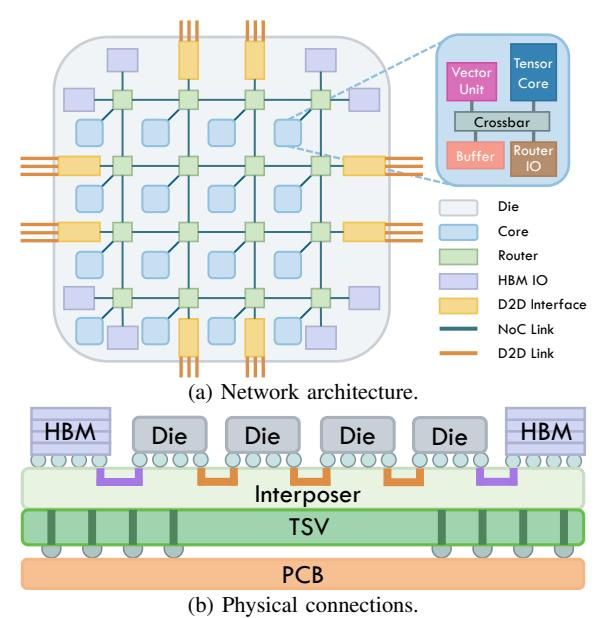
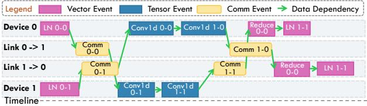
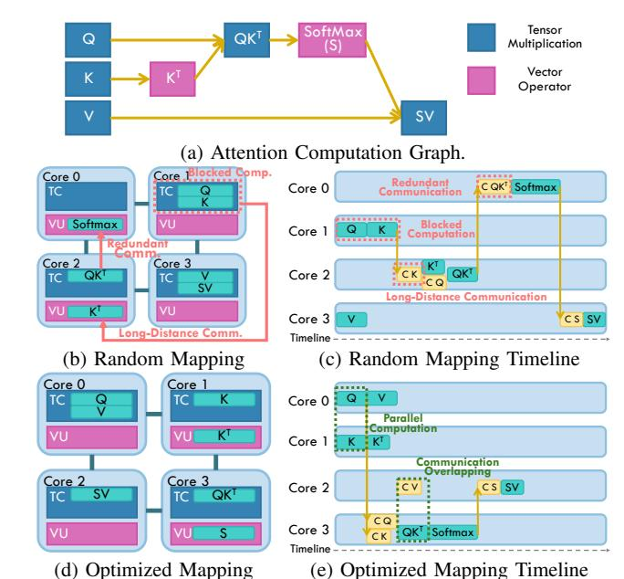
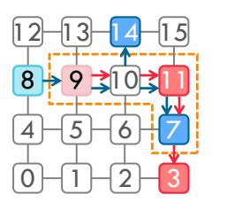
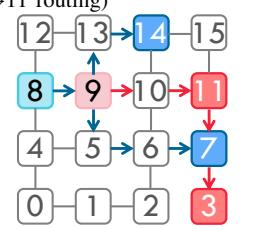
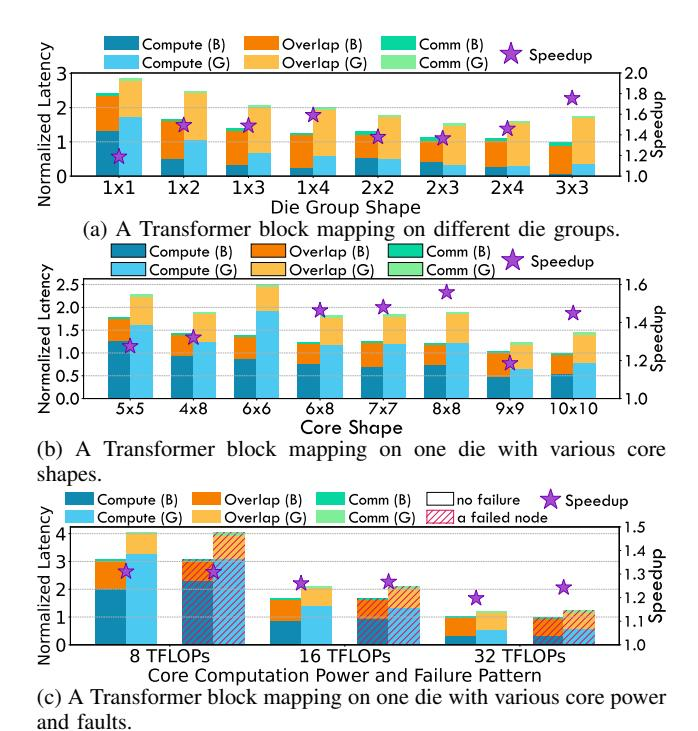
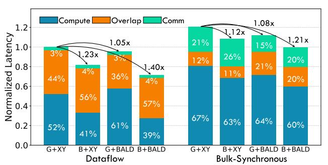
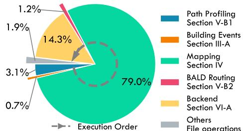

# Mapping and Communication Optimizations with Fault Tolerance for Wafer-Scale LLM Inference

Junwei Cui, Le Qin, Weilin Cai, and Jiayi Huang\*
The Hong Kong University of Science and Technology (Guangzhou)
{jcui382, lqin674, wcai738}@connect.hkust-gz.edu.cn, hjy@hkust-gz.edu.cn \*Corresponding author.

Abstract—The accelerating scale of large language models (LLMs) has driven an unprecedented increase in computational and memory demands that outpace the capability of conventional systems. Wafer-scale integration, with its dense, low-latency mesh interconnects across tightly packed arrays of compute and memory dies, emerges as a promising paradigm for massive system scaling. However, existing LLM deployment strategies, largely optimized for switch-based distributed GPU systems, are mismatched with the asymmetric mesh topology and bandwidth heterogeneity across tiers of wafer-scale systems. The inherent complexity of wafer-scale systems also makes them highly susceptible to node and link failures arising from manufacturing defects or runtime degradation, making fault-tolerant communication essential for robust LLM inference.

To address these challenges, we introduce BusyBarn, a comprehensive framework that provides mapping and communication optimizations for efficient, fault-tolerant LLM inference on wafer-scale systems. BusyBarn introduces two key techniques: a hierarchical mapping algorithm that exploits the structural symmetry between Transformer blocks and die arrays to jointly optimize inter-die and intra-die workload deployment; and the Balanced Allocation with Load and Distance awareness (BALD) communication algorithm, which manages irregular traffic and balances load via link allocation for point-to-point and multicast collective primitives. Crucially, BusyBarn seamlessly integrates fault tolerance into these optimizations. Evaluation demonstrates that BusyBarn achieves up to  $2.55\times$  speedup in typical communication patterns and  $1.08{-}2.14\times$  end-to-end speedup for LLM inference compared to state-of-the-art methods.

# I. INTRODUCTION

Large Language Models (LLMs) [8], [16], [74], [75] have become pivotal across a wide spectrum of applications, from generative tasks [18], [46], [52] to complex multimodal [36], [48], [60], [71] and reasoning workloads [16]. To achieve state-of-the-art performance, LLMs continue to scale their model sizes, exemplified by Llama 3.1 [21] with 405 billion parameters and Pangu Ultra [76] with 135 billion parameters, requiring thousands of GPUs [13], [16] or NPUs [54], [78] for training and inference. For LLM inference, throughput and efficiency are bounded by limited High-Bandwidth Memory (HBM) capacity and the interconnect performance of individual accelerators. Scaling via conventional switch-based GPU systems faces diminishing returns: sharded activations and an ever-growing KV cache induce substantial multi-hop traffic and fabric oversubscription, pressures amplified by long-context and LLM agent workloads [72] that demand substantially higher memory capacity and bandwidth.

To address these challenges, wafer-scale integration (WSI) offers a revolutionary approach, providing significantly more


Fig. 1: Challenges in wafer-scale LLM deployment. Inter-die mapping (layers to dies) may induce long-distance communication during decoding (yellow arrow). Intra-die mapping (operators to cores) may cause unbalanced computation work load, heavy communication load, and unreachable cores under faults (red crosses).

computation and memory resources through a unified substrate with high-density, low-latency mesh interconnects. WSI can be achieved through different methods. One approach involves fabricating a large processor monolithically on an entire silicon wafer, such as the Cerebras Wafer-Scale Engine (WSE), which integrates hundreds of thousands of AI-optimized cores and large amounts of SRAM [44]. The alternative, and the focus of this work, is wafer-scale chiplet integration. This approach leverages advanced packaging technology to fabricate wafer-scale processors with high compute density [73], using densely packed arrays of interconnected known-good compute and memory dies. We adopt this design as our target platform.

Deploying LLMs on wafer-scale systems demands finegrained parallelism strategies such as tensor and pipeline parallelism [62]. These strategies rely on precise data partitioning, mapping, and scheduling across massive core arrays, posing significant scalability and efficiency challenges. Prior work has explored various optimizations in modeling, mapping, and scheduling [5], [9], [10], [19], [45], [66], [82], but these techniques are not tailored to the unique partitioning and communication characteristics of Transformer-based LLMs, particularly the intensive, recursive data dependencies of autoregressive decoding. This mismatch results in substantial performance loss. As shown in Fig. 1, the long inter-die communication distance between the last and first layers during decoding induces significant overhead and contention. Furthermore, the complex structure of the decoder also brings challenges to intra-die mapping and communication optimization.

Wafer-scale chips also face inherent reliability challenges due to their massive scale, where manufacturing defects and runtime faults are common. For example, both NVIDIA H100 and Cerebras WSE-3 exhibit defect rates around 0.001 per mm<sup>2</sup> [35].While redundancy is a typical approach for fault tolerance, such as spare core and interconnects in Cerebras WSE [11], it incurs substantial hardware overhead. Communication-path-based methods, such as traffic rerouting in Google TPUv4 [83], are thus appealing as they minimize additional manufacturing overhead while enabling defective chips to approach nominal performance.

However, existing communication optimizations for LLM inference focus primarily on latency or bandwidth reduction, neglecting the joint need for efficiency and fault tolerance—both critical for wafer-scale systems. Methods like TidalMesh [42] and WaferLLM [24] perform well only on ideal, symmetric networks. They falter once failures break mesh regularity, and the carefully optimized mappings adopted to recover performance themselves introduce complex, nonuniform point-to-point and multicast traffic patterns that further compound the problem. Therefore, a critical opportunity remains to optimize LLM mapping and communication strategies on wafer-scale systems. Effective deployment requires jointly optimizing inter-layer (pipeline) and intra-layer (hybrid parallelisms in Section II-A) mappings to maximize massive core utilization and minimize communication overhead. Additionally, link allocation must achieve both high communication performance and robust fault tolerance in the presence of manufacturing defects and runtime errors.

To address these integrated challenges, we introduce Busy-Barn, a comprehensive framework featuring novel mapping and communication optimizations to enable efficient and faulttolerant LLM inference on wafer-scale systems. BusyBarn introduces a hierarchical simulated annealing (SA) mapping methodology and the Balanced Allocation with Load and Distance awareness (BALD) algorithm for communication optimization. Our key contributions are summarized as follows:

- We propose a hierarchical simulated annealing strategy that jointly optimizes inter-die and intra-die mapping. This method explicitly considers the autoregressive decoding nature of LLMs at the inter-die level to reduce long-distance communication and leverages hybrid parallelism at the intra-die level to maximize core utilization.
- We introduce the Balanced Allocation with Load and Distance awareness (BALD) algorithm, which optimizes general point-to-point and multicast by balancing network load and minimizing distance. It supports standard col-

- lective operations and irregular communication patterns, simultaneously optimizing latency and throughput while naturally enhancing fault tolerance.
- We conduct comprehensive evaluation across multiple wafer-scale configurations, demonstrating that our approach achieves up to 2.14× speedup over state-of-the-art techniques, delivering both robust fault tolerance and high communication efficiency.

# II. BACKGROUND

This section provides the background of this work, covering LLM parallelism strategies, our target wafer-scale architecture, and the communication patterns typical of LLM inference.

# *A. LLM Parallelism*

Due to the immense computational load and memory pressure introduced by ever-larger LLM scales, training and inference frameworks partition these models across multiple dimensions to enable parallel acceleration and reduce the memory burden on individual GPUs [55], [63]. In the era of small CNNs, Data Parallelism (DP) was widely adopted to improve compute-unit utilization and accelerate training [61].

As LLMs continue to grow, weight partitioning through Tensor Parallelism [62] (TP) makes it possible to store the model across multiple devices. An orthogonal approach distributes the sequential model structure across devices to form a pipeline. Compared to TP, Pipeline Parallelism (PP) brings simpler communication, but it suffers hardware utilization loss due to bubbles and uneven pipeline stages [49]. Exploiting the unique tensor dimensions of LLMs and the large-capacity memory of GPUs [51], Sequence Parallelism (SP) [32] offers lower-cost inter-GPU communication for training LLMs and has become a mainstream parallelism strategy. Megatron splits the sequence dimension at Layer Normalization operators, avoiding redundant All-Gather communication [32]. While Ring Self-Attention [40] and DeepSpeed Ulysses [29] use SP at the sequence dimension in attention operators, similar strategies, referred to as Context Parallelism (CP), are also adopted in Megatron-Core [50]. With the rapid development of Mixture-of-Expert (MoE) models, Expert Parallelism (EP) [59] has emerged as a new strategy, in which the experts of an MoE layer are placed on different devices. Today's advanced LLM deployment frameworks [12], [59], [81] often adopt hybrid parallelism, combining several strategies for better inference performance across diverse scenarios.

# *B. Wafer-Scale System Architecture*

As shown in Fig. 2, our target wafer-scale system comprises multiple dies interconnected through a silicon interposer in a hierarchical two-level 2D mesh organized by dies at the upper level and cores within each die at the lower level. As illustrated in Fig. 2a, neighboring dies communicate through Die-to-Die (D2D) links, each composed of multiple SerDes lanes [33]. Each die incorporates a 2D mesh Network-on-Chip (NoC) [58] that interconnects homogeneous cores and external I/O components through routers. Each core can be viewed as



Fig. 2: Wafer-scale chips hardware structure.

a general-purpose Neural Processing Unit (NPU) designed to efficiently handle computations for large-scale LLMs. Internally, each core uses a high-speed, low-latency crossbar that connects a tensor core, a vector unit, a private buffer, and a NoC router. Tensor cores accelerate matrix-multiplication and convolution operations, whereas vector units accelerate general-purpose computations with lower arithmetic intensity, such as activation functions and nonlinear transformations. The private buffer temporarily stores intermediate computation results, and NoC routers connect each core to the broader system network.

At the periphery of the on-die NoC, interconnects interface with external I/O components and support inter-die communication [38], [47]. As shown in Fig. 2a, a subset of routers connects directly to High Bandwidth Memory (HBM) interfaces, while the others connect to D2D links that perform protocol translation (e.g., AXI [4] to UCIe [15]) [64]. These D2D links provide high-bandwidth interconnection across the silicon interposer, enabling efficient data transfers between cores on different dies. The placement of HBM and D2D interfaces must balance the bandwidth of die-to-HBM and die-to-die links [73]. In this work, we adopt the topology in Fig. 2a with HBMs placed at the corners. Corresponding to Fig. 2b, cores within a die are interconnected through on-die silicon and metal layers, whereas different dies and HBMs are connected via D2D links over the silicon interposer. Advanced packaging technologies like CoWoS [25] further enhance inter-die communication by integrating interposerbased metal routing with Through-Silicon Via (TSV), enabling both efficient D2D interconnections and robust connectivity between dies and the package substrate.

The wafer-scale system targeted in this work consists of multiple dies interconnected via advanced packaging into a direct 2D mesh scale-up network. Each die is provisioned with local DDR or HBM, expanding the scheduling space via spatiotemporal multiplexing and meeting the substantial memory demands of LLMs. This design fundamentally differs from wafer-scale chips such as Cerebras. Local HBM enhances memory locality and buffering and enlarges the scheduling design space, whereas Cerebras primarily exploits on-wafer spatial parallelism. Our wafer-scale system instead extends both computation and memory capacity across dies, reducing the total number of devices required to serve a single large model. At the die level, the multicore architecture exposes a design space with inherent trade-offs among yield, manufacturing cost, and performance, as discussed in Gemini [10].

Faults in wafer-scale architectures predominantly originate from two categories: fabrication-induced defects and runtime degradation. The former arises from manufacturing imperfections such as lithographic inaccuracies, particulate contamination, or crystal lattice defects, which may result in immediate or latent faults—rendering certain compute nodes or interconnects inoperative from the outset [35]. The latter encompasses aging-related phenomena, including electromigration in metal interconnects and hot-carrier injection in transistors, both of which progressively degrade circuit reliability under sustained electrical and thermal stress [53]. Collectively, these fault mechanisms compromise the functionality of individual compute elements or communication pathways, posing a significant threat to the overall performance, fault tolerance, and scalability of wafer-scale systems.

# *C. Communication in LLM Inference*

Collective communication is widely used in model training and inference for data synchronization across parallel patterns. Taking TP as an example, the activation synchronizations at the end of each MLP and attention layer introduce All-Reduce to obtain the fully reduced output. Recent efforts are devoted to optimizing collective communication on mesh topologies through efficient algorithms and scheduling. MultiTree proposes a topology-aware link-scheduling approach that maps a tree algorithm at every node, achieving strong performance [26]. TTO improves link bandwidth utilization through chunk overlapping [37]. TidalMesh further pushes the performance boundary of All-Reduce on 2D meshes via the overlapping of Reduce-Scatter and All-Gather [42].

However, TTO removes nodes from the system to enforce a tree topology, while TidalMesh is specifically designed for a 2D mesh; both can fail to maintain high performance under certain fault conditions. MultiTree achieves stable performance across arbitrary topologies, including those with faults, but lacks global awareness of link contention, which can lead to performance degradation.

# III. BUSYBARN FRAMEWORK

This section introduces the BusyBarn framework, beginning with Location Relationship notation, a formal dataflow representation of the computation and communication dependencies in LLMs. We then provide a framework overview, describing the multi-stage pipeline used to transform model parameters


(a) FFN layer example. Act means activation data of each operator, while Wgt means weight data of Conv1d.



(b) FFN layer event timeline. Comm indicates communication here. Each gray box represents execution sequences on a device/link.

Fig. 3: FFN data notation and event example.

and hardware topologies into optimized, fault-tolerant execution schedules.

# *A. Dataflow Notation*

Our dataflow notation is defined in terms of data locations and producer–consumer relationships, referred to as Location Relationship (LR) notation. LR notation captures operatorlevel parallelism, including tensor and sequence parallelism (TP/SP) for self-attention and pipeline parallelism (PP) between adjacent layers. For a given data group, its LR notation specifies the on-chip locations, producers, and consumers of all data slices. This representation enables the systematic generation of both uniform and non-uniform parallel patterns across a large design space. Moreover, by specifying dependencies explicitly, it decouples data labeling from model architectures and interconnect topologies. This decoupling provides scalability and compatibility across diverse models and hardware platforms. The remainder of this section presents the LR representation and its support for diverse parallel patterns.

We take the FFN layer in Fig. 3 as an example to show how data serves as the bridge connecting mapping and communication scheduling. As shown in Fig. 3a, an FFN layer consists of a layer normalization (LN) layer and two linear (Conv1d in PyTorch) layers, followed by the LN of the next block. Act 0, the output of the first LN, is required by the first Conv1d on two devices, which incurs Comm 0-0 and Comm 0-1 in Fig. 3b to satisfy the data dependencies of the two devices. Act 1-1 and Act 1-2 are two partial sums generated by two devices in the TP pattern; they must be reduced to obtain the complete output. The data layout required by the next LN layer determines the partitioning of the reduced result, which produces a Comm event and a reduce event as the producers of LN 1 in Fig. 3b. In this way, LR notation connects the computation operators of LLM tasks with data slices and the resulting communication events.

The process of translating an LLM inference workload into a schedulable event sequence begins by characterizing each layer's computation operators with LR notation, which precisely identifies the input and output data slices of each operator. Based on the target parallelism degree, we partition data into fine-grained slices that serve as the fundamental units of dependency across execution functions. Tracing these data dependencies yields a function-parallel computation Directed Acyclic Graph (DAG). Guided by this DAG, we then systematically generate the corresponding communication events.

# *B. BusyBarn Overview*

Building on LR notation as the description method, we develop the BusyBarn framework to perform optimized mapping and communication scheduling for LLM inference on waferscale systems. Its overview is shown in Fig. 4.

BusyBarn takes a hardware configuration, model parameters, and framework settings as input. The model parameters are typically specified in a JSON file describing the LLM scale; the hardware configuration describes the topology of the wafer-scale system, including the parameters of each chip and each die together with their computation, communication, and memory resources. The third input consists of userdefined framework settings, including optimization strategies and various hyperparameters.

Following input parsing, the Topology Profiling phase begins by generating an initial computation graph for the inference task based on the LLM scale and the hardware configuration. It then selects a general communication strategy to identify the shortest pairwise paths between all nodes. As detailed in Section V-B1, this profiling data guides the subsequent mapping and communication scheduling step.

The Event Synthesizer then turns notations into mapped, scheduled events, generating a fully scheduled event set for an LLM on the target platform. First, Notation Building (Section III-A) employs LR notation to construct the unallocated computation events for the target LLM inference task. This process derives the required data slices from the hybrid parallelism configuration and establishes the mapping from modellayer functions to executable hardware operators. Next, the Hierarchical Mapper (Section IV) assigns each computation event to a specific hardware execution unit at both the die level (Section IV-A) and the core level (Section IV-B) with lower search complexity. After mapping the computation events, the corresponding communication events are derived from the data relationships among operators. The Communication Scheduler (Section V) generates these communication events based on data dependencies and the topology profiling produced in the third step. The scheduler then allocates links for each communication task using the BALD algorithm with backtracking (Sections V-B2 and V-B3) to achieve balanced load distribution. These three components iteratively refine the results against a lightweight multi-loss function (Section IV-B1) until a high-quality solution is reached within the time budget.

Finally, the generated event set is passed to an event-driven backend (Section VI-A) with computation and communication


Fig. 4: BusyBarn Framework.

events, producing performance metrics such as latency and throughput. BusyBarn is designed to be topology-agnostic and fault-tolerant: its stages operate independently of any specific hardware topology, supporting diverse wafer-scale systems. Overall, BusyBarn offers a flexible and efficient solution for LLM inference with built-in fault tolerance.

#### IV. HIERARCHICAL MAPPING

Due to the massive number of operators in LLMs, mapping thousands of operators onto hundreds of cores in a wafer-scale system is an NP-hard problem that is extremely challenging to optimize. To address this, we propose a hierarchical mapping strategy that partitions dies into groups, applying PP across groups and other hybrid parallelism within each group. This split is inspired by the higher communication ratio of TP and CP relative to PP [41]. Within each die group, we jointly apply a hybrid parallelism strategy combining SP, CP, and TP, while across groups we perform PP mapping. This decomposition significantly reduces the optimization complexity.

# A. Inter-die Mapping

A common inter-die mapping strategy is to assign several transformer blocks to die groups using a ZigZag allocation [19] like Fig. 5a. For multi-die groups, a folding mechanism is shown in Fig. 5c: regions that do not fit within the remaining space of a given row continue from the beginning of the next row. ZigZag improves computation resource utilization with low communication distance in conventional DNN scenarios because its straightforward layout matches the dataflow of DNNs. However, the autoregressive nature of LLMs requires each iteration to wait for the previous output as the current input, and ZigZag mapping can incur near-diameter communication paths with long communication latency.

To better fit the autoregressive mechanism, we propose a Hamiltonian Loop strategy that reduces the distance between the last die group and the first. The Hamiltonian Loop is shown in Fig. 5b for a single die group and in Fig. 5d for multiple die groups. Compared to ZigZag, a Hamiltonian Loop minimizes the distance between each pair of neighboring

die groups, especially for the last and the first group. The Hamiltonian Loop is therefore more suitable for autoregressive LLMs, keeping each pipeline stage as close as possible to its neighbors and avoiding long communication paths.


Fig. 5: Mapping strategies by ZigZag and Hamiltonian Loop. The solid lines indicate the physical bidirectional links between two dies. The solid arrows indicate the directional pipeline communication between two die-groups. The dashed arrows indicate the long-distance communication between the last and the first die-groups in ZigZag mapping.

To address the challenges of constructing Hamiltonian loops under topological constraints [28], hardware faults, and layer-to-die count mismatches, we employ a simulated annealing (SA) algorithm. The algorithm explores Hamiltonian and near-Hamiltonian mappings by treating each die group as a node in the loop. SA iteratively swaps the positions of two nodes to minimize the total communication distance, defined as the

sum of distances between each pair of neighboring nodes in the loop weighted by topology constraints and per-link bandwidth. The algorithm continues until it reaches a local minimum or a predefined number of iterations. In this way, our inter-die mapping optimizes the pipeline communication among die groups in a manner well suited to autoregressive LLMs.

#### B. Intra-die Mapping

Given the constraints of the inter-die mapping, the layer operators are mapped onto the assigned dies. The tensorand vector-type computation operators are allocated to the corresponding execution units, whose locations determine the communication cost. Our intra-die mapping is optimized using a second SA iterator that adopts the movement strategies from Gemini [10], including operator-pair swapping, operator reallocation, and HBM data reallocation. Although originally designed for the layer-pipeline scenario [10], which assigns at most two operators per core, these strategies remain effective in our spatiotemporal setting. In particular, operator swapping adjusts communication distance, while operator reallocation improves workload balance across cores. In addition, HBM data placement is jointly optimized to manage weight loading and result storage efficiently.

However, most existing work [10], [73] considers only the communication distance (hops between two cores) as the optimization objective, which is insufficient for intra-die mapping. As an example, consider the attention block in Fig. 6a mapped onto 2×2 cores. As shown in Fig. 6b, when data dependencies are ignored, the tensor matrix-multiplication operators are not balanced across the four cores, causing Computation K to be blocked by Q on Core 1 (Fig. 6c). On the communication side, the unbalanced mapping places Softmax on Core 0, causing redundant communication from Core 2. Furthermore, the placement of K and  $K^T$  incurs a long communication distance. As Fig. 6d shows, placing K on Core 1 avoids this long path, with the resulting timeline shown in Fig. 6e. A better mapping enables more parallel computation and additional communication overlap, which together reduce latency significantly. Consequently, the workloads of multiple on-die components-tensor cores, vector units, and communication links—must all be incorporated into the optimization objective to ensure efficient resource utilization.

- 1) Hybrid Loss Function: Our intra-die SA loss function comprises four components:
  - 1) Total communication distance: the sum of distances over all communication events, as a function of latency and communication volume from profiling in Sec. V.
  - Max link load: the maximum load across all communication links, measured as the number of communication events traversing each link.
  - Max tensor workload: the maximum workload across all tensor cores, measured as the number of tensor operations on each core.
  - Max vector workload: the maximum workload across all vector units, measured as the number of vector operations on each unit.



Fig. 6: An example of attention operators mapping. The yellow blocks with "C" means communication events and the yellow arrow indicates the dependencies between operators.

To compute these losses, we traverse all events and evaluate the workload demand on each device after mapping. This allows us to obtain the loss values required by the SA algorithm in linear time, without resorting to cycle-level event-driven backend simulation. As a result, each iteration is significantly accelerated, enabling many more optimization rounds within the same time budget.

# V. COMMUNICATION SCHEDULING

Wafer-scale chips with a hierarchical 2D mesh interconnect pose distinct challenges for LLM deployment compared to GPU clusters. Irregular node degrees [14] and heterogeneous on-/off-die bandwidths break symmetry for collective communication. Under hybrid parallelism, communication is dominated not by global collectives but by region-restricted collectives and multicast (i.e., localized point-to-point and regional broadcast exchanges). Standard XY routing handles these poorly, causing contention and costly detours, especially under faults. This necessitates link-allocation algorithms specifically optimized for such point-to-point and multi-group multicast patterns to achieve a balanced LLM deployment.

#### A. Case Study

We conduct a case study on a  $4\times4$  mesh topology to illustrate the challenges of scheduling two concurrent multicast communications. The two simultaneous communication events are shown in Fig. 7. Task 1 originates at node 8 and targets nodes 14 and 7, while Task 2 originates at node 9 and targets nodes 11 and 3. We assume that the two tasks carry the same amount of data and have no dependencies on one another.

The XY routing sends data first along the x-axis and then along the y-axis. In Fig. 7a, the shared use of links (9,10),



(a) X-Y routing (L-shape block in orange indicates hot-spot area with contention)


(c) Multipath routing (two orange lines show routing paths for 8→14 and 8→7)


(b) Detour routing (orange line refers to non-minimal path for 9→11 routing)



(d) A better routing which brings balanced traffic with minimal paths

Fig. 7: Two multicasts on a 4×4 mesh: one from node 8 to nodes 7 and 14, and another from node 9 to nodes 3 and 11.

(10,11), and (11,7) causes contention and increased latency. Although XY routing is general-purpose and shortest-pathbased for mesh topologies, identical or overlapping paths among tasks can cause severe bandwidth contention.

Introducing detours [1] avoids link conflicts via global path planning or local next-hop decisions. As shown in Fig. 7b, Task 2 avoids the conflict by taking a different path that bypasses (9,10) and (10,11). Since (11,7) is still required, Task 1 also detours at node 10 via (10,6) and (6,7) instead of (10,11) and (11,7). Detouring rebalances traffic across alternative paths, improving bandwidth utilization [68], but at the cost of increased path length and potentially higher latency.

Multipath routing (Fig. 7c) mitigates multicast contention by using diverse paths instead of reusing links [17]. It improves robustness by localizing contention without sacrificing overall throughput. However, it is best suited for small-scale multicasts. With many targets, the source node's ports may saturate, leading to network-wide contention.

# *B. BALD Algorithm*

Our proposed Balanced Allocation with Load and Distance awareness (BALD) algorithm consists of three main steps: path profiling, path scheduling, and heuristic backtracking. The algorithm optimizes link allocation for multiple point-topoint and multicast tasks while remaining topology-agnostic and fault-tolerant.

*1) Path Profiling:* For a given topology, profiling node connectivity in advance reduces the search overhead of subsequent path planning and provides an efficient initial state. We use Dijkstra's shortest-path algorithm [22] to traverse the topology and obtain link connectivity and shortest communication distances between all node pairs, naturally handling asymmetric node degrees and heterogeneous edge weights.

The profiling process computes all-pairs shortest paths on a topology T = (N, E), where N denotes the set of nodes and E represents the set of edges. For each source node s ∈ N, Dijkstra's algorithm is invoked to obtain distances to all other nodes, and the resulting shortest-path distances are stored in S, as shown in Lines 2–20 of Algorithm 1.

For a 2D mesh topology, multiple shortest paths may exist between two nodes; for example, ((8, 9), (9, 5)) and ((8, 4), (4, 5)) are both the shortest paths from node 8 to node 5 in Fig. 7. To capture this information, we also maintain a unique path map U that records the unique paths for each node pair, as shown in Lines 16–18 and Lines 21–27 of Algorithm 1. During Dijkstra's algorithm, if a newly discovered path is shorter than the recorded one, the distance and path in U are updated; if it has the same length, the path count is incremented and the pair is marked non-unique.

# Algorithm 1 Path Profiling

```
Require: Topology T = (N, E)
Ensure: Shortest distance map S, Unique path map U
 1: Initialize S ← ∅, U ← ∅
 2: for each node s ∈ N do
 3: For all v ∈ N: set d[v] ← ∞, prev[v] ← None, ways[v] ←
      0, uniq[v] ← True
 4: Set d[s] ← 0, ways[s] ← 1, Queue Q ← [(0, s)]
 5: while Q not empty do
 6: Pop (dist, u) from Q
 7: if dist > d[u] then
 8: continue
 9: end if
10: for each neighbor v of u do
11: alt ← d[u] + weight(u, v)
12: if alt < d[v] then
13: d[v] ← alt, prev[v] ← u, ways[v] ← ways[u],
            uniq[v] ← True, Push (alt, v) into Q
14: else if alt = d[v] then
15: ways[v] += ways[u], uniq[v] ← False
16: end if
17: end for
18: end while
19: for each node t ∈ N do
20: if uniq[t] and d[t] < ∞ then
21: U[(s, t)] ← path from s to t via prev
22: end if
23: end for
24: S[s] ← d
25: end for
26: return (S, U)
```

*2) Path Scheduling:* Path Scheduling is the core of the BALD algorithm, which aims to allocate links for multiple multicast tasks while considering both link occupancy and communication distance. It allocates link resources for each task based on the profiling results and the current network state. The algorithm iteratively selects tasks and allocates links, ensuring balanced link load across the network. The scheduling process is shown in Algorithm 2.

A communication task C is represented as a set of pairs P(s, D), where s is the source node and D is the set of destination nodes. For each task, the algorithm iterates over the current frontier nodes as branches and selects available neighbors as candidates for the next allocated link. For each neighbor, the BALD algorithm computes a priority score based on three factors: branch cost, link load, and neighbor distance. Branch cost represents the cost of the current branch, i.e., the earliest time when it can be scheduled for a new task. Link load indicates the current occupancy of the link, which is typically the main bottleneck of collective communication on mesh topologies. Neighbor distance reflects the distance to the nearest destination and is precomputed in the path profiling step. The priority is computed as a weighted sum of these factors, enabling flexible tuning of the algorithm's behavior to balance communication distance and link load. The weights  $\alpha,\,\beta,$  and  $\gamma$  can be adjusted to emphasize different aspects of the scheduling process.

#### **Algorithm 2** Path Scheduling

```
Require: Communication C = (P(s, D)), where P is the set of
    multicast pairs with source s, destinations D
Require: Topology T = (N, E)
Require: Parameters \alpha, \beta, \gamma
Ensure: Communication Link Allocation A
 1: while P is not empty do
       for each p \in P do
 3:
          Set current_priority \leftarrow \infty
          for each branch in path[p] do
 5.
             for each neighbor in available_neighbors do
                Compute priority = \alpha \times branch\_cost + \beta \times link\_load
 6:
                +\gamma \times neighbor_distance
 7:
                if priority < current_priority then
                   Update
 8:
                                current_priority,
                                                        current branch,
                   current_candidate
 9.
                end if
             end for
10:
11:
          end for
          Set path[p][(branch, candidate)]
12:
13:
          Update branch_cost, link_load
          if t is candidate then
14:
             Remove t from p
15:
16:
          end if
17:
          A[p] \leftarrow path[p]
18:
       end for
19: end while
```

3) Heuristic Backtracking: Although the proposed path scheduling algorithm can effectively allocate links for multiple multicast tasks, it may not always yield the best allocation due to the complexity of the problem and the random order in which tasks are processed. In the example above, if (7, 4) is not occupied by task (7, 5), nodes 6 and 4 receive the same priority and the algorithm may pick one at random. Several such random choices produce link contention and degraded performance. We introduce a heuristic backtracking mechanism shown in Algorithm 3 that allows the algorithm to explore alternative paths and improve the overall link allocation.

The heuristic backtracking algorithm iteratively selects tasks whose allocated path uses the most heavily loaded link and then attempts to reallocate them. The algorithm maintains a tabu forbidden list to avoid revisiting previously explored paths, and a tabu candidate list to store tasks that have been

successfully backtracked. Based on a probability threshold  $\rho$ , the algorithm randomly selects tasks either from the tabu candidate list or from tasks not in the tabu forbidden list. We observe an interesting property: if a task is reallocated and the result improves overall allocation, that task is likely to remain a profitable target for further reallocation. Thus, the algorithm keeps track of tasks that have been successfully backtracked and adds them to tabu candidates, as shown in Lines 18–24 in Algorithm 3. If the total load of the overloaded links decreases after backtracking, the tasks are added as tabu candidates; otherwise, they are added to the tabu forbidden list. This process continues for a preset number of iterations I or until no further improvements can be made.

# Algorithm 3 Heuristic Backtracking

```
Require: Link allocation A.
Require: iterations I, tabu probability \rho, preset length m
 1: Initialize tabuCandidates \leftarrow \emptyset
    Initialize tabuForbiddens \leftarrow \emptyset
    for iter = 1 to I do
 3.
       Find link l^* with maximum load
 4:
       overloadedLinks \leftarrow \{l^*\}
 5:
       overloadedTasks \leftarrow \{ tasks \ using \ l^* \}
 6:
       Backup current state of A as A_{backup}
 7:
       Initialize backtrackedTasks \leftarrow deque(m)
 8:
       while |backtrackedTasks| < m do
          Draw u \sim \text{Uniform}(0,1)
10:
11:
          if u < \rho then
12:
             Select random t such that t \in overloadedTasks and
             t \not\in tabuForbiddens
          else
13:
             Select random t \in tabuCandidates
14:
15:
          end if
16:
          Append t to backtrackedTasks
17:
       end while
18.
       Path Scheduling for backtrackedTasks with A
19:
       if total load of overloaded links decreased then
          tabuCandidates \cup= overloadedTasks
20:
21:
22.
          A \leftarrow A_{backup}
23:
          tabuForbiddens \cup = overloadedTasks
24.
       end if
25: end for
26: return Updated allocation A
```

#### C. Implementation and Fault Tolerance

The optimized communication schemes are implemented as Look-Up Tables (LUTs) on hardware platforms such as TPUv4 [83]. The host loads the routing configuration into the router LUTs before each inference task and updates the entries as needed during execution. The LUTs guide each data packet to the next hop according to the precomputed routing paths.

Our BALD algorithm is based on breadth-first search (BFS) and depth-first search (DFS), which makes it topology-agnostic and applicable to any topology. It schedules paths through the available links of each branch node, tolerating arbitrary fault patterns of links or nodes as long as the surviving graph remains connected. Because the LUTs are reconfigurable, BusyBarn can adapt to both manufacturing defects and runtime faults. The algorithm consistently produces

high-quality, well-balanced link allocations for point-to-point, multicast, and general communication patterns.

#### VI. EVALUATION

#### A. Evaluation Methodology

We develop an event-driven backend simulator implemented in over 10K lines of Python that uses the as-soon-as-possible (ASAP) strategy [6] as the backend scheduling logic to evaluate both computation events and communication events, including off-die DRAM accesses. The event-driven backend dispatches each event to its target device (a computation unit or link) as soon as the device is idle and all dependencies of the event are satisfied. The simulator therefore overlaps computation and communication events automatically through its natural dependency-check mechanism. Computation units honor the input data shape, and links are modeled with an alpha-beta cost model [67].

TABLE I: System Configurations

| Categories                          | Value                                                                                                                                                                                                                                                                                                             |
|-------------------------------------|-------------------------------------------------------------------------------------------------------------------------------------------------------------------------------------------------------------------------------------------------------------------------------------------------------------------|
| On-chip link                        | 1 ns, 256 GB/s                                                                                                                                                                                                                                                                                                    |
| Die-to-Die link                     | 20 ns, 256 GB/s                                                                                                                                                                                                                                                                                                   |
| Baseline workload (for sensitivity) | one OPT-30B Transformer Block                                                                                                                                                                                                                                                                                     |
| Baseline in-die fabric              | 4×4 2D mesh of cores                                                                                                                                                                                                                                                                                              |
| Baseline peak compute               | 16 TFLOPs per core for BF16                                                                                                                                                                                                                                                                                       |
| Baseline die topology               | 1×1 die                                                                                                                                                                                                                                                                                                           |
| Synthetic Study                     | 5×5 mesh; Failed Link (12, 13)                                                                                                                                                                                                                                                                                    |
| Fault Sensitivity                   | 6×6 mesh; 1 / 2 Nodes, 1 / 2 Links                                                                                                                                                                                                                                                                                |
| Die Number Sensitivity              | Die-group shapes: $1 \times 1$ , $1 \times 2$ , $1 \times 3$ ,                                                                                                                                                                                                                                                    |
|                                     | $1 \times 4$ , $2 \times 2$ , $2 \times 3$ , $2 \times 4$ , $3 \times 3$                                                                                                                                                                                                                                          |
| Core Shape Sensitivity              | Core shapes: $5 \times 5$ , $4 \times 8$ , $6 \times 6$ , $6 \times 8$ ,                                                                                                                                                                                                                                          |
| Mapping                             | 7×7, 8×8, 9×9, 10×10                                                                                                                                                                                                                                                                                              |
| Computation Power Sensitivity       | 8 / 16 / 32 TFLOPs / core; Failed<br>Core 5                                                                                                                                                                                                                                                                       |
|                                     | 20×20 cores; 10% / 15% / 20%;                                                                                                                                                                                                                                                                                     |
| Defect Rate Sensitivity             | cluster / random                                                                                                                                                                                                                                                                                                  |
|                                     | GPT-NeoX-20B [7], OPT-30B                                                                                                                                                                                                                                                                                         |
| E2E Workloads                       | [79], Qwen3-32B [74], Llama-3-                                                                                                                                                                                                                                                                                    |
|                                     | 70B [21], Qwen3-MoE-30B [74],                                                                                                                                                                                                                                                                                     |
|                                     | Qwen2-MoE-57B [75]                                                                                                                                                                                                                                                                                                |
| 1 01                                | HW1 5×5, HW2 7×12, HW3 8×8                                                                                                                                                                                                                                                                                        |
|                                     | 2×2 mesh; 32 TFLOPs/core; 256                                                                                                                                                                                                                                                                                     |
| Companson                           | GB/s D2D; Qwen2.5-7B                                                                                                                                                                                                                                                                                              |
| Ablation Ablation Study             | 6×8 dies, 16×16 cores/die; 1.02<br>TFLOPs/core; 1.5 TB/s D2D per                                                                                                                                                                                                                                                  |
|                                     | edge; Qwen2.5-32B, seq 4096                                                                                                                                                                                                                                                                                       |
|                                     | On-chip link Die-to-Die link Baseline workload (for sensitivity) Baseline in-die fabric Baseline peak compute Baseline die topology Synthetic Study Fault Sensitivity Die Number Sensitivity  Core Shape Sensitivity  Computation Power Sensitivity  Workloads  Die topology Convergence & Performance Comparison |

To validate the accuracy of our simulator, we build a cluster with 2×2 TPUv5e [20] chips and run the Qwen2.5-7B [57] prefill workload with a batch size of 1 and a sequence length of 512. We then model the same TPUv5e configuration in our simulator, capturing four systolic arrays operating at 1.5 GHz [43], 16 GB of HBM with 819 GB/s bandwidth, and an inter-chip interconnect bandwidth of 800 GB/s. On the physical cluster, we use the vllm-tpu v0.13 Docker image with tensor parallelism TP=4 and measure an average latency of 17.22 ms. Under the same execution strategy, our simulator reports a latency of 16.6 ms (a 3.6% discrepancy). These results show that our simulator accurately models the computation, communication, and memory-access behavior of a real TPUv5e system. The remaining discrepancy is primarily because our simulator assumes a more idealized


Fig. 8: Synthetic experiments: effective bandwidth is calculated as the total communication size divided by finished time. The red dashed line indicates the theoretical peak bandwidth of the collective communication.

execution environment and does not account for software-stack overheads or system-level noise.

The off-chip memory for all experiments is configured with 100 ns latency and 256 GB/s bandwidth per HBM die, each with 8 GB capacity. Both the computation logic (one tensor core and one vector unit, with 16 MB of SRAM per core) and the communication links operate at 1 GHz. We use an XY-YX routing scheme supporting backtracking [3] as the XY-YX-FT baseline. The XY-YX-FT algorithm enhances the original XY-YX routing with additional rules that support backtracking and thereby cover more fault cases. We compare BALD with XY-YX-FT in the following sections.

To evaluate the BALD algorithm and our mapping optimization for wafer-scale LLM inference, we organize experiments as in Table I, including communication performance, mapping sensitivity, end-to-end LLM inference performance, convergence analysis, and an ablation study.

# B. Communication Experiments

Because the BALD algorithm targets point-to-point and concurrent multicast communication, it is natural to apply it to All-Gather and All-to-All collectives. These collectives are not only among the most commonly used in LLM parallelism, but they also exhibit the multiple point-to-point and multicast patterns that BALD is designed to handle. We therefore evaluate BALD on All-Gather and All-to-All communication under varying message sizes and fault scenarios.

1) Communication Synthetic Study: We evaluate the effective bandwidth of All-Gather and All-to-All on a  $5\times5$  mesh with no faults and with one failed link as Fig. 8. A failed link denotes a broken bidirectional link between two nodes; a failed node denotes a broken node together with all links incident to it. The link bandwidth is set to 256 GB/s and the message size is swept from 1 KB to 16 GB in  $4\times$  increments. Effective bandwidth is computed as the total data size divided by the total completion time.

For All-Gather, we adopt three representative and widely used baselines: Hierarchical Ring [34], [61], MultiTree [26], and TACOS [70]. For fairness, we extract the scheduled steps from MultiTree and TACOS and model the total time with an alpha-beta model [67]. As the message size increases, All-Gather bandwidth gradually saturates around a 256 KB mes-


Fig. 9: Comparison of BALD and Baseline XY Routing Algorithm. The grey numbers indicate the fault types of all one node, one link, two nodes, and two links scenarios.

sage size. BALD achieves the same peak effective bandwidth as TACOS (533.3 GB/s), outperforming MultiTree by  $1.25\times$ , the XY baseline by  $1.5\times$ , and Hierarchical Ring by nearly  $2\times$ .

For All-to-All, MultiTree is tailored for AllReduce and TACOS is not designed for the complexity of All-to-All; BALD instead demonstrates superior performance. It achieves up to 213.3 GB/s, which is  $2.4\times$  the converged effective bandwidth of the XY baseline under normal conditions, and maintains a  $1.84-2.25\times$  advantage under link faults.

- 2) Communication Fault Sensitivity: To validate the fault resiliency of the BALD algorithm, we conduct experiments on a  $6\times6$  mesh with multiple faults. As shown by the circled numbers in Fig. 9, we select seven fault scenarios spanning 1 failed node, 1 failed link, 2 failed nodes, and 2 failed links. Part  $\boxed{0}$  covers single-node faults at nodes 0, 1, 2, 7, 8, and 14, exhausting the inequivalent one-node fault classes (modulo mesh symmetry). Part | 1 | covers single-link faults at links (0,1), (1,2), (2,3), (7,8), (1,7), (2,8), (8,9), (8,14), and (14,15), again exhausting the inequivalent one-link fault classes. For two failed nodes, Part 2 includes at least one edge node, whereas Part |3| includes none. Part |4| loses one link of a corner node, whereas Part 5 loses one link of an edge node. The two failed links in Part 6 do not belong to any edge node. Together, these cases form a representative set covering the most common fault situations on wafer-scale chips. The effective bandwidth of All-Gather and All-to-All under these scenarios is shown in Fig. 9: BALD delivers 1–1.94× speedup for All-Gather and 1.56–2.55× speedup for All-to-All over XY routing. These results show that BALD effectively tolerates multiple faults while consistently outperforming XY routing.
- 3) Hyperparameters of BALD: In the BALD algorithm, we search different combinations of hyperparameters  $\alpha$ ,  $\beta$ , and  $\gamma$  to balance the load distribution, path length minimization, and fault tolerance. For the collective communication experiments, we set  $\alpha=100$ ,  $\beta=1$ , and  $\gamma=100$  for the first iteration of the BALD algorithm, ensuring the shortest path length is preferred. In the following iterations, we set  $\alpha=1$ ,  $\beta=100$ , and  $\gamma=1$  to balance the workload of each link.

#### C. Mapping Sensitivity

We map a transformer block from OPT-30B [79] onto different die groups to evaluate our proposed mapping method (B) against Gemini [10] (G). We consider two scenarios: mapping across varying die shapes, core shapes and core computation power with different fault configurations. Together, these scenarios demonstrate the effectiveness and flexibility of our mapping method.

For each task, we decompose the execution time into computation-only, communication-only, and computation-communication-overlap phases. Under the dataflow execution paradigm, sliced computation and communication tasks are dispatched as soon as their dependencies and resource availability allow, enabling substantial overlap. In addition, our mapping strategy explicitly balances both computation and communication workloads. Building on this mapping, we apply the BALD algorithm to further optimize communication, shortening the critical path of the computation graph and thereby improving overall inference performance.

- 1) Die Number Sensitivity: For die-group sensitivity, we evaluate eight die-group shapes for mapping a Transformer block to explore intra-group hybrid parallelism, using the configuration in Table I. The latency comparison in Fig. 10a shows that our method reduces end-to-end latency by 1.25-1.75× over Gemini across die-group shapes. Gemini achieves low pure communication time because its optimizer aggressively minimizes hop count, but it ignores compute imbalance, yielding much higher computation time when a few units become heavily loaded. In contrast, our method jointly balances communication distance and workload across units and links, preventing a small set of devices from becoming bottlenecks and achieving lower latency through higher hardware utilization. The die-shape sensitivity also informs the tradeoff between inter-die pipeline parallelism and intra-die hybrid parallelism, which can be further explored by systems such as Alpa [80]. For example, a  $3\times3$  die group achieves the best performance but saves only 21% in latency at  $2.25 \times$  die cost. Overall, BusyBarn delivers flexible, high-quality mappings that yield lower latency and higher utilization.
- 2) Core Shape Sensitivity: We evaluate different core shapes on a single die to test the scalability of our method. The results are shown in Fig. 10b. Across both square and rectangular core arrays with varying core counts, BusyBarn achieves 1.18–1.80× speedup over Gemini.
- 3) Computation Power Sensitivity: For computation-power sensitivity, we test three core compute configurations on a single die with a 4×4 mesh topology, considering one core fault. BusyBarn effectively adapts to different core power configurations and achieves lower latency than Gemini. The configuration is summarized in Table I and the results are shown in Fig. 10c. BusyBarn achieves 1.19–1.31× speedup without faults and 1.24–1.30× speedup with one failed core, both relative to Gemini. With a failed core, Gemini's exposed communication time is relatively larger than BusyBarn's because the XY algorithm cannot schedule a comparably balanced path. Overall, BusyBarn adapts effectively to a range of




(d) A Transformer Block mapping on one die at different defect rates. Fig. 10: Comparison of transformer block mappings under different die-group and power/fault setups. Green parts are exposed computation time, which means computation time without any communication. Blue parts are communication time, indicating time taken to complete the communication among cores while not doing any computation events. Purple parts are time of communication and computation overlapping.

core compute configurations, whereas Gemini is more suitable for high-compute scenarios in which communication latency dominates compute imbalance. These results confirm that our mapping adapts robustly to varying hardware configurations while preserving fault tolerance.

4) Defect Rate Sensitivity: To evaluate defect-rate sensitivity, we test three defect rates: 10%, 15% [23], and 20%—on a single die with a  $20\times20$  mesh topology under both clustered and random fault patterns. The configuration is summarized in Table I and the results are shown in Fig. 10d. BusyBarn achieves a 1.24– $1.53\times$  speedup over Gemini across the various defect rates and fault patterns, demonstrating that it adapts to high-defect, irregular topologies more effectively.

### D. Visualization of Mapping Results

To better illustrate the mapping produced by our method, we visualize the mapping of a transformer block on a  $2\times2$  die


Fig. 11: Workload distribution heatmap of Gemini and Busy-Barn with link fault between Core2 - Die1 and Core0 - Die3.


Fig. 12: End-to-End Latency Comparison Across Six Models.

group (4 cores per die) with a D2D link fault. As shown in Fig. 11, Die1–Core2 loses its connection to Die3–Core0. The heatmap shows that Gemini exhibits poor load balance across both cores and links, leaving a significant portion of time on the critical path of inference. In contrast, BusyBarn adapts effectively to the link failure, achieves better load balance across cores, and significantly reduces pure communication time, yielding much lower latency. This visualization further demonstrates the effectiveness of our method in handling faults and optimizing mapping to reduce latency.

# E. End-to-End Performance

We select six popular models for our end-to-end latency evaluation: GPT-NeoX-20B, OPT-30B, Qwen3-MoE-30B, Qwen3-32B, Qwen2-MoE-57B, and Llama-3-70B. The first two models adopt conventional decoder architectures with multi-head attention blocks [69], while the latter four use RMS-Norm and group-query attention blocks to reduce computation overhead [21]. As target wafer-scale systems, we use three hardware topologies with different die counts and shapes: HW1 with a  $5\times5$  mesh similar to Dojo [65], HW2 with a 7×12 mesh similar to Cerebras [44], and HW3 with an  $8\times8$  mesh of our own design. We test three sequence lengths— 512, 2048, and 8192—to cover both prefill and decode stages, which exhibit very different computation and communication patterns. The system configurations are summarized in Table I. The baseline combines Tangram's ZigZag inter-die mapping, Gemini's intra-die mapping, and XY-YX-FT routing; results are shown in Fig. 12.

BusyBarn achieves  $1.17-1.84 \times$  end-to-end latency speedup over the baseline on HW1,  $1.08-2.14 \times$  on HW2, and 1.17-


Fig. 13: Comparison of convergence behavior. The dashed red line indicates the strong reference value obtained from one million random search attempts, and the black arrow marks BusyBarn's performance after 1,000 iterations.

 $1.88\times$  on HW3. The results show that BusyBarn adapts effectively to different hardware configurations and consistently achieves lower end-to-end latency. The speedup is significant for both small and large models: the proposed mapping considers both communication distance and device workload, while BALD further reduces communication overhead. The geometric mean speedup over the baseline is  $1.40\times$  on HW1,  $1.35\times$  on HW2, and  $1.45\times$  on HW3 across all models and sequence lengths, with an overall geometric mean of  $1.40\times$ .

#### F. Convergence and Performance Comparison

To evaluate convergence and the gap to a strong reference, we conduct a convergence experiment using Qwen2.5-7B on a small-scale topology and compare against a reference obtained via random search. The target die is organized as a  $2\times 2$  mesh. Even when partitioning the FFN with degree 16, the resulting four operators yield a search space of  $(4!)^{16}\approx 1.21\times 10^{22}$ . Since exhaustively solving an NP-hard problem of this size is intractable, we perform one million random samples and take the best as a strong reference. As shown in Fig. 13, Busy-Barn comes within 12.4% of this reference after only 1,000 iterations, demonstrating faster and more stable convergence thanks to its well-designed loss function.

#### G. Ablation Study

To further investigate the benefits of mapping and communication scheduling, and to expose practical bottlenecks in end-to-end inference, we perform ablation studies on a DOJO-style WSC-LLM hardware platform. The system consists of a  $6\times 8$  array of dies, where each die contains a  $16\times 16$  compute layout and delivers 1.02 TFLOPs of BF16 throughput. Each die occupies a physical area of 21.29 mm  $\times$  22.81 mm [73], and every edge of a compute die supports 1.5 TB/s of die-to-die interconnect bandwidth. Using this platform, we evaluate the inference performance of Qwen2.5-32B at a sequence length of 4096, as shown in Fig. 14.

To highlight the role of communication overhead during inference, we compare our proposed dataflow-based design against a bulk-synchronous execution mode. Under bulk-synchronous execution, dependent computation and communication operations are strictly serialized and cannot overlap.



Fig. 14: Ablation study of BusyBarn.

This comparison directly quantifies the end-to-end performance gains enabled by communication—computation overlap. For instance, after tensor-parallel (TP) computation, the dataflow-based scheme allows reduce-scatter to start as soon as the partial sums produced by an individual compute tile become available, whereas under bulk-synchronous execution the reduce-scatter operation is delayed until the entire matrix multiplication has completed.

First, comparing the communication breakdowns between the dataflow-based and bulk-synchronous modes reveals that blocking communication significantly increases the fraction of time spent solely on communication. The green region in Fig. 14 represents the pure-communication ratio, i.e., the portion of execution time during which no compute units are active. Even under bulk-synchronous execution, certain communication operations can still overlap with computations that are free of dependency constraints; for example, during attention computation, the broadcast of the K weights can overlap with the computation of Q. Consequently, the actual communication cost must be evaluated by accounting for both the overlapped and the pure-communication portions.

We further analyze the results across four mapping/routing combinations. From left to right, the configurations are Gemini Mapping + XY routing (G+XY), BusyBarn Mapping + XY routing (B+XY), Gemini Mapping + BALD routing (G+BALD), and BusyBarn Mapping + BALD routing (B+BALD). Under our ablation setting, BALD's communication optimization reduces overhead and end-to-end latency more substantially than mapping improvements alone. Although the fraction of pure communication time appears relatively small —and removing it alone may therefore seem to have limited impact—inference is governed by a computation DAG of many interdependent computation and communication operators. Optimizing communication shortens the communication stages on the critical path, enabling downstream computation to start earlier and ultimately reducing the overall inference cost.

These results indicate that communication optimization is critical for LLM inference on wafer-scale systems. While the mapping objective tends to minimize overall communication distance and thus reduces the headroom available to communication scheduling, further optimizing communication on top of a strong mapping remains both necessary and effective,



Fig. 15: Runtime Breakdown for BusyBarn. The gray arrow indicates the program execution order.

providing additional performance benefits.

#### H. Runtime Breakdown

We present the runtime breakdown for the ablation experiment in Sec. VI-G, totaling 1225.3 seconds on a single Intel(R) Xeon(R) Gold 6348H core, as shown in Fig. 15. For path profiling, we process paths in descending order of length, reusing intermediate results from longer paths to avoid redundant iterations for shorter ones. The mapping stage accounts for 79% of the total runtime, while backend simulation contributes 14.3%. Mapping dominates execution time for small topologies, but as the topology scales, path profiling and backend overhead grow significantly due to the increasing number of events and devices.

#### VII. RELATED WORK

**LLM Parallelism.** Hybrid parallelism is a key strategy for scaling LLMs across thousands of devices, combining data, tensor (model), pipeline, sequence, and context parallelism for efficient training and inference. Systems such as Megatron-Turing NLG [63], DeepSpeed [2], Colossal-AI [39], and MegaScale [30] show that these hybrid strategies can jointly optimize memory footprint, communication, and throughput. For example, 3D parallelism [62] integrates data, model, and pipeline parallelism to balance load and reduce idle time, while sequence parallelism partitions long sequences to better utilize memory in attention layers. However, specifying and deploying hybrid parallelism remains challenging, especially on emerging platforms such as wafer-scale systems, where rigid mesh topologies and high inter-die communication costs constrain flexible parallel patterns. Alpa [80] proposes a general tensor-splitting framework, but its fixed communication templates are not adaptive to hardware geometry, limiting efficiency on topologically constrained or irregular systems. As a result, the description, optimization, and hardware-aware mapping of hybrid parallelism remain open research problems.

**Operator Mapping.** Mapping tens of thousands of operators onto thousands of cores is NP-hard, making high-quality solutions difficult to obtain under tight time constraints. Prior work [19], [45], [66], [82] focuses on finely tuned dataflows for systolic arrays at the matrix-multiplication level. Other systems, such as Gamma [31] and Gemini [10], use heuristics such as Genetic Algorithms (GA) and Simulated Annealing (SA) to map operators on many-core architectures, achieving

good performance but largely ignoring the parallelism granularity of LLMs, which yields a much larger search space. Approaches such as CoSA [27], Klotski [5], and Alpa [80] formulate mapping as an Integer Linear Programming (ILP) problem, but are easily limited by search-space size and problem complexity. Reducing the search space and improving mapping efficiency therefore remain central challenges for LLM implementation.

Communication Optimization. For LLMs with over 100B parameters deployed on hundreds or thousands of devices (GPUs or dies), optimizing collective communication is a major bottleneck [26], [37], [42], [56], [70]. TTO [37], 2D AllReduce [77], and TidalMesh [42] target AllReduce on 2D meshes to maximize effective bandwidth, but are specialized to AllReduce and do not handle faults. Topology-agnostic schemes such as MultiTree [26] and TACOS [70] also focus primarily on AllReduce rather than All-to-All or general multicast traffic. Many hardware platforms instead rely on redundant logic for fault tolerance [44], incurring substantial area and resource overhead. Consequently, a topology-agnostic communication algorithm that jointly handles collective and multicast traffic with fault tolerance is still needed for wafer-scale LLM deployment.

#### VIII. CONCLUSION

In this work, we focus on achieving efficient and faulttolerant LLM inference on wafer-scale systems. We propose a hierarchical mapping strategy that jointly optimizes inter- and intra-die parallelism, reducing search complexity by simultaneously considering communication and computation latencies. To further reduce communication overhead under faults, we introduce BALD, a flexible routing algorithm that leverages dataflow techniques to tolerate both node and link faults. We develop a topology-agnostic framework that employs LR notation to cleanly represent slicing and dependency relationships among LLM operators. Our methods are evaluated with a cycle-level event-driven simulator, and the results show significant performance gains: BALD achieves the highest effective bandwidth among collective-communication baselines, and BusyBarn as a whole delivers a maximum end-to-end speedup of  $2.14\times$  and a geometric-mean speedup of  $1.40\times$ over state-of-the-art baselines.

#### ACKNOWLEDGEMENTS

We thank the anonymous reviewers for their valuable comments and suggestions. We sincerely thank Yanhua Chen for his help in data processing and figure preparation. This work was supported in part by the National Key R&D Program of China (No. 2024YFB4505800), the National Natural Science Foundation of China (No. 62402411), the Guangdong Basic and Applied Basic Research Foundation (No. 2023A1515110353), the Guangdong Science and Technology Department (No. 2025A0505000023), and the Guangdong Provincial Project (No. 2023QN10X252).

# REFERENCES

- [1] A. Al-Dubai, M. Ould-Khaoua, and L. Mackenzie, "On Balancing Network Traffic In Path-Based Multicast Communication," *Future Generation Computer Systems*, vol. 22, no. 7, pp. 805–811, 2006. [Online]. Available: https://www.sciencedirect.com/science/article/pii/ S0167739X06000203
- [2] R. Y. Aminabadi, S. Rajbhandari, M. Zhang, A. A. Awan, C. Li, D. Li, E. Zheng, J. Rasley, S. Smith, O. Ruwase, and Y. He, "DeepSpeed Inference: Enabling Efficient Inference Of Transformer Models At Unprecedented Scale," 2022. [Online]. Available: https://arxiv.org/abs/2207.00032
- [3] J. An, H. You, J. Sun, and J. Cao, "Fault Tolerant XY-YX Routing Algorithm Supporting Backtracking Strategy For NoC," in *2021 IEEE Intl Conf on Parallel & Distributed Processing with Applications, Big Data & Cloud Computing, Sustainable Computing & Communications, Social Computing & Networking (ISPA/BDCloud/SocialCom/Sustain-Com)*, 2021, pp. 632–635.
- [4] Arm, "Documentation Arm Developer Developer.arm.com," https: //developer.arm.com/documentation/ihi0022/latest/, 2013, [Accessed 29- 07-2025].
- [5] C. Bai, X. Wei, Y. Zhuo, Y. Cai, H. Zheng, B. Yu, and Y. Xie, "Klotski: DNN Model Orchestration Framework For Dataflow Architecture Accelerators," in *2023 IEEE/ACM International Conference on Computer Aided Design (ICCAD)*, 2023, pp. 1–9.
- [6] ——, "Klotski V2: Improved DNN Model Orchestration Framework For Dataflow Architecture Accelerators," *IEEE Transactions on Computer-Aided Design of Integrated Circuits and Systems*, vol. 44, no. 3, pp. 1045–1058, 2025.
- [7] S. Black, S. Biderman, E. Hallahan, Q. Anthony, L. Gao, L. Golding, H. He, C. Leahy, K. McDonell, J. Phang, M. Pieler, U. S. Prashanth, S. Purohit, L. Reynolds, J. Tow, B. Wang, and S. Weinbach, "GPT-NeoX-20B: An Open-Source Autoregressive Language Model," 2022. [Online]. Available: https://arxiv.org/abs/2204.06745
- [8] T. B. Brown, B. Mann, N. Ryder, M. Subbiah, J. Kaplan, P. Dhariwal, A. Neelakantan, P. Shyam, G. Sastry, A. Askell, S. Agarwal, A. Herbert-Voss, G. Krueger, T. Henighan, R. Child, A. Ramesh, D. M. Ziegler, J. Wu, C. Winter, C. Hesse, M. Chen, E. Sigler, M. Litwin, S. Gray, B. Chess, J. Clark, C. Berner, S. McCandlish, A. Radford, I. Sutskever, and D. Amodei, "Language Models Are Few-Shot Learners," 2020. [Online]. Available: https://arxiv.org/abs/2005.14165
- [9] J. Cai, Y. Wei, Z. Wu, S. Peng, and K. Ma, "Inter-Layer Scheduling Space Definition And Exploration For Tiled Accelerators," in *Proceedings of the 50th Annual International Symposium on Computer Architecture*, ser. ISCA '23. New York, NY, USA: Association for Computing Machinery, 2023. [Online]. Available: https://doi.org/10.1145/3579371.3589048
- [10] J. Cai, Z. Wu, S. Peng, Y. Wei, Z. Tan, G. Shi, M. Gao, and K. Ma, "Gemini: Mapping And Architecture Co-Exploration For Large-Scale DNN Chiplet Accelerators," in *2024 IEEE International Symposium on High-Performance Computer Architecture (HPCA)*, 2024, pp. 156–171.
- [11] Cerebras, "100x Defect Tolerance: How Cerebras Solved The Yield Problem - Cerebras — Cerebras.ai," https://www.cerebras.ai/blog/100xdefect-tolerance-how-cerebras-solved-the-yield-problem, 2025, [Accessed 29-07-2025].
- [12] Q. Chen, D. Gu, G. Wang, X. Chen, Y. Xiong, T. Huang, Q. Hu, X. Jin, Y. Wen, T. Zhang, and P. Sun, "InternEvo: Efficient Long-Sequence Large Language Model Training Via Hybrid Parallelism And Redundant Sharding," 2024. [Online]. Available: https://arxiv.org/abs/2401.09149
- [13] J. Choquette, "NVIDIA Hopper H100 GPU: Scaling Performance," *IEEE Micro*, vol. 43, no. 3, pp. 9–17, 2023.
- [14] E. G. Chron, G. Kishinevsky, B. Nefcy, and N. V. Patil, "Routing Algorithms For 2-D Mesh Network-On-Chip Architectures," 2007. [Online]. Available: https://api.semanticscholar.org/CorpusID:18709487
- [15] D. Das Sharma, G. Pasdast, Z. Qian, and K. Aygun, "Universal Chiplet Interconnect Express (UCIe): An Open Industry Standard For Innovations With Chiplets At Package Level," *IEEE Transactions on Components, Packaging and Manufacturing Technology*, vol. 12, no. 9, pp. 1423–1431, 2022.
- [16] DeepSeek-AI, A. Liu, B. Feng, B. Xue, B. Wang, B. Wu, C. Lu, C. Zhao, C. Deng, C. Zhang, C. Ruan, D. Dai, D. Guo, D. Yang, D. Chen, D. Ji, E. Li, F. Lin, F. Dai, F. Luo, G. Hao, G. Chen, G. Li, H. Zhang, H. Bao, H. Xu, H. Wang, H. Zhang, H. Ding, H. Xin, H. Gao, H. Li, H. Qu, J. L. Cai, J. Liang, J. Guo, J. Ni, J. Li, J. Wang,

- J. Chen, J. Chen, J. Yuan, J. Qiu, J. Li, J. Song, K. Dong, K. Hu, K. Gao, K. Guan, K. Huang, K. Yu, L. Wang, L. Zhang, L. Xu, L. Xia, L. Zhao, L. Wang, L. Zhang, M. Li, M. Wang, M. Zhang, M. Zhang, M. Tang, M. Li, N. Tian, P. Huang, P. Wang, P. Zhang, Q. Wang, Q. Zhu, Q. Chen, Q. Du, R. J. Chen, R. L. Jin, R. Ge, R. Zhang, R. Pan, R. Wang, R. Xu, R. Zhang, R. Chen, S. S. Li, S. Lu, S. Zhou, S. Chen, S. Wu, S. Ye, S. Ye, S. Ma, S. Wang, S. Zhou, S. Yu, S. Zhou, S. Pan, T. Wang, T. Yun, T. Pei, T. Sun, W. L. Xiao, W. Zeng, W. Zhao, W. An, W. Liu, W. Liang, W. Gao, W. Yu, W. Zhang, X. Q. Li, X. Jin, X. Wang, X. Bi, X. Liu, X. Wang, X. Shen, X. Chen, X. Zhang, X. Chen, X. Nie, X. Sun, X. Wang, X. Cheng, X. Liu, X. Xie, X. Liu, X. Yu, X. Song, X. Shan, X. Zhou, X. Yang, X. Li, X. Su, X. Lin, Y. K. Li, Y. Q. Wang, Y. X. Wei, Y. X. Zhu, Y. Zhang, Y. Xu, Y. Xu, Y. Huang, Y. Li, Y. Zhao, Y. Sun, Y. Li, Y. Wang, Y. Yu, Y. Zheng, Y. Zhang, Y. Shi, Y. Xiong, Y. He, Y. Tang, Y. Piao, Y. Wang, Y. Tan, Y. Ma, Y. Liu, Y. Guo, Y. Wu, Y. Ou, Y. Zhu, Y. Wang, Y. Gong, Y. Zou, Y. He, Y. Zha, Y. Xiong, Y. Ma, Y. Yan, Y. Luo, Y. You, Y. Liu, Y. Zhou, Z. F. Wu, Z. Z. Ren, Z. Ren, Z. Sha, Z. Fu, Z. Xu, Z. Huang, Z. Zhang, Z. Xie, Z. Zhang, Z. Hao, Z. Gou, Z. Ma, Z. Yan, Z. Shao, Z. Xu, Z. Wu, Z. Zhang, Z. Li, Z. Gu, Z. Zhu, Z. Liu, Z. Li, Z. Xie, Z. Song, Z. Gao, and Z. Pan, "DeepSeek-V3 Technical Report," 2025. [Online]. Available: https://arxiv.org/abs/2412.19437
- [17] J. Duato, S. Yalamanchili, and N. Lionel, *Interconnection Networks: An Engineering Approach*. San Francisco, CA, USA: Morgan Kaufmann Publishers Inc., 2002.
- [18] L. Gao, S. Biderman, S. Black, L. Golding, T. Hoppe, C. Foster, J. Phang, H. He, A. Thite, N. Nabeshima, S. Presser, and C. Leahy, "The Pile: An 800GB Dataset Of Diverse Text For Language Modeling," *arXiv preprint arXiv:2101.00027*, 2020.
- [19] M. Gao, X. Yang, J. Pu, M. Horowitz, and C. Kozyrakis, "TANGRAM: Optimized Coarse-Grained Dataflow For Scalable NN Accelerators," in *Proceedings of the Twenty-Fourth International Conference on Architectural Support for Programming Languages and Operating Systems*, ser. ASPLOS '19. New York, NY, USA: Association for Computing Machinery, 2019, p. 807–820. [Online]. Available: https://doi.org/10.1145/3297858.3304014
- [20] Google, "TPU V5e," https://docs.cloud.google.com/tpu/docs/v5e, [Accessed 06-03-2026].
- [21] A. Grattafiori, A. Dubey, A. Jauhri, A. Pandey, A. Kadian, A. Al-Dahle, A. Letman, A. Mathur, A. Schelten, A. Vaughan, A. Yang, A. Fan, A. Goyal, A. Hartshorn, A. Yang, A. Mitra, A. Sravankumar, A. Korenev, A. Hinsvark, A. Rao, A. Zhang, A. Rodriguez, A. Gregerson, A. Spataru, B. Roziere, B. Biron, B. Tang, B. Chern, C. Caucheteux, C. Nayak, C. Bi, C. Marra, C. McConnell, C. Keller, C. Touret, C. Wu, C. Wong, C. C. Ferrer, C. Nikolaidis, D. Allonsius, D. Song, D. Pintz, D. Livshits, D. Wyatt, D. Esiobu, D. Choudhary, D. Mahajan, D. Garcia-Olano, D. Perino, D. Hupkes, E. Lakomkin, E. AlBadawy, E. Lobanova, E. Dinan, E. M. Smith, F. Radenovic, F. Guzman, F. Zhang, G. Synnaeve, G. Lee, G. L. Anderson, G. Thattai, ´ G. Nail, G. Mialon, G. Pang, G. Cucurell, H. Nguyen, H. Korevaar, H. Xu, H. Touvron, I. Zarov, I. A. Ibarra, I. Kloumann, I. Misra, I. Evtimov, J. Zhang, J. Copet, J. Lee, J. Geffert, J. Vranes, J. Park, J. Mahadeokar, J. Shah, J. van der Linde, J. Billock, J. Hong, J. Lee, J. Fu, J. Chi, J. Huang, J. Liu, J. Wang, J. Yu, J. Bitton, J. Spisak, J. Park, J. Rocca, J. Johnstun, J. Saxe, J. Jia, K. V. Alwala, K. Prasad, K. Upasani, K. Plawiak, K. Li, K. Heafield, K. Stone, K. El-Arini, K. Iyer, K. Malik, K. Chiu, K. Bhalla, K. Lakhotia, L. Rantala-Yeary, L. van der Maaten, L. Chen, L. Tan, L. Jenkins, L. Martin, L. Madaan, L. Malo, L. Blecher, L. Landzaat, L. de Oliveira, M. Muzzi, M. Pasupuleti, M. Singh, M. Paluri, M. Kardas, M. Tsimpoukelli, M. Oldham, M. Rita, M. Pavlova, M. Kambadur, M. Lewis, M. Si, M. K. Singh, M. Hassan, N. Goyal, N. Torabi, N. Bashlykov, N. Bogoychev, N. Chatterji, N. Zhang, O. Duchenne, O. C¸ elebi, P. Alrassy, P. Zhang, P. Li, P. Vasic, P. Weng, P. Bhargava, P. Dubal, P. Krishnan, P. S. Koura, P. Xu, Q. He, Q. Dong, R. Srinivasan, R. Ganapathy, R. Calderer, R. S. Cabral, R. Stojnic, R. Raileanu, R. Maheswari, R. Girdhar, R. Patel, R. Sauvestre, R. Polidoro, R. Sumbaly, R. Taylor, R. Silva, R. Hou, R. Wang, S. Hosseini, S. Chennabasappa, S. Singh, S. Bell, S. S. Kim, S. Edunov, S. Nie, S. Narang, S. Raparthy, S. Shen, S. Wan, S. Bhosale, S. Zhang, S. Vandenhende, S. Batra, S. Whitman, S. Sootla, S. Collot, S. Gururangan, S. Borodinsky, T. Herman, T. Fowler, T. Sheasha, T. Georgiou, T. Scialom, T. Speckbacher, T. Mihaylov, T. Xiao, U. Karn,

- V. Goswami, V. Gupta, V. Ramanathan, V. Kerkez, V. Gonguet, V. Do, V. Vogeti, V. Albiero, V. Petrovic, W. Chu, W. Xiong, W. Fu, W. Meers, X. Martinet, X. Wang, X. Wang, X. E. Tan, X. Xia, X. Xie, X. Jia, X. Wang, Y. Goldschlag, Y. Gaur, Y. Babaei, Y. Wen, Y. Song, Y. Zhang, Y. Li, Y. Mao, Z. D. Coudert, Z. Yan, Z. Chen, Z. Papakipos, A. Singh, A. Srivastava, A. Jain, A. Kelsey, A. Shajnfeld, A. Gangidi, A. Victoria, A. Goldstand, A. Menon, A. Sharma, A. Boesenberg, A. Baevski, A. Feinstein, A. Kallet, A. Sangani, A. Teo, A. Yunus, A. Lupu, A. Alvarado, A. Caples, A. Gu, A. Ho, A. Poulton, A. Ryan, A. Ramchandani, A. Dong, A. Franco, A. Goyal, A. Saraf, A. Chowdhury, A. Gabriel, A. Bharambe, A. Eisenman, A. Yazdan, B. James, B. Maurer, B. Leonhardi, B. Huang, B. Loyd, B. D. Paola, B. Paranjape, B. Liu, B. Wu, B. Ni, B. Hancock, B. Wasti, B. Spence, B. Stojkovic, B. Gamido, B. Montalvo, C. Parker, C. Burton, C. Mejia, C. Liu, C. Wang, C. Kim, C. Zhou, C. Hu, C.-H. Chu, C. Cai, C. Tindal, C. Feichtenhofer, C. Gao, D. Civin, D. Beaty, D. Kreymer, D. Li, D. Adkins, D. Xu, D. Testuggine, D. David, D. Parikh, D. Liskovich, D. Foss, D. Wang, D. Le, D. Holland, E. Dowling, E. Jamil, E. Montgomery, E. Presani, E. Hahn, E. Wood, E.-T. Le, E. Brinkman, E. Arcaute, E. Dunbar, E. Smothers, F. Sun, F. Kreuk, F. Tian, F. Kokkinos, F. Ozgenel, F. Caggioni, F. Kanayet, F. Seide, G. M. Florez, G. Schwarz, G. Badeer, G. Swee, G. Halpern, G. Herman, G. Sizov, Guangyi, Zhang, G. Lakshminarayanan, H. Inan, H. Shojanazeri, H. Zou, H. Wang, H. Zha, H. Habeeb, H. Rudolph, H. Suk, H. Aspegren, H. Goldman, H. Zhan, I. Damlaj, I. Molybog, I. Tufanov, I. Leontiadis, I.-E. Veliche, I. Gat, J. Weissman, J. Geboski, J. Kohli, J. Lam, J. Asher, J.-B. Gaya, J. Marcus, J. Tang, J. Chan, J. Zhen, J. Reizenstein, J. Teboul, J. Zhong, J. Jin, J. Yang, J. Cummings, J. Carvill, J. Shepard, J. McPhie, J. Torres, J. Ginsburg, J. Wang, K. Wu, K. H. U, K. Saxena, K. Khandelwal, K. Zand, K. Matosich, K. Veeraraghavan, K. Michelena, K. Li, K. Jagadeesh, K. Huang, K. Chawla, K. Huang, L. Chen, L. Garg, L. A, L. Silva, L. Bell, L. Zhang, L. Guo, L. Yu, L. Moshkovich, L. Wehrstedt, M. Khabsa, M. Avalani, M. Bhatt, M. Mankus, M. Hasson, M. Lennie, M. Reso, M. Groshev, M. Naumov, M. Lathi, M. Keneally, M. Liu, M. L. Seltzer, M. Valko, M. Restrepo, M. Patel, M. Vyatskov, M. Samvelyan, M. Clark, M. Macey, M. Wang, M. J. Hermoso, M. Metanat, M. Rastegari, M. Bansal, N. Santhanam, N. Parks, N. White, N. Bawa, N. Singhal, N. Egebo, N. Usunier, N. Mehta, N. P. Laptev, N. Dong, N. Cheng, O. Chernoguz, O. Hart, O. Salpekar, O. Kalinli, P. Kent, P. Parekh, P. Saab, P. Balaji, P. Rittner, P. Bontrager, P. Roux, P. Dollar, P. Zvyagina, P. Ratanchandani, P. Yuvraj, Q. Liang, R. Alao, R. Rodriguez, R. Ayub, R. Murthy, R. Nayani, R. Mitra, R. Parthasarathy, R. Li, R. Hogan, R. Battey, R. Wang, R. Howes, R. Rinott, S. Mehta, S. Siby, S. J. Bondu, S. Datta, S. Chugh, S. Hunt, S. Dhillon, S. Sidorov, S. Pan, S. Mahajan, S. Verma, S. Yamamoto, S. Ramaswamy, S. Lindsay, S. Lindsay, S. Feng, S. Lin, S. C. Zha, S. Patil, S. Shankar, S. Zhang, S. Zhang, S. Wang, S. Agarwal, S. Sajuyigbe, S. Chintala, S. Max, S. Chen, S. Kehoe, S. Satterfield, S. Govindaprasad, S. Gupta, S. Deng, S. Cho, S. Virk, S. Subramanian, S. Choudhury, S. Goldman, T. Remez, T. Glaser, T. Best, T. Koehler, T. Robinson, T. Li, T. Zhang, T. Matthews, T. Chou, T. Shaked, V. Vontimitta, V. Ajayi, V. Montanez, V. Mohan, V. S. Kumar, V. Mangla, V. Ionescu, V. Poenaru, V. T. Mihailescu, V. Ivanov, W. Li, W. Wang, W. Jiang, W. Bouaziz, W. Constable, X. Tang, X. Wu, X. Wang, X. Wu, X. Gao, Y. Kleinman, Y. Chen, Y. Hu, Y. Jia, Y. Qi, Y. Li, Y. Zhang, Y. Zhang, Y. Adi, Y. Nam, Yu, Wang, Y. Zhao, Y. Hao, Y. Qian, Y. Li, Y. He, Z. Rait, Z. DeVito, Z. Rosnbrick, Z. Wen, Z. Yang, Z. Zhao, and Z. Ma, "The Llama 3 Herd Of Models," 2024. [Online]. Available: https://arxiv.org/abs/2407.21783
- [22] B. Haeupler, R. Hlad´ık, V. Rozhon, R. E. Tarjan, and J. Tet ˇ ek, "Universal ˘ Optimality Of Dijkstra Via Beyond-Worst-Case Heaps," in *2024 IEEE 65th Annual Symposium on Foundations of Computer Science (FOCS)*, 2024, pp. 2099–2130.
- [23] E. Hanson, S. Li, G. Zhou, F. Cheng, Y. Wang, R. Bose, H. H. Li, and Y. Chen, "Si-Kintsugi: Towards Recovering Golden-Like Performance Of Defective Many-Core Spatial Architectures For AI," in *2023 56th IEEE/ACM International Symposium on Microarchitecture (MICRO)*, 2023, pp. 972–985.
- [24] C. He, Y. Huang, P. Mu, Z. Miao, J. Xue, L. Ma, F. Yang, and L. Mai, "WaferLLM: Large Language Model Inference At Wafer Scale," in *19th USENIX Symposium on Operating Systems Design and Implementation (OSDI 25)*. USENIX Association, 2025.
- [25] Y.-C. Hu, Y.-M. Liang, H.-P. Hu, C.-Y. Tan, C.-T. Shen, C.-H. Lee, and

- S. Y. Hou, "CoWoS Architecture Evolution For Next Generation HPC On 2.5D System In Package," in *2023 IEEE 73rd Electronic Components and Technology Conference (ECTC)*, 2023, pp. 1022–1026.
- [26] J. Huang, P. Majumder, S. Kim, A. Muzahid, K. H. Yum, and E. J. Kim, "Communication Algorithm-Architecture Co-Design For Distributed Deep Learning," in *2021 ACM/IEEE 48th Annual International Symposium on Computer Architecture (ISCA)*, 2021, pp. 181–194.
- [27] Q. Huang, M. Kang, G. Dinh, T. Norell, A. Kalaiah, J. Demmel, J. Wawrzynek, and Y. S. Shao, "CoSA: Scheduling By Constrained Optimization For Spatial Accelerators," 2021. [Online]. Available: https://arxiv.org/abs/2105.01898
- [28] A. Itai, C. H. Papadimitriou, and J. L. Szwarcfiter, "Hamilton Paths In Grid Graphs," *SIAM J. Comput.*, vol. 11, no. 4, p. 676–686, Nov. 1982. [Online]. Available: https://doi.org/10.1137/0211056
- [29] S. A. Jacobs, M. Tanaka, C. Zhang, M. Zhang, R. Y. Aminadabi, S. L. Song, S. Rajbhandari, and Y. He, "System Optimizations For Enabling Training Of Extreme Long Sequence Transformer Models," in *Proceedings of the 43rd ACM Symposium on Principles of Distributed Computing*, ser. PODC '24. New York, NY, USA: Association for Computing Machinery, 2024, p. 121–130. [Online]. Available: https://doi.org/10.1145/3662158.3662806
- [30] Z. Jiang, H. Lin, Y. Zhong, Q. Huang, Y. Chen, Z. Zhang, Y. Peng, X. Li, C. Xie, S. Nong, Y. Jia, S. He, H. Chen, Z. Bai, Q. Hou, S. Yan, D. Zhou, Y. Sheng, Z. Jiang, H. Xu, H. Wei, Z. Zhang, P. Nie, L. Zou, S. Zhao, L. Xiang, Z. Liu, Z. Li, X. Jia, J. Ye, X. Jin, and X. Liu, "MegaScale: Scaling Large Language Model Training To More Than 10,000 GPUs," in *21st USENIX Symposium on Networked Systems Design and Implementation (NSDI 24)*. Santa Clara, CA: USENIX Association, Apr. 2024, pp. 745–760. [Online]. Available: https://www.usenix.org/conference/nsdi24/presentation/jiang-ziheng
- [31] S.-C. Kao and T. Krishna, "GAMMA: Automating The HW Mapping Of DNN Models On Accelerators Via Genetic Algorithm," in *2020 IEEE/ACM International Conference On Computer Aided Design (IC-CAD)*, 2020, pp. 1–9.
- [32] V. Korthikanti, J. Casper, S. Lym, L. McAfee, M. Andersch, M. Shoeybi, and B. Catanzaro, "Reducing Activation Recomputation In Large Transformer Models," 2022. [Online]. Available: https: //arxiv.org/abs/2205.05198
- [33] Y. Krupnik, Y. Perelman, I. Levin, Y. Sanhedrai, R. Eitan, A. Khairi, Y. Landau, U. Virobnik, N. Dolev, A. Meisler, and A. Cohen, "112 Gb/s PAM4 ADC Based SERDES Receiver For Long-Reach Channels In 10nm Process," in *2019 Symposium on VLSI Circuits*, 2019, pp. C266– C267.
- [34] S. Kumar and N. Jouppi, "Highly Available Data Parallel ML Training On Mesh Networks," *CoRR*, vol. abs/2011.03605, 2020. [Online]. Available: https://arxiv.org/abs/2011.03605
- [35] Y. Kundu, M. Kaur, T. Wig, K. Kumar, P. Kumari, V. Puri, and M. Arora, "A Comparison Of The Cerebras Wafer-Scale Integration Technology With Nvidia GPU-Based Systems For Artificial Intelligence," 2025. [Online]. Available: https://arxiv.org/abs/2503.11698
- [36] J. Lai, J. Zhang, J. Liu, J. Li, X. Lu, and S. Guo, "Spider: Any-To-Many Multimodal LLM," 2025. [Online]. Available: https: //arxiv.org/abs/2411.09439
- [37] S. Laskar, P. Majhi, S. Kim, F. Mahmud, A. Muzahid, and E. J. Kim, "Enhancing Collective Communication In MCM Accelerators For Deep Learning Training," in *2024 IEEE International Symposium on High-Performance Computer Architecture (HPCA)*, 2024, pp. 1–16.
- [38] S. Li, M.-S. Lin, W.-C. Chen, and C.-C. Tsai, "High-Bandwidth Chiplet Interconnects For Advanced Packaging Technologies In AI/ML Applications: Challenges And Solutions," *IEEE Open Journal of the Solid-State Circuits Society*, vol. 4, pp. 351–364, 2024.
- [39] S. Li, H. Liu, Z. Bian, J. Fang, H. Huang, Y. Liu, B. Wang, and Y. You, "Colossal-AI: A Unified Deep Learning System For Large-Scale Parallel Training," in *Proceedings of the 52nd International Conference on Parallel Processing*, ser. ICPP '23. New York, NY, USA: Association for Computing Machinery, 2023, p. 766–775. [Online]. Available: https://doi.org/10.1145/3605573.3605613
- [40] S. Li, F. Xue, C. Baranwal, Y. Li, and Y. You, "Sequence Parallelism: Long Sequence Training From System Perspective," in *Proceedings of the 61st Annual Meeting of the Association for Computational Linguistics (Volume 1: Long Papers)*, A. Rogers, J. Boyd-Graber, and N. Okazaki, Eds. Toronto, Canada: Association for Computational Linguistics, Jul. 2023, pp. 2391–2404. [Online]. Available: https://aclanthology.org/2023.acl-long.134/

- [41] H. Liao, B. Liu, X. Chen, Z. Guo, C. Cheng, J. Wang, X. Chen, P. Dong, R. Meng, W. Liu, Z. Zhou, Z. Zhang, Y. Gai, C. Qian, Y. Xiong, Z. Cheng, J. Xia, Y. Ma, X. Chen, W. Du, S. Xiao, C. Li, Y. Qin, L. Xiong, Z. Yu, L. Chen, L. Chen, B. Wang, P. Wu, J. Gao, X. Li, J. He, S. Yan, and B. McColl, "UB-Mesh: A Hierarchically Localized nD-FullMesh Datacenter Network Architecture," 2025. [Online]. Available: https://arxiv.org/abs/2503.20377
- [42] D. Lim and J. Kim, "TidalMesh: Topology-Driven AllReduce Collective Communication For Mesh Topology," in *2025 IEEE International Symposium on High Performance Computer Architecture (HPCA)*, 2025, pp. 1526–1540.
- [43] J. Lin, Y. Li, G. Chen, and T. Bourgeat, "SystolicAttention: Fusing FlashAttention Within A Single Systolic Array," 2025. [Online]. Available: https://arxiv.org/abs/2507.11331
- [44] H. Ltaief, Y. Hong, L. Wilson, M. Jacquelin, M. Ravasi, and D. E. Keyes, "Scaling The "Memory Wall" For Multi-Dimensional Seismic Processing With Algebraic Compression On Cerebras CS-2 Systems," ser. SC '23. New York, NY, USA: Association for Computing Machinery, 2023. [Online]. Available: https://doi.org/10.1145/3581784. 3627042
- [45] L. Lu, N. Guan, Y. Wang, L. Jia, Z. Luo, J. Yin, J. Cong, and Y. Liang, "TENET: A Framework For Modeling Tensor Dataflow Based On Relation-Centric Notation," in *Proceedings of the 48th Annual International Symposium on Computer Architecture*, ser. ISCA '21. IEEE Press, 2021, p. 720–733. [Online]. Available: https://doi.org/10.1109/ISCA52012.2021.00062
- [46] D. N. Manh, N. L. Hai, A. T. V. Dau, A. M. Nguyen, K. Nghiem, J. Guo, and N. D. Q. Bui, "The Vault: A Comprehensive Multilingual Dataset For Advancing Code Understanding And Generation," 2023. [Online]. Available: https://arxiv.org/abs/2305.06156
- [47] M. Mota, "Chipletsummit.com," https://chipletsummit.com/proceeding files/a0qVV000000Jrmz/20250122 B-101 Mota.PDF, 2025, [Accessed 29-07-2025].
- [48] K. Nan, R. Xie, P. Zhou, T. Fan, Z. Yang, Z. Chen, X. Li, J. Yang, and Y. Tai, "OpenVid-1M: A Large-Scale High-Quality Dataset For Text-To-Video Generation," 2025. [Online]. Available: https://arxiv.org/abs/2407.02371
- [49] D. Narayanan, M. Shoeybi, J. Casper, P. LeGresley, M. Patwary, V. Korthikanti, D. Vainbrand, P. Kashinkunti, J. Bernauer, B. Catanzaro, A. Phanishayee, and M. Zaharia, "Efficient Large-Scale Language Model Training On GPU Clusters Using Megatron-LM," in *Proceedings of the International Conference for High Performance Computing, Networking, Storage and Analysis*, ser. SC '21. New York, NY, USA: Association for Computing Machinery, 2021. [Online]. Available: https://doi.org/10.1145/3458817.3476209
- [50] NVIDIA, "Context parallel Package NVIDIA Docs Docs.nvidia.com," https://docs.nvidia.com/megatron-core/developerguide/latest/api-guide/context parallel.html, 2025, [Accessed 29-07- 2025].
- [51] ——, "NVIDIA Blackwell Architecture Technical Overview Resources.nvidia.com," https://resources.nvidia.com/en-us-blackwellarchitecture, 2025, [Accessed 29-07-2025].
- [52] F. Petroni, A. Piktus, A. Fan, P. Lewis, M. Yazdani, N. D. Cao, J. Thorne, Y. Jernite, V. Karpukhin, J. Maillard, V. Plachouras, T. Rocktaschel, and ¨ S. Riedel, "KILT: A Benchmark For Knowledge Intensive Language Tasks," 2021. [Online]. Available: https://arxiv.org/abs/2009.02252
- [53] L. Pfromm, A. Kanani, H. Sharma, P. Solanki, E. Tervo, J. Park, J. R. Doppa, P. P. Pande, and U. Y. Ogras, "MFIT: Multi-Fidelity Thermal Modeling For 2.5D And 3D Multi-Chiplet Architectures," 2025. [Online]. Available: https://arxiv.org/abs/2410.09188
- [54] R. Prabhakar, R. Sivaramakrishnan, D. Gandhi, Y. Du, M. Wang, X. Song, K. Zhang, T. Gao, A. Wang, X. Li, Y. Sheng, J. Brot, D. Sokolov, A. Vivek, C. Leung, A. Sabnis, J. Bai, T. Zhao, M. Gottscho, D. Jackson, M. Luttrell, M. K. Shah, Z. Chen, K. Liang, S. Jain, U. Thakker, D. Huang, S. Jairath, K. J. Brown, and K. Olukotun, "SambaNova SN40L: Scaling The AI Memory Wall With Dataflow And Composition Of Experts," in *2024 57th IEEE/ACM International Symposium on Microarchitecture (MICRO)*. IEEE, Nov. 2024, p. 1353–1366. [Online]. Available: http://dx.doi.org/10.1109/MICRO61859.2024.00100
- [55] L. Qin, J. Cui, W. Cai, and J. Huang, "Chimera: Communication Fusion For Hybrid Parallelism In Large Language Models," in *Proceedings of the 52nd Annual International Symposium on Computer Architecture*, ser. ISCA '25. New York, NY, USA: Association

- for Computing Machinery, 2025, p. 498–513. [Online]. Available: https://doi.org/10.1145/3695053.3731025
- [56] L. Qin, J. Cui, W. Cai, M. Niu, Y. Yang, and J. Huang, "Optimizing All-To-All Collective Communication With Fault Tolerance On Torus Networks," in *Proceedings of the 58th IEEE/ACM International Symposium on Microarchitecture®*, 2025, pp. 659–674.
- [57] Qwen, :, A. Yang, B. Yang, B. Zhang, B. Hui, B. Zheng, B. Yu, C. Li, D. Liu, F. Huang, H. Wei, H. Lin, J. Yang, J. Tu, J. Zhang, J. Yang, J. Yang, J. Zhou, J. Lin, K. Dang, K. Lu, K. Bao, K. Yang, L. Yu, M. Li, M. Xue, P. Zhang, Q. Zhu, R. Men, R. Lin, T. Li, T. Tang, T. Xia, X. Ren, X. Ren, Y. Fan, Y. Su, Y. Zhang, Y. Wan, Y. Liu, Z. Cui, Z. Zhang, and Z. Qiu, "Qwen2.5 Technical Report," 2025. [Online]. Available: https://arxiv.org/abs/2412.15115
- [58] U. R, S. H., and S. V., "Network-On-Chip (NoC) Routing Techniques: A Study And Analysis," in *2019 Global Conference for Advancement in Technology (GCAT)*, 2019, pp. 1–6.
- [59] S. Rajbhandari, C. Li, Z. Yao, M. Zhang, R. Y. Aminabadi, A. A. Awan, J. Rasley, and Y. He, "DeepSpeed-MoE: Advancing Mixture-Of-Experts Inference And Training To Power Next-Generation AI Scale," 2022. [Online]. Available: https://arxiv.org/abs/2201.05596
- [60] C. Schuhmann, R. Beaumont, R. Vencu, C. Gordon, R. Wightman, M. Cherti, T. Coombes, A. Katta, C. Mullis, M. Wortsman, P. Schramowski, S. Kundurthy, K. Crowson, L. Schmidt, R. Kaczmarczyk, and J. Jitsev, "LAION-5B: An Open Large-Scale Dataset For Training Next Generation Image-Text Models," 2022. [Online]. Available: https://arxiv.org/abs/2210.08402
- [61] S. Shi, Q. Wang, and X. Chu, "Performance Modeling And Evaluation Of Distributed Deep Learning Frameworks On GPUs," in *2018 IEEE 16th Intl Conf on Dependable, Autonomic and Secure Computing, 16th Intl Conf on Pervasive Intelligence and Computing, 4th Intl Conf on Big Data Intelligence and Computing and Cyber Science and Technology Congress(DASC/PiCom/DataCom/CyberSciTech)*, 2018, pp. 949–957.
- [62] M. Shoeybi, M. Patwary, R. Puri, P. LeGresley, J. Casper, and B. Catanzaro, "Megatron-LM: Training Multi-Billion Parameter Language Models Using Model Parallelism," 2020. [Online]. Available: https://arxiv.org/abs/1909.08053
- [63] S. Smith, M. Patwary, B. Norick, P. LeGresley, S. Rajbhandari, J. Casper, Z. Liu, S. Prabhumoye, G. Zerveas, V. Korthikanti, E. Zhang, R. Child, R. Y. Aminabadi, J. Bernauer, X. Song, M. Shoeybi, Y. He, M. Houston, S. Tiwary, and B. Catanzaro, "Using DeepSpeed And Megatron To Train Megatron-Turing NLG 530B, A Large-Scale Generative Language Model," 2022. [Online]. Available: https://arxiv.org/abs/2201.11990
- [64] Synopsys, "Die-To-Die IP Solution: Use Cases & Requirements Synopsys IP — Synopsys.com," https://www.synopsys.com/articles/ complete-die-to-die-ip-solution.html, 2021, [Accessed 29-07-2025].
- [65] E. Talpes, D. Williams, and D. D. Sarma, "DOJO: The Microarchitecture Of Tesla's Exa-Scale Computer," in *2022 IEEE Hot Chips 34 Symposium (HCS)*, 2022, pp. 1–28.
- [66] Z. Tan, H. Cai, R. Dong, and K. Ma, "NN-Baton: DNN Workload Orchestration And Chiplet Granularity Exploration For Multichip Accelerators," in *Proceedings of the 48th Annual International Symposium on Computer Architecture*, ser. ISCA '21. IEEE Press, 2021, p. 1013–1026. [Online]. Available: https://doi.org/10.1109/ ISCA52012.2021.00083
- [67] R. Thakur, R. Rabenseifner, and W. Gropp, "Optimization Of Collective Communication Operations In MPICH," *Int. J. High Perform. Comput. Appl.*, vol. 19, no. 1, p. 49–66, Feb. 2005. [Online]. Available: https://doi.org/10.1177/1094342005051521
- [68] H. Tode, Y. Sakai, M. Yamamoto, H. Okada, and Y. Tezuka, "Multicast Routing Algorithm For Nodal Load Balancing," in *Proceedings of the IEEE International Conference on Computer Communications (INFO-COM '92)*, 1992, pp. 2086–2095 vol.3.
- [69] A. Vaswani, N. Shazeer, N. Parmar, J. Uszkoreit, L. Jones, A. N. Gomez, L. Kaiser, and I. Polosukhin, "Attention Is All You Need," 2023. [Online]. Available: https://arxiv.org/abs/1706.03762
- [70] W. Won, M. Elavazhagan, S. Srinivasan, S. Gupta, and T. Krishna, "TACOS: Topology-Aware Collective Algorithm Synthesizer For Distributed Machine Learning," in *Proceedings of the 2024 57th IEEE/ACM International Symposium on Microarchitecture*, ser. MICRO '24. IEEE Press, 2024, pp. 856–870. [Online]. Available: https: //doi.org/10.1109/MICRO61859.2024.00068
- [71] L.-C.-T. Xiaomi, "MiMo-VL Technical Report," 2025. [Online]. Available: https://arxiv.org/abs/2506.03569

- [72] Z. Xiong, Y. Lin, W. Xie, P. He, Z. Liu, J. Tang, H. Lakkaraju, and Z. Xiang, "How Memory Management Impacts LLM Agents: An Empirical Study Of Experience-Following Behavior," 2025. [Online]. Available: https://arxiv.org/abs/2505.16067
- [73] Z. Xu, D. Kong, J. Liu, J. Li, J. Hou, X. Dai, C. Li, S. Wei, Y. Hu, and S. Yin, "WSC-LLM: Efficient LLM Service And Architecture Co-Exploration For Wafer-Scale Chips," in *Proceedings of the 52nd Annual International Symposium on Computer Architecture*, ser. ISCA '25. New York, NY, USA: Association for Computing Machinery, 2025, p. 1–17. [Online]. Available: https://doi.org/10.1145/3695053.3731101
- [74] A. Yang, A. Li, B. Yang, B. Zhang, B. Hui, B. Zheng, B. Yu, C. Gao, C. Huang, C. Lv, C. Zheng, D. Liu, F. Zhou, F. Huang, F. Hu, H. Ge, H. Wei, H. Lin, J. Tang, J. Yang, J. Tu, J. Zhang, J. Yang, J. Yang, J. Zhou, J. Zhou, J. Lin, K. Dang, K. Bao, K. Yang, L. Yu, L. Deng, M. Li, M. Xue, M. Li, P. Zhang, P. Wang, Q. Zhu, R. Men, R. Gao, S. Liu, S. Luo, T. Li, T. Tang, W. Yin, X. Ren, X. Wang, X. Zhang, X. Ren, Y. Fan, Y. Su, Y. Zhang, Y. Zhang, Y. Wan, Y. Liu, Z. Wang, Z. Cui, Z. Zhang, Z. Zhou, and Z. Qiu, "Qwen3 Technical Report," 2025. [Online]. Available: https://arxiv.org/abs/2505.09388
- [75] A. Yang, B. Yang, B. Hui, B. Zheng, B. Yu, C. Zhou, C. Li, C. Li, D. Liu, F. Huang, G. Dong, H. Wei, H. Lin, J. Tang, J. Wang, J. Yang, J. Tu, J. Zhang, J. Ma, J. Yang, J. Xu, J. Zhou, J. Bai, J. He, J. Lin, K. Dang, K. Lu, K. Chen, K. Yang, M. Li, M. Xue, N. Ni, P. Zhang, P. Wang, R. Peng, R. Men, R. Gao, R. Lin, S. Wang, S. Bai, S. Tan, T. Zhu, T. Li, T. Liu, W. Ge, X. Deng, X. Zhou, X. Ren, X. Zhang, X. Wei, X. Ren, X. Liu, Y. Fan, Y. Yao, Y. Zhang, Y. Wan, Y. Chu, Y. Liu, Z. Cui, Z. Zhang, Z. Guo, and Z. Fan, "Qwen2 Technical Report," 2024. [Online]. Available: https://arxiv.org/abs/2407.10671
- [76] Y. Yin, W. Huang, K. Song, Y. Tang, X. Wu, W. Guo, P. Guo, Y. Wang, X. Meng, Y. Wang *et al.*, "Pangu Ultra: Pushing The Limits Of Dense Large Language Models On Ascend Npus," *arXiv preprint arXiv:2504.07866*, 2025.
- [77] C. Ying, S. Kumar, D. Chen, T. Wang, and Y. Cheng, "Image Classification At Supercomputer Scale," 2018. [Online]. Available: https://arxiv.org/abs/1811.06992
- [78] Z. Yu, S. Liang, T. Ma, Y. Cai, Z. Nan, D. Huang, X. Song, Y. Hao, J. Zhang, T. Zhi, Y. Zhao, Z. Du, X. Hu, Q. Guo, and T. Chen, "Cambricon-LLM: A Chiplet-Based Hybrid Architecture For On-Device Inference Of 70B LLM," 2024. [Online]. Available: https://arxiv.org/abs/2409.15654
- [79] S. Zhang, S. Roller, N. Goyal, M. Artetxe, M. Chen, S. Chen, C. Dewan, M. Diab, X. Li, X. V. Lin, T. Mihaylov, M. Ott, S. Shleifer, K. Shuster, D. Simig, P. S. Koura, A. Sridhar, T. Wang, and L. Zettlemoyer, "OPT: Open Pre-Trained Transformer Language Models," 2022. [Online]. Available: https://arxiv.org/abs/2205.01068
- [80] L. Zheng, Z. Li, H. Zhang, Y. Zhuang, Z. Chen, Y. Huang, Y. Wang, Y. Xu, D. Zhuo, E. P. Xing, J. E. Gonzalez, and I. Stoica, "Alpa: Automating Inter- And Intra-Operator Parallelism For Distributed Deep Learning," in *16th USENIX Symposium on Operating Systems Design and Implementation (OSDI 22)*. Carlsbad, CA: USENIX Association, Jul. 2022, pp. 559–578. [Online]. Available: https://www.usenix.org/conference/osdi22/presentation/zheng-lianmin
- [81] L. Zheng, L. Yin, Z. Xie, C. Sun, J. Huang, C. H. Yu, S. Cao, C. Kozyrakis, I. Stoica, J. E. Gonzalez, C. Barrett, and Y. Sheng, "SGLang: Efficient Execution Of Structured Language Model Programs," 2024. [Online]. Available: https://arxiv.org/abs/2312.07104
- [82] S. Zheng, X. Zhang, L. Liu, S. Wei, and S. Yin, "Atomic Dataflow Based Graph-Level Workload Orchestration For Scalable DNN Accelerators," in *2022 IEEE International Symposium on High-Performance Computer Architecture (HPCA)*, 2022, pp. 475–489.
- [83] Y. Zu, A. Ghaffarkhah, H.-V. Dang, B. Towles, S. Hand, S. Huda, A. Bello, A. Kolbasov, A. Rezaei, D. Du, S. Lacy, H. Wang, A. Wisner, C. Lewis, and H. Bahini, "Resiliency At Scale: Managing Google's TPUv4 Machine Learning Supercomputer," in *21st USENIX Symposium on Networked Systems Design and Implementation (NSDI 24)*. Santa Clara, CA: USENIX Association, Apr. 2024, pp. 761–774. [Online]. Available: https://www.usenix.org/conference/nsdi24/presentation/zu

# APPENDIX

# *A. Abstract*

This artifact provides BusyBarn together with all scripts needed to reproduce the 12 experimental figures (Figures 8– 15) in the paper. BusyBarn performs hierarchical mapping via simulated annealing (SA) and load-balanced, distance-aware, fault-tolerant routing (BALD) for wafer-scale LLM inference. The evaluation covers collective communication bandwidth (AllGather, AllToAll), intra-die mapping sensitivity (die-group shape, core shape, power/faults, multi-fault scaling), workloaddistribution heatmaps, end-to-end latency for six LLM architectures, SA convergence analysis, a mapping/routing ablation study, and a runtime breakdown.

# *B. Artifact check-list (meta-information)*

- Program: Python 3.9 (BusyBarn framework)
- Run-time environment: Linux or macOS; Conda with Python 3.9; dependencies: numpy, networkx, simanneal, matplotlib, tqdm, PyYAML
- Hardware: Multi-core CPU; 32 GB RAM minimum
- Metrics: We evaluated communication bandwidth (GB/s), speedup over baselines, and convergence traces (objective value vs. SA steps)
- Output: 12 PDF figures and a speedup summary text file.
- How much disk space required (approximately)?: ∼5 GB for generated scripts and results
- How much time is needed to prepare workflow (approximately)?: ∼20 minutes (conda environment setup + dependency installation)
- How much time is needed to complete experiments (approximately)?: The simulation time varies among different experiments. Communication and mapping sensitivity experiments finish individual tasks in seconds to minutes, while end-to-end model evaluations (especially large MoE models) can take up to 1 hour per task. A quick validation subset (run quick test.sh) completes in under 3 hours. The full evaluation with all 12 figures may take several days on a single machine. Parallel simulation is strongly recommended.
- Publicly available?: Yes
- Workflow automation framework used?: Makefile + Bash scripts; optional SLURM integration

# *C. Description*

*1) How to access:* The artifact is archived in Zenodo<sup>1</sup> . It can also be accessed from GitHub using the command shown below:

- \$ git clone https://github.com/redbird-arch/ isca2026-busybarn-artifact.git
- *2) Hardware dependencies:* A multi-core CPU with at least 32 GB of RAM is required. The ablation study (Fig. 14) simulates a 16×16 core mesh and is memory-intensive (∼32 GB per task). All other experiments require ≤4 GB per task. A SLURM-managed cluster is supported but not required. For reference, we list our system configurations here:

For simulation experiments:

- OS: Ubuntu 22.04.5 LTS
- CPU: Intel 13th Generation Intel Core i9 Processors @ 3.00GHz (24 cores); Intel(R) Xeon(R) Gold 6348H CPU 24C @ 2.60GHz.
- DRAM: 64 GB; 1.5 TB

<sup>1</sup>https://doi.org/10.5281/zenodo.19686855

*3) Software dependencies:* Conda (Miniconda or Anaconda) with Python 3.9. Key Python packages: numpy, networkx, simanneal, matplotlib, tqdm, and PyYAML. All dependencies are listed in requirements.txt.

# *D. Installation*

We provide three scripts: the first to build the conda environment, the second to activate the environment, and the last to install other required libraries. The commands are shown below:

```
# Create Conda environment
$ conda create --name busybarn python=3.9
# Activate the environment
$ conda activate busybarn
# Install remaining dependencies
```

# *E. Experiment workflow*

\$ pip install -r requirements.txt

We provide a single script to run all the simulation experiments. The command is shown below:

```
# Run all the simulations
# with configurable parallel jobs (default 16)
$ bash run_all.sh 16
```

This generates configurations, runs all experiments, plots all 12 figures, and collects them into output/.

*a) Quick validation (*<*3 hours).:* We also provide a quick validation script that covers six representative figures:

```
# Run quick validation subset
$ bash run_quick_test.sh 16
```

This validates core functionality with AllGather communication (Fig. 8a), power/fault mapping (Fig. 10c), workload heatmap (Fig. 11), runtime breakdown (Fig. 15), and GPT-NeoX end-to-end (Fig. 12, GPT only).

# *F. Evaluation and expected results*

After completion, output/ contains the 12 figures and results as the summary.txt.

SA optimization is seeded (--seed 123) but floatingpoint ordering may differ across platforms. Figures should be qualitatively identical—same trends and relative ordering with absolute numbers varying by a few percent.

# *G. Experiment customization*

The number of parallel jobs can be adjusted via the argument to run all.sh (default 16). Individual experiments can be run independently via their Makefile targets: make generate exp, make run scripts, make draw pic.

# *H. Notes*

The README.md file of the artifact provides additional information on the organization of the code and detailed steps for running experiments.