# NS-FPS: Accelerating Farthest Point Sampling via Neighbor Search in Large-Scale Point Clouds

Jiapei Zheng<sup>∗</sup> , Shuan Yang<sup>∗</sup> , Siqi He, Qi Liu, Chixiao Chen State Key Laboratory of Integrated Chips and Systems, College of Integrated Circuits and Micro-Nano Electronics Fudan University, Shanghai, China cxchen@fudan.edu.cn

*Abstract*—With the rapid advancement of LiDAR sensors, processing large-scale point clouds has become a significant challenge in applications such as autonomous driving. One critical operation in point cloud processing is Farthest Point Sampling (FPS), which is essential for preserving geometric features in neural networks. However, the computational complexity of FPS grows quadratically with point cloud size, resulting in substantial memory access overhead and high latency.

In this paper, we propose NS-FPS, a hardware-software codesigned accelerator that transforms the FPS problem into a neighbor search problem, reducing the complexity from O(N 2 ) to O(N log N). We observe that distance-cache updates during sampling occur primarily around the current sampled region, implying that most point accesses and distance computations are redundant. Using Voronoi diagram (VD) geometry, we explain this phenomenon and reveal a strong connection between FPS behavior and local neighborhood structure. Leveraging this insight, we introduce a partial-update strategy. We organize point cloud data using Morton codes, developing a three-level memory scheme that exploits spatial locality. Combined with an efficient pipelined neighbor search scheme and a hierarchical maximum candidate search, NS-FPS minimizes memory accesses and computational overhead, fully exploiting the acceleration potential of the reformulated algorithm. We implement NS-FPS as both a CPU software version and a custom ASIC design.

Evaluated on real-world point cloud datasets, NS-FPS achieves an 81.6× speedup and 1700× reduction in memory accesses compared to GPU-based implementations, and a 2.9× speedup with 13.4× reduction in memory accesses compared to existing point cloud sampling accelerators. These results highlight that NS-FPS is an efficient and scalable solution for real-time point cloud processing in large-scale applications. The code is available at https://github.com/satreeby/ns-fps/.

*Index Terms*—Point Cloud, Farthest Point Sampling, Voronoi Diagrams, Neighbor Search, Morton Code

## I. INTRODUCTION

Light Detection and Ranging (LiDAR) generates highprecision point clouds, which are collections of 3D points that represent physical objects or environments [7], [26], [27], [30], [39]. In autonomous driving, point clouds are extensively used for critical tasks such as object detection, vehicle localization, and mapping. A typical automotive LiDAR system captures around 120,000 points per frame at a rate of 20 frames per second [49]. As LiDAR resolution advances, point cloud sizes continue to grow, posing significant challenges in meeting realtime latency and energy efficiency requirements for large-scale data processing [10], [14], [15], [21], [25], [43].

Among fundamental point cloud operations, Farthest Point Sampling (FPS) has emerged as the preferred downsampling method for point clouds, due to its superior ability to preserve spatial uniformity compared to grid-based or random sampling approaches. FPS progressively selects the farthest points from the current sampled set, ensuring maximal retention of the geometric features of the point cloud. It is widely adopted in nearly all major point cloud neural networks, including PointNet++ [41], PointRCNN [46], and PointConv [54], where it serves as a foundational preprocessing step critical to model performance.

The high-performance implementation of FPS often relies on high-end GPUs, but it still cannot meet the real-time requirements when facing large-scale point clouds. For example, sampling 25% of the points from a 120k-point cloud frame can take more than 900 ms on an NVIDIA RTX 3090 GPU, with 95% of the execution time consumed by memory transactions. FPS typically accounts for 30–70% of the total runtime in point cloud neural networks with inputs of 16k points, making it a significant performance bottleneck [16], [42], [59], [63].

The fundamental inefficiency of FPS arises from the inherent unordered nature of point cloud data. This requires traversing all points in each iteration to identify the farthest point. Each iteration involves significant memory accesses, leading to a quadratic complexity of FPS relative to the size of the point cloud. This causes excessive computational overhead, especially when processing large-scale point clouds.

Several hardware-based solutions for point cloud sampling acceleration have been proposed. QuickFPS [18] reduces the computational load by using a two-level k-d tree structure to organize the point cloud, and incorporates merged and implicit computations to minimize additional memory access and computation overhead. PNNPU [23] and TiPU [65] simplify global farthest point sampling into intra-block farthest point sampling by partitioning the space into blocks. Although these approaches demonstrate latency improvements, they fail to fully exploit the spatial coherence of point clouds, resulting in compromised uniformity or limited scalability in speedups.

To address these challenges, we propose NS-FPS, a hardware-software co-designed accelerator that leverages neighbor search to efficiently perform farthest point sampling. We first observe that distance cache updates during point cloud sampling are limited to points in the vicinity of the current sampled set, a phenomenon that can be explained

<sup>∗</sup>These two authors contribute equally to the work.

using Voronoi diagrams (VD) [9], [51], which partition space into regions based on proximity to a set of points. Based on this observation, we explore the possibility of associating farthest point sampling with neighbor search through VD diagrams, and propose a partial update strategy. To optimize performance, we organize point cloud data using Morton codes and introduce a three-level memory hierarchy that exploits the spatial locality of point cloud data. This architecture, combined with an efficient Neighbor Search Engine and Hierarchical Max Finder, maximizes algorithmic acceleration while minimizing memory access and computational overhead. As a result, our approach reduces the overall complexity from  $\mathcal{O}(N^2)$  to  $\mathcal{O}(N\log N)$ .

We evaluate NS-FPS on real-world point cloud scenes ranging from 16k to 120k points, using both a CPU-based software implementation and an ASIC-based accelerator. The results show that NS-FPS outperforms both GPU-based implementations and state-of-the-art (SOTA) point cloud sampling accelerators [18], by achieving 81.6× speedup and 1700× reduction in memory accesses compared to GPU, and  $2.9\times$  speedup and  $13.4\times$  memory access reduction compared to existing point cloud accelerators. Our contributions are summarized as follows:

- We identify that FPS for large-scale point cloud processing involves significant redundant memory access and computation of points, which impose significant latency overhead.
- We are the first to reformulate FPS as an iterative neighbor search problem and propose a VD-based partial update strategy and mathematically prove its equivalence to traditional FPS, allowing the filtering of almost all unnecessary memory accesses and computations, reducing the complexity from O(N²) to O(N log N).
- We introduce the NS-FPS hardware architecture, which utilizes Morton-based cube partitioning, efficient pipelined neighbor search scheme and a multi-level max-value cache to optimize memory efficiency. Evaluation results demonstrate that our approach achieves 81.6× speedup and 1700× reduction in memory accesses compared to GPU, and 2.9× speedup and 13.4× reduction in memory accesses compared to the SOTA point cloud sampling accelerator.

The remainder of this paper is organized as follows: Section II introduces the background of FPS algorithm, discusses GPU performance, and analyzes prior work and limitations. Section III presents our observations on point cloud sampling. Section IV outlines the workflow of the proposed sampling algorithm. Section V details the hardware implementation. Section VI presents experimental results and analysis. Section VII discusses related work. Finally, Section VIII concludes the paper.

## II. BACKGROUND

## A. Point Cloud and Farthest Point Sampling

Point clouds represent 3D geometric data as an unordered set of points  $\mathbf{P} = \{p_1, p_2, ..., p_N\}$ , where each point  $p_i$ 

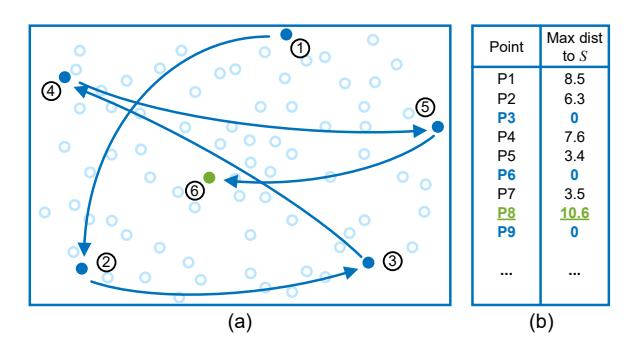

Fig. 1. Schematic diagram of farthest point sampling. (a) Progressive iteration sampling. The blue dots represent the points that have already been sampled, and the green dots represent the farthest point selected in this iteration. (b) Maintain a cache list of distance values to the sampled point set for each point.

contains spatial coordinates (x, y, z) and optionally additional attributes. Point clouds provide a precise representation of the geometry of physical spaces or objects, and are widely used in various fields such as computer vision, robotics, autonomous driving, and geospatial mapping.

Point clouds can be acquired through different sensors, including LiDAR, stereo cameras, and depth sensors. LiDAR, in particular, is frequently used for large-scale mapping and autonomous vehicles due to its high accuracy and ability to capture detailed spatial information over a wide area.

Unlike structured 2D images with inherent neighborhood relationships, point clouds lack explicit adjacency information, making traditional downsampling techniques like max pooling inapplicable. To ensure uniform sampling distribution while maximally preserving spatial characteristics, FPS has become the standard approach for large-scale point cloud processing. As a fundamental algorithm in point cloud analysis, FPS serves as an indispensable preprocessing component in mainstream frameworks including PointNet++ [41] and other 3D object detection systems [5], [20], [29], [35], [37], [45], [46], [53]–[55], [64].

As illustrated in Fig. 1(a), FPS employs a progressive sampling strategy: given a sampled subset  $\mathbf{S}_m = \{s_1, s_2, ..., s_m\}$  at iteration m, the next point  $s_{m+1}$  is selected as the farthest point from  $\mathbf{S}_m$ . After (M-1) iterations, a sampled point set containing M farthest points is generated. Formally, the selection of the farthest point at iteration is defined as:

$$s_{m+1} = \arg\max_{p \in \mathbf{P}} \left( \min_{s \in \mathbf{S}_m} d(p, s) \right), \tag{1}$$

where d(p,s) denotes the Euclidean distance between points p and s.

The naive FPS implementation suffers from redundant distance calculations. At iteration m, for each unsampled point p, it must compute distances to all m sampled points in  $\mathbf{S}_m$ , resulting in  $\mathcal{O}(N^2)$  complexity. Crucially, the minimum distance  $t_p^m$  between p and  $\mathbf{S}_m$  can be derived incrementally using the recurrence relation:

$$t_p^m = \min\left(t_p^{m-1}, d(p, s_m)\right),\tag{2}$$

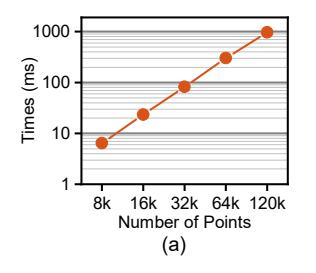

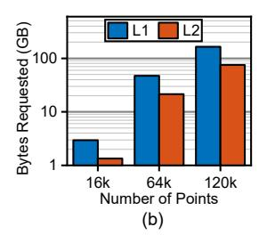

Fig. 2. (a) Algorithm runtime versus the number of points, with sample rate of 25%, tested on the RTX 3090 platform. (b) Number of bytes requested from the L1 and L2 caches across various point cloud scales, tested on the RTX 3090 platform.

where  $t_p^{m-1}$  is the minimum distance from p to the sampled subset  $\mathbf{S}_{m-1}=\{s_1,s_2,...,s_{m-1}\}.$ 

The common optimization solution is maintaining a cache list of distance values from each point to the sampled point set to reduce the number of comparisons, as shown in Fig. 1(b). By maintaining a distance list  $\mathbf{T} \in \mathbb{R}^N$  that stores  $t_p^m$  for all points, FPS avoids recomputing the distances to all points in  $\mathbf{S}_m$  across iterations. This optimization reduces per-iteration complexity to  $\mathcal{O}(N)$ .

Although the distance cache  ${\bf T}$  reduces distance computation and memory accesses, the inherent iterative process of the FPS algorithm still necessitates at least (M-1) full passes over the N-sized point cloud  ${\mathbb P}$  to select M points. This  ${\mathcal O}(MN)$  complexity still creates substantial memory access overhead for large-scale point clouds.

#### B. Performance Characteristics

To understand the performance bottlenecks of FPS, we profiled the traditional FPS algorithm on a GPU. Our experiments were conducted on an NVIDIA GeForce RTX 3090 platform, using point cloud datasets ranging from 8k to 120k points, with a fixed sampling rate of 25%.

As shown in Fig.2(a), FPS operations exhibit quadratic time complexity with respect to point cloud size. Profiling reveals that FPS accounts for 30-70% of total execution time in typical point cloud neural networks, becoming a critical bottleneck for large-scale processing. The runtime grows from 6.4 ms for 8k points to 970.9 ms for 120k points, demonstrating severe scalability limitations.

The memory access pattern analysis in Fig.2(b) exposes fundamental inefficiencies. For a 120k-point cloud, the algorithm makes a total of 600M requests, including 164.65GB of L1 cache requests and 74.81GB of L2 cache requests. The cache throughput of GPU reaches 95.62%, while the instruction throughput of SM core is only 27.17%. This excessive memory traffic dominates execution time. The data demonstrates that current implementations are fundamentally memory-bound rather than compute-bound. These findings motivate the need to minimize memory access in order to accelerate large-scale point cloud sampling.

#### C. Prior Work and Limitations

Several point cloud accelerators have been proposed in the literature [11], [17], [18], [23], [32], [58], [62], [65]–[67], some specifically targeting FPS, while others partially involving FPS acceleration. Broadly, existing FPS acceleration techniques can be classified into two categories:

1) Approximate Spatial Partitioning: Techniques such as [23], [58], [67] adopt a divide-and-conquer strategy by partitioning the point clouds into g spatial blocks and performing local FPS within each block. While this reduces the theoretical complexity from  $\mathcal{O}(N^2)$  to  $\mathcal{O}(N^2/g)$ , the approach fundamentally compromises sampling quality by neglecting inter-block distance relationships. For example, hierarchical partitioning with g=256 blocks achieves a 99.6% reduction in computation but struggles with ensuring consistent density across blocks, leading to non-uniform sampling artifacts, particularly near block boundaries.

2) Tree-Based Optimization: The QuickFPS framework uses a two-level tree structure to dynamically prune unnecessary distance comparisons. While this method guarantees the accuracy of the FPS algorithm, the use of KD-trees introduces slow initialization times and results in redundant memory accesses, especially as the point cloud size increases. The simple two-level tree structure does not eliminate the fundamental issue of high memory access overhead and remains inefficient for large-scale point clouds.

Current solutions generally force an unsatisfactory tradeoff between accuracy and performance. Approximate methods achieve speedups at the expense of sampling quality, while tree-based approaches introduce substantial control overhead without addressing the underlying computational complexity.

#### III. MOTIVATION

This section establishes the theoretical foundations that connect FPS with geometric principles and algorithmic optimizations, motivating our hardware-software co-design to overcome the computational bottlenecks of conventional FPS implementations.

#### A. Partial update via Voronoi Diagram

The distance cache in FPS maintains the minimum distance from each unsampled point to the current sampled set  $\mathcal{S}$ . By associating each unsampled point with the sampled point that generates its minimum distance, the spatial distribution naturally forms a Voronoi Diagram. Voronoi Diagrams are a classical spatial partitioning method where each Voronoi cell  $V(s_i)$  around a sampled point  $s_i$  contains all points closer to  $s_i$  than to any other sampled point. Formally, given a sampled set  $\mathcal{S}_m = \{s_1, ..., s_m\}$ , the Voronoi cell for  $s_i$  is defined as:

$$V(s_i) = \{ p \in \mathbb{R}^3 \mid \forall j \neq i, \, d(p, s_i) \le d(p, s_i) \}. \tag{3}$$

As illustrated in Fig. 3(a), the union of Voronoi cells partitions the space, and the distance cache T implicitly represents the minimum distance from each unsampled point to its nearest Voronoi cell center. When a new point  $s_{m+1}$  is sampled, as shown in Fig. 3(b), only points within the newly

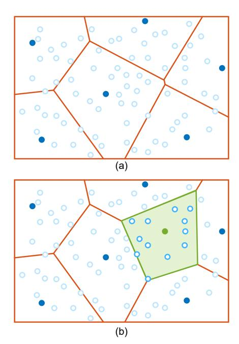

Fig. 3. Voronoi diagram updates during FPS iterations. (a) Sampled point set (blue) and the corresponding Voronoi Diagrams (orange). (b) New sampling point (green) introduced in the next iteration and the updated Voronoi Diagrams.

formed Voronoi cell,  $p \in V(s_{m+1})$  (i.e., those closer to  $s_{m+1}$  than to existing  $S_m$ ) require distance updates.

This spatial locality suggests that we can use Voronoi Diagrams to enable a significant reduction in computational complexity. Specifically, the number of points requiring updates decreases from  $\mathcal{O}(N)$  to  $\mathcal{O}(N/m)$  on average, offering substantial optimization potential. As a result, the complexity of the M times update process via Voronoi Diagram can be evaluated theoretically as:

$$\mathcal{O}\left(\sum_{m=1}^{M} \frac{N}{m}\right) = \mathcal{O}(N \cdot \sum_{m=1}^{M} \frac{1}{m}) = \mathcal{O}(N \log M). \tag{4}$$

Moreover, the partial update mechanism not only reduces distance computations but also minimizes the overhead of finding the global maximum in each iteration. Traditional FPS implementations must scan the entire distance cache to find the farthest point, which becomes prohibitively expensive for large point clouds. By leveraging Voronoi Diagrams, we can confine the maximum value search to only the affected Voronoi cells, further reducing computational costs.

#### B. Neighbor Search in Point Clouds

Efficient neighbor search is fundamental to point cloud processing [19], [24], [31], [33], [44], [60], with existing methods broadly categorized into three approaches:

1) Brute-force (BF) Search: This method computes pairwise distances for all points, achieving  $\mathcal{O}(N)$  time complexity per query. While computationally intensive, brute-force search is

highly parallelizable on GPUs due to its uniform memory access patterns. However, its linear complexity makes it impractical for large-scale point clouds.

- 2) Spatial Partitioning: Methods such as grid-based or voxel-based partitioning divide the space into fixed regions, reducing nearest neighbor queries to local cell lookups. This approach achieves  $\mathcal{O}(N/g)$  complexity per cell, where g is the average number of points per grid. However, while effective for uniform densities, it degrades for skewed distributions common in real-world scans.
- 3) Hierarchical Trees: Structures like KD-trees [2] or octrees [36] recursively partition the space, enabling  $\mathcal{O}(\log N)$  query complexity [4], [12], [40], [52]. Despite their theoretical efficiency, irregular memory accesses and traversal overheads limit their practical performance on parallel architectures such as GPUs. Additionally, constructing and maintaining these trees for dynamic point clouds introduces significant overhead.

These trade-offs highlight the need for a balanced approach that minimizes time complexity while leveraging hardware parallelism.

## C. Bridging FPS and Neighbor Search

Although FPS and neighbor search may seem distinct—FPS selects the globally farthest points, while neighbor search identifies local neighbors—they can be linked and transformed using Voronoi diagrams. Specifically, the recurrence relation for FPS distance updates can be reinterpreted as iterative neighbor searches:

$$t_p^m = \min\left(t_p^{m-1}, d(p, s_m)\right) \equiv \begin{cases} d(p, s_m) & p \in V(s_m), \\ t_p^{m-1} & \text{otherwise,} \end{cases} \tag{5}$$

where  $p \in V(s_m)$  indicates that p is a neighbor of  $s_m$ .

**Key Insight**: This equivalence reveals that FPS can be optimized by leveraging efficient neighbor search primitives, avoiding redundant distance computations. By reformulating FPS as a sequence of neighbor searches with partial updates, we unify the computational patterns of FPS and neighbor search. This not only enables hardware reuse for the neighbor search units but also takes advantage of spatial coherence through Voronoi Diagrams.

This synergy motivates the architecture we propose, which co-optimizes algorithmic locality (via VD-aware partial update) and hardware efficiency (via neighbor search engine). Our approach breaks the  $\mathcal{O}(N^2)$  complexity barrier of conventional FPS implementations and reduces it to  $\mathcal{O}(N \log N)$ .

#### IV. NEIGHBOR-SEARCH-BASED FPS

In this section, we present NS-FPS, a FPS algorithm designed for efficient hardware acceleration through neighbor search. Instead of performing brute-force distance updates over the entire point cloud, NS-FPS narrows the search space via a dynamically bounded region around each newly sampled point. The method is structured into four stages: determining the effective search radius (Section IV-A), extracting relevant neighbors using Morton-code-based spatial partitioning (Section IV-B), computing the farthest point via a hierarchical

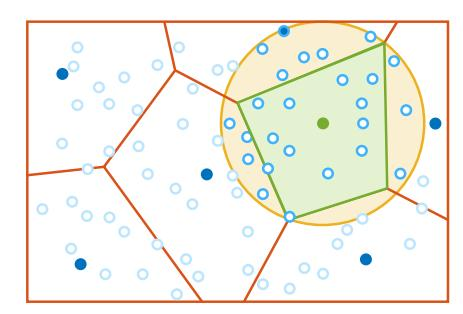

Fig. 4. The effective update region is a sphere of radius  $d_k$  (yellow), which fully contains the true Voronoi cell (green).

max-value cache (Section IV-C), and orchestrating the overall pipeline (Section IV-D).

## A. Search Scope Determination

While Voronoi diagrams offer a precise mathematical boundary for identifying points needing distance updates (as described in Section III-A), constructing VD boundaries exactly is computationally prohibitive. To address this, we propose a relaxed yet provably sufficient search space: a spherical region centered at the latest sampled point  $s_k$  with radius  $d_k$ , where  $d_k$  is the distance from  $s_k$  to its closest previously selected sample. We prove that all points requiring distance updates must lie within this sphere  $\mathcal{B}(s_k,d_k)$ .

Proof sketch: Let  $S_k = \{s_0, ..., s_k\}$  denote the set of sampled points at iteration k, and define the radius as:

$$d_k = \min_{s_i \in \mathcal{S}_{k-1}} \|s_k - s_i\|^2.$$
 (6)

For any unsampled point p, its cached distance  $t_p^k$  (to the sampled set) requires updating only if:

$$||p - s_k||^2 < \min_{s_i \in S_{i-1}} ||p - s_i||^2.$$
 (7)

Assume p lies outside the sphere,  $p \notin \mathcal{B}(s_k, d_k)$ , yet still requires a distance update:

$$||p - s_k||^2 > d_k = \min_{s_i \in S_{k-1}} ||s_k - s_i||^2.$$
 (8)

From Equation 7 and Equation 8, we derive:

$$\min_{s_i \in S_{k-1}} \|s_k - s_i\|^2 < \|p - s_k\|^2 < \min_{s_i \in S_{k-1}} \|p - s_i\|^2.$$
 (9)

However, by definition, if  $s_k$  is the farthest point at iteration k-1, then

$$\min_{s_i \in \mathcal{S}_{k-1}} \|s_k - s_i\|^2 \ge \min_{s_i \in \mathcal{S}_{k-1}} \|p - s_i\|^2, \tag{10}$$

which contradicts our assumption. Therefore, any point p requiring distance update must lie within  $\mathcal{B}(s_k, d_k)$ . This is illustrated in Fig. 4, where the spherical region (yellow) safely encloses the actual Voronoi cell (green).

Consequently, the traversal scope is reduced from the full point cloud traversal mandated by vanilla FPS to solely those points residing within the bounded spherical region.

#### B. Morton-Code-Based Neighbor Search

Even after reducing the search to a spherical region, performing a ball query over an unordered point cloud remains computationally expensive [4], [6], [40], [52], [57]. Inspired by spatial partitioning strategies, we discretize space into uniform cubes and perform neighbor search only within candidate cubes that intersect the search sphere.

We first encode each point using a Morton code (Z-order curve), which maps 3D spatial coordinates to 1D integers while preserving spatial locality [34], [38], [50], [61]. As illustrated in Fig. 5(a), each Morton code implicitly defines a cube in 3D space. We then apply a bucket sort on the point cloud based on these Morton codes (Fig. 5(b)). This linear-time sorting avoids the overhead of comparison-based sorting or tree construction (as required in k-d trees), thereby significantly reducing preprocessing latency.

After reordering, an index table that maps Morton codes to the corresponding range of points will be constructed. During neighbor queries (Fig. 5(c)), we enumerate all cubes that intersect the spherical search region (deep orange) and retrieve their associated points using the index. This method efficiently filters out distant points that cannot possibly be updated, reducing the number of distance computations required for each iteration.

#### C. Hierarchical Max-Value Comparison

An implicit benefit of adopting the aforementioned partial update scheme is that the max-value search operation for finding the farthest point could potentially be significantly reduced. Instead of linearly scanning all cached distances  $t_p^k$ , we introduce a multi-level max-value caching structure that allows efficient partial updates.

The base level of the cache stores distance values  $t_p^k$ , organized in Morton code order as a distance cache. Every 16 consecutive entries are grouped into a block, and each higher-level cache stores the maximum value from its corresponding lower-level block as global maximum candidates, forming a 16:1 compression hierarchy (Fig. 6).

During each sampling iteration, only those blocks that were affected by distance updates are traversed to refresh their cached max candidate values. The global farthest point is then determined by walking the hierarchy from top to bottom, reducing redundant memory access and comparisons. This structure significantly reduces the search space for the global maximum, delivers near-logarithmic time complexity for max-selection operations, effectively mitigating the impact of point cloud scaling on overall performance.

#### D. NS-FPS Pipeline

Building upon the above components, we present the complete NS-FPS pipeline, summarized in Algorithm 1. The algorithm avoids exhaustive distance operations by leveraging a provable geometric bound, a spatially ordered point layout via Morton codes, and a hierarchical max-value cache structure for efficient max selection.

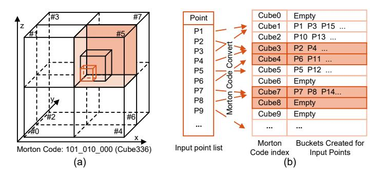

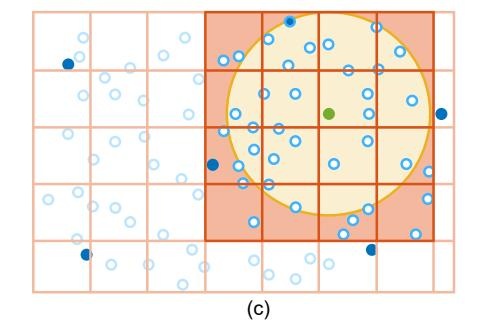

Fig. 5. Overview of Morton-code-based neighbor search. (a) Morton codes correspond to spatial cubes. (b) Points are reorganized via bucket sort by Morton code. (c) Candidate cubes intersecting the search sphere are indexed and their associated points are retrieved.

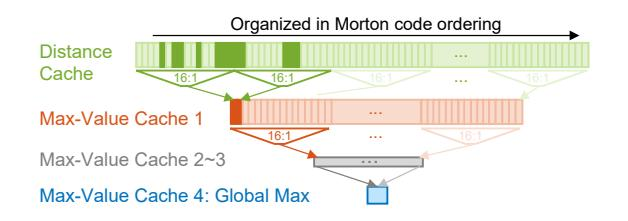

Fig. 6. The hierarchical max-value caching design reduces the number of required comparison operations. Each level decreases the number of max-value candidates by a 16:1 ratio.

The pipeline begins by selecting the initial point  $s_0$  randomly from the point cloud  $\mathbf{P}$ , consistent with the original FPS algorithm. Then, a Morton-code-based spatial reordering is applied to construct a layout that enhances spatial locality. This reordered layout allows us to quickly locate nearby points via an indexable voxel grid, enabling efficient ball query operations without resorting to complex tree structures.

At each iteration, the algorithm determines the search radius  $d_k$  from the current farthest point and identifies candidate voxels intersecting the corresponding sphere. The algorithm then updates the distance cache  ${\bf T}$  for points within these voxels. To minimize unnecessary computations, only those distances that are strictly improved are retained.

For the selection of the next farthest point, NS-FPS leverages a hierarchical max-value caching structure. By organizing cached distances into a multi-level hierarchy with a fixed compression ratio, we significantly reduce the number of comparisons needed to find the global maximum. Moreover, since only a small subset of the point cloud undergoes updates at each iteration, cache propagation is restricted to updated blocks, yielding further acceleration.

Compared to vanilla FPS, NS-FPS preserves identical sampling results while dramatically reducing redundant distance computations and memory traffic. Furthermore, the reordered point layout is naturally compatible with subsequent point cloud operations such as k-NN and ball queries, further reducing the overhead of our solution within whole point cloud workloads.

## Algorithm 1 Neighbor-Search-Based FPS

```
Input: Point cloud \mathbf{P}, number of samples M
Result: Sampled points S_M
 1: /*Initialization and preprocessing*/
 2: Sort P using Morton codes and build index table
 3: Initialize distance cache \mathbf{T} \leftarrow \infty
 4: Randomly choose s_0 \in \mathbf{P}; set S_0 = \{s_0\}
 5: for k = 1 to M - 1 do
       /*Update\ distance\ cache\ \mathbf{T}*/
       Set d_k = \mathbf{T}[s_{k-1}]
 7:
       Determine cubes C intersecting \mathcal{B}(s_{k-1}, d_k)
       for all point p in these cubes C do
 9.
10:
           \mathbf{T}[p] \leftarrow \min(\mathbf{T}[p], \|p - s_{k-1}\|^2)
11.
       end for
       /*Find the farthest point*/
12:
13:
       Update max-value cache \tau_L hierarchy
       for l = 0 to L - 1 do
14.
          // Traverse hierarchy from bottom to top
15.
          for all blocks B in Buffer_updated do
16:
             Find local maximum \tau_{l+1}^B \leftarrow \max_{p \in B} \tau_l^B
17:
              Mark parent blocks in Buffer_updated<sup>l+1</sup> // Prop-
18
              agate changes downward
19:
          end for
20:
       end for
       s_k \leftarrow \arg\max_p \mathbf{T}[p]
21:
       \mathcal{S}_k \leftarrow \mathcal{S}_{k-1} \cup \{s_k\}
```

## V. NS-FPS ACCELERATOR DESIGN

This section details the hardware architecture of the NS-FPS accelerator, which employs a Morton-ordered builder, a neighbor search engine, and a hierarchical max finder to achieve real-time FPS on large-scale point clouds.

#### A. Accelerator Overview

NS-FPS operates in two phases: **Data Preprocess**, which groups the point cloud by Morton codes, and **Sampling Loop** phase, where iterative FPS is performed based on neighbor search operations. As shown in Fig. 7, the accelerator contains three core modules:

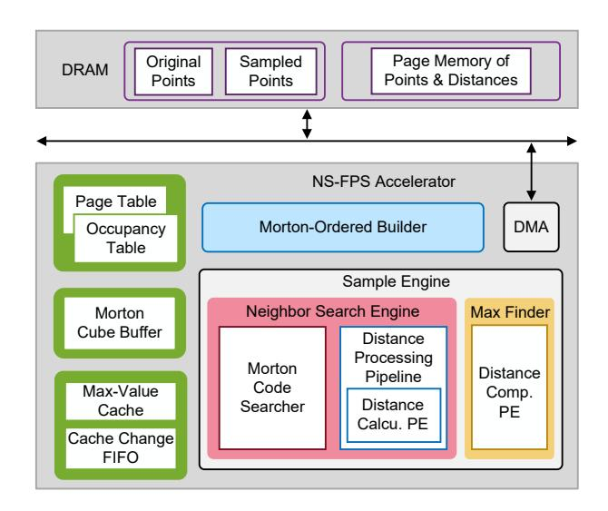

Fig. 7. Overview of the NS-FPS architecture.

- 1) **Morton-Ordered Builder**: partitions points into cubes by using a page table management system inspired by memory management techniques in computer architecture;
- 2) **Neighbor Search Engine**: fully pipelined unit that updates distances to the current farthest point;
- 3) **Hierarchical Max Finder**: features a four-level on-chip cache hierarchy to speed up the global-maximum search.

The NS-FPS accelerator employs a hierarchical storage architecture that carefully partitions data across on-chip SRAM and off-chip DRAM, optimizing for access locality, latency, and bandwidth. The storage system is organized into three key components:

- 1) Morton Code-Based Page Table System: This system, detailed in Section IV-B, maintains the Occupancy Table, Page Table and Next Page Ptr. in on-chip SRAM for low-latency cube lookup, stores the Page Memory (points and their distance values) in DRAM, and employs a 32-entry on-chip Morton Cube Buffer to stage the currently processed cubes.
- 2) **Hierarchical Max-Value Caches**: A four-level on-chip cache hierarchy (1K, 64, 4, 1 depths per level) is used to accelerate the search for the global farthest point. All levels reside in on-chip SRAM and store local maximum distance candidates. Cache Change FIFOs, also on-chip, track which entries need updating, enabling efficient partial updates without full traversals.
- 3) **Point Buffer**: The Point Buffer in DRAM stores the full point cloud dataset, including: Original points (before sampling) and Sampled points (selected iteratively).

#### B. Morton-Ordered Builder

Due to the sparsity and non-uniform distribution of real-world point clouds, the number of points in each Morton cube varies widely. To manage this efficiently, we adopt a three-level Morton-Code-Based Page Table System consisting of an Occupancy Table, a Page Table, and a Page Memory

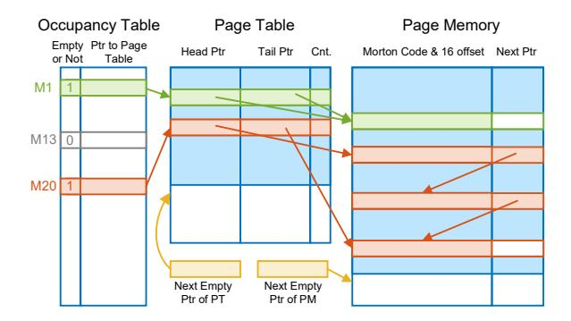

Fig. 8. Morton Code-Based Page Table System for storing the Morton-ordered point cloud.

(Fig. 8). This hierarchical organization enables on-demand memory allocation and ensures that storage is provisioned only for Morton cubes that actually contain points.

For example, in a 120k-point scene dataset, the system operates as follows:

- Occupancy Table: Each Morton cube has a 14-bit entry:
   bit indicating whether the cube is non-empty and 13 bits pointing to its Page Table entry.
- 2) Page Table: Stores the start/end addresses of each cube's Page Memory region, using 28 bits for addresses and 4 bits to record the point count in the last page.
- 3) Page Memory: Holds the (x,y,z) coordinates and cached distances of up to 16 points per entry (i.e. per block), along with a 14-bit pointer linking to the next page for the same Morton cube.

Execution Pipeline: The Morton-Ordered Builder is implemented as a four-stage pipeline. It reads each point p(x,y,z), quantizes coordinates to 15/15/11-bit integers, extracts their 7/7/3 MSBs, and forms a 17-bit Morton code. This code indexes into the Occupancy Table: if the cube is new, a Page Table entry is created; otherwise, the existing entry is used. Page Memory entries are allocated or appended as needed, enabling a single-pass construction without expensive comparisons.

Memory Optimization: To reduce DRAM traffic, a 32-entry (i.e. 32-block) on-chip Morton Cube Buffer caches recently used cubes. On a hit, new points are written directly into the cached entry; on a miss, the cube is loaded from DRAM using an LRU replacement policy. Dirty entries are written back before eviction. After processing all points, a final flush commits remaining dirty cubes to DRAM, ensuring consistency while maintaining high spatial locality.

## C. Neighbor Search Engine

The Neighbor Search Engine consists of two main modules: the Morton Cube Searcher and the Distance Update Module. The Morton Cube Searcher takes the current sampled point  $s_k(x_k,y_k,z_k)$  and its maximum distance  $d_k$  to generate the Morton code range corresponding to the search radius. This search engine computes the cyclic boundaries of the Morton

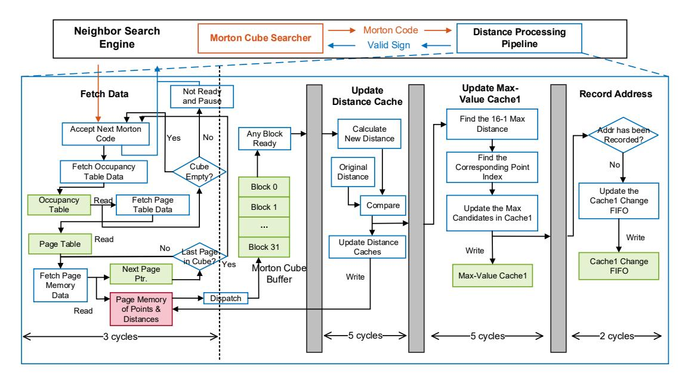

Fig. 9. Distance update module pipeline overview.

Code corresponding to the search radius and periodically generates the required Morton codes. Upon receiving each Morton code, the Distance Update Module retrieves the corresponding points and updates their distances to the sampled set.

*Execution Pipeline*: Fig. 9 illustrates the four pipeline stages of this update process:

- 1) Fetch Data: The Distance Update Module accesses the Morton-Code-Based Page Table System according to the issued Morton code. If a cube spans multiple Page Memory entries, the module follows the linked list to fetch all associated points. Once a cube is completed, it immediately processes the next Morton code; empty cubes are skipped to avoid stalls.
- 2) Update Distance: For each Page Memory entry, distances from 16 points to s<sup>k</sup> are computed in parallel, and the Distance Cache is updated whenever smaller values are found.
- 3) Update Max-Value Cache1: A 16-to-1 comparator finds the maximum updated distance among the 16 points and writes it into the corresponding entry of the 1K-depth Max-Value Cache1.
- 4) Record Address: To propagate updated blocks to higherlevel caches, their addresses are pushed into the Cache1 Change FIFO. A 1K-bit Record Table ensures each address is inserted only once per iteration.

*Memory Optimizations*: To hide DRAM latency, the engine reuses the 32-entry on-chip Morton Cube Buffer from the Morton-Ordered Builder. Each cube is dispatched to the pipeline immediately after being fetched, and the buffer slot is released for prefetching the next cube. This overlap of memory access and computation maintains continuous throughput.

## *D. Hierarchical Max Finder*

The Hierarchical Max Finder operates in two stages: a topdown update to determine the global maximum and a bottom-

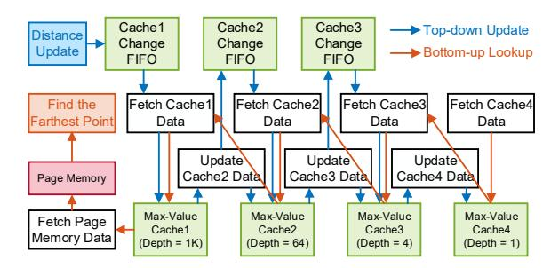

Fig. 10. Hierarchical max-value cache execution scheme, featuring top-down local maximum updates (blue) and bottom-up coordinate retrieval (orange).

up lookup to locate the corresponding point (Fig. 10).

Top-down Update: Addresses in the Cache Change FIFO trigger updates at each cache level. A 16-to-1 comparator selects the local maximum and its index, which is propagated upward through the hierarchy until the global maximum is obtained at the top level.

Bottom-up Lookup: After the global maximum is identified in Max-Value Cache4, the finder traverses back down the hierarchy to recover the exact point index. The final farthest point is then fetched from Page Memory and appended to the sampled set for the next iteration.

This hierarchical design minimizes redundant updates and memory accesses, enabling fast maximum selection and efficient iteration progress.

## VI. EXPERIMENTS AND RESULTS

## *A. Experimental Setup*

*Implementation*: To separate algorithmic improvements from hardware-specific gains, we evaluate NS-FPS in three forms: (i) a pure CPU software version of our NS-FPS algorithm in C++17 (compiled with -O3), serving as a fair baseline for algorithmic efficiency; (ii) a domain-specific NS-FPS hardware accelerator, implemented in Verilog and verified through RTL simulations; and (iii) a GPU version of NS-FPS for supplementary analysis. We synthesize the accelerator using Synopsys tools targeting a 28 nm process under typical corner conditions (25°C, 0.9 V). DRAM behavior is modeled via DRAMsim3 [28] using Micron's 8 GB DDR4-2400 parameters [22]. All distance-related computations maintain fp32 precision.

*Benchmark Datasets:* We evaluate NS-FPS on the SemanticKITTI dataset [1], a widely adopted benchmark in point cloud processing research. This dataset offers large-scale, realworld LiDAR scans containing up to 120,000 points per frame, making it ideal for assessing the scalability and efficiency of our NS-FPS accelerator. In addition, we also evaluate our method on subsets of 16k, 32k, and 64k points drawn from the original SemanticKITTI dataset, to assess the effectiveness of our approach across varying point cloud densities.

*Baselines:* We evaluate the NS-FPS accelerator against four baselines: (i) a C++17 implementation of vanilla FPS on an AMD Ryzen AI 9 365 CPU; (ii) the CUDA FPS implementation from OpenPCDet [48], which utilizes a highly optimized CUDA implementation of naive FPS, on an NVIDIA RTX 3090 GPU; (iii) QuickFPS [18], the state-of-the-art (SOTA) ASIC dedicated to farthest point sampling, and (iv) its official CPU and GPU implementations from the open-source fpsample library. GPU profiling is performed using NVIDIA Nsight Systems and Nsight Compute.

All results in Sections VI-B–VI-D are obtained using a (7,7,3)-bit Morton code for (x,y,z) and 16 points per Page Memory entry, which represent the optimized configuration identified through the sensitivity analysis in Section VI-E.

## *B. Latency Evaluation*

We first examine the relationship between the search radius and the number of cycles required per iteration. As shown in Fig. 11(a), the search radius correlates positively with the processing time for each iteration. Fig. 11(b) highlights the first 100 iterations: because the initial search radius covers many cubes, these iterations incur noticeably higher latency, accounting for 27.3% of the total iteration time. However, as sampling progresses, the search radius rapidly shrinks below 1 meter, substantially reducing the number of cubes, comparisons, and memory accesses. As a result, iteration latency drops accordingly, with minor fluctuations due to variations in cube density.

Takeaway-1(a): The adaptive shrinking of the search radius reduces per-iteration work and effectively prunes redundant computation and memory traffic.

*Algorithmic Latency Comparison (CPU Platforms)*: We compare NS-FPS-CPU against two CPU baselines: vanilla

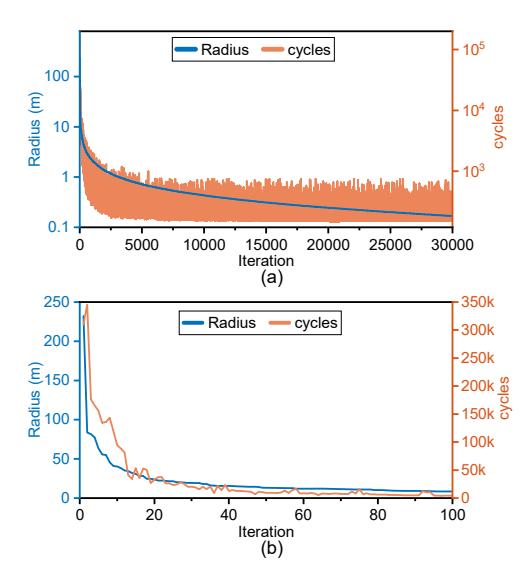

Fig. 11. The radius in ball query and the number of cycles required for each iteration when processing a 120k point cloud frame on ASIC accelerator. (a) Total 30k iterations, with logarithmic scaling on the Y-axis. (b) Changes in radius and iteration cycles during the first 100 iterations.

FPS and QuickFPS-CPU. As shown in Fig. 12(a), NS-FPS-CPU consistently outperforms both across all scales, achieving 100.1×, 130.3×, 106.2×, and 191.7× speedup over vanilla FPS on 16k–120k point clouds. Compared to QuickFPS-CPU, NS-FPS-CPU matches it on small point clouds (16k/32k) and outperforms it by 1.22× and 1.80× on 64k and 120k scenes, highlighting its stronger algorithmic efficiency across scales.

We also benchmark NS-FPS-CPU on 120k-point scenes at downsampling ratios of 10%, 25%, 40%, 55%, and 70%. As shown in Fig. 12(b), compared to QuickFPS-CPU, NS-FPS maintains a 1.23–2.59× latency reduction, demonstrating its superior algorithmic efficiency even on general-purpose processors.

Takeaway-1(b): NS-FPS mitigates the quadratic behavior of traditional FPS, reducing complexity from O(N<sup>2</sup> ) to O(N log N). The benefit increases with the sampling ratio, making NS-FPS well-suited for highresolution sampling on large point clouds.

*Hardware Acceleration Latency Comparison (GPU & ASIC Platforms)*: We compare the latency of our NS-FPS-ASIC against GPU, QuickFPS-GPU, NS-FPS-GPU and QuickFPS-ASIC (Fig. 12(c)). NS-FPS-GPU underperforms QuickFPS-GPU at small scales due to the overhead of Morton-code traversal on GPU architectures, but outperforms it at large scales where memory reduction becomes the dominant factor. This scale-dependent behavior indicates that fully realizing the potential of NS-FPS requires an ASIC implementation.

Across point cloud sizes, NS-FPS-ASIC achieves 17.2×, 28.1×, 42.2×, and 81.6× over GPU. Against QuickFPS-

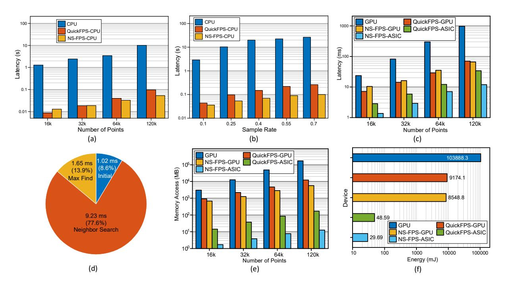

Fig. 12. (a) Latency comparison of software implementations when processing point-cloud frames of varying scales. (b) Latency comparison of software implementations at different sampling rates for large-scale point clouds. (c) Latency comparison of ASIC implementations when processing point-cloud frames of varying scales. (d) Latency breakdown of NS-FPS-ASIC for the 120k-point case. (e) Total memory access when processing point-cloud frames of different scales. (f) Energy consumption for processing a full point-cloud frame across different platforms.

ASIC, NS-FPS delivers  $2.1\times$ ,  $2.1\times$ ,  $1.7\times$ , and  $2.9\times$  speedups for 16k to 120k points.

Fig. 12(d) further breaks down latency of NS-FPS-ASIC for the 120k-point case:

- 1) Initialization and Preprocessing: Morton-ordered partitioning and page table construction take 1.02 ms—nearly fixed cost requiring only one pass.
- 2) Neighbor Search and Distance Cache Update: The dominant component, dependent on the number of points updated each round, takes 9.23 ms.
- 3) Farthest Point Selection: Hierarchical max-value lookup contributes 1.65 ms, benefiting from progressively smaller search radii.

**Takeaway-2(a)**: With Morton ordering accounting for <10% of total latency, the NS-FPS ASIC amplifies the algorithmic gains through fine-grained memory management and deep pipelining—achieving substantially higher efficiency than its CPU counterpart and delivering  $2.9\times$  speedup over QuickFPS-ASIC.

Scaling Trend Analysis: To further analyze how latency scales with input size, we normalize the latency results for each platform against its own 16K-point measurement, enabling a fair comparison of relative scaling trends. As illustrated in Table I, the results confirm that while GPU and QuickFPS-ASIC exhibit quadratic growth, NS-FPS-ASIC demonstrates

sub-quadratic scaling. Specifically, when scaling the point cloud from 16K to 120K points (8× increase in N), the latency of GPU and QuickFPS-ASIC surges by  $41.29\times$  and  $12.08\times$ , respectively, whereas NS-FPS-ASIC increases by only  $8.74\times$ , indicating a significantly slower rate of latency growth compared to both GPU and QuickFPS. This empirical evidence strongly corroborates the theoretical complexity analysis derived in Section III-A, confirming that the algorithmic reformulation effectively mitigates the quadratic bottleneck.

## C. Memory Access Analysis

We compare the total memory access between NS-FPS, GPU, and QuickFPS across point clouds of various sizes, as shown in Fig. 12(e). For different point cloud scales, NS-FPS reduces memory access by over  $1700\times$  compared to the GPU implementation. When compared to QuickFPS, NS-FPS decreases memory access by factors ranging from  $8.4\times$  to  $13.4\times$  for point clouds ranging from 16k to 120k points.

The GPU-based implementation performs full global traversals, so each iteration incurs heavy memory traffic despite abundant compute units. QuickFPS alleviates this with a two-level k-d tree but still lacks fine-grained control over per-iteration memory access. Although NS-FPS-GPU reduces memory access compared to QuickFPS-GPU, it still incurs over 400× higher memory traffic than NS-FPS-ASIC due to the GPU's general-purpose memory hierarchy. Specifically, cache-line fetching amplifies fine-grained accesses, while global-memory synchronization for hierarchical argmax

TABLE I NORMALIZED LATENCY RESULTS FOR EACH PLATFORM AGAINST ITS OWN 16K-POINT MEASUREMENT

| Numbers<br>of Points | GPU<br>(×23.51 ms) | QuickFPS-ASIC<br>(×2.83 ms) | NS-FPS-ASIC<br>(×1.36 ms) |
|----------------------|--------------------|-----------------------------|---------------------------|
| 16k                  | 1                  | 1                           | 1                         |
| 32k                  | 3.48               | 2.08                        | 2.14                      |
| 64k                  | 12.79              | 4.29                        | 5.24                      |
| 120k                 | 41.29              | 12.08                       | 8.74                      |

traversal introduces additional communication overhead—both of which are absent in the ASIC's custom dataflow. In contrast, the NS-FPS-ASIC updates only points within the current search radius as shown in Fig. 11(a), restricting each iteration to the relevant Morton cubes and sharply reducing unnecessary DRAM traffic. This targeted access pattern substantially improves memory efficiency, especially for large point clouds.

Takeaway-2(b): FPS is intrinsically memory-bound; NS-FPS breaks the bottleneck by eliminating 1700× GPU traffic and 8-13× QuickFPS traffic through radius-driven, block-local updates—its speed-ups stem not from adding ALUs but from the software-hardware co-design that simply stops unnecessary DRAM requests.

## *D. Area Analysis and Power Comparisons*

Table II summarizes the power and area characteristics of the NS-FPS accelerator. Overall, the hardware implementation requires modest computational resources, with a total area of 2.075 mm<sup>2</sup> . The Neighbor Search Engine constitutes the most computation-intensive component, as it is responsible for Morton-code traversal, neighbor retrieval, and distance updates—the dominant operations in the NS-FPS pipeline. This module accounts for the majority of the 168.25 mW logic power.

On-chip SRAM, used primarily for the Max-Value Caches, Morton page-table hierarchy, and Morton Cube Buffer occupies 1.907 mm<sup>2</sup> , representing 92% of the total chip area. It contributes 307.38 mW of power, or 12.3% of total system power. By contrast, DRAM contributes an additional 2066.69 mW, accounting for 82.7% of overall power consumption, highlighting the importance of minimizing off-chip memory traffic.

Fig. 12(f) reports the energy cost of processing a full point cloud frame. For a 120k-point scan at a 25% sampling rate, the NS-FPS accelerator consumes 26.69 mJ per downsampling pass, achieving a 38.9% energy reduction compared to the state-of-the-art QuickFPS-ASIC.

## *E. Sensitivity Analysis*

The Morton code length controls the granularity of spatial partitioning. Shorter codes form fewer but larger cubes,

TABLE II POWER AND AREA ANALYSIS OF NS-FPS ACCELERATOR

|       | Logic     | SRAM      | DRAM       | Overall    |
|-------|-----------|-----------|------------|------------|
| Power | 168.25 mW | 307.38 mW | 2066.69 mW | 2497.43 mW |
| Area  | 0.168 mm2 | 1.907 mm2 | –          | 2.075 mm2  |

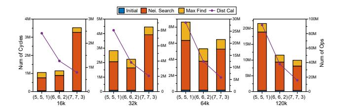

Fig. 13. Latency breakdown and operation count variations for different Morton code lengths.

reducing lookup overhead for large radii but increasing unnecessary computation within each cube. Longer codes create finer partitions with fewer points per cube, improving pruning efficiency but introducing additional cube-management and access overhead.

Fig. 13 shows the latency and operation counts under three code configurations: (5,5,1), (6,6,2), and (7,7,3). Finer granularity generally reduces distance computations because smaller cubes filter out more irrelevant points. However, excessively small cubes raise per-cube access latency, slowing the Neighbor Search stage. Consequently, the optimal configuration depends on scene scale: (6,6,2) yields the lowest latency for the 32k-point cloud, whereas (7,7,3) performs best for the 120kpoint case.

Takeaway-3: Longer Morton codes improve pruning for large point clouds, while shorter codes reduce cubemanagement overhead and are preferable for smaller datasets.

We evaluate Page Memory block sizes of 8, 16, 32, 64 and 128 points on a 120k-point cloud (Morton code = (7,7,3), sampling rate = 25%). As shown in Fig. 14, an 8-point block doubles the number of Page Memory entries, causing more DRAM transactions and a 26.9% latency increase due to traversal and metadata overhead. Larger blocks (64 or 128 points) lower DRAM access frequency but degrade computational efficiency. Packing more points into each block reduces the fraction of useful points within the update radius, leaving parts of the 16-way PE array idle and increasing redundant distance computations. The 16-point block offers the best balance: it matches DDR4's 64-byte burst, fully utilizes the 16 way PE array, and maintains a uniform 16:1 reduction ratio for the hierarchical Max-Value Cache. Thus, we adopt 16 points as the default block size.

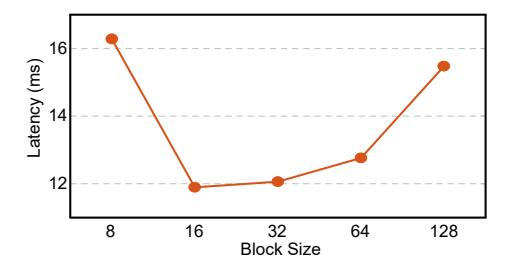

Fig. 14. Relationship between Page Memory block size and the resulting latency.

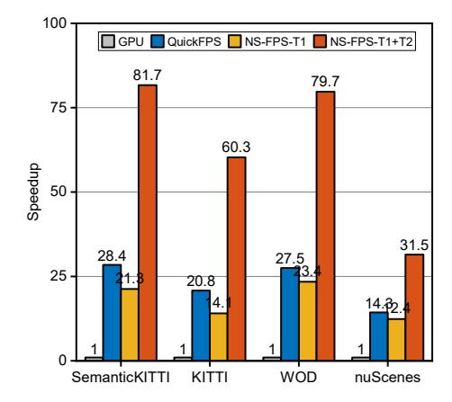

Fig. 15. Speedup relative to GPU baseline across diverse datasets. Each group shows four configurations: GPU (baseline), QuickFPS, NS-FPS with T1 only, and NS-FPS with both T1+T2 (full).

## *F. Ablation Study*

We select the NS-FPS-ASIC implemented in 28 nm process for ablation study and select the GPU-based vanilla FPS and QuickFPS as the baseline.

The overall speedup results relative to GPU across four large-scale datasets are presented in Fig. 15. The speedup trends are consistent across four large-scale datasets with varying point scales and spatial distributions: SemanticKITTI [1] (120k points), KITTI [13] (115k points), Waymo Open Dataset [47] (117k points), and nuScenes [3] (34k points). All experiments use a fixed 25% sampling rate for fair comparison.

- T1: Morton-Code-Based Neighbor Search. This technique replaces brute-force traversal with spatially-indexed cube lookup. Enabling only T1 achieves 21.3×, 14.1×, 23.4×, and 12.4× speedup over GPU on SemanticKITTI, KITTI, Waymo Open Dataset, and nuScenes, respectively. We attribute this acceleration to pruning redundant distance updates, as only points within relevant Morton cubes require processing instead of the entire point cloud. This technique replaces brute-force traversal with spatially-indexed cube lookup.
- T2: Hierarchical Max-Value Comparison. This technique accelerates global-max selection via a 16:1 compressed cache hierarchy. Integrated with T1, the full NS-

FPS configuration achieves 81.7×, 60.3×, 79.7×, and 31.5× speedup over GPU on SemanticKITTI, KITTI, Waymo Open Dataset, and nuScenes, respectively. We attribute this gain to reducing redundant max-value comparisons, as the hierarchical cache confines the search to updated blocks instead of scanning the entire distance cache.

The ablation results confirm that Morton-code neighbor search (T1) provides the primary acceleration by pruning redundant distance updates, while hierarchical max-value caching (T2) delivers complementary gains (2.5 − 4.2×). The consistent speedup across datasets with varying scales and spatial distributions demonstrates the robustness of NS-FPS for diverse point cloud workloads.

## *G. Overall Runtime of Point Cloud Neural Network*

To assess the system-level impact of NS-FPS, we integrate the accelerator into mainstream 3D object detection frameworks, specifically PointRCNN [46], 3DSSD [59], and IA-SSD [63]. These architectures rely heavily on iterative FPS stages to downsample raw LiDAR inputs (typically 16k points) into compact feature sets suitable for subsequent neural network layers. In our heterogeneous evaluation setup, FPS operations are delegated to the NS-FPS-ASIC, while all remaining convolutional and transformation layers continue to execute on GPU (RTX 3090). To emulate realistic deployment constraints, we model the data transfer overhead between the accelerator and the host using a sustained PCIe bandwidth of 19.2 GB/s.

Fig. 16 illustrates the end-to-end inference latency when substituting GPU-based FPS with our NS-FPS accelerator. The results indicate a substantial decrease in total execution time across all benchmarks. Specifically, we observe overall speedups of 1.3×, 1.7×, and 2.7× for PointRCNN, 3DSSD, and IA-SSD, respectively. IA-SSD exhibits the most pronounced improvement due to its FPS-intensive design, whereas PointRCNN sees moderate gains as its bottleneck is distributed across other operators. The expected data movement and transfer overheads between components is <2%. Collectively, these findings demonstrate that NS-FPS facilitates real-time processing of large-scale point clouds within complex detection pipelines, effectively removing the latency barriers imposed by conventional GPU-based sampling implementations.

## VII. RELATED WORKS

Point Cloud Neighbor Search Accelerators: Neighbor search, including ball query and k-nearest neighbor (k-NN) search, is one of the most fundamental operations in point cloud applications and has inspired a range of specialized accelerators, including such as QuickNN [40], KD Bonsai [8], ParallelNN [4], Tigris [56] and CAMPER [66]. These designs focus on building point cloud index structures and accelerating range queries through tree-based methods such as k-d trees [2] and octrees [36], exploiting parallelism to mitigate the overhead of irregular memory access. Many adopt approximate search or parallel tree traversal to improve

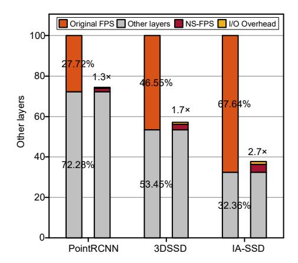

Fig. 16. End-to-end inference latency for PointRCNN, 3DSSD, and IA-SSD with GPU-based FPS versus NS-FPS accelerator. Original FPS operations run on GPU (orange), while NS-FPS offloads sampling to hardware (yellow I/O overhead + red NS-FPS compute); other network layers execute on GPU (light gray).

efficiency. In contrast, NS-FPS draws inspiration from octrees but replaces explicit tree construction with Morton-code–based lookup, eliminating tree-building overhead while retaining high efficiency for small-range neighbor search.

Point Cloud Sampling Accelerators: QuickFPS [18] accelerates FPS through a two-level k-d tree and optimizations such as merged and implicit computation to reduce memory and compute overhead. Other works, including PNNPU [23] and TiPU [65], perform global FPS by decomposing it into local selections, lowering complexity but sometimes degrading sampling uniformity. These approaches overlook the inherent challenge of balancing efficiency and uniformity in large-scale point cloud sampling.

# VIII. CONCLUSION

With the widespread adoption and advancement of LiDAR sensors, downsampling large-scale point clouds has become a critical factor influencing the latency of point cloud processing. In this paper, we presented NS-FPS, an approach that transforms the FPS problem into a neighbor search problem. By efficiently filtering redundant computations and memory accesses in the sampling process, and incorporating a hierarchical maximum value search scheme, NS-FPS enables finegrained processing of farthest point sampling. The evaluation results demonstrate that NS-FPS achieves significant acceleration compared to GPU-based implementations and existing point cloud sampling accelerators, highlighting its potential for real-time, large-scale point cloud processing. In addition, we release an open-source CPU version of NS-FPS to facilitate reproducibility and future research.

#### ACKNOWLEDGMENT

This work was supported in part by the National Science and Technology Major Project under Grant 2021ZD0114400, in part by the Shanghai Action Plan for Science, Technology and Innovation under Grant 24JD1400300 and in part by the Fundamental and Interdisciplinary Disciplines Breakthrough Plan of the Ministry of Education of China under Grant JYB2025XDXM120.

#### REFERENCES

- [1] J. Behley, M. Garbade, A. Milioto, J. Quenzel, S. Behnke, C. Stachniss, and J. Gall, "Semantickitti: A dataset for semantic scene understanding of lidar sequences," in *Proceedings of the IEEE/CVF international conference on computer vision*, 2019, pp. 9297–9307.
- [2] J. L. Bentley, "Multidimensional binary search trees used for associative searching," *Communications of the ACM*, vol. 18, no. 9, pp. 509–517, 1975.
- [3] H. Caesar, V. Bankiti, A. H. Lang, S. Vora, V. E. Liong, Q. Xu, A. Krishnan, Y. Pan, G. Baldan, and O. Beijbom, "nuscenes: A multimodal dataset for autonomous driving," in *Proceedings of the IEEE/CVF Conference on Computer Vision and Pattern Recognition (CVPR)*, June 2020.
- [4] F. Chen, R. Ying, J. Xue, F. Wen, and P. Liu, "Parallelnn: A parallel octree-based nearest neighbor search accelerator for 3d point clouds," in *2023 IEEE International Symposium on High-Performance Computer Architecture (HPCA)*, 2023, pp. 403–414.
- [5] X. Chen, H. Zhao, G. Zhou, and Y.-Q. Zhang, "Pq-transformer: Jointly parsing 3d objects and layouts from point clouds," *IEEE Robotics and Automation Letters*, vol. 7, no. 2, pp. 2519–2526, 2022.
- [6] M. Dolatshah, A. Hadian, and B. Minaei-Bidgoli, "Ball\*-tree: Efficient spatial indexing for constrained nearest-neighbor search in metric spaces," *arXiv preprint arXiv:1511.00628*, 2015.
- [7] B. Douillard, J. Underwood, N. Kuntz, V. Vlaskine, A. Quadros, P. Morton, and A. Frenkel, "On the segmentation of 3d lidar point clouds," in *2011 IEEE International Conference on Robotics and Automation*. IEEE, 2011, pp. 2798–2805.
- [8] P. H. E. Becker, J.-M. Arnau, and A. Gonzalez, "Kd bonsai: Isa- ´ extensions to compress kd trees for autonomous driving tasks," in *Proceedings of the 50th Annual International Symposium on Computer Architecture*, 2023, pp. 1–13.
- [9] Y. Eldar, M. Lindenbaum, M. Porat, and Y. Zeevi, "The farthest point strategy for progressive image sampling," *IEEE Transactions on Image Processing*, vol. 6, no. 9, pp. 1305–1315, 1997.
- [10] S. Fan, Q. Dong, F. Zhu, Y. Lv, P. Ye, and F.-Y. Wang, "Scf-net: Learning spatial contextual features for large-scale point cloud segmentation," in *Proceedings of the IEEE/CVF Conference on Computer Vision and Pattern Recognition*, 2021, pp. 14 504–14 513.
- [11] Y. Feng, B. Tian, T. Xu, P. Whatmough, and Y. Zhu, "Mesorasi: Architecture support for point cloud analytics via delayed-aggregation," in *2020 53rd Annual IEEE/ACM International Symposium on Microarchitecture (MICRO)*, 2020, pp. 1037–1050.
- [12] J. H. Friedman, F. Baskett, and L. J. Shustek, "An algorithm for finding nearest neighbors," *IEEE Transactions on computers*, vol. 100, no. 10, pp. 1000–1006, 2006.
- [13] A. Geiger, P. Lenz, and R. Urtasun, "Are we ready for autonomous driving? the kitti vision benchmark suite," in *2012 IEEE Conference on Computer Vision and Pattern Recognition*, 2012, pp. 3354–3361.
- [14] X. Gu, Y. Wang, C. Wu, Y. J. Lee, and P. Wang, "Hplflownet: Hierarchical permutohedral lattice flownet for scene flow estimation on large-scale point clouds," in *Proceedings of the IEEE/CVF conference on computer vision and pattern recognition*, 2019, pp. 3254–3263.
- [15] T. Hackel, N. Savinov, L. Ladicky, J. D. Wegner, K. Schindler, and M. Pollefeys, "Semantic3d. net: A new large-scale point cloud classification benchmark," *arXiv preprint arXiv:1704.03847*, 2017.
- [16] M. Han, L. Wang, L. Xiao, H. Zhang, B. Jiang, X. Xie, J. Zhu, S. Wei, and L. Liu, "Pointisa: Isa-extensions for efficient point cloud analytics via architecture and algorithm co-design," in *Proceedings of the 58th IEEE/ACM International Symposium on Microarchitecture*, ser. MICRO '25. New York, NY, USA: Association for Computing Machinery, 2025, p. 1867–1881. [Online]. Available: https://doi.org/10.1145/3725843.3756122
- [17] M. Han, L. Wang, L. Xiao, H. Zhang, C. Zhang, X. Xie, S. Zheng, and J. Dong, "Fusefps: Accelerating farthest point sampling with fusing kdtree construction for point clouds," in *2024 29th Asia and South Pacific Design Automation Conference (ASP-DAC)*. IEEE, 2024, pp. 238–243.

- [18] M. Han, L. Wang, L. Xiao, H. Zhang, C. Zhang, X. Xu, and J. Zhu, "Quickfps: Architecture and algorithm co-design for farthest point sampling in large-scale point clouds," *IEEE Transactions on Computer-Aided Design of Integrated Circuits and Systems*, vol. 42, no. 11, pp. 4011–4024, 2023.
- [19] S. Heinzle, G. Guennebaud, M. Botsch, and M. Gross, "A hardware processing unit for point sets," in *Proceedings of the 23rd ACM SIGGRAPH/EUROGRAPHICS symposium on Graphics hardware*, 2008, pp. 21–31.
- [20] Z. Hou, Y. Yan, C. Xu, and H. Kong, "Hitpr: Hierarchical transformer for place recognition in point cloud," in *2022 International Conference on Robotics and Automation (ICRA)*. IEEE, 2022, pp. 2612–2618.
- [21] Q. Hu, B. Yang, L. Xie, S. Rosa, Y. Guo, Z. Wang, N. Trigoni, and A. Markham, "Randla-net: Efficient semantic segmentation of largescale point clouds," in *Proceedings of the IEEE/CVF conference on computer vision and pattern recognition*, 2020, pp. 11 108–11 117.
- [22] M. T. Inc., "8gb: x4, x8, x16 ddr4 sdram." [Online]. Available: https://www.micron.com/products/dram/ddr4-sdram/part-catalog/ mt40a512m16ly-062e, 2021.
- [23] S. Kim, J. Lee, D. Im, and H.-J. Yoo, "Pnnpu: A 11.9 tops/w highspeed 3d point cloud-based neural network processor with block-based point processing for regular dram access," in *2021 Symposium on VLSI Circuits*, 2021, pp. 1–2.
- [24] D. E. Knuth, *The Art of Computer Programming: Sorting and Searching, volume 3*. Addison-Wesley Professional, 1998.
- [25] L. Landrieu and M. Simonovsky, "Large-scale point cloud semantic segmentation with superpoint graphs," in *Proceedings of the IEEE conference on computer vision and pattern recognition*, 2018, pp. 4558– 4567.
- [26] A. H. Lang, S. Vora, H. Caesar, L. Zhou, J. Yang, and O. Beijbom, "Pointpillars: Fast encoders for object detection from point clouds," in *Proceedings of the IEEE/CVF Conference on Computer Vision and Pattern Recognition (CVPR)*, June 2019.
- [27] J. Li, C. Luo, and X. Yang, "Pillarnext: Rethinking network designs for 3d object detection in lidar point clouds," in *Proceedings of the IEEE/CVF Conference on Computer Vision and Pattern Recognition (CVPR)*, June 2023, pp. 17 567–17 576.
- [28] S. Li, Z. Yang, D. Reddy, A. Srivastava, and B. Jacob, "Dramsim3: A cycle-accurate, thermal-capable dram simulator," *IEEE Computer Architecture Letters*, vol. 19, no. 2, pp. 106–109, 2020.
- [29] Y. Li, R. Bu, M. Sun, W. Wu, X. Di, and B. Chen, "Pointcnn: Convolution on x-transformed points," *Advances in neural information processing systems*, vol. 31, 2018.
- [30] Y. Li, L. Ma, Z. Zhong, F. Liu, M. A. Chapman, D. Cao, and J. Li, "Deep learning for lidar point clouds in autonomous driving: A review," *IEEE Transactions on Neural Networks and Learning Systems*, vol. 32, no. 8, pp. 3412–3432, 2020.
- [31] S.-C. Lin, Y. Zhang, C.-H. Hsu, M. Skach, M. E. Haque, L. Tang, and J. Mars, "The architectural implications of autonomous driving: Constraints and acceleration," in *Proceedings of the twenty-third international conference on architectural support for programming languages and operating systems*, 2018, pp. 751–766.
- [32] Y. Lin, Z. Zhang, H. Tang, H. Wang, and S. Han, "Pointacc: Efficient point cloud accelerator," in *MICRO-54: 54th Annual IEEE/ACM International Symposium on Microarchitecture*, 2021, pp. 449–461.
- [33] M. Liu, "Robotic online path planning on point cloud," *IEEE Transactions on Cybernetics*, vol. 46, no. 5, pp. 1217–1228, 2016.
- [34] X. Liu, Z. Song, H. Chen, X. Li, and X. Liang, "Moc: A mortoncode-based fine-grained quantization for accelerating point cloud neural networks," in *Proceedings of the 61st ACM/IEEE Design Automation Conference*, 2024, pp. 1–6.
- [35] Z. Liu, X. Yang, H. Tang, S. Yang, and S. Han, "Flatformer: Flattened window attention for efficient point cloud transformer," in *2023 IEEE/CVF Conference on Computer Vision and Pattern Recognition (CVPR)*, 2023, pp. 1200–1211.
- [36] D. Meagher, "Geometric modeling using octree encoding," *Computer graphics and image processing*, vol. 19, no. 2, pp. 129–147, 1982.
- [37] I. Misra, R. Girdhar, and A. Joulin, "An end-to-end transformer model for 3d object detection," in *Proceedings of the IEEE/CVF international conference on computer vision*, 2021, pp. 2906–2917.
- [38] G. M. Morton, "A computer oriented geodetic data base and a new technique in file sequencing," 1966.
- [39] S. Pang, D. Morris, and H. Radha, "Clocs: Camera-lidar object candidates fusion for 3d object detection," in *2020 IEEE/RSJ International*

- *Conference on Intelligent Robots and Systems (IROS)*. IEEE, 2020, pp. 10 386–10 393.
- [40] R. Pinkham, S. Zeng, and Z. Zhang, "Quicknn: Memory and performance optimization of k-d tree based nearest neighbor search for 3d point clouds," in *2020 IEEE International Symposium on High Performance Computer Architecture (HPCA)*, 2020, pp. 180–192.
- [41] C. R. Qi, L. Yi, H. Su, and L. J. Guibas, "Pointnet++: Deep hierarchical feature learning on point sets in a metric space," *Advances in neural information processing systems*, vol. 30, 2017.
- [42] S. Qiu, S. Anwar, and N. Barnes, "Semantic segmentation for real point cloud scenes via bilateral augmentation and adaptive fusion," in *2021 IEEE/CVF Conference on Computer Vision and Pattern Recognition (CVPR)*, 2021, pp. 1757–1767.
- [43] D. Rethage, J. Wald, J. Sturm, N. Navab, and F. Tombari, "Fullyconvolutional point networks for large-scale point clouds," in *Proceedings of the European Conference on Computer Vision (ECCV)*, 2018, pp. 596–611.
- [44] J. Robinson, M. Piekenbrock, L. Burchett, S. Nykl, B. Woolley, and A. Terzuoli, "Parallelized iterative closest point for autonomous aerial refueling," in *Advances in Visual Computing: 12th International Symposium, ISVC 2016, Las Vegas, NV, USA, December 12-14, 2016, Proceedings, Part I 12*. Springer, 2016, pp. 593–602.
- [45] Y. Shen, Y. Zhang, Y. Wu, Z. Wang, L. Yang, S. Coleman, and D. Kerr, "Bsh-det3d: Improving 3d object detection with bev shape heatmap," in *2023 IEEE/RSJ International Conference on Intelligent Robots and Systems (IROS)*. IEEE, 2023, pp. 5730–5737.
- [46] S. Shi, X. Wang, and H. Li, "Pointrcnn: 3d object proposal generation and detection from point cloud," in *Proceedings of the IEEE/CVF conference on computer vision and pattern recognition*, 2019, pp. 770– 779.
- [47] P. Sun, H. Kretzschmar, X. Dotiwalla, A. Chouard, V. Patnaik, P. Tsui, J. Guo, Y. Zhou, Y. Chai, B. Caine, V. Vasudevan, W. Han, J. Ngiam, H. Zhao, A. Timofeev, S. Ettinger, M. Krivokon, A. Gao, A. Joshi, Y. Zhang, J. Shlens, Z. Chen, and D. Anguelov, "Scalability in perception for autonomous driving: Waymo open dataset," in *Proceedings of the IEEE/CVF Conference on Computer Vision and Pattern Recognition (CVPR)*, June 2020.
- [48] O. D. Team, "Openpcdet: An open-source toolbox for 3d object detection from point clouds," https://github.com/open-mmlab/OpenPCDet, 2020.
- [49] H. Velodyne Lidar, "64e s2 and s2. 1 user's manual and programming guide (nov. 2012), 43 pages." IPR.
- [50] M. Vinkler, J. Bittner, and V. Havran, "Extended morton codes for high performance bounding volume hierarchy construction," in *Proceedings of high performance graphics*, 2017, pp. 1–8.
- [51] G. Voronoi, "Nouvelles applications des parametres continus ` a la th ` eorie ´ des formes quadratiques. premier memoire. sur quelques propri ´ et´ es´ des formes quadratiques positives parfaites." *Journal fur die reine und ¨ angewandte Mathematik (Crelles Journal)*, vol. 1908, no. 133, pp. 97– 102, 1908.
- [52] P. Wang, J. Song, S. Xin, S. Chen, C. Tu, W. Wang, and J. Wang, "Efficient nearest neighbor search using dynamic programming," *arXiv preprint arXiv:2409.15023*, 2024.
- [53] Z. Wang, Y.-L. Li, H. Zhao, and S. Wang, "One for all: Multi-domain joint training for point cloud based 3d object detection," *Advances in Neural Information Processing Systems*, vol. 37, pp. 56 859–56 877, 2024.
- [54] W. Wu, Z. Qi, and L. Fuxin, "Pointconv: Deep convolutional networks on 3d point clouds," in *Proceedings of the IEEE/CVF Conference on computer vision and pattern recognition*, 2019, pp. 9621–9630.
- [55] P. Xiang, X. Wen, Y.-S. Liu, Y.-P. Cao, P. Wan, W. Zheng, and Z. Han, "Snowflakenet: Point cloud completion by snowflake point deconvolution with skip-transformer," in *Proceedings of the IEEE/CVF international conference on computer vision*, 2021, pp. 5499–5509.
- [56] T. Xu, B. Tian, and Y. Zhu, "Tigris: Architecture and algorithms for 3d perception in point clouds," in *Proceedings of the 52nd Annual IEEE/ACM International Symposium on Microarchitecture*, 2019, pp. 629–642.
- [57] J. Yang, L. Song, S. Liu, W. Mao, Z. Li, X. Li, H. Sun, J. Sun, and N. Zheng, "Dbq-ssd: Dynamic ball query for efficient 3d object detection," *arXiv preprint arXiv:2207.10909*, 2022.
- [58] X. Yang, T. Fu, G. Dai, S. Zeng, K. Zhong, K. Hong, and Y. Wang, "An efficient accelerator for point-based and voxel-based point cloud neural networks," in *2023 60th ACM/IEEE Design Automation Conference (DAC)*, 2023, pp. 1–6.

- [59] Z. Yang, Y. Sun, S. Liu, and J. Jia, "3dssd: Point-based 3d single stage object detector," in *2020 IEEE/CVF Conference on Computer Vision and Pattern Recognition (CVPR)*, 2020, pp. 11 037–11 045.
- [60] B. Yohannan, D. Chandy, and A. Christinal, "Detection of drivable path in lidar image using gray level neighbours matrix and k-nearest neighbour," *International Journal of Advanced Research in Education Technology (IJARET)*, vol. 4, no. 2, 2017.
- [61] H. Yoon and J.-J. Kim, "Fused sampling and grouping with search space reduction for efficient point cloud acceleration," in *Proceedings of the 61st ACM/IEEE Design Automation Conference*, 2024, pp. 1–6.
- [62] J.-F. Zhang and Z. Zhang, "Point-x: A spatial-locality-aware architecture for energy-efficient graph-based point-cloud deep learning," in *MICRO-54: 54th Annual IEEE/ACM International Symposium on Microarchitecture*, ser. MICRO '21. New York, NY, USA: Association for Computing Machinery, 2021, p. 1078–1090. [Online]. Available: https://doi.org/10.1145/3466752.3480081
- [63] Y. Zhang, Q. Hu, G. Xu, Y. Ma, J. Wan, and Y. Guo, "Not all points are equal: Learning highly efficient point-based detectors for 3d lidar point clouds," in *Proceedings of the IEEE Conference on Computer Vision and Pattern Recognition*, 2022.
- [64] H. Zhao, L. Jiang, J. Jia, P. H. Torr, and V. Koltun, "Point transformer," in *Proceedings of the IEEE/CVF international conference on computer vision*, 2021, pp. 16 259–16 268.
- [65] J. Zheng, H. Jiang, X. Nie, Z. Huang, C. Chen, and Q. Liu, "Tipu: A spatial-locality-aware near-memory tile processing unit for 3d point cloud neural network," in *2023 60th ACM/IEEE Design Automation Conference (DAC)*, 2023, pp. 1–6.
- [66] J. Zheng, L. Wu, Y. Su, J. Wang, Z. Huang, C. Chen, and Q. Liu, "Camper: Exploring the potential of content addressable memory for 3d point cloud efficient range search," in *Proceedings of the 61st ACM/IEEE Design Automation Conference*, 2024, pp. 1–6.
- [67] C. Zhou, T. Huang, Y. Ma, Y. Fu, X. Song, S. Qiu, J. Sun, M. Liu, G. Li, Y. He, Y. Yang, and H. Jiao, "23.4 nebula: A 28nm 109.8tops/w 3d pnn accelerator featuring adaptive partition, multi-skipping, and block-wise aggregation," in *2025 IEEE International Solid-State Circuits Conference (ISSCC)*, vol. 68, 2025, pp. 412–414.