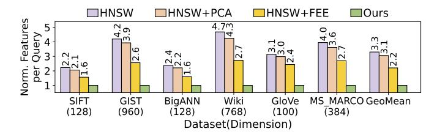
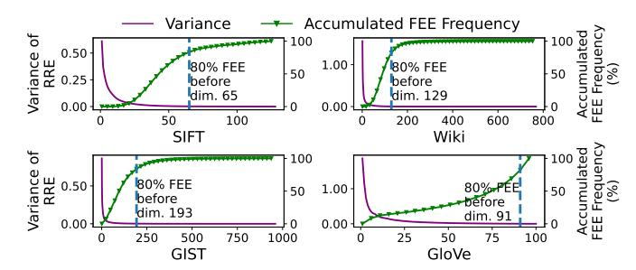
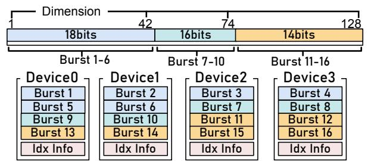
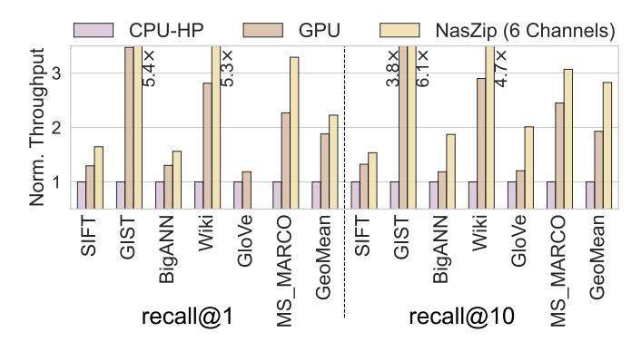
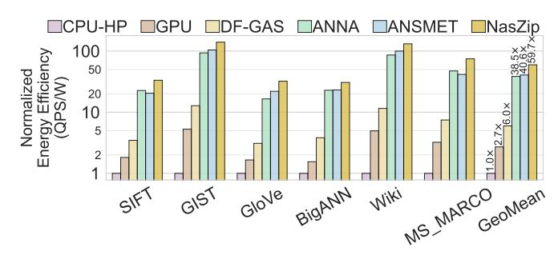
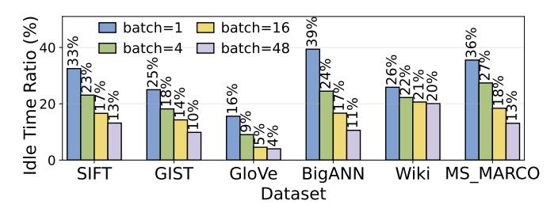
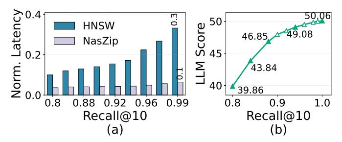
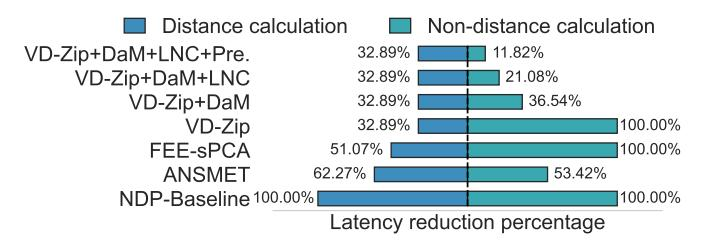

# NasZip: Software and Hardware Co-Design to Accelerate Approximate Nearest Neighbor Search with DIMM-Based Near-Data Processing

Cheng Zou\* $\|$ , Shuo Yang $^{\$*}\|$ , Chen Nie\* $^{\dagger}$ , Yu Zou $^{\ddagger}$ , Yu He $^{\P}$ , Chao Jiang $^{\P}$ , Limin Xiao $^{\P}$ , Weifeng Zhang $^{\P}$ , Zhezhi He\* $^{\dagger**}$ 

\*Intelligent Computing Research Group, School of Computer Science, Shanghai Jiao Tong University, Shanghai, CN

†Shanghai AI Laboratory, Shanghai, CN; ‡Institute of Information Engineering, Chinese Academy of Sciences, Beijing, CN

§School of Integrated Circuits, Shanghai Jiao Tong University, Shanghai, CN; ¶Lenovo Research, Beijing, CN

Email: chenchen\_zou@sjtu.edu.cn, yangshuo1230@sjtu.edu.cn, zhezhi.he@sjtu.edu.cn

| Equal contribution, \*\*Corresponding author

Abstract—As large language models (LLMs) continue to advance, retrieval-augmented generation (RAG) has become the key mechanism for expanding model knowledge and reducing hallucinations. Central to RAG is approximate nearest neighbor search (ANNS), which retrieves database vectors most similar to a given query. However, distance calculation over high-dimensional vectors is inherently memory-bound, causing retrieval performance to be constrained by I/O bandwidth on mainstream platforms such as CPUs and GPUs. Although many prior early exiting (EE) techniques attempt to reduce memory accesses by only computing partial dimensions, the partial distance converges too slowly to the EE threshold, which ultimately limits their performance gains. To address these challenges, we propose NASZIP, a hardware-software co-designed framework that integrates neardata processing (NDP) with a novel feature-level early exiting guided by statistics-based principal component analysis (PCA). Instead of relying solely on partial distances, NASZIP incorporates estimation and correction parameters to approximate fulldimensional distances accurately, enabling earlier exiting without compromising accuracy. We further introduce a bit-level NDPaware dynamic-float scheme that significantly reduces memory access for vector data. On the hardware side, we develop a dataaware neighbor list mapping strategy that reduces neighborretrieval latency and inter-channel communication overhead, complemented by a dedicated cache that exploits data locality and enhances prefetch efficiency. With these co-optimized techniques, NASZIP delivers speedups of up to  $8.4 \times /1.4 \times$  over CPU baseline and state-of-the-art GPU implementation at equal accuracy. Relative to the state-of-the-art NDP ANNS accelerator ANSMET, NASZIP achieves 1.69× performance improvement.

#### I. Introduction

Large language models (LLMs) have demonstrated remarkable capabilities across diverse tasks [1]. To enhance their factual grounding and adaptability, retrieval-augmented generation (RAG) has emerged by enabling LLMs to query and integrate external knowledge during inference [2]. At the core of RAG lies approximate nearest neighbor search (ANNS), which retrieves semantically relevant content from large-scale vector databases [3]. ANNS typically consists of two stages: *index construction*, where the corpus vectors are organized into a searchable structure, and *query search*, where relevant vectors are identified based on embedding proximity.

There are various kinds of index construction methods, including tree-based [4]–[6], hash-based [7]–[9], cluster-based [10], and graph-based [11]–[15] approaches. Among them, graph-based ANNS (GANNS) offers superior performance with high accuracy and low latency [16], and thus forms the focus of this work.

In contrast to the one-time index construction, the query search is executed repeatedly during LLM inference and therefore determines overall system performance. The distance computations between the query vector and candidate vectors exhibit low arithmetic intensity, making performance fundamentally limited by the data access bandwidth. Prior studies [17], [18] introduce early exiting (EE) techniques that compute distances over partial vector dimensions and terminate once the accumulated partial distance exceeds a predefined threshold. However, partial distances still require a relatively large number of dimensions to converge to the threshold, leading to conservative performance gains (~20%).

As a countermeasure, we propose a *feature-level EE with statistics-based PCA* (FEE-sPCA), which estimates full vector distances from partial computing results to enable earlier exiting. We propose a bit-level compression scheme using *dynamic floating-point* (Dfloat) to further reduce data accesses.

Meanwhile, due to the memory-bound nature of the ANNS, NDP devices are increasingly adopted to improve performance by utilizing the high internal memory bandwidth [17], [19], [20]. ANSMET [17] and CXL-ANNS [19] place customized acceleration logic near DRAM chips, while DReX [20] deploys PIM (processing-in-memory) units to accelerate the filter stage in the retrieval. However, their effectiveness remains limited. We break down the latency for a naive NDP, and observe that existing designs [17] cannot fully exploit NDP's internal bandwidth. For example, the CPU-side ANNS index processing incurs a heavy overhead and causes heavy cross-channel data communications (occupying over 50% ANNS latency), because the CPU is not aware of low-level vector data mapping on NDPs. This becomes a new performance bottleneck even though the distance calculation is optimized

via early exiting.

To improve upon this, we introduce a *data-aware index mapping* (DaM) and offload neighbor lookup operations to NDP. DaM ensures that each node's index and vector data reside within the same channel, minimizing cross-channel communications and fully exploiting NDP's internal parallelism. Additionally, we find that similar or repeated queries show locality when accessing graph nodes, *i.e*., frequent accesses to neighbor list entries and vector data entries. Therefore, we further design a local neighbor cache, consisting of a *local neighbor cache for table* (LNC-T) and a *local neighbor cache for data* (LNC-D), to exploit the locality of ANNS queries.

In summary, we propose NASZIP, a software-hardware cooptimization to efficiently accelerate ANNS on DIMM-based NDP devices. More specifically, our contributions are:

- ▷ On the algorithm level, we propose a novel two-fold optimization (*VD-Zip*) consisting of a feature-level early exiting algorithm (FEE-sPCA) and a bit-level dynamic floatingpoint representation (Dfloat) to reduce data accesses and computations while maintaining the recall rate.
- ▷ On the hardware level, we propose several dedicated architectural components to accelerate GANNS on NDPs. Data-aware neighbor list mapping (DaM) is proposed to offload neighbor list lookup from CPUs to NDPs and reduce communication between DRAM channels. A local neighbor cache (LNC) is proposed to exploit locality across ANNS queries and enable prefetching.

Evaluated on six datasets at the same recall, NASZIP achieves up to 8.4× and 1.4× speedup over the CPU baseline [\[21\]](#page-14-12) and the GPU implementation CAGRA [\[15\]](#page-14-6) on NVIDIA A100, respectively. NASZIP also achieves a 1.69× speedup over the SOTA NDP accelerator ANSMET [\[17\]](#page-14-8).

# II. BACKGROUND

## <span id="page-1-1"></span>*A. Approximate Nearest Neighbor Search*

*1) Basics:* Nearest neighbor search retrieves vectors {pi} closest to a query q from a vector database (VecDB) P of size n, each with d dimensions:

$$\{\boldsymbol{p}_i\} = \arg\min_{\boldsymbol{p}_i \in \boldsymbol{P}} ||\boldsymbol{p}_i - \boldsymbol{q}||_2, \quad \boldsymbol{P} \in \mathbb{R}^{n \times d}$$
 (1)

where ||·||<sup>2</sup> calculates the L <sup>2</sup> norm (or inner product). Retrieving k closest vectors is known as *k-nearest-neighbors* (kNN) search, with O(nd) complexity. To accelerate the searching process, *approximate nearest-neighbor search* (ANNS) is proposed to return approximately closest vectors with sub-linear time complexity as well as minor accuracy loss.

ANNS methods can be categorized as *hashing-based*, *tree-based* [\[7\]](#page-14-2), [\[9\]](#page-14-3), [\[22\]](#page-14-13), *graph-based* [\[12\]](#page-14-14)–[\[14\]](#page-14-15), [\[23\]](#page-14-16) and *quantization-based* [\[24\]](#page-14-17)–[\[26\]](#page-14-18). The graph-based approach is now widely adopted in commercial databases [\[27\]](#page-14-19)–[\[29\]](#page-14-20) and advanced RAG systems [\[30\]](#page-14-21), as it can deliver orders-ofmagnitude speedups over quantization-based and tree-based methods while maintaining high recall [\[31\]](#page-14-22). Despite high throughput, ANNS methods remain difficult to deploy. Under extremely high accuracy requirements [\[32\]](#page-14-23), their advantage

<span id="page-1-0"></span>

Fig. 1: An example multi-layer graph structure and breadth-first search (BFS) searching process for HNSW.

over kNN can diminish, motivating more robust ANNS designs that sustain throughput without sacrificing accuracy.

- *2) Graph-based ANNS (GANNS):* GANNS represents database vectors as graph nodes, with edges connecting similar nodes to enable efficient traversal toward target vectors in fewer hops. Representative GANNS implementations include hierarchical navigable small worlds (HNSW) [\[14\]](#page-14-15) on CPUs and CAGRA [\[15\]](#page-14-6) on GPUs. HNSW uses a multi-layer graph where the base layer contains all vectors, while upper layers contain fewer nodes and provide longer-range links for coarseto-fine search. In each traversal, the nearest node found at one layer serves as the entry point to the next lower layer. CAGRA uses a single-layer graph for GPU efficiency, but its graph structure can be converted into the multi-layer form of HNSW [\[14\]](#page-14-15), [\[15\]](#page-14-6). *We focus on HNSW in this work for generality.*
- *3) Details of HNSW:* HNSW is illustrated in Fig. [1,](#page-1-0) with its graph structure in (a) and an example search procedure in (b). The algorithm consists of a one-time index construction phase and a repeated search phase. In this work, we focus on the search phase, as it dominates execution time. Details of the hierarchical graph construction can be found in [\[14\]](#page-14-15).

Fig. [1](#page-1-0) shows an example where a candidate priority queue keeps the top-k nearest points found so far (k = 3). HNSW starts from the upper layer 0 and each layer's searching is a breadth-first search (BFS) process. In each iteration, the unvisited closest point is selected from the candidate priority queue as the starting point for the next iteration. The process is exemplified in Fig. [1b](#page-1-0). In 1 , the entry point is added to the priority queue and used as the starting point for the first hop in 2 . Then, we access its neighbor list ( 3 ), calculate their distances to the query, and insert them into the priority queue ( 4 ). Next, in 5 , the closest point (yellow) from the priority queue is selected as the second hop's starting point, and we repeat 3 4 . The blue point is not added because it is not closer than the farthest green one in the queue. In 6 , the unvisited purple point is chosen as the third hop's starting point. HNSW is controlled by two parameters, efSearch and M. efSearch is the size of the candidate queue controlling the search scope during the online search stage. M is the maximum connections per node, controlling the graph density during the offline index construction stage.

TABLE I: Notations used in this work.

<span id="page-2-0"></span>

| Notion                                             | Description                                                                                        |
|----------------------------------------------------|----------------------------------------------------------------------------------------------------|
| $d_{\text{part}}^k(\boldsymbol{x},\boldsymbol{q})$ | The partial distance of the first $k$ dimensions between                                           |
|                                                    | vector $\boldsymbol{x}$ and query vector $\boldsymbol{q}$ .                                        |
| $d_{\text{est}}^k(\boldsymbol{x},\boldsymbol{q})$  | The estimated distance of all dimensions between vector                                            |
|                                                    | $\bm{x}$ and query vector $\bm{q}$ . Estimation is based on $d_{\mathrm{part}}^k(\bm{x},\bm{q})$ . |
| $d_{\rm all}(\bm{x},\bm{q})$                       | The real distance of all dimensions between vector $\boldsymbol{x}$ and                            |
|                                                    | query vector $q$ .                                                                                 |
| D                                                  | The number of dimensions of vectors in the database.                                               |
| threshold                                          | The distance between the query and the farthest vector in                                          |
|                                                    | the candidate queue.                                                                               |

<sup>\*</sup>The distance noted here uses L2 norm or inner product distance.

4) Evaluation metric: The accuracy of ANNS is evaluated by the percentage of vectors  $\mathbb{P}'$ , which are correctly identified by ANNS w.r.t. the ground truth (i.e., kNN result  $\mathbb{P}$ ). It is denoted as recall@ $k = |\mathbb{P}' \cap \mathbb{P}|/|\mathbb{P}|$  under a top-k search.

#### <span id="page-2-3"></span>B. Feature-Level Early Exiting

Before describing the feature-level early exiting (FEE) [17], [26], [33], we first define the terms in Table I. Given two Ddimensional vectors, the full distance  $(d_{all})$  denotes the exact distance computed over all D dimensions, while the partial distance  $(d_{part}^k)$  denotes the distance computed over only the first k dimensions, where k < D. When k = D, the two are equal; otherwise,  $d_{part}^k < d_{all}$  (L2). As discussed in Section II-A, during each BFS step, a neighbor x is added to the candidate queue only if its full distance to the query,  $d_{\text{all}}(x, q)$ , is smaller than the current farthest distance in the queue, denoted as *threshold*. Otherwise, the computation is **wasted**. FEE reduces this waste by terminating the D-dimensional distance computation early once the partial distance  $d_{\text{part}}^k(\boldsymbol{x}, \boldsymbol{q})$ exceeds threshold after only k dimensions. We further analyze limitations of the existing approaches (Section III-B1) and then present our improved design (Section IV-A).

## <span id="page-2-4"></span>C. Near-Data Processing (NDP)

NDP [34] is widely explored to mitigate the "memory wall" by placing dedicated accelerators near memory, improving effective memory bandwidth by up to two orders of magnitude [35]–[37]. Among existing paradigms, the dual in-line memory module (DIMM) based NDP is particularly attractive due to its large memory capacity, scalability, and technical maturity [38]. As shown in Fig. 2a, a DIMM-based NDP system consists of DIMMs containing one register clock driver (RCD), several ranks, and multiple data buffers (DBs). The RCD maintains control/address signal (CA/CLK) integrity, the DBs maintain data signal (DQ/DQS) integrity, and the ranks contain the high-density DRAM chips for data storage.

In this work, we target a DDR5-based DIMM-NDP architecture. As shown in Fig. 2b, each rank contains 8 DRAM devices organized into 2 sub-channels, each with 4 DRAM devices operating synchronously on the same offset. Cross-channel communication is costly [38]–[40] because sub-channels have no direct communication path and must exchange data through the processor. To exploit sub-channel parallelism, a near-memory accelerator (NMA) is placed in each sub-channel. By

<span id="page-2-1"></span>

Fig. 2: **Example illustration of DIMM-NDP.** (a) Two DIMMs are connected to two channels respectively. Each has one RCD chip, and several ranks. (b) Each rank has two sub-channels. Each sub-channel has four DRAM chips (device). The NMA is placed and packaged together with Buffer Chip of DIMM.

<span id="page-2-2"></span>

Fig. 3: The roofline model of ANNS implementations on various datasets with CPU (left) and GPU (right). Testing configurations are given in Section VI-A.

making only minor changes to the DB chips and interface, the design preserves host compatibility and reuses the existing processor DDR controller for practical programmability and software integration [40], [41]. In NASZIP, the NMA logic is integrated into the DB chip, similar to [17], without modifying standard DRAM chips.

#### III. MOTIVATION

## A. Memory-Bound Nature of ANNS

Fig. 3 uses the roofline model [42] to analyze ANNS, using different VecDB datasets (SIFT, GIST [43], and GloVe [44]). HNSW on CPU and CAGRA on GPU are both memory-bound, motivating us to leverage high aggregated internal memory bandwidth for higher performance. Recent SRAM-based processing-in/near-memory designs leverage high-speed on-chip SRAM arrays for computation [45]–[47]. However, their limited capacity and high per-bit cost make them unsuitable for storing large-scale vector databases. Therefore, we leverage DIMM-based near-data processing to combine large DRAM capacity with high internal memory bandwidth.

# B. Challenges of Deploying ANNS on NDP

The execution of ANNS on NDP involves three steps: ① Host CPU offloads distance calculation commands to NDP with locations of vector entries; ② NMAs independently fetch vector data and compute distances; ③ The host CPU gathers the results and looks up the neighbor lists to determine the next-hop vectors to visit. Fig. 4a shows the execution time breakdown of a vanilla ANNS. The control overhead arises

<span id="page-3-2"></span>

Fig. 4: (a) Latency breakdown of ANNS-on-NDP design without NASZIP optimizations; (b) Cross-channel communication highlighted in red when NMA0 and NMA1 perform BFS on node 1 and 12.

<span id="page-3-3"></span>

Fig. 5: Feature usage of HNSW variants on different datasets, for algorithms achieving recall@10 > 90%.

from **1**, and the index lookup overhead from **3**. For **2**, we further break the latency into distance computation and cross-channel memory access, and identify the following challenges:

<span id="page-3-0"></span>1) Overhead of distance calculations: As shown in Fig. 4a, distance computation dominates ANNS-on-NDP latency, particularly for GIST with 960-dimensional features. This overhead can be reduced by lowering the number of features computed per vector. Prior optimizations mainly include principal component analysis (PCA) [48] and feature-level early exiting (FEE) [17], [26], [33]. However, as shown in Fig. 5 under recall@10 > 90%, naive PCA reduces feature usage by only 6%, and existing FEE methods (Section II-B) still leave considerable redundant computation.

Our solution approaches the problem from two aspects: (1) Further reduce the number of features involved in early exiting; and (2) Increase the number of features that can be fetched by each NDP data burst access. For (1), we optimize FEE by comparing the threshold with  $d_{\rm est}^k$  instead of  $d_{\rm part}^k$ . We propose FEE-sPCA in Section IV-A to estimate  $d_{\rm all}$  based on  $d_{\rm part}^k$  while maintaining search accuracy. Since  $d_{\rm est}^k \geq d_{\rm part}^k$ ,  $d_{\rm est}^k$  between a query and a node can exceed the threshold earlier, thereby triggering the FEE more promptly than using  $d_{\rm part}^k$ . For (2), we propose a dynamic floating-point (Dfloat) representation in Section IV-B, using variable bit-width for exponent and mantissa without hampering the search accuracy. Thus, each DRAM burst can contain more features.

<span id="page-3-4"></span>2) Cross-channel memory accesses: Fig. 4a shows that memory access overhead on NDP is also significant. This overhead arises when an NMA must compute the distance of a vector stored in another sub-channel, incurring costly

cross-channel access, as discussed in Section II-C. The root cause is poor data locality in the graph structure. As illustrated in Fig. 4b, when NMA0 performs the BFS of ①, it must access neighbors ②③④②9. Since ⑨ resides in a different sub-channel, the access incurs expensive cross-channel communication. A similar issue occurs when NMA1 accesses the neighbors of ①12.

**Our solution** proposes data-aware neighbor list mapping (DaM) in Section V-C2. Following the vector data mapping across sub-channels, we also distribute the neighbor list to ensure that neighbor indices and vector data are resident in the same sub-channel, avoiding cross-channel data fetches.

3) Costly CPU usage in naive ANNS-on-NDP: Fig. 4a also shows that CPU-side neighbor-list lookup contributes a significant fraction of the total latency. This step lies on the critical path of ANNS-on-NDP, because NDP devices must wait for the CPU to identify the next-hop neighbors before launching the next round of distance computations. Prior ANNS-on-NDP works largely overlook this overhead [17], [19], [49]–[51], but our profiling shows that it accounts for about 31.7% of total latency, mainly due to duplicated neighbor-list accesses.

**Our solution** also offloads neighbor-list lookup to NDP to exploit internal parallelism and bandwidth based on DaM. We further incorporate a custom local neighbor cache (LNC) in Section V-D, which stores recently accessed neighbor lists to avoid redundant accesses.

#### IV. COMPRESSING VECTOR DATABASE WITH VD-ZIP

For ANNS acceleration, we propose a software solution called *VD-Zip* to compress the VecDB, consisting of a feature-level optimization (FEE-sPCA) and a bit-level optimization (Dfloat). During offline preprocessing, FEE-sPCA first applies a PCA transformation to the vector database, enabling the effective estimation of full distance based on partial distance. We further employ a statistical method to refine the estimation, ensuring a high recall rate. During the online searching, the estimation is used to trigger FEE earlier. Dfloat further lowers the DRAM data access by compressing more features within a single burst while maintaining a high recall rate.

#### <span id="page-3-1"></span>A. Feature-Level EE with Statistics-based PCA

The primary objectives of FEE-sPCA are (1) leveraging estimated distance  $(d_{\text{est}}^k)$  to filter out non-candidate vectors (whose  $d_{\text{all}} \geq threshold$ ) with partial distance  $(d_{\text{part}}^k)$ ; and (2) controlling the accuracy of estimated distances to avoid erroneously filtering out candidate vectors (whose  $d_{\text{all}} < threshold$ ). To meet the two goals, we set two sets of parameters  $\alpha = \{\alpha_k\}$  and  $\beta = \{\beta_k\}$  in the distance calculation process.  $\alpha_k$  is used to estimate the distance based on  $d_{\text{part}}^k$  for (1).  $\beta_k$  is used to calibrate the estimation to maintain accuracy for (2). The overall process, including the offline pre-processing (to obtain  $\alpha$ ,  $\beta$ ) and online searching, is shown in Fig. 6.

In this subsection, we first introduce the online searching flow with our FEE-sPCA (lower part in Fig. 6). Then we introduce how the parameters  $\alpha_k$  and  $\beta_k$  are determined offline (upper part in Fig. 6) for computing  $d_{\rm est}^k$ .

<span id="page-4-0"></span>

Fig. 6: **FEE-sPCA execution flow**, including offline preprocessing (upper part) and online search (lower part). (a) Three neighbors (*i.e.*, s0, s1, s2) are searched and only s0 is updated into priority queue. Computations of s1 and s2 are early exited. (b) Detailed steps of FEE-sPCA on s2.

1) Online searching with FEE-sPCA: The lower part of Fig. 6 shows the process. The candidate priority queue stores the identified nearest candidates  $\{c0, c1, c2\}$  of current query q, and their distances w.r.t. q are  $\{1.2, 2.2, 2.5\}$ .  $\{s0, s1, s2\}$  are neighbors of the queue head c0, and they are the new nodes to be searched in this hop. The process is to calculate the distance between  $\{s0, s1, s2\}$  and q, then update the vector in the candidate priority queue if its distance  $\leq$  threshold (2.5). As shown in Fig. 6a, we assume each DRAM access can get 2 features, so we calculate the distance of 2 dimensions each time. Only s0 is accepted and updated in the queue, while the calculations of s1 and s2 are terminated with FEE. The calculation of s1 exits after the first 2 features are calculated, while s2 exits after the first 4 features.

Taking s2 as an example to describe the FEE-sPCA, as shown in Fig. 6b, each DRAM burst corresponds to one step (e.g., Step 1/2), loading 2 dimensions. In Step 1, it calculates the partial distance of the first two features  $(d_{\text{part}}^2)$  between q and s2. Then, we obtain the estimated distance  $d_{\text{est}}^2 = \alpha_2 \cdot d_{\text{part}}^2/\beta_2$ . We compare the estimated distance  $d_{\text{est}}^2$  with threshold. As  $d_{\text{est}}^2 < threshold$ , we proceed to Step 2 to calculate the next two features' distance and accumulate it to the last calculated  $d_{\text{part}}^2$  to get a new partial distance  $d_{\text{part}}^4$ . Based on  $d_{\text{part}}^4$ , we update the estimated distance  $d_{\text{est}}^4 \ge threshold$ , early exiting is triggered.

2) Offline preprocessing via PCA to get  $\alpha$ : We aim to get  $d_{\text{est}}^k$  based on the partially computed  $d_{\text{part}}^k$  from the first k dimensions. To address this, we preprocess the database offline as shown in Fig. 6 upper part (blue). We first apply PCA to make the leading dimensions of all vectors contain the most informative components. As PCA is a linear dimensionality reduction technique, it can be effectively applied to these vectors, which are approximately linear after the embedding transformation [52]–[54]. After PCA, in addition to the generation of eigenvalue  $\lambda_i$  for each dimension and one eigenvector

<span id="page-4-1"></span>

Fig. 7: Calculated distance versus used features and its relationship to the threshold. Data is from SIFT1M.

matrix P, there exists an expectation property of:

<span id="page-4-2"></span>
$$E\left(\left\|\boldsymbol{v}_{1:d}\right\|^{2}/\left\|\boldsymbol{v}\right\|^{2}\right) = \sum_{i=1}^{d} \lambda_{i}/\sum_{i=1}^{D} \lambda_{i}$$
 (2)

where v is a vector in the transformed VecDB  $\overline{VD}$ , and  $\|v\|^2$  is the squared norm of all its features.  $v_{1:d}$  contains the first d features.  $\lambda_i (1 \le i \le D)$  is the eigenvalue of the i-th feature, obtained by the PCA process offline. Then we can get:

$$d_{\text{all}} \approx d_{\text{part}}^k \cdot \sum_{i=1}^D \lambda_i / \sum_{i=1}^k \lambda_i$$
 (3)

We make the parameter  $\alpha_k = \sum_{i=1}^D \lambda_i / \sum_{i=1}^k \lambda_i$ . Therefore,  $d_{\text{all}} \approx d_{\text{est}}^k = \alpha_k \cdot d_{\text{part}}^k$ . However, the estimation **may cause errors** in FEE. Thus, we further propose a correction.

3) Offline preprocessing to get  $\beta$ : In Fig. 7, we present two examples that illustrate the need for correction. In Fig. 7a, the vector satisfies  $d_{\rm all} \geq threshold$  and should be rejected. Its partial distance  $d_{\rm part}^k$  triggers FEE at the 109th feature, whereas the estimated distance  $d_{\rm est}^k$  triggers FEE much earlier at the 4th feature, showing higher FEE effectiveness. However, Fig. 7b shows a vector with  $d_{\rm all} < threshold$  that should be accepted. Using only the PCA-based estimate,  $d_{\rm est}^k = \alpha_k \cdot d_{\rm part}^k$ , incorrectly triggers FEE at around the 8th dimension because  $d_{\rm est}^8$  overestimates the distance and exceeds threshold. To preserve search accuracy, such false rejections must be minimized. We therefore scale down  $d_{\rm est}^k$  by dividing it by a factor  $\beta > 1$ , reducing overestimation and preventing erroneous early exits. The corrected estimate is the yellow dotted line in Fig. 7b.

The following description shows the procedure to acquire  $\beta$ . We first analyze the property of the estimation error between  $d_{\text{est}}^k$  and  $d_{\text{all}}$ . Based on Eq. (2), we can get:

$$E\left(\alpha_k \cdot d_{\text{part}}^k / d_{\text{all}}\right) = 1 \tag{4}$$

Furthermore, each  $d_{\text{part}}^k$  has its own variance. Therefore, we can apply Chebyshev's inequality to  $\alpha_k \cdot d_{\text{part}}^k/d_{\text{all}}$ :

$$P(\left|\alpha_k \cdot d_{\text{part}}^k/d_{\text{all}} - 1\right| \le \varepsilon_k) \ge 1 - Var_k/\varepsilon_k^2$$
 (5)

where P is the probability,  $\varepsilon_k$  is a tiny positive number, and  $Var_k$  is the variance of  $\alpha_k \cdot d_{\text{part}}^k/d_{\text{all}}$ , which can be obtained during index construction. After removing the absolute value and letting  $1 + \varepsilon_k = \beta_k$ :

<span id="page-4-3"></span>
$$P\left(\alpha_k \cdot d_{\text{part}}^k/\beta_k < d_{\text{all}}\right) \ge 1 - Var_k/2\varepsilon_k^2$$
 (6)

To ensure that  $d_{\rm est}^k \leq d_{\rm all}$  with high probability to avoid FEE errors, we can make  $1 - Var_k/2\varepsilon_k^2$  a large value (e.g., 90%) and get the corresponding  $\varepsilon_k$  and  $\beta_k$ . The flow is shown

<span id="page-5-1"></span>

Fig. 8: **Performance of FEE-sPCA**. The purple line denotes the variance term in Eq. (6), the green line denotes the dimension-wise accumulated FEE-sPCA trigger frequency, and the dashed line denotes the dimension before which 80% of computations terminate.

in Fig. 6 upper purple part, which begins by projecting the database to obtain  $\overline{VD}$  and its variance (2). We set an expected accuracy (3), and obtain  $\beta_k$  by using Eq. (6). As shown in Fig. 7b, after the adoption of the statistical method with  $\beta_k$ , the sPCA  $d_{\rm est}^k$  is corrected and avoids the FEE error.

4) Result: We further present the  $Var_k$  in Eq. (6) and results of the FEE-sPCA technique across datasets in Fig. 8, covering the dimension from 128 to 960 and including L2 and IP distance. Overall, we can evenly reduce feature calculations by nearly 50%, especially for high-dimensional datasets (e.g. 80% FEEs are triggered within the first 193 dimensions on the GIST dataset with 960 dimensions per vector).

#### <span id="page-5-0"></span>B. NDP-Aware Dynamic Floating-Point Representation

We introduce dynamic floating-point (Dfloat) to reduce the number of bits per feature, thereby increasing the number of features retrieved per DRAM burst. Conventional low-precision formats (e.g., BF16/FP16/FP8) are not well suited for FEE-sPCA because they quantize all dimensions uniformly. After applying FEE-sPCA, however, different dimensions contribute unequally, and uniform quantization noticeably degrades its robustness and accuracy. We therefore propose Dfloat, which provides a more robust representation tailored to the characteristics of FEE-sPCA.

1) Representation of Dfloat: Lowering the bit width of vector features is an effective approach to reduce the memory footprint and data movement. In this work, we leverage the dynamic floating-point representation (Dfloat) [55], [56] with adaptive bit widths for the exponent and mantissa, *i.e.*,

$$g(\boldsymbol{b}_{\text{dfloat}}) = \underbrace{(-1)^{b_{n_{\text{exp}}+n_{\text{man}}}}}_{\text{sign}} \times 2^{\sum_{i=n_{\text{man}}}^{n_{\text{exp}}+n_{\text{man}}-1} 2^{i-n_{\text{man}}} \cdot b_i - B} \underbrace{(1 + \sum_{i=0}^{n_{\text{man}}} 2^{(i-n_{\text{man}})} \cdot b_i)}_{\text{exponent}}; \quad \boldsymbol{b}_{\text{dfloat}} = \{b_i\}_{i=0}^{n_{\text{exp}}+n_{\text{man}}} \quad (7)$$

where  $b_{\text{dfloat}}$  is the binary representation with  $b_i \in \{0, 1\}$ .  $n_{\text{exp}}$  and  $n_{\text{man}}$  are the bit widths of the exponent and mantissa. We introduce NDP-aware optimization to Dfloat for our system.

<span id="page-5-2"></span>

Fig. 9: **Example Dfloat configurations.** Features are divided into segments with different bit width  $= 1 + n_{exp} + n_{man}$ .

# <span id="page-5-3"></span>Algorithm 1 Search algorithm for Dfloat configuration.

```
1: Input: Target recall@k = R_{\text{target}}; Number of features each
      vector = d; Recall@k with subsets of queries = R'(\cdot),
      1 + n_{\text{exp}} + n_{\text{man}} \in [12, 32]; Number of bits per burst B_{\text{burst}}
 2: Output: Optimized Dfloat configuration \mathbb{C}_{opt}
 1: N_{\text{burst}}^{\text{max}} \leftarrow d/(B_{\text{burst}}/32);
                                                        N_{\text{burst}}^{\text{min}} \leftarrow d/(B_{\text{burst}}/12)
 2: while N_{\text{burst}}^{\min} < N_{\text{burst}}^{\max} do
             N_{\mathrm{burst}} = \lfloor (N_{\mathrm{burst}}^{\mathrm{min}} + N_{\mathrm{burst}}^{\mathrm{max}})/2 \rfloor
 3:

    Number of bursts

              \{\mathbb{C}\} \leftarrow \operatorname{cfg-validate}(N_{\operatorname{burst}})
                                                                                ▶ All valid configs
 4:
             for i = 1 to \#configs(\{\mathbb{C}\}) \& \mathbb{C} \neq \emptyset do
 5:
                    if R(\mathbb{C}_i) \geq R_{\text{target}} \& R(\mathbb{C}_i) > R(\mathbb{C}_{\text{opt}}) then
 6:
                           N_{\text{burst}}^{\text{min}} \leftarrow N_{\text{burst}}; \, \mathbb{C}_{\text{opt}} \leftarrow \mathbb{C}_i;
 7:
 8:
                    end if
             end for
 9:
             if N_{\mathrm{burst}}^{\mathrm{min}} \neq N_{\mathrm{burst}} then
10:
                    N_{\text{burst}}^{\text{max}} \leftarrow N_{\text{burst}}
12:
             end if
13: end while
                                         \triangleright \{n_{\rm exp}, n_{\rm man}\} for each vector segment
14: Return \mathbb{C}_{opt};
```

2) NDP-aware optimization: Based on our preliminary results, simply applying one configuration (i.e., small  $n_{\rm exp}$  and  $n_{\rm man}$ ) for all dimensions leads to a significant recall degradation. It occurs mainly because our sPCA transformation concentrates more important information in lower dimensions, and those dimensions are more sensitive to the low bit-width representation. To achieve better bit-level compression, we propose to conduct a fine-grained search to identify an optimized Dfloat configuration, to maximize ANNS throughput and recall rate. We first divide a vector into  $N_{\rm seg}$  segments along the feature dimension, each with a different bit width. We formulate the optimization objective to minimize the number of DRAM bursts for accessing one vector  $N_{\rm burst}$  while keeping the ANNS recall rate above a preset threshold  $R_{\rm target}$ :

$$\min_{\mathbb{C}_{ont}} N_{burst}; \quad \text{Subject to: } R(\mathbb{C}_{opt}) > R_{target}$$
 (8)

where  $R(\mathbb{C}_{\mathrm{opt}})$  is the recall evaluated when VecDB is processed with an optimized Dfloat configuration  $\mathbb{C}_{\mathrm{opt}} = \{n_{\mathrm{exp},i}, n_{\mathrm{man},i}\}_{i=1}^{N_{\mathrm{seg}}}$ . Taking configuration **Dfloat-1** in Fig. 9 as an example, the vector is divided into three segments via a search algorithm  $(N_{\mathrm{seg}}=3)$ . The chosen Dfloat configuration for the 1st segment is  $1+n_{\mathrm{exp},1}+n_{\mathrm{man},1}=18$ .

Given a specific VecDB, to identify an optimized Dfloat configuration  $\mathbb{C}_{\mathrm{opt}}$ , we combine binary search and brute force enumeration as described in Algorithm 1. The general idea of Algorithm 1 is performing the binary search between maxand min-bound of possible  $N_{\mathrm{burst}} \in [N_{\mathrm{burst}}^{\min}, N_{\mathrm{burst}}^{\max}]$ . For a

<span id="page-6-0"></span>

Fig. 10: **Hardware architecture overview of NASZIP.** The host CPU connects to DIMM-based DRAM modules via memory channels, where each rank embeds near-memory hardware.

specific  $N_{\text{burst}}$ , we conduct an exhaustive search and filter out all possible Dfloat configurations via validation (line-4 in Algorithm 1) following the rules:

- 1) Features of one DRAM burst use identical Dfloat format;
- 2) When the number of features per burst is set, we are prone to increase Dfloat bit width to achieve higher recall;
- 3) The feature bit width  $(1 + n_{exp} + n_{man})$  gradually decreases with the feature index increasing;
- N<sub>burst</sub> must be a multiple of the number of devices per sub-channel, as devices work synchronously.

Note that the DRAM burst size ( $B_{burst}$ ) depends on the DDR generation, e.g., 128 bits for DDR5 and 64 bits for DDR4.

Line 6 of Algorithm 1 evaluates several sampled queries to characterize the database through multiple searches. To ensure broad coverage of HNSW traversal paths and avoid repeatedly probing localized regions, the sampled queries should be diverse. We select them from the full train set of benchmark or sample 1K queries from test set if train set is absent, which is sufficiently representative and covers most index paths. To efficiently explore the Dfloat design space, we use a maskbased emulation method on the host CPU: by applying bit masks to 32-bit floating-point data, we emulate the precision loss of different configurations without repeatedly rebuilding the index. For frequently updated databases, we run the offline process (including both FEE-sPCA and Dfloat) only when updates reach about 30% of the database, at which point the vector index itself typically also requires rebuilding due to structural degradation.

3) Portability: Dfloat improves performance only by increasing the number of features retrieved per memory access, without changing the computation itself or requiring specialized computation units. Before entering the FPU, Dfloat values are zero-padded to match standard arithmetic units (FP32 in NASZIP). Dfloat packing is performed offline during pre-processing. It is independent of any particular floating-point format and can be applied to existing floating-point representations.

4) ECC Compatibility: Server-grade DDR5 DIMMs typically use both on-die ECC and side-band ECC for reliability [57], [58]. In on-die ECC, DRAM chips internally compute the ECC for the written data and store the ECC code. Since NASZIP adds NMA logic in a separate chip without modifying DDR5 dies, on-die ECC remains unaffected. As for side-band ECC, it has additional DRAM chips for ECC bits storage. However, Dfloat is only a software-level data representation, and the physical DRAM chips still follow the standard DDR5 burst format. Thus, conventional memory-controller ECC correction [59] remains compatible with NASZIP.

#### V. HARDWARE ARCHITECTURE

#### A. Architecture Overview

The overall architecture of NASZIP is shown in Fig. 10, consisting of a host CPU and multiple DIMM-based DDR5 DRAM modules connected via memory channels. An example configuration is illustrated in Fig. 10a, where two memory channels are each connected to one DIMM. Each DIMM contains multiple ranks and incorporates customized hardware to accelerate ANNS.

Fig. 10b shows the micro-architecture of a rank, in which DRAM devices are organized into two DDR5 sub-channels. Each sub-channel contains four DRAM devices with 8-bit IO width. NASZIP integrates a vector processing engine (VPE) and a local neighbor cache (LNC) into each sub-channel for efficient near-memory ANNS acceleration. The VPE computes distances for vectors retrieved from the local sub-channel, while the LNC caches frequently accessed neighbor lists to reduce redundant memory accesses. A shared priority queue after the two VPEs merges and sorts their results, so that only top candidates are returned to the host CPU, reducing both data transfer and CPU-side overhead. The controller, shared priority queue, two LNCs, and VPEs are packaged together with the buffer chip. We next describe the VPE design in Section V-B, followed by our data-aware mapping (DaM) and local neighbor cache (LNC) designs in Section V-C and Section V-D, respectively.

<span id="page-7-4"></span>

Fig. 11: An example 128-dimensional vector data mapping within a sub-channel (on SIFT [\[43\]](#page-15-5) dataset).

# <span id="page-7-2"></span>*B. Vector Process Engine*

Fig. [10c](#page-6-0) shows the microarchitecture of the VPE, which integrates the FEE and Dfloat optimizations described in Section [IV-A](#page-3-1) and Section [IV-B.](#page-5-0) The VPE contains four parallel processing paths, each corresponding to one DRAM device. Each path includes a Dfloat processing module, a query buffer, and a distance calculation module. The outputs of the four paths are then merged by an accumulator, whose result dynamically guides the FEE module to trigger early exit.

The *Dfloat process module*, shown in Fig. [10d](#page-6-0), decodes Dfloat-formatted vector data retrieved from the DRAM device. DRAM data are read in bursts, with each device supplying 128 bits per burst, *i.e*., 8 bits per cycle over 16 cycles. Accordingly, a counter-controlled 16-to-1 multiplexer sequentially loads the 16 bytes of a burst from one DRAM chip into a 128-bit register. Once the register is filled, a barrel shifter extracts each n-bit Dfloat element according to the preset offset register. The extracted value is then zero-padded to 32-bit floating point, completing the decoding process.

The *query buffer*, shown in Fig. [10e](#page-6-0), stores query vector elements preloaded by the CPU before search. During computation, a wrapped-counter-driven multiplexer sequentially outputs one query element per cycle for distance calculation.

The *distance calculation module* (gray-highlighted in Fig. [10c](#page-6-0)) supports both L2 distance and inner-product (IP) computation between the query and vector data. It adopts a shared datapath with a multiplexer to switch between the two modes, following prior designs [\[17\]](#page-14-8), [\[19\]](#page-14-10), [\[60\]](#page-15-19). The partial distances produced by the four parallel modules are then accumulated in the accumulator.

The *FEE module*, shown in Fig. [10f](#page-6-0), determines whether early exit should be triggered. Whenever the accumulator is updated, the module estimates the final distance by scaling the current partial sum with factors α<sup>k</sup> and βk, following Section [IV-A.](#page-3-1) The estimation is then compared with the threshold, *i.e*., the distance of the current farthest point in the candidate queue. If the estimated distance exceeds the threshold, early exit is triggered and the vector is discarded.

## <span id="page-7-3"></span>*C. Mapping of Data and Neighbor List*

*1) Data mapping:* NASZIP maps each vector entirely to a single sub-channel, with its dimensions distributed across the four DRAM devices. Fig. [11](#page-7-4) shows an example for a 128-dimensional vector. With Dfloat encoding, dimensions

<span id="page-7-5"></span>

Fig. 12: Data-aware neighbor list mapping (DaM). Neighbor lists are partitioned across sub-channels.

1∼42, 43∼74, and 75∼128 are assigned 18, 14, and 16 bits, respectively. Since each device provides 128 bits per burst, these three segments require six, four, and six bursts, respectively. The bursts are interleaved across the four devices, so that in each memory access all devices return one burst in parallel. Access then proceeds sequentially until all dimensions are processed, naturally matching FEE, which evaluates dimensions in increasing order.

<span id="page-7-0"></span>*2) Data-aware neighbor list mapping (DaM):* NASZIP stores neighbor lists on NDP to offload neighbor retrieval from the CPU to NDP, as discussed in Section [III-B2.](#page-3-4) To reduce cross-channel communication and enable parallel lookup, NASZIP places each neighbor list in a data-aware manner, colocating it with the corresponding vector in the same subchannel. As a result, each sub-channel can independently retrieve neighbors and compute distances for its local vectors, minimizing cross-channel data movement.

Fig. [12](#page-7-5) shows an example with six nodes, where both vector data and partitioned neighbor lists are distributed across sub-channels. For example, vector 1 has neighbors {2, 3, 6}. Because vectors 2 and 3 are stored in sub-channel 0 while vector 6 is stored in sub-channel 1, the neighbor list of vector 1 is partitioned accordingly across the two sub-channels. When the CPU issues a request to traverse the neighbors of vector 1, sub-channel 0 retrieves its local neighbor list and computes the distances for vectors 2 and 3. In parallel, sub-channel 1 independently handles vector 6, eliminating the need for intersub-channel communication.

However, the length of each partitioned neighbor list differs across nodes, making efficient indexing nontrivial. To address this, we store a neighbor list table (NLT) in each channel memory, as shown in Fig. [12b](#page-7-5). The NLT records the length and memory address of the neighbor list, enabling efficient indexing of variable-length entries. To further accelerate neighborlist lookup, we also employ a local neighbor cache (LNC).

## <span id="page-7-1"></span>*D. Local Neighbor Cache*

The key insight is that neighbor-list accesses exhibit strong temporal and spatial locality: similar or repeated queries often revisit the same nodes, causing redundant lookups. To exploit this locality, NASZIP introduces the local neighbor cache for tables (LNC-T) and the local neighbor cache for data (LNC-D). LNC-T stores NLT entries and functions similarly to a

<span id="page-8-1"></span>

Fig. 13: **Illustration of local neighbor cache** (LNC). LNC-T caches entries of the Neighbor List Table (NLT), while LNC-D caches the actual neighbor list contents.

<span id="page-8-2"></span>

Fig. 14: (a) **Comparison of flows** with and without prefetch. (b) **Execution flow with prefetch** under batch=2.

translation lookaside buffer (TLB), while LNC-D stores the corresponding neighbor-list contents and functions like a data cache. They together reduce memory accesses and improve search throughput.

Fig. 13 illustrates the structure and operation of the LNC. Its configuration is: LNC-T is an 8KB fully associative cache, while LNC-D is a 256KB 8-way set-associative cache. Both use 64-byte cache lines, matching the burst size of a subchannel. The two caches use different tag formats. Since each NLT entry (Fig. 12b) occupies 4 bytes (3 bytes for the start address and 1 byte for the length), one LNC-T cache line stores 16 entries, so its tag only records the ID of the first entry. By contrast, because neighbor-list sizes vary across sub-channels, the LNC-D tag records both the start and end node IDs of the cached neighbor-list segment.

Fig. 13 also illustrates the LNC workflow. Consider the distance calculation for vector i, where its NLT entry misses in LNC-T but its neighbor list hits in LNC-D. The controller first requests the NLT entry of vector i (1), which is fetched from memory (2) and inserted into LNC-T (3). The controller then reads the cached NLT entry from LNC-T (4) to obtain the address of vector i's neighbor list. Next, the neighbor list is accessed from LNC-D with a cache hit (5). Using the length information (3 in this example), the controller identifies the local neighboring nodes as c, d, and e, and then issues requests to fetch their data and compute distances (6).

<span id="page-8-3"></span>TABLE II: Evaluation Platforms and Configurations.

| Host CPU | AMD EPYC 9334, 32-Core, 2.7-3.9 GHz,             |
|----------|--------------------------------------------------|
|          | 64 KB (per core) L1 cache,                       |
|          | 1MB (per core) L2 cache, 128 MB shared L3 cache  |
| NDP      | DDR5-4800, 2 or 6 channels, 2 DIMMs per channel, |
|          | 2 ranks per DIMM, 2 VPEs and LNCs per rank,      |
|          | 256KB LNC-D, 8KB LNC-T, 1.2 GHz                  |

#### E. Neighbor List Prefetching and batch scheduling

Scheduling is performed by synchronizing the hop-by-hop traversal of multiple queries within a batch. Within each hop, vector distances are computed sequentially because our lightweight design provides only a limited number of FPUs, leaving little room for intra-hop scheduling optimization. However, as shown by the baseline schedule in Fig. 14a upper part, we observe idle time between hops while waiting for CPU-side merging. To exploit this gap, NASZIP prefetches neighbor lists for the next BFS hop. An example with two subchannels and a batch of two queries is shown in Fig. 14b. After each search hop (1), the sub-channel priority queue stores the current vector IDs of each query (q0 and q1), ordered by distance. For example, 2(0.7) denotes vector 2 with distance 0.7. Each sub-channel then prefetches the neighbor list (nbrl.) of the current closest vector for each query (2) and stores the fetched data in the LNC. Meanwhile, the queue contents are sent to the host CPU, which merges and sorts them in the global priority queue (3). The CPU then returns the global closest nodes to each sub-channel for the next BFS hop. In the example, the next hop requires the neighbor lists of vectors 2 and 5, so sub-channel 0 and sub-channel 1 successfully reuse the prefetched data, respectively (4). As shown in Fig. 14a, this prefetching scheme fills the idle gap during CPU-side merging compared with the no-prefetch baseline.

When prefetching fails, the overhead remains small because the prefetched content is retained in the LNC (Section V-D), where it can still be effectively reused by future accesses. We further analyze the prefetch hit rate in Section VI-C5, and the impact of batch size on scheduling in Section VI-C6.

#### VI. EVALUATION

#### <span id="page-8-0"></span>A. Evaluation Methodology

1) Experimental setup: We develop RTL implementations of added logic in NASZIP. The functionality of modules in NASZIP is verified on FPGA. For accurate area and power evaluation, the RTL design is synthesized using Synopsys Design Compiler with 28nm technology, and place-and-routed using Cadence Innovus. System performance (QPS, latency, recall) is evaluated on UniNDP [39], a cycle-accurate NDP simulator. System configurations are specified in Table II.

#### 2) Competing designs:

- **CPU baselines:** HNSW and *SCANN* [21] on a 32-core CPU (*CPU-baseline*) and a 96-core CPU (*CPU-HP*).
- **Prior accelerator designs:** *ANNA* [61] on ASIC, *DF-GAS* [49] on FPGA, *PIMANN* [62] on UPMEM, and *CAGRA* [15] on NVIDIA A100 GPU.

<span id="page-9-1"></span>

Fig. 15: **Throughput (QPS) across datasets** with recall@ $10 \ge 90\%$  on various architectures including CPU (SOTA SCANN), ASIC (ANNA), UPMEM (PIMANN), FPGA (DF-GAS), NDP (SOTA ANSMET, NASZIP) normalized to CPU baseline.

<span id="page-9-0"></span>TABLE III: Specifications of Benchmark Datasets.

| Dataset       | Distance   | # Dims | # Vectors | # Queries |
|---------------|------------|--------|-----------|-----------|
| SIFT [43]     | $L^2$ norm | 128    | 1M        | 10K       |
| GIST [43]     | $L^2$ norm | 960    | 1M        | 1K        |
| BigANN [63]   | $L^2$ norm | 128    | 1B        | 10K       |
| GloVe [44]    | IP         | 100    | 1.2M      | 1K        |
| Wiki [64]     | $L^2$ norm | 768    | 1M        | 10K       |
| MS_MARCO [65] | $L^2$ norm | 384    | 8M        | 1K        |

<span id="page-9-2"></span>

Fig. 16: **Normalized throughput** (QPS) of CPU-HP, GPU and NASZIP (6 channels), with recall@1 and recall@ $10 \ge 90\%$ .

- **NDP baselines:** Vanilla HNSW on NDP (*NDP-baseline*) and the SOTA NDP design *ANSMET* [17].
- 3) Datasets: The datasets used in this work are summarized in Table III. SIFT, GIST, BigANN, and GloVe are standard ANNS datasets with high-dimensional vectors. Wiki and MS\_MARCO are retrieval corpora. Wiki contains Wikipedia articles, whose 768-dimensional embeddings are generated by Sentence-BERT [66]. MS\_MARCO consists of real Bing question—answer pairs, whose 384-dimensional embeddings are generated by the widely used BGE model [67]. We build the indices of these datasets and convert the indices into the format required by NASZIP.

# B. Overall Search Performance

1) Throughput: Fig. 15 reports the speedup of NASZIP with 2 channels (16 sub-channels) over comparable designs at a similar scale, with all results normalized to *CPU-Baseline*.

<span id="page-9-3"></span>

Fig. 17: Normalized energy efficiency with recall@  $10 \ge 90\%$ .

Fig. 16 compares NASZIP with 6 channels against *GPU-Baseline* and *CPU-HP*. NASZIP is configured in Fig. 16 with 48 sub-channels, providing an aggregated memory bandwidth of 921.6 GB/s (19.2 GB/s per sub-channel). The 48 sub-channels are organized as 6 channels  $\times$  2 DIMMs per channel  $\times$  2 ranks per DIMM  $\times$  2 sub-channels per rank.

As shown in Figs. 15 and 16, NASZIP consistently delivers the best throughput among prior ANNS designs across CPU, GPU, ASIC, UPMEM, FPGA, and NDP platforms. It achieves an 8.4× speedup over the state-of-the-art CPU implementation *SCANN* and nearly 2× over the ASIC design *ANNA*. Compared with the state-of-the-art NDP accelerator *ANSMET*, NASZIP attains up to 1.69× higher performance through its tighter software–hardware co-design, particularly the more aggressive FEE-sPCA optimization. It also outperforms *CPU-HP* and *GPU-Baseline* by 2.7× and 1.4×, respectively, while substantially surpassing the UPMEM-based *PIMANN* despite PIMANN's high raw bandwidth. The largest gain is observed on GIST. This is because, as shown in Fig. 8, most of its early exits occur before dimension 193, pruning nearly 80% of its 960 dimensions, whereas SIFT prunes only about 50%.

2) Energy efficiency: The evaluation is shown in Fig. 17. GPU-Baseline and DF-GAS achieve lower energy efficiency due to the high power consumption of HBM. ANNA exhibits energy efficiency comparable to that of the NDP design ANSMET. By enabling more aggressive early exiting (FEE-sPCA), reducing cross-channel communication (DaM) and caching of frequently accessed neighbor lists (LNC), NASZIP achieves up to 1.5× higher energy efficiency than ANSMET.

<span id="page-10-2"></span>

Fig. 18: Latency comparison and breakdown (normalized to NASZIP) with recall@10> 90%.

<span id="page-10-3"></span>

Fig. 19: Comparison of throughput versus recall.

# C. In-depth Analysis

- 1) Latency Breakdown: Fig. 18 breaks down query latency into neighbor-list retrieval, distance computation, and partial-result processing (including CPU-NDP communication in NDPs). FEE-sPCA and Dfloat substantially reduce distance-computation latency, while the local neighbor cache keeps hot indices on NDP, accelerating neighbor-list retrieval and further reducing CPU-NDP communication overhead.
- 2) Throughput versus Recall: Fig. 19 evaluates the effect of varying the search range (efSearch). Increasing efSearch expands the search scope, improving recall but reducing QPS. Overall, NASZIP consistently outperforms baselines.
- 3) Memory Traffic of Database Compression: Fig. 20 compares memory traffic against representative ANNS compression baselines on HNSW at recall@10\ge 90\%. PQ [24] is mainly designed for compression and incurs substantial precision loss. To maintain high recall, PO must use a weaker compression ratio, leading to much higher memory traffic (about 2× that of RabitQ and NASZIP). RabitQ [26] accelerates candidate filtering with compact quantized vector representations, but surviving candidates still require exact full-dimensional distance computation during re-ranking. In contrast, FEE-sPCA reduces memory traffic through featurelevel early exiting, thereby cutting the number of accessed dimensions, while Dfloat further reduces the bit width of each accessed feature. Meanwhile, FEE-sPCA and Dfloat are compatible with the memory access patterns on NDP. As a result, our method achieves lower memory traffic at the same recall level, especially on NDP.
- 4) Cache Size of LNC: Fig. 21a evaluates the impact of LNC-D capacity on cache hit rate. NASZIP adopts a 256KB

<span id="page-10-4"></span>

Fig. 20: Memory traffic comparison of database compression methods (PQ and RabitQ on HNSW), evaluated with recall@10≥ 90%. Results are normalized to HNSW.

<span id="page-10-5"></span>

Fig. 21: (a) Hit rate of LNC-D versus search parameters efSearch on SIFT, with varying cache size. (b) Average prefetch hit rate w.r.t. search hops. Evaluated using 1M queries with different graph construction parameters M.

LNC-D, and we vary the enabled capacity to analyze its impact. Overall, larger LNC-D capacity leads to a higher hit rate by retaining more frequently accessed neighbor lists. As efSearch increases, the hit rate decreases because a larger search range visits more diverse candidate nodes and weakens temporal locality. Beyond a certain point (efSearch > 50), most hot neighbor lists are already retained in LNC-D, and the additional cache misses mainly come from a small number of low-reuse tail nodes, causing the hit rate to converge.

- <span id="page-10-0"></span>5) Prefetching performance: Fig. 21b profiles the prefetch hit rate at each hop and its dependence on graph density, controlled by M. The hit rate gradually increases in the upper layers but drops when entering the base layer, because upper-layer neighbor lists differ from base-layer ones and thus invalidate cached entries. As M increases, the hit rate decreases in the upper layers but rises in the base layer: a wider upper-layer search identifies most nearest neighbors earlier, stabilizing the candidate queue and reducing updates in the base layer. Overall, the prefetch hit rate remains above 50%.
- <span id="page-10-1"></span>6) Performance versus Batch Size: Fig. 22 evaluates throughput, latency and relative prefetch miss rate under different batch sizes. As batch size increases, throughput improves due to better sub-channel utilization and higher cache reuse. However, latency also increases, especially when the batch size grows from 16 to 48. This is because prefetching is most effective at batch size 16, whereas at batch size 48, excessive prefetch misses increase cache contention and

<span id="page-11-0"></span>

Fig. 22: Prefetch miss rate, latency and throughput versus batch sizes, evaluated under recall@ $10 \ge 90\%$ .

<span id="page-11-1"></span>

Fig. 23: Idle time ratio of the earliest finishing sub-channel.

reduce its benefit. To balance throughput and latency, we use batch size 16 in all other evaluations.

7) Workload Balance Analysis: Fig. 23 reports the average idle time of the least-loaded sub-channel (i.e., the earliest finishing one), normalized to total execution time. The workload imbalance is more severe at small batch sizes, for example, on BigANN, the idle time reaches 39% when the batch size is 1. As the batch size increases, the imbalance decreases, since larger batches average out the variation in the total number of vector dimensions processed by different sub-channels. However, Wiki shows higher imbalance than the other datasets. This is because the other datasets are shuffled to improve distribution uniformity, whereas Wiki is left unshuffled to preserve the spatial and semantic locality of consecutive document chunks for better retrieval quality, consistent with practical RAG deployments [68]. As a result, Wiki accesses are more clustered across sub-channels, leading to higher workload imbalance.

#### D. End-to-end RAG Evaluation

Fig. 24 evaluates the RAG end-to-end using GPT-4o. The corpora are drawn from 2WikiMultihopQA [69], HotpotQA [70], MultiFieldQA-en [71], QASPER [72], and MS\_MARCO [65]. To preserve retrieval quality, we use the text-embedding-ada-002 [73] model from OpenAI, which produces 1536-dimensional embeddings. Fig. 24a shows latency (time-to-first-token, TTFT) versus recall@10, using KNN search as the baseline. NASZIP substantially reduces latency and retains significant speedup even under high-recall requirements. Fig. 24b shows RAG quality under different retrieval accuracy levels (recall@10). Ouality is measured by the LLM score from

<span id="page-11-2"></span>

Fig. 24: (a) LLM latency (TTFT) vs. retrieval accuracy (Recall@10), normalized to KNN baseline. (b) LLM answer quality (RAGAS score) vs. retrieval accuracy (Recall@10).

<span id="page-11-3"></span>

Fig. 25: Latency reduction from each NASZIP optimization, compared with ANSMET. From bottom to top, each represents the latency reduction compared to the baseline.

RAGAS [74], reflecting answer correctness and hallucination. When recall@10 exceeds 0.9, response quality degrades only marginally w.r.t. the ideal case of recall@10=1. Overall, NASZIP is robust enough to maintain high RAG quality while significantly reducing latency.

# E. Ablation study

Fig. 25 shows how each technique reduces both distance and non-distance latency. For reference, ANSMET reduces distance calculation latency to 62.27% through bit-level FEE and non-distance latency to 53.42% through mapping and scheduling. NASZIP further reduces distance latency to 51.07% with FEE-sPCA, while Dfloat provides an additional 1.79× speedup. For non-distance overheads, DaM and LNC-T/D reduce latency to 36.54% and 21.08%, respectively, and prefetching (Pre.) further cuts it by about 50%. This highlights the effectiveness of neighbor-list caching and prefetching.

## F. Overhead Analysis

1) PCA Preprocessing: During the offline phase, FEE-sPCA requires database preprocessing, mainly to compute PCA eigenvalues, which introduces additional overhead. Table IV reports the preprocessing time on an A100 GPU. Although the overhead increases with dataset size, it typically remains on the order of seconds to minutes and is small compared with index construction time (e.g., building HNSW on BigANN takes hours). During the online phase, queries must also be PCA-transformed at the embedding stage. As shown in Table IV, this one-shot transformation adds negligible overhead w.r.t. the entire search latency.

<span id="page-12-0"></span>TABLE IV: Offline and online overhead of PCA-based preprocessing for database and query.

| Dataset  | Size /     | Offline  | Online       | Online       |
|----------|------------|----------|--------------|--------------|
| Dataset  | Dim.       | time (s) | latency (ms) | overhead (%) |
| SIFT     | 1M / 128   | 6.54     | 0.149        | 3.6          |
| GIST     | 1M / 960   | 53.27    | 0.817        | 0.4          |
| BigANN   | 1B / 128   | 430.66   | 0.135        | 1.7          |
| GloVe    | 1.2M / 100 | 5.23     | 0.127        | 0.1          |
| MS_MARCO | 8M / 384   | 30.91    | 0.519        | 3.8          |
| Wiki     | 1M / 768   | 40.94    | 0.727        | 3.2          |

<span id="page-12-1"></span>

| Component     | Area( $\mu$ m <sup>2</sup> ) |
|---------------|------------------------------|
| NASZIP Add-on |                              |
| ⊳ LNC-D       | 489.6K                       |
| ▷ LNC-T       | 37.5K                        |
| ▷ VPE         | 144.6K                       |
| ▷ Controller  | 9.9K                         |
|               | 17.1K                        |
| Others        | 10.4K                        |
| Total         | 709.1K                       |
|               |                              |


Fig. 26: Area overhead of added components in NASZIP.

- 2) Area and Energy overhead: The area overhead of the additional NDP components in each sub-channel is shown in Fig. 26. The total area overhead of NASZIP is 0.7091 mm<sup>2</sup>, which is marginal compared with the 10.22 mm<sup>2</sup> area of the standard RCD [75] and DB [76] components. Fig. 27 further breaks down the VPE overhead introduced by FEE-sPCA and Dfloat. The *Query Buffer* and *FEE Module* dominate the area due to query and parameter storage, while the *Multiplier* and *Adder* dominate energy consumption because they remain active for most of the execution.
- 3) Thermal Impact: We further use 3D-ICE [77] to evaluate the thermal impact of our design. At an ambient temperature of 28°C, the combined heat from the added logic and DRAM results in a peak DRAM-cell temperature of 65.47°C. According to JEDEC specifications [78], the default refresh mode provides sufficient data retention for the standard refresh interval ( $t_{\rm REFI}$ ) at temperatures up to 85°C. Therefore, NASZIP does not compromise DRAM reliability, even without active cooling.

# VII. RELATED WORK

**Software-based ANNS Acceleration.** Early research focused on tree-based (*e.g.*, R-tree [79], KD-tree [80]) and hashbased (*e.g.*, LSH [7], [9]) approaches to optimize ANNS index structure. Subsequently, quantization-based methods (*e.g.*, PQ [24], [25], RabitQ [26]) were proposed to reduce the index size and calculation overhead by pre-computing some values during the index-building stage. In addition, graph-based methods (*e.g.*, NSG [12], HNSW [14]) are widely adopted due to their higher accuracy and speed. Recent works also propose dimension reduction [26], [33] and reordering [81] methods. Meanwhile, works such as SCANN [21], SPFresh [82], and VBASE [83] integrate optimized indexing, quanti-

<span id="page-12-2"></span>

Fig. 27: Area and energy breakdown of VPE modules.

zation, updating and query-processing techniques to achieve high performance on CPU.

Hardware-based ANNS Acceleration. CAGRA [15] optimizes graph-based ANNS on GPU, achieving up to one million QPS. ANNA [61] and NeuVSA [84] are ASIC designs targeting the quantization-based ANNS (PQ). DF-GAS [49] proposes accelerating graph-based ANNS on FPGA, achieving high throughput by exploring feature-packing memory access patterns and a parallel search scheme. DiskANN [85], SPANN [86], and SPFresh [82] leverage SSD-backed or disk-based indices to support billion-scale vector search with reduced DRAM requirements. Some designs are implemented based on near-SSD computation including VStore [87], ND-Search [18], SmartANNS [50], REIS [88], and ICE [51]. They achieve better results than disk designs, but the SSD speed is still slower than DRAM. Designs based on near/indata processing emerge, as they provide promising bandwidth. Some works like UPVSS [89] and PIMANN [62] implement ANNS acceleration with the help of UPMEM PIM, while DRIM-ANN [90] targets commercial DRAM-PIM. ANSMET [17], CXL-ANNS [19] and DReX [20] further employ near/indata processing and hardware/software co-designs to accelerate ANNS and dense retrieval. ANSMET employs DIMMbased NDP and implements hybrid early exiting. However, its early exiting threshold is not sufficiently strict, which limits its performance. NASZIP further boosts performance by using FEE-sPCA and Dfloat to eliminate more redundant computations, while leveraging the combined hardware optimizations of DaM and LNC.

## VIII. CONCLUSION

Graph-based ANNS is widely adopted in vector databases for its high accuracy and low latency, but its memory-bound nature makes memory bandwidth critical to performance. NASZIP addresses this challenge through an efficient NDP architecture and a software-hardware co-design for ANNS acceleration. Our software innovations include statistics-based early exiting and dynamic floating-point representation. Our hardware innovations include data-aware mapping, caching, and prefetching. Together, they significantly improve the performance over baselines. Consequently, NASZIP outperforms state-of-the-art ANNS designs across diverse architectures.

# APPENDIX

# A. Abstract

The evaluation contains two major parts: the overall performance of NASZIP under two different configurations and the detailed analysis of OPS *vs.* recall.

We conduct our evaluation on several datasets, including SIFT, GIST, BigANN, GloVe, Wiki, and MS MARCO. We provide the source code for the proposed algorithms (FEEsPCA and Dfloat), as well as the hardware simulator (UniNDP) and all corresponding configuration files. The initial HNSW indexes are built using NVIDIA's cuVS library to ensure high index quality. However, index construction is time-consuming, especially for BigANN, and indexes generated by different versions of cuVS on different GPUs may introduce variations in the results. To facilitate fast reproduction, we therefore provide pre-built indexes. At the same time, we also provide the code and instructions for building the indexes from scratch. Our evaluation is conducted on a CPU server with 256 GB of memory. For faster reproduction, more CPU cores and larger memory capacity are preferred. If the indexes are built from scratch, a GPU with more than 24 GB of memory is required for all datasets except BigANN, while more than 70 GB is required for BigANN.

# *B. Artifact check-list (meta-information)*

- Data set: SIFT, GIST, BigANN, GloVe, Wiki, MS MARCO.
- Run-time environment: Ubuntu 22.04 LTS, CUDA 12.x (required only when building the index from scratch)
- Hardware: A server with an x86 processor and at least 128 GB of DRAM. Building indexes from scratch additionally requires an NVIDIA GPU with at least 24 GB of VRAM for datasets other than BigANN. For BigANN, index construction from scratch requires at least 70 GB of VRAM and 320 GB of DRAM.
- Metrics: recall, QPS.
- Output: recall and QPS of NASZIP across several datasets.
- How much disk space required (approximately): If using the pre-built indexes, 150 GB of storage is required. If building the indexes from scratch, 200 GB of storage is required.
- How much time is needed to prepare workflow (approximately): It needs about 1 hour to download pre-built indexes (About 85 GB).
- How much time is needed to complete experiments (approximately): It needs about 7 hours (16 cores parallel simulation) with pre-built indexes. If building the indexes from scratch, about another 1 hour is required.
- Publicly available: It is publicly available on GitHub [https:](https://github.com/Intelligent-Computing-Research-Group/NasZip) [//github.com/Intelligent-Computing-Research-Group/NasZip](https://github.com/Intelligent-Computing-Research-Group/NasZip)
- Code licenses: Apache-2.0 license.
- Data licenses: The datasets are publicly available through their original licensing terms.
- Archived (provide DOI): [https://doi.org/10.5281/zenodo.](https://doi.org/10.5281/zenodo.19453078) [19453078](https://doi.org/10.5281/zenodo.19453078)

## *C. Description*

- *1) How to access:* We archive the source code at [https://doi.](https://doi.org/10.5281/zenodo.19453078) [org/10.5281/zenodo.19453078.](https://doi.org/10.5281/zenodo.19453078) We recommend accessing our GitHub repository: [https://github.com/Intelligent-Computing-](https://github.com/Intelligent-Computing-Research-Group/NasZip)[Research-Group/NasZip](https://github.com/Intelligent-Computing-Research-Group/NasZip) for the latest version.
- *2) Hardware dependencies:* If using the pre-built indexes, the minimum hardware requirement is a server with an x86 processor, at least 16 CPU cores, and at least 128 GB of DRAM. If building indexes from scratch, an additional NVIDIA GPU with at least 24 GB of VRAM is required for datasets except BigANN. For BigANN, building the index

from scratch requires at least 70 GB of VRAM and 320 GB of DRAM.

- *3) Software dependencies:* If using the pre-built indexes and evaluating on a CPU server:
  - Ubuntu 22.04
  - Conda 25.9.1
  - Python 3.12
  - PyTorch 2.7.1+cpu

If building the indexes from scratch on a GPU server:

- Ubuntu 22.04
- Anaconda 24.4.0
- Python 3.12
- PyTorch 2.5.1+cu124
- CuPy 12.3.0
- *4) Data sets:* SIFT, GIST, BigANN, and GloVe are standard ANNS datasets with high-dimensional vectors. Wiki and MS MARCO are retrieval corpora. Wiki contains Wikipedia articles, whose 768-dimensional embeddings are generated by Sentence-BERT [\[66\]](#page-15-26). MS MARCO consists of real Bing question–answer pairs, whose 384-dimensional embeddings are generated by the widely used BGE model [\[67\]](#page-15-27).

# *D. Installation*

We provide a well-documented README file with detailed installation instructions. Specifically, users are guided to first create a virtual environment, then install the required packages and dependencies, and finally download the pre-built indexes.

## *E. Evaluation and expected results*

We reproduced the key results of NASZIP, specifically those presented in Fig. [15,](#page-9-1) Fig. [16,](#page-9-2) Fig. [18,](#page-10-2) Fig. [19](#page-10-3) and Fig. [21.](#page-10-5)

# *F. Notes*

We recommend using the pre-built indexes for simulation, as they can reproduce the same results reported in the paper. If the indexes are built from scratch, the graph construction in cuVS involves randomness, which may lead to slight variations in the results.

## *G. Methodology*

Submission, reviewing and badging methodology:

- [https://www.acm.org/publications/policies/artifact](https://www.acm.org/publications/policies/artifact-review-and-badging-current)[review-and-badging-current](https://www.acm.org/publications/policies/artifact-review-and-badging-current)
- <https://cTuning.org/ae>

# REFERENCES

- <span id="page-13-0"></span>[1] H. Naveed, A. U. Khan, S. Qiu, M. Saqib, S. Anwar, M. Usman, N. Akhtar, N. Barnes, and A. Mian, "A comprehensive overview of large language models," *ACM Transactions on Intelligent Systems and Technology*, 2023.
- <span id="page-13-1"></span>[2] P. Lewis, E. Perez, A. Piktus, F. Petroni, V. Karpukhin, N. Goyal, H. Kuttler, M. Lewis, W.-t. Yih, T. Rockt ¨ aschel ¨ *et al.*, "Retrievalaugmented generation for knowledge-intensive nlp tasks," *Advances in neural information processing systems*, vol. 33, pp. 9459–9474, 2020.
- <span id="page-13-2"></span>[3] Y. Peng, B. Choi, T. N. Chan, J. Yang, and J. Xu, "Efficient approximate nearest neighbor search in multi-dimensional databases," *Proceedings of the ACM on Management of Data*, vol. 1, no. 1, pp. 1–27, 2023.

- <span id="page-14-0"></span>[4] J. L. Bentley, "Multidimensional binary search trees used for associative searching," *Commun. ACM*, vol. 18, no. 9, p. 509–517, Sep. 1975. [Online]. Available: <https://doi.org/10.1145/361002.361007>
- [5] M. Muja and D. G. Lowe, "Scalable nearest neighbor algorithms for high dimensional data," *IEEE Transactions on Pattern Analysis and Machine Intelligence*, vol. 36, no. 11, pp. 2227–2240, 2014.
- <span id="page-14-1"></span>[6] A. Hui and B. J. Gao, "When is nearest neighbor meaningful: Sequential data," in *Proceedings of the 30th ACM International Conference on Information & Knowledge Management*, ser. CIKM '21. New York, NY, USA: Association for Computing Machinery, 2021, p. 3103–3106. [Online]. Available: <https://doi.org/10.1145/3459637.3482219>
- <span id="page-14-2"></span>[7] J. Gan, J. Feng, Q. Fang, and W. Ng, "Locality-sensitive hashing scheme based on dynamic collision counting," in *Proceedings of the 2012 ACM SIGMOD International Conference on Management of Data*, ser. SIGMOD '12. New York, NY, USA: Association for Computing Machinery, 2012, p. 541–552. [Online]. Available: <https://doi.org/10.1145/2213836.2213898>
- [8] A. Dasgupta, R. Kumar, and T. Sarlos, "Fast locality-sensitive hashing," in *Proceedings of the 17th ACM SIGKDD International Conference on Knowledge Discovery and Data Mining*, ser. KDD '11. New York, NY, USA: Association for Computing Machinery, 2011, p. 1073–1081. [Online]. Available: <https://doi.org/10.1145/2020408.2020578>
- <span id="page-14-3"></span>[9] M. Datar, N. Immorlica, P. Indyk, and V. S. Mirrokni, "Locality-sensitive hashing scheme based on p-stable distributions," in *Proceedings of the Twentieth Annual Symposium on Computational Geometry*, ser. SCG '04. New York, NY, USA: Association for Computing Machinery, 2004, p. 253–262. [Online]. Available: <https://doi.org/10.1145/997817.997857>
- <span id="page-14-4"></span>[10] H. Jegou, R. Tavenard, M. Douze, and L. Amsaleg, "Searching in one ´ billion vectors: Re-rank with source coding," in *2011 IEEE International Conference on Acoustics, Speech and Signal Processing (ICASSP)*, 2011, pp. 861–864.
- <span id="page-14-5"></span>[11] W. Dong, C. Moses, and K. Li, "Efficient k-nearest neighbor graph construction for generic similarity measures," in *Proceedings of the 20th International Conference on World Wide Web*, ser. WWW '11. New York, NY, USA: Association for Computing Machinery, 2011, p. 577–586. [Online]. Available: <https://doi.org/10.1145/1963405.1963487>
- <span id="page-14-14"></span>[12] C. Fu, C. Xiang, C. Wang, and D. Cai, "Fast approximate nearest neighbor search with the navigating spreading-out graph," *Proc. VLDB Endow.*, vol. 12, no. 5, p. 461–474, Jan. 2019. [Online]. Available: <https://doi.org/10.14778/3303753.3303754>
- [13] C. Fu, C. Wang, and D. Cai, "High dimensional similarity search with satellite system graph: Efficiency, scalability, and unindexed query compatibility," *IEEE Transactions on Pattern Analysis and Machine Intelligence*, vol. 44, no. 8, pp. 4139–4150, 2022.
- <span id="page-14-15"></span>[14] Y. A. Malkov and D. A. Yashunin, "Efficient and robust approximate nearest neighbor search using hierarchical navigable small world graphs," *IEEE Transactions on Pattern Analysis and Machine Intelligence*, vol. 42, no. 4, pp. 824–836, 2020.
- <span id="page-14-6"></span>[15] H. Ootomo, A. Naruse, C. Nolet, R. Wang, T. Feher, and Y. Wang, "Cagra: Highly parallel graph construction and approximate nearest neighbor search for gpus," in *2024 IEEE 40th International Conference on Data Engineering (ICDE)*, 2024, pp. 4236–4247.
- <span id="page-14-7"></span>[16] J. Gao and C. Long, "High-dimensional approximate nearest neighbor search: with reliable and efficient distance comparison operations," *Proc. ACM Manag. Data*, vol. 1, no. 2, Jun. 2023. [Online]. Available: <https://doi.org/10.1145/3589282>
- <span id="page-14-8"></span>[17] Y. Li, Y. Jin, B. Tian, H. Zhang, and M. Gao, "Ansmet: Approximate nearest neighbor search with near-memory processing and hybrid early termination," in *Proceedings of the 52nd Annual International Symposium on Computer Architecture*, ser. ISCA '25. New York, NY, USA: Association for Computing Machinery, 2025, p. 1093–1107. [Online]. Available: <https://doi.org/10.1145/3695053.3731013>
- <span id="page-14-9"></span>[18] Y. Wang, S. Li, Q. Zheng, L. Song, Z. Li, A. Chang, H. H. Li, and Y. Chen, "Ndsearch: Accelerating graph-traversal-based approximate nearest neighbor search through near data processing," in *2024 ACM/IEEE 51st Annual International Symposium on Computer Architecture (ISCA)*, 2024, pp. 368–381.
- <span id="page-14-10"></span>[19] J. Jang, H. Choi, H. Bae, S. Lee, M. Kwon, and M. Jung, "CXL-ANNS: Software-Hardware collaborative memory disaggregation and computation for Billion-Scale approximate nearest neighbor search," in *2023 USENIX Annual Technical Conference (USENIX ATC 23)*. Boston, MA: USENIX Association, Jul. 2023, pp. 585–600. [Online]. Available: <https://www.usenix.org/conference/atc23/presentation/jang>

- <span id="page-14-11"></span>[20] D. Quinn, E. E. Yucel, M. Prammer, Z. Fan, K. Skadron, J. M. ¨ Patel, J. F. Mart´ınez, and M. Alian, "Drex: Accurate and scalable dense retrieval acceleration via algorithmic-hardware codesign," in *Proceedings of the 52nd Annual International Symposium on Computer Architecture*, ser. ISCA '25. New York, NY, USA: Association for Computing Machinery, 2025, p. 1108–1124. [Online]. Available: <https://doi.org/10.1145/3695053.3731079>
- <span id="page-14-12"></span>[21] R. Guo, P. Sun, E. Lindgren, Q. Geng, D. Simcha, F. Chern, and S. Kumar, "Accelerating large-scale inference with anisotropic vector quantization," in *Proceedings of the 37th International Conference on Machine Learning*, ser. ICML'20. JMLR.org, 2020.
- <span id="page-14-13"></span>[22] Q. Huang, J. Feng, Y. Zhang, Q. Fang, and W. Ng, "Query-aware locality-sensitive hashing for approximate nearest neighbor search," *Proc. VLDB Endow.*, vol. 9, no. 1, p. 1–12, Sep. 2015. [Online]. Available: <https://doi.org/10.14778/2850469.2850470>
- <span id="page-14-16"></span>[23] Y. Malkov, A. Ponomarenko, A. Logvinov, and V. Krylov, "Approximate nearest neighbor algorithm based on navigable small world graphs," *Information Systems*, vol. 45, pp. 61–68, 2014. [Online]. Available: <https://www.sciencedirect.com/science/article/pii/S0306437913001300>
- <span id="page-14-17"></span>[24] H. Jegou, M. Douze, and C. Schmid, "Product quantization for nearest ´ neighbor search," *IEEE Transactions on Pattern Analysis and Machine Intelligence*, vol. 33, no. 1, pp. 117–128, 2011.
- <span id="page-14-27"></span>[25] T. Ge, K. He, Q. Ke, and J. Sun, "Optimized product quantization," *IEEE Transactions on Pattern Analysis and Machine Intelligence*, vol. 36, no. 4, pp. 744–755, 2014.
- <span id="page-14-18"></span>[26] J. Gao and C. Long, "Rabitq: Quantizing high-dimensional vectors with a theoretical error bound for approximate nearest neighbor search," *Proc. ACM Manag. Data*, vol. 2, no. 3, May 2024. [Online]. Available: <https://doi.org/10.1145/3654970>
- <span id="page-14-19"></span>[27] J. Wang, X. Yi, R. Guo, H. Jin, P. Xu, S. Li, X. Wang, X. Guo, C. Li, X. Xu *et al.*, "Milvus: A purpose-built vector data management system," in *Proceedings of the 2021 International Conference on Management of Data*, 2021, pp. 2614–2627.
- [28] R. Guo, X. Luan, L. Xiang, X. Yan, X. Yi, J. Luo, Q. Cheng, W. Xu, J. Luo, F. Liu *et al.*, "Manu: a cloud native vector database management system," *Proceedings of the VLDB Endowment*, vol. 15, no. 12, pp. 3548–3561, 2022.
- <span id="page-14-20"></span>[29] A. Ingber, E. Liberty *et al.*, "Accurate and efficient metadata filtering in pinecone's serverless vector database," in *ICML, 2025*.
- <span id="page-14-21"></span>[30] P. He, S. Wang, S. Chowdhury, and T.-H. Chen, "Evaluating the effectiveness and efficiency of demonstration retrievers in rag for coding tasks," in *2025 IEEE International Conference on Software Analysis, Evolution and Reengineering (SANER)*, 2025, pp. 500–510.
- <span id="page-14-22"></span>[31] M. Aumuller, E. Bernhardsson, and A. Faithfull, "Ann-benchmarks: ¨ A benchmarking tool for approximate nearest neighbor algorithms," *Information Systems*, vol. 87, p. 101374, 2020. [Online]. Available: <https://www.sciencedirect.com/science/article/pii/S0306437918303685>
- <span id="page-14-23"></span>[32] D. Quinn, M. Nouri, N. Patel, J. Salihu, A. Salemi, S. Lee, H. Zamani, and M. Alian, "Accelerating retrieval-augmented generation," in *Proceedings of the 52nd Annual International Symposium on Computer Architecture*, ser. ISCA '25. New York, NY, USA: Association for Computing Machinery, 2025, p. 1108–1124. [Online]. Available: <https://doi.org/10.1145/3669940.3707264>
- <span id="page-14-24"></span>[33] J. Gao and C. Long, "High-dimensional approximate nearest neighbor search: with reliable and efficient distance comparison operations," *Proc. ACM Manag. Data*, vol. 1, no. 2, Jun. 2023. [Online]. Available: <https://doi.org/10.1145/3589282>
- <span id="page-14-25"></span>[34] O. Mutlu, S. Ghose, J. Gomez-Luna, and R. Ausavarungnirun, "A ´ modern primer on processing in memory," in *Emerging computing: from devices to systems: looking beyond Moore and Von Neumann*. Springer, 2022, pp. 171–243.
- <span id="page-14-26"></span>[35] J. Gomez-Luna, I. E. Hajj, I. Fernandez, C. Giannoula, G. F. Oliveira, ´ and O. Mutlu, "Benchmarking a new paradigm: Experimental analysis and characterization of a real processing-in-memory system," *IEEE Access*, vol. 10, pp. 52 565–52 608, 2022.
- [36] S. Lee, K. Kim, S. Oh, J. Park, G. Hong, D. Ka, K. Hwang, J. Park, K. Kang, J. Kim, J. Jeon, N. Kim, Y. Kwon, K. Vladimir, W. Shin, J. Won, M. Lee, H. Joo, H. Choi, J. Lee, D. Ko, Y. Jun, K. Cho, I. Kim, C. Song, C. Jeong, D. Kwon, J. Jang, I. Park, J. Chun, and J. Cho, "A 1ynm 1.25v 8gb, 16gb/s/pin gddr6-based acceleratorin-memory supporting 1tflops mac operation and various activation functions for deep-learning applications," in *2022 IEEE International Solid-State Circuits Conference (ISSCC)*, vol. 65, 2022, pp. 1–3.

- <span id="page-15-0"></span>[37] S. Lee, S.-h. Kang, J. Lee, H. Kim, E. Lee, S. Seo, H. Yoon, S. Lee, K. Lim, H. Shin, J. Kim, O. Seongil, A. Iyer, D. Wang, K. Sohn, and N. S. Kim, "Hardware architecture and software stack for pim based on commercial dram technology : Industrial product," in *2021 ACM/IEEE 48th Annual International Symposium on Computer Architecture (ISCA)*, 2021, pp. 43–56.
- <span id="page-15-1"></span>[38] M. Hassanpour, M. Riera, and A. Gonzalez, "A survey of near-data ´ processing architectures for neural networks," *Machine Learning and Knowledge Extraction*, vol. 4, pp. 66–103, 01 2022.
- <span id="page-15-20"></span>[39] T. Xie, Z. Zhu, B. Li, Y. He, C. Li, G. Sun, H. Yang, Y. Xie, and Y. Wang, "Unindp: A unified compilation and simulation tool for near dram processing architectures," in *2025 IEEE International Symposium on High Performance Computer Architecture (HPCA)*. IEEE, 2025, pp. 624–640.
- <span id="page-15-2"></span>[40] B. Tian, Y. Li, L. Jiang, S. Cai, and M. Gao, "Ndpbridge: Enabling cross-bank coordination in near-dram-bank processing architectures," in *Proceedings of the 51st Annual International Symposium on Computer Architecture*, ser. ISCA '24. IEEE Press, 2025, p. 628–643. [Online]. Available: <https://doi.org/10.1109/ISCA59077.2024.00052>
- <span id="page-15-3"></span>[41] W. Huangfu, X. Li, S. Li, X. Hu, P. Gu, and Y. Xie, "Medal: Scalable dimm based near data processing accelerator for dna seeding algorithm," in *Proceedings of the 52nd Annual IEEE/ACM International Symposium on Microarchitecture*, ser. MICRO-52. New York, NY, USA: Association for Computing Machinery, 2019, p. 587–599. [Online]. Available: <https://doi.org/10.1145/3352460.3358329>
- <span id="page-15-4"></span>[42] S. Williams, A. Waterman, and D. Patterson, "Roofline: an insightful visual performance model for multicore architectures," *Communications of the ACM*, vol. 52, no. 4, pp. 65–76, 2009.
- <span id="page-15-5"></span>[43] D. G. Lowe, "Distinctive image features from scale-invariant keypoints," *International Journal of Computer Vision*, vol. 60, no. 2, pp. 91–110, 2004.
- <span id="page-15-6"></span>[44] J. Pennington, R. Socher, and C. Manning, "GloVe: Global vectors for word representation," in *Proceedings of the 2014 Conference on Empirical Methods in Natural Language Processing (EMNLP)*, A. Moschitti, B. Pang, and W. Daelemans, Eds. Doha, Qatar: Association for Computational Linguistics, Oct. 2014, pp. 1532–1543. [Online]. Available: <https://aclanthology.org/D14-1162/>
- <span id="page-15-7"></span>[45] R. Fan, Y. Cui, Q. Chen, M. Wang, Y. Zhang, W. Zheng, and Z. Li, "Maicc: A lightweight many-core architecture with in-cache computing for multi-dnn parallel inference," in *Proceedings of the 56th Annual IEEE/ACM International Symposium on Microarchitecture*, ser. MICRO '23. New York, NY, USA: Association for Computing Machinery, 2023, p. 411–423. [Online]. Available: [https://doi.org/10.1145/3613424.](https://doi.org/10.1145/3613424.3614268) [3614268](https://doi.org/10.1145/3613424.3614268)
- [46] C. Nie, C. Tang, J. Lin, H. Hu, C. Lv, T. Cao, W. Zhang, L. Jiang, X. Liang, W. Qian, Y. Sun, and Z. He, "Vspim: Sram processing-inmemory dnn acceleration via vector-scalar operations," *IEEE Transactions on Computers*, vol. 73, no. 10, pp. 2378–2390, 2024.
- <span id="page-15-8"></span>[47] C. Zou, Z. Wei, J. Y. Lee, C. Nie, K. You, and Z. He, "Polymorpic: Embedding polymorphic processing-in-cache in risc-v based processor for full-stack efficient ai inference," in *2025 58th IEEE/ACM International Symposium on Microarchitecture (MICRO)*, 2025.
- <span id="page-15-9"></span>[48] M. Rajabinasab, F. Pakdaman, A. Zimek, and M. Gabbouj, "Randomized pca forest for approximate k-nearest neighbor search," *Expert Systems with Applications*, vol. 281, p. 126254, 2025. [Online]. Available: <https://www.sciencedirect.com/science/article/pii/S095741742403121X>
- <span id="page-15-10"></span>[49] S. Zeng, Z. Zhu, J. Liu, H. Zhang, G. Dai, Z. Zhou, S. Li, X. Ning, Y. Xie, H. Yang, and Y. Wang, "Df-gas: a distributed fpga-as-aservice architecture towards billion-scale graph-based approximate nearest neighbor search," in *2023 56th IEEE/ACM International Symposium on Microarchitecture (MICRO)*, 2023, pp. 283–296.
- <span id="page-15-30"></span>[50] B. Tian, H. Liu, Z. Duan, X. Liao, H. Jin, and Y. Zhang, "Scalable billion-point approximate nearest neighbor search using SmartSSDs," in *2024 USENIX Annual Technical Conference (USENIX ATC 24)*. Santa Clara, CA: USENIX Association, Jul. 2024, pp. 1135–1150. [Online]. Available: <https://www.usenix.org/conference/atc24/presentation/tian>
- <span id="page-15-11"></span>[51] H.-W. Hu, W.-C. Wang, Y.-H. Chang, Y.-C. Lee, B.-R. Lin, H.-M. Wang, Y.-P. Lin, Y.-M. Huang, C.-Y. Lee, T.-H. Su, C.-C. Hsieh, C.-M. Hu, Y.-T. Lai, C.-K. Chen, H.-S. Chen, H.-P. Li, T.-W. Kuo, M.-F. Chang, K.-C. Wang, C.-H. Hung, and C.-Y. Lu, "Ice: An intelligent cognition engine with 3d nand-based in-memory computing for vector similarity search acceleration," in *Proceedings of the 55th Annual IEEE/ACM International Symposium on Microarchitecture*, ser.

- MICRO '22. IEEE Press, 2023, p. 763–783. [Online]. Available: <https://doi.org/10.1109/MICRO56248.2022.00058>
- <span id="page-15-12"></span>[52] S. Arora, Y. Li, Y. Liang, T. Ma, and A. Risteski, "Linear algebraic structure of word senses, with applications to polysemy," *Transactions of the Association for Computational Linguistics*, vol. 6, pp. 483–495, 2018. [Online]. Available: <https://aclanthology.org/Q18-1034/>
- [53] T. Mikolov, I. Sutskever, K. Chen, G. Corrado, and J. Dean, "Distributed representations of words and phrases and their compositionality," in *Proceedings of the 27th International Conference on Neural Information Processing Systems - Volume 2*, ser. NIPS'13. Red Hook, NY, USA: Curran Associates Inc., 2013, p. 3111–3119.
- <span id="page-15-13"></span>[54] T. Mikolov, K. Chen, G. Corrado, and J. Dean, "Efficient Estimation of Word Representations in Vector Space," 1 2013.
- <span id="page-15-14"></span>[55] T. Tambe, E.-Y. Yang, Z. Wan, Y. Deng, V. J. Reddi, A. Rush, D. Brooks, and G.-Y. Wei, "Algorithm-hardware co-design of adaptive floating-point encodings for resilient deep learning inference," in *2020 57th ACM/IEEE Design Automation Conference (DAC)*. IEEE, 2020, pp. 1–6.
- <span id="page-15-15"></span>[56] F. Liu, W. Zhao, Z. He, Y. Wang, Z. Wang, C. Dai, X. Liang, and L. Jiang, "Improving neural network efficiency via post-training quantization with adaptive floating-point," in *Proceedings of the IEEE/CVF international conference on computer vision*, 2021, pp. 5281–5290.
- <span id="page-15-16"></span>[57] M. Patel, J. S. Kim, H. Hassan, and O. Mutlu, "Understanding and modeling on-die error correction in modern dram: An experimental study using real devices," in *2019 49th Annual IEEE/IFIP International Conference on Dependable Systems and Networks (DSN)*, 2019, pp. 13– 25.
- <span id="page-15-17"></span>[58] JEDEC Solid State Technology Association, "Ddr5 sdram standard (jesd79-5)," JEDEC, Tech. Rep., 2020. [Online]. Available: [https:](https://www.jedec.org/standards-documents/docs/jesd79-5d) [//www.jedec.org/standards-documents/docs/jesd79-5d](https://www.jedec.org/standards-documents/docs/jesd79-5d)
- <span id="page-15-18"></span>[59] S. Mittal and M. S. Inukonda, "A survey of techniques for improving error-resilience of dram," *Journal of Systems Architecture*, vol. 91, pp. 11–40, 2018. [Online]. Available: [https://www.sciencedirect.com/](https://www.sciencedirect.com/science/article/pii/S1383762118301693) [science/article/pii/S1383762118301693](https://www.sciencedirect.com/science/article/pii/S1383762118301693)
- <span id="page-15-19"></span>[60] W. Yuan and X. Jin, "Fanns: An fpga-based approximate nearestneighbor search accelerator," *IEEE Transactions on Very Large Scale Integration (VLSI) Systems*, vol. 33, no. 4, pp. 1197–1201, 2025.
- <span id="page-15-21"></span>[61] Y. Lee, H. Choi, S. Min, H. Lee, S. Beak, D. Jeong, J. W. Lee, and T. J. Ham, "Anna: Specialized architecture for approximate nearest neighbor search," in *2022 IEEE International Symposium on High-Performance Computer Architecture (HPCA)*, 2022, pp. 169–183.
- <span id="page-15-22"></span>[62] P. Wu, M. Xie, E. Zhao, D. Zhang, J. Wang, X. Liang, K. Ren, and Y. Chai, "Turbocharge anns on real processing-in-memory by enabling fine-grained per-pim-core scheduling," in *Proceedings of the 2025 USENIX Conference on Usenix Annual Technical Conference*, ser. USENIX ATC '25. USA: USENIX Association, 2025.
- <span id="page-15-23"></span>[63] H. V. Simhadri, G. Williams, M. Aumuller, M. Douze, A. Babenko, ¨ D. Baranchuk, Q. Chen, L. Hosseini, R. Krishnaswamy, G. Srinivasa, S. J. Subramanya, and J. Wang, "Results of the NeurIPS'21 challenge on billion-scale approximate nearest neighbor search," in *Proceedings of the NeurIPS 2021 Competitions and Demonstrations Track*, ser. Proceedings of Machine Learning Research, D. Kiela, M. Ciccone, and B. Caputo, Eds., vol. 176. PMLR, 2022, pp. 177–189. [Online]. Available: <https://proceedings.mlr.press/v176/simhadri22a.html>
- <span id="page-15-24"></span>[64] W. Foundation. Wikimedia downloads. [Online]. Available: [https:](https://dumps.wikimedia.org) [//dumps.wikimedia.org](https://dumps.wikimedia.org)
- <span id="page-15-25"></span>[65] T. Nguyen, M. Rosenberg, X. Song, J. Gao, S. Tiwary, R. Majumder, and L. Deng, "MS MARCO: A human generated machine reading comprehension dataset," *CoRR*, vol. abs/1611.09268, 2016. [Online]. Available: <http://arxiv.org/abs/1611.09268>
- <span id="page-15-26"></span>[66] N. Reimers and I. Gurevych, "Sentence-bert: Sentence embeddings using siamese bert-networks," in *Proceedings of the 2019 Conference on Empirical Methods in Natural Language Processing*. Association for Computational Linguistics, 11 2019. [Online]. Available: [http:](http://arxiv.org/abs/1908.10084) [//arxiv.org/abs/1908.10084](http://arxiv.org/abs/1908.10084)
- <span id="page-15-27"></span>[67] S. Xiao, Z. Liu, P. Zhang, and N. Muennighoff, "C-pack: Packaged resources to advance general chinese embedding," 2023.
- <span id="page-15-28"></span>[68] P. Sarthi, S. Abdullah, A. Tuli, S. Khanna, A. Goldie, and C. D. Manning, "Raptor: Recursive abstractive processing for tree-organized retrieval," in *International Conference on Learning Representations (ICLR)*, 2024.
- <span id="page-15-29"></span>[69] X. Ho, A.-K. Duong Nguyen, S. Sugawara, and A. Aizawa, "Constructing a multi-hop QA dataset for comprehensive evaluation of reasoning steps," in *Proceedings of the 28th International Conference on Computational Linguistics*. Barcelona, Spain (Online):

- International Committee on Computational Linguistics, Dec. 2020, pp. 6609–6625. [Online]. Available: [https://www.aclweb.org/anthology/](https://www.aclweb.org/anthology/2020.coling-main.580) [2020.coling-main.580](https://www.aclweb.org/anthology/2020.coling-main.580)
- <span id="page-16-0"></span>[70] Z. Yang, P. Qi, S. Zhang, Y. Bengio, W. W. Cohen, R. Salakhutdinov, and C. D. Manning, "HotpotQA: A dataset for diverse, explainable multi-hop question answering," in *Conference on Empirical Methods in Natural Language Processing (EMNLP)*, 2018.
- <span id="page-16-1"></span>[71] T. Yuan, X. Ning, D. Zhou, Z. Yang, S. Li, M. Zhuang, Z. Tan, Z. Yao, D. Lin, B. Li, G. Dai, S. Yan, and Y. Wang, "Lv-eval: A balanced long-context benchmark with 5 length levels up to 256k," 2024.
- <span id="page-16-2"></span>[72] P. Dasigi, K. Lo, I. Beltagy, A. Cohan, N. A. Smith, and M. Gardner, "A dataset of information-seeking questions and answers anchored in research papers," 2021.
- <span id="page-16-3"></span>[73] OpenAI, "New and improved embedding model," [https://openai.com/](https://openai.com/index/new-and-improved-embedding-model/) [index/new-and-improved-embedding-model/,](https://openai.com/index/new-and-improved-embedding-model/) 2022, accessed: 2026-05- 04.
- <span id="page-16-4"></span>[74] ExplodingGradients, "Ragas: Supercharge your llm application evaluations," [https://github.com/explodinggradients/ragas,](https://github.com/explodinggradients/ragas) 2024.
- <span id="page-16-5"></span>[75] J. Kim, J. Jung, K. Lim, B. Sung, J. Kim, B. Lim, T.-G. Noh, J. Lee, H.-G. Seok, Y. Cho, G. Kim, T. Nomiyama, S. Kang, Y. Jeong, S. Cho, G. Kim, D.-H. Oh, J. Kim, Y. Lim, S. Kim, S. Oh, and J. Lee, "A 2.8 to-7.2gt/s ddr5 registering clock driver ic with parallel-data timing and pin-to-pin skew calibration for a dual in-line memory module," in *2024 IEEE Asian Solid-State Circuits Conference (A-SSCC)*, 2024, pp. 1–3.
- <span id="page-16-6"></span>[76] S. Lehmann and F. Gerfers, "Channel analysis for a 6.4 gb/s ddr5 data buffer receiver front-end," in *2017 15th IEEE International New Circuits and Systems Conference (NEWCAS)*, 2017, pp. 109–112.
- <span id="page-16-7"></span>[77] K. Zhu, D. Huang, L. Costero, and D. Atienza, "3d-ice 4.0: Accurate and efficient thermal modeling for 2.5d/3d heterogeneous chiplet systems," in *Proceedings of the 2026 Design, Automation and Test in Europe Conference (DATE)*. Verona, Italy: IEEE/ACM, March 2026.
- <span id="page-16-8"></span>[78] JEDEC Solid State Technology Association, "JESD79-5D: DDR5 SDRAM," 2025, jEDEC Standard.
- <span id="page-16-9"></span>[79] A. Guttman, "R-trees: a dynamic index structure for spatial searching," *SIGMOD Rec.*, vol. 14, no. 2, p. 47–57, Jun. 1984. [Online]. Available: <https://doi.org/10.1145/971697.602266>
- <span id="page-16-10"></span>[80] J. H. Friedman, J. L. Bentley, and R. A. Finkel, "An algorithm for finding best matches in logarithmic expected time," *ACM Trans. Math. Softw.*, vol. 3, no. 3, p. 209–226, Sep. 1977. [Online]. Available: <https://doi.org/10.1145/355744.355745>
- <span id="page-16-11"></span>[81] Y. Wang, H. Liu, J. Yuan, J. Chen, T. Wang, C. Ma, and R. Mao, "Leanor: A learning-based accelerator for efficient approximate nearest neighbor search via reduced memory access," in *Proceedings of the 61st ACM/IEEE Design Automation Conference*, ser. DAC '24. New York, NY, USA: Association for Computing Machinery, 2024. [Online]. Available: <https://doi.org/10.1145/3649329.3657357>
- <span id="page-16-12"></span>[82] Y. Xu, H. Liang, J. Li, S. Xu, Q. Chen, Q. Zhang, C. Li, Z. Yang, F. Yang, Y. Yang *et al.*, "Spfresh: Incremental in-place update for billionscale vector search," in *Proceedings of the 29th Symposium on Operating Systems Principles*, 2023, pp. 545–561.
- <span id="page-16-13"></span>[83] Q. Zhang, S. Xu, Q. Chen, G. Sui, J. Xie, Z. Cai, Y. Chen, Y. He, Y. Yang, F. Yang *et al.*, "{VBASE}: Unifying online vector similarity search and relational queries via relaxed monotonicity," in *17th USENIX Symposium on Operating Systems Design and Implementation (OSDI 23)*, 2023.
- <span id="page-16-14"></span>[84] Z. Yuan, L. Dai, W. Li, J. Zhang, S. Liang, Y. Wang, C. Liu, H. Li, X. Li, J. Guo, P. Wang, R. Chen, and G. Zhang, "Neuvsa: A unified and efficient accelerator for neural vector search," in *2025 IEEE International Symposium on High Performance Computer Architecture (HPCA)*, 2025, pp. 790–805.
- <span id="page-16-15"></span>[85] H. V. Simhadri, R. Krishnaswamy, G. Srinivasa, S. J. Subramanya, A. Antonijevic, D. Pryce, D. Kaczynski, S. Williams, S. Gollapudi, V. Sivashankar, N. Karia, A. Singh, S. Jaiswal, N. Mahapatro, P. Adams, B. Tower, and Y. Patel, "DiskANN: Graph-structured Indices for Scalable, Fast, Fresh and Filtered Approximate Nearest Neighbor Search," 2023. [Online]. Available: [https://github.com/](https://github.com/Microsoft/DiskANN) [Microsoft/DiskANN](https://github.com/Microsoft/DiskANN)
- <span id="page-16-16"></span>[86] Q. Chen, B. Zhao, H. Wang, M. Li, C. Liu, Z. Li, M. Yang, J. Wang, M. Yang, and J. Wang, "Spann: Highly-efficient billion-scale approximate nearest neighbor search," in *NeurIPS 2021*, November 2021, spotlight presentation, Microsoft News: https://news.microsoft.com/source/features/innovation/bing-vectorsearch/. [Online]. Available: [https://www.microsoft.com/en-](https://www.microsoft.com/en-us/research/publication/spann-highly-efficient-billion-scale-approximate-nearest-neighbor-search/)

- [us/research/publication/spann-highly-efficient-billion-scale](https://www.microsoft.com/en-us/research/publication/spann-highly-efficient-billion-scale-approximate-nearest-neighbor-search/)[approximate-nearest-neighbor-search/](https://www.microsoft.com/en-us/research/publication/spann-highly-efficient-billion-scale-approximate-nearest-neighbor-search/)
- <span id="page-16-17"></span>[87] S. Liang, Y. Wang, Z. Yuan, C. Liu, H. Li, and X. Li, "Vstore: in-storage graph based vector search accelerator," in *Proceedings of the 59th ACM/IEEE Design Automation Conference*, ser. DAC '22. New York, NY, USA: Association for Computing Machinery, 2022, p. 997–1002. [Online]. Available: <https://doi.org/10.1145/3489517.3530560>
- <span id="page-16-18"></span>[88] K. Chen, R. Nadig, M. Frouzakis, N. M. Ghiasi, Y. Liang, H. Mao, J. Park, M. Sadrosadati, and O. Mutlu, "Reis: A high-performance and energy-efficient retrieval system with in-storage processing," in *Proceedings of the 52nd Annual International Symposium on Computer Architecture*, ser. ISCA '25. New York, NY, USA: Association for Computing Machinery, 2025, p. 1171–1192. [Online]. Available: <https://doi.org/10.1145/3695053.3731116>
- <span id="page-16-19"></span>[89] C.-C. Liu, C.-F. Wu, and Y. Jin, "Upvss: Jointly managing vector similarity search with near-memory processing systems," in *2025 62nd ACM/IEEE Design Automation Conference (DAC)*, 2025, pp. 1–7.
- <span id="page-16-20"></span>[90] M. Chen, T. Han, C. Liu, S. Liang, K. Yu, L. Dai, Z. Yuan, Y. Wang, L. Zhang, H. Li, and X. Li, "Drim-ann: An approximate nearest neighbor search engine based on commercial dram-pims," in *Proceedings of the International Conference for High Performance Computing, Networking, Storage and Analysis*, ser. SC '25. New York, NY, USA: Association for Computing Machinery, 2025, p. 820–836. [Online]. Available: <https://doi.org/10.1145/3712285.3759801>