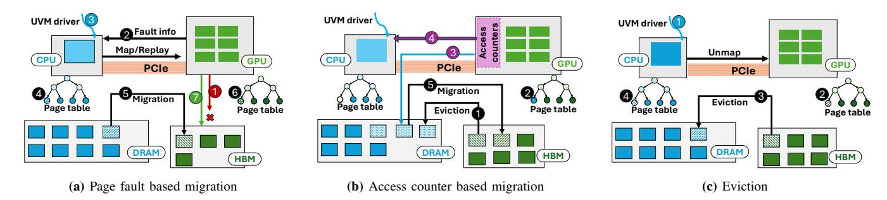
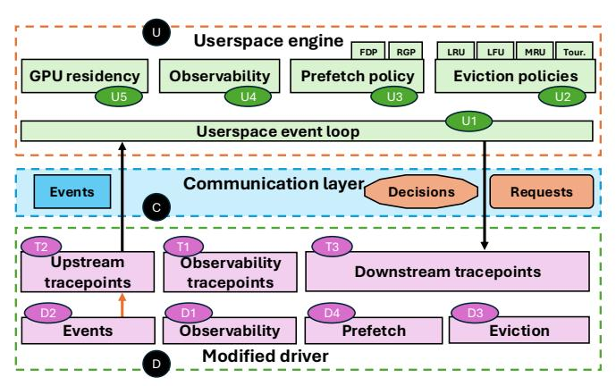
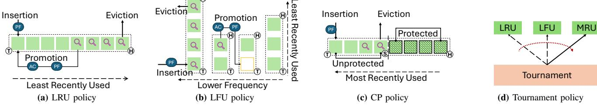
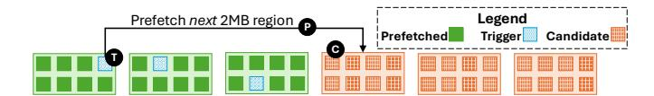
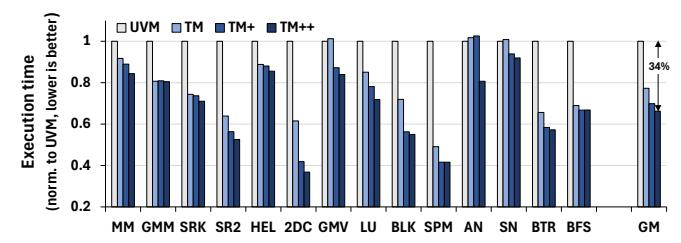
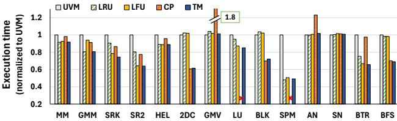
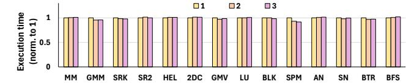

# Observability-aided GPU Memory Oversubscription

Pratheek B † Khushit Shah§ Arkaprava Basu *Indian Institute of Science* Bangalore, India {pratheekb, khushits, arkapravab}@iisc.ac.in

*Abstract*—Unified Virtual Memory (UVM) enables the oversubscription of GPUs' limited High Bandwidth Memory (HBM) capacity. Unfortunately, applications can significantly slow down when HBM is oversubscribed. We set out to make oversubscription practical without needing custom hardware modifications.

The UVM driver, executing on the CPU, is responsible for eviction and prefetching but lacks *observability* into GPUs' accesses to *HBM-resident memory*. This fundamentally limits the driver's ability to make informed decisions. Toward this, we *repurpose* existing hardware access counters originally designed to track PCIe accesses to CPU's DRAM to aid page migration. Instead, we leverage the counters to provide (sampled) *observability* into GPU's accesses to HBM-resident pages. We then create ObservUVM, a novel software framework that enables easy exploration of observability-aided custom eviction and prefetching policies in the userspace, facilitating future research. We demonstrate that better-informed eviction and prefetching policies, enabled by the newfound observability, can significantly speed up GPU applications under memory oversubscription.

*Index Terms*—GPGPU, UVM, observability, eviction-policy

#### I. INTRODUCTION

GPUs are the platform of choice for accelerating parallel applications. However, they are often constrained by their limited onboard memory (HBM) capacity [\[42\]](#page-15-0). We refer to the GPU's onboard memory as High Bandwidth Memory (HBM), and CPU's attached memory as DRAM, without loss of generality. While the need to process ever-growing amounts of data on GPUs remains unabated, the HBM on most GPUs remains limited to tens of GBs, which pales in comparison to the TBs of DRAM on modern servers.

To allow GPU programs to operate seamlessly on data that exceeds the HBM capacity, NVIDIA introduced the Unified Virtual Memory (UVM) technology [\[23\]](#page-15-1). UVM relieves programmers from explicitly orchestrating data movement between DRAM and HBM while also oversubscribing the limited HBM capacity. It allows TBs of DRAM capacity to act as the backing store to the GPU's HBM. A GPU page fault (henceforth, page fault) is raised when the GPU accesses data that is not available on HBM. The UVM driver, executing on the CPU, services the page fault by migrating the requested page(s) from DRAM to HBM.

Unfortunately, UVM can significantly slow down GPU programs under memory oversubscription due to the overheads of page fault servicing, migration, and eviction [\[4\]](#page-14-0), [\[5\]](#page-14-1), [\[11\]](#page-14-2), [\[20\]](#page-14-3). Prior research has focused on limiting page fault latency

†Now at NVIDIA.

in the critical path and on choosing what pages to migrate from DRAM to the capacity-constrained HBM. For example, batching of GPU page faults was proposed to amortize the cost of faults [\[31\]](#page-15-2), while prefetching pages to HBM hides migration latency from the critical path [\[18\]](#page-14-4).

While UVM's page migration overhead and policies have been the focus of several recent works [\[5\]](#page-14-1), [\[18\]](#page-14-4), [\[22\]](#page-15-3), [\[31\]](#page-15-2), policies for deciding *what to evict from HBM* under oversubscription (henceforth, eviction policies) have received little attention. We posit that the fact that GPU hardware provides *no* direct means to monitor *GPU accesses to HBM-resident pages*, fundamentally limits exploration of eviction policies. The UVM driver – running on the CPU – only witnesses a stream of page faults upon GPU's access to DRAM-resident pages and their migration to HBM. However, once the pages are migrated onto HBM, the driver is blind to accesses to HBM-resident pages.

Unsurprisingly, the driver implements a simple Least Recently Migrated (LRM) eviction policy [\[44\]](#page-15-4), given the limited information available. The driver maintains a list of HBMresident memory regions, with the most recently migrated regions at the tail, and the least recently migrated at the head. Under memory pressure, it evicts the region that was migrated earliest, i.e., at the head of the list. Unfortunately, this policy often evicts regions that the GPU is actively computing on. Least recently *migrated* does not imply a region is inactive. Any evicted but active memory regions must be migrated back to HBM, adding significant but avoidable overhead.

The fundamental reason behind UVM's propensity to make poor eviction decisions is its lack of *observability* – the ability to infer which HBM-resident pages are actively accessed by the GPU. Even if the driver had observability into only the memory regions at imminent risk of eviction, it could have avoided evicting those actively accessed by the GPU.

The absence of observability hamstrings UVM's prefetching policies, too. The driver today has no mechanism for knowing whether its prefetches are actually useful, i.e., it lacks *feedback* on the usefulness of past prefetches. This limitation forces the driver to adopt a conservative policy to avoid useless prefetches that could contend with demand requests.

A key goal of this work is to empower UVM with *sampled observability*: the ability to infer whether HBM-resident memory regions (sampled) are accessed by the GPU, *without needing hardware modifications*. With the newfound capability of sampled observability (henceforth, observability), UVM can make better-informed eviction and prefetching decisions.

<sup>§</sup>Now at Nutanix.

Our key insight is that existing hardware access counters can be *repurposed* to provide observability. NVIDIA GPUs have access counters to track accesses from the GPU to DRAM over the PCIe interconnect [\[45\]](#page-15-5). These counters are designed to differentiate frequently accessed DRAM-resident pages (hot) from infrequently accessed ones (cold) to help migrate hot pages to the HBM. They *cannot* monitor accesses to HBM-resident pages, though. We find that access counters are of limited usefulness for page migration (their original purpose) for several fundamental reasons (Section [III-D\)](#page-4-0). For example, the limited number of hardware counters (∼ 256) is ineffective at tracking the hotness of TBs of DRAM. It is thus unsurprising that the UVM driver does not enable access counters for page migration by default [\[47\]](#page-15-6).

We, instead, propose to repurpose these counters to provide observability into the GPU's accesses to the HBM. To *observe* GPU accesses to a HBM-resident memory region (here, 2MB), we migrate a *sample* of pages in the region (say, one 64KB page) to the DRAM and map them on GPU page tables. We then track the GPU's accesses to these sampled pages over the PCIe using access counters. Thanks to the high spatial locality of accesses in typical GPU applications [\[36\]](#page-15-7), sampling even a single 64KB page within a 2MB region provides sufficient observability to the eviction and prefetching policies (Sections [IV-A](#page-5-0) and [VII-C\)](#page-11-0). Nevertheless, we dynamically increase (decrease) the number of sampled pages per region based on an application's spatial locality (Section [V-D\)](#page-7-0).

Using access counters for observability rather than for page migration sidesteps their key limitations. The few hundred hardware counters are *insufficient* to track TBs of DRAM to distinguish hot and cold regions effectively, but suffice to track a limited number of sampled pages from a few *key* HBM-resident regions. For instance, the driver's LRM eviction policy can be enhanced to approximate the Least Recently Used (LRU) policy by *observing* a few regions (say, 100, parametrized) near the head of the eviction list. These are at imminent risk of eviction and thus are *key* regions in this context. If sampled pages from such regions witness access counter notifications, these actively accessed regions are moved to the tail of the list, protecting them from eviction. This avoids evicting actively accessed HBM-resident regions.

Beside eviction, prefetching policies can also leverage observability by monitoring recently prefetched memory regions (i.e., key regions in this context). Access to the observed region would indicate the usefulness of past prefetches, while a lack of access can serve as negative feedback. This observabilityenabled feedback can help guide the prefetching strategy.

While the observability-enabled (approximate) LRU policy significantly improves eviction decisions, it is, unsurprisingly, not ideal for every application. For example, applications with significant skew in the access frequencies across memory regions, such as those with matrix rank operations and decomposition (SRK [\[49\]](#page-15-8)), LU [\[49\]](#page-15-8)), may prefer the Least Frequently Used (LFU) policy. LFU prioritizes eviction of infrequently accessed regions. Applications with cyclic memory access patterns, on the other hand, prefer having more recently migrated regions be evicted [\[24\]](#page-15-9)(Section [VI-A\)](#page-7-1). Similarly, we observe that no single prefetching strategy suits all applications.

Importantly, the newfound observability can enable these diverse choices of eviction and prefetching policies. However, fully harnessing observability requires the flexibility to adapt eviction and prefetching policies to diverse application needs. Unfortunately, the current UVM framework is *not* conducive to exploration and adaptation. It bakes the eviction and prefetching policies into the driver – *every* new policy would require driver modifications.

To this end, we create ObservUVM, a new framework built atop UVM that enables easy exploration of observability-aided eviction and prefetching policies. ObservUVM cleanly separates mechanisms from policies. It implements mechanisms for observability, eviction, and prefetching by modifying the UVM driver. The policies, however, are delegated to userspace. The enhanced driver exposes APIs to userspace, enabling safe and rapid exploration of policies without requiring modifications to the driver for each policy. The source code of the framework, along with example custom eviction and prefetching policies, is available at [https://github.com/csl-iisc/ObservUVM.](https://github.com/csl-iisc/ObservUVM)

We demonstrate the efficacy of ObservUVM by implementing 1 *three* observability-enabled eviction policies, 2 a meta-policy, *Tournament*, that chooses the appropriate eviction policy at runtime, and 3 *two* observability-guided prefetching policies. We evaluate these policies with a diverse set of fourteen applications under varying levels of memory oversubscription, and show an average speed up of 34% (geometric mean) over UVM.

In summary, we make the following key contributions:

- We show that UVM's memory eviction and prefetching policies under memory oversubscription can significantly benefit from sampled observability of GPU accesses to HBMresident memory.
- We enable observability by repurposing existing access counters, which otherwise have limited usefulness for its original use case of page migration. This helps enable observability without requiring new hardware.
- We create a framework, ObservUVM, for the easy exploration of UVM eviction and prefetching strategies, facilitating future research.
- We demonstrate how observability helps create new classes of eviction and prefetching policies for UVM that significantly speed up applications under memory oversubscription.

# II. BACKGROUND ON UVM

<span id="page-1-0"></span>NVIDIA introduced Unified Virtual Memory (UVM) to simplify GPU programming and enable oversubscription of GPU memory [\[23\]](#page-15-1). GPUs have limited on-board memory (High-Bandwidth Memory, or *HBM*) [\[26\]](#page-15-10) typically in tens of GBs with a couple of hundreds of GBs only in the topend server GPUs. Compare this with CPU memories (*DRAM*) that routinely scale up to TBs. Traditionally, the programmer allocates memory buffers on the HBM, copies data from DRAM to HBM over the PCIe interconnect, requests the GPU to perform computation, and then copies the output

<span id="page-2-0"></span>

Fig. 1: Page fault based migration, eviction and access counter based migration in UVM

back to the DRAM. UVM simplifies GPU programming by freeing the programmer from manual memory copying. The UVM driver, running on the CPU, transparently performs page migrations between the DRAM and HBM, like demand paging in CPUs. Importantly, UVM enables HBM oversubscription. Oversubscription allows GPU programs to work with datasets larger than the HBM capacity.

There are two key parts to UVM: ① deciding what pages to migrate onto the HBM, and ② what to evict from HBM under memory pressure. The former encompasses page migration and prefetching strategies, and has been studied well [2], [3], [9], [18], [22], [31]. The latter is in the purview of the eviction policy, and little attention has been paid to this aspect. We now describe the workings of UVM in detail, focusing on page migration, page eviction, and prefetching strategies.

#### A. Page Migration in UVM

UVM employs a page fault mechanism to migrate 64KB pages between the DRAM and HBM (Figure 1a). When the GPU accesses a page that is not resident on the HBM, it raises a page fault ①. The faulting address is placed in a buffer shared between the GPU and the CPU ②. The UVM driver reads this page fault information from the shared buffer and services the corresponding page faults ③. It locates the faulting page on the CPU DRAM, unmaps the page from the CPU's page tables ④, migrates the page to the faulting GPU's HBM ⑤ over PCIe, establishes the appropriate page table mappings on the GPU's page tables ⑥, and finally instructs the GPU to replay the faulting instructions ⑦.

Servicing a single page fault takes between 10 and 50 microseconds [65]. Since page faults lie on the critical execution path of the GPU, page migration through page faults is costly. It has been well recognized that enhancing page migration is important for improving UVM performance [4], [5], [11]. Thus, prior works have proposed improving UVM page migration with page fault handling optimizations [31], prefetching [22], [46], and access counter-based page migration [19], [45].

#### B. Access Counter Based Page Migration (ACBM)

The latency of page fault servicing and page migrations in UVM lies on the critical path of execution. Further, the page fault based mechanism cannot differentiate between heavily accessed and lightly accessed pages, leading to blind page

<span id="page-2-2"></span><span id="page-2-1"></span>migrations on the first touch. To improve page migration, NVIDIA introduced optional Access Counter Based Migration (*ACBM*) with the Volta generation of GPUs [42], [45].

Figure 1b shows the working of ACBM. With ACBM enabled, regions evicted from the HBM to the DRAM ① are mapped onto the GPU's page tables ②, and are accessed by the GPU over PCIe. Access counters monitor accesses over PCIe ③ and raise notifications ④ when a region accumulates a *threshold* (parameterized) number of accesses. Upon a notification, the driver triggers the migration of the region from DRAM to HBM (⑤). The tracking granularity and threshold are configured at driver load time, with threshold from 1 to 65535 and granularity from 64KB, 2MB, 16M, or 1GB.

ACBM provides two benefits. ① Only heavily accessed regions are migrated to the HBM to enjoy high bandwidth, minimizing needless migrations and preventing thrashing. ② DRAM-resident pages remain accessible to the GPU (mapped onto GPU page tables), unlike in page fault-based migration where the faulting instruction stalls until the fault is serviced.

We emphasize that access counters *track accesses from GPU to DRAM* over the PCIe, and *not* the accesses to HBM-resident pages. We believe this is the result of fundamental hardware limitations – tracking and updating access counters for HBM accesses at TB/s bandwidth is challenging and possibly unrealistic. In comparison, PCIe bandwidth is only a few tens of GB/s and thus easy to track. Note that ACBM is disabled by default in the UVM driver (Section III-D).

#### <span id="page-2-3"></span>C. Prefetching in UVM

The UVM driver performs prefetching within 2MB boundaries (intra-2MB) from DRAM to HBM using a Tree-Based Prefetching (TBP) strategy to reduce critical path page migration latency [18], [46]. TBP uses complete binary trees, each representing a 2MB memory region, to track HBM residency within the region. The leaves of this tree represent 64KB regions, the root represents the 2MB region, and the internal nodes represent power-of-two sized regions between them. Each node tracks the fraction of HBM-resident memory under the sub-tree of the node. On a page fault, if a node's GPU-resident memory exceeds a threshold (default 51%), all pages in its sub-tree are prefetched. The threshold determines the aggressiveness of prefetching. A lower threshold leads

to sub-tree migrations with fewer faults, and hence is more aggressive. Similarly, a higher threshold is less aggressive.

However, note that TBP is not adaptive. It uses a fixed threshold and does not consider the utility of prefetched pages to adapt its aggressiveness. Thus, it may prefetch pages unnecessarily, wasting PCIe bandwidth, or miss opportunities to prefetch pages early.

## <span id="page-3-2"></span>*D. Eviction in UVM*

While page migration and prefetching have received considerable attention, eviction is, unfortunately, an overlooked yet important aspect of UVM. To make room for pages demanded by the GPU, the UVM driver may evict HBM resident pages to the DRAM. Figure [1c](#page-2-2) shows the page eviction mechanism. The UVM driver, running on the CPU, chooses the eviction victim 1 . The chosen victim is unmapped from the GPU's page tables 2 , migrated to the DRAM 3 , and mapped onto the CPU's page tables 4 . The choice of eviction victim is important, as poor eviction decisions can lead to frequent page faults, ultimately degrading performance.

The UVM driver uses a Least Recently Migrated (*LRM*) policy (Figure [2\)](#page-3-0) for choosing 2MB regions to evict from the HBM. The driver maintains a list L of HBM-resident 2MB memory regions. When a 2MB region that is not resident on the HBM is faulted upon, the UVM driver inserts the region to the tail T of the list ( I ). Eventually, the region moves towards the head H of the list, as newer regions are added to the tail. When another 64KB page within the 2MB region is faulted upon, the 2MB region is promoted to the tail of the list ( P ). Under memory pressure, the 2MB region at the head H of the list (i.e., the least recently migrated) is chosen for eviction and removed from the list ( E ).

Limitations: The UVM driver makes eviction decisions without any information about the GPU's accesses to the HBM. Unlike CPUs, NVIDIA GPUs do *not* provide access bits [\[43\]](#page-15-12), [\[44\]](#page-15-4) or low-overhead monitoring tools (e.g., AMD's IBS [\[1\]](#page-14-9)) to track memory accesses to the HBM. Thus, the UVM driver chooses eviction victims solely based on the page fault stream, limiting its ability to make good decisions (Section [III-A\)](#page-3-1).

## III. CURRENT SHORTCOMINGS AND KEY INSIGHTS

In this section, we discuss the limitations of existing eviction, prefetching, and access counter-based migration policies, and present four observations that motivate our approach to improving GPU memory oversubscription.

## <span id="page-3-1"></span>*A. Limitations of UVM's LRM Eviction Policy*

UVM's Least Recently Migrated (LRM) eviction policy often makes poor eviction decisions. The LRM policy can evict HBM-resident regions that are actively being accessed, even when there are other regions that are inactive. This is because the UVM driver, running on the CPU, has *no* knowledge of GPU accesses to HBM, i.e., the driver has no *observability* into the accesses to HBM.

We demonstrate this limitation using a simple matrix multiplication application shown in Figure [2.](#page-3-0) This application ( W

<span id="page-3-0"></span>

Fig. 2: Working of the UVM's default LRM policy

in the figure) operates on three matrices, A, B, and C. The shaded squares in the figure represent the state of 2MB regions within these matrices: fully shaded regions (Current) are being accessed currently; hatched regions (Expired) have been accessed earlier and *not* accessed again; and tiled regions (Future) will be accessed in the future. Matrices A and C are accessed in parts, with different portions accessed during different stages of execution. Matrix B is accessed in its entirety across the entire execution. Consequently, the pages of B should never be evicted from the HBM. Unfortunately, the driver has no way of knowing if a region is being accessed *after* it has been migrated to the HBM. As a result, the regions of B move towards the head of the list L and get evicted early under memory pressure (Section [II-D\)](#page-3-2). It must subsequently be migrated back upon access, incurring significant overheads.

If the driver could peek into GPU accesses to HBM, it could make better-informed eviction decisions. It could transform the default LRM eviction policy to approximate the Least Recently Used (LRU) policy. In the above example, the driver could move memory regions of the matrix B to the tail of the list to avoid evicting them. As we will show later, using the LRU policy instead of LRM reduces evictions in matrix multiplication by as much as 71%. Unfortunately, it is not possible today due to the lack of observability.

## *B. Single Policy Does Not Fit All*

Unsurprisingly, different applications, with distinct access patterns, prefer different eviction policies. For example, in applications with a cyclic access pattern with very large reuse distances between consecutive accesses to the same memory region, evicting the least-recently used regions effectively leads to no reuse of the migrated pages. Such applications, instead, benefit from evicting recently used regions. Similarly, some applications exhibit access patterns that favor evicting the least *frequently* used (LFU) regions. In our evaluation with fourteen diverse applications, five prefer LRU, six prefer LFU, and three prefer a policy tailored for cyclic patterns. We describe the policies in detail in Section [VI-A](#page-7-1) and evaluate them in Section [VII-A.](#page-9-0) Ultimately, no single policy suits every application. Choosing the right policy is important to minimize evictions and subsequent migrations.

Thankfully, UVM policies are implemented in the software (driver), enabling customization of eviction policies without hardware modification. However, policies are deeply embedded in the UVM driver, making it impractical to easily explore diverse policy choices. Changing policies would require modifying, recompiling, and reloading the driver. Bugs in the policy or in implementation could crash the system and expose it to security vulnerabilities. In Section [IV-C,](#page-5-1) we discuss how we separate policy from mechanism to overcome these limitations.

### *C. Lack of Feedback Constrains Prefetching*

Prefetching can improve performance by reducing page migrations on the critical path of access. However, useless prefetches can cause destructive interference on the PCIe and further limit the effective capacity of the HBM. As with eviction, the driver is responsible for prefetching into HBM. However, it *lacks* knowledge of whether a prefetched region is actually accessed in the HBM.

In the absence of *feedback* on prefetch's usefulness, the driver acts blindly and often conservatively. The UVM driver employs a Tree-Based Prefetcher (TBP) that desists from migrating entire 2MB regions. Instead, it waits for a stream of faults to 64KB constituent pages to gain confidence before migrating the residual pages within a region (Section [II-C\)](#page-2-3). While justified for applications with low spatial locality to avoid useless prefetches, TBP leaves significant performance on the table for those with high spatial locality – typical for many GPU applications. It would have been beneficial to prefetch the *entire* 2MB region upfront, wherever an application ultimately accesses all or most of the constituent 64KB pages. However, feedback on past prefetches is essential to prefetch aggressively without risking many useless ones.

To quantify the opportunity cost of TBP's conservative strategy, we measure the number of HBM-resident 64KB pages in every 2MB region (i.e., *occupancy*) at the time of the region's eviction. A high occupancy indicates that most pages were accessed and consequently, migrated onto the HBM. We find that, on average, a 2MB region is over 90% occupied at eviction. This implies a significant opportunity to aggressively prefetch entire 2MB regions upfront.

Further, the UVM driver only prefetches *within* a 2MB region but never across regions. Many applications could benefit from prefetching beyond a single 2MB region. For instance, in the example described in Section [III-A,](#page-3-1) matrices A and C are accessed in parts, but in a predictable and linear fashion. Such access patterns are amenable to prefetch policies that transcend 2MB boundaries. However, blindly prefetching across 2MB regions can significantly hurt performance (Section [VI-D\)](#page-9-1). Feedback on the usefulness of past prefetches is crucial for dynamically tuning prefetch aggressiveness.

#### <span id="page-4-0"></span>*D. Limited Usefulness of Access Counters for Migration*

Finally, we find that ACBM, while good in theory, does not work as well in practice. It is constrained by 1 the limited number of hardware counters and 2 the difficulty of selecting appropriate configuration parameters (granularity, threshold).

We found that there are only a limited number (256) of hardware access counters for tracking GPU accesses to DRAM-resident pages. We reverse-engineer the number of counters using a microbenchmark. It allocates p × 2MB on the DRAM and pins it to avoid migration, maps the allocated memory to the GPU page table, and accesses each 2MB region

<span id="page-4-1"></span>

Fig. 3: Microbenchmark: Limited number of access counters

*x* times from the GPU. Correspondingly, we set the threshold for the access counters to *x*. We expect one notification per region (p) as long as 'p' is equal to or less than the number of hardware counters. Figure [3](#page-4-1) reports the number of notifications (y-axis) with varying p (number of regions). We observe that the number of notifications increases linearly with p *until 256*. It saturates thereafter, confirming the presence of 256 hardware counters. We observe the same on a range of NVIDIA GPUs.

Tracking accesses to TBs of DRAM (millions of pages) with *only* 256 access counters is *futile*. It is also unrealistic to ever have millions of access counters on a GPU.

Furthermore, access counters have a large configuration space. There are four possible tracking granularities and 65535 possible thresholds, yielding ∼ 250,000 possible combinations (Section [II\)](#page-1-0). The *right* configuration varies across applications. Lower thresholds may cause excessive migrations and thrashing, while higher thresholds risk delayed migration. For instance, cuBLAS's matrix multiplication works best with low thresholds (e.g., 1), while rank computation prefers higher thresholds. Similarly, the tracking granularity trades off tracking precision for coverage. Thus, ACBM needs extensive perapplication tuning to be useful in practice.

In short, access counters have limited usefulness in performing their primary function – i.e., identifying and migrating hot pages. We observed that ACBM can be detrimental to performance (Section [VII-B\)](#page-10-0). Consequently, ACBM is disabled by default in the UVM driver. It instead relies on traditional page-fault-based migration (Section [II\)](#page-1-0).

#### Summary of Key Insights

1 Lack of observability into GPUs' accesses to HBM hinders UVM's ability to make informed eviction choices. 2 Absence of feedback on the utility of prefetching limits the aggressiveness of prefetching policies. 3 A flexible framework is needed to customize UVM policies for diverse application needs. 4 Fundamental limitations prevent access counters from aiding page migration.

#### IV. OBSERVUVM: A FRAMEWORK FOR INFORMED UVM

We design a framework, named ObservUVM, to overcome key limitations of existing eviction and prefetching mechanisms. It has three key objectives:

- 1) Provide observability of accesses to HBM-resident memory *without* needing hardware modifications.
- 2) Enable feedback on the utility of prefetching into HBM.

<span id="page-5-2"></span>

Fig. 4: Mechanism to enable observability

3) Ease customization of UVM's eviction and prefetching policies by separating them from mechanisms in driver.

Here, we detail the framework's design principles. Section [V](#page-6-0) details the implementation of ObservUVM, while Section [VI](#page-7-2) demonstrates how the framework can be used to enable different eviction and prefetching policies in userspace.

#### <span id="page-5-0"></span>*A. Sampled Observability for Eviction Policies*

ObservUVM enables eviction policies to *observe* (sampled) accesses to a chosen set of key HBM-resident memory regions (e.g., up to 100 2MB regions). It *emulates the functionality of 'access bits'* for chosen regions without requiring new hardware by re-purposing existing access counters. Figure [4](#page-5-2) shows ObservUVM's philosophy behind making a region observable. An eviction policy chooses an HBM-resident region (here, 2MB) to be made *observable* 1 . ObservUVM chooses a constituent *page* (here, 64KB) *within* the observable region as a sample 2 . It migrates the sampled page to DRAM and pins it 3 . Upon a GPU access (over PCIe) to the sampled page on the DRAM 4 , the hardware generates an access counter notification to ObservUVM's driver 5 . The driver informs the policy about the access to the sampled page. The sampled page is then migrated back to the HBM as it has finished serving its purpose of monitoring access to its encompassing region 6 . The region ceases to be observable.

Re-purposing access counters for observability sidesteps its key limitations (Section [III-D\)](#page-4-0). The traditional use case of page migration necessitates tracking possibly terabytes of DRAM. In contrast, ObservUVM only monitors (observes) sampled pages from the chosen HBM-resident regions that are key to a policy's decision-making. An eviction policy needs only to observe regions at immediate risk of eviction (key regions). We empirically find that observing up to 100 regions is sufficient, well within the tracking capabilities of current GPUs. Another limitation of access counters is finding the *right* threshold to differentiate hot pages from cold ones. Since ObservUVM uses access counters to emulate access bits, the threshold must naturally be *one*.

The effectiveness of sampling for observability relies on spatial locality in an application. If the GPU accesses an observed region but *not* its sampled page, ObservUVM will fail to report accesses to the region. Fortunately, GPU programs naturally exhibit significant spatial locality [\[36\]](#page-15-7).

<span id="page-5-3"></span>

Fig. 5: Locality in 2MB regions upon eviction

We empirically find that monitoring a single page (64KB) within a memory region (2MB) is sufficient for making informed eviction decisions. A 2MB region consists of thirtytwo 64KB pages. If most of the constituent pages of a region are accessed before the region is evicted from HBM, sampling *any one* of the pages provides accurate observability for the region. Figure [5](#page-5-3) empirically measures this across all applications. The x-axis shows the number of constituent pages within a region that are accessed before the region's eviction. The height (y-axis) of a bar at a point 'p' on the xaxis captures the fraction of 2MB regions (y-axis) whose 'p' constituent pages are accessed. From the figure, we notice that all constituent pages of more than 90% of regions are accessed before eviction. This affirms that sampling a single page within a region provides sufficient observability. Section [VII-C](#page-11-0) shows the sensitivity to sampling a different number of pages from a region. Further, we extend ObservUVM to dynamically adjust the number of pages it samples per region based on the spatial locality of applications (Section [V-D\)](#page-7-0).

Note that accessing sampled pages over the PCIe increases access latency. However, upon access, the sampled page is migrated back to the HBM to enjoy high-bandwidth access, limiting the number of PCIe accesses.

### *B. Feedback for Prefetching Policies*

Observability is also useful for providing feedback on the usefulness of past prefetches. For example, a TBP prefetching policy can make (a subset of) regions under active prefetching observable. It can then sample a prefetched page within a region and pin it on the DRAM to monitor accesses to it using counters. Upon receiving an access counter notification for a prefetched page, the driver notifies the policy of the useful prefetch (positive feedback). If a region is evicted without its sampled page witnessing access, it provides negative feedback to the policy. A prefetching policy can utilize the feedback to increase the aggressiveness of prefetching or throttle it.

#### <span id="page-5-1"></span>*C. Separation of Policy from Mechanism*

Today, the eviction and prefetching policies are baked into the driver. It impedes safe and rapid exploration of policies. In contrast, ObservUVM enables policies to be implemented in userspace. It extends the UVM driver to relay events (e.g., page faults and evictions) to userspace (Section [V-A\)](#page-6-1). It provides observability and enforces the policy decisions. Meanwhile, the userspace (Section [V-C\)](#page-6-2) is responsible for making policy decisions, e.g., selecting an eviction candidate, based on information relayed by the modified driver.

<span id="page-6-3"></span>

Fig. 6: Components of ObservUVM and their interactions

#### V. IMPLEMENTING OBSERVUVM FRAMEWORK

<span id="page-6-0"></span>We implement ObservUVM by extending NVIDIA's open-source UVM driver v525 [47], creating an extensible userspace engine, and a communication layer between the driver and userspace. The userspace engine is written in C++11 while the communication layer uses eBPF [15] via libbpf [38].

Overview: Figure 6 depicts the three major components of ObservUVM. The modified UVM driver D provides observability, relays events (e.g., page faults) to the userspace, and enforces policy decisions (Section V-A). The userspace engine U consumes the events from the modified driver, exports an interface for custom policies to make decisions, and relays policy decisions to the driver (Section V-C). The userspace also chooses pages for observability and feedback. Finally, the communication layer C (Section V-B) enables fast communication between the modified driver and the userspace.

#### <span id="page-6-1"></span>A. Modifications to the UVM Driver

We extend the UVM driver to perform three key functions, in addition to its existing responsibilities: ① enable observability, ② relay important events to user space, and ③ enforce decisions from userspace.

**Enabling observability:** The extended driver receives the address of a 64KB page from the 2MB region selected for observability by the userspace via the communication layer (Figure 6). It migrates the selected (sampled) page from the HBM onto the DRAM and maps the page onto the GPU's page tables. Such pages can now be accessed over PCIe and raise access counter notifications.

**Relaying events to userspace:** We extend the driver to relay important events **①**2 to the userspace. We added tracepoints **①**2 [12] to the driver on *page fault, access counternotification, prefetch,* and *eviction* events. These tracepoints are used by the communication layer (Section V-B) to relay events to the userspace.

Receiving and enforcing userspace decisions: The modified driver receives decisions (e.g., eviction victims) from the userspace through the communication layer **T3** (detailed in Section V-B) and enforces these decisions.

<span id="page-6-5"></span>**TABLE I:** Comm. layer interface/Userspace callbacks

|            | Interface/callback        | Arguments       |
|------------|---------------------------|-----------------|
| Upstream   | onPageFault               | Address         |
|            | onAccessCounter           | Address         |
|            | onEviction                | Address         |
|            | onPrefetch                | Address, Bitmap |
| Downstream | setEvictionRegion         | Address         |
|            | setPrefetchThreshold      | Integer         |
|            | setPrefetchRegion         | Address         |
|            | setObservabilityCandidate | Address         |
|            | setFeedbackCandidate      | Address         |

Upon memory pressure, the driver needs to evict a 2MB region ①3. The modified driver retrieves the eviction victim, as chosen by the userspace and conveyed over the communication layer. It evicts the region from the HBM to DRAM.

The driver can receive requests **T3** from the userspace to change the prefetching strategy too. ObservUVM controls the prefetching aggressiveness by changing the prefetch threshold (Section VI-C). A lower threshold value implies aggressive prefetching, and vice versa. The driver also receives addresses of regions to prefetch from the userspace (Section VI-D).

#### <span id="page-6-4"></span>B. Communication Layer

The communication layer relays messages between the modified driver and the userspace engine. It provides two sets of interfaces: *upstream* interfaces that the driver uses to relay events to userspace, and *downstream* interfaces for messages from userspace to the driver. These interfaces are listed in Table I and are self-explanatory.

We implement the communication layer using Linux's eBPF framework [15]. eBPF allows running custom programs safely in the kernel context at specified points (e.g., tracepoints [12]). It also provides shared data structures, e.g., maps, for easy communication between userspace and eBPF programs in the kernel [16]. Finally, the *kfunc* feature allows eBPF programs to manipulate kernel/driver variables [14].

### <span id="page-6-2"></span>C. Userspace Engine

The userspace engine (U) in Figure 6) is responsible for polling events upstreamed by the driver, passing them to the appropriate policies, maintaining metadata, and communicating policy decisions to the driver.

The heart of the engine is an event loop (UI), that retrieves and processes events from the driver. Based on the specific event, the engine invokes appropriate callbacks of registered eviction (U2) and/or prefetching (U3) policies. Corresponding to every API exposed by the driver in Table I, the engine provides a callback for policies to implement. Each user-implemented policy, written in C++, must register its implementation for the callbacks exposed by the engine. For example, upon a page fault event upstreamed by the driver, the engine invokes onPageFault callbacks of the registered eviction and prefetching policies.

The engine also maintains policy-agnostic metadata, such as currently GPU-resident regions ①5, and currently observed regions ①4. The policies can query the engine for this

metadata if needed for their decision-making. Finally, policy implementations (Section [VI\)](#page-7-2) invoke downstream callbacks to relay their decisions to the driver. The engine forwards them to the driver using APIs exposed by the driver.

The enhanced driver, the communication layer, and the userspace engine complete the ObservUVM framework. In Section [VI,](#page-7-2) we demonstrate how ObservUVM can be used to create a diverse set of eviction and prefetching policies.

## <span id="page-7-0"></span>*D. Adapting Number of Pages to Sample*

By default, ObservUVM randomly samples *one* 64KB page (parameterized) within a HBM-resident 2MB region to provide (sampled) observability for the region. While our analysis in [Section IV-A](#page-5-0) and the sensitivity studies [\(Section VII-C\)](#page-11-0) show that one sampled page per region is sufficient to make informed eviction and prefetching decisions, ObservUVM can dynamically increase (decrease) the number of sampled pages per region to adapt to different degrees of spatial locality.

We observe that if an *actively accessed* region gets evicted from the HBM despite sampling a 64KB page, then the region will quickly experience a page fault. ObservUVM's driver monitors 2MB regions (default, 100) that were recently evicted from the HBM. A page fault on these monitored regions indicates a likely failure of sampling to ascertain the usefulness of the region.

ObservUVM periodically calculates the fraction of recently evicted regions that are accessed again. If this fraction crosses a threshold (default, 0.5), ObservUVM doubles the number of sampled pages per region to improve observability *resolution*. Similarly, if a large fraction (here, 0.8) of the recently evicted region were not accessed quickly again, ObservUVM halves the number of sampled pages within a region. Thus, ObservUVM adapts the number of samples per region based on the application characteristics.

# VI. EXPLORING POLICIES WITH OBSERVUVM

<span id="page-7-2"></span>We create several policies using the ObservUVM framework to demonstrate its versatility and usefulness. We create three different eviction policies leveraging the newfound observability. We then create a meta-policy (Tournament) to dynamically choose between the eviction policies. Finally, we design two feedback-driven prefetching policies.

#### <span id="page-7-1"></span>*A. Eviction Policies Enabled by Observability*

We implement three eviction policies that leverage observability. These policies are built on a common principle: *utilize observability to identify memory regions that are at immediate risk of eviction from HBM (key regions) but are actively accessed by the GPU*. We now detail these policies.

Least Recently Used (LRU): Our (approximate) LRU policy (Figure [7a\)](#page-8-0) avoids evicting recently *accessed* HBM-resident regions. It maintains a list of HBM-resident 2MB regions. The head H of the list represents the least recently accessed region, and the tail T represents the most recently accessed. When a DRAM-resident 64KB page is faulted upon and migrated to the HBM, the encompassing 2MB region is added

```
1 void onPageFault(u64 addr):
2 lru_list.move_to_tail(addr);
4 void onAccessCounter(u64 addr):
5 lru_list.move_to_tail(addr);
6
7 void onEviction(u64 addr):
8 lru_list.remove(addr);
9
10 u64 setEvictionCandidate():
11 return lru_list.head;
13 u64 setObservabilityCandidate():
14 node = lru_list.head;
15 while (node.isObservable()):
16 node = node->next;
17 return node;
```

Listing 1: Implementation of LRU policy using ObservUVM

to the tail of the list (Insertion). Upon further page faults, 2MB regions are moved to the tail (Promotion).

The LRU policy picks a small number (e.g., 100) of *key* 2MB regions near the head of the LRU list (at risk of eviction) to be made observable ( ). Regions that receive access counter notifications AC are deemed actively accessed by the GPU and thus, moved (Promotion) to the tail. This avoids evicting actively accessed regions. The 2MB region at the top of the list is evicted due to memory pressure (Eviction).

Listing [1](#page-7-3) shows simplified pseudo-code for the LRU policy, implementing ObservUVM's callbacks (Table [I\)](#page-6-5). The list lru\_list tracks HBM-resident 2MB regions. On a page fault (lines 1,2) or an access counter notification (lines 4,5), the region is moved to the tail of the list (lines 2,5). On eviction, the region is removed from the list (lines 7,8). At every page fault/access counter event, the user-space engine calls setEvictionRegion and setObservabilityCandidate to obtain the policy's choice of regions for eviction and observability. LRU chooses the region at the head of the list (lines 10,11) for eviction. It chooses the *unobserved* region closest to the head of the list (lines 13-17) for observability after querying the metadata.

Least Frequently Used (LFU): We create an (approximate) LFU policy that avoids evicting *frequently accessed* 2MB regions from the HBM. When the constituent pages of the regions are in the DRAM, any access to them triggers a page fault. The driver uses the fault stream to track the frequency of accesses to a region. However, once the region migrates to HBM, the policy leverages observability to estimate the relative access frequency of HBM-resident region as the driver is otherwise blind to GPU accesses to HBM.

Figure [7b](#page-8-1) pictorially depicts the working of an example LFU policy using ObservUVM framework. It maintains a histogram of 2MB regions binned by their (estimated) access frequencies. Regions within a bin are maintained in a list, with the most recently accessed region at the tail T . On the first fault to a constituent page in a 2MB region, the region is added to the tail of the lowest frequency bin (Insertion). On further

<span id="page-8-0"></span>

<span id="page-8-1"></span>Fig. 7: Different eviction policies implemented over ObservUVM

page faults (PF), the frequency of the region is incremented by moving the region to the next bin (Promotion).

The LFU policy makes HBM-resident regions in the lowest frequency bin, i.e., those at risk of immediate eviction, observable (Q), for monitoring accesses to them. Upon an access counter notification, the frequency of the encompassing regions is incremented and (possibly) moved to the next bin. When moving a region across bins, it is added to the tail of the destination bin to avoid victimizing the recently accessed region. The LFU policy evicts the region at the head of the lowest-frequency bin  $(\widehat{\mathbf{H}})$ .

**Cyclic Protection(CP)**: LRU and LFU policies are not suitable for applications with *cyclic* access patterns, which repeatedly cycle through a large number of regions (large reuse distance) that do **not** fit on the HBM (e.g., BlackScholes) [50]. Evicting more recently migrated regions (MRU) is better. [24].

We design an example Cyclic Protection policy (**CP**) (Figure 7c) tailored for such use cases using observability. It maintains a list of 2MB regions resident in HBM. The list is divided into two parts: a protected area (hatched shading) towards the head **H**, and an unprotected area at the tail **T**. The regions in the protected area are *not* evicted; the policy tries to retain them on the HBM across cycles. Regions are evicted from the tail of the unprotected area **S**. Upon a page fault (**PF**), the region is migrated to HBM and added to the tail of the list, i.e., to the unprotected region (Insertion).

We notice that just-migrated 2MB regions do not immediately lose their usefulness but witness accesses over a short period. However, the length of this period is applicationdependent. Thus, the practical challenge here is to find the 'right' split between the protected and unprotected areas. The split, however, is application-dependent. The unprotected area must be large enough that a region is not evicted before its usefulness expires. However, a larger unprotected area reduces the protected area, increasing subsequent page faults and migration. We leverage observability to determine the appropriate split at runtime. CP chooses the regions near the head of the unprotected area (S) to be made observable (Q). If such regions are accessed, then the unprotected area is too small. The policy increases it accordingly. If observable pages are evicted before being accessed, the policy decreases its size, giving more space to the protected region.

#### B. Runtime Policy Selection with Tournament

Since one policy does not fit all, we further design the Tournament *meta-policy* (henceforth, Tournament) to choose

#### <span id="page-8-4"></span><span id="page-8-3"></span><span id="page-8-2"></span>**Algorithm 1** Tournament: Selecting the eviction policy

```
1: N := \{ \text{set of all policies} \}
2: A := \{ \text{set of active policies} \}, initially A := N
3: CauseMap{Region, Policy}
4: BlmPts[N] = 0
5: while PageFault||EvictionRequest do
      if EvictionRequest then
6:
        evPolicy = choosePolicyRR(A)
7:
8:
        evRegion = evPolicy()
        CauseMap[evRegion] = evPolicy
9:
10:
      if PageFault(Region) then
        blamePolicy := CauseMap[Region]
11:
12:
        BlmPts[blamePolicy] + +
        if \Sigma BlmPts > T then
13:
           W = (1/(|A|) * 1.2)
14:
           for x \in A do
15:
             if BlmPts[x]/\Sigma BlmPts > W then
16:
               Retire x; A = A \setminus x
17:
```

the appropriate eviction policy for a given application at runtime (Figure 7d). Tournament runs different eviction policies concurrently, monitors their effectiveness, and *retires* poorly performing policies.

Algorithm 1 depicts simplified code for the Tournament policy. It starts by running all constituent policies (N) simultaneously (lines 1, 2). It selects the eviction region from one of the active policies (A) using a round-robin fashion (lines 7, 8). Tournament notes the policy associated with each eviction, termed the cause of the eviction, and stores the association in the CauseMap dictionary (line 9).

Some of the evicted regions get accessed again later, causing page faults (line 10). Tournament places the blame for the bad eviction decision on the policy that caused the eviction and accumulates blame for each policy in the BlmPts array (lines 11, 12). When the total number of blames assigned crosses a threshold (T), Tournament *retires* policies that accumulate blames faster than its contemporaries. In our implementation, we retire policies with more than 20% (parameterized) higher blame than the average (lines 14-17). In summary, Tournament selects the appropriate eviction policy for each application based on its performance.

## <span id="page-9-3"></span>Algorithm 2 FDP: choosing the appropriate threshold

```
1: P refetchT hreshold := 51
2: CountAC, CountEV, CountSum := 0
3: while F eedback do
4: if F eedback == AC then
5: CountAC + +
6: else
7: CountEV + +
8: CountSum + +
9: if CountSum > T then
10: if CountAC/CountSum > 0.8 then
11: P refetchT hreshold = 1
12: else
13: P refetchT hreshold = 51
```

#### <span id="page-9-2"></span>*C. Feedback Driven Prefetching Policy*

Next, we design Feedback-Driven Prefetching (FDP), which controls the aggressiveness of prefetching within 2 MB memory regions based on feedback garnered through ObservUVM. Under Tree-Based Prefetching (TBP) (Section [II-C\)](#page-2-3), a page fault triggers the prefetch of all pages in the subtree rooted at any ancestor node, if the fraction of HBM resident memory at the node is above the 51% threshold. We propose a simple *Aggressive Prefetching* (AP) strategy to complement TBP in applications with high spatial locality. Under AP, an entire 2MB region is migrated upon the first page fault to one of its constituent pages. We achieve this by setting a low prefetch threshold. AP reduces page migrations in highspatial-locality applications, thereby improving performance. However, in low-locality applications, aggressive prefetching can cause unnecessary migrations and hurt performance.

The FDP policy (Algorithm [2\)](#page-9-3) dynamically chooses between TBP and AP. It sets TBP (i.e., threshold 51%) as the default prefetching policy (line 1). FDP samples a few *prefetched* regions and makes them observable to garner feedback. FDP counts the number of access counter notifications and evictions for these sampled regions (lines 4-8). If more than 80% of the observed regions are accessed, it switches to AP by setting the threshold to 1 (lines 9-13). Otherwise, it continues with TBP's conservative policy (line 13). Thus, the feedback is used to enable aggressive prefetching only when beneficial.

#### <span id="page-9-1"></span>*D. Region-Grain Prefetching Policy*

We leverage feedback to design a Region-Grain Prefetching policy that implements a next-*region* (here, 2MB) prefetcher, similar to next-line cache prefetchers [\[57\]](#page-16-1). Here, feedback helps to ensure prefetch timeliness, which is as important as accuracy [\[8\]](#page-14-14), especially when prefetching aggressively.

RGP identifies *streaming* access patterns across contiguously allocated memory regions (e.g., cudaMallocManaged()). Specifically, it tracks the stream of page fault addresses within each allocated virtual address region. If it finds faulting addresses within an allocated virtual address region that are to neighboring pages, it classifies the allocated region as witnessing a streaming access pattern. For such regions,

<span id="page-9-4"></span>

Fig. 8: Region-Grain Prefetching

TABLE II: Workloads

<span id="page-9-5"></span>

| Abbr. | Description                                | Size(GB) |
|-------|--------------------------------------------|----------|
| MM    | Tiled matrix multiplication [50]           | 10.1     |
| GMM   | Matrix multiplication (CUBLAS) [49]        | 12.0     |
| SRK   | Symmetric rank-k operation (CUBLAS) [49]   | 9.6      |
| SR2   | Symmetric rank-2k operation (CUBLAS) [49]  | 8.3      |
| HEL   | Hellinger algorithm [27]                   | 7.9      |
| 2DC   | 2DC convolution [58]                       | 18.0     |
| GMV   | Matrix vector product (CUBLAS) [49]        | 23.6     |
| LU    | Lower-upper decomposition (CUSOLVER) [49]  | 12.0     |
| BLK   | Black Scholes iterative algorithm [49]     | 10.0     |
| SPM   | Sparse matrix-matrix mult. (CUSPARSE) [49] | 8.0      |
| AN    | Alexnet batched inference [30]             | 10.3     |
| SN    | Squeezenet batched inference [30]          | 19.8     |
| BTR   | B+ tree query [7]                          | 5.0      |
| BFS   | Breadth-first search [10]                  | 2.1      |

RGP aggressively prefetches entire 2MB blocks of the virtual address space, rather than 64KB pages onto the HBM.

RGP then leverages feedback to appropriately time prefetches. Figure [8](#page-9-4) depicts RGP's philosophy. Green boxes show already prefetched regions. The orange ones show prefetch candidates. RGP makes a randomly sampled 64KB page in each prefetched region *observable*, referred to as the *trigger* T . When a trigger page is accessed, RGP prefetches P the next *yet-to-be-prefetched* region onto HBM C . This way, 2MB regions are migrated before demand accesses, but not too early to evict other useful regions. It reduces migration in the critical path to improve performance.

#### VII. EVALUATION

We evaluate ObservUVM with various policies on a system with an NVIDIA 3090 GPU (24 GB GDDR), connected to AMD Ryzen 7950X CPU over PCIe 4.0 interconnect. We evaluate fourteen applications with diverse access patterns and memory footprints. Table [II](#page-9-5) describes the applications and their memory footprints. We subject each application to varying levels of GPU memory oversubscription. An oversubscription of *x*% implies that the application's memory footprint is *x*% larger than the available HBM capacity. To emulate different oversubscription levels, we reserve a portion of the HBM using cudaMalloc API [\[48\]](#page-15-17) rendering it *unavailable* to applications. Varying the size of this reserved memory capacity helps create different degrees of oversubscription for an application.

#### <span id="page-9-0"></span>*A. Performance of Tournament and Prefetching*

We evaluate the performance of eviction and prefetching policies built on ObservUVM. Figure [9](#page-10-1) shows the execution time (lower is better) on the y-axis, for different applications under 1 default UVM (UVM), 2 Tournament *without* FDP or RGP (TM), 3 Tournament *with* FDP (TM+), and 4 Tournament with FDP and RGP (TM++), all under 50%

<span id="page-10-1"></span>

Fig. 9: Execution time with TM, TM+, and TM++

<span id="page-10-2"></span>

Fig. 10: Execution time with different eviction policies

memory oversubscription. We exclude time to allocate, and initialize memory. The execution time is normalized to UVM.

TM++ improves performance over UVM by 34%, and up to 64% (SPM). Tournament picks the appropriate eviction policy for each application, improving execution time by an average of 20% over UVM. FDP speeds up further by 9%, and RGP by another 5%, by enabling aggressive prefetching where beneficial. We now analyze the sources of improvement.

Eviction policies: First, we analyze Tournament's constituent eviction policies. Figure [10](#page-10-2) compares the execution times (yaxis) of Tournament's constituent policies, with prefetching *disabled* (referred to as LRU, LFU, and CP) and Tournament (TM). As expected, no single policy performs best for all applications; five prefer LRU, three prefer CP, and the remaining six prefer LFU. Applications LU and SPM do not finish within a reasonable amount of time under CP. The graph shows the Tournament performs close to the best-performing policy for each application by choosing the 'right' policy. It adds ∼ 2% overhead in its effort to choose the policy but this overhead is easily amortized thanks to better eviction decisions.

Figure [11](#page-10-3) shows the normalized number of evictions (lower is better) along the y-axis with different policies. The applications MM, GMM, and HEL preferred the LRU policy, reducing evictions by 62% and improving execution time by about 14% on average (up to 20%). These applications have data structures that are accessed throughout the entire execution, as well as those that are accessed in parts. LRU ensures that pages of the former are not evicted, reducing evictions and page faults. AN and SN choose the LRU policy, but do not show performance improvements, as LRU has similar behavior to UVM's default LRM policy in these cases. Applications 2DC and BLK have cyclic access patterns and thus benefit from the CP policy, improving the number of evictions by 46% and execution time by around 34%. Applications such as SRK, SR2, GMV, LU, and SPM incline towards the LFU policy, with an average of 16% (up to 58%) performance improvement and 46% reduction in evictions. The LFU policy

<span id="page-10-3"></span>

Fig. 11: Number of evictions with different policies

ensures that regions with higher reuse are not easily evicted. BTR and BFS are *irregular* applications – they make datadependent memory accesses. Consequently, the addresses of memory accesses are unpredictable, i.e., irregular. However, these applications also end up accessing most of the 64KB pages within a 2MB region. Thus, ObservUVM is effective in providing observability through sampling. BTR (B+ tree) prefers the LFU policy which prioritizes keeping frequently used regions on the GPU, which are more likely to be reaccessed. BFS, which has sparse accesses across all regions, prefers the CP policy.

Figure [12](#page-11-1) shows the normalized number of page faults (yaxis) with UVM, TM, TM+, and TM++. On average, TM reduces the number of faults by 40% thanks to better-informed eviction choices that avoids repeated faults to same pages.

Prefetching: TM+ uses FDP to improve performance over TM by choosing the appropriate threshold for prefetching within 2MB regions. All applications except GMM opt for AP (threshold 1), due to high spatial locality. TM+ reduces GPU page faults by 36% on average (and up to 84%) and improves execution time by 8% on average (up to 15%) over TM without FDP. GMM, with poor spatial locality, chooses TBP, and has a similar number of page faults with TM and TM+. SN and AN are ML inference applications. Prefetching of memory regions containing weights to the GPU HBM reduces page faults in their critical path of execution. Overall, TM+ reduces page faults over UVM by around 78% on average. TM++ (TM with FDP and RGP) further improves performance by an additional 6%, thanks to a 9% reduction in page faults over TM+. By prefetching entire 2MB regions before witnessing any page fault, RGP further improves performance.

Overheads of ObservUVM: ObservUVM introduces two types of overheads. 1 Overheads of migrating sampled pages between DRAM and HBM for observability and upon receiving access counter notifications. 2 Overheads due to communication between the driver and the userspace, and due to the driver's enforcement of policy decisions. We quantified these overheads at around 2.4% and 1.8%, on average, respectively. The reported numbers already include these overheads. Importantly, the benefit from better-informed eviction and prefetching decisions outweigh ObservUVM's overheads.

## <span id="page-10-0"></span>*B. Comparison with Alternatives*

Figure [13](#page-11-2) compares the execution time (y-axis) of TM++ versus access counter-based migration (ACBM), i.e., the traditional use case of access counters, in its default configuration, and with a prior work, EarlyAdaptor [\[22\]](#page-15-3).

<span id="page-11-1"></span>

Fig. 12: Number of page faults with TM, TM+, and TM++

<span id="page-11-2"></span>

Fig. 13: Comparison of TM++ with UVM, ACBM, and EA

Comparison with access counter-based page migration (ACBM): TM++ significantly outperforms ACBM, across the board, thanks to its superior eviction and prefetching decisions. The limited number of access counters hinders ACBM's effectiveness. For some applications (MM, GMM), ACBM performs worse than even page fault-based UVM (default). Overall, TM++ shows around 20% improvement over ACBM.

Comparison with EarlyAdaptor (EA): EarlyAdaptor is a runtime approach that chooses the appropriate prefetching threshold using page faults as signals [\[22\]](#page-15-3). Note that it does *not* focus on eviction policies, unlike ObservUVM. We empirically find that EA is generally effective at selecting the appropriate prefetching threshold, except for GMM. With GMM, EA's heuristics prefetch more aggressively than necessary, resulting in performance degradation. Nevertheless, TM++ outperforms EA by nearly 20%, on average (and up to 36%). Further, our technique does not degrade any application and provides a platform to create custom eviction and prefetching policies.

# <span id="page-11-0"></span>*C. Sensitivity Studies*

Sensitivity to oversubscription level: Figure [14](#page-11-3) shows the execution time (y-axis) of UVM and TM++, with two sections along the x-axis for 30% and 70% oversubscription, respectively. We observe significant improvements in execution time with TM++, with an average of 26% and 38% improvements for 30% and 70% oversubscription, respectively. Typically, the improvements of TM++ over UVM increase with increasing oversubscription. In some cases (e.g., GMV, LU), a change in oversubscription level results in a sharp change in memory pressure and access patterns. There, the improvements of TM++ are relatively muted with 70% oversubscription.

Furthermore, Figure [15](#page-11-4) shows the trends in the normalized runtime under TM++ and UVM with increasing memory oversubscription levels. Each bar shows the geometric mean of normalized runtimes of all applications, normalized to UVM with *no* oversubscription, with increasing memory oversubscription from 10 percent to 70 percent (lower is better). The blue bar represents TM++ and the gray bar represents the execution time of UVM. TM++ outperforms UVM by a wide margin under all levels of oversubscription. The improvements increase with increasing oversubscription, as demonstrated by the widening gap between the black and blue trend lines. The

<span id="page-11-3"></span>

Fig. 14: ObservUVM with selected oversubscription levels

<span id="page-11-4"></span>

Fig. 15: ObservUVM with different oversubscription levels

y-axis value of 1 (red trend line, UVM.Zero) shows UVM's performance with *no* (zero) oversubscription, capturing headroom for further improvement.

Sensitivity to the number of samples: Figure [16](#page-12-0) shows the performance of LRU eviction policy with decreasing number of *observable* 2MB regions (along x-axis). Decreasing the number of observable 2MB regions has little effect on most applications, as we only need to track a few critical regions. However, GMM and SPM suffer significantly. In these applications, with fewer access counters, observable regions get evicted before they get a chance to be accessed.

Increasing the number of 64KB samples per 2MB region also has little impact on most applications. Figure [17](#page-12-1) shows the execution time with 75 observable 2MB regions, tracking 1, 2, or 3 64KB pages per 2MB region. As expected, applications show high locality as discussed in [III-A,](#page-3-1) and do not see benefits from sampling more pages per region.

## VIII. DISCUSSION

#### *A. Extendability to Multi-GPU Systems*

ObservUVM is a first step towards enabling observabilitydriven eviction and prefetching policies under memory oversubscription. While its current focus is on single-GPU systems, the core challenge of the UVM driver being blind to the GPU's accesses to the HBM remains for multi-GPU systems. Further, ObservUVM's core idea of re-purposing access counters for observability is also applicable in multi-GPU systems.

Extending ObservUVM to multi-GPU systems brings new challenges, though. The access counters track peer-to-peer accesses in addition to PCIe accesses to DRAM. ObservUVM must differentiate between accesses over PCIe to DRAM and to peer GPUs' HBM. Newer generation GPUs allow monitoring specific parts of the virtual address space, making the necessary enhancements achievable.

<span id="page-12-0"></span>

Fig. 16: Sensitivity to number of observable regions

<span id="page-12-1"></span>

Fig. 17: Sensitivity to number of samples per region

## *B. Applicability to CPU-GPU Systems*

Even in tightly integrated CPU-GPU systems with highspeed cache-coherent interconnects, such as the GH200 [\[55\]](#page-16-3), the UVM driver running on the CPU manages the GPUattached HBM. The CPU and GPU have different types of physical memory attached – slower LPDDR on the CPU and fast HBM on the GPU. While the fast, cache-coherent interconnect reduces overheads, the difference in bandwidth between the CPU DRAM and GPU HBM is still high. Managing the HBM capacity well is essential to maximize utilization and eviction policy still remains an important aspect of UVM. Thus, the core idea of observability remains relevant in such systems. To the best of our knowledge, access counters in GH200 GPUs function similarly, tracking accesses to pages resident in the DRAM. Thus, it is possible for ObservUVM to enable observability as it does on the evaluated system.

### *C. ObservUVM with Different Page Sizes*

ObservUVM builds upon UVM for seamlessly speeding up UVM applications today while avoiding bespoke hardware modifications. Consequently, ObservUVM relies on the region and page sizes (2MB and 64KB respectively) that UVM exposes. That said, the idea of sampled observability by repurposing the access counter is *not* tied to any region or page sizes. Being a software-only technique, ObservUVM can easily adopt other page or region sizes exposed by UVM.

#### IX. RELATED WORK

A large body of works have studied the overheads of migration in UVM and tried to mitigate them. Gayathri et al. [\[20\]](#page-14-3), Chien et al. [\[11\]](#page-14-2), and Tyler and Ge [\[4\]](#page-14-0), [\[5\]](#page-14-1), analyzed the costs and benefits of demand paging and prefetching in UVM. Agarwal et al. [\[3\]](#page-14-6), [\[2\]](#page-14-5) used profiling for page placement in UVM. Mosaic [\[6\]](#page-14-17) used many page sizes to improve memory transfer overheads. Li et al. [\[37\]](#page-15-18) and SUV [\[52\]](#page-15-19) leverage high-level access information from static analysis for memory management. Kim et al. [\[32\]](#page-15-20) optimized page fault batch size and enabled eager eviction to reduce UVM overheads. Helm [\[28\]](#page-15-21) introduces novel locality metrics to guide data placement under UVM. Ariadne [\[56\]](#page-16-4) utilize dynamic pagesharing information to perform data placement under UVM. SwapAdvisor [\[25\]](#page-15-22), Capuchin [\[51\]](#page-15-23), Sentinel [\[54\]](#page-15-24) and DeepUM [\[29\]](#page-15-25), optimize DNN training under UVM with profiling. G10 [\[64\]](#page-16-5) performed automatic tensor migration between HBM, DRAM, and disk. DynaMap [\[9\]](#page-14-7) migrated hot pages in graph workloads using instrumentation. Go et al. [\[22\]](#page-15-3) improved prefetching with page fault history. None of these techniques enable observability into GPU's accesses to improve eviction or prefetching policies on UVM.

A recent work, Forest [\[39\]](#page-15-26), proposed new hardware for observing accesses to HBM to improve UVM policies. Unlike ObservUVM, Forest requires significant new hardware and source code analysis – both of which impede practical adoption. Moreover, Forest was evaluated on small memory footprints (average 60MB), likely masking the need to track a significantly larger number of regions. Importantly, Forest does not enable the flexibility of customizing eviction policies, whereas ObservUVM allows users to build custom eviction and prefetching policies in the userspace.

Many works have proposed hardware modifications to improve UVM. ETC [\[36\]](#page-15-7) improved UVM with pre-eviction, throttling, and compression. HPE [\[63\]](#page-16-6) and CHPE [\[62\]](#page-16-7) propose hardware counters to help with prefetching and page eviction. Zheng et al. [\[65\]](#page-16-0) describe hardware and software techniques to improve UVM's performance. Ganguly et al. [\[19\]](#page-14-8) proposed improved access counters for better page migration. Ganguly et al. [\[17\]](#page-14-18) [\[18\]](#page-14-4) improved migration/prefetching with new hardware. GRIT [\[60\]](#page-16-8) IDYLL [\[34\]](#page-15-27), and Trans-FW [\[35\]](#page-15-28) propose hardware techniques to improve multi-GPU UVM. Unlike these, ObservUVM requires no hardware changes. While UVM has been studied extensively in the past, ObservUVM opens new possibilities with observability and flexibility for custom eviction and prefetching policies on real systems.

Access bits have existed on CPUs since 1960s [\[21\]](#page-15-29). Several works propose policies to exploit them better [\[13\]](#page-14-19), [\[40\]](#page-15-30), [\[41\]](#page-15-31), [\[61\]](#page-16-9). Memtis [\[33\]](#page-15-32), TMTS [\[13\]](#page-14-19), and HeMem [\[53\]](#page-15-33) used hardware sampling (e.g., AMD IBS [\[1\]](#page-14-9)) for tiered memory management while Memstrata [\[66\]](#page-16-10) and M5 [\[59\]](#page-16-11) exploit CXL's access tracking features. These works exploit purpose-built tracking hardware, a luxury unavailable to ObservUVM.

## X. CONCLUSION

ObservUVM empowers UVM with observability into the GPU's accesses to the HBM without hardware modifications, thereby enabling better-informed eviction and prefetching policies. Its clean separation of policy and mechanism simplifies the development of custom policies and enables rapid exploration of *what-if* scenarios. We demonstrate policies that improve performance of UVM-based applications by 34%. We believe that ObservUVM has the potential to accelerate future research on UVM policies.

## XI. ACKNOWLEDGMENT

We thank anonymous reviewers for the constructive feedback. Pratheek was partially supported by the Intel India Ph.D. Fellowship. This work is partially supported by generous research grants from AMD, Microsoft, and Google.

#### APPENDIX

#### *A. Abstract*

This artifact contains the source code for ObservUVM framework, various eviction/prefetching policies, and the workloads used to evaluate them.

ObservUVM is a framework for creating eviction/prefetching policies for UVM that utilizes the power of sampled observability by repurposing existing access counters. It consists of a modified UVM driver and a userspace component. The userspace component exposes APIs to implement different eviction/prefetching policies. We have implemented Least Recently Used, Least Frequently Used, and Cyclic Protection eviction policies, the Tournament meta policy, an intra-2MB prefetching policy called Feedback Driven Prefetching, and an aggressive Region Grain Prefetching policy. We evaluate these policies over a wide range of workloads, under various memory oversubscription levels.

The artifact includes the source code for the userspace component, the modified UVM driver and the aforementioned eviction and prefetching policies. We have pre-compiled binaries for different workload configurations for ease of running. The default scripts use these binaries. We also include the source code to generate the binaries.

We maintain the most updated code and additional scripts at [https://github.com/csl-iisc/ObservUVM.](https://github.com/csl-iisc/ObservUVM) Please use GitHub to discuss or raise any issues.

#### *B. Artifact Check-list (meta-information)*

- Algorithm: Eviction policies (page replacement policies)
- Program: UVM driver, GPU workloads
- Run-time environment: Linux 6.2, libbpf
- Hardware: NVIDIA 3090, AMD Ryzen 9 7950X
- Metrics: Execution time, GPU page faults, evictions
- Experiments: Comparison of different eviction/prefetching policies
- How much disk space required (approximately)?: 20 GB
- How much time is needed to prepare workflow (approximately)?: 2 hours
- How much time is needed to complete experiments (approximately)?: 24 hours
- Publicly available?: Yes.
- Workflow automation framework used?: No
- Archived (provide DOI)?: https://doi.org/10.5281/zenodo.19428841

#### *C. Description*

*1) How to access:* Please download the artifact from the Zenodo link here [https://zenodo.org/records/19428841.](https://zenodo.org/records/19428841) Please extract the file aeisca26.tar.gz to an appropriate location.

- <sup>1</sup> tar xvf aeisca26.tar.gz
- *2) Hardware dependencies:*
- NVIDIA 3090 GPU (24GB)
- AMD Ryzen 9 7950X
- 64GB DRAM recommended (32 GB minimum)

- *3) Software dependencies:*
- Linux 6.2
- libbpf
- make
- gcc
- clang
- *4) Data sets:* All required data sets are included.
- *5) Models:* None.

## *D. Installation*

[Optional] Install the CUDA 11.8 from NVIDIA's download page or from your distribution's repository.

#### *E. Experiment Workflow*

*1) Prerequisites:* Root access is necessary to run the userspace, primarily for running eBPF programs. The scripts assume the user can run sudo. Set up password-less sudo for ease of running experiments. For e.g., if your username is username, then run the following.

```
1 sudo visudo -f /etc/sudoers.d/username
2 username ALL=(ALL) NOPASSWD: ALL
```

*2) Compile the drivers:* Compile the baseline driver and ObservUVM driver with the following commands. It should generate several kernel objects, including nvidia.ko, base-driver.ko, super-driver.ko. We will compile the drivers only once, but use these drivers in the next steps.

```
1 cd driver;
2 bash compile_drivers.sh
3 cd ..
```

Modify the following files driver\_change\_base.sh, driver\_change\_ac.sh, driver\_change\_ea.sh, driver\_change\_super.sh, to point the DPATH variable to the driver folder using your editor. Assuming the artifact is extracted at isca26ae in your home folder, then the DPATH will be as follows:

```
1 DPATH=/home/username/isca26ae/driver
```

*3) Compile the userspace:* Next, compile the userspace component using the following commands.

```
1 cd userspace;
2 bash compile_userspace.sh
3 bash gen_configs.sh
4 cd ..
```

*4) Setup workloads:* Generate the input for bfs.

```
1 cd workloads/bfs
2 cd inputGen
3 make
4 bash gen_dataset.sh
5 cp graph16M.txt ..
6 cp graph16M.txt ../..
```

*5) Run workload under key configurations:* Run the following script to run all the workloads under configurations necessary for reproducing the key figures (9, 10, 11, 12, and 13).

```
1 bash run_key.sh
```

*6) Generating figures:* Run the script for the appropriate figure. These scripts will generate .csv files that may be used to generate the final plots.

```
1 bash fig9.sh
2 bash fig10.sh
3 bash fig11.sh
4 bash fig12.sh
5 bash fig13.sh
```

Copy the output .csv to the provided Excel file (Graphs.xlsx) to the appropriate sheet (Figure number) which is pre-populated with the formulas to generate the graphs.

## *F. Evaluation and Expected Results*

The key figures in the paper are as follows:

Figure [9](#page-10-1) compares the performance of baseline UVM with ObservUVM with various policies. It shows the execution time (lower is better) normalized against baseline UVM.

Figure [10](#page-10-2) compares different eviction policies (with prefetching disabled). It shows different policies being preferred by different workloads, and that the Tournament meta policy performs as well as the best performing alternative among the different policies.

Figure [11](#page-10-3) shows the number of evictions corresponding to different policies (without prefetching).

Figure [12](#page-11-1) shows the number of page faults corresponding to different prefetching policies.

Figure [13](#page-11-2) compares ObservUVM with alternatives.

#### *G. More Results*

Figure 14 can be reproduced easily by running

```
1 bash fig14.sh
```

Other graphs can be reproduced by suitably modifying the configuration flags.

#### *H. Experiment Customization*

To create new eviction (or prefetching) policies, please add a new directory and create appropriate .cpp and .h files. Eviction policies inherit from the EvictionPolicy base class, and must implement all the key functionality (i.e., all the virtual functions in the base class). Intra-2MB prefetching policies inherit from the ShallowPrefetch base class and inter-2MB prefetching policies from DeepPrefetch.

## REFERENCES

- <span id="page-14-9"></span>[1] Advanced Micro Devices, Inc., *BIOS and Kernel Developer's Guide (BKDG) for AMD Family 15h Models 00h–0Fh Processors*, 2022, revision 3.14. [Online]. Available: [https://www.amd.com/content/dam/](https://www.amd.com/content/dam/amd/en/documents/developer/uprof-v4.0-gaGA-user-guide.pdf) [amd/en/documents/developer/uprof-v4.0-gaGA-user-guide.pdf](https://www.amd.com/content/dam/amd/en/documents/developer/uprof-v4.0-gaGA-user-guide.pdf)
- <span id="page-14-5"></span>[2] N. Agarwal, D. Nellans, M. O'Connor, S. W. Keckler, and T. F. Wenisch, "Unlocking bandwidth for gpus in cc-numa systems," in *2015 IEEE 21st International Symposium on High Performance Computer Architecture (HPCA)*, 2015, pp. 354–365.
- <span id="page-14-6"></span>[3] N. Agarwal, D. Nellans, M. Stephenson, M. O'Connor, and S. W. Keckler, "Page placement strategies for gpus within heterogeneous memory systems," in *Proceedings of the Twentieth International Conference on Architectural Support for Programming Languages and Operating Systems*, ser. ASPLOS '15. New York, NY, USA: Association for Computing Machinery, 2015, p. 607–618. [Online]. Available:<https://doi.org/10.1145/2694344.2694381>

- <span id="page-14-0"></span>[4] T. Allen and R. Ge, "Demystifying gpu uvm cost with deep runtime and workload analysis," in *2021 IEEE International Parallel and Distributed Processing Symposium (IPDPS)*, 2021, pp. 141–150.
- <span id="page-14-1"></span>[5] T. Allen and R. Ge, "In-depth analyses of unified virtual memory system for gpu accelerated computing," in *Proceedings of the International Conference for High Performance Computing, Networking, Storage and Analysis*, ser. SC '21. New York, NY, USA: Association for Computing Machinery, 2021. [Online]. Available: <https://doi.org/10.1145/3458817.3480855>
- <span id="page-14-17"></span>[6] R. Ausavarungnirun, J. Landgraf, V. Miller, S. Ghose, J. Gandhi, C. J. Rossbach, and O. Mutlu, "Mosaic: A gpu memory manager with application-transparent support for multiple page sizes," in *Proceedings of the 50th Annual IEEE/ACM International Symposium on Microarchitecture*, ser. MICRO-50 '17. New York, NY, USA: Association for Computing Machinery, 2017, p. 136–150. [Online]. Available:<https://doi.org/10.1145/3123939.3123975>
- <span id="page-14-15"></span>[7] M. A. Awad, S. Ashkiani, R. Johnson, M. Farach-Colton, and J. D. Owens, "Engineering a high-performance gpu b-tree," in *Proceedings of the 24th Symposium on Principles and Practice of Parallel Programming*, ser. PPoPP '19. New York, NY, USA: Association for Computing Machinery, 2019, p. 145–157. [Online]. Available: <https://doi.org/10.1145/3293883.3295706>
- <span id="page-14-14"></span>[8] G. Ayers, H. Litz, C. Kozyrakis, and P. Ranganathan, "Classifying memory access patterns for prefetching," in *Proceedings of the Twenty-Fifth International Conference on Architectural Support for Programming Languages and Operating Systems*, ser. ASPLOS '20. New York, NY, USA: Association for Computing Machinery, 2020, p. 513–526. [Online]. Available:<https://doi.org/10.1145/3373376.3378498>
- <span id="page-14-7"></span>[9] C.-H. Chang, A. Kumar, and A. Sivasubramaniam, "To move or not to move? page migration for irregular applications in over-subscribed gpu memory systems with dynamap," in *Proceedings of the 14th ACM International Conference on Systems and Storage*, ser. SYSTOR '21. New York, NY, USA: Association for Computing Machinery, 2021. [Online]. Available:<https://doi.org/10.1145/3456727.3463766>
- <span id="page-14-16"></span>[10] S. Che, M. Boyer, J. Meng, D. Tarjan, J. W. Sheaffer, S.-H. Lee, and K. Skadron, "Rodinia: A benchmark suite for heterogeneous computing," in *2009 IEEE International Symposium on Workload Characterization (IISWC)*, 2009, pp. 44–54.
- <span id="page-14-2"></span>[11] S. Chien, I. Peng, and S. Markidis, "Performance evaluation of advanced features in cuda unified memory," in *2019 IEEE/ACM Workshop on Memory Centric High Performance Computing (MCHPC)*, 2019, pp. 50–57.
- <span id="page-14-11"></span>[12] L. community, "Using linux kernel tracepoints," 2024. [Online]. Available:<https://docs.kernel.org/trace/tracepoints.html>
- <span id="page-14-19"></span>[13] P. Duraisamy, W. Xu, S. Hare, R. Rajwar, D. Culler, Z. Xu, J. Fan, C. Kennelly, B. McCloskey, D. Mijailovic, B. Morris, C. Mukherjee, J. Ren, G. Thelen, P. Turner, C. Villavieja, P. Ranganathan, and A. Vahdat, "Towards an adaptable systems architecture for memory tiering at warehouse-scale," in *Proceedings of the 28th ACM International Conference on Architectural Support for Programming Languages and Operating Systems, Volume 3*, ser. ASPLOS 2023. New York, NY, USA: Association for Computing Machinery, 2023, p. 727–741. [Online]. Available:<https://doi.org/10.1145/3582016.3582031>
- <span id="page-14-13"></span>[14] eBPF community, "Bpf kernel functions (kfuncs)," 2024. [Online]. Available:<https://docs.kernel.org/bpf/kfuncs.html>
- <span id="page-14-10"></span>[15] eBPF community, "ebpf," 2024. [Online]. Available: [https://docs.kernel.](https://docs.kernel.org/bpf/index.html) [org/bpf/index.html](https://docs.kernel.org/bpf/index.html)
- <span id="page-14-12"></span>[16] eBPF community, "ebpf maps," 2024. [Online]. Available: [https:](https://docs.kernel.org/bpf/maps.html) [//docs.kernel.org/bpf/maps.html](https://docs.kernel.org/bpf/maps.html)
- <span id="page-14-18"></span>[17] D. Ganguly, R. Melhem, and J. Yang, "An adaptive framework for oversubscription management in cpu-gpu unified memory," in *2021 Design, Automation and Test in Europe Conference and Exhibition (DATE)*, 2021, pp. 1212–1217.
- <span id="page-14-4"></span>[18] D. Ganguly, Z. Zhang, J. Yang, and R. Melhem, "Interplay between hardware prefetcher and page eviction policy in cpu-gpu unified virtual memory," in *2019 ACM/IEEE 46th Annual International Symposium on Computer Architecture (ISCA)*, 2019, pp. 224–235.
- <span id="page-14-8"></span>[19] D. Ganguly, Z. Zhang, J. Yang, and R. Melhem, "Adaptive page migration for irregular data-intensive applications under gpu memory oversubscription," in *2020 IEEE International Parallel and Distributed Processing Symposium (IPDPS)*, 2020, pp. 451–461.
- <span id="page-14-3"></span>[20] R. Gayatri, K. Gott, and J. Deslippe, "Comparing managed memory and ats with and without prefetching on nvidia volta gpus," in *2019*

- *IEEE/ACM Performance Modeling, Benchmarking and Simulation of High Performance Computer Systems (PMBS)*, 2019, pp. 41–46.
- <span id="page-15-29"></span>[21] C. T. Gibson, "Time-sharing in the ibm system/360: model 67," in *Proceedings of the April 26-28, 1966, Spring Joint Computer Conference*, ser. AFIPS '66 (Spring). New York, NY, USA: Association for Computing Machinery, 1966, p. 61–78. [Online]. Available:<https://doi.org/10.1145/1464182.1464190>
- <span id="page-15-3"></span>[22] S. Go, H. Lee, J. Kim, J. Lee, M. K. Yoon, and W. W. Ro, "Earlyadaptor: An adaptive framework for proactive uvm memory management," in *2023 IEEE International Symposium on Performance Analysis of Systems and Software (ISPASS)*, 2023, pp. 248–258.
- <span id="page-15-1"></span>[23] M. Harris, "Unified memory for cuda beginners," [https://developer.](https://developer.nvidia.com/blog/unified-memory-cuda-beginners/) [nvidia.com/blog/unified-memory-cuda-beginners/,](https://developer.nvidia.com/blog/unified-memory-cuda-beginners/) 2017.
- <span id="page-15-9"></span>[24] J. L. Hennessy and D. A. Patterson, *Computer Architecture: A Quantitative Approach*, 6th ed. Morgan Kaufmann, 2017.
- <span id="page-15-22"></span>[25] C.-C. Huang, G. Jin, and J. Li, "Swapadvisor: Pushing deep learning beyond the gpu memory limit via smart swapping," in *Proceedings of the Twenty-Fifth International Conference on Architectural Support for Programming Languages and Operating Systems*, ser. ASPLOS '20. New York, NY, USA: Association for Computing Machinery, 2020, p. 1341–1355. [Online]. Available: <https://doi.org/10.1145/3373376.3378530>
- <span id="page-15-10"></span>[26] JEDEC, "High bandwidth memory (hbm) dram," 2021. [Online]. Available:<https://www.jedec.org/standards-documents/docs/jesd235a>
- <span id="page-15-15"></span>[27] Z. Jin and J. S. Vetter, "A benchmark suite for improving performance portability of the sycl programming model," in *2023 IEEE International Symposium on Performance Analysis of Systems and Software (ISPASS)*, 2023, pp. 325–327.
- <span id="page-15-21"></span>[28] N. Jones, T. Allen, and R. Ge, "Helm: Characterizing unified memory accesses to improve gpu performance under memory oversubscription," in *Proceedings of the International Conference for High Performance Computing, Networking, Storage and Analysis*, ser. SC '25. New York, NY, USA: Association for Computing Machinery, 2025, p. 490–504. [Online]. Available:<https://doi.org/10.1145/3712285.3759812>
- <span id="page-15-25"></span>[29] J. Jung, J. Kim, and J. Lee, "Deepum: Tensor migration and prefetching in unified memory," in *Proceedings of the 28th ACM International Conference on Architectural Support for Programming Languages and Operating Systems, Volume 2*, ser. ASPLOS 2023. New York, NY, USA: Association for Computing Machinery, 2023, p. 207–221. [Online]. Available:<https://doi.org/10.1145/3575693.3575736>
- <span id="page-15-16"></span>[30] A. Karki, C. P. Keshava, S. M. Shivakumar, J. Skow, G. M. Hegde, and H. Jeon, "Detailed characterization of deep neural networks on gpus and fpgas," in *Proceedings of the 12th Workshop on General Purpose Processing Using GPUs*, ser. GPGPU '19. New York, NY, USA: Association for Computing Machinery, 2019, p. 12–21. [Online]. Available:<https://doi.org/10.1145/3300053.3319418>
- <span id="page-15-2"></span>[31] H. Kim, J. Sim, P. Gera, R. Hadidi, and H. Kim, *Batch-Aware Unified Memory Management in GPUs for Irregular Workloads*. New York, NY, USA: Association for Computing Machinery, 2020, p. 1357–1370. [Online]. Available:<https://doi.org/10.1145/3373376.3378529>
- <span id="page-15-20"></span>[32] H. Kim, J. Sim, P. Gera, R. Hadidi, and H. Kim, "Batch-aware unified memory management in gpus for irregular workloads," in *Proceedings of the Twenty-Fifth International Conference on Architectural Support for Programming Languages and Operating Systems*, ser. ASPLOS '20. New York, NY, USA: Association for Computing Machinery, 2020, p. 1357–1370. [Online]. Available: <https://doi.org/10.1145/3373376.3378529>
- <span id="page-15-32"></span>[33] T. Lee, S. K. Monga, C. Min, and Y. I. Eom, "Memtis: Efficient memory tiering with dynamic page classification and page size determination," in *Proceedings of the 29th Symposium on Operating Systems Principles*, ser. SOSP '23. New York, NY, USA: Association for Computing Machinery, 2023, p. 17–34. [Online]. Available: <https://doi.org/10.1145/3600006.3613167>
- <span id="page-15-27"></span>[34] B. Li, Y. Guo, Y. Wang, A. Jaleel, J. Yang, and X. Tang, "Idyll: Enhancing page translation in multi-gpus via light weight pte invalidations," in *Proceedings of the 56th Annual IEEE/ACM International Symposium on Microarchitecture*, ser. MICRO '23. New York, NY, USA: Association for Computing Machinery, 2023, p. 1163–1177. [Online]. Available: [https://doi.org/10.1145/3613424.](https://doi.org/10.1145/3613424.3614269) [3614269](https://doi.org/10.1145/3613424.3614269)
- <span id="page-15-28"></span>[35] B. Li, J. Yin, A. Holey, Y. Zhang, J. Yang, and X. Tang, "Trans-fw: Short circuiting page table walk in multi-gpu systems via remote forwarding," in *2023 IEEE International Symposium on High-Performance Computer Architecture (HPCA)*, 2023, pp. 456–470.

- <span id="page-15-7"></span>[36] C. Li, R. Ausavarungnirun, C. J. Rossbach, Y. Zhang, O. Mutlu, Y. Guo, and J. Yang, "A framework for memory oversubscription management in graphics processing units," in *Proceedings of the Twenty-Fourth International Conference on Architectural Support for Programming Languages and Operating Systems*, ser. ASPLOS '19. New York, NY, USA: Association for Computing Machinery, 2019, p. 49–63. [Online]. Available:<https://doi.org/10.1145/3297858.3304044>
- <span id="page-15-18"></span>[37] L. Li and B. Chapman, "Compiler assisted hybrid implicit and explicit gpu memory management under unified address space," in *Proceedings of the International Conference for High Performance Computing, Networking, Storage and Analysis*, ser. SC '19. New York, NY, USA: Association for Computing Machinery, 2019. [Online]. Available: <https://doi.org/10.1145/3295500.3356141>
- <span id="page-15-13"></span>[38] libbpf community, "libbpf," 2024. [Online]. Available: [https://docs.](https://docs.kernel.org/bpf/libbpf/libbpf_overview.html) [kernel.org/bpf/libbpf/libbpf](https://docs.kernel.org/bpf/libbpf/libbpf_overview.html) overview.html
- <span id="page-15-26"></span>[39] M. Lin, Y. Feng, G. Cox, and H. Jeon, "Forest: Access-aware gpu uvm management," in *Proceedings of the 52nd Annual International Symposium on Computer Architecture*, ser. ISCA '25. New York, NY, USA: Association for Computing Machinery, 2025, p. 137–152. [Online]. Available:<https://doi.org/10.1145/3695053.3731047>
- <span id="page-15-30"></span>[40] A. Maruf, A. Ghosh, J. Bhimani, D. Campello, A. Rudoff, and R. Rangaswami, "Multi-clock: Dynamic tiering for hybrid memory systems," in *2022 IEEE International Symposium on High-Performance Computer Architecture (HPCA)*, 2022, pp. 925–937.
- <span id="page-15-31"></span>[41] H. A. Maruf, H. Wang, A. Dhanotia, J. Weiner, N. Agarwal, P. Bhattacharya, C. Petersen, M. Chowdhury, S. Kanaujia, and P. Chauhan, "Tpp: Transparent page placement for cxl-enabled tieredmemory," in *Proceedings of the 28th ACM International Conference on Architectural Support for Programming Languages and Operating Systems, Volume 3*, ser. ASPLOS 2023. New York, NY, USA: Association for Computing Machinery, 2023, p. 742–755. [Online]. Available:<https://doi.org/10.1145/3582016.3582063>
- <span id="page-15-0"></span>[42] NVIDIA, "Nvidia tesla v100 gpu architecture," [https://images.nvidia.](https://images.nvidia.com/content/volta-architecture/pdf/volta-architecture-whitepaper.pdf) [com/content/volta-architecture/pdf/volta-architecture-whitepaper.pdf,](https://images.nvidia.com/content/volta-architecture/pdf/volta-architecture-whitepaper.pdf) 2018.
- <span id="page-15-12"></span>[43] Nvidia, "Nvidia pascal mmu," 2019, [https://nvidia.github.io/](https://nvidia.github.io/open-gpu-doc/pascal/gp100-mmu-format.pdf) [open-gpu-doc/pascal/gp100-mmu-format.pdf.](https://nvidia.github.io/open-gpu-doc/pascal/gp100-mmu-format.pdf)
- <span id="page-15-4"></span>[44] NVIDIA, "open-gpu-kernel-modules," [https://github.com/NVIDIA/](https://github.com/NVIDIA/open-gpu-kernel-modules/tree/main) [open-gpu-kernel-modules/tree/main,](https://github.com/NVIDIA/open-gpu-kernel-modules/tree/main) 2023.
- <span id="page-15-5"></span>[45] NVIDIA, "open-gpu-kernel-modules," [https://github.com/NVIDIA/](https://github.com/NVIDIA/open-gpu-kernel-modules/blob/main/kernel-open/nvidia-uvm/uvm_gpu_access_counters.c) [open-gpu-kernel-modules/blob/main/kernel-open/nvidia-uvm/uvm](https://github.com/NVIDIA/open-gpu-kernel-modules/blob/main/kernel-open/nvidia-uvm/uvm_gpu_access_counters.c) gpu access [counters.c,](https://github.com/NVIDIA/open-gpu-kernel-modules/blob/main/kernel-open/nvidia-uvm/uvm_gpu_access_counters.c) 2023.
- <span id="page-15-11"></span>[46] NVIDIA, "open-gpu-kernel-modules," [https://github.com/NVIDIA/](https://github.com/NVIDIA/open-gpu-kernel-modules/blob/main/kernel-open/nvidia-uvm/uvm_perf_prefetch.c) [open-gpu-kernel-modules/blob/main/kernel-open/nvidia-uvm/uvm](https://github.com/NVIDIA/open-gpu-kernel-modules/blob/main/kernel-open/nvidia-uvm/uvm_perf_prefetch.c) perf [prefetch.c,](https://github.com/NVIDIA/open-gpu-kernel-modules/blob/main/kernel-open/nvidia-uvm/uvm_perf_prefetch.c) 2023.
- <span id="page-15-6"></span>[47] NVIDIA, "open-gpu-kernel-modules, v525," [https://github.com/](https://github.com/NVIDIA/open-gpu-kernel-modules/tree/525) [NVIDIA/open-gpu-kernel-modules/tree/525,](https://github.com/NVIDIA/open-gpu-kernel-modules/tree/525) 2023.
- <span id="page-15-17"></span>[48] NVIDIA, "Cuda toolkit documentation," 2025. [Online]. Available: [https://docs.nvidia.com/cuda/cuda-runtime-api/group](https://docs.nvidia.com/cuda/cuda-runtime-api/group__CUDART__MEMORY.html) CUDART [MEMORY.html](https://docs.nvidia.com/cuda/cuda-runtime-api/group__CUDART__MEMORY.html)
- <span id="page-15-8"></span>[49] NVIDIA, "Nvidia cuda library samples," 2025. [Online]. Available: <https://github.com/NVIDIA/CUDALibrarySamples>
- <span id="page-15-14"></span>[50] NVIDIA, "Nvidia cuda library samples," 2025. [Online]. Available: <https://github.com/NVIDIA/cuda-samples>
- <span id="page-15-23"></span>[51] X. Peng, X. Shi, H. Dai, H. Jin, W. Ma, Q. Xiong, F. Yang, and X. Qian, "Capuchin: Tensor-based gpu memory management for deep learning," in *Proceedings of the Twenty-Fifth International Conference on Architectural Support for Programming Languages and Operating Systems*, ser. ASPLOS '20. New York, NY, USA: Association for Computing Machinery, 2020, p. 891–905. [Online]. Available: <https://doi.org/10.1145/3373376.3378505>
- <span id="page-15-19"></span>[52] B. Pratheek, G. Cox, J. Vesely, and A. Basu, "Suv: Static analysis guided unified virtual memory," in *2024 57th IEEE/ACM International Symposium on Microarchitecture (MICRO)*, 2024, pp. 293–308.
- <span id="page-15-33"></span>[53] A. Raybuck, T. Stamler, W. Zhang, M. Erez, and S. Peter, "Hemem: Scalable tiered memory management for big data applications and real nvm," in *Proceedings of the ACM SIGOPS 28th Symposium on Operating Systems Principles*, ser. SOSP '21. New York, NY, USA: Association for Computing Machinery, 2021, p. 392–407. [Online]. Available:<https://doi.org/10.1145/3477132.3483550>
- <span id="page-15-24"></span>[54] J. Ren, J. Luo, K. Wu, M. Zhang, H. Jeon, and D. Li, "Sentinel: Efficient tensor migration and allocation on heterogeneous memory systems for deep learning," in *2021 IEEE International Symposium on High-Performance Computer Architecture (HPCA)*, 2021, pp. 598–611.

- <span id="page-16-3"></span>[55] G. Schieffer, J. Wahlgren, J. Ren, J. Faj, and I. Peng, "Harnessing integrated cpu-gpu system memory for hpc: a first look into grace hopper," in *Proceedings of the 53rd International Conference on Parallel Processing*, ser. ICPP '24. New York, NY, USA: Association for Computing Machinery, 2024, p. 199–209. [Online]. Available: <https://doi.org/10.1145/3673038.3673110>
- <span id="page-16-4"></span>[56] H. Shin, S. Bang, H. Park, and D. Kim, "Ariadne: Adaptive uvm management for efficient gpu memory oversubscription," in *2026 IEEE International Symposium on High Performance Computer Architecture (HPCA)*, 2026, pp. 1–15.
- <span id="page-16-1"></span>[57] A. Smith, "Sequential program prefetching in memory hierarchies," *Computer*, vol. 11, no. 12, pp. 7–21, 1978.
- <span id="page-16-2"></span>[58] O. STARLAB, "Uvm benchmark," 2025. [Online]. Available: [https:](https://github.com/OSU-STARLAB/UVM_benchmark) [//github.com/OSU-STARLAB/UVM](https://github.com/OSU-STARLAB/UVM_benchmark) benchmark
- <span id="page-16-11"></span>[59] Y. Sun, J. Kim, Z. Yu, J. Zhang, S. Chai, M. J. Kim, H. Nam, J. Park, E. Na, Y. Yuan, R. Wang, J. H. Ahn, T. Xu, and N. S. Kim, "M5: Mastering page migration and memory management for cxl-based tiered memory systems," in *Proceedings of the 30th ACM International Conference on Architectural Support for Programming Languages and Operating Systems, Volume 2*, ser. ASPLOS '25. New York, NY, USA: Association for Computing Machinery, 2025, p. 604–621. [Online]. Available:<https://doi.org/10.1145/3676641.3711999>
- <span id="page-16-8"></span>[60] Y. Wang, B. Li, A. Jaleel, J. Yang, and X. Tang, "Grit: Enhancing multi-gpu performance with fine-grained dynamic page placement," in *2024 IEEE International Symposium on High-Performance Computer Architecture (HPCA)*, 2024, pp. 1080–1094.
- <span id="page-16-9"></span>[61] Z. Yan, D. Lustig, D. Nellans, and A. Bhattacharjee, "Nimble page management for tiered memory systems," in *Proceedings of the Twenty-Fourth International Conference on Architectural Support for Programming Languages and Operating Systems*, ser. ASPLOS '19. New York, NY, USA: Association for Computing Machinery, 2019, p. 331–345. [Online]. Available:<https://doi.org/10.1145/3297858.3304024>

- <span id="page-16-7"></span>[62] Q. Yu, B. Childers, L. Huang, C. Qian, H. Guo, and Z. Wang, "Coordinated page prefetch and eviction for memory oversubscription management in gpus," in *2020 IEEE International Parallel and Distributed Processing Symposium (IPDPS)*, 2020, pp. 472–482.
- <span id="page-16-6"></span>[63] Q. Yu, B. Childers, L. Huang, C. Qian, and Z. Wang, "Hierarchical page eviction policy for unified memory in gpus," in *2019 IEEE International Symposium on Performance Analysis of Systems and Software (ISPASS)*, 2019, pp. 149–150.
- <span id="page-16-5"></span>[64] H. Zhang, Y. Zhou, Y. Xue, Y. Liu, and J. Huang, "G10: Enabling an efficient unified gpu memory and storage architecture with smart tensor migrations," in *Proceedings of the 56th Annual IEEE/ACM International Symposium on Microarchitecture*, ser. MICRO '23. New York, NY, USA: Association for Computing Machinery, 2023, p. 395–410. [Online]. Available:<https://doi.org/10.1145/3613424.3614309>
- <span id="page-16-0"></span>[65] T. Zheng, D. Nellans, A. Zulfiqar, M. Stephenson, and S. W. Keckler, "Towards high performance paged memory for gpus," in *2016 IEEE International Symposium on High Performance Computer Architecture (HPCA)*, 2016, pp. 345–357.
- <span id="page-16-10"></span>[66] Y. Zhong, D. S. Berger, C. Waldspurger, R. Wee, I. Agarwal, R. Agarwal, F. Hady, K. Kumar, M. D. Hill, M. Chowdhury, and A. Cidon, "Managing memory tiers with cxl in virtualized environments," in *Proceedings of the 18th USENIX Conference on Operating Systems Design and Implementation*, ser. OSDI'24. USA: USENIX Association, 2024.