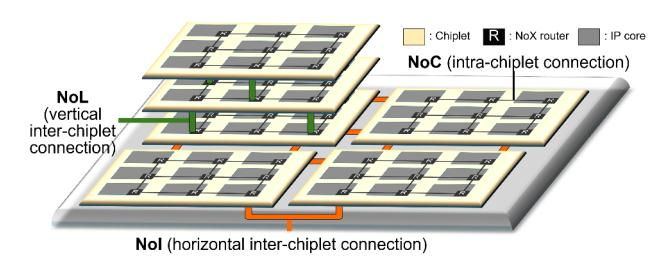
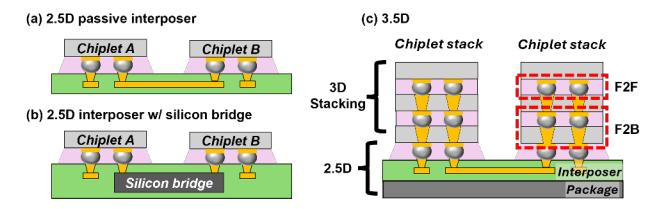
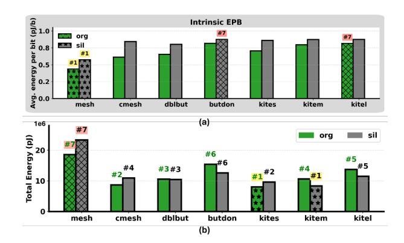
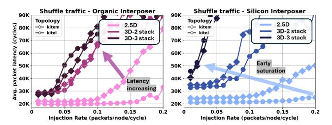
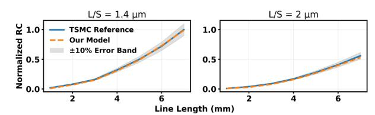
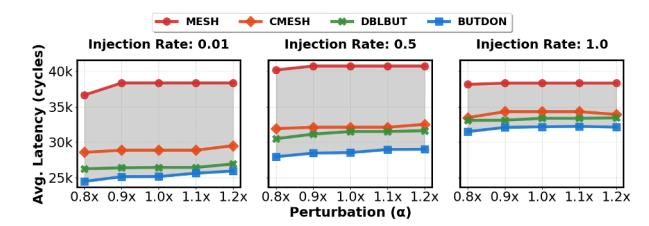
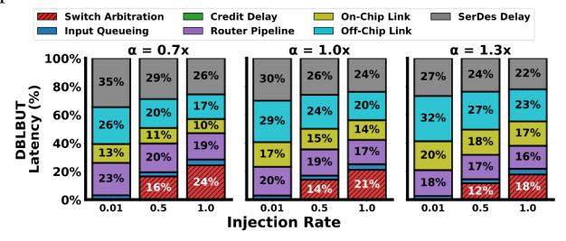

# Omelet: A Packaging-Aware Hierarchical Interconnect Simulator for 2.5D/3D Chiplet Architectures

Jiho Kim, Danish Baig, Faaiq Waqar, Ashita Victor, Shimeng Yu, Muhannad Bakir, Cong Hao *School of Electrical and Computer Engineering Georgia Institute of Technology*, Atlanta, USA

{jiho.kim, dbaig3, faaiq.waqar, avictor8}@gatech.edu, {shimeng.yu, mbakir, callie.hao}@ece.gatech.edu

*Abstract*—Monolithic integration of SoCs is reaching practical and economic limits, motivating the transition to disaggregated chiplet-based 2.5D/3D systems. In these systems, system performance depends not only on microarchitecture, but is tightly coupled to integration decisions such as stacking, interposers, and bonding methods. These packaging decisions directly shape communication characteristics, including link latency, bandwidth, energy, and I/O density. At the same time, communication is no longer confined to a uniform on-chip network. Instead, data movement traverses multiple interconnect domains, including on-chip wires, lateral interposer links, and vertical die-to-die connections. Since each domain is implemented using different physical technologies, they exhibit distinct electrical and communication characteristics, naturally forming a hierarchical interconnect structure. However, existing simulators rely on packaging-agnostic, decoupled abstractions that fail to capture technology-specific link behavior and cross-layer interactions. This disconnect obscures integration-driven bottlenecks and limits accurate system-level design space exploration.

We present **Omelet**, a packaging-aware hierarchical interconnect simulator for 2.5D/3D chiplet systems. The simulator integrates intra-chiplet networks (Network-on-Chip, NoC), interposer-level communication (Network-on-Interposer, NoI), and vertical tier-to-tier links (Network-on-Layer, NoL) within a unified cycle-level framework, with link parameters derived from electromagnetic extraction and compact SPICE models of advanced packaging interconnects. This unified hierarchy enables architects to evaluate how packaging technologies, network architectures, and chiplet organizations jointly influence latency, congestion, and bottleneck formation in multi-chiplet 2.5D/3D systems. **Omelet**, with documentation and examples, is publicly available on GitHub1 .

*Index Terms*—chiplet-based systems, 2.5D/3D integration, hierarchical interconnects, packaging-aware simulation, technology-aware modeling, design space exploration

## I. INTRODUCTION

Modern HPC and AI workloads continue to demand increasing compute density and bandwidth, placing sustained pressure on conventional monolithic system-on-chip (SoC) scaling. However, continued scaling faces multiple constraints: transistor scaling is slowing, reticle limits cap maximum die size, and yield degrades sharply with increasing area, collectively limiting further monolithic integration. In addition, integrating all system functions on a single process node introduces fundamental inefficiencies: while digital logic benefits from aggressively scaled nodes, analog and mixed-signal circuits typically favor mature or specialty processes with higher

supply voltages [11], [22], and DRAM is fabricated using processes optimized for dense memory arrays (e.g., HBM). These conflicting requirements make it increasingly impractical to realize high-performance systems within a single monolithic die.

These constraints have driven a shift toward disaggregated chiplet-based integration, where chips are partitioned into multiple dies and interconnected through advanced packaging technologies such as 2.5D and 3D stacking2 . While this approach improves scalability and enables heterogeneous integration, it also substantially expands the design space. Efficient system design now requires jointly considering chiplet partitioning, logical placement, and the underlying packaging technology that defines interconnect characteristics, making it significantly more challenging to identify optimal design points.

▶ Advanced Packaging Technologies Within this expanded design space, packaging introduces significant variation, with no single solution universally adopted. Instead, a wide range of packaging technologies coexist, each offering distinct trade-offs in electrical reach, I/O density, and vertical connectivity. Commercial 2.5D approaches include TSMC CoWoS [12] and Intel EMIB [31], as well as organic fan-out packages like TSMC InFO [44]. On the 3D side, multi-tier stacks including Intel Foveros [15], AMD 3D V-Cache [50], and Samsung X-Cube [33] employ micro-bump or hybrid bonding to enable dense vertical integration.

While this growing diversity presents new opportunities, it also complicates architectural modeling. Different packaging choices impose distinct electrical and physical constraints, directly shaping achievable bandwidth, latency, and communication behavior at the system level [23], [29]. As a result, architects can no longer rely on a single interconnect

2We use '3D' to denote vertically integrated chiplet systems, including '3.5D' configurations where stacked chiplets are integrated on an interposer.

Fig. 1: Hierarchical communication in 3D structure.

1https://github.com/sharc-lab/Omelet

TABLE I: Feature comparison across chiplet and interconnect simulators. Missing features are annotated with L1–L3.

| Feature                       | Omelet (This work) | HISIM [49] | CIMlet [7] | RapidChiplet [13] | SIAM [24] | Gemini [6] | MuchiSim [36] | Kite [3] | CNSim [8] |    |
|-------------------------------|-----------------------|------------|------------|-------------------|-----------|------------|---------------|----------|-----------|----|
| Integration Support           | 2.5D/3D               | 2.5D/3D    | 2.5D/3D    | 2.5D              | 2.5D      | 2.5D       | 2.5D          | 2.5D     | 2.5D      |    |
| Unified Hierarchical Network  | Ë                     | é          | é          | é                 | é         | é          | Partial       | Partial  | Partial   | L1 |
| Physically-Derived Inputs     | Ë                     | é          | é          | é                 | é         | é          | é             | é        | é         | L2 |
| Component-based Link Modeling | Ë                     | é          | é          | é                 | é         | é          | é             | é        | é         | L3 |

L1: NoC, NoI, NoL evaluated independently and summed post hoc; L2: hand-tuned constants or parameters assembled from inconsistent sources; L3: Link modeled as a single abstract link rather than a chain of components

abstraction; instead, system behavior must be understood in the context of the specific integration technology. This challenge becomes more pronounced in emerging open chiplet ecosystems, where a single chiplet design may be deployed across multiple packaging platforms [28]. In such settings, the same chiplet can exhibit different performance characteristics depending on the underlying packaging technology, as interconnect properties fundamentally alter communication bottlenecks and system-level behavior.

▶ Hierarchical Communication in 2.5D/3D Systems These packaging choices directly translate into a multi-layer interconnect hierarchy at the system level, as illustrated in Fig. 1. Within each chiplet, communication is handled by the on-die network-on-chip (NoC), which leverages dense metal routing and short, low-latency wires. Cross-chiplet communication over an interposer is carried by the network-on-interposer (NoI), where signals traverse longer redistribution layers (RDLs) with coarser-pitch wiring. In vertically stacked designs, communication occurs through TSVs or bonding technologies via a network-on-layer (NoL). These layers meet at chiplet boundaries, where traffic transitions across domains with fundamentally different latency, bandwidth, and physical connectivity. This mismatch introduces asymmetric communication paths and creates localized pressure at boundaries, where traffic concentrates and delays emerge. Critically, these effects are not isolated: backpressure and congestion propagate across layers, influencing communication beyond the immediate boundary. As a result, overall system behavior is governed by cross-layer interactions rather than any single interconnect domain in isolation, and models that treat these layers independently fail to capture these system-level effects.

# ▶ Limitations of Existing Chiplet System Simulators

Despite the tightly coupled and packaging-dependent nature of communication in 2.5D/3D systems, existing chiplet simulators rely on abstractions that overlook critical system-level effects:

- L1) Decoupled Cross-Layer Communication Modeling: Existing simulators treat NoC, NoI, and NoL as separate communication domains, evaluating them independently and combining their delays post hoc. This fragmented approach ignores the fact that communication spans these layers continuously, missing congestion and interaction effects that arise at chiplet boundaries.
- L2) Technology-Unconstrained Manual Parameterization: Many simulators require users to specify latency and bandwidth as hand-tuned constants, or assemble link parameters from disparate published sources, such as wire RC from one reference and driver energy from another,

that correspond to different physical structures and assumptions. In both cases, the resulting link configurations are not internally consistent and may not correspond to any realizable physical implementation. This limits meaningful design comparisons and places a significant burden on architects to determine physically plausible values.

L3) Monolithic Assumptions of Die-to-Die Interconnects : Existing simulators model off-chip communication as uniform links with latency scaling only with distance, effectively extending on-chip assumptions across chiplet boundaries. In practice, die-to-die communication is composed of multiple physical components, including I/O drivers, interposer wiring, TSVs, and bonding interfaces, each contributing distinct delay and bandwidth constraints. Collapsing these components into a single link abstraction and modeling latency as a function of distance alone masks their non-uniform contributions and misrepresents latency and bandwidth.

These limitations confine architectural exploration to simplified or unrealizable configurations, preventing accurate evaluation of system behavior under realistic packaging constraints.

# ▶ Bridging System-Level and Physical Link Modeling

Packaging-level tools such as electromagnetic (EM) solvers provide high-fidelity modeling of interconnect structures, capturing parasitics and signal integrity, but require full 3D geometry and incur hours to days per configuration. In contrast, system-level simulators enable architectural exploration but lack physically grounded link models. This disconnect necessitates a unified framework that captures hierarchical communication across NoC, NoI, and NoL domains while incorporating technology-dependent link characteristics derived from physical interconnect structures, enabling scalable exploration of architectural and integration choices without resorting to full physical simulation. Such integration allows designers to evaluate how packaging technologies and chiplet organization jointly shape system-level performance and bottlenecks.

- ▶ Our Contribution To address these limitations, Omelet introduces the following advances aligned with L1–L3:
- C1) Unified Hierarchical Network Modeling. Omelet models NoC, NoI, and NoL communication within a single cycle-level framework that captures cross-layer interactions and boundary effects in heterogeneous interconnect hierarchies.
- C2) Physically-Derived Technology Input. Users specify the target integration technology, and Omelet retrieves corresponding link parameters from a pre-characterized technology table derived from electromagnetic extraction and circuit-level

evaluation. This ensures that latency, bandwidth, and energy reflect realistic packaging constraints without manual tuning.

- C3) Component-Based Die-to-Die Link Modeling. Omelet models die-to-die communication as a sequence of physical components, including I/O driver, interposer RDLs, bonding technologies, and TSVs, rather than a single abstract link. This enables accurate representation of heterogeneous link behavior beyond simple distance-based scaling.
- C4) Cross-Stack System Analysis. By combining technology-aware link modeling with a unified interconnect hierarchy, Omelet enables analysis of congestion, latency, and bottleneck formation arising from interactions across communication domains, supporting architecture–packaging co-design.

#### II. BACKGROUND AND RELATED WORK

#### *A. Background*

- ▶ Off-Chip Interconnect Modeling. In monolithic SoCs, interconnect delay and energy are tightly coupled to a complex RTL-to-GDSII place-and-route (PnR) [21]. In contrast, offchip interconnects in 2.5D/3D systems are governed primarily by packaging technology. Chiplet locations, bump maps, and RDL stack parameters are fixed early, producing simple and repeatable routing patterns. This allows off-chip link latency and energy to be estimated from packaging parameters. However, because interposer wires can span millimeter-scale distances, exhibiting strong frequency- and return path-dependent behavior, accurate characterization requires full-wave 3D electromagnetic analysis. The key challenge in off-chip interconnect modeling is therefore to develop a compact link abstraction replicating full EM analysis that can be integrated into architectural simulators for large-scale design exploration.
- ▶ Chiplet-to-chiplet Conversion Overhead. On-chip and off-chip interconnects differ fundamentally in how they transmit data and realize bandwidth and latency. On-chip communication exploits short reach, dense metal stacks, and tightly synchronized clocking to construct wide datapaths, enabling low-latency and highly deterministic transfer. Offchip interconnects, in contrast, traverse package-level routing with longer reach and constraints due to wiring density and bump pitch. Although off-chip links can achieve high aggregate bandwidth through high-speed signaling or parallel aggregation of lanes, such bandwidth conversion from on-chip to off-chip is architecturally expensive and depends on explicit PHY and interface protocols. Consequently, off-chip latency is dominated not only by physical propagation but also by boundary overheads arising from clock-domain crossing, data reformatting, and protocol translation. These conversions introduce nontrivial latency and throughput penalties, reducing the effective benefits of chiplet-to-chiplet communication.

## *B. Related Work*

Fig. 2 illustrates common modeling shortcuts in prior chiplet frameworks: (a) letting the user specify raw latency/bandwidth numbers and assigning a single analytical formula or constant

| on_chip_latency = 1 (a) off_chip_latency = 2 * length | Comm. latency = NoC latency + NoI latency                                                           | (b) |
|-------------------------------------------------------|-----------------------------------------------------------------------------------------------------|-----|
| on_chip_bandwidth = 1 off_chip_bandwidth = 2          | <pre>hop_latency("noc", 2mm) = 1 hop_latency("noi", 0.5 mm) = 1 hop_latency("noi", 15 mm) = 1</pre> | (c) |

Fig. 2: Oversimplified chiplet-interconnect assumptions used in prior simulators.

for all off-chip latency and bandwidth, (b) computing end-toend delay as a post hoc sum of separately modeled NoC, NoI, and NoL latencies, and (c) using distance-agnostic or coarse hop costs (e.g., a 0.5 mm and 15 mm interposer hop both costing one cycle). Table I summarizes how recent chiplet and interconnect simulators map onto our limitations L1–L3.

- ▶ Analytical 2.5D/3D Frameworks. Several frameworks target fast exploration of 2.5D/3D chiplet designs using analytical rather than unified cycle-level simulation. RapidChiplet [13], 3D-CIMlet [7], Gemini [6], and HISIM [49] estimate interchiplet latency and throughput from closed-form models, trading accuracy for speed. HISIM captures TSV and wire RC but omits the driver and bonding technology, so the modeled link is incomplete and end-to-end behavior is invariant to bonding choice. All four tools treat on-chip and off-chip networks as separate domains and combine their delays post hoc (L1), rely on hand-tuned constants or parameters assembled from inconsistent sources (L2), and abstract dieto-die as a single link rather than a chain of components (L3).
- ▶ Cycle-Level Network Interconnect Simulators. Other frameworks focus on cycle-level, network-based communication modeling. Kite [3] extends Garnet [2] with on-interposer routers; CNSim [8] provides packet-parallel modeling for large multi-chip systems, and simulates interchiplet communication as direct PHY-bridged extensions of the NoC rather than a separately-routed NoI. SIAM [24] runs cycle-level NoC and network on package (NoP) simulations individually but composes them by summing latencies. These tools are limited to 2.5D NoC-NoI or direct off-chip links and do not extend to vertical NoL communication (L1), rely on hand-tuned constants or parameters drawn from disparate sources that mix incompatible physical assumptions (L2), and despite targeting 2.5D systems, model off-chip links as uniform abstractions without packaging-aware decomposition into driver, wire, via, and bonding (L3).

## III. OMELET OVERVIEW

This section provides an overview of Omelet's key components, and the detailed implementations will be introduced in the next section. As illustrated in Fig. 3, Omelet operates in a 5-stage end-to-end flow that tightly integrates configuration, modeling, simulation, and exploration.

➊ Input Configurations (§IV-A). The flow begins with structured input configurations describing the system organization, communication hierarchy, and integration technology. Rather than requiring users to manually provide latency, bandwidth, or energy values, Omelet maps these inputs to precharacterized technology entries to obtain the corresponding link parameters.

Fig. 3: End-to-end flow of Omelet.

- **2** Technology-Aware Link Modeling (§IV-B, §IV-A1). Omelet integrates a packaging-aware link modeling engine built on pre-extracted electrical parameters from detailed physical modeling. We first obtain RC parasitics for RDL/interposer traces, vias, and bonding tiers using HFSS-based 3D electromagnetic simulation. These parasitics are then incorporated into SPICE circuit models to evaluate link latency, bandwidth, and energy-per-bit. The resulting characterization is organized into a technology lookup table that is accessed during architectural simulation, enabling technology-aware interconnect behavior.
- **❸** Logical Placement (§IV-C). The Placement Engine maps chiplets and interposers onto a logical grid. Omelet supports both user-defined and automated placement. The resulting placement map encodes spatial relationships such as interchiplet distances and overlap regions, which are directly used in calculating achievable bandwidth.
- **4** Hierarchical Network Construction and Cycle-level Simulation (§IV-D). Using the modeled links and spatial placement, the Network-on-X (NoX) Engine constructs the hierarchical interconnect across the NoC, NoI, and NoL layers. It instantiates routers for each network tier, connects them to system nodes (e.g., cores, caches) through network interfaces, and establishes directional router-to-router links according to the selected topology and placement. When communication crosses hierarchy boundaries, the engine inserts adapters to handle differences in link characteristics. The resulting router-level network is simulated at cycle level to capture routing, buffering, and contention across the heterogeneous hierarchy.
- **6** Design Space Exploration (§IV-E). Omelet supports iterative design space exploration (DSE) and co-optimization across interconnect architecture, chiplet placement, and packaging technology, based on targeting metrics or constraints users set.

#### IV. OMELET IMPLEMENTATION

#### A. Input Design Variables

Omelet exposes three categories of input variables for chiplet system exploration: (1) technology library parameters describing integration technologies, (2) network configuration specifying the communication hierarchy, and (3) system configuration defining chiplet organization. These inputs

Fig. 4: Generic components in possible communication paths.

determine link properties, network connectivity, and spatial placement in the modeled multi-chiplet system.

- 1) Technology Library: The technology library defines technology-dependent parameters that determine the physical characteristics and performance of chiplet interconnect links. At a high level, the library specifies two integration link categories that serve as guardrails for constructing physically realizable signal paths: lateral interposer-based links and vertical stacked links. Rather than treating a chiplet-to-chiplet connection as an abstract channel defined only by latency, bandwidth, or energy, Omelet constructs each link as a sequence of compatible physical components forming a complete electrical path from transmitter to receiver. A link becomes fully defined only after a compatible set of components is assembled into a continuous signal path. The following paragraphs describe the component building blocks used to construct these links.
- ▶ Component-Based Link Construction Modern packaging platforms support diverse integration styles, including 2.5D interposers, 3D stacking, and hybrid 3.5D systems that combine both. Despite this diversity, surveys of commercial and academic designs [25], [32], [34], [37], [39], [48], [53] show that chiplet links are consistently composed of a small set of physical elements such as drivers, redistribution layers, vertical transitions such as  $\mu$ vias or TSVs, and a bonding technology. An end-to-end electrical path between transmitter and receiver can therefore be represented as an ordered combination of these elements, as illustrated in Fig. 4.

Motivated by this structural commonality, Omelet represents off-chip links as ordered chains of these components rather than as a single "advanced package link" abstraction. The user selects a set of components, which are chained as SPICE elements and simulated offline to derive link parameters, with compatibility constraints enforced between

TABLE II: Technology Library of Omelet

| Scope        | Parameters        | Omelet Ingredients                                                           |  |  |
|--------------|-------------------|------------------------------------------------------------------------------|--|--|
| Architecture | Structure         | chiplet count, stacking depth, #cores/chiplet, D2D distance, keepout zone |  |  |
|              |                   | Network Config. topology, routing algorithm, router size & placement         |  |  |
|              | Interconnect Path | 2.5D (interposer, silicon bridge), 3D (F2F/F2B)                              |  |  |
|              | Layout            | logical chiplet placement, chiplet size                                      |  |  |
| Packaging    | Bonding Tiers     | solder balls, µbump, Cu-Cu TCB, hybrid bonding                               |  |  |
|              | Interposer Core   | silicon, organic                                                             |  |  |
|              | RDL Materials     | Cu/oxide, Cu/polyimide                                                       |  |  |
|              | Vias              | TSV, µvia                                                                    |  |  |
|              | Wiring            | GSG Lines                                                                    |  |  |
|              | Line Length       | 0.1 - 5 mm                                                                   |  |  |

adjacent components to ensure physically valid structures. This formulation also improves extensibility: new packaging technologies can be incorporated by adding component options.

▶ Interconnect Technology Scope Table II summarizes the packaging and interconnect options currently supported by the technology library as selectable components. These options span a range of vertical and lateral integration technologies, including high-density silicon interposers and mature organic interposers [46], as well as bonding approaches ranging from conventional solder-based techniques to advanced hybrid bonding. This range enables exploration of I/O pitch scaling from approximately 1 µm to 50 µm [55]. For each supported configuration, the library specifies key technology parameters such as bump pitch, wire pitch, the number of RDL layers, bonding-tier infill materials, and TSV geometry (including pitch and aspect ratio).

The technology library captures packaging parameter ranges representative of recent commercial systems and academic studies. For 2.5D integration, Omelet supports RDL dimensions from 0.8 µm line/space used in TSMC CoWoS-S (5th Gen, 2021) to 2.0 µm line/space used in CoWoS-L/R deployed in accelerator platforms such as the NVIDIA Blackwell B200 (2024–2025) [40], [45]. The framework also supports forward-looking scaling to 0.5 µm and 1.4 µm RDL dimensions explored in recent packaging studies [27], [51]. For bonding technologies, the library spans solder balls and µbumps (> 30 µm pitch) used in early chiplet integrations to micron-scale hybrid bonding demonstrated in recent work [41] [26]. Intermediate regimes are supported, including < 10 µm Cu–Cu hybrid bonding reported for Intel Foveros Direct 3D (2021), used in Panther Lake CPUs (2025) [15]. These parameter ranges allow Omelet to represent both current production technologies and emerging integration trends.

▶ I/O driver and electrostatic discharge (ESD) support. Omelet integrates circuit-level models for chiplet I/O drivers and receivers, as well as ESD circuit terminations, which are known to have non-negligible impact on link latency [47]. While the technology library includes driver resistance and capacitance for each process node, the current study focuses on the 45 nm node available through FreePDK45TM due to community familiarity [1]. The impact of technology node is especially critical in high-density 2.5D/3D systems,

Fig. 5: Configuration interface and shipped test cases.

where transistor characteristics significantly influence signal propagation speed [16], [17].

- ▶ Configuration and test cases. Packaging inputs can be specified with a dual interface to support both architecturedriven studies and packaging-oriented exploration.
- Architecture studies: the predefined technology options or packaged presets, illustrated in Fig. 5, provide representative parameter combinations that reflect integration styles. These presets allow architectural exploration without requiring detailed packaging expertise while maintaining consistency with realistic technology configurations.
- Packaging studies: users may directly provide numerical parameters to evaluate emerging technologies, enabling forward-looking design exploration. Omelet enforces guardrail constraints to ensure physically valid configurations by checking technology compatibility (e.g., preventing hybrid bonding with organic interposers).

#### *B. Technology-Aware Link Modeling Engine*

- *1) Packaging-Aware Modeling:* To enable accurate interconnect latency and power modeling, this study with Omelet incorporates a component-level RC parasitic extraction framework based on full-wave 3D electromagnetic simulation using Ansys HFSS. Each interconnect element (e.g., RDL, vias, bonding tiers) is modeled as a parameterized 3D structure3 , and RC values are extracted over the typical digital operating range of 0.1–7 GHz. The extraction is repeated across different pitches while preserving realistic aspect ratios and design rules [55]. Because EM simulation is computationally expensive, this characterization is performed offline. The resulting parasitics are compiled into a technology table indexed by interconnect type, material, pitch, and frequency, which Omelet retrieves to generate SPICE-based link files.
- *2) Technology-aware RC latency model:* We adopt an Elmore delay model for interconnect latency estimation. All physical elements (detailed in §IV-A1) are looked up in the technology table and cascaded in a SPICE simulator to establish the full link. Length–dependent entries (e.g., interposer wires) scale with the geometric distance and are treated as distributed elements, while lumped elements (bonds, µvias) contribute fixed values.

The link is driven by a super-buffer operating at VDD = 1 V constructed from electrical fan-out of a minimum inverter

3All bonding tiers and vias have a single signal and two adjacent grounds. All wiring layers have a single signal wire, two in-plane ground wires, and ground planes above and below the wires.

Fig. 6: Examples of die-to-die in 2.5D and 3D chiplet systems.

with NMOS width, PMOS width, and NMOS/PMOS channel lengths of 50 nm, 97 nm, and 50 nm, respectively. The number of fan-out stages and the sizing for each stage are determined by obtaining the minimum equal rise and fall delays (< 1 ps difference) [38]. Link latency is determined based on averaging the rise and fall delays once VDD /2 is achieved. The maximum bandwidth of the link is assumed to be BWlink = 6·τ , where τ is the link latency [54]. Lastly, energy-per-bit (EPB) values for each link are obtained by integrating the current-voltage product over one clock cycle. The resulting latency, bandwidth, and EPB values are stored back into the technology library and used across experiments. The models are validated against prior work [18], [54]; detailed validation is presented in Section VIII.

▶ Integration of Emerging Packaging Technologies. New packaging technologies are incorporated in Omelet by adding an entry to the per-link parameter table and referencing it in the configuration file, which defines link parameters such as latency, bandwidth, and energy per bit applied at link instantiation. Fig. 6 illustrates examples covered this way: a passive 2.5D interposer can be extended into a silicon-bridge variant by inserting a µvia surrounded by organic material into the 2.5D chain to emulate traversal through the organic RDL down to the embedded bridge, and 3D vertical paths are composed by chaining bonding components in either F2F or F2B orientation, which differ in whether the TSV traverses the die before or after the bonding interface.

#### *C. Logical Placement Engine*

Since link latency and bandwidth depend on the physical proximity of chiplets and routers, placement must be networkand technology-aware rather than treated as a secondary consideration, as shown in previous work [14]. In Omelet, designers can import custom layouts by specifying logical coordinates for each chiplet. If no placement is provided, Omelet automatically generates one: it parses the NoC/NoI/NoL graph, ranks nodes (chiplet, memory, router) by communication intensity (if available), and applies a force-directed placement algorithm that places nodes with higher communication traffic closer together while enforcing minimum spacing constraints.

▶ Step 1: Grid Projection and Feasibility Check. Omelet first assigns each node to the nearest point on a logical grid that encodes adjacency and prevents overlap, even across heterogeneous die sizes. This logical grid is then scaled using a technology-dependent minimum chiplet spacing parameter to compute physical distances between components. Omelet checks for feasibility under key physical constraints, such as TSV density per mm2 and the maximum span permitted by interposer technologies (e.g., silicon or organic). An error is reported if an unusable configuration is specified (e.g., attempting to span 20 mm using a silicon interposer). Once feasible placement is confirmed, the engine emits a place map that includes both logical and physical coordinates and per-link distances, ready for downstream DSE.

▶ Step 2: Enforcing Beach-Front and Vertical Overlap Constraints. Real chiplet systems often have dies of different sizes, e.g., a large CPU flanked by smaller HBM stacks. This creates imbalanced perimeters ("beach-fronts") and limits how many links can physically fit between dies. Omelet calculates the shared beach-front for each die pair and caps the number of links accordingly. Similarly, in vertical stacking, only the overlapping area allows TSV or hybrid bond formation. These lateral and vertical constraints are passed to the link modeler, which adjusts bandwidth and router size to respect wiring limits.

### *D. Network-on-X (NoX) Engine and Cycle-level Simulation*

Omelet unifies intra-chiplet NoC, interposer-level NoI, and vertical inter-layer connections NoL into a single abstraction called *Network-on-X* (*NoX*). Traffic patterns and physical constraints vary dramatically across a package—lowest-tier chiplets rely on long, high-RC interposer wires, while stacked tiers benefit from short, low-latency vertical vias. To evaluate these heterogeneous networks, the NoX engine transforms physical link data and placement coordinates into a unified, flit-level network graph ready for cycle-level simulation. This transformation occurs through five automated stages:

- 1) System and Node Instantiation. The simulator first instantiates the architectural components participating in communication, e.g., computing nodes, memory components (e.g., cache controllers, memory controllers), and indirect routers. These components are connected to network routers through external links from the network, forming the logical endpoints of the communication fabric. The number, placement, and the role of routers are determined by the user's network configuration of each hierarchy (e.g., NoC, NoI, NoL).
- 2) Placement-Aware Link Construction. Once the nodes and routers are instantiated, Omelet utilizes the userdefined 3D placement map to establish the network topology. By analyzing the grid coordinates (lateral x,y positions and vertical tier index z) of every router pair, the engine determines the physical nature of the required connections. If two connected routers reside on the same tier, the engine assigns a 2.5D lateral link. If they span different tiers, a 3D vertical link is assigned. Omelet computes the physical distance between routers based on chiplet placement and assigns each router-to-router connection a technology label (e.g., on-die wire, interposer RDL, or vertical TSV). This information determines the physical medium used to implement the link and enables the simulator to retrieve the corresponding latency, bandwidth, and energy parameters from the technology library.

- 3) Technology-informed Parameter Conversion. After the physical realization of each connection is determined, Omelet queries the technology library to obtain the corresponding electrical characteristics. These technology entries provide continuous physical quantities such as latency, bandwidth, and energy per bit. Because Omelet operates as a flit-level cycle-level simulator, these physical quantities (e.g., bandwidth (Gb/s), delay (ps), and energy (pJ/bit)) must be translated into architecture-level parameters usable by the simulator. Each link is modeled using three derived quantities: (i) latency in clock cycles ( $t_{cyc}$ ), (ii) link width in flits per cycle (W), and (iii) energy-per-bit  $(E_{bit})$ . The number of physical lanes  $\lambda$  is computed by dividing the available bonding perimeter by the bump or TSV pitch. The data rate per lane  $R_{lane}(\ell)$  is obtained from the pre-characterized technology library indexed by interconnect length  $\ell$ , which accounts for degradation due to RC delay. Given a fixed flit size  $F_{\rm bits} = 128$  bits (16 bytes) and operating clock frequency  $f_{\rm clk}$ , the effective link width in flits per cycle is  $W = \left\lfloor \frac{\lambda \cdot R_{\rm lane}(\ell)}{f_{\rm clk} \cdot F_{\rm bits}} \right\rfloor$ .
- Overhead Insertion. 4) Automated Adapter and Heterogeneous interconnects inherently create bandwidth and frequency mismatches across the network. To ensure cycle-accurate modeling, the NoX engine analyzes the input and output nodes of every router. Whenever a mismatch is detected between distinct technology domains (e.g., moving from a parallel, slow 2.5D interposer to a dense, fast 3D TSV), the engine automatically inserts structural overheads. This includes queuing adapters for PHY transitions, data aggregation/serialization delays (SerDes), and Clock-Domain Crossing (CDC) penalties. The SerDes delay is modeled proportionally to the data rate ratio between the input and output links, while CDC delay is fixed at 1 cycle assumption, following prior work [3]. These penalties are incorporated directly into the effective latency of the link during simulation.
- Synthesis. In the final step before simulation execution, the NoX engine finalizes the microarchitectural details of the network graph. Routers are dimensioned based on the bandwidth of their connected heterogeneous links. Because 2.5D and 3D links exhibit drastically different delay-bandwidth products, buffer depths are automatically sized to prevent starvation on high-latency interposer links while avoiding over-provisioning on short vertical links. Finally, the engine propagates routing constraints, including topology-specific turn restrictions, limitations on vertical transitions between tiers, and rules governing communication between NoC, NoI, and NoL layers.

Routers are dimensioned based on the lowest available bandwidth among their connected links to minimize the SerDes overhead. They are then placed and bound to adjacent tiles, and routing constraints (e.g., turn prohibitions in hierarchical meshes) are propagated. Since each link carries a technology-aware tuple  $\langle W, t_{\rm cyc}, E_{\rm bit} \rangle$ ,

- congestion and timing analysis naturally reflect the heterogeneity of physical interconnects.
- ▶ Cycle-level Simulation. With the NoX graph fully constructed and annotated with converted tuple  $\langle W, t_{\rm cyc}, E_{\rm bit} \rangle$ , Omelet executes the network using a flit-level cycle-level simulation model. Packets traverse routers and links cycle by cycle, undergoing routing, arbitration, buffering, serialization, and link traversal delays determined by the previously derived parameters. This unified execution model enables Omelet to capture heterogeneous interconnect behavior across NoC, NoI, and NoL layers, enabling realistic modeling of congestion and cross-layer backpressure.

#### E. Design-Space Exploration (DSE) Engine

Omelet's DSE Engine turns the simulator into a fully automated exploration tool. Given a user-defined search space, e.g., topologies, router designs, chiplet placements, and packaging options, it runs the full simulation flow (Fig. 3) for each configuration and collects performance results.

- 1) Search space definition: A design point is formulated as the tuple  $\langle G_{\rm net}, P_{\rm place}, T_{\rm tech} \rangle$  where  $G_{\rm net}$  encodes the NoC/NoI/NoL topologies and router parameters,  $P_{\rm place}$  defines chiplet coordinates and tier assignments, and  $T_{\rm tech}$  selects interposer material, bonding, TSV pitch, etc. Users supply discrete sets or ranges, and the engine forms the Cartesian product.
- 2) Evaluation loop: Each design point runs four steps: (1) generates technology-aware links (§IV-B); (2) synthesizes the NoX network (§IV-D); (3) performs a flit-level cycle simulation; and (4) produces metrics including average flit latency, peak throughput, per-link EPB and traffic-activated energy, per-link utilization, and crossing overhead.
- 3) Bottleneck attribution: The simulator attaches metadata describing the physical and architectural properties of each link and router. When latency increases, this metadata allows the tool to identify the specific cause with latency breakdown.
- 4) Search strategies: The default mode is an exhaustive sweep for spaces up to  $10^3$  points. Larger spaces use simulated-annealing guided by a weighted objective.
- 5) Outputs: The DSE engine outputs a Pareto-optimal set of architectural designs, each annotated with performance metrics and linked to the corresponding placement and network configuration files. The framework currently evaluates performance and energy and can be extended to additional metrics or tools (e.g., cost or thermal) through external models using the system configuration and simulation outputs.

#### V. EXPERIMENT SETUP AND BASELINE

▶ Simulation Infrastructure. The framework is designed to be portable across cycle-level network simulators; in this work we integrate Omelet with gem5 [30]'s Garnet NoC simulator [2], extending its cycle-level simulation to support heterogeneous, hierarchical, and packaging-aware interconnects for 2.5D/3D systems. To enable rapid design-space exploration, we employ synthetic traffic injection where each chiplet is modeled as a traffic endpoint that generates and receives packets through the network. Evaluations

TABLE III: Baseline System Configuration

|            | Parameter         | Value                                                                           |  |  |
|------------|-------------------|---------------------------------------------------------------------------------|--|--|
| System     | Chiplet Count     | 1, 4, 8, 12                                                                     |  |  |
|            | Cores / Chiplet   | 16 (4×4 grid)                                                                   |  |  |
|            | Stacking Depth    | 1 (2.5D), 2, 3                                                                  |  |  |
| Network    | Traffic pattern   | Uni. random, shuffle, transpose, tornado, neighbor                              |  |  |
|            | Router pipeline   | 4                                                                               |  |  |
|            | Virtual channels  | 4                                                                               |  |  |
|            | SerDes latency    | Ratio of the bandwidth difference                                               |  |  |
| NoC        | Topology          | 2D Mesh                                                                         |  |  |
|            | Link Latency      | 1 cycle (normalized)                                                            |  |  |
|            | Link Width        | 16 Bytes                                                                        |  |  |
|            | NoC Unit Latency  | 10 ps/mm, 50 ps/mm, 100 ps/mm                                                   |  |  |
| NoI/NoL    | Topologies        | Mesh, Cmesh, DblBut, ButDon, Kite-S/M/L                                         |  |  |
|            | Link Width        | Tech-aware                                                                      |  |  |
| Technology | Interposer Choice | Silicon (0.5 µm L/S), Organic (2 µm L/S)                                        |  |  |
|            | Bonding (pitch)   | Solder Ball (30 µm), µbumps (10 µm), Cu-Cu TCB (5 µm), Hybrid Bond (1 µm)    |  |  |
|            | Vias              | TSV (pitch same as bond, AR = 15), µVia (pitch same as bond, diam = pitch/2) |  |  |
|            |                   | Dielectric (thickness) Oxide (1 µm), Polyimide (6 µm)                           |  |  |
|            | Wire lengths      | 0.5 - 5 mm (topology dependent)                                                 |  |  |
|            | Clock Frequency   | 3 GHz                                                                           |  |  |

are performed using 5 different synthetic traffic patterns, including uniform random, transpose, shuffle, neighbor, and tornado across seven different topologies: mesh, concentrated mesh (cmesh), double butterfly (dblbut), butterdonut (butdon), and 3 variants of Kite (small, medium, and large).

Our baseline system configuration consists of 4 chiplets, each containing 16 cores arranged in a 2×2 chiplet grid as assumed in previous chiplet papers [4], [9], [10], [35], [42], [43], [3], [19], [20], [52]. Omelet is designed to reflect the diversity of modern chiplet-based products; this baseline references representative industry systems including Intel Sapphire Rapids (4 chiplets) [35], AMD Instinct MI250X (2 GPU dies) [43], and AMD MI300/EPYC-class systems [4], [42] with 8–12 chiplets. Our evaluation studies 4, 8, and 12-chiplet configurations using representative packaging technologies consistent with these systems. All chiplets are placed on an interposer and interconnected using a NoI topology. NoI routers act as indirect routers, serving only to forward data and having no direct connection to injection or ejection nodes. Routers within each chiplet's NoC are direct routers, connected to cores and serving as both traffic sources and destinations. Router placement and routing follow the same approach as in the references.

To ensure a packaging-feasible evaluation across all seven topologies, we adapt the physical link-length assumptions used in prior work. The original Kite paper [3] assumes a 2.2 mm router-to-router separation for the mesh baseline. Adopting the same 2.2 mm pitch for our broader set of topologies, especially those with diagonal or long-reach connectivity, would require inter-chiplet links as long as 9.8 mm. This is an atypical length for our baseline system configuration, and would require dynamic adjustments to wire L/S to maintain reasonable signal integrity. Therefore, to maintain both architectural comparability and packaging realism, we reduce the mesh router-to-router pitch to 1 mm, which lies well within typical 2.5D design envelopes. All other topologies are then geometrically scaled based on this 1 mm baseline.

For our 3D-stacking evaluations, we simulate two configurations: a 2-tier system in which four additional chiplets are stacked above the base layer (8 chiplets total), and a 3-tier system with another four chiplets added on top (12 chiplets total). Each tier preserves the same 2×2 physical layout. Vertical communication is handled by network-onlayer (NoL) links, whose router sizes and link parameters (e.g., bandwidth, latency, serialization overheads) are fully configurable. All simulations assume full chiplet activity.

Table III consolidates parameters across system, network, and technology layers. Within the network configuration, routers implement 4 virtual channels (VCs) per virtual network with 4 flits of buffering per VC for the intra-chiplet NoC routers. For the inter-chiplet NoI routers, we retain the same number of VCs but increase the buffer depth up to 8 flits per VC, reflecting the burstier traffic generated by boundary packetization and the longer credit round-trip latency across PHY and interposer interfaces.

▶ Simulator Runtime All evaluations are performed on a server running Red Hat Enterprise Linux 7.9 with a 64 core Intel Xeon Gold 6226R CPU and 502 GiB of RAM. Simulations are executed using gem5 v21.1, with a single CPU core allocated per run. An injection-rate based simulation for a 2D NoC (single chiplet, 16 cores) takes an average of 14.2 seconds. Extending to NoC + NoI with four chiplets increases the runtime to 96.4 seconds. When 3D stacking is introduced, the configuration with eight chiplets (NoC + NoI + NoL) requires 428.7 seconds, and scaling to 12 chiplets further increases runtime to 1,216.5 seconds, reflecting the nonlinear congestion growth as both horizontal and vertical communication intensify. Of the total runtime, the technology-aware interconnect modeling accounts for at most 0.011% in the simplest configuration, since Omelet's technology tables/libraries are compiled offline. Omelet balances fidelity and practicality: technology modeling is performed offline, while runtime simulation remains cycle-level and scalable. Prior tools may run faster (<13s) due to simpler abstractions [13], but they do not provide the capabilities Omelet enables, including unified NoC–NoI–NoL modeling and technology-aware links.

## VI. SIMULATION RESULTS AND ANALYSIS

## *A. Isolated vs. Unified Hierarchical Modeling*

To quantify the architectural impact of modeling NoC, NoI, and NoL as isolated communication domains, we construct a controlled 2.5D/3D chiplet system and compare Omelet's unified hierarchical simulation against the layer-separated methodology used by prior chiplet-system simulators. We evaluate four modeling settings: isolated/tech-agnostic (XX), isolated/tech-aware (XO), unified/tech-agnostic (OX), and unified/tech-aware (OO).

In the unified configuration for the 3D system, packets traverse the full NoC→NoL→NoC→NoI→NoC→NoL→NoC hierarchy, and all queueing, backpressure, and routing propagate naturally across layers. In the isolated configuration (X ), each domain is simulated independently, and the final end-to-end latency is computed as the sum of the three decoupled networks, an approach that removes cross-layer

Fig. 7: Load–latency curves for seven interposer topologies under shuffle traffic, comparing four communication models: (1) isolated/tech-agnostic, (2) isolated/tech-aware, (3) unified/tech-agnostic, and (4) unified/tech-aware.

Fig. 8: Per-configuration averages of 1) zero-load latency, 2) saturation point, and 3) congestion-growth, computed across the seven topologies in Fig. 7

interaction. To make this comparison as fair as possible, we implemented an improved isolated model that records the exact ejection timing and destination of packets during the NoC run and replays them as injection events for the NoI run. While this mechanism preserves average interdomain injection characteristics, it cannot reproduce dynamic backpressure propagation or queue coupling across layers. In the technology agnostic settings ( X), identical per hop latency and bandwidth are assigned to all links. This abstraction underestimates the cost of chiplet crossings, serialization delay, wire reach constraints, and bandwidth asymmetry.

Fig. 7 shows the load–latency curves under shuffle traffic for 7 interposer topologies across the 4 modeling configurations. The unified and isolated approaches do not exhibit a consistent offset or scaling relationship across traffic loads. Instead, their latency–load curves differ both in slope and in saturation behavior, and the relative ordering between configurations changes as load increases. This divergence indicates that hierarchical interactions across NoC, NoI, and NoL fundamentally reshape congestion dynamics. As a result, end to end performance cannot be reconstructed by linearly composing per domain simulations, even when average inter domain injection patterns are preserved.

To understand these discrepancies, the following analysis decomposes the observed behavior into its contributing mechanisms, highlighting how interacting cross layer effects and modeling assumptions jointly shape traffic and congestion.

▶ Early saturation in isolated models. Across all topologies, the isolated curves saturate earlier because queue buildup in the NoC and the NoI is accumulated independently. Without cross-layer backpressure, the NoC accumulates its own pipeline delays and boundary queueing, while the NoI separately accumulates its own router stages and serialization delay. When these two simulations are later combined, the resulting latency implicitly stacks both layers' worst-case pipeline and queueing behavior, which produces an artificially early and steep saturation point. This effect is reflected in Fig. 8 (middle), where the isolated configurations exhibit lower average saturation points than the unified ones. In unified simulation, downstream congestion on the interposer propagates back into the NoC, throttling injection before either layer reaches its independent worst case. This coupling suppresses unnecessary pipeline buildup, delays saturation, and produces substantially lower end-to-end latency at moderate offered loads.

# ▶ Cross-layer path diversity and congestion redistribution.

Unified simulation exposes congestion behaviors that do not arise under isolated modeling. Topologies with dense lateral connectivity, such as mesh and concentrated mesh, provide multiple horizontal routing alternatives within each layer, enabling packets to traverse different intra layer paths. When traffic increases, vertical links and boundary routers between layers become the primary bottlenecks. In these topologies, packets can still be redirected through alternative lateral paths before reaching the congested vertical interfaces. This redistribution spreads traffic across multiple intra-layer routes, which temporarily alleviates localized congestion and delays the onset of rapid latency growth.

This behavior emerges from cross layer path diversity: the combined horizontal connectivity within layers and vertical inter layer links creates a larger global routing space whose utilization evolves with network pressure. In contrast, isolated models constrain congestion resolution to individual domains. Because NoC and NoI are simulated independently and coupled only through replayed injections, downstream congestion cannot influence upstream routing or queue formation. As a result, traffic redistribution across layers does not occur, and the congestion patterns observed in unified simulation cannot be reproduced.

▶ Technology-aware effects on zero-load and saturation behavior. As shown in Fig. 8 (left), tech-aware models report higher zero-load latency due to realistic boundary conversion overhead and higher inter-chiplet latency, whereas technology agnostic configurations assume uniform per hop delay and therefore underestimate baseline communication cost.

More importantly, technology awareness changes how congestion develops. As shown in Fig. 8 (right), the technology-agnostic configuration exhibits substantially smaller congestion growth because uniform link assumptions ignore the latency and bandwidth limitations of inter-chiplet links. This abstraction allows traffic to cross chiplet boundaries unrealistically easily, smoothing congestion formation. In contrast, technology-aware models capture the slower propagation and limited throughput of inter-chiplet links, causing congestion to accumulate near chiplet boundaries and producing steeper latency growth. Consequently, the technology-agnostic configuration underestimates end-to-end latency by 32.9K cycles on average (53.5% lower than Omelet).

▶ Interposer bottlenecks as global throughput limiters. Interposer links act as global throughput limiters in 2.5D and 3D systems because all cross-chiplet traffic must pass through shared interposer channels. Under unified simulation, once these links saturate, congestion propagates upward into the NoC and NoL layers, reducing the ability of the chiplets to inject new traffic, collapsing throughput across the entire stack. Isolated models cannot represent this cross-layer coupling; the NoC continues to scale its injection rate as if all outgoing traffic were accepted, even though the interposer would already be saturated in a real system. As a result, isolated modeling significantly overestimates sustainable throughput and fails to expose the true vertical bottleneck imposed by the interposer fabric.

Takeaway 1: Unified hierarchical modeling is essential for understanding 2.5D/3D integration behavior because the congestion and latency trends of 2.5D/3D systems arise from interactions across layers.

#### *B. Interposer Material Impact*

▶ Latency Analysis. Inter-stack communication in 3D systems must traverse the interposer-based link, making the interposer the primary communication layer for chiplet-to-chiplet traffic including bandwidth-intensive transfers such as compute chiplet–high bandwidth memory (HBM). However, in industry practice, two interposer materials are most commonly adopted: silicon and organic. These options provide different tradeoffs in wiring density, signaling reach, and compatible bonding technologies, which directly determine the effective bandwidth and per-hop latency of inter-die communication. For example, hybrid bonding is typically only feasible on silicon interposers due to the need for a controlled oxide interface, whereas organic interposers provide lower manufacturing cost at the expense of lower link density. Understanding how these materialdriven differences translate into system-level performance is therefore essential for architecture and packaging co-design.

Fig. 9: Interposer material latency range across topologies; average cycle difference computed between silicon and organic per topology.

Fig. 10: Comparison of (a) intrinsic EPB and (b) trafficactivated energy across topology and material configurations.

Fig. 9 shows system-level flit latency for silicon and organic interposers across multiple traffic patterns. Each pair of lines shows the lowest and highest latency among the seven evaluated topologies at each injection rate, and the shaded region between them represents the latency range across those topologies for the same interposer material. Across three representative traffic patterns, the average difference is 40.9K cycles. Silicon generally shows higher zero-load latency due to larger intrinsic link delay. However, its higher wiring density enables greater link parallelism, which can improve congestion tolerance. This is visible in the shuffle pattern, where silicon achieves lower latency than organic at higher injection rates. Such behavior cannot be captured by analytical or technology-agnostic models that represent inter-chiplet communication with a single fixed link parameter.

Takeaway 2: Interposer material fundamentally determines the latency and bandwidth limits of communication across chiplet stacks, shaping both baseline delay and system-wide congestion behavior.

▶ Energy Consumption Analysis. Fig. 10(a) reports the *intrinsic energy-per-bit (EPB)* of each topology–material pair, representing the average per-link energy cost independent of link activation. Fig. 10(b) shows the *traffic-activated energy* measured at each network's saturation point, where link utilization determines how much of the link is activated during communication.

The intrinsic EPB reflects topology- and material-dependent link characteristics: silicon interposers consistently exhibit higher per-bit energy, for a single link, in our specific configuration compared to organic interposers due to silicon's lossy electrical properties. However, the traffic-activated energy trends in (b) differ substantially from the intrinsic ranking. Although mesh appears the most energy-efficient on a per-link basis among the pairs, congestion activates a large fraction of its short links, increasing total switching activity across the network. In contrast, Kite-family topologies concentrate traffic onto a smaller set of long-range paths. While these links incur higher energy per transmitted bit individually, fewer links are

(a) Load-latency curve across different bonding technologies and different NoI topologies.

(b) Load–throughput curve with star markers indicating the saturation point where throughput begins to flatten due to congestion.

Fig. 11: Impact of bonding technologies.

activated, leading to lower total network energy under load.

Takeaway 3: Link's EPB alone can be misleading; energy evaluation requires congestion-aware modeling that accounts for traffic-driven link activation.

#### *C. Impact of Bonding Technology*

# ▶ Bonding Technology Impact.

Fig. 11 illustrates how bonding technology reshapes latency–load behavior. As bonding pitch decreases, we increase off-chip bandwidth through wider interposer-facing links and router datapath depths. However, this scaling also enlarges the width disparity between on-chip NoC ports and interposer-based NoI links.

In a 2.5D system, all cross-chiplet traffic traverses a chiplet–interposer boundary through a PHY-facing adapter layer. When the NoI link is significantly wider than the NoC injection width, packets must be aggregated and packetized before transmission and de-aggregated upon reception. This boundary conversion introduces additional pipeline and buffering overhead. Under low offered load, queueing is negligible and these fixed adaptation costs dominate, leading higher-density bonding to exhibit higher zero-load latency despite greater physical bandwidth.

As load increases, traffic accumulates at boundary routers. Although wider NoI links raise peak escape bandwidth, they do not proportionally increase NoC injection bandwidth or internal distribution capacity. Cross-chiplet flows therefore concentrate at boundary interfaces, generating localized queue buildup. The additional physical bandwidth becomes effective only once traffic levels are sufficient to utilize the wider links. In deep saturation, latency is governed by how quickly congested boundary links can serve queued packets. Higher bandwidth bonding technologies increase this service rate, allowing queues to drain more efficiently and slightly moderating latency growth relative to lower-bandwidth bonding options.

Fig. 12: Die stacking impact on average packet latency and saturation point with µbumps on organic and silicon interposer.

Overall, higher-density bonding increases service capacity but does not guarantee lower latency across all load regimes. When boundary routers are lightly loaded, fixed pipeline and adaptation overhead dominate. When the network is saturated, performance is dictated by the service rate of congested boundary ports. This behavior underscores the need for architecture–packaging co-design to translate physical bandwidth scaling into sustained system-level benefit.

Takeaway 4: Higher-density bonding increases service capacity but does not guarantee lower latency across all traffic regimes due to boundary adaptation overhead.

## *D. 3D Stacking Impacts*

Fig. 12 highlights a system-level bottleneck that can dominate latency in stacked systems. Although 3D stacking provides short, high-bandwidth vertical links within a stack, many practical communication paths still traverse the shared interposer, particularly for tier-to-tier traffic that must cross stacks or access interposer-attached resources (e.g., HBM or centralized I/O controllers). Because these flows are multiplexed onto a limited set of interposer routing channels, interposer links and routers become the throughput-limiting resource. As injection rate increases, this shared-substrate contention drives earlier saturation and higher average latency, even when vertical links are individually fast. Rather than implying stacking is detrimental, the figure exposes where provisioning and routing must be optimized (e.g., interposer bandwidth, path diversity, and traffic placement) to realize 3D stacking's potential under realistic cross-stack traffic.

Takeaway 5: 3D stacking improves direct vertical communication, but system-level latency can be ultimately limited by shared interposer contention under cross-stack traffic.

## VII. DESIGN SPACE EXPLORATION

Using Omelet, we evaluate seven candidate topologies under two integration schemes: 2.5D interposer (grey sectors, subscript "2.5D") and 3D stacking (dark sectors, subscript "3D"). Fig. 13 summarizes four metrics for each configuration: average packet latency (L), peak throughput (T), total power (P), and worst-case link utilization (U). Each radial axis represents a relative, unitless ranking derived from the underlying

Fig. 13: Topology comparison across integration schemes (2.5D/3D) and interposer materials.

numerical results (larger values indicate lower latency/power and higher throughput/utilization). For each metric, an axis level is assigned to only one topology, representing its rank relative to the other evaluated topologies. This visualization highlights that topology performance depends on the integration technology, motivating technology-aware topology selection.

- ▶ Silicon-optimized designs. Silicon interposers provide high wiring density and support fine-pitch links, which improves path diversity and helps distribute traffic under high load. Their drawback is higher interposer-link delay, so performance still depends on keeping communication relatively local. This trend is reflected in Fig. 13: Mesh achieves strong latency and throughput because it can exploit silicon's dense connectivity through many short horizontal paths, while the cost appears in higher power and utilization from activating more links.
- ▶ Organic-optimized designs. Organic interposers offer lower interposer-link delay, which helps baseline latency, but their lower wiring density limits how many parallel links can be provisioned. As a result, the main challenge is not individual link delay but congestion on a smaller communication fabric. Fig. 13 reflects this shift: topologies that rely on broad, uniformly dense connectivity lose part of their advantage, while designs with more selective long-range connectivity, such as DoubleButterfly and the Kite family, become more favorable because they reduce how often packets must traverse many small intermediate links and instead move traffic through a smaller number of hops of direct higher-reach connections.
- ▶ Design insights. The preferred topology changes with both packaging style and interposer material because the communication bottlenecks are different. In 2.5D, all chipletto-chiplet traffic traverses the lateral interposer network, so topology quality is strongly shaped by the interposer's link density and delay.

In 3D, vertical links offload part of inter-chiplet traffic from the lateral interposer network, changing where congestion forms and which connectivity patterns are most effective. As a result, topology optimality is packaging-dependent: a design favored in one technology may no longer remain optimal under a different integration scheme, so DSE must jointly evaluate topology, network, and integration.

## VIII. TOOL FIDELITY VALIDATION

Full end-to-end silicon validation of 2.5D/3D hierarchical systems requires proprietary floorplans, PHY implementations, and packaging parameters that are not publicly accessible.

Fig. 14: RC scaling validation for organic RDL interposers.

Given Omelet's positioning as an early-stage design space exploration tool, we validate fidelity from two complementary perspectives.

First, we establish packaging-level physical grounding by cross-validating our interconnect modeling against published packaging measurements. Second, we perform sensitivity analysis. Early-stage DSE requires architectural decisions under inevitable modeling uncertainty; therefore, robust conclusions should remain stable under reasonable parameter perturbations. Sensitivity analysis evaluates how architectural outcomes (e.g., topology rankings or optimal design points) vary under controlled modeling perturbations.

▶ Packaging-Level Physical Grounding. Omelet uses a technology library built from component-level EM extraction and SPICE-based modeling. This library provides the interchiplet latency, bandwidth, and EPB values used by the simulator. The resulting latency and EPB values are validated against published packaging studies. Extracted resistance, capacitance, and delay scaling behaviors are compared with reported data for silicon and organic interposers. Across technologies, modeled electrical characteristics align with prior reports, with deviations typically within single-digit percentages for latency.

For organic RDL interposers, we reproduce the RC scaling reported by TSMC [51] by configuring identical line/space parameters and material stack assumptions (1 µm Cu thickness, 6 µm polyimide dielectric), as shown in Fig. 14. The resulting RC trends show an average difference of 3.5% across line lengths, with a maximum deviation of 5.7% at 7 mm for 2 µm L/S routing, confirming consistent scaling behavior [18]. Two additional representative silicon interconnect fabric cases from Jangam et al. [18] demonstrate similarly close agreement. For a 100 µm link with 2 µm pitch, we obtain 54.36 ps latency (-2.49%) and 0.287 pJ/bit (-4.33%); for a 500 µm link with 10 µm pitch, we obtain 60.07 ps latency (2.16%) and 0.35 pJ/bit (11.75%).

▶ Architectural Robustness (Sensitivity Analysis).

Fig. 15: Topology ranking robustness under parameter perturbation.

Fig. 16: Latency breakdown under parameter perturbation.

- 1) Rank Robustness: We evaluate four topologies under ±20% latency perturbations across four injection rates. As shown in Fig. 15, the relative ordering remains stable under our 50 ps baseline. However, the same perturbation has larger absolute impact at smaller baselines: at 10 ps, ±20% shifts link delay by only 2 ps but can still push topologies past saturation and alter rankings. Rank stability therefore depends on the absolute latency baseline, reinforcing the need for technology-aware modeling rather than treating it as a free parameter.
- 2) Latency Bottleneck Analysis: In Fig. 16, we analyze latency breakdowns for DoubleButterfly topology. Despite varying the perturbation factor (α) from 0.7× to 1.3×, the dominance of off-chip latency, switch arbitration, and congestion hotspots remains consistent.
- 3) DSE Pareto Stability: We perturb both latency (α) and energy-per-bit (β) from 0.8× to 1.2× to evaluate DSE robustness. As shown in Fig. 17, Pareto frontiers exhibit close to a uniform translation without altering the fundamental knee of the curve or the selection of optimal design points.

#### IX. INTEGRATION OF REAL WORKLOAD AND COMPUTE

Beyond synthetic traffic, Omelet can be driven by real workloads to validate selected design points under realistic

Fig. 17: DSE robustness under parameter perturbation across 394 design points.

Fig. 18: Runtime comparison between Omelet with synthetic traffic and full-system execution with PARSEC benchmarks.

memory and coherence patterns. We integrate Omelet with gem5 Full-System (FS) simulation: the system boots with KVM CPUs and switches to Timing CPUs for detailed execution, and applications are launched through a boot script that runs the selected program and input set, generating coherence and memory traffic through the gem5 memory hierarchy that is injected into the Omelet network. As a case study, we run three PARSEC applications (Blackscholes, Bodytrack, and Canneal) [5] with three input sizes (small, medium, large). Other workloads can be executed in the same manner by modifying the boot script to launch different binaries or input sets, and compute-node parameters (CPU, GPU) are defined in the FS run script and remain independent of Omelet. Fig. 18 compares runtime between standalone Omelet and gem5 FS execution. While FS mode captures workload-driven traffic, it introduces substantial runtime overhead (42× to 3126×). Therefore, synthetic traffic injection is used for early-stage design space exploration, while FS execution is reserved for validating selected design points.

## X. CONCLUSION

As monolithic SoC scaling reaches its limits, chipletbased 2.5D and 3D systems are emerging as promising paths forward, but their performance is tightly coupled to packaging technologies that existing simulators abstract away. We introduced Omelet, a unified NoC–NoI–NoL simulation framework that pairs cycle-level hierarchical communication modeling with link parameters derived from electromagnetic extraction and SPICE-based circuit evaluation. Across seven topologies and multiple packaging configurations, Omelet reveals behaviors that simplified models systematically miss: technology-agnostic and isolated-layer simulation can substantially mispredict latency, optimal topology rankings shift with packaging choice, and per-link efficiency does not reflect network-level energy under traffic. Omelet further enables iterative design-space exploration across interconnect architecture, chiplet placement, and packaging technology, providing a co-design environment for emerging chiplet-based systems.

## ACKNOWLEDGMENT

This work was supported in part by the Qualcomm Innovation Fellowship and NSF under Grant Number 2317251. We thank Ting Zheng and Shane Oh for their advice on EM models.

## REFERENCES

- [1] "FreePDK45 | NC State EDA." [Online]. Available: https://eda.ncsu.edu/freepdk/freepdk45/
- [2] N. Agarwal, T. Krishna, L.-S. Peh, and N. K. Jha, "Garnet: A detailed on-chip network model inside a full-system simulator," in 2009 IEEE international symposium on performance analysis of systems and software. IEEE, 2009, pp. 33–42.
- [3] S. Bharadwaj, J. Yin, B. Beckmann, and T. Krishna, "Kite: A family of heterogeneous interposer topologies enabled via accurate interconnect modeling," in 2020 57th ACM/IEEE Design Automation Conference (DAC). IEEE, 2020, pp. 1–6.
- [4] R. Bhargava and K. Troester, "Amd next-generation "zen 4" core and 4th gen amd epyc server cpus," IEEE Micro, vol. 44, no. 3, pp. 8–17, 2024.
- [5] C. Bienia, S. Kumar, J. P. Singh, and K. Li, "The parsec benchmark suite: Characterization and architectural implications," in Proceedings of the 17th international conference on Parallel architectures and compilation techniques, 2008, pp. 72–81.
- [6] J. Cai, Z. Wu, S. Peng, Y. Wei, Z. Tan, G. Shi, M. Gao, and K. Ma, "Gemini: Mapping and architecture co-exploration for large-scale dnn chiplet accelerators," in 2024 IEEE International Symposium on High-Performance Computer Architecture (HPCA), 2024, pp. 156–171.
- [7] S. Du, L. Zheng, A. M. Parvathy, F. Xie, T. Wei, A. Raghunathan, and H. Li, "3d-cimlet: A chiplet co-design framework for heterogeneous in-memory acceleration of edge llm inference and continual learning," in 2025 62nd ACM/IEEE Design Automation Conference (DAC). IEEE, 2025, pp. 1–7.
- [8] Y. Feng, Y. Wei, D. Xiang, and K. Ma, "Evaluating chiplet-based {Large-Scale} interconnection networks via {Cycle-Accurate}{Packet-Parallel} simulation," in 2024 USENIX Annual Technical Conference (USENIX ATC 24). USENIX, 2024, pp. 731–747.
- [9] W. Gomes, A. Koker, P. Stover, D. Ingerly, S. Siers, S. Venkataraman, C. Pelto, T. Shah, A. Rao, F. O'Mahony, E. Karl, L. Cheney, I. Rajwani, H. Jain, R. Cortez, A. Chandrasekhar, B. Kanthi, and R. Koduri, "Ponte vecchio: A multi-tile 3d stacked processor for exascale computing," in 2022 IEEE International Solid-State Circuits Conference (ISSCC), vol. 65, 2022, pp. 42–44.
- [10] W. Gomes, S. Morgan, B. Phelps, T. Wilson, and E. Hallnor, "Meteor lake and arrow lake intel next-gen 3d client architecture platform with foveros," in 2022 IEEE Hot Chips 34 Symposium (HCS), 2022, pp. 1–40.
- [11] L. Gwennap, "Fd-soi offers alternative to finfet," Posted at https://www. globalfoundries. com/sites/default/files/fd-soi-offers-alternative-tofinfet. pdf, 2016.
- [12] S. Hou, W. C. Chen, C. Hu, C. Chiu, K. Ting, T. Lin, W. Wei, W. Chiou, V. J. Lin, V. C. Chang et al., "Wafer-level integration of an advanced logic-memory system through the second-generation cowos technology," IEEE Transactions on Electron Devices, vol. 64, no. 10, pp. 4071–4077, 2017.
- [13] P. Iff, B. Bruggmann, M. Besta, L. Benini, and T. Hoefler, "Rapidchiplet: A toolchain for rapid design space exploration of chiplet architectures," arXiv preprint arXiv:2311.06081, 2023.
- [14] ——, "Placeit: Placement-based inter-chiplet interconnect topologies," 2025, arXiv preprint. [Online]. Available: https://arxiv.org/abs/2502.01449
- [15] Intel, "Foveros Direct 3D Technology Brief," https://www.intel.com/ content/dam/www/central-libraries/us/en/documents/2025-11/foverosdirect-3d-tech-brief.pdf, 2025, accessed: 2026-03-06.
- [16] C.-H. Jan, M. Agostinelli, M. Buehler, Z.-P. Chen, S.-J. Choi, G. Curello, H. Deshpande, S. Gannavaram, W. Hafez, U. Jalan et al., "A 32nm soc platform technology with 2 nd generation high-k/metal gate transistors optimized for ultra low power, high performance, and high density product applications," in 2009 IEEE International Electron Devices Meeting (IEDM). IEEE, 2009, pp. 1–4.
- [17] C.-H. Jan, U. Bhattacharya, R. Brain, S.-J. Choi, G. Curello, G. Gupta, W. Hafez, M. Jang, M. Kang, K. Komeyli et al., "A 22nm soc platform technology featuring 3-d tri-gate and high-k/metal gate, optimized for ultra low power, high performance and high density soc applications," in 2012 International Electron Devices Meeting. IEEE, 2012, pp. 3–1.
- [18] S. Jangam, S. Pal, A. Bajwa, S. Pamarti, P. Gupta, and S. S. Iyer, "Latency, Bandwidth and Power Benefits of the SuperCHIPS Integration Scheme," in 2017 IEEE 67th Electronic Components and Technology Conference (ECTC), May 2017, pp. 86–94, iSSN: 2377-5726. [Online]. Available: https://ieeexplore.ieee.org/document/7999676/

- [19] N. E. Jerger, A. Kannan, Z. Li, and G. H. Loh, "Noc architectures for silicon interposer systems: Why pay for more wires when you can get them (from your interposer) for free?" in 2014 47th Annual IEEE/ACM International Symposium on Microarchitecture. IEEE, 2014, pp. 458–470.
- [20] A. Kannan, N. E. Jerger, and G. H. Loh, "Enabling interposer-based disintegration of multi-core processors," in Proceedings of the 48th international symposium on Microarchitecture, 2015, pp. 546–558.
- [21] J. Kim, G. Murali, H. Park, E. Qin, H. Kwon, V. Chaitanya, K. Chekuri, N. Dasari, A. Singh, M. Lee et al., "Architecture, chip, and package co-design flow for 2.5 d ic design enabling heterogeneous ip reuse," in Proceedings of the 56th Annual Design Automation Conference 2019, 2019, pp. 1–6.
- [22] P. R. Kinget, "Scaling analog circuits into deep nanoscale cmos: Obstacles and ways to overcome them," in 2015 IEEE Custom Integrated Circuits Conference (CICC). IEEE, 2015, pp. 1–8.
- [23] C.-T. Ko and K.-N. Chen, "Wafer-level bonding/stacking technology for 3d integration," Microelectronics reliability, vol. 50, no. 4, pp. 481–488, 2010.
- [24] G. Krishnan, S. K. Mandal, M. Pannala, C. Chakrabarti, J.-S. Seo, U. Y. Ogras, and Y. Cao, "Siam: Chiplet-based scalable in-memory acceleration with mesh for deep neural networks," ACM Transactions on Embedded Computing Systems (TECS), vol. 20, no. 5s, pp. 1–24, 2021.
- [25] J. H. Lau, "Recent Advances and Trends in Advanced Packaging," IEEE Transactions on Components, Packaging and Manufacturing Technology, vol. 12, no. 2, pp. 228–252, Feb. 2022, conference Name: IEEE Transactions on Components, Packaging and Manufacturing Technology. [Online]. Available: https://ieeexplore.ieee.org/document/9684894/?arnumber=9684894
- [26] ——, "State of the art of cu–cu hybrid bonding," IEEE Transactions on Components, Packaging and Manufacturing Technology, vol. 14, no. 3, pp. 376–396, 2024.
- [27] S. Li, M.-S. Lin, W.-C. Chen, and C.-C. Tsai, "High-bandwidth chiplet interconnects for advanced packaging technologies in ai/ml applications: Challenges and solutions," IEEE Open Journal of the Solid-State Circuits Society, vol. 4, pp. 351–364, 2024.
- [28] T. Li, J. Hou, J. Yan, R. Liu, H. Yang, and Z. Sun, "Chiplet heterogeneous integration technology—status and challenges," Electronics, vol. 9, no. 4, p. 670, 2020.
- [29] F. Liu, P. Nimbalkar, N. Aslani-Amoli, M. Kathaperumal, R. Tummala, and M. Swaminathan, "A critical review of lithography methodologies and impacts of topography on 2.5-d/3-d interposers," IEEE Transactions on Components, Packaging and Manufacturing Technology, vol. 13, no. 3, pp. 291–299, 2023.
- [30] J. Lowe-Power, A. M. Ahmad, A. Akram, M. Alian, R. Amslinger, M. Andreozzi, A. Armejach, N. Asmussen, B. Beckmann, S. Bharadwaj et al., "The gem5 simulator: Version 20.0+," arXiv preprint arXiv:2007.03152, 2020.
- [31] R. Mahajan, R. Sankman, N. Patel, D.-W. Kim, K. Aygun, Z. Qian, Y. Mekonnen, I. Salama, S. Sharan, D. Iyengar, and D. Mallik, "Embedded multi-die interconnect bridge (emib) – a high density, high bandwidth packaging interconnect," in 2016 IEEE 66th Electronic Components and Technology Conference (ECTC), 2016, pp. 557–565.
- [32] C. S. Mandalapu, C. Buch, P. Shah, R. Topacio, P. Cheng, L. Wang, R. Swaminathan, A. Smith, J. Wuu, K. Mysore, and A. Alam, "3.5D Advanced Packaging Enabling Heterogenous Integration of HPC and AI Accelerators," in 2024 IEEE 74th Electronic Components and Technology Conference (ECTC), May 2024, pp. 798–802, iSSN: 2377-5726. [Online]. Available: https://ieeexplore.ieee.org/document/10564877/?arnumber=10564877
- [33] M. Min and S. Kadivar, "Accelerating innovations in the new era of hpc, 5g and networking with advanced 3d packaging technologies," in 2020 International Wafer Level Packaging Conference (IWLPC). IEEE, 2020, pp. 1–6.
- [34] S. Naffziger, N. Beck, T. Burd, K. Lepak, G. H. Loh, M. Subramony, and S. White, "Pioneering Chiplet Technology and Design for the AMD EPYC™ and Ryzen™ Processor Families : Industrial Product," in 2021 ACM/IEEE 48th Annual International Symposium on Computer Architecture (ISCA), Jun. 2021, pp. 57–70, iSSN: 2575-713X. [Online]. Available: https://ieeexplore.ieee.org/document/9499852/?arnumber=9499852
- [35] N. Nassif, A. O. Munch, C. L. Molnar, G. Pasdast, S. V. Lyer, Z. Yang, O. Mendoza, M. Huddart, S. Venkataraman, S. Kandula, R. Marom, A. M. Kern, B. Bowhill, D. R. Mulvihill, S. Nimmagadda, V. Kalidindi,

- J. Krause, M. M. Haq, R. Sharma, and K. Duda, "Sapphire rapids: The next-generation intel xeon scalable processor," in 2022 IEEE International Solid-State Circuits Conference (ISSCC), vol. 65, 2022, pp. 44–46.
- [36] M. Orenes-Vera, E. Tureci, M. Martonosi, and D. Wentzlaff, "Muchisim: A simulation framework for design exploration of multi-chip manycore systems," in 2024 IEEE International Symposium on Performance Analysis of Systems and Software (ISPASS). IEEE, 2024, pp. 48–60.
- [37] H. Park, J. Kim, V. C. K. Chekuri, M. A. Dolatsara, M. Nabeel, A. Bojesomo, S. Patnaik, O. Sinanoglu, M. Swaminathan, S. Mukhopadhyay, J. Knechtel, and S. K. Lim, "Design Flow for Active Interposer-Based 2.5-D ICs and Study of RISC-V Architecture With Secure NoC," IEEE Transactions on Components, Packaging and Manufacturing Technology, vol. 10, no. 12, pp. 2047–2060, Dec. 2020, conference Name: IEEE Transactions on Components, Packaging and Manufacturing Technology. [Online]. Available: https://ieeexplore.ieee.org/document/9235512
- [38] J. M. Rabaey, A. Chandrakasan, and B. Nikolic, Digital integrated circuits. Prentice hall Englewood Cliffs, 2002, vol. 2.
- [39] R. Radojcic, More-than-Moore 2.5D and 3D SiP Integration. Cham: Springer International Publishing, 2017. [Online]. Available: http://link.springer.com/10.1007/978-3-319-52548-8
- [40] Reuters, "Nvidia CEO Says Its Advanced Packaging Technology Needs Are Changing," https://www.reuters.com/technology/nvidia-ceo-saysits-advanced-packaging-technology-needs-are-changing-2025-01-16/, 2025, accessed: 2026-03-06.
- [41] K. Sahoo, V. Harish, H. Ren, and S. S. Iyer, "A review of die-to-die, die-to-substrate and die-to-wafer heterogeneous integration," IEEE Electron Devices Reviews, vol. 2, pp. 6–31, 2025.
- [42] A. Smith, G. H. Loh, S. Naffziger, J. Wuu, N. Kalyanasundharam, E. Chapman, R. Swaminathan, T. Huang, W. Jung, A. Kaganov et al., "Interconnect design for heterogeneous integration of chiplets in the amd instinct mi300x accelerator," IEEE Micro, vol. 45, no. 1, pp. 57–66, 2024.
- [43] A. Smith, G. H. Loh, M. J. Schulte, M. Ignatowski, S. Naffziger, M. Mantor, M. F. N. Kalyanasundharam, V. Alla, N. Malaya, J. L. Greathouse, E. Chapman, and R. Swaminathan, "Realizing the amd exascale heterogeneous processor vision : Industry product," in 2024 ACM/IEEE 51st Annual International Symposium on Computer Architecture (ISCA), 2024, pp. 876–889.
- [44] C.-F. Tseng, C.-S. Liu, C.-H. Wu, and D. Yu, "Info (wafer level integrated fan-out) technology," in 2016 IEEE 66th Electronic Components and Technology Conference (ECTC). IEEE, 2016, pp. 1–6.
- [45] TSMC, "CoWoS®: Chip-on-Wafer-on-Substrate," https://3dfabric.tsmc. com/english/dedicatedFoundry/technology/cowos.htm, 2024, accessed: 2026-03-06.
- [46] A. Usman, E. Shah, N. B. Satishprasad, J. Chen, S. A. Bohlemann, S. H. Shami, A. A. Eftekhar, and A. Adibi, "Interposer Technologies for High-Performance Applications," IEEE Transactions on Components, Packaging and Manufacturing Technology, vol. 7, no. 6, pp. 819–828, Jun. 2017. [Online]. Available: https://ieeexplore.ieee.org/abstract/document/7883901
- [47] P. Vanna-Iampikul, S. Woo, S. Erdogan, L. Zhu, M. Kathaperumal, R. Agarwal, R. Gupta, K. Rinebold, M. Swaminathan, and S. K. Lim, "Glass interposer integration of logic and memory chiplets: Ppa and power/signal integrity benefits," IEEE Transactions on Computer-Aided Design of Integrated Circuits and Systems, 2024.
- [48] P. Vanna-Iampikul, L. Zhu, S. Erdogan, M. Kathaperumal, R. Agarwal, R. Gupta, K. Rinebold, and S. K. Lim, "Glass Interposer Integration of Logic and Memory Chiplets: PPA and Power/Signal Integrity Benefits," in 2023 60th ACM/IEEE Design Automation Conference (DAC), Jul. 2023, pp. 1–6. [Online]. Available: https://ieeexplore.ieee.org/document/10247949/?arnumber=10247949
- [49] Z. Wang, P. S. Nalla, J. Sun, A. A. Goksoy, S. K. Mandal, J.-s. Seo, V. A. Chhabria, J. Zhang, C. Chakrabarti, U. Y. Ogras et al., "Hisim: Analytical performance modeling and design space exploration of 2.5 d/3d integration for ai computing," IEEE Transactions on Computer-Aided Design of Integrated Circuits and Systems, 2025.
- [50] J. Wuu, R. Agarwal, M. Ciraula, C. Dietz, B. Johnson, D. Johnson, R. Schreiber, R. Swaminathan, W. Walker, and S. Naffziger, "3d v-cache: the implementation of a hybrid-bonded 64mb stacked cache for a 7nm x86-64 cpu," in 2022 IEEE International Solid-State Circuits Conference (ISSCC), vol. 65. IEEE, 2022, pp. 428–429.

- [51] K. Yan, Y.-H. Hu, C.-H. Lee, H.-Y. Chen, M.-S. Liu, E. Chen, M. Yew, C. Hsu, S.-P. Jeng, and J. He, "Fine pitch high density cowos-r package with 1.4/1.4 um rdl lines and 3um via cd," in 2025 IEEE 75th Electronic Components and Technology Conference (ECTC). IEEE, 2025, pp. 246–250.
- [52] J. Yin, Z. Lin, O. Kayiran, M. Poremba, M. S. B. Altaf, N. E. Jerger, and G. H. Loh, "Modular routing design for chiplet-based systems," in 2018 ACM/IEEE 45th Annual International Symposium on Computer Architecture (ISCA). IEEE, 2018, pp. 726–738.
- [53] D. C. H. Yu, C.-T. Wang, and H. Hsia, "Foundry Perspectives on 2.5D/3D Integration and Roadmap," in 2021 IEEE International Electron Devices Meeting (IEDM), Dec. 2021, pp. 3.7.1–3.7.4, iSSN: 2156-017X. [Online]. Available: https://ieeexplore.ieee.org/document/9720568/?arnumber=9720568
- [54] Y. Zhang, X. Zhang, and M. S. Bakir, "Benchmarking Digital Die-to-Die Channels in 2.5-D and 3-D Heterogeneous Integration Platforms," IEEE Transactions on Electron Devices, vol. 65, no. 12, pp. 5460–5467, Dec. 2018, conference Name: IEEE Transactions on Electron Devices. [Online]. Available: https://ieeexplore.ieee.org/document/8525345
- [55] T. Zheng and M. S. Bakir, "Benchmarking Frequency-Dependent Parasitics of Fine-Pitch Off-Chip I/Os for 2.5D and 3D Heterogeneous Integration," IEEE Transactions on Components, Packaging and Manufacturing Technology, vol. 12, no. 12, pp. 2002–2012, Dec. 2022, conference Name: IEEE Transactions on Components, Packaging and Manufacturing Technology.