# Optimizing Spatial Data Structure with Near-Cache Acceleration by Exploiting Physical Locality

Hongyi Li *Tsinghua University* Beijing, China

Yijia Liu *Tsinghua University* Beijing, China

Haoran Pei *Dalian University of Technology* Dalian, China

Qingyuan Yang *Tsinghua University* Beijing, China

Zijian Pan *Tsinghua University* Beijing, China

Songchen Ma

*The Hong Kong University of Science and Technology* Hong Kong SAR, China

Leshan Li *Tsinghua University* Beijing, China

Rong Zhao<sup>∗</sup> *Tsinghua University* Beijing, China

Xinglong Ji<sup>∗</sup> *Tsinghua University* Beijing, China

*Abstract*—Spatial data structures (e.g., Kd-trees, R-trees, BVHs) are the fundamental abstraction for organizing geometric data and avoiding linear traversal, which underpin point cloud processing, ray tracing, and collision detection. We target the general problem of efficient spatial data structure search and take the point cloud as the primary case for analysis and evaluation. However, these structures introduce fundamental inefficiencies: the compute bottleneck from recursive searching and the memory bottleneck from irregular access patterns, which existing architectural solutions fail to address effectively. We present RoboCortex, a novel architecture that addresses these challenges through three synergistic designs. First, RoboCortex introduces a near-cache programmable accelerator that not only hardware-accelerates spatial data structure searches but also exposes physical coordinates to the cache hierarchy. It enables cache optimizations based on locality in physical coordinates rather than memory address patterns. Building on this coordinate visibility, RoboCortex further proposes the path buffer, a hardware structure that caches frequent searching paths, to exploit physical locality by bypassing redundant node visits. However, the path buffer may exacerbate memory access irregularity; thus, as a compensatory mechanism, RoboCortex designs a dedicated prefetching strategy to further improve search efficiency. Our experimental results demonstrate that RoboCortex achieves 2.74- 13.07× speedup for autonomous driving oriented workloads and 12.73-77.94× improvement for object reconstruction oriented workload over baseline CPU implementations. To our knowledge, this is the first spatial-data-structure-oriented architecture to exploit physical locality without accuracy loss. We not only demonstrate its effectiveness on point cloud workloads, but also its generality to more domains, such as ray tracing in graphics.

*Index Terms*—Near-Data Processing, Point Cloud, Spatial Data Structure, Autonomous Driving, Graphics.

# I. INTRODUCTION

Efficient search over spatial data structures—such as Kdtrees, R-trees, and bounding volume hierarchies (BVHs)—is a fundamental requirement across robotics [\[46\]](#page-14-0), autonomous driving [\[47\]](#page-14-1), virtual reality [\[2\]](#page-12-0), and graphics [\[39\]](#page-13-0). Fig. [1](#page-0-0) takes the point cloud registration in autonomous driving as an example to demonstrate the challenges of spatial data structure. Fig. [1A](#page-0-0) illustrates two adjacent point cloud frames Q and P scanned by a LiDAR [\[25\]](#page-13-1) on a running autonomous vehicle. Due to the movement of the vehicle, positional offset exists between Q and P, it is necessary to perform pointby-point matching between the two frames of point clouds to measure the mismatching. In this process, the dominant cost lies in nearest-neighbor searches (NNS): for all N points in P, searching the nearest neighbor of each in Q with M points, where N, M>10<sup>3</sup> in real-world scenarios. For bruteforce searching, NNS needs to calculate each point pair in Q and P and find the minimum distance, the computational complexity is O(NM).

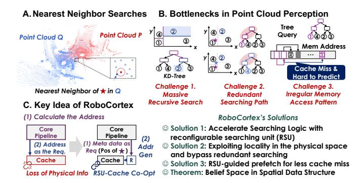

<span id="page-0-0"></span>Fig. 1. An point cloud example of spatial data structure and corresponding motivations of *RoboCortex*.

Spatial data structures organize points hierarchically within nested physical spaces for acceleration. Fig. [1B](#page-0-0) illustrates such spatial indexing with Kd-Tree. The Kd-Tree recursively partitions the search space by alternately establishing splitting boundaries along different dimensions, effectively bisecting the point distribution at each level. This hierarchical organization enables efficient NNS by leveraging the spatial relationship between the point's coordinates and the tree's partitioning thresholds. The resulting theoretical complexity for NNS improves from O(NM) in brute-force search to O(N log M). However, three architectural challenges for efficient spatial data structure searching still persist:

• (i) Massive recursive search: For spatial data structure search (e.g., over a point cloud Q), the NNS must be executed N times, with each search primarily implemented

<sup>∗</sup> represents the corresponding authors: r zhao@tsinghua.edu.cn, xinglongji@mail.tsinghua.edu.cn.

through depth-first search with pruning (Listing 1). Unlike index-oriented trees like B+ trees [48] in database systems, NNS in spatial data structures inherently cannot avoid backtracking (further explained in Fig. 4), leading to existing searching accelerators [22], [43] ineffective.

- (ii) Redundant memory access: The searching initiates at the root node and traverses through the tree until reaching potential leaf nodes. Theoretically adjacent points in point cloud P (★ and ★ in Fig. 1B) have similar search paths, and a large number of points with similar coordination exist. We name this concept as physical locality, which remains underutilized because caches are agnostic to the physical coordinates of the points.
- (iii) Irregular memory access pattern: Due to its irregular memory access patterns and frequent cache flushes during depth-first traversal, spatial data structure exhibits poor spatial and temporal locality. Moreover, search in spatial data structures depends on physical coordinates rather than memory addresses, further complicating hardware prefetching.

Furthermore, most spatial data structure search and traversal are still carried out on CPUs owing to complex control flow (branches and recursion), aside from a few workloads with dedicated hardware such as ray tracing. Fig. 1C illustrates the fundamental reason of inefficient searching of spatial data structures: in current general-purpose processor, address generation and data fetching is decoupled in core pipeline and cache respectively. On the one hand, the core pipeline requires frequent memory access, while on the other hand, the cache cannot provide customized optimization due to lack of program-level physical information. To solve this problem, previous work [21], [22], [41]-[43] has attempted to make cache behavior programmable by implementing reconfigurable units within/near the cache to optimize memory bottlenecks in specific tasks, but none has addressed all three of these challenges for spatial data structure search. Meanwhile, contemporary robotics-oriented processor [3] optimizes NNS with prefetching only, which can only bring limited performance optimization.

To address all these challenges, we present RoboCortex, an architecture for optimizing spatial data structure search through near-cache acceleration (Fig. 1C). In this paper, taking point cloud processing as the throughout case, our approach introduces three key innovations: First, we deploy a Reconfigurable Searching Unit (RSU) adjacent to the cache hierarchy, effectively offloading address generation logic to a programmable dataflow architecture for acceleration. This design simultaneously accelerates address searching operations and enables cache-level physical coordinates awareness. Second, we exploit spatial locality by caching nearest neighbors' physical coordinates and search paths, identifying shared search patterns among nearby points to minimize redundant traversals. Additionally, we introduce the concept of belief space and supporting theorems through geometric analysis, effectively preventing backtracking from undermining locality exploitation. Third, the RSU proactively exposes the next-hop access ranges, enabling efficient irregular prefetching without introducing additional memory overhead. The contributions of *RoboCortex* are listed below:

- (i) We design dedicated programmable primitives and hardware for offloading spatial data structure search (e.g., Kd-Tree, Octo-Tree, R-Tree) in the general-purpose processor, with point cloud as the main application target.
- (ii) We propose and exploit physical locality with the help of RSU to improve memory access performance for spatial data structure search; we analyze this in the point cloud setting and provide a theoretical analysis of physical locality mining, including the side-effect of backtracking.
- (iii) We reveal the significance of the above scheme for prefetching and propose an RSU-guided prefetching algorithm for more efficient memory access.

To our best knowledge, we present the first spatial-data-structure-oriented architecture to exploit physical locality without accuracy loss. Our evaluation focuses on point cloud workloads and demonstrates 2.74-13.07× speedup for autonomous driving oriented workloads and 12.73-77.94× improvement for object reconstruction oriented workload over baselines, establishing an effective balance between flexibility and performance. We further apply the same principles to ray tracing (BVH traversal) on GPU, illustrating the generality of our approach beyond both point clouds and CPUs.

The following article is organized as follows: In section II, we will introduce the background, key challenges and related work. Next, we will outline the three key components of Robo-Cortex in section III, followed by detailed description from section IV to section VI. Finally, we verify the effectiveness of Robo-Cortex with several experiments in section VIII.

#### II. BACKGROUND AND PRIOR WORK

# <span id="page-1-0"></span>A. Spatial Data Structures for Point Cloud

Spatial data structures are a group of data structures to store geometric information [32], serving as the primary representation for point cloud data. Fig. 2 illustrates three representative spatial data structures: Kd-Tree, Octo-Tree, and R-Tree.

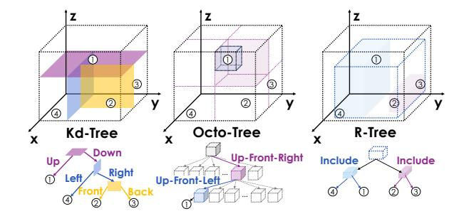

<span id="page-1-1"></span>Fig. 2. Tree-based spatial data structure.

The common feature of the above three data structures is that each non-leaf node represents a physical space, and the space represented by its children must be contained within the parent node's space, leaf nodes correspond to points in the point cloud. The differences between data structures lie in the spatial partitioning method. The Kd-Tree partitions the search space by alternately splitting each non-leaf node along different dimensions with a plane, bisecting the point distribution at each level [6]. For Octo-Tree, each node has 8 child nodes, representing 8 sub-cubes divided by half of the edge lengths of the three dimensions [7]. R-Tree is a bottom-up construction method where each parent node represents the bounding box for all its child nodes [16]. In all, Kd-Tree and Octo-Tree are organized based on top-down split domains, and R-Tree is organized based on bottom-up bounding boxes.

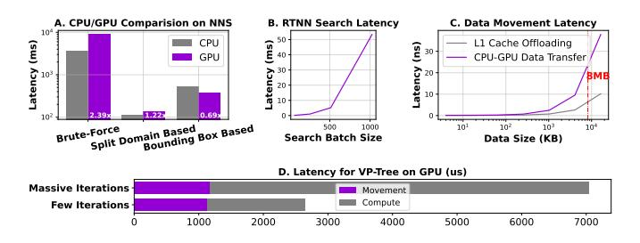

<span id="page-2-2"></span>Fig. 3. Native GPUs offer limited performance improvement for spatial data structures. (A) is evaluated with GPU (NVIDIA RTX 2060) and Intel i7-1165G7. (B) RTNN evaluation for NNS on NVIDIA RTX 3090. (C) is modeled with Gem5 taking NVIDIA Jetson Orin NX as the template. (D) For a VP-Tree based CUDA ICP program, even ignoring tree construction overhead, CPU-GPU data movement accounts for a non-negligible portion of the total latency on different cases.

As discussed in the introduction, the performance bottleneck in point cloud processing stems primarily from NNS operations in spatial data structures, which exhibit a time complexity of  $O(N\log M)$ . Although the search process offers substantial parallelism across N searching points, conventional GPU-based acceleration yields limited benefits on most data structures. As shown in Fig. 3A, our experimental results reveal that GPU offloading achieves limited speedup (less than  $2\times$ ) across various data structures [13], even with performance degradation due to frequent branch divergence. Prior works [14], [15] have demonstrated that the utilization of SM cores is very low due to extensive recursions and branches.

Although a few BVH-based search algorithms can address this issue by resuing Nvidia GPU ray tracing accelerators [49], they suffer from several limitations: first, this method restricts the selection of spatial data structures; second, they are not supported for edge computing devices such as the Jetson series [33]; third, limited scalability. As shown in Fig. 3B: when the search batch increases, latency on batch=1024 is already 405.6 times larger than when batch=64, posing limitations for large-scale spatial data structure search.

This inefficiency arises from the large memory access of the spatial data: a single LiDAR frame typically ranges from 8MB to 16MB or more. Our Gem5-based evaluation (Fig. 3C) shows that transferring data from the CPU to the GPU incurs significantly higher latency compared to processing directly in the L1 cache hierarchy. Fig. 3D further validates this on a

CUDA-based NNS program, CPU-GPU data movement takes 16.24%-42.57% of the overall latency on different cases.

Therefore, in this paper we focus on spatial data structure acceleration on CPUs to address the prevalence of such workloads. We argue that near-cache acceleration, as proposed in prior work [3], [22], [30], is a more efficient approach for spatial data structure acceleration optimizing. We also devote a dedicated discussion to BVH-tree acceleration on GPUs to demonstrate the generality of our approach.

#### B. Inevitable Backtracking in Spatial Data Structure


<span id="page-2-1"></span>Fig. 4. Example for the necessity of backtracking when searching.

We use an example to demonstrate the distinct challenges of spatial data structure from other 1D index data structures like B+ trees [23] and skip list [38]. In one word, Containment ≠ proximity, backtracking is unavoidable

Listing 1 takes Kd-Tree as an example to illustrate the searching of spatial data structure to find the nearest neighbors of Pos. The overall structure of the program is a depthfirst search (DFS) with pruning (Parts 1&3), which is the common structure of spatial data structure for NNS. The key distinction among spatial data structures lies in their child node selection strategies (Part 2). For Kd-Tree, searching is based on the positional relationship between the position of Pos in a particular dimension (Pos[Node.Axis]) and the splitting threshold (Node. Thresh). If it is less than the threshold, go to the left child nodes. However, DFS with backtracking cannot find the optimal results in the spatial data structure. Fig. 4 gives a counterexample. Although the coordinates of the \*\pi\$ on the x-axis are smaller than the threshold (Node.Thresh), searching then goes to ∘ according to Listing 1. But ★'s nearest neighbour point is o instead of o. Therefore, a heuristic discriminant function NeedExpand needs to be designed to decide whether to perform pruning or not and backtracking is needed in spatial data structure. In Kd-Tree, it ensures that the distance from the search point to the split surface is less than the maximum value of the found points, indicating the current branch is more likely to find closer points.

```
def KdTreeNNS(Pos, Node, ResList):
    # Part 1. Leaf Node Processing (Common)
    if Node.IsLeaf():
        ComputeDisForLeaf(Pos, Node)

# Part 2. Extension Rule (Kd-Tree Specific)
    if Pos[Node.Axis] < Node.Thresh:
        sup_child = Node.Left
        inf_child = Node.Right
    else:
        sup_child = Node.Right
    inf_child = Node.Left
# Part 3. Recursion (Common)
KdTreeNNS(Pos, sup_child, ResList)\nif NeedExpand(Pos, Node, ResList):</pre>
```

```
KdTreeNNS(Pos, inf_child, ResList)

def NeedExpand(Pos, Node, ResList):
\nif ResList.size() < k_: return true

d = Pos[Node.Axis] - Node.Thresh
\nif d * d < ResList.MaxDis() * Alpha:

return true
\nelse:

return false
```

Listing 1. Nearest neighbor search (NNS) algorithm based on Kd-Tree.

There are two key challenges that make existing dataflow-based data structure accelerators (like Terminus [22] or METAL [21]) not work:

- (i) Recursion support: Current accelerators only supports hash-based searching for tree-based data structure and does not support explicit recursion and backtracing. NNS is neither a non-backtracking search similar to B+ trees nor a breadth-first search, but rather requires DFS to ensure the search priority of different branches.
- (ii) Non-pure function: The search function of spatial data structure with shared ResList is not a pure function, stateless dataflow may not meet the requirements.

Therefore, additional dedicated hardware components need to be introduced for spatial data structure to implement the searching functions.

In summary, spatial data structures cannot simply traverse a single search path from the root to the target leaf node, unlike traditional index structures (e.g., B+ trees). Instead, they must support recursion and backtracking to handle complex spatial searches. Such inherent computational overhead poses a fundamental limitation for modern data structure searching accelerators, which are often optimized for backtracking-free access patterns. Section II-C will introduce them in details.

#### <span id="page-3-1"></span>C. Related Works

Here, we present the closest prior work to RoboCortex, which includes two categories: accelerators for certain spatial data structure and accelerators for irregular data structures.

Ray-Tracing-based Tree Traversal Accelerators. There are some tree search accelerators implemented using GPU-based ray tracing units. RTNN [49] performs neighbor search with ray tracing unit on GPUs. [8], [9] further optimize this with software-hardware co-design. However, due to the limitation of ray tracing unit, these methods can only perform bounding volume hierarchy(BVH) tree. TTA/TTA+ [1] achieved the generalization of tree search by adding operation units and computing modules in the GPU. However, the physical locality, i.e. the redundancy among searches for large-scale point cloud registration concerned by this paper, has not been fully exploited.

Irregular data structure acceleration. There have been some studies on data structures operating acceleration. täkō [42] avoids redundant computation by offloading the computational logic to cache and changing the programming interface to load results instead of intermediate data. Similarly encapsulating the data structure searching into semantic instruction are Xcache [43] and METAL [21], but they are

TABLE I COMPARISON WITH SOTA DESIGN

<span id="page-3-2"></span>

| Name             | Data<br>Structure<br>Acceleration | Recursive<br>Searching<br>Support | Avoid<br>Redundant<br>Search | Irregular<br>Pattern<br>Prefetch |
|------------------|-----------------------------------|-----------------------------------|------------------------------|----------------------------------|
| METAL [21]       | ✓                                 | Some                              |                              |                                  |
| täkō [42]        | $\checkmark$                      |                                   | ✓                            |                                  |
| Pipette [30]     | $\checkmark$                      | Some                              |                              | $\checkmark$                     |
| Terminus [22]    | $\checkmark$                      | Some                              |                              |                                  |
| Tartan [3]       | $\checkmark$                      |                                   |                              | $\checkmark$                     |
| TTA [49]         | $\checkmark$                      | $\checkmark$                      |                              | $\checkmark$                     |
| VoxelCache [11]  | $\checkmark$                      | Some                              |                              |                                  |
| RTNN [49]        | $\checkmark$                      | BVH-Only                          |                              |                                  |
| Treelet [8], [9] | $\checkmark$                      | BVH-Only                          |                              | $\checkmark$                     |
| Ours             | $\checkmark$                      | ✓                                 | ✓                            | $\checkmark$                     |

designed for domain-specific architectures. Pipette [30], Fifer [31], and Terminus [22] achieve speedups for irregular data structures along similar path, but they do not support explicit recursion and take redundant computation avoidance into consideration. As a robotics-specific CPU, Tartan [3] also optimizes point cloud tasks, but mainly focuses on prefetching, whose improvement is relatively limited compared to the above schemes. PointISA [18] accelerates massive distance calculations and sorting via ISA extensions, but its lazy NNS method heavily relies on sampling and redundancy searching can not be avoided. VoxelCache [11] has designed a near cache accelerator specifically for Voxel-based tree traversal, and has also carried out targeted cache replacement optimization. QuickNN [36] and BitNN [17] are NNS-oriented accelerators, but focusing on split domain based data structure only. Table I summarizes the differences between RoboCortex and prior systems, which lack one or several of the three features for spatial data structure.

#### III. SYSTEM OVERVIEW

<span id="page-3-0"></span>In this section, we introduce the general architecture of RoboCortex. Fig. 5 illustrates the framework. RoboCortex is a core-private acceleration framework. The CPU uses specific instructions to offload the spatial data structure searching logic and blocks the instructions. Once RoboCortex has completed execution, it returns the corresponding results and commit the instruction in the core pipeline. From a software perspective, RoboCortex is a memory unit that uses NNS coordinates as the key to retrieve the nearest neighbors.

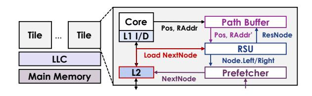

<span id="page-3-3"></span>Fig. 5. Architecture overview of RoboCortex.

The instruction is designed as a very long instruction word: NNS Pos, RootAddr, Num, OAddr.

- Pos represents the point in the source point cloud for searching.
- RootAddr represents the root node address of the data structure being searched (destination point cloud).
- Num denotes the number of near neighbors in destination point cloud to be searched.
- OAddr indicates the start address of the searching result (output address).

Our design goal is to make the searching process of the spatial data structure directly completed by the memory system. To achieve this goal, three main components contribute to RoboCortex as shown in Fig. 5:

- RSU is the core hardware module that offloads search functions from software to a programmable dataflow array. RSU takes Pos and RootAddr as inputs and implements a sequential write of the searched results to OAddr near the L1 data cache.
- Path Buffer is a memory unit that pre-searches RootAddr for avoiding redundant search before RSU.
   If a node is found that Pos will pass through, replace RootAddr with its address.
- **Prefetcher** is allowed to obtain potential target addresses earlier, taking intermediate result of the RSU as the input.

In the following parts, section IV focuses on the primitives and micro-architectural design of RSU, section V will show how to avoid redundant searching based on the RSU, and finally section VI will present RSU-based prefetching.

# <span id="page-4-0"></span>IV. RECURSIVE DATAFLOW FOR SEARCHING ACCELERATION

#### A. Primitive Design

RoboCortex interprets the searching logic in dataflow expression to fully exploit the program parallelism. Fig. 6 illustrates the basic primitives for program representation. Each primitive runs on one processing element (PE) in a data-driven coarse-grained reconfigurable array (CGRA): each primitive fires upon receiving inputs, performs its operation, and delivers results to the output for subsequent primitives. We will briefly introduce them:

- **Read/Write**: **Read** fetches values from L1 cache with an address (Addr) with Size (Size), while **Write** stores data to certain address with fixed length (cache line size).
- Cont: represents continuing for recursively function call, which pushes the arguments to dedicated data structure (stack or priority queue). For the spatial data structure, the two parameters are the address of current node (Addr) and the coordinates for searching (Pos) respectively. The execution is gated by a binary Enable signal.
- ALU: carries out two-input, one-output arithmetic logic, including addition, subtraction, multiplication, division and bitwise operations (and, or, nand, xor).
- **Swap**: is a two-input, two-output primitive with an Enable that decides whether to swap two flows.
- Cmp: represents comparison and Op encodes "greater than", "less than", or "equal to". Unlike the ALU, the

- output of the **Cmp** is a binary, dedicated to the Enable signals of other units.
- Iter: represents iteration, iteratively generating i: for (i=Bqn; i<End; i+=Delta).</li>
- Fork/Join: Fork and Join are responsible for broadcasting an input to multiple flows and transforming multiple inputs into serial tokens in order of port ids, respectively.
- MUX: is a multiplexer with selection Sel.
- Reg: is a unit distinguished from stateless dataflow for storing state data. If Enable is true, updating new data. Otherwise it continuously takes existing data as the output. To keep dataflow execution correct, Reg's output will always flush downstream input queue.

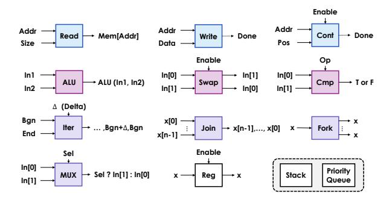

<span id="page-4-1"></span>Fig. 6. Primitives of RoboCortex.

In addition to the above primitives, we explicitly define two components, **Stack** and **Priority Queue**, to implement recursive function calls. The above primitives can be combined in a computational graph to form the search logic for most spatial data structures.

Fig. 7 shows how to use the above primitives to compose a nearest-neighbor searching logic with stack for NNS in Kd-Tree (Listing 1). For distance calculation and position selection which can be done by a combination of **ALU** and **MUX**, we abbreviate the representation for simplification in Fig. 7. For the two challenges mentioned at the beginning of this section, the above primitive's solution are:

(i) Recursion Support: We use the property that Join primitives are output in the order of different ports to represent the search priority of different branches. With the 'Last-In-First-Out' feature of stack, DFS with priority can be implemented.

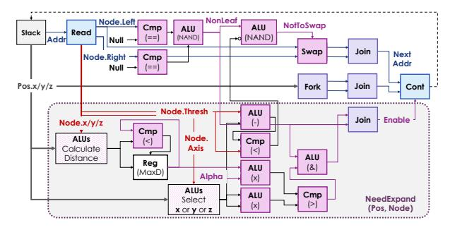

<span id="page-4-2"></span>Fig. 7. Kd-Tree KNN searching based on the defined primitives.

(ii) Non-Pure Function: In NeedExpand, we need to calculate the maximum value of the distance to the found point (MaxD), avoiding to manually access the output queue, we use primitive Reg to manage this maximum value of the distance.

For execution, Read primitive guarantees serial node loading and other primitives allow pipelining of multiple tokens. In particular, for Octo-Trees, the distance calculation of the eight branches is implemented using the Iter primitive to reuse hardware computing units to achieve pipelining calculations. Then, we will show how the above primitive is implemented in hardware.


<span id="page-5-1"></span>Fig. 8. RSU design in *RoboCortex*.

# *B. RSU Design*

The architecture of RSU is shown in Fig. [8.](#page-5-1) We map and execute the computational graph on a CGRA, where each primitive corresponds to a PE, except for Read and Write. Read and Write are wired into the L1 cache through the load-store uint (LSU), like normal access requests from core pipeline. Until the data is returned from L1 cache, the CGRA's computation for the current argumentation will be blocked.

Each PE includes a router, an ALU, and a controller for primitive configuration. The inputs of ALU are kept by three queues, two for storing operands, and one for enable signals. Like classic dataflow designs [\[1\]](#page-12-6), [\[26\]](#page-13-21), [\[37\]](#page-13-22), the CGRA are pre-configured with the computational graph like Fig. [7.](#page-4-2)

RSU contains two different data structures for input: stack and priority queue. The stack is used for Kd-Tree or Octo-Tree, and priority queue is used for R-Tree searching. The output is also based on a priority queue with fixed length.

RSU distinguishes itself from previous work by completing all the steps of searching within a single hardware unit in a single core, rather than having a single search completed cooperatively by different cores [\[22\]](#page-13-2). A question worth considering is whether the stack depth will lead to unaffordable hardware overheads. To address this issue, we do not save all previous arguments for a DFS, but instead record a footprint in the context and pop the top node upon computing intermediately. The corresponding design will be described in Section [V](#page-5-0) Fig. [11,](#page-7-1) which ultimately ensures that the depth of the stack is acceptable as further evaluated in Fig. [27.](#page-11-0)

```
1 def ConcurrentNNS(SrcPtCloud, k):
2 # Result List
3 SrcSize = SrcPtCloud.size()
4 ResLists = [None] * (SrcSize * k)
5 # Parallel Compute All Source Points
6 parallel_for idx in range(SrcSize):
7 KdTreeNNS(SrcPtCloud[idx], DstPtCloud.Root,
8 ResLists[idx*k:(idx+1)*k])
```

Listing 2. Concurrent NNS in point cloud processing.

# *C. RSU Programming*

The programming of RSU involves two levels: (i) runtime interaction between RSU and CPU, and (ii) compile-time mapping of RSU itself.

For (i) as noted earlier, on the CPU side, the dedicated instruction NNS blocks the pipeline and initiates RSU computation. [\[41\]](#page-13-5) and [\[42\]](#page-13-15) have provided detailed technical solutions and taxonomies to offload specific computing tasks to nearcache accelerators. This article does not emphasize this as a contribution, but clarifies that it corresponds to the long-lived tasks described in [\[41\]](#page-13-5). Furthermore, the configuration of the RSU is carried out through the conf ig function before the threads start running. The design consideration lies in that the point cloud processing for autonomous driving and robotics have the characteristic of long-term cyclic operation. For the same data structure, even if updating of the tree exists during runtime, since we just configured the program logic for a single search, the corresponding programs are still applicable and reconfiguration is not necessary.

For (ii), We referred to an open-source CGRA software stack [\[10\]](#page-12-7) as the basis for conducting static mapping optimization based on simulated annealing. In Listing [1,](#page-2-0) we divide one search step into three parts, which is common for most spatial data structures. For leaf nodes (part 1), the distance computing is a pure distance function, which can be easily constructed by ALUs. Then, the extention (part 2) requires Swap and Cmp to select the following node. Part 3 consists of two components: the NeedExpand as the pure dataflow function and leaveraging Cont for recursion. Such structure is applicable to most spatial data structures such as Kd-Tree, R-Tree, and BVH tree. In current software stack, we enable analysis of the dataflow graphs for these three components by inserting specific pragma to indicate partitioning.

On the hardware side, considering the flexibility of mapping and software-hardware co-design, the RSU has two key designs:

- Flexible NoC: We design a flexible 2D mesh NoC instead of a fixed data flow direction for each PE to enhance the flexibility of the mapping. In this case, the mapping from the computational graph to the physical PE only affects performance and does not impact functionality.
- Function Call Limitation: We add compilation comments to specific function for offloading. The function can only call itself and ensures that all other parts are pure functions except for the recursive part.

# <span id="page-5-0"></span>V. LOCALITY EXPLORATION IN THE PHYSICAL SPACE

# *A. Design Motivation*

Section [IV](#page-4-0) illustrates the acceleration with dataflow for NNS in spatial data structure for one point. In this section, we will exploit the performance optimization potential between searches. Listing [2](#page-5-2) shows how NNS is performed in point cloud processing. PointCloudNNS shows the point-cloudwise NNS, which needs to iterate all points in the source point cloud (SrcPtCloud), to find the k nearest neighbors in the destination point cloud (DstPtCloud) for each. The scale of SrcPtCloud is greater than  $10^3$  points, so the most common parallel strategy is to bind different SrcPtCloud points to different threads for parallelization.

In point cloud data, the spatial proximity of points inherently reflects the locality of distinct objects, suggesting significant shared search paths in NNS due to geometric coherence among neighboring points. For traditional caches, the address is the only information used to exploit the locality. RSU enables the cache to obtain physical coordinate of each search which makes it possible to explore physical locality. Fig. 9 illustrates the idea: The searched nearest neighboring points (point 1,2,3,4 in Fig. 9) from a given point (Pos) most likely have a common non-root parent node ( $\square$  in Fig. 9).  $\square$ and all its parent nodes represent a three-dimensional space that encompasses all the searched, dubbed as shared space in Fig. 9. If the next search point is spatial proximity of the current one, the search process can likely initiate directly from the intermediate node instead of the root node. Therefore, this inspires us to design a dedicated hardware to buffer the shared space representation and memory address of \( \Boxed{\pi} \) for physical locality exploitation. We call it Path Buffer.

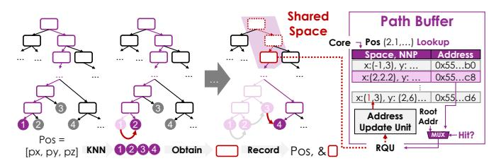

<span id="page-6-0"></span>Fig. 9. Physical locality illustration and hardware logic design.

However, challenges exist in physical locality exploration:

- (i) Shared Space Reusing: As illustrated earlier in Fig. 4, if a new searching point is within the shared space represented by □, it does not guarantee that its nearest neighboring points is also in the space in Fig. 9.
- (ii) Search Paths Obtaining: Naive backtracking to find the shared parent need to save all the parents of all the searched node in stack, easily leading to stack overflow. Obtaining the search path to the target point with low computation and memory complexity is also a challenge.

Section V-B and V-C solve these two issues respectively.

### <span id="page-6-1"></span>B. Shared Space Finding and Reusing

Based on the preceding analysis, we conclude that a critical challenge in spatial data structure searches lies in the gap between NNS and parent-child node relationships.

To address this issue, our key insight is that for any shared space S represented by an intermediate node, there exists a subspace-which we term the belief space (B)-such that if a searching point lies within B, its nearest neighbor is guaranteed to reside within S. Then we will focus on how to obtain valid B. Starting with the simplest case in 1D

space to figure out the key idea, we then present analysis and conclusions in a multidimensional space.

**Lemma 1** (1D Belief Space). For a one-dimensional region  $S = [x_{inf}, x_{sup}]$ , if there exists a point  $x \in S$ , then there exists a subregion  $B \subset S$ , such that  $\forall p \in B$  p's nearest point  $p_N \in S$ .

*Proof.* Fig. 10A directly shows the constructed results of  $B = [\frac{x_{inf} + x}{2}, \frac{x_{sup} + x}{2}]$ . For any  $p \in B$  and  $p_{out} \in (-\infty, x_{inf}) \cup (x_{sup}, \infty)$ ,  $|p - x| < |p_{out} - p|$ . Since there is at least one point x that is closer than any point outside S, the nearest neighbor of  $p \in B$  must be within S.

The proposed approach provides a constructive method: given any space S and a point  $x \in S$ , we can always construct the corresponding subregion B. The basic idea is to construct a range "where at least one neighboring point can be found" based on the relative relationships between boundaries and known points.


<span id="page-6-2"></span>Fig. 10. The examples to illustrate the concept of brief space.

Fig. 10B and 10C further analyze this problem in two-dimensional space to intuitively demonstrate the construction method of B.

Fig. 10B first analyzes the case where S is bounded by two lines in only one dimension within a two-dimensional space. For any point in S, the distance from any  $p_{out}$  out of S to any p within S must be larger than the distance from line  $x_{inf}$  or  $x_{sup}$  to p. Therefore, we only need to consider the extreme case, i.e. the trajectories that are equidistant from the boundary line and x ( $\bigstar$  in Fig. 10B).

For  $x=x_{inf}$ , the boundary curve of B is the trajectory that is equidistant from point x and line  $x=x_{inf}$ . Naturally, this is a parabolic curve. By considering both boundaries simultaneously, we can derive the B of S in Fig. 10B: a conelike space constrained by two parabolas.

Furthermore, if both dimensions have the boundaries as shown in Fig. 10C, it is equivalent to the space enclosed by four parabolas. Correspondingly, we can extend this rule to 3D space and obtain a B verification rule suitable for program execution as introduced in Theorem 1.

**Theorem 1.** For a given point x within a space S, if the distance from the searching point to x is smaller than the distances from p to all S boundaries, p must be within B and can find its nearest neighbor within S.

Therefore, in the path buffer, we find the deepest shared parent node of the k nearest points ( $\square$  in Fig. 9) after each NNS and save the maximum and minimum values of different

dimensions of space S represented by the parent node. We also record the coordinates of founded nearest neighbor points x. For a new searching point p within S, if the distance between p and x is less than distances between p and any boundary of S, it represents that p is within the B and can definitely find its nearest neighbor in S. So we can directly perform its NNS from this point instead of the root node.

# <span id="page-7-2"></span>*C. Footprint Record-and-Replay*

We have analyzed how to optimize the NNS based on the searching history with physical locality. However, the acquisition of this intermediate node in hardware and the corresponding shared space still requires dedicated hardware.


<span id="page-7-1"></span>Fig. 11. Footprint tracing when searching.

For the binary tree in Fig. [11](#page-7-1) as an example, when we search from the root to the node 1R2L3L, we pop its all parent nodes to avoid stack overflow in RSU. Although this does not affect the spatial data structure search, it leads to difficulty in finding the shared parent node of searched points. To solve this problem, we use a binary footprint to record the entire search process, with 1 representing going to the left node and 0 representing going to the right node. The footprint corresponding to 1R2L3L is 1011, and its parent node 1R2L corresponds to 101 during the search.

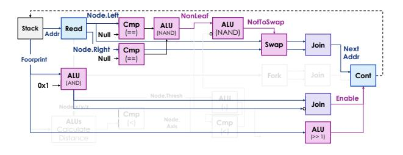

<span id="page-7-3"></span>Fig. 12. Tracing dataflow by extending the search dataflow in Fig. [7](#page-4-2) with minor modification.

The significance of this footprint lies in quickly finding the shared parent of the found leaf nodes by calculating the shared footprint prefix. After that, we can quickly find the address of the shared node from the root by reusing the search dataflow RSU with the footprint prefix, and obtain the space information represented by this intermediate node during the search process. Fig. [12](#page-7-3) illustrates the logic. After reversing the footprint prefix, we right-shift the footprint in 1-bit each time and the lowest digit figure out the path from the root node to the target intermediate node (□) until footprint is empty.

Taking all these together, we explain how path buffer and RSU cooperate. We divide the NNS into four stages:

(i) Path Buffer Lookup: For an NNS, we first searching the path buffer based on the coordinates Pos of the searching point p to see if it is within a previously saved search result B. If it hits, we perform the search directly from the intermediate node; otherwise, still search from the root. (Shown in Fig. [9\)](#page-6-0)

- (ii) RSU Recursive Searching: Next, we use RSU to perform a recursive search until finding the nearest neighbor point. In fact, on our hardware, the output priority queue stores the k nearest-neighbor points with their footprint.
- (iii) Footprint Tracing: If we start searching from the root node, we reuse RSU to find the shared prefix from footprints and find the corresponding intermediate node from the root.
- (iv) Path Buffer Updating: Update the path buffer according to the searched points from the last step. The path buffer uses an LRU replacement, directly inserting a new triplet consisting of the space S, the nearest neighbor point x for p, and the address Addr of the leaf node.

Essentially, the above design sacrifices computation for memory design, using node re-search to avoid stack overflow. Our experimental results confirm that the computational cost of re-search is less than 1% of the total search time.

# VI. PREFETCHER DESIGN

<span id="page-7-0"></span>RoboCortex accelerates spatial data structure search with dataflow on the one hand; on the other hand, softwarehardware interfaces redesign brings cache more opportunities for locality mining in semantic level. However, our evaluation finds that although physical locality mining improved NNS performance, the cache miss ratio increases (Fig. [13\)](#page-7-4).


<span id="page-7-4"></span>Fig. 13. Cache miss rate gets higher with physical locality improvement due to the increasing of memory access irregularity. PhyHit/PhyMiss represents finding intermediate node in path buffer or not.

For irregular data structures, especially tree and graph, prefetching is inherently a difficult problem. Neither spatial prefetchers, which predict stride steps [\[5\]](#page-12-8), [\[27\]](#page-13-23), [\[45\]](#page-14-4), nor temporal prefetchers [\[4\]](#page-12-9), which mine repeated access sequences, provide effective memory access optimizations for this type of data structure. The reason lies in the fact that tree nodes linked by pointers do not have spatial continuity, and the searching process and control flow are closely related to data semantics. To solve this problem, runahead execution obtains the memory access sequence by running part of the program in advance [\[28\]](#page-13-24), [\[29\]](#page-13-25) but probably leading to manifest overhead.

Fortunately, in RoboCortex, the range of the next address to load can be obtained from RSU, so we can directly pass the child node address obtained by RSU to the prefetcher. Fig. [14](#page-8-0) shows the interaction from core pipeline to the prefetcher. In RSU's computing, the node is first loaded and its child nodes are all obtained. The next load raised by RSU will definitely appear in these child nodes. Therefore, a straightforward approach is to immediately pass the addresses of the child

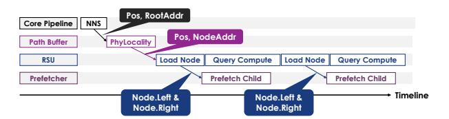

<span id="page-8-0"></span>Fig. 14. Prefetcher-RSU interaction in RoboCortex.

nodes to the prefetcher after loading, and let the prefetcher determine whether to prefetch the child nodes.

# Algorithm 1 Prefetching Strategy in RoboCortex

Input: MemReq, LeftAddr, RightAddr

- 1: LOffset = abs(MemReq.Addr LeftAddr) \* Alpha
- 2: ROffset = abs(MemReq.Addr RightAddr) \* Alpha
- 3: if LeftAddr != null & LOffset ≥ PageSize then
- 4: MemReq.Addr = LeftAddr
- 5: this.Access(MemReq.Addr)
- 6: else if RightAddr != null & ROffset ≥ PageSize then
- 7: MemReq.Addr = RightAddr
- 8: this.Access(MemReq.Addr)
- 9: else
- 10: StridePrefetcher.Access(MemReq);
- 11: end if

Algorithm 1 introduces the prefetcher algorithm used in RoboCortex. The RSU executes a look-ahead strategy by inspecting the child node pointers of the current visited node. Before the control flow decision is finalized, the RSU pushes the addresses of potential next-hop children (based on coordinate comparison) to a prefetch queue. The core idea is that if the address of a leaf node differs from the current node's address by more than several page table sizes (PageSize / Alpha), it tends to prefetch the leaf node. However, if there is no significant difference in page table addresses for both child nodes, it directly uses the stride-based prefetcher. It should be noted that for data structures having multiple child nodes (such as Octo-Tree), we select two represented children, the up-left-front node address and the down-right-back node address as the LeftAddr and RightAdde in the Algorithm 1, respectively. The goal is to make Octo-Tree compatible with the current prefetcher design.

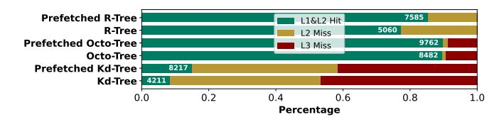

<span id="page-8-1"></span>Fig. 15. Cache miss with prefetcher. The designed prefetcher increases the L1 and L2 hit rate. L1&L2 hit absolute number is also marked within the bar.

The analysis in Fig. [15](#page-8-1) shows that after adding prefetching, the proportion of L3 cache on different data structures has decreased significantly. Meanwhile, the proportion of L1/L2 hits has increased, especially for Kd-Tree. The limitation of this strategy lies in its limited effectiveness for Octo-Tree. The reasons lies in that Octo-Tree has many subnodes, and the tree-building method ensures better address continuity than Kd-Tree and R-Tree. Therefore, even without prefetching, its L1/L2 hit ratio is the highest among the evaluated.

# VII. METHODOLOGY

Simulation System: We perform execution-driven simulation using zsim [\[40\]](#page-13-26) for evalution. We simulate an multicore system representative of mobile CPUs, with parameters shown in Table [II](#page-8-2) according to Nvidia Jetson AGX Orin [\[34\]](#page-13-27) for robotics and autonomous driving. The system uses outof-order cores, a three-level cache hierarchy with core-private L2 cache and a shared LLC, per-core prefetchers, and multichannel main memory as the default configuration.

Data Structures: We evaluate several representative spatial data structures for point cloud representation, including: Kd-Tree, Octo-Tree, and R-Tree with the PCL library.

TABLE II CONFIGURATION OF THE SIMULATED SYSTEM

<span id="page-8-2"></span>

| Module    | Configuration                                                                                                                                                                                             |
|-----------|-----------------------------------------------------------------------------------------------------------------------------------------------------------------------------------------------------------|
| Processor | 8 cores, x86-64 ISA, 3.5 GHz, OOO core: 2-level bpred<br>with 4096×19-bit BHSRs + 32768×2-bit PHT, 4-wide is<br>sue, 224-entry ROB, 97-entry issue window, 72-entry load<br>buffer, 56-entry store buffer |
| L1 caches | 32 KB/core, 2-way set-associative, 4-cycle latency                                                                                                                                                        |
| L2 cache  | 256 KB/core, core-private, 8-way set-associative, 14-cycle<br>latency, 16-entry stream/semantic prefetchers modeled                                                                                       |
| L3 cache  | shared 8 MB, 16-way set-associative, 45-cycle latency                                                                                                                                                     |
| Memory    | 2 controllers , DDR3-1600 (6400 MB/s per controller)                                                                                                                                                      |
| RSU       | 8×8 spatial fabric, 16-entry path buffers with LRU replace<br>ment algorithm                                                                                                                              |

Baselines: We select different baselines for evaluation. To validate the overall workload performance, we select two baselines: base CPU [\[34\]](#page-13-27) in Table [II](#page-8-2) and robotics-oriented CPU Tartan [\[3\]](#page-12-1) with custom optimization for NNS. For certain design, we compare RSU with Terminus-like accelerator [\[22\]](#page-13-2) and compare our prefetcher with stream prefetcher [\[20\]](#page-13-28).

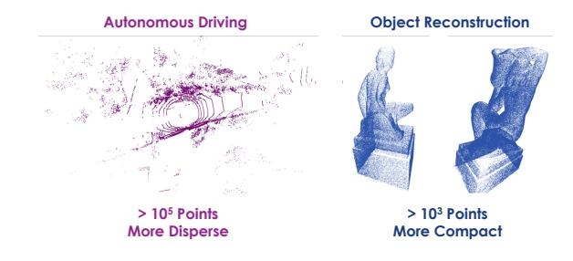

<span id="page-8-3"></span>Fig. 16. Point cloud dataset for evaluation.

Dataset: As shown in Fig. [16,](#page-8-3) we select two types of point clouds for performance evaluation: point cloud in autonomous driving [\[24\]](#page-13-29) and object reconstruction [\[12\]](#page-13-30). Compared with the autonomous driving, the point cloud in the object reconstruction is more compact and theoretically has stronger physical locality. Our experiments will also verify this point.

#### VIII. EVALUATION

<span id="page-9-0"></span>In this section, we first analyze the end-to-end performance improvement of a systematic workload after optimizing the nearest neighbor search (Section VIII-A). Then, we analyze the contributions of the three key components under different settings in NNS and provide recommendations for scheme selection in different scenarios (Section VIII-B). Finally, we conduct cost analysis of RoboCortex (Section VIII-C).

#### <span id="page-9-1"></span>A. Systematic Evaluation

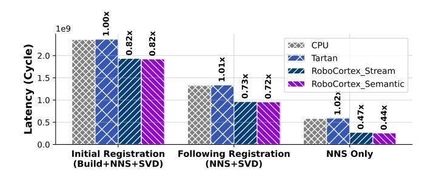

<span id="page-9-2"></span>Fig. 17. End-to-end ICP(point-to-plane) performance comparison with CPU, Tartan [3], stream-prefetcher-based RoboCortex and RoboCortex. The labeled data represents the ratio of its latency to the basic CPU.

We first analyze the end-to-end performance of different hardware architectures using iterative closest point (ICP) as the workload. In this task, the critical performance bottleneck remains NNS, where NNS can occupy about 53.25% (ICP line) to 71.66% (ICP point) of the overall latency for one registration. We use basic CPU and Tartan as baselines, and compare the performance of stream prefetcher and the prefetcher proposed in this paper on RoboCortex. We use the suffixes "Stream" and "Semantic" to mark these two prefetchers respectively. To illustrate the source of the performance improvement, we separate the data into three groups:

- Initial Registration consists of three parts: initial spatial data structure building (Build), NNS, and Jacobi SVD factorization (SVD).
- Following Registration includes NNS and SVD, representing the following registrations.
- NNS Only compares pure NNS latency.

In the case of real-world registrations, the overall performance optimization ratio will gradually shift from the initial registration to the following registrations.

Fig. 17 shows that, for parallelizable parts, RoboCortex's optimizations for NNS can deliver a 2.27× end-to-end performance improvement and an 18%-28% optimization in end-to-end performance on the autonomous driving dataset. Tartan offers limited performance improvements for ICP, because Tartan's optimization for NNS comes from adaptive next-line prefetching. Such solution offers limited benefits for tasks with highly irregular addresses, such as spatial data structures.

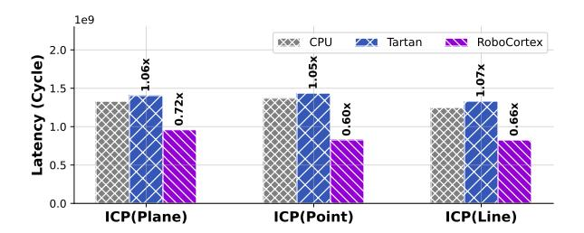

<span id="page-9-3"></span>Fig. 18. End-to-End task performance (NNS+SVD) evaluation for different registration types.

Next, we test the three possible modes of ICP (NNS+SVD) in Fig. 18. The difference lies in the required number of neighbor points and matrix iterative algorithms in the nearest neighbor search. For simplicity, we directly compare the results after removing data loading time. The results show that NNS with smaller k values yield more significant performance improvements (point-to-plane k=10, point-to-line k=5, point-to-point k=1).


<span id="page-9-4"></span>Fig. 19. Accuracy vs. performance in previous works [3]. We set a 1.0 length cubic space and set the allowable error d to range from 0.0001 to 0.1 with 300 sampling points.

It should be noted that the experiments described above are based on results obtained from precise NNS. Tartan proposed an approximation algorithm [3] to trade accuracy for performance. To address this issue, we conducted supplementary experiments in Fig. 19, the results show that when the required search precision is sufficiently high, Tartan's performance converges with that of the baseline. Compared to Tartan, search optimization in RoboCortex does not come at the cost of accuracy.

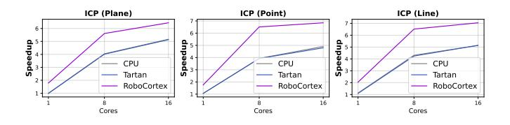

<span id="page-9-5"></span>Fig. 20. Speedup of RoboCortex over the multicore baseline when scaling 1-16 cores. Speedups are relative to the single-threaded CPU implementation.

Finally, we analyze the scalability of RoboCortex on end-to-end ICP workload. Fig. 20 shows the performance results for 1/8/16 cores. RoboCortex achieves significant performance improvements over both the baseline and Tartan. In summary, systematic experiments can yield the following takeaway message: *RoboCortex's NNS optimization directly reduces ICP* 

end-to-end latency by 18%-28%, indicating the CPU-side's great potential for point cloud processing.

#### <span id="page-10-0"></span>B. Analytical Evaluation

Next, we will focus on analyzing the impact of different key factors on RoboCortex, as well as the different effects of RSU, physical locality exploration, and prefetching on performance.


<span id="page-10-1"></span>Fig. 21. RoboCortex performance profits on different spatial data structures without data loading (scaled in log).

We start from analyzing RoboCortex's sensitivity to different data structures. In Fig. 21, we evaluated the performance of NNS on different spatial data structures compared to CPU with stride prefetcher. The results show that RoboCortex can deliver a performance improvement of 3.3-8.3× on different spatial data structures. It should be noted that different results also reflect differences in latency patterns between different data structures, which reflect differences in optimization reasons. For example, for Octo-Tree, the optimized performance is much lower than the baseline overall, while Kd-Tree does not show a significant reduction in minimum latency, but significantly reduces peak latency.

Fig. 22 and 23 analyze NNS performance of RoboCortex for three different types of spatial data structures on two datasets, autonomous driving and object reconstruction respectively. We compared four sets of experimental configurations: 'base' refers to the configuration without prefetchers, which is the same as the CPU configuration in Table II. In other three groups, we successively added RSU dataflow acceleration (RSU), physical locality mining based on Path Buffer (PB), and RSU-based prefetching (Prefetch) to the base CPU.

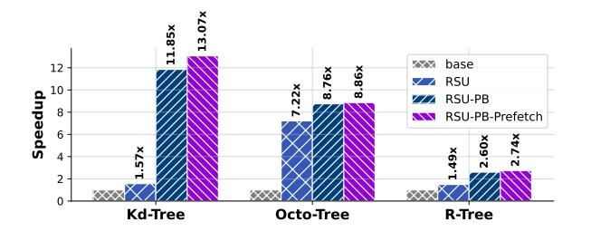

<span id="page-10-2"></span>Fig. 22. Speedup of RoboCortex for autonomous driving

For the autonomous driving point clouds in Fig. 22, the results show a  $2.74-13.07 \times$  improvement in computing per-

formance across three different data structures. However, the benefits of RoboCortex's three optimization designs are not consistent across different data structures. For Kd-Tree, physical locality is the most important optimization strategy, while for Octo-Tree, the hardware acceleration effect of RSU itself is more important. Furthermore, the performance improvement that can be further provided by prefetching is also more significant for Kd-Tree and R-Tree, which can be verified by the results in Fig. 15 where the reduction of L3 cache miss and L2 cache miss of the two is more significant.


<span id="page-10-3"></span>Fig. 23. Speedup of RoboCortex for object reconstruction.

Fig. 23 replaces the point cloud dataset with object reconstruction, we find that RoboCortex's computational performance improves significantly across all three data structures. The improvement is particularly significant for R-Trees. More compact point clouds not only provide richer physical locality, but also enable faster location of leaf nodes closer to the neighboring points, thereby avoiding the loading of excessive non-leaf nodes. Another reason lie in that bounding box-based data structure requires child node's location for decision-making. To avoid repeated loading, speculative approach is preferred: defaulting both child nodes to continue, let child node to decide whether it should have been pruned or not. Dispersed point clouds may increase invalid searches, reducing pruning efficiency and increasing searching latency.

The above results allow us to summarize the preferences between different data and data structures firstly: Compact/Disperse point clouds show preference for data structures based on bounding box/splitting domain. Besides that, we observe that in more disperse point cloud scenarios, prefetching yields even more pronounced performance improvements.


<span id="page-10-4"></span>Fig. 24. Leaf size over latency (Grey: CPU, Purple: RoboCortex).

When we analyze the performance of RoboCortex in autonomous driving point cloud with different number of leaf nodes, we observe interesting features. Fig. 24 illustrates that when selecting specific points through random sampling, both

Kd-Tree and R-Tree (binary tree) exhibit a notable increase in depth as the data size grows, leading to a substantial rise in search latency. In contrast, as the number of points increases, the data distribution becomes progressively denser, allowing RoboCortex to demonstrate more effective performance optimization under large-scale point sets. Meanwhile, due to the structural nature of the Octree, the variation in depth within a defined spatial region is relatively small, resulting in an overall stable performance trend with no significant fluctuations. This suggests that for spatial data structures, the relationship between density and sparsity may be a more critical factor than the sheer number of points.

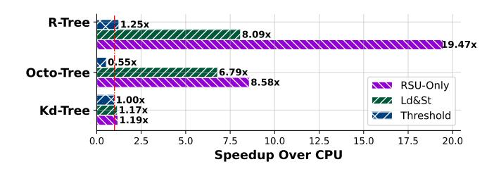

<span id="page-11-2"></span>Fig. 25. RSU evaluation compared with Terminus-like accelerator [22] on object reconstruction datasets.

In Fig. 25, we further analyze the RSU and demonstrate the performance difference between RSU and previous work. In this experiment, we ignore the performance benefits brought by PB and prefetch, focusing only on the performance improvement and architectural considerations of the RSU itself. The main differences between RSU and Terminus lie in their support for explicit stacks and non-pure searching function. For spatial data structures, previous works struggled to effectively implement backtracking and shared state management, so NeedExpand could (i) be implemented with a fixed threshold and searches are performed speculatively in parallel ("Threshold" in Fig. 25) with a large number of redundant searches or (ii) to preserve shared state ("Ld&St" in 25) through frequent consistent reads and writes to memory. In that, the experiment setting represents:

- "RSU-Only": recursive search with explicit hardware-based stack used in RoboCortex.
- "Ld&St": recursive search utilizing software-based stack used in Terminus.
- "Threshold": approximate the recursive search as a simple non-recursive DFS.

Fig. 25 shows that both redundant searches and frequent memory access hinder dataflow from fully unlocking computing performance.

These results allow us to draw the following conclusions: RSU is advantageous in complex search logic and physical locality prefers compact point clouds.

# <span id="page-11-1"></span>C. Cost Evaluation

Finally, we analyze the cost of key designs in this paper. In RoboCortex, the path buffer is the design that needs to be analyzed for size. Fig. 26 shows the sensitivity of different

data structures to path buffer size. The results show that data structures such as Octo-Tree, which are not highly sensitive to physical locality optimization, do not show significant performance improvements with increases in path buffer size. However, for R-Tree and Kd-Tree, performance speedup increases almost linearly with buffer size. Considering the area overhead, we choose a fixed path buffer size of 16 in this paper and used the LRU strategy for replacement.

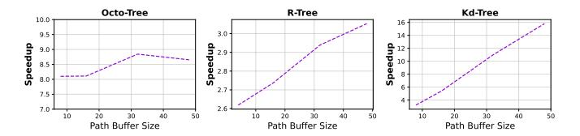

<span id="page-11-3"></span>Fig. 26. Path buffer size influence for nearest neighbor searching. The speedup represents the performance improvement ratio over baseline CPU (40B for each item in INT32).

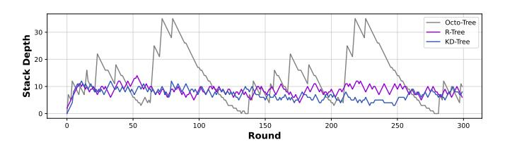

<span id="page-11-0"></span>Fig. 27. Stack depth for each round for one RSU with simulation. The results reveals that size 36 can be enough for large scale point cloud registration.

Then, we analyze whether explicit stack would result in excessive hardware overhead. Fig. 27 shows the results. We find that the stack depth did not exceed 36 when execution, indicating the stack depth in this paper is acceptable. Taking the results of Fig. 27 and 26 all into consideration, the total buffer overhead introduced by RoboCortex can be controlled within 512B, which is much smaller than the size of the L1 cache in contemporary mobile CPUs (32-128KB) [34], [35]. Therefore, the memory overhead introduced by RoboCortex is acceptable.

We also implement the RTL of RSU and path buffer, then synthesize the corresponding area report with Synopsys Design Compiler. The UMC 28nm library is used for evaluation. The results reveal that, the CGRA part of RSU is 1.195 mm², taking 98.19% of the RSU. The path buffer takes 0.344 mm². Considering the scaling from 28nm to 8nm, our design only introduces an area overhead of approximately 2.3 mm² in total for the multi-core SoC comparable to Jetson Orin AGX (12 Cortex®-A78AE CPU cores with about 25mm² combining with 8nm 200mm² GA10b GPU), which is entirely acceptable for modern SoCs.

#### IX. DISCUSSION

### A. Application and Hardware Scope

In this paper, we mainly focus on the optimization and investigation of nearest neighbor search in spatial data structure on the CPU-side. However, we argue that the physical

locality method highlighted in this work possesses general applicability across existing spatial data structures on difference platforms. To demonstrate that our approach is not limited to point clouds and CPUs, we implemented an optimization for BVH traversal in ray tracing on Vulkan-Sim [39], a GPU simulator with dedicated ray tracing cores, achieving further performance improvements compared to current state-of-the-art approaches [8].


<span id="page-12-10"></span>Fig. 28. Performance profits with leveraging physical locality in [8] with different objects for ray tracing on Vulkan-Sim [39].

While prior works [8], [9] achieve notable acceleration of BVH tree traversal via dedicated ray tracing cores and optimize BVH traversal locality and efficiency through treelet-based prefetching, our proposed physical locality differs by exploiting locality across consecutive search operations. Consequently, it can further enhance search performance on top of [8], thereby demonstrating the generalizability of our approach.

As illustrated in Fig. 28, even though the aforementioned work has already been extensively optimized for ray tracing, our method still achieves an additional performance improvement of 4%-34%. This experiment indicates that our proposed scheme is orthogonal to existing research and applies beyond point clouds—to ray tracing and potentially other spatial-data-structure-dominated domains—supporting the generality of spatial-data-structure-oriented acceleration and physical locality exploitation. However, we also note that the current formulation of our approach is not universally applicable to all search problems across all spatial data structures; these limitations will be discussed in detail in the next section.

#### B. Limitations

This work takes point cloud processing as a thread and focuses on the search problem in spatial data structures. From a query perspective, it addresses the problem of using **point** as the key and **point** as the value, with **minimum distance** as the criterion. The concept of physical locality generalizes this problem to scenarios where the query target is an **intermediate node**, thereby achieving versatility in the application of spatial data structures. However, the premise of this generalization lies in the need to construct a stable inclusion relationship: *the target leaf node must be contained within this intermediate node*.

Consequently, this approach can be naturally generalized to bounding volume-based collision detection problems, such as ray tracing [39] and obstacle avoidance [19], [44]. However, for nearest neighbor search, if the key is a **line** and the point-line distance is the criterion, the point-based belief

space proposed in this paper does not ensure the inclusion relationship. Therefore, it necessitates further specialization into a more specific belief space.

Overall, we argue that the presence of similar traversal paths across multiple searches is a general characteristic worthy of exploitation in all spatial data structures. In future work, we will further conduct comprehensive analyses on other spatial search problems.

#### X. CONCLUSION

This paper presents RoboCortex, a novel architecture for accelerating **spatial data structure** search through near-cache acceleration. We formulate the problem as spatial data structure optimization and take point cloud as the primary case; our evaluation shows that RoboCortex achieves 2.74-13.07× speedup for autonomous driving and 12.73-77.94× speedup over baselines for object reconstruction in NNS across different data structures. This paper also provides a detailed theoretical analysis of physical locality; the approach generalizes beyond point clouds, as illustrated by our ray tracing (BVH) experiments and discussion.

#### ACKNOWLEDGMENT

This work is supported by the China National Natural Science Foundation (No. T24B2007) and the STI 2030—Major Projects under Grant 2021ZD0200300.

### REFERENCES

- <span id="page-12-6"></span>[1] Arvind and R. Nikhil, "Executing a program on the mit tagged-token dataflow architecture," *IEEE Transactions on Computers*, vol. 39, no. 3, pp. 300–318, 1990.
- <span id="page-12-0"></span>[2] H. Baek, H. Lee, J.-Y. Kim, S. Jung, M. Choi, and J. Kim, "Trends in 3d point cloud contents sampling in mobile ar/vr platforms," in 2022 IEEE VTS Asia Pacific Wireless Communications Symposium (APWCS), 2022, pp. 171–175.
- <span id="page-12-1"></span>[3] M. Bakhshalipour and P. B. Gibbons, "Tartan: Microarchitecting a robotic processor," in 2024 ACM/IEEE 51st Annual International Symposium on Computer Architecture (ISCA), 2024, pp. 548–565.
- <span id="page-12-9"></span>[4] M. Bakhshalipour, P. Lotfi-Kamran, and H. Sarbazi-Azad, "Domino temporal data prefetcher," in 2018 IEEE International Symposium on High Performance Computer Architecture (HPCA), 2018, pp. 131–142.
- <span id="page-12-8"></span>[5] M. Bakhshalipour, M. Shakerinava, P. Lotfi-Kamran, and H. Sarbazi-Azad, "Bingo spatial data prefetcher," in 2019 IEEE International Symposium on High Performance Computer Architecture (HPCA), 2019, pp. 399–411.
- <span id="page-12-2"></span>[6] J. L. Bentley, "Multidimensional binary search trees used for associative searching," *Commun. ACM*, vol. 18, no. 9, p. 509–517, Sep. 1975. [Online]. Available: https://doi.org/10.1145/361002.361007
- <span id="page-12-3"></span>[7] P. Chen, M. Li, Z. Wan, Y.-S. Hsiao, M. Yu, V. J. Reddi, and Z. Liu, "Octocache: Caching voxels for accelerating 3d occupancy mapping in autonomous systems," in *Proceedings of the 30th ACM International Conference on Architectural Support for Programming Languages and Operating Systems, Volume* 2, ser. ASPLOS '25. New York, NY, USA: Association for Computing Machinery, 2025, p. 704–718. [Online]. Available: https://doi.org/10.1145/3676641.3716263
- <span id="page-12-4"></span>[8] Y. H. Chou and T. M. Aamodt, "Treelet accelerated ray tracing on gpus," in Proceedings of the 30th ACM International Conference on Architectural Support for Programming Languages and Operating Systems, Volume 2, ser. ASPLOS '25. New York, NY, USA: Association for Computing Machinery, 2025, p. 1334–1347. [Online]. Available: https://doi.org/10.1145/3676641.3716279
- <span id="page-12-5"></span>[9] Y. H. Chou, T. Nowicki, and T. M. Aamodt, "Treelet prefetching for ray tracing," in 2023 56th IEEE/ACM International Symposium on Microarchitecture (MICRO), 2023, pp. 742–755.
- <span id="page-12-7"></span>[10] S. Dave and A. Shrivastava, "Ccf: A cgra compilation framework," 2018.

- <span id="page-13-16"></span>[11] S. Durvasula, R. Kiguru, S. Mathur, J. Xu, J. Lin, and N. Vijaykumar, "Voxelcache: Accelerating online mapping in robotics and 3d reconstruction tasks," in *Proceedings of the International Conference on Parallel Architectures and Compilation Techniques*, ser. PACT '22. New York, NY, USA: Association for Computing Machinery, 2023, p. 239–251. [Online]. Available:<https://doi.org/10.1145/3559009.3569675>
- <span id="page-13-30"></span>[12] EPFL Computer Graphics and Geometry Laboratory, "Statues Dataset: A Large-Scale 3D Shape Dataset," [https://lgg.epfl.ch/statues](https://lgg.epfl.ch/statues_dataset.php) dataset. [php,](https://lgg.epfl.ch/statues_dataset.php) 2020, accessed: 2023-11-15. [Online]. Available: [https://lgg.epfl.](https://lgg.epfl.ch/statues_dataset.php) ch/statues [dataset.php](https://lgg.epfl.ch/statues_dataset.php)
- <span id="page-13-8"></span>[13] FeeZhu, "Icp - iterative closest point algorithm implementation," [https:](https://github.com/FeeZhu/ICP.git) [//github.com/FeeZhu/ICP.git,](https://github.com/FeeZhu/ICP.git) 2023.
- <span id="page-13-9"></span>[14] T. Foley and J. Sugerman, "Kd-tree acceleration structures for a gpu raytracer," in *Proceedings of the ACM SIGGRAPH/EUROGRAPHICS Conference on Graphics Hardware*, ser. HWWS '05. New York, NY, USA: Association for Computing Machinery, 2005, p. 15–22. [Online]. Available:<https://doi.org/10.1145/1071866.1071869>
- <span id="page-13-10"></span>[15] M. Goldfarb, Y. Jo, and M. Kulkarni, "General transformations for gpu execution of tree traversals," in *Proceedings of the International Conference on High Performance Computing, Networking, Storage and Analysis*, ser. SC '13. New York, NY, USA: Association for Computing Machinery, 2013. [Online]. Available: <https://doi.org/10.1145/2503210.2503223>
- <span id="page-13-7"></span>[16] A. Guttman, "R-trees: a dynamic index structure for spatial searching," in *Proceedings of the 1984 ACM SIGMOD International Conference on Management of Data*, ser. SIGMOD '84. New York, NY, USA: Association for Computing Machinery, 1984, p. 47–57. [Online]. Available:<https://doi.org/10.1145/602259.602266>
- <span id="page-13-20"></span>[17] M. Han, L. Wang, L. Xiao, H. Zhang, T. Cai, J. Xu, Y. Wu, C. Zhang, and X. Xu, "Bitnn: A bit-serial accelerator for k-nearest neighbor search in point clouds," in *2024 ACM/IEEE 51st Annual International Symposium on Computer Architecture (ISCA)*, 2024, pp. 1278–1292.
- <span id="page-13-18"></span>[18] M. Han, L. Wang, L. Xiao, H. Zhang, B. Jiang, X. Xie, J. Zhu, S. Wei, and L. Liu, *PointISA: ISA-Extensions for Efficient Point Cloud Analytics via Architecture and Algorithm Co-Design*. New York, NY, USA: Association for Computing Machinery, 2025, p. 1867–1881. [Online]. Available:<https://doi.org/10.1145/3725843.3756122>
- <span id="page-13-32"></span>[19] Y. Han, Y. Yang, X. Chen, and S. Lian, "Dadu series - fast and efficient robot accelerators," in *2020 IEEE/ACM International Conference On Computer Aided Design (ICCAD)*, 2020, pp. 1–8.
- <span id="page-13-28"></span>[20] I. Hur and C. Lin, "Memory prefetching using adaptive stream detection," in *2006 39th Annual IEEE/ACM International Symposium on Microarchitecture (MICRO'06)*, 2006, pp. 397–408.
- <span id="page-13-4"></span>[21] A. M. A. Kumar, A. Prasanna, J. Balkind, and A. Shriraman, "Metal: Caching multi-level indexes in domain-specific architectures," in *Proceedings of the 29th ACM International Conference on Architectural Support for Programming Languages and Operating Systems, Volume 2*, ser. ASPLOS '24. New York, NY, USA: Association for Computing Machinery, 2024, p. 715–729. [Online]. Available:<https://doi.org/10.1145/3620665.3640402>
- <span id="page-13-2"></span>[22] H. R. Lee and D. Sanchez, "Terminus: A programmable accelerator for read and update operations on sparse data structures," in *2024 57th IEEE/ACM International Symposium on Microarchitecture (MICRO)*. IEEE, Nov. 2024, p. 1233–1246. [Online]. Available: <http://dx.doi.org/10.1109/MICRO61859.2024.00092>
- <span id="page-13-13"></span>[23] P. L. Lehman and s. B. Yao, "Efficient locking for concurrent operations on b-trees," *ACM Trans. Database Syst.*, vol. 6, no. 4, p. 650–670, Dec. 1981. [Online]. Available:<https://doi.org/10.1145/319628.319663>
- <span id="page-13-29"></span>[24] Y. Liao, J. Xie, and A. Geiger, "Kitti-360: A novel dataset and benchmarks for urban scene understanding in 2d and 3d," *IEEE Transactions on Pattern Analysis and Machine Intelligence*, vol. 45, no. 3, pp. 3292– 3310, 2023.
- <span id="page-13-1"></span>[25] D. Lv, X. Ying, Y. Cui, J. Song, K. Qian, and M. Li, "Research on the technology of lidar data processing," in *2017 First International Conference on Electronics Instrumentation and Information Systems (EIIS)*, 2017, pp. 1–5.
- <span id="page-13-21"></span>[26] M. Mercaldi, S. Swanson, A. Petersen, A. Putnam, A. Schwerin, M. Oskin, and S. J. Eggers, "Instruction scheduling for a tiled dataflow architecture," in *Proceedings of the 12th International Conference on Architectural Support for Programming Languages and Operating Systems*, ser. ASPLOS XII. New York, NY, USA: Association for Computing Machinery, 2006, p. 141–150. [Online]. Available: <https://doi.org/10.1145/1168857.1168876>

- <span id="page-13-23"></span>[27] P. Michaud, "Best-offset hardware prefetching," in *2016 IEEE International Symposium on High Performance Computer Architecture (HPCA)*, 2016, pp. 469–480.
- <span id="page-13-24"></span>[28] O. Mutlu, J. Stark, C. Wilkerson, and Y. Patt, "Runahead execution: an alternative to very large instruction windows for out-of-order processors," in *The Ninth International Symposium on High-Performance Computer Architecture, 2003. HPCA-9 2003. Proceedings.*, 2003, pp. 129–140.
- <span id="page-13-25"></span>[29] A. Naithani, J. Feliu, A. Adileh, and L. Eeckhout, "Precise runahead execution," in *2020 IEEE International Symposium on High Performance Computer Architecture (HPCA)*, 2020, pp. 397–410.
- <span id="page-13-12"></span>[30] Q. M. Nguyen and D. Sanchez, "Pipette: Improving core utilization on irregular applications through intra-core pipeline parallelism," in *2020 53rd Annual IEEE/ACM International Symposium on Microarchitecture (MICRO)*, 2020, pp. 596–608.
- <span id="page-13-17"></span>[31] ——, "Fifer: Practical acceleration of irregular applications on reconfigurable architectures," in *MICRO-54: 54th Annual IEEE/ACM International Symposium on Microarchitecture*, ser. MICRO '21. New York, NY, USA: Association for Computing Machinery, 2021, p. 1064–1077. [Online]. Available: [https://doi.org/10.1145/3466752.](https://doi.org/10.1145/3466752.3480048) [3480048](https://doi.org/10.1145/3466752.3480048)
- <span id="page-13-6"></span>[32] J. Nievergelt and P. Widmayer, *Spatial data structures: Concepts and design choices*. Springer Berlin Heidelberg, 1997, p. 153–197. [Online]. Available: [http://dx.doi.org/10.1007/3-540-63818-0](http://dx.doi.org/10.1007/3-540-63818-0_6) 6
- <span id="page-13-11"></span>[33] NVIDIA Community. (2023) Optix support for jetson orin devices. NVIDIA Developer Forums. [Online]. Available: [https://forums.](https://forums.developer.nvidia.com/t/optix-support-for-jetson-orin-devices/250038/5) [developer.nvidia.com/t/optix-support-for-jetson-orin-devices/250038/5](https://forums.developer.nvidia.com/t/optix-support-for-jetson-orin-devices/250038/5)
- <span id="page-13-27"></span>[34] NVIDIA Corporation, "NVIDIA Jetson Orin," [https://www.nvidia.cn/](https://www.nvidia.cn/autonomous-machines/embedded-systems/jetson-orin/) [autonomous-machines/embedded-systems/jetson-orin/,](https://www.nvidia.cn/autonomous-machines/embedded-systems/jetson-orin/) 2022, accessed: 2023-11-15. [Online]. Available: [https://www.nvidia.cn/autonomous](https://www.nvidia.cn/autonomous-machines/embedded-systems/jetson-orin/)[machines/embedded-systems/jetson-orin/](https://www.nvidia.cn/autonomous-machines/embedded-systems/jetson-orin/)
- <span id="page-13-31"></span>[35] PhoneDB, "Apple A18 (APL1V08/T8142 "Tupai") Processor Detailed Specifications," [https://phonedb.net/index.php?m=processor&](https://phonedb.net/index.php?m=processor&id=992&c=apple_a18_apl1v08_t8142__tupai&d=detailed_specs) id=992&c=apple a18 apl1v08 t8142 [tupai&d=detailed](https://phonedb.net/index.php?m=processor&id=992&c=apple_a18_apl1v08_t8142__tupai&d=detailed_specs) specs, 2024, accessed: 2024-07-28. [Online]. Available: [https://phonedb.net/index.php?m=processor&id=992&c=apple](https://phonedb.net/index.php?m=processor&id=992&c=apple_a18_apl1v08_t8142__tupai&d=detailed_specs) a18 apl1v08 t8142 [tupai&d=detailed](https://phonedb.net/index.php?m=processor&id=992&c=apple_a18_apl1v08_t8142__tupai&d=detailed_specs) specs
- <span id="page-13-19"></span>[36] R. Pinkham, S. Zeng, and Z. Zhang, "Quicknn: Memory and performance optimization of k-d tree based nearest neighbor search for 3d point clouds," in *2020 IEEE International Symposium on High Performance Computer Architecture (HPCA)*, 2020, pp. 180–192.
- <span id="page-13-22"></span>[37] R. Prabhakar, J. Zhou, D. Gandhi, Y. Choi, M. Khayatzadeh, K. Kim, U. Durairajan, J. Park, S. Sarkar, and J. L. Shin, "16.4: Sambanova sn40l: A 5nm 2.5d dataflow accelerator with three memory tiers for trillion parameter ai," in *2025 IEEE International Solid-State Circuits Conference (ISSCC)*, vol. 68, 2025, pp. 288–290.
- <span id="page-13-14"></span>[38] W. Pugh, "Skip lists: a probabilistic alternative to balanced trees," *Commun. ACM*, vol. 33, no. 6, p. 668–676, Jun. 1990. [Online]. Available:<https://doi.org/10.1145/78973.78977>
- <span id="page-13-0"></span>[39] M. Saed, Y. H. Chou, L. Liu, T. Nowicki, and T. M. Aamodt, "Vulkansim: A gpu architecture simulator for ray tracing," in *2022 55th IEEE/ACM International Symposium on Microarchitecture (MICRO)*, 2022, pp. 263–281.
- <span id="page-13-26"></span>[40] D. Sanchez and C. Kozyrakis, "Zsim: fast and accurate microarchitectural simulation of thousand-core systems," in *Proceedings of the 40th Annual International Symposium on Computer Architecture*, ser. ISCA '13. New York, NY, USA: Association for Computing Machinery, 2013, p. 475–486. [Online]. Available: <https://doi.org/10.1145/2485922.2485963>
- <span id="page-13-5"></span>[41] B. C. Schwedock and N. Beckmann, "Leviathan: A unified system for general-purpose near-data computing," in *2024 57th IEEE/ACM International Symposium on Microarchitecture (MICRO)*, 2024, pp. 1278–1294.
- <span id="page-13-15"></span>[42] B. C. Schwedock, P. Yoovidhya, J. Seibert, and N. Beckmann, "tak¨ o:¯ a polymorphic cache hierarchy for general-purpose optimization of data movement," in *Proceedings of the 49th Annual International Symposium on Computer Architecture*, ser. ISCA '22. New York, NY, USA: Association for Computing Machinery, 2022, p. 42–58. [Online]. Available:<https://doi.org/10.1145/3470496.3527379>
- <span id="page-13-3"></span>[43] A. Sedaghati, M. Hakimi, R. Hojabr, and A. Shriraman, "Xcache: a modular architecture for domain-specific caches," in *Proceedings of the 49th Annual International Symposium on Computer Architecture*, ser. ISCA '22. New York, NY, USA: Association

- for Computing Machinery, 2022, p. 396–409. [Online]. Available: <https://doi.org/10.1145/3470496.3527380>
- <span id="page-14-5"></span>[44] D. Shah and T. M. Aamodt, "Collision prediction for robotics accelerators," in *2024 ACM/IEEE 51st Annual International Symposium on Computer Architecture (ISCA)*, 2024, pp. 566–581.
- <span id="page-14-4"></span>[45] S. Somogyi, T. Wenisch, A. Ailamaki, B. Falsafi, and A. Moshovos, "Spatial memory streaming," in *33rd International Symposium on Computer Architecture (ISCA'06)*, 2006, pp. 252–263.
- <span id="page-14-0"></span>[46] A. ten Pas, M. Gualtieri, K. Saenko, and R. Platt, "Grasp pose detection in point clouds," *Int. J. Rob. Res.*, vol. 36, no. 13–14, p. 1455–1473, Dec. 2017. [Online]. Available:<https://doi.org/10.1177/0278364917735594>
- <span id="page-14-1"></span>[47] Y. Tong, X. Zhang, R. Wang, Z. Song, S. Wu, S. Zhang, Y. Wang, and J. Yuan, "Tc<sup>2</sup> li-slam: A tightly-coupled camera-lidar-inertial slam system," *IEEE Robotics and Automation Letters*, vol. 9, no. 9, pp. 7421– 7428, 2024.
- <span id="page-14-2"></span>[48] J. Vahrenhold, *B-trees*. Springer New York, 2016, p. 244–250. [Online]. Available: [http://dx.doi.org/10.1007/978-1-4939-2864-4](http://dx.doi.org/10.1007/978-1-4939-2864-4_57) 57
- <span id="page-14-3"></span>[49] Y. Zhu, "Rtnn: accelerating neighbor search using hardware ray tracing," in *Proceedings of the 27th ACM SIGPLAN Symposium on Principles and Practice of Parallel Programming*, ser. PPoPP '22. New York, NY, USA: Association for Computing Machinery, 2022, p. 76–89. [Online]. Available:<https://doi.org/10.1145/3503221.3508409>