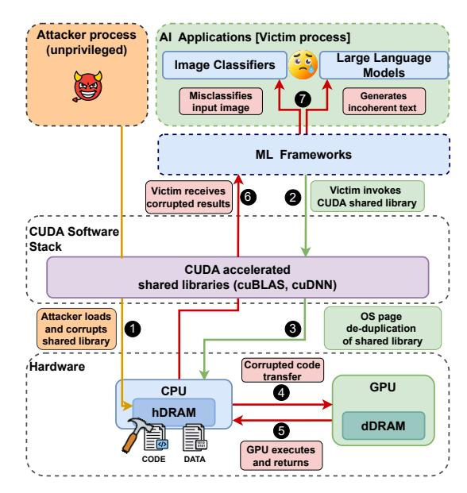
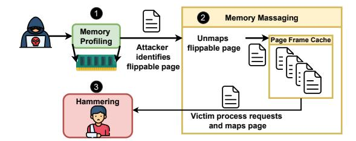
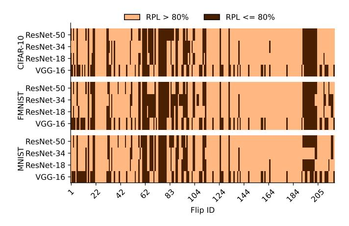
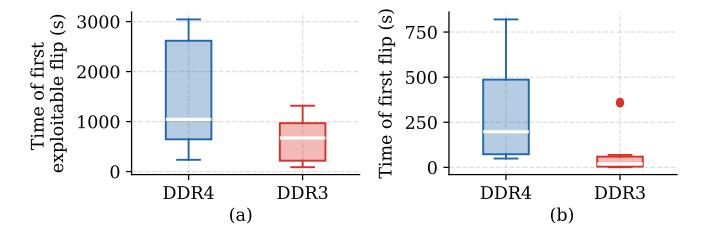

# PRowhammer: Propagating Bit-flips from CPU to GPU

Mrityunjay Shukla *Indian Institute of Technology Bombay* Mumbai, India mrityunjay@cse.iitb.ac.in

Sayandeep Saha *Indian Institute of Technology Bombay* Mumbai, India sayandeepsaha@cse.iitb.ac.in

Shubham Roy *Indian Institute of Technology Bombay* Mumbai, India royshubham@cse.iitb.ac.in

Biswabandan Panda *Indian Institute of Technology Bombay* Mumbai, India biswa@cse.iitb.ac.in

*Abstract*—The Rowhammer attack is an exploit that induces bit-flips in DRAMs. In the last decade, Rowhammer has been demonstrated on DDRs and LPDDRs used by CPUs, and recently it has been demonstrated on GDDRs used by GPUs. In a heterogeneous system with CPUs and GPUs, GPUs are dependent on the hDRAM (host's DRAM, i.e., CPU's DRAM) as all the data and the code executed on the GPU are first loaded into the hDRAM. We exploit the dependency of GPUs on hDRAM to develop a novel attack called Propagated Rowhammer (PRowhammer), which utilizes CPU-based Rowhammer bit-flips in hDRAM to corrupt GPU code before execution, thereby propagating the bit-flips to the GPU. We exploit two key observations that are, OS page deduplication of GPU shared libraries in hDRAM and inducing bit-flips transform GPU instructions into semantically altered yet valid instructions. Despite challenges such as the massive size of GPU shared libraries (hundreds of megabytes), the closed-source nature of the code, and the use of a proprietary compression algorithm for the SASS (GPU assembly) code, we develop automated techniques to identify exploitable bit-flip locations in hDRAM.

We demonstrate PRowhammer on hDRAMs, such as DDRs (DDR3 and DDR4), with NVIDIA's discrete GPUs that utilize the CUDA software stack. We demonstrate the effectiveness of PRowhammer against state-of-the-art machine learning (ML) models in realistic black-box settings, where the adversary operates on a CPU and lacks access to the ML model's weights and architecture. With PRowhammer, a single bit-flip in the wellknown shared library cuBLASLt degrades image classification accuracy across 16 test cases (ResNet-18, ResNet-34, ResNet-50 and VGG-16 on MNIST, FMNIST, CIFAR-10, and ImageNet) to random guessing, and in the worst-case scenario, it drops to 0%. We also demonstrate the effectiveness of PRowhammer on Large Language Models (LLMs) such as Llama-2, Mistral, and Falcon, where a single bit-flip in the GGML library reduces the generation quality, resulting in a BERTScore of 25%, which produces gibberish output. Overall, PRowhammer exposes an entirely new class of GPU vulnerabilities stemming from CPU-GPU architectural coupling, demanding holistic security approaches for heterogeneous computing systems.

### I. INTRODUCTION

GPUs are the most prominent and important computing devices, which power graphics processing, high-performance computing, and the Artificial Intelligence (AI) revolution, [\[47\]](#page-13-0). GPUs are high-throughput processors with a distinct instruction set, microarchitecture, and programming model compared to CPUs. Consequently, the attack surfaces for GPUs are also different from those of CPUs. One defining characteristic of GPUs is that the CPU manages them through a software stack comprising a runtime library, GPU drivers, and associated APIs. This is an artifact of GPU programming models such as Compute Unified Device Architecture (CUDA). The resource allocation, code execution, context management, and data transfers from CPU to GPU are governed by the software stack. Since the software stack exclusively handles code and data transfers to the GPU, all content executed on the GPU is first loaded into the CPU's DRAM (referred to as hDRAM, host DRAM). Although discrete GPUs have their own dedicated DRAM (referred to as dDRAM, device DRAM), modern GPUs still depend on the CPU and hDRAM.

The pertinent questions. (i) Does the *dependency* of GPU computation on the hDRAM have any security implications for GPUs? More precisely, can any vulnerability in hDRAM affect the computation running on the GPU? The inherent dependency highlighted in the previous paragraph suggests that such vulnerabilities should be thoroughly investigated. The existence of such a vulnerability would reveal an entirely new class of attack surfaces for GPUs. (ii) What are the potential attacks on hDRAM that affects GPUs? Is it possible to impact the GPU computation through bit-flips in hDRAMs? If yes, then *how* and *when* can bit-flips be induced within GPU computation by exploiting a dependency on the hDRAM?

Propagated Rowhammer (PRowhammer). We answer the question mentioned in the previous paragraph, using the Rowhammer attack (how) [\[35\]](#page-13-1) – a well-known attack that enables attackers to induce bit-flips in the hDRAM memory regions of a victim process by rapidly accessing some neighboring hDRAM rows close to the victim's rows. In our threat model, the attacker and victim are two different users sharing the same physical machine (hence hDRAM) in a cloud environment [\[41\]](#page-13-2). The attacker in our attack is a CPU process belonging to a malicious user that performs bit-flips in the hDRAM to modify the GPU kernel code of a GPU-bound victim process belonging to another user; a kernel is a function that is executed on the GPU. We refer to the modified code as corrupted code. However, the bit-flip occurs before the code and the data are transferred (when) to the GPU. We exploit the presence of GPU data and kernel code in hDRAM. When transferred and executed on the GPU, the bit-flip in data or kernel code propagates and corrupts the GPU computation. We refer to this attack as Propagated Rowhammer, or PRowhammer. Please note that PRowhammer differs from GPUHammer [\[43\]](#page-13-3), which targets dDRAM, whereas our attack targets hDRAM.

Rowhammer remains an unresolved hardware vulnerability because, despite extensive mitigation efforts [\[15\]](#page-12-0), [\[26\]](#page-12-1), [\[45\]](#page-13-4), [\[46\]](#page-13-5), [\[65\]](#page-13-6), practical exploits continue to bypass existing defenses [\[23\]](#page-12-2), [\[30\]](#page-12-3), [\[33\]](#page-12-4), [\[43\]](#page-13-3), [\[48\]](#page-13-7), and consequently, any DDR module susceptible to Rowhammer is inherently susceptible to PRowhammer. We demonstrate PRowhammer on the CUDA software stack targeting NVIDIA's discrete GPUs.

*Why PRowhammer works?* Since the attacker and victim in our attack are two separate users sharing the same machine, the attacker cannot directly access the victim's private memory regions. Therefore, if the attacker wishes to corrupt the GPU kernel code of a victim process via Rowhammer, it must target a shared library that (i) contains GPU kernel code used by the victim process, and (ii) is accessible to both the attacker and victim. Importantly, the OS does not differentiate between CPU and GPU shared libraries, treating them identically in terms of memory management and access control. Due to OS page deduplication, only a single copy of each shared library resides in hDRAM, even when the library is being used concurrently by multiple processes belonging to different users. While shared libraries are readable by all users, only privileged users (i.e., users with root-level access) can modify them through conventional file system operations. Since our attacker is an unprivileged user, without permission to modify shared library files directly, it uses Rowhammer to induce bitflips in the shared library's code while it resides in hDRAM. Machine Learning (ML) models as target applications. As an exploit of PRowhammer, we target state-of-the-art ML applications running on GPUs, undermining the prediction or generation accuracy of such models during inference (called accuracy degradation attacks [\[29\]](#page-12-5), [\[52\]](#page-13-8), [\[53\]](#page-13-9), [\[68\]](#page-13-10)).

Adversarial model for ML exploits. Prior works [\[29\]](#page-12-5), [\[52\]](#page-13-8), [\[53\]](#page-13-9), [\[68\]](#page-13-10) targeting the prediction accuracy of ML models assume complete adversarial knowledge and access to model architecture and weights (white-box access), and perform bitflips on selected model weights. However, we assume a weaker adversary having no knowledge of the model architecture and weights and only having API-level access to the model, meaning the attacker can submit inputs and receive outputs (such as predicted labels or generated text) through a query interface, without any direct visibility into the model's architecture, parameters, or internal workings (black-box access) [\[41\]](#page-13-2).

### Observations (O) and challenges (C).

*O1: OS page deduplication for GPU shared libraries (Sec. [III\)](#page-3-0).* In black-box settings, adversaries lack access to model weights, making existing weight attacks [\[29\]](#page-12-5), [\[52\]](#page-13-8), [\[53\]](#page-13-9), [\[68\]](#page-13-10) impractical[1](#page-1-0) . Instead, attackers must target GPU-accelerated shared libraries that contain the GPU kernels used by ML frameworks. While Li et al. [\[41\]](#page-13-2) demonstrated CPU-bound library attacks by exploiting OS page deduplication, we observe that GPU shared libraries are likewise deduplicated in hDRAM. This observation enables attackers to perform Rowhammer on deduplicated GPU shared libraries, leading to GPU kernel code corruption.

*O2: Valid GPU instructions after bit-flips (Sec. [III\)](#page-3-0).* Accuracy degradation attacks require that the corrupted model remain executable, albeit with changed semantics. Therefore, the SASS instructions (GPU assembly code) that we corrupt in the shared libraries need to be converted to different yet valid instructions, as invalid instructions lead to crashes. Interestingly, we observe several instructions in the instruction set of the targeted NVIDIA GPUs changing to valid instructions, even after one or multiple bit-flips in them. This observation indicates that semantically changing the kernels in the shared libraries is feasible.

*C1: Compressed GPU code (Sec. [IV\)](#page-4-0).* NVIDIA's shared libraries store the GPU kernel code in a compressed form, and the compression algorithm is proprietary [\[10\]](#page-12-6). These two facts compel us to induce bit-flips in the compressed code in the hDRAM. We observe that flipping a bit in the compressed code results in one or multiple valid but different SASS instructions, and this happens with a reasonable probability. Based on this observation, we devise a bit-flip simulation and testing strategy for identifying *exploitable bit-flips* that can change the semantics of kernels in a library.

*C2: Size of the shared library (Sec. [IV\)](#page-4-0).* GPU shared libraries, even in compressed form, occupy hundreds of megabytes in memory (e.g, cuBLASLt library has a size of 335MB). Finding exploitable bit-flips is challenging because of the need to individually test each of these bits. We observe that simulating and testing each bit-flip takes roughly 500 milliseconds in our setup, and doing this for millions of bits would take years. Moreover, such libraries contain code for different GPU architectures, and while executing on a specific GPU architecture, only the code relevant to that GPU architecture is used. While in a compressed library, there is no way to identify the codes for different GPU architectures, we develop an automated pruning strategy to overcome this challenge.

### PRowhammer on ML in a nutshell.

Fig. [1](#page-2-0) presents the overview of the PRowhammer attack on black-box ML models deployed in cloud environments. In step 1 , the attacker loads and corrupts the CUDA shared library (e.g., cuBLAS, cuDNN) by inducing bit-flips via Rowhammer attacks in the hDRAM. The bit-flip alters the semantics of the GPU kernel code contained within. This corruption occurs before the victim begins execution. When the victim's ML framework invokes CUDA-accelerated shared libraries ( 2 ), the OS performs page de-duplication of the shared library

<span id="page-1-0"></span><sup>1</sup>Weight attacks require identifying vulnerable weights for targeted corruption with minimal bit-flips, which is infeasible without weight knowledge. Achieving an arbitrary number of bit-flips is infeasible due to Rowhammer constraints [\[68\]](#page-13-10).

<span id="page-2-0"></span>

Fig. 1: Overview of PRowhammer on ML Models

( 3 ), ensuring that only a single physical copy resides in hDRAM. Consequently, the victim process is compelled to map to and use the same corrupted GPU kernel code from the shared library that was previously corrupted by the attacker. In step 4 , the corrupted GPU kernels are transferred from hDRAM to the GPU. During execution ( 5 ), the propagation of bit-flips corrupts the GPU computation. Finally, in step 6 , the victim's ML framework receives the corrupted results from the GPU, leading to misclassified images or incoherent text generation ( 7 ).

Note that PRowhammer demonstrates a novel variant of Rowhammer, where compromising hDRAM corrupts GPU computation. Therefore, PRowhammer motivates for a holistic view of security especially for heterogeneous systems with interdependent components like CPU and GPU. Holistic here means, in a heterogeneous system with multiple components, even if one component is compromised (in our case, the hDRAM), it affects the other components as well (in our case, the GPU). So, even to secure GPU computation, we need to ensure secure hDRAMs and dDRAMs.

Key results. We demonstrate the PRowhammer attack on image classification models and Large Language Models (LLMs). The key results from our evaluation, performed on three different GPUs (RTX A6000, RTX 4090, and RTX 5060), are as follows:

• Our image classification test suite comprises 16 different test cases, utilizing four state-of-the-art architectures (ResNet-18, ResNet-34, ResNet-50 [\[28\]](#page-12-7), and VGG-16 [\[57\]](#page-13-11)) trained on four datasets (MNIST [\[40\]](#page-13-12), FM-NIST [\[66\]](#page-13-13), CIFAR-10 [\[37\]](#page-13-14), and ImageNet [\[24\]](#page-12-8)). For all of these test cases, a single bit-flip induced in the cuBLASLt [\[1\]](#page-12-9) shared library degrades the performance of the models close to random guessing. The classification accuracy is 0% in the worst case for the ImageNet dataset.

<span id="page-2-2"></span>

Fig. 2: Steps in a Rowhammer attack

• Our LLM use case consists of three publicly available pre-trained models (Llama-2-7B [\[62\]](#page-13-15), Mistral-7B [\[32\]](#page-12-10), Falcon-7B [\[12\]](#page-12-11)), which we utilized for a questionanswering task based on Google's Natural Questions (NQ) dataset. We evaluate the question-answering performance using BERTScore [\[70\]](#page-14-0). A single bit-flip in the underlying GGML [\[7\]](#page-12-12) library degrades the BERTScore to 25%, at which the models only generate a string of #s as an output.

We make the following contributions:

- We observe that inducing a bit-flip in GPU shared libraries can affect the programs that use those libraries (Sec . [III\)](#page-3-0).
- We present challenges in identifying exploitable bit-flip locations in the GPU shared library and discuss how to overcome those challenges (Sec. [IV\)](#page-4-0).
- We showcase our attack[2](#page-2-1) on state-of-the-art image classification models, degrading their classification accuracy. We also demonstrate that, for large language models, our attack results in incoherent text generation (Sec. [V\)](#page-6-0).

### II. BACKGROUND

In this section, we briefly go over the Rowhammer attack, followed by the necessary background on the software stack of NVIDIA GPUs, which is pivotal in creating the CPU dependency in GPUs. Finally, we discuss how state-of-the-art ML frameworks utilize GPUs through this software stack.

### <span id="page-2-3"></span>*A. Rowhammer attack*

Since its discovery, Rowhammer [\[35\]](#page-13-1) has evolved into a versatile attack vector that spans reliability, security, and privacy domains [\[30\]](#page-12-3), [\[35\]](#page-13-1), [\[39\]](#page-13-16), [\[54\]](#page-13-17). The attack exploits a fundamental cell-to-cell interference problem in modern DRAMs—repeatedly activating (*hammering*) one row can accelerate charge leakage in adjacent rows through capacitive coupling and electromagnetic interference. When a row is activated thousands of times within a single refresh interval (typically 64 ms in DDR3 and DDR4 DRAMs), the affected neighboring cells may lose sufficient charge that, upon subsequent access, their stored value is misread by the sense amplifier, resulting in a bit-flip. This reliability issue has been exploited by attackers, who deliberately access certain DRAM rows (called aggressor rows) in their own address space with

<span id="page-2-1"></span><sup>2</sup>For the benefit of the community, we will release the code of PRowhammer.

<span id="page-3-1"></span>

Fig. 3: CUDA software stack for NVIDIA GPUs

a high frequency, resulting in flips in the DRAM rows used by a victim process (called victim rows). DRAM vendors have implemented countermeasures, like Targeted Row Refresh (TRR) [\[26\]](#page-12-1) and Per Row Activation Counter (PRAC) in DDR5 [\[6\]](#page-12-13), which refresh a victim row upon detecting suspicious row activations. However, TRR has been bypassed on several occasions [\[26\]](#page-12-1) [\[30\]](#page-12-3), and Rowhammer remains a threat even for the most recent DDR5 DRAMs [\[31\]](#page-12-14) [\[48\]](#page-13-7).

A successful Rowhammer attack typically consists of three key steps as given by Razavi et al. in [\[54\]](#page-13-17) and shown in Fig. [2.](#page-2-2) The attack begins with memory profiling ( 1 ), where the attacker profiles the DRAM to discover DRAM locations susceptible to bit-flips by allocating chunks of memory from its own address space. It identifies the *page-frames* (a fixedsized block in DRAM holding an OS page) that have bit flips at offsets suitable for their purpose. Upon finding suitable bit-flip locations (i.e., at desired offsets of a DRAM pageframe), the attacker manipulates the memory allocation of the victim process so that the sensitive victim data or code is mapped to these suitable locations. Typically, the pageframe allocation policy of an OS, which allocates page frames without respecting process boundaries, is exploited for this step. This process is known as memory massaging ( 2 ) [\[13\]](#page-12-15), [\[34\]](#page-13-18), [\[39\]](#page-13-16). Finally, during the hammering phase ( 3 ), the attacker repeatedly accesses the identified aggressor rows in its own address space to induce bit flips in the victim's rows. The end-to-end Rowhammer attack does not require any elevated privileges or root-level access to the target system.

### *B. CUDA software stack*

The CUDA software stack (Fig. [3\)](#page-3-1) enables GPU programming through a layered architecture. At the top layer, GPUbound shared libraries contain optimized compiled kernels that are dynamically linked at runtime. This reduces application binary size and enables code sharing across applications. Applications and libraries interact with CUDA APIs, which invoke NVIDIA GPU drivers that control the hardware.

CUDA APIs. CUDA provides two sets of APIs. The *driver API* offers low-level control for GPU resource allocation, contexts, and kernel execution, including explicit binary loading

Listing 1: CPU to GPU data transfer

```
int main () {
    // Host allocation
    h_data = (int *) malloc ( size );
    // Device allocation
    cudaMalloc (& d_data , size );
    // Data Transfer
    cudaMemcpy ( d_data , h_data , size ,
         cudaMemcpyHostToDevice );
    // Kernel launch
    myKernel < < <1 ,1 > > >( d_data );
    return 0;
}
```

and symbol resolution. The *runtime API* wraps the driver API, abstracting low-level operations like context creation and dynamic linking. Programmers explicitly manage only memory allocation through cudaMalloc and data transfer through cudaMemcpy, while code transfer and execution occur automatically.

Involvement of hDRAM. Listing [1](#page-3-2) presents a template for launching CUDA applications using runtime APIs. The data is first loaded in the hDRAM using malloc(), which shows the involvement of hDRAM. The mapping of GPU kernel code in the CPU side address space of the template can be confirmed by checking the /proc/PID/maps of the template. Therefore, the GPU kernels are also loaded inside the hDRAM. Shared libraries also follow the same trend – they are mapped in the hDRAM by the software stack (using mmap()), and kernel code is dynamically linked and sent to the GPU on demand.

### *C. GPU accelerated ML frameworks*

ML training and inference are one of the most prominent use cases requiring GPU acceleration. ML frameworks, such as PyTorch [\[14\]](#page-12-16), TensorFlow [\[11\]](#page-12-17), and Llama.cpp [\[8\]](#page-12-18), largely simplify the task of constructing and training ML models by providing ML-specific functions (e.g., for constructing convolution or linear layers) to build, train, and deploy the models. Such frameworks are mostly open-source, implemented in high-level languages such as Python or C++, and achieve GPU acceleration by invoking the runtime API and shared libraries from the CUDA software stack. The GPU acceleration in such frameworks closely follows the template provided in Listing [1,](#page-3-2) with each ML-specific function invoking the kernels from the shared libraries. In particular, PyTorch and TensorFlow extensively utilize the NVIDIA-provided, proprietary shared libraries, such as cuDNN [\[3\]](#page-12-19) and cuBLAS [\[1\]](#page-12-9), which benefit from their highly optimized kernels for tensor operations. The GPU-bound data and code, including those from the shared libraries, are stored in the hDRAM for every model constructed using these ML frameworks.

### III. MOTIVATING OBSERVATIONS

<span id="page-3-0"></span>Rowhammer attacks on shared libraries [\[41\]](#page-13-2) exploit the fact that these libraries reside in OS pages mapped by both the victim and the attacker, allowing the attacker to flip bits in hDRAM pages the victim also uses. Moreover, these libraries contain compiled CPU instructions, where a single bit-flip can transform one instruction into another valid one, enabling semantic changes without necessarily crashing the victim process.

We target GPU shared libraries that contain SASS instructions and reside in hDRAM. To enable a CPU-based attacker, the OS must perform page sharing for GPU shared libraries, allowing the attacker and the victim to share the same physical page. The attacker also requires that bit-flips convert SASS instructions into different yet valid SASS instructions.

SASS instructions in shared libraries. NVIDIA GPU executables and shared libraries primarily contain SASS instructions; NVIDIA also provides PTX, but the compiler translates PTX to SASS before GPU execution [\[10\]](#page-12-6). The host (CPU) code and SASS are strictly separated: SASS resides in a dedicated nv\_fatbin section [\[9\]](#page-12-20). The nv\_fatbin section may include SASS for multiple GPU architectures, and libraries commonly bundle code for several architectures [\[10\]](#page-12-6).

OS page deduplication for GPU shared libraries. Linux systems employ copy-on-write for DRAM pages, maintaining a single shared copy until modification occurs (page deduplication). Read-only code pages (e.g., the .text section) remain deduplicated across processes, including CPU shared libraries in hDRAM. This motivates us to ask the question: *"Are GPU code pages (*.nv\_fatbin *section) in shared libraries also deduplicated?"* Yes. In Linux-based systems, the OS loader maps GPU shared libraries into hDRAM during GPU kernel launch (Listing [2\)](#page-4-1). The kernels are dynamically linked to the GPU executable, with kernel code supplied to the GPU from CPU-resident OS pages. The .nv\_fatbin section is mapped with mmap(MAP\_PRIVATE) and PROT\_READ|PROT\_EXEC flags, enabling copy-on-write semantics for read-only pages. Any process can map these libraries into its address space with identical flags. This enables the Rowhammer attack: i) An attacker process maps .nv\_fatbin pages into its address space where it remains deduplicated, ii) induces bit flips via Rowhammer, and iii) the corrupted page supplies kernel code to the GPU during dynamic linking, corrupting GPU execution.

# Takeaway I:

OS Pages corresponding to the nv\_fatbin section, which contains GPU code for a GPU shared library, are deduplicated.

Valid instructions after bit-flips. The next question is whether or not bit-flips in SASS instructions result in valid instructions. We find this to be affirmative for SASS instructions across different GPU architectures. Table [I](#page-5-0) shows a few representative cases, corresponding to NVIDIA RTX 4090, where a single bit-flip in a SASS instruction results in a valid yet different SASS instruction. Broadly, we observe four different categories of changes in the instructions. i) *register change:* the operands of an instruction are affected by changes to the register names. ii) *opcode change:* only <span id="page-4-1"></span>Listing 2: System call trace during a GPU kernel launch that shows the loading a GPU shared library in hDRAM via mmap.

```
...
openat ( AT_FDCWD , "/usr/local/lib/ libcublasLt.
    so .12", O_RDONLY | O_CLOEXEC ) = 3
...
mmap (< VA of lib >, <size >, PROT_READ | PROT_EXEC ,
     MAP_PRIVATE | MAP_FIXED | MAP_DENYWRITE , 3,
    0)
```

the opcode of the instruction is affected, while the operands remain unchanged. iii) *offset change:* the offset from a base address of a memory reference is changed. iv) *instruction change:* some bit-flips result in the instruction being changed. A similar observation holds for SASS instructions of the other GPUs with different architectures. Overall, both basic conditions for a shared library-based Rowhammer attack are satisfied. However, there are still challenges in identifying exploitable bit-flip locations, which we address and overcome in the following section.

### Takeaway II:

SASS instructions change to different yet valid instructions upon bit flips.

### IV. CHALLENGES

<span id="page-4-0"></span>NVIDIA provides the NVCC compiler targeting CUDA-enabled GPUs. The NVCC compiler applies --compress-mode flag, while compiling CUDA kernels [\[10\]](#page-12-6), which compresses the content of the .nv\_fatbin section using a proprietary compression algorithm [\[10\]](#page-12-6). Most of the NVIDIA-provided CUDA shared libraries relevant for ML (e.g., cuBLAS, cuDNN) are distributed in their *compressed* form, and only the APIs are exposed to a user.

Compressed SASS code in GPU shared libraries. The compressed nv\_fatbin is mapped by the attacker in its address space while it loads the library. However, by looking at the compressed code, the attacker cannot identify the SASS code for any kernels, nor differentiate code corresponding to different GPU architectures. The attacker can observe the decompressed library code using the cuobjdump command. Due to the undisclosed compression algorithm [\[10\]](#page-12-6) and the lack of identifiable patterns in the compressed code, it is challenging to establish any meaningful correspondence between the compressed and decompressed code; the adversary cannot trivially identify bits in the compressed code to flip, resulting in semantic changes in the kernels. Furthermore, a single bitflip in the compressed code often results in multiple bit-flips upon decompression, leading to frequent program crashes.

Large size of GPU shared libraries. The compiled SASS code within libraries like cuBLAS and cuBLASLt is hundreds of megabytes even in their compressed form [\[1\]](#page-12-9). Finding exploitable bits by checking every bit of the compressed code

<span id="page-5-0"></span>TABLE I: Valid SASS instructions resulting from single bit-flips on an RTX 4090, shown with their 64-bit machine-code encodings (hex). Changes are highlighted: green (original), red (corrupted).

| Type               | Correct SASS              | Corrupted SASS                    | Correct Hex                 | Corrupted Hex                     |
|--------------------|---------------------------|-----------------------------------|-----------------------------|-----------------------------------|
| Register Change    | MOV R1, c[0x0][0x20]      | MOV $R_0$ , $c[0x0][0x20]$        | 0x4c98078000870001          | 0x4c9807800087000                 |
| Opcode Change      | FFMA R11, R22, R11, R8    | FSET.F.FTZ.AND R11, R22, R11, !P0 | 0x5980040000b7160b          | 0x5 <mark>8</mark> 80040000b7160b |
| Offset Change      | LDS.U.32 R23, [R17+0x140] | LDS.U.32 R23, [R17+0x148]         | 0xef4c100014 <b>0</b> 71117 | 0xef4c100014871117                |
| Instruction Change | SHL R15, R3, 0x6          | LOP3.LUT R15, R3, 0x6, R0, 0x48   | 0x384800000067030f          | 0x3c4800000067030f                |

is time-consuming in the case of cuBLASLt, as it can take around 11805 days (500ms for each bit) to check every bit. Based on challenges mentioned above, we ask the question: "Is it indeed possible to find an exploitable bit-flip in a large compressed GPU shared library?"

### <span id="page-5-4"></span>A. Addressing challenges

In this subsection, we elaborate on how to systematically overcome the aforementioned challenges and find bit-flips that can make semantic changes to the shared library kernels (exploitable bit-flips). Interestingly, we do not need to reverse-engineer the code compression algorithm for this.

Feasibility of exploitable flips. To check the feasibility of exploitable bit-flips in compressed code, we first compile our own shared library (with default compression enabled), called CustomLib, which contains a vanilla matrix multiplication kernel. The nv\_fatbin section of CustomLib has a size of 21KB, and we simulate bit-flips in this section. Our goal is to determine whether some bit-flips avoid crashes as well as produce an altered output. We randomly choose and flip one bit at a time in CustomLib, and we execute the kernel (using the corrupted CustomLib) on the GPU. Each *trial* (bit-flip followed by GPU execution) takes 100 milliseconds, and we perform 10,000 trials in total. Fig 4(a) presents the results.

We observe that in most cases, the program remains unaffected by the flips. For <code>CustomLib</code> across three different GPU architectures, the program crashes in 8.13–11.16% of the cases, and in a small fraction of cases (0.21–0.25%), the output differs from the expected result. We refer to such output-altering bit-flips as exploitable bit-flips. When we evaluate this small set of exploitable flips using <code>cuobjdump</code>, we observe that the flips alter one or more SASS instructions into different but valid SASS instructions. Although the percentage of exploitable bit-flip locations appears negligible, their actual count, even for this small library, is 21–26 across different GPU architectures, and this count steadily increases as we increase the number of trials.

### Takeaway III:

A single-bit flip in the compressed nv\_fatbin of a shared library is enough to alter the outcome of the GPU computation, meaning such bit-flips are indeed feasible in compressed code.

**Exploitable bit-flips in large shared libraries.** Next, we extrapolate our observations to real-world libraries: i) cuBLASLt, NVIDIA's proprietary library containing optimized tensor core

<span id="page-5-1"></span>

Fig. 4: Percentage of exploitable bit-flips for Custom Lib, cuBLASLt, and GGML across GPU different architectures.

kernels for linear algebra<sup>3</sup>, and ii) GGML, an open-source GPU-accelerated ML library for language models [7]. The compressed nv\_fatbin section is 255MB for cuBLASLt and 14MB for GGML. With 10000 trials, exploitable bit-flips remain rare—we find none after 50000 trials (500-700ms each). We therefore develop a pruning strategy.

Since shared libraries contain SASS code for multiple architectures, with only the target architecture dynamically linked at execution<sup>4</sup>, bit-flips only cause corruption if they affect the relevant architecture's code. We follow the approach which is as follows:-

- (i) We divide the nv\_fatbin section into *n* equal segments.
- (ii) For each segment, we flip all bits and execute a kernel from the target library. If the output is correct, we discard the segment. If there's a crash or altered output, we mark it as a useful segment.
- (iii) We recursively segment each useful segment into n equal segments until reaching the threshold T KB.

For our experiments, we choose n=2 and T=1KB. This yields useful segments of 1KB each. We randomly select 10000 bits from these segments to find exploitable bit-flips. Figs. 4(b) and (c) show results: cuBLASLt yields 3-83 exploitable bit-flips, while GGML yields 41-99 exploitable bit-flips across 10000 trials. Runtime never exceeds 90 minutes even for the largest library. These offline steps require no source code access and are performed once per library and GPU. While not guaranteed to find all exploitable locations, this approach returns a sufficient subset of all possible exploitable bit-flips.

<span id="page-5-2"></span> $<sup>^3</sup>$ The cuBLASLt library is internally invoked by cuBLAS, which is widely used in frameworks such as PyTorch and TensorFlow.

<span id="page-5-3"></span><sup>&</sup>lt;sup>4</sup>CustomLib was compiled for one architecture at a time.

<span id="page-6-1"></span>

Fig. 5: Spread of the number of instruction changes from a single bit-flip in compressed libraries, over 10000 trials.

### Takeaway IV:

Exploitable bit-flips can be efficiently identified even for large compressed libraries.

Now that we have addressed the above two challenges, we ask a question: "Is it possible to cause multi-instruction corruption using a single bit-flip?"

Multi-instruction corruption. As already mentioned in previous paragraphs, a single-bit flip in the compressed nv fatbin may corrupt multiple bits in the corresponding uncompressed version. In many cases, such multi-bit corruptions lead to invalid instructions. However, we also observe several cases where multiple instructions change to valid instructions. Fig. 5 shows the distribution of such cases across different libraries and GPU architectures, for the same set of trials we performed for Fig. 4. It is clear from Fig. 5 that each bit-flip in the compressed code, i) there are two to five changed yet valid instructions on average across different libraries and architectures. There are even cases resulting in 25 valid instructions. ii) While many such corrupted kernels result in crashes due to the presence of some invalid instructions along with valid instructions, a substantial number of these cases have only valid instructions. In many such cases, 3-83 for cuBLASLt and 41-99 for GGML execute without crashing, producing a different output than expected. Fig. 6 depicts a case where a single bit-flip leads to multiple instructions being corrupted.

## Takeaway V:

Bit-flip in the compressed code can result in several corrupted yet valid instructions, and many such corrupted kernels execute with an altered outcome.

### V. PROWHAMMER

<span id="page-6-0"></span>The PRowhammer attack exploits the Rowhammer vulnerability in hDRAM to induce targeted bit-flips in the compressed GPU shared library, thereby altering the semantics of GPU kernels prior to victim execution. Through page-deduplication, the victim's GPU-bound ML application is forced to reference these compromised kernels during computation. As the

corrupted kernels are invoked on the GPU, the induced bitflips propagate through the computational pipeline, ultimately manifesting as degraded inference accuracy in the target ML model.

In this section, we synthesize the observations from Sec. III and Sec. IV to demonstrate end-to-end accuracy degradation attacks against deployed ML models. To demonstrate our attack, we have taken two case studies: (i) accuracy degradation in image classification models, where we exploit the cublable shared library used by popular ML frameworks like Pytorch and TensorFlow. (ii) incoherent text generation by large language models (LLMs), where we exploit the GGML shared library, which is used by the llama.cpp framework.

#### A. Threat Model

**System setting.** We consider a multi-tenant computing platform where independent users share the hDRAM. Although the GPU maintains separate device memory, both CPU and GPU operations ultimately depend on the shared hDRAM. This architectural coupling enables interference across CPU–GPU boundaries despite process and address-space isolation.

**Victim.** The victim is a GPU process running an ML model as part of a shared inference platform (e.g., MLaaS) [22]. It executes inference on the GPU while relying on the hDRAM for model data and code. The adversary interacts with the model only through API-level queries, with no access to its architecture, parameters, or internal state—representing a black-box inference setting. We assume the victim model is implemented using open-source ML frameworks such as PyTorch, TensorFlow, or Llama.cpp [41] [67].

Attacker. The attacker is an unprivileged user-level process running on the CPU [34]. Its active capability is limited to performing Rowhammer on hDRAM by repeatedly activating selected DRAM rows. Following prior work, we assume the attacker can infer DRAM address mappings through software-based reverse engineering [49], but cannot modify firmware, device drivers, or hardware components.

**Goal of the attacker.** The attacker seeks to induce bit-flips in hDRAM to degrade the performance of ML models.

#### B. Evaluation platforms

Table II presents the evaluation platforms for our PRowhammer attack. We perform our experiments on two platforms: one with an Intel Core-i7 Haswell architecture having 8 GB DDR3 DRAM [58], and Intel Core i7-8700 (Coffee Lake) having 8 GB DDR4 DRAM module [30]. The same attack would be applicable for more recent DRAMs like DDR5 [31] [48]. We validate all the attacks using an end-to-end Rowhammer attack.

#### C. PRowhammer on image classification models

In this use case, we target models built upon Pytorch (Tensor-Flow would have identical effects).

**Test suite.** We validate the attack over a test suite consisting of four classification datasets (MNIST, FMNIST, CIFAR-10,

```
Function : * Z17matrixTraceKernelPfS *
...
IMAD .SHL.U32 R14,R0, 0x4 ,RZ;0 x0000000 4 000 e782 4
FMUL R19,R14,R45.reuse ;0 x0000002d0e13 7220
STS [R37.X16+0x400],R22 ;0 x000 4001625007388
...
```

```
Function : * Z17matrixTraceKernelPfS *
...
IMAD .U32 R14,R0, 0x1404 ,RZ;0 x0000 1404 000 e782 4
@P0 LEA R19,P0,R14,R45.reuse,0x0 ;0 x0000002d0e13 0211
LEA R28,P0,R28,R45,0x0 ;0 x000 0002d1c1c7211
...
```

(a) Original SASS Code

(b) Corrupted SASS Code

Fig. 6: Changes to the SASS code for the NVIDIA Ampere architecture are highlighted, following a single bit-flip in the code.

TABLE II: Platforms for evaluation

<span id="page-7-1"></span>

| Component    | Platform A                        | Platform B           |  |
|--------------|-----------------------------------|----------------------|--|
| CPU          | Intel Core i7-4790                | Intel Core i7-8700   |  |
|              | (Haswell)                         | (Coffee Lake)        |  |
| DRAM         | 8 GB Kingston DDR3                | 8 GB Corsair DDR4    |  |
|              | (1600 MT/s)                       | (2400 MT/s)          |  |
| Kernel       | 5.15.0-131-generic                | 6.2.0-060200-generic |  |
| GPU          | NVIDIA RTX 4090, NVIDIA RTX A6000 |                      |  |
|              | NVIDIA RTX 5060                   |                      |  |
| OS           | Ubuntu 20.04.6                    |                      |  |
| CUDA Toolkit | Version 12.8                      |                      |  |

and ImageNet), and four state-of-the-art image classification models (VGG-16, ResNet-18, ResNet-34, and ResNet-50). Each classifier is trained for each dataset, resulting in 16 configurations. The MNIST, FMNIST, and CIFAR-10 have 10 output classes, whereas the ImageNet dataset has 1000 output classes. Finally, we execute these models over two GPUs (RTX 4090 and RTX A6000)[5](#page-7-2) , both of which use the same code from the cuBLASLt shared library.

Metrics. We compute the prediction accuracy – percentage of test images correctly classified by a model – both before and after corruption, to validate the efficacy of our attacks. The baseline for measuring accuracy degradation is the prediction accuracy of a model that randomly predicts classes, which is given as *ACCrandom* = *Class*(*D*) with *Class*(*D*) being the number of classes in the dataset *D*. A prediction accuracy (after corruption) close to *ACCrandom* indicates that a model is performing random guesses. To compare the prediction accuracy before and after corruption we compute the relative prediction loss (RPL [\[41\]](#page-13-2)) as: *RPL* = (*ACCPristine*−*ACCCorrupted* ) *ACCPristine* where *ACCPristine* denotes the prediction accuracy before corruption, and *ACCCorrupted* denotes the accuracy after corruption.

### *D. Profiling exploitable bit-flips*

We demonstrate how to find exploitable bit-flips that degrade the classification accuracy of state-of-the-art image classification models in a black-box setting.

Challenge. In black-box settings, the target model's architecture remains unknown, making it difficult to determine which library kernels to corrupt. The cuBLASLt library contains 3508 kernels for sm\_86 architecture, but each model invokes only one to two. Randomly corrupting a kernel yields a success probability of merely <sup>1</sup> <sup>3508</sup> .

Key insight. We exploit two structural properties of modern image classification models: i) the final layer is typically a linear layer [\[28\]](#page-12-7) [\[57\]](#page-13-11), and ii) linear layers invoke cuBLASLt kernels in frameworks like PyTorch [\[2\]](#page-12-22). Corrupting these kernels affects the target model's final classification step.

Profiling. We construct a simple *profiling model* consisting of a single linear layer with random weights. This model requires no training and serves solely to identify which cuBLASLt kernels the target invokes. Since the adversary has API access, the target's output dimension (number of classes) is known. We set the profiling model's output dimension to match the target, which fixes the matrix multiplication dimensions and narrows down the invoked kernels, as cuBLASLt optimizes different kernels for different matrix shapes.

Handling unknown input dimensions. The target model's input dimension remains unknown and affects kernel selection. We test multiple input dimensions (ranging from 2 to 10000) while fixing the output dimension. Empirically, only one to two distinct kernels are invoked across this entire range: one kernel for CIFAR-10, MNIST, and FMNIST (output dimension 10), and two kernels for ImageNet (output dimension 1000). This limited variation makes the attack practical despite incomplete architecture knowledge.

Putting it all together. We perform exploitable bit-flip profiling on the identified kernels using the profiling model. We then select and flip the most damaging bit using PRowhammer. Critically, bit-flips causing maximum accuracy degradation in the profiling model also cause maximum degradation in the target model, enabling reliable selection of attack locations without target-specific profiling.

### *E. Hammering shared libraries*

After profiling, the attacker accesses the target system to perform Rowhammer as described in Sec. [II-A.](#page-2-3) The first step is *memory profiling* for finding flippable locations in the hDRAM, having the same offset in a page-frame as one of our exploitable bit-flips. In the next step, the attacker loads the target shared library (cuBLASLt) from its own address space, and makes the exploitable bit sit at the flippable location in DRAM through *memory massaging*. After memory massaging, the attacker hammers the library to perform a bit-flip at the chosen location. While the victim starts executing, it is compelled to utilize the corrupted library.

For the attack to succeed, it is crucial that the attacker corrupts the library before the victim executes. This can,

<span id="page-7-2"></span><sup>5</sup>We were unable to use the RTX 5060 GPU due to a lack of stable support for PyTorch at the time of our experiments.

<span id="page-8-0"></span>TABLE III: Classification accuracy of image classification models before and after PRowhammer attack.

| Dataset  | Network   | Classification<br>Accuracy (%) |        |        | RPL (%) |
|----------|-----------|--------------------------------|--------|--------|---------|
|          |           | Before                         | After  | Random |         |
|          |           | Attack                         | Attack | Guess  |         |
|          | VGG-16    | 98.40                          | 13.70  |        | 86.08   |
| MNIST    | ResNet-18 | 94.40                          | 8.10   | 10.00  | 91.42   |
|          | ResNet-34 | 97.10                          | 9.90   |        | 89.80   |
|          | ResNet-50 | 96.90                          | 7.00   |        | 92.78   |
|          | VGG-16    | 87.10                          | 2.30   |        | 97.36   |
| FMNIST   | ResNet-18 | 79.20                          | 10.70  | 10.00  | 86.49   |
|          | ResNet-34 | 82.40                          | 5.90   |        | 92.84   |
|          | ResNet-50 | 84.70                          | 7.00   |        | 91.74   |
|          | VGG-16    | 91.00                          | 13.70  |        | 84.95   |
| CIFAR-10 | ResNet-18 | 81.00                          | 10.40  | 10.00  | 87.16   |
|          | ResNet-34 | 87.00                          | 10.40  |        | 88.05   |
|          | ResNet-50 | 84.00                          | 8.50   |        | 89.88   |
|          | VGG-16    | 72.80                          | 0.00   |        | 100.00  |
| IMAGENET | ResNet-18 | 70.00                          | 0.00   | 0.10   | 100.00  |
|          | ResNet-34 | 74.00                          | 0.30   |        | 99.59   |
|          | ResNet-50 | 77.00                          | 0.00   |        | 100.00  |

however, be achieved in practice. The code pages of a process (nv\_fatbin is treated as a code page) are maintained by another OS data structure called *page cache*. If the target library has been loaded before the attack begins, the code pages are already allocated with page frames and reside in the page cache. The attacker can, however, flush the page cache in several means, for example, by using the vmtouch tool [\[19\]](#page-12-23). After flushing the page cache, the attacker can relocate the library using *memory massaging* as mentioned above.

PRowhammer does not fundamentally depend on page deduplication. If deduplication is disabled, the attacker can instead rely on other memory massaging techniques, such as Frame Feng Shui [\[39\]](#page-13-16). Frame Feng Shui exploits the Page Frame cache and the Linux buddy allocator for physical page frames. By carefully allocating and freeing memory, the attacker shapes the Page Frame cache [\[39\]](#page-13-16) [\[34\]](#page-13-18), which stores recently freed physical pages. Since the Linux buddy allocator reuses these cached pages to satisfy future allocations, the attacker can influence which physical frame is assigned to a victim allocation. By controlling allocation patterns, the attacker can steer a victim page into a predictable physical frame adjacent to attacker-controlled pages. The attacker can then hammer the neighboring rows to induce a bit-flip in the victim page, which is later consumed by the GPU.

### *F. Accuracy degradation in state-of-the-art ML models*

Table [III](#page-8-0) presents the accuracy degradation results for the best bit-flip locations obtained during profiling for each dataset. We note that for a specific dataset, the bit-flip location remains the same across all the models. As can be observed from Table [III,](#page-8-0) the accuracy values are consistently close to the *ACCrandom* – the prediction accuracy if the model chooses the classes randomly. The RPL is also significant (> 80%) in all the cases, indicating that a single bit-flip in the library can be fatal.

Number of exploitable bit-flips. While Table [III](#page-8-0) presents the accuracy for one bit-flip location per dataset, the number of similar exploitable flips is more in practice. Upon testing

<span id="page-8-1"></span>TABLE IV: Number of exploitable bit-flips that are transferable across models and datasets for different RPL values.

| Datasets | Networks  | RPL > 80% | RPL 40-80% | RPL < 40% |
|----------|-----------|-----------|------------|-----------|
|          | VGG-16    | 131       | 11         | 18        |
|          | ResNet-18 | 157       | 28         | 24        |
| CIFAR-10 | ResNet-34 | 159       | 29         | 22        |
|          | ResNet-50 | 155       | 36         | 17        |
|          | VGG-16    | 132       | 6          | 20        |
| MNIST    | ResNet-18 | 162       | 28         | 20        |
|          | ResNet-34 | 169       | 18         | 23        |
|          | ResNet-50 | 156       | 38         | 14        |
|          | VGG-16    | 127       | 13         | 18        |
| FMNIST   | ResNet-18 | 151       | 37         | 22        |
|          | ResNet-34 | 143       | 45         | 21        |
|          | ResNet-50 | 156       | 36         | 17        |
|          | VGG-16    | 35        | 1          | 56        |
|          | ResNet-18 | 19        | 6          | 66        |
| IMAGENET | ResNet-34 | 20        | 7          | 66        |
|          | ResNet-50 | 21        | 3          | 64        |

<span id="page-8-2"></span>TABLE V: Number of exploitable flips that are transferable across models with different RPL values.

| RPL(%) | MNIST,CIFAR-10,FMNIST<br>(218 exploitable flips) | IMAGENET<br>(93 exploitable flips) |
|--------|--------------------------------------------------|------------------------------------|
| 10     | 141                                              | 7                                  |
| 20     | 131                                              | 7                                  |
| 30     | 127                                              | 6                                  |
| 40     | 126                                              | 6                                  |
| 50     | 124                                              | 6                                  |
| 60     | 121                                              | 6                                  |
| 70     | 107                                              | 6                                  |
| 80     | 92                                               | 6                                  |
| 90     | 0                                                | 4                                  |

50,000 random bit-flip locations with our exploitable bitfinding strategy (refer Sec. [IV-A\)](#page-5-4), we obtain 218 exploitable bit-flips for MNIST, FMNIST, and CIFAR-10 datasets and 93 for the ImageNet dataset. We note that the number and the positions of the exploitable bit-flips are different for ImageNet from the other datasets, as the (cuBLASLt) kernel being invoked for ImageNet is different from the kernel being invoked for the three other datasets. As the output dimension is the same for MNIST, FMNIST, and CIFAR-10, all three of them invoke the same kernel from cuBLASLt. Table [IV](#page-8-1) presents the number of exploitable bit-flips for MNIST, FMNIST, CIFAR-10, and ImageNet at three different ranges of RPL%: 0−40%, 40−80%, and > 80%. As can be observed, there are several candidate bit-flip locations in each RPL band. Considering the fact that Rowhammer bit-flip locations strongly depend on the DRAM module under consideration, more bit-flips indicate a high chance of success for the attack over a large variety of DRAMs, even while the susceptibility of DRAMs to bit-flips varies.

Transferability of bit-flips. Interestingly, we observe that the same bit-flips can cause equally bad accuracy degradation across different model architectures and datasets. Also, there are numerous such exploitable bits. Fig. [7](#page-9-0) and Fig. [8](#page-9-1) exhibit the transferability of exploitable bit-flips, where each strip in a row represents an exploitable bit-flip, and the color of the strip represents the RPL (darker means higher RPL). Table [V](#page-8-2) shows the number of exploitable bits that are transferable across different models with different RPL values. In Fig. [7,](#page-9-0) we showcase the transferability of 218 bits for an RPL of

<span id="page-9-0"></span>

Fig. 7: Transferability of 218 flip locations on different datasets and networks. Lighter color signifies higher loss (relative prediction loss >80%) in prediction accuracy.

<span id="page-9-1"></span>

Fig. 8: Transferability of 93 flip locations on the ImageNet dataset for different networks. Lighter color signifies higher loss (relative prediction loss >80%) in prediction accuracy.

80%. There are several common equally fatal bit-flip locations across MNIST, FMNIST, and CIFAR-10 datasets, and for different model architectures (Fig. 7). While it is expected to some extent, as all of these test cases call the same cuBLASLt kernel, it is still interesting to observe that the same bit-flip within the kernel works equally badly for different cases. The observation is similar for ImageNet, where the transferability is observed across different model architectures (Fig. 8).

#### 🔨 Takeaway VI:

A single bit-flip in the cuBLASLt library suffices to mount the attack, and that bit-flip location can be fatal across different ML models and datasets.

#### G. PRowhammer on large language models (LLMs)

LLMs have rapidly evolved as one of the prime ML deployments in recent years. In contrast to the classification tasks, the tasks performed by LLMs are generative in nature. We investigate whether a single bit-flip can significantly damage the state-of-the-art LLMs, that too without any knowledge of the weights or the architecture.

<span id="page-9-2"></span>TABLE VI: Comparison of average  $F1_{BERT}$  scores before and after a bit-flip on three LLMs using 100 questions from Google's Natural Questions dataset.

| Model      | GPU       | Average F1 <sub>BERT</sub> (Pristine) | Average F1 <sub>BERT</sub> (Corrupt) |
|------------|-----------|---------------------------------------|--------------------------------------|
|            | RTX A6000 | 0.62                                  | 0.30                                 |
| Llama-2-7B | RTX 4090  | 0.62                                  | 0.26                                 |
|            | RTX 5060  | 0.62                                  | 0.26                                 |
|            | RTX A6000 | 0.58                                  | 0.30                                 |
| Mistral-7B | RTX 4090  | 0.58                                  | 0.26                                 |
|            | RTX 5060  | 0.58                                  | 0.26                                 |
| Falcon-7B  | RTX A6000 | 0.58                                  | 0.26                                 |
|            | RTX 4090  | 0.58                                  | 0.30                                 |
|            | RTX 5060  | 0.58                                  | 0.25                                 |

LLM test suite and metrics. We demonstrate our attacks on the llama.cpp framework using the GGML library. As our target models, we use (pre-trained) LLama-2-7B [62], Mistral-7B [32], and Falcon-7B [12]. One challenge with LLMs is their size, as they might not fit inside our GPUs. Therefore, we choose the quantized version of each model (4bit quantized), which are relatively small but still perform well in the language-related tasks, such as question answering, text summarization, etc. Without loss of generality, we focus on only one task – Question Answering (QA), for evaluating our attacks. We use Google's Natural Questions [38] dataset for this purpose. Note that the models are generic and, therefore, testing on different QA datasets will not give us any extra insight. For our experiments, we chose 100 questions (i.e, to be prompted to the LLM model) from Google's Natural Questions [38] dataset. We also handcrafted the answers with manual effort.

We compare the performance of the corrupted LLM to that of the correct one. However, the outputs of the LLMs cannot be compared for exact match, as the two different answers can still be semantically similar. BERTScore [70] is one of the popular LLM evaluation metrics that leverages contextual embeddings from pre-trained BERT models to compute similarity scores between an LLM-generated text and a human-generated reference text. The range of the score is zero to one, with one indicating the highest similarity and zero indicating the lowest similarity. The outcome of this metric is an F1 statistical test score for the LLM-generated answer to a specific question. For our evaluation, we report the average of these F1 scores over 100 questions – before and after the corruption. Listing 3 shows one such example of text generated by a corrupted model.

Accuracy degradation attacks. The high-level functions in the llama.cpp framework extensively utilizes the ggml\_mul\_mat kernel. We construct a wrapper based on this kernel for bit-flip profiling. The profiling stage returns 33, 55, and 64 exploitable bit-flips for the same function on RTX A6000, RTX 5060, and RTX 4090, respectively. At the attack phase, we apply the bit-flips to the real models. Given the fact that the kernel used for profiling is extensively reused among the models, the transferability of bit-flips is found to be significant for most of the profiled exploitable bit-flips.

Table [VI](#page-9-2) presents one such bit-flip location that results in maximum degradation of BERTScore. For this bit-flip location and many such locations, the model generates a string of #s for most of the questions. In another case, the model generates incoherent texts from different languages. Surprisingly, the BERTScore for the corrupted model is consistently in the range of 0.25 − 0.30. Upon further investigation with the reference implementation of this metric, we found that even for other constant and irrelevant strings, the BERTScore remains in the range of 0.25−0.30.

While certain bit-flips induce catastrophic failures leading to the LLM model producing gibberish, we also identify bitflip locations that yield syntactically coherent yet semantically incorrect text. An example of such a case is presented in Listing [4.](#page-10-1) These bit-flip locations are particularly challenging to detect, as they preserve the model's surface-level fluency while compromising factual integrity.

```
$ llama - cli -p "What is Google"
Correct Output :- "Google is a multinational
    technology company"
Incorrect Output :- " Unterscheidung sehialog Dhorn
    Jurivers H"
```

Listing 3: Incoherent text generation by LLM models after PRowhammer attack

```
$ llama - cli -p "What 's the dog 's name on tom and
    jerry"
Correct Output :- "The dog 's name on Tom and Jerry is
     Spike."
Incorrect Output :- "In the Tom and Jerry cartoon
    series , the dog 's name is Momo."
```

Listing 4: Incorrect text generation by LLM models after PRowhammer attack

# Takeaway VII:

LLM models generate incoherent as well as factually incorrect text upon inducing a single bit-flip.

### *H. Effectiveness of PRowhammer*

Success rate. We evaluate the effectiveness of PRowhammer in terms of success rate under two configurations: (i) with system noise and (ii) without system noise. In our evaluation, we treat any program running alongside the Rowhammer attack as noise. Since Rowhammer depends on repeatedly accessing specific rows in memory, the most meaningful type of noise is one that also heavily accesses memory. We therefore run multiple copies of the memory-intensive workload PageRank from the GAP benchmark suite [\[16\]](#page-12-24) on all cores along with the PRowhammer attack. This ensures continuous contention for memory and CPU scheduling resources throughout the experiment. We perform the PRowhammer attack in the presence

<span id="page-10-2"></span>TABLE VII: Success rate of PRowhammer with and without system noise.

| Memory type | Without noise | With noise |
|-------------|---------------|------------|
| DDR3        | 50%           | 30%        |
| DDR4        | 80%           | 73%        |

<span id="page-10-3"></span>

Fig. 9: Distribution of time taken in seconds for (a) time to get first exploitable flip (b) time to get first flip for DDR3 and DDR4.

of this noise, and Table [VII](#page-10-2) presents the empirical success rate of our attack in the presence of this noise.

Time. We also present the cost of PRowhammer in terms of time taken for (a) time to get the first exploitable flip (bitflip at the correct offset) and (b) time to get the first flip, as shown in Fig. [9.](#page-10-3) We observe that the time taken by our attack with DDR3 is lower than DDR4. However, in absolute numbers, the time to get the first flip takes few minutes, and the time to get an exploitable flip is under an hour for both DDR3 and DDR4. Please note that the time taken by memory massaging is in microseconds since we use vmtouch for pagecache eviction [\[34\]](#page-13-18).

Applicability. The effectiveness of our attack is not limited to frameworks like PyTorch and Llama.cpp. Production LLM servers such as the NVIDIA Triton Inference Server [\[5\]](#page-12-25) and TensorRT-LLM [\[4\]](#page-12-26) primarily rely on cuBLASLt for GEMM and tensor-core operations, depending on the selected backend and model configuration. Our attack targets these underlying GPU libraries rather than the high-level framework. Specifically, it requires profiling the kernels selected at runtime and performing SASS-level analysis. Because kernel implementations differ across library versions and GPU architectures, profiling must be repeated for each (library version, GPU architecture) pair. Although autotuning may alter kernel selection across matrix shapes and precision modes, the overall attack methodology remains unchanged.

### VI. POTENTIAL COUNTERMEASURES

GPU-specific countermeasures. We posit that effective mitigation of our attack requires protection mechanisms explicitly designed for the GPU execution path. A key enabler of our attack is that bit flips within the compressed SASS code can yield syntactically valid yet semantically corrupted instructions. Consequently, we advocate augmenting the GPU toolchain with error detection and correction integrated into the compression/decompression pipeline, ensuring that corruption in the compressed binary is detected before execution. Integrity verification should be performed after code transfer into GPU memory, as Rowhammer-induced corruptions arise in hDRAM accessible to the GPU. We further propose the use of cryptographic hash-based validation immediately before kernel dispatch, providing end-to-end assurance of code integrity. Finally, lightweight ECC or CRC protection within GPU instruction caches and decompression units would provide runtime resilience to single-bit corruptions, thereby complementing system-level Rowhammer defenses. Instruction-corruption defenses for ML workloads [\[21\]](#page-12-27) have been proposed, but are tailored for CPUs.

Rowhammer countermeasures. The proposed attack primarily targets the hDRAM, and therefore, conventional CPUoriented Rowhammer defenses remain relevant. These include DRAM-level and memory-controller-level techniques [\[45\]](#page-13-4), [\[46\]](#page-13-5) that rely on hardware modifications. DDR5's Per-Row Activation Counter (PRAC) [\[6\]](#page-12-13) offers robust protection against Rowhammer, though it introduces timing-channel vulnerabilities [\[65\]](#page-13-6); the subsequent Timing-Safe PRAC (TPRAC) design eliminates these channels without compromising effectiveness. Error-Correcting Codes (ECC), implemented at hardware or software layers, mitigate bit-flip rates but are still susceptible to single-bit corruption [\[23\]](#page-12-2) [\[33\]](#page-12-4).

Targeted software defenses like CATT [\[18\]](#page-12-28) and Soft-TRR [\[71\]](#page-14-1) protect specific privileged CPU data structures such as page tables and kernel memory, effectively preventing privilege escalation, but do not prevent bit-flips in DRAM outside those protected structures. Guard-row-based approaches like ZebRAM [\[36\]](#page-13-23) stripe memory into alternating guard rows (rows never allocated to any process) and data rows to absorb bit flips, but incur a DRAM capacity loss of 50-67%, which is impractical. Coarse-grained isolation schemes like Siloz [\[44\]](#page-13-24) assign entire DRAM subarrays (physically isolated structures comprising hundreds of rows each) to individual domains, but limit the number of supported domains and introduce severe memory stranding (unused reserved memory that cannot be used by other domains). The most recent work, Citadel [\[55\]](#page-13-25), addresses most of these scalability limitations by supporting thousands of variably-sized domains, but still does not provide protection against shared-library-based attacks. More recently, MOAT [\[50\]](#page-13-26) shows that Panopticon [\[17\]](#page-12-29), which inspired JEDEC's PRAC+ABO framework in DDR5, is vulnerable, indicating that PRAC-based mitigations are not inherently secure. Rowhammer remains an unsolved problem as existing mitigations continue to be circumvented [\[48\]](#page-13-7) [\[31\]](#page-12-14).

PRowhammer can only be mitigated if DRAM bit-flips are prevented altogether, or if CPU-to-GPU communication includes integrity verification that detects corruption.

### VII. RELATED WORK

Early research demonstrates that Rowhammer enables OS privilege escalation [\[56\]](#page-13-27). Researchers have extended these techniques to create sophisticated cross-virtual-machine attacks, such as Flip Feng Shui [\[54\]](#page-13-17), and kernel-manipulation attacks, like Go Go Gadget [\[60\]](#page-13-28). Ultimately, these attacks compromise hypervisors using tools like HyperHammer [\[20\]](#page-12-30). Attackers expand the trigger mechanisms beyond traditional CPU-based exploitation to include integrated GPUs that induce bit-flips in shared hDRAM affecting CPU processes [\[25\]](#page-12-31), remote network-based vectors that exploit Network Interface Cards [\[59\]](#page-13-29), FPGA-driven bit-flips in hDRAM [\[64\]](#page-13-30), browserbased exploits [\[27\]](#page-12-32) [\[34\]](#page-13-18), and ARM/Android mobile platforms [\[63\]](#page-13-31). Rowhammer vulnerabilities persist across successive DRAM generations. Researchers first demonstrated attacks on DDR3 modules on Intel processors [\[35\]](#page-13-1). They then exploited DDR4 systems with TRRespass [\[26\]](#page-12-1) and LPDDR4 devices with Blacksmith [\[30\]](#page-12-3). Recently, Zenhammer showed susceptibility in DDR5 modules on AMD platforms [\[31\]](#page-12-14), and finally, GDDR6 modules used in GPUs were also targeted [\[43\]](#page-13-3). Experimental results also show that DRAM modules with error-correcting code (ECC), including DDR3, DDR4, and DDR5, remain vulnerable to targeted bit-flips despite on-die mitigation mechanisms [\[23\]](#page-12-2), [\[33\]](#page-12-4), [\[48\]](#page-13-7), [\[69\]](#page-14-2). Accuracy degradation attacks. A large body of research investigates accuracy degradation attacks on ML models [\[29\]](#page-12-5), [\[41\]](#page-13-2), [\[52\]](#page-13-8), [\[53\]](#page-13-9), [\[68\]](#page-13-10). Most studies target model weights and therefore require multiple bit-flips. Several works demonstrate the practical feasibility of such attacks using Rowhammer [\[29\]](#page-12-5), [\[41\]](#page-13-2), [\[68\]](#page-13-10). The work that most closely relates to ours is [\[41\]](#page-13-2), which also uses Rowhammer to corrupt library code targeting ML models. However, Li et al. [\[41\]](#page-13-2) leave attacks on closedsource GPU libraries as an open problem, which we address in this paper. In doing so, we advance the state of the art in accuracy degradation attacks. Existing fault injection defenses for DNNs, such as DeepDyve [\[42\]](#page-13-32), fail against both [\[41\]](#page-13-2) and our attack, since both target the library code rather than the model parameters.

### VIII. FUTURE WORK

While PRowhammer has been successful in accuracy degradation attacks, we note that more stealthy attacks exist, such as backdoor injection [\[61\]](#page-13-33) and weight stealing [\[51\]](#page-13-34). Expanding our PRowhammer attack for such scenarios remains an open problem, particularly due to the compressed nature of the libraries. Another interesting direction of research could be combining PRowhammer with GPUHammer [\[43\]](#page-13-3) and investigating the potential exploits in the presence of both attacks. Attacks on cryptographic algorithms are another open problem, as such attacks require a more informed choice of bits to be flipped.

### IX. CONCLUSION

We demonstrated PRowhammer, a novel attack exploiting the architectural coupling between CPUs and GPUs through hDRAM. We leveraged CPU-based Rowhammer to induce bit-flips in hDRAM, corrupting GPU kernel code before execution. We overcame significant challenges inherent to this attack, including the massive size of GPU shared libraries and proprietary code compression. Our automated techniques successfully identified exploitable bit-flip locations despite these obstacles. We validated PRowhammer's effectiveness on stateof-the-art ML models in realistic black-box settings. A single bit-flip in GPU shared libraries degraded image classification accuracy to random guessing and caused LLMs to produce incoherent text. Overall, this work exposed an entirely new class of GPU vulnerability rooted in the architectural coupling between CPUs and GPUs, underscoring the need for holistic security approaches to heterogeneous computing systems.

### X. ACKNOWLEDGEMENTS

We would like to thank members of the CASPER research group and Pratheek B for their valuable feedback. This work is supported by the Trust Lab Grant 2024.

### REFERENCES

- <span id="page-12-9"></span>[1] "cuBLAS 13.0 documentation — docs.nvidia.com," [https://docs.nvidia.](https://docs.nvidia.com/cuda/cublas/) [com/cuda/cublas/,](https://docs.nvidia.com/cuda/cublas/) [Accessed 15-08-2025].
- <span id="page-12-22"></span>[2] "GitHub - pytorch/pytorch: Tensors and Dynamic neural networks in Python with strong GPU acceleration — github.com," [https://github.c](https://github.com/pytorch/pytorch) [om/pytorch/pytorch,](https://github.com/pytorch/pytorch) [Accessed 18-08-2025].
- <span id="page-12-19"></span>[3] "NVIDIA cuDNN docs.nvidia.com," [https://docs.nvidia.com/deeplearni](https://docs.nvidia.com/deeplearning/cudnn/latest/) [ng/cudnn/latest/,](https://docs.nvidia.com/deeplearning/cudnn/latest/) [Accessed 04-11-2025].
- <span id="page-12-26"></span>[4] "NVIDIA TensorRT-LLM — docs.nvidia.com," [https://docs.nvidia.co](https://docs.nvidia.com/tensorrt-llm/) [m/tensorrt-llm/,](https://docs.nvidia.com/tensorrt-llm/) [Accessed 27-02-2026].
- <span id="page-12-25"></span>[5] "NVIDIA Triton Inference Server — NVIDIA Triton Inference Server — docs.nvidia.com," [https://docs.nvidia.com/deeplearning/triton](https://docs.nvidia.com/deeplearning/triton-inference-server/user-guide/docs/)[inference-server/user-guide/docs/,](https://docs.nvidia.com/deeplearning/triton-inference-server/user-guide/docs/) [Accessed 27-02-2026].
- <span id="page-12-13"></span>[6] "JEDEC Updates JESD79-5C DDR5 SDRAM Standard: Elevating Performance and Security for Next-Gen Technologies JEDEC jedec.org," [https://www.jedec.org/news/pressreleases/jedec-updates-jesd79-](https://www.jedec.org/news/pressreleases/jedec-updates-jesd79-5c-ddr5-sdram-standard-elevating-performance-and-security) [5c-ddr5-sdram-standard-elevating-performance-and-security,](https://www.jedec.org/news/pressreleases/jedec-updates-jesd79-5c-ddr5-sdram-standard-elevating-performance-and-security) 2024, [Accessed 20-08-2025].
- <span id="page-12-12"></span>[7] "GitHub - ggml-org/ggml: Tensor library for machine learning github.com," [https://github.com/ggml-org/ggml,](https://github.com/ggml-org/ggml) 2025.
- <span id="page-12-18"></span>[8] "GitHub - ggml-org/llama.cpp: LLM inference in C/C++ github.com," [https://github.com/ggml-org/llama.cpp,](https://github.com/ggml-org/llama.cpp) 2025.
- <span id="page-12-20"></span>[9] "nvfatbin," [https://pdfs.semanticscholar.org/5096/25785304410039297b](https://pdfs.semanticscholar.org/5096/25785304410039297b741ad2007e7ce0636b.pdf) [741ad2007e7ce0636b.pdf,](https://pdfs.semanticscholar.org/5096/25785304410039297b741ad2007e7ce0636b.pdf) 2025.
- <span id="page-12-6"></span>[10] "NVIDIA CUDA Compiler Driver 13.0 documentation docs.nvidia.com," [https://docs.nvidia.com/cuda/cuda- compiler](https://docs.nvidia.com/cuda/cuda-compiler-driver-nvcc/)[driver-nvcc/,](https://docs.nvidia.com/cuda/cuda-compiler-driver-nvcc/) 2025.
- <span id="page-12-17"></span>[11] M. Abadi, A. Agarwal, P. Barham, E. Brevdo, Z. Chen, C. Citro, G. S. Corrado, A. Davis, J. Dean, M. Devin, S. Ghemawat, I. Goodfellow, A. Harp, G. Irving, M. Isard, Y. Jia, R. Jozefowicz, L. Kaiser, M. Kudlur, J. Levenberg, D. Mane, R. Monga, S. Moore, D. Murray, ´ C. Olah, M. Schuster, J. Shlens, B. Steiner, I. Sutskever, K. Talwar, P. Tucker, V. Vanhoucke, V. Vasudevan, F. Viegas, O. Vinyals, ´ P. Warden, M. Wattenberg, M. Wicke, Y. Yu, and X. Zheng, "TensorFlow: Large-scale machine learning on heterogeneous systems," 2015, software available from tensorflow.org. [Online]. Available: <https://www.tensorflow.org/>
- <span id="page-12-11"></span>[12] E. Almazrouei, H. Alobeidli, A. Alshamsi, A. Cappelli, R. Cojocaru, M. Debbah, E. Goffinet, D. Hesslow, J. Launay, Q. Malartic ´ *et al.*, "The falcon series of open language models," *arXiv preprint arXiv:2311.16867*, 2023.
- <span id="page-12-15"></span>[13] S. Amer, Y. Wang, H. Kippen, T. Dang, D. Genkin, A. Kwong, A. Nelson, and A. Yerukhimovich, "Pq-hammer: End-to-end key recovery attacks on post-quantum cryptography using rowhammer," in *2025 IEEE Symposium on Security and Privacy (SP)*. IEEE Computer Society, 2024, pp. 48–48.
- <span id="page-12-16"></span>[14] J. Ansel, E. Yang, H. He, N. Gimelshein, A. Jain, M. Voznesensky, B. Bao, P. Bell, D. Berard, E. Burovski *et al.*, "Pytorch 2: Faster machine learning through dynamic python bytecode transformation and graph compilation," in *Proceedings of the 29th ACM International Conference on Architectural Support for Programming Languages and Operating Systems, Volume 2*, 2024, pp. 929–947.
- <span id="page-12-0"></span>[15] Z. B. Aweke, S. F. Yitbarek, R. Qiao, R. Das, M. Hicks, Y. Oren, and T. Austin, "Anvil: Software-based protection against next-generation rowhammer attacks," in *Proceedings of the Twenty-First International Conference on Architectural Support for Programming Languages and Operating Systems*, ser. ASPLOS '16. New York, NY, USA: Association for Computing Machinery, 2016, p. 743–755. [Online]. Available:<https://doi.org/10.1145/2872362.2872390>

- <span id="page-12-24"></span>[16] S. Beamer, K. Asanovic, and D. Patterson, "The gap benchmark suite," ´ 2017. [Online]. Available:<https://arxiv.org/abs/1508.03619>
- <span id="page-12-29"></span>[17] T. Bennett, S. Saroiu, A. Wolman, and L. Cojocar, "Panopticon: A complete in-dram rowhammer mitigation," in *1st Workshop on DRAM Security (DRAMSec)*, June 2021. [Online]. Available: [https://www.microsoft.com/en-us/research/publication/panopticon-a](https://www.microsoft.com/en-us/research/publication/panopticon-a-complete-in-dram-rowhammer-mitigation/)[complete-in-dram-rowhammer-mitigation/](https://www.microsoft.com/en-us/research/publication/panopticon-a-complete-in-dram-rowhammer-mitigation/)
- <span id="page-12-28"></span>[18] F. Brasser, L. Davi, D. Gens, C. Liebchen, and A.-R. Sadeghi, "CAn't touch this: Software-only mitigation against rowhammer attacks targeting kernel memory," in *26th USENIX Security Symposium (USENIX Security 17)*. Vancouver, BC: USENIX Association, Aug. 2017, pp. 117–130. [Online]. Available: [https://www.usenix.org/confere](https://www.usenix.org/conference/usenixsecurity17/technical-sessions/presentation/brasser) [nce/usenixsecurity17/technical-sessions/presentation/brasser](https://www.usenix.org/conference/usenixsecurity17/technical-sessions/presentation/brasser)
- <span id="page-12-23"></span>[19] Canonical, "Ubuntu Manpage: vmtouch - the Virtual Memory Toucher — manpages.ubuntu.com," [https://manpages.ubuntu.com/manpages/que](https://manpages.ubuntu.com/manpages/questing/en/man8/vmtouch.8.html) [sting/en/man8/vmtouch.8.html,](https://manpages.ubuntu.com/manpages/questing/en/man8/vmtouch.8.html) [Accessed 06-09-2025].
- <span id="page-12-30"></span>[20] W. Chen, Z. Zhang, X. Zhang, Q. Shen, Y. Yarom, D. Genkin, C. Yan, and Z. Wang, "Hyperhammer: Breaking free from kvm-enforced isolation," in *Proceedings of the 30th ACM International Conference on Architectural Support for Programming Languages and Operating Systems, Volume 2*, 2025, pp. 545–559.
- <span id="page-12-27"></span>[21] Y. Chen, Y. Yuan, Z. Liu, S. Hu, T. Li, and S. Wang, "Bitshield: Defending against bit-flip attacks on DNN executables," in *32nd Annual Network and Distributed System Security Symposium, NDSS 2025, San Diego, California, USA, February 24-28, 2025*. The Internet Society, 2025. [Online]. Available: [https://www.ndss-symposium.org/ndss](https://www.ndss-symposium.org/ndss-paper/bitshield-defending-against-bit-flip-attacks-on-dnn-executables/)[paper/bitshield-defending-against-bit-flip-attacks-on-dnn-executables/](https://www.ndss-symposium.org/ndss-paper/bitshield-defending-against-bit-flip-attacks-on-dnn-executables/)
- <span id="page-12-21"></span>[22] L. Cojocar, J. Kim, M. Patel, L. Tsai, S. Saroiu, A. Wolman, and O. Mutlu, "Are we susceptible to rowhammer? an end-to-end methodology for cloud providers," in *2020 IEEE symposium on security and privacy (SP)*. IEEE, 2020, pp. 712–728.
- <span id="page-12-2"></span>[23] L. Cojocar, K. Razavi, C. Giuffrida, and H. Bos, "Exploiting correcting codes: On the effectiveness of ecc memory against rowhammer attacks," in *2019 IEEE Symposium on Security and Privacy (SP)*. IEEE, 2019, pp. 55–71.
- <span id="page-12-8"></span>[24] J. Deng, W. Dong, R. Socher, L.-J. Li, K. Li, and L. Fei-Fei, "Imagenet: A large-scale hierarchical image database," in *2009 IEEE conference on computer vision and pattern recognition*. Ieee, 2009, pp. 248–255.
- <span id="page-12-31"></span>[25] P. Frigo, C. Giuffrida, H. Bos, and K. Razavi, "Grand pwning unit: Accelerating microarchitectural attacks with the gpu," in *2018 IEEE Symposium on Security and Privacy (SP)*, 2018, pp. 195–210.
- <span id="page-12-1"></span>[26] P. Frigo, E. Vannacci, H. Hassan, V. van der Veen, O. Mutlu, C. Giuffrida, H. Bos, and K. Razavi, "Trrespass: Exploiting the many sides of target row refresh," *CoRR*, vol. abs/2004.01807, 2020. [Online]. Available:<https://arxiv.org/abs/2004.01807>
- <span id="page-12-32"></span>[27] D. Gruss, C. Maurice, and S. Mangard, "Rowhammer. js: A remote software-induced fault attack in javascript," in *Detection of Intrusions and Malware, and Vulnerability Assessment: 13th International Conference, DIMVA 2016, San Sebastian, Spain, July 7-8, 2016, Proceedings ´ 13*. Springer, 2016, pp. 300–321.
- <span id="page-12-7"></span>[28] K. He, X. Zhang, S. Ren, and J. Sun, "Deep residual learning for image recognition," in *Proceedings of the IEEE conference on computer vision and pattern recognition*, 2016, pp. 770–778.
- <span id="page-12-5"></span>[29] S. Hong, P. Frigo, Y. Kaya, C. Giuffrida, and T. Dumitras, , "Terminal brain damage: Exposing the graceless degradation in deep neural networks under hardware fault attacks," in *28th USENIX Security Symposium (USENIX Security 19)*, 2019, pp. 497–514.
- <span id="page-12-3"></span>[30] P. Jattke, V. van der Veen, P. Frigo, S. Gunter, and K. Razavi, "BLACK-SMITH: Scalable Rowhammering in the Frequency Domain," 2022-05, [https://github.com/comsec-group/blacksmith.](https://github.com/comsec-group/blacksmith)
- <span id="page-12-14"></span>[31] P. Jattke, M. Wipfli, F. Solt, M. Marazzi, M. Bolcskei, and ¨ K. Razavi, "ZenHammer: Rowhammer attacks on AMD zen-based platforms," in *33rd USENIX Security Symposium (USENIX Security 24)*. Philadelphia, PA: USENIX Association, Aug. 2024, pp. 1615–1633. [Online]. Available: [https://www.usenix.org/conference/usenixsecurity](https://www.usenix.org/conference/usenixsecurity24/presentation/jattke) [24/presentation/jattke](https://www.usenix.org/conference/usenixsecurity24/presentation/jattke)
- <span id="page-12-10"></span>[32] A. Q. Jiang, A. Sablayrolles, A. Mensch, C. Bamford, D. S. Chaplot, D. de las Casas, F. Bressand, G. Lengyel, G. Lample, L. Saulnier, L. R. Lavaud, M.-A. Lachaux, P. Stock, T. L. Scao, T. Lavril, T. Wang, T. Lacroix, and W. E. Sayed, "Mistral 7b," 2023. [Online]. Available: <https://arxiv.org/abs/2310.06825>
- <span id="page-12-4"></span>[33] N. Kamadan, W. Wang, S. van Schaik, C. Garman, D. Genkin, and Y. Yarom, "Ecc.fail: Mounting rowhammer attacks on ddr4 servers with ecc memory," in *34th USENIX Security Symposium (USENIX*

- *Security 25)*. USENIX Association, 2025. [Online]. Available: [https:](https://www.usenix.org/conference/usenixsecurity25/presentation/kamadan) [//www.usenix.org/conference/usenixsecurity25/presentation/kamadan](https://www.usenix.org/conference/usenixsecurity25/presentation/kamadan)
- <span id="page-13-18"></span>[34] I. Kang, W. Wang, J. Kim, S. van Schaik, Y. Tobah, D. Genkin, A. Kwong, and Y. Yarom, "SledgeHammer: Amplifying rowhammer via bank-level parallelism," in *33rd USENIX Security Symposium (USENIX Security 24)*. Philadelphia, PA: USENIX Association, Aug. 2024, pp. 1597–1614. [Online]. Available: [https://www.usenix.org/con](https://www.usenix.org/conference/usenixsecurity24/presentation/kang) [ference/usenixsecurity24/presentation/kang](https://www.usenix.org/conference/usenixsecurity24/presentation/kang)
- <span id="page-13-1"></span>[35] Y. Kim, R. Daly, J. S. Kim, C. Fallin, J. Lee, D. Lee, C. Wilkerson, K. Lai, and O. Mutlu, "Flipping bits in memory without accessing them: An experimental study of DRAM disturbance errors," in *ACM/IEEE 41st International Symposium on Computer Architecture, ISCA 2014, Minneapolis, MN, USA, June 14-18, 2014*. IEEE Computer Society, 2014, pp. 361–372. [Online]. Available: <https://doi.org/10.1109/ISCA.2014.6853210>
- <span id="page-13-23"></span>[36] R. K. Konoth, M. Oliverio, A. Tatar, D. Andriesse, H. Bos, C. Giuffrida, and K. Razavi, "ZebRAM: Comprehensive and compatible software protection against rowhammer attacks," in *13th USENIX Symposium on Operating Systems Design and Implementation (OSDI 18)*. Carlsbad, CA: USENIX Association, Oct. 2018, pp. 697–710. [Online]. Available: <https://www.usenix.org/conference/osdi18/presentation/konoth>
- <span id="page-13-14"></span>[37] A. Krizhevsky, G. Hinton *et al.*, "Learning multiple layers of features from tiny images.(2009)," 2009.
- <span id="page-13-22"></span>[38] T. Kwiatkowski, J. Palomaki, O. Redfield, M. Collins, A. Parikh, C. Alberti, D. Epstein, I. Polosukhin, J. Devlin, K. Lee *et al.*, "Natural questions: a benchmark for question answering research," *Transactions of the Association for Computational Linguistics*, vol. 7, pp. 453–466, 2019.
- <span id="page-13-16"></span>[39] A. Kwong, D. Genkin, D. Gruss, and Y. Yarom, "Rambleed: Reading bits in memory without accessing them," in *41st IEEE Symposium on Security and Privacy (S&P)*, 2020.
- <span id="page-13-12"></span>[40] Y. LeCun, L. Bottou, Y. Bengio, and P. Haffner, "Gradient-based learning applied to document recognition," *Proceedings of the IEEE*, vol. 86, no. 11, pp. 2278–2324, 2002.
- <span id="page-13-2"></span>[41] S. Li, X. Wang, M. Xue, H. Zhu, Z. Zhang, Y. Gao, W. Wu, and X. S. Shen, "Yes, One-Bit-Flip matters! universal DNN model inference depletion with runtime code fault injection," in *33rd USENIX Security Symposium (USENIX Security 24)*. Philadelphia, PA: USENIX Association, Aug. 2024, pp. 1315–1330. [Online]. Available: [https:](https://www.usenix.org/conference/usenixsecurity24/presentation/li-shaofeng) [//www.usenix.org/conference/usenixsecurity24/presentation/li-shaofeng](https://www.usenix.org/conference/usenixsecurity24/presentation/li-shaofeng)
- <span id="page-13-32"></span>[42] Y. Li, M. Li, B. Luo, Y. Tian, and Q. Xu, "Deepdyve: Dynamic verification for deep neural networks," in *Proceedings of the 2020 ACM SIGSAC Conference on Computer and Communications Security*, ser. CCS '20. New York, NY, USA: Association for Computing Machinery, 2020, p. 101–112. [Online]. Available: [https:](https://doi.org/10.1145/3372297.3423338) [//doi.org/10.1145/3372297.3423338](https://doi.org/10.1145/3372297.3423338)
- <span id="page-13-3"></span>[43] C. S. Lin, J. Qu, and G. Saileshwar, "Gpuhammer: Rowhammer attacks on gpu memories are practical," *arXiv preprint arXiv:2507.08166*, 2025.
- <span id="page-13-24"></span>[44] K. Loughlin, J. Rosenblum, S. Saroiu, A. Wolman, D. Skarlatos, and B. Kasikci, "Siloz: Leveraging dram isolation domains to prevent inter-vm rowhammer," in *Proceedings of the 29th Symposium on Operating Systems Principles*, ser. SOSP '23. New York, NY, USA: Association for Computing Machinery, 2023, p. 417–433. [Online]. Available:<https://doi.org/10.1145/3600006.3613143>
- <span id="page-13-4"></span>[45] M. Marazzi, P. Jattke, F. Solt, and K. Razavi, "Protrr: Principled yet optimal in-dram target row refresh," in *2022 IEEE Symposium on Security and Privacy (SP)*, 2022, pp. 735–753.
- <span id="page-13-5"></span>[46] M. Marazzi, F. Solt, P. Jattke, K. Takashi, and K. Razavi, "Rega: Scalable rowhammer mitigation with refresh-generating activations," in *2023 IEEE Symposium on Security and Privacy (SP)*, 2023, pp. 1684– 1701.
- <span id="page-13-0"></span>[47] R. Merritt, "Why GPUs Are Great for AI — blogs.nvidia.com," [https:](https://blogs.nvidia.com/blog/why-gpus-are-great-for-ai/) [//blogs.nvidia.com/blog/why-gpus-are-great-for-ai/,](https://blogs.nvidia.com/blog/why-gpus-are-great-for-ai/) 2023, [Accessed 13-08-2025].
- <span id="page-13-7"></span>[48] D. Meyer, P. Jattke, M. Marazzi, S. Qazi, D. Moghimi, and K. Razavi, "Phoenix: Rowhammer Attacks on DDR5 with Self-Correcting Synchronization," in *Proceedings of the 2026 IEEE Symposium on Security and Privacy (SP)*. San Francisco, CA, USA: IEEE, May 2026.
- <span id="page-13-20"></span>[49] P. Pessl, D. Gruss, C. Maurice, M. Schwarz, and S. Mangard, "{DRAMA}: Exploiting {DRAM} addressing for {Cross-CPU} attacks," in *25th USENIX security symposium (USENIX security 16)*, 2016, pp. 565–581.
- <span id="page-13-26"></span>[50] M. Qureshi and S. Qazi, "Moat: Securely mitigating rowhammer with per-row activation counters," in *Proceedings of the 30th ACM*

- *International Conference on Architectural Support for Programming Languages and Operating Systems, Volume 1*, ser. ASPLOS '25. New York, NY, USA: Association for Computing Machinery, 2025, p. 698–714. [Online]. Available:<https://doi.org/10.1145/3669940.3707278>
- <span id="page-13-34"></span>[51] A. S. Rakin, M. H. I. Chowdhuryy, F. Yao, and D. Fan, "Deepsteal: Advanced model extractions leveraging efficient weight stealing in memories," in *2022 IEEE symposium on security and privacy (SP)*. IEEE, 2022, pp. 1157–1174.
- <span id="page-13-8"></span>[52] A. S. Rakin, Z. He, and D. Fan, "Bit-flip attack: Crushing neural network with progressive bit search," in *Proceedings of the IEEE/CVF International Conference on Computer Vision*, 2019, pp. 1211–1220.
- <span id="page-13-9"></span>[53] A. S. Rakin, Z. He, J. Li, F. Yao, C. Chakrabarti, and D. Fan, "Tbfa: Targeted bit-flip adversarial weight attack," *IEEE Transactions on Pattern Analysis and Machine Intelligence*, vol. 44, no. 11, pp. 7928– 7939, 2021.
- <span id="page-13-17"></span>[54] K. Razavi, B. Gras, E. Bosman, B. Preneel, C. Giuffrida, and H. Bos, "Flip feng shui: Hammering a needle in the software stack," in *25th USENIX Security Symposium (USENIX Security 16)*, 2016, pp. 1–18.
- <span id="page-13-25"></span>[55] A. Saxena, W. Wang, and A. Daglis, *Citadel: Rethinking Memory Allocation to Safeguard Against Inter-Domain Rowhammer Exploits*. New York, NY, USA: Association for Computing Machinery, 2025, p. 1117–1131. [Online]. Available: [https://doi.org/10.1145/3725843.3756](https://doi.org/10.1145/3725843.3756098) [098](https://doi.org/10.1145/3725843.3756098)
- <span id="page-13-27"></span>[56] M. Seaborn and T. Dullien, "Exploiting the dram rowhammer bug to gain kernel privileges," *Black Hat*, vol. 15, no. 71, p. 2, 2015.
- <span id="page-13-11"></span>[57] K. Simonyan and A. Zisserman, "Very deep convolutional networks for large-scale image recognition," in *3rd International Conference on Learning Representations, ICLR 2015, San Diego, CA, USA, May 7-9, 2015, Conference Track Proceedings*, Y. Bengio and Y. LeCun, Eds., 2015. [Online]. Available:<http://arxiv.org/abs/1409.1556>
- <span id="page-13-21"></span>[58] A. Tatar, C. Giuffrida, H. Bos, and K. Razavi, "Defeating software mitigations against rowhammer: a surgical precision hammer," in *International Symposium on Research in Attacks, Intrusions, and Defenses*. Springer, 2018, pp. 47–66.
- <span id="page-13-29"></span>[59] A. Tatar, R. K. Konoth, E. Athanasopoulos, C. Giuffrida, H. Bos, and K. Razavi, "Throwhammer: Rowhammer attacks over the network and defenses," in *2018 USENIX Annual Technical Conference (USENIX ATC 18)*, 2018, pp. 213–226.
- <span id="page-13-28"></span>[60] Y. Tobah, A. Kwong, I. Kang, D. Genkin, and K. G. Shin, "Go go gadget hammer: Flipping nested pointers for arbitrary data leakage," in *33rd USENIX Security Symposium (USENIX Security 24)*, 2024, pp. 1635–1650.
- <span id="page-13-33"></span>[61] M. C. Tol, S. Islam, A. J. Adiletta, B. Sunar, and Z. Zhang, "Don't knock! rowhammer at the backdoor of dnn models," in *2023 53rd Annual IEEE/IFIP International Conference on Dependable Systems and Networks (DSN)*. IEEE, 2023, pp. 109–122.
- <span id="page-13-15"></span>[62] H. Touvron, L. Martin, K. Stone, P. Albert, A. Almahairi, Y. Babaei, N. Bashlykov, S. Batra, P. Bhargava, S. Bhosale *et al.*, "Llama 2: Open foundation and fine-tuned chat models," *arXiv preprint arXiv:2307.09288*, 2023.
- <span id="page-13-31"></span>[63] V. Van Der Veen, Y. Fratantonio, M. Lindorfer, D. Gruss, C. Maurice, G. Vigna, H. Bos, K. Razavi, and C. Giuffrida, "Drammer: Deterministic rowhammer attacks on mobile platforms," in *Proceedings of the 2016 ACM SIGSAC conference on computer and communications security*, 2016, pp. 1675–1689.
- <span id="page-13-30"></span>[64] Z. Weissman, T. Tiemann, D. Moghimi, E. Custodio, T. Eisenbarth, and B. Sunar, "Jackhammer: Efficient rowhammer on heterogeneous fpgacpu platforms," *arXiv preprint arXiv:1912.11523*, 2019.
- <span id="page-13-6"></span>[65] J. Woo, J. Qu, G. Saileshwar, and P. J. Nair, "When mitigations backfire: Timing channel attacks and defense for prac-based rowhammer mitigations," ser. ISCA '25. New York, NY, USA: Association for Computing Machinery, 2025. [Online]. Available: [https://doi.org/10.1](https://doi.org/10.1145/3695053.3731007) [145/3695053.3731007](https://doi.org/10.1145/3695053.3731007)
- <span id="page-13-13"></span>[66] H. Xiao, K. Rasul, and R. Vollgraf, "Fashion-mnist: a novel image dataset for benchmarking machine learning algorithms," *arXiv preprint arXiv:1708.07747*, 2017.
- <span id="page-13-19"></span>[67] M. Yan, C. W. Fletcher, and J. Torrellas, "Cache telepathy: Leveraging shared resource attacks to learn {DNN} architectures," in *29th USENIX Security Symposium (USENIX Security 20)*, 2020, pp. 2003–2020.
- <span id="page-13-10"></span>[68] F. Yao, A. S. Rakin, and D. Fan, "DeepHammer: Depleting the intelligence of deep neural networks through targeted chain of bit flips," in *29th USENIX Security Symposium (USENIX Security 20)*. USENIX Association, Aug. 2020, pp. 1463–1480. [Online]. Available: <https://www.usenix.org/conference/usenixsecurity20/presentation/yao>

- <span id="page-14-2"></span>[69] I. E. Yuksel, A. Olgun, N. Bostanci, H. Luo, A. G. Yaglikci, and O. Mutlu, "Columndisturb: Understanding column-based read disturbance in real dram chips and implications for future systems," in *Proceedings of the 58th IEEE/ACM International Symposium on Microarchitecture*, ser. MICRO '25. New York, NY, USA: Association for Computing Machinery, 2025, p. 975–994. [Online]. Available: <https://doi.org/10.1145/3725843.3756022>
- <span id="page-14-0"></span>[70] T. Zhang, V. Kishore, F. Wu, K. Q. Weinberger, and Y. Artzi, "Bertscore: Evaluating text generation with bert," *arXiv preprint arXiv:1904.09675*, 2019.
- <span id="page-14-1"></span>[71] Z. Zhang, Y. Cheng, M. Wang, W. He, W. Wang, S. Nepal, Y. Gao, K. Li, Z. Wang, and C. Wu, "SoftTRR: Protect page tables against rowhammer attacks using software-only target row refresh," in *2022 USENIX Annual Technical Conference (USENIX ATC 22)*. Carlsbad, CA: USENIX Association, Jul. 2022, pp. 399–414. [Online]. Available: <https://www.usenix.org/conference/atc22/presentation/zhang-zhi>

### APPENDIX

### *A. Abstract*

*This artifact demonstrates the core mechanism of PRowhammer, showing how a single Rowhammer-induced bitflip in host DRAM can alter GPU-executed code. It provides a minimal, reproducible setup that illustrates how bit-flips in deduplicated shared library pages propagate to GPUs and modify low-level instructions while preserving syntactic validity. The artifact includes tools to identify vulnerable bit locations, induce controlled bit-flips, and observe their impact on GPU kernel execution. Through simplified examples, users can reproduce how a single bit-flip in a shared library can lead to semantically altered GPU computation, highlighting the security implications of PRowhammer in heterogeneous CPU–GPU systems.*

### *B. Artifact check-list (meta-information)*

- Model: ResNet-18, ResNet-34, ResNet-50 and VGG-16
- Data set: MNIST, FMNIST, CIFAR-10 and ImageNet
- Run-time environment: Anaconda
- How much disk space is required?: Around 70GB.
- How much time is needed to prepare workflow?: 2-3 hours
- How much time is needed to complete experiments?: 6-9 hours
- Publicly available?: Yes
- Archived (provide DOI)?: The DOI for the artifact is [https:](https://doi.org/10.5281/zenodo.19326669) [//doi.org/10.5281/zenodo.19326669.](https://doi.org/10.5281/zenodo.19326669)

### *C. Description*

### *1) How to access:*

• We have provided our artifact in Zenodo repository [https://doi.org/10.5281/zenodo.19326669.](https://doi.org/10.5281/zenodo.19326669) Download all the files and follow the README.md file for further instruction.

============================================== \$ tar -xvzf prowhammer-artifact.tar.gz ==============================================

### *2) Hardware Dependencies:*

- GPU: NVIDIA GPUs any one of RTX A6000, RTX 4090, or RTX 5060
- CPU: Minimum 8-core processor
- Memory: At least 16 GB of DRAM

### *3) Software Dependencies:*

- Operating System: Ubuntu 24.04 LTS
- CUDA Toolkit: Version 12.8
- Python Environment: Python 3.12 with Anaconda
- Tools: GNU Make 4.3, CMake 3.28.3 and md5sum (GNU coreutils) 9.4

### *D. Installation*

- 1) To install CUDA toolkit go to [https://developer.nvidia](https://developer.nvidia.com/cuda-downloads) [.com/cuda-downloads](https://developer.nvidia.com/cuda-downloads) and install CUDA Toolkit 12.8. Choose the installer type as deb(local).
- 2) Navigate to the repository and enter the main experiment directory:

============================================== \$ cd prowhammer-artifact \$ cd image\_classification\_and\_llm\_attack ==============================================

3) Install the conda environment (installs Python 3.12 with PyTorch, NumPy, pandas, matplotlib, and all other dependencies):

```
==============================================
$ bash setup_env.sh
$ conda activate prowhammer
==============================================
```

### *E. Experiment Workflow*

The README.md provides a stepwise workflow on how to replicate the attack on your machine. Most of the steps are the same for all the GPUs mentioned. Follow the same steps to get the results for each GPU.

### 1) Step A: Model Training (Optional)

Model download and training is optional; pretrained models and datasets are already included in the repository. To train from scratch, refer to model\_training/README.md and run:

============================================ \$ cd model\_training \$ python download\_dataset.py \$ python run.py --model-dir trained\_models/\ | tee out/golden\_out\_1000.txt

After a successful run, a summary table reporting the baseline accuracy of each model is printed. The pre-

============================================

trained models can also be used directly by specifying the model path in the attack scripts.

### 2) Step B: Profiling Bit-Flip Locations (Optional)

Profiling is only necessary if you are not using the provided conda environment. The profiling step takes approximately 2–3 hours. If the same conda environment is used, the pre-computed bit-flip locations in the .csv files can be used directly.

Refer to profiling\_bit\_flip\_location/README.md and follow the steps below to obtain bit-flip locations for the target libraries.

a) Obtaining the target library.

### Copy libcublasLt.so.12 to the lib/ directory:

============================================

- \$ cd profiling\_bit\_flip\_location
- \$ bash get\_golden\_lib.sh prowhammer ============================================

b) Profile each target library using the corresponding script:

============================================ \$ bash run\_profile\_custom.sh # custom lib \$ bash run\_profile\_cublas.sh # cuBLAS lib \$ bash run\_profile\_ggml.sh # GGML lib ============================================

Each script executes the following five-stage profiling pipeline:

Kernel locater (kernel\_locater\_<target\_lib>.sh): Identifies which kernels inside the target library are invoked by the application. Produces a *regions file* containing memory offsets of interest.

Target-region selection (choose\_target\_region.sh): Selects large, contiguous memory chunks from the regions file that are likely to be Rowhammer-flippable. Produces a list of *candidate regions*.

Bit-flip experiments (run\_flipper\_watchdog\_<target \_lib>.sh): Performs precise bit-flip experiments on the candidate regions and records raw flip results.

Segregation (segregate.sh): Organises the raw flip results into structured per-run outputs.

Useful-flip extraction (extract\_useful\_flips.sh): Filters and summarises the organised results to produce bitflip\_data.csv, which contains the usable flip locations.

After profiling, a .csv file listing all possible flip locations for the target library is produced. To verify the validity of the SASS instructions after flipping, use cuobjdump and diff to inspect changes in the SASS code.

The most critical bit-flip locations identified for the prowhammer environment are already provided in:

- most\_critical\_bit\_flip.csv for mnist, fmnist, and cifar10 (bit 4 at offset 0x95c787a in cublasLt).
- most\_critical\_bit\_flip\_imagenet.csv for imagenet (bit 8 at offset 0xc56745c).

### 3) Step C: Image Classification Attack

*a) Datasets* mnist*,* fmnist*, and* cifar10*:* Download the datasets and run the attack:

============================================ \$ python download\_dataset.py \$ bash scripts/flip\_analysis.sh \ most\_critical\_bit\_flip.csv \$ bash get\_output.sh ============================================

*b) Dataset* imagenet*:* Follow the instructions in imagenet\_dataset.md to download the dataset, then

### run:

============================================

- \$ bash scripts/flip\_analysis\_imagenet.sh \ most\_critical\_bit\_flip\_imagenet.csv \$ bash get\_output\_imagenet.sh
- ============================================
  - *c) Generating plots and tables.:*
- Table III: Follow the steps in attacking\_image\_classification\_model/README .md for each of the four datasets (mnist, fmnist, cifar10, imagenet).
- Figure 7, Table IV, and Table V: Pre-computed exploitable bit-flip locations are provided. Run the following script to reproduce the data:

```
============================================
$ cd plotting_tabulation/scripts/
$ python plot_figure7_table_4_5.py
============================================
```

### • Figure 8: Run the following script:

```
============================================
$ cd plotting_tabulation/scripts/
$ python plot_figure8_table_4_5.py
============================================
```

• Figure 4: Profile the bit-flip locations for each GPU and library. Copy the output from bit-flip-data/bit-flip-stats to plotting\_tabulation/data/figure4/bitflip\_st ats.csv, then run:

```
============================================
$ cd plotting_tabulation/scripts/
$ python plot_figure4.py
============================================
```

### 4) LLM Attack

Run the profiling script to inspect the exploitable bit-flip locations for the <lib\_name> library. The profiling output is stored in bitflip\_data\_<lib\_name>.csv inside the profiling\_bit\_flip\_location/bit-flip-data/ directory. The first column of this file corresponds to the index of the associated log file located under the outs\_<lib\_name>/ subdirectory. The corrupted output for a given run can be inspected in outs\_<lib\_name>/stdout/out\_err\_<index>.log.

### *F. Evaluation and Expected Results*

The expected results from this artifact are to recreate the key results presented in the paper:

- Figures Figure 4, Figure 7, and Figure 8.
- Tables Table III, Table VI, and Table V.

### *G. Notes*

1) While profiling target libraries, if no exploitable bit-flips are found, increase the value of the --iterations pa-

- rameter in the run\_profile\_<target\_lib>.sh scripts.
- 2) During profiling, ensure that the GPUs are adequately cooled and operating within safe thermal limits. Overheating may cause GPU driver crashes, interrupting or invalidating experimental runs.