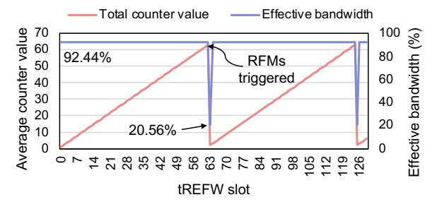
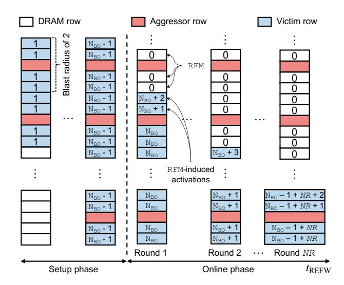

# PVAC: A RowHammer Mitigation Architecture Exploiting Per-victim-row Counting

Jumin Kim†∗, Seungmin Baek†∗, Hwayong Nam† , Minbok Wi‡ , Nam Sung Kim§ , Jung Ho Ahn† †*Seoul National University,* ‡*Samsung Electronics,* §*University of Illinois Urbana-Champaign* †{tkfkaskan1, qortmdalss, nhy4916, gajh}@snu.ac.kr, ‡minbok.wi@samsung.com, §nskim@illinois.edu

*Abstract*—As DRAM scaling exacerbates RowHammer, DDR5 introduces per-row activation counting (PRAC) to track aggressor activity. However, PRAC indiscriminately increments counters on every activation—including benign refreshes—while relying solely on explicit **RFM** operations for resets. Consequently, counters saturate even in an idle bank, triggering cascading mitigations and degrading performance. This vulnerability arises from a fundamental mismatch: PRAC tracks the *aggressor* but aims to protect the *victim*.

We present Per-Victim-row hAmmered Counting (PVAC), a victim-based counting mechanism that aligns the counter semantics with the physical disturbance mechanism of RowHammer. PVAC increments the counters of victim rows, resets the activated row, and naturally bounds counter values under normal refresh. To enable efficient victim-based updates, PVAC employs a dedicated counter subarray (CSA) that performs all counter resets and increments concurrently with normal accesses, without timing overhead. We further devise an energy-efficient CSA layout that minimizes refresh-induced counter accesses. Through victimbased counting, PVAC supports higher hammering tolerance than PRAC while maintaining the same worst-case safety guarantee. Across benign workloads and adversarial attack patterns, PVAC avoids spurious **Alert**s, eliminates PRAC timing penalties, and achieves higher performance and lower energy consumption than prior PRAC-based defenses.

*Index Terms*—DRAM read disturbance, RowHammer, PRAC

## I. INTRODUCTION

Bits stored in a DRAM row (victim row) can flip if the rows physically adjacent to the victim row (referred to as aggressor rows) go through cycles of activation-precharge repeatedly, a phenomenon referred to as RowHammer (RH) [41]. From the perspective of an aggressor row, if the number of activationprecharge cycles does not surpass a threshold (NRH), no bitflips occur in the victim rows. Thus, by counting these cycles and refreshing the victim rows before the count reaches NRH, we can prevent RH. Over the past decade, numerous hardware and software defense mechanisms [2], [4], [6], [7], [21], [26], [27], [31], [37]–[39], [47], [60], [62]–[68], [74]–[76], [78], [79], [82], [83], [89], [91], [92], [94], [97], [99] have been proposed to safeguard against a wide range of RH attacks [1], [8], [14], [19], [20], [24], [28], [33], [43], [45], [49], [50], [69], [71], [77], [84]–[87], [90], [95], [96], [101].

Per-row activation counting (PRAC) was recently introduced in the latest DDR5 JEDEC specification, which dedicates a small number of counter bits to each DRAM row to

# Algorithm 1 An aggressor-based counting mechanism

```
1: State: per-row counter array cnt[], back-off threshold NBO, and
  RFM target queue Q
2: procedure ACT(r):
3: cnt[r] ← cnt[r] + 1
4: if cnt[r] ≥ NBO then
5: ENQUEUE(Q, r)
6: RFM() // ALERT
7: procedure RFM():
8: r ← DEQUEUE(Q)
9: for each row v in Victims(r) do
10: ACT(v) // RFM-induced ACT
11: cnt[r] ← 0
```

## Algorithm 2 A victim-based counting mechanism

```
1: State: per-row counter array cnt[], back-off threshold NBO, and
  RFM target queue Q
2: procedure ACT(r):
```

```
3: cnt[r] ← 0
4: for each row v in Victims(r) do
5: cnt[v] ← cnt[v] + 1
6: if cnt[v] ≥ NBO then
7: ENQUEUE(Q, v)
8: RFM() // ALERT
9: procedure RFM():
10: r ← DEQUEUE(Q)
11: ACT(r) // RFM-induced ACT
```

precisely count every activation [30]. When a row is activated, PRAC increments its corresponding counter; these activations include activate (ACT), refresh (REF), and refresh management (RFM) operations. If the counter value exceeds a predefined threshold (NBO), PRAC triggers an alert back-off (ABO) protocol that instructs the memory controller (MC) to issue an RFM command. The RFM command performs preventive refreshes on its neighboring victim rows, which activate them, and also resets the counter value for the aggressor row. We provide the pseudo code of PRAC in Algorithm 1.

However, PRAC's aggressor-based counting creates a structural asymmetry: counters increment on every activation (including periodic REFs) but reset only during explicit RFM commands [30]. Because refreshes occur continuously, counter values monotonically increase even in an idle bank. Conse-

<sup>∗</sup>These authors contributed equally to this work.



Figure 1. Counter value per row and available bandwidth across the tREFW window, solely driven by normal refresh under PRAC when NBO, NMit, and blast radius are 64, 4, and 2, respectively.

quently, as counters approach the threshold (NBO), a single activation can trigger a chain reaction of RFM commands across the bank. This domino effect severely degrades performance and can intermittently halt memory operations, causing denialof-service (DoS) behavior even without malicious accesses. Figure 1 illustrates the average counter value and the resulting available memory bandwidth of a DDR5 single-rank DIMM in the absence of memory accesses, configured with NBO = 64, NMit = 4, and a blast radius of 2, consistent with NBO values evaluated in recent PRAC-based studies [7], [65], [89], [91]. Even when a bank is idle, the effective bandwidth is 92.44% due to periodic refresh operations. As REF commands are issued continuously, the model shows that counters increase linearly. At the beginning of the 63rd tREFW, the counter values of the earliest refreshed rows reach the NBO threshold (*i.e.*, 64), triggering a sequence of RFM commands. As a result, the effective bandwidth collapses to 20.56% within the 63rd tREFW, leading to intermittent but severe DoS behavior. This issue becomes even worse when normal accesses are present, as their activations accelerate counter accumulation.

PRAC's counter organization further exacerbates the problem. Prior in-DRAM mitigation schemes maintain counters in SRAM/CAM tables, enabling all counters to be reset in parallel once per tREFW [47], [63], [78]. However, as PRAC stores counter bits directly inside DRAM rows [30], such parallel reset operations incur significant overhead. This design forces counter accesses to incur an ACT-PRE sequence, resulting in long latency. Overall, PRAC-based mechanisms are fundamentally constrained not only by the one-directional counter increments but also by the high cost of counter resets, highlighting the need for a new counting organization.

To address this problem, we propose *PVAC, Per-Victimrow hAmmered Counting*, which fundamentally shifts counting from aggressor rows to victim rows. Similar to PRAC, each DRAM row has its dedicated counter. However, instead of incrementing the counter of the row being activated (an aggressor row), we increment the counters of its victim rows. For simplicity, we initially assume a blast radius of one (*i.e.*, an aggressor row influences one row on each side). If counter values are stored in an array cnt[ ] and the index of the activated row is r, we reset cnt[r] to 0 and increment the counters of the potential victim rows (cnt[r ± 1]). In PVAC, therefore, cnt[r] indicates the vulnerability of the row itself against RH, whereas in PRAC it indicates the vulnerability of the neighboring rows (Algorithm 2).

Because every activation naturally resets the counter of the accessed row, PVAC prevents unnecessary accumulation. While an REF operation implicitly activates each row once per tREFW, PVAC resets the counter of the refreshed row during this activation. Although REF-induced activations may briefly increase a victim's counter, a subsequent REF operation soon resets its counter back to zero, preventing long-term accumulation. Even when normal accesses are interleaved, PVAC maintains this bounded behavior because each ACT and REF also resets the activated row's counter.

As PVAC updates the counter values of multiple rows on each activation, we employ a counter subarray (CSA) [2], [7]. The CSA does not share the data path with the data subarray (DSA), allowing counter updates for both aggressor and victim rows to proceed in parallel with normal memory accesses. However, resetting counters during refresh could require activating multiple CSA rows. Accordingly, we introduce an energy-efficient CSA organization that enables these updates with a single CSA activation. This structure removes the overhead of multiple activations while preserving both performance and energy efficiency.

PVAC's victim-based counting enables larger NBO configurations than PRAC while maintaining security under a lower victim-row RH threshold (NRHv). Here, NRHv denotes the maximum hammered count that a victim row can tolerate without inducing bitflips. PVAC directly bounds the hammered count observed at each row, while PRAC must conservatively restrict each aggressor's hammering count to account for disturbance aggregation within the blast radius. To quantify this difference, we model a worst-case feinting attack [57], [98] and analytically derive the NBO values for PVAC and PRAC to tolerate an identical maximum hammered count.

PVAC improves both performance and energy efficiency under benign workloads and malicious access patterns. We evaluate its performance and energy consumption against PRAC and state-of-the-art PRAC-based mitigation schemes, including Chronus [7], MOAT [65], and QPRAC [91]. Under benign workloads, PVAC consistently delivers higher performance than PRAC-based schemes while reducing energy consumption by avoiding unnecessary proactive mitigations and operating without long-latency PRAC timing parameters. Even under the adversarial access patterns we evaluated, PVAC outperforms Chronus.

The key contributions of this paper are as follows:

- We identify fundamental drawbacks in aggressor-based counting and the PRAC organization, and we propose a victim-based counting method, Per-Victim-row hAmmered Counting (PVAC), to address these limitations.
- PVAC enables larger NBO than PRAC under an identical worst-case bound and remains safe at lower thresholds.
- We show that PVAC incurs the lowest performance and energy overhead among PRAC-based schemes we evaluated.


Figure 2. A DRAM organization equipped with PRAC.

#### Table I Major timing parameters for DDR5-4800 without/with PRAC

| Timing                        | Description                                  | Default | PRAC  |
|-------------------------------|----------------------------------------------|---------|-------|
| $\overline{t_{\mathrm{RAS}}}$ | Min. time from ACT to PRE                    | 32 ns   | 16 ns |
| $t_{\rm RP}$                  | Min. time from PRE to ACT                    | 16 ns   | 36 ns |
| $t_{\rm RC}$                  | Min. time between consecutive ACTs           | 48 ns   | 52 ns |
| $t_{\mathrm{RTP}}$            | Min. time from RD to PRE                     | 7.5 ns  | 5 ns  |
| $t_{\rm WR}$                  | Min. time from the end of write burst to PRE | 30 ns   | 10 ns |
| $t_{\rm RCD}$                 | Min. time from ACT to RD / WR                | 16 ns   | 16 ns |

#### II. BACKGROUND

#### A. DRAM operations and timing parameters

To access data in DRAM, a memory controller (MC) issues a sequence of DRAM commands with predefined timing constraints. DRAM chips are organized hierarchically into bank groups, banks, and data subarrays (DSAs), which contain multiple rows and columns (Figure 2). To access data, the MC must first activate (ACT) the row containing the data, which enables a row decoder and loads the data into the row buffer. After that, read (RD) or write (WR) operations can be performed. When accessing data from a different row, the currently activated row must be precharged (PRE) before issuing a subsequent ACT command. Table I summarizes the timing parameters that define the ordering and timing constraints among the commands.

The timing parameters are largely determined by circuit-level properties. In particular,  $t_{\rm RAS}$ ,  $t_{\rm RP}$ ,  $t_{\rm WR}$ , and  $t_{\rm RCD}$  depend on the number of rows within a subarray. Populating more rows increases the capacitance of the sensing circuitry, which in turn lengthens the sensing time [46], [80].

To ensure data retention, an MC periodically issues refresh (REF) commands, guaranteeing that each row is activated and precharged at least once within the refresh window ( $t_{\rm REFW}$ ) to restore charge lost due to leakage. Table II lists the timing parameters associated with REF. There are two types of refresh operations: REF ab refreshes all banks simultaneously, and REF sb refreshes one bank per bank group. The MC issues an REF command every refresh interval ( $t_{\rm REFI}$ ), providing DRAM with a refresh period of  $t_{\rm RFC}$ , whose duration depends on the REF type and DRAM chip capacity.

#### B. RowHammer (RH)

RH is a phenomenon in which repeatedly activating a DRAM row (an aggressor row) induces bitflips in its neighboring rows (victim rows). We refer to the activation of an aggressor row as *hammering*, and the victim rows that receive disturbance as *hammered*. To distinguish the two perspectives, we use N<sub>RH</sub> to denote the maximum hammering count allowed

 $Table \,\, II \\ Refresh \,\, timing \,\, parameters \,\, for \,\, 16 \,\, Gb \,\, DDR5 \,\, devices$ 

| Command           | Refresh mode     | $t_{\rm REFW}$ | $t_{\rm REFI}$        | $t_{\rm RFC}$ |
|-------------------|------------------|----------------|-----------------------|---------------|
| REFab             | Normal           | 32 ms          | $3.9 \mu s$           | 295 ns        |
| REF <sub>ab</sub> | Fine granularity | 32 ms          | $1.95 \mu s$          | 160 ns        |
| REF <sub>sb</sub> | Fine granularity | 32 ms          | $1.95/4  \mu {\rm s}$ | 130 ns        |

for each aggressor row, and N<sub>RHv</sub> to denote the maximum hammered count that a victim row can tolerate without inducing bitflips. Because this threshold can vary depending on attack patterns and DRAM cell values [59], we define N<sub>RHv</sub> and N<sub>RH</sub> using their minimum values. Additionally, the disturbance can extend beyond the immediately adjacent rows to affect rows at greater distances—a behavior commonly referred to as the *blast radius* (BR)—and JEDEC has taken the BR into account in its specifications [30].

Although  $N_{RH}$  and  $N_{RHv}$  are related, they capture fundamentally different quantities. When multiple aggressor rows within the BR contribute to the same victim row, their effects accumulate at the victim. Thus, aggressor-based mitigation schemes must conservatively set  $N_{RH}$  below  $N_{RHv}$  so that the total hammered count at any victim row never exceeds  $N_{RHv}$ . As BR grows, the gap between  $N_{RH}$  and  $N_{RHv}$  becomes larger.

To mitigate RH, DRAM vendors have implemented in-DRAM Target Row Refresh (TRR) mechanisms starting since DDR4. In-DRAM TRR implementations have adopted counter-based, sampling-based, or hybrid schemes that combine both approaches [23], [25], [40]. These mechanisms identify potential victim rows and use a portion of  $t_{\rm RFC}$  to refresh those victim rows. While in-DRAM TRR reduces the impact of RH, it remains vulnerable to carefully crafted adversarial access patterns [17], [23], [29].

Moreover, the DDR5 JEDEC standard introduces Refresh Management (RFM) as a formal mitigation primitive [30]. By issuing an RFM command, the MC grants DRAM a timing window during which the device may perform internal mitigative actions. Upon receiving the RFM command, DRAM can refresh potential victim rows using the allotted time.

#### C. Per-Row Activation Counting (PRAC)

PRAC is a RH mitigation mechanism that extends each DRAM row to include extra counter bits and performs exact activation counting by updating the counter value on every PRE command [30]. The activations include ACT, REF, and RFM operations [30]. PRAC updates counter bits internally through a read-modify-write operation performed at every PRE command. This additional operation alters several timing parameters. Table I summarizes the timing parameters under both default and PRAC configurations. Among the timing parameters modified by PRAC, the longer  $t_{\rm RP}$  introduces performance overhead [7], [36], [60], [89].

When the activation count of a row exceeds the Back-Off threshold ( $N_{BO}$ ), PRAC invokes the Alert Back-Off (ABO) protocol to mitigate potential RH effects. Figure 3 shows the overall sequence once DRAM asserts the ALERT\_n signal (Alert) to the MC. Upon receiving the signal, the MC


Figure 3. Alert Back-Off (ABO) protocol overview.

provides a  $t{\rm ABO_{ACT}}$  timing margin before initiating mitigation. During this period, up to  ${\rm ABO_{ACT}}$  activations can be issued. After  $t{\rm ABO_{ACT}}$ , the MC issues  ${\rm N_{Mit}}$  RFM commands, allowing DRAM to refresh potential victim rows internally. Each RFM occupies 350 ns, during which ACT commands are blocked, resulting in a total stall time of  $t{\rm ABO_{Recovery}} = {\rm N_{Mit}} \times 350$  ns. Within this duration, DRAM performs victim row refreshes and resets the counter value of the aggressor row. After all RFMs are complete, the next Alert can be triggered only after ABO\_{Delay} activations have been issued. Table III summarizes the PRAC terminologies.

To determine which rows should be refreshed, PRAC can maintain a queue structure that stores row addresses with their counter values [30]. When any counter in this queue reaches a specific threshold, DRAM triggers an Alert.

Further, similar to the In-DRAM TRR in DDR4, PRAC can incorporate proactive mitigations that refresh potential victim rows in advance during  $t_{\rm RFC}$  [7], [65], [91]. We classify  $t_{\rm RFC}$  operations into normal refresh, which periodically refreshes all rows to ensure data retention, and proactive mitigation, which resets an aggressor row counter and refreshes its victim rows, similar to an RFM operation.

#### III. THREAT MODEL

We define a typical RH threat model consistent with prior studies [7], [65], [89], [91]. We assume a BR of two, as in Chronus [7], which is also used in commodity DRAM devices [32]. We assume that a powerful attacker can generate memory requests targeting specific DRAM components (e.g., banks, rows, and columns) and possesses full knowledge of the deployed defense algorithm. Under this assumption, the attacker can craft adversarial memory access patterns for RH attacks. Other disturbance attacks, such as RowPress [54] and ColumnDisturb [100], are out of scope.

#### IV. MOTIVATION

We investigate the necessity of *victim-based counting* for mitigating RH attacks. *Aggressor-based counting*, which increments a counter on every activation, overlooks the charge restoration naturally provided by activations, causing unnecessary counter accumulation. Thus, PRAC suffers from performance degradation due to excessive RFM operations [7], [65], [89], [91]. Also, DRAM cell-based counters inherently differ from SRAM-based counters, imposing more constraints on their operations.

Table III
TERMINOLOGIES RELATED TO PRAC

| Symbol                                 | Description                                                                  | Value            |
|----------------------------------------|------------------------------------------------------------------------------|------------------|
| N <sub>RH</sub> / N <sub>RHv</sub>     | Minimum aggressor hammering / victim hammered count for the first RH bitflip |                  |
| N <sub>BO</sub>                        | Back-Off threshold                                                           |                  |
| N <sub>Mit</sub>                       | The number of RFMs on Alert                                                  | 1, 2, or 4       |
| $\overline{t{\rm ABO}_{\rm ACT}}$      | Maximum time window from Alert to RFM                                        | 180 ns           |
| $\overline{t{\rm ABO}_{\rm Recovery}}$ | Time window for performing RFMs                                              | 350 ns           |
| ABO <sub>ACT</sub>                     | The possible number of ACTs during $t{\rm ABO}_{\rm ACT}$                    | 3                |
| ABO <sub>Delay</sub>                   | The minimum number of ACTs allowed from end of RFM to the next Alert         | N <sub>Mit</sub> |
| BR                                     | Blast radius                                                                 | 2                |

#### A. Limitations of aggressor-based counting

Aggressor-based counting ignores the physical charge restoration that occurs when a row is activated. While an activation physically restores the accessed row, PRAC blindly increments that row's hammering count (§I). This causes persistent, monotonic counter accumulation even for unaccessed rows, eventually triggering unnecessary Alerts. Further, these Alerts exacerbate the problem: because RFM operations activate adjacent victim rows, mitigating one row increments its neighbors' counters, potentially triggering further Alerts in a cascading effect.

To prevent this accumulation, frequent counter resets are required, but they are prohibitively expensive in aggressor-based schemes. Safely resetting an aggressor's counter requires first refreshing all neighboring victim rows. Because PRAC stores counters within DRAM rows, this process requires at least five serialized activations (for a BR of two), incurring a severe latency penalty. Consequently, PRAC is forced to delay resets until Alert-induced RFM operations, which provide a sufficiently long timing window (350 ns).

## B. Structural Limits of DRAM Cell-based Counters

Unlike prior SRAM/CAM-based mitigations that permit parallel counter resets every  $t_{\rm REFW}$  [25], [38], [47], [57], [63], PRAC embeds counters directly within DRAM rows. This strict adherence to DRAM timing dictates that every counter update requires an explicit ACT and PRE, making large-scale periodic resets infeasible. Consequently, PRAC and its derivatives are forced to rely on expensive Alertinduced RFM or heavily extended normal refresh windows (e.g., MOAT [65] inflates  $t_{\rm RFC}$  from 295 ns to 410 ns) simply to accommodate the latency of counter resets.

## C. Need for victim-based counting

Victim-based counting resolves the reset bottlenecks of PRAC. By resetting a row's counter upon its activation—which accurately reflects its physical charge restoration—and incrementing the adjacent victim rows, PVAC intrinsically prevents persistent accumulation and eliminates the multi-row structural overheads of aggressor-based tracking.

Table IV COMPARISON WITH PRIOR PRAC STUDIES

|                      | PRAC<br>[30] | Chronus<br>[7] | QPRAC<br>[91] | MOAT<br>[65] | PVAC   |
|----------------------|--------------|----------------|---------------|--------------|--------|
| Target of counting   | Aggr.        | Aggr.          | Aggr.         | Aggr.        | Victim |
| Counter reset on ACT | No           | No             | No            | No           | Yes    |
| PRAC timing usage    | Yes          | No             | Yes           | Yes          | No     |

## *D. Prior works*

Table IV categorizes prior PRAC-based studies [7], [65], [91] along three key aspects: counting target, counter reset behavior on an ACT operation, and PRAC timing usage. Among these, all previous studies track activations of aggressor rows, which inherently prevents counter reset on ACT. Chronus [7] is the only work that introduces a counter subarray that allows concurrent counter updates, enabling it to operate under the original DDR5 timing rather than PRAC timing.

In summary, none of the prior PRAC studies adopt a victimbased counting method that enables seamless counter resets during ACT operations. Our goal is to implement victim-based counting PRAC without incurring additional overhead.

## V. PER-VICTIM-ROW HAMMERED COUNTING

PVAC shifts the counting paradigm from aggressor rows to victim rows. Every ACT inherently resets the accessed row's counter in PVAC, eliminating the need to activate multiple consecutive rows for a single reset and making refresh-coupled resets feasible. However, because each ACT must modify multiple counters (*e.g.*, the accessed row and four adjacent victims when BR = 2), PVAC employs a dedicated counter subarray (CSA) to perform these updates concurrently without extending the critical timing path. All evaluations use DDR5- 4800 B-die 16Gb chips with 32 banks per sub-channel, 64K rows per bank, and 1 KB row size (Table I and Table II).

## *A. PVAC structure*

Figure 4 illustrates the overall structure of PVAC, which consists of two main components: 1) a CSA and 2) a priority queue. A DSA stores user data for normal memory access, whereas a CSA maintains the hammered counts of every row in each DSA. We assume that each DSA contains 512 rows, and each row has an 8-bit counter, a commonly used configuration in prior works [7], [51]. The priority queue, as introduced in [91], is updated on every ACT and tracks the top-K victim rows with the highest hammered counts (where K denotes the queue depth).

Counter subarray: As established in §IV-B, PRAC's embedding of counters within DSA rows strictly ties updates to the slow DRAM timing parameters. Because PVAC must update the counters of the accessed row and its adjacent victims on every ACT, a traditional PRAC layout would demand up to five serialized DSA activations (for BR = 2). This adds approximately 4×tRC (*e.g.*, 208 ns) of latency per normal access, severely degrading performance.


Figure 4. An overview of PVAC architecture, including a counter subarray (CSA) and a priority queue.

To bypass these structural limits, PVAC extracts counter storage into a dedicated counter subarray (CSA), leveraging subarray-level parallelism [42] as in prior studies [2], [7]. Because the CSA does not share the data path with the DSA, it can activate concurrently with DRAM accesses (Figure 5). On a DSA ACT, the CSA simultaneously updates the adjacent victim counters and resets the accessed row's counter without extending the critical timing path.

Because RH disturbance is confined within a single subarray [9], [52], [53], [59], [61], PVAC maps the counters of each DSA to a single CSA row, enabling all counter updates with a single ACT. Thus, PVAC need not examine or update counters in other DSAs.

The storage overhead of the CSA is negligible. For 64K rows, each with an 8-bit counter, a CSA requires only 64 KB (64 rows), *i.e.*, less than 0.1% capacity overhead [35]. Given that a DSA typically contains 512 rows, each CSA row can store counter values for two DSAs.

Moreover, PVAC adopts guard rows [5], [16], [44], [88] between CSA rows to prevent potential bitflips. Assuming two guard rows per CSA row to account for a BR of two, the resulting capacity overhead is only 0.29% [35]. As PVAC performs counter resets during refresh operations, every CSA row is refreshed once per tREFW, thereby eliminating the need for additional refresh logic for the CSA.

Counter update logic: PVAC updates the counter values by simultaneously activating both a DSA row and a CSA row. Figure 5 illustrates the sequence of operations involved in counter updates. Both the CSA and DSA decoders receive the input row address and activate the corresponding row. Following prior work [7], we incorporate dedicated counter update logic within the CSA to update the counter efficiently.

Unlike PRAC, PVAC resets the counter of the activated row and updates the counters of its adjacent victim rows. tRCDCSA , tWRCSA , and tRPCSA denote the CSA timing parameters corresponding to tRCD, tWR, and tRP of the DSA, respectively. 1 When a DSA row is activated, the corresponding CSA row is activated concurrently. 2 After tRCDCSA , the counter update logic sequentially increments or decrements the counters of the four victim rows and then resets the counter of the activated row. Each 8-bit counter value requires tUP to be read, updated,


Figure 5. Counter update sequence when a DSA row A is activated, with concurrent CSA row activation.

and written back; thus, a total latency of  $5 \times t_{\rm UP}$  is required.

3 Once the update is finished, the CSA waits for  $t_{\rm WR_{CSA}}$ .

4 Finally, the row is precharged, which takes  $t_{\rm RP_{CSA}}$ .

Each activation of a DSA row requires updating five counters—one for the activated row and four for its adjacent victim rows—but updating is completed within  $t_{\rm RC}$  because of the shorter CSA timing parameters. As each CSA contains only 64 rows, its timing parameters ( $t_{\rm RCD_{CSA}}$ ,  $t_{\rm RAS_{CSA}}$ ,  $t_{\rm RP_{CSA}}$ , and  $t_{\rm WR_{CSA}}$ ) are significantly smaller than the corresponding DSA timing parameters (§II-A) [46], [73], [80]. Based on the SPICE simulations from previous studies [22], [55], we apply reduction ratios (47.4%, 52.0%, 25.3%, and 63.8%) to the original DDR5 timing parameters, resulting in 7.6 ns, 16.7 ns, 4.1 ns, and 19.2 ns, respectively. These values closely align with those reported in prior studies [73], [80].

If the five counter values are updated serially, the total latency becomes  $t_{\rm RCD_{CSA}}+5\times t_{\rm UP}+t_{\rm WR_{CSA}}+t_{\rm RP_{CSA}}=(30.9+5\times t_{\rm UP})\,\rm ns,$  which fits within  $t_{\rm RC}$  of 48 ns. We synthesized the counter update logic using Synopsys Design Compiler [81] with a TSMC 40nm process and measured  $t_{\rm UP}$  of 0.83 ns. Overall, the total counter update latency is 35.1 ns and can be fully hidden within normal DSA operations. The area overhead remains below 0.01% per bank [35], and the energy overhead is also negligible because CSA ACT and PRE operations dominate the total update energy.

Priority queue: To determine which rows should be refreshed during proactive mitigation and RFM, consistent with previous work [7], [89], [91] and the JEDEC specification [30] (§II), PVAC maintains a priority queue that stores row addresses together with their hammered counts, sorted by the count value. Without such a queue, triggering an Alert would require scanning all activation counters to identify victim rows, leading to prohibitive performance overhead. To avoid this overhead, PVAC maintains a per-bank priority queue so that mitigation candidates are readily available without requiring full-bank counter scans at each Alert.

Whenever a row is activated, PVAC simultaneously updates its counter value and determines whether the corresponding entry in the queue should be inserted or updated. If the row already exists in the queue, only its hammered count is updated. If a row's hammered count exceeds that of an existing entry, the entry with the smallest count is evicted and replaced

with the new row. By doing so, the queue always contains the top-K rows with the highest hammered counts.

## B. Mitigative actions

PVAC employs two commonly adopted mitigative actions to guarantee timely protection of victim rows: proactive mitigation and RFM. Proactive mitigation is performed within  $t_{\rm RFC}$  to refresh potential victim rows, along with the normal refresh. RFM is triggered when the hammered count of a specific victim row exceeds NBO, generating an Alert.

**Proactive mitigation:** PVAC's proactive mitigation reduces the frequency of Alert invocations by refreshing the most hammered victim rows before they reach  $N_{BO}$ . Similar to prior studies [23], [25], PVAC leverages a portion of  $t_{RFC}$  to selectively refresh the rows with the highest counter values in the priority queue. To further enhance energy efficiency, PVAC does not invoke this mitigative action every  $t_{RFC}$ ; instead, it is triggered only when at least one row's counter value exceeds a predefined threshold (e.g.,  $N_{BO}/2$ ) [91]. This selective triggering reduces the number of Alerts proactively. Consistent with prior aggressor-based schemes that refresh four victim rows and reset one aggressor row per mitigation, PVAC performs mitigation by refreshing four victim rows.

**RFM:** Because PVAC increments up to four victim counters per ACT, multiple rows may exceed N<sub>BO</sub> simultaneously. To ensure all Alerts from a single activation are safely resolved, PVAC leverages the standard RFM timing window—which inherently accommodates five row accesses (four victims and one aggressor)—to refresh the four highest-priority victim rows directly from the priority queue.

**Priority queue size:** PVAC provisions its priority queue size to accommodate all the rows that may be refreshed during both RFM and proactive mitigation, ensuring correctness under the worst-case activation patterns. The number of rows refreshed during RFM is the product of the maximum number of RFMs per Alert (N<sub>Mit</sub>), which can be up to four (Table III), and the number of rows refreshed per RFM (*i.e.*, four). Proactive mitigation adds up to four additional rows, totaling a queue size of 20. This is four times larger than QPRAC's queue size, but still incurs only 0.2% area overhead per chip [91].

#### C. Overhead of PVAC on normal refresh

While PVAC can perform counter resets during normal refresh operations, each refresh triggers additional counter updates and thus increases CSA energy consumption. When rows in multiple DSAs are refreshed concurrently, their corresponding CSA rows must also be activated to update the associated counters. For example, because each  $REF_{ab}$  command refreshes eight rows per  $t_{REFI}$ , refreshing a single row in eight even-indexed DSAs (*e.g.*, DSA 0, 2, 4, ..., 14) requires activating up to eight CSA rows (Figure 4).

Further, because these CSA rows reside in the same subarray, they must be activated serially, resulting in non-trivial latency overhead in addition to the increased energy cost. For example, activating eight CSA rows incurs a latency of  $280.8 \, \mathrm{ns} = (8 \times 35.1 \, \mathrm{ns})$ , which occupies a critical portion of


Figure 6. Energy efficient CSA structure in PVAC, interleaving counters across dual CSAs to reduce overhead during normal refresh.

tRFC (295 ns). As proactive mitigation must also be completed within the tRFC, such long latency poses an additional critical challenge. To make PVAC practical, it is essential to reduce the number of CSA activations for normal refreshes.

## *D. CSA optimization for normal refresh*

To minimize energy consumption from CSA during normal refresh, we optimize a CSA structure to activate fewer CSA rows while preserving all functional behaviors of PVAC. Baseline PVAC stores all counters of a DSA within a single CSA row, which requires activating many CSA rows when multiple DSAs are refreshed in parallel. Instead, we map multiple DSAs' counter values into a single CSA row, while distributing each DSA's counters across several CSA rows. This remapping allows a single CSA row activation to update the counters of many DSA rows refreshed in parallel, substantially reducing CSA activation energy and latency.

However, distributing each DSA's counters across multiple CSA rows introduces a corner case. When the required counters for a DSA row are spread over two CSA rows, the update requires two CSA activations, causing the operation to exceed tRC (*e.g.*, when row 128 is activated, the counter values of rows 126 through 130 must be updated). Updating these five counters requires activating two CSA rows, and the resulting serialized activations incur 70.2 ns = (2 × 35.1 ns) > tRC.

To resolve this, we partition the original 64-row CSA into two parallel 32-row subarrays and interleave the counter storage. The counters of each DSA are divided into four chunks, each containing the counters of 128 rows, and these chunks are interleaved across two CSAs (Figure 6). That is, the counters for rows 126 and 127 are mapped to a different CSA than those for rows 128, 129, and 130. Hence, the activations are distributed across the two CSAs and can proceed in parallel, ensuring that all counter updates complete within tRC.

As dual-CSA activation occurs only in a small fraction of cases (<sup>3</sup>/128), this design reduces the additional energy cost of counter resets in refresh operations (§VII-C). However, splitting the CSA introduces additional peripheral circuitry. Since a sense amplifier is typically about two orders of magnitude larger than a DRAM cell [70], this additional peripheral logic inevitably incurs area overhead. Nevertheless, the chip-level impact remains negligible, making the structure a practical and efficient enhancement to PVAC.

## VI. SECURITY ANALYSIS

For a fair comparison between aggressor- and victim-based schemes, we evaluate NBO values of all schemes under a common victim-side maximum hammered count (HC) constraint. For aggressor-counting schemes, the NBO values reported in this paper are not taken from their native NRH-based analysis [7], [91]. Instead, we reformulate the analysis from the victim-row perspective and re-derive their NBO values under the same maximum HC constraint. Our analysis builds on the methodology of [91], but focuses on victim rows' *hammered count* rather than aggressor rows' *hammering count*. The NBO value must be chosen such that the maximum HC of any victim row remains below NRHv.

We assume that the system employs the ABO protocol, which uses the RFM command as the only reactive mitigation mechanism. Although proactive mitigation (and normal refresh in the case of PVAC) is also applied as a mitigative action, these mechanisms involve refresh postponement effects.<sup>1</sup> For analytical clarity, we exclude such mechanisms from our model—representing a conservative assumption that places the defender in the worst-case condition. Further, we assume that the attacker performs the RH attack within a single tREFW, during which every DRAM row is refreshed exactly once.

## *A. Feinting attack [57]*

To derive the worst-case HC achievable against PVAC and PRAC-based schemes, we adopt the feinting attack model [57] (or wave attack [98]), which maximizes HC within a single tREFW. This attack proceeds in multiple rounds. In each round, the attacker evenly distributes activations across a prepared set of rows.

When a counter exceeds NBO, an Alert triggers RFM. Assuming the attacker knows which rows are mitigated (§III), they exclude these from subsequent rounds and continue evenly activating the remaining rows until only one survives, experiencing the maximum HC.

## *B. Attack modeling for PVAC*

Figure 7 illustrates the feinting attack on a victim-based counting scheme [57]. We analyze the feinting attack against PVAC by decomposing it into two phases: (1) *setup phase* and (2) *online phase*. The total HC is obtained as the sum of HC from both phases:

$$HC = HC_{setup} + HC_{online}$$
 (1)

Setup phase: During the setup phase, the attacker prepares an initial victim row pool (R1) and issues NBO − 1 activations to each victim's corresponding aggressor rows. To efficiently

<sup>1</sup>With PRAC enabled, refresh scheduling flexibility is reduced, limiting the maximum postponement from 5×tREFI to 3×tREFI [30].



Figure 7. A sequence of feinting attack under a victim-based tracking mechanism with BR of 2 [57].

increase the row pool size, the attacker activates rows with a stride of 5, considering a BR of 2 [57]. Therefore, the HC achieved in the setup phase is expressed as:

$$HC_{setup} = N_{BO} - 1 \tag{2}$$

Online phase: The online phase proceeds over NR rounds, where NR denotes the number of attack rounds. In each round, the attacker activates each remaining row once. Rows within the BR of the refreshed rows experience additional RFM-induced activations (Figure 7). In the final round (NR), the attacker can perform ABO<sub>ACT</sub> + ABO<sub>Delay</sub> activations before the last RFM commands are issued. Therefore, the online phase HC can be expressed as:

$$HC_{online} = NR + ABO_{Delay} + ABO_{ACT} + BR$$
 (3)

Because all values except NR are constant, the HC reaches its maximum when NR reaches its highest possible value.

**Determining NR:** In round n, all remaining rows  $(R_n)$  are evenly hammered. Based on the ABO protocol constraints (Table III), each Alert permits exactly  $ABO_{ACT} + ABO_{Delay}$  activations before the defense enforces the RFM penalty, implying that exactly  $ABO_{ACT} + ABO_{Delay}$  rows in the pool can be activated once per Alert.

During a round, Alerts are triggered, and the resulting RFMs refresh a subset of rows. The number of Alerts generated in round n-1 is  $\lfloor \frac{R_{n-1}}{4 \times (ABO_{ACT} + ABO_{Delay})} \rfloor$ . Multiplying this by the number of victim rows refreshed per RFM (i.e., 4) and by N<sub>Mit</sub> yields the total number of mitigated rows. Thus, the remaining row pool size for the next round  $(R_n)$  can be expressed as:

$$\mathbf{R}_{n} = \mathbf{R}_{n-1} - \mathbf{N}_{Mit} \times \left\lfloor \frac{\mathbf{R}_{n-1}}{\mathbf{A}\mathbf{B}\mathbf{O}_{ACT} + \mathbf{A}\mathbf{B}\mathbf{O}_{Delay}} \right\rfloor \tag{4}$$

NR is the value of n where  $R_n = 1$ .

# C. Attack modeling for PRAC [91]

As PRAC employs aggressor-based counting, its  $N_{BO}$  must be conservatively determined by considering BR. Consider five

contiguous rows (row 0–4). If rows 0, 1, 3, and 4 are each activated  $^{N}/_{4}$  times, their individual *hammering counts* remain  $^{N}/_{4}$ , but the cumulative hammered count at row 2 reaches  $^{N}$ . PVAC can tolerate this behavior by ensuring that the hammered count does not exceed  $^{N}$ . In contrast, PRAC enforces a stricter bound that limits each aggressor's hammering count to at most  $^{N}/_{4}$ . Even if only one of these rows is activated  $^{N}/_{4}$  times, an Alert must be issued. This gap in the threshold values between PRAC and PVAC increases as BR grows. To reconcile this asymmetry, we derive the  $^{N}$ BO value for PRAC that guarantee the same maximum HC as PVAC.

We model the feinting attack on PRAC following [91] with one key difference in the layout of aggressor and victim rows. To maximize the HC of a victim row, the aggressor rows must be placed within the victim row's BR so that their disturbance accumulates onto the victim. With BR of 2, this requires the final surviving aggressor rows to surround one victim row, with two aggressors on each side. As the victim is refreshed when any of those aggressors is mitigated, the attack ends when the remaining aggressor row pool  $R_n$  becomes four. Hence, NR corresponds to the round index n at which  $R_n = 4$ .

**Setup phase:** During the setup phase, each of the final  $2 \times BR$  aggressor rows is prepared up to  $N_{BO}$  -1. Because all of them lie within the same victim row's BR, their disturbance accumulates at the victim, yielding:

$$\mathbf{HC}_{setup} = 2 \times \mathbf{BR} \times (\mathbf{N}_{BO} - 1) \tag{5}$$

Online phase: In every round, the progression is the same as that of PVAC, except that the per-round HC contribution becomes  $2\times BR$ . After the last round (NR), the attacker can further issue  $ABO_{Delay} + ABO_{ACT}$  activations before RFM begins. Then, as rows are refreshed in the order of distance 1, 2, ..., BR from the mitigated aggressor, the farthest victim row is refreshed last and can receive up to BR-1 additional disturbances before being refreshed. Therefore, the online-phase HC is expressed as:

$$HC_{online} = (2 \times BR \times NR) + ABO_{Delay} + ABO_{ACT} + BR - 1$$
 (6)

**Determining NR:** As in prior work [91], aggressor rows in PRAC are placed contiguously, since PRAC tracks only aggressor hammering counts and thus does not require the stride used in PVAC. Because each RFM refreshes victim rows within BR of the mitigated aggressor, the last RFM in round n-1 effectively pre-activates the first BR rows of the aggressor row pool in round n [91]. Therefore, only  $R_{n-1}$  – BR rows need to be considered when counting the number of Alert events in round n-1, yielding:

$$\mathbf{R}_{n} = \mathbf{R}_{n-1} - \mathbf{N}_{Mit} \times \left[ \frac{(\mathbf{R}_{n-1} - \mathbf{B}\mathbf{R})}{\mathbf{A}\mathbf{B}\mathbf{O}_{ACT} + \mathbf{A}\mathbf{B}\mathbf{O}_{Delay}} \right]$$
(7)

For BR = 2, NR is the round index at which only the final four aggressor rows around the victim remain (i.e.,  $R_n = 4$ ).

#### D. Attack modeling for Chronus

Chronus proposes an optimized ABO protocol that enables a single Alert to mitigate all rows whose counter values exceed  $N_{BO}$ , regardless of  $N_{Mit}$  [7]. Accordingly, after the


Figure 8. NBO across various maximum hammered count (HC) for PRAC, PVAC, and Chronus.

setup phase, one additional activation is needed to trigger the Alert, after which the attacker can issue ABO<sub>ACT</sub> more activations before RFM begins. The farthest victim row can then receive up to BR-1 additional disturbances during RFM before being refreshed. Therefore, the online-phase HC is  $1+\mbox{ABO}_{ACT}+(\mbox{BR}-1)=\mbox{ABO}_{ACT}+\mbox{BR}$ . Since the setup phase is identical to that in Equation 5 and the online phase does not proceed over multiple rounds, we obtain:

$$HC_{online} = ABO_{ACT} + BR$$
 (8)

and the total HC is:

$$HC = 2 \times BR \times (NBO - 1) + ABO_{ACT} + BR.$$
 (9

#### E. Result

Figure 8 illustrates  $N_{BO}$  as a function of maximum HC, when a bank consists of 64K rows, corresponding to a DDR5 16 Gb configuration, and  $N_{Mit}$  is set to 1, 2, or 4. While the minimum and maximum initial victim row pool size under PVAC are 4 and 52,428, respectively, due to its stride-5 layout, the minimum and maximum initial aggressor row pool size of PRAC are 1 and 65,535, as one row must be reserved as the final victim row. To compute NR, we solve Equation 4 and Equation 7 for each initial row pool size ( $R_1$ ) from minimum to maximum value. We then substitute the resulting NR into Equation 3 and Equation 6 to obtain the corresponding HC values, and finally determine the  $N_{BO}$  values for PVAC and PRAC-based schemes under the same maximum HC. For Chronus, only Equation 5 and Equation 8 need to be solved.

PVAC can be configured with larger  $\rm N_{BO}$  values than PRAC-based schemes. When the maximum HC is 128 and  $\rm N_{Mit}$  is set to 1, 2, and 4, the resulting  $\rm N_{BO}$  values for PVAC are 85, 102, and 108, respectively, whereas those for PRAC are only 3, 15, and 19, and Chronus exhibits 31. At the maximum HC of 2048, PVAC exhibits  $\rm N_{BO}$  values of 2015, 2028, and 2032 for  $\rm N_{Mit}$  = 1, 2, and 4, respectively, whereas PRAC achieves 495, 501, and 503. For Chronus, the derived  $\rm N_{BO}$  value is 511.

PVAC can guarantee safety at lower maximum HC values than PRAC. At a maximum HC of 64, PRAC-1 and PRAC-2 fail to accommodate this value, and only PRAC-4 can be configured with NBO of 2. Because PRAC must conservatively configure NBO, it requires a much smaller value. Consequently, as the maximum HC decreases, NBO approaches zero earlier than PVAC, leading to unsafe points. In contrast, PVAC

Table V CONFIGURATIONS OF MITIGATIONS

| Schemes             | PRAC  | Chronus<br>[7]             | <b>QPRAC</b> [91]       | MOAT<br>[65]                 | PVAC                    |
|---------------------|-------|----------------------------|-------------------------|------------------------------|-------------------------|
| Proactive threshold | -     | -                          | $N_{BO} / 2$            | $N_{BO} / 2$                 | $N_{BO} / 2$            |
| Proactive period    | -     | $2 \times t_{\text{REFI}}$ | $1{\times}t_{\rm REFI}$ | $4 \times t_{\mathrm{REFI}}$ | $1{\times}t_{\rm REFI}$ |
| $t_{\rm RFC}$ (ns)  | 295   | 295                        | 295                     | 410                          | 295                     |
| N <sub>Mit</sub>    | 1/2/4 | Adaptive                   | 1/2/4                   | 1                            | 1/2/4                   |

remains safe with  $N_{BO}$  set to 43 at a maximum HC of 64 and continues to do so even when the maximum HC is reduced to 32, where  $N_{BO}$  is 11. Chronus can also tolerate these points with  $N_{BO}$  of 15 and 7, respectively, due to its optimized ABO protocol (§VI-D).

#### VII. EVALUATION

In this section, we evaluate the performance and energy overhead of PVAC in comparison with PRAC and other PRAC-based mitigation schemes. We sweep the maximum HC values and, for each HC setting, compare all mitigation schemes under the same maximum HC constraint.

#### A. System configuration

Table V summarizes the configurations of PVAC and the compared PRAC-based schemes. For aggressor-counting schemes, the  $\rm N_{BO}$  values used here are not directly taken from their native  $\rm N_{RH}$ -based configurations, but are re-derived under the victim-side HC formulation described in Section VI. The proactive threshold and period denote the counter value threshold and period that trigger proactive mitigations, respectively. Chronus does not employ a proactive threshold. Instead, it always performs proactive mitigation once every two  $t_{\rm REFI}$  intervals. QPRAC, MOAT, and PVAC all adopt a threshold of  $^{\rm N_{BO}}/_{\rm 2}$ . Among them, QPRAC and PVAC execute proactive mitigation every  $t_{\rm REFI}$ , whereas MOAT performs it once every four  $t_{\rm REFI}$  by default.

All schemes refresh four victim rows per proactive mitigation. PVAC resets the counter values of those victim rows, while the others reset the counters of a corresponding aggressor row. Consistent with prior studies, conventional PRAC is assumed not to perform proactive mitigation [7], [91]. MOAT assumes a  $t_{\rm RFC}$  of 410 ns, while the others use 295 ns.

Chronus adaptively issues RFM commands for all aggressor rows whose counter values exceed  $N_{BO}$  within a single Alert. As MOAT is designed for the case of  $N_{Mit}=1$ , we compare it under that configuration [65]. The other schemes support  $N_{Mit}$  values of 1, 2, or 4. For each HC value, we evaluate all feasible  $N_{Mit}$  configurations for each respective scheme and report the configuration that satisfies the HC constraint with the lowest overhead.

#### B. Methodology

**Simulation.** We evaluate performance and energy consumption using Ramulator 2.0 [56], a cycle-accurate memory system simulator. Table VI summarizes the system configuration used in our experiments. We assume a four-core out-of-order

#### Table VI SYSTEM CONFIGURATION

| Processor         | 4.2 GHz, 4-core, 128-entry instruction window                                                    |
|-------------------|--------------------------------------------------------------------------------------------------|
| Last-level cache  | 64 B cache line, 8-way set associative, 8 MB                                                     |
| Memory controller | 64-entry read/write queue, FR-FCFS [72],<br>MOP4CLXOR address mapping [34]                       |
| Main memory       | DDR5-4800, 2 sub-channels, 1 rank, 8 bank groups,<br>4 banks/bank group, 64K rows/bank, 1KB/chip |

system with an 8 MB last-level cache (LLC). The main memory consists of two sub-channels, each with 32 banks, totaling 64 banks of DDR5-4800. Accordingly, the LLC capacity and the number of banks per core are 2 MB and 16, respectively. The MC employs FR-FCFS scheduling policy [72].

Workloads. We evaluated PVAC and prior work using five benchmark suites: SPEC CPU2006 [11], SPEC CPU2017 [12], TPC [13], MediaBench [18], and YCSB [10]. We classify these workloads into three groups—High, Mid, and Low based on their Row-Buffer Misses Per Kilo Instructions (RBMPKI) [4], [7], [36], [97]. Using these classifications, we construct 30 mixed workloads, with 10 from each group.

## *C. Benign workloads*

Performance. Figure 9 shows the performance impact under different HC constraints. For each group, we compute weighted speedup, normalize it to the baseline with no mitigation, and report the geometric mean across all mixed workloads. We sweep HC from 32 to 2048 and evaluate both the na¨ıve and optimized versions of CSA. Because the CSA optimization does not impact performance, we report a single representative result.

When HC is below 32, the required NBO values become extremely small to remain secure. For example, Chronus must set NBO to 3 at HC = 16, and to 1 at HC = 8, to satisfy the security constraint. Such configurations are no longer practically operable under benign workloads. For this reason, we present evaluation results for HC values of 32 and above.

PVAC and Chronus achieve the highest performance among all the evaluated schemes. Both schemes utilize dedicated CSAs, thereby operating with the default timing parameters (Table I). In contrast, the other schemes adopt PRAC's timing parameters, which incur additional memory access latency and degrade performance [7], [36], [89].

The performance gap between PVAC/Chronus and the other mitigation schemes further widens as HC decreases. PVAC employs a larger NBO and resets counters on every access. Chronus benefits from its adaptive RFM behavior that limits mitigation frequency. These properties enable PVAC and Chronus to sustain higher performance while remaining secure even at lower HC values. At lower HC values, PVAC outperforms Chronus by generating fewer Alerts under all benign workloads. For the same HC value, PVAC, which counts victims, can configure a higher NBO than Chronus, which counts aggressors, resulting in a larger performance gap at lower HC settings. Specifically, when HC is 64, PVAC


Figure 9. Normalized weighted speedup across different workloads and HC values.

achieves a 1.3% performance improvement over Chronus, and when HC is 32, the performance gap widens to 6.9%.

Among the mitigations adopting PRAC timing parameters, performance decreases in the order of QPRAC, PRAC, and MOAT. PRAC issues more RFM commands than any other schemes, and it triggers Alerts even in the high group when HC is 2048, exhibiting the most significant RFM-induced performance reduction. It is because PRAC neither resets counters during normal refresh nor employs proactive mitigation.

QPRAC outperforms PRAC due to its proactive mitigation. At an HC of 256, QPRAC does not trigger an Alert, while PRAC incurs Alert-induced performance degradation. QPRAC triggers Alert only when HC falls below 128.

MOAT generally performs worst. Similar to QPRAC, MOAT employs proactive mitigation; thus, it rarely triggers Alerts until HC reaches 256. However, its tRFC (410 ns) is longer than that of other schemes (295 ns), resulting in higher refresh overhead. Further, as MOAT only supports NMit = 1, it must configure a lower NBO than QPRAC and PRAC, which support NMit up to 4, under the same HC constraint (Figure 8). Energy. We evaluate the mean energy consumption of each mitigation scheme across all workloads (Figure 10). Following the methodology of prior work [7], [22], [55], [73], [80], we estimate CSA energy consumption during both normal accesses and REF operations using SPICE simulations.

The optimized CSA design of PVAC reduces the number of activations during normal REF operations, thereby achieving lower energy overhead than the na¨ıve CSA design. Because the na¨ıve CSA may activate up to eight rows per REF (§V-C), the energy overhead during an REF operation can reach 161% of normal access energy. In contrast, the optimized CSA design requires only a single CSA activation, resulting in an additional energy overhead of only 19.3%.

During normal memory accesses, the na¨ıve CSA increases the normal access energy by 20.1%, while the optimized CSA increases it by 19.8%. This lower energy consumption of the optimized CSA is obtained even though the dual-CSA activation is required with a probability of <sup>3</sup> ⁄128. It is because the optimized CSA halves the number of rows per CSA, thereby reducing the energy consumption per CSA access compared to the naive CSA design.

Overall, the optimized CSA exhibits lower energy consumption than the na¨ıve design. This optimization reduces total energy consumption by 3.9% compared to the na¨ıve design across all HC values, primarily by lowering energy overhead


Figure 10. Normalized average energy consumption across different workloads with different HC values.

during normal REF operations.

PVAC and Chronus is more energy efficient than the other schemes, despite the additional energy overhead in the CSA. As DRAM energy consumption is proportional to operation latency, timing parameters are the dominant factor. Although ACT and PRE in PVAC and Chronus incur nearly a 20% peraccess energy increase due to CSA, this cost is less than the increase caused by PRAC timing parameters, consistent with the findings of Chronus [7]. When HC is 2048, even though Alerts are rarely triggered, PRAC, MOAT, and QPRAC incur energy overheads of 15.4%, 17.2% and 15.4%, respectively, whereas PVAC and Chronus incur only 4.08% and 10.8%, respectively, despite performing proactive mitigations.

PVAC consumes less energy than Chronus as it performs fewer proactive mitigations. Chronus triggers proactive mitigation once every two  $t_{\rm REFI}$  intervals, whereas PVAC initiates proactive mitigation only when a counter exceeds its threshold (i.e., N<sub>BO</sub>/2). Thus, PVAC avoids unnecessary proactive mitigations, lowering overall energy consumption. Even if Chronus adopts the same proactive mitigation threshold, PVAC still performs fewer mitigations due to its larger security-equivalent N<sub>BO</sub>, thereby reducing the mitigation energy overhead.

When the HC values drop below 256, Chronus issues more RFM commands than PVAC, which further increases its energy consumption. When HC is greater than 128, the energy overheads of Chronus and PVAC remain at 10.8% and 4.08%, respectively. However, as HC decreases to 64, the energy overheads of Chronus and PVAC become 12.6% and 5.35%, respectively. When HC is even reduced to 32, the overheads increase to 41.7% and 26.4%, respectively, with Chronus exhibiting the larger increase.

PRAC, QPRAC, and MOAT generally consume more energy than PVAC and Chronus. MOAT incurs the highest energy overhead as its performance slowdown caused by the longer  $t_{\rm RFC}$  further increases refresh-related energy, and its restriction to  $N_{\rm Mit}=1$ . PRAC shows the next highest energy consumption due to the frequent RFM commands issued, while QPRAC reduces this overhead by proactive mitigations.


Figure 11. Normalized weighted speedup across workloads under adversarial access patterns for varying maximum hammered count (HC) and row stride, with the number of RFM commands issued per  $t_{\rm REFW}$ .

#### D. Malicious attacks

We evaluate the robustness of PVAC and Chronus under adversarial patterns with concurrent benign workloads. We note that Appendix XI provides the theoretical upper bound of bandwidth degradation based on the methodology of Chronus [7], whereas this section focuses on the behavior observed under such workload conditions.

Adversarial pattern. To evaluate robustness against malicious attack patterns, we assume that one core issues adversarial memory accesses while the remaining three cores run benign workloads. We focus on Chronus and PVAC as these schemes maintain competitive performance overheads relative to other schemes under benign workloads (Figure 9). The attacker activates n rows in a round-robin manner to intentionally generate frequent Alerts and degrade overall system performance. We vary the number of rows n ( $n \in \{8, 32, 128, 512, 1K, 4K, 8K\}$ ) and sweep the maximum HC values from 32 to 512, because neither scheme triggers Alerts when the HC value exceeds 512.

We sweep the aggressor row stride from 1 to 5 to examine how the stride affects PVAC. Because PVAC increments the counters of multiple victim rows, the aggressor row stride affects counter accumulation, which in turn changes the number of issued RFM commands. Figure 11 shows the performance of PVAC, averaged across workload groups and n values for each row stride, along with the number of RFM commands issued per  $t_{REFW}$ . No Alert is triggered when the HC values are 512, 256, and 128. When the HC values decrease to 64 and 32, the largest RFM commands are issued at strides of 3 and 4, respectively. As the performance degradation is proportional to the number of RFM commands issued, these cases are the most harmful among the adversarial patterns we evaluated. When the stride is small (e.g., stride = 1 or 2), the counter increment can be immediately reset by the activation of the neighboring row, resulting in fewer Alerts. For strides of 3 or larger, this immediate counter reset disappears, allowing disturbance to accumulate more effectively. We derive an adversarial access pattern based on this spatial behavior to maximize issuing RFM commands. We observe a significant increase in the number of issued RFM commands within  $t_{REFW}$  when the stride is 3 or larger. Thus, a stride of 3 represents the physical worst-case access pattern that avoids self-resetting penalties.


Figure 12. Normalized weighted speedup across workloads under adversarial access patterns for varying maximum hammered counts (HC) and row pool (n), with the number of RFM commands issued per  $t_{\rm REFW}$ .


Figure 13. Counter update latency under different row numbers and BR.

**Performance.** Figure 12 evaluates performance under the previously identified stride while varying n. Due to 1) the larger  $N_{\rm BO}$  and 2) the counter reset during normal refresh operations, PVAC achieves higher performance than Chronus across the evaluated settings. In particular, when HC is 64 and n=128, PVAC outperforms Chronus up to 29.4%, which is the largest gap observed in our evaluation.

At small n and HC values where Alerts can be triggered within  $t_{\rm REFW}$ , this difference is primarily associated with the larger N<sub>BO</sub> of PVAC compared to Chronus. As n increases such that an Alert cannot be triggered within a single  $t_{\rm REFW}$ , PVAC still avoids triggering Alert due to its periodic counter reset on REF, while Chronus continues to trigger Alerts. For example, when HC = 512 and n = 8K, the access pattern can persist across multiple  $t_{\rm REFW}$  intervals. Without refresh-driven counter reset, Chronus continues issuing RFM commands, reaching roughly 1K RFM commands.

#### E. Sensitivity study

Because PVAC updates the counters of both aggressor and victim rows, PVAC's feasibility highly depends on the counter update latency. As explained in  $\S V$ , the counter update latency is determined by 1) the CSA timing parameters (*i.e.*,  $t_{\text{RCD}_{\text{CSA}}}$ ,  $t_{\text{WR}_{\text{CSA}}}$ , and  $t_{\text{RP}_{\text{CSA}}}$ ) and 2) the number of counter values updated. The CSA timing parameters depend on the number of CSA rows, which scales with the number of DSA rows [46], [73], [80], while the number of counters to update is determined by BR. Thus, we analyze the counter update latency as a function of the number of rows per bank and BR.

Figure 13 breaks down the latency into  $t_{\rm RCD_{CSA}}$ ,  $t_{\rm WR_{CSA}}$ ,  $t_{\rm RP_{CSA}}$ , and Update, and shows that all configurations satisfy the  $t_{\rm RC}$  bound. The Update component represents the latency

to update the counters of both the victim and aggressor rows, computed as  $(2 \times BR + 1) \times t_{\rm UP}$ . We evaluate three row counts specified by JEDEC [30]—64K, 128K, and 256K—and sweep BR up to 4, the maximum value defined by the standard, to calculate the latency. All the evaluated configurations result in latencies below the 48 ns  $t_{\rm RC}$  constraint.

Increasing BR has a larger impact on the latency than increasing the row count. When the number of rows increases from 64K to 128K and 256K at BR = 1, the CSA timing parameters account for 91.6%, 92.0%, and 92.8% of the total latency, respectively. In contrast, with 64K rows, the fraction of latency contributed by Update increases more significantly—from 8.39% to 12.9% and 20.8%—as BR grows. These results indicate that increases in BR amplify the counter update latency more substantially than scaling the row count.

#### VIII. DISCUSSION

**Distributed counter.** PVAC introduces higher overhead on the counter structure compared to other schemes, which can be mitigated by distributing the counters across multiple chips. In the current design, all DRAM chips maintain identical counter subarrays and perform update/reset operations in tandem. By distributing the counters, each chip maintains counters for a subset of rows. Then, the chips no longer maintain the same counters or perform identical operations. Each only updates its dedicated rows, reducing counter maintenance overhead.

However, this approach requires an additional mechanism to broadcast the row index to be refreshed to all chips. When an Alert is triggered in a specific chip, only that chip knows which row must be refreshed. Therefore, the corresponding chip or MC must broadcast the row information to all chips within the  $tABO_{ACT}$  window (i.e., before RFM is issued).

RowPress [54], ColumnDisturb [100]. RowPress is orthogonal to PRAC and can be effectively mitigated by the MC's page policy. RowPress refers to a phenomenon where keeping a row activated for a long time induces bitflips in adjacent rows. Modern CPUs primarily employ adaptive or close page policies [34], [36], [48]. An adaptive page policy performs PRE after serving a certain number of RD/WR operations per ACT, while a close page policy performs PRE immediately after a RD/WR when the MC does not have a pending request to the activated page. With the limited row activation time, these policies naturally suppress RowPress-induced bitflips.

ColumnDisturb exhibits a behavior similar to RH, where repeated activations in a subarray cause bitflips in neighboring subarrays, potentially affecting up to 3,072 rows. Such a wide disturbance range makes conventional per-row counting mechanisms impractical due to its extremely large BR, thereby requiring a more coarse-grained counting approach.

Recent work proposes a subarray-level counting mechanism, SALT [68]. Instead of tracking activations at row granularity, SALT tracks the aggregate activation count of each subarray and refreshes rows at the subarray-level. To protect against ColumnDisturb, SALT increments the counter values of three subarrays—the given and its neighboring subarrays—thereby

capturing disturbance propagation without incurring the prohibitive overhead of per-row tracking. Because this work is built upon the PRAC protocol and does not depend on whether counting is performed on aggressors or victims, this mechanism can be adopted to PVAC with minimal modification.

Refresh postponing. Under PRAC, a maximum of two and four REFab can be postponed in normal and fine granularity refresh mode, respectively [30]. As PVAC resets counter values during periodic refresh operations, postponing a refresh also delays the corresponding reset. With DDR5 tRC = 48 ns, up to approximately 243 additional ACT commands can be issued to a single bank. Consequently, additional ACT commands may accumulate before the reset occurs, potentially increasing the likelihood of triggering RFM and thereby incurring additional performance and energy overhead. However, this is not unique to PVAC; other PRAC-based schemes are equally exposed to the same extra number of ACT commands.

## IX. RELATED WORK

Victim-based counting method. While several prior works explore victim-based counting schemes in RH mitigation [15], [57], [79], [99], none of them directly address the fundamental limitations of aggressor-based counting methods. ProHIT [79] tracks potential victim rows using probabilistically managed hot and cold tables, effectively extending PARA [41]-like probabilistic refresh. MRLoc [99] also targets victim rows, but maintains them in a queue that derives a locality–aware weight so that frequently hammered victims receive higher refresh probability.

DIVIDE [15] leverages in-DRAM caching to isolate frequently activated rows from neighboring rows, thereby reducing effective hammering. It employs a lightweight victimoriented mechanism in the cache tag table to track row vulnerability within the cache array. ProTRR [57] builds upon TR-Rideal, an idealized victim-based counting model that assumes the ability to track the activation count of every potential victim row. Because maintaining exact per-row counts using SRAM incurs prohibitive area and energy overhead, ProTRR replaces exact counting with a frequent-item approximation that identifies the most frequently activated rows using a Misra-Gries based algorithm [58], [63].

Side/covert-channel in PRAC. The ABO protocol of PRAC has recently been shown to be susceptible to timing-based side and covert channels [3], [93]. This vulnerability arises because, once a row's activation count reaches NBO, the subsequent issuance of RFM commands introduces observable timing differences in system-wide memory access latency.

To mitigate this, prior works have proposed two main countermeasures. First, they adopt timing-based RFM schemes that issue the RFM command at a fixed and periodic interval. For example, TPRAC [93] and FR-RFM [3] propose issuing RFM per fixed timing interval. Second, RIAC [3] suggests initializing the counters with a random value to make the exact moment of RFM issuance unpredictable. During system initialization, each activation counter is assigned a randomly chosen non-zero value.

Both of them can be seamlessly adopted in PVAC to defend against the timing channels. Further, PVAC enhances security by resetting its counter upon commands that include activations (*e.g.*, ACT, REF, and RFM), which fundamentally limits the overall frequency of RFM. Therefore, PVAC is capable of providing a defense against timing channels by increasing the unpredictability of the mitigation process.

# X. CONCLUSION

We have proposed PVAC, the first PRAC-based victim counting architecture that resolves the inherent limitations of aggressor-based PRAC mechanisms. Aggressor-based counting fails to account for incidental victim row activations or refreshes, overestimating disturbance accumulation. In contrast, PVAC tracks the actual disturbance in a victim row, accurately measuring how many times it was attacked by the aggressor rows. We embody PVAC's victim-based counting by introducing a counter subarray that allows concurrent updates to neighboring row counters, and optimize its organization so that PVAC operates under the default DDR5 timing parameters. PVAC eliminates unnecessary counter accumulation, significantly reduces false Alerts, and consistently outperforms prior PRAC-based RowHammer mitigation solutions in both performance and energy.

## ACKNOWLEDGMENT

This research was in part supported by Institute of Information & communications Technology Planning & Evaluation (IITP) grant funded by the Korea government (MSIT) [RS-2021-II211343, RS-2024-00402898], and by the National Research Foundation of Korea (NRF) grant funded by MSIT [RS-2024-00405857]. The EDA tool was supported by the IC Design Education Center (IDEC), Korea. This work was done when Minbok Wi was at Seoul National University (SNU). Jung Ho Ahn, the corresponding author, is with the Department of Intelligence and Information and the Interdisciplinary Program in Artificial Intelligence, SNU.

# REFERENCES

- [1] S. Baek, M. Wi, S. Park, H. Nam, M. J. Kim, N. S. Kim, and J. Ahn, "Marionette: A RowHammer Attack via Row Coupling," in *ASPLOS*, 2025.
- [2] T. Bennett, S. Saroiu, A. Wolman, and L. Cojocar, "Panopticon: A Complete In-DRAM Rowhammer Mitigation," in *Workshop on DRAM Security (DRAMSec)*, 2021.
- [3] F. N. Bostancı, O. Canpolat, A. Olgun, I. E. Yuksel, K. Kanellopoulos, ¨ M. Sadrosadati, A. G. Yaglıkc¸ı, and O. Mutlu, "Understanding and ˘ Mitigating Covert Channel and Side Channel Vulnerabilities Introduced by RowHammer Defenses," in *MICRO*, 2025. [Online]. Available: https://doi.org/10.1145/3725843.3756029
- [4] F. N. Bostanci, I. E. Yuksel, A. Olgun, K. Kanellopoulos, Y. C. Tu ¨ grul, ˘ A. G. Yaglic¸i, M. Sadrosadati, and O. Mutlu, "CoMeT: Count-Min- ˘ Sketch-based Row Tracking to Mitigate RowHammer at Low Cost," in *HPCA*, 2024.
- [5] F. Brasser, L. Davi, D. Gens, C. Liebchen, and A.-R. Sadeghi, "CAn't Touch This: Software-only Mitigation against Rowhammer Attacks targeting Kernel Memory," in *USENIX Security Symposium*, 2017.
- [6] O. Canpolat, A. G. Yaglıkc¸ı, A. Olgun, I. E. Yuksel, Y. C. Tu ˘ grul, ˘ K. Kanellopoulos, O. Ergin, and O. Mutlu, "BreakHammer: Enhancing RowHammer Mitigations by Carefully Throttling Suspect Threads," in *MICRO*, 2024.

- [7] O. Canpolat, A. G. Yaglıkc¸ı, G. F. Oliveira, A. Olgun, N. Bostancı, I. E. ˘ Yuksel, H. Luo, O. Ergin, and O. Mutlu, "Chronus: Understanding and Securing the Cutting-Edge Industry Solutions to DRAM Read Disturbance," in *HPCA*, 2025.
- [8] W. Chen, S. Tang, Y. Tang, X. Luo, Y. Zhang, and W. Qiang, "ρHammer: Reviving RowHammer Attacks on New Architectures via Prefetching," in *MICRO*, 2025.
- [9] L. Cojocar, K. Loughlin, S. Saroiu, B. Kasikci, and A. Wolman, "mFIT: A Bump-in-the-Wire Tool for Plug-and-Play Analysis of Rowhammer Susceptibility Factors," *Technical Report-Microsoft Research*, 2021.
- [10] B. F. Cooper, A. Silberstein, E. Tam, R. Ramakrishnan, and R. Sears, "Benchmarking Cloud Serving Systems with YCSB," in *Proceedings of the 1st ACM Symposium on Cloud Computing*, 2010.
- [11] S. P. E. Corp., "SPEC CPU2006," https://www.spec.org/cpu2006/.
- [12] ——, "SPEC CPU2017," https://www.spec.org/cpu2017.
- [13] T. P. P. Council, "TPC Benchmarks," https://tpc.org/.
- [14] F. de Ridder, P. Frigo, E. Vannacci, H. Bos, C. Giuffrida, and K. Razavi, "SMASH: Synchronized Many-sided Rowhammer Attacks from JavaScript," in *USENIX Security Symposium*, 2021.
- [15] H. Du, Y. Yang, S. Chen, and Y. Kang, "DIVIDE: Efficient RowHammer Defense via In-DRAM Cache-Based Hot Data Isolation," *IEEE Transactions on Computers*, 2025.
- [16] A. Fakhrzadehgan, Y. N. Patt, P. J. Nair, and M. Qureshi, "SafeGuard: Reducing the Security Risk from Row-Hammer via Low-Cost Integrity Protection," in *HPCA*, 2022.
- [17] P. Frigo, E. Vannacc, H. Hassan, V. van der Veen, O. Mutlu, C. Giuffrida, H. Bos, and K. Razavi, "TRRespass: Exploiting the Many Sides of Target Row Refresh," in *IEEE Symposium on Security and Privacy (S&P)*, 2020.
- [18] J. E. Fritts, F. W. Steiling, J. A. Tucek, and W. Wolf, "MediaBench II video: Expediting the next generation of video systems research," *Microprocessors and Microsystems*, 2009.
- [19] D. Gruss, M. Lipp, M. Schwarz, D. Genkin, J. Juffinger, S. O'Connell, W. Schoechl, and Y. Yarom, "Another Flip in the Wall of Rowhammer Defenses," in *IEEE Symposium on Security and Privacy (S&P)*, 2018.
- [20] D. Gruss, C. Maurice, and S. Mangard, "Rowhammer.js: A Remote Software-Induced Fault Attack in JavaScript," in *International Conference on Detection of Intrusions and Malware, and Vulnerability Assessment*, 2016.
- [21] A. Hajiabadi, M. Marazzi, and K. Razavi, "CHaRM: Checkpointed and Hashed Counters for Flexible and Efficient Rowhammer Mitigation," in *Proceedings of the 2025 ACM SIGSAC Conference on Computer and Communications Security (CCS)*, 2025.
- [22] H. Hassan, M. Patel, J. S. Kim, A. G. Yaglıkc¸ı, N. Vijaykumar, N. M. ˘ Ghiasi, S. Ghose, and O. Mutlu, "CROW: a low-cost substrate for improving DRAM performance, energy efficiency, and reliability," in *ISCA*, 2019.
- [23] H. Hassan, Y. C. Tugrul, J. S. Kim, V. van der Veen, K. Razavi, and O. Mutlu, "Uncovering In-DRAM RowHammer Protection Mechanisms: A New Methodology, Custom RowHammer Patterns, and Implications," in *MICRO*, 2021.
- [24] S. Hong, P. Frigo, Y. Kaya, C. Giuffrida, and T. Dumitras, , "Terminal Brain Damage: Exposing the Graceless Degradation in Deep Neural Networks under Hardware Fault Attacks," in *USENIX Security Symposium*, 2019.
- [25] S. Hong, D. Kim, J. Lee, R. Oh, C. Yoo, S. Hwang, and J. Lee, "DSAC: Low-Cost Rowhammer Mitigation Using In-DRAM Stochastic and Approximate Counting Algorithm," 2023. [Online]. Available: https://arxiv.org/abs/2302.03591
- [26] A. Jaleel, S. W. Keckler, and G. Saileshwar, "Probabilistic Tracker Management Policies for Low-Cost and Scalable Rowhammer Mitigation," 2024. [Online]. Available: https://arxiv.org/abs/2404.16256
- [27] A. Jaleel, G. Saileshwar, S. W. Keckler, and M. Qureshi, "PrIDE: Achieving Secure Rowhammer Mitigation with Low-Cost In-DRAM Trackers," in *ISCA*, 2024.
- [28] Y. Jang, J. Lee, S. Lee, and T. Kim, "SGX-Bomb: Locking Down the Processor via Rowhammer Attack," in *Proceedings of the 2nd Workshop on System Software for Trusted Execution*, 2017.
- [29] P. Jattke, V. van der Veen, P. Frigo, S. Gunter, and K. Razavi, "Blacksmith: Scalable Rowhammering in the Frequency Domain," in *IEEE Symposium on Security and Privacy (S&P)*, 2022.
- [30] JEDEC, "DDR5 SDRAM Standard," 2024.
- [31] N. Joo, D. Kim, H. Cho, J. Noh, D. Jung, and J. Kim, "Securing DRAM at Scale: ARFM-Driven Row Hammer Defense

- with Unveiling the Threat of Short tRC Patterns," 2025. [Online]. Available: https://arxiv.org/abs/2501.14328
- [32] N. Kamadan, W. Wang, S. van Schaik, C. Garman, D. Genkin, and Y. Yarom, "{ECC. fail}: Mounting Rowhammer Attacks on {DDR4} Servers with {ECC} Memory," in *USENIX Security Symposium*, 2025.
- [33] I. Kang, W. Wang, J. Kim, S. van Schaik, Y. Tobah, D. Genkin, A. Kwong, and Y. Yarom, "SledgeHammer: Amplifying Rowhammer via Bank-level Parallelism," in *USENIX Security Symposium*, 2024.
- [34] D. Kaseridis, J. Stuecheli, and L. K. John, "Minimalist Open-page: A DRAM Page-mode Scheduling Policy for the Many-core Era," in *MICRO*, 2011.
- [35] D. Kim, M. Park, S. Jang, J.-Y. Song, H. Chi, G. Choi, S. Choi, J. Kim, C. Kim, K. Kim, K. Koo, S. Song, Y. Kim, D. U. Lee, J. Lee, D. Kim, K. Kwon, M. Han, B. Choi, H. Kim, S. Ku, Y. Kim, J. Kim, S. Kim, Y. Seo, S. Oh, D. Im, H. Kim, J. Choi, J. Chung, C. Lee, Y. Lee, J.-H. Cho, J. Chun, and J. Oh, "23.2 A 1.1V 1ynm 6.4Gb/s/pin 16Gb DDR5 SDRAM with a Phase-Rotator-Based DLL, High-Speed SerDes and RX/TX Equalization Scheme," in *2019 IEEE International Solid-State Circuits Conference (ISSCC)*, 2019.
- [36] J. Kim, S. Baek, M. Wi, H. Nam, M. J. Kim, S. Lee, K. Sohn, and J. Ahn, "Per-Row Activation Counting on Real Hardware: Demystifying Performance Overheads," *IEEE CAL*, 2025.
- [37] M. J. Kim, S. Baek, J. Kim, H. Nam, N. S. Kim, and J. Ahn, "SoK: Systematizing a Decade of Architectural RowHammer Defenses Through the Lens of Streaming Algorithms," in *IEEE Symposium on Security and Privacy (S&P)*, 2026.
- [38] M. J. Kim, J. Park, Y. Park, W. Doh, N. Kim, T. J. Ham, J. W. Lee, and J. Ahn, "Mithril: Cooperative Row Hammer Protection on Commodity DRAM Leveraging Managed Refresh," in *HPCA*, 2022.
- [39] M. J. Kim, M. Wi, J. Park, S. Ko, J. Choi, H. Nam, N. S. Kim, J. Ahn, and E. Lee, "How to Kill the Second Bird with One ECC: The Pursuit of Row Hammer Resilient DRAM," in *MICRO*, 2023.
- [40] W. Kim, C. Jung, S. Yoo, D. Hong, J. Hwang, J. Yoon, O. Jung, J. Choi, S. Hyun, M. Kang, S. Lee, D. Kim, S. Ku, D. Choi, N. Joo, S. Yoon, J. Noh, B. Go, C. Kim, S. Hwang, M. Hwang, S.-M. Yi, H. Kim, S. Heo, Y. Jang, K. Jang, S. Chu, Y. Oh, K. Kim, J. Kim, S. Kim, J. Hwang, S. Park, J. Lee, I. Jeong, J. Cho, and J. Kim, "A 1.1 V 16Gb DDR5 DRAM with Probabilistic-Aggressor Tracking, Refresh-Management Functionality, Per-Row Hammer Tracking, a Multi-Step Precharge, and Core-Bias Modulation for Security and Reliability Enhancement," in *IEEE International Solid-State Circuits Conference*, 2023.
- [41] Y. Kim, R. Daly, J. Kim, C. Fallin, J. H. Lee, D. Lee, C. Wilkerson, K. Lai, and O. Mutlu, "Flipping Bits in Memory Without Accessing Them: An Experimental Study of DRAM Disturbance Errors," in *ISCA*, 2014.
- [42] Y. Kim, V. Seshadri, D. Lee, J. Liu, and O. Mutlu, "A case for exploiting subarray-level parallelism (SALP) in DRAM," in *ISCA*, 2012.
- [43] A. Kogler, J. Juffinger, S. Qazi, Y. Kim, M. Lipp, N. Boichat, E. Shiu, M. Nissler, and D. Gruss, "Half-Double: Hammering From the Next Row Over," in *USENIX Security Symposium*, 2022.
- [44] R. K. Konoth, M. Oliverio, A. Tatar, D. Andriesse, H. Bos, C. Giuffrida, and K. Razavi, "ZebRAM: Comprehensive and Compatible Software Protection Against Rowhammer Attacks," in *13th USENIX Symposium on Operating Systems Design and Implementation (OSDI 18)*, 2018.
- [45] A. Kwong, D. Genkin, D. Gruss, and Y. Yarom, "RAMBleed: Reading Bits in Memory Without Accessing Them," in *IEEE Symposium on Security and Privacy (S&P)*, 2020.
- [46] D. Lee, Y. Kim, V. Seshadri, J. Liu, L. Subramanian, and O. Mutlu, "Tiered-latency DRAM: A low latency and low cost DRAM architecture," in *HPCA*, 2013.
- [47] E. Lee, I. Kang, S. Lee, G. E. Suh, and J. Ahn, "TWiCe: Preventing Row-hammering by Exploiting Time Window Counters," in *ISCA*, 2019.
- [48] Lenovo, "Tuning UEFI Settings for Performance and Energy Efficiency on 4th Gen Intel Xeon Scalable Processor-Based ThinkSystem Servers," 2023. [Online]. Available: https://lenovopress.lenovo.com/lp1836-tuning-uefi-settings-4thgen-intel-xeon-scalable-processor#introduction
- [49] S. Li, X. Wang, M. Xue, H. Zhu, Z. Zhang, Y. Gao, W. Wu, and X. S. Shen, "Yes, One-Bit-Flip Matters! Universal DNN Model Inference Depletion with Runtime Code Fault Injection," in *USENIX Security Symposium*, 2024.

- [50] C. S. Lin, J. Qu, and G. Saileshwar, "{GPUHammer}: Rowhammer Attacks on {GPU} Memories are Practical," in *USENIX Security Symposium*, 2025.
- [51] C. S. Lin, J. Woo, P. J. Nair, and G. Saileshwar, "CnC-PRAC: Coalesce, not Cache, Per Row Activation Counts for an Efficient in-DRAM Rowhammer Mitigation," 2025. [Online]. Available: https://arxiv.org/abs/2506.11970
- [52] K. Loughlin, J. Rosenblum, S. Saroiu, A. Wolman, D. Skarlatos, and B. Kasikci, "Siloz: Leveraging DRAM Isolation Domains to Prevent Inter-VM Rowhammer," in *Symposium on Operating Sytems Principles (SOSP)*, 2023.
- [53] K. Loughlin, S. Saroiu, A. Wolman, and B. Kasikci, "Stop! Hammer Time: Rethinking Our Approach to Rowhammer Mitigations," in *Proceedings of the Workshop on Hot Topics in Operating Systems*, 2021.
- [54] H. Luo, A. Olgun, A. G. Yaglıkc¸ı, Y. C. Tu ˘ grul, S. Rhyner, M. B. ˘ Cavlak, J. Lindegger, M. Sadrosadati, and O. Mutlu, "RowPress: Amplifying Read Disturbance in Modern DRAM Chips," in *ISCA*, 2023.
- [55] H. Luo, T. Shahroodi, H. Hassan, M. Patel, A. G. Yaglıkc¸ı, L. Orosa, ˘ J. Park, and O. Mutlu, "CLR-DRAM: A Low-Cost DRAM Architecture Enabling Dynamic Capacity-Latency Trade-Off," in *ISCA*, 2020.
- [56] H. Luo, Y. C. Tugrul, F. N. Bostancı, A. Olgun, A. G. Ya ˘ glıkc¸ı, and ˘ O. Mutlu, "Ramulator 2.0: A Modern, Modular, and Extensible DRAM Simulator," *IEEE CAL*, 2024.
- [57] M. Marazzi, P. Jattke, F. Solt, and K. Razavi, "ProTRR: Principled yet Optimal In-DRAM Target Row Refresh," in *IEEE Symposium on Security and Privacy (S&P)*, 2022.
- [58] J. Misra and D. Gries, "Finding repeated elements," *Science of Computer Programming*, 1982.
- [59] H. Nam, S. Baek, M. Wi, M. J. Kim, J. Park, C. Song, N. S. Kim, and J. Ahn, "DRAMScope: Uncovering DRAM Microarchitecture and Characteristics by Issuing Memory Commands," in *ISCA*, 2024.
- [60] R. Nazaraliyev, S. Ganjisaffar, N. Nazaraliyev, and N. Abu-Ghazaleh, "PRACtical: Subarray-Level Counter Update and Bank-Level Recovery Isolation for Efficient PRAC Rowhammer Mitigation," 2025. [Online]. Available: https://arxiv.org/abs/2507.18581
- [61] A. Olgun, M. Osseiran, A. G. Yaglıkc¸ı, Y. C. Tu ˘ grul, H. Luo, S. Rhyner, ˘ B. Salami, J. G. Luna, and O. Mutlu, "Read Disturbance in High Bandwidth Memory: A Detailed Experimental Study on HBM2 DRAM Chips," in *2024 54th Annual IEEE/IFIP International Conference on Dependable Systems and Networks (DSN)*, 2024, pp. 75–89.
- [62] A. Olgun, Y. C. Tugrul, N. Bostanci, I. E. Yuksel, H. Luo, S. Rhyner, A. G. Yaglıkc¸ı, G. F. Oliveira, and O. Mutlu, "ABACuS: All-Bank ˘ Activation Counters for Scalable and Low Overhead RowHammer Mitigation," in *USENIX Security Symposium*, 2024.
- [63] Y. Park, W. Kwon, E. Lee, T. J. Ham, J. Ahn, and J. W. Lee, "Graphene: Strong yet Lightweight Row Hammer Protection," in *MICRO*, 2020.
- [64] M. Qureshi, "AutoRFM: Scaling Low-Cost in-DRAM Trackers to Ultra-Low Rowhammer Thresholds," in *HPCA*, 2025.
- [65] M. Qureshi and S. Qazi, "MOAT: Securely Mitigating Rowhammer with Per-Row Activation Counters," in *ASPLOS*, 2025.
- [66] M. Qureshi, S. Qazi, and A. Jaleel, "MINT: Securely Mitigating Rowhammer with a Minimalist in-DRAM Tracker," in *MICRO*, 2024.
- [67] M. Qureshi, A. Rohan, G. Saileshwar, and P. J. Nair, "Hydra: Enabling Low-Overhead Mitigation of Row-Hammer at Ultra-Low Thresholds via Hybrid Tracking," in *ISCA*, 2022.
- [68] M. K. Qureshi, "SALT: Track-and-Mitigate Subarrays, Not Rows, for Blast-Radius-Free Rowhammer Defense," in *HPCA*, 2026.
- [69] A. S. Rakin, M. H. I. Chowdhuryy, F. Yao, and D. Fan, "DeepSteal: Advanced Model Extractions Leveraging Efficient Weight Stealing in Memories," in *IEEE Symposium on Security and Privacy (S&P)*, 2022.
- [70] Rambus, "DRAM Power Model," Rambus, 2016. [Online]. Available: http://www.rambus.com/energy/
- [71] K. Razavi, B. Gras, E. Bosman, B. Preneel, C. Giuffrida, and H. Bos, "Flip Feng Shui: Hammering a Needle in the Software Stack," in *USENIX Security Symposium*, 2016.
- [72] S. Rixner, W. J. Dally, U. J. Kapasi, P. Mattson, and J. D. Owens, "Memory Access Scheduling," in *ISCA*, 2000.
- [73] Y. Ro, H. Cho, E. Lee, D. Jung, Y. H. Son, J. Ahn, and J. W. Lee, "SOUP-N-SALAD: Allocation-Oblivious Access Latency Reduction with Asymmetric DRAM Microarchitectures," in *HPCA*, 2017.
- [74] G. Saileshwar, B. Wang, M. Qureshi, and P. J. Nair, "Randomized Row-Swap: Mitigating Row Hammer by Breaking Spatial Correlation between Aggressor and Victim Rows," in *ASPLOS*, 2022.

- [75] A. Saxena, S. Mathur, and M. Qureshi, "Rubix: Reducing the Overhead of Secure Rowhammer Mitigations via Randomized Line-to-Row Mapping," in *ASPLOS*, 2024.
- [76] A. Saxena and M. Qureshi, "START: Scalable Tracking for any Rowhammer Threshold," in *HPCA*, 2024.
- [77] M. Seaborn and T. Dullien, "Exploiting the DRAM rowhammer bug to gain kernel privileges," *Black Hat*, 2015.
- [78] S. M. Seyedzadeh, A. K. Jones, and R. Melhem, "Mitigating Wordline Crosstalk Using Adaptive Trees of Counters," in *ISCA*, 2018.
- [79] M. Son, H. Park, J. Ahn, and S. Yoo, "Making DRAM Stronger Against Row Hammering," in *Design Automation Conference (DAC)*, 2017.
- [80] Y. H. Son, O. Seongil, Y. Ro, J. W. Lee, and J. Ahn, "Reducing Memory Access Latency with Asymmetric DRAM Bank Organizations," in *ISCA*, 2013.
- [81] Synopsys, "Design Compiler: Synthesis and Optimization User Guide," Synopsys. [Online]. Available: https://www.synopsys.com/ implementation-and-signoff
- [82] H. Taneja, A. Hajiabadi, M. Marazzi, K. Razavi, and M. Qureshi, "MIRZA: Efficiently Mitigating Rowhammer with Randomization and ALERT," in *HPCA*, 2026.
- [83] H. Taneja and M. Qureshi, "DREAM: Enabling Low-Overhead Rowhammer Mitigation via Directed Refresh Management," in *ISCA*, 2025.
- [84] A. Tatar, R. K. Konoth, E. Athanasopoulos, C. Giuffrida, H. Bos, and K. Razavi, "Throwhammer: Rowhammer Attacks over the Network and Defenses," in *USENIX Annual Technical Conference*, 2018.
- [85] Y. Tobah, A. Kwong, I. Kang, D. Genkin, and K. G. Shin, "SpecHammer: Combining Spectre and Rowhammer for New Speculative Attacks," in *IEEE Symposium on Security and Privacy (S&P)*, 2022.
- [86] ——, "Go Go Gadget Hammer: Flipping Nested Pointers for Arbitrary Data Leakage," in *USENIX Security Symposium*, 2024.
- [87] V. van der Veen, Y. Fratantonio, M. Lindorfer, D. Gruss, C. Maurice, G. Vigna, H. Bos, K. Razavi, and C. Giuffrida, "Drammer: Deterministic Rowhammer Attacks on Mobile Platforms," in *Conference on Computer and Communications Security (CCS)*, 2016.
- [88] V. van der Veen, M. Lindorfer, Y. Fratantonio, H. Padmanabha Pillai, G. Vigna, C. Kruegel, H. Bos, and K. Razavi, "GuardION: Practical Mitigation of DMA-based Rowhammer Attacks on ARM," in *International Conference on Detection of Intrusions and Malware, and Vulnerability Assessment*, 2018.
- [89] S. Vittal, P. Das, and M. Qureshi, "MoPAC: Efficiently Mitigating Rowhammer with Probabilistic Activation Counting," in *ISCA*, 2025.
- [90] Z. Wang, D. Tang, X. Wang, W. He, Z. Geng, and W. Wang, "Tossing in the Dark: Practical Bit-Flipping on Gray-box Deep Neural Networks for Runtime Trojan Injection," in *USENIX Security Symposium*, 2024.
- [91] J. Woo, S. C. Lin, P. J. Nair, A. Jaleel, and G. Saileshwar, "QPRAC: Towards Secure and Practical PRAC-based Rowhammer Mitigation using Priority Queues," in *HPCA*, 2025.
- [92] J. Woo and P. J. Nair, "DAPPER: A Performance-Attack-Resilient Tracker for RowHammer Defense," in *HPCA*, 2025.
- [93] J. Woo, J. Qu, G. Saileshwar, and P. J. Nair, "When Mitigations Backfire: Timing Channel Attacks and Defense for PRAC-Based RowHammer Mitigations," in *ISCA*, 2025. [Online]. Available: https://doi.org/10.1145/3695053.3731007
- [94] J. Woo, G. Saileshwar, and P. J. Nair, "Scalable and Secure Row-Swap: Efficient and Safe Row Hammer Mitigation in Memory Systems," in *HPCA*, 2023.
- [95] Y. Xiao, X. Zhang, Y. Zhang, and R. Teodorescu, "One Bit Flips, One Cloud Flops: Cross-VM Row Hammer Attacks and Privilege Escalation," in *25th USENIX Security Symposium*, 2016.
- [96] F. Yao, A. S. Rakin, and D. Fan, "DeepHammer: Depleting the Intelligence of Deep Neural Networks through Targeted Chain of Bit Flips," in *29th USENIX Security Symposium*, 2020.
- [97] A. G. Yaglikc¸i, M. Patel, J. S. Kim, R. Azizi, A. Olgun, L. Orosa, ˘ H. Hassan, J. Park, K. Kanellopoulos, T. Shahroodi, S. Ghose, and O. Mutlu, "BlockHammer: Preventing RowHammer at Low Cost by Blacklisting Rapidly-Accessed DRAM Rows," in *HPCA*, 2021.
- [98] A. G. Yaglıkc¸ı, J. S. Kim, F. Devaux, and O. Mutlu, "Security ˘ Analysis of the Silver Bullet Technique for RowHammer Prevention." [Online]. Available: https://arxiv.org/abs/2106.07084
- [99] J. M. You and J.-S. Yang, "MRLoc: Mitigating Row-hammering based on memory Locality," in *Design Automation Conference (DAC)*, 2019.

- [100] I. E. Yuksel, A. Olgun, N. Bostanci, H. Luo, A. G. Yaglıkc¸ı, and ˘ O. Mutlu, "ColumnDisturb: Understanding Column-based Read Disturbance in Real DRAM Chips and Implications for Future Systems," in *MICRO*, 2025.
- [101] Z. Zhang, Y. Cheng, D. Liu, S. Nepal, Z. Wang, and Y. Yarom, "PThammer: Cross-User-Kernel-Boundary Rowhammer through Implicit Accesses," in *MICRO*, 2020.

# XI. APPENDIX

We analyze the theoretical maximum performance degradation under an adversarial pattern, following the methodology of Chronus [7]. An adversarial access pattern can exploit the back-off mechanism to intentionally trigger frequent RFM commands and degrade performance. To quantify the resulting upper bound, we adopt an analytical model that calculates the maximum fraction of bandwidth consumed by RFM as follows:

$$\frac{N_{Mit} \times tABO_{Recovery}}{(N_{Mit} \times tABO_{Recovery}) + (N_{BO} \times t_{RC})}$$
(10)

It captures the minimum time required to trigger one backoff event (NBO ×tRC) and the subsequent blocking window caused by mitigative actions (NMit ×tABORecovery). Chronus derives this bound using a single-row stream as repeatedly activating one row at the minimum tRC interval maximizes the rate at which a single counter reaches NBO. This derivation remains directly applicable to PVAC because it relies only on two generic properties: 1) the counter increases once per tRC cycle and 2) reaching NBO deterministically triggers the ABO protocol. These two conditions also hold in PVAC for a victimrow counter; thus, repeatedly driving a PVAC victim counter to NBO also maximizes the mitigation rate. The same analysis directly characterizes the mitigation-induced bandwidth loss of PVAC under an idealized adversarial stream.

Each Alert in PRAC and PVAC incurs the fixed mitigation cost (*e.g.*, NMit = 4 for PRAC-4 and PVAC-4). PVAC can be configured with a larger NBO than PRAC (§VI); thus, the time required to trigger a back-off event of PVAC increases, reducing the frequency of mitigative actions. For example, when HC is 256, NBO of PVAC-4 can be set to 237, while PRAC-4 is restricted to 52. Thus, the theoretical maximum bandwidth consumption for PVAC-4 is only 11.0%, compared to 34.1% for PRAC-4. Because NMit is predefined as 1, 2, or 4 for both PRAC and PVAC, this gap in bandwidth consumption remains consistent across all NMit configurations.

Chronus adapts the mitigation cost to the actual number of aggressor rows whose counter values exceed NBO, potentially reducing the mitigation overhead. Although PVAC can be configured with a larger NBO, Chronus may still incur lower mitigation cost because it issues RFM commands adaptively only for the aggressor rows that actually exceed NBO within a single Alert. Thus, when only one row reaches NBO, Chronus performs only one RFM, effectively behaving as if NMit were 1, whereas PVAC still incurs up to four RFM commands. For example, when HC is 64, the theoretical maximum bandwidth consumption of PVAC-1 is 28.8%, whereas Chronus exhibits 32.7% under the same effective NMit of 1. In contrast, PVAC-4 uses a fixed NMit of 4, which leads to a theoretical bandwidth consumption of 40.4% despite its larger NBO. Thus, Chronus is more favorable than PVAC-4 in the theoretical singlerow analysis. In practical settings, however, interactions with benign workloads and other mitigation mechanisms can lead to behavior that differs from the analytical result. We evaluate these effects in §VII.