# PhaseWeave: Phase-Aware Execution on Heterogeneous Chiplet Architectures for Datacenters

Joshua Kim *The University of Texas at Austin* Austin, USA joshk@cs.utexas.edu

Chaojie Zhang *Microsoft Azure Research – Systems* Redmond, USA chaojiezhang@microsoft.com

´Inigo Goiri ˜ *Microsoft Azure Research – Systems* Redmond, USA inigog@microsoft.com

Christopher J. Rossbach *The University of Texas at Austin & Microsoft* Austin, USA rossbach@cs.utexas.edu

Jovan Stojkovic *The University of Texas at Austin & Meta* Austin, USA jovan@cs.utexas.edu

*Abstract*—Modern datacenter applications execute in clearly distinct phases, driven by modular microservice architectures, auxiliary "datacenter tax" operations, and diverse execution blocks within the service logic. Our characterization of datacenter workloads reveals that these millisecond-scale phases exhibit recurring patterns and have varying sensitivities to hardware resources such as core frequency, network bandwidth, and memory bandwidth. This fine-grained intra-application heterogeneity leads to inefficiencies when running on traditional homogeneous server architectures, which cannot adapt to dynamic and phasespecific resource demands. As a result, datacenter operators face a trade-off between overprovisioning resources and suffering performance bottlenecks during critical phases.

We propose *PhaseWeave*, a heterogeneous multiple-chiplet server architecture where different chiplet types are optimized for different workload phases (*e.g.*, compute-, memory-, or network-phases). PhaseWeave transparently predicts changes in program phases using hardware counters and the distribution of system calls. Then, it uses OS signals to migrate workloads to chiplets that are best suited for the next phase. By dynamically and transparently steering execution across specialized chiplets, PhaseWeave improves resource utilization and performance without requiring changes to user code. Full-system simulations with a diverse set of datacenter workloads show that PhaseWeave reduces tail latency of datacenter applications by 65% at high loads, increases throughput by 1.6×, and improves Performance/Watt by 1.9× compared to homogeneous iso-area baseline.

*Index Terms*—Datacenter Servers, Microservices, Heterogeneous Architecture, Phase Detection

# I. INTRODUCTION

Modern datacenter applications are increasingly built using microservice architectures, where complex applications are decomposed into smaller, independently deployable components, *i.e.*, *microservices*, that communicate through well-defined interfaces [\[21\]](#page-13-0), [\[24\]](#page-13-1), [\[66\]](#page-14-0). This modular design improves scalability, agility, and maintainability, and has been widely adopted by major IT companies [\[2\]](#page-13-2), [\[13\]](#page-13-3), [\[24\]](#page-13-1), [\[28\]](#page-13-4), [\[53\]](#page-14-1), [\[54\]](#page-14-2), [\[87\]](#page-15-0)–[\[89\]](#page-15-1), [\[97\]](#page-15-2). However, it also introduces heterogeneity in execution behavior: different microservices within the same application, often co-located on a single server, exhibit distinct computational characteristics. In a typical application, frontend services are network-bound, cache layers are memoryintensive, and analytical back-end services are compute-heavy.

Furthermore, to connect, or *"glue"*, microservices together within an application, datacenter workloads execute numerous auxiliary operations, such as serialization, encryption, and compression, which are often referred to as "datacenter tax" [\[44\]](#page-13-5), [\[77\]](#page-14-3). While important for scalability and interoperability, datacenter tax operations introduce additional performance diversity. For example, while encryption is primarily compute-bound, serialization is limited by memory latency, and memory copy stresses memory bandwidth.

Finally, as services grow in complexity, even a single microservice often exhibits diverse operations within its internal logic. For instance, an AdServing workload [\[56\]](#page-14-4) first performs indirection-based pointer chasing to fetch data from memory, then executes compute-intensive kernels such as General Matrix Multiply (GEMM) [\[68\]](#page-14-5), and finally performs deep tensor copies that saturate memory bandwidth.

We refer to these temporally stable regions of execution with distinct resource demands as *phases*. Each phase represents a period during which an application's computational behavior remains relatively consistent, before transitioning to another phase with substantially different characteristics. Overall, we identify three major sources of phase-based execution in modern datacenter workloads: *(1)* heterogeneous microservices with different roles, *(2)* the auxiliary "glue" operations that connect services (datacenter tax), and *(3)* the multi-stage internal structure of each individual service.

Our characterization of production-grade, open-source datacenter workloads [\[84\]](#page-14-6) reveals the prevalence of execution phases across a wide range of applications. Applications consistently alternate between distinct and recurring execution phases that reflect their changing computational demands. These phases are fine-grained with execution times in millisecond or even sub-millisecond scales.

Importantly, the diverse computational characteristics of these phases lead to markedly different sensitivities to the underlying hardware resources. For instance, compute-intensive phases, such as GEMM [\[68\]](#page-14-5) and encryption, benefit from high core frequency and wide issue widths; memory-bound phases, such as compression and deep copies, are limited by memory bandwidth; and network-heavy phases, such as Remote Procedure Call (RPC) request handling [\[3\]](#page-13-6), [\[25\]](#page-13-7), depend on low I/O latency and efficient data movement.

Therefore, conventional homogeneous server architectures are ill-suited to efficiently execute such workloads. As all cores share identical microarchitectural resources and operating points, the system cannot simultaneously satisfy the conflicting needs of different phases. As a result, hardware resources are either *(1)* underutilized (*e.g.*, when lightweight, memory- or network-bound phases stall computation) or *(2)* under-provisioned (*e.g.*, when compute-heavy phases demand more aggressive performance states). This mismatch between workload heterogeneity and hardware uniformity leads to suboptimal performance, energy waste, and inflated tail latencies.

To address these challenges, we propose *PhaseWeave*, a novel system that combines a heterogeneous chiplet-based server architecture and a phase-aware execution framework. PhaseWeave matches the heterogeneity of the workload phases with the heterogeneity in hardware. The server architecture integrates multiple chiplets, where each chiplet is optimized for a particular class of workload phases. Specifically, based on commonly observed operations in datacenter workloads, PhaseWeave includes four classes of chiplets: *high-compute*, *fast-memory*, *near-network*, and *low-power* chiplets. The system dynamically steers execution to the most suitable chiplet as the application transitions between phases. This approach enables efficient resource utilization and high performance.

A central component of PhaseWeave is its *hardware-based phase predictor*, which enables sub-millisecond phase awareness without modifying user code. The predictor is trained *offline* with representative workload traces to capture correlations between system behavior and phase transitions. During runtime, PhaseWeave performs *online inference* directly in hardware by continuously monitoring low-level performance counters and system-call activity. In-hardware implementation eliminates software overheads and allows the predictor to operate at microsecond granularity, accurately identifying upcoming execution phases in real time. By anticipating the transitions, PhaseWeave can proactively steer execution toward the chiplet best suited for the next phase's resource demands.

Once PhaseWeave predicts the optimal chiplet for the upcoming phase, it uses a lightweight, *benefit-aware migration algorithm* to selectively move workloads between chiplets via OS signals. Rather than migrating to the predicted "best" chiplet unconditionally, PhaseWeave evaluates the expected performance gain versus migration overhead, considering both the performance benefits and the current load on each chiplet. If the target chiplet is heavily utilized, the system may skip migration or delegate to another chiplet to avoid unnecessary context switching and queuing delays. In this way, PhaseWeave ensures that migration only occurs when it yields a net performance or efficiency benefit.

We evaluate PhaseWeave using full-system simulations and compare it to homogeneous server baseline under iso-area constraints. Our results show that PhaseWeave reduces the P99 tail latency of datacenter workloads by 65%, increases their throughput by 1.6×, and improves Performance/Watt by 1.9×. In summary, our contributions are as follows:

- Characterization of the phase-based execution heterogeneity in modern datacenter workloads.
- PhaseWeave, a heterogeneous chiplet-based server architecture that dynamically matches workload's execution phases to hardware resources.
- Hardware-software co-design for efficient phase detection and workload migration, requiring no changes to user code.
- <span id="page-1-1"></span>• Evaluation of PhaseWeave with full-system simulations.

# II. CHARACTERIZING SOURCES OF PHASE HETEROGENEITY IN DATACENTER APPLICATIONS

To understand the behavior of datacenter applications, we characterize the fine-grained phase behavior of modern datacenter workloads running on typical datacenter hardware.

Hardware. We run our characterization on an Intel Emerald Rapids server [\[36\]](#page-13-8) equipped with 28 cores supporting 2-way SMT at 3GHz frequency. The server has 128GB of DRAM (8× 16GB 5600MT/s RDIMMs) and two NICs: a dual-port Intel E810-XXV 25Gb NIC and a dual-port Intel E810-C 100Gb NIC. For sensitivity studies, we use cpu-freq-utils to scale CPU frequency, and Intel's CAT [\[32\]](#page-13-9) technology to control memory bandwidth and cache capacity.

Metrics. We use the perf tool to collect architectural metrics across key resources. For compute, we measure instructions per cycle (IPC), types of executed instructions, and frequency of branch misses. For memory, we measure misses in data caches, *e.g.*, L1 and LLC Misses per Kilo Instructions (MP-KIs). For network, we measure I/O bandwidth and frequency of network system calls.

Applications. We use DCPerf [\[84\]](#page-14-6), an open-source suite of applications that mimics the behavior of Meta's production services. This includes web services (*Mediawiki*, *Django*), object ranking (*Feedsim*), data caching (*TaoBench*), and CPU-based ML inference (*Adsim*). [Table I](#page-1-0) summarizes these applications.

<span id="page-1-0"></span>TABLE I: DCPerf applications [\[84\]](#page-14-6) analyzed in this study.

| Workload  | Category     | Description                          |
|-----------|--------------|--------------------------------------|
| Django    | Web service  | Dynamic web application              |
| Mediawiki | Web service  | PHP-based wiki engine                |
| FeedSim   | Object rank  | Social-media feed rank and aggregate |
| AdSim     | ML inference | Ad ranking in GEMM-based inference   |
| TaoBench  | Data cache   | Look-through Memcached               |

*Example Application.* [Figure 1](#page-2-0) shows the *Mediawiki* execution path, highlighting the layered sources of heterogeneity in datacenter workloads. First, it consists of multiple interactive microservices, *Nginx* (front-end web serving), *HHVM* (PHP execution), *Memcached* (in-memory caching), and *MySQL* (persistent storage). Each microservice exercises different architectural resources such as network, cores, memory, and storage. Second, between microservices, datacenter tax operations like (de)serialization and (de)compression introduce additional variability in compute and memory intensity. Finally, within each microservice, diverse internal operations (*e.g.*, HHVM's pointer chasing during hash-table lookups or bursts of JIT compilation) further contribute to rapid and fine-grained execution phase changes.

<span id="page-2-0"></span>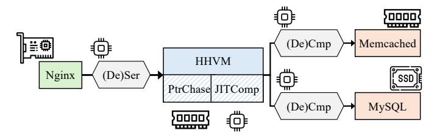

Fig. 1: MediaWiki workflow across Nginx, HHVM, Memcached, and MySQL microservices, connected via datacenter tax (e.g. (De)Ser, (De)Cmp); where individual microservices might execute distinct operations (e.g. PtrChase, JITComp).

#### A. Phase Behavior in Datacenter Workloads

To understand the high-level behavior of DCPerf workloads, Figure 2 shows their IPC over time, which is a good proxy for program behavior. Intuitively, high IPC typically captures compute-intensive periods and low IPC captures phases limited by memory or network activity. Across workloads, we see millisecond-scale alternations between high- and low-IPC regions even under stable input traffic.

The resulting wave IPC patterns across applications indicate rapid shifts between execution phases with distinct resource demands (*e.g.*, some compute-, others memory-bound). These patterns demonstrate that datacenter applications exhibit highly dynamic and fine-grained phase behavior.

This observation raises a question: what drives such rapid and diverse phase behavior in datacenter workloads? Understanding the sources of phase fluctuations is important, as they directly impact hardware efficiency and performance. To answer this question, we characterize the three main contributors to phase heterogeneity in datacenter applications: (1) the microservice software architecture itself, (2) the connecting logic between microservices (i.e., datacenter tax operations), and (3) the multi-stage internal structure of individual microservices.

#### B. Heterogeneity Across Services

**Overview.** In datacenter applications, each microservice is deployed as a separate program and communicates with others via remote procedure calls (RPCs). DCPerf workloads colocate microservices on the same server to improve performance and reduce communication latency. Hence, different microservices share the same set of cores, yet each is optimized for a specific function and stresses different system resources.

Architectural Metrics. Figure 3 presents the key compute (IPC), memory (LLC MPKI), and network (IO Bandwidth and frequency of network system calls) metrics for microservices in *Mediawiki*. We can see that HHVM demonstrates higher IPC, indicative of its compute-intensive behavior. In contrast, Memcached and MySQL exhibit high LLC MPKI and relatively low IPC, reflecting their memory-intensive and data-access-heavy nature. Finally, the frontend service, Nginx is characterized by high I/O activity and frequent network-related system calls, consistent with its role as a web server and proxy.

<span id="page-2-1"></span>

Fig. 2: IPC over time for different DCPerf workloads: *Django*, *Mediawiki*, *FeedSim*, *AdSim*, and *TaoBench*.

<span id="page-2-2"></span>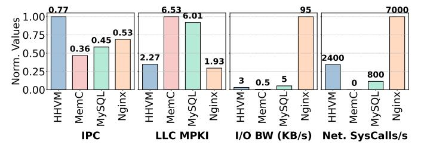

Fig. 3: Normalized IPC, LLC MPKI, I/O bandwidth, and frequency of network system calls for different microservices within the *Mediawiki* application. Numbers on top of the bars are their absolute values.

#### C. Heterogeneity Across DC Tax Operations Between Services

Overview. Datacenter applications rely on *datacenter tax* [44], [77] operations to connect microservices and ensure interoperability. A microservice request arrives as an encrypted network message that is processed by the TCP [43], SSL/TLS [61], and RPC frameworks [3], [25]. Then, protocols like Protobuf [22] deserialize the arguments, and protocols like Zstandard or Snappy [20], [23] decompress the arguments. After the service completes, the response follows the reverse steps. All these operations, *i.e.*, networking, (de)encryption, (de)serialization, (de)compression, RPC, form the datacenter tax.

**Architectural Metrics.** Figure 4 summarizes the architectural behavior (IPC, LLC MPKI, Branch MPKI) of representative datacenter tax operations across DCPerf applications. Each bar shows the median (P50), and the error bars capture variability across workloads (P10–P90).

<span id="page-3-0"></span>

Fig. 4: Architectural metrics (IPC, LLC MPKI, Branch MPKI) for different datacenter tax operations that connect services together in DCPerf workloads.

We can see that individual tax operations stress different resources. For example, (De)Encryption reaches high IPC with minimal cache activity, while MemCpy exhibits low IPC and high LLC MPKI due to heavy memory traffic. (De)Serialization and (De)Compression fall between these extremes, reflecting mixed compute and memory bottlenecks.

The error bars reveal variation even within the same operation type. For *(De)Compression* [20], decompression generally achieves higher IPC than compression because it is more compute-bound. In *(De)Serialization* [3], performance depends heavily on the input: fixed-size fields *(e.g.,* integers, floats) deserialize efficiently, whereas variable-length or nested structures incur lower IPC and greater cache pressure.

This variability shows that an operation's architectural behavior cannot be inferred from its semantic label. Even identical operations may stress the system differently depending on input and context. As a result, statically mapping operation types to hardware units is suboptimal. Instead, we must adapt dynamically to runtime characteristics and system state.

# D. Heterogeneity Across Operations Within Services

**Overview.** As individual microservices increase in complexity, they exhibit more frequent and pronounced internal execution phases. For example, a *FeedSim* request, among other operations, fetches the data from hash tables following the pointer chasing pattern (*PtrChase* operation), before performing the ranking on the collected data using the page rank algorithm [10] (*Ranking* operation). While *PtrChase* is a memory latency-bound phase, *Ranking* is compute-bound.

As another example, an *AdSim* request executes an ML inference using the GEMM routine [68] before performing a deep copy on the output tensors (*DeepCopy* operation). Similarly to *FeedSim*'s operations, while *DeepCopy* is memory bandwidth-bound, *GEMM* is compute-heavy.

**Architectural Metrics.** To quantify differences across execution phases, we profile the microarchitectural and system-level behavior of four representative intra-service operations (*Ranking, PtrChase, GEMM*, and *DeepCopy*) capturing the general heterogeneity within a single microservice.

Figure 5 presents a top-down microarchitectural analysis [31], [94] for the selected operations. The top-down approach classifies each pipeline slot into one of five categories: Frontend Bound, Core Bound, Memory Bound, Bad Speculation, and Retiring. This classification allows us to identify the main sources of pipeline inefficiency for each operation.

<span id="page-3-1"></span>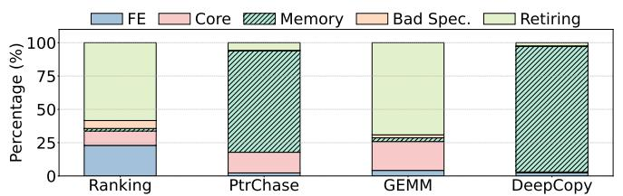

Fig. 5: Top-down microarchitecture analysis across different operations in *FeedSim* (*Ranking* and *PtrChase*) and *AdSim* (*GEMM* and *DeepCopy*) services.

The breakdowns reveal substantial differences across operations. *Ranking* and *GEMM* spend a significant fraction of cycles retiring instructions (*i.e.*, they are compute-bound), with *GEMM* being additionally bound by core resources due to heavier use of vector instructions (*i.e.*, it needs highpower cores). In contrast, memory-intensive operations such as *PtrChase* and *DeepCopy* spend most of their cycles in memory-bound regimes.

To further analyze the microarchitectural differences across operations, Figure 6 shows the miss-rates in architectural structures (i.e., L1 D-Cache, LLC, and Branch MPKI) across operations. Ranking exhibits a moderate L1 D-cache and Branch MPKI with lower LLC MPKI, reflecting a mix of compute and memory activity. On the other hand, PtrChase shows a significantly higher L1 D-cache MPKI despite its small working set, driven by frequent pointer dereferences and irregular memory accesses, while its LLC MPKI remains low due to cache reuse at higher levels. GEMM achieves low MPKIs across all structures, as expected from its dense, compute-bound nature with regular access patterns. In contrast, DeepCopy demonstrates extremely high LLC MPKI (orders of magnitude higher than other operations) due to its streaming memory behavior and lack of data reuse, which dominate its performance bottlenecks.

<span id="page-3-2"></span>

Fig. 6: L1 D-Cache, LLC, and Branch MPKIs across different operations in *FeedSim* and *AdSim* services.

Figure 7 characterizes the computational intensity of the analyzed operations in terms of floating-point (FP) activity. *Ranking* executes a substantial number of scalar FP instruc-

tions ( $\sim$ 12.4 per thousand retired instructions). *GEMM*, as expected from a dense linear-algebra kernel, exhibits the highest FP activity, issuing both scalar and vector FP instructions ( $\sim$ 2.6 and 10.0 per thousand instructions, respectively), showcasing heavy SIMD utilization and a compute-bound nature. In contrast, *PtrChase* and *DeepCopy* contain virtually no floating-point operations, consistent with their memory-dominated behavior and lack of arithmetic intensity. Thus, for such operations, cores do not need to include large-area and high-power vector units.

<span id="page-4-0"></span>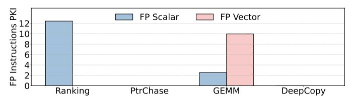

Fig. 7: Number of executed floating point scalar and vector instructions per kilo retired instructions across different operations in *FeedSim* and *AdSim* services.

#### E. Sensitivity Analyses

As a result of different computational properties, the operations within services have different sensitivities to architectural resources. We take the four representative intra-service operations (*Ranking*, *PtrChase*, *GEMM*, and *DeepCopy*) and test the sensitivity of these operations to CPU core frequency, memory bandwidth, L2 cache capacity, and processor generation.

Sensitivity to Frequency. Figure 8a shows the throughput of the four operations when varying the CPU core frequency from 1GHz to 3GHz. All throughputs are normalized to that at 3GHz. While compute-intensive operations, such as *Ranking* and *GEMM*, have significantly worse performance with lower core frequencies, the other two operations (*PtrChase* and *DeepCopy*) are much more lenient to lower core frequencies. Sensitivity to Memory Bandwidth. Figure 8b shows the throughput of the four operations when scaling the available memory bandwidth. We use Intel's pqos tool to scale memory bandwidth from 20% to 100%. All throughputs are normalized to that at 100% memory bandwidth. *DeepCopy* is highly sensitive to memory bandwidth. It reduces the throughput by more than 5× when using 20% of memory bandwidth, while other operations are not as sensitive to this resource.

Sensitivity to L2 Cache Capacity. Figure 8c shows the throughput of evaluated operations when adjusting the L2 cache capacity using pqos. We change the L2 cache size from 128KB to 2MB via way partitioning (i.e., 128KB is a 1-way cache while 2MB is a 16-way cache). All throughputs are normalized to that at 2MB L2 cache capacity. *PtrChase* is the most sensitive operation to L2 cache size, where it loses almost half of its performance with a 4-times smaller L2 cache. This is in line with the *memory-latency boundness* of *PtrChase*.

Sensitivity to Processor Generation. Figure 8d compares single-core throughput of the four operations across four Intel server generations: *Haswell* [39], *Skylake* [37], *Ice Lake* [38], and *Emerald Rapids* [36]. These are servers c220g2, c6420,

<span id="page-4-1"></span>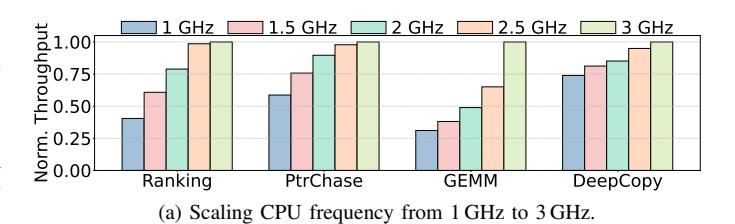


<span id="page-4-2"></span>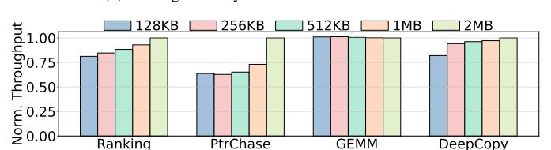

<span id="page-4-3"></span>(c) Scaling L2 capacity from 128 KB (1 way) to 2 MB (16 ways).

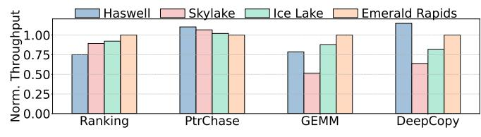

<span id="page-4-4"></span>(d) Scaling processor generation from Intel Haswell to Emerald Rapids.

Fig. 8: Normalized throughput of different operations in *Feed-Sim* and *AdSim* under (a) frequency, (b) memory bandwidth, (c) L2 cache capacity, and (d) processor generation scaling.

r650, and c6620 on CloudLab [15], and they were released in 2014, 2017, 2021, and 2023, respectively. Throughputs are normalized to the most recent generation, *Emerald Rapids*.

We observe clear generational gains for compute-intensive operations such as *Ranking* and *GEMM*, which achieve 25% and 21% higher throughput, respectively, from *Haswell* to *Emerald Rapids*. *Ranking* shows steady gains across generations. However, *GEMM* exhibits non-monotonic behavior, with notably lower performance on *Skylake* compared to *Haswell*, likely due to differences in vector unit configuration.

In contrast, memory-bound operations (e.g., PtrChase and DeepCopy) show marginal or even inverse sensitivity to processor generation. PtrChase exhibits a slight performance degradation on newer generations, as architectural advancements have not alleviated its dominant memory-latency bottleneck and, in some cases, may have even introduced higher access latency in deeper cache hierarchies. DeepCopy performs slightly worse on Skylake relative to Haswell, recovering only modestly in Ice Lake and Emerald Rapids.

# III. PHASEWEAVE: A SERVER ARCHITECTURE FOR HETEROGENEOUS PHASES IN DATACENTER WORKLOADS

Our analysis highlights that different *phases* in datacenter workloads exhibit vastly different resource requirements and

<span id="page-5-0"></span>

Fig. 9: High-level architecture of a PhaseWeave server.

sensitivities. Compute-bound phases like *GEMM* and *Ranking* operations benefit most from high CPU frequencies and newer processor generations, whereas memory-bound phases such as *DeepCopy* are limited by memory bandwidth, and latencysensitive phases such as *PtrChase* rely heavily on sufficient cache capacity. Hence, distinct millisecond-scale phases within and across services demand different hardware capabilities.

This heterogeneity naturally motivates hardware designs that can satisfy varying resource needs. To efficiently serve phases with distinct computational characteristics, servers must incorporate hardware heterogeneity, *i.e.*, specialized compute, memory, and network resources that can each target specific classes of phases. A promising way to realize such heterogeneity is through chiplet-based processor architectures [\[9\]](#page-13-20), [\[18\]](#page-13-21), [\[59\]](#page-14-8), [\[73\]](#page-14-9), [\[91\]](#page-15-4), [\[93\]](#page-15-5), [\[95\]](#page-15-6). Such architectures have recently gained traction in both industry and academia, as they offer modular integration of components, improved yield, and flexible core grouping in clusters or core complexes [\[59\]](#page-14-8). Importantly, different chiplets within the same server can be specialized for different resource types, allowing the system to better match the diverse and dynamic requirements of datacenter workloads. Our proposal builds on such architectures.

#### *A. PhaseWeave Overview*

Building on our characterization, we propose *PhaseWeave*, a system that matches the fine-grained heterogeneity of execution phases in modern datacenter workloads with heterogeneity in hardware. [Figure 9](#page-5-0) shows the high-level architecture of a PhaseWeave server. Based on the observed recurring phases across datacenter applications, the server integrates four heterogeneous chiplet types: *high-compute*, *fast-memory*, *nearnetwork*, and *low-power* chiplets. Each chiplet is tailored to efficiently execute a distinct class of workload phases.

To exploit this heterogeneity, PhaseWeave dynamically and transparently migrates execution across chiplets at phase granularity. Each chiplet includes lightweight hardware modules, called *Phase Predictors*, that monitor hardware counters and system activity to anticipate upcoming phase transitions. When a phase change is detected, the system evaluates both the predictor's output and real-time chiplet utilization, captured by dedicated *Load State* modules, to decide if and where to migrate the thread. With this coordination, PhaseWeave ensures that each phase runs on the most suitable hardware given current system conditions, improving both performance and energy efficiency across diverse datacenter workloads.

#### *B. Server Architecture*

A PhaseWeave server integrates four types of chiplets: *highcompute*, *fast-memory*, *near-network*, and *low-power*. Cores within chiplets are organized into a 2D mesh topology, while chiplets communicate over a high-bandwidth all-to-all interconnect. Each chiplet type implements the same instruction set architecture (ISA), which enables thread migration across chiplets without requiring recompilation or binary translation. Despite sharing a unified ISA, the microarchitectural configuration of each chiplet is tuned for its designated phase class. Hence, the system achieves fine-grained specialization while maintaining programmability and compatibility. By provisioning each core to excel at a specific phase class rather than attempting to perform well across all classes, PhaseWeave achieves higher aggregate core counts within the same total power and area budgets as a conventional monolithic server.

High-Compute Chiplets. These chiplets target arithmeticand vector-intensive phases. Their cores operate at higher frequency and implement a wide issue width with large reorder buffers (ROB) and load/store queues (LSQ) to maximize instruction-level parallelism. Each core includes wide SIMD/vector units and TAGE branch predictor [\[72\]](#page-14-10). To conserve area and power, the chiplet features moderate LLC capacity and lower off-chip memory bandwidth relative to other chiplets, as these phases are typically compute-bound. Networking interfaces are not integrated into this chiplet.

Fast-Memory Chiplets. They accelerate memory-bound phases. Their cores are designed with narrower pipelines and lower core frequencies but are attached to a larger number of high-bandwidth memory channels or stacked DRAM interfaces. These chiplets prioritize memory-level parallelism and data throughput over peak computation. Like the compute chiplet, they exclude network interfaces to allocate more area for memory controllers and wider DRAM interfaces.

Near-Network Chiplets. They are optimized for networkintensive phases. Each chiplet integrates one or more NICs directly into the die to reduce communication latency and improve packet processing throughput. Cores in these chiplets have smaller caches, reduced-width vector units, and moderate DRAM bandwidth, trading computational capacity for lowlatency, high-throughput I/O. Integration of NICs within the chiplet fabric also minimizes PCIe overheads and reduces power-hungry data movement between chips.

Low-Power Chiplets. They serve latency-insensitive phases that do not require full-performance cores. Cores run at lower frequencies, use smaller private caches, and are connected to slower, lower-power DRAM channels. They omit NICs and vector units entirely. Despite their reduced performance, these cores maintain full ISA compatibility, allowing the runtime to migrate threads during idle or low-load periods to reduce overall server energy consumption.

#### *C. Memory Subsystem*

Unified Memory and Allocation Policies. All chiplets share a unified physical address space, which is managed by a single operating system instance. However, memory is physically disaggregated such that each chiplet connects to a dedicated fraction of the total DRAM capacity. DRAM is organized at the granularity of memory channels or DIMMs directly attached to that chiplet's memory controller. Latency and bandwidth properties of each memory fraction are selected to match the needs of different phases. Thus, while the software observes a flat memory address space, the underlying memory substrate is non-uniform and heterogeneous [\[11\]](#page-13-22). This contrasts with a conventional monolithic server, which provides uniform memory bandwidth and latency across its memory controllers.

When a thread allocates new memory, the allocation is satisfied by the DRAM region local to the chiplet executing the request, ensuring initial locality. Over time, as access patterns shift, pages predominantly accessed by other chiplets are migrated using NUMA-like page migration policies [\[90\]](#page-15-7) (*e.g.*, periodically evaluating access counters and promoting hot pages). In this way, the memory system can dynamically adapt to evolving execution phases without requiring explicit application-level data placement.

Cache Coherence. Cores in a PhaseWeave server, both within and across chiplets, are kept cache coherent. PhaseWeave employs a standard two-level MESI protocol, similar to those used in conventional multi-socket servers [\[16\]](#page-13-23), [\[50\]](#page-14-11), [\[80\]](#page-14-12). Each cache line has a designated global home core and LLC slice, and within each chiplet, it also has a local home [\[65\]](#page-14-13). Each chiplet maintains an *intra-chiplet directory* that tracks which cores within the chiplet cache a given line, and an *inter-chiplet directory* that tracks which remote chiplets cache the line.

When an invalidation is required for a line, the request is sent to the global home. The global home consults its intrachiplet directory and sends invalidations to all local cores that hold the line. At the same time, the global home also forwards the invalidation to the local homes of the line in other remote chiplets listed in the inter-chiplet directory. Finally, the local homes propagate the invalidations to the cores within their chiplets, ensuring that all copies are properly invalidated and coherence is maintained across the server.

# <span id="page-6-1"></span>*D. Phase Prediction Module*

To exploit the heterogeneity of PhaseWeave, the system uses lightweight hardware modules called *Phase Predictors*. These modules forecast the next execution phase of each thread at regular *epochs*. They continuously track hardware counters and system activity, and determine the upcoming phase at the end of each epoch. This means that a thread will run on a chosen chiplet for at least the epoch duration. This duration needs to balance between the fine-granularity of application phases and migration overheads. Based on our sensitivity analyses, we empirically set the epoch duration to 100µs.

The predictors are implemented in hardware to avoid frequently interrupting the CPU and maximize efficiency. They

<span id="page-6-0"></span>TABLE II: Comparison of phase prediction approaches.

| Approach              | Acc. | Storage | Compute (per epoch)      |  |  |  |  |  |
|-----------------------|------|---------|--------------------------|--|--|--|--|--|
| Threshold             |      |         |                          |  |  |  |  |  |
| Threshold-Based       | <75% | 32B     | Comparison chain         |  |  |  |  |  |
| Clustering            |      |         |                          |  |  |  |  |  |
| K-Means               | <75% | 100KB   | L2 distance + log        |  |  |  |  |  |
| K-Medoids             | <75% | 100KB   | L2 distance on centroids |  |  |  |  |  |
| HDBScan               | <75% | 180KB   | L2 distance on neighbors |  |  |  |  |  |
| HMM                   | ∼80% | 4KB     | 1000 MACs + log          |  |  |  |  |  |
| Machine Learning (ML) |      |         |                          |  |  |  |  |  |
| Multi-Armed Bandits   | <75% | 40B     | Max + simple arithmetic  |  |  |  |  |  |
| Contextual Bandits    | ∼80% | 10KB    | 500 MACs + sqrt          |  |  |  |  |  |
| Random Forest         | >90% | 8KB     | Comparisons + ptr chase  |  |  |  |  |  |

can be instantiated per core or shared across a small group of cores to reduce area and power overheads. In our implementation, we opt for per-core predictors.

Importantly, predictors are entirely *transparent* to the application, as they only use hardware and software applicationagnostic features. On hardware side, they use counters such as IPC, cache, TLB, and branch MPKI. On software side, they use frequency of system calls split into categories (*e.g.*, network- and memory-allocation system calls). Using these metrics, the predictor classifies the upcoming phase into four categories corresponding to each chiplet type: low-power, compute-, memory-, or network-dominated phases.

Phase Classification Algorithms. We explore several approaches for phase classification. [Table II](#page-6-0) summarizes these approaches in terms of accuracy, hardware storage cost, and per-epoch compute requirements.

*Threshold-based* methods apply a chain of simple rules on individual metrics. For example, high IPC with low network calls would indicate a compute phase. *Clustering techniques* such as K-Means, K-Medoids, HDBScan, and Hidden Markov Models (HMMs) group similar epochs in feature space, capturing temporal or density-based patterns. *Machine learning* approaches provide higher predictive power: Multi-Armed Bandits and Contextual Bandits formulate phase selection as a reinforcement learning problem; Random Forests combine multiple decision trees to produce a consensus prediction.

Phase classification requires finding correlations between phases and features, and tolerance against noise from a wide array of features. We observe that many of the approaches do not satisfy these requirements. Threshold-based methods are too simple and fail in defining nuanced threshold boundaries. Clustering approaches suffer from noise across features that are important in one cluster but not to others. Multi-Armed Bandits is distribution-driven and thus fails to capture relationships between phases and features. Contextual Bandits also falls short to noise across features.

Thus, in PhaseWeave, we select *Random Forests* for the Phase Predictor. This method has the best balance of classification accuracy and cost, and it has been shown that such an approach can efficiently be implemented in hardware [\[19\]](#page-13-24).

Offline Training. We train the Random Forest model *offline*, using labeled data collected from a diverse suite of microbenchmarks [\[57\]](#page-14-14). During profiling, we run each microbenchmark phase on every chiplet type to perform a sensitivity sweep and determine which hardware configu-

<span id="page-7-0"></span>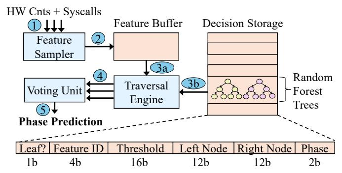

Fig. 10: Microarchitecture of the Random Forest Phase Predictor in PhaseWeave.

ration delivers the best performance. We then label each training sample with its optimal chiplet. The model learns these mappings using only application-agnostic signals, *i.e.*, hardware performance counters and categorized system-call frequencies. Hence, the classifier captures general trends rather than application-specific patterns. Once trained, the model parameters are fixed and loaded into the hardware predictor at boot time, where the same model is used for all applications.

Although Random Forests are traditionally viewed as inflexible, often requiring retraining when the input distribution shifts, we find that this limitation does not apply in PhaseWeave. The phase categories used in PhaseWeave are relatively broad and stable, and the underlying hardware-level indicators that characterize them remain consistent across workloads. As a result, the trained predictor generalizes well without per-application tuning and the model accuracy over time remains high without frequent retraining or updates.

**Microarchitectural Design.** Figure 10 shows the microarchitecture of the Random Forest-based Phase Predictor integrated in PhaseWeave. The predictor is a lightweight hardware module that operates asynchronously to application cores.

The trained model is stored in a compact SRAM structure called the *Decision Storage*, which holds all internal nodes and leaves of the Random Forest. An entry encodes a decision rule, consisting of a 4-bit *feature identifier* that selects the relevant hardware or runtime metric (*e.g.*, IPC, cache MPKI, branch MPKI, TLB MPKI, system call frequency), a 16-bit *comparison threshold*, and 12-bit *indices* for its left and right child nodes. Leaf entries store a 2-bit *phase label* corresponding to one of the four execution classes in PhaseWeave (Low-Power, Memory-, Network-, or Compute-heavy). A single control bit distinguishes internal and leaf nodes.

Online Inference. At runtime, the predictor is triggered periodically at the end of each epoch  $(e.g., 100\mu s)$ . The *feature sampler* aggregates collected counters 1 and updates a local feature buffer 2. The *traversal engine* then evaluates all trees in the forest by walking their decision structures stored in the Decision Storage. The engine loads the feature values from the buffer (3a), and for each tree, it begins at the root node and iteratively compares the current feature value with the stored threshold (3b). The engine follows either the left or right index until reaching a leaf node. Each traversal requires

a fixed number of steps (*i.e.*, 5 in our implementation). The predictor traverses multiple trees *in parallel*, evaluating them using parallel comparator and fetch units.

After tree traversal, the *voting unit* aggregates the individual phase classifications 4. This unit stores counters that accumulate the number of votes for each phase class and selects the class with the highest vote as the final prediction 5. **Overhead.** Our predictor uses 15 trees that each perform 5 traversals. We measure that the predictor takes 0.02% of core area and inference only requires 75 comparisons per epoch, which takes less than 100 cycles. This cost is both negligible and not on the application's critical path.

**Need for Fine-grained Runtime Phase Detection.** We distinguish three sources of phase heterogeneity (Section II): (i) across services, (ii) across datacenter-tax operations between services, and (iii) within services. Coarse-grained mechanisms can partially address the first two. For example, services may be statically bound to a preferred chiplet type (*e.g.*, fix a mostly-network service *Nginx* on near-network chiplet). However, such approaches are insufficient for two reasons.

First, and most importantly, we observe pronounced intraservice phase heterogeneity within individual services. For instance, even when a service is globally compute-heavy, substantial sub-intervals may be memory- or network-bound. Coarse-grained placement therefore leaves significant performance and energy-efficiency gains unrealized.

Second, service behavior is input- and context-dependent (Figure 4). The same service can be compute, memory, or network-dominated based on request mix and runtime interference, making static service-to-chiplet bindings brittle.

Need for In-hardware Phase Prediction. Our characterization shows that execution phases in datacenter applications typically last only tens to hundreds of microseconds. At this timescale, even modest prediction overheads impact latency and negate the benefit of migration. Thus, phase identification must be highly accurate and have extremely low overhead.

Software-based predictors have two key limitations. First, to keep overhead low, they are limited to simple detection methods (e.g., clustering or thresholding [71], [85]). However, these methods are not accurate enough for reliable phase steering. More expressive ML models (e.g., Random Forest) take 100-1000  $\mu$ s to run in software. This cost is comparable to or longer than the phase itself, making them impractical.

Second, software-based prediction would sit on the critical path. At the end of each epoch, execution must pause while a CPU core runs the predictor and computes a decision, increasing request latency. An alternative would be to dedicate some cores for prediction. This approach avoids CPU pauses but reduces available compute, and thus lowers throughput. In contrast, PhaseWeave's Predictor module runs asynchronously and off the critical path, enabling sub-microsecond inference without interrupting the application.

#### <span id="page-7-1"></span>E. Thread Migration

When the Phase Predictor signals that a thread's upcoming phase is better matched to a different chiplet, the runtime must decide whether to relocate the thread or keep it on its current chiplet. Migrating blindly to the predicted optimal chiplet may be inefficient: a destination chiplet that is heavily loaded imposes queuing delay that outweighs architectural advantage. Thus, PhaseWeave uses a benefit-aware migration policy that explicitly weights predicted per-phase speedup against a real-time estimate of destination load.

Each chiplet exposes a software-writable *task-count* register that the OS updates whenever its local runqueue changes. Dedicated *Load State* modules read these per-chiplet counters and export them to the thread scheduler. The scheduler queries the Load State counters and combines them with offline phase-characterization data, *i.e.*, expected per-phase performance on each chiplet type. The scheduler uses these as inputs to its thread migration algorithm.

Algorithm 1 shows the procedure. Importantly, the process is not on the critical path of thread's execution and it does not directly affect workload's performance.

#### <span id="page-8-0"></span>**Algorithm 1** Benefit-aware thread migration algorithm.

```
Inputs: Chiplets C, thresh. \theta, T_{\min}, weight \lambda, switch cost C_{\text{switch}}
 1: for each thread t at epoch boundary do
          p \leftarrow \text{predicted phase for } t
          c \leftarrow current chiplet assignment of t
          for each candidate chiplet c' \in \mathcal{C} do
 4:
               S_{c'} \leftarrow \text{expected performance of phase } p \text{ on } c'
 5:
               S_c \leftarrow \text{expected performance of phase } p \text{ on } c
 6:
               Q_{c'} \leftarrow runqueue length reported by Load State of c'
 7:
               U(t,c') \leftarrow S_{c'} - S_c - \lambda \cdot Q_{c'} - C_{\text{switch}}
 8:
          end for
 9:
              \leftarrow \operatorname{arg\,max}_{c'} U(t,c')
10:
          if U(t, c^*) > \theta and residency_time(t) > T_{\min} then
11:
12:
               Migrate t from c to c^*
13:
14: end for
```

Formally, for a thread t with predicted phase p currently assigned to chiplet c, the scheduler computes the migration utility to chiplet c' as:

$$U(t,c') = S(p,c') - S(p,c) - \lambda \cdot Q(c') - C_{\text{switch}}$$
 (1)

S(p,c) denotes the expected steady-state performance (e.g., IPC) of phase p on chiplet c, Q(c') is the current runqueue length on c',  $\lambda$  converts queued threads into an expected latency penalty, and  $C_{\rm switch}$  represents the one-time context-switch cost of reassigning the thread. If c'=c, we set the utility to 0, as this case incurs no migration costs or performance changes. The scheduler selects the chiplet  $c^*=\arg\max_{c'}U(t,c')$  and performs the migration only if  $U(t,c^*)>\theta$ . To avoid oscillation due to transient prediction noise, the scheduler ensures that a given thread has a minimum residency time  $T_{\min}$  on its current chiplet. If no candidate yields positive utility, the thread remains on its current chiplet.

Upon deciding a migration, the scheduler reassigns the thread by removing it from its current executing core and enqueuing it onto the runqueue of the selected destination chiplet. The thread is reassigned to a core on the destination chiplet using a standard context switch, which can be accelerated with recently proposed hardware mechanisms [82], [83].

**OS** Integration. Chiplets in PhaseWeave are exposed to the OS as standard groups of CPU cores within a heterogeneous multicore system, similar to NUMA nodes. From the OS perspective, chiplets are simply disjoint CPU clusters (e.g., distinct CPU ID ranges), and the OS retains full control over thread scheduling. PhaseWeave does not modify OS scheduler data structures or bypass the scheduler. Instead, it provides placement recommendations through a hardware-visible interface (e.g., a dedicated MSR or memory-mapped control region). The OS periodically reads these recommendations and updates thread affinity using its native mechanisms. A migration corresponds to a conventional inter-core task migration handled entirely by the OS scheduler. All architectural state management, including page-table root updates and TLB consistency, relies on existing hardware and OS mechanisms, which is compatible with conventional OSes.

#### F. Future Extensions: Heterogeneous ISAs and Accelerators

PhaseWeave's phase detection and migration infrastructure provides a foundation for future extensions. Currently, all cores use an iso-ISA design, enabling transparent thread migration across heterogeneous chiplets with low overhead, but constraining the system to ISA-compatible cores. Future systems could extend PhaseWeave to integrate cores with *distinct ISAs or specialized accelerators*. Phase predictors could then identify phases suited to such hardware and provide guidance to a higher-level runtime or compiler for offload opportunities.

For example, a PhaseWeave server could integrate ARM cores for low-power phases or specialized accelerators [1], [27], [81]. During execution, the predictor would detect when a thread enters a phase best suited for these units. When ISA or accelerator compatibility differs, instead of migrating the thread, PhaseWeave would emit structured feedback to the runtime or compiler. Then, the software could use this information to recompile or optimize future runs, statically or dynamically offload phases to the most appropriate hardware.

# IV. EVALUATION

#### A. Evaluation Methodology

**Modeled architectures.** We evaluate two architectures: *Baseline* and *PhaseWeave*. *Baseline* is modeled after a 28-core Emerald Rapids (EMR) server [36], where all cores are high-performance compute cores. We performed all characterization experiments in Section II on a server of this type. PhaseWeave is a heterogeneous architecture composed of four different chiplet types: compute, fast-memory, near-network, and low-power. All cores across chiplet types use the same x86 ISA.

Compute chiplets have high-performance cores modeled after EMR [36], but with 4× smaller L2 and 2× smaller perslice LLC cache sizes. Low-power chiplets have simple cores modeled after efficient cores, such as ARM A53 [5] and Ecores on Intel Skymont [35]. Fast-memory and near-network chiplets have cores whose microarchitecture is between the two extremes (*i.e.*, compute and low-power cores). Cores

<span id="page-9-0"></span>TABLE III: Architectural parameters for modeled chiplets in *PhaseWeave*. Baseline has 28 cores of *Compute* type with  $4 \times 1$  larger L2 cache and  $2 \times 1$  larger LLC slice.

| Parameter   | Compute     | Fast-Mem.   | Near-Net.   | Low-Power   |
|-------------|-------------|-------------|-------------|-------------|
| # of Cores  | 10          | 9           | 9           | 10          |
| Frequency   | 3.0GHz      | 2.5GHz      | 2.5GHz      | 2.0GHz      |
| Issue Width | 6           | 4           | 4           | 2           |
| ROB         | 512 entries | 256 entries | 256 entries | 128 entries |
| Ld/StQ      | 192/114     | 192/114     | 130/60      | 64/48       |
| L1-I Cache  | 32KB        | 32KB        | 32KB        | 32KB        |
| L1 DCache   | 48KB        | 32KB        | 32KB        | 32KB        |
| L2 Cache    | 512KB       | 2MB         | 512KB       | 256KB       |
| LLC Slice   | 2.5MB       | 5MB         | 2.5MB       | 2.5MB       |
| L1 ITLB     | 256 entries | 192 entries | 192 entries | 32 entries  |
| L1 DTLB     | 96 entries  | 64 entries  | 64 entires  | 32 entries  |
| L2 TLB      | 2K entries  | 2K entries  | 2K entries  | 2K entries  |
| Mem. Lat.   | 15 cycles   | 22 cycles   | 15 cycles   | 15 cycles   |
| Mem. BW     | 17.06GB/s   | 25.60 GB/s  | 17.06GB/s   | 17.06GB/s   |

within chiplets are connected in a 2D-mesh topology with 3 cycles per hop, while the four chiplets are fully inter-connected with 60 cycles cross-chiplet latency [46] and 1Gbps bandwidth per link. Table III summarizes the number of cores for each chiplet type and their microarchitectural parameters.

**Simulation infrastructure.** We perform full-system simulations using QEMU [76] along with the SST simulator [67]. QEMU captures both user-space and kernel-space instructions, memory accesses, and system calls. These events are forwarded to the SST Ariel core [86], modified for high-accuracy, enabling precise modeling of architectures at the cycle level.

The simulation environment includes the complete software stack: operating system (Ubuntu 22.04, Linux 6.8.0-85), runtime libraries, and representative datacenter workloads. Main memory is modeled with DRAM-Sim3 [51].

For power and area measurements, we use McPAT [52] at 32nm technology (available in the tool) and scale to 7nm [78]. We size PhaseWeave to be iso-area relative to the baseline.

Real system. We emulate PhaseWeave software on an EMR server. We organize groups of cores into pools, each acting as a specialized chiplet in PhaseWeave, and we migrate threads across pools by changing their scheduling affinity in the OS. In addition, we set per-core pool frequency, memory bandwidth, and network bandwidth based on those chosen in PhaseWeave. **Applications.** We run 5 applications from the DCPerf benchmark suite [84] (Table I): Django, Mediawiki, FeedSim, AdSim, and TaoBench. We simulate application requests with Poissondistributed inter-arrival times under three load levels: low, medium, and high, corresponding to 25%, 50%, and 75% of the baseline server CPU utilization. The end-to-end latency is the time between when the client submits the request to when the response is sent back to the client. We also evaluate the maximum throughput under service-level objectives (SLOs). We increase the request load until each service reaches its target SLO of 100ms at the  $99^{th}$  percentile latency.

### B. Evaluation Results

**1. Tail Latency.** Figure 11 shows the P99 tail latency of each application with different load levels. Across all applications and loads, PhaseWeave consistently improves tail latency relative to Baseline. Averaged across all applications, PhaseWeave

reduces P99 latency by 28%, 42%, and 65% at low, medium, and high load levels, respectively.

<span id="page-9-1"></span>

Fig. 11: P99 tail latency across applications in low, medium, and high loads with Baseline and PhaseWeave.

These gains stem from two factors. First, reducing the percore size allows the system to provision a larger number of cores within the same area, mitigating queuing delays during bursts. Second, dedicating cores to specific phases enables more efficient execution within each phase, further tightening the latency distribution.

The gains are most pronounced at high load where queuing dominates latency. Differences across applications reflect this effect as well. PhaseWeave delivers the largest improvements for TaoBench, whose short per-request execution times makes it highly sensitive to queuing. Additionally, applications that spend substantial time in memory- or network-bound phases, such as AdSim, also see notable benefits, as PhaseWeave's specialized chiplets accelerate these bottleneck phases.

**2. Median Latency.** Figure 12 shows the median (P50) latency across applications in Baseline and PhaseWeave with different load levels. On average across all applications, PhaseWeave reduces the median latency over Baseline by 30%, 33%, and 46% in low, medium, and high load, respectively. Median latency benefits primarily from PhaseWeave's heterogeneous core design, which accelerates each phase's *common-case* behavior. Because median latency is less sensitive to queuing than the tail, the impact of higher core counts is smaller, leading to slightly lower gains in P50 compared to P99.

<span id="page-9-2"></span>

Fig. 12: P50 median latency across applications in low, medium, and high loads with Baseline and PhaseWeave.

**3. Throughput.** Figure 13 shows the throughput across applications in queries per second (QPS) for Baseline, PhaseWeave without the migration algorithm (Section III-E), and PhaseWeave. On average across all applications, PhaseWeave increases the throughput over Baseline by 1.56×. *Impact of Migration Algorithm.* Without the migration algorithm, PhaseWeave always migrates a task to its optimal chiplet whenever detecting a new phase, even if the

<span id="page-10-0"></span>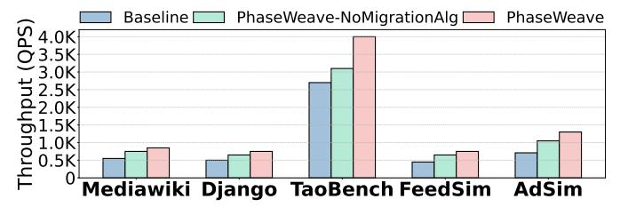

Fig. 13: Throughput under SLO across workloads with Baseline and PhaseWeave.

optimal chiplet is fully occupied and unloaded sub-optimal cores are available. Under this restrictive policy, PhaseWeave-NoMigrationAlg delivers a  $1.26\times$  throughput gain over Baseline, due to the benefits of specialization and higher core count.

With the migration algorithm, PhaseWeave improves overall resource utilization, yielding a further 1.24× gain over the no-algorithm configuration. On average, PhaseWeave migrates at least one thread in 53.2% of all epochs. For 18.5% of these, PhaseWeave moves a workload to a sub-optimal core because the optimal cores were fully loaded.

- **4. Area/Power.** By tuning each core to its role, PhaseWeave reduces per-core area and power relative to a Baseline core. High-Compute, Fast-Memory, Near-Network, and Low-Power cores reduce area by 27%, 11%, 34%, and 39%, and power by 34%, 33%, 35%, and 56%, respectively. These savings allow more cores to fit within the same overall area or power budget. As per-core area reductions are smaller than power reductions, area becomes the primary constraint on scaling core count. Thus, we scale per-server core counts to match Baseline's total area, resulting in PhaseWeave using 99% of Baseline's area and 82% of its power. Hence, the overall *Performance/Watt* gain with PhaseWeave is  $1.92 \times$ . These results show a high potential for *cost-efficiency* at datacenter-scale.
- **5. Sweep on Chiplet Configurations.** PhaseWeave's default configuration is balanced across chiplet types, *i.e.*, 10 cores per compute and low-power chiplets and 9 cores per fast-memory and near-network chiplets. Here, we explore configurations that are imbalanced and optimized for a specific phase class. For instance, the *Compute-Optimized* configuration has 16 compute, 8 fast-memory, 8 near-network, and 6 low-power cores, while *Memory+Network-Optimized* has 6 compute, 13 fast-memory, 13 near-network, and 6 low-power cores.

Table IV shows normalized area and power for some of the evaluated configurations. The table also shows the throughput (the load sweep in steps of 50 QPS) and Perf/Watt (QPS per Watt) when running Mediawiki application under these configurations. The other applications show similar trends. PhaseWeave's default configuration has the best balance between performance and power/area. Some configurations, *e.g.*, *Memory+Network-Opt*, have  $\sim$ 2% higher Perf/Watt but  $\sim$ 3% larger area. Other configurations, *e.g.*, *Compute+Memory-Opt*, have  $\sim$ 1% smaller area but  $\sim$ 4% lower Perf/Watt.

**6. Phase Prediction Accuracy.** For each of the candidate phase prediction algorithms (Section III-D), we explore a few different variants (*e.g.*, the number of trees and their depth in Random Forest, the distance functions in Clustering) and

TABLE IV: Chiplet configurations for Mediawiki.

<span id="page-10-1"></span>

| Config             | Throughput | Area | Power | Perf/Watt |
|--------------------|------------|------|-------|-----------|
| Baseline           | 550        | 1.00 | 1.00  | 1.00      |
| Compute-Opt        | 850        | 0.99 | 0.85  | 1.82      |
| Memory-Opt         | 800        | 0.99 | 0.80  | 1.81      |
| Network-Opt        | 900        | 1.00 | 0.87  | 1.89      |
| LowPower-Opt       | 800        | 1.01 | 0.81  | 1.80      |
| Memory+Network-Opt | 900        | 1.01 | 0.85  | 1.93      |
| Compute+Memory-Opt | 800        | 0.97 | 0.80  | 1.81      |
| PhaseWeave         | 850        | 0.98 | 0.82  | 1.89      |

the set of input features given to the algorithm. Recall that PhaseWeave uses a Random Forest predictor with 15 trees of depth 5 with 15 input features. We now evaluate the accuracy of these algorithms on different workloads.

We use the AdSim application, while the others follow the same trend. We generate three workloads: A, B, C. Workload C is the original Adsim application. We force Workload A to have longer per-phase durations ( $\sim$ 1s) and a fixed ordering of phases. Workload B uses the same second-scale phase lengths, but shuffles the order of phases to make it less predictable.

<span id="page-10-2"></span>

Fig. 14: Accuracy of PhaseWeave Phase Predictor with different algorithms for workloads A, B, and C.

Figure 14 shows the accuracy of different phase prediction algorithms across the 3 workloads of the AdSim application. Many algorithms (*i.e.*, HMM, Bandits, and Random Forest) have high accuracy, above 90%, with workloads A and B. However, workload C shows that only Random Forest has a high accuracy of 93%, while all other approaches fall below 80%. HMM clustering and Contextual Bandit are sensitive to noise (*e.g.*, when two phases overlap within an epoch) which is common with short-duration phases. Multi-armed Bandit is purely distribution-based: as phases are short, the distribution changes rapidly, reducing the effectiveness of this approach. Generalizing Across Workloads. We train the phase predictor using the WDL microbenchmarks included in the DCPerf suite [57]. While DCPerf already includes a wide range of workloads (web services, ML inference, page rank), to further

check for bias, we evaluate the predictor's accuracy on a

separate microservice benchmark suite, DeathStarBench [21],

which is not used during training. On these unseen work-loads, the predictor has 91% average accuracy across services, showing that phase patterns learned from microbenchmarks generalize well to diverse microservice applications.

#### C. Hardware vs. Software Phase Predictor

In Section III-D, we motivated the need for a hardwarebased phase predictor. To validate this claim, we replaced the hardware predictor in PhaseWeave with a software implementation of the same Random Forest model. The hardware predictor performs inference in under 100 cycles, whereas the software implementation requires from 50 to a few hundred  $\mu$ s per invocation. This overhead comes from the PMU collection (2-5  $\mu$ s), context switching between the execution thread and predictor (4-6  $\mu$ s), and Random Forest inference (40-250  $\mu$ s). Since the predictor is invoked at every 100 microsecond epoch and it is on the request's critical path, this overhead becomes substantial. For example, AdSim and Django have 250 and 390 epochs per request on average, translating to over 10ms of additional latency per request when using the software predictor. The added overhead significantly degrades performance: across workloads, maximum achievable throughput drops by more than 20% compared to the hardware implementation.

#### D. Real-System Experiments

**Migration Overheads.** We use the EMR server to measure the thread migration time across pools: from the moment we interrupt the thread until it starts running on its destination core. The average and median migration costs are  $23.8\mu s$  and  $9.5\mu s$ , respectively. Since the duration of a typical phase is in the order of 100s of  $\mu s$ , these overheads are negligible.

**Power Savings.** Since Baseline uses the maximum values for all knobs (frequency, memory and network bandwidth) it has high performance but also high power consumption. Instead, PhaseWeave software specializes core pools for a given phase class, such that the pool can maintain good performance but use less power. Across DCPerf benchmarks, PhaseWeave software achieves the same throughput as Baseline with 7.2% less power, even while using the *same core count* as Baseline.

These results confirm the effectiveness of PhaseWeave in a real server, but also demonstrate the need for full hardware support to reach the maximum benefits.

#### E. Comparison to big.LITTLE Architectures

We compare PhaseWeave against big.LITTLE-style monolithic heterogeneous baselines [8]. Conventional big.LITTLE architectures provide two classes of cores: high-performance ("big") and power-efficient ("little"). This heterogeneity captures a trade-off along the compute-energy axis. PhaseWeave provisions four chiplet types that target distinct resource bottlenecks: compute, memory, network, and low-power phases. Hence, heterogeneity in PhaseWeave is multi-dimensional.

Moreover, in conventional big.LITTLE systems, steering decisions are typically driven by OS heuristics or programmer annotations, and operate at coarse granularity (*e.g.*, per task). Such approaches often miss short-lived or fine-grained phase

changes within requests. PhaseWeave integrates a hardwaresupported phase predictor with chiplet-level migration, enabling transparent detection of fine-grained runtime phase behavior and dynamic steering across chiplets without programmer involvement. This allows PhaseWeave to exploit phase behavior even within individual microservice requests.

To quantitatively evaluate these differences, we construct multiple big.LITTLE-style baselines under iso-area constraints. All baselines are designed to match the total silicon area of PhaseWeave and consume slightly higher total power to avoid biasing results in our favor. To isolate the impact of load imbalance, we optimize the big.LITTLE baselines with our migration algorithm. We manually annotate each program phase to its optimal core type. Thus, our big.LITTLE baselines are highly optimized, presenting the upper bound of what is possible with conventional heterogeneous multicores.

We consider three classes of heterogeneous designs. First, we model ARM-style big.LITTLE configurations with out-of-order performance cores and in-order efficiency cores (bigL) [6], [7]. Second, we keep the sizes of microarchitectural structures in the efficiency cores but convert them to out-of-order designs (bigL-OoO). Third, we construct a big.LITTLE baseline using PhaseWeave's compute-optimized cores as performance cores and its low-power cores as efficiency cores (bigL-Opt). For each class, we evaluate performance-to-efficiency core count ratios of 1:1 [63], 1:2 [4], and 1:4 [30].

<span id="page-11-0"></span>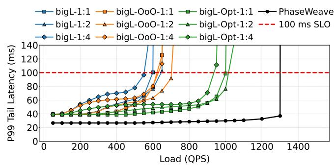

Fig. 15: P99 tail latency of the AdSim service under different loads with PhaseWeave and big.LITTLE architectures.

Figure 15 shows the P99 tail latency of the AdSim service across load levels for all evaluated systems. Other workloads show very similar performance trends. Across configurations, PhaseWeave consistently outperforms the monolithic heterogeneous baselines. When compared to the best big.LITTLE design (bigL-Opt-1:4), PhaseWeave achieves 1.3× higher throughput. The gains arise from the combination of finegrained phase detection and multi-dimensional resource specialization. By dynamically steering fine-grained execution to specialized chiplets, PhaseWeave addresses the dominant bottleneck of each phase, including those that cannot be mitigated by compute heterogeneity alone.

#### F. Granularity in Phase Prediction

While inter-service heterogeneity can be exploited via static pinning or OS-level scheduling, a substantial fraction of the performance gains arises from fine-grained, intra-microservice phase changes that cannot be efficiently captured without hardware-level phase prediction and low-latency migration.

<span id="page-12-0"></span>

Fig. 16: Alterations of phases in the Nginx microservice.

We first demonstrate that even services commonly perceived as homogeneous are internally phase-diverse. Figure 16 shows a timeline of the *Nginx* microservice, where different phases are color-coded. Although the service is largely networkfacing, its execution alternates between request parsing, TLS processing, kernel interaction, and user-level bookkeeping. These sub-phases exhibit different resource demands and are short-lived, making static core assignment suboptimal. In contrast, hardware phase detection enables PhaseWeave to react at the timescale at which these internal sub-phases emerge.

Next, we isolate the benefit of exploiting inter-service heterogeneity without intra-service phase adaptation. Figure 17 compares four configurations across three applications (others are similar). PinToCores statically maps different microservices to the optimal chiplet for its dominant phase to exploit inter-service heterogeneity. It captures the gains from intermicroservice diversity but ignores intra-service phase changes. On average across applications, PinToCores improves throughput by 1.12× over Baseline, but PhaseWeave-NoMigrationAlg further improves performance by 1.34× over PinToCores by adapting execution to fine-grained phases within services, even under the same restriction to optimal core types. Full PhaseWeave provides the largest benefit with average throughput improvement of 1.53× over PinToCores. The gap between PinToCores and PhaseWeave directly quantifies the benefit of phased execution beyond coarse inter-service placement.

<span id="page-12-1"></span>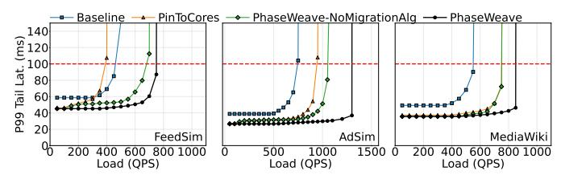

Fig. 17: P99 tail latency of multiple services under different loads with PhaseWeave and static core pinning (*PinToCores*).

Finally, to isolate the contribution of intra-microservice phase behavior, we deploy each service on a dedicated server, i.e., only a single service instance executes per node. Thus, PhaseWeave cannot exploit heterogeneity arising from coscheduled microservices and can only adapt to phase changes within an individual microservice. Even in this constrained setting, we observe that maximum throughput improves by 54.8% on average across microservices. This demonstrates that a large fraction of PhaseWeave's gains stem from intra-microservice phase heterogeneity, independent from inter-service interference or co-scheduling effects. Overall, PhaseWeave remains beneficial even when services are independently scaled and deployed, as is common in some datacenter environments.

#### V. RELATED WORK

Phase Detection in Traditional Applications. Prior work has explored phase detection in traditional single- and multithreaded programs [14], [17], [40], [47], [49], [55], [60], [62], [69]–[71], [74], [75], [85], [96]. For example, Dhodapkar and Smith [75] compared hardware and software mechanisms for identifying coarse-grained program phases based on instruction working sets. Isci and Martonosi [55] analyzed control-flow and event-counter signatures for phase-aware power management, and Shen et al. [74] predicted locality phases to guide memory hierarchy optimizations. In contrast, PhaseWeave targets phase detection in datacenter workloads, which exhibit fine-grained, rapidly shifting behaviors. Beyond detection, PhaseWeave integrates architectural mechanisms to leverage these phases through hardware heterogeneity, achieving significant performance-per-watt improvements.

Heterogeneous-Core Servers. Architectures such as ARM big.LITTLE [8] and single-ISA heterogeneous CMPs [26], [48], [64] exploit performance–power trade-offs by pairing fast and slow cores within a chip. These systems typically rely on hardware heuristics or OS schedulers to statically schedule threads across cores. PhaseWeave differs by enabling fine-grained, *application-transparent*, phase-aware migration across chiplets, guided by online in-hardware predictions. This allows dynamic adaptation to the short-scale phase shifts.

Server Design for Datacenter Workloads. Recent research has proposed specialized CPU architectures tailored to datacenter workloads [58], [79], [82], [83] as well as accelerators targeting individual datacenter tax operations [1], [12], [27], [29], [33], [34], [41], [42], [45], [46], [92]. These designs focus on improving efficiency for specific bottlenecks or workload classes by rethinking microarchitectural structures or offloading recurring system functions to accelerators. PhaseWeave is orthogonal and complementary to these efforts: it provides a dynamic phase detection and migration scheme that can effectively leverage such specialized hardware.

# VI. CONCLUSION

This paper introduced PhaseWeave, a heterogeneous chipletbased server architecture that aligns hardware specialization with the fine-grained execution phases of datacenter workloads. PhaseWeave predicts and migrates workload phases of distinct execution classes across chiplets optimized for each class: compute, memory, network, and low-power.

Under iso-area constraints, PhaseWeave improves tail latency, throughput, and performance per watt over homogeneous baselines. These results show that coupling phase awareness with chiplet-based design enables systems to dynamically adapt to workload behavior, providing a clear path toward efficient, phase-driven datacenter architectures.

# VII. ACKNOWLEDGMENTS

This research is partially supported by the NSF (CISE "Expedition" Grant Number 2326576 and SHF-2006943) and by the U.S. Department of Energy, National Nuclear Security Administration Award Number DE-NA0003969.

#### REFERENCES

- <span id="page-13-25"></span>[1] B. Abali, B. Blaner, J. Reilly, M. Klein, A. Mishra, C. B. Agricola, B. Sendir, A. Buyuktosunoglu, C. Jacobi, W. J. Starke, H. Myneni, and C. Wang, "Data Compression Accelerator on IBM POWER9 and z15 Processors : Industrial Product," in *Proceedings of the ACM/IEEE 47th Annual International Symposium on Computer Architecture (ISCA'20)*, 2020.
- <span id="page-13-2"></span>[2] Amazon, "What are Microservices?" [https://aws.amazon.com/](https://aws.amazon.com/microservices/) [microservices/,](https://aws.amazon.com/microservices/) 2025.
- <span id="page-13-6"></span>[3] Apache, "Thrift," [https://thrift.apache.org/,](https://thrift.apache.org/) 2025.
- <span id="page-13-32"></span>[4] Apple, "The future is here: iPhone X," [https://www.apple.com/fi/](https://www.apple.com/fi/newsroom/2017/09/the-future-is-here-iphone-x/) [newsroom/2017/09/the-future-is-here-iphone-x/,](https://www.apple.com/fi/newsroom/2017/09/the-future-is-here-iphone-x/) 2017.
- <span id="page-13-27"></span>[5] ARM, "ARM Cortex A53," [https://www.arm.com/products/silicon-ip](https://www.arm.com/products/silicon-ip-cpu/cortex-a/cortex-a53)[cpu/cortex-a/cortex-a53.](https://www.arm.com/products/silicon-ip-cpu/cortex-a/cortex-a53)
- <span id="page-13-30"></span>[6] Arm, "Arm® Cortex®-A510 Core Technical Reference Manual," [https:](https://developer.arm.com/documentation/101604/0102?lang=en) [//developer.arm.com/documentation/101604/0102?lang=en,](https://developer.arm.com/documentation/101604/0102?lang=en) 2022.
- <span id="page-13-31"></span>[7] ——, "Arm® Cortex®-X3 Core Technical Reference Manual," [https:](https://developer.arm.com/documentation/101593/0101) [//developer.arm.com/documentation/101593/0101,](https://developer.arm.com/documentation/101593/0101) 2022.
- <span id="page-13-29"></span>[8] ARM, "Processing Architecture for Power Efficiency and Performance," 2025. [Online]. Available: <https://www.arm.com/technologies/big-little>
- <span id="page-13-20"></span>[9] A. Arunkumar, E. Bolotin, B. Cho, U. Milic, E. Ebrahimi, O. Villa, A. Jaleel, C.-J. Wu, and D. Nellans, "MCM-GPU: Multi-chip-module GPUs for continued performance scalability," in *Proceedings of the ACM/IEEE 44th Annual International Symposium on Computer Architecture (ISCA'17)*, 2017.
- <span id="page-13-14"></span>[10] S. Beamer, K. Asanovic, and D. Patterson, "The GAP Benchmark Suite," 2017. [Online]. Available: <https://arxiv.org/abs/1508.03619>
- <span id="page-13-22"></span>[11] E. Bolotin, D. Nellans, O. Villa, M. O'Connor, A. Ramirez, and S. W. Keckler, "Designing Efficient Heterogeneous Memory Architectures," *IEEE Micro*, vol. 35, no. 4, pp. 60–68, 2015.
- <span id="page-13-38"></span>[12] J. Boo, Y. Chung, E. Baek, S. Na, C. Kim, and J. Kim, "F4T: A Fast and Flexible FPGA-based Full-stack TCP Acceleration Framework," in *Proceedings of the 50th Annual International Symposium on Computer Architecture (ISCA'23)*, 2023.
- <span id="page-13-3"></span>[13] M. Chabbi and M. K. Ramanathan, "A Study of Real-World Data Races in Golang," in *Proceedings of the 43rd ACM SIGPLAN International Conference on Programming Language Design and Implementation (PLDI'22)*, 2022.
- <span id="page-13-34"></span>[14] C.-H. Chang, P. Liu, and J.-J. Wu, "Sampling-Based Phase Classification and Prediction for Multi-threaded Program Execution on Multi-core Architectures," in *Proceedings of the 42nd International Conference on Parallel Processing (ICPP'13)*, 2013.
- <span id="page-13-19"></span>[15] CloudLab, "Hardware," [https://docs.cloudlab.us/hardware.html,](https://docs.cloudlab.us/hardware.html) 2025.
- <span id="page-13-23"></span>[16] P. Conway, N. Kalyanasundharam, G. Donley, K. Lepak, and B. Hughes, "Cache Hierarchy and Memory Subsystem of the AMD Opteron Processor," *IEEE Micro Maganize*, vol. 30, no. 2, pp. 16–29, March-April 2010.
- <span id="page-13-35"></span>[17] A. Dhodapkar and J. Smith, "Comparing program phase detection techniques," in *Proceedings of the 36th Annual IEEE/ACM International Symposium on Microarchitecture (MICRO'03)*, 2003.
- <span id="page-13-21"></span>[18] P. Ehrett, T. Austin, and V. Bertacco, "Chopin: Composing Cost-Effective Custom Chips with Algorithmic Chiplets," in *Proceedings of the IEEE 39th International Conference on Computer Design (ICCD'21)*, 2021.
- <span id="page-13-24"></span>[19] F. Eris, M. Louis, K. Eris, J. Abellan, and A. Joshi, "Puppeteer: A ´ Random Forest Based Manager for Hardware Prefetchers Across the Memory Hierarchy," *ACM Trans. Archit. Code Optim.*, vol. 20, no. 1, Dec. 2022.
- <span id="page-13-12"></span>[20] Facebook, "Zstandard," [https://facebook.github.io/zstd/,](https://facebook.github.io/zstd/) 2025.
- <span id="page-13-0"></span>[21] Y. Gan, Y. Zhang, D. Cheng, A. Shetty, P. Rathi, N. Katarki, A. Bruno, J. Hu, B. Ritchken, B. Jackson, K. Hu, M. Pancholi, Y. He, B. Clancy, C. Colen, F. Wen, C. Leung, S. Wang, L. Zaruvinsky, M. Espinosa, R. Lin, Z. Liu, J. Padilla, and C. Delimitrou, "An Open-Source Benchmark Suite for Microservices and Their Hardware-Software Implications for Cloud & Edge Systems," in *Proceedings of the Twenty-Fourth International Conference on Architectural Support for Programming Languages and Operating Systems (ASPLOS'19)*, 2019.
- <span id="page-13-11"></span>[22] Google, "Protocol Buffers," [https://protobuf.dev/,](https://protobuf.dev/) 2025.
- <span id="page-13-13"></span>[23] ——, "Snappy, a fast compressor/decompressor," [https://github.com/](https://github.com/google/snappy) [google/snappy,](https://github.com/google/snappy) 2025.
- <span id="page-13-1"></span>[24] Google Cloud, "What is Microservices Architecture?" [https://cloud.](https://cloud.google.com/learn/what-is-microservices-architecture) [google.com/learn/what-is-microservices-architecture,](https://cloud.google.com/learn/what-is-microservices-architecture) 2025.

- <span id="page-13-7"></span>[25] gRPC, "An RPC library and framework," [https://github.com/grpc/grpc,](https://github.com/grpc/grpc) 2025.
- <span id="page-13-37"></span>[26] V. Gupta, R. Nathuji, and K. Schwan, "An analysis of power reduction in datacenters using heterogeneous chip multiprocessors," *SIGMETRICS Perform. Eval. Rev.*, vol. 39, no. 3, Dec. 2011. [Online]. Available: <https://doi.org/10.1145/2160803.2160867>
- <span id="page-13-26"></span>[27] X. Hu, C. Wei, J. Li, B. Will, P. Yu, L. Gong, and H. Guan, "QTLS: high-performance TLS asynchronous offload framework with Intel® QuickAssist technology," in *Proceedings of the 24th Symposium on Principles and Practice of Parallel Programming (PPoPP'19)*, 2019.
- <span id="page-13-4"></span>[28] D. Huye, Y. Shkuro, and R. R. Sambasivan, "Lifting the veil on Meta's microservice architecture: Analyses of topology and request workflows," in *Proceedings of the USENIX Annual Technical Conference (USENIX ATC'23)*, 2023.
- <span id="page-13-39"></span>[29] S. Ibanez, A. Mallery, S. Arslan, T. Jepsen, M. Shahbaz, C. Kim, and N. McKeown, "The nanoPU: A Nanosecond Network Stack for Datacenters," in *Proceedings of the 15th USENIX Symposium on Operating Systems Design and Implementation (OSDI'21)*, 2021.
- <span id="page-13-33"></span>[30] Intel, "Intel® Core™ i3-L13G4 Processor," [https://www.intel.com/](https://www.intel.com/content/www/us/en/products/sku/202778/intel-core-i3l13g4-processor-4m-cache-up-to-2-8ghz/specifications.html) [content/www/us/en/products/sku/202778/intel-core-i3l13g4-processor-](https://www.intel.com/content/www/us/en/products/sku/202778/intel-core-i3l13g4-processor-4m-cache-up-to-2-8ghz/specifications.html)[4m-cache-up-to-2-8ghz/specifications.html,](https://www.intel.com/content/www/us/en/products/sku/202778/intel-core-i3l13g4-processor-4m-cache-up-to-2-8ghz/specifications.html) 2020.
- <span id="page-13-15"></span>[31] ——, "Top-down Microarchitecture Analysis Method," [https://www.intel.com/content/www/us/en/docs/vtune-profiler/](https://www.intel.com/content/www/us/en/docs/vtune-profiler/cookbook/2023-0/top-down-microarchitecture-analysis-method.html) [cookbook/2023-0/top-down-microarchitecture-analysis-method.html,](https://www.intel.com/content/www/us/en/docs/vtune-profiler/cookbook/2023-0/top-down-microarchitecture-analysis-method.html) 2023.
- <span id="page-13-9"></span>[32] ——, "Intel RDT Software Package," [https://github.com/intel/intel-cmt]( https://github.com/intel/intel-cmt-cat/tree/master)[cat/tree/master,]( https://github.com/intel/intel-cmt-cat/tree/master) 2024.
- <span id="page-13-40"></span>[33] ——, "Intel® QAT: Performance, Scale, and Efficiency," [https://www.intel.com/content/www/us/en/products/docs/accelerator](https://www.intel.com/content/www/us/en/products/docs/accelerator-engines/what-is-intel-qat.html)[engines/what-is-intel-qat.html,](https://www.intel.com/content/www/us/en/products/docs/accelerator-engines/what-is-intel-qat.html) 2024.
- <span id="page-13-41"></span>[34] ——, "Intel® Dynamic Load Balancer," [https://www.intel.com/content/](https://www.intel.com/content/www/us/en/download/686372/intel-dynamic-load-balancer.html) [www/us/en/download/686372/intel-dynamic-load-balancer.html,](https://www.intel.com/content/www/us/en/download/686372/intel-dynamic-load-balancer.html) 2025.
- <span id="page-13-28"></span>[35] Intel, "Intel® Processors and Processor Cores based on Skymont Microarchitecture Instruction Throughput and Latency," [https://www.intel.com/content/www/us/en/content-details/837381/intel](https://www.intel.com/content/www/us/en/content-details/837381/intel-processors-and-processor-cores-based-on-skymont-microarchitecture-instruction-throughput-and-latency.html)[processors-and-processor-cores-based-on-skymont-microarchitecture](https://www.intel.com/content/www/us/en/content-details/837381/intel-processors-and-processor-cores-based-on-skymont-microarchitecture-instruction-throughput-and-latency.html)[instruction-throughput-and-latency.html,](https://www.intel.com/content/www/us/en/content-details/837381/intel-processors-and-processor-cores-based-on-skymont-microarchitecture-instruction-throughput-and-latency.html) 2025.
- <span id="page-13-8"></span>[36] Intel, "Intel® Xeon® Gold 5512U Processor," [https://www.intel.](https://www.intel.com/content/www/us/en/products/sku/237565/intel-xeon-gold-5512u-processor-52-5m-cache-2-10-ghz/specifications.html) [com/content/www/us/en/products/sku/237565/intel-xeon-gold-5512u](https://www.intel.com/content/www/us/en/products/sku/237565/intel-xeon-gold-5512u-processor-52-5m-cache-2-10-ghz/specifications.html)[processor-52-5m-cache-2-10-ghz/specifications.html,](https://www.intel.com/content/www/us/en/products/sku/237565/intel-xeon-gold-5512u-processor-52-5m-cache-2-10-ghz/specifications.html) 2025.
- <span id="page-13-17"></span>[37] ——, "Intel® Xeon® Gold 6142 Processor," [https://www.intel.](https://www.intel.com/content/www/us/en/products/sku/120487/intel-xeon-gold-6142-processor-22m-cache-2-60-ghz/specifications.html) [com/content/www/us/en/products/sku/120487/intel-xeon-gold-6142](https://www.intel.com/content/www/us/en/products/sku/120487/intel-xeon-gold-6142-processor-22m-cache-2-60-ghz/specifications.html) [processor-22m-cache-2-60-ghz/specifications.html,](https://www.intel.com/content/www/us/en/products/sku/120487/intel-xeon-gold-6142-processor-22m-cache-2-60-ghz/specifications.html) 2025.
- <span id="page-13-18"></span>[38] ——, "Intel® Xeon® Platinum 8360Y Processor," [https:](https://www.intel.com/content/www/us/en/products/sku/212459/intel-xeon-platinum-8360y-processor-54m-cache-2-40-ghz/specifications.html) [//www.intel.com/content/www/us/en/products/sku/212459/intel-xeon](https://www.intel.com/content/www/us/en/products/sku/212459/intel-xeon-platinum-8360y-processor-54m-cache-2-40-ghz/specifications.html)[platinum-8360y-processor-54m-cache-2-40-ghz/specifications.html,](https://www.intel.com/content/www/us/en/products/sku/212459/intel-xeon-platinum-8360y-processor-54m-cache-2-40-ghz/specifications.html) 2025.
- <span id="page-13-16"></span>[39] ——, "Intel® Xeon® Processor E5-2660 v3 Processor," [https://www.intel.com/content/www/us/en/products/sku/81706/intel](https://www.intel.com/content/www/us/en/products/sku/81706/intel-xeon-processor-e52660-v3-25m-cache-2-60-ghz/specifications.html)[xeon-processor-e52660-v3-25m-cache-2-60-ghz/specifications.html,](https://www.intel.com/content/www/us/en/products/sku/81706/intel-xeon-processor-e52660-v3-25m-cache-2-60-ghz/specifications.html) 2025.
- <span id="page-13-36"></span>[40] C. Isci and M. Martonosi, "Phase characterization for power: evaluating control-flow-based and event-counter-based techniques," in *Proceedings of the Twelfth International Symposium on High-Performance Computer Architecture (HPCA'06)*, 2006.
- <span id="page-13-42"></span>[41] J. Jang, S. J. Jung, S. Jeong, J. Heo, H. Shin, T. J. Ham, and J. W. Lee, "A Specialized Architecture for Object Serialization with Applications to Big Data Analytics," in *Proceedings of the ACM/IEEE 47th Annual International Symposium on Computer Architecture (ISCA'20)*, 2020.
- <span id="page-13-43"></span>[42] K. Jang, S. Han, S. Han, S. Moon, and K. Park, "SSLShader: Cheap SSL Acceleration with Commodity Processors," in *Proceedings of the 8th USENIX Symposium on Networked Systems Design and Implementation (NSDI'11)*, 2011.
- <span id="page-13-10"></span>[43] E. Jeong, S. Wood, M. Jamshed, H. Jeong, S. Ihm, D. Han, and K. Park, "mTCP: a Highly Scalable User-level TCP Stack for Multicore Systems," in *Proceedings of the 11th USENIX Symposium on Networked Systems Design and Implementation (NSDI'14)*, 2014.
- <span id="page-13-5"></span>[44] S. Kanev, J. P. Darago, K. Hazelwood, P. Ranganathan, T. Moseley, G.-Y. Wei, and D. Brooks, "Profiling a warehouse-scale computer," in *Proceedings of the 42nd Annual International Symposium on Computer Architecture (ISCA'15)*, 2015.
- <span id="page-13-44"></span>[45] S. Karandikar, C. Leary, C. Kennelly, J. Zhao, D. Parimi, B. Nikolic, K. Asanovic, and P. Ranganathan, "A Hardware Accelerator for Protocol

- Buffers," in *Proceedings of the 54th Annual IEEE/ACM International Symposium on Microarchitecture (MICRO'21)*, 2021.
- <span id="page-14-20"></span>[46] S. Karandikar, A. N. Udipi, J. Choi, J. Whangbo, J. Zhao, S. Kanev, E. Lim, J. Alakuijala, V. Madduri, Y. S. Shao, B. Nikolic, K. Asanovic, and P. Ranganathan, "CDPU: Co-designing Compression and Decompression Processing Units for Hyperscale Systems," in *Proceedings of the 50th Annual International Symposium on Computer Architecture (ISCA'23)*, 2023.
- <span id="page-14-27"></span>[47] Y. Kim, P. Mercati, A. More, E. Shriver, and T. Rosing, "P4: Phase-based power/performance prediction of heterogeneous systems via neural networks," in *Proceedings of the IEEE/ACM International Conference on Computer-Aided Design (ICCAD'17)*, 2017.
- <span id="page-14-35"></span>[48] R. Kumar, D. Tullsen, P. Ranganathan, N. Jouppi, and K. Farkas, "Single-ISA heterogeneous multi-core architectures for multithreaded workload performance," in *Proceedings of the 31st Annual International Symposium on Computer Architecture (ISCA'04)*, 2004.
- <span id="page-14-28"></span>[49] J. Lau, S. Schoenmackers, and B. Calder, "Transition phase classification and prediction," in *Proceedings of the 11th International Symposium on High-Performance Computer Architecture (HPCA'05)*, 2005.
- <span id="page-14-11"></span>[50] D. Lenoski, J. Laudon, K. Gharachorloo, A. Gupta, and J. Hennessy, "The Directory-Based Cache Coherence Protocol for the DASH Multiprocessor," in *Proceedings of the 17th Annual International Symposium on Computer Architecture (ISCA '90)*, 1990.
- <span id="page-14-23"></span>[51] S. Li, Z. Yang, D. Reddy, A. Srivastava, and B. Jacob, "DRAMsim3: A Cycle-Accurate, Thermal-Capable DRAM Simulator," *IEEE Computer Architecture Letters*, vol. 19, no. 2, pp. 106–109, 2020.
- <span id="page-14-24"></span>[52] S. Li, J. H. Ahn, R. D. Strong, J. B. Brockman, D. M. Tullsen, and N. P. Jouppi, "McPAT: An Integrated Power, Area, and Timing Modeling Framework for Multicore and Manycore Architectures," in *Proceedings of the 42nd Annual IEEE/ACM International Symposium on Microarchitecture (MICRO'09)*, 2009.
- <span id="page-14-1"></span>[53] S. Luo, H. Xu, C. Lu, K. Ye, G. Xu, L. Zhang, Y. Ding, J. He, and C. Xu, "Characterizing Microservice Dependency and Performance: Alibaba Trace Analysis," in *Proceedings of the ACM Symposium on Cloud Computing (SoCC'21)*, 2021.
- <span id="page-14-2"></span>[54] S. Luo, H. Xu, K. Ye, G. Xu, L. Zhang, G. Yang, and C. Xu, "The Power of Prediction: Microservice Auto Scaling via Workload Learning," in *Proceedings of the ACM Symposium on Cloud Computing (SoCC'22)*, 2022.
- <span id="page-14-29"></span>[55] Y. Luo, V. Packirisamy, W.-C. Hsu, and A. Zhai, "Energy efficient speculative threads: dynamic thread allocation in Same-ISA heterogeneous multicore systems," in *Proceedings of the 19th International Conference on Parallel Architectures and Compilation Techniques (PACT'10)*, 2010.
- <span id="page-14-4"></span>[56] Meta, "Adsim," [https://github.com/facebookresearch/DCPerf/tree/v2](https://github.com/facebookresearch/DCPerf/tree/v2-beta/packages/adsim) [beta/packages/adsim,](https://github.com/facebookresearch/DCPerf/tree/v2-beta/packages/adsim) 2025.
- <span id="page-14-14"></span>[57] ——, "WDLBench," [https://github.com/facebookresearch/DCPerf/tree/](https://github.com/facebookresearch/DCPerf/tree/main/packages/wdl_bench) [main/packages/wdl](https://github.com/facebookresearch/DCPerf/tree/main/packages/wdl_bench) bench, 2025.
- <span id="page-14-37"></span>[58] A. Mirhosseini, A. Sriraman, and T. F. Wenisch, "Enhancing Server Efficiency in the Face of Killer Microseconds," in *Proceedings of the IEEE International Symposium on High Performance Computer Architecture (HPCA'19)*, 2019.
- <span id="page-14-8"></span>[59] S. Naffziger, N. Beck, T. Burd, K. Lepak, G. H. Loh, M. Subramony, and S. White, "Pioneering Chiplet Technology and Design for the AMD EPYC™ and Ryzen™ Processor Families : Industrial Product," in *Proceedings of the ACM/IEEE 48th Annual International Symposium on Computer Architecture (ISCA'21)*, 2021.
- <span id="page-14-30"></span>[60] J. Nomani and J. Szefer, "Predicting program phases and defending against side-channel attacks using hardware performance counters," in *Proceedings of the Fourth Workshop on Hardware and Architectural Support for Security and Privacy (HASP'15)*, 2015.
- <span id="page-14-7"></span>[61] OpenSSL, "Cryptography and and SSL/TLS Toolkit," [https://www.](https://www.openssl.org/) [openssl.org/,](https://www.openssl.org/) 2025.
- <span id="page-14-31"></span>[62] E. Perelman, M. Polito, J.-Y. Bouguet, J. Sampson, B. Calder, and C. Dulong, "Detecting phases in parallel applications on shared memory architectures," in *Proceedings 20th IEEE International Parallel Distributed Processing Symposium (IPDPS'06)*, 2006.
- <span id="page-14-26"></span>[63] Qualcomm, "Snapdragon 810 Processor," [https://www.qualcomm.com/](https://www.qualcomm.com/smartphones/products/8-series/snapdragon-processors-810) [smartphones/products/8-series/snapdragon-processors-810,](https://www.qualcomm.com/smartphones/products/8-series/snapdragon-processors-810) 2014.
- <span id="page-14-36"></span>[64] S. Ren, Y. He, S. Elnikety, and K. S. McKinley, "Exploiting Processor Heterogeneity in Interactive Services," in *Proceedings of the 10th International Conference on Autonomic Computing (ICAC'13)*, 2013.
- <span id="page-14-13"></span>[65] X. Ren, D. Lustig, E. Bolotin, A. Jaleel, O. Villa, and D. Nellans, "HMG: Extending cache coherence protocols across modern hierarchical multi-

- gpu systems," in *Proceedings of the IEEE International Symposium on High Performance Computer Architecture (HPCA '20)*, 2020.
- <span id="page-14-0"></span>[66] C. Richardson, "What are microservices?" [https://microservices.io/,](https://microservices.io/) 2025.
- <span id="page-14-22"></span>[67] A. F. Rodrigues, K. S. Hemmert, B. W. Barrett, C. D. Kersey, R. A. Oldfield, M. Weston, R. Risen, J. Cook, P. Rosenfeld, E. CooperBalls, and B. L. Jacob, "The structural simulation toolkit," *SIGMETRICS Performance Evaluation Reviews*, vol. 38, no. 4, 2011.
- <span id="page-14-5"></span>[68] A. Salykov, "Advanced Matrix Multiplication Optimization on Modern Multi-Core Processors ," [https://salykova.github.io/gemm-cpu,](https://salykova.github.io/gemm-cpu) 2024.
- <span id="page-14-32"></span>[69] A. Sembrant, D. Black-Schaffer, and E. Hagersten, "Phase behavior in serial and parallel applications," in *Proceedings of the IEEE International Symposium on Workload Characterization (IISWC'12)*, 2012.
- [70] ——, "Phase guided profiling for fast cache modeling," in *Proceedings of the Tenth International Symposium on Code Generation and Optimization (CGO'12)*, 2012.
- <span id="page-14-15"></span>[71] A. Sembrant, D. Eklov, and E. Hagersten, "Efficient software-based online phase classification," in *Proceedings of the IEEE International Symposium on Workload Characterization (IISWC'11)*, 2011.
- <span id="page-14-10"></span>[72] A. Seznec, "TAGE-SC-L Branch Predictors," in *JILP - Championship Branch Prediction*, Minneapolis, United States, Jun. 2014. [Online]. Available: <https://inria.hal.science/hal-01086920>
- <span id="page-14-9"></span>[73] Y. S. Shao, J. Clemons, R. Venkatesan, B. Zimmer, M. Fojtik, N. Jiang, B. Keller, A. Klinefelter, N. Pinckney, P. Raina, S. G. Tell, Y. Zhang, W. J. Dally, J. Emer, C. T. Gray, B. Khailany, and S. W. Keckler, "Simba: Scaling Deep-Learning Inference with Multi-Chip-Module-Based Architecture," in *Proceedings of the 52nd Annual IEEE/ACM International Symposium on Microarchitecture (MICRO'19)*, 2019.
- <span id="page-14-33"></span>[74] X. Shen, Y. Zhong, and C. Ding, "Locality phase prediction," in *Proceedings of the 11th International Conference on Architectural Support for Programming Languages and Operating Systems (ASPLOS'04)*, 2004.
- <span id="page-14-34"></span>[75] T. Sherwood, S. Sair, and B. Calder, "Phase tracking and prediction," in *Proceedings of the 30th Annual International Symposium on Computer Architecture (ISCA'03)*, 2003.
- <span id="page-14-21"></span>[76] Software Freedom Conservancy, "QEMU: A generic and open source machine emulator and virtualizer," 2025. [Online]. Available: <https://www.qemu.org/>
- <span id="page-14-3"></span>[77] A. Sriraman and A. Dhanotia, "Accelerometer: Understanding Acceleration Opportunities for Data Center Overheads at Hyperscale," in *Proceedings of the Twenty-Fifth International Conference on Architectural Support for Programming Languages and Operating Systems (ASPLOS'20)*, 2020.
- <span id="page-14-25"></span>[78] A. Stillmaker and B. Baas, "Scaling equations for the accurate prediction of CMOS device performance from 180nm to 7nm," *Integration the VLSI journal*, 2017.
- <span id="page-14-38"></span>[79] J. Stojkovic, E. Choukse, E. Saurez, Goiri, and J. Torrellas, "Mosaic: Harnessing the Micro-Architectural Resources of Servers in Serverless Environments," in *Proceedings of the 57th IEEE/ACM International Symposium on Microarchitecture (MICRO'24)*, 2024.
- <span id="page-14-12"></span>[80] J. Stojkovic, A. Farrell, G. Gerogiannis, Z. Gong, C. Hughes, and J. Torrellas, "Dorado: Clustered Hardware Cache Coherence for 1,000+ Cores," in *Proceedings of the 53rd Annual International Symposium on Computer Architecture (ISCA'26)*, 2026.
- <span id="page-14-19"></span>[81] J. Stojkovic, A. Farrell, Z. Gong, C. J. Hughes, and J. Torrellas, "AccelFlow: Orchestrating an On-Package Ensemble of Fine-Grained Accelerators for Microservices," in *Proceedings of the IEEE International Symposium on High Performance Computer Architecture (HPCA '26)*, 2026.
- <span id="page-14-17"></span>[82] J. Stojkovic, C. Liu, M. Shahbaz, and J. Torrellas, "µManycore: A Cloud-Native CPU for Tail at Scale," in *Proceedings of the 50th Annual International Symposium on Computer Architecture (ISCA'23)*, 2023.
- <span id="page-14-18"></span>[83] ——, "HardHarvest: Hardware-Supported Core Harvesting for Microservices," in *Proceedings of the 52nd Annual International Symposium on Computer Architecture (ISCA'25)*, 2025.
- <span id="page-14-6"></span>[84] W. Su, A. Dhanotia, C. Torres, J. Gandhi, N. Gholkar, S. Kanaujia, M. Naumov, K. Subramanian, V. Andrei, Y. Yuan, and C. Tang, "DCPerf: An Open-Source, Battle-Tested Performance Benchmark Suite for Datacenter Workloads," in *Proceedings of the 52nd Annual International Symposium on Computer Architecture (ISCA'25)*, 2025.
- <span id="page-14-16"></span>[85] K. Taht, J. Greensky, and R. Balasubramonian, "The POP Detector: A Lightweight Online Program Phase Detection Framework," in *Proceedings of the IEEE International Symposium on Performance Analysis of Systems and Software (ISPASS'19)*, 2019.

- <span id="page-15-8"></span>[86] The Structural Simulation Toolkit, "ariel," [https://sst-simulator.org/sst](https://sst-simulator.org/sst-docs/docs/elements/ariel/intro)[docs/docs/elements/ariel/intro,](https://sst-simulator.org/sst-docs/docs/elements/ariel/intro) 2024.
- <span id="page-15-0"></span>[87] Think Software, "Microservices Architecture of Twitter Service," [https://thinksoftware.medium.com/design-twitter-microservices](https://thinksoftware.medium.com/design-twitter-microservices-architecture-of-twitter-service-996ddd68e1ca)[architecture-of-twitter-service-996ddd68e1ca,](https://thinksoftware.medium.com/design-twitter-microservices-architecture-of-twitter-service-996ddd68e1ca) 2021.
- [88] Uber, "Introducing Domain-Oriented Microservice Architecture," [https:](https://www.uber.com/blog/microservice-architecture/) [//www.uber.com/blog/microservice-architecture/,](https://www.uber.com/blog/microservice-architecture/) 2020.
- <span id="page-15-1"></span>[89] K. Varshneya, "Understanding design of microservices architecture at Netflix," [https://www.techaheadcorp.com/blog/design-of-microservices](https://www.techaheadcorp.com/blog/design-of-microservices-architecture-at-netflix/)[architecture-at-netflix/,](https://www.techaheadcorp.com/blog/design-of-microservices-architecture-at-netflix/) 2021.
- <span id="page-15-7"></span>[90] B. Verghese, S. Devine, A. Gupta, and M. Rosenblum, "Operating system support for improving data locality on CC-NUMA compute servers," in *Proceedings of the Seventh International Conference on Architectural Support for Programming Languages and Operating Systems (ASPLOS'96)*, 1996.
- <span id="page-15-4"></span>[91] T. Wang, F. Feng, S. Xiang, Q. Li, and J. Xia, "Application Defined On-chip Networks for Heterogeneous Chiplets: An Implementation Perspective," in *Proceedings of the IEEE International Symposium on High-Performance Computer Architecture (HPCA'22)*, 2022.
- <span id="page-15-10"></span>[92] A. Wolnikowski, S. Ibanez, J. Stone, C. Kim, R. Manohar, and R. Soule,´ "Zerializer: towards zero-copy serialization," in *Proceedings of the Workshop on Hot Topics in Operating Systems (HotOS'21)*, 2021.
- <span id="page-15-5"></span>[93] Y. Wu, L. Wang, X. Wang, J. Han, J. Zhu, H. Jiang, S. Yin, S. Wei, and L. Liu, "Upward Packet Popup for Deadlock Freedom in Modular Chiplet-Based Systems," in *Proceedings of the IEEE International Symposium on High-Performance Computer Architecture (HPCA'22)*, 2022.
- <span id="page-15-3"></span>[94] A. Yasin, "A top-down method for performance analysis and counters architecture," in *2014 IEEE International Symposium on Performance Analysis of Systems and Software (ISPASS)*, 2014.
- <span id="page-15-6"></span>[95] J. Yin, Z. Lin, O. Kayiran, M. Poremba, M. Shoaib Bin Altaf, N. Enright Jerger, and G. H. Loh, "Modular Routing Design for Chiplet-Based Systems," in *Proceedings of the ACM/IEEE 45th Annual International Symposium on Computer Architecture (ISCA'18)*, 2018.
- <span id="page-15-9"></span>[96] W. Zhang, J. Li, Y. Li, and H. Chen, "Multilevel Phase Analysis," *ACM Trans. Embed. Comput. Syst.*, vol. 14, no. 2, Mar. 2015.
- <span id="page-15-2"></span>[97] Z. Zhang, M. K. Ramanathan, P. Raj, A. Parwal, T. Sherwood, and M. Chabbi, "CRISP: Critical Path Analysis of Large-Scale Microservice Architectures," in *USENIX Annual Technical Conference (USENIX ATC'22)*, 2022.