# PipeComm: Maximizing Link Utilization through Pipeline-Aware Collective Communication Synthesis

Ruifan Xu *Peking University* xuruifan@pku.edu.cn

Size Zheng *Peking University* zheng.size@bytedance.com

Yuze Luo *Peking University* luoyuze@stu.pku.edu.cn

> Meng Li *Peking University* meng.li@pku.edu.cn

Yuhao Meng *Peking University* mengyuhao@stu.pku.edu.cn

> Yun Liang§ *Peking University* ericlyun@pku.edu.cn

*Abstract*—Efficient collective communication is crucial for distributed training. While recent topology-aware synthesis approaches attempt to optimize communication based on the network topology, they struggle with heterogeneous environments where links exhibit distinct bandwidths and asymmetric connections. The main inefficiency arises from single-round communication: toward the end of a communication phase, only a few remaining transfers occupy limited links, leaving most network channels idle. Furthermore, existing methods fail to handle the congestion that naturally occurs under overlapping execution, leading to significant bandwidth underutilization.

To address these challenges, we propose PipeComm, a pipelineaware communication synthesis framework that maximizes bandwidth utilization by intelligently overlapping multiple data chunks. By explicitly modeling pipeline behavior, our method enables congestion-free scheduling across iterations and efficiently utilizes heterogeneous links. We develop an optimal synthesis method for constructing high-quality communication patterns and introduce a complementary incremental strategy that significantly improves scalability for large topologies. Experimental results show that the optimal strategy achieves over a 1.39× speedup compared to the state-of-the-art communication methods. Moreover, PipeComm supports diverse collective operations, demonstrating both efficiency and generality.

# I. INTRODUCTION

The rapid growth of AI models has sharply increased both computation and memory demands [69], [70]. Modern deep learning models—such as convolutional neural networks [18], [25] and large language models [41], [49]—now contain billions or even trillions of parameters. To handle this scale, distributed machine learning has become the standard approach, partitioning workloads across multiple devices and nodes. Contemporary distributed platforms are built on GPUs [35], TPUs [15], [23], and NPUs [1], [30], [52], enabling largescale parallel execution. However, as these systems grow, communication overhead quickly becomes the key bottleneck [14]. Collective communication [17], [22] is central to distributed training, enabling data exchange through operations such as AllReduce, ReduceScatter, and AllGather. The efficiency of these collectives directly impacts overall training throughput—inefficient communication leads to high latency, poor bandwidth utilization, and longer training time. Reducing communication overhead is therefore critical for scaling deep learning to larger models and clusters.

To tackle this challenge, numerous collective communication [27], [50] algorithms have been developed, including Ring AllReduce [6], [43] and Recursive Halving-Doubling [13], [54], which optimize bandwidth utilization and reduce latency. While these methods offer general-purpose communication patterns, they often fail to align with the underlying physical network topology. For example, the NVIDIA Collective Communication Library [37] (NCCL) supports AllReduce using two general algorithms: a high-bandwidth ring algorithm and a low-latency tree algorithm. However, applying existing algorithms to mismatched physical network configurations often results in substantial inefficiencies due to the misalignment between logical communication patterns and the underlying hardware topology [5].

Recognizing the limitations of traditional approaches, recent work has explored topology-aware collective communication strategies [5], [20], [24], [31], [46], [51], [60], [63], which explicitly consider network topology when designing communication algorithms. These methods improve communication efficiency by optimizing communication paths based on the underlying hardware topologies. However, they struggle with heterogeneous environments where links exhibit distinct bandwidths and asymmetric connections. Modern distributed training systems, such as NVIDIA DGX clusters [35], often incorporate diverse interconnect technologies including NVLink [38], InfiniBand [40], and Ethernet [39], each with distinct bandwidth and latency properties. In addition, emerging architectures like multi-chip modules [4], [67] frequently employ asymmetric topologies that further exacerbate connectivity irregularities. These approaches either rely on conventional assumptions of uniform bandwidth or symmetric connectivity, or suffer from underutilized links and suboptimal performance due to ineffective optimization strategies. As a result, existing approaches often fail to fully exploit available bandwidth, causing inefficient data transfers and suboptimal training performance.

The primary source of suboptimality lies in the restriction

§Corresponding author.

imposed by single-round communication. Toward the end of a communication phase, only a few remaining transfers occupy limited links, leaving many communication channels underutilized. As a result, even the optimal schedule within this sequential execution model cannot fully exploit network bandwidth. Although prior works [31], [46], [63] attempt to address this issue through partitioning the communication pattern, their chunk-based partitioning paradigm leads to exponential growth in time complexity. In distributed machine learning, where message sizes are extremely large, using only a small number of chunks fails to fully exploit the potential bandwidth utilization. The pipeline technique is widely used to improve resource utilization by overlapping the execution of multiple tasks [26], [66]. In this context, pipelining can maximize bandwidth utilization by intelligently overlapping multiple data chunks during communication, thereby reducing idle time and improving overall throughput. However, pipeline optimization introduces additional constraints, such as potential conflicts across different iterations, which existing approaches are unable to handle effectively.

To address these challenges, we propose PipeComm, a novel framework for efficient collective communication synthesis in heterogeneous networks through pipeline optimization. By explicitly modeling pipeline behavior, our method enables congestion-free scheduling across iterations and efficiently utilizes heterogeneous links. PipeComm designs a two-phase synthesis procedure: it first constructs a communication pattern that avoids congestion from overlapping iterations, and then generates a corresponding pipeline schedule. We introduce two pattern construction strategies—a MILP-based approach for optimality, and a polynomial-time incremental strategy that scales to large networks. Additionally, we introduce programmable primitives that allow users to guide scheduling synthesis while ensuring scalability for large-scale distributed systems. Our framework generalizes across diverse network architectures, enhancing communication efficiency, making it well-suited for modern AI training workloads.

The main contributions of this work are as follows:

- We develop a synthesis framework that integrates programmable primitives, allowing users to intervene and ensure scalability in large-scale distributed systems.
- We design a two-phase synthesis algorithm that maximizes bandwidth utilization by efficiently overlapping multiple data chunks through pipeline optimization.
- We propose two pattern construction strategies: an MILPbased approach for optimality and a polynomial-time incremental strategy for scalability.
- We introduce an overlapping method that concurrently schedules broadcast and reduce operations within a single pipeline, further exploiting link utilization.

Experimental results show that the optimal strategy in PipeComm achieves more than a 1.39× speedup over existing approaches, and accelerates training by 1.43× and 1.12× compared to state-of-the-art and manually optimized algorithms, respectively. Moreover, PipeComm supports diverse collec-

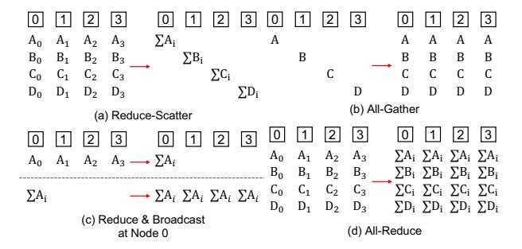

Fig. 1. Decomposition of the AllReduce operation.

tive operations, demonstrating both efficiency and generality. Scalability analysis demonstrates that the solver-based strategy scales to nearly 1,000 nodes, while the incremental strategy supports up to 10,000 nodes. *PipeComm is open source at https://github.com/pku-liang/pipecomm.*

# II. BACKGROUND

# *A. Collective Communication*

Collective communication enables data exchange between nodes, supporting parallelism in both training and inference. Key operations such as AllReduce, ReduceScatter, and All-Gather [29], [56], [58] are widely used across parallelization strategies. In data parallelism [12], [48], they synchronize gradients after backpropagation. In tensor parallelism [33], [53], they maintain consistency between model partitions. As shown in Figure 1, AllReduce can be composed using different communication patterns. A common approach [20], [46], [51], [63] decomposes it into two complementary phases: ReduceScatter (Figure 1(a)), which performs reduction and scattering, followed by AllGather (Figure 1(b)) to broadcast the results. Alternatively, AllReduce can be constructed using separate reduce and broadcast steps (Figure 1(c)), offering greater flexibility for heterogeneous networks.

Prior works optimize collective communication through manual or topology-specific designs. Approaches such as C-Cube [50] for DGX-1, TTO [27] for 2D meshes, PAARD [32] for DragonFly, and TCCL [24] for PCIe systems, and SuperMesh [28] and TopoOpt [62] for customized interconnects each target specific architectures. Beyond these topologyspecific schemes, frameworks such as MSCCLang [11], Concerto [9], and PID-COMM [34] improve productivity by offering domain-specific abstractions or automated scheduling, but still rely heavily on expert understanding of network structure. These limitations motivate topology-aware synthesis methods that automatically generate optimized communication, which we discuss in Section III-B.

# *B. Communication and Execution Modeling*

α-β model [19] is a widely used foundational abstraction in parallel and distributed computing for estimating communication costs. This model characterizes the time required to transfer a message of size N as Tcomm = α+β ×N, where α

TABLE I COMPARISON OF EXISTING FRAMEWORKS, WHERE DT DENOTES SUPPORT FOR DISTINCT BANDWIDTH, AS DENOTES SUPPORT FOR ASYMMETRIC CONNECTIVITY, AND SC DENOTES SCALABILITY

| Synthesis      | Topology |       | Collective |                 | Algorithm |                      |
|----------------|----------|-------|------------|-----------------|-----------|----------------------|
| Framework      | DT       | AS    |            | A2A Pipeline SC |           | Strategy             |
| SCCL [5]       | ✘        | ✔     | ✔          | ✘               | ✘         | Solver-based         |
| Blink [60]     | ✘        | ✔     | ✘          | Limit           | ✘         | Solver-based         |
| TACCL [51]     | ✔        | Limit | ✔          | ✘               | ✘         | Solver-based         |
| TE-CCL [31]    | ✔        | Limit | ✔          | ✘               | ✔         | Solver-based         |
| Themis [46]    | Limit    | ✘     | ✘          | ✘               | ✔         | Composition          |
| MultiTree [20] | ✘        | ✔     | ✘          | ✘               | ✔         | Heuristic            |
| TTO [27]       | ✘        | ✘     | ✘          | Limit           | ✔         | Heuristic            |
| TACOS [63]     | Limit    | ✔     | ✘          | ✘               | ✔         | Heuristic            |
| PipeComm       | ✔        | ✔     | ✔          | ✔               | ✔         | Solver / Incremental |

represents the fixed startup latency to initiate a communication, and β captures the inverse of bandwidth, or the per-word transfer time. Due to its simplicity and effectiveness, the αβ model is commonly used for analyzing and optimizing collective communication [21], [55].

Software pipelining [26] enables instruction-level parallelism by overlapping execution stages. Inspired by this, we apply pipelining to communication to improve bandwidth utilization. Multiple communications are initiated at regular intervals, allowing them to proceed concurrently across different stages of execution. A key metric in this model is the Initiation Interval (II), defined as the number of time steps between the start of two consecutive iterations. Given a total of N data chunks to be communicated and a pipeline depth of D, the overall communication latency step T can be caculated as: T = D + (N −1) ∗ II. By adopting this pipelined abstraction, we can effectively model and optimize collective algorithms in heterogeneous systems, leading to improved communication efficiency and scalability.

# III. MOTIVATION

# *A. Complexity of Topologies*

Today's distributed systems exhibit substantial heterogeneity in terms of distinct bandwidth (DT) and asymmetric connections (AS). Links have varying data transfer rates—leading to communication imbalances that hinder overall efficiency. For instance, NVIDIA DGX clusters [35] often integrate diverse interconnect technologies like NVLink [38], Infini-Band [40], and Ethernet [39], each offering distinct bandwidth and latency characteristics. Besides, emerging architectures, such as multi-chip modules [4], [67], frequently adopt asymmetric topologies—like 2D mesh configurations. In a 2D mesh topology, each node connects to neighboring nodes, but direct links to more distant nodes are limited, leading to imbalances in communication paths.

Moreover, the scale of network topologies is rapidly increasing. Hardware vendors are delivering large-scale computing systems to meet the demands of next-generation AI and accelerated workloads. For instance, NVIDIA's NVL72 [36] comprises 72 interconnected GPUs, while Huawei's Cloud-Max 384 system scales up to 384 Ascend 910C accelerators. As models and clusters grow, addressing DT and AS becomes essential to reduce communication overhead, maximize bandwidth use, and ensure scalable distributed ML training. Therefore, manual design becomes impractical for achieving the optimal performance due to the increasing diversity. To address this challenge, many recent approaches [5], [20], [24], [46], [51], [60], [63] aim to automatically synthesize communication algorithms.

# *B. Limitations of Existing Approaches*

Prior works are fundamentally limited in the network topology as shown by Table I. The non-uniform and asymmetric interconnect configurations of network topologies violate the common assumptions of many prior synthesis methods. As a result, existing solutions often fail to utilize available bandwidth efficiently, leading to increased communication latency and degraded performance. Many approaches [5], [20], [27], [60] are optimized for uniform network conditions and do not generalize to real-world heterogeneous settings. Others [27], [46], [51] depend on symmetric connectivity assumptions, which are unlikely to hold in practice. While methods like TACOS [63] relax such assumptions, they still fall short of achieving efficient performance in heterogeneous networks due to the lack of a comprehensive optimization strategy.

Moreover, none of the existing methods support fully pipelined execution—a capability essential for fully exploiting network bandwidth, as shown in Table I. Existing approaches fall broadly into two categories: solver-based and heuristic methods. Solver-based methods generally scale only to small and highly connected topologies and remain constrained by sequential scheduling, preventing them from exploiting the utilization opportunities enabled by pipelining. Even approaches that improve scalability, such as TE-CCL [31], extend only to tens of nodes, and partial pipelining strategies such as Blink [60] still cannot resolve the inter-iteration congestion patterns that arise under full pipelining. These limitations motivate the design of PipeComm, which explicitly optimizes path planning under pipelined execution.

Heuristic and pattern-composition methods offer better scalability but face complementary challenges. Their search spaces grow prohibitively large under pipelining, making it difficult to construct schedules that fully utilize critical communication paths. Fixed pipelined strategies, such as TTO [27], are tailored to specific topologies (e.g., 2D meshes) and do not generalize. Moreover, these methods primarily support AllReduce or AllGather operations while failing to handle more complex collectives such as AlltoAll (A2A), further restricting their applicability.

# *C. Motivation Example*

We illustrate our synthesis strategy based on pipeline optimization through an example. Consider a heterogeneous network with two bandwidth configurations, where the faster link operates at twice the speed of the slower one. As shown in

Fig. 2. Illustration of All-Gather using different algorithms in a heterogeneous network with two distinct bandwidth configurations. Each node starts with one chunk (represented by a square labeled 0–3) and broadcasts it to others.

Figure 2(a), a send operation over the slower link requires two time steps. We use the All-Gather collective as an illustration, which requires broadcasting the data from every node (0-3) to all other nodes. The spanning tree strategy, as used in MultiTree, can be extended to distinct bandwidth. Specifically, the All-Gather is decomposed into four concurrent broadcasts, where each tree rooted at x disseminates the data of node x. As shown in Figure 2(b), this tree-based approach constructs four spanning trees with two types of edges, each requiring three steps. TACOS [63] introduces the concept of a Time-Expanded Network and proposes a link-chunk matching algorithm based on a random and greedy strategy. As shown in Figure 2(c), TACOS greedily utilizes all available channels at each time step, where each edge denotes a data transfer. However, TACOS's heuristic decision-making often results in a suboptimal schedule where the critical path is inadvertently dominated by slower links, limiting overall communication efficiency.

Here, both MultiTree and TACOS achieve only 67% average link utilization due to bandwidth underutilization—primarily caused by long communication paths over slower links. The key idea behind PipeComm is to maximize utilization by overlapping multiple chunks. Although TACOS supports limited overlapping by partitioning chunks before synthesizing, its greedy heuristic often results in a suboptimal critical path.

To address these inefficiencies, PipeComm leverages pipeline techniques to improve link utilization while keeping synthesis time and program scale manageable. As shown in Figure 2(d), PipeComm constructs a conflict-free schedule with a logical depth of four steps. In each step, the notation x represents the transfer of node x's data, which must be broadcast to all other nodes. Although the time required for a single chunk increases, a new communication can be instantiated every two steps, effectively overlapping operations. Figure 2(e) illustrates the steady-state pipelined execution where all available links are fully utilized. In this diagram, the notation x represents the transfer of node x's data for the current i-th iteration, while x' denotes the data transfer for the previous iteration (i-1) that is still in flight. With an initiation interval (II) of 2, the operations for the i-th iteration span

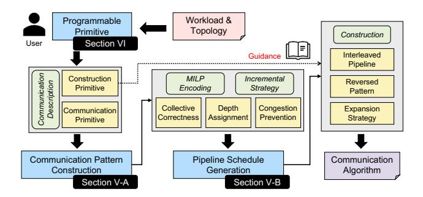

Fig. 3. Overview of PipeComm

logical steps 2i+1 to 2i+4 in the unfolded timeline. Crucially, the pipeline stages are interleaved such that resources used in Step 1 (modulo II) are reused in Step 3 for the subsequent iteration, and similarly for Steps 2 and 4. Compared to the TACOS schedule which requires 3 steps per operation, our approach achieves a steady-state throughput of one operation every 2 steps, yielding a  $1.5\times$  speedup.

#### IV. OVERVIEW

Figure 3 presents an overview of PipeComm. The synthesis process takes a logical communication specification as input and generates a concrete communication algorithm tailored to the physical topology. We first define high-level primitives—including communication operations and scheduling directives—that allow users to specify optimization targets such as II and topology constraints. Based on these constraints, we formulate an optimization problem and solve it using a two-phase synthesis procedure.

In the first phase, PipeComm constructs communication patterns such as broadcast and reduce, represented as directional spanning trees either scattered from or aggregated to a root node. To automatically generate optimized patterns, we employ a Mixed-Integer Linear Programming (MILP) formulation that ensures optimality, assigns efficient depth levels, and mitigates network congestion. The MILP formulation incorporates both workload characteristics and system topology to synthesize communication schedules that minimize latency and maximize bandwidth utilization. In addition to the solver-based approach, we present an incremental strategy that iteratively refines the schedule by gradually increasing the II. This approach balances performance with computational overhead, avoiding the inefficiency of exhaustive search while still enabling effective pipeline optimization.

In the second phase, PipeComm performs pipeline schedule generation, assigning concrete, conflict-free scheduling steps to minimize per-iteration latency. To further reduce synthesis time, construction primitives can guide the scheduling process before pipeline generation. Key techniques, such as interleaved pipelining, pattern reversal, and expansion strategies, enhance efficiency by refining the initial design into a more optimized communication pattern.

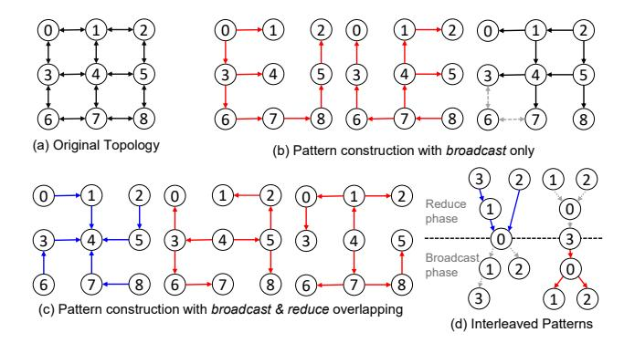

Fig. 4. Illustration of the pattern construction procedure: (a) The 2D mesh topology; (b) A candidate construction using two separate broadcast patterns; (c) An optimized construction that overlaps broadcast and reduce operations; (d) A simplified visualization of the interleaved AllReduce execution. The solid colored edges correspond to the primary pattern, while the dotted edges represent the reversed pattern (exploiting the duality of broadcast and reduce) to complete the full AllReduce operation.

## V. PIPELINE SYNTHESIS

We design a pipeline synthesis procedure to carefully balance resource usage and minimize conflicts through precise coordination of data chunk transmissions. Our approach explicitly accounts for heterogeneous network constraints and communication dependencies. We decompose the synthesis process into two optimization phases: 1) Communication Pattern Construction: We first determine the optimal communication pattern for each data chunk without committing to specific transmission time steps. This phase ensures that data transmissions are distributed efficiently across available link resources; 2) Pipeline Schedule Generation: Given the communication pattern, we then assign specific transmission steps to each data chunk, ensuring conflict-free scheduling with a minimized time step.

### A. Communication Pattern Construction

Collective communication defines which data chunks are required at each node in the network, but it does not inherently specify the exact communication pattern used within the physical network topology. In real-world networks, the situation is further complicated by distinct link bandwidth, asymmetric connections, and potential congestion points. A naive mapping of collective communication to the network can lead to inefficient bandwidth utilization and bottlenecks.

To maximize communication efficiency, it is crucial to determine precise data-transfer paths for each chunk, selecting routing strategies that avoid conflicts among overlapping transmissions. This challenge becomes significantly harder under pipelined execution, where multiple iterations proceed concurrently, increasing the risk of network congestion. As shown in Figure 4, our approach constructs multiple communication patterns that collectively cover the original topology while maintaining a fixed throughput. Each pattern corresponds to either a broadcast (red) or reduce (blue) operation, illustrated in Figure 4(b)(c). We begin by constructing the patterns using

broadcast operations only, and then derive the corresponding reduce procedures by reversing the broadcast patterns.

1) MILP Encoding: We first propose a Mixed-Integer Linear Programming (MILP)-based approach to construct an optimal communication pattern to maximize bandwidth utilization. The primary decision variables in this formulation are: 1)  $x_{s,e}$ : A binary variable indicating whether edge e is used for the collective communication of pattern s; 2)  $l_{s,v}$ : A nonnegative real variable representing the depth of node v in the communication pattern s. The following constraints are used to model the communication pattern construction We propose a Mixed-Integer Linear Programming (MILP)-based approach to construct an optimal communication pattern.

$$\forall s \in R, e \in E, x_{s,e} \in \{0,1\}$$
  
$$\forall s \in R, v \in V, l_{s,v} > 0$$
 (1)

where R is the set of communication patterns, E and V are the set of edges and nodes in the network, respectively.

Each node, except for the root node  $root_s$ , must receive data exactly once. This ensures that the data propagates efficiently throughout the network:

$$\forall s \in R, v \in V, \sum_{\substack{e = (u, v, w) \\ \land e \in E}} x_{s, e} = [v \neq root_s]$$
 (2)

We establish the depth of each node in the communication pattern rooted at  $root_s$ , ensuring a valid hierarchical structure. Each root node s is assigned a depth of zero:

$$\forall s \in R, l_{s,root_s} = 0 \tag{3}$$

Let w denote the transmission delay for a single data chunk on link e, derived from its bandwidth BW (i.e., chunk size divided by BW). The depth of node v is determined relative to its predecessor node u through the selected edge e = (u, v, w). If edge e is used in the communication pattern, the depth constraint ensures that the node v's depth is set appropriately:

$$\forall s \in R, e = (u, v, w) \in E$$

$$l_{s,v} \le l_{s,u} + w + M * (1 - x_{s,e})$$

$$l_{s,v} \ge l_{s,u} + w - M * (1 - x_{s,e})$$
(4)

where M is a large margin used to relax the constraint when  $x_{s,e}=0$  (i.e., when edge e is not selected in pattern s).

To prevent congestion introduced by overlapping communications in a pipelined execution, we impose a constraint on the utilization of each network link. Let II denote the initiation interval, representing the time interval between injecting two consecutive chunks. To ensure that the network resources are not overutilized, the number of chunks scheduled on link e within one II must not exceed the link's temporal capacity:

$$\forall e = (u, v, w) \in E, \sum_{s \in R} x_{s,e} \le \frac{II}{w}$$
 (5)

Objective Function: The goal of the optimization is to minimize the overall depth, denoted by y, which directly influences the length of the longest communication path in the pipeline. By reducing the depth y, we aim to optimize the latency of data transfers and improve the efficiency of data propagation across the network. This is formalized by the following constraint, which ensures that the depth of each node v is bounded by the maximum depth y:

$$\forall s \in R, v \in V, y - l_{s,v} \ge 0 \tag{6}$$

When the root is not fixed, the constraints in Equation 2 can be reformulated such that the total number of selected edges equals the number of nodes minus one, ensuring a connected spanning structure. Additionally, each node can receive data at most once, preventing redundant communication. This formulation naturally generalizes to other collective operations by adjusting the correctness constraints accordingly. By solving this MILP formulation, we can derive an optimal communication pattern that minimizes congestion, and ensures efficient data transfer across the network.

*2) Incremental Strategy:* To improve the scalability of pattern construction, we propose an incremental strategy that efficiently explores the search space while balancing performance and computational overhead. Instead of exhaustively searching for an optimal communication pattern from the outset, our approach incrementally refines the pattern by iterating over increasing values of the II. This method reduces computational complexity while progressively enhancing communication efficiency. The algorithm begins with the smallest feasible II and increases it step by step. As II grows, the communication capacity allocated to each edge is dynamically adjusted (Equation 5). At each iteration, the algorithm finds new valid communication patterns based on the residual graph, which represents the available network bandwidth and connectivity constraints. If a feasible pattern is identified, it is incorporated into the existing set of patterns. The final output is the candidate that achieves the optimal link utilization, ensuring efficient data transmission.

By adopting this incremental approach, the algorithm significantly enhances scalability, making it well-suited for largescale distributed systems. Instead of conducting an exhaustive search over the entire design space, it incrementally refines solutions, enabling efficient exploration and utilization of underused communication links. This strategy is particularly effective for pipeline communication with large II values, enabling robust performance across topologies.

*3) Reduce & Broadcast Overlapping:* Many approaches [20], [27], [51], [60], [63] decompose the AllReduce procedure into two phases, such as ReduceScatter followed by AllGather. These phases are typically implemented by reversing the communication pattern of the other. However, it limits optimization opportunities due to the inherent symmetry of the AllGather phase. In contrast, we decompose AllReduce into reduce and broadcast phases, enabling overlapping between them.

Pipeline techniques naturally enable such optimizations by leveraging the inherent overlapping behavior. Rather than treating the two phases as independent steps, pipelining allows reduce and broadcast operations to proceed concurrently, maximizing resource utilization and minimizing overall communication latency. As shown in Figure 4(c), the 3 × 3 2dmesh can be decomposed into two broadcast patterns and one reduce pattern. Together, these three patterns fully cover the entire topology while maintaining the II as 1. In contrast, without overlapping, the topology can generate only two broadcast (or reduce) patterns, limiting the ability to optimize bandwidth utilization. This restriction significantly hinders performance, as fewer concurrent communication streams lead to underutilized network resources.

For the incremental approach, we simultaneously consider the broadcast and reduce operations, iteratively refining the communication on the residual graph. For the MILP-based approach, we modify the formulation about the correctness constraint (Equation 2). Instead of ensuring that each node receives the data exactly once, we revise the constraint to enforce that each node sends the data at most once:

$$\forall s \in R, u \in V, \sum_{\substack{e = (u, v, w) \\ \land e \in E}} x_{s, e} = [u \neq root_s] \tag{7}$$

By exploiting the duality of collective operations, we can derive the counterpart Reduce pattern simply by reversing the direction of the synthesized Broadcast pattern (and vice versa). Consequently, the full AllReduce operation is constructed by interleaving the primary patterns with their reversed counterparts. This creates two concurrent communication flows proceeding in opposite directions: the Reduce phase aggregates gradients towards the root, while the Broadcast phase disseminates the aggregated result back to all nodes. Crucially, these phases are overlapped together within the same pipeline structure. Figure 4(d) visualizes this interleaved strategy, where solid edges represent the primary flow and dotted edges represent the reversed flow. Although managing two flows increases resource contention, our solver optimally adjusts the initiation interval to accommodate the combined traffic without compromising overall link efficiency, thereby maximizing the aggregate throughput.

# *B. Pipeline Schedule Generation*

After constructing the communication pattern, the next step is to determine the precise execution step for each communication operation to efficiently implement collective communication. This scheduling process must account for both resource constraints, where network links serve as limited resources, and data dependencies, where nodes act as intermediaries between consecutive edges in the communication graph. This problem can be formulated as a conventional pipeline scheduling problem. Numerous modulo scheduling techniques [42], [47], [68] have been developed to address similar challenges by optimizing resource allocation and execution timing. However, in our case, the problem can be simplified due to the

## Algorithm 1: Pipeline Schedule Generation Input : R: Communication patterns, II: Initiation interval Output: step: Execution step for each data transfer 1 Init Heap with R; 2 while Heap is not empty do 3 (s, node, depth) ← Heap.pop(); 4 f inished ← true; 5 for each outgoing edge link of node in pattern s do 6 if (s, link) ∈/ step then 7 if RT[link] at depth is free then 8 f inished ← true; 9 step(p, link) ← depth; 10 for i ← 0 to w(link) − 1 do 11 RT[link][(depth + i) mod II] ← true; 12 end 13 if end(link) is ready then 14 Heap.push((s, end(link), depth + w(link)); 15 end 16 end 17 else 18 f inished ← f alse; 19 end 20 end 21 end 22 if *not* f inished then 23 Heap.push((s, node, depth + 1)); 24 end

absence of inter-iteration data dependencies, which eliminates the need for complex dependency resolution across iterations.

25 end

*1) Algorithm Design:* We propose a heuristic scheduling strategy based on a Modulo-II Reservation Table (RT) to minimize the total number of pipeline stages (i.e., the pipeline latency depth). This method systematically assigns communication operations to physical time slots while ensuring conflict-free resource allocation across overlapping iterations, thereby enhancing overall efficiency. Algorithm 1 illustrates the pipeline generation procedure, which uses a heap-based scheduler to prioritize transfers. Here, the variable *depth* denotes the actual logical scheduled time offset, rather than just a topological level. The heap always extracts the target communication link with the smallest current depth to maintain a highly dense execution timeline.

Initially, all source nodes with no predecessors are inserted into a heap with a starting depth of zero. The algorithm iteratively pops out the node with the smallest depth and attempts to schedule its outgoing communication links (line 3). Each link is scheduled only if it has not been assigned a valid step. Crucially, the reservation table ensures conflictfree steady-state scheduling by checking the availability of bandwidth slots modulo the II (line 7). If a valid time slot is found, the communication is assigned to that step, and the Modulo-II reservation table is updated accordingly (line 9-12). A successor node is pushed into the heap only after its preceding transfer completes, strictly obeying structural dependencies similar to topological sorting (line 13-15).

If a resource conflict arises at the current depth (i.e., the target RT slot is already occupied), scheduling for that node is

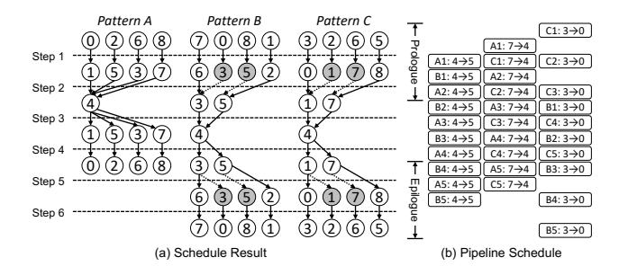

Fig. 5. Illustration of pipeline schedule: (a) A 6-step AllReduce communication schedule on a 3 × 3 2D mesh. Dotted arrows indicate idle time due to pending communications, while gray nodes represent partial nodes waiting for additional links to complete. (b) A pipeline schedule with an initiation interval of 2. For clarity, only three representative channels are shown.

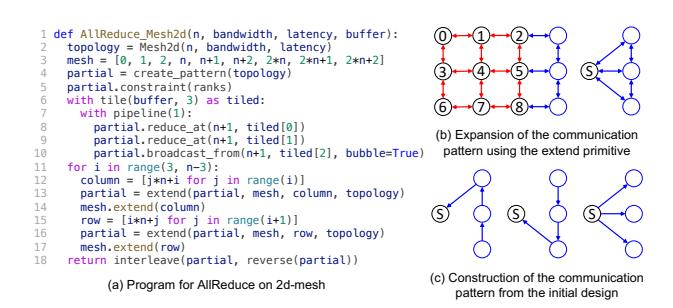

Fig. 6. Illustration of the AllReduce algorithm on a 2D mesh topology. The left side shows the code implementing the communication, while the right side depicts the corresponding patterns. Red arrows indicate the initial communication pattern on a sub-mesh, while blue arrows represent the hierarchical construction with pattern expansion.

deferred, and it is reinserted into the heap with an incremented depth ('depth + 1', lines 22-24). This deferral strategy resolves structural hazards by gracefully inflating pipeline latency. Because our MILP formulation already enforces that the aggregate number of chunk transmissions mapped to any link does not exceed the capacity of a single II, there are always sufficient slots available in the steady state. Furthermore, since there are no inter-iteration data dependencies, these latency deferrals only shift execution offsets without creating circular logical stalls, guaranteeing that the algorithm will eventually converge to a valid modulo schedule.

As shown in Figure 5(a), the pipeline construction produces a 6-step schedule for the full AllReduce operation. With an initiation interval of 2, the pipeline enables effective overlap across stages, keeping links active throughout most of the execution. Only during the prologue and epilogue exhibit partial underutilization, as illustrated in Figure 5(b). The initiation interval of 2 implies that each transfer exclusively occupies either the odd or even time slots, a constraint that must be explicitly incorporated into pipeline scheduling. The explicit mapping of depth to the Modulo-II reservation table ensures that each transfer is statically bound to either the odd or even operational slots, a constraint safely preserved by our overlapping strategy. Through careful pipeline scheduling, our approach ensures that reductions within a single pattern are forwarded to the subsequent broadcast phase as soon as they become available, rather than waiting for the entire reduction phase to complete.

*2) Performance Analysis:* For a pipeline schedule with data of size D in one node, partitioned into C chunks with an initiation interval II, and accumulated into R roots over S steps, each new iteration requires only II steps. Thus, the total number of steps is S + II ∗ (C − 1). Therefore, the total communication cost is:

$$Cost = (S + II * (C - 1)) * (\alpha + \frac{D}{RC}\beta)$$
$$= (S - II)\alpha + \frac{D * II\beta}{R} + (II * C\alpha + \frac{D(S - II)\beta}{RC})$$

To minimize cost, the optimal chunk size is:

$$C^* = \sqrt{\frac{D(S - II)\beta}{\alpha R * II}}$$

Thus, the lower bound on cost is:

$$Cost \ge (S - II)\alpha + \frac{D*II\beta}{R} + 2\sqrt{\frac{D(S - II)II\alpha\beta}{R}}$$

In Figure 5, given α = 200ns, 1/β = 50GB/s, D = 16MB, R = 3, S = 10, II = 2, we calculate the optimal chunk count as C ∗ ≈ 46. With an explicit model of pipeline behavior, the optimal partition can be determined analytically.

# *C. Integration with Overlapping Techniques*

Computation-communication overlapping is a critical technique for improving distributed training performance and can be broadly categorized into two main approaches. The first is *operation decomposition* [2], [8], [61], which restructures the computation graph by decomposing operations and analyzing dependencies to identify parallelizable tasks. The second is *kernel fusion* [7], [21], which fuses computation and communication at a finer granularity during compilation, forming block-level pipelines without explicitly partitioning global operations.

Unlike approaches that focus on scheduling *when* to communicate [7]–[9], [21], PipeComm optimizes *how* to communicate efficiently over the network fabric. Our work is orthogonal and complementary to these overlapping techniques. Specifically, PipeComm can serve as the high-performance communication backend for kernel fusion frameworks: once a communication task is triggered, PipeComm ensures it completes with the minimal latency and maximal bandwidth utilization through pipelined link scheduling. This is particularly crucial in communication-bound scenarios, such as large language model training, where communication overhead cannot be fully hidden by computation. By reducing the absolute communication time, PipeComm effectively increases the portion of communication that can be overlapped, directly improving end-to-end performance.

TABLE II PROGRAMMABLE PRIMITIVES IN PIPECOMM

| Primitives                | Descriptions                                  |
|---------------------------|-----------------------------------------------|
| Communication Primitives  |                                               |
| broadcast from(n, d, b)   | Broadcast data d from node n with bubble b    |
| reduce at(n, d)           | Reduce data d at node n                       |
| tile(d, factor)           | Tile the data d into factor segments          |
| pipeline(II)              | Apply the pipeline transformation with II     |
| Construction Primitives   |                                               |
| interleave(s1, s2)        | Interleave two schedules s1, s2               |
| reverse(s)                | Reverse all the communication in schedule s   |
| constraint(ns)            | Constraint pattern in the node collection ns  |
| extend(s, ns, news, topo) | Extend schedule s on ns with news in topology |

# VI. PROGRAMMABLE PRIMITIVE

We define a rich set of primitives, as detailed in Table II, providing scalable and flexible options to explore different optimizations. These primitives empower users to adjust the communication patterns according to their specific requirements, ensuring enough performance across diverse topologies and bandwidth constraints.

# *A. Communication Primitive*

The first category is the communication primitive, which defines the basic functionality for collective communication using *reduce at* and *broadcast from*. A key concept here is the bubble b, which indicates a data dependency—specifically, the broadcast operation must wait until the corresponding buffers produced by all reduce operations are available. To further enhance bandwidth utilization, we incorporate two compiler-inspired techniques: tiling and pipelining. Tiling partitions data into smaller chunks to enable finer-grained parallelism, while pipelining overlaps communication stages to better utilize links. These techniques, expressible through the communication primitives, can be composed to maximize resource efficiency, increase throughput, and reduce overall communication overhead.

# *B. Construction Primitive*

The second category, construction primitives, enables users to guide the pattern construction process (Section V-A). By leveraging *interleave* and *reverse*, users can efficiently compose full all-reduce patterns from partial patterns. In addition, we also introduce hierarchical construction, which enables pattern expansion based on a given sub-topology. As shown in Figure 6(b), a new column is inserted into an existing 3 × 3 2D mesh topology. Since the sub-topology already contains patterns covering all nine ranks, extending these patterns to the three newly added ranks is straightforward. This problem can be viewed as treating the sub-topology as a superrank and applying the same construction strategy recursively. Figure 6(c) illustrates one possible expansion, which includes two reduction patterns and one broadcast pattern, mirroring the initial design. The only modification needed is adjusting the initial depth to align with the expanded design. The expansion strategy is user-driven, allowing different approaches to yield varying performance trade-offs.

By exposing communication and construction primitives, PipeComm offers a flexible framework that balances automation with user-guided optimization. This allows efficient pattern synthesis across diverse network topologies, while maintaining high performance and scalability.

# *C. Overall Example*

Figure 6(a) presents a complete example using both categories of primitives to describe a hierarchical construction strategy on a 2D mesh. In Line 6, the buffer is partitioned into three segments: tiled[0-2]. Line 7 enables pipelining with an II of 1, while Lines 8–10 construct two reduce patterns and one broadcast pattern. Notably, the bubble in the broadcast step signifies a data dependency—specifically, the first broadcast iteration must wait until the corresponding buffer segments from the reduce operations are ready.

For pattern construction, Line 5 initializes the base configuration, and Lines 11–17 incrementally expand the communication schedule by adding rows and columns. This hierarchical composition decomposes the synthesis task into smaller, tractable sub-problems, thereby significantly reducing complexity. Line 18 uses the interleave primitive, as illustrated in Figure 4(d), to overlap distinct communication patterns and improve throughput. Since the topology in this example is bidirectional, applying reverse is sufficient to generate the valid pattern. In contrast, for topologies without bidirectional links, new partial patterns must be synthesized and interleaved to ensure efficient communication.

# VII. EXPERIMENTAL RESULTS

# *A. Methodology*

Experiment Setup: To evaluate the effectiveness of PipeComm, we evaluate using both simulation and measurement on real machine. For simulation, we utilize ASTRAsim [64], [65], a distributed machine learning simulator that supports various network topologies. ASTRA-sim's congestion-aware analytical backend models message transfers at link granularity, simulating send and receive operations in a first-come, first-served manner. We extend ASTRA-sim to implement and test different communication algorithms. To validate PipeComm 's effectiveness in real-world settings, we also conduct measurements on a two-node multi-GPU system.

We evaluate two versions of PipeComm: Pipe-Sol, which uses Gurobi [16] as the MILP solver for optimal synthesis, and Pipe-Ict, which adopts an incremental strategy. Our evaluation covers multiple perspectives. First, we assess the performance gains of the synthesized AllReduce algorithms compared to multiple baseline approaches. Second, we evaluate performance on the AllGather and AlltoAll operation to further validate PipeComm 's effectiveness across different collective operations. Third, we perform an end-to-end evaluation of training performance across various machine learning workloads to demonstrate the practical benefits. Fourth, we conduct

TABLE III NETWORK TOPOLOGY CONFIGURATIONS. FOR HETEROGENEOUS SETUPS, LINKS ALONG DIFFERENT DIMENSIONS HAVE DISTINCT LATENCY (α) AND

BANDWIDTH (1/β).

Topology Scale Dim-1 Config Dim-2 Config *Homogeneous Evaluation* Hypercube3D 5 × 5 × 5 0.2 µs, 50 GB/s Mesh2D 8 × 8 0.2 µs, 50 GB/s *Comparison with Baseline (MultiTree)* Mesh2D 8 × 8 0.15 µs, 16 GB/s Torus2D 8 × 8 0.15 µs, 16 GB/s *Heterogeneous Evaluation* Mesh2D 8 × 8 0.2 µs, 50 GB/s 0.15 µs, 100 GB/s Switch2D 8 × 8 0.2 µs, 50 GB/s 0.05 µs, 200 GB/s

a case study to analyze the scalability of PipeComm, highlighting the efficiency of the autonomous incremental strategy. Finally, we report results on real GPU platforms to validate performance under real-world deployment.

The baselines we compare fall into two categories: heuristic approaches (TACOS [63], Themis [46], BlueConnect [10], MultiTree [20]) and solver-based approaches (TACCL [51], TE-CCL [31]). Due to their limited scalability, the solverbased methods are evaluated only on small-scale topologies.

# *B. AllReduce Evaluation*

As shown in Figure 7, we evaluate performance across four topologies, where the default link configuration is set to α = 200 ns and 1/β = 50 GB/s. Table III details the specific configurations for both homogeneous and heterogeneous scenarios. For the heterogeneous topologies (Figure 7(c)(d)), we adopt a two-dimensional structure consistent with Themis' configuration, where links along the same dimension share identical bandwidth settings. Specifically, high-speed links are configured with 100 GB/s in the hetero Mesh and 200 GB/s in the hetero Switch, while low-speed links remain at 50 GB/s. In addition, for the comparison against MultiTree [20] (which is not open-source), we adopt their specific parameters (α = 150 ns and 1/β = 16 GB/s) and directly reference their reported results to ensure fairness. We vary the AllReduce data size from 4MB to 16GB to capture both small and large communication workloads and measure the corresponding simulation time. For switch-based topologies, we adopt the unfolding method proposed by TACOS, which unwinds switch networks into fixed point-to-point connections. While TACOS supports partitioning of data into multiple chunks, its computational complexity increases quadratically with the number of chunks. Worse yet, TACOS lacks an explicit pipeline model and may even perform worse when partitioning is applied, failing to fully exploit its potential benefits. Therefore, we evaluate TACOS with chunk counts of 1 and 4.

Comparison against BlueConnect, Themis and TACOS: Themis relies heavily on hierarchical composition, but its 1D Chain approach fails to fully utilize link bandwidth, leading to suboptimal link utilization. While two-dimensional homo-

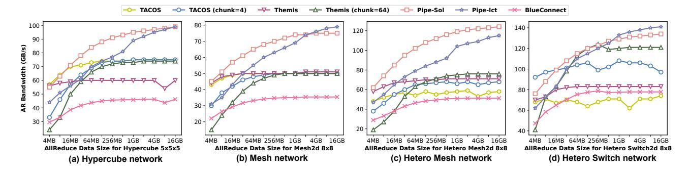

Fig. 7. AllReduce bandwidth comparison across various data sizes for a 5x5x5 3D Hypercube, an 8x8 2D Mesh, and two heterogeneous topologies: an 8x8 2D Mesh and an 8x8 2D Switch, evaluated against BlueConnect, Themis and TACOS. In the heterogeneous topologies, the high-speed link bandwidth is set to 100 GB/s for the 2D Mesh and 200 GB/s for the 2D Switch. Themis is evaluated with a chunk count of 64 to illustrate the impact of tiling, with a default setting of 4.

geneous topologies allow for efficient interleaving, increasing the chunk count in Themis degrades overall performance rather than improving it. BlueConnect [10], which pioneered collective decomposition, can be viewed as a baseline precursor to Themis but without fine-grained chunking strategies. Consequently, it lacks the flexibility to exploit pipeline parallelism, resulting in significantly lower bandwidth utilization compared to modern chunk-based methods. As shown in Figure 7, while BlueConnect manages to outperform TACOS on the highly symmetric Switch topology (due to its structured decomposition approach), it generally falls behind in more complex settings. Our results show that PipeComm achieves a substantial 1.98× speedup over BlueConnect. Similarly, Themis also outperforms BlueConnect by 1.43×, but our approach delivers superior adaptability and performance across the broadest range of topologies. For heterogeneous Switch and 3D Hypercube topologies in Figure 7(a)(d), Themis benefits from a higher chunk count in large workloads, achieving better bandwidth but at the cost of degraded performance for smaller workloads. TACOS outperforms Themis in homogeneous topologies but fails to maintain this advantage in heterogeneous settings. Due to its greedy strategy, TACOS does not fully exploit the benefits of tiling, limiting its ability to optimize performance across different topologies.

Compared to TACOS, Themis, TACOS (4 chunks), and Themis (64 chunks), Pipe-Sol achieves speedups of  $1.53\times$ ,  $1.43\times$ ,  $1.39\times$ , and  $1.52\times$ , respectively. Pipe-Ict, while struggling to maintain performance for small data sizes due to the lack of optimal solutions, achieves speedups ranging from  $0.72\times-2.19\times$ ,  $0.70\times-1.80\times$ ,  $0.67\times-1.69\times$ , and  $0.84\times-2.43\times$ . As discussed in Section V-B2, the optimal chunk count can be statically determined, effectively eliminating the uncertainties present in Themis and TACOS. While pipeline execution offers limited benefits for small workloads due to latency overhead, this limitation is mitigated as data size increases. Notably, even with the optimal pattern for switch topology [13], Themis fails to fully utilize bandwidth due to its reliance on overlapping across dimensions.

In summary, Pipe-Sol utilizes MILP-based encoding to

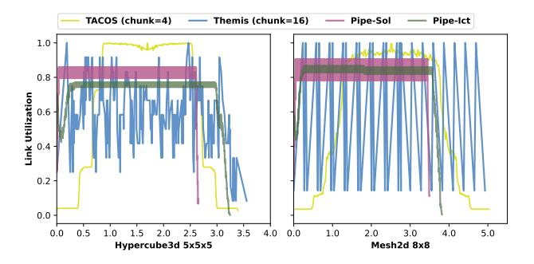

Fig. 8. Average link utilization over time for different AllReduce algorithms on a  $5\times5\times5$  3D Hypercube and an  $8\times8$  2D Mesh with a data size of 256MB. The x-axis represents the normalized time across the entire procedure.

achieve globally optimality with a fixed II, ensuring efficient link utilization and minimal-depth patterns. However, its high computational cost limits scalability to high II values. In contrast, Pipe-Ict employs an incremental construction strategy, progressively refining communication patterns. While it may not always match the global optimality of Pipe-Sol, it offers greater scalability and adaptability. With higher II, Pipe-Ict can utilize more patterns to further improve link utilization, although such improvements are typically significant only for extremely large workloads. In these cases, Pipe-Ict may even outperform Pipe-Sol. Overall, pipeline optimizations substantially enhance performance across heterogeneous topologies.

Link Utilization: Figure 8 shows link utilization across different methods on 3D Hypercube and 2D Mesh topologies. Both TACOS and Themis achieve less than 65% average utilization across both topologies. TACOS sustains near-full bandwidth only at the end of ReduceScatter and the beginning of AllGather but quickly stalls due to imbalanced scheduling. Themis suffers from frequent low utilization, as it relies solely on overlapping across different dimensions. In contrast, Pipe-Sol consistently maintains over 80% link utilization throughout the entire operation in both topologies. Pipe-Ict, however, achieves a 71% utilization rate on the Hypercube, lower than

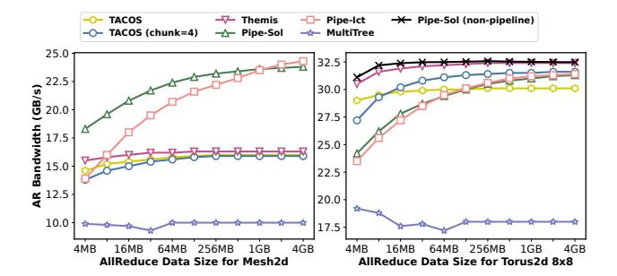

Fig. 9. AllReduce bandwidth comparison against MultiTree on 8x8 2D Mesh and 8x8 2D Torus topologies. The black curve represents Pipe-Sol with the pipeline constraints relaxed (i.e., equivalent to a non-pipelined shortest-path strategy).

Pipe-Sol, as its heuristic strategy may generate fewer patterns. The observed fluctuations stem from slight variations in the number of active links at different stages of pipeline execution. Thanks to pipeline optimizations, all selected links remain fully utilized, resulting in a high overall link utilization rate. Only the beginning and end of the communication process exhibit lower utilization, akin to the prologue and epilogue in software pipelining.

Comparison against MultiTree: The performance comparison, along with other synthesis algorithms, is shown in Figure 9. Overall, Pipe-Sol and Pipe-Ict achieve speedups of  $2.23\times$  and  $2.08\times$  over MultiTree, respectively. MultiTree does not employ a tiling strategy, leading to poor performance beyond 4MB due to low link utilization. For the 2D Torus, a highly connected topology, all algorithms except MultiTree deliver comparable performance on large communication workloads. Since Ring AllReduce already attains optimal performance in a ring topology, Themis can naturally interleave across two dimensions, maximizing link utilization on the 2D Torus. Specifically, in a homogeneous Torus, a constant number of communication rounds (proportional to the dimension size) can fully saturate the bisection bandwidth without contention. Consequently, the overhead of managing fine-grained pipeline stages—such as latency overheads for small chunks—may offset the marginal benefits. To demonstrate the robustness of our framework under such saturation conditions, we relaxed the strict pipeline II constraints for Pipe-Sol, effectively allowing the solver to revert to an optimal non-pipelined shortest-path strategy. As shown in Figure 9, this adaptive configuration matches and slightly outperforms Themis due to the solver's ability to find the theoretically optimal routing paths, proving that PipeComm can gracefully adapt to topologies where aggressive pipelining provides diminishing returns. For smaller workloads, Pipe-Sol achieves higher bandwidth than Pipe-Ict by selecting patterns with minimal depth. In contrast, on 2D Mesh topologies, Pipe-Ict outperforms Pipe-Sol for larger workloads by more effectively utilizing links as the II increases.

Comparison against TACCL and TE-CCL: As shown in Table IV, we compare performance on 2D mesh networks

TABLE IV

ALLREDUCE BANDWIDTH AND SYNTHESIS TIME ON 2D MESH
NETWORKS. EACH CONFIGURATION IS LABELED BY SHAPE, WITH THE
TRAILING NUMBER INDICATING THE FACTOR OF FASTER CHANNELS.

| Approach    | Configuration |           |           |            |            |  |  |
|-------------|---------------|-----------|-----------|------------|------------|--|--|
| Approach    | 4x4           | 5x5       | 6x6       | 4x4_2      | 4x4_4      |  |  |
| TACCL [51]  | 32.80s        | 50.32s    | 5006.7s   | 14.93s     | 1804.1s    |  |  |
|             | 26.33GB/s     | 26.06GB/s | 21.89GB/s | 44.60GB/s  | 51.76GB/s  |  |  |
|             | 34.63GB/s     | 29.68GB/s | 28.97GB/s | 48.40GB/s  | 63.92GB/s  |  |  |
| TE-CCL [31] | 2.17s         | 10.31s    | 89.65s    | 2.63s      | 4.47s      |  |  |
|             | 42.96GB/s     | 38.28GB/s | 36.53GB/s | 48.74GB/s  | 91.65GB/s  |  |  |
|             | 50.37GB/s     | 52.00GB/s | 44.44GB/s | 80.60GB/s  | 107.47GB/s |  |  |
| Pipe-Sol    | 0.304s        | 0.434s    | 3.417s    | 0.817s     | 4.132s     |  |  |
|             | 41.10GB/s     | 37.65GB/s | 35.82GB/s | 48.48GB/s  | 88.17GB/s  |  |  |
|             | 73.37GB/s     | 73.10GB/s | 72.95GB/s | 97.21GB/s  | 193.80GB/s |  |  |
| Pipe-Ict    | 0.104s        | 0.247s    | 0.347s    | 0.136s     | 0.332s     |  |  |
|             | 33.38GB/s     | 25.81GB/s | 24.47GB/s | 38.18GB/s  | 71.53GB/s  |  |  |
|             | 72.67GB/s     | 71.34GB/s | 71.01GB/s | 106.69GB/s | 168.99GB/s |  |  |

across different configurations. The table reports both solver time and achieved algorithm bandwidth, where bandwidth is evaluated using 1MB and 1GB message sizes (shown beneath the solver time). All methods are subject to a one-hour timeout, after which the solver returns the best solution found. On average, Pipe-Sol and Pipe-Ict achieve  $1.49\times$  and  $1.12\times$ speedups over TACCL for the small-size setting, and  $2.43\times$ and  $2.36\times$  speedups for the large-size setting, respectively. TACCL's formulation overlooks network congestion, reducing communication efficiency. From a complexity perspective, Pipe-Sol requires  $\Theta(rn)$  variables for encoding AllReduce, whereas TACCL requires  $\Theta(n^3)$ , where r denotes the number of valid patterns and is typically much smaller than n, the number of nodes. Consequently, the formulation in TACCL incurs high time costs, preventing it from producing efficient solutions beyond 30 nodes. Compared with TE-CCL, Pipe-Sol achieves comparable results for the small-size setting and an average speedup of  $1.50\times$  for the large-size setting. This improvement stems from the enhanced pipeline efficiency in large-scale communication.

## C. Many-to-Many Evaluation

Here, we evaluate AllGather and AlltoAll operations to demonstrate PipeComm's generality. For many-to-many operations, the theoretical upper bound on bandwidth is determined by the topology's diameter and the aggregate bandwidth available per node. Together, these factors constrain the rate at which each node can receive its required data:

$$Ideal = \frac{DataSize \times |V|/(|V|-1)}{\displaystyle \min_{v \in V} \sum_{(u,v) \in E} Bandwidth_{(u,v)}} + Latency\_Diameter$$

For AllGather, we evaluate performance against TACOS on the heterogeneous 2D Mesh and Switch topologies shown in Figure 10. AllGather is supported by assigning valid patterns for each root node. On average, Pipe-Ict achieves a  $1.26\times$  speedup over TACOS with partitioning, while Pipe-Sol delivers a  $1.22\times$  speedup. Pipe-Sol reaches up to 99.0% and 86.5% of the theoretical optimal performance under different

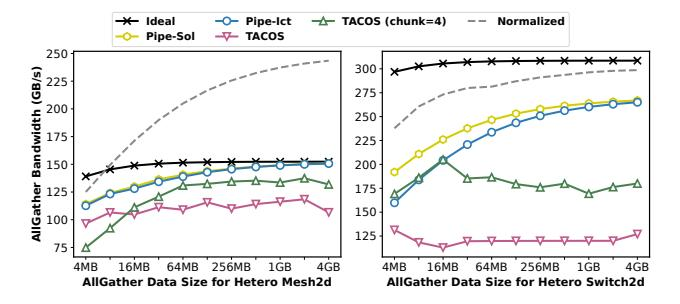

Fig. 10. AllGather bandwidth comparison against TACOS on heterogeneous 2D Mesh and Switch. The black curve denotes the theoretical upper-bound, while the gray curve plots the normalized performance of our AllReduce to illustrate the efficiency gain from overlapping broadcast and reduce phases.

TABLE V
ALLTOALL COMPARISON AGAINST TACCL AND TE-CCL.

| Approach | Configuration |              |                |              |  |  |  |
|----------|---------------|--------------|----------------|--------------|--|--|--|
| Approach | mesh_3x3      | mesh_4x4     | torus_3x3      | torus_4x4    |  |  |  |
| TACCL    | 58.03; 63.37  | Time Out     | 132.91; 145.15 | 52.47; 61.06 |  |  |  |
| TE-CCL   | 45.78; 50.73  | 40.43; 47.41 | 137.34; 152.19 | 68.74; 85.60 |  |  |  |
| Pipe-Sol | 68.67; 74.99  | 40.43; 49.46 | 137.34; 149.99 | 85.93; 99.98 |  |  |  |

topologies. Pipe-Ict achieves comparable performance, with the slight performance gap at smaller data sizes attributed to suboptimal communication height. To explicitly quantify the benefits of our Reduce-Broadcast overlapping strategy, we provide the normalized performance of our optimized AllReduce (gray dotted curve) in Figure 10. Since AllGather consists of only a single broadcast phase, it inherently lacks the opportunity to overlap complementary operations. In contrast, our AllReduce implementation overlaps the Reduce and Broadcast phases, effectively expanding the design space for pipeline scheduling. Without this overlapping optimization, the AllReduce throughput would be bounded by the sequential execution of two phases. The dotted curve demonstrates that our overlapping strategy yields a substantial  $1.45\times$  and  $1.16\times$ effective speedup over the baseline single-phase AllGather throughput on the tested topologies. Notably, on the symmetric Switch-2D topology where link bandwidths are balanced, the theoretical effective bandwidth bounds for AllReduce (assuming perfect overlap) and AllGather align. Our Pipe-Sol AllReduce nearly saturates this theoretical limit, matching the peak efficiency of a standalone AllGather. This confirms that our pipeline strategy successfully masks the overhead of the additional reduction phase, achieving near-optimal dual-phase throughput.

$$\forall (s,t) \in R, v \in V, \sum_{\substack{e=(u,v,w)\\ \land e \in E}} x_{(s,t),e} = \begin{cases} 1, & v=s\\ -1, & v=t\\ 0, & else \end{cases}$$
(8)

For the AlltoAll collective, where every node pair must exchange unique data, TACOS is inapplicable as it lacks support for path-based routing synthesis. We formulate the AlltoAll

problem by enforcing standard network flow conservation for each source-destination pair (s,t), as defined in Equation 8. This constraint ensures that for any intermediate node v, the incoming traffic equals the outgoing traffic, guaranteeing a valid path from s to t. Our formulation enables the solver to naturally balance load across available paths. Table V reports performance results comparing Pipe-Sol against TACCL and TE-CCL on 2D mesh and torus networks under 1MB and 1GB message sizes, with a one-hour timeout. The results are evaluated under 1MB and 1GB message sizes, denoted as  $t_1; t_2$  in the table. The encoding complexity of Pipe-Sol involves  $\Theta(rn)$  variables, whereas TACCL requires  $\Theta(rn^2)$ , where r denotes the set of all node pairs, i.e.,  $r = \Theta(n^2)$ . Consequently, TACCL fails to generate efficient communication even for a  $4 \times 4$  topology. TE-CCL, on the other hand, relaxes the MILP into an LP formulation, which sacrifices optimality guarantees. As a result, it may output suboptimal patterns—for example, on the 3×3 mesh—and it fails to exploit pipeline efficiency for large message sizes. In contrast, Pipe-Sol successfully synthesizes communication and achieves an average bandwidth utilization of 96.28%. These results confirm that PipeComm is both effective and generalizable beyond AllReduce, extending to complex collectives.

## D. End-to-end Evaluation

We evaluate the impact of communication on the overall training process using an 8 × 8 2D mesh topology. TACOS is selected as the baseline, while TTO [27] serves as the manually optimized design for 2D mesh networks. We apply data parallelism to ResNet-50 [18] and RegNet [45], and tensor parallelism to LLaMa2-7B [57] and Qwen2.5-7B [44]—a set of representative models spanning computer vision and large language models (LLMs) [59]. The breakdown of the normalized training time is presented in Figure 11. Although vision workloads are computation-intensive, these two models involve a large number of parameters, causing communication overhead to dominate the overall training time. Additionally, LLM workloads are inherently communication-intensive, making communication optimization particularly crucial [3].

Compared to TACOS, Pipe-Sol achieves a 1.43× speedup by improving link utilization and optimizing chunk size. TACOS relies on a greedy heuristic that often leads to inefficient scheduling and underutilized bandwidth. Compared to TTO, Pipe-Sol achieves a 1.12× speedup despite TTO being a manually optimized strategy tailored to the 2D mesh topology. Unlike TTO, which sacrifices one compute node to facilitate communication, Pipe-Sol maintains full compute participation. It further reduces communication depth and overlaps broadcast and reduce operations, maximizing both link usage and computational throughput. This results in improved overall throughput and reduced communication overhead. Notably, the benefits of Pipe-Sol over TTO become more pronounced in smaller mesh configurations (e.g.,  $4 \times 4$ ), where the contribution of each compute node significantly influences overall training efficiency.

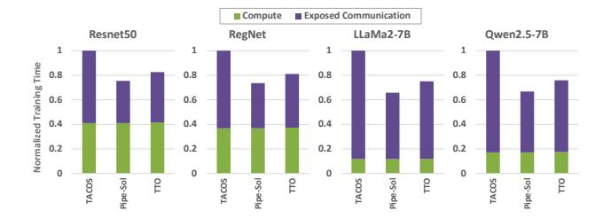

Fig. 11. Breakdown of end-to-end training time for ResNet-50, RegNet, LLaMa2-7B and Qwen2.5-7B on a 64-NPU 2D mesh. All results are normalized to TACOS.

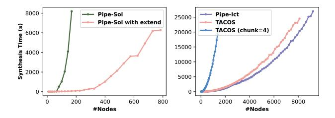

Fig. 12. Synthesis time of different approaches for various-sized homogeneous 2D Meshes. Pipe-Ict exhibits  $\Theta(n^2)$  synthesis time complexity, where n is the number of nodes.

## E. Scalability Analysis

To evaluate PipeComm's scalability, we synthesize AllReduce algorithms on homogeneous 2D Mesh topologies using four strategies: Pipe-Sol, Pipe-Sol with the *extend* primitive, Pipe-Ict, and TACOS. For Pipe-Ict, we set the number of incremental attempts per step to 20. As shown in Figure 12, ILP-based optimization becomes impractical for large-scale topologies due to its NP-hardness. However, the extend primitive supports hierarchical decomposition, reducing complexity from  $\Theta(n^2)$  to  $\Theta(n)$  per step and enabling synthesis on topologies with nearly 1,000 nodes. For TACOS, the implementation without tiling performs similarly to PipeComm. However, its complexity is  $\Theta(c^2n^2)$ —quadratic in chunk count c—making it unsuitable for pipeline optimization, which often involves large c. In contrast, PipeComm avoids explicit tiling and remains independent of chunk count, making it well-suited for pipelined communication. Pipe-Ict further scales to 10,000 nodes, synthesizing a solution in 7.5 hours with synthesis time growing quadratically with the number of nodes.

## F. GPU Evaluation

We conduct experiments on a two-node system, each equipped with eight NVIDIA L20 GPUs interconnected via a PCIe switch. The two nodes are linked through InfiniBand with RDMA support, creating a hierarchical topology with distinct bandwidth tiers: high-bandwidth intra-node PCIe links and lower-bandwidth inter-node IB links. We implement AllReduce using strategies synthesized by TACOS and PipeComm, and compare them against NCCL v2.20.3 [37], the standard communication library optimized for NVIDIA GPU clusters. Although NCCL provides robust support for PCIe topologies,

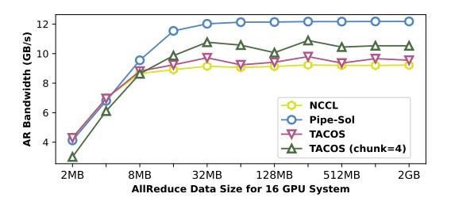

Fig. 13. AllReduce bandwidth comparison across different message sizes on a 16-GPU system, comparing PipeComm against the NCCL and TACOS.

its static heuristics may not fully exploit the asymmetric bandwidths present in this hierarchical setup. As shown in Figure 13, we report algorithm bandwidths across message sizes from 2MB to 2GB. On average, Pipe-Sol achieves 1.24× speedup over NCCL, 1.18× over partitioned TACOS, and 1.19× over non-partitioned TACOS. While NCCL dynamically chooses between ring- and tree-based collectives based on GPU topology, it does not explicitly model the detailed characteristics of the underlying links. TACOS also struggles to synthesize efficient patterns in switch-based topologies, consistent with earlier observations.

## VIII. CONCLUSION

In this paper, we present PipeComm, a novel pipeline-aware framework for efficient communication synthesis. By explicitly modeling pipeline behavior, our method enables congestion-free scheduling across iterations and efficiently utilizes heterogeneous links. Programmable primitives further enhance scalability by guiding synthesis. Experimental results show that the optimal strategy achieves over a  $1.39\times$  speedup compared to the state-of-the-art communication methods. Moreover, PipeComm supports diverse collective operations, demonstrating both efficiency and generality.

## ACKNOWLEDGMENT

This work was supported in part by the National Science Foundation of China (Grant No. T2325001).

### REFERENCES

- [1] D. Abts, J. Ross, J. Sparling, M. Wong-VanHaren, M. Baker, T. Hawkins, A. Bell, J. Thompson, T. Kahsai, G. Kimmell, J. Hwang, R. Leslie-Hurd, M. Bye, E. Creswick, M. Boyd, M. Venigalla, E. Laforge, J. Purdy, P. Kamath, D. Maheshwari, M. Beidler, G. Rosseel, O. Ahmad, G. Gagarin, R. Czekalski, A. Rane, S. Parmar, J. Werner, J. Sproch, A. Macias, and B. Kurtz, "Think fast: A tensor streaming processor (tsp) for accelerating deep learning workloads," in 2020 ACM/IEEE 47th Annual International Symposium on Computer Architecture (ISCA), 2020, pp. 145–158.
- [2] J. Ansel, E. Yang, H. He, N. Gimelshein, A. Jain, M. Voznesensky, B. Bao, P. Bell, D. Berard, E. Burovski, G. Chauhan, A. Chourdia, W. Constable, A. Desmaison, Z. DeVito, E. Ellison, W. Feng, J. Gong, M. Gschwind, B. Hirsh, S. Huang, K. Kalambarkar, L. Kirsch, M. Lazos, M. Lezcano, Y. Liang, J. Liang, Y. Lu, C. K. Luk, B. Maher, Y. Pan, C. Puhrsch, M. Reso, M. Saroufim, M. Y. Siraichi, H. Suk, S. Zhang, M. Suo, P. Tillet, X. Zhao, E. Wang, K. Zhou, R. Zou, X. Wang, A. Mathews, W. Wen, G. Chanan, P. Wu, and S. Chintala, "Pytorch 2: Faster machine learning through dynamic python bytecode transformation and graph compilation," in *Proceedings of the 29th ACM*

- *International Conference on Architectural Support for Programming Languages and Operating Systems, Volume 2*, ser. ASPLOS '24. New York, NY, USA: Association for Computing Machinery, 2024, p. 929–947. [Online]. Available: https://doi.org/10.1145/3620665.3640366
- [3] Q. Anthony, B. Michalowicz, J. Hatef, L. Xu, M. A. Jabbar, A. Shafi, H. Subramoni, and D. K. Panda, "Demystifying the communication characteristics for distributed transformer models," in *IEEE Symposium on High-Performance Interconnects, HOTI 2024, Albuquerque, NM, USA, August 21-23, 2024*. IEEE, 2024, pp. 57–65. [Online]. Available: https://doi.org/10.1109/HOTI63208.2024.00020
- [4] A. Arunkumar, E. Bolotin, B. Cho, U. Milic, E. Ebrahimi, O. Villa, A. Jaleel, C.-J. Wu, and D. Nellans, "Mcm-gpu: Multi-chip-module gpus for continued performance scalability," in *2017 ACM/IEEE 44th Annual International Symposium on Computer Architecture (ISCA)*, 2017, pp. 320–332.
- [5] Z. Cai, Z. Liu, S. Maleki, M. Musuvathi, T. Mytkowicz, J. Nelson, and O. Saarikivi, "Synthesizing optimal collective algorithms," in *PPoPP '21: 26th ACM SIGPLAN Symposium on Principles and Practice of Parallel Programming, Virtual Event, Republic of Korea, February 27- March 3, 2021*, J. Lee and E. Petrank, Eds. ACM, 2021, pp. 62–75. [Online]. Available: https://doi.org/10.1145/3437801.3441620
- [6] E. Chan, R. A. van de Geijn, W. Gropp, and R. Thakur, "Collective communication on architectures that support simultaneous communication over multiple links," in *Proceedings of the ACM SIGPLAN Symposium on Principles and Practice of Parallel Programming, PPOPP 2006, New York, New York, USA, March 29-31, 2006*, J. Torrellas and S. Chatterjee, Eds. ACM, 2006, pp. 2–11. [Online]. Available: https://doi.org/10.1145/1122971.1122975
- [7] L.-W. Chang, W. Bao, Q. Hou, C. Jiang, N. Zheng, Y. Zhong, X. Zhang, Z. Song, C. Yao, Z. Jiang, H. Lin, X. Jin, and X. Liu, "Flux: Fast software-based communication overlap on gpus through kernel fusion," 2024. [Online]. Available: https://arxiv.org/abs/2406.06858
- [8] C. Chen, X. Li, Q. Zhu, J. Duan, P. Sun, X. Zhang, and C. Yang, "Centauri: Enabling efficient scheduling for communicationcomputation overlap in large model training via communication partitioning," in *Proceedings of the 29th ACM International Conference on Architectural Support for Programming Languages and Operating Systems, Volume 3*, ser. ASPLOS '24. New York, NY, USA: Association for Computing Machinery, 2024, p. 178–191. [Online]. Available: https://doi.org/10.1145/3620666.3651379
- [9] S. Cheng, S. Lin, L. Diao, H. Wu, S. Wang, C. Si, Z. Liu, X. Zhao, J. Du, W. Lin, and Y. You, "Concerto: Automatic communication optimization and scheduling for large-scale deep learning," in *Proceedings of the 30th ACM International Conference on Architectural Support for Programming Languages and Operating Systems, Volume 1*, ser. ASPLOS '25. New York, NY, USA: Association for Computing Machinery, 2025, p. 198–213. [Online]. Available: https://doi.org/10.1145/3669940.3707223
- [10] M. Cho, U. Finkler, M. J. Serrano, D. S. Kung, and H. C. Hunter, "Blueconnect: Decomposing all-reduce for deep learning on heterogeneous network hierarchy," *IBM J. Res. Dev.*, vol. 63, no. 6, pp. 1:1–1:11, 2019. [Online]. Available: https://doi.org/10.1147/JRD.2019. 2947013
- [11] M. Cowan, S. Maleki, M. Musuvathi, O. Saarikivi, and Y. Xiong, "Mscclang: Microsoft collective communication language," in *Proceedings of the 28th ACM International Conference on Architectural Support for Programming Languages and Operating Systems, Volume 2, ASPLOS 2023, Vancouver, BC, Canada, March 25-29, 2023*, T. M. Aamodt, N. D. E. Jerger, and M. M. Swift, Eds. ACM, 2023, pp. 502–514. [Online]. Available: https://doi.org/10.1145/3575693.3575724
- [12] J. Dean, G. S. Corrado, R. Monga, K. Chen, M. Devin, Q. V. Le, M. Z. Mao, M. Ranzato, A. Senior, P. Tucker, K. Yang, and A. Y. Ng, "Large scale distributed deep networks," in *Proceedings of the 26th International Conference on Neural Information Processing Systems - Volume 1*, ser. NIPS'12. Red Hook, NY, USA: Curran Associates Inc., 2012, p. 1223–1231.
- [13] J. Dong, Z. Cao, T. Zhang, J. Ye, S. Wang, F. Feng, L. Zhao, X. Liu, L. Song, L. Peng, Y. Guo, X. Jiang, L. Tang, Y. Du, Y. Zhang, P. Pan, and Y. Xie, "EFLOPS: algorithm and system co-design for a high performance distributed training platform," in *IEEE International Symposium on High Performance Computer Architecture, HPCA 2020, San Diego, CA, USA, February 22-26, 2020*. IEEE, 2020, pp. 610–622. [Online]. Available: https://doi.org/10.1109/HPCA47549.2020.00056

- [14] A. Gholami, Z. Yao, S. Kim, C. Hooper, M. W. Mahoney, and K. Keutzer, "Ai and memory wall," *IEEE Micro*, vol. 44, no. 3, p. 33–39, May 2024. [Online]. Available: https://doi.org/10.1109/MM. 2024.3373763
- [15] Google, "Google tensor processing unit," https://cloud.google.com/tpu, 2024.
- [16] Gurobi Optimization, LLC, "Gurobi Optimizer Reference Manual," 2024. [Online]. Available: https://www.gurobi.com
- [17] F. Haddadpour, M. M. Kamani, M. Mahdavi, and V. Cadambe, "Local sgd with periodic averaging: Tighter analysis and adaptive synchronization," *Advances in Neural Information Processing Systems*, vol. 32, 2019.
- [18] K. He, X. Zhang, S. Ren, and J. Sun, "Deep residual learning for image recognition," in *2016 IEEE Conference on Computer Vision and Pattern Recognition, CVPR 2016, Las Vegas, NV, USA, June 27-30, 2016*. IEEE Computer Society, 2016, pp. 770–778. [Online]. Available: https://doi.org/10.1109/CVPR.2016.90
- [19] R. W. Hockney, "The communication challenge for mpp: Intel paragon and meiko cs-2," *Parallel computing*, vol. 20, no. 3, pp. 389–398, 1994.
- [20] J. Huang, P. Majumder, S. Kim, A. Muzahid, K. H. Yum, and E. J. Kim, "Communication algorithm-architecture co-design for distributed deep learning," in *48th ACM/IEEE Annual International Symposium on Computer Architecture, ISCA 2021, Virtual Event / Valencia, Spain, June 14-18, 2021*. IEEE, 2021, pp. 181–194. [Online]. Available: https://doi.org/10.1109/ISCA52012.2021.00023
- [21] A. Jangda, J. Huang, G. Liu, A. H. N. Sabet, S. Maleki, Y. Miao, M. Musuvathi, T. Mytkowicz, and O. Saarikivi, "Breaking the computation and communication abstraction barrier in distributed machine learning workloads," in *Proceedings of the 27th ACM International Conference on Architectural Support for Programming Languages and Operating Systems*, 2022, pp. 402–416.
- [22] P. H. Jin, Q. Yuan, F. Iandola, and K. Keutzer, "How to scale distributed deep learning?" *arXiv preprint arXiv:1611.04581*, 2016.
- [23] N. Jouppi, G. Kurian, S. Li, P. Ma, R. Nagarajan, L. Nai, N. Patil, S. Subramanian, A. Swing, B. Towles, C. Young, X. Zhou, Z. Zhou, and D. A. Patterson, "Tpu v4: An optically reconfigurable supercomputer for machine learning with hardware support for embeddings," in *Proceedings of the 50th Annual International Symposium on Computer Architecture*, ser. ISCA '23. New York, NY, USA: Association for Computing Machinery, 2023. [Online]. Available: https://doi.org/10.1145/3579371.3589350
- [24] H. Kim, J. Ryu, and J. Lee, "TCCL: discovering better communication paths for pcie GPU clusters," in *Proceedings of the 29th ACM International Conference on Architectural Support for Programming Languages and Operating Systems, Volume 3, ASPLOS 2024, La Jolla, CA, USA, 27 April 2024- 1 May 2024*, R. Gupta, N. B. Abu-Ghazaleh, M. Musuvathi, and D. Tsafrir, Eds. ACM, 2024, pp. 999–1015. [Online]. Available: https://doi.org/10.1145/3620666.3651362
- [25] A. Krizhevsky, I. Sutskever, and G. E. Hinton, "Imagenet classification with deep convolutional neural networks," in *Advances in Neural Information Processing Systems 25: 26th Annual Conference on Neural Information Processing Systems 2012. Proceedings of a meeting held December 3-6, 2012, Lake Tahoe, Nevada, United States*, P. L. Bartlett, F. C. N. Pereira, C. J. C. Burges, L. Bottou, and K. Q. Weinberger, Eds., 2012, pp. 1106– 1114. [Online]. Available: https://proceedings.neurips.cc/paper/2012/ hash/c399862d3b9d6b76c8436e924a68c45b-Abstract.html
- [26] M. Lam, "Software pipelining: an effective scheduling technique for vliw machines," *SIGPLAN Not.*, vol. 23, no. 7, p. 318–328, Jun. 1988. [Online]. Available: https://doi.org/10.1145/960116.54022
- [27] S. Laskar, P. Majhi, S. Kim, F. Mahmud, A. Muzahid, and E. J. Kim, "Enhancing collective communication in MCM accelerators for deep learning training," in *IEEE International Symposium on High-Performance Computer Architecture, HPCA 2024, Edinburgh, United Kingdom, March 2-6, 2024*. IEEE, 2024, pp. 1–16. [Online]. Available: https://doi.org/10.1109/HPCA57654.2024.00069
- [28] S. Laskar, P. Majhi, A. Muzahid, and E. J. Kim, "Supermesh: Energyefficient collective communications for accelerators," in *Proceedings of the 58th IEEE/ACM International Symposium on Microarchitecture*, ser. MICRO '25. New York, NY, USA: Association for Computing Machinery, 2025, p. 1640–1655. [Online]. Available: https://doi.org/10. 1145/3725843.3756085
- [29] Y. Li, I.-J. Liu, Y. Yuan, D. Chen, A. Schwing, and J. Huang, "Accelerating distributed reinforcement learning with in-switch computing,"

- in *Proceedings of the 46th International Symposium on Computer Architecture*, 2019, pp. 279–291.
- [30] H. Liao, J. Tu, J. Xia, H. Liu, X. Zhou, H. Yuan, and Y. Hu, "Ascend: a scalable and unified architecture for ubiquitous deep neural network computing : Industry track paper," in *2021 IEEE International Symposium on High-Performance Computer Architecture (HPCA)*, 2021, pp. 789–801.
- [31] X. Liu, B. Arzani, S. K. R. Kakarla, L. Zhao, V. Liu, M. Castro, S. Kandula, and L. Marshall, "Rethinking machine learning collective communication as a multi-commodity flow problem," in *Proceedings of the ACM SIGCOMM 2024 Conference*, ser. ACM SIGCOMM '24. New York, NY, USA: Association for Computing Machinery, 2024, p. 16–37. [Online]. Available: https://doi.org/10.1145/3651890.3672249
- [32] J. Ma, D. Dong, C. Li, K. Wu, and L. Xiao, "Paard: Proximity-aware all-reduce communication for dragonfly networks," in *2021 IEEE Intl Conf on Parallel & Distributed Processing with Applications, Big Data & Cloud Computing, Sustainable Computing & Communications, Social Computing & Networking (ISPA/BDCloud/SocialCom/SustainCom)*, 2021, pp. 255–262.
- [33] D. Narayanan, M. Shoeybi, J. Casper, P. LeGresley, M. Patwary, V. Korthikanti, D. Vainbrand, P. Kashinkunti, J. Bernauer, B. Catanzaro, A. Phanishayee, and M. Zaharia, "Efficient large-scale language model training on gpu clusters using megatron-lm," in *Proceedings of the International Conference for High Performance Computing, Networking, Storage and Analysis*, ser. SC '21. New York, NY, USA: Association for Computing Machinery, 2021. [Online]. Available: https://doi.org/10.1145/3458817.3476209
- [34] S. U. Noh, J. Hong, C. Lim, S. Park, J. Kim, H. Kim, Y. Kim, and J. Lee, " PID-Comm: A Fast and Flexible Collective Communication Framework for Commodity Processing-in-DIMM Devices ," in *2024 ACM/IEEE 51st Annual International Symposium on Computer Architecture (ISCA)*. Los Alamitos, CA, USA: IEEE Computer Society, Jul. 2024, pp. 245–260. [Online]. Available: https://doi.ieeecomputersociety.org/10.1109/ISCA59077.2024.00027
- [35] NVIDIA, "Dgx platform," https://www.nvidia.com/en-in/data-center/ dgx-platform/, 2023.
- [36] NVIDIA, "Gb200 nvl72," https://www.nvidia.com/en-us/data-center/ gb200-nvl72/, 2023.
- [37] NVIDIA, "Nvidia collective communications library (nccl)," https:// developer.nvidia.com/nccl, 2023.
- [38] NVIDIA, "Nvlink technology," https://www.nvidia.com/en-us/datacenter/nvlink/, 2023.
- [39] NVIDIA, "Ethernet products," https://www.nvidia.com/enus/networking/products/ethernet/, 2024.
- [40] NVIDIA, "Infiniband products," https://www.nvidia.com/enus/networking/products/infiniband/, 2024.
- [41] OpenAI, J. Achiam, S. Adler, S. Agarwal, L. Ahmad, I. Akkaya, F. L. Aleman, D. Almeida, J. Altenschmidt, S. Altman, S. Anadkat, R. Avila, I. Babuschkin, S. Balaji, V. Balcom, P. Baltescu, H. Bao, M. Bavarian, J. Belgum, I. Bello, J. Berdine, G. Bernadett-Shapiro, C. Berner, L. Bogdonoff, O. Boiko, M. Boyd, A.-L. Brakman, G. Brockman, T. Brooks, M. Brundage, K. Button, T. Cai, R. Campbell, A. Cann, B. Carey, C. Carlson, R. Carmichael, B. Chan, C. Chang, F. Chantzis, D. Chen, S. Chen, R. Chen, J. Chen, M. Chen, B. Chess, C. Cho, C. Chu, H. W. Chung, D. Cummings, J. Currier, Y. Dai, C. Decareaux, T. Degry, N. Deutsch, D. Deville, A. Dhar, D. Dohan, S. Dowling, S. Dunning, A. Ecoffet, A. Eleti, T. Eloundou, D. Farhi, L. Fedus, N. Felix, S. P. Fishman, J. Forte, I. Fulford, L. Gao, E. Georges, C. Gibson, V. Goel, T. Gogineni, G. Goh, R. Gontijo-Lopes, J. Gordon, M. Grafstein, S. Gray, R. Greene, J. Gross, S. S. Gu, Y. Guo, C. Hallacy, J. Han, J. Harris, Y. He, M. Heaton, J. Heidecke, C. Hesse, A. Hickey, W. Hickey, P. Hoeschele, B. Houghton, K. Hsu, S. Hu, X. Hu, J. Huizinga, S. Jain, S. Jain, J. Jang, A. Jiang, R. Jiang, H. Jin, D. Jin, S. Jomoto, B. Jonn, H. Jun, T. Kaftan, Łukasz Kaiser, A. Kamali, I. Kanitscheider, N. S. Keskar, T. Khan, L. Kilpatrick, J. W. Kim, C. Kim, Y. Kim, J. H. Kirchner, J. Kiros, M. Knight, D. Kokotajlo, Łukasz Kondraciuk, A. Kondrich, A. Konstantinidis, K. Kosic, G. Krueger, V. Kuo, M. Lampe, I. Lan, T. Lee, J. Leike, J. Leung, D. Levy, C. M. Li, R. Lim, M. Lin, S. Lin, M. Litwin, T. Lopez, R. Lowe, P. Lue, A. Makanju, K. Malfacini, S. Manning, T. Markov, Y. Markovski, B. Martin, K. Mayer, A. Mayne, B. McGrew, S. M. McKinney, C. McLeavey, P. McMillan, J. McNeil, D. Medina, A. Mehta, J. Menick, L. Metz, A. Mishchenko, P. Mishkin, V. Monaco, E. Morikawa, D. Mossing, T. Mu, M. Murati, O. Murk,

- D. Mely, A. Nair, R. Nakano, R. Nayak, A. Neelakantan, R. Ngo, ´ H. Noh, L. Ouyang, C. O'Keefe, J. Pachocki, A. Paino, J. Palermo, A. Pantuliano, G. Parascandolo, J. Parish, E. Parparita, A. Passos, M. Pavlov, A. Peng, A. Perelman, F. de Avila Belbute Peres, M. Petrov, H. P. de Oliveira Pinto, Michael, Pokorny, M. Pokrass, V. H. Pong, T. Powell, A. Power, B. Power, E. Proehl, R. Puri, A. Radford, J. Rae, A. Ramesh, C. Raymond, F. Real, K. Rimbach, C. Ross, B. Rotsted, H. Roussez, N. Ryder, M. Saltarelli, T. Sanders, S. Santurkar, G. Sastry, H. Schmidt, D. Schnurr, J. Schulman, D. Selsam, K. Sheppard, T. Sherbakov, J. Shieh, S. Shoker, P. Shyam, S. Sidor, E. Sigler, M. Simens, J. Sitkin, K. Slama, I. Sohl, B. Sokolowsky, Y. Song, N. Staudacher, F. P. Such, N. Summers, I. Sutskever, J. Tang, N. Tezak, M. B. Thompson, P. Tillet, A. Tootoonchian, E. Tseng, P. Tuggle, N. Turley, J. Tworek, J. F. C. Uribe, A. Vallone, A. Vijayvergiya, C. Voss, C. Wainwright, J. J. Wang, A. Wang, B. Wang, J. Ward, J. Wei, C. Weinmann, A. Welihinda, P. Welinder, J. Weng, L. Weng, M. Wiethoff, D. Willner, C. Winter, S. Wolrich, H. Wong, L. Workman, S. Wu, J. Wu, M. Wu, K. Xiao, T. Xu, S. Yoo, K. Yu, Q. Yuan, W. Zaremba, R. Zellers, C. Zhang, M. Zhang, S. Zhao, T. Zheng, J. Zhuang, W. Zhuk, and B. Zoph, "Gpt-4 technical report," 2024. [Online]. Available: https://arxiv.org/abs/2303.08774
- [42] J. Oppermann, A. Koch, M. Reuter-Oppermann, and O. Sinnen, "Ilp-based modulo scheduling for high-level synthesis," in *Proceedings of the International Conference on Compilers, Architectures and Synthesis for Embedded Systems*, ser. CASES '16. New York, NY, USA: Association for Computing Machinery, 2016. [Online]. Available: https://doi.org/10.1145/2968455.2968512
- [43] P. Patarasuk and X. Yuan, "Bandwidth optimal all-reduce algorithms for clusters of workstations," *J. Parallel Distributed Comput.*, vol. 69, no. 2, pp. 117–124, 2009. [Online]. Available: https: //doi.org/10.1016/j.jpdc.2008.09.002
- [44] Qwen, :, A. Yang, B. Yang, B. Zhang, B. Hui, B. Zheng, B. Yu, C. Li, D. Liu, F. Huang, H. Wei, H. Lin, J. Yang, J. Tu, J. Zhang, J. Yang, J. Yang, J. Zhou, J. Lin, K. Dang, K. Lu, K. Bao, K. Yang, L. Yu, M. Li, M. Xue, P. Zhang, Q. Zhu, R. Men, R. Lin, T. Li, T. Tang, T. Xia, X. Ren, X. Ren, Y. Fan, Y. Su, Y. Zhang, Y. Wan, Y. Liu, Z. Cui, Z. Zhang, and Z. Qiu, "Qwen2.5 technical report," 2025. [Online]. Available: https://arxiv.org/abs/2412.15115
- [45] I. Radosavovic, R. P. Kosaraju, R. B. Girshick, K. He, and P. Dollar, "Designing network design spaces," in ´ *2020 IEEE/CVF Conference on Computer Vision and Pattern Recognition, CVPR 2020, Seattle, WA, USA, June 13-19, 2020*. Computer Vision Foundation / IEEE, 2020, pp. 10 425–10 433. [Online]. Available: https://openaccess.thecvf.com/content CVPR 2020/html/Radosavovic Designing Network Design Spaces CVPR 2020 paper.html
- [46] S. Rashidi, W. Won, S. Srinivasan, S. Sridharan, and T. Krishna, "Themis: a network bandwidth-aware collective scheduling policy for distributed training of DL models," in *ISCA '22: The 49th Annual International Symposium on Computer Architecture, New York, New York, USA, June 18 - 22, 2022*, V. Salapura, M. Zahran, F. Chong, and L. Tang, Eds. ACM, 2022, pp. 581–596. [Online]. Available: https://doi.org/10.1145/3470496.3527382
- [47] B. R. Rau and C. D. Glaeser, "Some scheduling techniques and an easily schedulable horizontal architecture for high performance scientific computing," in *Proceedings of the 14th Annual Workshop on Microprogramming*, ser. MICRO 14. IEEE Press, 1981, p. 183–198.
- [48] J. Ren, S. Rajbhandari, R. Y. Aminabadi, O. Ruwase, S. Yang, M. Zhang, D. Li, and Y. He, "{Zero-offload}: Democratizing {billion-scale} model training," in *2021 USENIX Annual Technical Conference (USENIX ATC 21)*, 2021, pp. 551–564.
- [49] B. Roziere, J. Gehring, F. Gloeckle, S. Sootla, I. Gat, X. E. Tan, ` Y. Adi, J. Liu, R. Sauvestre, T. Remez, J. Rapin, A. Kozhevnikov, I. Evtimov, J. Bitton, M. Bhatt, C. C. Ferrer, A. Grattafiori, W. Xiong, A. Defossez, J. Copet, F. Azhar, H. Touvron, L. Martin, N. Usunier, ´ T. Scialom, and G. Synnaeve, "Code llama: Open foundation models for code," 2024. [Online]. Available: https://arxiv.org/abs/2308.12950
- [50] J. Sanghoon, H. Son, and J. Kim, "Logical/physical topologyaware collective communication in deep learning training," in *IEEE International Symposium on High-Performance Computer Architecture, HPCA 2023, Montreal, QC, Canada, February 25 - March 1, 2023*. IEEE, 2023, pp. 56–68. [Online]. Available: https://doi.org/10.1109/HPCA56546.2023.10071117
- [51] A. Shah, V. Chidambaram, M. Cowan, S. Maleki, M. Musuvathi, T. Mytkowicz, J. Nelson, and O. Saarikivi, "TACCL: guiding collective

- algorithm synthesis using communication sketches," in *20th USENIX Symposium on Networked Systems Design and Implementation, NSDI 2023, Boston, MA, April 17-19, 2023*, M. Balakrishnan and M. Ghobadi, Eds. USENIX Association, 2023, pp. 593–612. [Online]. Available: https://www.usenix.org/conference/nsdi23/presentation/shah
- [52] Y. S. Shao, J. Clemons, R. Venkatesan, B. Zimmer, M. Fojtik, N. Jiang, B. Keller, A. Klinefelter, N. Pinckney, P. Raina, S. G. Tell, Y. Zhang, W. J. Dally, J. Emer, C. T. Gray, B. Khailany, and S. W. Keckler, "Simba: Scaling deep-learning inference with multi-chip-modulebased architecture," in *Proceedings of the 52nd Annual IEEE/ACM International Symposium on Microarchitecture*, ser. MICRO '52. New York, NY, USA: Association for Computing Machinery, 2019, p. 14–27. [Online]. Available: https://doi.org/10.1145/3352460.3358302
- [53] M. Shoeybi, M. Patwary, R. Puri, P. LeGresley, J. Casper, and B. Catanzaro, "Megatron-lm: Training multi-billion parameter language models using model parallelism," *arXiv preprint arXiv:1909.08053*, 2019.
- [54] R. Thakur, R. Rabenseifner, and W. Gropp, "Optimization of collective communication operations in MPICH," *Int. J. High Perform. Comput. Appl.*, vol. 19, no. 1, pp. 49–66, 2005. [Online]. Available: https://doi.org/10.1177/1094342005051521
- [55] R. Thakur, R. Rabenseifner, and W. Gropp, "Optimization of collective communication operations in mpich," *The International Journal of High Performance Computing Applications*, vol. 19, no. 1, pp. 49–66, 2005.
- [56] T. Thao Nguyen, M. Wahib, and R. Takano, "Efficient mpi-allreduce for large-scale deep learning on gpu-clusters," *Concurrency and Computation: Practice and Experience*, vol. 33, no. 12, p. e5574, 2021.
- [57] H. Touvron, L. Martin, K. Stone, P. Albert, A. Almahairi, Y. Babaei, N. Bashlykov, S. Batra, P. Bhargava, S. Bhosale *et al.*, "Llama 2: Open foundation and fine-tuned chat models," *arXiv preprint arXiv:2307.09288*, 2023.
- [58] Y. Ueno and R. Yokota, "Exhaustive study of hierarchical allreduce patterns for large messages between gpus," in *2019 19th IEEE/ACM International Symposium on Cluster, Cloud and Grid Computing (CC-GRID)*. IEEE, 2019, pp. 430–439.
- [59] A. Vaswani, N. Shazeer, N. Parmar, J. Uszkoreit, L. Jones, A. N. Gomez, L. Kaiser, and I. Polosukhin, "Attention is all you need," in *Advances in Neural Information Processing Systems 30: Annual Conference on Neural Information Processing Systems 2017, December 4-9, 2017, Long Beach, CA, USA*, I. Guyon, U. von Luxburg, S. Bengio, H. M. Wallach, R. Fergus, S. V. N. Vishwanathan, and R. Garnett, Eds., 2017, pp. 5998–6008. [Online]. Available: https://proceedings.neurips. cc/paper/2017/hash/3f5ee243547dee91fbd053c1c4a845aa-Abstract.html
- [60] G. Wang, S. Venkataraman, A. Phanishayee, J. Thelin, N. R. Devanur, and I. Stoica, "Blink: Fast and generic collectives for distributed ML," in *Proceedings of the Third Conference on Machine Learning and Systems, MLSys 2020, Austin, TX, USA, March 2-4, 2020*, I. S. Dhillon, D. S. Papailiopoulos, and V. Sze, Eds. mlsys.org, 2020. [Online]. Available: https://proceedings.mlsys.org/paper files/ paper/2020/hash/cd3a9a55f7f3723133fa4a13628cdf03-Abstract.html
- [61] S. Wang, J. Wei, A. Sabne, A. Davis, B. Ilbeyi, B. Hechtman, D. Chen, K. S. Murthy, M. Maggioni, Q. Zhang, S. Kumar, T. Guo, Y. Xu, and Z. Zhou, "Overlap communication with dependent computation via decomposition in large deep learning models," in *Proceedings of the 28th ACM International Conference on Architectural Support for Programming Languages and Operating Systems, Volume 1*, ser. ASPLOS 2023. New York, NY, USA: Association for Computing Machinery, 2022, p. 93–106. [Online]. Available: https://doi.org/10.1145/3567955.3567959
- [62] W. Wang, M. Khazraee, Z. Zhong, M. Ghobadi, Z. Jia, D. Mudigere, Y. Zhang, and A. Kewitsch, "Topoopt: Co-optimizing network topology and parallelization strategy for distributed training jobs," in *20th USENIX Symposium on Networked Systems Design and Implementation, NSDI 2023, Boston, MA, April 17-19, 2023*, M. Balakrishnan and M. Ghobadi, Eds. USENIX Association, 2023, pp. 739–767. [Online]. Available: https://www.usenix.org/conference/nsdi23/presentation/wangweiyang
- [63] W. Won, M. Elavazhagan, S. Srinivasan, S. Gupta, and T. Krishna, " TACOS: Topology-Aware Collective Algorithm Synthesizer for Distributed Machine Learning ," in *2024 57th IEEE/ACM International Symposium on Microarchitecture (MICRO)*. Los Alamitos, CA, USA: IEEE Computer Society, Nov. 2024, pp. 856–870. [Online]. Available: https://doi.ieeecomputersociety.org/10.1109/MICRO61859.2024.00068
- [64] W. Won, T. Heo, S. Rashidi, S. Sridharan, S. Srinivasan, and T. Krishna, "Astra-sim2.0: Modeling hierarchical networks and disaggregated

- systems for large-model training at scale," in *IEEE International Symposium on Performance Analysis of Systems and Software, ISPASS 2023, Raleigh, NC, USA, April 23-25, 2023*. IEEE, 2023, pp. 283–294. [Online]. Available: https://doi.org/10.1109/ISPASS57527.2023.00035
- [65] W. Won, T. Heo, S. Rashidi, S. Sridharan, S. Srinivasan, and T. Krishna, "Astra-sim2.0: Modeling hierarchical networks and disaggregated systems for large-model training at scale," in *IEEE International Symposium on Performance Analysis of Systems and Software, ISPASS 2023, Raleigh, NC, USA, April 23-25, 2023*. IEEE, 2023, pp. 283–294. [Online]. Available: https://doi.org/10.1109/ISPASS57527.2023.00035
- [66] R. Xu, Y. Zou, and Y. Liang, "Festal: Dataflow accelerator synthesis framework with graph-based fusion for fpga," in *2026 31st Asia and South Pacific Design Automation Conference (ASP-DAC)*, 2026, pp. 503–511.
- [67] J. Yin, Z. Lin, O. Kayiran, M. Poremba, M. Shoaib Bin Altaf, N. Enright Jerger, and G. H. Loh, "Modular routing design for chiplet-based systems," in *2018 ACM/IEEE 45th Annual International Symposium on Computer Architecture (ISCA)*, 2018, pp. 726–738.
- [68] Z. Zhang and B. Liu, "Sdc-based modulo scheduling for pipeline synthesis," in *Proceedings of the International Conference on Computer-Aided Design*, ser. ICCAD '13. IEEE Press, 2013, p. 211–218.
- [69] S. Zheng, S. Chen, S. Gao, L. Jia, G. Sun, R. Wang, and Y. Liang, "Tileflow: A framework for modeling fusion dataflow via tree-based analysis," in *Proceedings of the 56th Annual IEEE/ACM International Symposium on Microarchitecture*, ser. MICRO '23. New York, NY, USA: Association for Computing Machinery, 2023, p. 1271–1288. [Online]. Available: https://doi.org/10.1145/3613424.3623792
- [70] S. Zheng, Y. Liang, S. Wang, R. Chen, and K. Sheng, "Flextensor: An automatic schedule exploration and optimization framework for tensor computation on heterogeneous system," in *Proceedings of the Twenty-Fifth International Conference on Architectural Support for Programming Languages and Operating Systems*, ser. ASPLOS '20. New York, NY, USA: Association for Computing Machinery, 2020, p. 859–873. [Online]. Available: https://doi.org/10.1145/3373376.3378508