# PipeIMC: a Pipelined In-SRAM Computing Architecture

Yikai Cui\*
Tsinghua University
Beijing, China
cyk23@mails.tsinghua.edu.cn

Renhao Fan\*

Tsinghua University
Beijing, China
frh21@mails.tsinghua.edu.cn

Weike Li
Tsinghua University
Beijing, China
lwk24@mails.tsinghua.edu.cn

Mingzhao Li
Suzhou Taihao HuiXin Microelectronics Co., Ltd.
Suzhou, China
limingzhao777@qq.com

Mingyu Wang<sup>†</sup>
Sun Yat-Sen University
Guangzhou, China
wangmingyu@mail.sysu.edu.cn

Zhaolin Li<sup>†</sup> *Tsinghua University*Beijing, China
lzl73@tsinghua.edu.cn

Abstract—Generative large language models pose a significant challenge to the memory bandwidth and computing capabilities of traditional computing architectures. By performing computations inside the SRAM arrays, in-SRAM computing architectures can achieve substantial performance while reducing memory hierarchy bandwidth usage and energy consumption, making them a strong alternative to CPUs and GPUs for executing LLMs. However, prior in-SRAM computing architectures have found it challenging to achieve higher performance, because they are restricted by their in-order execution mechanism, in which each operation must wait for the completion of its preceding operations before execution.

To address this problem, this paper proposes PipeIMC, a pipelined in-SRAM computing architecture with two stages: memory and calculation. Accordingly, each in-SRAM computing operation is segmented into the memory phase and the calculation phase. When the calculation phase of the current operation is being executed in the calculation stage, the memory stage can execute the memory phase of the next operation to fetch the required data. To alleviate the influence of data hazards and control hazards, we propose an out-of-order execution mechanism integrated with explicit register renaming. To further enhance performance, we propose a fine-grained issue mechanism that enables the next operation to be issued earlier during the idle cycles of the memory stage of the current operation. Evaluation results show that PipeIMC achieves 2.15x to 3.96x and 1.13x to 4.77x utilization, compared to EVE and Duality Cache, two stateof-the-art in-SRAM computing architectures. This improvement in utilization yields a performance of 2.17x and 1.68x per area, and an energy efficiency of 1.92x and 1.60x, on average, over EVE and Duality Cache on the Rodinia GPU benchmarks.

Index Terms—In-memory computing

#### I. Introduction

Generative Large Language Models (LLMs) have proven to be one of the most powerful machine learning tools, as seen in applications such as chatbots [14], [30], [38], code generation [7], [13], and translation [28], [36], [39]. LLMs feature large parameters and require high operation throughput to ensure service quality, which poses a challenge to the

memory bandwidth and computing capabilities of traditional computing architectures. However, they need to load data from the memory hierarchy to register files before computing and store the data back to memory after processing. This increases the pressure on the memory hierarchy bandwidth and hinders the performance improvement of these architectures.

Recent work has shown that In-Memory Computing (IMC) technology [31], [37] has the potential to solve these problems. With this technology, large data-parallel computing units are implemented by repurposing and refactoring memory arrays. Thus, data movements between computing units and memory arrays are eliminated, enabling IMC architectures to achieve substantial performance with low power consumption. Typical IMC techniques can be implemented in SRAMs [1], [2], [6], [8], [11], [16], [26], [33], DRAMs [10], [12], [21], [24], [32], Flash [15], [25], [27], and RRAMs [4], [5], [18], [19], [34]. This paper focuses on in-SRAM computing because these devices can be easily fabricated by modern integrated circuits and integrated into modern processor architectures. By activating two wordlines simultaneously, signal amplifiers in SRAM arrays calculate AND and NOR results of these two activated wordlines [1]. With the support of controllers and peripheral circuits, complex arithmetic operations can be performed inside the SRAM arrays without transferring data between register files and SRAM arrays, saving memory hierarchy bandwidth [2], [6], [9], [11].

Prior in-SRAM computing architectures mainly focus on fusing in-SRAM computing devices into caches in current CPU architectures as CPUs' coprocessors, such as Compute Caches [1], Neural Cache [6], Duality Cache [11], EVE [2], and MagiCache [9]. Through bitline computing techniques, arithmetic logic units (ALUs) and register files are absorbed into SRAM arrays, enabling caches to perform computation. Computing tasks are compiled into a sequence of in-SRAM computing operations. Each operation is composed of loading data from the lower memory hierarchy to the wordlines and activating the wordlines to perform computation. Controlled by finite-state machines, computing SRAM arrays complete

<sup>\*</sup>These authors contributed equally to this work.

Corresponding authors: Mingyu Wang and Zhaolin Li.

the in-SRAM computing operations in order. However, the inorder execution mechanism forces each operation to wait for the completion of its preceding operations before execution. This hinders possible performance improvement – if two operations are not data dependent, the data required for the following operation can be fetched into the SRAM array during the execution of the current operation.

To enhance performance, we propose PipeIMC, a pipelined in-SRAM computing architecture with two stages: memory and calculation. Accordingly, each in-SRAM computing operation is divided into two phases: the memory phase and the calculation phase. When the calculation phase of the current operation is being executed in the calculation stage, the memory stage can execute the memory phase of the next operation to fetch the required data. To enable pipelined execution, we introduce dual-port in-SRAM computing, where one SRAM port is dedicated to the calculation stage (calculation port) and the other to the memory stage (memory port). To further enhance overall performance, we adopted the following optimizations to the architecture.

First, we adopt explicit register renaming to solve data dependencies of two adjacent in-SRAM computing operations that activate the same wordlines.

Second, we propose a new dispatcher to perform out-oforder operation scheduling, reducing stalls in the pipeline.

Third, we propose a fine-grained issue mechanism, with which allows the next pending phase of the following operation to be issued earlier during the idle cycles of the memory stage of the current operation.

We further implemented PipeIMC on a cycle-approximate simulator and conducted experiments on the Rodinia GPU benchmark suite [3]. Results show that PipeIMC can provide a massive speed-up and energy efficiency boost compared to the state-of-the-art in-SRAM computing architectures Duality Cache [11] and EVE [2] with minimal overhead.

In summary, this paper makes the following contributions.

- To our knowledge, we first present a pipelined in-SRAM computing architecture, in which in-SRAM computing operations can be executed in a pipelined fashion through the newly proposed multi-port in-SRAM computing.
- We first introduce explicit register renaming and outof-order execution for in-SRAM computing devices to resolve data hazards and control hazards.
- We propose a fine-grained issue mechanism to increase the pipeline utilization in computing SRAM arrays.
- We demonstrate the performance of PipeIMC through detailed experiments on the Rodinia GPU benchmark suite [3]. Results show that PipeIMC achieves significant speedup and energy efficiency improvement over the state-of-the-art in-SRAM computing architecture.

#### II. BACKGROUND AND MOTIVATION

## A. In-SRAM Computing

SRAM arrays are composed of two-dimensional bit cells, which are connected by horizontal wordlines and vertical bitlines. When a read operation is performed on SRAM arrays,

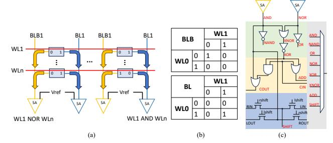

Fig. 1. Overview of in-SRAM computing. (a) Bitline computing. Two wordlines WL1 and WLn are activated simultaneously. The sense amplifiers (SA) read out the AND and NOR of two bits from the bitline (BL) and bitline bar (BLB). (b) Truth tables of bitline computing operations. Two tables represent the value read out by SAs on the BL and BLB with different values on the wordlines. (c) Peripheral circuits used by EVE [2] and MagiCache [9]. They can combine the AND and NOR results to generate other logic and addition outputs

a selected wordline is activated. The data in the wordline's bit cells flow into the bitlines and can be read out at the sense amplifiers. By utilizing the bitline computing technique and peripheral circuits [17], in-SRAM computing devices can perform in-situ arithmetic operations inside SRAM arrays. As shown in Fig. 1(a), when two wordlines in the SRAM array are activated simultaneously, data in these wordlines flows into the shared bitlines. Then, the sense amplifier at the end of each bitline collects the AND and NOR results of these wordlines. The truth tables of bitline computing operations are shown in Fig. 1(b). Data corruption brought by multi-row accessing can be avoided by lowering the wordline voltage to bias against the write voltage at the expense of a slight decrease in SRAM frequency [1]. The peripheral circuits used by EVE [2] are shown in Fig. 1(c). The 1-bit computing peripheral circuits of each SRAM array contain four layers: logic, add, shift, and writeback. These four layers collaborate to perform logic and addition operations. In detail, after performing a read or a multi-row accessing, the signal amplifiers read the AND and NOR of activated wordlines. The logic layer generates (n)and, (n)or, and x(n)or from these two results. The add and shift layers implement addition and shift using the carry chains and shift units across bitlines. The writeback layer selects corresponding results and sends them back to the SRAM for writing. After receiving the results of basic logic operations, peripheral circuits, under the control of finite-state machines, can combine the logic results and perform complex arithmetic operations within SRAM arrays [2], [6], [9].

## B. Exisiting In-SRAM Computing Architectures

Prior in-SRAM computing architectures mainly focus on fusing in-SRAM computing devices into caches, such as Compute Caches [1], Neural Cache [6], Duality Cache [11], EVE [2], and MagiCache [9]. Compute Caches [1] lays the foundation of in-SRAM computing by designing the first bit-parallel computing SRAM prototype that can apply basic operations to vectors stored inside caches. Neural Cache [6] employs a bit-serial data layout and supports complex integer arithmetic operations, including addition, multiplication, and division, through a state machine execution model. It

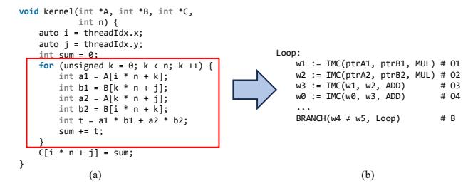

Fig. 2. (a) Example SIMT program. (b) The compile result of the for loop. repurposes the last-level caches to massive in-order vector compute units, accelerating DNN inferences. EVE [2] identifies the underutilization of computing SRAM arrays in the data layouts of previous architectures and designs a bithybrid data layout. Through its in-order vector engine control scheme, EVE [2] transforms the cache array into a large SIMD-style register file, thereby improving the utilization of the computing SRAM array and overall performance. MagiCache [9] identifies the underutilization of computing SRAM arrays resulting from the coarse-grained management scheme. Through its fine-grained cacheline-level management, MagiCache [9] further enhances the performance of in-SRAM vector engines. Duality Cache [11] adopts an in-order singleinstruction multiple-thread (SIMT) control scheme, turning the last-level caches into a large SIMT-style register file. SIMT control schemes feature multiple independent control flows. Compared to SIMD control schemes, SIMT control schemes are more flexible, scalable, and suitable for organizing larger SRAM arrays. Thus, in this paper, we choose the SIMT control scheme to organize the computing SRAM arrays in PipeIMC.

In this paper, we use **phase** to distinguish different logic sections of an operation executed in a stage, and **step** to represent a shorter logic section in a phase. The execution of in-SRAM computing operations is typically composed of two phases.

**Memory Phase** Load the data required by the computation from the memory hierarchy to the designated wordlines. Alternatively, store the computation results from wordlines back to the memory hierarchy. A memory phase includes three steps: address generation, memory visiting, and writeback.

**Calculation Phase** Perform bitline computing to complete the computation.

The in-SRAM computing operations can be abstracted as dest := IMC(src1, src2, op). The source can be memory pointers, wordlines, or immediates. If the operands are already in the wordlines, the in-SRAM computing operation does not have memory phases. The operation can be a logical operation or an integer arithmetic operation.

For example, we can translate the SIMT program into the in-SRAM computing operations, as shown in Fig. 2. Every compute iteration of the example program includes five in-SRAM computing operations: O1 to O4 and Branch. Specifically, operation O1 can be divided into a memory phase that loads A1 and B1 from memory, and a calculation phase that calculates A1 times B1. For the operations O3 and O4, the data required for the calculation is already in the computing

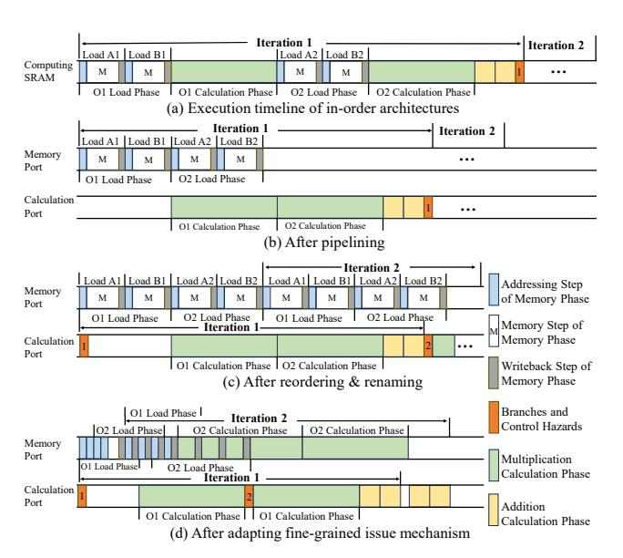

Fig. 3. Execution timeline of in-order in-SRAM computing architectures and architectures after performing optimizations.

SRAM arrays when these operations are performed. Thus, they do not have memory phases.

#### C. Motivation

However, these architectures struggle to achieve high performance due to their in-order execution model, which enforces strict serialization across operations. We illustrate this limitation using the example in Fig. 2, with the corresponding timeline in Fig. 3(a). The memory phase is decomposed into three steps: address generation (blue), memory visiting (white), and writeback (gray).

In timeline (a), under in-order execution, the critical path spans the entire sequence of in-SRAM operations. However, if two operations are not data dependent, the data required for the following operation can be fetched into the SRAM array during the execution of the current operation.

Suppose memory and computing operations can be executed in parallel, and an extra port is added to the computing SRAMs. In that case, we can pipeline the operations without data dependency, as shown in Fig. 3(b). Pipelining operations can overlap the calculation phase and the memory phase between two data-independent operations, thereby shortening the critical path and improving overall performance.

However, there are still many long idles due to data dependencies and control hazards. As computing SRAM arrays perform in-situ computing, the operations cannot be rolled back. Therefore, the in-SRAM operations of iteration 2 cannot be executed before the control hazard of the branch operation in iteration 1 is resolved. Moreover, reuse of the same wordlines introduces inter-iteration dependencies, limiting parallelism. Thus, if we resolve data hazards through explicit register renaming and allow operation reordering, as shown in Fig. 3(c), we can further enhance overall performance.

Furthermore, the computing SRAMs are idle during the memory steps, when the memory units gather data from

the memory hierarchy. We can shorten the critical path by utilizing the idle time in the memory steps. First, we allow the memory port to perform the calculation phases. Then, by adapting a fine-grained issue mechanism on the memory port, we can get the final ideal execution timeline, as shown in Fig. 3(d). After applying this fine-grained issue mechanism, the next pending phase of the following operation can be issued earlier during the idle cycles of the memory stage of the current operation. The memory port remains active during the memory step, thus maximizing pipeline utilization and achieving significant performance gains. Therefore, we propose a pipelined in-SRAM computing architecture, and its implementation is given in the following sections.

## III. ARCHITECTURE DESIGN

## *A. Overview*

The PipeIMC architecture is shown in Fig. 4(a) and is integrated within the CPU cache array. Before kernel execution, the CPU issues a compute request to configure PipeIMC. Upon receiving the request, the controller partitions the cache into computing and cache ways. The computing ways are invalidated, and dirty lines are written back to the lower memory hierarchy to ensure coherence, using a finite-state mechanism similar to EVE [2]. The cache then operates with reduced associativity. After kernel execution, the computing ways are reverted to cache ways. The controller restores the original associativity and invalidates all lines in the reconfigured banks.

Banks in the computing ways can be configured as accelerator or shared memory, while banks in the cache ways operate in conventional cache mode. Each bank supports only one mode at a time. In accelerator mode, banks execute in-SRAM computations; in shared memory mode, they provide storage for accelerator banks; and in cache mode, they serve CPU and accelerator memory requests.

PipeIMC is composed of a multi-bank cache with each bank transformed into a control block. Each control block comprises a schedule-fetch-decode (frontend) pipeline, multiple IMC execution units, and a control block memory unit. Control blocks can execute multiple warps simultaneously and adopt an in-order issue out-of-order execution mechanism. Each warp has an IMC execution unit to execute in-SRAM computing operations. All warps in a control block share the same frontend pipeline to issue operations. Operations are prewritten into the tag array before PipeIMC starts execution. Control block memory units merge the memory requests generated by the execution units and transfer data between warps and the lower memory hierarchy.

The frontend pipeline remains the same as general SIMT architectures. The pipeline selects an active warp for each cycle and fetches its subsequent operation. After the operation is fetched from the tag array, it is pushed into the decode buffer and waits to be processed by the decoder for decoding. After decoding, the operation is dispatched to a specific IMC execution unit, identified by its warp ID, for execution. The scheduler handles warp divergence with the help of control flow information (e.g., branch direction and destination) provided by IMC execution units and the SIMT control stack. The implementation of the scheduler and the SIMT control stack will be discussed in Section III-F.

In the IMC execution units, each warp contains 32 threads and has its register files implemented in dual-port computing SRAMs. Fig. 4(c) shows how to map a thread and a warp to the computing SRAM arrays.

Fig. 4(b) shows the structure of the IMC execution units. Each IMC execution unit contains an IMC controller to control the computing SRAMs, a memory stage to execute memory phases, and a calculation stage to execute calculation phases.

The IMC controller is composed of four components. The renaming unit receives decoded in-SRAM computing operations from the decoder, allocates wordlines for the operation, and inserts the renamed operation into the operation table. It contains an alias table, a wordline usage counter, and a free list to achieve explicit register renaming. The detailed rename mechanism will be discussed in Section III-D.

The operation table tracks the phases of each operation and sends the schedule information to the dispatcher. It also receives information from the commit unit to update the complete phases. After an operation completes all of its phases, it is evicted from the operation table.

The dispatcher processes the information from the operation table and dispatches the phases to be executed to the sequencer of the corresponding stage. It achieves out-of-order execution and fine-grained issuing through its specially designed dispatch algorithm. The detailed algorithm will be discussed in Section III-C, and the fine-grained issue mechanism will be discussed in Section III-E.

The commit unit processes the finished phases from the sequencers and sends information to the warp scheduler and the operation table. Some in-SRAM operations, such as branches and synchronizations, affect the control flow of the warp. When committing these operations, the commit unit notifies the warp scheduler to maintain a clean control flow.

The memory stage and the calculation stage collaborate to complete each in-SRAM computing operation. Each stage has a sequencer and an SRAM port to execute operation phases. The computing SRAM array is shared across two stages and acts as the pipeline register between the calculation stage and the memory stage. Every phase from the dispatcher is sent to an idle sequencer to initiate execution. The sequencers send completed phases to the commit unit.

The memory stage executes the memory phases of an in-SRAM computing operation and executes the calculation phases when the stage is idle. It features a memory unit that manipulates the lower memory hierarchy. The memory unit contains multiple data transpose units, multiple request buffers, and a request coalescer. Data transpose units are capable of rearranging data from the lower memory hierarchy into a hybrid-8 data layout. Each data transpose unit can contain 256 bytes of data. Thus, each memory phase is broken into multiple 8-thread segments. The request buffers store information about a memory request, including addresses and the request type.

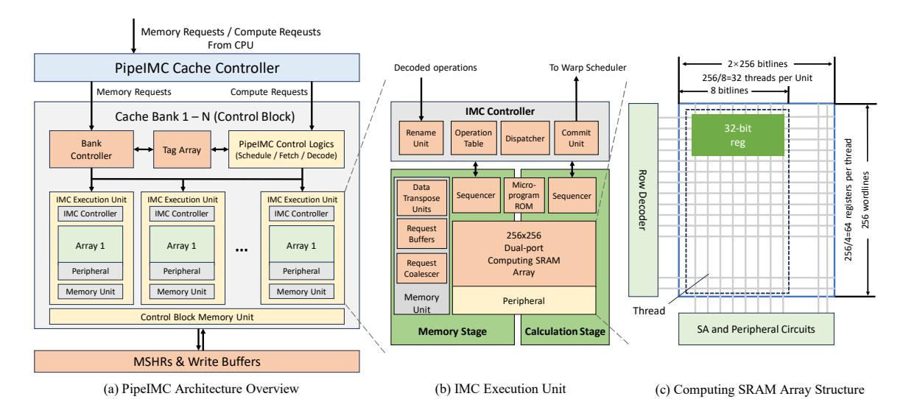

Fig. 4. PipeIMC architecture.

The request buffers track the ongoing memory requests and notify the memory stage sequencer when the data are ready or a memory phase is complete. The request coalescer merges the memory accesses across different memory requests to save memory hierarchy bandwidth.

The calculation stage executes the calculation phases of an operation. During the calculation phase, the sequencer accesses the pre-written microprogram ROM to retrieve the corresponding SRAM operation sequence. The detailed calculation process will be discussed in Section III-B.

## B. Multi-port Computing SRAMs and Pipelined Execution

Each IMC Execution Unit's multi-port computing SRAM array has one 8KB SRAM slice. Each 8KB SRAM slice has 256 wordlines, each with 256 bits. Thus, each slice can support up to 32 concurrent threads. Each group of four wordlines in the SRAM array maintains one physical register of these concurrent threads. Some calculation phases (such as multiplication, division, and calculations that use immediates) may require extra registers to store intermediate results. Dispatchers allocate these extra registers from the free list during the rename process at runtime.

The computing SRAM uses an 8-bit hybrid data layout (as shown in Fig. 4(c)) to store the data of general-purpose registers of each thread. General-purpose registers of the same thread are stored within eight bitlines, while each general-purpose register is stored along four wordlines of the computing SRAM. Each bitline has one set of 8-bit computing peripheral circuits to perform in-SRAM computing operations.

The 8-bit computing peripheral circuits of the baseline computing SRAMs are modified from the computing arrays of EVE [2]. Each 8-bit peripheral circuit is composed of eight 1-bit peripheral circuits, shown in Fig. 1(c), across eight bitlines.

Computing SRAMs adapt a micro-code execution model similar to EVE [2] to perform complex arithmetic operations. When executing a phase, the sequencer first acquires the word-line indices corresponding to the source and destination word-

lines of the phase. After that, the sequencer executes a prewritten micro-program according to the in-SRAM computing operation and performs SRAM operations. For example, based on the 8-bit-hybrid layout, computing SRAMs can execute addition and logic operations in 8 cycles – the odd cycles perform a multi-row accessing operation, and the even cycles perform a write operation. Multiplications are completed by performing 32 iterations of shift and addition.

To enable pipelined execution of IMC operations, we add an extra set of bitlines and wordlines to the computing SRAM, similar to the true dual-port SRAM. This new SRAM port supports multi-row accessing and features individual sets of computing peripheral circuits and micro-code sequencers, allowing the computing SRAM array to execute two arithmetic operations in parallel. To keep the circuit simple, the additional ports can only execute calculation phases.

Although we can integrate three or more sets of bitlines and wordlines to increase the parallelism, we choose to use dual-port computing SRAMs. First, adding three or more sets of bitlines and wordlines is costly; these extra bitlines and wordlines significantly increase the chip area and power consumption. Second, since multiple warps share the same frontend pipelines, there can hardly be enough conflict-free operations to fill these compute ports. Considering all these situations, we choose to use dual-port computing SRAMs to strike a balance between performance and overhead.

## C. Computing SRAM Out-of-Order Dispatcher

The dispatching algorithm used by the dispatcher is shown in Algorithm 1. When the dispatcher discovers an idle port, it iterates through the operations in the operation table, checking whether the operation has an on-fly phase, whether it has port conflicts with previous on-fly phases, and whether it satisfies the special issue requirements. For circuit implementation, every slot in the table outputs these information to the priority MUX, which decides the phase sent to the idle port.

Algorithm 1: Dispatching algorithm of the Dispatcher.

```
Input: Operation Table T
  Output: Scheduled phase scheduleP hase
1 scheduleP hase ← Null
2 for operation O ∈ T do
3 specialP hase ← F alse
4 if O has on fly phase then
5 continue
6 P ← next pending phase of O
7 if P is memory phase then
8 if fencing then
9 continue
10 if memory port cannot accept P then
11 continue
12 specialP hase ← T rue
13 if O affects control flow then
14 specialP hase ← T rue
15 if O is barrier and not on top then
16 break
17 if P doesn′
              t have port conflicts then
18 if specialP hase then
19 scheduleP hase ← P
20 break
21 if scheduleP hase is Null then
22 scheduleP hase ← P
```

For dual-port scheduling, we dispatch only one phase per cycle to prevent race conditions between two ports. If both ports in the computing SRAM are idle simultaneously, only the memory port is scheduled. As the phases require multiple cycles to execute, this design does not cause significant performance deterioration and can also simplify implementation.

To ensure that every operation is executed correctly, the dispatcher must follow the scheduling rules. First, every operation can only have at most one on-fly phase, as shown in Lines 4-5. Second, we cannot dispatch phases that have port conflicts with previous operations, as shown in Line 17. The third rule is about the barriers, as illustrated in Lines 15- 16. Synchronization and memory barrier operations cannot be executed before they reach the top of the operation table, as we need to ensure that the operations preceding the barriers are completed before allowing the warp to enter the barrier.

To achieve optimal performance, certain special phases must be scheduled as soon as possible. As shown in Lines 18-20, when the dispatcher encounters a special phase that can be dispatched, the dispatcher dispatches it directly to the idle port. There are two types of special phases. The first type is the memory phases, as shown in Line 12. On the one hand, executing memory phases earlier reduces the time in which in-SRAM computing devices wait for data from the lower memory hierarchy. On the other hand, the earlier the memory phases are executed, the sooner they enter the memory hierarchy. This optimization enables the memory hierarchy to coalesce more requests, thereby reducing bandwidth usage.

The second kind is the calculation phases that affect the control flow of the warp (e.g., branch operations), as shown in Lines 13-14. As mentioned above, after scheduling a warp to start fetching operations, the scheduler deactivates the warp until the fetched operation enters the decoder. If the operation does not affect the control flow, the scheduler will re-activate this warp. If the operation changes the control flow, the corresponding warp will stall until the operation is committed in the commit unit. Thus, we need to execute these operations as soon as possible to reduce the stall time of possible control hazards. Additionally, this ensures that every operation in the window will not be rolled back. Thus, we do not need to worry about rolling back the changes made by the operations.

## *D. Port Conflicts and Explicit Register Renaming*

The two computing SRAM ports have the same limitations as the normal true dual-port SRAM: when one port writes to a certain wordline, the other cannot read or write this wordline. For dual-port computing SRAMs, the conflicts can be generalized into three categories, as shown in Fig. 5.

The first type is write-first read-write conflicts, also known as data dependencies, as shown in the first row of Fig. 5(a): an operation cannot be executed until all of its operands are ready. The second type is the write conflicts of the two ports, similar to the conflicts in normal dual-port SRAMs, shown in the first row of (b): an SRAM wordline cannot be written by two different ports simultaneously. The third type is the read-first read-write conflict, which only appears in dual-port computing SRAMs. As in-SRAM computing techniques perform in-situ computation, the operands of an operation cannot be read out in advance. Additionally, to perform complex arithmetic operations, the operands are read repeatedly during the calculation phase, which means that other operations cannot modify the value of the source wordlines until the current calculation phase is completed. The case in the first row of Fig. 5(c) illustrates this conflict situation: the addition operation is issued after the multiplication operation, and the addition operation accesses the source wordlines of the multiplication operation, resulting in conflicts. Frequent SRAM port conflicts limit the increase in throughput from these additional bitlines and wordlines, further reducing overall performance.

To solve these conflicts, we adapt explicit physical register renaming to the execution mechanism of PipeIMC. In the rename phase, the renaming unit tries to distribute physical registers from the free list to the operations. After that, the unit updates the alias tables, the arch flags (representing whether a physical wordline is used as an architectural wordline), and the usage counters(counting the number of on-fly operations that reference this physical register). In the commit phase, the commit unit updates usage counters of the source physical registers and releases the old physical register to which the destination register is mapped. At any given point, if a physical register is not in use and is not an architectural register, it will be released and added to the free list for future use.

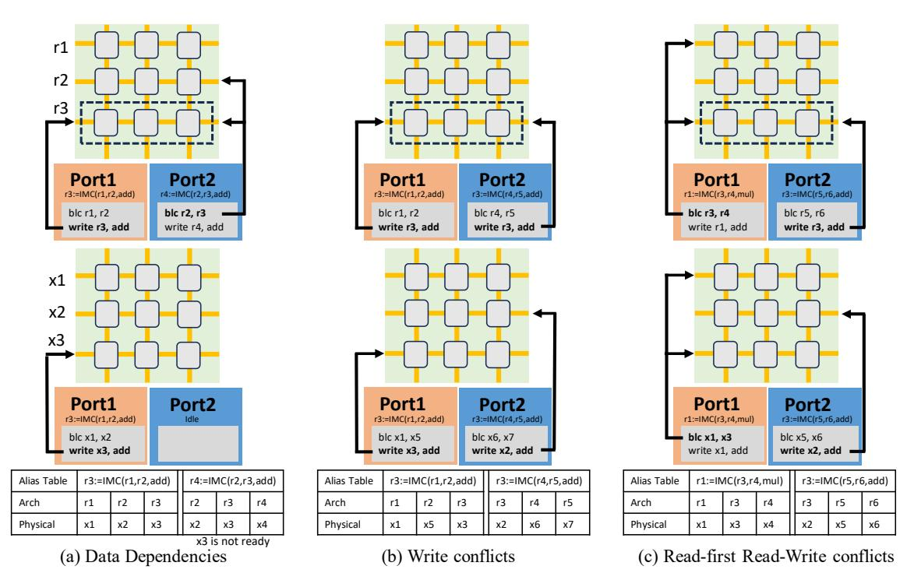

Fig. 5. Three conflict situations in dual-port computing SRAMs. Figures in the first row are the conflict situations, and the second row is the situations after the renaming mechanism and the dispatch algorithm are applied. Assume the phase in compute port 1 are issued before the phase in port 2. BLC is a multi-row accessing operation which activates two wordlines and performs bitline computing in sense amplifiers.

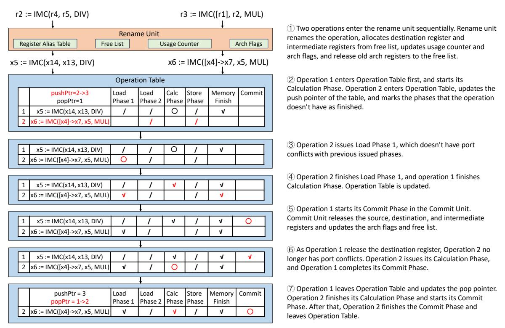

Fig. 6. A cycle-by-cycle diagram of how the operation table operates with two data-dependent operations. ✓ represents completed phases, ○ represents ongoing phases, and / represents skipped phases. The difference of the operation table between two adjacent states are marked in red. Operations are distinguished by their index in the operation table.

After applying this renaming mechanism, a physical register will not appear in the free list until it is released. Thus, we found the following properties for operations within the same issue window: (1) two operations never write to the same physical register; (2) operations never write to the physical registers that are architectural registers at the rename timepoint of the operation; (3) only operations with data dependencies write to other operations' source physical registers. Therefore, if two operations have no data dependencies, they will never incur these conflicts. We can adjust the dispatch algorithm accordingly. Line 17 of Algorithm 1 only needs to check the data dependencies of this operation.

The second row of Fig. 5 shows the behavior when the dispatcher encounters these three port conflicts. The renaming mechanism eliminates write and read-first read-write conflicts. Therefore, we can schedule the operations arbitrarily without considering these conflicts introduced by dual-port SRAMs, thereby giving the dispatcher more flexibility and achieving better overall performance.

Fig. 6 showcases how the operation table manages conflict operations with a cycle-by-cycle diagram. Two data-dependent operations, with the second operation using the result of the first operation, are distinguished by their indices in the operation table. The rename unit first renames the operations and allocated registers for them. Then, operations enter the operation table. The dispatcher schedules the operations and solved the data dependency through the schedule algorithm. After the commit phases of the operations are finished, they leave the operation table and end their lifecycle. More detail explanation of the execution flow can be found in Fig. 6.

## *E. Fine-grained issuing*

To implement the fine-grained operation issue mechanism, we made the following changes to the micro-code sequencers and peripheral circuits. First, the sequencers send the memory phases that have completed the addressing step directly to the memory units, thus releasing the port during the memory step of the memory phases. Second, we implement a latch in the sense amplifiers of every 1-bit peripheral circuit to support calculation phase freezing.

When the memory units need to write data back to the computing SRAMs or the memory port needs to calculate addresses for new memory phases, the corresponding sequencer is frozen. Then, the sequencer unfreezes until the ongoing memory phase is over. The data of the ongoing calculation phase are stored in the latches of the sense amplifiers and can be recovered as soon as the sequencer continues execution.

## *F. In-SRAM Computing Operations*

PipeIMC supports mainly four types of in-SRAM computing operations, as shown in Table I. The operation encoding is shown in Table II. The memory flags represent whether the registers are used as memory addresses or operands. Certain operations may use immediates as their operands. At such circumstances, the rs2 and func fields will be viewed as the immediate field.

TABLE I SUPPORTED IN-SRAM COMPUTING OPERATIONS

| Operation Type     | Operation                                            |  |  |
|--------------------|------------------------------------------------------|--|--|
| Compute Operations | dest := IMC(src1, src2, op)                          |  |  |
| Control Flow       | BRANCH(cond, tag)<br>ptr := SPLIT(cond)<br>JOIN(ptr) |  |  |
| Synchronization    | BARRIER(operand)<br>FENCE                            |  |  |
| Warp Control       | WSPAWN(operand)<br>TSPAWN(operand)                   |  |  |
|                    |                                                      |  |  |

TABLE II OPERATION ENCODING

|                  | 31:29                        | 28:24    | 23:17<br>16:12           | 11:7       | 6:0              |  |  |  |
|------------------|------------------------------|----------|--------------------------|------------|------------------|--|--|--|
| R-Type<br>I-Type | memory flags<br>memory flags | rd<br>rd | rs2<br>func<br>immediate | rs1<br>rs1 | opcode<br>opcode |  |  |  |

Compute operations. The source and destination operands of compute operations can be a memory pointer, a generalpurpose register, or an immediate value. The memory operand in the compute operation extends the operation with a memory phase, which means that every in-SRAM computing operation can have at most three phases (load, compute, and store). The operation of compute operations can be logic operations or 32-bit integer arithmetic operations.

Control flow operations. Control flow operations include branch, split, and join operations. Branch operations change the PC according to the condition and cannot incur warp divergence. The condition operand in the branch and split operations can only be general-purpose registers. Split operations split the warp by the condition, while join operations reconverge a split warp. These two operations manipulate the hardware-immediate post-dominator (IPDOM) stack in the scheduler of the frontend pipeline. When performing a split operation, a new stack frame containing the current PC, thread mask, and the thread mask of the else branch is inserted into the IPDOM stack, the thread mask eliminates the threads that do not satisfy the condition, and the warp continues with the remaining threads. Split operation returns the current stack top pointer. When performing a join operation, we check whether the frame that the pointer points to has had the else branch executed. If not, the warp switches to the else branch and continues execution; otherwise, all stack frames above the pointer are popped out, and the warp reconverges the threads.

Synchronization operations. Barrier operations are used to synchronize the warps within a single control block. The warp will be locked when it reaches a barrier. The barrier will be released when the number of warps that reach this barrier equals the operand of the operation. Fence operations are used to synchronize operations within a single warp. The fence operation ensures that operations after the fence will start only after all operations before the fence are completed.

Warp control operations. Wspawn operations are used to spawn warps in one control block. Wspawn activates a certain number of the warps in the control block, according to the operand. Tspawn operations are used to activate or deactivate threads in one warp. After performing this operation, the warp

TABLE III
CYCLES OF CALCULATION PHASES IN HYBRID-8 COMPUTING SRAMS

| Operations                    | Cycles   | Operations           | Cycles              |
|-------------------------------|----------|----------------------|---------------------|
| add/or/xor/and(i)<br>sub      | 9<br>17  | mul/mulu<br>div/divu | 105-634<br>145-1174 |
| sll/sra/srl(i)<br>conditional | 82<br>13 | rem/remu             | 145-1174            |

TABLE IV
SIMULATED ARCHITECTURE SPECIFICATION

| Last-level Cache Organization   | 128 256 × 256 8KB SRAM @ 1GHz         |
|---------------------------------|---------------------------------------|
| Computing SRAM Organization     | $32\ 256\times256\ 8\text{KB SRAM}$   |
| Cache Mode Slices Configuration | 4-cycle-hit 4-way 512KB with 32 MSHRs |
| Shared Memory                   | 64 KB per control block               |
| Data Transpose Units            | 16 per control block                  |
| Memory                          | Single channel DDR4-2400              |

activates only a certain number of threads, as specified by the operand. Specifically, activating zero threads in the warp represents deactivating the warp.

#### IV. EVALUATION METHODOLOGY

#### A. Circuit Evaluation

We implement a working 256x256 dual-port computing SRAM array to demonstrate our idea. We use Cadence Virtuoso to implement the full custom circuit part of the computing SRAM arrays and generate the corresponding netlist under 1.1V nominal voltage and TSMC 40nm technology. The generated netlists are integrated into the Cadence Spectre simulation environment and simulated at the TT corner and 25°C to measure the energy consumption and latency. We verify the functional correctness of the circuit by injecting multiple sets of random inputs and printing the signal waveforms at key nodes. The functional verification encompasses the SRAM array and the peripheral circuits.

To evaluate the stability characteristics of the designed SRAM cell, we performed a quantitative analysis of the static

TABLE V
EVALUATED IN-SRAM COMPUTING ARCHITECTURES

| Architec   | cture    | Control<br>Blocks | IMC<br>Execution<br>Units | Thread /<br>Execution<br>Unit | Data<br>Layout | Compute<br>Ports | Rename   |
|------------|----------|-------------------|---------------------------|-------------------------------|----------------|------------------|----------|
| SIMT-EV    | Æ [2]    | 4                 | 8                         | 64                            | hybrid-4       | 1                |          |
| Duality Ca | che [11] | 4                 | 2                         | 256                           | bit-serial     | 1                |          |
| PipeIMC-   | Pipe-1   | 4                 | 8                         | 64                            | hybrid-4       | 1                |          |
| Scoreboard | Pipe-2   | 4                 | 8                         | 64                            | hybrid-4       | 2                |          |
|            | Pipe-1r  | 4                 | 8                         | 32                            | hybrid-8       | 1                | <b>√</b> |
| PipeIMC    | Pipe-2r  | 4                 | 8                         | 32                            | hybrid-8       | 2                | ✓        |
| _          | Pipe-3r  | 4                 | 8                         | 32                            | hybrid-8       | 3                | ✓        |

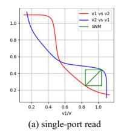

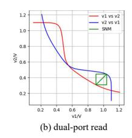

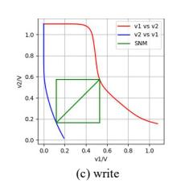

Fig. 7. Static noise margin (SNM) of the dual-port compute SRAM cell. The red curve represents the variation of V1 with respect to V2, while the blue curve represents the variation of V2 with respect to V1. The green squares indicate the SNM boundaries under different operating modes, and the side length of each square is defined as the corresponding noise margin.

noise margin (SNM) of the dual-port compute SRAM cell. Fig. 7 presents the SNM measurement results of the SRAM cell under the TT process corner, at 25°C, and with a nominal supply voltage of 1.1 V, covering three operating modes: single-port read, simultaneous dual-port read, and write. During the measurement, controlled noise signals were injected into the complementary storage nodes Q and QB through programmable voltage sources V1 and V2. The measured results show that the SRAM cell achieves a single-port read noise margin of 192.9 mV, a simultaneous dual-port read noise margin of 134.6 mV, and a write noise margin of 409.3 mV. These results indicate that the proposed design exhibits strong stability under typical operating conditions.

Circuit evaluation results show that our proposed dual-port computing SRAM array incurs 55.7% and 18.2% area overhead compared to a vanilla SRAM array and a dual-port vanilla SRAM array, respectively. Compared to single-port computing SRAM arrays, dual-port computing SRAM arrays consumes 48.1% more static power. Multi-row access operations consume 54.7% more energy than read/write operations. Regarding frequency, the dual-port SRAM array takes 2% longer to perform multi-row access operations, compared to read/write operations on the vanilla SRAM array. However, the energy consumption and latency of computing SRAM arrays are still lower than reading two rows individually. For tri-port computing SRAM arrays, they incur 19.6% area overhead and consume 23% more static power compared to dual-port arrays.

The implementation of dual-port computing SRAM introduces additional wiring and peripheral circuitry, potentially leading to significant routing congestion. Prior work has demonstrated the successful integration of commercial dual-port computing SRAMs with favorable tape-out results [16], suggesting that much of the associated layout and routing complexity can be effectively managed by mature design kits and EDA toolchains, thereby mitigating physical design challenges. In addition, bitline multiplexing techniques can be employed to further alleviate routing pressure. For simplicity and performance considerations, we adopt a 1:1 bitline-to-sense-amplifier (SA) ratio in our design. Future work will focus on reducing peripheral complexity and improving the practicality and scalability of the PipeIMC SRAM implementation

For other parts of PipeIMC circuits, we use GPUWattch [20], McPAT [22], the data in the original papers [2], [11], and synthesis to evaluate the area and energy consumption. GPUWattch supports runtime evaluation, allowing us to measure energy consumption during the execution of benchmark programs. The detailed results of energy and area will be shown and analyzed in Section V.

#### B. Performance Model

We implement a cycle-approximate simulator for PipeIMC. Table IV shows the configuration of the simulated architectures. We equip the simulator with a new dual-port computing SRAM component to reconstruct the runtime situation of

TABLE VI BENCHMARK CONFIGURATIONS

| Name       | Size                        | Memory Access<br>Ratio | Synchronization | Warp Divergence | Shared Memory | Туре                 |
|------------|-----------------------------|------------------------|-----------------|-----------------|---------------|----------------------|
| matmul     | $512 \times 512$            | 0.37                   | ✓               |                 | ✓             | Dense Linear Algebra |
| stencil3d  | $128 \times 128 \times 128$ | 0.32                   |                 | ✓               |               | Structured Grid      |
| backprop   | 16384                       | 0.76                   | ✓               | ✓               | ✓             | Unstructured Grid    |
| bfs        | 8192                        | 0.63                   |                 | ✓               |               | Graph Traversal      |
| kmeans     | $8192 \times 16$            | 0.28                   |                 |                 |               | Dense Linear Algebra |
| pathfinder | $16384 \times 32$           | 0.46                   | ✓               | ✓               | ✓             | Dynamic Programming  |
| matvec     | $4096 \times 4096$          | 0.29                   |                 |                 |               | Dense Linear Algebra |
| attention  |                             | 0.41                   | ✓               |                 | ✓             | Transformer Kernel   |
| ffn        | See Table VII               | 0.31                   | ✓               |                 | ✓             | Transformer Kernel   |
| layernorm  |                             | 0.26                   | ✓               | ✓               | ✓             | Transformer Kernel   |

TABLE VII SPECIFICATION OF TRANSFORMER KERNELS

| Arguments                   | Value           | Arguments                                                        | Value             |
|-----------------------------|-----------------|------------------------------------------------------------------|-------------------|
| $d_{input} \ d_{model} \ h$ | 128<br>512<br>8 | $\begin{vmatrix} d_{output} \\ d_{ff} \\ d_k, d_v \end{vmatrix}$ | 512<br>2048<br>64 |

PipeIMC and obtain the runtime trace for GPUWattch [20] to perform further analysis.

We implement the PipeIMC ISA based on the Vortex [35] compiler through custom intrinsics. Each in-SRAM computing operation is interpreted into at most three phases. The cycles required to execute a single calculation phase in the computing SRAM array are calculated by a cycle-accurate simulator, as shown in Table III. Based on the results, we implement the computing SRAM array sequencer in the simulator.

We utilize multiple PipeIMC architecture setups to evaluate performance and efficiency under various conditions. The configurations are shown in Table V. The numbers in the configuration suffixes represent the number of ports in the computing SRAM arrays, and the letter r represents renaming. For single-port configurations, the port is a mixed port that can execute calculation and memory phases. For tri-port configurations, we add an extra calculation port to the dual-port computing SRAMs.

For PipeIMC architectures, we use the operation table with 16 operation entries. During the experiment, rename units do not cause a congestion due to empty free list under this setup.

Specifically, IMC Execution Units without renaming are implemented in the scoreboard mechanism. Scoreboards block operations that have write conflicts and possible read-first readwrite conflicts with previous uncommitted operations in the rename unit, allowing only conflict-free operations to enter the operation table. The operations in the operation table are dispatched with Algorithm 1 and executed out of order.

To showcase the improvement brought by PipeIMC, we reimplement Duality Cache [11] and EVE [2] in the simulator, utilizing the same SRAM array organization, and place both within an in-order SIMT execution scheme. These architectures use the same number of 8KB computing SRAM arrays; therefore, they have the same computational capability. The SRAM organization and architecture specifications are shown in Table IV. We use a 1MB LLC slice: 256KB is configured as compute mode, 256KB is configured as shared memory mode, and 512KB is configured as cache mode. Additionally,

to ensure a fair comparison, we modify the peripheral circuits of Duality Cache and EVE to support the SIMT in-SRAM computing program compiled by the Vortex toolchain [35].

These architectures utilize different data layouts on the computing SRAM arrays. SIMT-EVE [2] and PipeIMC-scoreboard architectures need to provide 32 general-purpose registers for each thread. To fully use the 256x256 SRAM array, they adapt a hybrid-4 data layout. For PipeIMC architectures, they need to provide 64 registers for each thread to enable renaming, thus adapting a hybrid-8 data layout. Duality Cache [11] uses bit-serial data layout on a 256x256 SRAM array in its original paper. We did not change this during the experiment.

### C. Benchmark Setup

We evaluate the performance of PipeIMC on various GPU applications from the Rodinia benchmark suite [3], including matmul, stencil3d, kmeans, backprop, pathfinder, and bfs. The detailed descriptions of these workloads are shown in Table VI. The stencil3d, kmeans, and backprop applications are rewritten into integer versions for testing. All the benchmarks are written in OpenCL [29] with custom IMC intrinsics and compiled using the modified POCL-Vortex toolchain provided by Vortex [35]. All kernels are implemented in 32-bit fixedpoint numbers as in EVE [2]. These benchmarks are selected because of their different workload type and their different memory visiting, data dependency and control flow pattern. Additionally, to validate our design on LLM workloads, we implement four new kernels: matvec, ffn, attention, and layernorm. The specification of the transformer kernels are shown in Table VII. Attention and ffn kernels are implemented with INT8 quantization. The quantization method has been evaluated by previous work [23] and has similar accuracy to original models. We only measure the performance of the in-SRAM computing architectures and ignore the code run on CPUs, which includes the pre-processing and post-processing functions for executing the SIMT kernels.

## V. RESULTS

#### A. Performance Analysis

Fig. 8 and Table VIII show the performance of the tested architectures with different configurations under each benchmark. The speedups are normalized by SIMT-EVE [2]. Pipe-3r (i.e., with rename and tri-port computing SRAM arrays) achieves the best overall performance. However, considering

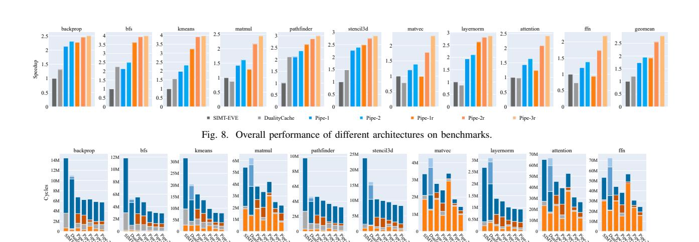

trol Hazards 
Port Conflict 
Memory Compute Sync Cross Move Schedu
Fig. 9. Compute port execution breakdown of different configurations.

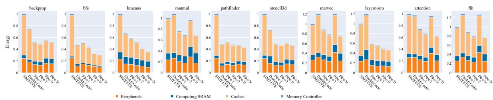

Fig. 10. Estimated energy consumption breakdown of SIMT-EVE [2], Duality Cache [11] and PipeIMC in all benchmarks.

| Benchmark    | backprop | bfs  | kmeans | matmul | pathfinder | stencil3d | matvec | layernorm | attention | ffn  | geomean |
|--------------|----------|------|--------|--------|------------|-----------|--------|-----------|-----------|------|---------|
| DualityCache | 1.31     | 2.25 | 1.56   | 0.87   | 2.11       | 1.48      | 0.78   | 0.87      | 0.98      | 0.74 | 1.20    |
| Pipe-1       | 2.13     | 2.13 | 1.98   | 1.42   | 2.10       | 2.26      | 1.20   | 1.93      | 1.44      | 1.20 | 1.73    |
| Pipe-2       | 2.31     | 2.49 | 2.33   | 1.61   | 2.36       | 2.39      | 1.39   | 2.11      | 1.64      | 1.38 | 1.95    |
| Pipe-1r      | 2.28     | 3.61 | 3.23   | 1.29   | 2.64       | 2.49      | 0.99   | 2.62      | 1.23      | 0.94 | 1.92    |
| Pipe-2r      | 2.46     | 3.93 | 3.91   | 2.16   | 2.88       | 2.75      | 1.78   | 2.81      | 2.09      | 1.73 | 2.55    |
| Pipe-3r      | 2.50     | 3.98 | 3.96   | 2.44   | 3.00       | 2.85      | 2.32   | 2.87      | 2.42      | 2.18 | 2.79    |

the power consumption and area overhead of the third compute port, mentioned in Section IV-A, the speedup of Pipe-3r compared to Pipe-2r is not significant. Thus, we choose to use dual-port computing SRAMs in the IMC Execution Units. Pipe-2r has an average speedup of 155% and 113% on these benchmarks, compared to SIMT-EVE [2] and Duality Cache [11], respectively. Across all configurations, the extra compute port on the computing SRAM arrays and the rename execution mechanism achieve speedups of 12.7% and 30.7%, respectively, over Pipe-1. We combine the result of the transformer kernels to evaluate architecture performance on transformers. Pipe-2r achieves 1.88x and 2.04x on transformer task over EVE [2] and Duality Cache [11], respectively.

Fig. 9 shows the execution time breakdown of GPGPU-IMC for different configurations. The execution time is calculated individually for each computing SRAM port and summed for comparison. The stall cycles produced by inactive warps are not counted in the breakdown. Duality Cache [11] has two special kinds of port idles: compute sync idle and cross move idle. Compute sync is caused by the VLIW-like mechanism of the Duality Cache, where one array must wait for the comple-

tion of the entire VLIW instruction before proceeding to the next instruction. Cross moves are caused by the split register files in the thread blocks, where the data must be transferred to the same computing SRAM array before computing. In PipeIMC, the computing time is halved for configurations with an additional compute port; however, there are increases in port conflict stalls. Additionally, due to the out-of-order execution mechanism, PipeIMC experiences fewer control hazard stalls compared to SIMT-EVE [2]. Furthermore, compared to PipeIMC-Scoreboard, PipeIMC with rename mechanism experiences less port conflicts, which proves the effect of reducing port conflicts through rename mechanism.

The speedups brought by the rename mechanism are significant in bfs. This test case has simple iterations that lead to severe write conflicts and can only be resolved by introducing the rename mechanism. For the matmul, kmeans, matvec, attention, and ffn test cases, the optimization of the extra compute port is significant. Because these test cases involve more long calculation phases, such as multiplication and division, than the other test cases, they form a compute-bound scenario. The other test cases are memory-bound, where the sequence

of memory phases forms the critical path, due to their intricate memory visiting pattern. This can be figured out by the large portion of memory idles in the execution breakdown of these test cases. However, PipeIMC has significant less memory visiting time compared to Duality Cache [11] and SIMT-EVE [2]. This is because the out-of-order execution mechanism enables PipeIMC to perform more calculations during the memory visiting time, thus shortening overall critical path.

Compared to the architecture without renaming, architectures with renaming have longer computation time due to the decrease in parallelism in the IMC execution units. The renaming architectures need to double the number of registers in one thread to enable renaming, thus decreasing the parallelism of the computation. This can explain why Pipe-1r performs worse than Pipe-1 in the compute intense kernels. However, the rename mechanism can resolve port conflicts, increase the active operation window size, and enhance pipeline utilization. Thus, Pipe-2r witnesses more increase with the extra port.

Pipe-3r has small speedup compared to Pipe-2r with the third extra compute port. Because there are not enough conflict-free operations to feed the third extra compute port in the kernels, which can be discovered from the increase in control hazards and port conflict time in Pipe-3r.

#### B. Computing SRAM Utilization Analysis

To showcase the improvement in the utilization of computing SRAMs in PipeIMC, we calculate the utilization across all benchmarks and architectures. The results are shown in Table IX. Across all benchmarks, PipeIMC exhibits significantly higher SRAM array utilization compared to SIMT-EVE [2] and Duality Cache [11]. However, while Pipe-2r has better utilization than Pipe-1r, Pipe-2 has lower utilization compared to Pipe-1 in bfs, pathfinder, stencil, and layernorm test cases. Pipe-1 and Pipe-2 only have out-of-order scheduling, but do not have renaming to solve the data dependencies. There are not enough operations that can be scheduled to the extra calculation port in the operation table. Across all benchmarks, Pipe-2r has 2.15x to 3.96x and 1.13x to 4.77x higher utilization, compared to SIMT-EVE and Duality Cache. This improvement in utilization can explain the speedup in the benchmarks.

# C. Accelerator/Cache Space Management

In PipeIMC, SRAM arrays can be configured as either accelerators or caches. To evaluate the impact of this partitioning, we vary the fraction of SRAM allocated to accelerators and measure performance across problem sizes for matmul and backprop. The results are presented in Fig. 11.

For the compute-bound workload matmul, allocating more SRAM to accelerators improves performance at small problem sizes, but the optimal point shifts toward fewer accelerator arrays as size increases. In contrast, for the memory-bound backprop, configurations with more accelerator arrays increasingly outperform others as the problem size grows. These results indicate that the optimal partitioning is both workload- and size-dependent. In our evaluation, we use a 25% accelerator configuration with 256 KB of SRAM for acceleration, 512 KB

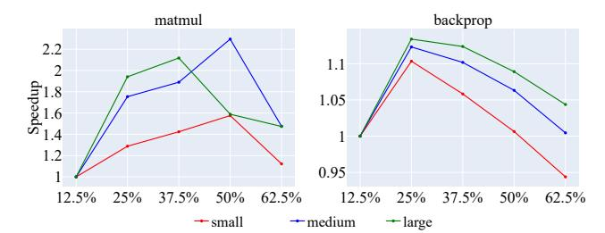

Fig. 11. Performance of PipeIMC with different accelerator array ratios under different benchmark sizes. In matmul, the matrices have sizes 128, 256, and 512. In backprop, the hidden layers have sizes 4096, 8192, and 16384.

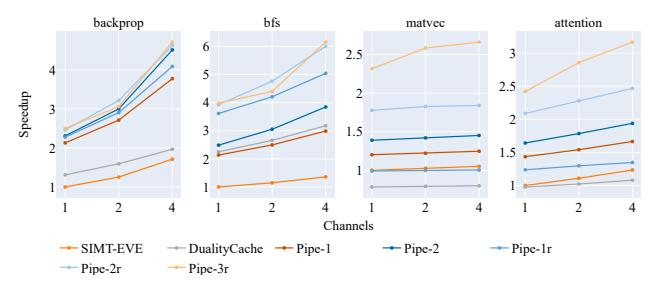

Fig. 12. Normalized performance with different memory configurations. for caching, and 256 KB for shared memory. This configuration provides the best overall performance across the evaluated workloads. Future work will explore optimal static partitioning strategies and dynamic reconfiguration mechanisms to further improve PipeIMC performance.

#### D. Sensitivity to DRAM Bandwidth

Given that several workloads exhibit memory-bound behavior, we evaluate the target architectures under varying DRAM configurations to quantify their sensitivity to memory bandwidth. Specifically, we employ DDR4-2400 with 1, 2, and 4 memory channels. Our evaluation includes two memory-bound workloads, backprop and bfs from the Rodinia benchmark suite, and two compute-bound workloads, matvec and attention from transformer kernels. The results are shown in Fig. 12.

For memory-bound workloads, all architectures achieve substantial performance improvements as memory bandwidth increases, attributable to higher effective DRAM throughput. In contrast, compute-bound workloads exhibit only marginal performance gains, as execution time is dominated by computation rather than memory accesses. Importantly, the performance trends remain consistent across DRAM configurations, indicating that the performance benefits of PipeIMC are robust across a wide range of memory bandwidth provisions.

## E. Area, Energy and Efficiency Analysis

Table X shows the estimated area breakdown of SIMT-EVE [2], Duality Cache [11], and PipeIMC. We synthesize the operation tables, schedulers, renaming units and the peripheral control circuits using Synopsis Design Compiler in TSMC 40nm process. The area of computing SRAMs and peripheral circuits are from Cadence Virtuoso. The area of data transpose units is from the original paper [2], [11] and scaled to 40nm process. And the area of shared memory arrays and memory

 $TABLE\ IX \\ Computing\ SRAM\ Array\ Utilization\ of\ SIMT-EVE\ [2],\ Duality\ Cache\ [11]\ and\ PipeIMC$ 

| Benchmark(%) | backprop | bfs  | kmeans | matmul | pathfinder | stencil3d | matvec | layernorm | attention | ffn   |
|--------------|----------|------|--------|--------|------------|-----------|--------|-----------|-----------|-------|
| SIMT-EVE     | 4.91     | 1.48 | 8.86   | 36.72  | 3.33       | 4.45      | 58.06  | 8.03      | 37.35     | 58.86 |
| DualityCache | 3.75     | 4.79 | 13.60  | 23.61  | 6.47       | 7.89      | 32.11  | 13.49     | 27.28     | 31.60 |
| Pipe-1       | 10.16    | 3.03 | 17.13  | 50.44  | 6.69       | 9.76      | 67.42  | 17.04     | 51.83     | 68.41 |
| Pipe-2       | 11.59    | 2.76 | 17.69  | 56.02  | 5.89       | 8.67      | 68.61  | 16.95     | 58.07     | 73.95 |
| Pipe-1r      | 16.50    | 5.18 | 25.74  | 74.56  | 11.37      | 16.64     | 90.24  | 23.03     | 72.04     | 86.65 |
| Pipe-2r      | 17.88    | 5.40 | 29.78  | 79.10  | 12.41      | 17.63     | 92.28  | 25.88     | 76.12     | 87.13 |

TABLE X
ESTIMATED AREA BREAKDOWN OF SIMT-EVE [2], DUALITY CACHE
[11] AND PIPEIMC

| Components                      | SIMT-E                 | VE [2]     | Duality | / Cache [11] | PipeIMC-2r |            |  |
|---------------------------------|------------------------|------------|---------|--------------|------------|------------|--|
| <u>-</u>                        | Area(mm <sup>2</sup> ) | Percentage | Area    | Percentage   | Area       | Percentage |  |
| Warp Scheduler                  | 0.60                   | 4.03%      | /       | /            | 0.60       | 3.42%      |  |
| Decoder & Buffer                | 0.82                   | 5.51%      | 1.35    | 9.75%        | 0.82       | 4.68%      |  |
| Instruction Buffer              | 2.20                   | 14.78%     | 1.76    | 12.72%       | /          | /          |  |
| Operation Table<br>& Dispatcher | /                      | /          | /       | /            | 2.46       | 14.04%     |  |
| Rename Unit                     | /                      | /          | /       | /            | 0.78       | 4.45%      |  |
| Peripheral<br>Control Total     | =3.62                  | 24.31%     | =3.11   | 22.47%       | =4.66      | 26.60%     |  |
| Computing SRAM<br>Peripherals   | 0.71                   | 4.77%      | 0.71    | 5.13%        | 1.44       | 8.22%      |  |
| Computing SRAM<br>Arrays        | 2.64                   | 17.73%     | 2.64    | 19.08%       | 3.50       | 19.98%     |  |
| Computing SRAM<br>Total         | =3.35                  | 22.50%     | =3.35   | 24.21%       | =4.94      | 28.20%     |  |
| Memory Arrays                   | 2.76                   | 18.54%     | 2.76    | 19.94%       | 2.76       | 15.75%     |  |
| Data Transpose<br>Unit          | 2.95                   | 22.30%     | 2.41    | 17.41%       | 2.95       | 16.84%     |  |
| Memory<br>Controller            | 2.21                   | 14.84%     | 2.21    | 15.97%       | 2.21       | 12.61%     |  |
| Total                           | 14.89                  |            | 13.84   | -7.0%        | 17.52      | +17.7%     |  |

controller are from GPUWattch and McPat [20], [22]. We did not count the 512KB array that remained as cache in the breakdown. From the table, PipeIMC-2r has an area overhead of 17.7% and 26.6% compared to SIMT-EVE [2] and Duality Cache [11], respectively. The extra overhead is caused by the renaming units, the operation tables, and the additional compute port and peripherals in the computing SRAMs. Assuming the architectures have abundant cache and memory bandwidth, PipeIMC achieves an area efficiency (throughput per  $mm^2$ ) of 2.17x and 1.68x over SIMT-EVE [2] and Duality Cache [11].

Fig. 10 shows the estimated energy breakdown of SIMT-EVE [2], Duality Cache [11], and PipeIMC. The energy consumption is normalized to SIMT-EVE [2] and includes a breakdown of peripherals, computing SRAMs, caches, and memory controllers. We report runtime average power as the total energy consumed during kernel execution divided by execution time. Across the benchmarks, Pipe-2r has 1.33x and 1.34x average power compared to SIMT-EVE and Duality Cache. Despite this increase in power, Pipe-2r reduces execution time, resulting in higher throughput per watt, computed as performance divided by average power. Overall, Pipe-2r achieves 1.92x and 1.60x energy efficiency improvements compared to SIMT-EVE [2] and Duality Cache [11].

#### VI. FLOATING POINT SUPPORT DISCUSSION

Unlike integer and fixed-point formats, floating-point numbers comprise sign, exponent, and mantissa fields, each requiring distinct operations during arithmetic execution. Mapping them onto a bit-hybrid layout breaks bitline symmetry and increases peripheral overhead.

TABLE XI
ESTIMATED FLOATING-POINT OPERATION LATENCIES ON PIPEIMC

| Operations           | Cycles                          | Operations   | Cycles               |
|----------------------|---------------------------------|--------------|----------------------|
| fadd<br>fsub<br>fcvt | 342-1635<br>450-1926<br>120-265 | fmul<br>fdiv | 288-1047<br>350-1375 |

Assuming that PipeIMC supports fine-grained control over bit-hybrid data layouts, and leveraging the floating-point algorithms proposed in Duality Cache [11], we estimate the latency of floating-point operations on PipeIMC, as summarized in Table XI. The results indicate that floating-point operations incur higher latency than integer and fixed-point counterparts and will shift such workloads toward compute-bound behavior. In floating-point transformer kernels, compute operations require 37% more cycles than in the fixed-point implementations. Given PipeIMC's strong performance on compute-bound workloads (e.g., matmul and ffn), we expect similar benefits for floating-point applications. Future work will focus on efficient floating-point support and further optimizations.

#### VII. CONCLUSION

This paper proposes PipeIMC, a pipelined in-SRAM computing architecture. We discovered the potential to improve the performance of in-SRAM architectures by pipelining data-independent in-SRAM computing operations. We further identified inefficiencies in the pipelines and adapted explicit register renaming, out-of-order operation scheduling, and a fine-grained issue mechanism to solve these inefficiencies. Evaluation results show that PipeIMC achieves 2.15x to 3.96x and 1.13x to 4.77x utilization, compared to EVE [2] and Duality Cache [11], two state-of-the-art in-SRAM computing architectures. This improvement in utilization yields a performance of 2.17x and 1.68x per area, and an energy efficiency of 1.92x and 1.60x, on average, over EVE [2] and Duality Cache [11] on the Rodinia GPU benchmarks [3]. Our proposed architecture can satisfy the demand for a high-performance, power-efficient in-SRAM computing architecture.

#### ACKNOWLEDGMENT

This work was supported by Beijing Science and Technology Plan Project (Z241100004824002) and National Natural Science Foundation of China (NSFC) under Grant 92373103.

## REFERENCES

- [1] S. Aga, S. Jeloka, A. Subramaniyan, S. Narayanasamy, D. Blaauw, and R. Das, "Compute caches," in *2017 IEEE International Symposium on High Performance Computer Architecture (HPCA)*. IEEE, 2017, pp. 481–492.
- [2] K. Al-Hawaj, T. Ta, N. Cebry, S. Agwa, O. Afuye, E. Hall, C. Golden, A. B. Apsel, and C. Batten, "Eve: Ephemeral vector engines," in *2023 IEEE International Symposium on High-Performance Computer Architecture (HPCA)*. IEEE, 2023, pp. 691–704.
- [3] S. Che, M. Boyer, J. Meng, D. Tarjan, J. W. Sheaffer, S.-H. Lee, and K. Skadron, "Rodinia: A benchmark suite for heterogeneous computing," in *2009 IEEE international symposium on workload characterization (IISWC)*. Ieee, 2009, pp. 44–54.
- [4] M. Cheng, L. Xia, Z. Zhu, Y. Cai, Y. Xie, Y. Wang, and H. Yang, "Time: A training-in-memory architecture for memristor-based deep neural networks," in *Proceedings of the 54th Annual Design Automation Conference 2017*, 2017, pp. 1–6.
- [5] P. Chi, S. Li, C. Xu, T. Zhang, J. Zhao, Y. Liu, Y. Wang, and Y. Xie, "Prime: A novel processing-in-memory architecture for neural network computation in reram-based main memory," *ACM SIGARCH Computer Architecture News*, vol. 44, no. 3, pp. 27–39, 2016.
- [6] C. Eckert, X. Wang, J. Wang, A. Subramaniyan, R. Iyer, D. Sylvester, D. Blaaauw, and R. Das, "Neural cache: Bit-serial in-cache acceleration of deep neural networks," in *2018 ACM/IEEE 45Th annual international symposium on computer architecture (ISCA)*. IEEE, 2018, pp. 383–396.
- [7] S. Fakhoury, A. Naik, G. Sakkas, S. Chakraborty, and S. K. Lahiri, "Llmbased test-driven interactive code generation: User study and empirical evaluation," *IEEE Transactions on Software Engineering*, 2024.
- [8] R. Fan, Y. Cui, Q. Chen, M. Wang, Y. Zhang, W. Zheng, and Z. Li, "Maicc: A lightweight many-core architecture with in-cache computing for multi-dnn parallel inference," in *Proceedings of the 56th Annual IEEE/ACM International Symposium on Microarchitecture*, 2023, pp. 411–423.
- [9] R. Fan, Y. Cui, W. Li, M. Wang, and Z. Li, "Magicache: A virtual in-cache computing engine," in *Proceedings of the 52nd Annual International Symposium on Computer Architecture*, 2025, pp. 1806–1818.
- [10] T. Finkbeiner, G. Hush, T. Larsen, P. Lea, J. Leidel, and T. Manning, "In-memory intelligence," *IEEE micro*, vol. 37, no. 4, pp. 30–38, 2017.
- [11] D. Fujiki, S. Mahlke, and R. Das, "Duality cache for data parallel acceleration," in *Proceedings of the 46th International Symposium on Computer Architecture*, 2019, pp. 397–410.
- [12] F. Gao, G. Tziantzioulis, and D. Wentzlaff, "Computedram: In-memory compute using off-the-shelf drams," in *Proceedings of the 52nd annual IEEE/ACM international symposium on microarchitecture*, 2019, pp. 100–113.
- [13] Github, "Github copilot," 2023. [Online]. Available: https://github.com/ features/copilot
- [14] Google, "Gemini," 2023. [Online]. Available: https://gemini.google. com/app
- [15] X. Guo, F. M. Bayat, M. Bavandpour, M. Klachko, M. Mahmoodi, M. Prezioso, K. Likharev, and D. Strukov, "Fast, energy-efficient, robust, and reproducible mixed-signal neuromorphic classifier based on embedded nor flash memory technology," in *2017 IEEE International Electron Devices Meeting (IEDM)*. IEEE, 2017, pp. 6–5.
- [16] S. Jain, L. Lin, and M. Alioto, "±cim sram for signed in-memory broadpurpose computing from dsp to neural processing," *IEEE Journal of Solid-State Circuits*, vol. 56, no. 10, pp. 2981–2992, 2021.
- [17] S. Jeloka, N. B. Akesh, D. Sylvester, and D. Blaauw, "A 28 nm configurable memory (tcam/bcam/sram) using push-rule 6t bit cell enabling logic-in-memory," *IEEE Journal of Solid-State Circuits*, vol. 51, no. 4, pp. 1009–1021, 2016.
- [18] Y. S. Kim, J. An, J. B. Jeon, M. W. Son, S. Son, W. Park, Y. Lee, J. Park, G. Y. Kim, G. Kim *et al.*, "Ternary logic with stateful neural networks using a bilayered taox-based memristor exhibiting ternary states," *Advanced Science*, vol. 9, no. 5, p. 2104107, 2022.
- [19] S. Kvatinsky, D. Belousov, S. Liman, G. Satat, N. Wald, E. G. Friedman, A. Kolodny, and U. C. Weiser, "Magic—memristor-aided logic," *IEEE Transactions on Circuits and Systems II: Express Briefs*, vol. 61, no. 11, pp. 895–899, 2014.
- [20] J. Leng, T. Hetherington, A. ElTantawy, S. Gilani, N. S. Kim, T. M. Aamodt, and V. J. Reddi, "Gpuwattch: Enabling energy optimizations in gpgpus," *ACM SIGARCH computer architecture news*, vol. 41, no. 3, pp. 487–498, 2013.

- [21] G. Li, G. Dai, S. Li, Y. Wang, and Y. Xie, "Graphia: An in-situ accelerator for large-scale graph processing," in *Proceedings of the International Symposium on Memory Systems*, 2018, pp. 79–84.
- [22] S. Li, J. H. Ahn, R. D. Strong, J. B. Brockman, D. M. Tullsen, and N. P. Jouppi, "Mcpat: An integrated power, area, and timing modeling framework for multicore and manycore architectures," in *Proceedings of the 42nd annual ieee/acm international symposium on microarchitecture*, 2009, pp. 469–480.
- [23] S. Li, X. Ning, L. Wang, T. Liu, X. Shi, S. Yan, G. Dai, H. Yang, and Y. Wang, "Evaluating quantized large language models," in *Proceedings of the 41st International Conference on Machine Learning*, ser. ICML'24. JMLR.org, 2024.
- [24] S. Li, D. Niu, K. T. Malladi, H. Zheng, B. Brennan, and Y. Xie, "Drisa: A dram-based reconfigurable in-situ accelerator," in *Proceedings of the 50th annual ieee/acm international symposium on microarchitecture*, 2017, pp. 288–301.
- [25] Y.-Y. Lin, F.-M. Lee, M.-H. Lee, W.-C. Chen, H.-L. Lung, K.-C. Wang, and C.-Y. Lu, "A novel voltage-accumulation vector-matrix multiplication architecture using resistor-shunted floating gate flash memory device for low-power and high-density neural network applications," in *2018 IEEE International Electron Devices Meeting (IEDM)*. IEEE, 2018, pp. 2–4.
- [26] Z. Lin, Z. Tong, F. Wang, J. Zhang, Y. Zhao, P. Sun, T. Xu, C. Zhang, X. Li, X. Wu *et al.*, "In situ storing 8t sram-cim macro for fullarray boolean logic and copy operations," *IEEE Journal of Solid-State Circuits*, vol. 58, no. 5, pp. 1472–1486, 2022.
- [27] F. Merrikh-Bayat, X. Guo, M. Klachko, M. Prezioso, K. K. Likharev, and D. B. Strukov, "High-performance mixed-signal neurocomputing with nanoscale floating-gate memory cell arrays," *IEEE transactions on neural networks and learning systems*, vol. 29, no. 10, pp. 4782–4790, 2017.
- [28] Y. Moslem, R. Haque, J. D. Kelleher, and A. Way, "Adaptive machine translation with large language models," *arXiv preprint arXiv:2301.13294*, 2023.
- [29] A. Munshi, "The opencl specification," in *2009 IEEE Hot Chips 21 Symposium (HCS)*. IEEE, 2009, pp. 1–314.
- [30] OpenAI, "Chatgpt," 2023. [Online]. Available: https://openai.com/ chatgpt/overview/
- [31] A. Sebastian, M. Le Gallo, R. Khaddam-Aljameh, and E. Eleftheriou, "Memory devices and applications for in-memory computing," *Nature nanotechnology*, vol. 15, no. 7, pp. 529–544, 2020.
- [32] V. Seshadri, D. Lee, T. Mullins, H. Hassan, A. Boroumand, J. Kim, M. A. Kozuch, O. Mutlu, P. B. Gibbons, and T. C. Mowry, "Ambit: Inmemory accelerator for bulk bitwise operations using commodity dram technology," in *Proceedings of the 50th Annual IEEE/ACM International Symposium on Microarchitecture*, 2017, pp. 273–287.
- [33] W. A. Simon, Y. M. Qureshi, M. Rios, A. Levisse, M. Zapater, and D. Atienza, "Blade: An in-cache computing architecture for edge devices," *IEEE Transactions on Computers*, vol. 69, no. 9, pp. 1349– 1363, 2020.
- [34] Z. Sun, E. Ambrosi, A. Bricalli, and D. Ielmini, "Logic computing with stateful neural networks of resistive switches," *Advanced Materials*, vol. 30, no. 38, p. 1802554, 2018.
- [35] B. Tine, K. P. Yalamarthy, F. Elsabbagh, and K. Hyesoon, "Vortex: Extending the risc-v isa for gpgpu and 3d-graphics," in *MICRO-54: 54th Annual IEEE/ACM International Symposium on Microarchitecture*, 2021, pp. 754–766.
- [36] A. Vaswani, N. Shazeer, N. Parmar, J. Uszkoreit, L. Jones, A. N. Gomez, Ł. Kaiser, and I. Polosukhin, "Attention is all you need," *Advances in neural information processing systems*, vol. 30, 2017.
- [37] N. Verma, H. Jia, H. Valavi, Y. Tang, M. Ozatay, L.-Y. Chen, B. Zhang, and P. Deaville, "In-memory computing: Advances and prospects," *IEEE solid-state circuits magazine*, vol. 11, no. 3, pp. 43–55, 2019.
- [38] Vicuna Team, "Vicuna: An open-source chatbot impressing gpt-4 with 90%\* chatgpt quality," 2023.
- [39] L. Wang, C. Lyu, T. Ji, Z. Zhang, D. Yu, S. Shi, and Z. Tu, "Documentlevel machine translation with large language models," *arXiv preprint arXiv:2304.02210*, 2023.