# Power Sloshing in Compound Servers for Large-Scale AI Inference Workloads

Albert Cho<sup>1\*†</sup> Jovan Stojkovic<sup>\*§</sup> Leonardo Piga\* Abhishek Dhanotia\* Sultan Mahmud Sajal\* Gefei Zuo\* Krishna Malladi\* Devon Akers\* Kalyan Subramanian\* Shobhit Kanaujia\* Alexandros Daglis<sup>†‡</sup> \*Meta <sup>†</sup>Georgia Institute of Technology <sup>‡</sup>University of Edinburgh <sup>§</sup>The University of Texas at Austin

Abstract—AI workloads are rapidly emerging as an important component of datacenter operations, with inference services in particular consuming an ever-increasing share of computational cycles. To keep pace with the growing demand for AI-driven applications, datacenters have begun deploying advanced compound servers that tightly integrate accelerators such as GPUs with traditional CPUs. While these platforms enable high performance, they also drive up the power requirements of datacenters, creating new challenges for scaling the infrastructure.

To address these challenges, we conduct a comprehensive characterization of power usage patterns in datacenters hosting AI services. We find that power consumption fluctuates widely across time, models, services, and server components. These observations reveal the inefficiency of applying fixed, uniform power limits across servers, which can result in either underprovisioning and degraded performance, or overprovisioning and wasted planned power. Motivated by these insights, we investigate dynamic power control to optimize both power consumption and performance. Through experiments on production workloads, we demonstrate that controlled power sloshing can deliver benefits, yielding up to 30% power savings. We further develop a scalable, automated algorithm for server-level power management, which could be deployed in fleet and reduce power by up to 11% without degrading the quality of service. Finally, based on our production experience, we offer practical guidelines for hardware and software co-design in next-generation AI platforms.

#### I. INTRODUCTION

The rapid proliferation of AI workloads has transformed the landscape of modern datacenter operations. Inference services have emerged as a dominant consumer of computational resources, powering a wide array of applications from personalized recommendations to real-time content moderation [9] and, more recently, to large language models (LLMs) [6], [32], [46]. As user demand for AI-driven services continues to surge [22], datacenter operators need to deliver high performance while maintaining efficiency and scalability.

To meet these demands, the industry has embraced advanced compound servers that tightly couple accelerators, such as GPUs, with CPUs optimized for AI workloads [31]. These platforms offer high computational throughput, enabling the deployment of larger and more sophisticated AI models while serving more users. However, this leap in capability comes at the cost of a rise in datacenter power requirements, straining both infrastructure and budgets.

Power consumption is a first-order concern for datacenter operators [12], [23], [40]–[42], [49]. In particular, provisioning sufficient power and cooling capacity represents a

<sup>1</sup>Work done while at Meta

challenge [43], with electricity adding to the overall problem. Moreover, as datacenters approach the limits of their power envelopes, scaling the AI services is increasingly constrained by power availability rather than compute resources [11]. This new reality has intensified focus on power management as an enabler of sustainable AI growth.

Prior studies that have analyzed power patterns in datacenters have primarily focused on traditional CPU workloads [12], [23], [40], [49] or narrow classes of AI tasks [41], [42], and typically address power management at the datacenter level. Consequently, they overlook the fine-grained, per-server-component variability and the full spectrum of heterogeneity in modern AI inference-serving environments.

To better understand these challenges, we conduct a comprehensive characterization of power usage patterns in datacenters hosting AI inference services. First, we observe that compound AI Inference servers, comprising both CPU and GPU components, are becoming an increasingly significant portion of the fleet. Second, the fleet supports a highly diverse set of AI inference services and models at the same time. This diversity encompasses a wide range of model architectures, sizes, and usage patterns. Finally, we observe that such heterogeneity leads to pronounced fluctuations in power distribution across server components. Power usage varies not only between CPUs and GPUs, but also among multiple GPUs within the same server, as different workloads stress hardware components in different ways.

Despite this variability in power usage, conventional AI inference servers assign static, independent power limits to different server components, regardless of the workload running on each server. However, different AI services exhibit widely varying demands across server components. Some may be GPU-intensive while others rely more on CPUs. Fixed power allocations cannot adapt to these differences—thus, some components end up power-constrained, throttling their performance, while others end up underutilized. Our findings highlight an opportunity: by dynamically adjusting power limits across server components (e.g., CPU and GPU) in response to each workload's real-time needs, AI inference servers can better match resource allocation to demand, enabling power savings or improved performance.

To unveil power optimization opportunities, we conduct an in-depth analysis of a few important production AI workloads running on optimized inference platforms. Our investigation reveals two findings. First, careful tuning of CPU and GPU

power limits for each AI model can yield power savings, up to 31%, without sacrificing performance. Second, the optimal frequency across CPU and GPU modules, and thus performance-per-watt setting of a given service, varies across different models. Hence, an effective power management scheme needs to take into account workload-specific properties.

While these initial results from fine-tuning are promising, such an approach has a limitation: manual fine-tuning of hardware settings for individual models is not scalable in datacenter environments. With many models being deployed and frequently updated, it is impractical to rely on per-model, hand-crafted configurations. Instead, the power management system needs to be generalized and automated. Furthermore, any automated solution must operate with minimal overhead at scale. Finally, the system should not require modifications to application code or direct access to application-level performance metrics. Instead, it should leverage readily available application-agnostic signals.

Motivated by these requirements, we design a simple yet effective *module-level power sloshing* algorithm that is scalable and easy to deploy. Rather than enforcing static, percomponent limits, our controller continuously monitors if there is an opportunity to *harvest* slack power from underutilized components and *reallocate* it to the components that are currently power-limited, maximizing Performance/Watt under a fixed aggregate server power envelope. We realize these dynamic budget splits using existing production actuators—GPU frequency scaling and CPU power capping—and a lightweight, threshold-based policy that adapts online as the workload mix changes, making the mechanism's deployment practical. Despite its simplicity, our system reduces the power consumption of production-grade AI inference workloads by 11% over the state-of-the-practice baseline.

Finally, our experience prototyping these techniques in production uncovers several practical considerations for hardware-software co-design. For example, we identify opportunities to improve the granularity and responsiveness of power management interfaces, as well as the need for better integration between workload schedulers and hardware controllers. These lessons inform our recommendations for the design of next-generation AI platforms.

In summary, this paper makes the following contributions:

- Comprehensive analysis of power usage patterns across a diverse set of AI inference workloads.
- Quantification of potential power savings through manual, workload-specific tuning for production models.
- Scalable, automated approach for dynamic power management that achieves power savings on production models, without per-workload profiling or customization.
- Guidelines for hardware and software optimizations to inform the design of next-generation AI platforms.

Paper outline: § II provides background on modern GPU inference and highlights GPU power allocation and power draw patterns in production that motivate dynamic power harvesting and reallocation mechanisms for efficiency improvements. § III characterizes the power-performance tradeoff to

<span id="page-1-1"></span>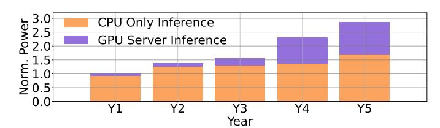

Fig. 1: Normalized power usage of AI inference clusters in GPU-equipped servers and CPU-only servers over five years.

reveal improved power management opportunities on production AI systems and § IV analyzes the theoretically attainable power reduction for our models via frequency modulation, while abiding by their service-level objectives. Leveraging insights from these analyses, § V presents the design of our power management scheme, which is then evaluated with case studies on production AI inference workloads and platforms in § VI. Finally, § VII and § VIII discuss future directions and related work, respectively, and § IX concludes.

#### II. BACKGROUND AND MOTIVATION

#### <span id="page-1-0"></span>A. The Rise of GPU Inference

As AI models have grown in scale and complexity, GPU servers have become the backbone of modern datacenter inference workloads. Unlike earlier generations of CPU-centric infrastructure, today's AI services, ranging from recommendation systems to LLMs, demand the high throughput and parallelism that only accelerators such as GPUs can provide.

This shift comes at a cost: GPU servers are power-hungry, and their share of total datacenter power consumption is rapidly increasing. Fig. 1 shows the power consumption of AI inference clusters. The power is further broken down into two components: power spent on CPU-only servers and power spent on GPU-equipped servers. We observe two trends. First, over this 5-year period, the total power demand of AI clusters has tripled. Second, the fraction of total datacenter power attributable to GPU servers increased from 8.5% to 40.9%. Note that this analysis includes only AI inference servers. It does not include servers used for AI training or general-purpose compute.

As AI Inference servers become the dominant consumers of power, optimizing their efficiency is becoming an imperative for both cost control and sustainability [41], [42]. Even small improvements in GPU inference efficiency can translate into operational savings and reduced environmental impact at scale. In this paper, we focus on power management at the AI Inference server level that can maximize power and performance efficiency of AI inference workloads across our fleet.

### B. Service and Model Heterogeneity

AI fleet is heterogeneous, supporting a diverse array of services and models such as LLMs, recommendation engines, and specialized models for search, translation, and content generation. Fig. 2 breaks down power usage of fleet across dominant use cases. For CPU inference capacity, approximately 10% goes into generative AI, represented by the two

<span id="page-2-0"></span>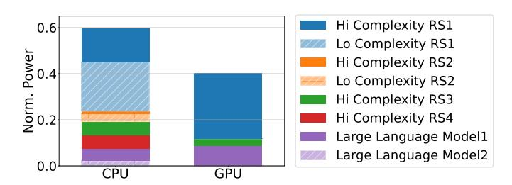

Fig. 2: Breakdown of power capacity for AI Inference for compound servers (featuring CPUs and GPUs).

large language models. The rest of CPU inference capacity is spent on various products, with recommendation system 1 (RS1) consuming about 60% of the CPU capacity. About 40% is spent on low complexity workloads, the rest on high complexity products. Our primary metric to classify model complexity is size, i.e., number of parameters and layers. In GPU inference, about 20% of the capacity is spent on generative AI, 70% on RS1, and 10% on other services. All workloads running on GPUs are high complexity. Each of these use cases comprises many different downstream services and AI models. The deployed models differ greatly in size and architecture. Some are compact and can be efficiently served on a single CPU or GPU, while others, such as emerging LLMs with many parameters, require multi-GPU configurations for a single inference request.

This architectural diversity is further compounded by the wide range of service use cases and load patterns. For example, real-time recommendation systems often experience high and unpredictable query rates, demanding low-latency responses and sustained resource utilization. In contrast, batch analytics or background workloads tend to have more predictable, lower-intensity demands, and may leave resources underutilized for extended periods.

Service-level objectives (SLOs) such as latency and throughput further influence how resources are provisioned and utilized. Services with stringent performance requirements may be allocated more generous power budgets to ensure responsiveness, while others can operate efficiently with less.

Taken together, factors such as model size, service load, and performance requirements result in highly non-uniform power consumption patterns across workloads in the fleet. Fig. 3 shows the cumulative distribution function (CDF) of power utilization across AI inference services. We observe that the majority of services under-utilize their assigned power budgets. For instance, 60% of services use less than 80% of their maximum power limit. On the other hand, some services need their full power budgets and could further improve their performance if allocated more power.

This high degree of heterogeneity in large-scale AI fleets, though underexplored in previous research, underscores the need for power management schemes that can adapt to diverse and evolving workload demands.

<span id="page-2-1"></span>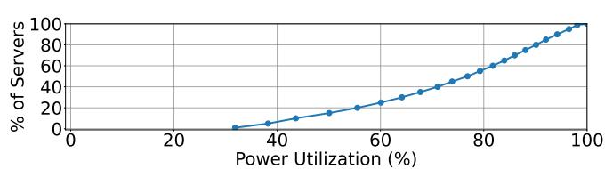

Fig. 3: CDF of power utilization across services.

#### C. Variations in Power Usage Across Server Components

A typical compound AI Inference server is composed of multiple GPUs and a CPU host [31]. Power limits (TDPs) are statically assigned to each component. For example, a platform with 8 GPUs and a CPU host assigns 1 kW per GPU and 300 W for the CPU. Unfortunately, static partitioning is often inefficient given the diversity of workloads and their dynamic behavior. Throughout the paper, "TDP" refers to the device's (configurable) software-set power cap rather than the manufacturer's peak power rating.

The usage of CPU and GPU components within a server varies across services. For instance, some AI services perform extensive data pre-processing, such as feature extraction and input normalization, as well as post-processing, like result aggregation and formatting on the CPU. In these cases, the CPU may reach its 300 W power limit, throttling the service, while the GPUs remain underutilized and consume less than their allocated power budget. In contrast, some other services, such as long-context LLMs, use host CPUs only for request scheduling; thus, they have low CPU utilization, while the GPU usage is very high. Hence, setting fixed power limits for CPUs and GPUs independently is often inefficient, as one component may require more power to sustain performance while the other remains underutilized.

Moreover, it is common to co-locate multiple services on the same AI Inference server for better resource utilization. For example, two services may each be assigned 4 GPUs on an 8-GPU AI Inference server. If one service is GPU-bound and fully utilizes its GPUs, its performance will be restricted by the available assigned power limit. On the other hand, if the other is lightly loaded or idle, its GPUs will consume far less than their power cap, resulting in unused power headroom.

Fig. 4 shows the power draw of 8 GPUs within an AI Inference server running multiple collocated production AI services over a day. Power usage across GPUs fluctuates over time, and, most of the time, GPUs differ in their respective power draw. This example also shows that even within a single service, workload intensity fluctuates over time due to diurnal patterns, traffic spikes, or model updates, leading to periods where some server components are underutilized.

Overall, these mismatches between static power allocation and diverse and dynamic workload demands result in power misallocation and missed performance opportunities.

# D. Opportunity for Server-level Power Harvesting

To quantify the potential for more dynamic and efficient power allocation across components in a compound AI Infer-

<span id="page-3-1"></span>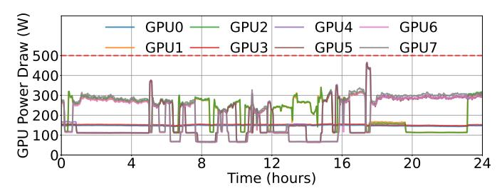

Fig. 4: Power draw of 8 GPUs within an example server running production workload over a day.

<span id="page-3-2"></span>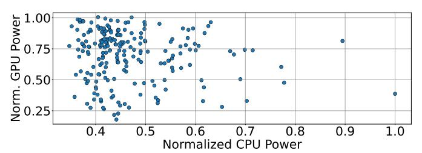

Fig. 5: Normalized power draw across CPU and GPU components across AI Inference servers.

ence server, we perform two analyses across fleet.

First, we analyze the diversity in power draw between CPUs and GPUs across servers. Fig. 5 presents a scatter plot of CPU versus GPU power draw for each server at the peak total server power during a day. The plot reveals substantial diversity: while some servers are clearly GPU-bound, operating near their GPU power limits, others are CPU-bound, with the CPU power being close to its cap, while GPUs are underutilized. This diversity is a direct consequence of the heterogeneous mix of services and models described above.

Second, we examine the power usage across GPUs within the same server. For each server, we measure the maximum power draw of each of its 8 GPUs at the time of peak server power usage. We then assess whether GPUs operating below their TDP limit could effectively lend unused power to other GPUs, up to their physical maximum power cap.

Fig. 6 quantifies this aggregate power imbalance. On the left, we show the CDF of power harvesting defined as the amount of additional power that could be dynamically real-located among GPUs to better match workload demands. On the right, we show the CDF of normalized standard deviation in power draw across same-server GPUs. Both values (power harvesting and stdev) are normalized to the GPU TDP.

Fig. 6(right) shows that power draw across same-server GPUs has large variability and is highly imbalanced. Fig. 6(left) reveals that inter-GPU TDP allocations in most AI Inference servers leave significant power unused. For example, in over 60% of the fleet's servers, 20–40% of the TDP allocated to some GPUs is unused. This substantial power budget could be harvested and reallocated to other power-constrained GPUs within the same server. Hence, our analysis suggests there is substantial headroom for *server-level power harvesting*. A mechanism that dynamically and flexibly reallocates such harvested power budget between each AI Inference

<span id="page-3-3"></span>

Fig. 6: CDFs of power harvesting opportunities across sameserver GPUs (left) and standard deviation in power usage across same-server GPUs (right). Values are normalized to the per-GPU TDP.

<span id="page-3-4"></span>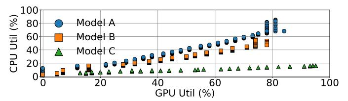

Fig. 7: CPU vs GPU utilization for three different production models running real-world traffic.

server's CPUs and GPUs has the potential to substantially improve fleet-wide efficiency and service performance.

In § V, we present a mechanism that leverages this opportunity to maximize performance/Watt by dynamically harvesting and redistributing unused power budget within each server. Specifically, under a fixed module/server power cap, we divert power budget from underutilized CPUs/GPUs to power-limited components where additional power supply yields the highest marginal performance, improving the overall server efficiency.

# <span id="page-3-0"></span>III. UNDERSTANDING THE POWER-PERFORMANCE TRADEOFF ON PRODUCTION AI SYSTEMS

To quantify the potential benefits of a dynamic power assignment scheme across server components, we characterize the AI Inference servers running production-grade models. To illustrate the model heterogeneity present in our fleet, we select three representative models.

Model A is a single-task recommendation model optimized for click-through rate (CTR) prediction in mobile feeds. It uses a standard recommendation architecture (e.g., deep learning recommendation model) with sparse feature handling and CPU is used for preprocessing and feature extraction.

Model B is a multi-task ad ranking model that predicts several metrics (e.g., CTR, ad quality, conversion rate) for a webservice scenario. It features a more complex neural network with shared layers and multiple output heads, and is GPU-optimized to handle large-scale, multi-objective inference.

Model C is a multi-task content ranking model focused primarily on CTR prediction for the content of web services. While it shares the multi-task approach with Model B, it is less complex in terms of the number of tasks, and is more GPU-bound, tailored for content ranking.

<span id="page-4-0"></span>

Fig. 8: Request rate (QPS), GPU utilization, GPU power draw, and service latency for models A, B, and C on CPU-GPU hardware platforms for AI inference. Input load increases over time, and all values normalized from zero to one. QPS-util / QPS-power  $R^2$  correlation values across the three models are A: 0.73 / 0.84, B: 0.71 / 0.85, C: 0.79 / 0.94.

Fig. 7 shows the relationship between GPU and CPU utilization for these three models while running production traffic. While all models exhibit a linear correlation between CPU and GPU utilization, the slope of this relationship, i.e., the ratio of CPU to GPU usage, varies significantly. Model A is more CPU-intensive, Model C is more GPU-bound, and Model B falls in between.

This heterogeneity in resource scaling motivates the need for model-aware power management and resource allocation schemes. A one-size-fits-all approach is insufficient; instead, power management strategies must account for the diverse compute profiles present in an inference fleet.

# A. Load Testing on Representative Models

We perform inference load testing for the selected models on AI Inference servers. For these experiments, we leverage the load-testing infrastructure. In each test, we gradually increase the query rate until the system fails to meet its SLO for P99 tail latency. During the test, we continuously monitor system metrics, including GPU utilization, GPU power draw, and end-to-end inference latency.

Fig. 8 presents data for the three selected models. We normalize all values to their maximum, hence the y-axes across plots are in the 0-1 range. We observe a congruence in the shape of the QPS, GPU utilization, and GPU power draw curves, which is consistently observed across all load-tests. QPS-utilization and QPS-power closely fit a linear regression model, indicating a strong linear correlation among these properties— $R^2$  values range between 0.71 and 0.94, and are quoted in Fig. 8's caption.

The correlation between QPS, utilization, and power usage is intuitive. As load increases, GPU utilization and power consumption grow. Our measurements empirically confirm that the correlation between the fields is effectively *linear*, allowing for simple power management schemes to be efficient at production datacenters.

Fig. 8d quantifies P99 latency as a function of load, which follows a typical shape: latency increases mostly linearly with

load, with inflection points at high load where latency spikes, which indicate that server is unable to keep up with the arrival rate and starts experiencing longer queuing delays.

Overall, this set of experiments shows that, within the operational range before saturation, GPU utilization, which is an *application-agnostic signal*, can serve as a practical proxy for managing power consumption and understanding its impact on performance (i.e., tail latency), in production environments.

#### <span id="page-4-1"></span>B. A Closer Look at Single AI Inference Server

Next, we conduct a detailed study on an isolated AI Inference server, enabling fine-grained measurement and configuration. We select two high-impact models,  $C_1$  and  $C_2$ , which are different variants of *Model C*. The server is an Nvidia Grace Hopper system [31], equipped with an integrated H100 GPU and a Grace CPU.

For each model, we incrementally increase the input load (QPS) while keeping all driver configurations at their default settings. TDP limit control is one of mechanisms for power management in these GPUs. Hence, we repeat the experiment across a range of configurable TDP limits, from the maximum hardware allowed value  $(TDP_M)$  to lower settings.

Behavior at the maximum TDP is similar to those observed in Fig. 8. We note that latency inflection and SLO violations occur before the server reaches its power cap. Prior to the saturation point, total server power draw increases linearly with load. By instrumenting the server, we also measure the power consumption of individual components: GPU, GPU memory, CPU, and CPU memory. For model  $C_1$ , the power breakdown remains consistent across loads: GPU (65%), GPU memory (10%), CPU (22%), and CPU memory (3%). Model  $C_2$  exhibits a similar per-component power draw ratio, but the absolute power draw differs considerably.

Fig. 9 presents results for model  $C_1$  at a reduced TDP of  $0.5 \times TDP_M$ , revealing a more nuanced behavior. This setting is common in power-oversubscribed environments. Fig. 9a shows the component-wise power usage as load increases. As the server approaches its power limit, GPU power usage drops,

<span id="page-5-1"></span>

Fig. 9: QPS sweep on production model  $C_1$  with  $0.5*TDP_M$ .

while the other components continue to rise. This is due to a reduction in GPU frequency  $(f_G)$ , which can fall to 55% of its maximum  $(f_{GM})$ , as shown in Fig. 9c. This behavior is attributed to voltage and frequency scaling (DVFS) [26], [45], employed by the system to enforce the power cap.

As the power limit is reached and GPU frequency decreases, GPU utilization increases more steeply, diverging from the linear trend. This is because, at lower frequencies, the GPU takes longer to process the same load, increasing both utilization and request latency. As a result, requests queue and SLO violations occur at lower loads, as shown in Fig. 9b, with power now acting as the primary bottleneck. In these plots, we omit other models for brevity, as they exhibit qualitatively similar trends.

From these sweep tests and available documentation, we infer that the baseline server-level power control scheme relies on DVFS, but only modulates the GPU frequency when power usage approaches the TDP limit. The driver exclusively adjusts the GPU frequency, while the CPU frequency remains fixed at its maximum value  $(f_{CM})$ . As a result, both the GPU and CPU operate at their respective maximum frequencies  $(f_{GM})$  and  $f_{CM}$  at all other times, regardless of the actual workload, until the GPU frequency is capped.

Notably, when no models are loaded and the server is idle, the GPU frequency drops to a semi-idle state (20% of  $f_{GM}$ ). However, as soon as a model is loaded, even if there are no queries, the frequency immediately returns to  $f_{GM}$ , leading to unnecessary power consumption during idle periods.

These findings expose opportunities for improved power management. The current scheme only reacts to power limits and does not proactively optimize for power efficiency under varying loads, leaving power savings untapped. For the remainder of this paper, we experiment with frequency limits directly, rather than power limits, to isolate potential interferences and conflicting settings, given the presence of a built-in power management mechanism from the vendor.

<span id="page-5-2"></span>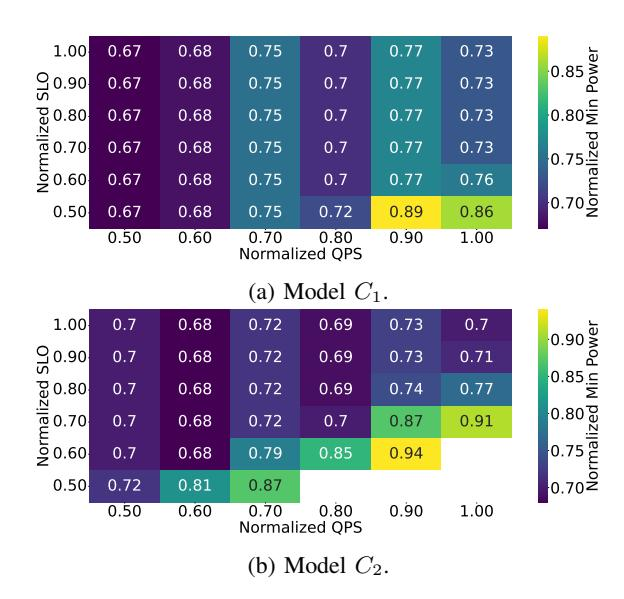

Fig. 10: Heatmap of power usage in minimum power configuration relative to power usage of baseline for production models  $C_1$  and  $C_2$  with varying QPS and SLO.

#### <span id="page-5-0"></span>IV. UNDERSTANDING POWER SAVING OPPORTUNITY

In this section, we explore the theoretical power savings achievable by fine-tuning server parameters for each application, given its input load and SLO. The goal is to reduce CPU and GPU power draw while meeting the service's SLO. We perform this characterization with the same inference models and hardware used in production.

To empirically determine the minimum power settings that meet the SLO, we sweep over GPU and CPU frequencies for each input QPS and SLO. We set GPU frequency from 53% to 100% of  $f_{GM}$  (in discrete steps defined by the driver), and CPU frequency from 71% to 100% of  $f_{CM}$ .

Although both GPU and CPU frequencies can be further reduced, we did not observe any additional power savings due to the limitations imposed by static leakage power and voltage scaling. Since the workloads examined are relatively insensitive to changes in CPU frequency we choose to make the CPU frequency sweep less granular.

Fig. 10 presents the ratio between the power usage under frequency control (i.e., the optimal setting) and the baseline, across different QPS and SLO configurations for models  $C_1$  and  $C_2$ . The findings suggest that more lenient SLOs allow more power savings: lowering frequency reduces power consumption at the cost of higher latency, and relaxed latency constraints provide more opportunities for power reduction.

For instance, in model  $C_2$  with a fixed load of maximum QPS (1.0), we find that an SLO of  $0.5 \times SLO_{max}$  cannot be met by any CPU/GPU frequency setting. However, when the SLO is set to  $SLO_{max}$ , the optimized frequency setting achieves a 30% reduction in power consumption compared to a system operating at maximum frequencies.

Similarly, lower QPS enable greater power savings, as the server can operate at lower frequencies when handling fewer requests. At higher loads, the server must operate at higher

<span id="page-6-1"></span>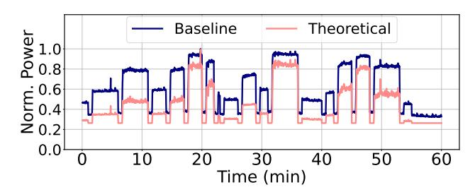

Fig. 11: Theoretical power draw with per-epoch optimal CPU and GPU frequencies for  $C_1$ , compared against the baseline.

frequencies to keep up with demand, leaving less opportunity for power reduction. This effect is compounded by the fact that latency also increases with QPS, further limiting the potential for power savings at high loads.

While overarching patterns are consistent across the two models, the optimal frequency, power settings, and the measured latencies, exhibit substantial discrepancies. For instance, we note that model  $C_2$  is more compute intensive; hence, it cannot meet the tight SLO deadlines at higher QPS loads even with the highest CPU/GPU frequency. Consequently, it also shows lower power savings with optimal frequency settings compared to model  $C_2$ . This observation further highlights the need for model-specific tuning.

To further evaluate the theoretical power savings in a dynamic, production-like scenario, we generate a load pattern that fluctuates over time. Specifically, we conduct an hour-long experiment with model  $C_1$ , during which we induce varying QPS values at each epoch (lasting  $\approx$ 4 minutes,) to mimic the observed load patterns from production driving QPS from zero up to the maximum sustainable value.

We measure the baseline power consumption throughout this load trace. To determine the theoretical minimum power, based on the earlier frequency sweep results, we ensured that the server can operate at the minimum power to meet the SLO for the given load at each discrete sampled point. Specifically, we set the P99 latency limit to be the highest sustainable load achieved when the server operates at is maximum frequency.

Fig. 11 presents the computed theoretical minimum power consumption across the evaluated load profile, alongside the measured baseline power draw. On average, the theoretical minimum achieves a 30% reduction in power consumption compared to the baseline under this workload. Power savings are most pronounced at lower load levels, where increased latency slack relative to the SLO enables more aggressive frequency scaling and, consequently, greater power efficiency.

Due to space constraints, we omit results for  $C_2$ . We note that the  $C_2$  model achieves a similar power reduction of 31%, although with different frequency scaling configurations.

Alternative Potential Power Saving Opportunity: An interesting observation suggests a tangential direction to investigate for power saving. At lower QPS, the server can have its frequencies further reduced, resulting in sub-linear power scaling. In other words, serving half of the maximum load can consume less than half of the total server power. For

example, if the power required to handle the maximum QPS while meeting  $0.75 \times SLO_{max}$  is  $P_{MQ}$ , then handling half the QPS at the same SLO requires only  $0.37 \times P_{MQ}$ . This implies that, in theory, distributing the same total QPS across two GPUs, each operating at lower load, could achieve the same throughput and SLO using only 74% of the power.

This non-linear power saving is not observed when simply varying QPS at a fixed frequency. Instead, it is enabled by actively controlling the operating GPU and CPU frequencies. While it is not practical to double the number of servers for the same workload given current hardware costs, this insight shows the potential for further power savings through smarter workload distribution and frequency scaling. Further investigation into the underlying causes, such as serialization, batching, or architectural bottlenecks, could reveal additional opportunities to improve future server designs.

# <span id="page-6-0"></span>V. MODULE-LEVEL POWER BUDGETING FOR PRODUCTION AI INFERENCE

To achieve practical and scalable power management in

production datacenters, we introduce a real-time *module-level power budgeting* mechanism that maximizes performance/Watt under the module's power envelope. Instead of assigning static, per-component limits, our controller continuously *redistributes* the available power budget across the CPU and GPUs based on instantaneous demand, giving power to components that are currently performance-limited and reclaiming power from components with slack. We use CPU/GPU frequency scaling as the actuation mechanism to enforce these dynamic budget splits using existing production interfaces, enabling *deployability without application changes*. Server-level Power Budgeting Abstraction. We treat each server as a power-constrained module with a configurable power cap  $P_M$ . At each control interval, the goal is to

server as a power-constrained module with a configurable power cap  $P_M$ . At each control interval, the goal is to choose per-component budgets  $(P_C, P_{G_1}, \ldots, P_{G_n})$  such that  $P_C + \sum_i P_{G_i} \leq P_M$  while maximizing Performance/Watt and preserving SLO headroom. For GPUs, as production platforms expose frequency controls but limited direct power-capping primitives, we realize budget reallocation implicitly by adjusting component frequencies, which modulate component power. We directly set the power budget for CPUs.

Proxy-Based Load Monitoring: A challenge in datacenter-scale power management is the lack of direct, real-time visibility into workload intensity at the individual server level, such as per-server QPS. While QPS is available at the service level through orchestration systems, it is not readily available across the fleet. Thus, a host is, by design, unaware of which service it is running, its SLO targets, or QPS. Furthermore, inference workloads are often multiplexed and rapidly changing, and orchestration layers typically abstract away application-level metrics. As a result, it is difficult to obtain timely and accurate load information needed for effective power control, without resorting to intrusive instrumentation or complex integration with application logic.

To overcome this limitation, we rely on GPU utilization  $(u_G)$  as a proxy metric. It is universally available, strongly

correlated with actual server load (as established in § III), and aligns with the overarching deployment design of keeping hosts service-agnostic. In addition,  $u_G$  has a direct relationship to the volume of inference work being processed, and it is tightly coupled with GPU frequency  $(f_G)$ , which is the primary control lever for our power management.

Empirical analysis from Fig. 8 shows that a server's query throughput is closely linked to both the GPU frequency and its utilization. Specifically, for a fixed workload, increasing the GPU frequency accelerates query processing, which in turn reduces the observed utilization. Conversely, lowering the frequency increases utilization for the same workload. This inverse relationship means that the product of GPU frequency  $(f_G)$  and utilization  $(u_G)$  remains approximately constant for a given query rate, i.e.,  $f_G * u_G \approx Q_w$ , where  $Q_w$  is the number of queries served. Hence,  $u_G$  serves as a robust, low-latency indicator of system load.

We also use  $u_G$  as an indicator of whether the GPU is currently *power-limited*: persistently high  $u_G$  suggests the GPU would convert additional power (higher frequency) into performance gains, while low  $u_G$  indicates slack where power can be harvested. This allows the controller to move the server's fixed power budget toward components with higher marginal performance benefit per additional watt.

Power Sloshing Control Loop: A design principle of our mechanism is to maintain GPU utilization within a target range that reflects the operational envelope validated by service owners. In practice, models are provisioned and tuned to operate reliably at specific utilization levels, ensuring that SLOs are met even during periods of bursty or peak demand. Operationally, the target range defines how much headroom we reserve; any slack below the range is harvested as power budget and reallocated, while deviations above the range trigger immediate budget return to the GPU.

Running consistently below this range leads to unnecessary power consumption, while operating too close to saturation leaves insufficient headroom for transient load spikes, increasing the risk of SLO violations. By keeping utilization within a carefully selected range, we ensure that power management decisions are both efficient and aligned with the reliability expectations of production services.

Building on this principle, our mechanism operates as a closed-loop controller, periodically sampling  $u_G$  and adjusting  $f_G$  and, by extension,  $f_C$  for the CPU, to maintain  $u_G$  within a target range. Our controller currently explicitly controls the frequency of CPUs and GPUs, but not of their memories; we observe that memory power consumption is meager relative to the processing units (Fig. 9a). However, explicit memory frequency control remains an interesting extension. The control flow is described in Alg. 1, and it executes according to the following principles.

At each step, the controller compares the current GPU utilization  $(u_G)$  to a predefined target range,  $[u_{min}, u_{max}]$ . If  $u_G < u_{min}$ , the controller harvests unused GPU power budget by throttling  $f_G$  (line 5), freeing module power that can be reassigned to other components (CPU or peer GPU).

# Algorithm 1 Module-Level Power Sloshing Control.

1: **Inputs:** Module power cap  $P_M$ ; GPU utilization targets

 $u_{min} < u_{max}$ ; GPU frequency levels  $\mathcal{F}_G$  with max  $f_{GM}$ ;

```
GPU power model P_G(f_G, u_G); CPU-GPU frequency
    mapping F(\cdot)
 2: while system is running do
      Read current GPU utilization u_G
4:
      if u_G < u_{min} then
5:
         Decrease GPU budget: f_G \leftarrow \text{Lower}(\mathcal{F}_G, f_G)
      else if u_G > u_{max} then
6:
         Increase GPU budget: f_G \leftarrow f_{GM}
7:
      end if
8:
9:
      if power-constrained then
         ▷ Budget reallocation mode
10:
         Estimate GPU power: \hat{P}_G \leftarrow \hat{P}_G(f_G, u_G)
         Compute CPU budget: P_C \leftarrow \max\{0, P_M - \hat{P}_G\}
11:
         Apply CPU power cap: SetCpuPowerLimit(P_C)
12:
13:
      else
         ⊳ Energy optimization mode
14:
         Coordinated CPU scaling: f_C \leftarrow F(f_G)
15:
         Apply CPU frequency: SETCPUFREQ(f_C)
      end if
17: end while=0
```

<span id="page-7-0"></span>If  $u_G > u_{max}$ , the controller immediately reassigns budget to the GPU by setting  $f_G = f_{GM}$  (line 7) to protect latency during bursts.

Depending on the operational regime, the algorithm either optimizes for performance under the fixed aggregate server power budget, or modulates frequency for power savings. In the power-constrained regime (lines 9–12), the selected GPU frequency dictates the respective GPU power budget, and the remaining budget is allocated to the CPU. Because GPU power does not instantaneously track frequency changes and direct per-interval GPU power availability is not explicitly exposed, we estimate the GPU's steady-state power under the chosen  $f_G$  using the power model derived from our characterization. We then compute the residual CPU budget as  $P_C = P_M - \sum_i \hat{P}_{G_i}(f_G, u_G)$  and apply this cap using the CPU power-limit interface. This ensures the module is within  $P_M$  while harvesting and reusing otherwise stranded power.

When the server is not power-constrained—e.g., during periods of low demand—the algorithm instead operates in energy optimization mode (lines 13–16). The CPU frequency is derived from the previously determined GPU frequency (lines 4–8) via a linear mapping  $f_C \leftarrow F(f_G)$ , leveraging the observed correlation between CPU and GPU utilization at power-optimal points and avoids separate CPU monitoring overhead. This simple mapping aligns well with empirical behavior across our workloads; non-linear regions primarily appear only at very high load, but are practically bounded by load balancing and further mitigated by our fast rampup policy (immediately setting  $f_G = f_{GM}$  upon a utilization spike). We use module-level budgeting as the default and deploy coordinated DVFS when global power headroom makes

budget reallocation unnecessary.

Per-Model Target Utilization Selection. The feedback loop in our power management scheme steers GPU utilization (uG) toward a target range, which must be carefully chosen to balance power efficiency and SLO compliance. If the target utilization thresholds (umin, umax) are set too high, the system may lack sufficient headroom to absorb sudden load spikes, increasing the risk of SLO violations. Conversely, thresholds that are too low can miss out on power-saving opportunities.

To address the diversity of models and workloads in largescale datacenters, we select these thresholds on a per-model basis. Specifically, for each model, we analyze historical CPU and GPU utilization traces collected while running at maximum frequency under production workloads. We then set the target utilization range based on a chosen percentile of observed utilization, ensuring that the system maintains enough slack to handle typical workload bursts while still reducing power during periods of lower demand.

We implement two variants of this approach: in a more aggressive *Power-Optimized* configuration, we set the target to the 90th percentile of historical utilization (P90, e.g., 60%– 70% utilization in C1), maximizing power savings. In a more conservative *SLO-Optimized* configuration, we use the 75th percentile (P75, e.g., 40%–50%), providing additional headroom to further reduce the risk of SLO violations. By adapting target utilization thresholds to each model's unique resource profile and workload variability, our approach provides robust SLO compliance and maximizes power savings across heterogeneous deployment scenarios.

Responsiveness and Stability. The proposed dynamic power management scheme must ensure that the control loop can react quickly enough to sudden changes in workload, while avoiding instability or oscillations in frequency settings.

In our system, the main source of control latency is the interval at which GPU utilization (uG) is sampled and reported. We set the interval to 100 ms to balance responsiveness and stability: it is short enough to capture rapid spikes from traffic bursts or batch arrivals, but long enough to filter out transient noise and prevent unnecessary frequency changes. This time granularity also aligns well with the responsiveness needed for production AI inference workloads, with typical p99 SLOs in the tens to hundreds of ms range.

Frequency scaling is highly efficient, with hardware-level transitions typically completing within 100 µs to a few milliseconds. As a result, the end-to-end response time of the control loop is dominated by the utilization sampling interval.

To further improve responsiveness to load surges, we implement an explicit fast-response mechanism. When u<sup>G</sup> exceeds the upper threshold umax, the controller immediately increases the GPU frequency to its maximum value (fGM) in a single step, rather than ramping up gradually (Alg. [1,](#page-7-0) lines 6– 7). This ensures that the system can promptly accommodate sudden increases in query volume, minimizing the risk of SLO violations during bursts. In contrast, when reducing frequency in response to lower utilization, the controller steps down one frequency level at a time (Alg. [1,](#page-7-0) lines 4–5). The conservative approach prevents over-correction and oscillatory behavior, which could otherwise degrade both performance and power efficiency. This *asymmetric adjustment policy*: rapid upscaling and gradual downscaling, provides robust stability across a wide range of production workloads.

Implementation Simplicity and Generality. The proposed mechanism is intentionally simple, requiring only access to standard GPU utilization counters and frequency control interfaces (e.g., via NVIDIA's NVML or similar APIs). It does not depend on application-specific instrumentation, detailed workload characterization, or offline profiling. These characteristics make it practical, broadly applicable across diverse server types and workloads, and easy to deploy at scale.

By prioritizing GPU control and deriving CPU power budget accordingly, we further reduce monitoring overhead and complexity. This design decision is justified by the observation that, in AI inference servers, the GPU is the primary power consumer and performance bottleneck, while the CPU's role is secondary and closely coupled to GPU activity.

Summary. In summary, our mechanism provides a practical, low-overhead template for real-time server power management in datacenters. By leveraging GPU utilization as a proxy for load and employing a simple, robust control loop, it achieves power savings with minimal risk to performance or SLOs. We treat DVFS as an actuation mechanism for *dynamic server-level power budgeting*: under a fixed module power cap, we continuously harvest slack power from underutilized components and reassign it to the currently performancecritical components. This approach establishes a new baseline for server-level power management, upon which more sophisticated or workload-specific strategies can be built.

# VI. CASE STUDIES

<span id="page-8-0"></span>In this section, we first evaluate the effectiveness of our module-level power sloshing algorithm (Alg. [1\)](#page-7-0) across a range of module power limits and workload characteristics, to quantify how well it reallocates power between CPU and GPU under different power-constrained scenarios. Then, we run the system at the maximum module power limit and evaluate power savings and SLO impact. Our goal is to demonstrate that even a simple, utilization-driven scheme can yield immediate power savings with minimal implementation effort, while also establishing a new baseline for future, more advanced power management strategies.

Experimental Setup. For a consistent comparison, we use the same server hardware (NVIDIA Grace Hopper system [\[31\]](#page-13-4) with an H100 GPU and a Grace CPU). In terms of workloads, in addition to AI models characterized in § [III-B](#page-4-1) (A, B, C1, C2), we test another high-impact inference model, D1, in order to showcase how the simple schemes perform in different loads, and to gauge workload-specific optimization opportunities. The input load trace is the one illustrated in Fig. [11.](#page-6-1) This trace is designed to exercise the system across a broad spectrum of operating conditions, including periods of low, moderate, and high load, as well as abrupt transitions between these states.

**Stress Testing.** To assess the robustness of our approach, we intentionally include stress scenarios that push the system beyond its typical operating envelope. We posit that evaluating under such conditions, where the baseline itself may experience SLO violations, provides deeper insight into the true performance boundaries and resilience of the power management scheme. The load trace includes multiple transitions, ranging from idle (zero load) to loads approaching or exceeding the maximum sustainable QPS. Inclusion of extreme load spikes ensures our design meets quality of service (QoS) targets in all expected live query traces.

**Metrics.** We evaluate each configuration by measuring two metrics: (1) average power consumption, and (2) the fraction of queries violating the SLO. The SLO is defined as the 99th percentile latency observed at the highest sustainable load with the server operating at maximum frequency, consistent with the Baseline configuration, allowing for a direct comparison of power savings and QoS across all schemes.

**Evaluated Schemes.** We implement and evaluate two variants of our utilization-based power management algorithm as described in per-model target utilization selection in § V: *SLO-Optimized* scheme and *Power-Optimized*. Both variants follow the same control mechanism described in § V, differing only in their target utilization thresholds. Contrasting results of the two variants serves as a sensitivity analysis that provides insights into the tradeoff of QoS and power savings.

We compare both variants against two schemes. *Baseline* is the default configuration with static, maximum frequency and no dynamic power management. *Theoretical Minimum* is the idealized lower bound on power draw (§ IV) where frequency is optimally tuned at each load without overheads.

#### A. Evaluation Results

Server Power Budgeting. We first evaluate the server-level power budgeting algorithm (Alg. 1) on production hardware and two production models. Server power limit refers to the maximum combined power of all components, i.e., CPU, GPU, and other (such as memory). We perform a sweep on the server power limit and compare an out-of-the-box baseline against our workload-aware policy that dynamically apportions power between CPU and GPU. Fig. 12 shows the Performance/Watt improvement of our proposed solution over the Baseline across different server power limits. We define performance as the highest load (QPS) the system can support without violating SLO. Then, Performance/Watt is scaled by the total server power. Across models and server power limits, our system outperforms the Baseline by up to 1.83×. The gains are higher under tighter power caps, where misallocation is less forgiving.

To explain these gains, Fig. 13 reports the component-level power distribution (CPU vs GPU). Due to space constraints, we present results only for Model-A, while Model-B follows similar trends. Compared to the Baseline, our policy consistently shifts budget away from the less power-sensitive component toward the bottlenecked component (from CPU

<span id="page-9-0"></span>

Fig. 12: Performance/Watt of our proposed policy for two production models normalized to that of Baseline.

<span id="page-9-1"></span>

Fig. 13: Power split across components with different server power limits for *Model-A*, with Baseline and with our policy.

to GPU in this case). Thus, the system avoids wasted power headroom and improves throughput per watt.

Finally, Fig. 14 shows GPU utilization for Model-A under the Baseline and our policy across server power limits. Under tight power budgets, the Baseline often assigns an insufficient share of the server budget to the GPU, leaving it power-throttled and underutilized, despite being needed for high throughput. In contrast, our workload-aware policy consistently allocates enough power for the GPU to run near its efficiency-optimal operating point, sustaining high utilization (around  $\sim$ 75%) and thereby translating the available budget into higher throughput. As the server power limit increases, the gap narrows: once the system is no longer power-constrained, both the baseline and our policy converge to similar GPU utilization levels and comparable behavior.

**Power Consumption.** Next, we evaluate power savings when the module is not power constrained. Fig. 15 shows the power consumption profiles of all evaluated schemes over the course of the dynamic load trace for  $C_1$ . The *Theoretical* scheme, which represents an idealized lower bound with perfect, instantaneous frequency tuning, consistently achieves the lowest power usage, illustrating the opportunity for power savings relative to the *Baseline* configuration.

<span id="page-9-2"></span>

Fig. 14: GPU utilization under baseline and under our policy with different server power limits.

<span id="page-10-0"></span>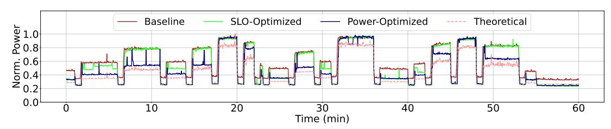

<span id="page-10-1"></span>Fig. 15: Server power draw for  $C_1$  over time in schemes: Baseline, SLO-Optimized, Power-Optimized, and Theoretical.

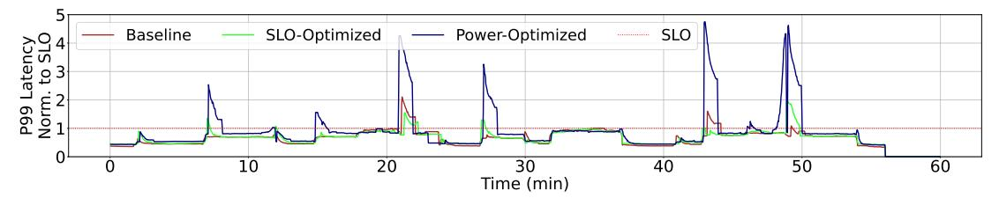

Fig. 16: P99 latency over time for the evaluated schemes in  $C_1$ . Latency is normalized to its SLO value.

Both the *Power-Optimized* and *SLO-Optimized* schemes, which implement our practical utilization-based control, maintain power consumption well below the baseline throughout the experiment. Notably, their power profiles closely track the theoretical minimum, particularly during moderate and low load. Averaged over the one-hour run, the *Power-Optimized* scheme reduces total power consumption by 24%, while the more conservative *SLO-Optimized* variant achieves an 11% reduction. These results demonstrate that efficiency gains are possible even with simple, deployable mechanisms.

At high load levels, as the system approaches the maximum sustainable QPS, both practical schemes converge to the Baseline, as they must operate at maximum frequency to avoid SLO violations. Under these conditions, the aggressive *Power-Optimized* scheme offers little to no additional benefit compared to the *SLO-Optimized* scheme, since any further frequency reduction would compromise latency guarantees.

In contrast, the theoretical minimum continues to realize modest power savings even near peak load, as it can exploit the non-linear relationship between frequency and power, where small reductions in frequency yield power savings due to the superlinear scaling of dynamic power with frequency. However, in practice, the aggressive scheme cannot reliably detect or respond to such fine-grained load variations in real time, and thus defaults to peak frequency as soon as the load nears the system's capacity limit.

**SLO Attainment.** We next evaluate the impact of power management schemes on QoS, as measured by SLO compliance. Our primary metric is the fraction of intervals in which the P99 latency exceeds the SLO threshold. This metric reflects the proportion of time intervals where at least 1% of requests failed to meet the latency target. By the experiment's design, query arrival rate is constant per load level. Since query count per interval is about the same, the fraction of *SLO-violating intervals* is a stricter a metric than the fraction of *SLO-violating queries*.

Fig. 16 shows the P99 latency over time for the evaluated schemes for  $C_1$ . Under the stress-test workload, *Baseline* 

exhibits SLO violations in 4% of sampled intervals, confirming the challenging nature of the load trace. The conservative (*SLO-Optimized*) scheme closely tracks the Baseline, with SLO violations in 5% of intervals which is only a marginal increase. These results demonstrate that power savings can be achieved with minimal impact on QoS.

In contrast, the aggressive (*Power-Optimized*) scheme shows an increase in SLO violations, with 14% of intervals exceeding the latency limit. Violations occur more frequently, and the magnitude of latency spikes is higher. These results indicate that while the aggressive configuration maximizes power savings, it does so at the expense of SLO robustness, making it less suitable for latency-sensitive or highly variable workloads.

As expected, the majority of SLO violations and latency spikes are concentrated around periods of abrupt load increases, when the system must scale up resources to maintain performance. While the overall trends are consistent, we observe occasional non-deterministic behavior. For example, around the 43-minute mark, the Baseline configuration exhibits a higher P99 latency than the conservative scheme, despite always operating at equal or higher frequency. Such anomalies likely arise from transient effects in workload scheduling or queuing. For instance, brief imbalances in request distribution can lead to temporary queue build-up on certain servers, amplifying tail latency. Additionally, contention for shared resources, such as memory bandwidth or I/O, can momentarily degrade performance, even when CPU or GPU frequencies are not the limiting factor.

**Average Latency.** Fig. 17 shows the average latency over time. Across all evaluated schemes, the average latency remains well below the SLO threshold throughout the experiment, even during periods of high load or frequent transitions.

**Resource Utilization.** Fig. 18 shows the GPU utilization profile for the evaluated schemes. Both the conservative and aggressive power management schemes maintain higher and more stable GPU utilization compared to the Baseline, except during periods of zero load. This reflects the effectiveness of the control loop in keeping the GPU operating closer to its

<span id="page-11-1"></span>

Fig. 17: Average latency over time for  $C_1$  in the evaluated schemes, normalized to its SLO value.

<span id="page-11-2"></span>

Fig. 18: GPU utilization for  $C_1$  int the evaluated schemes.

target utilization range, thereby improving power efficiency. CPU utilization also increases slightly under the power management schemes, but the effect is less pronounced.

**Results for Additional Models.** Fig. 19 shows the normalized average power usage across different models with each scheme. We observe similar trends to  $C_1$  in both  $C_2$  and  $D_1$ , with slightly reduced gains. Both models achieve 8% and 19% reduction in power consumption in *SLO-Optimized* and *Power-Optimized* respectively. We speculate that workload-specific characteristics, such as ratio of CPU power consumption, affect variance in power saving.

For  $C_2$ , SLO-Optimized maintains the QoS with SLO violations increasing from 9% in the Baseline to only 10%. With Power-Optimized, SLO violations rise to 12%.

In contrast to the C models,  $D_1$  shows no SLO violations across the Baseline, SLO-Optimized, and Power-Optimized schemes: service latency for  $D_1$  is lower than other workloads, which helps sustain shallower query queues in sudden load bursts.  $D_1$  maintains perfect QoS, and could potentially benefit further from a more aggressive power-saving scheme.

**Power Overhead of the Algorithm.** To evaluate the efficiency of our practical scheme, we assessed its impact on both system power and performance. We validate that our implementation is lightweight and introduces negligible overhead with an experiment measuring power consumption and latency under two conditions: zero load and maximum load, with and without the algorithm enabled. For the Baseline comparison, we manually matched operating frequencies to those observed when the algorithm was active. The results indicate no measurable difference in power consumption between the two scenarios. Additionally, at maximum load, we did not observe any difference in system latency.

**Multi-GPU Server Implications.** Modern GPU servers house 4–8 GPUs operating under a shared server-level power budget. Accordingly, our approach monitors utilization and power of each GPU (and CPU) and *redistributes* the available budget across them, from relaxed GPUs to power-limited GPUs,

<span id="page-11-3"></span>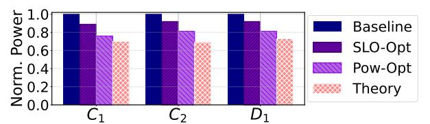

Fig. 19: Server Power Usage for the evaluated benchmarks at each configuration, normalized to the baseline.

rather than treating each GPU in isolation. The control logic operates per GPU with  $\sim 100\,\mu s$  CPU overhead per 100ms interval. This cost is mostly parallelizable and remains negligible even for 8 GPUs. A firmware-level implementation can further reduce overhead and enable tighter control intervals.

A multi-GPU server can either be operating on several independent colocated models, or on a single model in a tensor-parallel setup. In the former case, independent GPU control naturally aligns with the deployment's nature. Fig. 6's results are derived from an 8-GPU server with colocated services, demonstrating intra-server power variability that per-GPU control handles seamlessly. In the latter case, because GPUs synchronize at layer boundaries (e.g., all-reduce operations), coordinated frequency scaling is desired to prevent creating GPU stragglers. Practically, uniform utilization within parallel groups ensures that all GPUs receive consistent frequency scaling, mitigating the concern. Nonetheless, an explicit coordinated policy that enforces a uniform frequency across all GPUs in a parallel group would be a reasonable minimal-overhead safeguard that is easy to add.

#### VII. FUTURE DIRECTIONS

<span id="page-11-0"></span>Based on our experience, we outline guidelines and opportunities for the design of next-generation AI infrastructure.

Early and Richer Signals. The effectiveness of power management can be further improved by integrating earlier and richer signals into the control loop. The current design reacts to observed utilization, which lags behind actual changes in the load. By wiring upstream information, such as load forecasts from the load balancer or application-level intent, into the controller, the system can anticipate demand surges and adjust power states proactively. This reduces the risk of SLO violations during load bursts and enables operation at lower baseline frequencies, further improving power efficiency.

Co-Optimizing Load Balancing and Power Management. Traditional load balancers are agnostic to server power states, focusing on performance and fairness. By making load placement decisions to account for the current or projected power state of each server, the system can consolidate workloads onto fewer, more efficiently utilized machines, allowing others to enter deeper power-saving modes. Such rack- or cluster-level coordination can yield additional power savings beyond what is possible with localized server-level control alone.

**Predictive and Learning-Based Approaches.** Predictive techniques, including machine learning, offer further opportunities for proactive power management. By analyzing historical load traces, the system can learn to recognize patterns that precede demand spikes and preemptively adjust power states.

TABLE I: Comparison of different power management approaches.

<span id="page-12-2"></span>

| Aspect                 | Profile-based [5], [25], [36], [52] | Learned (RL/ML) [54], [57]   | Our approach                      |
|------------------------|-------------------------------------|------------------------------|-----------------------------------|
| Per-model setup        | Profiling per model                 | Training per model/class     | None                              |
| Input signals          | App-level (QPS, latency)            | Multiple, app-specific       | Generic HW counters (utilization) |
| New model adaptability | Re-profiling needed                 | Re-training needed           | Immediate                         |
| Scalability            | Centralized profile DB              | Model serving infra          | Per-GPU, independent              |
| Deployment overhead    | Moderate                            | High                         | Minimal                           |
| Potential savings      | Potentially higher per-workload     | Potentially higher with data | Good (11% in production)          |

While this introduces additional complexity and the risk of misprediction, it can complement reactive control, especially in environments with highly regular or forecastable workloads. Hardware-Based Power Management. By embedding power control mechanisms directly into CPUs, GPUs, and accelerators, future systems can respond to workload changes with minimal latency and overhead, independent of software stack complexity. Such hardware-level intelligence enables finegrained, real-time adaptation to dynamic workloads, reducing reliance on software orchestration and unlocking new levels of efficiency for AI inference at scale.

Software-Level Opportunities. Software-level optimizations can complement hardware-based power management. Application developers can expose workload characteristics, deadlines, or SLO requirements to the underlying system, enabling more informed and aggressive power control. Compiler and runtime techniques can further optimize code paths for energy efficiency, while new APIs can facilitate tighter integration between application logic and power management policies.

# VIII. RELATED WORK

<span id="page-12-0"></span>Cluster Resource Management. A large body of research addresses resource efficiency in large-scale clusters under SLO constraints. Prior work explored resource sharing [\[3\]](#page-13-12), [\[30\]](#page-13-13), [\[34\]](#page-13-14), dynamic allocation [\[50\]](#page-14-10), [\[55\]](#page-14-11), and hardware reconfiguration [\[20\]](#page-13-15) for traditional workloads. Other efforts focused on safe power management and oversubscription [\[12\]](#page-13-5), [\[23\]](#page-13-6), [\[41\]](#page-14-5), leveraging workload characteristics [\[21\]](#page-13-16), [\[53\]](#page-14-12) and system state [\[40\]](#page-14-1) to make decisions. Several works explore interference- and heterogeneity-aware scheduling based on workload and server profiling to improve power efficiency in both traditional datacenters [\[5\]](#page-13-9), [\[25\]](#page-13-10) and AI servers [\[36\]](#page-13-11), [\[52\]](#page-14-7). These approaches often require detailed workload profiling, application-specific instrumentation, or complex orchestration. In contrast, our work uses a lightweight, generalizable mechanism that operates transparently across diverse AI inference workloads, requiring only standard hardware counters and minimal configuration, facilitating practical deployment.

Datacenter Power Management. Recent systems have focused on improving datacenter-wide power utilization. Piga et al. [\[35\]](#page-13-17) describe safe DVFS boosting to expand capacity, while Flex [\[53\]](#page-14-12) and SmartOClock [\[40\]](#page-14-1) oversubscribe power budgets using workload-aware techniques. SmoothOperator [\[12\]](#page-13-5) reduces peak draw by spreading synchronous services. Statistical multiplexing across servers [\[2\]](#page-13-18), [\[8\]](#page-13-19), [\[12\]](#page-13-5), [\[19\]](#page-13-20), [\[21\]](#page-13-16), [\[23\]](#page-13-6), [\[37\]](#page-13-21), [\[38\]](#page-13-22), [\[49\]](#page-14-3) enables safe oversubscription and cost savings, with such policies adopted in practice [\[1\]](#page-13-23), [\[7\]](#page-13-24), [\[27\]](#page-13-25). Patel et al. [\[33\]](#page-13-26) propose a threshold-based safe oversubscription scheme with recommendations for the thresholds based on their AI workload analysis. Proposals for traditional [\[16\]](#page-13-27), [\[24\]](#page-13-28) and ML servers [\[36\]](#page-13-11), [\[52\]](#page-14-7) use clock scaling based on measured input QPS, current request queue size, and/or measured or profiled service time. Others [\[4\]](#page-13-29), [\[54\]](#page-14-8), [\[57\]](#page-14-9) further leverage neural networks to predict request service time and modulate frequency accordingly. These systems typically require clusterlevel coordination and stack integration. In contrast, our approach targets minimally intrusive power management for AI inference, contained at the server level.

Energy-Efficient Workloads. Energy efficiency for CPUbased workloads has been addressed by various frameworks [\[10\]](#page-13-30), [\[13\]](#page-13-31), [\[24\]](#page-13-28) which dynamically adjust power and resources to meet SLOs. Recent work extends to GPU workloads [\[39\]](#page-14-13), [\[45\]](#page-14-6), [\[52\]](#page-14-7), including DNN inference and training [\[47\]](#page-14-14), [\[48\]](#page-14-15), [\[51\]](#page-14-16), using techniques like frequency scaling [\[15\]](#page-13-32), [\[18\]](#page-13-33), [\[28\]](#page-13-34), [\[29\]](#page-13-35), [\[44\]](#page-14-17), [\[56\]](#page-14-18), [\[58\]](#page-14-19), autoscaling [\[17\]](#page-13-36), and resource partitioning [\[14\]](#page-13-37), [\[44\]](#page-14-17). Many solutions rely on detailed workload characterization or application modifications.

Summary. Our contribution is a workload-agnostic, lowoverhead power-management scheme designed for broad, datacenter-wide deployability. In contrast, much of the prior work achieves strong results with higher-complexity, workload- and platform-specific tuning and/or cluster-level coordination, which is often practical only for a small set of flagship models. Table [I](#page-12-2) summarizes these differences.

# IX. CONCLUSION

<span id="page-12-1"></span>We presented an analysis of power usage in datacenters serving AI inference. We find temporal and cross-model variability, limiting the effectiveness of static power management. Motivated by our findings, we show that judicious dynamic CPU and GPU power budget reallocation and frequency tuning can improve performance under a fixed aggregate server power budget, or reduce power consumption while largely preserving QoS. We develop and deploy a practical, scalable, automated algorithm that adapts power provisioning in real time, requiring no application changes. Our experience underscores the value of automation, workload diversity, and hardwaresoftware co-design for sustainable, high-performance AI infrastructure.

# REFERENCES

- <span id="page-13-23"></span>[1] Amazon Web Services, "Processor state control for your EC2 instance," April 2024. [Online]. Available: [https://docs.aws.amazon.](https://docs.aws.amazon.com/AWSEC2/latest/UserGuide/processor_state_control.html) [com/AWSEC2/latest/UserGuide/processor](https://docs.aws.amazon.com/AWSEC2/latest/UserGuide/processor_state_control.html) state control.html
- <span id="page-13-18"></span>[2] A. A. Bhattacharya, D. Culler, A. Kansal, S. Govindan, and S. Sankar, "The need for speed and stability in data center power capping," in *Proceedings of the International Green Computing Conference (IGCC '12)*, 2012.
- <span id="page-13-12"></span>[3] S. Chen, C. Delimitrou, and J. F. Mart´ınez, "PARTIES: QoS-Aware Resource Partitioning for Multiple Interactive Services," in *Proceedings of the Twenty-Fourth International Conference on Architectural Support for Programming Languages and Operating Systems (ASPLOS '19)*, 2019.
- <span id="page-13-29"></span>[4] S. Chen, A. Jin, C. Delimitrou, and J. F. Mart´ınez, "ReTail: Opting for Learning Simplicity to Enable QoS-Aware Power Management in the Cloud," in *Proceedings of the IEEE International Symposium on High-Performance Computer Architecture (HPCA '22)*, 2022.
- <span id="page-13-9"></span>[5] C. Delimitrou and C. Kozyrakis, "Paragon: Qos-aware scheduling for heterogeneous datacenters," in *Proceedings of the Eighteenth International Conference on Architectural Support for Programming Languages and Operating Systems*, 2013, p. 77–88.
- <span id="page-13-1"></span>[6] GitHub, "The world's most widely adopted AI developer tool," [https:](https://github.com/features/copilot) [//github.com/features/copilot,](https://github.com/features/copilot) 2024.
- <span id="page-13-24"></span>[7] Google Compute Platform, "CPU platforms," April 2024. [Online]. Available:<https://cloud.google.com/compute/docs/cpu-platforms>
- <span id="page-13-19"></span>[8] S. Govindan, J. Choi, B. Urgaonkar, A. Sivasubramaniam, and A. Baldini, "Statistical profiling-based techniques for effective power provisioning in data centers," in *Proceedings of the 4th ACM European Conference on Computer Systems (EuroSys '09)*, 2009.
- <span id="page-13-0"></span>[9] U. Gupta, C.-J. Wu, X. Wang, M. Naumov, B. Reagen, D. Brooks, B. Cottel, K. Hazelwood, M. Hempstead, B. Jia, H.-H. S. Lee, A. Malevich, D. Mudigere, M. Smelyanskiy, L. Xiong, and X. Zhang, "The Architectural Implications of Facebook's DNN-Based Personalized Recommendation," in *Proceedings of the IEEE International Symposium on High Performance Computer Architecture (HPCA'20)*, 2020.
- <span id="page-13-30"></span>[10] M. E. Haque, Y. He, S. Elnikety, T. D. Nguyen, R. Bianchini, and K. S. McKinley, "Exploiting Heterogeneity for Tail Latency and Energy Efficiency," in *Proceedings of the 50th Annual IEEE/ACM International Symposium on Microarchitecture (MICRO '17)*, 2017.
- <span id="page-13-7"></span>[11] J. Hiller, "AI Data Centers, Desperate for Electricity, Are Building Their Own Power Plants," [https://www.wsj.com/business/energy-oil/ai](https://www.wsj.com/business/energy-oil/ai-data-centers-desperate-for-electricity-are-building-their-own-power-plants-291f5c81)[data-centers-desperate-for-electricity-are-building-their-own-power](https://www.wsj.com/business/energy-oil/ai-data-centers-desperate-for-electricity-are-building-their-own-power-plants-291f5c81)[plants-291f5c81,](https://www.wsj.com/business/energy-oil/ai-data-centers-desperate-for-electricity-are-building-their-own-power-plants-291f5c81) 2025.
- <span id="page-13-5"></span>[12] C.-H. Hsu, Q. Deng, J. Mars, and L. Tang, "SmoothOperator: Reducing Power Fragmentation and Improving Power Utilization in Large-Scale Datacenters," in *Proceedings of the 23rd International Conference on Architectural Support for Programming Languages and Operating Systems (ASPLOS '18)*, 2018.
- <span id="page-13-31"></span>[13] C.-H. Hsu, Y. Zhang, M. A. Laurenzano, D. Meisner, T. Wenisch, J. Mars, L. Tang, and R. G. Dreslinski, "Adrenaline: Pinpointing and reining in tail queries with quick voltage boosting," in *Proceedings of the IEEE 21st International Symposium on High Performance Computer Architecture (HPCA '15)*, 2015.
- <span id="page-13-37"></span>[14] A. Jahanshahi, M. Rezvani, and D. Wong, "WattWiser: Power & Resource-Efficient Scheduling for Multi-Model Multi-GPU Inference Servers," in *Proceedings of the 14th International Green and Sustainable Computing Conference (IGSC '23)*, 2023.
- <span id="page-13-32"></span>[15] A. K. Kakolyris, D. Masouros, S. Xydis, and D. Soudris, "SLOaware GPU DVFS for Energy-efficient LLM Inference Serving," *IEEE Computer Architecture Letters*, 2024.
- <span id="page-13-27"></span>[16] H. Kasture, D. B. Bartolini, N. Beckmann, and D. Sanchez, "Rubik: Fast analytical power management for latency-critical systems," in *Proceedings of the 48th Annual IEEE/ACM International Symposium on Microarchitecture (MICRO '15)*, 2015.
- <span id="page-13-36"></span>[17] Y. G. Kim and C.-J. Wu, "AutoScale: Energy Efficiency Optimization for Stochastic Edge Inference Using Reinforcement Learning," in *Proceedings of the 53rd Annual IEEE/ACM International Symposium on Microarchitecture (MICRO '20)*, 2020.
- <span id="page-13-33"></span>[18] T. Komoda, S. Hayashi, T. Nakada, S. Miwa, and H. Nakamura, "Power capping of CPU-GPU heterogeneous systems through coordinating DVFS and task mapping," in *Proceedings of the IEEE 31st International Conference on Computer Design (ICCD '13)*, 2013.

- <span id="page-13-20"></span>[19] V. Kontorinis, L. E. Zhang, B. Aksanli, J. Sampson, H. Homayoun, E. Pettis, D. M. Tullsen, and T. S. Rosing, "Managing Distributed Ups Energy for Effective Power Capping in Data Centers," in *Proceedings of the 39th Annual International Symposium on Computer Architecture (ISCA '12)*, 2012.
- <span id="page-13-15"></span>[20] N. Kulkarni, G. Gonzalez-Pumariega, A. Khurana, C. A. Shoemaker, C. Delimitrou, and D. H. Albonesi, "CuttleSys: Data-Driven Resource Management for Interactive Services on Reconfigurable Multicores," in *Proceedings of the 53rd Annual IEEE/ACM International Symposium on Microarchitecture (MICRO '20)*, 2020.
- <span id="page-13-16"></span>[21] A. G. Kumbhare, R. Azimi, I. Manousakis, A. Bonde, F. Frujeri, N. Mahalingam, P. A. Misra, S. A. Javadi, B. Schroeder, M. Fontoura, and R. Bianchini, "Prediction-Based Power Oversubscription in Cloud Platforms," in *Proceedings of the USENIX Annual Technical Conference (USENIX ATC '21)*, 2021.
- <span id="page-13-3"></span>[22] M. Lammertyn, "60+ ChatGPT Statistics And Facts You Need to Know in 2024," [https://blog.invgate.com/chatgpt-statistics,](https://blog.invgate.com/chatgpt-statistics) 2024.
- <span id="page-13-6"></span>[23] S. Li, X. Wang, X. Zhang, V. Kontorinis, S. Kodakara, D. Lo, and P. Ranganathan, "Thunderbolt: Throughput-Optimized, Quality-of-Service-Aware Power Capping at Scale," in *Proceedings of the 14th USENIX Symposium on Operating Systems Design and Implementation (OSDI '20)*, 2020.
- <span id="page-13-28"></span>[24] D. Lo, L. Cheng, R. Govindaraju, L. A. Barroso, and C. Kozyrakis, "Towards energy proportionality for large-scale latency-critical workloads," in *Proceedings of the ACM/IEEE 41st International Symposium on Computer Architecture (ISCA '14)*, 2014.
- <span id="page-13-10"></span>[25] D. Lo, L. Cheng, R. Govindaraju, P. Ranganathan, and C. Kozyrakis, "Heracles: improving resource efficiency at scale," in *Proceedings of the 42nd Annual International Symposium on Computer Architecture*, 2015.
- <span id="page-13-8"></span>[26] X. Mei, Q. Wang, and X. Chu, "A survey and measurement study of gpu dvfs on energy conservation," 2016. [Online]. Available: <https://arxiv.org/abs/1610.01784>
- <span id="page-13-25"></span>[27] Microsoft Azure, "Virtual Machine series," April 2024. [Online]. Available: [https://azure.microsoft.com/en-us/pricing/details/](https://azure.microsoft.com/en-us/pricing/details/virtual-machines/series) [virtual-machines/series](https://azure.microsoft.com/en-us/pricing/details/virtual-machines/series)
- <span id="page-13-34"></span>[28] S. M. Nabavinejad, S. Reda, and M. Ebrahimi, "BatchSizer: Power-Performance Trade-off for DNN Inference," in *Proceedings of the 26th Asia and South Pacific Design Automation Conference (ASP-DAC '21)*, 2021.
- <span id="page-13-35"></span>[29] ——, "Coordinated Batching and DVFS for DNN Inference on GPU Accelerators," *IEEE Transactions on Parallel and Distributed Systems*, vol. 33, no. 10, 2022.
- <span id="page-13-13"></span>[30] R. Nishtala, V. Petrucci, P. Carpenter, and M. Sjalander, "Twig: Multi-Agent Task Management for Colocated Latency-Critical Cloud Services," in *Proceedings of the IEEE International Symposium on High Performance Computer Architecture (HPCA '20)*, 2020.
- <span id="page-13-4"></span>[31] NVIDIA, "NVIDIA Grace," [https://docs.nvidia.com/grace/index.html#](https://docs.nvidia.com/grace/index.html#getting-started-with-nvidia-grace) [getting-started-with-nvidia-grace,](https://docs.nvidia.com/grace/index.html#getting-started-with-nvidia-grace) 2025.
- <span id="page-13-2"></span>[32] OpenAI, "Introducing ChatGPT," [https://openai.com/blog/chatgpt,](https://openai.com/blog/chatgpt) 2022.
- <span id="page-13-26"></span>[33] P. Patel, E. Choukse, C. Zhang, I. n. Goiri, B. Warrier, N. Mahalingam, and R. Bianchini, "Characterizing Power Management Opportunities for LLMs in the Cloud," in *Proceedings of the 29th ACM International Conference on Architectural Support for Programming Languages and Operating Systems (ASPLOS)*, 2024.
- <span id="page-13-14"></span>[34] T. Patel and D. Tiwari, "CLITE: Efficient and QoS-Aware Co-Location of Multiple Latency-Critical Jobs for Warehouse Scale Computers," in *Proceedings of the IEEE International Symposium on High Performance Computer Architecture (HPCA '20)*, 2020.
- <span id="page-13-17"></span>[35] L. Piga, I. Narayanan, A. Sundarrajan, M. Skach, Q. Deng, B. Maity, M. Chakkaravarthy, A. Huang, A. Dhanotia, and P. Malani, "Expanding datacenter capacity with dvfs boosting: A safe and scalable deployment experience," in *Proceedings of the 29th ACM International Conference on Architectural Support for Programming Languages and Operating Systems*, 2024.
- <span id="page-13-11"></span>[36] H. Qiu, W. Mao, A. Patke, S. Cui, S. Jha, C. Wang, H. Franke, Z. Kalbarczyk, T. Bas¸ar, and R. K. Iyer, "Power-aware deep learning model serving with -Serve," in *2024 USENIX Annual Technical Conference (USENIX ATC 24)*, 2024.
- <span id="page-13-21"></span>[37] P. Ranganathan, P. Leech, D. Irwin, and J. Chase, "Ensemble-level Power Management for Dense Blade Servers," in *Proceedings of the 33rd Annual International Symposium on Computer Architecture (ISCA '06)*, 2006.
- <span id="page-13-22"></span>[38] V. Sakalkar, V. Kontorinis, D. Landhuis, S. Li, D. De Ronde, T. Blooming, A. Ramesh, J. Kennedy, C. Malone, J. Clidaras, and P. Ranganathan, "Data Center Power Oversubscription with a Medium Voltage Power

- Plane and Priority-Aware Capping," in *Proceedings of the 25th International Conference on Architectural Support for Programming Languages and Operating Systems (ASPLOS '20)*, 2020.
- <span id="page-14-13"></span>[39] S. Samsi, D. Zhao, J. McDonald, B. Li, A. Michaleas, M. Jones, W. Bergeron, J. Kepner, D. Tiwari, and V. Gadepally, "From words to watts: Benchmarking the energy costs of large language model inference," in *2023 IEEE High Performance Extreme Computing Conference (HPEC)*. IEEE, 2023, pp. 1–9.
- <span id="page-14-1"></span>[40] J. Stojkovic, P. Misra, I. Goiri, S. Whitlock, E. Choukse, M. Das, C. Bansal, J. Lee, Z. Sun, H. Qiu, R. Zimmermann, S. Samal, B. Warrier, A. Raniwala, and R. Bianchini, "SmartOClock: Workload- and Risk-Aware Overclocking in the Cloud," in *Proceedings of the 51st Annual International Symposium on Computer Architecture (ISCA '24)*, 2024.
- <span id="page-14-5"></span>[41] J. Stojkovic, C. Zhang, ´I. Goiri, E. Choukse, H. Qiu, R. Fonseca, J. Torrellas, and R. Bianchini, "TAPAS: Thermal-and power-aware scheduling for LLM inference in cloud platforms," in *ASPLOS*, 2025, pp. 1266–1281.
- <span id="page-14-2"></span>[42] J. Stojkovic, C. Zhang, ´I. Goiri, J. Torrellas, and E. Choukse, "DynamoLLM: Designing LLM Inference Clusters for Performance and Energy Efficiency," in *Proceedings of the IEEE International Symposium on High Performance Computer Architecture (HPCA'25)*, 2025.
- <span id="page-14-4"></span>[43] J. Stojkovic, C. Zhang, ´Inigo Goiri, and R. Bianchini, "Rearchitecting ˜ Datacenter Lifecycle for AI: A TCO-Driven Framework," 2025. [Online]. Available:<https://arxiv.org/abs/2509.26534>
- <span id="page-14-17"></span>[44] T. Tambe, C. Hooper, L. Pentecost, T. Jia, E.-Y. Yang, M. Donato, V. Sanh, P. Whatmough, A. M. Rush, D. Brooks, and G.-Y. Wei, "Edge-BERT: Sentence-Level Energy Optimizations for Latency-Aware Multi-Task NLP Inference," in *Proceedings of the 54th Annual IEEE/ACM International Symposium on Microarchitecture (MICRO '21)*, 2021.
- <span id="page-14-6"></span>[45] Z. Tang, Y. Wang, Q. Wang, and X. Chu, "The Impact of GPU DVFS on the Energy and Performance of Deep Learning: An Empirical Study," in *Proceedings of the Tenth ACM International Conference on Future Energy Systems (e-Energy '19)*, 2019.
- <span id="page-14-0"></span>[46] T. Varshney, "Build an LLM-Powered Data Agent for Data Analysis," [https://developer.nvidia.com/blog/build-an-llm-powered-data-agent-for](https://developer.nvidia.com/blog/build-an-llm-powered-data-agent-for-data-analysis/)[data-analysis/,](https://developer.nvidia.com/blog/build-an-llm-powered-data-agent-for-data-analysis/) 2024.
- <span id="page-14-14"></span>[47] C. Wan, M. Santriaji, E. Rogers, H. Hoffmann, M. Maire, and S. Lu, "ALERT: Accurate learning for energy and timeliness," in *Proceedings of the USENIX Annual Technical Conference (USENIX ATC '20)*, 2020.
- <span id="page-14-15"></span>[48] F. Wang, W. Zhang, S. Lai, M. Hao, and Z. Wang, "Dynamic GPU Energy Optimization for Machine Learning Training Workloads," *IEEE Transactions on Parallel and Distributed Systems*, 2022.

- <span id="page-14-3"></span>[49] Q. Wu, Q. Deng, L. Ganesh, C.-H. Hsu, Y. Jin, S. Kumar, B. Li, J. Meza, and Y. J. Song, "Dynamo: Facebook's Data Center-Wide Power Management System," in *Proceedings of the 43rd Annual International Symposium on Computer Architecture (ISCA '16)*, 2016.
- <span id="page-14-10"></span>[50] W. Xiao, S. Ren, Y. Li, Y. Zhang, P. Hou, Z. Li, Y. Feng, W. Lin, and Y. Jia, "AntMan: Dynamic scaling on GPU clusters for deep learning," in *Proceedings of the 14th USENIX Symposium on Operating Systems Design and Implementation (OSDI '20)*, 2020.
- <span id="page-14-16"></span>[51] J. You, J.-W. Chung, and M. Chowdhury, "Zeus: Understanding and optimizing GPU energy consumption of DNN training," in *Proceedings of the 20th USENIX Symposium on Networked Systems Design and Implementation (NSDI '23)*, 2023.
- <span id="page-14-7"></span>[52] J. Yu, J. Kim, and E. Seo, "Know Your Enemy To Save Cloud Energy: Energy-Performance Characterization of Machine Learning Serving," in *2023 IEEE International Symposium on High-Performance Computer Architecture (HPCA)*, 2023.
- <span id="page-14-12"></span>[53] C. Zhang, A. G. Kumbhare, I. Manousakis, D. Zhang, P. A. Misra, R. Assis, K. Woolcock, N. Mahalingam, B. Warrier, D. Gauthier, L. Kunnath, S. Solomon, O. Morales, M. Fontoura, and R. Bianchini, "Flex: High-Availability Datacenters with Zero Reserved Power," in *Proceedings of the 48th Annual International Symposium on Computer Architecture (ISCA '21)*, 2021.
- <span id="page-14-8"></span>[54] J. Zhang, G. Yu, Z. He, L. Ai, and P. Chen, "Deeppower: Deep reinforcement learning based power management for latency critical applications in multi-core systems," in *Proceedings of the 52nd International Conference on Parallel Processing*, 2023.
- <span id="page-14-11"></span>[55] Y. Zhang, W. Hua, Z. Zhou, G. E. Suh, and C. Delimitrou, "Sinan: ML-Based and QoS-Aware Resource Management for Cloud Microservices," in *Proceedings of the 26th International Conference on Architectural Support for Programming Languages and Operating Systems (ASPLOS '21)*, 2021.
- <span id="page-14-18"></span>[56] Y. Zhang, Q. Wang, Z. Lin, P. Xu, and B. Wang, "Improving GPU Energy Efficiency through an Application-transparent Frequency Scaling Policy with Performance Assurance," in *Proceedings of the Nineteenth European Conference on Computer Systems (EuroSys '24)*, 2024.
- <span id="page-14-9"></span>[57] L. Zhou, L. N. Bhuyan, and K. K. Ramakrishnan, "Gemini: Learning to Manage CPU Power for Latency-Critical Search Engines," in *Proceedings of the 53rd Annual IEEE/ACM International Symposium on Microarchitecture (MICRO '20)*, 2020.
- <span id="page-14-19"></span>[58] P. Zou, A. Li, K. Barker, and R. Ge, "Indicator-Directed Dynamic Power Management for Iterative Workloads on GPU-Accelerated Systems," in *Proceedings of the 20th IEEE/ACM International Symposium on Cluster, Cloud and Internet Computing (CCGRID '20)*, 2020.