# PowerGrad: Hierarchical Power Management for Power-Limited ML Inference Clusters

Hyoungwook Nam, Raghavendra Pradyumna Pothukuchi\*, Alper Buyuktosunoglu<sup>†</sup>, Aporva Amarnath<sup>‡</sup>, Pradip Bose<sup>†</sup>, Josep Torrellas

{hn5, torrella}@illinois.edu, raghav.pothukuchi@unc.edu, {alperb, pbose}@us.ibm.com, aporva.amarnath@amd.com University of Illinois Urbana-Champaign \*University of North Carolina Chapel Hill †IBM Research ‡AMD Research

Abstract—As machine learning (ML) workloads demand more power and datacenters integrate renewable energy, workloads have to deal with situations where power demands exceed supply. In such situations, intelligently allocating the power among the nodes is key to maximizing efficiency. However, this is hard to do for ML inference workloads, where system administrators cannot profile the workload ahead of time.

To address this challenge, this paper proposes *PowerGrad*, a hierarchical power-management framework for power-limited ML inference clusters. The idea is to dynamically identify the *performance gradient* of each running workload, which characterizes the performance sensitivity of the workload to power changes. At runtime, a Gradient Estimator collects hardware measurements and uses them to estimate performance gradients. Then, to maximize efficiency, Local Controllers and Hierarchical Controllers re-distribute the power from low-gradient workloads to high-gradient ones within a node and across nodes, respectively. PowerGrad is especially effective for *severely power-limited environments*, where every node demands more power than its maximum allocation.

While PowerGrad can be applied to a variety of compute architectures, it needs dynamic hardware performance counter information that is unavailable in GPUs and accelerators. Consequently, we demonstrate PowerGrad on two CPU clusters running popular ML inference workloads in power-limited setups. The results show that PowerGrad is both effective and easily retargetable across different architectures. In traditional dual-CPU nodes, PowerGrad reduces the average and tail latencies by a mean of 22.9% and 23.0%, respectively, relative to the strongest of a set of software-transparent baselines. In single-CPU nodes with ML acceleration support, PowerGrad reduces the average and tail latencies by a mean of 9.0% and 9.9%, respectively.

Index Terms—Power management, Machine learning, Distributed systems, Hierarchical design

#### I. INTRODUCTION

The increasing computing needs of machine learning (ML) workloads have fueled a rapid expansion of datacenters and led to a dramatic rise in energy consumption [4], [16], [36]. As a result, in an effort to enhance sustainability, datacenters have started to use renewable energy sources [6], [25]. In such environments, there is a higher chance of situations where the energy available to a cluster is less than the demand, due to fluctuations [32] or due to Demand-Response (DR) actions [45]. In such power-limited environments, the allocation of power among the nodes of the cluster plays a critical role in overall efficiency.

This issue compounds the already existing challenge of effective power management in ML inference environments.

Such environments are typically dynamic and unpredictable, as a datacenter usually serves a heterogeneous set of ML models concurrently, and the mix of models changes frequently. Moreover, for a given model, users launch a variety of requests that have different power and performance characteristics based on their inputs [38]. As a result, a system administrator cannot profile the workload ahead of time. To complicate matters, many requests execute for only a few seconds [26], [29]. Overall, power management in ML inference clusters needs to be dynamic, scalable, agile, and not dependent on workload-specific parameters.

Unfortunately, most existing methods for datacenter power control do not satisfy these requirements. First, many of them are not software-transparent, in that they either rely on application profiling (e.g., [24], [33], [43], [44]) or work only for very specific types of applications [46]. We cannot apply such algorithms to ML inference clusters because it is impossible to profile all combinations of ML models and user requests ahead of time.

Second, while there are software-transparent methods that rely on heuristics based on power usage (e.g., [8], [35], [37]), these heuristics are not intelligent enough to maximize power efficiency in ML clusters. They monitor power use but do not identify which workloads are compute-bound and which are memory-bound—which is minimally needed to assign the power in a more efficient manner. Methods that simply rely on the power consumed are especially ineffective in *severely power-limited environments*, where every node demands more power than its maximum allocation. In this case, it becomes very hard to determine the best priority assignment between the nodes using only the power consumption patterns.

Finally, many methods use centralized algorithms that require information from all the nodes at every time step. These algorithms are typically too slow in large-scale datacenters with rapidly-changing workloads. Hence, they are not scalable.

To address these challenges, this paper proposes an intelligent and scalable power management framework for power-limited ML inference clusters. We call it *PowerGrad*. Instead of profiling the workloads ahead of time, PowerGrad reads the hardware performance counters of processors at runtime. With these values, a *Gradient Estimator* dynamically estimates the *performance gradient* of each running workload. This is the performance sensitivity of the workload to power changes at a given time. Then, to maximize efficiency, power controllers

re-distribute the power from power-insensitive workloads to power-sensitive ones. In other words, they move power from the workloads that lose less performance per unit of power loss to the workloads that gain more performance per unit of power gain. The result is a net performance gain for the same total power. This is a novel approach that enables setting priorities among the workloads when all workloads demand more power than their allocations. Hence, PowerGrad is especially effective at severely power-limited environments.

In PowerGrad, controllers are organized hierarchically. *Local Controllers* re-distribute the power between processors in the same node. They also pass the local gradients and measurements to *Hierarchical Controllers*, which re-distribute the power across the nodes in the cluster or sub-cluster. This approach enables finer time granularity of actuation at the local levels, which is crucial to handle rapidly-changing ML workloads. Local and hierarchical controllers use the same gradient-based algorithm, so that it is easy to recursively add extra levels of hierarchy to a system.

PowerGrad's framework is easily retargetable to a variety of computer architectures. For a new architecture, one only needs to re-train the Gradient Estimator. However, PowerGrad needs to dynamically collect hardware performance counter information during application execution, to adjust the power allocation at runtime. This support is not available at runtime during kernel execution in current GPUs and accelerators. For example, NVIDIA's profiling tool allows the querying of performance counters only after the kernel execution completes [\[27\]](#page-13-15). Hence, we can only evaluate PowerGrad on CPUs.

To show PowerGrad's portability, we evaluate it on CPU clusters of two types of CPU architectures: traditional CPUs without ML acceleration support (Intel Haswell) and newer CPUs with ML acceleration (Intel Emerald Rapids). The clusters run a set of ML inference workloads.

Our results show that PowerGrad is very effective for powerlimited environments. Thanks to PowerGrad's hierarchical nature, it is more effective when there are multiple processors in each node. On a 16-node cluster of dual-CPU Haswell nodes with a range of power budgets, PowerGrad reduces the average and tail latencies by a mean of 22.9% and 23.0%, respectively, relative to the strongest of a set of state-of-theart software-transparent power-management baselines. On a 16-node cluster of single-CPU Emerald Rapids nodes with ML acceleration and a range of power budgets, PowerGrad reduces the average and tail latencies by a mean of 9.0% and 9.9%, respectively. In severely power-limited environments, the relative gains of PowerGrad increase: for 55W per Haswell node, the latency reductions are 23.6% and 27.4%, while for 115W per Emerald Rapids node, the reductions are 18.3% and 20.2%.

The contributions of this work are as follows:

- The PowerGrad hierarchical power-management framework for power-limited ML inference clusters.
- A mathematical method to estimate performance gradients from runtime performance hardware measurements.

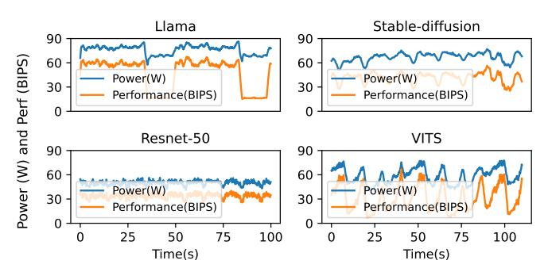

<span id="page-1-0"></span>Fig. 1. Power-performance patterns of four ML inference applications.

- A control algorithm to shift power from power-insensitive workloads to power-sensitive ones in a hierarchical manner.
- Implementation and evaluation of PowerGrad in CPU clusters of different architectures.

# II. CHARACTERIZING ML INFERENCE WORKLOADS

In this work, we manage the power in clusters running a variety of ML inference workloads. To gain insights, we start by characterizing the power and performance of four ML inference applications: the Llama-3.1-8b language model (Llama) [\[9\]](#page-13-16), an image generator (Stable-diffusion) [\[34\]](#page-13-17), an image classifier (Resnet-50) [\[13\]](#page-13-18), and a text-to-speech model (VITS) [\[20\]](#page-13-19). We run each application on a 10-core Haswell CPU. The applications and experimental setup are detailed in Section [IV.](#page-6-0) From our characterization, we extract the following conclusions.

ML workload behavior varies substantially across models and across time. Figure [1](#page-1-0) shows the power consumption and the instruction throughput in billions of instructions per second (BIPS) of the applications over time. The figure shows that power and performance vary widely across applications and time phases. For instance, *Llama* shows two clear phases: the compute-bound prefill phase and the memory-bound decoding phase. On the other hand, *Stable-diffusion* has short, repeated iterations to refine the image multiple times. Resnet-50 and VITS have other patterns. Commercial AI platforms observe much more variation as they serve many different models.

ML workload behavior depends on the user inputs. The compute and power behavior of ML workloads show significant variability based on input and output characteristics [\[38\]](#page-13-5). For instance, a longer prompt for a language model and a higher output resolution for an image generator increase the compute demand of the model execution. In addition, an ML model usually computes a batch of requests together for computational efficiency. The size of the batch constantly changes at runtime based on the user request patterns [\[23\]](#page-13-20). Figure [2](#page-2-0) characterizes the latency-power sensitivity of different requests. We compare two types of requests: *high* workloads, which have large batch sizes, long prompts, and high output resolutions, and *low* workloads, which have small batch sizes, short prompts, and low output resolutions. The figure shows the average request latencies for different CPU power limits relative to the latency at maximum Thermal Design Power


Fig. 2. Request latency changes of four ML inference applications with different CPU power limits and workload request levels.

(TDP) (Max). We see that the latency of high workload requests is more sensitive to power limits than that of low workload requests. This is because the low workloads are more memory-bound than the high ones: the memory cost of reading the model parameters is fixed, while the amount of compute is much less in low workloads. Therefore, shifting the available power from low to high workloads is likely to improve the overall performance.

Power measurements are not sufficient to identify the performance behavior. Consider Llama in Figure 1. Even in the low-BIPS phases, which are memory-bound, the CPU power consumption is still relatively high at over 60W. This means that, in power-limited environments, memory-bound workloads are still likely to consume high power. Power-only observations cannot reliably distinguish memory-bound from compute-bound behavior in power-limited settings. Hence, power management methods that depend on the power consumption pattern [8], [35] may be unable to identify memory-and compute-bound patterns to determine the assignment of power to nodes in power-limited environments. We need a more intelligent method to characterize workload behavior.

# III. THE POWERGRAD FRAMEWORK

To effectively manage power in clusters running diverse ML inference workloads, we present a novel power management framework called *PowerGrad*. In this section, we start with an overview of PowerGrad, then present its components, show how to build power and performance models, estimate the performance gradients, and finally describe the operation of the local and hierarchical controllers.

# A. Overview

To understand the operation of PowerGrad, consider Figure 3, which shows a computer cluster with Node 1 and 2, and two processors per node. The cluster is given a power limit or budget  $(PL_{cluster})$ , which a Hierarchical Controller divides into per-node power limits  $(PL_i)$ . Inside Nodes 1 and 2, a Local Controller divides the power limit into per-processor power limits  $(PL_{i,j})$ . The cluster power limit may change dynamically, as well as the power demands of the workloads. Consequently, the hierarchical and local controllers need to adjust the power budgets dynamically at runtime.


<span id="page-2-1"></span>Fig. 3. Cluster controlled hierarchically by PowerGrad.

<span id="page-2-0"></span>Given an environment like this, the goal of PowerGrad is to find a power allocation that maximizes the system performance. Typically, an equal power distribution is not optimal when the cluster is running heterogeneous workloads. In this case, to maximize the overall performance, PowerGrad uses the following strategy: to dynamically shift power budget from applications that lose little performance when their power allocation decreases, to applications that gain significant performance with increased power allocation.

PowerGrad attains this re-assignment by using a novel gradient-based approach. The idea is to dynamically estimate the *performance gradient* over power ( $\partial \text{perf}/\partial \text{power}$ ) of each running workload. This metric measures the performance sensitivity of a workload to its power consumption. As an example, compare a compute-bound workload to a memory-bound one. The former is likely to gain more performance per extra unit power, exhibiting a higher gradient. In contrast, the latter is likely to exhibit a lower gradient, as its performance is less sensitive to the power allocated. Therefore, shifting power from a lower-gradient workload to a higher-gradient one results in a net performance gain, as the former loses less performance and the latter gains more performance.

The performance gradient is not simply determined by whether the execution is compute- or memory-bound. If the core frequency is high, even a compute-bound execution can have a low performance gradient. This is because it may consume a lot of extra power when the frequency increases.

For PowerGrad to estimate performance gradients, it requires differentiable models of performance and power. Hence, it uses a linear performance model and a polynomial power model. PowerGrad dynamically generates the coefficients of these models from hardware performance counters, and voltage-frequency values measured at runtime. This data-driven approach requires no domain-specific knowledge of the running workload, and it is not limited to any specific type of compute engine architecture. The power management method that works without domain knowledge of the running workload is appropriate in ML inference clusters.

#### B. Components of the PowerGrad Framework

PowerGrad is a software framework that consists of three main components: Gradient Estimator, Local Controller, and Hierarchical Controller. Its architecture is shown in Figure 4.

**Gradient Estimator.** At regular time steps, the Gradient Estimator reads hardware performance counters (e.g., cache miss counts and instruction count), and measures frequency


Fig. 4. PowerGrad architecture in a node.

and voltage values (①). With this information, it generates the coefficients of the polynomial models of performance and power. These are online coefficients recomputed at every time step. They characterize the current workload and its current phase. Then, the Gradient Estimator differentiates the power and performance models to estimate the performance gradient  $\partial \text{perf}/\partial \text{power}$  (②) of the workload currently executing on the processor. Then, the power and performance estimation, and the gradient are passed to the Local Controller (③).

**Local Controller.** The Local Controller receives the power, performance, and the estimated gradients from all the local processors. Then, while interacting with the Hierarchical Controller (③), it uses the gradients to redistribute the node-level power budget among the local processors (⑤) to maximize the overall performance. The reallocated power budget is then enforced onto the processors using a power-capping method like RAPL [30] (⑥).

Hierarchical Controller. The Hierarchical Controller uses the power, performance, and gradient values reported from its child controllers to potentially redistribute the power budgets across the child nodes using the same gradient-based optimization algorithm. This power redistribution is done asynchronously to the child controllers at a coarser time granularity, enabling fast-paced controls in the lower levels of the hierarchy. The hierarchical structure can scale recursively: a set of Hierarchical Controllers can report their power, performance, and gradient values to a parent Hierarchical Controller, which also asynchronously redistributes the power budgets of its child controllers.

All the PowerGrad components are implemented as user-level software. Inside a node, the modules are Java threads communicating and synchronizing through shared memory. The Gradient Estimator and the Local Controller are woken up at short regular intervals (i.e., every 100ms), perform steps ① to ⑥, and then go to sleep. The Hierarchical Controller is a Python process that communicates with the other controllers through network sockets. Because of the network communication overheads, Hierarchical Controllers run with longer time steps of 1–4 seconds.

#### <span id="page-3-7"></span>C. Building Power and Performance Models

PowerGrad mostly follows PPEP [39] to build the models for power and performance. PowerGrad's contribution is to differentiate the models and estimate the gradients (Section III-D). In this section, we describe how PowerGrad builds the models.

<span id="page-3-0"></span>At every time step t, PowerGrad builds the power model of a core P(V) as a polynomial function of the core voltage V, and the performance model of a core in cycles per instruction CPI(f) as a linear function of the core frequency f. The coefficients of the power and CPI models are dynamically determined by reading the current frequency  $f^{(t)}$  and the current values of the performance counters  $\mathbf{E}^{(t)}$  of the core at that particular time step.

Specifically, PowerGrad uses counters to measure: billions of instructions executed per second  $(BIPS^{(t)})$ , core utilization  $(util^{(t)})$  as the number of cycles when the core is active over the sum of both core active and core idle cycles, and billions of memory stall cycles per second  $(Idm_stalls^{(t)})$ . In all these expressions, the superscript t means that the metric is measured at time step t. With these measures, PowerGrad uses the formulas below to compute the billions of active cycles per second  $(BCPS^{(t)})$ , the cycles per instruction  $(CPI^{(t)})$ , the memory CPI  $(MCPI^{(t)})$  as the component of the CPI due to memory access stall time, and the core (i.e, compute) CPI  $(CCPI^{(t)})$  as the component of the CPI due to compute operations:

$$BCPS^{(t)} = f^{(t)} * util^{(t)}$$
  $CPI^{(t)} = \frac{BCPS^{(t)}}{BIPS^{(t)}}$  (1)

$$MCPI^{(t)} = \frac{ldm\_stalls^{(t)}}{BIPS^{(t)}} \quad CCPI^{(t)} = CPI^{(t)} - MCPI^{(t)}$$
(2)

With these values, PowerGrad can build the performance model as:

<span id="page-3-6"></span><span id="page-3-2"></span><span id="page-3-1"></span>
$$CPI(f) = CCPI^{(t)} + MCPI^{(t)} * f/f^{(t)}$$
(3)

where, to estimate the CPI at another frequency f, the measured  $MCPI^{(t)}$  has to be scaled by the ratio of f to the frequency  $f^{(t)}$  used when the measurements were taken.  $CCPI^{(t)}$  does not need to be scaled.

To build the power model, PowerGrad uses:

<span id="page-3-5"></span>
$$P(V) = P_{idle}(V) + P_{active}(V, \mathbf{E}^{(t)})$$
 (4)

where  $P_{idle}$  and  $P_{active}$  are the core's idle and active power, respectively.  $P_{idle}$  does not depend on the core activity. It is approximated as a third-order polynomial of V [39], where the regression coefficients  $a_i$  are fitted offline using idle power traces.

<span id="page-3-4"></span><span id="page-3-3"></span>
$$P_{idle}(V) = a_3 V^3 + a_2 V^2 + a_1 V + a_0 \tag{5}$$

 $P_{active}$  depends on the core activity. It is a function of V and the values of the performance counters  $\mathbf{E}^{(t)}$  as follows [39]:

$$P_{active}(V, \mathbf{E}^{(t)}) = \sum_{i} (w_i E_i^{(t)}) * (V^{\gamma} + V)$$
 (6)

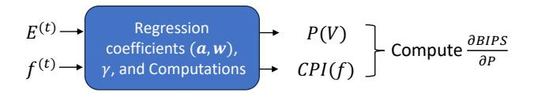

Fig. 5. Workflow of how the Gradient Estimator computes the performance gradients at each time step t.

Here,  $w_i$  are regression coefficients that are also fitted offline from active power traces collected at a fixed V. Further, the scaling factor  $\gamma$  is fitted by comparing the core's behavior at different voltages. Finally,  $E_i^{(t)}$  are performance event counts divided by time.

# <span id="page-4-0"></span>D. Estimating Performance Gradients

We now show how the Gradient Estimator computes  $\partial \text{perf}/\partial \text{power}$  at each time step t. To readily re-use the formulas at (1) and (2), we use instead the expression  $\partial BIPS/\partial P$  for this metric. Figure 5 shows that, at each time step t, the Gradient Estimator combines the current performance counters  $\mathbf{E}^{(t)}$ and the current frequency  $f^{(t)}$  with the regression coefficients  $(a_i \text{ from } (5) \text{ and } w_i \text{ from } (6)) \text{ and } \gamma \text{ from } (6), \text{ and generates the }$ power and performance models at this particular time, P(V)and CPI(f), shown in (4) and (3). These two equations take voltage V and frequency f as independent variables. They tell us what would be the power and performance if we set V and f to certain values. Note that the regression coefficients and  $\gamma$  are independent of the running workload, and are predetermined offline. By combining them with the workloaddependent hardware measurements at time step t, PowerGrad generates the power P(V) and performance CPI(f) models online at every time step t.

One of the major technical challenges of PowerGrad is differentiating the power and performance models to compute the performance gradients. This is because these models depend on variables that have intertwined dependencies: voltage, frequency, and performance counters are correlated with each other. As we cannot differentiate such a complex system directly, we need to approximate the relationships between the variables.

To this end, we make three assumptions. First, we approximate the core voltage as a second order polynomial of frequency [3]. Second, when the frequency changes, we assume that the values of the performance counters  $E_i^{(t)}$  are linearly proportional to the BIPS. In other words, we assume that  $E_i^{(t)} = e_i^{(t)} * BIPS$ , where  $e_i^{(t)}$  remain constant as frequency changes. This assumption is reasonable, since the absolute count of performance events like branch mispredictions or executed micro-ops are mostly proportional to the total executed instructions.

Finally, we assume that, as the frequency changes, the duration of the non-idle times is inversely proportional to the frequency, while the duration of the idle times remains constant. In this case, the Appendix shows that the utilization is a function of frequency f as follows:

$$util(f) = \frac{util^{(t)}}{util^{(t)} + (1 - util^{(t)}) * f/f^{(t)}}$$
(7)

where util(f) is the new utilization as a function of the changing frequency f, while  $util^{(t)}$  and  $f^{(t)}$  are the current utilization and frequency, respectively.

<span id="page-4-1"></span>We can now start to compute  $\partial BIPS/\partial P$  by breaking the power into idle and active power.

$$\frac{\partial BIPS}{\partial P} = (\frac{\partial P}{\partial BIPS})^{-1} = (\frac{\partial P_{active}}{\partial BIPS} + \frac{\partial P_{idle}}{\partial BIPS})^{-1} \quad (8)$$

Based on the second assumption,  $P_{active}$  from (6) can be expressed as  $\sum_i (w_i e_i * BIPS) * (V^{\gamma} + V)$ , whose gradient can be computed as follows:

<span id="page-4-4"></span>
$$\frac{\partial P_{active}}{\partial BIPS} = \sum_{i} (w_i e_i) * (V^{\gamma} + V) + \sum_{i} (w_i E_i) * \frac{\partial (V^{\gamma} + V)}{\partial V} \frac{\partial V}{\partial BIPS}$$
(9)

Since we assume that V is a second-order polynomial of f and it can be shown from (3) and (1) that BIPS is also a function of f, we can compute  $\partial V/\partial BIPS$  using the chain rule regarding f:

<span id="page-4-3"></span>
$$\frac{\partial V}{\partial BIPS} = \frac{\partial V}{\partial f} \left(\frac{\partial BIPS}{\partial f}\right)^{-1} \tag{10}$$

 $\partial V/\partial f$  can be obtained by differentiating the second-order polynomial.  $\partial BIPS/\partial f$  at the current frequency  $f^{(t)}$  can be derived from (1), (2), and (7) as shown in the Appendix:

$$\frac{\partial BIPS}{\partial f}(f^{(t)}) = \frac{util * CCPI}{CPI^2} - \frac{util(1 - util)}{CPI}$$
 (11)

With this, we have finished computing  $\partial P_{active}/\partial BIPS$ . Now, to compute  $\partial P_{idle}/\partial BIPS$ , we express it as:

<span id="page-4-6"></span>
$$\frac{\partial P_{idle}}{\partial BIPS} = \frac{\partial P_{idle}}{\partial V} \frac{\partial V}{\partial BIPS}$$
 (12)

The first term  $(\partial P_{idle}/\partial V)$  differentiates the idle power polynomial in (5). The second term  $(\partial V/\partial BIPS)$  reuses the value computed in (10). With this, we have computed the performance gradient in (8).

Since we collect hardware counter values for every core, the Gradient Estimator builds *per-core* performance and power models. Meanwhile, we want to optimize the efficiency of an entire cluster, which is hierarchically organized as multiple processors, and where each processor has multiple cores. To compute the performance gradient of a processor, we need to combine the performance gradients of all the cores in the processor. Because we assume that the power consumption of one core is independent of the power and performance of another core, we can use the chain rule of differentiation to compute the performance gradient of a processor  $\mathcal{G} = \partial BIPS/\partial P$ :

<span id="page-4-5"></span><span id="page-4-2"></span>
$$\mathcal{G} = \frac{\partial BIPS}{\partial P} = \sum_{i} (\frac{\partial BIPS}{\partial P_{i}} \frac{\partial P_{i}}{\partial P}) = \sum_{i} (\frac{\partial BIPS_{i}}{\partial P_{i}} \frac{P_{i}}{P})$$
(13)

# Algorithm 1 PowerGrad power allocation algorithm.

```
1: // G: performance gradients, f: average core frequency
2: // P: power consumption, P L: power limit
3: // lr: learning rate, α: decrement rate for unused budget
4: function ALLOCATE POWER(G, f, P, P L, lr, α)
5: communicate(parent, G, f, P) //Report to the parent
6: global P Lnode // limit set asynchronously by the parent
7: P Ltotal ← 0
8: for i ∈ children do // Initial power budget assignment
9: P L′
              [i] ← P L[i] + lr × G[i] − α(P L[i] − P[i])
10: P Ltotal ← P Ltotal + P L′
                                   [i]
11: for i ∈ children do // Adjust the power budgets equally
12: P L′
              [i] ← P L′
                        [i]−(P Ltotal −P Lnode)/Nchildren
13: for i ∈ children do
      // Try to keep processors above the minimum frequency
14: if P L′
                [i] < P L[i] + incmin and f[i] < fmin then
15: P L′
                 [i] ← P L[i] + incmin
16: Re-adjust other processor power limits
17: break;
      return PL'
```

where P<sup>i</sup> and ∂BIP Si/∂P<sup>i</sup> are the power and performance gradient of core i, respectively, and *P* is the sum of the power of all the cores in the processor. For the last expression, we use ∂BIP S/∂P<sup>i</sup> = ∂BIP Si/∂P<sup>i</sup> because ∂BIP Sj/∂P<sup>i</sup> = 0 for all i ̸= j. Also, we set ∂Pi/∂P = Pi/P based on the approximation that when the power-capping method (e.g., RAPL) adjusts the power limit of the processor, each core's power changes proportionally to the core's current power consumption. For example, if the processor power is decreased by 10%, each core decreases its power by 10%. This is a reasonable approximation because when the power-capping method changes the frequency of the processor, the cores consuming more power are affected more than the cores consuming less power.

# *E. PowerGrad Local Controller*

PowerGrad's Local Controller redistributes the power between the different processors in a node. It uses an algorithm that it runs at every control period. The algorithm takes the following inputs for each processor i: 1) the performance gradient G[i] from [\(13\)](#page-4-5), 2) the aggregate frequency f[i] (i.e., the average frequency of the processor's cores), 3) the power consumption P[i] (which includes the uncore but not the DRAM power), and 4) the current power limit P L[i] assigned to the processor. The algorithm also takes as input the current node power limit P Lnode assigned to the node by the Hierarchical Controller. The algorithm uses performance gradients to find a power distribution across the processors that maximizes the total instruction throughput. The output of the algorithm is the new per-processor power limit P L′ [i].

Algorithm [1](#page-5-0) shows the algorithm executed by the Local Controller. In the algorithm, *children* are the processors in the node, and *parent* is the Hierarchical Controller. The algorithm uses two hyperparameters: the learning rate lr and the decrement rate α.

To begin with, the Local Controller reports the states of the processors to the parent controller (Line [5\)](#page-5-0). In the meantime, the parent controller has redistributed the cluster power budget to the nodes in a different timescale, and provided the power limit for this node P Lnode asynchronously (Line [6\)](#page-5-0).

Next, in the first loop at Line [8,](#page-5-0) each processor's power limit is incremented proportionally to its performance gradient G[i]. We multiply G[i] by the learning rate lr, which determines the speed of iterative optimization. A higher lr enables a faster optimization, but increases instability. Also, it is possible that the power demand of a processor P[i] is already lower than its current power limit P L[i]. Hence, to reduce any wasted power budget, we reduce the power assignment by α(P L[i] − P[i]), where α ∈ (0, 1) is the decrement rate. Eventually, the power limit and the power demand will converge. A high α minimizes the unused power budget, but may result in a slow response when the system suddenly increases its power demand. The hyperparameters lr and α are tuned by benchmarking the target system.

Then, the second loop at Line [11](#page-5-0) ensures that the sum of all the children's new power limits P Ltotal is equal to P Lnode. This is done by computing (P Ltotal − P Lnode) and adding or subtracting an equal amount of power allocation to all children. This equal adjustment preserves the relative difference between the new power limits of the processors computed at line [9.](#page-5-0) Overall, at this point, the algorithm has resulted in moving power budget from children that have low G to those that have high G.

The loop at Line [13](#page-5-0) prevents the starvation of a processor that, due to a low power limit, is unable to maintain a minimum frequency (fmin). If the controller finds a child running at less than fmin, the controller tries to increase the child's power limit by at least a minimum value incmin and re-adjust the power limits of the other processors accordingly. It is possible that multiple invocations of the algorithm are needed to bring the frequency over fmin. This is a safeguard to ensure the stability of the gradient-based optimization when the learning rate lr is high. We set fmin to the minimum frequency reported by *cpuinfo* and incmin to 1W.

Finally, the algorithm returns the new per-processor power limits P L′ [i] to be applied to the processors. The Local Controller enforces these limits through a hardware power management interface. One such interface is Intel RAPL [\[7\]](#page-13-23), which controls the V -f state of the processor to ensure that the power consumption stays below the limit. The overall algorithm repeats at every control period with new inputs from the Gradient Estimators.

# *F. PowerGrad Hierarchical Controller*

A Hierarchical Controller follows the same power allocation algorithm as Algorithm [1.](#page-5-0) In this case, the algorithm takes as inputs information from each of the children nodes. A node i provides: the performance gradient G[i] aggregated using [\(13\)](#page-4-5), the average frequency of its processors f[i], the total power consumption of the node P[i], and the current power limit of the node P Lnode[i].

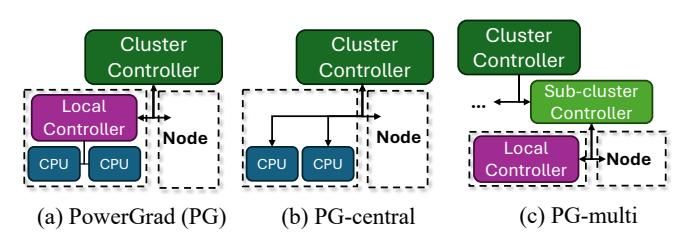

<span id="page-6-1"></span>Fig. 6. Different organizations of PowerGrad control.

#### TABLE I EVALUATION PLATFORMS.

<span id="page-6-2"></span>

| Platform<br>Architecture |                                     | PowerGrad Configurations                                         |  |
|--------------------------|-------------------------------------|------------------------------------------------------------------|--|
| Accelerated              | Emerald Rapids (Xeon<br>Gold 5512U) | PG-central, PG-multi (without per<br>node Local Controller)      |  |
| Legacy                   | Dual-CPU<br>Haswell<br>(E5-2660 v3) | PG-central, PG-multi, PowerGrad<br>(default two-level hierarchy) |  |

PowerGrad can have any number of hierarchical levels. The default structure of PowerGrad is shown in Figure [6a](#page-6-1). It has a two-level hierarchy: Local controllers distribute the power budget across the processors in individual nodes, and a cluster controller distributes the power budget across the nodes. In addition, we also consider the Centralized (*PG-central*) and the Multi-level (*PG-multi*) variants of PowerGrad. PG-central (Figure [6b](#page-6-1)) has a single cluster-level controller that directly manages the power budgets of all the processors in the cluster. PG-multi (Figure [6c](#page-6-1)) adds an extra level in the hierarchy: it divides the cluster into multiple sub-clusters, each of which has its own sub-cluster controller.

The operations at different levels of the hierarchy are asynchronous with each other. Hence, control in the lowest level of the hierarchy is fast and is unaffected by the extra levels of the hierarchy. As we move up the hierarchy, however, communication is more expensive, as it involves using network sockets and suffering long network link latencies. As a result, higher-level controllers run less frequently.

# IV. EXPERIMENTAL SETUP

# <span id="page-6-0"></span>*A. Hardware and Controller Configuration*

We evaluate the effectiveness of PowerGrad using the Cloudlab testbed [\[10\]](#page-13-24). Table [I](#page-6-2) lists our hardware configurations. We choose two types of Intel platforms: *Accelerated* is an Emerald Rapids with Advanced Matrix Instructions (AMX) [\[15\]](#page-13-25), and represents the latest architectures with accelerated support for ML; *Legacy* is a dual-CPU Haswell, and represents legacy systems still present in datacenters today to fill compute shortage. For each platform, we configure a 17 node cluster, where 16 nodes are used for ML inference and one node is the controller.

We instantiate different PowerGrad configurations on our platforms. The default two-level PowerGrad (Figure [6a](#page-6-1)) is only available for Legacy, where each node has two CPUs. This is not applicable to the Accelerated platform as it has only one CPU per node. *PG-central* (Figure [6b](#page-6-1)) is supported on both platforms, where all 16 nodes communicate with a

TABLE II ML INFERENCE APPLICATIONS.

<span id="page-6-3"></span>

| Name   | Class             | Model Type              | Low Config                  | High Config                 |
|--------|-------------------|-------------------------|-----------------------------|-----------------------------|
| Llama  | Language<br>model | Transformer             | batchsize=2<br>#tokens=40   | batchsize=8<br>#tokens=80   |
| SD     | Image<br>gener.   | Transformer<br>+ CNN    | image=128x128<br>#tokens=16 | image=512x512<br>#tokens=40 |
| VITS   | Text-to<br>speech | Transformer<br>+ 1D CNN | #tokens=40                  | #tokens=200                 |
| Resnet | Image<br>classif. | CNN                     | batchsize=4                 | batchsize=16                |

centralized controller that sets the power limits of all CPUs (16 in Accelerated and 32 in Legacy). *PG-multi* partitions the cluster into four sub-clusters of four nodes each. *PG-multi* results in a three-level hierarchy (Figure [6c](#page-6-1)) for the Legacy platform, and a two-level hierarchy (Cluster and Sub-cluster) for Accelerated.

The node, sub-cluster, and cluster controllers run every 100 ms, every 1 s, and every 4 s, respectively. We choose 100 ms for the Local Controller because RAPL measurements are not reliable if the sampling period is faster than 50 ms. To determine a stable control period for the sub-cluster and cluster controllers, we take the worst-case round-trip internode network latency (100 ms), double it, and multiply the result with the sub-cluster or cluster size. We round the result to 1 s and 4 s. We set the hyperparameters lr and α from Algorithm [1](#page-5-0) to 2.0 and 0.3, respectively.

# *B. ML Inference Applications*

Table [II](#page-6-3) lists the applications we evaluate and their key parameters. Llama is the Llama-3.1-8b [\[9\]](#page-13-16) open-source large language model. It uses a transformer [\[41\]](#page-13-26) DNN with two phases: a highly parallel prefill phase that encodes the input prompts, and a sequential decoding phase to generate the output tokens. The length of each phase and overall performance (throughput and latency) are determined by the input prompt length, batch size, and the number of output tokens.

SD (Stable Diffusion) [\[34\]](#page-13-17) is a popular image generation model. It combines a convolution neural network (CNN) [\[22\]](#page-13-27) and a transformer to encode both image and text data together to generate an output image over multiple iterations. Its performance depends on the resolution of the output image.

VITS [\[20\]](#page-13-19) is a popular text-to-speech model. It combines a transformer and 1D CNN to generate a voice output from text input. Its performance depends mostly on the input length.

Resnet is the Resnet-50 [\[13\]](#page-13-18) image classifier. It reads fixedresolution images and its performance depends only on the batch size. Its compute demand is lower than the rest.

For each application, we consider two levels of requests: *High* and *Low*. *High* uses large batches, high resolution, or long input prompts, demanding more processing, while *Low* uses the opposite.

In our setup, each node runs one application, and in *PGmulti*, all the nodes in a sub-cluster run the same application. Among the processors assigned to an application, half run *Low* requests and half run *High* requests. This induces heterogeneity within and across nodes. We do this because, in practice, requests of similar compute demand are often *batched* and assigned to the same processor [38]. In each processor, requests arrive based on a Poisson process such that, without power constraints, *High* and *Low* induce an average CPU utilization of 60% and 30%, respectively. We report the average and the 95<sup>th</sup> percentile tail (P95) response time.

# C. Alternative Designs Compared

We compare PowerGrad to three baseline approaches for power-performance management: SLURM [35], DPS [8], and Fair (i.e., equal power assigned to all processors). SLURM is a well-known algorithm whose operating principle is that, if a node or processor uses less power than its allocation, a portion of this excess power is uniformly distributed to the other nodes or processors equally. For this portion that is distributed, we use 50% of the excess power, which is the default SLURM configuration [35]. DPS is a recent, state-of-the-art power management scheme that works without application profiling. DPS uses each node's power consumption history to determine the new allocation priority. While DPS uses a sophisticated algorithm, when all nodes are power-starved—which is common in power-limited environments—DPS falls back to equal power distribution.

All these three baseline schemes are software transparent, as they only rely on runtime power measurements, and are thus applicable to dynamic ML workloads. These schemes are centralized control methods. Hence, we implement them in the Cluster-level controller and follow the PG-central control topology (Figure 6b).

# D. Training the PowerGrad Power and Performance Models

As described in Section III-C, PowerGrad uses power and performance models for the Gradient Estimator. The regression coefficients for these models (i.e.,  $a_i$  in (5) and  $w_i$  in (6)) and  $\gamma$  are learned by running training applications that are different from the applications we evaluate. For the Legacy CPUs, since they have no specialized support for ML acceleration, we learn the coefficients using conventional PARSEC 3.0 [1] applications. For the Accelerated CPUs, we use TorchBench [5] to engage the AMX instructions.

To learn the regression coefficients and  $\gamma$ , we follow the workflow of the PPEP framework [39]. We use similar counters as PPEP, namely the following six counters: *instruction-count*, *cycle-count* (non-idle cycles), *uops.executed* (uops), *cache-misses*, *branch-misses*, and *ldm\_stalls\_pending* (memory stalls). For the Accelerated CPUs, we read two additional counters, *exe.amx\_busy* and *fp\_arith\_inst\_retired.vector*, to measure the usage of AMX and vector instructions, respectively. Since the AMX unit performs many operations per instruction, we count each busy cycle of this unit as multiple instructions when measuring the performance in BIPS. Specifically, one AMX busy cycle is counted as 16 instructions. This is because the number of operations done in each AMX busy cycle is equivalent to 16 vector instructions [19].

TABLE III

<span id="page-7-0"></span>AVERAGE ABSOLUTE ERROR (AAE) AND ITS STANDARD DEVIATION FOR POWERGRAD'S POWER MODEL IN TWO DIFFERENT SYSTEMS.

| System      | Avg. Power (W) | AAE (%) | AAE STD (%) |
|-------------|----------------|---------|-------------|
| Legacy      | 74.6           | 4.1     | 5.0         |
| Accelerated | 162.9          | 2.5     | 3.9         |

#### V. EXPERIMENTAL RESULTS

In this section, we first evaluate the soundness of the performance gradient estimation. Then, we present the effectiveness of PowerGrad and, finally, discuss some PowerGrad hyperparameters.

#### A. Accuracy of the Power Model

PowerGrad's efficacy depends on the accuracy of the Gradient Estimator's online power and performance models. PowerGrad follows the methodology of PPEP [39], which uses a linear performance model (3) and a polynomial power model (4). In this section, we validate the power model by running our applications of Table II on one processor of the Legacy and Accelerated systems. At every 100ms, we compute the difference between the prediction of the model and the actual power measured by RAPL. This difference is the absolute error, which is then averaged across all the measurements. Table III shows this average absolute error (AAE) and its standard deviation (AAE STD). The Table also shows the average power of the applications. From the table, we see that the PowerGrad model is accurate. In the Legacy system, the AAE is 4.1% while, in the Accelerated system, it is 2.5%. The Accelerated system has a lower value because it provides access to more fine-grained CPU performance counters, such as vector instruction counts. The values for the AAE standard deviation are 5.0% and 3.9% for the Legacy and Accelerated systems, respectively. In the original PPEP work, the AAE is 4.6% and the AAE STD is 3.6%.

# B. Accuracy of the Gradient Estimation

We now consider the accuracy of PowerGrad's model of the performance gradient  $(\partial BIPS/\partial P)$  shown in (8). We first run our applications of Table II on one processor of the Legacy system while changing the performance-power operating point every 100ms. Specifically, we change the processor frequency using a random walk over the available range (i.e., 1.2 GHz–2.6 GHz) in increments of 100 MHz to span various operating points. We measure both the performance in BIPS and the power. These measured points are shown as circles in Figure 7.

At each of these operating points, we use PowerGrad's model in (8) to estimate  $\partial BIPS/\partial P$ . Then, in a plot not shown here, we fit a linear model between these performance gradients and the power, using the form  $\frac{\partial BIPS}{\partial P} = wP + b$ . After we obtain w and b by linear regression, we integrate equation wP+b over the power, to obtain BIPS as a function of power. The resulting curve is shown in Figure 7 for each application. Figure 7 also shows the  $R^2$  score of the model estimation over the collected data, which measures prediction accuracy.

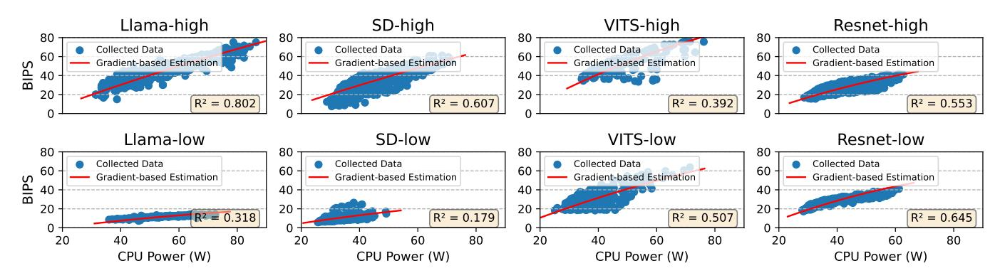

<span id="page-8-0"></span>Fig. 7. Measuring the accuracy of PowerGrad's estimation of performance gradients. The circles are the measured performance-power operating points on a Legacy processor, while the curve is the relationship obtained using PowerGrad's estimated performance gradients.


<span id="page-8-1"></span>Fig. 8. Average response latency (top) and P95 response latency (bottom) of the applications running on a dual-processor Legacy node with Fair and with PowerGrad, for different node power limits.

We see that the curves obtained by the estimated gradients do track the measured performance across power values. The average  $R^2$  value is 0.501. Note that PowerGrad does not require perfect prediction. Because PowerGrad uses an iterative optimization, it only needs approximately-correct gradients to converge to the optimal point. These  $R^2$  values are sufficient for PowerGrad's iterative optimization. The variance of  $R^2$  across applications is affected by various factors, including the duration of the kernels. For example, short kernels are harder to predict and, therefore, cause lower  $R^2$ . Overall, we conclude that PowerGrad's gradient estimation is approximate enough.

#### C. Operation of Gradient-Based Power Management

Figure 7 also shows that ML applications vary in their response to power allocation, even across different configurations of the same application. Our gradient-based power management proposal exploits this difference to optimize power usage. In this section, we show that this is feasible.

We choose a dual-processor node in the Legacy platform, and run two copies of the same application with different workload levels: *High* in one processor and *Low* in the other. We enforce various power limits for the node (55–75 W), and measure the average and P95 response latency of the two applications with PowerGrad or with Fair. Figure 8 shows the average latency (top) and the P95 latency (bottom) for all the applications.

We see that, in practically all applications and power levels, PowerGrad reduces the response latencies over Fair—

sometimes by a large amount. The reason is that, at a given power level, PowerGrad transparently assigns more power to the application that can use it more efficiently to increase performance—i.e., the application that has a higher performance gradient.

To gain more insights, we examine one of the cases: a node running Llama-high in one processor and Llama-low in another. Figure 9 shows, as a function of time, the performance (a), the power (b), and the performance gradients (c) of each of the two applications with Fair power distribution. In the performance and gradient plots, the peaks correspond to the compute-bound prefill stages, while the valleys are the memory-bound decode stages. We see that Llama-high has long prefill periods due to large batch sizes and long inputs, while Llama-low has short prefill periods for the opposite reasons. However, under Fair power distribution, Figure 9b shows that both applications consume up to their power budget (35W per processor) in this power-limited environment.

Figure 9d shows the power of the two applications as a function of time with PowerGrad. We see that PowerGrad actively shifts power from a memory-bound processor to a compute-bound one based on the gradient estimates. The result is reduced response time. Without the estimated performance gradients, it is not obvious how to best distribute the power between applications in a power-limited environment.

# D. Performance of PowerGrad over the Baselines

We compare ML inference performance with PowerGrad and with the DPS, SLURM, and Fair baselines in power-

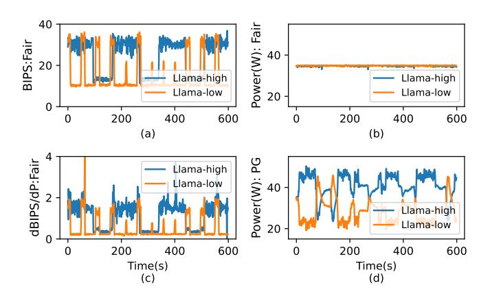

<span id="page-9-0"></span>Fig. 9. Per-application performance, power, and performance gradients in a node running Llama-high and Llama-low under Fair and PowerGrad.

limited settings (sometimes severely limited). As seen in Table I, on the Legacy platform, we run all three variants of PowerGrad, while on the Accelerated platform, we run PG-central and PG-multi. We compare the designs using the geometric means of average and P95 response times for all applications, and normalize these means to those with Fair.

Figure 10 and Figure 11 show the results for the Legacy and Accelerated platforms, respectively. They show the average response times (top) and the P95 response times (bottom) for the different schemes for various cluster power limits. They also show bars for the geometric mean over all the power limits in the charts.

1. Comparing PowerGrad to Other Schemes. We see that all the schemes typically show lower response times than Fair. Among the schemes, SLURM and DPS have higher response times than PowerGrad. Further, when the cluster power limits are low, SLURM and DPS gain little or no improvement over Fair. Consider DPS first. Under severely-limited system power budgets, DPS marks all nodes as *high-priority*, because a node's priority is determined by how often it consumes most of its power budget over a time period. The DPS Readjusting module splits the high-priority power budgets equally among all high-priority nodes, resulting in an equal distribution like Fair if all the nodes are marked high-priority [8].

SLURM is also not efficient because it only considers whether an application used all its allocated power in the last control period. It does not consider the performance impact of increasing or reducing that power. This limitation is amplified at tighter power budgets as seen in Figures 10 and 11, because all the applications are power-starved. This is precisely the limitation addressed by the PowerGrad designs.

All PowerGrad designs distribute the power allocation across the nodes using gradient estimations. The result is reduced response times, which become more apparent relative to the other schemes with tighter power limits. Consider *PG-multi*, which is the best PowerGrad design. In the Legacy cluster, *PG-multi* reduces the average and tail latencies of the applications by a geometric mean of 22.9% and 23.0%, respectively, relative to the best baseline scheme. In the Accel-

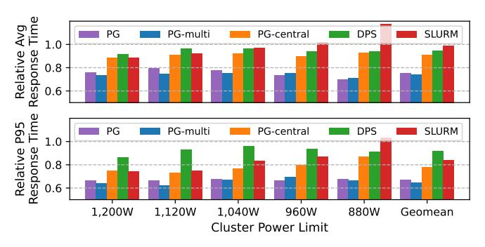

<span id="page-9-1"></span>Fig. 10. Average and P95 latencies (using geomean over all applications, and normalized to Fair) on the Legacy cluster at various power limits.

erated cluster, *PG-multi* reduces the average and tail latencies by a geometric mean of 9.0% and 9.9%, respectively, relative to the best baseline scheme. In the setting with the lowest power budgets, the gains of *PG-multi* are highest: for 55W per Legacy node (880W total), the average latency reductions are 23.6% and 27.4%, while for 115W per Accelerated node (1840W total), the reductions are 18.3% and 20.2%.

Note that because an Accelerated node has only one CPU, PowerGrad cannot leverage the fast 100ms-period Local Controller. Hence, PowerGrad shows less response time reductions in Accelerated nodes than in Legacy nodes.

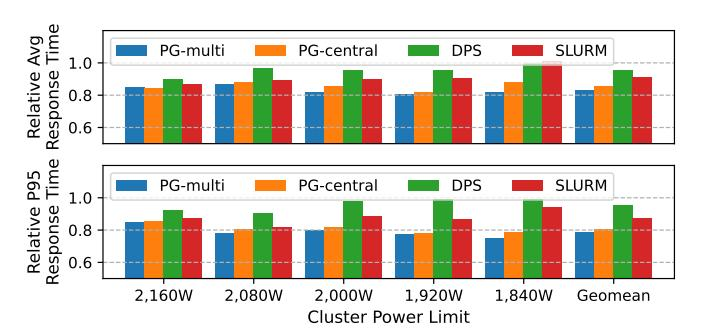

<span id="page-9-2"></span>Fig. 11. Average and P95 latencies (using geomean over all applications, and normalized to Fair) on the Accelerated cluster at various power limits.

2. Comparing the Different Configurations of PowerGrad.

# PG-multi is the variant of PowerGrad with the most levels of hierarchical control: three in the Legacy platform (Cluster, Sub-cluster, and Local) and two in the Accelerated platform (Cluster and Sub-cluster). Figure 10 and Figure 11 show that PG-multi reduces the average and tail latencies over

(Cluster and Sub-cluster). Figure 10 and Figure 11 show that *PG-multi* reduces the average and tail latencies over *PG-central* by 18.7% and 17.2% in Legacy, and by 2.7% and 2.3% in Accelerated. Legacy shows larger improvements because it can run rapid Local Controllers. *PG-multi*'s lower response time shows that adding extra levels of hierarchy helps the overall efficiency due to faster control. In fact, *PG-multi* is slightly better than the two-level PowerGrad (PG) in the Legacy platform. This shows that PowerGrad successfully scales to multiple levels of hierarchy while tolerating the overheads from the extra control structures.

Finally, *PG-central* shows the efficacy of PowerGrad's gradient-based control algorithm even without the hierarchical

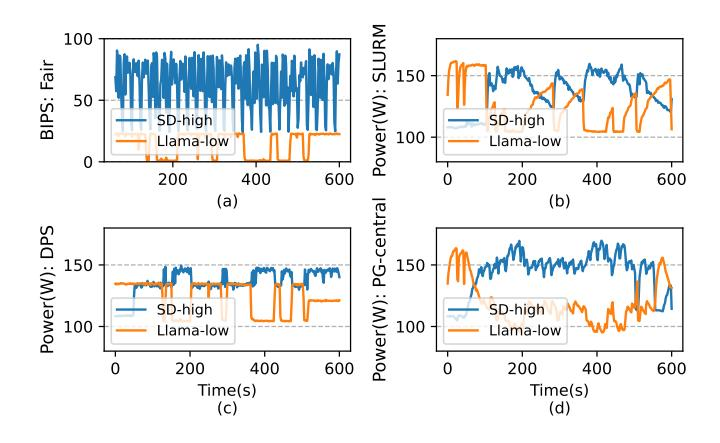

<span id="page-10-0"></span>Fig. 12. Behavior of SD-high and Llama-low in a two-node Accelerated subsystem (power limit 270 W) with Fair, SLURM, DPS, and *PG-central*.

structure. *PG-central* is consistently better than the baselines. These results indicate that both the hierarchical control structure and the gradient-based control algorithm contribute to the better efficiency of PowerGrad.

**3. Analyzing the Behavior in Detail.** For more insight, we pick two applications, SD-high and Llama-low, and examine their behavior over time. In the first experiment, we use a two-node Accelerated platform with a total power limit of 270 W (equivalent to 2,160 W for a 16-node cluster). We run each application on one node and manage power with Fair, DPS, SLURM, and *PG-central* controllers with the same control latency as with the full cluster (4 s).

Figure 12 shows the profile of the applications over time: the performance of Fair (a), and the power of SLURM (b), DPS (c), and PG-central (d). Figure 12a shows that, with an equal power distribution, SD-high delivers high performance (because it is compute bound), whereas Llamalow has low performance (because it is memory bound). SLURM in Figure 12b shows a counter-intuitive behavior: when Llama-low is active, SLURM shifts power from the compute-bound SD-high to the memory-bound Llama-low. This is because Llama-low is a steady workload, while SDhigh is an intermittent workload, and SLURM's algorithm prioritizes the steady demand. Figure 12c shows the power with DPS. When both applications are active, DPS falls back to the Fair distribution because the power demands of both applications exceed the per-node power limit (135W) and DPS cannot determine the priority of the workloads in such a power-limited environment. *PG-central*, however, aggressively borrows power from Llama-low, correctly identifying that it would not lose much performance, and assigns it to SD-high, which is able to benefit much more from the extra power.

With this understanding of how the schemes work, we run the applications on the 16-node Accelerated platform with a 2,000 W cluster power limit. We record the power of two nodes running SD-high and Llama-low. Figure 13 shows the power consumed over time with *PG-central*, SLURM, and DPS. In this case, the behavior is more complex than in Figure 12 because there is power shifting across 16 nodes. The figure

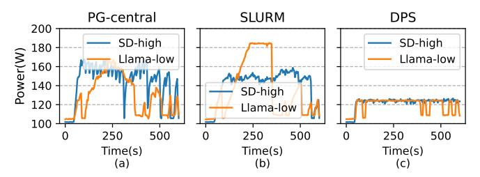

<span id="page-10-1"></span>Fig. 13. Power allocation for two nodes of 16-node Accelerated platform with a cluster budget of  $2,000\,\mathrm{W}.$ 

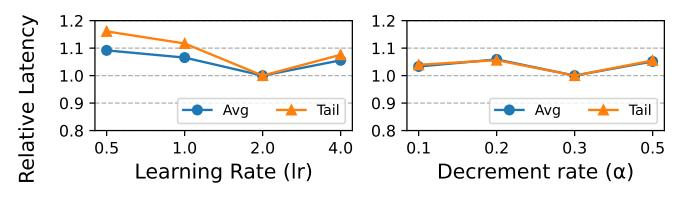

<span id="page-10-2"></span>Fig. 14. Relative average and tail latency of PowerGrad with different values of the learning rate (lr) and unused budget decrement rate  $(\alpha)$ .

shows a similar behavior as in Figure 12. Specifically, DPS is close to Fair. Further, SLURM allocates substantial power to Llama-low although Llama-low is mostly memory-bound and does not benefit much from the extra power. Only *PG-central* is able to discern the workload characteristics using gradients and intelligently re-assign more power to SD-high.

# E. Selecting PowerGrad's Hyperparameters

We now analyze PowerGrad's hyperparameters.

- 1. Learning Rate and Unused Budget Decrement Rate. PowerGrad's power allocation algorithm (Algorithm 1) has two hyperparameters: the learning rate (lr) and the decrement rate for unused power budget  $(\alpha)$ . Figure 14 shows the impact of varying the value of these hyperparameters on the average and tail latencies. The latencies are normalized to those with the best configurations. A large lr results in an unstable behavior because the power allocation changes in large steps, while a small lr results in sluggish optimization. Hence, we choose lr=2. For  $\alpha$ , PowerGrad's performance is not very sensitive to it. Hence, we choose  $\alpha=0.3$ .
- **2.** Control Period of Cluster Controllers. In large datacenters, the control period of the cluster-level controller can be large due to high communication costs. We study the impact of control periods ranging from 4 to 120 s, using the 16-node Legacy cluster limited to 960 W.

Figure 15 shows the average (top) and P95 (bottom) response times for *PG-multi*, PowerGrad, DPS, and SLURM relative to Fair for different control periods. Most of the schemes tend to increase the response time as we increase the cluster control period. Centralized schemes (DPS and SLURM) have high response times and tend to become close to Fair (1.0 relative response times) at large control periods. PowerGrad maintains its edge up to 64s control periods thanks to its rapid Local Controller. Beyond that, PowerGrad with the default two-level hierarchy increases the response time. Meanwhile, PG-multi is substantially more resistant to the

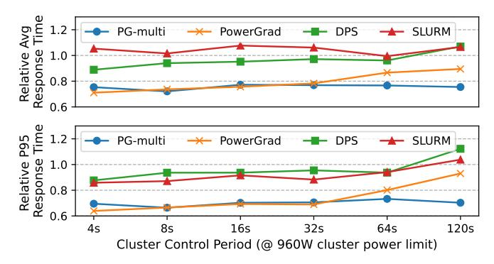

<span id="page-11-0"></span>Fig. 15. Average and P95 response time relative to Fair in the 16-node Legacy cluster with a 960W power limit for different control periods.

longer control periods thanks to its relatively fast Sub-cluster controllers. Note that long control periods are not uncommon: the default control period of SLURM is 60s [35]. Overall, hierarchical controllers with fast controllers at the lower levels of the hierarchy are scalable.

# VI. RELATED WORK

Researchers have proposed a variety of power management systems for clusters that may want to consume more power than the available supply. Most of the schemes require prior profiles of the applications to run—making them not suitable to manage ML inference workloads. For instance, Dynamo [44] and CapMaestro [24] are hierarchical power-capping solutions that assume that the priority and quality-of-service of each application is known ahead of time. PoDD [46] finds the optimal power distribution between *coupled* (e.g., producer-consumer) applications using online profiling. PoDD is also not applicable to ML inference because it is designed specifically for coupled applications.

There are data-driven cluster power management methods using deep reinforcement learning (DRL) [40] techniques. DRL-based power management schemes have been successful to find efficient node switch on/off policies [2], [18] and to find optimal power distribution in heterogeneous systems [42]. While DRL methods for power management are promising, they are not portable. A DRL model is trained for a specific action and state space, which is defined by the cluster topology and the hardware architecture. Hence, we must re-train the DRL model from scratch to use the model in a cluster with different processors or if we add a few more nodes to the cluster. Re-training a DRL model is expensive—it requires a large number of cluster experiments designed by ML experts. Meanwhile, to use PowerGrad in a new architecture, we only need to re-train the Gradient Estimator. Re-training the Gradient Estimator is inexpensive: a few application traces from a single node can train the regression coefficients.

To manage the dynamic behavior of ML inference work-loads, we need a power management method that relies on software-agnostic hardware measurements. The most popular approach is to make power management decisions based on *power consumption*. SLURM [35] is a widely-used cluster management system with a built-in heuristic power manager.

The algorithm redistributes some of the power that a node does not use, equally to the all other nodes. However, SLURM's algorithm does not take into account the power/performance characteristics of the workload. DPS [8] improves over SLURM by prioritizing nodes based on the recent history of power consumption. However, as shown in Figures 12 and 13, power consumption in a power-limited setting does not provide enough information about the performance characteristics of the workload, limiting the optimization opportunities.

There are additional proposals that tackle related problems with different assumptions. Papadimitriou et al. [31] analyze voltage-droop behavior for V-f selection at application launch and do not perform power allocation or runtime modeling. Farahnakian et al. [11] use reinforcement learning-based VM consolidation at VM/host granularity, without redistributing power across processors. Kalogirou et al. [17] adjust VM-level utilization thresholds for consolidation using historical CPU usage, not hardware counters or gradients, and do not adjust power limits. PowerGrad is distinct because it performs online, counter-driven estimation of performance sensitivity, power redistribution across processors and nodes, and hierarchical sub-second control—capabilities none of these works provide.

PowerGrad is a power-redistribution technique that leverages existing power-capping techniques. A power-capping technique is one that enforces a power limit to a node (by throttling V/f) like RAPL [7]. A power-redistribution technique is one that computes and reassigns power budgets across nodes. PowerGrad hierarchically distributes the cluster power budget and uses RAPL to enforce it. PowerGrad can be complemented with other power-capping methodologies. For instance, Koutsovasilis et al. [21] extend Papadimitriou et al.'s [31] method by reducing CPU voltage guardbands to improve single-node power-capped performance. We can plug-in such new power-capping methods to PowerGrad for improved precision and efficiency.

#### VII. DISCUSSION

# A. Transferability of PowerGrad to GPUs/NPUs/Accelerators

PowerGrad's core mechanism—estimating  $\partial BIPS/\partial P$  from runtime measurements and reallocating power based on relative gradients—is architecture-agnostic. Nothing in the control logic assumes a CPU-specific execution model. The only architecture-dependent component is the online performance and power models used to compute gradients. For CPUs, we use lightweight analytical models from PPEP [39] fitted to runtime counters. For GPUs, the same approach applies: analytical GPU models such as those from Hong and Kim [14] or Greathouse and Loh [12] can be substituted directly to compute the performance gradients. The hierarchical controller and gradient-based optimization remain unchanged.

The reason this paper evaluated PowerGrad only on CPUs is not conceptual but practical. Current GPUs, even with tools like NVIDIA's CUPTI [28], do not expose the runtime performance counters needed to be read dynamically for online control. The GPU performance counters are only available after each kernel finishes its execution. Our results on CPUs

highlight the value of runtime performance counter support for future GPU, NPU, and accelerator designs. The framework itself requires no redesign to operate on these platforms—only the availability of runtime counters to fit the analytical models.

We are confident that the potential of PowerGrad for GPUs, NPUs, and accelerators is high. These systems exhibit significant phase-level power-performance variation (e.g., compute-vs memory-bound kernels, tensor-core vs non-tensor-core execution, or prefill vs decode). Exposing these variations to PowerGrad will deliver benefits potentially comparable to those seen on CPUs. Our evaluation results using Intel CPUs with AMX has provided some evidence of the potential, as AMX's ML acceleration architecture is similar to GPU tensor cores and NPU systolic arrays.

Finally, PowerGrad can potentially be applied to heterogeneous clusters, as the performance gradient is a universal metric that can be applied to any computer architecture.

#### B. Application of PowerGrad to Other Workloads

The Gradient Estimator is not specifically built for ML, as we trained the coefficients using PARSEC applications. Since PowerGrad only relies on software-agnostic hardware measurements, it can be applied to any types of workloads.

#### C. Software Overhead of PowerGrad

The software overhead of PowerGrad comes from executing the Gradient Estimator at every time step. Running the Gradient Estimator itself takes little time because it only computes a few polynomial equations. Most of the overhead comes from collecting the performance counters for the Gradient Estimator, as accessing the hardware monitoring interface requires system calls.

PowerGrad consumes less than 1% of CPU utilization over all CPUs, as the PowerGrad thread is active on only one core for a couple of ms every 100ms control period, and sleeps otherwise. The other threads continue executing the application on the same processor. Network overhead is minimal because only the controllers that are higher-up in the hierarchy communicate through the network, and do it rarely. Hence, PowerGrad takes far less than 1% of the time of a multi-core CPU.

#### VIII. CONCLUSION

To address the challenge of intelligent power allocation in power-limited ML inference clusters, this paper proposed the *PowerGrad* hierarchical power-management framework. The key idea is to dynamically estimate the performance sensitivity to power increases of each running workload, and reassign power from low- to high-sensitivity workloads. To demonstrate PowerGrad, we used two 16-node CPU clusters. Using traditional dual-processor nodes, PowerGrad reduces the average and tail latencies by a mean of 22.9% and 23.0%, respectively, relative to the strongest of a set of state-of-the-art software-transparent power-management baselines. Using single-processor nodes with ML acceleration support, PowerGrad reduces the average and tail latencies by a mean

of 9.0% and 9.9%, respectively. As power budgets per node become tighter, the relative gains of PowerGrad increase.

#### ACKNOWLEDGMENTS

We thank the reviewers for their feedback. This work was supported in part by NSF under grants CCF 2107470 and CCF 2316233; and by ACE, one of the seven centers in JUMP 2.0, a Semiconductor Research Corporation (SRC) program sponsored by DARPA.

#### **APPENDIX**

**Derivation of** (7). To approximate the behavior of core utilization with the frequency change, we make an assumption that the core busy time will be reduced when the frequency goes up, while the core idle time stays constant. That is, if the total time at current frequency  $f^{(t)}$  is  $total^{(t)} = idle^{(t)} + busy^{(t)}$ , the new total time total' at the new frequency f is  $total' = idle^{(t)} + busy^{(t)} \frac{f^{(t)}}{f}$ . Then the new utilization util(f) becomes:

$$util(f) = \frac{busy'}{total'} = \frac{busy^{(t)} * f^{(t)}/f}{busy^{(t)} * f^{(t)}/f + idle^{(t)}}$$
 (14)

Note that  $busy^{(t)} = util^{(t)} * total^{(t)}$  and consequently,  $idle^{(t)} = (1 - util^{(t)}) * total^{(t)}$ . Hence, the above equation can be expanded to:

$$util(f) = \frac{util^{(t)} * total^{(t)} * f^{(t)}/f}{util^{(t)} * total^{(t)} * f^{(t)}/f + (1 - util^{(t)}) * total^{(t)}}$$
(15)

Simplifying the expression results in (7).

**Derivation of** (11).  $\frac{\partial BIPS}{\partial f}$  at (11) can be derived from (1), (2), and (7). First, we can express BIPS using f, util, and CPI.

$$BIPS = \frac{BCPS}{CPI} = \frac{util * f}{CPI} \tag{16}$$

Because both util and CPI are function of f, we can differentiate BIPS with f as follows.

$$\frac{\partial BIPS}{\partial f} = \frac{util}{CPI} - \frac{util * f}{CPI^2} \frac{\partial CPI}{\partial f} + \frac{f}{CPI} \frac{\partial util}{\partial f}$$
 (17)

Expanding this equation at  $f = f^{(t)}$  using (2) and (7) results in (11).

#### REFERENCES

- <span id="page-12-2"></span> C. Bienia, S. Kumar, J. P. Singh, and K. Li, "The PARSEC Benchmark Suite: Characterization and Architectural Implications," in *International Conference on Parallel Architectures and Compilation Techniques*, 2008.
- <span id="page-12-3"></span>[2] T. Budiarjo, S. Y. Pradata, K. G. Santiyuda, M. A. Amrizal, R. Pulungan, and H. Takizawa, "Improving the Efficiency of a Deep Reinforcement Learning-Based Power Management System for HPC Clusters Using Curriculum Learning," in *Proceedings of the 2025 Supercomputing Asia Conference*, 2025, pp. 1–13.
- <span id="page-12-1"></span>[3] A. P. Chandrakasan, S. Sheng, and R. W. Brodersen, "Low-power CMOS digital design," *IEEE Journal of Solid-State Circuits*, vol. 27, pp. 473– 484, 1992.
- <span id="page-12-0"></span>[4] A. Cohen, "AI Is Pushing The World Towards An Energy Crisis," Forbes, May 2024. [Online]. Available: https://www.forbes.com/sites/arielcohen/2024/05/23/ai-is-pushingthe-world-towards-an-energy-crisis/

- <span id="page-13-28"></span>[5] W. Constable, X. Zhao, V. Bittorf, E. Christoffersen, T. Robie, E. Han, P. Wu, N. Korovaiko, J. Ansel, O. Reblitz-Richardson *et al.*, "TorchBench: A collection of open source benchmarks for PyTorch performance and usability evaluation," *URL https://github. com/pytorch/benchmark*, 2020.
- <span id="page-13-2"></span>[6] C. Davenport, B. Singer, N. Mehta, B. Lee, J. Mackay, A. Modak, B. Corbett, J. Miller, T. Hari, J. Ritchie *et al.*, "AI, data centers and the coming US power demand surge," *Goldman Sachs*, vol. 26, 2024.
- <span id="page-13-23"></span>[7] H. David, E. Gorbatov, U. R. Hanebutte, R. Khanna, and C. Le, "RAPL: Memory Power Estimation and Capping," in *Proceedings of the 16th ACM/IEEE International Symposium on Low-Power Electronics and Design (ISLPED)*. ACM, 2010, pp. 189–194.
- <span id="page-13-12"></span>[8] J. Ding and H. Hoffmann, "DPS: Adaptive Power Management for Overprovisioned Systems," in *Proceedings of the International Conference for High Performance Computing, Networking, Storage and Analysis*, 2023, pp. 1–14.
- <span id="page-13-16"></span>[9] A. Dubey, A. Jauhri, A. Pandey, A. Kadian, A. Al-Dahle, A. Letman, A. Mathur, A. Schelten, A. Yang, A. Fan *et al.*, "The Llama 3 herd of models," *arXiv preprint arXiv:2407.21783*, 2024.
- <span id="page-13-24"></span>[10] D. Duplyakin, R. Ricci, A. Maricq, G. Wong, J. Duerig, E. Eide, L. Stoller, M. Hibler, D. Johnson, K. Webb *et al.*, "The design and operation of CloudLab," in *2019 USENIX annual technical conference (USENIX ATC 19)*, 2019, pp. 1–14.
- <span id="page-13-34"></span>[11] F. Farahnakian, P. Liljeberg, and J. Plosila, "Energy-Efficient Virtual Machines Consolidation in Cloud Data Centers Using Reinforcement Learning," in *22nd Euromicro International Conference on Parallel, Distributed, and Network-Based Processing (PDP)*. IEEE, 2014, pp. 500–507.
- <span id="page-13-38"></span>[12] J. L. Greathouse and G. H. Loh, "Machine learning for performance and power modeling of heterogeneous systems," in *2018 IEEE/ACM International Conference on Computer-Aided Design (ICCAD)*. IEEE, 2018, pp. 1–6.
- <span id="page-13-18"></span>[13] K. He, X. Zhang, S. Ren, and J. Sun, "Deep residual learning for image recognition," in *Proceedings of the IEEE conference on computer vision and pattern recognition*, 2016, pp. 770–778.
- <span id="page-13-37"></span>[14] S. Hong and H. Kim, "An Analytical Model for a GPU Architecture with Memory-Level and Thread-Level Parallelism Awareness," in *Proceedings of the 36th Annual International Symposium on Computer Architecture (ISCA)*. ACM, 2009.
- <span id="page-13-25"></span>[15] Intel Corporation, *Intel 64 and IA-32 Architectures Software Developer's Manual*. Santa Clara, CA: Intel Corporation, 2025, vol. 2. [Online]. Available: [https://www.intel.com/content/www/us/en/developer/articles/](https://www.intel.com/content/www/us/en/developer/articles/technical/intel-sdm.html) [technical/intel-sdm.html](https://www.intel.com/content/www/us/en/developer/articles/technical/intel-sdm.html)
- <span id="page-13-0"></span>[16] International Energy Agency (IEA), "Energy and AI," Paris, apr 2025, published April 10, 2025. [Online]. Available: [https://www.iea.org/](https://www.iea.org/reports/energy-and-ai) [reports/energy-and-ai](https://www.iea.org/reports/energy-and-ai)
- <span id="page-13-35"></span>[17] C. Kalogirou, C. D. Antonopoulos, S. Lalis, and N. Bellas, "Dynamic Management of CPU Resources Towards Energy Efficient and Profitable Datacentre Operation," in *Job Scheduling Strategies for Parallel Processing*, ser. Lecture Notes in Computer Science. Springer, 2023, vol. 13973, pp. 123–142.
- <span id="page-13-31"></span>[18] F. R. Khasyah, K. G. Santiyuda, G. Kaunang, F. Makhrus, M. A. Amrizal, and H. Takizawa, "An Advantage Actor-Critic Deep Reinforcement Learning Method for Power Management in HPC Systems," in *International Conference on Parallel and Distributed Computing: Applications and Technologies*. Springer, 2022, pp. 94–107.
- <span id="page-13-29"></span>[19] H. Kim, G. Ye, N. Wang, A. Yazdanbakhsh, and N. S. Kim, "Exploiting Intel Advanced Matrix Extensions (AMX) for Large Language Model Inference," *IEEE Computer Architecture Letters*, vol. 23, pp. 117–120, 2024.
- <span id="page-13-19"></span>[20] J. Kim, J. Kong, and J. Son, "Conditional Variational Autoencoder with Adversarial Learning for End-to-End Text-to-Speech," in *International Conference on Machine Learning*. PMLR, 2021, pp. 5530–5540.
- <span id="page-13-36"></span>[21] P. Koutsovasilis, C. D. Antonopoulos, N. Bellas, S. Lalis, G. Papadimitriou, A. Chatzidimitriou, and D. Gizopoulos, "The Impact of CPU Voltage Margins on Power-Constrained Execution," *IEEE Transactions on Sustainable Computing*, vol. 7, no. 1, pp. 221–237, 2022.
- <span id="page-13-27"></span>[22] A. Krizhevsky, I. Sutskever, and G. E. Hinton, "ImageNet classification with deep convolutional neural networks," *Communications of the ACM*, vol. 60, no. 6, pp. 84–90, 2017.
- <span id="page-13-20"></span>[23] W. Kwon, Z. Li, S. Zhuang, Y. Sheng, L. Zheng, C. H. Yu, J. Gonzalez, H. Zhang, and I. Stoica, "Efficient Memory Management for Large Language Model Serving with PagedAttention," in *Proceedings of the 29th symposium on operating systems principles*, 2023, pp. 611–626.

- <span id="page-13-8"></span>[24] Y. Li, C. Lefurgy, K. Rajamani, M. Allen-Ware, G. J. Silva, D. D. Heimsoth, S. Ghose, and O. Mutlu, "CapMaestro: Exploiting Power Redundancy, Data Center-Wide Priorities, and Stranded Power for Boosting Data Center Performance," *IBM Research Report RC25680*, 2018.
- <span id="page-13-3"></span>[25] O. A. Mavisclara, I. I. Oshobugie, A. T. Olufunmi, A. A. Bolaji, A. O. Olawale, N. C. Anulika, and O. Kenechukwu, "The AI-Driven Energy Surge: A comprehensive review of sustainable power solutions for data centers," *Global Journal of Engineering and Technology Advances*, vol. 24, no. 03, pp. 328–344, 2025.
- <span id="page-13-6"></span>[26] MLCommons Association. (2025) MLPerf Inference v5.0 Results. [Online]. Available:<https://www.mlcommons.org/en/inference-v50/>
- <span id="page-13-15"></span>[27] NVIDIA. (2025) Performance Counters. [Online]. Available: [https:](https://docs.nvidia.com/nsight-visual-studio-edition/4.6/Content/Analysis/Report/CudaExperiments/KernelLevel/PerformanceCounters.htm) [//docs.nvidia.com/nsight-visual-studio-edition/4.6/Content/Analysis/](https://docs.nvidia.com/nsight-visual-studio-edition/4.6/Content/Analysis/Report/CudaExperiments/KernelLevel/PerformanceCounters.htm) [Report/CudaExperiments/KernelLevel/PerformanceCounters.htm](https://docs.nvidia.com/nsight-visual-studio-edition/4.6/Content/Analysis/Report/CudaExperiments/KernelLevel/PerformanceCounters.htm)
- <span id="page-13-39"></span>[28] NVIDIA Corporation, *CUDA Profiling Tools Interface (CUPTI)*, NVIDIA, 2024. [Online]. Available:<https://docs.nvidia.com/cupti/>
- <span id="page-13-7"></span>[29] NVIDIA Developer Blog. (2025, jun) LLM Inference Benchmarking: How Much Does Your LLM Inference Cost? [Online]. Available: [https://developer.nvidia.com/blog/llm-inference](https://developer.nvidia.com/blog/llm-inference-benchmarking-how-much-does-your-llm-inference-cost/)[benchmarking-how-much-does-your-llm-inference-cost/](https://developer.nvidia.com/blog/llm-inference-benchmarking-how-much-does-your-llm-inference-cost/)
- <span id="page-13-21"></span>[30] S. Pandruvada. (2014) Running Average Power Limit – RAPL. [Online]. Available:<https://01.org/blogs/2014/running-average-power-limit--rapl>
- <span id="page-13-33"></span>[31] G. Papadimitriou, A. Chatzidimitriou, and D. Gizopoulos, "Adaptive Voltage/Frequency Scaling and Core Allocation for Balanced Energy and Performance on Multicore CPUs," in *Proceedings of the 2019 IEEE International Symposium on High Performance Computer Architecture (HPCA)*. IEEE, 2019, pp. 133–144.
- <span id="page-13-4"></span>[32] J. Park, T. Stavrinos, S. Peter, and T. Anderson, "EMPower: The Case for a Cloud Power Control Plane," *UW FOCI Whitepaper*, 2023.
- <span id="page-13-9"></span>[33] R. P. Pothukuchi, J. L. Greathouse, K. Rao, C. Erb, L. Piga, P. G. Voulgaris, and J. Torrellas, "Tangram: Integrated Control of Heterogeneous Computers," in *Proceedings of the 52nd Annual IEEE/ACM International Symposium on Microarchitecture*, 2019, pp. 384–398.
- <span id="page-13-17"></span>[34] R. Rombach, A. Blattmann, D. Lorenz, P. Esser, and B. Ommer, "High-Resolution Image Synthesis with Latent Diffusion Models," in *Proceedings of the IEEE/CVF conference on computer vision and pattern recognition*, 2022, pp. 10 684–10 695.
- <span id="page-13-13"></span>[35] SchedMD, "Workload Scheduling and Power Management," 2018. [Online]. Available: [https://slurm.schedmd.com/SLUG18/power](https://slurm.schedmd.com/SLUG18/power_management.pdf) [management.pdf](https://slurm.schedmd.com/SLUG18/power_management.pdf)
- <span id="page-13-1"></span>[36] K. Semba, "Artificial Intelligence, Real Consequences: Confronting AI's Growing Energy Appetite," *Extreme Networks*, 2024. [Online]. Available: [https://www.extremenetworks.com/resources/blogs/confronting-ai](https://www.extremenetworks.com/resources/blogs/confronting-ai-growing-energy-appetite-part-1?utm_source=chatgpt.com)[growing-energy-appetite-part-1?utm](https://www.extremenetworks.com/resources/blogs/confronting-ai-growing-energy-appetite-part-1?utm_source=chatgpt.com) source=chatgpt.com
- <span id="page-13-14"></span>[37] P. Shah, R. G. Shenoy, V. Srinivasan, P. Bose, and A. Buyuktosunoglu, "TokenSmart: Distributed, Scalable Power Management in the Many-Core Era," *ACM Transactions on Architecture and Code Optimization*, vol. 20, no. 1, pp. 1–26, 2022.
- <span id="page-13-5"></span>[38] J. Stojkovic, C. Zhang, ´I. Goiri, J. Torrellas, and E. Choukse, "DynamoLLM: Designing LLM Inference Clusters for Performance and Energy Efficiency," in *Proceedings of IEEE International Symposium on High-Performance Computer Architecture (HPCA)*, 2025.
- <span id="page-13-22"></span>[39] B. Su, J. Gu, L. Shen, W. Huang, J. L. Greathouse, and Z. Wang, "PPEP: Online performance, power, and energy prediction framework and DVFS space exploration," in *2014 47th Annual IEEE/ACM International Symposium on Microarchitecture*. IEEE, 2014, pp. 445–457.
- <span id="page-13-30"></span>[40] R. S. Sutton and A. G. Barto, *Reinforcement Learning: An Introduction*, 2nd ed. Cambridge, MA: MIT Press, 2018.
- <span id="page-13-26"></span>[41] A. Vaswani, N. Shazeer, N. Parmar, J. Uszkoreit, L. Jones, A. N. Gomez, Ł. Kaiser, and I. Polosukhin, "Attention is all you need," *Advances in neural information processing systems*, vol. 30, 2017.
- <span id="page-13-32"></span>[42] Y. Wang, W. Zhang, M. Hao, W. Kong, and Y. Wen, "Dynamic Power Management Through Multi-agent Deep Reinforcement Learning for Heterogeneous Systems," *ACM Transactions on Architecture and Code Optimization*, 2025.
- <span id="page-13-10"></span>[43] W. Whiteside, S. Funk, A. Marathe, and B. Rountree, "PANN: Power Allocation via Neural Networks Dynamic Bounded-Power Allocation in High Performance Computing," in *Proceedings of the 5th International Workshop on Energy Efficient Supercomputing*, 2017, pp. 1–7.
- <span id="page-13-11"></span>[44] Q. Wu, Q. Deng, L. Ganesh, C.-H. Hsu, Y. Jin, S. Kumar, B. Li, J. Meza, and Y. J. Song, "Dynamo: Facebook's Data Center-Wide Power Management System," *ACM SIGARCH Computer Architecture News*, vol. 44, no. 3, pp. 469–480, 2016.

- <span id="page-14-0"></span>[45] J. Xing, B. Acun, A. Sundarrajan, D. Brooks, M. Chakkaravarthy, N. Avila, C.-J. Wu, and B. C. Lee, "Carbon Responder: Coordinating Demand Response for the Datacenter Fleet," *arXiv preprint arXiv:2311.08589*, 2023.
- <span id="page-14-1"></span>[46] H. Zhang and H. Hoffmann, "PoDD: Power-capping dependent distributed applications," in *Proceedings of the International Conference for High Performance Computing, Networking, Storage and Analysis*, 2019, pp. 1–23.