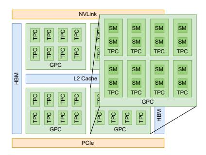
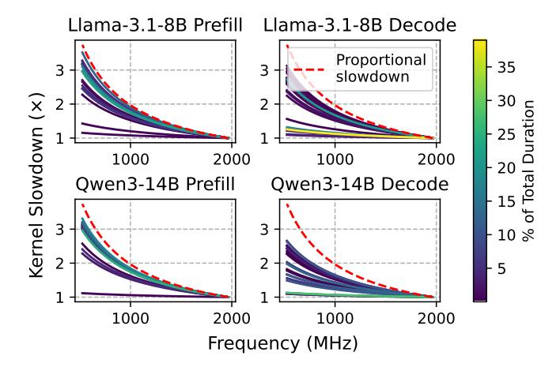
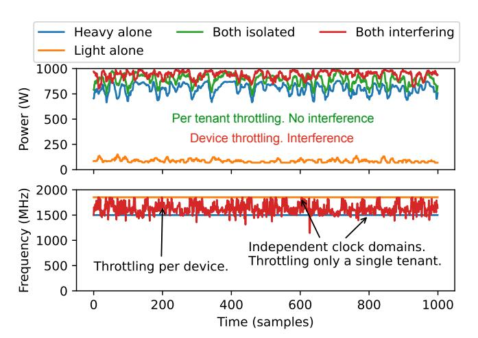
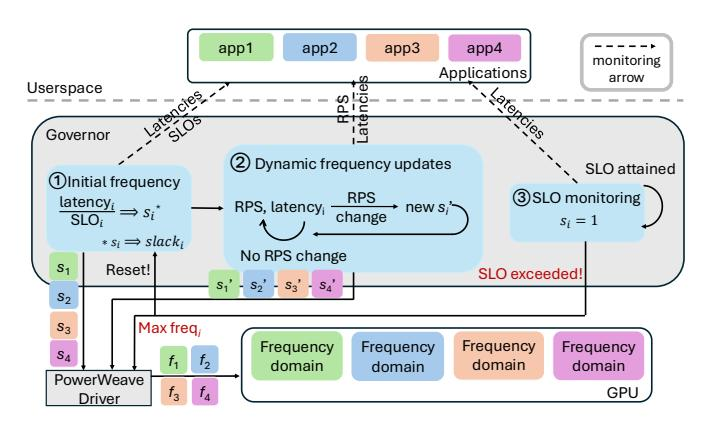
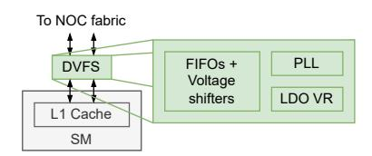
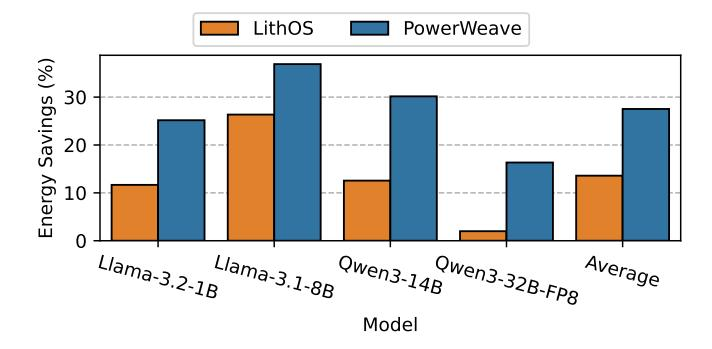
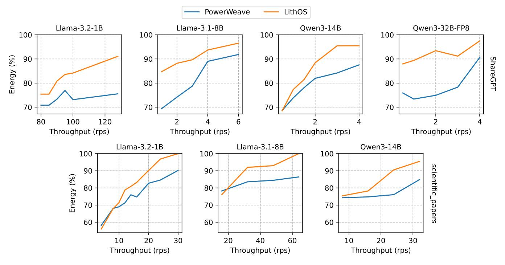
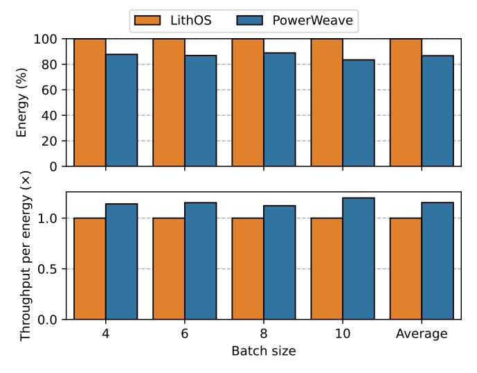
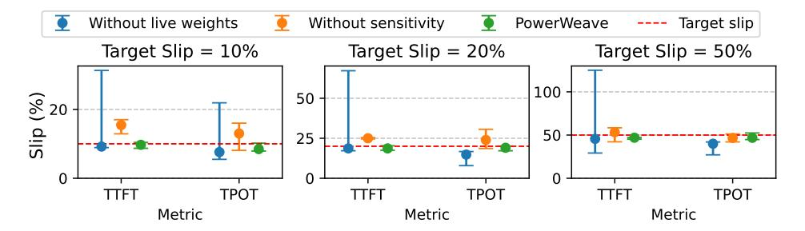
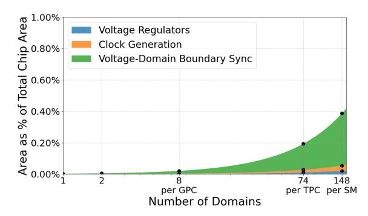

# PowerWeave: Unlocking Energy-Efficient ML on GPUs with OS-Level Spatial Power Management

Vasilis Kypriotis *Carnegie Mellon University* Pittsburgh, PA, USA vkypriot@cs.cmu.edu

Eric Dubberstein *Carnegie Mellon University* Pittsburgh, PA, USA edubbers@andrew.cmu.edu

Patrick H. Coppock *Carnegie Mellon University* Pittsburgh, PA, USA coppock@cmu.edu

Eliot H. Solomon *Carnegie Mellon University* Pittsburgh, PA, USA ehsolomo@cs.cmu.edu

*Carnegie Mellon University Carnegie Mellon University Carnegie Mellon University*

Rayyan Zamir Tathagata Srimani Dimitrios Skarlatos Pittsburgh, PA, USA Pittsburgh, PA, USA Pittsburgh, PA, USA rzamir@andrew.cmu.edu tsrimani@andrew.cmu.edu dskarlat@cs.cmu.edu

*Abstract*—GPU power consumption has become a central systems challenge as modern AI datacenters increasingly rely on accelerators whose power footprints reach unprecedented scales. A single NVIDIA B200 already draws around 1000 W, making large multi-GPU nodes among the most power-hungry computing platforms ever deployed. Despite this, GPUs still expose only a single, device-wide DVFS domain. This coarse control is increasingly mismatched to modern AI inference, where power demand is highly non-uniform across models, phases, and workloads. LLMs alternate between compute-bound prefill and memory-bound decode phases, models exhibit widely varying kernel behavior, and emerging agentic pipelines chain together models with sharply different computational profiles. As GPUs shift toward multi-die designs and multi-model stacking becomes essential for utilization, a single global frequency increasingly leads to unnecessary and wasteful high-power operation.

We introduce PowerWeave, the first spatial DVFS mechanism for GPUs, built around an OS-level power-management control plane. PowerWeave dynamically learns per-stream frequencyscaling behavior from kernel latencies and uses a global governor to react to request-rate changes, tail-latency behavior, and SLO slack. This design enables adaptive, fine-grained, kernel-aware power management that preserves SLOs while improving energy efficiency across diverse ML workloads.

We build PowerWeave in Rust as a fully transparent powergovernor layer atop the GPU driver and evaluate it across diverse LLM scenarios and agentic workloads on B200 GPUs. PowerWeave reduces energy consumption by 28% on average in both disaggregated-prefill and multitenant settings, achieving up to an 8× improvement over device-wide DVFS in disaggregated prefill. For agentic workflows, PowerWeave reduces energy consumption by 19% on average without compromising throughput. PowerWeave eliminates thermal throttling across all evaluated workloads while maintaining zero SLO violations. Finally, our hardware analysis shows that spatial DVFS is practical: even per-SM clock domains add less than 0.5% GPU die area overhead.

*Index Terms*—GPU Power Management, LLM Inference, GPU DVFS, GPU Multi-tenancy, Disaggregated Prefill

# I. INTRODUCTION

Today's AI datacenters are increasingly dominated by GPU clusters, whose power footprints have grown to staggering levels. A single NVIDIA B200 can draw 1000 W, and an NVL72 system reaches 132 kW, making large GPU deployments among the most power-hungry computing installations ever built. As Large Language Model (LLM) inference and agentic workloads continue to scale, GPU power has become a first-order systems challenge, directly shaping datacenter energy budgets, operational costs, and sustainability limits. Datacenters are now approaching the ceiling of their power budgets, and scaling AI deployments is increasingly bottlenecked by power availability.

Yet despite their growing dominance in datacenter power budgets, today's GPUs still expose only coarse, device-wide dynamic voltage and frequency scaling (DVFS) controls, offering a single global frequency setting across the entire GPU. Prior work [12], [24], [37], [43], [46], [51], [58], [63] has focused on reducing power through this device-wide knob. However, due to limited software control, they optimize a single workload at the GPU-level [46], [63] and through temporal optimization over the cluster [24], [51]. Recent state-of-the-art work, LithOS [12], targets multi-tenant ML deployments and dynamically selects a single frequency for all collocated workloads on a GPU. Unfortunately, this power management control model is fundamentally mismatched to the structure of modern ML workloads as well as hardware realities.

Modern ML workloads are inherently heterogeneous, exposing different frequency needs across phases, models, and applications. Even a single LLM alternates between computebound prefill kernels that scale well with higher frequency and memory-bound decode kernels that see little benefit. Thus, while collocating prefill and decode can improve overall throughput [49], device-wide DVFS forces decode to inherit the high frequency required by prefill, wasting power. This mismatch extends across models, whose frequency scaling varies with batch size, sequence length, input/output token counts, kernel implementations, libraries, scheduling, and model architectures. Emerging agentic workflows exacerbate the problem. Multi-agent pipelines combine models with dramatically different compute and memory profiles. When such heterogeneous stages are collocated on one GPU, a single global frequency must track the most demanding phase or model, overprovisioning the rest of the device.

Hardware trends further amplify this challenge. Modern GPUs are already moving towards multi-die GPU architectures. NVIDIA's B200 integrates two GPU dies, while AMD's MI350X packages eight. As resource counts per GPU continue to scale, multi-model stacking will become essential for utilization, making their underlying heterogeneity inescapable.

At the same time, power management for AI infrastructure spans multiple granularities. Cluster-level schedulers redistribute load across nodes, server-level mechanisms balance power between CPUs and GPUs, and device-level DVFS regulates a single GPU as a whole. Each layer addresses heterogeneity at its own scale. What is missing is a layer within a single GPU: across SMs, phases, and collocated tenants.

To address the needs of current and future AI workloads and hardware, we introduce PowerWeave, the first spatial DVFS design built around an OS-level power management control plane. PowerWeave's *Online Kernel Profiler* continuously tracks kernel latencies, feeding information into its *Frequency-Latency Scaling* module, which models the behavior of each kernel on the fly. The *PowerWeave DVFS Controller* uses these models to set the frequency of each independent domain to maximize energy efficiency. Finally, the *PowerWeave Governor* monitors all streams, applications, and tenants, reacting to dynamic serving conditions such as request-rate (RPS) fluctuations, tail-latency behavior, and signs of SLO divergence. Together, these components enable adaptive, fine-grained, kernel-aware power management that maintains SLOs while significantly improving the efficiency of a broad class of ML workloads.

We ground PowerWeave in a detailed analysis of the practicality of fine-grained, multi-domain DVFS for GPUs. We quantify the control granularity, transition latency, and area overhead associated with introducing a small number of clock islands at various hardware granularities, ranging from the entire GPU to the per-streaming-multiprocessor (SM) level. Our study identifies threshold granularities where additional domains deliver meaningful energy benefits without destabilizing control loops or violating SLO safety margins, providing guidance for future architectural support.

We build PowerWeave in Rust as a fully transparent powergovernor layer on top of the NVIDIA GPU driver and evaluate it across diverse LLM scenarios and agentic workloads on B200 GPUs. Our results show that PowerWeave reduces energy consumption by 28% on average for both disaggregated prefill and multitenant settings. Specifically, in disaggregated prefill, PowerWeave achieves up to 8× greater energy savings than device-wide DVFS by exploiting the mismatch between tight TTFT SLOs and relaxed TPOT SLOs. In agentic workflows, PowerWeave reduces energy consumption by 19% on average without compromising throughput.

Beyond direct energy savings, PowerWeave eliminates thermal-throttling across all evaluated workloads, saving hundreds of watts per GPU, all while maintaining zero SLO violations. Finally, our hardware analysis reveals that finegrained spatial DVFS adds less than 0.5% area overhead to the total GPU die, even at per-SM granularity, showcasing the feasibility of our approach.

In summary, this paper makes the following contributions:

- A detailed characterization of heterogeneity in modern ML workloads across models, prefill/decode phases, collocated tenants, and agentic stages, showing how it is fundamentally mismatched with device-wide DVFS.
- PowerWeave, the first spatial DVFS design built around an OS-level power-management control plane that decouples frequency control across spatial domains of the GPU. We implement a prototype of PowerWeave in Rust, on top of LithOS [12].
- A hardware area-cost model covering on-die regulators, voltage-domain boundary synchronization, and clock generation, that quantifies overheads of fine-grained spatial DVFS. Our analysis shows that even at per-SM granularity the total overhead remains modest.
- An end-to-end evaluation of PowerWeave across diverse LLM serving and agentic workloads on modern GPUs. PowerWeave roughly doubles the average energy savings of device-wide DVFS, eliminates thermal throttling, and maintains zero SLO violations.

# II. BACKGROUND & RELATED WORK

# *A. A Brief Background on GPU Architecture*

GPU Architecture. Throughout this paper, we use terminology from the NVIDIA ecosystem of GPU software and hardware. As shown in Figure 1, GPUs comprise several Graphics Processing Clusters (GPCs), which share an L2 cache and are themselves composed of several Texture Processing Clusters (TPCs). A TPC comprises two Streaming Multiprocessors (SMs). The recent NVIDIA Blackwell B200 GPU has 9 GPCs comprising 74 TPCs, for a total of 148 SMs. Each SM runs at the same clock frequency. Blackwell additionally brings faster frequency scaling, with transition latencies of ≈10–100 µs compared with Hopper's ≈10–100 ms [55]. By default, the GPU runs at maximum frequency, scaling down when power exceeds the Thermal Design Power (TDP).

GPU Programming. GPU kernels are structured as a computational grid of many thread blocks, both of which have dimensions specified by the programmer. A kernel's work is divided among the thread blocks, which are executed on SMs and consist of multiple SIMD threads.

# *B. Related Work*

GPU Multi-Tenancy. Modern ML workloads and agentic pipelines exhibit heterogeneous phases, variable kernel characteristics, and bursty traffic patterns that often leave hardware underutilized. Industry mechanisms such as NVIDIA MPS [39] and MIG [41] support multi-tenant deployment but provide only coarse process-level or instance-level sharing. Prior systems have explored finer spatial and temporal multiplexing with performance isolation [12], [18], [38], [52], [56], [62]. The same workload characteristics that motivate fine-grained

Fig. 1: GPU Architecture.

sharing provide a natural opportunity for fine-grained DVFS, which would allow each tenant, model, or phase to operate at the frequency that best suits it.

LLM Inference and Agentic Workflows. LLMs map input tokens to output tokens by repeatedly applying the attention operation in each forward pass. Inference proceeds in two phases, prefill and decode. Prefill processes the input tokens in parallel to populate the KV cache and is therefore compute-bound, while decode subsequently generates each output token by reading the full KV cache, making it memory-bound. Performance is characterized by two corresponding metrics: Time To First Token (TTFT), the latency of prefill, and Time Per Output Token (TPOT), the average latency per decode step.

Disaggregated prefill is a technique that splits the phases either onto separate GPUs [35], [65] or onto different partitions of the same GPU [49], allowing the performance of each stage to be scaled in accordance with application requirements.

LLM serving complexity is further increased by the rise of agentic workflows that rely on multi-step reasoning and tool use, including reasoning-and-acting agents [61], plan-and-execute frameworks [14], and tool-calling chains [44], [47]. Agentic execution is highly input-dependent and unpredictable, complicating efficient system design.

Hardware and Software DVFS for GPUs. Prior work shows that GPUs can control clocks at finer granularity than the whole device. Techniques such as PCSTALL [6] use warp- or wavefront-level signals to drive voltage-frequency decisions at microsecond scale on per–compute-unit sub-device domains. These mechanisms demonstrate that fine-grained spatial energy management is possible, but rely on low-level microarchitectural behavior and lack visibility into application semantics, SLOs, or model phases, and therefore cannot exploit slack or schedule contending workloads with different characteristics.

A separate line of work has pursued power management through application-level objectives. GEEPAFS [63] and  $\mu$ -Serve [46] build online performance models accounting for throughput, SLO attainment, and queueing behavior. Cluster-scale frameworks such as POLCA [43] and DynamoLLM [51], and request regulators like throttLL'eM [24], incorporate LLM-specific knowledge of load bursts and latency constraints to model how request-level performance scales with frequency. LithOS [12] transparently enables DVFS by determining fre-

quency scaling behavior of kernels before choosing a frequency for the entire device. While these systems understand application-level goals, they control frequency only at device granularity, missing opportunities for localized adjustments. Thus, they are unable to provide differentiated service or performance isolation across tenants sharing a GPU.

PowerWeave's goal is to bridge the gap between finegrained frequency control and application-level performance, delivering better energy efficiency for ML on GPUs.

Technology Advances in DVFS. Modern GPUs inherit power-management mechanisms designed for coarse, device-wide control: off-chip voltage regulators with transition latencies of hundreds of microseconds, applied infrequently at a small number of chip-wide operating points. Recent integrated-voltage-regulator (IVR) architectures close this gap by placing switched-capacitor or digital low drop out (LDO) stages close to the load, enabling nanosecond-scale voltage changes and microsecond-scale frequency updates [16], [25]. Industrial processors now adopt hybrid power-delivery stacks where efficient off-chip or on-package buck converters provide coarse conversion, while small on-die regulators track fast load variations for per-core or per-block control [5], [7], [33], [50].

GPUs are especially amenable to fine-grained DVFS: their massive parallelism and heterogeneous workloads create non-uniform SM utilization. However, contemporary GPUs expose at most one or two DVFS domains, such as core and memory, forcing all SMs to share a common V/f state. This mismatch wastes energy whenever memory-bound or idle units run at the same high V/f setting as heavily utilized units. Increasing DVFS spatial granularity can reduce this waste, but introduces hardware overheads that grow with the number of domains, including regulator logic, inter-domain level shifters and isolation, and clock and power-domain management. As we will see later in this paper, these overheads are precisely what we quantify in PowerWeave's hardware analysis.

#### III. MOTIVATION

ML workloads consist of sequences of GPU kernels launched by the host CPU, each implementing computational-graph operations such as matrix multiplication, normalization, and attention. Their power consumption depends on both kernel characteristics and workload conditions. In particular, arithmetic intensity determines each kernel's compute and memory behavior, shaping its performance-frequency scaling and power use, while traffic rates, sequence lengths, and batch sizes further affect energy consumption. This section examines the challenges and opportunities of fine-grained spatial DVFS through spatial multi-tenancy, disaggregated prefill-decode, and cross-workload thermal-throttling interference.

#### A. Spatial Multi-tenancy

To showcase the opportunity for spatial DVFS, we focus on characteristics of LLM inference. Figure 2 shows how total energy consumption scales with frequency for three different LLMs. For this configuration, Qwen3-14B consumes minimum energy at approximately 1000 MHz, whereas Qwen3-8B

Fig. 2: Different models have distinct profiles.

Fig. 3: Prefill and decode kernels scale differently.

and Llama-3.1-8B reach their lowest energy usage at 750 MHz. This illustrates that models have different optimal operating frequencies. Without spatial DVFS, a single frequency for the entire device can drastically throttle one latency-critical model.

Beyond model characteristics, workload requirements vary with deployment setup, and even a single model can have different SLOs across scenarios. The MLPerf Datacenter Inference benchmark provides a representative example [36]: in an *interactive* setting, Llama-3.1-8B must sustain TTFT below 500 ms and TPOT below 30 ms, whereas in a *server* setting it has relaxed SLOs of 2 s TTFT and 100 ms TPOT. This variability requires different frequencies to meet SLO targets, creating an opportunity for independent per-model scaling.

# *B. Disaggregated Prefill and Decode*

LLM inference pipelines alternate between prefill and decode stages. Prefill kernels are typically dense matrix multiplications that scale proportionally with frequency, whereas decode kernels are memory-bound and achieve marginal speedups as frequency increases. Applying a uniform frequency policy to both phases overprovisions decode. Figure 3 illustrates the different frequency-scaling behaviors of prefill and decode for Llama-3.1-8B and Qwen3-14B. Specifically, we observe that the hotter kernels of both prefill instances exhibit larger slowdowns as the frequency is reduced, whereas the hotter kernels in the decode phase are comparatively insensitive to frequency changes.

Fig. 4: Throttling due to one application interferes with others.

Recent work [49] has highlighted that splitting prefill and decode phases and collocating them on a single device is practical, achieving high throughput and low latencies, without over-provisioning GPU resources. With spatial partitioning, one portion of the GPU can serve prefill while the remainder serves decode. This also reduces data movement, as the KV cache remains in one place, saving energy spent on transfers.

With disaggregated prefill and decode on a single device, spatial DVFS can be used to apply a higher frequency to the compute resources dedicated to prefill and a lower one to those used by decode. This indicates that spatially stacking multiple models is not necessary for spatial DVFS to be valuable; a single model with split prefill and decode is sufficient.

# *C. Thermal Throttling Interference*

Non-uniform temperature and power delivery across the die often necessitate conservative limits in global DVFS schemes. Figure 4 illustrates an example of thermal throttling where one application interferes with another, while spatially sharing the same device. The two applications are identical models; one runs at a higher load issuing requests at a much faster rate, while the second maintains a moderate load. The top plot shows that the high-load application continuously exercises its compute units, driving the total GPU power to the TDP limit. As a result, the firmware repeatedly throttles the global frequency to prevent overheating, as shown by the frequency oscillations in the bottom plot. This throttling also affects the low-load application, which suffers identical frequency reductions despite not contributing to the thermal pressure, as seen by its low power consumption on the top plot.

Eliminating this interference is crucial to allow different tenants to concurrently utilize the device efficiently. Spatial DVFS unlocks this opportunity, as the high-load application could throttle only its own frequency, allowing the lowload application to continue running at a higher frequency. Localized, per-domain control would enable lightly loaded regions to sustain higher frequencies while throttling only the hotspots, thereby enhancing thermal and power efficiency.

## D. The Need for Spatial DVFS

Spatial DVFS offers tangible benefits to performance, cost, and sustainability of GPU systems. However, balancing heterogeneity across models and variability between workload characteristics, such as request rates and SLO targets, is important for spatial DVFS, but can be challenging. Power-Weave is a software-driven design that leverages multiple GPU frequency domains, built around a scheduler that minimizes energy consumption while maintaining high SLO attainment.

#### IV. POWERWEAVE DESIGN

The guiding principle behind PowerWeave is to decouple frequency control across spatial domains of the GPU, in a way that each application dynamically operates at a frequency tailored to its own performance demands. The primary objective is to improve energy efficiency while meeting per-tenant SLOs. More broadly, PowerWeave seeks to eliminate interference among tenants, preventing one tenant's performance requirements from inflating another's power cost.

#### A. System Overview

PowerWeave is designed to operate under the availability of independent frequency domains, up to the level of individual SMs. Within this environment, PowerWeave introduces a software stack that coordinates per-tenant performance modeling and frequency control across these domains. Figure 5 shows a high-level overview of the PowerWeave design. Power-Weave sits below the application and serving frameworks like vLLM [26] and SGLang [64] and above the GPU device driver. It is composed of four main components. The Online Kernel Profiler, Frequency-Latency Scaling module, and DVFS Controller sit within the PowerWeave Interposer and perform the vast majority of the power management operations and control. The online profiler tracks individual kernels to construct perkernel frequency-latency profiles, which capture each kernel's scaling behavior. The frequency-latency scaling module uses these profiles to build application-level scaling functions that describe how end-to-end latency evolves with frequency. The DVFS controller then uses these functions to select frequencies for each independent domain based on performance slack provided by the *PowerWeave Governor*. The governor lives in userspace and enforces PowerWeave's power-management policy. It tracks application-level metrics, such as requests per second (RPS), and takes as input each application's SLOs. Based on this information, the governor communicates performance targets to the DVFS controller. This separation of concerns allows users and administrators to tailor policies for different ML use cases while reusing the interposer's control mechanisms across policy implementations. Together, these components enable efficient spatial DVFS for GPUs.

#### B. Interface with Userspace

**Resource Allocations.** System administrators specify their desired GPU resource limits whenever they want to execute their workload. They are assured that they will execute on their own independent frequency domain.

Fig. 5: PowerWeave design overview.

Service Level Objectives. The applications interact with PowerWeave through the Governor. They communicate their desired SLOs to allow PowerWeave's Governor and DVFS controller to make decisions on allocated frequencies for each frequency domain. Additionally, applications share their performance metrics and request rates with the governor to enable informed and dynamic frequency scaling.

# C. Online Kernel Profiler

PowerWeave transparently interposes between off-the-shelf LLM inference servers and the GPU driver, executing their kernels on a shared, spatially partitioned device. Each partition, which we refer to as a frequency domain, operates with its own independent frequency. This allows the system to dynamically and spatially control the frequency of the GPU. To achieve high energy efficiency without violating performance constraints, the system begins with a multi-stage online profiling, coordinated by the *online kernel profiler*, which operates per frequency domain.

As requests are being served, the kernel profiler initially executes all kernel instances at the maximum frequency available in their assigned set of resources, establishing a baseline performance profile under optimal conditions. While doing so, it tracks per-kernel latency and uniquely identifies kernels by their function and launch configuration, so that instances launched with different sequence lengths or batch sizes are recorded as distinct entries. This ensures that input-dependent behavior, such as the varying memory access patterns of attention kernels across sequence lengths, is captured independently rather than averaged into a single generalized curve.

The objective is to determine how each kernel's execution time responds to changes in operating frequency and to derive a frequency-latency function for each kernel. After the profiler establishes a baseline, it begins executing kernels at multiple frequency points within the same partition. This process is lightweight, as kernel execution is relatively short, typically in the range of hundreds of microseconds to a few milliseconds,

allowing the profiler to selectively monitor individual kernels while minimizing its impact on the entire request.

During this phase, new kernels may be observed for the first time. This often happens when an application launches a previously known kernel under different grid or thread block configurations. To handle these cases, the profiler employs a latency predictor that generalizes across configurations of the same kernel family, modeling latency from kernel occupancy and thread-block count, using historical data. Specifically, the latency l of a new kernel is predicted as:

$$l = waves \times \frac{l_{old}}{waves_{old}},$$

where  $l_{old}$  is the kernel latency of an already profiled instance in the same kernel family, while the *waves* of a specific kernel instance are calculated by the total launched blocks, divided by the SM occupancy (or blocks per SM), and the number of SMs allocated to that specific kernel launch. Intuitively, the number of waves corresponds to the number of thread blocks that each SM, working in parallel, must execute in sequence to complete the entire kernel.

By comparing these parameters to past executions under different configurations, the system can predict the latency of unseen kernel variants without exhaustive re-profiling. This approach leverages the regularity of machine learning workloads to enable continuous adaptation across diverse inputs.

#### D. Frequency-Latency Scaling Module

After completing the profiling phase, PowerWeave combines all of the per-kernel scaling curves it has collected into a single per-application model. This procedure relies on a heuristic, based on a first-order Taylor approximation. For a target performance degradation k, the adjusted frequency is:

$$f(k) = \frac{f_{max}}{S}, \text{where } S = 1 + \frac{k}{\sum s \cdot w}$$

Here, w denotes the weight of each kernel, defined as its contribution to the total runtime of the application, while s denotes its sensitivity factor, capturing how sharply the kernel's latency scales with changes in frequency. A higher sensitivity corresponds to a steeper slope on the kernel's frequency-slowdown curve.

Intuitively, the weights define the balance between compute-bound and memory-bound work within the application. As the prefill-to-decode ratio shifts in the workload, the weights shift accordingly, and PowerWeave updates them continuously even after the profiling phase to reflect the current workload composition. The sensitivity factor prevents kernels with low frequency sensitivity from disproportionately pulling the target frequency below the level required by frequency-sensitive kernels. Because sensitivity is a property of the kernel's instruction mix, it remains fixed after profiling. In Section VIII, we demonstrate how sensitivity and live weight updates achieve highly accurate predictions.

Since each tenant exhibits unique workload characteristics, each receives its own model, allowing the system to scale frequencies independently according to individual performance

Fig. 6: PowerWeave's Governor operation over time.

requirements. This per-application curve enables dynamic adaptation to workload variability, such as fluctuating load intensity or shifting SLOs, without committing the system to a fixed slowdown assumption.

Once this stage is complete, PowerWeave stops profiling and can now start optimizing power consumption. We call this the operating phase. Whenever a kernel completes execution, PowerWeave tracks its completion time. In the scenario where there is a repeated divergence from the estimated kernel execution time, the profiling process restarts. PowerWeave's *profiling-threshold* knob is empirically set at 5%.

#### E. DVFS Controller

In the operating phase, PowerWeave relies on its DVFS Controller to modulate the GPU's frequency. The controller takes as input an application-level model built by the frequency-latency scaling module and instructions from the governor that we describe next. The governor's instructions specify how much a given application's performance may slip without violating SLOs. The DVFS controller uses this to select an operating frequency for the application such that performance degradation remains within an acceptable bound. This approach enables PowerWeave to decouple application-specific policy design in userspace from the power management control plane within the interposition layer.

#### F. PowerWeave Governor

Inference workloads can be highly unpredictable, with request rates, execution phases, and latency sensitivities that fluctuate over time and vary widely across tenants. Thus, it is necessary to adapt to these shifting conditions to sustain high SLO attainment. Because PowerWeave's DVFS controller operates above the device driver and has no direct visibility into application semantics, it relies on a global Governor to interpret runtime performance characteristics and coordinate DVFS decisions. In particular, PowerWeave's Governor sits next to the application layer, monitoring load and request latency. It also communicates the permissible performance degradation to the DVFS controller, enabling it to select the appropriate operating frequency.

Once in the operating phase, the governor follows a sequence of steps to request frequencies throughout each tenant's serving (Figure 6). First, it monitors the latencies of each application at peak frequency, establishing a reference baseline per domain. Using this baseline and the application-provided SLO, it calculates a performance slack, representing the amount of slowdown the workload can tolerate without risking an SLO violation. This slack is passed to the DVFS controller, which selects operating frequencies according to the application's slowdown-frequency function (Figure 6, Stage ⃝1 ).

However, as workloads evolve over time, the governor must continuously track per-application load and latency to adapt to changing conditions. To do so, it employs a monitoring window that detects short-term divergence. If spikes or dips appear in a tenant's request-arrival rate, the governor recomputes the slack that the tenant can safely sustain (Figure 6, Stage ⃝2 ). Suppose an application is executing at frequency f1, with a performance slack of s1%. Given a currently observed latency l1, the governor updates the requested slack to s2%, as follows:

$$s_2 = \frac{((1 - s_1) \times l_1)}{SLO},$$

Intuitively, the governor infers the theoretical latency at maximum frequency from the slip s1 with (1 − s1) × l1, and divides this by the SLO target to obtain the revised allowable slowdown. The governor sends this new slack s2 to the DVFS controller to request a frequency update. This process is repeated for every monitoring window.

The governor also provides fast corrective action: upon an SLO violation, it signals the DVFS controller to maximize affected-domain frequencies until latency returns to a safe margin. It then restarts the adaptation process, recomputing slack and requesting frequency updates as conditions continue to change (Figure 6, Stage ⃝3 ).

Through this continuous feedback loop, the governor ensures that PowerWeave remains robust to runtime variability, responsive to divergent tenant behaviors, and consistently able to maintain performance targets while minimizing energy.

The governor is also flexible enough to monitor multiple SLOs per partition. If different metrics require distinct scaling behaviors (e.g., TTFT vs. TPOT, or small vs. medium vs. large input prompts), the governor adopts the most conservative allowable slack to ensure that all constraints are satisfied. Overall, this approach enables a varying degree of policy design based on individual application requirements.

# *G. Interface with Hardware*

PowerWeave is well positioned to establish a direct communication interface with the GPU's power-management hardware. Because it interposes above the GPU driver, Power-Weave's DVFS controller learns the kernel sequence each model executes, and distinguishes compute-bound kernels from memory-bound and communication-heavy ones. This lets PowerWeave proactively issue frequency requests for upcoming phases instead of reacting to execution-time signals.

Such an interface could take the form of a per-domain request queue shared between PowerWeave and the GPU power-management firmware. For each domain, PowerWeave would enqueue frequency targets, ahead of upcoming kernel launches. The firmware would consume these requests asynchronously, schedule the required transitions, and settle each domain at the requested operating point before the corresponding kernel begins. By issuing requests early, PowerWeave could hide the communication overhead to the firmware and enable fast, timely frequency switching. This can unlock faster and finer-grained DVFS across both spatial and temporal dimensions, enabling more energy-efficient operation.

# V. IMPLEMENTATION OF POWERWEAVE

By extending the LithOS GPU operating system [12], we implement a real-world prototype of PowerWeave's Interposer in ∼5500 lines of Rust and its Governor in ∼250 lines of Python. In this section, we describe the key implementation decisions behind PowerWeave.

Interposer. PowerWeave transparently intercepts all CUDA driver API calls on kernel launch paths, requiring no modifications to the application, serving framework, or GPU driver. On a kernel launch, the interposer records the kernel's function handle, grid and block dimensions, shared-memory size, and the CUDA stream. These fields together form the kernel's identity key used by the profiler. Kernel completion times are obtained by injecting CUDA event pairs around each launch and querying their elapsed time asynchronously, avoiding any blocking on the critical path. The profiler, predictor, and DVFS controller all execute within the interposer's address space on a dedicated background thread. Frequency changes are issued through the NVIDIA Management Library (NVML), which exposes per-GPU clock-setting interfaces.

Governor. The governor is implemented as a minimal library that can be imported into existing serving frameworks. Once imported, it monitors per-domain request rates and tail latencies against the configured SLO targets. On each control tick it estimates the acceptable performance degradation each domain can tolerate to preserve the SLO and communicates this slack to the interposer. Obtaining userspace-level metrics from frameworks such as vLLM or SGLang requires only a few lines of code. The governor's design is intentionally flexible: SLO targets, monitoring window duration, and the tail-latency percentile used for decisions are all configurable per domain, enabling the same core mechanism to support custom latency-driven, per-tenant, and throughput-balancing policies without code changes.

Compatibility with native GPU Sharing Mechanisms. PowerWeave's spatial partitioning model is compatible with existing GPU sharing mechanisms. NVIDIA MIG enforces hardware-level spatial partitions, and the governor can operate within MIG instances without modification. For MPS deployments, PowerWeave performs TPC assignments as in LithOS [12], which is based on MPS. Alternatively, spatial isolation within MPS can be achieved through NVIDIA Green Contexts [42]. AMD GPUs expose analogous mechanisms:

Fig. 7: Additional Components for Per-SM DVFS granularity.

SPX/DPX/CPX modes on MI300X and MI355X [1] provide MIG-equivalent isolation across XCDs, and CU masking via ROCm [2] enables MPS-style fine-grained assignment of streams to Compute Units. Similarly, PowerWeave can adopt either path without changes to its core design.

# VI. SPATIAL DVFS HARDWARE AREA MODELING

To understand the practical feasibility of PowerWeave's fine-grained power mechanism, we develop a hardware area cost model that reflects the structural changes needed to realize per-domain DVFS in a technology-aware manner. This analysis complements our software design and provides grounded area estimates for our evaluation. PowerWeave targets a GPU architecture in which the SMs are divided into multiple independent voltage–frequency domains. Each domain is supplied by a local on-die regulator and may operate at its own frequency. We explicitly model the three dominant contributors shown in Figure 7: (i) on-die voltage regulators, (ii) voltage-domain boundary synchronization, and (iii) clock generation overheads. Area modeling is normalized to the target technology node using scaling factors derived from IRDS [20], [53]. We target a total silicon area of 1600 mm2 , corresponding to approximately two reticle-limited dies of about 800 mm2 each similar to B200 [54]. Our model can be further extended to additional dies.

DLDO Regulator Modeling. Each DVFS domain is supplied by a dedicated on-die digital low-dropout (DLDO) regulator. We model the area overhead of these regulators using a set of modeling constraints. First, we estimate the total peak current demand of the GPU as constant and independent of DVFS granularity. Next, we model the power portion of each DLDO (the PMOS pull-up array) based on an area directly proportional to the peak current it must supply. Finally, we estimate that the current is delivered by a discrete number of parallel PMOS devices, whose aggregate area therefore scales linearly with the total load current. Overall, these assumptions provide a conservative first-order analysis foundation.

For operating parameters, we set the input voltage to 1.15 V and an output range to 0.8-1.1 V, consistent with prior work [33]. We assume a maximum step size of 1% of Vout (approximately 11 mV [48]). The minimum resolution to achieve this is 128 levels; for a conservative (worst-case) area estimate, we model 256 voltage levels. After scaling to 5nm technology node, the per-domain control area becomes:

$$A_{\rm DLDO,ctrl}^{\rm 5nm} \approx \frac{A_{\rm DLDO,ctrl}^{\rm 7nm}}{S_{\rm 7nm \to 5nm}}$$

,

where S7nm→5nm is the digital area scaling factor.

Since the total power-device area remains constant, the incremental regulator overhead for N domains is therefore:

$$\Delta A_{\rm reg}(N) \approx A_{\rm DLDO,ctrl}^{\rm 5nm} \cdot (N-1)$$

This quantity represents the area overhead attributable solely to duplicated DLDO control logic.

Voltage-Domain Boundary Overhead (Level Shifters). Independent voltage islands require voltage level shifters (LSs), isolation, state retention, and synchronization FIFOs wherever signals cross DVFS boundaries. To establish an upper bound on the datapath width for crossings between the SMside L1 and the chip-level L2, we leverage characterization data of recent datacenter GPUs. Recent studies report L1 bandwidths ranging from 128 B/cycle (= 1024 bits) [32], up to 256 B/cycle (= 2048 bits) [23]. For a conservative bound (and to accommodate control/sideband signals), we set L1\_L2\_BITWIDTH = 2048 bits.

We instantiate a representative asynchronous FIFO (graycoded pointers) and augment it with voltage level shifters, isolation cells, and state retention flops, which are required for voltage-domain crossing. We model DVFS-domain links as AXI-like channels that *quiesce* traffic before a V /f change by de-asserting READY (VALID/READY two-way flow control). Under this policy, the crossing FIFO only needs to absorb a short pipeline/CDC latency and any burst tail. We therefore use a depth of 64 entries per data channel as a safe upper bound [4]. We synthesize and place-route this 2048-bit-wide FIFO macro in a 130nm process [13] to obtain a concrete area. This area is then scaled down to an equivalent area in a 5nm process node [17], [21], [22]. For a given DVFS partition (e.g., per-TPC), the total crossing overhead is:

$$A_{\text{cross,5nm}} = \frac{a_{\text{FIFO, 130nm}}}{S_{\text{dig, 130nm} \to 5nm}} + \frac{a_{\text{LS, 130nm}}}{S_{\text{ana, 130nm} \to 5nm}}$$

Where Sdig, 130nm→5nm and Sana, 130nm→5nm are the digital and analog area scaling factors. The final area overhead for N domains is then:

$$A_{\rm LS}(N) \approx A_{\rm cross,5nm} \cdot (N-1)$$

Clock-Domain Area Overhead. Increasing DVFS granularity also increases the number of independent clock domains, each serviced by a dedicated phase-locked loop (PLL) clock generator. To estimate the associated area overhead, we assume a worst-case scenario where every additional voltage domain introduces a new, fully independent clock domain with its own PLL instance. For a realistic upper bound, we adopt the area of a state-of-the-art digital PLL fabricated in a 5nm FinFET process. Specifically, a fully-synthesizable fractional-N injectionlocked PLL designed for manycore systems reports an area of 0.0036 mm2 [28]. We will use this value directly as the area overhead for an additional PLL. The resulting area overhead for N DVFS domains can be expressed as:

$$A_{\rm PLL}(N) = A_{\rm PLL,unit} \cdot (N-1)$$

where APLL,unit = 0.0036 mm2 is the per-domain PLL area. This term represents a conservative upper bound, as practical GPU implementations may employ a single PLL with multiple clock dividers for neighboring clock domains.

Combined Overhead Model. The total area overhead relative to a single DVFS domain is:

$$\Delta A_{\text{tot}}(N) = \Delta A_{\text{reg}}(N) + \Delta A_{\text{LS}}(N) + \Delta A_{\text{PLL}}(N).$$

PowerWeave uses this ∆Atot(N) directly in its analysis: in Section VIII we report the absolute area increase (in mm2 ) and percentage of GPU die area for each DVFS granularity. Power Overhead. Beyond area, increasing the number of frequency domains introduces power overhead from duplicated control logic. We synthesize the DLDO controller at 7 nm with workload-driven activity annotation, obtaining 78 µW per regulator, approximately 11.5 mW in aggregate for 148 domains at max (one for each SM), negligible relative to the GPU's TDP (1000 W for a B200 GPU). The domain boundary crossing logic, synthesized at 130 nm, consumes 5.65 W for 148 domains as a conservative upper bound.

# VII. EXPERIMENTAL SETUP & METHODOLOGY

Infrastructure. Evaluation is performed on an NVIDIA DGX B200 running the Ubuntu 24.04.2-based DGX Server Version 7.0.2 software stack with NVIDIA driver 580.82.07. The machine has 8 B200 GPUs, each with 192 GB of memory and 148 SMs. We use the vLLM 0.10.2 inference server [26] with PyTorch 2.8 for CUDA 12.8 on Python 3.12. For disaggregated prefill, we use LMCache 0.3.6 [9] and NIXL 0.6.0 [27]. We build the agentic pipeline with AutoGen [57].

Models and Loads. We use a total of six LLMs from the Llama 3 herd [15] (3.2-1B and 3.1-8B) and the Qwen3 family [59] (4B, 8B, 14B, and 32B-FP8) as well as the LLaVA vision model [29]–[31].

Depending on the experiment, loads follow either a Poisson process or the Azure LLM conversation inference trace [34]. Inputs come from the ShareGPT Vicuna [19] and scientific papers [11] datasets. For SLOs, we use those from MLPerf Inference 5.1 benchmark [36]: the interactive scenario with 0.5 s TTFT and 30 ms TPOT for the shorter ShareGPT inputs and the server scenario with 2 s TTFT and 100 ms TPOT for the longer inputs from scientific papers. For the Azure trace, we use SLOs from DynamoLLM [51], shown in Table I. Frequency Domains. Current GPUs do not expose finegrained frequency domains to software, so we emulate spatial DVFS by running workloads on multiple GPUs and allocating TPCs such that the total allocation equals one full GPU. To account for shared-resource effects absent from this setup, we compare: (i) isolated execution, (ii) same-GPU compute partitioning, and (iii) MIG-based partitioning. The observed contention increases TTFT and TPOT by around 3% on average and less than 7% in the worst case, so we conservatively scale SLO targets by this amount in all emulated spatial-DVFS experiments, making our multi-GPU emulation as realistic as possible without compromising measurement validity.

TABLE I: Azure trace request class SLOs.

| Request length | TTFT (ms) | TPOT (ms) |
|----------------|-----------|-----------|
| < 256          | 250       | 100       |
| < 1024         | 400       | 100       |
| ≥ 8192         | 2000      | 100       |

Baseline. We compare PowerWeave to LithOS [12], the stateof-the-art DVFS scheme that relies on a single frequency domain for the entire GPU. LithOS performs spatial multitenancy and sets a device-wide frequency based on requirements of all collocated models.

Modeling Spatial DVFS. We measure total energy as the sum across all GPUs used in an experiment, subtracting idle energy in proportion to each workload's unallocated TPC share. In this way, each measurement accounts only for the idle power attributable to its resource allocation. This provides realistic energy measurements under our real-hardware setup. On B200 GPUs, idle power measures ≈140 W. Because the baseline runs on one GPU, no idle power needs to be deducted.

We retrieve energy and power measurements using NVIDIA Data Center GPU Manager (DCGM) 4.2.2 [40]. Because prior work shows that NVIDIA's monitoring tools may produce inconsistent power readings [60], we validate DCGM energy against the product of DCGM-reported power and experiment duration. We retain measurements when both values closely agree; otherwise, we rerun the experiment. Since experiments run sufficiently long, energy metrics are stable and consistent. Area Estimation. To estimate the area overhead of each additional DVFS domain, we synthesize/place-route the voltagedomain boundary synchronization logic and voltage regulator control logic in mflowgen [8].

For voltage regulator control logic, we use the open-source OpenFASoC DLDO generator [3], which provides synthesizable RTL for parameterized regulators. We generate the DLDO controller macro, extract the control logic, run the full RTL-to-GDSII flow using a 7 nm PDK, and extract the post-layout area [10]. This value is then scaled to match the 5nm technology node [22]. For the voltage-domain boundary synchronization logic, the FIFO RTL is based on [45]. The logic is synthesized using a 130 nm PDK, and the post-layout area is scaled to match the 5 nm technology node [13], [22].

# VIII. EVALUATION

We evaluate PowerWeave in two settings: disaggregated prefill and spatial multitenancy, each executed on a single GPU. We also examine its hardware overhead in terms of area.

# *A. Disaggregated Prefill*

For this experiment, we disaggregate the prefill and decode LLM stages, each onto half the GPU's TPCs, in order to scale TTFT and TPOT independently. We run four models: Llama-3.2-1B, Llama-3.1-8B-Instruct, Qwen3-14B, and Qwen3-32B-FP8. We generate load according to the Azure trace to evaluate PowerWeave under realistic, fluctuating request rates. Next, we explore the relationship between load and energy savings by incrementally increasing the load over time.

Fig. 8: Energy savings for disaggregated inference service.

**Azure Trace.** The original Azure LLM inference trace targets a full node of 8 GPUs. Since we execute on a single GPU, we scale the inter-arrival times by a factor of 1/8. For the smallest and fastest model, Llama-3.2-1B, a factor of 1/4 suffices due to its lower per-request cost. SLOs are set according to DynamoLLM, except that we quadruple the TTFT for the largest model, Qwen3-32B-FP8, which has approximately  $4\times$  the parameters of Llama-3.1-8B.

Figure 8 shows the energy savings of PowerWeave compared with those of the LithOS baseline as a percentage of the energy of the default GPU DVFS policy. PowerWeave achieves more than twice the energy savings of LithOS on average: 28% compared to 13%. Moreover, PowerWeave's decoupled scaling mechanism provides consistent savings across all workloads, in contrast to LithOS, and achieves up to 38% in the best case. For Qwen3-32B FP8, PowerWeave delivers more than an 8× improvement over LithOS. This model exhibits very limited TTFT slack, forcing LithOS's coupled frequency-scaling policy to substantially overprovision during the decode phase, leading to significantly higher energy consumption.

Load Sensitivity. To evaluate the impact of load on energy savings, we sweep across a range of Requests per Second (RPS) values using inputs from two datasets: ShareGPT Vicuna and scientific\_papers. For the ShareGPT Vicuna dataset, we use the MLPerf interactive scenario SLOs as described in §VII. For the scientific\_papers with longer inputs we use the more relaxed MLPerf server scenario. Requests are made according to a Poisson process, with load levels determined by the model–dataset pair, and all experiments are executed using the vLLM benchmark CLI.

In Figure 9, we report energy as a percentage relative to the default GPU DVFS policy (lower is better). Both LithOS and PowerWeave outperform the default policy; however, PowerWeave is substantially more effective when only one of the TTFT or TPOT approaches its SLO. For example, if TTFT begins to increase, PowerWeave raises the clock frequency of the prefill instance while maintaining a low frequency for the decode instance. This selective scaling is often advantageous. However, there are scenarios, such as low-load conditions for the Qwen3-14B model, where both metrics comfortably satisfy their SLOs and low frequencies

TABLE II: Multitenancy experiment tenants.

| Tenant | TPC allocation      | MLPerf LLM scenario |
|--------|---------------------|---------------------|
| 1      | $18/74 \approx 1/4$ | interactive         |
| 2      | $19/74 \approx 1/4$ | server              |
| 3      | $37/74 \approx 1/2$ | server              |

suffice for both instances. Conversely, when both metrics begin to degrade, higher frequencies may be required for both instances, as observed under high-load conditions for Llama-3.1-8B on the scientific papers dataset.

Overall, PowerWeave achieves at least 20% energy savings in the best case for each model, with the maximum energy savings coming while serving Llama-3.2-1B at low RPS, at 41%. Moreover, LithOS's energy savings are at best comparable to those of PowerWeave, and lag it by up to 25% in the worst cases, Qwen3-32B-FP8 and Llama-3.1-8B. These results highlight how decoupled frequency scaling within a model unlocks energy savings that are unattainable when a single device-wide frequency must be used.

## B. Spatial GPU Multitenancy.

In this set of experiments, we evaluate PowerWeave under spatial GPU sharing scenarios, focusing on two representative use cases. First, we examine a spatial multitenant execution, where multiple independent models operate on fractions of a single GPU. We analyze how PowerWeave's decoupled frequency scaling affects energy consumption across a diverse set of model combinations. Second, we evaluate an agentic workflow comprising three sequential models of different sizes, where throughput balance across stages is crucial. Together, these experiments demonstrate the benefits of finegrained frequency control for both parallel (latency-critical) and pipeline-style (throughput-critical) deployments.

**Multitenancy.** We evaluate four configurations, each comprising a different set of three models. Each model represents a different tenant, with the TPC allocations and SLOs listed in Table II. For each configuration, we divide the Azure trace randomly into three splits and reduce the request rates by a factor of 1/3, since all three models are colocated on one GPU.

In Figure 10, we present the energy consumption of the two systems, normalized to the default DVFS policy. The energy consumptions of the three tenants are stacked from 1 to 3, and color denotes the model. The lowest tenant has the tightest SLOs. We observe that the single-frequency-domain approach (LithOS) struggles to deliver consistent energy savings. Across the configurations, Tenant 1 with the tighter SLO skews the overall device energy consumption upward, resulting in savings as low as 6% in the worst case and an average of only 10%. In contrast, PowerWeave's fine-grained spatial DVFS is able to sustain high energy efficiency for at least two of the three models at all times, even when it must assign a higher frequency to one of them. Specifically, PowerWeave achieves energy savings of up to 35%, with an average of 28%, an additional 18% over LithOS. These results demonstrate that in multitenant environments, a single device-wide frequency is insufficient to maintain high energy efficiency, particularly for diverse workloads with heterogeneous performance goals.

Fig. 9: Energy consumption of disaggregated LLM service by load.

Fig. 10: Energy consumption of multiple, independent tenants.

Finally, we run a fifth scenario to estimate an upper bound on the energy savings achievable with PowerWeave. We colocate two Qwen3-14B models. The first occupies a single TPC and must satisfy the MLPerf interactive scenario SLOs, while the second is allowed 73 TPCs and must satisfy the MLPerf server SLOs. The model running on a single TPC quickly violates its SLO and therefore requires the maximum clock frequency. Even so, PowerWeave is able to achieve 40% energy savings by scaling up only the latency-sensitive model. LithOS, on the other hand, leaves substantial energy savings unrealized, providing almost no benefit in this scenario.

Balancing the Throughput of an Agentic Workflow. We construct a coding agentic pipeline that programs small functions from user prompts. A custom 1024-token prompt describes the requested function and is fed into the first stage.

Fig. 11: Energy savings in the agentic pipeline.

TABLE III: Agentic pipeline.

| Agent | Model size | Instructions                                                 | TPC count |
|-------|------------|--------------------------------------------------------------|-----------|
| 1     | 4B         | "Draft a small function."                                    | 10        |
| 2     | 8B         | "Handle any parameter edge cases."                        | 27        |
| 3     | 14B        | "Debug and make sure the given function works correctly." | 37        |

Each agent's output is capped at 512 tokens before entering the next stage. We use the Qwen3 family of models, with unique size, instructions, and TPC allocations for each agent as described in Table III. Prompts are continuously streamed to the first agent in an open-loop fashion, to sustain pipeline load. We sweep batch size from 4 to 10 in increments of 2.

We compare PowerWeave against the default LithOS policy, under which all models must operate at a unified device-wide frequency. The goal is to preserve pipeline throughput after frequency scaling, while sustaining high energy efficiency. Figure 11 presents the energy savings for the whole pipeline. By relaxing the frequencies of faster pipeline stages while keeping the slowest stage high, PowerWeave achieves a 19% average energy reduction with a maximum of 22%, without compromising throughput. LithOS decays to the default GPU DVFS policy, as it must sustain high throughput and, therefore yields no energy savings. Additionally, since throughput is sustained, PowerWeave improves token/s per energy, gaining up to 20% TPJ (throughput per Joule) and 15% on average.

# *C. Thermal Throttling*

PowerWeave's spatial DVFS effectively eliminates thermal throttling across our experiments. In the disaggregated setting, Qwen3-32B-FP8 reaches the device's power limit for 52.9% of the duration under the default GPU policy. LithOS's DVFS reduces this to 30.1%, while PowerWeave's spatial DVFS reduces it to 2%. Similarly for Qwen3-14B, default GPU settings throttle the device for 25.7% of the experiment's duration. LithOS reduces this to 15.3%, while PowerWeave eliminates thermal throttling entirely. In the multitenancy experiments, the default policy throttles for 11% on average, LithOS for 2%, and PowerWeave again eliminates throttling. The remaining workloads do not throttle even at maximum frequency.

# *D. Frequency-Latency Scaling Accuracy*

To evaluate the robustness of the frequency-latency scaling module, we ablate its two key components: the sensitivity factor and live weight updates. Across disaggregated experiments, we ask the governor to target 10%, 20%, and 50% performance degradation, and measure the resulting TTFT and TPOT slowdown relative to maximum frequency. Figure 12 shows observed degradation for each configuration, with error bars indicating the minimum and maximum across experiments.

The full PowerWeave system achieves high accuracy. The average case deviates by 1.7% from the target, while the maximum error is 5.2% in the worst case. The average accuracy is consistently under the target, which means that PowerWeave does not overestimate performance loss. Without live weight updates, the average deviation increases to 4%, and the maximum error rises significantly to 75%. This configuration produces much larger prediction errors at high load. Without sensitivity, misprediction averages 4%, but tail mispredictions increase, with the highest reaching 10.6%. In addition, mispredictions at 10% and 20% performance slip overestimate performance loss, which leads to SLO violations. These ablations show that both components are necessary. Sensitivity ensures accurate frequency selection across kernels with different compute-memory profiles, while live weight updates provide robustness to runtime workload shifts.

TABLE IV: Area overhead per additional domain.

| Component                    | Area (mm2 ) | Percentage of die |
|------------------------------|----------------|-------------------|
| Voltage Regulator            | 0.0023         | 0.00009%          |
| Voltage-Domain Boundary Sync | 0.0359         | 0.00224%          |
| Clock Generation             | 0.0036         | 0.00014%          |

# *E. Latency Predictor Accuracy and SLO Safety*

Across our experimental settings, we measured the accuracy of the latency predictor for unseen kernel configurations that are predicted via wave scaling. The average misprediction is 3.9%, translating to 4.55 µs for prefill kernels and 0.84 µs for decode kernels, against average runtimes of 118.75 µs and 16 µs, respectively. This margin is negligible, and combined with the governor's continuous monitoring, it is sufficient to ensure zero SLO violations across all evaluated configurations.

For new kernels without a matching donor kernel, Power-Weave conservatively uses maximum frequency until their runtime contribution is assessed. Such kernels account for 1.9% of total runtime on average, below the 5% re-profiling threshold, so re-profiling was never triggered in our experiments.

As a result, PowerWeave maintains zero SLO violations across all evaluated workloads and load conditions. Moreover, PowerWeave uses continuous batching, which means that even as the prefill-to-decode ratio changes over time, the workload composition shifts gradually, giving PowerWeave's live weight adaptation sufficient time to adapt its frequencies.

# *F. Profiling Overhead.*

The online profiling phase is the only period during which PowerWeave introduces measurable latency overhead, as it sweeps kernels through multiple frequency points. However, profiling is spread across requests: kernels are profiled at different frequency points in different requests, so no single request experiences the full cost. The profiling window consists of two cycles of twelve frequency steps (from 1965 MHz to 915 MHz), spanning ≈150 requests, depending on the model. As a result, profiling does not cause any SLO violations across our experiments. PowerWeave can further control profiling aggressiveness: more conservative deployments can distribute profiling across more requests, reducing per-request impact at the cost of a longer profiling window.

# *G. Hardware Analysis*

We quantify the silicon area overhead of PowerWeave's fine-grained voltage domains using the cost models detailed in Section VI. Table IV presents the area footprint for a single instance of the required per-domain components, synthesized and scaled to a 5nm process node. These results show that voltage-domain boundary synchronization dominates area overhead at approximately 0.0359 mm2 per additional domain, about an order of magnitude larger than the Digital LDO controller and clock-generation logic combined (0.0059 mm2 ). This disparity highlights that the primary cost of spatial DVFS lies not in the regulation or clocking circuits, but in the isolation and synchronization logic required to maintain data integrity between independent frequency domains.

Fig. 12: Observed vs. requested performance degradation for the full system, without sensitivity, and without live weights.

Fig. 13: Component area by number of domains.

Figure 13 illustrates how overheads scale as DVFS granularity is increased from coarse (per-GPC) to fine (per-SM). Assuming a silicon area of 1600 mm2 for a datacenter-class dual-die GPU, even at the finest granularity evaluated (per-SM, 148 domains), the total implementation overhead remains below 0.5% of the total chip area. This analysis confirms that the hardware cost of implementing PowerWeave is minimal.

# IX. DISCUSSION

Closing the intra-GPU power-management gap. A key lesson from PowerWeave is that power management should operate at the granularity where workload heterogeneity appears. Modern AI serving creates imbalance across the stack: cluster schedulers handle uneven load across nodes, serverlevel controllers see CPUs and GPUs with distinct power demands, and within one GPU, prefill/decode phases, collocated tenants, and agentic stages expose different efficient operating points. Each layer addresses heterogeneity invisible to others, and savings are complementary. PowerWeave fills the missing intra-GPU layer by exploiting spatial slack, demonstrating that static or device-wide DVFS policies are insufficient: they cannot adapt to performance demands within the GPU.

Native support for spatial DVFS. Today's GPUs expose only a device-wide frequency knob, forcing the entire chip to operate at the V/f point required by the most demanding kernel, a costly mismatch for heterogeneous LLM workloads. PowerWeave demonstrates that spatial DVFS delivers substantial energy reductions, mitigates thermal throttling, and lowers peak power, saving hundreds of watts per GPU. At the same time, the hardware cost is modest: per-GPC DVFS captures most savings, with native support adding under 0.5% die-area overhead, avoiding much of the control complexity a per-SM granularity would introduce. This is a favorable tradeoff: a small fraction of silicon in exchange for 30-40% energy reduction on realistic LLM workloads. Since PowerWeave already provides the software mechanisms, native hardware support would make such savings practical on future GPUs. A hardware-software co-design. Realizing the full benefit of fine-grained DVFS requires both spatial and temporal

control. Reactive control alone is insufficient: software-driven frequency requests traverse a control path whose latency is comparable to the execution time of many GPU kernels. Future GPUs must move from reactive to proactive power management. This requires a low-latency interface to the power-management firmware, allowing software to submit per-domain frequency targets ahead of kernel execution so firmware can apply them fast and proactively. PowerWeave is well-positioned to drive such an interface: its kernel-level visibility into upcoming compute phases is precisely the information hardware needs but cannot observe on its own. This pairing of kernel-aware spatial control in software with fast temporal control in hardware is the natural integration point between PowerWeave and the power-management stack.

# X. CONCLUSION

This paper introduced PowerWeave, the first spatial DVFS design based on an OS-level power management control plane. PowerWeave performs power management for individual frequency domains at the level of SMs while enforcing strict SLOs and responding to dynamic workload changes. Power-Weave achieves significant energy savings across a number of ML workloads and deployment configurations.

# ACKNOWLEDGMENTS

This work was funded in part by NSF grants CNS-2239311, CCF-2217016, a Broadcom/VMware Faculty award, an AMD Faculty award, a Wilton E. Scott Institute Faculty Award, and a U.S. DoW Microelectronics Commons AI Hardware award. Moreover, this material is partly based upon work supported by the National Science Foundation Graduate Research Fellowship Program under Grant No(s) DGE2140739. Any opinions, findings, and conclusions or recommendations expressed in this material are those of the author(s) and do not necessarily reflect the views of the National Science Foundation.

# REFERENCES

- [1] Advanced Micro Devices, Inc., "AMD Instinct MI300X GPU Partitioning Overview," https://instinct.docs.amd.com/projects/amdgpu-docs/en/ latest/gpu-partitioning/mi300x/overview.html, 2025, accessed: 2026-05- 01.
- [2] ——, "HIP Runtime API: Stream Management (CU Mask)," https://rocm.docs.amd.com/projects/HIP/en/latest/reference/hip runtime api/modules/stream management.html, 2025, accessed: 2026-05-01.
- [3] T. Ajayi, Y. Wang, V. Vashishtha, L.-T. Pang, M. Liu, B. Hariharan, A. B. Kahng, and P. Gupta, "An open-source framework for autonomous soc design with analog block generation," in *2020 IFIP/IEEE 28th International Conference on Very Large Scale Integration (VLSI-SOC)*. Salt Lake City, UT, USA: IEEE, 2020, pp. 141–146.
- [4] *AMBA AXI Protocol Specification*, Arm Limited, 2025, issue L. Released: August 27, 2025.
- [5] N. Beck, S. White, M. Paraschou, and S. Naffziger, "'zeppelin': An soc for multichip architectures," in *2018 IEEE International Solid-State Circuits Conference - (ISSCC)*, 2018, pp. 40–42.
- [6] S. Bharadwaj, S. Das, K. Mazumdar, B. M. Beckmann, and S. Kosonocky, "Predict; don't react for enabling efficient fine-grain dvfs in gpus," in *Proceedings of the 28th ACM International Conference on Architectural Support for Programming Languages and Operating Systems, Volume 4*, ser. ASPLOS '23. New York, NY, USA: Association for Computing Machinery, 2024, p. 253–267. [Online]. Available: https://doi.org/10.1145/3623278.3624756
- [7] E. A. Burton, G. Schrom, F. Paillet, J. Douglas, W. J. Lambert, K. Radhakrishnan, and M. J. Hill, "Fivr — fully integrated voltage regulators on 4th generation intel® core™ socs," in *2014 IEEE Applied Power Electronics Conference and Exposition - APEC 2014*, 2014, pp. 432–439.
- [8] A. Carsello, J. Thomas, A. Nayak, P.-H. Chen, M. Horowitz, P. Raina, and C. Torng, "mflowgen: a modular flow generator and ecosystem for community-driven physical design: invited," in *Proceedings of the 59th ACM/IEEE Design Automation Conference*, ser. DAC '22. New York, NY, USA: Association for Computing Machinery, 2022, p. 1339–1342. [Online]. Available: https://doi.org/10.1145/3489517.3530633
- [9] Y. Cheng, Y. Liu, J. Yao, Y. An, X. Chen, S. Feng, Y. Huang, S. Shen, K. Du, and J. Jiang, "Lmcache: An efficient kv cache layer for enterprise-scale llm inference," *arXiv preprint arXiv:2510.09665*, 2025.
- [10] L. T. Clark, V. Vashishtha, D. M. Harris, S. Dietrich, and Z. Wang, "Design flows and collateral for the ASAP7 7nm FinFET predictive process design kit," in *Proceedings of the IEEE International Conference on Microelectronic Systems Education (MSE)*, 2016. [Online]. Available: https://ieeexplore.ieee.org/document/7496634
- [11] A. Cohan, F. Dernoncourt, D. S. Kim, T. Bui, S. Kim, W. Chang, and N. Goharian, "A discourse-aware attention model for abstractive summarization of long documents," 2018. [Online]. Available: https: //arxiv.org/abs/1804.05685
- [12] P. H. Coppock, B. Zhang, E. H. Solomon, V. Kypriotis, L. Yang, B. Sharma, D. Schatzberg, T. C. Mowry, and D. Skarlatos, "Lithos: An operating system for efficient machine learning on gpus," in *Proceedings of the ACM SIGOPS 31st Symposium on Operating Systems Principles*, ser. SOSP '25. New York, NY, USA: Association for Computing Machinery, 2025, p. 1–17. [Online]. Available: https://doi.org/10.1145/3731569.3764818
- [13] R. T. Edwards, M. Kassem *et al.*, "Google/skywater and the promise of the open pdk," in *Proceedings of the Workshop on Open-Source EDA Technology (WOSET)*, 2020. [Online]. Available: https://woset-workshop.github.io/PDFs/2020/a03.pdf
- [14] L. E. Erdogan, N. Lee, S. Kim, S. Moon, H. Furuta, G. Anumanchipalli, K. Keutzer, and A. Gholami, "Plan-and-act: Improving planning of agents for long-horizon tasks," 2025. [Online]. Available: https: //arxiv.org/abs/2503.09572
- [15] A. G. et al., "The Llama 3 herd of models," 2024. [Online]. Available: https://arxiv.org/abs/2407.21783
- [16] S. Eyerman and L. Eeckhout, "Fine-grained dvfs using on-chip regulators," *ACM Trans. Archit. Code Optim.*, vol. 8, no. 1, Feb. 2011. [Online]. Available: https://doi.org/10.1145/1952998.1952999
- [17] C. Guiducci, A. Schmid, F. K. Gurkaynak, and Y. Leblebici, "Novel ¨ front-end circuit architectures for integrated bio-electronic interfaces," in *Proceedings of the Design, Automation and Test in Europe Conference*

- *and Exhibition (DATE 2008)*. IEEE, March 2008, pp. 1101–1106. [Online]. Available: https://ieeexplore.ieee.org/document/4484906
- [18] M. Han, H. Zhang, R. Chen, and H. Chen, "Microsecond-scale preemption for concurrent GPU-accelerated DNN inferences," in *16th USENIX Symposium on Operating Systems Design and Implementation (OSDI 22)*. Carlsbad, CA: USENIX Association, Jul. 2022, pp. 539– 558. [Online]. Available: https://www.usenix.org/conference/osdi22/ presentation/han
- [19] "ShareGPT-Vicuna unfiltered dataset," Hugging Face, 2024, accessed: 2025-11-11. [Online]. Available: https://huggingface.co/ datasets/anon8231489123/ShareGPT Vicuna unfiltered
- [20] IEEE International Roadmap for Devices and Systems, "International roadmap for devices and systems (irds™) 2021 update: More moore," IEEE, Tech. Rep., 2021, accessed: 2025-11-17. [Online]. Available: https://irds.ieee.org/images/files/pdf/2021/2021IRDS MM.pdf
- [21] ——, "International roadmap for devices and systems (irds™) 2022 update: More moore," IEEE, Tech. Rep., 2022, accessed: 2025- 11-17. [Online]. Available: https://irds.ieee.org/images/files/pdf/2022/ 2022IRDS MM.pdf
- [22] ——, "International roadmap for devices and systems (irds™) 2023 update: More moore," IEEE, Tech. Rep., 2023, accessed: 2025- 11-17. [Online]. Available: https://irds.ieee.org/images/files/pdf/2023/ 2023IRDS MM.pdf
- [23] Z. Jia, M. Maggioni, B. Staiger, and D. P. Scarpazza, "Dissecting the NVIDIA Volta GPU architecture via microbenchmarking," Citadel, Tech. Rep., 2018, accessed: 2025-11-17. [Online]. Available: https: //arxiv.org/abs/1804.06826
- [24] A. K. Kakolyris, D. Masouros, P. Vavaroutsos, S. Xydis, and D. Soudris, "throttLL'eM: Predictive GPU throttling for energy efficient LLM inference serving," in *2025 IEEE International Symposium on High Performance Computer Architecture (HPCA)*, 2025, pp. 1363–1378.
- [25] S. T. Kim, Y.-C. Shih, K. Mazumdar, R. Jain, J. F. Ryan, C. Tokunaga, C. Augustine, J. P. Kulkarni, K. Ravichandran, J. W. Tschanz, M. M. Khellah, and V. De, "Enabling wide autonomous dvfs in a 22 nm graphics execution core using a digitally controlled fully integrated voltage regulator," *IEEE Journal of Solid-State Circuits*, vol. 51, no. 1, pp. 18–30, 2016.
- [26] W. Kwon, Z. Li, S. Zhuang, Y. Sheng, L. Zheng, C. H. Yu, J. E. Gonzalez, H. Zhang, and I. Stoica, "Efficient memory management for large language model serving with pagedattention," in *Proceedings of the ACM SIGOPS 29th Symposium on Operating Systems Principles*, 2023.
- [27] S. Lee and NVIDIA Corporation, "Enhancing Distributed Inference Performance with the NVIDIA Inference Transfer Library," https://developer.nvidia.com/blog/enhancing-distributed-inferenceperformance-with-the-nvidia-inference-transfer-library/, 2026, accessed: 2026-05-01.
- [28] B. Liu, Y. Zhang, J. Qiu, H. Huang, Z. Sun, D. Xu, H. Zhang, Y. Wang, J. Pang, Z. Li, X. Fu, A. Shirane, H. Kurosu, Y. Nakane, S. Masaki, and K. Okada, "A fully-synthesizable fractional-N injection-locked PLL for digital clocking with triangle/sawtooth spread-spectrum modulation capability in 5-nm CMOS," *IEEE Solid-State Circuits Letters*, vol. 3, pp. 34–37, 2020.
- [29] H. Liu, C. Li, Y. Li, and Y. J. Lee, "Improved baselines with visual instruction tuning," 2023.
- [30] H. Liu, C. Li, Y. Li, B. Li, Y. Zhang, S. Shen, and Y. J. Lee, "Llava-next: Improved reasoning, ocr, and world knowledge," January 2024. [Online]. Available: https://llava-vl.github.io/blog/2024-01-30-llava-next/
- [31] H. Liu, C. Li, Q. Wu, and Y. J. Lee, "Visual instruction tuning," 2023.
- [32] W. Luo, R. Fan, Z. Li, D. Du, Q. Wang, and X. Chu, "Benchmarking and dissecting the Nvidia Hopper GPU architecture," 2024, accessed: 2025-11-17. [Online]. Available: https://arxiv.org/abs/2402.13499
- [33] P. Meinerzhagen, C. Tokunaga, A. Malavasi, V. Vaidya, A. Mendon, D. Mathaikutty, J. Kulkarni, C. Augustine, M. Cho, S. Kim, G. Matthew, R. Jain, J. Ryan, C.-C. Peng, S. Paul, S. Vangal, B. P. Esparza, L. Cuellar, M. Woodman, B. Iyer, S. Maiyuran, G. Chinya, C. Zou, Y. Liao, K. Ravichandran, H. Wang, M. Khellah, J. Tschanz, and V. De, "An energy-efficient graphics processor featuring fine-grain dvfs with integrated voltage regulators, execution-unit turbo, and retentive sleep in 14nm tri-gate cmos," in *2018 IEEE International Solid-State Circuits Conference - (ISSCC)*, 2018, pp. 38–40.
- [34] "Azure public dataset," Microsoft, 2025, accessed: 2025-11-11. [Online]. Available: https://github.com/Azure/AzurePublicDataset

- [35] T. Mitra, R. Borkar, N. Bhatia, R. Matas, S. Raj, D. Mudigere, R. Zhao, M. Golub, A. Dutta, S. Madduri, D. Jani, B. Pharris, and B. D. Rouhani, "Beyond the buzz: A pragmatic take on inference disaggregation," 2025. [Online]. Available: https://arxiv.org/abs/2506.05508
- [36] "MLPerf Inference 5.1: Benchmarking small LLMs with Llama3.1-8B," MLCommons, 2025, accessed: 2025-11-11. [Online]. Available: https://mlcommons.org/2025/09/small-llm-inference-5-1/
- [37] S. Narayanaswamy, P. D. Patel, I. Karlin, A. Gupta, S. Saripalli, and J. Guo, "Datacenter energy optimized power profiles," 2025. [Online]. Available: https://arxiv.org/abs/2510.03872
- [38] K. K. W. Ng, H. M. Demoulin, and V. Liu, "Paella: Low-latency model serving with software-defined gpu scheduling," in *Proceedings of the* 29th Symposium on Operating Systems Principles, ser. SOSP '23. New York, NY, USA: Association for Computing Machinery, 2023, p. 595–610. [Online]. Available: https://doi.org/10.1145/3600006.3613163
- [39] Multi-Process Service, NVIDIA Corporation, 2025, accessed: 2025-11-11. [Online]. Available: https://docs.nvidia.com/deploy/mps/index.html
- [40] "NVIDIA DCGM user guide," NVIDIA Corporation, 2025, accessed: 2025-11-17. [Online]. Available: https://docs.nvidia.com/datacenter/ dcgm/latest/user-guide/
- [41] NVIDIA MIG User Guide, NVIDIA Corporation, 2025, accessed: 2025-11-11. [Online]. Available: https://docs.nvidia.com/datacenter/tesla/miguser-guide/index.html
- [42] "Cuda green contexts driver api," NVIDIA Corporation, 2026, accessed: 2026-3-4. [Online]. Available: https://docs.nvidia.com/cuda/cuda-driver-api/group\_CUDA\_GREEN\_CONTEXTS.html
- [43] P. Patel, E. Choukse, C. Zhang, I. n. Goiri, B. Warrier, N. Mahalingam, and R. Bianchini, "Characterizing power management opportunities for LLMs in the cloud," in *Proceedings of the 29th ACM International Conference on Architectural Support for Programming Languages and Operating Systems, Volume 3*, ser. ASPLOS '24. New York, NY, USA: Association for Computing Machinery, 2024, p. 207–222. [Online]. Available: https://doi.org/10.1145/3620666.3651329
- [44] S. G. Patil, T. Zhang, X. Wang, and J. E. Gonzalez, "Gorilla: Large language model connected with massive apis," 2023. [Online]. Available: https://arxiv.org/abs/2305.15334
- [45] A. Pullini, D. Rossi, I. Loi, G. Tagliavini, and L. Benini, "Mr.wolf: An energy-precision scalable parallel ultra low power soc for iot edge processing," *IEEE Journal of Solid-State Circuits*, vol. 54, no. 7, pp. 1970–1981, 2019.
- [46] H. Qiu, W. Mao, A. Patke, S. Cui, S. Jha, C. Wang, H. Franke, Z. Kalbarczyk, T. Başar, and R. K. Iyer, "Power-aware deep learning model serving with μ-serve," in 2024 USENIX Annual Technical Conference (USENIX ATC 24). Santa Clara, CA: USENIX Association, Jul. 2024, pp. 75–93. [Online]. Available: https://www.usenix.org/conference/atc24/presentation/qiu
- [47] T. Schick, J. Dwivedi-Yu, R. Dessì, R. Raileanu, M. Lomeli, L. Zettlemoyer, N. Cancedda, and T. Scialom, "Toolformer: Language models can teach themselves to use tools," 2023. [Online]. Available: https://arxiv.org/abs/2302.04761
- [48] M. Seok, "Basics of digital low-dropout (Ido) integrated voltage regulator," in 2020 IEEE International Solid-State Circuits Conference (ISSCC) Tutorial T7. San Francisco, CA, USA: IEEE, 2020, available online: https://www.nishanchettri.com/isscc-slides/2020%20ISSCC/TUTORIALS/T7Visuals.pdf.
- [49] X. Shi, C. Cai, J. Du, and Z. Jia, "Nexus:proactive intra-gpu disaggregation of prefill and decode in llm serving," 2025. [Online]. Available: https://arxiv.org/abs/2507.06608
- [50] T. Singh, A. Schaefer, S. Rangarajan, D. John, C. Henrion, R. Schreiber, M. Rodriguez, S. Kosonocky, S. Naffziger, and A. Novak, "Zen: An energy-efficient high-performance × 86 core," *IEEE Journal of Solid-State Circuits*, vol. 53, no. 1, pp. 102–114, 2018.
- [51] J. Stojkovic, C. Zhang, I. n. Goiri, J. Torrellas, and E. Choukse, "DynamoLLM: Designing LLM inference clusters for performance and energy efficiency," in 2025 IEEE International Symposium on High Performance Computer Architecture (HPCA), 2025, pp. 1348–1362.
- [52] F. Strati, X. Ma, and A. Klimovic, "Orion: Interference-aware, fine-grained gpu sharing for ml applications," in *Proceedings of the Nineteenth European Conference on Computer Systems*, ser. EuroSys '24. New York, NY, USA: Association for Computing Machinery, 2024, p. 1075–1092. [Online]. Available: https://doi.org/10.1145/3627703.3629578
- [53] "Advanced technologies for HPC," Taiwan Semiconductor Manufacturing Company, 2025, accessed: 2025-11-17. [Online].

- Available: https://www.tsmc.com/english/dedicatedFoundry/technology/platform\_HPC\_tech\_advancedTech
- [54] A. Tirumala and R. Wong, "Nvidia blackwell platform: Advancing generative ai and accelerated computing," in *Proceedings of Hot Chips 2024 (HC36)*. NVIDIA Corporation, 2024, presentation confirming two reticle-limited TSMC 4NP dies (\*800 mm2 each, total "1600 mm2) for the Blackwell GPU. [Online]. Available: https://hc2024.hotchips.org/assets/program/conference/day1/64\_HC2024.NVIDIA.TirumalaWong.pdf
- [55] D. Velicka, O. Vysocky, and L. Riha, "Methodology for gpu frequency switching latency measurement," 2025. [Online]. Available: https://arxiv.org/abs/2502.20075
- [56] B. Wu, Z. Zhang, Z. Bai, X. Liu, and X. Jin, "Transparent GPU sharing in container clouds for deep learning workloads," in 20th USENIX Symposium on Networked Systems Design and Implementation (NSDI 23). Boston, MA: USENIX Association, Apr. 2023, pp. 69–85. [Online]. Available: https://www.usenix.org/conference/nsdi23/presentation/wu
- [57] Q. Wu, G. Bansal, J. Zhang, Y. Wu, B. Li, E. Zhu, L. Jiang, X. Zhang, S. Zhang, J. Liu, A. H. Awadallah, R. W. White, D. Burger, and C. Wang, "AutoGen: enabling next-gen LLM applications via multiagent conversations," in *First Conference on Language Modeling*, 2024. [Online]. Available: https://openreview.net/forum?id=BAakY1hNKS
- [58] Y. Xue and J. Huang, "Regate: Enabling power gating in neural processing units," in *Proceedings of the 58th IEEE/ACM International Symposium on Microarchitecture*, ser. MICRO '25. New York, NY, USA: Association for Computing Machinery, 2025, p. 1160–1177. [Online]. Available: https://doi.org/10.1145/3725843.3756038
- [59] A. Yang, A. Li, B. Yang, B. Zhang, B. Hui, B. Zheng, B. Yu, C. Gao, C. Huang, C. Lv, C. Zheng, D. Liu, F. Zhou, F. Huang, F. Hu, H. Ge, H. Wei, H. Lin, J. Tang, J. Yang, J. Tu, J. Zhang, J. Yang, J. Zhou, J. Zhou, J. Lin, K. Dang, K. Bao, K. Yang, L. Yu, L. Deng, M. Li, M. Xue, M. Li, P. Zhang, P. Wang, Q. Zhu, R. Men, R. Gao, S. Liu, S. Luo, T. Li, T. Tang, W. Yin, X. Ren, X. Wang, X. Zhang, X. Ren, Y. Fan, Y. Su, Y. Zhang, Y. Zhang, Y. Wan, Y. Liu, Z. Wang, Z. Cui, Z. Zhang, Z. Zhou, and Z. Qiu, "Qwen3 technical report," 2025. [Online]. Available: https://arxiv.org/abs/2505.09388
- [60] Z. Yang, K. Adamek, and W. Armour, "Accurate and convenient energy measurements for gpus: A detailed study of nvidia gpu's built-in power sensor," in *Proceedings of the International Conference for High Performance Computing, Networking, Storage, and Analysis*, ser. SC '24. IEEE Press, 2024. [Online]. Available: https://doi.org/10.1109/ SC41406.2024.00028
- [61] S. Yao, J. Zhao, D. Yu, N. Du, I. Shafran, K. Narasimhan, and Y. Cao, "React: Synergizing reasoning and acting in language models," 2023. [Online]. Available: https://arxiv.org/abs/2210.03629
- [62] S. Zhang, Q. Chen, W. Cui, H. Zhao, C. Xue, Z. Zheng, W. Lin, and M. Guo, "Improving gpu sharing performance through adaptive bubbleless spatial-temporal sharing," in *Proceedings of the Twentieth European Conference on Computer Systems*, ser. EuroSys '25. New York, NY, USA: Association for Computing Machinery, 2025, p. 573–588. [Online]. Available: https://doi.org/10.1145/3689031.3696070
- [63] Y. Zhang, Q. Wang, Z. Lin, P. Xu, and B. Wang, "Improving GPU energy efficiency through an application-transparent frequency scaling policy with performance assurance," in *Proceedings of the Nineteenth European Conference on Computer Systems*, ser. EuroSys '24. New York, NY, USA: Association for Computing Machinery, 2024, p. 769–785. [Online]. Available: https://doi.org/10.1145/3627703.3629584
- [64] L. Zheng, L. Yin, Z. Xie, C. Sun, J. Huang, C. H. Yu, S. Cao, C. Kozyrakis, I. Stoica, J. E. Gonzalez, C. Barrett, and Y. Sheng, "Sglang: Efficient execution of structured language model programs," 2024. [Online]. Available: https://arxiv.org/abs/2312.07104
- [65] Y. Zhong, S. Liu, J. Chen, J. Hu, Y. Zhu, X. Liu, X. Jin, and H. Zhang, "DistServe: Disaggregating prefill and decoding for goodput-optimized large language model serving," in 18th USENIX Symposium on Operating Systems Design and Implementation (OSDI 24). Santa Clara, CA: USENIX Association, Jul. 2024, pp. 193–210. [Online]. Available: https://www.usenix.org/conference/osdi24/presentation/zhong-yinmin