# PuDGhost: Experimental Analysis of Computation Result Corruption in Processing-using-DRAM Operations on Real DRAM Chips and Implications for Future Systems

Daichi Tokuda¹ İsmail Emir Yüksel² Tatsuya Kubo¹,⁴ Ataberk Olgun² Haocong Luo² Nisa Bostanci² Jikun Wang² A. Giray Yağlıkçı³ Shinya Takamaeda-Yamazaki¹,⁴ Onur Mutlu²

1The University of Tokyo 2ETH Zurich 3CISPA 4RIKEN

Processing-using-DRAM (PuD) is a promising computation paradigm to alleviate the frequent data movement between main memory and processing units. The PuD paradigm provides a substrate for highly parallel computation by using each DRAM column as a computation engine via simultaneous multiple-row activation (SiMRA). Unfortunately, DRAM density scaling might hinder PuD's benefits. This is because denser cell arrays bring rows and columns closer, making even regular DRAM operations susceptible to noise and interference from neighboring cells. PuD repurposes DRAM from a storage device into a parallel computing substrate, yet no prior work investigates whether interference from rows or columns that are not intended to participate in the computation can compromise PuD robustness.

In this work, we reveal an interference phenomenon affecting PuD computations, which we call PuDGhost, where a PuD operation in a given column produces erroneous results due to interference from 1) data stored in non-activated DRAM rows and 2) data stored in other columns that perform computations concurrently under the same SiMRA operation. PuDGhost violates the ideal picture of PuD computations, where each column's computation should depend solely on its own operand data. Thus, PuDGhost threatens the robustness of future PuD systems. We present the first extensive characterization of PuDGhost using 96 real DDR4 DRAM chips from 12 modules, systematically quantifying the impact of these two interference sources under various conditions (i.e., data patterns, temperature, and spatial properties). Among our 15 new empirical observations, we highlight two major results: 1) data in physically adjacent non-activated rows affects SiMRA outputs by up to 10% for random inputs, and 2) data in columns that perform computations concurrently affects SiMRA outputs by up to 48% for random inputs. Guided by these findings, we propose countermeasures against PuDGhost across multiple layers of the PuD computing stack (i.e., microarchitectural, architectural, and system levels). Specifically, we propose and evaluate on real DDR4 DRAM chips: 1) robust column screening that reduces the risk of mistakenly using unreliable columns in the presence of PuDGhost, and 2) a compute row layout that mitigates PuDGhost via dedicated rows between compute rows. Our solutions greatly improve PuD computation accuracy. We hope that our findings provide a foundation for developing solutions to enable future PuD systems that are robust.

#### 1. Introduction

Data movement between main memory (DRAM) and processors has become a major bottleneck, consuming a large share of execution time and energy in many real workloads [1–21]. Processing-using-DRAM (PuD) [21–71] is a promising paradigm that can alleviate this bottleneck by leveraging the

existing operational principles of DRAM to realize massively parallel computation within DRAM. Prior work demonstrates the potential of this approach to substantially improve throughput and energy efficiency compared to conventional systems for a wide range of applications, including databases, web search, data analytics, graph processing, genome analysis, cryptography, optimization solvers, hyperdimensional computing, and LLMs [26, 33, 35, 37, 38, 40–42, 48, 49, 51, 55–59, 61, 72–75].

The core computational capability of various PuD architectures relies on Simultaneous Multiple-Row Activation (SiMRA), a DRAM operation that simultaneously activates multiple DRAM rows within a subarray [23, 26, 33, 38, 40–43, 46–48, 50–52, 54–58, 61, 63, 64, 67, 68, 76]. Figure 1a shows how performing SiMRA across the cells of simultaneously activated DRAM rows (R1, R2, and R3) results in a majority operation (MAJX) to be computed on the values stored in the multiple simultaneously activated DRAM cells in two DRAM columns (C0 and C1) in three key steps. First, the MAJX input operands are initialized (①). Second, the SiMRA operation starts, enabling charge sharing among activated DRAM rows and columns (②). Third, the sense amplifier (SA in Figure 1a) kicks in and samples the MAJX result (③) based on its operational principles (see 2.2).

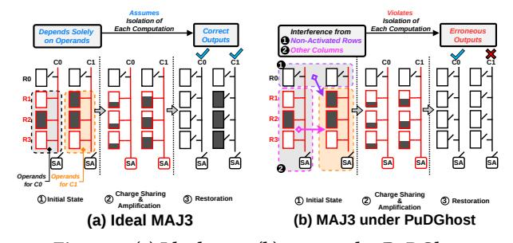

Figure 1: (a) Ideal MAJ3. (b) MAJ3 under PuDGhost.

Ideally, as illustrated in Figure 1a, the MAJX result in each DRAM column is determined *solely* by the activated cells used as operands. With each column performing its own MAJX, each one of the many (e.g., 65536) DRAM columns acts as a computing unit, enabling the massive parallelism of PuD.

We hypothesize that this ideal picture of PuD computations might be challenged by ongoing DRAM density scaling. With rapid DRAM scaling and denser cell arrays, even regular DRAM operations can become susceptible to noise and interference from neighboring cells, violating memory isolation (i.e., memory access to one location should not affect data stored in other memory locations) [77–167]. Prior work [78,81–84,86] demonstrates that accessing one DRAM location can corrupt data in other locations, even in systems where DRAM is used

solely as a storage device. As PuD repurposes DRAM from a storage device to a computation device, the notion of isolation should extend beyond between memory accesses to each computation (i.e., a computation's result should not be affected by data that is not intended to participate in the computation). Unfortunately, to our knowledge, no prior work investigates the impact of interference from rows or columns that are not intended to participate in the computation on the reliability of PuD computation results.

This work is the first to reveal an interference phenomenon corrupting PuD computation results, which we call PuDGhost, on real DRAM chips. PuDGhost causes a PuD operation in a given column to produce erroneous results due to interference from non-operand data (i.e., data not intended to participate in the computation) stored in (1) non-activated rows and (2) other columns that perform computations concurrently under the same SiMRA operation. Figure [1b](#page-0-0) illustrates how PuDGhost causes PuD computation errors. Rows R1, R2, and R3 are simultaneously activated to perform a MAJ3 operation. In column C1, the inputs are 1, 1, and 0, so the ideal MAJ3 output should be 1 (Figure [1a](#page-0-0)). Due to PuDGhost, column C1 suffers interference from non-activated rows (e.g., R0) ( 1 ) and other columns (e.g., C0) ( 2 ), resulting in an erroneous output.

We conduct the first extensive characterization of PuDGhost using 96 real DDR4 DRAM chips (12 modules). We systematically study interference from non-operand data under a wide range of operational conditions (e.g., data patterns, temperature, and spatial properties). Among our 15 key observations, we highlight two major findings. First, non-operand data in non-activated rows that are physically adjacent to simultaneously activated rows affects SiMRA outputs. Storing logic-0 (logic-1) in the adjacent rows biases the SiMRA output toward logic-0 (logic-1), affecting SiMRA outputs by up to 10% for random inputs. The bias increases monotonically as the fraction of logic-1 in adjacent rows increases (detailed in [§5\)](#page-4-0). Second, non-operand data in other columns that concurrently perform computations under the same SiMRA operation (i.e., the inputs of these concurrent computations) also affects SiMRA outputs by up to 48% for random inputs. Unlike adjacent-row interference, column-wise interference is both stronger and exhibits a non-monotonic relationship with the fraction of logic-1 in these columns' inputs (detailed in [§6\)](#page-6-0).

Our real DRAM chip characterization results suggest that PuDGhost is an important consideration for designing future PuD systems that are robust. Building on our empirical insights, we analyze PuDGhost's impact on PuD reliability and present robust PuD solution directions across multiple layers of the PuD computing stack. At the system level, we reveal that PuD systems that are unaware of adjacent-row data during column screening and PuD execution can mislabel unreliable columns as reliable. We propose robust column screening methods that control the data in rows adjacent to compute rows during both screening and PuD execution, reducing the risk of mistakenly using unreliable columns in the presence of PuDGhost. At the architecture level, we propose a compute row layout that uses dedicated isolation rows with fixed data patterns between compute rows, ensuring that the rows adjacent to compute rows store fixed data that does not change during PuD execution.

We evaluate our solutions on real DRAM chips for two use cases: general matrix-vector multiplication (GEMV) and true random number generation (TRNG). Our results demonstrate that our solutions significantly reduce the impact of PuDGhost, providing 1) 413× lower normalized mean squared error (NMSE) in GEMV and 2) preventing 93% of the entropy loss in TRNG, compared to PuDGhost-unaware systems.

Our main contributions are as follows.

- We perform the first experimental study of a new interference phenomenon in DRAM that corrupts Processing-using-DRAM (PuD) computation results, which we call PuDGhost, on real DRAM chips.
- Our experimental results on real DDR4 DRAM chips reveal that PuD computation results in a given column can be affected by data stored in 1) non-activated rows adjacent to the rows used for computation and 2) other columns that perform computations concurrently. PuDGhost violates the expectation that each computation depends solely on its own operand data.
- We propose and discuss solutions across multiple layers of the PuD computing stack to reduce PuDGhost-induced PuD computation errors.
- We evaluate our solutions on real DRAM chips for two use cases: general matrix-vector multiplication (GEMV) and true random number generation (TRNG). Our results demonstrate that our solutions significantly reduce the impact of PuDGhost on these real use cases.
- We believe and hope that our results and analyses will enable and inspire future research to reduce computation errors in PuD, and to design future PuD systems that are robust.

#### 2. Background

#### 2.1. DRAM Organization and Operation

Dynamic Random Access Memory (DRAM) is organized in a hierarchical structure consisting of channels, ranks, chips, banks, and subarrays of memory cells (Figure [2\)](#page-2-0). A module contains one or more ranks, and each rank consists of multiple DRAM chips. Each chip has multiple banks (e.g., 8–16), and each bank is further divided into multiple subarrays. Within each subarray, DRAM cells form a two-dimensional grid of rows (wordlines) and columns (bitlines). Each cell consists of a single transistor paired with a capacitor, and stores one bit of data, based on the charge level held in the capacitor. The DRAM cells in the same column are connected to the sense amplifier (SA) via a bitline. Modern DRAM employs an open bitline architecture [\[168](#page-15-1)[–171\]](#page-15-2), where half of the bitlines in a subarray share SAs with the upper adjacent subarray and the other half share SAs with the lower adjacent subarray. The memory controller integrated in the CPU die generates a sequence of DRAM commands to access data in DRAM. The ACT command opens a specific row and copies its data into the row buffer. The PRE command closes the active row. These commands operate on all columns in a row.

#### 2.2. Processing-using-DRAM

Computational Capability of PuD. Processing-using-DRAM (PuD) [\[21–](#page-13-1)[71\]](#page-14-0) is a paradigm that can alleviate the bottleneck caused by frequent data movement between processing elements (e.g., CPUs) and main memory. PuD enables massively

Figure 2: DRAM Organization.

parallel computation within DRAM by leveraging the intrinsic analog operational properties of DRAM circuitry. Many PuD architectures perform computation through two primitives: 1) in-DRAM data copy from one row to another (RowCopy) using consecutive multiple-row activation [\[22,](#page-13-21)[23,](#page-13-14)[26,](#page-13-2)[30](#page-13-22)[,43,](#page-13-15)[50,](#page-13-17)[64\]](#page-14-5), and 2) in-DRAM bitwise operations using simultaneous multiplerow activation (SiMRA) [\[23,](#page-13-14)[26,](#page-13-2)[33,](#page-13-3)[38,](#page-13-6)[40–](#page-13-7)[43,](#page-13-15)[46–](#page-13-16)[48,](#page-13-9)[50](#page-13-17)[–52,](#page-13-18)[54](#page-13-19)[–58,](#page-13-20) [61,](#page-14-1)[63,](#page-14-4)[64,](#page-14-5)[67,](#page-14-6)[68,](#page-14-7)[76\]](#page-14-8). In bitwise operations using SiMRA, simultaneously activating multiple DRAM rows within the same subarray induces charge sharing of activated cells in each bitline, resulting in a majority-of-X operation (MAJX) in each column. For example, when three rows are simultaneously activated, the charges of cells on the same bitline combine through charge sharing to produce the MAJ3 result (see Figure [1a](#page-0-0)). MAJX can implement basic Boolean operations such as AND and OR, and by chaining multiple MAJX operations, PuD can accelerate a wide range of computations, from basic arithmetic to complex kernels including general matrix-vector multiplication (GEMV) for LLM inference [\[26,](#page-13-2)[33,](#page-13-3)[35,](#page-13-4)[37,](#page-13-5)[38,](#page-13-6)[40](#page-13-7)[–42,](#page-13-8)[48,](#page-13-9)[49,](#page-13-10)[51,](#page-13-11)[55](#page-13-12)[–59,](#page-13-13)[61,](#page-14-1)[72](#page-14-2)[–75\]](#page-14-3).

In Ambit [\[23,](#page-13-14) [26,](#page-13-2) [30\]](#page-13-22) and its successor architectures [\[33,](#page-13-3) [38,](#page-13-6) [48\]](#page-13-9), six compute rows per subarray are reserved to execute MAJ3. The row decoder is modified to allow specific triplet combinations of these six rows to be simultaneously activated, enabling a MAJ3 operation. The remaining rows in the same subarray serve as storage rows, holding data that is loaded into compute rows via RowCopy when needed for computation.

PuD on COTS DRAM Chips. Prior work [\[41,](#page-13-23)[43–](#page-13-15)[47,](#page-13-24)[50,](#page-13-17)[51,](#page-13-11)[54,](#page-13-19) [61](#page-14-1)[–69,](#page-14-14) [76\]](#page-14-8) demonstrates that commercial off-the-shelf (COTS) DRAM chips possess PuD computation capability. Specifically, prior work [\[62–](#page-14-15)[65,](#page-14-16) [67\]](#page-14-6) experimentally shows that COTS DDR4 chips from SK Hynix [\[172\]](#page-15-3) can simultaneously activate 2, 4, 8, 16, or 32 rows within a subarray by violating nominal timing parameters. The memory controller can perform SiMRA on these chips by issuing an ACT-PRE-ACT command sequence (APA sequence) with very short intervals of 3ns or less between each command.

PuD Computation Errors. Prior work focuses primarily on process variation in DRAM circuit components as the mechanism for MAJX errors. Prior work [\[26,](#page-13-2) [33,](#page-13-3) [62,](#page-14-15) [64\]](#page-14-5) shows through circuit-level simulations that MAJ3 operations produce erroneous results when process variation of subarray components (e.g., cell capacitance) is large. Characterization studies using COTS DRAM chips [\[46,](#page-13-16) [47,](#page-13-24) [50,](#page-13-17) [62–](#page-14-15)[64\]](#page-14-5) experimentally show that the success rate of MAJX on real DRAM chips is below 100%, and that error susceptibility varies across columns. In these prior studies, the causes of SiMRA-based MAJX errors have been attributed to process variation of cell capacitance, access transistors, and SAs in each column.

#### 3. Methodology

We describe our COTS DRAM chip testing infrastructure ([§3.1\)](#page-2-1) and the COTS DDR4 chips tested for our characterization study ([§3.2\)](#page-2-2).

#### 3.1. COTS DRAM Testing Infrastructure

We conduct COTS DRAM chip experiments using DRAM Bender [\[173–](#page-15-4)[176\]](#page-16-0), an FPGA-based DDR4 testing infrastructure that provides precise control of DDR4 commands. Figure [3](#page-2-3) shows our experimental setup that consists of four main components: 1) a host machine that generates the test program and collects results, 2) an FPGA development board [\[177\]](#page-16-1), programmed with DRAM Bender, 3) thermocouple temperature sensors and heater pads pressed against the DRAM chips to maintain target temperature levels, and 4) a temperature controller that keeps the temperature at the desired level.

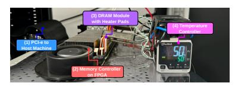

Figure 3: Our FPGA-based PuD testing infrastructure (DRAM Bender [\[173,](#page-15-4) [174\]](#page-16-2)) with DDR4 modules.

#### 3.2. COTS DDR4 DRAM Chips Tested

Table [1](#page-2-4) lists the 96 COTS DDR4 DRAM chips from 12 modules, showing chip manufacturer (Chip Mfr.), module manufacturer (Module Mfr.), module count (#Modules), chip count (#Chips), die revision (Die Rev.), density, and chip organization (Org.). All tested chips are from SK Hynix, as prior work reports that only SK Hynix modules can perform SiMRA [\[41,](#page-13-23) [43–](#page-13-15)[47,](#page-13-24) [50,](#page-13-17) [61–](#page-14-1)[65,](#page-14-16) [67\]](#page-14-6). We test modules from various module manufacturers, die revisions, and chip densities so that our findings apply across different DRAM designs and manufacturing processes.[1](#page-2-5)

Table 1: Summary of DDR4 DRAM chips tested.

| Chip Mfr. | Module Mfr. | #Modules (#Chips) | Die Rev. | Chip Density | Chip Org. |
|--------------|----------------|----------------------|-------------|-----------------|--------------|
| SK Hynix     | TimeTec        | 3 (24)               | A           | 4Gb             | x8           |
|              | TeamGroup      | 7 (56)               | M           | 4Gb             | x8           |
|              | SK Hynix       | 2 (16)               | A           | 8Gb             | x8           |

Logical-to-Physical Row Mapping. DRAM manufacturers use mapping schemes to translate logical to physical row addresses. To account for in-DRAM row address mapping, we reverse engineer the physical row address layout in all tested chips by analyzing RowHammer-induced bitflip patterns, following prior methodologies [\[63](#page-14-4)[–65,](#page-14-16) [82,](#page-14-17) [84\]](#page-14-12).

Subarray Boundaries. Following prior methodologies [\[50,](#page-13-17) [63](#page-14-4)[–65,](#page-14-16) [90\]](#page-14-18), we identify subarray boundaries using RowCopy, which only succeeds when source and destination rows are in

1Prior work [\[61–](#page-14-1)[64\]](#page-14-5) hypothesizes that the hierarchical row decoder design is the primary enabler of SiMRA on COTS DRAM chips: reducing the intervals between APA sequence allows the local wordline decoder to latch the subsequent row address without de-asserting the previous one. We believe that chips from other vendors are also fundamentally capable of SiMRA, as SiMRA leverages the hierarchical row decoder design that is common across high-performance DRAM chips and is likely to persist in future generations.

the same subarray. By attempting RowCopy across consecutive row pairs, we reconstruct each chip's subarray map.

**True/Anti Cells.** DRAM cells are classified as true-cell or anti-cell based on how a fully charged capacitor is interpreted: in a true-cell (anti-cell), a charged capacitor represents logic-1 (logic-0) and a discharged capacitor represents logic-0 (logic-1). Prior work [90, 178] on DRAM retention failure commonly assumes that retention-induced errors are from the charged to discharged state. We identify the cell type of our chips following these works. Throughout this paper, logic-1 denotes a charged capacitor and logic-0 denotes a discharged capacitor. **Even/Odd Columns.** In an open-bitline layout [168–171], adjacent subarrays share sense amplifiers (SAs). Bitlines alternate their connections: even columns connect to SAs on one side while odd columns connect to SAs on the other side. We identify this even/odd column assignment by analyzing RowCopy outcomes and charge-sharing across subarray boundaries, following prior work [63, 90].2

Verification of Simultaneously Activated Rows. Prior work [62-65, 67] demonstrates that an APA sequence can simultaneously activate 2, 4, 8, 16, and 32 DRAM rows, and a subsequent WRITE command overwrites these rows with the written data.3 We follow this methodology to verify which rows are activated during SiMRA. First, we initialize an entire subarray with a predefined pattern. Second, we issue an APA sequence to activate multiple target rows, immediately followed by a WRITE command with a distinct pattern. After issuing a PRE, we read back each row in the subarray. Rows that were activated during APA will contain the written pattern, allowing us to identify which rows participated in SiMRA. To ensure non-activated rows remain unchanged, we extend the delay between the WRITE command following APA and the subsequent PRE command beyond the nominal tWR timing. We test delays of tWR, tWR+50ns, tWR+100ns, and tWR+200ns to rigorously verify that non-activated rows are not overwritten.

#### 3.3. Overview of Experiments

**3.3.1. Study Scope.** We test whether a key expectation of PuD computations holds on real DRAM chips: that each column's output depends solely on its own operand data. We investigate two sources of interference from non-operand data by addressing the following research questions, RQ1 and RQ2.

RQ1: How does data stored in non-activated rows affect SiMRA outputs? (§4 and §5)

RQ2: How does data stored in other columns that concurrently perform computations under the same SiMRA operation affect SiMRA outputs? (§6)

We provide hypothetical explanations for the phenomena observed on real DRAM chips in §7.

**3.3.2. Terminology and Metric.** Figure 4 illustrates the six key terms we use in SiMRA experiments. *SiMRA rows* (1) refers to a set of rows that are simultaneously activated during

a SiMRA operation; these rows contain the input operands on which the operation is performed. *Adjacent rows* (2) are the rows that are *not* activated during SiMRA and physically adjacent to the SiMRA rows. *Target subarray* (3) refers to the subarray that contains the SiMRA rows. Adjacent subarrays (4) are physically adjacent subarrays of the target subarray, one above and one below the target subarray. We define the term *controlled rows* (or *controlled cells*) (**5**) to refer to rows (or cells) whose data pattern is intentionally configured to observe how the SiMRA output changes in response to different data patterns. These data patterns include fixed patterns (all zeros, all ones, and random patterns) and patterns that depend on the inputs to the SiMRA rows. For random patterns, we define  $p_c$  as the probability that each bit in controlled cells independently takes logic-1. *Target columns* (6) refer to a specified subset of columns over which we evaluate the SiMRA output. By default, all columns in the subarray serve as target columns. For column-wise interference experiments (shown in Figure 8 and §6), we randomly select 1/8th of all columns in the subarray as target columns. The SiMRA-row cells in the remaining 7/8th columns serve as controlled cells, whose data patterns we vary to analyze their impact on SiMRA outputs of the target columns.

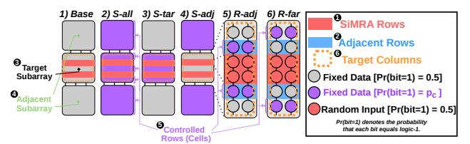

Figure 4: Experimental setup for evaluating interference from non-activated rows.

We define  $p_{o1}$  as the fraction of output bits that equal logic-1 when SiMRA is executed with random inputs over the target columns. For example, if target columns cover all 64K columns in a bank and we collect 128 samples,  $p_{o1} = 0.60$  means that 60% of the 64K  $\times$  128 output bits are logic-1. We use  $p_{o1}$  to quantify the effect of PuDGhost on the SiMRA operation in three key steps. First, as a baseline, we set all data other than the operand data in the target columns to random patterns (i.e.,  $p_c = 0.5$ ). Second, we vary the data pattern of specific controlled rows or cells and measure the resulting change in  $p_{o1}$  relative to this baseline. A change in  $p_{o1}$  indicates that the controlled non-operand data affects the computation output, and the direction and magnitude of the shift quantify the interference. Third, we report the ratio of  $p_{o1}$  under each condition to the baseline  $p_{o1}$ , which we call **Norm.**  $p_{o1}$ . A Norm.  $p_{o1}$ closer to 1.0 indicates less interference from the controlled cells, while values below (above) 1.0 indicate that the controlled cells bias the SiMRA output toward logic-0 (logic-1).

#### 4. Interference from Non-Activated Rows

In this section, we examine how non-activated rows in the *target* and *adjacent* subarrays, which share bitlines with the SiMRA rows, affect SiMRA outputs.

#### 4.1. Experimental Methodology

**Metric.** We designate several rows in the target subarray and adjacent subarrays as controlled rows. For each experimental

&lt;sup>2For some modules, the even/odd column assignment could not be reliably determined (i.e., the expected parity-dependent pattern was not consistently observed) using the RowCopy-based method of [63, 90]. We exclude these modules from experiments involving even/odd column parity.

&lt;sup>3For some modules, SiMRA is unreliable at certain activation row counts (i.e., some intended rows are not activated). We exclude such modules from the results of the affected row counts.

condition, we collect 128 samples with random inputs to the SiMRA rows while keeping the data in the controlled rows fixed across samples. In this section, we use all the columns in a subarray (i.e., 65536 columns) as target columns to perform SiMRA operations. Thus, we generate a total of  $65536 \times 128$  SiMRA output bits per condition. We report Norm.  $p_{o1}$  as defined in §3.3.2 to quantify the interference from the controlled rows. **Conditions.** Figure 4 illustrates six different conditions that we define to progressively understand which non-activated rows affect the SiMRA output in the scope of three consecutive subarrays, the target subarray (3) and its adjacent subarrays

subarrays, the target subarray (3) and its adjacent subarrays (4). 1) Base is the baseline configuration. 2) S-all designates all rows except the SiMRA rows in both the target (3) and adjacent subarrays (4) as controlled rows. 3) S-tar designates all rows except the SiMRA rows in the target subarray as controlled rows, while 4) S-adj designates all rows in the adjacent subarrays. 5) R-adj designates all adjacent rows (2) as controlled rows, while 6) R-far designates all rows in the target subarray except the SiMRA rows (1) and the adjacent rows (2).

**Experimental Control.** Across all conditions, the 128 sets of random input data applied to the SiMRA rows are *identical*, and the fixed data in all *non-controlled* rows are also kept identical. This design enables us to attribute observed differences in  $p_{o1}$  to the data patterns in the controlled rows.

Experimental Protocol. For each of the 128 random-input samples per condition, we execute four key steps: (i) write the specified data patterns to all controlled rows in the target and adjacent subarrays; (ii) write random input data to the SiMRA rows; (iii) execute SiMRA; and (iv) read out the SiMRA rows to record the outputs. Controlled rows retain the same data pattern across all 128 random-input samples, while random inputs to the SiMRA rows are independently generated for each sample. We ensure that the time per sample is well within the DRAM refresh window to eliminate the influence of retention-time failures.

**Number of Instances Tested.** To keep the total testing time reasonable, for each DRAM module, we select three subarrays per bank (one from the upper, one from the middle, and one from the lower region of the bank). Within each selected subarray, we randomly choose a group of SiMRA rows for each activation count: 2-, 4-, 8-, 16-, and 32-row activation.

**Temperature.** Unless stated otherwise, all experiments are conducted at  $50^{\circ}$  C.

#### 4.2. COTS DRAM Chip Characterization

Figure 5 shows how non-activated rows affect SiMRA outputs under six conditions. The y-axis shows the distribution of Norm.  $p_{o1}$  across all tested modules, banks, and subarrays and the x-axis shows each tested condition. Figure 5a shows when all controlled rows store all-zeros ( $p_c=0.0$ ), and Figure 5b shows when all controlled rows store all-ones ( $p_c=1.0$ ). Each subplot represents a different number of SiMRA rows (i.e., 2-, 4-, 8-, 16-, and 32-row activation).

(a) All controlled rows store an all-zero pattern.

(b) All controlled rows store an all-one pattern.

Figure 5: Row-type characterization under controlled patterns.

**Obsv. 1.** Non-activated adjacent rows bias SiMRA outputs toward logic-0 (logic-1) when the adjacent rows store logic-0 (logic-1).

In Figure 5a, we observe that S-all, S-tar, and R-adj produce Norm.  $p_{o1}$  of approximately 0.97–0.98 on average across all five activation counts, reaching as low as 0.90. This indicates that adjacent-row data set to all-zeros biases SiMRA outputs for random inputs toward logic-0 by an average of 2–3% and up to 10%. Similarly, in Figure 5b, S-all, S-tar, and R-adj produce Norm.  $p_{o1}$  of 1.02–1.03 on average across all five activation counts, reaching as high as 1.10. This indicates that adjacent-row data set to all-ones biases SiMRA outputs for random inputs toward logic-1 by an average of 2–3% and up to 10%.

### **Obsv. 2.** Interference from non-activated rows is highly localized to physically adjacent rows.

The R-adj condition shows similar Norm.  $p_{o1}$  values to S-all and S-tar, with means of approximately 0.97–0.98 in Figure 5a and 1.02–1.03 in Figure 5b, demonstrating that adjacent rows account for essentially all observed interference. In contrast, conditions without adjacent-row control (S-adj and R-far) show at most 0.7% deviation from the baseline in both Figure 5a and Figure 5b, indicating that non-adjacent rows have a small impact on SiMRA outputs.

# **Obsv. 3.** Interference from non-activated adjacent rows can strengthen as the number of SiMRA rows increases

We observe that the magnitude of bias can increase with more SiMRA rows. For example, in the R-adj condition, Norm.  $p_{o1}$  reaches as low as 0.95 in Figure 5a and as high as 1.05 in Figure 5b for 2-row activation, while for 8-row activation, it reaches as low as 0.90 in Figure 5a and as high as 1.10 in Figure 5b.

# 5. Characterization of Interference from Adjacent Rows

Building on the result of §4, this section provides a detailed characterization of adjacent-row interference from several perspectives (e.g., data patterns, spatial locality, and temperature sensitivity). We reuse the experimental control, the number of instances, and the default temperature setup from §4 and describe only the methodology specific to the experiment.

#### 5.1. Experimental Methodology

**Metric.** As in the R-adj setup in Figure 4, we designate all adjacent rows (2) as controlled rows (5) and use normalized

 $^4\text{Throughout}$  §4, §5, and §6, box-and-whisker plots show box boundaries representing the first and third quartiles (Q1 and Q3), and circle markers indicating the mean values. Each box shows the distribution across all tested instances (one SiMRA row group per subarray, across 12 modules  $\times$  16 banks  $\times$  3 subarrays).

(Norm.)  $p_{o1}$  to quantitatively evaluate their impact on the SiMRA output (the common baseline condition fills all adjacent rows with independent random data with  $p_c=0.5$ ). For each experimental condition, we collect 128 samples with random inputs to the SiMRA rows (1). Except for the experiment shown in Figure 12, the data in the controlled rows (5) are kept fixed across all samples. Unless otherwise noted, all columns are designated as target columns (6).

**Experimental Protocol.** For each of the 128 random-input samples, we execute the following four steps: (i) write the specified data pattern to all adjacent rows; (ii) write random input data to the SiMRA rows; (iii) execute SiMRA; and (iv) read out the SiMRA rows to record the outputs.

#### 5.2. COTS DRAM Chip Characterization Results

**Sensitivity to Fraction of Logic-1.** To examine how the fraction of logic-1 stored in adjacent rows affects the SiMRA output, we sweep  $p_c \in \{0.0, 0.25, 0.75, 1.0\}$ . Note that  $p_c = 0.5$  corresponds to the baseline condition. Figure 6 shows Norm.  $p_{o1}$  distribution (y-axis) for each  $p_c$  value of the adjacent rows (x-axis), across different numbers of SiMRA rows (each subplot).

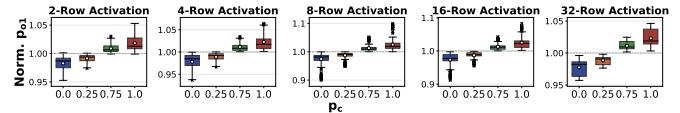

Figure 6: Sensitivity to fraction of logic-1 in adjacent rows.

**Obsv. 4.** Data stored in non-activated adjacent rows more strongly biases SiMRA outputs toward logic-1 (logic-0) as the fraction of logic-1 (logic-0) in the adjacent rows increases.

As  $p_c$  increases, Norm.  $p_{o1}$  increases monotonically, demonstrating a clear positive correlation between the fraction of logic-1 in adjacent rows and the bias in SiMRA outputs. For example, with 32-row activation, the mean Norm.  $p_{o1}$  rises monotonically from 0.98 ( $p_c = 0.0$ ) to 1.02 ( $p_c = 1.0$ ).

**Structured Data Patterns.** To study the impact of structured (i.e., non-random) data patterns in adjacent rows, we vary the byte pattern among  $\{0\times00, 0\timesF0, 0\times55, 0\timesAA, 0\timesFF\}$ . Figure 7 shows Norm.  $p_{o1}$  distribution (y-axis) for various data patterns written to the adjacent rows (x-axis), across different numbers of SiMRA rows (each subplot).

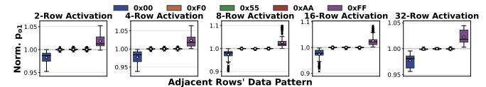

Figure 7: Sensitivity to the data patterns in the adjacent rows.

**Obsv. 5.** Non-activated adjacent rows bias SiMRA outputs based on the fraction of logic-1 they store rather than on the specific structured data pattern.

Data patterns with the same fraction of logic-1 in adjacent rows produce similar Norm.  $p_{o1}$  regardless of the structured pattern used. 0xF0, 0x55, and 0xAA all have a fraction of logic-1 of 0.5 and produce Norm.  $p_{o1}$  of approximately 1.0.

**Column-Local Interference.** We test whether interference from adjacent rows is uniform across all columns or depends on each column's own adjacent-row cells. We set data in adjacent

rows to random ( $p_c=0.5$ ) and partition columns into two sets based on the fraction of logic-1 in each column's adjacent-row cells (see Figure 8a): **1** Hi-Cols (columns where more than half of the adjacent-row cells store logic-1) and **2** Lo-Cols (columns where fewer than half of the adjacent-row cells store logic-1). Columns where the adjacent-row cells store the same number of logic-0 and logic-1 are not classified into either **1** or **2**. We measure Norm.  $p_{o1}$  separately for Hi-Cols and Lo-Cols as target columns.

Figure 8: (a) Column-local interference. (b) Adjacent-row interference across columns.

Figure 9 shows the Norm.  $p_{o1}$  distribution (y-axis) separately for Hi-Cols and Lo-Cols (x-axis) across different numbers of SiMRA rows (each subplot).

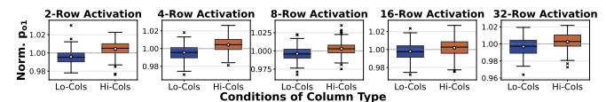

Figure 9: Column-local interference.

**Obsv. 6.** Interference from non-activated adjacent rows is not uniform across all columns: each column's SiMRA output is affected by its own adjacent-row cells.

Hi-Cols and Lo-Cols show opposite trends: Hi-Cols produce a mean Norm.  $p_{o1}$  above 1.0 while Lo-Cols produce below 1.0. For example, with 2-row activation, the mean Norm.  $p_{o1}$ is 1.004 for Hi-Cols and 0.996 for Lo-Cols. This means that columns whose own adjacent-row cells contain more logic-0 (logic-1) are biased toward logic-0 (logic-1), confirming that adjacent-row interference is not uniform across all columns. Adjacent-Row Interference Across Columns. To evaluate whether a given column's SiMRA output is affected by data stored in other columns' adjacent-row cells, we randomly select 1/8th of all columns as target columns ((1)) (see Figure 8b). For the remaining 7/8th columns, we designate their adjacent-row cells as controlled cells ((2)) and set them to all-zeros ( $p_c = 0.0$ ) or all-ones ( $p_c = 1.0$ ). Figure 10 shows the Norm.  $p_{o1}$  distribution of the target columns (y-axis) for different  $p_c$  values of the controlled cells in non-target columns (x-axis), across different numbers of SiMRA rows (each subplot).

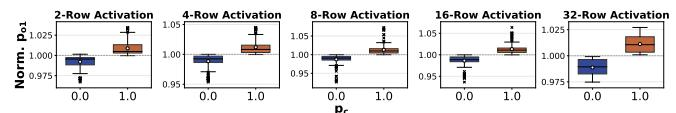

Figure 10: Adjacent-row interference across columns.

**Obsv. 7.** A given column's SiMRA output is affected by data stored in other columns' adjacent-row cells.

When the controlled cells in non-target columns store logic-0 (logic-1), the mean Norm.  $p_{o1}$  of target columns is biased

toward logic-0 (logic-1), confirming that data in other columns' adjacent-row cells affects a given column's SiMRA output. For example, with 2-row activation, the mean Norm.  $p_{o1}$  shifts to 0.99 at  $p_c=0.0$  and 1.01 at  $p_c=1.0$ .

Input-Dependent Adjacent-Row Patterns. To quantify how a SiMRA input bit and its corresponding adjacent-row bit jointly affect the output, we define  $bit_{\rm in}$  as the value of a SiMRA input bit in a given column and  $bit_{adj}$  as the value of the adjacent-row cell in the same column. For each random-input sample, we first initialize all adjacent rows with a random base pattern  $(p_c = 0.5)$ . We then modify the adjacent-row cells based on a specified  $(bit_{in}, bit_{adj})$  combination: for each column where the SiMRA input equals  $bit_{\rm in}$ , we set its corresponding adjacent-row cell to  $bit_{adj}$ ; all other adjacent-row cells retain the base pattern. Figure 11 illustrates the adjacent-row data patterns for the baseline and all four combinations in a given random-input sample. For example, for  $(bit_{in}, bit_{adj}) = (1, 1)$ , each column where the SiMRA input is logic-1 (1) has its corresponding adjacentrow cell set to logic-1 (2), while the remaining adjacent-row cells retain the random base pattern. Because the random inputs differ across samples, the spatial distribution of modified adjacent-row cells changes accordingly. This experiment uses configurations where each adjacent row borders only one SiMRA row, making  $bit_{adj}$  well-defined.

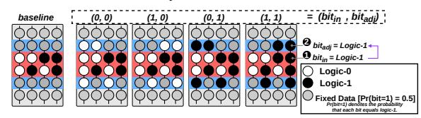

Figure 11: Input-dependent adjacent-row patterns.

Figure 12 shows Norm.  $p_{o1}$  distribution (y-axis) for all four combinations  $(bit_{\rm in}, bit_{\rm adj}) \in \{(0,0), (1,0), (0,1), (1,1)\}$  (x-axis), across different numbers of SiMRA rows (each subplot).

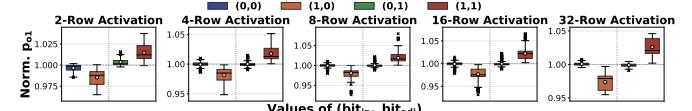

Figure 12: Input-dependent adjacent-row interference.

**Obsv. 8.** Cells in simultaneously activated rows storing logic-1 are substantially more susceptible to interference from non-activated adjacent rows than cells storing logic-0.

When  $bit_{\rm in}=0$ , the mean Norm.  $p_{o1}$  remains approximately 1.0 regardless of  $bit_{\rm adj}$  across all tested numbers of SiMRA rows, indicating negligible interference. In contrast, when  $bit_{\rm in}=1$ , the SiMRA output is sensitive to the adjacent-row cell:  $bit_{\rm adj}=0$  decreases the mean Norm.  $p_{o1}$  to approximately 0.97–0.98, while  $bit_{\rm adj}=1$  increases it to 1.02–1.03.

Temperature Sensitivity. To study the temperature dependence of interference from adjacent rows, we set the temperature to  $50^{\circ}$ C,  $60^{\circ}$ C,  $70^{\circ}$ C, and  $80^{\circ}$ C. At each temperature, we set all adjacent rows to all-zeros ( $p_c = 0.0$ ) or all-ones ( $p_c = 1.0$ ). Figure 13 shows the mean Norm.  $p_{o1}$  (y-axis) across temperatures ranging from  $50^{\circ}$ C to  $80^{\circ}$ C (x-axis) when all adjacent rows are set to all-zeros ( $p_c = 0.0$ ) or all-ones ( $p_c = 1.0$ ), across different numbers of SiMRA rows (each subplot).

Figure 13: Adjacent-row interference vs. temperature.

**Obsv. 9.** Temperature has a small effect on interference from non-activated adjacent rows.

We observe no significant temperature dependence in adjacent-row interference. For example, with 8-row activation under  $p_c=1.0$ , the mean Norm.  $p_{o1}$  remains at approximately 1.02 across all tested temperatures (50°C–80°C).

# 6. Interference from Columns that Concurrently Perform Computations

In this section, we investigate whether data stored in columns that concurrently perform computations under the same SiMRA operation affects the SiMRA outputs.

#### 6.1. Experimental Methodology

We reuse the experimental protocol, the experimental control, the number of instances, and the temperature setup from §5 and describe only the methodology specific to §6.

**Metric.** We select 1/8th of all columns as target columns and designate the SiMRA-row cells in the remaining 7/8th columns as controlled cells. By default, target columns are randomly selected from all columns regardless of even/odd column parity, as illustrated in Figure 14a. We measure Norm.  $p_{o1}$  over the target columns using 128 random-input samples. The baseline condition sets each controlled cell independently to logic-1 with probability  $p_c=0.5$ .

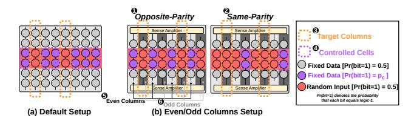

Figure 14: Experimental setup for evaluating interference from concurrently computing columns: (a) Default setup, (b) Even/odd column setup.

#### 6.2. COTS DRAM Chip Characterization Results

**Fraction of Logic-1.** Using the default setup (Figure 14a), we sweep  $p_c \in \{0.0,\,0.25,\,0.75,\,1.0\}$  to examine how the fraction of logic-1 in the controlled cells affects the SiMRA outputs of target columns. Note that  $p_c=0.5$  corresponds to the baseline.

Figure 15 shows the Norm.  $p_{o1}$  distribution of the target columns (y-axis) across all tested modules, banks, and subarrays, for each  $p_c$  value of the controlled cells (x-axis), across different numbers of SiMRA rows (each subplot).

 $^5 Throughout \S 5$  and §6, the line plots show mean values with shaded bands representing the interquartile range (IQR), computed across all tested instances (one SiMRA row group per subarray, across 12 modules  $\times$  16 banks  $\times$  3 subarrays).

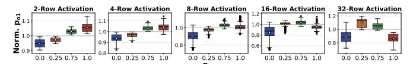

Figure 15: Sensitivity to the fraction of logic-1 in concurrently computing columns' inputs.

**Obsv. 10.** SiMRA output is affected by data stored in other columns that concurrently perform computations. For 2–4 simultaneously activated rows, these columns' inputs bias SiMRA outputs toward logic-1 (logic-0) as their fraction of logic-1 increases (decreases). For 8+ rows, the bias direction reverses at high fractions of logic-1, where SiMRA outputs are biased toward logic-0.

The observed trend of the interference from columns that concurrently perform computations varies with the number of simultaneously activated rows. For small row counts (2–4 rows), Norm.  $p_{o1}$  increases monotonically with the fraction of logic-1 in the inputs of columns that concurrently perform computations. For example, with 4-row activation, the mean Norm.  $p_{o1}$  increases from 0.94 ( $p_c=0.0$ ) to 1.04 ( $p_c=1.0$ ). For larger row counts (8+ rows), the relationship becomes nonmonotonic: Norm.  $p_{o1}$  peaks at intermediate  $p_c$  values and decreases toward both extremes. For example, with 32-row activation, the mean Norm.  $p_{o1}$  is 0.89, 1.11, 1.05, and 0.86 at  $p_c=0.0$ , 0.25, 0.75, and 1.0, respectively, with the maximum deviation occurring at  $p_c=0.25$ .

**Obsv. 11.** Interference from columns that concurrently perform computations strengthens as the number of simultaneously activated rows increases.

The magnitude of interference grows substantially with more SiMRA rows. For 2-row activation, the mean Norm.  $p_{o1}$  ranges from approximately 0.95 to 1.06. For 32-row activation, it ranges from approximately 0.86 to 1.11. The maximum deviation from the baseline reaches up to 48%, observed at 16-row activation with  $p_c=0.0$ .

**Obsv. 12.** Interference from columns that concurrently perform computations is stronger than interference from non-activated adjacent rows.

The interference observed in Figure 15 is significantly larger than the interference from non-activated rows observed in Figure 6, where the mean Norm.  $p_{o1}$  stays within the range of approximately 0.97–1.03.

Even/Odd Columns. To understand the spatial characteristics of inter-column interference, we distinguish between even and odd columns. We refer to whether a column is even or odd as its parity; two columns have opposite parity if one is even and the other is odd, and same parity if both are even or both are odd. We select target columns from only even columns or only odd columns, randomly choosing 1/8th of all columns (i.e., 1/4th of the columns of the chosen parity) as target columns, and define two configurations, illustrated in Figure 14b. In Opposite-Parity (1), the controlled cells are the SiMRA-row cells in all columns of the opposite parity (e.g., in Figure 14b, target columns (3) are selected from odd columns (6), so the SiMRA-row cells in all even columns (5) serve as controlled cells (4)). In Same-Parity (2), the controlled cells

are the SiMRA-row cells in all non-target columns of the same parity (e.g., in Figure 14b, target columns (3) are selected from odd columns (6), so the SiMRA-row cells in all non-target odd columns serve as controlled cells (4)). We sweep  $p_c \in \{0.0,\,0.25,\,0.75,\,1.0\}$  for both configurations.

Figure 16 shows the Norm.  $p_{o1}$  distribution of the target columns (y-axis) for each  $p_c$  value of the controlled cells (x-axis), across different numbers of SiMRA rows (each subplot). Figure 16a shows results for the Opposite-Parity configuration, and Figure 16b for the Same-Parity configuration.

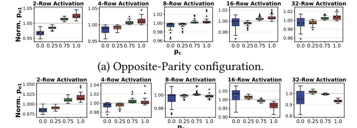

(b) Same-Parity configuration.

Figure 16: Interference from concurrently computing columns by parity: (a) Opposite-Parity, (b) Same-Parity.

**Obsv. 13.** Interference from columns of the opposite parity biases SiMRA outputs toward logic-0 (logic-1) when their inputs store logic-0 (logic-1).

In Figure 16a, the mean Norm.  $p_{o1}$  of the target columns increases monotonically with  $p_c$  across all five activation counts in the Opposite-Parity configuration. For example, with 2-row activation, the mean Norm.  $p_{o1}$  increases from approximately 0.97 at  $p_c=0.0$  to approximately 1.02 at  $p_c=1.0$ .

**Obsv. 14.** Interference from columns of the same parity biases SiMRA outputs in the same direction as their inputs for 2–4 activated rows, but the bias direction reverses at high fractions of logic-1 for 8+ rows.

In the Same-Parity configuration (Figure 16b), for 2-row activation, the mean Norm.  $p_{o1}$  increases monotonically from approximately 0.99 ( $p_c=0.0$ ) to 1.02 ( $p_c=1.0$ ). For larger row counts (8+ rows), the bias direction can reverse at high fractions of logic-1: for example, with 32-row activation, the mean Norm.  $p_{o1}$  is 0.96, 1.02, 0.99, and 0.93 at  $p_c=0.0$ , 0.25, 0.75, and 1.0, respectively. This non-monotonic trend contrasts with the Opposite-Parity configuration, which remains monotonic across all row counts.

Temperature Sensitivity. To study the temperature dependence of inter-column interference, we use the default setup (Figure 14a). At each temperature, we set the controlled cells to all-zeros ( $p_c=0.0$ ) or all-ones ( $p_c=1.0$ ). Figure 17 shows the mean Norm.  $p_{o1}$  (y-axis) across temperatures ranging from  $50^{\circ}\mathrm{C}$  to  $80^{\circ}\mathrm{C}$  (x-axis), for  $p_c=0.0$  and  $p_c=1.0$  (each line), across different numbers of SiMRA rows (each subplot).

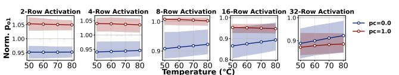

Figure 17: Inter-column interference vs. temperature.

**Obsv. 15.** Interference from columns that concurrently perform computations varies monotonically with the temperature.

The interference varies monotonically with temperature. For example, with 16-row activation at  $p_c=0.0$ , the mean Norm.  $p_{o1}$  increases from 0.87 to 0.89 as temperature rises from  $50^{\circ}\mathrm{C}$  to  $80^{\circ}\mathrm{C}$ , reducing the deviation from the baseline. In contrast, with 16-row activation at  $p_c=1.0$ , the mean Norm.  $p_{o1}$  decreases from 0.953 to 0.947, slightly increasing the deviation from the baseline.

#### 7. Hypothetical Explanation for PuDGhost

We hypothesize that the interference phenomena observed in §4–§6 arise from electrical coupling during SiMRA charge sharing and sensing.

Interference from non-activated rows. The directional bias observed in §5 (i.e., adjacent rows storing logic-0 (logic-1) bias SiMRA outputs toward logic-0 (logic-1) (Obsv. 4)) suggests electrical coupling between activated and non-activated rows, where the charge state of non-activated adjacent-row cells affects the charge sharing process. We hypothesize that the asymmetric sensitivity observed in Figure 12, where cells in SiMRA rows storing logic-1 are more susceptible to interference from adjacent rows than cells storing logic-0 (Obsv. 8), arises because cells storing logic-1 (i.e., charged cells) have their charge drained to the bitline during SiMRA, which may make them more vulnerable to interference.

Interference from columns that concurrently perform computations. We hypothesize that the monotonic trend in the Opposite-Parity configuration (Figure 16a) arises from electrical coupling between bitlines of opposite parity. The non-monotonic trend in the Same-Parity configuration (Figure 16b) may reflect interactions through sense-amplifier (SA) circuitry, as columns of the same parity connect to SAs on the same side of the subarray. We hypothesize that the overall patterns observed in Figure 15 (Obsv. 10) emerge from the combination of these two effects.

We hope that our findings motivate future device-level studies to uncover the precise root causes of PuDGhost, similar to how device-level studies [150,167,179–185] provided insight into RowHammer [81,84,93] and RowPress [82,88,151] after the two phenomena were first demonstrated and analyzed in real DRAM chips.

#### 8. Challenges For Reliable PuD Systems

Building on the detailed characterization of PuDGhost in §4, §5, and §6, this section discusses key implications for designing future PuD systems that are robust.

#### 8.1. Reliability Challenges Induced by Non-Operand Data

We demonstrate that SiMRA outputs are affected by interference from data stored in non-activated adjacent rows and columns that concurrently perform computations. These results obtained on real DRAM chips violate the expectation of PuD computations that each column's computation should depend *solely* on its own operand data.6

Even when PuD system architects are aware that PuD computations can produce errors (e.g., due to process variation)

and employ solutions such as post-manufacturing column screening to use only reliable columns, a lack of awareness of PuDGhost can still lead to unreliable systems. We demonstrate in §10.1 that column screening without accounting for PuDGhost can mislabel unreliable columns as reliable, as the non-operand data during screening may not reflect the actual non-operand data during PuD execution.

#### 8.2. Ineffectiveness of Disturbance Mitigations

PuDGhost is qualitatively different from DRAM read disturbance phenomena [65,81–83,88,151] in three key aspects. Interference source. Read disturbance is caused by an activated aggressor row. PuDGhost is caused by data stored in 1) non-activated adjacent rows and 2) columns that concurrently perform computations under the same SiMRA operation. Triggering mechanism. Read disturbance requires repeatedly activating an aggressor row (RowHammer) or keeping it open for a prolonged period (RowPress). PuDGhost requires no aggressor row activation; data stored in non-activated rows affects computation results within a single SiMRA operation. Manifestation. Read disturbance manifests as persistent bitflips in victim DRAM cells through gradual charge injection or leakage. PuDGhost manifests as transient errors in SiMRA outputs during charge sharing and sensing.

These differences render prior read disturbance mitigations [65, 79, 82, 83, 85, 147–149, 152, 160, 161, 164–166, 186–204] ineffective against PuDGhost. To experimentally verify that refreshing data before SiMRA execution does not mitigate PuDGhost, we vary the time interval (0ms, 30ms, 60ms, or 120ms) between writing data to SiMRA rows and executing SiMRA. If the interference is related to charge leakage over time, shorter time intervals should result in weaker interference. We follow the same setup as  $p_c = 0.0$  and  $p_c = 1.0$ in Figure 6 for adjacent-row interference (left plot) and Figure 15 for inter-column interference (right plot), and test 8-row activation on one DRAM chip from each of the three module types. Figure 18 shows the mean Norm.  $p_{o1}$  (y-axis) as a function of the waiting time before SiMRA execution (x-axis). Across all conditions, the mean Norm.  $p_{o1}$  remains approximately constant regardless of the waiting time (e.g., 0.98 at  $p_c = 0.0$  and 1.02 at  $p_c = 1.0$  in the left plot; 0.92 at  $p_c = 0.0$ and 1.02 at  $p_c = 1.0$  in the right plot), showing that refreshing data more frequently before SiMRA execution does not mitigate PuDGhost.

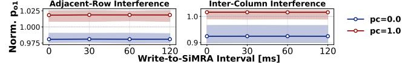

Figure 18: Time interval between writing data and SiMRA.

#### 8.3. Broader Implications

## **8.3.1. Security Concerns for PuD Systems.** PuDGhost exposes two attack vectors in multi-tenant PuD environments

6We believe PuDGhost would manifest in any SiMRA-capable chip regardless of manufacturer or DRAM type, as PuDGhost is based on fundamental analog operational properties of DRAM (e.g., charge sharing) and DRAM array design (e.g., hierarchical row decoders, open-bitline architecture) shared across manufacturers and DRAM types. We already observe consistent interference patterns across 12 modules with three different die revisions and densities, lending support to this hypothesis.

where multiple users share the same DRAM bank. First, an attacker can (1) allocate memory in DRAM rows adjacent to the victim's SiMRA rows and (2) write specific patterns to these rows to bias the victim's PuD computation results. Second, conversely, the attacker could infer statistical properties of the victim's adjacent-row data by observing bias patterns in the attacker's own computation results.

8.3.2. Other **SiMRA**-based Operations. PuDGhost can degrade the reliability of a broad spectrum of SiMRA-based operations. For example, SiMRA-based true random number generation (TRNG) [\[44,](#page-13-25) [61,](#page-14-1) [67\]](#page-14-6), SiMRA-based physically unclonable functions (PUFs) [\[68\]](#page-14-7), and other potential future SiMRA-based operations could also be affected. In [§10.3,](#page-11-0) we demonstrate that PuDGhost can significantly degrade the randomness quality of SiMRA-based TRNG. This implies that PuDGhost is a critical consideration for TRNG and cryptographic applications that rely on it.

8.3.3. PuD Simulation Frameworks. Our characterization reveals that PuD computations performed concurrently under the same SiMRA operation are not independent: a given column's SiMRA output depends on data stored in columns that concurrently perform computations. This finding has critical implications for PuD simulation frameworks. Prior PuD simulation models [\[42,](#page-13-8) [49\]](#page-13-10) assume that errors occur independently in each column. Since whether or not a column produces a computation error also depends on the inputs of concurrent computations, these models may not accurately capture application-level output quality.

#### 9. PuDGhost-Aware Error Mitigation Techniques

As discussed in [§8,](#page-8-3) PuDGhost poses a fundamental reliability challenge for PuD systems. Since PuDGhost arises from inherent analog operational properties of DRAM and DRAM array design, fully eliminating PuDGhost would be difficult. One promising direction is to design DRAM from the ground up for reliable PuD. However, such fundamental redesign is not the only path. Prior characterization studies [\[79,](#page-14-22) [81,](#page-14-11) [82,](#page-14-17) [84,](#page-14-12) [88\]](#page-14-20) of DRAM reliability challenges have led to practical mitigations [\[65,](#page-14-16) [79,](#page-14-22) [82,](#page-14-17) [83,](#page-14-21) [85,](#page-14-23) [147–](#page-15-7)[149,](#page-15-8) [152,](#page-15-9) [160,](#page-15-10) [161,](#page-15-11) [164–](#page-15-12)[166,](#page-15-13) [186](#page-16-6)[–204\]](#page-16-7) without requiring DRAM redesign.

In this section, we discuss mitigation strategies across multiple layers of the PuD computing stack. In [§9.1,](#page-9-0) we discuss potential DRAM cell array-level modifications as directions for future research. In [§9.2,](#page-9-1) we discuss the relationship between process variation of DRAM circuitry and PuDGhost. We propose two mitigation techniques for PuDGhost: 1) new column screening methods ([§9.3\)](#page-9-2), and 2) a new interference-aware compute row layout ([§9.4\)](#page-10-1). In [§9.5,](#page-10-2) we discuss how practical PuD systems can likely be enabled through complementary approaches: 1) PuD ECC schemes and 2) error-tolerant applications.

#### 9.1. Cell Array-Level Modifications

One approach to mitigating PuDGhost is to add modifications to the DRAM cell array to reduce interference during SiMRA. We discuss three potential directions for future research. Each approach requires modifications to the DRAM array, DRAM interface, or memory controller, and occupies a distinct point in the design tradeoff space of reliability, area overhead, and performance. We leave comprehensive evaluation and comparison of these techniques for future work.

Isolation Transistors. Inserting isolation transistors [\[170,](#page-15-14)[171,](#page-15-2) [205\]](#page-16-8) between compute rows and storage rows could electrically disconnect these regions before SiMRA execution, reducing interference from non-activated rows. However, modern DRAM is implemented with high density [\[5,](#page-13-26) [90,](#page-14-18) [206,](#page-16-9) [207\]](#page-16-10), and adding transistors incurs area overhead, potentially eating into PuD's advantage of throughput per unit area.

Staged Activation. Our characterization shows that the impact of PuDGhost strengthens with the number of simultaneously activated rows. This motivates exploring staged activation [\[39\]](#page-13-27), where rows are activated in smaller groups sequentially with sensing performed only after the final group, potentially reducing the impact of PuDGhost while preserving exact PuD computations. While the feasibility of mitigating PuDGhost requires further investigation, staged activation could offer a useful knob for trading throughput for reliability. Reference Voltage Adjustment. Adjusting precharge or reference voltages [\[32\]](#page-13-28) is a promising direction to compensate for the shift in bitline voltage caused by PuDGhost. For example, if adjacent rows are expected to store mostly logic-0 during execution, lowering the reference voltage could compensate for the resulting bias toward logic-0. Performing such adjustments at runtime to account for the dynamically varying direction and magnitude of PuDGhost could entail significant circuit complexity and power overhead.

#### 9.2. Reducing Process Variation

Prior work [\[26,](#page-13-2) [33,](#page-13-3) [62,](#page-14-15) [64\]](#page-14-5) demonstrates that process variation in DRAM circuitry can induce PuD computation errors in SPICE simulations. While reducing process variation can alleviate some sources of PuD computation errors, it alone might be insufficient to eliminate them. PuDGhost arises from data-dependent interference from non-operand data, which is fundamentally different from errors caused by process variation. The interference itself would persist even if process variation were entirely eliminated, potentially still causing PuD computation errors.

#### 9.3. Interference-Aware Column Screening

9.3.1. Naive Column Screening. A fundamental approach to handling PuD computation errors is to use only identified reliable columns during PuD execution, or to use only DRAM modules where all columns qualify as reliable [\[26,](#page-13-2) [33,](#page-13-3) [41,](#page-13-23) [47\]](#page-13-24). A prior study [\[47\]](#page-13-24) proposes post-manufacturing screening using large sets of random inputs for SiMRA to identify and filter out unreliable columns. Our experimental findings suggest that screening that does not account for PuDGhost can fail to ensure the reliability of screened columns during PuD execution. The key challenge is that PuDGhost-induced interference is dynamic: non-operand data in adjacent rows can change during PuD execution, and therefore columns labeled as reliable during screening can later produce errors, potentially causing significant application-level errors. Since column screening with random inputs naturally varies the data in concurrently computing columns across samples of inputs, sufficiently large

sets of random inputs can, in principle, capture the effect of interference from concurrently computing columns. However, PuDGhost suggests that column screening that does not account for data in adjacent rows can fail to ensure the reliability of screened columns during PuD execution (see §10.1).

**9.3.2. Robust Column Screening and System-Level Support.** To address this challenge, we propose two PuDGhostaware column screening methods, CS-1 and CS-2.

- (CS-1) Vary data in adjacent rows during screening. This approach screens columns under multiple data patterns in adjacent rows and retains only columns that are labeled reliable across all tested patterns. It requires no runtime support to control data in adjacent rows during PuD execution, but tends to reduce the number of usable columns because columns must pass screening under all tested patterns.
- (CS-2) Fix data in adjacent rows from screening through execution. This approach uses the same fixed data pattern in adjacent rows during both screening and PuD execution. Since columns are screened and operated under a single consistent data pattern in adjacent rows, it can preserve more usable columns than CS-1 (see §10.1). It requires runtime support to maintain fixed data in adjacent rows during PuD execution, as well as a compute row layout that ensures adjacent rows remain fixed, as discussed in §9.4. We provide a quantitative evaluation of these two column screening methods using real DRAM chips in §10.1.

#### 9.4. Interference-Aware Compute Row Layout

Mitigating PuDGhost requires careful physical arrangement of compute rows. In Ambit [23, 26, 30] and its successors [33, 38, 48], a small number of compute rows (e.g., six rows) are reserved for MAJ3 operations, and the row decoder is modified to simultaneously activate certain triplets of these rows to perform MAJ3. The physical arrangement of these compute rows determines which rows become adjacent to them, directly affecting the requirements for column screening methods. With CS-1, since screening tests columns under varying data patterns in adjacent rows, any layout is acceptable. In contrast, CS-2 relies on fixed data in adjacent rows during both screening and PuD execution, making certain compute row layouts incompatible with CS-2.

**Problem with Contiguous Layouts.** A contiguous layout (Figure 19a), where all compute rows are placed adjacent to each other, is incompatible with CS-2. In this layout, compute rows participating in one MAJX execution are adjacent to compute rows that can participate in other MAJX executions. Because these adjacent compute rows are overwritten with new operands in other MAJX executions, the fixed data pattern required by CS-2 cannot be maintained.

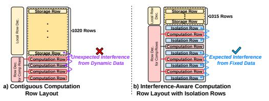

Figure 19: Compute row layouts in a 1024-row subarray with four compute rows: (a) contiguous layout, (b) isolation-row layout ensuring fixed adjacent-row data.

Interleaved Layout with Isolation Rows. We propose a compute row layout where each compute row group is placed between rows with fixed data patterns, called *isolation rows* (Figure 19b). Isolation rows are initialized once with a fixed data pattern and refreshed normally, ensuring that the rows adjacent to compute rows store fixed data that does *not* change during PuD execution. This layout introduces no additional latency beyond the one-time initialization. The area overhead is also low: following Ambit with six compute rows, this layout requires seven isolation rows, adding only 0.68% row-count overhead per 1024-row subarray. Combined with CS-2 column screening, this layout effectively reduces the impact of PuDGhost (as we demonstrate using real DRAM chips in §10.1).

#### 9.5. Path to Practical PuD Systems

Our solutions significantly reduce the PuD computation errors (see §10.1). To further reduce residual errors toward practical deployment, PuD systems can combine our solutions with two complementary approaches: 1) PuD ECC schemes and 2) error-tolerant applications. First, PuD ECC research is advancing [42,49]. For instance, Count2Multiply [42] proposes a lightweight ECC scheme that detects and corrects bit errors in PuD computations. Such ECC schemes for PuD can handle residual errors that remain after applying our mitigations. Second, several important PuD applications, such as deep neural networks (DNNs) [14] and genomic sequence search [55, 56, 208–210], have intrinsic error tolerance. For example, EDEN [14] enables DNN inference on approximate DRAM by retraining models for error resilience. These errortolerant applications can operate with sufficiently high accuracy even in the presence of some residual errors.

#### 10. Case Studies

This section evaluates on real DRAM chips: 1) our mitigations and their tradeoffs (§10.1), and their impact on 2) general matrix-vector multiplication (GEMV) (§10.2) and 3) true random number generation (TRNG) (§10.3).7

#### 10.1. Impact of Mitigations on System Tradeoffs

We evaluate PuD systems equipped with our column screening methods (§9.3) and compute row layout (§9.4) on real chips, focusing on data patterns and tradeoffs between reliability, throughput, and capacity overhead.

**Experimental Setup.** Building on the mitigation techniques in §9.3 and §9.4, following prior work [47], we conduct a two-stage experiment targeting MAJ3, the most fundamental PuD primitive.8 In *Stage 1 (screening)*, each configuration is tested with 8192 samples of random MAJ3 inputs, and a column is labeled *reliable* only if it exhibits zero errors across all samples. In *Stage 2 (execution)*, we target the columns that passed Stage 1 screening, mimicking how a PuD system would operate

 $^7\mathrm{To}$  maintain reasonable testing time, we test three DRAM modules from different chip density and die revision pairs.

&lt;sup>8Since representative PuD architectures [23,26,30,33,38,48] do not rely on Frac operations [46] to execute MAJ3, we also exclude Frac from our experiments. This ensures that MAJ3 errors caused by non-operand data can be attributed to its impact on SiMRA, rather than on Frac. We use 8-row SiMRA: each of the three operands is duplicated across two rows for redundancy, occupying six rows in total, and the remaining two rows store constant logic-0 and constant logic-1.

using only reliable columns. We run 128 additional randominput samples on these columns. For each MAJ3 execution, we (i) write the designated data pattern to adjacent rows, (ii) write random inputs to the SiMRA rows, (iii) execute SiMRA, and (iv) read outputs from the SiMRA rows. We report three metrics. 1) Column Passing Rate (CPR) is the fraction of columns that pass Stage 1, which determines the effective throughput of the PuD system. 2) Column Break Rate (CBR) is the fraction of columns labeled reliable in Stage 1 that produce at least one error in Stage 2. 3) Bit Error Rate (BER) is the bit error rate of MAJ3 in Stage 2 among the columns that passed Stage 1 screening.

Configurations. We compare six configurations in three groups, which differ in how data in adjacent rows is managed across Stage 1 and Stage 2. 1) Base corresponds to PuDGhostunaware screening. In Stage 1, all adjacent rows store a single fixed random pattern. In Stage 2, adjacent rows are overwritten before each MAJ3 sample with a random pattern whose fraction of logic-1 is uniformly drawn from  $\{0.0, 0.25, 0.50, 0.75, 1.0\}$ , simulating unpredictable changes during runtime. CS-1 varies the data in adjacent rows during Stage 1 to identify columns that remain reliable across multiple patterns. 2) CS-1-01 divides Stage 1 screening into two halves: all-zeros and all-ones. 3) CS-1-sweep divides Stage 1 screening into five segments with fraction of logic-1 in  $\{0.0, 0.25, 0.50, 0.75, 1.0\}$ . We compare these two to test whether screening with only two extreme patterns (CS-1-01) is as effective as a finer-grained sweep (CS-1-sweep). Stage 2 uses the same dynamically changing patterns as Base. CS-2 fixes the data in adjacent rows to the same pattern in both Stage 1 and Stage 2. 4) CS-2-0 uses all-zeros, 5) CS-2-1 uses all-ones, and 6) CS-2-check uses a checkerboard pattern. We test multiple patterns to identify which fixed pattern provides the best tradeoff between reliability and throughput.

**Results.** Figure 20 shows the distribution across all tested modules of three metrics (a) CPR, (b) CBR, and (c) BER9 for the six configurations (x-axis). Without PuDGhost-aware mitigations (Base), columns that passed screening still exhibit a CBR of 2.1% and a BER of  $9.2 \cdot 10^{-5}$  on average, demonstrating that PuDGhost-unaware screening fails to filter out unreliable columns. Our best configuration (CS-2-1) improves CPR (i.e., throughput of PuD execution) by  $1.06 \times$  compared to Base, while achieving  $125 \times$  lower CBR and  $91 \times$  lower BER on average. We estimate that this BER reduction translates to approximately  $8.3 \cdot 10^3 \times$  lower ECC correction failure rate under the typical configuration of a prior PuD ECC study [42]. For CS-1, we observe no significant difference between CS-1-01 and CS-1-sweep, suggesting that screening with only two extreme patterns (all-zeros and all-ones) is sufficient to identify unreliable columns affected by interference from adjacent rows. Among CS-2 variants, CS-2-1 achieves the highest CPR, improving it by up to  $1.15 \times$  over other CS-2 variants. Comparing CS-2-1 and CS-1-01, CS-2-1 achieves 1.14× higher CPR than CS-1-01, at the cost of capacity overhead due to isolation rows (§9.4), providing a trade-off between capacity and throughput.

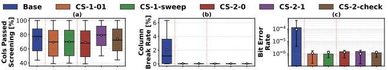

Figure 20: Evaluation of column screening methods.

#### 10.2. Application-Level Study: GEMV Kernel

We evaluate the application-level impact of PuDGhost and the effectiveness of our mitigations (§9.3, §9.4) using general matrix-vector multiplication (GEMV), one of the primary target workloads for PuD [40–42, 49, 211].

**Experimental Setup.** We execute GEMV kernels on real DRAM chips using MAJ3, following prior PuD GEMV implementations [41]. We use randomly generated matrices with dimensions  $4096 \times N$ , where  $N \in \{4, 8, 16, 32, 64\}$  at 8-bit precision. To reach configuration, we use 32,768 columns (i.e.,  $4096 \times 8$  bits) that passed the respective column screening.

Configurations. We compare four configurations (see §10.1 for detailed screening methodology). 1) Base-rand uses the same PuDGhost-unaware configuration as Base in §10.1. 2) Base-worst represents a PuDGhost-unaware baseline designed to maximize the mismatch between screening and execution: data in adjacent rows is set to all-ones during Stage 1 but changes to all-zeros during Stage 2. 3) CS-1 adopts the CS-1-01 configuration. 4) CS-2 adopts CS-2-1.

**Results.** Figure 219 shows the normalized mean squared error (NMSE) of GEMV output and the average MAJ3 BER for each configuration (x-axis). The first five subplots show NMSE for each matrix dimension ( $N \in \{4, 8, 16, 32, 64\}$ ), and the sixth subplot shows the average MAJ3 BER. NMSE increases with larger N due to longer MAJ3 operation chains, which accumulate more errors. Without our mitigations, Base-worst NMSE reaches  $2.2 \cdot 10^{-2}$  at N=16 and  $5.8 \cdot 10^{-2}$  at N=64, demonstrating that PuDGhost can cause severe degradation in GEMV accuracy. Our mitigations reduce NMSE below  $10^{-3}$  across all tested matrix dimensions. Compared to Base-rand, our mitigations (averaged over CS-1 and CS-2) reduce NMSE by  $36 \times (N=32)$  and  $14 \times (N=64)$ , and BER by  $55 \times$ . Compared to Base-worst, the reductions are  $413 \times (N=32)$  and  $114 \times (N=64)$  for NMSE, and  $1.3 \cdot 10^3 \times$  for BER.

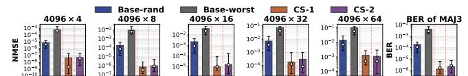

Figure 21: Effect of PuDGhost and our solutions on GEMV.

#### 10.3. PuDGhost's Impact on SiMRA-based TRNG

We demonstrate the risks of designing SiMRA-based TRNG without accounting for PuDGhost on real DRAM chips. SiMRA-based TRNG exploits columns that exhibit non-deterministic outputs under fixed SiMRA input [44,61,67]. These columns, which we refer to as *source columns*, produce outputs that fluctuate due to metastability near the sensing threshold during charge sharing, serving as entropy sources for TRNG. We investigate how data in adjacent rows and data in non-source columns affect the entropy of source column outputs.

 $^9\mathrm{Bar}$  height represents the median, circles indicate the geometric mean, and whiskers show the interquartile range.

 $^{10} \rm The~performance~advantage~of~PuD~over~processor-centric~GEMV~execution~becomes more pronounced as <math display="inline">N$  grows, since a larger N allows PuD to reduce more data transfer between DRAM and the processor [41].

**Experimental Setup.** To measure entropy under each condition, we collect 128 SiMRA output samples with fixed inputs throughout this experiment. We conduct a two-step experiment. In *Step 1*, following prior work [67], we search up to 100 candidate input patterns for the SiMRA rows to identify the pattern that maximizes the sum of Shannon entropy [61,67,71] across all columns, with data in adjacent rows fixed to a random pattern throughout. We then identify source columns that exhibit randomness under this pattern. In *Step 2*, we fix the input pattern found in Step 1 and measure the entropy of source columns while varying data in adjacent rows or non-source columns according to the conditions described below.

Conditions. We define seven conditions for Step 2, which differ in what data is changed from Step 1. 1) Fixed is the baseline: data in adjacent rows and non-source columns remains identical to Step 1. This condition corresponds to our mitigation that fixes data in adjacent rows and non-source columns during TRNG operation. For adjacent-row interference, we modify only the data in adjacent rows from Step 1 while keeping all column data identical to Step 1: 2) Row-rand overwrites adjacent rows with freshly generated random data, 3) Row-0 with all-zeros, and 4) Row-1 with all-ones. For inter-column interference, we modify only the data in SiMRA rows of non-source columns from Step 1 while keeping source column inputs and data in adjacent rows identical to Step 1: 5) Col-rand sets them to random data, 6) Col-0 to all-zeros, and 7) Col-1 to all-ones.

Results. Figure 22 shows the Norm. Entropy (y-axis), normalized to the entropy under the Fixed condition, for the six non-baseline conditions (x-axis), across different numbers of SiMRA rows (each subplot). Adjacent-row interference reduces entropy compared to Fixed. The worst case is Row-1, which reduces Norm. Entropy to 0.35 on average across the five activation counts. Inter-column interference causes even more severe entropy loss. The worst case is Col-1, which reduces Norm. Entropy to 0.07 on average, meaning that approximately 93% of the original entropy is lost. Col-0 and Col-rand also drastically reduce entropy to 0.12 and 0.15 on average, respectively. These results indicate that SiMRA-based TRNG designs that do not account for PuDGhost could unknowingly lose up to 93% of the entropy that is preserved under Fixed (i.e., our mitigation that maintains the same data in adjacent rows and non-source columns as used during the pattern search).

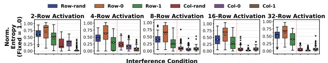

Figure 22: Impact of PuDGhost on the entropy of SiMRA-based TRNG for different numbers of SiMRA rows.

#### 11. Related Work

To our knowledge, this is the first experimental study demonstrating that non-operand data affects PuD computation results on real DRAM chips.

**DRAM Read Disturbance.** Many works experimentally characterize read disturbance phenomena on real DRAM chips [65, 69,81–84,86–94,150–158,167]. RowHammer [81,84,93] is the most widely studied example: high-frequency activation of a

DRAM row causes bitflips in physically adjacent rows. Related phenomena include RowPress [82,88,151], which causes bitflips by keeping rows open for extended periods, PuDHammer [65], which induces bitflips through repeated PuD operations, and ColumnDisturb [83], a bitline-based read disturbance that can induce bitflips in cells sharing the same columns. Various works present efficient, wide-ranging attacks and sophisticated mitigations [77–167].

Multiple-Row Activation-based PuD Operations on COTS DRAM Chips. Prior work demonstrates PuD computations on COTS DRAM using multiple-row activation [41, 43-47, 50, 51, 54, 61-69, 76]. ComputeDRAM [50] performs MAJ3 and two-input AND and OR operations in DDR3 chips. FracDRAM [46] shows that DRAM cells in DDR3 chips can store fractional values. DRAM Bender [173, 174] (based on SoftMC [175, 176]) provides an FPGA-based infrastructure for conducting experiments on real DRAM chips by enabling direct, fine-grained control over DRAM commands. PiDRAM [43, 212] provides an FPGA-based framework for end-to-end system evaluation of PuD techniques. Prior work [61, 67, 68] executes SiMRA in DDR4 chips to generate true random number and physically unclonable functions. FC-DRAM [63] demonstrates up to 16-input Boolean operations by performing SiMRA on up to 48 rows in neighboring subarrays. PuDTune [47] proposes a methodology to improve the reliability of PuD operations on DDR4 chips using Frac operations. While these prior works on PuD using COTS DRAM report errors in PuD operations, none of them investigates interference from non-operand data that is not supposed to participate in PuD computations.

#### 12. Conclusion

We reveal PuDGhost, a new interference phenomenon in real DRAM chips where data in non-activated adjacent rows and columns that concurrently perform computations affects Processing-using-DRAM (PuD) computation results, violating the expectation that each column's computation depends solely on its own operand data. Via rigorous experimental characterization using 96 real DDR4 DRAM chips, we present 15 new observations quantifying how non-operand data affects PuD computations. We propose and evaluate solutions to PuDGhost across multiple layers of the PuD computing stack. We hope our work motivates and guides solutions to enable future PuD systems that are robust.

#### Acknowledgments

We thank the anonymous reviewers of ISCA 2026 for their valuable feedback. We also thank the SAFARI Research Group at ETH Zurich and the members of CASYS at UTokyo for providing a stimulating intellectual environment. We acknowledge the generous gifts from our industrial partners, including Google, Huawei, Intel, and Microsoft. This work is supported in part by the Semiconductor Research Corporation (SRC), the ETH Future Computing Laboratory (EFCL), and the AI Chip Center for Emerging Smart Systems (ACCESS), a Google Security and Privacy Research Award, the Microsoft Swiss Joint Research Center, JST CREST (JPMJCR21D2), JSPS KAKENHI (23H00467), and JST ACT-X (JPMJAX25CC).

#### References

- [1] Wm A Wulf and Sally A McKee. Hitting the Memory Wall: Implications of the Obvious. CAN, 1995.
- [2] Onur Mutlu, Saugata Ghose, Juan Gómez-Luna, and Rachata Ausavarungnirun. Processing Data Where It Makes Sense: Enabling In-Memory Computation. Microprocessors and Microsystems, 2019.
- [3] Jeffrey Dean and Luiz André Barroso. The Tail at Scale. Communications of the ACM, 56(2):74–80, 2013.
- [4] Svilen Kanev, Juan Pablo Darago, Kim Hazelwood, Parthasarathy Ranganathan, Tipp Moseley, Gu-Yeon Wei, and David Brooks. Profiling a Warehouse-Scale Computer. In ISCA, 2015.
- [5] Onur Mutlu. Memory Scaling: A Systems Architecture Perspective. In IMW, 2013.
- [6] Onur Mutlu and Lavanya Subramanian. Research Problems and Opportunities in Memory Systems. SUPERFRI, 2014.
- [7] Michael Ferdman, Almutaz Adileh, Onur Kocberber, Stavros Volos, Mohammad Alisafaee, Djordje Jevdjic, Cansu Kaynak, Adrian Daniel Popescu, Anastasia Ailamaki, and Babak Falsafi. Clearing the Clouds: A Study of Emerging Scale-Out Workloads on Modern Hardware. In ASPLOS, 2012.
- [8] Lei Wang, Jianfeng Zhan, Chunjie Luo, Yuqing Zhu, Qiang Yang, Yongqiang He, Wanling Gao, Zhen Jia, Yingjie Shi, Shujie Zhang, et al. BigDataBench: A Big Data Benchmark Suite from Internet Services. In HPCA, 2014.
- [9] Onur Mutlu. Intelligent Architectures for Intelligent Machines. In VLSI-DAT, 2020.
- [10] Geraldo F Oliveira, Juan Gómez-Luna, Lois Orosa, Saugata Ghose, Nandita Vijaykumar, Ivan Fernandez, Mohammad Sadrosadati, and Onur Mutlu. DAMOV: A New Methodology and Benchmark Suite for Evaluating Data Movement Bottlenecks. IEEE Access, 2021.
- [11] Amirali Boroumand, Saugata Ghose, Youngsok Kim, Rachata Ausavarungnirun, Eric Shiu, Rahul Thakur, Daehyun Kim, Aki Kuusela, Allan Knies, Parthasarathy Ranganathan, et al. Google Workloads for Consumer Devices: Mitigating Data Movement Bottlenecks. In ASPLOS, 2018.
- [12] Amirali Boroumand, Saugata Ghose, Berkin Akin, Ravi Narayanaswami, Geraldo F Oliveira, Xiaoyu Ma, Eric Shiu, and Onur Mutlu. Google Neural Network Models for Edge Devices: Analyzing and Mitigating Machine Learning Inference Bottlenecks. In PACT, 2021.
- [13] Shibo Wang and Engin Ipek. Reducing Data Movement Energy via Online Data Clustering and Encoding. In MICRO, 2016.
- [14] Skanda Koppula, Lois Orosa, A Giray Yağlıkçı, Roknoddin Azizi, Taha Shahroodi, Konstantinos Kanellopoulos, and Onur Mutlu. EDEN: Enabling Energy-Efficient, High-Performance Deep Neural Network Inference Using Approximate DRAM. In MICRO, 2019.
- [15] Saugata Ghose, Tianshi Li, Nastaran Hajinazar, Damla Senol Cali, and Onur Mutlu. Demystifying Complex Workload-DRAM Interactions: An Experimental Study. In SIGMETRICS, 2020.
- [16] Onur Mutlu, Saugata Ghose, Juan Gómez-Luna, and Rachata Ausavarungnirun. A Modern Primer on Processing in Memory. In Emerging computing: from devices to systems: looking beyond Moore and Von Neumann, 2022.
- [17] Juan Gómez-Luna, Izzat El Hajj, Ivan Fernandez, Christina Giannoula, Geraldo F Oliveira, and Onur Mutlu. Benchmarking a New Paradigm: Experimental Analysis and Characterization of a Real Processing-in-Memory System. IEEE Access, 2022.
- [18] Uksong Kang, Hak-Soo Yu, Churoo Park, Hongzhong Zheng, John Halbert, Kuljit Bains, Sungjin Jang, and Joo Sun Choi. Co-architecting Controllers and DRAM to Enhance DRAM Process Scaling. In The Memory Forum, 2014.
- [19] Sally A McKee. Reflections on the Memory Wall. In CF, 2004.
- [20] Maurice V Wilkes. The memory gap and the future of high performance memories. CAN, 2001.
- [21] Yaohua Wang, Lois Orosa, Xiangjun Peng, Yang Guo, Saugata Ghose, Minesh Patel, Jeremie S Kim, Juan Gómez Luna, Mohammad Sadrosadati, Nika Mansouri Ghiasi, et al. Figaro: Improving System Performance via Fine-Grained In-DRAM Data Relocation and Caching. In MICRO, 2020.
- [22] Vivek Seshadri, Yoongu Kim, Chris Fallin, Donghyuk Lee, Rachata Ausavarungnirun, Gennady Pekhimenko, Yixin Luo, Onur Mutlu, Phillip B Gibbons, Michael A Kozuch, et al. RowClone: Fast and Energy-Efficient In-DRAM Bulk Data Copy and Initialization. In MICRO, 2013.
- [23] Vivek Seshadri, Kevin Hsieh, Amirali Boroumand, Donghyuk Lee, Michael A Kozuch, Onur Mutlu, Phillip B Gibbons, and Todd C Mowry. Fast Bulk Bitwise AND and OR in DRAM. CAL, 2015.
- [24] Vivek Seshadri, Donghyuk Lee, Thomas Mullins, Hasan Hassan, Amirali Boroumand, Jeremie Kim, Michael A Kozuch, Onur Mutlu, Phillip B Gibbons, and Todd C Mowry. Buddy-RAM: Improving the Performance and Efficiency of Bulk Bitwise Operations Using DRAM. arXiv preprint arXiv:1611.09988, 2016.
- [25] Vivek Seshadri and Onur Mutlu. The Processing Using Memory Paradigm: In-DRAM Bulk Copy, Initialization, Bitwise AND and OR. arXiv preprint arXiv:1610.09603, 2016.
- [26] Vivek Seshadri, Donghyuk Lee, Thomas Mullins, Hasan Hassan, Amirali Boroumand, Jeremie Kim, Michael A Kozuch, Onur Mutlu, Phillip B Gibbons, and Todd C Mowry. Ambit: In-Memory Accelerator for Bulk Bitwise Operations Using Commodity DRAM Technology. In MICRO, 2017.
- [27] Shuangchen Li, Dimin Niu, Krishna T Malladi, Hongzhong Zheng, Bob Brennan, and Yuan Xie. DRISA: A DRAM-Based Reconfigurable In-Situ Accelerator. In MICRO, 2017.
- [28] Quan Deng, Lei Jiang, Youtao Zhang, Minxuan Zhang, and Jun Yang. DrAcc: A DRAM Based Accelerator for Accurate CNN Inference. In DAC, 2018.
- [29] Yoongu Kim, Vivek Seshadri, Donghyuk Lee, Jamie Liu, and Onur Mutlu. A Case for Exploiting Subarray-Level Parallelism (SALP) in DRAM. In ISCA, 2012.
- [30] Vivek Seshadri and Onur Mutlu. In-DRAM Bulk Bitwise Execution Engine. arXiv preprint arXiv:1905.09822, 2019.

- [31] Quan Deng, Youtao Zhang, Minxuan Zhang, and Jun Yang. Lacc: Exploiting Lookup Table-Based Fast and Accurate Vector Multiplication in DRAM-Based CNN Accelerator. In DAC, 2019.
- [32] Xin Xin, Youtao Zhang, and Jun Yang. ELP2IM: Efficient and Low Power Bitwise Operation Processing in DRAM. In HPCA, 2020.
- [33] Nastaran Hajinazar, Geraldo F Oliveira, Sven Gregorio, João Dinis Ferreira, Nika Mansouri Ghiasi, Minesh Patel, Mohammed Alser, Saugata Ghose, Juan Gómez-Luna, and Onur Mutlu. SIMDRAM: A Framework for Bit-Serial SIMD Processing Using DRAM. In ASPLOS, 2021.
- [34] João Dinis Ferreira, Gabriel Falcao, Juan Gómez-Luna, Mohammed Alser, Lois Orosa, Mohammad Sadrosadati, Jeremie S Kim, Geraldo F Oliveira, Taha Shahroodi, Anant Nori, et al. pLUTo: Enabling Massively Parallel Computation in DRAM via Lookup Tables. In MICRO, 2022.
- [35] Lingxi Wu, Rasool Sharifi, Ashish Venkat, and Kevin Skadron. DRAM-CAM: General-Purpose Bit-Serial Exact Pattern Matching. CAL, 2022.
- [36] Geraldo F Oliveira, Juan Gómez-Luna, Saugata Ghose, Amirali Boroumand, and Onur Mutlu. Accelerating Neural Network Inference with Processing-in-DRAM: From the Edge to the Cloud. IEEE Micro, 2022.
- [37] Wenya Deng, Zhi Wang, Yang Guo, Jian Zhang, Zhenyu Wu, and Yaohua Wang. DAS: A DRAM-Based Annealing System for Solving Large-Scale Combinatorial Optimization Problems. In ICA3P, 2023.
- [38] Geraldo F Oliveira, Ataberk Olgun, Abdullah Giray Yağlıkçı, F Nisa Bostancı, Juan Gómez-Luna, Saugata Ghose, and Onur Mutlu. MIMDRAM: An End-to-End Processing-Using-DRAM System for High-Throughput, Energy-Efficient and Programmer-Transparent Multiple-Instruction Multiple-Data Computing. In HPCA, 2024.
- [39] Hoon Shin, Rihae Park, and Jae W. Lee. A Processing-Using-Memory Architecture for Commodity DRAM Devices with Enhanced Compatibility and Reliability. In ISCA, 2024.
- [40] Jiantao Liu, Minxuan Zhou, Yue Pan, Chien-Yi Yang, Lana Josipović, and Tajana Rosing. OptiPIM: Optimizing Processing-in-Memory Acceleration Using Integer Linear Programming. In ISCA, 2025.
- [41] Tatsuya Kubo, Daichi Tokuda, Tomoya Nagatani, Masayuki Usui, Lei Qu, Ting Cao, and Shinya Takamaeda-Yamazaki. MVDRAM: Enabling GeMV Execution in Unmodified DRAM for Low-Bit LLM Acceleration. arXiv preprint arXiv:2503.23817, 2025.
- [42] Joao Paulo C de Lima, Ben Morris, Asif Ali Khan, Jeronimo Castrillon, and Alex K Jones. Count2Multiply: Reliable In-Memory High-Radix Counting. In HPCA, 2026.
- [43] Ataberk Olgun, Juan Gomez Luna, Konstantinos Kanellopoulos, Behzad Salami, Hasan Hassan, Oguz Ergin, and Onur Mutlu. PiDRAM: A Holistic End-to-End FPGA-Based Framework for Processing-in-DRAM. TACO, 2022.
- [44] Onur Mutlu, Ataberk Olgun, Geraldo F Oliveira, and Ismail E Yuksel. Memory-Centric Computing: Recent Advances in Processing-in-DRAM. In IEDM, 2024.
- [45] Onur Mutlu, Ataberk Olgun, and Ismail Emir Yuksel. Memory-Centric Computing: Solving Computing's Memory Problem. In IMW, 2025.
- [46] Fei Gao, Georgios Tziantzioulis, and David Wentzlaff. FracDRAM: Fractional Values in Off-the-Shelf DRAM. In MICRO, 2022.
- [47] Tatsuya Kubo, Daichi Tokuda, Lei Qu, Ting Cao, and Shinya Takamaeda-Yamazaki. PUDTune: Multi-Level Charging for High-Precision Calibration in Processing-Using-DRAM. CAL, 2025.
- [48] Geraldo Francisco Oliveira, Mayank Kabra, Yuxin Guo, Kangqi Chen, Abdullah Giray Yaglikci, Melina Soysal, Mohammad Sadrosadati, Joaquin Olivares Bueno, Saugata Ghose, Juan Gómez-Luna, et al. Proteus: Achieving High-Performance Processing-Using-DRAM with Dynamic Bit-Precision, Adaptive Data Representation, and Flexible Arithmetic. In ICS, 2025.
- [49] Fan Li, Ruizhi Zhu, Huize Li, Di Wu, and Xin Xin. PIM-SUM: Fast and Reliable In-Memory Summation for Recommendation Systems. In ICCD, 2025.
- [50] Fei Gao, Georgios Tziantzioulis, and David Wentzlaff. ComputeDRAM: In-Memory Compute Using Off-the-Shelf DRAMs. In MICRO, 2019.
- [51] Daichi Tokuda, Tatsuya Kubo, Ismail Emir Yuksel, Ataberk Olgun, Haocong Luo, Tomoya Nagatani, Geraldo F. Oliveira, Abdullah Giray Yağlıkçı, Mohammad Sadrosadati, Onur Mutlu, and Shinya Takamaeda-Yamazaki. Clutch: High Performance Vector-Scalar Comparison using DRAM via Chunked Temporal Coding. In ICS, 2026.
- [52] Salma Afifi, Ishan Thakkar, and Sudeep Pasricha. ARTEMIS: A Mixed Analog-Stochastic In-DRAM Accelerator for Transformer Neural Networks. IEEE TCAD, 2024.
- [53] Shuangchen Li, Alvin Oliver Glova, Xing Hu, Peng Gu, Dimin Niu, Krishna T Malladi, Hongzhong Zheng, Bob Brennan, and Yuan Xie. SCOPE: A Stochastic Computing Engine for DRAM-Based In-Situ Accelerator. In MICRO, 2018.
- [54] Dan Yaron, Benjamin Wolfzon, Zuher Jahshan, Alexander Fish, and Leonid Yavits. BinDRAM: Binary Neural Network on Unmodified Commodity DRAM. Future Generation Computer Systems, 2026.
- [55] Esteban Garzón, Alexander Fish, and Leonid Yavits. CADM: Content Addressable Commodity Off-the-Shelf DRAM-Based Genome Classifier. Journal of Systems Architecture, 2026.
- [56] Zuher Jahshan and Leonid Yavits. MajorK: Majority Based Kmer Matching in Commodity DRAM. CAL, 2024.
- [57] Mustafa F Ali, Akhilesh Jaiswal, and Kaushik Roy. In-Memory Low-Cost Bit-Serial Addition Using Commodity DRAM Technology. TCAS-I, 2019.
- [58] Shaahin Angizi and Deliang Fan. GraphiDe: A Graph Processing Accelerator Leveraging In-DRAM-Computing. In GLSVLSI, 2019.
- [59] F Nisa Bostancı, Ataberk Olgun, Lois Orosa, A Giray Yağlıkçı, Jeremie S Kim, Hasan Hassan, Oğuz Ergin, and Onur Mutlu. DR-STRaNGe: End-to-End System Design for DRAM-Based True Random Number Generators. In HPCA, 2022.
- [60] Rakesh Nadig, Vamanan Arulchelvan, Mayank Kabra, Harshita Gupta, Rahul Bera, Nika Mansouri Ghiasi, Nanditha Rao, Qingcai Jiang, Andreas Kosmas Kakolyris,

- Yu Liang, Mohammad Sadrosadati, and Onur Mutlu. Conduit: Programmer-Transparent Near-Data Processing Using Multiple Compute-Capable Resources in Solid State Drives. In HPCA, 2026.
- [61] Ataberk Olgun, Minesh Patel, A Giray Yağlıkçı, Haocong Luo, Jeremie S Kim, F Nisa Bostancı, Nandita Vijaykumar, Oğuz Ergin, and Onur Mutlu. QUAC-TRNG: High-Throughput True Random Number Generation Using Quadruple Row Activation in Commodity DRAM Chips. In ISCA, 2021.
- [62] Ismail Emir Yuksel, Yahya Can Tugrul, F Bostanci, Abdullah Giray Yaglikci, Ataberk Olgun, Geraldo F Oliveira, Melina Soysal, Haocong Luo, Juan Gomez Luna, Mohammad Sadrosadati, et al. PULSAR: Simultaneous Many-Row Activation for Reliable and High-Performance Computing in Off-the-Shelf DRAM Chips. arXiv preprint arXiv:2312.02880, 2023.
- [63] İsmail Emir Yüksel, Yahya Can Tuğrul, Ataberk Olgun, F Nisa Bostancı, A Giray Yağlıkçı, Geraldo F Oliveira, Haocong Luo, Juan Gómez-Luna, Mohammad Sadrosadati, and Onur Mutlu. Functionally-Complete Boolean Logic in Real DRAM Chips: Experimental Characterization and Analysis. In HPCA, 2024.
- [64] Ismail Emir Yüksel, Yahya Can Tuğrul, F Nisa Bostancı, Geraldo F Oliveira, A Giray Yağlıkçı, Ataberk Olgun, Melina Soysal, Haocong Luo, Juan Gómez-Luna, Mohammad Sadrosadati, et al. Simultaneous Many-Row Activation in Off-the-Shelf DRAM Chips: Experimental Characterization and Analysis. In DSN, 2024.
- [65] Ismail Emir Yuksel, Akash Sood, Ataberk Olgun, Oğuzhan Canpolat, Haocong Luo, Nisa Bostanci, Mohammad Sadrosadati, Giray Yaglikci, and Onur Mutlu. PuDHammer: Experimental Analysis of Read Disturbance Effects of Processing-Using-DRAM in Real DRAM Chips. In ISCA, 2025.
- [66] Tatsuya Kubo, Masayuki Usui, Tomoya Nagatani, Daichi Tokuda, Lei Qu, Ting Cao, and Shinya Takamaeda-Yamazaki. Bulk Bitwise Accumulation in Commercial DRAM. In MLNCP, 2024.
- [67] Ismail Emir Yuksel, Ataberk Olgun, F Nisa Bostanci, Oğuzhan Canpolat, Geraldo F Oliveira, Mohammad Sadrosadati, A Giray Yağlikçi, Onur Mutlu, et al. In-DRAM True Random Number Generation Using Simultaneous Multiple-Row Activation: An Experimental Study of Real DRAM Chips. In ICCD, 2025.
- [68] Umut Baser, Ismail Emir Yuksel, F Nisa Bostanci, Konstantinos Sgouras, Ataberk Olgun, Emre Hakan Demirli, Zhiheng Yue, Harsh Songara, Oguz Ergin, and Onur Mutlu. In-DRAM Signature Generation Using Simultaneous Multiple-Row Activation: An Experimental Study of Off-The-Shelf DRAM Chips. In DSN Disrupt, 2026.
- [69] Haocong Luo, Ismail Emir Yuksel, Ataberk Olgun, Nisa Bostanci, Orhun Ecemiş, Abdullah Giray Yağlıkçı, and Onur Mutlu. DejaVu: Why You Should Write to Your DRAM Rows Twice, Carefully. In ISCA, 2026.
- [70] Jeremie S Kim, Minesh Patel, Hasan Hassan, and Onur Mutlu. The DRAM Latency PUF: Quickly Evaluating Physical Unclonable Functions by Exploiting the Latency-Reliability Tradeoff in Modern Commodity DRAM Devices. In HPCA, 2018.
- [71] Jeremie S Kim, Minesh Patel, Hasan Hassan, Lois Orosa, and Onur Mutlu. D-RaNGe: Using Commodity DRAM Devices to Generate True Random Numbers With Low Latency and High Throughput. In HPCA, 2019.
- [72] Ben Perach, Ronny Ronen, Benny Kimelfeld, and Shahar Kvatinsky. Understanding Bulk-Bitwise Processing In-Memory Through Database Analytics. IEEE Transactions on Emerging Topics in Computing, 2023.
- [73] Maciej Besta, Raghavendra Kanakagiri, Grzegorz Kwasniewski, Rachata Ausavarungnirun, Jakub Beránek, Konstantinos Kanellopoulos, Kacper Janda, Zur Vonarburg-Shmaria, Lukas Gianinazzi, Ioana Stefan, et al. SISA: Set-Centric Instruction Set Architecture for Graph Mining on Processing-in-Memory Systems. In MICRO, 2021.
- [74] Joshua Loving, Yozen Hernandez, and Gary Benson. BitPAl: A Bit-Parallel, General Integer-Scoring Sequence Alignment Algorithm. Bioinformatics, 2014.
- [75] Geethan Karunaratne, Manuel Le Gallo, Giovanni Cherubini, Luca Benini, Abbas Rahimi, and Abu Sebastian. In-Memory Hyperdimensional Computing. Nature Electronics, 2020.
- [76] A Giray Yağlikçi, Ataberk Olgun, Minesh Patel, Haocong Luo, Hasan Hassan, Lois Orosa, Oğuz Ergin, and Onur Mutlu. HiRA: Hidden Row Activation for Reducing Refresh Latency of Off-the-Shelf DRAM Chips. In MICRO, 2022.
- [77] Onur Mutlu. The RowHammer Problem and Other Issues We May Face as Memory Becomes Denser. In DATE, 2017.
- [78] Onur Mutlu and Jeremie S Kim. Rowhammer: A Retrospective. IEEE TCAD, 2019.
- [79] Onur Mutlu, Ataberk Olgun, and A Giray Yağlıkçı. Fundamentally Understanding and Solving Rowhammer. In ASP-DAC, 2023.
- [80] Onur Mutlu. Retrospective: Flipping Bits in Memory Without Accessing Them: An Experimental Study of DRAM Disturbance Errors. arXiv preprint arXiv:2306.16093, 2023.
- [81] Yoongu Kim, Ross Daly, Jeremie Kim, Chris Fallin, Ji Hye Lee, Donghyuk Lee, Chris Wilkerson, Konrad Lai, and Onur Mutlu. Flipping Bits in Memory Without Accessing Them: An Experimental Study of DRAM Disturbance Errors. In ISCA, 2014.
- [82] Haocong Luo, Ataberk Olgun, Abdullah Giray Yağlıkçı, Yahya Can Tuğrul, Steve Rhyner, Meryem Banu Cavlak, Joël Lindegger, Mohammad Sadrosadati, and Onur Mutlu. RowPress: Amplifying Read Disturbance in Modern DRAM Chips. In ISCA, 2023.
- [83] Ismail Emir Yuksel, Ataberk Olgun, Nisa Bostanci, Haocong Luo, Abdullah Giray Yaglikci, and Onur Mutlu. ColumnDisturb: Understanding Column-Based Read Disturbance in Real DRAM Chips and Implications for Future Systems. In MICRO, 2025.
- [84] Jeremie S Kim, Minesh Patel, A Giray Yağlıkçı, Hasan Hassan, Roknoddin Azizi, Lois Orosa, and Onur Mutlu. Revisiting Rowhammer: An Experimental Analysis of Modern DRAM Devices and Mitigation Techniques. In ISCA, 2020.
- [85] Pietro Frigo, Emanuele Vannacc, Hasan Hassan, Victor Van Der Veen, Onur Mutlu, Cristiano Giuffrida, Herbert Bos, and Kaveh Razavi. TRRespass: Exploiting the Many Sides of Target Row Refresh. In S&P, 2020.

- [86] Ataberk Olgun, F. Nisa Bostanci, Ismail Emir Yuksel, Oguzhan Canpolat, Haocong Luo, Geraldo F. Oliveira, A. Giray Yaglikci, Minesh Patel, and Onur Mutlu. Variable Read Disturbance: An Experimental Analysis of Temporal Variation in DRAM Read Disturbance. In HPCA, 2025.
- [87] Ataberk Olgun, Majd Osseiran, Abdullah Giray Yaglikci, Yahya Can Tugrul, Haocong Luo, Steve Rhyner, Behzad Salami, Juan Gomez Luna, and Onur Mutlu. An Experimental Analysis of RowHammer in HBM2 DRAM Chips. In DSN Disrupt, 2023.
- [88] Haocong Luo, İsmail Emir Yüksel, Ataberk Olgun, A Giray Yağlıkçı, and Onur Mutlu. Revisiting DRAM Read Disturbance: Identifying Inconsistencies Between Experimental Characterization and Device-Level Studies. In VTS, 2025.
- [89] Yahya Can Tugrul, A. Giray Yaglikci, Ismail Emir Yuksel, Ataberk Olgun, Oguzhan Canpolat, Nisa Bostanci, Mohammad Sadrosadati, Oguz Ergin, and Onur Mutlu. Understanding RowHammer Under Reduced Refresh Latency: Experimental Analysis of Real DRAM Chips and Implications on Future Solutions. In HPCA, 2025.
- [90] Hwayong Nam, Seungmin Baek, Minbok Wi, Michael Jaemin Kim, Jaehyun Park, Chihun Song, Nam Sung Kim, and Jung Ho Ahn. DRAMScope: Uncovering DRAM Microarchitecture and Characteristics by Issuing Memory Commands. In ISCA, 2024.
- [91] A. Giray Yağlıkçı, Geraldo Francisco Oliveira, Yahya Can Tuğrul, Ismail Emir Yuksel, Ataberk Olgun, Haocong Luo, and Onur Mutlu. Spatial Variation-Aware Read Disturbance Defenses: Experimental Analysis of Real DRAM Chips and Implications on Future Solutions. In HPCA, 2024.
- [92] A Giray Yağlıkçı, Haocong Luo, Geraldo F De Oliviera, Ataberk Olgun, Minesh Patel, Jisung Park, Hasan Hassan, Jeremie S Kim, Lois Orosa, and Onur Mutlu. Understanding Rowhammer Under Reduced Wordline Voltage: An Experimental Study Using Real DRAM Devices. In DSN, 2022.
- [93] Lois Orosa, A Giray Yağlıkçı, Haocong Luo, Ataberk Olgun, Jisung Park, Hasan Hassan, Minesh Patel, Jeremie S. Kim, and Onur Mutlu. A Deeper Look into RowHammer's Sensitivities: Experimental Analysis of Real DRAM Chips and Implications on Future Attacks and Defenses. In MICRO, 2021.
- [94] Jikun Wang, Haocong Luo, Ataberk Olgun, Ismail Emir Yuksel, Abdullah Giray Yağlıkçı, Yu Liang, F. Nisa Bostanci, Mohammad Sadrosadati, and Onur Mutlu. ScaleDisturb: Exploiting Temporal Asymmetry to Amplify Read Disturbance in Modern DRAM Chips. In DSN, 2026.
- [95] Apostolos P Fournaris, Lidia Pocero Fraile, and Odysseas Koufopavlou. Exploiting Hardware Vulnerabilities to Attack Embedded System Devices: A Survey of Potent Microarchitectural Attacks. Electronics, 2017.
- [96] Damian Poddebniak, Juraj Somorovsky, Sebastian Schinzel, Manfred Lochter, and Paul R"osler. Attacking Deterministic Signature Schemes using Fault Attacks. In EuroS&P, 2018.
- [97] Andrei Tatar, Radhesh Krishnan Konoth, Elias Athanasopoulos, Cristiano Giuffrida, Herbert Bos, and Kaveh Razavi. Throwhammer: Rowhammer Attacks Over the Network and Defenses. In USENIX ATC, 2018.
- [98] Sebastien Carre, Matthieu Desjardins, Adrien Facon, and Sylvain Guilley. OpenSSL Bellcore's Protection Helps Fault Attack. In DSD, 2018.
- [99] Alessandro Barenghi, Luca Breveglieri, Niccolò Izzo, and Gerardo Pelosi. Software-Only Reverse Engineering of Physical DRAM Mappings for Rowhammer Attacks. In IVSW, 2018.
- [100] Zhenkai Zhang, Zihao Zhan, Daniel Balasubramanian, Xenofon Koutsoukos, and Gabor Karsai. Triggering Rowhammer Hardware Faults on ARM: A Revisit. In ASHES, 2018.
- [101] Sarani Bhattacharya and Debdeep Mukhopadhyay. Advanced Fault Attacks in Software: Exploiting the Rowhammer Bug. In Fault Tolerant Architectures for Cryptography and Hardware Security, 2018.
- [102] Mark Seaborn and Thomas Dullien. Exploiting the DRAM Rowhammer Bug to Gain Kernel Privileges. [http://googleprojectzero.blogspot.com.tr/2015/](http://googleprojectzero.blogspot.com.tr/2015/03/exploiting-dram-rowhammer-bug-to-gain.html) [03/exploiting-dram-rowhammer-bug-to-gain.html](http://googleprojectzero.blogspot.com.tr/2015/03/exploiting-dram-rowhammer-bug-to-gain.html), 2015.
- [103] SAFARI Research Group. RowHammer GitHub Repository. [https://github.](https://github.com/CMU-SAFARI/rowhammer) [com/CMU-SAFARI/rowhammer](https://github.com/CMU-SAFARI/rowhammer), 2014.
- [104] Mark Seaborn and Thomas Dullien. Exploiting the DRAM Rowhammer Bug to Gain Kernel Privileges. Black Hat, 2015.
- [105] Victor van der Veen, Yanick Fratantonio, Martina Lindorfer, Daniel Gruss, Clémentine Maurice, Giovanni Vigna, Herbert Bos, Kaveh Razavi, and Cristiano Giuffrida. Drammer: Deterministic Rowhammer Attacks on Mobile Platforms. In CCS, 2016.
- [106] Daniel Gruss, Clémentine Maurice, and Stefan Mangard. Rowhammer.js: A Remote Software-Induced Fault Attack in JavaScript. In DIMVA, 2016.
- [107] Kaveh Razavi, Ben Gras, Erik Bosman, Bart Preneel, Cristiano Giuffrida, and Herbert Bos. Flip Feng Shui: Hammering a Needle in the Software Stack. In USENIX Security, 2016.
- [108] Peter Pessl, Daniel Gruss, Clémentine Maurice, Michael Schwarz, and Stefan Mangard. DRAMA: Exploiting DRAM Addressing for Cross-CPU Attacks. In USENIX Security, 2016.
- [109] Yuan Xiao, Xiaokuan Zhang, Yinqian Zhang, and Radu Teodorescu. One Bit Flips, One Cloud Flops: Cross-VM Row Hammer Attacks and Privilege Escalation. In USENIX Security, 2016.
- [110] Erik Bosman, Kaveh Razavi, Herbert Bos, and Cristiano Giuffrida. Dedup Est Machina: Memory Deduplication as An Advanced Exploitation Vector. In S&P, 2016.
- [111] Sarani Bhattacharya and Debdeep Mukhopadhyay. Curious Case of Rowhammer: Flipping Secret Exponent Bits Using Timing Analysis. In CHES, 2016.
- [112] Wayne Burleson, Onur Mutlu, and Mohit Tiwari. Invited: Who is the Major Threat to Tomorrow's Security? You, the Hardware Designer. In DAC, 2016.
- [113] Rui Qiao and Mark Seaborn. A New Approach for RowHammer Attacks. In HOST, 2016.
- [114] Ferdinand Brasser, Lucas Davi, David Gens, Christopher Liebchen, and Ahmad-Reza Sadeghi. Can't Touch This: Software-Only Mitigation Against Rowhammer

- Attacks Targeting Kernel Memory. In USENIX Security, 2017.
- [115] Yeongjin Jang, Jaehyuk Lee, Sangho Lee, and Taesoo Kim. SGX-Bomb: Locking Down the Processor via Rowhammer Attack. In SOSP, 2017.
- [116] Misiker Tadesse Aga, Zelalem Birhanu Aweke, and Todd Austin. When Good Protections Go Bad: Exploiting Anti-DoS Measures to Accelerate Rowhammer Attacks. In HOST, 2017.
- [117] Andrei Tatar, Cristiano Giuffrida, Herbert Bos, and Kaveh Razavi. Defeating Software Mitigations Against Rowhammer: A Surgical Precision Hammer. In RAID, 2018.
- [118] Daniel Gruss, Moritz Lipp, Michael Schwarz, Daniel Genkin, Jonas Juffinger, Sioli O'Connell, Wolfgang Schoechl, and Yuval Yarom. Another Flip in the Wall of Rowhammer Defenses. In S&P, 2018.
- [119] Moritz Lipp, Misiker Tadesse Aga, Michael Schwarz, Daniel Gruss, Clémentine Maurice, Lukas Raab, and Lukas Lamster. Nethammer: Inducing Rowhammer Faults Through Network Requests. arXiv:1805.04956 [cs.CR], 2018.
- [120] Victor van der Veen, Martina Lindorfer, Yanick Fratantonio, Harikrishnan Padmanabha Pillai, Giovanni Vigna, Christopher Kruegel, Herbert Bos, and Kaveh Razavi. GuardION: Practical Mitigation of DMA-Based Rowhammer Attacks on ARM. In DIMVA, 2018.
- [121] Pietro Frigo, Cristiano Giuffrida, Herbert Bos, and Kaveh Razavi. Grand Pwning Unit: Accelerating Microarchitectural Attacks with the GPU. In S&P, 2018.
- [122] Lucian Cojocar, Kaveh Razavi, Cristiano Giuffrida, and Herbert Bos. Exploiting Correcting Codes: On the Effectiveness of ECC Memory Against Rowhammer Attacks. In S&P, 2019.
- [123] Sangwoo Ji, Youngjoo Ko, Saeyoung Oh, and Jong Kim. Pinpoint Rowhammer: Suppressing Unwanted Bit Flips on Rowhammer Attacks. In ASIACCS, 2019.
- [124] Sanghyun Hong, Pietro Frigo, Yiğitcan Kaya, Cristiano Giuffrida, and Tudor Dumitraş. Terminal Brain Damage: Exposing the Graceless Degradation in Deep Neural Networks Under Hardware Fault Attacks. In USENIX Security, 2019.
- [125] Andrew Kwong, Daniel Genkin, Daniel Gruss, and Yuval Yarom. RAMBleed: Reading Bits in Memory Without Accessing Them. In S&P, 2020.
- [126] Lucian Cojocar, Jeremie Kim, Minesh Patel, Lillian Tsai, Stefan Saroiu, Alec Wolman, and Onur Mutlu. Are We Susceptible to Rowhammer? An End-to-End Methodology for Cloud Providers. In S&P, 2020.
- [127] Zane Weissman, Thore Tiemann, Daniel Moghimi, Evan Custodio, Thomas Eisenbarth, and Berk Sunar. JackHammer: Efficient Rowhammer on Heterogeneous FPGA–CPU Platforms. arXiv:1912.11523 [cs.CR], 2020.
- [128] Zhi Zhang, Yueqiang Cheng, Dongxi Liu, Surya Nepal, Zhi Wang, and Yuval Yarom. PThammer: Cross-User-Kernel-Boundary Rowhammer through Implicit Accesses. In MICRO, 2020.
- [129] Fan Yao, Adnan Siraj Rakin, and Deliang Fan. Deephammer: Depleting the Intelligence of Deep Neural Networks Through Targeted Chain of Bit Flips. In USENIX Security, 2020.
- [130] Finn de Ridder, Pietro Frigo, Emanuele Vannacci, Herbert Bos, Cristiano Giuffrida, and Kaveh Razavi. SMASH: Synchronized Many-Sided Rowhammer Attacks from JavaScript. In USENIX Security, 2021.
- [131] Patrick Jattke, Victor van der Veen, Pietro Frigo, Stijn Gunter, and Kaveh Razavi. Blacksmith: Scalable Rowhammering in the Frequency Domain. In S&P, 2022.
- [132] M Caner Tol, Saad Islam, Berk Sunar, and Ziming Zhang. Toward Realistic Backdoor Injection Attacks on DNNs using RowHammer. arXiv:2110.07683, 2022.
- [133] Andreas Kogler, Jonas Juffinger, Salman Qazi, Yoongu Kim, Moritz Lipp, Nicolas Boichat, Eric Shiu, Mattias Nissler, and Daniel Gruss. Half-Double: Hammering From the Next Row Over. In USENIX Security, 2022.
- [134] Lois Orosa, Ulrich R"uhrmair, A Giray Yaglikci, Haocong Luo, Ataberk Olgun, Patrick Jattke, Minesh Patel, Jeremie Kim, Kaveh Razavi, and Onur Mutlu. Spy-Hammer: Using RowHammer to Remotely Spy on Temperature. IEEE Access, 2022.
- [135] Zhi Zhang, Wei He, Yueqiang Cheng, Wenhao Wang, Yansong Gao, Dongxi Liu, Kang Li, Surya Nepal, Anmin Fu, and Yi Zou. Implicit Hammer: Cross-Privilege-Boundary Rowhammer through Implicit Accesses. IEEE TDSC, 2022.
- [136] Liang Liu, Yanan Guo, Yueqiang Cheng, Youtao Zhang, and Jun Yang. Generating Robust DNN with Resistance to Bit-Flip based Adversarial Weight Attack. IEEE TC, 2022.
- [137] Yaakov Cohen, Kevin Sam Tharayil, Arie Haenel, Daniel Genkin, Angelos D Keromytis, Yossi Oren, and Yuval Yarom. HammerScope: Observing DRAM Power Consumption Using Rowhammer. In CCS, 2022.
- [138] Mengxin Zheng, Qian Lou, and Lei Jiang. TrojViT: Trojan Insertion in Vision Transformers. arXiv:2208.13049, 2022.
- [139] Michael Fahr Jr, Hunter Kippen, Andrew Kwong, Thinh Dang, Jacob Lichtinger, Dana Dachman-Soled, Daniel Genkin, Alexander Nelson, Ray Perlner, Arkady Yerukhimovich, et al. When Frodo Flips: End-to-End Key Recovery on FrodoKEM via Rowhammer. In CCS, 2022.
- [140] Youssef Tobah, Andrew Kwong, Ingab Kang, Daniel Genkin, and Kang G Shin. SpecHammer: Combining Spectre and Rowhammer for New Speculative Attacks. In S&P, 2022.
- [141] Adnan Siraj Rakin, Md Hafizul Islam Chowdhuryy, Fan Yao, and Deliang Fan. DeepSteal: Advanced Model Extractions Leveraging Efficient Weight Stealing in Memories. In S&P, 2022.
- [142] M N I Khan and S Ghosh. Analysis of Row Hammer Attack on STTRAM. In ICCD, 2018.
- [143] S Agarwal, H Dixit, D Datta, M Tran, D Houssameddine, D Shum, and F Benistant. Rowhammer for Spin Torque based Memory: Problem or not? In INTERMAG, 2018.
- [144] Haitong Li, Hong-Yu Chen, Zhe Chen, Bing Chen, Rui Liu, Gang Qiu, Peng Huang, Feifei Zhang, Zizhen Jiang, Bin Gao, Lifeng Liu, Xiaoyan Liu, Shimeng Yu, H.- S. Philip Wong, and Jinfeng Kang. Write Disturb Analyses on Half-Selected Cells of Cross-Point RRAM Arrays. In IRPS, 2014.
- [145] Kai Ni, Xueqing Li, Jeffrey A Smith, Matthew Jerry, and Suman Datta. Write Disturb

- in Ferroelectric FETs and Its Implication for 1T-FeFET AND Memory Arrays. IEEE EDL, 2018.
- [146] Paul R Genssler, Victor M van Santen, Jörg Henkel, and Hussam Amrouch. On the Reliability of FeFET On-Chip Memory. TC, 2022.
- [147] Andreas Kosmas Kakolyris, F. Nisa Bostanci, Ataberk Olgun, Ismail Emir Yuksel, Harsh Songara, Konstantinos Marios Sgouras, Umut Baser, Konstantinos Kanellopoulos, A. Giray Yağlıkçı, and Onur Mutlu. ColumnKeeper: Efficient Solutions for Mitigating ColumnDisturb in DRAM-based Systems. In ISCA, 2026.
- [148] Jumin Kim, Seungmin Baek, Hwayong Nam, Minbok Wi, Nam Sung Kim, and Jung Ho Ahn. PVAC: A RowHammer Mitigation Architecture Exploiting Pervictim-row Counting. In ISCA, 2026.
- [149] Jeonghyun Woo, Junsu Kim, Aamer Jaleel, and Prashant Nair. Loaded Dice: Solving the Non-Selection Problem for Scalable Probabilistic RowHammer Defense. In ISCA, 2026.
- [150] Kyungbae Park, Chulseung Lim, Donghyuk Yun, and Sanghyeon Baeg. Experiments and Root Cause Analysis for Active-Precharge Hammering Fault in DDR3 SDRAM under 3× nm Technology. Microelectronics Reliability, 2016.
- [151] Haocong Luo, Ismail Emir Yüksel, Ataberk Olgun, A Giray Yağlıkçı, Mohammad Sadrosadati, and Onur Mutlu. An Experimental Characterization of Combined RowHammer and RowPress Read Disturbance in Modern DRAM Chips. In DSN Disrupt, 2024.
- [152] Seong-Wan Ryu, Kyungkyu Min, Jungho Shin, Heimi Kwon, Donghoon Nam, Taekyung Oh, Tae-Su Jang, Minsoo Yoo, Yongtaik Kim, and Sungjoo Hong. Overcoming the Reliability Limitation in the Ultimately Scaled DRAM Using Silicon Migration Technique by Hydrogen Annealing. In IEDM, 2017.
- [153] Kyungbae Park, Donghyuk Yun, and Sanghyeon Baeg. Statistical Distributions of Row-Hammering Induced Failures in DDR3 Components. Microelectronics Reliability, 2016.
- [154] Chulseung Lim, Kyungbae Park, and Sanghyeon Baeg. Active Precharge Hammering to Monitor Displacement Damage Using High-Energy Protons in 3x-nm SDRAM. TNS, 2017.
- [155] Donghyuk Yun, Myungsang Park, Chulseung Lim, and Sanghyeon Baeg. Study of TID Effects on One Row Hammering Using Gamma in DDR4 SDRAMs. In IRPS, 2018.
- [156] Chulseung Lim, Kyungbae Park, Geunyong Bak, Donghyuk Yun, Myungsang Park, Sanghyeon Baeg, Shi-Jie Wen, and Richard Wong. Study of Proton Radiation Effect to Row Hammer Fault in DDR4 SDRAMs. Microelectronics Reliability, 2018.
- [157] Zhenrong Lang, Patrick Jattke, Michele Marazzi, and Kaveh Razavi. Blaster: Characterizing the Blast Radius of Rowhammer. In DRAMSec, 2023.
- [158] Wei He, Zhi Zhang, Yueqiang Cheng, Wenhao Wang, Wei Song, Yansong Gao, Qifei Zhang, Kang Li, Dongxi Liu, and Surya Nepal. WhistleBlower: A System-Level Empirical Study on RowHammer. TC, 2023.
- [159] Anish Saxena, Walter Wang, and Alexandros Daglis. Citadel: Rethinking Memory Allocation to Safeguard Against Inter-Domain Rowhammer Exploits. In MICRO, 2025.
- [160] Hritvik Taneja, Ali Hajiabadi, Michele Marazzi, Kaveh Razavi, and Moinuddin K. Qureshi. MIRZA: Efficiently Mitigating Rowhammer with Randomization and ALERT. In HPCA, 2026.
- [161] Moinuddin K. Qureshi. SALT: Track-and-Mitigate Subarrays, Not Rows, for Blast-Radius-Free Rowhammer Defense. In HPCA, 2026.
- [162] Nisa Bostanci, Oguzhan Canpolat, Ataberk Olgun, Ismail Emir Yuksel, Konstantinos Kanellopoulos, Mohammad Sadrosadati, Abdullah Giray Yağlıkçı, and Onur Mutlu. Understanding and Mitigating Covert and Side Channel Vulnerabilities Introduced by RowHammer Defenses. In MICRO, 2025.
- [163] Weijie Chen, Shan Tang, Yulin Tang, Xiapu Luo, Yinqian Zhang, and Weizhong Qiang. *ρ*Hammer: Reviving RowHammer Attacks on New Architectures via Prefetching. In MICRO, 2025.
- [164] Suhas Vittal, Salman Qazi, Poulami Das, and Moinuddin K. Qureshi. MoPAC: Efficiently Mitigating Rowhammer with Probabilistic Activation Counting. In ISCA, 2025.
- [165] Jeonghyun Woo, Joyce Qu, Gururaj Saileshwar, and Prashant J. Nair. When Mitigations Backfire: Timing Channel Attacks and Defense for PRAC-Based RowHammer Mitigations. In ISCA, 2025.
- [166] Hritvik Taneja and Moinuddin K. Qureshi. DREAM: Enabling Low-Overhead Rowhammer Mitigation via Directed Refresh Management. In ISCA, 2025.
- [167] Kevin K Chang, Abdullah Giray Yaglıkçı, Saugata Ghose, Aditya Agrawal, Niladrish Chatterjee, Abhijith Kashyap, Donghyuk Lee, Mike O'Connor, Hasan Hassan, and Onur Mutlu. Voltron: Understanding and Exploiting the Voltage-Latency-Reliability Trade-Offs in Modern DRAM Chips to Improve Energy Efficiency. arXiv preprint arXiv:1805.03175, 2018.
- [168] Kyu-Nam Lim, Woong-Ju Jang, Hyung-Sik Won, Kang-Yeol Lee, Hyungsoo Kim, Dong-Whee Kim, Mi-Hyun Cho, Seung-Lo Kim, Jong-Ho Kang, Keun-Woo Park, et al. A 1.2 V 23nm 6f 2 4Gb DDR3 SDRAM with Local-Bitline Sense Amplifier, Hybrid LIO Sense Amplifier and Dummy-Less Array Architecture. In ISSCC, 2012.
- [169] Tsugio Takahashi, Tomonori Sekiguchi, Riichiro Takemura, Seiji Narui, Hiroki Fujisawa, Shinichi Miyatake, Makoto Morino, Koji Arai, Satoru Yamada, Shoji Shukuri, et al. A Multigigabit DRAM Technology with 6F/sup 2/open-Bitline Cell, Distributed Overdriven Sensing, and Stacked-Flash Fuse. In JSSC, 2001.
- [170] Kevin K Chang, Prashant J Nair, Donghyuk Lee, Saugata Ghose, Moinuddin K Qureshi, and Onur Mutlu. Low-Cost Inter-Linked Subarrays (LISA): Enabling Fast Inter-Subarray Data Movement in DRAM. In HPCA, 2016.
- [171] Haocong Luo, Taha Shahroodi, Hasan Hassan, Minesh Patel, A Giray Yağlıkçı, Lois Orosa, Jisung Park, and Onur Mutlu. CLR-DRAM: A low-cost DRAM architecture enabling dynamic capacity-latency trade-off. In ISCA, 2020.
- [172] SK hynix Inc. DDR4. [https://product.skhynix.com/products/dram/ddr/](https://product.skhynix.com/products/dram/ddr/ddr4sd.go) [ddr4sd.go](https://product.skhynix.com/products/dram/ddr/ddr4sd.go).
- [173] Ataberk Olgun, Hasan Hassan, A Giray Yağlıkçı, Yahya Can Tuğrul, Lois Orosa,

- Haocong Luo, Minesh Patel, Oğuz Ergin, and Onur Mutlu. DRAM Bender: An Extensible and Versatile FPGA-Based Infrastructure to Easily Test State-of-the-Art DRAM Chips. TCAD, 2023.
- [174] SAFARI Research Group. DRAM Bender — GitHub Repository. [https://github.](https://github.com/CMU-SAFARI/DRAM-Bender) [com/CMU-SAFARI/DRAM-Bender](https://github.com/CMU-SAFARI/DRAM-Bender), 2022.
- [175] Hasan Hassan, Nandita Vijaykumar, Samira Khan, Saugata Ghose, Kevin Chang, Gennady Pekhimenko, Donghyuk Lee, Oguz Ergin, and Onur Mutlu. SoftMC: A Flexible and Practical Open-Source Infrastructure for Enabling Experimental DRAM Studies. In HPCA, 2017.
- [176] SAFARI Research Group. SoftMC — GitHub Repository. [https://github.com/](https://github.com/CMU-SAFARI/softmc) [CMU-SAFARI/softmc](https://github.com/CMU-SAFARI/softmc), 2017.
- [177] Xilinx Inc. Xilinx Alveo U200 FPGA Board. [https://www.amd.com/en/products/](https://www.amd.com/en/products/accelerators/alveo/u200/a-u200-a64g-pq-g.html) [accelerators/alveo/u200/a-u200-a64g-pq-g.html](https://www.amd.com/en/products/accelerators/alveo/u200/a-u200-a64g-pq-g.html).
- [178] Jamie Liu, Ben Jaiyen, Yoongu Kim, Chris Wilkerson, and Onur Mutlu. An Experimental Study of Data Retention Behavior in Modern DRAM Devices: Implications for Retention Time Profiling Mechanisms. ISCA, 2013.
- [179] Longda Zhou, Jie Li, Pengpeng Ren, Sheng Ye, Da Wang, Zheng Qiao, and Zhigang Ji. Understanding the Physical Mechanism of Rowpress at the Device-Level in Sub-20 Nm DRAM. In IRPS, 2024.
- [180] Eda Deniz Demirel, Engin Afacan, and Gunhan Dündar. Circuit-Level Modeling and Simulation of Read Disturbance Phenomena: RowHammer and RowPress. In SMACD, 2025.
- [181] Thomas Yang and Xi-Wei Lin. Trap-Assisted DRAM Row Hammer Effect. EDL, 2019.
- [182] Longda Zhou, Jie Li, Zheng Qiao, Pengpeng Ren, Zixuan Sun, Jianping Wang, Blacksmith Wu, Zhigang Ji, Runsheng Wang, Kanyu Cao, et al. Double-sided Row Hammer Effect in Sub-20 nm DRAM: Physical Mechanism, Key Features and Mitigation. In IRPS, 2023.
- [183] Longda Zhou, Sheng Ye, Runsheng Wang, and Zhigang Ji. Unveiling RowPress in Sub-20 nm DRAM through Comparative Analysis with Row Hammer: From Leakage Mechanisms to Key Features. IEEE Transactions on Electron Devices, 2024.
- [184] Jie Li, Longda Zhou, Sheng Ye, Zheng Qiao, and Zhigang Ji. Understanding the Competitive Interaction in Leakage Mechanisms for Effective RowHammer Mitigation in Sub-20 nm DRAM. IEEE Electron Device Letters, 2023.
- [185] Andrew J Walker, Sungkwon Lee, and Dafna Beery. On dram rowhammer and the physics of insecurity. IEEE Transactions on Electron Devices, 2021.
- [186] Anish Saxena, Gururaj Saileshwar, Prashant J Nair, and Moinuddin Qureshi. Aqua: Scalable Rowhammer Mitigation by Quarantining Aggressor Rows at Runtime. In MICRO, 2022.
- [187] Moinuddin Qureshi, Aditya Rohan, Gururaj Saileshwar, and Prashant J Nair. Hydra: Enabling Low-Overhead Mitigation of Row-Hammer at Ultra-Low Thresholds via Hybrid Tracking. In ISCA, 2022.
- [188] Michele Marazzi, Flavien Solt, Patrick Jattke, Kubo Takashi, and Kaveh Razavi. Rega: Scalable Rowhammer Mitigation with Refresh-Generating Activations. In S&P, 2023.
- [189] Eojin Lee, Ingab Kang, Sukhan Lee, G Edward Suh, and Jung Ho Ahn. TWiCe: Preventing Row-Hammering by Exploiting Time Window Counters. In ISCA, 2019.
- [190] Hasan Hassan, Yahya Can Tugrul, Jeremie S Kim, Victor Van der Veen, Kaveh Razavi, and Onur Mutlu. Uncovering In-DRAM Rowhammer Protection Mechanisms: A New Methodology, Custom Rowhammer Patterns, and Implications. In MICRO, 2021.
- [191] Zhi Zhang, Yueqiang Cheng, Minghua Wang, Wei He, Wenhao Wang, Surya Nepal, Yansong Gao, Kang Li, Zhe Wang, and Chenggang Wu. SoftTRR: Protect Page Tables Against Rowhammer Attacks Using Software-Only Target Row Refresh. In USENIX ATC, 2022.
- [192] Michele Marazzi, Patrick Jattke, Flavien Solt, and Kaveh Razavi. ProTRR: Principled Yet Optimal In-DRAM Target Row Refresh. In S&P, 2022.
- [193] Stefan Saroiu. DDR5 Spec Update Has All It Needs to End Rowhammer: Will It? <https://stefan.t8k2.com/rh/PRAC/index.html>.
- [194] Oğuzhan Canpolat, A. Giray Yağlıkçı, Geraldo F Oliveira, Ataberk Olgun, Nisa Bostancı, Ismail Emir Yuksel, Haocong Luo, Oğuz Ergin, and Onur Mutlu. Chronus: Understanding and Securing the Cutting-Edge Industry Solutions to DRAM Read Disturbance. In HPCA, 2025.
- [195] Oğuzhan Canpolat, A. Giray Yağlıkçı, Geraldo F Oliveira, Ataberk Olgun, Oğuz Ergin, and Onur Mutlu. Understanding the Security Benefits and Overheads of Emerging Industry Solutions to DRAM Read Disturbance. In DRAMSec, 2024.
- [196] Woongrae Kim, Chulmoon Jung, Seongnyuh Yoo, Duckhwa Hong, Jeongjin Hwang, Jungmin Yoon, Ohyong Jung, Joonwoo Choi, Sanga Hyun, Mankeun Kang, and et al. A 1.1 V 16Gb DDR5 DRAM with Probabilistic-Aggressor Tracking, Refresh-Management Functionality, Per-Row Hammer Tracking, a Multi-Step Precharge, and Core-Bias Modulation for Security and Reliability Enhancement. In ISSCC, 2023.
- [197] JEDEC. JESD79-5c: DDR5 SDRAM Standard, 2024.
- [198] Anish Saxena, Aamer Jaleel, and Moinuddin Qureshi. Impress: Securing DRAM Against Data-Disturbance Errors via Implicit Row-Press Mitigation. In MICRO, 2024.
- [199] Oğuzhan Canpolat, A Giray Yağlıkçı, Ataberk Olgun, Ismail Emir Yuksel, Yahya Can Tuğrul, Konstantinos Kanellopoulos, Oğuz Ergin, and Onur Mutlu. Breakhammer: Enhancing Rowhammer Mitigations by Carefully Throttling Suspect Threads. In MICRO, 2024.
- [200] Tanj Bennett, Stefan Saroiu, Alec Wolman, and Lucian Cojocar. Panopticon: A Complete In-DRAM Rowhammer Mitigation. In DRAMSec, 2021.
- [201] Micron. DDR4 SDRAM Datasheet. In Micron, 2016. page 380.
- [202] A Giray Yağlikçi, Minesh Patel, Jeremie S Kim, Roknoddin Azizi, Ataberk Olgun, Lois Orosa, Hasan Hassan, Jisung Park, Konstantinos Kanellopoulos, Taha Shahroodi, et al. Blockhammer: Preventing Rowhammer at Low Cost by Blacklisting Rapidly-Accessed DRAM Rows. In HPCA, 2021.

- [203] F Nisa Bostanci, Ismail Emir Yüksel, Ataberk Olgun, Konstantinos Kanellopoulos, Yahya Can Tuğrul, A Giray Yağliçi, Mohammad Sadrosadati, and Onur Mutlu. CoMeT: Count-Min-Sketch-based Row Tracking to Mitigate RowHammer at Low Cost. In HPCA, 2024.
- [204] Ataberk Olgun, Yahya Can Tugrul, Nisa Bostanci, Ismail Emir Yuksel, Haocong Luo, Steve Rhyner, Abdullah Giray Yaglikci, Geraldo F Oliveira, and Onur Mutlu. ABA-CuS: All-Bank Activation Counters for Scalable and Low Overhead RowHammer Mitigation. In USENIX Security, 2024.
- [205] Donghyuk Lee, Yoongu Kim, Vivek Seshadri, Jamie Liu, Lavanya Subramanian, and Onur Mutlu. Tiered-Latency DRAM: A Low Latency and Low Cost DRAM Architecture. In HPCA, 2013.
- [206] Michele Marazzi, Tristan Sachsenweger, Flavien Solt, Peng Zeng, Kubo Takashi, Maksym Yarema, and Kaveh Razavi. Hifi-DRAM: Enabling High-Fidelity DRAM Research by Uncovering Sense Amplifiers with Ic Imaging. In ISCA, 2024.
- [207] Onur Mutlu. Main Memory Scaling: Challenges and Solution Directions. In More Than Moore Technologies for Next Generation Computer Design, 2015.
- [208] Safaa Diab, Amir Nassereldine, Mohammed Alser, Juan Gómez Luna, Onur Mutlu, and Izzat El Hajj. A Framework for High-Throughput Sequence Alignment Using Real Processing-in-Memory Systems. Bioinformatics, 2023.
- [209] Alejandro Alonso-Marín, Ivan Fernandez, Quim Aguado-Puig, Juan Gómez-Luna, Santiago Marco-Sola, Onur Mutlu, and Miquel Moreto. BIMSA: Accelerating Long Sequence Alignment Using Processing-in-Memory. Bioinformatics, 2024.
- [210] Jeremie S Kim, Damla Senol Cali, Hongyi Xin, Donghyuk Lee, Saugata Ghose, Mohammed Alser, Hasan Hassan, Oguz Ergin, Can Alkan, and Onur Mutlu. GRIM-Filter: Fast Seed Location Filtering in DNA Read Mapping Using Processing-in-Memory Technologies. BMC Genomics, 2018.
- [211] Jinhao Li, Jiaming Xu, Shan Huang, Yonghua Chen, Wen Li, Jun Liu, Yaoxiu Lian, Jiayi Pan, Li Ding, Hao Zhou, et al. Large language model inference acceleration: A comprehensive hardware perspective. arXiv preprint arXiv:2410.04466, 2024.
- [212] SAFARI Research Group. PiDRAM — GitHub Repository. [https://github.com/](https://github.com/CMU-SAFARI/PiDRAM) [CMU-SAFARI/PiDRAM](https://github.com/CMU-SAFARI/PiDRAM), 2022.