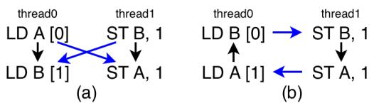
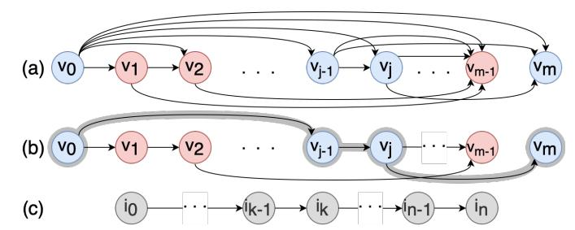
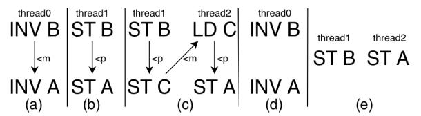
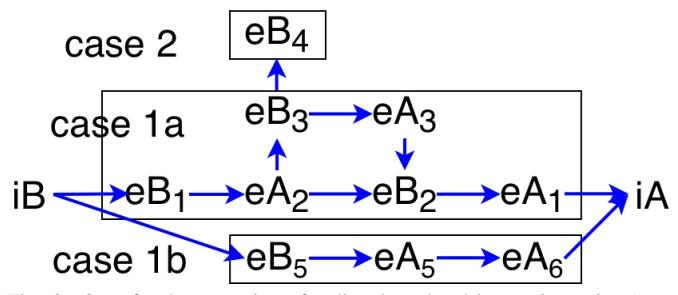
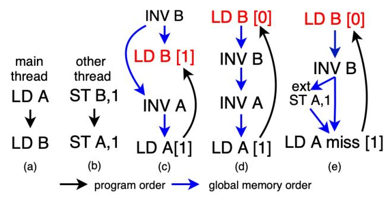
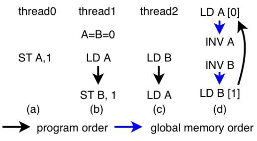
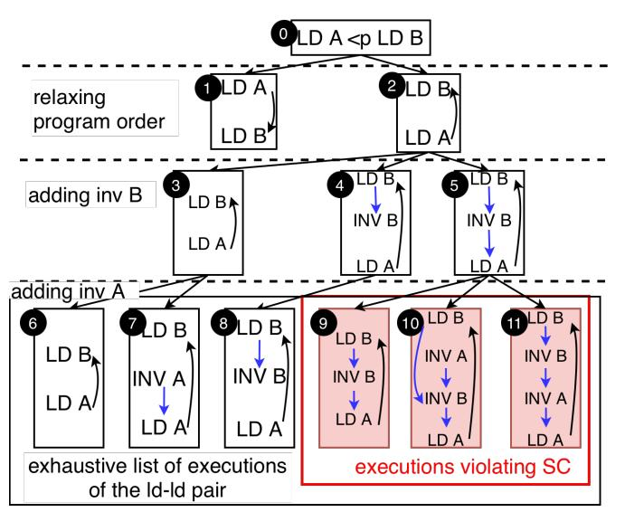
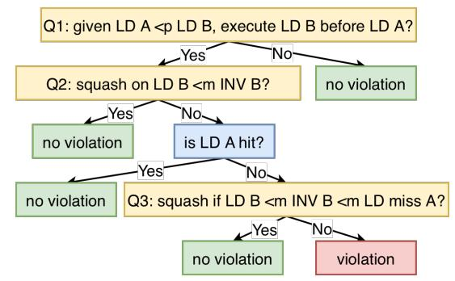
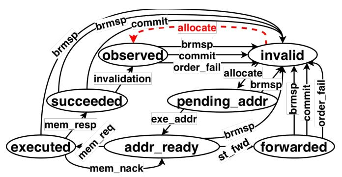
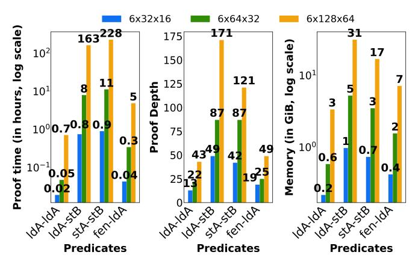

# QED: Scalable Consistency Verification of Memory Instruction Reordering in Hardware

Gokulan Ravi, Xiaokang Qiu, Mithuna Thottethodi, T. N. Vijaykumar *Purdue University, USA* {ravig,xkqiu,mithuna,vijay}@purdue.edu

*Abstract*—Memory consistency models (MCMs) in out-oforder-issue microprocessor-based shared-memory systems are notoriously non-intuitive and a source of hardware design bugs. Previous hardware verification work is limited to (1) in-orderissue processors, (2) proving the correctness only for some test cases, or (3) bounded verification that does not scale in practice beyond 7 instructions across all threads. Because cache coherence (i.e., write serialization and (non-)multi-copy write atomicity) and pipeline front-end verification and testing are well-studied, we focus on memory instruction ordering in the load-store queue (LSQ) of an out-of-order-issue processor. We show that our approach, called *QED*, needs to consider (1) only a small subset of instruction pairs and not all in-flight instructions, and (2) only one external event from other cores at a time per instruction of a pair (e.g., an invalidation), where only the events' ordering matters but not their originating cores. We call these results as *two+two*. Exhaustively exploring all pairs of instruction types and all types of event pairs intervening between each instruction pair, QED checks whether each of a reordered pair's execution trace leads to a cycle, which is well known to indicate an MCM violation. The MCM-violating execution traces in each instruction pair's exploration result in a decision tree of simple, narrowlydefined predicates to be evaluated in the RTL implementation. Our *two+two* result proves that the number of predicates for all MCMs is independent of program length and of the numbers of in-flight memory instructions and cores. Nevertheless, each predicate must explore all of the LSQ's RTL state. To combat RTL state space explosion, QED employs novel, empirical state space reduction, which itself is verified, to remain scalable for practical design sizes. In our experiments, we automatically generate the decision trees for SC, TSO, and RISC-V WMO, and verify the LSQ of BOOMv3 RTL with 128 loads/64 stores against RISC-V WMO using Jaspergold, where we found two correctness bugs and a performance bug (though not our goal). We fully verify the corrected implementation in under ten days. This unbounded RTL verification of a modern out-of-order-issue processor's LSQ against an MCM is the first in the literature.

*Index Terms*—hardware verification, memory consistency, memory instruction reordering, load store queue

#### I. INTRODUCTION

Memory consistency issues in general-purpose, highperformance microprocessor-based shared-memory systems are notoriously non-intuitive and complex. Memory consistency is a significant source of hardware design bugs [9], [10], [31], which can lead to serious correctness issues, such as data corruption, mutex violation, and crashes. While testing identifies some bugs, exhaustive testing to guarantee correctness is unrealistic. As such, the only viable option to

This work was supported, in part, by the U.S. National Science Foundation under Grant Numbers 2332891 and 2046071.

guarantee correctness at any system scale is verifying the implementation against the memory consistency model (MCM). However, out-of-order memory accesses and multiple levels of caching introduce a myriad of interactions affecting memory ordering [2], making verification profoundly challenging.

The central issue is that the verification method must scale with the system size (e.g., the number of in-flight memory accesses in a core). Otherwise, verification would require examining a number of cases that explodes combinatorially with the system size. Such intractability – common in verification – would mean incomplete, inconclusive verification that may not be useful in practice for real system scales (i.e., few correctness guarantees). Moreover, ideally, the proof should be rigorous, machine-generated or machine-assisted, and for concrete RTL implementations.

Early "\*check" papers [37], [38], [45], [46] apply all interleavings of each of a few tens to hundreds of short test programs to microarchitecture specifications or implementations (e.g., Intel's *litmus tests*, each of which typically comprises 4-8 memory accesses in 2-4 threads). Though the test-based approach correctly detects the bugs exposed by these tests, there may be bugs not exposed by these tests and therefore not caught [39], [44], [45], [78]. *This insufficiency is the fundamental difference between testing and verification*. Pointing to this insufficiency, a later work [39] generates exhaustive, yet minimal, tests with a bounded number of instructions (n) across all threads. Unsurprisingly, such exhaustive enumeration does not scale in practice, specifically beyond n = 7 – far fewer than modern instruction window sizes (e.g., hundreds of instructions). Later "\*check" papers [43], [75], [80] (and retroactively, the earlier papers) can leverage the exhaustive tests to achieve bounded verification. Acknowledging the testbased approach's limitations, PipeProof [44] replaces the tests with arbitrary instruction sequences, formulates the problem as a Satisfiability Modulo Theories (SMT) [12] instance, and exploits the transitivity of happens-before orderings in the microarchitecture. However, the approach explores increasingly longer instruction sequences which may require manual invariants (with proofs) to terminate. Further, PipeProof and Kami [17], a rigorous, modular approach, verify only in-orderissue pipelines which are far simpler than modern out-of-orderissue processors. Instead, we propose an approach for out-oforder-issue processors independent of, hence scalable in, the numbers of instructions and of cores. Finally, an alternative approach proposes additional hardware to dynamically ensure MCM correctness [52] which increases cost and requires the new hardware itself to be verified. In contrast, we target static verification with no hardware overhead.

We propose *QED*, scalable verification of memory consistency of modern out-of-order-issue processors for all programs. Broadly, a consistency model comprises within-thread ordering and write atomicity (of all writes or only readmodify-writes (RMW)) for across-thread interactions [2], [11]. While previous unbounded verification [17], [44] has considered in-order issue pipelines, many consistency bugs arise from reordering and overlapping of within-thread memory accesses by the load-store queue and the memory hierarchy [10], [31]. In contrast, any design bug in the pipeline front-end related to register and control-flow dependencies would likely result in not only consistency failure but also incorrect sequential execution, and would likely be caught by verification targeting the front-end components [64]. As such, we assume that the front-end is implemented correctly. Further, coherence bugs and ordering bugs may interact or may be indistinguishable in some cases. To avoid this confounding factor, we assume correct coherence based on much previous work [18], [19], [32], [34], [36], [49]–[51], [56]– [61], [71], [73], [77], [81], [82]. That is, we assume that write serialization and, if required by the MCM, multi-copy write atomicity have been verified as part of standard coherence verification. However, *events external to the core* – e.g., cache misses, incoming invalidations, and incoming read requests – affect consistency. Accordingly, we focus on the remaining issue of *ordering of memory instructions* (e.g., load, store, fence, and RMW) and external events in the load-store queue (LSQ), whose unbounded verification is challenging and open. Because *all* memory instruction reordering in a core occurs in the LSQ, QED captures all such reorderings via the following contributions:

A key challenge in verification is the state space explosion due to naively modeling the hardware. The first of two key scalability issues is the number of in-flight memory instructions in a core (e.g., n = 100), which may be reordered arbitrarily. Rather than consider this large space for MCM compliance (potentially n! reorderings), we prove that *due to transitivity, only a small subset of instruction pairs in a thread need to be considered at a time* (e.g., for instructions i0, i1,and i2, if i0-before-i<sup>1</sup> and i1-before-i<sup>2</sup> orders are preserved, then the i0-before-i<sup>2</sup> order is also preserved and need not be considered). Specifically, we need to consider only all *pairs of types* of memory instructions.

The second key scalability issue is the number of cores in the system. We consider all possible external events, which are proxies for instructions in other cores, intervening a given thread (e.g., incoming invalidations and read requests corresponding to remote stores and loads, respectively). Fortunately, *we need to examine only the ordering among the incoming events and instructions, but not the events' originating cores, which implementations do not consider (e.g., in its actions, a core does not consider an invalidation's origin)*. Consequently, QED is *independent* of the number of cores. Further, we prove that multiple events relevant to the same instruction are redundant, so that only one event per instruction in a pair needs to be considered at a time. We call the above two scalability results together as *two+two*.

The exhaustive interleavings of pairs of instructions and an event per instruction captures any counter example that adversarially exposes hardware reordering. Thus, the counter examples are discovered automatically and exhaustively, unlike the litmus tests. Overall, m types of memory instructions and e types of external events (e.g., invalidations, external read requests, and evictions) result in far fewer cases (O(m<sup>2</sup> e 2 )) (e.g., a few hundreds) than reorderings (e.g., 100!).

While our *two+two* result enables fewer instruction-event interleavings to be considered, each such, possibly-adversarial interleaving must be checked against the MCM (i.e., is the interleaving allowed?) and the RTL implementation (i.e., does the interleaving occur?). To answer the first question, *QED explores all possible traces of pairwise instruction reorderings and intervening external events, which are few enough to remain tractable. QED then checks whether each trace leads to a cycle in the presence of an MCM-required program order between the instruction pair*. A cycle implies a violation exposed by an adversarial example, whereas the lack of a cycle means the MCM permits the given execution order.

For the second question, QED considers the MCM-violating (cyclic) traces to produce a *decision tree* of simple, narrowlydefined *predicates* (e.g., is a reordered load squashed upon an invalidation to the accessed block before the load commits?). Our two+two result proves that the number of predicates for all MCMs is independent of program length, and of the numbers of in-flight memory instructions and cores. QED verifies the predicates in the RTL implementation using the formal verification tool, JasperGold [1]. Because each instruction pair must explore all of the LSQ RTL state space, naive RTL verification faces RTL state space explosion. *QED employs a novel, empirical state space reduction technique, which itself is verified, to enable scalability for practical LSQ sizes.*

Thus, assuming the pipeline front-end and coherence are implemented correctly, QED scalably verifies *all* memory instruction reordering in a core's LSQ. We automatically generate the decision trees for SC, TSO, and RISC-V WMO, and verify BOOMv3's LSQ with 128 loads/64 stores against RISC-V WMO using Jaspergold where we found two correctness bugs and a performance bug (though not our goal). We fully verify a corrected implementation in under ten days. This unbounded, full verification of an RTL implementation of this scale against an MCM is the first in the literature.

# II. BACKGROUND

We informally describe some common memory consistency models and a modern system comprising out-of-order issue cores and multi-level memory hierarchy.

#### *A. A few common consistency models*

In shared memory, the global memory order is the order in which memory accesses from each thread in an execution are seen by other threads in the system. An MCM specifies



Fig. 1. Program order (<p , black) and global memory order (<m , blue). Initially, A=B=0 in both cases. (a) SC-compliant execution, (b) SC violation due to out-of-order loads.

- within-thread ordering: instruction pairs, whose program order should be preserved in the global memory order, and
- write atomicity (of all writes or only RMWs) for acrossthread interactions [2], [11].

While all the instructions are present in the global memory order which may be a partial order, the orders between instructions are present only in the following cases, where a <<sup>m</sup> b is used to denote a occurs before b in the global order:

- 1) (One thread): Any pair of memory instructions, involving same or different addresses, within the same thread in program order required by the MCM are <<sup>p</sup> -ordered.
- 2) (One address): Any pair of memory instructions, one of which is a store, across two threads to the same address are <<sup>m</sup> -ordered (e.g., in Figure 1(a), *st B* <<sup>m</sup> *ld B* where a load from address B in a thread reads the value of a store to B in another thread, and *ld A* <<sup>m</sup> *st A* where the load reads the value of A before the store). Writes to one location in one or more threads are <<sup>m</sup> -ordered due to write serialization in all MCMs [2].

In addition, multiple <<sup>m</sup> orders (e.g., a <<sup>m</sup> b and b <<sup>m</sup> c) can be composed to achieve transitive <<sup>m</sup> ordering across multiple threads and multiple addresses (e.g., the total order in sequential consistency, as described below). Specifically, atomic writes to different addresses (e.g., *A* and *B*) across threads may be <<sup>m</sup> -ordered transitively (e.g., *st A* <<sup>m</sup> *st B* or *st B* <<sup>m</sup> *st A*) whereas non-atomic writes to different addresses in one or more threads are not ordered (i.e., no <<sup>m</sup> edge) except in MCMs with store-store order within a thread. Further, we extend <<sup>m</sup> to order external coherence events (e.g., incoming invalidations and external reads) with memory instructions in a given thread. These events are proxies at the given thread for memory instructions in other threads.

The most intuitive model is Sequential Consistency (SC) [35]. SC requires the global order <<sup>m</sup> to be a total order of all memory accesses to any location across all threads [53]. Further, SC requires all accesses from a thread in this global order to obey each thread's program order <<sup>p</sup> [53]. In this global order, any load from a location retrieves the value of the latest store to the location ("latest" is well-defined in the global order). No total <<sup>m</sup> order (i.e., a cycle as in Figure 1(b) due to out-of-order loads), means the system violates SC.

Total Store Order (TSO) is a commonly-used model which relaxes SC to allow a load from a location to occur before previous stores to different locations in program order. Such a schedule helps hide store latency and improves performance. A load to the same location as a previous store must obey program order to enforce the store-to-load dependence. Other program orders are not relaxed. TSO requires write atomicity


Fig. 2. Data path of loads (red,blue) & stores (green,blue)

except when a thread reads its own write early. Such a load is ordered after the store in the global memory order – i.e., after the store is made visible [67]. Hence, even though the load returns its value before the store that produced the value is complete, the load still returns the value of the "latest" store.

In more relaxed models, most program order constraints and, in some cases, write atomicity are relaxed [2]. Instructions can be executed out-of-order if the addresses do not match – data dependencies are still preserved. Ordering among instructions and atomicity of writes are programmed explicitly using some synchronization primitive – atomic instructions, acquire/releases, or memory barriers. The synchronization point denotes the time after which all threads are guaranteed to have seen all the instructions since the last synchronization point. Finally, some MCMs include address, data, or controlflow dependencies in ordering requirements (e.g., RVWMO). QED assumes that the pipeline front-end correctly marks such memory instructions in the load-store queue (LSQ) so that QED can verify that the LSQ meets the requirements.

#### *B. Modern systems*

Modern load-store queues (LSQs) in out-of-order-issue processors storing loads and stores in program order may reorder and overlap memory accesses (Figure 2). Loads in load queue can be issued out-of-order to the cache or its value forwarded from an older store to the same location in the store queue or store buffer. To ensure precise interrupts, a store is issued from the store queue to the cache only after the store reaches commit. Upon a miss without any exception, the store is moved from the store queue to the store buffer, where the store remains until completion (Figure 2). However, a store may prefetch coherence permission as soon as the address becomes available, before it reaches commit. In weaker MCMs, store misses can be overlapped in the cache hierarchy and can complete out-of-order. A load returns a value to the pipeline and is *globally ordered* after the store that produced the value [67]. A store is complete when (a) the writer receives the acknowledgments of invalidations of all the copies, and (b) is performed locally to the cache. The ordering between these two parts depends on the model (i.e., whether writes are atomic). A store is *globally ordered* after (a) the store that produced the previous value and (b) the loads that read the previous value (well-defined due to write serialization). The LSQ tracks the relevant information corresponding to each instruction's execution. QED verifies that the LSQ implementation (where all memory instruction reordering occurs in a modern core) preserves each instruction's ordering with respect to olderin-program-order instructions during commit, as required by


Fig. 3. Overview of QED

the MCM. For RVWMO-like MCMs that include address, data, or control-flow dependencies in ordering requirements, QED assumes that the pipeline front-end correctly marks such memory instructions in the LSQ so that QED can verify that the LSQ meets the requirements.

# III. QED

Figure 3 shows a high-level overview of QED. Recall from Section I that our key observations are:

- 1) Due to transitivity, we need to consider reorderings of only a small subset of memory instruction pairs in a thread (e.g., load, store, fence, and RMW) and not of all in-flight instruction pairs (Section III-A).
- 2) We need to consider only the ordering of external events with the given thread's instructions and not where the events originate (Section III-B).

As shown in Figure 3, QED first exhaustively explores all possible traces of pairwise instruction reorderings, including intervening external events, organized as a forest of *exploration trees* (Section III-E–III-F). QED then applies cycle detection to the traces so that the MCM-violating traces result in a *decision tree* of simple predicates, which are evaluated by processing the RTL implementation (Section III-G). The number of predicates is independent of the program length and of the numbers of in-flight memory instructions (i.e., the LSQ size) and cores. Nevertheless, because RTL verification must explore all the LSQ RTL state for every instruction pair, we employ state space reduction to combat state space explosion.

## *A. Directly-ordered instruction pairs in a thread*

Nominally, an MCM imposes ordering among arbitrary number of memory instructions, which is the first scalability challenge for QED. Accordingly, QED's first key observation is that only the ordering between a subset of instruction pairs in a thread need to be considered.

This observation is easy to show for SC because preserving ordering only between consecutive instruction pairs ensures every other required ordering in SC's total order, due to transitivity. For example, consider three memory operations a <<sup>p</sup> b <<sup>p</sup> c. SC requires preserving all orders, denoted by a <<sup>m</sup> b, b <<sup>m</sup> c, and a <<sup>m</sup> c. However, preserving *only* the order between consecutive pairs (a <<sup>m</sup> b, and b <<sup>m</sup> c) is enough to guarantee a <<sup>m</sup> c order.

We extend this argument to MCMs that may impose only a partial order in a thread. To consider only certain instructionpair orderings, we first eliminate transitively-redundant orderings between instruction pairs (i.e., pairs also ordered via other instructions). In the above example, the a-c ordering is redundant. Due to transitivity, we can remove such redundant orderings without violating *any* of the original orderings.



Fig. 4. (a) TSO-induced graph of loads (blue) and stores (red) to different addresses. (b) The transitive reduction. Instruction pairs connected by an edge in the transitive reduction are directly-ordered. (c) Relabeled nodes i<sup>0</sup> through in in a chain of directly-ordered instructions.

Definition 1 (Directly-ordered instruction pair). *Two memory instructions (e.g., load, store, fence, and RMW)* a *and* b *are* directly-ordered *if the edge* (a, b) *is in the* transitive reduction *of the directed graph induced by the MCM's partial order.*

The transitive reduction of a graph [3], by definition, eliminates any edge between two nodes if there already exists a path between the nodes. Thus, the transitive reduction is "minimal" in that it eliminates all transitively-redundant orderings while preserving all orderings directly or indirectly (by transitivity), so that the transitive reduction of a graph has the same transitive closure as the original graph. For acyclic graphs, such as ours, the transitive reduction is unique. Figure 4(a) shows memory instructions v<sup>0</sup> to v<sup>m</sup> as nodes in a TSO-induced graph that are arranged left to right in program order with loads and stores color-coded as blue and red nodes, respectively. TSO relaxes *st-ld* program order while preserving all other program orders. Figure 4(b) shows the transitive reduction of the graph and various directly-ordered instruction pairs. In relaxed models, the directly-ordered pairs may have one or more (arbitrarily many in general) intervening instructions (e.g., v<sup>j</sup> and v<sup>m</sup> in Figure 4(b)).

Theorem 1 (Directly-Ordered Pair Theorem). *Any arbitrary MCM-ordering violation* must *result in a violation between a directly-ordered pair of memory instructions.*

*Proof.* Consider the two memory instructions v0, and vm, which are ordered as v<sup>0</sup> <<sup>p</sup> v<sup>m</sup> and hence should be ordered in memory as v<sup>0</sup> <<sup>m</sup> vm. Let us relabel the nodes along a path from v<sup>0</sup> to v<sup>m</sup> in the transitive reduction (Figure 4(b)) as v<sup>0</sup> = i<sup>0</sup> <<sup>p</sup> i<sup>1</sup> <<sup>p</sup> i<sup>2</sup> <<sup>p</sup> . . .<<sup>p</sup> i<sup>n</sup> = v<sup>m</sup> (Figure 4(c)). Other nodes that are not along the path can be ignored. By transitivity,

$$((i_0 <_m i_1) \land (i_1 <_m i_2) \land \ldots \land (i_{n-1} <_m i_n)) \Rightarrow (i_0 <_m i_n)$$

However, out-of-order execution violates the MCM ordering

(i.e., 
$$\neg$$
  $(i_0 <_m i_n)$ ). Now,  $(A \Rightarrow B) \Rightarrow (\neg B \Rightarrow \neg A)$ . Hence,  $\neg (i_0 <_m i_n) \Rightarrow \neg ((i_0 <_m i_1) \land (i_1 <_m i_2) \land \ldots \land (i_{n-1} <_m i_n))$  Applying De-Morgan's Law,

$$\neg(i_0 <_m i_n) \Rightarrow \neg(i_0 <_m i_1) \lor \neg(i_1 <_m i_2) \ldots \lor \neg(i_{n-1} <_m i_n)$$

implying that at least one directly-ordered pair also violates the MCM ordering. This proof holds for *every* path from v<sup>0</sup> to vm. Thus, QED needs to check only all pairs of *types* of memory instructions that are directly-ordered by the MCM (e.g., loads, stores, fences, and atomic RMWs).

The above theorem, which considers weaker MCMs' partial orders in a thread, also holds for non-atomic models. Our theorem exploits transitivity of the *relevant program order within a thread* which is not affected by write atomicity, or lack thereof (the transitivity is *not* of order across threads where atomicity matters). However, chunk-based MCMs, such as BulkSC [16], InvisiFence [14] and transactional memory [27], impose (1) inter-chunk ordering within a thread and (2) coarse-grained, intra-chunk atomicity (atomicity for all addresses in a chunk). While the pairwise theorem applies to inter-chunk ordering, QED does not cover intra-chunk atomicity (like multi-copy atomicity (via coherence), as stated in Section I). BulkSC is more restrictive than SC, which requires only instruction ordering and not coarse-grained atomicity.

Finally, while bounded verification [39] of upto 7 instructions in practice would include our instruction pairs, that approach would not know to terminate and would explode exponentially with more instructions (similar to how a large, brute-force search would subsume cleverer searches based on branch-and-bound or dynamic programming but would explode exponentially).

#### *B. Scalability to any number of cores*

Any number of cores executing arbitrary code may interact with a given core, which is the second scalability challenge for QED. These interactions occur in the form of external events *relevant* to an instruction at the chosen core. For instance, invalidations are relevant to loads from the same address, external reads and invalidations are relevant to stores to the same address, and evictions are relevant to speculative loads from the evicted block (invalidations are relevant to atomic stores and RMW to different addresses). Fortunately, we prove below that it is sufficient to consider only the ordering of instructions and external events independent of the events' originating cores, which implementations do not consider (e.g., an out-of-order load is squashed upon a matching invalidation regardless of the invalidation's origin [23]). Furthermore, only pairs of directly-ordered instructions (Section III-A) and relevant external events need to be considered.

While the events' origins do not matter, the ordering among the events as well as those between the events and a given core's instructions do. For example, consider two external events – invalidations to addresses B and A, denoted as *inv B* and *inv A*, respectively, as shown in Figure 5. The invalidations



Fig. 5. (a) ordered invalidations to A and B in thread0, which may correspond to (b) <p - ordered stores from a second thread; or (c) ordered (atomic) stores across threads; (d) unordered invalidations in thread0 which may correspond to (e) unordered (non-atomic) stores from different threads.

are proxies for stores in other threads, under our extended notion of <<sup>m</sup> (Section II). Recall from Section I that coherence verification ensures the correctness of the invalidations. The invalidations are either

- 1) ordered (Figure 5(a)) (e.g., from the same thread (Figure 5(b)) or from different threads (Figure 5(c))); or
- 2) not ordered (Figure 5(d)) (e.g., from non-atomic stores in different threads (Figure 5(e)), or from relaxed *st-st* order within a thread in MCMs such as Partial Store Order [2] (not shown)).

The ordered events (Figure 5(a)) at the given thread can *also* be produced by instructions across multiple threads (Figure 5(c)), as discussed in Section II. Note that a given <<sup>m</sup> ordering between external events is not derived from a specific example; rather the ordering implies that *there exists* one or more valid, possibly adversarial examples under the given MCM (e.g., Figure 5(a) implies Figure 5(b) or (c), and not the reverse). This implication is a *fundamental reversal* from the litmus tests which check specific examples.

Even in the presence of ordering, the events' originating threads or their count do not matter. The ordering of an event with other events or instructions may be direct (within a thread or between just two threads) or transitive (through multiple threads). The transitive edges between two events can be collapsed into one edge *without changing the ordering of the events* (e.g., the transitive edges in Figure 5(c) (*st B* <<sup>m</sup> *st C* <<sup>m</sup> *ld C* <<sup>m</sup> *st A*) can be collapsed into one edge (*inv B* <<sup>m</sup> *inv A*) in Figure 5(a)). A key property of such collapsing is as follows:

Lemma 1 (Transitive Collapsing Lemma). *A transitive path between two events leads to a cycle (an MCM violation) if and only if the path collapsed to an edge also leads to a cycle. This property holds regardless of the originating core of each event in the path.*

The lemma is proved trivially by replacing the path in a cycle with the edge in each of the *if* and *only if* clauses. The *if* clause implies that the edge does not create any false cycles; and the *only-if* clause implies that no cycles are missed due to the edge. A collapsed edge between two events implies that there exist valid code examples within the MCM in which the events are ordered (e.g., via within-thread or across-thread ordering, as in Figure 5(b) or (c)). There exist infinitely many examples each with arbitrarily many transitive edges that can all be collapsed to the edge in Figure 5(a)), irrespective of the events' origins. Thus, cycles involving multiple threads are covered without considering the threads' identities or count.



Fig. 6. Out-of-order execution of a directly-ordered instruction pair, *iA* <p *iB*, interleaved with multiple external events with prefixes *eB* and *eA* relevant to *iB* and *iA*, respectively.

It may seem that the existence, or lack, of a cycle depends on the events' origin. For instance, the ordered stores in the same thread in Figure 5(b) may lead to a cycle if *ld A* <<sup>p</sup> *ld B* in another thread execute out-of-order (e.g., Figure 1(b)), whereas the unordered stores in different threads in Figure 5(e) cannot lead to a cycle (i.e., different origins, different outcomes). However, what matters is the events' ordering, not their origin. For instance, both Figure 5(c) and (e) have the same origin for *st A* and *st B* which

- 1) are ordered in (c) and may lead to a cycle, but
- 2) are not ordered in (e) and cannot lead to a cycle (i.e., same origin, different outcomes).

Conversely, in both Figure 5(b) and (c) the stores are ordered, within a thread in the former and across two threads in the latter, where both cases may lead to cycles (i.e., different origins, same outcome). Consequently, only the ordering matters for QED– not whether the ordering is direct or transitive (i.e., collapsed), nor how many or which threads are involved, keeping in mind that Figure 5(a) implies (b) or (c), and Figure 5(d) implies (e); not the reverse. By exhaustively considering all orderings, QED captures *any* cycle *without* tracking the event origins.

Moreover, we prove that we need to consider only one relevant event *type* at a time per instruction (e.g., event types include invalidations, external read requests, and evictions). Note that each event type per instruction, and all combinations for the instruction pair, still need to be considered, but not together. We do not claim that multiple events do not occur concurrently. Instead, our claim is that each such event can be considered one at a time.

Theorem 2 (Multiple Event Theorem). *Considering at a time only one of multiple, possibly concurrent, events of the same or different types and of any origin, relevant to each of a directly-ordered pair of instructions is sufficient to detect a cycle in the ordering (i.e., an MCM violation).*

*Proof.* Consider the out-of-order execution of a directlyordered instruction pair iA <<sup>p</sup> iB interleaved with multiple relevant events of the same or different types and of any origin, each of which is ordered with at least one of the instructions. Without loss of generality, Figure 6 shows an example where the events with prefixes *eB* and *eA* are relevant to the instructions *iB* and *iA*, respectively. The events' types or origins do not matter. There are two mutually exclusive and exhaustive cases:

- *(Case 1)* Some events are ordered with both instructions (i.e., the events fall in a path between the instruction pair), such as all events other than eB<sup>4</sup> in Figure 6. The paths may be partially disjoint (e.g., case 1a in Figure 6 shows two partially-disjoint paths) or fully disjoint (e.g., case 1b).
- *(Case 2)* The rest of the events are ordered with only one instruction of the pair but not the other (e.g., eB<sup>4</sup> is not ordered with iA and is not on any path from iB to iA).

In *Case 1* (including both *Case 1a* and *Case 1b*), a cycle implies a path between the directly-ordered instruction pair. Therefore, any cycle can be detected by considering only one path at a time (e.g., each of the three paths in Figure 6). Within any such path, the transitive events relevant to an instruction can be collapsed at a time to any one of the events without missing any cycle, due to the Transitive Collapsing Lemma above (e.g., either *eA*<sup>5</sup> or *eA*<sup>6</sup> in *Case 1b*). Thus, it is sufficient to consider at a time only one event per instruction. *(Case 2)* cannot cause a cycle because there is no path between the instruction pair; and can be ignored.

Consequently, we need to consider at a time only a pair of directly-ordered instructions and an event relevant to each instruction, covering all such instruction and event types. To be exhaustive, we consider all orderings of the instructions and events (e.g., both *inv A* <<sup>m</sup> *inv B* and *inv B* <<sup>m</sup> *inv A*) as well as no ordering. We call Theorems 1 and 2 together as our *two+two result*.

## *C. Detecting cycles in directly-ordered instruction pair execution*

QED exploits the fact that an out-of-order execution violates a given MCM if and only if the execution's ordering combined with any MCM-required program order leads to a cycle. QED applies cycle detection to the reordered execution of a directlyordered pair of instructions in a thread. Consider the simple SC example in Figure 1 of a load-load pair to different addresses A and B, shown again in Figure 7(a) (black arrows show <<sup>p</sup> ). Assuming *ld B* executes out-of-order before *ld A*, Figure 7(c) and (d) show the main thread's execution order combined with <<sup>p</sup> . We wish to detect a cycle in this execution order.

To that end, QED tests this execution by introducing invalidations (*inv*) to A and B (proxies for external stores). This introduction produces an example (possibly, a counter example) *implying* another thread, shown in Figure 7(b), which executes in program order to produce these adversarial invalidations ordered globally as *inv B* <<sup>m</sup> *inv A* (case 1 in Section II). Intuitively, these invalidations lead to two possible orderings, out of many. (1) *inv B* <<sup>m</sup> *ld B* which is unordered with *inv A* <<sup>m</sup> *ld A*, as shown in Figure 7(c). And (2) a total order of *ld B* <<sup>m</sup> *inv B* <<sup>m</sup> *inv A* <<sup>m</sup> *ld A*, as shown in Figure 7(d). Including the <<sup>p</sup> back edge, the former is cycle-free whereas the latter contains a cycle. The former case corresponds to the SC-permitted combination of both loads being ordered after their respective stores (i.e., *ld A* = 1 and *ld B* = 1).



Fig. 7. An example of cycle detection in SC. Blue edges denote <m orders, and the back edge denotes <p order

The latter case corresponds to the prohibited combination of *ld A* being ordered after *st A* but *ld B* being ordered before *st B* (i.e., *ld A* = 1 and *ld B* = 0), shown in Figure 1(b). QED automatically discovers these familiar examples. Before we explain the details next, we note that the adversarial invalidations can be thought of as occurring to the loaded word or byte. However, real implementations are conservative (but correct) in using cache block-grain invalidations which may include some false-sharing effects.

In the main thread's execution, *inv B* may be ordered globally (i) *before ld B* (shown as *inv B* <<sup>m</sup> *ld B* in Figure 7(c) with solid blue arrows), or (ii) *after ld B* (shown as *ld B* <<sup>m</sup> *inv B* in Figure 7(d)). Because *inv B* and *ld B* are to the same address, the ordering between them is <<sup>m</sup> (case 2 in Section II). To be brief, we do not show other possible orderings (including no ordering) and interleavings of the invalidations. However, some external events may not be ordered with an instruction (e.g., in Figure 7(c), *inv A* happens to arrive after *ld B* (different addresses) so that *ld B* and *inv A* are not ordered). Recall from Section II that being to different addresses in two threads, *ld B* and *inv A* fall in neither case of <<sup>m</sup> ordering in Section II. Nevertheless, the global order *inv B* <<sup>m</sup> *inv A* holds in Figure 7(c), as per case(1).

In contrast to Figure 7(c), Figure 7(d) shows that *ld B* <<sup>m</sup> *inv A* is forced transitively (*ld B* <<sup>m</sup> *inv B* <<sup>m</sup> *inv A*) by the implied, other thread in Figure 7(b). QED considers both scenarios which are dissimilar fundamentally due to the difference in the ordering between *inv A* and *ld B*. Thus, Figure 7(c), where *inv B* is before *ld B*, does not have a cycle. However, Figure 7(d) where *inv B* is after *ld B*, contains a cycle. As mentioned earlier, these cases correspond to familiar examples automatically discovered by QED.

To be exhaustive, QED tries all valid combinations of <<sup>m</sup> orderings in each case (e.g., in Figure 7(c) and (d), inv B <<sup>m</sup> *ld B* and *ld B* <<sup>m</sup> *inv B*, respectively). Some combinations may be impossible, as explained in detail in Section III-E. In addition to <<sup>m</sup> orderings, we exhaustively consider unordered external events (e.g., incoming invalidations, external reads, and outgoing misses). Because the number of external event types and memory instruction types are small (e.g., < 10), the number of orderings remains tractable (complexity analysis in Section III-F). QED uses cycle detection to identify violations in each such execution order.



Fig. 8. Causality test. Instructions in *thread1* and *thread2* are ordered as per the MCM or using some fences. (d) shows an out-of-order execution of *thread2* in PC.

In Figure 7(e), instead of *inv A*, we consider *ld A miss* which may bind a new value for A from another thread's *st A* where *st B* <<sup>p</sup> *st A*. Then, *ld B* <<sup>m</sup> *inv B* <<sup>m</sup> *ld A miss* in the main thread contains a cycle. To cause a violation, both cases (*inv A* or *ld A miss*) require *at least* an *inv B* between *ld B* execution and commit, (i.e., *ld B* <<sup>m</sup> *inv B* <<sup>m</sup> *ld A miss* <<sup>p</sup> *ld B commit*). However, this sequence would be squashed in a correct implementation. Only those acyclic sequences, that do not contain an *inv B* between load execution and commit (e.g. Figure 7(c)), would commit. While *inv A* (or *ld A miss*), and *inv B* are needed to show an SC violation, squashing upon *inv B* alone (Figure 7(e)), to simplify the implementation, is conservative and correct [23].

Prefetch and eviction: Coherence prefetch is usually thought to be safe because stale prefetched values are invalidated when new writes occur. However, some prefetches can make load reordering incorrect. For example, in Figure 7(e), a prefetch may prevent a miss which otherwise would've led to a squash (e.g., instead of ld A miss in Figure 7(e), ld B <<sup>m</sup> inv B <<sup>m</sup> prefetch A <<sup>m</sup> ld A hit). Fortunately, treating prefetches as misses (to order after the store to the same address) cleanly handles these issues. Evictions can be treated similar to invalidations (as an ordering event).

## *D. Atomic and non-atomic MCMs*

Our examples so far show violations only in program order and not write atomicity which, if required by the MCM, is covered by coherence verification, as discussed in Section I. The causality test in Figure 8 shows two causally-related writes in different threads read by a third thread. Coherence verification covers *thread0*, and QED covers *thread1* and *thread2*.

In non-atomic MCMs (e.g., ARMv7, POWER [5], and Processor Consistency (PC) [2]), where writes are not ordered globally, QED does not artificially impose <<sup>m</sup> ordering on the writes. For example, assuming PC in Figure 8(d), the invalidations to *thread2* are unordered (no <<sup>m</sup> , as stated in Section II-A) so that there is no cycle, signaling PC compliance and preserving all non-intuitive behaviors (e.g., causality violation in Figure 8(d) and lack of global ordering).

*In non-atomic MCMs, however, atomic-RMWs or ordered non-atomic writes in one thread (as in PC's* st-st *constraint or via fences) do obey* <<sup>m</sup> *ordering.* Therefore, QED must check <<sup>m</sup> ordering even in these MCMs to cover such valid, adversarial cases, *different* from non-atomic writes. Figure 8(d)



Fig. 9. Exploration tree for ld-ld ordering in SC showing only invalidations. Blue arrow shows <m order and back edges from *ld A* to *ld B* show <p

violates PC only for <<sup>m</sup> ordering (not for the unordered cases) which is exactly the counter example that QED would produce. <<sup>m</sup> ordering would be absent only in an (impractical) MCM that has neither atomic RMW nor fences. Similarly, absence of invalidations in some release consistency implementations [33] does not affect QED which captures stores without or with invalidations (e.g., a store followed by a release or not).

Coherence and ordering functionalities for fences: In some weaker MCMs, there are local fences (e.g., IBM POWER's *lwsync* empties only the local store buffer but does not globally propagate stores) and global fences (e.g., *sync* waits for global store propagation). In general, instructions after any fence must wait for the fence to complete (locally or globally). While *global propagation* falls within coherence functionality, all memory instruction ordering including *fence ordering* is the distinct responsibility of the LSQ which receives global or local completion notification from coherence or the local hierarchy, respectively, of not only fences but *all* memory instructions. QED verifies the LSQ's fence ordering.

## *E. Verification framework*

QED takes two inputs, the MCM specification and the RTL implementation to be verified, which include the instruction types, relaxations in orderings, and a list of events such as cache hits, misses, invalidations and external read requests. Recall from Section III-B that we need to consider only a pair of directly-ordered instructions and a relevant event for each instruction, covering all such instructions and event types. Our proof method generates an exhaustive list of *execution traces* for each pair of instruction type (with same or different addresses) and events, similar to Figure 7(c), (d), and (e)). The traces are organized as an *exploration tree*.

Figure 9 shows such an exploration tree for the *ld-ld* pair with different addresses, where the relevant events are invalidations. We progressively and exhaustively add *inv B* and *inv A* and their orderings. Although Figure 9 shows only invalidations, exploration trees with other relevant external events (e.g., misses, prefetches, evictions and external reads) are also generated. We present an algorithm that automates this procedure, and analyze its complexity in Section III-F.

- *Node 1* and *node 2* show in-order and out-of-order execution, respectively.
- *Node 2* expands into *node 3* without any addition and into *nodes 4* and *5* by adding *inv B* unordered and <<sup>m</sup> -ordered with *ld A*, respectively.
- Because *ld A* and *inv B* are to different addresses, the unordered choice in *node 4* is straightforward (<<sup>m</sup> is forced only for same-address entities).
- In *node 5*, *inv B* <<sup>m</sup> *ld A* is possible when *ld A* is a miss (as shown in Figure 7(e)).
- *Node 6* follows from *node 3* without any addition.
- While unordered events are always possible for different addresses, not all <<sup>m</sup> orderings are possible, as mentioned in Section III-C. For instance, in *node 7*, *inv A* is added to give *ld B* unordered with *inv A* (as expected from different addresses). No <<sup>m</sup> is possible between *ld B* and *inv A* (even if *ld B* is a miss) in the absence of an intervening *inv B* which is necessary to induce the transitive order *ld B* <<sup>m</sup> *inv B* <<sup>m</sup> *inv A* (we do consider such an intervening *inv B* in *node 11*).
- *Node 8* and *node 9* repeat *node 4* and *node 5*, respectively, without any additions.
- *Node 10* adds an *inv A* unordered with *ld B* for the same reason as *node 7*. As noted above, forcing *ld B* <<sup>m</sup> *inv A* would require *inv B* <<sup>m</sup> *inv A* whereas here we have *inv A* <<sup>m</sup> *inv B*. Therefore, *node 7*'s reason for no ordering holds here as well. Further, *node 10* inherits *inv B* <<sup>m</sup> *ld A* from *node 5* assuming a *ld A* miss which fetches the value from an *external st1 A* which is ordered *after external st B*. In *node 10*, however, the new *inv A* is ordered *before inv B* and hence is from a *different external st2 A*.
- *Node 11* extends *node 5* with an *inv A*.

At the leaves, we apply cycle detection to each execution trace. Each trace that has a cycle violates the MCM. Figure 9 shows three such execution traces (counter examples), highlighted in red. While the violations are straightforward, *node 8* is not a violation because *inv B* is unordered with *ld A* (different addresses) so there is no cycle. In *node 10*, *ld B* is unordered with *inv A* which is not relevant to, and cannot prevent, the violation.

Completeness: While Figure 9 uses invalidations to order loads, QED also generates similar trees using other external events (evictions, prefetches, misses) for the *ld-ld* pair, and uses *external reads* to order stores. Together, the exploration trees exhaustively consider all possible relevant events for a directly-ordered instruction pair. And, the exploration trees for all directly-ordered instruction pairs completely capture any violation across all programs in any MCM.

#### *F. Automating the framework*

We automatically generate the exploration trees by considering all pairwise memory instruction types and interleavings of external event types. Algorithm 1 generates execution

## Algorithm 1: Generating out-of-order execution traces

```
Input: MCM rule: A <p B =⇒ A <m B
Output: traces = List<Tree<Traces>>
traces ← {};
for oeB ∈ OrderingEvents(B) do
   for oeA ∈ OrderingEvents(A) do
      tree ← T ree();
      if B can execute before A
          tree.root((B, A)) ; /* root */
          for node ∈ leaves(tree) do
             tree.add(node, duplicate(node));
             for seq ∈ enumerate(node, oeB) do
                tree.add(node, seq)
          for node ∈ leaves(tree) do
             tree.add(node, duplicate(node));
             for seq ∈ enumerate(node, oeA) do
                tree.add(node, seq)
      traces.add(tree)
```

traces for each instruction pair (each consistency rule considers a pair). The algorithm enumerates the interleavings of ordering events, relevant to the given pair of instructions. enumerate(trace, event) generates all permutations of the instruction pair and events from trace and event.

Assuming m memory instruction types, there are at most 2m<sup>2</sup> pairs (same and different addresses). For each instruction type i, e<sup>i</sup> = size(ordering − events(i)) denotes the number event types (e.g., misses and evictions) that can order i. e denotes maxi(ei). Of these e event types, each trace has only one event type per instruction type (Section III-B). Therefore, each instruction pair generates O(e 2 ) trees, amounting to O(m<sup>2</sup> e 2 ) trees for the entire model (e is well under 10). This number is independent of the numbers of in-flight memory instructions and of cores.

At each tree leaf, we automatically apply cycle detection, a well-known algorithm, to the associated trace. Because the cycle detection needs to consider only four items in each trace, QED's overall complexity for the first step of exhaustive exploration is O(m<sup>2</sup> e 2 ).

## *G. Decision tree of predicates*

Based on the execution traces leading to violations in each exploration tree (e.g., Figure 9), we generate a decision tree of predicates (binary-response questions). *Each predicate asks if a certain relaxation or safety check is implemented in the microarchitecture, and is generated iteratively based on the answers to the previous predicates*. Figure 10 shows the predicates for the *ld-ld* pair traces for SC. The first predicate asks if the implementation reorders loads to different addresses (*node 2* in Figure 9). The next predicate asks if an out-of-order load (*ld B*) is squashed upon an invalidation to B [23] (*node 5* in Figure 9). Finally, even in less-conservative designs where *ld B* is not squashed, there is no violation if *ld A* is a hit which is unordered with *inv B* (*node 8*). But if *ld A* is a miss without or with an intervening *inv A*, (*node 9*, or *node 10* and *node 11*), then a violation may be unavoidable. *The response to each predicate is verified in the RTL*. Due to our *two+two*



Fig. 10. Decision tree of predicates for load-load pair with only invalidations

*result* (Section III-B), the number of predicates is independent of the program length, and of the numbers of in-flight memory instructions and cores.

An implementation is correct if no violation is found in either cycle detection or predicate evaluation. A violation in cycle detection denotes a high-level design bug (e.g., missing a squash upon a certain invalidation). A violation in predicate evaluation is a low-level implementation bug (e.g., squash not flushing the LSQ). Note that circuit-level optimizations during RTL synthesis are not visible to *any* RTL verification, including QED (e.g., the synthesis of LSQ as a Content-Addressable Memory (CAM) and logic minimization). Such optimizations have to be verified separately.

Finally, some proposals [52] retry every load at commit to check whether the reloaded value equals the earlier speculative value and squash otherwise. This scheme avoids handling any events, but requires an extra memory access for every load. As such, QED's exploration tree has only one execution trace of only one load, which succeeds when the values are equal. The corresponding simple predicate checks for this equality.

## *H. Verifying the predicates in RTL using Jaspergold*

To verify the predicates in the RTL, we begin by translating the predicates to SystemVerilog Assertions (SVAs) using the RTL signals. We consider a BOOMv3 example. RVWMO requires same-address loads to be ordered whereas BOOMv3 may execute the loads out-of-order. Figure 11 shows the predicate for *ldA-ldA* tree, similar to that for different-address loads shown in Figure 10. Figure 11(a) specifies the out-of-order execution of loads i and j as a pre-condition for potential MCM violation (*Q1* in Figure 10). Such pre-conditions are expressed as cover statements which Jaspergold tries to prove as reachable. load\_matrix[i][j] is combinational *shadow logic* [15], [28], [64], [74] – simple, auxiliary logic added to aid verification – which returns true when ldq(i) <<sup>p</sup> ldq(j). Such shadow logic (1) is added routinely [15], [28], (2) does not affect functionality in any way [64], and (3) is elided during synthesis to avoid affecting performance [74]. Because such shadow logic is much simpler than the RTL, simple sanity-check assertions typically suffice to ensure the correctness of the shadow logic itself though more elaborate assertions can also be verified. ldq[i] corresponds to the i th load queue entry, whose succeeded field denotes load completion. Figure 11(b) shows the out-of-order load has

```
(a) cover(load_matrix[i][j] & ldq[j].succeeded & !ldq[i].succeeded)
(b) cover(load_matrix[i][j] & ldq[j].succeeded & ldq[j].observed & !ldq[i].succeeded)
(c) assert(load_matrix[i][j] & commit_load_idx==i & ooo_load_matrix[i][j]
        |-> (ldq[i].addr!=ldq[j].addr) || !ldq[j].observed)
(d) assume(uop.valid |-> uop.is_load ˆ uop.is_store)
```

Fig. 11. (a,b,c): Example SVA properties (asserts and covers) for the predicates in *ldA-ldA* tree. (d) Example SVA assumption.

been observed – i.e., a previously-succeeded load has matched an incoming invalidation – corresponding to Q2 in Figure 10. Figure 11(c) shows an assert of the form A|->B, where Jaspergold tries to prove *A implies B*. Here, ooo\_load\_matrix[i][j] (shadow logic) holds whether ldq(j) executed out-of-order before ldq(i). The assert specifies that upon a load's commit, if a younger load executed out-of-order before the committing load, either (1) the addresses do not match, or (2) the younger load is not *observed* (an *observed* younger load would have been squashed during the committing load's execution). A counterexample to the assertion constitutes a violation. To prove the assertion, Jaspergold verifies that the property holds for all reachable states. If the shadow logic does not agree with the RTL (in rare cases), due to a mismatch or a bug in either, then Jaspergold would find unreachable the pre-condition specified by the shadow logic. For each directly-ordered pair, we similarly map the predicates to SVAs which are proven using Jaspergold. In addition, we separately prove simple, auxiliary assertions to verify that the signals in the predicates faithfully capture the corresponding microarchitectural events (e.g., a load's *succeeded* field is set only and always upon completion).

Further, we need to provide *assumptions* on the valid values for each input in the LSQ module. Figure 11(d) shows an example assume statement that a valid uop can have only one of is\_load or is\_store set. The assumptions for a given module's inputs often are proved as assertions on the outputs of a different module that produces the inputs. Because BOOMv3 has limited, obsolete documentation, we spent significant effort reverse-engineering the design to infer definitions for block-level interfaces to set up the assumptions. Industry designs often define these interfaces in natural language, which can be used for the assumptions. Recent works [40], [54], [69], [72] automatically convert such definitions to SVAs using LLMs. Much of the inputs are unused or simply stored in the LSQ and forwarded to other modules, and can be disabled safely (e.g., assume(uop.is\_br = 0) – the is\_br field is set only for branches). We use well-known backward-slicing to prune 83% (91%) of such irrelevant inputs (bits) (i.e., automatically assumed to be 0).

While the ideas so far have addressed the challenges in scalably deriving the predicates, the complexity of RTL verification still remains. Despite input space pruning, a naive approach would incur state space explosion because each instruction pair must explore all of the relevant RTL state, for which we propose a novel state space reduction scheme, called finite state machine *fast forwarding*.

*1) Fast forwarding:* To illustrate the explosion, consider the life cycle of a load-entry in BOOMv3 modeled as a finite state machine (FSM), as shown in Figure 12. The LSQ receives inputs from the dispatch stage to allocate a load entry, which



Fig. 12. Load Entry FSM. Dotted red arrow denotes the fast-forward transition. brmsp = Branch misprediction

```
reg [7:0] counter = 0;
@posedge clock begin
    if (counter == 0x10) <critical logic A>
    else if (counter == 0x20) <critical logic B>
    counter <= counter + 1
end
```

Fig. 13. Example fast-forwarding in counters. The critical logic blocks are triggered by, but do not depend on, the counter value.

waits for its address (pending\_addr) and executes when the address is ready (addr\_ready). After execution, the load is committed upon reaching the head of the reorder buffer (ROB). In an LSQ consisting of *N* loads, the number of reachable states amounts to 7 <sup>N</sup> , where a valid load can be in any of the valid states shown in Figure 12. Similar FSM can be constructed for stores (not shown), which contributes another exponential factor in the number of reachable states.

To explain our fast forwarding for tackling this explosion, we first describe *the counter abstraction* [70], used commonly in formal verification of designs involving counters. Consider the 8-bit counter in Figure 13. Values other than 0x0, 0x10 and 0x20 are not relevant for verifying the critical logic. However, a naive approach would explore all intermediate values before reaching the relevant values. In such cases, Jaspergold provides abstractions to *fast-forward* between the relevant values, without exploring the intermediate values.

Recall from Section III-A that for the MCM correctness of a directly-ordered instruction pair, the other instructions are irrelevant (each of which would be verified in its own pair). Therefore, the various states of such instructions need not be explored. As such, we *generalize* the counter abstraction to our load and store FSMs. During the verification of a directlyordered pair, other loads, when *allocated* in the load queue, can be marked immediately as *observed* which is the last possible valid state in a load's life. We modify the FSMs to include a *fast-forward* transition for this purpose (e.g., the red transition in Figure 12 from invalid to observed marks the load immediately as executed, succeeded and observed). These fast-forwarded instructions are still committed in program order. Unlike the counter in Figure 13,

TABLE I MCMS WITH RELEVANT INSTRUCTIONS AND ORDERS

| MCM   | Instructions               | MCM-enforced orders              |  |
|-------|----------------------------|----------------------------------|--|
| SC    | load and store             | all pairs are ordered            |  |
| TSO   | load, store, and atomic    | all pairs ordered except store   |  |
|       |                            | load; and store-to-load bypass   |  |
|       |                            | relaxes store's atomicity        |  |
| RVWMO | load,<br>store,<br>atomic, | relax all order except fences    |  |
|       | load-reserved,<br>and      | and<br>acquire-release<br>annota |  |
|       | store-conditional          | tions; store-to-load bypass re   |  |
|       |                            | laxes store's atomicity          |  |

fast-forwarding FSM states involves manipulating multiple fields in each LSQ entry, which cannot be achieved by simple Jaspergold commands. Instead, we add shadow logic to modify the RTL to perform this fast-forwarding. To ensure that the FSM is correct, we add separate assertions to verify that only the transitions shown in Figure 12 are in the RTL. To ensure that our fast-forwarding is correct (i.e., does not skip any interactions among the LSQ entries), we verify that one entry's FSM does not directly affect another entry's FSM. Any indirect inter-entry interaction is only through external modules which provide inputs to the FSMs (e.g., one entry may cause an external queue to fill up which may then cause another entry's FSM to transit). Jaspergold exercises all of the unpruned input space to capture all such interactions. We add similar fast-forwarding to the store FSM (not shown).

In the fast-forwarded state space, except for the directlyordered instruction pair, all other loads can be in either invalid or observed state, which may seem to lead to an exponential state space. Squashes due to branch mispredictions or MCM violations cause invalid entries. Fortunately, we make the key observation that all valid entries (the directly-ordered pair or other loads) *naturally* form a contiguous prefix in the load queue because the entries are allocated contiguously in the predicted program order) and all invalid entries *naturally* form a contiguous suffix because squashes annul the offending instruction and all later instructions, and deallocation is in the predicted program order. Therefore, the number of reachable states is tractable. We include SVA *asserts* to verify this prefixsuffix invariant. Our above argument applies to the store queue as well.

## IV. EVALUATION METHODOLOGY

QED has two components: the MCM-based exploration trees leading to the decision trees of predicates, and predicate evaluation in the RTL implementation.

For the first component, we automatically perform QED's exhaustive exploration tree generation for SC, TSO, and RISC-V's RVWMO (Table I). While SC orders all loads and stores, TSO relaxes only the store-load program order for different addresses. TSO also contains atomics, which are identical to stores for ordering purposes. In RISC-V's WMO, the configurable *fence* instructions use 4-bit annotations to order prior/later load/store instructions with respect to each other but *not* the fences. Further, there is no ordering among the fences themselves. Atomic, load-reserved, and storeconditional instructions support acquire-release annotations, similar to RCSC [24]. These ordering constraints increase the

TABLE II EXPLORATION/DECISION TREE COUNTS FOR MCMS

| MCM   | Trees | Trivial trees | Leaves | Predicates |
|-------|-------|---------------|--------|------------|
| SC    | 26    | 4             | 116    | 38         |
| TSO   | 36    | 12            | 128    | 51         |
| RVWMO | 167   | 55            | 627    | 227        |

number of exploration and decision trees to several tens which remains easily tractable.

We use Jaspergold to verify the LSQ in BOOMv3, an outof-order issue processor RTL implementation against RISC-V's RVWMO memory model. We describe the LSQ bugs we found and present scalability results for four predicates – *ldA-ldA*, *fence-ldA ldA-stB*, and *stA-stB*. Remaining predicates follow similar trends, and are omitted. We report three metrics for each predicate – full proof time, full proof depth and memory consumed. Full proof time corresponds to the wall clock time, irrespective of the number of engines used. Full proof depth is a measure of the effort made by Jaspergold. Memory consumed corresponds to the engine that finds the proof. We perform our experiments on an AMD Epyc 7763 "Milan" CPU running Rocky Linux 8.10 with 256 GB memory.

#### V. RESULTS

We evaluate QED's two parts: exploration and decision trees, and predicate evaluation of the RTL implementation.

### *A. Exploration and decision trees*

Table II shows the number of trees and leaves for the various MCMs. For SC, enumerating all pairs of loads and stores for same or different addresses, along with all external events, gives 26 trees and 38 predicates. We distinguish between same and different addresses for two reasons. First, weaker models relax ordering for different addresses but require ordering when addresses match. Second, even if the MCM ordering rules do not differ, implementations may treat the instructions differently. The separate trees capture optimizations specific to each consistency rule. Similarly, three types of instructions in TSO (loads, stores, atomics) and five in RISC-V WMO (loads, stores, atomics, load-reserved and store-conditional, including fence-based ordering), after enumerating external events, lead to 36 (51) and 167 (227) trees (predicates), respectively. While the number of predicates per tree is different (e.g., three predicates in Figure 10), some trees are trivial, producing a single predicate (e.g., in-order execution for *ld A* <<sup>p</sup> *st B* due to precise interrupts). Finally, some predicates repeat across decision trees reducing their number (e.g., Q1 in Figure 10 is same across all *ld-ld* trees). Without our *two+two result*, a brute-force approach would check n! possibilities for an nentry LSQ (n > 128 in modern cores); and previous bounded verification is limited in practice to 7 instructions [39].

#### *B. Bugs found in BOOMv3*

The BOOMv3 bugs we found can be classified as correctness or performance bugs (though performance bugs are not our goal). Correctness bugs result in MCM violations being allowed by the implementation. Performance bugs, on the other hand, correspond to implementations being conservative with respect to the predicates, resulting in a performance drop.

```
(a) ld_st_mtx[i][j] & stq[j].amo & !stq[j].fence |-> !stq[j].in_flight
```

- (b) dmem.req.valid & dmem.req.is\_store & dmem.req.stq\_idx==i |-> stq(i).valid & !stq(i).succeeded
- (c) ld\_mtx[i][j] & commit\_load & commit\_load\_idx==i & ooo\_mtx[i][j] |-> ((ldq[i].addr != ldq[j].addr) || !ldq[j].observed)

Fig. 14. Bugs in BOOMv3: (a) *ldA-amoA* predicate. ld\_st\_mtx[i][j] is shadow logic to determine ldq[i] <<sup>p</sup> stq[j] from existing signals. stq[j].in\_flight is set when a write request is sent to memory, and reset on response/nack. (b) Predicate to verify that a succeeded store cannot write again. (c) *ldA-ldA* predicate. ld\_mtx[i][j] determines ldq[i] <<sup>p</sup> ldq[j]. ooo\_mtx[i][j] captures ldq[j] executes out-of-order before ldq[i]

We found two correctness bugs (with *ld A-amo A* and *st A-st B* predicates), and one performance bug with *ld A-ld A* predicate.

*1) ld-amo-correctness bug: ld-amo* order is relaxed under RVWMO if the load and the atomic operation are for different addresses, but the order is required for same address. A regular, non-amo store is written only after being committed (from the ROB head) for precise interrupts. RVWMO relaxes *stst* order for different addresses so that after being cleared of exceptions by the TLB, committed stores (marked via a committed field in the store queue) in the post-commit part of the store queue can overlap their misses and complete out of order. Any interrupt is taken after draining the postcommit stores. Store hits are fast, requiring no overlap, and occur in commit order. Now, a store's after-commit condition guarantees that all previous instructions have committed – specifically, all previous loads have completed (unlike stores, loads return values to the pipeline and therefore must complete before commit). Therefore, a committed store can proceed to write without checking for any MCM ordering with previous instructions. An amo store, however, not only writes to memory but also reads from memory and returns a value to the pipeline. Unlike regular stores which write after commit, an *amo* must read-modify-write upon reaching commit (for precise interrupts for the *amo*'s store) but before commit (for precise interrupts for the *amo*'s load). Therefore, an *amo* cannot rely on having been committed before its write – i.e., cannot use the committed field to proceed with the write. Thus, a regular store's after-commit condition or the accompanying MCM ordering guarantees do not hold for an *amo*. Instead, a simple option would be to ensure that the *amo* has reached commit at the ROB head (without requiring the *amo* to be committed) before writing. This condition ensures both precise interrupts and MCM ordering.

Verifying the *ld-amo* predicate, shown in Figure 14(a), produced a counterexample (CEX) in which an *amo* at the (pre-commit) head of the store queue writes out-of-order with respect to an older load to the same address, resulting in a violation. BOOMv3 correctly avoids using the committed field but incorrectly performs the write at the (pre-commit) head of the store queue without ensuring that the *amo* has reached commit. The subtle difference in the semantics of regular and amo stores – a regular, committed store can proceed with its write, whereas an amo store should wait until reaching commit – results in the bug. While the bug results in an MCM violation for same address *ld*-*amo* order, the same bug for different addresses (where RVWMO does not require any ordering) constitutes a precise-interrupt violation, because a younger store occurs before an older load is completed. As stated above, our fix adds an input from the ROB to the LSQ, where the *amo*'s write at the (pre-commit) head of the store queue is stalled until the *amo* reaches commit in the ROB.

- *2) Duplicate store bug: st-st* order for different addresses is relaxed in RVWMO. As explained above, store hits occur in order whereas such store misses can overlap and complete out of order. Any store miss finding no available MSHR returns a nack from the cache to the store queue for later retrial. In the access-to-nack delay, a younger store hit may complete. This out-of-order completion is allowed by RVWMO though backto-back stores are rare – loads, load miss replays, no-MSHR retrials for loads and invalidations have higher priority for cache access than stores. However, after retrying the nacked store, the store queue also retries the younger, completed store, which is incorrect (the duplicate write may overwrite a valid, external write). The assertion in Figure 11(b) fails where a succeeded store cannot be reissued to memory. This bug may not have been exercised in testing given back-to-back stores with MSHRs being full are rare. To fix this bug, we disallow retries for in-flight or succeeded stores.
- *3) ld-ld performance bug: ld-ld* order for different addresses is relaxed under RVWMO, but is enforced for same address. An invalidation to the younger load's address marks the younger load as *observed* so that the older load issued later squashes the younger load. A violation occurs only if the younger load completes before the invalidation without store-forwarding. However, BOOMv3 sets the observed field even if the younger load has not completed or has the value forwarded from a store, causing unnecessary squashes and Figure 11(c)'s failure. Though not our goal, we found this performance bug due to a discrepancy between our shadow logic used in the *ld-ld* predicate and BOOMv3's *observed* field. The fix is that a matching invalidation should set BOOMv3's *observed* field only for a succeeded load whose value was not forwarded from a store.

## *C. Full proof scalability*

Figure 15 shows the results for full proofs for different LSQ sizes for a given dispatch width after the bug fixes. The Y axes for time and memory (first and third graphs) use log<sup>10</sup> scale whereas the X axes use log<sup>2</sup> scale (for discrete sizes), so there is no exponential growth. A 2x increase in the LSQ size results in roughly 10x increase in verification time across all predicates (2 <sup>n</sup> versus 10<sup>n</sup> ≈ 2 <sup>3</sup>.4<sup>n</sup> = (2<sup>n</sup>) 3.4 ). The verification complexity (relative increase in verification time) for each predicate across different LSQ sizes remains roughly the same. However, the complexity for different predicates for a given LSQ size varies drastically. For example, the *stAstB* predicate takes ∼1 hour even for the smallest 6x32x16 LSQ, whereas the *ldA-ldA* predicate takes only a few minutes. Due to the lack of knowledge about Jaspergold's internals, we hypothesize without confirmation that the difference arises from the complexity of the logic in the cone of influence of each property, and from the proof strategy employed by



Fig. 15. Full proof runtime, full proof depth and memory consumed. WxNLxNS denotes a W-wide LSQ of NL loads and NS stores.

the engines. The proof depth roughly doubles for double the LSQ size, indicating that the verification effort scales almost linearly with the LSQ size. The memory consumed roughly quadruples for double the LSQ size, signaling a quadratic space complexity. In summary, QED's verification remains scalable for modern LSQ sizes.

QED's scalability: While QED's predicates are provably complete and scalable for all MCMs, our RTL verification, unbounded in the program length, works for practical LSQ sizes via empirical state space reduction (fast forwarding). While verifying larger LSQs may take longer, optimizations beyond fast-forwarding may shorten the time.

#### VI. RELATED WORK

Tools to specify MCMs formally [8] have resulted in formal specifications, both operational and axiomatic, for TSO [55], [66], [68], POWER [5], [42], [48], [65], ARM [4], [5], [21], [48], [62] and RISC-V WMO [63]. QED focuses on verifying the hardware implementation given a MCM specification. QED's verification remains scalable for all the models.

Software work has shown that verifying whether a given execution obeys SC is NP-Complete [25]. Other work extends this result to TSO [26] with a partial solution [47]. However, such solutions do not scale. In contrast, QED targets scalable verification for hardware memory instruction reordering.

More recently, litmus tests, hand-written or auto-generated, are used to explain the behavior of hardware implementations for relaxed MCMs [6] and corner cases in MCM behavior [65], [66], to evaluate the correctness of hardware [39] or compiler [13], [22], and to distinguish among MCMs [41], [78]. The diy [7], [8] tool generates, simulates and tests litmus tests under a variety of relaxed models. Finally, the MCM specification itself is generated from a set of litmus tests [78].

As discussed in Section I, early "\*check" papers [37], [38], [43], [45], [46], [75], [80] exhaustively check all the microarchitectural executions of a suite of litmus tests. However, there may be bugs not exposed by the tests [39], [44], [78]. Targeting exhaustive tests, a later paper [39] generates comprehensive yet minimal tests. Unfortunately, the approach does not scale in practice beyond seven instructions across all threads. Others have enhanced litmus tests for test coverage [20], [29], [78].

Instead of litmus tests, PipeProof [44] targets unbounded verification formulated as a SAT instance which may require correctness-proved manual invariants to terminate when considering increasingly longer instruction sequences. Another rigorous work [76] uses Labeled Transition System to prove the equivalence between an out-of-order-issue and an in-orderissue processor for SC. However, the verified SC implementation amounts to out-of-order prefetch but in-order load. A later work, Kami [17], proposes a Bluespec-based, modular approach for verification scalability. PipeProof and Kami verify in-order-issue processors. In contrast, QED focuses on scalably verifying memory instruction reordering of an out-of-orderissue processor. A recent work [30] produces microarchitecture abstractions from RTL implementations. Pipegen [79] synthesizes consistency enforcement schemes and checks the implementation using litmus tests. QED verifies the schemes and their implementation in an existing RTL for MCM correctness. QED can verify Pipegen-synthesized implementations.

## VII. CONCLUSION

To address hardware memory consistency design bugs, we proposed QED, a scalable verification approach, which focuses on the memory instruction ordering in an out of order-issue processor. QED assumes the pipeline front-end register and control-flow dependencies and global coherence (i.e., write serialization, and if required by the MCM, multi-copy write atomicity) are implemented correctly. We show that (1) only a small subset of instruction pairs in a thread and not all in-flight memory instructions, and (2) only the ordering of external events from other cores (e.g., invalidations) but not the events' originating cores and only one event per instruction in a pair need to be considered. We call these results as *two+two*. QED exhaustively explores all pairs of instruction types and all types of external events intervening between each pair, and checks whether each of the reordered pair's execution leads to a cycle in the presence of an MCM-required program order. A cycle indicates an MCM violation. The MCM-violating execution traces in each instruction pair's exploration tree gives rise to a decision tree of simple, narrowly-defined predicates to be evaluated in the RTL implementation. Our two+two result proves that the number of predicates is independent of the program length, and of the numbers of in-flight memory instructions and cores. In RTL verification, however, each instruction pair must explore all of the RTL state space which may explode. Accordingly, QED employs novel empirical state space reduction, which itself is verified, to remain scalable for practical design sizes. In our experiments, we automatically generated the decision trees for SC, TSO, and RVWMO, and used Jaspergold to verify the RTL of BOOMv3's LSQ with 128 loads/64 stores against RVWMO, where we found two correctness bugs and a performance bug (though not our goal). We fully verified the corrected implementation in under 10 days. This unbounded RTL verification of a modern out-oforder-issue LSQ against an MCM is the first in the literature.

#### REFERENCES

- [1] *JasperGold Platform and Formal Property Verification App User Guide*. Cadence Design Systems, Inc., 2019.
- [2] S. Adve and K. Gharachorloo, "Shared memory consistency models: a tutorial," *Computer*, vol. 29, no. 12, pp. 66–76, 1996.
- [3] A. V. Aho, M. R. Garey, and J. D. Ullman, "The transitive reduction of a directed graph," *SIAM Journal on Computing*, vol. 1, no. 2, pp. 131–137, 1972. [Online]. Available: https://doi.org/10.1137/0201008
- [4] J. Alglave, W. Deacon, R. Grisenthwaite, A. Hacquard, and L. Maranget, "Armed cats: Formal concurrency modelling at arm," *ACM Trans. Program. Lang. Syst.*, vol. 43, no. 2, Jul. 2021. [Online]. Available: https://doi.org/10.1145/3458926
- [5] J. Alglave, A. Fox, S. Ishtiaq, M. O. Myreen, S. Sarkar, P. Sewell, and F. Z. Nardelli, "The semantics of power and arm multiprocessor machine code," in *Proceedings of the 4th Workshop on Declarative Aspects of Multicore Programming*, ser. DAMP '09. New York, NY, USA: Association for Computing Machinery, 2009, p. 13–24. [Online]. Available: https://doi.org/10.1145/1481839.1481842
- [6] J. Alglave, L. Maranget, S. Sarkar, and P. Sewell, "Litmus: Running tests against hardware," in *Tools and Algorithms for the Construction and Analysis of Systems - 17th International Conference, TACAS 2011, Held as Part of the Joint European Conferences on Theory and Practice of Software, ETAPS 2011, Saarbrucken, Germany, March 26-April 3, 2011. ¨ Proceedings*, ser. Lecture Notes in Computer Science, P. A. Abdulla and K. R. M. Leino, Eds., vol. 6605. Springer, 2011, pp. 41–44. [Online]. Available: https://doi.org/10.1007/978-3-642-19835-9\ 5
- [7] J. Alglave, L. Maranget, S. Sarkar, and P. Sewell, "Fences in weak memory models (extended version)," *Form. Methods Syst. Des.*, vol. 40, no. 2, p. 170–205, Apr. 2012. [Online]. Available: https://doi.org/10.1007/s10703-011-0135-z
- [8] J. Alglave, L. Maranget, and M. Tautschnig, "Herding cats: Modelling, simulation, testing, and data-mining for weak memory," in *Proceedings of the 35th ACM SIGPLAN Conference on Programming Language Design and Implementation*, ser. PLDI '14. New York, NY, USA: Association for Computing Machinery, 2014, p. 40. [Online]. Available: https://doi.org/10.1145/2594291.2594347
- [9] AMD, "Revision guide for amd family 10h processors," August 2011. [Online]. Available: https://www.yumpu.com/en/document/view/19257338/ revision-guide-for-amd-family-10h-processors-amd-developer-
- [10] ARM, "Cortex-a9 mpcore, programmer advice notice, read-after-read hazards," 2011. [Online]. Available: http://infocenter.arm.com/help/ topic/com.arm.doc.uan0004a/UAN0004A a9 read read.pdf
- [11] A. Arvind and J.-W. Maessen, "Memory model = instruction reordering + store atomicity," in *Proceedings of the 33rd Annual International Symposium on Computer Architecture*, ser. ISCA '06. USA: IEEE Computer Society, 2006, p. 29–40. [Online]. Available: https://doi.org/10.1109/ISCA.2006.26
- [12] C. Barrett and C. Tinelli, "Satisfiability modulo theories," *Handbook of model checking*, pp. 305–343, 2018.
- [13] M. Batty, K. Memarian, S. Owens, S. Sarkar, and P. Sewell, "Clarifying and compiling c/c++ concurrency: from c++11 to power," in *Proceedings of the 39th Annual ACM SIGPLAN-SIGACT Symposium on Principles of Programming Languages*, ser. POPL '12. New York, NY, USA: Association for Computing Machinery, 2012, p. 509–520. [Online]. Available: https://doi.org/10.1145/2103656.2103717
- [14] C. Blundell, M. M. Martin, and T. F. Wenisch, "Invisifence: performance-transparent memory ordering in conventional multiprocessors," in *Proceedings of the 36th Annual International Symposium on Computer Architecture*, ser. ISCA '09. New York, NY, USA: Association for Computing Machinery, 2009, p. 233–244. [Online]. Available: https://doi.org/10.1145/1555754.1555785
- [15] J. R. Burch and D. L. Dill, "Automatic verification of pipelined microprocessor control," in *Computer Aided Verification*, D. L. Dill, Ed. Berlin, Heidelberg: Springer Berlin Heidelberg, 1994, pp. 68–80.
- [16] L. Ceze, J. Tuck, P. Montesinos, and J. Torrellas, "Bulksc: bulk enforcement of sequential consistency," in *International Symposium on Computer Architecture*, 2007. [Online]. Available: https://api. semanticscholar.org/CorpusID:9930298
- [17] J. Choi, M. Vijayaraghavan, B. Sherman, A. Chlipala, and Arvind, "Kami: A platform for high-level parametric hardware specification and its modular verification," *Proc. ACM Program. Lang.*, vol. 1, no. ICFP, aug 2017. [Online]. Available: https://doi.org/10.1145/3110268

- [18] C.-T. Chou, P. K. Mannava, and S. Park, "A simple method for parameterized verification of cache coherence protocols," in *Formal Methods in Computer-Aided Design*, A. J. Hu and A. K. Martin, Eds. Berlin, Heidelberg: Springer Berlin Heidelberg, 2004, pp. 382–398.
- [19] E. M. Clarke, O. Grumberg, H. Hiraishi, S. Jha, D. E. Long, K. L. McMillan, and L. A. Ness, "Verification of the futurebus+ cache coherence protocol," in *Computer Hardware Description Languages and their Applications*, ser. IFIP Transactions A: Computer Science and Technology, D. AGNEW, L. CLAESEN, and R. CAMPOSANO, Eds. Amsterdam: North-Holland, 1993, pp. 15–30. [Online]. Available: https: //www.sciencedirect.com/science/article/pii/B9780444816412500071
- [20] M. Elver and V. Nagarajan, "Mcversi: A test generation framework for fast memory consistency verification in simulation," in *2016 IEEE International Symposium on High Performance Computer Architecture (HPCA)*, 2016, pp. 618–630.
- [21] S. Flur, K. E. Gray, C. Pulte, S. Sarkar, A. Sezgin, L. Maranget, W. Deacon, and P. Sewell, "Modelling the ARMv8 architecture, operationally: concurrency and ISA," in *Proceedings of the 43rd ACM SIGPLAN-SIGACT Symposium on Principles of Programming Languages (St. Petersburg, FL, USA)*, Jan. 2016, pp. 608–621.
- [22] L. Geeson and L. Smith, "Compiler testing with relaxed memory models," 2024. [Online]. Available: https://arxiv.org/abs/2310.12337
- [23] K. Gharachorloo, A. Gupta, and J. L. Hennessy, "Two techniques to enhance the performance of memory consistency models," in *Proceedings of the International Conference on Parallel Processing, ICPP '91, Austin, Texas, USA, August 1991. Volume I: Architecture/Hardware*. CRC Press, 1991, pp. 355–364.
- [24] K. Gharachorloo, D. Lenoski, J. Laudon, P. Gibbons, A. Gupta, and J. Hennessy, "Memory consistency and event ordering in scalable shared-memory multiprocessors," in *Proceedings of the 17th Annual International Symposium on Computer Architecture*, ser. ISCA '90. New York, NY, USA: Association for Computing Machinery, 1990, p. 15–26. [Online]. Available: https://doi.org/10.1145/325164.325102
- [25] P. B. Gibbons and E. Korach, "Testing shared memories," *SIAM Journal on Computing*, vol. 26, no. 4, pp. 1208–1244, 1997. [Online]. Available: https://doi.org/10.1137/S0097539794279614
- [26] S. Hangal, D. Vahia, C. Manovit, J.-Y. Lu, and S. Narayanan, "Tsotool: a program for verifying memory systems using the memory consistency model," in *Proceedings. 31st Annual International Symposium on Computer Architecture, 2004.*, 2004, pp. 114–123.
- [27] M. Herlihy and J. E. B. Moss, "Transactional memory: architectural support for lock-free data structures," in *Proceedings of the 20th Annual International Symposium on Computer Architecture*, ser. ISCA '93. New York, NY, USA: Association for Computing Machinery, 1993, p. 289–300. [Online]. Available: https://doi.org/10.1145/165123.165164
- [28] R. Hosabettu, G. Gopalakrishnan, and M. Srivas, "Formal verification of a complex pipelined processor," *Formal Methods in System Design*, vol. 23, no. 2, pp. 171–213, 2003.
- [29] N. Hossain, C. Trippel, and M. Martonosi, "Transform: Formally specifying transistency models and synthesizing enhanced litmus tests," in *47th ACM/IEEE Annual International Symposium on Computer Architecture, ISCA 2020, Valencia, Spain, May 30 - June 3, 2020*. IEEE, 2020, pp. 874–887. [Online]. Available: https://doi.org/10.1109/ISCA45697.2020.00076
- [30] Y. Hsiao, D. P. Mulligan, N. Nikoleris, G. Petri, and C. Trippel, "Synthesizing formal models of hardware from rtl for efficient verification of memory model implementations," in *MICRO-54: 54th Annual IEEE/ACM International Symposium on Microarchitecture*, ser. MICRO '21. New York, NY, USA: Association for Computing Machinery, 2021, p. 679–694. [Online]. Available: https://doi.org/10. 1145/3466752.3480087
- [31] Intel, "Intel xeon processor e3-1200 v3 product family, specification update," April 2015. [Online]. Available: https://www.intel.com/content/dam/www/public/us/en/documents/ specification-updates/xeon-e3-1200v3-spec-update-oct2016.pdf
- [32] C. N. Ip and D. L. Dill, "Better verification through symmetry," in *Proceedings of the 11th IFIP WG10.2 International Conference Sponsored by IFIP WG10.2 and in Cooperation with IEEE COMPSOC on Computer Hardware Description Languages and Their Applications*, ser. CHDL '93. NLD: North-Holland Publishing Co., 1993, p. 97–111.
- [33] L. I. Kontothanassis, M. L. Scott, and R. Bianchini, "Lazy release consistency for hardware-coherent multiprocessors," in *Proceedings of the 1995 ACM/IEEE Conference on Supercomputing*, ser. Supercomputing '95. New York, NY, USA: Association

- for Computing Machinery, 1995, p. 61–es. [Online]. Available: https://doi.org/10.1145/224170.224398
- [34] S. Krstic, "Parameterized system verification with guard strengthening and parameter abstraction," *Automated verification of infinite state systems*, 2005.
- [35] L. Lamport, "How to make a multiprocessor computer that correctly executes multiprocess programs," *IEEE Transactions on Computers*, vol. C-28, no. 9, pp. 690–691, 1979.
- [36] P. Loewenstein and D. L. Dill, "Verification of a multiprocessor cache protocol using simulation relations and higher-order logic (summary)," in *Computer-Aided Verification*, E. M. Clarke and R. P. Kurshan, Eds. Berlin, Heidelberg: Springer Berlin Heidelberg, 1991, pp. 302–311.
- [37] D. Lustig, M. Pellauer, and M. Martonosi, "Pipecheck: Specifying and verifying microarchitectural enforcement of memory consistency models," in *2014 47th Annual IEEE/ACM International Symposium on Microarchitecture*, 2014, pp. 635–646.
- [38] D. Lustig, G. Sethi, M. Martonosi, and A. Bhattacharjee, "Coatcheck: Verifying memory ordering at the hardware-os interface," in *Proceedings of the Twenty-First International Conference on Architectural Support for Programming Languages and Operating Systems*, ser. ASPLOS '16. New York, NY, USA: Association for Computing Machinery, 2016, p. 233–247. [Online]. Available: https://doi.org/10.1145/2872362.2872399
- [39] D. Lustig, A. Wright, A. Papakonstantinou, and O. Giroux, "Automated synthesis of comprehensive memory model litmus test suites," in *Proceedings of the Twenty-Second International Conference on Architectural Support for Programming Languages and Operating Systems*, ser. ASPLOS '17. New York, NY, USA: Association for Computing Machinery, 2017, p. 661–675. [Online]. Available: https://doi.org/10.1145/3037697.3037723
- [40] K. Maddala, B. Mali, and C. Karfa, "Laag-rv: Llm assisted assertion generation for rtl design verification," 2024. [Online]. Available: https://arxiv.org/abs/2409.15281
- [41] S. Mador-Haim, R. Alur, and M. M. K. Martin, "Litmus tests for comparing memory consistency models: how long do they need to be?" in *Proceedings of the 48th Design Automation Conference*, ser. DAC '11. New York, NY, USA: Association for Computing Machinery, 2011, p. 504–509. [Online]. Available: https://doi.org/10.1145/2024724.2024842
- [42] S. Mador-Haim, L. Maranget, S. Sarkar, K. Memarian, J. Alglave, S. Owens, R. Alur, M. M. K. Martin, P. Sewell, and D. Williams, "An axiomatic memory model for POWER multiprocessors," in *Proceedings of the 24th International Conference on Computer Aided Verification*, 2012, pp. 495–512.
- [43] Y. A. Manerkar, D. Lustig, and M. Martonosi, "Realitycheck: Bringing modularity, hierarchy, and abstraction to automated microarchitectural memory consistency verification," *CoRR*, vol. abs/2003.04892, 2020. [Online]. Available: https://arxiv.org/abs/2003.04892
- [44] Y. A. Manerkar, D. Lustig, M. Martonosi, and A. Gupta, "Pipeproof: Automated memory consistency proofs for microarchitectural specifications," in *Proceedings of the 51st Annual IEEE/ACM International Symposium on Microarchitecture*, ser. MICRO-51. IEEE Press, 2018, p. 788–801. [Online]. Available: https://doi.org/10.1109/MICRO.2018.00069
- [45] Y. A. Manerkar, D. Lustig, M. Martonosi, and M. Pellauer, "Rtlcheck: Verifying the memory consistency of rtl designs," in *Proceedings of the 50th Annual IEEE/ACM International Symposium on Microarchitecture*, ser. MICRO-50 '17. New York, NY, USA: Association for Computing Machinery, 2017, p. 463–476. [Online]. Available: https://doi.org/10.1145/3123939.3124536
- [46] Y. A. Manerkar, D. Lustig, M. Pellauer, and M. Martonosi, "Ccicheck: Using µhb graphs to verify the coherence-consistency interface," in *Proceedings of the 48th International Symposium on Microarchitecture*, ser. MICRO-48. New York, NY, USA: Association for Computing Machinery, 2015, p. 26–37. [Online]. Available: https://doi.org/10.1145/2830772.2830782
- [47] C. Manovit and S. Hangal, "Completely verifying memory consistency of test program executions," in *The Twelfth International Symposium on High-Performance Computer Architecture, 2006.*, 2006, pp. 166–175.
- [48] L. Maranget, S. Sarkar, and P. Sewell., "A tutorial introduction to the arm and power relaxed memory models," Oct. 2012, draft.
- [49] O. Matthews, J. Bingham, and D. J. Sorin, "Verifiable hierarchical protocols with network invariants on parametric systems," in *2016 Formal Methods in Computer-Aided Design (FMCAD)*, 2016, pp. 101– 108.

- [50] O. Matthews and D. J. Sorin, "Architecting hierarchical coherence protocols for push-button parametric verification," in *2017 50th Annual IEEE/ACM International Symposium on Microarchitecture (MICRO)*, 2017, pp. 477–489.
- [51] K. L. McMillan, "Parameterized verification of the flash cache coherence protocol by compositional model checking," in *Correct Hardware Design and Verification Methods*, T. Margaria and T. Melham, Eds. Berlin, Heidelberg: Springer Berlin Heidelberg, 2001, pp. 179–195.
- [52] A. Meixner and D. Sorin, "Dynamic verification of memory consistency in cache-coherent multithreaded computer architectures," in *International Conference on Dependable Systems and Networks (DSN'06)*, 2006, pp. 73–82.
- [53] V. Nagarajan, D. J. Sorin, M. D. Hill, and D. A. Wood, *A primer on memory consistency and cache coherence*. Springer Nature, 2020.
- [54] M. Orenes-Vera, M. Martonosi, and D. Wentzlaff, "Using llms to facilitate formal verification of rtl," 2023. [Online]. Available: https://arxiv.org/abs/2309.09437
- [55] S. Owens, S. Sarkar, and P. Sewell, "A better x86 memory model: x86-tso," in *Proceedings of the 22nd International Conference on Theorem Proving in Higher Order Logics*, ser. TPHOLs '09. Berlin, Heidelberg: Springer-Verlag, 2009, p. 391–407. [Online]. Available: https://doi.org/10.1007/978-3-642-03359-9 27
- [56] S. Park and D. L. Dill, "Verification of flash cache coherence protocol by aggregation of distributed transactions," in *Proceedings of the Eighth Annual ACM Symposium on Parallel Algorithms and Architectures*, ser. SPAA '96. New York, NY, USA: Association for Computing Machinery, 1996, p. 288–296. [Online]. Available: https://doi.org/10.1145/237502.237573
- [57] M. Plakal, D. J. Sorin, A. E. Condon, and M. D. Hill, "Lamport clocks: Verifying a directory cache-coherence protocol," in *Proceedings of the Tenth Annual ACM Symposium on Parallel Algorithms and Architectures*, ser. SPAA '98. New York, NY, USA: Association for Computing Machinery, 1998, p. 67–76. [Online]. Available: https://doi.org/10.1145/277651.277672
- [58] F. Pong and M. Dubois, "The verification of cache coherence protocols," in *Proceedings of the 5th Annual ACM Symposium on Parallel Algorithms and Architectures, SPAA '93, Velen, Germany, June 30 - July 2, 1993*, L. Snyder, Ed. ACM, 1993, pp. 11–20. [Online]. Available: https://doi.org/10.1145/165231.165233
- [59] F. Pong and M. Dubois, "A new approach for the verification of cache coherence protocols," *IEEE Trans. Parallel Distributed Syst.*, vol. 6, no. 8, pp. 773–787, 1995. [Online]. Available: https://doi.org/10.1109/71.406955
- [60] F. Pong and M. Dubois, "Verification techniques for cache coherence protocols," *ACM Comput. Surv.*, vol. 29, no. 1, p. 82–126, mar 1997. [Online]. Available: https://doi.org/10.1145/248621.248624
- [61] F. Pong and M. Dubois, "Formal verification of complex coherence protocols using symbolic state models," *J. ACM*, vol. 45, no. 4, pp. 557– 587, 1998. [Online]. Available: https://doi.org/10.1145/285055.285057
- [62] C. Pulte, S. Flur, W. Deacon, J. French, S. Sarkar, and P. Sewell, "Simplifying arm concurrency: multicopy-atomic axiomatic and operational models for armv8," *Proc. ACM Program. Lang.*, vol. 2, no. POPL, Dec. 2017. [Online]. Available: https://doi.org/10.1145/3158107
- [63] C. Pulte, J. Pichon-Pharabod, J. Kang, S. Lee, and C. Hur, "Promising-arm/risc-v: a simpler and faster operational concurrency model," in *Proceedings of the 40th ACM SIGPLAN Conference on Programming Language Design and Implementation*. ACM, 2019, pp. 1–15. [Online]. Available: https://doi.org/10.1145/3314221.3314624
- [64] A. Reid, R. Chen, A. Deligiannis, D. Gilday, D. Hoyes, W. Keen, A. Pathirane, O. Shepherd, P. Vrabel, and A. Zaidi, "End-to-end verification of processors with isa-formal," in *Computer Aided Verification*, S. Chaudhuri and A. Farzan, Eds. Cham: Springer International Publishing, 2016, pp. 42–58.
- [65] S. Sarkar, P. Sewell, J. Alglave, L. Maranget, and D. Williams, "Understanding power multiprocessors," *SIGPLAN Not.*, vol. 46, no. 6, p. 175–186, Jun. 2011. [Online]. Available: https://doi.org/10.1145/ 1993316.1993520
- [66] S. Sarkar, P. Sewell, F. Z. Nardelli, S. Owens, T. Ridge, T. Braibant, M. O. Myreen, and J. Alglave, "The semantics of x86-cc multiprocessor machine code," *SIGPLAN Not.*, vol. 44, no. 1, p. 379–391, Jan. 2009. [Online]. Available: https://doi.org/10.1145/1594834.1480929
- [67] C. Scheurich and M. Dubois, "Correct memory operation of cachebased multiprocessors," in *Proceedings of the 14th Annual International Symposium on Computer Architecture*, ser. ISCA '87. New York,

- NY, USA: Association for Computing Machinery, 1987, p. 234–243. [Online]. Available: https://doi.org/10.1145/30350.30377
- [68] P. Sewell, S. Sarkar, S. Owens, F. Zappa Nardelli, and M. O. Myreen, "x86-TSO: A rigorous and usable programmer's model for x86 multiprocessors," *Communications of the ACM*, vol. 53, no. 7, pp. 89–97, Jul. 2010, (Research Highlights). [Online]. Available: http://doi.acm.org/10.1145/1785414.1785443
- [69] Y.-A. Shih, A. Lin, A. Gupta, and S. Malik, "Flag: Formal and llm-assisted sva generation for formal specifications of onchip communication protocols," 2025. [Online]. Available: https: //arxiv.org/abs/2504.17226
- [70] V. Singhal, S. Myint, C.-W. N. Ip, and H. Wong-Toi, "Managing formal verification complexity of designs with counters," Patent US7 418 678B1, Aug., 2008, assigned to Jasper Design Automation, Inc.
- [71] D. J. Sorin, M. Plakal, A. Condon, M. D. Hill, M. M. K. Martin, and D. A. Wood, "Specifying and verifying a broadcast and a multicast snooping cache coherence protocol," *IEEE Trans. Parallel Distributed Syst.*, vol. 13, pp. 556–578, 2002.
- [72] C. Sun, C. Hahn, and C. Trippel, "Towards improving verification productivity with circuit-aware translation of natural language to systemverilog assertions," in *First International Workshop on Deep Learning-aided Verification*, 2023. [Online]. Available: https://openreview.net/forum?id=FKH8qCuM44
- [73] M. Talupur and M. R. Tuttle, "Going with the flow: Parameterized verification using message flows," in *2008 Formal Methods in Computer-Aided Design*. IEEE, 2008, pp. 1–8.
- [74] Q. Tan, Y. Yang, T. Bourgeat, S. Malik, and M. Yan, "Rtl verification for secure speculation using contract shadow logic," in *Proceedings of the 30th ACM International Conference on Architectural Support for Programming Languages and Operating Systems, Volume 1*, ser. ASPLOS '25. New York, NY, USA: Association for Computing Machinery, 2025, p. 970–986. [Online]. Available: https://doi.org/10.1145/3669940.3707243
- [75] C. Trippel, Y. A. Manerkar, D. Lustig, M. Pellauer, and M. Martonosi, "Tricheck: Memory model verification at the trisection of software, hardware, and isa," in *Proceedings of the Twenty-Second International Conference on Architectural Support for Programming Languages and Operating Systems*, ser. ASPLOS '17. New York, NY, USA: Association for Computing Machinery, 2017, p. 119–133. [Online]. Available: https://doi.org/10.1145/3037697.3037719
- [76] M. Vijayaraghavan, A. Chlipala, Arvind, and N. Dave, "Modular deductive verification of multiprocessor hardware designs," in *Computer Aided Verification - 27th International Conference, CAV 2015, San Francisco, CA, USA, July 18-24, 2015, Proceedings, Part II*, ser. Lecture Notes in Computer Science, D. Kroening and C. S. Pasareanu, Eds., vol. 9207. Springer, 2015, pp. 109–127. [Online]. Available: https://doi.org/10.1007/978-3-319-21668-3\ 7
- [77] G. Voskuilen and T. N. Vijaykumar, "Fractal++: closing the performance gap between fractal and conventional coherence," in *Proceeding of the 41st Annual International Symposium on Computer Architecuture*, ser. ISCA '14. IEEE Press, 2014, p. 409–420.
- [78] J. Wickerson, M. Batty, T. Sorensen, and G. A. Constantinides, "Automatically comparing memory consistency models," in *Proceedings of the 44th ACM SIGPLAN Symposium on Principles of Programming Languages*, ser. POPL '17. New York, NY, USA: Association for Computing Machinery, 2017, p. 190–204. [Online]. Available: https://doi.org/10.1145/3009837.3009838
- [79] A. Q. Zhang, A. Goens, N. Oswald, T. Grosser, D. Sorin, and V. Nagarajan, "Pipegen: Automated transformation of a single-core pipeline into a multicore pipeline for a given memory consistency model," in *Proceedings of the 2024 International Conference on Parallel Architectures and Compilation Techniques*, ser. PACT '24. New York, NY, USA: Association for Computing Machinery, 2024, p. 1–13. [Online]. Available: https://doi.org/10.1145/3656019.3676889
- [80] H. Zhang, C. Trippel, Y. A. Manerkar, A. Gupta, M. Martonosi, and S. Malik, "Ila-mcm: Integrating memory consistency models with instruction-level abstractions for heterogeneous system-on-chip verification," in *2018 Formal Methods in Computer Aided Design (FMCAD)*, 2018, pp. 1–10.
- [81] M. Zhang, J. D. Bingham, J. Erickson, and D. J. Sorin, "Pvcoherence: Designing flat coherence protocols for scalable verification," *IEEE Micro*, vol. 35, no. 3, p. 84–91, May 2015. [Online]. Available: https://doi.org/10.1109/MM.2015.48

[82] M. Zhang, A. R. Lebeck, and D. J. Sorin, "Fractal coherence: Scalably verifiable cache coherence," in *Proceedings of the 2010 43rd Annual IEEE/ACM International Symposium on Microarchitecture*, ser. MICRO '43. USA: IEEE Computer Society, 2010, p. 471–482. [Online]. Available: https://doi.org/10.1109/MICRO.2010.11