# QiMeng-Tensify: Scaling up Tensor Computation Optimization via Architecture-Aware LLM-Guided MCTS

Shouyang Dong†, ‡

*University of Science and Technology of China* Hefei, China

## Jun Bi

shouyang.dong@gmail.com *State Key Lab of Processors, Institute of Computing Technology, Chinese Academy of Sciences* Beijing, China bijun@ict.ac.cn

# Yuanbo Wen§

*State Key Lab of Processors, Institute of Computing Technology, Chinese Academy of Sciences* Beijing, China wenyuanbo@ict.ac.cn

# Xiyue Yu†, ‡

*University of Science and Technology of China* Hefei, China yxy0922@mail.ustc.edu.cn

Jianxing Xu†, ‡ *University of Science and Technology of China* Hefei, China xujianxing@mail.ustc.edu.cn

## Guanglin Xu

*State Key Lab of Processors, Institute of Computing Technology, Chinese Academy of Sciences* Beijing, China xuguanglin@ict.ac.cn

# Ling Li§

*Intelligent Software Research Center, Institute of Software, Chinese Academy of Sciences* Beijing, China liling@iscas.ac.cn

Xuehai Zhou *University of Science and Technology of China* Hefei, China xhzhou@ustc.edu.cn

# Tianshi Chen

*Cambricon Technologies* Beijing, China tchen@cambricon.com

# Qi Guo\*, §

*State Key Lab of Processors, Institute of Computing Technology, Chinese Academy of Sciences* Beijing, China guoqi@ict.ac.cn

*Abstract*—The growing scale and complexity of large language models (LLMs) have intensified the need for optimizing largescale tensor computations (e.g., self-attention and mixture-ofexperts) on hardware platforms. Existing solutions rely on either manual expert optimization or exploration-based autotuning methods. However, neither approach scales effectively for LLMs with hundreds, even thousands of operators and dynamic control flows, because of prohibitive optimization overheads or suboptimal performance.

To address this problem, we present *QiMeng-Tensify*, *the first framework that combines LLMs with sequential decision optimization for large-scale graph-level tensor computation*. Our key insight is that: (1) tensor computation optimization can be formulated as a generalized sequential decision problem to enlarge the optimization space, and (2) LLMs inherently encode rich optimization knowledge and can reason about architectural characteristics, which can effectively guide this decision process. Concretely, we first model tensor computation optimization as a Markov Decision Process (MDP), enabling unconstrained graph transformations over pre-defined scheduling rules. To efficiently explore the vast transformation space, we introduce an architecture-aware LLM-guided Monte Carlo Tree Search (MCTS). The LLM shapes the prior probability distribution over candidate transformations, guiding the search direction toward promising program sketches and parameter configurations. To adapt to concrete hardware and workloads, we propose an architecture-aware prior adaptation mechanism that distills natural-language heuristics from a lightweight offline stage.

We conducted comprehensive experiments for representative subgraphs and LLMs on NVIDIA A100 and H100. Regarding subgraphs, *QiMeng-Tensify* averagely outperforms PyTorch, TensorRT, TVM, Triton, FlashAttention, Welder, Mirage, and Reasoning Compiler by 6.49×, 2.86×, 1.68×, 2.64×, 1.27×, 13.49×, 1.29×, and 1.31×, respectively. For LLM workloads, *QiMeng-Tensify* achieves average speedups of 1.56×, 1.22× and 1.30× over PyTorch, TensorRT-LLM and Mirage on the A100, and 1.78×, 1.29× and 1.30× on the H100, respectively. Results well demonstrate that *QiMeng-Tensify* provides a generalizable paradigm for optimizing large-scale tensor computation.

*Index Terms*—LLMs, Tensor Computation Optimization, MCTS.

#### I. INTRODUCTION

The escalating complexity of deep learning models—driven by the scale of large language models (LLMs) [22], [29], [48], their data dependencies, and dynamic control flows—poses new challenges for computer systems. Meanwhile, hardware platforms are becoming more complex and heterogeneous, incorporating CPUs, GPUs, and domain-specific accelerators. To efficiently deploy LLMs on such systems, optimizing

<sup>\*</sup>Corresponding author.

<sup>†</sup>Also with Cambricon Technologies.

<sup>‡</sup>Also with State Key Lab of Processors, Institute of Computing Technology, Chinese Academy of Sciences.

<sup>§</sup>Also with University of Chinese Academy of Sciences.

low-level implementations of tensor computation has become critical for performance and resource utilization.

To bridge the semantic gap between high-level LLMs and low-level hardware execution, two primary approaches have emerged: manual expert optimization [3], [20], [42] and exploration-based auto-tuning [25], [36], [52]. Manual optimization, such as the FlashAttention series [19]–[21], [31], [35], while effective, is labor-intensive and increasingly impractical given the rapid pace of model innovation. In response, a series of exploration-based auto-tuning frameworks, which first define transformation spaces based on scheduling rules and then search for the optimal low-level implementations, have been proposed. Among these methods, systems like Ansor [52] and TensorIR [25] have outperformed manually optimized libraries such as MKLDNN [16], cuDNN [2], and cuBLAS [1] across various tensor operators and platforms.

However, existing exploration-based auto-tuning methods fail to scale to complex tensor computation graphs in LLMs. As an illustrative example in Figure 1, we compare stateof-the-art methods for optimizing the GatedMLP that is an important subgraph of Falcon-7B [7]. Specifically, TVM [15] in Figure 1(b), a scheduling language-based compiler that is capable of flexible code generation, divides the whole computation graph into two subgraphs by fusing the matrix multiplication, SiLU, and the element-wise multiplication operators. Though it generates a large transformation space (i.e., > 1e10) to explore, it misses the chance of fusing all the operators due to the manually specified scheduling rules. Alternatively, Mirage [45] in Figure 1(c), a superoptimizationbased deep learning compiler that can successfully fuse all the operators based on template libraries [3] (or tiling languages like Triton [42]) and manually designed kernels by caching the results at the block level. However, its transformation space is relatively constrained (i.e., < 1024), because it cannot fuse two non-elementwise operations at the threadlevel. Overall, the main inefficiency of existing approaches arises from two key challenges: 1) The application policies for these scheduling rules are often hard-coded for simple subgraphs, restricting the transformation space to pre-defined patterns and failing to cover large-scale computation graphs, and 2) the search algorithms cannot efficiently explore large transformation spaces, making it infeasible to discover globally optimal implementations for entire subgraphs.

To address these challenges, we propose a novel framework, i.e., *QiMeng-Tensify*, for automatically optimizing large-scale tensor computation graphs. *Regarding the challenge of constrained transformation space*, we first introduce a formal problem formulation that models the optimization problem of tensor computation graphs as a Markov Decision Process (MDP), enabling unconstrained graph transformation reasoning over pre-defined scheduling rules. *Regarding the challenge of inefficient search algorithms*, we design an architectureaware LLM-guided Monte Carlo Tree Search (MCTS), which leverages not only LLMs' prior optimization knowledge but also architectural features to efficiently explore the vast transformation space. Concretely, the LLM generates an initial probability distribution over candidate transformations, which biases the tree search toward high-reward program sketches and their concrete parameters. The prompt used for distribution generation encodes learned rules extracted from a relatively small number of offline performance measurements. During the extraction process, the LLM infers transformation probabilities by analyzing program performance and hardware characteristics feedback. The proposed algorithm enables the system to scale tensor optimization across workloads and converge more efficiently to high-performance implementations.

We evaluate our approach with a suite of important subgraphs extracted from representative LLMs on NVIDIA A100 and H100 GPUs. Experimental results show that, at the subgraph level, *QiMeng-Tensify* averagely outperforms Py-Torch [10], [34], the vendor-provided inference framework (i.e., NVIDIA TensorRT [4]), most well-known deep learning compilers (i.e., TVM [15] and Triton [42]), open-sourced manual implementation (FlashAttention [19]), state-of-the-art autotuning methods (i.e., Welder [37], Mirage [45] and Reasoning Compiler [40]) by 6.49×, 2.86×, 1.68×, 2.64×, 1.27×, 13.49×, 1.29×, and 1.31×, respectively. At the network level, *QiMeng-Tensify* achieves average speedups of 1.56×, 1.22×, and 1.30× over PyTorch, TensorRT-LLM [5], and Mirage on the A100. On H100, the average speedups are 1.78×, 1.29×, and 1.30×, respectively. The experimental results well demonstrate that *QiMeng-Tensify* provides a generalizable paradigm for optimizing large-scale tensor computation.

To our best knowledge, our work is *the first to combine LLMs with sequential decision optimization for large-scale tensor computation*. This paper makes the following contributions:

- Expanded transformation space with framed MDP. We formulate automatic optimization of tensor computation graphs as an unconstrained sequential decision optimization problem, i.e., MDP, expanding the transformation space by orders of magnitude compared to traditional approaches.
- Architecture-aware LLM-guided MCTS. To efficiently solve the framed MDP, we augment MCTS with LLM-driven priors that bias the exploration toward high-reward program sketches and parameter settings. Our framework automatically evolves selection rules expressed in natural language from few offline performance measurements, yielding architectureaware heuristics that tighten guidance and improve efficiency.
- Comprehensive evaluation. We conduct comprehensive evaluations across various models and backends, including A100/H100 GPUs (on both CUDA and Tensor Cores), demonstrating substantial performance gains over 7 baseline methods, including PyTorch, TensorRT, deep learning compilers (TVM, Triton), auto-tuning methods (Welder, Mirage), and manual optimization (FlashAttention).

# II. BACKGROUND AND MOTIVATION

#### *A. Exploration-based Tensor Program Optimization*

Exploration-based tensor program optimization [14], [25], [52] is widely adopted in deep learning compilers. Systems

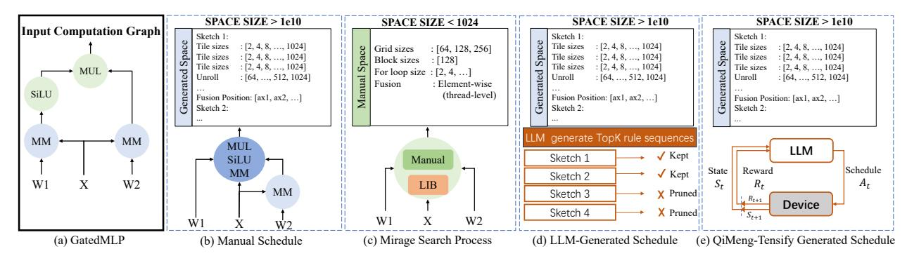

Fig. 1. Scheduling strategies comparison. (a) The original computation graph of the Gated MLP. (b) TVM divides the graph into two subgraphs with a space size of 1e10. (c) Mirage fuses all operations at the block level with a space size of 1024. (d) LLM-generated sequences often fail due to order sensitivity and no feedback. (e) *OiMeng-Tensify* leverages an MDP framework to discover high-performance schedules.

TABLE I EXAMPLE RULE APPLICATION POLICIES IN TVM

| Number | er Description                                         |  |
|--------|--------------------------------------------------------|--|
| P1     | Not strictly inlinable → Skip                          |  |
| P2     | Is strictly inlinable → AutoInline                     |  |
| P3     | Has data reuse and fusable → Tiling + Fusion           |  |
| P4     | More reduction than parallelization> ParallelReduction |  |

like TVM [14], Ansor [52], and TensorIR [25] rely on a set of scheduling rules to guide transformations and then search for an optimal low-level implementation.

These approaches, however, are typically designed for simple computation graphs, often containing a single compute-intensive operator (e.g., a single GEMM or Convolution). For these well-studied patterns, the fundamental limitation lies in the fixed, handcrafted policies that dictate how and in what sequence these rules are applied. As Table I illustrates, a *Tiling + Fusion strategy* is statically chosen for any subgraph identified as having "data reuse and fusable" characteristics.

While effective for these small and structurally regular subgraphs, this reliance on fixed policies becomes a primary bottleneck as the complexity of graphs increases, limiting adaptability and missing significant optimization opportunities.

#### B. Large-Scale Computation Graph Optimization

In contrast, large-scale computation graphs found in modern LLMs pose a greater challenge. They often consist of multiple computation-intensive operators (e.g., 3 matrix multiplications in LoRA) and complex data dependency patterns. Due to this complexity, the fixed policies of traditional auto-schedulers fail to identify valid and efficient graph-level scheduling decisions. As a result, recent works turn to more specialized graphlevel solutions, but these also have limitations. For instance, Chimera [53] narrows the scope to pairs of adjacent operators, while Mirage [45] employs fixed scheduling templates to fuse larger graphs, limiting its fusion space.

Therefore, existing approaches lack a general and automated solution to handle complex graph scheduling problems.

#### C. Motivation

While expanding the transformation space exposes more optimization opportunities, it also introduces practical challenges in exploration efficiency. To guide the design of architecture-aware LLM-guided MCTS, we present two key observations.

**Observation #1**: Prior-free search algorithms are inefficient for large-scale graph scheduling.

We evaluate exploration efficiency under the sequential decision setting using two prior-free algorithms: beam search [6] and MCTS [30]. The search space spans both transformation rule ordering and parameter configuration, detailed in Section III-C. As shown in Figure 2, both beam search and MCTS perform poorly in the automatic scheduling space of complex subgraphs like *GatedMLP*. The underlying issue is that these methods rely on limited exploration mechanisms and lack semantic awareness of the optimization task. Specifically, beam search greedily prioritizes schedules with high initial rewards (e.g., *AutoBind* or *MultiLevelTiling* in our experiments) from early-stage decisions. Meanwhile, standard MCTS, while more exploratory, depends heavily on hand-crafted simulation policies or random sampling, which fail to capture hardware-specific performance patterns or high-level program semantics.

**Observation #2:** Architecture awareness is essential for effective scheduling.

To understand how architectural differences influence the rule application policy, we compare the applied frequencies of different schedule rules on the A100 and the H100. Our results show that the distribution of scheduling rules selected during search exhibits noticeable, though not deterministic. Given the same programs, our system samples memory-centric rules slightly more often on the A100, such as AutoInline and ComputeAtLocation, to reduce register pressure and improve L2 locality. In contrast, on H100, our system samples computecentric rules more frequently, including MultiLevelTiling, ParallelizeVectorizeUnroll, and CrossThreadReduction. The higher sampling frequency of these rules helps the search better exploit the H100's larger register file and higher tensorcore throughput. Different GPU microarchitectures naturally induce different rule-usage distributions, and being aware of the target architecture allows the system to more efficiently

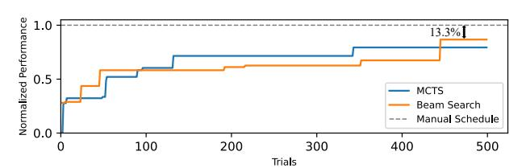

Fig. 2. Performance comparison of three search methods on GatedMLP using NVIDIA A100 (FP32), normalized to manual schedule.

generate rule choices that align with the hardware's strengths. These observations motivate us to propose an architectureaware LLM-guided search framework that injects semantic priors into the exploration process, enabling more informed and efficient navigation of complex scheduling spaces.

#### III. GRAPH SCHEDULING PROBLEM

To automatically determine the graph scheduling strategy, *QiMeng-Tensify* formulates the problem as a graph rewriting process. During the rewriting process, *QiMeng-Tensify* changes the graph states via iteratively applying rewrite rules to generate coarse-grained graph sketches. Then, *QiMeng-Tensify* performs fine-grained parameter specification on the generated sketches to generate concrete graph programs.

#### *A. Problem Formulation*

The graph rewriting problem can be formulated as a Markov Decision Process P = (S, A, T ,M, R), as illustrated in Figure 1 (e). A tensor computation graph can be rewritten as a finite number of graph states S via different combinations of graph rewrite actions A (i.e., schedule rules). For a given graph state and rewrite action, the graph is transformed into a new state using the transformation rule T after applying the action. When the graph reaches a terminal state where no further actions can be applied, *QiMeng-Tensify* queries a performance cost model M for an estimation of the reward signal. The cost model is randomly initialized and iteratively updated based on online collected performance data. During the performance measurement, the ground truth reward signal R is fed back for choosing the optimal graph rewrite.

$$\pi^* = \arg\max_{\pi} \mathcal{R}(\mathcal{S}_{\pi,x}) \tag{1}$$

The objective function of the scheduling problem can be formulated as Equation 1, where π represents the policy for generating a concrete action sequence and Sπ,x represents the terminal graph state under π for tensor program x. Thus, the optimal policy π ∗ is identified by maximizing the ground truth reward signal R (i.e., the measured program performance).

#### *B. Graph State*

The graph state (i.e., S(G, n)) consists of a computation graph G and a scheduling node n. The computation graph provides the structural foundation for static analysis and program transformation. Each scheduling node identifies a specific position in the graph where a rewriting action can be applied, enabling precise and localized transformations. To reduce the complexity, we canonicalize the representation of graph scheduling by processing the nodes in reverse topological order and applying the given sequence of rewrites sequentially.

#### *C. Graph Rewrite Action*

The graph rewrite action (i.e., A(r, p)) consists of a schedule rule r and a detailed parameter configuration p. The schedule rule is used for rewriting the coarse-grained program structure (e.g., loop tiling, loop fusion, and computation inlining). Based on the program structure, the parameter configuration specifies the rewrite details (e.g., the concrete tile sizes, the unroll lengths, and the fusion positions).

Table II illustrates a subset of the rewrite actions used in *QiMeng-Tensify*. Action A<sup>1</sup> applies the *MultiLevelTiling* rule together with its tunable tiling factors, enabling multi-level loop tiling that adapts the kernel to the memory hierarchy of the target architecture. Operator fusion is enabled by the *ComputeAtLocation* rule in action A5, which is restricted to blocks satisfying structural and dependency constraints (e.g., being a top-level, single-consumer, and untiled intermediate block), with the fusion position treated as a tunable scheduling parameter within this feasible space. Some actions contain no parameters; for example, the *AutoInline* (A2), *AutoBind* (A6) and *InlineConstantScalar* (A7) rules rewrite the program using fixed transformation patterns.

These schedule rules and their associated parameters define *QiMeng-Tensify* 's search space, which we decompose into two components: The Action Space (A) is the set of all available schedule rules (r) . Conversely, the Policy Space (π) determines which schedule rule should be applied under a given graph state. This distinction is critical: traditional compilers rely on a *single, hand-crafted policy* (a fixed rule sequence), whereas our MDP objective is to search this vast policy space π to discover the optimal sequence.

TABLE II GRAPH REWRITING ACTIONS AND RELATED PARAMETERS.

| NO. | Schedule Rule Names        | Parameters          |
|-----|----------------------------|---------------------|
| A1  | MultiLevelTiling           | Tiling factors      |
| A2  | AutoInline                 | None                |
| A3  | ParallelizeVectorizeUnroll | Loop, unroll length |
| A4  | CrossThreadReduction       | Split factors       |
| A5  | ComputeAtLocation          | Compute locations   |
| A6  | AutoBind                   | None                |
| A7  | InlineConstantScalar       | None                |

#### *D. Graph State Transition*

As shown in Table III, graph state transition is performed based on the state-action pattern and the action condition (e.g., whether the current node is inlinable for A2). The transition rules first check the patterns and the conditions, and then transform the current graph state to a new graph state. For example, if the condition of A<sup>2</sup> can be satisfied, the current graph G is transformed into a new G ′ . Since the current node no longer needs scheduling after inlining, it also changes the current node n to the next node n ′ following the reverse topological order of G ′ . Regarding the other actions, if conditions are satisfied, they perform transformations on the current graph without changing the node. Once the condition of a chosen action is not satisfied, *QiMeng-Tensify* updates the current scheduling node for further transformation, keeping the current graph unchanged.

TABLE III
GRAPH STATE TRANSITION RULES.

| Pattern                                             | Condition     | Transition                                                           |
|-----------------------------------------------------|---------------|----------------------------------------------------------------------|
| $\mathcal{T}(\mathcal{S}, \mathcal{A}_{2,7})$       | Satisfied     | $\mathcal{S}(\mathcal{G}, n) \leadsto \mathcal{S}(\mathcal{G}', n')$ |
| $\mathcal{T}(\mathcal{S}, \mathcal{A}_{1,3,4,5,6})$ | Satisfied     | $\mathcal{S}(\mathcal{G}, n) \leadsto \mathcal{S}(\mathcal{G}', n)$  |
| $\mathcal{T}(\mathcal{S}, \mathcal{A})$             | Not Satisfied | $\mathcal{S}(\mathcal{G}, n) \leadsto \mathcal{S}(\mathcal{G}, n')$  |

#### E. Limitations of Existing Works

With the problem formulated, we now examine the limitations of existing approaches by evaluating their exploration capabilities across action space (A) and policy space ( $\pi$ ), as summarized in Table IV. Auto-schedulers like Ansor [52] and Meta-Scheduler [25], [36] automate scheduling via rewrite rules, yet their efficacy is limited by hard-coded policies that partition large graphs into predefined subgraphs. This structural rigidity is also inherited by Reasoning Compiler [40] and AMOS [54]; although the former introduces LLM-guided MCTS to replace TVM's evolutionary search and the latter incorporates hardware abstractions for broader mapping, both remain confined by TVM's expert-designed graph partitioning and fusion policy. Astitch [57] aggressively fuses memoryintensive operations, which significantly constrains the policy space and forfeits opportunities to fuse compute-intensive operations. In contrast, Chimera [55] restricts its fusion policies to successive memory-bound and compute-intensive workloads. Welder [37] broadens the scope to support fusion for both memory-intensive and compute-intensive operators by caching intermediate results in shared memory, but its limited intra-operator optimization prevents exploration of thread-level fusion. The state-of-the-art Mirage [45] employs superoptimization to explore functionally equivalent tensor program rewrites at both block and thread levels. However, it depends on template libraries (e.g., CUTLASS) and hand-written code templates (e.g., CUDA or Triton), which ultimately constrain its action space and policy space. SpaceFusion [58] enables advanced fusion across operators with complex dependencies by holistically modeling them with the Space-Mapping Graph, but its focus on globally-ranged mappings restricts its scope to a specific class of operators. PluS [46] greatly simplifies pattern recognition for users and utilizes CUTLASS or cuBLAS for code generation, but this approach necessitates that the action and policy spaces be manually designed.

### IV. ARCHITECTURE-AWARE LLM-GUIDED MCTS

#### A. System Overview

As illustrated in Figure 3, *QiMeng-Tensify* integrates two components to generate high-performance tensor programs. First, *LLM-Guided MCTS* (Sec. IV-B) executes the specific optimization task by employing the adaptive prompt to guide the search over the policy space  $\pi$ , while a fine-grained

TABLE IV
LIMITATIONS OF ACTION AND POLICY SPACE.

| Framework               | Action Space A    | Policy Space $\pi$ |
|-------------------------|-------------------|--------------------|
| TVM [25], [52]          | Full              | Manually designed  |
| Astitch [57]            | Full              | Memory-intensive   |
| Chimera [55]            | Limited           | Compute-intensive  |
| Welder [37]             | Limited           | Full               |
| Mirage [45]             | Manually designed | Template-based     |
| SpaceFusion [58]        | Limited           | Template-based     |
| PluS [46]               | Manually designed | Manually designed  |
| Reasoning Compiler [40] | Full              | Limited            |
| AMOS [54]               | Full              | Manual             |
| QiMeng-Tensify          | Full              | Full               |

simulation module explores the parameter space A. Second, Architecture-Aware Prior Adaptation (Sec. IV-C) tailors the LLM to the target hardware by distilling natural-language heuristics from execution feedback and architectural feedback of representative subgraphs during a lightweight offline stage.

#### Algorithm 1: LLM-Guided Monte-Carlo Tree Search

```
Input: Computation Graph \mathcal{G}, Prompt Prompt
    Output: Best program p*
 1 R^* \leftarrow 0, t^* \leftarrow 0, p^* \leftarrow \emptyset
 2 for t=1 to N do
           // Early stopping
          if t - t^* > early\_stopping then
                break
 4
          end
 5
          \mathcal{S} \leftarrow \mathcal{G}, \, \pi \leftarrow \emptyset;
           // Selection and Expansion
          while S visited and not terminal do
                 \mathcal{A} \leftarrow \text{SelectBest}(\mathcal{S})
                 \pi \leftarrow \pi \cup \{(\mathcal{S}, \mathcal{A})\}
                 \mathcal{S} \leftarrow \mathcal{T}(\mathcal{S}, \mathcal{A})
11
12
          if {\mathcal S} not terminal then
13
                 logits \leftarrow LLM(S, Prompt)
                 \mathcal{A} \leftarrow Sample(\mathcal{S}, logits)
14
                 \pi \leftarrow \pi \cup \{(\mathcal{S}, \mathcal{A})\}\
15
16
                 \mathcal{S} \leftarrow \mathcal{T}(\mathcal{S}, \mathcal{A})
17
                Simulation and Evaluation
          Sketches \leftarrow GenerateProgramSketches(\mathcal{G}, \pi)
18
           (p,R) \leftarrow \text{Fine-GrainedParamaterSpecification } (Sketches)
           // Backpropagation
20
          foreach (s,a) \in \pi do
                Q(s,a) \leftarrow Q(s,a) * \alpha + R * (1 - \alpha)
21
22
            // Update search parameters
23
          if R > R^* then
               R^* \leftarrow R, \, t^* \leftarrow t, \, p^* \leftarrow p
24
25
          end
26 end
27 return n'
```

#### B. LLM-Guided MCTS

To efficiently solve the formulated MDP problem, we first introduce an LLM-guided MCTS algorithm (Algorithm 1). *QiMeng-Tensify* iteratively constructs a search tree where each node represents a graph state  $\mathcal{S}$  (i.e., a program sketch) and each edge corresponds to a schedule rule r (an action  $a \in \mathcal{A}$ ).


Fig. 3. Overview of *QiMeng-Tensify*. The framework integrates two components: (a) **LLM-Guided MCTS**, which explores the policy space  $\pi$  through a four-stage iterative process (Selection, Expansion, Simulation, Backpropagation) guided by adaptive priors; and (b) **Architecture-aware Prior Adaptation**, which refines the LLM's guidance by distilling natural-language heuristics from hardware execution.

QiMeng-Tensify jointly explores the scheduling decisions and the related parameters for a fixed number of iterations. At each iteration, starting from the root (initial graph S), the algorithm traverses the tree by selecting actions that balance exploration and exploitation. When a non-terminal leaf node is reached, OiMeng-Tensify leverages the LLM with the learned adaptive prompt to generate a prior probability distribution over applicable schedule rules and then generate a set of new program sketches by sampling over the distribution. Each new sketch is then evaluated via a Simulation phase, which employs a fine-grained parameter specification module to determine optimal parameters (e.g., tiling size) and uses a cost model to estimate a reward R. Finally, this reward is backpropagated up the tree to update the action values Q(s, a), informing future decisions. The best-performing program  $p^*$  is returned after a fixed budget (e.g., 500 iterations). To optimize efficiency, an early stopping mechanism terminates the search if the peak reward stagnates for K iterations (e.g., K = 200), avoiding redundant exploration upon reaching a performance plateau.

The following subsections detail each stage of this process.

1) **Selection**: The *selection* phase guides the MCTS traversal from the root node (original, unscheduled computation) down to a leaf node, following a path that balances *exploitation* of known high-performing schedules and *exploration* of less-visited but potentially promising transformations.

When visiting a node v, instead of the traditional UCB rule [43], our approach selects the next child action  $a^*$  by maximizing a Gumbel-augmented score:

$$a^* = \arg\max_{a} \left[ g(s, a) + \pi(s, a) + \sigma \cdot Q(s, a) \right]$$
 (2)

where g(s,a) is Gumbel-distributed noise (enabling exploration via the Gumbel-max trick [18]),  $\pi(s,a)$  is the LLM-provided prior logit, Q(s,a) estimates the action value based on the highest performance achieved within the schedule rooted at a, and  $\sigma$  balances the LLM prior and empirical value. This formulation explicitly incorporates an LLM-guided prior  $\pi(s,a)$  into the selection policy, allowing semantic knowledge

about the operator's structure and optimization opportunities (e.g., recommending *compute\_at* when a GEMM is immediately followed by an element-wise operation) can be leveraged early in the search, improving sample efficiency.

The traversal proceeds recursively until it reaches a leaf node, which is either not fully expanded or corresponds to an incomplete sketch. To guard against LLM inaccuracies and maintain exploration diversity, we incorporate an auxiliary term g(s,a) (i.e., a perturbation) into the action selection. This design enables QiMeng-Tensify to efficiently exploit semantic priors while preserving principled exploration.

2) Expansion: Once the selection phase reaches a leaf node v that is not fully expanded (representing an incomplete schedule rules sequence), the expansion step generates child nodes by applying valid schedule rules to the current program state. In QiMeng-Tensify, each node represents a partially scheduled program (a sketch), and expansion corresponds to applying a concrete rewrite action that guarantees correctness. The choice of which rewrite to apply during expansion is guided by LLM- $generated\ priors$ . Before the search begins, the LLM analyzes the operator's semantics and suggests a ranked list of likely beneficial rewrites. These suggestions are used to prioritize the expansion order: high-priority rewrites are explored earlier, improving search efficiency.

At each expansion, the tree is extended with a new child node v' represents the state after the selected rewrite. Initialized with the LLM-generated prior score, this node enables  $\mathit{QiMeng-Tensify}$  to explore complex schedule spaces in a structured and semantically guided manner.

3) Simulation: While MCTS explores high-level schedule sequences, the simulation step in QiMeng-Tensify performs fine-grained parameter tuning via guided local search. We focuses on neighborhoods of top-ranked candidates, enabling faster convergence through targeted exploration. Moreover, the top-K candidates are refined in parallel, enabling efficient exploration of diverse high-quality starting points.

As shown in Algorithm 2, the algorithm first randomly samples different parameter settings to form concrete programs

 $\mathcal{P}$  from MCTS-generated sketches. Next, the cost model (XGBoost model [13] in our experiments) predicts and ranks the programs in  $\mathcal{P}$ , after which the top K candidates  $\mathcal{P}_k$ are selected. Then, their execution times  $\mathcal{T}_k$  are measured on hardware, and the resulting code-performance pairs are subsequently used to update the cost model. Following this, for each program-performance pair  $(p_i, t_i)$  in  $\mathcal{P}_k$ , the algorithm explores its neighborhood  $\mathcal{P}_{neigh}$ , defined by programs within a small Manhattan distance. From  $\mathcal{P}_{neigh}$ , it further selects programs  $\mathcal{P}_{thres}$  whose predicted performance lies close to  $t_i$ . After measuring the performances, the algorithm decides to finish the search if it finds a better program candidate. Finally, when the local search reaches the preset tuning time, the bestperforming program found during the process is returned as the representative implementation for the current sketch, and a performance-proportional reward R is fed back to the MCTS node to guide future exploration.

Algorithm 2: Fine-Grained Parameter Specification

```
\textbf{Input :} Sketches, cost\_model
    Output: Optimal program p^*, Reward \mathcal{R}^*
 1 \ \mathcal{P} \leftarrow SamplePrograms(Sketches)
2 \mathcal{P}_k \leftarrow \text{TopK-Selection}(\mathcal{P}, cost\_model)
3 \mathcal{D} \leftarrow \phi
4 \mathcal{T}_k \leftarrow \text{MeasurePerformance}(\mathcal{P}_k, \mathcal{D})
5 M \leftarrow \text{UpdateModel}(cost\_model, \mathcal{D})
    foreach p_i, t_i \in \mathcal{P}_k, \mathcal{T}_k do
            t_{best} \leftarrow t_i
            while GetCurrentTime() \leq Tuning\_time do
                   \mathcal{P}_{neigh} \leftarrow \text{GenerateNeighbors}(p_i)
                   \mathcal{P}_{thres} \leftarrow \text{PickByThreshold}(\mathcal{P}_{neigh}, cost\_model)
10
                   \mathcal{T}_{thres} \leftarrow \text{MeasurePerformance}(\mathcal{P}_{thres}, \mathcal{D})
11
                   t \leftarrow \text{PickBestPerformance}(\mathcal{P}_{thres}, \mathcal{T}_{thres})
12
13
                   if t > t_{best} then
                          break
14
                   end
15
                   t_{best} = t
17
            end
18 end
19 p^* \leftarrow \text{BestProgram}(\mathcal{D})
20 R^* \leftarrow \text{EstimateReward}(p^*)
21 return p^*, R^*
```

4) Backpropagation: After simulation phase identifies the optimal parameter configuration for the candidate program sketch, the backpropagation step updates internal statistics of the search tree upward from the leaf node (where the schedule rules sequence was expanded) back to the root. Let v be a node on this path with associated values Q (i.e., Q(s,a) in Algorithm 1), the reward R of programs derived from its optimal program. Upon obtaining a new performance  $t_{best}$  (execution time) from the simulation, the reward  $R^* = flops(p^*)/t_{best}$  is computed and propagated. For each ancestor node v, the value is updated via moving average:

$$Q \leftarrow Q * \alpha + R^* * (1 - \alpha) \tag{3}$$

This update reinforces paths that lead to high-performing kernels, increasing their selection probability in future iterations of the LLM-guided policy. Notably, because the reward is derived from *real hardware execution*, the backpropagation

TABLE V
KEY ARCHITECTURAL FEATURES FOR NVIDIA GPUS

| Metric                          | Description                                |
|---------------------------------|--------------------------------------------|
| SM Efficiency                   | Fraction of active SM cycles.              |
| Shared Utilization              | Fraction of shared memory used.            |
| Achieved Occupancy              | Actual warps per SM (normalized).          |
| Instructions per Warp           | Avg. instructions executed per warp.       |
| Tensor Precision FU Utilization | Tensor Core usage by precision.            |
| Warp Execution Efficiency       | Avg. active threads / max threads per warr |

process incorporates accurate performance feedback into the search dynamics, enabling the LLM-guided MCTS to adapt to complex hardware behaviors such as memory hierarchy effects and thread divergence. Additionally, in *QiMeng-Tensify*, the backpropagation phase may also trigger an update to the LLM-guided prior when a significantly better program is found, allowing the system to learn from successful patterns and refine its high-level search strategy over time.

#### C. Architecture-aware Prior Adaptation

To enable the LLM to provide precise hardware-specific guidance, we introduce an offline adaptation mechanism. This process, detailed in Algorithm 3, serves a dual purpose: it self-evolves the prompt into natural-language heuristics and trains an offline cost model using collected performance data.

```
Algorithm 3: Hardware-aware Prompt Self-evolving
```

```
Input: Base prompt \mathcal{P}_b, Subgraphs pool \mathcal{T}
    Output: Optimized Prompt \mathcal{P}^*
    \mathcal{P}^* \leftarrow \mathcal{P}_b
2 for e=1 to E do
            \mathcal{P}_0 \leftarrow \mathcal{P}
3
            \mathcal{G}_0 \leftarrow \text{RandomTasks}(\mathcal{T}, M)
 4
 5
            for i = 1 to N do
                    for g \in \mathcal{G}_0 do
                    \mid p_j^*, R_j^* \leftarrow \text{LLM-guided MCTS with } \mathcal{P}_{i-1} \text{ on } g end
 7
 8
                     \mathcal{F} \leftarrow \text{AggregateFeedback}(\{p_j^*\}, \{R_j^*\})
                    \mathcal{P}_i \leftarrow \text{UpdatePrompt}(\mathcal{P}_{i-1}, \mathcal{F})
10
11
            end
            \mathcal{P}^*
12
13 end
14 return P*
```

**Prompts Self-Evolution and Cost Model Offline- Training.** In each epoch, QiMeng-Tensify samples a batch of representative subgraphs  $\mathcal{G}_0$  and performs parallel MCTS simulations using the current prompt (lines 5–7). We then aggregate the complete search trajectories, including input IRs, adopted policies, and comprehensive hardware performance metrics (e.g., SM Efficiency, Shared Memory Utilization) shown in Table V. This collective feedback  $\mathcal{F}$  is utilized in two ways: (1) It is fed back to the LLM to distill high-level optimization rules and iteratively refine the prompt using a meta prompt as shown in Figure 5 (e.g., sumarizing the root causes of performance gains by correlating the input TensorIR with execution outcomes, including prompt of previous iteration, scheduling policies, input TensorIR, rewards, and hardware metrics) (line 10). (2) The collected dataset of

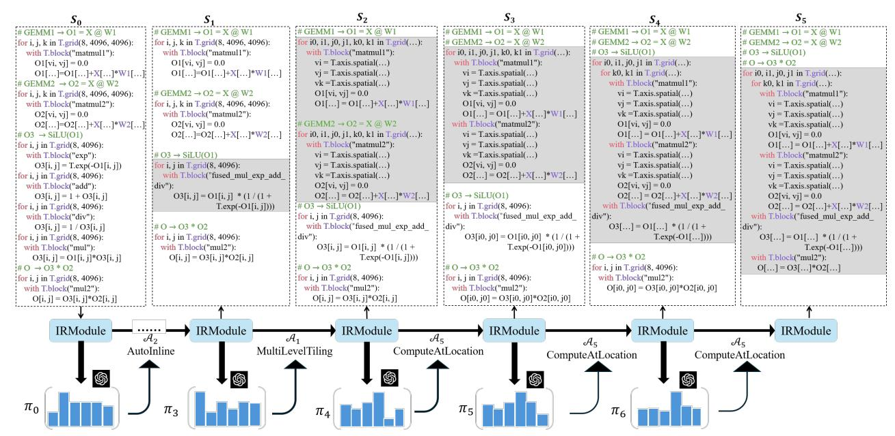

Fig. 4. Optimization trajectory of GatedMLP in *QiMeng-Tensify*. Throughout the transformation process, the background color of each component remains unchanged to facilitate visual tracking. (S0) The initial GatedMLP workload. (S1) The AutoInline rule (A1) is applied several times, which fuses the elementwise operators of the SiLU function into a single, unified SiLU operator. (S2)-(S3) The MultiLevelTiling (A1) and ComputeAtLocation (A5) rules are applied sequentially, leading to the tiling and fusion of GEMM1 and GEMM2. (S4) The ComputeAtLocation rule (A5) is applied to fuse the SiLU operator into the previously fused GEMM block. (S5) Finally, another application of the ComputeAtLocation rule (A5) integrates the element-wise multiplication into the existing fused operator group. Note that the figure shows simplified pseudo-code for readability.


Fig. 5. The meta prompt for prompt learning.

program sketches and execution latencies is used to train an offline XGBoost cost model. This pre-trained model serves as the initial performance predictor for the online search phase (Sec. IV-B3), significantly accelerating convergence.

Example of Learned Heuristics. We conducted this adaptation offline using 7 representative subgraphs (i.e., *DoubleMatmul*, *Conv2d+Bias+Relu*, *Matmul*, *LSTM*, *Matmul+Relu*, *MLP*, and *Softmax*), collecting 12,500 performance measurements. As shown in Figure 6, the resulting prompt evolves from generic instructions into sophisticated strategies aligning schedule rules with hardware constraints. For instance, the LLM learns to identify *injective blocks* (one-toone mappings) and prioritizes AutoInline to eliminate calloverhead. Conversely, for compute-bound *SSR-shaped* pat-

```
You are an expert GPU schedule policy generator. Your task is to assign a probability distribution over the following seven
schedule rules: {Pass Description}
Hardware-aware Learned Principles:
- When the IR contains an injective block where each output element depends on exactly one input element), the scheduler
prioritizes AutoInline to eliminate intermediate buffers and enable downstream fusion.
- For SSR-shaped computations (e.g., matmul), the scheduler applies tensor-core-aware multi-level tiling, with tile shapes
and scheduling primitives specialized to the target GPU architecture.
- For long element-wise or affine operator chains with no data reuse, apply ComputeAtLocation to relocate computation
across producer/consumer boundaries, enabling kernel fusion and eliminating intermediate buffers.
- When a reduction axis is long or requires collaboration across multiple warps, use CrossThreadReduction to implement
efficient warp- or block-level cooperative reductions.
- When constant scalar appear in the IR, apply InlineConstantScalars to embed values directly into instructions and avoid
global memory loads.
- When register usage approaches architectural limits, suppress vectorization and loop unrolling to preserve occupancy and
avoid register spilling, balancing instruction-level parallelism with resource constraints.
- When primary spatial loop axes exhibit sufficient parallelism, apply AutoBind to map them onto CUDA thread and
block dimensions, optimizing occupancy and memory coalescing.
- When local memory usage is non-zero, reduce or disable ParallelizeVectorizeUnroll to alleviate register pressure and
avoid performance degradation from spilling.
Given the following TensorIR: {prim_func}
First, describe the structural characteristics of this IR. Then assign a probability of usage for each pass according to the
hardware-aware learned principles, expressed as a value between 0 and 1, such that their total equals 1.
Return ONLY a 1x7 probability list in the format: [p1, p2, p3, p4, p5, p6, p7]. Do not include any other text or explanation.
```

Fig. 6. The learned prompt of *QiMeng-Tensify*.

terns, it favors MultiLevelTiling to optimize data locality across the register file and shared memory. These learned heuristics, plus the offline-trained cost model, effectively prune the search space and improve evaluation accuracy.

#### *D. A Working Example*

To illustrate how *QiMeng-Tensify* discovers highperformance tensor programs, we walk through the optimization of a representative GatedMLP subgraph, which is a fused multi-layer perceptron with dynamic gating. As shown in Figure 4, the computation is defined as: O = SiLU(X · W1) ⊗ (X · W2), where · denotes matrix multiplication and ⊗ element-wise multiplication. A starting implementation (Figure 4, left) decomposes the computation into isolated kernels: GEMM1, followed by a SiLU (involving exp, add, div, mul), then GEMM2, and finally mul. This modular design introduces multiple intermediate buffers (O1, O2, O3 in our example), incurring high memory traffic.

In the expansion phase, the LLM is prompted with operator structure, task description, and schedule definitions. It assigns high prior probabilities to fuse SiLU to eliminate intermediate buffers after recognizing that SiLU can be computed as a fused expression: SiLU(x) = x/(1 + e −x ). This guides the search toward S1, where the sub-computations (e.g., exp, add, div, mul) are fused into a single block, reducing both memory footprint and kernel launch overhead.

Further exploration reveals greater optimization potential. The LLM identifies that GEMM1 and GEMM2 share input X, and their outputs feed into a subsequent element-wise operation. It thus assigns high priors to align GEMM loops and tile across GEMMs. Guided by these priors and early feedback, *QiMeng-Tensify* fuses both GEMMs under a shared tiling loop (e.g., i0, j0, k0), enabling coarse-grained parallelism and improving data locality shown as S2. Multi-level tiling here enables asynchronous memory copy, overlapping globalto-shared data loading with previous tile computation. Then the search progresses toward deeper fusion. The LLM observes that the output of GEMM1 is used by SiLU, and that SiLU's result is fed into the element-wise MUL before being consumed by GEMM2. Recognizing this producer-consumer chain, the LLM recommends compute\_at(SiLU, GEMM1) to improve locality and enable fusion (as in S4).

Furthermore, it suggests fusing the SiLU and MUL operations directly into the reduction loop of GEMM2. This transformation lifts the element-wise operations into the GEMM2 block, avoiding redundant memory writes and significantly reducing memory traffic. Ultimately, *QiMeng-Tensify* achieves full fusion: operations (i.e., GEMM1, SiLU, GEMM2, and MUL) are integrated into a single, highly optimized loop nest (S5), enabling end-to-end computation without intermediate storage.

Execution feedback reinforces high-performing paths, guiding *QiMeng-Tensify* to a kernel that eliminates all intermediates, reduces memory traffic, and achieves high utilization. This demonstrates how LLM-driven semantics enable globally coherent optimizations (e.g., cross-operator fusion and memory-aware tiling) beyond the reach of rule-based systems.

#### V. EVALUATION

# *A. Implementation*

*QiMeng-Tensify* is implemented in ∼16,000 lines of Python code, plus 1,500 lines of C++ code for low-level schedule primitives. The system integrates four key components. First, program definitions are expressed using TensorIR from TVM, which serves as the initial IR for operators and captures their computational semantics. Second, an LLM module performs self-evolving prompt engineering and integrates semantic knowledge into the compilation workflow. Third, a MCTS search engine drives the schedule exploration, guided by LLM-generated priors to balance exploration and exploitation. Finally, a local fine-tuning phase optimizes concrete low-level parameters such as tile sizes and unrolling factor mappings for specific hardware targets. To balance performance and numerical integrity, *QiMeng-Tensify* implements a rigorous verification pipeline against a high-precision Golden Reference. Candidate kernels exceeding a predefined error threshold ϵ or generates N aN is penalized with a zero reward. This mechanism guides the search process to avoid numerically unstable paths and instead prioritize stable configurations.

LLM Configuration. We employ gpt-5-preview (2025-07-01) via the OpenAI API with a temperature of 0.8 and a 8192-token budget to provide heuristic guidance for subgraph optimization. To ensure system robustness, we implement a fallback mechanism that reverts to a stochastic random-walk policy in the event of API invocation failures. All LLM queries are performed sequentially.

#### *B. Experimental Setup*

Platforms. We conduct comprehensive benchmarking across two hardware platforms: NVIDIA A100 GPU with Tensorcore (40GB PCIe), and NVIDIA H100 GPU with Tensorcore (80GB PCIe). The host-side search orchestration, including MCTS logic and task scheduling, is executed on an Intel Xeon Gold 6330 CPU (112 cores @ 2.0 GHz).

Baselines.We evaluate the performance of our approach by benchmarking it against state-of-the-art works in Table VI.

TABLE VI THE EVALUATED BASELINES.

| Baseline                               | Version         | Type              |
|----------------------------------------|-----------------|-------------------|
| PyTorch [10], [34]                     | v2.7.0          | Manually Designed |
| TensorRT [4]                           | v10.8.0.43      | Manually Designed |
| Triton [42]                            | v3.2.0          | Manually Designed |
| FlashAttention [19]                    | v2.7.3          | Manually Designed |
| Mirage [45]                            | v0.2.4          | Template-based    |
| TVM [15]                               | commit 567eeed3 | Exploration-based |
| Welder [37]                            | commit af53ab1  | Exploration-based |
| Reasoning Compiler [40] Commit 1390945 |                 | Exploration-based |
| TensorRT-LLM [5]                       | v1.1.0          | Manually Designed |

Benchmarks. Our evaluation follows a two-tier hierarchy to assess *QiMeng-Tensify* 's capability: (1) Subgraph-level, including 9 important computation subgraphs; and (2) Networklevel, evaluating 4 production-scale LLMs. As *QiMeng-Tensify* is designed to optimize complex tensor computation graphs, our evaluation deliberately focuses on graph-level performance rather than operator-level benchmarks.

#### *C. Ablation Study of Architecture-aware Prior Adaptation*

We evaluate the impact of our two architecture-aware mechanisms introduced in Sec. IV-C: (1) the *self-evolved prompt* for guiding search direction, and (2) the *offline-trained cost model* for accelerating evaluation by the following settings: 1) Static Prompt+ Online-Only Cost Model: Uses a fixed, handcrafted prompt and learns the cost model entirely from scratch during search. 2) Static Prompt + Offline-Trained Model: Uses the fixed prompt but initializes the cost model with the offline dataset. 3) Evolved Prompt + Online-Only Cost **Model**: Uses the self-evolved prompt but learns the cost model from scratch. **4) Evolved Prompt + Offline-Trained Model** (*QiMeng-Tensify*): Enables both the self-evolved prompt and the offline-trained cost model initialization.

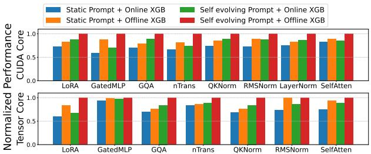

Fig. 7. Ablation study of prompt evolution and offline cost modeling.

All variants share identical MCTS parameters. Figure 8 shows that the *self-evolved prompt* and *offline-trained cost model* offer both individual benefits and strong synergy: the former guides what to explore, while the latter improves how accurately candidates are scored during the local search.

#### D. Efficiency of LLM as Priors

To assess LLM-guided MCTS, we conduct a systematic ablation study to evaluate the performance impact of various prior-guided heuristics across two distinct subgraphs: *GatedMLP* and *GQA*. This study compares standard MCTS against various heuristic-guided configurations to isolate the performance impact of search mechanisms versus prior-driven pruning. As illustrated in Figure 8, our exploration spans six variants categorized into three tiers: 1) MCTS denotes MCTS with random action priors; 2) Statistical Baselines that use MLP and Random Forest serve as non-iterative regressors to provide priors for MCTS; 3) LLM-Guided MCTS that integrate MCTS with three state-of-the-art LLM priors (i.e., DeepSeek-V3.2 [23], Qwen3-max [8], and GPT 5.0 [38]).

Results show that while statistical models (MLP, Random Forest) improve MCTS efficiency by capturing coarse patterns, they underperform LLM-guided configurations. Specifically, LLM-based priors (DeepSeek-V3.2, Qwen3-max, GPT 5.0) yield 20%–30% gains over statistical baselines. This superiority arises from LLMs' context-aware reasoning on code and hardware, enabling higher-fidelity pruning than regression-based heuristics. Furthermore, the LLM-guided method converges faster, approaching optimal solutions earlier than competitors. The consistent performance across backends highlights *QiMeng-Tensify*'s robustness, proving its effectiveness

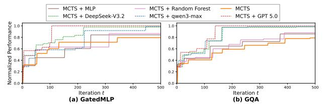

Fig. 8. Ablation studies for GatedMLP and GQA. We evaluate the normalized performance of six MCTS variants across two subgraphs: (a) GatedMLP and (b) GQA.

stems from the LLM-MCTS integration methodology rather than specific model bias.

#### E. Subgraph Evaluations

**Benchmarks**. To evaluate the effectiveness of our method on more complex computational patterns, we benchmark common subgraphs extracted from real-world LLMs, as shown in Table VII. This benchmark includes subgraphs from Mirage, along with additional subgraphs such as *LayerNorm* and the latest operator, *FlashAttention*, *NSA* [19], [20], [50].

TABLE VII REPRESENTATIVE SUBGRAPHS USED IN OUR BENCHMARK.

| - 4 |           |                               |              |
|-----|-----------|-------------------------------|--------------|
|     | Name      | Description                   | Arch.        |
|     | LoRA      | Low-rank fine-tuning          | LLaMA-3-lora |
|     | GatedMLP  | Gated MLP block               | Falcon-7B    |
|     | GQA       | Grouped-query attention       | LLaMA-3-70B  |
|     | QKNorm    | GQA with QK normalization     | Chameleon-7B |
|     | nTrans    | Norm + residual fusion        | nGPT-1B      |
|     | RMSNorm   | RMS layer norm                | LLaMA-2-7B   |
|     | LayerNorm | Layer norm                    | Transformer  |
|     | SelfAtten | Standard self-attention block | Transformer  |
|     | NSA       | Native sparse attention       | Transformer  |
|     |           |                               |              |

Baseline. We compare our method against several widelyused frameworks, covering both general-purpose compilers and hand-optimized libraries. For fair comparison, we consider two precision settings: 1) FP32: We benchmark PyTorch, TVM with Meta Schedule on CUDA Core using float32 datatype. 2) FP16: All frameworks are also evaluated with float16 datatype on TensorCore, including PyTorch, TVM with Meta Schedule, TensorRT, Triton, FlashAttention, Welder, Reasoning Compiler and Mirage.

Each baseline is configured with its recommended optimization settings. For TVM, we use the Meta Schedule auto-tuning pipeline with its default CUDA backend and Tensor Core backend. Triton kernels are adapted from open-source official examples. FlashAttention is applied only to compatible attention subgraphs. Mirage is tested using its latest scheduling heuristics. Welder is configured with its default fusion and scheduling policies as recommended in its documentation. Reasoning Compiler redefines the search backend of TVM's MetaSchedule by replacing the evolutionary search algorithm with an LLM-guided MCTS framework. We compare it by implementing its algorithm in our search space. All experiments are run on the same hardware and batch size for consistency.

**Results.** Figures 10 and 9 show results for FP32 and FP16 precision. *QiMeng-Tensify* consistently achieves state-of-theart performance across subgraphs. On CUDA cores (FP32), *QiMeng-Tensify* demonstrates speedups of  $3.23\times$  and  $2.05\times$  compared to PyTorch and MetaSchedule, respectively. On Tensor Cores (FP16), *QiMeng-Tensify* achieves speedups of  $6.49\times$ ,  $2.86\times$ ,  $1.68\times$ ,  $2.64\times$ ,  $1.27\times$ ,  $13.49\times$ ,  $1.29\times$ , and  $1.31\times$  over PyTorch, TensorRT, TVM, Triton, FlashAttention, Welder, Mirage, and Reasoning Compiler, respectively. Notably, on subgraphs such as Lora and GatedMLP, which feature irregular data flow and conditional execution that challenge traditional compilers, our method achieves up to  $2.3\times$ 

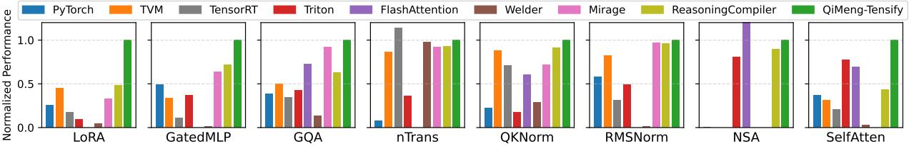

Fig. 9. Subgraph performance on A100 (FP16), normalized to *QiMeng-Tensify*. FlashAttention-V2 used in FlashAttention, Triton, and *QiMeng-Tensify*. Empty bars indicate no support.

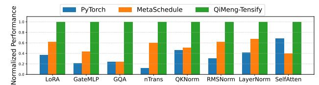

Fig. 10. Subgraph performance on A100 (FP32), normalized to QiMeng-Tensify.

speedup over PyTorch and outperforms all other baselines. In the QKNorm subgraph, we outperform both FlashAttention (1.66×) and TensorRT (1.40×), despite their domain-specific optimizations. This achievement stems from our method's ability to automatically generate optimized subgraphs that extend beyond the design space of manually crafted approaches. For normalization-heavy patterns like nTrans and RMSNorm, our method surpasses TVM and Triton through better layout handling and fusion strategies. Furthermore, on the novel NSA operator, *QiMeng-Tensify* is 1.51× and 1.18× faster than Triton and Reasoning Compiler, proving its ability to generalize to sparse, non-uniform workloads despite falling slightly behind expert-coded FlashAttention.

Overall, these results show our approach generalizes from operator to subgraph optimization, outperforming existing compilers by learning reusable scheduling patterns.

#### F. End-to-End LLM Evaluations

**Benchmarks.** We evaluate end-to-end inference latency on **Chameleon-7B** [41], **LLaMA3-8B** [29], **GPT-3-7B-LoRA** [32], and **nGPT-1B** [33]. These models cover diverse architectures, from dense transformers to parameter-efficient fine-tuned variants. All measurements are conducted on NVIDIA A100/H100 GPUs with batch sizes 1 (low-latency) and 8 (high-throughput) at a 4096 sequence length.

**Baseline.** We compare against three representative baselines: **PyTorch**, **TensorRT-LLM** [5] and **Mirage** [45].

**Results.** As shown in Figure 11, our method consistently outperforms both baselines in relative terms. On the A100, we observe consistent speedups over PyTorch and TensorRT-LLM, ranging from  $1.08\times$  to  $2.03\times$  across networks with batch sizes of 1 and 8. Compared to Mirage, *QiMeng-Tensify* also achieves performance gains on all evaluated networks. On the H100, *QiMeng-Tensify* demonstrates even more substantial improvements, outperforming PyTorch, TensorRT-LLM, and Mirage with average speedups of  $1.78\times$ ,  $1.29\times$ , and  $1.30\times$ , respectively, highlighting its effectiveness across different hardware platforms. Across all four models and both batch

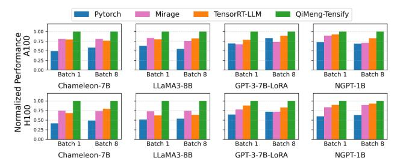

Fig. 11. LLM inference performance on A100 and H100, normalized to *QiMeng-Tensify*.

sizes, our search method delivers  $1.08 \times -2.42 \times$  lower latency than PyTorch, TensorRT-LLM, and Mirage, highlighting its ability to discover high-performance schedules through informed exploration and precise parameter tuning.

#### G. Case Study: GatedMLP

This case study shows how *QiMeng-Tensify*'s large, architecture-aware scheduling search space enables optimizations that Exploration-based (e.g., TVM with MetaSchedule) and template-based (e.g., Mirage) methods cannot express on *GatedMLP* operator mentioned in IV-D.

TVM with MetaSchedule decomposes GatedMLP into two isolated kernels, confining its exploration to a fragmented search space that precludes cross-operator optimizations such as fusing SilU and Mul with the first GEMM. Mirage reduces kernel count through expert-designed templates but is constrained by a handcrafted space of scheduling parameters (e.g., tiling size). Guided by the architecture-aware LLM's priors, MCTS discovers high-impact actions such as fusing SiLU with the second GEMM and enabling partial reduction that are inaccessible to rule-based or partitioned compilation flows. As shown in Figure 9, the final kernel achieves a 2.80× speedup over the best program generated by TVM with Meta Schedule and outperforms Mirage by 1.47×. This shows QiMeng-Tensify overcomes the limitations of pre-defined scheduling rules and scheduling parameter space by enabling end-to-end subgraph transformations to yield optimized kernels.

#### H. Search Time

The Architecture-Aware Prior Adaptation phase (Sec. IV-C) requires a one-time ~30 hour offline overhead to distill heuristics and pre-train the XGBoost cost model. However, this investment accelerates Online LLM-Guided MCTS by providing a "warm start" with high-quality priors and accurate initial performance predictions. Consequently, QiMeng-Tensify rapidly converges to high-performance implementations.

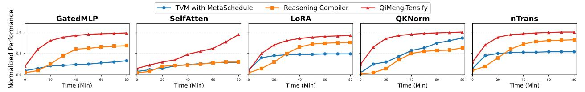

Fig. 12. Search convergence performance on A100 GPU. Normalized to *QiMeng-Tensify*, these plots show our framework achieves significantly higher speedups while requiring orders of magnitude shorter tuning time compared to other baselines.

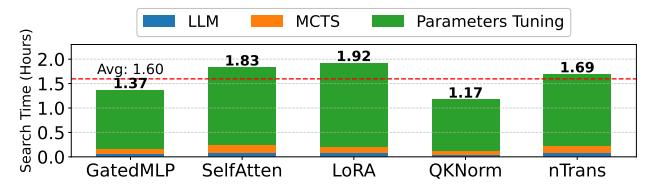

Fig. 13. Breakdown of search time across key operators on A100.

**Breakdown of search time.** Figure 13 details the breakdown of the Online phase across five representative subgraphs. We categorize the runtime into three components: (i) LLM Inference (during Expansion), (ii) MCTS Control **Overhead** (during *Selection* and *Backpropagation*), and (iii) Fine-Grained Parameter Specification (during Simulation). The results show that for compute-intensive operators (e.g., GatedMLP), the Parameter Specification phase dominates, exceeding 85% of the total time. This confirms that the majority of time is spent effectively evaluating the Action Space  $\mathcal{A}$  (parameters) rather than on search overhead. Notably, the MCTS control overhead remains consistently low (< 8%) thanks to our efficient JAX-based parallel implementation. Crucially, LLM is invoked only once per MCTS iteration to provide structural guidance, ensuring that the inference latency remains a negligible fraction of the whole compilation process.

Comparison of compilation time. Table VIII compares end-to-end compilation time on the NVIDIA A100 GPU. Library-based solutions (e.g., PyTorch, TensorRT) and specialized kernels (e.g., FlashAttention, Triton) are marked N/A. While these approaches incur negligible static compilation latency, they are limited to predefined operator patterns and may miss optimization opportunities. Among compilers, Welder achieves near-instantaneous compilation by using rule-based heuristics to reduce the search space, but often produces sub-optimal kernels that do not fully utilize hardware capabilities. Mirage [45] reports up to a 4-hour compilation overhead due to its exhaustive search and is comparable to QiMeng-Tensify while exploring a much smaller search space. QiMeng-Tensify consistently discovers high-performance tensor programs within a 2-hour window, offering 1.69× speedup over TVM with MetaSchedule. In addition, QiMeng-Tensify achieves an average 3.06× reduction in compilation time compared to Reasoning Compiler, while delivering superior kernel quality under the same search space. As shown in Figure 12, QiMeng-Tensify consistently outperforms TVM with MetaSchedule and Reasoning Compiler across five complex subgraphs under identical search time budgets.

#### TABLE VIII

COMPARISON OF END-TO-END COMPILATION TIME ON A100 (HOUR). ALL MEASUREMENTS ARE CONDUCTED ON A CONSISTENT HARDWARE PLATFORM. N/A INDICATES THAT COMPILATION TIME IS NEGLIGIBLE.

|                       | Subgraph |           |        |        |        |
|-----------------------|----------|-----------|--------|--------|--------|
| Framework             | GatedMLP | SelfAtten | LoRA   | QKNorm | nTrans |
| Pytorch               | N/A      | N/A       | N/A    | N/A    | N/A    |
| TensorRT              | N/A      | N/A       | N/A    | N/A    | N/A    |
| Triton                | N/A      | N/A       | N/A    | N/A    | N/A    |
| FlashAttention        | N/A      | N/A       | N/A    | N/A    | N/A    |
| Mirage <sup>1</sup>   | -        | -         | -      | -      | -      |
| TVM (MetaSchedule)    | 3.08     | 3.66      | 2.98   | 1.53   | 2.57   |
| Welder                | < 0.01   | < 0.01    | < 0.01 | < 0.01 | < 0.01 |
| Reasoning Compiler    | 4.53     | 5.23      | 5.19   | 4.29   | 4.81   |
| QiMeng-Tensify (Ours) | 1.37     | 1.83      | 1.92   | 1.17   | 1.69   |

<sup>&</sup>lt;sup>1</sup> Since directly executing Mirage results in runtime errors, we use its tuned configurations. Thus, tuning time comparison is unfeasible.

#### I. Portability Analysis

To evaluate *QiMeng-Tensify* 's adaptability across different system hierarchies, we conduct ablation studies along three levels: software version (L0), resource constraints (L1), and architectural generation (L2). For each level, we measure the portability gap by comparing the performance of a transferred prompt (evolved on a source configuration) against a native baseline (evolved directly on the target configuration). Experiments are performed on three representative subgraphs (e.g., GatedMLP, GQA, and nTrans), as shown in Figure 14.

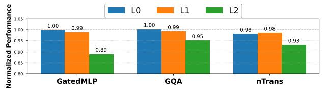

Fig. 14. Portability analysis across different hierarchies (L0–L2) on three subgraphs. We evaluate *QiMeng-Tensify*'s performance consistency by reporting normalized ratios across three levels: (1) **Software Version** (L0): ratio of performance using prompts from CUDA v11.8 vs. native CUDA v12.4; (2) **Resource Constraints** (L1): ratio of performance using A100-evolved prompts vs. A30-native prompts; and (3) **Architectural Portability** (L2): ratio of performance using A100-evolved prompts vs. H100-native prompts.

Software Version Portability (L0). We measure the performance gap between a ported prompt and a version trained from scratch when transferring a prompt trained with CUDA v11.8 to the same hardware running CUDA v12.4. The performance difference ranges from 0% to 2%, with an average of 0.7%.

These small gaps indicate that *QiMeng-Tensify* 's architectureaware priors remain stable under evolving software stacks and do not overfit to a specific compiler or runtime version.

Resource-Constraint Portability (L1). We evaluate the performance gap when transferring a prompt trained on A100 to A30 within the same architectural generation. The resulting performance difference ranges from 1% to 2%, with an average of 1.3%. This suggests that *QiMeng-Tensify* captures architectural principles that generalize across different Stock Keeping Units (SKUs) configurations within the same GPU family, rather than overfitting to flagship resource specifications.

Architectural Portability (L2). We evaluate crossgeneration transfer by applying A100-evolved priors to H100 hardware. Compared to the H100-native baseline, the performance gap ranges from 5% to 11% (avg. 7.7%). This non-negligible gap arises because natively evolved priors can more effectively exploit H100-specific enhancements, such as expanded L2 cache and improved Tensor Core capabilities. While direct cross-generation transfer is feasible and can reduce compilation overhead, re-adapting the priors to the target architecture is recommended to achieve optimal performance.

#### VI. RELATED WORK

Manually-designed kernels. High-performance deep learning kernels are typically hand-crafted using low-level languages (e.g., CUDA, HIP, SYCL) to exploit hardware features like SIMD instructions (e.g., TensorCore, MatrixCore), memory hierarchies, and thread scheduling. Although abstractions like Triton [42] and TensorIR [25] simplify instruction and pipeline optimization, they still require experts to define core computation and scheduling strategies. For instance, state-ofthe-art attention mechanisms remain dependent on specialized manual implementations [17], [20], [21], [31], [35]. Ultimately, these approaches are labor-intensive and struggle to scale to custom operators, sparse structures, or dynamic shapes without deep expert intervention.

Schedule-based approaches. In recent years, schedule language-based compilers [4], [11], [15], [49], [52] have adopted the algorithm-schedule separation design principle, enabling automatic search of high-performance kernel schedules across various hardware platforms, including CPUs, GPUs, and NPUs. These approaches significantly improve kernel generation efficiency and have achieved strong performance on standard operators such as convolutions and matrix multiplications. However, their scheduling search capabilities are currently limited to relatively simple pre-defined patterns. As a result, complex structures commonly found in LLMs, such as Multi-Head Attention [44] and RMSNorm [51], are beyond the reach of these systems and must be manually implemented using low-level IR builders.

Mapper-based approaches. Mapper-based approaches optimize hardware execution by mapping computations across dimensions like tiling and dataflow. However, the resulting combinatorial explosion forces systems like LoopTree [27] to rely on heuristics that sacrifice optimality. To address this, TCM [26] and FFM [9] introduce advanced pruning via dataplacement and incremental construction to enhance search efficiency. Nonetheless, these methods are limited by costmodel fidelity, as theoretical optimality often fails to account for low-level hardware non-idealities.

Neural network operator fusion. Fusion improves performance by reducing memory traffic. Traditional approaches rely on pattern matching: for example, element-wise fusion [15], [28] fuses element-wise operations into the loop body of compute-intensive operations. Exhaustive memory-intensive op fusion approaches [4], [56] fuse as many memory-intensive operations as possible using the shared memory or SPMs as a temporary buffer. Successive compute-intensive operations can also be fused based on manual rules [53] or template libraries [47]. Recent works have also explored fusing more complex graphs (e.g., the multi-head attention). For example, MonoNN [59] fuses the whole network as a single kernel, and SpaceFusion [58] explores the fusion and tiling space of the attention block. Yet, existing approaches fail to address largescale graph scheduling due to restricted problem specifications.

LLM-based program synthesis. LLMs such as GPT-5 [39], Qwen3-Coder-Next [12], and DeepSeek Coder-V2 [24] show impressive code generation capabilities, driving interest in their use for deep learning compilers. Research efforts have explored leveraging LLMs to generate high-performance deep learning operator code, including low-level implementations like CUDA or intermediate representations (IR), to accelerate model deployment. LLM-based methods offer enhanced generalization and development efficiency, making them particularly suitable for the rapid implementation of custom operators. Nevertheless, these methods still face challenges in code controllability, correctness, and performance stability, often requiring domain experts for refinement and optimization.

## VII. CONCLUSION

This paper presents *QiMeng-Tensify*, a novel deep learning compiler that automates scheduling for large-scale computation graphs. *QiMeng-Tensify* formulates tensor program optimization as an unconstrained sequential decision optimization problem and applies schedule rules via LLM-guided MCTS process. Comprehensive experimental results show that, at the subgraph level, *QiMeng-Tensify* on average outperforms Py-Torch, manual implementation (i.e., FlashAttention), and the state-of-the-art auto-tuning approach (i.e., Mirage) by 6.49×, 1.27×, and 1.29×, respectively. At the network level, *QiMeng-Tensify* delivers average speedups of 1.56×, 1.22×, and 1.30× over PyTorch, TensorRT-LLM, and Mirage on the A100, and 1.78×, 1.29×, and 1.30× on the H100, respectively.

#### ACKNOWLEDGMENT

This work is partially supported by the National Key R&D Program of China (Grant No.2022YFB4501600), the NSF of China (Grants No.U22A2028, 62302483), Strategic Priority Research Program of the Chinese Academy of Sciences (Grants No.XDB0660300, XDB0660301, XDB0660302), CAS Project for Young Scientists in Basic Research (YSBR-029) and Youth Innovation Promotion Association CAS.

#### REFERENCES

- [1] "cublas: Cuda basic linear algebra subroutine library," https://developer. nvidia.com/cublas, 2021, accessed: 2025-04.
- [2] "cudnn: Cuda deep neural network library," https://developer.nvidia.com/ cudnn, 2021, accessed: 2025-04.
- [3] "CUTLASS: Cuda templates for linear algebra subroutines," https: //github.com/NVIDIA/cutlass, 2021, accessed: 2025-04.
- [4] "Nvidia tensorrt." 2026, accessed: 2026-02. [Online]. Available: https://developer.nvidia.com/tensorrt
- [5] "Nvidia tensorrt llm." 2026, accessed: 2026-02. [Online]. Available: https://developer.nvidia.com/tensorrt-llm
- [6] A. Adams, K. Ma, L. Anderson, R. Baghdadi, T.-M. Li, M. Gharbi, B. Steiner, S. Johnson, K. Fatahalian, F. Durand *et al.*, "Learning to optimize halide with tree search and random programs," *ACM Transactions on Graphics (TOG)*, vol. 38, no. 4, pp. 1–12, 2019.
- [7] E. Almazrouei, H. Alobeidli, A. Alshamsi, A. Cappelli, R. Cojocaru, M. Debbah, E. Goffinet, D. Hesslow, J. Launay, Q. Malartic ´ *et al.*, "The falcon series of open language models," *arXiv preprint arXiv:2311.16867*, 2023.
- [8] An Yang and Anfeng Li and Baosong Yang and Beichen Zhang and Binyuan Hui and Bo Zheng and Bowen Yu and Chang Gao and Chengen Huang and Chenxu Lv and Chujie Zheng and Dayiheng Liu and Fan Zhou and Fei Huang and Feng Hu and Hao Ge and Haoran Wei and Huan Lin and Jialong Tang and Jian Yang and Jianhong Tu and Jianwei Zhang and Jianxin Yang and Jiaxi Yang and Jing Zhou and Jingren Zhou and Junyang Lin and Kai Dang and Keqin Bao and Kexin Yang and Le Yu and Lianghao Deng and Mei Li and Mingfeng Xue and Mingze Li and Pei Zhang and Peng Wang and Qin Zhu and Rui Men and Ruize Gao and Shixuan Liu and Shuang Luo and Tianhao Li and Tianyi Tang and Wenbiao Yin and Xingzhang Ren and Xinyu Wang and Xinyu Zhang and Xuancheng Ren and Yang Fan and Yang Su and Yichang Zhang and Yinger Zhang and Yu Wan and Yuqiong Liu and Zekun Wang and Zeyu Cui and Zhenru Zhang and Zhipeng Zhou and Zihan Qiu, "Qwen3 technical report," 2025. [Online]. Available: https://arxiv.org/abs/2505.09388
- [9] T. Andrulis, M. Gilbert, V. Sze, and J. S. Emer, "Fast and fusiest: An optimal fusion-aware mapper for accelerator modeling and evaluation," *ArXiv*, vol. abs/2602.15166, 2026. [Online]. Available: https://api.semanticscholar.org/CorpusID:285659538
- [10] J. Ansel, E. Yang, H. He, N. Gimelshein, A. Jain, M. Voznesensky, B. Bao, P. Bell, D. Berard, E. Burovski *et al.*, "Pytorch 2: Faster machine learning through dynamic python bytecode transformation and graph compilation," in *Proceedings of the 29th ACM International Conference on Architectural Support for Programming Languages and Operating Systems, Volume 2*, 2024, pp. 929–947.
- [11] J. Bi, Q. Guo, X. Li, Y. Zhao, Y. Wen, Y. Guo, E. Zhou, X. Hu, Z. Du, L. Li *et al.*, "Heron: Automatically constrained high-performance library generation for deep learning accelerators," in *Proceedings of the 28th ACM International Conference on Architectural Support for Programming Languages and Operating Systems, Volume 3*, 2023, pp. 314–328.
- [12] R. Cao, M. Chen, J. Chen, Z. Cui, Y. Feng, B. Hui, Y. Jing, K. Li, M. Li, J. Lin, Z. Ma, K. Shum, X. Wang, J. Wei, J. Yang, J. Zhang, L. Zhang, Z. Zhang, W. Zhao, and F. Zhou, "Qwen3-codernext technical report," *ArXiv*, vol. abs/2603.00729, 2026. [Online]. Available: https://api.semanticscholar.org/CorpusID:286224178
- [13] T. Chen and C. Guestrin, "Xgboost: A scalable tree boosting system," in *Proceedings of the 22nd ACM SIGKDD International Conference on Knowledge Discovery and Data Mining*, ser. KDD '16. ACM, Aug. 2016, p. 785–794. [Online]. Available: http: //dx.doi.org/10.1145/2939672.2939785
- [14] T. Chen, T. Moreau, Z. Jiang, L. Zheng, E. Yan, M. Cowan, H. Shen, L. Wang, Y. Hu, L. Ceze, C. Guestrin, and A. Krishnamurthy, "Tvm: an automated end-to-end optimizing compiler for deep learning," in *Proceedings of the 13th USENIX Conference on Operating Systems Design and Implementation*, ser. OSDI'18. USA: USENIX Association, 2018, p. 579–594.
- [15] T. Chen, T. Moreau, Z. Jiang, L. Zheng, E. Yan, H. Shen, M. Cowan, L. Wang, Y. Hu, L. Ceze *et al.*, "{TVM}: An automated {End-to-End} optimizing compiler for deep learning," in *13th USENIX Symposium on Operating Systems Design and Implementation (OSDI 18)*, 2018, pp. 578–594.

- [16] I. Corporation, "Intel math kernel library for deep neural networks (intel mkl-dnn)," https://01.org/mkl-dnn, 2020, accessed: 2025-04.
- [17] N. Corporation, "Fastertransformer: High performance transformer inference engine," 2020, accessed: 2025-04. [Online]. Available: https://github.com/NVIDIA/FasterTransformer
- [18] I. Danihelka, A. Guez, J. Schrittwieser, and D. Silver, "Policy improvement by planning with gumbel," in *International Conference on Learning Representations*, 2022. [Online]. Available: https: //openreview.net/forum?id=bERaNdoegnO
- [19] T. Dao, "FlashAttention-2: Faster attention with better parallelism and work partitioning," in *International Conference on Learning Representations (ICLR)*, 2024.
- [20] T. Dao, D. Fu, S. Ermon, A. Rudra, and C. Re, "Flashattention: Fast and memory-efficient exact attention with io-awareness," *Advances in neural information processing systems*, vol. 35, pp. 16 344–16 359, 2022.
- [21] T. Dao, D. Haziza, F. Massa, and G. Sizov, "Flash-decoding for longcontext inference," https://crfm.stanford.edu/2023/10/12/flashdecoding. html, 2023, accessed: 2025-04.
- [22] DeepSeek-AI, "Deepseek-v3 technical report," 2024. [Online]. Available: https://arxiv.org/abs/2412.19437
- [23] DeepSeek-AI, A. Liu, A. Mei, B. Lin, B. Xue, B. Wang, B. Xu, B. Wu, B. Zhang, C. Lin, C. Dong, C. Lu, C. Zhao, C. Deng, C. Xu, C. Ruan, D. Dai, D. Guo, D. Yang, D. Chen, E. Li, F. Zhou, F. Lin, F. Dai, G. Hao, G. Chen, G. Li, H. Zhang, H. Xu, H. Li, H. Liang, H. Wei, H. Zhang, H. Luo, H. Ji, H. Ding, H. Tang, H. Cao, H. Gao, H. Qu, H. Zeng, J. Huang, J. Li, J. Xu, J. Hu, J. Chen, J. Xiang, J. Yuan, J. Cheng, J. Zhu, J. Ran, J. Jiang, J. Qiu, J. Li, J. Song, K. Dong, K. Gao, K. Guan, K. Huang, K. Zhou, K. Huang, K. Yu, L. Wang, L. Zhang, L. Wang, L. Zhao, L. Yin, L. Guo, L. Luo, L. Ma, L. Wang, L. Zhang, M. S. Di, M. Y. Xu, M. Zhang, M. Zhang, M. Tang, M. Zhou, P. Huang, P. Cong, P. Wang, Q. Wang, Q. Zhu, Q. Li, Q. Chen, Q. Du, R. Xu, R. Ge, R. Zhang, R. Pan, R. Wang, R. Yin, R. Xu, R. Shen, R. Zhang, S. H. Liu, S. Lu, S. Zhou, S. Chen, S. Cai, S. Chen, S. Hu, S. Liu, S. Hu, S. Ma, S. Wang, S. Yu, S. Zhou, S. Pan, S. Zhou, T. Ni, T. Yun, T. Pei, T. Ye, T. Yue, W. Zeng, W. Liu, W. Liang, W. Pang, W. Luo, W. Gao, W. Zhang, X. Gao, X. Wang, X. Bi, X. Liu, X. Wang, X. Chen, X. Zhang, X. Nie, X. Cheng, X. Liu, X. Xie, X. Liu, X. Yu, X. Li, X. Yang, X. Li, X. Chen, X. Su, X. Pan, X. Lin, X. Fu, Y. Q. Wang, Y. Zhang, Y. Xu, Y. Ma, Y. Li, Y. Li, Y. Zhao, Y. Sun, Y. Wang, Y. Qian, Y. Yu, Y. Zhang, Y. Ding, Y. Shi, Y. Xiong, Y. He, Y. Zhou, Y. Zhong, Y. Piao, Y. Wang, Y. Chen, Y. Tan, Y. Wei, Y. Ma, Y. Liu, Y. Yang, Y. Guo, Y. Wu, Y. Wu, Y. Cheng, Y. Ou, Y. Xu, Y. Wang, Y. Gong, Y. Wu, Y. Zou, Y. Li, Y. Xiong, Y. Luo, Y. You, Y. Liu, Y. Zhou, Z. F. Wu, Z. Z. Ren, Z. Zhao, Z. Ren, Z. Sha, Z. Fu, Z. Xu, Z. Xie, Z. Zhang, Z. Hao, Z. Gou, Z. Ma, Z. Yan, Z. Shao, Z. Huang, Z. Wu, Z. Li, Z. Zhang, Z. Xu, Z. Wang, Z. Gu, Z. Zhu, Z. Li, Z. Zhang, Z. Xie, Z. Gao, Z. Pan, Z. Yao, B. Feng, H. Li, J. L. Cai, J. Ni, L. Xu, M. Li, N. Tian, R. J. Chen, R. L. Jin, S. S. Li, S. Zhou, T. Sun, X. Q. Li, X. Jin, X. Shen, X. Chen, X. Song, X. Zhou, Y. X. Zhu, Y. Huang, Y. Li, Y. Zheng, Y. Zhu, Y. Ma, Z. Huang, Z. Xu, Z. Zhang, D. Ji, J. Liang, J. Guo, J. Chen, L. Xia, M. Wang, M. Li, P. Zhang, R. Chen, S. Sun, S. Wu, S. Ye, T. Wang, W. L. Xiao, W. An, X. Wang, X. Sun, X. Wang, Y. Tang, Y. Zha, Z. Zhang, Z. Ju, Z. Zhang, and Z. Qu, "Deepseek-v3.2: Pushing the frontier of open large language models," 2025. [Online]. Available: https://arxiv.org/abs/2512.02556
- [24] DeepSeek-AI, Q. Zhu, D. Guo, Z. Shao, D. Yang, P. Wang, R. Xu, Y. Wu, Y. Li, H. Gao, S. Ma, W. Zeng, X. Bi, Z. Gu, H. Xu, D. Dai, K. Dong, L. Zhang, Y. Piao, Z. Gou, Z. Xie, Z. Hao, B.-L. Wang, J.-M. Song, D. Chen, X. Xie, K. Guan, Y. mei You, A. Liu, Q. Du, W. Gao, X. Lu, Q. Chen, Y. Wang, C. Deng, J. Li, C. Zhao, C. Ruan, F. Luo, and W. Liang, "Deepseekcoder-v2: Breaking the barrier of closed-source models in code intelligence," *ArXiv*, vol. abs/2406.11931, 2024. [Online]. Available: https://api.semanticscholar.org/CorpusID:270562723
- [25] S. Feng, B. Hou, H. Jin, W. Lin, J. Shao, R. Lai, Z. Ye, L. Zheng, C. H. Yu, Y. Yu *et al.*, "Tensorir: An abstraction for automatic tensorized program optimization," in *Proceedings of the 28th ACM International Conference on Architectural Support for Programming Languages and Operating Systems, Volume 2*, 2023, pp. 804–817.
- [26] M. Gilbert, T. Andrulis, V. Sze, and J. S. Emer, "The turbo-charged mapper: Fast and optimal mapping for accelerator modeling and evaluation," *ArXiv*, vol. abs/2602.15172, 2026. [Online]. Available: https://api.semanticscholar.org/CorpusID:285659941

- [27] M. Gilbert, Y. N. Wu, A. Parashar, V. Sze, and J. S. Emer, "Looptree: Enabling exploration of fused-layer dataflow accelerators," in *2023 IEEE International Symposium on Performance Analysis of Systems and Software (ISPASS)*, 2023, pp. 316–318.
- [28] Google and O. contributors, "Xla: Optimizing compiler for machine learning," 2025, accessed: 2025-04. [Online]. Available: https://github. com/openxla/xla
- [29] A. Grattafiori, A. Dubey, A. Jauhri, A. Pandey, A. Kadian, A. Al-Dahle, A. Letman, A. Mathur, A. Schelten, A. Vaughan *et al.*, "The llama 3 herd of models," *arXiv preprint arXiv:2407.21783*, 2024.
- [30] A. Haj-Ali, H. Genc, Q. Huang, W. Moses, J. Wawrzynek, K. Asanovic,´ and I. Stoica, "Protuner: Tuning programs with monte carlo tree search," 2020. [Online]. Available: https://arxiv.org/abs/2005.13685
- [31] K. Hong, G. Dai, J. Xu, Q. Mao, X. Li, J. Liu, K. Chen, Y. Dong, and Y. Wang, "Flashdecoding++: Faster large language model inference on gpus," *arXiv preprint arXiv:2311.01282*, 2023.
- [32] E. J. Hu, Y. Shen, P. Wallis, Z. Allen-Zhu, Y. Li, S. Wang, L. Wang, W. Chen *et al.*, "Lora: Low-rank adaptation of large language models." *ICLR*, vol. 1, no. 2, p. 3, 2022.
- [33] I. Loshchilov, C.-P. Hsieh, S. Sun, and B. Ginsburg, "ngpt: Normalized transformer with representation learning on the hypersphere," *arXiv preprint arXiv:2410.01131*, 2024.
- [34] A. Paszke, S. Gross, F. Massa, A. Lerer, J. Bradbury, G. Chanan, T. Killeen, Z. Lin, N. Gimelshein, L. Antiga, A. Desmaison, A. Kopf, E. Yang, Z. DeVito, M. Raison, A. Tejani, S. Chilamkurthy, B. Steiner, L. Fang, J. Bai, and S. Chintala, "Pytorch: An imperative style, high-performance deep learning library," in *Advances in Neural Information Processing Systems 32*. Curran Associates, Inc., 2019, pp. 8024–8035. [Online]. Available: http://papers.neurips.cc/paper/ 9015-pytorch-an-imperative-style-high-performance-deep-learning-library. pdf
- [35] J. Shah, G. Bikshandi, Y. Zhang, V. Thakkar, P. Ramani, and T. Dao, "Flashattention-3: Fast and accurate attention with asynchrony and lowprecision," *Advances in Neural Information Processing Systems*, vol. 37, pp. 68 658–68 685, 2024.
- [36] J. Shao, X. Zhou, S. Feng, B. Hou, R. Lai, H. Jin, W. Lin, M. Masuda, C. H. Yu, and T. Chen, "Tensor program optimization with probabilistic programs," *Advances in Neural Information Processing Systems*, vol. 35, pp. 35 783–35 796, 2022.
- [37] Y. Shi, Z. Yang, J. Xue, L. Ma, Y. Xia, Z. Miao, Y. Guo, F. Yang, and L. Zhou, "Welder: Scheduling deep learning memory access via tilegraph," in *17th USENIX Symposium on Operating Systems Design and Implementation (OSDI 23)*, 2023, pp. 701–718.
- [38] A. Singh, A. Fry, A. Perelman, A. Tart, A. Ganesh, A. El-Kishky, A. McLaughlin, A. Low, A. Ostrow, A. Ananthram, A. Nathan, A. Luo, A. Helyar, A. Madry, A. Efremov, A. Spyra, A. Baker-Whitcomb, A. Beutel, A. Karpenko, A. Makelov, A. Neitz, A. Wei, A. Barr, A. Kirchmeyer, A. Ivanov, A. Christakis, A. Gillespie, A. Tam, A. Bennett, A. Wan, A. Huang, A. M. Sandjideh, A. Yang, A. Kumar, A. Saraiva, A. Vallone, A. Gheorghe, A. G. Garcia, A. Braunstein, A. Liu, A. Schmidt, A. Mereskin, A. Mishchenko, A. Applebaum, A. Rogerson, A. Rajan, A. Wei, A. Kotha, A. Srivastava, A. Agrawal, A. Vijayvergiya, A. Tyra, A. Nair, A. Nayak, B. Eggers, B. Ji, B. Hoover, B. Chen, B. Chen, B. Barak, B. Minaiev, B. Hao, B. Baker, B. Lightcap, B. McKinzie, B. Wang, B. Quinn, B. Fioca, B. Hsu, B. Yang, B. Yu, B. Zhang, B. Brenner, C. R. Zetino, C. Raymond, C. Lugaresi, C. Paz, C. Hudson, C. Whitney, C. Li, C. Chen, C. Cole, C. Voss, C. Ding, C. Shen, C. Huang, C. Colby, C. Hallacy, C. Koch, C. Lu, C. Kaplan, C. Kim, C. Minott-Henriques, C. Frey, C. Yu, C. Czarnecki, C. Reid, C. Wei, C. Decareaux, C. Scheau, C. Zhang, C. Forbes, D. Tang, D. Goldberg, D. Roberts, D. Palmie, D. Kappler, D. Levine, D. Wright, D. Leo, D. Lin, D. Robinson, D. Grabb, D. Chen, D. Lim, D. Salama, D. Bhattacharjee, D. Tsipras, D. Li, D. Yu, D. Strouse, D. Williams, D. Hunn, E. Bayes, E. Arbus, E. Akyurek, E. Y. Le, E. Widmann, E. Yani, E. Proehl, E. Sert, E. Cheung, E. Schwartz, E. Han, E. Jiang, E. Mitchell, E. Sigler, E. Wallace, E. Ritter, E. Kavanaugh, E. Mays, E. Nikishin, F. Li, F. P. Such, F. de Avila Belbute Peres, F. Raso, F. Bekerman, F. Tsimpourlas, F. Chantzis, F. Song, F. Zhang, G. Raila, G. McGrath, G. Briggs, G. Yang, G. Parascandolo, G. Chabot, G. Kim, G. Zhao, G. Valiant, G. Leclerc, H. Salman, H. Wang, H. Sheng, H. Jiang, H. Wang, H. Jin, H. Sikchi, H. Schmidt, H. Aspegren, H. Chen, H. Qiu, H. Lightman, I. Covert, I. Kivlichan, I. Silber, I. Sohl, I. Hammoud, I. Clavera, I. Lan, I. Akkaya, I. Kostrikov, I. Kofman, I. Etinger, I. Singal, J. Hehir,
- J. Huh, J. Pan, J. Wilczynski, J. Pachocki, J. Lee, J. Quinn, J. Kiros, J. Kalra, J. Samaroo, J. Wang, J. Wolfe, J. Chen, J. Wang, J. Harb, J. Han, J. Wang, J. Zhao, J. Chen, J. Yang, J. Tworek, J. Chand, J. Landon, J. Liang, J. Lin, J. Liu, J. Wang, J. Tang, J. Yin, J. Jang, J. Morris, J. Flynn, J. Ferstad, J. Heidecke, J. Fishbein, J. Hallman, J. Grant, J. Chien, J. Gordon, J. Park, J. Liss, J. Kraaijeveld, J. Guay, J. Mo, J. Lawson, J. McGrath, J. Vendrow, J. Jiao, J. Lee, J. Steele, J. Wang, J. Mao, K. Chen, K. Hayashi, K. Xiao, K. Salahi, K. Wu, K. Sekhri, K. Sharma, K. Singhal, K. Li, K. Nguyen, K. Gu-Lemberg, K. King, K. Liu, K. Stone, K. Yu, K. Ying, K. Georgiev, K. Lim, K. Tirumala, K. Miller, L. Ahmad, L. Lv, L. Clare, L. Fauconnet, L. Itow, L. Yang, L. Romaniuk, L. Anise, L. Byron, L. Pathak, L. Maksin, L. Lo, L. Ho, L. Jing, L. Wu, L. Xiong, L. Mamitsuka, L. Yang, L. McCallum, L. Held, L. Bourgeois, L. Engstrom, L. Kuhn, L. Feuvrier, L. Zhang, L. Switzer, L. Kondraciuk, L. Kaiser, M. Joglekar, M. Singh, M. Shah, M. Stratta, M. Williams, M. Chen, M. Sun, M. Cayton, M. Li, M. Zhang, M. Aljubeh, M. Nichols, M. Haines, M. Schwarzer, M. Gupta, M. Shah, M. Huang, M. Dong, M. Wang, M. Glaese, M. Carroll, M. Lampe, M. Malek, M. Sharman, M. Zhang, M. Wang, M. Pokrass, M. Florian, M. Pavlov, M. Wang, M. Chen, M. Wang, M. Feng, M. Bavarian, M. Lin, M. Abdool, M. Rohaninejad, N. Soto, N. Staudacher, N. LaFontaine, N. Marwell, N. Liu, N. Preston, N. Turley, N. Ansman, N. Blades, N. Pancha, N. Mikhaylin, N. Felix, N. Handa, N. Rai, N. Keskar, N. Brown, O. Nachum, O. Boiko, O. Murk, O. Watkins, O. Gleeson, P. Mishkin, P. Lesiewicz, P. Baltescu, P. Belov, P. Zhokhov, P. Pronin, P. Guo, P. Thacker, Q. Liu, Q. Yuan, Q. Liu, R. Dias, R. Puckett, R. Arora, R. T. Mullapudi, R. Gaon, R. Miyara, R. Song, R. Aggarwal, R. Marsan, R. Yemiru, R. Xiong, R. Kshirsagar, R. Nuttall, R. Tsiupa, R. Eldan, R. Wang, R. James, R. Ziv, R. Shu, R. Nigmatullin, S. Jain, S. Talaie, S. Altman, S. Arnesen, S. Toizer, S. Toyer, S. Miserendino, S. Agarwal, S. Yoo, S. Heon, S. Ethersmith, S. Grove, S. Taylor, S. Bubeck, S. Banesiu, S. Amdo, S. Zhao, S. Wu, S. Santurkar, S. Zhao, S. R. Chaudhuri, S. Krishnaswamy, Shuaiqi, Xia, S. Cheng, S. Anadkat, S. P. Fishman, S. Tobin, S. Fu, S. Jain, S. Mei, S. Egoian, S. Kim, S. Golden, S. Mah, S. Lin, S. Imm, S. Sharpe, S. Yadlowsky, S. Choudhry, S. Eum, S. Sanjeev, T. Khan, T. Stramer, T. Wang, T. Xin, T. Gogineni, T. Christianson, T. Sanders, T. Patwardhan, T. Degry, T. Shadwell, T. Fu, T. Gao, T. Garipov, T. Sriskandarajah, T. Sherbakov, T. Kaftan, T. Hiratsuka, T. Wang, T. Song, T. Zhao, T. Peterson, V. Kharitonov, V. Chernova, V. Kosaraju, V. Kuo, V. Pong, V. Verma, V. Petrov, W. Jiang, W. Zhang, W. Zhou, W. Xie, W. Zhan, W. McCabe, W. DePue, W. Ellsworth, W. Bain, W. Thompson, X. Chen, X. Qi, X. Xiang, X. Shi, Y. Dubois, Y. Yu, Y. Khakbaz, Y. Wu, Y. Qian, Y. T. Lee, Y. Chen, Y. Zhang, Y. Xiong, Y. Tian, Y. Cha, Y. Bai, Y. Yang, Y. Yuan, Y. Li, Y. Zhang, Y. Yang, Y. Jin, Y. Jiang, Y. Wang, Y. Wang, Y. Liu, Z. Stubenvoll, Z. Dou, Z. Wu, and Z. Wang, "Openai gpt-5 system card," 2025. [Online]. Available: https://arxiv.org/abs/2601.03267
- [39] A. Singh, A. Fry, A. Perelman, A. Tart, A. Ganesh, A. El-Kishky, A. McLaughlin, A. Low, A. Ostrow, A. Ananthram, A. Nathan, A. Luo, A. Helyar, A. Madry, A. Efremov, A. Spyra, A. Baker-Whitcomb, A. Beutel, A. Karpenko, A. Makelov, A. Neitz, A. Wei, A. Barr, A. Kirchmeyer, A. Ivanov, A. Christakis, A. Gillespie, A. Tam, A. Bennett, A. Wan, A. Huang, A. M. Sandjideh, A. Yang, A. Kumar, A. Saraiva, A. Vallone, A. Gheorghe, A. G. Garcia, A. Braunstein, A. Liu, A. Schmidt, A. Mereskin, A. Mishchenko, A. Applebaum, A. Rogerson, A. Rajan, A. Wei, A. Kotha, A. Srivastava, A. Agrawal, A. Vijayvergiya, A. Tyra, A. Nair, A. Nayak, B. Eggers, B. Ji, B. Hoover, B. Chen, B. Chen, B. Barak, B. Minaiev, B. Hao, B. Baker, B. Lightcap, B. McKinzie, B. Wang, B. Quinn, B. Fioca, B. Hsu, B. Yang, B. Yu, B. Zhang, B. Brenner, C. R. Zetino, C. Raymond, C. Lugaresi, C. Paz, C. Hudson, C. Whitney, C. Li, C. Chen, C. Cole, C. Voss, C. Ding, C. Shen, C. Huang, C. Colby, C. Hallacy, C. Koch, C. Lu, C. Kaplan, C. Kim, C. Minott-Henriques, C. Frey, C. Yu, C. Czarnecki, C. Reid, C. Wei, C. Decareaux, C. Scheau, C. Zhang, C. Forbes, D. Tang, D. Goldberg, D. Roberts, D. Palmie, D. Kappler, D. Levine, D. Wright, D. Leo, D. Lin, D. Robinson, D. Grabb, D. Chen, D. Lim, D. Salama, D. Bhattacharjee, D. Tsipras, D. Li, D. Yu, D. Strouse, D. Williams, D. Hunn, E. Bayes, E. Arbus, E. Akyurek, E. Y. Le, E. Widmann, E. Yani, E. Proehl, E. Sert, E. Cheung, E. Schwartz, E. Han, E. Jiang, E. Mitchell, E. Sigler, E. Wallace, E. Ritter, E. Kavanaugh, E. Mays, E. Nikishin, F. Li, F. P. Such, F. de Avila Belbute Peres, F. Raso, F. Bekerman, F. Tsimpourlas,

- F. Chantzis, F. Song, F. Zhang, G. Raila, G. McGrath, G. Briggs, G. Yang, G. Parascandolo, G. Chabot, G. Kim, G. Zhao, G. Valiant, G. Leclerc, H. Salman, H. Wang, H. Sheng, H. Jiang, H. Wang, H. Jin, H. Sikchi, H. Schmidt, H. Aspegren, H. Chen, H. Qiu, H. Lightman, I. Covert, I. Kivlichan, I. Silber, I. Sohl, I. Hammoud, I. Clavera, I. Lan, I. Akkaya, I. Kostrikov, I. Kofman, I. Etinger, I. Singal, J. Hehir, J. Huh, J. Pan, J. Wilczynski, J. Pachocki, J. Lee, J. Quinn, J. Kiros, J. Kalra, J. Samaroo, J. Wang, J. Wolfe, J. Chen, J. Wang, J. Harb, J. Han, J. Wang, J. Zhao, J. Chen, J. Yang, J. Tworek, J. Chand, J. Landon, J. Liang, J. Lin, J. Liu, J. Wang, J. Tang, J. Yin, J. Jang, J. Morris, J. Flynn, J. Ferstad, J. Heidecke, J. Fishbein, J. Hallman, J. Grant, J. Chien, J. Gordon, J. Park, J. Liss, J. Kraaijeveld, J. Guay, J. Mo, J. Lawson, J. McGrath, J. Vendrow, J. Jiao, J. Lee, J. Steele, J. Wang, J. Mao, K. Chen, K. Hayashi, K. Xiao, K. Salahi, K. Wu, K. Sekhri, K. Sharma, K. Singhal, K. Li, K. Nguyen, K. Gu-Lemberg, K. King, K. Liu, K. Stone, K. Yu, K. Ying, K. Georgiev, K. Lim, K. Tirumala, K. Miller, L. Ahmad, L. Lv, L. Clare, L. Fauconnet, L. Itow, L. Yang, L. Romaniuk, L. Anise, L. Byron, L. Pathak, L. Maksin, L. Lo, L. Ho, L. Jing, L. Wu, L. Xiong, L. Mamitsuka, L. Yang, L. McCallum, L. Held, L. Bourgeois, L. Engstrom, L. Kuhn, L. Feuvrier, L. Zhang, L. Switzer, L. Kondraciuk, L. Kaiser, M. Joglekar, M. Singh, M. Shah, M. Stratta, M. Williams, M. Chen, M. Sun, M. Cayton, M. Li, M. Zhang, M. Aljubeh, M. Nichols, M. Haines, M. Schwarzer, M. Gupta, M. Shah, M. Y. Guan, M. Huang, M. Dong, M. Wang, M. Glaese, M. Carroll, M. Lampe, M. Malek, M. Sharman, M. Zhang, M. Wang, M. Pokrass, M. Florian, M. Pavlov, M. Wang, M. Chen, M. Wang, M. Feng, M. Bavarian, M. Lin, M. Abdool, M. Rohaninejad, N. Soto, N. Staudacher, N. LaFontaine, N. Marwell, N. Liu, N. Preston, N. Turley, N. Ansman, N. Blades, N. Pancha, N. Mikhaylin, N. Felix, N. Handa, N. Rai, N. Keskar, N. Brown, O. Nachum, O. Boiko, O. Murk, O. Watkins, O. Gleeson, P. Mishkin, P. Lesiewicz, P. Baltescu, P. Belov, P. Zhokhov, P. Pronin, P. Guo, P. Thacker, Q. Liu, Q. Yuan, Q. Liu, R. Dias, R. Puckett, R. Arora, R. T. Mullapudi, R. Gaon, R. Miyara, R. Song, R. Aggarwal, R. Marsan, R. Yemiru, R. Xiong, R. Kshirsagar, R. Nuttall, R. Tsiupa, R. Eldan, R. Wang, R. James, R. Ziv, R. Shu, R. Nigmatullin, S. Jain, S. Talaie, S. Altman, S. Arnesen, S. Toizer, S. Toyer, S. Miserendino, S. Agarwal, S. Yoo, S. Heon, S. Ethersmith, S. Grove, S. Taylor, S. Bubeck, S. Banesiu, S. Amdo, S. Zhao, S. Wu, S. Santurkar, S. Zhao, S. R. Chaudhuri, S. Krishnaswamy, Shuaiqi, Xia, S. Cheng, S. Anadkat, S. P. Fishman, S. Tobin, S. Fu, S. Jain, S. Mei, S. Egoian, S. Kim, S. Golden, S. Mah, S. Lin, S. Imm, S. Sharpe, S. Yadlowsky, S. Choudhry, S. Eum, S. Sanjeev, T. Khan, T. Stramer, T. Wang, T. Xin, T. Gogineni, T. Christianson, T. Sanders, T. Patwardhan, T. Degry, T. Shadwell, T. Fu, T. Gao, T. Garipov, T. Sriskandarajah, T. Sherbakov, T. Korbak, T. Kaftan, T. Hiratsuka, T. Wang, T. Song, T. Zhao, T. Peterson, V. Kharitonov, V. Chernova, V. Kosaraju, V. Kuo, V. Pong, V. Verma, V. Petrov, W. Jiang, W. Zhang, W. Zhou, W. Xie, W. Zhan, W. McCabe, W. DePue, W. Ellsworth, W. Bain, W. Thompson, X. Chen, X. Qi, X. Xiang, X. Shi, Y. Dubois, Y. Yu, Y. Khakbaz, Y. Wu, Y. Qian, Y. T. Lee, Y. Chen, Y. Zhang, Y. Xiong, Y. Tian, Y. Cha, Y. Bai, Y. Yang, Y. Yuan, Y. Li, Y. Zhang, Y. Yang, Y. Jin, Y. Jiang, Y. Wang, Y. Wang, Y. Liu, Z. Stubenvoll, Z. Dou, Z. Wu, and Z. Wang, "Openai gpt-5 system card," 2026. [Online]. Available: https://arxiv.org/abs/2601.03267
- [40] A. S. Tang, C. Priebe, R. Mahapatra, L. Qin, and H. Esmaeilzadeh, "REASONING COMPILER: LLM-guided optimizations for efficient model serving," in *The Thirty-ninth Annual Conference on Neural Information Processing Systems*, 2025.
- [41] C. Team, "Chameleon: Mixed-modal early-fusion foundation models," *arXiv preprint arXiv:2405.09818*, 2024.
- [42] P. Tillet, H.-T. Kung, and D. Cox, "Triton: an intermediate language and compiler for tiled neural network computations," in *Proceedings of the 3rd ACM SIGPLAN International Workshop on Machine Learning and Programming Languages*, 2019, pp. 10–19.
- [43] D. Tolpin and S. E. Shimony, "Mcts based on simple regret," in *Proceedings of the Twenty-Sixth AAAI Conference on Artificial Intelligence*, ser. AAAI'12. AAAI Press, 2012, p. 570–576.
- [44] A. Vaswani, N. Shazeer, N. Parmar, J. Uszkoreit, L. Jones, A. N. Gomez, Ł. Kaiser, and I. Polosukhin, "Attention is all you need," *Advances in neural information processing systems*, vol. 30, 2017.
- [45] M. Wu, X. Cheng, S. Liu, C. Shi, J. Ji, K. Ao, P. Velliengiri, X. Miao, O. Padon, and Z. Jia, "Mirage: A multi-level superoptimizer for tensor programs," in *19th USENIX Symposium on Operating Systems Design*

- *and Implementation (OSDI 25)*. Boston, MA: USENIX Association, 2025.
- [46] R. Wu, Z. Zheng, F. Zhang, C. Liu, Z. Pan, J. Zhai, and X. Du, "Plus: highly efficient and expandable ml compiler with pluggable graph schedules," in *Proceedings of the 2025 USENIX Conference on Usenix Annual Technical Conference*, ser. USENIX ATC '25. USA: USENIX Association, 2025.
- [47] J. Xing, L. Wang, S. Zhang, J. Chen, A. Chen, and Y. Zhu, "Bolt: Bridging the gap between auto-tuners and hardware-native performance," *Proceedings of Machine Learning and Systems*, vol. 4, pp. 204–216, 2022.
- [48] A. Yang, A. Li, B. Yang, B. Zhang, B. Hui, B. Zheng, B. Yu, C. Gao, C. Huang, C. Lv, C. Zheng, D. Liu, F. Zhou, F. Huang, F. Hu, H. Ge, H. Wei, H. Lin, J. Tang, J. Yang, J. Tu, J. Zhang, J. Yang, J. Yang, J. Zhou, J. Zhou, J. Lin, K. Dang, K. Bao, K. Yang, L. Yu, L. Deng, M. Li, M. Xue, M. Li, P. Zhang, P. Wang, Q. Zhu, R. Men, R. Gao, S. Liu, S. Luo, T. Li, T. Tang, W. Yin, X. Ren, X. Wang, X. Zhang, X. Ren, Y. Fan, Y. Su, Y. Zhang, Y. Zhang, Y. Wan, Y. Liu, Z. Wang, Z. Cui, Z. Zhang, Z. Zhou, and Z. Qiu, "Qwen3 technical report," *arXiv preprint arXiv:2505.09388*, 2025.
- [49] Z. Ye, R. Lai, J. Shao, T. Chen, and L. Ceze, "Sparsetir: Composable abstractions for sparse compilation in deep learning," in *Proceedings of the 28th ACM International Conference on Architectural Support for Programming Languages and Operating Systems, Volume 3*, 2023, pp. 660–678.
- [50] J. Yuan, H. Gao, D. Dai, J. Luo, L. Zhao, Z. Zhang, Z. Xie, Y. X. Wei, L. Wang, Z. Xiao, Y. Wang, C. Ruan, M. Zhang, W. Liang, and W. Zeng, "Native sparse attention: Hardware-aligned and natively trainable sparse attention," 2025. [Online]. Available: https://api.semanticscholar.org/CorpusID:276408911
- [51] B. Zhang and R. Sennrich, "Root mean square layer normalization," *Advances in Neural Information Processing Systems*, vol. 32, 2019.
- [52] L. Zheng, C. Jia, M. Sun, Z. Wu, C. H. Yu, A. Haj-Ali, Y. Wang, J. Yang, D. Zhuo, K. Sen *et al.*, "Ansor: Generating {High-Performance} tensor programs for deep learning," in *14th USENIX symposium on operating systems design and implementation (OSDI 20)*, 2020, pp. 863–879.
- [53] S. Zheng, "Chimera: An analytical optimizing framework for effective compute-intensive operators fusion," in *2023 IEEE International Symposium on High-Performance Computer Architecture (HPCA)*. IEEE, 2023, pp. 1113–1126.
- [54] S. Zheng, R. Chen, A. Wei, Y. Jin, Q. Han, L. Lu, B. Wu, X. Li, S. Yan, and Y. Liang, "Amos: enabling ¡u¿a¡/u¿utomatic ¡u¿m¡/u¿apping for tensor computations ¡u¿o¡/u¿n ¡u¿s¡/u¿patial accelerators with hardware abstraction," in *Proceedings of the 49th Annual International Symposium on Computer Architecture*, ser. ISCA '22. New York, NY, USA: Association for Computing Machinery, 2022, p. 874–887. [Online]. Available: https://doi.org/10.1145/3470496.3527440
- [55] S. Zheng, S. Chen, P. Song, R. Chen, X. Li, S. Yan, D. Lin, J. Leng, and Y. Liang, "Chimera: An analytical optimizing framework for effective compute-intensive operators fusion," in *2023 IEEE International Symposium on High-Performance Computer Architecture (HPCA)*, 2023, pp. 1113–1126.
- [56] Z. Zheng, X. Yang, P. Zhao, G. Long, K. Zhu, F. Zhu, W. Zhao, X. Liu, J. Yang, J. Zhai *et al.*, "Astitch: enabling a new multi-dimensional optimization space for memory-intensive ml training and inference on modern simt architectures," in *Proceedings of the 27th ACM International Conference on Architectural Support for Programming Languages and Operating Systems*, 2022, pp. 359–373.
- [57] Z. Zheng, X. Yang, P. Zhao, G. Long, K. Zhu, F. Zhu, W. Zhao, X. Liu, J. Yang, J. Zhai, S. L. Song, and W. Lin, "Astitch: enabling a new multi-dimensional optimization space for memory-intensive ml training and inference on modern simt architectures," in *Proceedings of the 27th ACM International Conference on Architectural Support for Programming Languages and Operating Systems*, ser. ASPLOS '22. New York, NY, USA: Association for Computing Machinery, 2022, p. 359–373. [Online]. Available: https://doi.org/10.1145/3503222.3507723
- [58] L. Zhu, J. Yao, and H. Guan, "Spacefusion: Advanced deep learning operator fusion via space-mapping graph," in *Proceedings of the Twentieth European Conference on Computer Systems*, 2025, pp. 787–802.
- [59] D. Zhuang, Z. Zheng, H. Xia, X. Qiu, J. Bai, W. Lin, and S. L. Song, "{MonoNN}: Enabling a new monolithic optimization space for neural network inference tasks on modern {GPU-Centric} architectures," in *18th USENIX Symposium on Operating Systems Design and Implementation (OSDI 24)*, 2024, pp. 989–1005.