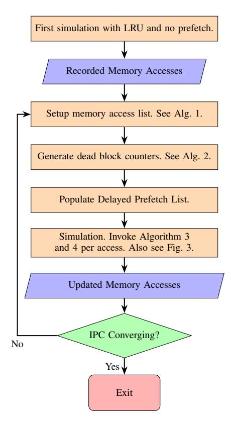
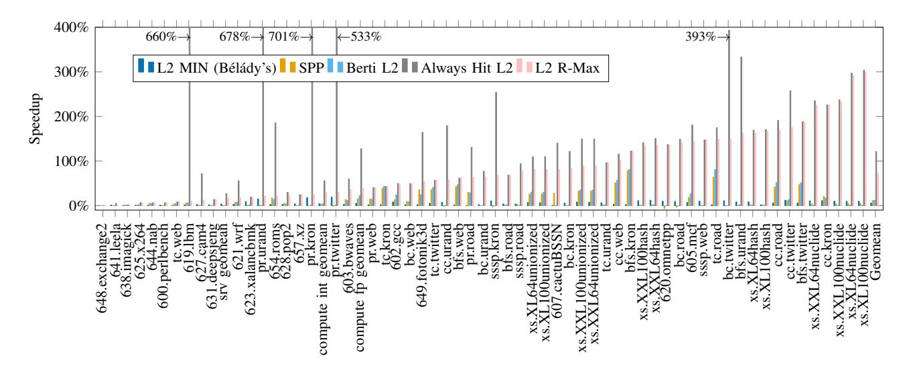
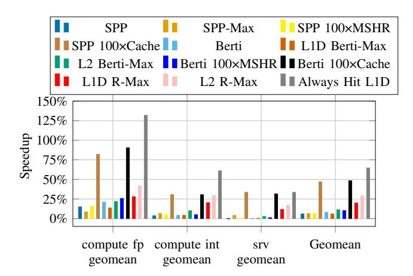

# R-Max: Extending Bel´ ady's MIN with Prefetching ´ to Bound Realistic Cache Performance

Lei Wang Texas A&M University College Station, Texas, USA wilsonwang2019@tamu.edu

Gino Chacon AheadComputing Inc. Beaverton, Oregon, USA ginoAchacon@gmail.com

Chia-Hang Lee Texas A&M University College Station, Texas, USA henrylee2019@tamu.edu

Daniel A. Jimenez ´ Texas A&M University College Station, Texas, USA djimenez@acm.org

Maccoy Merrell Texas A&M University College Station, Texas, USA maccoy.merrell@tamu.edu

Paul V. Gratz Texas A&M University College Station, Texas, USA pgratz@tamu.edu

*Abstract*—Memory performance continues to lag behind the demand of processing elements, a well-known phenomenon known as the memory wall. Cache prefetching is a well-studied and effective method to bridge this gap. Despite a long history of study and the existence of many prefetchers, an open question remains with respect to the upper bound of performance that might be had from prefetching. A "perfect cache" where all accesses hit is often used as an upper bound. However, as we show, this bound is very unrealistic given bandwidth and miss status holding register (MSHR) constraints. Here, we propose a system, R-Max, to approximate ideal prefetching and replacement policy with realistic constraints on bandwidth, cache structure, and capacity but oracular knowledge of future accesses. We compare R-Max's approximated ideal speedup against the speedup of current state-of- the-art prefetchers to show how much remaining performance gain may be left for prefetching. We show that, for a set of workloads taken from SPEC CPU2017, CVP, GAP and XSBench, up to 299.6% maximum and 72.6% average gains are possible under realistic assumptions for a prefetcher that perfectly predicts future accesses, outperforming current stateof-the-art prefetchers by 60.8%. Interestingly, we see that the workloads where R-Max shows the most potential have little relationship with those where existing prefetchers perform best. Taken together, our results highlight the need for new research into prefetching techniques for these under-exploited workloads.

*Index Terms*—Cache memories, simulation, memory structure, modeling of computer architecture, algorithm.

# I. INTRODUCTION

Cache prefetching is a well-studied technique that is widely used in computer systems to increase performance. Prefetching works by predicting what data will be requested by the processor and then transferring those data to the cache in a timely manner before the request. Thus, the waiting time for cache blocks to arrive is reduced and a shorter execution time is achieved. Similar to cache replacement policies, prefetching involves speculating on future memory accesses to reduce cache misses. However, unlike replacement policies [2], no prior work exists, that we are aware of, defining a realistic upper bound of possible performance gain for prefetching. Many prior works on cache prefetching [21], [25], [28], [29], [32], [33] compare their designs against a lower bound "no prefetching" baseline to highlight the gains their techniques provide. In the rare cases where an upper bound is provided, it is typically modeled as an extremely loose "all references hit"/"unlimited capacity" model. These upper bounds are unrealistic as such models ignore the very constraints hardware prefetching is trying to overcome. In particular, a realistic upper limit of cache prefetching with bounds on cache size and bandwidth is rarely studied. Without knowing the realistic upper bound of achievable performance with prefetching, it is difficult to determine whether new prefetching schemes warrant further investigation.

The goal of this work is to develop a technique to approximate the realistic upper bounds of the performance a prefetcher and replacement policy together can achieve. Here we assume an algorithm that can perfectly speculate on future memory references but is under realistic hardware constraints for the insertion of prefetches into the system and their placement within the cache hierarchy. Thus, while our technique has omniscient knowledge of future references, it is nevertheless constrained by the capacity, bandwidth and latency of a processor's cache hierarchy and memory system. We denote this design as Realistic Max (R-Max). We note that our goal here is not to create an implementable prefetcher or replacement policy, rather, we believe that by examining the upper bound we can potentially identify gaps in current prefetching techniques that might highlight the way to new prefetching approaches. A preliminary version of the work [40] appears in IEEE Computer Architecture Letters (CAL).

Na¨ıvely one might think that simply recording the future reference stream during one simulation and then replaying it in a second would be sufficient to approximate perfect prefetching. Unfortunately, even if the prefetcher has the correct addresses to prefetch ahead of time, blindly prefetching those addresses as soon as bandwidth becomes available is not ideal. If the prefetcher runs too far ahead, cache blocks that are prefetched but are not yet demand accessed can be evicted due to an aggressive prefetcher. Therefore, the cache replacement policy must also be considered with prefetching to produce a design that is the upper limit of running benchmarks with constrained bandwidth, latency and capacity.

# *A. Extending Bel´ ady's "MIN" to include prefetching ´*

While existing work does not define a model for "perfect" prefetching, we are heavily inspired by prior work in perfect cache replacement policies [2]. In particular, Bel´ ady's "MIN" ´ policy states that the ideal candidate for replacement is the item which will next be used again the furthest in the future. Note that Bel´ ady's MIN algorithm, sometimes referred to ´ as OPT in its original formulation, was intended for fullyassociative paging in a two-level memory hierarchy, whereas we apply it to caching in a set-associative cache hierarchy. The main idea, that the furthest reference in the future should be replaced, remains the same provably optimal strategy, but it is applied to the blocks in a cache set rather than all the pages in a memory hierarchy. In set-associative caches, MIN can be applied within the context of each set, *i.e.* upon a miss to a given set, replace the cache block that will be used farthest in the future with the demand referenced miss. We use this as a starting point and extend this principle to prefetching. Here then, the goal of an ideal prefetcher is to keep each set loaded with blocks, prioritized by their next use. Thus, the prefetcher, after first filling each empty set in the cache with blocks that will be referenced, in order of reference, then waits until a cache block is accessed in that set. When a block is accessed, its next reference time is compared against the reference times of other blocks in the set, as well as blocks that are currently not present in the set but will be accessed in the future. If the next access time of the recently accessed block is later than the next to-be-referenced block that is not currently in the set, the next to-be-referenced block will be prefetched, and the recently accessed block will be replaced.

# *B. Cache Example*

Table I shows how this extension of Bel´ ady's "MIN" to in- ´ clude prefetching compares versus omniscient prefetching (*e.g.* prefetching with knowledge of future accesses but traditional LRU replacement) and LRU without prefetching. In particular, the table shows the hits obtained for a single four-way set of a cache with a given stream of references under LRU replacement, LRU+Omniscient Prefetching, Bel´ ady's "MIN" replace- ´ ment (no prefetching), and Bel´ ady's+Omniscient Prefetching ´ as described in Section I-A, respectively. An LRU replacement policy evicts the least recently used block in the cache if a new block were to be placed into the cache. Bel´ ady's "MIN" ´ instead evicts the block that will not be accessed for the longest time in the future. LRU+Omniscient Prefetching uses LRU for replacement and issues the prefetch before its demand access but without Bel´ ady's replacement, the timeliness being ´ unknown, so all prefetches are issued immediately. Likewise, Bel´ ady's+Omniscient Prefetching issues prefetches at the ideal ´ time and uses Bel´ ady's Algorithm for replacement decisions. ´ Both LRU+Omniscient Prefetching and Bel´ ady's+Omniscient ´ Prefetching can only prefetch at most one block ahead of time since only one victim can be identified by a replacement policy per fill: only evict one block for one cache fill. In the table, we see that LRU produces more misses than MIN, in particular at Steps 8 and 15. This is because MIN leverages future knowledge of the access stream to retain "A" and "C" while LRU evicts it. Nevertheless both MIN and LRU are forced to wait for a demand fetch to bring data into the cache set, incurring compulsory and capacity misses.

Looking at the LRU + Omniscient Prefetching example demonstrates that even when the memory access stream is known ahead of time, blindly prefetching the cache miss stream ahead without proper timing and cache management can lead to significant misses as prefetched blocks end up evicting useful blocks. In effect, the prefetch stream runs too fast and is poorly synchronized to the utility of items in the cache, evicting them before their use. This is shown in the table, column "Set w/ LRU + Prefetch" where, despite prefetching "C" in Step 8, "C" is evicted in Step 12 by the prefetch to "F", leading to a miss at Step 15.

Thus, to be effective, the window for issuing a useful prefetch is narrow: prefetch too early and one may evict useful data, yielding a later miss; prefetch too late and a cache miss still occurs. The ideal window is between the time after the last access to the to-be evicted block and before the miss of the current block occurs<sup>1</sup> . We thus extend Bel´ ady's Algorithm ´ to ensure prefetches occur during their useful window. Fig. 1 shows a cartoon of prefetching and MIN working together for the same access stream and 4-way set from Tbl. I. Here MIN tells us that after "B" is accessed, its next use is furthest in the future, thus "E" is only prefetched after "B" is accessed. Then once "E" is accessed "B" is selected for prefetch next.

# *C. R-Max*

While the above would yield a simple, Bel´ ady's "MIN" ´ style prefetching policy, it is a bit na¨ıve. In particular, it does not account for the realistic constraints on bandwidth, MSHRs and latency of a real, multi-level cache hierarchy and thus may fall behind relative to the demand stream, leading to late prefetches, or starving MSHRs for demand fetch. Further, we find that any perturbation of the hits and misses in a given level of the cache in a multi-level cache system driven by an Out-of-Order core can yield both reorderings of references, as well as small changes to the reference stream from run to run. This is due to the changes in the filtering effects of the higher level caches, as well as simple reordering of memory requests from the core. Here, we design R-Max to be resilient to these constraints and reference stream changes.

This paper introduces R-Max, a realistic upper bound on prefetching for use in cache management studies. We presume R-Max to have perfect knowledge and no limitation on the amount of prefetcher metadata, though it is constrained to produce prefetches that have to flow through the memory hierarchy and pay the time and bandwidth cost. We have included speedups for an always hit L1 data/L2/last level

<sup>1</sup>Of course, sometimes the time window is too short given the latency of the cache fill and a miss nevertheless must occur.

TABLE I
EXAMINING LRU REPLACEMENT, LRU+OMNISCIENT PREFETCHING, BÉLÁDY'S "MIN" REPLACEMENT, AND MIN+OMNISCIENT PREFETCHING
UNDER A GIVEN REFERENCE STREAM FOR A SINGLE, FOUR WAY CACHE SET.

| Step # | Access | Set w/ LRU | Hit? | Set w/ LRU +<br>Prefetch | Hit? | Action     | Set w/ MIN | Hit? | Set w/ MIN +<br>Prefetch | Hit? | Action     |
|--------|--------|------------|------|--------------------------|------|------------|------------|------|--------------------------|------|------------|
| 1      |        |            |      |                          |      | Prefetch A |            |      |                          |      | Prefetch A |
| 2      | A      | X,X,X,A    | N    | X,X,X,A                  | Y    | Prefetch B | X,X,X,A    | N    | X,X,X,A                  | Y    | Prefetch B |
| 3      | В      | X,X,A,B    | N    | X,X,A,B                  | Y    | Prefetch C | X,X,A,B    | N    | X,X,A,B                  | Y    | Prefetch C |
| 4      | С      | X,A,B,C    | N    | X,A,B,C                  | Y    | Prefetch D | X,A,B,C    | N    | X,A,B,C                  | Y    | Prefetch D |
| 5      | D      | A,B,C,D    | N    | A,B,C,D                  | Y    | Prefetch E | A,B,C,D    | N    | A,B,C,D                  | Y    | Prefetch E |
| 6      | Е      | B,C,D,E    | N    | B,C,D,E                  | Y    | Prefetch F | A,E,C,D    | N    | A,E,C,D                  | Y    | Prefetch F |
| 7      | F      | C,D,E,F    | N    | C,D,E,F                  | Y    | Prefetch A | A,F,C,D    | N    | A,F,C,D                  | Y    |            |
| 8      | A      | D,E,F,A    | N    | D,E,F,A                  | Y    | Prefetch C | A,F,C,D    | Y    | A,F,C,D                  | Y    |            |
| 9      | A      | D,E,F,A    | Y    | E,F,C,A                  | Y    | Prefetch D | A,F,C,D    | Y    | A,F,C,D                  | Y    |            |
| 10     | A      | D,E,F,A    | Y    | F,C,D,A                  | Y    | Prefetch B | A,F,C,D    | Y    | A,F,C,D                  | Y    |            |
| 11     | A      | D,E,F,A    | Y    | C,D,B,A                  | Y    | Prefetch E | A,F,C,D    | Y    | A,F,C,D                  | Y    |            |
| 12     | A      | D,E,F,A    | Y    | D,B,E,A                  | Y    | Prefetch F | A,F,C,D    | Y    | A,F,C,D                  | Y    |            |
| 13     | A      | D,E,F,A    | Y    | B,E,F,A                  | Y    |            | A,F,C,D    | Y    | A,F,C,D                  | Y    |            |
| 14     | A      | E,D,F,A    | Y    | B,E,F,A                  | Y    |            | A,F,C,D    | Y    | A,F,C,D                  | Y    |            |
| 15     | С      | D,F,A,C    | N    | E,F,A,C                  | N    |            | A,F,C,D    | Y    | A,F,C,D                  | Y    |            |
| 16     | D      | F,A,C,D    | Y    | F,A,C,D                  | N    |            | A,F,C,D    | Y    | A,F,C,D                  | Y    | Prefetch B |
| 17     | В      | A,C,D,B    | N    | A,C,D,B                  | N    |            | B,F,C,D    | N    | B,F,C,D                  | Y    | Prefetch E |
| 18     | Е      | C,D,B,E    | N    | C,D,B,E                  | N    |            | E,F,C,D    | N    | E,F,C,D                  | Y    |            |
| 19     | F      | D,B,E,F    | N    | D,B,E,F                  | N    |            | E,F,C,D    | Y    | E,F,C,D                  | Y    |            |


Fig. 1. Perfect prefetching, inspired by Bélády's Algorithm. Prefetches can be moved early to after the last use of the block that will be evicted.

cache, a no prefetch L1 data/L2/last level cache but with Bélády's Algorithm [2] for replacement in Section VI to show how much difference R-Max can make. This paper makes the following contributions:

- 1) We introduce a system for evaluating a realistically tight upper bound on the potential benefit of prefetching, cognizant of realistic bandwidth and latency constraints within a multi-level caching hierarchy;
- We show a large gap between R-Max and existing prefetchers, indicating a large potential for improvement;
- 3) We show that existing prefetchers all tend to perform similarly well on the same subset of workloads, indicating that they largely go after the same types of locality;
- 4) We show that a large subset of workloads exists in which R-Max shows a large benefit and existing prefetchers show no gain, indicating the need for new approaches to prefetching; and
- 5) Finally we show that much of the largest potential gains lie in new and emerging workloads, such as those from the GAP [1] and XSBench [39] respectively as opposed to the more traditional SPEC CPU [38] and CVP [30], [27], highlighting the need to retarget research towards prefetching for these workloads.

This paper is organized as follows: Section I addresses the issue this paper tries to conquer, Section II talks about the related work and inspiration for this paper, Section III shows how memory accesses are processed in existing memory hierarchy, Section IV shows a detailed R-Max implementation and how it fits into the existing memory design, Section V is the evaluation methodology, Section VI shows and discusses the results of running R-max under different settings with other existing hardware prefetchers. Section VII concludes the paper.

#### II. BACKGROUND

In this section we discuss the prior work in cache prefetching and replacement policy.

#### A. Cache Prefetching

As mentioned previously, hardware cache prefetching is a well known technique that is widely used in computer systems to increase performance. Recent work has explored a wide range of techniques, such as DSPatch [3] which utilizes spatial patterns or Voyager [36] that uses neural models for prefetching and LSTM-based designs [10]. Other related work such as TEA [9] that profiles the application and identifies instructions on the critical path to help with optimization. Despite many prior works in prefetching existing, we are aware

of no prior work defining a realistic upper bound of possible performance gain for prefetching. Here, we compare R-Max with several hardware prefetchers, including the Signature Path Prefetcher(SPP) [21] with Perceptron-based Prefetch Filtering(PPF) [4], Berti [28], Instruction Pointer Classifier-based Prefetcher(IPCP) [29], Access Map Pattern Matching(AMPM) [11], and IP-Stride [7].

# *B. Replacement Policy*

Cache replacement policy is also a well-known and well studied technique. The goal is to minimize the number of cache misses throughout the execution of a program. Caches keep recently used blocks in hope that future accesses will match with the block from caches instead of going to the main memory. Caches are faster to access than main memory, but have much more limited capacity. When a new block arrives at a cache, the replacement policy has to choose which of the existing cache blocks to evict without causing more cache misses to exploit temporal locality. Naturally, an algorithm exists for making the optimal decision that can reduce the overall number of cache misses to a minimum if the cache accesses are known a priori. Such optimal replacement policy is not feasible since future knowledge is required. Existing techniques such as Sampling Based Dead Block Prediction [18], Re-Reference Interval Prediction (RRIP) [14] Hawkeye [12], Perceptronbased Reuse Distance Prediction [17], [37], Glider [35], Mockingjav [34], SHiP [41], Ripple [19], Protecting Distance [5] all try to predict future cache access patterns to make the best possible decision for cache replacement to approximate an optimal replacement policy. Dead Block Prediction [23], [24] is a cache optimization technique used to identify blocks with no further accesses prior to eviction.

The Dead Block Correlating Prefetcher (DBCPS) [23] predicts whether a block is dead and triggers prefetches into the dead block based on the past memory access pattern. R-Max implements a technique similar to DBCPS, in that it uses dead blocks as prefetch triggers, with the added benefits of perfect dead block and future data prediction.

# *C. Bel´ ady's Optimal Cache Replacement Algorithm ´*

Bel´ ady's algorithm [2] is a theoretically optimal approach ´ to page replacement in operating systems. It aims to minimize page faults by always replacing the page that is used furthest into the future. Using this approach in caching is not practical since the replacement policy needs the future memory access pattern, but it serves as a useful constraint-aware algorithm for finding the upper limit of cache replacement policies. While Bel´ ady never anticipated prefetching in his formulation for ´ optimal replacement, we use an algorithm inspired by Bel´ ady's ´ MIN to prefetch and replace blocks in the order that serves the demand accesses with minimal cache misses. In Section IV-C we show that our algorithm is an extension to Bel´ ady's ´ algorithm that initiates prefetches at the earliest possible time without evicting useful blocks prior to their use time while following the replacement decision set by Bel´ ady's Algorithm. ´

# *D. Cache Management Under the Presence of Prefetching*

PACMan [42] is a cache replacement policy design that is prefetching-aware. It separately handles the replacement of blocks that are demanded or prefetched to reduce the potential negative effect cache prefetching may bring in. KPC [22] also attempts to manage both prefetching and replacement policy. KPC proposes a separate prefetcher inspired by SPP together with a simple LLC replacement policy where information is shared between the policies to improve speculation. Jain and Lin [13] by argue that huge space remains unexplored for cache replacement policies with data prefetchers enabled. Their work addresses both cache replacement and data prefetching simultaneously, but lacks an upper bound of what both can do best. R-Max attempts to bring both cache replacement and data prefetching to extremes to show the space for improvement.

# III. R-MAX BASELINE ASSUMPTIONS

The goal of R-Max is to study the realistic upper bounds of prefetching, given perfect prediction of future references (omniscience), but realistic physical constraints (not omnipotence), thus R-Max follows the logic and constraints posed by the memory system as described here.

We assume a typical 3-level cache hierarchy. Because R-Max follows the constraints of a realistic cache design, we have a finite number of MSHRs at each cache level, and perform a finite number of tag checks per machine cycle, enforcing a tag bandwidth constraint. When a miss occurs at a particular cache level, an MSHR entry is allocated and the memory request is forwarded to the next, lower, level of the memory hierarchy. In the event that all levels miss, the request goes to the DRAM for resolution. After the block is found in DRAM and the data is returned, MSHRs are deallocated sequentially at the cache levels that have seen the miss. The process of handling accesses takes time.

Prefetches issued by R-Max go through the same steps as demand fetches. If a prefetch misses, it is forwarded to the next cache level after some latency. R-Max prefetches must be placed in a given cache level upon a cache fill, resulting in cache replacement, thus R-Max does not violate the capacity constraint of the cache. The caches in our system are setassociative with a finite number of sets and ways. Because R-Max is omniscient to future memory accesses, upon initial insertion into a given level, we allow R-Max to directly allocate an MSHR entry if the prefetch is not found in the cache. We allow R-Max to know what is currently in the cache without going through tag check because R-Max monitors the traffic going into and out of the cache and is fully aware of the cache state. However, the prefetches issued by R-Max must still pay bandwidth and latency costs without violating capacity constraints. Thus, while omniscient, R-Max is not omnipotent and cannot magically place blocks into the cache without delay or without replacing other data in the cache.

Since R-Max is an exploration of the upper limits of prefetching given perfect knowledge, we impose no particular prefetcher metadata state limits, and of course have devised



Fig. 2. R-Max high level overview.

no actual prediction algorithm, rather we assume we know the future reference stream perfectly.

# IV. R-MAX DESIGN

Fig. 2 shows a high level overview of R-Max. As the figure shows, R-Max works by recording, processing, and replaying memory accesses. The initial recording of memory references to a given cache level is taken from a system with LRU and without prefetching in place. After recording, the memory accesses are separated into groups according to the sets in the cache by index of the reference, and the reference stream for each set is processed to allow for the retroactive application of Bel´ ady's MIN algorithm. MIN is used to calculate the number ´ of accesses prior to the block being dead (similar in concept to a dead block counter [20], [23] however perfectly derived from MIN), and identification of which prefetches to issue upon each block dying. During replay, as each block in the cache receives demand fetches, its MIN derived dead block counter is decremented. When the dead block counter reaches 0, meaning that the block has no more accesses or whose next access is in the distant future, R-Max issues a prefetch to replace that dead block with the next expected access to that set according to the list. Thus, cache misses can be served via prefetching to reduce waiting. R-Max can issue prefetches in the optimal order to reinforce Bel´ ady's algorithm while also evicting and ´ replacing blocks before Bel´ ady's would have evicted them. ´ We want to see apparent cache latency reduced to the nearideal value without violating any constraints on cache capacity, associativity, and bandwidth.

We note that prefetching itself can have an impact on the reference stream in the lower levels of the cache, due to the reordering of requests from a large OoO core as well as changes to the filtering effect of the upper level caches when access times change. Thus, we iterate this record/replay method until the result converges to a stabilized speedup<sup>2</sup> . For this case study, we examine a single-core system with a threelevel cache hierarchy and DDR4 DRAM. All prefetches are exposed to the the bandwidth, latency, and capacity costs as they would in a normal prefetching system. We assume that all cache blocks are prefetchable.

# *A. R-Max Cache Level*

R-Max can be placed individually or simultaneously in multiple levels of cache(L1D/L1I, L2 or LLC). Many recent prefetchers use L2 for placement [11], [21], [25]. The L2 is more capacity constrained than the LLC, making prefetching decisions more impactful. By contrast to L1, the L2 suffers from processor requests being filtered by L1, making predicting useful prefetches more difficult. Thus, prefetching to the L2 is both more challenging and potentially more beneficial than prefetching to other levels in the cache. As a result, for the remainder of this discussion, we focus on an R-Max placed in the L2, however, we also present results for R-Max in other levels of the cache in Section VI.

# *B. Recording of L2 Memory Accesses*

In our baseline, L2 R-Max implementation, R-Max must prefetch within the physical address space, since the L2 is physically addressed.

Demand accesses are captured with timestamps for postprocessing. As caches are usually physically tagged, physical addresses are recorded. If R-Max begins to diverge from previous iterations (due to core OoO or L1 filtering changes), such as memory access reordering, the replacement policy falls back to LRU because we lose the knowledge of the future. We address this issue in Section IV-F.

# *C. Processing Memory Accesses*

As previously discussed, MIN makes the optimal replacement decision, only in the event of a miss-induced demand replacement. Here we extend this concept to include the the prefetching of future misses instead of waiting until demand time. R-Max looks ahead in the access stream and makes replacement decisions instead of waiting for misses and selecting blocks to replace, as shown in Alg. 1. As the algorithm shows, first the access list is divided up into separate, per-set, lists where each per-set list contains only those accesses destined to a given set in the chosen cache. Then the algorithm processes each of those lists to determine, under MIN, which accesses should be marked for "prefetch" into that set (because they would be misses) versus which accesses would be already in

<sup>2</sup>We find that at most 12 iterations is sufficient for the workloads examined.

Algorithm 1: Setup Memory Access List For Each Set

```
Input: mem: list of (address, timestamp) pairs of
        length x; w, y: number of cache sets and ways
  Output: List Acc with prefetch/hold updated per set
1 for s ← 0 to w − 1 do
2 Acc =<empty list>;
3 for i ← 0 to x − 1 do
4 if mem[i] belongs to cache set s then
5 Append mem[i] to Acc; // Get the memory
             accesses for this set.
6 m = length of Acc;
7 set = container holding max y pairs of (address,
      timestamp) resembling an actual cache set;
8 for i ← 0 to m − 1 do
9 if Acc[i] not in set and set has empty space
         then
10 Prefetch Acc[i] into set; // Prefill the set.
11 else if set full then
12 Break; // Stop the prefill.
13 for i ← 0 to m − 1 do
14 if Address of Acc[i] in set has not been
         demand-accessed then
15 Mark Acc[i] as "prefetch"; // Prefetched,
             not demand accessed.
16 else
17 Mark Acc[i] as "hold"; // Prefetched,
             demand accessed.
18 Update the timestamp of address of Acc[i]
         found in set with its next access time, set to
         ∞ if not found;
19 for j ← i + 1 to m − 1 do
20 if Acc[j] not in set then
21 Find l in set with the largest timestamp;
22 if l has larger timestamp than Acc[j]
                then
23 Prefetch Acc[j] to replace l in set;
24 Break;
25 Output Acc for set s;
```

the cache and thus are marked as "hold". In either case the access time of each access is retained.

After marking memory accesses, dead block counters are generated using Alg. 2 to denote the number of "hit" accesses a block will receive in the set before eviction. This counter counts accesses between the initial "prefetch" marking from Alg. 1 until a second "prefetch" marking, or the end of the memory access record is reached, whichever comes first. If a block has multiple "prefetch" markings, it will be prefetched and evicted multiple times. The "dead block counters" are used to simplify the implementation of R-Max. The algorithm runs once before the simulation and it assumes instantaneous placement of prefetched blocks.

Algorithm 2: Gather Prefetches and Counters per Set

```
Input: Array Acc of length m processed by Alg. 1
 Output: List of prefetches with counter information
1 for i ← 0 to m − 1 do
2 if Acc[i] has prefetch bit set then
3 Set counter c to 1;
4 for j ← i + 1 to m − 1 do
5 if Acc[j] has the same address as Acc[i]
           AND Acc[j]has hold bit set then
6 c + +;
7 else
8 break;
9 Add (Acc[i], c) to the delayed prefetch list;
```

Table II shows an example of applying Alg. 1 to a memory access stream recorded for a set with 4 ways. During prefill (lines 8-12), R-Max will fill the available ways and tag each way with the timestamps for the next use. After prefill, each row shows the time, the demand access address, whether the access is the first one after the block is prefetched, what is the next address that is not found in the set, what is the time t of that address will be accessed, and after comparing t with all the timestamps of the blocks in the set, should a replacement be initiated, and if there is a replacement, what blocks the set has. For example, at time 1, A is accessed. A is prefilled/prefetched but has not yet been demand accessed, R-Max marks A at time 1 a "prefetch". At this time, A's next access time is updated to time 35, as reflected in the upper half of the time 1 row. The set has blocks A, B, C and D. Looking further into the set, the next block that is not found in the cache is E with access time 27. Time 27 is less than one of the timestamps of the blocks in the set. Therefore, E replaces the block with the largest timestamp, A, of the set. Such replacement is reflected in the lower half of the time 1 row.

Counters for the memory accesses shown in Table II are shown in Table IV, generated using Algorithm 2. The same block can be brought into the cache multiple times: block B is brought in and after two demand accesses, it is evicted; after accessing G, B is brought back into the cache again.

# *D. R-Max Structures*

When simulation begins, R-Max processes the recorded memory accesses sequentially and prefills blocks to each set until each set has no free ways. At this stage, all blocks in the same set are waiting for demand accesses. Any demand access to a block decrements that block's counter. If the counter reaches 0, R-Max prioritizes that block for eviction and issues a targeted prefetch to evict it. If a set is full, R-Max continues to prefetch blocks in other sets until all sets are filled with prefetched blocks waiting for demand accesses. R-Max uses a Cache Status Map, a Delayed Prefetch List and a λ Queue for each set to make prefetch and replacement decisions. R-Max uses a Pending Prefetch Queue and a Do Not Fill Queue shared

TABLE II AN EXAMPLE OF RUNNING ALGORITHM 1 ON A CACHE SET OF 4 WAYS.

| Time    | Demand<br>Address | "Prefetch"<br>Or<br>"Hold"? | Next-to<br>-prefetch<br>Address | Miss<br>Time | Action     | Way 0 | Next<br>Access<br>Time | Way 1 | Next<br>Access<br>Time | Way 2 | Next<br>Access<br>Time | Way 3 | Next<br>Access<br>Time |
|---------|-------------------|-----------------------------|---------------------------------|--------------|------------|-------|------------------------|-------|------------------------|-------|------------------------|-------|------------------------|
| Prefill |                   |                             |                                 |              |            | A     | 1                      | B     | 10                     | C     | 15                     | D     | 20                     |
| 1       | A                 | Prefetch                    | E                               | 27           | Prefetch E | A     | 35                     | B     | 10                     | C     | 15                     | D     | 20                     |
|         |                   |                             |                                 |              | Evict A    | E     | 27                     | B     | 10                     | C     | 15                     | D     | 20                     |
| 10      | B                 | Prefetch                    | F                               | 31           |            | E     | 27                     | B     | 25                     | C     | 15                     | D     | 20                     |
| 15      | C                 | Prefetch                    | F                               | 31           |            | E     | 27                     | B     | 25                     | C     | 30                     | D     | 20                     |
| 20      | D                 | Prefetch                    | F                               | 31           | Prefetch F | E     | 27                     | B     | 25                     | C     | 30                     | D     | ∞                      |
|         |                   |                             |                                 |              | Evict D    | E     | 27                     | B     | 25                     | C     | 30                     | F     | 31                     |
| 25      | B                 | Hold                        | A                               | 35           | Prefetch A | E     | 27                     | B     | 50                     | C     | 30                     | F     | 31                     |
|         |                   |                             |                                 |              | Evict B    | E     | 27                     | A     | 35                     | C     | 30                     | F     | 31                     |
| 27      | E                 | Prefetch                    | G                               | 47           | Prefetch G | E     | ∞                      | A     | 35                     | C     | 30                     | F     | 31                     |
|         |                   |                             |                                 |              | Evict E    | G     | 47                     | A     | 35                     | C     | 30                     | F     | 31                     |
| 30      | C                 | Hold                        | B                               | 50           | Prefetch B | G     | 47                     | A     | 35                     | C     | ∞                      | F     | 31                     |
|         |                   |                             |                                 |              | Evict C    | G     | 47                     | A     | 35                     | B     | 50                     | F     | 31                     |
| 31      | F                 | Prefetch                    |                                 |              |            | G     | 47                     | A     | 35                     | B     | 50                     | F     | ∞                      |
| 35      | A                 | Prefetch                    |                                 |              |            | G     | 47                     | A     | ∞                      | B     | 50                     | F     | ∞                      |
| 47      | G                 | Prefetch                    |                                 |              |            | G     | ∞                      | A     | ∞                      | B     | 50                     | F     | ∞                      |
| 50      | B                 | Prefetch                    |                                 |              |            | G     | ∞                      | A     | ∞                      | B     | ∞                      | F     | ∞                      |

TABLE III AN EXAMPLE OF ACCESSES WITH PREFETCH/HOLD INFORMATION UPDATED.

| Address | Prefetch/Hold |
|---------|---------------|
| A       | Prefetch      |
| B       | Prefetch      |
| C       | Prefetch      |
| D       | Prefetch      |
| B       | Hold          |
| E       | Prefetch      |
| C       | Hold          |
| F       | Prefetch      |
| A       | Prefetch      |
| G       | Prefetch      |
| B       | Prefetch      |

TABLE IV AN EXAMPLE OF PROCESSED MEMORY ACCESSES WITH COUNTERS GENERATED.

| Address | Counter |
|---------|---------|
| A       | 1       |
| B       | 2       |
| C       | 2       |
| D       | 1       |
| E       | 1       |
| F       | 1       |
| A       | 1       |
| G       | 1       |
| B       | 1       |

among all sets to issue prefetches and optionally skip filling of blocks. We note these are simply software data structures we use to implement this algorithm. Since this algorithm cannot be implemented in a real hardware prefetcher we make no attempt to optimize the size of these structures.

Cache Status Map Block addresses, counters and timestamps. R-Max maintains such map per set to keep track of what the actual cache set should have at the moment. Pending Prefetch Queue Shared<sup>3</sup> queue of prefetches ready to issue when MSHRs becomes available. R-Max directly opens MSHRs when issuing prefetches from this queue. Delayed Prefetch List Prefetches waiting to be issued when capacity becomes available. R-Max uses the Cache Status Map to track of the actual cache set. R-Max holds prefetches from being issued if issuing such prefetches will evict blocks in the set whose dead block counters have not reached 0. If none the blocks in the set have zero counters, no blocks can be evicted. No capacity is left. Prefetches stay in the Delayed Prefetch List until any of the blocks has zero counters, the block's information is removed from the Cache Status Map. The information of the first block in the Delayed Prefetch List is moved the Cache Status Map. The address of the block is append to the end of the Pending Prefetch Queue.

λ Queue Prefetches issued but replaced due to memory access reordering. R-Max compares the address of the demand from upstream against those from the Cache Status Map. If no match is found, a memory re-ordering happens and R-Max needs to handle the re-ordering. Prefetched blocks may be evicted to make space to fill the re-ordered blocks. In that case, if the evicted blocks have non-zero counters, meaning that they have accesses not yet observed, the addresses and the counters of the evicted blocks are moved to the λ Queue to keep track of that information. λ Queue is not part of the cache and does not contribute to increasing cache capacity.

Do Not fill Queue Shared queue of addresses that will not be filled at the current level of cache. The queue is needed for scenario like the following. A block with a counter of just 1 is prefetched. While the prefetch is still inflight, the demand for that block from upstream arrives. The block's counter is decreased by the demand access and reaches 0. The prefetch becomes a demand. Because the counter value is 0, the block has no accesses in the close future

<sup>3</sup>"Shared" Indicates that all sets can access the structure or only one instance of the structure exists.


Fig. 3. How R-Max works at a high level for cache accesses. The example shows how an access to set 2 of the cache is handled.

and should not be filled to the current level cache that issues the prefetch. Instead, when the block returns from lower levels of the memory hierarchy, it is sent to the upstream requester directly and skips the fill. A per set queue is not necessary as it complicates the design.

# *E. R-Max Operation During Simulation*

Fig. 3 summarizes how each queue interacts with each other when there is a cache demand access coming from the upper levels of memory hierarchy. Prefetches issued by R-Max at the current level of cache are excluded. Algorithm 3 shows the additional detailed operations of how R-Max handles cache access that are not covered by the flow chart.

Step 1 : as in a normal cache, when a miss occurs, the cache first checks MSHRs for possible MSHR merging. See lines 4-6 of Alg. 3. If the counter of the missed address is 0, meaning that while the MSHR is open, enough accesses have been made to that address and the address has no more pending recent accesses, push the address to the Do Not Fill List to skip fill when the MSHR is closed after the block returns.

Step 2 : if step 1 failed, R-Max then checks the pending issue queue. A request can arrive before its prefetch is actually issued. If that is the case, the prefetch can be dropped to avoid duplicate requests to the lower level caches because an MSHR will open. See lines 7-8.

Step 3 : if step 1 2 failed, meaning that the miss is not found in the MSHRs or the Pending Issue Queue, R-max searches the λ Queue. The λ Queue contains counters for the blocks that are previously in the cache but are replaced before their counters drop to 0. See lines 9-10.

Step 4 : if step 1 2 3 failed, the Delayed Prefetch List is searched. R-Max prioritizes λ Queue over the Delayed Prefetch List for address searching because addresses from the λ Queue are prefetched but replaced due to access reordering. The access to addresses in λ Queue may come at a later time. The addresses from the Delayed Prefetch List are those waiting on the counters from the Cache Status Map to drop zero. The addresses and counters from the Cache Status Map and the λ Queue should be consumed before issuing new prefetches. See lines 11-12.

```
Algorithm 3: How R-Max Handles Memory Requests
  Input: Demand access v
  Output: R-Max state and cache state updated
1 if v misses AND MSHR full AND cannot merge then
2 return; // Cache blocked.
3 if v misses then
4 if v found in MSHR then
5 Erase from pending issue queue if found;
6 Do not fill if v's counter = 0;
7 else if v found in pending prefetch queue then
8 Erase from pending prefetch queue;
9 else if v found in λ queue then
10 Call memory reordering handler on λ queue;
11 else if v found in delayed prefetch list then
12 Call memory reordering handler on delayed
          prefetch list;
13 else
14 Push to do not fill list;
15 else if v hits, v's counter = 0 then
16 if v found in λ queue then
17 Call memory reordering handler on λ queue;
18 else if v found in pending prefetches list then
19 Call memory reordering handler on list of
          prefetches;
20 else
21 Set v as the eviction candidate;
22 Update memory access file;
23 if v hits OR v found in {MSHR || pending prefetch
   queue || λ queue || delayed prefetch list} then
24 Update counter;
25 if v's remaining accesses = 0 then
26 Get next prefetch from pending prefetch list;
27 Update R-Max state;
28 if v's remaining accesses = 0 then
29 //Do not fill if found in MSHR, λ queue, or
             pending prefetch list;
```

Step 5 : if after aforementioned operations, a counter in the cache drops to 0, a spot opens up, and R-Max updates the Cache Status Map for that set, the first prefetch in the Delayed Prefetch List is appended to the Pending Issue Queue and used to update the Cache Status Map. The prefetch will be issued when MSHRs become available, in the order in which they are placed into the Pending Prefetch Queue. At the same time, the address is written to the memory access file. Line 23-32 handles the situation that if the access is a hit, or it is found in MSHR, the Pending Prefetch Queue, the λ Queue or the Delayed Prefetch List. The situation means that R-Max

<sup>30</sup> Set for eviction if v is in cache;

<sup>32</sup> Erase v from do not fill list if found;

<sup>31</sup> else

has knowledge of the access and R-Max knows that access should be in or should be placed into the cache, it will update the counter of the access. Line 25 shows that if the counter drops to zero, R-Max will move the next prefetch from the pending prefetch list to the pending issue queue. Because the counter of one access drops to 0 means that block should be evicted to make space for another block that is to be accessed next but not in cache yet. The Cache Status Map is updated as well. After polling the Delayed Prefetch List for possible next prefetch, if the remaining access of v is 0, and v is considered as being inflight if it is found in MSHR, λ Queue or the Delayed Prefetch List, do not fill v. Lines 31-32 handle that case that after polling the pending prefetch list, the next to be prefetched address happens to be the same one seen by the cache, then the address should not be skipped for filling and should be kept in the cache if it is already there.

If the access does not cause a cache miss, steps 1 2 are skipped because a cache hit does not cause a MSHR search and means that the prefetched block is already in the cache. The address of the block should not be found in the Pending Prefetch Queue. If the access does not cause a cache miss and its counter can be found in the Cache Status Map in R-Max, only step 5 is needed to check for a potential prefetch enqueued to the pending prefetch queue.

If the access hits in the cache, but the address does not match with those from the Cache Status Map, start from step 3 . See lines 15-21.

If the address is not found in all the data structures of R-Max, it is issued and returned directly to the upper-level cache without filling the current cache level. Or if the block is in the cache, prioritize the block for eviction. R-Max puts the address to the Do Not Fill Queue. The missed block will be sent to upper level directly without replacement if found in the queue. Because R-Max has no knowledge of the address regarding the access counter and does not know how long to keep it in the cache, to avoid corrupting the whole structure, R-Max chooses to skip fill. See lines 13-14.

Alg. 4 shows how R-Max handles memory access reordering. The algorithm is called upon by either the λ Queue or the Delayed Prefetch List. Both lists have accesses that are not in the cache. The algorithm skips filling the block if the counter is 1. Or fill the block and update the Cache Status Map. Or choose a block in the Cache Status Map to replace, together with addresses and counters. The replacement decision right now is LRU because the access ordering has changed, R-Max cannot know the memory access ordering until the next iteration. R-Max then updates the cache status map to reflect its changed understanding of the cache state. The missed address together with its counter, will be erased from the queue. Note that the queue may have multiple occurrences of the same address. Only the first occurrence will be erased. The address can be accessed multiple times and the replacement decision only affects the first of them. All prefetches get a fair share of one issue. If the address is not found in MSHR or cache, it is not issued yet. The address and its counter are put back to the Delayed Prefetch List.

Algorithm 4: R-Max memory reordering handler

```
Input: Address v and its access counter, queue
Output: Updated R-Max state and queue.
```

```
1 if v has 1 access total then
2 Erase v from the queue;
3 Push v to do not fill queue. Skip fill;
4 else if R-Max cache status map has space then
5 Place v into R-Max cache status map;
6 Erase v from the queue and the pending prefetch
       queue;
7 else
8 Choose a block r for eviction;
9 Update R-Max cache status map, replace r with v
       and v's counter;
10 Erase v from the queue;
11 if r not in MSHR, not in cache then
```

<sup>12</sup> Put back r's address and counter back to the delayed prefetch list;

<sup>13</sup> else

<sup>14</sup> Put r's address and counter to λ queue; <sup>15</sup> Skip filling of r if found in MSHR;

<sup>16</sup> Set r for eviction if found in cache;

After searching queues and lists and making updates in the Cache Status Map, R-Max should have an updated projection of what the cache should have at the moment and how to manage the life expectancy of each cache block. R-Max sets the eviction position for each set and controls the Do Not Fill Queue to manage the cache and actively issues prefetches from the Pending Prefetch Queue once MSHRs become available.

# *F. Iterations*

Due to the nature of Out-of-Order processors, as well as the filtering caused by the L1 cache, the performance variations induced by running R-Max (or any prefetcher) can cause the memory access pattern, as seen at the given level of the cache, to change versus the initial case where no prefetcher is run. Counters and timestamps collected in previous iterations may not match exactly with those observed in subsequent iterations. To address this, R-Max uses the aforementioned data structures and operations to adapt to the re-ordering.

Each simulation iteration generates a memory access file that is used in the next iteration. As this process iterates, useless prefetches are filtered out and missing accesses are inserted to the file. The simulation will eventually converge to a point where memory accesses to L2 will be primarily served by prefetches, yielding the highest possible hit rate and IPC.

# V. EVALUATION METHODOLOGY

# *A. Methodology*

We use Champsim [8], a trace-driven simulator, with parameters from Table V to simulate an Intel Golden Cove processor with a 5-level paging system and non-inclusive LLC


Fig. 4. Speedups for SPP(L2), Berti(L1D), Berti(L1)+PPF(L2), AMPM(L2), IPCP(L1), IP Stride(L1), L1D/L2/L3 MIN, L1D/L2/L3/(L1D+L2) R-Max, Always Hit L1D/L2/L3 normalized to baseline with no prefetch and with LRU for replacement. Each setup has a geomean of 8.3%, 8.1%, 12.5%, 12.9%, 7.5%, 3.4%, 0.4%, 5.4%, 10.1%, 36.1%, 55.9%, 46.7%, 50.9%, 107.3%, 95.0% and 79.38%.



Fig. 5. Speedups for no prefetch L2 with MIN for replacement, SPP(L2), Berti(only issue to L2), always hit L2, and R-Max(L2), ordered by speedups of R-Max and normalized to a no-prefetching, LRU baseline. The geomean speedup of each is 5.5%, 11.3%, 11.8%, 121.1% and 72.6% respectively.

for our experiments. All caches have a limited number of MSHRs and do not allow unlimited in-flight memory requests as defined in the table. Other microarchitectural components such as the branch target or the branch predictor, are modeled with normal behavior and do not possess future knowledge or infinite amount of state.

Here we simulate workloads from SPEC CPU2017 [38], GAP [1], the public traces of CVP-1 [30] [27] and XSBench [39]. We use the ChampSim traces for GAP and XSBench traces captured by Jamet et al. [15]. We show results for no prefetch, Bélády's Optimal L1D/L2/L3 (no prefetch), SPP, Berti, Berti+SPP+PPF, AMPM, IPCP, IP Stride, always hit L1D/L2/L3, and R-Max in L1D, L2, L3 or in L1D and L2 at the same time. We use the SimPoint [31] methodology. For SPEC CPU2017, GAP and XSBench, we run 50 million

instructions for warmup and 250 million instructions for simulation. For the public traces of CVP-1 (shorter than 250 million instructions), we use the first 20% of the instructions for warmup and the remaining for simulation.

Note that we do not present results for R-Max in a shared last level cache in a multi-core configuration. This is because, while the reorderings of a single core are relatively limited in scope and thus the results converge after a limited set of iterations, multi-core references do not converge so easily. We leave multi-core to future work.

#### VI. EXPERIMENTAL RESULTS

In this section we provide a performance overview of R-Max across different levels of the cache and against traditional prefetching and MIN replacement. Then we do a deeper dive into R-Max's performance in the L2.

TABLE V CHAMPSIM SIMULATOR SETTINGS.

| Parameter             | Value                                |
|-----------------------|--------------------------------------|
| CPU core              | 4.0 GHz, 6-issue wide, out-of-order  |
| Number of ROBs        | 512                                  |
| Load/store queue size | 192 / 114 entries                    |
| Branch predictor      | Hashed perceptron [16], [6]          |
| Branch target buffer  | 1024 sets, 8 ways                    |
| L1 instruction cache  | 32KB, 8 ways, 8 MSHRs, LRU           |
| L1 data cache         | 48KB, 12 ways, 16 MSHRs, LRU         |
| L2 cache              | 1.28MB, 10 ways, 32 MSHRs, LRU       |
| Last level cache      | 3.072MB, 24 ways, 64 MSHRs, LRU      |
| Instruction TLB       | 256 entries, 8 ways, 8 MSHRs, LRU    |
| Data TLB              | 96 entries, 6 ways, 8 MSHRs, LRU     |
| Second Level TLB      | 2048 entries, 16 ways, 16 MSHRs, LRU |
|                       | 1 channel, 1 rank/channel, 8 banks   |
| Physical memory       | per rank, 65536 rows , 128 columns,  |
|                       | 3200 MHz, 8 -byte-wide channel       |
| Block size            | 64 bytes                             |
| Page size             | 4096 bytes                           |

# *A. Performance Overview*

Fig. 4 shows the speedups for various prefetching and replacement techniques, R-Max and always-hit, for different levels of the cache. For readability, we limit the discussion to only show geomean for all benchmarks, broken into the "srv", "compute int" and "compute fp" subsets of the CVP workloads, SPEC CPU 2017, XSBench and GAP. In the figure we see that for "srv" traces, existing prefetchers and MIN replacement have marginal impact on performance. Comparing R-Max in the L1D, L2 and LLC, R-Max has the biggest benefit in the L2, followed by the LLC and L1. The L1's limited capacity does not provide a big enough window for even optimal prefetching to improve performance. Interestingly, including R-Max in both the L1D and L2 shows gains between R-Max in the L1 and L2 separately. By comparison "Always hit" in the L1 always produces better performance than the L2 or LLC, highlighting its unrealism, as in this case only access time matters and hence L1 will always be faster. The results for "compute int" are quite similar to "srv", just with a bit more improvement than seen in "srv". This trend is also continued with "compute fp" workloads, though here the prior work prefetchers achieve a much higher percentage of R-Max at each respective level. Also we see that the gap between R-Max and Always Hit grows significantly, indicating that these benchmarks are more highly bandwidth constrained. Looking at the SPEC CPU2017 workloads, we see that the results are again quite similar to the "compute int" CVP workloads, though here R-Max in the L3 slightly outperforms R-Max in the L2, while R-Max in the L1 is significantly lower, indicating that the footprint of these workloads is likely larger than the CVP traces and requires the capacity of the LLC to cover it.

The results for XSBench and GAP workloads are significantly different from the others examined. While the existing prefetchers provide some gain, the potential for prefetching is much higher. Again, R-Max in the L2 provides the most gain, coming fairly close to the unrealistic Always Hit L2. This indicates that for these workloads the potential for prefetching is high and mostly untapped. In addition, it means that neither the bandwidth of the memory system nor the capacity of the L2 is significant to performance gain. Instead, the likely issue in achieving higher realistic performance is correctly predicting future memory accesses.

Broadly, we see that R-Max in the L2 provides the most gain, so for the remainder of this section we focus on the L2.

# *B. L2 Cache Detailed Evaluation*

Figure 5 shows the IPC speedup for an L2 cache with several different prefetchers and replacement policies. In particular, no prefetch and MIN for replacement, SPP, Berti (only issue to L2), always hit L2, and R-Max, ordered by speedups of R-Max, and normalized to a baseline that has no prefetch and uses LRU for replacement. In the figure we see that despite significant gains for Berti and SPP over the noprefetcher baseline, R-Max shows there remains significant space for improvement. For benchmarks like 644.nab, Berti and SPP perform similarly to R-Max, thus for those kinds of workloads, a better prefetcher may be hard to design. For other benchmarks like cc.kron, better prefetchers may be possible since the performance gap is very large. We note that Berti and SPP both seem to improve the same subset of benchmarks, while there are many that R-Max sees improvement on that neither SPP nor Berti improve.

TABLE VI GEOMEAN OF PREFETCH COVERAGE OF SPP AND R-MAX RUNNING IN L2.

| Benchmark    | SPP   | R-Max in L2 |
|--------------|-------|-------------|
| compute fp   | 41.9% | 93.2%       |
| compute int  | 13.7% | 95.6%       |
| srv          | 17.0% | 97.7%       |
| SPEC CPU2017 | 27.1% | 94.1%       |

Table VI shows that R-Max has a very high coverage compared with other prefetchers like SPP. Such high coverage eliminates the vast majority of cache misses. The remaining cache misses can be attributed to the following. A prefetch issued by R-Max opens an MSHR. While the prefetch is still inflight, the demand for that block comes into the cache and causes an MSHR merge. The prefetch does not run too far ahead of demand access. The timeliness is not ideal because of bandwidth, delay, and cache capacity constraint. Hence the performance improvement can be limited. Alternately, the demand comes before the prefetch is even issued, due to memory access re-ordering causing the prefetch to be dropped.

Overall, R-Max shows huge gains indicating a large space remains for better prefetcher designs. Comparing R-Max against an always hit L2, however, broadly shows that always hit is far too loose a constraint. For benchmarks like sssp.web and cc.kron, speedups of an always hit L2 and R-Max are almost identical. But for benchmarks like 619.lbm and pr.kron, an always hit L2 shows very large gains of 660.5% and 701.6%, while R-Max shows speedups of just 10.3% and 24.8% can be achieved under realistic BW and latency constraints. Interestingly, we see that Belady's MIN alone


Fig. 6. Effect of limiting R-Max runs. The plotted value shows the geometric mean across all traces of the ratio between the best IPC found among the first n R-Max runs and the best IPC found among all 12 runs. Error bars represent the standard deviation across traces.

shows little improvement in the L2, indicating replacement without prefetching in the L2 has little scope for improvement. Note that most prior work in replacement policy focuses on the LLC, where larger associativity and greater filtering for the lower level caches give a bigger scope for improvement with Belady's MIN alone.

#### C. Convergence Analysis and Simulator Runtime

For the iterative approach used in R-Max, we iterate until convergence and use the highest IPC observed across all iterations. Typically, we observe a monotonic convergence, but in some cases, we see minor performance regression as iterations progress. The standard deviation and the percentage difference at each number of iterations with R-Max enabled at different cache levels for CVP-1 traces is plotted in Fig. 6. In no case did convergence take more than 12 iterations.

Compared to a no-prefetch, LRU baseline, each R-Max iteration takes between 37% and 118% of the baseline runtime.

# D. Attributing the R-Max Performance Gap vs. Realistic Prefetchers

We analyze the cause of the performance gap between R-Max and existing, implementable prefetchers. We use SPP and Berti for comparison and test on CVP-1 traces. To isolate the effect of accuracy, bandwidth, cache capacity, latency and coverage, the following experiments are performed.

1) Prefetcher's Ability to Predict: To attribute the impact of R-Max's perfect address prediction versus its ability to perfectly time prefetch insertions we record all addresses SPP and Berti predict over the course of each trace. These addresses are respectively then used to drive R-Max's prefetching. We refer to these variations as SPP-Max and Berti-Max respectively. Since Berti can issue prefetches to both the L1D and L2, we test Berti-Max separately in the L1D and L2. SPP-Max and Berti-Max illustrate the achievable performance if prefetches were accurate and timely and replacement decisions were ideal. Fig. 8 illustrates the impact of prediction accuracy and coverage for SPP and Berti relative to R-Max. Interestingly, we


Fig. 7. DRAM utilization comparison for CVP-1 traces for SPP, SPP-Max, Berti, L1D Berti-Max, L2 Berti-Max, and R-Max (in L1D or L2), normalized to a no-prefetching, LRU baseline. The geomean for each configuration is 21.43%, -4.90%, 6.61%, -0.30%, -5.47%, -0.99% and -47.93% respectively.

see that for some benchmarks, Berti can outperform Berti-Max in L1D, but not Berti-Max in L2. This observation matches with the previous result: placing R-Max in L2 yields the largest gain. This can also show that part of the performance gain of Berti comes from prefetching into L2 as well. SPP-Max and Berti-Max isolate the impact of prediction accuracy and coverage, but still preserving the ideal timing and replacement decisions provided by R-Max.

- 2) DRAM Bandwidth: DRAM utilization is reduced significantly when using R-Max, as seen in Fig. 7. We attribute this to the benchmarks' working set sizes and to R-Max's ability to issue timely prefetches and manage cache with a replacement policy that has future knowledge. If the working set fits entirely in the cache, R-Max can prefetch and manage the cache replacement policy to reduce traffic to the DRAM. Because R-Max has knowledge of future memory accesses, R-Max prefetches blocks as early as possible while respecting bandwidth, latency, and capacity constraints. The limited reduction in DRAM usage from SPP-Max is due to SPP's limited coverage. The increase in DRAM utilization for SPP is caused by incorrect prefetches that pollute the cache and a replacement policy that does not always make the correct decision when evicting blocks from the cache. If DRAM accesses are reduced significantly, there is less contention for DRAM resources, leading to shorter access times and possibly increasing performance.
- 3) Cache Capacity: Fig.8 shows the performance effects of giving each level of the cache a capacity that is 100 times the original size, without increasing the number of tag checks allowed, the number of tag checks per cycle, access latency, or available MSHRs. The result for srv workloads shows that R-Max approaches the performance of a cache 100 times its size with existing prefetchers. The remaining gap between large caches and an always hit cache can be caused by latency bandwidth issues and prefetchers' limited ability to reduce compulsory misses.



Fig. 8. Speedup for CVP-1 traces for SPP, SPP-Max, SPP with ×100 number of MSHRs, SPP with large cache, Berti, L1D Berti-Max, L2 Berti-Max, Berti with ×100 number of MSHRs, Berti with large cache, L1D R-Max, L2 R-Max, always hit L1D, normalized to a no-prefetching, LRU baseline. The geomean for each configuration is 5.96%, 6.32%, 6.68%, 46.96%, 8.08%, 5.91%, 11.24%, 10.12%, 48.40%, 19.85%, 29.07% and 64.64% respectively.

- *4) Cache Bandwidth and Latency:* Fig. 8 shows the effect of increasing the number of MSHRs by 100 times at all cache levels to show the effect of cache bandwidth. For the constraints on latency, we show the results of always hit cache. We do not see significant performance gain by solely increasing the number MSHRs.
- *5) Prefetching Accuracy and Coverage:* In Fig. 9, we show the accuracy comparison for different prefetchers. R-Max has a very high prefetch accuracy because it is omniscient. Such high prefetch accuracy can contribute to its high performance compared with existing prefetchers. During simulation, memory access re-ordering can take place and contribute to useless prefetches. Based on the data we see, the fraction of useless prefetches is relatively small. For SPP-Max and Berti-Max, though they have a lower performance than R-Max, they still preserve the high prefetch accuracy from R-Max. For coverage, we have shown some results in Table VI. The remaining gap in coverage arises from late prefetches that are caused by insufficient bandwidth, latency or memory access reordering that leads to incorrect prefetch sequence.
- *6) Timeliness:* Fig. 10 shows timeliness of prefetches generated by R-Max vs. other prefetchers. Broadly we see that all prefetchers have a wide range of timeliness, with upper bounds ≈ 10<sup>8</sup> . Interestingly, we see that generally while R-Max's timeliness is on average higher than most real prefetchers, it's range is similar. The benefit of prefeching as early as possible is not infinite, prefetching too soon can cause an eviction of useful data and can be worse than prefetching too late.

# VII. CONCLUSION

In this work, we propose a R-Max, a scheme to determine a tighter-bound on the potential gains from prefetching, as a tool to direct future research in prefetching and replacement. R-Max uses oracular knowledge of future requests, but is


Fig. 9. Prefetch accuracy comparison for CVP-1 traces for SPP, L2 SPP-Max, Berti, L1D Berti-Max, L2 Berti-Max, R-Max (in L1D or L2). The geomean for each configuration is 59.58%, 99.99%, 69.92%, 78.12%, 99.99%, 95.75% and 99.99% respectively.


Fig. 10. Timeliness comparison of Berti, L1D Berti-Max, L2 Berti-Max, SPP, SPP-Max, L1D R-Max and L2 R-Max. The box plots show the minimum, the 1st quartile, median, mean(the diamond sign), the 3rd quartile and the maximum of the time difference, measured in cycles, between issuing the prefetch and the demand time for the prefetch.

constrained by memory bandwidth, latency, cache capacity, set-associative structure of the cache. We observe significant gains remain for prefetching and replacement in the L2, particularly for graph workloads. Future work may include coordinating similar prefetchers at multiple cache levels and cores to explore such upper bounds. R-Max reveals the potential space for performance improvement that future prefetcher design might claim.

# ACKNOWLEDGMENT

Portions of this research were conducted with the advanced computing resources provided by Texas A&M High Performance Research Computing.

# REFERENCES

- [1] S. Beamer, K. Asanovic, and D. Patterson, "The gap benchmark suite," ´ 2017. [Online]. Available: https://arxiv.org/abs/1508.03619
- [2] L. A. Belady, "A study of replacement algorithms for a virtual-storage computer," *IBM Systems Journal*, vol. 5, no. 2, pp. 78–101, 1966.
- [3] R. Bera, A. V. Nori, O. Mutlu, and S. Subramoney, "Dspatch: Dual spatial pattern prefetcher," in *Proceedings of the 52nd Annual IEEE/ACM International Symposium on Microarchitecture*, ser. MICRO-52. New York, NY, USA: Association for Computing Machinery, 2019, p. 531–544. [Online]. Available: https://doi.org/10.1145/335246 0.3358325
- [4] E. Bhatia, G. Chacon, S. Pugsley, E. Teran, P. V. Gratz, and D. A. Jimenez, "Perceptron-based prefetch filtering," in ´ *Proceedings of the 46th International Symposium on Computer Architecture*, ser. ISCA '19. New York, NY, USA: Association for Computing Machinery, 2019, p. 1–13. [Online]. Available: https://doi.org/10.1145/3307650.3322207
- [5] N. Duong, D. Zhao, T. Kim, R. Cammarota, M. Valero, and A. V. Veidenbaum, "Improving cache management policies using dynamic reuse distances," in *2012 45th Annual IEEE/ACM International Symposium on Microarchitecture*, 2012, pp. 389–400.
- [6] A. S. Fong and C. Ho, "Global/local hashed perceptron branch prediction," in *Fifth International Conference on Information Technology: New Generations (itng 2008)*, 2008, pp. 247–252.
- [7] J. Fu, J. Patel, and B. Janssens, "Stride directed prefetching in scalar processors," in *[1992] Proceedings the 25th Annual International Symposium on Microarchitecture MICRO 25*, 1992, pp. 102–110.
- [8] N. Gober, G. Chacon, L. Wang, P. V. Gratz, D. A. Jimenez, E. Teran, S. Pugsley, and J. Kim, "The championship simulator: Architectural simulation for education and competition," 2022. [Online]. Available: https://arxiv.org/abs/2210.14324
- [9] B. Gottschall, L. Eeckhout, and M. Jahre, "Tea: Time-proportional event analysis," in *Proceedings of the 50th Annual International Symposium on Computer Architecture*, ser. ISCA '23. New York, NY, USA: Association for Computing Machinery, 2023. [Online]. Available: https://doi.org/10.1145/3579371.3589058
- [10] M. Hashemi, K. Swersky, J. A. Smith, G. Ayers, H. Litz, J. Chang, C. Kozyrakis, and P. Ranganathan, "Learning memory access patterns," 2018. [Online]. Available: https://arxiv.org/abs/1803.02329
- [11] Y. Ishii, M. Inaba, and K. Hiraki, "Access map pattern matching for high performance data cache prefetch," *Journal of Instruction-Level Parallelism*, vol. 13, no. 2011, pp. 1–24, 2011.
- [12] A. Jain and C. Lin, "Back to the future: Leveraging belady's algorithm for improved cache replacement," in *2016 ACM/IEEE 43rd Annual Int. Symp. on Computer Architecture (ISCA)*, 2016, pp. 78–89.
- [13] ——, "Rethinking belady's algorithm to accommodate prefetching," in *2018 ACM/IEEE 45th Annual International Symposium on Computer Architecture (ISCA)*, 2018, pp. 110–123.
- [14] A. Jaleel, K. B. Theobald, S. C. Steely, and J. Emer, "High performance cache replacement using re-reference interval prediction (rrip)," in *Proceedings of the 37th Annual International Symposium on Computer Architecture*, ser. ISCA '10. New York, NY, USA: Association for Computing Machinery, 2010, p. 60–71. [Online]. Available: https://doi.org/10.1145/1815961.1815971
- [15] A. V. Jamet, L. Alvarez, D. A. Jimenez, and M. Casas, "Charac- ´ terizing the impact of last-level cache replacement policies on bigdata workloads," in *2020 IEEE International Symposium on Workload Characterization (IISWC)*, 2020, pp. 134–144.
- [16] D. A. Jimenez and C. Lin, "Dynamic branch prediction with percep- ´ trons," in *Proceedings of the 7th International Symposium on High-Performance Computer Architecture*, ser. HPCA '01. USA: IEEE Computer Society, 2001, p. 197.
- [17] D. A. Jimenez and E. Teran, "Multiperspective reuse prediction," in ´ *Proceedings of the 50th Annual IEEE/ACM International Symposium on Microarchitecture*, ser. MICRO-50 '17. New York, NY, USA: ACM, 2017, pp. 436–448. [Online]. Available: http://doi.acm.org/10.1 145/3123939.3123942
- [18] S. M. Khan, Y. Tian, and D. A. Jimenez, "Sampling dead block ´ prediction for last-level caches," in *MICRO*, December 2010, pp. 175– 186.
- [19] T. A. Khan, D. Zhang, A. Sriraman, J. Devietti, G. Pokam, H. Litz, and B. Kasikci, "Ripple: Profile-guided instruction cache replacement for data center applications," in *2021 ACM/IEEE 48th Annual International Symposium on Computer Architecture (ISCA)*, 2021, pp. 734–747.

- [20] M. Kharbutli and Y. Solihin, "Counter-based cache replacement algorithms," in *Proceedings of the 2005 International Conference on Computer Design*, ser. ICCD '05. USA: IEEE Computer Society, 2005, p. 61–68. [Online]. Available: https://doi.org/10.1109/ICCD.2005.41
- [21] J. Kim, S. H. Pugsley, P. V. Gratz, A. L. N. Reddy, C. Wilkerson, and Z. Chishti, "Path confidence based lookahead prefetching," in *The 49th Annual IEEE/ACM International Symposium on Microarchitecture*, ser. MICRO-49. Taipei, Taiwan: IEEE Press, 2016.
- [22] J. Kim, E. Teran, P. V. Gratz, D. A. Jimenez, S. H. Pugsley, and ´ C. Wilkerson, "Kill the program counter: Reconstructing program behavior in the processor cache hierarchy," in *Proceedings of the Twenty-Second International Conference on Architectural Support for Programming Languages and Operating Systems*, ser. ASPLOS '17. New York, NY, USA: Association for Computing Machinery, 2017, p. 737–749. [Online]. Available: https://doi.org/10.1145/3037697.3037701
- [23] A.-C. Lai, C. Fide, and B. Falsafi, "Dead-block prediction & dead-block correlating prefetchers," in *Proceedings of the 28th Annual International Symposium on Computer Architecture*, ser. ISCA '01. New York, NY, USA: Association for Computing Machinery, 2001, p. 144–154. [Online]. Available: https://doi.org/10.1145/379240.379259
- [24] H. Liu, M. Ferdman, J. Huh, and D. Burger, "Cache bursts: A new approach for eliminating dead blocks and increasing cache efficiency," in *2008 41st IEEE/ACM Int. Symp. on Microarchitecture*. Como, Italy: IEEE Press, 2008, pp. 222–233.
- [25] P. Michaud, "Best-offset hardware prefetching," in *2016 IEEE Int. Symp. on High Performance Computer Architecture*. Barcelona, Spain: IEEE Press, 2016, pp. 469–480.
- [26] S. Mostofi, S. Gupta, A. Hassani, K. Tibrewala, E. Teran, P. V. Gratz, and D. A. Jimenez, "Light-weight cache replacement for instruction ´ heavy workloads," in *Proceedings of the 52nd Annual International Symposium on Computer Architecture*, ser. ISCA '25. New York, NY, USA: Association for Computing Machinery, 2025, p. 1005–1019. [Online]. Available: https://doi.org/10.1145/3695053.3730993
- [27] S. Mostofi, E. Teran, P. Gratz, D. Jimenez, A. Hassani, K. Tibrewala, ´ and S. Gupta, "Cvp traces," Apr. 2025. [Online]. Available: https://doi.org/10.5281/zenodo.15298021
- [28] A. Navarro-Torres, B. Panda, J. Alastruey-Benede, P. Ib ´ a´nez, V. Vi ˜ nals- ˜ Yufera, and A. Ros, "Berti: an accurate local-delta data prefetcher," in ´ *2022 55th IEEE/ACM Int. Symp. on Microarchitecture*. Chicago, IL, USA: IEEE Press, 2022, pp. 975–991.
- [29] S. Pakalapati and B. Panda, "Bouquet of instruction pointers: Instruction pointer classifier-based spatial hardware prefetching," in *2020 ACM/IEEE 47th Annual International Symposium on Computer Architecture (ISCA)*. Valencia, Spain: IEEE Press, 2020, pp. 118–131.
- [30] A. Perais. (2018) Championship value prediction 1 public traces. Univ. Grenoble Alpes, CNRS, Grenoble INP, TIMA. [Online]. Available: https://perscido.univ-grenoble-alpes.fr/datasets/DS382
- [31] E. Perelman, G. Hamerly, M. V. Biesbrouck, T. Sherwood, and B. Calder, "Using simpoint for accurate and efficient simulation," in *Proc. of the 2003 ACM SIGMETRICS Int. Conf. on Measurement and Modeling of Computer Systems*, ser. SIGMETRICS '03. New York, NY, USA: ACM, 2003, p. 318–319.
- [32] D. Schall, A. Margaritov, D. Ustiugov, A. Sandberg, and B. Grot, "Lukewarm serverless functions: characterization and optimization," in *Proc. of the 49th Annual Int. Symp. on Computer Architecture*. New York, NY, USA: ACM, 2022, p. 757–770.
- [33] D. Schall, A. Sandberg, and B. Grot, "Warming up a cold front-end with ignite," in *2023 56th IEEE/ACM Int. Symp. on Microarchitecture*. Toronto, ON, Canada: IEEE Press, 2023, pp. 254–267.
- [34] I. Shah, A. Jain, and C. Lin, "Effective mimicry of belady's min policy," in *2022 IEEE International Symposium on High-Performance Computer Architecture (HPCA)*, 2022, pp. 558–572.
- [35] Z. Shi, X. Huang, A. Jain, and C. Lin, "Applying deep learning to the cache replacement problem," in *Proceedings of the 52nd Annual IEEE/ACM International Symposium on Microarchitecture*, ser. MICRO-52. New York, NY, USA: Association for Computing Machinery, 2019, p. 413–425. [Online]. Available: https://doi.org/10.1 145/3352460.3358319
- [36] Z. Shi, A. Jain, K. Swersky, M. Hashemi, P. Ranganathan, and C. Lin, "A hierarchical neural model of data prefetching," in *Proceedings of the 26th ACM International Conference on Architectural Support for Programming Languages and Operating Systems*, ser. ASPLOS '21. New York, NY, USA: Association for Computing Machinery, 2021, p. 861–873. [Online]. Available: https://doi.org/10.1145/3445814.3446752

- [37] E. Teran, Z. Wang, and D. A. Jimenez, "Perceptron learning for ´ reuse prediction," in *The 49th Annual IEEE/ACM International Symposium on Microarchitecture*, ser. MICRO-49. Piscataway, NJ, USA: IEEE Press, 2016, pp. 2:1–2:12. [Online]. Available: http: //dl.acm.org/citation.cfm?id=3195638.3195641
- [38] The Standard Performance Evaluation Corporation. (2017) Spec cpu2017 benchmark. Standard Performance Evaluation Corporation. [Online]. Available: https://www.spec.org/cpu2017/
- [39] J. R. Tramm, A. R. Siegel, T. Islam, and M. Schulz, "XSBench - the development and verification of a performance abstraction for Monte Carlo reactor analysis," in *PHYSOR 2014 - The Role of Reactor Physics toward a Sustainable Future*. Kyoto, Japan: American Nuclear Society, 2014, pp. 1–12. [Online]. Available: https://www.mcs.anl.gov/papers/P5064-0114.pdf
- [40] L. Wang, C.-H. Lee, M. Merrell, G. Chacon, D. A. Jimenez, and ´ P. V. Gratz, "R-max: A method for approximating the benefit of ideal prefetching and replacement policy," *IEEE Computer Architecture Letters*, vol. 24, no. 2, pp. 293–296, 2025.
- [41] C.-J. Wu, A. Jaleel, W. Hasenplaugh, M. Martonosi, S. C. Steely, and J. Emer, "Ship: signature-based hit predictor for high performance caching," in *Proceedings of the 44th Annual IEEE/ACM International Symposium on Microarchitecture*, ser. MICRO-44. New York, NY, USA: Association for Computing Machinery, 2011, p. 430–441. [Online]. Available: https://doi.org/10.1145/2155620.2155671
- [42] C.-J. Wu, A. Jaleel, M. Martonosi, S. C. Steely, and J. Emer, "Pacman: Prefetch-aware cache management for high performance caching," in *2011 44th Annual IEEE/ACM International Symposium on Microarchitecture (MICRO)*, 2011, pp. 442–453.

# APPENDIX

# *A. Artifact Abstract*

The artifact contains the following items:

- 1) The code for the modified version of the ChampSim simulator.
- 2) The system requirements, the instructions to set up and run the experiments.
- 3) The configurations used in the paper and instructions on how to compile binaries for different configurations.
- 4) The traces used for running simulations.
- 5) The scripts to extract data from a massive collection of simulation results.

# *B. Artifact Checklist*

- Algorithm: the paper presents the algorithm used in R-Max, it is broken down into the following components:
- 1) Fig. 2 shows the general workflow of R-Max.
- 2) Alg. 1 shows how to process the recorded memory traces to generate prefetches and replacement decisions.
- 3) Alg. 2 shows how to generate the dead block counters so that R-Max can keep track of the live time of each cache block.
- 4) Alg. 3 shows how to handle memory accesses in case of cache hit or cache miss.
- 5) Alg. 4 shows how to handle re-ordered memory accesses.
- Simulator: we use a modified version of the ChampSim simulator for our experiments, available on GitHub at ht tps://github.com/wilsonwang881/53rd ISCA 2026 R -Max Artifact. The repository is publicly available and contains the R-Max code as well.
- Compilation: the compilation scripts are provided. The code is tested to be compilable with GCC/11.3.0 and GCC/11.4.0.
- Source Code DOI: 10.5281/zenodo.19688265
- Code license: Apache-2.0 license.
- Program Traces: we use the same traces from the IPV based LLC replacement policy paper [26] which is available at 10.5281/zenodo.15298021 for the CVP-1 [30] traces. We have only evaluated the public set and have not evaluated the secret set of the CVP-1 traces due to the limited number of pages allowed. The SPECCPU 2017 traces are available at https://dpc3.compas.cs.stonybrook. edu/champsim-traces/speccpu/. The traces for GAP and XSBench are located at 10.5281/zenodo.20043527.
- Program Traces DOI: 10.5281/zenodo.15298021 for the CVP-1 traces. 10.5281/zenodo.20043527 for the GAP and XSBench traces. We do not have a DOI for the SPECCPU 2017.
- Data license: the traces are not firstly used in this paper and have been widely used in the research community.

# *C. Description*

The code repository is based on the original ChampSim repository. The main branch of the repository is the one that has all the code and instructions used in this paper. A list of configurations is provided in ./sim\_configs. The code for existing prefetchers surveyed and the main implementation of R-Max is available in ./prefetcher.

R-Max relies on recording the memory traces seen at one or more cache levels in the previous iteration of the simulation and then replays it in the next iteration. For these recordings to remain coherent across simulations, page translations must remain static. In our design, prefetches are issued within the physical address space, but simulated workloads use fixed virtual addresses that require translations into non-fixed physical addresses. Depending on the order of arrival, the same addresses may have different translations as physical frames are allocated on a first-come, first-serve basis. By recording the page translations from the first run, we control this behavior and use a fixed set of page tables and translations for each workload across all simulations. To ensure accurate performance measurements, page fault penalties are still enforced by tracking whether a page has been accessed for the first time or not.

- ./README.md contains detailed instructions on what lines of code to modify to either record virtual to physical page translations or use recorded ones. But users can just invoke ./sim\_compile/compile\_all.sh to compile all configurations.
- *1) Access the code:* Please clone the provided GitHub repository using the provided link.
- *2) Software dependencies:* All dependencies are handled by vcpkg. Please see steps on how to setup ChampSim in ./README.md. Please note that any old version of Git may cause issues when trying to install packages via vcpkg. Please check the requirements on how to use vcpkg.
- *3) Data sets:* We do not use other data sets other than the ChampSim traces mentioned in the paper and this appendix.

# *D. Installation*

Please use the instructions found in ./README.md from the code repository to setup the simulator.

# *E. Experiment Customization*

A list of configurations can be found in ./sim\_configs, including:

- R-Max in various cache levels.
- MIN cache replacement policy in various cache levels.
- Different existing prefetchers in various cache levels.
- SPP-Max and Berti-Max. Note that one must run the simulator using normal SPP or Berti configurations to record the virtual to physical page translations and the list of prefetches issued by the prefetcher. Then change the simulator to use R-Max as the prefetcher in the configuration file, use pre-recorded page translations and the list of prefetches generated. Also please configure R-Max to only issue prefetches found in the generated list. Those configurations are done by the compilation scripts and dividing the simulation workflow into two phases.

# *F. Experiment Workflow*

Please use the following steps to run the simulations:

- 1) Clone the repository.
- 2) Setup the simulator with vcpkg to install dependencies.
- 3) Use ./sim\_compile/compile\_all.sh to compile the binaries for all configurations.
- 4) Create a directory for the benchmark suite that one wishes to run. Change directory to the created directory.
- 5) Use ./sim\_run/generate\_commands.sh <trace directory> <binary directory> command to setup the directory structure for the pending simulations. The command will generate two job files: phase\_1\_jobs.txt and phase\_2\_jobs.txt. Each line in each job file represents a single job that can run in parallel. Note that if running CVP-1 traces, the script asks for the file that has the length of each trace. The trace length file is located at ./sim\_run/cvp\_public\_trace\_length.txt.
- 6) Submit all jobs from phase 1 jobs.txt. Wait for all of them to finish.
- 7) Run ./sim\_run/copy\_translations.sh in the root level of the previously created directory in step 4 to copy the corresponding translations and/or prefetches issued by SPP or Berti. The translations will be used by R-Max, MIN replacement policy, SPP-Max and Berti-Max.
- 8) Submit all jobs from phase 2 jobs.txt. Wait for all of them to finish.

# *G. Evaluation*

The log files contain information on IPC, the numbers for each cache access type at different cache levels, and the DRAM utilization information. The memory access file contains information on the time, the addresses and the types of the cache accesses. A file containing the time and the addresses of all successfully issued prefetches is also generated for detailed timing analysis.

1) Use the ./sim\_analyze/process\_log.py script to process the data to extract speedup, prefetch coverage, prefetch accuracy and DRAM utilization. Refer to the README.md file for instructions on how to use the script. The command will ask if processing CVP traces. If not processing CVP traces, input the path to the weights file, which can be found in ./sim analyze/weights.csv in this repository. The script will output a csv file that

- shows speedups, prefetch coverage, prefetch accuracy and DRAM utilization.
- 2) Use the ./sim\_analyze/process\_conv.py script to check for simulation convergence.

# *H. Notes*

In some cases, the IPC value for running R-Max may oscillate between two distinct values and may never converge, please pick the one that has the high IPC. We do see this behavior for some CVP-1 traces with R-Max placed in L1D.

The job files will keep a copy of the memory trace file and the log file generated by running R-Max, SPP-Max or Berti-Max for each iteration for detailed timing analysis. Depending on the number of instructions used in warmup and simulation, the sizes of memory trace file and the log file can very. It is not uncommon to see a memory trace file of size greater than 2 GiB if running R-Max in L1D for an GAP or XSBench trace.

We suggest allocating at least three times the size of the memory trace file for the RAM. If insufficient RAM is allocated, the simulation will fail during the memory access processing stage.

R-Max issues prefetches by opening MSHRs directly based on the availability of MSHRs. From the ChampSim log file, the ISSUED field for prefetches may show up as being zero. We use

Number of useful prefetches Number of useful + useless prefetches to calculate the prefetch accuracy.

TABLE VII FILES GENERATED DURING R-MAX SIMULATIONS.

| File Name            | Description                             |  |  |  |
|----------------------|-----------------------------------------|--|--|--|
| va to pa.txt         | Virtual to physical page translations.  |  |  |  |
|                      | Page table allocation information       |  |  |  |
| page table.txt       | per translation level.                  |  |  |  |
| cache phy acc.txt    | Memory trace file generated.            |  |  |  |
|                      | Time and addresses of issued prefetches |  |  |  |
| oracle pf timing.txt | by R-Max.                               |  |  |  |
| log.txt              | Log file of ChampSim output.            |  |  |  |
|                      | Time and addresses of issued prefetches |  |  |  |
| pf acc.txt           | by SPP or Berti.                        |  |  |  |

Please refer to Table VII for the list of files generated while running this modified version of ChampSim.