# RUNLTS: Branch Prediction with Register-Value Correlations and Hierarchical Table Orchestration

Toru Koizumi\*, Toshiki Maekawa\*, Masanari Mizuno\*, Maru Kuroki<sup>†</sup>, Tomoaki Tsumura\*, Ryota Shioya<sup>†</sup>

\*Nagoya Institute of Technology, Nagoya, Japan <sup>†</sup>The University of Tokyo, Tokyo, Japan koizumi@nitech.ac.jp, maekawa@matlab.nitech.ac.jp, m\_mizuno@matlab.nitech.ac.jp, kuroki@rsg.ci.i.u-tokyo.ac.jp, tsumura@acm.org, shioya@ci.i.u-tokyo.ac.jp

Abstract—The TAgged GEometric history length predictor (TAGE) and its derivatives are widely regarded as among the most accurate branch predictors. In particular, the TAGE-SC predictor, which combines TAGE with a statistical corrector (SC), achieves state-of-the-art prediction accuracy. In this paper, we propose RUNLTS, a novel branch predictor that augments TAGE-SC with structural refinements and a novel value-correlation-based component, RBias. On the structural side, RUNLTS redesigns the allocation policy, reshapes the history length set, and reorganizes the statistical corrector. RBias is a novel prediction mechanism that directly learns correlations between branch outcomes and register values without explicitly tracking data-dependence chains. It exploits a broad range of value-branch correlations that conventional predictors fail to capture. Our simulation results showed that the RUNLTS predictor significantly outperforms the baseline TAGE-SC in prediction accuracy.

#### I. INTRODUCTION

The branch predictor is a key component that strongly affects performance and power consumption. Recent high-performance CPUs have continued to scale up, with frontend fetch widths of around 10 instructions and instruction windows of around 500 entries [10], [38], [39]. In such large CPUs, a branch misprediction can flush hundreds of in-flight instructions. As a result, the impact of a single misprediction on performance and power is greater than ever, and the demand for higher prediction accuracy continues to grow.

Over the past two decades, the TAgged GEometric history length predictor (TAGE) [30] and its derivatives have been widely recognized as among the most accurate branch predictors. In practice, TAGE-style predictors have been adopted in many high-performance CPUs, including those by AMD [35], ARM [5], Apple [38], IBM [2], and Intel [41]. TAGE uses multiple tagged tables, each indexed by a global branch history of a different length. The history lengths form a geometric progression, which enables the predictor to efficiently handle branches that are predictable with short histories while also accommodating branches that require very long histories. Moreover, TAGE combined with a statistical corrector (SC) based on multiple small hashed-perceptron predictors [36], known as TAGE-SC, achieves state-of-the-art prediction accuracy among known methods [26], [27], [29].

Despite this success, many studies have pointed out that TAGE and TAGE-SC still leave room for improvement. In this work, we focus on the following four issues.

- (I1) Michaud observes that TAGE still has headroom if entry thrashing can be better controlled [18].
- (I2) It has also been suggested that the set of history lengths that form the geometric progression in TAGE is not necessarily optimal [27], [28].
- (I3) Within the complex SC used in TAGE-SC, it is not always clear how much each internal component contributes to prediction accuracy.
- (I4) Several branch prediction techniques that leverage value patterns produced in the back-end pipeline, in addition to branch histories, have been proposed [6]–[9], [21], [33]. However, many of these methods require explicit analysis of dependence graphs involving the branch or rely on pre-execution mechanisms in multithreaded contexts, raising implementation costs and limiting their applicability.

In summary, TAGE/TAGE-SC are de facto standards among history-based branch predictors, but their internal structure still has unresolved aspects and untapped potential. Meanwhile, existing value-based approaches are not yet fully satisfactory in terms of implementation cost and generality.

To advance the state of the art beyond TAGE-SC by a meaningful margin, we propose RUNLTS (/rʎnləts/), a novel branch predictor that integrates improvements to address the issues (I1) through (I4) discussed above. RUNLTS is based on TAGE-SC and combines (P1) a redesigned allocation policy, (P2) a redesigned history organization, (P3) refined internal mechanisms within the SC, and (P4) explicit exploitation of register-value correlations.

To realize (P4), we propose RBias, a new prediction mechanism that directly captures correlations between branch outcomes and register values without explicitly tracking data dependencies. RBias feeds perceptrons with register values produced in the back-end pipeline, including values from instructions that are not directly data-dependent on the branch. As a result, RBias exploits a wide variety of correlations between register values and branch outcomes that prior work fails to capture. RBias can be naturally integrated into TAGE-SC as an extension of the SC. In addition, we introduce Seq-RBias, a variant of RBias that enables recovery-free operation and exploits additional value correlations arising from wrong-path execution.

The contributions of this paper are summarized as follows:

- We propose RBias, a new prediction mechanism that directly learns correlations between branch outcomes and register values, without explicitly tracking datadependence chains, and can also leverage wrong-path value correlations.
- We analyze the allocation policy and history length set selection of TAGE and introduce a new set of history lengths derived from observed distributions of effective correlation lengths.
- We perform a detailed analysis of each component in the SC, identify the program structures for which each component is effective, and propose refinements to these components.
- We integrate the above improvements into the new RUNLTS branch predictor and evaluate it, demonstrating that RUNLTS achieved more than 5.0% reduction in MPKI compared to TAGE-SC-L under the same 192 KiB storage budget [27]. These gains come from both the RBias and a substantially refined TAGE-SC design.

#### II. BACKGROUND

In this section, we briefly review TAGE, hashed perceptrons, and TAGE-SC as background for RUNLTS.

#### A. TAGE

1) Overview: TAGE consists of a history-free bimodal predictor and multiple tagged predictor tables, each indexed by a global branch history of a different length [30]. Figure 1 shows the organization of the TAGE predictor used in RUNLTS. The TAGE instance used in RUNLTS shares the same basic structure as that in TAGE-SC-L [27]. In TAGE, the history length used by each tagged table is chosen so that the lengths form a geometric progression. This choice allows the predictor to provide dense coverage of short histories while still handling very long histories with a limited number of tables.

TAGE essentially predicts the branch outcome using the entry with the longest history length among the tagged tables whose tags match. New entries are allocated only in tables that use longer histories when prediction based on shorter histories fails. This mechanism ensures that prediction is performed using the shortest sufficient history length. It prevents the exponential growth in the number of patterns that must be learned, which would otherwise occur when unnecessarily long histories are used.

2) Entry Structure: As shown on the left side of Figure 1, each entry in a TAGE table consists of three fields: a tag, a prediction counter, and a usefulness (u) counter. The tag is roughly ten bits wide and is used to check that the branch PC and the global history of the current access match those associated with the entry.

The prediction counter is a 3-bit saturating counter whose value ranges from -4 to 3. Its most significant bit represents the predicted direction, and the remaining bits encode confidence. The counter is incremented on taken outcomes and decremented on not-taken outcomes, with saturation at the limits. In general, only the entry that uses the longest history

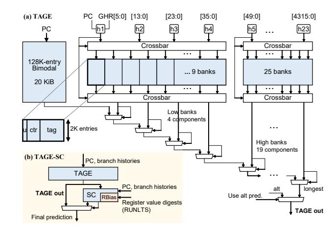

Fig. 1. (a) Structure of the TAGE predictor in RUNLTS. Each bank is interleaved through a crossbar switch in order to balance accesses among different history lengths. Low and high interleaving are performed independently. These structures are essentially the same as those in TAGE-SC-L [27]. (b) Overall structure of TAGE-SC and RUNLTS.

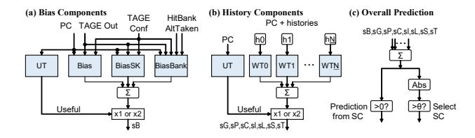

Fig. 2. Structure of the SC. Each component is essentially the same as in TAGE-SC-L [27] and is summarized as follows: sG (global backward direction and TAGE output), sP (forward taken path), sC (call stack), sI (Br+Ta IMLI), sL (256-entry local), sS (16-entry local), sT (16-entry local).

among those with matching tags is updated, even if shorterhistory tables also have matches. This behavior allows entries using shorter histories to learn general patterns, while entries using longer histories learn exceptional patterns.

The u counter is a one- or two-bit counter. A nonzero value indicates that the entry is useful and should not be evicted if possible. The u counter is incremented when the entry produces a correct prediction that overrides the prediction from a shorter-history entry. In other words, the u counter is increased when the prediction would have been wrong without that entry. Conversely, when the entry produces the same prediction as a shorter-history entry and the prediction is correct, the u counter is reset to zero.

#### B. Hashed Perceptron

A hashed perceptron predictor serves as the basic building block of the SC. It accesses multiple tables using different index functions and predicts the branch direction from the sign of the sum of the retrieved weights [13], [24], [36]. Several variants were proposed depending on which parts of the history to hash, but we assume the GEHL perceptron [24], which uses histories similar to TAGE, because it is used in SC. In most designs, the index functions take as inputs the branch PC and hashed versions of branch histories of different lengths.

The weight tables are trained only in two cases: (1) the prediction is incorrect, or (2) the prediction is correct but the absolute value of the weighted sum is below a threshold [12]. When the prediction is correct and the absolute value of the sum exceeds the threshold, no update is performed. This prevents overfitting and allows other branches that alias to the same entries to *steal* the weights.

## *C. TAGE-SC*

*1) Overview:* TAGE-SC is a hybrid predictor that augments TAGE with a statistical corrector (SC) [25]. Figure 1(b) shows the structure of TAGE-SC, and Figure 2 shows the internal organization of the SC. TAGE provides the baseline prediction, while the SC adjusts it only for difficult branches, keeping its storage at a small fraction of the total predictor capacity.

The SC consists of multiple hashed-perceptron predictors, which enable it to capture mild long-term statistical biases in branch outcomes. Some branches have only weak correlation with branch history but exhibit a biased direction over long timescales. In TAGE, each prediction counter is only 3 bits wide, which is not sufficient to represent such subtle biases. In contrast, the SC uses hashed-perceptron tables with wider counters, allowing it to accumulate and exploit long-term statistics.

Unlike TAGE, which is based on global history, the SC can utilize a variety of histories, including both global and local history. It consists of many weight tables grouped by the type of history they use, such as global history and local history. Tables that use the same type of history but have different history lengths are grouped together and called *components*.

*2) Bias and Usefulness:* The SC includes a *Bias* component that encourages the final SC decision to follow the TAGE prediction for most branches [27]. Figure 2 (a) shows the structure of the Bias component. It is indexed by branch address and TAGE prediction direction. Some characteristics of TAGE prediction (confidence, rough history length used to predict, and prediction from the second-longest match) can be mixed to the index function to distinguish situations. It outputs a strong weight in the TAGE direction when no correction is needed, but only a weak weight when a branch should instead rely on the other SC components.

As indicated by the label UT in Figure 2, the SC also includes usefulness-tracking tables, one per component, that emphasize decisions based on useful types of history. Each usefulness-tracking table consists of saturating counters indexed only by the branch address. When the sum of the weights from a component that uses a particular history type corrects the TAGE prediction, the usefulness counter for that type is incremented. When the sum pushes the prediction in the wrong direction, the counter is decremented. If a counter is positive, the sum of the weights from the corresponding component is multiplied by a fixed gain to amplify its contribution to the SC output.

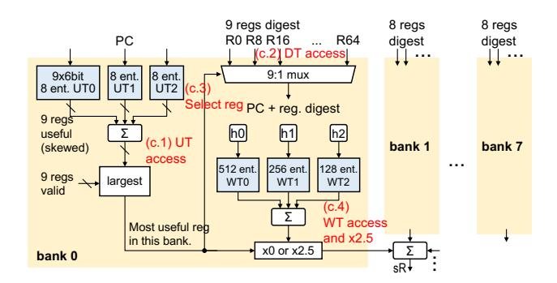

Fig. 3. Structure of RBias.

## III. RBIAS

RUNLTS is a branch predictor that extends TAGE-SC<sup>1</sup> with several enhancements. In this section, we focus on RBias, which is the central contribution of RUNLTS. RBias learns correlations between register values produced in the backend pipeline and branch outcomes, and it corrects the TAGE prediction as part of the SC.

## *A. Overview*

RBias is implemented as a perceptron-based component that is added to the SC. Figure 3 shows the organization of RBias. As with the other SC components, RBias accesses multiple weight tables (WTs), sums the retrieved weights, and multiplies the sum by a fixed gain to produce its output. In the figure, this output is denoted by sR, and it is added to the outputs of the other SC components to contribute to the final decision of the SC. While the existing SC components use branch histories as their inputs, RBias instead uses digests derived from register values, allowing it to capture correlations between values and branch outcomes.

The key feature of RBias is that it directly captures correlations between the values stored in logical registers and branch outcomes without explicitly tracking the data dependencies of branches. Existing value-correlation predictors typically identify specific operand registers or analyze data-dependence graphs and then focus on a small set of candidate values. In contrast, RBias regards all logical registers uniformly as candidates. It learns both which registers are useful for branch prediction and how their values correlate with branch outcomes.

## *B. Digest*

RBias computes a compact, generalized digest of each value and uses these digests as inputs. As shown in Figure 4, RBias applies different hash functions to different classes of logical registers. (a) For integer registers, the digest is computed as the bitwise XOR of the counts of trailing zeros, trailing ones,

<sup>1</sup>Seznec also proposed TAGE-SC-L that additionally includes a loop predictor (L) [27]. However, in large predictors the performance benefit from the loop predictor is very limited [29], and thus we do not consider it in this work.

leading zeros, and leading ones, together with the lower six bits of the value. This design allows the predictor to distinguish aligned pointers and other rounded values, as well as small integers. (b) For floating-point registers, the digest is obtained by extracting the upper bits. This part includes the sign bit and the upper bits of the exponent. It provides a rough indication of the magnitude while ignoring fine-grained differences in the mantissa. (c) For flag registers, the bit pattern is repeated and concatenated. This increases the Hamming distance between different patterns and helps reduce unintended entry conflicts in the digest space.

## *C. Digest Table*

RUNLTS has a digest table that supplies digests to RBias. The digest table has one entry for each logical register. Each entry stores either the digest of the latest value of the corresponding logical register or the ROB index of the in-flight instruction that will produce that digest, together with a valid bit that indicates whether the entry currently holds a digest.

The digest table is updated at both the decode stage and the execution stage. At decode time, whenever an instruction with a destination register is decoded, the ROB index of that instruction is written into the entry corresponding to the destination register. At execution time, when an instruction completes, the execution unit broadcasts the ROB index together with the result value. If the ROB index matches the value stored in a digest-table entry, the table computes a digest from the result, overwrites the ROB index with this digest, and marks the entry as valid.

With this mechanism, the predictor can determine which logical registers have an available digest by reading the digest table at prediction time. The digest table must be restored on a pipeline flush. We discuss the recovery mechanism in Section IV.

## *D. Weight Table and Usefulness-Tracking Table*

As shown in Figure 3, RBias has a structure similar to other SC components and includes WTs and UTs. UT is maintained per logical register, while WT is implemented as a table shared across multiple registers. We call the unit over which WT is shared a bank.

As in other SC components, UT is indexed only by the PC. Unlike the other components, however, the UT in RBias uses a gskew-like organization, in which three different hash functions are used to access the table in order to reduce the impact of aliasing [19]. This design is necessary because RBias must track usefulness for many static instructions and also maintain UT entries per register, and thus, high capacity efficiency is required. In addition, when UT judges RBias to be useful, we apply a larger gain than to other components. This is because RBias can provide more reliable predictions than TAGE in limited situations, and we want to maximize its benefit in those cases.

WT is shared across registers rather than partitioned per logical register for the following two reasons. First, most logical registers do not provide useful correlations, and thus, partitioning the table for each register would waste a large portion of the capacity. Second, it is easier to search over a large value space for correlated patterns if we use a single shared table rather than many small ones.

The WT itself is implemented as three tables that are accessed with three different hash functions. Other SC components use a GEHL-like organization [24], in which different tables use different history lengths as part of the index, in order to automatically find the correlated history length. In RBias, in contrast, all three WT tables use the same digest as input but apply three different hash functions to it. This is also a gskew-like technique for reducing destructive interference.

## *E. Banked RBias*

A straightforward implementation of the design described above would require WT to have as many memory ports as there are logical registers (e.g., 65 ports in AArch64). Such a heavily multiported memory is not practical. We propose a method that partitions WT into multiple banks and implements each bank as a single-port memory with little accuracy loss as follows.

We divide the logical registers into b banks, each containing almost the same number of registers. In Figure 3, the logical registers are divided into eight banks, the first bank containing nine registers, while each subsequent bank contains eight registers. During prediction, rather than having all registers access WT, RBias selects at most one logical register per bank to access WT. During training, if a logical register was used during prediction, WT is updated for that register. Otherwise, the remaining port is exploited to train WT for a *randomly chosen* logical register. In this way, RBias can retain the ability to search for useful correlations while keeping WT singleported in each bank. The subsequent sections provide more detailed explanations of the algorithm.

## *F. Prediction Algorithm*

RBias prediction uses UT, the digest table, and WT. Prediction proceeds as follows. (c.1) RBias accesses UT with the branch address and, for each logical register, sums the three skewed entries to obtain its usefulness. (c.2) In parallel, RBias reads the digest table and checks whether a digest is available for each logical register. If a digest is available, RBias retrieves its value. (c.3) For each bank, RBias selects at most one register: among the registers in that bank that have a valid digest, it chooses the one with the highest usefulness value. (c.4) If the selected register has positive usefulness, RBias accesses WT with its digest, reads one entry from each of the three WT tables, sums the weights, multiplies the sum by a fixed gain (2.5 in our implementation), and uses this as the output of that bank. Otherwise, the bank output is zero, and WT is not accessed.

These steps are performed in parallel for all b banks. The final RBias output is the sum of the outputs from all banks. This output is added to the outputs of the other SC components and contributes to the final SC decision.

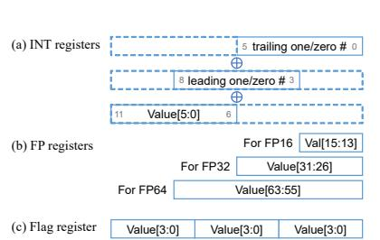

```
void qsort(void* a, size_t n, size_t es, /**/) {
            (n < 7) { ⁴hard-to-predict branch
              /* insertion sort */
          return:
            /* select a pivot based on the median of a few values */
        pc = pd = (char*)a + (n-1) * es; *calculate n-l
 6
        : /* 1st stage of 3-way partitioning, modifies pa through pd
pn = (char*)a + n * es; ∢ calculate n*es
           /* 2nd stage of 3-way partitioning */
((r = pb - pa) > es)
           qsort(a, r / es, es,
        if ((r = pd - pc) > es)
  qsort(pn - r, r / es, es, /**/ );
10
```

```
X1 = *p1, X2 = *p2, X3 = *p3,
X4 = *p4, X5 = *p5, X6 = *p6;
R33 = f(X1, X2, X3, X4, X5, X6);
R32 = g(X1, X2, X3, X4, X5, X6);
if (R32 > R33) { ⁴ hard-to
  d = R32 / (R33 + 1e-20);
  if (X1 > 0.0) { ∢RBias impro
     X1 += d;
  if (X2 < 0.0) { ∢RBias improves accuracy
     X2 += d;
     // and the same code for X3 through X
```

Fig. 4. Hash functions for generating digests from register values.

Fig. 5. Quicksort code that illustrates key behaviors of Fig. 6. Program structure around hard-to-RBias.

predict branches in fp 8 trace.

#### G. Training Algorithm

We train RBias only with digests that are already available at the prediction time. Digests that arrive later are excluded because they cannot be used for the prediction in most cases. The training follows the usual rule used in perceptron-like predictors, as described in Section II-B. RBias is trained when the prediction based on the overall SC output, including RBias and the other components, is wrong. It is also trained when the prediction is correct, but the absolute value of the SC output is below a threshold.

RBias uses the following policy to select which registers to train, depending on whether WT was accessed at prediction time. (1) For banks in which WT was accessed, RBias updates WT for the register that was selected and used at prediction time. (2) For banks in which WT was not accessed, RBias chooses one logical register at random from among those that had valid digests at prediction time and updates WT for that register. This random training makes use of a WT port that would otherwise be idle. It allows RBias to explore which registers are correlated with the branch, even though the WT is single-ported.

For logical registers that underwent WT training, UT is also updated as follows, regardless of the prediction-time output. First, RUNLTS hypothetically verifies how predictions change when RBias outputs 0 versus when it outputs the sum multiplied by a fixed gain of 2.5. When the sign of the total sum in SC is inverted, each UT entry is updated: it is incremented when a wrong sign changes to a correct one, and it is decremented when a correct sign changes to a wrong one.

#### H. Program Structures with Value Correlations

For RBias to capture correlations between register values and branch outcomes, the relevant values must be written to registers before the branch is predicted. This may seem like a strong requirement for pipelined processors, but we found that many real programs satisfy this condition. We identify two representative reasons why this condition holds and illustrate each with an example.

1) Implicit Value Correlations: The first reason is that RBias can exploit values that are related to, but not identical to, the value that directly determines the branch outcome. We illustrate this with the example in Figure 5, which shows one implementation of a quort function [37]. This code appears in the int\_21\_trace distributed for the 6th Championship Branch Prediction (CBP2025) [11], and it is likely to be the mcf benchmark trace from the SPEC CPU benchmarks. In this code, the branch n < 7 on line 2 is difficult to predict from history alone. The outcome of this branch is directly determined by n<sub>callee</sub>, the argument in the callee. That value is computed shortly before the call and is not available to RBias at prediction time.

Nevertheless, we observed that RBias significantly improves the prediction of this branch. Our analysis shows that RBias actually learns a correlation between the branch outcome and a different value, namely n<sub>caller</sub> in the caller or, more precisely, an intermediate result computed from n<sub>caller</sub> on line 8 or 10. The value of  $n_{caller}$  is produced much earlier, which allows RBias to observe it at prediction time. Although n<sub>caller</sub> and n<sub>callee</sub> are independent at the dynamic instruction level, the quicksort algorithm tends to divide into subarrays whose sizes are roughly half the original size. As a result, n<sub>callee</sub> is strongly correlated with n<sub>caller</sub>. RBias learns this observed correlation and uses  $n_{caller}$  to predict n < 7.

RBias does not track data dependencies between the branch and its operands. This lack of dependence tracking allows it to discover correlations that might be missed by reasoning based only on explicit dependence graphs, such as correlations with values that lie outside the nominal data dependence of the branch.

2) Observation after Mispredictions: The second reason is that a branch misprediction reduces the front-end lookahead and makes it easier for RBias to observe certain values before subsequent branches. We illustrate this with the example of Figure 6, which shows the program structure of fp\_8\_trace, one of the traces distributed for CBP2025. In this code, the branch R32 > R33 is hard to predict from history. Some following branches, such as X1 > 0, are also difficult to predict using history alone. However, once the value of X1 is known, it is easy to predict these branch outcomes.

The load that produces X1 is not squashed by the misprediction on R32 > R33. Thus, the value of X1 becomes visible to RBias in time for the following branches. In other words,

the first misprediction on R32 > R33 may be unavoidable, but the subsequent branches, such as X1 > 0, can benefit from RBias and suffer fewer mispredictions. Thus, in regions where a misprediction brings the producer values in time for subsequent hard-to-predict branches, RBias helps prevent a cascade of further mispredictions.

#### IV. MICROARCHITECTURAL SUPPORT FOR RBIAS

As described in Section III-C, the digest table that RBias uses must be restored correctly when a pipeline flush occurs. In this section, we first describe a straightforward solution based on checkpointing the digest table. We then present *Seq-RBias*, an alternative design that avoids checkpointing altogether.

#### A. Checkpointing

The most straightforward way to provide the required recovery behavior is to checkpoint the digest table itself. When a branch triggers a pipeline flush, the state must be restored as follows. Updates made at the decode stage by instructions that are younger than the flushing instruction must be removed. In addition, updates that reflect the completed execution of older instructions must be preserved. To realize this behavior, completion information is propagated to both the current digest table and all checkpoints. When an instruction completes, the execution unit broadcasts its ROB index together with the corresponding digest value. Each checkpoint compares the broadcast ROB index with the index stored in its entries. If they match, the checkpoint replaces the stored index with the digest value.

A drawback of this approach is that each checkpoint is relatively large, about 1 Kbit, and every active checkpoint must continuously monitor all completion notifications. Although this overhead is not negligible, it may still be an acceptable design point for implementation, considering the improvement in prediction accuracy achieved by RBias. Designing more efficient methods for capturing checkpoints or compressing them remains an interesting topic for future work.

## B. Seq-RBias: A Recovery-Free Approach

1) Overview: We also propose Seq-RBias, a variant of RBias that does not rely on logical registers and does not need to restore the digest table. Seq-RBias uses a ring buffer as the destination of digest writes, in a way similar to the recovery method for global history [23], and performs recovery only by restoring a pointer.

In Seq-RBias, the fetch unit increments a pointer on every instruction fetch and assigns ring-buffer entries sequentially to fetched instructions. At prediction time, instead of observing all (e.g., 65 in AArch64) logical registers, Seq-RBias observes a group of entries in the ring buffer that correspond to a fixed window of dynamic instructions before the predicted branch, for example, the last 64 instructions. In other words, it can use the digests written by instructions that appeared up to 64 positions earlier than the branch in program order. As a result, UT is indexed not by logical register number, but by

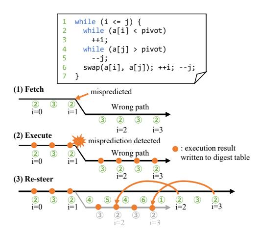

Fig. 7. Seq-RBias capturing a correlation with a value generated on a wrong path. The circled numbers correspond to source-code line numbers.

the *dynamic distance* from the predicted branch to the producer instruction.

On a pipeline flush, recovery is performed simply by restoring the ring-buffer pointer to the value it had at the flush point. The contents of the buffer entries themselves are left unchanged. To completely avoid overwriting useful entries with newer ones, the buffer would need at least as many entries as the ROB. However, our preliminary experiments showed that the buffer can be made much smaller (e.g., a quarter of the ROB size) without affecting prediction accuracy.

2) Characteristics: Seq-RBias differs from the logical-register-based RBias (which we call Log-RBias) in three important ways. First, Seq-RBias is more sensitive to differences in control flow, because it indexes UT by dynamic instruction distance. If the path changes, the number of instructions between a correlated producer and a branch can change, and the learned pattern may no longer match. In programs like the example in Figure 6, different control-flow paths can change the distance between the instruction that writes the correlated register and the branch. This problem can be mitigated by including the logical register number in the hash function that generates the digest.

Second, Seq-RBias has difficulty exploiting very old values but can more easily observe intermediate results of computations. Log-RBias can refer to values produced hundreds of instructions earlier, as long as the corresponding logical registers have not been overwritten. In contrast, Seq-RBias would require a buffer whose size grows with the maximum dynamic distance it needs to observe. On the other hand, Log-RBias often cannot effectively exploit intermediate results stored in a logical register because they are frequently overwritten by the final result. In Seq-RBias, all of these intermediate results are written sequentially into the buffer and can therefore be observed. In the example in Figure 5, we observe that Log-RBias learns a correlation involving an intermediate result at line 8, which has a long dynamic distance through recursive calls but is not overwritten, whereas Seq-RBias learns a

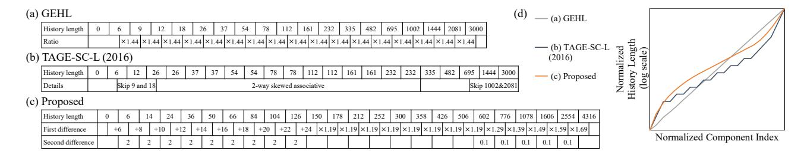

Fig. 8. Comparison of existing and proposed history length sets. (a) Geometric history length (GEHL) set. (b) History length selection method proposed by Seznec [27]. (c) Proposed history length selection method. (d) Illustration of history length sets. The two axes are normalized due to their dependence on the storage budget.

correlation involving an intermediate result at line 10, which has a short dynamic distance but is overwritten in the same logical register.

Third, and most distinctively, values generated on the wrong path can remain in the ring buffer in Seq-RBias and may be used for subsequent branch predictions. Figure 7 illustrates a simplified execution sequence of quicksort. When a branch misprediction occurs, the pipeline is flushed, and the ring-buffer pointer is rolled back to the position at the flush point, but the contents of entries written on the wrong path are not erased until the newly fetched instructions are decoded. As a result, they can be used as correlated features when predicting later branches.

#### V. REFINEMENTS TO THE TAGE-SC PART

In addition to introducing RBias, we also apply several substantial refinements to the underlying TAGE-SC part. These refinements fall into two groups. The first group relates to the core TAGE structure, namely the history-length set and allocation throttling. The second group relates to the internal structure of the SC, in particular the IMLI component and the call-stack-based history component. In this section, we describe these refinements and the insights that motivated them.

#### A. History length set

Previous work has pointed out that the conventional geometric history-length set is not optimal [22], [27], [28]. For example, if we use a pure geometric history-length set such as illustrated in Figure 8(a), adjacent short histories such as lengths 6 and 9, or 9 and 12, tend to serve heavily overlapping sets of branches. At the same time, the longest history tables may almost never be used. As a result, the number of branches effectively served by each table can be highly imbalanced. Some designs have attempted to address this problem in an ad hoc way, for example, by removing every other history length on the short or long side, or by focusing capacity on midlength histories with skewed associativity, as in some TAGE variants shown in Figure 8(b).

Our design principle is that the number of branches served by each history length should be as uniform as possible. We choose the history-length set according to this principle and use simple parametric rules for three ranges: short, medium, and long histories, as illustrated in Figure 8(c). As shown in Figure 8(d), the proposed history-length set is similar to the one made by Seznec, but it further advances and systematizes. This construction rule was derived by identifying simple structural regularities in the history-length set optimized by simulated annealing and treating irregular deviations from those regularities as artifacts of overfitting.

- 1) For short histories, a pure geometric progression makes adjacent lengths too close. Instead, we use a secondorder arithmetic progression for short histories, in which the difference between consecutive lengths increases gradually. Intuitively, the longer the history, the fewer branches correlate with it; thus, the intervals between the history lengths themselves are widened to compensate. For example, the table of history length 9 handles correlations that the table of history length 6 cannot, but since these correlations involve only the 7th, 8th, and 9th history points, they are too few relative to the number of correlations handled by the table of history length 6. To balance the workload per table, the next table after one with a history length of 6 must use at least a history length of 12, and for the reasons mentioned earlier, it is preferable to use one slightly larger than that.
- 2) For medium histories, we retain a geometric progression. We choose the switching point from the short range to the medium range so that the growth rate of the geometric progression becomes larger than that of the second-order arithmetic progression. This choice keeps the number of tunable parameters small.
- 3) For long histories, we choose the ratios between consecutive history lengths so that the ratios themselves form an arithmetic progression. We assume that the maximum useful history length varies from program to program and that the logarithm of this maximum is roughly uniformly distributed. Under this assumption, using length ratios that form an arithmetic progression tends to equalize the expected number of branches served by each long-history table.

The history-length set based on the proposed rule is applicable not only to TAGE but also to other predictors that traditionally use geometric history lengths.

#### B. Thrashing Detection and Allocation Throttling on TAGE

1) Motivation: Michaud shows that the appropriate entry allocation intensity in TAGE depends on the program and that controlling this intensity by detecting thrashing could improve performance [18]. He proposes BATAGE, which modifies the per-entry counter in TAGE and leverages this new counter method to implement allocation throttling. However, we found that when the predictor capacity is large, the modified counter method causes problems in replacement control, and BATAGE-SC does not match the prediction accuracy of a TAGE-SC predictor with the same capacity.

Motivated by this, we propose a new thrashing-detection mechanism that keeps the original TAGE counter format. Our method reuses a specific bit pattern as a marker for newly allocated entries and throttles the allocation rate based on the ratio of different reasons for the disappearance of this marker.

2) Algorithm: We observe that, among all combinations of the TAGE entry fields  $\{ctr, u\}$ , several patterns are extremely rare in practice. Specifically, the combination  $ctr \in \{0, -1\}$  and u=1 appears in only about 0.02% of the entries. We also confirm that forcing u to zero whenever these combinations occur has virtually no effect on prediction accuracy, and thus we assign the meaning *newly allocated* to the state  $ctr \in \{0, -1\}$  with u=1.

We use this combination as a marker and track two events. (1) newly\_useful counts the number of times a marked entry provides a correct prediction. This event clears the marker. (2) newly\_decayed counts the number of times a marked entry is evicted before it ever provides a prediction. The marker may also be cleared when the entry provides an incorrect prediction, but we do not count such events. A large number of newly useful entries suggests that more aggressive allocation would be beneficial. A large number of newly decayed entries indicates that the predictor is allocating too aggressively, because many entries are evicted before being used.

The way we translate the ratio of newly decayed to newly useful entries into the number of entries allocated per misprediction depends on the predictor capacity. Thus, we determine this mapping empirically. For a 192 KiB TAGE-SC, the best policy we found is as follows. If newly\_decayed is at most twice newly\_useful, we allocate four entries per misprediction. If newly\_decayed is more than four times newly\_useful, we allocate two entries per misprediction. For intermediate ratios, we allocate three entries per misprediction

#### C. Inner-most Loop Iteration (IMLI) counter

1) Background: The IMLI counter [31] is an approximately 10-bit-wide counter that represents the iteration number of the innermost loop. IMLI is a global quantity rather than a value tied to a specific branch, which makes speculative-history management easier than for local history. Recently, robust counting methods called BrIMLI and TaIMLI have been proposed [28]. They handle complex loop structures that arise from compiler optimizations, as illustrated in Figures 9(b)–(c).

```
This function is called many times,
            with a few entries in 'a' being changed
            void task() {
               for (i = 0; i < N; ++i) {
                     (a[i].valid) {
                    if (a[i].m < K | | a[i].n > L) {
                              target operation */
 (a) An example program structure where IMLI-based prediction is effective.
 goto L0;
                                           goto L0;
L0:
                                                target operation */
 if (i >= N) goto L3;\nif (!a[i].valid) goto L1;
 if (a[i].m < K) goto L2;
 if (a[i].n <= L) goto L1;
                                          L0:
                                            if (i >= N) goto L3;\nif (!a[i].valid) goto L1;\nif (a[i].m < K) goto L2;</pre>
     target operation */
                                            if (a[i].n > L) goto L2;
                                            goto L1:
   (b) Output from a compiler
                                           (c) Output from another compiler.
   for which TaIMLI works well
                                            for which BrIMLI works well
```

Fig. 9. Example of a program structure where the IMLI counter is effective and the corresponding structure in the compiled binary produced by modern compilers. In (b) and (c), regions with the same background color share the same upper PC bits. In (b), TaIMLI [28], which increments the counter when a taken backward branch targets the same region as the previously taken backward branch, counts iterations correctly, whereas the original IMLI method [31] may fail because there are some untaken backward branches. In (c), BrIMLI [28], which uses the region of the branch itself rather than the target, counts iterations correctly.

IMLI is known to partly substitute for local history when predicting loop-exit branches [31]. Local history tends to provide small performance gains for many programs, whereas IMLI can deliver large gains for certain specific programs [31]. However, the program structures for which IMLI is particularly effective have not been fully characterized.

2) When IMLI is effective: We found that IMLI is especially effective for loops that sequentially access an array whose contents change slightly on each iteration. Figure 9 shows one such example. In this kind of loop, history-based prediction is difficult because changes to part of the array cause corresponding parts of the branch history to change. As a result, patterns learned in the past can be invalidated repeatedly, which makes accurate prediction challenging. In contrast, IMLI depends only on the loop iteration count. Learning performed in iterations where the branch outcome does not change remains valid across iterations, and the predictor can achieve high accuracy.

We also found that IMLI is effective when such a loop contains hard-to-predict branches. Such branches pollute the global history and make prediction based on that history more difficult. Local history is not polluted in this situation, but learning results in local history can still be invalidated for the same reason. Under these conditions, it is often difficult to obtain sufficient accuracy from local history alone. In our experiments, IMLI continues to provide stable, iteration-based predictions regardless of whether the loop contains hard-to-predict branches.

- *3) Proposed Enhancements:* Based on these observations, we strengthen IMLI along two axes: (a) increasing its relative impact when it is useful, and (b) protecting and specializing its entries against aliasing.
- (a-1) When the UT judges IMLI to be useful, we increase its gain from 2 to 3. In situations where IMLI is effective, it often provides more reliable predictions than TAGE. The larger gain allows the SC to reflect the contribution of IMLI more strongly in its final decision.
- (a-2) When IMLI is judged useful, we also triple the update step applied to its WT compared with the standard update step used in the SC. In program regions where IMLI is effective, there are often nearby hard-to-predict branches, and IMLI entries are more vulnerable to aliasing. By using a larger update step for entries that are considered useful, we help their weights resist corruption by aliasing and enable them to adapt quickly when the correlated branch direction changes.
- (b) Finally, we increase the number of entries in the UT for IMLI. Because prediction and training for IMLI are strengthened as described above, IMLI must distinguish its target PCs more precisely and often produce larger outputs than other SC components. In the 192 KiB configuration of RUNLTS, we therefore expand the number of UT entries from 8 to 256.

## *D. Call-stack-based history*

*1) Motivation:* Call-stack-based histories are branch histories within a single function, i.e., the branch history in the callee is removed. This history can be implemented as follows: (1) When encountering a call instruction, push the history onto a stack and clear the history. (2) When encountering a return instruction, pop the history from the stack. (3) Otherwise, update the history as usual. It can capture correlations between branch outcomes before and after a function call, even when the branch behavior inside the callee is unrelated to the caller [40]. For this reason, prior work has added SC components that use call-stack-based histories [26].

We identified two unexpected properties of call-stack-based history. First, when we replace a call-stack-based component implemented as a GEHL hashed-perceptron predictor with a TAGE-like component that uses the same history, prediction accuracy degrades. This is notable because TAGE is generally considered more accurate than hashed-perceptron predictors for a given storage budget. Second, even in program regions that contain almost no function calls, adding a call-stackbased history component to the SC still improves prediction accuracy. If no function-call instructions appear, the call-stackbased history becomes identical to the global history, and since it is the same information already used by TAGE, the improvement in prediction accuracy may be strange. These observations suggest that a call-stack-based history component contributes beyond its original intended role of capturing correlations between branches across call and return boundaries.

*2) When Call-Stack-Based history works:* We found that these effects are partly due to the same type of loop structure discussed in Section V-C, where a loop sequentially accesses an array whose contents change slightly on each iteration. In such loops, predictors that learn only the longest matching history, such as TAGE, tend to perform poorly. When a distant element of the array changes, the corresponding distant positions in the history may also change. Entries in TAGE that were trained using long histories become invalid, and TAGE effectively loses what it has learned about that branch in the entire predictor.

In contrast, GEHL predictors that train multiple history lengths at the same time behave differently. Even if entries that use long histories become unusable, entries trained on shorter histories that do not include the changed part of the history can remain valid. This is because, unlike TAGE, these predictors always update all history-length tables. Thus, a GEHL component inside the SC, whose behavior differs from that of the main TAGE predictor, can improve accuracy on this kind of code.

*3) Our Design:* In RUNLTS, we allocate a relatively large portion of the SC capacity to a component that uses call-stackbased history. When there are few or no call and return instructions, this component behaves like a GEHL predictor with global history and complements TAGE through its different learning behavior. This complementary role is important even if true cross-call correlations are rare.

## VI. EVALUATION

## *A. Methodology*

We evaluated the branch prediction accuracy of RUNLTS implemented on the CBP simulator [1] and gem5 [16]. Our evaluation consists of two parts. First, we used the trace-driven CBP simulator to quantify the improvement in prediction accuracy that RUNLTS achieves over state-of-the-art branch predictors. Second, we used the execution-driven gem5 simulator to examine how RUNLTS, and Log-RBias/Seq-RBias in particular, behave when the effects of wrong-path execution are fully modeled. Although the CBP simulator models both branch prediction and the back-end pipeline of an out-of-order processor, it is trace-driven and thereby does not simulate wrong-path execution. In contrast, gem5 allows us to evaluate the impact of wrong-path execution on the digests observed by RBias.

Table I summarizes the processor parameters used in our evaluation, which are chosen to model an advanced, aggressive high-performance CPU. As workloads, we used the 673 evaluation traces distributed for CBP2025 [11] and the SPEC CPU 2017 benchmarks [34]. The evaluation traces span a wide range of programs, but the original executables are not publicly available and cannot be executed directly on gem5. We compiled the SPEC CPU 2017 [34] using gcc 13.1.0 with the options -O3 -march=armv8-a, and generated SimPoints [32] using 100M-instruction intervals. We also created traces for the CBP simulator and evaluated the same interval on gem5 in full-system mode. The total number of instructions across all SimPoint intervals is 11.8 billion.

As a baseline, we used TAGE-SC-L [27] in the 192 KiB configuration adapted by Sheikh *et al.* for CBP2025 participants to match the storage budget [1]. We further compared against five high-accuracy branch predictors submitted to CBP2025: MPP-2025 [14], TAGE-SC-2025 [29], LVCP [17], TASQ-SC-L [22], and Bullseye [4]. All of these predictors, including RUNLTS, are designed to comply with the CBP2025 storage budget of 192 KiB. Table II shows the storage budget breakdown for the baseline TAGE-SC-L and RUNLTS. We denote RUNLTS that uses Log-RBias as RUNLTS-Log, and one that uses Seq-RBias as RUNLTS-Seq.

## B. Branch Prediction Accuracy

Figure 10 shows the S-curves of MPKI reduction for each branch predictor. RUNLTS-Log achieved higher prediction accuracy than TAGE-SC-L on 597 out of the 673 traces. In particular, 132 traces observed an improvement of at least 0.2 MPKI. Even for traces where MPKI increases, the increase was bounded by 0.192 MPKI. On average, RUNLTS-Log reduced MPKI by 0.137, and the median reduction was 0.048.

TABLE I
THE PARAMETERS OF THE 16-WIDE PROCESSOR USED IN THE
SIMILATION

|                      | CBP simulator                                  | P simulator gem5                                       |  |  |  |
|----------------------|------------------------------------------------|--------------------------------------------------------|--|--|--|
| Front-end            | 16 <sup>†</sup> -wide, 10 cycles               |                                                        |  |  |  |
| Issue width          | $24^{\dagger}$                                 |                                                        |  |  |  |
| Branch target buffer | Perfect                                        | 65536 entries                                          |  |  |  |
| Execution units      | Int/FP $\times 16^{\dagger}$ ,                 | Int $\times 16^{\dagger}$ , FP $\times 16^{\dagger}$ , |  |  |  |
|                      | Load/Store×8 <sup>†</sup>                      | Load/Store×8 <sup>†</sup>                              |  |  |  |
| Reorder buffer       | 1024 <sup>†</sup> entries                      |                                                        |  |  |  |
| Scheduler            | 1024 <sup>†</sup> -entry, age-based scheduling |                                                        |  |  |  |
| Physical registers   | N/A                                            | Int×1024 <sup>†</sup> , FP×1024 <sup>†</sup>           |  |  |  |
| Load-store queue     | 1024 <sup>†</sup> entries                      |                                                        |  |  |  |
| L1 caches            | 128 KiB L1I/L1D, 8-way, 3 cycles               |                                                        |  |  |  |
| L2 cache             | 4 MiB private, 8-way, 12 cycles                |                                                        |  |  |  |
| L3 cache             | 32 MiB shared, 16-way, 50 cycles               |                                                        |  |  |  |
| Main memory          | 150 cycles                                     |                                                        |  |  |  |

<sup>†:</sup> The resources that are halved or quartered when the core size is reduced.

 $\label{thm:thm:thm:thm:thm:thm:thm:thm:thm:thm:$ 

|                                | TAGE-SC-L   | RUNLTS-Log / -Seq     |  |
|--------------------------------|-------------|-----------------------|--|
| Bimodal (base predictor)       | 40 KiB      | 20 KiB                |  |
| Tagged table (short history)   | 35 KiB      | 29.25 KiB             |  |
| Tagged table (long history)    | 90 KiB      | 106.25 KiB            |  |
| Global history                 | 3000 bits   | 4316 bits             |  |
| TAGE auxiliary data            | 181 bits    | 181 bits              |  |
| Allocation monitoring counters | N/A         | 32 bits               |  |
| sB (Bias)                      | 4.506 KiB   | 2.631 KiB             |  |
| sG (Global backward dir)       | 6.011 KiB   | 3.011 KiB             |  |
| sP (Path)                      | 3.006 KiB   | 0.758 / 0.383 KiB     |  |
| sL (1st local)                 | 3.694 KiB   | 5.069 KiB             |  |
| sS (2nd local)                 | 1.569 KiB   | 4.547 KiB             |  |
| sT (3rd local)                 | 1.542 KiB   | 4.543 KiB             |  |
| sI (IMLI-SIC)                  | 0.382 KiB   | 2.464 KiB             |  |
| sIM (IMLI-OH)                  | 1.819 KiB   | N/A                   |  |
| sC (Call-stack)                | N/A         | 6.053 KiB             |  |
| sR (Log-RBias / Seq-RBias)     | N/A         | 6.576 / 7.112 KiB*    |  |
| SC auxiliary data              | 538 bits    | 538 bits              |  |
| Loop predictor                 | 9984 bits   | N/A                   |  |
| Loop predictor auxiliary data  | 7 bits      | N/A                   |  |
| Total                          | 189.199 KiB | 191.760 / 191.921 KiB |  |

<sup>\*:</sup> The digest table sizes are different. They are 65 and 256, respectively.

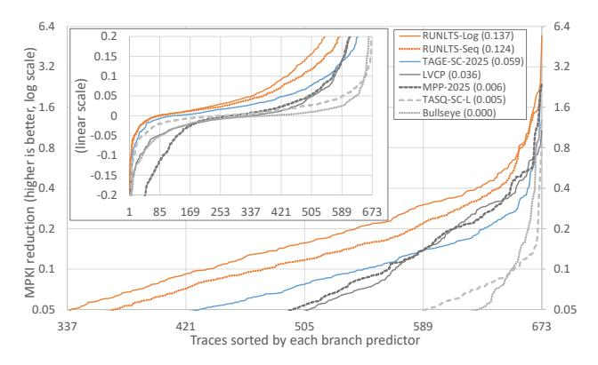

Fig. 10. MPKI reduction, sorted by each branch predictor. The average MPKI reduction is given in parentheses.

All of these metrics are better than those of the five competing branch predictors evaluated.

RUNLTS-Seq demonstrated slightly lower accuracy than RUNLTS-Log, yet still achieved a significant improvement in prediction accuracy compared to TAGE-SC-L. Note that since the CBP simulator was used in this evaluation, the impact of RUNLTS-Seq capturing correlations with values generated on wrong paths is underestimated.

#### C. Accuracy Improvement Breakdown

Figure 11 illustrates, for each program, the performance improvement achieved by RUNLTS-Log, broken down by mechanism. Figure 12 illustrates how MPKI changes due to the mechanisms across the 673 traces. Some mechanisms require additional storage. To keep the total within the 192 KiB storage budget, we reduced the capacity of some parts of the predictor and evaluated the resulting balanced configuration. As a result, for programs that do not benefit from a given mechanism, that mechanism may appear as a negative contribution.

1) RBias: RBias delivered substantial performance improvements across a wide range of programs and reduced MPKI by 2.46% on average. For fp\_8\_trace and int\_21\_trace, which we used as examples in Section III-H, the improvement was particularly large. At the same time, the fact that RBias also improves prediction accuracy for many other programs indicates that it is a general mechanism rather than a method specialized for these particular traces.

We also evaluated the improvement in accuracy when a portion of a 64 KiB TAGE-SC storage capacity was replaced with the 6.6 KiB Log-RBias. The evaluation results show that RBias still reduces MPKI by 2.83%, indicating that its benefit is not limited to the 192 KiB budget.

2) *IMLI tweaks:* The IMLI achieved substantial prediction accuracy improvements on several traces, including int\_{1,2,21}\_trace, and also provides gains on many other programs, contributing a 0.74% reduction in MPKI on average. The traces int\_{1,2,21}\_trace exhibit the

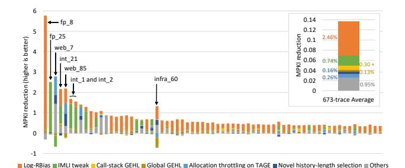

Fig. 11. MPKI reduction breakdown of the top 10% traces and all-trace average. The legend 'Call-stack GEHL' indicates the contribution when the global history GEHL component is replaced with a call-stack-based history one. The legend 'Others' includes some TAGE-SC parameter tuning, most of which comes from augmenting local history components and increasing maximum global history length with tagged table expansion.

program structures for which the IMLI is particularly effective, as discussed in Section V-C.

3) Call-stack-based history component: Adding the call-stack-based history component contributed a 0.43% reduction in MPKI. Adding a global-history GEHL component yielded a 0.13% MPKI reduction, whereas replacing it with a call-stack-based history one provided an additional 0.30% reduction. Thus, the call-stack-based history component captures correlations between branches before and after function calls, while it complements TAGE by exploiting properties different from those of TAGE. In this way, it serves two purposes at once.

4) Novel history-length selection and allocation throttling on TAGE: The proposed history-length selection method and allocation throttling improved prediction accuracy on average and in more than half of all traces. For individual traces, accuracy sometimes increased and sometimes decreased, because the optimal history-length set and allocation frequency differ across programs. In other words, even a suboptimal method may happen to match a particular program well. Consequently, these methods should be assessed primarily in terms of their average behavior, under which our proposed methods outperformed existing methods.

We also evaluated the proposed history-length rule beyond TAGE-SC. Replacing the history-length set of a 192 KiB GEHL perceptron predictor with one generated using the proposed method improved prediction accuracy on the 673 CBP2025 evaluation traces from 3.338 MPKI to 3.316 MPKI (0.66% reduction), and we also confirmed an improvement for BATAGE-SC.

In addition, we evaluated allocation throttling at a smaller storage budget. Although the timescale for updating the entire table varies with capacity, setting the counter width to  $\log_2(\text{total number of table entries})$  ensures that it fits appropriately to the timescale. For a 64 KiB TAGE-SC, 3 allocations when the ratio is at most 2, 1 allocation when the ratio is more than 6, and 2 allocations in intermediate cases resulted in a 0.15% MPKI reduction compared to a fixed two-entry allocation policy.

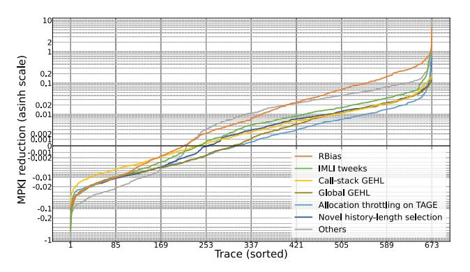

Fig. 12. S-curves showing the MPKI reduction for each feature across 673 traces. The y-axis is plotted on an inverse hyperbolic sine (asinh) scale, which is approximately linear near zero and approximately logarithmic for large positive and negative values.

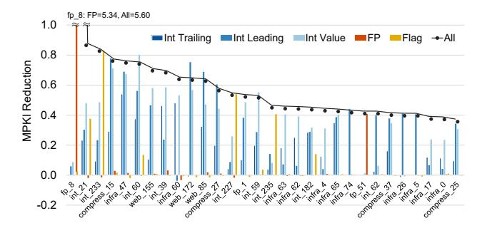

Fig. 13. Contribution of each RBias-digest feature for the 30 traces with the largest MPKI reduction relative to no RBias among the 673 evaluation traces.

#### D. Contribution of Digest Features

To analyze the contribution of the RBias digest features, Figure 13 shows the MPKI reduction of Log-RBias from the no-RBias configuration when each feature of the digest described in Section III-B is used independently. The digest features related to integer values, floating-point values, and flags are effective for different programs, indicating that the benefit does not come from any single group alone. Moreover, for many traces, 'All', which combines all features, achieves a larger improvement than any individual feature.

#### E. Impact of Wrong-path Execution

Finally, we evaluated how RBias is affected by wrong-path execution. For each of Log-RBias and Seq-RBias described in Section IV-B, we quantified the impact of wrong-path execution by comparing it against RUNLTS without RBias (No-RBias). We consider three configurations: Log-RBias without recovery (Log-RBias/noRecov), Log-RBias with recovery (Log-RBias), and Seq-RBias. We evaluated them on both gem5 and the CBP simulator and checked whether they exhibit comparable improvements across the two simulators. Note that Log-RBias/noRecov cannot be evaluated on the CBP simulator because it does not model wrong-path execution, and thus it is shown as N/A. In addition to the 16-wide model used

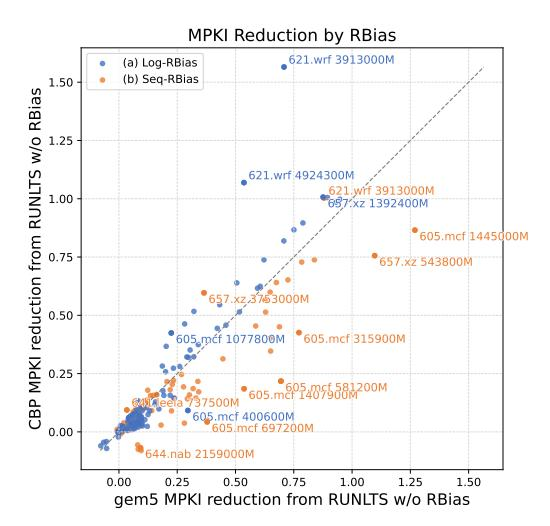

Fig. 14. Comparison of MPKI reduction between (a) Log-RBias and (b) Seq-RBias, implemented on each simulator.

in the previous evaluation, we also evaluated half-size (8-wide) and quarter-size (4-wide) models.

Table III shows the MPKI reduction and the IPC improvement of each model, and we make three observations from this. First, Log-RBias/noRecov delivered very limited improvement because the digest table is corrupted by wrong-path execution. Second, Log-RBias achieved essentially the same improvement on both simulators, indicating that it is almost insensitive to wrong-path effects. Third, Log-RBias and Seq-RBias behaved differently across the two simulators: when wrong-path execution is not modeled, Seq-RBias is less effective, whereas under full wrong-path simulation, their improvements are comparable. The second and third observations indicate that Seq-RBias can benefit from the effects of wrong-path execution.

Figure 14(a) compares, for each trace, the MPKI reduction of Log-RBias between the two simulators, and Figure 14(b) does the same for Seq-RBias. We show only the result of the 16-wide model. In Figure 14(a), many points lie on or slightly above the diagonal, showing that wrong-path execution causes little degradation for many programs. In Figure 14(b), many points lie below the diagonal, indicating that for many programs Seq-RBias effectively exploits values generated on the wrong path to further improve prediction accuracy.

## F. Energy Consumption and Area

We evaluated the energy consumption and area of both the branch predictor and the entire processor core using gem5 simulations of SPEC CPU 2017 together with McPAT [15]. Figure 15 shows the breakdown of whole-core energy per committed instruction (EPI) for each model, normalized to that of TAGE-SC-L at the same fetch width. We define EPI as whole-core total energy, including speculative and wrongpath activity, divided by committed instructions. In this figure, 'Log' and 'Seq' denote the RUNLTS-Log and RUNLTS-Seq configurations.

TABLE III
SPEC CPU 2017 SIMPOINT AVERAGE MPKI AND IPC CHANGES FROM SAME-WIDTH CBP2025 TAGE-SC-L 192 KiB.

|                                        | CBP simulator |                 | gem5   |                 |
|----------------------------------------|---------------|-----------------|--------|-----------------|
|                                        | MPKI          | IPC             | MPKI   | IPC             |
| TAGE-SC-L (16-wide)<br>RUNLTS $\Delta$ | 6.101         | 3.571           | 6.181  | 2.697           |
| No-RBias                               | -0.140        | +0.028 (+0.77%) | -0.157 | +0.018 (+0.68%) |
| Log-RBias/noRecov                      |               | N/A             | -0.173 | +0.026 (+0.98%) |
| Log-RBias                              | -0.329        | +0.054 (+1.51%) | -0.324 | +0.042 (+1.55%) |
| Seq-RBias                              | -0.272        | +0.046 (+1.29%) | -0.346 | +0.039 (+1.43%) |
| TAGE-SC-L (8-wide)<br>RUNLTS Δ         | 6.100         | 3.046           | 6.182  | 2.288           |
| No-RBias                               | -0.140        | +0.021 (+0.69%) | -0.156 | +0.017 (+0.73%) |
| Log-RBias/noRecov                      |               | N/A             | -0.179 | +0.020 (+0.89%) |
| Log-RBias                              | -0.334        | +0.044 (+1.43%) | -0.322 | +0.033 (+1.43%) |
| Seq-RBias                              | -0.272        | +0.034 (+1.13%) | -0.398 | +0.038 (+1.66%) |
| TAGE-SC-L (4-wide)<br>RUNLTS Δ         | 6.098         | 2.271           | 6.168  | 1.692           |
| No-RBias                               | -0.139        | +0.012 (+0.55%) | -0.152 | +0.010 (+0.58%) |
| Log-RBias/noRecov                      |               | N/A             | -0.203 | +0.015 (+0.86%) |
| Log-RBias                              | -0.416        | +0.032 (+1.42%) | -0.345 | +0.021 (+1.25%) |
| Seq-RBias                              | -0.367        | +0.028 (+1.23%) | -0.347 | +0.019 (+1.13%) |

Because the digest table in Log-RBias involves many associative lookups, its energy overhead becomes particularly large. By contrast, as described in Section IV-B, Seq-RBias is built from a simple ring buffer, and thus its energy increase remains consistently small. Despite the additional energy consumed by RBias, the whole-core EPI can still decrease. This is due to reduced static energy from shorter program execution times, as well as reduced dynamic energy consumed by wrong-path instructions from fewer branch mispredictions. Note that, because the predictor-side configuration, including RBias, is kept fixed while the rest of the core is scaled down, the predictor-side components occupy a larger fraction of the whole-core EPI in smaller cores.

Figure 16 shows the reduction in EPI relative to TAGE-SC-L for each execution interval on the 16-wide core. Seq-RBias reduces branch mispredictions on many intervals and thereby more than offsets its predictor-side overhead, reducing whole-core EPI by 0.19%, 0.74%, and 1.08% on the 4-wide, 8-wide, and 16-wide cores, respectively. Log-RBias increases whole-core EPI by 0.51% and 0.23% on the 4-wide and 8-wide cores, respectively, but reduces it by 0.20% on the 16-wide core.

The processor-core area overhead is also modest across all evaluated core sizes. Log-RBias increases total core area by 0.66%, 0.58%, and 0.49% for the 4-wide, 8-wide, and 16-wide cores, respectively, while Seq-RBias increases it by 0.35%, 0.14%, and 0.04%.

#### G. Sensitivity to Front-end Width and Front-end Depth

We evaluated how the performance improvement from RBias varies with front-end width and depth using gem5. Because this experiment is intended to isolate the characteristics of RBias, we varied only the front-end width and front-end depth, while keeping the back-end configuration identical to the baseline. The front-end width was set to 4, 8, and 16, while the front-end depth was varied to 5, 10, and 15. Figure 17 shows the results of this experiment. 'Log', 'Seq', and 'No' denote Log-RBias, Seq-RBias, and

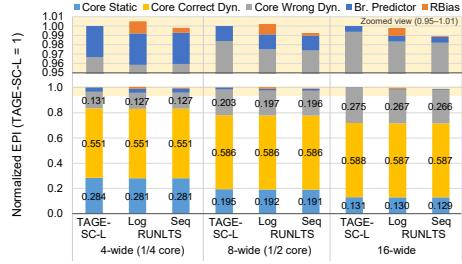

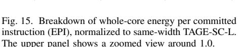

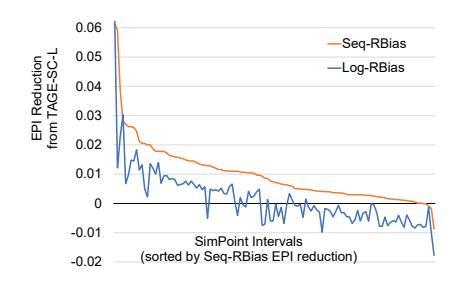

Fig. 16. EPI reduction relative to TAGE-SC-L on the 16-wide core across intervals in SPEC CPU 2017. Larger values indicate greater EPI savings.

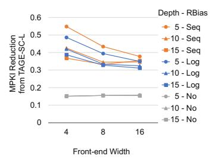

Fig. 17. MPKI reduction relative to TAGE-SC-L for different front-end widths, depths, and RBias variants.

No-RBias, respectively. As expected, the prediction accuracy of RUNLTS without RBias was independent of the frontend configuration. Increasing the front-end depth from 10 to 15 resulted in negligible degradation in prediction accuracy. This is because the correlated registers captured by RBias, as shown in Section III-H, are those written by sufficiently distant instructions or misprediction-revealed ones. In contrast, both variants of RBias improved prediction accuracy when the front-end width or depth was small. This is because they can capture correlations with more closely spaced instructions. These results indicate that, at a front-end depth of 10, most of the performance improvement from RBias arises from correlations with sufficiently distant instructions or misprediction-revealed ones.

#### VII. RELATED WORK

Global branch predictors such as TAGE [30] and BATAGE [18] provide some of the highest baseline accuracies, and further improvements can be achieved by incorporating auxiliary information. RBias, proposed in this paper, belongs to a group of mechanisms that exploit correlations between branch outcomes and values produced in the execution backend as such auxiliary information. This approach is orthogonal to history-based prediction and can yield additional gains.

One line of research is to use back-end values directly. Heil *et al.* proposed a predictor that uses the difference between the operand register values of a branch [9]. Chen *et al.* proposed a method that hashes the values of all source registers on which the branch depends [6]. These methods explicitly identify the dependent registers of a branch and use the tuple of their values as features. In contrast, RBias regards all logical registers uniformly as candidates and searches for correlations between branch outcomes and the values of individual registers. As a result, it can learn correlations that involve registers outside the explicit dependence graph of a branch.

Other studies combine pre-execution with branch prediction in order to resolve hard-to-predict data-dependent branches accurately. A typical approach reconstructs the dependence graph of data-dependent branches and pre-executes the corresponding instructions [7], [21], [33]. An alternative approach reduces the amount of pre-execution required by adding a prediction mechanism for load addresses [8]. However, these

methods tend to increase the complexity of dependence analysis and microarchitecture, and it is not straightforward to apply them broadly to a variety of branches. In contrast, our method naturally enables the extraction of correlations with registers outside the dependence graph and with values produced on the wrong path, demonstrating that there is a viable alternative to pre-execution-based approaches.

Instead of relying on pre-execution, some research attempts to improve prediction accuracy at low tracking cost by reusing the outcome of branch instructions executed on miss paths [3], [20]. These methods use dedicated buffers to store branch results, locate the merge point between the miss path and the correct path, and reuse the outcomes from that point onward. In contrast, we demonstrated that this can be achieved within a framework that captures correlations with register values. It has also been shown that delaying flushing instructions on miss paths enhances these techniques. Such an enhancement might also be possible for Seq-RBias, which presents an interesting future topic.

## VIII. CONCLUSION

To advance the state of the art in branch prediction beyond TAGE-SC, we proposed RUNLTS, a novel branch predictor. Building on TAGE-SC, we introduced into RUNLTS several new mechanisms derived from an analysis of the contribution of each component and the performance headroom identified in that analysis. We also introduced RBias, a new direction in prediction mechanisms that directly captures correlations between branch outcomes and register values produced by temporally nearby instructions, without explicitly tracking data-dependence chains. RBias is implemented as an extension of the SC and enables the predictor to exploit a wide range of correlations that prior methods fail to capture. Our evaluation shows that RUNLTS reduces the number of branch mispredictions by 5.00% on the 673 CBP2025 evaluation traces in the CBP simulator, and by 5.25% on SPEC CPU 2017 workloads in gem5. Our 4-, 8-, and 16-wide evaluations showed consistent MPKI/IPC gains, and Seq-RBias reduced whole-core EPI across widths. Evaluation of the branch predictor with its capacity reduced to 64 KiB demonstrated that this mechanism is useful for branch predictors of a certain size or larger.

## REFERENCES

- [1] "ramisheikh/cbp2025: Championship Branch Prediction 2025," https:// github.com/ramisheikh/cbp2025, 2025, accessed 2025-11-17.
- [2] N. Adiga, J. Bonanno, A. Collura, M. Heizmann, B. R. Prasky, and A. Saporito, "The IBM z15 High Frequency Mainframe Branch Predictor Industrial Product," in *2020 ACM/IEEE 47th Annual International Symposium on Computer Architecture (ISCA)*, 2020, pp. 27–39.
- [3] H. Akkary, S. T. Srinivasan, and K. Lai, "Recycling waste: exploiting wrong-path execution to improve branch prediction," in *Proceedings of the 17th Annual International Conference on Supercomputing*, 2003, pp. 12–21.
- [4] E. Behrendt, S. W. Pun, and P. J. Nair, "Taming Wild Branches: Overcoming Hard-to-Predict Branches using the Bullseye Predictor," in *Proceedings of the 6th Championship Branch Prediction Workshop (CBP2025)*, 2025, pp. 1–5.
- [5] M. Bruce, "Arm Neoverse V2 platform: Leadership Performance and Power Efficiency for Next-Generation Cloud Computing, ML and HPC Workloads," in *2023 IEEE Hot Chips 35 Symposium (HCS)*, 2023, pp. 1–25.
- [6] L. Chen, S. Dropsho, and D. H. Albonesi, "Dynamic data dependence tracking and its application to branch prediction," in *The Ninth International Symposium on High-Performance Computer Architecture (HPCA)*, 2003, pp. 65–76.
- [7] A. Deshmukh, L. C. Cai, and Y. N. Patt, "Timely, Efficient, and Accurate Branch Precomputation," in *2024 57th IEEE/ACM International Symposium on Microarchitecture (MICRO)*, 2024, pp. 480–492.
- [8] S. Gupta, N. Soundararajan, R. Natarajan, and S. Subramoney, "Opportunistic Early Pipeline Re-steering for Data-dependent Branches," in *Proceedings of the ACM International Conference on Parallel Architectures and Compilation Techniques*, ser. PACT '20, 2020, pp. 305–316.
- [9] T. H. Heil, Z. Smith, and J. E. Smith, "Improving branch predictors by correlating on data values," in *Proceedings of the 32nd Annual ACM/IEEE International Symposium on Microarchitecture*, 1999, pp. 28–37.
- [10] Intel Corporation, "Intel Architecture Day 2021 Presentation," https://download.intel.com/newsroom/2021/client-computing/intelarchitecture-day-2021-presentation.pdf, 2021.
- [11] S. Jain and R. Sheikh, "CBP2025 Full Traces," Jul. 2025. [Online]. Available: https://doi.org/10.5281/zenodo.15883615
- [12] D. A. Jiménez and C. Lin, "Dynamic branch prediction with perceptrons," in *Proceedings HPCA Seventh International Symposium on High-Performance Computer Architecture*, 2001, pp. 197–206.
- [13] D. A. Jiménez, "Multiperspective perceptron predictor," in *Proceedings of the 5th Championship Branch Prediction Workshop (CBP-5)*, 2016, pp. 1–5.
- [14] ——, "Multiperspective perceptron predictor," in *Proceedings of the 6th Championship Branch Prediction Workshop (CBP2025)*, 2025, pp. 1–6.
- [15] S. Li, J. H. Ahn, R. D. Strong, J. B. Brockman, D. M. Tullsen, and N. P. Jouppi, "McPAT: An integrated power, area, and timing modeling framework for multicore and manycore architectures," in *2009 42nd Annual IEEE/ACM International Symposium on Microarchitecture (MICRO)*, 2009, pp. 469–480.
- [16] J. Lowe-Power, A. M. Ahmad, A. Akram, M. Alian, R. Amslinger, M. Andreozzi, A. Armejach, N. Asmussen, B. Beckmann, S. Bharadwaj, G. Black, G. Bloom, B. R. Bruce, D. R. Carvalho, J. Castrillon, L. Chen, N. Derumigny, S. Diestelhorst, W. Elsasser, C. Escuin, M. Fariborz, A. Farmahini-Farahani, P. Fotouhi, R. Gambord, J. Gandhi, D. Gope, T. Grass, A. Gutierrez, B. Hanindhito, A. Hansson, S. Haria, A. Harris, T. Hayes, A. Herrera, M. Horsnell, S. A. R. Jafri, R. Jagtap, H. Jang, R. Jeyapaul, T. M. Jones, M. Jung, S. Kannoth, H. Khaleghzadeh, Y. Kodama, T. Krishna, T. Marinelli, C. Menard, A. Mondelli, M. Moreto, T. Mück, O. Naji, K. Nathella, H. Nguyen, N. Nikoleris, L. E. Olson, M. Orr, B. Pham, P. Prieto, T. Reddy, A. Roelke, M. Samani, A. Sandberg, J. Setoain, B. Shingarov, M. D. Sinclair, T. Ta, R. Thakur, G. Travaglini, M. Upton, N. Vaish, I. Vougioukas, W. Wang, Z. Wang, N. Wehn, C. Weis, D. A. Wood, H. Yoon, and É'. F. Zulian, "The gem5 Simulator: Version 20.0+," pp. 1–21, 2020. [Online]. Available: https://arxiv.org/abs/2007.03152
- [17] Y. Man, L. Gou, Y. Liu, M. Chen, and Y. Bao, "LVCP: A Load Value Correlated Predictor for TAGE-SC-L," in *Proceedings of the 6th Championship Branch Prediction Workshop (CBP2025)*, 2025, pp. 1–6.

- [18] P. Michaud, "An Alternative TAGE-like Conditional Branch Predictor," *ACM Transactions on Architecture and Code Optimization*, vol. 15, no. 3, pp. 30:1–30:23, 2018.
- [19] P. Michaud, A. Seznec, and R. Uhlig, "Trading conflict and capacity aliasing in conditional branch predictors," in *Proceedings of the 24th Annual International Symposium on Computer Architecture*, ser. ISCA '97, 1997, pp. 292–303.
- [20] N. Premillieu and A. Seznec, "SYRANT: SYmmetric resource allocation on not-taken and taken paths," *ACM Trans. Archit. Code Optim.*, vol. 8, no. 4, pp. 1–20, Jan. 2012.
- [21] S. Pruett and Y. Patt, "Branch Runahead: An Alternative to Branch Prediction for Impossible to Predict Branches," in *MICRO-54: 54th Annual IEEE/ACM International Symposium on Microarchitecture*, ser. MICRO '21, 2021, pp. 804–815.
- [22] A. Ros, "A Deep Dive Into TAGE-SC-L," in *Proceedings of the 6th Championship Branch Prediction Workshop (CBP2025)*, 2025, pp. 1–4.
- [23] D. J. Schlais and M. H. Lipasti, "BADGR: A practical GHR implementation for TAGE branch predictors," in *2016 IEEE 34th International Conference on Computer Design (ICCD)*, 2016, pp. 536–543.
- [24] A. Seznec, "Analysis of the O-GEometric History Length Branch Predictor," in *Proceedings of the 32nd Annual International Symposium on Computer Architecture*, ser. ISCA '05, 2005, pp. 394–405.
- [25] ——, "A 64 Kbytes ISL-TAGE branch predictor," in *Proceedings of the 3rd Championship Branch Prediction Workshop (CBP-3)*, 2011, pp. 1–4.
- [26] ——, "TAGE-SC-L branch predictors," in *Proceedings of the 4th Championship Branch Prediction Workshop (CBP-4)*, 2014, pp. 1–8.
- [27] ——, "TAGE-SC-L branch predictors again," in *Proceedings of the 5th Championship Branch Prediction Workshop (CBP-5)*, 2016, pp. 1–4.
- [28] ——, "TAGE: an engineering cookbook," HAL Inria, RR-9561, 2024, submitted on December 4, 2024; Last modified March 28, 2025. [Online]. Available: https://hal.science/hal-04804900
- [29] ——, "TAGE-SC for CBP2025," in *Proceedings of the 6th Championship Branch Prediction Workshop (CBP2025)*, 2025, pp. 1–5.
- [30] A. Seznec and P. Michaud, "A case for (partially) TAgged GEometric history length branch prediction," *Journal of Instruction-level Parallelism*, vol. 8, pp. 1–23, 2006.
- [31] A. Seznec, M. J. San, and J. Albericio, "The inner most loop iteration counter: A new dimension in branch history," in *2015 48th Annual IEEE/ACM International Symposium on Microarchitecture (MICRO)*, 2015, pp. 347–357.
- [32] T. Sherwood, E. Perelman, and B. Calder, "Basic Block Distribution Analysis to Find Periodic Behavior and Simulation Points in Applications," in *Proceedings of the 2001 International Conference on Parallel Architectures and Compilation Techniques*, ser. PACT '01. USA: IEEE Computer Society, 2001, pp. 3–14.
- [33] V. Srinivasan, R. B. R. Chowdhury, and E. Rotenberg, "Slipstream processors revisited: Exploiting branch sets," in *2020 ACM/IEEE 47th Annual International Symposium on Computer Architecture (ISCA)*, 2020, pp. 105–117.
- [34] Standard Performance Evaluation Corporation, "Standard performance evaluation corporation CPU2017 benchmark suite," 2017. [Online]. Available: https://www.spec.org/cpu2017/
- [35] D. Suggs, M. Subramony, and D. Bouvier, "The AMD "Zen 2" Processor," *IEEE Micro*, vol. 40, no. 2, pp. 45–52, 2020.
- [36] D. Tarjan and K. Skadron, "Merging path and gshare indexing in perceptron branch prediction," *ACM Transactions on Architecture and Code Optimization (TACO)*, vol. 2, no. 3, pp. 280–300, 2005.
- [37] The Regents of the University of California, "qsort.c," 1993. [Online]. Available: https://svn.freebsd.org/base/head/lib/libc/stdlib/qsort.c
- [38] A. Tuby and A. Morrison, "Reverse Engineering the Apple M1 Conditional Branch Predictor for Out-of-Place Spectre Mistraining," 2025. [Online]. Available: https://arxiv.org/abs/2502.10719
- [39] G. Williams and P. Kanapathipillai, "Qualcomm Oryon CPU in Snapdragon X Elite: Micro-Architecture and Design," *IEEE Micro*, vol. 45, no. 3, pp. 8–14, 2025.
- [40] Z. Xie, D. Tong, and X. Cheng, "An energy-efficient branch prediction technique via global-history noise reduction," in *Proceedings of the 2013 International Symposium on Low Power Electronics and Design (ISLPED)*, 2013, pp. 211–216.
- [41] H. Yavarzadeh, M. Taram, S. Narayan, D. Stefan, and D. Tullsen, "Half&Half: Demystifying Intel's Directional Branch Predictors for Fast, Secure Partitioned Execution," in *2023 IEEE Symposium on Security and Privacy (SP)*, 2023, pp. 1220–1237.

## APPENDIX ARTIFACT APPENDIX

## *A. Abstract*

The artifact package accompanying this paper is archived on Zenodo and provides the source code needed to simulate the RUNLTS branch predictor. The package includes implementations for the CBP simulator and gem5. Using the CBP simulator, users can simulate RUNLTS-Log (based on Log-RBias), RUNLTS-Seq (based on Seq-RBias), and RUNLTS without RBias.

The main purpose of this artifact is to support reproducing Figure 10, the MPKI-reduction S-curve, using the CBP simulator. The package also includes a gem5-based implementation of RUNLTS as reference code. The full inputs required to reproduce the gem5-based experiments are not included because they require SPEC CPU 2017, which cannot be redistributed with the artifact.

## *B. Artifact check-list (meta-information)*

- Algorithm: Conditional branch prediction. The plotted configurations are RUNLTS-Log (the 1st-place submission of CBP 2025), RUNLTS-Seq, RUNLTS without RBias, and the other five CBP 2025 top-six submissions. A baseline predictor is also evaluated only as the reference for computing MPKI reduction.
- Program: Source code for the RUNLTS-family branch predictors, CBP 2025 simulator integration, gem5 with RUNLTS integrated as reference code, and Python/shell scripts to build, run, aggregate, and plot the CBP-based evaluation. The upstream CBP 2025 simulator is cloned from a public repository at a pinned commit specified in the workflow scripts. The CBP 2025 comparison predictor submissions are obtained from the organizers' Google Drive distribution; the artifact records their filenames, download date, file sizes, and SHA-256 checksums, and the workflow verifies the checksums before use.
- Compilation: Tested with g++ 13.3.0. A C++17-capable compiler and GNU make are required for the CBP-based simulator. The gem5 reference implementation follows gem5's SConsbased build flow.
- Transformations: Not applicable; no program or trace transformations are required.
- Binary: Not included; binaries are generated by the build scripts.
- Model: Not applicable; no trained model is used.
- Data set: CBP 2025 public traces, downloaded from Zenodo by the provided workflow. SPEC CPU 2017 inputs required for the gem5-based experiments are not included in this artifact.
- Run-time environment: Linux; tested on Ubuntu 24.04 LTS. Python 3 and standard GNU tools are required. Docker is optional and can be used to reproduce the tested software environment.
- Hardware: No special processor features or accelerators are required. A multi-core CPU is recommended.
- Run-time state: None; the CBP experiments are deterministic trace-driven simulations.
- Execution: Command-line workflow driven by Python scripts. The workflow builds the simulator, runs each predictor-trace pair, aggregates logs into CSV files, and invokes the plotting script.
- Metrics: Conditional-branch mispredictions per kilo instructions (MPKI), and MPKI reduction relative to the baseline.
- Output: Per-run logs, aggregated CSV files, and a scriptgenerated reproduction of Figure 10. Baseline results are used for MPKI-reduction calculation but are not plotted.

- Experiments: Download the CBP 2025 traces, build the CBP simulator, run the baseline and the selected predictor configurations on all traces, aggregate conditional-branch MPKI values, compute MPKI reduction relative to the baseline, and generate the MPKI-reduction S-curve.
- How much disk space required (approximately)?: Up to 163 GiB during trace download and extraction. The final size can be reduced to 91 GiB by deleting the compressed .tar.xz trace archives after extraction.
- How much time is needed to prepare workflow (approximately)?: Downloading traces from Zenodo takes up to ∼ 10 hours, depending on the location.
- How much time is needed to complete experiments (approximately)?: Running the baseline plus eight plotted branchpredictor configurations on 673 traces takes ∼ 4 hours on a 64-core machine. Machines with fewer cores can run the same workflow with fewer parallel jobs but require longer wall-clock time.
- Publicly available?: Yes.
- Code licenses (if publicly available)?: RUNLTS code: BSD 3-Clause Clear License. Included or required third-party components, including gem5, the CBP 2025 simulator, and comparison predictors, retain their own licenses.
- Data licenses (if publicly available)?: The CBP 2025 evaluation traces are distributed under CC BY 4.0 by the CBP 2025 organizers.
- Workflow automation framework used?: Python 3 driver scripts using multiprocessing; no external workflow manager is required.
- Archived (provide DOI)?: 10.5281/zenodo.19453058

## *C. Description*

- *1) How to access:* Our artifact is hosted on Zenodo at https: //doi.org/10.5281/zenodo.19453058.
- *2) Hardware dependencies:* No special hardware dependencies. Any machine capable of compiling and running the CBP simulator can be used.
- *3) Software dependencies:* We use g++ 13.3.0, GNU make, and Python 3. The recommended workflow uses Docker to reproduce the tested software environment. Other required packages are installed by the Dockerfile or listed in the bare-Linux instructions below.

```
Docker version 29.1.3
GNU bash, version 5.2.21(1)-release
GNU Make 4.3
g++ 13.3.0
git version 2.43.0
Python 3.12.3
matplotlib Version: 3.6.3
numpy Version: 1.26.4
pandas Version: 2.1.4+dfsg
tar (GNU tar) 1.35
UnZip 6.00
GNU Wget 1.21.4
xz (XZ Utils) 5.4.5
liblzma 5.4.5
```

*4) Data sets:* We use the CBP 2025 evaluation traces provided by the CBP 2025 organizers on Zenodo. Our artifact includes a script that automatically downloads the traces using Wget.

*5) Models:* No trained models are used. The evaluated predictor configurations are RUNLTS-Log, RUNLTS-Seq, RUNLTS without RBias, and the other five CBP 2025 topsix submissions.

## *D. Installation*

Download our artifact from Zenodo and extract it.

## *E. Experiment workflow*

The workflow below reproduces the CBP-based results used for Figure 10. The gem5 implementation is included for reference, but its full reproduction workflow is outside the scope of this artifact package.

To reproduce Figure 10, first change to the extracted RUNLTS artifact directory:

```
cd ISCA_2026_Artifact_RUNLTS
```

The recommended workflow is to use the provided Docker environment. Start the Docker launcher with:

```
./docker/launch.sh
```

If the container image has not been built yet, this command builds it automatically. After entering the container, run the full evaluation script:

```
./run.sh
```

This script downloads the CBP 2025 evaluation traces from Zenodo, downloads the required comparison predictors, clones the public CBP 2025 simulator repository, and evaluates eight predictor configurations: RUNLTS-Log, which is one of the CBP 2025 top-six submissions, RUNLTS-Seq, RUNLTS without RBias, and the other five CBP 2025 top-six submissions.

After the simulations finish, it generates "cbp2025/s-curvempki.pdf," which corresponds to Figure 10 in the paper.

## *F. Evaluation and expected results*

All results of the experiment are output to CSV files in directories ending with "result." The full workflow automatically runs "plot\_s\_curve\_mpki.py" and generates "cbp2025/scurve-mpki.pdf," which corresponds to Figure 10. The baseline results are used to compute MPKI reduction but are not plotted in the S-curve because their MPKI reduction is zero by definition. The plotting step can also be rerun manually with:

```
python3 plot_s_curve_mpki.py
```

This plotting step requires the matplotlib Python library, which is included in the provided Docker environment.

## *G. Experiment customization*

You can run the simulation in a bare Linux environment, without using Docker. If you want to do so, use the following commands (essentially the same in the "docker/Dockerfile").

```
sudo apt-get update && \
sudo apt-get install -y \
    --no-install-recommends \
    bash \
```

```
build-essential \
ca-certificates \
git \
python3 \
python3-matplotlib \
python3-numpy \
python3-pandas \
tar \
tzdata \
unzip \
util-linux \
wget \
xz-utils \
zlib1g-dev
```

After installing the dependencies, you can run the full evaluation script:

```
./run.sh
```

The remaining procedure is the same as in the Docker workflow.

You can also run any program on gem5 and compare the branch prediction accuracy of RUNLTS with that of TAGE-SC-L and other methods. Please refer to the file "gem5 runlts/README.md" for experimental procedures.

## *H. Notes*

The artifact also contains a gem5-based implementation of RUNLTS for reference and code inspection. However, the complete workloads and inputs required for a full gem5-based reproduction are not bundled in this artifact because they require SPEC CPU 2017, which cannot be redistributed with it. Therefore, the artifact-evaluated reproduction target is limited to the CBP-based workflow for Figure 10.

# *I. Methodology*

Submission, reviewing and badging methodology:

- https://www.acm.org/publications/policies/artifactreview-and-badging-current
- https://cTuning.org/ae