# Random-Access Hardware Sequence Compression

Nolan Chu, Yoon Lee, Gagandeep Panwar† , Xun Jian *Virginia Tech* †*AMD nolanchu@vt.edu, yoonl18@vt.edu, gagandeep.panwar@amd.com, xunj@vt.edu*

*Abstract*—Memory compression is a promising solution to combat the high and rising DRAM cost in modern data centers. Due to providing high compression ratios, page-level sequence compression (e.g., LZ) has become a part of the industry specification for hardware memory compression.

Unfortunately, sequence compression suffers from slow decompression. Decompressing a requested memory block in a page incurs 1) high memory access latency to fetch everything prior to the block and 2) long computation latency due to decompressing all the way from the start of the page to the requested block. This is because to maximize compression ratio, each block is compressed using everything prior to the block as a large dictionary, resulting in high access and computation overhead to fetch and reconstruct the large dictionary when decompressing a needed block.

To tackle the high access overhead, we propose a randomlydecompressible compression algorithm that drastically shrinks the total dictionary in each page *down to 128 B*, without sacrificing compression ratio w.r.t. the state-of-the-art hardware. We also design compression and decompression hardware for the new algorithm; ASIC synthesis reports that total decompression computation latency is reduced *to 18 ns* per needed block vs. 140 ns average latency under the state-of-the-art.

*Index Terms*—Memory subsystem, hardware memory compression, compression algorithms, compression accelerators.

## I. INTRODUCTION

DRAM is a major cost driver in modern data centers, accounting for 40% to 50% of total infrastructure expenses [18]. These costs will escalate as DRAM density scaling approaches physical limits. Memory compression offers a practical solution by losslessly reducing the size of data before storage in DRAM, thereby logically scaling up memory capacity without requiring additional physical memory [7], [10], [14], [17], [24], [25], [27], [29], [37], [39].

Aggressive compression algorithms, such as Deflate, Zstandard (Zstd), and LZMA, owe their high compression ratio largely to a sequence compression (e.g., *LZ*) stage that compresses repeated variable-length sequences (e.g., 3–258 contiguous bytes). Sequence compression is also performed at coarse granularity (e.g., an entire 4 KB memory page<sup>1</sup> as a single unit) because compression ratio generally increases with compression granularity (see Fig. 2); for example, the Hyperscale Tiered Memory Expander Specification [5] mandates the use of page-level LZ.

However, page-level sequence compression suffers from long decompression latency. To service a memory request for a 64 B block within a compressed page, decompression must begin from the start of the page. Reading a compressed block thus suffers from two significant sources of decompression latency: *access latency*, to fetch from DRAM up to the entire compressed page, and *computation latency*, to serially decompress data up to and including the requested block.

Recent hardware accelerators for sequence compression have made notable progress in reducing *computation latency* for decompression. IBM proposes and implements an LZ-based Deflate accelerator [1] that significantly reduces decompression latency for Deflate. TMCC [24] proposes a Deflate ASIC specialized for memory featuring even faster computation latency for decompression. CDPU [11] offers a generalized accelerator supporting a range of LZ-family algorithms. But prior works do not tackle the *access latency* for decompression, which can be a bigger problem than computation latency.

In this paper, we drastically reduce both access and computation latency for decompression, without sacrificing the high compression ratio of sequence compression.

We note that when compressing data in a page, LZ uses all earlier data in the page as a dictionary (e.g., blocks 0 to i−1 compress block i). Thus, decompressing a requested block requires *fetching* a large dictionary (i.e., all prior blocks) and hence high access latency (as well as high computation latency, to first decompress the fetched large dictionary).

A naive approach to drastically reduce the access and computation latency for decompression is to restrict LZ to only use a small part (e.g., the first 128 B) of the page as a dictionary to compress the rest of the page. But such a smaller dictionary contains far fewer sequences/entries and, therefore, cuts the compression ratio by half (see Fig. 3).

Preserving high compression ratio under a small dictionary requires selecting the sequences that make the best use of the limited dictionary space. We define the utility of a sequence as the total space savings that the sequence could provide if included in the dictionary, weighted (i.e., divided) by how much dictionary space the sequence would consume.

In this paper, we propose *Randomly-decompressible Sequence Compression with Top-utility Selection (RST)*, which selects the top-utility sequences in each page. RST comprehensively calculates the utility of every possible sequence in the page, regardless of length and alignment, to identify the sequence with the highest utility for selection into the dictionary. RST fills up the 128 B dictionary iteratively, where each iteration 1) identifies and selects the top-utility sequence among the latest pool of not-yet-selected sequences and 2) updates utilities for all sequences that overlap with the latest selection to prepare for accurate selection in the next iteration.

<sup>1</sup>Throughout this paper, *page* denotes a 4 KB OS page.

Selecting sequences with the very top utility enables RST to use a small dictionary per page (i.e., a grand total of 128 B per page, after accounting for all overheads), while matching the compression ratios of state-of-the-art LZ-based algorithms, like TMCC's [24] ASIC Deflate.

The design challenge is that accurately calculating utilities comprehensively for all possible variable-length sequences over many iterations is computationally intensive, requiring orders of magnitude more operations than prior sequence compression algorithms. We design RST in hardware to address this challenge. Our RST compressor achieves massive parallelism by efficiently and accurately handling the many types of dependencies and hazards arising from the many overlapping sequences without stalling. We also design a fast RST decompressor; ASIC synthesis reports an average decompression computation latency of 18 ns, whereas the state-of-the-art sequence decompression hardware reports 140 ns [24] under the same 7 nm tech node.

We make the following contributions in this paper:

- We propose RST to drastically reduce the access latency (as well as computation latency) of decompression for sequence compression.
- We design compression and decompression hardware for RST. The decompressor achieves 18 ns latency and 13.3 GB/s throughput in 0.03 mm<sup>2</sup> area; the compressor achieves 4.13 GB/s throughput in a 0.09 mm<sup>2</sup> area. We publicly release our synthesizable RTL code at https://github.com/HEAP-Lab-VT/rst.
- We evaluate the system-level performance benefit in the context of hardware memory compression via full-system simulation in Gem5. RST reduces the latency of accessing compressed memory blocks by 4× on average across benchmarks (and by up to 8×) over the prior art [25].

#### II. BACKGROUND AND RELATED WORK

Lossless compression algorithms reduce data size by exploiting redundancy, enabling exact reconstruction during decompression. High compression ratios depend on redundancy, such as repeated sequences, frequent symbol occurrences, or structural regularities; in memory, they appear as repeated pointers, zero-initialized variables, patterned data, etc.

**Sequence-based algorithms** like LZ algorithms substitute repeated *sequences of symbols* with *sequence identifiers*. For example, encoding a 32 B repeated sequence with a 2 B identifier can achieve 16× compression for that sequence. Each symbol is typically one byte. Byte-level granularity aligns with the byte-addressable nature of memory and storage data. Smaller symbols (e.g., 4-bit) would double the computational overhead for usually marginal gain, while larger symbols (e.g., 2-byte) would miss byte-offset boundaries.

Sequence compression today uses earlier sequences to compress later sequences. Fig. 1 illustrates how this is done under LZW—a well-known version of Lempel-Ziv (LZ), the workhorse of widely used algorithms like Deflate, Zstd, and LZMA. LZW puts into a dictionary unique sequences as they are first encountered (e.g., "XY", "YZ", "ZX"); when

examining later input, if a sequence matches a sequence in the dictionary, LZW substitutes the former with the dictionary entry index of the latter. To help the decompressor distinguish dictionary indices (e.g., 1\*, 2\*) from raw data, LZW uses 9-bit symbols in its output (see Fig. 1). While 8-bit symbols encode only 256 literal values, 9-bit symbols can encode additional characters like dictionary indices.

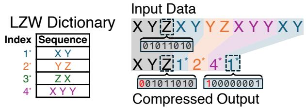

Figure 1. Illustration of sequence compression using LZW.

The dictionary itself is not stored in the compressed output because the decompressor can dynamically reconstruct the same dictionary from the compressed data by following the same order of sequence selection as the compressor. However, dynamic reconstruction requires selecting shorter sequences before longer ones. This causes longer sequences to compress only later data, harming compression ratio.

To address this while avoiding storing the dictionary, LZ77 uses  $\langle offset|length \rangle$  pairs as sequence identifiers to substitute repeated sequence occurrences. Each  $\langle offset|length \rangle$  can record the first occurrence of a long sequence, allowing early repeated sequences in the input to also benefit from compression using long sequences.

**Symbol-based algorithms** such as Huffman compress individual symbols according to how many times each symbol occurs by assigning shorter codes to more frequent symbols. Common symbols might be encoded in just a few bits while rare symbols use longer codes, reducing overall data size. For example, frequent bytes may be encoded with just 2 bits while rare symbols use 12 bits. Huffman uses a symbol dictionary to map literals to codes and stores it in the output, unlike LZ.

Sequential application of both techniques: The widely used Deflate performs both sequence and symbol compression. Deflate first performs LZ on the data (using  $\langle offset|length \rangle$ ) and then performs Huffman on the resulting literals and sequence identifiers. This two-stage approach enables Deflate to achieve high compression ratios across diverse data.

Hardware acceleration for sequence compression: Among sequence-compression algorithms, the LZ family is the only one with mature hardware acceleration [1], [11], [24]. IBM's data compression accelerator [1] demonstrated Deflate achieving high throughput with lower latency than prior implementations. CDPU [11] generalizes hardware acceleration across the LZ family, supporting Deflate, LZ4, and Zstd. TMCC [24] further reduces latency for Deflate to make it more suitable for memory compression. OCP's Project Zipline [23] provides open-source RTL for streaming Deflate compression targeting storage and network I/O; Broadcom's Corsica is its ASIC implementation. These designs are optimized for high aggregate throughput over large buffers and implement

streaming decompression; they do not support random access to individual 64 B blocks within a compressed page.

*We use TMCC's ASIC Deflate as our baseline*; unlike IBM and CDPU with <sup>∼</sup>1 µs latency, TMCC targets latencies relevant for hardware memory compression. Section VI-B compares decompression latencies across these designs.

Compression Granularity, or the context size the compressor processes at once, strongly affects compression ratio. Larger contexts expose more patterns, improving compression.

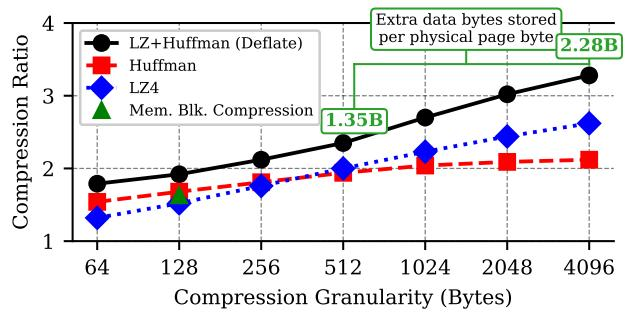

Figure 2. Compression ratio vs. granularity for hardware-accelerated algorithms, geometric mean across 88 benchmarks (see Section VI-A for details).

Fig. 2 plots *compression ratio* (uncompressed size / compressed size) vs. granularity for various hardware-accelerated algorithms. Each data point is measured across 88 benchmarks using the methodology in Section VI-A. Memory-block-level compression offers lower ratios as it compresses blocks independently. In Fig. 2, memory-block-level compression uses the best of CPACK [6], BDI [26], and BPC [13] per block; these algorithms are designed for 64 B (CPACK, BDI) to 128 B (BPC) granularity. Deflate's compression ratio increases significantly with granularity due to using sequence compression.

Hardware memory compression: The compression algorithms described above are used in hardware memory compression, where the memory controller transparently compresses and packs data in DRAM. Because decompression lies on the cache-miss critical path (i.e., each 64 B load from a compressed page must wait for it to complete), decompression latency directly affects application performance. To manage this cost, several hardware-compressed memory systems organize DRAM into tiers [24], [25]. When a compressed page is accessed, the system decompresses it and promotes it to the uncompressed tier so that future accesses proceed at normal DRAM latency—a policy called *expand-on-access*. This hardware-managed approach avoids the page-fault overhead of OS-managed compression (e.g., Linux zswap [20], zswap + compression offload engine [31]), reducing the latency of accessing compressed data by orders of magnitude. Prior compressed-memory systems, including TMCC, use zsmallocstyle allocators to pack variable-size compressed pages with low placement overheads (e.g., 1–2%) [12], [24].

## III. PROBLEM OF SEQUENCE COMPRESSION WHEN USED IN HARDWARE MEMORY COMPRESSION

Due to offering high compression ratio and advances in hardware acceleration, industry mandates page-level sequence compression for use in hardware memory compression [5].

Under sequence compression, when servicing a 64 B request to compressed data, the memory controller fetches and serially decompresses all memory blocks from the start of the compressed page up to and including the requested block. The overhead memory accesses and the long decompression computation together cause a long latency to access compressed data blocks—250 ns according to industry specification [5]. Worse, concurrent accesses to different compressed pages can cause long queuing delay, as overhead accesses for later requests must wait on those for earlier ones, resulting in long 1 µs access latency [5].

The root cause of long decompression latency is that when compressing data in a page, sequence compression today uses all earlier data in the page as a dictionary (see Section II). This leads to dictionaries spanning up to the entire compressed page. Fetching and decompressing the large dictionary to service a single block access incurs high memory access and computation latency.

A naive solution is to modify sequence compression to use only a small dictionary—for example, limiting it to use only the first 128 B of each compressed page to compress the rest of the page. This would enable *random access*: any block could be decompressed by fetching only the small dictionary and the block itself, drastically reducing decompression latency.

However, smaller dictionaries fit fewer sequences and lose many compression opportunities. Fig. 3 shows the compression ratio of Deflate when modified to limit the dictionary space to the sizes shown on the X-axis. For a dictionary space of 128 B, the compression ratio reduces to 1.75, a far cry from its original compression ratio of 3.3 (see Fig. 2). Ignoring compressed-page placement overheads, a compression ratio of c means each physical byte of storage can store c−1 additional bytes of logical data. As such, reducing from 3.3× (2.3 B extra per physical byte) to 1.75× (0.75 B extra per physical byte) represents a 2.3/0.75 ≈ 3× loss in idealized capacity gain.

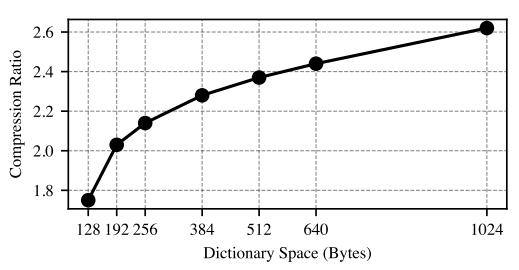

Figure 3. Compression ratio of page-level Deflate (i.e., LZ+Huffman) under constrained amounts of dictionary space.

In Fig. 3, dictionary space refers to how much physical content in the compressed page is used as a dictionary; as such, a 128 B dictionary space may contain > 128 B of data sequences. This is because later data sequences in the dictionary are compressed by earlier data sequences. The sequences in the dictionary are also compressed using Huffman—the second stage of Deflate. We use truncated Huffman like in ASIC Deflate in TMCC [24] because truncation is required for fast Huffman decompression. Our measurement uses a dictionary with 16 symbols like TMCC. The dictionary space in the X-axis of Fig. 3 accounts for the symbols.

The dictionary space in Fig. 3 also accounts for a per-page *location metadata*. Unlike uncompressed memory where block N is at offset  $N \times 64$ , compressed blocks vary in size and position, so random access requires per-page metadata to find the requested block. The location metadata is a vector of 6-bit offsets (a total of 48 B) to track the distance in bytes between neighboring blocks. Imprecisely recording distances by using fewer bits would cause memory fragmentation/leaks.

In summary, making sequence compression randomly decompressible *while preserving its benefit* requires shrinking all three components (sequence/symbol dictionaries and location metadata) *while preserving high compression ratio*.

#### IV. HIGH-LEVEL APPROACHES AND CHALLENGES

In this paper, we enable fast random decompression while matching the compression ratio of aggressive page-level sequence compression algorithms like Deflate.

Figure 4 compares and contrasts the page-level organization of our end design with Deflate. For each compressed page, it uses only 128 B total dictionary space per page, while achieving a similar compression ratio as Deflate (in fact, slightly higher). The 128 B dictionary space is achieved by A) selecting highly effective sequences into the sequence dictionary, B) shrinking the location metadata (see Section III) from 48 B down to 8 B, and C) shrinking the symbol dictionary effectively down to 0 B by using a static dictionary.

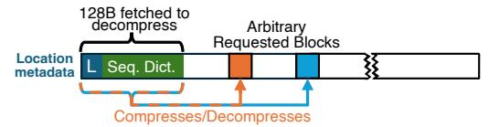

(a) A compressed page under our end design. It is  $3.4\times$  compressed on geometric mean.

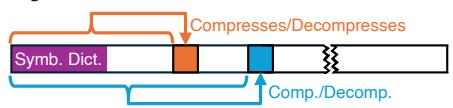

(b) A compressed page under classical Deflate. It is  $3.3 \times$  compressed on geometric mean.

Figure 4. Comparison with classical sequence compression.

#### A. Shrinking the Sequence Dictionary

Our high-level approach is to intelligently select sequences that make the best use of the dictionary, i.e., those providing the highest savings per byte of dictionary space consumed. We define the utility of a sequence as the total space savings that the sequence could provide if selected, normalized to how much space the sequence would consume. Sequences with the highest utilities should belong to the dictionary.

Consider the first sequence "XY" in Figure 1. We calculate how many bits of dictionary space that "XY" would take up as  $D=2\cdot 9+L$  since the sequence has two symbols and we use 9-bit symbols like LZW (see Figure 1); L captures the per-entry length overhead needed to record the sequence's length. We calculate the potential saving in bits that "XY" could provide if selected as  $S=4\cdot 2\cdot 9-(4\cdot 9+D)$ , since

the 4 occurrences of "XY" in Figure 1 will compress to four "1\*"s. The utility of "XY" equals S/D.

We perform the above utility calculation for various repeated sequences (e.g., ones identified by LZW, see Figure 1), and sort them by utility to identify ones with high utility.

To put the high-utility sequences into the sequence dictionary, we store the dictionary explicitly in the compressed page, unlike LZW. This enables departure from LZW's original sequence selection order (see Section II), which is designed not for utility but for the decompressor to reconstruct the dictionary. To keep the stored dictionary small, we apply sequence compression on the dictionary itself (i.e., use shorter sequences in the dictionary to compress longer sequences containing the former). Fig. 5 shows the layout of the explicitly stored dictionary.

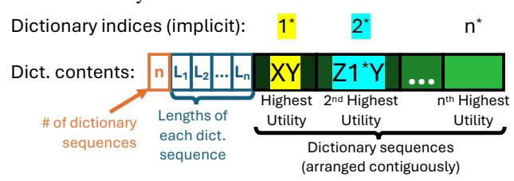

Figure 5. Stored sequence dictionary. It records the number of sequences, a length array  $(L_1 \dots L_n)$  for the selected variable-length sequences, and the sequences themselves stored back-to-back. Each dictionary index compresses occurrences of its sequence in the data (e.g., "XY" is replaced with "1\*"). Throughout the paper, we denote dictionary index symbols as  $i^*$  to distinguish them from literal i.

*The high-level challenge* is that simply sorting LZ-identified sequences by utility and selecting the best sequences from the sorted pool can miss out on many high-utility sequences.

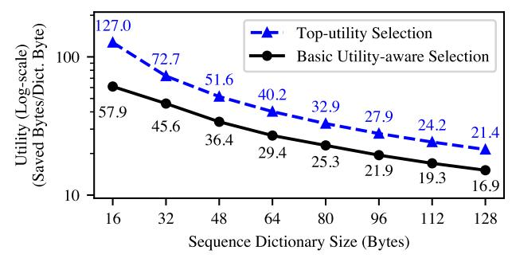

**Figure 6.** Utility of sequence dictionaries under different selection policies. The chart measures only sequence compression. For utility-aware selection, we reuse sequence-identification methods from different LZ variants (e.g., LZ77, LZW, and LZ77+LZW) to find repeated sequences, sort them by utility to populate the dictionary, apply the longest dictionary matches to compress the data, and adopt 9-bit output symbols as in LZW. The chart shows only one line for these variants because their differences are too small to plot clearly.

Figure 6 compares the utility of the sequence dictionary (i.e., total space saved collectively by all entries in the sequence dictionary divided by the size of the sequence dictionary) of this basic utility-aware sequence selection against our final design that always selects the top-utility sequences. Basic utility-aware selections achieve far lower utility than selecting sequences with the very top utility.

Addressing this challenge is a top contribution of our paper. We devote the next section (Section V) to describing how.

#### B. Shrinking the 48 B Location Metadata Down to 8 B

 $48\,\mathrm{B}$  of location metadata (see Section III) can consume a large fraction of the  $128\,\mathrm{B}$  dictionary space. The high overhead comes from using a  $\log_2 64 = 6$  bit offset per block to precisely track its distance from its previous block.

Our insight is that many bits in each 6-bit offset serve to pinpoint the exact byte at which the next logical block starts in a DRAM block;<sup>2</sup> such detailed intra-block information can instead be stored within individual DRAM blocks themselves, shrinking the page-level location metadata. We embed a single 6-bit offset at the beginning of each DRAM block to track where the first logical block in it starts; this offset is stored with the compressed data and included in our compressedsize accounting. The decompressor can implicitly calculate the distance to the second logical block after decompressing the first. Subsequently, we relax the page-level location metadata to record rough distances quantized to DRAM blocks instead of bytes. The location metadata contains a 64-bit vector, with one bit per logical block, where '0' indicates the block is in the same DRAM block as its predecessor and '1' indicates it is in the next one.

#### C. Shrinking the Symbol Dictionary to 0B

Instead of storing a symbol dictionary with each compressed page, we use a static dictionary known in advance to the decompressor. The static dictionary compresses both dictionary indices and regular data. For dictionary indices, the insight is that utility-aware selection into the sequence dictionary already captures frequency: early dictionary indices represent highutility sequences that often appear more frequently in the compressed data, benefiting from shorter codes in the static dictionary. For memory data values, we empirically find that zero is the most important literal; the static dictionary encodes zero with a shorter code. We also note repeated characters tend to reappear nearby; as such, we introduce reuse symbols where reuse symbol i means "repeat the symbol seen ipositions ago" for  $i \in \{1, ..., 8\}$ —and encode them with shorter codes in the static dictionary; these provide dynamic adaptation without per-page dictionary overhead. Table 1 lists the code lengths for each symbol category in both the dictionary and data trees. After sequence compression, the static dictionary encodes data in a single pass. Each sequence is encoded before insertion into the sequence dictionary, enabling precise tracking of remaining capacity.

**Robustness on Random/Encrypted Data.** The static tree's 1-bit literal flag caps worst-case overhead at 12.5% (all literals, no dictionary entries). Beyond that, hardware-compressed

<sup>2</sup>We use the term *DRAM block* to refer to 64 B-aligned blocks at the machine-physical level on the DRAM chip. In hardware memory compression, an additional address-translation layer maps OS-physical pages to machine-physical locations in compressed DRAM; after compression, originally aligned 64 B blocks become variable-size and variably aligned, making the term *physical block* ambiguous (it could refer to either OS-physical or machine-physical granularity). *DRAM block* unambiguously denotes the 64 B-aligned machine-physical granularity.

| Literals |   |       |     | Dictionary indices 12:18 19:24 25:31 32:35 36:40 |       |       |       | Reuse codes |       |       |   |   |     |     |
|----------|---|-------|-----|--------------------------------------------------|-------|-------|-------|-------------|-------|-------|---|---|-----|-----|
| Tree     | 0 | 1:255 | 0:5 | 6:11                                             | 12:18 | 19:24 | 25:31 | 32:35       | 36:40 | 41:62 | 1 | 2 | 3:4 | 5:8 |
| Dict     | 4 | 9     | 5   | 6                                                | 7     | 8     | 9     | 10          | 11    | 12    | 7 | 6 | 7   | 8   |
| Data     | 6 | 9     | 7   | 7                                                | 7     | 8     | 8     | 8           | 9     | 10    | 7 | 5 | 5   | 6   |

Table 1. Static Symbol Dictionary Code Lengths (in bits).

memory systems store incompressible pages uncompressed via the per-page translation entry (e.g., TMCC's and DyLeCT's CTE [24], [25]).

## V. RST: RANDOM-ACCESS SEQUENCE COMPRESSION WITH TOP-UTILITY SELECTION

The basic utility-aware policy from Section IV-A that selects into the dictionary sequences with the best utility among all repeated sequences identified by LZ falls short (see Fig. 6). LZ's sequence selection targets longest matches and, therefore, is agnostic to utility. Furthermore, LZ identifies only a tiny subset of all sequences in a page (e.g., LZ77 ignores alternative sequences in the page that overlap with already selected ones). As such, sequences with the best utility among the limited pool of sequences are often not the top-utility ones.

In this section, we describe how to address this primary (and only remaining) high-level challenge from Section IV.

Our end design—Randomly-decompressible Sequence Compression with Top-utility Selection (RST)—identifies the toputility sequences in each page by calculating the utility for all possible sequences in the page (be it 2 B, 3 B or longer, regardless of alignment and overlap, see Fig. 7) and populates them into a utility table (see Fig. 8a); RST selects the toputility sequence from this utility table and adds it to the sequence dictionary. RST repeats this process to select the next top sequence iteratively to fill up the sequence dictionary.

Accurately calculating the utility for all possible sequences in a page (i.e., to identify all the correct top-utility sequences) is computationally intensive (see Section V-A).

To address this challenge, we design highly parallel hardware for RST; it achieves massive parallelism by accurately and efficiently handling the many types of data dependencies arising from the many overlapping sequences without stalling.

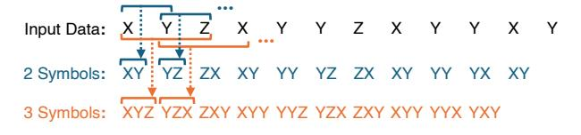

**Figure 7**. From each 4096 B page, RST extracts 4095 2-symbol sequences and groups them by value to calculate utilities for every unique 2-symbol sequence in the page. RST does the same for all possible longer sequences (e.g., 4094 3-symbol sequences, 4093 4-symbol sequences, etc).

#### A. Design Challenges

After calculating the utility for all possible sequences in the page and populating the utility table, selecting the first dictionary sequence (e.g., XY in Fig. 8b) is straightforward. The challenge is that selecting one sequence changes the utility of many not-yet-selected sequences, as each symbol can only be compressed by one selected sequence. As such, after a top

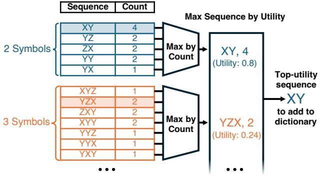

- (a) Utility table grouped by sequence length; entries store occurrence counts.
- (b) From top count from each sequence length, compute utilities and pick the maximum.

**Figure 8.** (a) The utility table used to construct the dictionary; it is a temporary data structure that *is not stored* in the compressed output. As an optimization, each table entry can store an integer count of how many times the sequence in the entry occurs in the page, instead of directly storing a fractional utility value. (b) Finding the top-utility sequence in the utility table; among all sequences of the same length, only one fractional utility value needs to be computed. The example utility of 0.8 for "XY" is calculated from the utility formula in Section IV-A, with L=2 bit long length fields.

sequence is selected (e.g., XY), the table entry for every notyet-selected sequence (e.g., YZ in Fig. 9a) that overlaps with any occurrence of the top-utility sequence becomes outdated; correctly identifying the next top-utility sequence requires recalculating each affected table entry (e.g., YZ in Fig. 9b).

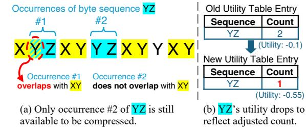

**Figure 9.** Selecting a dictionary sequence calls for recalculating utilities for overlapping sequences and updating their entries.

Keeping the utility table accurate after each selection requires first compressing all occurrences of the selected sequence (i.e., replacing each occurrence with the selected sequence's dictionary index). We call this a *substitution step* (see Fig. 10a). Using the post-substitution data to compute utilities ensures the calculation is over symbols still available, not those already consumed by earlier substitutions. We refer to recalculating utility using the data after each substitution step as the *utility update step* (see Fig. 10b). These two steps repeat iteratively.

One way to implement the utility update step is to flush the utility table and repopulate it via a full pass over the data post-substitution, recalculating the utility for every possible sequence. A 4096 B memory page can contain over  $8\times10^6$  unique sequences when considering all possible lengths. Since filling a 128 B dictionary can accommodate up to 64 selected sequences, the total number of utility calculations across all compression iterations would balloon to  $8\times10^6\times64\approx500$  million. Since each operation involves finding all occurrences

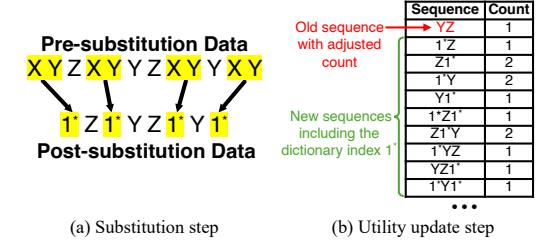

Figure 10. One iteration of RST.

of one possible sequence to calculate its utility, 500 million operations are impractically expensive.

Two intuitive optimizations can reduce the computations. First, update only affected utility table entries rather than retabulating completely. As such, only sequences that overlap with the occurrences of the latest selected sequence or contain the new dictionary index for the selected sequence require updates—drastically reducing the operations per iteration.

Second, cap dictionary sequences at 5 symbols, reducing the sequence count with little impact on compression ratio. Despite each dictionary entry being short, RST captures long repetitive patterns across iterations: each iteration's substitutions introduce new dictionary indices into the data, which become candidates for the next iteration's sequence selection. For example, a 25-byte run can be substituted with a single dictionary index (e.g.,  $2^*$ ) after just two iterations (e.g., "VWXYZ"×5  $\rightarrow$  1\*×5  $\rightarrow$  2\*). Evaluating only 2-symbol to 5-symbol sequences also means only four possible sequence lengths; this makes the length field per dictionary sequence small (i.e., L=2).

These two optimizations can reduce total operations per page compression by  $1000\times$ . Algorithm 1 summarizes the full RST algorithm, including the two optimizations. Table 2 highlights differences between RST and LZ-family compression.

#### Algorithm 1 RST compression overview

```
Input: page
                            page data for one memory page
1: U = COUNTSEQS2TO5(page)
                                      // Fill utility table
2: D = \{\}
                                empty sequence dictionary
3: page' = page
   while HASSPACE(D) and HASPOSITIVEUTILITYSEQUENCE(U) do
      s^* = FINDTOPUTILITYSEQUENCE(U)
6:
      dict_idx = Add To Dictionary(D, s^*)
      substitution_sites[] = SUBSTITUTION(page', s^*, dict_idx)
                                                             //
   compress page' using dict_idx
      UTILITYUPDATE(U, page', substitution_sites)
9: end while
10: return (D, page')
                            // dictionary+compressed data
```

| Aspect                | LZ-family (Deflate)                       | RST                                                           |  |  |
|-----------------------|-------------------------------------------|---------------------------------------------------------------|--|--|
| Sequence<br>selection | Length-maximized by locally greedy search | Utility-maximized by global page-wide search                  |  |  |
| Dictionary            | Implicit (all earlier data)               | Explicit (128 B per page)                                     |  |  |
| Max sequence length   | 4096 B (entire memory page)               | Up to 4096 B, across iterations 256 B in final circuit design |  |  |
| Decompression         | Sequential decode from page start         | Independent per-block decode                                  |  |  |

Table 2. Comparing LZ-family and RST for sequence compression.

Even with this reduction, compressing a single page requires  $> 3 \times 10^5$  operations. If each operation is done serially and (optimistically) takes only 1 cycle at 2.5 GHz, compressing each page requires  $> 100\,\mu s$ . This defeats the purpose of hardware memory compression, as software compression (with LZ algorithms) can take only  $\sim \! 10\,\mu s$  to compress each page.

Preserving high performance requires a highly parallel design capable of performing many computations every clock cycle. Our design substitutes all occurrences of the selected sequence across the full input in parallel, computes utility updates for all affected sequences in parallel, and processes numerous table updates per cycle. Achieving this degree of parallelism faces *three design challenges*:

- Valid match identification: How to correctly substitute all occurrences in parallel despite having dependencies due to overlapping sequences (see Section V-B1).
- Utility computation: How to design the utility update step to calculate utilities for affected sequences in a fully parallel manner without double-counting in the presence of nearby substitutions in data (see Section V-B2).
- Concurrent table updates: How to reduce the massive number of updates to the utility table and store the remainder of them in a highly parallel manner (see Section V-B3).

Further sections are as follows. Section V-B presents our compressor architecture with specialized circuits addressing each challenge. Section V-C describes the decompressor design enabling low-latency fine-grained memory access.

#### B. RST Compression Accelerator

We address these challenges through three hardware modules: the **substitution module**, **update generator**, and **table update module**. Fig. 11 shows how each iteration flows through these modules. The substitution module enacts the substitution step. The update generator and table update module collectively enact the utility update step. After processing through all three modules, RST selects the next iteration's top sequence from the updated utility table.

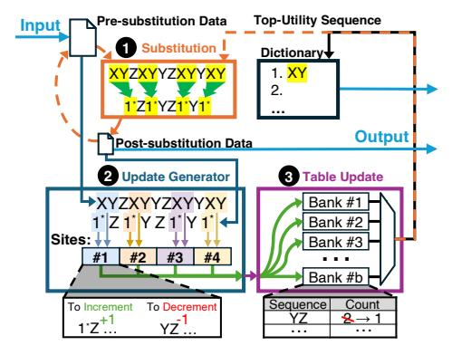

Figure 11. Compressor architectural overview. Each iteration traverses three hardware modules (labeled in figure). (1) Substitution module, (2) Updategeneration module, and (3) Table-update module. Modules 1–3 sustain high throughput via wide parallelism which is marked with green arrows.

The following details how each module achieves high parallelism while maintaining correctness.

1) Parallel Substitution Module: The substitution module performs three steps over the full input in parallel (Fig. 12).

1 CAM matching identifies occurrences of the latest selected sequence, producing a bitvector of match locations.

2 Substitution logic replaces these identified occurrences with dictionary indices of the selected sequence; we refer to positions with occurrences as *substitution sites*.

3 Compaction removes consumed symbols via scatter-gather operations.

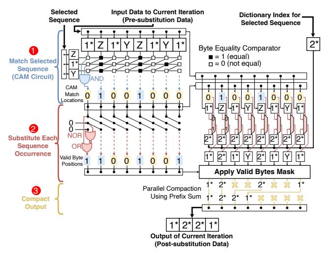

**Figure 12.** Substitution module. The module performs three logical steps for substituting occurrences of the selected sequence: CAM matching, replacement, and compaction. We show the datapath combinationally for clarity; in the synthesized 256-symbol configuration, the substitution path is pipelined and sustains one full input per cycle after pipeline fill. The circuit generalizes to other sequence lengths by adding rows of comparators to the CAM circuit; we depict the 3-symbol case for clarity.

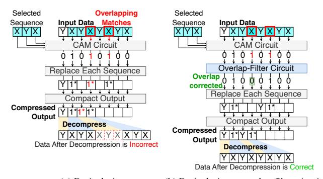

(a) Basic design (b) Basic design + overlap-filter circuit

Figure 13. Overlapping match problem with basic design.

While the substitution module in Fig. 12 handles most inputs correctly, it suffers from a data hazard when two occurrences of the selected sequence appear close together—analogous to data hazards in pipelined processors where data-dependent instructions are too close together. Fig. 13 illustrates this overlapping-match problem (a) and our circuit-level solution (b). The data input of Fig. 13a shows an example where two occurrences of the selected sequence XYX are very close (YXYXYXYXX). In this scenario, the parallel match circuit

can report a false positive match of an extra XYX in-between due to the "overlapping matches" in Fig. 13a.

This overlapping match problem occurs specifically in *runs*—repeating patterns such as XXXXXX or XYZXYZXYZ. When the selected sequence matches within a run whose repetition period is shorter than the sequence length, the matches overlap and cannot all be substituted in the same parallel substitution step by the basic substitution circuit.

Ensuring correctness requires discarding some candidate matches; however, maximizing high compression ratio requires discarding as few matches as possible. Discarding only the minimum number of matches required for correctness is challenging to parallelize because whether a match should be kept depends on its neighbors, and these dependencies can propagate across the entire input data. The circuit must resolve these long-range dependencies combinationally, without serially scanning the input.

When matches overlap within a run, the same distance between overlapping matches repeats throughout that entire run. Therefore, the matches to discard to eliminate overlaps also follow a repeating pattern. Because sequence lengths range only from 2 to 5, and overlaps can occur only at distances smaller than the sequence length, there are only ten possible overlap patterns. For each pattern, a simple repeating mask applied across all symbol positions in the run filters out exactly the overlapping matches while keeping all valid ones.

Fig. 13b shows the final design with a new overlap filter between CAM matching and substitution. The filter identifies where runs begin and end, examines the start of each run to determine which pattern is present, and applies the corresponding mask across each run. It takes the candidate match bitvector and outputs a filtered bitvector containing only correct non-overlapping positions, maintaining single-cycle throughput for even worst-case inputs consisting entirely of runs.

2) Parallel Update Generator: After substituting all occurrences of the selected sequence, the utility table must be updated to reflect which sequences remain available in the post-substitution data. The update generator produces **count updates**— $\{\text{sequence}, \pm 1\}$  pairs that adjust the occurrence counts stored in the utility table. Each substitution triggers two types of count updates: **decrementing updates** for sequences that overlapped the substituted symbols (which no longer exist in the page), and **incrementing updates** for sequences containing the newly inserted dictionary index (which now exist in the page for the first time).

Fig. 14a illustrates a basic approach to generating these count updates. For each substitution site, the circuit identifies which sequences need adjustment by examining the surrounding data. The circuit extracts a *decrement window* spanning symbols around the substitution site in the pre-substitution data, and an *increment window* spanning symbols around the site in the post-substitution data (Fig. 15 1). Each window extends up to L-1 symbols in either direction from the site, where L=5 is the maximum sequence length, capturing all sequences that could overlap the substitution. The circuit then

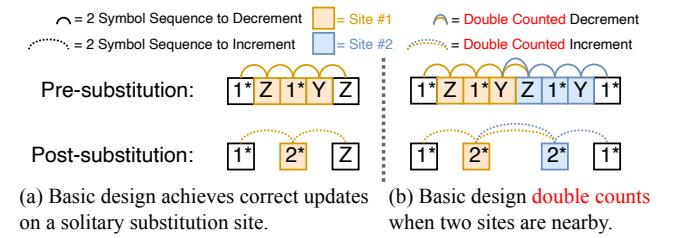

**Figure 14.** Overview of update generator. Only 2-symbol sequences shown for clarity; the same issue affects sequences of all lengths (2–5 symbols).

counts all 2- to 5-symbol sequences within each window, producing the corresponding count updates (Fig. 15 3).

This approach works correctly when substitution sites are well separated (Fig. 14a): each window captures distinct sequences, yielding accurate count updates. When sites are close together—within 2L symbols of each other—the decrement windows from neighboring sites overlap, and likewise the increment windows overlap (Fig. 14b). Sequences appearing in both overlapping windows get enumerated multiple times, producing incorrect double-counted updates.

We design a **splice-and-cancel** construction that eliminates double-counting. Instead of extracting windows from the pre-and post-substitution data, the circuit splices them together at each site: post-substitution bytes are placed left, pre-substitution bytes right. For each substitution site, the circuit creates two splices: the *left splice* contains post-substitution data including the inserted dictionary index; the *right splice* contains pre-substitution data immediately after the substituted sequence. These form two windows: the decrement window is [left splice|substituted sequence|right splice]. The increment window is [left splice|dictionary index|right splice].

When two substitution sites are nearby, certain sequences appear in both windows. Critically, these sequences appear with opposite signs: the first site increments (+1) while the second decrements (-1). These opposite updates cancel when aggregated, yielding the correct net change. This cancellation is analogous to middle terms in a telescoping series: the sequences that would be double-counted under the basic approach instead appear once with each sign and sum to zero—the correct accounting, since they exist only in the intermediate splice representation, not in the actual pre- or post-substitution data. When sites are well-separated, no sequences appear in multiple windows, producing identical results to the basic approach. After aggregating updates across all sites, the utility table matches what would result from recounting all occurrences from scratch—but without the computational cost.

Figure 15 shows the complete circuit. It processes multiple substitution sites at a time, applying steps 1–3 for each to generate count updates that flow to the table update module.

3) Parallel Table Update Module: The utility table is organized into four sub-tables, one for each sequence length (2, 3, 4, and 5 symbols), enabling the top-utility sequence selection described in Fig. 8. Each sub-table is implemented as multiple SRAM banks operating in parallel. Within each bank, sequences and their occurrence counts are stored in a

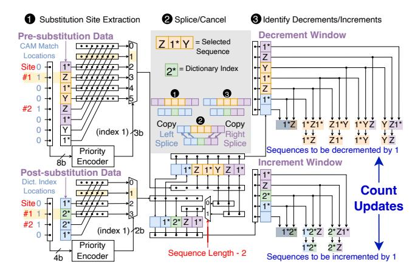

Figure 15. Complete update generator circuit with splice-and-cancel construction. (1) Extract left and right splices from pre- and post-substitution data. (2) Assemble decrement and increment windows. (3) Enumerate all overlapping 2- to 5-symbol sequences from each window. Only 2- and 3-symbol sequences shown for clarity. Count updates {sequence,  $\pm 1$ } flow to table update module.

set-associative structure where sequences hash to sets, and each set contains multiple ways. When a set fills, the way with the lowest count is replaced, allowing new sequences to establish higher counts before eviction. This set-associative design provides area efficiency: storing all possible 2- to 5-symbol sequences would consume substantial SRAM area, while retaining only frequently occurring sequences captures the candidates most likely to become top-utility selections.

Fig. 16 depicts the update path for one sub-table (sequences of length 2). Each compression iteration can generate tens of thousands of count updates-up to 44 updates per substitution site, with potentially thousands of substitution sites per iteration.<sup>3</sup> The circuit processes updates through 5 stages (numbered in the figure). Each update's sequence is first hashed to determine its target bank and set 1. A sorting network then orders all updates by {bank number, sequence 2 . Sorting makes identical sequences contiguous, allowing their  $\pm 1$  deltas to be summed into a single net update per sequence 3. The sorted stream is partitioned into independent per-bank lanes 4, and short FIFOs buffer each bank's updates 5. Each SRAM bank can accept one update per cycle; the FIFOs prevent stalls when updates arrive faster than a bank can process them, keeping all banks continuously utilized. When an update's sequence is already present in the table, the stored count is adjusted by the delta; on a miss, the lowest-count way is replaced.

Sorting provides two critical throughput benefits. First, aggregating identical sequences before reaching the banks reduces SRAM accesses. Second, partitioning by bank index enables early conflict resolution: updates destined for each bank flow into per-bank FIFOs that buffer updates across cycles, so each bank processes one update per cycle without being stalled by conflicts in other banks. These optimizations enable the table update module to sustain high aggregate

<sup>3</sup>Each substitution affects all 4 sub-tables, generating 2n+4 updates for sequences of length n (n increments for new sequences, n+4 decrements for removed sequences), totaling 8+10+12+14=44 updates for  $n \in \{2,3,4,5\}$ .

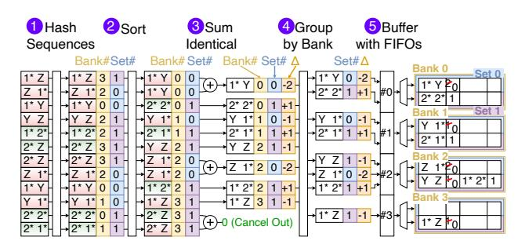

**Figure 16.** Parallel table update path for length-2 sequences. Similar paths exist for sequence lengths 3, 4, and 5. Update records (sequence,  $\pm 1$ ) from the update generator are hashed, sorted, aggregated, and inserted into the utility table. The table is banked SRAM (depicted as 4 banks, 2 sets/bank, 2-way set associative); the actual design has 32 banks across all four subtables.

throughput that scales near-linearly with the number of banks.

4) Putting the three modules together: While each module exploits parallelism, practical implementations must balance area costs. The table update module sets overall throughput: each substitution site generates up to 44 count updates, and with thousands of sites per iteration, the update volume is substantial. Because each SRAM bank accepts only one update per cycle, aggregate update bandwidth constrains the system. Our design uses 32 SRAM banks across all four sub-tables; scaling further becomes area-inefficient because both the banks and update-path components (sorters, FIFOs) grow quickly. We therefore size upstream modules to match—rather than exceed—the table update module's throughput.

Given this bottleneck, the update generator processes up to two substitution sites per cycle, generating all overlapping sequence updates (up to 88 total) in parallel, which is sufficient to keep the banks busy. Although we handle only two sites per cycle rather than all sites simultaneously, total compression time remains linear in input size: each site is processed in constant time, and every substitution removes at least one symbol, so a page of n symbols has at most n sites.

The substitution module is provisioned for the same throughput. Rather than processing the entire 4 KB page in parallel, it operates on *hardware chunks*—contiguous segments (e.g., 256 symbols). Each iteration processes one chunk at a time, reducing matching and compaction logic from 4096 symbols to a smaller width and saving area. Chunking causes only a small compression-ratio loss (2.32% when shrinking from 4096 B to 256 B chunks); sequences that cross chunk boundaries are rare and seldom top-utility. Smaller chunks further reduce area but lose more cross-boundary repetition.

Chunked processing adds little latency because modules are overlapped: while one chunk's updates flow through the update generator and table update modules, the substitution module processes subsequent chunks. Most iterations contain enough substitutions per chunk that the substitution module stays ahead of the update path, so stalls are infrequent and area concentrates in SRAM banks and update distribution logic rather than excessively wide substitution circuitry. After iterative sequence substitution, a final lightweight pass applies the static symbol dictionary (including reuse codes) from

Section IV-C using simple LUTs and shifters. This pass encodes 8 codes per cycle and adds negligible latency on the already-compressed data stream.

#### C. Decompressor ASIC

RST's explicit sequence dictionary enables parallel decompression: multiple dictionary indices can be expanded simultaneously and then concatenated in the original order. This parallelism is important for our compact 8 B location metadata (Section IV-B) that only tracks the initial logical block among all blocks in a DRAM block. Rather than decompressing sequentially from left to right starting from the initial logical block, RST divides a DRAM block evenly into multiple segments to decompress all segments in parallel and selects the requested block from the resulting parallel output.

To service a request, the decompressor first consults the location metadata (Section IV-B) to determine which DRAM block contains the target logical block. This amounts to a prefix sum over the 64-bit vector—a ~1 ns operation—after which the identified DRAM block is fetched. The decompressor then decodes the symbol compression before it can decode the sequence compression. Decoding the symbol compression using the static symbol dictionary takes ~8 cycles for compressed data and, in parallel, takes ~16 cycles for the sequence dictionary. The sequence dictionary unpacks into an expansion table—a small read-only structure (≤2880 bits) mapping each index to its 2–5 symbol sequence, implemented in registers for fast parallel access.

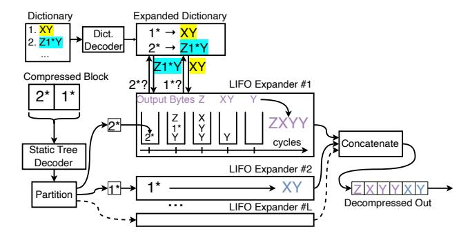

Figure 17. Decompressor architecture with an end-to-end worked example: compressed input [2\*, 1\*] is expanded to ZXYYXY through dictionary lookup (1\*→XY, 2\*→Z1\*Y) and parallel LIFO expansion. Multiple LIFO expanders decompress independent segments simultaneously, each performing up to two stack operations per cycle while sharing a common expansion table implemented in registers.

Next, sequence decompression proceeds through multiple independent Last-In First-Out (LIFO) expander units. The DRAM block is split into independent segments (one per LIFO, see Fig. 17), allowing multiple dictionary indices—including deeply nested ones—to be expanded in parallel. As a result, producing bytes for later logical blocks within a DRAM block does not require first sequentially expanding earlier blocks. Each LIFO maintains a stack initialized with its segment. The stack organization enables single-pass processing: all data remains compressed in the LIFO until fully expanded, keeping the stack small and area-efficient. On each

cycle, a LIFO performs up to two operations: if the top symbol is a literal, it pops to an output buffer; if it's a dictionary index, the LIFO expands it by pushing the corresponding sequence onto the stack in reverse order. Multiple LIFOs process segments in parallel until all stacks are empty, then outputs are concatenated to form the decompressed block.

The worst-case scenario occurs with extreme compression and deep nesting. Since each index expands to at least two children, an n-symbol block's expansion tree contains O(n) dictionary entries, requiring <4n total stack operations. With two operations per cycle, even a deeply nested 64-symbol block completes within <128 cycles.

#### VI. EVALUATION

We compare RST against the state-of-the-art ASIC Deflate for memory from [24] in terms of compression ratio, hardware performance/area, and system performance.

#### A. Compression Ratio

Fig. 18 compares against ASIC Deflate at the 4KB page granularity, measuring the same 88 benchmarks [2], [4], [19], [22], [28], [32], and same methodology (e.g., ignoring all zero pages in the memory dump) as [24]. For every benchmark, RST mostly follows ASIC Deflate's compression ratio due to performing similar high-level actions—page-level sequence compression + symbol compression. We first compute the geometric mean across all benchmarks within each of the seven benchmark categories and compute the geometric mean across the seven means. It is 3.4 for RST and 3.3 for ASIC Deflate, respectively. We attribute the small increase in compression ratio to the choice of using LZW-style 9-bit encoding of each sequence, instead of the longer offset+length pair per sequence as mandated in the Deflate RFC. For reference, software Deflate (zlib) achieves a geomean of 3.84× on the same benchmarks. The  $\sim$ 10–12% gap between ASIC and software implementations is consistent with prior observations [24]: hardware designs constrain algorithmic flexibility (e.g., fixed hash-table sizes, truncated Huffman trees, limited lookahead) to meet throughput and latency targets.

Fig. 19 breaks down how our high-level approaches individually contribute to the compression ratio. Our main contribution—top-utility selection—provides the biggest boost. As sensitivity analysis, we repeat this ablation study for four dictionary sizes (64, 128, 192, 256B); the 128B dictionary space is our primary configuration.

The ablation shows diminishing returns beyond 128 B: increasing the dictionary to 256 B yields only a modest improvement in compression ratio. The dominant cost of a larger dictionary is not silicon area but memory bandwidth—every compressed-block access must fetch the dictionary, so a 128 B dictionary already constitutes two thirds of the 192 B total peraccess fetch (128 B dictionary + 64 B data block). Doubling the dictionary to 256 B would increase this to 320 B, a 67% increase in per-access traffic for marginal compression benefit.

<sup>&</sup>lt;sup>4</sup>The marginal benefit beyond 128 B is also partly an artifact of the static symbol dictionary, which is sized for the 128 B case and penalizes the higher indices that become common at larger dictionary sizes.

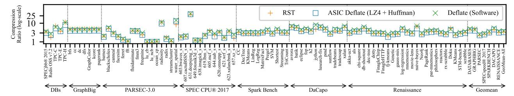

Figure 18. Per-benchmark compression ratio with per-suite and overall geomean.

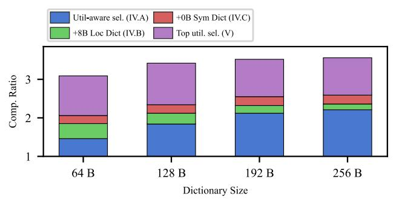

Figure 19. Ablation study of RST's compression ratio.

#### B. Hardware Synthesis and Comparison

We use Synopsys [34] to synthesize RST using ASAP 7 nm PDK [8] at 2.5 GHz and compare against TMCC's ASIC Deflate under matched synthesis settings.<sup>5</sup> The synthesized compressor configuration uses 32 banks, 16 sets/bank, and 4-way organization. We validated functional correctness of our compressor and decompressor through post-synthesis gatelevel simulation, verifying accurate decompression of the compressor output across 1 million diverse memory pages. Fig. 20 summarizes the key results.

**Decompression latency:** After a compressed block arrives from memory, the RST decompressor takes an average of 17 ns to compute the block's original values.<sup>6</sup> The calculation to find the compressed block (Section IV-B) adds another nanosecond (18 ns total). In contrast, ASIC Deflate [24] reports a half-page decompression latency of 140 ns (i.e., taking 140 ns to compute the original value of the middle logical block in a page).

The key to RST's speed is that the compressor does the heavy lifting: it pre-constructs and packages a compact 128 B dictionary during compression. The decompressor looks up each dictionary index in a fixed table, eliminating the need to search through or reconstruct sequences from a large sliding window of prior data. To decompress an arbitrary requested block fetched by the memory controller, the RST decompressor only needs to access the 128 B dictionary from the compressed memory. In comparison, the Deflate decompressor needs to access everything prior to the requested block; this means accessing 704 B, on average, assuming a request to the middle block of the page. These differences are performance-critical: the processor stalls until decompressed data arrives,

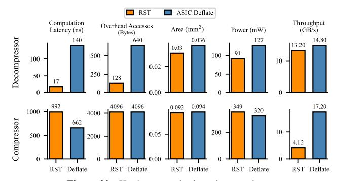

Figure 20. Hardware synthesis and comparison.

so every cycle of decompression latency matters.

Latency comparison with hardware: Table 3 compares decompression latency across hardware designs. The gap between RST and the designs reflects an architectural difference: streaming decompressors must reconstruct the full dictionary and decode sequentially, whereas RST decompresses a single block in parallel from a pre-constructed dictionary.

| Design           | Description     | Decomp. Lat.                 | Gran.     | Target      |
|------------------|-----------------|------------------------------|-----------|-------------|
| RST              | This paper      | 18 ns                        | 64B block | Memory      |
| TMCC [24]        | LZ77+Huffman    | 140 ns <sup>7</sup>          | Half-page | Memory      |
| OCP Zipline [23] | Deflate Variant | $\sim 2 \mu \mathrm{s}^8$    | Half-page | Storage/Net |
| IBM [1]          | LZ77+Huffman    | $\sim 1 \mu \text{s}^9$      | Page      | Storage     |
| CDPU [11]        | LZ77            | $\sim 1 \mu \mathrm{s}^{10}$ | Page      | Storage     |

Table 3. Decompression latency comparison across hardware designs.

**Decompressor area/power/throughput:** The RST decompressor consumes 91 mW (post-synthesis power using activity vectors from trace-driven decompression workloads), which is more efficient than the Deflate decompressor. Throughput is slightly lower due to using a smaller 0.03 mm² configuration with fewer parallel circuits.

RST's compressor has a similar hardware area but lower throughput than Deflate's. Our implementation occupies 0.0923 mm² and consumes 349 mW peak power at 4.13 GB/s, compared to ASIC Deflate's 0.094 mm², 320 mW, and 17.2 GB/s. This reflects RST's more complex responsibilities: identifying top-utility sequences, creating the preconstructed dictionary, and packaging data for fine-grained random access.

<sup>&</sup>lt;sup>5</sup>ASIC Deflate numbers adapted from published results [24] use the same technology node, clock frequency, and synthesis flow.

<sup>&</sup>lt;sup>6</sup>Measured via cycle-accurate RTL simulation of a timing-closed postsynthesis design on memory dumps from our benchmarks (Section VI-A).

<sup>&</sup>lt;sup>7</sup>TMCC and RST latencies from post-synthesis RTL simulation at 2.5 GHz. <sup>8</sup>1607 cycles at 800 MHz testbench clock, measured from instrumented open-source Zipline RTL.

<sup>&</sup>lt;sup>9</sup>IBM latency from published results.

<sup>&</sup>lt;sup>10</sup>2575 cycles at 2 GHz for 4 KB Snappy output, measured from instrumented open-source CDPU RTL.

This cost is acceptable for three reasons. First, compression latency is much less critical than decompression latency: decompression directly delays reads to compressed data, whereas compression primarily affects the bandwidth available for page migration and writeback. Second, lower single-engine throughput is addressed by deploying multiple compression engines in parallel. Third, RST's fine-grained decompression changes the compression-decompression balance. As RST can decompress individual blocks without fetching pages, a compressed memory system can afford to perform many times more decompression than compression. Section VII quantifies area and power scaling on a server-class system.

## *C. Full-System Simulation*

To simulate the impact of RST on system-level performance, we use DyLeCT [25] as the baseline hardware-compressed memory system (Section II) and use ASIC Deflate for compression and decompression. DyLeCT maintains an exclusive multi-level memory hierarchy that compresses the cold pages and leaves the hottest pages uncompressed. Due to the high memory bandwidth and latency cost of decompressing a compressed block under Deflate, DyLeCT expands a compressed page (i.e., decompresses it and stores it back to memory uncompressed) whenever it is accessed to amortize the decompression cost over future hits to the expanded page.

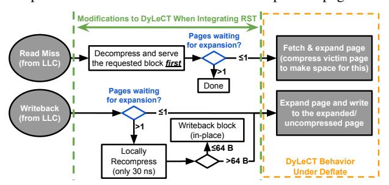

Figure 21. Changes made to DyLeCT for handling compressed page accesses to switch from using Deflate to RST.

We model RST's system-level performance by swapping ASIC Deflate with RST in DyLeCT. We use DyLeCT's expand-on-access policy, with two minor modifications detailed below. Fig. 21 summarizes the changes.

For reads to compressed pages, RST first accesses and decompresses just the requested block, replying to the cache before fetching the rest of the page for expansion—whereas Deflate must fetch up to the entire page before decompression. Another modification is to skip page-level fetch and expansion for compressed pages when queuing delay is high (i.e., when many page migrations are already pending). Skipping page fetch is not an option under Deflate, which requires fetching up to the entire page for decompression regardless.

Write requests to compressed pages can also skip page fetch/expansions when the queuing delay is high. Just as RST enables fine-grained decompression, it also supports finegrained local recompression; it can *locally* recompress the written block by accessing the page's existing dictionary and the written DRAM block, without accessing other parts of

| CPU                 | 4 cores, 2.8 GHz, 4-wide OoO, 1024 TLB entries,       |
|---------------------|-------------------------------------------------------|
|                     | ROB size: 224                                         |
| Caches              | 32 KB L1D\$, 32 KB L1I\$, 256 KB L2\$,                |
|                     | 2 MB L3\$ per core (8 MB total)                       |
| Cache Latency       | L1\$ hit: 3 clk, L2\$ hit: +14 clk, L3\$ hit: +67 clk |
| Prefetchers         | Next-line with automatic turn-off: L1\$, L2\$;        |
|                     | Stride: L1\$ (degree 2), L2\$ (degree 4)              |
| Memory              | 1 channel (25.6 GB/s), 8 ranks, FR-FCFS policy,       |
|                     | tCL: 13.75 ns, tRCD: 13.75 ns, tRP: 13.75 ns          |
| Simulation Duration | Atomic Warmup: 5 seconds (>20 billion insts),         |
|                     | Detailed Warmup (Pipeline, Branch Predictors,         |
|                     | Prefetchers etc.): 1 ms                               |
|                     | Detailed Simulation (i.e., evaluation duration): 4 ms |

Table 4. Microarchitecture specification and simulation duration.

the page. Locally compressing a block using an existing dictionary without updating it is much faster than full RST compression, as most of RST's compression latency comes from constructing the dictionary. After recompressing the written block, if it and the other logical blocks that share the same DRAM block still fit in the 64 B DRAM space, the write can skip page fetch/expansion. In contrast, such localized random recompression is not possible under Deflate, which requires fetching everything prior to the written block to recompress the block and also recompressing everything after the written block (as it also affects the encoding of all subsequent data).

We simulate using Gem5 [3] interfaced with Ramulator [15], with the same microarchitecture parameters, warmup methodology, benchmarks, and high compression setting as DyLeCT. We add one new benchmark, *readStride-1K*, that performs 1 KB-strided accesses to stress low-locality accesses (i.e., low spatial and temporal locality), leading to frequent accesses to compressed pages. In our design, the 8 B location metadata is stored alongside the compression translation entry (CTE), yielding a 16 B per-page translation entry.

Fig. 22 shows performance<sup>11</sup> normalized to the baseline. Across benchmarks in DyLeCT, RST improves performance by 15% on average (14% geometric mean). The speedup is much smaller than RST's 8× decompression latency improvement. This is because DyLeCT expands each compressed page on its first access (see Section II), causing many subsequent memory accesses to hit on uncompressed pages at normal latency. The strided microbenchmark (readStride-1K) achieves a 5.1× speedup. It is a stress test with very low locality that maximizes the fraction of accesses hitting compressed pages; it serves to show RST can more robustly handle worst cases than Deflate. We exclude it from the reported mean speedup.

The performance improvement comes from reducing the latency of compressed-data accesses, not from reducing aggregate memory traffic (which is effectively the same as the baseline under the same page expansion policy). Fig. 23 shows the latency of last-level-cache (LLC) read misses that access compressed pages. It is significantly lower under RST. Several benchmarks (e.g., graphColor and canneal) show long latency under the baseline. This is due to the high queuing delay from expanding on every access to compressed pages, which is not required under RST, where decompression is cheap.

<sup>11</sup>Number of committed store instructions.

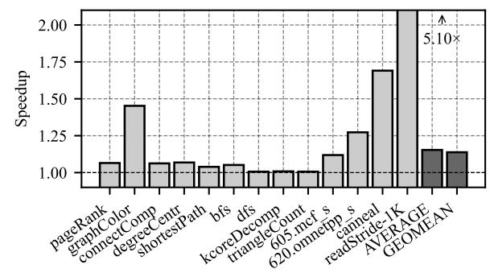

**Figure 22.** Performance of RST normalized to Baseline at high compression. Bars show individual workloads; AVERAGE and GEOMEAN summarize the twelve application workloads. The readStride-1K microbenchmark is an intentionally strided stress test of compressed memory.

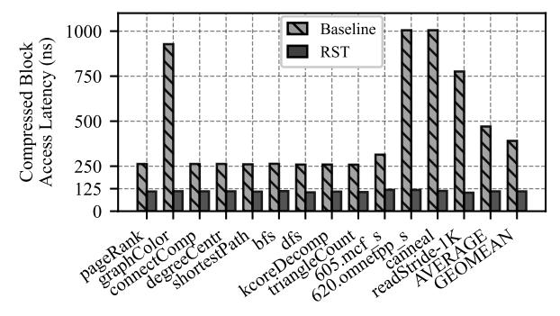

**Figure 23.** Compressed Data Access Latency from LLC MSHR allocation to response to LLC for Baseline and RST. RST keeps it  $\sim \! 110 \, \mathrm{ns}$  across workloads whereas the baseline's latencies range from  $\sim \! 260 \, \mathrm{ns}$  for graph workloads up to  $\sim \! 1 \, \mu \mathrm{s}$  for graphColor, 620.omnetpp\_s, and canneal.

#### VII. DISCUSSION

**Scalability.** RST's 48 compressor instances (3 per sub-channel across 16 DDR5-6400 sub-channels) occupy 4.32 mm<sup>2</sup>, a small fraction of a server-class system's total die area, which can exceed 1000 mm<sup>2</sup> [35]. This configuration delivers ~12.3 GB/s per sub-channel, above the ~5 GB/s average and ~12 GB/s worst-case compression demand observed in Section VI-C. When compression demand transiently exceeds available throughput, the controller can defer optional page expansion/compression rather than blocking reads to already-compressed data. Compressors are also clock-gated when idle, reducing power when compression demand is low.

**Domains of Application.** Our evaluation focuses on *memory-controller-integrated* hardware memory compression, but RST also applies to CXL-style hardware memory compression, where accesses are at cache-line granularity even when data is compressed at the page level [5].

In public OCP-style CXL memory-expander designs, compressed memory is exposed as a distinct region/tier in the device [5], [21], [38]. Unlike the expand-on-access policy in our evaluated DyLeCT-style systems, public CXL-style designs keep pages in the compressed tier compressed across accesses (until software migrates the page into the uncompressed tier). Such systems may need much more frequent decompression than our evaluated system, giving RST more opportunity to

improve memory access latency.

RST does not benefit *OS-managed compression*. Systems such as Linux's zswap [20] and DMA-like offload engines (e.g., [31]) operate at page granularity behind the OS or PCIe interface: a cache-line miss triggers a page fault (or fault-like swap-in) and full 4 KB page decompression, with microsecond-scale latency dominated by OS page-fault handling—far larger than RST's sub-20 ns block-level decompression can address.

**Related techniques.** Two existing approaches superficially resemble RST and merit disambiguation. LZ-End [16] modifies LZ77 to support substring extraction in time proportional to the extracted length. However, it still uses the entire preceding text as a single global dictionary; random access is achieved by following pointer chains through earlier data, so accessing a 64 B block can require multiple dependent lookups spanning many 64 B memory blocks—leaving the access-latency problem we target unaddressed.

Zstd's [9] dictionary-training mode also builds an explicit sequence dictionary, but for a different use case. Zstd dictionaries are trained offline from a representative corpus to compress future small files, targeting data such as JSON records where each file alone is too short to compress well. RST, by contrast, builds a fresh dictionary per page online during compression, with no shared state across pages. This deployment difference motivates different priorities: RST prioritizes making the dictionary as small as possible by considering the utility of each sequence selection whereas Zstd is utility-agnostic, with a default dictionary size of 110 KB.

#### VIII. CONCLUSION

In this paper, we tackle the long access and computation latencies of decompression under sequence compression. We propose RST, a novel sequence compression algorithm that shrinks the decompression access overhead to 128 B. We also design high-performance RST compressor and decompressor hardware; by offloading the heavy lifting to the compressor, the computation latency to decompress a requested block is only 18 ns. A system-level simulation shows 15% average performance improvement when the hardware-compressed memory system switches from ASIC Deflate to RST.

#### ACKNOWLEDGEMENTS

This work was supported in part by the National Science Foundation, under grants 1942590 and 2312785, and Samsung. We thank the reviewers for their helpful comments and suggestions. AMD, the AMD Arrow logo, and combinations thereof are trademarks of Advanced Micro Devices, Inc. SPEC CPU, SPECspeed, and SPECjbb are registered trademarks of the Standard Performance Evaluation Corporation. TPC, TPC-C, TPC-E, and TPC-H are registered trademarks of Transaction Processing Performance Council. Other product names used in this publication are for identification purposes only and may be trademarks of their respective companies.

## REFERENCES

- [1] B. Abali, B. Blaner, J. Reilly, M. Klein, A. Mishra, C. B. Agricola, B. Sendir, A. Buyuktosunoglu, C. Jacobi, W. J. Starke, H. Myneni, and C. Wang, "Data compression accelerator on ibm power9 and z15 processors," in *Proceedings of the ACM/IEEE 47th Annual International Symposium on Computer Architecture*, ser. ISCA '20. IEEE Press, 2020, p. 1–14. [Online]. Available: https://doi.org/10.1109/ISCA45697.2020.00012
- [2] C. Bienia, S. Kumar, J. P. Singh, and K. Li, "The parsec benchmark suite: Characterization and architectural implications," in *Proceedings of the 17th International Conference on Parallel Architectures and Compilation Techniques*, ser. PACT '08. New York, NY, USA: Association for Computing Machinery, 2008, p. 72–81. [Online]. Available: https://doi.org/10.1145/1454115.1454128
- [3] N. Binkert, B. Beckmann, G. Black, S. K. Reinhardt, A. Saidi, A. Basu, J. Hestness, D. R. Hower, T. Krishna, S. Sardashti, R. Sen, K. Sewell, M. Shoaib, N. Vaish, M. D. Hill, and D. A. Wood, "The gem5 simulator," *SIGARCH Comput. Archit. News*, vol. 39, no. 2, pp. 1–7, Aug. 2011. [Online]. Available: http://doi.acm.org/10.1145/2024716.2024718
- [4] S. M. Blackburn, R. Garner, C. Hoffman, A. M. Khan, K. S. McKinley, R. Bentzur, A. Diwan, D. Feinberg, D. Frampton, S. Z. Guyer, M. Hirzel, A. Hosking, M. Jump, H. Lee, J. E. B. Moss, A. Phansalkar, D. Stefanovic, T. VanDrunen, D. von Dincklage, and B. Wiedermann, "The ´ DaCapo benchmarks: Java benchmarking development and analysis," in *OOPSLA '06: Proceedings of the 21st annual ACM SIGPLAN conference on Object-Oriented Programing, Systems, Languages, and Applications*. New York, NY, USA: ACM Press, Oct. 2006, pp. 169– 190.
- [5] P. Chauhan, C. Petersen, B. Morris, and J. Glisse, "Hyperscale tiered memory expander specification – for compute express link (cxl)." [Online]. Available: https://www.opencompute.org/documents/hyperscale-tieredmemory-expander-specification-for-compute-express-link-cxl-1-pdf
- [6] X. Chen, L. Yang, R. P. Dick, L. Shang, and H. Lekatsas, "C-pack: A high-performance microprocessor cache compression algorithm," *IEEE Transactions on Very Large Scale Integration (VLSI) Systems*, vol. 18, no. 8, pp. 1196–1208, Aug 2010.
- [7] E. Choukse, M. Erez, and A. R. Alameldeen, "Compresso: Pragmatic main memory compression," in *Proceedings of the 51st Annual IEEE/ACM International Symposium on Microarchitecture*, ser. MICRO-51. IEEE Press, 2018, p. 546–558. [Online]. Available: https: //doi.org/10.1109/MICRO.2018.00051
- [8] L. T. Clark, V. Vashishtha, L. Shifren, A. Gujja, S. Sinha, B. Cline, C. Ramamurthy, and G. Yeric, "Asap7: A 7-nm finfet predictive process design kit," *Microelectronics Journal*, vol. 53, pp. 105–115, 2016. [Online]. Available: https://www.sciencedirect.com/science/article/pii/ S002626921630026X
- [9] Y. Collet and Facebook, Inc., "Zstandard Fast real-time compression algorithm," https://github.com/facebook/zstd, 2016, accessed: 2026-05- 04.
- [10] M. Ekman and P. Stenstrom, "A robust main-memory compression scheme," in *Proceedings of the 32nd Annual International Symposium on Computer Architecture*, ser. ISCA '05. USA: IEEE Computer Society, 2005, p. 74–85. [Online]. Available: https://doi.org/10.1109/ ISCA.2005.6
- [11] S. Karandikar, A. N. Udipi, J. Choi, J. Whangbo, J. Zhao, S. Kanev, E. Lim, J. Alakuijala, V. Madduri, Y. S. Shao, B. Nikolic, K. Asanovic, and P. Ranganathan, "Cdpu: Co-designing compression and decompression processing units for hyperscale systems," in *Proceedings of the 50th Annual International Symposium on Computer Architecture*, ser. ISCA '23. New York, NY, USA: Association for Computing Machinery, 2023. [Online]. Available: https://doi.org/10.1145/3579371.3589074
- [12] kernel.org, "zsmalloc," *The Linux Kernel documentation*, last accessed on Jul 31, 2023. [Online]. Available: https://www.kernel.org/doc/html/ v4.19/vm/zsmalloc.html
- [13] J. Kim, M. Sullivan, E. Choukse, and M. Erez, "Bit-plane compression: Transforming data for better compression in many-core architectures," in *2016 ACM/IEEE 43rd Annual International Symposium on Computer Architecture (ISCA)*, June 2016, pp. 329–340.
- [14] S. Kim, S. Lee, T. Kim, and J. Huh, "Transparent dual memory compression architecture," in *2017 26th International Conference on*

- *Parallel Architectures and Compilation Techniques (PACT)*, 2017, pp. 206–218.
- [15] Y. Kim, W. Yang, and O. Mutlu, "Ramulator: A fast and extensible dram simulator," *IEEE Comput. Archit. Lett.*, vol. 15, no. 1, pp. 45–49, Jan. 2016. [Online]. Available: https://doi.org/10.1109/LCA.2015.2414456
- [16] S. Kreft and G. Navarro, "Lz77-like compression with fast random access," in *2010 Data Compression Conference (DCC)*. IEEE Computer Society, 2010, pp. 239–248.
- [17] M. Laghari, Y. Liu, G. Panwar, D. Bears, C. Jearls, R. Srinivas, E. Choukse, K. W. Cameron, A. R. Butt, and X. Jian, "Memory allocation under hardware compression," in *2024 57th IEEE/ACM International Symposium on Microarchitecture (MICRO)*, 2024, pp. 966–982.
- [18] H. Li, D. S. Berger, L. Hsu, D. Ernst, P. Zardoshti, S. Novakovic, M. Shah, S. Rajadnya, S. Lee, I. Agarwal, M. D. Hill, M. Fontoura, and R. Bianchini, "Pond: Cxl-based memory pooling systems for cloud platforms," in *Proceedings of the 28th ACM International Conference on Architectural Support for Programming Languages and Operating Systems, Volume 2*, ser. ASPLOS 2023. New York, NY, USA: Association for Computing Machinery, 2023, p. 574–587. [Online]. Available: https://doi.org/10.1145/3575693.3578835
- [19] M. Li, J. Tan, Y. Wang, L. Zhang, and V. Salapura, "Sparkbench: A comprehensive benchmarking suite for in memory data analytic platform spark," in *Proceedings of the 12th ACM International Conference on Computing Frontiers*, ser. CF '15. New York, NY, USA: Association for Computing Machinery, 2015. [Online]. Available: https://doi.org/10.1145/2742854.2747283
- [20] Linux Kernel Docs, "zswap." [Online]. Available: https://docs.kernel. org/admin-guide/mm/zswap.html
- [21] Marvell, "Structera A 2504 Memory-Expansion Controller," https: //www.marvell.com/content/dam/marvell/en/public-collateral/assets/ marvell-structera-a-2504-near-memory-accelerator-product-brief.pdf, Jul. 2024, product Brief, revised 07/24.
- [22] L. Nai, Y. Xia, I. G. Tanase, H. Kim, and C.-Y. Lin, "Graphbig: Understanding graph computing in the context of industrial solutions," in *Proceedings of the International Conference for High Performance Computing, Networking, Storage and Analysis*, ser. SC '15. New York, NY, USA: Association for Computing Machinery, 2015. [Online]. Available: https://doi.org/10.1145/2807591.2807626
- [23] Open Compute Project, "OCP Project Zipline: Lossless compression/decompression core," https://github.com/opencomputeproject/ Project-Zipline, 2019, open-source RTL for LZ77+Huffman streaming compression.
- [24] G. Panwar, M. Laghari, D. Bears, Y. Liu, C. Jearls, E. Choukse, K. W. Cameron, A. R. Butt, and X. Jian, "Translation-optimized memory compression for capacity," in *2022 55th IEEE/ACM International Symposium on Microarchitecture (MICRO)*, 2022, pp. 992–1011.
- [25] G. Panwar, M. Laghari, E. Choukse, and X. Jian, "Dylect: Achieving huge-page-like translation performance for hardware-compressed memory," in *2024 ACM/IEEE 51st Annual International Symposium on Computer Architecture (ISCA)*, 2024, pp. 1129–1143.
- [26] G. Pekhimenko, V. Seshadri, O. Mutlu, M. A. Kozuch, P. B. Gibbons, and T. C. Mowry, "Base-delta-immediate compression: Practical data compression for on-chip caches," in *2012 21st International Conference on Parallel Architectures and Compilation Techniques (PACT)*, Sep. 2012, pp. 377–388.
- [27] G. Pekhimenko, V. Seshadri, Y. Kim, H. Xin, O. Mutlu, P. B. Gibbons, M. A. Kozuch, and T. C. Mowry, "Linearly compressed pages: A lowcomplexity, low-latency main memory compression framework," in *2013 46th Annual IEEE/ACM International Symposium on Microarchitecture (MICRO)*, 2013, pp. 172–184.
- [28] A. Prokopec, A. Rosa, D. Leopoldseder, G. Duboscq, P. T ` uma, ˚ M. Studener, L. Bulej, Y. Zheng, A. Villazon, D. Simon, T. W ´ urthinger, ¨ and W. Binder, "Renaissance: A modern benchmark suite for parallel applications on the jvm," in *Proceedings Companion of the 2019 ACM SIGPLAN International Conference on Systems, Programming, Languages, and Applications: Software for Humanity*, ser. SPLASH Companion 2019. New York, NY, USA: Association for Computing Machinery, 2019, p. 11–12. [Online]. Available: https://doi.org/10.1145/3359061.3362778
- [29] C. Qian, L. Huang, Q. Yu, Z. Wang, and B. Childers, "Cmh: Compression management for improving capacity in the hybrid memory cube," in *Proceedings of the 15th ACM International Conference on Computing Frontiers*, ser. CF '18. New York, NY,

- USA: Association for Computing Machinery, 2018, p. 121–128. [Online]. Available: https://doi.org/10.1145/3203217.3203235
- [30] Redis, "Redis 7.2." [Online]. Available: https://redis.io/docs/latest/ develop/whats-new/7-2/
- [31] Y. Shao, Y.-C. Tai, X. Hu, J. B. Kotra, F. Zhang, N. Jiang, and S. Kannan, "Hardware-accelerated kernel-space memory compression using intel qat," *IEEE Computer Architecture Letters*, vol. 24, no. 1, pp. 5–8, 2025.
- [32] Standard Performance Evaluation Corporation, "SPEC CPU®2017." [Online]. Available: https://www.spec.org/cpu2017/
- [33] ——, "SPECjbb®2015." [Online]. Available: https://www.spec.org/ jbb2015/
- [34] Synopsys, Inc., "Design Compiler," https://www.synopsys.com/ implementation-and-signoff/rtl-synthesis-test/design-compiler.html, accessed: 2025-11-18.
- [35] Technical City, "Ryzen Threadripper PRO 9995WX vs Ryzen Threadripper PRO 7995WX." [Online]. Available: https://technical.city/en/cpu/Ryzen-Threadripper-PRO-7995WXvs-Ryzen-Threadripper-PRO-9995WX
- [36] Transaction Processing Performance Council, "TPC®." [Online]. Available: https://www.tpc.org/
- [37] R. Tremaine, T. Smith, M. Wazlowski, D. Har, K.-K. Mak, and S. Arramreddy, "Pinnacle: Ibm mxt in a memory controller chip," *IEEE Micro*, vol. 21, no. 2, pp. 56–68, 2001.
- [38] ZeroPoint Technologies AB, "IP Offerings: Releasing the Full Potential of the Memory Hierarchy," https://cdn.zeropoint-tech.com/f/174713/ x/3fd8ca4544/zeropoint-technologies-product-information-v6-24.pdf, 2024, product information brochure, version v6-24. DenseMem: "CXL Memory Compression / Decompression," pp. 9–10.
- [39] J. Zhao, S. Li, J. Chang, J. L. Byrne, L. L. Ramirez, K. Lim, Y. Xie, and P. Faraboschi, "Buri: Scaling big-memory computing with hardwarebased memory expansion," *ACM Trans. Archit. Code Optim.*, vol. 12, no. 3, oct 2015. [Online]. Available: https://doi.org/10.1145/2808233

### ARTIFACT DESCRIPTION APPENDIX

## *A.1 Abstract*

Our artifact contains the source code, RTL, data, and scripts needed to validate the key results of this paper. We provide: (1) the C++ RST software implementation for reproducing compression ratio results (Fig. 18, Fig. 19), (2) the SystemVerilog RTL for the RST compressor and decompressor with Verilator-based end-to-end functional verification and performance metric extraction, and (3) pre-generated ASIC synthesis reports with regeneration instructions. A QEMU virtual machine image with all dependencies pre-installed is provided for easy evaluation.

## *A.2 Artifact Check-list*

| Parameter          | Value                              |  |  |  |  |
|--------------------|------------------------------------|--|--|--|--|
| Program            | C++,<br>SystemVerilog,<br>Python,  |  |  |  |  |
|                    | Shell                              |  |  |  |  |
| Compilation        | GCC<br>9+<br>(C++17),<br>Verilator |  |  |  |  |
|                    | 5.046+                             |  |  |  |  |
| Run-time env.      | QEMU VM on Linux (KVM              |  |  |  |  |
|                    | support recommended)               |  |  |  |  |
| Hardware           | x86-64 CPU with ≥8 GB RAM          |  |  |  |  |
| Output             | PDF plots, Terminal pass/fail      |  |  |  |  |
| Disk space         | ∼8 GB (VM image)                   |  |  |  |  |
| Prep. time         | ∼10 min (VM)                       |  |  |  |  |
| Completion time    | ∼50 min<br>(figures),<br>∼15 min   |  |  |  |  |
|                    | (HW verif.)                        |  |  |  |  |
| Publicly available | Zenodo (see §A.3.1)                |  |  |  |  |
| Code license       | BSD 3-Clause Clear                 |  |  |  |  |

## *A.3 Description*

- *A.3.1 How to Access:* The artifact is available on Zenodo at https://doi.org/10.5281/zenodo.19449274. The live repository is at https://github.com/HEAP-Lab-VT/rst.
- *A.3.2 Hardware Dependencies:* Compression ratio reproduction and hardware simulation require only a standard x86- 64 machine with ≥8 GB RAM.
- *A.3.3 Software Dependencies:* The provided QEMU VM image bundles all dependencies. For native setup: Verilator 5.046+, Python 3.8+, GCC 9+ (C++17), and standard Python packages (listed in the repository README).
- *A.3.4 Data Sets:* We bundle memory dumps sampled from the same 88 benchmarks used in the paper evaluation (§ VI-A), spanning seven different benchmark categories: Databases (Redis OSS v7.2 [30], TPC [36], SPECjbb® 2015 [33]), GraphBig [22], PARSEC-3.0 [2], SPEC CPU® 2017 [32], Spark Bench [19], DaCapo [4], and Renaissance [28].

## *A.4 Installation*

Option 1 (Recommended): Download and extract the artifact archive, then boot the VM:

```
tar xzf rst-isca2026-artifact.tar.gz
cd rst-isca2026-artifact && ./bootvm.sh
ssh -p 2222 debian@localhost
```

The VM is configured for passwordless debian login. If your SSH client prompts for a password, press Enter.

Option 2 (Native): Clone the repository and install Verilator 5.046+, GCC 9+, and Python 3.8+ manually. See the repository README for detailed native setup instructions.

## *A.5 Experiment Workflow*

*E1: Compression Ratio (Fig. 18, Fig. 19):* Run the C++ RST implementation on the bundled memory dumps to reproduce per-benchmark compression ratios and the ablation study:

```
cd /home/debian/artifact
bash regenerate_figures.sh
```

This produces PDF plots in generated/ matching Fig. 18 and Fig. 19. Expected runtime: ∼50 minutes. Expected result: RST geomean compression ratio of ∼3.4×; ASIC Deflate baseline of ∼3.3×. An optional --quick flag runs a faster smoke test (∼2 minutes) that validates the pipeline but does not produce paper-faithful figures.

*E2: Hardware Functional Verification (Fig. 20):* Compile the large-tier RST compressor and decompressor RTL with Verilator and run end-to-end verification on the bundled memory dumps:

```
cd /home/debian/hw_artifact/rst-hardware
python3 tools/run_rst_verify.py
```

The script compresses each page with the SystemVerilog compressor, decompresses the result with the SystemVerilog decompressor, verifies byte-exact roundtrip correctness, and reports compression ratio, throughput, and decompression latency derived from cycle counts. An informational comparison against the C++ reference implementation is also reported.

Expected results on the default 16-page avrora run:

- All pages pass byte-exact roundtrip verification.
- Hardware compression ratio: ∼6.5× (avrora is among the highest-ratio benchmarks; the geomean across all 88 benchmarks is ∼3.4×).
- Compression ratio obtained by hardware vs. C++ implementation: within ∼1%.

To run on the full bundled benchmark suite (∼4–6 hours):

```
python3 tools/run_rst_verify.py \
  /home/debian/artifact/5kcorrectdumps \
  --all-data --pages 256 --jobs 4
```

This produces a per-suite summary with geomean compression ratio, compressor/decompressor throughput (B/cycle and GB/s at 2.5 GHz), and average decompression latency per block (cycles and ns at 2.5 GHz), corresponding to the metrics in Fig. 20.

*E3: Synthesis (Pre-generated):* Pre-generated synthesis reports for a scaled small configuration (ASAP7 [8], 2.5 GHz target) are included in synthesis/results/ and summarized in evidence/signoff\_summary.md. These report area, timing slack, and power for the page-level compressor and chunk-level decompressor. Fig. 20 reports results for the full large configuration; the small tier uses the same parameterized RTL and synthesis flow at reduced scale.

## *A.6 Evaluation and Expected Results*

Running E1 reproduces compression ratio results (Fig. 18, Fig. 19). Running E2 validates functional correctness of the RST hardware and extracts throughput and latency metrics corresponding to Fig. 20. Running E3 provides synthesis area and power evidence. Gem5 system simulation results (Fig. 22, Fig. 23) are not included; see § A.7.

## *A.7 Notes and Limitations*

- Gem5 system simulation (Fig. 22, Fig. 23) is not included because the fast-forwarded simulation checkpoints require multiple terabytes of storage, making distribution impractical. The simulation methodology and microarchitecture parameters are detailed in Table 4 and follow prior work [25].
- The small synthesis configuration uses the same parameterized RTL as the paper's large configuration at reduced scale. Full large-tier timing closure required iterative bottom-up optimization over several weeks and is not reproducible via a single script.
- Throughput and latency metrics from Verilator simulation may differ slightly from the paper's reported geomean values, which were computed across 88 benchmarks at larger scale. Results on individual benchmarks naturally vary around the reported geomean.

• The SystemVerilog compression ratio closely tracks the C++ reference (within ∼1%), with minor differences from hash-table sizing in the hardware utility table.