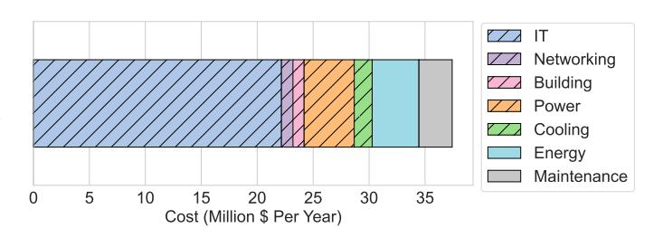
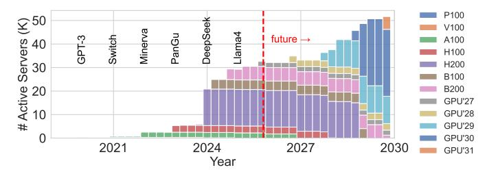
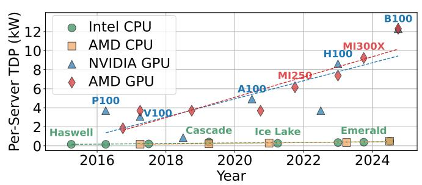
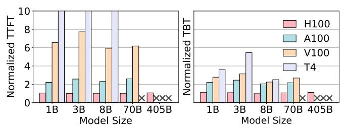
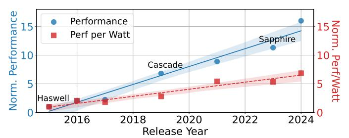

# Rearchitecting the Datacenter Lifecycle for AI

Jovan Stojkovic\* Chaojie Zhang† Íñigo Goiri† Ricardo Bianchini†
\*The University of Texas at Austin † Microsoft Azure

Abstract—The rapid rise of large language models (LLMs) has driven an enormous demand for AI inference infrastructure, mainly powered by high-end GPUs. While these accelerators offer immense computational power, they incur high capital and operational costs due to frequent upgrades, dense power consumption, and cooling demands, making total cost of ownership (TCO) for AI datacenters a critical concern for cloud providers.

Unfortunately, traditional datacenter lifecycle management (designed for general-purpose workloads) struggles to keep pace with AI's fast-evolving models, rising resource needs, and diverse hardware profiles. We rethink the AI datacenter lifecycle scheme across three stages (building, IT provisioning, and operation) highlighting how power, cooling, and networking decisions affect long-term TCO. We focus on hardware refresh strategies aligned with evolving hardware trends and evaluate operational software optimizations that further reduce cost.

While these optimizations at each stage yield benefits, unlocking the full potential requires rethinking the entire lifecycle. We present a holistic lifecycle management framework that optimizes decisions across all three stages, accounting for workload dynamics, hardware evolution, and system aging. Our approach reduces TCO by 40% compared to traditional methods and offers guidelines for managing AI datacenter lifecycles in the future.

#### I. Introduction

Generative LLMs are reshaping industries, from education [9] and healthcare [95] to software development [28] and scientific research [122]. Their rapid adoption is driven by the ability to perform complex reasoning, summarization, and interactive tasks with minimal supervision, creating unprecedented demand for scalable AI inference infrastructure [60].

Modern LLM inference relies on high-end GPUs (*e.g.*, NVIDIA A100 [82] and H100 [81]), which deliver high performance but incur steep financial and infrastructure costs. A single H100 server exceeds \$200k [18] and draws up to 10.2kW [94], [105], far surpassing the power and cooling demands of traditional CPU servers [80]. To support these workloads, cloud providers have built specialized datacenters for high-throughput inference, making AI-serving one of the most resource-intensive and costly datacenter operations [79].

Researchers have proposed software and hardware techniques that improve the performance [2], [19], [59], [74], [94], [118], [124], [126] or energy-efficiency [98], [102], [104], [105] of LLM inference clusters. However, for providers, the key challenge is minimizing the TCO over the datacenter lifecycle, spanning CapEx (*e.g.*, infrastructure build-out) and OpEx (*e.g.*, energy) while meeting user performance needs. Traditional practices, such as regular refresh cycles [41] and conservative provisioning [46], [63], [103], [120], fall short for AI workloads: models scale rapidly [24], hardware has higher cost and infrastructure demands [18], [51], and inference is highly sensitive to latency and quality [104], [105].

Our Work. To address this challenge, we first break down the datacenter lifecycle into stages: build, IT provisioning, and operation, each with distinct costs and optimization opportunities. Build defines the physical infrastructure, including power topology (e.g., flat [7] vs. hierarchical [26], [120]), cooling (e.g., air vs. liquid [32], [43]), and networking (e.g., NVLink [90] vs. Ethernet). IT provisioning governs when and how to decommission and buy new hardware, balancing performance gains, costs, and infrastructure constraints. Operation manages runtime workloads through placement, scheduling, and software-level optimizations.

For AI fleets, the hardware refresh dominates long-term cost because GPU performance, power, and costs evolve rapidly. We introduce a framework that rearchitects the lifecycle for AI datacenters around this refresh challenge. It evaluates alternative strategies across all stages and identifies the most cost-effective combination. In *build*, we compare emerging infrastructure designs to understand and balance long-term scalability, efficiency, and performance. In *IT provisioning*, we evaluate when to adopt new hardware and retire old systems, assessing the impact on TCO given AI's distinct model and hardware characteristics. In *operation*, we assess the impact of software techniques (*e.g.*, model migration, LLM inference disaggregation, and workload scheduling) over lifecycle TCO.

Because these stages are tightly interdependent, we introduce a TCO-driven framework that enables joint reasoning across stages, available at https://github.com/Azure/AI-Lifecycle-Compass [76]. The framework quantifies how decisions at one stage expand or constrain the feasible design space of others and shift the optimal operating point. We leverage TCO modeling to evaluate architectural choices and derive guidance for redesigning the AI datacenter lifecycle.

By leveraging workload growth trends, hardware roadmaps, and cost models, our framework projects future scenarios and identifies refresh points that balance performance, utilization, and operational cost. For example, investing in a larger powersharing domain increases *build*-time cost but provides greater flexibility for accelerator refreshes during *IT provisioning* and improves *operation* efficiency.

We build our framework using open-source LLMs, public hardware specifications, and detailed cost data from public sources. Stage-specific optimizations reduce TCO by 15% (build), 23% (IT provisioning), and 19% (operation). Our cross-stage strategy achieves up to a 40% TCO reduction. Looking ahead, we identify emerging cross-stage opportunities and provide guidelines for adapting AI datacenter lifecycle management to future model and hardware trajectories.

**Summary.** This paper makes the following main contributions:

Fig. 1: Hosting AI workloads from models to hardware and supporting datacenter infrastructure.

- A lifecycle-driven characterization of GPU and LLM inference over performance-power behaviors, highlighting how workload and system optimizations change the effective value of hardware across generations.
- Lifecycle-aware optimization framework integrating workload trends, hardware evolution, and infrastructure.
- Principled AI hardware refresh policy that incorporates infrastructure cost to minimize lifecycle TCO.
- Comprehensive cross-stage evaluation showing that coordinated lifecycle management reduces TCO by up to 40% compared to conventional siloed approaches and remain robust across diverse trend deviations and future scenarios.

## II. HOSTING AI WORKLOADS

Figure 1 shows the stack hosting AI workloads within a cloud provider: from datacenter infrastructure and specialized hardware to the workloads. We analyze these workloads and their demands on underlying hardware and infrastructure.

## A. AI Workloads

Nowadays, cloud providers host a wide range of AI workloads: large language models (LLMs), vision and multimodal models, speech, recommendation systems, and classical deep neural networks (DNNs) [16], [42], [56]. These workloads vary widely in compute complexity, memory footprint, performance, accuracy, and input modalities. The largest difference is between training and inference workloads: training demands high-bandwidth memory, fast interconnects, and fault-tolerant checkpointing, while inference workloads range from latency-sensitive, memory-bound LLMs at small batch sizes to throughput-oriented vision and recommendation pipelines.

This paper focuses on LLM inference, which is rapidly becoming the dominant workload in AI datacenters [16], [56], [93], [94]. For this workload, the most critical factors for datacenter build and provisioning are the size and architecture of the models (which drive compute and memory needs) and the user demand (the sustainable load).

**AI Model Trends.** These workloads have rapidly evolved in scale, architecture, and demand over the past decade.

Scale. Model sizes have grown dramatically, driving up compute, memory, and interconnect demands. Larger models require more FLOPs for inference, larger and higher-bandwidth on-device memory, and—once they outgrow a

Fig. 2: The P50, P99, and average size of the most popular AI models published in the last decade.

single GPU—multi-GPU execution with high-bandwidth, low-latency links for activation exchange. Figure 2 shows that model scale has increased exponentially: from GNMT's ~200M parameters in 2016 [115], to GPT-3's 175B in 2020 [10], and to Llama 4 Behemoth with over 2T parameters [72]. However, post-2023 trends suggest a slowdown, with growth turning linear [25] and potentially becoming sublinear or flat. This plateau reflects diminishing returns from traditional scaling and reduced training-efficiency gains. As a result, attention is shifting to alternatives: distillation compresses capabilities into smaller, more efficient models [117], while reasoning models leverage time-extended compute to improve performance without significant parameter growth [13], [39].

Architecture. Model architecture dictates the compute and memory bandwidth required for inference. Transformer-based models dominate deployments [109]: attention layers scale quadratically with sequence length, and matrix multiplications (GEMM) require high FLOP throughput and sustained memory bandwidth. Alternatives like state-space models (SSMs) [38] replace attention with convolution-like operations, reducing memory footprint and improving long-context scalability. Mixture-of-Experts (MoE) models [100] cut average compute by activating only a subset of experts, but increase memory and network pressure due to expert sharding. Fine-tuning (e.g., LoRA [47]) further reduce resource needs by updating only a small parameter subset.

Despite architectural differences, modern AI models share a common computational core: GEMMs. This uniformity enables unified performance modeling for AI inference, unlike traditional datacenters with heterogeneous workloads. Even emerging agentic systems [1], [12], which coordinate multiple LLMs, still rely on these same foundational computations.

**User Demand.** The global AI market is projected to grow from \$638B in 2024 to over \$3.68T by 2034 [128], with U.S. generative AI expected to see a 36.3% CAGR through 2030 [33]. This growth is driving increased inference workloads, which already dominate AI operational costs [93]. Unlike training, inference incurs higher cumulative costs due to continuous, large-scale deployment serving millions of queries daily [60]. Cloud providers like Microsoft, Amazon, and Google report 15–25% year-over-year growth in AI workloads [57], [96], [113], reflecting rising user demand and the shift toward scalable, cost-efficient inference infrastructure.

# *B. Hardware for AI Workloads*

Accelerators. AI inference workloads are both computeand memory-intensive, relying heavily on GEMM and attention mechanisms. These kernels require high floating-point throughput and high-bandwidth memory (HBM) to sustain performance. Modern accelerators (*e.g.*, GPUs [\[4\]](#page-13-20), [\[81\]](#page-14-2), [\[82\]](#page-14-1), TPUs [\[56\]](#page-14-12), and NPUs [\[77\]](#page-14-16), [\[116\]](#page-15-19)) combine massive parallelism with optimized memory systems that offer both large capacity and sufficient bandwidth to feed compute efficiently. Interconnects. AI servers rely on high-speed interconnects to fully utilize accelerators. These links differ in bandwidth, latency, and energy efficiency. *Intra-node* connections (PCIe, NVLink [\[90\]](#page-15-11)) enable fast device communication within a server, while *inter-node* networks (InfiniBand, RoCE [\[91\]](#page-15-20)) are critical for scaling large models across servers. Efficient collective operations (all-reduce, all-to-all) are essential to synchronize activations, gradients, and KV-caches [\[30\]](#page-13-21), [\[86\]](#page-15-21).

# *C. Datacenter Infrastructure for AI Hardware*

The high performance of modern AI accelerators comes with high demands on supporting infrastructure. Power, cooling, and networking requirements for large-scale AI deployments far exceed those of traditional datacenters.

Power. High-end accelerators consume hundreds of watts. For example, a NVIDIA DGX H100 server with eight GPUs has a thermal design power (TDP) of 10.2kW [\[81\]](#page-14-2), which means that rack densities can range from several kilowatts to over 100 kW per rack [\[17\]](#page-13-22). Sustaining these loads requires robust *power delivery* systems, including high-capacity UPS units and PDU topologies, often oversubscribed to balance utilization and cost [\[120\]](#page-15-10). In addition, rapid workload fluctuations can induce large transient currents [\[14\]](#page-13-23), [\[65\]](#page-14-17), which require careful electrical design and monitoring to maintain stability.

Cooling. The heat output of dense AI clusters quickly exceeds the limits of traditional air cooling [\[104\]](#page-15-8). To maintain performance and reliability, operators increasingly adopt advanced *cooling* solutions such as rear-door heat exchangers, directto-chip liquid cooling, and full liquid cooling [\[84\]](#page-14-18). These technologies sustain performance and reliability but require specialized facility layouts, coolant distribution infrastructure, and increased maintenance complexity.

Networking. Large-scale AI inference also stresses *networking* infrastructure. Models using tensor, pipeline, or expert parallelism rely on low-latency, high-bandwidth communication between thousands of accelerators [\[56\]](#page-14-12). This drives adoption of specialized topologies (*e.g.*, fat-tree, dragonfly) and highperformance interconnects such as InfiniBand and RoCE [\[91\]](#page-15-20), with careful bandwidth provisioning to keep collective communication from becoming a bottleneck. The cost of switches, optical modules, and cabling in these networks can constitute a substantial fraction of overall system expenditure.

# *D. Lifecycle Stages of a Datacenter*

Overview. Based on these AI workloads, hardware, and infrastructure trends, we examine the datacenter lifecycle to identify

| Stage        | Description                              | Timeline        |
|--------------|------------------------------------------|-----------------|
| Build        | Site selection and facility construction | 15–30 years     |
| IT provision | IT hardware deployment and upgrades      | 4–6 years [111] |
| Operate      | Workload sched. and resource manag.      | Per inference   |

TABLE I: Lifecycle stages for a datacenter.

| Stage        | Traditional Approach Characteristics                                                                                                                |
|--------------|-----------------------------------------------------------------------------------------------------------------------------------------------------|
| Build        | Hierarchical power; Air cooling; Ethernet.                                                                                                          |
| IT provision | Fixed per-server lifecycle; New server generations released every 2–3 years; Gradual replacement.                                                |
| Operate      | Services tied to fixed hardware configurations; In stances migrated to new hardware when released; Legacy applications remain on old servers. |

TABLE II: Overview of the lifecycle management for traditional datacenters handling general-purpose CPU workloads.

opportunities for reducing TCO. [Table I](#page-2-0) breaks the lifecycle into: *build*, *IT provisioning*, and *operate*. These stages help us explore how traditional lifecycle policies must be revisited to address the scale, density, and performance demands of AI. On this foundation, we develop a TCO model to evaluate costs across design choices over the datacenter's lifetime.

*Build.* This stage designs and constructs the datacenter facility, setting long-term constraints on utility capacity, substation feeds, power distribution (flat *vs.* hierarchical), cooling (air *vs.* liquid), floor space, and network fabric. These choices determine maximum rack density, define fault domains, and affect future upgrades such as liquid cooling or higher-voltage buses. Networking decisions (Ethernet *vs.* InfiniBand, optical reach, oversubscription) influence job scaling efficiency and east–west traffic costs, critical for large AI models.

*IT provisioning.* This stage determines when and how to deploy new accelerators and retire or repurpose older ones, balancing performance-per-watt improvements, hardware cost, software maturity, depreciation schedules, and risk of underutilized power or cooling. IT provisioning may involve mixedgeneration GPU pools or reassigning older GPUs to lowerperformance workloads (*e.g.*, fine-tuning or batch analytics). *Operate.* Decisions here focus on model placement, query scheduling, and efficient execution. Placement aligns models with accelerator generations for optimal performance-to-cost, while scheduling considers service-level objectives (SLOs), query complexity, and flexible workload timing or location. Execution uses AI-specific optimizations (*e.g.*, batching, quantization, speculative decoding, distillation, and disaggregation) to minimize cost per query while meeting SLOs.

Traditional Approach. [Table II](#page-2-1) summarizes the lifecycle for general-purpose datacenters.

*Build.* They rely on a conservative, uniform infrastructure. Power distribution usually follows a hierarchical topology: from the colo-level to rows, and then to individual racks, with each level having its own power caps [\[120\]](#page-15-10). Cooling is airbased and networking uses standard Ethernet [\[8\]](#page-13-24), [\[34\]](#page-13-25).

*IT provisioning.* Servers follow a fixed 4–6 year lifecycle, with new hardware released every 2–3 years and older servers phased out accordingly [\[111\]](#page-15-22).

*Operate.* Services run on fixed hardware generations. New services migrate to the latest servers, while legacy applications remain on older ones. This ensures stability and predictability but limits flexibility to leverage hardware heterogeneity or optimize performance for specific workloads.

Rearchitecting for AI. AI workloads challenge traditional datacenter design. Modern accelerators' high power and thermal demands make high-density racks and liquid cooling more valuable, while space and density constraints favor scale-up architectures such as NVLink designs [\[90\]](#page-15-11).

*Memory capacity and bandwidth* have increased to support larger model contexts, enabling more complex workloads but raising costs, making efficient provisioning essential. Likewise, *interconnect* performance is crucial for parallel efficiency, with low bandwidth or high latency limiting scaling.

Trade-offs between cost and performance must be evaluated both within each stage (build, IT provisioning, and operate) and across them. For example, during *operation*, separating prefill and decode across servers [\[94\]](#page-15-2) enables using heterogeneous hardware and influences *build* and *refresh* strategies.

# III. TCO-DRIVEN LIFECYCLE FRAMEWORK

To evaluate the long-term economics of AI datacenters, we develop *a cross-stage, TCO-driven framework* that spans the 15-year datacenter lifecycle, covering *build*, *IT provisioning*, and *operation*. Our framework couples workload dynamics, model evolution, hardware roadmaps, and infrastructure costs.

# *A. Total Cost of Ownership (TCO) Model*

Existing TCO Models. TCO modeling is a long-standing tool in datacenter planning. Classical frameworks [\[49\]](#page-14-19), [\[58\]](#page-14-20) decompose facility costs into capital and operational components with straight-line amortization. Recent work extends TCO to sustainability-driven hardware choices [\[41\]](#page-13-5), [\[111\]](#page-15-22), carbon-aware AI inference [\[64\]](#page-14-21), and platform-aware [\[78\]](#page-14-22) and performance-cost modeling for LLM systems [\[40\]](#page-13-26). Finally, industry analyses emphasize that effective TCO depends on platforms, reliability, and utilization dynamics [\[78\]](#page-14-22). Our framework builds on this foundation and extends it in two ways: (1) it specializes TCO for AI workloads by integrating roofline-based performance modeling, acceleratorroadmap projections, and LLM workload evolution; and (2) it enables *cross-stage* lifecycle analysis, capturing how buildtime, provisioning, and operational decisions interact over a 15-year horizon. The contribution is a systematic use of TCO as a unifying lens for evaluating and optimizing architectural choices across the full AI datacenter lifecycle.

Our TCO Model. [Table III](#page-4-0) summarizes the components of our TCO model, breaking them down into *CapEx* and *OpEx*:

$$CapEx_F + CapEx_{Pow.} + CapEx_{Cool} + CapEx_{Net} + CapEx_{IT}$$

$$OpEx_{energy} + OpEx_{M\&R} + OpEx_{network} + OpEx_{other}$$

For the annualized TCO, CapEx amortizes long-term infrastructure and IT over their useful lives, OpEx captures variable and recurring operational costs over a full year.

Fig. 3: TCO breakdown for a 10MW AI datacenter.

[Figure 3](#page-3-0) shows the annual datacenter TCO breakdown for a representative user demand and model size projected for 2025. At 75% average utilization, this 10MW datacenter [\[120\]](#page-15-10) hosts roughly 500 H100 servers, consuming 70 GWh of energy per year. GPU servers drive IT CapEx and dominate costs, followed by energy-related OpEx. Building construction and maintenance contribute the least.

Capital Expenses (CapEx). The upfront costs for acquiring, building, or upgrading long-term datacenter assets, including facility, IT equipment (such as servers and racks), and networking infrastructure. Facility, network, and IT assets are amortized over 15–30, 7–10, and 3–5 years respectively, using straight-line or declining-balance depreciation [\[111\]](#page-15-22). We normalize CapEx per delivered kW to enable design comparisons. *Facility.* It includes the physical infrastructure to support a datacenter, providing the foundational environment needed to house equipment safely and efficiently.

*Power Infrastructure.* Electrical systems deliver reliable power to racks and IT equipment, including all power devices and connections to ensure stable and redundant power distribution. *Cooling Infrastructure.* Mechanical systems cool datacenters to maintain safe operating temperatures, with core infrastructure such as chillers and pumps. Together, these systems prevent overheating and enable high-performance operation. *Networking Infrastructure.* It connects servers, storage, and other datacenter resources. Fabric switches route rack-torack traffic, while optical transceivers and structured cabling provide high-bandwidth, low-latency links across the facility. *IT Infrastructure.* Compute servers equipped with CPUs, memory, and accelerators (*e.g.*, GPUs, TPUs, or NPUs) along with racks and storage devices like NVMe.

Operational Expenses (OpEx). Ongoing costs of running and maintaining a datacenter. We model utilization-sensitive costs (*e.g.*, energy) based on workload mix and scheduling policies, since they scale with activity. Utilization-insensitive costs (*e.g.*, maintenance, software contracts, leases) are treated as per-rack/site constants regardless of workload intensity.

*Energy.* Electricity costs include power for IT equipment and supporting infrastructure (*e.g.*, cooling, power distribution). Billed monthly, these costs reflect IT utilization and *power usage effectiveness* (PUE), the ratio of total facility energy to IT energy. A higher PUE indicates more energy spent on overheads like cooling and power conversion.

*Maintenance & Repairs.* Preventive and corrective maintenance of mechanical, electrical, and IT systems. Costs are driven by component failure rates (cooling, power, servers,

| Category | Component                                       | Description                                                                                                                                                                                                                                                                                             | Example Cost (\$)                                                                                                           |
|----------|-------------------------------------------------|---------------------------------------------------------------------------------------------------------------------------------------------------------------------------------------------------------------------------------------------------------------------------------------------------------|-----------------------------------------------------------------------------------------------------------------------------|
| CapEx    | IT Networking Building Power Cooling            | Servers, racks, accelerators, storage Fabric switches, optics, structured cabling Site preparation, building shell, land, electrical and mechanical base infrastructure Switchgear, transformers, UPS, PDUs, busbars, rack distribution Chillers, CRAH/CRAC units, pumps, piping, liquid loops, airflow | \$375k/server [18] \$2000/server [61], [90] \$0.5/ft 2 [29] \$7.0/W [26], [121] \$2.5/W [108], [121] |
| OpEx     | Networking Energy Maintenance Software | Port licenses, optics replacement, networking component power IT load scaled by PUE, utility tariffs, demand charges Spares, repairs, monitoring, water/treatment, field-replaceable units, failure-rate Licenses, support contracts                                                                    | \$600/server [61], [87], [89] \$20–40/MWh [35] \$5000/server [107] \$200/server                                    |

TABLE III: TCO components for an example datacenter with DGX H100 [18] servers.

storage, networking) and include all activities required to keep the datacenter operational and reliable.

Network Operations. Ongoing costs of maintaining the datacenter network, including licensing fees for switch ports and the replacement of failed components. Costs are influenced by network size, redundancy, and utilization patterns, as higher traffic and denser topologies can increase wear and require more frequent upgrades or maintenance.

*Other.* Recurring expenses such as software licenses, support contracts, and land or lease payments. These costs are largely fixed and do not vary with workload or utilization.

## B. Modeling Assumptions

**Timeline.** We model a 15-year lifecycle starting from 2015 to 2030, fitting outputs to current trends (2025) and forecasting costs and fleet composition for the next 5 years. Our methodology generalizes to longer horizons, but uncertainty grows.

Workload. We focus on LLM inference as the dominant AI datacenter workload [11]. Training workloads follow a similar methodology but differ in modeling, as they are heavier in both computation and communication. We use input traces from DynamoLLM [105], which exhibit diurnal patterns, and assume a baseline of 100K requests per second (RPS). Following Section II-A, we apply a 15% annual growth rate [57], [96], [113], which implies over 200K RPS after five years.

**AI Models.** Based on 2015–2025 parameter-scaling trends (Section II-A), we assume linear growth in model size through 2030, with alternative scenarios for accelerated (exponential) or slowed (sub-linear) scaling. Providers adopt new models via *smooth migration*, gradually transitioning workloads [45], [85]. We assume future LLMs follow the LLaMA design [70] (*i.e.*, decoder-only transformers with consistent layer organization, attention mechanisms, MoE, and parameterization).

Hardware. Hardware projections include FLOPS, memory bandwidth, TDP, and cost, with linear growth trends [44]. We also model delays between the announcement of a new GPU [83] and its actual mass availability in cloud providers [6], [15], [99] (e.g., B200 had a delay 6–12 months). Performance. We develop a roofline model for LLM inference across diverse hardware. Our validation against known model/hardware pairings and profiling results confirms alignment with prior work [40], [119]. The model captures interactions between hardware (compute throughput, memory bandwidth) and workload (arithmetic intensity, memory footprint). Rather than relying on aggregate performance trends, the model

Fig. 4: Server count by GPU type over time in an AI fleet following the traditional baseline in Table II.

explicitly incorporates architectural parameters, such as peak FLOPS, memory bandwidth and capacity, interconnect bandwidth and latency, and power envelopes. By modeling resource ceilings and bottleneck transitions, technology advances translate directly into shifts of the roofline surface. This enables us to propagate microarchitectural changes into lifecycle TCO.

We analytically derive the arithmetic intensity and memory footprint from the LLM architecture and parameter count. Extending our models to new GPUs requires only peak FLOPs and memory bandwidth; for new LLMs, theoretical compute and memory requirements are recomputed from the architecture. The roofline model predicts time-to-first-token (TTFT) and time-between-tokens (TBT) latencies for a given hardware, model, and request load.

We then increase the load until requests exceed an SLO of 400 ms for TTFT and 100 ms for TBT [105]. The resulting *goodput* defines the maximum RPS sustainable without violating latency targets, identifying the utilization point where performance degrades. Using this SLO, we provision the minimal GPUs needed and compute corresponding utilization. **Cost.** We combine CapEx (IT hardware, networking, power, cooling) and OpEx (networking, energy, maintenance). CapEx is amortized over asset lifetimes, while OpEx captures recurring operational costs. This allows evaluating trade-offs such as upfront investment in cooling *vs.* deferred savings in refresh.

## C. Lifecycle Evaluation

Baseline Timeline. Figure 4 shows the simulated deployment timeline of an AI fleet under the baseline traditional datacenter lifecycle approach (Table II). Model release cycles and hardware availability shape the fleet composition over time, with the release dates of notable large models marked for reference. The simulation starts in 2015 with 50 P100 servers supporting 100K RPS, at a total annual TCO of  $\approx $0.2M$ .

| Variable                   | Distribution | Parameters / Bounds                        | Notes / Correlations                                       |
|----------------------------|--------------|--------------------------------------------|------------------------------------------------------------|
| Workload growth factor     | Log-normal   | µ = log(1.05), σ = 0.05                    | Positive-only; correlated with model size growth (ρ = 0.4) |
| Model size annual growth   | Log-normal   | Fit to historical P50 trend; capped at ±2σ | Captures uncertainty in scaling-law extrapolation          |
| GPU Perf/W improvement     | Normal       | Mean from regression, σ = 0.1µ             | Correlated with GPU cost improvement (ρ = −0.5)            |
| GPU price per generation   | Triangular   | min = −15%, mode = 0%, max = +20%          | Reflects supply-chain variability                          |
| Release interval           | Discrete     | {1, 1.5, 2} years                          | Uniform sampling                                           |
| Electricity price (\$/kWh) | Log-normal   | Mean = regional avg., σ = 15%              | Independent across trials                                  |
| Cooling efficiency (PUE)   | Normal       | Mean = baseline, σ = 0.05                  | Affects total energy cost                                  |
| Server lifetime            | Discrete     | {4, 5, 6} years                            | Uniform sampling                                           |

TABLE IV: Stochastic variables used in our Monte Carlo simulations.

As user demand and model size grow (*i.e.*, 15% year-overyear), the fleet scales gradually. By 2024, traffic reaches 350K RPS, coinciding with DeepSeek V3 (671B-parameters) [\[21\]](#page-13-32), [\[67\]](#page-14-28), prompting a major H200 GPU refresh. Server count rises to 25K to meet performance targets, and annual TCO climbs to \$0.3B, reflecting additional hardware, expanded infrastructure, and higher OpEx. Deployment peaks align with major LLM releases, highlighting the strong link between AI model roadmaps and datacenter economics.

Monte Carlo Methodology. To account for TCO uncertainty, we run Monte Carlo simulations [\[73\]](#page-14-29) where we model inputs as random variables. Each trial represents a plausible future trajectory of workload growth, model scaling, hardware evolution, pricing, and energy costs. The simulator deterministically computes capacity planning, server acquisitions/decommissions, and annual CapEx/OpEx, producing a single TCO. Repeating this yields a distribution over lifecycle costs.

[Table IV](#page-5-0) summarizes the stochastic inputs, their distributions, parameterization, and rationale. We guide the distribution choices by historical AI model scaling trends, GPU release data, and publicly reported datacenter cost variability. In most experiments, we chose conservative bounds and separately study a few extreme cases.

We draw samples from a multivariate normal distribution with covariance matrix Σ, whose entries encode empirically derived pairwise correlations [\(Table IV\)](#page-5-0). We then map these samples to the desired marginals via inverse CDF transforms (*e.g.*, log-normal, triangular). All remaining variables are sampled independently. Unless otherwise stated, results are based on 10,000 independent trials. We verified that increasing to 20,000 trials changes the mean and 95% confidence interval of total TCO by less than 1%, indicating statistical stability.

We validate convergence using three checks: (1) running mean stabilization (change < 1% over final 2,000 samples), (2) stabilization of 5th/95th percentile estimates, and (3) bootstrap confidence intervals over batches of 1,000 samples. All reported figures use the full converged sample set.

For each policy (*e.g.*, aggressive vs. delayed refresh), our framework reports: (1) expected lifecycle TCO, (2) variance and 95% confidence intervals, (3) probability that one policy outperforms another, and (4) sensitivity (Sobol-style first-order effects via regression-based decomposition).

By modeling full distributions instead of point estimates, our approach provides distributional robustness and explicitly quantifies the option value associated with flexible hardware refresh timing under uncertainty.

# *D. Community Value*

We release our TCO framework as an open-source, fully parameterized simulation environment [\[76\]](#page-14-11). Users can modify all key inputs—hardware specifications and roadmaps (throughput, memory bandwidth/capacity, TDP, per-generation cost), workload characteristics (model size, architecture, demand growth), infrastructure assumptions (power topology, cooling, networking, PUE), and economic parameters (electricity prices, depreciation, maintenance). The framework supports custom refresh policies, new accelerator generations, and alternative future scenarios (*e.g.*, demand shocks, capability discontinuities, pricing shifts). Our Monte Carlo engine is fully configurable, including stochastic distributions, correlation structures, and trial counts. We intend this as a reusable community artifact: researchers can probe hypotheses about AI-infrastructure evolution and extend the analysis to new workloads, hardware platforms, and cost models.

# *E. Scope and Limitations*

Our framework has several limitations. First, all cost inputs rely on publicly available sources (*e.g.*, vendor pricing, industry reports, open-source traces) rather than proprietary deployment data. Although we validate key trends and projections, absolute TCO values will vary across providers due to negotiated pricing, supply-chain agreements, and site-specific factors. Second, our performance model uses a roofline-based analytical approach rather than cycle-accurate simulation or production-scale measurement, and thus cannot capture all system-level effects. Third, forward-looking projections of hardware capabilities, model scaling, and demand growth carry inherent uncertainty. Accordingly, the primary value of this work lies in *relative* comparisons across lifecycle strategies and the qualitative insights they reveal about cross-stage cooptimization, not in any single absolute TCO estimate.

# IV. BUILDING EFFICIENT AI INFRASTRUCTURE

The first stage in the datacenter lifecycle is building the infrastructure: (1) physical building that houses the datacenter, (2) power delivery that supplies electricity to servers and other equipment, (3) cooling that removes the heat generated by servers, and (4) networking that interconnects servers.

The physical building is relatively static, but power, cooling, and networking [\[26\]](#page-13-8) must accommodate shifts in workload demand and hardware capabilities over decades. Emerging AI workloads, with extreme power and thermal densities and unique communication patterns, are reshaping this design

Fig. 5: Per-server TDP across Intel and AMD CPUs, and NVIDIA and AMD GPUs over the years.

space. Each new AI hardware generation introduces higher power envelopes and tighter thermal limits, making existing datacenter infrastructure increasingly obsolete. Hence, operators must construct new facilities or upgrade existing ones, to keep up with these hardware trends. We use our framework to revisit these choices from a holistic lifecycle perspective.

## A. Power Infrastructure

**Traditional Approach.** Datacenters use hierarchical power distribution to balance fault isolation, maintainability, and minimize stranded power [112], [114], [120]. An Automatic Transfer Switch (ATS) directs power from the grid to multiple redundant UPS units, each feeding several Power Distribution Units (PDUs) that supply server rows and racks.

Server and rack provisioning must respect the capacity of each power domain. If a domain has budget X and each server consumes Y, only  $\lfloor X/Y \rfloor$  servers can be deployed, leaving  $X-Y\times \lfloor X/Y \rfloor$  as stranded power (power fragmentation). **Rearchitecting for AI.** AI accelerators (e.g., GPUs, TPUs) push power density beyond historical norms. Figure 5 shows high-end GPU servers greatly exceed CPU server power: NVIDIA DGX with  $8\times H100$  GPUs requires 10.2kW [81], while a 64-core Intel Emerald Rapids server needs 385W [51].

While this surge exacerbates power fragmentation, flatter power distribution architectures can pool power across broader domains to reduce stranding [7], [97]. However, these designs involve trade-offs in fault tolerance, design and maintenance complexity, and TCO. We introduce simplifications by removing second-order effects and practical constraints (e.g., supply chains) and summarize these trade-offs qualitatively in Table V. A flat per-DC power delivery minimizes stranded capacity but requires greater redundancy and more complex maintenance. Importantly, Figure 6a shows that the industry-standard hierarchical design [120] is not the TCO optimum for AI deployments; a datacenter-wide flat distribution, although not always feasible, reduces lifecycle TCO by 4.2%.

# B. Cooling Infrastructure

**Traditional Approach.** Most datacenters use air-based cooling [20], [23], [48], [69], [104], where chillers or adiabatic units deliver cold air via air handling units (AHUs) through raised floors or hot/cold aisle containment. Cooling is provisioned conservatively for peak thermal loads, and PUE

|       |                         | Power domain    |                  |                 |
|-------|-------------------------|-----------------|------------------|-----------------|
|       | Feature                 | Per-PDU         | Per-UPS          | Per-DC          |
| CapEx | Stranding Complexity | Lower Higher | Medium Medium | Higher Lower |
| OpEx  | Maintenance             | Lower           | Medium           | Higher          |
| Other | Fault isolation         | Excellent       | Good             | Poor            |

TABLE V: Comparison of power delivery infrastructure designs. Green: good, yellow: moderate, red: poor.

|       | Feature           | Air    | Hybrid | Liquid |
|-------|-------------------|--------|--------|--------|
| CapEx | Complexity        | Lower  | Medium | Higher |
| OpEx  | Energy efficiency | Lower  | Medium | Higher |
|       | Maintenance       | Lower  | Medium | Higher |
| Other | High-dense racks  | Lower  | Medium | Higher |
|       | Noise level       | Higher | Medium | Lower  |

TABLE VI: Comparison of cooling infrastructure designs.

is optimized with airflow management and economization. Modern datacenters achieve PUE of 1.1–1.3 [3], [31], [75].

Rearchitecting for AI. High-density GPU racks generate 4–8× more heat per rack than CPU systems [84], requiring higher airflow, lower inlet temperatures, and more fan energy, pushing air cooling to its limits. Liquid cooling (e.g., cold plates or immersion) [32], [54] is increasingly adopted for dense GPU deployments [7], [84]. While upfront CapEx and complexity are higher, OpEx is reduced via improved heat transfer, lower chiller load, and reduced fan power (Table VI). Hybrid designs (combining liquid for high-density racks and air for low-density) balance cost, density, and maintainability. Hence, contrary to common narratives that air cooling is "simpler and cheaper" and liquid cooling is "more efficient," we find that a 75/25 hybrid design improves the TCO by 9%.

## C. Networking Infrastructure

**Traditional Approach.** General-purpose datacenters use multi-tier Ethernet (*e.g.*, leaf–spine) with moderate oversubscription [8], [34], which is cost-effective for CPU workloads with modest bandwidth and latency requirements.

Rearchitecting for AI. AI workloads impose far higher network demands than general-purpose datacenters. Emerging practice uses hierarchical designs for inference [62]: NVLink for intra-server tensor parallelism [90], [101] and lower-cost networks for pipeline parallelism across servers. We evaluate four network designs: (1) all Ethernet, (2) all InfiniBand [5], (3) all NVLink [90], and (4) a hierarchical approach (NVLink intra-server, InfiniBand intra-rack, Ethernet inter-rack). Table VII summarizes cost-performance trade-offs, and Figure 6c shows hierarchical reduces TCO by 6% versus a flat high-performance network. By matching interconnects to AI workloads, hierarchical networking scales efficiently without over-provisioning expensive low-latency links. By isolating first-principles trade-offs among performance, cost, and workload needs, we treat these configurations as design reference points rather than deployment blueprints. For example, an all-NVLink fabric is not a realistic large-scale deployment (its topology, scalability, and availability constraints make it

Fig. 6: TCO vs. infrastructure designs during the build stage.

|       | Feature   | Ethernet | InfiniBand | NVLink | Hierarchical |
|-------|-----------|----------|------------|--------|--------------|
| CapEx | Cost      | Lower    | Medium     | Higher | Medium       |
| OpEx  | Energy    | Lower    | Medium     | Higher | Higher       |
|       | Maintain  | Lower    | Medium     | Higher | Medium       |
| Perf  | Bandwidth | Lower    | Higher     | Higher | Higher       |
|       | Latency   | Higher   | Lower      | Lower  | Medium       |

TABLE VII: Comparison of networking infrastructure designs.

Fig. 7: Evolution of AMD and NVIDIA GPUs showing TFLOPS (left axis) and memory bandwidth (right) over time.

impractical) but an upper-bound case showing ideal highbandwidth, low-latency connectivity. This lets us reason about which architectural choices remain efficient across lifecycle stages rather than optimizing any single layer in isolation.

# D. Lessons

AI workloads challenge legacy datacenter designs, imposing unprecedented demands on power, cooling, and networking. Rising accelerator power densities and complex communication patterns make traditional hierarchical power distribution, air cooling, and uniform network fabrics increasingly inadequate for cost efficiency and performance. Our TCO-driven framework captures how emerging solutions (flatter power delivery, hybrid cooling, and hierarchical networking) achieve longer-term efficiency and cost objectives.

# V. Provisioning AI Hardware

The primary driver of TCO is IT cost, dominated by hardware management. The main challenge is deciding when to retire aging servers and deploy new ones. Hardware refresh is no longer a periodic, maintenance-driven process. For AI fleets, it is a strategic mechanism for ensuring performance, efficiency, and scalability as models and their system demands evolve rapidly. Informed decisions require translating raw hardware capabilities into cross-stack efficiency.

## A. Current Hardware AI Trends

Release Cycle. Figure 7 shows that GPU vendors are aggressively releasing new generations every year far exceeding the traditional 2–3 year cycle of CPU releases. Similar dynamics hold for other specialized AI hardware such as TPUs [56] and LPUs [37], which also follow fast-paced release cycles. This pace means that fleets often encounter multiple viable upgrade opportunities within a single depreciation window, complicating refresh planning and GPU lifetime decisions.

Raw Throughput. GPUs from vendors like NVIDIA and AMD have evolved significantly. From the NVIDIA P100, which offered modest FP16/FP32 throughput, to modern GPUs such as the B200 that deliver vastly higher performance through advanced tensor cores, increased memory bandwidth, and optimizations in sparsity and mixed precision. Figure 7 shows NVIDIA datacenter GPU trends from 2016 to 2025: compute throughput rose nearly 12× and memory bandwidth over 5×, with even stronger gains for AMD GPUs [4].

Workload-level Efficiency: Beyond FLOPS. Raw FLOPS rarely dictate realized performance and efficiency for LLM inference workloads. To understand the gap, we evaluate the performance of AI inference workloads with different model sizes and architectures across GPU generations. We ran experiments using vLLM [59] on real hardware and compare against the roofline model, which shows within 5% of errors for Llama3 [71] models. All runs use a 2K sequence length and batch size of 8. We measure TTFT and TBT in milliseconds. Then, we normalize the values to the H200 baseline per model. Model Size. We evaluate scalability using Llama3 [71] models from 1B to 405B parameters on NVIDIA GPUs: T4, V100, A100, H100, and H200. We configure TP [101] with the smallest value that fits each model across most GPUs (e.g., TP1 for 1B/3B, TP4 for 8B, TP8 for 70B/405B). Some setups fail on older GPUs due to memory limits. Figure 8 shows that small Llama3 models (1B-8B) remain efficient on older GPUs, while larger models (70B-405B) expose architectural bottlenecks in memory bandwidth and tensor-core throughput. The decode phase (TBT) is less sensitive to GPU generation than the prefill phase, reflecting its lower compute demands [94]. These effects demonstrate large discrepancies between FLOPS scaling and actual, model-specific performance scaling.

Model Architecture. We evaluate the impact of model sparsity by comparing sparse Qwen3 models (30B A3B and 235B A22B) with dense Llama3 models of similar sizes. Model structure significantly influences hardware viability and effi-

Fig. 8: TTFT and TBT latencies for different sizes of Llama-3 LLM across GPU generations normalized to H200.

Fig. 9: Latencies and accuracies for dense (Llama3) and sparse models (Qwen3) across GPU generations normalized to H200. Pink and blue bars for H100 and A100, respectively.

ciency. Figure 9 shows that sparse models scale better on older GPUs, maintaining competitive accuracy while outperforming dense counterparts in latency. For example, Qwen3-235B-A22B matches Llama3-70B in accuracy but degrades less on older hardware (though it requires nearly twice the GPU memory). This highlights the value of sparsity-aware designs for workload-level efficiency on older generations, extending the useful lifetime implied from raw performance.

Figure 10 compares transformer-based (Llama3-3B) with state-space-based (Mamba-2.8B). State-space models are more hardware-efficient: for 2K sequences using TP1, Llama3 runs 7.7× slower on V100 than on H200, while Mamba slows down by only 3.6×. This shows the architectural compatibility of state-space models with older or less performant GPUs.

Escalating Hardware Cost. This performance growth comes with sharply rising costs. The NVIDIA P100 debuted around \$9K per GPU (roughly \$90K per server), whereas the modern H100 costs about \$30K per GPU (over \$350K per server) [18]. AMD's MI series follow a similar trend, with newer generations carrying significantly higher price tags. In contrast, CPU server costs have risen more moderately over the same period. For example, from around \$7K per server for Intel's Haswell [52] systems in 2014 to approximately \$12K for the latest Granite Rapids [50] generation in 2025. The steep GPU cost-performance curve heightens the stakes of refresh decisions: replacing hardware too early wastes both hardware costs and triggers new infrastructure buildouts prematurely, while replacing too late risks sacrificing efficiency.

**Model Efficiency: Cost and Power Implications.** Combining performance with cost and power reveals trends hidden to raw FLOPS or workload level latency and goodput alone. While the goodput per Watt of large models degrades substantially on

Fig. 10: Latencies for transformer (Llama3) and state space (Mamba) models across GPUs normalized to H200.

older hardware, the gap is much smaller for smaller models. For example, Llama3-70B on an A100 yields roughly  $3 \times 10^{10}$  lower goodput per Watt than on an H100, while Llama-1B on an A100 is only about 18% lower. In terms of goodput per Watt per dollar, the A100 actually outperforms the H100 by 8–23% for the 1B, 3B, and 8B models, but delivers about  $2 \times 10^{10}$  lower efficiency for Llama-70B. In fact, for smaller models, even the V100 is on par with the H100, achieving performance per Watt per dollar within 5% of it.

This makes a key point for refreshing planning and GPU hardware lifetime: hardware generations do not degrade uniformly across workload profiles. Real efficiency gains materialize only when the full cross-stack interaction (*e.g.*, model specifics, power, cost) is favorable. This motivates refresh policies that leverage TCO optimizations for cross-stack efficiency.

## B. TCO-driven Refresh Policies and Server Lifetime

**Traditional Approach.** General-purpose datacenters typically follow a steady CPU refresh cycle with five years of server lifetime [111]. This baseline policy strikes a balance between capital and operational efficiency.

Alternative strategies include extending server lifetimes to reduce CapEx (at the expense of higher energy use and maintenance) or shortening lifetimes to deploy more efficient hardware sooner, increasing capital costs but improving energy and space efficiency. Skipping intermediate generations is another option when current hardware meets workload needs and newer gains are marginal.

We enumerate refresh strategies with an allowed lifetime for each generation from 0 (skip) to 10 years in one-year increments and evaluate their TCOs using Monte Carlo simulations (explained in Section III-C). Overlapping lifetimes permit multi-generation co-hosting, while decommissioning occurs deterministically at the end of the assigned lifetime. All resale and end-of-life assumptions are fixed across experiments.

Figure 11a shows the TCO distribution of all feasible refresh strategies, normalized to the baseline. Most policies fall to the right of the baseline, indicating that a 5-year refresh cycle remains among the most cost-effective choices for general-purpose datacenters.

Figure 12 shows the same data broken down by hardware generation. The top of Figure 12 presents a per-CPU-generation view, showing how varying the server lifetime of each individual hardware generation, from 0 years (skipping that generation entirely) to 10 years, impacts normalized TCO.

Fig. 11: TCO distribution for various hardware refresh policies in general-purpose and AI datacenters.

Fig. 12: TCO changing refresh policy for each hardware generation in general-purpose and AI datacenters.

For general-purpose datacenters, most generations favor 4–6 year refresh cycles, with Skylake being the exception, where skipping the generation yields lower TCO.

**Rearchitecting for AI.** The dynamics of AI accelerators and workloads differ substantially from those of general-purpose datacenters, rendering the traditional refreshes sub-optimal. Compounding the growth in hardware cost and model evolution, cross-stack efficiency can leap dramatically across GPU generations or change little at all, depending on architectural shifts and model trends. Figure 11b shows that many alternative refresh strategies can reduce TCO by 15–20% compared to the baseline.

Hardware-Driven Refresh Signals. Figure 12 shows the TCO changing the refresh cycle (and skipping) for each hardware generation. Three dominant hardware-driven trends emerge.

*Newer is much better*: when new GPUs provide substantial efficiency gains, early decommissioning of older hardware is justified, and datacenters benefit from upgrading as soon as the next generation is available. For example, moving from NVIDIA V100 to A100 GPUs is beneficial.

*Older is competitive*: for most GPU generations, extending hardware lifespan beyond 6 years remains cost-effective. This held true for all generations prior to B100.

Newer is similar or worse: when new GPUs offer marginal or negative efficiency gains, it is better to extend the life

Fig. 13: Server count by GPU type over time in an AI fleet following the optimal refresh policy for minimizing TCO.

of existing hardware and skip intermediate generations. For example, it is preferable to skip B100/B200 GPUs.

Workload Evolution. If models grow significantly (e.g., GPT-family releases [92]) refresh cycles must be accelerated to provision more efficient hardware that can handle the increased compute needs. If model sizes stabilize or decrease, extending hardware lifetime becomes more cost-effective.

Example Optimal Timeline. Figure 13 shows the deployment of GPU server generations under the optimal refresh policy to minimize TCO. The policy skips some generations (e.g., B100, B200) entirely, as extending the service life of H100 and H200 GPUs proves more cost-effective. When a newer generation delivers substantial performance and efficiency gains, the policy triggers earlier decommissioning and demand-driven purchases to match workload growth and model sizes. Compared to the baseline policy in Figure 4, this approach yields a smoother, more balanced mix of old and new hardware, and at times even a modest reduction in total server count due to improved GPU efficiency (e.g., in early 2027).

## C. Lessons

Fixed refresh intervals are not sufficient for AI workloads. Unlike traditional datacenters, where hardware and workloads change gradually, AI accelerators and models evolve at a much faster pace and interact in a complex, cross-stack ways. FLOPS increases do not reliably translate to realizable performance. Some generations deliver dramatic performance gains, while others bring only marginal improvements. These shifts are further amplified by rapid increases in power and thermal densities, hardware costs, and release frequency, changing the trade-offs between raw performance and efficiency.

Thus, AI datacenters must adopt flexible hardware refresh strategies that considers full TCO and cross-stack efficiency, responding to evolving hardware efficiency and workload trends. This may involve aggressively retiring older GPUs when new generations deliver significant efficiency gains, while extending the life of existing hardware (or skipping intermediate generations) when improvements are limited.

## VI. OPERATING AN AI DATACENTER

Once hardware is provisioned, the challenge is sustaining high utilization while meeting SLOs across a diverse, evolving fleet. This requires software to orchestrate varying workloads, hardware generations, and performance—cost trade-offs, all influenced by prior build and refresh decisions.

Fig. 14: Performance and performance/Watt for DCPerf applications [106] across generations of Intel servers.

(a) TCO vs. software optimization. (b) TCO vs. stages. Fig. 15: TCO for optimization during *operation* and for stages, normalized to the baseline without optimizations.

**Traditional Approach.** Workloads typically run on homogeneous hardware pools with uniform deployment, from baremetal servers and VMs to microservices and serverless. Most use the latest hardware, while some remain on legacy systems until decommissioned [36]. Software stacks are tuned for predictable performance, requiring minimal adaptation to hardware diversity or rapid workload changes.

We use the DCPerf benchmark suite [106] to evaluate performance and power efficiency of Intel server generations. Figure 14 shows that throughput and performance per Watt scale nearly linearly with newer servers, supporting the common practice of migrating workloads to the latest generation. Rearchitecting for AI. AI workloads and hardware trends differ significantly from general-purpose datacenters (Section V-A). Unlike CPUs, GPU performance improvements for AI are uneven across generations and vary by model and use case. Thus, traditional direct-migration strategies are suboptimal. Achieving efficiency requires software optimizations that align evolving models, growing demand, and a heterogeneous fleet while controlling cost and meeting SLOs.

Optimizations. Table VIII summarizes operational techniques affecting build and refresh. Model migration, quantization, and KV-cache management reduce compute and memory pressure. Disaggregation leverages fast interconnects and aligns workload phases with appropriate hardware. Heterogeneity-aware routing, placement, and scheduling match workloads to hardware in real time, while infrastructure-aware scheduling accounts for datacenter constraints (e.g., power, cooling), linking operations to build-time decisions.

TCO savings. These optimizations extend hardware lifetime, defer costly refreshes, and increase infrastructure value. Figure 15a shows 12–39% TCO reductions per strategy. *Model migration* yields the largest gains by reducing post-release compute load, while *disaggregation* and *infrastructure-aware* 

scheduling achieve strong savings without changing work-loads. Combining all strategies cuts TCO by over 60%; although not fully additive, the cumulative impact is substantial.

#### A. Lessons

Fixed, uniform operations are insufficient for evolving models and heterogeneous hardware. Software techniques shift operations from reactive to proactive, extending hardware utility, leveraging heterogeneous fleets, and dynamically aligning workloads with available resources. By linking operations, refresh, and build decisions, these methods transform rigid hardware timelines into adaptive, lifecycle-aware policies.

## VII. CROSS-STAGE OPTIMIZATIONS

The largest TCO savings come from cross-stage rearchitecting the end-to-end AI datacenter lifecycle.

# A. Existing Cross-Stage Optimizations

IT provisioning → Build. AI hardware trends are driving datacenter redesigns: flatter power hierarchies for high-density accelerators, liquid cooling [84], and InfiniBand/NVLink networking [90]. These upfront investments increase build costs but simplify future refreshes and extend deployment lifetimes.

Operate → IT provisioning. Heterogeneity-aware scheduling helps repurposing older GPUs for workloads better suited to their capabilities: compute-intensive phases (*e.g.*, prefill or large models) run on newer GPUs, while memory- or bandwidth-bound phases (*e.g.*, decode or smaller models) are offloaded to older generations [68], [94]. This strategy smooths refresh costs and maintains high utilization, turning hardware upgrades into opportunities for redistribution and continued value rather than premature hardware retirement.

**Build** → **Operate.** Infrastructure decisions made at build time shape operational flexibility. Scheduling frameworks translate these choices into software controls that smooth demand, enable safe hardware derating, and sustain efficiency. Conversely, coordinated derating of servers and power devices within the power hierarchy allows oversubscription and denser deployments; effectively "upgrading" infrastructure at runtime without new physical buildouts [93], [104].

Compound TCO Benefits. Figure 15b shows that cross-stage strategies compound savings. Optimizing single stages reduces TCO by 20–30%, combining build and refresh exceeds 35%, and a holistic approach cuts over 40%. Assuming linear growth in hardware and models (Table IX), the optimal *build* uses flat power delivery, hybrid cooling, and hierarchical networking. For *refresh*, extend server lifetimes to five years and adopt new hardware as available. For *operation*, apply *all* optimizations.

## B. Opportunities for Cross-Stage Optimizations

Looking ahead, several opportunities emerge when infrastructure, hardware, and software are explicitly co-designed with lifecycle interplay in mind.

**Infrastructure.** Today's software supports heterogeneous fleets, but build and refresh strategies can better leverage heterogeneity. Rack-level provisioning with mixed-generation

| Optimization Technique                         | Description                                              | TCO Impact                          |
|------------------------------------------------|----------------------------------------------------------|-------------------------------------|
| Smooth Model Migration [45], [85]              | Gradual migration from old to newer models upon releases | Avoid rapid hardware procurement    |
| Model Quantization [66], [123]                 | Lower precision to reduce compute/memory                 | Lower hardware needs and cost/inf.  |
| KV-Cache Management [27], [88]                 | Optimize storage and reuse of KV cache                   | Increase older hardware reuse       |
| Disaggregation [88], [94], [110], [125], [127] | Split distinct phases onto different hardware            | Extend useful life of heterog. gens |
| Alternative Architectures                      | Mixture-of-Experts [100], State-Space-Models [38]        | Increase older hardware reuse       |
| Model Routing [22], [53]                       | Direct workloads to the most efficient model variant     | Increase older hardware reuse       |
| Heterogeneity-Aware Scheduling [55], [68]      | Map workloads to optimal/available hardware generation   | Defer refresh costs                 |
| Infrastructure-Aware Scheduling [104], [105]   | Exploit headroom within infra capacity envelopes         | Improve infrastructure efficiency   |

TABLE VIII: Operation stage software optimizations that introduce new cross-stage optimization opportunities.

TABLE IX: Optimal cross-stage strategies based on model and hardware trends under exponential user demand growth. The rows represent *build*, *refresh*, and *operate* stages. Color gradient shows degree of lifecycle adaptation required.

accelerators or general-purpose compute reduces interconnect bottlenecks and power fragmentation. Combined with heterogeneous derating, these setups adapt efficiently. While they require upfront investment, they offer long-term gains.

Hardware. Emerging AI accelerators have traditionally shaped datacenter infrastructure design. Looking ahead, future accelerators should be designed not only for performance but also for long-term compatibility with the existing infrastructure. Lower power density and moderated TDP simplify power delivery and cooling, reducing fragmentation. For example, accelerators could combine high-power SMs to handle the compute-bound prefill phase with Processing-in-Memory (PIM) units tailored for the memory-bound decode phase, enabling more efficient execution within the same server.

Operation. Techniques such as KV-cache management or new model architectures (*e.g.*, MoEs) shift the balance between compute and memory needs, reshaping both refresh priorities and placement strategies. Cross-stage planning anticipates these shifts by provisioning memory or storage servers that support multiple GPU generations.

# VIII. FUTURE TRENDS

We analyze model scaling and hardware trajectories to offer guidance for future AI datacenters. [Table IX](#page-11-1) shows the optimal strategies across stages with different growth patterns: *slow* (sub-linear), *medium* (linear), and *fast* (exponential) growths. AI Hardware. When hardware performance scales rapidly, frequent *refresh* cycles are advantageous, justifying earlier adoption and earlier decommissioning. However, if performance gains slow or power efficiency declines, it becomes more beneficial to extend refresh intervals and design infrastructure for long-term use. Lower-power, lower-density hardware can also extend infrastructure lifetimes by reducing the need for costly upgrades to power and cooling systems.

AI Model Size. So far, we have assumed that AI models will grow linearly. Larger models amplify compute, memory, and networking requirements, accelerating refresh cadence and demanding infrastructure explicitly designed for modular expansion. If model size growth slows down, operators can rely on more cost-effective infrastructures (*e.g.*, Infini-Band networking). Conversely, if models continue to scale rapidly, more expensive infrastructures become necessary (*e.g.*, NVLink), alongside more aggressive software optimizations.

# *A. Alternative Future Scenarios*

To avoid conclusions that are overly driven by current trends, we evaluate non-trend scenarios. We introduce structural breaks in demand, model scaling, hardware capability, or pricing, and re-run the full lifecycle optimization pipeline.

Scenario 1: Demand Shock and Plateau. To stress-test procurement under a breakthrough-driven demand surge, we model a regime where aggregate AI demand jumps by a factor α > 1 at year ts and then plateaus. In this setting, trendextrapolating policies systematically overestimate demand and persistently overprovision. Formally, we model demand with a zero post-shock growth as:

$$D(t) = \begin{cases} D_{\text{trend}}(t), & t < t_s \\ \alpha \cdot D_{\text{trend}}(t_s), & t \ge t_s \end{cases}$$

*Results.* Once our framework detects a demand jump, it rapidly scales capacity to absorb the shock. As growth approaches zero, it curtails further expansion and extends hardware refresh lifecycle to reflect market saturation. Relative to the baseline, our policy avoids a second wave of unnecessary expansion and reduces stranded capital. In a representative scenario (α = 3, ts = 5 years), it reduces TCO by *31%*.

Scenario 2: Model Size Contraction. While recent years have been dominated by model scaling, efficiency gains could reverse this trend. To capture this, we decouple demand growth from per-task compute intensity and introduce a breakpoint at year tr, after which efficiency improves (β < 1):

$$C_{\text{per-task}}(t) = \begin{cases} C_{\text{trend}}(t), & t < t_r \\ \beta \cdot C_{\text{trend}}(t_r), & t \ge t_r \end{cases}$$

*Results.* Our framework shifts from aggressive scale-out to selective refresh, prioritizing energy-efficient nodes while deferring peak-performance upgrades. As per-task compute intensity declines, accelerator demand decreases even as request rates remain stable or continue to grow. In a representative scenario (β = 0.8, tr = 5 years), this policy reduces TCO by *43%* relative to static amortization-based replacement.

Scenario 3: Hardware Capability Shock. To model regime shifts (*e.g.*, non-linear scaling gains, alternative interconnect stacks), we model a discontinuous jump in hardware capabilities, followed by slower improvements, where γ ≫ 1 represents a generational breakthrough (*e.g.*, architectural or interconnect redesign):

$$P(t) = \begin{cases} P_{\text{trend}}(t), & t < t_h \\ \gamma \cdot P_{\text{trend}}(t_h), & t = t_h \\ \gamma \cdot P_{\text{trend}}(t_h) \cdot (1 + \epsilon(t - t_h)), & t > t_h \end{cases}$$

*Results.* Delaying refresh past th becomes strictly suboptimal, even for relatively new clusters. Our framework automatically accelerates refresh cycles immediately after the capability jump (reducing the lifecycle), accepting temporary write-down of partially depreciated hardware when the performance-perdollar delta exceeds the residual value penalty.

These discontinuities amplify the benefit of lifecycle optimization. Fixed refresh intervals fail catastrophically under capability shocks; our framework adapts refresh with marginal TCO improvement. Under a representative scenario (γ = 3, th = 5 years, ϵ = 0.05), our framework reduces TCO by *38%*. Scenario 4: Hardware Price Shock. To capture supply-chain corrections, competitive shifts (*e.g.*, non-dominant vendor), or architectural commoditization, we model a sudden hardware price drop (δ < 1) followed by gradual recovery:

$$\text{Price}(t) = \begin{cases} \text{Price}_{\text{trend}}(t), & t < t_p \\ \delta \cdot \text{Price}_{\text{trend}}(t_p), & t = t_p \\ \delta \cdot \text{Price}_{\text{trend}}(t_p) \cdot (1 + \eta(t - t_p)), & t > t_p \end{cases}$$

*Result.* The framework advances procurement to exploit temporary price advantages, increasing short-term capex but reducing long-term TCO. The refresh policy becomes pricesensitive rather than purely capability-sensitive, showing the importance of jointly modeling performance and cost trajectories. Under a representative scenario (δ = 0.6, tp = 5 years, η = 0.1), our framework reduces TCO by *36%*.

Summary. Across scenarios, the numeric optima vary, but the conclusions are consistent. First, optimal datacenter lifecycle policies are sensitive to structural breaks, making fixed refresh heuristics suboptimal. Second, avoiding stranded capital and energy waste requires jointly modeling demand, hardware capability, and pricing trajectories. Third, hardware–software co-design effects strengthen under regime shifts.

Overall, our framework does not assume smooth trends. It provides a decision methodology that remains robust to nonlinear, non-monotonic, and regime-shift futures, improving the credibility of our conclusions beyond baseline projections.

# *B. Sensitivity to Trend Changes*

Our conclusions assume projected trends in model/demand growth, compute density, memory bandwidth/capacity scaling, interconnect scaling, accelerator TDP, and pricing trajectories. To evaluate robustness, we independently sweep the annual

| Trend Dimension      | BOP Optimal (max ±%) | BOP in Top-5 (max ±%) |
|----------------------|-------------------------|--------------------------|
| Model Growth         | ±45%                    | ±80%                     |
| Demand Growth        | ±50%                    | ±85%                     |
| Compute Density      | ±35%                    | ±75%                     |
| Memory BW/Capacity   | ±40%                    | ±80%                     |
| Interconnect Scaling | ±55%                    | ±85%                     |
| Accelerator TDP      | ±45%                    | ±75%                     |
| Pricing Trajectory   | ±50%                    | ±85%                     |

TABLE X: Robustness of the Baseline-Optimal Policy (BOP) to trend deviations. Lower ranges indicate fragility.

scaling rate of each dimension by a relative percentage deviation from its baseline projection (*e.g.*, ±45% correspond to a 45% increase or decrease in the assumed annual improvement/growth rate) and re-run the simulations.

For each trend, we measure whether the baseline-optimal policy (BOP) remains (1) strictly optimal and (2) within the top-5 lowest-TCO policies. This quantifies *tolerance margins* of the BOP and distinguishes robust conclusions from scenario-dependent ones. [Table X](#page-12-0) summarizes the results. Across all dimensions, the BOP remains strictly optimal under substantial deviations: from ±35% (compute density) to ±55% (interconnect scaling). Even under larger deviations of ±75- 85%, it consistently remains within the top-5 policies. Hence, the optimal refresh strategy is robust to large uncertainty.

*Compute density* and *memory bandwidth/capacity* exhibit tight margins (±35% and ±40%, respectively), reflecting their direct influence on the dominant bottleneck in roofline models. In contrast, interconnect scaling, demand growth, and pricing trajectories primarily affect the magnitude of lifecycle TCO.

Workload dynamics influence refresh timing: reducing *model growth* by 40-50% favors longer lifecycles and additional generation skipping, whereas upward shifts in model size or demand accelerate memory and interconnect bottlenecks and trigger earlier refresh. *Memory bandwidth* scaling exhibits high leverage in memory-bound regimes: slowing it by ≈35% can advance refresh by one generation even if compute density follows baseline trends. *Pricing* largely affects the magnitude of TCO rather than policy structure: even under ±50% pricing deviations the BOP remains strictly optimal.

Importantly, our framework does not prescribe a single universally optimal strategy, as it is scenario-dependent. However, a unified conclusion remains robust across all tested regimes: *AI datacenters benefit from refresh strategies codesigned with workload demand, model properties, and crossstack efficiency*, rather than fixed generational upgrade rules.

# IX. CONCLUSION

The rapid growth of AI has outpaced traditional datacenter management. AI datacenters need flexible designs, advanced cooling, and software for heterogeneous hardware. While lifecycle stage-specific (build, IT provisioning, operate) improvements help, the biggest gains, up to 40% TCO reduction, come from a holistic, cross-stage approach that anticipates workload dynamics and hardware trends, enabling cloud providers to scale efficiently and control costs.

# REFERENCES

- [1] D. B. Acharya, K. Kuppan, and B. Divya, "Agentic ai: Autonomous intelligence for complex goals–a comprehensive survey," *IEEe Access*, 2025.
- [2] K. Alizadeh, I. Mirzadeh, D. Belenko, K. Khatamifard, M. Cho, C. C. D. Mundo, M. Rastegari, and M. Farajtabar, "LLM in a flash: Efficient Large Language Model Inference with Limited Memory," *arXiv preprint arXiv:2312.11514*, 2024.
- [3] Amazon AWS, "Power usage effectiveness," [https://sustainability.](https://sustainability.aboutamazon.com/products-services/aws-cloud) [aboutamazon.com/products-services/aws-cloud,](https://sustainability.aboutamazon.com/products-services/aws-cloud) 2025.
- [4] AMD, "AMD Instinct™ GPUs," [https://www.amd.com/en/products/](https://www.amd.com/en/products/accelerators/instinct.html) [accelerators/instinct.html,](https://www.amd.com/en/products/accelerators/instinct.html) 2025.
- [5] I. T. Association, "Infiniband architecture specification," in *InfiniBand Trade Association*, 2001, version 1.0. [Online]. Available: [https:](https://www.infinibandta.org/specs/) [//www.infinibandta.org/specs/](https://www.infinibandta.org/specs/)
- [6] M. Azure, "Microsoft and NVIDIA accelerate AI development and performance," [https://azure.microsoft.com/en-us/blog/microsoft](https://azure.microsoft.com/en-us/blog/microsoft-and-nvidia-accelerate-ai-development-and-performance/)[and-nvidia-accelerate-ai-development-and-performance/,](https://azure.microsoft.com/en-us/blog/microsoft-and-nvidia-accelerate-ai-development-and-performance/) 2025.
- [7] R. Bianchini, C. Belady, and A. Sivasubramaniam, "Datacenter power and energy management: past, present, and future," *IEEE Micro*, 2024.
- [8] K. Bilal, S. U. Khan, L. Zhang, H. Li, K. Hayat, S. A. Madani, N. Min-Allah, L. Wang, D. Chen, M. Iqbal *et al.*, "Quantitative comparisons of the state-of-the-art data center architectures," *Concurrency and Computation: Practice and Experience*, vol. 25, 2013.
- [9] J. Bowne, "Using Large Language Models in Learning and Teaching," [https://biomedicalsciences.unimelb.edu.au/study/dlh/assets/documents/](https://biomedicalsciences.unimelb.edu.au/study/dlh/assets/documents/large-language-models-in-education/llms-in-education) [large-language-models-in-education/llms-in-education,](https://biomedicalsciences.unimelb.edu.au/study/dlh/assets/documents/large-language-models-in-education/llms-in-education) 2024.
- [10] T. B. Brown, B. Mann, N. Ryder, M. Subbiah, J. Kaplan, P. Dhariwal, A. Neelakantan, P. Shyam, G. Sastry, A. Askell, S. Agarwal, A. Herbert-Voss, G. Krueger, T. Henighan, R. Child, A. Ramesh, D. M. Ziegler, J. Wu, C. Winter, C. Hesse, M. Chen, E. Sigler, M. Litwin, S. Gray, B. Chess, J. Clark, C. Berner, S. McCandlish, A. Radford, I. Sutskever, and D. Amodei, "Language Models are Few-Shot Learners," 2020. [Online]. Available: <https://arxiv.org/abs/2005.14165>
- [11] F. Capital. (2024, January) Why 2024 will be the year of inference. Accessed: 2025-09-26. [Online]. Available: [https://foundationcapital.](https://foundationcapital.com/insights/why-2024-will-be-the-year-of-inference) [com/insights/why-2024-will-be-the-year-of-inference](https://foundationcapital.com/insights/why-2024-will-be-the-year-of-inference)
- [12] G. I. Chaudhry, E. Choukse, H. Qiu, ´I. Goiri, R. Fonseca, A. Belay, and R. Bianchini, "Murakkab: Resource-efficient agentic workflow orchestration in cloud platforms," *arXiv preprint arXiv:2508.18298*, 2025.
- [13] Q. Chen, L. Qin, J. Liu, D. Peng, J. Guan, P. Wang, M. Hu, Y. Zhou, T. Gao, and W. Che, "Towards reasoning era: A survey of long chain-of-thought for reasoning large language models," *arXiv preprint arXiv:2503.09567*, 2025.
- [14] E. Choukse, B. Warrier, S. Heath, L. Belmont, A. Zhao, H. A. Khan, B. Harry, M. Kappel, R. J. Hewett, K. Datta *et al.*, "Power stabilization for ai training datacenters," *arXiv preprint arXiv:2508.14318*, 2025.
- [15] G. Cloud, "Introducing A4X VMs powered by NVIDIA GB200," [https://cloud.google.com/blog/products/compute/new-a4x-vms](https://cloud.google.com/blog/products/compute/new-a4x-vms-powered-by-nvidia-gb200-gpus)[powered-by-nvidia-gb200-gpus,](https://cloud.google.com/blog/products/compute/new-a4x-vms-powered-by-nvidia-gb200-gpus) 2025.
- [16] J. Coburn, C. Tang, S. A. Asal, N. Agrawal, R. Chinta, H. Dixit, B. Dodds, S. Dwarakapuram, A. Firoozshahian, C. Gao, K. Gondkar, T. Graf, J. Hu, J. Huang, S. Hughes, A. Hutchin, B. Jakka, G. J. Chen, I. Kalyanaraman, A. Kamath, P. Kansal, E. Kazi, R. Levenstein, M. Maddury, A. Mastro, S. Medaiyese, P. Modi, J. Montgomery, S. Nadathur, A. Nagpal, A. Narasimha, M. Naumov, E. Ozer, J. Park, P. Ramani, H. Reddy, D. Reiss, D. Roy, S. Sekar, A. Sharma, P. Shetty, A. Sukumaran-Rajam, E. Tal, M. Tsai, S. Varshini, R. Wareing, O. Wu, X. Xie, J. Yang, H. Yu, T. Zargar, Z. Zeng, F. Zhang, A. Matthews, X. Jiao, J. Zhang, E. Menage, T. E. Stokke, and M. Sourouri, "Meta's Second Generation AI Chip: Model-Chip Co-Design and Productionization Experiences," in *Proceedings of the 52nd Annual International Symposium on Computer Architecture*, ser. ISCA '25. New York, NY, USA: Association for Computing Machinery, 2025, p. 1689–1702. [Online]. Available: <https://doi.org/10.1145/3695053.3731409>
- [17] CoreSite, "AI and the Data Center: Driving Greater Power Density," [https://www.coresite.com/blog/ai-and-the-data-center-driving-greater](https://www.coresite.com/blog/ai-and-the-data-center-driving-greater-power-density)[power-density,](https://www.coresite.com/blog/ai-and-the-data-center-driving-greater-power-density) 2025.
- [18] Cyfuture Cloud, "What is the Price of an NVIDIA DGX H100 System?" [https://cyfuture.cloud/kb/gpu/what-is-the-price-of-an](https://cyfuture.cloud/kb/gpu/what-is-the-price-of-an-nvidia-dgx-h100-system)[nvidia-dgx-h100-system,](https://cyfuture.cloud/kb/gpu/what-is-the-price-of-an-nvidia-dgx-h100-system) 2025.

- [19] T. Dao, D. Y. Fu, S. Ermon, A. Rudra, and C. Re, "FlashAttention: ´ Fast and Memory-Efficient Exact Attention with IO-Awareness," *arXiv preprint arXiv:2205.14135*, 2022.
- [20] H. M. Daraghmeh and C.-C. Wang, "A review of current status of free cooling in datacenters," *Applied Thermal Engineering*, vol. 114, pp. 1224–1239, 2017.
- [21] DeepSeek, "Introducing DeepSeek-V3," [https://api-docs.deepseek.](https://api-docs.deepseek.com/news/news1226) [com/news/news1226,](https://api-docs.deepseek.com/news/news1226) 2025.
- [22] D. Ding, A. Mallick, C. Wang, R. Sim, S. Mukherjee, V. Ruhle, L. V. Lakshmanan, and A. H. Awadallah, "Hybrid llm: Cost-efficient and quality-aware query routing," *arXiv preprint arXiv:2404.14618*, 2024.
- [23] Energy.gov, "Evaporative Coolers," [https://www.energy.gov/](https://www.energy.gov/energysaver/evaporative-coolers) [energysaver/evaporative-coolers,](https://www.energy.gov/energysaver/evaporative-coolers) 2024.
- [24] Epoch AI, "Data on notable ai models," 6 2024, accessed: 2025-06-02. [Online]. Available: <https://epoch.ai/data/notable-ai-models>
- [25] E. Erdil, "Frontier language models have become much smaller," [https://epoch.ai/gradient-updates/frontier-language-models-have](https://epoch.ai/gradient-updates/frontier-language-models-have-become-much-smaller)[become-much-smaller,](https://epoch.ai/gradient-updates/frontier-language-models-have-become-much-smaller) 2024.
- [26] X. Fan, W.-D. Weber, and L. A. Barroso, "Power provisioning for a warehouse-sized computer," in *Proceedings of the 34th Annual International Symposium on Computer Architecture (ISCA '07)*, 2007.
- [27] B. Gao, Z. He, P. Sharma, Q. Kang, D. Jevdjic, J. Deng, X. Yang, Z. Yu, and P. Zuo, "Cost-Efficient Large Language Model serving for multiturn conversations with CachedAttention," in *2024 USENIX Annual Technical Conference (USENIX ATC 24)*, 2024, pp. 111–126.
- [28] GitHub, "The world's most widely adopted AI developer tool," [https:](https://github.com/features/copilot) [//github.com/features/copilot,](https://github.com/features/copilot) 2024.
- [29] I. Goiri, K. Le, J. Guitart, J. Torres, and R. Bianchini, "Intelligent Placement of Datacenters for Internet Services," in *Proceedings of the 31st International Conference on Distributed Computing Systems*, 2011.
- [30] R. Gond, N. Kwatra, and R. Ramjee, "Tokenweave: Efficient compute-communication overlap for distributed llm inference," 2025. [Online]. Available: <https://arxiv.org/abs/2505.11329>
- [31] Google, "Growing the internet while reducing energy consumption," [https://datacenters.google/efficiency/,](https://datacenters.google/efficiency/) 2025.
- [32] Google Cloud, "Enabling 1 MW IT racks and liquid cooling at OCP EMEA Summit," [https://cloud.google.com/blog/topics/systems/](https://cloud.google.com/blog/topics/systems/enabling-1-mw-it-racks-and-liquid-cooling-at-ocp-emea-summit) [enabling-1-mw-it-racks-and-liquid-cooling-at-ocp-emea-summit,](https://cloud.google.com/blog/topics/systems/enabling-1-mw-it-racks-and-liquid-cooling-at-ocp-emea-summit) 2025, accessed on August 20, 2025.
- [33] Grand View Research, "U.S. Generative AI Market Size & Trends," [https://www.grandviewresearch.com/industry-analysis/us-generative](https://www.grandviewresearch.com/industry-analysis/us-generative-ai-market-report)[ai-market-report,](https://www.grandviewresearch.com/industry-analysis/us-generative-ai-market-report) 2025.
- [34] A. Greenberg, J. Hamilton, D. A. Maltz, and P. Patel, "The cost of a cloud: research problems in data center networks," in *SIGCOMM*, 2008.
- [35] GridStatus.io Team, "GridStatus: Real-Time Power Grid Status Monitoring," [https://www.gridstatus.io/,](https://www.gridstatus.io/) 2025, accessed: 2025-09-29.
- [36] T. Grieser, J. Pucciarelli, J. Bozman, and R. Perry, "Managing the Server Migration Process: The HP Approach to Reducing Operational Costs," HP, Tech. Rep., 2010.
- [37] Groq, "What is a Language Processing Unit?" [https://groq.com/blog/](https://groq.com/blog/the-groq-lpu-explained) [the-groq-lpu-explained,](https://groq.com/blog/the-groq-lpu-explained) 2025.
- [38] A. Gu, K. Goel, and C. Re, "Efficiently Modeling Long Sequences ´ with Structured State Spaces," 2022. [Online]. Available: [https:](https://arxiv.org/abs/2111.00396) [//arxiv.org/abs/2111.00396](https://arxiv.org/abs/2111.00396)
- [39] D. Guo, D. Yang, H. Zhang, J. Song, R. Zhang, R. Xu, Q. Zhu, S. Ma, P. Wang, X. Bi *et al.*, "DeepSeek-R1: Incentivizing Reasoning Capability in LLMs via Reinforcement Learning," *arXiv:2501.12948*, 2025.
- [40] W. Guo, J. Kundu, U. Tos, W. Kong, G. Sisto, T. Evenblij, and M. Perumkunnil, "System-performance and cost modeling of Large Language Model training and inference," 2025. [Online]. Available: <https://arxiv.org/abs/2507.02456>
- [41] U. Gupta, M. Elgamal, G. Hills, G.-Y. Wei, H.-H. S. Lee, D. Brooks, and C.-J. Wu, "ACT: designing sustainable computer systems with an architectural carbon modeling tool," in *Proceedings of the 49th Annual International Symposium on Computer Architecture (ISCA '22)*, 2022.
- [42] B. He, X. Zheng, Y. Chen, W. Li, Y. Zhou, X. Long, P. Zhang, X. Lu, L. Jiang, Q. Liu, D. Cai, and X. Zhang, "DxPU: Large-scale Disaggregated GPU Pools in the Datacenter," *ACM Trans. Archit. Code Optim.*, vol. 20, no. 4, Dec. 2023. [Online]. Available: <https://doi.org/10.1145/3617995>

- [43] A. Heydari, B. Eslami, V. Radmard, F. Rebarber, T. Buell, K. Gray, S. Sather, and J. Rodriguez, "Power Usage Effectiveness Analysis of a High-Density Air-Liquid Hybrid Cooled Data Center," ser. International Electronic Packaging Technical Conference and Exhibition, vol. ASME 2022 International Technical Conference and Exhibition on Packaging and Integration of Electronic and Photonic Microsystems, 10 2022, p. V001T01A014.
- [44] M. Hobbhahn, L. Heim, and G. Aydos, "Trends in Machine Learning Hardware," [https://epoch.ai/blog/trends-in-machine-learning-hardware,](https://epoch.ai/blog/trends-in-machine-learning-hardware) 2023.
- [45] C.-Y. Hsieh, C.-L. Li, C.-K. Yeh, H. Nakhost, Y. Fujii, A. Ratner, R. Krishna, C.-Y. Lee, and T. Pfister, "Distilling Step-by-Step! Outperforming Larger Language Models with Less Training Data and Smaller Model Sizes," 2023. [Online]. Available: [https:](https://arxiv.org/abs/2305.02301) [//arxiv.org/abs/2305.02301](https://arxiv.org/abs/2305.02301)
- [46] C.-H. Hsu, Q. Deng, J. Mars, and L. Tang, "SmoothOperator: Reducing Power Fragmentation and Improving Power Utilization in Large-Scale Datacenters," in *Proceedings of the 23rd International Conference on Architectural Support for Programming Languages and Operating Systems (ASPLOS)*, 2018.
- [47] E. J. Hu, Y. Shen, P. Wallis, Z. Allen-Zhu, Y. Li, L. Wang, and W. Chen, "LoRA: Low-Rank Adaptation of Large Language Models," *arXiv:2106.09685*.
- [48] U. Holzle, "Our commitment to climate-conscious data cen- ¨ ter cooling," [https://blog.google/outreach-initiatives/sustainability/our](https://blog.google/outreach-initiatives/sustainability/our-commitment-to-climate-conscious-data-center-cooling/)[commitment-to-climate-conscious-data-center-cooling/,](https://blog.google/outreach-initiatives/sustainability/our-commitment-to-climate-conscious-data-center-cooling/) 2022.
- [49] IBM, "What is total cost of ownership (TCO)?" [https://www.ibm.com/](https://www.ibm.com/think/topics/total-cost-of-ownership) [think/topics/total-cost-of-ownership,](https://www.ibm.com/think/topics/total-cost-of-ownership) 2025.
- [50] Intel, "Intel® Xeon® 6980P Processor," [https://www.intel.com/](https://www.intel.com/content/www/us/en/products/sku/240777/intel-xeon-6980p-processor-504m-cache-2-00-ghz/specifications.html) [content/www/us/en/products/sku/240777/intel-xeon-6980p-processor-](https://www.intel.com/content/www/us/en/products/sku/240777/intel-xeon-6980p-processor-504m-cache-2-00-ghz/specifications.html)[504m-cache-2-00-ghz/specifications.html,](https://www.intel.com/content/www/us/en/products/sku/240777/intel-xeon-6980p-processor-504m-cache-2-00-ghz/specifications.html) 2025.
- [51] ——, "Intel® Xeon® Platinum 8593Q Processor," [https:](https://www.intel.com/content/www/us/en/products/sku/237252/intel-xeon-platinum-8593q-processor-320m-cache-2-20-ghz/specifications.html) [//www.intel.com/content/www/us/en/products/sku/237252/intel-xeon](https://www.intel.com/content/www/us/en/products/sku/237252/intel-xeon-platinum-8593q-processor-320m-cache-2-20-ghz/specifications.html)[platinum-8593q-processor-320m-cache-2-20-ghz/specifications.html,](https://www.intel.com/content/www/us/en/products/sku/237252/intel-xeon-platinum-8593q-processor-320m-cache-2-20-ghz/specifications.html) 2025.
- [52] ——, "Intel® Xeon® Processor E7-8890 v3," [https://www.intel.com/](https://www.intel.com/content/www/us/en/products/sku/84685/intel-xeon-processor-e78890-v3-45m-cache-2-50-ghz/specifications.html) [content/www/us/en/products/sku/84685/intel-xeon-processor-e78890](https://www.intel.com/content/www/us/en/products/sku/84685/intel-xeon-processor-e78890-v3-45m-cache-2-50-ghz/specifications.html) [v3-45m-cache-2-50-ghz/specifications.html,](https://www.intel.com/content/www/us/en/products/sku/84685/intel-xeon-processor-e78890-v3-45m-cache-2-50-ghz/specifications.html) 2025.
- [53] K. Jain, A. Parayil, A. Mallick, E. Choukse, X. Qin, J. Zhang, ´I. Goiri, R. Wang, C. Bansal, V. Ruhle ¨ *et al.*, "Intelligent router for llm workloads: Improving performance through workload-aware load balancing," *arXiv preprint arXiv:2408.13510*, 2024.
- [54] M. Jalili, I. Manousakis, I. n. Goiri, P. A. Misra, A. Raniwala, H. Alissa, B. Ramakrishnan, P. Tuma, C. Belady, M. Fontoura, and R. Bianchini, "Cost-Efficient Overclocking in Immersion-Cooled Datacenters," in *Proceedings of the 48th Annual International Symposium on Computer Architecture (ISCA)*, 2021.
- [55] Y. Jiang, R. Yan, X. Yao, Y. Zhou, B. Chen, and B. Yuan, "HexGen: Generative Inference of Large Language Model over Heterogeneous Environment," *arXiv preprint arXiv:2311.11514*, 2024.
- [56] N. Jouppi, G. Kurian, S. Li, P. Ma, R. Nagarajan, L. Nai, N. Patil, S. Subramanian, A. Swing, B. Towles, C. Young, X. Zhou, Z. Zhou, and D. A. Patterson, "TPU v4: An Optically Reconfigurable Supercomputer for Machine Learning with Hardware Support for Embeddings," in *Proceedings of the 50th Annual International Symposium on Computer Architecture (ISCA '23)*, 2023.
- [57] K. Kirkpatrick and D. Newman, "Microsoft Q3 FY 2025: Azure and AI Services Drive Strong Growth," [https://futurumgroup.com/insights/microsoft-q3-fy-2025-earnings](https://futurumgroup.com/insights/microsoft-q3-fy-2025-earnings-beat-on-strong-cloud-and-ai-services-growth/)[beat-on-strong-cloud-and-ai-services-growth/,](https://futurumgroup.com/insights/microsoft-q3-fy-2025-earnings-beat-on-strong-cloud-and-ai-services-growth/) 2025.
- [58] J. Koomey, P. Turner, J. Stanley, and B. Taylor, "A Simple Model for Determining True Total Cost of Ownership for Data Centers," 01 2007.
- [59] W. Kwon, Z. Li, S. Zhuang, Y. Sheng, L. Zheng, C. H. Yu, J. E. Gonzalez, H. Zhang, and I. Stoica, "Efficient Memory Management for Large Language Model Serving with PagedAttention," in *Proceedings of the Symposium on Operating Systems Principles (SOSP)*, 2023.
- [60] M. Lammertyn, "60+ ChatGPT Statistics And Facts You Need to Know in 2024," [https://blog.invgate.com/chatgpt-statistics,](https://blog.invgate.com/chatgpt-statistics) 2024.
- [61] C. Li, "Tesla A100 Server Total Cost of Ownership Analysis," [https:](https://lambda.ai/blog/tesla-a100-server-total-cost-of-ownership) [//lambda.ai/blog/tesla-a100-server-total-cost-of-ownership,](https://lambda.ai/blog/tesla-a100-server-total-cost-of-ownership) 2025.
- [62] J. Li, J. Xu, S. Huang *et al.*, "Large language model inference acceleration: A comprehensive hardware perspective," *arXiv preprint arXiv:2410.04466*, 2025. [Online]. Available: [https://arxiv.org/abs/](https://arxiv.org/abs/2410.04466) [2410.04466](https://arxiv.org/abs/2410.04466)

- [63] S. Li, X. Wang, X. Zhang, V. Kontorinis, S. Kodakara, D. Lo, and P. Ranganathan, "Thunderbolt: Throughput-Optimized, Qualityof-Service-Aware Power Capping at Scale," in *Proceedings of the 14th USENIX Symposium on Operating Systems Design and Implementation (OSDI)*, 2020.
- [64] Y. Li, Z. Hu, E. Choukse, R. Fonseca, G. E. Suh, and U. Gupta, "EcoServe: Designing carbon-aware ai inference systems," *arXiv:2502.05043*, 2025.
- [65] Y. Li, M. Mughees, Y. Chen, and Y. R. Li, "The unseen ai disruptions for power grids: Llm-induced transients," 2024. [Online]. Available: <https://arxiv.org/abs/2409.11416>
- [66] Y. Lin, H. Tang, S. Yang, Z. Zhang, G. Xiao, C. Gan, and S. Han, "Qserve: W4a8kv4 quantization and system co-design for efficient llm serving," *arXiv preprint arXiv:2405.04532*, 2024.
- [67] A. Liu, B. Feng, B. Xue, B. Wang, B. Wu, C. Lu, C. Zhao, C. Deng, C. Zhang, C. Ruan *et al.*, "DeepSeek-V3 Technical Report," *arXiv:2412.19437*, 2024.
- [68] Y. Mei, Y. Zhuang, X. Miao, J. Yang, Z. Jia, and R. Vinayak, "Helix: Serving large language models over heterogeneous gpus and network via max-flow," in *Proceedings of the International Conference on Architectural Support for Programming Languages and Operating Systems (ASPLOS)*, 2025.
- [69] Meta, "2024 Sustainability Report," [https://sustainability.atmeta.com/](https://sustainability.atmeta.com/2024-sustainability-report/) [2024-sustainability-report/,](https://sustainability.atmeta.com/2024-sustainability-report/) 2024.
- [70] Meta, "Llama2-70B," [https://huggingface.co/meta-llama/Llama-2-70b,](https://huggingface.co/meta-llama/Llama-2-70b) 2024.
- [71] ——, "Llama3-70B," [https://huggingface.co/meta-llama/Meta-Llama-](https://huggingface.co/meta-llama/Meta-Llama-3-70B-Instruct)[3-70B-Instruct,](https://huggingface.co/meta-llama/Meta-Llama-3-70B-Instruct) 2024.
- [72] Meta, "The Llama 4 herd: The beginning of a new era of natively multimodal AI innovation," [https://ai.meta.com/blog/llama-4-multimodal](https://ai.meta.com/blog/llama-4-multimodal-intelligence/)[intelligence/,](https://ai.meta.com/blog/llama-4-multimodal-intelligence/) 2025.
- [73] N. Metropolis and S. Ulam, "The Monte Carlo Method," *Journal of the American Statistical Association*, vol. 44, no. 247, pp. 335–341, 1949.
- [74] X. Miao, C. Shi, J. Duan, X. Xi, D. Lin, B. Cui, and Z. Jia, "SpotServe: Serving Generative Large Language Models on Preemptible Instances," in *Proceedings of the International Conference on Architectural Support for Programming Languages and Operating Systems (ASPLOS)*, 2024.
- [75] Microsoft, "Measuring datacenter energy and water use to improve Microsoft Cloud sustainability," [https://datacenters.microsoft.](https://datacenters.microsoft.com/sustainability/efficiency/) [com/sustainability/efficiency/,](https://datacenters.microsoft.com/sustainability/efficiency/) 2025.
- [76] Microsoft Azure, "AI Lifecycle Compass," [https://github.com/Azure/](https://github.com/Azure/AI-Lifecycle-Compass) [AI-Lifecycle-Compass,](https://github.com/Azure/AI-Lifecycle-Compass) 2026, GitHub Repository.
- [77] S. Moon, J. Cha, H. Park, and J.-Y. Kim, "Hybe: GPU-NPU Hybrid System for Efficient LLM Inference with Million-Token Context Window," in *Proceedings of the 52nd Annual International Symposium on Computer Architecture*, ser. ISCA '25, 2025.
- [78] J. Nanos, B. Shan, C. K. Wen, D. Nishball, and D. Patel, "How Much Do GPU Clusters Really Cost? Calculating Cluster TCO and the Real Impact of Downtime," *SemiAnalysis Newsletter*, April 2026, accessed: 2026-04-24. [Online]. Available: [https://newsletter.semianalysis.com/](https://newsletter.semianalysis.com/p/how-much-do-gpu-clusters-really-cost) [p/how-much-do-gpu-clusters-really-cost](https://newsletter.semianalysis.com/p/how-much-do-gpu-clusters-really-cost)
- [79] J. Noffsinger, M. Goodpaster, M. Patel, H. Chang, P. Sachdeva, and A. Bhan, "The cost of compute: A \$7 trillion race to scale data centers," https://www.mckinsey.com/industries/technology-mediaand-telecommunications/our-insights/the-cost-of-compute-a-7-trilliondollar-race-to-scale-data-centers, 2025.
- [80] NVIDIA, "Cooling and Airflow Optimization," [https://docs.nvidia.](https://docs.nvidia.com/dgx-superpod/design-guides/dgx-superpod-data-center-design-h100/latest/cooling.html) [com/dgx-superpod/design-guides/dgx-superpod-data-center-design](https://docs.nvidia.com/dgx-superpod/design-guides/dgx-superpod-data-center-design-h100/latest/cooling.html)[h100/latest/cooling.html,](https://docs.nvidia.com/dgx-superpod/design-guides/dgx-superpod-data-center-design-h100/latest/cooling.html) 2024.
- [81] NVIDIA, "DGX H100: AI for Enterprise," [https://www.nvidia.com/en](https://www.nvidia.com/en-us/data-center/dgx-h100/)[us/data-center/dgx-h100/,](https://www.nvidia.com/en-us/data-center/dgx-h100/) 2024.
- [82] ——, "Introduction to the NVIDIA DGX A100 System," [https://docs.nvidia.com/dgx/dgxa100-user-guide/introduction-to](https://docs.nvidia.com/dgx/dgxa100-user-guide/introduction-to-dgxa100.html)[dgxa100.html,](https://docs.nvidia.com/dgx/dgxa100-user-guide/introduction-to-dgxa100.html) 2024.
- [83] NVIDIA, "NVIDIA Blackwell Platform Arrives to Power a New Era of Computing," [https://nvidianews.nvidia.com/news/nvidia-blackwell](https://nvidianews.nvidia.com/news/nvidia-blackwell-platform-arrives-to-power-a-new-era-of-computing)[platform-arrives-to-power-a-new-era-of-computing,](https://nvidianews.nvidia.com/news/nvidia-blackwell-platform-arrives-to-power-a-new-era-of-computing) 2024.
- [84] NVIDIA, "Chill Factor: NVIDIA Blackwell Platform Boosts Water Efficiency by Over 300x," [https://blogs.nvidia.com/blog/blackwell](https://blogs.nvidia.com/blog/blackwell-platform-water-efficiency-liquid-cooling-data-centers-ai-factories/)[platform-water-efficiency-liquid-cooling-data-centers-ai-factories/,](https://blogs.nvidia.com/blog/blackwell-platform-water-efficiency-liquid-cooling-data-centers-ai-factories/) 2025.

- [85] ——, "LLM Model Pruning and Knowledge Distillation with NVIDIA NeMo Framework," [https://developer.nvidia.com/blog/llm-model](https://developer.nvidia.com/blog/llm-model-pruning-and-knowledge-distillation-with-nvidia-nemo-framework/)[pruning-and-knowledge-distillation-with-nvidia-nemo-framework/,](https://developer.nvidia.com/blog/llm-model-pruning-and-knowledge-distillation-with-nvidia-nemo-framework/) 2025.
- [86] ——, "NVIDIA Collective Communications Library (NCCL)," [https:](https://developer.nvidia.com/nccl) [//developer.nvidia.com/nccl,](https://developer.nvidia.com/nccl) 2025.
- [87] ——, "NVIDIA ConnectX-7 Adapter Cards User Manual," [https://](https://docs.nvidia.com/networking/display/connectx7vpi/specifications) [docs.nvidia.com/networking/display/connectx7vpi/specifications,](https://docs.nvidia.com/networking/display/connectx7vpi/specifications) 2025.
- [88] ——, "NVIDIA Dynamo Platform," [https://developer.nvidia.com/](https://developer.nvidia.com/dynamo) [dynamo,](https://developer.nvidia.com/dynamo) 2025.
- [89] ——, "NVIDIA Quantum-2 InfiniBand Platform," [https://www.nvidia.](https://www.nvidia.com/en-eu/networking/quantum2/) [com/en-eu/networking/quantum2/,](https://www.nvidia.com/en-eu/networking/quantum2/) 2025.
- [90] ——, "NVLink and NVLink Switch," [https://www.nvidia.com/en-us/](https://www.nvidia.com/en-us/data-center/nvlink/) [data-center/nvlink/,](https://www.nvidia.com/en-us/data-center/nvlink/) 2025.
- [91] ——, "RDMA over Converged Ethernet (RoCE)," [https:](https://docs.nvidia.com/networking/display/winofv55054000/rdma+over+converged+ethernet+(roce)) [//docs.nvidia.com/networking/display/winofv55054000/rdma+over+](https://docs.nvidia.com/networking/display/winofv55054000/rdma+over+converged+ethernet+(roce)) [converged+ethernet+\(roce\),](https://docs.nvidia.com/networking/display/winofv55054000/rdma+over+converged+ethernet+(roce)) 2025.
- [92] OpenAI, "Models," [https://platform.openai.com/docs/models,](https://platform.openai.com/docs/models) 2025.
- [93] P. Patel, E. Choukse, C. Zhang, I. n. Goiri, B. Warrier, N. Mahalingam, and R. Bianchini, "Characterizing Power Management Opportunities for LLMs in the Cloud," in *Proceedings of the 29th ACM International Conference on Architectural Support for Programming Languages and Operating Systems (ASPLOS)*, 2024.
- [94] P. Patel, E. Choukse, C. Zhang, A. Shah, I. n. Goiri, S. Maleki, and R. Bianchini, "Splitwise: Efficient generative LLM inference using phase splitting," in *Proceedings of the 51st Annual International Symposium on Computer Architecture (ISCA)*, 2024.
- [95] C. Peng, X. Yang, A. Chen, K. Smith, N. PourNejatian, A. Costa, C. Martin, M. Flores, Y. Zhang, T. Magoc, G. Lipori, M. Duane, N. Ospina, M. Ahmed, W. Hogan, E. Shenkman, Y. Guo, J. Bian, and Y. Wu, "A study of generative large language model for medical research and healthcare," *npj Digital Medicine*, 2023.
- [96] S. Pichai, "Q2 earnings call: CEO's remarks," [https://blog.google/](https://blog.google/inside-google/message-ceo/alphabet-earnings-q2-2025/#introduction) [inside-google/message-ceo/alphabet-earnings-q2-2025/#introduction,](https://blog.google/inside-google/message-ceo/alphabet-earnings-q2-2025/#introduction) 2025.
- [97] V. Sakalkar, V. Kontorinis, D. Landhuis, S. Li, D. De Ronde, T. Blooming, A. Ramesh, J. Kennedy, C. Malone, J. Clidaras *et al.*, "Data Center Power Oversubscription with a Medium Voltage Power Plane and Priority-Aware Capping," in *Proceedings of the International Conference on Architectural Support for Programming Languages and Operating Systems (ASPLOS)*, 2020.
- [98] S. Samsi, D. Zhao, J. McDonald, B. Li, A. Michaleas, M. Jones, W. Bergeron, J. Kepner, D. Tiwari, and V. Gadepally, "From Words to Watts: Benchmarking the Energy Costs of Large Language Model Inference," in *Proceedings of the High Performance Extreme Computing Conference (HPEC)*, 2023.
- [99] A. W. Services, "Amazon EC2 P6e-GB200 UltraServers and P6-B200 instances," [https://aws.amazon.com/blogs/aws/new-amazon-ec2-p6e](https://aws.amazon.com/blogs/aws/new-amazon-ec2-p6e-gb200-ultraservers-powered-by-nvidia-grace-blackwell-gpus-for-the-highest-ai-performance/)[gb200-ultraservers-powered-by-nvidia-grace-blackwell-gpus-for-the](https://aws.amazon.com/blogs/aws/new-amazon-ec2-p6e-gb200-ultraservers-powered-by-nvidia-grace-blackwell-gpus-for-the-highest-ai-performance/)[highest-ai-performance/,](https://aws.amazon.com/blogs/aws/new-amazon-ec2-p6e-gb200-ultraservers-powered-by-nvidia-grace-blackwell-gpus-for-the-highest-ai-performance/) 2025.
- [100] N. Shazeer, A. Mirhoseini, K. Maziarz, A. Davis, Q. Le, G. Hinton, and J. Dean, "Outrageously large neural networks: The sparsely-gated mixture-of-experts layer," 2017. [Online]. Available: <https://arxiv.org/abs/1701.06538>
- [101] M. Shoeybi, M. Patwary, R. Puri, P. LeGresley, J. Casper, and B. Catanzaro, "Megatron-LM: Training Multi-Billion Parameter Language Models Using Model Parallelism," *arXiv:1909.08053*, 2019.
- [102] J. Stojkovic, E. Choukse, C. Zhang, I. n. Goiri, and J. Torrellas, "Towards Greener LLMs: Bringing Energy-Efficiency to the Forefront of LLM Inference," *arXiv preprint arXiv:2403.20306*, 2024.
- [103] J. Stojkovic, P. Misra, I. n. Goiri, S. Whitlock, E. Choukse, M. Das, C. Bansal, J. Lee, Z. Sun, H. Qiu, R. Zimmermann, S. Samal, B. Warrier, A. Raniwala, and R. Bianchini, "SmartOClock: Workloadand Risk-Aware Overclocking in the Cloud," in *Proceedings of the International Symposium on Computer Architecture (ISCA)*, 2024.
- [104] J. Stojkovic, C. Zhang, ´I. Goiri, E. Choukse, H. Qiu, R. Fonseca, J. Torrellas, and R. Bianchini, "TAPAS: Thermal-and power-aware scheduling for LLM inference in cloud platforms," in *ASPLOS*, 2025, pp. 1266–1281.
- [105] J. Stojkovic, C. Zhang, ´I. Goiri, J. Torrellas, and E. Choukse, "DynamoLLM: Designing LLM Inference Clusters for Performance and Energy Efficiency," in *Proceedings of the IEEE International Symposium on High Performance Computer Architecture (HPCA)*, 2025.

- [106] W. Su, A. Dhanotia, C. Torres, J. Gandhi, N. Gholkar, S. Kanaujia, M. Naumov, K. Subramanian, V. Andrei, Y. Yuan, and C. Tang, "DCPerf: An Open-Source, Battle-Tested Performance Benchmark Suite for Datacenter Workloads," in *Proceedings of the 52nd Annual International Symposium on Computer Architecture (ISCA'25)*, 2025.
- [107] Team Uvation, "Breaking Down the AI server data center cost," [https://uvation.com/articles/breaking-down-the-ai-server-data-center](https://uvation.com/articles/breaking-down-the-ai-server-data-center-cost#maintenance-amp-support-contracts)[cost#maintenance-amp-support-contracts,](https://uvation.com/articles/breaking-down-the-ai-server-data-center-cost#maintenance-amp-support-contracts) 2025.
- [108] W. Torell, "Liquid vs. Air Cooling. Which is the Capex winner?" [https://blog.se.com/datacenter/architecture/2020/02/24/liquid-vs](https://blog.se.com/datacenter/architecture/2020/02/24/liquid-vs-air-cooling-which-is-the-capex-winner/)[air-cooling-which-is-the-capex-winner/,](https://blog.se.com/datacenter/architecture/2020/02/24/liquid-vs-air-cooling-which-is-the-capex-winner/) 2025.
- [109] A. Vaswani, N. Shazeer, N. Parmar, J. Uszkoreit, L. Jones, A. N. Gomez, Ł. Kaiser, and I. Polosukhin, "Attention is All You Need," *Advances in Neural Information Processing Systems (NeurIPS)*, 2017.
- [110] B. Wang, B. Wang, C. Wan, G. Huang, H. Hu, H. Jia, H. Nie, M. Li, N. Chen, S. Chen *et al.*, "Step-3 is large yet affordable: Model-system co-design for cost-effective decoding," *arXiv preprint arXiv:2507.19427*, 2025.
- [111] J. Wang, D. S. Berger, F. Kazhamiaka, C. Irvene, C. Zhang, E. Choukse, K. Frost, R. Fonseca, B. Warrier, C. Bansal *et al.*, "Designing cloud servers for lower carbon," in *ISCA*, 2024.
- [112] X. Wang, M. Chen, C. Lefurgy, and T. W. Keller, "SHIP: Scalable Hierarchical Power Control for Large-Scale Data Centers," in *Proceedings of the 18th International Conference on Parallel Architectures and Compilation Techniques (PACT)*, 2009.
- [113] K. Wheeler, "How Amazon Achieved Rocketing Sales and Growth From AI," [https://aimagazine.com/news/how-amazon-achieved](https://aimagazine.com/news/how-amazon-achieved-rocketing-sales-and-growth-from-ai)[rocketing-sales-and-growth-from-ai,](https://aimagazine.com/news/how-amazon-achieved-rocketing-sales-and-growth-from-ai) 2025.
- [114] Q. Wu, Q. Deng, L. Ganesh, C.-H. Hsu, Y. Jin, S. Kumar, B. Li, J. Meza, and Y. J. Song, "Dynamo: Facebook's Data Center-Wide Power Management System," in *Proceedings of the International Symposium on Computer Architecture (ISCA)*, 2016.
- [115] Y. Wu, M. Schuster, Z. Chen, Q. V. Le, M. Norouzi, W. Macherey, M. Krikun, Y. Cao, Q. Gao, K. Macherey, J. Klingner, A. Shah, M. Johnson, X. Liu, Łukasz Kaiser, S. Gouws, Y. Kato, T. Kudo, H. Kazawa, K. Stevens, G. Kurian, N. Patil, W. Wang, C. Young, J. Smith, J. Riesa, A. Rudnick, O. Vinyals, G. Corrado, M. Hughes, and J. Dean, "Google's Neural Machine Translation System: Bridging the Gap between Human and Machine Translation," *CoRR*, vol. abs/1609.08144, 2016. [Online]. Available: [http://arxiv.org/abs/1609.](http://arxiv.org/abs/1609.08144) [08144](http://arxiv.org/abs/1609.08144)
- [116] D. Xu, H. Zhang, L. Yang, R. Liu, G. Huang, M. Xu, and X. Liu, "Fast On-device LLM Inference with NPUs," in *Proceedings of the 30th ACM International Conference on Architectural Support for Programming Languages and Operating Systems, Volume 1*, ser. ASPLOS '25, 2025.
- [117] X. Xu, M. Li, C. Tao, T. Shen, R. Cheng, J. Li, C. Xu, D. Tao, and T. Zhou, "A survey on knowledge distillation of large language models," *arXiv preprint arXiv:2402.13116*, 2024.
- [118] G.-I. Yu, J. S. Jeong, G.-W. Kim, S. Kim, and B.-G. Chun, "Orca: A Distributed Serving System for Transformer-Based Generative Models," in *Proceedings of the 16th USENIX Symposium on Operating Systems Design and Implementation (OSDI)*, 2022.
- [119] Z. Yuan, Y. Shang, Y. Zhou, Z. Dong, Z. Zhou, C. Xue, B. Wu, Z. Li, Q. Gu, Y. J. Lee, Y. Yan, B. Chen, G. Sun, and K. Keutzer, "LLM Inference Unveiled: Survey and Roofline Model Insights," 2024. [Online]. Available: <https://arxiv.org/abs/2402.16363>
- [120] C. Zhang, A. G. Kumbhare, I. Manousakis, D. Zhang, P. A. Misra, R. Assis, K. Woolcock, N. Mahalingam, B. Warrier, D. Gauthier, L. Kunnath, S. Solomon, O. Morales, M. Fontoura, and R. Bianchini, "Flex: High-Availability Datacenters with Zero Reserved Power," in *Proceedings of the 48th Annual International Symposium on Computer Architecture (ISCA)*, 2021.
- [121] M. Zhang, "How Much Does it Cost to Build a Data Center," [https:](https://dgtlinfra.com/how-much-does-it-cost-to-build-a-data-center/) [//dgtlinfra.com/how-much-does-it-cost-to-build-a-data-center/,](https://dgtlinfra.com/how-much-does-it-cost-to-build-a-data-center/) 2025.
- [122] Y. Zhang, X. Chen, B. Jin, S. Wang, S. Ji, W. Wang, and J. Han, "A Comprehensive Survey of Scientific Large Language Models and Their Applications in Scientific Discovery," 2024. [Online]. Available: <https://arxiv.org/abs/2406.10833>
- [123] Y. Zhao, C.-Y. Lin, K. Zhu, Z. Ye, L. Chen, S. Zheng, L. Ceze, A. Krishnamurthy, T. Chen, and B. Kasikci, "Atom: Low-bit quantization for efficient and accurate llm serving," *Proceedings of Machine Learning and Systems*, vol. 6, pp. 196–209, 2024.
- [124] Y. Z. Zhao, D. W. Wu, and J. Wang, "ALISA: Accelerating Large Language Model Inference via Sparsity-Aware KV Caching," in *Pro-*

- *ceedings of the 51st Annual International Symposium on Computer Architecture (ISCA)*, 2024.
- [125] Y. Zhong, S. Liu, J. Chen, J. Hu, Y. Zhu, X. Liu, X. Jin, and H. Zhang, "DistServe: Disaggregating Prefill and Decoding for Goodput-optimized Large Language Model Serving," in *18th USENIX Symposium on Operating Systems Design and Implementation (OSDI)*, 2024.
- [126] Z. Zhou, X. Wei, J. Zhang, and G. Sun, "PetS: A Unified Framework for Parameter-Efficient Transformers Serving," in *Proceedings of the*
- *USENIX Annual Technical Conference (USENIX ATC)*, 2022.
- [127] R. Zhu, Z. Jiang, C. Jin, P. Wu, C. A. Stuardo, D. Wang, X. Zhang, H. Zhou, H. Wei, Y. Cheng *et al.*, "Megascale-infer: Serving mixtureof-experts at scale with disaggregated expert parallelism," *arXiv preprint arXiv:2504.02263*, 2025.
- [128] S. Zoting, "Artificial Intelligence (AI) Market Size and Growth 2025 to 2034," [https://www.precedenceresearch.com/artificial-intelligence](https://www.precedenceresearch.com/artificial-intelligence-market)[market,](https://www.precedenceresearch.com/artificial-intelligence-market) 2025.