# Revisiting Global Value Prediction: A Resurgent Complement to Local Predictors

Ling Yang1, Libo Huang1,\*, Zhong Zheng1, Bingcai Sui1, Sheng Ma1, Yongwen Wang1, Li Shen1, Junhui Wang1, Gang Chen2, Qianming Yang1, Songwen Pei3, Weixia Xu1 1College of Computer Science and Technology, National University of Defense Technology, Changsha, China 2Sun Yat-Sen University, Guangzhou, China 3Shanghai Institute of Technology, Shanghai, China

*Abstract*—Value prediction is a microarchitectural technique that improves instruction-level parallelism by speculatively predicting the outcomes of instructions and eliminating data dependencies. While local value predictors have seen substantial progress by exploiting context-sensitive value locality, global value prediction remains relatively underexplored due to practical limitations such as inaccurate prediction, value delay constraint, and excessive hardware cost. This paper revisits global value prediction with a focus on addressing these long-standing challenges and presents EgDiff, a redesigned global predictor that introduces aggressive confidence mechanisms tailored for deep pipelines, performs non-speculative updates using committed values to preserve critical correlations, and employs deferred prediction to avoid premature decisions based on incomplete global history. To reduce hardware overhead, EgDiff uses a distance polling technique that compresses the predictor table by over 95% without sacrificing accuracy. Experimental results show that EgDiff achieves more than 99% accuracy and delivers a 4.37% average IPC speedup. When combined with EVES, a state-of-theart local predictor, a compact 19KB hybrid achieves a 6.16% speedup, already surpassing 32KB EVES alone (4.81%). With unlimited storage, the hybrid further reaches a 7.02% speedup. These findings demonstrate that global and local value prediction are complementary, and that revisiting global prediction with modern design principles offers practical and significant benefits in processor.

*Index Terms*—value prediction, global value prediction, deferred, polling, gDiff.

## I. INTRODUCTION

Value Prediction (VP) is an attractive microarchitecture technology to improve processor instruction-level parallelism [8], [13], [14], [24]. It breaks data dependencies between instructions speculatively by predicting the numerical results of register-write instructions. After decades of development, the performance of value predictors has been greatly improved. Value predictors represented by EVES [33] predictor combine two main branches in this domain, namely computational predictors and context-based predictors [24]. Context-based value prediction exploits global context (e.g., branch history) to capture locality in value behavior, while computational value prediction derives the predicted value by applying a function to the last value. However, almost all existing predictors, whether computational or context-based, are implemented by utilizing local value history, that is, the value sequences generated in the history of a static instruction.

\*Corresponding author (e-mail: libohuang@nudt.edu.cn).

In contrast, global value prediction, which leverages the global value history across multiple dynamic instructions, has received little attention [5], [17], [37]. gDiff [5], [37] remains the latest significant attempt to exploit global value correlations. It is a stride-based predictor applied to a global value stream which will be illustrated in detail in Section II-B. For clarity, we define global predictors as those exploiting inter-instruction value history (e.g. gDiff [37]), and local predictors as those relying on per-static-instruction value history (e.g. the state-of-the-art EVES [33]). Global value prediction (exploiting inter-instruction value patterns) has remained largely unexplored since its initial proposal [37]. This paper revisits global value prediction, demonstrating its potential as a powerful complement to local value predictors.

The gDiff predictor has demonstrated that global value locality does exist, but it cannot meet the demands of modern deep pipeline processors. In terms of prediction accuracy, gDiff fails to reach the 99% threshold typically required in contemporary designs [26], [29], [33]. A major reason behind this limitation is the value delay problem, where the values needed for prediction are unavailable due to pipeline latency. To mitigate this, Zhou et al. [37] proposed using speculative results generated by the Out-of-Order (OoO) engine. Later approaches further suggested constructing global value history from the outputs of local value predictors and updating both the history and the value predictor using speculative results (speculative update). However, this method still faces a critical performance bottleneck. Since not all instructions can generate confident local predictions, the local value predictor often refrains from producing outputs when confidence is low. As a result, the value delay problem has not been solved perfectly.

In addition, speculative update strategies introduce new challenges. In OoO processors, speculative results may be invalidated due to branch mispredictions or incorrect value predictions. If these uncommitted results are used to update the global value history and predictor, they can corrupt the prediction structures and degrade future accuracy. We will provide a motivating example of this issue in Section II-D.

From a hardware cost perspective, the scalability of gDiff also poses a serious challenge. An order-*n* gDiff predictor must maintain *n* global stride values per instruction. For example, an order-32 configuration would require several megabytes of storage. With practical value predictor budgets typically limited to tens of kilobytes [3], [9], the megabyte-level storage required by high-order gDiff configurations remains prohibitively expensive.

To address these limitations, we revisit the core assumptions of gDiff and identify several insights that guide the design of a more practical and efficient global value predictor for modern deep pipeline processors.

First, we observe that aggressive confidence mechanisms are necessary to better handle accuracy requirements. Second, speculative updates are applied to the value queue for prediction purposes, while non-predictive updates are used to update the predictor, ensuring that speculative results do not contaminate the predictor. Third, we argue that prediction does not require a fully constructed global value history at prediction time, and deferred prediction can be employed to improve flexibility. Fourth, we identify that existing gDiff designs store redundant stride information, resulting in excessive and unnecessary storage costs.

Building on these insights, we propose EgDiff, an enhanced global load value predictor that combines a speculative value queue, back-end non-speculative updates, deferred prediction and a novel distance polling compression technique. Experiments show that EgDiff achieves high coverage, low misprediction rate, and significantly reduced hardware cost. Further performance gains are observed when hybridized with the local EVES predictor, highlighting their partial orthogonality. The rest of this paper makes the following main contributions:

- We demonstrate that aggressive confidence mechanisms can significantly improve prediction accuracy, which makes global value prediction more suitable for deep pipelines and enables practical performance gains.
- We show that the speculative update strategy of the gDiff global value predictor can degrade prediction quality, and using a non-speculative update strategy can effectively improve the performance of global value prediction.
- We propose a distance polling mechanism that can reduce the storage overhead of EgDiff by 95% with negligible performance loss.
- We propose EgDiff, an enhanced global value predictor. Experimental results show that EgDiff achieves an average performance improvement of 4.37%, which is comparable to that of state-of-the-art local value predictors.
- We hybridize EgDiff with the state-of-the-art local predictor EVES. A compact 19KB hybrid (11KB EgDiff + 8KB EVES) achieves a 6.16% IPC speedup, surpassing 32KB EVES alone (4.81%), while an unlimited hybrid reaches 7.02%, demonstrating the partial complementarity of global and local value prediction.

This paper is structured as follows: Section II revisits global value prediction and delves into the background and motivation of this paper. Section III introduces the revised design of the global value predictor. Section IV outlines the evaluation methodology employed in this paper. In Section V, the experimental results are presented. Section VI delves into the related work in the field. Finally, Section VII encapsulates the conclusions drawn in this paper.

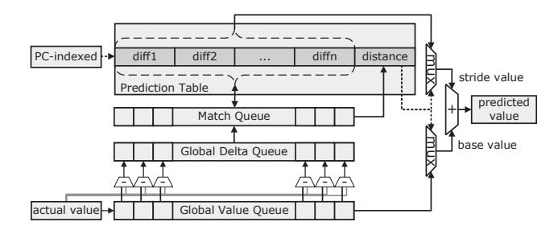

Fig. 1: The structure of the gDiff value predictor. [37]

## II. REVISITING GLOBAL VALUE PREDICTION

## *A. State-of-the-art Local Value Predictor*

EVES [33], proposed in the 1st Championship Value Prediction, still maintains 1st place in several tracks and remains the state-of-the-art value predictor. EVES comprises two components, EVTAGE and ES. EVTAGE is a context-based predictor that takes branch history and Program Counter (PC) as input, while ES is a computational predictor that takes PC as input only. Both EVTAGE and ES may output predicted values, but EVTAGE has a higher authority than ES.

Traditional value predictors represented by EVES work at the front-end of the pipeline [21]. They mainly rely on local value information rather than global value information to achieve prediction. In addition, speculative global branch information is also used to build the context required by the predictor. Unlike value predictors, branch predictors provide a prediction for all conditional branches, which makes the construction of speculative global branch history simple [27].

# *B. The Global Value Predictor*

To the best of our knowledge, gDiff is the latest design that exploits global value history. As illustrated in Figure 1, it consists of a prediction table indexed by the PC and a Global Value Queue (GVQ) that records the speculative results of recently dispatched instructions. Each entry in the prediction table stores multiple stride values (diffs) and a distance index that points to the diff correlated with the instruction.

*Prediction*: When an instruction is dispatched, its PC indexes the prediction table to retrieve *n* candidate diffs and a distance index. The distance index specifies which diff entry to use and determines the position of the corresponding base value in the global value queue. The base value is the output of a previously executed dynamic instruction at that distance in program order. The predictor adds the selected diff to the base value to form the predicted result. In this way, gDiff can capture the inter-instruction global correlations.

*Speculative Update*: Once the speculative result of the instruction becomes available, gDiff computes the global delta sequence, which is the difference between the current value and preceding global values in the global value queue. This delta sequence is compared against all *n* stored diffs in the corresponding table entry. If a match is found, the matching diff position becomes the new distance index, indicating that this stride pattern remains valid.

*Predictor Assistance*: Extreme performance potential has been demonstrated by gDiff to be obtainable through global value prediction. However, the global value sequence is crucial to the prediction. If the value of the corresponding distance in the global value queue is not available, it is difficult to get the expected prediction value. This has also been verified in [37]. To deal with the problem of value delay, Zhou et al. [37] proposed to use the local VP results to construct the global value queue and update the queue and predictor with the speculative results.

## *C. Why Now for Global Value Prediction?*

Current state-of-the-art EVES local value predictors, have reached a high level of maturity. While local predictors are highly effective, their ability to further improve coverage is becoming increasingly limited [26], [36]. They primarily rely on local value information and global branch history. However, there are still specific prediction scenarios, particularly those exhibiting Hard-to-Predict (H2P) characteristics, where existing local predictors struggle.

This limitation is precisely why we believe now is the opportune time to revisit global value prediction. Instead of being a replacement, global prediction offers a complementary dimension to local predictors, working in parallel to achieve higher overall prediction coverage. To illustrate this, we consider a specific H2P case study from the xalancbmk benchmark, which highlights the limitations of local predictors and the potential of global value prediction.

In linked list data structures, a *next* pointer directs to the address of subsequent element. Previous research has shown that if the linked element (the *next* field) and the current element are allocated in the same order as they are referenced, there is a near-constant stride between their load addresses [37]. Figure 2 shows an assembly code segment from xalancbmk. We are particularly interested in three instructions: I1 (pointer to the element), I3 (accessing structure data), and I6 (accessing the next element). We observe that I6 is an H2P instruction. Figure 3(a) displays the value sequence for instruction I6. While it appears to have general stride characteristics, it exhibits strong local fluctuations, making it challenging for existing context-based or computational local value predictors to handle. Figure 3(b) further emphasizes this, showing highly non-periodic fluctuations in the local stride sequence of I6.

However, by exploiting the global stride locality between I6 and I1, we can achieve accurate prediction. As shown in Figure 3(c), the global stride sequence between I6 and I1 is almost a constant 40, with only two minor value fluctuations. This strong locality means that once the result of I1 is available, the predicted value of I6 can be predicted by simply adding the result of I1 to this constant stride of 40.

This H2P scenario strongly motivates the development and integration of global value predictors such as gDiff. Its ability to effectively handle challenging inter-instruction H2P cases cases that elude even the most advanced local predictors

| xalancbmk                                                                       |  |                                     |      |  |  |
|---------------------------------------------------------------------------------|--|-------------------------------------|------|--|--|
| 000000000053f530 <_ZN11xercesc_2_510ValueStore8containsEPKNS_13FieldValueMapE>: |  |                                     |      |  |  |
|                                                                                 |  | 53f5bc : 52800013 mov w19, #0x0     | (I0) |  |  |
|                                                                                 |  | 53f5c0 : f94006c1 ldr x1, [x22, #8] | (I1) |  |  |
|                                                                                 |  | 53f5c4 : b40000c1 cbz x1, 53f5dc    | (I2) |  |  |
|                                                                                 |  | 53f5c8 : b9400420 ldr w0, [x1, #4]  | (I3) |  |  |
| 53f5cc : 6b13001f cmp w0, w19                                                   |  |                                     | (I4) |  |  |
| 53f5d0 : 54000969 b.ls 53f6fc                                                   |  |                                     | (I5) |  |  |
|                                                                                 |  | 53f5d4 : f9400820 ldr x0, [x1, #16] | (I6) |  |  |
|                                                                                 |  | 53f5d8 : f8746801 ldr x1, [x0, x20] | (I7) |  |  |

Fig. 2: Assembly example from xalancbmk of SPEC CPU.

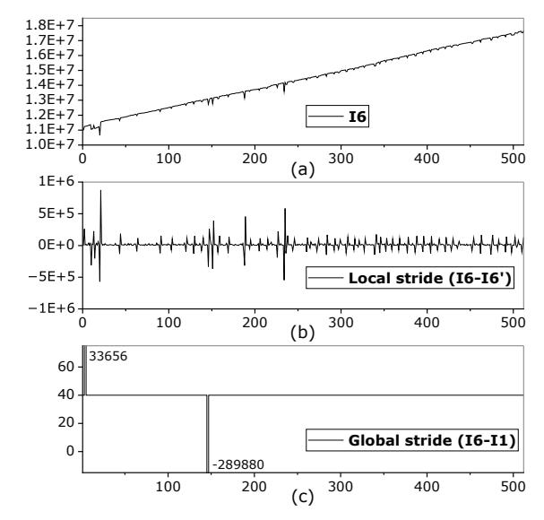

Fig. 3: H2P prediction scenarios in presence of global stride locality. (a) is the sequence of values generated by the H2P instruction I6, (b) is the local stride sequence of I6, where I6' is obtained by shifting the I6 sequence one step to the future. (c) is the global stride sequence between I6 and I1.

highlights the unique and significant contribution of global value prediction to overall processor performance.

## *D. Why gDiff Failed?*

Limitation 1: Insufficient prediction accuracy. In modern processors, the widely adopted misprediction recovery mechanism for value mispredictions is pipeline squash [18], [21], [32], which discards all instructions following a mispredicted instruction and restarts execution from the next one. While simple to implement, it is highly sensitive to the accuracy of the value predictor. If the misprediction rate is non-negligible, the resulting pipeline squash penalties can easily outweigh any performance gains. Unfortunately, gDiff cannot reliably achieve this stringent accuracy threshold (>99%).

Limitation 2: Instability due to speculative updates. The gDiff predictor relies on speculative updates, using results from uncommitted instructions to update its global value history and prediction table. However, in modern OoO processors, these speculative results are often invalidated due to

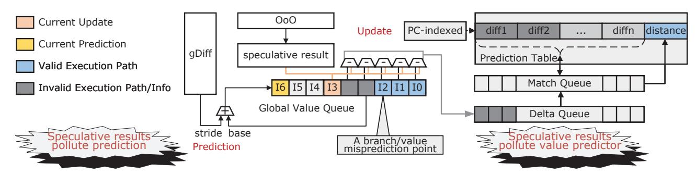

Fig. 4: Speculative update strategy of gDiff.

branch or preceding value mispredictions. As shown in Figure 4 (depicting the H2P scenario from Figure 2), a critical issue arises: an incorrect prediction of branch instruction I2 can cause speculative results from an invalid path to persist in the global value queue. If these uncommitted results are then used to update the predictor (right side), they can pollute the internal state. Even worse, these incorrect speculative values can remain in the global value queue even after a misprediction is detected. Consequently, these stale, incorrect values continue to influence future predictions (left side), leading to a compounding degradation of accuracy over time.

Limitation 3: Constrained global history and redundant prediction scope. The gDiff predictor relies on local value predictors to build its global value history. However, local predictors often prioritize accuracy over coverage, sometimes abstaining from predictions for low-confidence instructions. This means gDiff can not form a complete global value history, inherently limiting its prediction range. Furthermore, for instructions already showing strong local value locality, which the local predictor can accurately handle alone, adding a global stride offset results in the same local value locality, rendering the global prediction redundant.

**Limitation 4: High storage overhead.** A major limitation of gDiff is its high storage cost. It maintains a PC-indexed table where each entry stores multiple strides and a distance index. As gDiff order (i.e., the number of diffs per entry) increases, its storage requirement grows linearly. For instance, an order-32 gDiff can easily reach megabyte-level storage. This substantial overhead far exceeds typical local predictors and renders gDiff impractical for modern microarchitectures.

Our key insight is that the identified limitations can be overcome by revisiting its core design assumptions and introducing targeted enhancements across multiple dimensions:

- First, to tackle low prediction accuracy, we enhance the *confidence mechanism* using aggressive strategies such as tag-based indexing, last-misprediction control, and Forward Probabilistic Counters (FPC) [21], [35]. In FPC, the counter moves forward with a probability until saturation, and resets to zero upon a backward event. The probability is controlled by a vector, enabling finer-grained confidence tracking.
- Second, to mitigate the drawbacks of speculative updates, we adopt a *non-speculative update* strategy that defers predic-

tor updates to the commit stage, using architecturally correct values to train the predictor, preventing pollution and accurately capturing correlations regardless of instruction latency. We also squash invalid speculative values on pipeline squash to prevent incorrect history from affecting future predictions.

- Third, to address the limitation of unavailable global value history at prediction time, we relax the timing constraint. Instead of requiring all source values at the front-end, we allow predictions to be *deferred* until the base value becomes available later. This deferred prediction model improves the utility of global correlations without stalling the front-end.
- Finally, to reduce storage overhead, we *restructure* the predictor. Instead of storing all global strides, we retain only a global stride between correlated instructions, preserving essential correlation information while dramatically reducing memory footprint. To efficiently identify global correlations, we introduce a distance polling algorithm that maintains a distance field within each table entry. This field dynamically tracks the relative positions of correlated instructions.

#### III. REVISED GLOBAL LOAD VALUE PREDICTION

Given that load value prediction significantly impacts the efficiency of VP [7], [28], [29], we propose a global load value prediction architecture based on the global value predictor. The overall architecture is illustrated in Figure 5. The renamed load instructions are dispatched into the Load Queue (LQ), where their speculative results are obtained upon execution.

The proposed architecture introduces a global value predictor along with a GVQ, which is logically divided into speculative and non-speculative segments. The GVQ contains 64 total entries, with the speculative segment sized to match the LQ (32) and the non-speculative segment sized to match the predictor order (32). The non-speculative segment is responsible for updating the global predictor using committed values, whereas the speculative part is used for performing prediction. The speculative segment is indexed identically to the LQ, as both are circular buffers allocated and squashed in lockstep. When a load instruction completes execution and updates the LQ, its corresponding entry in the speculative queue is updated simultaneously. At commit time, the committed value is propagated from the speculative entry to the non-speculative segment in FIFO order. On a pipeline squash, all speculative

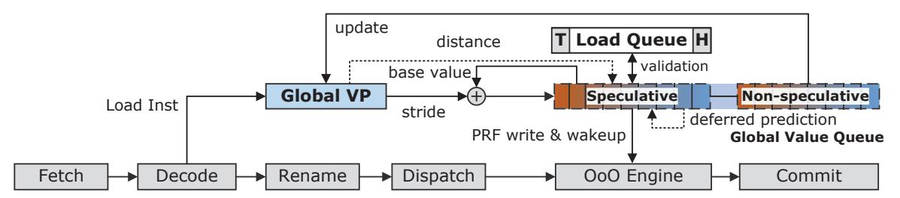

Fig. 5: Enhanced Global Load Value Prediction Architecture. H stands for the head instruction of LQ, T stands for the tail.

entries younger than the squash point are invalidated, while the non-speculative segment remains intact.

#### A. Core Innovations

The structure of the EgDiff is shown in Figure 6. Compared to the original gDiff, EgDiff introduces several enhancements.

#### • Aggressive confidence mechanism.

First of all, EgDiff augments each prediction table entry with a tag field derived from a different hash function of the PC. This tag-based filtering mechanism ensures that a prediction is only considered valid if the tag matches. To further enhance predictor adaptability, each entry also maintains usefulness bits (u-bits) that reflect the long-term utility of the entry. These bits are incremented when predictions are correct and periodically decayed over time using a global TICK counter. When a new entry must be allocated and the indexed entry is occupied, the entry is replaced only if its u-bit value is zero. Otherwise, the allocation attempt is skipped. This policy prioritizes retaining entries with demonstrated prediction utility.

Additionally, EgDiff incorporates a last misprediction (lastmisp) control mechanism inspired by the EVES predictor. After a misprediction occurs, the predictor temporarily suppresses all prediction outputs over a predefined window of 1024 instructions. This mechanism operates at a different granularity from FPC. The FPC reset acts on the individual mispredicted table entry, forcing it to rebuild confidence from zero before it can produce predictions again. In contrast, lastmisp acts globally by blanking all predictor outputs for a period after a misprediction event, preventing cascading errors from other entries that may also be unreliable in the same transient phase. The two mechanisms are therefore complementary rather than redundant. Finally, EgDiff employs FPC to filter out unreliable predictions. Each prediction entry maintains a 3-bit FPC that updates probabilistically based on prediction correctness. The FPC is updated using the probability vector  $\{1,\frac{1}{4},\frac{1}{4},\frac{1}{8},\frac{1}{8},\frac{1}{8},\frac{1}{8}\}$ , with decreasing probabilities at higher positions to slow confidence buildup.

#### • Non-speculative update mechanism.

We adjust the original speculative update strategy. Speculative values produced by the OoO engine may be incorrect due to mispredicted branches or values. EgDiff maintains a non-speculative queue that stores only committed results, ensuring that predictor updates are both deterministic and

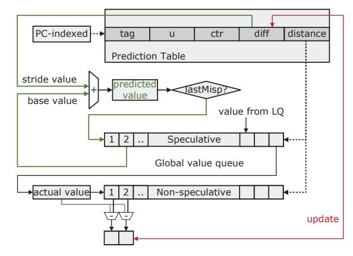

Fig. 6: The structure of the EgDiff value predictor.

reliable. Importantly, the entries of the non-speculative queue are directly derived from the speculative queue, preserving temporal alignment and dependency tracking. Meanwhile, updates to the speculative queue rely solely on the speculative results produced by the OoO engine. When a pipeline squash is triggered by a branch or value misprediction, only the speculative state is rolled back. In contrast, traditional gDiff adopts a no-squash policy, allowing mispredicted values to pollute the history and impair prediction accuracy.

#### • Deferred prediction.

By relaxing the requirement that all global values must be available at prediction, EgDiff improves flexibility in handling deep OoO pipelines. However, this relaxation naturally introduces cases where the base value is not yet available when a prediction is requested. This is particularly common for longlatency ops, such as loads, whose results are not immediately available during early pipeline stages. To address this, EgDiff adopts a deferred prediction strategy. When the required base value is not yet available, EgDiff temporarily withholds the prediction and writes the prediction information to the GVQ, and binds this entry to the corresponding table entry indicated by the distance field. Once the base value is computed by the LQ and written into the GVQ, the established binding allows EgDiff to directly locate pending dependent entry linked to this base instruction. For such dependent entry, EgDiff then generates the deferred prediction using the freshly written base value and the corresponding stride, and forwards it to

## Algorithm 1: Distance Polling Algorithm

```
Input: Current instruction's actual value v_{\text{actual}},
   non-speculative value queue NVQ, predicted diff \delta_p,
   predictor table entry gdEntry, predicted distance d
   Output: Updated distance and diff
1 Compute actual difference:
    \delta_a \leftarrow (v_{\text{actual}} - \text{NVQ}[d].value);
2 if \delta_a \neq \delta_p then
       Reset confidence counter:
4
       gdEntry.counter \leftarrow 0;
       Reset usage counter: gdEntry.u \leftarrow 0;
5
       if d > 1 then
           d \leftarrow (d-1);
           gdEntry.distance \leftarrow d;
8
           \delta_{new} \leftarrow (v_{\text{actual}} - \text{NVQ}[d].value);
9
           Update stride: gdEntry.diff \leftarrow \delta_{new};
10
       else
11
           Reset to default:
12
           gdEntry.distance \leftarrow n;
13
           \delta_{new} \leftarrow (v_{\text{actual}} - \text{NVQ}[n].value);
14
           Update stride: gdEntry.diff \leftarrow \delta_{new};
15
16 else
       if gdEntry.ctr < MAXCONF then
17
           if forwardProb() then
18
                Update ctr: gdEntry.ctr++;
19
       if gdEntry.u < MAXU then
20
         Update u: gdEntry.u++;
21
```

the OoO engine. This reverse-triggered mechanism enables value prediction to proceed as soon as sufficient information becomes available, ensuring that dependent instructions benefit from speculation while avoiding premature mispredictions.

#### • Distance polling strategy.

Original gDiff maintain multiple global diff values per table entry to capture global stride correlations across different distances, such a design incurs significant storage overhead. To address this, EgDiff adopts a compact distance polling strategy. Instead of storing multiple diff candidates, each table entry maintains only a diff value and a corresponding distance field. The distance indicates how far back in the value queue the diff was observed. During prediction, the diff is applied at the indexed base value. If a misprediction occurs, the predictor enters a polling phase by decrementing the distance field, probing earlier values in the queue for a stable correlation.

The detailed polling control method is described in Algorithm 1. The algorithm begins by computing the actual global stride, which is the difference between the actual result of current instruction and the base value at the predicted distance. This actual stride is then compared with the predicted global stride stored in the value queue entry. If the two strides differ, the predictor initiates the polling process. In this case, both the confidence and usage counters are reset. The algorithm

then decrements the distance to probe a closer position (line 7), recomputes the corresponding stride, and updates the table entry with this new stride value. If the distance becomes invalid, the predictor resets it to the default distance (line 12).

When the predicted and actual strides match, the predictor increases its FPC. The usefulness counter is also increased when appropriate. Through this process, the distance polling algorithm continuously refines the stored stride and distance, allowing EgDiff to maintain accurate global correlations while minimizing storage and computation cost. In addition, the design of distance polling reduces the number of global stride computations during update. In gDiff, updating the predictor may require calculating diff values for all *n* global values, as shown in Figure 1. In contrast, EgDiff only needs to compute two diffs corresponding to the values at *distance* and *distance-1*, and selects one for update based on Algorithm 1.

#### B. Microarchitecture Integration

The workflow of global load value prediction includes three aspects: *prediction*, *verification*, and *update*. Prediction generates the predicted value and injects it into the OoO engine, verification checks the predicted values, and update focuses on updating the global value predictor.

Prediction: EgDiff accesses the prediction table using a hashed index of the PC. If the tag matches and the FPC has reached its maximum confidence level (i.e., the 3-bit counter saturates at 7), the corresponding diff is interpreted as the stride value. The speculative queue is then accessed using the distance info to retrieve the base value. The predicted value is computed as the sum of the base value and the stride value. This result is written into the PRF and inserted into the speculative GVQ. This design simplifies integration by decoupling value prediction from normal execution writes. The handling of cases where the base value is unavailable is discussed in Section III-C. Regardless of whether the prediction is valid or not, a new entry is allocated in the speculative queue for all candidates. The structure of the speculative queue entry is presented in Table I, including fields for value, distance, and diff, as well as status flags: VP (valid prediction), misp (misprediction), available (base value readiness) and wake (index of the bound wake-up entry).

Verification: To enable accurate updates. Once a load instruction completes speculative execution in the LQ and the corresponding speculative GVQ entry contains a valid prediction and distance, the system compares the predicted value against the actual result to verify correctness. On a mismatch, the misp flag is set. Regardless of prediction outcome, the actual value is recorded into the GVQ entry. If the misp flag is set, a pipeline recovery process (e.g., a squash) is triggered to roll back dependent speculative state as early as possible. As part of this recovery, all speculative value queue entries that follow the mispredicted instruction are also squashed.

*Update*: The actual values of committed instructions are inserted into the non-speculative part and used to update the global value predictor. At each update, exactly two diff values

TABLE I: Speculative Queue Entry Example

| Index | Value | Distance | Diff | VP | Misp | Avail. | Wake |
|-------|-------|----------|------|----|------|--------|------|
| 1     | 10    | 5        | 10   | 1  | 0    | 0      | 0    |
| 2     | N/A   | 3        | 20   | 0  | 0    | 0      | 0    |
| 3     | 40    | 3        | 30   | 1  | 1    | 1      | 0    |
| 4     | 50    | N/A      | N/A  | 0  | 0    | 1      | 0    |
| 5     | N/A   | N/A      | N/A  | 0  | 0    | 0      | 2    |
| 6     | 0     | N/A      | N/A  | 0  | 0    | 1      | 0    |

are computed, one at the current distance and one at distance-1. Only one of these is selected to update the entry based on Algorithm 1. This means each committed load probes at most two positions per update, keeping the computational overhead minimal. If the stored diff matches the computed diff at the current distance, the predictor increments both the counter and the useful bits. For ctr counter, we use 3-bit FPC controlled by the probability vector. In addition, if the diff comparison fails, the distance field is decremented to probe for alternative matches in future updates (distance-1), when the distance reaches zero, it is reset to order n, thereby restarting the polling progress. Additionally, when the tag does not match, a new entry with u=0 is allocated with a probability of  $\frac{1}{16}$ . A 10-bit TICK counter is used to decrement all useful bits periodically. This allows correct predictions to increment u up to saturation while aging out less useful entries over time.

#### C. Unavailable Base Value Cases

Table I illustrates an example scenario of speculative queue entries. Each entry corresponds to an instruction awaiting or holding a predicted value. As we can see, not all speculative results are immediately usable. For instruction 2, the referenced base value is located in entry 5, which is currently unavailable. In this case, the distance and diff fields are stored in the speculative queue, and the VP flag is set to 0. During this process, the speculative entry index of instruction 2 is also written into the Wake field of entry 5, which is identified according to the distance field of instruction 2. This binding ensures that once the base value in entry 5 becomes available, instruction 2 can be promptly notified to generate its deferred prediction. In contrast, entry 1 refers to entry 6, where a base value is valid. Therefore, the prediction is computed and recorded, and the VP flag is set to 1.

When the result of instruction 5 becomes available, the speculative queue uses the Wake field of entry 5 to directly locate the dependent entry that is waiting for this value. In this example, entry 2 is identified through the stored Wake index. Before generating the prediction, EgDiff verifies that the *distance* field in the woken entry still matches the current relative position of instruction 5, ensuring that the dependency remains valid. Once confirmed, instruction 2 uses the newly available value from instruction 5 together with its recorded diff to compute the predicted result. The predicted value is written into the value field of speculative entry 2, and its VP flag is updated to 1. The prediction is then forwarded to the PRF to wake up subsequent dependent instructions. Specifically, the predicted value is written into the PRF using the destination PRF name, which was already recorded in the

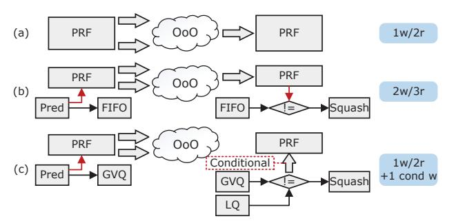

Fig. 7: PRF port pressure. (a) without VP, (b) traditional VP, (c) global load value prediction.

corresponding LQ entry at dispatch time. Simultaneously, a wakeup signal carrying this PRF tag is broadcast to the issue queue and scoreboard, following the same wakeup protocol used when a normal load completes execution. This design reuses existing wakeup infrastructure and requires no additional dedicated ports. In rare cases where a load port is occupied by a concurrent normal load writeback, the deferred wakeup is delayed with negligible performance impact.

If instruction 2 completes before instruction 5, its speculative entry is marked as available by setting the Avail flag to 1. During wake-up, such entries are ignored to prevent obsolete bindings from being reactivated. In this case, no prediction is generated, and the validation step is skipped. During the initial binding phase, if the target entry is already bound to another instruction, EgDiff discards the new binding attempt to preserve the one-to-one mapping.

## D. Register Port Pressure

The PRF consumes an important portion of the energy in an OoO engine [38]. As shown in Figure 7, traditional VP architectures increase the number of PRF accesses by performing additional write operation to deliver predicted values and read operation to verify predictions. To address this, we store predicted values in the GVQ, thereby eliminating PRF reads during verification. This optimization is not unique to EgDiff and could in principle be applied to any value predictor that maintains a prediction buffer. However, the GVQ in EgDiff already exists for prediction purposes, so this benefit comes at no additional storage cost. In addition, the PRF is written back only when a misprediction occurs. Given EgDiff's high accuracy (over 99%), such corrective writes are rare and introduce negligible additional pressure.

As shown in Figure 7, at first, the prediction result is written into the PRF and simultaneously into the GVQ. Then, when the speculative execution result returns to the LQ, it is compared with the predicted value in the GVQ. If they match, the LQ result is not written back to the PRF, reducing PRF pressure. Moreover, no wakeup broadcast or scoreboard update is issued since dependent instructions have already been awakened. Conversely, if they differ, the PRF needs to be written back, and triggering a pipeline squashing. In this

TABLE II: Gem5 Simulator Configuration.

|                  | Fetch through Issue width: 8 insts/cycle                                                                |  |  |
|------------------|---------------------------------------------------------------------------------------------------------|--|--|
| Front-End        | L1I: 4-way, 32KB, 2 cycle, 64-entry ITLB, 4 MSHRs, 64B fetch buffer                                     |  |  |
|                  | Branch Predictor: L-TAGE [25], 4K-entry BTB, 16-entry RAS, 21 cycles min. mis penalty.                  |  |  |
|                  | Commit width: 8 insts/cycle. ROB/IQ/LQ/SQ: 192/64/32/32 (STLF latency: 1 cycles)                        |  |  |
| Execution        | 168/168 INT/FP PRF, 1K-SSIT/LFST Store Sets, rolled-back on squash and cleared every 250K access,       |  |  |
|                  | 6ALU(1c), 2Mul/Div(3c/20c*), 4FP(2c), 2FPMulDiv(4c/12c*), 4Ld/Str Ports, 1 Str Port. (*Not Pipelined.)  |  |  |
|                  | L1D: 4-way, 32KB, 3 cycles load-to-use, 4 MSHRs, 64-entry DTLB                                          |  |  |
|                  | L2: Unified private, 8-way 256KB, 12 cycle, 20 MSHRs                                                    |  |  |
| Memory Hierarchy | L3: Unified private, 16-way 2MB, 32 cycle, 32 MSHRs                                                     |  |  |
|                  | All caches have 64B lines, LRU replacement policy, and stride prefetcher (degree = 4)                   |  |  |
|                  | Memory: Dual Channel DDR4-2400, 2 channels, 2 ranks/channel, 16banks/rank, 512 row-buffer, tREFI 7.8us. |  |  |
|                  | Global VP: gDiff [37]. 4K-entry, 1.03MB. EgDiff 4K-entry, 44KB                                          |  |  |
| Value Predictors | Local VP: EVES [33]. 8KB, 32KB and unlimited versions.                                                  |  |  |

way, when the prediction is correct, EgDiff does not introduce additional PRF read/write operations.

## IV. EVALUATION METHODOLOGY

We employ Gem5 [15] as the simulation platform. The configuration parameters are detailed in Table II. The processor model is a relatively aggressive 4 GHz OoO superscalar core. It imposes a minimum penalty of 21 cycles for value mispredictions, comparable to typical branch misprediction penalties. The final EgDiff predictor uses an order equal to the LQ size (32). The prediction table contains 4K entries.

We evaluate programs from the SPEC CPU 2017 [6] benchmark suite using the *ref* input set. All workloads are compiled for the ARMv8-A (AArch64) instruction set with -O3 optimization option. And all benchmarks are executed in *SE* mode. Regions of interest are identified using Simpoints 3.2 [22]. Each simulation executes 150 million instructions, including 50 million for warm-up and 100 million for statistics.

We model the latency of all predictors for fair comparison. EVES has a 3-cycle latency, corresponding to VTAGE table lookup, entry processing, and value-table access. Similarly, gDiff requires 3 cycles for table lookup, global value queue access, and prediction computation. EgDiff includes two prediction modes: a normal prediction with 3-cycle latency, and a deferred prediction with 2 additional cycles. The first cycle reads the Wake field from the GVQ entry to identify the bound entry. The second cycle accesses this dependent entry to retrieve the diff and computes the predicted value.

## V. RESULTS

This section revisits the design of the global gDiff value predictor through a series of staged experiments. This approach enables us to systematically evaluate the contribution of each enhancement and their combined effects.

## *A. Confidence Mechanism*

This subsection revisits and incrementally enhances the confidence mechanism of the gDiff value predictor. The value queue is primarily updated by results produced during speculative execution. In addition, at dispatch time, if the 32KB EVES predictor provides a valid prediction, this predicted value is also pushed into the queue so that subsequent instructions can use it as a base value before the true producer result becomes available. This EVES-assisted mechanism follows the same principle as the original gDiff design [37]. We will evaluate the impact of this strategy at the end of this subsection. It should be noted that EVES predictions are only used to populate the value queue, they are not written into the PRF and therefore have no direct impact on performance.

The baseline configuration, gDiff+sc, employs a saturating counter to track confidence and enable predictions once the counter exceeds a fixed threshold. The first enhancement, gDiff+tag, adds a hashed PC tag and u-bits to each predictor entry, issuing predictions only when the tag matches to reduce aliasing and improve selectivity. To minimize correlated collisions, the tag hash differs from the index hash. The second enhancement, gDiff+lastmisp, suppresses predictions immediately after a misprediction to prevent repeated errors. Finally, gDiff+fpc updates the confidence counter probabilistically after correct predictions, slowing confidence buildup and avoiding premature trust in weakly trained entries. Figure 8 summarizes the performance of the gDiff predictor with progressively enhanced confidence.

We observe that the gDiff+sc only brings modest speedups and occasionally incurs negative performance due to high misprediction rate, such as on *511.povray* and *531.deepsjeng*, where the naive confidence tracking leads to premature trust in inaccurate predictions. Introducing gDiff+tag introduces a more consistent improvement by reducing aliasing, showing marked misprediction reduction in benchmarks such as *500.perlbench* and *520.omnetpp*. In contrast, gDiff+lastmisp improves the worst-case behavior significantly by suppressing prediction immediately after a misprediction, avoiding consecutive pipeline squashes, especially for *511.povray*, *531.deepsjeng*, and other workloads with negative gains. Finally, gDiff+fpc achieves the highest overall IPC gain of 3.24%, with some applications like *519.lbm* and *538.imagick* benefiting from over 5% speedup. Overall, however, such an aggressive confidence mechanism may limit the coverage, such as *554.roms*.

To further evaluate the dependency on local predictors, we disable the EVES-assisted mechanism and re-measure the performance. As shown in Figure 8, removing EVES results in only a marginal performance drop (gDiff-EVES), with average IPC speedup decreasing slightly from 3.24% to 3.11%. Coverage is reduced from 26.15% to 22.45%, while the

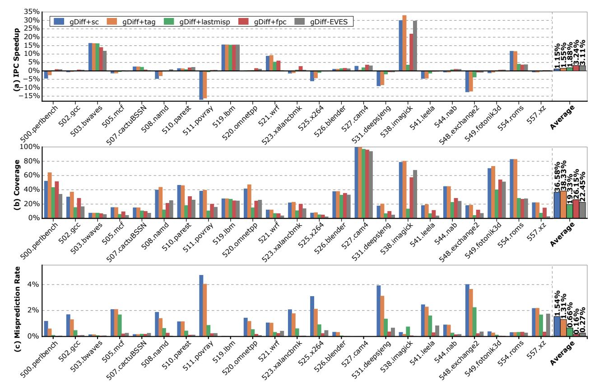

Fig. 8: Performance of the gDiff predictor with incremental confidence mechanism enhancements. + indicates cumulative addition of mechanisms. - indicates removal. (e.g., gDiff-EVES removes EVES-assisted value queue population)

misprediction rate remained very low. These results indicate that EgDiff can operate effectively and stably without relying on external value predictors.

## B. Non-speculative Update Strategy

Under the aggressive confidence mechanism, the EgDiff achieves higher accuracy, making coverage the dominant factor in overall performance. To evaluate the effect of global history length, we vary the gDiff predictor order from 8 to 64 and measure both IPC speedup and prediction coverage, as shown in Figure 9. Performance improves steadily as the order increases, peaking at order-24 with an IPC speedup of 3.12%, after which it saturates and fluctuates slightly.

Prediction coverage exhibits a similar trend. It rises from 21.1% at order-8 to a maximum of 22.6% at order-24, after which it decreases. The coverage reduction at higher orders is primarily due to the prolonged retention of speculative values in the global value queue, which increases the likelihood of stale or invalid correlations contaminating the predictor state. As a result, longer histories fail to translate into more effective predictions, leading to a saturation and eventual decline, in both coverage and performance.

To this end, we introduce two optimization strategies. The squash vq strategy invalidates entries in the global value

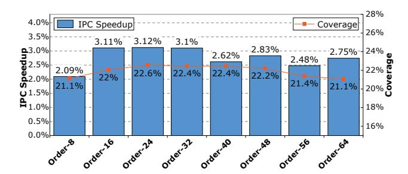

Fig. 9: The impact of gDiff order on performance.

queue upon branch or value mispredictions, thereby purging tainted history before it propagates. The non-speculative update delays predictor updates until commit so that only architecturally verified values modify the predictor.

We examine two incremental configurations. As shown in Figure 10, enabling nonSpec update first raises the average IPC speedup from 3.11% to 3.25% by restricting updates to architecturally verified instructions. Building on this, adding the squash vq further refines predictor stability by purging speculative entries in the global value queue upon pipeline squashes and preventing tainted history from propagating. This

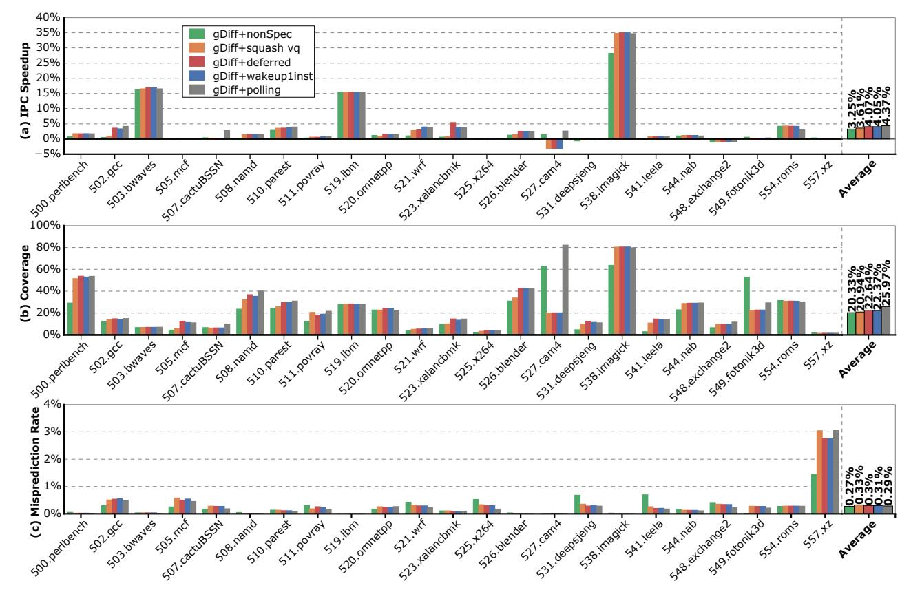

Fig. 10: Incremental evaluation of gDiff under progressively enhanced update and prediction strategies.

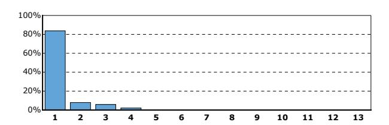

Fig. 11: Distribution of the number of dependent instructions awaiting deferred prediction per resolved base instruction.

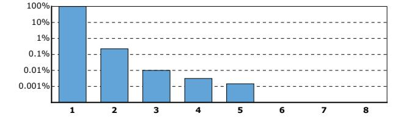

Fig. 12: Distribution of the number of deferred prediction wakeups triggered per cycle.

combination improves the average IPC speedup to 3.61%. Although the overall coverage decreases marginally, from 22.45% to 20.94%, several benchmarks such as 538.imagick and 510.parest exhibit notable coverage gains, which contribute to the overall performance improvement.

## C. Deferred Prediction

To handle cases where the required base value is unavailable during prediction, we first evaluate an idealized deferred prediction model, denoted as gDiff+deferred. In this model, when an instruction resolves a value, the value queue performs a backward scan over the entire value queue to locate and trigger all pending predictions that depend on the newly resolved value. As shown in Figure 10, this idealized

approach improves prediction coverage by 1.7% on average, yielding a 0.46% increase in IPC speedup (from 3.61% to 4.07%) without affecting accuracy. While effective, this reverse-scanning mechanism requires a content-addressable structure (CAM-like) to efficiently match dependencies across the queue, resulting in substantial hardware overhead.

To eliminate this cost, we propose a practical implementation, gDiff+wakeuplinst, which instead uses the wake field in each queue entry to bind a single dependent instruction that should be awakened once the base value becomes available (described in Section III-B). Figure 11 shows that this simple design maintains nearly identical performance, with average IPC speedup slightly reduced from 4.07% to 4.05%.

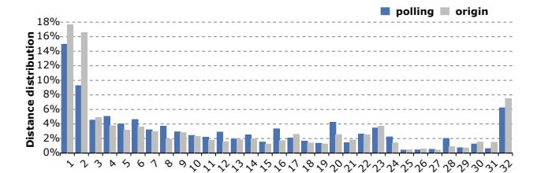

Fig. 13: Distance distribution of the polling strategy.

1) Wakeup Length Analysis: Figure 11 further illustrates the distribution of the number of wakeups per instruction in the idealized model. In more than 80% of cases, each instruction triggers only one dependent prediction. This observation validates the practicality of our single-wakeup design, which achieves most of the benefits of full reverse scanning while avoiding its high cost.

2) Wakeup Port Pressure Analysis: Based on single-wakeup design, a practical concern with deferred prediction is whether it increases pressure on register write ports and wakeup logic. To quantify this, Figure 12 shows the distribution of the number of deferred predictions triggered per cycle during execution. The results reveal that over 99% of cycles trigger 1 wakeup, with only rare bursts of 2-3 simultaneous wakeups. This distribution indicates that deferred prediction imposes minimal incremental demand on wakeup ports. In the baseline configuration with 4 load ports, the additional 1 wakeup event per cycle can be accommodated without requiring dedicated hardware. Moreover, as discussed in Section III-D, EgDiff reduces PRF write pressure by validating predictions in the GVQ rather than the PRF. Crucially, deferred prediction reuses existing load completion ports for both PRF writes and issue queue wakeup broadcasts, requiring no additional hardware ports. When a deferred prediction coincides with a normal load writeback on the same port, the deferred write is simply delayed by one cycle. Given that over 99% of cycles trigger at most one deferred wakeup, such conflicts are exceedingly rare and have negligible performance impact. These mechanisms ensure that deferred prediction integrates naturally into the backend pipeline without creating new bottlenecks.

## D. Distance Polling Effectiveness

A key challenge in global value prediction is the high storage overhead. The original gDiff predictor incurs significant cost by storing 32 diff values per entry, totaling about 1.03 MB for a 4K-entry table. To mitigate this, EgDiff adopts a distance polling strategy that retains only a single diff value per entry, guided by a compact distance field. Each entry includes a 14-bit tag, 2-bit usefulness field, 3-bit FPC, 64-bit diff, and 5-bit distance, resulting in 88 bits per entry. With 4K entries, the total predictor table storage is 44 KB. This design achieves a remarkable 95.8% reduction in storage usage.

To verify that this compression preserves prediction behavior, we compare the distance distributions of both strategies in Figure 13. The baseline origin configuration (gray bars)

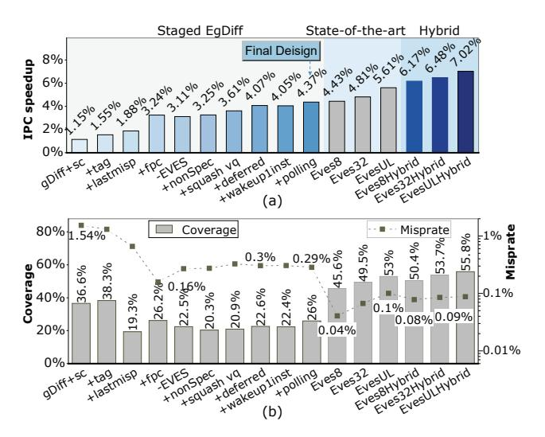

Fig. 14: The performance of different predictors.

represents gDiff with full multi-diff storage, while polling (blue bars) corresponds to EgDiff. The two distributions exhibit remarkably similar patterns, confirming that the polling strategy retains the essence of historical reuse behavior.

Moreover, performance results in Figure 10 confirm that distance polling not only avoids degradation but slightly improves overall performance. The IPC speedup increases from 3.62% to 4.37%, while prediction coverage rises from 22.27% to 25.87%. These results demonstrate that the polling mechanism helps filter out noisy or weak historical correlations. By retaining only the most representative diff per entry, EgDiff achieves both higher efficiency and better prediction quality.

## E. Area and Energy Overhead

In addition to the predictor table, EgDiff employs a GVQ to buffer speculative and non-speculative values. The GVQ contains 64 entries (32 speculative and 32 non-speculative). Each entry is 141 bits wide, consisting of a 64-bit value and metadata fields (VP, misp, available, distance, diff, and wake index), for a total capacity of 1.1 KB.

From a hardware perspective, the predictor table is implemented as a standard direct-indexed SRAM, comparable to a single TAGE component table [27]. The GVQ is a random-access circular buffer with FIFO semantics, structurally similar to a load queue. Prediction reads a single entry indexed by the distance field, while updates access only two positions (at distance and distance—1), avoiding any associative lookup.

We estimate processor area and power using McPAT [12], and evaluate the physical cost of the predictor table and GVQ using CACTI 7.0 at 22nm [2]. The combined predictor table and GVQ occupy 0.078 mm², representing only 0.22% of the total processor area, and their energy consumption accounts for 0.07% of total processor energy. These results demonstrate that EgDiff introduces negligible hardware overhead while delivering meaningful performance improvements.

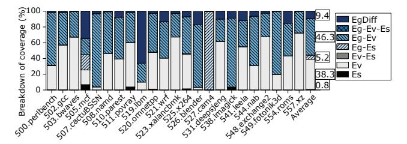

Fig. 15: Coverage breakdown by predictors.

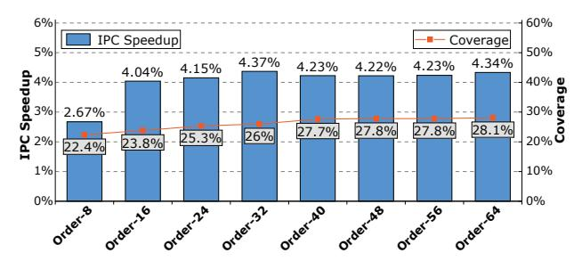

Fig. 16: The impact of EgDiff order on performance.

## F. Staged Performance and Hybrid Approach

Figure 14 illustrates the staged performance gains as enhancements are progressively applied. We further explore a hybrid combining EgDiff with EVES, where EVES predictions are written into both the PRF and the GVQ to serve as base values for EgDiff. When both predictors produce valid predictions, EVES takes precedence.

As shown in Figure 14, EVES alone provides performance gains of 4.43%, 4.81%, and 5.61% for Eves8, Eves32, and EvesUL, respectively. When combined with EgDiff, the hybrid configurations achieve substantially higher speedups: Eves8Hybrid reaches 6.17%, Eves32Hybrid achieves 6.48%, and EvesULHybrid peaks at 7.02%. These results demonstrate the complementary strengths of global and local predictors. The hybrid approach unifies both forms of prediction to provide superior performance.

Figure 15 breaks down EvesULHybrid coverage by source. The figure decomposes coverage among three underlying predictors: EgDiff (Eg), and the two sub-components of EVES, namely EVTAGE (Ev) and ES (Es). Each stacked bar shows the fraction of correct predictions attributed to each combination. On average, The Ev-only (38.3%) and Es-only (0.8%) portions represent cases handled exclusively by EVES. EgDiff-only accounts for 9.4% of the coverage, representing global patterns completely invisible to local predictors.

#### G. Sensitivity Study

1) Predictor Design Parameters: To evaluate the robustness of EgDiff, we analyze its sensitivity to predictor order and stride width, as shown in Figures 16 and 17. For the predictor order, EgDiff maintains consistently high performance across a wide range of configurations. IPC speedup increases from 2.67% at order-8 to 4.04% at order-16, after which the

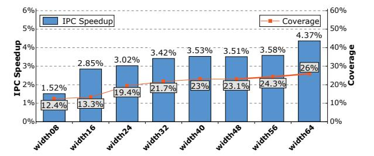

Fig. 17: The impact of EgDiff stride width on performance.

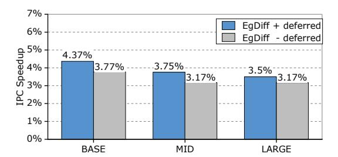

Fig. 18: Performance across microarchitectural scales.

performance gradually saturates. Coverage shows a similar trend, rising steadily from 22.4% to around 28.1%.

We also investigate the impact of stride width on performance. As shown in Figure 17, increasing the width from 8 bits to 32 bits leads to a rapid improvement in both IPC speedup and coverage. Beyond 32 bits, the speedup stabilizes, while a modest gain reappears at 56-64 bits, where the additional width helps recover correlations involving larger numerical differences. Overall, these results demonstrate that EgDiff delivers stable and scalable performance across design parameters, showing strong adaptability.

2) Microarchitectural Scaling: To assess EgDiff under increasingly large instruction windows, we evaluate it across three scaled processor configurations, as detailed in Table III.

Figure 18 presents the results. As expected, larger instruction windows reduce the benefit of value prediction by improving the processor's ability to tolerate cache miss latencies and hide data dependencies. EgDiff's IPC speedup decreases from 4.37% (BASE) to 3.75% (MID) and 3.5% (LARGE). However, even at the LARGE scale, where the instruction window is  $2\times$  larger than baseline and L1D MSHRs are  $4\times$  more abundant, EgDiff continues to deliver performance gains exceeding 3.5%. This demonstrates that global value prediction remains practically valuable even in processors with extensive reordering and latency-hiding capabilities.

To isolate the contribution of deferred prediction, we evaluate a variant that disables this mechanism (EgDiff-deferred). As shown in Figure 18, deferred prediction consistently contributes additional performance gains across all three configurations, improving IPC speedup by 0.6% at BASE, 0.58% at MID, and 0.33% at LARGE. Even in the LARGE configuration with extensive reordering capabilities, deferred prediction still accounts for nearly 10% of the total performance gain

TABLE III: Scaled Processor Configurations

| Parameter      | BASE        | MID         | LARGE       |
|----------------|-------------|-------------|-------------|
| ROB/IQ         | 192/64      | 256/128     | 384/192     |
| LQ/SQ          | 32/32       | 48/48       | 64/64       |
| INT/FP/VEC PRF | 168/168/168 | 224/224/224 | 336/336/336 |
| L1D/L2 MSHRs   | 4/20        | 8/32        | 16/48       |

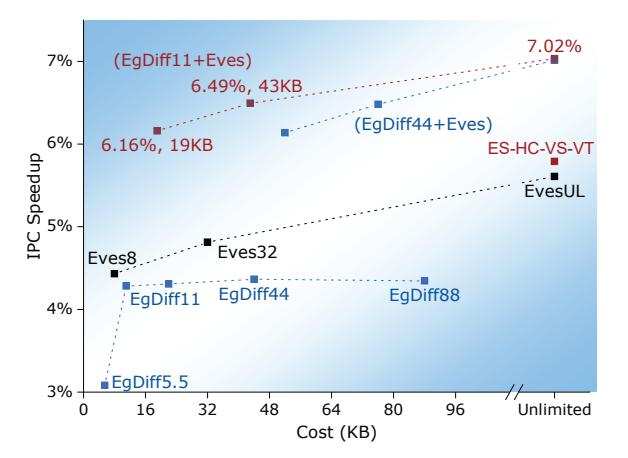

Fig. 19: Cost-performance comparison of value predictors.

delivered by EgDiff, confirming its sustained practical value across modern microarchitectural scales.

- *3) Cost-Performance Trade-off:* A critical concern raised by prior work is whether global value prediction can deliver competitive performance under realistic storage budgets. To address this, we systematically evaluate EgDiff across varying table sizes and compare it against other predictors. Figure 19 plots the cost-performance relationship for various predictor configurations. We evaluate multiple configurations:
  - EgDiff variants: 5.5KB (512 entries), 11KB (1K entries), 22KB (2K), 44KB (4K), 88KB (8K)
  - EVES variants: 8KB, 32KB, and unlimited
  - ES-HC-VS-VT [26]: unlimited configuration
  - Hybrid configurations: EgDiff 11/44 KB + EVES 8KB

At comparable storage budgets, EgDiff performs competitively against other local predictors. The 11KB EgDiff achieves 4.28% speedup, while the 8KB EVES provides 4.43%. EgDiff reaches near-optimal gain at just 1K entries (11KB), and increasing the table to 4K entries (44KB) yields only marginal additional gain (4.37%), confirming that the polling strategy converges to the most predictive correlations.

More importantly, the 19KB hybrid (11KB EgDiff + 8KB EVES) achieves 6.16% speedup, exceeding 32KB EVES alone (4.81%) despite a smaller budget. This gap cannot be explained by additional storage alone and confirms that the two predictors capture fundamentally orthogonal patterns. As an upperbound reference, the unlimited ES-HC-VS-VT [26] hybrid local predictor achieves 5.79% IPC speedup. Notably, the 19KB hybrid already surpasses this unbounded predictor, suggesting that incorporating global VP into a hybrid design can be more effective than scaling local-only predictor combinations.

## VI. RELATED WORK

Value Prediction. VP has been extensively studied since its introduction [8], [13]. Recent work focused on architectural tweaks to VP [4], [18], [28], [29]. DLVP [28] leverages address locality for data prefetching, enabling earlier cache access at the cost of increased bandwidth pressure. AVPP [18] goes further by storing prefetched data in a dedicated L0-like cache. Further gains were achieved by hybridizing DLVP with traditional VP [29]. However, not all predictions lead to performance gains. FVP [3] demonstrates that even low-coverage prediction can yield significant benefits. This insight is complementary to our work. While FVP improves efficiency by narrowing prediction scope within a local predictor, EgDiff broadens scope by capturing inter-instruction global correlations that no local predictor can exploit. AT-RT [1] leverages register data locality [20] for prediction. TVP [19], [31] predicts specific outcomes to reduce hardware execution strength. [23] shows that VP can also benefit in-order processors. These predictors exploit the locality of values or addresses associated with a specific static instruction, whereas EgDiff exploits global stride locality across instructions.

Local Value Predictor. Most existing value predictors [9]– [11], [16], [21], [26], [28], [30], [33], [34], including EVES [33] which serves as an important counterpart in this work, rely on local value locality of static instructions. In contrast, the global value predictor discussed in this paper identifies global stride correlations, where the value produced by one instruction can be correlated to values of other instructions. This represents a fundamentally different approach. Earlier work by Nakra et al. [17] explored global context-based VP, correlating an instruction with that of the immediately preceding dynamic instruction. The gDiff [37] predictor further developed this direction by explicitly exploiting global stride correlations, but neither approach has received much attention. As processors scale in complexity, revisiting global VP to complement local techniques holds significant potential.

# VII. CONCLUSIONS

This paper revisits global value prediction, addressing the speculative update pollution and high storage costs that limited prior designs of gDiff. EgDiff overcomes these issues with aggressive confidence control, non-speculative updates, deferred prediction, and a distance polling scheme that cuts storage by over 95% without accuracy loss. It achieves 99% prediction accuracy and 4.37% speedup, matching state-of-theart local predictors. Combined with EVES, it reaches 7.02% IPC speedup, demonstrating that global and local prediction are complementary and enable practical, high-performance VP.

# ACKNOWLEDGMENT

This work was supported in part by the NSFC under Grants 62272475, 62090023, 92470202, 62472435 and 62421002; by the HPCL project under Grant 202401-02; by the Innovation Reserch Foundation of NUDT (25-ZZCX-JDZ-16) and by the Key Laboratory of Advanced Microprocessor Chips and Systems.

## REFERENCES

- [1] R. Alves, S. Kaxiras, and D. Black-Schaffer, "Early address prediction: Efficient pipeline prefetch and reuse," *ACM Transactions on Architecture and Code Optimization (TACO)*, vol. 18, no. 3, pp. 1–22, 2021.
- [2] R. Balasubramonian, A. B. Kahng, N. Muralimanohar, A. Shafiee, and V. Srinivas, "Cacti 7: New tools for interconnect exploration in innovative off-chip memories," *ACM Transactions on Architecture and Code Optimization (TACO)*, vol. 14, no. 2, pp. 1–25, 2017.
- [3] S. Bandishte, J. Gaur, Z. Sperber, L. Rappoport, A. Yoaz, and S. Subramoney, "Focused value prediction: Concepts, techniques and implementations presented in this paper are subject matter of pending patent applications, which have been filed by intel corporation," in *2020 ACM/IEEE 47th Annual International Symposium on Computer Architecture (ISCA)*. IEEE, 2020, pp. 79–91.
- [4] R. Bera, A. Ranganathan, J. Rakshit, S. Mahto, A. V. Nori, J. Gaur, A. Olgun, K. Kanellopoulos, M. Sadrosadati, S. Subramoney *et al.*, "Constable: Improving performance and power efficiency by safely eliminating load instruction execution," in *2024 ACM/IEEE 51st Annual International Symposium on Computer Architecture (ISCA)*. IEEE, 2024, pp. 88–102.
- [5] J. T. Bodine *et al.*, "Exploiting computational locality in global value histories." 2002.
- [6] J. Bucek, K.-D. Lange, and J. v. Kistowski, "Spec cpu2017: Nextgeneration compute benchmark," in *Companion of the 2018 ACM/SPEC International Conference on Performance Engineering*, 2018, pp. 41–42.
- [7] M. Burtscher and B. G. Zorn, "Hybridizing and coalescing load value predictors," in *Proceedings 2000 International Conference on Computer Design*. IEEE, 2000, pp. 81–92.
- [8] F. Gabbay and A. Mendelson, *Speculative execution based on value prediction*. Citeseer, 1996.
- [9] Y. Ishii, "Context-base computational value prediction with value compression," *Proceedings of the 1st Championship Value Prediction, Los Angeles, CA, USA*, vol. 3, 2018.
- [10] K. Kalaitzidis and A. Seznec, "Value speculation through equality prediction," in *2019 IEEE 37th International Conference on Computer Design (ICCD)*. IEEE, 2019, pp. 694–697.
- [11] K. Koizumi, K. Hiraki, and M. Inaba, "H3vp: History based highly reliable hybrid value predictor," *1st Championship Value Prediction*, 2018.
- [12] S. Li, J. H. Ahn, R. D. Strong, J. B. Brockman, D. M. Tullsen, and N. P. Jouppi, "Mcpat: An integrated power, area, and timing modeling framework for multicore and manycore architectures," in *Proceedings of the 42nd annual ieee/acm international symposium on microarchitecture*, 2009, pp. 469–480.
- [13] M. H. Lipasti and J. P. Shen, "Exceeding the dataflow limit via value prediction," in *Proceedings of the 29th Annual IEEE/ACM International Symposium on Microarchitecture. MICRO 29*. IEEE, 1996, pp. 226– 237.
- [14] M. H. Lipasti, C. B. Wilkerson, and J. P. Shen, "Value locality and load value prediction," in *Proceedings of the seventh international conference on Architectural support for programming languages and operating systems*, 1996, pp. 138–147.
- [15] J. Lowe-Power, A. M. Ahmad, A. Akram, M. Alian, R. Amslinger, M. Andreozzi, A. Armejach, N. Asmussen, B. Beckmann, S. Bharadwaj *et al.*, "The gem5 simulator: Version 20.0+," *arXiv preprint arXiv:2007.03152*, 2020.
- [16] O. Mutlu, H. Kim, and Y. N. Patt, "Address-value delta (avd) prediction: Increasing the effectiveness of runahead execution by exploiting regular memory allocation patterns," in *38th Annual IEEE/ACM International Symposium on Microarchitecture (MICRO'05)*. IEEE, 2005, pp. 12–pp.
- [17] T. Nakra, R. Gupta, and M. L. Soffa, "Global context-based value prediction," in *Proceedings Fifth International Symposium on High-Performance Computer Architecture*. IEEE, 1999, pp. 4–12.
- [18] L. Orosa, R. Azevedo, and O. Mutlu, "Avpp: Address-first valuenext predictor with value prefetching for improving the efficiency of load value prediction," *ACM Transactions on Architecture and Code Optimization (TACO)*, vol. 15, no. 4, pp. 1–30, 2018.
- [19] A. Perais, "A case for speculative strength reduction," *IEEE Computer Architecture Letters*, vol. 20, no. 1, pp. 22–25, 2021.
- [20] A. Perais, F. A. Endo, and A. Seznec, "Register sharing for equality prediction," in *2016 49th Annual IEEE/ACM International Symposium on Microarchitecture (MICRO)*. IEEE, 2016, pp. 1–12.

- [21] A. Perais and A. Seznec, "Practical data value speculation for future high-end processors," in *2014 IEEE 20th International Symposium on High Performance Computer Architecture (HPCA)*. IEEE, 2014, pp. 428–439.
- [22] E. Perelman, G. Hamerly, M. Van Biesbrouck, T. Sherwood, and B. Calder, "Using simpoint for accurate and efficient simulation," *ACM SIGMETRICS Performance Evaluation Review*, vol. 31, no. 1, pp. 318– 319, 2003.
- [23] P. Ravenel, A. Perais, B. D. De Dinechin, and F. Petrot, "Architecting ´ value prediction around in-order execution," in *2025 IEEE International Symposium on High Performance Computer Architecture (HPCA)*. IEEE, 2025, pp. 72–84.
- [24] Y. Sazeides and J. E. Smith, "The predictability of data values," in *Proceedings of 30th Annual International Symposium on Microarchitecture*. IEEE, 1997, pp. 248–258.
- [25] A. Seznec, "A 256 kbits l-tage branch predictor," *Journal of Instruction-Level Parallelism (JILP) Special Issue: The Second Championship Branch Prediction Competition (CBP-2)*, vol. 9, pp. 1–6, 2007.
- [26] A. Seznec and K. Kalaitzidis, "Exploring value prediction limits," in *CVP 2020-Championship Value Prediction*. ACM, 2020, pp. 1–5.
- [27] A. Seznec and P. Michaud, "A case for (partially) tagged geometric history length branch prediction," *The Journal of Instruction-Level Parallelism*, vol. 8, p. 23, 2006.
- [28] R. Sheikh, H. W. Cain, and R. Damodaran, "Load value prediction via path-based address prediction: Avoiding mispredictions due to conflicting stores," in *Proceedings of the 50th Annual IEEE/ACM International Symposium on Microarchitecture*, 2017, pp. 423–435.
- [29] R. Sheikh and D. Hower, "Efficient load value prediction using multiple predictors and filters," in *2019 IEEE International Symposium on High Performance Computer Architecture (HPCA)*. IEEE, 2019, pp. 454– 465.
- [30] K. Kalaitzidis and A. Seznec, "Leveraging value equality prediction for value speculation," *ACM Transactions on Architecture and Code Optimization (TACO)*, vol. 18, no. 1, pp. 1–20, 2020.
- [31] A. Perais, "Leveraging targeted value prediction to unlock new hardware strength reduction potential," in *MICRO-54: 54th Annual IEEE/ACM International Symposium on Microarchitecture*, 2021, pp. 792–803.
- [32] A. Perais and A. Seznec, "Eole: Toward a practical implementation of value prediction," *IEEE Micro*, vol. 35, no. 3, pp. 114–124, 2015.
- [33] A. Seznec, "Exploring value prediction with the eves predictor," in *CVP-1 2018-1st Championship Value Prediction*, 2018, pp. 1–6.
- [34] L. Yang, L. Huang, R. Yan, N. Xiao, S. Ma, L. Shen, and W. Xu, "Stride equality prediction for value speculation," *IEEE Computer Architecture Letters*, vol. 21, no. 2, pp. 57–60, 2022.
- [35] L. Yang, L. Huang, and Z. Zheng, "Confidence counter modelling for value predictor," in *Proceedings of the Great Lakes Symposium on VLSI 2023*, 2023, pp. 221–222.
- [36] L. Yang, Z. Zheng, L. Huang, R. Yan, S. Ma, Y. Wang, and W. Xu, "Optimizing value prediction for ilp processors: A design space exploration approach," *Integration*, vol. 103, p. 102402, 2025.
- [37] H. Zhou, J. Flanagan, and T. M. Conte, "Detecting global stride locality in value streams," in *Proceedings of the 30th annual international symposium on Computer architecture*, 2003, pp. 324–335.
- [38] V. Zyuban and P. Kogge, "The energy complexity of register files," in *Proceedings of the 1998 international symposium on Low power electronics and design*, 1998, pp. 305–310.