# RoCC: Harnessing Raster Operations Pipeline for Efficient Tensor Collective Communication

Yuan Feng *University of California, Merced* yfeng44@ucmerced.edu

Daniel Wong *University of California, Riverside* daniel.wong@ucr.edu

Hyeran Jeon *University of California, Merced* hjeon7@ucmerced.edu

*Abstract***—This paper introduces RoCC, which enables finegrained overlapping between compute and collective communication (CC) phases of LLM computing on GPUs, by offloading the CC to underutilized raster operations pipelines (ROPs). ROPs can provide fruitful performance for CC as they reside near the memory and have reduction computation capability. We first reverse engineer the ROP microarchitecture of two GPU architectures to model ROPs and add small logics to enable asynchronous computing and messaging for CC. We also decompose any CC operations into a sequence of ROP microoperations. In our cycle-level simulations of a 4- to 8-GPU node with LLM training workloads, RoCC delivers an average of 51% and 23% speedups over the non-overlapping baseline and oracle kernel fusion, with only 2.4% L2 cache worth of area. On larger systems with 32 to 256 GPUs, RoCC consistently achieves speedups from 13 – 21%.**

## I. INTRODUCTION

Large language models (LLMs) evolve quickly demonstrating unprecedented capabilities in language understanding, reasoning, and generation with hundreds of billions of parameters. This rapidly growing model scale has outpaced the computing and memory capacity of individual accelerators, inspiring the widespread adoption of hybrid parallelism schemes (data, tensor, and pipeline parallelism). Central to these schemes are collective communication (CC) such as *AllReduce*, *AllGather*, and *AllToAll* that synchronize activations and gradients across devices. As model sizes grow, CC increasingly dominates end-to-end latency, making communication a performance limiter of LLM training and inference.

Figure 1 presents a breakdown of the training time of six popular open-source LLMs that use a combination of pipeline and tensor parallelisms. CC contributes significantly to the total training time (between 29% and 75%) due to modern LLM's training parallelism methodology. For small models, simple data parallelism, where multiple GPUs run replicated models with each handling a subset of data and synchronizing only once per batch, was sufficient. As the infrequent synchronization latency can be overlapped with the compute phase latency, the communication cost was easily amortized. By contrast, modern LLMs often cannot use data parallelism alone due to the large model size; they use a fine-grained tensor parallelism or a mixture-of-expert (MoE) parallelism, where all GPUs collaboratively complete individual tensor or token computations, requiring frequent synchronizations via CC. As more GPUs are involved in the training, synchronization


Fig. 1: Communication-Computation breakdown with modern 2D-pipelined LLM training.

delays would further increase and dominate the overall LLM training performance.

To reduce the communication overhead, several solutions were introduced. Software-based overlapping [16], [32], [61] fuses kernels to use a subset of Streaming Multiprocessors (SMs) for CC while the remaining SMs handle general matrix multiply (GEMM) computation. While these approaches can run on off-the-shelf GPUs, they suffer from resource contention between CC and GEMM. They also require significant programming effort to design custom tiled GEMM kernels and fuse/synchronize them with CC functions. More importantly, it is challenging to do fine-grained overlapping with these approaches, which makes it inherently *difficult to hide the communication overheads completely*. To enable better overlapping without resource contention, hardwareassisted approaches [26], [44], [47], [48] were introduced, which offload CC operations to separate accelerators. While they enable the full capacity of SMs for GEMM, which is impossible in software approaches, they incur the *additional cost of adding new hardware accelerators* and interfacing them with existing GPUs. Note that these accelerators require a complete datapath to handle multi-step CC operations and issue memory/network requests independently from the GPU. Even one of the lightest designs requires tens of floating-point units and several megabytes of internal buffers [48].

We introduce *RoCC*, which enables fine-grained computecommunication overlapping without extra accelerators. Instead of adding new accelerators, we propose to extend existing GPU compute engines. Modern GPUs are equipped with various specialized engines besides the general-purpose SMs, such as tensor/matrix core, raster operations pipeline (ROP), and ray tracing accelerators. These specialized engines are designed to support a specific type of operations. To handle CC operations, the engine should be able to 1) execute reduction, 2) issue memory requests independently to SMs,

3) be available during LLM training and inference, and 4) preferably reside near memory to reduce resource contention with SMs (e.g., interconnects and caches), if possible. We propose to use ROPs for a collective engine because ROPs are the only engine that fulfill all these requirements. Sitting next to the memory partitions, ROPs are used for performing atomic operations asynchronously to the SMs while being vastly underutilized during LLM computing.

However, there are challenges to repurposing ROPs for CC. First, there is no interface to trigger CC on ROP. We enable triggering CC on ROP by adding only one intrinsic function and one instruction per CC operation. Second, ROP's operational semantics does not match collective routines. We introduce a systemic way to map any CC operations to a sequence of ROP micro-operations. Third, there is no mechanism to route the multi-step CC operations among ROPs. We design a lightweight doorbell-based messaging scheme that requires neither SMs nor CPUs for CC scheduling/routing. Fourth, each ROP can process data only within a single L2 cache slice. We assign tiles to ROPs in a cache line unit so that ROPs can process tensor tiles in its dedicated L2 slice.

Figure 2 shows the projected benefit of RoCC. RoCC outperforms coarse-grained software overlapping because all SMs can be used for GEMM, and the CC can be overlapped in a fine-grained warp level. Also, RoCC is more cost-effective than hardware solutions that use new CC accelerators because RoCC repurposes the existing ROPs. Note that we only add decoding and routing logics to support CC operations while reusing all other components in the ROP, such as ALUs, memory issue logics, cache, request queues, etc, which occupy the largest portion of the ROP. In our evaluations with six LLM models on a 4- and 8-GPU node, RoCC shows an average of 51% and 20% speedups over the baseline and an adapted stateof-the-art solution, at the cost of only 2.4% area of L2 cache. The performance scales well on state-of-the-art AI-focused GPUs. RoCC also outperforms the oracle software solution, where GEMM and CC are perfectly overlapping via sharing SMs, by an average of 23%. RoCC consistently shows 13% - 21% speedups in larger systems with 32 - 256 GPUs. Our sensitivity studies also prove the effectiveness of RoCC under significantly fewer ROPs and SM-side ROPs, with marginal speedup degradations.

Our contributions are as follows:

- To the best of our knowledge, this is the first study leveraging underutilized ROP units for CC to speed up LLM computing. RoCC demonstrates that any CC functions can be implemented with combinations of ROP operations.
- RoCC enables fine-grained compute-communication overlapping with almost zero coordination from SMs. With our novel messaging scheme, ROPs can perform the multistep CC with almost full autonomy.
- We discover undocumented ROP microarchitecture details through reverse engineering. The findings are accommodated in our design, roofline analysis, and evaluation. Our ROP roofline model justifies the usage of ROPs for CC.


Fig. 2: Projected speedup of RoCC: (1) No overlapping shows the naive approach that runs GEMM and CC kernels sequentially by time-sharing SMs between the kernels. (2) Software overlapping assigns a subset of SMs for CC, thus GEMM is executed over multiple stages. Once a GEMM stage is finished, its CC and the next GEMM stage can be overlapped. (3) On the other hand, RoCC enables higher and finer-grained overlapping because GEMM can use the full capacity of SMs and CC is offloaded to ROPs.


Fig. 3: Multi-GPU architecture

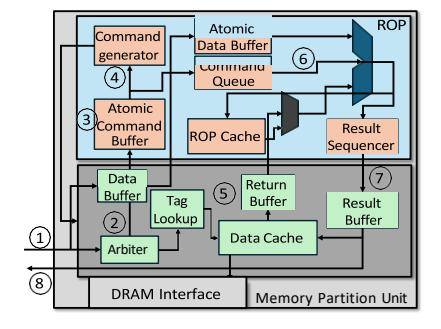

Fig. 4: Micro-architecture of MPU

#### II. BACKGROUND

## A. Multi-GPU and ROP Architecture

Figure 3 shows a multi-GPU cluster in a modern data center. Multiple GPUs are linked via fast interconnects such as NVLink and Infinity Fabric. Each GPU consists of multiple SMs. SMs are interfaced with multiple memory partition units (MPUs) via on-chip network (NoC). Each MPU consists of an L2 cache slice, a (or multiple) DRAM controller(s), and an ROP. An ROP can access data in the L2 cache slice that is in the same MPU. For graphics workloads, ROP is responsible for processing the final pixel data before it's displayed on


Fig. 5: CC operations and their usages for DL training on Multi-GPU systems: (a)-(c) show three representative CC patterns when four GPUs (ranks) are involved in the computation. (d)-(f) show the usage of each or a combination of the patterns for DL training and inference.

the screen. ROPs handle tasks like blending colors, antialiasing, depth testing, and writing pixels to the framebuffer. To take advantage of its closer proximity to L2 and memory, ROP's programmability has been extended to support atomic operations, which effectively expanded the usage of ROPs to general-purpose applications.

Figure 4 draws ROP's major components and data flow [42], [50]. The ROP data flow is initiated when the MPU receives an atomic operation request packet from the SM 1. Once the arbiter recognizes that the request is an atomic operation, not a regular L2 request 2, the request is enqueued in the atomic command buffer 3. Each cycle, the command generator dequeues one atomic command 4. To fetch the operand value, the internal ROP cache is accessed, and then L2 upon misses 3. The ROP ALU's computation results are written back to the ROP cache 6 and sent to the result sequencer to enforce atomic sequence 7. Then the results are sent to the MPU's results buffer, L2 slice, and to the requester SM 8.

## B. CC and Parallel DL Training

CC is a set of communication operations used in distributed parallel computing. CC is extensively used by deep learning (DL) training via CC libraries (e.g., NCCL, RCCL). The top three illustrations in Figure 5 show the common CC patterns in distributed DL computing with four GPU ranks.

- AllGather (Fig. 5a) allows each rank to share its local tensor and receive the concatenation of all ranks' contributions.
- AllReduce (Fig. 5b) performs an element-wise reduction across all ranks and returns the result to every participant.
- AllToAll (Fig. 5c) has each rank to send/receive distinct slices of a tensor to/from all ranks (full data redistribution).
   The bottom three diagrams in Figure 5 show the example usages of the three patterns. In column-linear parallelism (Fig. 5d), a weight matrix is split by output columns. Each rank computes on its assigned slice, which can be collected with an AllGather. Row-linear parallelism (Fig. 5e) divides the weight

matrix by input rows. Each rank produces partial outputs, which are aggregated via AllReduce. Expert (MoE) parallelism (Fig. 5f) dynamically routes token subsets to specialized subnetworks ("experts") across ranks. Expert models running on distributed GPUs perform the multi-layer perceptron (MLP) layers in parallel and distribute their outputs with AllToAll.

#### III. MOTIVATION

#### A. Inefficiencies in Executing CC on SMs

To understand the efficiency of running CC on SMs (as used in software overlapping), Figure 6a shows a roofline analysis of NVIDIA V100 GPU, considering the compute capacity of CUDA cores, memory bandwidth, and network (NVLink) bandwidth. The ring-base AllReduce in FP32 and FP16 are plotted over the model. AllReduce has several orders of magnitude lower operational intensity (≈ 0.1 FLOPs/Byte) than CUDA cores' compute capacity and performance is bounded by network bandwidth. When memory bandwidth is lower than network bandwidth, AllReduce is bound to memory bandwidth. AllGather and AllToAll are also network (or memory) bound because they have no computation; they do memory copy, concatenation, and chunking instead. For such a network/memory-bound CC computing, SMs' abundant computing resources are wasted because CC spend most of its time accessing memory and experience long latencies due to SM's distance from memory. In newer GPUs, the inefficiency worsens because compute capacity scales faster than NoC bandwidth across GPU generations [9], [29], [54].

To verify the inefficiency, we characterize CC execution at the sub-layer level. We broke down the execution time of two tensor parallelism implementations into compute and CC phases. We implemented a column- and a row-linear parallelism codes for one tensor processing by using PyTorch distributed APIs [46], which internally uses NCCL library that calls separate compute and CC kernels. Figure 6b shows the

results. Across various input sizes, CC takes 40% - 70% of the total execution time. Even with a significantly lower compute load than the computation phase, CC takes up significant time. This is because of the aforementioned inefficiency of running CC on SMs. As SMs should fetch data from memory and network to perform simple arithmetic of CC operations, the CC phase experiences extensive memory and NoC latencies when executed on SMs, as in software approaches.

#### B. Performance Impact of Sharing SMs for Compute Phases

Though SMs are not the ideal execution units for CC, as they are the only general-purpose execution units, software overlapping solutions run both CC and computation phases on SMs via spatial and temporal sharing [6], [32], [45]. To understand the performance impact of SM sharing, we measured GEMM performance while partitioning the SMs with libsmctrl [4]. As shown in Figure 7, with 80% of SMs, GEMM slows down by 20%. The performance drops exponentially with fewer SMs, showing that running CC on SMs is inefficient and negatively impacts compute phases.

#### C. ROP Utilization During CC

The results in the earlier subsection motivate us to explore a better way to execute CC on a GPU. We especially find other execution units that can 1) speed up CC by reducing memory access latency and 2) hide CC execution time through CC and compute phase overlapping. Out of several special-purpose cores in GPUs, such as tensor/matrix cores, ROP, and ray tracing accelerators, ROPs reside near the memory (Section II), and can perform various arithmetic operations and issue memory requests independently from SMs. To check the availability of ROPs for LLM computing, we profiled the utilization of ROPs while training an LLM, Qwen2-7B [3], on a server with four NVIDIA V100 GPUs connected via NVLink. We used industrial standard FlashAttention [10] with the HuggingFace library for the utilization profiling. Out of the profiled 11476 kernels, only 141 kernels issued any atomic instructions, and of those, a mere 28 were GEMM kernels. Moreover, during each GEMM execution, only ≈0.0183% were atomic operations on average. Because ROP instructions take up only tens of cycles (reverseengineered latency measurements in Section IV), the hardware remains largely idle, resulting in a limited active duty cycle.

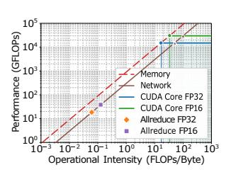

(a) Roofline analysis of CUDA cores for AllReduce


(b) Execution time breakdown of compute and CC under tensor parallelism and various input size

Fig. 6: CC Characteristics.


Fig. 7: GEMM performance under SM partitioning

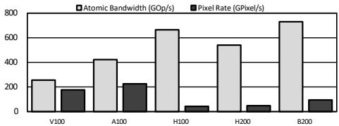

Fig. 8: ROP bandwidth over GPU generations: In AI-focused GPUs (H100, H200, and B200), ROP (atomic) bandwidth scales while graphics (pixel) throughput significantly declines.

This demonstrates that the ROPs are highly underutilized during LLM training and will be available to perform CC. ROP availability in newer GPUs: Recently, GPU architectures have specialized for either graphics (e.g., NVIDIA RTX, AMD Radeon, and Intel Arc) or AI applications (e.g., NVIDIA Hopper and AMD Instinct MI series). AI-focused GPUs reduce or remove some graphics-related components, such as ray tracing cores, texture mapping units, and graphics command processors [17], [34]. However, ROPs are kept in AI GPUs for atomic operations, while their quantities and graphics functionalities are reduced [38]. To understand the sustained availability of ROPs for CC in newer GPUs, Figure 8 benchmark five recent GPU models, including AI-specialized GPUs, H100, H200, and B200. We measured the bandwidth of atomic operations by micro-benchmarking the maximum throughput of atomicAdd operations. To verify the reduced graphics capability in AI-focused GPUs, we also plotted the pixel processing throughputs [53]. We observe that the pixel rate has decreased significantly in AI GPUs, dropping from 225.6 Giga Pixels per second (GPixel/s) on the A100 to only 47.16 GPixel/s on the H200. However, atomic bandwidth has substantially increased from 422.51 Giga Operations per second (GOp/s) on the A100 to 729.783 GOp/s on B200. This demonstrates that atomic bandwidth is decoupled from graphics capabilities. The continued ROP integration with increased memory bandwidth sustains ROP bandwidth in AIfocused GPUs. These results support ROPs usage for CC across GPU generations.

#### IV. DEMYSTIFYING ROP HARDWARE

From the observations presented in Section III, we found that ROP is a good candidate to offload the CC. As the ROP microarchitecture is not well documented, we aim to discover more details through reverse engineering.

#### A. Methodology

To understand the atomic pipeline within the ROP hardware, we wrote micro-benchmark kernels in SASS, which read the on-chip special clock counter register SR\_CLOCKLO into three CSR registers (c1, c2, and c3) before and after an atomic operation, as shown in Figure 9. RED.E.ADD is an atomic reduction instruction using addition operation. We used TuringAS [57] to assemble the kernel. We tested on two NVIDIA GPUs, V100 and A100, with driver version 570.133.20 and CUDA toolkit version 12.1.

#### B. Reverse-engineered Results

Interplay between SM and ROP: When we ran the kernel in Figure 9 with a single thread, the time gap between c2 and c3 was 1-3 clock cycles, which matches the typical register-to-register read latency (i.e., two consecutive SR\_CLOCKLO reads). Considering that individual SMs run in-order, such observation means that the atomic instruction returns immediately after the instruction command is sent to ROP. In other words, the ROP hardware performs atomic operations asynchronously from the GPU core pipeline.

```
Move Data to 12-
cache

Perform
Atomic at ROP

RED .E. ADD. F32. STRONG.GPU [input_lo+0x4], tid;

// RED returned immediately. c3-c2 = ~3cycles CSR c3, SR CLOCKLO;
```

Fig. 9: Kernel for checking interplay between SM and ROP

ROP Pipeline Latency: To ensure the completion of the atomic instruction and measure the ROP pipeline latency, we added a memory load instruction as a barrier right after the atomic operation, as shown in Figure 10. By making the load instruction read from the same address that the atomic operation is performed on, we can guarantee that the atomic operation completes before the load instruction. To estimate the ROP pipeline depth, we also compared the atomic operation latencies while increasing number of threads. We made all threads access the same address such that data can be fetched from the ROP cache, not from memory.

```
Move Data to 12 cache

Load Data from 12 Cache

Load Coache

Load Coache

Load Coache

Load Coache

Load Coache

Load Coache

Load Coache

Load Coache

Load Coache

Load Coache

Load Coache

Load Coache

Load Coache

Load Coache

Load Coache

Load Coache

Load Coache

Load Coache

Load Coache

Load Coache

Load Coache

Load Coache

Load Coache

Load Coache

Load Coache

Load Coache

Load Coache

Load Coache

Load Coache

Load Coache

Load Coache

Load Coache

Load Coache

Load Coache

Load Coache

Load Coache

Load Coache

Load Coache

Load Coache

Load Coache

Load Coache

Load Coache

Load Coache

Load Coache

Load Coache

Load Coache

Load Coache

Load Coache

Load Coache

Load Coache

Load Coache

Load Coache

Load Coache

Load Coache

Load Coache

Load Coache

Load Coache

Load Coache

Load Coache

Load Coache

Load Coache

Load Coache

Load Coache

Load Coache

Load Coache

Load Coache

Load Coache

Load Coache

Load Coache

Load Coache

Load Coache

Load Coache

Load Coache

Load Coache

Load Coache

Load Coache

Load Coache

Load Coache

Load Coache

Load Coache

Load Coache

Load Coache

Load Coache

Load Coache

Load Coache

Load Coache

Load Coache

Load Coache

Load Coache

Load Coache

Load Coache

Load Coache

Load Coache

Load Coache

Load Coache

Load Coache

Load Coache

Load Coache

Load Coache

Load Coache

Load Coache

Load Coache

Load Coache

Load Coache

Load Coache

Load Coache

Load Coache

Load Coache

Load Coache

Load Coache

Load Coache

Load Coache

Load Coache

Load Coache

Load Coache

Load Coache

Load Coache

Load Coache

Load Coache

Load Coache

Load Coache

Load Coache

Load Coache

Load Coache

Load Coache

Load Coache

Load Coache

Load Coache

Load Coache

Load Coache

Load Coache

Load Coache

Load Coache

Load Coache

Load Coache

Load Coache

Load Coache

Load Coache

Load Coache

Load Coache

Load Coache

Load Coache

Load Coache

Load Coache

Load Coache

Load Coache

Load Coache

Load Coache

Load Coache

Load Coache

Load Coache

Load Coache

Load Coache

Load Coac
```

Fig. 10: Kernel for measuring ROP latency

Figure 11 shows the results. With a single thread, the atomic instruction takes about 28 cycles on V100 and 22 cycles on A100, which we interpret as the total latency of the full datapath of the ROP pipeline and L2 to ROP cache fetch latency. With more threads, the atomic instruction latency increases by around 3 cycles on V100 and 1 cycle on A100, which accounts for the total latency of one ROP pipeline stage and an ROP cache access.

Degree of Parallelism: To check how many execution units are in ROPs, we issued atomic operations to different


Fig. 11: ROP latency reverse engineering

addresses simultaneously on the same ROP by using 32 threads in a warp, as shown in Figure 12. Compared to Figure 10, data index value was modularized to make each thread access different data points, while still accessing the same L2 cache line to remove cache miss penalty from the measurements and also enforce that all threads access the same ROP unit.

```
Move Data to L2-
cache

Load Data from L2 Cache

Load Data from L2 Cache

CSR c2, SR_CLOCKLO;

// For brevity, we omit the actual address calculation RED.E.ADD.F32.STRONG.GPU [input_lo+tid%base*0x4], tid;
LDG.E.STRONG.GPU r2, [input_lo+tid%base*0x4];

// Get Atomic Latency from (c3-c2-L2 Latency)
CSR c3, SR_CLOCKLO;
```

Fig. 12: Kernel for checking ROP parallelism

Figure 13 presents the results. X-axis shows the modulo base (divisor) value. The divisor value of one means that all threads target the same address, so all atomic operations are sequentially executed. As we increase the divisor value, the overall latency decreases because the threads targeting different address can be processed on different execution units (parallelism!). The latency becomes stable when divisor reaches four on both GPUs. This indicates that all available execution units are fully occupied. We conclude that there are four execution units that can run in parallel in an ROP. This finding aligns with PTX's maximum atomic width being four 32-bit floats [31].


Fig. 13: ROP parallelism reverse engineering

#### **Summary of findings:**

- 1. ROPs run asynchronously from SMs.
- 2. The ROP datapath latency for an atomic operation is 28 cycles and each ROP pipeline stage takes 3 cycles on V100 (22 cycles and 1 cycle, respectively on A100).
- 3. ROP pipeline supports 4-way 32-bit scalar parallelism.

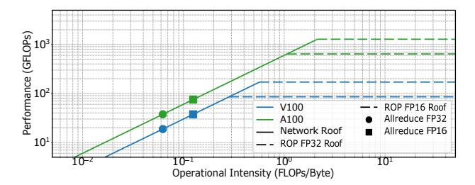

Fig. 14: Roofline analysis of ROPs for AllReduce of V100 (blue) and A100 (green)

# C. ROP Roofline Analysis for CC Compute Capacity

To check if ROPs have enough compute capacity for CC, we conducted a roofline analysis using the reverse-engineering results. For V100, we assume a GPU having 64 ROPs running at 1 GHz, where 4 32-bit (or 8 16-bit) ROP operations can be executed every 3 cycles on each ROP. The peak ROP throughput is calculated as  $\frac{64 \times 4}{3}$  = 85.33 GFLOPS for FP32 and 170.67 GFLOPS for FP16. For A100, the ROP throughput is calculated as 640 GFLOPS for FP32 (160×4, assuming 160 ROPs and our reverse-engineered finding of one operation per cycle) and 1280 GFLOPS for FP16. Considering an NVLINKbased intra-node interconnect (300 GBps for V100 and 600 GBps for A100 [37]), the rooflines are plotted in Figure 14. We omitted the memory roofs, which are 900 GBps and 1.6 TBps in V100 and A100, as they are even higher than the network roofs. The operational intensity of the ring-based AllReduce can be calculated as one reduction per four data sharings (i.e., send/receive for both reduce-scatter phase and AllGather), which are  $\frac{1}{4 \times 4bytes}$  = 0.0625 FLOPS/Byte for FP32 and 0.125 FLOPS/Byte for FP16. For both precisions and architecture models, AllReduce is fundamentally network-bandwidthbound, not ROP-compute-bound. Due to the low operational intensity, CC performance is consistently constrained by network bandwidth, not by ROP compute capacity in newer GPUs, such as B200. From this analysis, we can conclude that ROP's compute capacity is sufficient to handle CC operations.

#### V. Rocc

We introduce RoCC to tackle the limitations of existing CC overlapping schemes. From our observations, we conclude that ROP has several advantages to run CC; 1) it has sufficient compute capacity for CC operations, 2) it allows SMs to be fully used for compute-intensive GEMM without extra accelerators, 3) it operates asynchronously from SMs, enabling effective overlapping with SM's compute phase, 4) it is mostly under-utilized by DL workloads, enforcing its availability for CC, and 5) it resides closer to memory than SMs, which could reduce the memory and NoC access latency. RoCC expands ROP capability into a CC engine, while preserving the original raster operation capability.

# A. Challenges in repurposing ROPs for CC

Despite the benefits of using ROP for CC, there are several challenges in repurposing ROP for CC. First, there is no


Fig. 15: RoCC Walkthrough

interface to trigger CC on ROP. The CC should be triggered as soon as either a GEMM tile output is produced by the local GPU or data is received from a remote GPU rank. However, there is no interface to command ROPs to start the CC operations. Second, the granularity of ROP operations and CC operations does not match. As ROPs can only execute atomics or memory loads and stores individually, the CC operations should be decomposed to a series of such finegrained atomics. Third, ROP should be able to identify the next destination GPU rank and send messages to it in each step of CC operation. To completely offload CC from SMs or host CPU, ROPs should be able to identify the next destination address throughout the steps of a given CC. This requires ROP to know the data flow of individual CC operations. Fourth, data for each CC step should be within an L2 slice residing in the same MPU with the target ROP. Because each ROP is linked to a dedicated L2 cache slice, tensor tiles used in each step should not be mapped across L2 cache slices. The following sections explain how we tackle these challenges.

#### B. RoCC Overview

Figure 15 illustrates an example walkthrough of RoCC when N GPUs run a GEMM followed by a CC operation. RoCC uses a fused kernel to enable fine-grained GEMM and CC synchronization. Before launching the kernel, the input and output tensors are allocated with our proposed symmetric tensor allocator **①**. This allocator maps tensor tiles on symmetric physical addresses across the GPU ranks, thereby removing the burden of address translations during the inter-rank communication (details in Section V-F). The target CC information (e.g., base addresses, dimension, and shape of the tensor tiles, each GPU's rank ID, CC type, and data type) is provided in an *RoCC descriptor* (details in SectionV-C) **2**. In the fused kernel, GPUs execute GEMM on the assigned tensor tiles in parallel on SMs 3. When a warp finishes its tile computation, it writes the result tile to memory and commands ROP to begin the CC phase. To command ROP to start the CC, we introduce a GPU intrinsic function per CC operation (e.g., rop allreduce (.), details in Section V-C) 4. The necessary information for the CC (e.g., tile address, operation type) is sent via descriptors and our proposed messaging scheme, doorbell (details in Section V-E). To ensure each ROP can process data within its dedicated L2 slice, we partition each tile, which can be potentially mapped across multiple L2

slices, into a cache line unit and have each ROP to process only the cache lines located in the L2 slice that resides within the same MPU as that ROP.

After launching the CC function, the warps compute their next tile on SMs (i.e., fine-grained overlapping between GEMM and CC). In the meantime, ROPs decode the doorbell messages and convert the target CC operations into the form that the ROP can execut. For this, we propose *collective* primitive decomposition (Section V-D). We define CC primitives, which are modularized sub-functions of CC operations (e.g., send, recvReduceSend, etc). Then, each primitive is encoded with a set of ROP micro-operations (μOps). By employing two decoders, each translates CC function to primitives, and primitive to ROP μOps, RoCC runs each CC operation through a multi-stage primitive executions on ROP. After finishing one primitive stage, ROPs issue a doorbell command to another ROP in the next GPU rank 6, according to the message switching order of the given CC operation (as shown in Figure 5(a) - (c)). Each CC function is implemented with a pre-determined sequence of primitives, as listed in Table I. Thus, the next GPU rank can be identified once the ROP knows the current primitive stage and the target CC operation. This information is embedded in the aforementioned descriptors and updated at every stage. Within the target GPU rank, the specific memory address to copy the result can be identified without a translation or estimation thanks to the aforementioned symmetric tensor allocation. As tensors are mapped on the symmetric physical addresses across GPU ranks, the source and destination physical addresses are identical except for the GPU rank ID.

Until the entire tensor computation completes, SMs continue processing subsequent GEMM tiles, while ROPs handle CC issued via doorbells, by either the local SMs or remote GPUs, in parallel. The following sections will discuss the details of each of the proposed components.

## C. Programming Interface

To command ROP to start the CC phase, we need software and hardware interfaces. We present two software interface designs at different granularities.

Following the conventional collective libraries, we may extend the existing APIs for ROPs (e.g., drop-in replacement for NCCL/RCCL with roccAllreduce(.)) and make the DL frameworks use it after GEMM kernels. It provides good portability, but its coarse-grained overlapping will limit the performance gain using ROPs. Thus, we propose a more fine-grained approach, where each warp can command ROP upon completing the warp-worth tile computation.

As shown in Listing 1, we design an intrinsic function per CC operation. The example code shows the function for AllReduce, rocc\_allreduce(.). The function semantics are designed following the existing CC libraries, such as MPI and NCCL. For example, rocc\_allreduce(.) uses the following function arguments: Src (source data address), Dst (destination data address), size (the count of elements), dataType (the data type of the elements), and OpType (the

type of reduction operation). The usage is as easy as adding a line after output tile storage (line 8) to start CC function (line 10). To make the function to issue CC operations to ROP, we extend the GPU ISA to have one instruction per CC operation (e.g., we add three instructions, ROP\_AR, ROP\_AG, and ROP\_A2A). These instructions are issued via the existing atomic instruction datapath, with the warp ID and the output tile address to be processed in ROP.

```
def gemm_allreduce(A, B, C, D, BLOCK_K)
for k0 in 0..K step BLOCK_K: // Tiled GEMM
   A_tile = load A[..]
   B_tile = load B[..]
   acc += dot(A_tile, B_tile)
   // Fused function such as ReLU.

store C[..] = acc
   // RoCC communication
   rocc_allreduce(&(C[..]), &(D[...]),
```

Listing 1: Code Example using RoCC intrinsic function.

To offload CC tasks from SMs to ROPs without further coordination, the ROPs should have the full information about the CC operation. To provide this, we introduce *RoCC descriptor* (Figure 16a), which consists of the input and output tensor pointers (*SrcBase* and *DstBase*), tensor dimension (*TensorDim*), warp-tile shape (*TileShape*), CC operation type (*CollType*), and data type (*DataType*). In the host code (e.g., DL framework), before calling the tensor kernel, an RoCC descriptor is created. We design a driver API for this purpose. Then, the descriptor will be stored in a dedicated on-chip buffer within each MPU and used until the end of the kernel.

# D. Collective Primitive Decomposition

Once the new collective instructions are issued, ROPs begin the CC phase. As ROPs cannot execute the CC operations, which consist of multiple steps of arithmetic and data exchange operations, as one instruction, we propose *collective primitive decomposition* to bridge the semantic gap between CC operations and ROP operations. Our first insight is that all collective routines can be broken down into a handful of basic primitives, similar to NCCL's primitives such as *send*, *recv*, *recvReduceSend*, *recvReduceCopySend*, etc. With these primitives, any collective routines can be implemented. Figure 17 shows a four-segment ring algorithm for AllReduce built with these primitives.

```
struct RoCCDescriptor {
    // Base Address of Src
    U64 SrcBase,
    // Base Address of Dst
    U64 DatBase,
    U64 DataSize,
    U32 LocalRank,
    dim3 TensorDim,
    dim3 TileShape,
    // Type of Collective
    U4 CollType,
    U4 Datatype
    }
}

struct Doorbell
    {
    // Offset of tile data
    U64 Offset,
    // Address in Doorbell region
    U64 PayloadAddr
    // Rank of origin GPU
    U32 SrcRank,
    // Current stage
    U32 Stage
}
```

Fig. 16: Data structure introduced by RoCC.

(b) Doorbell Descriptor

(a) RoCC Descriptor

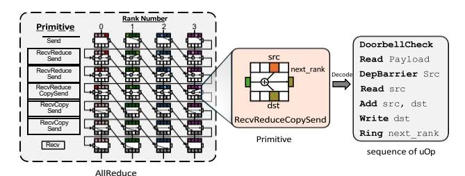

Fig. 17: An example decomposition of a collective operation (AllReduce) to primitives, and micro-ops

Then, we further decompose each primitive to ROP µOps. For instance, the recvReduceCopySend primitive is compiled to a ReadDoorbell that receives the previous rank's doorbell packet together with the reduction result, a DepBarrier that ensures local GEMM tile completion, a second ReadDoorbell to retrieve the local GEMM results, an Add of the local GEMM results to the previous rank's data, a Write of the reduced results to the local memory, and a RingDoorbell to send a doorbell packet with the result to the next GPU rank. ReadDoorbell and RingDoorbell use ROP's memory load function and our proposed doorbell manager (Section V-E). Write uses ROP's memory store function, Add uses the arithmetic unit, and DepBarrier tracks warp-tile completion by checking Offset and Stage fields in the Doorbell descriptor (Section V-E). With this decomposition, every CC operation can be implemented and executed on ROP. Table I shows the full conversions from CC to primitives, and to μOps in a 4-GPU setup under ring algorithm. The other algorithms can be similarly implemented.

To decode a given collective operation into primitives and μOps, we add a *collective decoder* and a *primitive decoder*, as shown in Figure 18. The collective decoder converts a given collective operation to a sequence of primitives<sup>1</sup>. A lookup table is used to maintain a mapping between the collective operations and primitives. In our baseline, we support the most representative three collective operations (All-ToAll, AllReduce, AllGather), where each can be converted to a combination of five primitives (*send*, *recvReduceSend*, *recvReduceCopySend*, *recvOpySend*, *recv*). When eight GPUs are involved, the CC runs up to 15 stages. Thus, the table maintains 3 (operations) × 15 (stages) × 3-bit (to represent five primitive types) primitives, which take up 135 bits only.

The primitive decoder takes each 3-bit primitive and generates a sequence of  $\mu$ Ops. All the primitives can be handled with a sequence of up to six  $\mu$ Ops each, as shown in each row of Table I. There are five  $\mu$ Ops (*ReadDoorbell*, *Write*, *DepBarrier*, *Add*, and *RingDoorbell*). Thus, the primitive decoder maintains a lookup table of 5 (primitives)  $\times$  6 ( $\mu$ Ops per primitive)  $\times$  3-bit (to represent five  $\mu$ Ops types)  $\mu$ Ops, which takes 90 bits only. While most of the representative collective operations of the common 4- and 8-GPU nodes can be supported with these small lookup tables (a total of 225 bits), depending on the number of collective operations and

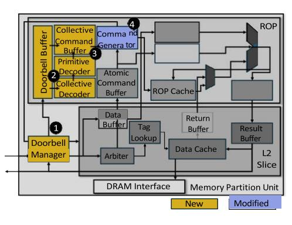

Fig. 18: RoCC-enabled ROP architecture: modifications for RoCC are highlighted with non-gray colors.

the number of GPUs involved in the CC, the lookup tables may need to include more primitives. Thus, in our baseline, we project a total of 1KB lookup table to support all decoders.

A collective command buffer is also added to maintain the decoded  $\mu Ops$  so that the ROP can process one  $\mu Op$  per cycle. There are four entries in the collective command buffer, one per each of the four execution units. Each entry requires 8 bytes for both Src and Dst addresses, 3 bits for the five types of  $\mu Ops$ , and 1 bit for a valid bit. In total, the commanded buffer requires 66B for all four entries.

#### E. Doorbell, The Collective Messaging Scheme

To assist CC operation execution on ROP, we introduce doorbell, which is a messaging interface between SM and ROP and between ROPs in different GPUs. Doorbell uses a doorbell descriptor that specifies warp-specific information for the CC operations (Figure 16b). Inside of each ROP, the doorbell scheme employs two modules (Figure 18); a doorbell manager, which recognizes doorbell messages from the incoming requests/messages, and a doorbell buffer, which is a queue of doorbell descriptors under processing. We will show how these components are used for the multi-stage collective operations below. In GPU memory, a doorbell region is allocated to store intermediate tensor computation results shared among GPUs during the CC phase. The doorbell region is reserved by the GPU driver before the tensor processing. We consider that there are 32 entries in the doorbell buffer, TABLE I: Collective decoding to ROP µOps for 4-GPU ring.

| Collective<br>Type | Primitive                                                                                    | ROP μOps sequence<br>(trigggered by doorbell)                                                                                                                                                                                                                                                                                                                                            |
|--------------------|----------------------------------------------------------------------------------------------|------------------------------------------------------------------------------------------------------------------------------------------------------------------------------------------------------------------------------------------------------------------------------------------------------------------------------------------------------------------------------------------|
| AllReduce          | send recvReduceSend recvReduceSend recvReduceCopySend recvCopySend recvCopySend recvCopySend | $\begin{array}{l} Rd \rightarrow Rng \\ Rd \rightarrow DepB \rightarrow ALU \rightarrow Rng \\ Rd \rightarrow DepB \rightarrow ALU \rightarrow Rng \\ Rd \rightarrow DepB \rightarrow Rd \rightarrow ALU \rightarrow Wr \rightarrow Rng \\ Rd \rightarrow Wr \rightarrow Rng \\ Rd \rightarrow Wr \rightarrow Rng \\ Rd \rightarrow Wr \rightarrow Rng \\ Rd \rightarrow Wr \end{array}$ |
| AllGather          | send<br>recvCopySend<br>recvCopySend<br>recv                                                 | $\begin{array}{c} Rd \rightarrow Rng \\ Rd \rightarrow Wr \rightarrow Rng \\ Rd \rightarrow Wr \rightarrow Rng \\ Rd \rightarrow Wr \rightarrow Rng \\ Rd \rightarrow Wr \end{array}$                                                                                                                                                                                                    |
| AllToAll           | send<br>recv                                                                                 | $\begin{array}{c} Rd \rightarrow Rng \\ Rd \rightarrow Wr \end{array}$                                                                                                                                                                                                                                                                                                                   |

Abbrev.: Rd=ReadDoorbell, Wr=Write, Rng=RingDoorbell, DepB=DepBarrier, ALU=operations using ROP ALU (e.g., add for reduction).

<sup>&</sup>lt;sup>1</sup>We follow NCCL's CC algorithm design [40] for primitives.

where each doorbell carries up to one tile. While a typical tile computed by SM tensor engines is a  $16 \times 16 \times 8$  FP16 block (4 KB), the entire block is not mapped on each MPU. Modern GPUs interleave physical memory across all memory partitions to maximize bandwidth. In our baseline architecture, we assume the memory interleaving granularity as 128 Bytes. Therefore, to sustain 32 concurrent in-flight tiles, we reserve a 4 KB (32 entries  $\times$  128 Bytes) doorbell region per MPU in GPU memory.

- 1) Doorbell Decoding: When an SM issues a RoCC instruction, the instruction request packet is sent to ROP with a doorbell flag set in the header. Then, the doorbell manager in the MPU (1) in Figure 18) recognizes it as a doorbell, and copies the request information to the doorbell buffer. Each entry of the doorbell buffer contains a doorbell descriptor (Figure 16b). The *Offset* is the requester warp's address offset in the target tile, PayloadAddr is the tile pointer address sent with the instruction (i.e., C tile array pointer in Listing 1), SrcRank is the current GPU's rank ID, and Stage indicates the current primitive stage. The same process is followed when a doorbell is received from a remote GPU, except for the handling of tile data. In the inter-GPU doorbell, the tile data is sent in the doorbell packet as a payload. Thus, the doorbell manager allocates space in the doorbell region and copies the payload to the allocated region. The newly allocated region address is filled in to PayloadAddr in the doorbell buffer.
- 2) **Doorbell Execution**: Once the decoded doorbells are filled in the doorbell buffer, the ROP fetches up to four doorbells each cycle to issue on the four execution units (Section IV-B). The collective decoder checks the CC operation and the current primitive stage from the descriptors, and generates the corresponding primitive (e.g., stage 2 of AllReduce executes recvReduceSend as shown in Figure 17). The primitive is then passed to the primitive decoder **2**. The primitive decoder translates each primitive into a series of  $\mu$ Ops and enqueues them to the collective command buffer **3**. The command generator issues four  $\mu$ Ops of different primitives each cycle **4**. The rest of the executions are handled the same way as the ROP datapath (Section II).

Once a primitive is completed, the doorbell manager increments the stage in the corresponding doorbell buffer entry. If the current stage is not the final stage, based on the collective operation, the doorbell manager creates a new doorbell packet by encoding the doorbell descriptor contents into the packet header and copying the computed tile to the payload. The packet is sent to the next GPU rank according to the collective operation in the RoCC descriptor.

3) Doorbell Manager: The doorbell manager is implemented with a state machine that is triggered upon receiving a new memory request and when a primitive is completed. When a new memory request is received, it checks the packet header to distinguish doorbell messages from regular memory requests by comparing the target address against the locally reserved doorbell region (Section V-E). If the doorbell flag is set in the header, the doorbell manager copies payloads to the doorbell region or buffer. This requires two one-bit

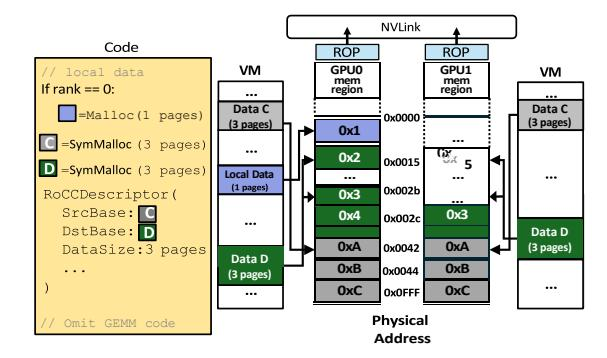

Fig. 19: Memory mapping with symmetric tensor allocation: Green and gray pages (Data C, D) are the tiles used for the CC operations. Due to an extra memory allocation (Local Data) on GPU 0, the virtual addresses (numbers in each page) are not symmetric across GPUs, yet the pages are located at identical physical addresses across GPUs (numbers between GPUs).

comparators to check flags and two 32-bit registers to maintain the available doorbell region and buffer addresses. Upon completion of each primitive, the doorbell manager creates a memory request packet to be sent to the next GPU rank and issues a remote GPU memory access request via the existing inter-GPU memory mechanisms. This requires a 4-bit counter to increment the Stage in the doorbell descriptor and a 4-bit comparator to check if the final stage is reached. The memory packet creation and issue are done with the existing memory issue logic in the MPU. In total, the state machine runs over seven states. Thus, in each of the 32 entries in the doorbell buffer, 3 bits are reserved for the state information, and a total of 96 bits are reserved per ROP.

#### F. Symmetric Tensor Allocation

To send a doorbell to a peer GPU's correct ROP that processes the same tile as the requester ROP, the requester ROP must know the physical address of the tile in the peer GPU. However, individual GPUs may map the tile in different virtual/physical addresses, as determined by the GPU driver. If the virtual address is shared, the physical address could be translated via MMU. However, as ROPs access data directly from L2 cache, which typically uses physical address [41], using virtual address may cause runtime overhead.

To address this challenge, we propose *symmetric tensor allocation*, which maps tiles used for the CC operations on the same local physical address across GPUs. When an application (e.g., DL framework) allocates memory for CC with our custom GPU memory allocator, SymMalloc, the allocator examines the pool of unused physical frames on the GPUs involved in the communication and selects those having the same local physical addresses across the GPUs. Figure 19 shows that tensors allocated with SymMalloc are mapped on the same physical frames on both GPUs (Src on green pages and Dst on gray pages), while the virtual addresses (in the VM bar) are not symmetric, physical addresses are matching. Such a symmetric memory mapping enables ROPs to locate

tiles from identical address across GPUs. This saves doorbell packetization time, at the cost of one-time overhead at the memory mapping time.

Note that, as DL workloads typically occupy the entire GPU, our allocator can in general locate symmetric physical frames without requiring contiguity. If it cannot find a symmetric address, ROP reverts to a virtual-address-based solution by recording the tensor virtual address in the descriptor.

#### G. Discussions

Cache coherence implication: In modern GPUs, L2 is the last-level unified cache. As directly interfaced with dedicated memory devices, each L2 slice maintains the data in the devices exclusively (i.e., no sharing across L2 slices) [1], [19], [39]. Thus, RoCC does not incur coherence issues.

Concurrent execution of RoCC and raster operations: The doorbell manager directs doorbell traffic to a separate doorbell buffer, isolating it from the atomic command stream. Therefore, the two streams do not block each other at dispatch. Also, as RoCC operations share the existing datapath in the ROP by time sharing it with ROP operations, RoCC and ROP operations can run concurrently.

Performance overhead of symmetric tensor allocation: The lookup for symmetric physical addresses occurs at initialization, off the critical path. Common DL sharding strategies (data and tensor parallelism) use uniform GPU memory allocation, making such addresses easy to locate.

#### VI. EVALUATION

#### A. Methodology

We model a multi-GPU system using MGPUSim [52]. GPU architectures are configured by following NVIDIA V100, H100, and B200. V100 is the baseline and H100 and B200 are used for a sensitivity study. In the baseline architecture, each GPU has 80 SMs, a 6 MB LLC, and 64 memory partitions connected via an on-chip crossbar [59], [63], [64], with one ROP per partition (1 KB cache, 28-cycle datapath, four 3cycle ALUs) supporting four concurrent doorbells. GPUs form a 300 GBps full mesh, and CPU-GPU links follow PCIe Gen 4 with ≈150-cycle latency. To capture modern GEMM-CC workloads, we extend MGPUSim with SM-initiated kernels and NCCL-style ring collectives, implementing AllReduce, AllGather, and AllToAll. GEMM parameters are drawn from LLM feed-forward layers (Table II), and we evaluate Column-Linear (CL), RowLinear (RL), and AllToAll (A2A) in Expert Parallelism. For AllToAll, we simulate a stress test where every expert exchanges tokens with all others. Figure 20 shows the simulated execution time breakdown between GEMM and CC phases. The CC phase accounts for 16%-58.3% of total runtime, matching the breakdown in Figure 6b.

# B. Performance Results

1) Overall performance: Figure 21 compares three parallel schemes in a 4- and 8-GPU system. The baseline runs GEMM and CC sequentially. The RoCC variant, RoCC-Serial, invokes RoCC's drop-in APIs (i.e., non-overlapped interface discussed


Fig. 20: Simulated execution time breakdown between GEMM and CC phases: The CC portion ranges align with measurements collected from a real V100 machine.

in Section V-C) to offload CC operations after each GEMM kernel finishes. The drop-in APIs are executed in a separate kernel. In our proposed *RoCC-Overlap*, we use the warp-level intrinsics to interleave computation and CC at fine granularity. With 4 GPUs, *RoCC-Serial* achieves a 9% speedup and *RoCC-Overlap* reaches 48%. With 8 GPUs, improvements rise to 27% and 54%, respectively. Averaged across both scenarios, *RoCC-Serial* delivers a 18% gain and *RoCC-Overlap* achieves a 51% gain over the baseline.

- 2) Overlapping Evaluation: We quantify compute-CC overlap ratio with GEMMend Start In Figure 22, RoCC achieves an average of 83.4% overlapping. This ratio increases with larger models because extended GEMM phases provide more opportunity to hide communication latency. The unoverlapped portion stems from the initial GEMM and final CC phases, which cannot be hidden, and varies with tile size across models.
- 3) Contention Analysis: RoCC's high GEMM-CC overlapping might cause resource contention and negatively impact GEMM's performance. In Figure 23, we compare the per-

TABLE II: Evaluated Model Parameters

| Model         | Hidden Size | FFN Inner Size | Sequence length |
|---------------|-------------|----------------|-----------------|
| GPT-2-base    | 768         | 3072           | 1024            |
| GPT-2-medium  | 1024        | 4096           | 1024            |
| T5-base       | 768         | 2048           | 1024            |
| T5-large      | 1024        | 2816           | 1024            |
| Whisper-base  | 512         | 2048           | 2048            |
| Whisper-large | 1280        | 5120           | 1024            |

TABLE III: Simulation Parameters

| Parameter                 | Value                         |  |
|---------------------------|-------------------------------|--|
| Number of GPU             | 4, 8                          |  |
| Number of SMs             | 80 per GPU                    |  |
| L1 Data Cache             | 128 KB, 4-Way, 16 MSHRs       |  |
| L1 Inst Cache             | 32 KB, 4-Way, 16 MSHRs        |  |
| L2 Cache                  | 6 MB, 16-way, 64 MSHRs        |  |
| NoC Configuration         | XBar. 32B flit size           |  |
| Number of MPU (LLC slice) | 64 [22], [59], [63], [64]     |  |
| CPU-GPU Connection        | PCIe Gen4 x16.                |  |
|                           | 150 cycle latency [12], [30]  |  |
| GPU-GPU Connection        | 300 GBps, full-mesh topology  |  |
| Num of ROP                | 1 per MPU, 64 in total        |  |
| size of ROP cache         | 1KB per MPU                   |  |
| ROP datapath latency      | 28 cycles Sec.IV              |  |
| ROP ALU concurrency       | 4 Sec.IV                      |  |
| ROP ALU latency           | 3 cycles Sec.IV               |  |
| Max Concurrent Doorbells  | 4                             |  |
| DRAM                      | tRC=24, tRCD=7, tRP=7, tCL=7, |  |
|                           | tWL=2, tRAS=17,tRRDl=3,       |  |
|                           | tRRDs=2, tFAW=20, tRTP=3,     |  |
|                           | tCCDl=1, tCCDs=1. ≈900 GBps   |  |


Fig. 21: Overall Performance: RoCC-Overlap is the proposed fine-grained overlapping. RoCC-Serial is a variant that uses a dedicated CC kernel invocation to ROP.

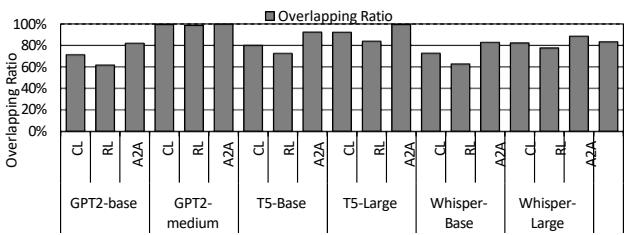

Fig. 22: Overlapping ratio

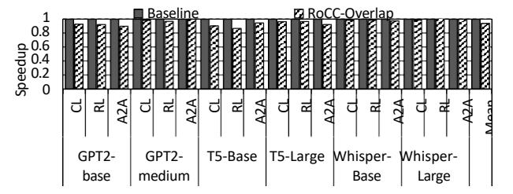

Fig. 23: GEMM performance under contention of overlapping.

formance of GEMM with and without concurrent CC. On average, RoCC incurs only a 6.25% slowdown on GEMM. This limited impact is because ROPs operate asynchronously on CC operations, while SMs focus on compute-intensive kernels, so contention remains minimal.

4) CC Performance: To evaluate CC efficiency, we compare the latency of CC-only in the SM-based baseline and RoCC-Serial. Note that RoCC-Overlap's fine-grained CC computation makes it hard to measure the end-to-end communication time. Figure 24 shows the speedup of RoCC-Serial over the SM-based baseline for various message sizes. With small messages, both perform similarly because startup overhead (GPU frontend, address translation, etc.) dominates and is not hidden by RoCC. With larger messages, due to the NoC overhead, RoCC using near-memory ROP outperforms, with speedups of 35% for AllReduce, 11% for AllGather, and 25% for AllToAll.

5) Comparison with state-of-the-art: The most closely related work is T3 [44]. T3 uses a DMA engine for data transfer and PIM for reduction. DMA-based transfer is orthogonal to RoCC; however, HBM-PIM must switch between compute and memory modes [55], [56], [62], incurring significant overhead when PIM computation blocks memory requests. We


Fig. 24: Speedup of RoCC-Serial over software-based baseline under different message sizes.


Fig. 25: Performance comparison with the state-of-the-art.

implement T3 on a practical dual-mode HBM-PIM system and compare its performance with RoCC. As shown in Figure 25, T3 achieves a 23% speedup over the baseline, whereas RoCC attains 48% on four GPUs. The gap is largest for the *RowLinear* kernel because RoCC uses **native** near-memory ROP units, while dual-mode HBM-PIM experiences contention between GEMM memory traffic and PIM reduction operations.

6) Comparison with the software solution: We compare RoCC with an oracle software-based overlapping, where GEMM perfectly overlaps with CC. We adopt an SM splitting scheme similar to prior works [14], [32], [60], where 20% of SMs are dedicated for CC. As shown in Figure 26, RoCC outperforms this oracle software solution by an average of 23%. The main overhead of the software solution is the limited compute capacity for GEMM and contentions in the shared resources (e.g., caches and NoC) between GEMM and CC. In contrast, RoCC offloads CC to underutilized ROPs and uses doorbell-based synchronization without polluting caches or interconnects.

## C. Primitive Latency

To assess the impact of near-memory computing with ROP, we broke down the speedup of ROP-Overlap by primitive.


Fig. 26: Performance comparison with oracle software-based overlapping.


Fig. 27: Performance with different number of ROPs

Following prior work [19], we included L2, NoC, and DRAM latencies, attributing network latency to *recv*. As shown in Figure 30(b), RoCC achieves an average of 15% latency reduction across all primitives, with larger gains when *copy* is involved. The primary source of improvement is nearmemory computing on ROPs, which accelerates memory copy operations and avoids NoC traversal and L1 miss penalties. *Send* and *Recv* show no speedup, as they are pure messagepassing primitives dependent on the network medium.

# *D. Sensitivity Analysis*

*1) Number of ROPs:* ROP count influences the CC arithmetic throughput and potentially overall bandwidth. Figure 27 shows the speedup with varying number of ROPs. Halving (32) and quartering (16) the ROP count drops performance by only 3.7% and 5.4%, respectively. This minor sensitivity to ROP count stems from the low operational intensity of CCs and the fact that throughput is network-bound as discussed in Section IV-C.

*2) Inter-GPU Latency:* We evaluate the performance of RoCC under different inter-GPU network latencies. As shown in Figure 28(a), with 2x slower and faster interconnect, RoCC exhibits a marginal performance impact, 6.5% decreased and 2.5% increased performance over the baseline. Note that network latency has a marginal but higher impact on the performance than ROP count (previous section), which aligns with our roofline analysis.

*3) RoCC with SM-side ROP:* Some architectures (e.g., ARM Mali [2], NVIDIA TU102 [36]) integrate ROP units within SMs. We evaluate RoCC's effectiveness by placing ROPs in SMs. This variant achieves 31% speedup over the baseline (Figure 29), which demonstrates our design's flexibility. However, our proposed L2-side deployment achieves higher performance with fewer ROPs, which we attribute to reduced data movement overhead than SM-side ROP.


Fig. 28: Performance with different network (a) and ROP cache (b) settings.

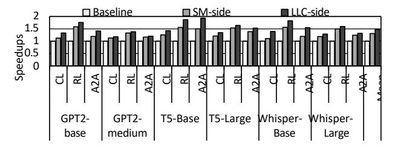

Fig. 29: Performance with different ROP designs

*4) Size of ROP cache:* We evaluate the performance impact of ROP cache size. As shown in Figure 28(b), RoCC achieves 4*.*8% and 5*.*5% speedups with 2x and 4x larger ROP caches. These modest gains reflect CC's streaming access pattern and infrequent data reuse.

# *E. End-to-end Model Speedup*

Simulating end-to-end LLM execution at cycle-level granularity would take *≈*300 days, so we used the networkcentric simulator Astra-Sim [49] following prior works [8], [45]. We generated Chakra [51] traces via an open-source tool [33], transformed the execution graph to enable finegrained overlap with RoCC. As shown in Figure 30(a), RoCC shows a 44% average speedup over the baseline by effectively hiding communication latency.

# *F. Speedup on Large-Scale System*

We evaluate scalability with Astra-Sim [49], scaling the number of GPUs to 32, 64, 128, and 256. We use combined tensor and data parallelism, where a varying number of groups of 8 GPUs run on different parts of the data in parallel and the 8 GPUs in each group run tensor parallelism. We test with GPT-3 to ensure sufficient per-GPU workload. We generate a Chakra [51] trace and rewrite the execution graph to enable fine-grained overlap with RoCC. As shown in Figure 31, RoCC achieves 20%, 21%, 13%, and 13% speedups, respectively, demonstrating robust scaling.

# *G. Speedup on Diverse GPU Architectures*

We evaluate effectiveness of RoCC on broader GPU architectures, by simulating NVIDIA Hopper (H100) and Blackwell (B200) GPUs besides the baseline Volta (V100) GPU. For H100, we use 24 ROPs, 132 SMs, 50 MB of L2 cache, 3.35 TBps of memory bandwidth, and 900 GBps of NVLink bandwidth. For B200, we configure two chiplets, having a total of 48 ROPs, 148 SMs, 126 MB of L2 cache, 8 TBps of memory bandwidth, and 1.8 TBps of NVLink bandwidth.


Fig. 30: End-to-end Performance (a) and per-primitive latency performance (b).


Fig. 31: Speedup on larger-scale platforms: (XxY) means Y groups of GPUs use data parallelism, where each group runs tensor parallelism with X GPUs.

Results are shown in Figure 32. Overall, RoCC consistently achieves a substantial performance benefit over the baseline in all three GPUs by fully offloading CC to ROPs. RoCC achieves additional 3% and 2% speedups on H100 and B200 compared to V100. This is because memory bandwidth has scaled faster than SM compute (10x vs. <2× from V100 to B200) and RoCC exploits this by offloading CC to ROPs, which access memory independently of SMs.

#### H. Hardware Overhead

RoCC comprises a 32-entry doorbell buffer, a 4-entry collective command buffer, primitive and collective decoders, a per-MPU doorbell manager, and a descriptor buffer. The decoders use simple lookup tables to translate each CC type into primitives and  $\mu$ Ops, while the doorbell manager arbitrates doorbells with regular memory and atomic requests. The doorbell buffer (0.75 KB), collective command buffer (66 B), and descriptor buffer (77 B), along with lookup tables (1 KB) used for collective decoder and primitive decoder, together contribute a total hardware cost of about 2.4% of an L2 slice based on CACTI v7.0 [35]. The doorbell manager takes up the area for two one-bit comparators, two 32-bit registers, a 4-bit counter, and a 4-bit comparator.

# VII. RELATED WORK

1) Repurposing under-utilized GPU hardware components: GPGPU hardware's resource underutilization has attracted extensive research. Fung et al. [13] proposed to modify the textual unit for in-warp transactional memory to expand atomic compute capacity beyond the ROP. Jooybar et al. [21] proposed to repurpose the ROP unit as the deterministic commit unit. Kim et al. [25] repurposed idle registers for interim results; subsequent works [18], [20], [23], [24], [43], [58] leveraged register underutilization to reduce the area and power consumption of GPUs; Recent a few papers [5], [11], [15] repurposed RTAs for tree traversal and page-table

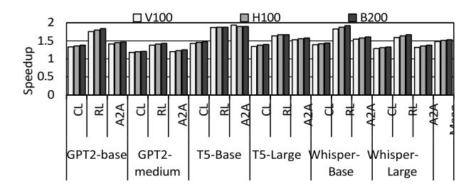

Fig. 32: Speedup on diverse GPU architectures.

works; Lee et al. [28] employed stencil-test hardware for early termination in neural rendering. To the best of our knowledge, RoCC is the first work that repurposes ROP units for non-atomic, general-purpose collective communication.

- 2) CC Overlapping and Optimization: There have been extensive studies to optimize CC processing. Klenk et al. [26] integrated an in-switch aggregator for in-network reductions. Rashidi et al. [48] proposed an accelerator to offload AllReduce from NPU. Cho et al. [8] overlap tree-based reduction and broadcast with forward computation. Qin et al. [47] proposed to fuse adjacent communication operators in hybrid-parallel LLMs. Pati et al. [44] used DMA and PIM to offload reduction. RoCC provides a lightweight (leveraging existing hardware) and orthogonal (targeting intra-node speedup that can produce synergistic speedup with in-network reduction engines and algorithmic optimizations) solution.
- 3) Symmetric Memory Allocation: Similar concepts to our proposed symmetric tensor allocation have been used by commercial and academic solutions, such as OpenSHMEM [7], nvshmem [27], and BarreChord [12]. Unlike these, RoCC introduces symmetric memory to simplify the routing between ROPs in GPUs, without requiring virtual address-level symmetry.

# VIII. CONCLUSION

We introduce RoCC which repurposes underutilized ROP units to enable fine-grained overlapping of collective communication (CC) and computation in multi-GPU deep learning computing. RoCC offloads CC to ROPs by mapping collective operations to ROP micro-operations and introducing a lightweight inter-ROP messaging method. RoCC delivers an average of 51% and 23% speedups for various LLMs over the baseline using SMs for both collectives and computations, and an oracle kernel fusion approach on 4 and 8 GPUs. In larger systems with 32 to 256 GPUs, RoCC consistently achieves speedups from 13% to 21%.

#### ACKNOWLEDGEMENTS

This work was supported by NSF grants CCF-2452081, CAREER-2341039, and CAREER-2047521. Part of this research was conducted using Pinnacles (NSF MRI, # 2019144) at the Cyber Infrastructure and Research Technologies (CIRT) at the University of California Merced, and Ampere® Altra® processors in servers donated by Ampere Computing.

# REFERENCES

- [1] "Blackwell GPU Architecture," https://www.emergentmind.com/topics/ blackwell-gpu-architecture.
- [2] Arm, "Arm multimedia ip: Accelerating ai," https://www.arm.com/ products/silicon-ip-multimedia, n.d., accessed July 31, 2025.
- [3] J. Bai, S. Bai, Y. Chu, Z. Cui, K. Dang, X. Deng, Y. Fan, W. Ge, Y. Han, F. Huang *et al.*, "Qwen technical report," *arXiv preprint arXiv:2309.16609*, 2023.
- [4] J. Bakita and J. H. Anderson, "Hardware compute partitioning on nvidia gpus," in *2023 IEEE 29th Real-Time and Embedded Technology and Applications Symposium (RTAS)*, 2023, pp. 54–66.
- [5] A. Barnes, F. Shen, and T. G. Rogers, "Extending gpu ray-tracing units for hierarchical search acceleration," in *2024 57th IEEE/ACM International Symposium on Microarchitecture (MICRO)*. IEEE, 2024, pp. 1027–1040.
- [6] L.-W. Chang, W. Bao, Q. Hou, C. Jiang, N. Zheng, Y. Zhong, X. Zhang, Z. Song, C. Yao, Z. Jiang, H. Lin, X. Jin, and X. Liu, "Flux: Fast software-based communication overlap on gpus through kernel fusion," 2024. [Online]. Available: https://arxiv.org/abs/2406.06858
- [7] B. Chapman, T. Curtis, S. Pophale, S. Poole, J. Kuehn, C. Koelbel, and L. Smith, "Introducing openshmem: Shmem for the pgas community," in *Proceedings of the fourth conference on partitioned global address space programming model*, 2010, pp. 1–3.
- [8] S. Cho, H. Son, and J. Kim, "Logical/physical topology-aware collective communication in deep learning training," in *2023 IEEE International Symposium on High-Performance Computer Architecture (HPCA)*, 2023, pp. 56–68.
- [9] W. J. Dally, S. W. Keckler, and D. B. Kirk, "Evolution of the graphics processing unit (gpu)," *IEEE Micro*, vol. 41, no. 6, pp. 42–51, 2021.
- [10] T. Dao, D. Fu, S. Ermon, A. Rudra, and C. Re´, "Flashattention: Fast and memory-efficient exact attention with io-awareness," *Advances in neural information processing systems*, vol. 35, pp. 16 344–16 359, 2022.
- [11] Y. Feng, Y. Li, J. Lee, W. W. Ro, and H. Jeon, "Heliostat: Harnessing ray tracing accelerators for page table walks," in *Proceedings of the 52nd Annual International Symposium on Computer Architecture*, ser. ISCA '25. New York, NY, USA: Association for Computing Machinery, 2025, p. 122–136. [Online]. Available: https://doi.org/10.1145/3695053.3731011
- [12] Y. Feng, S. Na, H. Kim, and H. Jeon, "Barre chord: Efficient virtual memory translation for multi-chip-module gpus," in *2024 ACM/IEEE 51st Annual International Symposium on Computer Architecture (ISCA)*, 2024, pp. 834–847.
- [13] W. W. L. Fung and T. M. Aamodt, "Energy efficient gpu transactional memory via space-time optimizations," in *Proceedings of the 46th Annual IEEE/ACM International Symposium on Microarchitecture*, ser. MICRO-46. New York, NY, USA: Association for Computing Machinery, 2013, p. 408–420. [Online]. Available: https://doi.org/10. 1145/2540708.2540743
- [14] R. Gond, N. Kwatra, and R. Ramjee, "Tokenweave: Efficient computecommunication overlap for distributed llm inference," 2025. [Online]. Available: https://arxiv.org/abs/2505.11329
- [15] D. Ha, L. Liu, Y. H. Chou, S. Go, W. W. Ro, H.-W. Tseng, and T. M. Aamodt, "Generalizing ray tracing accelerators for tree traversals on gpus," in *2024 57th IEEE/ACM International Symposium on Microarchitecture (MICRO)*. IEEE, 2024, pp. 1041–1057.
- [16] K. Hong, X. Li, M. Liu, Q. Mao, T. Wu, Z. Huang, L. Chen, Z. Wang, Y. Zhang, Z. Zhu *et al.*, "Flashoverlap: A lightweight design for efficiently overlapping communication and computation," *arXiv preprint arXiv:2504.19519*, 2025.
- [17] Jan Olsan, "NVDIA Hopper GPU architecture revealed. 4nm die & 18432 shaders," https://www.hwcooling.net/en/nvidia-hopper-gpuarchitecture-revealed-4nm-die-18432-shaders/.
- [18] E. Jeong, I. Jeong, M. K. Yoon, and N. S. Kim, "Warped-compaction: Maximizing gpu register file bandwidth utilization via operand compaction," in *2025 IEEE International Symposium on High Performance Computer Architecture (HPCA)*. IEEE, 2025, pp. 1408–1421.
- [19] Z. Jin, C. Rocca, J. Kim, H. Kasan, M. Rhu, A. Bakhoda, T. M. Aamodt, and J. Kim, "Uncovering real gpu noc characteristics: Implications on interconnect architecture," in *2024 57th IEEE/ACM International Symposium on Microarchitecture (MICRO)*, 2024, pp. 885–898.
- [20] N. Jing, J. Wang, F. Fan, W. Yu, L. Jiang, C. Li, and X. Liang, "Cacheemulated register file: An integrated on-chip memory architecture for

- high performance gpgpus," in *2016 49th Annual IEEE/ACM International Symposium on Microarchitecture (MICRO)*. IEEE, 2016, pp. 1–12.
- [21] H. Jooybar, W. W. Fung, M. O'Connor, J. Devietti, and T. M. Aamodt, "Gpudet: a deterministic gpu architecture," *SIGPLAN Not.*, vol. 48, no. 4, p. 1–12, Mar. 2013. [Online]. Available: https://doi.org/10.1145/2499368.2451118
- [22] M. Khairy, Z. Shen, T. M. Aamodt, and T. G. Rogers, "Accel-sim: An extensible simulation framework for validated gpu modeling," in *2020 ACM/IEEE 47th Annual International Symposium on Computer Architecture (ISCA)*, 2020, pp. 473–486.
- [23] F. Khorasani, H. A. Esfeden, N. Abu-Ghazaleh, and V. Sarkar, "Inregister parameter caching for dynamic neural nets with virtual persistent processor specialization," in *2018 51st Annual IEEE/ACM International Symposium on Microarchitecture (MICRO)*. IEEE, 2018, pp. 377–389.
- [24] F. Khorasani, H. A. Esfeden, A. Farmahini-Farahani, N. Jayasena, and V. Sarkar, "Regmutex: Inter-warp gpu register time-sharing," in *2018 ACM/IEEE 45th Annual International Symposium on Computer Architecture (ISCA)*. IEEE, 2018, pp. 816–828.
- [25] K. Kim, S. Lee, M. K. Yoon, G. Koo, W. W. Ro, and M. Annavaram, "Warped-preexecution: A gpu pre-execution approach for improving latency hiding," in *2016 IEEE International Symposium on High Performance Computer Architecture (HPCA)*. IEEE, 2016, pp. 163–175.
- [26] B. Klenk, N. Jiang, G. Thorson, and L. Dennison, "An in-network architecture for accelerating shared-memory multiprocessor collectives," in *Proceedings of the ACM/IEEE 47th Annual International Symposium on Computer Architecture*, ser. ISCA '20. IEEE Press, 2020, p. 996–1009. [Online]. Available: https://doi.org/10.1109/ISCA45697. 2020.00085
- [27] A. Langer, S. Howell, S. Potluri, J. Dinan, and J. Kraus, "Dynamic symmetric heap allocation in nvshmem," in *Workshop on OpenSHMEM and Related Technologies*. Springer, 2021, pp. 187–198.
- [28] J. Lee, J. Kim, J. Park, and J. Sim, "Vr-pipe: Streamlining hardware graphics pipeline for volume rendering," in *2025 IEEE International Symposium on High Performance Computer Architecture (HPCA)*, 2025, pp. 217–230.
- [29] A. Li, S. L. Song, J. Chen, J. Li, X. Liu, N. R. Tallent, and K. J. Barker, "Evaluating modern gpu interconnect: Pcie, nvlink, nv-sli, nvswitch and gpudirect," *IEEE Transactions on Parallel and Distributed Systems*, vol. 31, no. 1, pp. 94–110, 2019.
- [30] B. Li, J. Yin, A. Holey, Y. Zhang, J. Yang, and X. Tang, "Trans-fw: Short circuiting page table walk in multi-gpu systems via remote forwarding," in *2023 IEEE International Symposium on High-Performance Computer Architecture (HPCA)*. IEEE, 2023, pp. 456–470.
- [31] E. Lindholm, J. Nickolls, S. Oberman, and J. Montrym, "Nvidia tesla: A unified graphics and computing architecture," *IEEE micro*, vol. 28, no. 2, pp. 39–55, 2008.
- [32] A. Liu, B. Feng, B. Xue, B. Wang, B. Wu, C. Lu, C. Zhao, C. Deng, C. Zhang, C. Ruan *et al.*, "Deepseek-v3 technical report," *arXiv preprint arXiv:2412.19437*, 2024.
- [33] C. Man, "Symbolic Tensor Graph (STG) Generator," https://github. com/astra-sim/symbolic tensor graph, 2025, synergyLab, Georgia Tech; MIT License; Accessed: 2025-07-22.
- [34] Michael Andersch and Greg Palmer and Ronny Krashinsky and Nick Stam and Vishal Mehta and Gonzalo Brito and Sridhar Ramaswamy, "NVIDIA Hopper Architecture In-Depth," https://developer.nvidia.com/ blog/nvidia-hopper-architecture-in-depth/.
- [35] N. Muralimanohar, R. Balasubramonian, and N. P. Jouppi, "Cacti 6.0: A tool to model large caches," *HP laboratories*, vol. 27, p. 28, 2009.
- [36] NVIDIA Corporation, "NVIDIA Turing Architecture Whitepaper," NVIDIA Corporation, White Paper, Sep 2018, accessed: 2025-07-23. [Online]. Available: https://images.nvidia.com/aemdam/en-zz/Solutions/design-visualization/technologies/turingarchitecture/NVIDIA-Turing-Architecture-Whitepaper.pdf
- [37] ——, *NVIDIA A100 Tensor Core GPU*, 2020, accessed: 2026-03-01. [Online]. Available: https://www.nvidia.com/en-us/data-center/a100/
- [38] ——, "Nvidia ampere ga102 gpu architecture: Second-generation rtx," NVIDIA Corporation, Whitepaper, 2021, accessed: 2024-05- 22. [Online]. Available: https://www.nvidia.com/content/PDF/nvidiaampere-ga-102-gpu-architecture-whitepaper-v2.1.pdf
- [39] ——, "NVIDIA A100 Tensor Core GPU Architecture," Tech. Rep., 2022. [Online]. Available: https://images.nvidia.com/aem-dam/enzz/Solutions/data-center/nvidia-ampere-architecture-whitepaper.pdf

- [40] ——, "NCCL: Optimized primitives for collective multi-GPU communication," https://github.com/NVIDIA/nccl/tree/master, 2025, accessed: 2025-07-20.
- [41] ——, *Nsight Compute Documentation*, NVIDIA Corporation, May 2025, accessed: 2025-07-27. [Online]. Available: https://docs.nvidia. com/nsight-compute/index.html
- [42] I. A. B. R. N. C. S. S. Nyland, "Atomic memory operators in a parallel processor," U.S. Patent 7627723B1, Sep. 2006.
- [43] Y. Oh, G. Koo, M. Annavaram, and W. W. Ro, "Linebacker: Preserving victim cache lines in idle register files of gpus," in *Proceedings of the 46th International Symposium on Computer Architecture*, 2019, pp. 183– 196.
- [44] S. Pati, S. Aga, M. Islam, N. Jayasena, and M. D. Sinclair, "T3: Transparent tracking & triggering for fine-grained overlap of compute & collectives," in *Proceedings of the 29th ACM International Conference on Architectural Support for Programming Languages and Operating Systems, Volume 2*, ser. ASPLOS '24. New York, NY, USA: Association for Computing Machinery, 2024, p. 1146–1164. [Online]. Available: https://doi.org/10.1145/3620665.3640410
- [45] K. Punniyamurthy, K. Hamidouche, and B. M. Beckmann, "Optimizing distributed ml communication with fused computation-collective operations," in *SC24: International Conference for High Performance Computing, Networking, Storage and Analysis*, 2024, pp. 1–17.
- [46] PyTorch, "Tensor Parallelism," https://docs.pytorch.org/docs/stable/ distributed.tensor.parallel.html.
- [47] L. Qin, J. Cui, W. Cai, and J. Huang, "Chimera: Communication fusion for hybrid parallelism in large language models," in *Proceedings of the 52nd Annual International Symposium on Computer Architecture*, ser. ISCA '25. New York, NY, USA: Association for Computing Machinery, 2025, p. 498–513. [Online]. Available: https://doi.org/10. 1145/3695053.3731025
- [48] S. Rashidi, M. Denton, S. Sridharan, S. Srinivasan, A. Suresh, J. Nie, and T. Krishna, "Enabling compute-communication overlap in distributed deep learning training platforms," in *2021 ACM/IEEE 48th Annual International Symposium on Computer Architecture (ISCA)*, 2021, pp. 540–553.
- [49] S. Rashidi, S. Sridharan, S. Srinivasan, and T. Krishna, "Astra-sim: Enabling sw/hw co-design exploration for distributed dl training platforms," in *2020 IEEE International Symposium on Performance Analysis of Systems and Software (ISPASS)*, 2020, pp. 81–92.
- [50] D. B. G. B. H. R. L. R. M. M. Roberts, "Cache-based control of atomic operations in conjunction with an external alu block," U.S. Patent 8135926B1, Oct. 2008.
- [51] S. Sridharan, T. Heo, L. Feng, Z. Wang, M. Bergeron, W. Fu, S. Zheng, B. Coutinho, S. Rashidi, C. Man *et al.*, "Chakra: Advancing performance benchmarking and co-design using standardized execution traces," *arXiv preprint arXiv:2305.14516*, 2023.
- [52] Y. Sun, T. Baruah, S. A. Mojumder, S. Dong, X. Gong, S. Treadway, Y. Bao, S. Hance, C. McCardwell, V. Zhao, H. Barclay, A. K. Ziabari, Z. Chen, R. Ubal, J. L. Abella´n, J. Kim, A. Joshi, and D. Kaeli, "Mgpusim: Enabling multi-gpu performance modeling and optimization," in *2019 ACM/IEEE 46th Annual International Symposium on Computer Architecture (ISCA)*, 2019, pp. 197–209.
- [53] TechPowerUp, "GPU Specs Database," 2025, accessed: 2025-02-25. [Online]. Available: https://www.techpowerup.com/gpu-specs/
- [54] A. Tirumala and R. Wong, "Nvidia blackwell platform: Advancing generative ai and accelerated computing," in *2024 IEEE Hot Chips 36 Symposium (HCS)*. IEEE Computer Society, 2024, pp. 1–33.
- [55] T. Wang, Z. Shen, and Z. Shao, "Cnn acceleration with joint optimization of practical pim and gpu on embedded devices," in *2022 IEEE 40th International Conference on Computer Design (ICCD)*, 2022, pp. 377– 384.
- [56] ——, "Co-mining: a processing-in-memory assisted framework for memory-intensive pow acceleration," in *Proceedings of the 23rd ACM SIGPLAN/SIGBED International Conference on Languages, Compilers, and Tools for Embedded Systems*, 2022, pp. 1–12.
- [57] D. Yan, W. Wang, and X. Chu, "Optimizing batched winograd convolution on gpus," in *25th ACM SIGPLAN Symposium on Principles and Practice of Parallel Programming (PPoPP '20)*. San Diego, CA, USA: ACM, 2020.
- [58] M. K. Yoon, K. Kim, S. Lee, W. W. Ro, and M. Annavaram, "Virtual thread: Maximizing thread-level parallelism beyond gpu scheduling limit," *ACM SIGARCH Computer Architecture News*, vol. 44, no. 3, pp. 609–621, 2016.

- [59] S. Zhang, M. Naderan-Tahan, M. Jahre, and L. Eeckhout, "Sac: Sharing-aware caching in multi-chip gpus," in *Proceedings of the 50th Annual International Symposium on Computer Architecture*, ser. ISCA '23. New York, NY, USA: Association for Computing Machinery, 2023. [Online]. Available: https://doi.org/10.1145/3579371.3589078
- [60] S. Zhang, N. Zheng, H. Lin, Z. Jiang, W. Bao, C. Jiang, Q. Hou, W. Cui, S. Zheng, L.-W. Chang, Q. Chen, and X. Liu, "Comet: Fine-grained computation-communication overlapping for mixture-of-experts," 2025. [Online]. Available: https://arxiv.org/abs/2502.19811
- [61] S. Zhang, N. Zheng, H. Lin, Z. Jiang, W. Bao, C. Jiang, Q. Hou, W. Cui, S. Zheng, L.-W. Chang *et al.*, "Comet: Fine-grained computationcommunication overlapping for mixture-of-experts," *arXiv preprint arXiv:2502.19811*, 2025.
- [62] S. Zhao, Y. Li, B. Li, Y. He, M. Wang, Y. Han, and Y. Wang, "Be cim or be memory: A dual-mode-aware dnn compiler for cim accelerators," in *Proceedings of the 30th ACM International Conference on Architectural Support for Programming Languages and Operating Systems, Volume 2*, ser. ASPLOS '25. New York, NY, USA: Association for Computing Machinery, 2025, p. 63–78. [Online]. Available: https://doi.org/10.1145/3676641.3716248
- [63] X. Zhao, M. Jahre, and L. Eeckhout, " Selective Replication in Memory-Side GPU Caches ," in *2020 53rd Annual IEEE/ACM International Symposium on Microarchitecture (MICRO)*. Los Alamitos, CA, USA: IEEE Computer Society, Oct. 2020, pp. 967–980. [Online]. Available: https://doi.ieeecomputersociety.org/10.1109/MICRO50266.2020.00082
- [64] X. Zhao, M. Jahre, Y. Tang, G. Zhang, and L. Eeckhout, "Nuba: Non-uniform bandwidth gpus," in *Proceedings of the 28th ACM International Conference on Architectural Support for Programming Languages and Operating Systems, Volume 2*, ser. ASPLOS 2023. New York, NY, USA: Association for Computing Machinery, 2023, p. 544–559. [Online]. Available: https://doi.org/10.1145/3575693.3575745