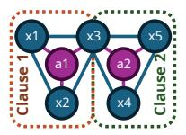
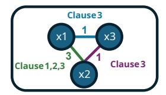
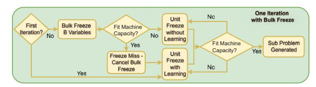
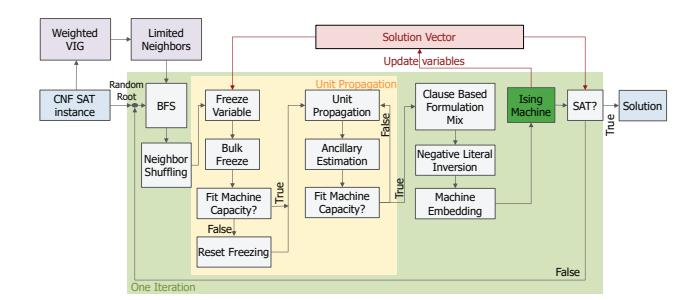
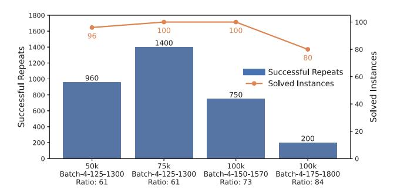
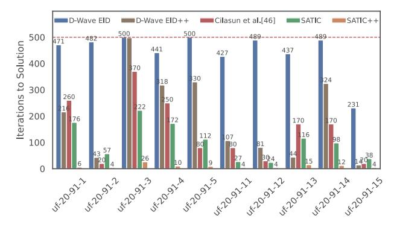
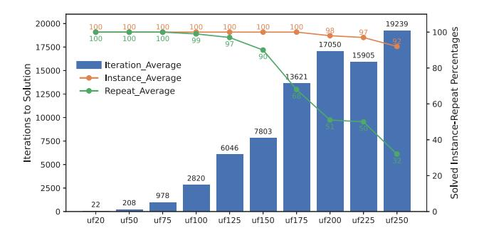
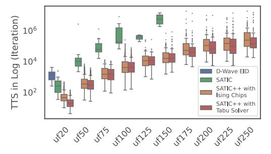
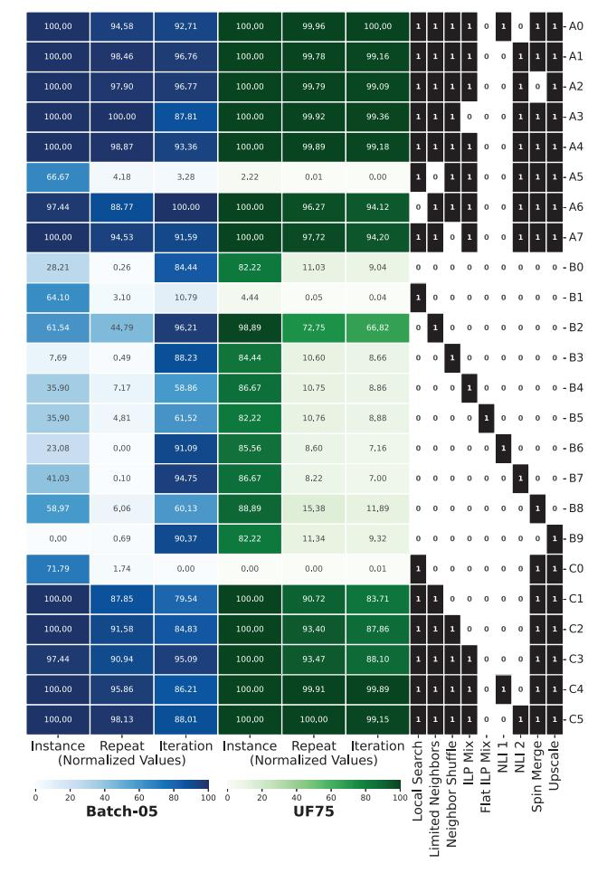

# SATIC: An Optimizing Ising Compiler for SAT(isfiability)

Ahmet Efe, Husrev Cılasun, Abhimanyu Kumar, Nafisa S. Prova, Ziqing Zeng, Tahmida Islam, Ruihong Yin, ¨ Chaohui Li, Peter Kreye, Chris H. Kim, Sachin S. Sapatnekar, Ulya R. Karpuzcu *University of Minnesota, Twin Cities* {efe00002, ukarpuzc}@umn.edu

*Abstract*—Ising machines show great potential as hardware solvers for combinatorial optimization problems such as Boolean Satisfiability (SAT) – one of the hardest classic problems of practical importance. Unlocking this potential, however, is only possible by bridging the gap between SAT problem characteristics and Ising machine specifics. In this paper, we introduce a novel optimizing compiler featuring a bag of powerful heuristic tricks, SATIC, toward this goal. We evaluate SATIC on a representative manufactured Ising chip. Our measurements show that SATIC enables Ising machines to solve up to 73× larger SAT problems than the hardware capacity would otherwise allow, demonstrating unmatched performance and scalability.

*Index Terms*—Ising model, Boolean satisfiability, SAT, QUBO, Ising machines, optimizing compiler, problem decomposition.

## I. INTRODUCTION

Boolean Satisfiability (SAT) is one of the classic combinatorial optimization problems (COPs) with a wide range of real-world applications ranging from software verification [1], hardware verification [2], computational biology [3], and financial modeling [4] to AI [5]. In general terms, each COP seeks to identify values for a discrete set of variables that minimize (or maximize) a given objective function defined over that variable set. While SAT represents one of the hardest problems in theoretical computer science – belonging to the complexity class *NP-complete* and being the very first problem proven to be NP-complete [6], its relevance continues to grow as more real-world problems are expressed in SAT terms [7]–[19].

By construction, classic von Neumann architecture-based solvers cannot effectively solve SAT at scale. Based on a fundamentally different operating principle, physics-inspired hardware solvers, *Ising machines*, have emerged as promising alternatives. The idea is to map the global minima of a COP to the minimum energy states of a physical system incorporating interacting discrete bodies, termed *Ising spins*. In this model, Ising spins represent problem variables; interspin connections, correlations or interactions between problem variables as imposed by problem constraints. The Ising machine naturally stabilizes at a minimum energy state upon perturbation. Therefore, we can engineer these systems such that as the machine converges to a minimum energy state, with high probability, it approaches a solution to a given COP.

Ising machines differ from each other primarily in the technology used to implement spins, which can range from conventional CMOS oscillators [20] to superconducting qubits [21]. Technology choice governs the maximum possible number of spins that a machine can support, i.e., the *machine capacity*, as well as the maximum degree of connectivity between spins. Machine capacity and connectivity limits may look different across technology choices; however, a limit does exist for each technology, which directly poses a challenge for problem mapping:

- (i) Problem constraints translate into specific types of correlations or interactions between problem variables, which cannot always be easily captured by an Ising machine due to limited machine (spin-to-spin) connectivity. Ising machines model inter-spin correlations or interactions by actual physical interspin connections.
- (ii) The problem size and hence the number of problem variables – in emerging optimization problems of practical importance keeps increasing; however, the number of spins in an Ising machine (to match problem variables) cannot increase indefinitely due to physical limits. Inevitably, problems must be chunked into subproblems to fit the machine capacity.

This gives rise to a fundamental gap between *characteristics of practical combinatorial optimization problems* – including SAT as a representative example – and *capabilities of Ising solvers in hardware*. To unlock the full potential of Ising machines, it is imperative to bridge this gap through innovation in optimizing compilers for Ising machines, which is the scope of our paper.

The first step in mapping a problem to an Ising solver is *mathematical formulation*, which entails translating problem variables and constraints into Ising parameters. This is followed by *subproblem formation*, as imposed by Ising machine limitation (ii). *Mathematical formulation*, especially in the presence of Ising machine limitation (i), typically introduces extra variables (that do not correspond to problem variables), mainly to enforce problem constraints, which results in a larger and often harder problem than the original. This further complicates the subsequent *subproblem formation* step.

In this paper, we introduce SATIC, a novel, lightweight, and modular compiler framework designed to efficiently map generic SAT problems to emerging Ising machines. The core idea behind our design is to perform *subproblem formation* directly on the problem's original structure – before mathematical formulation, in contrast to common practice. This constitutes the key novelty of our work, complemented by a set of heuristic techniques that enable and optimize this process.

Key components of SATIC are a graph-based intermediate representation native to SAT problems that helps maintain structural fidelity; an efficient problem decomposer to extract subproblems that match the Ising machine capacity; and a runtime to orchestrate subproblem processing until the system converges to an optimal solution.

SATIC features a bag of powerful heuristic tricks to maximize problem mapping efficiency, thereby enabling Ising machines to solve up to  $73\times$  larger SAT problems than the hardware capacity would otherwise allow, demonstrating unmatched performance and scalability. SATIC is compatible with a broad range of Ising machine architectures, as well as Ising solvers implemented in software [22], [23]. In a nutshell, this paper

- Identifies explicit correctness conditions ancillaryawareness and clause-completeness, respectively – for SATto-Ising compilation, and characterizes the pathologies that arise when these conditions are violated.
- Introduces SATIC, a novel SAT-to-Ising compiler flow that enforces these conditions by construction and that enables problem scaling beyond raw Ising hardware spin capacity.
- Extends SATIC to SATIC++ with novel heuristics across the system stack, demonstrating up to 73× effective capacity scaling on a 45-spin CMOS Ising chip.

In the following, Section II covers the background; Section III, challenges in Ising compiler design; Section IV, the basics of SATIC; Section V, SATIC's bag of tricks; Sections VI and VII, evaluation; Section VIII, related work; and Section IX, a summary and discussion of our findings.

### II. BACKGROUND

### A. SAT(isfiability) Basics

SAT is after finding an assignment to Boolean variables that makes a given formula true. It was the first problem proven to be NP-complete [6], and many fundamental problems can be encoded as SAT instances [24]. As a result, SAT has become a standard model in areas such as formal verification [7]–[11], bioinformatics [12], cryptanalysis [13]–[16], and neural network verification [17]–[19].

The standard representation for SAT formulae is *Conjunctive Normal Form* (CNF): A conjunction of *clauses*, where each clause is a disjunction of *literals*, and where a literal is either a variable x or its negation  $\neg x$  [25]. A CNF instance is satisfiable if every clause evaluates to true. We denote by kSAT the class of SAT problems where each clause contains exactly k literals. Any kSAT clause with k > 3 can be converted to an equivalent set of 3SAT clauses in polynomial time.

Another common representation for structural analysis of SAT instances is *Variable Interaction Graph* (VIG) [26], whose nodes are variables and whose edges connect variables that appear together in at least one clause.

Random SAT problems are uniformly randomly generated instances. Their hardness depends on the clause-to-variable ratio and is maximized in the *transition region* [27]. Random SAT problems in this region are challenging for various types of solvers and commonly used as stressmarks [28].

#### B. Ising Machines

The *Ising model* [29]–[31] describes a system of spins  $s_i \in \{-1, +1\}$  with energy

$$H(s) = -\sum_{i < j} J_{ij} s_i s_j - \sum_i h_i s_i, \tag{1}$$

where  $J_{ij}$  encodes pairwise couplings and  $h_i$  encodes local fields. Physical Ising systems tend to relax toward low-energy configurations; the goal in computation is to find (or approximate) a ground state that minimizes H(s).

Ising machines are engineered systems that exploit this relaxation behavior to solve combinatorial optimization problems, including SAT. Spins can be realized using quantum hardware such as superconducting qubits or Rydberg atoms [32]–[35], or using classical electronics such as coupled oscillators and CMOS-based annealers [36]–[38]. Lucas showed that all 21 of Karp's NP-complete problems [24] can be written as Ising Hamiltonians [39]. In particular, SAT can be encoded by mapping Boolean variables to spins; and clauses, to appropriate inter-spin interactions so that satisfying assignments correspond to low-energy states.

#### C. Mathematical (Ising/QUBO) Formulation of SAT

A common alternative to the Ising formulation is *Quadratic Unconstrained Binary Optimization* (QUBO), which uses binary variables  $x_i \in \{0,1\}$  instead of spins. Over a vector  $x \in \{0,1\}^n$ , the QUBO energy is

$$H(x) = x^{\top} Q x, \tag{2}$$

where Q is a real-valued  $n \times n$  matrix [40]. QUBO is isomorphic to the Ising model via the transformation  $s_i = 2x_i - 1$  [39], enabling SAT instances to be converted seamlessly between Ising and QUBO representations [41]–[43].

In SAT-to-QUBO formulations, the energy is constructed so that each clause contributes a fixed penalty when unsatisfied and a fixed reward otherwise [44]. Achieving this typically requires introducing *ancillary* variables that do not correspond to original SAT problem variables. Ancillary variables increase the size of the QUBO/Ising instance and directly reduce the maximum SAT problem size that can fit on hardware. Approximate formulations that reduce ancillary usage can improve capacity but may distort clause energy symmetry and harm solution quality.

Different SAT-to-QUBO formulations exist, which differ from each other in how they trade (formulation) accuracy for ancillary overhead [43]–[45]. For 3SAT, *Chancellor's formulation* offers a good balance, mapping an n-variable, m-clause instance to n+m spins [42], [46]. For kSAT with k>2, applying a kSAT-to-3SAT conversion followed by Chancellor's formulation yields n+m(2k-5) spins. More compact alternatives exist for kSAT, such as the ILP-based formulation in [46], which uses  $n+m\log_2(k)$  spins for k>2.

When a direct formulation exceeds hardware capacity, *decomposers* split the problem into smaller subproblems that fit on the target machine. Classical SAT solvers also use decomposition, but mainly for performance through parallelism

TABLE I: QUBO Hamiltonian  $H_{C1}$  for clause  $C_1 = (x_1 \lor x_2 \lor x_3)$  from Eq.(3). Last two columns specify the minimum possible  $H_{C1}$  and the corresponding  $a_1$  value.

|   |       |       |       |       | $H_{\epsilon}$ | C1      |                |                        |
|---|-------|-------|-------|-------|----------------|---------|----------------|------------------------|
| i | $x_1$ | $x_2$ | $x_3$ | $C_1$ | $a_1 = 0$      | $a_1=1$ | $\min(H_{C1})$ | $arg min_{a_1} H_{C1}$ |
| 0 | 0     | 0     | 0     | 0     | 0              | 2       | 0              | 0                      |
| 1 | 0     | 0     | 1     | 1     | -1             | 0       | -1             | 0                      |
| 2 | 0     | 1     | 0     | 1     | -1             | 0       | -1             | 0                      |
| 3 | 0     | 1     | 1     | 1     | -1             | -1      | -1             | {0,1}                  |
| 4 | 1     | 0     | 0     | 1     | -1             | 0       | -1             | 0                      |
| 5 | 1     | 0     | 1     | 1     | -1             | -1      | -1             | {0,1}                  |
| 6 | 1     | 1     | 0     | 1     | -1             | -1      | -1             | {0,1}                  |
| 7 | 1     | 1     | 1     | 1     | 0              | -1      | -1             | 1                      |

or simplification [47]–[49]. In contrast, Ising-oriented decomposers are designed to restructure the problem specifically to meet the spin count and connectivity constraints of Ising hardware [46], [50].

#### III. ISING COMPILER DESIGN: CHALLENGES

The potential of Ising machines as promising alternatives to classical SAT solvers can only be enabled by efficient *problem mapping*, a multi-step process which we refer to as *Ising compilation* by forming an analogy to classical compilers. Inefficiency in compilation can easily undermine the utility of Ising machines if the time spent for problem mapping (in software) significantly exceeds the time spent in finding a solution (in hardware) [51].

#### A. Variable Selection in Subproblem Formation

SAT-to-QUBO conversion (Section II-C) introduces ancillary variables which do not correspond to actual problem variables. Consider the QUBO (Chancellor's) formulation of an example 3SAT clause  $C_1 = (x_1 \lor x_2 \lor x_3)$ , where  $a_1$  represents a binary ancillary variable:

$$H_{C_1}(x_1, x_2, x_3) = \min_{a_1 \in \{0, 1\}} \left[ -x_1 - x_2 - x_3 + x_1 x_2 + x_1 x_3 + x_2 x_3 - a_1(x_1 + x_2 + x_3 - 2) \right]$$
(3)

The solver now has to find a suitable assignment to the ancillary variable  $a_1$ , as well as the problem variables  $x_1$ ,  $x_2$ ,  $x_3$ , such that the QUBO energy  $H_{C1}$  assumes its minimum value for any assignment to  $(x_1, x_2, x_3)$  rendering C1 = 1. Table I reports C1 and  $H_{C1}$  values, considering all assignments to  $(x_1, x_2, x_3)$  indexed by i. We observe that  $C_1$  is satisfied (=1) for i=1 to 7. Accordingly, the assignment to  $a_1$  must guarantee that  $H_{C1}$  assumes its minimum value for i=1 to 7. A fixed  $a_1$  cannot always guarantee that  $H_{C1}$  assumes its minimum value for i = 1 to 7. For example, if  $a_1$  is fixed to 0 (column 6 in Table I), satisfying assignment i = 7 would render the same energy  $H_{C1}$  as the only unsatisfying assignment i = 0, distorting the alignment of the Hamiltonian energy landscape with the original problem's objective function. For hard SAT instances in the transition region where solutions are sparse, such distortion can significantly reduce the probability of finding a correct solution and impede convergence.

In principle, ancillary values should not be fixed. However, ancillary-unaware subproblem formation can unintentionally




- (a) Before formulation
- (b) After formulation

Fig. 1: Visual representation of the example from Eq.(6).

assign a fixed value to an ancillary – by forming subproblems that include problem variables but exclude the clause-specific ancillary. As an illustrative example, consider the QUBO formulation for the clause  $C_2 = (\neg x_3 \lor x_4 \lor x_5)$ :

$$H_{C_2}(x_3, x_4, x_5) = \min_{a_2 \in \{0, 1\}} \left[ -(1 - x_3) - x_4 - x_5 + x_4 x_5 + (1 - x_3)x_5 + (1 - x_3)x_4 - a_2((1 - x_3) + x_4 + x_5 - 2) \right]$$

$$(4)$$

Assume that we have the following problem in CNF form:

$$F = C_1 \wedge C_2 = (x_1 \vee x_2 \vee x_3) \wedge (\neg x_3 \vee x_4 \vee x_5)$$
 (5)

This yields the QUBO objective:

$$H_{\rm F}(x_1, x_2, x_3, x_4, x_5) = H_{C_1}(x_1, x_2, x_3) + H_{C_2}(x_3, x_4, x_5)$$
(6)

Five problem  $(x_1, x_2, x_3, x_4, x_5)$  and two ancillary  $(a_1, a_2)$ variables in Eq.(6) require 7 Ising spins. The variable interaction graph in Fig.1a (Fig.1b) visualizes the problem structure for CNF (QUBO) representations. Let us assume that the target Ising machine only has 4 spins, hence can accommodate only 4-variable subproblems, where the problem from Fig.1b features 7 variables. Even for this small example, there are  $\binom{7}{4} = 35$  ways to choose a 4-variable subproblem. Among these, only the selections  $(x_1, x_2, x_3, a_1)$  and  $(x_3, x_4, x_5, a_2)$ keep each clause objective intact. In contrast, a subproblem with  $(x_1, x_2, x_3, x_4)$  excludes both  $a_1$  and  $a_2$ . Before solving a subproblem, solvers must set excluded variables to fixed values - this is the only way for the subproblem to capture interactions between selected and excluded variables. Hence, by excluding the ancillary variables as such, we can no longer guarantee that the solver optimizes the intended per-clause objective from Eq.(3) and Eq.(4).

This is a fundamental shortcoming for generic subproblem formation. State-of-the-art approaches prioritize selection of higher degree variables (i.e., variables interacting with many others). A higher degree implies a higher energy (H) impact. In 3SAT, however, by construction, ancillaries tend to have lower degree (they interact only with the variables of their clause) and are therefore more likely to be excluded from subproblems – distorting the alignment of the Hamiltonian energy landscape with the original problem's objective function. We quantify this effect in Section VII.

Ancillary-awareness: In forming a subproblem, each ancillary variable must be grouped with the actual problem variables in its respective clause to align the Hamiltonian energy landscape with the original problem's objective function. State-of-the-art approaches, including D-Wave's highly optimized absolv [50], [52], overlook this.

#### B. Clause Selection in Subproblem Formation

QUBO formulation introduces energy reward and penalty terms at the clause granularity to guide convergence to a solution. Therefore, subproblem formation must consider clauses in their entirety – including ancillary variables – rather than randomly picking variables across clauses until reaching the target variable count (subproblem size). This guarantees ancillary-awareness, but another challenge emerges: For each variable x, QUBO solvers typically prioritize an assignment x=v ( $v\in\{0,1\}$ ) that maximizes the number of satisfied clauses containing x. This can be thought of as a majority vote across all clauses included in the respective subproblem that contain x. Accordingly, if some subset of clauses containing x are excluded from a subproblem, the suggested assignment x=v may become biased.

Consider the example from Eq.(5) and assume that the target Ising machine has 4 spins. To preserve **ancillary-awareness**, we can form two 4-variable subproblems by considering clauses in their entirety: One with  $(x_1, x_2, x_3, a_1)$  for  $C_1$  and one with  $(x_3, x_4, x_5, a_2)$  for  $C_2$ . Each subproblem gets solved independently, but they share the variable  $x_3$ . The assignment to  $x_3$  in the solution to the first subproblem (satisfying  $C_1$ ) can very well conflict with the assignment to  $x_3$  in the solution to the second subproblem, because each subproblem includes only a subset of the clauses containing  $x_3$  and not all.

As each clause encodes a constraint, not considering all clauses in subproblem formation directly translates into not considering all constraints on any selected variable. Enforcing clause-completeness, however, can increase subproblem size.

Clause-completeness: If a variable is selected in forming a subproblem, all clauses containing that variable should be included such that the full set of constraints on that variable get considered during variable assignment. Otherwise, different subproblems may optimize different subsets of clauses and produce conflicting assignments to the same variable, which can slow down or prevent convergence.

#### IV. SATIC: MACROSCOPIC VIEW

The mismatch between practical problem sizes (in terms of the number of variables) and Ising machine capacity (in terms of the number of spins) makes problem decomposition into subproblems inevitable. Subproblems must be formed in a way that each fits the underlying Ising machine. However, this is not sufficient for correctness. **Ancillary-awareness** (Section III-A) and **clause-completeness** (Section III-B) set the correctness conditions for variable and clause selection during subproblem formation. Our optimizing Ising compiler


Fig. 2: SATIC in a nutshell with the complete bag of tricks. for SAT, SATIC, enforces **ancillary-awareness** and **clause-completeness** by construction, from the ground up. To the best of our knowledge, SATIC is the first framework that enforces both properties to enable unmatched practical scalability.

A key initial step in mapping a problem to an Ising solver is mathematical formulation, which introduces ancillary variables that do not correspond to actual problem variables (Section II). Ancillary-awareness as well as clause-completeness constrains how ancillary variables must be handled during subproblem formation. The native representation for SAT problems is CNF. Mathematical formulation typically entails conversion from CNF to QUBO. The core idea behind SATIC, contrary to common practice, is to perform variable selection to form subproblems before mathematical formulation (i.e., conversion to QUBO) takes place, using the native (CNF) problem representation that does not (and cannot) have any ancillary variables by construction. SATIC. SATIC features a bag of powerful heuristic tricks to efficiently implement this core idea, as summarized in Fig.2.

SATIC's intermediate representation for orchestrating variable selection is based on Variable Interaction Graphs (VIG). After selecting variables at the CNF-level, SATIC assigns fixed values to (i.e., *freezes*) the unselected variables and simplifies the resulting CNF through *unit propagation* [53]. This effectively reduces the number of variables per clause in the subproblem, which, after mathematical formulation, results in fewer ancillary variables by definition. Subproblems formed by SATIC therefore become more likely to match the Ising machine capacity. SATIC makes **ancillary-awareness** automatic; and **clause-completeness**, much easier to satisfy.

For example, considering the example problem in Eq.(5) under a 4-spin Ising hardware limit, SATIC would form subproblems by selecting variables at the CNF level – say  $(x_1,x_2,x_3)$  – and by assigning fixed values to the unselected variables  $(x_4=0 \text{ and } x_5=0)$ . The original CNF then reduces to the subproblem CNF  $(x_1\vee x_2\vee x_3)\wedge (\neg x_3)$ , which fits the 4-spin hardware after formulation: The first clause introduces one ancillary variable; while the second, single-variable clause remains intact after formulation. This preserves ancillary-awareness, as well as clause-completeness because the subproblem formed before formulation contains all clauses including selected variables.

Algorithm 1 and Fig.3 provide a closer look into SATIC:

(1) Generate the VIG, where nodes represent variables and an edge exists between two variables if they share a clause


Fig. 3: SATIC Flow.

(Line 13). Fig.1a shows an example VIG.

- (2) Initialize the *global solution vector* (Line 14). Any assignment can work here, including random assignments.
- (3) Pick a random root variable on the VIG (Line 16) and perform breadth-first search (BFS) to generate a list of variables L ordered by their distance to the root (Line 17).
- (4) Formulate the problem in QUBO form (Line 31) and check the problem size (Line 32). If the problem size exceeds the Ising machine capacity (Line 33), start a loop.
- (5) Pick a variable to *freeze* from the bottom of the variable list *L* (generated in Step (3)), remove it from the list, and apply unit propagation. Freezing entails picking a predetermined value for the respective variable from the *global solution vector* (Line 34), which serves as a running container for partial solutions as the algorithm progresses.
- (6) Reformulate (Line 35) and check the subproblem size (Line 36). If the size still exceeds the Ising machine capacity, return to Step (5) to freeze another variable.
- (7) If the subproblem size matches the Ising machine capacity, send the subproblem to the Ising machine (Line 19).
- (8) Retrieve the solution from the Ising machine and update the global solution vector with the subproblem (local) solution (Line 21).
- (9) Check if the global solution vector satisfies the original problem (Line 22). If it does, the algorithm terminates successfully (Line 24). If not, return to Step (3), and continue until either a solution is found or the maximum iteration limit is reached.

In summary, SATIC ensures ancillary-awareness automatically by constructing subproblems at the CNF-level, before QUBO formulation. Since variable selection takes place at the CNF-level, where no ancillary variables exist yet, there is practically no way to leave them out during subproblem formation. At the same time, through the BFS traversal of the VIG and unit propagation, SATIC guarantees clausecompleteness by ensuring that all clauses involving a selected variable are included in the subproblem. Freezing unselected variables effectively reduces the literal count per clause, which leads to fewer ancillary variables during subproblem-to-QUBO conversion, leaving more room for actual problem variables. Oftentimes, 3SAT clauses reduce to 2SAT or 1SAT clauses, which require no ancillary variables. Since unit propagation has linear time complexity [54], the time complexity of SATIC (Algorithm 1) becomes O(TL) for a CNF with L literals over T iterations.

Using the pre-formulation VIG for variable selection reduces the cost of graph traversal significantly. For example, a representative, nontrivial 50-variable/200-clause 3SAT prob-

#### Algorithm 1 SATIC: Macroscopic View

```
1: Input: SAT formula in CNF (residing in CNF.file)
 2: Output: Global solution vector and SAT status
     # Q_{\text{sub}}: Subproblem after formulation (QUBO)
    # Q_{\text{sub}}.size: Subproblem size after formulation
 5:
     # S_{global}: Global solution vector
 6: # S_{\text{sub}}: Subproblem solution vector
    # max.var: Variable count in CNF
 8: # machine.capacity: Target Ising machine capacity
     # max.iter: Maximum permissible number of iterations
10:
     procedure SATIC(CNF.file, max.iter)
         CNF, max.var \leftarrow ReadCNF(CNF.file)
12.
13:
          VIG \leftarrow CreateGraph(CNF)
          S_{\text{global}} \leftarrow \text{RandomAssignment}(\text{max.var})
14.
15:
          while iteration<max.iter do
16:
              root \leftarrow Randint(1, max.var)
17:
              var.list \leftarrow BFS(VIG, root)
18:
              Q_{\text{sub}} \leftarrow \text{UnitProp}(\text{CNF}, \text{max.var}, \text{var.list}, S_{\text{global}})
19.
              S_{\text{sub}} \leftarrow \text{IsingHardware}(Q_{\text{sub}})
20:
              # Update the global solution with the subproblem solution
21.
               S_{\text{global}} [\dots] \leftarrow S_{\text{sub}}
22:
              SAT \leftarrow CheckSolution(CNF, S_{global})
              if SAT is true then
23.
                   break
25.
              end if
26:
          end while
27:
         return (S_{global}, SAT)
28: end procedure
29:
     procedure UNITPROP(CNF, max.var, var.list, S_{global})
30:
31:
          Q_{\text{sub}} \leftarrow \text{Formulate}(\text{CNF}, \text{max.var})
32.
          Q_{\text{sub}}.\text{size} \leftarrow \text{CheckSize}(Q_{\text{sub}})
33:
          while Q_{\text{sub}}.size > machine.capacity do
34.
              CNF_{sub} \leftarrow VarFreeze(CNF, var.list, S_{global})
35:
              Q_{\text{sub}} \leftarrow \text{Formulate}(\text{CNF}_{\text{sub}}, \text{max.var})
36:
              Q_{\text{sub}}.\text{size} \leftarrow \text{CheckSize}(Q_{\text{sub}})
37:
         end while
38:
          return Q_{\text{sub}}
39: end procedure
```

lem from the transition region becomes a 250-variable QUBO problem under Chancellor's formulation – which incurs as many variables as the number of original problem variables plus the number of clauses (Section II-C). All of these 250 variables must be considered for variable selection if subproblem formation is deferred until after formulation. SATIC, on the other hand, only deals with a 50-node VIG in this case for variable selection. A clause-to-variable ratio of  $\approx 4$  demarcates the transition region for 3SAT (k=3), which can reach  $\approx 10$  for 4SAT (k=4) [55]. Accordingly, SATIC's efficiency gets more pronounced for larger k.

## V. SATIC: MICROSCOPIC VIEW

We next detail SATIC's bag of tricks (Fig.2), which builds on the core framework introduced in the previous section for higher performance and scalability.

## A. Intermediate Representation Tricks

SATIC uses the Variable Interaction Graph (VIG) to iteratively select subproblem variables and constructs a VIG once for



Fig. 4: Weighted VIG representation for Eq.(7).

each SAT problem when compilation starts. We introduce edge weights to standard VIGs, where each weight reflects how many times two variables co-occur within the same clause. Fig.4 provides an example for the CNF SAT instance:

$$(x_1 \vee \neg x_2) \wedge (\neg x_1 \vee x_2) \wedge (x_1 \vee \neg x_2 \vee x_3) \tag{7}$$

SATIC's first heuristic trick, Limited Neighbors, prunes the weighted VIG by retaining only the top N most strongly connected neighbors for each variable, using edge weights. N is a parameter pre-determined based on the size of the target Ising machine. This ensures that variable neighborhoods reflect the most structurally relevant interactions during subproblem selection.

The heuristic begins by constructing a *Maximum Spanning Tree (MST)* of the weighted VIG, prioritizing the highestweight edges to preserve full graph connectivity while discarding all other connections. A refinement step follows the MST construction, iterating over each node and incrementally restoring previously discarded edges, in descending order of weight, up to the pre-specified per-node neighbor limit N. This two-step procedure balances global connectivity with locally important structure.

In dense kSAT instances, particularly for higher values of k, variable degrees can easily exceed the subproblem-size limits imposed by the machine capacity. Limited Neighbors is particularly effective in such cases because it distills only the most meaningful connections for each variable. At the same time, by compressing the VIG, Limited Neighbors can significantly accelerate iterative BFS traversals during subproblem formation.

Visualizing SAT instances to uncover structural properties such as connectivity (which directly captures inter-variable correlations) is a common practice [56]–[58]. Building on this tradition, we introduce the Web Graph, a SATIC-native VIG visualization, with examples shown in Fig.5. Web Graph arranges SAT variables radially, placing the most densely connected variables at the center; the least, along outer arcs. Node colors encode connectivity density; edge colors, co-occurrence frequency of variables in the same clause. Web Graph makes dense or sparse regions, bipartitions, or unconnected variables immediately visible to guide the user in SATIC's downstream optimization passes.

## *B. Subproblem Formation Tricks*

To select subproblem variables, SATIC performs BFS starting from a randomly picked root variable on the VIG by default. As variables adjacent in the VIG tend to be more strongly correlated, including them in the same subproblem results in better performance. There may be multiple, equally eligible


(a) Before Limited Neighbors (b) After Limited Neighbors

Fig. 5: Web Graph visualization of a representative 50 variable, 2700-clause 6SAT problem, before (a) and after (b) Limited Neighbors with <sup>N</sup> = 10.

variables to pick from at each BFS level, which the default flow does not consider. Neighbor Shuffling is an effective heuristic trick to avoid any potential bias induced by such cases. The idea is randomly permuting the adjacency list at each BFS level in different iterations.

## *C. Formulation Tricks*

SAT-to-QUBO formulation efficiency directly affects solver performance. SATIC uses three heuristic tricks – all performed after subproblem formation, before QUBO formulation – to maximize formulation efficiency.

The first trick, Negative Literal Inversion, is designed to reduce unintended local energy traps induced by the formulation. Standard formulations such as Chancellor's typically use the transformation <sup>¬</sup><sup>x</sup> → (1−x) for negative literals – as, for example, depicted in Eq.(4). While this preserves clause-based energy penalty-reward semantics, it may cause the resulting QUBO coefficients to be slightly different for clauses with more positive literals vs. clauses with more negative literals. Such coefficient differences can distort the energy landscape, which may potentially lead to local minima and make finding the global solution harder for the Ising machine.

Negative Literal Inversion can be thought of as some form of renaming that takes place after subproblem formation and before QUBO formulation. If a variable appears mostly as a negative literal in the subproblem, we invert its polarity such that it becomes a positive literal in the QUBO formulation. The number of variables or clauses remains intact otherwise. Once the corresponding subproblem is formulated as a QUBO instance, sent to the Ising machine, and solved, we revert the inverted literals to the original SAT representation.

The second trick, Clause Based Formulation Mix, aims to reduce the number of ancillary variables induced by the formulation, by fusing different SAT-to-QUBO formulations at the clause level. After subproblem formation at the CNF-level, SATIC typically renders a mix of low-k clauses over a range of k. The idea behind Clause Based Formulation Mix is using a formulation optimized for the clause-specific k for each such subproblem clause. Specifically, SATIC fuses clauses generated by Chancellor's and ILP formulations. As detailed in Section II-C, in terms of ancillary variable overhead,



Fig. 6: Bulk Freeze Flow.

Chancellor's is more efficient for  $k \le 3$ ; ILP, for k > 3. By using the more efficient formulation for each clause, **Clause Based Formulation Mix** can significantly reduce the ancillary variable count in each subproblem, effectively increasing the problem size a limited-capacity Ising machine can handle.

In ILP (Chancellor's) formulation, the energy reward – the contribution of each satisfied clause to the objective function to be minimized – is 0 (-1); the energy penalty per unsatisfied clause, +1 (0). While the energy reward/penalty ranges are different, both formulations have the same spectral energy distance, i.e., they preserve the problem structure, rendering their clause-level combination mathematically safe. Clause Based Formulation Mix works particularly well with Negative Literal Inversion.

Similar to classical systems, Ising machines cannot increase machine precision indefinitely, which imposes a limit on the QUBO coefficient ranges. This effect is more pronounced for the standard ILP formulation, where the weights of ancillary variables grow by powers of 2 by construction. For example,  $2a_2 + 1a_1$  applies for the ancillaries of a 4SAT clause (k = 4);  $4a_3 + 2a_2 + 1a_1$ , for the ancillaries of a 7SAT clause (k = 7). While ILP formulation incurs a lower number of ancillary variables than Chancellor's for larger k, the coefficient range is wider, which may stress the underlying Ising machine. The third trick, Flat ILP formulation, addresses this by selectively replacing each ILP ancillary with multiple ancillary variables of lower weight without compromising ILP's original energy reward/penalty semantics. Using this trick in the example 7SAT clause,  $4a_3 + 2a_2 + 1a_1$  under the standard ILP formulation becomes  $2a_4 + 2a_3 + 2a_2 + 1a_1$ , balancing ancillary count with coefficient range.

#### D. Runtime Optimization Tricks

SATIC also features several runtime optimization tricks: Ancillary estimation reduces SATIC's runtime by avoiding repeated (sub)QUBO formulations that are only used to check whether a subproblem fits the target Ising machine. When capacity is predictable, we estimate (sub)QUBO size directly from the (sub)CNF by counting clause widths (k). For a given formulation, we precompute ancillary overhead in a small lookup table indexed by k and use this table during subproblem formation. For example, Chancellor's formulation uses roughly (2k-5) ancillaries per kSAT clause. Without ancillary estimation each size check would trigger fullfledged translation of a subproblem to QUBO, where ancillary estimation only uses a linear-time scan over the subproblem CNF per check.

Local Search is a heuristic trick to escape local minima by randomly shuffling the values in the global solution vector



Fig. 7: SATIC++: SATIC flow with the entire bag of tricks.

(Algorithm 1) after a preset number of iterations without a solution. In most such cases, **Local Search** represents a lighter-weight, equally effective alternative to a hard restart, and is customizable according to the needs of specific problem instances.

**Bulk Freeze** (Fig.6) is a runtime optimization that streamlines SATIC's unit propagation. In the default flow, SATIC freezes variables one at a time and reruns unit propagation after each freeze until the resulting subproblem fits the target machine. **Bulk Freeze** reduces this overhead by learning, from an initial iteration, a typical number of variables *B* to be frozen, and then speculatively freezing *B* variables at once in later iterations. Because the number of spins required by a subproblem can vary across iterations, the bulk-frozen subproblem may still exceed the hardware capacity or may under-utilize it. In such cases, **Bulk Freeze** falls back to one-by-one refinement around *B*. This preserves adaptability while avoiding many repeated unit-propagation passes.

TABLE II: Time complexity.

| Component / Heuristic           | Complexity              | Hyperparameters |
|---------------------------------|-------------------------|-----------------|
| SATIC (baseline, no heuristics) | O(TL)                   | _               |
| Limited Neighbors               | $O( E \log V )$         | $\overline{N}$  |
| Neighbor Shuffling              | O( V + E )              | _               |
| Negative Literal Inversion      | $O(L_s)$                | _               |
| Clause Based Formulation Mix    | $O(m_s)$                | _               |
| Ancillary Estimation            | $O(L_s)$                | -               |
| Bulk Freeze                     | $O(L_s)$                | -               |
| Local Search                    | O(n)                    | $T_{\rm LS}$    |
| SATIC++ (overall)               | $O(TL) + O( E \log V )$ | $N, T_{\rm LS}$ |

# E. Putting It All Together: SATIC++

Fig.7 provides the SATIC flow with the entire bag of tricks, which we refer to as SATIC++, with the time complexity tabulated in Table II. Let |V| and |E| denote the number of nodes and edges in the VIG;  $L_s$  and  $m_s$ , the number of literals and clauses in a subproblem; and n, the total number of SAT variables. Overall, SATIC++ preserves the O(TL) time complexity of SATIC (linear in the number of CNF literals L per iteration, over T iterations), and adds a one-time  $O(|E|\log|V|)$  MST preprocessing step. The only hardware-dependent knob is the neighbor cap N in **Limited Neighbors**, which depends on the Ising machine capacity. As an example, for the 45-spin Ising chip (Section VI) we set N=10. The local-search interval  $T_{\rm LS}$  controls how frequently we restart the

process. We set TLS once per workload using a small profiling run.

We next quantitatively characterize the impact of each trick on overall performance and scalability, highlighting synergistic interactions between different tricks.

## VI. EVALUATION SETUP

## *A. Metrics*

*Batch* refers to a group of SAT problems that share the same configuration – the same clause width (k), number of variables (n), and number of clauses (m). We evaluate SATIC using multiple batches and consider each batch solved only if all of its instances are solved.

*Instance* denotes a single SAT problem within a batch. We use batches with at least 50 instances for proper evaluation. If a trick fails on even a few instances despite solving others quickly, that trick is treated as problem-specific rather than generally effective. We do not consider problem-specific tricks in this paper.

*Repeats* are independent runs per instance to guarantee statistical significance. We use at least 100 repeats and consider an instance solved if any repeat succeeds.

*Iteration Count* measures the number of hardware (Ising machine) calls made per run and serves as a proxy for the time overhead of SATIC.

*Time to Solution (TTS)* is a standard metric in evaluating stochastic solvers [59], [60] and refers to the expected time required to solve a given problem instance at a target confidence level; in this paper, we use a confidence level corresponding to solving at least 95 out of 100 independent repeats.

Ising solvers are stochastic and must be run many times per instance, so single wall-clock measurements can be noisy and implementation-dependent. We use the number of solver iterations (hardware calls) and TTS (in terms of iterations) as our primary cost metrics. We also report end-to-end runtime with detailed breakdown.

# *B. Benchmarks*

We use two benchmark families, *seen* and *unseen* (Table III). *Seen* problems are custom-crafted stress-test batches designed to probe capacity limits, while *unseen* problems are publicly available stressmarks used in prior work. Seen batches are intentionally designed to be structurally challenging, with varied clause widths and clause-to-variable ratios. Unseen batches are drawn from the publicly available SATLIB repository, which provides random 3SAT problems from the transition region, known to be hard for a wide range of solvers [28].

## *C. Hardware (Ising Machine) Testbed*

We evaluate SATIC and its bag of tricks on a representative Ising machine featuring 45 all-to-all connected spins, each corresponding to a CMOS ring oscillator operating at room temperature. The coefficient range spans [−14, +14]. Under the same hardware budget, such an all-to-all connected 45-spin chip is roughly equivalent to a 1000+ spin chip with limited


Fig. 8: Hardware testbed featuring an Ising card.

neighbor connectivity. For further details on the underlying coupled-oscillator Ising chip family, we refer readers to [20].

The Ising chip is mounted on a board integrated with an FPGA to enable PCIe communication with a host PC through the PCIe port (Fig.8). This ease of integration made over 2 billion hardware accesses possible over the course of this study. The server is equipped with an Intel(R) Xeon(R) Gold 6240R CPU running at 2.40 GHz, offering 24 physical cores and 48 threads. Using PCIe multiplexers, eight Ising cards are mounted on the server. This setup allows concurrent parallel repeats over eight Ising cards. SATIC itself, along with the bag of tricks – SATIC++ as demonstrated in Fig.7 – is implemented in Python 3.8.

There is an Ising hardware-specific step in the SATIC++ flow, encapsulated by the *Machine Embedding* block in Fig.7. SATIC++ features two hardware embedding tricks optimized for the target Ising hardware: Adaptive Spin Merging and Dynamic Upscaling. Previous work demonstrated how multiple physical spins can be merged to increase the machine coefficient range, however, only *statically* in a brute-force fashion [46]. With Adaptive Spin Merging we extend this idea to *dynamically* merge *unused* physical spins. The resulting increase in coefficient range minimizes potential accuracy loss due to coefficient rounding or scaling. Similarly, Dynamic Upscaling enhances the common practice of problem coefficient scaling to match the machine coefficient range [46] and comes in two flavors. The core idea is to adaptively determine the scaling factor either by tracking the largest coefficient or the second-largest (and capping the largest one accordingly). We apply the latter strategy when there is a large gap between the largest and second-largest coefficients.

# VII. EVALUATION

## *A. Stress Test*

To evaluate SATIC, we consider two configurations: SATIC, the bare compiler without heuristics, and SATIC++, the full compiler with all heuristics enabled. We focus on a particularly challenging benchmark: Batch-4-100-1000, containing 100 4SAT instances with 100 variables and 1000 clauses, and yielding a clause-to-variable ratio of 10, which lies in the transition region [55]. These problems are dense and structurally complex, hence, ideal for stress-testing. The equivalent QUBO sizes become ≈3100 variables with Chancellor's formulation, and 2100 with ILP. This renders a problem variableto-hardware spin ratio of 69× – 47× on the Ising chip. The

| Category                      | Type   | Benchmark        | k | n   | m    | Instance Count | Solved Instances | Ratio |
|-------------------------------|--------|------------------|---|-----|------|----------------|------------------|-------|
|                               | seen   | Batch-4-50-500   | 4 | 50  | 500  | 100            | 100              | 23.3  |
|                               | seen   | Batch-4-100-1000 | 4 | 100 | 1000 | 100            | 100              | 46.7  |
| CRAFTED - QUIET PLANTING [61] | seen   | Batch-4-125-1300 | 4 | 125 | 1300 | 50             | 50               | 60.6  |
|                               | seen   | Batch-4-150-1570 | 4 | 150 | 1570 | 50             | 50               | 73.1  |
|                               | seen   | Batch-4-175-1800 | 4 | 175 | 1800 | 50             | 40               | 83.9  |
|                               | seen   | Batch-2-50-60    | 2 | 50  | 60   | 100            | 100              | 1.1   |
| CRAFTED - AI PLANNING [61]    | seen   | Batch-3-50-275   | 3 | 50  | 275  | 100            | 100              | 7.2   |
|                               | seen   | Batch-3-50-300   | 3 | 50  | 300  | 100            | 100              | 7.8   |
|                               | unseen | UF20             | 3 | 20  | 91   | 1000           | 1000             | 2.5   |
|                               | unseen | UF50             | 3 | 50  | 218  | 1000           | 1000             | 6.0   |
|                               | unseen | UF75             | 3 | 75  | 325  | 100            | 100              | 8.9   |
|                               | unseen | UF100            | 3 | 100 | 430  | 1000           | 1000             | 11.8  |
|                               | unseen | UF125            | 3 | 125 | 538  | 100            | 100              | 14.7  |
| SATLIB - UNIFORM RANDOM [28]  | unseen | UF150            | 3 | 150 | 645  | 100            | 100              | 17.7  |
|                               | unseen | UF175            | 3 | 175 | 753  | 100            | 100              | 20.6  |
|                               | unseen | UF200            | 3 | 200 | 860  | 100            | 98               | 23.6  |
|                               | unseen | UF225            | 3 | 225 | 960  | 100            | 97               | 26.3  |
|                               | unseen | UF250            | 3 | 250 | 1065 | 100            | 92               | 29.2  |

TABLE III: SAT Benchmark characteristics and a summary of performance results. Naming for seen batches follow *Batchk-n-m* convention, where k denotes the clause width; n, the number of problem variables; and m, the number of clauses. *Ratio* depicts the relative size of the problem (in QUBO form with the best possible formulation incurring the least number of ancillary variables) with respect to the Ising machine capacity.

high density – 4000 literals per instance – demands aggressive optimization in both decomposition and hardware embedding.

Fig.9 provides a quantitative characterization. The left yaxis captures the number of successful repeats; the right yaxis, the number of solved instances. We first set the iteration limit to 10,000 and evaluate the basic SATIC flow using a simple local search strategy that restarts the system at regular intervals. Then, 67 out of 100 instances in Batch-4-100-1000 yield at least one successful solution. However, our goal is to achieve full coverage across all instances.


Fig. 9: SATIC vs. SATIC++.

Neighbor Shuffling introduces structural diversity in subproblem selection and improves the number of solved instances from 67 to 85. Node degrees in Batch-4-100-1000 can reach 80, while the Ising chip can only handle subproblems with around 20 variables per iteration. This means that even with Neighbor Shuffling, selecting 20 variables from 80 potential neighbors becomes effectively random, which may degrade subproblem quality.

Limited Neighbors limits each node's neighbors to the ones with top 10 strongest connections – approximately half the hardware capacity. This forces the BFS traversal to explore deeper, structurally relevant areas of the graph, and Limited Neighbors thereby increases the number of solved instances from 85 to 88. However, the total number of successful repeats drops slightly from 1,347 to 1,321, indicating that some of the previously solvable instances became harder to solve due to reduced local redundancy.

We next increase the iteration limit from 10,000 to 50,000. This further raises the number of solved instances from 88 to 94 and boosts the successful repeat count significantly from 1,321 to 3,552. While not a heuristic trick in itself, increasing the iteration budget simply enables more opportunities for convergence to a solution.

Chancellor's formulation leads to very large coefficients, many of which get capped to match the hardware coefficient range, leading to accuracy loss. The situation is even worse with the standard ILP formulation. Flat ILP generally helps in this case. However, both ILP and Flat ILP perform poorly on 2SAT clauses, which frequently emerge after unit propagation. Clause Based Formulation Mix combines Flat ILP for higher-width clauses with Chancellor's for 2SAT cases, and thereby increases the number of solved instances from 94 to 97; and the successful repeat count, from 3,552 to 4,676.

We further observe that subproblems with a high number of negative literals often lead to suboptimal solutions on the Ising hardware. Applying Negative Literal Inversion (NLI) to address this increases the number of solved instances from 97 to 100; and the total number of successful repeats, from 4,676 to 6,475. With this core set of tricks, we are able to solve all instances in Batch-4-100-1000.

There is still room for improvement. Specifically, we realize

that SATIC with this core bag of tricks does not always generate subproblems large enough to fully utilize the available physical spins on the Ising hardware. Adaptive Spin Merging practically balances (unused) spin count with coefficient range, on demand, carefully considering the coefficient distribution of each problem instance, which in turn increases the number of successful repeats from 6,475 to 6,621 – particularly helping harder instances.

The final improvement comes from revisiting the formulation. Specifically, instead of mixing Flat ILP and Chancellor's, we combine the standard ILP with Chancellor's. ILP typically introduces larger coefficients that risk being capped and degrading accuracy, which Adaptive Spin Merging successfully addresses. As a result, with this combination, the number of successful repeats increases from 6,621 to 6,816 – the best performance for this batch.



Fig. 10: Scalability analysis. *50K–100K* on the x-axis demarcates the respective iteration limit (time budget) per batch, which grows with batch size for a fair comparison. *Ratio* captures the problem variable-to-hardware spin ratio, as reported by the last column in Table III.

## *B. Scalability Analysis*

Fig.10 reports the performance of SATIC++ for larger SAT problems. The left y-axis captures the number of successful repeats; the right y-axis, the number of solved instances. As we move in the positive x-direction, problem sizes grow significantly (Table III). We observe that SATIC++ can successfully solve all problem instances up to Batch-4-150-1570, which corresponds to problems 73× larger than our 45-spin Ising hardware. Any batches larger than this (Batch-4-175-1800 as a proxy) – while still partially solvable – exhibit significantly lower repeat success rates. We conservatively set Batch-4-175- 1800 as the upper bound for SATIC++'s practical scalability.

# *C. Controlled Study of Correctness Conditions*

To isolate the impact of ancillary-awareness and clausecompleteness, we run a controlled SATLIB UF75 study with a 50K iteration budget and 100 instances on the Ising hardware. Table IV summarizes the results. Violating clause-completeness renders 0/100 solved instances; violating ancillary-awareness, 44/100 – confirming that both conditions are critical for convergence. In contrast, SATIC solves 87/100 instances without the full bag of tricks, while SATIC++

TABLE IV: Controlled study isolating ancillary-awareness and clause-completeness on SATLIB UF75.

| Variant           | Ancillary-<br>aware | Clause<br>complete | Solved  |
|-------------------|---------------------|--------------------|---------|
| Clause-incomplete | Yes                 | No                 | 0/100   |
| Ancillary-unaware | No                  | Yes                | 44/100  |
| SATIC             | Yes                 | Yes                | 87/100  |
| SATIC++           | Yes                 | Yes                | 100/100 |

solves all 100 – showing that ancillary-awareness and clausecompleteness form the correctness-preserving foundation for SATIC++.

## *D. Comparison to State of the Art*

Fig.11 provides a comparison with Cilasun et al. [46] – a recent SAT decomposer targeting similar Ising hardware, as well as D-Wave's Energy Impact Decomposer (D-Wave EID) – the most up-to-date version of qbsolv [50], which represents one of the best generic decomposers from the literature [62]. D-Wave EID++ is our modified version of D-Wave EID. D-Wave EID++ randomizes clause-specific ancillary variable values at every iteration before subproblem formation. This does not make D-Wave EID++ ancillary-aware by construction; but serves as a diagnostic heuristic. For a fair comparison, we report performance in terms of *average number of iterations to find a solution*, as time per iteration stays practically constant across runs.



Fig. 11: Average number of iterations to find a solution for representative baselines (lower is better).

Cilasun et al. [46] only uses SATLIB UF20 benchmarks on a 49-spin all-to-all connected Ising chip. We stick to their reported data for our comparison. Our Ising chip has the same coefficient range, but has a slightly lower number of spins, which translates into an 8% reduction in hardware capacity.

The data points from Fig.11 for D-Wave EID, D-Wave EID++, as well as SATIC and SATIC++ come from our 45-spin Ising chip. Hence, Cilasun et al. [46] has an 8% higher hardware capacity in this comparison. Despite this difference, we observe that SATIC++ significantly outperforms the alternatives by solving all 10 benchmark instances in just 9.4 iterations on average. The closest baseline requires approximately 250 iterations in this case, with D-Wave EID often reaching the 500-iteration limit without any solution.

The main reason is that ancillary variables often have lower energy impact than problem variables. D-Wave EID tends to leave out ancillary variables in subproblem formation, breaking ancillary-awareness (Section III-A). D-Wave EID++ shows better performance than D-Wave EID because ancillary randomization can partially mitigate ancillary-unawareness and may yield better solutions – highlighting the importance of ancillary-awareness during subproblem formation. Even without the bag of tricks, SATIC achieves lower iteration counts for most of the benchmark problems. This comparison highlights SATIC's ability to extract more value from constrained hardware compared to representative alternatives.

# *E. Overall Performance on Unseen Problems*

For an unbiased performance evaluation, we test SATIC++ on unseen benchmark problems from SATLIB's UF series ranging from UF20 to UF250. We run each instance with 120 independent repeats, using a fixed 50K iteration limit. Fig.12 summarizes the results.



Fig. 12: SATIC++ performance on unseen batches. *Repeats* here correspond to successful repeats.

We observe that SATIC can find solutions for instances up to UF150, while SATIC++ successfully solves all instances up to UF175, where each problem is 23× larger than the hardware capacity. For UF200, UF225, and UF250, SATIC++ solves 98, 97, and 92 out of 100 instances, respectively.

Fig.13 provides the Time to Solution (TTS). Due to the excessively long runtime of D-Wave EID, we limited the evaluation to 20 randomly selected instances per batch for D-Wave EID and SATIC, each repeated 120 times with a 50K iteration limit. In contrast, SATIC++ features very low iteration counts per solution, allowing us to experiment with all 3700 instances.

To demonstrate that SATIC++ is a hardware-agnostic global Ising/QUBO compiler for SAT, we replace the 45-spin Ising chip by D-Wave's Tabu solver [22] – a classical QUBO/Ising solver in software. Tabu accepts the same 45-variable QUBO subproblems produced by SATIC++. While the Ising chip has a limited coefficient range, it is fast (200 μs maximum annealing time) and energy-efficient (4.8 μJ per iteration). By contrast, Tabu does not have any coefficient range limitation but incurs a 20 ms timeout (maximum annealing time) and about 3.3 J energy consumption per iteration – which renders Tabu ≈ 2 orders of magnitude slower and 5 orders of magnitude less energy efficient than the Ising chip.

We observe that, while D-Wave EID fails on problems larger than 20 variables (UF20), SATIC can handle up to 150 variables (UF150). Specifically, SATIC++ successfully solves all instances up to UF175, and a total of 3,687 instances including the challenging UF250 problems (1,065 clauses, 250 variables, 3SAT), which reside near the 3SAT phase transition region. Remarkably, SATIC++ achieves this on a highly constrained 45-spin Ising chip.



Fig. 13: Time to Solution (TTS) comparison (lower is better).

## *F. Ablation Study for the Bag of Tricks*

Because SAT is NP-complete, establishing general theoretical guarantees for solver heuristics is not possible. SAT solvers therefore rely on empirically validated heuristics (e.g., WalkSAT's make/break) [63], similar in nature to our tricks. To analyze the effect of individual tricks systematically, we conduct an extensive set of experiments on two problem batches: Batch-4-50-500, a seen 50-variable 500-clause 4SAT benchmark; and UF75, an unseen 3SAT benchmark from SATLIB. Each benchmark contains 100 problem instances, and each configuration is executed for 120 independent repeats. With 23 total configurations, this results in 276,000 total runs per batch. As each run involves thousands of iterations, the total evaluation involves more than a billion hardware calls, necessitating the use of relatively small problem instances to keep the runtime manageable.

Fig.14 illustrates the individual and combined impact of different tricks. We group the experiments into three categories:

- Group A: All tricks are activated by default, and one trick is deactivated at a time to measure its contribution through performance degradation.
- Group B: All tricks are deactivated, and one is activated at a time to evaluate its isolated benefit.
- Group C: Tricks are cumulatively activated in a fixed order, showing how performance evolves as more tricks become active.

Intermediate representation and subproblem formation tricks: Baseline SATIC (configuration B0) forms subproblems in a theoretically sound way: Selecting variables on the VIG guarantees clause-completeness and ancillaryawareness (Section III). However, it does not specify *which* variables to choose for each subproblem. Purely random



Fig. 14: Ablation study. *Instance* denotes the solved-instance rate per batch; *Repeat*, the rate of successful repeats; and *Iteration*, the iteration count to solution. All values are normalized for better visualization, with 0 being the worst and 100, the best value.

choices lead to slow convergence; purely deterministic choices can adversely bias the search.

- Limited Neighbors has the largest impact, as seen from B0 vs. B2, A4 vs. A5, and C0 vs. C1. It prunes the VIG to keep only the strongest connections, so subproblems are drawn from tightly related neighborhoods rather than arbitrary variable sets. When subproblems are more representative of the original problem, downstream tricks are much more effective. The main cost is an MST-based preprocessing step on the VIG with near-linear runtime (Section V-E).
- Neighbor Shuffling randomizes the BFS traversal order to add controlled diversity. Without Limited Neighbors, the system is already highly stochastic and shuffling hurts (B0 vs. B3). With Limited Neighbors in place, shuffling helps explore alternative but still relevant neighborhoods and improves performance (C1 vs. C2).

Formulation tricks: The goal of our formulation heuristics is to maximize the quality of the SAT-to-QUBO conversion

- reducing the number of ancillary variables, utilizing the hardware coefficient range effectively, and smoothing the energy landscape.
- ILP Mix (ILP + Chancellor's) allows more problem variables to be mapped to the limited-capacity Ising hardware and generally improves solution quality (B0 vs. B4, A1 vs. A3). However, ILP-style formulations are more sensitive to negative literals, so their benefit is limited without Negative Literal Inversion (e.g., C2 vs. C3). Flat ILP Mix (Flat ILP + Chancellor's) shows a similar pattern (B0 vs. B5), trading a slightly larger ancillary count for a tighter coefficient range.
- Negative Literal Inversion (NLI) improves all formulation types used in this work by smoothing the energy landscape. NLI-1 inverts variables based on global polarity and works particularly well on 3SAT instances such as UF75 (B0 vs. B6, C3 vs. C4), while NLI-2 inverts literals based on clause width and is better suited to 4SAT benchmarks such as Batch-4-50-500 (B0 vs. B7, C3 vs. C5). Negative Literal Inversion is especially effective when combined with ILPstyle formulations.

Hardware mapping tricks: These heuristics target better use of physical spins as a constrained resource, as well as the limited machine coefficient range.

- Spin Merging helps when the QUBO formulation has large coefficients by merging multiple physical spins into one logical spin and distributing the coefficients across them (B0 vs. B8). Its benefit is most pronounced on 4SAT problems with naturally larger coefficients (Batch-05).
- (Dynamic) Upscaling pushes QUBO coefficients slightly above the hardware limit, assuming the hardware performs better with a more spread-out coefficient range. It is useful for smaller 3SAT problems like UF20, has little effect on UF75, and is harmful for large 4SAT problems like Batch-05, where coefficients already exceed the limit (B0 vs. B9).

Runtime optimization tricks: Local Search is a runtime heuristic that fully randomizes the global solution vector at fixed iteration intervals, effectively performing a quick restart without rerunning preprocessing. It helps when the restart threshold roughly matches the typical time to solution as in Batch-05 (A0 vs. A6; B0 vs. B1), but hurts when set too aggressively, as in UF75 (B0 vs. B1), where premature restarts interrupt runs that are close to convergence.

## *G. Runtime Overhead*

Fig.15 provides batch-wise averages for runtime per iteration. Without loss of generality, we consider the average of 120 repeats with 50K iterations for 10 randomly selected instances from each batch. We use the same Python 3.8 environment for all frameworks. D-Wave EID is taken from the D-Wave Hybrid package [64], following the methodology described in the official documentation [65].

We observe that the runtime of D-Wave EID scales extremely poorly with increasing problem sizes (along the positive x-axis direction) because the decomposition operations repeatedly run on the entire QUBO. As a result, even for


the smallest problem UF20, SATIC++ and SATIC are 2.8× and 3.5× faster. The gap becomes more pronounced for the largest problem, rendering SATIC++ and SATIC 18× and 26× faster. Even though the problem size increases by a factor of 12.5× from UF20 to UF250, the runtime for SATIC in its most basic form (without the bag of tricks) increases by only 1.4×; for SATIC++, by 1.6×; and for D-Wave EID, by 10.6×, respectively.

To complement the per-iteration analysis, Fig.16 reports an end-to-end runtime comparison with a timing breakdown across software and hardware components (log scale), considering UF20 with a 10K iteration limit. End-to-end time is the sum of *Software Time* (compiler overhead) *Hardware Preparation Time* (Linux driver time), *Hardware Time* (Ising hardware time), *PCIe Time* (total PCIe communication time), and *Preprocessing Time* (one-time cost of compilation).


Fig. 16: End-to-end runtime comparison with timing breakdown (log scale).

The breakdown confirms that SATIC++ substantially reduces the practical system-level overhead in addition to reducing iterations. The measured end-to-end time is 69.3 ms for SATIC++, compared to 1,540.9 ms for SATIC and 18,877.0 ms for D-Wave EID, corresponding to 22.2× speedup over SATIC and 272.4× over D-Wave EID. We also observe that D-Wave EID is dominated by software-side runtime (16,417.0 ms out of 18,877.0 ms, ≈87%), which is consistent with repeatedly performing decomposition on the full QUBO. In contrast, SATIC and SATIC++ keep both software and hardware overheads much lower by decomposing at the CNF level and reducing subproblem size before formulation.

Overall, we observe that runtime optimization tricks detailed in Section V-D are highly effective. Ancillary Estimation significantly reduces the time spent on subproblem checks – by nearly a factor of 9 – by avoiding repeated formulation. Bulk Freeze substantially decreases unit propagation time, even when accounting for its own overhead. Formulation tricks such as Clause Based Formulation Mix also help keep the runtime overhead at bay.

## VIII. RELATED WORK

Subproblem formation, i.e., problem decomposition, is the key step in mapping a SAT problem to Ising hardware. One of the most widely used decomposers is D-Wave's qbsolv, which partitions large QUBOs into smaller sub-QUBOs and solves them iteratively using energy-based heuristics [50]. Refinements to this method include accounting for problem sparsity and the target hardware's connectivity to enable larger problems [62].

Hybrid decomposers utilize classical solvers such as Tabu Search to guide subproblem selection, which can improve solution accuracy at the expense of higher runtime overhead for problem decomposition [66]. Decomposition methods such as divide and concur and regional belief propagation [67] can help D-Wave quantum annealers solve problems up to 5× larger than those allowed by the Ising hardware's capacity.

Another decomposer uses a multi-level coarsening approach, which compresses the QUBO graph into super-nodes and progressively refines the solution through uncoarsening [68]. Meanwhile, task-specific decomposers tailored for problems like bin-packing [69] and max-cut [70] leverage domain-specific structures to boost efficiency and scalability. Aside from decomposition, a quantum annealer can also be used to accelerate a SAT solver, as demonstrated in [71].

In contrast to SATIC, most decomposers operate at the QUBO level, after the SAT problem is transformed into QUBO form. While generic QUBO-based decomposers like qbsolv offer broad applicability, more effective solutions often come from structure-aware or CNF-aware approaches like SATIC that directly leverage the original problem formulation.

## IX. CONCLUSION

Recent advancements in Ising machines position them as highly promising hardware accelerators for Boolean satisfiability (SAT), a classical combinatorial optimization problem with numerous practical use cases. While SAT is notoriously difficult to solve on conventional von Neumann systems, realizing the potential of Ising machines requires effectively bridging the gap between the inherent structure of SAT problems and the architectural characteristics of Ising machines. In this paper, we present SATIC, a novel optimizing compiler equipped with a bag of heuristic tricks, designed to address this challenge.

We provide a comprehensive quantitative performance characterization as well as a comparison to representative alternatives using a significant number of non-trivial SAT problem instances. Most importantly, our study uses a fabricated Ising chip as its hardware testbed. We thereby demonstrate that SATIC enables the Ising hardware to solve SAT problems up to 73× larger than its native capacity. As Ising hardware continues to evolve, practical problem mapping frameworks like SATIC will play a central role in bridging the application– hardware gap.

# REFERENCES

- [1] E. Clarke, D. Kroening, N. Sharygina, and K. Yorav, "Predicate Abstraction of ANSI-C Programs Using SAT," *Form. Methods Syst. Des.*, vol. 25, no. 2, pp. 105–127, 2004.
- [2] A. Gupta, M. K. Ganai, and C. Wang, "SAT-Based Verification Methods and Applications in Hardware Verification," in *Int. School Formal Methods Des. Comput., Commun. Softw. Syst.* Springer, 2006, pp. 108– 143.
- [3] S. Izawa, K. Kitai, S. Tanaka, R. Tamura, and K. Tsuda, "Continuous Black-box Optimization with an Ising Machine and Random Subspace Coding," *Phys. Rev. Res.*, vol. 4, p. 023062, Apr 2022. [Online]. Available: https://link.aps.org/doi/10.1103/PhysRevResearch.4.023062
- [4] W. R. S. Guimaraes and L. S. Lima, "Self-organizing Threedimensional Ising Model of Financial Markets," *Phys. Rev. E*, vol. 103, p. 062130, Jun 2021. [Online]. Available: https://link.aps.org/doi/ 10.1103/PhysRevE.103.062130
- [5] H. A. Kautz and B. Selman, "Planning as Satisfiability," in *Proc. Eur. Conf. Artif. Intell. (ECAI)*, vol. 1992, 1992, pp. 359–363.
- [6] S. A. Cook, "The Complexity of Theorem-Proving Procedures," in *Proceedings of the 3rd Annual ACM Symposium on Theory of Computing (STOC)*. ACM, 1971, pp. 151–158.
- [7] E. Clarke, A. Biere, R. Raimi, and Y. Zhu, "Bounded Model Checking Using Satisfiability Solving," *Formal Methods in System Design*, vol. 19, pp. 7–34, 2001.
- [8] A. Biere, A. Cimatti, E. M. Clarke, M. Fujita, and Y. Zhu, "Symbolic Model Checking Using SAT Procedures instead of BDDs," in *Proceedings of the 36th Annual ACM/IEEE Design Automation Conference (DAC)*, 1999, pp. 317–320.
- [9] A. Biere, A. Cimatti, E. Clarke, and Y. Zhu, "Symbolic Model Checking without BDDs," in *Proc. 5th Int. Conf. on Tools and Algorithms for the Construction and Analysis of Systems (TACAS)*, ser. Lecture Notes in Computer Science, vol. 1579. Springer, 1999, pp. 193–207.
- [10] R. Brayton and A. Mishchenko, "ABC: An Academic Industrial-Strength Verification Tool," in *Proc. 22nd Int. Conf. on Computer Aided Verification (CAV)*, ser. Lecture Notes in Computer Science, vol. 6174. Springer, 2010, pp. 24–40.
- [11] A. Biere, M. Heule, and H. van Maaren, Eds., *Handbook of Satisfiability*, ser. Frontiers in Artificial Intelligence and Applications. IOS Press, 2009, vol. 185.
- [12] I. Lynce and J. Marques-Silva, "SAT in Bioinformatics: Making the Case with Haplotype Inference," in *International Conference on Theory and Applications of Satisfiability Testing (SAT)*. Springer, 2006, pp. 136–141.
- [13] G. Bard, *Algebraic Cryptanalysis*. Springer Science & Business Media, 2009.
- [14] N. T. Courtois and G. V. Bard, "Algebraic Cryptanalysis of the Data Encryption Standard," in *Cryptography and Coding: 11th IMA International Conference, Cirencester, UK, December 18–20, 2007*. Springer, 2007, pp. 152–169.
- [15] A. Semenov, O. Zaikin, D. Bespalov, and M. Posypkin, "Parallel Logical Cryptanalysis of the Generator A5/1 in BNB-Grid System," in *Proc. Int. Conf. on Parallel Computing Technologies (PaCT)*. Springer, 2011, pp. 473–483.
- [16] A. Semenov, O. Zaikin, I. Otpuschennikov, S. Kochemazov, and A. Ignatiev, "On Cryptographic Attacks Using Backdoors for SAT," in *Proc. AAAI Conf. on Artificial Intelligence*, vol. 32, no. 1, 2018.
- [17] K. Jia and M. Rinard, "Efficient Exact Verification of Binarized Neural Networks," *Advances in Neural Information Processing Systems*, vol. 33, pp. 1782–1795, 2020.
- [18] N. Narodytska, "Formal Analysis of Deep Binarized Neural Networks," in *Proceedings of the 27th International Joint Conference on Artificial Intelligence (IJCAI)*, 2018, pp. 5692–5696.
- [19] N. Narodytska, S. Kasiviswanathan, L. Ryzhyk, M. Sagiv, and T. Walsh, "Verifying Properties of Binarized Deep Neural Networks," in *Proceedings of the AAAI Conference on Artificial Intelligence*, vol. 32, no. 1, 2018.
- [20] H. Cılasun, W. Moy, Z. Zeng, T. Islam, H. Lo, A. Vanasse, M. Tan, M. Anees, R. S, A. Kumar, S. S. Sapatnekar, C. H. Kim, and U. R. Karpuzcu, "A Coupled-Oscillator-based Ising Chip for Combinatorial Optimization," *Nature Electronics*, vol. 8, no. 6, pp. 537–546, 2025.
- [21] P. I. Bunyk, E. M. Hoskinson, M. W. Johnson, E. Tolkacheva, F. Altomare, A. J. Berkley, R. Harris, J. P. Hilton, T. Lanting, and A. J.

- Przybysz, "Architectural Considerations in the Design of a Superconducting Quantum Annealing Processor," *IEEE Trans. Appl. Supercond.*, vol. 24, no. 4, pp. 1–10, 2014.
- [22] D-Wave Systems Inc., "dwave-tabu," GitHub repository, 2022, version 0.5.0, commit 3b64cff, accessed Oct. 19, 2025. [Online]. Available: https://github.com/dwavesystems/dwave-tabu
- [23] A. Kumar, R. S., C. H. Kim, U. R. Karpuzcu, and S. S. Sapatnekar, "DROID: Discrete-Time Simulation for Ring-Oscillator-Based Ising Design," *Scientific Reports*, vol. 15, p. 18643, 2025.
- [24] R. M. Karp, "Reducibility among Combinatorial Problems," in *Complexity of Computer Computations*, R. E. Miller, J. W. Thatcher, and J. D. Bohlinger, Eds. Boston, MA: Springer US, 1972, pp. 85–103. [Online]. Available: https://doi.org/10.1007/978-1-4684-2001-2 9
- [25] T. H. Cormen, C. E. Leiserson, R. L. Rivest, and C. Stein, *Introduction to Algorithms*. MIT Press, 2022.
- [26] I. Rish and R. Dechter, "Resolution Versus Search: Two Strategies for SAT," *J. Autom. Reason.*, vol. 24, no. 1–2, pp. 225–275, 2000.
- [27] P. C. Cheeseman, B. Kanefsky, and W. M. Taylor, "Where the Really Hard Problems Are," in *Proceedings of the 12th International Joint Conference on Artificial Intelligence (IJCAI)*, vol. 1, 1991, pp. 331–337.
- [28] H. H. Hoos and T. Stutzle, "SATLIB: An Online Resource for Research ¨ on SAT," in *SAT 2000: Theory and Applications of Satisfiability Testing*. IOS Press, 2000, pp. 283–292, available: http://www.satlib.org.
- [29] W. Lenz, "Beitrage zum Verst ¨ andnis der magnetischen Eigenschaften in ¨ festen Korpern," ¨ *Physikalische Zeitschrift*, vol. 21, pp. 613–615, 1920.
- [30] E. Ising, "Beitrag zur Theorie des Ferromagnetismus," *Zeitschrift fur¨ Physik*, vol. 31, no. 1, pp. 253–258, 1925.
- [31] S. G. Brush, "History of the Lenz–Ising Model," *Reviews of Modern Physics*, vol. 39, no. 4, pp. 883–893, Oct 1967. [Online]. Available: https://link.aps.org/doi/10.1103/RevModPhys.39.883
- [32] M. W. Johnson, M. H. S. Amin, S. Gildert, T. Lanting, F. Hamze, N. Dickson, R. Harris, A. J. Berkley, J. Johansson, P. Bunyk *et al.*, "Quantum Annealing with Manufactured Spins," *Nature*, vol. 473, no. 7346, pp. 194–198, 2011.
- [33] K. Boothby, P. Bunyk, J. Raymond, and A. Roy, "Next-Generation Topology of D-Wave Quantum Processors," *arXiv preprint arXiv:2003.00133*, 2020.
- [34] S. Ebadi, T. T. Wang, H. Levine, A. Keesling, G. Semeghini, A. Omran, D. Bluvstein, R. Samajdar, H. Pichler, W. W. Ho *et al.*, "Quantum Phases of Matter on a 256-Atom Programmable Quantum Simulator," *Nature*, vol. 595, no. 7866, pp. 227–232, 2021.
- [35] P. Scholl, M. Schuler, H. J. Williams, A. A. Eberharter, D. Barredo, K.-N. Schymik, V. Lienhard, L.-P. Henry, T. C. Lang, T. Lahaye *et al.*, "Quantum Simulation of 2D Antiferromagnets with Hundreds of Rydberg Atoms," *Nature*, vol. 595, no. 7866, pp. 233–238, 2021.
- [36] M. Yamaoka, C. Yoshimura, M. Hayashi, T. Okuyama, H. Aoki, and H. Mizuno, "A 20k-Spin Ising Chip to Solve Combinatorial Optimization Problems with CMOS Annealing," *IEEE Journal of Solid-State Circuits*, vol. 51, no. 1, pp. 303–309, 2015.
- [37] W. Moy, I. Ahmed, P.-W. Chiu, J. Moy, S. S. Sapatnekar, and C. H. Kim, "A 1,968-node Coupled Ring Oscillator Circuit for Combinatorial Optimization Problem Solving," *Nature Electronics*, vol. 5, no. 5, pp. 310–317, 2022.
- [38] H. Lo, W. Moy, H. Yu, S. Sapatnekar, and C. H. Kim, "An Ising Solver Chip Based on Coupled Ring Oscillators with a 48-Node All-to-All Connected Array Architecture," *Nature Electronics*, vol. 6, no. 10, pp. 771–778, 2023.
- [39] A. Lucas, "Ising Formulations of Many NP Problems," *Frontiers in Physics*, vol. 2, p. 5, 2014.
- [40] G. Kochenberger, J.-K. Hao, F. Glover, Z. Lu, H. Wang, and Y. Wang, ¨ "The Unconstrained Binary Quadratic Programming Problem: A Survey," *Journal of Combinatorial Optimization*, vol. 28, 2014.
- [41] F. Glover, G. Kochenberger, and Y. Du, "A Tutorial on Formulating and Using QUBO Models," *arXiv preprint arXiv:1811.11538*, 2018.
- [42] S. Zielinski, J. Nußlein, J. Stein, T. Gabor, C. Linnhoff-Popien, and ¨ S. Feld, "Influence of Different 3SAT-to-QUBO Transformations on the Solution Quality of Quantum Annealing: A Benchmark Study," in *Proceedings of the Companion Conference on Genetic and Evolutionary Computation (GECCO Companion)*, 2023, pp. 2263–2271.
- [43] J. Nußlein, S. Zielinski, T. Gabor, C. Linnhoff-Popien, and S. Feld, ¨ "Solving (max) 3-SAT via Quadratic Unconstrained Binary Optimization," in *International Conference on Computational Science*. Springer, 2023, pp. 34–47.

- [44] N. Chancellor, S. Zohren, P. A. Warburton, S. C. Benjamin, and S. Roberts, "A Direct Mapping of Max k-SAT and High Order Parity Checks to a Chimera Graph," *Scientific Reports*, vol. 6, p. 37107, 2016.
- [45] S. Dasgupta, C. H. Papadimitriou, and U. Vazirani, *Algorithms*, 1st ed. USA: McGraw-Hill, Inc., 2006.
- [46] H. Cılasun, Z. Zeng, A. Kumar, H. Lo, W. Cho, W. Moy, C. H. Kim, U. R. Karpuzcu, and S. S. Sapatnekar, "3SAT on an All-to-All-Connected CMOS Ising Solver Chip," *Scientific Reports*, vol. 14, no. 1, p. 10757, 2024.
- [47] M. J. Heule, O. Kullmann, S. Wieringa, and A. Biere, "Cube and Conquer: Guiding CDCL SAT Solvers by Lookaheads," in *Proceedings of the Haifa Verification Conference (HVC)*. Springer, 2011, pp. 50–65.
- [48] A. Biere and C. Sinz, "Decomposing SAT Problems into Connected Components," *Journal on Satisfiability, Boolean Modeling and Computation*, vol. 2, no. 1–4, pp. 201–208, 2006.
- [49] R. J. Bayardo Jr and R. Schrag, "Using CSP Look-Back Techniques to Solve Real-World SAT Instances," in *Proceedings of the Fourteenth National Conference on Artificial Intelligence (AAAI)*. AAAI Press, 1997, pp. 203–208.
- [50] M. Boost, S. Reinhardt, and A. Roy, "Partitioning Optimization Problems for Hybrid Classical/Quantum Execution," D-Wave Systems Inc., Burnaby, Canada, Technical Report D-Wave Technical Report Series, 2017.
- [51] A. Sharma, R. Afoakwa, Z. Ignjatovic, and M. Huang, "Increasing Ising Machine Capacity with Multi-Chip Architectures," in *Proceedings of the 49th Annual International Symposium on Computer Architecture (ISCA)*, 2022, pp. 508–521.
- [52] G. Bass, M. Henderson, J. Heath, and J. Dulny III, "Optimizing the Optimizer: Decomposition Techniques for Quantum Annealing," *Quantum Machine Intelligence*, vol. 3, no. 1, p. 10, 2021.
- [53] M. Davis, G. Logemann, and D. Loveland, "A Machine Program for Theorem-Proving," *Commun. ACM*, vol. 5, no. 7, pp. 394–397, 1962.
- [54] W. F. Dowling and J. H. Gallier, "Linear-Time Algorithms for Testing the Satisfiability of Propositional Horn Formulae," *The Journal of Logic Programming*, vol. 1, no. 3, pp. 267–284, 1984.
- [55] I. P. Gent and T. Walsh, "The SAT Phase Transition," in *Proc. 11th European Conference on Artificial Intelligence (ECAI)*, A. G. Cohn, Ed. John Wiley and Sons, 1994, pp. 105–109.
- [56] C. Sinz and E.-M. Dieringer, "DPvis: A Tool to Visualize the Structure of SAT Instances," in *Proc. 8th Int. Conf. Theory Appl. Satisfiability Testing (SAT)*, ser. Lecture Notes in Computer Science, vol. 3569. Springer, 2005, pp. 257–268.
- [57] C. Sinz, "Visualizing SAT Instances and Runs of the DPLL Algorithm," *J. Autom. Reason.*, vol. 39, no. 2, pp. 219–243, 2007.
- [58] Z. Newsham, W. Lindsay, V. Ganesh, J. H. Liang, S. Fischmeister, and K. Czarnecki, "SATGraf: Visualizing the Evolution of SAT Formula Structure in Solvers," in *Proc. 18th Int. Conf. Theory Appl. Satisfiability Testing (SAT)*, ser. Lecture Notes in Computer Science, vol. 9340. Springer, 2015, pp. 62–70.
- [59] S. Boixo, T. F. Rønnow, S. V. Isakov, Z. Wang, D. Wecker, D. A. Lidar, J. M. Martinis, and M. Troyer, "Quantum Annealing with More Than One Hundred Qubits," *arXiv preprint arXiv:1304.4595*, 2013.
- [60] T. F. Rønnow, Z. Wang, J. Job, S. Boixo, S. V. Isakov, D. Wecker, J. M. Martinis, D. A. Lidar, and M. Troyer, "Defining and Detecting Quantum Speedup," *Science*, vol. 345, no. 6195, pp. 420–424, 2014.
- [61] W. Regli, G. Mossi, M. T. Hajiaghayi, H. Munoz Bauza, I. J. Whitehouse, K. Banihashem, P. Jabbarzade, and T. H. Paul, "SAT Benchmarks to Assess Quantum-Inspired Solvers," GitHub repository, 2025, uMD-ARLIS / QuICC-SAT-Datasets. [Online]. Available: https: //github.com/UMD-ARLIS/QuICC-SAT-Datasets/tree/main
- [62] S. Okada, M. Ohzeki, M. Terabe, and S. Taguchi, "Improving Solutions by Embedding Larger Subproblems in a D-Wave Quantum Annealer," *Sci. Rep.*, vol. 9, no. 1, p. 2098, 2019.
- [63] A. Biere, M. Heule, and H. van Maaren, *Handbook of Satisfiability: Second Edition*, ser. Frontiers in Artificial Intelligence and Applications. IOS Press, 2021. [Online]. Available: https://books.google.com/books? id=dUAvEAAAQBAJ
- [64] D-Wave Systems, "dwave-hybrid: A Python Framework for Hybrid Quantum-classical Computing," https://pypi.org/project/dwave-hybrid/0. 6.12/, 2024, version 0.6.12, accessed: 2025-08-01.
- [65] ——, "Energy Impact Decomposer Documentation," https://docs. dwavequantum.com/en/latest/quantum research/decomposing.html, 2024, accessed: 2025-08-01.

- [66] Y. Atobe, M. Tawada, and N. Togawa, "Hybrid Annealing Method Based on subQUBO Model Extraction With Multiple Solution Instances," *IEEE Trans. Comput.*, vol. 71, no. 10, pp. 2606–2619, 2021.
- [67] Z. Bian, F. Chudak, R. B. Israel, B. Lackey, W. G. Macready, and A. Roy, "Mapping Constrained Optimization Problems to Quantum Annealing with Application to Fault Diagnosis," *Frontiers in ICT*, vol. 3, p. 14, 2016.
- [68] H. Ushijima-Mwesigwa, R. Shaydulin, C. F. A. Negre, S. M. Mniszewski, Y. Alexeev, and I. Safro, "Multilevel Combinatorial Optimization Across Quantum Architectures," *ACM Trans. Quantum Comput.*, vol. 2, no. 1, pp. 1–29, 2021.
- [69] M. G. de Andoin, E. Osaba, I. Oregi, E. Villar-Rodriguez, and M. Sanz, "Hybrid Quantum-Classical Heuristic for the Bin Packing Problem," in *Proc. Genet. Evol. Comput. Conf. Companion (GECCO)*, 2022, pp. 2214–2222.
- [70] A. Angone, X. Liu, R. Shaydulin, and I. Safro, "Hybrid Quantum-Classical Multilevel Approach for Maximum Cuts on Graphs," in *Proc. IEEE High Perform. Extreme Comput. Conf. (HPEC)*, 2023, pp. 1–7.
- [71] S. Tan, M. Yu, A. Python, Y. Shang, T. Li, L. Lu, and J. Yin, "HyQSAT: A Hybrid Approach for 3-SAT Problems by Integrating Quantum Annealer With CDCL," in *Proc. IEEE Int. Symp. High Perform. Comput. Archit. (HPCA)*, 2023, pp. 731–744.