# SHyLA: 3D-Stacked NVM-DRAM Hybrid LLM-Inference Architecture Exploiting Data and Memory Heterogeneity

Liu He<sup>1</sup> , Fuyao Zhou<sup>1</sup> , Cheng Peng<sup>1</sup> , Shunan Dong<sup>1</sup> , Ziming Zhang<sup>1</sup> , Huazhong Yang<sup>1</sup> , Yongpan Liu<sup>1</sup> , Guowei Zhang<sup>2</sup> , and Hongyang Jia<sup>1</sup> <sup>1</sup>Department of Electronic Engineering, Tsinghua University, Beijing, China <sup>2</sup>Huawei Technologies Co., Ltd., Shanghai, China <sup>1</sup>{he-l23, zhoufy22, pengc24, dsn21, zhangzm22}@mails.tsinghua.edu.cn, {yanghz, ypliu, hjia}@tsinghua.edu.cn 2 zhangguowei9@hisilicon.com

*Abstract*—Generative large language models (LLMs) in cloud services impose substantial memory demands due to massive parameters and large key–value caches, especially in long-context scenarios. To overcome bandwidth and capacity limits of conventional memory systems, hybrid memory and 3D-stacked architectures have emerged as promising solutions. However, prior Non-Volatile Memory (NVM)–DRAM hybrid architecture studies often characterize NVM as dense but bandwidth-limited storage, overlooking its potential for favorable bandwidth–capacity tradeoffs enabled by the areal bandwidth scaling in true 3D stacking.

To tackle this problem, our work jointly considers memory and LLM data heterogeneity to reveal opportunities at the workload–hardware interface. Guided by this characterization, we propose SHyLA, a hardware-software heterogeneity-aware 3D-stacked NVM-DRAM hybrid architecture for LLM inference. SHyLA strategically places different LLM data categories across memory devices and employs a bandwidth-utilization-centric dataflow that exploits the areal bandwidth of 3D stacking, particularly under hybrid memory data placement constraints. A two-stage design space exploration methodology further navigates the expanded hybrid memory and deployment design space to maximize system throughput under per-user throughput constraints with architectural insights.

Evaluations demonstrate that SHyLA achieves up to 5.84× (2.02× geomean) over a DRAM-only baseline and up to 6.03× (1.76× geomean) over an NVM-only baseline, while maintaining acceptable thermal behavior and a practical lifetime.

*Index Terms*—Large Language Model, 3D-Stacking, Non-Volatile Memory, Heterogeneous Systems

# I. INTRODUCTION

Long-context generative large language models (LLMs) power key applications but impose heavy memory capacity and bandwidth demands due to massive model sizes and large key–value caches [12], [105]. The memory-bound decode phase [38] further stresses bandwidth to meet throughput and latency goals. To address these challenges, Non-Volatile Memory (NVM)-DRAM hybrid memory [3], [17], [28], [30], [40], [51], [52], [75], [107] and 3D-stacked integration [61], [82], [95] have reemerged as promising solutions.

Specifically, the opportunity of NVM-DRAM hybrid memory architectures lies in combining the complementary strengths of the two technologies: NVM offers high density [28], [107] and low standby power [15], whereas DRAM provides superior write performance and endurance [30]. This synergy alleviates DRAM's capacity limitations while addressing NVM's write-latency and endurance challenges [16], [62]. Meanwhile, the opportunity of 3D-stacked architectures is to place memory directly atop the compute die, dramatically increasing bandwidth through areal scaling enabled by dense Through-Silicon Vias (TSVs) and naturally supporting heterogeneous DRAM–NVM integration [53], [54].

However, prior work has not fully explored the synergy of these two approaches. Most hybrid memory designs remain in 2D/2.5D layouts [15], [16], [18], [30], [62], [74], [107], [109], where NVM is typically characterized as bandwidthlimited [27], [32], [84], [94] and constrained by narrow external off-chip I/O interface (e.g., DDR) [30], [89]. This one-dimensional I/O scaling constrains external bandwidth to well below the internal cell bandwidth, restricting designer's ability to trade cell area for bandwidth. In contrast, the opportunity of 3D-stacked hybrid memory architectures lies in enabling two-dimensional bandwidth scaling: memory die can trade cell area for additional TSVs and peripheral circuitry to enhance bandwidth, thereby offering a more flexible bandwidth–capacity trade-off. This creates a larger and more flexible bandwidth–capacity design space, further amplified by NVM's high density, which allows greater bandwidth without significantly compromising capacity. Yet, even existing 3Dstacked hybrid designs [108] do not fully explore this expanded design space, often treating bandwidth and capacity as independent rather than jointly optimized resources.

Despite the opportunities offered by 3D-stacked hybrid memory architectures, achieving high-throughput generative LLM inference requires addressing three key questions: (1) *How can LLM data heterogeneity be aligned with NVM–DRAM memory heterogeneity to achieve optimal performance?* (2) *How can the areal bandwidth offered by 3D stacking be effectively utilized, especially in a hybrid memory setting?* (3) *How can designers identify the optimal design point in the hybrid memory design space to maximize system throughput under per-user constraints?*

Our work. To this end, we propose SHyLA, a hardware-

software heterogeneity-aware 3D-stacked NVM-DRAM hybrid system for cloud-side LLM inference acceleration. SHyLA optimizes the placement of static weights (Weight), key-value caches (KVCache), and intermediate activations (IA) across DRAM and NVM, and employs a bandwidthutilization-centric dataflow that fully exploits areal bandwidth based on this placement. A two-stage heuristic design space exploration (DSE) is used to identify hybrid memory bandwidth–capacity trade-offs and deployment configurations that maximize system throughput under per-user constraints.

We demonstrate that the SHyLA multi-chip-module system achieves up to 5.84× (2.02× geomean) over a DRAM-only baseline and up to 6.03× (1.76× geomean) over an NVMonly baseline, while maintaining acceptable thermal behavior and a practical system lifetime.

To summarize, we make the following contributions:

- A workload-hardware alignment characterization of LLM data and memory heterogeneity to guide data placement.
- SHyLA, a hardware-software heterogeneity-aware 3Dstacked NVM-DRAM hybrid architecture for efficient LLM inference. It adopts a heterogeneity-aware data placement with a bandwidth-utilization-centric dataflow to unlock the areal bandwidth potential of 3D stacking.
- A two-stage technology-agnostic DSE determines hybrid memory bandwidth-capacity trade-offs and deployment configurations to maximize system throughput under peruser-throughput constraints with architectural insights.

This work is motivated by the paradigm shift from fragmented general workloads to modular LLMs, targeting the workload–hardware interface: how workload characteristics and memory heterogeneity can be co-exploited in 3D-stacked hybrid memory to accelerate LLMs. Our goal is to abstract architecture-level insights and quantify the gains at this interface. While we acknowledge the thermal and manufacturing challenges of 3D stacking, we model them using general and conservative assumptions [5], [7], [11], [47], [53], [61], [95], [108]. This scope allows us to highlight the architectural potential of 3D-stacked hybrid memory for LLM acceleration and inspire the development of advanced realization techniques.

# II. BACKGROUND AND MOTIVATION

# *A. Generative LLM Inference*

LLM Structure and the Prefill/Decode Phase. Generative Dense or Mixture-of-Experts (MoE) [19], [48], [79] LLMs comprise Transformer decoder blocks [8]. Each block features Feed Forward Network (FFN) and Multi-Head (MHA) or Grouped-Query (GQA) [2] attention (ATTN) layers, depicted in Fig. 1. The auto-regressive inference consists of *prefill* phase, processing all prompt tokens in parallel using GEMM, and *decode* phase, generating one token at a time using previous tokens and stored context [71], mainly relying on the more memory-bandwidth-intensive GEMV.

Model Deployment and Runtime Execution. Distributed LLM inference in clusters typically employs pipeline, tensor and sequence parallelism [6], [80], along with batching. For


Fig. 1: LLM structure (Dense) and the data categories.

pipeline parallelism, *micro batch size* is the number of requests handled by a pipeline stage at a time and *system batch size* is the product of micro batch size and pipeline depth. *System throughput* measures total system output tokens per time window, improved by larger micro batch sizes that enhance Weight reuse. In contrast, *per-user throughput*, defined as the reciprocal of the Time Between Tokens (TBT), decreases with larger batches for increased per-iteration computation.

Data Categories. Generative LLM inference involves three key data categories: Weight, intermediate activations (IA), and dynamically updated key-value caches (KVCache) from the QKV Generation layer (Fig. 1) during each decode step to avoid recomputation. While Weight and IA resemble traditional DNNs, KVCache grows rapidly with sequence length and batch size, dominating memory in long-context scenarios [110]. These categories exhibit distinct heterogeneity in volume, access patterns, and write intensity, informing hybrid memory design (detailed in Sec. III-B).

# *B. 3D-Stacked Hybrid Memory Architecture*

Hybrid Memory Design. High-performance memory systems for LLM inference usually have to trade off high bandwidth with large capacity. As DRAM technology scaling stalls, emerging NVMs offer significantly higher density [3], [28], [83], [107], opening up trade-off opportunities. Though previous works have proposed NVM-only systems, which are overly optimistic on NVM-write endurance [33], [76], replacing DRAM entirely with NVM is usually impractical due to the poor speed and endurance of NVM writes [15], [30], [74]. Hybrid NVM-DRAM architectures address this by letting DRAM absorb the majority of write traffic. Instead of using DRAM as a cache of NVMs [18], [30], [74], the deterministic dataflows of LLMs allows adopting DRAM at the equal position with the NVM in the main memory address space [15], [16], [62], [107]–[109], extending total capacity [47]. However, fully unlocking the potential of hybrid memory requires jointly considering the heterogeneity of LLM data for optimal data placement.

Unlocking Opportunities in 3D-Stacked Architectures. This work adopts the 3D-stacking configuration shown in Fig. 2 right, where memories are stacked on the top [61]. Bottompositioned compute die enables hybrid bonding to the base interposer for scalable integration.

In 3D stacking, a key yet underexplored advantage is areal bandwidth scaling: bandwidth scales with die area via dense TSVs, unlike 2D/2.5D designs limited by package-edge PHY interfaces and thus scale only along the die perimeter (one-dimensional), often failing to match the internal bandwidth potential [30]. This two-dimensional scaling yields a more flexible bandwidth-capacity trade-off than 2D/2.5D can offer. Moreover, when NVM is included, its high density further expands this trade-off space by allowing designers to allocate additional cell area to TSVs and peripheral circuits (e.g., decoders, row buffers), enabling substantially higher parallel I/O without significantly compromising capacity. Such capability is largely absent in conventional 2D/2.5D hybrid memory systems, which often treat NVM as a bandwidth-limited capacity booster [17], [27], [32], [74] and therefore focus on bandwidth-saving techniques (e.g., compression, quantization, compaction) for commodity NVM devices [32].

However, exploiting this bandwidth in practice requires carefully designed dataflow, as access patterns optimized for 2D/2.5D architectures do not necessarily utilize areal bandwidth in 3D stacking effectively. This challenge is amplified in hybrid memory systems, where data placement constraints across DRAM and NVM dictate distinct access behaviors.

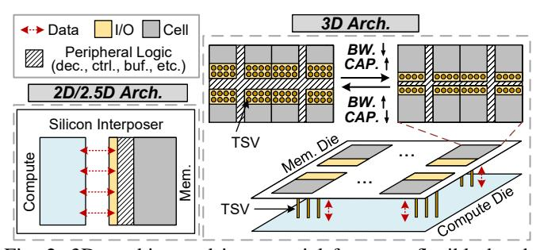

Fig. 2: 3D stacking and its potential for more flexible bandwidth-capacity trade-off compared to 2D/2.5D architectures.

Reevaluating NVM Bandwidth in the Context of LLM Inference. Effective bandwidth utilization is as critical as raw hardware bandwidth. While DRAM and NVM share rowbuffer architectures with similar row access latencies (tCL), NVM suffers longer activation delays (tRCD). In LLM inference, however, sequential access patterns dominant in linear layers fully exploit row buffers, enabling multiple accesses per activation and amortizing costs. This allows NVM to achieve >70% read bandwidth utilization [30], far surpassing general workloads where patterns are less predictable. Prefetching [66] and multi-bank interleaving [30] further enhance parallelism. Crucially, this high read efficiency is unique to LLMs; general workloads rarely sustain such utilization. For writes, however, NVM remains bottlenecked by restoration latency (tWR) [89], with utilization often below 10% even with interleaving [30].

**Summary.** 3D-stacked NVM–DRAM architectures offer a promising direction for LLM-oriented memory systems but come with key challenges. We address them through LLM data and memory heterogeneity characterization to guide data placement, a bandwidth-utilization-centric dataflow to unlock 3D-stacked bandwidth, and a two-stage DSE to identify an optimal hybrid memory and deployment configuration to maximize system throughput under per-user constraints.

#### III. CHARACTERIZATION

#### A. Heterogeneity in Memory Devices

# Heterogeneity in Bandwidth-Capacity-Trade-off Potential.

Fig. 3 presents a two-dimensional 3D-stacked hybrid memory design space: (1) NVM-to-DRAM area ratios, represented by color groups, where only DRAM and NVM points within the same color group constitute a valid configuration; and (2) the bandwidth–capacity trade-offs within each memory type, illustrated by points along the same curve. This characterization captures the hybrid memory optimization, including area allocation between the memory types and high flexibility in bandwidth–capacity trade-offs enabled by the areal bandwidth scaling of 3D-stacked architecture, while highlighting NVM's read—write asymmetry through effective bandwidth.

As shown, NVM's higher density allows it to achieve either greater capacity at a given effective read bandwidth or higher effective read bandwidth at a fixed capacity, under the same area constraint, making it well-suited for LLMs' high-capacity, read-intensive demands. However, its limited write bandwidth remains a key performance bottleneck.

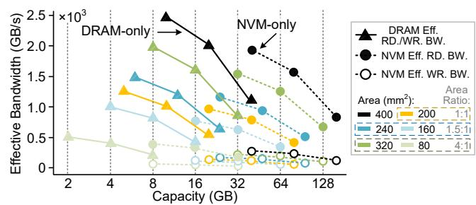

Fig. 3: Bandwidth–capacity trade-offs of 3D-stacked hybrid memory under total area budget of  $400 \mathrm{mm}^2$ . Colors indicate area allocations to each memory type. Simulation settings detailed in Sec. VII-A, and effective bandwidth is computed by scaling hardware bandwidth with utilization: 90% for DRAM read/write, 70% for NVM read, and 10% for NVM write [30]. Representative cases are shown for clarity; the full design space is listed in Table III.

Heterogeneity in Write Endurance. NVM and DRAM also differ significantly in terms of endurance. Techniques such as Error-Correcting Pointers (ECP) [77], which allocate spare bits per block to correct faulty cells, and Bad Block Management (BBM) [100], which remaps failed blocks using overprovisioned capacity, can improve reliability, but are difficult to use to overcome the intrinsic per-cell endurance limit ( $\sim 10^8$  writes [29], [77], [100]) for write-intensive workloads. Instead, DRAM exceeds  $10^{16}$  writes [103], providing significantly better write affinity and more balanced write performance.

#### B. Heterogeneity in LLM Data

In this section, we characterize LLM data heterogeneity in terms of data volume, transaction, and write intensity.

**Data Volume.** Using a MHA+Dense LLM as a representative case, we quantify Weight and KVCache data volumes for comparison across LLM data categories:

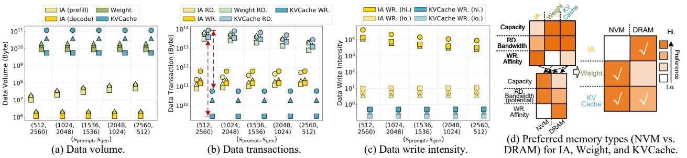

Fig. 4: Characterization of data heterogeneity across various model structures, including  $\bigcirc$  *GPT3 175B (MHA+Dense)* [9],  $\triangle$  *Grok1 314B (MHA+MoE)* [96], and  $\square$  *Mixtral*  $8\times22B$  (*GQA+MoE*) [1], and the resulting memory device preferences. The data in (a-c) are obtained from simulation with a micro batch size of 64, following the methodology provided in Sec. VII-A.

$$D_{\text{Weight}} = \frac{12d^2L}{p_{\text{p}}p_{\text{t}}}, \ D_{\text{KVCache}} = \frac{2dsbL}{p_{\text{t}}}$$
 (1)

with notations defined in Table I. IA volume, defined as the peak execution footprint, depends on model parameters, sequence length, and dataflow, and is orders of magnitude smaller than Weight and KVCache. This characteristic persists across diverse architectural variations (e.g., GQA, MoE) as demonstrated in Fig. 4a.

TABLE I: Notations

| Notation                     | Description                              |
|------------------------------|------------------------------------------|
| d                            | hidden dimension                         |
| H                            | number of attention heads                |
| L                            | number of Transformer blocks             |
| b                            | micro batch size                         |
| $s_{\rm prompt}/s_{\rm gen}$ | prompt/max generation sequence length    |
| s                            | $s_{\mathrm{prompt}} + s_{\mathrm{gen}}$ |
| $p_{\rm t}$                  | tensor parallelism                       |
| $p_{\rm p}$                  | pipeline parallelism                     |

**Data Transactions.** We analyze data transactions between the compute die and the stacked memory. As shown in Fig. 4b, Weight and KVCache reads dominate due to their large volumes and frequent reloading, while KVCache writes are minimal because each entry is written once. This disparity intensifies in GQA models (e.g., Mixtral), where reduced KV head counts further suppress write transactions relative to Weight/KVCache read traffic (red dashed lines). When prefill dominates, these reads decrease due to fewer iterations, whereas IA traffic remains substantial for long prompts.

**Data Write Intensity.** We define data write intensity as the ratio of write transactions to memory capacity over time, indicating how frequently memory cells are accessed. In Fig. 4c, the upper bound (hi.) assumes concentrated writes within allocated memory regions, while the lower bound (lo.) assumes ideal wear-leveling with uniformly distributed writes.

# C. Put it all Together

Memory and data heterogeneity can be jointly characterized by three metrics: **read bandwidth**, **memory capacity**, and **write affinity** (performance and endurance). NVM provides superior density, yielding higher capacity and read bandwidth potential, but suffers from slow writes and limited endurance, whereas DRAM provides lower capacity but balanced read/write performance and better endurance. LLM data

categories differ in their preferences for the three metrics: Weight and KVCache are capacity- and read-intensive, while IA is write-heavy with small capacity needs. Consequently, IA maps to DRAM; write-free and capacity-hungry Weight fits NVM; and KVCache, being capacity- and read-intensive with low write pressure, can also reside in NVM, with any overflow placed in DRAM (Fig. 4d). Notably, KVCache updates are inherently coarse-grained; with a typical head embedding dimension of 128, KV vectors (≥256B) match or exceed NVM physical programming units, maintaining a write amplification factor near 1.0 and avoiding read-modify-write overhead.

#### IV. SHYLA ARCHITECTURE

We propose SHyLA, a hardware-software-heterogeneityaware architecture for cloud-side LLM inference with 3Dstacked NVM-DRAM hybrid memory.

#### A. Architecture Overview

SHyLA is a multi-chip-module (MCM) architecture where each chiplet integrates a compute die with 3D-stacked DRAM and NVM dice, as illustrated in Fig. 5. A general-purpose processor manages inter-chiplet links, while distributing computation workloads using coarse-grained instructions. A network processor similar to NVIDIA's Bluefield [64] handles communication and reduction across boards. This work focuses on the MCM architecture for in-package LLM inference.


Fig. 5: SHyLA architecture overview.

Both DRAM and NVM are implemented as 4-Hi stacks placed in parallel atop a compute die, with signals rerouted through a buffer die, aligning with manufacturing capability and practice. Parallel stacking allows DRAM and NVM to

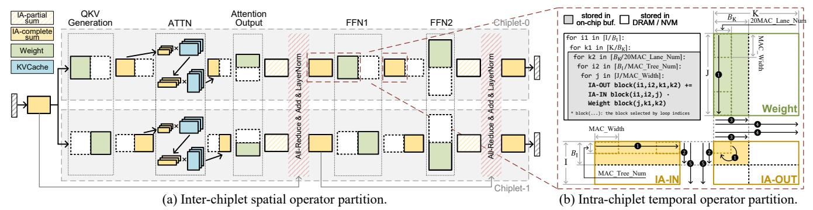

Fig. 6: Inter-chiplet spatial operator partition (MHA+Dense model) and intra-chiplet temporal operator partition.

be fabricated and optimized independently for their respective bandwidth–capacity trade-offs, avoiding the process and I/O alignment constraints of vertical stacking, where all dice must share a common TSV grid. This expands the hybrid memory design space and enables greater design flexibility. The memory banks of both types are organized into planes, each paired with an underlying compute tile to simplify memory controller and PHY design. Data access across tiles is handled via a specialized NoC on the compute die described in Sec. IV-B.

The compute die consists of 20 identical ∼20mm<sup>2</sup> tiles, each integrating components including a MAC datapath sharing similar hierarchies with [78], an NoC router, buffers, and local controllers. It also includes a global input buffer and several auxiliary components, such as a post-processing unit (PPU) for non-linear operations, a chiplet-level controller, and a die-to-die interface for inter-chiplet communication.

# *B. NoC with Connectivity Dedicated to LLM Inference*

Although all on-die tiles share identical MAC datapaths, they are classified as tiles under DRAM (DTile) and tiles under NVM (NTile) based on memory association, and are grouped such that the number of groups equals min(#DTile, #NTile). When #DTile < #NTile (typically), each group contains one DTile and several NTiles; the reverse applies otherwise. DTiles and NTiles are evenly distributed across groups (at most onetile difference when counts are not evenly divisible). To ensure uniform intra-group connectivity, tiles at the same relative positions under the DRAM and NVM regions are paired into a tile group, shown in Fig. 7 left. Most traffic remains within a tile group: NTile(s) provides NVM-stored Weight/KVCache to the DTile(s), while DTile(s) supplies DRAM-resident data to NTile(s). Tile groups are provisioned with dedicated highspeed links; when cross-group distribution is required (see Sec. V-B), the AXI fabric provides full-chip connectivity. This hierarchical connectivity matches on-die LLM traffic patterns induced by the heterogeneous memory system and forms the foundation for the bandwidth-utilization-centric dataflow.

# V. SHYLA WORKLOAD MAPPING AND EXECUTION FLOW

# *A. Inter-/Intra-chiplet Workload Partition*

SHyLA supports inter-chiplet spatial partition to distribute operators and intra-chiplet temporal partition for data reuse.

Inter-chiplet Spatial Partition. The inter-chiplet partition combines pipeline parallelism (pp), tensor parallelism (pt), excluding data parallelism to avoid Weight replication. Pipeline parallelism cascade chiplets with layer blocks, while tensor parallelism partitions tensors for distributed matrix multiplications. Using MHA+Dense model as a representative case in Fig. 6a, we share a partitioning logic similar to Megatron [80]. Weight matrices are split by width in QKV Generation and FFN1 to compute complete IA sums locally, and by height in Attention Output and FFN2, requiring all-reduce for IA accumulation. Inter-chiplet communication primarily arises from layer normalization, residual connections, and all-reduce, which is negligible compared to intra-chiplet memory traffic.

For MHA models, ATTN layers are split along head dimension, with each chiplet in p<sup>t</sup> dimension handling a subset of heads. In GQA models, where Q heads within an attention group share a common K/V pair, the parallelization strategy depends on the number of attention groups (g) relative to p<sup>t</sup> [6]. If g ≥ p<sup>t</sup> , each chiplet handles a subset of attention groups. Conversely, if g < p<sup>t</sup> , each attention group is subpartitioned across multiple chiplets using sequence parallelism. By sharding the KVCache across chiplets, higher micro batch sizes are enabled at the cost of additional intra-group communication overhead before the final Attention Output layer.

For MoE models, expert parallelism (pe) is nested within the p<sup>t</sup> dimension [6]. Within each expert group, individual experts are sub-partitioned via local tensor parallelism across pt/p<sup>e</sup> chiplets. This follows the same partitioning logic applied to Dense FFN layers (FFN1 and FFN2), ensuring consistent hardware utilization across both model types.

Beyond the hybrid parallelisms, deciding whether to separate the prefill and decode across chiplets (PD disaggregation/aggregation) is also crucial [69], [91], [111]. In SHyLA, part of KVCache resides in NVM; PD disaggregation requires transferring KVCache from prefill to decode instance<sup>1</sup> , incurring redundant NVM writes, especially for long prompts. Even with a Splitwise-style per-layer KVCache transfer during prompt computation [69], performance and NVM lifetime still degrade. This factor is included in deployment design space.

Intra-chiplet Temporal Partition. To exploit NVM's high

<sup>1</sup>Chiplets dedicated to prefill (decode) requests are referred to as a prefill (decode) instance.

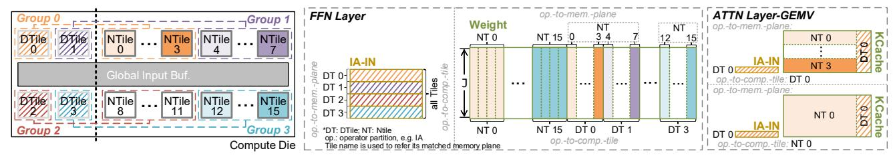

Fig. 7: The bandwidth-utilization-centric operator mapping within a SHyLA chiplet.

density and read bandwidth, the intra-chiplet dataflow adopts an output-stationary with input-stationary scheme that emphasizes Weight-read reuse and minimizes IA traffic. Fig. 6b illustrates the temporal operator partition within a compute die, where shaded and white regions denote data in on-chip buffers and off-chip memory (DRAM or NVM), respectively. The tiling factors  $B_{\rm I}$  and  $B_{\rm K}$  are determined by the on-chip buffer capacity. The parallel execution of this temporal partition across individual tiles is detailed in Sec. V-B.

# B. Bandwidth-Utilization-Centric Dataflow

To fully exploit the areal bandwidth of 3D stacking, the data layout must be memory-plane-aware to prevent starvation of specific planes. In addition, since SHyLA allocates both Weight and part of the KVCache to NVM, maximizing NVM read-bandwidth utilization becomes critical. Given a linear operator partition (GEMM or GEMV) determined by interchiplet spatial and intra-chiplet temporal partitioning, the fine-grained data layout in the memory planes and the dataflow within each tile group must be carefully optimized, especially under a hybrid memory organization.

**FFN Layers.** Linear operators in FFN layers receive IA from DRAM and Weight from NVM. For partitioned operators (e.g., shaded partition in Fig. 6b right), Weight columns are distributed across tiles' local buffers while IA remains in the global input buffer, establishing compute mapping as illustrated in Fig. 7. For memory allocation within a tile group, each NVM plane stores Weight for its NTile and an evenly-cut Weight chunk for the DTile within the group, while the DRAM plane holds IA rows. This strategy avoids plane starvation and contention with the compute-tile-memory-plane match.

ATTN Layers. For ATTN layers, head-level parallelism is employed across chiplets along the tensor-parallel dimension, assigning each chiplet a subset of GEMMs (prefill requests) and/or GEMVs (decode requests). Each tile handles a GEMV pair from fused ATTN layers, avoiding DRAM writes for intermediate  $Q \times K^T$  results. Once the current batch of GEMV pairs completes, the next batch begins, continuing until all GEMVs are processed. The total number of GEMV pairs equals the product of micro batch size b and the attention head number per die. In contrast, GEMMs execute sequentially with cooperation across tiles to prevent excessive intermediate data pressure, particularly beneficial for large prompt lengths.

For memory allocation, each NVM plane stores multiple KVCache matrices for its NTile and a portion for its group's DTile. If KVCache exceeds NVM capacity, the overflow

resides in DRAM plane(s), which serves all associated NTiles. GEMM compute mapping mirrors FFN layers, while decodephase GEMVs require local KVCache access. To support parallel GEMV execution in the decode phase, the corresponding KVCache is placed in a single memory plane in the prefill phase, or across two planes if overflow occurs. This constraint has minimal system impact, since prefill phase occupies little end-to-end runtime dominated by the decode phase.

For GQA, the mapping strategy differs in two aspects. First, for decode requests, we apply attention-group- and request-level parallelism across tiles within a chiplet. Each attention group is processed within a single tile to eliminate inter-tile data transfers from KVCache sharing, except for necessary intra-tile-group transactions between DTile(s) and NTile(s) as discussed above. Second, KVCache reloading for subsequent Q heads within the same attention group is governed by tile weight buffer capacity: if the buffer can accommodate per-request KVCache for an attention group, loading occurs only once during the processing of the first Q head.

#### VI. SHYLA DESIGN SPACE EXPLORATION

The two-stage SHyLA DSE workflow identifies systemthroughput-maximizing architecture parameters while satisfying service level objectives (SLOs) in design space, accelerated by an architecture abstraction with analytical model.

# A. SHyLA Design Space

Table II summarizes the design space configurations and fixed architectural parameters (values listed in Table IV) for SHyLA system, with unreferenced parameters elaborated in Sec. VI-B. Since our DSE focuses on hybrid memory design and the corresponding deployment strategy, most compute-die-related parameters are fixed to align with modern GPU architectures (Sec. VII-A), preventing an overly large design space that would obscure key insights.

TABLE II: Fixed Arch. Parameters and Design Space Config.

| Fixed Arch.<br>Param.                                                                             | Chiplet area, ICNT_BW, Tile number, Buffer_Sizes, MAC_Width, MAC_Lane_Num, MAC_Tree_Num, IA_bw, ACC_bw, Weight_bw, KVCache_bw, |  |  |  |  |  |
|---------------------------------------------------------------------------------------------------|--------------------------------------------------------------------------------------------------------------------------------|--|--|--|--|--|
| Hybrid Memory<br>Design Space                                                                     | Area-Ratio-(NVM,DRAM),<br>  DRAM-(BW,CAP.), NVM-(BW,CAP.)                                                                      |  |  |  |  |  |
| <b>Deployment Design Space</b> $\mid PD, p_p, p_t, p_e, prefill-p_p, prefill-p_t, prefill-p_e, b$ |                                                                                                                                |  |  |  |  |  |

<sup>\*</sup> Including global input buffer, weight buffer, and output buffer.

**Hybrid Memory Design Space.** The areal bandwidth scaling of 3D stacking unlocks an expanded hybrid memory design space that prior 2D/2.5D systems could not access.

As described in Sec. III-A, under a fixed total die area, the hybrid memory design space is defined by the area allocation between NVM and DRAM (*Area-Ratio-(NVM, DRAM)*) and their respective bandwidth–capacity trade-offs (*NVM-(BW, CAP.)*), *DRAM-(BW, CAP.)*).

**Deployment Design Space.** When deploying LLM inference workloads on a homogeneous MCM system, the optimal configuration within the deployment design space varies with the target SLO. This includes PD aggregation/disaggregation choice (PD), the pipeline/tensor/(expert) parallelism for the prefill instance ( $prefill-p_p$ ,  $prefill-p_t$ , ( $prefill-p_e$ )) and decode instance ( $p_p$ ,  $p_t$ , ( $p_e$ )) in the case of PD disaggregation, or for the entire system ( $p_p$ ,  $p_t$ , ( $p_e$ )) in the case of PD aggregation, and the micro batch size (b).

# B. Architecture Abstraction and SHyLA Analytical Model

Each MCM chiplet is modeled as a compute die comprising a unified MAC array and three unified buffers for input, weight, and output (the latter two sized as the Table IV values multiplied by the tile number). Each compute die is paired with hybrid memory devices characterized by capacity and effective read/write bandwidth, derived from hardware bandwidth scaled by utilization (Sec. III-A). This abstraction forms the foundation of the SHyLA analytical model.


Fig. 8: SHyLA analytical model.

The SHyLA analytical model represents LLM workloads as GEMM/GEMV sequences with double buffering to overlap computation with Weight/KVCache loading, as illustrated in Fig. 8, excluding the tail computation (dashed block) for simplicity. This assumption is validated by simulations showing that unmasked compute stalls on the critical path contribute less than 20% to the total runtime. To estimate intra-chiplet execution time, we consider the GEMM in Fig. 6b, with IA-IN/OUT in DRAM and Weight in NVM. The execution time  $T_{\rm intra}$  (in cycles) of GEMM is:

$$T_{\text{intra}} = \left\lceil \frac{I}{B_{\text{I}}} \right\rceil \cdot \left[ \frac{B_{\text{I}} \cdot J \cdot IA\_bw}{DRAM\_BW \cdot util_{\text{DRAM\_RD}}} + \left\lceil \frac{K}{B_{\text{K}}} \right\rceil \cdot \left( \frac{J \cdot B_{\text{K}} \cdot Weight\_bw}{NVM\_BW \cdot util_{\text{NYM\_RD}}} + \frac{B_{\text{I}} \cdot B_{\text{K}} \cdot IA\_bw}{DRAM\_BW \cdot util_{\text{DRAM\_WR}}} \right) \right]$$
(2)

where bw denotes the byte-width of each data category,  $B_{\rm I}/B_{\rm K}$  are the tiling factors defined in Sec. V-A, DRAM/NVM-BW. represent the DRAM/NVM hardware bandwidth (Byte/cycle), and util indicates the achieved read/write bandwidth utilization. Simulations show the bandwidth-utilization-centric dataflow attains 90% utilization for DRAM read/write, 70% for NVM read, and 10% for NVM write due to high write latency. These values are adopted in our analytical model.

Our dataflow mandates inter-chiplet communication at the outputs of Attention Output and FFN2 layers (Fig. 6a). Using

the Dense model structure as a representative case, tensor parallelism induces two communications per Transformer block. Pipeline parallelism communicates only at the end of the last block in a stage, and these transfers can overlap with tensor communication, differing only in targeting next-stage chiplets. The inter-chiplet communication overhead for each Transformer block is modeled as  $T_{\text{inter}}$  (in cycles):

$$T_{\text{inter}} = \frac{2 \cdot I \cdot d \cdot ACC\_bw \cdot (1 - \frac{1}{p_{\text{t}}})}{ICNT\_BW} + \frac{2 \cdot I \cdot d \cdot IA\_bw \cdot (1 - \frac{1}{p_{\text{t}}})}{ICNT\_BW}$$
(3)

where  $ACC\_bw$  is the byte-width of IA partial sums and  $ICNT\_BW$  (Byte/cycle) is the interconnect bandwidth. Each chiplet gathers partial sums from peers, accumulates locally, and then broadcasts its partition to reconstruct the full IA. This communication overhead is minimal in later evaluation.

The end-to-end latency is estimated by accumulating the intra- and inter-chiplet execution times across all inference iterations for a given configuration.

#### C. SHyLA Two-Stage DSE Methodology

The hybrid memory and deployment design space together constitute an expansive SHyLA design space, making an exhaustive search for the throughput-optimal design under peruser constraints costly even with analytical models. Additionally, the selected design must deliver consistent performance across diverse models to ensure hardware generalization. To address this, we propose a two-stage DSE methodology, comprising a system-throughput-oriented heuristic-based stage to determine the configurations for hybrid memories, followed by a per-user-throughput-constrained evolutionary exploration.

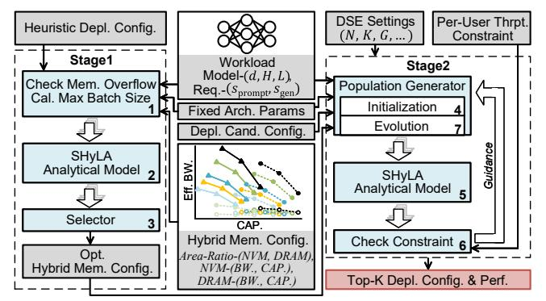

Fig. 9: SHyLA two-stage DSE methodology.

Stage 1: System-Throughput-Oriented Heuristic-Based Hybrid-Memory-Configuration Determination. As shown in Fig. 9 left, Stage 1 takes four inputs: (1) LLM workload specifications, (2) fixed architecture parameters, (3) hybrid memory configurations, and (4) heuristic deployment configurations. (2-4) is listed in Table II. This stage selects the hybrid memory design point that maximizes system throughput, with batch size determined by memory capacity, while keeping deployment settings fixed heuristically. The hybrid memory space in Table III is then exhaustively searched, with system throughput estimated from SHyLA analytical model.

TABLE III: SHyLA DSE Parameters

| Area-Ratio-<br>(NVM, DRAM)                                                                                             | (1.8, 0.2), ( <b>1.6, 0.4</b> ), (1.2, 0.8), (1, 1), (0.8, 1.2), (0.4, 1.6), (0.2, 1.8) |
|------------------------------------------------------------------------------------------------------------------------|-----------------------------------------------------------------------------------------|
| NVM-(BW., CAP.) <sup>a</sup>                                                                                           | {(138, 0.5), ( <b>112, 1</b> ), (59, 2)} (GB/s, GB)                                     |
| DRAM-(BW., CAP.)                                                                                                       | \[ \{ (138, 0.125), (112, 0.25), (59, 0.5)\} \] (GB/s, GB)                              |
| PD                                                                                                                     | {0 (aggregation), 1 (disaggregation)}                                                   |
| b                                                                                                                      | $ [1,b_{\max}]^{\mathrm{b}}$                                                            |
| $p_{\mathrm{p}},p_{\mathrm{t}},p_{\mathrm{e}}, \ prefill-p_{\mathrm{p}},prefill-p_{\mathrm{t}},prefill-p_{\mathrm{e}}$ |                                                                                         |

<sup>&</sup>lt;sup>a</sup> This is the bandwidth-capacity trade-off of one memory plane.

To determine the hybrid memory configuration for a 16-chiplet system, we adopt PD aggregation with  $(p_t, p_p) = (8, 2)$  as a heuristic, since PD aggregation avoids Weight duplication and a higher  $p_t$  enables larger micro batch sizes than higher  $p_p$ , improving system throughput before batch size saturation in moderate-scale systems. We evaluate 6 MHA+Dense model workloads, and select configurations maximizing geomean system throughput, yielding an optimal design as highlighted in Table III (per-chiplet 4-Hi NVM capacity is computed as  $4 \times \frac{1.6}{1.6+0.4} \times 20 \times 1 = 64$  GB; NVM/DRAM capacities and bandwidths are derived similarly in Table V).

Insight: Stage 1 reveals an optimal 4:1 NVM-to-DRAM area ratio combining a balanced bandwidth-capacity trade-off in NVM with a DRAM configuration optimized for bandwidth. This design prioritizes NVM area allocation since Weight operations—the dominant runtime component—benefit from both larger capacity (better Weight reuse with larger micro batch sizes) and higher bandwidth. KVCache reads depend solely on bandwidth, and NVM's capacity-driven gains saturate once on-chip buffering becomes the bottleneck, after which area is best spent on bandwidth. Meanwhile, excessive DRAM area reduction risks IA bandwidth bottlenecks during prefills or large batches, so DRAM retains minimal capacity for IA storage while dedicating the rest to bandwidth.

Stage 2: Per-User-Throughput-Constrained DSE with Evolutionary Algorithm (EA). As shown in Fig. 9 right, Stage 2 performs per-user-throughput-constrained DSE based on the optimal hybrid memory design from Stage 1, enforcing the SLO-derived per-user throughput constraint. An evolutionary algorithm with Top-K selection (Algorithm 1) searches for configurations that maximize system throughput while satisfying the constraint. The search direction adapts dynamically: when the constraint is met, it prioritizes higher system throughput (e.g., larger b or PD = 0); otherwise it shifts toward improving per-user throughput (e.g., smaller b or larger  $p_t$ ).

We evaluate the two-stage DSE using GPT3-175B (Table VI) with  $(s_{\text{prompt}}, s_{\text{gen}}) = (1024, 1024)$  and DSE settings (N, G, K) = (15, 10, 5), under a constraint of  $T_{\min}^{\text{user}} = 25$  tokens/s/user. Our method selects a configuration within the top 0.3% of system throughput across the exhaustive hybrid memory and deployment design space (Table III), using fixed parameters from Table IV. Generalization of the selected configuration to other workloads is discussed in Sec. VII-E. Leveraging our simplified analytical model alongside the

heuristic-based Stage 1 DSE and the evolutionary algorithm in Stage 2, the execution times are approximately 3 minutes and 8.5 minutes, respectively. These results, obtained on a 96-core Intel Xeon Gold 5418Y machine, demonstrate a practical runtime overhead suitable for real-world deployments.

#### **Algorithm 1** EA of Per-User-Throughput-Constrained DSE

```
Require: Population size N, Top-K system throughput set size K,
     Per-user throughput constraint T_{\min}^{\text{user}}, Generation limit G
Ensure: Top-K config. with highest system throughput
 1: Initialize Population \mathcal{P} = \{c_1^1, c_2^1, \dots, c_N^1\} with random deploy-
     ment parameters, Top-K performance set \mathcal{T} = \emptyset, Evaluated
     config. set \mathcal{C} = \emptyset
 2: for generation g = 1 to G do
          Evaluate each c_i^g: obtain system throughput T_i^{\mathrm{sys}} and per-user
     throughput T_i^{user}
           Record evaluated config.: C \leftarrow C \cup P
 4:
 5:
           for each c_i^g \in \mathcal{P} do
 6:
                \mathcal{P}_{\text{new}} = \emptyset
                if T_i^{\text{user}} \geq T_{\min}^{\text{user}} then
 7:
                     \mathcal{T} \leftarrow \text{UpdateTopK}(\mathcal{T}, c_i, T_i^{\text{sys}})
 8:
                     Set evolution direction: increase T^{\text{sys}}
 9:
10:
                     Set evolution direction: decrease T^{\text{user}}
11:
12:
                Generate offspring c_i^{g+1}, \mathcal{P}_{\text{new}} \leftarrow \mathcal{P}_{\text{new}} \cup \{c_i^{g+1}\}
13:
14:
           end for
          \mathcal{P} = \mathcal{P}_{new}
```

## VII. EVALUATION

#### A. Methodology

16: **end for** 

17: return  $\mathcal{T}$ 

Simulation Configuration. The compute and memory dice occupy  $400 \text{mm}^2$  each, and PCM is selected as the NVM prototype due to its high density, inherent 3D-stackability, and proven commercial maturity (e.g., Intel Optane), ensuring that its manufacturing readiness and process characteristics are better aligned with DRAM. Memory bandwidth and capacity are derived via CACTI-3DD [11], assuming shared peripheral circuitry and an NVM cell density  $4\times$  that of DRAM [74]. The TSV pitch is set to  $10~\mu\text{m}$  following manufacturing practice [58], and inter-chiplet bandwidth follows a scaled NVLink model for A100 [63]. Detailed configurations are listed in Table IV.

TABLE IV: Simulation Configuration

| System         | Chiplet number: 16, PD aggregation ( $PD$ =0), $p_p$ : 2, $p_t$ : 8, $p_e$ : 8, Interconnect bandwidth (ICNT_BW): 429GB/s [63], Interconnect energy: 8pJ/bit [14], IA_bw/ACC_bw/KVCache_bw: 2, Weight_bw: 1, TSV pitch: $10\mu$ m, TSV energy: $0.167pJ/bit$ [11] |
|----------------|-------------------------------------------------------------------------------------------------------------------------------------------------------------------------------------------------------------------------------------------------------------------|
| Compute<br>Die | Tech.: 7nm, Chiplet area: 400 mm <sup>2</sup> , Tile number: 20, Freq.: 1GHz, FP16 MAC_Width: 32, MAC_Lane_Num: 32, MAC_Tree_Num/tile: 4, FP16 MAC energy: 0.2pJ/MAC [31], [86], Global input buffer: 4MB, Weight buffer/tile: 1.2MB, Output buffer/tile: 100KB   |
| DRAM           | Tech.: 25nm [61], 4 layers, Cell density: 1×, Freq.: 541MHz [93] tCL:14, tWR:9, tRCD:14, tRP:14 [10], [89], RD./WR. energy: 2.1/1.41pJ/bit [44], BG. energy: 70.31mW/GB [46]                                                                                      |
| NVM            | PCM, 4 layers, Cell density: 4× [74], Freq.: 541MHz [93] tCL:14, tWR:1000, tRCD:120, tRP:14 [10], [89], RD./WR. energy: 3.4/17.84pJ/bit [44], BG. energy: 4.23mW/GB [25]                                                                                          |

 $<sup>^{\</sup>mathrm{b}}$   $b_{\mathrm{max}}$  is the maximum micro batch size supported by system memory.

 $<sup>^{\</sup>mathrm{c}}$  If PD=0, prefill- $p_{\mathrm{e}}=$  prefill- $p_{\mathrm{p}}=$  prefill- $p_{\mathrm{t}}=0$ .

TABLE V: System Configuration Comparison

|                                  | H800         | MI300X            | DRAM-only   | NVM-only    | SHyLA                  |
|----------------------------------|--------------|-------------------|-------------|-------------|------------------------|
| Die <sup>a</sup> Number          | 8            | 4                 | 16          | 16          | 16                     |
| Area (mm <sup>2</sup> )          | 814          | b                 | 400         | 400         | 400                    |
| Memory<br>Capacity (GB)          | HBM2e:<br>80 | HBM3:<br>192      | DRAM:<br>40 | PCM:<br>80  | DRAM: 2<br>PCM: 64     |
| Bandwidth (GB/s)                 | 2000         | 5300              | 1180        | 2240        | DRAM: 552<br>PCM: 1792 |
| On-chip Buf. (MB)<br>FP16 TFLOPS | ∼80<br>756   | $\sim 300$ 1307.4 | 30<br>163.8 | 30<br>163.8 | 30<br>163.8            |

<sup>&</sup>lt;sup>a</sup> "Die" refers to either a GPU card or a DSA chiplet in this table. All other specifications are reported on a **per-die** basis.

**Simulation Method.** We model single-chiplet memory access using GPGPU-Sim [36] as chiplets run identical workload partitions in parallel (PD aggregation) or within prefill/decode instances (PD disaggregation), with inter-chiplet communication calculated separately. CUDA [60] manages on-chip buffering and implements the target mapping strategy. GPGPU-Sim's address mapping in memory controller is modified to distribute consecutive addresses across channels for higher bandwidth utilization. Channel count is adjusted to reflect hardware bandwidth derived from CACTI-3DD [11], and DRAM/NVM parameters are configured according to data access behavior of the workload. Our simulation focuses on request-level interactions between the compute die and memory controller, using the bandwidth and timing parameters in Table IV and V as the primary modeling targets. For energy evaluation, we use Table IV parameters with performance simulation statistics and conduct coarse thermal analysis via 3D-ICE [85].

Evaluated Systems. We implement SHyLA system using the optimal hybrid memory design point discussed in Sec. VI-C, with specifications highlighted in Table III. We compare SHyLA against both DSA and GPU baselines, with configurations summarized in Table V. For DSA baselines, we evaluate DRAM-only and NVM-only configurations under identical area constraints, selecting their bandwidth-capacity tradeoffs to maximize geomean throughput. Die area is chosen as the primary normalization metric because it represents a fundamental manufacturing practicality limit and physical cost constraint. In 3D-stacked architectures, area serves as the "currency" designers trade to scale either bandwidth or capacity. Both baselines employ the same deployment and buffering strategies as SHyLA. For GPUs, we evaluate (1) an 8× NVIDIA H800 [20] cluster matched to the compute-die area of a 16-chiplet SHyLA and (2) a  $4\times$  AMD MI300X [4] cluster. Both GPU results use vLLM [43] with continuous batching and PagedAttention. All systems store Weights in INT8 and keep the KVCache, IA, and partial sums in FP16, while MAC operations are performed in FP16.

**Workloads.** As summarized in Table VI, we evaluate five representative LLMs, including LLaMA3 70B [55], GPT3 175B [9], PaLM 540B [13], Mixtral 8×22B [1], and Grok1 314B [96], which cover small, medium, and large model scales and various model structures to assess scalability and sensitivity. Prompt and generated sequence lengths span 256 to 32768. Continuous batching [101] is applied for PD aggregation with

at most one prefill request per micro batch, and the full model is assumed to reside within an MCM package.

TABLE VI: Model Configuration for Evaluation

| Model   | Param. | MHA/GQA | Dense/MoE | L   | H  | d     | $d_{\rm FFN}/d_{\rm Expert}$ |
|---------|--------|---------|-----------|-----|----|-------|------------------------------|
| LLaMA3  | 70B    | GQA     | Dense     | 80  | 64 | 8192  | 28672                        |
| GPT3    | 175B   | MHA     | Dense     | 96  | 96 | 12288 | 49152                        |
| PaLM    | 540B   | GQA     | Dense     | 118 | 48 | 18432 | 73728                        |
| Mixtral | 141B   | GQA     | MoE       | 56  | 48 | 6144  | 16384                        |
| Grok1   | 314B   | MHA     | MoE       | 64  | 48 | 6144  | 32768                        |

## B. Peak System Throughput Analysis

This section analyzes peak system output token throughput under the maximum batch size, determined by reserving memory for Weight and IA and allocating the remainder to KVCache. System throughput is evaluated via total runtime to process a fixed number of requests.

Fig. 10 illustrates the runtime breakdown for four DSA configurations, where *SHyLA-D* denotes the SHyLA system without applying the bandwidth-utilization-centric dataflow introduced in Sec. V-B. *SHyLA* achieves speedups of up to 5.84× (2.02× geomean) over *DRAM-only* and up to 6.03× (1.76× geomean) over *NVM-only*. Table VII reports system output token throughput of the GPU baselines (*H800* and *MI300X*) and the DSAs across the representative workloads from Fig. 10, while also specifying the batch sizes for the DSAs. These performance gains over the GPUs and *DRAM-only* stem from *SHyLA*'s larger micro batch size support, which reduces Weight reloads. Conversely, improvements over *NVM-only* result from DRAM filtering IA write traffic. Various workload characteristics further influence these runtime trends.

TABLE VII: Batch Size and System Output Token Throughput of Representative Workloads\*

| Work-      | В       | atch Siz                   | e            | Syste  | System Output Token Throughput (tok/s) ↑ |        |        |               |              |  |  |  |
|------------|---------|----------------------------|--------------|--------|------------------------------------------|--------|--------|---------------|--------------|--|--|--|
| load<br>ID | SHyLA   | DRAM-<br>only              | NVM-<br>only | SHyLA  | SHyLA-D                                  | H800   | MI300X | DRAM-<br>only | NVM-<br>only |  |  |  |
| 0          | 1333    | 813                        | 1631         | 6312.0 | 5977.1                                   | 1475.6 | 2191.9 | 4865.5        | 1616.4       |  |  |  |
| 1          | 666     | 406                        | 815          | 4495.2 | 4182.4                                   | 999.3  | 1371.7 | 4221.2        | 1568.2       |  |  |  |
| 2          | 533     | 325                        | 652          | 2061.4 | 1968.1                                   | 551.0  | 797.2  | 1735.1        | 665.4        |  |  |  |
| 3          | 296     | 180                        | 362          | 674.0  | 547.9                                    | 311.9  | 411.8  | 588.4         | 314.4        |  |  |  |
| 8          | 180     | 62                         | 247          | 936.8  | 856.3                                    | 190.6  | 273.7  | 752.5         | 400.8        |  |  |  |
| 9          | 90      | 31                         | 123          | 705.7  | 534.9                                    | 99.1   | 164.7  | 401.2         | 326.2        |  |  |  |
| 10         | 72      | 25                         | 98           | 304.7  | 249.8                                    | 62.7   | 99.9   | 191.5         | 147.2        |  |  |  |
| 11         | 39      | 13                         | 54           | 163.1  | 133.6                                    | 30.2   | 52.0   | 97.4          | 82.4         |  |  |  |
| 16         | 80      | 44                         | 101          | 1649.0 | 1392.6                                   | 595.6  | 983.8  | 1194.0        | 702.7        |  |  |  |
| 17         | 40      | 22                         | 50           | 1173.1 | 911.1                                    | 365.6  | 659.0  | 721.0         | 601.4        |  |  |  |
| 18         | 32      | 17                         | 40           | 537.6  | 445.9                                    | 217.1  | 393.8  | 396.8         | 266.5        |  |  |  |
| 19         | 17      | 9                          | 22           | 290.3  | 240.5                                    | 125.2  | 201.3  | 213.1         | 148.9        |  |  |  |
| Geome      | an Sys. | Geomean Sys. Thpt. Ratio ↑ |              |        |                                          | 1×     | 1.57×  | 2.72×         | 1.59×        |  |  |  |

<sup>\*</sup> Batch size for *H800* and *M1300X* baseline is determined dynamically by vLLM at runtime, with GPU memory as the only constraint ensured by our configuration. Workload subset due to space limits. Workload IDs match those in Fig. 10.

**Model Size.** For small models (e.g., LLaMA3), *SHyLA* exhibits marginal improvements over *DRAM-only* as both systems saturate in batch size, benefiting little from additional Weight reuse. Conversely, large models (e.g., PaLM, Grok1) impose substantial memory footprints that squeeze KVCache capacity in *DRAM-only* systems, forcing smaller batch sizes

<sup>&</sup>lt;sup>b</sup>No officially released data.

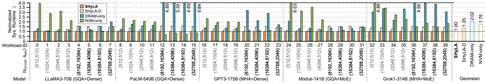

Fig. 10: Normalized system runtime of evaluated systems across various workloads, targeting peak system throughput.

and frequent Weight reloading. *SHyLA* alleviates this by leveraging NVM's high density to sustain larger batch sizes, thereby amortizing Weight-loading overhead. Due to the comparable batch sizes employed by both systems across all models under identical sequence lengths, *SHyLA*'s performance gains over *NVM-only* remain insensitive to model size.

**Model Structure Variations.** *SHyLA* exhibits superior scaling compared to *DRAM-only* for dense-attention models like GPT and Grok1. These models impose severe KVCache pressure absorbed by *SHyLA*'s higher capacity. Notably, performance gains remain consistent across both Dense and MoE structures. Although MoE introduces sparsity, its coarse-grained (expertlevel) nature ensures that activated expert Weights are retrieved via large-block, contiguous reads, maintaining *SHyLA*'s NVM bandwidth utilization and dataflow efficiency.

**Request Sequence Lengths.** *SHyLA* demonstrates increased gains over *DRAM-only* for requests with extended sequence lengths (≥8k, black labels in Fig. 10). Such workloads generate massive KVCache footprints easily accommodated by *SHyLA*'s superior memory capacity. This performance driver mirrors the trends observed in dense-attention models. Conversely, *SHyLA*'s advantage over *NVM-only* is most significant for shorter sequences. In these scenarios, larger batch sizes exacerbate the IA write overhead in the *NVM-only* baseline.

**Prefill vs. Decode Ratio.** *SHyLA* generally provides greater advantages over *DRAM-only* for decode-heavy requests. This stems from the heavy decode phase amplifying the poor Weight reuse caused by the limited batch sizes in *DRAM-only* systems. Conversely, *SHyLA*'s performance gains over *NVM-only* remain insensitive to the prefill-to-decode ratio.

**Takeaways:** SHyLA delivers robust gains over DRAM-only in capacity-constrained regimes, particularly for large models, dense attention (e.g., MHA), requests with long context and heavy decode phase, by enabling larger batch sizes and higher data reuse. Its advantages over NVM-only are most evident in requests with shorter sequence. Despite their high capacity, NVM-only systems face fundamental viability limits from restricted write endurance, as discussed in Sec. VII-D.

**Bandwidth-Utilization-Centric Dataflow.** To assess the benefit of the bandwidth-utilization-centric dataflow described in Sec. V, we compare *SHyLA* with a baseline lacking tile grouping and fine-grained operator partitioning (*SHyLA-D*). This baseline utilizes a one-to-one NTile-DTile pairing for cross-memory access. As shown in Fig. 10, *SHyLA* with bandwidth-utilization-centric dataflow achieves a 1.35× higher geomean system throughput. Improved bandwidth utilization

and reduced NVM access overhead for Weight and KVCache drive this performance gain. These results underscore the critical role of dataflow design in unleashing the bandwidth potential of 3D-stacked architectures.

## C. System Throughput Comparison Under SLO Constraints

While Sec. VII-B analyzes peak system throughput at maximum micro batch size, this section evaluates system output token throughput under SLO-constrained per-user throughput. Fig. 11 presents results across different model structures and request sequence lengths in 16- and 64-chiplet systems, sweeping the deployment design space and reporting the upper envelope of system throughput for each per-user throughput under PD aggregation/disaggregation, with shaded lines highlighting the higher system throughput between the two.

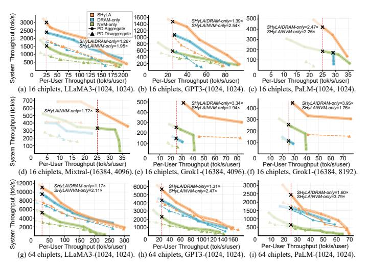

Fig. 11: System output token throughput under an SLO constraint of 25 tok/s/user (red dashed line) for various models, sequence lengths and chiplet counts. In the 16-chiplet systems, PD disaggregation is omitted for PaLM (SHyLA and DRAMonly) and Grok1 (DRAMonly) because Weight replication exceeds capacity. Annotations highlight SHyLA's throughput improvement over DSA baselines.

To ensure a high-quality user experience, we adopt a peruser SLO of 25 tokens/s/user [57]. With a fixed chiplet count, SHyLA generally achieves increasing gains over DRAM-only as model size grows (1.17× for LLaMA3, 1.31× for GPT3, and 1.60× for PaLM in 64-chiplet systems), consistent with Sec. VII-B. Under the SLO constraint, SHyLA also shows greater improvement over NVM-only than in the maximum batch size scenario, since NVM-only's high throughput primarily stems from its large batch size enabled by NVM density, which is limited when per-user throughput must be maintained. Moreover, PD aggregation consistently outperforms PD disaggregation. This holds even under heavy-prefill scenarios, as shown in Fig. 11d-f. Disaggregation performs worse because Weight duplication reduces the achievable batch size and KVCache transfers incur NVM write overhead, confirming heuristics in DSE Stage 1.

**System Scalability.** Comparing Fig. 11a-c and Fig. 11g-i shows that *SHyLA*'s system throughput advantage over *DRAM-only* decreases with system scale: as memory capacity increases, *DRAM-only* systems can support large batches, saturating Weight reuse and reducing *SHyLA*'s NVM density benefit. *SHyLA* is therefore most advantageous in moderately scaled systems, and its scalability could extend further for MoE models, which are more capacity-hungry. The gain over *NVM-only* remains consistent, as it primarily stems from mitigating NVM write overhead rather than larger batch sizes.

## D. NVM Endurance and Technology Sensitivity

Endurance. Since NVM may pose endurance concerns, we evaluate its write behavior. Fig. 12a shows the NVM write rate ( $W_{\rm rate}$ ) assuming ideal wear-leveling with uniform cell access. In SHyLA, only KVCache is dynamically written to NVM, and the occasional Weight updates during model or deployment changes (e.g., tensor or pipeline parallelism adjustments) naturally rotate data placement, allowing Weight and KVCache regions to be periodically swapped to balance write stress. NVM-only imposes IA and KVCache writes to NVM, exhibiting  $\sim 15 \times$  higher average write rates than SHyLA, especially for decode-heavy requests.

To evaluate endurance, we model ECP and BBM with a 5% overprovisioning rate (Sec. III-A) and conservatively sweep the maximum write endurance  $W_{\rm max}$  from  $10^8$  to  $10^9$  [29], [77], [100], even though recent studies have reported PCM endurance up to  $10^{12}$  [39]. As shown in Fig. 12b, system lifetime T is estimated using the geomean write rates from Fig. 12a. SHyLA achieves up to  $15.4\times$  longer lifetime, whereas NVM-only can fail within a year under conservative endurance, highlighting its impracticality for sustained deployment.


Fig. 12: NVM write rate and life time comparison.

**Latency Sensitivity.** To assess NVM latency sensitivity, Table VIII reports the geomean system throughput ratio of each latency case to the default configuration (Table IV) across 21 workloads in Fig. 12a. System throughput is less sensitive to write latency (tWR), since NVM writes contribute little runtime, with KVCache writes negligible and IA writes staying in DRAM. Even a  $4\times$  increase in tRCD results in only a  $\sim$ 20%

TABLE VIII: Sys. Thrpt. Ratio with Varying tRCD and tWR

| tRCD<br>tWR |            |       |       |       |       | 1×<br>0.25× |       |       | 1×<br>4× |
|-------------|------------|-------|-------|-------|-------|-------------|-------|-------|----------|
| Sys. Thrpt. | $1 \times$ | 1.05× | 1.03× | 0.93× | 0.83× | 1.03×       | 1.02× | 0.96× | 0.91×    |

slowdown, since large block transfers and streaming read access patterns effectively hide latency through parallelism, leaving bandwidth utilization as the dominant factor.

Different NVM technologies also influence the optimal design point. For example, a technology with lower density (e.g., MRAM), shifts the design space exploration toward configurations prioritizing memory capacity, while higher latency leads to a trade-off for higher bandwidth. However, SHyLA and the DSE framework are technology-agnostic, identifying optimal tradeoff configurations based on input NVM parameters.

# E. DSE Analysis

**Bandwidth-Capacity Trade-off.** To evaluate how model structures influence bandwidth-capacity trade-off preferences, we analyzed LLaMA3 (GQA+Dense), GPT3 (MHA+Dense), Grok1 (MHA+MoE), and Mixtral (GQA+MoE). We sweep 19  $(s_{\text{prompt}}, s_{\text{gen}})$  pairs (from 256 to 32768) for each model, totaling 76 workloads, as inputs to DSE Stage 1 (Sec. VI-C). We employ a heuristic deployment of PD aggregation with  $(p_t, p_p) = (8, 2)$ , and an additional  $p_e = 8$  for MoE models. As shown in Fig. 13, bandwidth-capacity preferences are primarily driven by the attention mechanism (MHA vs. GQA) rather than model type (Dense vs. MoE). Specifically, GQA's reduced KVCache pressure enables higher micro batch sizes, shifting preference toward NVM bandwidth over capacity. Conversely, MHA models consistently favor a balanced tradeoff in NVM. Furthermore, most workloads prioritize trading off DRAM capacity to achieve higher bandwidth.

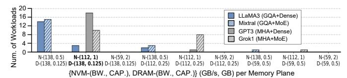

Fig. 13: Bandwidth-capacity trade-off preferences across model structures. Bold design denotes selection in Sec. VI-C.

Despite these different bandwidth-capacity trade-off preferences, we evaluate the generalizability of our hybrid memory selection (based on MHA+Dense models in Sec. VI-C) using GPT3 (MHA+Dense) and Mixtral (GQA+MoE) as representative cases. We simulate system throughput across the hybrid memory design space (Table III) using the deployment design space parameters from Table IV. Fig. 14 reports system throughput at maximum batch size, with missing entries indicating that Weight exceeds NVM capacity. For GPT3 (MHA+Dense)-(4096, 512), the DSE-selected design ranks third (while box), confirming that high-performance configurations for MHA favor NVM-dominant area allocation with a balanced bandwidth-capacity trade-off and DRAM optimized for peak bandwidth. For Mixtral (GOA+MoE)-(4096, 512), top designs (e.g., #1, #2 in Fig. 14b) prioritize higher NVM bandwidth over capacity. Notably, we observe strong mutual robustness: evaluating the GQA model at MHA-optimized design points (e.g., #3 and #4 in Fig. 14b) degrades throughput by only ~5%. Similarly, the MHA model maintains high performance at GQA-preferred points (e.g., #5 and #9 in Fig. 14a) with a comparable penalty. This minimal sensitivity demonstrates that the selected hybrid memory configuration generalizes effectively across diverse model structures, making it promising for multi-agent scenarios where workloads with heterogeneous model structures and context lengths coexist.


Fig. 14: System output token throughput and ranking of hybrid memory design points for two model structures.

Generalization Analysis of the Selected Design Point. To evaluate the generality of the current SHyLA design (Sec. VII-A), we compare its system throughput across diverse workloads against per-workload optimized designs generated by using each workload as two-stage DSE input in Fig. 15 (ratios below 1 indicate discrepancies between analytical model and simulation). In most cases, the current SHyLA hybrid memory configuration achieves near-optimal performance (ratio  $\approx 1$ ), with the most pronounced case reaching a ratio of up to 1.27. Overall, the results demonstrate the robustness and broad applicability of the proposed architectural design.

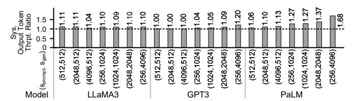

Fig. 15: System output token throughput ratio of the optimal configuration for each workload relative to *SHyLA*.

## F. Energy Consumption and Thermal Analysis

**Energy Consumption.** Fig. 16 shows the system-level energy breakdown for processing a pool of requests across three DSA configurations, which exhibit comparable geomean energy efficiency. Generally, read and compute dominate energy use. Since DRAM and NVM exhibit similar read energy, the higher write energy of NVM is largely offset by the refresh and leakage power unique to DRAM, yielding similar overall

energy consumption across systems. For larger models, limited Weight reuse from small micro batch sizes of *DRAM-only* causes frequent Weight reloads and higher energy consumption. Table IX reports the per-token energy along with *H800* and *MI300X* baselines.

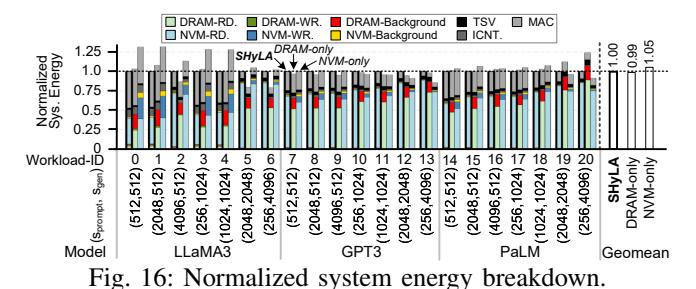

TABLE IX: Energy Consumption\*

| Workload ID                 | E      | Energy Per Output Token (J/tok) $\downarrow$ |        |           |          |  |  |  |  |  |
|-----------------------------|--------|----------------------------------------------|--------|-----------|----------|--|--|--|--|--|
|                             | SHyLA  | H800                                         | MI300X | DRAM-only | NVM-only |  |  |  |  |  |
| 5                           | 0.27   | 1.97                                         | 3.63   | 0.22      | 0.28     |  |  |  |  |  |
| 6                           | 0.16   | 1.35                                         | 2.72   | 0.13      | 0.16     |  |  |  |  |  |
| 12                          | 0.83   | 11.91                                        | 7.67   | 0.79      | 0.76     |  |  |  |  |  |
| 13                          | 0.69   | 6.22                                         | 5.75   | 0.68      | 0.59     |  |  |  |  |  |
| 19                          | 1.37   | 53.08                                        | 34.65  | 1.54      | 1.32     |  |  |  |  |  |
| 20                          | 1.01   | 40.27                                        | 25.42  | 1.26      | 0.92     |  |  |  |  |  |
| Geomean Energy Efficiency ↑ | 15.21× | 1×                                           | 1.02×  | 15.69×    | 15.99×   |  |  |  |  |  |

<sup>\*</sup> Workload subset due to space limits. Workload IDs shown in Fig. 16.

**Thermal Analysis.** Given the 4-layer NVM-DRAM stack atop the compute die, thermal management is critical. Using 3D-ICE [85], we perform a coarse thermal analysis on workloads with heavy prefill phase, which are more compute-intensive and thermally stressful. Average power estimates in Fig. 16 is used, as LLM workloads exhibit smooth, continuous access without long idle periods. Using liquid cooling with a heat sink's heat transfer coefficient of  $2 \times 10^{-7} \text{W/(um}^2 \cdot \text{K)}$  [65], Table X reports the steady-state temperatures of DRAM, NVM and compute die at an ambient of 300K. All values fall within safe limits, suggesting thermal feasibility.

TABLE X: Steady-State Temperatures\*

| Workload ID           | 1     | 2     | 5     | 8     | 9     | 12    | 15    | 16    | 19    |
|-----------------------|-------|-------|-------|-------|-------|-------|-------|-------|-------|
| DRAM Temp. (K)        | 316.7 | 315.8 | 318.4 | 318.0 | 317.3 | 319.3 | 322.4 | 320.6 | 320.9 |
| NVM Temp. (K)         | 329.1 | 326.1 | 337.6 | 332.6 | 330.1 | 339.8 | 344.5 | 341.0 | 344.4 |
| Compute Die Temp. (K) | 329.3 | 326.2 | 337.6 | 332.8 | 330.3 | 339.9 | 344.6 | 341.1 | 344.5 |

<sup>\*</sup> Workload IDs shown in Fig. 16.

# VIII. RELATED WORK

#### A. LLM Inference Acceleration Targeting Memory Issue

Recent research has addressed memory challenges in LLM inference, especially for the memory-bound decode phase. Works [21], [23], [34], [45], [56], [59], [69], [73], [88], [92], [98], [102], [110] have aimed to optimize conventional memory utilization, exploring techniques including attention footprint reduction [34], [59], [92], speculative inference [56], adaptive recomputation [88], quantization [21], [102], and sparsity [98], [110]. These methods consider only traditional memory architectures, while SHyLA offers opportunities in

the memory design space, which can collaborate with these techniques. Other works [24], [26], [30], [37], [50], [67], [68], [72], [81], [104], [106] aim to augment memory capabilities by leveraging HBM [37], adopting processing-inmemory (PIM) [26], [50], [67], [106] or processing-nearmemory (PNM) [49], and expanding capacity via NAND flash [104] or CXL-based memory systems [68], [97]. A further discussion is provided in Sec. IX-A.

# *B. Hybrid Memory Hierarchy*

Prior DRAM–NVM hybrid systems typically follow two paradigms: using DRAM as a cache [17], [18], [30], [51], [74], [90] or as main memory [3], [15], [28], [35], [40], [41], [52], [75], [84], [107]. Cache-based designs suit general, unpredictable workloads but provide limited software control and risk bandwidth waste from hardware-controlled evictions. Crucially, they fail to expand the addressable memory space. This limitation hinders effectiveness for capacity-bound, accesspattern-aware LLMs. SHyLA adopts a flat memory address space for explicit, workload-driven data placement. Within the main-memory paradigm, AutoTM [28] and Sentinel [75] optimize data allocation through static graph scheduling and dynamic tensor-level profiling, respectively. SPID [35] introduces a lightweight approach correlating allocation spikes with write-intensive phases for adaptive placement. However, commercial Optane DIMM physical limits [32] constrain these solutions and restrict broader bandwidth-capacity trade-off exploration. While other studies investigate 2D/2.5D architectures [15], [16], [62], [87], [107] to characterize NVM as bandwidth-limited or explore 3D-stacked hybrid memories [108], they primarily target general-purpose workloads rather than the specific demands of LLMs. In contrast, SHyLA exploits predictable data access intensities via a static placement strategy tailored to LLM data heterogeneity, leveraging the expanded hybrid memory design space enabled by 3Dstacked areal bandwidth to yield targeted architectural insights.

# *C. Characterization and Optimization of NVM Technologies*

Emerging NVM research optimizes write latency and endurance [22], [42] or provides characterization toolchains and design guidance [70], [89], [94]. For instance, NVMExplorer [70] employs cross-stack DSE to map circuit parameters to application-specific impacts, revealing critical co-design opportunities. While SHyLA emphasizes a heterogeneous DRAM-NVM system, these methodologies provide a robust foundation for future NVM optimizations.

# IX. DISCUSSION

# *A. Architectural Perspective: PNM, PIM, and CXL Integration*

SHyLA prioritizes PNM over PIM for superior deployment practicality and flexibility. While PIM architectures like AttAcc [67], NeuPIMs [26] and SpecPIM [50] offer high internal bandwidth, they require modifications to memory die manufacturing and restrict compute logic to older technology nodes. Conversely, SHyLA's PNM approach decouples memory and compute, enabling advanced compute nodes while exploiting the areal bandwidth of 3D stacking. This design, aligning with SoTA accelerators like Lincoln [87] and H2-LLM [49], enables high-performance 3D architectures by leveraging highdensity NVM for capacity and read bandwidth.

Regarding CXL-based solutions, frameworks like CXL-PNM [68] and Beluga [97] address the "capacity wall" via inter-processor memory pooling. While SHyLA optimizes intra-chiplet memory, CXL can serve as a tertiary tier for cluster-scale acceleration, allowing CXL.mem to store data exceeding local NVM capacity. Furthermore, CXL can mitigate NVM-write overhead in PD disaggregation by providing a shared KVCache fabric, allowing prefill and decode instances to access unified memory without explicit migration. Integrating mature CXL with SHyLA's in-package NVM offers a scalable roadmap for real-world LLM deployments.

# *B. OS Support and Software Stack Integration*

SHyLA adheres to standard host-accelerator abstractions for high deployability. It avoids intrusive OS kernel modifications, leveraging PCIe interfaces and NUMA-node abstractions standard in 1-CPU + N-GPU systems. This partitioning permits host OS management of high-level resources, leaving internal data placement to SHyLA's runtime during initialization. Offloading micro-architectural orchestration shields the OS from hardware complexities, ensuring a deployable solution.

Current LLM serving stacks like vLLM [43] and Deep-Speed [99] target existing GPU architectures with monolithic memory, limiting portability to SHyLA. While a full software stack remains out of scope of this architectural proposal, primary challenges include hybrid-memory-aware memory management, LLM data categorization, and planeaware scheduling. These requirements establish a roadmap for next-generation LLM serving.

# X. CONCLUSION

We propose SHyLA, a hardware-software heterogeneityaware 3D-stacked NVM–DRAM hybrid system for LLM acceleration. SHyLA allocates Weight, KVCache, and IA across memory devices and employs a bandwidth-utilization-centric dataflow to unlock bandwidth of 3D stacking. A two-stage DSE methodology explores the hybrid memory and deployment design space to maximize system throughput under SLO constraints. SHyLA achieves up to 5.84× (2.02× geomean) over *DRAM-only* and up to 6.03× (1.76× geomean) over an NVM-only baseline, while maintaining acceptable thermal behavior and a practical system lifetime.

# ACKNOWLEDGMENT

This work is supported in part by the National Natural Science Foundation of China under Grant 62374101. The corresponding author is Hongyang Jia.

# REFERENCES

- [1] M. AI, "Cheaper, better, faster, stronger," 2024. [Online]. Available: https://mistral.ai/news/mixtral-8x22b/
- [2] J. Ainslie, J. Lee-Thorp, M. de Jong, Y. Zemlyanskiy, F. Lebron, ´ and S. Sanghai, "GQA: Training Generalized Multi-Query Transformer Models from Multi-Head Checkpoints," *arXiv e-prints*, p. arXiv:2305.13245, May 2023.
- [3] M. Alwadi, V. R. Kommareddy, C. Hughes, S. D. Hammond, and A. Awad, "Stealth-persist: Architectural support for persistent applications in hybrid memory systems," in *2021 IEEE International Symposium on High-Performance Computer Architecture (HPCA)*, 2021, pp. 139–152.
- [4] AMD, "Amd instinct mi300x accelerator," 2023. [Online]. Available: https://www.amd.com/content/dam/amd/en/documents/ instinct-tech-docs/data-sheets/amd-instinct-mi300x-data-sheet.pdf? utm source=chatgpt.com
- [5] E. Beyne *et al.*, "Heterogeneous system partitioning: The 2.5d and 3d integration landscape and roadmap," in *2025 IEEE VLSI Symposium on Technology and Circuits, Short Course Slides*, 2025.
- [6] N. Bhatia, A. More, R. Borkar, T. Mitra, R. Matas, R. Zhao, M. Golub, D. Mudigere, B. Pharris, and B. Darvish Rouhani, "Helix Parallelism: Rethinking Sharding Strategies for Interactive Multi-Million-Token LLM Decoding," *arXiv e-prints*, p. arXiv:2507.07120, Jul. 2025.
- [7] B. Black, M. Annavaram, N. Brekelbaum, J. DeVale, L. Jiang, G. H. Loh, D. McCaule, P. Morrow, D. W. Nelson, D. Pantuso, P. Reed, J. Rupley, S. Shankar, J. Shen, and C. Webb, "Die stacking (3d) microarchitecture," in *2006 39th Annual IEEE/ACM International Symposium on Microarchitecture (MICRO'06)*, 2006, pp. 469–479.
- [8] T. B. Brown, B. Mann, N. Ryder, M. Subbiah, J. Kaplan, P. Dhariwal, A. Neelakantan, P. Shyam, G. Sastry, A. Askell, S. Agarwal, A. Herbert-Voss, G. Krueger, T. Henighan, R. Child, A. Ramesh, D. M. Ziegler, J. Wu, C. Winter, C. Hesse, M. Chen, E. Sigler, M. Litwin, S. Gray, B. Chess, J. Clark, C. Berner, S. McCandlish, A. Radford, I. Sutskever, and D. Amodei, "Language models are few-shot learners," ser. NIPS '20. Red Hook, NY, USA: Curran Associates Inc., 2020.
- [9] T. B. Brown, B. Mann, N. Ryder, M. Subbiah, J. Kaplan, P. Dhariwal, A. Neelakantan, P. Shyam, G. Sastry, A. Askell, S. Agarwal, A. Herbert-Voss, G. Krueger, T. Henighan, R. Child, A. Ramesh, D. M. Ziegler, J. Wu, C. Winter, C. Hesse, M. Chen, E. Sigler, M. Litwin, S. Gray, B. Chess, J. Clark, C. Berner, S. McCandlish, A. Radford, I. Sutskever, and D. Amodei, "Language Models are Few-Shot Learners," *arXiv e-prints*, p. arXiv:2005.14165, May 2020.
- [10] N. Chatterjee, M. O'Connor, D. Lee, D. R. Johnson, S. W. Keckler, M. Rhu, and W. J. Dally, "Architecting an energy-efficient dram system for gpus," in *2017 IEEE International Symposium on High Performance Computer Architecture (HPCA)*, 2017, pp. 73–84.
- [11] K. Chen, S. Li, N. Muralimanohar, J. H. Ahn, J. B. Brockman, and N. P. Jouppi, "Cacti-3dd: Architecture-level modeling for 3d die-stacked dram main memory," in *2012 Design, Automation Test in Europe Conference Exhibition (DATE)*, 2012, pp. 33–38.
- [12] S. Chen, S. Wong, L. Chen, and Y. Tian, "Extending Context Window of Large Language Models via Positional Interpolation," *arXiv e-prints*, p. arXiv:2306.15595, Jun. 2023.
- [13] A. Chowdhery, S. Narang, J. Devlin, M. Bosma, G. Mishra, A. Roberts, P. Barham, H. W. Chung, C. Sutton, S. Gehrmann, P. Schuh, K. Shi, S. Tsvyashchenko, J. Maynez, A. Rao, P. Barnes, Y. Tay, N. Shazeer, V. Prabhakaran, E. Reif, N. Du, B. Hutchinson, R. Pope, J. Bradbury, J. Austin, M. Isard, G. Gur-Ari, P. Yin, T. Duke, A. Levskaya, S. Ghemawat, S. Dev, H. Michalewski, X. Garcia, V. Misra, K. Robinson, L. Fedus, D. Zhou, D. Ippolito, D. Luan, H. Lim, B. Zoph, A. Spiridonov, R. Sepassi, D. Dohan, S. Agrawal, M. Omernick, A. M. Dai, T. Sankaranarayana Pillai, M. Pellat, A. Lewkowycz, E. Moreira, R. Child, O. Polozov, K. Lee, Z. Zhou, X. Wang, B. Saeta, M. Diaz, O. Firat, M. Catasta, J. Wei, K. Meier-Hellstern, D. Eck, J. Dean, S. Petrov, and N. Fiedel, "PaLM: Scaling Language Modeling with Pathways," *arXiv e-prints*, p. arXiv:2204.02311, Apr. 2022.
- [14] B. Dally. (2020) Gtc china 2020 keynote. [Online]. Available: https://s201.q4cdn.com/141608511/files/doc presentations/ 2020/12/GTC-China 2020 FINAL-(with-FLS).pdf
- [15] P. Das, A. Joshi, and H. K. Kapoor, "Hydra: A near hybrid memory accelerator for cnn inference," in *2022 Design, Automation Test in Europe Conference Exhibition (DATE)*, 2022, pp. 1017–1022.

- [16] G. Dhiman, R. Ayoub, and T. Rosing, "Pdram: A hybrid pram and dram main memory system," in *2009 46th ACM/IEEE Design Automation Conference*, 2009, pp. 664–669.
- [17] Z. Duan, J. Yao, H. Liu, X. Liao, H. Jin, and Y. Zhang, "Revisiting log-structured merging for kv stores in hybrid memory systems," in *Proceedings of the 28th ACM International Conference on Architectural Support for Programming Languages and Operating Systems, Volume 2*, ser. ASPLOS 2023. New York, NY, USA: Association for Computing Machinery, 2023, p. 674–687. [Online]. Available: https://doi.org/10.1145/3575693.3575715
- [18] A. Eisenman, D. Gardner, I. AbdelRahman, J. Axboe, S. Dong, K. Hazelwood, C. Petersen, A. Cidon, and S. Katti, "Reducing dram footprint with nvm in facebook," in *Proceedings of the Thirteenth EuroSys Conference*, ser. EuroSys '18. New York, NY, USA: Association for Computing Machinery, 2018. [Online]. Available: https://doi.org/10.1145/3190508.3190524
- [19] W. Fedus, B. Zoph, and N. Shazeer, "Switch Transformers: Scaling to Trillion Parameter Models with Simple and Efficient Sparsity," *arXiv e-prints*, p. arXiv:2101.03961, Jan. 2021.
- [20] GadgetVersus, "Nvidia h800 pcie 80gb," 2023. [Online]. Available: https://gadgetversus.com/graphics-card/nvidia-h800-pcie-80gb-specs/
- [21] C. Guo, J. Tang, W. Hu, J. Leng, C. Zhang, F. Yang, Y. Liu, M. Guo, and Y. Zhu, "Olive: Accelerating large language models via hardwarefriendly outlier-victim pair quantization," in *Proceedings of the 50th Annual International Symposium on Computer Architecture*, ser. ISCA '23. New York, NY, USA: Association for Computing Machinery, 2023. [Online]. Available: https://doi.org/10.1145/3579371.3589038
- [22] Y. Guo, Y. Hua, and P. Zuo, "A latency-optimized and energy-efficient write scheme in nvm-based main memory," *IEEE Transactions on Computer-Aided Design of Integrated Circuits and Systems*, vol. 39, no. 1, pp. 62–74, 2020.
- [23] P. Haghi, C. Wu, Z. Azad, Y. Li, A. Gui, Y. Hao, A. Li, and T. T. Geng, "Bridging the gap between llms and lns with dynamic data format and architecture codesign," in *2024 57th IEEE/ACM International Symposium on Microarchitecture (MICRO)*, 2024, pp. 1617–1631.
- [24] H. Ham, J. Hong, G. Park, Y. Shin, O. Woo, W. Yang, J. Bae, E. Park, H. Sung, E. Lim, and G. Kim, "Low-overhead general-purpose neardata processing in cxl memory expanders," in *2024 57th IEEE/ACM International Symposium on Microarchitecture (MICRO)*, 2024, pp. 594–611.
- [25] A. Hassan, H. Vandierendonck, and D. S. Nikolopoulos, "Softwaremanaged energy-efficient hybrid dram/nvm main memory," in *Proceedings of the 12th ACM International Conference on Computing Frontiers*, ser. CF '15. New York, NY, USA: Association for Computing Machinery, 2015. [Online]. Available: https://doi.org/10. 1145/2742854.2742886
- [26] G. Heo, S. Lee, J. Cho, H. Choi, S. Lee, H. Ham, G. Kim, D. Mahajan, and J. Park, "Neupims: Npu-pim heterogeneous acceleration for batched llm inferencing," in *Proceedings of the 29th ACM International Conference on Architectural Support for Programming Languages and Operating Systems, Volume 3*, ser. ASPLOS '24. New York, NY, USA: Association for Computing Machinery, 2024, p. 722–737. [Online]. Available: https://doi.org/10.1145/3620666.3651380
- [27] J. Heo, S. Y. Lee, S. Min, Y. Park, S. J. Jung, T. Jun Ham, and J. W. Lee, "Boss: Bandwidth-optimized search accelerator for storage-class memory," in *2021 ACM/IEEE 48th Annual International Symposium on Computer Architecture (ISCA)*, 2021, pp. 279–291.
- [28] M. Hildebrand, J. Khan, S. Trika, J. Lowe-Power, and V. Akella, "Autotm: Automatic tensor movement in heterogeneous memory systems using integer linear programming," in *Proceedings of the Twenty-Fifth International Conference on Architectural Support for Programming Languages and Operating Systems*, ser. ASPLOS '20. New York, NY, USA: Association for Computing Machinery, 2020, p. 875–890. [Online]. Available: https://doi.org/10.1145/3373376. 3378465
- [29] C. Hoffman, L. Ramos, R. Azevedo, and G. Araujo, "Wear-out analysis ´ of error correction techniques in phase-change memory," in *2014 Design, Automation Test in Europe Conference Exhibition (DATE)*, 2014, pp. 1–4.
- [30] J. Hong, S. Cho, G. Park, W. Yang, Y.-H. Gong, and G. Kim, "Bandwidth-effective dram cache for gpu s with storage-class memory," in *2024 IEEE International Symposium on High-Performance Computer Architecture (HPCA)*, 2024, pp. 139–155.

- [31] M. Horowitz, "1.1 computing's energy problem (and what we can do about it)," in *2014 IEEE International Solid-State Circuits Conference Digest of Technical Papers (ISSCC)*, 2014, pp. 10–14.
- [32] J. Izraelevitz, J. Yang, L. Zhang, J. Kim, X. Liu, A. Memaripour, Y. J. Soh, Z. Wang, Y. Xu, S. R. Dulloor, J. Zhao, and S. Swanson, "Basic Performance Measurements of the Intel Optane DC Persistent Memory Module," *arXiv e-prints*, p. arXiv:1903.05714, Mar. 2019.
- [33] H. D. Kallinatha, S. Rai, and B. Talawar, "A detailed study of sot-mram as an alternative to dram primary memory in multi-core environment," *IEEE Access*, vol. 12, pp. 7224–7243, 2024.
- [34] S.-C. Kao, S. Subramanian, G. Agrawal, A. Yazdanbakhsh, and T. Krishna, "Flat: An optimized dataflow for mitigating attention bottlenecks," in *Proceedings of the 28th ACM International Conference on Architectural Support for Programming Languages and Operating Systems, Volume 2*, ser. ASPLOS 2023. New York, NY, USA: Association for Computing Machinery, 2023, p. 295–310. [Online]. Available: https://doi.org/10.1145/3575693.3575747
- [35] M. Katsaragakis, A. Grivas, and D. Soudris, "Spid: Spike-based dynamic data placement over heterogeneous dram/nvm systems," *IEEE Transactions on Computers*, pp. 1–12, 2026.
- [36] M. Khairy, Z. Shen, T. M. Aamodt, and T. G. Rogers, "Accel-sim: An extensible simulation framework for validated gpu modeling," in *2020 ACM/IEEE 47th Annual International Symposium on Computer Architecture (ISCA)*, 2020, pp. 473–486.
- [37] H. Kim, Y. Choi, J. Park, B. Bae, H. Jeong, S. M. Lee, J. Yeon, M. Kim, C. Park, B. Gu, C. Lee, J. Bae, S. Bae, Y. Cha, W. Choe, J. Choi, J. Ha, H. Han, N. Hwang, S. Hwang, K. Jang, H. Je, H. Jeon, J. Jeon, H. Jeong, Y. Jung, D. Kang, H. Kim, M. Kim, M. Kim, S. Kim, S. Kim, W. Kim, Y. Kim, Y. Kim, Y. Ku, J. K. Lee, J. Lee, K. Lee, S. Lee, M. Noh, H. Oh, G. Park, S. Park, J. Seo, J. Seong, J. Paik, N. P. Lopes, and S. Yoo, "Tcp: A tensor contraction processor for ai workloads industrial product\*," in *2024 ACM/IEEE 51st Annual International Symposium on Computer Architecture (ISCA)*, 2024, pp. 890–902.
- [38] S. Kim, C. Hooper, T. Wattanawong, M. Kang, R. Yan, H. Genc, G. Dinh, Q. Huang, K. Keutzer, M. W. Mahoney, Y. S. Shao, and A. Gholami, "Full Stack Optimization of Transformer Inference: a Survey," *arXiv e-prints*, p. arXiv:2302.14017, Feb. 2023.
- [39] W. Kim, M. BrightSky, T. Masuda, N. Sosa, S. Kim, R. Bruce, F. Carta, G. Fraczak, H. Y. Cheng, A. Ray, Y. Zhu, H. L. Lung, K. Suu, and C. Lam, "Ald-based confined pcm with a metallic liner toward unlimited endurance," in *2016 IEEE International Electron Devices Meeting (IEDM)*, 2016, pp. 4.2.1–4.2.4.
- [40] A. Kokolis, D. Skarlatos, and J. Torrellas, "Pageseer: Using page walks to trigger page swaps in hybrid memory systems," in *2019 IEEE International Symposium on High Performance Computer Architecture (HPCA)*, 2019, pp. 596–608.
- [41] A. KP, D. Mishra, and B. Panda, "Prosper: Program stack persistence in hybrid memory systems," in *2024 IEEE International Symposium on High-Performance Computer Architecture (HPCA)*, 2024, pp. 1168– 1183.
- [42] T. Kwon, M. Imran, and J.-S. Yang, "Reliability enhanced heterogeneous phase change memory architecture for performance and energy efficiency," *IEEE Transactions on Computers*, vol. 70, no. 9, pp. 1388– 1400, 2021.
- [43] W. Kwon, Z. Li, S. Zhuang, Y. Sheng, L. Zheng, C. Hao Yu, J. E. Gonzalez, H. Zhang, and I. Stoica, "Efficient Memory Management for Large Language Model Serving with PagedAttention," *arXiv e-prints*, p. arXiv:2309.06180, Sep. 2023.
- [44] B. C. Lee, E. Ipek, O. Mutlu, and D. Burger, "Architecting phase change memory as a scalable dram alternative," in *Proceedings of the 36th Annual International Symposium on Computer Architecture*, ser. ISCA '09. New York, NY, USA: Association for Computing Machinery, 2009, p. 2–13. [Online]. Available: https://doi.org/10.1145/ 1555754.1555758
- [45] J. Lee, W. Lee, and J. Sim, "Tender: Accelerating large language models via tensor decomposition and runtime requantization," in *2024 ACM/IEEE 51st Annual International Symposium on Computer Architecture (ISCA)*, 2024, pp. 1048–1062.
- [46] S. Lee, K.-D. Kang, H. Lee, H. Park, Y. Son, N. S. Kim, and D. Kim, "Greendimm: Os-assisted dram power management for dram with a sub-array granularity power-down state," in *MICRO-54: 54th Annual IEEE/ACM International Symposium on Microarchitecture*, ser. MICRO '21. New York, NY, USA: Association

- for Computing Machinery, 2021, p. 131–142. [Online]. Available: https://doi.org/10.1145/3466752.3480089
- [47] S. Lee, K. Lee, M. Sung, M. Alian, C. Kim, W. Cho, R. Oh, S. O, J. H. Ahn, and N. S. Kim, "3d-xpath: high-density managed dram architecture with cost-effective alternative paths for memory transactions," in *Proceedings of the 27th International Conference on Parallel Architectures and Compilation Techniques*, ser. PACT '18. New York, NY, USA: Association for Computing Machinery, 2018. [Online]. Available: https://doi.org/10.1145/3243176.3243191
- [48] D. Lepikhin, H. Lee, Y. Xu, D. Chen, O. Firat, Y. Huang, M. Krikun, N. Shazeer, and Z. Chen, "GShard: Scaling Giant Models with Conditional Computation and Automatic Sharding," *arXiv e-prints*, p. arXiv:2006.16668, Jun. 2020.
- [49] C. Li, Y. Yin, X. Wu, J. Zhu, Z. Gao, D. Niu, Q. Wu, X. Si, Y. Xie, C. Zhang, and G. Sun, "H2-llm: Hardware-dataflow co-exploration for heterogeneous hybrid-bonding-based low-batch llm inference," in *Proceedings of the 52nd Annual International Symposium on Computer Architecture*, ser. ISCA '25. New York, NY, USA: Association for Computing Machinery, 2025, p. 194–210. [Online]. Available: https://doi.org/10.1145/3695053.3731008
- [50] C. Li, Z. Zhou, S. Zheng, J. Zhang, Y. Liang, and G. Sun, "Specpim: Accelerating speculative inference on pim-enabled system via architecture-dataflow co-exploration," in *Proceedings of the 29th ACM International Conference on Architectural Support for Programming Languages and Operating Systems, Volume 3*, ser. ASPLOS '24. New York, NY, USA: Association for Computing Machinery, 2024, p. 950–965. [Online]. Available: https://doi.org/10.1145/3620666.3651352
- [51] Y. Li and M. Gao, "Baryon: Efficient hybrid memory management with compression and sub-blocking," in *2023 IEEE International Symposium on High-Performance Computer Architecture (HPCA)*, 2023, pp. 137–151.
- [52] Y. Li, B. Tian, and M. Gao, "Trimma: Trimming metadata storage and latency for hybrid memory systems," in *Proceedings of the 2024 International Conference on Parallel Architectures and Compilation Techniques*, ser. PACT '24. New York, NY, USA: Association for Computing Machinery, 2024, p. 108–120. [Online]. Available: https://doi.org/10.1145/3656019.3689612
- [53] G. H. Loh, "3d-stacked memory architectures for multi-core processors," in *2008 International Symposium on Computer Architecture*, 2008, pp. 453–464.
- [54] T. Lu, C. Serafy, Z. Yang, S. K. Samal, S. K. Lim, and A. Srivastava, "Tsv-based 3-d ics: Design methods and tools," *IEEE Transactions on Computer-Aided Design of Integrated Circuits and Systems*, vol. 36, no. 10, pp. 1593–1619, 2017.
- [55] Meta, "Llama3," 2024. [Online]. Available: https://www.llama.com/
- [56] X. Miao, G. Oliaro, Z. Zhang, X. Cheng, Z. Wang, Z. Zhang, R. Y. Y. Wong, A. Zhu, L. Yang, X. Shi, C. Shi, Z. Chen, D. Arfeen, R. Abhyankar, and Z. Jia, "Specinfer: Accelerating large language model serving with tree-based speculative inference and verification," in *Proceedings of the 29th ACM International Conference on Architectural Support for Programming Languages and Operating Systems, Volume 3*, ser. ASPLOS '24. New York, NY, USA: Association for Computing Machinery, 2024, p. 932–949. [Online]. Available: https://doi.org/10.1145/3620666.3651335
- [57] MLCommons, "Mlperf inference v5.0 advances language model capabilities for genai," 2025. [Online]. Available: https://mlcommons. org/2025/04/llm-inference-v5/
- [58] B. Moyer, "Hbm4 sticks with microbumps, postponing hybrid bonding," 2026. [Online]. Available: https://semiengineering.com/ hbm4-sticks-with-microbumps-postponing-hybrid-bonding/
- [59] N. Nayak, X. Wu, T. O. Odemuyiwa, M. Pellauer, J. S. Emer, and C. W. Fletcher, "Fusemax: Leveraging extended einsums to optimize attention accelerator design," in *2024 57th IEEE/ACM International Symposium on Microarchitecture (MICRO)*, 2024, pp. 1458–1473.
- [60] J. Nickolls, I. Buck, M. Garland, and K. Skadron, "Scalable parallel programming with cuda: Is cuda the parallel programming model that application developers have been waiting for?" *Queue*, vol. 6, no. 2, p. 40–53, Mar. 2008. [Online]. Available: https: //doi.org/10.1145/1365490.1365500
- [61] D. Niu, S. Li, Y. Wang, W. Han, Z. Zhang, Y. Guan, T. Guan, F. Sun, F. Xue, L. Duan, Y. Fang, H. Zheng, X. Jiang, S. Wang, F. Zuo, Y. Wang, B. Yu, Q. Ren, and Y. Xie, "184qps/w 64mb/mm23d logicto-dram hybrid bonding with process-near-memory engine for recom-

- mendation system," in *2022 IEEE International Solid-State Circuits Conference (ISSCC)*, vol. 65, 2022, pp. 1–3.
- [62] N. Niu, F. Fu, B. Yang, J. Yuan, F. Lai, and J. Wang, "Wird: An efficiency migration scheme in hybrid dram and pcm main memory for image processing applications," *IEEE Access*, vol. 7, pp. 35 941– 35 951, 2019.
- [63] NVIDIA, "Nvidia ampere architecture whitepaper," 2020. [Online]. Available: https://images.nvidia.cn/aem-dam/en-zz/Solutions/ data-center/nvidia-ampere-architecture-whitepaper.pdf
- [64] ——. (2023) Next-generation networking for the next wave of ai. [Online]. Available: https://resources.nvidia.com/ en-us-accelerated-networking-resource-library/next-generation-netw
- [65] C. H. Oh, J. H. Lienhard V, H. F. Younis, R. S. Dahbura, and D. Michels, "Liquid jet-array cooling modules for high heat fluxes," *AIChE Journal*, vol. 44, no. 4, pp. 769–779, 1998. [Online]. Available: https://aiche.onlinelibrary.wiley.com/doi/abs/10.1002/aic.690440402
- [66] H. Pan, Y. Liu, T. Lu, and M. Chen, "Lsp: Collective cross-page prefetching for nvm," in *2021 Design, Automation Test in Europe Conference Exhibition (DATE)*, 2021, pp. 501–506.
- [67] J. Park, J. Choi, K. Kyung, M. J. Kim, Y. Kwon, N. S. Kim, and J. H. Ahn, "Attacc! unleashing the power of pim for batched transformer-based generative model inference," in *Proceedings of the 29th ACM International Conference on Architectural Support for Programming Languages and Operating Systems, Volume 2*, ser. ASPLOS '24. New York, NY, USA: Association for Computing Machinery, 2024, p. 103–119. [Online]. Available: https://doi.org/10.1145/3620665.3640422
- [68] S.-S. Park, K. Kim, J. So, J. Jung, J. Lee, K. Woo, N. Kim, Y. Lee, H. Kim, Y. Kwon, J. Kim, J. Lee, Y. Cho, Y. Tai, J. Cho, H. Song, J. H. Ahn, and N. S. Kim, "An lpddr-based cxl-pnm platform for tco-efficient inference of transformer-based large language models," in *2024 IEEE International Symposium on High-Performance Computer Architecture (HPCA)*, 2024, pp. 970–982.
- [69] P. Patel, E. Choukse, C. Zhang, A. Shah, Goiri, S. Maleki, and R. Bianchini, "Splitwise: Efficient generative llm inference using phase splitting," in *2024 ACM/IEEE 51st Annual International Symposium on Computer Architecture (ISCA)*, 2024, pp. 118–132.
- [70] L. Pentecost, A. Hankin, M. Donato, M. Hempstead, G.-Y. Wei, and D. Brooks, "Nvmexplorer: A framework for cross-stack comparisons of embedded non-volatile memories," in *2022 IEEE International Symposium on High-Performance Computer Architecture (HPCA)*, 2022, pp. 938–956.
- [71] R. Pope, S. Douglas, A. Chowdhery, J. Devlin, J. Bradbury, A. Levskaya, J. Heek, K. Xiao, S. Agrawal, and J. Dean, "Efficiently Scaling Transformer Inference," *arXiv e-prints*, p. arXiv:2211.05102, Nov. 2022.
- [72] R. Prabhakar, R. Sivaramakrishnan, D. Gandhi, Y. Du, M. Wang, X. Song, K. Zhang, T. Gao, A. Wang, X. Li, Y. Sheng, J. Brot, D. Sokolov, A. Vivek, C. Leung, A. Sabnis, J. Bai, T. Zhao, M. Gottscho, D. Jackson, M. Luttrell, M. K. Shah, Z. Chen, K. Liang, S. Jain, U. Thakker, D. Huang, S. Jairath, K. J. Brown, and K. Olukotun, "Sambanova sn40l: Scaling the ai memory wall with dataflow and composition of experts," in *2024 57th IEEE/ACM International Symposium on Microarchitecture (MICRO)*, 2024, pp. 1353–1366.
- [73] Y. Qin, Y. Wang, Z. Zhao, X. Yang, Y. Zhou, S. Wei, Y. Hu, and S. Yin, "Mecla: Memory-compute-efficient llm accelerator with scaling sub-matrix partition," in *2024 ACM/IEEE 51st Annual International Symposium on Computer Architecture (ISCA)*, 2024, pp. 1032–1047.
- [74] M. K. Qureshi, V. Srinivasan, and J. A. Rivers, "Scalable high performance main memory system using phase-change memory technology," in *Proceedings of the 36th Annual International Symposium on Computer Architecture*, ser. ISCA '09. New York, NY, USA: Association for Computing Machinery, 2009, p. 24–33. [Online]. Available: https://doi.org/10.1145/1555754.1555760
- [75] J. Ren, J. Luo, K. Wu, M. Zhang, H. Jeon, and D. Li, "Sentinel: Efficient tensor migration and allocation on heterogeneous memory systems for deep learning," in *2021 IEEE International Symposium on High-Performance Computer Architecture (HPCA)*, 2021, pp. 598–611.
- [76] S. Resch, H. Cilasun, Z. Chowdhury, M. Zabihi, Z. Zhao, J.-P. Wang, S. Sapatnekar, and U. R. Karpuzcu, "On endurance of processing in (nonvolatile) memory," in *Proceedings of the 50th Annual International Symposium on Computer Architecture*, ser. ISCA '23. New York, NY, USA: Association for Computing Machinery, 2023. [Online]. Available: https://doi.org/10.1145/3579371.3589114

- [77] S. Schechter, G. H. Loh, K. Strauss, and D. Burger, "Use ecp, not ecc, for hard failures in resistive memories," *SIGARCH Comput. Archit. News*, vol. 38, no. 3, p. 141–152, Jun. 2010. [Online]. Available: https://doi.org/10.1145/1816038.1815980
- [78] Y. S. Shao, J. Cemons, R. Venkatesan, B. Zimmer, M. Fojtik, N. Jiang, B. Keller, A. Klinefelter, N. Pinckney, P. Raina, S. G. Tell, Y. Zhang, W. J. Dally, J. Emer, C. T. Gray, B. Khailany, and S. W. Keckler, "Simba: scaling deep-learning inference with chiplet-based architecture," *Commun. ACM*, vol. 64, no. 6, p. 107–116, May 2021. [Online]. Available: https://doi.org/10.1145/3460227
- [79] N. Shazeer, A. Mirhoseini, K. Maziarz, A. Davis, Q. Le, G. Hinton, and J. Dean, "Outrageously Large Neural Networks: The Sparsely-Gated Mixture-of-Experts Layer," *arXiv e-prints*, p. arXiv:1701.06538, Jan. 2017.
- [80] M. Shoeybi, M. Patwary, R. Puri, P. LeGresley, J. Casper, and B. Catanzaro, "Megatron-LM: Training Multi-Billion Parameter Language Models Using Model Parallelism," *arXiv e-prints*, p. arXiv:1909.08053, Sep. 2019.
- [81] A. Smith, G. H. Loh, M. J. Schulte, M. Ignatowski, S. Naffziger, M. Mantor, M. F. N. Kalyanasundharam, V. Alla, N. Malaya, J. L. Greathouse, E. Chapman, and R. Swaminathan, "Realizing the amd exascale heterogeneous processor vision : Industry product," in *2024 ACM/IEEE 51st Annual International Symposium on Computer Architecture (ISCA)*, 2024, pp. 876–889.
- [82] A. Smith, G. H. Loh, J. Wuu, S. Naffziger, T. Huang, H. McIntyre, R. Mangaser, W. Jung, and R. Swaminathan, "Amd instinct™ mi300x accelerator: Packaging and architecture co-optimization," in *2024 IEEE Symposium on VLSI Technology and Circuits (VLSI Technology and Circuits)*, 2024, pp. 1–2.
- [83] S. Song, A. Das, O. Mutlu, and N. Kandasamy, "Improving phase change memory performance with data content aware access," in *Proceedings of the 2020 ACM SIGPLAN International Symposium on Memory Management*, ser. ISMM 2020. New York, NY, USA: Association for Computing Machinery, 2020, p. 30–47. [Online]. Available: https://doi.org/10.1145/3381898.3397210
- [84] Y. Song, W.-H. Kim, S. K. Monga, C. Min, and Y. I. Eom, "Prism: Optimizing key-value store for modern heterogeneous storage devices," in *Proceedings of the 28th ACM International Conference on Architectural Support for Programming Languages and Operating Systems, Volume 2*, ser. ASPLOS 2023. New York, NY, USA: Association for Computing Machinery, 2023, p. 588–602. [Online]. Available: https://doi.org/10.1145/3575693.3575722
- [85] A. Sridhar, A. Vincenzi, M. Ruggiero, T. Brunschwiler, and D. Atienza, "3d-ice: Fast compact transient thermal modeling for 3d ics with intertier liquid cooling," in *2010 IEEE/ACM International Conference on Computer-Aided Design (ICCAD)*, 2010, pp. 463–470.
- [86] A. Stillmaker and B. Baas, "Scaling equations for the accurate prediction of cmos device performance from 180nm to 7nm," *Integration*, vol. 58, pp. 74–81, 2017. [Online]. Available: https: //www.sciencedirect.com/science/article/pii/S0167926017300755
- [87] W. Sun, M. Gao, Z. Li, A. Zhang, I. Y. Chou, J. Zhu, S. Wei, and L. Liu, "Lincoln: Real-time 50 100b llm inference on consumer devices with lpddr-interfaced, compute-enabled flash memory," in *2025 IEEE International Symposium on High Performance Computer Architecture (HPCA)*, 2025, pp. 1734–1750.
- [88] Z. Sun, H. Cao, Y. Wang, G. Feng, S. Chen, H. Wang, and W. Chen, "Adapipe: Optimizing pipeline parallelism with adaptive recomputation and partitioning," in *Proceedings of the 29th ACM International Conference on Architectural Support for Programming Languages and Operating Systems, Volume 3*, ser. ASPLOS '24. New York, NY, USA: Association for Computing Machinery, 2024, p. 86–100. [Online]. Available: https://doi.org/10.1145/3620666.3651359
- [89] D. Ustiugov, A. Daglis, J. Picorel, M. Sutherland, E. Bugnion, B. Falsafi, and D. Pnevmatikatos, "Design guidelines for high-performance scm hierarchies," *arXiv e-prints*, p. arXiv:1801.06726, Jan. 2018.
- [90] E. Vasilakis, V. Papaefstathiou, P. Trancoso, and I. Sourdis, "Hybrid2: Combining caching and migration in hybrid memory systems," in *2020 IEEE International Symposium on High Performance Computer Architecture (HPCA)*, 2020, pp. 649–662.
- [91] vLLM Team. (2025) Disaggregated prefill. [Online]. Available: https://docs.vllm.ai/en/latest/features/disagg prefill.html
- [92] H. Wang, H. Xu, Y. Wang, and Y. Han, "Cta: Hardware-software co-design for compressed token attention mechanism," in *2023 IEEE*

- *International Symposium on High-Performance Computer Architecture (HPCA)*, 2023, pp. 429–441.
- [93] S. Wang, B. Yu, W. Xiao, F. Bai, X. Long, L. Bai, X. Jia, F. Zuo, J. Tan, Y. Guo, P. Sun, J. Zhou, Q. Zhan, S. Hu, Y. Zhou, Y. Kang, Q. Ren, and X. Jiang, "A 135 gbps/gbit 0.66 pj/bit stacked embedded dram with multilayer arrays by fine pitch hybrid bonding and minitsv," in *2023 IEEE Symposium on VLSI Technology and Circuits (VLSI Technology and Circuits)*, 2023, pp. 1–2.
- [94] Z. Wang, X. Liu, J. Yang, T. Michailidis, S. Swanson, and J. Zhao, "Characterizing and modeling non-volatile memory systems," in *2020 53rd Annual IEEE/ACM International Symposium on Microarchitecture (MICRO)*, 2020, pp. 496–508.
- [95] D. H. Woo, N. H. Seong, D. L. Lewis, and H.-H. S. Lee, "An optimized 3d-stacked memory architecture by exploiting excessive, high-density tsv bandwidth," in *HPCA - 16 2010 The Sixteenth International Symposium on High-Performance Computer Architecture*, 2010, pp. 1– 12.
- [96] xAI, "Open release of grok-1," 2024. [Online]. Available: https: //x.ai/news/grok-os
- [97] X. Yang, Q. Hu, J. Li, F. Li, Y. Zhu, Y. Zhou, Q. Lin, J. Dai, Y. Kong, J. Zhang, G. Xu, and Q. Liu, "Beluga: A CXL-Based Memory Architecture for Scalable and Efficient LLM KVCache Management," *arXiv e-prints*, p. arXiv:2511.20172, Nov. 2025.
- [98] Y. Yang, J. S. Emer, and D. Sanchez, "Trapezoid: A versatile accelerator for dense and sparse matrix multiplications," in *2024 ACM/IEEE 51st Annual International Symposium on Computer Architecture (ISCA)*, 2024, pp. 931–945.
- [99] R. Yazdani Aminabadi, S. Rajbhandari, M. Zhang, A. A. Awan, C. Li, D. Li, E. Zheng, J. Rasley, S. Smith, O. Ruwase, and Y. He, "DeepSpeed Inference: Enabling Efficient Inference of Transformer Models at Unprecedented Scale," *arXiv e-prints*, p. arXiv:2207.00032, Jun. 2022.
- [100] D. H. Yoon, N. Muralimanohar, J. Chang, P. Ranganathan, N. P. Jouppi, and M. Erez, "Free-p: Protecting non-volatile memory against both hard and soft errors," in *2011 IEEE 17th International Symposium on High Performance Computer Architecture*, 2011, pp. 466–477.
- [101] G.-I. Yu, J. S. Jeong, G.-W. Kim, S. Kim, and B.-G. Chun, "Orca: A distributed serving system for Transformer-Based generative models," in *16th USENIX Symposium on Operating Systems Design and Implementation (OSDI 22)*. Carlsbad, CA: USENIX Association, Jul. 2022, pp. 521–538. [Online]. Available: https: //www.usenix.org/conference/osdi22/presentation/yu
- [102] J. Yu, K. Prabhu, Y. Urman, R. M. Radway, E. Han, and P. Raina, "8-bit transformer inference and fine-tuning for edge accelerators," in *Proceedings of the 29th ACM International Conference on Architectural Support for Programming Languages and Operating Systems, Volume 3*, ser. ASPLOS '24. New York, NY, USA: Association for Computing Machinery, 2024, p. 5–21. [Online]. Available: https://doi.org/10.1145/3620666.3651368
- [103] S. Yu and P.-Y. Chen, "Emerging memory technologies: Recent trends and prospects," *IEEE Solid-State Circuits Magazine*, vol. 8, no. 2, pp. 43–56, 2016.
- [104] Z. Yu, S. Liang, T. Ma, Y. Cai, Z. Nan, D. Huang, X. Song, Y. Hao, J. Zhang, T. Zhi, Y. Zhao, Z. Du, X. Hu, Q. Guo, and T. Chen, "Cambricon-llm: A chiplet-based hybrid architecture for ondevice inference of 70b llm," in *2024 57th IEEE/ACM International Symposium on Microarchitecture (MICRO)*, 2024, pp. 1474–1488.
- [105] Z. Yuan, Y. Shang, Y. Zhou, Z. Dong, Z. Zhou, C. Xue, B. Wu, Z. Li, Q. Gu, Y. J. Lee, Y. Yan, B. Chen, G. Sun, and K. Keutzer, "LLM Inference Unveiled: Survey and Roofline Model Insights," *arXiv eprints*, p. arXiv:2402.16363, Feb. 2024.
- [106] S. Yun, K. Kyung, J. Cho, J. Choi, J. Kim, B. Kim, S. Lee, K. Sohn, and J. H. Ahn, "Duplex: A Device for Large Language Models with Mixture of Experts, Grouped Query Attention, and Continuous Batching," *arXiv e-prints*, p. arXiv:2409.01141, Sep. 2024.
- [107] J. Zhang and M. Jung, "Ohm-gpu: Integrating new optical network and heterogeneous memory into gpu multi-processors," in *MICRO-54: 54th Annual IEEE/ACM International Symposium on Microarchitecture*, ser. MICRO '21. New York, NY, USA: Association for Computing Machinery, 2021, p. 695–708. [Online]. Available: https://doi.org/10.1145/3466752.3480107
- [108] W. Zhang and T. Li, "Exploring phase change memory and 3d diestacking for power/thermal friendly, fast and durable memory architec-

- tures," in *2009 18th International Conference on Parallel Architectures and Compilation Techniques*, 2009, pp. 101–112.
- [109] J. Zhao and Y. Xie, "Optimizing bandwidth and power of graphics memory with hybrid memory technologies and adaptive data migration," in *2012 IEEE/ACM International Conference on Computer-Aided Design (ICCAD)*, 2012, pp. 81–87.
- [110] Y. Zhao, D. Wu, and J. Wang, "Alisa: Accelerating large language model inference via sparsity-aware kv caching," *2024 ACM/IEEE 51st Annual International Symposium on Computer Architecture (ISCA)*, pp. 1005–1017, 2024. [Online]. Available: https://api.semanticscholar.org/CorpusID:268691374
- [111] Y. Zhong, S. Liu, J. Chen, J. Hu, Y. Zhu, X. Liu, X. Jin, and H. Zhang, "DistServe: Disaggregating Prefill and Decoding for Goodput-optimized Large Language Model Serving," *arXiv e-prints*, p. arXiv:2401.09670, Jan. 2024.