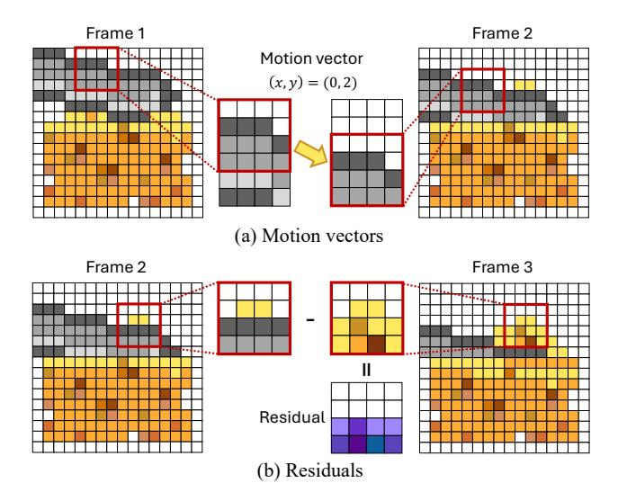
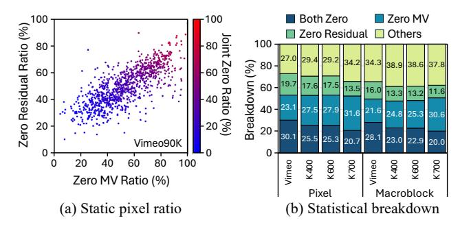
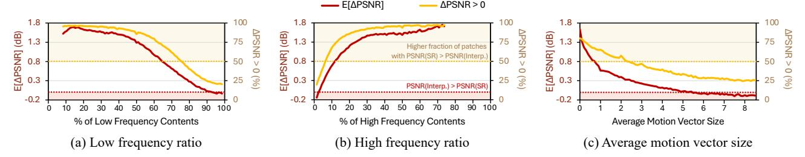
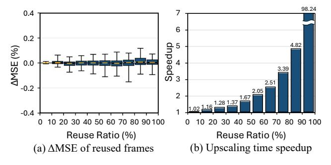
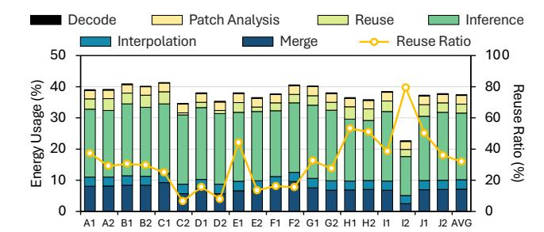
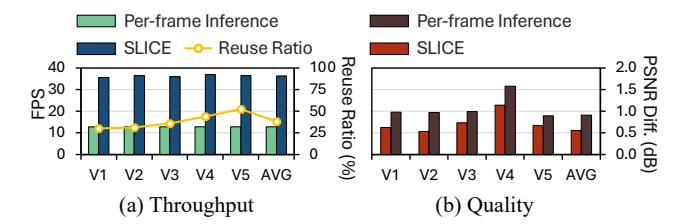
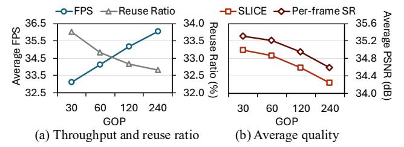

# SLICE: A Selective Local Inference Framework with Codec Exploitation for Accelerating Video Super-Resolution

Mingu Jung *Yonsei University* Seoul, Republic of Korea mingu.jung@yonsei.ac.kr

Seung Hyun Jin *Yonsei University* Seoul, Republic of Korea seunghyun.jin@yonsei.ac.kr

Sungbin Kim *Yonsei University* Seoul, Republic of Korea sungbin.kim@yonsei.ac.kr

Hyunwuk Lee *Samsung Electronics* Hwaseong, Republic of Korea hyunwuklee0519@gmail.com

Seunghyun Lee *Yonsei University* Seoul, Republic of Korea seunghyun.lee@yonsei.ac.kr

Won Woo Ro *Yonsei University* Seoul, Republic of Korea wro@yonsei.ac.kr

*Abstract*—Video now constitutes the majority of network traffic, and users expect lag-free, high-quality playback. Since network bandwidth often cannot sustain high-quality streams, client-side Super-Resolution has become an attractive option. In particular, neural network-based Super-Resolution offers strong perceptual gains by recovering fine detail. However, running perframe inference is costly on edge hardware and often pushes latency and power budgets beyond their limits. When server assistance is available, server-orchestrated Super-Resolution pipelines that decide the upscaling strategy in the server side can effectively reduce per-frame cost, but settings such as live streaming and on-device playback often preclude such support, highlighting the need for a client-only alternative.

Since the standard bitstream provides the codec metadata to reconstruct the bits into pixel-level frames, we find that these codec metadata can act as a cue to accelerate the clientonly Super-Resolution pipeline. Specifically, we observed that motion vectors and residuals can be used to locate regions where Super-Resolution yields the largest quality gains and to reveal unchanged areas that can be reused from the previous highresolution frame. This enables selective patch-level inference on informative regions while reusing stable content and interpolating the rest, which keeps per-frame latency within budget with minimal quality loss. Based on these observations, we present SLICE, a framework that applies different upscaling strategies to patches within a frame according to their codec-derived characteristics. SLICE runs entirely on the client using only client-side information and can further exploit energy-efficient hardware decoder by leveraging codec metadata available in the standard bitstream. Across real-world videos, SLICE delivers 2.72× speedup and reduces energy consumption by 62.57% compared to per-frame inference.

# I. INTRODUCTION

Video has become the dominant component of internet traffic, reflecting continued increases in video streaming demand [1], [2]. This growth is increasingly driven by latency-sensitive workloads, such as live streaming and video conferencing [3], [4]. As this trend continues, the need to deliver both low latency and high visual quality has made network bandwidth a key bottleneck. To mitigate this limitation, clientside upscaling has become a viable alternative [5], [6]. These approaches employ upscaling techniques on the client device to convert low-resolution (LR) video to high-resolution (HR)


Fig. 1: Overview of the SLICE framework.

output. Since conventional upscaling methods such as interpolation struggle to recover fine-grained details, neural network (NN)-based Super-Resolution (SR) models have emerged. By reconstructing plausible textures and patterns, these models achieve significant quality improvements over interpolationbased upscaling. Driven by these gains, industry SR frameworks also employ NN-based methods to upscale streaming video on desktop and laptop PCs [2], [7], [8].

Although NN-based SR models achieve strong perceptual gains, they experience a severe slowdown due to their high computational costs. As shown in Fig. 1(a), when video is delivered from the server to the client as a standard bitstream, typical SR pipelines upscale each frame independently using per-frame inference. Since a single frame requires heavy computation, performing inference per-frame replicates that cost across the sequence and significantly increases the overall computation. This problem is particularly challenging for edge devices with tight compute, memory, and power budgets, which are now the primary medium for video consumption. In latency-sensitive video streaming, where frames must be displayed in a continuous sequence, per-frame inference can exceed the latency budget (e.g., 33 ms at 30 FPS) and violate the timing constraints [9], [10]. Accordingly, a lightweight methodology is needed to efficiently super-resolve LR video within the latency budget while minimizing the quality loss.

To design a resource-efficient SR<sup>1</sup> pipeline, serverorchestrated approaches have been widely explored to keep the client lightweight while meeting the timing constraints. Fig. 1(b) illustrates representative designs where an SR model upscales a subset of frames and the remaining frames are synthesized from the previously super-resolved frame using codec metadata in a manner that mirrors decoder reconstruction. In this setting, the server determines which frames to upscale with a SR model and dispatches the plan to the client by embedding it in the bitstream, and per-video fine tuning is often employed to sustain quality. These server-orchestrated methods are effective when server assistance is available and stream analysis is feasible, yet they cannot be applied in scenarios such as live streaming, video conferencing, and videos stored on client devices. As a result, a client-only SR pipeline is needed in which the client determines the upscaling strategy using only client-side information. This direction remains underexplored compared with server-orchestrated pipelines, motivating research on accelerating client-side SR.

To address this need, we find that the codec metadata already present in the standard bitstream for frame reconstruction can be leveraged to accelerate client-only SR. These metadata can serve as a reliable signal indicating where SR models yield the greatest quality gains within a frame. Furthermore, the temporal redundancy in video across time allows this metadata to reveal unchanged regions, enabling reuse of the corresponding content from the prior super-resolved frame. These insights suggest that codec metadata can guide selective, patch-level SR, which applies the SR model only to informative regions of a frame. However, realizing this idea in practice is nontrivial for two reasons. First, we must determine which codec metadata are most suitable for guidance. Second, we must identify in advance which frame regions will yield the greatest benefit from high cost computation.

To meet these requirements, we select motion vectors and residuals from the standard bitstream as our guidance signals and identify two properties that motivate our design. We find that frequency-domain residuals can reliably indicate highfrequency content within each frame. Combined with motion vectors, they enable selective patch level inference by detecting the region where SR delivers the largest gains. Also, the joint use of motion vectors and pixel-domain residuals also supports temporal reuse of unchanged regions across frames, which further reduces the candidate set for inference and eliminates redundant processing. These properties enable region-level targets to be specified before SR inference, forming a practical strategy for client-only pipeline.

Based on these observations, we propose SLICE, a Selective

Local Inference Framework with Codec Exploitation which leverages motion vectors and residuals from the codec to prioritize regions where the SR model yields the greatest quality gains. Fig. 1(c) shows the novel approach of SLICE, which performs inference only on selected patches, reuses unchanged regions identified by motion vectors and residuals, and interpolates the remainder. Since SLICE operates entirely on the client device and consumes the unmodified bitstream, it allows full use of the energy-efficient hardware video decoder without any change. Since codec metadata is available from the decoder prior to SR, the runtime cost of choosing the upscaling strategy can be kept negligible. In our evaluation, SLICE delivers meaningful speedups and energy savings with only a small quality reduction compared to per-frame inference, by performing SR inference only on selected regions and reusing unchanged content from the previous HR frame.

Our contributions are as follows:

- We establish and quantify the correlation between codec metadata and SR quality at the patch level within each frame.
- We observe that these codec metadata can be used to capture regions where the SR model can fully benefit. The use of motion vectors and pixel-domain residuals also gives us an opportunity to reuse regions that remain unchanged.
- We present SLICE, a framework that efficiently upscales LR video to HR using only client-side information, which can leverage the standard video codec.
- Our evaluation on real-world videos shows that SLICE achieves 2.72× speedup and 62.57% energy savings over per-frame inference.

# II. BACKGROUND

# *A. Super-Resolution*

Conventional upscaling methods rely on pixel interpolation such as bilinear [11], bicubic [12], and lanczos [13]. Even though these methods are lightweight, they lose some details due to their deterministic nature. To address this issue, NNbased SR models have gained significant attention for their ability to generate fine textures and patterns, resulting in more realistic images [14]–[19]. Beyond academic proposals, industry frameworks have also been widely deployed [7], [8], [20]–[23], including NVIDIA DLSS for games [24] and RTX VSR for video streaming [2]. In practice, SR frameworks for video streaming are supported mainly on desktop platforms with discrete GPUs due to their significant computational cost, leaving mobile devices with limited support.

# *B. SR-Augmented Video Streaming Pipeline*

Modern videos are delivered in the form of a compressed bitstream from the server to the client device over the network. To reconstruct it as a sequence of frames, a hardware or software decoder consumes the stream to decompress the encoded frames into pixel-level images. The SR model then upscales each frame, and the result is written to the framebuffer for display. On mobile platforms with tight compute and power budgets, naively upscaling all frames with an SR model often

<sup>1</sup>Throughout this paper, *Super-Resolution* denotes the neural network-based upscaling method unless otherwise stated.



Fig. 2: Motion vectors and residuals. (a) The coherent motion of the cheese slicer is captured by motion vectors. (b) Disoccluded regions are encoded as residuals.

fails to satisfy latency constraints. For example, the inference latency of EDSR [14] is 120.7× that of bicubic interpolation on Jetson AGX Orin [25] in our experiment. These constraints necessitate methods that accelerate the SR pipeline to meet real-time budgets while preserving perceptual quality.

To deploy SR in a way that preserves frame quality while meeting the latency budget, there are two possible approaches that place the upscaling policy in different locations. First, in a server-orchestrated SR pipeline shown in Fig. 1(b), the server pre-analyzes the video offline and attaches control information to the bitstream [5]. This information specifies which frames should be upscaled by the SR model on the client. The client then decodes the stream, reads the control information, and applies the SR model only to the designated frames. The other frames are reconstructed from a cached super-resolved frame and codec metadata, mirroring the video decoding process. While server-side orchestration remains valuable when offline analysis is feasible, scenarios such as live streaming, video conferencing, and on-device archives do not meet these conditions, which motivates an alternative design where upscaling decisions are made on the client side.

Second, in a client-only SR pipeline, the client determines which frames or regions to upscale solely according to deviceside policies. In these settings, the server transmits only a standard video bitstream. Based on the device-side upscaling policy, the client performs SR on the selected inputs and writes the outputs to the framebuffer. Both server-orchestrated and client-only pipelines share the same decoding and display stages and differ only in the location of the selection policy. While acceleration for server-orchestrated pipelines has received broader attention [5], [6], progress on client-only pipelines remains limited, highlighting the need for dedicated client-side acceleration.


Fig. 3: Residuals in the pixel and frequency domains. The encoder maps pixel-domain residuals to the frequency domain using a DCT-like integer transform, and the decoder reconstructs them using an IDCT-like inverse transform.

# *C. Preliminaries of Video Codec*

Video codecs exploit spatial and temporal redundancies to compress video into a compact bitstream for efficient transmission and storage. The video codec consists of (1) an encoder that compresses the raw frames into a bitstream, and (2) a decoder that reconstructs pixel-domain frames from the bitstream. Codecs compress both intra-coded frames and intercoded frames, leveraging spatial and temporal prediction, respectively. In inter-coded frames, *motion vectors* describe perblock motion with respect to a reference frame, while *residuals* represent the difference between the motion-compensated prediction and the original frame [26]. The following introduces these concepts using Advanced Video Coding (AVC or H.264) [27] as an example.

Motion Vectors. The movement between the reference frame and current frame is encoded as motion vectors, which are generated during the motion estimation process. The encoder first divides the frame into fixed-size macroblocks (16×16 in H.264/AVC), and may further split them into smaller partitions to improve prediction. For each partition candidate, it searches the reference frame for the best-matching block and assigns the corresponding motion vector. Since a macroblock can be split in various ways, the encoder selects the partitioning and motion vectors that minimize a bitrate-quality cost. As illustrated in Fig. 2(a), the encoder represents the motion in the current frame (Frame 2) as a coordinate offset from the best-matching block in the reference frame (Frame 1).

Residuals. The differences between the current frame and its prediction are represented as residuals. Since motion vectors model only the linear displacement of blocks, they cannot capture complex motions such as rotation, scaling, occlusions/disocclusions, or non-rigid motion across frames. After motion estimation, the encoder forms a motion-compensated prediction from the reference frame and obtains the residual by subtracting the prediction from the original frame, thereby capturing the remaining per-pixel details as depicted in Fig. 2(b).

To compress the residual into a bitstream, the encoder applies a block-based transform such as the integer transform in H.264/AVC, which approximates the Discrete Cosine Transform (DCT) and guarantees the exact inversion in the decoding process [28]. This converts each 4×4 or 8×8 residual block into transform coefficients representing its spatial frequency content, as shown in Fig. 3. The magnitude of each coefficient indicates the energy of the corresponding frequency


Fig. 4: Distribution of patch-wise PSNR gains of EDSR  $(4\times)$  over pixel interpolation.

component in the pixel-domain residual block, with larger values indicating stronger presence. Coefficients near the top-left correspond to low frequencies and those farther to the right or downward correspond to higher frequencies, allowing the grid to be partitioned into low-, mid-, and high-frequency bands [29]. Transforming the residual to the frequency domain concentrates most of the energy in a few low-frequency coefficients, leaving many high-frequency coefficients close to zero and therefore easier to compress [30].

**Decoding Inter-coded Frames.** On the client side, each inter-coded frame is reconstructed from motion vectors and residuals in the bitstream. The decoder performs motion compensation to generate a prediction from the reference frame, then applies an inverse transform to recover the pixel-domain residual. The final reconstruction is obtained by adding the residual to the motion-compensated prediction for each block.

#### III. MOTIVATION

#### A. Client-only SR in Practice

As discussed in Section II-B, the client in a client-only SR pipeline does not receive any video-analysis metadata from the server. In this setting, the client must rely solely on locally available information to devise device-side SR policies that exploit both the information contained in the standard bitstream and the on-device resources in order to upscale the video within the latency budget. By contrast, existing server-orchestrated approaches target a different setting, as they assume tight server-client coordination and access to server-provided analysis metadata, which creates both server-side and client-side challenges in deployments where the server transmits only a standard bitstream.

On the server side, server-orchestrated pipelines typically select the frames to super-resolve by upscaling each frame with the SR model and estimating its quality impact on neighboring frames for each video. To understand the server cost in practice, we implemented this workflow and tested it on real-world videos. Running on a desktop with an Intel Core i7-14700K CPU and an NVIDIA GeForce RTX 3080 Ti GPU, the frame selection process took 24.95 minutes per video on average. While these workflows suit environments that permit server analysis, they cannot be applied for scenarios such as live streaming and video conferencing because the latency budget cannot accommodate server-side frame selection and adaptation. They are also unsuitable for on-device archives where network connectivity may be unavailable or privacy constraints prevent sending content to a server. In addition to


Fig. 5: Patch-wise heatmaps of a frame divided into equally sized patches, showing (from left to right) the proportion of high-frequency residual energy, the PSNR gain of SR over interpolation, and the average motion vector magnitude.

these deployment constraints, server-orchestrated SR pipelines often apply video specific adaptation that retrains the SR model per video to maximize quality, further increasing server cost and latency.

On the client side, some server-orchestrated designs limit the use of the hardware decoder. Since these systems rely on codec augmentations that emit custom auxiliary metadata such as SR frame markers or HR motion vectors, decoding often falls back to software, and the on-chip energy-efficient decoder remains underused. Taken together, these considerations point to a need for an efficient client-only SR approach that relies only on client side information, fully leverages the on chip hardware decoder, and keeps accuracy loss minimal.

# B. Opportunities for Patch-level Inference

To explore the potential for additional performance gains beyond uniformly applying SR over the entire frame, we first analyze how its quality improvements are distributed spatially within each frame. To this end, we divide each frame into fixed-size non-overlapping patches and use them as the unit of analysis. Fig. 4 depicts the distribution of patch-wise quality differences between SR inference and pixel interpolation in various real-world video sequences (see Section VI-A for details). While SR models improve the overall quality of a frame, the result shows that some regions within frames are better served by pixel interpolation than by SR inference. Specifically, 44.1% of patches exhibit a negative or near-zero Peak Signal-to-Noise Ratio (PSNR) difference, indicating that applying the SR model does not yield meaningful improvement over simple interpolation in those areas. We also observe a sharp spike around zero on the horizontal axis, which largely comes from background or flat regions where an entire patch is nearly uniform in color. In such cases, patch-level interpolation and SR inference produce visually identical results, leading to almost no quality difference. At the same time, there is a long positive tail in the distribution, showing that certain patches benefit significantly from SR and achieve substantial quality gains. This imbalance suggests that the benefit of SR is highly spatially selective rather than uniform across the frame.

Building on this observation of spatial selectivity, we analyze spatial quality variation across patches within a frame.

The middle heatmap in Fig. 5 visualizes the patch-wise quality gap for a 270p frame upscaled to 1080p, expressed as the PSNR difference between SR inference and bicubic interpolation. The heatmap shows that SR is far from uniformly better. Large portions of the frame see only marginal gains over interpolation, and some regions even degrade in quality. As discussed in Section II-B, pixel interpolation is substantially cheaper to run than full SR inference, making it an attractive fallback in regions where the quality gain from SR is small. Taken together, these observations motivate a selective patchlevel strategy that runs SR on only a subset of patches and falls back to interpolation on the others, reducing overall compute cost while preserving the quality benefits of SR.

A key challenge for patch-level inference is maintaining the quality of a super-resolved frame while selecting the patches that yield the largest quality gains within the frame. Since an SR model focuses on generating fine details and textures from the LR image, we hypothesize that the high-frequency content within a frame benefits the most from SR. Motivated by the fact that modern video codecs store residuals in the frequency domain and decode them back into the pixel domain to reconstruct frames (Section II-C), we further assume that these frequency-domain residuals can serve as a cue for selecting patches with the highest potential quality gain.

The left heatmap in Fig. 5 visualizes the patch-wise ratio of high-frequency content in the frequency-domain residual. This ratio is computed as the sum of high-frequency energy divided by the total energy in the patch. A higher value indicates that the patch contains richer high-frequency content such as edges and fine textures. By comparing it with the heatmap of PSNR difference, we observe a spatial correlation in which patches with a large high-frequency ratio tend to exhibit larger quality gains (highlighted by the green box). This suggests that the quality improvement of the SR model is primarily driven by its ability to recover high-frequency details, which are perceptually important. In other words, rather than providing a uniform improvement across the entire image, the model delivers larger gains in edge- and texture-rich regions, which are typically more challenging to reconstruct and more noticeable to human observers in terms of sharpness and visual fidelity.

Beyond frequency-domain residuals, we also investigate motion vectors as an additional codec-derived cue to refine patch selection. Since a motion vector represents the displacement of frame content between consecutive frames, a larger magnitude generally indicates faster motion of the object. Given that fast-moving objects are often captured as blurry regions in a frame, we assume that the motion vector magnitude may affect the achievable quality gain, and that relatively static regions may benefit more from the SR model. The right heatmap in Fig. 5 shows the average motion vector magnitude for each patch, where brighter regions indicate a larger motion. Comparing this map with the heatmap of PSNR difference reveals that patches with large motion vectors (highlighted by the blue circle) correspond to areas where the quality gain from the SR model is relatively small or



Fig. 6: Reuse opportunities from temporal redundancy in various video datasets. (a) Correlation between zero-motion vector and zero-residual ratios. (b) Breakdown of pixel and macroblock categories relevant to reuse across datasets.

even negative. This observation supports our hypothesis that motion vector magnitude can also serve as an indicator of how much benefit SR can provide. In particular, patches with large motion vectors tend to yield limited additional gains, whereas more static regions with small motion vectors achieve higher quality improvements. Fast-moving regions also tend to appear blurred in the frame. This blur makes high-frequency details difficult to recover, thereby limiting the additional improvement achievable with the SR model.

#### C. Opportunities for Patch Reuse

To further expand the performance gains of selective SR, we extend our analysis from spatial variability within individual frames to temporal redundancy across consecutive frames. Since consecutive video frames often share similar content, regions such as static backgrounds remain largely unchanged over time. Such regions can be leveraged to reduce the computational cost of SR inference. Beyond selecting patches that benefit the most from SR, codec metadata can also help mitigate quality loss by revealing stable regions that can be safely reused. In practice, static regions can be identified using motion vectors and residuals by detecting patches whose motion vector magnitude and residual energy are both zero, indicating that there is effectively no change in those regions.

To assess reuse opportunities, we measure the fraction of regions where both the motion vector and the residual are zero across various datasets. Fig. 6(a) plots the per-video fraction of pixels with zero motion vectors against the fraction with zero residuals for 1,000 videos from the Vimeo90K dataset [31]. Each point corresponds to a single video, and the color of each point indicates the joint ratio of pixels for which both the motion-vector magnitude and the residual are zero. We observe that videos with a higher proportion of zero motion vectors also tend to have a higher proportion of zero residual pixels. Focusing on the joint-zero rate, Fig. 6(b) shows the breakdown of pixel categories for several datasets, including Vimeo90K and the Kinetics (K400/K600/K700) datasets [32]. Regions where both the motion vector and the residual are zero constitute 30.1% of pixels in Vimeo90K, 25.5% in Kinetics-400, 25.3% in Kinetics-600, and 20.7% in Kinetics-



Fig. 7: Patch-wise expected PSNR gain (E[∆PSNR]) and the fraction of patches where SR inference outperforms pixel interpolation (∆PSNR > 0) with respect to (a) the proportion of low-frequency residuals, (b) the proportion of high-frequency residuals, and (c) the average motion vector magnitude. E[∆PSNR] is computed empirically as the average patch-wise PSNR gain of SR over interpolation. The proportion of residual energy for each patch is computed as the ratio between the residual energy within the corresponding frequency band and the total residual energy of the patch. The frequency bands are defined consistently with the transform coefficient regions shown in Fig. 3.

700. Likewise, at the macroblock granularity (16×16 pixels), the joint-zero rate is slightly lower than the pixel-level estimate while still indicating substantial temporal redundancy.

These statistics indicate that real-world videos contain a substantial amount of temporal similarity, with large areas remaining effectively static or being perfectly predicted from previous frames. This property can also be exploited to further reduce the computational cost of SR inference. In particular, motion vectors and residuals can be used to detect temporally stable regions, allowing us to skip expensive SR inference in those areas and instead focus on regions that actually change and are harder to reconstruct.

# IV. SUPER-RESOLUTION WITH CODEC GUIDANCE

# *A. Correlation of SR Quality and Codec Metadata*

As discussed in Section III-B, our qualitative analysis using patch-wise heatmaps suggests that codec metadata is correlated with the reconstruction quality achieved by SR across different spatial regions. In this section, we conduct a quantitative analysis to characterize this relationship by examining how patch-level characteristics derived from codec metadata correlate with reconstruction quality. Fig. 7 illustrates the expected PSNR gain of SR inference over bicubic interpolation and the fraction of patches for which SR inference outperforms interpolation as a function of different patchlevel characteristics, across diverse video sequences from the NEMO YouTube dataset [5]. Fig. 7(a) shows that as the proportion of low-frequency residual content increases, the expected PSNR difference consistently decreases. This indicates that interpolation is already close to optimal, and SR inference brings only marginal improvement in flat or uniform areas. Conversely, Fig. 7(b) shows that as the proportion of high-frequency residual content increases, the expected PSNR difference consistently rises, indicating that SR inference provides larger gains in patches that contain sharp structure and fine detail that cannot be well restored by simple interpolation. These statistics demonstrate that SR inference is expected to be more beneficial for high-frequency, texture-rich regions than for smooth low-frequency regions.



Fig. 8: Effect of patch reuse in a SR pipeline. (a) ∆MSE defined as the percentage change in MSE of the composite frame relative to the full-frame SR output, where MSE is computed with respect to the ground-truth frame. (b) Upscaling time speedup when reusing patches and running SR on the remaining regions, normalized to full-frame SR latency.

Motion vectors exhibit a similarly consistent trend. As shown in Fig. 7(c), patches with a larger average motion vector magnitude have a monotonically lower expected PSNR difference. This suggests that fast-moving content is inherently harder for the SR model to reconstruct in a way that improves over pixel interpolation, likely due to temporal misalignment and blur. In contrast, patches with small motion vectors, which largely correspond to static content, are more reliably enhanced by SR inference because detailed spatial patterns are stable and easier to recover.

The fraction of patches in which the SR inference outperforms interpolation (∆PSNR > 0) in Fig. 7 reinforces these observations. This ratio decreases with increasing lowfrequency proportion, increases with high-frequency proportion, and declines as the average motion vector magnitude grows. This also means that SR inference outperforms more often when low-frequency content is scarce, high-frequency content is abundant, and motion is small. Taken together, these results demonstrate that the qualitative tendencies discussed in Section III-B generalize across diverse content and emerge as clear global trends rather than isolated examples.


Fig. 9: The SLICE upscaling pipeline.

#### B. Applying Reuse Patches in SR Pipeline

Having established in Section III-C that videos exhibit strong temporal similarity, we investigate whether exploiting this property via patch reuse within a practical SR pipeline yields measurable benefits. Fig. 8(a) shows the relative change in Mean Squared Error (MSE) with respect to the full-frame SR across different reuse ratios. For each reuse ratio, we construct a composite frame by pasting the corresponding super-resolved patches that have zero motion vector and zero residual from the previous frame into the current full-frame SR output. The boxplots show that  $\Delta$ MSE is centered near zero over the entire range of reuse ratios and that its magnitude remains below 0.2%. This indicates that for regions with zero motion vector and zero residual, substituting the current output with super-resolved patches cached from the previous frame preserves reconstruction accuracy relative to full-frame SR.

In terms of upscaling latency, Fig. 8(b) presents a histogram of upscaling speedups grouped by the reuse ratio, normalized to the full-frame SR. Each bar aggregates the speedups of data points in the corresponding reuse bin when patches are reused and SR is applied to the remaining patches. The histogram shows that the speedup grows exponentially with the reuse ratio. This behavior arises because SR inference dominates the computational load. Consequently, reducing the portion of patches that require inference yields meaningful reductions in the overall upscaling time. At high reuse levels, the distribution concentrates around very large speedup values. For example, we observe a 98.24× speedup in this interval, reducing runtime to about 1.02% of the full-frame SR. These extreme gains occur when there is essentially no change between consecutive frames so that the entire frame can be reused, maximizing the benefit of patch reuse. Taken together, these results indicate that patch reuse can also be applied to SR pipelines, delivering substantial acceleration while preserving full-frame SR quality.

#### V. SYSTEM DESIGN

#### A. SLICE Overview

Based on the observations in Section IV, we introduce SLICE, a codec-guided framework that accelerates the video SR pipeline by performing patch-wise SR inference and reusing previously super-resolved content. Operating directly on the standard bitstream, SLICE applies full-frame SR only to intra-coded frames, which are sparsely inserted and typically

account for only a small fraction of frames, and therefore focuses its optimization on the inter-coded frames that dominate video streams. In SLICE, each frame is divided into equally-sized patches, and for each patch the framework selects an upscaling strategy based on motion vectors and residuals from the codec, either reusing existing high-resolution content, running SR inference, or falling back to lightweight pixel interpolation. Since SLICE relies solely on codec information available at the client, the pipeline requires no additional server-side data. At the same time, it substantially reduces the overall SR workload while preserving high perceptual quality.

#### B. Upscaling Pipeline

Fig. 9 illustrates how the SLICE pipeline upscales an input LR video to an HR output. When a compressed video bitstream arrives from the cloud server, the client device receives it and decodes it with the SoC's hardware video decoder (①). This stage follows the standard video decoding pipeline, where the decoder reconstructs inter-coded frames by extracting motion vectors from the bitstream and performing motion compensation on the reference frame. It also parses frequency-domain residuals and applies an IDCT-like inverse integer transform to obtain pixel-domain residuals, which are then added to the motion-compensated prediction to recover the decoded frame. The decoded frame is then ready for super-resolution processing.

SLICE introduces two key stages that leverage codec side information to accelerate the upscaling process. First, in the patch analysis stage (2), SLICE conducts patch-level analysis using motion vectors and residuals to determine the appropriate upscaling strategy for each patch. Based on this analysis, SLICE determines the per-patch upscaling strategy in three steps. It first identifies reuse patches, then selects patches that require SR inference, and finally assigns the remaining patches to interpolation. To reduce the load of SR inference, SLICE prioritizes identifying reuse patches. This ordering lets SLICE exploit cases where many patches can be reused, thereby reducing the number of patches that must be considered for SR inference. A patch is marked for reuse when both the motion vector and pixel-domain residual are zero. Next, from the remaining patches, SLICE selects SR inference patches based on the high-frequency energy of the frequency-domain residual and the magnitude of the motion vector.

#### **Algorithm 1** SLICE Upscale Strategy

```
LR video
   Input:
            video
                               LR video frame
            M^{reuse}
                              Binary mask for patches
            M^{SR}
                              Binary mask for non-reuse patches
   Output: F^{SR}
                              Super-resolved HR frames
1: for each frame f in video do
       if INTRACODED(f) then
2:
                                                     For intra-coded frames
           F^{SR} \leftarrow \text{FULLFRAMeInference}(f)
3.
4:
                                                     ⊳ For inter-coded frames
5:
           (M^{reuse}, M^{SR}) \leftarrow PATCHANALYSIS(\cdot)
6:
            P^{HR} \leftarrow \text{PATCHWISEUPSCALE}(f, M^{SR}, M^{reuse})
           F^{SR} \leftarrow \text{MERGEPATCHES}(P^{HR})
7:
8:
  end for
9:
```

In the subsequent upscale stage (③), SLICE applies the selected strategy to each patch. Reuse patches are filled from the HR cache which stores the HR output of previous frames, SR-inference patches are processed by the SR model, and the rest are upscaled with pixel interpolation. Finally, in the output composition stage (④), all upscaled patches are merged at their original positions and written to the HR framebuffer to produce the final SR frame.

## C. Upscaling Strategy

Algorithm 1 outlines the workflow of the SLICE framework. For intra-coded frames, it performs full-frame inference since these frames cannot exploit motion vectors or residuals. For inter-coded frames, the SLICE framework upscales the frame in three phases: (1) Patch analysis, (2) Patch-wise upscale, and (3) Merging patches.

Patch Analysis. In order to decide an upscale strategy for each patch, SLICE analyzes codec-derived characteristics and partitions patches into two sets, those to be reused from the HR cache, and those to be upscaled by SR inference. Algorithm 2 describes the patch analysis procedure. For each LR frame, SLICE divides the frame into equally-sized  $P \times P$  patches and reads spatial grids of motion vector magnitude, pixeldomain residuals, and frequency-domain residuals from the decoder, where each grid element is aligned to a pixel or a block and stores the codec metadata for that location. It then constructs the Patch Statistics Maps (PSMs) by aggregating these grids over each patch, namely the mean motion vector magnitude, the mean change in pixel residuals, and the ratio of high-frequency energy in the residual signal (Line 3-5). These aggregations are computed by average pooling on the GPU, which produces per-patch means in a single pass using kernel size and stride P for pixel-granularity maps and P/4for 4×4-based grids. Using the codec-guided PSMs, SLICE identifies the patches that can be reused from the previous frame stored in the HR cache. If both the mean motion vector magnitude and the mean change in pixel residuals are zero, the patch is marked as reusable and its location is recorded in the reuse mask  $M^{reuse}$  (Line 6-7). Note that pixel-domain residuals are used rather than transform coefficients in the

#### Algorithm 2 Codec-guided Patch Analysis

```
Input:
                                      Height/width of LR frame
                H, W
                                      Grid of motion vector size
                G^{pix}
                                      Grid of pixel residual
                G^{hf}
                                      Grid of high-frequency energy of frequency residual
                G^t
                                      Grid of total energy of frequency residual
                \tilde{P}
                                      Patch size
                \alpha, \beta
                                      Score weights
                k
                                      Inference area ratio to apply SR
     Output: M^{reuse}
                                      Binary mask for reuse patches
                M^{SR}
                                      Binary mask for SR patches
 1: function PATCHANALYSIS(H, W, G^{mv}, G^{pix}, G^{hf}, G^t, P, \alpha, \beta, k)
          T_h \leftarrow H/P; \quad T_w \leftarrow W/P

    □ Generate Patch Statistics Maps (PSMs)

          mv\_mean \leftarrow AvgPool2D(G^{mv}, P/4, P/4)
 3:
          res\_pixel\_mean \leftarrow AvgPool2D(|G^{pix}|; P, P)
 4:
          hf\_ratio \leftarrow \frac{\text{AvgPool2D}(G^{hf}; P/4)}{\text{AvgPool2D}(G^t; P/4)}
 5:

    ▶ Identify reuse patches

          R \leftarrow (mv\_mean = 0) \cap (res\_pixel\_mean = 0)
 6.
          M^{reuse} \leftarrow \text{False}^{T_h \times T_w}: M^{reuse}[R] \leftarrow True
 7.

          score \leftarrow \alpha \cdot hf\_ratio + \beta \cdot (1 - \text{clip}(mv\_mean/10, 0, 1))
 8:
 g.
          S \leftarrow \text{TopK}(score, k)
10:
          M^{SR} \leftarrow \text{False}^{T_h \times T_w}; \quad M^{SR}[S] \leftarrow \text{True}
          return M^{reuse}, M^{SR}
11.
12: end function
```

frequency-domain for identifying reuse patches. Since intercoded frames may contain intra-coded blocks, leveraging the pixel-domain residuals can prevent such intra-coded blocks from being reused across time.

For the remaining patches, SLICE assigns a score that favors textures with stronger high frequency residuals and smaller motion vectors (Line 8). Since the proportions of the highand low-frequency residuals are strongly coupled, measuring only one of them is sufficient to detect target SR patches at runtime. SLICE therefore uses the high-frequency residuals and the motion vector magnitude of each patch to determine the upscaling strategy. Since the average motion vector magnitude rarely exceeds 10 in typical sequences, we normalize the motion term by dividing it by 10 and then clip it to the range from 0 to 1. The two predictors are weighted by  $\alpha$  and  $\beta$ . Based on our empirical observation that frequency residuals are more informative than motion,  $\alpha$  and  $\beta$  are set as 0.9 and 0.1 respectively (see Fig. 18 for details). The resulting score map score provides a per-patch estimate of how beneficial SR will be given the codec data. A user-supplied ratio kdetermines the total fraction of area processed by the SR model, and SLICE selects the top scoring patches up to this budget with a GPU TopK kernel to form the SR mask  $M^{SR}$ (Line 9-10). Any patch that belongs to neither  $M^{reuse}$  nor  ${\cal M}^{SR}$  is upscaled by pixel interpolation.

**Patchwise Upscale.** After selecting an upscaling strategy through patch-wise analysis, SLICE applies the chosen strategy to each patch. Patches for reuse are filled directly from the HR cache, copying cached pixels at the corresponding coordinates. Patches selected for SR inference are processed in batches

entirely on the GPU. Rather than constructing batches in a loop, the patch grid is transformed into a compact GPU tensor using the unfold operation, and only the patches identified by the SR mask are gathered. The gathered patches are reshaped into batches and evaluated with one or a few forward passes. Keeping extraction and scheduling on the GPU removes CPU round trips and lowers kernel launch overhead, which reduces the overall reconstruction time. The remaining patches are upscaled with pixel interpolation on the GPU. After all patches are produced, SLICE composes the HR frame using the indices provided by the reuse map and the SR map.

Merging Patches. In order to reconstruct the frame from the upscaled patches, SLICE merges these patches into a HR frame and stores it into the framebuffer. Since data must still move between the CPU and GPU logical memory spaces even on SoC platforms with unified memory architectures, SLICE performs merging entirely on the GPU to minimize such transfers. The SR result from the previous frame stays cached on the GPU and is read directly when needed. This design avoids host round trips and keeps data movement minimal. For reuse patches, SLICE arranges patches by rows and groups horizontally adjacent patches into contiguous bands. Each band is copied as one contiguous slice from the cached HR frame into the reconstruction buffer. Then, the patches upscaled with pixel interpolation are copied to its corresponding location. Next, patches selected for SR inference are associated with their target positions within the HR frame. These patches are also reconstructed using the row-wise banded copies as the reuse patches. Keeping all merges on the device eliminates host round trips, improves bandwidth efficiency, and reduces per update overhead while preserving spatial alignment. Finally, the reconstructed HR frame is stored in the GPU framebuffer.

# VI. EVALUATION

# *A. Methodology*

System and Measurement Setup. We implement our SLICE framework on an NVIDIA Jetson AGX Orin [25] and measure the throughput, quality, and energy consumption directly on the device. We use PyTorch to run SR inference on the GPU and use PSNR to evaluate the quality of the reconstructed HR video. We use the Jetson Tegrastats utility [33] to measure device energy consumption and average the power readings over the evaluation interval to obtain a stable estimate of energy consumption. For the SR model, we use EDSR [14], a widely used SR model, with an upscale factor of 4, and perform all SR inference in half precision (FP16).

Codec Metadata Extraction. Since the hardware video decoder does not expose codec-side signals, we emulate access to them by extending the open-source Compressed Video Reader tool [34] which is based on FFmpeg [35] to extract motion vectors and residuals in the frequency and pixel domains during H.264 decoding. Aside from extracting this metadata, we decode the standard bitstream without any codec changes. In effect, the emulation only substitutes the source of guidance signals and leaves the rest of the pipeline unchanged and compatible with the on-chip hardware decoder.

Dataset. We evaluate SLICE on real-world YouTube videos used in NEMO [5] and adopt the same 10-category grouping [36]. For each category, we select two videos for evaluation. Each video is encoded at 30 FPS with resolutions of 270p and 1080p, with bitrates of 650 kbps and 4400 kbps respectively. After upscaling the LR videos, we use the raw 1080p frames as the reference for computing quality metrics. The groupof-pictures (GOP) length, defined as the number of frames between consecutive intra-coded frames, is set to 120, and we report results over the first five minutes of each video.

Evaluation Schemes. We compare the following schemes:

- (1) Per-frame inference: Runs full-frame SR on every frame.
- (2) Server-orchestrated SR (no per-video training): The server decides which frames to super-resolve using a fixed SR model. On the client device, SR inference is run only on the selected frames, while the remaining frames are upscaled using a decoder-like reconstruction process. Note that we exclude the cost of server-side analysis and measure only device-side upscaling. Since the server analyzes each video to satisfy a target quality level, we configure this quality constraint such that the resulting PSNR matches the quality achieved by SLICE, enabling a fair comparison under similar quality.
- (3) SLICE (proposed): Selects regions for SR inference and reuses patches across frames using codec metadata carried in the standard bitstream.

To demonstrate the effect of patch reuse, we also include a variant of SLICE without patch reuse, denoted as SLICE-noreuse. In this scheme, a fixed number of patches per frame is selected for SR inference based on codec metadata, and only these patches are upscaled with the SR model while the remaining regions are interpolated. For SLICE and SLICE-noreuse, we use a patch size of 16×16 pixels, with at most 35% of the frame area processed via inference.

# *B. Results*

Frame Rate. Fig. 10 shows the average frame rate of SLICE and other pipelines for upscaling 270p video frames to 1080p, together with the average reuse ratio of SLICE. For each video we show the average reuse ratio as the mean of per-frame reuse fractions. For a single frame, this fraction is defined as the number of reused patches divided by the total number of patches in the frame. On average, SLICE achieves a 2.72× higher frame rate than per-frame inference and reaches frame rates that fall within the latency budget of video streaming (30 FPS). Per-frame inference applies full-frame SR to every frame, which results in a high computational cost and prevents the pipeline from meeting the latency budget. In contrast, SLICE relies on codec metadata to identify only a subset of regions that require SR inference and reuses patches whenever possible. As a result, the cost of upscaling is greatly reduced and the resulting throughput satisfies the latency requirement.

Compared to server-orchestrated SR, SLICE also delivers higher throughput. In the server-orchestrated pipeline, frames that are not selected by the server are reconstructed via a modified codec, which forces the use of the mobile CPU. Since


Fig. 10: Throughput comparison of SLICE and various upscaling schemes.


Fig. 11: Quality improvement of SLICE and various upscaling schemes over pixel interpolation.

the decoder-like reconstruction runs on a macroblock basis to restore each frame, this process slows down the overall pipeline. In addition, when the server-orchestrated pipeline uses a fixed SR model without per-video training, the server must schedule full-frame inference for a larger fraction of frames to satisfy the target quality constraint. This further increases the computational load on the client device and keeps the frame rate below the latency budget. On the other hand, the entire upscaling process in SLICE including patch analysis, SR inference, and patch merging is executed on the GPU. Moreover, SLICE performs full-frame inference only on intracoded frames, which appear at the beginning of each GOP. This significantly lowers the fraction of frames that require full-frame processing and thereby achieves higher frame rates.

When comparing with SLICE-no-reuse, it attains a slightly higher frame rate than SLICE in several videos. This stems from the additional operations required by SLICE, which must analyze the codec metadata to identify reusable patches and merge these patches when reconstructing each frame, on top of patch-level SR inference and interpolation. For videos with a low reuse ratio, this extra work introduces a small overhead for selecting and merging reusable patches, which can make the frame rate of SLICE marginally lower than that of SLICEno-reuse in these categories. However, this effect is modest and the two schemes still achieve comparable throughput for these videos. For videos with a high reuse ratio, such as H1, H2, and I2, we observe the opposite behavior. In particular, I2 exhibits a reuse ratio of 79.43%, which maximizes the benefit of reuse and allows SLICE to reach a throughput of 52.19 FPS. In these cases, a large fraction of patches can be reused and the reduction in SR inference dominates the small overhead of selecting and merging reusable patches. As a result, SLICE achieves higher frame rates than SLICE-no-reuse in these highreuse cases.

**Quality.** Fig. 11 shows the quality improvement of each upscale pipeline over pixel interpolation. SLICE achieves an average PSNR reduction of 0.35 dB compared to the per-



Fig. 12: Energy consumption breakdown of SLICE.

frame inference, which indicates that its quality is mostly preserved while providing the speedup benefits. The server-orchestrated SR pipeline shows similar PSNR to SLICE since its target quality constraint is explicitly set to match the PSNR achieved by SLICE. The SLICE-no-reuse shows an average PSNR reduction of 0.78 dB relative to per-frame inference, highlighting the significant contribution of the reuse mechanism in terms of quality. In particular, reuse preserves high reconstruction quality across frames by propagating SR-enhanced details from earlier frames to later ones. When reuse is enabled, the system incurs only a small overhead for reuse patch selection and merging, while patch reuse itself provides both speedup and higher reconstruction quality. As a result, the overall quality remains close to per-frame inference.

Energy Consumption. Fig. 12 shows the energy savings achieved by SLICE over per-frame inference. By applying distinct upscaling strategies to different patches, SLICE reduces energy consumption by 62.57% relative to per-frame inference. To perform patch-level upscaling, SLICE adds four additional stages (patch analysis, reuse, interpolation, and merge) to the SR inference pipeline. Despite these additional stages, the total energy consumption remains lower than that of per-frame inference, since the amount of SR inference is significantly reduced. Specifically, although these additional stages incur extra energy cost, together they account for only about 15.86%

TABLE I: Upscaling policies of the relevant baselines for inter-coded frames. Hybrid denotes an upscaling policy that combines frame skipping with patch selection. The remaining regions are upscaled using pixel interpolation.

| Group                 | Scheme               | SR inference type                              | SR ratio | Selection metric | Reuse  |
|-----------------------|----------------------|------------------------------------------------|----------|------------------|--------|
| w/o Codec<br>Guidance | Random<br>Frame-skip | Patch (every frame)<br>Full (35% of frames)    | 35%      | Random           | X<br>X |
| w/ Codec<br>Guidance  | MV-only              | Patch (every frame)                            | 35%      | MV               |        |
|                       | Residual-only        | Patch (every frame)                            | 35%      | Residual         | X      |
|                       | Frame-skip<br>Hybrid | Full (35% of frames)<br>Patch (every 2 frames) | 70%      | MV & Residual    | 1      |
|                       | SLICE                | Patch (every frame)                            | 35%      | MV & Residual    | 1      |

of the energy compared to per-frame inference. In contrast, the energy consumed by SR model inference in SLICE is reduced by 78.56%, resulting in lower overall energy consumption.

Fig. 12 also shows that the inference energy of SLICE is further reduced in the high-reuse regime. This is because upscaling speedup increases super-linearly with reuse ratio, as shown in Fig. 8(b). Since inference energy largely scales with upscaling time, higher reuse ratios lead to larger energy savings in this regime. This explains why E1 and E2 can exhibit similar inference energy despite different reuse ratios, as both already operate at about 40% of the full-frame SR energy, beyond which further increases in reuse ratio yield only marginal savings. In contrast, I2 attains a higher reuse ratio, moving SLICE into a high-reuse regime with lower upscaling time, inference energy, and total energy consumption.


Fig. 13: Relevant baselines compared to SLICE.

Relevant Baselines. To examine the effect of codec guidance on the upscaling pipeline, we compared SLICE with relevant baselines. Table I summarizes the upscaling policies of these baselines. In particular, MV-only and Residual-only operate without reuse, as reuse requires both motion vectors and residuals. For a fair comparison, we matched the overall amount of SR inference computation across the baselines. As shown in Fig. 13, the baselines achieve different PSNR gains over interpolation, indicating that the choice of SR method has a significant impact on reconstruction quality. Notably, the quality gains remain limited without codec guidance. This suggests that simply allocating fixed compute budget is not an effective strategy for SR.

For the baselines with codec guidance, the quality gain depends on how the codec metadata are used. Using only a single codec signal for patch selection shows that either motion vectors or residuals can provide a certain level of guidance, but the resulting quality gain remains limited because reuse cannot be leveraged. In particular, using only motion vectors leads to an even smaller gain, as it tends to prioritize static background regions over high-frequency regions.



Fig. 14: Performance improvement in Xiph dataset.

The Frame-skip, Hybrid (frame-skipping with patch selection), and SLICE all exploit reuse and differ in how SR is allocated over time and space. Frame-skip produces high-quality reference frames by applying full-frame SR to selected frames, but it cannot update high-frequency regions that are introduced in skipped frames. Hybrid concentrates the same SR budget on the selected frames by applying patch selection more aggressively. As a result, SR inference can be allocated to regions that could already be reconstructed well by interpolation. Meanwhile, skipped frames cannot receive fresh SR updates even when they contain regions that would benefit more from SR inference. This explains why distributing patchlevel SR updates across every frame as in SLICE yields higher reconstruction quality at similar throughput.

Generality Across Datasets. To strengthen the generality of the SLICE framework, we measured its throughput and quality on the Xiph dataset [37]. As shown in Fig. 14(a), SLICE achieves a 2.82× throughput improvement compared with perframe inference, while Fig. 14(b) shows that it incurs only a 0.35 dB PSNR reduction. These results indicate that SLICE consistently achieves higher throughput while incurring only a small quality degradation across datasets, further supporting its generality.

## C. Design Space Exploration


Fig. 15: Design space exploration over inference area ratios.

Inference Area Ratio Sensitivity. Fig. 15 shows how the inference area ratio affects the average throughput and reconstruction quality of SLICE over the evaluation videos. As the inference area ratio increases, more patches are processed by the SR model, which increases the computational load and therefore monotonically decreases FPS. At very low ratios, the FPS is well above the latency budget but the PSNR significantly decreases. This indicates that an overly small inference area severely degrades visual quality. In contrast, the average PSNR improves as the inference area ratio increases. At 35%, it is only 0.35 dB lower than per-frame inference. Increasing the ratio from 35% to 40% yields only about


Fig. 16: Design space exploration over patch sizes.

0.08 dB additional gain, suggesting that inference area ratios in this range offer a good trade-off between throughput and quality. Since we target video streaming scenarios with a strict latency budget, we adopt 35% as the default inference area ratio in our evaluation so that we stay within this trade-off region while keeping a larger safety margin in terms of FPS.

Patch Size Sensitivity. Fig. 16(a) illustrates how patch size affects the reconstruction quality of SLICE and SLICE-noreuse for a fixed inference area ratio. For SLICE-no-reuse, the average PSNR first increases as the patch size grows from 8 to 32 and then decreases when the patch size is further increased to 64 pixels. As the patches become larger, each SR inference sees a wider spatial context, which effectively enlarges the receptive field and improves the reconstruction quality. However, a large patch size such as 64 pixels makes it harder for SLICE to focus its capacity on the most informative regions, which in turn reduces the gain from SR inference compared with a patch size of 32 pixels. Comparing SLICE with SLICEno-reuse, we also observe that the PSNR gap between the two curves is large when the patch size is small, and gradually shrinks as the patch size increases. This behavior is consistent with the trend of reuse ratio observed in Fig. 16(b). Since smaller patches allow SLICE to capture motion within the video content at a finer granularity, this increases the chance that a patch can be reused across frames. This increased reuse of patches directly translates into larger quality gains, whereas larger patches exhibit lower reuse opportunities and therefore result in smaller gains.

Although a larger patch size of  $32\times32$  yields higher PSNR for patch-level inference due to its larger receptive field, it also lowers the reuse ratio and thus diminishes the benefits of reuse. In contrast, the  $16\times16$  configuration sacrifices only a small portion of the receptive-field advantage while substantially increasing reuse opportunities, leading to larger overall gains in reconstruction quality. Considering these trade-offs between receptive-field effects and reuse opportunities, we adopt a patch size of  $16\times16$  as the default setting in our evaluation.

GOP Sensitivity. Fig. 17(a) shows throughput and reuse ratio of SLICE under different GOP sizes. Larger GOPs improve FPS since a larger GOP results in fewer intra-coded frames, which in turn reduces the need for full-frame inference. In contrast, the reuse ratio decreases with larger GOPs. Longer inter-coded sequences accumulate motion-estimation errors, which increases residuals and reduces the number of regions that can be reliably reused. We use GOP 120 by default as it is



Fig. 17: Design space exploration over GOPs.

common in general streaming pipelines. Note that SLICE still meets the real-time constraint at GOP 30, which is a typical setting for low-latency live streaming.

Fig. 17(b) further reports the average quality of full-frame SR and SLICE across GOP sizes. With larger GOPs, SLICE performs full-frame inference less often, resulting in a slight reduction in average PSNR. Nevertheless, SLICE consistently exhibits only a minimal quality drop compared to full-frame SR regardless of the GOP setting.


Fig. 18: Parameter sensitivity of SLICE.

**Parameter Sensitivity.** We further analyze the parameters used in Algorithm 2 to validate our design choices and assess parameter sensitivity. Fig. 18(a) plots the cumulative distribution (CDF) of motion vector sizes for 270p and 540p videos. The fraction of motion vectors whose magnitude exceeds 10 is only 3.6% and 6.2% for 270p and 540p respectively, indicating that large motion vectors are rare. Since 4× upscaling 540p results in 4K resolution, dividing motion vector values by 10 is a reasonable and practical normalization for our setting.

Fig. 18(b) shows the quality improvement of SLICE over pixel interpolation as the score weights  $\alpha$  (residual) and  $\beta$ (motion vector) vary, and the default configuration of SLICE  $(\alpha = 0.9, \beta = 0.1)$  yields the highest quality gain. For a fair comparison across weight settings, the reuse mechanism is enabled in all cases. These results indicate that the residual is a more reliable indicator of patch importance than the motion vector magnitude. Since the residual directly reflects prediction error, it better captures regions that are difficult to reconstruct. In contrast, motion vector magnitude is only a coarse cue and can overemphasize regions with large but easily predictable motion. Accordingly, assigning a larger weight to the residual leads to better quality. Nevertheless, the observation that the default setting performs better than the residual-only setting  $(\alpha = 1, \beta = 0)$  suggests that assigning a small weight to the motion vector provides useful complementary information.

# VII. RELATED WORK

Efficient Content Processing. Prior studies have explored accelerating content playback through a variety of system and algorithmic techniques [6], [38]–[41]. Some studies exploit spatio-temporal locality [40], [41], but these target 3D and immersive pipelines with different content representations than conventional video streaming and SR. Other studies focus on Region of Interest (ROI) based processing and concentrate high-cost computation on visually important regions [6], [38], [39]. While this ROI-driven strategy is well suited to interactive settings such as games and VR where attention is concentrated, it is less applicable to general video streaming where attention varies widely across viewers [42]. Instead, SLICE reduces computation for video streaming while improving SR quality across the entire frame by leveraging client-available codec signals.

Super-Resolution for Video Streaming Systems. Building on efficient content processing, recent streaming SR systems add system support to improve client-perceived quality [43]– [47]. Some systems provide auxiliary signals beyond the video bitstream. NERVE [43] extracts a compact binary hint via server-side analysis and delivers it over a side channel, while NeuroScaler [44] selects and enhances anchor frames and streams them with explicit signaling. Another line of work adapts SR models to the content with server-side training or fine-tuning, delivering model updates during streaming [45]– [47]. Overall, these systems rely on server-side analysis and introduce non-standard information beyond the standard video bitstream. By contrast, SLICE relies only on client-available codec signals to identify reusable content across frames and skip SR inference on redundant regions, while remaining compatible with standard streaming workflows.

Efficient Super-Resolution Models. Orthogonal to such system-supported approaches, another line of research improves efficiency through model-level optimizations [48]–[50]. APE [48] proposes a scalable SR architecture that applies patch-wise early exiting to allocate deeper computation only to challenging regions. Another direction develops lightweight and quantization-friendly SR models for mobile deployment [49], [50]. While these approaches reduce the per-inference cost of SR, they do not address when and where SR should be invoked during streaming. SLICE instead focuses on codecguided selective execution and reuse to reduce the amount of SR computation required at runtime. As a result, model-level efficiency and SLICE are largely complementary, enabling further efficiency gains under on-device constraints.

# VIII. DISCUSSION

Playout Buffering. While SLICE sustains real-time playback on average, compute imbalance between inter-coded and intracoded frames may cause transient slowdowns since intra-coded frames require full-frame inference. This slowdown can be mitigated with a simple playout buffer. As shown in Fig. 10, an intra-coded frame is processed at 12.9 FPS (77.4 ms). At 30 FPS (33.3 ms per frame), this creates a temporary deficit of about 44.1 ms, which can be absorbed by buffering two frames (66.7 ms). Although this buffering adds playout latency, it remains small compared to the multi-second latency typical of live streaming settings [51], [52], remains within recommended video conferencing budgets [53], and is unlikely to be problematic for on-device playback since display pipelines commonly employ multi-frame buffering [54]. More generally, the buffer depth can be adjusted as needed to absorb varying levels of transient slowdown under different system conditions. Compatibility with Other Codecs. While our SLICE framework is implemented on H.264/AVC, the underlying technique is broadly applicable across modern video codecs. Beyond H.264/AVC, standards such as H.265/HEVC [55], H.266/VVC [56], VP8 [57], VP9 [58], and AV1 [59] reconstruct intercoded frames using a common methodology that combines motion-compensated prediction with a residual signal. These codecs also use DCT-like block transforms to convert residuals between the pixel and frequency domains and expose similar metadata to H.264. As a result, SLICE can use this shared information to identify regions where SR provides large quality gains and regions that can be safely reused or interpolated, allowing videos compressed with other modern codecs to benefit from SLICE in the video SR pipeline.

Extending to Other Platforms. While our SLICE framework is evaluated on a mobile SoC platform, its core design does not rely on mobile–specific hardware. Many desktop and data center GPUs include dedicated video decoding engines such as NVDEC [60] that operate on the same codec metadata used by SLICE, including motion vectors and residuals [61]. Consequently, the same codec-guided SR pipeline can also be leveraged to accelerate video SR on desktop workstations and server GPUs.

# IX. CONCLUSION

We present SLICE, a framework that accelerates the video SR pipeline by leveraging codec metadata. In particular, it uses motion vectors and residuals to identify regions where the SR model yields the largest quality gain and regions where previously super-resolved content can be safely reused. By applying distinct upscaling strategies to each region, SLICE meets the latency budget of video streaming while minimizing quality loss. In our evaluation, we show that SLICE achieves 2.72× speedup and 62.57% energy savings with minimal quality loss compared to per-frame inference. Since SLICE operates on the standard bitstream and standard codecs, it can fully exploit on-chip resources in existing SoCs, making SLICE an efficient solution for the video SR pipeline.

#### ACKNOWLEDGMENT

This work was supported by Samsung Electronics Co., Ltd. (IO250717-13275-01), and by Institute of Information & Communications Technology Planning & Evaluation (IITP) grant funded by the Korea government (MSIT) (No. RS-2024- 00402898, Simulation-based High-speed/High-Accuracy Data Center Workload/System Analysis Platform). Won Woo Ro is the corresponding author.

## REFERENCES

- [1] Ericsson. Ericsson mobility report. Online report. [Online]. Available: https://www.ericsson.com/en/reports-and-papers/mobilityreport/reports/june-2025
- [2] NVIDIA. Rtx video super resolution. NVIDIA Blog. [Online]. Available: https://blogs.nvidia.com/blog/rtx-video-super-resolution/
- [3] AppLogic Networks. Applogic networks unveils 2025 global internet phenomena report: Key insights into internet traffic trends. Press release, March 4, 2025. [Online]. Available: https://www.applogicnetworks.com/press-releases/applogicnetworks-unveils-2025-global-internet-phenomena-report
- [4] Grand View Research. Video conferencing market size industry report, 2033. Industry analysis (market report). [Online]. Available: https://www.grandviewresearch.com/industry-analysis/videoconferencing-market
- [5] H. Yeo, C. J. Chong, Y. Jung, J. Ye, and D. Han, "Nemo: enabling neural-enhanced video streaming on commodity mobile devices," in *Proceedings of the 26th Annual International Conference on Mobile Computing and Networking*, 2020, pp. 1–14.
- [6] S. Bhuyan, Z. Ying, M. T. Kandemir, M. Gowda, and C. R. Das, "Gamestreamsr: Enabling neural-augmented game streaming on commodity mobile platforms," in *2024 ACM/IEEE 51st Annual International Symposium on Computer Architecture (ISCA)*. IEEE, 2024, pp. 1309– 1322.
- [7] NVIDIA. Nvidia shield the best streaming media device. Product page. [Online]. Available: https://www.nvidia.com/en-us/shield/
- [8] Microsoft Edge Team. Video super resolution in microsoft edge. Microsoft Edge Blog. [Online]. Available: https://blogs.windows.com/ msedgedev/2023/03/08/video-super-resolution-in-microsoft-edge/
- [9] B. Kerbl, G. Kopanas, T. Leimkuhler, and G. Drettakis, "3d gaussian ¨ splatting for real-time radiance field rendering." *ACM Trans. Graph.*, vol. 42, no. 4, pp. 139–1, 2023.
- [10] A. Marrs, J. Spjut, H. Gruen, R. Sathe, and M. McGuire, "Adaptive temporal antialiasing," in *Proceedings of the Conference on High-Performance Graphics*, 2018, pp. 1–4.
- [11] E. J. Kirkland, "Bilinear interpolation," in *Advanced computing in electron microscopy*. Springer, 2010, pp. 261–263.
- [12] R. G. Keys, "Cubic convolution interpolation for digital image processing," *IEEE Transactions on Acoustics, Speech, and Signal Processing*, vol. 29, no. 6, pp. 1153–1160, 1981.
- [13] F. Mazzoli. (2022) Lanczos interpolation explained. [Online]. Available: ´ https://mazzo.li/posts/lanczos.html
- [14] B. Lim, S. Son, H. Kim, S. Nah, and K. Mu Lee, "Enhanced deep residual networks for single image super-resolution," in *Proceedings of the IEEE conference on computer vision and pattern recognition workshops*, 2017, pp. 136–144.
- [15] Y. Tian, Y. Zhang, Y. Fu, and C. Xu, "Tdan: Temporally-deformable alignment network for video super-resolution," in *Proceedings of the IEEE/CVF conference on computer vision and pattern recognition*, 2020, pp. 3360–3369.
- [16] K. C. Chan, X. Wang, K. Yu, C. Dong, and C. C. Loy, "Basicvsr: The search for essential components in video super-resolution and beyond," in *Proceedings of the IEEE/CVF conference on computer vision and pattern recognition*, 2021, pp. 4947–4956.
- [17] K. C. Chan, S. Zhou, X. Xu, and C. C. Loy, "Basicvsr++: Improving video super-resolution with enhanced propagation and alignment," in *Proceedings of the IEEE/CVF conference on computer vision and pattern recognition*, 2022, pp. 5972–5981.
- [18] J. Liang, J. Cao, G. Sun, K. Zhang, L. Van Gool, and R. Timofte, "Swinir: Image restoration using swin transformer," in *Proceedings of the IEEE/CVF international conference on computer vision*, 2021, pp. 1833–1844.
- [19] J. Liang, J. Cao, Y. Fan, K. Zhang, R. Ranjan, Y. Li, R. Timofte, and L. Van Gool, "Vrt: A video restoration transformer," *IEEE Transactions on Image Processing*, vol. 33, pp. 2171–2182, 2024.
- [20] Intel. Xess gaming. Intel Gaming. [Online]. Available: https://game. intel.com/kr/xess-gaming/
- [21] Apple. Metalfx. Apple Developer Documentation. [Online]. Available: https://developer.apple.com/documentation/metalfx
- [22] Qualcomm. Introducing snapdragon game super resolution 2. Qualcomm Developer Blog. [Online]. Available: https://www.qualcomm.com/developer/blog/2024/10/introducingsnapdragon-game-super-resolution-2

- [23] Advanced Micro Devices, Inc. (2022) AMD FidelityFX Super Resolution 2 (FSR 2). [Online]. Available: https://gpuopen.com/ fidelityfx-superresolution-2/
- [24] NVIDIA. Dlss 4 technology. GeForce Technology Page. [Online]. Available: https://www.nvidia.com/en-us/geforce/technologies/dlss/
- [25] NVIDIA Corporation. (2022) NVIDIA jetson AGX orin series. [Online]. Available: https://www.nvidia.com/en-us/autonomousmachines/embedded-systems/jetson-orin/
- [26] T. Wiegand, G. J. Sullivan, G. Bjøntegaard, and A. Luthra, "Overview of the H.264/AVC video coding standard," *IEEE Transactions on Circuits and Systems for Video Technology*, vol. 13, no. 7, pp. 560–576, 2003.
- [27] *H.264: Advanced video coding for generic audiovisual services*, ITU-T and ISO/IEC Std. Recommendation ITU-T H.264 — ISO/IEC 14 496-10, Aug. 2024. [Online]. Available: https://www.itu.int/rec/T-REC-H.264
- [28] H. S. Malvar, A. Hallapuro, M. Karczewicz, and L. Kerofsky, "Lowcomplexity transform and quantization in H.264/AVC," *IEEE Transactions on Circuits and Systems for Video Technology*, vol. 13, no. 7, pp. 598–603, 2003.
- [29] R. Schafer and T. Sikora, "Digital video coding standards and their role ¨ in video communications," *Proceedings of the IEEE*, vol. 83, no. 6, pp. 907–924, 1995.
- [30] V. K. Kodavalla and P. G. K. Mohan, "Distributed video coding: Codec architecture and implementation," *Signal & Image Processing: An International Journal*, vol. 2, no. 1, pp. 151–163, 2011.
- [31] T. Xue, B. Chen, J. Wu, D. Wei, and W. T. Freeman, "Video enhancement with task-oriented flow," *International Journal of Computer Vision*, vol. 127, no. 8, pp. 1106–1125, 2019.
- [32] W. Kay, J. Carreira, K. Simonyan, B. Zhang, C. Hillier, S. Vijayanarasimhan, F. Viola, T. Green, T. Back, P. Natsev, M. Suleyman, and A. Zisserman, "The kinetics human action video dataset," *arXiv preprint arXiv:1705.06950*, 2017.
- [33] NVIDIA Corporation, *Tegrastats Utility NVIDIA Jetson Linux Developer Guide*, Jun. 2024, jetson Linux 35.5.0. [Online]. Available: https://docs.nvidia.com/jetson/archives/r35.5.0/DeveloperGuide/ AT/JetsonLinuxDevelopmentTools/TegrastatsUtility.html
- [34] Y. Shen. Compressed-video-reader. GitHub repository. [Online]. Available: https://github.com/Yaojie-Shen/Compressed-Video-Reader
- [35] FFmpeg Developers. Ffmpeg. Project website. [Online]. Available: https://www.ffmpeg.org/
- [36] C. Brown. Here are the top 10 most popular types of videos on youtube. Published in Octoly Magazine on Medium. [Online]. Available: https://medium.com/octomag/here-are-the-top-10 most-popular-types-of-videos-on-youtube-4ea1e1a192ac
- [37] Xiph.org. Xiph.org test media. Xiph.org. [Online]. Available: https: //media.xiph.org/
- [38] Z. Ying, S. Bhuyan, Y. Zhang, Y. Kang, M. T. Kandemir, and C. R. Das, "Foveated hdr: Efficient hdr content generation on edge devices leveraging user's visual attention," in *Proceedings of the 43rd IEEE/ACM International Conference on Computer-Aided Design*, 2024, pp. 1–9.
- [39] H. Wang, W. Liu, K. Chen, Q. Sun, and S. Q. Zhang, "Process only where you look: Hardware and algorithm co-optimization for efficient gaze-tracked foveated rendering in virtual reality," in *Proceedings of the 52nd Annual International Symposium on Computer Architecture*, 2025, pp. 344–358.
- [40] S. Zhao, H. Zhang, S. Bhuyan, C. S. Mishra, Z. Ying, M. T. Kandemir, A. Sivasubramaniam, and C. R. Das, "Deja view: Spatio-temporal ´ compute reuse for 'energy-efficient 360 vr video streaming," in *2020 ACM/IEEE 47th Annual International Symposium on Computer Architecture (ISCA)*. IEEE, 2020, pp. 241–253.
- [41] Z. Ying, S. Zhao, S. Bhuyan, C. S. Mishra, M. T. Kandemir, and C. R. Das, "Pushing point cloud compression to the edge," in *2022 55th IEEE/ACM International Symposium on Microarchitecture (MICRO)*. IEEE, 2022, pp. 282–299.
- [42] M. Dorr, T. Martinetz, K. R. Gegenfurtner, and E. Barth, "Variability of eye movements when viewing dynamic natural scenes," *Journal of vision*, vol. 10, no. 10, pp. 28–28, 2010.
- [43] Z. He, Y. Yang, L. Qiu, K. Park, and Y. Yang, "Nerve: Real-time neural video recovery and enhancement on mobile devices," *Proceedings of the ACM on Networking*, vol. 2, no. CoNEXT1, pp. 1–19, 2024.
- [44] H. Yeo, H. Lim, J. Kim, Y. Jung, J. Ye, and D. Han, "Neuroscaler: Neural video enhancement at scale," in *Proceedings of the ACM SIGCOMM 2022 Conference*, 2022, pp. 795–811.

- [45] S. Jeong, B. Kim, S. Cha, K. Seo, H. Chang, J. Lee, Y. Kim, and J. Noh, "Real-time cnn training and compression for neural-enhanced adaptive live streaming," *IEEE Transactions on Pattern Analysis and Machine Intelligence*, vol. 46, no. 9, pp. 6023–6039, 2024.
- [46] H. Yeo, Y. Jung, J. Kim, J. Shin, and D. Han, "Neural adaptive contentaware internet video delivery," in *13th USENIX Symposium on Operating Systems Design and Implementation (OSDI 18)*, 2018, pp. 645–661.
- [47] J. Kim, Y. Jung, H. Yeo, J. Ye, and D. Han, "Neural-enhanced live streaming: Improving live video ingest via online learning," in *Proceedings of the Annual conference of the ACM Special Interest Group on Data Communication on the applications, technologies, architectures, and protocols for computer communication*, 2020, pp. 107–125.
- [48] S. Wang, J. Liu, K. Chen, X. Li, M. Lu, and Y. Guo, "Adaptive patch exiting for scalable single image super-resolution," in *European Conference on Computer Vision*. Springer, 2022, pp. 292–307.
- [49] A. Ignatov, R. Timofte, M. Denna, A. Younes, G. Gankhuyag, J. Huh, M. K. Kim, K. Yoon, H.-C. Moon, S. Lee *et al.*, "Efficient and accurate quantized image super-resolution on mobile npus, mobile ai & aim 2022 challenge: report," in *European conference on computer vision*. Springer, 2022, pp. 92–129.
- [50] A. Ignatov, G. Perevozchikov, R. Timofte, Z. Zhang, T. Gao, Y. Yang, S. Zhu, S. Wang, K. Yoon, G. Gankhuyag *et al.*, "Quantized image super-resolution on mobile npus, mobile ai 2025 challenge: Report," in *Proceedings of the Computer Vision and Pattern Recognition Conference*, 2025, pp. 1908–1921.
- [51] Mux, Inc. A guide to http live streaming (hls): Overview, definition, and considerations. Mux. [Online]. Available: https://www.mux.com/articles/a-guide-to-http-live-streaming-hlsoverview-definition-and-considerations
- [52] N. Jain and N. Weil. How to configure a low-latency hls workflow using aws media services. Amazon Web Services. [Online]. Available: https://aws.amazon.com/ko/blogs/media/how-to-configure-alow-latency-hls-workflow-using-aws-media-services/
- [53] B. Jansen, T. Goodwin, V. Gupta, F. Kuipers, and G. Zussman, "Performance evaluation of webrtc-based video conferencing," *ACM SIGMETRICS performance evaluation review*, vol. 45, no. 3, pp. 56– 68, 2018.
- [54] Android Open Source Project. Surface and surfaceholder. Android Open Source Project. [Online]. Available: https://source.android.com/ docs/core/graphics/arch-sh
- [55] *High efficiency video coding*, ITU-T and ISO/IEC Std. Recommendation ITU-T H.265 — ISO/IEC 23 008-2, Jul. 2024, version approved 2024- 07-29. [Online]. Available: https://www.itu.int/rec/T-REC-H.265
- [56] *Versatile video coding (VVC)*, ITU-T and ISO/IEC Std. Recommendation ITU-T H.266 — ISO/IEC 23 090-3, 2023, versatile Video Coding. [Online]. Available: https://www.itu.int/rec/T-REC-H.266
- [57] J. Bankoski, P. Wilkins, and Y. Xu, "VP8 data format and decoding guide," RFC 6386, Nov. 2011. [Online]. Available: https://www.rfceditor.org/info/rfc6386
- [58] WebM Project. (2013) VP9 video codec. Accessed: 2025-11-13. [Online]. Available: https://www.webmproject.org/vp9/
- [59] Alliance for Open Media, "AV1 bitstream & decoding process specification," AOMedia, Tech. Rep., Jan. 2019. [Online]. Available: https://aomediacodec.github.io/av1-spec/
- [60] NVIDIA Corporation, "NVDEC application note," NVIDIA, Tech. Rep., 2025, nVIDIA Video Codec SDK v13.0. [Online]. Available: https://docs.nvidia.com/video-technologies/videocodec-sdk/13.0/nvdec-application-note/index.html
- [61] ——. (2024) Video encode and decode gpu support matrix. NVIDIA Developer Website. [Online]. Available: https://developer.nvidia.com/ video-encode-and-decode-gpu-support-matrix-new