# SMOOTH: Hardware-Assisted Fine-Grained On-Chip Memory Management for Efficient On-Device LLM Inference

Seulki Kim *DGIST* Daegu, Republic of Korea skkim@dgist.ac.kr

Bokyeong Kim *Samsung Research* Seoul, Republic of Korea bokyeong.kim@samsung.com

Kyeonghyeon Ryu *DGIST* Daegu, Republic of Korea khryu@dgist.ac.kr Yeji Jung *DGIST* Daegu, Republic of Korea jung.yeji@dgist.ac.kr

Hwanjun Lee *DGIST* Daegu, Republic of Korea

lee.hwanjun@dgist.ac.kr

Sungju Kim *Yonsei University* Seoul, Republic of Korea sungju.kim@yonsei.ac.kr

Yunhyeong Jeon *DGIST* Daegu, Republic of Korea yhjeon@dgist.ac.kr

Daehoon Kim\* *Yonsei University* Seoul, Republic of Korea daehoonkim@yonsei.ac.kr

*Abstract*—The growing demand for running large language models (LLMs) directly on mobile devices has intensified the need for efficient on-device inference under stringent memory and bandwidth constraints. While compiler-level optimizations such as memory tiling and lifetime-based allocation improve on-chip SRAM utilization, they remain ineffective in addressing bursty memory traffic and fragmentation arising from the alternating compute- and I/O-bound phases of autoregressive decoding. This paper proposes **SMOOTH**, a hardware-assisted on-chip memory management framework that dynamically optimizes scratchpad usage at runtime. First, a fine-grained, block-based allocation and preloading scheme improves effective SRAM utilization and exploits idle memory bandwidth. Second, a hardware-driven early reclamation mechanism leverages buffer-level signals to promptly release unused memory blocks, enabling more aggressive and timely preloading. We implement **SMOOTH** in Verilog and integrate it into LLMCompass, an LLM-optimized extension of ScaleSim, for cycle-accurate evaluation. Experimental results demonstrate that **SMOOTH** reduces Time-to-First-Token (TTFT) by up to 59.2% and Time-to-Last-Token (TTLT) by up to 73.0% compared to prior baseline approaches on memory-constrained mobile SoCs, achieving average energy reductions of up to 51.2% compared to state-of-the-art baselines.

*Index Terms*—Large language models, on-device inference, SoC, scratchpad memory management.

## I. INTRODUCTION

Large Language Models (LLMs) have become integral to applications ranging from natural language assistants [1]– [9] to personalized recommendations [10]–[13]. Recently, ondevice deployment of these models has emerged to enable real-time responsiveness and preserve user privacy [14]– [16]. However, although server-class systems also experience memory bottlenecks during LLM inference, the constraints become far more severe on mobile hardware. LLM inference is dominated by I/O-bound GEneral Matrix–Vector multiplication (GEMV) operations, and the limited SRAM (2–8 MB)

\*Corresponding author

and low-bandwidth LPDDR5 (13–34 GB/s) of mobile SoCs intensify this bottleneck. As a result, memory bandwidth saturates rapidly, severely degrading on-device inference performance. These issues are further intensified by the intrinsic architectural characteristics of LLMs. Transformer-based models alternate repeatedly between non-linear and linear operations during autoregressive decoding [17]–[19]. This leads to highly bursty memory traffic: memory bandwidth remains largely idle during compute phases but becomes fully saturated when GEMV layers load large weights. Such phase-alternating behavior results in chronically poor resource utilization on mobile hardware, leaving substantial headroom untapped. However, this highly bursty pattern fundamentally mismatches with the static, tile-level memory planning used by modern compilers: bandwidth slack appears in short, unpredictable windows that cannot be captured by fixed compiletime schedules.

Modern deep learning compilers, including XLA [20] and TVM [21], attempt to mitigate memory bottlenecks through compile-time optimizations such as memory tiling, operator fusion, and lifetime-based allocation [22]–[24]. While these techniques reduce the memory footprint, they remain fundamentally static and cannot adapt to runtime-dependent behaviors, such as varying Key/Value (KV) cache sizes or fluctuating execution timing. Furthermore, unified memory architectures in mobile SoCs cause available bandwidth to fluctuate dynamically due to contention from concurrently running CPU and GPU workloads. Additionally, achieving optimal execution depends heavily on runtime conditions, as input and output token lengths vary significantly across user requests. Because these dynamic factors are unknown at compile time, static compilers must conservatively fix tile sizes. This frequently mismatches runtime conditions, severely degrading inference latency by more than 2×. Historically, scratchpad memory (SPM) avoided block-level allocation because per-block address translation required non-trivial metadata and access overhead, and because traditional CNN/DNN workloads simply did not benefit from it. Since CNN tile shapes were regular and reuse was high, memory fragmentation was minimal, making a contiguous offset-based SPM both sufficient and optimal. Consequently, standard SPM management adopted a coarsegrained approach, allocating memory at the tensor or tile level—often tens to hundreds of kilobytes [25], [26]. These assumptions, however, break down for LLMs. Fused, layerspecific tile patterns and long-lived intermediate buffers create severe fragmentation, while data reuse is low and tile shapes vary across operations. As a result, coarse-grained, contiguous SPMs fundamentally cannot accommodate the irregular, bursty memory behavior of decoder-side LLMs.

To compensate, modern compilers rely on increasingly sophisticated lifetime analysis and allocation heuristics. However, these mechanisms still depend on statically estimated lifetimes, which frequently diverge from actual runtime behavior and lead to inefficient reuse. Operator fusion further prolongs buffer lifetimes and exacerbates fragmentation, and software-managed preloading, lacking visibility into execution progress, cannot exploit short, transient windows of available bandwidth. To quantify the practical impact of these limitations, we profiled LLM inference on representative mobile SoCs and then reproduced the observed behaviors using a cycle-accurate simulator. As a baseline, we evaluate a compiler-ideal SPM that assumes perfect lifetime knowledge and optimally preloads all non-overlapping tiles, yet still lacks runtime feedback and remains constrained by contiguous allocation. Despite this optimistic assumption, the compiler-ideal SPM still increases stall cycles by 32.7% at 4K tokens due to fragmentation-induced underutilization of SRAM, remaining far below an optimal policy that can place data at bytelevel granularity. Therefore, existing compiler-driven SPM techniques are fundamentally too static and coarse-grained to satisfy the fine-grained, time-sensitive memory demands of on-device LLM inference.

To address these limitations, we propose SMOOTH, SMOothing I/O Traffic with Hardware support, a hardwareassisted SPM management framework that dynamically orchestrates on-chip SRAM usage at runtime. Unlike prior SPM approaches that rely solely on static compiler decisions, SMOOTH introduces two capabilities that existing SPM systems fundamentally lack. First, SMOOTH virtualizes the SPM at block-level granularity while incorporating a lightweight mechanism that bypasses address translation for contiguous regions. This results in a two-mode hybrid design: SMOOTH uses a fine-grained block-virtualized mode under fragmentation, but automatically switches to a translation-bypass fast path when blocks remain contiguous. This allows SMOOTH to retain the flexibility of block-level allocation, critical for LLM-induced fragmentation, while delivering the same zero-overhead behavior as traditional SPM in common contiguous-access cases. To our knowledge, no prior SPM architecture supports blocklevel virtualization, nor provides a dual-mode mechanism that combines fine-grained block allocation with a zero-overhead contiguous fast path—capabilities that are essential for LLM workloads whose layer-by-layer execution repeatedly induces fragmentation and exposes short-lived bandwidth slack. Second, SMOOTH integrates a hardware-driven early reclamation mechanism that releases blocks based on buffer-level runtime signals rather than compiler-estimated lifetimes. This enables SMOOTH to exploit transient bandwidth slack and support finegrained prefetching, capabilities fundamentally unavailable in static SPM systems. Together, these capabilities enable the first SPM architecture that performs fine-grained block placement and runtime-driven reclamation, two properties fundamentally required for LLMs but absent in all prior SPM designs.

We implement SMOOTH using LLMCompass [27], an LLMoptimized extension of ScaleSim [28], and synthesize its hardware logic in Verilog, including a DMC-integrated block table and a bitmap-based address translation mechanism. Experimental results show that SMOOTH substantially improves ondevice LLM latency and efficiency: it reduces Time-to-First-Token (TTFT) by up to 59.2%, Time-to-Last-Token (TTLT) by up to 73.0% over representative compiler- and hardware-based baselines. In addition, SMOOTH significantly reduces model inference energy, achieving average energy reductions of up to 51.2% compared to state-of-the-art accelerators.

In summary, this work makes the following contributions:

- Characterizing the root causes of memory inefficiency in mobile LLM inference: We quantify how bursty memory demand and coarse-grained compiler decisions (tiling, lifetime analysis, fusion) leave substantial bandwidth slack unused and induce fragmentation, leading to significant stalls. Furthermore, we characterize how dynamic runtime factors—specifically, fluctuating available bandwidth in unified memory architectures and varying user sequence lengths—render static tile sizes severely suboptimal, sometimes degrading latency by up to 2.9×.
- Revealing the fundamental limitations of static SPM management: Through analysis and compiler-ideal experiments, we show that even a hypothetically perfect static SPM allocator fails to adapt to dynamic runtime variation and suffers up to 32.7% additional stall cycles due to fragmentation.
- Designing a hardware-assisted, runtime-aware scratchpad architecture for LLMs: SMOOTH provides block-level SPM virtualization and hardware-driven early reclamation, enabling fine-grained prefetching and more effective use of transient bandwidth slack, ultimately improving latency and throughput on mobile SoCs.

## II. BACKGROUND

## *A. Characteristics of LLM Inference in Mobile SoCs*

Decoder-based LLM inference operates in two distinct phases. In the prompt phase, the model processes the entire input sequence simultaneously using full self-attention over all token pairs. This phase is dominated by General Matrix-Matrix multiplication (GEMM) operations, which exhibit high Operational Intensity (High-OI) and are fundamentally computebound. Conversely, during the token-generation phase, the

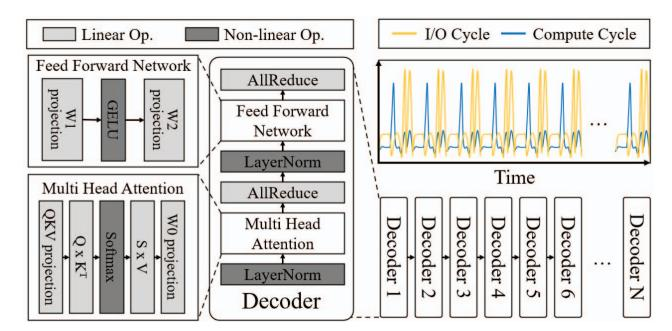

Fig. 1. Execution flow of a transformer decoder on a mobile SoC, where high-OI operations and low-OI operations alternate, resulting in bursty memory traffic and off-chip DRAM bottlenecks.

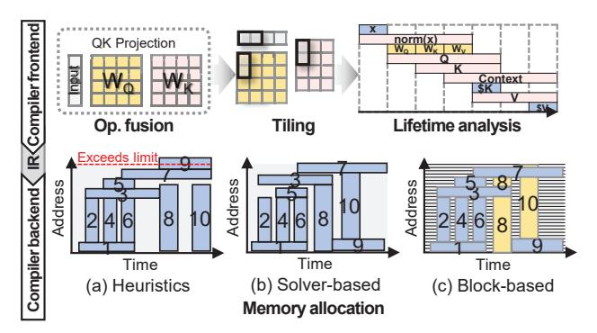

Fig. 2. Deep Learning compilation process.

model leverages key-value (KV) caching to reduce the input from a  $d \times l$  matrix to a  $d \times 1$  vector. Consequently, the attention matrix shrinks from  $l \times l$  to  $l \times 1$ , shifting the workload to repeated GEneral Matrix-Vector multiplications (GEMV). Throughout this generation phase, execution continuously alternates between linear operations (e.g., QKV and W0 projections) and non-linear operations (e.g., softmax and activations). Linear operations require moving massive  $d \times d$ weight matrices for relatively few computations, resulting in low Operational Intensity (Low-OI) that makes them extremely I/O-bound. In contrast, non-linear operations primarily rely on vector arithmetic throughput, leaving memory bandwidth severely underutilized. As the sequence length l grows, this iterative GEMV pattern drastically escalates memory traffic, creating a severe bandwidth bottleneck under the stringent hardware constraints of mobile System-on-Chip (SoC) environments. This bursty traffic pattern is clearly observed in our simulation of a Qualcomm Hexagon V73 processor equipped with an 8 MB mobile NPU and LPDDR5 memory (detailed in § VI). As shown in Fig. 1, the execution alternates sharply between compute and I/O phases, incurring significant stall cycles during Low-OI phases due to frequent offchip DRAM accesses. Consequently, this chronic imbalance between compute- and I/O-bound operations heavily degrades resource utilization, underscoring the critical need for efficient on-chip memory management to enable low-latency LLM inference on edge devices.

#### B. Compiler-Driven On-Chip Memory Management for LLM

Transformer-based models demand large on-device memory, making LLM inference fundamentally memory-bound. Modern accelerators therefore rely on hierarchical memory systems combining fast but capacity-limited on-chip SRAM with large off-chip DRAM. SRAM is typically managed either as a hardware cache or as a software scratchpad [29], [30]. Hardwaremanaged caches rely on spatial and temporal locality, but transformer workloads exhibit irregular, low-reuse access patterns. Projection weights are large, infrequently reused across decoding steps, and accessed in compiler-defined tiles that vary by layer, while KV-cache accesses grow with sequence length. As a result, cache lines show minimal temporal locality and only limited spatial reuse within each tile, leading to poor cache efficiency under tight on-chip capacity. Furthermore, unlike SPM-based designs, caches lack compiler visibility into future dataflow and buffer lifetimes, preventing proactive data preparation during bandwidth-intensive phases. In contrast, SPM exposes explicit address spaces to software or compilers, enabling deterministic control over data placement and reuse. While this adds software complexity and runtime overhead, it achieves higher utilization when paired with compilerguided optimizations that exploit static model structure and dataflow [31]-[33]. As a result, SPM-based architectures are widely adopted in deep learning accelerators, where compilermanaged data orchestration alleviates on-chip capacity limits. Fig. 2 summarizes the deep learning compilation workflow. The compiler first lowers the model into primitive operations and applies frontend optimizations (e.g., fusion, tiling, lifetime analysis), and then constructs an intermediate representation (IR) that captures operation and tensor metadata. Backend stages leverage this IR for hardware-aware optimizations such as memory allocation and scheduling [22]. In the backend, memory allocation is critical for mapping tensors onto limited on-chip buffers [34], [35], ensuring correct execution while maximizing data reuse and reducing transfers.

Conventional backend allocators typically adopt either heuristic or solver-based strategies. Heuristic allocators, as employed in TFLite [36], XLA [24], and TVM [25], offer fast compilation but operate at coarse granularity: memory is allocated and reused at the tensor or tile level, where tiles often span tens to hundreds of kilobytes. In LLMs, however, tile shapes vary significantly across layers (e.g., projections, feed-forward blocks, and attention heads), and these mismatches frequently produce jagged gaps in the SPM, leading to substantial internal fragmentation. Furthermore, operator fusion, while improving compute locality, lengthens the lifetimes of intermediate tensors, reducing opportunities to reclaim space between operations and amplifying fragmentation effects. Solver-based methods such as ILP or constraintbased formulations [37], [38] can achieve higher utilization, but they still inherit the same tile-granularity limitations and incur significant compile-time overhead. Ultimately, existing compiler-driven SPM schemes are fundamentally static and coarse-grained: they allocate and reclaim memory at the tensor

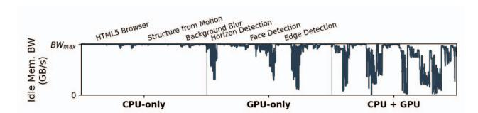

Fig. 3. Idle memory bandwidth of NPU under concurrent CPU and GPU workloads.

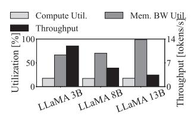

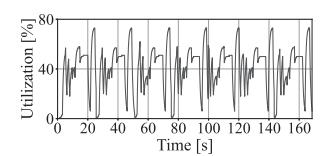

- (a) Compute and memory bandwidth utilization, showing higher bandwidth demand with larger models.
- (b) Memory bandwidth utilization over time during decoding layer inference.

Fig. 4. Compute and memory bandwidth utilization of LLaMA-3 on Constrained-SoC.

or tile level, lack visibility into fine-grained runtime progress, and cannot respond quickly to the short slack windows created by bursty LLM execution. This gap between coarse-grained, static allocation and fine-grained, time-sensitive bandwidth behavior motivates a new approach to on-chip memory management that can virtualize SPM capacity at smaller units and coordinate allocation and reclamation with runtime execution.

## III. MOTIVATION

In contrast to high-performance server- or desktop-class platforms, mobile SoCs operate under much tighter memory and power constraints. They provide only a fraction of the offchip DRAM bandwidth and on-chip buffer capacity, making it significantly harder to sustain throughput for LLM inference. Furthermore, on-device inference typically operates with a batch size of one, resulting in inherently low compute unit utilization, making them particularly vulnerable to memory stalls. This imbalance is exacerbated during decoder-side inference, where memory-intensive operations, such as loading projection weights and key-value (KV) cache, create bursty access patterns. We first profiled a commercial SoC and identified a memory bandwidth bottleneck during LLM inference. To further investigate the root cause of the observed bandwidth underutilization, we conducted a series of simulator-based experiments.

## *A. Inefficiency of Static Compilers under Dynamic Runtime Conditions*

The dynamic nature of mobile environments and the computational characteristics of LLMs pose significant challenges to static compiler-driven optimizations. In mobile SoCs, hardware resources are not dedicated to a single application but are shared among multiple concurrently running workloads, resulting in highly variable resource availability. This environmental variability, combined with the fluctuating demands

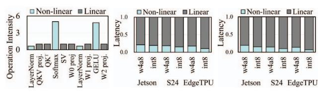

(a) Operation intensity of GPT-3 at batch size 1. (b) Latency breakdown of TinyLLaMA. (c) Latency breakdown of GPT-3.

Fig. 5. Operation intensity and end-to-end latency breakdown on mobile platforms.

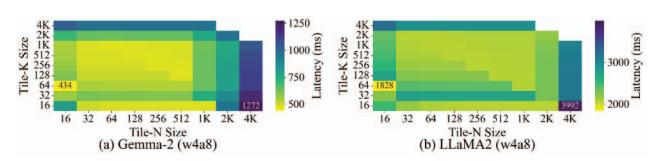

Fig. 6. Latency variation of Gemma-2 and LLaMA2 according to each tile size when tiling each weight with N × K sized tiles by static compiler simulated by simulator.

of LLM inference, fundamentally limits the effectiveness of offline static optimization strategies.

System-Induced Bandwidth Variability. Mobile SoCs adopt a unified memory architecture in which the CPU, GPU, and NPU share a common, bandwidth-constrained system memory. Under multi-programmed execution, the effective memory bandwidth available to each processing unit fluctuates dynamically due to contention from concurrently running workloads. Fig. 3 illustrates this variability by characterizing the idle memory bandwidth observed by the NPU on a commercial mobile platform (Samsung Galaxy S25+ with Snapdragon 8 Elite SoC). The results show that the NPU's available idle bandwidth varies substantially depending on the presence and type of concurrent CPU and GPU activities. To emulate realistic mobile usage scenarios, we employed Geekbench 6 [39] and measured the NPU's idle memory bandwidth while executing two representative CPU workloads and four representative GPU workloads, thereby capturing the inherent variability of memory bandwidth in practical multiapplication environments. This variability makes it difficult for static compiler schedules to consistently select tile sizes that match the available runtime bandwidth.

Workload-Induced Bandwidth Variability. The unpredictability extends beyond idle periods to active memory bandwidth usage during LLM inference. We conducted experiments across three platforms—the Samsung Galaxy S24 Ultra, Google Edge TPU, and NVIDIA Jetson AGX Orin—to investigate off-chip memory traffic patterns of LLMs. Due to limited hardware visibility on commercial mobile devices, we directly profiled compute and memory bandwidth only on the Jetson AGX Orin, which features an 8-core Cortex-A78AE CPU, a 2048-core Ampere GPU, and 64 GB LPDDR5. To approximate the performance characteristics of mobile SoCs, we configured a specific environment, herein referred to as the Constrained-SoC. In the Constrained-SoC, we limited the hardware resources by constraining the memory controller (EMC) frequency to 512 MHz, corresponding to a peak bandwidth of approximately 32 GB/s, and the GPU frequency to 714 MHz, yielding an FP16 throughput of roughly 5.5 TFLOPS.

Fig. 4a shows compute and memory-bandwidth utilization for LLaMA-3 inference during the decoding phase across three different model sizes. While compute utilization remains nearly constant, throughput degrades as model size increases, indicating that memory bandwidth becomes the primary performance bottleneck. Fig. 4b provides a more detailed analysis of memory bandwidth utilization over time within a single transformer decoder layer on the LLaMA 8B. Profiling results indicate that memory bandwidth usage fluctuates significantly. Operation Intensity (OI), defined as the ratio of computation to memory traffic, helps explain the bandwidth fluctuation [40]. Linear operations have low-OI and saturate memory bandwidth, while non-linear operations (e.g., Softmax and GELU) have high-OI and leave the memory system underutilized. Figures 5b and 5c present the runtime breakdown of models compiled with QNN [41], edgetpu\_compiler [42], and NVCC [43], executed on mobile-class devices including the S24, EdgeTPU, and Jetson, respectively, at the LLM decoding layer. The proportion of end-to-end execution time attributed to high-OI non-linear operations is consistent across the three platforms. This consistency validates that the constrained Jetson configuration accurately reflects the compute-memory behavior of mobile-class devices. Furthermore, the results demonstrate that OI characteristics evolve dynamically during inference, and that high-OI operations constitute a substantial fraction of the overall latency, thereby motivating their preloading.

The variability in sequence lengths and available memory bandwidth makes it difficult for static compiler-driven optimization to consistently select tile sizes that match runtime conditions. First, the input and output token lengths vary significantly across user requests. Second, as illustrated in Fig. 6, even within the range of feasible tile sizes bounded by on-chip memory capacity, model inference latency varies significantly depending on the tile size determined by the static compiler, increasing by up to 2.9×. Achieving optimal performance therefore requires dynamically adjusting the tile size to match the varying sequence lengths and fluctuating available memory bandwidth at runtime. However, attempting to statically optimize or recompile the execution graph for every possible sequence length and hardware condition is prohibitively expensive. Recent studies highlight that optimizing an execution graph for a single varying prompt size can take up to 11.5 seconds on mobile edge processors [44]. Consequently, offline compiler-level optimizations cannot effectively scale to cover all dynamic sequence lengths and bandwidth fluctuations encountered at runtime.

## B. Limitations of Compiler-Managed On-Chip Memory in LLM Inference

To further investigate the underlying causes of the observed bandwidth underutilization, we performed simulation-based analyses that emulate the behavior of compiler-managed SPM. Specifically, we (1) analyzed the lifetime of tiles created by

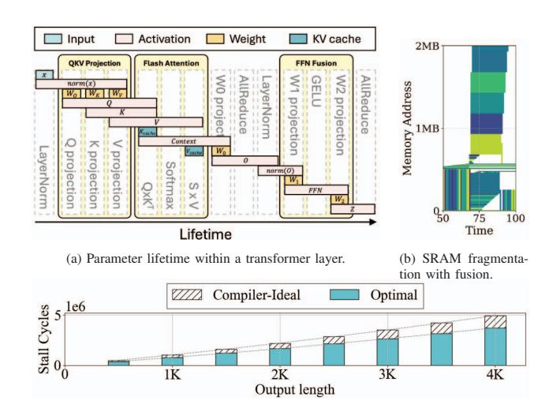

(c) Compute stall cycles during LLM inference.Fig. 7. Limitations of compiler-managed on-chip memory.

fused operations to understand how they occupy and fragment on-chip memory during inference, and (2) evaluated how well the compiler's static preloading strategy can reduce compute stalls caused by memory-bandwidth saturation. The detailed methodology and implementation are presented in § VI.

**Memory fragmentation.** Modern deep learning compilers typically assign each tensor to a contiguous region of onchip SRAM. As layer complexity increases, the uneven lifetimes of large intermediate tensors naturally lead to memory fragmentation. This problem is further exacerbated by the widespread use of operator fusion. To reduce runtime overhead and improve memory locality, compilers often employ fusion techniques that combine multiple operations into a single kernel. Common examples include QKV projection fusion, FlashAttention (which fuses  $Q \times K^T$ , Softmax, and  $S \times V$ ), and FFN fusion (which merges W1 projection, GELU, and W2 projection) [23], [33].

Fig. 7a shows the lifetimes of each operation based on data reuse in a simulator that mimics the compiler's application of three representative optimizations: QKV projection, Flash attention, and FFN Fusion. For instance, QKV projection fusion forces the Q, K, and V activations to be computed and held simultaneously within the same kernel, preventing their early deallocation. Fig. 7b is a portion of the memory footprint used in the address space over time when all three fusions are applied on 2 MB SRAM. This makes it difficult to reuse fragmented memory address space when allocating new memory. While such fusion improves data reuse and reduces kernel launch overhead, it leads to overlapping memory lifetimes between inputs and outputs. These interdependencies prevent early memory reclamation, leaving behind fragmented and unusable portions of SRAM. Even advanced heuristic allocators such as the best-fit strategy cannot fully mitigate this effect, resulting in suboptimal SRAM utilization and, in some cases, off-chip memory spills. Crucially, this fragmentation is

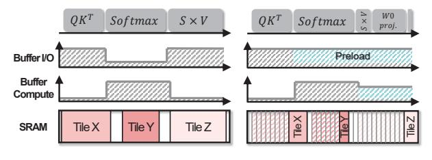

- (a) Tile-size granularity scratchpad memory management.
- (b) Fine-grained memory management with early reclamation.

Fig. 8. I/O burst mitigation with on-chip memory management.

not merely an artifact of heuristic allocation: it arises from the requirement that tiles must be mapped contiguously and at fixed tile granularity, which prevents the compiler from packing smaller live regions into these gaps.

Preloading limitations. Fig. 7c illustrates the number of compute stall cycles in the decoding layers relative to the token generation length, comparing a practical implementation against a theoretical limit. The first strategy, Compiler-Ideal, emulates realistic XLA behavior based on whole-graph liveness analysis. While it minimizes peak memory usage, it adheres to the strict constraint of contiguous memory allocation, forcing data to be loaded into the SPM as continuous chunks. In contrast, the second strategy, Optimal, represents the theoretical upper bound by relaxing this contiguity constraint. It assumes that data can be preloaded at byte-level granularity, effectively utilizing the entire SRAM capacity without fragmentation overhead. The compute stall gap between Compiler-Ideal and Optimal (hatched) gradually increases with generation length, reaching a peak of 32.7% at 4K. The gap mainly stems from coarse-grained memory management and preloading constraints in static SPM systems, and reflects a fundamental architectural limitation rather than a flaw in any specific compiler.

This gap arises from the insufficiency of conditions that allow static compilers to issue preloading requests. In current compiler-driven SPM systems, preloading is only triggered when the following conditions are simultaneously satisfied: (1) memory bandwidth is currently available, (2) there is sufficient time to fetch an entire contiguous memory tile, and (3) a sufficiently large contiguous region of free on-chip memory exists to accommodate the data. The requirement for memory contiguity, when combined with memory fragmentation, significantly restricts the compiler's ability to proactively preload upcoming data. Consequently, available memory bandwidth is often left underutilized, increasing the probability of compute stalls due to delayed data availability. The increased compute stall cycles in Compiler-Ideal, as compared to Optimal, quantitatively demonstrate the inefficiency introduced by contiguity constraints in current preloading strategies.

## IV. OVERVIEW OF SMOOTH

We propose SMOOTH, SMOothing I/O Traffic with Hardware support, a hardware-assisted on-chip memory management framework designed to maximize memory bandwidth utilization for on-device LLM inference. Existing scratchpadbased architectures often rely on coarse-grained tile allocation, which necessitates contiguous physical space and defers memory reuse until full computation completion. This rigidity leads to fragmentation and prevents the exploitation of memory bandwidth headroom during compute-intensive cycles. To address these limitations, SMOOTH introduces a fine-grained block-based memory system that decouples logical tensor organization from physical SRAM layout, enabling aggressive preloading and sustained throughput.

SMOOTH is built upon a hardware-based Dynamic Memory Controller (DMC) that governs memory operations through three key design principles: First, fine-grained block allocation. Instead of variable-sized tiles, memory is managed in fixedsize blocks aligned with the hardware processing unit. This approach eliminates external fragmentation and memory holes common in variable-size allocation, simplifying the hardware logic for free-space tracking. Second, low-overhead address translation. The DMC employs a direct-mapped block table and a bitmap-based free list to translate compiler-visible logical addresses to physical SRAM addresses. To minimize latency, the translation mechanism includes an *address check* module that allows direct access for sequentially mapped regions, bypassing table lookups when spatial locality is preserved. Third, hardware-driven early reclamation. Unlike conventional designs that wait for explicit software release signals, SMOOTH autonomously tracks tile usage via a hardwaremanaged use\_cnt, enabling the immediate reclamation of memory blocks as soon as their data is consumed.

SMOOTH shifts the burden of complex memory scheduling from the compiler to the runtime hardware. The compiler performs static lifetime analysis to annotate usage counts, while the DMC handles dynamic allocation and release. This co-design allows SMOOTH to significantly relax allocation constraints by utilizing non-contiguous physical memory for logically adjacent tensors. Consequently, available bandwidth during compute-bound phases is effectively utilized to preload upcoming data (e.g., weights for subsequent layers) much earlier than possible in conventional pipelined schemes. As illustrated in Fig. 8, SMOOTH 's fine-grained management with early reclamation actively uses this idle time for preloading, maximizing compute-I/O overlap and mitigating bandwidth bottlenecks in memory-constrained SoCs. Block-based memory allocation significantly improves preloading efficiency during the attention phase by addressing the granularity limitations of existing approaches. As shown in Fig. 9, we compare four on-chip memory data management and future data preloading strategies for both non-fragmented and fragmented cases: (a) a hardware-managed cache, where hardware prefetches data at the finest granularity; (b) best-effort preloading driven by compile-time static analysis to achieve a minimal on-chip memory footprint as widely adopted in modern deep learning compilers; (c) hardware-driven blockbased memory allocation with compiler-driven preloading; and (d) block-based memory allocation with aggressive preloading by rapidly reclaiming used blocks. First, in contiguous

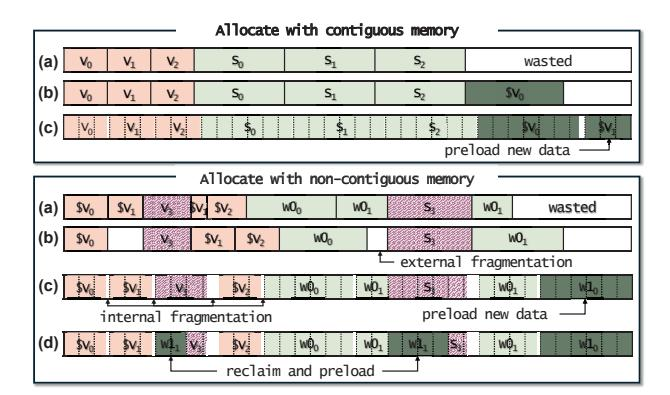

Fig. 9. On-chip memory management strategies for contiguous and non-contiguous memory cases.

memory, the hardware-managed prefetchers (a) operate blindly within the current tensor scope, failing to look ahead for the V cache (denoted as V). In contrast, (b–c) rely on compiler-guided lifetime analysis to determine memory allocation. The aggressive preloading strategy (b) seeks to maximize on-chip memory utilization by allocating tiles as early and compactly as possible. However, its effectiveness is fundamentally constrained by coarse-grained tile boundaries: if a tile does not fit within the remaining contiguous region, the preload cannot proceed. Block-based allocation (c) removes this limitation by separating logical tiles from the physical layout, although it introduces internal fragmentation. This effectively improves SRAM utilization, as parts of tiles, such as the V –  $cache_1$  block, can be preloaded as soon as a small amount of free space becomes available.

This advantage is even more critical in fragmented scenarios. As the  $S \times V$  computation progresses, some of the already used V projection and attention outputs are deallocated to allow for preloading of future tiles. When deallocation causes memory fragmentation, the hardware cache (a) can utilize fragmented space through fine-grained cache-line allocation, but it lacks knowledge of future tile accesses and therefore cannot proactively preload data for the next operation. The standard compiler (b) fails to utilize the fragmented space effectively and preloads the large contiguous weight tensors  $W0_0$  and  $W0_1$ , resulting in external fragmentation. However, block-based allocation (c) effectively identifies these distributed available blocks and preloads them with additional weights  $(W1_0)$  to maintain high on-chip utilization regardless of physical fragmentation. In (d), block-based allocation with early block reclamation preemptively reclaims blocks of  $V_3$ and  $S_3$  that have already been consumed. The freed blocks are then used to preload the next tile  $(W1_1)$ .

## V. SMOOTH ARCHITECTURE

#### A. Block-based on-chip memory management

For simplicity, SMOOTH manages on-chip memory using fixed-size blocks, similar to paging in virtual memory systems. Unlike OS paging, however, the virtual address space is not

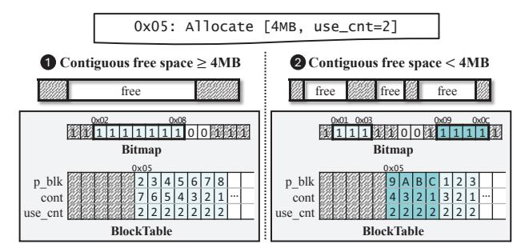

Fig. 10. Block-based on-chip memory allocation.

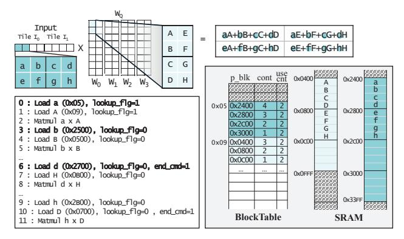

Fig. 11. Memory access requested from the buffer during the Q projection.

much larger than the physical SRAM. Whereas traditional virtual memory abstracts a spacious per-process address space, SMOOTH exposes a block-virtualized allocation interface that assists the DL compiler in orchestrating SPM allocations. Although relaxing physical-contiguity requirements reduces fragmentation, all live data must still fit within the physical SRAM; exceeding this limit forces costly off-chip accesses. Thus, the compiler-visible virtual space is effectively bounded by the SRAM capacity, enabling a highly efficient directmapped translation table. Fig. 12a shows the required microarchitecture. Each block-table entry stores the physical block address (p\_blk), the number of contiguous blocks allocated (cont), and the compiler-derived remaining usage count (use\_cnt), while a bitmap tracks the allocation status of all physical blocks for fast free-space searches and reclamation. The address\_check module in buffer determines whether an access requires translation. Four lightweight modules in DMC enable low-overhead translation and efficient block management: find\_zero identifies the longest free region, alloc prefetches and assigns blocks, free reclaims expired blocks, and block\_table\_lookup resolves mappings.

Fig. 10 denotes a memory allocation scenario for a 4MB request at virtual address 0x05 with a *use\_cnt* of 2. The allocation strategy depends on the availability of contiguous free blocks in SRAM, as tracked by the allocation bitmap. In case ①, where a contiguous free region of at least 4MB is available, the allocator identifies a free span covering physical blocks 0x02 through 0x08. The bitmap is updated to reflect

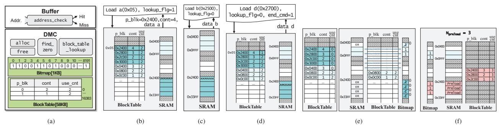

Fig. 12. (a) Design component of SMOOTH. (b) Access with address translation. (c) Direct access without block table lookup. (d) Access with end\_cmd for early reclamation. (e) Reclaim blocks that ensure data integrity. (f) Preload data into reclaimed blocks using idle bandwidth.

this allocation, and the direct-mapped block table records the mapping between the virtual address and the allocated physical blocks. For each virtual block corresponding to virt=0x05, the  $p\_blk$  field stores the assigned physical block address, the cont field stores the number of remaining contiguous blocks, and the use\_cnt field is set to 2 for all entries. In case (2), if fragmentation prevents finding a contiguous region large enough for the request, the DMC allocates multiple disjoint physical block regions. The DMC first obtains the starting block address and size of the longest contiguous region through the *find zero* module and allocates blocks sequentially from the starting address. If the requested allocation exceeds the size of this region, the allocator repeats the search to find the next longest contiguous region (allocating 0x09–0x0C, then 0x01-0x03). The bitmap is updated accordingly, and the block table records the allocated block indices in the  $p\_blk$ entries. The cont field records the continuity length within each allocated segment, while the use\_cnt field remains the same as in the contiguous allocation case.

#### B. Fast and Efficient Address Translation

To enhance the efficiency of on-chip memory management for LLM inference, we propose a fast and lightweight address translation mechanism that exploits spatial locality to minimize lookup overhead. This mechanism builds upon the previously introduced block-based memory management scheme and employs a direct-mapped block table for rapid translation between virtual addresses generated by the compiler and physical SRAM addresses. The key idea is to reduce translation lookups by leveraging the contiguous allocation patterns common in deep learning workloads, especially during operations such as matrix multiplications in Q/K/V projections. Fig. 8 illustrates the memory access scenarios requested from the buffer during the multiplication operation between the input vector and the weight Q matrix.

Accessing data a and A without physical addresses requires a block table lookup. However, after address translation, data accesses within consecutive addresses can be accessed directly using the physical address. As shown in Fig. 12b, when data a is requested from the buffer with lookup flag 1, the DMC performs address translation through the block table

and transfers the data to the buffer along with the corresponding physical address and the number of consecutive blocks  $(p\_blk=0x2400, cont=4)$ . Once the translation is completed, the buffer caches the contiguous range information (p\_blk, cont) for subsequent accesses, allowing data to be accessed directly by physical address within that contiguous memory without additional block table lookups. To manage these direct accesses effectively, the buffer logic dynamically monitors the address bit fields corresponding to the block boundaries defined by the architectural block size (e.g., tracking the 10th address bit for a 1 KB block size). During the execution of ISA operations, the buffer uses this bit-level information to detect when the block index changes, indicating that the access has moved to a new block. Data b in Fig. 12c resides in the previously received contiguous space, so it can be accessed directly at the physical address (0x2500), thereby reducing access latency. However, if a block boundary is crossed and the cached cont information indicates that the next block is not physically contiguous, the buffer re-asserts the lookup flag to initiate a new address translation request. In addition, the buffer logic is aware of the memory access patterns and input sizes of the executing ISA operations, enabling it to determine when all accesses to a buffer have been completed.

By tracking the progression of ISA execution, the buffer identifies when the final access to a block occurs. When issuing the memory load request for this final access, the buffer asserts the <code>end\_cmd</code> flag. In Fig. 12d, for example, the buffer sets <code>end\_cmd=1</code> when requesting the final data element d of block 0x2400-0x27FF, indicating that the block will no longer be used for the current operation. The DMC then decrements the associated <code>use\_cnt</code> entry in the block table, allowing the block to be reclaimed early and reused for subsequent allocations.

## C. Data pre-load

To mitigate burst memory traffic during LLM inference, SMOOTH performs a hardware-assisted reclaim-and-preload mechanism to reclaim memory from unused data and preload data into freed space before it is requested. During idle cycles when there are no pending memory requests, the DMC internally and periodically identifies allocated blocks

whose *use cnt* has reached zero (Fig. 12e). As illustrated in Fig. 12f, early reclamation follows a strict ordering to ensure safe reuse of reclaimed regions. The DMC first updates the block table state to mark the corresponding blocks as no longer in use, and then clears the associated bitmap entries. Because allocation decisions rely on the bitmap to identify free space, this ordering prevents new allocations from overwriting data before the reclamation process is fully completed. After reclaiming memory, the DMC immediately begins preloading to take advantage of otherwise idle memory bandwidth. When idle bandwidth cycles are detected, the DMC preloads data sequentially. During each preload opportunity, the number of blocks to load is determined by (1):

$$N_{\text{preload}} = \lfloor (U \times BW) / Block\_size \rfloor$$
 (1)

where Npreload is the number of blocks to preload, U represents the available idle compute cycles, BW is the available memory bandwidth, which is dynamically measured by the hardware during execution. As blocks are allocated for preloading, the corresponding entries in the bitmap and block table are updated to reflect their new status.

Preloading continues until the idle budget is exhausted or no free region remains. The DMC preloads the subsequent data blocks from main memory into SRAM at a fine-grained block level, storing the index of the last retrieved block in a register. When accessing data from the buffer, the DMC consults this register to determine whether the corresponding data has been fully loaded into on-chip memory. If the loading is complete, the data are directly read from SRAM; otherwise, it is fetched from main memory, ensuring seamless continuation of data transfers. By combining early reclamation with bandwidth-aware preloading, SMOOTH achieves fine-grained, proactive SRAM management, reducing burstiness, masking fragmentation penalties, and sustaining high-throughput data flow under limited off-chip bandwidth.

## *D. Overheads*

To evaluate the area, timing, and power overhead of the proposed hardware modules, we synthesized the five key functions using the open-source synthesis tool Yosys [45]. Given that the Snapdragon 8 Gen3 is manufactured in TSMC's 4 nm process [46], we used the publicly available ASAP7 7 nm standard cell library [47], which is, to the best of our knowledge, the most accurate open-source technology node available. Since the exact NPU die area is undisclosed, we conservatively assumed it to occupy 10% of the overall SoC area and used this estimate as the baseline for computing relative area overheads. Synthesis was performed under the hardware configuration in Table III, targeting a mobile-class NPU and the GPT-Neo-Quant described in Table IV. Table I reports the area estimates at a 1 KB block size, with additional block-size results provided in §VI. The NPU and SRAM rows correspond to assumed baseline components, while the compute and memory (SRAM) entries show the synthesized overhead from our modules. The compute logic adds only 0.0023% and the memory control logic 0.095% relative to the estimated

TABLE I AREA OVERHEAD OF PROPOSED MODULES.

|            | NPU        | SRAM      | Compute | Memory (SRAM) |
|------------|------------|-----------|---------|---------------|
| Area (μm2) | 13,730,000 | 1,811,939 | 314     | 13,050        |
| Ratio (%)  | –          | 13.2      | 0.0023  | 0.095         |

TABLE II LATENCY AND POWER CONSUMPTION OF EACH HARDWARE MODULE.

| Metric     | find_zero | alloc    | addr_check | bt_lookup | free     |
|------------|-----------|----------|------------|-----------|----------|
| Time (ps)  | 364.4     | 1508.2   | 83.7       | 615.2     | 654.6    |
| Power (pW) | 1.4×10−1  | 5.5×10−1 | 3.0×10−2   | 2.3×10−1  | 2.8×10−1 |

NPU area, confirming that the overall hardware footprint is negligible. Table II summarizes the latency (in picoseconds) and power consumption (in picowatts) for each hardware module. The timing overhead introduced by SMOOTH is minimal relative to the observed latency reduction, while its power consumption remains in the sub-nanowatt range, signifying negligible impact on overall system efficiency. Specifically, under the hardware configuration described in Table IV, the control overhead remains below 0.1% of the total latency in all experiments conducted with an input length of 1024 and an output length of 2048. This overhead is incorporated into the evaluation results presented in § VI to ensure accurate measurement of end-to-end execution time.

## VI. EVALUATION

#### *A. Experimental Setup*

We evaluate SMOOTH using LLMCompass [27], a cycleaccurate simulator for transformer-based LLM inference. LLMCompass is built on top of ScaleSim [28] and simulates the generation phases of transformer models. We integrated an end-to-end SRAM manager into the simulator to support address-based allocation and enable data preloading across the entire execution. All experiments are conducted under a hardware configuration that reflects mobile NPU architectures, which feature tight SRAM constraints, low memory bandwidth, and fixed-function compute engines such as matrix and vector units. Detailed system configuration is in Table III, which was configured considering a Qualcomm Hexagon V73 processor (HMX, HVX [48]) and mobile DDR memory (LPDDR5) [49]–[51].

In the experiments described in § III, non-linear operations account for 20.4%, 17.0%, and 14.1% of total execution time for TinyLLaMA on Jetson AGX Orin, Galaxy S24 Ultra, and Edge TPU, respectively, and 17.1%, 12.5%, and 10.3% for GPT-2.7B (Fig. 5b). In contrast, the simulator reports smaller ratios of 9.4% and 5.7% for TinyLLaMA and GPT-2.7B (Fig. 13). These results indicate that our simulation environment provides a conservative estimate of the execution time spent in non-linear operations.

Baseline. We compare five on-chip memory management strategies. Compiler-Ideal: An idealized compiler-based

TABLE III SIMULATION ENVIRONMENT FOR MOBILE NPU.

| Parameter                         | Mobile NPU              |  |  |
|-----------------------------------|-------------------------|--|--|
| Core frequency                    | 940 MHz                 |  |  |
| Number of cores                   | 1                       |  |  |
| Matrix Engine (ME)                | 32×32                   |  |  |
| Vector Engine (VE) (32 ALUs/lane) | 32 lanes                |  |  |
| SRAM size                         | 2 / 8 / 32 MB           |  |  |
| DRAM bandwidth                    | 16 / 32 / 64 / 128 GB/s |  |  |

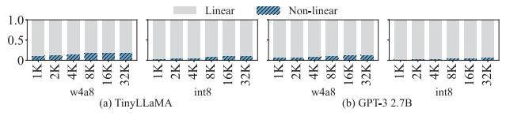

Fig. 13. Breakdown of end-to-end latency spent on linear and non-linear operations on Compiler-Ideal (baseline).

strategy that assumes maximal memory preloading and bestfit memory allocation, which leverage lifetime analysis and reuse of non-overlapping memory buffers to improve memory efficiency [22], [25], [52]. Furthermore, for each layer and operation, it evaluates tile sizes from 512 B to 4 MB through simulation and selects the configuration that yields the minimum latency. Capuchin [53]: A hardware-managed strategy that treats on-chip memory as a 64-byte cache, dynamically prefetching tensors at cache-line granularity based on runtime access patterns to improve data locality and reduce stalls. Gemmini [54]: A full-stack DNN acceleration framework. It adopts a pipelined on-chip memory allocation strategy by overlapping input/output tiles, enabling fine-grained byte-level preloading. SMOOTH-Base: A block-granularity memory allocator that reduces fragmentation within SPM and improves memory bandwidth utilization by enabling compact data placement. SMOOTH-ER: SMOOTH-Base with an additional early reclamation of unused memory blocks. The reclamation mechanism increases memory reuse and allows timely preloading of future data, thereby supporting a continuous and efficient dataflow.

## *B. Models*

To reflect real-world mobile deployment scenarios, we select transformer-based LLMs that are suitable for execution on resource-constrained mobile NPUs. Given the growing demand for LLM inference with a large number of parameters on mobile NPUs, we also evaluate large models, such as GPT-3 13B. The selected models vary in architectural scale and quantization format, enabling comprehensive evaluation across a spectrum of compute and memory demands. Table IV summarizes their configurations. All models employ the three operation fusions described in § III (Fig. 7a), which are commonly adopted in modern deep learning compilers. In alignment with mobile use cases such as on-device assistants and chat applications, we use a batch size of 1 throughout all experiments, as in [50], [55].

TABLE IV MODEL CONFIGURATION DETAILS.

| Model           | #Params | #Layers | #Heads | dmodel | Quant.    |
|-----------------|---------|---------|--------|--------|-----------|
| TinyLLaMA [56]  | 1.1B    | 22      | 32     | 2048   | w4a8/int8 |
| GPT-Neo [57]    | 1.3B    | 24      | 16     | 2048   | w4a8/int8 |
| GPT-3 XL [58]   | 1.3B    | 24      | 24     | 2048   | w4a8/int8 |
| Gemma-2 [59]    | 2.0B    | 18      | 8      | 2048   | w4a8/int8 |
| GPT-3 2.7B [58] | 2.7B    | 32      | 32     | 2560   | w4a8/int8 |
| LLaMA2 [60]     | 7.0B    | 32      | 32     | 4096   | w4a8/int8 |
| Bloom [61]      | 7.1B    | 30      | 32     | 4096   | w4a8/int8 |
| GPT-3 13B [58]  | 13.0B   | 40      | 40     | 5140   | w4a8/int8 |

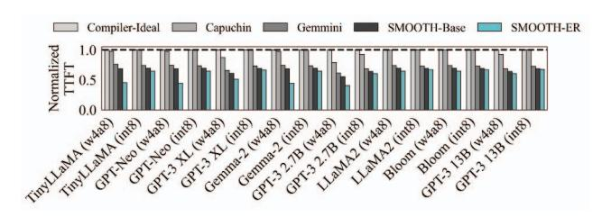

Fig. 14. TTFT normalized to Compiler-Ideal.

## *C. Results*

TTFT. Fig. 14 shows the normalized first-token response time (TTFT) for five allocation strategies, normalized by Compiler-Ideal, at 8 MB SRAM. First-token inference does not require a KV cache, so 8 MB is sufficient. Therefore, increasing SRAM to 32 MB only reduces TTFT by at most 1.0%. Due to the high computational intensity of TTFT, performance is improved by simply pipelining the next tile, as in Gemmini, but Compiler-Ideal suffers due to insufficient preload time. However, SMOOTH-ER achieved an average TTFT reduction of 41.4% and up to 59.2% compared to the Compiler-Ideal, enabled by fine-grained blocklevel preloading. Capuchin showed a TTFT reduction for the GPT model, but similar to Compiler-Ideal for other models. This delay is due to the hardware cache not being able to prefetch the attention tiles increased by FlashAttention due to the increased SRAM size, as it lacks information about the tensor data lifetime provided by the compiler.

TTLT. Fig. 16a illustrates the scalability of end-to-end generation latency—referred to as Time-to-Last-Token (TTLT)—with an input length of 512 tokens and 8 MB of SRAM capacity. TTLT measures the latency from prompt input to the generation of the final token, serving as a comprehensive metric for evaluating user-perceived responsiveness. The accompanying bar plots depict the relative improvements achieved by the proposed SMOOTH-ER memory management scheme over two baselines: Compiler-Ideal and Gemmini. SMOOTH-ER shows an overall average performance improvement of 43.2% over Compiler-Ideal and 49.1% over Gemmini, achieving maximum performance improvements of 60.0% and 73.0%, respectively. Furthermore, SMOOTH-ER yields an average improvement of up to 24.0% over the baseline SMOOTH-Base. Additionally, the hatched areas in the bar plots represent the proportion of the performance gain contributed by the prompt phase. For short output lengths, the

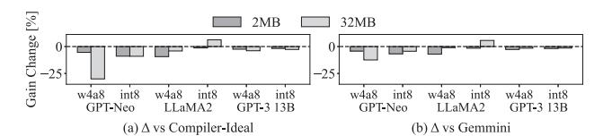

Fig. 15. SRAM size sensitivity of gain with respect to the 8 MB baseline, for 2 MB and 32 MB.

majority of the gain originates from the prompt phase. However, as the output token length increases, the generation phase accounts for most of the overall performance improvements. For short output lengths, the attention and non-linear operation times are short, leaving insufficient idle cycles for preloading. This results in a smaller improvement compared to Gemmini, which pipelines the next tile. However, as output token lengths increase, preloading more data significantly improves performance. Conversely, Compiler-Ideal also improves performance by preloading more data as output lengths increase, but this results in memory fragmentation due to contiguous SPM address allocation. SMOOTH-ER significantly improves latency compared to Compiler-Ideal at all output lengths by addressing memory fragmentation. Fig. 15 shows the sensitivity of improvement to SRAM size. When SRAM size is reduced to 2 MB or increased to 32 MB, the improvement tends to decrease. Gemmini, which preloads the next tile using pipelining, has little SRAM sensitivity. With small onchip memory, the physical memory capacity for preloading is limited. However, with large on-chip memory, latency improvements can be achieved through larger tile sizes and contiguous address allocation, further reducing the improvement. In particular, SMOOTH-ER's performance gain over Compiler-Ideal significantly decreases as the on-chip memory size increases. This is because, Compiler-Ideal suffers less memory fragmentation with sufficient on-chip memory, allowing it to preload a sufficient amount of data.

On-chip Memory Occupancy. Fig. 16b and Fig. 16c present the per-token generation latency for every N-th token and the average SRAM occupancy across all layers during token generation, comparing cases with and without operation fusion. Without fusion, as the output sequence length increases, the amount of data to be loaded into on-chip memory grows due to the KV cache. However, since each operation is executed sequentially without optimization, the memory bandwidth becomes saturated, and performance improvements are limited across all policies, including the baseline Compiler-Ideal. In contrast, operation fusion occasionally alleviates memory bandwidth saturation, enabling aggressive preloading, which significantly reduces inference latency. Specifically, Fig. 17 shows the SRAM occupancy at the end of the attention operation. For Capuchin, the end-to-end layer occupancy is comparable to other policies, but the occupancy drops sharply at the end of the attention phase. Without fusion, each operation is executed independently, preventing even a strong prefetcher from predicting subsequent operations and limiting performance. With fusion, however, multiple operations are combined into a single tensor-level execution unit, enabling more efficient prefetching and reducing latency. Fig. 18 shows the fraction of tiles that can be served from the buffer (hit tiles) when loading tiles for each operation in GPT-Neo and LLaMA2 as the output length increases. Although blocks are reclaimed quickly, large models such as LLaMA2 still require many tiles for each operation, while only a small portion of them can reside in on-chip memory at a time. As a result, even with high SRAM occupancy, the additional latency reduction from SMOOTH-ER over SMOOTH-Base remains limited. Moreover, SMOOTH leverages operation lifetime information computed by the compiler to preload data for future tensors that are otherwise difficult to predict at the hardware level, thereby achieving further latency reduction.

Memory Bandwidth Sensitivity. Fig. 19a evaluates the impact of SMOOTH-ER on inter-token latency (ITL) for GPT-Neo at various memory bandwidths (16, 32, 64, 128 GB/s) and under Geekbench co-run workload interference at a maximum bandwidth of 64 GB/s, showing the performance improvement of SMOOTH-ER over the baseline policies. Geekbench was tested with two CPU workloads and four GPU workloads as in § III. The results demonstrate that as memory bandwidth decreases, the system becomes increasingly memory-bound, leading to more substantial performance gains for SMOOTH-ER. Across the evaluated configurations, SMOOTH-ER achieves average latency reductions of 30.5% over Capuchin and 40.0% over Compiler-Ideal. Compared to SMOOTH-Base, SMOOTH-ER provides an average improvement of 11.1% (up to 47.0%). When memory bandwidth is sufficiently large, memory capacity and transfer constraints are alleviated, leading to a smaller performance gap between SMOOTH-ER and SMOOTH-Base. In contrast, under bandwidth-constrained conditions, early reclamation provides larger performance benefits. Additionally, despite the dynamically changing idle bandwidth due to CPU/GPU workload interference, ITL achieves an average gain of 42.7% over Compiler-Ideal and 5.0% over SMOOTH-Base.

Input Sequence Length Sensitivity. Fig. 19b illustrates the normalized ITL with respect to the input sequence length, assuming a fixed output generation length of 1024 tokens. Recently, the demand for long-context inference has been rapidly increasing, even in mobile environments. As the input sequence length grows, the memory footprint of the KV cache increases proportionally, which severely degrades the generation phase latency. Under these memory-intensive conditions, the effectiveness of the proposed architecture becomes highly pronounced. SMOOTH-ER achieves up to 73.0% performance improvement over Gemmini and up to 26.4% additional improvement over SMOOTH-Base. A detailed breakdown by sequence length reveals a clear upward trend in the relative advantages of SMOOTH-ER. For instance, the average gain over Gemmini steadily scales from 50.1% at a 2K sequence length to 66.8% at 32K, confirming that SMOOTH-ER efficiently mitigates the escalating memory overhead associated with processing long input sequences.

Energy Consumption Analysis. Fig. 20 illustrates the energy

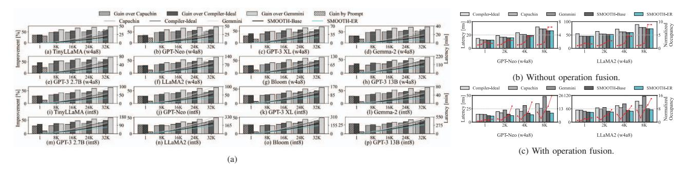

Fig. 16. (a) TTLT and the gain of SMOOTH-ER over Capuchin, Compiler-Ideal, and Gemmini, (b-c) Per-token generation latency and SRAM occupancy (b) w/o and (c) w/ fusion normalized to the case with output length 1 under Compiler-Ideal.

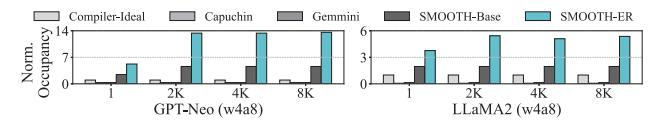

Fig. 17. SRAM occupancy at the end of attention normalized to Compiler-Ideal.

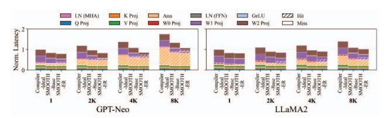

Fig. 18. Buffer memory occupancy ratio of hit tiles relative to miss tiles for each operation.

consumption for generating the Nth token according to block size, as the overhead of the proposed architecture varies depending on the block size for each output sequence length. As the generation length scales up, frequent memory accesses and inefficient cache utilization in baseline architectures lead to a significant surge in energy consumption. Under these heavily memory-bound conditions, the energy efficiency of the proposed architecture becomes highly pronounced. Overall, assuming the optimal block size for each sequence length, SMOOTH-ER achieves average energy reductions of 44.0%, 51.2%, and 39.9% against Compiler-Ideal, Gemmini, and Capuchin, respectively. A detailed breakdown by generation length reveals a clear upward trend in the relative energy savings of SMOOTH-ER. For instance, the energy reduction over Gemmini steadily scales from 28.1% at a 1K sequence length to a remarkable 70.7% at 32K. Similarly, savings against Compiler-Ideal grow from 30.7% to 56.7%. Furthermore, the experimental data confirms that the hardware module overhead introduced by SMOOTH-ER is exceptionally marginal—peaking at merely 15 nano-joules for a 32K sequence. SMOOTH-ER effectively mitigates the increased energy demands associated with long-context generation while incurring virtually no additional architectural overhead.

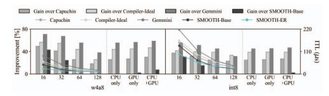

(a) Improvement of ITL depending on memory bandwidth of 16-128 GB/s and co-run workload interference at 64 GB/s.

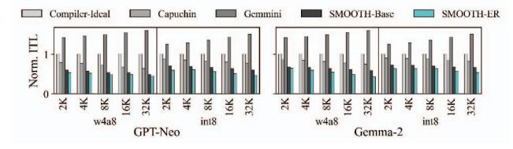

(b) Normalized ITL depending on input sequence length.

Fig. 19. Impact of dynamic runtime factors on inter-token latency.

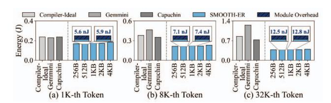

Fig. 20. Energy consumption for generating the N-th token under varying block sizes.

Block Size Sensitivity. Fig. 21a presents the end-to-end latency of three representative models—GPT-Neo, LLaMA2, and GPT-3 13B—under varying block sizes of SMOOTH-ER, evaluated at input length 1024 and output length 2048 with 8 MB SRAM capacity. Latency values are normalized to the baseline latency at a block size of 1024 bytes. The numerical annotations above each bar denote the relative control overhead incurred at each block size. Smaller block sizes reduce latency via fine-grained preloading and improving memory reuse; however, this increases the block table lookup overhead. While limited SRAM exacerbates latency due to fragmentation-induced *find zero* operations, SMOOTH's dedicated hardware design ensures negligible control overhead. The figure of overhead quantifies the latency reduction from

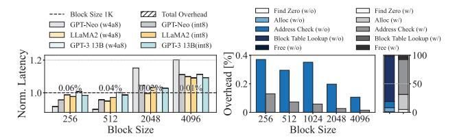

(a) Normalized end-to-end latency and relative control overhead across varying block sizes.

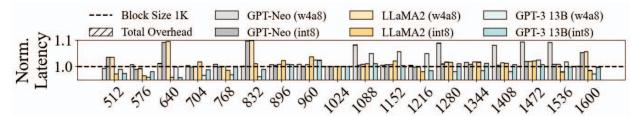

(b) Latency degradation caused by internal fragmentation when block sizes are unaligned.

Fig. 21. Block size sensitivity of SMOOTH-ER.

efficient address translation for contiguous regions. While smaller blocks typically increase *block table lookup* overhead, our *lookup flg* mechanism avoids redundant translations for consecutive addresses. Larger SRAM capacities also increase the likelihood of finding contiguous free regions, reducing *find zero* and *alloc* overhead. Compared to the baseline, contiguous address translation yields latency reductions of 0.2%. SMOOTH-Base and SMOOTH-ER typically set the block size as the model dimension. However, if the block size is not aligned with the tile size, internal fragmentation can increase latency by up to 9.9% (Fig. 21b).

## VII. RELATED WORK

Model-Level Memory Footprint Reduction. To address the massive memory requirements of LLMs, various modellevel techniques have been widely adopted, including weight/activation quantization [62], [63], pruning [64], and KV cache optimizations [65]–[68]. While these methods effectively reduce memory capacity requirements, they often entail complex trade-offs such as potential accuracy degradation or irregular compute patterns. Independent of these model modifications, SMOOTH focuses purely on microarchitectural efficiency without altering model representations. Therefore, SMOOTH introduces no accuracy degradation and can be applied orthogonally alongside existing compression techniques to enable further inference acceleration.

Static Memory Allocation. Software-based approaches (e.g., XLA [24], TVM [25], FlashAttention [33]) apply tiling and fusion to improve compute locality. However, these methods rely on static lifetime analysis. This rigidity prevents them from adapting to runtime variations such as fluctuating mobile memory bandwidth or varying LLM inference lengths, which often leads to severe on-chip fragmentation and fails to exploit transient bandwidth slacks during bursty LLM decoding phases. To mitigate the overhead of data movement, modern GPU architectures have introduced hardware-accelerated copy engines. For instance, NVIDIA's Tensor Memory Accelerator (TMA) [69] offloads asynchronous data transfers, handling address generation in hardware to reduce register pressure. However, while TMA serves as an efficient data movement engine, it does not provide memory virtualization capabilities; it strictly requires physically contiguous or strided address patterns. Consequently, it lacks the flexibility to utilize scattered memory fragments that inevitably arise during the execution phases of LLM inference. In contrast, SMOOTH employs block-level virtualization to decouple logical tensors from physical addresses, enabling the hardware to utilize noncontiguous free space that both static compilers and fixedfunction copy engines cannot exploit.

Dynamic Memory Virtualization. To overcome the rigidity of static allocations, hardware-assisted dynamic memory management has been actively explored. Foundational works such as SPMVisor [70] introduced hardware/software virtualization layers (vSPMs) to transparently allocate distributed on-chip memories, while HaVOC [71] extended this to hybrid SRAM/NVM architectures. More recently, adaptive cache architectures like Amoeba-Cache [72] have been proposed to reduce storage waste by dynamically adjusting cache block sizes based on spatial locality. However, such hardwareonly approaches are inherently reactive: they rely on past access patterns without knowledge of future data lifetimes. This limitation prevents them from performing the proactive memory reclamation and preloading required to handle the bursty I/O traffic of LLMs. In contrast, our work addresses on-chip SRAM underutilization by combining fine-grained block allocation with compiler-driven proactive management, enabling SMOOTH to reclaim memory and preload data in advance via static liveness analysis.

## VIII. CONCLUSION

We demonstrate a new method for solving the bursty offchip memory traffic that constrains transformer-based LLM inference on mobile SoCs. Our hardware-assisted, blockgranular SRAM management—powered by runtime dataliveness tracking and early reclamation—spreads load/store requests over time without modifying model parameters or compromising accuracy. Implemented in Verilog and integrated into LLMCompass, the proposed design reduces TTLT by up to 73.0% under realistic SRAM and DRAM bandwidth constraints. The benefits grow with larger on-chip capacity, complementing Compiler-Ideal, Capuchin, and Gemmini baselines. Future work includes tighter compiler–hardware coscheduling for joint lifetime analysis, extension to heterogeneous accelerator pools, and contention-aware policies for multi-tenant or streaming scenarios.

## ACKNOWLEDGMENT

This research was supported by the Institute of Information & Communications Technology Planning & Evaluation (IITP) grants funded by the Korean government (MSIT) (Nos. RS-2024-00396013, RS-2024-00459797, RS-2025-02263869, and RS-2025-09942968), and a National Research Foundation of Korea (NRF) grant funded by the Korean government (MSIT) (No. RS-2026-25490694).

#### REFERENCES

- [1] R. Anil, A. M. Dai, O. Firat, M. Johnson, D. Lepikhin, A. Passos, S. Shakeri, E. Taropa, P. Bailey, Z. Chen, *et al.*, "Palm 2 technical report," *arXiv preprint arXiv:2305.10403*, 2023.
- [2] J. Achiam, S. Adler, S. Agarwal, L. Ahmad, I. Akkaya, F. L. Aleman, D. Almeida, J. Altenschmidt, S. Altman, S. Anadkat, *et al.*, "Gpt-4 technical report," *arXiv preprint arXiv:2303.08774*, 2023.
- [3] H. Touvron, T. Lavril, G. Izacard, X. Martinet, M.-A. Lachaux, T. Lacroix, B. Roziere, N. Goyal, E. Hambro, F. Azhar, ` *et al.*, "Llama: Open and efficient foundation language models," *arXiv preprint arXiv:2302.13971*, 2023.
- [4] A. T. Neumann, Y. Yin, S. Sowe, S. Decker, and M. Jarke, "An llm-driven chatbot in higher education for databases and information systems," *IEEE Transactions on Education*, 2024.
- [5] J. K. Kim, M. Chua, M. Rickard, and A. Lorenzo, "ChatGPT and large language model (LLM) chatbots: The current state of acceptability and a proposal for guidelines on utilization in academic medicine," *Journal of Pediatric Urology*, vol. 19, no. 5, pp. 598–604, 2023.
- [6] L. Zheng, W.-L. Chiang, Y. Sheng, S. Zhuang, Z. Wu, Y. Zhuang, Z. Lin, Z. Li, D. Li, E. Xing, *et al.*, "Judging llm-as-a-judge with mt-bench and chatbot arena," *Advances in neural information processing systems*, vol. 36, pp. 46595–46623, 2023.
- [7] Z. Yang, X. Xu, B. Yao, E. Rogers, S. Zhang, S. Intille, N. Shara, G. G. Gao, and D. Wang, "Talk2care: An llm-based voice assistant for communication between healthcare providers and older adults," *Proceedings of the ACM on Interactive, Mobile, Wearable and Ubiquitous Technologies*, vol. 8, no. 2, pp. 1–35, 2024.
- [8] A. Mahmood, J. Wang, B. Yao, D. Wang, and C.-M. Huang, "Llm-powered conversational voice assistants: Interaction patterns, opportunities, challenges, and design guidelines," *arXiv preprint arXiv:2309.13879*, 2023.
- [9] S. Huang, X. Zhao, D. Wei, X. Song, and Y. Sun, "Chatbot and fatigued driver: Exploring the use of LLM-based voice assistants for driving fatigue," in *Extended Abstracts of the CHI Conference on Human Factors in Computing Systems*, 2024, pp. 1–8.
- [10] J. Xu, Z. Li, W. Chen, Q. Wang, X. Gao, Q. Cai, and Z. Ling, "On-device language models: A comprehensive review," *arXiv preprint arXiv:2409.00088*, 2024.
- [11] Meta, "What's New Across Our AI Experiences," 2023. [Online]. Available: https://about.fb.com/news/2023/12/meta-ai-updates/
- [12] Meta, "Meta AI is Now Multilingual, More Creative and Smarter," 2024. [Online]. Available: https://about.fb.com/news/2024/07/meta-ai-is-nowmultilingual-more-creative-and-smarter/
- [13] Meta Quest Blog, "Smart(er) Glasses: Introducing New Ray-Ban — Meta Styles + Expanding Access to Meta AI with Vision," 2024. [Online]. Available: https://www.meta.com/blog/ray-ban-metasmart-glasses-new-styles-multimodal-ai-ferrari/
- [14] Apple, "Apple Intelligence," 2024. [Online]. Available: https://www.apple.com/apple-intelligence/
- [15] Samsung, "Galaxy AI," 2024. [Online]. Available: https://www.samsung.com/us/galaxy-ai/
- [16] L. Yang, K. Sreedhar, H. Liu, and E. Beigne, "Enabling On-Device Large Language Models with 3D-Stacked Memory," in *NeurIPS 2024 Workshop Machine Learning with new Compute Paradigms*, 2024.
- [17] G. Heo, S. Lee, J. Cho, H. Choi, S. Lee, H. Ham, G. Kim, D. Mahajan, and J. Park, "Neupims: Npu-pim heterogeneous acceleration for batched llm inferencing," in *Proceedings of the 29th ACM International Conference on Architectural Support for Programming Languages and Operating Systems, Volume 3*, 2024, pp. 722–737.
- [18] J. Park, J. Choi, K. Kyung, M. J. Kim, Y. Kwon, N. S. Kim, and J. H. Ahn, "Attacc! unleashing the power of pim for batched transformerbased generative model inference," in *Proceedings of the 29th ACM International Conference on Architectural Support for Programming Languages and Operating Systems, Volume 2*, 2024, pp. 103–119.
- [19] M. Zhou, W. Xu, J. Kang, and T. Rosing, "Transpim: A memorybased acceleration via software-hardware co-design for transformer," in *2022 IEEE International Symposium on High-Performance Computer Architecture (HPCA)*, 2022, pp. 1071–1085.
- [20] OpenXLA, "xla: A machine learning compiler for GPUs, CPUs, and ML accelerators," 2025. [Online]. Available: https://github.com/openxla/xla
- [21] Apache TVM, "Apache TVM: An End-to-End Machine Learning Compiler Framework for CPUs, GPUs and Accelerators," 2024. [Online]. Available: https://tvm.apache.org/

- [22] M. Li, Y. Liu, X. Liu, Q. Sun, X. You, H. Yang, Z. Luan, L. Gan, G. Yang, and D. Qian, "The deep learning compiler: A comprehensive survey," *IEEE Transactions on Parallel and Distributed Systems*, vol. 32, no. 3, pp. 708–727, 2020.
- [23] "Optimize Large Language Model TVM How-To Tutorial," 2025. [Online]. Available: https://tvm.apache.org/docs/how to/tutorials/optimize llm.html
- [24] TensorFlow, "XLA (Accelerated Linear Algebra)," 2024. [Online]. Available: https://www.tensorflow.org/xla?hl=ko
- [25] T. Chen, T. Moreau, Z. Jiang, L. Zheng, E. Yan, H. Shen, M. Cowan, L. Wang, Y. Hu, L. Ceze, *et al.*, "TVM: An automated End-to-End optimizing compiler for deep learning," in *13th USENIX Symposium on Operating Systems Design and Implementation (OSDI 18)*, 2018, pp. 578–594.
- [26] Y. Shi, Z. Yang, J. Xue, L. Ma, Y. Xia, Z. Miao, Y. Guo, F. Yang, and L. Zhou, "Welder: Scheduling deep learning memory access via tilegraph," in *17th USENIX Symposium on Operating Systems Design and Implementation (OSDI 23)*, 2023, pp. 701–718.
- [27] H. Zhang, A. Ning, R. B. Prabhakar, and D. Wentzlaff, "Llmcompass: Enabling efficient hardware design for large language model inference," in *2024 ACM/IEEE 51st Annual International Symposium on Computer Architecture (ISCA)*, 2024, pp. 1080–1096.
- [28] A. Samajdar, Y. Zhu, P. Whatmough, M. Mattina, and T. Krishna, "Scale-sim: Systolic cnn accelerator simulator," *arXiv preprint arXiv:1811.02883*, 2018.
- [29] N. P. Jouppi, C. Young, N. Patil, D. Patterson, G. Agrawal, R. Bajwa, S. Bates, S. Bhatia, N. Boden, A. Borchers, *et al.*, "In-datacenter performance analysis of a tensor processing unit," in *Proceedings of the 44th annual international symposium on computer architecture*, 2017, pp. 1–12.
- [30] R. Krashinsky, O. Giroux, S. Jones, N. Stam, and S. Ramaswamy, "NVIDIA A100 Tensor Core GPU Architecture: Ampere Architecture Whitepaper," Technical White Paper, NVIDIA Corporation, May 2020. [Online]. Available: https://images.nvidia.com/aem-dam/enzz/Solutions/data-center/nvidia-ampere-architecture-whitepaper.pdf
- [31] Y.-H. Chen, T. Krishna, J. S. Emer, and V. Sze, "Eyeriss: An energyefficient reconfigurable accelerator for deep convolutional neural networks," *IEEE journal of solid-state circuits*, vol. 52, no. 1, pp. 127–138, 2016.
- [32] S. Zouzoula, M. A. Maleki, M. W. Azhar, and P. Trancoso, "Scratchpad Memory Management for Deep Learning Accelerators," in *Proceedings of the 53rd International Conference on Parallel Processing*, 2024, pp. 629–639.
- [33] T. Dao, D. Fu, S. Ermon, A. Rudra, and C. Re, "FlashAttention: Fast ´ and Memory-Efficient Exact Attention with IO-Awareness," *Advances in Neural Information Processing Systems*, vol. 35, pp. 16344–16359, 2022.
- [34] L. Zheng, C. Jia, M. Sun, Z. Wu, C. H. Yu, A. Haj-Ali, Y. Wang, J. Yang, D. Zhuo, K. Sen, *et al.*, "Ansor: Generating {High-Performance} tensor programs for deep learning," in *14th USENIX symposium on operating systems design and implementation (OSDI 20)*, 2020, pp. 863–879.
- [35] H. Zhu, R. Wu, Y. Diao, S. Ke, H. Li, C. Zhang, J. Xue, L. Ma, Y. Xia, W. Cui, *et al.*, "{ROLLER}: Fast and efficient tensor compilation for deep learning," in *16th USENIX Symposium on Operating Systems Design and Implementation (OSDI 22)*, 2022, pp. 233–248.
- [36] TensorFlow Team, "TensorFlow Lite," 2025. [Online]. Available: https://www.tensorflow.org/lite
- [37] P. Jain, A. Jain, A. Nrusimha, A. Gholami, P. Abbeel, J. Gonzalez, K. Keutzer, and I. Stoica, "Checkmate: Breaking the memory wall with optimal tensor rematerialization," *Proceedings of Machine Learning and Systems*, vol. 2, pp. 497–511, 2020.
- [38] M. Maas, U. Beaugnon, A. Chauhan, and B. Ilbeyi, "Telamalloc: Efficient on-chip memory allocation for production machine learning accelerators," in *Proceedings of the 28th ACM International Conference on Architectural Support for Programming Languages and Operating Systems, Volume 1*, 2022, pp. 123–137.
- [39] "Geekbench: Cross-Platform Benchmark," 2026. [Online]. Available: https://www.geekbench.com/
- [40] S.-C. Kao, S. Subramanian, G. Agrawal, A. Yazdanbakhsh, and T. Krishna, "Flat: An optimized dataflow for mitigating attention bottlenecks," in *Proceedings of the 28th ACM International Conference on Architectural Support for Programming Languages and Operating Systems, Volume 2*, 2023, pp. 295–310.

- [41] Qualcomm Technologies, Inc., "Qualcomm AI Engine Direct SDK," 2025. [Online]. Available: https://www.qualcomm.com/developer/software/qualcomm-ai-enginedirect-sdk
- [42] Coral, "Edge TPU Compiler," Google LLC, 2025. [Online]. Available: https://www.coral.ai/docs/edgetpu/compiler
- [43] NVIDIA Corporation, "NVIDIA CUDA Compiler Driver NVCC," 2025. [Online]. Available: https://docs.nvidia.com/cuda/cuda-compiler-drivernvcc/
- [44] D. Xu, H. Zhang, L. Yang, R. Liu, G. Huang, M. Xu, and X. Liu, "Fast on-device llm inference with npus," in *Proceedings of the 30th ACM International Conference on Architectural Support for Programming Languages and Operating Systems, Volume 1*, 2025, pp. 445–462.
- [45] C. Wolf, "Yosys Open SYnthesis Suite," 2023. [Online]. Available: https://yosyshq.net/yosys/
- [46] J. Yuan, J. Deng, V. Lin, Y. Chen, J. Chiu, M. Lin, J. Chen, D. Zhang, Y. Chen, D. Liu, *et al.*, "High performance 5G mobile SOC productization with 4nm EUV Fin-FET technology," in *2023 IEEE Symposium on VLSI Technology and Circuits (VLSI Technology and Circuits)*, 2023, pp. 1–2.
- [47] "ASAP7 PDK," [Online]. Available: https://github.com/The-OpenROAD-Project/asap7
- [48] "Qualcomm Hexagon V73 Technical Reference," 2025. [Online]. Available: https://docs.qualcomm.com/bundle/publicresource/80-N2040- 54.pdf
- [49] "Snapdragon 8 Gen 3 Mobile Platform Product Brief," 2025. [Online]. Available: https://docs.qualcomm.com/bundle/publicresource/87-71408- 1 REV C Snapdragon 8 gen 3 Mobile Platform Product Brief.pdf
- [50] Z. Xue, Y. Song, Z. Mi, X. Zheng, Y. Xia, and H. Chen, "Powerinfer-2: Fast large language model inference on a smartphone," *arXiv preprint arXiv:2406.06282*, 2024.
- [51] L. Chen, D. Feng, E. Feng, Y. Wang, R. Zhao, Y. Xia, P. Xu, and H. Chen, "Characterizing Mobile SoC for Accelerating Heterogeneous LLM Inference," in *Proceedings of the ACM SIGOPS 31st Symposium on Operating Systems Principles*, 2025, pp. 359–374.
- [52] Z. Zheng, P. Zhao, G. Long, F. Zhu, K. Zhu, W. Zhao, L. Diao, J. Yang, and W. Lin, "Fusionstitching: boosting memory intensive computations for deep learning workloads," *arXiv preprint arXiv:2009.10924*, 2020.
- [53] X. Peng, X. Shi, H. Dai, H. Jin, W. Ma, Q. Xiong, F. Yang, and X. Qian, "Capuchin: Tensor-based gpu memory management for deep learning," in *Proceedings of the Twenty-Fifth International Conference on Architectural Support for Programming Languages and Operating Systems*, 2020, pp. 891–905.
- [54] H. Genc, S. Kim, A. Amid, A. Haj-Ali, V. Iyer, P. Prakash, J. Zhao, D. Grubb, H. Liew, H. Mao, *et al.*, "Gemmini: Enabling Systematic Deep-Learning Architecture Evaluation via Full-Stack Integration," in *Proceedings of the 58th Annual Design Automation Conference (DAC)*, 2021.
- [55] Z. Yu, S. Liang, T. Ma, Y. Cai, Z. Nan, D. Huang, X. Song, Y. Hao, J. Zhang, T. Zhi, *et al.*, "Cambricon-llm: A chiplet-based hybrid architecture for on-device inference of 70b llm," in *2024 57th IEEE/ACM International Symposium on Microarchitecture (MICRO)*, 2024, pp. 1474–1488.
- [56] TinyLlama, "TinyLlama-1.1B-Chat-v1.0 (Hugging Face model)," 2024. [Online]. Available: https://huggingface.co/TinyLlama/TinyLlama-1.1B-Chat-v1.0
- [57] EleutherAI, "GPT-Neo-1.3B (Hugging Face model)," 2024. [Online]. Available: https://huggingface.co/EleutherAI/gpt-neo-1.3B
- [58] T. Brown, B. Mann, N. Ryder, M. Subbiah, J. D. Kaplan, P. Dhariwal, A. Neelakantan, P. Shyam, G. Sastry, A. Askell, *et al.*, "Language models are few-shot learners," *Advances in neural information processing systems*, vol. 33, pp. 1877–1901, 2020.
- [59] Google, "Gemma-2-2B-IT (Hugging Face model)," 2024. [Online]. Available: https://huggingface.co/google/gemma-2-2b-it
- [60] Meta, "Llama-2-7b (Hugging Face model)," 2023. [Online]. Available: https://huggingface.co/meta-llama/Llama-2-7b
- [61] BigScience, "BLOOM-7B1 (Hugging Face model)," 2022. [Online]. Available: https://huggingface.co/bigscience/bloom-7b1
- [62] E. Frantar, S. Ashkboos, T. Hoefler, and D. Alistarh, "Gptq: Accurate post-training quantization for generative pre-trained transformers," *arXiv preprint arXiv:2210.17323*, 2022.
- [63] S. Li, X. Ning, K. Hong, T. Liu, L. Wang, X. Li, K. Zhong, G. Dai, H. Yang, and Y. Wang, "Llm-mq: Mixed-precision quantization for efficient llm deployment," in *The Efficient Natural Language and Speech Processing Workshop with NeurIPS*, vol. 9, 2023, p. 3.

- [64] M. Zhu and S. Gupta, "To prune, or not to prune: exploring the efficacy of pruning for model compression," *arXiv preprint arXiv:1710.01878*, 2017.
- [65] I. Beltagy, M. E. Peters, and A. Cohan, "Longformer: The longdocument transformer," *arXiv preprint arXiv:2004.05150*, 2020.
- [66] M. Zaheer, G. Guruganesh, K. A. Dubey, J. Ainslie, C. Alberti, S. Ontanon, P. Pham, A. Ravula, Q. Wang, L. Yang, *et al.*, "Big bird: Transformers for longer sequences," *Advances in neural information processing systems*, vol. 33, pp. 17283–17297, 2020.
- [67] E. Voita, D. Talbot, F. Moiseev, R. Sennrich, and I. Titov, "Analyzing multi-head self-attention: Specialized heads do the heavy lifting, the rest can be pruned," *arXiv preprint arXiv:1905.09418*, 2019.
- [68] Z. Zhang, Y. Sheng, T. Zhou, T. Chen, L. Zheng, R. Cai, Z. Song, Y. Tian, C. Re, C. Barrett, ´ *et al.*, "H2o: Heavy-hitter oracle for efficient generative inference of large language models," *Advances in Neural Information Processing Systems*, vol. 36, pp. 34661–34710, 2023.
- [69] NVIDIA Corporation, "Tensor Memory Accelerator (TMA) CUDA Core Compute Libraries (CCCL)," 2026. [Online]. Available: https://nvidia.github.io/cccl/unstable/cccl/tma.html
- [70] L. A. D. Bathen, N. D. Dutt, D. Shin, and S.-S. Lim, "SPMVisor: dynamic scratchpad memory virtualization for secure, low power, and high performance distributed on-chip memories," in *Proceedings of the seventh IEEE/ACM/IFIP international conference on Hardware/software codesign and system synthesis*, 2011, pp. 79–88.
- [71] L. A. Bathen and N. Dutt, "HaVOC: A hybrid memory-aware virtualization layer for on-chip distributed scratchpad and non-volatile memories," in *Proceedings of the 49th Annual Design Automation Conference*, 2012, pp. 447–452.
- [72] S. Kumar, H. Zhao, A. Shriraman, E. Matthews, S. Dwarkadas, and L. Shannon, "Amoeba-cache: Adaptive blocks for eliminating waste in the memory hierarchy," in *2012 45th Annual IEEE/ACM International Symposium on Microarchitecture*, 2012, pp. 376–388.

#### APPENDIX

#### A. Abstract

This artifact comprises the implementation of SMOOTH, a hardware-assisted fine-grained on-chip memory management framework, alongside baseline solutions (Compiler-Ideal, Capuchin, Gemmini) for comparison. The artifact integrates our custom on-chip memory management mechanisms into the open-source LLMCompass cycle-accurate simulator to evaluate inference latency and energy. Additionally, it includes the Verilog RTL code for the proposed hardware modules (e.g., dynamic memory controller, early reclamation logic), which are synthesized using Yosys and the ASAP7 predictive 7 nm standard cell library to evaluate area, power, and timing overheads. All basic experiments are executed via shell and Python scripts, allowing for the reproduction of per-model execution metrics and the generation of Figures 14, 16, and 20, as well as Tables 1 and 2. Because the simulator uses structural metadata rather than executing actual model weights, the artifact is highly memory-efficient. The general performance trends and architectural overheads observed in the paper remain valid across different host machines.

#### B. Artifact check-list (meta-information)

- Algorithm: Hardware-assisted block-based memory allocation and early reclamation
- Program: LLMCompass (Python-based simulator), SMOOTH RTL (Verilog)
- Compilation: Yosys (for Verilog RTL synthesis), OpenSTA (for static timing analysis)
- Model: TinyLLaMA, GPT-Neo, Gemma-2, LLaMA2, Bloom, GPT-3 (structural metadata)
- Data set: Workload and metadata configurations (included in repository)
- Run-time environment: Docker (Recommended) or Linux with Conda (Python 3.9)
- Hardware: Standard x86 multi-core CPU, 8–16 GB RAM
- Execution: Bash shell scripts and Python scripts
- Metrics: Time-to-First-Token (TTFT), Time-to-Last-Token (TTLT), Energy Consumption, Hardware Area, Power, Timing
- Output: Figures (EPS/PNG format), raw data logs for tables
- Experiments: Latency/energy simulation and RTL synthesis for hardware overheads
- How much disk space required (approximately)?: ~10 GB (for simulation logs and synthesis outputs)
- How much time is needed to prepare workflow (approximately)?: 15-30 minutes
- How much time is needed to complete experiments (approximately)?: ~20 hours on a 48-core CPU (depending on host CPU performance)
- Publicly available?: Yes
- Workflow automation framework used?: Docker, Bash/Shell scripts
- Archived (provide DOI)?: Yes (https://doi.org/10.5281/zenodo.20020344)

#### C. Description

1) How to access: All source code, scripts, and configuration files are available at our GitHub repository: https://github.com/skkim-caslab/SMOOTH.

- 2) Hardware dependencies: A standard workstation or laptop with an x86 CPU and at least 8–16 GB of main memory. No specialized hardware (GPUs, FPGAs, NPUs) is required, as the artifact relies on software-based cycle-accurate simulation and logic synthesis.
- 3) Software dependencies: We strongly recommend using Docker as it automatically resolves all system-level dependencies (e.g., glibc, libreadline) required for legacy hardware synthesis tools. The provided Docker image is based on Ubuntu 22.04. If running natively on a host machine, the required software includes a Linux OS, Conda (Python 3.9), PyTorch (v2.0.0), scalesim==2.0.2 (strictly enforced to prevent configuration errors), matplotlib, pandas, and seaborn. Additionally, Yosys and OpenSTA must be installed natively. The ASAP7 predictive PDK is already included within the repository.
- 4) Data sets: The artifact evaluates several Large Language Models. Because the simulator models execution using structural metadata (e.g., layers, dimensions, heads) rather than loading actual parameter weights, no external multi-gigabyte datasets are needed. All workload configuration metadata is provided natively within the repository.
- 5) Models: The simulation traces represent the execution of TinyLLaMA, GPT-Neo, Gemma-2, LLaMA2, Bloom, and GPT-3.

#### D. Installation

Evaluators can choose between our recommended Dockerbased setup or a local Conda-based setup.

#### **Option 1: Docker Environment (Highly Recommended)**

1) Clone the repository:

git clone <repository\_url> SMOOTH

2) Build the Docker image from the root directory: cd SMOOTH && docker build -t isca2026\_smooth\_ae .

3) Run the container and mount the repository:

docker run -it --rm
--name smooth\_ae\_env -v
\$ (pwd) : /workspace/SMOOTH\nisca2026\_smooth\_ae
(The environment variable \$SMOOTH\_HOME is
automatically set inside the container.)

## **Option 2: Conda Environment (Alternative)**

- Clone the repository and set the environment variable: export SMOOTH\_HOME=/path/to/your/SMOOTH
- 2) Set up the Python environment:

conda create -n smooth\_ae python=3.9 && conda activate smooth\_ae pip install scalesim==2.0.2 matplotlib pandas seaborn conda install pytorch==2.0.0 -c pytorch

3) Install Yosys and OpenSTA on your host system (e.g., via apt or built from source).

#### *E. Experiment workflow*

Execute the following instructions from the \$SMOOTH\_HOME directory (either inside the Docker container or in your Conda environment) to reproduce the results:

## 1) Generate Baseline and **SMOOTH** Policy Data:

```
cd $SMOOTH_HOME/src/policies
bash run_all_policies.sh
Note: The script uses 15 CPU cores by default. Evalua-
tors can adjust the NUM_CORES variable in the script to
match their host system's hardware for faster execution.
```

## 2) Reproduce Latency Figures (Fig 14 & 16):

```
cd $SMOOTH_HOME/src/ae/figure14
&& python plot_ttft.py
../../../data/seq_1/8MB
cd $SMOOTH_HOME/src/ae/figure16
&& python plot_latency.py
../../../data/seq_32K/8MB
```

## 3) Reproduce Energy Figure (Fig 20):

cd \$SMOOTH\_HOME/src/ae/figure20 && python plot\_energy.py

## 4) Synthesize Hardware Modules:

cd \$SMOOTH\_HOME/src/verilog/ && bash run\_all.sh

### 5) Reproduce Overhead Tables (Table 1 & 2):

```
cd $SMOOTH_HOME/src/ae/table1 &&
python get_area.py
cd $SMOOTH_HOME/src/ae/table2 &&
python get_power.py
```

#### *F. Evaluation and expected results*

Key experimental results corresponding to Figures 14, 16, and 20, as well as Tables 1 and 2, will be generated in their respective directories by the scripts described above.

- Figure 14 (TTFT): Demonstrates the normalized Timeto-First-Token reductions achieved by SMOOTH compared to baselines.
- Figure 16 (TTLT): Illustrates the overall generation latency reductions across different token lengths.
- Figure 20 (Energy Consumption): Validates the energy efficiency benefits provided by SMOOTH for N-th token generation.
- Tables1&2 (Hardware Overheads): Raw outputs detailing the area, power, and timing overheads of the 5 synthesized hardware modules (address\_check, alloc, bt\_lookup, find\_zero, free). The results will confirm the overheads are negligible relative to the performance gains.

### *G. Experiment customization*

Evaluators can customize the experiments by modifying the simulation parameters within the provided shell scripts. For example, changing the input/output sequence lengths or adjusting the target SRAM capacity (e.g., from 8 MB to 2 MB or 32 MB) will allow the testing of SMOOTH's sensitivity to varying memory constraints, matching the sensitivity analyses discussed in the paper.

## *H. Notes*

Because LLMCompass operates as a deterministic cycleaccurate simulator, the reported latency cycles will be consistent regardless of the host machine's absolute computing speed. The execution time of the simulator itself may vary depending on the host CPU, but the final evaluated hardware metrics will remain stable.