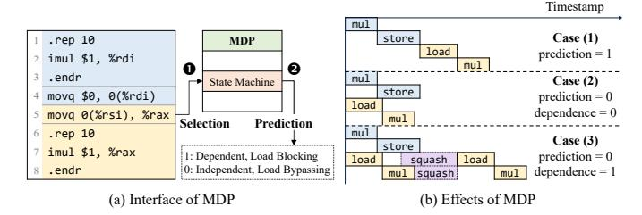
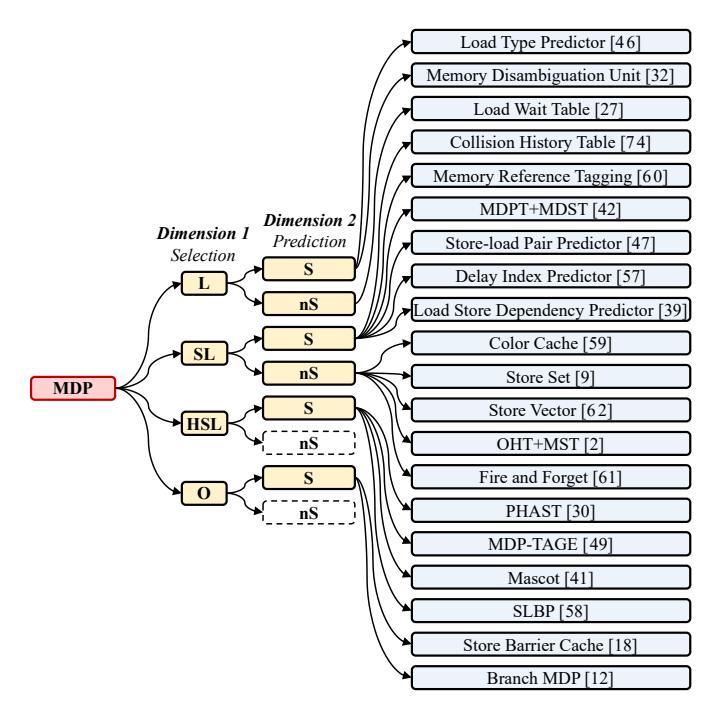
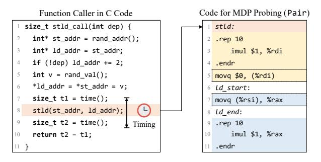
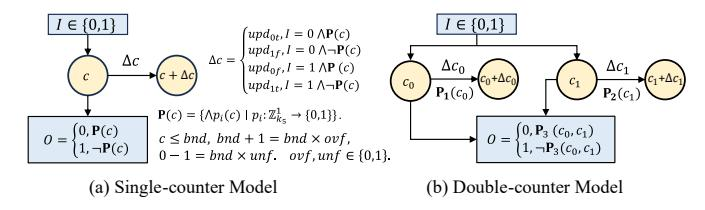
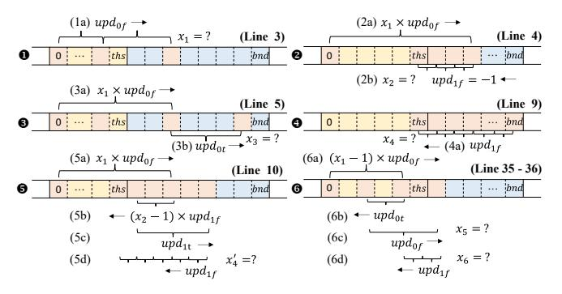
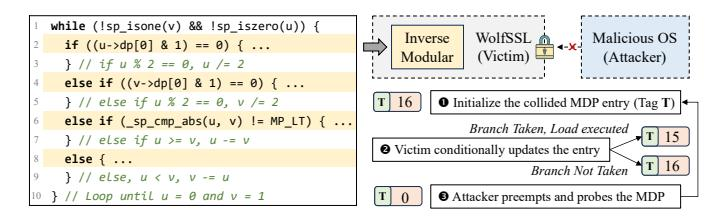
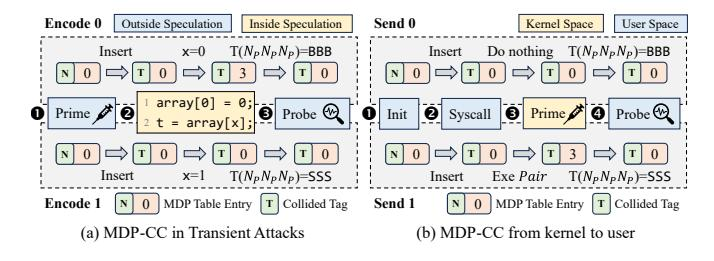

# SSBench: Automated Characterization of Memory Dependence Predictors on Modern CPUs

Chang Liu<sup>†</sup>, Yu Jin<sup>†</sup>, Yuchen Fan<sup>†</sup>, Tianrui Xiao<sup>†</sup>, Lingfeng Yin<sup>‡</sup>,

Trevor E. Carlson<sup>§</sup>, Shuwen Deng<sup>†‡(⊠)</sup>, Dongsheng Wang<sup>†‡</sup>

<sup>†</sup>Tsinghua University, {cliu21, jiny25, fanyc22, xiaotr23}@mails.tsinghua.edu.cn, {shuwend, wds}@tsinghua.edu.cn

<sup>‡</sup>Zhongguancun Laboratory, yinlf@mail.zgclab.edu.cn

<sup>§</sup>National University of Singapore, tcarlson@comp.nus.edu.sg

Abstract—Memory Dependence Predictors (MDPs) improve the performance of modern CPUs by exposing additional parallelism through predicting data dependence between store and load instructions. Since the 1990s, various MDP designs have been proposed across architectures. Recent studies reveal that MDPs are widely deployed on modern CPUs and can be exploited as side channels to leak data. However, because MDP designs are undocumented, characterizing an MDP design still requires complicated manual analysis.

This paper presents SSBench, the first framework to automate the study of MDPs for security on modern CPUs. We first propose a novel workflow-based MDP taxonomy to classify current MDP designs into six categories, and exploit MDP timing side channels for automated MDP identification. We then propose the counterbased model solver for state machine analysis, and the storeload bounce method for organization analysis. Based on these techniques, we deploy SSBench, which performs cross-platform automated identification and characterization of MDPs on more than 30 CPUs from Intel, AMD, Arm, Apple and RISC-V, and uncovers 14 distinct MDP configurations. Based on SSBench's findings, we propose three novel MDP side-channel attacks. First, on Intel CPUs, we build an MDP-based Weird Machine that achieves up to a 100× performance improvement over state-ofthe-art implementations. Second, on AMD CPUs, we develop a byte-level control-flow attack that breaks the inverse modular function used in RSA key generation in the latest version of WolfSSL. Third, we build the first cache/TLB-free covert channel on Apple CPUs, achieving better performance and stealthiness than the state-of-the-art cache and TLB covert channels.

#### I. INTRODUCTION

Modern CPUs employ speculative execution to increase instruction-level parallelism. To improve the accuracy of speculation, various predictors are employed. For example, the Memory Dependence Predictor (MDP) predicts the data dependence between a load instruction and older store instructions. When a load is predicted to be independent, it is executed out of order (i.e., Speculative Store Bypass, SSB) even if the addresses of older stores are unresolved. Since its introduction in the 1990s [9], numerous designs have been proposed to improve the MDP [30], [32], [41], [46], [49], [58], [62]. So far, the MDP has been widely applied in commercial CPUs [3], [4], [22]. However, because MDPs are transparent to software, their designs often remain undocumented.

On the other hand, the MDP has recently been shown to introduce security issues. The transient execution caused by

MDP mispredictions is one of the root causes of the Spectre-V4 attacks [7], [37], [51]. Moreover, MDPs often violate process and privilege isolation, and can serve as a novel microarchitectural leak source. They have been exploited in side-channel attacks on cryptographic libraries running inside Intel Software Guard Extensions (SGX) [35], machine-learning model extraction [37], and website fingerprinting [36].

However, existing research on MDP security largely relies on complex manual reverse engineering, which cannot provide a comprehensive understanding of MDP security across different platforms. For example, prior work [36] considers only load-indexed Apple MDPs, overlooking designs that incorporate both store and load information, and thereby cannot implement fine-grained MDP side-channel attacks. Another example is the state machine reverse engineering. Unlike branch predictors [71], [72] and prefetchers [8], [20], the MDP exhibits asymmetric performance impacts between dependent and independent cases, where the independent prediction can result in a pipeline flush, while the dependent prediction would only result in a pipeline stall. This additional complexity results in state machines where the prediction threshold and the update values are not symmetrical. For example, AMD's MDP implements the state machine with five counters and ten transfer functions [37], which introduces additional complexity into manual reverse engineering [37].

Meanwhile, current tools for automated reverse engineering mainly focus on characterizing hardware structures such as buffer size and cache associativity [21], [75], or identifying the existence of specific, well-known components, like an existing prefetcher design [55]. These automated reverse-engineering tools tend to be incompatible with the MDP, which may contain indexing tables that utilize multiple IPs, or complex state machines.

In this paper, we address this research gap by tackling the following problems: (Q1) How to automatically identify the existence and design of the MDP on unspecified architectures? (Q2) How to automatically reverse-engineer the state machine of the MDP? (Q3) How to automatically characterize the design parameters of the MDP?

We propose SSBench, the first automated tool for systematic MDP characterization across various architectures. To address Q1, we systematically survey and classify existing MDP designs, and exploit MDP timing side channels to

(⋈) Corresponding author.

automatically identify MDP existence and types on modern CPUs. To address Q2, we construct a counter-based model solver to automatically characterize the state machine of an MDP. To address Q3, we design the store-load bounce method to detect MDP entry collisions and evictions, enabling the characterization of design parameters such as hash functions, table size, associativity, and replacement policy.

We deploy SSBench on 30 CPUs from seven vendors, covering Intel, AMD, Arm, Apple, and RISC-V architectures, and identify three distinct MDP designs. Considering variations in design parameters, these correspond to 14 unique configurations. Using this detailed information, we then demonstrate how SSBench can efficiently uncover its security implications by creating MDP table entry collisions. Based on these, we develop three novel MDP side-channel attacks.

MDP-Gates on Intel. Using SSBench, we find that MDP states can be propagated on Intel CPUs, and the MDP has a 512-entry, direct-mapped table. We exploit it to implement a new microarchitectural Weird Machine (i.e., microarchitectural programming via MDP [\[13\]](#page-13-13), [\[65\]](#page-14-10), [\[66\]](#page-14-11)). Because MDP updates do not require transient execution, MDP-Gates achieves over 100× higher throughput than state-of-the-art Weird Machine implementations [\[26\]](#page-13-14).

MDP-CF on AMD. Using SSBench, we find that loads without preceding stores can update MDP states on AMD CPUs, and implement a byte-level control-flow attack across user processes. By exploiting the fact that AMD's MDP uses the physical address of the load instruction pointer (IP) for indexing, MDP-CF recovers the input parameters of the inverse modular function in the latest version of WolfSSL [\[68\]](#page-14-12) with a 98% success rate in a single trace.

MDP-CC on Apple. Using SSBench, we identify a new MDP design on Apple CPUs, and find that it can be updated by speculative store–load pairs. Based on this finding, we build the first cache and TLB-free covert channel for transient attacks on Apple CPUs, achieving higher bandwidth than prior cache and TLB covert channels [\[19\]](#page-13-15), [\[24\]](#page-13-16), [\[54\]](#page-14-13), while substantially improving stealth, i.e., it operates with nearly zero cache and TLB misses, bypassing performance counter–based detectors [\[6\]](#page-13-17), [\[48\]](#page-14-14), [\[77\]](#page-14-15). We also demonstrate that MDP-CC can transmit data from macOS kernel space to user space, breaking the kernel isolation.

Contributions. In summary, the contributions are as follows:

- ' We present several algorithms to automatically identify and characterize the MDP, including the timing side channels for existence and design type analysis, the counterbased model solver for state machine analysis, the storeload bounce for organization analysis, and collision-based security analysis.
- ' We design SSBench, the first automated framework for MDP characterization. We deploy SSBench on 30 Intel, AMD, Arm, Apple, and RISC-V CPUs, and identify 14 distinct MDP configurations.
- ' Based on SSBench's findings, we propose three novel MDP side-channel attacks on Intel, AMD and Apple CPUs, including MDP-Gates, MDP-CF, and MDP-CC.



<span id="page-1-0"></span>Fig. 1. Three distinct detection cases of the MDP for store-load pairs when the store's address is delayed due to arithmetic latency. Prediction denotes the MDP's predicted dependence of the store and load, and dependence denotes the actual dependence, where 1 means dependent and 0 means independent.


<span id="page-1-1"></span>Fig. 2. Examples of cache side-channel attacks. An attacker infers cache state from timing differences to leak control-flow or data-flow information, or to construct transient attacks.

The code of SSBench is released under an open-source license. More details can be found in the Artifact Appendix.

# II. BACKGROUND

#### *A. Memory Dependence Predictor*

In out-of-order CPUs, when the address of a store is not ready, a younger load that is speculatively executed may get a wrong value and cause a pipeline rollback, which is due to the address overlap of the store and load (i.e., they have data dependence). If a data-dependent load executes ahead of the store, the CPU has to squash all subsequent instructions and re-execute them. To avoid the performance penalty of such squashes, modern CPUs use the Memory Dependence Predictor (MDP) to predict the data dependence in these cases.

Fig. [1\(](#page-1-0)a) illustrates how the MDP affects the execution of a delayed store–load pair. ❶ When the store address is delayed, the load (and sometimes the store and contextual auxiliary information) is used to select the MDP's state. ❷ The MDP produces a prediction, with 1 indicating a predicted dependence and 0 indicating independence.

Depending on the predicted and the real data dependence, there are three possible cases, as shown in Fig. [1\(](#page-1-0)b). If the prediction is dependence, the load is blocked until the store commits or its address is resolved. If the prediction is independence and correct, the load executes speculatively before the store address is ready, significantly reducing latency. However, if the prediction is independence but the actual case is dependence, the CPU must squash the speculative instructions once the store address is resolved and re-execute them, resulting in a longer execution time than blocking. These timing differences have been used in manual reverseengineering of MDPs on modern CPUs [\[36\]](#page-13-9), [\[37\]](#page-13-7), [\[51\]](#page-14-5).


<span id="page-2-0"></span>Fig. 3. Examples of data cache-based  $\mu$ WM gates. The initial value of in[0], in[1], out[0] and the return values of delay() are 0, and the initial states of all cache lines are cache miss.

#### B. Microarchitectural Side-channel Attacks

Microarchitectural units on modern CPUs are typically transparent to software and do not consider architectural security domains, i.e., they are sometimes not isolated across processes or privileges. The shared units may record program behavior, and their states may be observable to software via timing measurements, which gives rise to microarchitectural side channels. For example, the cache state is observable by memory accesses, where a cache hit leads to a shorter time than a cache miss [70]. Cache side-channel attacks can therefore leak control-flow (i.e., which instruction addresses execute) [16], [38] and data-flow (i.e., which data addresses are accessed) [17], [33] information by probing instruction or data caches, as illustrated in Fig. 2.

**Transient attacks**. Microarchitectural side channels may enable other attacks. As shown in Fig. 2, if a branch predictor predicts x < bound as true, the CPU may speculatively execute an out-of-bound access arr[x] before x is resolved. If an attacker uses the accessed data as an address and accesses a cache line in their own address space (e.g., indexed by arr2), the attacker can infer arr[x] via a cache side channel and thereby bypass the bound check of the branch. Attacks that exploit misspeculation to leak data are known as transient attacks [7], [28], [29], [31].

#### C. Microarchitectural Weird Machines

Microarchitectural structures and speculative execution can be combined to construct Microarchitectural Weird Machines ( $\mu$ WMs). A  $\mu$ WM uses microarchitectural state as registers and microarchitectural behaviors as logic gates [13], [65], [66]. By composing gates into circuits,  $\mu$ WMs can implement arbitrary computation (e.g., SHA-1 [13] and AES [66]) while leaving little traces at the architectural level. Fig. 3 illustrates a cache  $\mu$ WM [26] that encodes bit 1 as a cache hit and bit 0 as a cache miss, where addresses targeting different cache lines encode different bits. The initial values of in [0], in [1] and out [0] are 0, the return value of delay() is 0, and the initial states of all cache lines are set to the miss state.

For the AND gate, the branch is trained to give misprediction and speculatively execute line 2. In line 2, if both &in1[0] and &in2[0] miss in cache, the address resolution of &out[0] will be slower than the branch, resulting in &out[0] still missing in the cache. Otherwise, the resolution of &out[0] is faster, and the speculative memory access of &out[0] fills the value into cache. Similarly, for the NOT and NAND gates, if the gate inputs hit in cache, the branch resolution is fast in line 1, and out is not speculatively accessed during a branch misprediction in line 2, producing

a cache miss when probing it. Conversely, if at least one input misses in cache, &out [0] is speculatively accessed and filled in cache, resulting in a cache hit. As NAND is able to build a Turing-complete machine, the cache  $\mu$ WM can realize arbitrary programs [66].

# III. SSBENCH: AUTOMATICALLY IDENTIFYING AND CHARACTERIZING MDPS

To automate the characterization of an MDP, we first need to identify the predictor design: whether it uses both store and load to select the predictor table entry, and whether it incorporates a state machine that provides confidence in its predictions. In this section, we introduce a workflow-based taxonomy, which serves as the input to SSBench (Section III-B). We then design several algorithms for automated MDP identification (Section III-C) and characterization (Section III-D and Section III-E) in SSBench. Finally, we show how to test the security of MDPs based on the characterization (Section III-F).

#### A. Overview of SSBench

An overview of SSBench is shown in Fig. 4. The input to SSBench is the workflow-based taxonomy of MDP designs, which categorizes MDPs into six classes. SSBench provides a platform-agnostic algorithm to identify each design, and then selects the appropriate characterization procedures. To enable cross-platform characterization, SSBench offers a set of abstract primitives. These primitives are implemented on each supported architecture and operating system.

#### <span id="page-2-1"></span>B. Workflow-based Taxonomy

Consider the generic workflow of a predictor, as illustrated in Fig. 4. An instruction that triggers a prediction first selects the predictor's table entry using contextual features such as instruction address (IP), data address, or other historical information. The predictor then looks up the entry's current state and produces its final prediction. Based on this workflow, we define two classification dimensions for MDPs.

Dimension 1: Predictor table entry selection method. Some MDPs use only the load IP, ignoring preceding stores [27]. This design is lightweight, but requires stalling a load until all prior stores resolve. Some MDPs use both store and load IPs [9], [62] for finer-grained stalling control. Other complex MDPs integrate additional context like branch history [30] for better prediction accuracy, but with higher hardware overhead. **Dimension 2: State machine for prediction.** Several MDPs do not implement a state machine. If a valid entry is found, the load is simply stalled [49]. This hardware design is simpler but does not consider the dynamic change of the data dependence. Other MDPs include a state machine that dynamically updates confidence for recurring store-load pairs [41]. as shown in Fig Classification results. We perform a systematic survey of existing MDP designs from patents and research papers, and categorize 20 existing MDP designs [2], [9], [12], [18], [27], [30], [32], [39], [41], [42], [46], [47], [49], [57]–[62], [74] based on our workflow-based taxonomy, as shown in Fig. 5.


<span id="page-3-1"></span>Fig. 4. Overview of SSBench. We design a workflow-based taxonomy for MDP identification (left), and propose several algorithms for MDP characterization (right). In the taxonomy, the first dimension is the information used for selecting MDP entries (L: only load IP is used, SL: store and load IPs are used, HSL: other information is used). The second dimension is whether the state machine is used (S: stateful, nS: stateless). The leaf nodes are existing MDP designs.

For the first dimension, we denote MDPs that use only the load IP for entry selection as  $\mathbb{L}$ , those that use both store and load IPs as  $\mathbb{SL}$ , and those incorporating additional history as  $\mathbb{HSL}$ . Two MDP designs are outside of the three categories, denoted as  $\mathbb{O}$  (Others), with Store Barrier Cache [18] selected by store IP only, and Branch MDP [12] selected by branch instructions only. Because the design  $\mathbb{O}$  is not common, we exclude it from reverse engineering in this research.

For the second dimension, we denote MDPs with a state machine as S, and those without one as nS. These two dimensions guide SSBench's identification and characterization methods. For example, SL designs require additional consideration of store IPs as potential index or tag bits when reverse-engineering hash functions and organization. Likewise, only stateful MDPs require state-machine characterization.

# <span id="page-3-0"></span>C. Automated Identification of MDP

In this section, we show how to address Q1 (Automatically identify the existence and design types of the MDP), based on our taxonomy and the MDP timing side channels.

**Notations.** We probe the MDP at fixed store/load IPs using store-pairs from Fig. 6. Following prior work [36], [37], [51], multiplication instructions are used to delay store address generation to amplify observable timing differences (Fig. 1). A store-load pair is denoted as  $Pair_{i_1}^{i_0}$  (store IP  $i_0$ , load IP  $i_1$ ), with IPs varying by address placement. We use  $N_P$  for independent pairs and  $D_P$  for dependent ones, omitting subscripts when IPs are fixed.

#### Identification of the existence of MDP.

If an MDP exists, it initially predicts independence (case 2, Fig. 1), or it conservatively predicts dependence (case 1, Fig. 1) and changes its prediction to independence after a sufficient number of  $N_P \ (\geqslant 10^3, \text{ empirically})$ . For both cases, we can initialize the prediction to independence and treat it as the start of the identification. Otherwise, if the MDP does not exist, loads would always be blocked.

We first test for MDP existence by fixing store/load IPs and executing a sequence of Pairs, measuring times  $T(D_P)$  (dependent) and  $T(N_P)$  (independent). After running a sufficient number of  $N_P$  to initialize the MDP state, we run 100  $N_P$ 



<span id="page-3-2"></span>Fig. 5. Workflow-based taxonomy for MDP identification across 20 MDP designs from research papers and patents. The first dimension is the selection mechanism, and the second dimension is the existence of a state machine.

followed by 100  $D_P$ , obtaining 200 timing samples  $t_0$  to  $t_{199}$ . We define:  $T(N_P) = S$  (bypass) for initial state,  $T(D_P) = R$  (Rollback) for first misprediction, and  $T(N_P) = T(D_P) = B$  (Block) after mispredictions. We group samples into three sets:  $T_0 = \{t_0, ..., t_{99}\}, \ T_1 = \{t_{100}\}, \ T_2 = \{t_{101}, ..., t_{199}\}.$ 

Fig. 7 shows the distributions of S, B, and R timings with 1,000 samples corresponding to  $T_0$ ,  $T_1$  and  $T_2$  across five CPUs. For clarity, the timing values are truncated to to values below 500 cycles. As shown in the figure, within this range the S, B, and R timing distributions can be clearly and stably distinguished, and the variance within each type is small. On some AMD CPUs, set  $T_2$  contains type B together with a small number of R. However, there is no overlap between different sets. Further analysis of the noise points



<span id="page-4-1"></span>Fig. 6. An example microbenchmark used for MDP states probing in SSBench. The parameter dep controls the dependence in stld. Variables st\_addr and ld\_addr are the data addresses of the store and load.

shows that all noise samples are larger than the maximum R and exhibit a long-tail distribution. This is because the noise mainly originates from transient frequency fluctuations or context switches, making the noise samples sparse and low-frequency. Therefore, we employ DBSCAN [10] to filter out noise and distinguish different timing types.

In DBSCAN,  $\epsilon$  denotes the neighborhood radius that determines whether nearby samples are density-connected, while minPts specifies the minimum number of neighbors required for a point to be treated as a core point in a dense cluster. As shown in Fig. 7, the execution times on each device form several compact clusters whose variances are small, and the noise samples tend to appear as sparse points deviating toward larger execution times. Therefore, we set minPts to 100 and set  $\epsilon=2$  empirically, which is sufficient to connect dense points within the same cluster while filtering out noise.

Applying DBSCAN to each set, we extract min/max values per cluster. We conclude that an MDP exists iff  $\max(T_0) \leq \min(T_2)$  (S/B distinguishable) and  $\min(T_1) \geq \max(T_2 \backslash T_1)$  (B/R distinguishable).

Identification of the design. After MDP detection, SSBench classifies its design type. For  $Dimension\ I$ , we use pairs  $Pair_0^0$ ,  $Pair_1^0$ , and  $Pair_0^1$ . After training with  $D_P^0$ , we measure  $T(N_P^1)$  and  $T(N_P^1)$ . If  $T(N_P^1) = B$  and  $T(N_P^1) = S$ , the design is L or HSL. Otherwise, if both are S, the design is SL or HSL. If the design is HSL, the MDP is indexed with a hash function of branch history and the load IP [41], [49]. To test whether the design is HSL, we train the MDP using  $D_P$  under a fixed and sufficiently long history [71]. If the history information is used, a specific table entry will be selected for the Pair, whereas random histories will not select that entry. We then reset the MDP using  $N_P$  under random branch histories, and test under the same fixed history using  $N_P$ . If  $T(N_P) = B$ , it indicates the history-based selection is used. Otherwise, if  $T(N_P) = S$ , it indicates the design is not HSL.

For Dimension 2, we use  $Pair_0^0$ . After  $D_{P0}^0$  causes a rollback, we repeatedly run  $N_{P0}^0$ . A transition from B to S indicates a stateful design (S). Otherwise, if the prediction does not change and  $T(N_P)$  remains at B, it indicates a stateless design (nS), and the prediction can only be reset by periodic prediction table flushes [9] or table entry eviction. Solution to Challenge 1: Eliminating interference from

other predictors. To prevent other microarchitectural components from affecting the execution time of Pair, we introduce additional randomization, as shown in the C code in Fig. 6. To avoid the effects of the address predictor [29], we randomly generate a base address for each Pair. To avoid the effects of the value predictor [28], we input random values to the store target and load source. To avoid the effects of prefetchers [55], [63], we access the store and load data addresses before executing each Pair, ensuring they reside in the cache. Finally, to avoid the effects of the Predictive Store Forwarding Predictor (PSFP) [37] and memory renaming [53], we further analyze the execution times in  $T_2$ . If both B and S are observed in  $T_2$ , the load is executed out-of-order even when data dependence occurs. If so, in subsequent analyses we adjust the S in  $D_P$ samples to B, and the R in  $N_P$  samples to B (when PSFP gives a misprediction on the data dependence).

#### <span id="page-4-0"></span>D. Automatically Characterizing the State Machine

In this section, we show how to address **Q2** (**Automatically characterizing the state machine of the MDP**), based on the counter-based model solver.

Modeling the state machine with hardware counters. Unlike branch predictors [72], MDPs have asymmetric misprediction penalties, leading to unbalanced state machines. For example, switching from dependence to independence may require more independent pairs than the reverse [51]. MDPs also exhibit a cold-start property, with initial transitions needing many mispredictions [37]. We therefore introduce a counter-based state-machine model in Fig. 8.

The state machine uses one or more hardware counters, with predictions based on current counter values and a predicate. Actual dependence outcomes update the counters. For a single counter, update behavior is defined by four parameters  $(upd_{0t}$  to  $upd_{1f})$ , where 0/1 indicates non-dependence/dependence prediction and t/f indicates prediction accuracy. Three additional parameters specify the counter's upper bound (bnd) and overflow/underflow reset behavior (ovf, unf). The model can be extended to multiple counters where output depends on several counters simultaneously (Fig. 8). While adding counters enables representing any state machine, it increases model complexity.

**Model simplification.** In this study, considering the design goals and the extra overhead of MDPs, we further simplify the counter-based model heuristically. In this simplified model, we make the following assumptions: (1) The MDP's initial state is 0 and predicts independence, with unf = 0. If the initial prediction is dependence, we run numerous  $N_P$  to initialize its state to 0. (2) A sufficiently long sequence of independent pairs  $(N_P)$  resets the MDP to state 0, thus  $upd_{1f} = -1$ . (3) The MDP uses a single threshold parameter ths, where the predicate is  $c \le ths$ . Our analysis shows that the simplified model sufficiently covers the MDP design on all tested CPUs. **Counter model solver.** We solve these parameters using Algorithm 1. The insight of this algorithm is to use the automated search to identify boundary conditions. For example, bound  $x_1$  represents the number of  $D_P$  required for the counter to


<span id="page-5-0"></span>Fig. 7. Time distribution of S, B and R on five CPUs under test. On all of the tested CPUs, S, B and R have small variance and are clearly distinguishable.



<span id="page-5-1"></span>Fig. 8. The state machine models. The single-counter model contains one predicate and seven parameters, and the double-counter model contains three predicates and more parameters.



<span id="page-5-3"></span>Fig. 9. Workflow of Algorithm 1 when  $x_3 = \infty$ . Variables  $x_1$ ,  $x_2$ ,  $x_3$ ,  $x_4$ ,  $x_4'$ ,  $x_5$  and  $x_6$  are resolved (with the related lines of the algorithm illustrated), and are used to generate a system of inequalities for state machine parameters.

first transition from below ths to above it. We then formulate equations based on these observed transitions, treating the parameters as unknowns. Fig. 9 illustrates the workflow of Algorithm 1 when  $x_3 = \infty$  and lines 9 to 14 are touched. The algorithm begins by finding the minimal repetition  $x_1$  required to make the counter larger than ths, which establishes the relationship between  $upd_{0f}$  and ths. The algorithm then finds the minimal repetition  $x_2$  required to decrease the counter to ths after  $x_1 \times upd_{0f}$  is executed, which establishes the relationship between  $upd_{1f}$  and ths. The algorithm then tests if  $upd_{0t} > 0$ , which means  $x_3 = \infty$ . If  $upd_{0t} > 0$ ,  $x_4$  establishes the relationship between  $upd_{1t}$  and  $upd_{1f}$ . Finally,  $x_5$  and  $x_6$  establish the relationship between  $upd_{1t}$  and  $upd_{0f}$ ,  $upd_{0f}$  and ths.

**Solution to Challenge 2: Characterizing two MDPs on the same core.** When a core employs two MDPs simultaneously [37], e.g., MDP-1 indexed by load IP only and MDP-2 by both store and load IPs, isolation is necessary during

# <span id="page-5-2"></span>Algorithm 1 Parameter Solving for the Single-Counter Model

```
Input: Store-load pair a and n, and timing differences S, B and R
     Output: upd_{0t}, upd_{1f}, upd_{0f}, upd_{1t}, bnd, ovf, unf, ths
    upd_{1f} \leftarrow -1 // Assumption: counter decreases on independent cases
 2: unf \leftarrow 0 // Assumption: on underflow
 3: x_1 \leftarrow \min T((x+1)D_P) = xR B
 4: x_2 \leftarrow \min_{x \in \mathbb{R}} T(x_1 D_P (x+1) N_P) = x_1 R x B S
 5: x_3 \leftarrow \min^{x} T(x_1 D_P (x+1) D_P) = x_1 R x B R
 6: EQ_1 \leftarrow (x_1 - 1) \cdot upd_{0f} \leqslant ths < x_1 \cdot upd_{0f}
 7: EQ_2 \leftarrow ths = x_1 \cdot upd_{0f} - x_2
 8: if x_3 = \infty then // no overflow, no decrease on dependent cases
         x_4 \leftarrow \max_{x} T((x_1 + y)D_P(x + 1)N_P) = x_1R(y + x)BS, \ \forall \ y
 9:
         x_4' \leftarrow \min \ T(x_1 D_P \ (x_2 - 1) N_P \ D_P \ (x + 1) N_P)
10:
11:
                        = x_1 R (x_2 + x) B S
12:
         EQ_3 \leftarrow upd_{1t} = x_4' - 1
13:
         EQ_4 \leftarrow bnd = x_4 + ths
14:
         EQ_5 \leftarrow ovf = 1
15: else // overflow or counter decreases on dependent cases
         x_4 \leftarrow \min \ T((x_1+1)D_P \ (x+1)N_P) = x_1 R \ (x+1)B \ S
16:
17:
         if x_4 > x_2 then // overflow when the counter reaches bnd and reset
             x_4' \leftarrow \min \ T(x_1 D_P) (x_2 - 1) N_P (x + 1) D_P)
18:
                            = x_1 R (x_2 - 1 + x) B R
19:
20:
             x_4'' \leftarrow \min_{x_1} T(x_1D_P(x_2-1)N_P(x_4'-1)D_P xN_P 2D_P)
21:
                            = x_1 R (x_2 + x_4' + x) B
22:
             EQ_3 \leftarrow upd_{1t} > 0
             EQ_4 \leftarrow bnd - ths = x_4' \cdot upd_{1t} - x_4''
23:
             EQ_5 \leftarrow ovf = 0
24:
25:
         else // counter decreases on dependent cases
26:
             x_4' \leftarrow \min \ T(x_1 D_P \ (x_2 - 1) N_P \ (x + 2) D_P)
27:
                            = x_1 R (x_2 - 1) B S x B
28:
             x_4'' \leftarrow \min \ T(x_1 D_P \ (x_2 - 1) N_P \ (x_4' + 1) D_P \ (x + 1) N_P)
             = x_1 R (x_2 - 1) B S x_4' R x B S

EQ_3 \leftarrow upd_{1f} = x_4'' - 1 - x_4' \cdot upd_{0f}
29:
30:
             EQ_4 \leftarrow bnd = x_1 \cdot upd_{0f}
31:
32:
             EQ_5 \leftarrow ovf = 1
33:
34: end if
35: x_5 \leftarrow \min T((x_1 - 1)D_P N_P (x + 1)D_P) = (x_1 - 1)R S x R B
36: x_6 \leftarrow \min \ T((x_1 - 1)D_P \ N_P \ x_5D_P \ (x+1)N_P)
                    = (x_1 - 1)R S x_5 R x B S
38: EQ_6 \leftarrow x_1 \cdot upd_{0f} + upd_{0t} = x_6 + ths
39: EQ_7 \leftarrow upd_{0t} \leq ths
40: Solve the system of inequalities \{EQ_1, ..., EQ_7\} and get parameters
```

testing. (1) For MDP-1 characterization, we use multiple  $Pair_0^x$  sharing the same load IP but different store IPs. After each  $D_{P_0^x}$  in Algorithm 1, we switch to  $D_{P_0^{x+1}}$  and  $N_{P_0^{x+1}}$  to avoid MDP-2 interference from its historical entries. (2) For MDP-2, we use  $Pair_0^0$  and  $Pair_0^1$ , executing Algorithm 1 primarily with  $D_{P_0^0}$  and  $N_{P_0^0}$ . After each  $D_{P_0^0}$ , sufficient  $N_{P_0^1}$ 


<span id="page-6-1"></span>Fig. 10. Store-load bounce for organization characterization, where the store and load in stld are replaced with branches jumping to instruction pages.

executions reset MDP-1's counter state to eliminate its impact on MDP-2 observations.

#### <span id="page-6-0"></span>E. Automatically Characterizing the Organization

A predictor typically maintains a prediction table to support simultaneous predictions for different instructions. We refer to the structure of this table as the organization of the MDP. In this section, we show how to address Q3 (Automatically characterizing the organization of the MDP), based on the store-load bounce. We only describe the methods to characterize the MDPs in design category L, and the method can naturally extend to other designs.

Store-load Bounce. To automatically and efficiently generate the stores and loads at different IPs, we extend the code shown in Fig. 10. In the stld function, we replace the original stores and loads with branches that jump to an instruction page. By pre-filling this instruction page with store and load addresses, we can execute stores and loads with different IPs in a limited search space efficiently. After executing the store or the load, the code jumps back and executes other arithmetic instructions. Hash function reverse-engineering. In hardware implementations, the IP is often compressed before table indexing to reduce hardware cost [15]. We refer to this compression function as the hash function. To automatically reverse engineer the hash function, we use the store-load bounce. First, we use a fixed store-load pair  $Pair_{x_0}^y$  to saturate the MDP's state machine counter with enough  $D_{P_{x_0}}^y$ . Next, we change the IPs to execute another store-load pair  $Pair_{x_1}^y$ , measuring execution time of  $N_{P_{x_1}}^y$ . If we observe  $T(N_{P_{x_1}}^y) = B$ , it means  $x_0$  and  $x_1$  have the same hash value. We collect all addresses that collide with  $x_0$  into a set  $\mathbb{X}$ .

We then construct a differential matrix  $\mathbf{R}$  where  $\mathbf{R}_{i,j}$  is the j-th bit of the XOR between addresses in the i-th pair from  $\mathbb{X} \times \mathbb{X}$ . The nullspace  $N(\mathbf{R}) = \{x \mid \mathbf{R}x = 0\}$  captures linear relationships among input bits, with its dimension equal to the number of hash output bits. Each basis vector maps input bits to an output bit, e.g.,  $\mathbf{x} = \{1,1,1,0\}$  in 4-bit space implies XOR of lowest three bits produces one output. Zero-dimensional nullspace indicates nonlinear hash and requires other heuristic methods [15], [52]. Empirically, in this research, all tested MDP hash functions are linear.

Eviction-set construction and associativity inference. Next, we use addresses with different hash values to construct an

# <span id="page-6-2"></span>Algorithm 2 Reverse-Engineering of MDP Index Bits

```
Input: Entry y with size-k minimal eviction set \mathbb{E} = \{x_0, x_1, ..., x_{k-1}\}
     Output: Tag/offset-bit set \mathbb{T} and index-bit set \mathbb{I}
    n \leftarrow \text{qet\_test\_size}()
2: \ \mathbb{S} \leftarrow \{\}
3: h \leftarrow \text{hash}(y)
4: for i = 1 to n do
5:
         Find a new x_t so that \mathbb{E} - \{x_0\} + \{x_t\} can evict y. Add it to set \mathbb{S}.
6: end for
    for each bit b in h do
7:
          if (hash(x) >> b \& 1) is the same for all x \in \mathbb{E} \cup \mathbb{S} then
8:
9:
              Add b to \mathbb{I}.
10:
11:
               Add b to \mathbb{T}.
12:
          end if
13: end for
```

eviction set (i.e., the minimum number of Pairs required to evict an entry from the MDP table). We first train the MDP using  $Pair_{x_0}^y$  by executing  $D_P_{x_0}^y$  repeatedly. Then, for  $Pair_{x_1}^y$ ,  $Pair_{x_2}^y$ , ...,  $Pair_{x_n}^y$  with distinct hash values, we sequentially execute  $D_P_{x_1}^y$ ,  $D_P_{x_2}^y$ , ...,  $D_P_{x_n}^y$  to prime more entries to the MDP table. Finally, we execute  $N_P_{x_0}^y$  and measure the execution time. If we observe  $T(N_P_{x_0}^y) = S$ , it indicates that the training state for  $Pair_{x_0}^y$  has been evicted by other n store-load pairs. The smallest n that causes eviction is the associativity of the MDP table.

Solution to Challenge 3: Avoiding global disabling of the MDP. On some CPUs, triggering too many mispredictions may globally disable the MDP, forcing all loads to stall. To avoid this, we increase the candidate size in powers of two. When we identify an integer k such that  $2^{k-1}$  entries do not cause eviction but  $2^k$  entries do, we perform a linear search between  $2^{k-1}$  and  $2^k$ . This allows us to find the accurate eviction-set size without triggering too many mispredictions.

**MDP prediction table structure characterization.** After constructing the eviction set, we characterize the MDP table size and the number of sets based on the store-load bounce. As shown in Algorithm 2, given an eviction set  $\mathbb E$  for address  $x_0$ , we expand it into a larger set  $\mathbb S$  where each address in  $\mathbb S$  can evict  $x_0$ , and all addresses in  $\mathbb S$  map to the same set in the MDP table. We then analyze the hash-bit positions that remain identical across all addresses in  $\mathbb S$ . These bit positions correspond to the index bits, while the remaining bits are used as tag or offset bits. A larger  $\mathbb S$  yields more accurate results.

Replacement policy characterization. We extend Algorithm 2 to determine the MDP table replacement policy. We generate a minimal eviction set plus four entries (assuming associativity > 4) to test the replacement priority of the first four entries inserted into the MDP table. Following prior work [1], permutation  $\Pi_i$  denotes eviction priority when entries  $x_3$  to  $x_0$  are inserted sequentially and then  $x_i$  is accessed. Table I shows  $\Pi$  values of FIFO, LRU, Tree-PLRU and NLRU.

To evaluate  $\Pi_i$ , we first train the MDP by inserting entries  $x_3$ ,  $x_2$ ,  $x_1$ ,  $x_0$  in order, and then re-access it with  $x_i$ . We use the extended eviction-set and automatically probe which of the four entries remains, thereby determining the replacement priority. We compare the measured  $\Pi_i$  pattern against the

TABLE I REPLACEMENT POLICY FOR FOUR ENTRIES IN FOUR MODELS

<span id="page-7-1"></span>

| Replacement<br>Policy | Π0           | Π1           | Π2           | Π3           |
|-----------------------|--------------|--------------|--------------|--------------|
| FIFO                  | (0, 1, 2, 3) | (0, 1, 2, 3) | (0, 1, 2, 3) | (0, 1, 2, 3) |
| LRU                   | (0, 1, 2, 3) | (1, 0, 2, 3) | (2, 0, 1, 3) | (3, 0, 1, 2) |
| Tree-PLRU             | (0, 1, 2, 3) | (1, 0, 3, 2) | (2, 1, 0, 3) | (3, 0, 1, 2) |
| NLRU                  | (0, 1, 2, 3) | (1, 2, 3, 0) | (2, 0, 3, 1) | (3, 0, 1, 2) |

known replacement policies in Table [I](#page-7-1) to identify the MDP's replacement strategy. Increasing the number of tested entries can improve accuracy, but also introduces more noise. In practice, probing with four entries is sufficient to reliably characterize the MDP's replacement policy.

#### <span id="page-7-0"></span>*F. Automated Security Test*

Once the state machine and the organization of an MDP are characterized, testing its security properties becomes straightforward. For example, to determine whether an MDP is shared across security domains, we simply construct P airs with the hash collision in two security domains [\[45\]](#page-14-25), and alternate the training and probing procedures. To test interactions between the MDP and other microarchitectural mechanisms, such as whether speculative execution or cache misses affect MDP updates, we ensure that the trained P air and the probed P air in the same process have the hash collision.

We present several examples of security tests. First, to test whether an MDP is isolated between two security domains, we place P airs in different cores, processes, or privilege levels. Second, to test whether an MDP updates during speculative execution, we follow the setup in [\[34\]](#page-13-32): we trigger an outof-order execution after an exception, ensuring a P air is executed but not committed. Then we probe the MDP in the exception handler to observe whether an update was triggered by this P air. Finally, we test several update conditions: (1) Chaining: whether the delay of a load blocked by a previous MDP prediction causes MDP updates in subsequent store–load pairs. (2) No Delay: whether a store without delay updates the MDP. (3) Single load: whether a load without a preceding store updates the MDP. It is worth noting that some prior works [\[40\]](#page-14-26), [\[44\]](#page-14-27) suggest that instruction and address attribute randomization can further uncover additional security issues. We leave this extension to future work.

# IV. IMPLEMENTATION AND EVALUATION

We deploy SSBench on 30 machines, as detailed in Table [II,](#page-8-0) and evaluate its effectiveness. The tested CPUs include 10 Intel CPUs, 4 AMD CPUs, 5 Arm CPUs, 8 Apple CPUs (including both big and little cores), and 3 RISC-V CPUs. For the open-sourced RISC-V CPUs, we use the RTL simulators [\[25\]](#page-13-33), [\[78\]](#page-14-28). In this section, we describe the implementation of the primitives in Section [IV-A,](#page-7-2) and present the experimental results from Section [IV-D](#page-7-3) to Section [IV-F.](#page-9-0)

# <span id="page-7-2"></span>*A. Primitives*

JIT and Core Binding. We use operating system interfaces to pin processes to a core and to enable real-time updates of the machine code. On Linux, we use taskset to bind the test process to a specific CPU. On macOS, we set process affinity using the API pthread\_set\_qos\_class\_self\_np. We use mmap to create the instruction page and alternate its writable and executable properties using mprotect.

Timing. We measure cycles using: rdtscp on Intel; AMD's rdpru [\[14\]](#page-13-34); PMCCNTR on Arm via kernel PMU module [\[5\]](#page-13-35); S3\_2\_c15\_c0\_0 on Apple via kernel modification [\[54\]](#page-14-13); and rdcycle on RISC-V.

Test Suite Implementation. We implement the test suite with Python. The clustering algorithm is implemented using scikit-learn [\[56\]](#page-14-29), while the equation system solver is implemented using pulp [\[50\]](#page-14-30). Linear hash equations are solved through matrix operations based on numpy. During the hash solving process, we use kernel interfaces to record the virtual and physical collision addresses. If the hash function for the virtual address cannot find a solution, we attempt to solve for the hash function of the physical address.

#### *B. Noise Reduction*

To mitigate timing noise and MDP prediction table interference caused by context switches and frequency fluctuations, all MDP parameters in this work are recovered using statistical analysis. Specifically, to mitigate measurement noise, we repeat each experiment a fixed number of times for each parameter and report the mode as the final result. To further improve evaluation efficiency, we introduce an early stopping mechanism that reduces the number of repetitions when the measurement variance falls below a predefined threshold.

#### *C. Out-of-scope MDP Designs*

If the MDP adopts a design different from the assumed architecture, SSBench reports a diagnostic message during analysis. For example, if a different indexing mechanism is used, the existence analysis shows that the load PC does not influence MDP predictions. If the state machine employs no less than two counters, the 1-counter state-machine analysis fails because the resulting nonlinear equation system has no solution. If a nonlinear hash function is used, the nullspace dimension of the differential matrix becomes 0. If the MDP adopts an unknown design, the organization parameters cannot be recovered. In such cases, SSBench terminates at the corresponding stage and hints which component of the MDP deviates from the expected design, enabling further manual analysis.

# <span id="page-7-3"></span>*D. Results of Characterization*

Table [II](#page-8-0) lists the test results across 30 CPUs. Depending on the parameter difference, we identify 14 distinct MDP configurations, belonging to three MDP design categories. For other types, we use the gem5 simulator to demonstrate the effectiveness of SSBench to identify these MDPs. In this section, we introduce the key results of MDP characterization and highlight SSBench's new findings.

Intel. Intel CPUs maintain the state machine and directmapped architecture discovered in [\[51\]](#page-14-5), but *after the 12th*

TABLE II

EXPERIMENTAL RESULTS OF SSBENCH ON 30 CPUs. V-IP MEANS SELECTION BY VIRTUAL IP. REP MEANS REPLACEMENT POLICY.

<span id="page-8-0"></span>

| x86-64*                                 | Design              | State Machine                                                                   | V-IP                                       | Hash Function                                                                                                                                                                                                   | Size                 | Way                  | Tag                     | Index       | Rep                        |
|-----------------------------------------|---------------------|---------------------------------------------------------------------------------|--------------------------------------------|-----------------------------------------------------------------------------------------------------------------------------------------------------------------------------------------------------------------|----------------------|----------------------|-------------------------|-------------|----------------------------|
| i6s, i7k, i8c,<br>i9cf, i10cm,<br>i11ro | L-S                 | 0, -1, 15, 14, 15, 1, 0, 0                                                      | ~                                          | [0], [1], [2], [3], [4], [5], [6], [7]                                                                                                                                                                          | 256                  | 1                    | -                       | 0-7         | -                          |
| i12a, i13ra,<br>i14ra, ixg6s            | L-S                 | 0, -1, 15, 14, 15, 1, 0, 0                                                      | ~                                          | [0], [1], [2], [3], [4], [5], [6], [7], [8]                                                                                                                                                                     | 512                  | 1                    | -                       | 0-8         | -                          |
| z3-mdp1                                 | SL-S                | 0, -1, 4, 3, 4, -1, 0, 0                                                        |                                            | [0,12,24,36], [1,13,25,37], [8,20,32,44],                                                                                                                                                                       |                      |                      | -**                     |             |                            |
| <b>z3</b> -mdp2                         | L-S                 | 0, -1, 15, 16, 62, 1, 0, 30                                                     | X                                          | [2,14,26,38], [3,15,27,39], [9,21,33,45],                                                                                                                                                                       | 32                   | 2                    | 4-11                    | 0-3         | LRU                        |
| z4                                      | L-S                 | 0, -1, 14, 0, 42, 1, 0, 28                                                      | [4,16,28,40], [5,17,29,41], [10,22,34,46], | 32                                                                                                                                                                                                              | 2                    | 4-11                 | 0-3                     | FIFC        |                            |
| <b>z</b> 5                              | L-S                 | 0, -1, 14, 16, 60, 1, 0, 28                                                     |                                            | [6, 18,30,42], [7,19,31,43], [11,23,35,47]                                                                                                                                                                      | 64                   | 4                    | 4-11                    | 0-3         | NLRU                       |
| Arm64 / RISC-V                          | Design              | State Machine                                                                   | V-IP                                       | Hash Function                                                                                                                                                                                                   | Size                 | Way                  | Tag                     | Index       | Rep                        |
|                                         |                     |                                                                                 |                                            |                                                                                                                                                                                                                 |                      |                      |                         |             |                            |
| ar72                                    | L-nS                | -                                                                               | ~                                          | [2], [3], [4], [5], [6], [7], [8], [9], [10], [11], [12], [13], [14], [15]                                                                                                                                      | 16                   | 16                   | 6-15<br>***             | -           | PLRU                       |
| ar72<br>ar73                            | L-nS<br>L-nS        | -                                                                               | v<br>v                                     |                                                                                                                                                                                                                 | 16<br>16             | 16<br>16             |                         | -           | PLRU                       |
|                                         |                     | -<br>-<br>0, -1, 14, 0, 14, 1, 0, 0                                             | •                                          | [12], [13], [14], [15]<br>[2], [3], [4], [5], [6], [7], [8], [9], [10], [11],                                                                                                                                   |                      |                      | ***                     |             |                            |
| ar73                                    | L-nS                | _                                                                               | ~                                          | [12], [13], [14], [15] [2], [3], [4], [5], [6], [7], [8], [9], [10], [11], [12], [13], [14], [15], [16] [2], [3], [4], [5], [6], [7], [8], [9], [10], [11],                                                     | 16                   | 16                   | ***<br>2-16             | -           | FIFO                       |
| ar73                                    | L-nS<br>L-S         | 0, -1, 14, 0, 14, 1, 0, 0                                                       | ~                                          | [12], [13], [14], [15] [2], [3], [4], [5], [6], [7], [8], [9], [10], [11], [12], [13], [14], [15], [16] [2], [3], [4], [5], [6], [7], [8], [9], [10], [11], [12], [13], [14]                                    | 16<br>32             | 16<br>32             | *** 2-16 2-14           | -           | FIFO                       |
| ar73<br>ar76<br>alp                     | L-nS<br>L-S<br>SL-S | 0, -1, 14, 0, 14, 1, 0, 0<br>0, -1, 3, 1, 7, 1, 0, 0                            | ~                                          | [12], [13], [14], [15] [2], [3], [4], [5], [6], [7], [8], [9], [10], [11], [12], [13], [14], [15], [16] [2], [3], [4], [5], [6], [7], [8], [9], [10], [11], [12], [13], [14]  [2], [3], [4], [5], [6], [7, 14], | 16<br>32<br>90       | 16<br>32<br>90       | *** 2-16 2-14 0-11      | -<br>-<br>- | FIFO<br>FIFO<br>LRU<br>LRU |
| ar73<br>ar76<br>a1p<br>a1e, a2e, a3e    | L-nS L-S SL-S SL-S  | 0, -1, 14, 0, 14, 1, 0, 0<br>0, -1, 3, 1, 7, 1, 0, 0<br>0, -1, 3, 1, 7, 1, 0, 0 | <i>v</i>                                   | [12], [13], [14], [15] [2], [3], [4], [5], [6], [7], [8], [9], [10], [11], [12], [13], [14], [15], [16] [2], [3], [4], [5], [6], [7], [8], [9], [10], [11], [12], [13], [14]                                    | 16<br>32<br>90<br>21 | 16<br>32<br>90<br>21 | *** 2-16 2-14 0-11 0-11 | -<br>-<br>- | FIFO<br>FIFO<br>LRU        |

i6s: Intel i7-6700K (Skylake). i7k: Intel i7-7700K (Kaby Lake). i8c: Intel i5-8400 (Coffee Lake). i9cf: Intel i7-9700 (Coffee Lake). i10cm: Intel i7-10700 (Comet Lake). i11ro: Intel i7-11700 (Rocket Lake). i12a: Intel i9-12900K (Alder Lake). i13ra: Intel i9-13900K (Raptor Lake). i14ra: Intel i9-14900K (Raptor Lake). ixg6s: Intel Xeon Gold 6438Y+ (Sapphire Rapids). z3: AMD EPYC 7543 (zen 3). z4: AMD Ryzen 7950X (zen 4). z5: AMD Ryzen 9950X (zen 5). ar53: Arm Cortex-A53. ar55: Arm Cortex-A55. ar510: Arm Cortex-A510. ar72: Arm Cortex-A72. ar73: Arm Cortex-A73. ar76: Arm Cortex-A76. ale: Apple M1 efficiency core. alp: Apple M2 performance core. a2p: Apple M2 performance core. a2p: Apple M3 performance core. a3e: Apple M3 efficiency core. rvcc910: OpenC910 Core. rvx60: Spacemit X60. rvbcom: SonicBOOM [78].

generation, the number of entries in the table doubled. Correspondingly, the number of bits used for indexing increases from the lowest 8 bits of the load IP to 9 bits.

AMD. AMD Zen 3 uses two MDPs, one in type L-S and the other in type SL-S. The latter also performs forwarding prediction, consistent with [37]. Zen 4 and Zen 5 CPUs only retain the MDP in type L-S. The design parameters of the state machine are also slightly adjusted on Zen 4 and Zen 5. AMD's MDP includes a startup process that requires three mispredictions to activate, thus their state machines set *ths* to be greater than 0. For organization, all three generations of AMD CPUs use the physical IP for indexing, and share the same 12-bit stride hash function. Notably, SSBench is the first to identify a multi-way associative MDP design on AMD CPUs and observe different replacement policies employed in Zen 3, Zen 4, and Zen 5.

**Arm.** We identify different MDP designs across various Arm CPUs. The Cortex-A72 and Cortex-A73 CPUs do not use a state machine. As long as an entry matches and is valid, they predict 1 (dependence) until it is evicted. SSBench *identifies a new state machine in the Cortex-A76*, which is initialized to 14 when the first data dependence occurs, and is unaffected by dependence but is decremented when independence occurs. Like Intel CPUs, Arm's MDPs generally use the lower bits of the load's virtual IP for indexing, but with more bits used. Arm CPUs mostly adopt a fully associative table structure, but with varying replacement policies, including tree-PLRU and FIFO.

Apple. Apple's M-series CPUs generally use similar MDP designs. Notably, SSBench is the first to discover that *Apple's MDP is in design type* SL-S. The state machine in Apple's MDP employs a 3-bit counter, incrementing on data dependence and decrementing on independence. The MDP uses the hashed load's virtual IP [36] as the tag. Apple CPUs use different numbers of entries in their big and little cores.

#### E. Security Evaluation Results

Table III presents the results of the security test of SSBench. Due to space limitations, we only select several CPUs as examples. The results indicate that current CPUs implement an MDP on each core, but do not provide process isolation. As a result, MDPs may leak traces of a previous process on the same core. For example, Intel's MDP does not isolate between SGX and the normal world, leading to MDPeek attacks [35]. AMD's MDP does not provide isolation between processes, which enables cross-process Spectre-V4 attacks [37].

**Security Insight 1:** Processes on the same core share the MDP on most Intel, AMD and Apple CPUs, resulting in cross-process and cross-privilege leaks.

SSBench also shows that MDP states can be propagated, meaning that MDP-induced load blocking can delay the store address generation of another store—load pair, thereby updating another MDP entry. This ability enables the MDP to construct

<sup>\*\*</sup> z3-mdp1 overlaps with AMD's PSFP and cannot be characterized directly through SSBench.

<sup>\*\*\*</sup> Results of bits 2-5 on ar72 are used for offset.

TABLE III
SECURITY ANALYSIS OF MDP ON SOME CPUS

<span id="page-9-1"></span>

|            | Isol    | ation      | Trigger Characterization |             |                |          |  |
|------------|---------|------------|--------------------------|-------------|----------------|----------|--|
| CPU ID     | Process | Privilege  | Chaining                 | No<br>Delay | Single<br>Load | Spec     |  |
| i13ra      | Х       | Х          | V                        | Х           | Х              | ~        |  |
| <b>z</b> 3 | X       | X          | <b>V</b>                 | <b>V</b>    | <b>V</b>       | <b>V</b> |  |
| ar76       | X       | <b>/</b> * | <b>✓</b>                 | <b>V</b>    | V              | ~        |  |
| a2e        | X       | X          | <b>✓</b>                 | <b>~</b>    | X              | ~        |  |
| a2p        | X       | X          | <b>✓</b>                 | <b>~</b>    | X              | ~        |  |

<sup>\*</sup> MDP states persist during context switch, but do not share with privileged loads

<span id="page-9-3"></span>TABLE IV
EXECUTION TIME (IN SECONDS) OF SSBENCH ON SOME CPUS.

| CPU ID     | Test Time | State Machine | Hash Function*  | Organization    |
|------------|-----------|---------------|-----------------|-----------------|
| i13ra      | 2531.59 s | 59.92 (2.4%)  | 2417.47 (95.5%) | 54.21 (2.1%)    |
| <b>z</b> 3 | 4047.87 s | 77.99 (1.9%)  | 2467.47 (61.0%) | 1502.47 (37.1%) |
| ar76       | 1474.41 s | 92.29 (6.3%)  | 920.92 (62.5%)  | 461.20 (31.2%)  |
| a4e        | 3500.45 s | 125.66 (3.6%) | 1895.27 (54.1%) | 1479.52 (42.3%) |
| a4p        | 2102.49 s | 41.541 (2.0%) | 359.27 (17.1%)  | 1701.68 (80.9%) |

<sup>\*</sup> We separate the time of hash function test from organization test.

Weird Machines (Section V-A). Additionally, SSBench finds that, except for Intel, non-delayed store—load pairs can also update MDPs on other CPUs. On AMD CPUs, even a load without a preceding store can update the MDP, making MDP leaks on AMD CPUs more powerful (Section V-B).

**Security Insight 2:** A load without preceding stores can update the MDP on AMD Zen 3 to Zen 5 CPUs, resulting in control flow leaks of a single load.

Finally, SSBench finds that uncommitted store-load pairs can update the MDP, suggesting that MDPs can serve as a covert channel for transmitting secrets during transient attacks. Our experiments show that, on Apple CPUs, MDP covert channels have better performance than the cache and TLB covert channels in both true capacity and stealth (Section V-C).

**Security Insight 3:** An uncommitted store-load pair can update the MDP on all tested CPUs, meaning the MDP can transmit secrets in a transient attack.

#### <span id="page-9-0"></span>F. Execution Time

Table IV shows the test time of SSBench. Due to space limitations, we only select several CPUs as examples. On most of the tested CPUs, the execution time of SSBench is under 2 hours. The majority of the time is spent on the organization testing, especially on the hash function testing. The time for hash function testing depends on the size of the searched address space, and it increases linearly with the size of the testing space. The time for organization testing depends on the MDP table size and associativity. Larger table sizes and higher associativity result in larger eviction sets, requiring more storeload pairs to be executed for each eviction.


<span id="page-9-4"></span>Fig. 11. The NOT, NOR and NAND gates based on Intel MDP. Table entries selected by loads in blue serve as the input, while those in yellow serve as the output. For the NAND gate, two loads in yellow share the same entry.

#### V. CASE STUDIES

#### <span id="page-9-2"></span>A. MDP-Gates on Intel

Insights from SSBench. SSBench shows that MDP state can propagate from one table entry to another, and shows that recent Intel CPUs expose up to 512 entries in a direct-mapped structure, which ensures that, in the absence of hash collision, predictor outcomes for loads can be persistently preserved. Finally, on Intel CPUs, the MDP update is activated only if the load address is resolved earlier than the store. Combining these findings, Intel MDP can construct an efficient  $\mu$ WM.

**Threat Model**. Following previous work [13], [26], we assume an adversary aims to hide malicious computation circuits (e.g., ALU) inside microarchitectural state to evade software-level detection. The adversary has user-level privileges, and can execute unprivileged code to probe MDP state. The attacker encodes a bit using two MDP states: dependence for bit 1 and independence for bit 0. Initially, all targeted MDP entries are set to 0.

Weird Gates. Fig. 11(a) shows the NOT gate construction. A delayed store-load pair is issued: line 1's load delays line 2's store address, so line 3's load activates the MDP, selecting entry  $E_1$  as input. If  $E_1=1$ , line 3's load is blocked, delaying rax readiness and preventing line 7's load from resolving early. Additional multiplication instructions ensure line 7's load does not activate  $E_2$ , leaving it 0. If  $E_1=0$ , line 3's load issues early, making rax and line 7's address ready before the store, activating the  $E_2$  update. By setting the load in line 7 dependent on the store, the MDP is updated to set  $E_2=1$ , making  $E_2$  the negation of  $E_1$ 's initial state and implementing the NOT gate.

By exploiting additional data dependence, we implement NOR and NAND gates. For the NOR gate, two MDP entries  $E_1$  and  $E_2$  encode the two input bits. Only when both inputs are 0 does the load in line 6 resolve prior to the store, activating entry  $E_3$ . By ensuring that the load in line 6 is dependent on the store,  $E_3$  is set to 1. If either  $E_1$  or  $E_2$  equals 1, the address of the load in line 6 is delayed, preventing the update of  $E_3$ , which remains 0, thereby implementing NOR semantics.

The NAND gate is analogous, but we propagate the states of  $E_1$  and  $E_2$  to two loads in lines 5 and 7, colliding on the same MDP entry  $E_3$ . If at least one of  $E_1$  or  $E_2$  equals 0,  $E_3$  will be activated. By ensuring the loads in lines 5 and 7 are dependent to the store,  $E_3$  is updated to 1. When  $E_1 = E_2 = 1$ , both

TABLE V EVALUATION OF MDP-GATES

<span id="page-10-1"></span>

| MDP-Gates                       | NOT              | Assign           | OR               | NOR               | NAND              | XOR               |
|---------------------------------|------------------|------------------|------------------|-------------------|-------------------|-------------------|
| Accuracy<br>Time / 107<br>gates | 99.96%<br>2.10 s | 99.89%<br>2.05 s | 99.19%<br>3.22 s | 99.83%<br>3.08 s  | 99.45%<br>3.20 s  | 99.60%<br>3.14 s  |
| Cache-Gates                     | NOT              | Assign           | OR               | NOR               | NAND              | XOR               |
| Accuracy<br>Time / 107<br>gates | 82.77%<br>9.82 s | 69.58%<br>8.98 s | 82.91%<br>8.82 s | 74.23%<br>25.74 s | 82.83%<br>22.25 s | 75.12%<br>47.05 s |

<span id="page-10-2"></span>TABLE VI COMPARISON ON CIRCUITS OF MDP-GATES AND DATA CACHE-GATES

| Weird Circuit |          |                    | MDP-Gates |         | Data Cache-Gates   |  |  |
|---------------|----------|--------------------|-----------|---------|--------------------|--|--|
|               | Strategy | Naive<br>Best-of-5 |           | Naive   | Best-of-5          |  |  |
| Adder         | Accuracy | 92.63%             | 97.12%    | 67.15%  | 75.37%             |  |  |
|               | Time     | 0.238 ms           | 1.191 ms  | 41.9 ms | 47.1 ms            |  |  |
|               | Strategy | Naive              | Best-of-5 |         | Gates of Time [26] |  |  |
| ALU           | Accuracy | 87.53%             | 99.38%    |         | 43.7% to 84.1%     |  |  |
|               | Time     | 0.882 ms           | 4.423 ms  | 106 ms  |                    |  |  |

loads in lines 3 and 4 are blocked, and E<sup>3</sup> remains 0, thereby implementing NAND semantics.

Following prior works [\[13\]](#page-13-13), [\[26\]](#page-13-14), we implement a 4-bit adder and a 4-bit ALU using MDP-Gates. We provide both a simple version and an error-correction version using bestof-5 majority voting. For comparison, we also reproduce data cache–based gates from prior works [\[13\]](#page-13-13), [\[26\]](#page-13-14), [\[65\]](#page-14-10).

Evaluation. We evaluate MDP-Gates on an Intel i9-13900 CPU, measuring accuracy and execution latency for each gate type, as shown in Table [V.](#page-10-1) MDP-Gates achieve over 99% accuracy with execution time below 1 µs across all gates. Twoinput gates execute one or two additional loads, resulting in slightly higher latency than the single-input gate. Compared to the cache gates, the MDP-Gates achieve better accuracy and faster speeds from 3ˆ to 15ˆ.

Table [VI](#page-10-2) shows MDP-Gates achieve over 85% accuracy for 4-bit adder/ALU without error correction. Best-of-5 replication improves accuracy but increases latency 5ˆ because of the replication and majority voting overhead. Our gates can be further improved by equipping them with more efficient faulttolerance strategies from prior work [\[66\]](#page-14-11). Compared to cache gates on the same CPU, MDP-Gates show higher accuracy and ą 100ˆ lower latency, significantly outperforming prior cache-based implementations according to their reported data [\[26\]](#page-13-14) by over two orders of magnitude in execution speed. Discussion. The results above demonstrate that MDP-Gates achieve higher accuracy and significantly better performance than state-of-the-art cache gates. We attribute these advantages to two reasons. First, MDP state propagation does not rely on transient execution [\[65\]](#page-14-10), and therefore avoids the additional costs of predictor training or pipeline rollback. Second, MDP-Gates do not depend on cache residency, making them nearly insensitive to interference from prefetchers [\[26\]](#page-13-14), cache replacement policies, and cache coherence.



<span id="page-10-3"></span>Fig. 12. Attack procedure of MDP-CF on inverse modular.

#### <span id="page-10-0"></span>*B. MDP-CF on AMD*

Insights from SSBench. SSBench reveals that AMD's MDP is not isolated between different processes, which aligns with the previous research [\[37\]](#page-13-7). SSBench also has a new finding: AMD's MDP can be updated by loads even when no preceding store exists. This means AMD's MDP significantly increases the vulnerable loads compared to prior work [\[35\]](#page-13-8), i.e., from loads with preceding delayed stores to any loads.

Threat Model for Local User-level Attackers. We follow the common local attack models [\[8\]](#page-13-10), [\[11\]](#page-13-36), [\[25\]](#page-13-33), assuming the userlevel attacker can execute unprivileged instructions and pin the attack process to a core shared with the victim. The attacker can also preempt the victim process [\[79\]](#page-14-31) before priming and probing the MDP. Following previous research [\[8\]](#page-13-10), [\[25\]](#page-13-33), we simply use the victim process's yield to emulate synchronization. The victim is another user process running WolfSSL version 5.8.4 [\[68\]](#page-14-12), the latest version at the time of our submission. The attacker targets the \_sp\_invmod\_bin() function, which takes two secret integers u and v and runs the extended Euclidean algorithm (BEEA) to compute v ´<sup>1</sup> mod u. The function \_sp\_invmod\_bin() is called during RSA key generation when the configuration flag DRSA\_MIN\_SIZE is set and the private key size is no more than 1,024 bits.

The attacker exploits the MDP side channel to determine, for every iteration of the modular inversion, which loads are executed alongside one of the branch paths, thereby recovering the branch direction and inferring u and v.

Attack Workflow. The workflow of MDP-CF is illustrated in Fig. [12.](#page-10-3) ❶ The attacker creates hash-colliding MDP entries with the victim's loads in the attacker address space, and initializes the counters to 32. ❷ Then the control is transferred to the victim. Depending on the current values of u and v, the victim takes one of the four branch paths and executes the corresponding loads, which in turn update the related MDP entries. ❸ After each iteration, the attacker preempts the victim process, and probes the MDP counters to determine which branch is taken in that round.

Attack Evaluation. We compile WolfSSL using its default compiling optimization. Across the four branch paths in the \_sp\_invmod\_bin() function, we observe 2, 2, 4 and 4 loads without preceding delayed stores. These loads are not vulnerable to MDPeek [\[35\]](#page-13-8) because a load without preceding delayed store cannot update the MDP on Intel. However, SS-Bench finds that these loads can update AMD MDP, resulting in a larger attack surface on the inverse modular function.



<span id="page-11-1"></span>Fig. 13. Attack procedures of MDP-CC in transient attacks (a) and data transmission between kernel and user space (b).

For evaluation, we randomly generate 4096-bit modular inversion inputs. Each attack requires 0.275 seconds to collect the trace and recover u and v, achieving 98% accuracy. Since 100% accuracy is needed for full recovery, we apply mathematical noise reduction [35], boosting 75% of traces to full accuracy and successfully inferring the inputs.

#### <span id="page-11-0"></span>C. MDP-CC on Apple

Insights from SSBench. SSBench reveals that the MDP can be updated during speculative execution. This finding revises prior conclusions [36] that the speculative update of Apple's MDP is not observed, which is due to the unidentified SL design. We also discover that Apple's MDP lacks isolation between user and kernel space. Based on these insights, we build the MDP-CC on Apple CPUs, which can encode transiently accessed data, and transmit secrets from kernel space to user space. To our knowledge, this is the first cache and TLB-free covert channel demonstrated on Apple CPUs. **Threat Model.** Following prior work [25], [31], [76], we assume a user-level attacker who aims to encode secrets from a transient attack, or to transmit secrets from a kernel trojan. On Apple platforms, the attacker cannot flush cache lines or TLB entries throuth user-available instructions, nor access cycle-level hardware timers, but can still achieve nanosecondlevel timing using software-based counting threads [33]. We further assume that the target system employs runtime defenses that monitor cache and TLB activities [43], [77] (e.g., using kperf [63] to detect cache and TLB misses).

**MDP-CC in transient attacks**. As shown in Fig. 13(a), MDP-CC transmits secret data obtained during transient execution by exploiting the data dependence. The attacker leverages hash collision in Apple's MDP to locate an address that collides with the transiently executed store—load pair. At this address, the attacker initializes the corresponding MDP entry using independent store—load pairs. Through a transient attack, the attacker retrieves a secret bit x and encodes it into the load address. If x = 0, the store and load are dependent, and the counter in the MDP entry is updated to 3; otherwise, the counter remains 0. After transient execution, the attacker probes the MDP and infers the secret bit.

**Evaluation**. We implement MDP-CC in transient attacks on the efficiency cores of Apple M1 to M4 CPUs, and use the performance cores to run a dedicated counting thread for nanosecond-level timing. For comparison, we also reproduce

<span id="page-11-2"></span>TABLE VII
COMPARISON OF MDP-CC, CACHE, AND TLB COVERT CHANNELS

| Source | Evaluation             | M1        | M2        | M3         | M4         |
|--------|------------------------|-----------|-----------|------------|------------|
| '      | True Capacity / bps    | 41 129.04 | 59 887.23 | 109 428.51 | 152 144.41 |
| MDP    | Bit Error Rate         | 0.01      | 0.01      | 0.00       | 0.06       |
| MDF    | Cache Miss / # of Inst | 0.01      | 0.01      | 0.01       | 0.01       |
|        | TLB Miss / Cache Miss  | 0.01      | 0.00      | 0.00       | 0.00       |
|        | True Capacity / bps    | 36 934.17 | 33 112.37 | 58 766.14  | 139 319.73 |
| Cache  | Bit Error Rate         | 0.15      | 0.23      | 0.33       | 0.14       |
| Cache  | Cache Miss / # of Inst | 0.25      | 0.26      | 0.24       | 0.27       |
|        | TLB Miss / Cache Miss  | 0.01      | 0.00      | 0.28       | 0.00       |
|        | True Capacity / bps    | 1085.09   | 1145.48   | 0.49       | 76.13      |
| TLB    | Bit Error Rate         | 0.00      | 0.00      | 0.48       | 0.45       |
| ILB    | Cache Miss / # of Inst | 0.01      | 0.00      | 0.00       | 0.01       |
|        | TLB Miss / Cache Miss  | 0.66      | 0.69      | 0.99       | 0.69       |

the latest cache and TLB covert channels [19], [24], each transmitting one bit per iteration. To evaluate performance, we compute the true capacity as t(1-H(e)), where t is the transmission rate, and H(e) is the entropy of the error rate e. To assess stealthiness, we use kperf to measure cache and TLB misses during attacks, and normalize them by counting the total number of executed instructions. The results, shown in Table VII, demonstrate that across M1 to M4, MDP-CC achieves higher true capacity than both cache and TLB covert channels, while incurring almost no cache or TLB misses.

MDP-CC in kernel space. MDP-CC can also transmit information from kernel space to user space, as shown in Fig. 13(b). 
① The spy first initializes an MDP entry in user space whose address collides with a kernel store—load pair. ② The spy invokes a system call and traps into the kernel. ③ In the kernel, the trojan determines whether to execute the colliding store—load pair based on the bit to be transmitted. If sending bit 1, the store-load pair is executed, updating the MDP counter to 3. ④ Upon returning to user space, the spy probes the MDP state to infer the secret bit. We further implement a user—kernel covert channel on the M2 core. The trojan runs in kernel space via the kernel extension (kext). This setup achieves a true capacity of 159578.30 bps, confirming that MDP-CC can transmit secret bits across privilege boundaries.

**Discussion**. The stealthiness of MDP-CC arises from the fact that the update of the MDP is independent of cache or TLB misses. Any delay in a store (e.g., caused by arithmetic operations) can update the MDP, while the update results depend solely on whether the store and load addresses match.

Moreover, the bandwidth of MDP-CC surpasses that of cache and TLB covert channels. This is because, on Apple CPUs, user-mode code cannot execute cache or TLB flush instructions, and attackers have to evict an entry by accessing a large number of addresses. In contrast, the update and probe of the MDP only require four store—load pairs, achieving both higher accuracy and substantially faster data transmission.

#### VI. DISCUSSION

#### A. Mitigation

**Disabling MDP**. The simplest MDP side-channel mitigation is disabling the predictor via SSBD on Intel/AMD [3], [22] or

SSBS on Armv8.5+ [\[5\]](#page-13-35). However, this forces loads to stall until all prior stores resolve addresses, causing significant performance loss. SPEC 2017 intrate benchmarks show average single-core slowdowns of 10.7% (Intel i9-13900K), 13.9% (AMD Zen 3), and 4.3% (Arm Cortex-A76). Additionally, not all platforms support MDP disabling (e.g., Raspberry Pi 4B's Cortex-A72 lacks SSBS).

Software-based mitigations. Software mitigations for MDP side channels include constant-time programming [\[23\]](#page-13-37) to eliminate secret-dependent control/data flows, memory barriers to block MDP updates across sensitive operations [\[35\]](#page-13-8), and OSlevel MDP state flushing during context switches [\[8\]](#page-13-10). While effective against cross-process leaks, these approaches remain vulnerable to MDP-Gates-based weird machines and transient attacks like MDP-CC.

Hardware-based mitigations. Future CPUs might adopt more secure MDP designs using per-process partitioning (PIDs) [\[73\]](#page-14-34), randomized indexing [\[67\]](#page-14-35), or dedicated buffers for cross-context MDP history [\[64\]](#page-14-36). However, applying these techniques to CPU hardware requires tremendous effort.

# *B. Application to Other Predictors*

Although targeting MDPs, SSBench can be easily extended to automatically characterize other predictors, such as branch predictors [\[72\]](#page-14-7), address predictors [\[29\]](#page-13-23), and value predictors [\[28\]](#page-13-22). Benefiting from its model-based methods, SSBench loosely couples its testing algorithms with the test target. Specifically, components in the Test Suites, including characterization of the state machine, hash function, eviction sets, organization, and replacement policy, can be directly reused to characterize other predictors.

To adapt SSBench to other predictors, three modifications are required. First, a new taxonomy should be developed to identify and categorize different predictor designs. Second, training and probing strategies need to be redesigned according to the behavior of the predictors, so that the automated testcase generator can be implemented, enabling the predictor identification. Third, the instruction set used for input needs to be extended to ensure cross-platform compatibility.

# VII. RELATED WORK

# *A. Microarchitecture Characterization Automation*

Characterizing microarchitectural components. Several automated tools characterize microarchitectural components. X-Ray [\[75\]](#page-14-8) extracts cache/TLB parameters, Plumber [\[21\]](#page-13-12) analyzes Arm cache optimizations, FetchBench [\[55\]](#page-14-9) identifies data prefetchers, and StrideRE [\[20\]](#page-13-11) characterizes stride prefetchers. However, these tools target CPU memory subsystems (caches, TLBs, prefetchers) lacking complex state machines or multi-IP indexing mechanisms, making them unsuitable for MDP characterization.

Characterizing microarchitectural properties. Several studies automate the analysis of specific microarchitectural properties. For example, Gerlach et al. [\[15\]](#page-13-30) and Rainer et al. [\[52\]](#page-14-24) reverse-engineer nonlinear hash functions like LLC bank indexing; Abel et al. [\[1\]](#page-13-31) model cache replacement policies;

<span id="page-12-0"></span>TABLE VIII NEW FINDINGS VIA SSBENCH COMPARED TO PREVIOUS RESEARCH\*

| Research                                               | SM     | Organization     | Activation       | Isolation | Speculation |
|--------------------------------------------------------|--------|------------------|------------------|-----------|-------------|
| Intel [35], [51]<br>AMD [37]<br>Arm [36]<br>Apple [36] | △<br>△ | △<br>△<br>△<br>△ | △<br>△<br>△<br>△ | △         | △           |

\* SM means State Machine. Activation means the activate condition and the chaining effects of MDP. Isolation includes processes and privileges, Speculation means the transient execution behavior of the MDP.

and Xiao et al. [\[69\]](#page-14-37) characterize out-of-order execution after exceptions on x86. While these methods do not fully characterize predictors, they help analyze certain properties. SSBench integrates some techniques, with others incorporable as independent modules.

#### *B. Security of MDP on Modern CPUs*

Prior manual analyses have uncovered MDP security vulnerabilities. Ragab et al. [\[51\]](#page-14-5) found Intel's MDP lacks crossprocess isolation, enabling Spectre-V4 attacks. Liu et al. [\[37\]](#page-13-7) identified similar issues on AMD Zen 3 and demonstrated new Spectre-V4 variants, while also showing Intel's MDP lacks SGX isolation, enabling MDPeek attacks [\[35\]](#page-13-8). Another study [\[36\]](#page-13-9) discovered MDPs on Arm and Apple CPUs but, limited to L-nS types, achieved only low-precision attacks like website fingerprinting.

SSBench's systematic, automated characterization uncovers more MDP features and security issues across Intel, AMD, Arm, and Apple CPUs than manual efforts. Table [VIII](#page-12-0) summarizes SSBench's new findings over previous research.

# VIII. CONCLUSION

This paper presents SSBench, the first automated framework for identifying and characterizing Memory Dependence Predictors (MDPs) on modern CPUs. SSBench employs a workflow-based taxonomy to classify MDP designs, a counterbased model solver to characterize MDP state machines, and the store–load bounce to characterize the MDP organization. We deploy SSBench on 30 CPUs across Intel, AMD, Arm, and RISC-V, uncovering three types of MDP designs and 14 distinct parameter configurations. SSBench also reveals previously unknown security issues. Based on these findings, we propose three novel MDP side-channel attacks, including (1) MDP-Gates on Intel, which significantly enhance the performance of cache weird machines by 100ˆ, (2) MDP-CF on AMD, which broadens the exploitable loads in applications such as the latest version of WolfSSL, and (3) MDP-CC, which improves both the performance and stealth of the covert channels on Apple CPUs.

# ACKNOWLEDGEMENT

We would like to thank the anonymous reviewers for their valuable comments. This work was supported by National Cyber Security-National Science and Technology Major Project (No. 2025ZD1504000), NSFC (No. U24A6009, 62572265), the National Key Research and Development Program of China under Grant (2024YFB4405400), Beijing Municipal Science and Technology Project (No. Z241100004224028), Beijing Natural Science Foundation (L247013), and the Ministry of Education, Singapore, under Tier 2 award MOE-T2EP20222-0007.

Chang Liu conducted this research partly during his visit to NUS, hosted by Professor Trevor E. Carlson.

# REFERENCES

- <span id="page-13-31"></span>[1] A. Abel and J. Reineke, "Measurement-based Modeling of the Cache Replacement Policy," in *Real-Time and Embedded Technology and Applications Symposium (RTAS)*, 2013, pp. 65–74.
- <span id="page-13-26"></span>[2] G. W. Alexander, J. Bonanno, A. Collura, J. R. Cuffney, Y. Fried, J. Hsieh, J.-S. Lee, E. Malley, A. Saporito, E. Naor *et al.*, "Making precise operand-store-compare predictions to avoid false dependencies," USA Patent US10 929 142B2, 2021.
- <span id="page-13-3"></span>[3] AMD, "Security Analysis of AMD Predictive Store Forwarding," 2021. [Online]. Available: [https://www.amd.com/system/files/documents/](https://www.amd.com/system/files/documents/security-analysis-predictive-store-forwarding.pdf) [security-analysis-predictive-store-forwarding.pdf](https://www.amd.com/system/files/documents/security-analysis-predictive-store-forwarding.pdf)
- <span id="page-13-4"></span>[4] Apple Silicon, "Apple Silicon CPU Optimization Guide Version 4," 2025. [Online]. Available: [https://developer.apple.com/documentation/](https://developer.apple.com/documentation/apple-silicon/cpu-optimization-guide) [apple-silicon/cpu-optimization-guide](https://developer.apple.com/documentation/apple-silicon/cpu-optimization-guide)
- <span id="page-13-35"></span>[5] Arm, "Arm Architecture Reference Manual for A-profile architecture." [Online]. Available: [https://developer.arm.com/documentation/ddi0487/](https://developer.arm.com/documentation/ddi0487/latest) [latest](https://developer.arm.com/documentation/ddi0487/latest)
- <span id="page-13-17"></span>[6] S. Briongos, G. Irazoqui, P. Malagon, and T. Eisenbarth, "CacheShield: ´ Detecting Cache Attacks through Self-Observation," in *Proceedings of the Data and Application Security and Privacy (CODASPY)*, 2018, pp. 224–235.
- <span id="page-13-6"></span>[7] C. Canella, J. Van Bulck, M. Schwarz, M. Lipp, B. Von Berg, P. Ortner, F. Piessens, D. Evtyushkin, and D. Gruss, "A Systematic Evaluation of Transient Execution Attacks and Defenses," in *USENIX Security Symposium*, 2019, pp. 249–266.
- <span id="page-13-10"></span>[8] Y. Chen, L. Pei, and T. E. Carlson, "AfterImage: Leaking Control Flow Data and Tracking Load Operations via the Hardware Prefetcher," in *Proceedings of the International Conference on Architectural Support for Programming Languages and Operating Systems (ASPLOS)*, 2023, pp. 16–32.
- <span id="page-13-0"></span>[9] G. Z. Chrysos and J. S. Emer, "Memory Dependence Prediction Using Store Sets," in *Annual International Symposium on Computer Architecture (ISCA)*, 1998.
- <span id="page-13-29"></span>[10] D. Deng, "DBSCAN Clustering Algorithm Based on Density," in *International forum on electrical engineering and automation (IFEEA)*, 2020, pp. 949–953.
- <span id="page-13-36"></span>[11] S. Deng, B. Huang, and J. Szefer, "Leaky Frontends: Security Vulnerabilities in Processor Frontends," in *International Symposium on High-Performance Computer Architecture (HPCA)*, 2022, pp. 53–66.
- <span id="page-13-27"></span>[12] C. G. Dunham and M. B. Hayenga, "Memory dependence prediction," USA Patent US20 180 052 691A1, 2019.
- <span id="page-13-13"></span>[13] D. Evtyushkin, T. Benjamin, J. Elwell, J. A. Eitel, A. Sapello, and A. Ghosh, "Computing with Time: Microarchitectural Weird Machines," in *Proceedings of the International Conference on Architectural Support for Programming Languages and Operating Systems (ASPLOS)*, 2021, pp. 758–772.
- <span id="page-13-34"></span>[14] S. Gast, J. Juffinger, M. Schwarzl, G. Saileshwar, A. Kogler, S. Franza, M. Kostl, and D. Gruss, "SQUIP: Exploiting the Scheduler Queue ¨ Contention Side Channel," in *Symposium on Security and Privacy (S&P)*, 2023, pp. 2256–2272.
- <span id="page-13-30"></span>[15] L. Gerlach, S. Schwarz, N. Faroß, and M. Schwarz, "Efficient and Generic Microarchitectural Hash-Function Recovery," in *Symposium on Security and Privacy (S&P)*, 2024.
- <span id="page-13-18"></span>[16] J. Gotzfried, M. Eckert, S. Schinzel, and T. M ¨ uller, "Cache attacks ¨ on Intel SGX," in *Proceedings of the European Workshop on Systems Security (EUROSEC)*, 2017, pp. 1–6.
- <span id="page-13-20"></span>[17] D. Gruss, C. Maurice, K. Wagner, and S. Mangard, "Flush+Flush: A Fast and Stealthy Cache Attack," in *International Conference on Detection of Intrusions and Malware, and Vulnerability Assessment (DIMVA)*, 2016, pp. 279–299.
- <span id="page-13-28"></span>[18] J. H. Hesson, J. LeBlanc, and S. J. Ciavaglia, "Apparatus to dynamically control the out-of-order execution of load-store instructions in a processor capable of dispatching, issuing and executing multiple instructions in a single processor cycle," USA Patent US5 615 350A, 1997.

- <span id="page-13-15"></span>[19] L. Hetterich and M. Schwarz, "Branch Different - Spectre Attacks on Apple Silicon," in *International Conference on Detection of Intrusions and Malware, and Vulnerability Assessment (DIMVA)*, 2022, pp. 116– 135.
- <span id="page-13-11"></span>[20] L. Hetterich, F. Thomas, L. Gerlach, R. Zhang, N. Bernsdorf, E. Ebert, and M. Schwarz, "ShadowLoad: Injecting State into Hardware Prefetchers," in *Proceedings of the International Conference on Architectural Support for Programming Languages and Operating Systems (ASPLOS)*, 2025, pp. 1060–1075.
- <span id="page-13-12"></span>[21] A. Ibrahim, H. Nemati, T. Schluter, N. O. Tippenhauer, and C. Rossow, ¨ "Microarchitectural Leakage Templates and Their Application to Cache-Based Side Channels," in *Proceedings of the SIGSAC Conference on Computer and Communications Security (CCS)*, 2022, pp. 1489–1503.
- <span id="page-13-5"></span>[22] Intel, "Speculative Store Bypass." [Online]. Available: [https://www.intel.com/content/www/us/en/developer/articles/technical/](https://www.intel.com/content/www/us/en/developer/articles/technical/software-security-guidance/advisory-guidance/speculative-store-bypass.html) [software-security-guidance/advisory-guidance/speculative-store-bypass.](https://www.intel.com/content/www/us/en/developer/articles/technical/software-security-guidance/advisory-guidance/speculative-store-bypass.html) [html](https://www.intel.com/content/www/us/en/developer/articles/technical/software-security-guidance/advisory-guidance/speculative-store-bypass.html)
- <span id="page-13-37"></span>[23] Intel, "Guidelines for Mitigating Timing Side Channels Against Cryptographic Implementations," 2022. [Online]. Available: [https://www.intel.com/content/www/us/en/](https://www.intel.com/content/www/us/en/developer/articles/technical/software-security-guidance/securecoding/mitigate-timing-side-channel-crypto-implementation.html) [developer/articles/technical/software-security-guidance/securecoding/](https://www.intel.com/content/www/us/en/developer/articles/technical/software-security-guidance/securecoding/mitigate-timing-side-channel-crypto-implementation.html) [mitigate-timing-side-channel-crypto-implementation.html](https://www.intel.com/content/www/us/en/developer/articles/technical/software-security-guidance/securecoding/mitigate-timing-side-channel-crypto-implementation.html)
- <span id="page-13-16"></span>[24] H. Jang, T. Kim, and Y. Shin, "SysBumps: Exploiting Speculative Execution in System Calls for Breaking KASLR in macOS for Apple Silicon," in *Proceedings of the SIGSAC Conference on Computer and Communications Security (CCS)*, 2024, pp. 64–78.
- <span id="page-13-33"></span>[25] Y. Jin, M. Sun, D. Wang, P. Qiu, Y. Zhang, and S. Deng, "GhostCache: Timer- and Counter-Free Cache Attacks Exploiting Weak Coherence on RISC-V and ARM Chips," in *Proceedings of the Conference on Computer and Communications Security (CCS)*, 2025.
- <span id="page-13-14"></span>[26] D. Katzman, W. Kosasih, C. Chuengsatiansup, E. Ronen, and Y. Yarom, "The Gates of Time: Improving Cache Attacks with Transient Execution," in *USENIX Security Symposium*, 2023, pp. 1955–1972.
- <span id="page-13-25"></span>[27] R. E. Kessler, "The Alpha 21264 Microprocessor," *IEEE micro*, vol. 19, no. 2, pp. 24–36, 2002.
- <span id="page-13-22"></span>[28] J. Kim, J. Chuang, D. Genkin, and Y. Yarom, "FLOP: Breaking the Apple M3 CPU via False Load Output Predictions," in *USENIX Security Symposium*, 2025.
- <span id="page-13-23"></span>[29] J. Kim, D. Genkin, and Y. Yarom, "SLAP: Data Speculation Attacks via Load Address Prediction on Apple Silicon," in *Symposium on Security and Privacy (S&P)*, 2025.
- <span id="page-13-1"></span>[30] S. S. Kim and A. Ros, "Effective Context-Sensitive Memory Dependence Prediction," in *International Symposium on High-Performance Computer Architecture (HPCA)*, 2024, pp. 515–527.
- <span id="page-13-24"></span>[31] P. Kocher, J. Horn, A. Fogh, D. Genkin, D. Gruss, W. Haas, M. Hamburg, M. Lipp, S. Mangard, T. Prescher, M. Schwarz, and Y. Yarom, "Spectre Attacks: Exploiting Speculative Execution," in *Symposium on Security and Privacy (S&P)*, 2019, pp. 1–19.
- <span id="page-13-2"></span>[32] E. Krimer, G. Savransky, I. Mondjak, and J. Doweck, "Counter-based memory disambiguation techniques for selectively predicting load/store conflicts," USA Patent US7 590 825B2, 2009.
- <span id="page-13-21"></span>[33] M. Lipp, D. Gruss, R. Spreitzer, C. Maurice, and S. Mangard, "AR-Mageddon: Cache Attacks on Mobile Devices," in *USENIX Security Symposium*, 2016, pp. 549–564.
- <span id="page-13-32"></span>[34] M. Lipp, M. Schwarz, D. Gruss, T. Prescher, W. Haas, A. Fogh, J. Horn, S. Mangard, P. Kocher, D. Genkin, Y. Yarom, and M. Hamburg, "Meltdown: Reading Kernel Memory from User Space," in *USENIX Security Symposium*, 2018, pp. 972–990.
- <span id="page-13-8"></span>[35] C. Liu, S. Feng, Y. Li, D. Wang, W. He, Y. Lyu, and T. E. Carlson, "MDPeek: Breaking Balanced Branches in SGX with Memory Disambiguation Unit Side Channels," in *Proceedings of the International Conference on Architectural Support for Programming Languages and Operating Systems (ASPLOS)*, 2025, pp. 622–638.
- <span id="page-13-9"></span>[36] C. Liu, Z. Li, H. Wang, P. Qiu, G. Qu, and D. Wang, "Exploiting ARMeD Channels by Reverse Engineering ARM Memory Disambiguation Unit," *IEEE Transactions on Computer-Aided Design of Integrated Circuits and Systems*, vol. 45, no. 2, pp. 1075–1088, 2026.
- <span id="page-13-7"></span>[37] C. Liu, D. Wang, Y. Lyu, P. Qiu, Y. Jin, Z. Lu, Y. Zhang, and G. Qu, "Uncovering and Exploiting AMD Speculative Memory Access Predictors for Fun and Profit," in *International Symposium on High-Performance Computer Architecture (HPCA)*, 2024, pp. 31–45.
- <span id="page-13-19"></span>[38] F. Liu, Y. Yarom, Q. Ge, G. Heiser, and R. B. Lee, "Last-Level Cache Side-Channel Attacks are Practical," in *Symposium on security and privacy (S&P)*. IEEE, 2015, pp. 605–622.

- <span id="page-14-17"></span>[39] S. G. Meier, J. H. Mylius, G. R. Williams III, and S. Vats, "Load-store dependency predictor pc hashing," USA Patent US9 600 289B2, 2012.
- <span id="page-14-26"></span>[40] D. Moghimi, M. Lipp, B. Sunar, and M. Schwarz, "Medusa: Microarchitectural Data Leakage via Automated Attack Synthesis," in *USENIX Security Symposium*, 2020, pp. 1427–1444.
- <span id="page-14-0"></span>[41] K. H. Mose, S. S. Kim, A. Ros, T. M. Jones, and R. D. Mullins, "Mascot: Predicting Memory Dependencies and Opportunities for Speculative Memory Bypassing," in *International Symposium on High Performance Computer Architecture (HPCA)*, 2025, pp. 59–71.
- <span id="page-14-18"></span>[42] A. Moshovos, S. E. Breach, T. N. Vijaykumar, and G. S. Sohi, "Dynamic Speculation and Synchronization of Data Dependences," in *Proceedings of the Annual International Symposium on Computer Architecture (ISCA)*, 1997, pp. 181–193.
- <span id="page-14-33"></span>[43] M. Mushtaq, A. Akram, M. K. Bhatti, M. Chaudhry, V. Lapotre, and G. Gogniat, "NIGHTs-WATCH: A Cache-Based Side-Channel Intrusion Detector using Hardware Performance Counters," in *Proceedings of the International Workshop on Hardware and Architectural Support for Security and Privacy (HASP)*, 2018, pp. 1–8.
- <span id="page-14-27"></span>[44] O. Oleksenko, C. Fetzer, B. Kopf, and M. Silberstein, "Revizor: Testing ¨ Black-Box CPUs against Speculation Contracts," in *Proceedings of the International Conference on Architectural Support for Programming Languages and Operating Systems (ASPLOS)*, 2022, pp. 226–239.
- <span id="page-14-25"></span>[45] O. Oleksenko, F. Solt, C. Fournet, J. Hofmann, B. Kopf, and S. Volos, ¨ "Enter, Exit, Page Fault, Leak: Testing Isolation Boundaries for Microarchitectural Leaks," in *Symposium on Security and Privacy (S&P)*, 2026.
- <span id="page-14-1"></span>[46] L. E. Olson, Y. Eckert, and S. Manne, "Specialized memory disambiguation mechanisms for different memory read access types," USA Patent US9 524 164B2, 2016.
- <span id="page-14-19"></span>[47] I. Park, C. L. Ooi, and T. Vijaykumar, "Reducing Design Complexity of the Load/Store Queue," in *Annual International Symposium on Microarchitecture (MICRO)*, 2003, pp. 411–422.
- <span id="page-14-14"></span>[48] M. Payer, "HexPADS: A Platform to Detect "Stealth" Attacks," in *International Symposium on Engineering Secure Software and Systems (ESSoS)*, 2016, pp. 138–154.
- <span id="page-14-2"></span>[49] A. Perais and A. Seznec, "Cost Effective Speculation with the Omnipredictor," in *Proceedings of the International Conference on Parallel Architectures and Compilation Techniques (PACT)*, 2018, pp. 1–13.
- <span id="page-14-30"></span>[50] pulp, "Optimization with PuLP," 2025. [Online]. Available: [https:](https://coin-or.github.io/pulp/) [//coin-or.github.io/pulp/](https://coin-or.github.io/pulp/)
- <span id="page-14-5"></span>[51] H. Ragab, E. Barberis, H. Bos, and C. Giuffrida, "Rage Against the Machine Clear: A Systematic Analysis of Machine Clears and Their Implications for Transient Execution Attacks," in *USENIX Security Symposium*, 2021, pp. 1451–1468.
- <span id="page-14-24"></span>[52] M. Rainer, L. Hetterich, F. Thomas, T. Hornetz, L. Trampert, L. Gerlach, and M. Schwarz, "Rapid Reversing of Non-Linear CPU Cache Slice Functions: Unlocking Physical Address Leakage," in *Symposium on Security and Privacy (S&P)*, 2025, pp. 3497–3515.
- <span id="page-14-23"></span>[53] K. V. Ramani, K. Troester, F. C. Galloway, D. N. Suggs, M. D. Achenbach, B. A. McDaniel, and M. Evers, "Tracking stores and loads by bypassing load store units," 2021, uS Patent 11,048,506.
- <span id="page-14-13"></span>[54] J. Ravichandran, W. T. Na, J. Lang, and M. Yan, "PACMAN: Attacking ARM Pointer Authentication with Speculative Execution," in *Proceedings of the Annual International Symposium on Computer Architecture (ISCA)*, 2022, pp. 685–698.
- <span id="page-14-9"></span>[55] T. Schluter, A. Choudhari, L. Hetterich, L. Trampert, H. Nemati, ¨ A. Ibrahim, M. Schwarz, C. Rossow, and N. O. Tippenhauer, "Fetch-Bench: Systematic Identification and Characterization of Proprietary Prefetchers," in *Proceedings of the SIGSAC Conference on Computer and Communications Security (CCS)*, 2023, pp. 975–989.
- <span id="page-14-29"></span>[56] scikit-learn, "scikit-learn: Machine Learning in Python," 2025. [Online]. Available:<https://scikit-learn.org/>
- <span id="page-14-20"></span>[57] T. Sha, M. M. Martin, and A. Roth, "Scalable Store-Load Forwarding via Store Queue Index Prediction," in *Annual International Symposium on Microarchitecture (MICRO)*, 2005, pp. 1–12.
- <span id="page-14-3"></span>[58] ——, "NoSQ: Store-Load Communication without a Store Queue," in *Annual International Symposium on Microarchitecture (MICRO)*, 2006, pp. 285–296.
- [59] S. Shukla, J. Gaur, S. Shwartsman, and P. I. Kryukov, "Device, method and system to predict an address collision by a load and a store," USA Patent US12 086 591B2, 2024.
- [60] S. C. Steely Jr, D. J. Sager, and D. B. Fite Jr, "Memory reference tagging," USA Patent US5 619 662A, 1997.

- [61] S. Subramaniam and G. H. Loh, "Fire-and-Forget: Load/Store Scheduling with No Store Queue at All," in *Annual International Symposium on Microarchitecture (MICRO)*, 2006, pp. 273–284.
- <span id="page-14-4"></span>[62] ——, "Store Vectors for Scalable Memory Dependence Prediction and Scheduling," in *International Symposium on High-Performance Computer Architecture (HPCA)*, 2006, pp. 65–76.
- <span id="page-14-22"></span>[63] J. R. S. Vicarte, M. Flanders, R. Paccagnella, G. Garrett-Grossman, A. Morrison, C. W. Fletcher, and D. Kohlbrenner, "Augury: Using Data Memory-Dependent Prefetchers to Leak Data at Rest," in *Symposium on Security and Privacy (S&P)*, 2022, pp. 1491–1505.
- <span id="page-14-36"></span>[64] I. Vougioukas, N. Nikoleris, A. Sandberg, S. Diestelhorst, B. M. Al-Hashimi, and G. V. Merrett, "BRB: Mitigating Branch Predictor Side-Channels," in *International Symposium on High Performance Computer Architecture (HPCA)*. IEEE, 2019, pp. 466–477.
- <span id="page-14-10"></span>[65] P.-L. Wang, F. Brown, and R. S. Wahby, "The ghost is the machine: Weird machines in transient execution," in *2023 Security and Privacy Workshops (SPW)*, 2023, pp. 264–272.
- <span id="page-14-11"></span>[66] P.-L. Wang, R. Paccagnella, R. S. Wahby, and F. Brown, "Bending microarchitectural weird machines towards practicality," in *USENIX Security Symposium*, 2024, pp. 1099–1116.
- <span id="page-14-35"></span>[67] M. Werner, T. Unterluggauer, L. Giner, M. Schwarz, D. Gruss, and S. Mangard, "ScatterCache: Thwarting Cache Attacks via Cache Set Randomization," in *USENIX Security Symposium*, 2019, pp. 675–692.
- <span id="page-14-12"></span>[68] wolfSSL, "wolfSSL Version 5.8.45-stable," 2025. [Online]. Available: <https://github.com/wolfSSL/wolfssl/tree/v5.8.4-stable>
- <span id="page-14-37"></span>[69] Y. Xiao, Y. Zhang, and R. Teodorescu, "SpeechMiner: A Framework for Investigating and Measuring Speculative Execution Vulnerabilities," in *Network and Distributed System Security Symposium (NDSS)*, 2020.
- <span id="page-14-16"></span>[70] Y. Yarom and K. Falkner, "FLUSH+RELOAD: A High Resolution, Low Noise, L3 Cache Side-Channel Attack," in *USENIX security symposium*, 2014, pp. 719–732.
- <span id="page-14-6"></span>[71] H. Yavarzadeh, A. Agarwal, M. Christman, C. Garman, D. Genkin, A. Kwong, D. Moghimi, D. Stefan, K. Taram, and D. Tullsen, "Pathfinder: High-Resolution Control-Flow Attacks Exploiting the Conditional Branch Predictor," in *Proceedings of the International Conference on Architectural Support for Programming Languages and Operating Systems (ASPLOS)*, 2024, pp. 770–784.
- <span id="page-14-7"></span>[72] H. Yavarzadeh, M. Taram, S. Narayan, D. Stefan, and D. Tullsen, "Half&Half: Demystifying Intel's Directional Branch Predictors for Fast, Secure Partitioned Execution," in *Symposium on Security and Privacy (S&P)*, 2023, pp. 1220–1237.
- <span id="page-14-34"></span>[73] L. Yin, H. Wang, Y. Lyu, C. Hu, and D. Wang, "VeriCache: Formally Verified Fine-Grained Partitioned Cache for Side-Channel-Secure Enclaves," *IEEE Transactions on Dependable and Secure Computing (TCAD)*, 2025.
- <span id="page-14-21"></span>[74] A. Yoaz, M. Erez, R. Ronen, and S. Jourdan, "Speculation Techniques for Improving Load Related Instruction Scheduling," in *Proceedings of the annual international symposium on Computer architecture (ISCA)*, 1999, pp. 42–53.
- <span id="page-14-8"></span>[75] K. Yotov, K. Pingali, and P. Stodghill, "Automatic measurement of memory hierarchy parameters," in *Proceedings of the SIGMETRICS international conference on Measurement and modeling of computer systems*, 2005, pp. 181–192.
- <span id="page-14-32"></span>[76] R. Zhang, T. Kim, D. Weber, and M. Schwarz, "(M)WAIT for It: Bridging the Gap between Microarchitectural and Architectural Side Channels," in *USENIX Security Symposium*, 2023, pp. 7267–7284.
- <span id="page-14-15"></span>[77] T. Zhang, Y. Zhang, and R. B. Lee, "CloudRadar: A Real-Time Side-Channel Attack Detection System in Clouds," in *International Symposium on Research in Attacks, Intrusions, and Defenses (RAID)*, 2016, pp. 118–140.
- <span id="page-14-28"></span>[78] J. Zhao, B. Korpan, A. Gonzalez, and K. Asanovic, "SonicBOOM: The 3rd Generation Berkeley Out-of-Order Machine," in *Fourth Workshop on Computer Architecture Research with RISC-V*, vol. 5. International Symposium on Computer Architecture Valencia, Spain, 2020, pp. 1–7.
- <span id="page-14-31"></span>[79] Y. Zhu, B. Chen, Z. N. Zhao, and C. W. Fletcher, "Controlled Preemption: Amplifying Side-Channel Attacks from Userspace," in *Proceedings of the International Conference on Architectural Support for Programming Languages and Operating Systems (ASPLOS)*, 2025, pp. 162–177.

#### ARTIFACT APPENDIX

#### *A. Abstract*

This artifact presents SSBench, the first tool that performs automated characterization of Memory Dependence Predictors (MDPs) on modern CPUs. The version of SSBench included in this artifact supports automatic analysis of MDPs across Intel, AMD, Arm, and Apple CPUs, covering their existence, design type, state machine, hash function, and organization parameters. SSBench generates characterization results as shown in Table [II.](#page-8-0) SSBench can also be customized to other CPUs that are not mentioned in this paper.

#### *B. Artifact check-list (meta-information)*

- ' Program: SSBench, an automated tool designed to characterize the MDP across a range of CPU architectures.
- ' Algorithm: Algorithm [1](#page-5-2) is used for state machine characterization, and Algorithm [2](#page-6-2) is used for organization parameters characterization.
- ' Run-time environment: A UNIX-like operating system (e.g., Linux or macOS) is required. Python, conda, gcc/clang and make are required.
- ' Hardware: Devices equipped with one of the CPUs listed in Table [II.](#page-8-0) SSBench can also be customized to other CPUs beyond this table.
- ' Execution: Python scripts are used to automatically run the tests and generate the outputs.
- ' Output: The experimental results will be generated in a json file. Each MDP characterization is represented as a structured dictionary, which can be translated to the features listed in Table [II.](#page-8-0)
- ' Disk space required (approximately): 10 MB.
- ' Time required to prepare the workflow (approximately): 5 minutes.
- ' Time required to complete experiments (approximately): 2 hours.
- ' Publicly available?: Yes.
- ' Code license (if publicly available): Apache-2.0 License.
- ' Archived (provide DOI)?: 10.5281/zenodo.19447258

#### *C. Description*

- *1) How to access:* The PoCs can be accessed from Zenodo: <https://zenodo.org/records/19447258> or from GitHub: [https://](https://github.com/CPU-Security/SSBench) [github.com/CPU-Security/SSBench.](https://github.com/CPU-Security/SSBench)
- *2) Hardware dependencies:* Devices equipped with at least one of the CPUs listed in Table [II.](#page-8-0) For Arm CPUs, the CPU cycle counter should be enabled in user space. For Apple CPUs, the CPU cycle counter should be enabled through a kernel patch in https://github.com/jprx/PacmanPatcher.
- *3) Software dependencies:* A C compiler is required. A conda environment is required and the dependent packages will be configured automatically by running build.sh.

#### *D. Installation*

First, conda is required to be installed. For example, on an x86 system, Miniconda can be installed by running:

```
$ curl -O https://repo.anaconda.com/miniconda/
  Miniconda3-latest-Linux-x86_64.sh
$ bash Miniconda3-latest-Linux-x86_64.sh
```

Second, set up the environment ssbench-env and activate it by running:

```
$ ./build.sh
$ conda activate ssbench-env
```

# *E. Evaluation and expected results*

SSBench can be started by simply running:

```
$ python main.py -c <core-id>
```

Where <core-id> is the core ID that SSBench is bound to. SSBench automatically detects the underlying architecture. Currently supported platforms include Intel, AMD, Arm (Cortex / Neoverse) and Apple Silicon. The architecture can also be specified manually:

```
$ python main.py -c <core-id> -a <arch>
```

Where <arch> is one of the following strings: "intel", "amd", "arm", "apple" or "neoverse".

If root privileges are unavailable, use -u to avoid sudo requirement:

```
$ python main.py -c <core-id> -u
```

It is worth noting that without root access, physical address mapping may be inaccurate, which can affect hash function inference in some MDP designs.

The characterization results will be generated in the file data/characterization.json. Each MDP characterization is represented as a structured dictionary. The format of the dictionary is detailed in the README.md file of the artifact. The artifact also includes some example outputs generated on different CPUs. For example, the output of the Apple M4 performance core is as follows:

```
{
"type_time_dict": {"S": [[189, 189]], "B":
   [[274, 275]], "R": [[299, 299]], "b1":
   231, "b2": 287, "b3": 448},
"exist": true,
"state machine": {
    "store_exist": true,
    "store_sm": [0, -1, 7, 1, 7, 1, 0, 0],
    "load_exist": false,
    "load_sm": [],
    "store_seq": "4a"},
"hash": {
    "hash_func": [[2], [3], [4], [5], [6],
        [13], [7, 14], [8, 15], [9, 16], [10,
        17], [11, 18], [12, 19]],
    "hash_va": true,
    "hash_seq": "4a",
    "expected_sm_val": 7},
"org": {
    "eviction_set_size": 69,
    "confidence_eviction_set_size": 1.0,
    "replacement_policy": "lru",
    "confidence_replacement_policy": 1.0,
    "size": 69,
    "set": 1,
    "set_index": 0,
    "confidence_parameters": 1.0},
"time": {"exist": 20.817784070968628, "sm":
   19.586023807525635, "hash":
   340.8100039958954, "org":
   1086.165694952011}
}
```