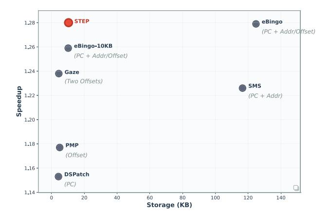
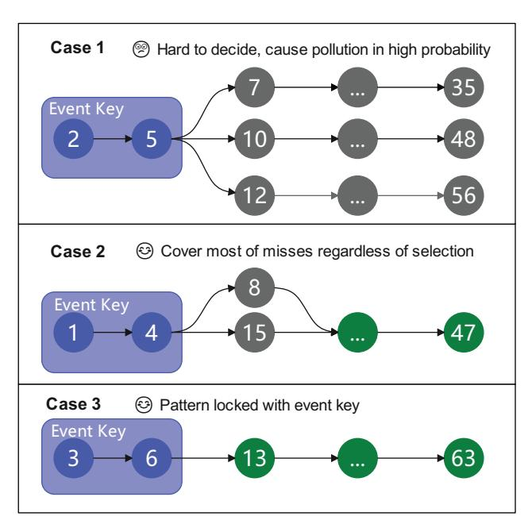
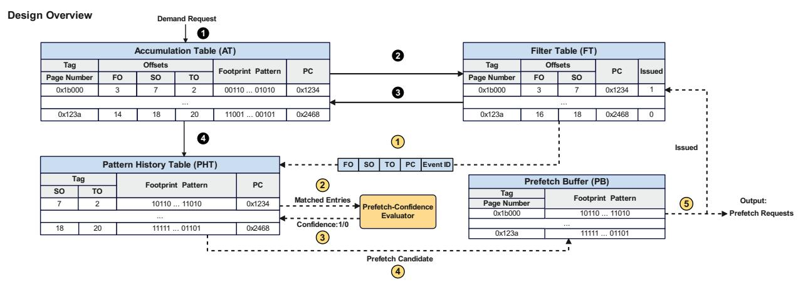
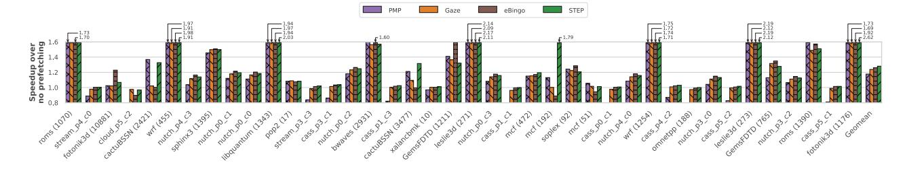
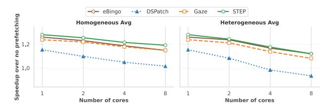
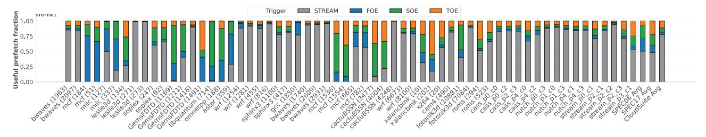
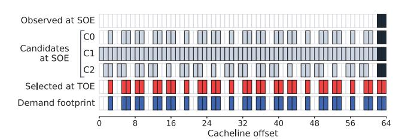
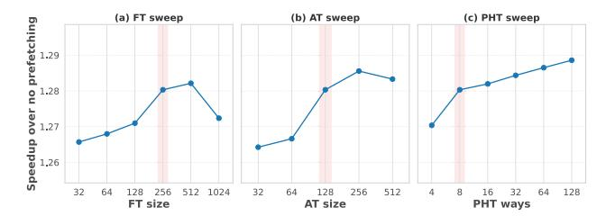

# STEP: Spatial Footprint Prefetcher with Multi-Point Temporal Triggers

Yuanji Ye, Oliver Lenke, Thomas Wild, and Andreas Herkersdorf Technical University of Munich, Germany Email: {yuanji.ye, o.lenke, thomas.wild, herkersdorf}@tum.de

*Abstract*—Modern processors continue to face the memory wall, which heavily impacts computer performance. Besides sophisticated cache hierarchies, prefetching is a proven technique to hide latency and mitigate the problem. Spatial footprint prefetchers have attracted research interest due to their ability to cover diverse memory access patterns with relatively low hardware cost. However, current implementations trigger on a single-point-in-time event, forcing a trade-off between issuing prefetches early, which increases noise, and issuing them later, which reduces opportunities.

We propose STEP, a spatial footprint prefetcher that introduces multiple sequential temporal decision points within a page's cache lifetime and selectively issues prefetches when confidence is high. STEP coordinates these decisions through a lightweight prefetch-confidence evaluator, enabling early opportunities while retaining high accuracy with later prefetching triggers. Moreover, STEP consolidates metadata into a single Pattern History Table (PHT), reducing storage overhead.

Experimental results on SPEC CPU2006, SPEC CPU2017, and CloudSuite show that STEP improves performance across a broad range of workloads. In the L2 single-core evaluation, STEP remains ahead of the strengthened ISO-storage baseline eBingo, while in the L1 single-core evaluation, STEP further outperforms Gaze, the strongest baseline at that level. STEP also delivers a stronger performance–storage trade-off, as eBingo requires substantially larger metadata capacity to approach STEP's lowstorage operating point.

#### I. INTRODUCTION

Over the last decade, DRAM capacity and bandwidth have improved significantly, but latency has advanced far more slowly [17]. As a result, processors frequently stall on memory accesses—the well-known memory wall [36]. With memoryintensive workloads in big data, deep learning, and media processing becoming pervasive, reducing effective memory access latency is increasingly critical [24], [25]. Modern cache hierarchies can effectively hide memory access latency in many cases. Nevertheless, cache-unfriendly data structures limit their effectiveness due to poor locality, higher eviction rates, and compulsory cache misses [23]. Combining caches with efficient prefetching strategies further helps bridge the processor–memory performance gap, with data prefetching being one of the most well-known and extensively studied techniques.

A prefetcher predicts future memory access behavior and fetches data into caches or buffers closer to the processor core, thereby hiding the latency of a full memory access. Commercial CPUs from Intel, IBM, and AMD predominantly employ low-complexity prefetchers—such as next-line, streaming, and stride-based designs—that are efficient to implement in hardware [5], [6], [19]. However, these simple prediction mechanisms can only capture a small fraction of the complex memory access behaviors exhibited by diverse programs.

To handle diverse access patterns while maintaining hardware simplicity, architects have proposed numerous prefetcher designs that leverage spatial and temporal locality.

Temporal prefetchers can effectively address irregular memory access patterns but typically require large storage to record the temporal correlation between memory addresses [7], [8], [35]. Consequently, most research in this area focuses on metadata management to balance performance gains and storage overhead. Machine-learning-based prefetchers can achieve high prefetching accuracy, but the models are often difficult to implement efficiently in hardware and may not meet strict prediction latency requirements [15], [37]. Furthermore, generalization beyond training programs is another concern [33].

Compared to these two approaches, spatial footprint-based prefetchers can achieve competitive performance across a wide range of programs with modest hardware cost and complexity [9], [12], [14], [20], [27], [34]. They are highly effective at learning and utilizing diverse spatial memory access patterns. The access pattern of a memory region (e.g., a 4 KB page) is recorded as a bit-vector footprint (e.g., one bit per cache line). The core idea is straightforward: if a program exhibits a particular footprint in region A, it will likely follow a similar footprint when re-accessing A or other regions sharing a similar event key (e.g., Program Counter (PC), offset, or richer combinations). Thus, these designs record historical footprints alongside an event key and predict future accesses by matching that event key.

Previous spatial footprint prefetchers almost universally select a single, fixed time point to trigger the prefetch event. For instance, many prefetchers trigger prefetching on the first access to a memory region, using the PC, offset (i.e., the distance of a block address from the beginning of a page), etc., of the first access as the event key [9], [12], [20], [27], [34]. Other spatial footprint prefetchers adopt a later trigger (e.g., Gaze presented by Z. Chen et al. [14]) in order to exploit temporal correlation between accesses.

This single-point-in-time design still exposes a fundamental trade-off among opportunity, accuracy, and storage, although modern designs can mitigate it. Earlier triggers see more potential opportunities, but with limited context, they must either prefetch aggressively and risk pollution, or rely on richer keys, fallback behavior, and larger metadata structures to maintain prediction quality. Later triggers, by contrast, benefit from additional evidence and can often make more accurate decisions with simpler states, but they inevitably miss some early opportunities. Recent single-point designs push this trade-off frontier significantly through stronger matching and candidate aggregation at a fixed trigger point. However, they still operate within the same formulation: they decide what to issue from candidates matched at the current trigger, rather than whether the current trigger itself already provides sufficient evidence for issuing prefetches.

In this paper, we revisit this design choice for the broader family of spatial footprint prefetchers and propose STEP, a prefetcher that treats prefetching as a sequence of temporal decisions rather than a one-shot trigger. Instead of committing to a single trigger point, STEP evaluates multiple trigger stages and adapts prefetch issuance according to the available evidence. This yields two benefits: (1) it can exploit early opportunities when the signal is already strong, and (2) as later points accumulate additional evidence, it can avoid issuing prefetches when the current trigger remains ambiguous. In this sense, STEP is not merely a different event-key design, but a different organizing principle for spatial footprint prefetching: it turns prefetching from a single-point candidate-selection problem into a staged trigger-decision problem.

Our goal in STEP is not to exhaustively optimize the event-key design, but to expose and validate this trigger-time decision dimension in a practical, low-cost implementation.1 The current design instantiates this idea using lightweight offset-based temporal events and a similarity-based confidence evaluator. Even this lightweight instantiation already outperforms strengthened single-point baselines in several key settings, while exposing staged trigger-time decision as a broader design direction beyond this specific implementation.

To summarize, we make the following contributions in this paper:

- We identify a limitation of conventional spatial footprint prefetchers: they make prefetching decisions at a single point in time, entangling trigger timing, accuracy, and storage cost in a fixed trade-off.
- We introduce multi-point temporal triggering as an orthogonal design dimension for spatial footprint prefetching, and propose STEP as a practical instantiation that performs staged trigger decisions using lightweight evidence accumulation and confidence evaluation.
- We design and implement a low-overhead hardware realization of STEP based on a unified Pattern History Table and lightweight trigger-time confidence logic, keeping the total storage overhead around 10 KB.
- We evaluate STEP across SPEC CPU2006, SPEC CPU2017, and CloudSuite in diverse settings, show-

1We instantiate STEP in a Gaze-like low-storage setting because Gaze was one of the most recent published low-storage spatial prefetchers at the time of submission. In principle, similar trigger-time decision mechanisms could also be explored on top of other spatial prefetchers.

Fig. 1: Performance–storage positioning of STEP and representative footprint spatial prefetchers. The strengthened fixedtrigger baseline eBingo improves with additional metadata, but STEP remains competitive near the low-storage regime around 10 KB.

ing that this lightweight instantiation outperforms strong single-point spatial prefetchers in most key settings while providing a favorable performance-storage trade-off.

#### II. RELATED WORK AND MOTIVATION

#### *A. Spatial Footprint Prefetching*

Spatial footprint prefetching is a widely studied and effective family of prefetching techniques. The core idea is to record the footprint—a bit-vector indicating which cache lines within a memory region (e.g., a 4 KB page) were touched—and to use historical footprints to predict the footprint of the same region on future accesses or of other regions that share similar characteristics.

A general framework for spatial footprint prefetching was introduced by SMS prefetcher [34]. It typically includes a Filter Table (FT), an Accumulation Table (AT), and a Pattern History Table (PHT). The FT filters out 4KB pages with negligible activity; remaining pages are tracked in the AT as bit vectors, with one bit per cache block. As new blocks are accessed, the AT updates the page's footprint. When the page becomes inactive (e.g., evicted from the AT), the AT commits the completed footprint to the PHT, along with its event key (the identifier used later to look it up). The PHT is commonly set-associative; upon a key match, it supplies the matched historical footprints to guide prefetching for the newly accessed page. Subsequent work—including PMP, DSPatch, Bingo, and Gaze [9], [12], [14], [20]—adopts similar structures while changing how entries are matched, selected, and consumed.

Among these design choices, the event key is particularly important because a recorded footprint is reusable only if the same key reappears. Event keys lie along a spectrum:

• High-frequency, simple keys (e.g., page offset). The key space is small (e.g., 64 offsets per 4 KB page), reducing

- storage and increasing match frequency, but each match carries limited information, lowering accuracy.
- Low-frequency, specific keys (e.g., full address or page number). The key space is large, demanding more storage and yielding fewer matches, but each match is more specific and therefore typically more accurate.

Thus, from an accuracy-coverage-storage standpoint, more specific keys tend to improve prediction precision but yield fewer opportunities, whereas simpler keys improve match frequency at the price of greater ambiguity. Prior designs, therefore, combine different event keys with different auxiliary mechanisms to mitigate these trade-offs, resulting in different performance-storage operating points, as shown in Fig. 1.

Among these designs, Bingo [9] is one of the strongest prior spatial footprint prefetchers in our evaluation. Rather than relying on only one event key, Bingo strengthens single-trigger prefetching through richer matching and candidate handling: it can exploit more specific history when available, fall back to coarser history when needed, and aggregate information from multiple matched candidates at the trigger point. In our evaluation, we further strengthen this baseline with the same streaming-pattern detection used in Gaze, and refer to the resulting design as eBingo. Planaria [27] leverages page proximity to transfer footprints across co-located pages and thereby improve coverage. Gaze [14], as another strong lowstorage baseline in our evaluation, improves prediction quality from a different direction. Instead of making the first access trigger more expressive, it delays issuance to a later trigger point so that the prefetcher can exploit short-range temporal correlation between offsets within the same region.

#### B. Motivation

Section II-A shows that prior work already contains several effective mechanisms to mitigate the trade-offs among accuracy, coverage, and storage, including richer matching, pattern merging, fallback behavior, candidate aggregation, delayed triggering, and auxiliary stream handling. However, as shown in Fig. 2, conventional spatial–footprint prefetchers almost always commit to a *single-point-in-time* trigger per region, whether it is the first point or the second point. Thus, prior work pushes the same frontier from different directions, but remains within the same formulation: the design is fixed to a single trigger time and only improves what happens at that time

STEP revisits this formulation. As shown in Fig. 2, instead of assuming that prefetching must be tied to one fixed event, STEP treats footprint prefetching as a sequence of temporal decision points. At each point, it asks whether the currently matched histories are already consistent enough to justify issuing prefetches; if not, it waits for additional evidence. This makes trigger timing itself a runtime decision variable. Importantly, this is orthogonal to other mechanisms: a design could still use stronger event representations or candidate aggregation, but STEP adds the ability to decide when the current evidence is sufficient, rather than forcing all decisions to occur at a single temporal point.

Fig. 2: Single-point vs. sequential multi-point prefetching. Conventional designs fix one temporal trigger (A1 or A2), trading early opportunity for later accuracy or vice versa. STEP evaluates a sequence of triggers (A1, A2, A3) and applies a confidence evaluator at each point, issuing early prefetches only when confidence is high and refining decisions as evidence accrues.

This idea is also related in spirit to confidence mechanisms used in classical stream and stride prefetchers, where aggressiveness is often gated by repeated observations of stable patterns. However, extending such confidence-driven decisions to connect multiple trigger points in spatial footprint prefetching is less straightforward. A spatial footprint match is not a single confidence state; instead, confidence depends on multiple candidate footprints across different observation points.

Realizing such sequential decisions raises two main challenges: (1) *Policy*—how to quantify per-point prefetch confidence and act on it with a lightweight decision rule; and (2) *State and timing*—how to retain and reuse keys and footprints across points without inflating storage or extending lookup critical paths. These challenges motivate our prefetch-confidence evaluator (for per-point decisions) and a consolidated, low-overhead state design (for storage and timing), detailed in Section III.

# III. THE DESIGN OF STEP PREFETCHER

#### A. Design Overview

STEP treats spatial footprint prefetching as a sequence of trigger-time decisions within a region's lifetime. Rather than binding prefetching to one fixed event, STEP progressively observes each region at three trigger points. And because it uses offset as the event key, we call these three points: the first-offset event (FOE), the second-offset event (SOE), and the third-offset event (TOE). As the region is observed over time, the amount of context available to the prefetcher increases: FOE provides only the first offset, SOE provides the first two offsets, and TOE provides all three. At each point, STEP uses

Fig. 3: Illustration of three scenarios with different prefetching confidence based on footprint pattern convergence.

the currently available event information to query historical footprints and then decides whether the evidence is already strong enough to issue prefetches. If the matched histories are sufficiently consistent, STEP issues prefetches immediately; otherwise, it waits for the next trigger point to obtain additional evidence.

This staged behavior is realized with two main components. First, a lightweight prefetch-confidence evaluator determines whether matched historical footprints have sufficiently converged at the current trigger point. Second, a unified hardware organization retains the information needed to support FOE, SOE, and TOE without replicating separate history tables for each event. FOE requires additional support because it is the earliest and least constrained trigger; STEP therefore augments FOE matching with hashed PC information to improve disambiguation at low cost. In the remaining subsections, we first present the prefetch-confidence evaluator that determines whether a trigger point is mature enough for prefetching. Next, we discuss the special handling required for FOE, which is the earliest and most under-constrained trigger. Finally, we describe the hardware structures, dataflow, and overhead of the complete design.

# B. Prefetch-Confidence Evaluation

At each trigger point, STEP may observe multiple historical footprints that match the currently available event information. The role of the confidence evaluator is to decide whether these matches are already consistent enough to support issuance or whether the prefetcher should defer to a later trigger point.

When historical footprints aligned by the same event and key largely agree on the remaining lines to be accessed, issuing a full footprint captures most of the remaining misses at low risk. When they diverge beyond the early lines, issuing early often fetches many wrong lines and causes pollution. Figure 3 illustrates these representative cases. We therefore issue prefetches only when the matched histories are sufficiently convergent; otherwise, we defer to the next trigger point.

To quantify confidence, STEP applies a simple similarity test over the last N matched footprints returned by the PHT (default N=3). We compare the most recent footprint with the remaining N-1 footprints using Jaccard similarity:

$$J(A,B) = \frac{|A \cap B|}{|A \cup B|}.$$

If all N-1 similarities exceed a threshold T (default T=0.75), we call the set convergent and issue prefetches at the current event; otherwise, we defer to the next event. We issue the intersection of the matched footprints rather than a union, prioritizing accuracy over coverage under bandwidth-constrained conditions. Bounding the comparison to the most recent N entries keeps the hardware small and avoids relying on stale patterns from old phases.

### C. First-Offset Event Support

Handling the first-offset event (FOE) is inherently difficult because a single touch provides little context, making naive full-footprint issuance prone to overfetch and pollution. FOE is therefore the most under-constrained trigger point in STEP. To improve FOE reliability, STEP adds two FOE-specific supports. First, it augments FOE matching with hashed PC information to partially disambiguate calling contexts at low cost. Second, it adds a maturity check for the single-match cold-start case, preventing an early learned pattern from being treated as already stable before recurrence has been observed.

The hashed PC change is minimal in cost: it is not used as a tag and is stored once per PHT entry and per FT/AT entry. With this PC information, we can bring part of the prefetching at SOE/TOE forward.

Another challenge is that FOE remains vulnerable to the cold start when the lookup returns exactly one matched history entry. Unlike the multi-match case, no cross-pattern disagreement can be observed, so a single early learned footprint may be falsely treated as mature even though other divergent patterns have not yet been learned. STEP therefore adds a one-bit maturity flag per learned pattern, checked only in this single-match FOE case. Newly inserted entries start as immature; if the sole matched entry is immature, STEP defers issuance to later trigger points. An entry becomes mature only after recurrence is observed. In our implementation, we approximate recurrence by marking a newly inserted pattern as mature when its hashed PC matches that of the displaced entry in the same history position, indicating that this calling context has appeared more than once rather than only during cold start.

# D. Hardware Organization and Dataflow

**Architecture:** Figure 4 illustrates the architecture of the STEP prefetcher. The design consists of four main structures

Fig. 4: Structure of the STEP prefetcher, including the Filter Table (FT), Accumulation Table (AT), Pattern History Table (PHT), Prefetch Buffer (PB), and the Prefetch-Confidence Evaluator. Solid arrows indicate the learning/update flow and dashed arrows the prefetch flow; circled numerals annotate the order of operations.

commonly used in footprint prefetchers—a Filter Table (FT), an Accumulation Table (AT), a Pattern History Table (PHT), and a Prefetch Buffer (PB)—together with the prefetch-confidence evaluator introduced in Section III-B. FT, AT, and PHT are all set-associative structures.

Instead of handling only the first access, the FT filters out pages with fewer than three accesses. It is indexed by the hashed page number and stores the first and second access offsets. The AT tracks all active pages and accumulates their footprint patterns, indexed by the hashed page number and stored as a 64-bit bit vector (one bit per cache line). For PHT, we observe that TOE subsumes SOE and FOE, so a single PHT suffices: store TOE-associated footprints once and derive earlier-event matches from the same entry. Concretely, the PHT is indexed by the first offset and tagged with the second and third offsets. At lookup, the tag is truncated according to the event: SOE checks the upper 6 bits, and TOE checks the whole tag. The PB stores footprints indexed by page number. When the prefetch queue is full, pending prefetch requests are temporarily buffered in the PB instead of being discarded, allowing them to be reissued upon future access triggers.

**Process:** The prefetcher operates in two flows—Learning and Prefetching—both triggered by new page accesses. In Fig. 4, solid lines represent the learning flow and dotted lines represent the prefetch flow.

- 1) Learning Flow: When a demand access arrives, we first probe the Accumulation Table (AT). If an entry exists—meaning the page's footprint is currently being learned—we set the bit corresponding to the access offset in the footprint vector (1). If no entry exists, the page is treated as new and the access is forwarded to the Filter Table (FT) (2) to screen for pages with negligible activity. There are three cases for FT looking up:
  - FT miss: allocate a new entry; extract the page offset and store it as the first offset; mark the second offset

- invalid (e.g., 64).
- FT hit with invalid second offset: this access provides the second offset; update the field.
- 3) FT hit with valid second offset: this is the third access; the page passed the FT. Then, send the new offset, along with the first two offsets, to the AT and allocate a new AT entry to begin accumulating the full footprint (3); clear the FT entry.

When a new AT entry is allocated, it evicts an old one. This eviction indicates the old page's pattern is stable and complete. The evicted footprint, along with its first three offsets, is written to the PHT (4), making it available for future prefetching.

- 2) Prefetching Flow: Prefetching can be triggered by FOE, SOE, or TOE. As shown in Figure 4, the FT forwards the request containing the offsets, PC and event ID to the PHT (1). The PHT recognizes the event type according to the event ID and extracts the corresponding data, and operates as follows:
  - 1) First Offset Event (FOE): PHT extracts the first offset and PC and fetches the most recent N (default N = 3) entries matching FO+PC. If only one entry matches, STEP additionally checks the entry's maturity flag; if the entry is still immature, FOE issuance is suppressed, and the request is deferred to later trigger points. Otherwise, the matched entries are then passed to the Prefetch-Confidence Evaluator introduced in Section III-B (2). The evaluator will return the confidence (3). If confidence is high, push prefetch candidates according to the intersection of the most recent matched footprints to the prefetch buffer and issue, and notify the FT that prefetches for this page have been issued by FOE (4-5). If confidence is low, take no action and wait for the SOE.
  - 2) Second Offset Event (SOE): When the FT entry re-

ceives the second offset, it first checks the issued field. If 0, it issues a PHT request. Run prefetch confidence evaluation on patterns matching FO+SO ( 2 - 3 ). If confidence is still low, wait for TOE; otherwise, prefetch the footprints intersection and notify FT ( 4 - 5 ).

3) Third Offset Event (TOE): With three offsets available, a PHT lookup using the full tag is highly specific. On hit, issue the full prefetch ( 4 - 5 ). On miss, no prefetch action for this page entry.

TABLE I: Storage Overhead

| Component              | Entry Contents                                                                 | bits/ entry | Total entries | Total (KB) 2.08 |
|------------------------|--------------------------------------------------------------------------------|----------------|------------------|-----------------------|
| FT                     | Tag (36b), LRU (3b), Hashed PC (12b), Offsets (6+7=13b), Issued (1b)     | 65             | 256              |                       |
| AT                     | Tag (36b), LRU (3b), Hashed PC (12b), Offsets (6×3=18b), Footprint (64b) | 133            | 128              | 2.12                  |
| PHT                    | Tag (2×6=12b), LRU (3b), Footprint (64b), Hashed PC (12b), maturity (1b) | 92             | 512              | 5.88                  |
| PB                     | Tag (36b), LRU (3b), Footprint (64b)                                        | 103            | 32               | 0.41                  |
| DPCT                   | Hashed PC (12b), LRU (3b)                                                      | 15             | 8                | 0.015                 |
| Total Storage Overhead |                                                                                |                |                  | 10.50                 |

# *E. Streaming Pattern Prefetching*

Streaming accesses are common in many workloads and can be handled effectively by simpler dedicated mechanisms. Although the main PHT in STEP could, in principle, also learn these patterns, doing so would unnecessarily consume history capacity and interfere with non-streaming footprint learning. We therefore adopt the same lightweight dense-PC streaming detector used in Gaze [14], which includes a Dense PC Table (DPCT) to record recent dense PCs, as well as the same mechanism as in eBingo. This component is orthogonal to STEP's core contribution, which lies in staged trigger-time decisions for spatial footprint issuance.

# *F. Storage Overhead*

We use 8-way set-associative FT/AT/PHT with 256/128/512 total entries, respectively. Table I lists per-entry fields and totals. Compared to address- or page-keyed designs (e.g., SMS [34], Bingo [9], Planaria [27]) that exceed 100 KB, STEP achieves greater improvement with much less storage of 10.5 KB. Relative to simple-event designs (e.g., Gaze [14], PMP [20], DSPatch [12]), STEP spends only a few extra KB to gain early opportunity and later-point accuracy through sequential decisions, resulting in much higher performance.

# *G. Architectural Integration*

The STEP prefetcher is integrated as an add-on hardware entity, located in parallel to the L2 cache of our MPSoC architecture. It snoops on the bus between the L1 and L2 cache and inserts prefetch requests into the prefetch queue (PQ) of the L2 cache. The latter will then take care of prefetching the corresponding cachelines into the L2 cache. Although we mainly prototype STEP as an L2C prefetcher, the principles apply at other cache levels, which is also shown in Section V-C and Section V-D.

#### IV. EXPERIMENTAL METHODOLOGY

# *A. Simulator and System Configuration*

We evaluate STEP using ChampSim [4], a trace-driven simulator used in the 2nd, 3rd data prefetching championships (DPC2 [2] and DPC3 [3]), and the 2nd cache replacement championship (CRC2) [1]. ChampSim models a modern outof-order core pipeline and a detailed cache hierarchy, providing an effective platform for evaluating prefetchers. The whole system configuration is listed in Table II.

TABLE II: Simulator System Configuration

| Component  | Configuration                                             |  |
|------------|-----------------------------------------------------------|--|
| Core       | 1–8 OoO cores, 4 GHz, 4-wide issue, 128/72 LQ/SQ, 352     |  |
|            | ROB                                                       |  |
| L1-I Cache | 32 KB, 8-way, 64 B line, 4 cycles                         |  |
| L1-D Cache | 48 KB, 12-way, 64 B line, 5 cycles                        |  |
| L2 Cache   | 512 KB, 8-way, 10 cycles                                  |  |
| LLC        | 2 MB/core, 16-way, 20 cycles                              |  |
| TLBs       | ITLB/DTLB: 64-entry, 1 cycle; STLB: 1536-entry, 8 cycles  |  |
| DRAM       | DDR4-3200, 8 banks/rank, tRP = tRCD = tCAS = 12.5 ns      |  |
|            | 1C: Single channel, 1 rank/channel; 2C: Dual channel, 1   |  |
|            | rank/channel; 4C: Dual channel, 2 ranks/channel; 8C: Quad |  |
|            | channel, 2 ranks/channel;                                 |  |

Each simulation warms up for 50 M instructions and collects statistics over the following 100 M committed instructions per core. For multicore experiments, we run all cores and all cores execute until each has completed its measurement window. For homogeneous workloads, we replicate the same trace on all cores. For heterogeneous workloads, we construct mixedworkload groups by randomly sampling traces using a fixed seed (experiment date) to ensure reproducibility. We generate 50 mixed groups for each core count (2, 4, and 8 cores) and evaluate all groups.

#### *B. Workloads*

To cover both regular and irregular access behaviors, we adopt benchmark suites widely used in prior prefetching studies [11], [14]. Only memory-intensive traces (LLC miss per kilo instructions (MPKI) ≥ 1 without prefetching) are included, in total 130 traces. Traces are sourced from DPC-2/3, and CRC-2 public repositories [1]–[3]. As shown in Table III, the 130 traces span three benchmark suites, SPEC CPU2006 (39 traces), SPEC CPU2017 (39 traces), and CloudSuite (52 traces). Together, these suites span streaming versus irregular access, small versus large working sets, and single-core versus contended multi-core settings, enabling a comprehensive assessment of prefetch coverage, accuracy, and bandwidth impact.

TABLE III: Evaluated benchmark suites.

| Suite        | #Traces | Examples                                                                                                        |  |
|--------------|---------|-----------------------------------------------------------------------------------------------------------------|--|
| SPEC CPU2006 | 39      | mcf, bwaves, cactusADM, leslie3d, libquantum, omnetpp, astar, sphinx3 xalancbmk, milc, wrf, GemsFDTD, lbm |  |
| SPEC CPU2017 | 39      | gcc, cactuBSSN, wrf, povray, x264, fotonik3d, roms, pop2, mcf, bwaves, omnetpp, cam4                            |  |
| CloudSuite   | 52      | nutch, cassandra, streaming                                                                                     |  |

### C. Evaluated Prefetchers

We compare STEP against eight state-of-the-art prefetchers. vBerti [31] is a per-page local-delta prefetcher that learns, for each active page, the deltas between consecutive accesses and prioritizes the most likely to be timely. Its storage overhead is only 2.55 KB.

The Instruction Pointer Classifier Prefetcher (IPCP) [32] classifies each load instruction into a small set of spatial behaviors and issues prefetches accordingly. As reported in the original work, IPCP incurs only 895 B of storage overhead.

The Spatial Memory Streaming (SMS) prefetcher [34] uses 64-entry FT and AT tables, a 16 K-entry PHT, and a 32-entry Prefetch Buffer (PB). Its total hardware cost is approximately 116.6 KB.

The Dual Spatial Pattern Prefetcher (DSPatch) [12] characterizes patterns per PC using a 64-entry Page Buffer, a 256-entry Spatial Pattern Table (SPT), and a 32-entry Prefetch Buffer. DSPatch maintains two patterns per PC to improve coverage at minimal cost, requiring only 4.25 KB of total storage.

The Pattern Merging Prefetcher (PMP) [20] learns merged footprints across multiple regions. PMP uses 64-entry FT and AT tables, a 64-entry Offset Pattern Table (OPT), a 32-entry Prefetch Pattern Table (PPT), and a 32-entry Prefetch Buffer (PB). Its aggressiveness is governed by a maximum confidence counter of 32. The overall storage cost is approximately 5.0 KB.

The Signature Path Prefetcher (SPP) [22] encodes controlflow history into path signatures and predicts delta sequences with confidence-based lookahead. It is combined with Perceptron-based Prefetch Filtering (PPF) [13], which classifies candidate prefetches and program context to suppress likely-useless requests. The total storage overhead of the combined SPP+PPF design is approximately 39.3 KB.

We additionally evaluate an ISO-storage and enhanced Bingo baseline, denoted eBingo, which augments Bingo with the same lightweight dense-PC streaming detector used in STEP.

The Gaze [14] prefetcher operates on 4 KB regions, featuring an 8-way 64-entry FT, an 8-way 64-entry AT that stores a 64-bit footprint along with recent access offsets, a 256-entry 4-way PHT holding 64-bit footprints, and a 32-entry PB. The overall storage cost is 4.46 KB. For consistency and fair comparison against L2-only baselines, we configure Gaze to place prefetches into the L2 cache only, removing any potential advantage from multi-level fill policies. We

additionally verified that enabling Gaze's original multi-level prefetching policy does not change our qualitative conclusions.

All prefetchers are implemented within the same ChampSim baseline and placed at the L2C level with identical MSHR budgets and prefetch queue configurations.

#### D. Metrics

- **Speedup:** The ratio of instructions per cycle (IPC) with prefetching to IPC without prefetching.
- Accuracy: The fraction of issued prefetches that are eventually consumed by demand before eviction.

$$\label{eq:accuracy} \text{Accuracy} = \frac{N_{\text{useful}}}{N_{\text{useful}} + N_{\text{useless}}}$$

• **Coverage:** The fraction of baseline (no prefetching) demand misses that are eliminated by prefetching.

$$\text{Coverage} = \frac{N_{\text{miss}}^{\text{base}} - N_{\text{miss}}^{\text{pf}}}{N_{\text{miss}}^{\text{base}}},$$

where  $N_{\text{miss}}^{\text{base}}$  and  $N_{\text{miss}}^{\text{pf}}$  denote load misses without and with prefetching, respectively, measured at the same cache level.

 Overprediction: The total of (i) prefetches that are never used before eviction and (ii) duplicate prefetches whose target line was already in the cache. In Fig. 7, we report overprediction as a percentage relative to baseline demand load misses.

### V. EVALUATION

STEP supports three staged trigger points as a general framework. Unless otherwise stated, the main evaluation uses the variant that disables prefetch issuance at SOE, since this configuration achieves the best average performance according to our ablation study in Section V-E.

### A. Single-Core Performance

We evaluate STEP on SPEC CPU2006, SPEC CPU2017, and CloudSuite, reporting speedup, accuracy, coverage, and prefetch composition in Figure 5, Figure 6, Figure 7, Figure 8, and compare against representative state-of-the-art prefetchers described in Section IV-C. Overall, STEP achieves the highest average application speedup with moderate storage, while maintaining a balanced accuracy–coverage profile.

**Speedup.** Figure 5 reports geometric-mean speedups relative to no prefetching. STEP consistently achieves the highest performance across the evaluated suites. On SPEC CPU2006, STEP reaches 1.49× speedup, exceeding the strengthened fixed-trigger baseline eBingo (1.47×) and the low-storage baseline Gaze (1.45×). On SPEC CPU2017, STEP reaches 1.40×, again ranking first ahead of eBingo (1.34×). On CloudSuite, which exhibits burstier and more complex access behavior, STEP still provides a positive gain of 1.07×. While eBingo reaches the same suite-level average on CloudSuite, STEP remains the overall best design across the full workload set. Averaged across all suites, STEP achieves the highest overall geometric mean of 1.28×, ahead of eBingo (1.26×) and

Fig. 5: Geometric-mean speedup (vs. no prefetching) on SPEC CPU2006, SPEC CPU2017, and CloudSuite.

Fig. 6: Prefetch accuracy and coverage across all suites.

Gaze (1.24×). Moving to Figure 8, we examine performance at per-trace granularity. STEP is the most robust design across traces. PMP is strongest on cactuBSSN-2421, mcf-51, and leslie3d-134. eBingo remains highly competitive on most workloads and behaves the best in GemsFDTD traces. Gaze and STEP exhibit similar cross-trace trends, but STEP is usually slightly better across programs.

Accuracy. Figure 6 (top) shows that STEP maintains a strong and stable accuracy profile across all suites. vBerti achieves the highest average accuracy among the evaluated designs (89%), but this selectivity comes with a clear coverage trade-off, as shown in Figure 6 (bottom). eBingo and Gaze also exhibit competitive average accuracy (73% and 67%, respectively). STEP reaches 74% average accuracy and remains consistent across suites, which aligns with its strong end-toend speedup. Accuracy should be interpreted together with coverage and timeliness.

Coverage. Figure 6 (bottom) shows that STEP delivers the highest average coverage across suites at 51%, slightly exceeding eBingo (50%) and the other baselines. vBerti exhibits the lowest coverage largely because it explicitly accounts for both accuracy and timeliness, whereas other designs may still count late prefetches toward coverage even when they provide

Fig. 7: Prefetch-composition analysis on a single-core system: useful (covered) demand misses, late prefetches, remaining uncovered misses, and two overprediction components (cachehit prefetches and unused prefetches).

limited latency-hiding benefit.

Prefetch Composition. Figure 7 depicts the composition of issued prefetches. Overall, STEP converts a larger fraction of its prefetch activity into useful coverage while keeping waste under control. On CloudSuite, STEP issues fewer total prefetches than several competing designs, yet delivers the most useful and timely data, indicating better selectivity under bursty and irregular access behavior. On SPEC17, STEP again achieves a strong useful fraction while avoiding large growth in useless and cache-hit overpredictions. On SPEC06, a larger portion of the gain comes from FOE-triggered prefetches: this increases useful coverage and timeliness, but also raises overprediction relative to more conservative designs. Taken together, these results are consistent with STEP's staged trigger-time design: earlier trigger points capture additional opportunities when the signal is already strong, while later trigger points help avoid unnecessary traffic when more evidence is needed.

#### *B. Multi-Core Performance*

Figure 9 shows the multicore scaling of STEP, eBingo, Gaze, and DSPatch from 1 to 8 cores under both homogeneous and heterogeneous workload settings. Overall, STEP remains highly robust as core count increases, while eBingo is the strongest fixed-trigger baseline and becomes particularly competitive in the challenging heterogeneous setting.

In the homogeneous setting, all prefetchers lose performance as the number of cores increases because contention in the shared cache hierarchy and memory system becomes stronger. Nevertheless, STEP remains consistently ahead across the full 1-8 core range, and its advantage over the other prefetchers becomes more apparent as core count increases. eBingo is generally the closest baseline, followed by Gaze, while DSPatch degrades the most.

The heterogeneous setting is more challenging because mixed workloads create more irregular interference in both bandwidth and cache residency. Under this stronger interference, STEP remains among the strongest designs throughout the sweep, while eBingo becomes more competitive and matches STEP's performance at 8 cores. This result indicates that eBingo can be particularly effective under the heaviest

Fig. 8: Per-trace speedup of PMP, Gaze, eBingo, and STEP on 40 randomly selected traces from the full evaluation set.

Fig. 9: Multi-core performance scaling for homogeneous and heterogeneous workloads from 1 to 8 cores.

mixed-workload pressure, whereas STEP still maintains strong robustness across the broader multicore range. In contrast, Gaze and especially DSPatch degrade more noticeably as core count increases. Overall, these results show that STEP's benefit is not limited to the single-core setting. Its staged triggertime decisions remain effective under substantial multicore contention, while eBingo emerges as the closest baseline. More broadly, these results also suggest that local trigger-time decisions are an important part of multicore prefetching, but the hardest shared-resource interference cases may further benefit from complementary multicore-aware coordination beyond the private-core view.

# *C. L1-level Performance*

Figure 10 reports L1-level prefetching performance for Gaze, eBingo, and STEP. STEP remains the best design at L1, achieving 1.47×, 1.38×, and 1.09× speedup on SPEC

Fig. 10: Geometric-mean speedup of L1-level prefetcher performance over no prefetching.

Fig. 11: Geometric-mean speedup of multi-level (L1+L2) prefetcher combinations over no prefetching.

CPU2006, SPEC CPU2017, and CloudSuite, respectively, and an overall geometric mean of 1.28×. This exceeds Gaze (1.25×) and eBingo (1.23×) in overall performance.

The gains are larger on SPEC CPU2006 and SPEC CPU2017 than on CloudSuite, where the three designs are closer. This indicates that STEP's staged trigger-time mechanism remains effective beyond the L2 setting and continues to provide benefit even at the more timing-sensitive and pollution-sensitive L1 level.

#### *D. Multi-level Prefetching*

Figure 11 reports the performance of multi-level (L1+L2) prefetcher combinations built from Gaze, vBerti, eBingo, and STEP. IPCP is included as a representative coordinated multi-level baseline. The results show that hybrid prefetching is not automatically additive: enabling a second prefetcher can increase memory traffic and resource contention, and the L1 prefetcher also filters the access stream seen by the L2 prefetcher, which changes its learning signal and may reduce timeliness. Despite these interactions, STEP remains highly robust across combinations. The strongest configurations are STEP+STEP and STEP+eBingo, both achieving 1.277× speedup, followed by Gaze+STEP (1.266×) and STEP+Gaze (1.262×). More broadly, nearly all top-tier combinations include STEP at either L1 or L2, indicating that STEP remains effective at both levels. When used at L1, STEP consistently forms one of the best combinations; when used at L2, pairing it with Gaze or eBingo also yields strong results.

In contrast, IPCP reaches 1.156×, noticeably below the best L1+L2 combinations. Overall, these results show that STEP's

Fig. 12: Ablation on STEP's time-point triggers. STEP-D1: disable First-Offset Event (FOE); STEP-D2: disable Second-Offset Event (SOE); STEP-D3: disable Third-Offset Event (TOE).

Fig. 13: Prefetch accuracy and coverage under ablations.

staged trigger-time mechanism remains effective even under cross-level interactions.

# *E. Ablation Study*

We ablate STEP's three trigger points—FOE, SOE, and TOE—to quantify their individual contributions. In this subsection, we also evaluate STEP-FULL to expose the contributions of all trigger points. We compare four variants: STEP-FULL, STEP-D1 (FOE disabled), STEP-D2 (SOE disabled), and STEP-D3 (TOE disabled).

STEP-D1: As shown in Fig. 12, disabling FOE primarily hurts performance on SPEC CPU2006, where issuing useful prefetches at the first observed offset often translates directly into IPC gains. In contrast, removing FOE rarely improves performance on SPEC CPU2017 or CloudSuite. Although accuracy changes little, the loss of early coverage and timeliness typically outweighs any reduction in speculative traffic. This suggests that FOE is especially valuable for workloads whose useful opportunities arise early in the region's lifetime.

STEP-D2: As shown in Fig. 12, disabling SOE yields the highest average performance among the ablated variants and is therefore adopted as the final STEP configuration. On average, many workloads are already well served either by FOE's earlier trigger or by TOE's later but more accurate trigger, making SOE appear redundant in the average case. However, SOE is not universally redundant. For workloads such as cactuBSSN-2421, cactuBSSN-4004, sphinx3-234, and roms-294, disabling SOE reduces performance, indicating that an intermediate trigger can still be useful once the spatial context becomes sufficiently stable at the second access.

STEP-D3: As shown in Fig. 13, removing TOE degrades accuracy across all suites while leaving coverage nearly unchanged. This indicates that earlier triggers are sufficient to cover most misses, whereas TOE primarily serves to resolve ambiguity and recover accuracy. The resulting loss is more visible on SPEC CPU2017 and CloudSuite, where access patterns are more irregular and longer-range, making twooffset evidence less reliable.

Beyond reporting performance, accuracy, and coverage, Figure 14 further breaks down the useful prefetches of STEP-FULL by trigger point: FOE, SOE, TOE, and STREAM. The results show that, besides the easy-win STREAM patterns, different workloads are dominated by different trigger points. For example, mcf-184 and mcf-51 are largely driven by FOEissued useful prefetches, whereas cactuBSSN-4004 benefits substantially from later trigger points such as SOE and TOE. This diversity is precisely the motivation for STEP: some workloads benefit primarily from early opportunity, while others require later disambiguation. A single fixed trigger cannot capture both cases equally well.

Taken together, the ablations show that FOE, SOE, and TOE contribute in different ways across workloads, which explains why no single fixed trigger is uniformly optimal.

#### *F. Real-Example Case Study*

This subsection presents real-program case studies. Beyond explaining the sources of STEP's speedup, these examples also clarify how STEP and eBingo can succeed through different mechanisms on different workloads.

In mcf-192, the performance gain mainly comes from FOE's ability to exploit very short-lived trigger opportunities. As a pointer-intensive workload, mcf-192 frequently traverses linked data structures whose accesses jump across many pages within a short time window. Figure 15 shows a representative access window from mcf-192. Within this window, a single PC touches a large number of distinct pages. When such behavior is further interleaved with accesses from other instructions, the FT must simultaneously track many active pages, and many entries are evicted before a second access to the same page arrives. As a result, mechanisms that wait for a later trigger often miss the opportunity to launch prefetches altogether. STEP benefits in this setting because FOE can still act before the page context disappears, while hashed PC information provides a lightweight disambiguation cue when the first-offset behavior under that PC remains relatively stable.

Fig. 14: Useful-prefetch breakdown by trigger points FOE, SOE, TOE, and STREAM for STEP-FULL across workloads.

Fig. 15: Case study of FOE: Representative access window from mcf-192 illustrating a single PC rapidly jumps across many pages within a short interval.

Fig. 16: Case study of TOE disambiguation for region 0xfe3 from mcf-484.

By contrast, although eBingo also issues prefetches at the first trigger point, its more specific PC+Address view provides little reusable history in such rapidly changing page contexts, while the fallback cannot recover equally reliable early decisions, because STEP and eBingo also differ in their matching and candidate-selection mechanisms. Thus, for workloads such as mcf-192, where useful page-level context is short-lived and quickly displaced, STEP can exploit transient opportunities more effectively than both eBingo and Gaze.

A related benefit of FOE is timeliness: in some cases, FOE and a later trigger eventually match the same footprint, but FOE still delivers higher performance because it issues the correct prefetches early enough to cover additional demand lines before they arrive, as observed in GemsFDTD-1491.

A third case study highlights the complementary role of

TOE in resolving ambiguity that remains at earlier trigger points. Figure 16 shows an example from mcf-484 for region 0xfe3. At SOE, the observed access pattern is compatible with three different matched entries (C0, C1, and C2). As more accesses arrive, TOE provides enough information to disambiguate the candidates, and the selected footprint matches the realized demand footprint. Without TOE, choosing C1 would introduce 30 unnecessary prefetched cache lines, increasing cache pollution and memory-system contention, while choosing C2 would still generate 12 useless prefetches and fail to fetch 11 cache lines that are eventually demanded, leading to both wasted bandwidth and lost coverage.

In this case, however, eBingo performs better than STEP. STEP's offset-based staged trigger cannot confidently distinguish the useful pattern at the early trigger points, and therefore defers issuance until TOE. This improves accuracy and reduces pollution, but it also sacrifices some early opportunity. By contrast, eBingo's richer fixed-trigger matching can already distinguish most of these useful footprint patterns at the first trigger point, and can also recognize additional useful patterns that STEP's offset-based trigger does not reliably separate yet. Although eBingo incurs higher pollution than STEP, the additional early opportunities and useful patterns captured in this case outweigh that cost and lead to better overall performance. Gaze, which is more comparable to STEP in event representation, captures fewer useful prefetches while still causing higher pollution.

Together, these examples show that STEP improves performance by exploiting two complementary effects: capturing early opportunities and delaying decisions until ambiguity is resolved. They also illustrate that STEP and eBingo can succeed in different situations because they rely on different event representations and matching strategies. Since Gaze is more comparable to STEP in overall design philosophy, it serves here as a cleaner reference point for isolating the benefit of staged trigger-time decisions.

# *G. Parameter Sensitivity*

To analyze the sensitivity of STEP to internal design parameters, we sweep the sizes of the Filter Table (FT), Accumulation Table (AT), and Pattern History Table (PHT), as shown in Fig. 17. The baseline configuration uses 256 FT entries, 128 AT entries, and an 8-way associative PHT. In each experiment, we vary one parameter while keeping the other two fixed.

Fig. 17: Parameter sensitivity of STEP: (a) FT sweep, (b) AT sweep, (c) PHT sweep.

Fig. 18: System parameter study: (a) DRAM bandwidth sweep, (b) LLC size sweep, (c) L2 size sweep.

As shown in Fig. 17(a), increasing the FT size from 32 to 256 entries steadily improves performance, but further enlargement brings diminishing returns. A larger FT allows STEP to retain more active regions and therefore improves early-trigger timeliness, while very large FT sizes bring little additional benefit.

For the AT, Fig. 17(b) shows that speedup increases up to 256 entries and then saturates. When the AT is too small, complete footprint patterns are fragmented across multiple entries and timeliness is lost; when it is too large, stale entries can be retained for longer and slightly reduce prediction quality.

For the PHT, Fig. 17(c) shows the stable gains with higher associativity. Increasing from 8-way to 128-way improves speedup from 1.28× to 1.29×.

We further evaluate STEP's robustness under varying system-level parameters, including DRAM bandwidth, LLC size, and L2 cache size, as shown in Fig. 18. The baseline configuration uses a DRAM bandwidth of 3200 MT/s, a 2 MB LLC, and a 512 KB L2 cache per core. In each experiment, we vary one parameter while keeping the other two fixed at their baseline values to isolate its impact on performance.

### *H. System Parameter Experiment*

As shown in Fig. 18(a), all prefetchers benefit from increased DRAM bandwidth, but STEP maintains a consistent lead across the entire sweep. Even at the lowest bandwidth point (800 MT/s), STEP still outperforms eBingo and Gaze, indicating that its staged trigger-time mechanism remains effective even when bandwidth is tight.

In Fig. 18(b), scaling the LLC from 0.5 MB to 2 MB per core increases the speedup for all prefetchers. Beyond this

Fig. 19: Speedup vs. storage capacity for six prefetchers.

point, performance slightly declines, since a larger cache can store more data and thus reduces the benefit of prefetching. At the smallest LLC point (0.5 MB/core), STEP and eBingo exhibit very similar performance. As LLC capacity increases, STEP remains the strongest design.

Finally, as shown in Fig. 18(c), STEP continues to outperform other prefetchers across all L2 sizes. While Gaze saturates early, STEP gains modestly with larger L2 sizes due to more effective prefetch utilization and lower pollution.

Overall, these sweeps show that STEP's benefit is not tied to a single cache or memory design point. Instead, its staged trigger-time mechanism remains effective across a range of bandwidth and cache-capacity settings, including against eBingo.

# *I. Storage Sensitivity Experiment*

In this subsection, we extend the main baselines to a broader storage sweep, allowing us to compare STEP against them across a wider range of metadata budgets. For STEP, Gaze, and the Bingo-based designs, we primarily scale storage by increasing the capacity of their pattern-history structures; for IPCP, we scale the number of entries in the IP table; and for vBerti, we scale the sizes of its history and delta tables. Figure 19 shows that STEP achieves strong performance already at low-to-moderate storage budgets and continues to improve as capacity increases, with diminishing returns beyond roughly 32 KB where the curve begins to flatten.

In contrast, the Bingo-based designs are more capacityhungry, indicating that their performance is more strongly limited by insufficient state at small budgets. At the same time, the added streaming support in eBingo improves its performance in the small-storage regime relative to plain Bingo.

Gaze, IPCP, and vBerti are comparatively storageinsensitive, suggesting that the patterns they capture are already largely covered by relatively small tables.

Overall, these results show that STEP is strongest among all storage regimes, whereas enhanced Bingo requires well over 100 KB of metadata to approach STEP's 10 KB operating point.

Fig. 20: Geometric-mean speedup over no prefetching under limited-way L2 prefetching. Prefetched lines are restricted to one L2 way.

#### *J. Limited-Way Prefetching Experiment*

To test whether STEP becomes redundant when cachelevel pollution is mitigated by prior techniques, we evaluate a limited-way prefetching configuration in which prefetched lines are restricted to only one cache way in the L2. This mechanism reduces the pollution caused by inaccurate or untimely prefetches and therefore provides a strong stress test for whether STEP's benefit is merely due to lower pollution.

Figure 20 shows that all three designs remain effective under limited-way prefetching, but STEP still achieves the highest overall performance. Specifically, STEP reaches an overall geometric mean of 1.263×. eBingo is the next strongest design at 1.245× overall.

These results show that suppressing the cache pollution does not eliminate the value of STEP. STEP continues to benefit from staged trigger-time decisions that improve not only pollution behavior but also the balance between early opportunity and later disambiguation.

# VI. OTHER RELATED WORK

Beyond spatial footprint prefetchers discussed in Section II-A, there are also other important mechanisms.

Streaming prefetchers target simple sequential access streams by fetching the next consecutive cache lines [21]. Stride prefetchers extend this idea to fixed address deltas, typically learned per PC [16]. More flexible stride-like designs, such as BOP and Berti, capture recurring offset-based progressions that are not strictly sequential but still exhibit regularity [28], [31].

Runahead execution allows the core to speculatively execute beyond long-latency misses so as to expose future memory accesses earlier [29], [30]. These schemes effectively act as a demand-driven prefetch engine embedded in the pipeline, and are largely orthogonal to STEP: Speculative threads are generated to run ahead of the main computation to generate prefetches, and could in principle incorporate STEP-like eventbased triggering on their own miss streams.

Machine-learning-based prefetchers have recently attracted interest for their potential to capture complex patterns. Some designs train sequence models on address or delta streams, targeting long-range correlations that are difficult to encode with handcrafted history tables [15], [33], [37]. Others formulate prefetching as a reinforcement-learning problem, where an agent learns when and how aggressively to prefetch based on performance feedback and resource usage [10], [11]. Compared to these approaches, STEP deliberately uses lightweight statistics over observed footprints, avoiding complex models while still enabling adaptive, multi-point decisions.

On the memory side, prefetch-aware DRAM controllers and bandwidth management schemes arbitrate between demand and prefetch traffic to avoid excessive queuing and interference [18], [26]. STEP's event-based confidence evaluation is complementary to such techniques: our design concentrates on issuing more selective and timely prefetches, while cache and memory policies can provide an additional layer of protection against pollution and bandwidth contention.

#### VII. CONCLUSION

This paper revisits a core design choice in spatial footprint prefetchers: the reliance on a single fixed trigger point for prefetching. We propose STEP, which replaces a one-shot trigger with a sequence of temporal decision points and thereby mitigates the trade-off among opportunity, accuracy, and storage. Our evaluation across diverse benchmark suites shows that STEP consistently outperforms strong single-point trigger spatial footprint baselines. In single-core systems, STEP achieves a geometric-mean speedup of 1.28× over no prefetching and outperforms the strengthened ISO-storage baseline eBingo. Across multicore, cache-hierarchy, systemparameter, and storage-sensitivity studies, STEP continues to perform strongly while maintaining a favorable performance–storage operating point.

Looking forward, several promising directions remain. First, the current multi-point trigger decisions rely primarily on a lightweight confidence evaluator, which could be further enhanced with additional runtime signals such as memory bandwidth utilization or prefetch feedback. Second, exploring alternative triggering events beyond offset-based ones—or extending the STEP-style staged trigger-decision framework to other prefetcher families—could further broaden its applicability and unlock additional performance potential.

### ACKNOWLEDGEMENTS

This work was supported by the Federal Ministry of Education and Research (BMBF), Germany, in the framework of the project MANNHEIM-CeCaS (Grant No. 16ME0800K).

#### REFERENCES

- [1] "2nd cache replacement championship (crc2)," https://crc2.ece.tamu. edu/.
- [2] "2nd data prefetching championship (dpc2)," https://comparch-conf. gatech.edu/dpc2/.
- [3] "3rd data prefetching championship (dpc3)," https://dpc3.compas.cs. stonybrook.edu/.
- [4] "Champsim," https://github.com/ChampSim/ChampSim.
- [5] "The POWER4 processor introduction and tuning guide," IBM Corporation, IBM Redbooks SG247041, 2002.
- [6] *Software Optimization Guide for the AMD Zen 4 Microarchitecture*, Advanced Micro Devices, Inc., 2023, revision 1.00.

- [7] S. Ainsworth and L. Mukhanov, "Triangel: A High-Performance, Accurate, Timely On-Chip Temporal Prefetcher," in *2024 ACM/IEEE 51st Annual International Symposium on Computer Architecture (ISCA)*, Jun. 2024, pp. 1202–1216.
- [8] M. Bakhshalipour, P. Lotfi-Kamran, and H. Sarbazi-Azad, "Domino temporal data prefetcher," in *2018 IEEE International Symposium on High Performance Computer Architecture (HPCA)*, Feb. 2018, pp. 131– 142.
- [9] M. Bakhshalipour, M. Shakerinava, P. Lotfi-Kamran, and H. Sarbazi-Azad, "Bingo spatial data prefetcher," in *2019 IEEE International Symposium on High Performance Computer Architecture (HPCA)*, Feb. 2019, pp. 399–411.
- [10] R. Bera, K. Kanellopoulos, S. Balachandran, D. Novo, A. Olgun, M. Sadrosadati, and O. Mutlu, "Hermes: Accelerating long-latency load requests via perceptron-based off-chip load prediction," in *55th IEEE/ACM International Symposium on Microarchitecture, MICRO 2022, Chicago, IL, USA, October 1-5, 2022*. IEEE, 2022, pp. 1–18. [Online]. Available: https://doi.org/10.1109/MICRO56248.2022.00015
- [11] R. Bera, K. Kanellopoulos, A. Nori, T. Shahroodi, S. Subramoney, and O. Mutlu, "Pythia: A customizable hardware prefetching framework using online reinforcement learning," in *MICRO-54: 54th Annual IEEE/ACM International Symposium on Microarchitecture*, 2021, pp. 1121–1137.
- [12] R. Bera, A. V. Nori, O. Mutlu, and S. Subramoney, "Dspatch: Dual spatial pattern prefetcher," in *Proceedings of the 52nd Annual IEEE/ACM International Symposium on Microarchitecture*, 2019, pp. 531–544.
- [13] E. Bhatia, G. Chacon, S. Pugsley, E. Teran, P. V. Gratz, and D. A. Jimenez, "Perceptron-based prefetch filtering," in ´ *Proceedings of the 46th International Symposium on Computer Architecture*, 2019, pp. 1– 13.
- [14] Z. Chen, C. Wu, Y. Gu, R. Jia, J. Li, and M. Guo, "Gaze into the pattern: Characterizing spatial patterns with internal temporal correlations for hardware prefetching," in *2025 IEEE International Symposium on High Performance Computer Architecture (HPCA)*. IEEE, 2025, pp. 173– 187.
- [15] Q. Duong, A. Jain, and C. Lin, "A New Formulation of Neural Data Prefetching," in *2024 ACM/IEEE 51st Annual International Symposium on Computer Architecture (ISCA)*, Jun. 2024, pp. 1173–1187.
- [16] J. W. Fu, J. H. Patel, and B. L. Janssens, "Stride directed prefetching in scalar processors," *ACM SIGMICRO Newsletter*, vol. 23, no. 1-2, pp. 102–110, 1992.
- [17] J. L. Hennessy and D. A. Patterson, *Computer architecture: a quantitative approach*. Elsevier, 2011.
- [18] C. Huang, V. Nagarajan, and A. Joshi, "DCA: a dram-cache-aware DRAM controller," in *Proceedings of the International Conference for High Performance Computing, Networking, Storage and Analysis, SC 2016, Salt Lake City, UT, USA, November 13-18, 2016*, J. West and C. M. Pancake, Eds. IEEE Computer Society, 2016, pp. 887–897. [Online]. Available: https://doi.org/10.1109/SC.2016.75
- [19] *Intel 64 and IA-32 Architectures Optimization Reference Manual*, Intel Corporation, 2024, order Number 248966.
- [20] S. Jiang, Q. Yang, and Y. Ci, "Merging similar patterns for hardware prefetching," in *2022 55th IEEE/ACM International Symposium on Microarchitecture (MICRO)*. IEEE, 2022, pp. 1012–1026.
- [21] N. P. Jouppi, "Improving direct-mapped cache performance by the addition of a small fully-associative cache and prefetch buffers," in *Proceedings of the 17th Annual International Symposium on Computer Architecture (ISCA)*, 1990.
- [22] J. Kim, S. H. Pugsley, P. V. Gratz, A. N. Reddy, C. Wilkerson, and Z. Chishti, "Path confidence based lookahead prefetching," in *2016 49th Annual IEEE/ACM International Symposium on Microarchitecture (MICRO)*. IEEE, 2016, pp. 1–12.
- [23] P. M. Kogge, "Memory intensive computing, the third wall, and the need for innovation in architecture," Univ. of Notre Dame white paper, 2017, available: https://memsys.io/wp-content/uploads/2017/12/The Wall.pdf.
- [24] A. Labrinidis and H. V. Jagadish, "Challenges and opportunities with big data," *Proceedings of the VLDB Endowment*, vol. 5, no. 12, pp. 2032–2033, 2012.
- [25] Y. LeCun, Y. Bengio, and G. Hinton, "Deep learning," *nature*, vol. 521, no. 7553, pp. 436–444, 2015.
- [26] C. J. Lee, O. Mutlu, V. Narasiman, and Y. N. Patt, "Prefetch-aware DRAM controllers," in *41st Annual IEEE/ACM International Symposium on Microarchitecture (MICRO-41 2008), November 8-12, 2008, Lake Como, Italy*. IEEE Computer Society, 2008, pp. 200–209.

- [27] Y. Liu and M. Chen, "Planaria: Pattern directed cross-page composite prefetcher," in *Proceedings of the 61st ACM/IEEE Design Automation Conference*, 2024, pp. 1–6.
- [28] P. Michaud, "A best-offset prefetcher," in *2nd Data Prefetching Championship*, 2015.
- [29] O. Mutlu, H. Kim, and Y. N. Patt, "Techniques for efficient processing in runahead execution engines," in *32nd International Symposium on Computer Architecture (ISCA'05)*. IEEE, 2005, pp. 370–381.
- [30] O. Mutlu, J. Stark, C. Wilkerson, and Y. N. Patt, "Runahead execution: An alternative to very large instruction windows for out-of-order processors," in *The Ninth International Symposium on High-Performance Computer Architecture, 2003. HPCA-9 2003. Proceedings.* IEEE, 2003, pp. 129–140.
- [31] A. Navarro-Torres, B. Panda, J. Alastruey-Benede, P. Ib ´ a´nez, V. Vi ˜ nals- ˜ Yufera, and A. Ros, "Berti: an accurate local-delta data prefetcher," in ´ *2022 55th IEEE/ACM International Symposium on Microarchitecture (MICRO)*. IEEE, 2022, pp. 975–991.
- [32] S. Pakalapati and B. Panda, "Bouquet of instruction pointers: Instruction pointer classifier-based spatial hardware prefetching," in *2020 ACM/IEEE 47th Annual International Symposium on Computer Architecture (ISCA)*. IEEE, 2020, pp. 118–131.
- [33] L. Peled, U. Weiser, and Y. Etsion, "A neural network prefetcher for arbitrary memory access patterns," *ACM Transactions on Architecture and Code Optimization*, vol. 16, no. 4, pp. 1–27, Dec. 2019.
- [34] S. Somogyi, T. F. Wenisch, A. Ailamaki, B. Falsafi, and A. Moshovos, "Spatial memory streaming," *ACM SIGARCH Computer Architecture News*, vol. 34, no. 2, pp. 252–263, 2006.
- [35] T. F. Wenisch, M. Ferdman, A. Ailamaki, B. Falsafi, and A. Moshovos, "Practical off-chip meta-data for temporal memory streaming," in *2009 IEEE 15th International Symposium on High Performance Computer Architecture*, Feb. 2009, pp. 79–90.
- [36] W. A. Wulf and S. A. McKee, "Hitting the memory wall: Implications of the obvious," *ACM SIGARCH computer architecture news*, vol. 23, no. 1, pp. 20–24, 1995.
- [37] P. Zhang, N. Gupta, R. Kannan, and V. K. Prasanna, "Attention, distillation, and tabularization: Towards practical neural network-based prefetching," in *2024 IEEE International Parallel and Distributed Processing Symposium (IPDPS)*, May 2024, pp. 876–888.