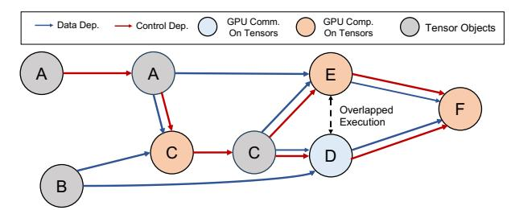
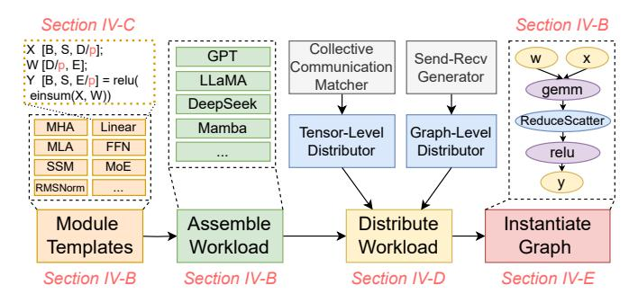
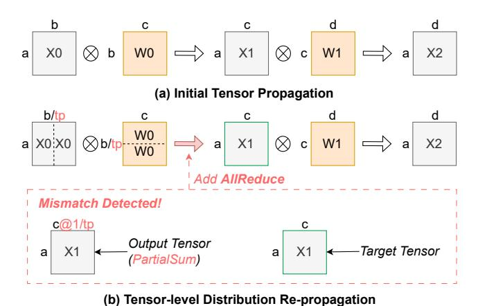
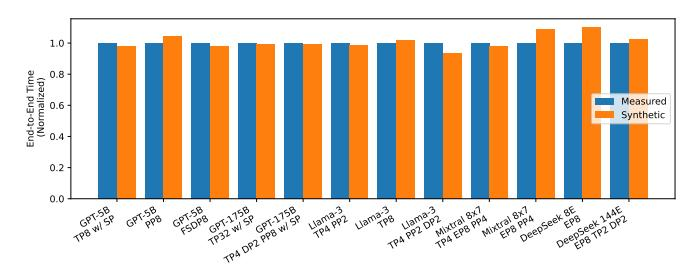
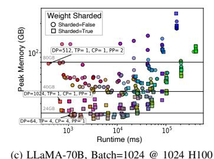
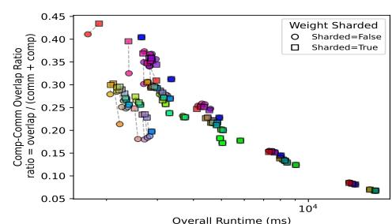
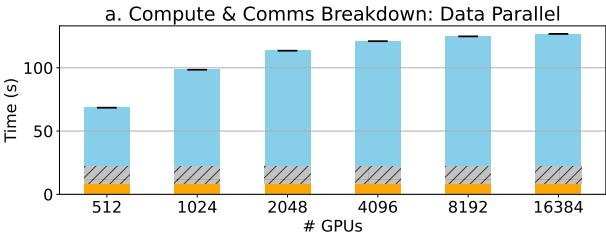
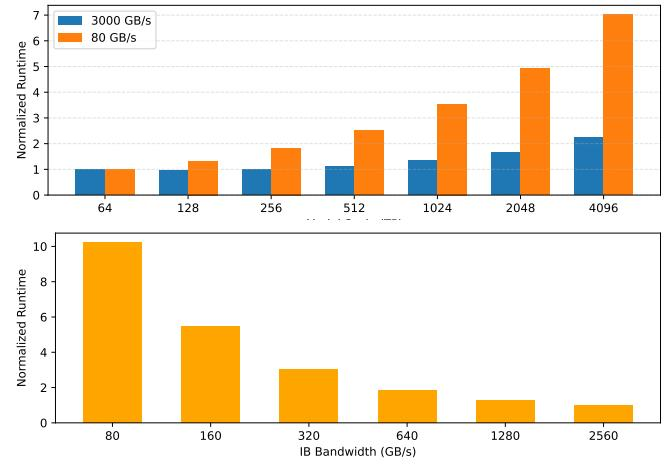
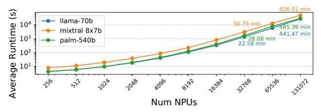

# Scalable Synthesis of distributed LLM workloads through Symbolic Tensor Graphs

Changhai Man1 , Joongun Park1 , Hanjiang Wu1 , Huan Xu1 , Srinivas Sridharan2 , Tushar Krishna1 1Georgia Institute of Technology 2NVIDIA Inc.

{cman8,jpark3234,hwu419,hxu398}@gatech.edu srisridharan@nvidia.com tushar@ece.gatech.edu

*Abstract*—Optimizing the performance of large language models (LLMs) on large-scale AI training and inference systems requires a scalable and expressive mechanism to model distributed workload execution. Such modeling is essential for pre-deployment system-level optimizations (e.g., parallelization strategies) and hardware design-space explorations. While recent efforts have proposed collecting execution traces from real systems, access to large-scale infrastructure remains limited to major cloud providers. Moreover, traces capturing execution on a specific platform cannot be easily adapted to study alternate software and/or hardware configurations, especially at scale. We introduce STAGE[1](#page-0-0) , a framework that synthesizes high-fidelity execution graphs to accurately model distributed AI workloads (including LLMs and MoEs). STAGE supports a comprehensive set of parallelization strategies, allowing users to systematically explore a wide spectrum of model architectures and system configurations. STAGE demonstrates its scalability by synthesizing high-fidelity LLM traces spanning over 128K GPUs, while preserving tensorlevel accuracy in compute, memory, and communication. STAGE is publicy available at [https://github.com/astra-sim/stage]( https://github.com/astra-sim/stage)

# I. INTRODUCTION

The rapid growth of machine learning models, especially Large Language Models (LLMs), including GPT [\[6\]](#page-13-0), Llama [\[57\]](#page-15-0), DeepSeek [\[12\]](#page-13-1), and Mistral [\[27\]](#page-14-0), has revolutionized the field of machine learning, driving massive advancements in natural language processing and generative AI. However, the scale and complexity of LLMs have introduced unprecedented computational challenges. These models often require massive amounts of computation and memory [\[39\]](#page-15-1), [\[61\]](#page-15-2), not only during training but also for inference, necessitating distributed AI systems. Several such systems exist in practice today, including NVIDIA HGX [\[43\]](#page-15-3), Google TPU [\[70\]](#page-16-0), Amazon Trainium [\[7\]](#page-13-2), Cerebras CS-3 [\[8\]](#page-13-3), and others. Optimizing compute, memory and communication resources optimally in these systems is crucial for performance [\[49\]](#page-15-4), [\[64\]](#page-15-5). The need for scalable and efficient distributed training is only growing, as evidenced by the recently released Llama 4 model that leverages a Mixture-of-Experts (MoE) architecture with up to 2 trillion parameters [\[36\]](#page-15-6), pushing the limits of current AI system infrastructure.

Standardized benchmarks play a crucial role in our community, serving two key purposes: optimizing the performance of current AI systems and guiding the design choices for nextgeneration systems. Efforts like MLPerf [\[50\]](#page-15-7) have been leading the way in identifying representative benchmarks in the domain of AI. Unfortunately, deploying the full software stack

TABLE I NUMBER OF OPERATIONS WITHIN SINGLE EPOCH PER GPU. (BATCH SIZE: 128 FOR DEEPSEEK, 32 FOR OTHERS)

| Model        | # of Param. | # of GPU | # of Comp. | # of Comm. |
|--------------|-------------|----------|------------|------------|
| GPT-3        | 175B        | 32       | 156,317    | 30,978     |
| LLaMA-3      | 70B         | 16       | 164,099    | 38,434     |
| Mixtral      | 8x22B       | 32       | 24,102     | 3,180      |
| DeepSeek-MoE | 16B         | 8        | 76,111     | 1,867      |

of distributed AI benchmarks for the sole purpose of running optimization and design-space exploration (DSE) studies is prohibitive in practice, as they require extensive framework (PyTorch/JAX/TensorFlow) expertise and continued access to large-scale systems. Furthermore, it is extremely difficult to isolate hardware versus software bottlenecks, and compute versus memory versus network behaviors.

Acknowledging the aforementioned challenges, recent efforts [\[23\]](#page-14-1), [\[55\]](#page-15-8) have proposed the idea of execution traces (ET) as a mechanism to capture the *coarse-grain (i.e., operatorlevel) compute and communication dependence behavior* during AI training. In particular, MLCommons Chakra [\[55\]](#page-15-8) has introduced specific support within PyTorch to trace the dependence graph (with timing) of distributed AI workloads *post-execution* from real systems. Selective replay of the ETs [\[33\]](#page-14-2), and analysis of the captured metadata (type, size and data volume) can help expose computation, memory, and communication bottlenecks, in turn guiding optimization tools.

While ETs are expected to play a crucial role in AI system design, we believe that ETs alone are insufficient for guiding optimization and DSE for the following reasons:

- High cost and limited accessibility: Generating ETs requires large-scale infrastructure—often hundreds or thousands of GPUs—accessible only to a few hyperscalers. Further, even when ETs are collected, privacy and proprietary constraints may prevent them from being shared broadly with the research community.
- Tied to AI platform: ETs from real-systems are inherently tied to the system they were collected on, with platformspecific software optimizations and hardware bindings baked in. This limits scalability and generality to study larger and diverse systems. As [Table I](#page-0-1) shows, even a single training epoch of a mid-sized LLM involves tens of thousands of operations per GPU, making trace analysis and scaling a nontrivial task. Efforts to scale ETs [\[10\]](#page-13-4), [\[23\]](#page-14-1) have focused on mimicking pre-existing system and model behaviors rather than enabling exploration of diverse configurations or novel parallelization strategies.
- Tied to AI Model. In the arms race of AI models,

1Symbolic Tensor grAph GEnerator

Fig. 1. Overview of STAGE

there continues to be rapid evolution of LLM architectures—driven by innovations such as MoEs [\[12\]](#page-13-1), [\[28\]](#page-14-3), attention mechanism variants [\[3\]](#page-13-5), [\[15\]](#page-13-6), [\[60\]](#page-15-9), and state space models [\[21\]](#page-14-4), aimed at improving model accuracy and training efficiency. This can render ETs from real-systems obsolete in a matter of months.

These challenges point to a growing need for a more agile framework for distributed AI workload generation that can flexibly adapt to emerging AI model structures and support fast iteration across diverse hardware platform architectures. To this end, we present STAGE, a novel framework for generating high-fidelity, scalable, and configurable execution graphs (EG) for distributed LLM workloads[2](#page-1-0) . [Fig. 1](#page-1-1) shows the overall flow of STAGE. At the front-end, STAGE accepts user-defined input workloads in tensor format and supports both predefined model templates and customized inputs for future extensibility. A key innovation in STAGE is the use of a symbolic tensor representation to generate a graph representation that compactly captures distributed ML workloads, enabling scalability by describing their shared computational structure while flexibly incorporating variations in tensor dimensions. Our abstraction enables flexible tensor partitioning and systematic support for all major parallelization strategies, as well as their arbitrary combinations—including hypothetical configurations beyond those seen in existing systems. Once the distributed execution graph is constructed, STAGE converts it into a schema that can be integrated with either a downstream simulator or augment a collection of real-system ETs for system optimization/analysis.

The key contributions of this paper are as follows:

- Symbolic Representation for Diverse AI Model Architectures: STAGE uses symbolic operations to abstract and generalize LLMs, enabling graph-based workload generation across a wide range of model architectures including dense (e.g., LLaMA, GPT), MoE (e.g., DeepSeek, Mixtral), and state-space-style (e.g., Mamba).
- Comprehensive Parallelism Modeling: STAGE systematically supports all viable combinations of parallelism with a novel producer-consumer-based communication matcher. It enables exhaustive exploration of parallelization configurations for diverse systems.
- Compute, Memory, and Network Modeling: STAGE accurately models computation, memory, and communication at tensor granularity by analyzing tensor dimensions, lifetimes, and synchronization behavior. This fine-

- grained modeling enables deeper insights into bottlenecks and resource utilization.
- Validation with Real-World Traces: STAGE generates execution graphs that model computation, communication, and memory behavior, and we validate their fidelity using real ETs collected from a single GPU to production-scale 128-GPU H100/H200 HGX clusters executing large-scale LLM training workloads.
- Scalable and Open Framework: STAGE can synthesize training traces for models on 32K GPUs in less than 30 minutes without compromising accuracy. This enables fast and scalable system analysis. The framework is publicly released to support the research community.

# II. BACKGROUNDS

# *A. Large Language Models (LLMs)*

Large Language Models (LLMs) have scaled to unprecedented levels due to the effectiveness proven by the scaling law [\[29\]](#page-14-5). These models, trained on various datasets, span billions or even trillions of parameters [\[48\]](#page-15-10). For the current LLMs, the decoder-only transformer is adopted by many popular models such as LLaMA [\[57\]](#page-15-0) and GPT [\[6\]](#page-13-0). The general architecture of the decoder-only transformer consists of repeated blocks, each of which includes a series of main operations such as Layer-Norm, Multihead-Attention, MLP. Within Multihead Attention and MLP layers, the computation is further decomposed into finer-grained operations, such as matrix multiplications (e.g., Linear and MatMul), activation functions (e.g., Softmax and GeLU), and regularization components like Dropout and LayerNorm.

#### *B. Multi-dimensional Parallelization Strategies*

To support large-scale LLM training, sufficient memory is required to store both model weights and input activations, along with adequate computational resources to complete training within a reasonable timeframe. Consequently, the following parallelization strategies are used in practice.

- Data Parallelism (DP): Splits input data across devices with replicated weights; synchronizes gradients after backward pass [\[48\]](#page-15-10)
- Fully Sharded Data Parallelism (FSDP): Shards both input batches and model parameters across devices, reducing memory use but adding communication to gather parameters during training [\[68\]](#page-15-11).
- Tensor Parallelism (TP): Shards model weights across devices while replicating input data; requires AllReduce to exchange activations after each layer.
- Sequence Parallelism (SP): Splits input sequences into tokens; complements TP by replacing AllReduce with more efficient AllGather and ReduceScatter.
- Pipeline Parallelism (PP): Divides model into stages and pipelines microbatches for concurrent execution across devices.
- Expert Parallelism (EP): For MoE models, uses AllToAll to route tokens to specialized experts after attention layers.

2For terminology purposes, we define execution *graphs* to refer to the structure (nodes and dependencies) of the distributed workload, while execution *traces* capture an EG with timing after execution on a real system.

Fig. 2. An Example of Execution Graph for GPU Operations.

Each strategy introduces unique patterns for computation, memory access and network communications for a large-scale system [48], [54]. To maximize efficiency and scalability, LLM frameworks today combine multiple parallelism strategies for training different workloads, such as DP, TP, SP, PP and EP within a single model. More details are covered in Sec. III.

#### C. Execution Traces

Modern large-scale machine learning systems consist of interleaved compute and communication operations, often with complex execution order and data flow. Graph-based formats are particularly useful to represent this behavior. They represent compute and communication operations as nodes, and encode data and control dependencies as edges. This structure enables analysis of execution order, critical paths, operator overlap, and performance bottlenecks. Fig. 2 illustrates a simplified execution graph depicting GPU computations, communications, and their inter-operation dependencies. Operation specific parameters, such as the tensor size of a GeMM operation, are encoded as attributes within each node. Following the control and data dependencies from left to right, it reveals which operations must run sequentially and which can execute in parallel across different tensor objects. Labeled tensor sizes are updated following each computation or communication operation between dependent tensors.

Execution traces (ETs) provide a structured view of these operations by capturing actual runtime behavior. They record the execution graph, along with additional metadata such as device type, execution time, and memory usage. Tools like PyTorch profiler [46], Kineto [56], PARAM [52], and Chakra [38] collect these traces at various abstraction levels.

#### III. MOTIVATION

In this section, we will identify a few challenges of the current approach, then summarize the STAGE design principle.

#### A. Challenges

Challenge 1: Limitations of Real-System ETs. Access to high-fidelity workloads is crucial for optimization and DSE efforts. However, obtaining real ETs is extremely prohibitive in practice due to the high computational and financial cost of running LLMs over large clusters. Moreover, data-sharing limitations prevent organizations with resources from making internal ETs publicly available due to security concerns. Furthermore, even if system designers/optimizers have access to real ETs, their properties are inherently tied to the model architecture, parallelism strategy, and underlying hardware platform (e.g., fused operators depend on compiler support

TABLE II
CATEGORIZATION OF MODERN LLM COMPONENTS AND PARALLELISM
STRATEGIES WITH NATIVE SUPPORT IN STAGE

| Category                                                                                  | Component                                                                | Origin Source                                                                                                                      |
|-------------------------------------------------------------------------------------------|--------------------------------------------------------------------------|------------------------------------------------------------------------------------------------------------------------------------|
| Attention Mechanism                                                                       | Multi-head Group Query Attention Multi-latent State Space Model | Transformer [60] LLaMA [57] DeepSeek-V2 [1] Mamba [21]                                                                    |
| Feedforward Network                                                                       | Up-down FFN Gate-up-down FFN                                          | GPT [6] LLaMA [57]                                                                                                              |
| Normalization                                                                             | RMSNorm Elem-wise Norm                                                | LLaMA [57] BERT [16]                                                                                                            |
| Mixture-of-Experts MoE MoE with Shared Experts                                            |                                                                          | Gshard [31], Switch Transformer [18] DeepSeek-MoE [12]                                                                          |
| Data Parallelism Tensor Parallelism Pipeline Parallelism FSDP (ZeRO-3) Expert Parallelism |                                                                          | PyTorch DDP [32] Megatron-LM [54] GPipe [24], PipeDream [22] DeepSpeed [48], PyTorch-FSDP [68] Switch Transformer [18] |

within the platform, compute and communication volumes are tied to the system size, and so on). This makes it challenging to extend the ETs or perform DSE for hypothetical future platforms.

Challenge 2: Limitations of Graph Capture from ML Frameworks. Today ML frameworks enable the capture of pre-execution graphs, such as PyTorch's FX graph representation. Unfortunately, relying purely on ML frameworks to obtain workload representations is also quite restrictive. First, capturing a distributed workload's pre-execution graph still requires access to a real cluster. This also limits the degree of parallelization to the cluster size. Second, and more importantly, the dependency on frameworks limits the generated representations to the set of AI models and parallelization strategies that are supported by the frameworks. This significantly restricts co-design opportunities to existing concepts that already made it to mainstream software stacks3.

Challenge 3: Limitations of Manually Describing AI Workloads. The wide range of LLM architectures and parallelization strategies makes synthetic modeling of distributed ML workloads particularly challenging. Table II summarizes commonly used model components and parallel strategies optimized for specific training or inference objectives. Previous efforts that have performed synthetic workload generation (such as Calculon [25], MadMax [23], SimAI [62]) rely on customized templates or analytical first-order equations to describe AI workloads. While this approach has demonstrated promising performance analysis of distributed AI systems for realistic workloads, which was their goal, enabling arbitrary AI workload modeling was not. As a result, their templates are over-optimized for specific target workloads / operators and require deep understanding with the codebase for extensions. Moreover, their analytical nature limits the ability to capture realistic system and hardware behaviors, such as compute-communication dependencies.

Challenge 3.1: Diverse and Rapidly Evolving Model Architectures. Modern LLM architectures exhibit substantial diversity. For instance, LLaMA incorporates Group Query Attention

&lt;sup>3As an anecdotal example, while FSDP made sense conceptually when it was developed, it could not be evaluated until support was added in PyTorch.

(GQA) in its attention mechanism alongside a unique threelayer feed-forward network, differing substantially from traditional GPT architectures. Recent models, such as DeepSeek-R1 [\[14\]](#page-13-10), further increase complexity by employing MoE layers with shared experts and Multi-head Latent Attention (MLA). Additionally, non-transformer architectures, exemplified by Mamba [\[21\]](#page-14-4), replace conventional attention with selective state-space models. Emerging hybrid architectures combining transformer and state-space models, such as Zamba [\[19\]](#page-13-11) and Jamba [\[35\]](#page-14-11), further compound the complexity.

*Challenge 3.2: Complexity and Variability in Parallelization Strategies.* Practical deployments of LLMs often employ a hybrid mix of parallelization strategies [\(Sec. II-B\)](#page-1-2) to optimize system performance and resource utilization.

Furthermore, in practice, LLM developers rarely rely on a single model architecture or parallelization strategy. Instead, they often combine multiple design components, resulting in compositional and complex workloads that existing templated / analytical workload generators struggle to systematically represent and evaluate, highlighting a critical gap in current distributed AI workload modeling capabilities.

### *B.* STAGE *Design Principles*

Design Principles 1: Decoupling Workload Generation from Simulation. Existing synthetic workload generators, such as Calculon, MADMAX, and SimAI, couple workload construction with performance modeling and simulation assumptions. As a result, workload structure and communication behavior are often derived from analytical models that implicitly encode system characteristics.

In contrast, STAGE treats the workload as a first-class, standalone artifact. Generation of execution graphs is independent of any specific simulators, performance model, or system topology. Simulation and profiling tools operate strictly downstream of the generated workload representation. By decoupling them, we enable: 1) reuse of the same workload across different simulators, 2) isolation of workload modeling from performance modeling assumptions, and 3) extensibility to future simulation backends, with no redundant work for each simulator backend. In the evaluation, we show that STAGE can be adapted to multiple simulators, including AstraSim [\[64\]](#page-15-5), Genie [\[66\]](#page-15-18), ScaleSim [\[53\]](#page-15-19), and SimAI [\[62\]](#page-15-17).

Design Principle 2: Decoupling Workload Semantics from System Realization. Execution traces collected from real systems inevitably embed system-specific realizations, including hardware characteristics, topology constraints, communication library implementations, compiler transformations, and framework-level optimizations. As a result, such traces are tightly bound to a particular system instantiation. Any change in topology, hardware generation, software stack, or parallel runtime typically requires re-collecting traces, making them unsuitable for systematic cross-system exploration.

STAGE instead separates workload semantics from system realization. We model distributed workloads at the level of symbolic tensor operations and parallelization semantics,

Fig. 3. STAGE Generation Flow Overview.

independent of any specific hardware platform, topology, or runtime stack.

The underlying system is abstracted as a collection of devices connected via a configurable multi-dimensional topology model. This abstraction captures communication structure without embedding hardware-specific execution artifacts. While STAGE supports optional modeling of system-specific optimizations, these are treated as extensible components rather than baked-in assumptions.

By maintaining a system-agnostic workload representation, STAGE enables a fair comparison across heterogeneous systems, while providing portability to future hardware platforms. Furthermore, it makes a separation between algorithmic operators and hardware-specific implementations, like kernel implementation or collective scheduling, which introduce transferability between systems when running simulations.

# IV. STAGE: SYMBOLIC TENSOR GRAPH GENERATOR

STAGE addresses the challenges discussed in [Sec. III](#page-2-0) by representing LLM workloads based on symbolic abstractions. Users simply specify high-level parameters such as model size and parallelism degrees, and STAGE automatically generates execution graphs capturing computation, communication, and memory behavior. By simplifying workload modeling while preserving key execution characteristics, STAGE bridges the gap between synthetic and real-world traces, supporting scalable and systematic design exploration.

### *A.* STAGE *Overview*

[Fig. 3](#page-3-0) provides a high-level overview of STAGE, illustrating its workflow from model specification to workload simulation. ⃝1 Symbolic Tensor Graphs (STG): The flow starts from a set of templates of commonly used modules in LLMs. These modules are integrated in the STAGE framework in the format of Symbolic Tensor Graph Intermediate Representation (STG IR). ⃝2 STAGE then assembles these modules into the whole model by repeating and connecting each module into a large STG for the whole model. ⃝3 With the assembled model, STAGE distributes the workload from a single piece to multiple accelerators by doing tensor-level distribution and graph-level distribution. STAGE analyzes the communication required by each parallelization strategy based on the tensor/graph shardings. ⃝4 Finally, STAGE interprets the STG IR and generates a directed acyclic graph (DAG) with explicit operation dependencies for downstream tasks.

#### Multi-Head Attention under Sequential and Tensor Parallelism (SP / TP)

Fig. 4. Using Symbolic Tensor Representation to Annotate MultiHead Attention with Sequence and Tensor Parallelism

#### B. Workload definition

STAGE is designed to be both simple to use and highly flexible, providing a systematic pipeline from model specification to workload generation.

- 1) Input Model and Module Templates: To ensure ease of use, STAGE requires only two user inputs: the target model (e.g., GPT, LLaMA) and a selection of module templates (e.g., MHA, FFN, MoE) in STG IR format. This design allows users to generate symbolic tensor graphs without manually specifying the entire model structure. In addition, STAGE supports user-defined operations beyond the built-in templates and models, enabling researchers to extend the framework with custom computations. This flexibility is essential for supporting future system-level optimizations and accommodating emerging model architectures.
- 2) Output Execution Graph: By default, STAGE leverages the Chakra schema since it is being standardized by MLCommons [37]. This schema captures the dependencies between compute and communication tasks, essential for identifying bottlenecks, critical paths, and opportunities for computation-communication overlap during distributed training. Using execution graphs to explicitly model task dependencies is widely adopted in both workload benchmarking [32], [55] and workload modeling [17], [34]. While Chakra is the default, STAGE can be flexibly adapted to other output formats, by introducing suitable translation modules.

#### C. Symbolic Tensor Representation

STAGE introduces the *Symbolic Tensor Graph (STG)* as an intermediate representation (IR) to model ML workloads. STG abstracts tensor shapes, operations, and distribution strategies symbolically, enabling efficient reuse across workloads that share the same graph structure but differ in dimensions.

Symbolic Tensor Format: Tensors are represented as:

Here, Shape includes symbolic dimensions such as Batch (B) and Sequence (S) and may also contain partition symbols, such as data parallelism (dp), tensor parallelism (tp) or sequence parallelism (sp). The optional Hidden (H) field denotes partial sums across devices. In the ML context, the hidden dimension typically corresponds to the model's embedding size or other feature dimensions. For instance, a tensor x with dp is represented as x[B/dp, H] with the batch dimension sharded across devices.

TABLE III

TENSOR-LEVEL DISTRIBUTION IN A LINEAR LAYER. WE USE [H, 4H] TO DENOTE THE WEIGHT MATRIX FOR THE UP-PROJECTION.

| Parallel Strategy                  | Symbolic Tensor Representation |
|------------------------------------|--------------------------------|
|                                    | x[B, H]                        |
| No Parallel                        | w[H, 4H]                       |
|                                    | у[В, 4Н]                       |
|                                    | x[B/dp, H]                     |
| Data-Parallel (dp)                 | w[H, 4H]                       |
|                                    | y[B/dp, 4H]                    |
|                                    | x[B, H/tp @ 1]                 |
| Tensor-Parallel (Row) (tp)         | w[H/tp, 4H @ 1]                |
|                                    | y[B, 4H @ 1/tp]                |
|                                    | x[B, H]                        |
| Tensor-Parallel (Column) (tp)      | w[H, 4H/tp]                    |
|                                    | y[B, 4H/tp]                    |
|                                    | x[B/fsdp, H]                   |
| Fully Sharded Data Parallel (fsdp) | w[H/fsdp, 4H]                  |
|                                    | y[B/fsdp, 4H]                  |
| Hybrid-Parallel (hp)               | x[B/hp, H]                     |
| (Column Tensor Parallel            | w[H, 4H/hp]                    |
| w/ Activation Sharded)             | y[B, 4H/hp]                    |

Fig. 4 illustrates how tensor representations are used to model multihead attention sp and tp. For clarity, the input tensor assumes a batch size of 1, and key intermediate tensors undergoing shape transformations are highlighted in grey.

**Tensor-Level Distribution Types:** STAGE defines three symbolic distribution semantics:

- Duplicated: Full copy on all devices.
- Partition: Tensor is disjointly sharded across devices along a specific dimension.
- PartialSum: Each device holds a partial result; reduction is required.

These distribution types can be composed to represent complex parallelization strategies. For example, the following notation combines dp, sp, and tp:

Here, dp applies to the batch dimension, sp to the sequence dimension, and tp at the end indicates that the tensor is in *PartialSum* form across the hidden dimension.

**Symbolic Operations:** Operators are expressed using a concise format:

output = op[op\_attr](input1, input2, ...)

For example, matrix multiplication is written symbolically as:

$$y = einsum[bm, mn \rightarrow bn](x, w)$$

Here,  $\times$  has shape [b,m], w has shape [m,n], and the output y has shape [b,n]. STAGE adopts einsum to express all tensor multiplications, allowing representation of preserved, reduced, and shared dimensions. By encoding partitioning strategies directly into symbolic tensor shapes, STAGE offers a unified abstraction that captures both computation and parallel execution, serving as the foundation for STG construction and downstream simulation.

Table III enumerates some of the common distributing techniques used for a linear layer, and also a hybrid one to show the flexibility. With this systematic design, STAGE reduces the need for user intervention while retaining flexibility for defining custom distribution strategies. Sec. VI-H discusses how conventional parallel strategies can be defined

Fig. 5. Tensor Distribution Mismatch: After applying tensor-level distribution

#### D. Workload Distributor

In STAGE, distributed workloads are handled using two approaches: (1) *Tensor-level distribution* where each machine holds shards of a tensor and collaborates to execute a single operator and (2) *Graph-level distribution* where each machine is responsible for a portion of the computation graph and exchanges data via send–receive pairs when information flows across graph partitions. Depending on the deployed parallelization strategy, STAGE employs components to implement either the tensor-level or graph-level distribution approach.

1) Tensor-level distributor: Tensor-level distribution transforms the initial tensor representations with corresponding parallel dimensions, enabling efficient workload distribution across multiple devices. However, these strategies inherently introduce the need for collective communication, which is essential for maintaining consistency and data alignment between devices during computation. Accurately modeling these communications is crucial to reflect the real-world behavior of parallel workloads. STAGE encodes tensor shardings in the assembled models. Then the tensor-level distributor will apply the corresponding parallel strategies, analyze and generate the collective communications required by the parallel strategies using Collective Communication Matcher.

In Fig. 5, we illustrate how propagating the initial parallelization across an undistributed compute graph—to avoid manually defining every sharded tensor—can create tensor distribution mismatches, where the producer and consumer of a tensor expect different sharding layouts. In STAGE, before applying tensor-level distribution, we first propagate the compute graph to infer each tensor's shape. Then we apply the tensor distribution separately for each operator, and repropagate the shape. This reveals a distribution mismatch for tensor x1 when viewed from the producer and consumer side. From the producer side, x1=einsum(x0,w0) produces an output with layout [a, c@ 1/tp]. From the consumer side, x2=einsum(x1,w1) expects x1 to have layout [a, c]. This mismatch necessitates an AllReduce operation to aggregate the partial sums across distributed tensors.

2) Collective Communication Matcher: To handle the diverse communication requirements arising from various parallelization strategies, STAGE uses a communication matcher

Fig. 6. Collective Communication can be divided into two steps: Pull + Push. Note that Slice\* is a special case on a single machine.

to systematically identify and encode the required communications. The matcher operates by analyzing the distribution patterns of tensors across devices and matches the appropriate collective communication operations based on the relationship between the distribution from the *producer* that produces the tensor, and the distribution from the *consumer* that consumes this tensor. This producer-consumer model is divided into two conceptual steps *Pull* and *Push* as Fig. 6 shows.

During *Pull*, data is gathered from all devices in the producer distribution to assemble a complete tensor. During *Push*, this tensor is distributed to devices according to the consumer distribution. To bridge these two steps, we introduce a virtual node that serves as an intermediate conceptual connector, enabling a flexible mix-and-match between *Pull* and *Push*.

For *Pull*, the process of reconstructing the complete tensor from different distributions is defined as follows:

- *Duplicated*: each device already holds a complete copy of the tensor. As a result, the head node does not require communication with other devices, making *No Communication* necessary.
- Partition: the tensor is divided into shards across devices.
   The head node gathers all shards from the devices and assembles the complete tensor through a process referred to as Gather.
- *PartialSum*: while similar to Partition, the aggregation sums the values across devices instead of concatenation. This operation is commonly known as *Reduce*.

On the other hand, for *Push*, the process of distributing the tensor to devices is described as follows:

- *Duplicated*: the tensor is replicated from the virtual head node to all devices using a *Broadcast* operation.
- *Partition*: each device receives its corresponding shard of the tensor through an operation called *Scatter*.
- *PartialSum*: Generally not used, as distributing a full tensor as partial sums is uncommon in practice.

To summarize the required communication patterns for tensor transformation, we share examples how the collective communication matcher can be used as shown in Table IV. By integrating a matching algorithm based on push-pull communication principles, STAGE identifies additional patterns that were previously overlooked but can arise from arbitrary tensor distribution schemes.

TABLE IV

EXAMPLES OF MATCHED COLLECTIVE COMMUNICATIONS. THE SYMBOLIC TENSOR NOTATIONS ARE DEFINED IN SEC. IV-D.

| Producer Tensor Distribution | Matched Coll-Comm        | Consumer Tensor Distribution |
|---------------------------------|--------------------------|---------------------------------|
| [B/dp, S, H@1/tp]               | ReduceScatter            | [B/dp, S, H/tp]                 |
| [B/dp, S, H@1/tp]               | AllToAll                 | $[B, S/\frac{dp}{dp}, H@1/tp]$  |
| [B/dp, S, H@1/tp]               | AllGather                | [B, S, H@1/tp]                  |
| [B/dp, S, H@1/tp]               | AllReduce                | [B/dp, S, H]                    |
| [B/dp, S, H@1/tp]               | ReduceScatter + AllToAll | [B/tp, S, H/dp]                 |
| [B/dp, S, H@1/tp]               | AllReduce + AllGather    | [B, S, H]                       |

3) Graph-Level Distributor: Graph-level distribution plays a critical role in modeling parallel strategies, particularly pipeline parallelism. Unlike tensor-level distribution, which distributes individual operators, graph-level distribution divides the compute graph into multiple subgraphs and assigns these subgraphs to different devices.

In STAGE, a graph distribution can be defined with multiple lists of nodes, where each list contains the nodes within this subgraph. Furthermore, for specific parallel strategies like pipeline parallel, we predefine a rule-based script to partition the workload into multiple stages by evenly dividing models according to their layer.

By partitioning the graph into subgraphs, we create some cross-graph edges, which indicate where the tensor moves from one machine to another. STAGE inserts send/recv pairs by identifying the rank of the source and destination nodes on each side of cross-graph edges.

#### E. Graph Instantiation: Symbolic to Numeric Conversion

At the final stage of the STAGE pipeline, the STG is transformed into fully instantiated execution graphs. In this step, STAGE replaces symbolic tensor shapes, operations, and communication patterns with concrete numeric values (such as batch size, sequence length, or hidden size), producing a detailed per-node representation of tensor sizes, communication volumes, and operator types. Once specified, these values are automatically propagated through the STG, resulting in a complete and consistent execution graph.

For advanced use cases, STAGE also supports plugging in real-system values collected from profiling tools such as PyTorch or Kineto [47]. These real values can be selectively injected into the symbolic graph to guide the instantiation process, enabling hybrid scenarios where partial traces are extended or scaled. This feature allows users to maintain high fidelity to real system behaviors while still benefiting from the scalability of symbolic modeling.

By separating graph construction from value instantiation, STAGE enables scalable, adaptable simulations across a wide design space.

#### V. VALIDATION

To ensure the fidelity of STAGE-generated workloads, we conducted a comprehensive comparison with real ETs.

# A. Methodology

Execution traces were collected from a system equipped with 128 NVIDIA H100 GPUs (SMX5) across 16 servers, each hosting 8 GPUs. The system was configured with

TABLE V PEAK PER-GPU MEMORY ANALYSIS.

| Hardware       | Parallelization                                                                                                                              | Measured                                                                                                                                                                                                   | Synthesized                                                                                                                                                                                                                                                                                                                                                             | Error Rate*                                                                                                                                                                                                                                                                                                                                                                                                                                                           |
|----------------|----------------------------------------------------------------------------------------------------------------------------------------------|------------------------------------------------------------------------------------------------------------------------------------------------------------------------------------------------------------|-------------------------------------------------------------------------------------------------------------------------------------------------------------------------------------------------------------------------------------------------------------------------------------------------------------------------------------------------------------------------|-----------------------------------------------------------------------------------------------------------------------------------------------------------------------------------------------------------------------------------------------------------------------------------------------------------------------------------------------------------------------------------------------------------------------------------------------------------------------|
| 1 x 8-H200-HGX | FSDP=8                                                                                                                                       | 18.1 GB                                                                                                                                                                                                    | 16.1 GB                                                                                                                                                                                                                                                                                                                                                                 | 5.5%                                                                                                                                                                                                                                                                                                                                                                                                                                                                  |
| 1 x 8-H200-HGX | TP=8                                                                                                                                         | 15.4 GB                                                                                                                                                                                                    | 13.7 GB                                                                                                                                                                                                                                                                                                                                                                 | 4.5%                                                                                                                                                                                                                                                                                                                                                                                                                                                                  |
| 1 x 8-H200-HGX | PP=8                                                                                                                                         | 17.5 GB                                                                                                                                                                                                    | 15.2 GB                                                                                                                                                                                                                                                                                                                                                                 | 7.4%                                                                                                                                                                                                                                                                                                                                                                                                                                                                  |
| 4 x 8-H200-HGX | TP=32                                                                                                                                        | 118.9 GB                                                                                                                                                                                                   | 115.2 GB                                                                                                                                                                                                                                                                                                                                                                | 2.3%                                                                                                                                                                                                                                                                                                                                                                                                                                                                  |
| 2 x 8-H200-HGX | TP=16                                                                                                                                        | 94.3 GB                                                                                                                                                                                                    | 92.1 GB                                                                                                                                                                                                                                                                                                                                                                 | 1.3%                                                                                                                                                                                                                                                                                                                                                                                                                                                                  |
| 8 x 8-H200-HGX | TP=4, EP=8, PP=4                                                                                                                             | 15.8 GB                                                                                                                                                                                                    | 16.07 GB                                                                                                                                                                                                                                                                                                                                                                | 1.7%                                                                                                                                                                                                                                                                                                                                                                                                                                                                  |
| 4 x 8-H200-HGX | EP=8, PP=4                                                                                                                                   | 56.8 GB                                                                                                                                                                                                    | 58.55 GB                                                                                                                                                                                                                                                                                                                                                                | 3.0%                                                                                                                                                                                                                                                                                                                                                                                                                                                                  |
| 1 x 8-H200-HGX | EP=8                                                                                                                                         | 52.31 GB                                                                                                                                                                                                   | 55.08 GB                                                                                                                                                                                                                                                                                                                                                                | 5.3%                                                                                                                                                                                                                                                                                                                                                                                                                                                                  |
| 4 x 8-H200-HGX | EP=8, TP=2, DP=2                                                                                                                             | 26.6 GB                                                                                                                                                                                                    | 27.4 GB                                                                                                                                                                                                                                                                                                                                                                 | 2.9%                                                                                                                                                                                                                                                                                                                                                                                                                                                                  |
|                | 1 x 8-H200-HGX 1 x 8-H200-HGX 1 x 8-H200-HGX 4 x 8-H200-HGX 2 x 8-H200-HGX 8 x 8-H200-HGX 4 x 8-H200-HGX 1 x 8-H200-HGX | 1 x 8-H200-HGX FSDP=8 1 x 8-H200-HGX TP=8 1 x 8-H200-HGX PP=8 4 x 8-H200-HGX TP=32 2 x 8-H200-HGX TP=16 8 x 8-H200-HGX TP=4, EP=8, PP=4 4 x 8-H200-HGX EP=8, PP=4 1 x 8-H200-HGX EP=8 | 1 x 8-H200-HGX     FSDP=8     18.1 GB       1 x 8-H200-HGX     TP=8     15.4 GB       1 x 8-H200-HGX     TP=8     17.5 GB       4 x 8-H200-HGX     TP=32     118.9 GB       2 x 8-H200-HGX     TP=16     94.3 GB       8 x 8-H200-HGX     TP=4, EP=8, PP=4     15.8 GB       4 x 8-H200-HGX     EP=8, PP=4     56.8 GB       1 x 8-H200-HGX     EP=8, PP=4     52.31 GB | 1 x 8-H200-HGX     FSDP=8     18.1 GB     16.1 GB       1 x 8-H200-HGX     TP=8     15.4 GB     13.7 GB       1 x 8-H200-HGX     PP=8     17.5 GB     15.2 GB       4 x 8-H200-HGX     TP=32     118.9 GB     115.2 GB       2 x 8-H200-HGX     TP=16     94.3 GB     92.1 GB       8 x 8-H200-HGX     TP=4, EP=8, PP=4     15.8 GB     16.07 GB       4 x 8-H200-HGX     EP=8, PP=4     56.8 GB     88.55 GB       1 x 8-H200-HGX     EP=8     52.31 GB     55.08 GB |

\*We remove the CUDA initialization footprint for error estimate.

NVIDIA NeMo 24.07, CUDA 12.5, and PyTorch 2.5.0. Additionally, each server was powered by dual Intel Sapphire Rapids CPUs (32-core, 2.8 GHz) and DDR5 DRAM. We modified the NeMo framework to integrate PyTorch's profiling features and enable Chakra trace collection. This setup employed CUDA Profiling Tools Interface (CUPTI) [41] to capture kernel execution timelines and operator-level activity, offering detailed insights into computational and communication operations as well as device-memory usage.

For validation, we focused on three aspects: (1) the peak device-memory usage, (2) computation operators and volume, (3) communication operators and volume.

#### B. Memory Footprint Validation

For memory-footprint validation, we fed STAGE -synthesized graphs to the Chakra trace parser provided by MLCommons Chakra [37]. We replayed the graphs via ASTRA-Sim [63], extending it to track memory usage over the simulation lifetime. Our modifications enable ASTRA-Sim to utilize tensor metadata (e.g., name, size) from STAGE graphs when generating tensor read/write events. These events are then post-processed to determine each tensor's lifetime, from creation to last use, assuming garbage collection immediately thereafter.

Table V compares per-device peak memory usage across different hardware configurations, models, and parallelization strategies, using both measured traces and STAGE -synthesized execution graphs. On average, the simulated peak memory usage is about 2GB lower than the measured value. This discrepancy primarily arises from PyTorch's CUDA initialization, which consumes roughly 1GB of VRAM, and from delays in actual tensor garbage collection. After excluding this initialization overhead, the memory footprint predicted by STAGE accounts for approximately 97% of the measured footprint on average. This inaccuracy is within acceptable bounds for our targeted large-scale simulations, with the error rate decreasing as model size increases (Table V).

#### C. Compute and Communication Validation.

We validate both the compute and communication components of STAGE, as well as the end-to-end runtime.

Compute Time Accuracy. We estimate operator runtime using a hybrid model that combines benchmark-derived lookup tables with a calibrated roofline model, prioritizing trace-based lookups for observed operators and falling back to a coefficient-calibrated roofline model otherwise. As shown in Table VI, timing error across workloads ranges from 0.3% to 15.0%, averaging 4.25%.

**Communication Volume Accuracy.** Table VII compares the communication volume for each operator type. NCCL

TABLE VI
OPERATOR TOTAL COMPUTE TIME [MS] (MEASURED / SYNTHESIZED)

| Model             | GPUs | Parallelization                      | Micro Batch / Batch | GeMM              | Attn*           | ElementWise     | Others        | Total Error |
|-------------------|------|--------------------------------------|------------------------|-------------------|-----------------|-----------------|---------------|-------------|
|                   | 8    | TP=8, w/ SP                          | 1 / 128                | 2187.0 / 2060.4   | 210.8 / 197.4   | 106.9 / 96.9    | 50.7 / 44.6   | 6.7%        |
| GPT-3-5B          | 8    | PP=8                                 | 1 / 128                | 1307.9 / 1413.6   | 184.0 / 197.4   | 97.0 / 100.1    | 88.0 / 67.0   | 5.9%        |
|                   | 8    | FSDP=8                               | 8 / 128                | 1834.1 / 1771.4   | 432.1 / 432.1   | 182.1 / 173.2   | 144.9 / 101.1 | 4.6%        |
| GPT-3-175B        | 32   | TP=32 w/ SP                          | 1 / 128                | 3719.4 / 3690.6   | 444.1 / 444.1   | 165.0 / 173.1   | 164.3 / 109.2 | 1.7%        |
| GF 1-3-173B       | 64   | TP = 4, $DP = 2$ , $PP = 8$ , $w/SP$ | 1 / 128                | 6697.4 / 6685.8   | 266.7 / 266.7   | 61.4 / 116.9    | 224.4 / 155.9 | 0.3%        |
|                   | 8    | TP=4, PP=2                           | 1 / 32                 | 8913.1 / 8775.1   | 4401.4 / 4399.2 | 524.8 / 487.0   | 344.0 / 281.8 | 1.7%        |
| LLaMA-3 70B       | 8    | TP=8                                 | 1 / 128                | 12156.5 / 10993.0 | 5126.3 / 5126.3 | 1896.8 / 1811.0 | 599.8 / 435.3 | 7.4%        |
|                   | 16   | TP=4, PP=2, DP=2                     | 1 / 128                | 4222.1 / 3635.4   | 2197.4 / 1922.3 | 540.7 / 508.9   | 172.7 / 122.5 | 14.2%       |
| Mixtral 8x7       | 128  | TP=4, EP=8, PP=4                     | 1 / 128                | 444.7 / 508.8     | 43.6 / 43.6     | 222.8 / 197.0   | 47.7 / 32.5   | 3.0%        |
| Wilkital 6X7      | 32   | EP=8, PP=4                           | 1 / 128                | 1688.1 / 1967.3   | 266.4 / 266.4   | 182.1 / 184.1   | 165.1 / 120.8 | 9.8%        |
| DeepSeek-MoE 8E   | 8    | EP=8                                 | 1 / 128                | 1015.3 / 1213.3   | 89.5 / 89.5     | 111.8 / 152.7   | 182.9 / 171.6 | 15.0%       |
| DeepSeek-MoE 144E | 32   | EP=8, TP=2, DP=2                     | 1 / 128                | 136.4 / 152.6     | 13.2 / 13.2     | 19.5 / 26.0     | 38.6 / 34.9   | 8.8%        |

\*Attn here is the fused kernel like flash attention

TABLE VII

| COMMUNICATION BREAKDOWN PER GPU FOR A SINGLE EPOCH | (MEASURED / SYNTHESIZED) |
|----------------------------------------------------|--------------------------|
|----------------------------------------------------|--------------------------|

| Model             | GPUs | Parallelization         | Micro Batch |                   | C                 | Communication Volume | (MB)                |                     | Total Error |
|-------------------|------|-------------------------|-------------|-------------------|-------------------|----------------------|---------------------|---------------------|-------------|
| Model             | Grus | r ai anenzation         | / Batch     | Send              | Receive           | AllReduce            | AllGather           | ReduceScatter       | Iotai Erroi |
|                   | 8    | TP=8, w/ SP             | 1 / 128     | 0.0 / 0.0         | 0.0 / 0.0         | 1075.1 / 1073.7      | 19730.0 / 19327.3   | 104153.0 / 103079.2 | 0.237%      |
| GPT-3-5B          | 8    | PP=8                    | 1 / 128     | 1073.7 / 1073.7   | 1073.7 / 1073.7   | 206.0 / 206.0        | 0.0 / 0.            | 0.0 / 0.0           | 0.000%      |
|                   | 8    | FSDP=8                  | 8 / 128     | 0.0 / 0.0         | 0.0 / 0.0         | 0.0 / 0.0            | 19761.3 / 20401.1   | 80760.9 / 78383.2   | 0.346%      |
| GPT-3-175B        | 32   | TP=32, w/ SP            | 1 / 128     | 0.0 / 0.0         | 0.0 / 0.0         | 812.6 / 805.3        | 14571.0 / 14495.5   | 310043.0 / 309237.6 | 0.055%      |
| GI 1-3-173B       | 64   | TP=4, DP=2, PP=8, w/ SP | 1 / 128     | 13287.6 / 13287.6 | 13287.6 / 13287.6 | 1767.2 / 1384.1      | 29393.7 / 28991.0   | 77309.4 / 77309.4   | 0.043%      |
|                   | 8    | TP=4, PP=2              | 1 / 32      | 1073.7 / 1073.7   | 1073.7 / 1073.7   | 0.0 / 0.0            | 104153.0 / 103210.3 | 279172.9 / 275009.0 | 0.265%      |
| LLaMA-3 70B       | 8    | TP=8                    | 1 / 128     | 0.0 / 0.0         | 0.0 / 0.0         | 558315.3 / 587068.3  | 0.0 / 0.0           | 0.0 / 0.0           | 0.985%      |
|                   | 16   | TP=4, DP=2, PP=2        | 1 / 128     | 2147.5 / 2147.5   | 2147.5 / 2147.5   | 139552.9 / 164257.3  | 0.0 / 0.0           | 0.0 / 0.0           | 2.980%      |
| Mixtral 8x7       | 128  | TP=4, EP=8, PP=4        | 1 / 128     | 4496.3 / 4362.1   | 4496.3 / 4362.1   | 0.3 / 16.4*          | 3825.2 / 3590.4     | 13153.3 / 17716.7   | 2.755%      |
| Wikitai 8X7       | 32   | EP=8, PP=4              | 1 / 128     | 17935.2 / 19327.4 | 17935.2 / 19327.4 | 0.0 / 0.0            | 0.0 / 0.0           | 0.0 / 0.0           | 1.399%      |
| DeepSeek-MoE 8E   | 8    | EP=8                    | 1 / 128     | 44767.8 / 45097.2 | 43486.5 / 45097.2 | 0.0 / 0.0            | 142.4 / 3758.8*     | 1138.9 / 1138.9     | 0.945%      |
| DeepSeek-MoE 144E | 32   | EP=8, TP=2, DP=2        | 1 / 128     | 1981.9 / 1961.1   | 1981.8 / 1961.1   | 8.4 / 16.1           | 1720.7 / 1814.3     | 2954.9 / 3025.8     | 1.501%      |

\*Our trace uses a micro-batch size of 1, so not all experts are activated, which differs from STAGE's default behavior assuming all experts activated and causes mismatches. In practice during real training, larger batches are more common and would activate all experts.

Fig. 7. End-to-End Runtime Validation: Measured vs Synthetic

implements AllToAll by decomposing it into multiple Send and Recv operations, and Kineto records volume only for these decomposed primitives. To ensure a fair comparison, we similarly decompose STAGE 's *AllToAll* volume in the table. The resulting breakdown shows a strong match between realsystem traces and STAGE-generated workloads, indicating that STAGE captures the communication volume accurately enough to model distributed behavior. End-to-End Runtime **Accuracy.** By combining the calibrated real-system compute model with ASTRA-Sim [63] simulations for the communication operators and scheduling, we validate the end-to-end runtime of each model instance. As shown in Fig. 7, our simulations closely match the real-system performance, achieving an average error of 3.53% 4. Thus, STAGE outperforms prior SOTA modeling frameworks—Calculon [25] (3.65% error across only four dense Megatron models) and MADMAX [23]

4Interestingly, we observed that many of the real-system ETs (collected using the PyTorch-Chakra stack) lacked overlapping compute and communication given contention for GPU cores by both kernels. For these models, we also disabled compute-communication within the simulator (which natively tries to overlap independent operators as much as possible). STAGE achieves this across more models by relying on a graph-based representation with fine-grained operator modeling. Efficiently overlapping compute and communication remains an active research topic today.

(15.34% error on LLaMA-70B)—in both modeling accuracy and model coverage. Notably, neither Calculon nor MADMAX validate MoE models properly, which introduce more dynamic communication behavior. This demonstrates that STAGE accurately captures real-system workload characteristics and delivers reliable results with high-quality performance models.

#### D. STAGE Modeling Assumptions

In this section, we clarify key modeling assumptions employed by STAGE.

**MoE Expert Activation**: In Mixture-of-Experts models, each expert has a probability of being activated by a given token. STAGE models this behavior using layer-wise expert activation histograms. By default, we assume a uniform distribution. However, users can override this default by specifying custom statistics derived from their own workloads.

Element-wise Kernel Fusion: STAGE assumes that all element-wise kernels are fusible. This may occasionally result in performance estimates that exceed real-system performance, as actual fusion depends on the availability of specific kernel implementations. Because fusion implementation is highly hardware- and system-dependent—which stands in contrast to STAGE's general design principles—we do not capture these specific constraints by default. However, STAGE provides hook functions allowing users to model custom fusion behaviors if necessary.

**Data-Layout**: STAGE assumes that all workload data remains on the same device unless offloading is explicitly specified. This assumption holds true for most real-world systems, as keeping data on-device is optimal for performance. While systems may occasionally offload data to the CPU or perform swapping when memory is constrained, STAGE does not model this behavior by default because it significantly de-

grades performance. However, if necessary, users can specify data layout at the granularity of individual tensors.

Memory Allocation/Deallocation: STAGE assumes ideal memory management: memory is allocated only when needed and freed immediately after its last use. Although real systems are not perfectly ideal, this approximation closely matches frameworks such as PyTorch, where allocation is typically lazy to support dynamic computation graphs and deallocation is handled by garbage collection or reference counting.

#### VI. EVALUATION

We present a suite of design space exploration (DSE) case studies to showcase the value of STAGE for co-design. Unless specified otherwise, all experiments use the ASTRA-Sim [\[63\]](#page-15-23) simulator to model diverse systems[5](#page-8-0) .

# *A. Impact of Parallelism Strategies*

We demonstrate how STAGE can be utilized to explore the complex design space of various parallelization strategies and model optimization techniques and highlight some observations. These case studies are not intended to be comprehensive - and can be extended for deeper research enabled by STAGE.

*Observation 1. No single parallelism strategy fits all models; each model and system may prefer different strategies.*

This observation highlights the need for STAGE to generate and evaluate a wide range of parallel strategies. We simulate a system with 64 H100 GPUs connected in an 8×8 NVLink+IB topology and run DSE on two setups: (1) a large model with small batch size (PaLM-540B [\[11\]](#page-13-13), batch = 64), and (2) a small model with large batch size (LLaMA3.2-1B [\[20\]](#page-13-14), batch = 2048). [Fig. 8a](#page-9-0) and [Fig. 8b](#page-9-0) show peak memory usage versus runtime for both settings.

Data-point shapes indicate whether weight sharding is applied; colors denote DP/TP/CP configurations; and pipeline parallelism (PP) is computed as pp = GPUs/(dp · tp · cp), where larger PP values appear as darker points.

For the small-batch, large-model case, two patterns emerge: (i) higher data parallelism reduces runtime but increases memory usage, while higher tensor parallelism lowers memory but slows execution, reflecting a runtime-memory trade-off; (ii) weight sharding significantly reduces memory footprint at the cost of a small runtime overhead.

For the large-batch, small-model case, the behavior differs: (i) memory and runtime no longer form a clear trade-off, as data-parallelism can achieve both low runtime and low memory usage; (ii) weight sharding has smaller impact because the model contains fewer large parameters worth sharding.

These results show that different models and training regimes favor different parallel strategies. Real-world scenarios can be even more nuanced: [Fig. 8c](#page-9-0) shows results for LLaMA-70B (batch = 1024) on a 1024-GPU H100 system, combining characteristics of both earlier cases. Weight sharding again lowers memory footprint. The most memory-efficient configurations are mixed parallel strategies-visible as blendedcolor points near the bottom. Data parallelism still yields the fastest runtime, but only when memory capacity is sufficient: high-DP configurations are feasible on both 80 GB and 40 GB H100s. Under a tighter 24 GB constraint, however, the optimal configuration becomes a composite strategy such as *(dp = 64, tp = 4, cp = 4, with FSDP)*.

*Observation 2. Optimal parallelization strategies vary with hardware constraints, not just model architecture.*

[Fig. 9](#page-9-1)[6](#page-8-1) presents DSE results for various parallel strategies under different hardware configurations. We fix the network topology to an 8×8 2D torus and vary both the per-dimension bandwidth distribution and the available HBM capacity, while keeping the total bandwidth per GPU constant across all setups. The figure shows that, under certain hardware constraints, the optimal parallel strategy shifts from pure data parallelism to hybrid configurations. This underscores the importance of DSE, enabled by STAGE, for selecting strategies that best match a given system's hardware characteristics.

*Observation 3. More communication might not mean more runtime. Communication and compute overlap also matters.*

From the previous DSE experiments, we observe that FSDP can substantially reduce memory footprint in many cases while having minimal impact on runtime. At first glance, this is counterintuitive: FSDP reconstructs weights every time they are used, which should introduce additional communication and increase runtime.

To understand this behavior, [Fig. 10](#page-9-2) visualizes the ratio of compute overlapping with communication versus the overall runtime. Dashed lines pair configurations with the same parallel degree, comparing setups with and without weight sharding. The figure shows that, in most situations where FSDP has an effect, the amount of overlap increases. This suggests that the additional communication introduced by FSDP is largely hidden behind ongoing computation. Furthermore, runtime often improves slightly, likely because optimizer states are sharded across nodes, reducing per-node computation.

*Observation 4. Activation Recompute is a promising trade-off.* For a given model and parallel strategy, STAGE can generate workloads both with and without activation recomputation [\[20\]](#page-13-14), [\[30\]](#page-14-13). For LLaMA-7B with batch = 1, TP = 8, and SP, [Fig. 11](#page-9-3) shows that activation recomputation lowers peak memory usage while increasing runtime. This reduction in memory footprint can enable larger data-parallel degrees, which may be beneficial based on the earlier analysis.

*Guideline. Choosing parallelism strategies in practice.* In the workloads and system settings studied in [Fig. 8,](#page-9-0) higher DP often delivers the lowest runtime among feasible configurations. However, different models might lead to different behavior in memory usage. For large models, this exposes a clear runtime-memory trade-off, where higher DP

6The x-axis represents peak memory usage; however, we omit the specific labels for simplification to focus on demonstrating the runtime.

5ASTRA-Sim natively supports the Chakra format enabling a proof-ofconcept to run STAGE-generated workloads. In addition, STAGE is also being used by proprietary simulators.

(b) EEGIMIT 1B, Butch=2010 @ 01 11100

Fig. 8. Peak Memory Usage vs Runtime across configurations.

Peak Memory reduction: 13.3% Execution time increase: 20.3% Peak Memory: 7042.5 MB Without Recomputation With Recomputation

Peak Memory: 7042.5 MB Peak Memory: 6107.0 MB

Time (µs)

Fig. 9. Runtime on different HBM capacity and Network Bandwidth. Llama70B @  $64 \times H100$ 

Fig. 11. Memory w/ and w/o Activation Recomputation

Fig. 10. Compute-Comms Overlap vs Runtime, PaLM-540B @ 64 H100

improves runtime but can exceed memory capacity, requiring hybrid DP/TP configurations. For small models, high DP often provides both low runtime and low memory usage, so there is little trade-off. Most real deployments lie between these extremes, where a practical default is therefore, starting from the largest memory-feasible DP, then increasing TP/CP only as needed to satisfy per-device memory limits and utilization constraints. Weight sharding and activation recomputation usually improve memory feasibility, possibly enabling faster configurations. However, their runtime impact depends on the available communication and compute resources of the target system. Therefore simulation-based exploration is still needed to choose the best parallel strategies.

B. Workload Scalability Studies with STAGE

via NVLink. Sixteen nodes form a pod connected by a local ring, and multiple pods are linked through a global ring. Our experiments cover system sizes from 512 to 16K GPUs.7 **Scaling Data Parallelism.** We analyze how data parallelism

In this section, we demonstrate how STAGE supports workload-level scalability analysis. We study how communication behavior changes as parallelization strategies vary under a fixed system configuration. This complements the next section, which examines *system-level scalability* by scaling the system configuration to support larger models.

Scaling Data Parallelism. We analyze how data parallelism impacts performance with a fixed microbatch size per GPU (i.e., weak scaling), simulating scenarios where batch size is scaled out for more stable convergence and improved training. Using LLaMA-70B with PP=4, we keep the per-GPU batch size at 8 and scale DP. Fig. 12a presents the breakdown of computation and communication times. As expected, compute time stays constant due to fixed per-device batch size and minor contribution to overall runtime. With scaling, communication overhead increases and finally converges, matching the behavior of data-parallel ring all-reduce.

**Target System Setup:** We simulate a large-scale system built from NVIDIA DGX nodes, each with 8 H100 GPUs connected

7To support these scales without running out of memory, we extended the ASTRA-sim workload feeder with disk-backed trace processing and caching.

Fig. 14. Normalized runtime vs. system bandwidth

**Fixed Model, Scaling Tensor Parallelism.** We evaluate tensor parallelism's impact on training on same PaLM-540B [11] (DP=4, CP=4, micro-batch=256), scaling TP w/ SP from 4 to 1024 GPUs to simulate faster training (i.e., *strong scaling*). As shown in Fig. 12b, compute time decreases with more GPUs, while communication time remains nearly constant. This is because tensor parallelism with sequence parallelism mainly uses ring reduce-scatter. As the TP degree grows, group size and communication steps increase, but per-device communication volume decreases, keeping total communication time stable. Furthermore, compute time reductions taper off at scale, causing scalability to plateau—especially beyond 2048 GPUs.

#### C. System Scalability Studies with STAGE

Similar to Sec. VI-B, we evaluate the effect of system properties on model scaling. We keep per-GPU compute and model size constant while scaling up the system. Starting from a LLaMA-8B model on 64 GPUs, we increase the model size by proportionally expanding TP. We then investigate how network bandwidth influences scaling, using the same H100-DGX nodes (8 H100 per node connected via NVLink) linked through Infiniband [45] switches with varying bandwidths.

Fig. 13 shows the normalized runtime on systems with high (3000 GB/s) and low (80 GB/s) Infiniband bandwidths. For the high-bandwidth system, runtime remains largely unaffected because scaling out mainly increases communication while compute and I/O per GPU stay constant, making it more suitable for very large-scale systems. In contrast, for the low-bandwidth system, communication overhead grows rapidly with scale, which limits the training of very large models.

Furthermore, Fig. 14 shows the impact of bandwidth on model performance under the same TP configuration. As bandwidth increases, runtime decreases, but the benefit tapers off once bandwidth becomes sufficiently large.

In conclusion, larger network bandwidth helps accelerate large-model training. However, when the model scale is limited, there exists a bandwidth sweet spot that offers near-optimal performance while maintaining a good cost–performance trade-off.

TABLE VIII
DECODE AND PREFILLING PERFORMANCE ACROSS DIFFERENT EP
CONFIGURATIONS FOR DEEPSEEK-R1.

| Phase          |         | Decode  |         |          | Prefilling |           |
|----------------|---------|---------|---------|----------|------------|-----------|
| Cluster Size   | 36      | 72      | 144     | 36       | 72         | 144       |
| Batch Size     | 512     | 1024    | 2048    | 512      | 1024       | 2048      |
| # Tokens       | 512     | 1024    | 2048    | 524,288  | 1,048,576  | 2,097,152 |
| Step Time (ms) | 227.483 | 187.483 | 163.681 | 2051.994 | 2866.145   | 3723.360  |
| Throughput*    | 62.520  | 75.859  | 86.890  | 7097.270 | 5081.235   | 3911.401  |

\*Throughput here is number of tokens processed per second, per GPU.

# D. Real-world Application Study: DeepSeek-R1 Inference System

In this section, we demonstrate that STAGE can model real-world LLM workloads using the DeepSeek-R1 inference architecture [13], which separates prefilling and decoding. These two phases exhibit distinct performance characteristics and require different parallelism configurations.

We evaluate a system with 144 GPUs, partitioned into either 4 clusters of 36 GPUs, 2 clusters of 72 GPUs, or a single 144-GPU cluster. Within each cluster, we use expert parallelism for MoE layers and data parallelism for the remaining layers. The total batch size across clusters is fixed at 2048. The resulting decoding and prefilling performance under different EP degrees is shown in Table VIII.

Prefilling generally prefers lower EP degrees because it operates on long sequences and large batches, making it compute-bound while reducing all-to-all overhead. Conversely, decoding handles short sequences per step and benefits from larger effective batch sizes, thus achieving higher throughput with larger clusters and higher EP degrees.

# E. Architectural-Oriented Case Study: HBM/Communication Bandwidth Distribution under Fixed Budget

We demonstrate how STAGE supports architectural design exploration by studying bandwidth partitioning under a fixed off-chip bandwidth budget per accelerator. The total budget is divided between HBM and scale-up interconnect bandwidth. Using STAGE-generated workloads, we sweep HBM bandwidth shares and assign the remaining budget to interconnects.

Fig. 15 reports normalized runtime across multiple total bandwidth budgets for four workload classes: communicationheavy, balanced, memory-heavy, and compute-heavy.

The results highlight three key insights. First, bandwidth provisioning should be workload-aware, as different workloads may prefer different bandwidth distributions. Second, the preferred split is primarily determined by workload characteristics and is relatively insensitive to the total bandwidth budget: while changing the total budget affects overall runtime, the preferred split remains stable. Third, the optimal HBM share consistently exceeds 50%, as most interconnect traffic originates from HBM, while direct communication from on-chip memory is rare due to limited on-chip capacity and ML workload compute patterns.

# F. STAGE for Different Simulators and Architectures

While our primary evaluation leverages AstraSim with the Chakra format, focusing primarily on H100/200 systems, STAGE is architecturally decoupled from any particular simulator or workload schema. The generated execution graphs

Fig. 15. Optimal HBM bandwidth share under different workloads and total bandwidth budget

serve as simulator-agnostic artifacts that can be consumed by diverse performance modeling frameworks.

To validate this portability, we integrate STAGE with multiple simulators, including SimAI [62] from Alibaba, ScaleSim [53] from Georgia Tech, and Genie [66] from HPE, using lightweight translation layers without modifying workload semantics. Each simulator models different aspects of AI systems at high fidelity: SimAI captures NVIDIA NCCL and NVLink semantics, ScaleSim models TPU-like compute arrays, and Genie emulates AI traffic over real physical network fabrics such as RDMA.

In Table IX, we present the results obtained across the three different simulators and setups8. For SimAI, we compare 8×H100 and 8×H200 systems with NVLink interconnects; for ScaleSim, we contrast compute times across TPUv5e and TPUv4 configurations; for Genie, an RDMA traffic emulator we study the runtime for a 100Gbps versus 400Gbps Infini-Band network with a single-layer switch.

These experiments highlight that STAGE-generated work-loads can be instantiated and executed across heterogeneous simulation environments without redesigning workload logic, underscoring the value of decoupling workload generation from simulation (Sec. III-B. Furthermore, we report the Lines-of-Code (LoC) required to adapt STAGE to each simulator backend. For most simulators, fewer than one hundred lines of translation code are required, demonstrating that STAGE maintains a shared workload generation pipeline while isolating simulator-specific graph instantiation logic.

# G. STAGE performance

We evaluate STAGE in terms of runtime and memory footprint across scales. Results show that STAGE significantly reduces the time required to collect graph workloads for simulation. Experiments are conducted on a Linux server with four Intel Xeon E7-8880 v4 processors (2.2 GHz) and 354 GiB of DDR3-1333 memory.

8Note that due to differences in modeling scope, target systems, and execution environments across backends, the reported runtimes by each simulator do not encompass all workload components, and so comparisons across the different simulators is not the focus of this experiment.

TABLE IX
STAGE WITH DIFFERENT SIMULATION/EMULATION BACKENDS
LLAMA3.1-70B, TRAINING, DP=2, TP=4, 32 MICRO-BATCHES

| Simulator  | Target System | Runtime [ms] | LoC for Adaption |
|------------|---------------|--------------|---------------------|
| SimAI      | 8xH100        | 3,909.5      | 73                  |
| SililAi    | 8xH200        | 3,791.5      | 1 /3                |
| ScaleSim   | 8xTPUv5e      | 1,843.8      | 34                  |
| Scalesiiii | 8xTPUv4       | 1,452.9      | 34                  |
| Genie      | 8x100Gbps IB  | 33,128.5     | 46                  |
| Genie      | 8x400Gbps IB  | 11,441.7     | 40                  |

Fig. 16. STAGE Runtime Scaling with Number of GPUs

We also evaluated STAGE across a wide range of GPU scales to assess how generation time grows with model and system size. As shown in Fig. 16, runtime increases nonlinearly due to the expanding parallel configuration space, yet STAGE remains highly efficient. At 32K GPUs, it generates graphs for a 540B dense LLM in just 28 minutes. For more complex models like Mixtral-8x7B, with added expert parallelism, generation remains practical at around 50 minutes. For a larger scale of 128K devices, for which to the best of our knowledge, no publicly accessible real-world system currently exists, STAGE still generates the workload within hours while keeping memory usage below 400 MB in all cases. In contrast, real-system trace generation is expensive and slow. For instance, collecting an execution trace for training LLaMA-3.1-70B with 128 micro-batches on 32 H100 GPUs takes approximately 47 GPU-minutes, whereas STAGE synthesizes the corresponding workload in only **37 CPU-seconds**. Moreover, real-system traces require re-collection when the target system changes, as traces are inherently system-specific. In contrast, STAGE provides a more generalized solution. Furthermore, access to the physical system required for trace collection may not always be feasible.

# H. Discussion: Synthesizing advanced models and parallelization with STAGE

While the evaluation in this work focuses on conventional LLMs (including MoEs), the symbolic representation employed by STAGE is not inherently limited to LLMs. The framework's design allows it to generalize to any tensor computation workloads from ML or other fields. Here we show the flexibility of STAGE through some application cases.

Emerging Model Architecture: State Space Model (SSM) [21]: SSMs are emerging as a compelling alternative to traditional transformer architectures in LLMs, primarily due to their linear computational and memory complexity, which allows for efficient handling of long sequences. Therefore, to showcase the flexibility of STAGE, Table X shows how users can model a state-space model using STAGE, where we denote data-parallel and tensor-parallel as p1 and p2.

TABLE X STATE-SPACE MODEL

| Inputs                                         | Output                         |  |  |  |  |
|------------------------------------------------|--------------------------------|--|--|--|--|
| x[B/p1,S,D/p2]                                 |                                |  |  |  |  |
| wdt1[D/p2,R], wdt2[R,D/p2]                     |                                |  |  |  |  |
| A[D/p2,P], B[B/p1,S,P]                         | [B/=1 C D]                     |  |  |  |  |
| C[B/p1,S,P],D[D/p2]                            | y[B/p1,S,D]                    |  |  |  |  |
| Compute:                                       |                                |  |  |  |  |
| dt1[B/p1,S,R] = AllReduce                      | (einsum[bsd,de->bse](x, wdt1)) |  |  |  |  |
| dt[B/p1,S,D/p2] = einsum[                      | bse,ed->bsd](dt1, wdt2)        |  |  |  |  |
| dA[B/p1,S,D/p2,P] = einsu                      | m[dp,bsd->bsdp](A, dt)         |  |  |  |  |
| dB[B/p1,S,D/p2,P] = einsu                      | m[bsp,bsd->bsdp](B, dt)        |  |  |  |  |
| deltaB[B/p1,S,D/p2,P] = e                      | insum[bsdp,bsd->bsdp](dB, x)   |  |  |  |  |
| hs[B/p1,S,D/p2,P] = pscan[dim=1](dA, deltaB)   |                                |  |  |  |  |
| y0[B/p1,S,D/p2] = einsum[bsdp,bsp->bsd](hs, C) |                                |  |  |  |  |
| y[B/p1,S,D/p2] = einsum[b]                     | sd,d](y0, D)                   |  |  |  |  |

TABLE XI FULLY-SHARDED TENSOR PARALLEL

| Inputs                                         | Output              |  |  |  |  |
|------------------------------------------------|---------------------|--|--|--|--|
| X[Batch/dp, D1/tp]                             | Y[Batch/dp, D2/tp]  |  |  |  |  |
| W[D1/tp, D2]                                   | I[Baccii/up, DZ/cp] |  |  |  |  |
| Compute:                                       |                     |  |  |  |  |
| X*[Batch/dp,D1]=AllGather[tp](X)               |                     |  |  |  |  |
| Y*[Batch/dp, D2@1/tp]=einsum[bm,mn->bn](X*, W) |                     |  |  |  |  |
| Y[Batch/dp, D2/tp]=ReduceScatter[tp](Y*)       |                     |  |  |  |  |

Emerging Parallel Strategies: Table XI illustrates a hypothetical symmetric parallel strategy for FSDP that we call Fully-Sharded Tensor Parallel (FSTP), based on tensor parallelism (TP) with activation sharding. Although this strategy does not currently exist in ML frameworks, STAGE can model it, enabling rapid prototyping and exploration in real or hypothetical systems before investing engineering effort to implement it in a framework.

#### VII. RELATED WORKS

Benchmarking for Distributed Training. DeepBench [5] and MLPerf [50] offer standardized metrics for evaluating the performance of training and inference tasks. While these tools excel in providing reproducible benchmarks, they do not support detailed profiling data. PyTorch Execution Observer [46] and NVIDIA CUPTI [42] provide performance profiling results for training systems. However, they require actual runs to collect traces. Moreover, the generated execution traces lack annotations for optimizations and dependencies, which are essential for profiling system architectures. PyTorch FX [51] can capture static model behaviors with dependency graph during compile time but it lacks post-execution information and requires optimized code for analysis. In contrast, STAGE automatically partitions the operators, generating an updated computational graph that incorporates the appropriate parallelization annotations and dependencies.

Performance Modeling for Distributed Training. Recent efforts on performance modeling such as vTrain [4], MAD-MAX [23], and Calculon [25] have significantly advanced the community's understanding of distributed LLM workloads through detailed analytical modeling or trace-driven simulation. However, these frameworks share a common limitation in terms of flexibility and configurability, making it difficult to systematically explore emerging models such as MoE and state-space model in detail, as identified in Table XII.

TABLE XII

COMPARISON BETWEEN STAGE AND STATE-OF-THE-ART
PERFORMANCE MODELING FOR DISTRIBUTED TRAINING

| Method          | Supported Workloads                                        | Supported Accelerators | Workload Extension Mechanism     | Performance Model                                        |
|-----------------|---------------------------------------------------------------|---------------------------|-------------------------------------|-------------------------------------------------------------|
| vTrain [4]      | Dense                                                         | A100/V100                 | Code Change + Re-profiling       | Trace-Driven                                                |
| MADMAX [23]     | Dense, MoE DLRM                                            | Roofline Parametrics   | Code Change                         | Analytical                                                  |
| Calculon [25]   | Dense                                                         | A100/H100                 | Code Change + Perf. Model Update | Analytical                                                  |
| SimAI [62]      | Dense, MoE                                                    | NVIDIA GPUs               | Code Change                         | Cycle-Accurate                                              |
| STAGE (Ours) | Arbitrary Tensor Graphs (Dense, MoE, DLRM, SSM, etc) | Hardware Agnostic      | Input Change (No Code Mod.)      | Plug-and-Play (Analytical, Trace-Driven, Emulated) |

In this context, our work, STAGE, aims not to compete but rather to complement these existing frameworks. By providing a flexible and configurable workload generation mechanism, STAGE can interface with diverse backends in a plug-and-play manner, adapting to the specific performance modeling requirements of different tools.

Tensor Representation for System-level Optimizations. Tensor representation is commonly utilized for system-level optimization of deep learning models [9], [59], [65], enabling computational graph optimizations for frameworks including PyTorch [44] and TensorFlow [2]. Techniques such as operator fusion leverage tensor representations to enhance parallel processing and memory efficiency [40], [67]. FlexFlow [26] and Unity [58] employ system-level compilation to determine effective parallelization strategies in distributed settings, while Mist [69] recently proposed symbolic tensor representations specifically for memory parallelism. In contrast, we propose a symbolic tensor graph that systematically annotates key operators with parallelization dimensions to guide runtime optimization for large-scale LLM training.

#### VIII. CONCLUSION

We introduce STAGE, a framework for generating high-fidelity workload graphs for distributed LLM training. It provides practitioners with a robust tool for system-level design exploration and scalable benchmarking in future AI infrastructure research. The symbolic tensor graph allows for a structured representation of parallelization strategies, moving beyond ad-hoc methods and enabling the exploration of previously unattainable system configurations. Our validation against real-world traces and scalability up to 128K GPUs demonstrate its effectiveness and practicality.

#### ACKNOWLEDGMENTS

We thank Jinsun Yoo for helpful discussions and feedback. We also thank the anonymous reviewers for their constructive comments, which helped strengthen this paper. We thank Matthieu Bloch and Aaron Jezghani for helping us use the College of Engineering AI Makerspace (RRID:SCR\_028058) at Georgia Tech, provided by PACE (RRID:SCR\_027619), to collect validation traces for this work. This work was supported in part by the ACE Center for Evolvable Computing, an SRC JUMP 2.0 Center.

#### REFERENCES

- [1] "Deepseek-v2: A strong, economical, and efficient mixture-of-experts language model." [Online]. Available:<https://arxiv.org/abs/2405.04434>
- [2] M. Abadi, A. Agarwal, P. Barham, E. Brevdo, Z. Chen, C. Citro, G. S. Corrado, A. Davis, J. Dean, M. Devin, S. Ghemawat, I. Goodfellow, A. Harp, G. Irving, M. Isard, Y. Jia, R. Jozefowicz, L. Kaiser, M. Kudlur, J. Levenberg, D. Mane, R. Monga, S. Moore, D. Murray, ´ C. Olah, M. Schuster, J. Shlens, B. Steiner, I. Sutskever, K. Talwar, P. Tucker, V. Vanhoucke, V. Vasudevan, F. Viegas, O. Vinyals, ´ P. Warden, M. Wattenberg, M. Wicke, Y. Yu, and X. Zheng, "TensorFlow: Large-scale machine learning on heterogeneous systems," 2015, software available from tensorflow.org. [Online]. Available: <https://www.tensorflow.org/>
- [3] J. Ainslie, J. Lee-Thorp, M. de Jong, Y. Zemlyanskiy, F. Lebron, ´ and S. Sanghai, "Gqa: Training generalized multi-query transformer models from multi-head checkpoints," 2023. [Online]. Available: <https://arxiv.org/abs/2305.13245>
- [4] J. Bang, Y. Choi, M. Kim, Y. Kim, and M. Rhu, "vtrain: A simulation framework for evaluating cost-effective and compute-optimal large language model training," *arXiv preprint arXiv:2312.12391*, 2023.
- [5] S. Belloni, D. Ritter, M. Schroder, and N. R ¨ orup, "Deepbench: ¨ Benchmarking json document stores," ser. DBTest '22. New York, NY, USA: Association for Computing Machinery, 2022, p. 1–9. [Online]. Available:<https://doi.org/10.1145/3531348.3532176>
- [6] T. B. Brown, B. Mann, N. Ryder, M. Subbiah, J. Kaplan, P. Dhariwal, A. Neelakantan, P. Shyam, G. Sastry, A. Askell, S. Agarwal, A. Herbert-Voss, G. Krueger, T. Henighan, R. Child, A. Ramesh, D. M. Ziegler, J. Wu, C. Winter, C. Hesse, M. Chen, E. Sigler, M. Litwin, S. Gray, B. Chess, J. Clark, C. Berner, S. McCandlish, A. Radford, I. Sutskever, and D. Amodei, "Language models are few-shot learners," 2020. [Online]. Available:<https://arxiv.org/abs/2005.14165>
- [7] N. Bshara, "Aws trainium: The journey for designing and optimization full stack ml hardware," in *Proceedings of the 29th ACM International Conference on Architectural Support for Programming Languages and Operating Systems, Volume 3*, ser. ASPLOS '24. New York, NY, USA: Association for Computing Machinery, 2024, p. 4. [Online]. Available:<https://doi.org/10.1145/3620666.3655592>
- [8] Cerebras Systems, Inc., "CS-3 System," [https://www.cerebras.ai/system,](https://www.cerebras.ai/system) n.d., accessed: 2025-08-01.
- [9] T. Chen, T. Moreau, Z. Jiang, L. Zheng, E. Yan, M. Cowan, H. Shen, L. Wang, Y. Hu, L. Ceze, C. Guestrin, and A. Krishnamurthy, "Tvm: An automated end-to-end optimizing compiler for deep learning," 2018. [Online]. Available:<https://arxiv.org/abs/1802.04799>
- [10] J. Cho, M. Kim, H. Choi, and J. Park, "Llmservingsim: A simulation infrastructure for llm inference serving systems."
- [11] A. Chowdhery, S. Narang, J. Devlin, M. Bosma, G. Mishra, A. Roberts, P. Barham, H. W. Chung, C. Sutton, S. Gehrmann, P. Schuh, K. Shi, S. Tsvyashchenko, J. Maynez, A. Rao, P. Barnes, Y. Tay, N. Shazeer, V. Prabhakaran, E. Reif, N. Du, B. Hutchinson, R. Pope, J. Bradbury, J. Austin, M. Isard, G. Gur-Ari, P. Yin, T. Duke, A. Levskaya, S. Ghemawat, S. Dev, H. Michalewski, X. Garcia, V. Misra, K. Robinson, L. Fedus, D. Zhou, D. Ippolito, D. Luan, H. Lim, B. Zoph, A. Spiridonov, R. Sepassi, D. Dohan, S. Agrawal, M. Omernick, A. M. Dai, T. S. Pillai, M. Pellat, A. Lewkowycz, E. Moreira, R. Child, O. Polozov, K. Lee, Z. Zhou, X. Wang, B. Saeta, M. Diaz, O. Firat, M. Catasta, J. Wei, K. Meier-Hellstern, D. Eck, J. Dean, S. Petrov, and N. Fiedel, "Palm: Scaling language modeling with pathways," 2022. [Online]. Available: <https://arxiv.org/abs/2204.02311>
- [12] D. Dai, C. Deng, C. Zhao, R. X. Xu, H. Gao, D. Chen, J. Li, W. Zeng, X. Yu, Y. Wu, Z. Xie, Y. K. Li, P. Huang, F. Luo, C. Ruan, Z. Sui, and W. Liang, "Deepseekmoe: Towards ultimate expert specialization in mixture-of-experts language models," 2024. [Online]. Available: <https://arxiv.org/abs/2401.06066>
- [13] deepseek ai. (2025, Feb.) Deepseek v3/r1 inference system overview. GitHub: Open Infra Index, Day 6 of 2025 Open Source Week. Accessed: 2025-10-20. [Online]. Available: [https://github.com/deepseek-ai/open](https://github.com/deepseek-ai/open-infra-index/blob/main/202502OpenSourceWeek/day_6_one_more_thing_deepseekV3R1_inference_system_overview.md)[infra-index/blob/main/202502OpenSourceWeek/day](https://github.com/deepseek-ai/open-infra-index/blob/main/202502OpenSourceWeek/day_6_one_more_thing_deepseekV3R1_inference_system_overview.md) 6 one more thing [deepseekV3R1](https://github.com/deepseek-ai/open-infra-index/blob/main/202502OpenSourceWeek/day_6_one_more_thing_deepseekV3R1_inference_system_overview.md) inference system overview.md
- [14] DeepSeek-AI, D. Guo, D. Yang, H. Zhang, J. Song, R. Zhang, R. Xu, Q. Zhu, S. Ma, P. Wang, X. Bi, X. Zhang, X. Yu, Y. Wu, Z. F. Wu, Z. Gou, Z. Shao, Z. Li, Z. Gao, A. Liu, B. Xue, B. Wang, B. Wu, B. Feng, C. Lu, C. Zhao, C. Deng, C. Zhang, C. Ruan, D. Dai,

- D. Chen, D. Ji, E. Li, F. Lin, F. Dai, F. Luo, G. Hao, G. Chen, G. Li, H. Zhang, H. Bao, H. Xu, H. Wang, H. Ding, H. Xin, H. Gao, H. Qu, H. Li, J. Guo, J. Li, J. Wang, J. Chen, J. Yuan, J. Qiu, J. Li, J. L. Cai, J. Ni, J. Liang, J. Chen, K. Dong, K. Hu, K. Gao, K. Guan, K. Huang, K. Yu, L. Wang, L. Zhang, L. Zhao, L. Wang, L. Zhang, L. Xu, L. Xia, M. Zhang, M. Zhang, M. Tang, M. Li, M. Wang, M. Li, N. Tian, P. Huang, P. Zhang, Q. Wang, Q. Chen, Q. Du, R. Ge, R. Zhang, R. Pan, R. Wang, R. J. Chen, R. L. Jin, R. Chen, S. Lu, S. Zhou, S. Chen, S. Ye, S. Wang, S. Yu, S. Zhou, S. Pan, S. S. Li, S. Zhou, S. Wu, S. Ye, T. Yun, T. Pei, T. Sun, T. Wang, W. Zeng, W. Zhao, W. Liu, W. Liang, W. Gao, W. Yu, W. Zhang, W. L. Xiao, W. An, X. Liu, X. Wang, X. Chen, X. Nie, X. Cheng, X. Liu, X. Xie, X. Liu, X. Yang, X. Li, X. Su, X. Lin, X. Q. Li, X. Jin, X. Shen, X. Chen, X. Sun, X. Wang, X. Song, X. Zhou, X. Wang, X. Shan, Y. K. Li, Y. Q. Wang, Y. X. Wei, Y. Zhang, Y. Xu, Y. Li, Y. Zhao, Y. Sun, Y. Wang, Y. Yu, Y. Zhang, Y. Shi, Y. Xiong, Y. He, Y. Piao, Y. Wang, Y. Tan, Y. Ma, Y. Liu, Y. Guo, Y. Ou, Y. Wang, Y. Gong, Y. Zou, Y. He, Y. Xiong, Y. Luo, Y. You, Y. Liu, Y. Zhou, Y. X. Zhu, Y. Xu, Y. Huang, Y. Li, Y. Zheng, Y. Zhu, Y. Ma, Y. Tang, Y. Zha, Y. Yan, Z. Z. Ren, Z. Ren, Z. Sha, Z. Fu, Z. Xu, Z. Xie, Z. Zhang, Z. Hao, Z. Ma, Z. Yan, Z. Wu, Z. Gu, Z. Zhu, Z. Liu, Z. Li, Z. Xie, Z. Song, Z. Pan, Z. Huang, Z. Xu, Z. Zhang, and Z. Zhang, "Deepseek-r1: Incentivizing reasoning capability in llms via reinforcement learning," 2025. [Online]. Available:<https://arxiv.org/abs/2501.12948>
- [15] DeepSeek-AI, A. Liu, B. Feng, B. Xue, B. Wang, B. Wu, C. Lu, C. Zhao, C. Deng, C. Zhang, C. Ruan, D. Dai, D. Guo, D. Yang, D. Chen, D. Ji, E. Li, F. Lin, F. Dai, F. Luo, G. Hao, G. Chen, G. Li, H. Zhang, H. Bao, H. Xu, H. Wang, H. Zhang, H. Ding, H. Xin, H. Gao, H. Li, H. Qu, J. L. Cai, J. Liang, J. Guo, J. Ni, J. Li, J. Wang, J. Chen, J. Chen, J. Yuan, J. Qiu, J. Li, J. Song, K. Dong, K. Hu, K. Gao, K. Guan, K. Huang, K. Yu, L. Wang, L. Zhang, L. Xu, L. Xia, L. Zhao, L. Wang, L. Zhang, M. Li, M. Wang, M. Zhang, M. Zhang, M. Tang, M. Li, N. Tian, P. Huang, P. Wang, P. Zhang, Q. Wang, Q. Zhu, Q. Chen, Q. Du, R. J. Chen, R. L. Jin, R. Ge, R. Zhang, R. Pan, R. Wang, R. Xu, R. Zhang, R. Chen, S. S. Li, S. Lu, S. Zhou, S. Chen, S. Wu, S. Ye, S. Ye, S. Ma, S. Wang, S. Zhou, S. Yu, S. Zhou, S. Pan, T. Wang, T. Yun, T. Pei, T. Sun, W. L. Xiao, W. Zeng, W. Zhao, W. An, W. Liu, W. Liang, W. Gao, W. Yu, W. Zhang, X. Q. Li, X. Jin, X. Wang, X. Bi, X. Liu, X. Wang, X. Shen, X. Chen, X. Zhang, X. Chen, X. Nie, X. Sun, X. Wang, X. Cheng, X. Liu, X. Xie, X. Liu, X. Yu, X. Song, X. Shan, X. Zhou, X. Yang, X. Li, X. Su, X. Lin, Y. K. Li, Y. Q. Wang, Y. X. Wei, Y. X. Zhu, Y. Zhang, Y. Xu, Y. Xu, Y. Huang, Y. Li, Y. Zhao, Y. Sun, Y. Li, Y. Wang, Y. Yu, Y. Zheng, Y. Zhang, Y. Shi, Y. Xiong, Y. He, Y. Tang, Y. Piao, Y. Wang, Y. Tan, Y. Ma, Y. Liu, Y. Guo, Y. Wu, Y. Ou, Y. Zhu, Y. Wang, Y. Gong, Y. Zou, Y. He, Y. Zha, Y. Xiong, Y. Ma, Y. Yan, Y. Luo, Y. You, Y. Liu, Y. Zhou, Z. F. Wu, Z. Z. Ren, Z. Ren, Z. Sha, Z. Fu, Z. Xu, Z. Huang, Z. Zhang, Z. Xie, Z. Zhang, Z. Hao, Z. Gou, Z. Ma, Z. Yan, Z. Shao, Z. Xu, Z. Wu, Z. Zhang, Z. Li, Z. Gu, Z. Zhu, Z. Liu, Z. Li, Z. Xie, Z. Song, Z. Gao, and Z. Pan, "Deepseek-v3 technical report," 2025. [Online]. Available:<https://arxiv.org/abs/2412.19437>
- [16] J. Devlin, M.-W. Chang, K. Lee, and K. Toutanova, "Bert: Pre-training of deep bidirectional transformers for language understanding," 2019. [Online]. Available:<https://arxiv.org/abs/1810.04805>
- [17] J. Duan, X. Li, P. Xu, X. Zhang, S. Yan, Y. Liang, and D. Lin, "Proteus: Simulating the performance of distributed dnn training," 2023. [Online]. Available:<https://arxiv.org/abs/2306.02267>
- [18] W. Fedus, B. Zoph, and N. Shazeer, "Switch transformers: Scaling to trillion parameter models with simple and efficient sparsity," 2022. [Online]. Available:<https://arxiv.org/abs/2101.03961>
- [19] P. Glorioso, Q. Anthony, Y. Tokpanov, J. Whittington, J. Pilault, A. Ibrahim, and B. Millidge, "Zamba: A compact 7b ssm hybrid model," 2024. [Online]. Available:<https://arxiv.org/abs/2405.16712>
- [20] A. Grattafiori, A. Dubey, A. Jauhri, A. Pandey, A. Kadian, A. Al-Dahle, A. Letman, A. Mathur, A. Schelten, A. Vaughan, A. Yang, A. Fan, A. Goyal, A. Hartshorn, A. Yang, A. Mitra, A. Sravankumar, A. Korenev, A. Hinsvark, A. Rao, A. Zhang, A. Rodriguez, A. Gregerson, A. Spataru, B. Roziere, B. Biron, B. Tang, B. Chern, C. Caucheteux, C. Nayak, C. Bi, C. Marra, C. McConnell, C. Keller, C. Touret, C. Wu, C. Wong, C. C. Ferrer, C. Nikolaidis, D. Allonsius, D. Song, D. Pintz, D. Livshits, D. Wyatt, D. Esiobu, D. Choudhary, D. Mahajan, D. Garcia-Olano, D. Perino, D. Hupkes, E. Lakomkin, E. AlBadawy, E. Lobanova, E. Dinan, E. M. Smith, F. Radenovic, F. Guzman, F. Zhang, G. Synnaeve, G. Lee, G. L. Anderson, G. Thattai, ´

G. Nail, G. Mialon, G. Pang, G. Cucurell, H. Nguyen, H. Korevaar, H. Xu, H. Touvron, I. Zarov, I. A. Ibarra, I. Kloumann, I. Misra, I. Evtimov, J. Zhang, J. Copet, J. Lee, J. Geffert, J. Vranes, J. Park, J. Mahadeokar, J. Shah, J. van der Linde, J. Billock, J. Hong, J. Lee, J. Fu, J. Chi, J. Huang, J. Liu, J. Wang, J. Yu, J. Bitton, J. Spisak, J. Park, J. Rocca, J. Johnstun, J. Saxe, J. Jia, K. V. Alwala, K. Prasad, K. Upasani, K. Plawiak, K. Li, K. Heafield, K. Stone, K. El-Arini, K. Iyer, K. Malik, K. Chiu, K. Bhalla, K. Lakhotia, L. Rantala-Yeary, L. van der Maaten, L. Chen, L. Tan, L. Jenkins, L. Martin, L. Madaan, L. Malo, L. Blecher, L. Landzaat, L. de Oliveira, M. Muzzi, M. Pasupuleti, M. Singh, M. Paluri, M. Kardas, M. Tsimpoukelli, M. Oldham, M. Rita, M. Pavlova, M. Kambadur, M. Lewis, M. Si, M. K. Singh, M. Hassan, N. Goyal, N. Torabi, N. Bashlykov, N. Bogoychev, N. Chatterji, N. Zhang, O. Duchenne, O. C¸ elebi, P. Alrassy, P. Zhang, P. Li, P. Vasic, P. Weng, P. Bhargava, P. Dubal, P. Krishnan, P. S. Koura, P. Xu, Q. He, Q. Dong, R. Srinivasan, R. Ganapathy, R. Calderer, R. S. Cabral, R. Stojnic, R. Raileanu, R. Maheswari, R. Girdhar, R. Patel, R. Sauvestre, R. Polidoro, R. Sumbaly, R. Taylor, R. Silva, R. Hou, R. Wang, S. Hosseini, S. Chennabasappa, S. Singh, S. Bell, S. S. Kim, S. Edunov, S. Nie, S. Narang, S. Raparthy, S. Shen, S. Wan, S. Bhosale, S. Zhang, S. Vandenhende, S. Batra, S. Whitman, S. Sootla, S. Collot, S. Gururangan, S. Borodinsky, T. Herman, T. Fowler, T. Sheasha, T. Georgiou, T. Scialom, T. Speckbacher, T. Mihaylov, T. Xiao, U. Karn, V. Goswami, V. Gupta, V. Ramanathan, V. Kerkez, V. Gonguet, V. Do, V. Vogeti, V. Albiero, V. Petrovic, W. Chu, W. Xiong, W. Fu, W. Meers, X. Martinet, X. Wang, X. Wang, X. E. Tan, X. Xia, X. Xie, X. Jia, X. Wang, Y. Goldschlag, Y. Gaur, Y. Babaei, Y. Wen, Y. Song, Y. Zhang, Y. Li, Y. Mao, Z. D. Coudert, Z. Yan, Z. Chen, Z. Papakipos, A. Singh, A. Srivastava, A. Jain, A. Kelsey, A. Shajnfeld, A. Gangidi, A. Victoria, A. Goldstand, A. Menon, A. Sharma, A. Boesenberg, A. Baevski, A. Feinstein, A. Kallet, A. Sangani, A. Teo, A. Yunus, A. Lupu, A. Alvarado, A. Caples, A. Gu, A. Ho, A. Poulton, A. Ryan, A. Ramchandani, A. Dong, A. Franco, A. Goyal, A. Saraf, A. Chowdhury, A. Gabriel, A. Bharambe, A. Eisenman, A. Yazdan, B. James, B. Maurer, B. Leonhardi, B. Huang, B. Loyd, B. D. Paola, B. Paranjape, B. Liu, B. Wu, B. Ni, B. Hancock, B. Wasti, B. Spence, B. Stojkovic, B. Gamido, B. Montalvo, C. Parker, C. Burton, C. Mejia, C. Liu, C. Wang, C. Kim, C. Zhou, C. Hu, C.-H. Chu, C. Cai, C. Tindal, C. Feichtenhofer, C. Gao, D. Civin, D. Beaty, D. Kreymer, D. Li, D. Adkins, D. Xu, D. Testuggine, D. David, D. Parikh, D. Liskovich, D. Foss, D. Wang, D. Le, D. Holland, E. Dowling, E. Jamil, E. Montgomery, E. Presani, E. Hahn, E. Wood, E.-T. Le, E. Brinkman, E. Arcaute, E. Dunbar, E. Smothers, F. Sun, F. Kreuk, F. Tian, F. Kokkinos, F. Ozgenel, F. Caggioni, F. Kanayet, F. Seide, G. M. Florez, G. Schwarz, G. Badeer, G. Swee, G. Halpern, G. Herman, G. Sizov, Guangyi, Zhang, G. Lakshminarayanan, H. Inan, H. Shojanazeri, H. Zou, H. Wang, H. Zha, H. Habeeb, H. Rudolph, H. Suk, H. Aspegren, H. Goldman, H. Zhan, I. Damlaj, I. Molybog, I. Tufanov, I. Leontiadis, I.-E. Veliche, I. Gat, J. Weissman, J. Geboski, J. Kohli, J. Lam, J. Asher, J.-B. Gaya, J. Marcus, J. Tang, J. Chan, J. Zhen, J. Reizenstein, J. Teboul, J. Zhong, J. Jin, J. Yang, J. Cummings, J. Carvill, J. Shepard, J. McPhie, J. Torres, J. Ginsburg, J. Wang, K. Wu, K. H. U, K. Saxena, K. Khandelwal, K. Zand, K. Matosich, K. Veeraraghavan, K. Michelena, K. Li, K. Jagadeesh, K. Huang, K. Chawla, K. Huang, L. Chen, L. Garg, L. A, L. Silva, L. Bell, L. Zhang, L. Guo, L. Yu, L. Moshkovich, L. Wehrstedt, M. Khabsa, M. Avalani, M. Bhatt, M. Mankus, M. Hasson, M. Lennie, M. Reso, M. Groshev, M. Naumov, M. Lathi, M. Keneally, M. Liu, M. L. Seltzer, M. Valko, M. Restrepo, M. Patel, M. Vyatskov, M. Samvelyan, M. Clark, M. Macey, M. Wang, M. J. Hermoso, M. Metanat, M. Rastegari, M. Bansal, N. Santhanam, N. Parks, N. White, N. Bawa, N. Singhal, N. Egebo, N. Usunier, N. Mehta, N. P. Laptev, N. Dong, N. Cheng, O. Chernoguz, O. Hart, O. Salpekar, O. Kalinli, P. Kent, P. Parekh, P. Saab, P. Balaji, P. Rittner, P. Bontrager, P. Roux, P. Dollar, P. Zvyagina, P. Ratanchandani, P. Yuvraj, Q. Liang, R. Alao, R. Rodriguez, R. Ayub, R. Murthy, R. Nayani, R. Mitra, R. Parthasarathy, R. Li, R. Hogan, R. Battey, R. Wang, R. Howes, R. Rinott, S. Mehta, S. Siby, S. J. Bondu, S. Datta, S. Chugh, S. Hunt, S. Dhillon, S. Sidorov, S. Pan, S. Mahajan, S. Verma, S. Yamamoto, S. Ramaswamy, S. Lindsay, S. Lindsay, S. Feng, S. Lin, S. C. Zha, S. Patil, S. Shankar, S. Zhang, S. Zhang, S. Wang, S. Agarwal, S. Sajuyigbe, S. Chintala, S. Max, S. Chen, S. Kehoe, S. Satterfield, S. Govindaprasad, S. Gupta, S. Deng, S. Cho, S. Virk, S. Subramanian,

- S. Choudhury, S. Goldman, T. Remez, T. Glaser, T. Best, T. Koehler, T. Robinson, T. Li, T. Zhang, T. Matthews, T. Chou, T. Shaked, V. Vontimitta, V. Ajayi, V. Montanez, V. Mohan, V. S. Kumar, V. Mangla, V. Ionescu, V. Poenaru, V. T. Mihailescu, V. Ivanov, W. Li, W. Wang, W. Jiang, W. Bouaziz, W. Constable, X. Tang, X. Wu, X. Wang, X. Wu, X. Gao, Y. Kleinman, Y. Chen, Y. Hu, Y. Jia, Y. Qi, Y. Li, Y. Zhang, Y. Zhang, Y. Adi, Y. Nam, Yu, Wang, Y. Zhao, Y. Hao, Y. Qian, Y. Li, Y. He, Z. Rait, Z. DeVito, Z. Rosnbrick, Z. Wen, Z. Yang, Z. Zhao, and Z. Ma, "The llama 3 herd of models," 2024. [Online]. Available:<https://arxiv.org/abs/2407.21783>
- [21] A. Gu and T. Dao, "Mamba: Linear-time sequence modeling with selective state spaces," 2024. [Online]. Available: [https://arxiv.org/abs/](https://arxiv.org/abs/2312.00752) [2312.00752](https://arxiv.org/abs/2312.00752)
- [22] A. Harlap, D. Narayanan, A. Phanishayee, V. Seshadri, N. Devanur, G. Ganger, and P. Gibbons, "Pipedream: Fast and efficient pipeline parallel dnn training," 2018. [Online]. Available: [https://arxiv.org/abs/](https://arxiv.org/abs/1806.03377) [1806.03377](https://arxiv.org/abs/1806.03377)
- [23] S. Hsia, A. Golden, B. Acun, N. Ardalani, Z. DeVito, G.-Y. Wei, D. Brooks, and C.-J. Wu, "Mad-max beyond single-node: Enabling large machine learning model acceleration on distributed systems," in *2024 ACM/IEEE 51st Annual International Symposium on Computer Architecture (ISCA)*. IEEE, 2024, pp. 818–833.
- [24] Y. Huang, Y. Cheng, A. Bapna, O. Firat, M. X. Chen, D. Chen, H. Lee, J. Ngiam, Q. V. Le, Y. Wu, and Z. Chen, "Gpipe: Efficient training of giant neural networks using pipeline parallelism," 2019. [Online]. Available:<https://arxiv.org/abs/1811.06965>
- [25] M. Isaev, N. McDonald, L. Dennison, and R. Vuduc, "Calculon: a methodology and tool for high-level co-design of systems and large language models," in *Proceedings of the International Conference for High Performance Computing, Networking, Storage and Analysis*, 2023, pp. 1–14.
- [26] Z. Jia, M. Zaharia, and A. Aiken, "Beyond data and model parallelism for deep neural networks," 2018. [Online]. Available: <https://arxiv.org/abs/1807.05358>
- [27] A. Q. Jiang, A. Sablayrolles, A. Mensch, C. Bamford, D. S. Chaplot, D. de las Casas, F. Bressand, G. Lengyel, G. Lample, L. Saulnier, L. R. Lavaud, M.-A. Lachaux, P. Stock, T. L. Scao, T. Lavril, T. Wang, T. Lacroix, and W. E. Sayed, "Mistral 7b," 2023. [Online]. Available: <https://arxiv.org/abs/2310.06825>
- [28] A. Q. Jiang, A. Sablayrolles, A. Roux, A. Mensch, B. Savary, C. Bamford, D. S. Chaplot, D. de las Casas, E. B. Hanna, F. Bressand, G. Lengyel, G. Bour, G. Lample, L. R. Lavaud, L. Saulnier, M.-A. Lachaux, P. Stock, S. Subramanian, S. Yang, S. Antoniak, T. L. Scao, T. Gervet, T. Lavril, T. Wang, T. Lacroix, and W. E. Sayed, "Mixtral of experts," 2024. [Online]. Available:<https://arxiv.org/abs/2401.04088>
- [29] J. Kaplan, S. McCandlish, T. Henighan, T. B. Brown, B. Chess, R. Child, S. Gray, A. Radford, J. Wu, and D. Amodei, "Scaling laws for neural language models," 2020. [Online]. Available: <https://arxiv.org/abs/2001.08361>
- [30] V. Korthikanti, J. Casper, S. Lym, L. McAfee, M. Andersch, M. Shoeybi, and B. Catanzaro, "Reducing activation recomputation in large transformer models," 2022. [Online]. Available: [https:](https://arxiv.org/abs/2205.05198) [//arxiv.org/abs/2205.05198](https://arxiv.org/abs/2205.05198)
- [31] D. Lepikhin, H. Lee, Y. Xu, D. Chen, O. Firat, Y. Huang, M. Krikun, N. Shazeer, and Z. Chen, "Gshard: Scaling giant models with conditional computation and automatic sharding," 2020. [Online]. Available:<https://arxiv.org/abs/2006.16668>
- [32] S. Li, Y. Zhao, R. Varma, O. Salpekar, P. Noordhuis, T. Li, A. Paszke, J. Smith, B. Vaughan, P. Damania, and S. Chintala, "Pytorch distributed: Experiences on accelerating data parallel training," 2020. [Online]. Available:<https://arxiv.org/abs/2006.15704>
- [33] M. Liang, W. Fu, L. Feng, Z. Lin, P. Panakanti, S. Zheng, S. Sridharan, and C. Delimitrou, "Mystique: Enabling accurate and scalable generation of production ai benchmarks," 2023. [Online]. Available:<https://arxiv.org/abs/2301.04122>
- [34] M. Liang, H. T. Kassa, W. Fu, B. Coutinho, L. Feng, and C. Delimitrou, "Lumos: Efficient performance modeling and estimation for large-scale llm training," 2025. [Online]. Available:<https://arxiv.org/abs/2504.09307>
- [35] O. Lieber, B. Lenz, H. Bata, G. Cohen, J. Osin, I. Dalmedigos, E. Safahi, S. Meirom, Y. Belinkov, S. Shalev-Shwartz, O. Abend, R. Alon, T. Asida, A. Bergman, R. Glozman, M. Gokhman, A. Manevich, N. Ratner, N. Rozen, E. Shwartz, M. Zusman, and Y. Shoham, "Jamba: A hybrid transformer-mamba language model," 2024. [Online]. Available:<https://arxiv.org/abs/2403.19887>

- [36] Meta AI. (2025, Apr.) The llama 4 herd: The beginning of a new era of natively multimodal ai innovation. Accessed: 2025-04-22. [Online]. Available:<https://ai.meta.com/blog/llama-4-multimodal-intelligence/>
- [37] MLCommons, "Chakra working group," [https://mlcommons.org/](https://mlcommons.org/working-groups/research/chakra/) [working-groups/research/chakra/,](https://mlcommons.org/working-groups/research/chakra/) 2023.
- [38] MLCommons, "Chakra schema," [https://github.com/mlcommons/](https://github.com/mlcommons/chakra/wiki/Chakra-Schema) [chakra/wiki/Chakra-Schema,](https://github.com/mlcommons/chakra/wiki/Chakra-Schema) 2024.
- [39] D. Nguyen, W. Yang, R. Anand, Y. Yang, and B. Mirzasoleiman, "Minibatch coresets for memory-efficient training of large language models," in *arXiv:2407.19580 [cs.LG]*, 2024.
- [40] W. Niu, J. Guan, Y. Wang, G. Agrawal, and B. Ren, "Dnnfusion: accelerating deep neural networks execution with advanced operator fusion," in *Proceedings of the 42nd ACM SIGPLAN International Conference on Programming Language Design and Implementation*, ser. PLDI 2021. New York, NY, USA: Association for Computing Machinery, 2021, p. 883–898. [Online]. Available: [https://doi.org/10.](https://doi.org/10.1145/3453483.3454083) [1145/3453483.3454083](https://doi.org/10.1145/3453483.3454083)
- [41] NVIDIA, "Nvidia cupti - cuda profiling tools interface," 2024, accessed: 2024-11-23. [Online]. Available:<https://developer.nvidia.com/cupti>
- [42] NVIDIA Corporation, "Cuda profiling tools interface (cupti)," [https://](https://developer.nvidia.com/cupti) [developer.nvidia.com/cupti,](https://developer.nvidia.com/cupti) 2024, accessed: 2024-11-21.
- [43] NVIDIA Corporation, "NVIDIA HGX Platform," [https://www.nvidia.](https://www.nvidia.com/en-us/data-center/hgx/) [com/en-us/data-center/hgx/,](https://www.nvidia.com/en-us/data-center/hgx/) n.d., accessed: 2025-08-01.
- [44] A. Paszke, S. Gross, F. Massa, A. Lerer, J. Bradbury, G. Chanan, T. Killeen, Z. Lin, N. Gimelshein, L. Antiga, A. Desmaison, A. Kopf, ¨ E. Yang, Z. DeVito, M. Raison, A. Tejani, S. Chilamkurthy, B. Steiner, L. Fang, J. Bai, and S. Chintala, "Pytorch: An imperative style, high-performance deep learning library," 2019. [Online]. Available: <https://arxiv.org/abs/1912.01703>
- [45] G. F. Pfister, "An introduction to the infiniband architecture," *High performance mass storage and parallel I/O*, vol. 42, no. 617-632, p. 10, 2001.
- [46] PyTorch Contributors, "Pytorch profiler recipe," [https://pytorch.org/](https://pytorch.org/tutorials/recipes/recipes/profiler_recipe.html) [tutorials/recipes/recipes/profiler](https://pytorch.org/tutorials/recipes/recipes/profiler_recipe.html) recipe.html, 2024, accessed: 2024-11- 21.
- [47] PyTorch Team, "Kineto: Performance profiling library for pytorch," [https://github.com/pytorch/kineto,](https://github.com/pytorch/kineto) 2025, accessed: 2025-07-31.
- [48] S. Rajbhandari, J. Rasley, O. Ruwase, and Y. He, "Zero: Memory optimizations toward training trillion parameter models," in *SC20: International Conference for High Performance Computing, Networking, Storage and Analysis*, 2020, pp. 1–16.
- [49] S. Rashidi, W. Won, S. Srinivasan, S. Sridharan, and T. Krishna, "Themis: A Network Bandwidth-Aware Collective Scheduling Policy for Distributed Training of DL Models," in *Proceedings of the 49th Annual International Symposium on Computer Architecture (ISCA '22)*, 2022, p. 581–596.
- [50] V. J. Reddi, C. Cheng, D. Kanter, P. Mattson, G. Schmuelling, C.-J. Wu, B. Anderson, M. Breughe, M. Charlebois, W. Chou, R. Chukka, C. Coleman, S. Davis, P. Deng, G. Diamos, J. Duke, D. Fick, J. S. Gardner, I. Hubara, S. Idgunji, T. B. Jablin, J. Jiao, T. S. John, P. Kanwar, D. Lee, J. Liao, A. Lokhmotov, F. Massa, P. Meng, P. Micikevicius, C. Osborne, G. Pekhimenko, A. T. R. Rajan, D. Sequeira, A. Sirasao, F. Sun, H. Tang, M. Thomson, F. Wei, E. Wu, L. Xu, K. Yamada, B. Yu, G. Yuan, A. Zhong, P. Zhang, and Y. Zhou, "Mlperf inference benchmark," 2020. [Online]. Available: <https://arxiv.org/abs/1911.02549>
- [51] J. K. Reed, Z. DeVito, H. He, A. Ussery, and J. Ansel, "Torch.fx: Practical program capture and transformation for deep learning in python," 2022. [Online]. Available:<https://arxiv.org/abs/2112.08429>
- [52] F. Research, "Param: A trace abstraction for ml workloads," [https://](https://github.com/facebookresearch/param) [github.com/facebookresearch/param,](https://github.com/facebookresearch/param) 2023, accessed: 2025-04-14.
- [53] A. Samajdar, Y. Zhu, P. Whatmough, M. Mattina, and T. Krishna, "Scale-sim: Systolic cnn accelerator simulator," 2019. [Online]. Available:<https://arxiv.org/abs/1811.02883>
- [54] M. Shoeybi, M. Patwary, R. Puri, P. LeGresley, J. Casper, and B. Catanzaro, "Megatron-lm: Training multi-billion parameter language models using model parallelism," 2020. [Online]. Available: <https://arxiv.org/abs/1909.08053>
- [55] S. Sridharan, A. Balogh, B. M. Beckmann, B. Coutinho, L. Feng, S. Fu, S. Gao, M. Garakani, T. Heo, D. Kanter, J. Ladd, Z. Li, W. Liu, C. Man, D. Mihailescu, S. More, J. Park, A. Ramachandran, V. Ramakrishnaiah, S. Rashidi, V. J. Reddi, P. Sharma, P. Tian, W. Won, H. Wu, H. Xu, J. Yoo, and T. Krishna, "Mlcommons chakra: Advancing performance benchmarking and co-design using standardized execution traces," in

- *Proceedings of the Ninth Annual Conference on Machine Learning and Systems (MLSys 2026), Industry Track*, Bellevue, WA, USA, 2026.
- [56] P. Team, "Kineto: A cpu+gpu profiling library for pytorch," [https:](https://github.com/pytorch/kineto) [//github.com/pytorch/kineto,](https://github.com/pytorch/kineto) 2023, accessed: 2025-04-14.
- [57] H. Touvron, T. Lavril, G. Izacard, X. Martinet, M.-A. Lachaux, T. Lacroix, B. Roziere, N. Goyal, E. Hambro, F. Azhar, A. Rodriguez, ` A. Joulin, E. Grave, and G. Lample, "Llama: Open and efficient foundation language models," 2023. [Online]. Available: [https:](https://arxiv.org/abs/2302.13971) [//arxiv.org/abs/2302.13971](https://arxiv.org/abs/2302.13971)
- [58] C. Unger, Z. Jia, W. Wu, S. Lin, M. Baines, C. E. Q. Narvaez, V. Ramakrishnaiah, N. Prajapati, P. McCormick, J. Mohd-Yusof, X. Luo, D. Mudigere, J. Park, M. Smelyanskiy, and A. Aiken, "Unity: Accelerating DNN training through joint optimization of algebraic transformations and parallelization," in *16th USENIX Symposium on Operating Systems Design and Implementation (OSDI 22)*. Carlsbad, CA: USENIX Association, Jul. 2022, pp. 267–284. [Online]. Available: <https://www.usenix.org/conference/osdi22/presentation/unger>
- [59] N. Vasilache, O. Zinenko, T. Theodoridis, P. Goyal, Z. DeVito, W. S. Moses, S. Verdoolaege, A. Adams, and A. Cohen, "Tensor comprehensions: Framework-agnostic highperformance machine learning abstractions," 2018. [Online]. Available: <https://arxiv.org/abs/1802.04730>
- [60] A. Vaswani, N. Shazeer, N. Parmar, J. Uszkoreit, L. Jones, A. N. Gomez, L. Kaiser, and I. Polosukhin, "Attention is all you need," 2023. [Online]. Available:<https://arxiv.org/abs/1706.03762>
- [61] W. Wang, M. Ghobadi, K. Shakeri, Y. Zhang, and N. Hasani, " Railonly: A Low-Cost High-Performance Network for Training LLMs with Trillion Parameters ," in *Proceedings of the 2024 IEEE Symposium on High-Performance Interconnects (HOTI)*, 2024.
- [62] X. Wang, Q. Li, Y. Xu, G. Lu, D. Li, L. Chen, H. Zhou, L. Zheng, S. Zhang, Y. Zhu, Y. Liu, P. Zhang, K. Qian, K. He, J. Gao, E. Zhai, D. Cai, and B. Fu, "SimAI: Unifying architecture design and performance tuning for Large-Scale large language model training with scalability and precision," in *22nd USENIX Symposium on Networked Systems Design and Implementation (NSDI 25)*. Philadelphia, PA: USENIX Association, Apr. 2025, pp. 541–558. [Online]. Available: [https://www.usenix.org/conference/nsdi25/presentation/wang](https://www.usenix.org/conference/nsdi25/presentation/wang-xizheng-simai)[xizheng-simai](https://www.usenix.org/conference/nsdi25/presentation/wang-xizheng-simai)
- [63] W. Won, T. Heo, S. Rashidi, S. Sridharan, S. Srinivasan, and T. Krishna, "Astra-sim2. 0: Modeling hierarchical networks and disaggregated systems for large-model training at scale," in *2023 IEEE International Symposium on Performance Analysis of Systems and Software (ISPASS)*. IEEE, 2023, pp. 283–294.
- [64] W. Won, T. Heo, S. Rashidi, S. Sridharan, S. Srinivasan, and T. Krishna, "Astra-sim2.0: Modeling hierarchical networks and disaggregated systems for large-model training at scale," 2023. [Online]. Available:<https://arxiv.org/abs/2303.14006>
- [65] C. Xia, J. Zhao, Q. Sun, Z. Wang, Y. Wen, T. Yu, X. Feng, and H. Cui, "Optimizing deep learning inference via global analysis and tensor expressions," in *Proceedings of the 29th ACM International Conference on Architectural Support for Programming Languages and Operating Systems, Volume 1*, ser. ASPLOS '24. New York, NY, USA: Association for Computing Machinery, 2024, p. 286–301. [Online]. Available:<https://doi.org/10.1145/3617232.3624858>
- [66] J. Yoo, "Towards easy and realistic network infrastructure testing for large-scale machine learning," *arXiv preprint arXiv:2504.20854*, 2026, accessed: 2026-03-06. [Online]. Available: [https://arxiv.org/abs/2504.](https://arxiv.org/abs/2504.20854) [20854](https://arxiv.org/abs/2504.20854)
- [67] J. Zhao, X. Gao, R. Xia, Z. Zhang, D. Chen, L. Chen, R. Zhang, Z. Geng, B. Cheng, and X. Jin, "Apollo: Automatic partition-based operator fusion through layer by layer optimization," in *Proceedings of Machine Learning and Systems*, D. Marculescu, Y. Chi, and C. Wu, Eds., vol. 4, 2022, pp. 1– 19. [Online]. Available: [https://proceedings.mlsys.org/paper](https://proceedings.mlsys.org/paper_files/paper/2022/file/e175e8a86d28d935be4f43719651f86d-Paper.pdf) files/paper/ [2022/file/e175e8a86d28d935be4f43719651f86d-Paper.pdf](https://proceedings.mlsys.org/paper_files/paper/2022/file/e175e8a86d28d935be4f43719651f86d-Paper.pdf)
- [68] Y. Zhao, A. Gu, R. Varma, L. Luo, C.-C. Huang, M. Xu, L. Wright, H. Shojanazeri, M. Ott, S. Shleifer, A. Desmaison, C. Balioglu, P. Damania, B. Nguyen, G. Chauhan, Y. Hao, A. Mathews, and S. Li, "Pytorch fsdp: Experiences on scaling fully sharded data parallel," 2023. [Online]. Available:<https://arxiv.org/abs/2304.11277>
- [69] Z. Zhu, C. Giannoula, M. Andoorveedu, Q. Su, K. Mangalam, B. Zheng, and G. Pekhimenko, "Mist: Efficient distributed training of large language models via memory-parallelism co-optimization," in *Proceedings of the Twentieth European Conference on Computer*

- *Systems*, ser. EuroSys '25. ACM, Mar. 2025, p. 1298–1316. [Online]. Available:<http://dx.doi.org/10.1145/3689031.3717461>
- [70] Y. Zu, A. Ghaffarkhah, H.-V. Dang, B. Towles, S. Hand, S. Huda, A. Bello, A. Kolbasov, A. Rezaei, D. Du, S. Lacy, H. Wang, A. Wisner, C. Lewis, and H. Bahini, "Resiliency at scale: Managing Google's TPUv4 machine learning supercomputer," in *21st USENIX Symposium on Networked Systems Design and Implementation (NSDI 24)*. Santa Clara, CA: USENIX Association, Apr. 2024, pp. 761–774. [Online]. Available:<https://www.usenix.org/conference/nsdi24/presentation/zu>