# Shining light on Silicon Photonic DNN Accelerators

Avilash Mukherjee

Electrical and Computer Engineering

University of British Columbia

Vancouver, Canada

avilash@ece.ubc.ca

Mieszko Lis

Electrical and Computer Engineering

University of British Columbia

Vancouver, Canada

mieszko@ece.ubc.ca

Sudip Shekhar

Electrical and Computer Engineering
University of British Columbia
Vancouver, Canada
sudip@ece.ubc.ca

Abstract—Silicon Photonic (SiPh) accelerators have been proposed as a promising alternative to digital DNN accelerators, offering improved energy-efficiency and performance by computing in the analog optical domain.

Achieving DNN accuracy through analog computing, however, fundamentally depends on maintaining analog signal integrity. Thus, analog signal integrity factors, such as nonlinearity, intersymbol interference (ISI), and optical losses in SiPh accelerators, must be thoroughly analyzed, yet their impact remains underexplored in prior works.

Addressing this glaring gap, we evaluate SiPh accelerators under the effects of nonlinearity, ISI, and system-level optical losses. We quantify the impact of each factor on DNN accuracy and characterize the additional energy required for compensation.

After accounting for this compensation energy, necessary to maintain DNN accuracy, SiPh accelerators consume  $>5\times$  energy/MAC compared to digital DNN accelerators under isoaccuracy and iso-throughput conditions.

Index Terms—photonic computing; silicon photonics; hardware acceleration; deep neural networks.

#### I. INTRODUCTION

Novel technologies like in-memory computing [1]–[3] and silicon photonics (SiPh) [4]–[19] have been proposed to accelerate DNN inference. DNN acceleration using SiPh seems promising due to its ability to leverage high clock frequencies (>25GHz) [20]–[22], multi-wavelength channels [23]–[26] and multi-level encoding, such as 4-level encoding ( $\equiv$  2-bit) [20], [27], [28], and 16-level encoding ( $\equiv$  4-bits) [27].

Most SiPh accelerators perform analog computation in the photonic domain [29]. In contrast to synchronous digital electronic computing, where signal integrity is enforced through binary voltage signals and setup/hold time margins [30], analog computation lacks such guarantees. Prior analog electronic accelerator proposals explicitly account for signal integrity as a critical factor [31], [32]. While some SiPh accelerators consider nonidealities such as device variation [13], [33] and phase errors [33], the impact of analog signal integrity on SiPh accelerators remains largely unexplored.

A SiPh accelerator contains circuits for data serialization to match the operating frequency of photonic circuits, conversion of the digital data to the photonic domain, computation in the photonic domain, conversion from photonic to the digital domain, and subsequent deserialization and storage in the on-chip

This work was supported by the Schmidt Sciences Polymath Program and Natural Sciences and Engineering Research Council of Canada.

Fig. 1. Overview of a SiPh accelerator. Electronic components interfacing with photonics cause challenges in maintaining analog signal integrity.

memory (Fig. 1). Analog signal integrity issues arise along the analog signal chain due to limitations in the electronics interfacing with the photonic components.

Key analog factors, such as nonlinearity [27], [34], [35], inter-symbol interference (ISI) [35], [36], and noise, each degrade the accuracy of SiPh accelerators. The impact of these factors on ImageNet [37] classification accuracy for ResNet50 [38] is shown in Fig. 2 – an accuracy drop of >10% relative to ideal 4-bit inference is observed when any factor remains unmitigated. Details of the accuracy evaluation, and variation, are described in Sec-III-C and Sec-IV, respectively.

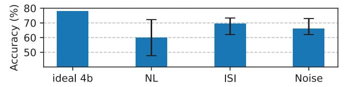

Fig. 2. ImageNet accuracy of ResNet50 at 4-bit precision under the effect of different analog signal integrity factors - nonlinearity (NL), inter-symbol interference (ISI) and noise, in SiPh accelerators.

Analog signal integrity has been underexplored in prior SiPh accelerator designs. Table I summarizes the effects considered in prior works. For a practical SiPh accelerator, all the listed effects must be considered. To address this gap, we make the following contributions towards a comprehensive analysis of analog signal integrity in SiPh accelerators:

- 1) We analyze the impact of nonlinearities in SiPh accelerators (Sec-IV-A).
- We evaluate the ISI effects in SiPh accelerators (Sec-IV-B).
- 3) We identify and characterize a novel loss mechanism arising from photonic MAC operation (Sec-IV-C).
- 4) We characterize the additional energy required to mitigate analog signal integrity degradation, showing an

|                                                                         | [15]             | [14]             | [13] | [10] | [11]             | [6]              | [16]             | Ours |
|-------------------------------------------------------------------------|------------------|------------------|------|------|------------------|------------------|------------------|------|
| Nonlinearity in electronic-to-optical conversion (E/O) considered (Y/N) | Y                | N                | N    | N    | N                | N                | N                | Y    |
| Nonlinearity in optical-to-electronic conversion (O/E) considered (Y/N) | N                | N                | N    | N    | N                | N                | N                | Y    |
| ISI mitigation (Y/N)                                                    | N/A 1 | N                | N    | N    | N                | N                | N/A 1 | Y    |
| Photonic MAC loss considered (Y/N)                                      | N                | N                | N    | N    | N                | N                | N                | Y    |
| Laser efficiency considered (Y/N)                                       | N                | Y                | Y    | Y    | Y                | N                | Y                | Y    |
| Waveguide power limit met (Y/N)                                         | N                | N/R 2 | N    | Y    | N/R 2 | N/R 2 | Y                | Y    |
| Accuracy achieved (Y/N)                                                 | N                | N/R 2 | Y    | N    | N/R 2 | N/R 2 | N                | Y    |

&lt;sup>1 ISI mitigation not required since the clock frequency is low (Sec. II-F)

increase in total energy consumption (electronic and photonic) by  $>100\times$  relative to an iso-throughput ideal SiPh accelerator baseline (Sec. IV-I).

#### II. BACKGROUND

We begin by examining analog signal integrity challenges in a canonical SiPh communication link (Fig. 3(a)), and then extend the analysis to SiPh accelerators (Fig. 3(b)). Thereafter, we explain the building blocks of the SiPh accelerators, highlighting how each component affects the signal integrity.

Fig. 3. Block diagram for (a) a SiPh transceiver (transmitter (TX) and receiver (RX)) and (b) a SiPh accelerator, showing similar blocks for digital to optical (and vice-versa) conversion. The key difference lies in the parallelized MAC operations in the optical domain for SiPh accelerators.

#### A. Analog signal integrity in SiPh communication links

In the binary communication link depicted in Fig. 4(a), ① Binary data is encoded in the optical domain by modulating the light from a laser source. ② The light traverses the photonic interconnect, and ③ the incident light is converted to current via photodiode and then to a 1-bit digital data by the transimpedance amplifier (TIA).

Compared to a binary SiPh communication link, a multi-bit SiPh communication link (Fig. 4(c)) introduces the following signal integrity issues:

- TX nonlinearity: Modulators have nonlinear transfer function [28], [36], and modulator drivers introduce residual nonlinearity [20]. The multi-bit digital data must be linearly converted into equally spaced levels in the optical domain. Thus, additional nonlinearity compensation [20], [27], [39] is necessary (Sec-IV-F1).
- 2) **ISI**: Inter-symbol interference (ISI) [36], resulting from finite bandwidth-induced spreading, worsens for multibit encoding [35] (Sec-IV-B).
- 3) **RX nonlinearity**: Nonlinearities added by the TIA would result in incorrect bits on the ADC output. Thus,

- the photodiode current must be linearly converted to a voltage, requiring a linear TIA [40], [41] (Sec-II-C1).
- 4) **Increased laser power** is required for correct detection of multiple bits from the optical signal (Fig 4(b)).

Mitigation of the above issues has always been a significant overhead for multi-bit SiPh communication links [19]. Analog electronics alone consume >4pJ/bit [41]–[48] with additional energy overheads from digital signal processing [41] and laser power. Comparatively, binary SiPh communication links consume <2pJ/bit [21]–[25], [34], [49]–[51].

Analog signal integrity issues are further exacerbated for SiPh accelerators. ISI degrades photonic MAC outputs, since temporally spread waveforms from multiple analog signals are added at the output (Sec-IV-B). Independently, photonic MAC operations reduce the separation between the MAC output optical power levels compared to communication, due to the weighted sum of multiple analog signals (Sec-IV-C).

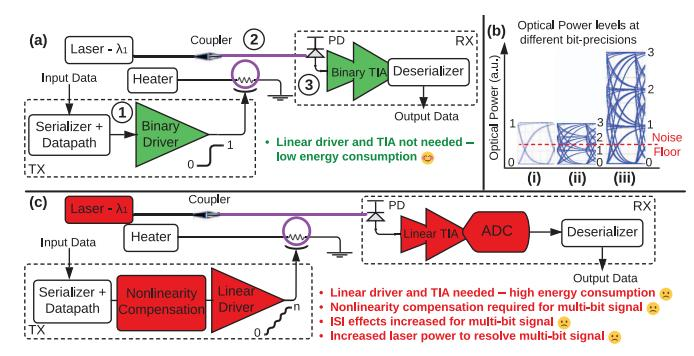

Fig. 4. (a) Schematic for a binary SiPh transceiver, where TX consists of binary driver and serializer, and RX consists of photodiode (PD), binary transimpedance amplifier (TIA) and deserializer; (c) Schematic for a multi-bit SiPh transceiver; (b) Normalized optical power levels for transmission with [i] 1-bit precision at laser power  $P_L$ , [ii] 2-bit precision at laser power  $P_L$ , and [iii] 2-bit precision at laser power for '1' is above the noise floor for [i] and [iii]. In the case [ii], the optical power level for '1' is below the noise floor and will not be detected correctly.

#### B. Digital to optical conversion circuits

1) Electro-Optical Modulator: Micro-ring modulators (MRMs) and Mach-Zehnder modulators (MZMs) are commonly used to encode data in the photonic domain. The electro-optical transfer function of an MRM and an MZM are given by a Lorentzian function (Eq. 1) and a raised-cosine function (Eq. 2), respectively, where Pout and Pin denote the input and output optical power, V is the applied voltage, Kring

[14], [11], and [6] do not report laser power; thus, waveguide limits (Sec. II-E) and accuracy (Sec. IV) cannot be inferred.

is the coupling coefficient, β is a parameter dependent on the wavelength and ring resonance, and Vπ is the voltage required for a phase shift of π in MZM. We refer readers to [28], [36] for details on Eq. 1 and Eq. 2.

$$P_{\text{out}} = P_{\text{in}} \left( 1 - \frac{K_{\text{ring}}}{1 + \beta V^2} \right) \tag{1}$$

$$P_{\text{out}} = \frac{P_{\text{in}}}{2} \left( 1 + \cos \left( \frac{\pi V}{V_{\pi}} \right) \right) \tag{2}$$

Both modulators exhibit an intrinsic nonlinear voltage response, referred to as static nonlinearity [20]. Static nonlinearity causes the modulator to produce unequally spaced optical power levels from equally spaced voltages. The degree of nonlinearity depends upon biasing, device parameters, and operating temperature [20], [28], [35], [36].

Modulators also introduce a large capacitance to the encoding circuits. Modulator capacitance (Cmod) of 100 fF and >1000 fF have been shown in SiPh transmitters with MRM [22], [34] and MZM [28], respectively. Cmod includes parasitic capacitances from the driver and interconnect (60 fF in [22]). Cmod and modulator parameters also vary with the applied voltage [20], [28], [35], causing dynamic nonlinearity. However, dynamic nonlinearity has been primarily analyzed for TXs operating at frequencies >25 GHz [35], [52].

*2) Transmitter Electronics:* Modulator drivers must generate large voltage swings (Vswing) to achieve a high extinction ratio (ER), defined as the ratio of the maximum to the minimum optical power through the modulator. Vswing is typically larger than supply voltages in CMOS processes. CMOS-based drivers can generate Vswing upto 4 V for ∼12 dB ER [50], while BiCMOS implementations generate Vswing >6 V [53].

Multi-bit drivers using segmented driver/modulator to generate intermediate optical power levels [20], [27], [34], [54]. Mismatch across the segments due to process variations introduces residual nonlinearity.

## *C. Optical to digital conversion circuits*

A photodiode (PD) converts optical power (W) to current (A). Responsivity (R, in A/W) determines the magnitude of current generated (Ipd) by the incident optical power. PD also performs wavelength-domain accumulation by adding the optical power across the wavelengths into a current [6].

A trans-impedance amplifier (TIA) converts the PD current into a voltage. For 1-bit detection, inverter-based TIAs are commonly used [21], [22], [55] due to their low energy consumption (75fJ/b [22]). In contrast, multi-bit detection requires linear current-to-voltage conversion, necessitating linear TIAs [40], [47], [48], [56]–[60].

We analyze the impact of noise at the TIA input, since optical signals get significantly attenuated before reaching the TIA (Sec III-B), making TIA noise (In, rms) the dominant factor affecting signal-to-noise ratio (SNR). The minimum optical power (Pmin) at the PD to achieve a target SNR is derived from In, rms and R (Eq. 3).

For example, obtaining a 10−12 error rate from a binary transmission requires an SNR of 7. A TIA with 2 μA In, rms and R of 1 A/W therefore requires the optical power when '1' is transmitted to exceed 28 μW or -15.5 dBm.

$$P_{\min} = \frac{2 \times SNR \times I_{n,rms}}{R}$$
 (3)

- *1) Linear TIAs:* Linear TIAs have a limited linear input current range; exceeding this range introduces distortions in the output voltage. This distortion is typically quantified as a percentage nonlinearity. The following conditions must be satisfied for multi-bit detection [41]:
  - Noise-free condition: The number of resolvable levels within the linear current range must exceed 2n.
  - Distortion-free condition: The distortion must be less than half the least significant bit, i.e. < (1/2n+1)%.

For example, a linear TIA [48] with an input-referred noise of 2.7 μA and a linear range of 330 μA with < 5% distortion provides 8.73 noise-free levels for a 10−12 error rate, corresponding to 3-bit detection. The reported distortion also satisfies the 3-bit requirement (<6.25%).

We plot the energy per conversion against the achievable bit precision for TIAs [40], [41], [46]–[48], [56]–[61] in Fig. 5. Fig 5 shows that higher linearity is typically achieved using implementations in the SiGe process. Achieving 4-bit detection can consume significantly higher energy (1.52pJ) [58] compared to a binary detection (75fJ) [22].

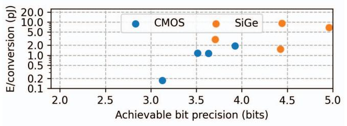

Fig. 5. Scatterplot of energy/conversion versus bit-precision in linear TIAs. Linear TIAs can achieve >3-bit detection, with TIAs in SiGe process achieving 5-bit precision [40], [41], [46]–[48], [56]–[61].

#### *D. Laser*

Lasers serve as the optical source for SiPh circuits. Lasers in C/L/O wavelength bands (C-band: 1530-1565nm, Lband:1565-1625nm, O-band:1260-1360nm) typically have 10- 15% wall-plug efficiency (WPE) [19]. Fig. 6 shows similar WPE trends across lasers reported over the past two decades. While higher WPE (23.9%, 31%) has been demonstrated [62], these results are limited to a single-λ lasers.

Multi-λ laser sources, required for SiPh accelerators [10], [13], [15], are realized either by a comb laser providing multiple-λ [26], or multiplexing multiple single-λ lasers [63]. While comb lasers may offer a larger number of λs and lower losses, their demonstrated WPE remains low [26]. As a result, multiplexing multiple lasers is currently the more practical approach [19], with demonstrations on 8-λ at 20mW/λ [63], and projected integration to higher λs [64].

Fig. 6. Scatterplot of laser wall-plug efficiency (WPE) vs optical power output for lasers in C/L/O-λ bands. For the lasers providing multiple-λ, the total laser power output across all λ is shown.

## *E. Waveguides*

The most commonly used waveguides are silicon and silicon nitride [65] waveguides. Nonlinear effects emerge in both waveguides beyond a certain optical power [66]. Silicon waveguide measurements [67] and simulations [68] show that silicon waveguides are significantly nonlinear after 30mW of optical power. Similarly, silicon nitride waveguides are nonlinear after 120mW of optical power [69].

#### *F. Eye Diagrams*

Analog signal integrity effects are easily visualized using eye diagrams [70], which overlay transient waveforms within a single window of the clock cycle, also referred to as the unit interval (UI). Eye diagrams show - (a) the effective eye height and (b) clear eye width, free of signal transitions.

The eye diagram in Fig. 7(a) shows a binary encoding with eye height 0.8× of the ideal separation, representing a loss of 0.97dB, and an eye width of about 0.9UI. For correct detection, the eye height should be higher than the noise-free level (Sec. II-C). In Fig. 7(b), the middle eye is the most affected by ISI due to increased signal transitions. The eye height is 0.6× the ideal separation (2.2dB loss) due to ISI.

Ample eye width is also required to mitigate timing noise, which introduces uncertainty during signal sampling. In SiPh links, a minimum eye width (twidth) is specified to achieve a target error rate and mitigate timing noise. The minimum eye width is calculated by Eq. 4, where tn, rms represents the rms value of the timing noise, and Qerror-rate is the value of the tail distribution for a Gaussian distribution at a given error rate [71]. As an example, a 2psrms timing noise at 10−12 error rate would require an eye width of more than 28ps. In Fig. 7(a) and (b), the eye width is 180ps and 84ps, respectively.

$$t_{width} = 2 \times Q_{error-rate} \times t_{n,rms}$$
 (4)

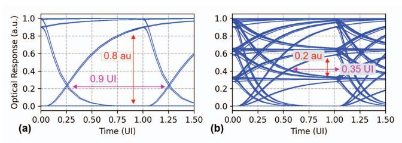

Fig. 7. Eye diagrams for (a) binary and (b) 2-bit encoding at 5 GHz with a driver with 5 GHz -3dB bandwidth. The effect of ISI is visible in (a) with reduced eye height and eye width. ISI effects are much more prominent in (b) with reduced eye height and width in the middle eye.

#### III. METHODS

# *A. Transient simulations*

Eye diagrams are generated using electro-optic transient simulations in Cadence Spectre. The photonic modulators are used from a 45nm photonics-enabled CMOS PDK [72]. The intrinsic bandwidth of these modulators exceeds 35 GHz. Transient simulations are performed for >105 clock cycles to capture ISI effects. We assume a uniform distribution of the quantized values during the transient simulation. Although the unquantized DNN activation values are concentrated near zero, the quantization process (Sec. III-C) moves these values to be evenly distributed across quantization levels (Fig. 8).

## *B. Optical loss budgeting*

An optical power tracker [18] is employed for loss budget evaluations. The parameters used in loss budget evaluation are shown in the 'Ours' column in Table-IV. The laser source is a multi-wavelength laser with 15% efficiency [63] – we assume, optimistically, that the efficiency is maintained as the number of wavelengths increases. Photonic devices are chosen with the least optical loss – SiN waveguide [69], Y-branch splitter [15], edge coupler [73], micro-ring modulator [74], micro-ring resonator [18], Mach-Zehnder [28], and directional-coupler [75]. A 3dB penalty due to biasing of modulators, along with an additional 2dB margin to accommodate fluctuations in laser power and other signal losses [76], is also included in Table-IV. Additional losses due to ISI and photonic MAC operation are discussed in Sec-IV-B and Sec-IV-C, respectively.

#### *C. DNN evaluations*

We use Pytorch [77] to evaluate inference accuracy under the effects of nonlinearities, ISI and noise introduced by SiPh accelerators. Image classification accuracy is evaluated on the ImageNet [37] dataset for MobileNet-v2 [78] and ResNet50 [38], which contain 3.4M and 26M parameters, respectively. We also evaluate perplexity on Wikitext-2 [79] dataset for Qwen2.5-7B-instruct language model [80].

For image classification networks, we apply quantizationaware training (QAT) [81] to recover accuracy with lowprecision (3-bit/4-bit) weights and activations. QAT also learns the optimal dynamic range for both activations and weights, which are used by the quantizers during inference (Fig. 8).

Fig. 8. Schematic for noise injection in a DNN layer. Activation, weight and output quantizers ensure that data is quantized to low-bit precision. Variance for AWGN is the noise added by the SiPh accelerator. The number of noise samples added to the layer output depends on the dot-product length in the SiPh accelerator and the number of channels in the DNN layer.

For the language model, we evaluate a post-training quantization model, as QAT was infeasible due to limited compute resources. The baseline Qwen2.5-7B-instruct is implemented in fp16 precision [80], and must be quantized to low precision weights and activations for deployment on SiPh accelerators (Sec. II-C1, Sec. IV-F1).

Weights are quantized to int4 precision using activationaware weight quantization [82], while the activations are still retained in fp16 precision to preserve model performance [82]–[84]. We refer to this weight quantized language model as Qwen2.5-7B-instruct-AWQ.

To enable deployment on a SiPh accelerator, the activations in the Qwen2.5-7B-instruct-AWQ model are further quantized to integer formats (int4-int8). This quantization is performed by using an affine transformation with a scale and a zero point value [85]. We investigate three quantization granularities in Sec. IV-E – per-tensor, per-feature and per-block.

Per-tensor quantization applies a single scale and zero point to the entire activation tensor. Per-feature granularity applies a single scale and a zero point to each hidden dimension of the activation tensor. Per-block granularity applies a single scale and zero point to a block containing 14 batches and 74 hidden dimensions. This particular block size is chosen to provide the best perplexity on the Qwen2.5-7B model, and larger block sizes lead to poorer perplexity in our evaluations.

#### *D. Incorporating analog signal integrity factors*

We implement the effects of analog signal integrity factors using hook utilities [77]. We add nonlinearity to the input encoding using forward pre-hooks, where the nonlinearity function depends upon the modulator and the biasing (Sec. II-B1).

We account for timing noise due to ISI by first deriving the post-MAC conditional output distributions from transient simulations (Sec-IV-B). The derived distribution is added as a noise layer using forward post-hooks.

The effect of analog noise on the output is also added using post-hooks, where the variance of the Gaussian noise is derived from the optical loss budgeting (Sec-IV-G3). We also consider the dot-product length and add multiple noise samples [86] depending on the number of channels in the layer (Fig. 8).

# *E. Power Evaluation for SiPh accelerators*

The energy consumed in MAC operation for SiPh accelerators includes energy consumed in the (a) transmitter circuits for encoding input activations, comprising serializer, and linear driver with nonlinearity compensation and ISI mitigation (Sec. IV-F1), (b) heater for encoding weight values, (c) receiver circuits for deducing output values comprising linear TIA (Sec. II-C1), and ADC, and (d) Laser power.

The parameters used for evaluation are listed in the 'Ours' column in Table-IV. We use the energy from measured circuits wherever possible. For the TX energy at 1-2 bit precision, we report published SiPh transceivers. For >3-bit precision, we calculate the driver power consumption (Sec-IV-F1).

The compensation power for nonlinearity is synthesized in a 16nm CMOS process (Sec-IV-F1). We choose the linear TIAs which support the multi-bit detection with the lowest energy (2/3-bit [48], 4-bit [58], 5-bit [46]). We use two ADCs depending on the operating frequency – [87] for 5GHz, and [88] for 10GHz.

#### *F. Power Evaluation for Digital accelerators*

We compare the energy/MAC operations in SiPh accelerators with that of digital DNN accelerators in Sec. IV-H. To ensure a fair comparison, we match the effective MAC throughput of the two designs. Both accelerators are evaluated under an output-stationary dataflow to maintain a consistent mapping. While more efficient and reconfigurable dataflows for digital accelerators are possible [89], comparing them is left to future work. The DRAM and on-chip SRAM bandwidths are sized to maintain the MAC throughput. The energy costs of the on-chip SRAM and DRAM are not included in this comparison to isolate the compute energy.

For the digital baseline, we synthesize a digital MAC array with 5 subarrays, each containing 16×16 MACs running at 1 GHz in a 16nm CMOS process. The digital MAC array includes a multicast interconnect for input activations [90] and a reduction interconnect for adding partial sums. The specifications of the digital baseline are shown in Table-V.

#### *G. Limitations of the study*

Evaluations based on analog circuit simulations are sensitive to simulation granularity and environmental variations. We make the following assumptions to make the analysis tractable, which bias the simulations in favour of SiPh accelerators.

We model the encoding circuit to be an ideal linear circuit with bandwidth limited by a lumped RC element. A transistorlevel implementation would capture parasitics and device mismatch that would further degrade signal integrity [35].

We also do not account for the cost of high-frequency clock distribution and signal routing, as these effects can be captured only after physical layout [19].

We assume no device-level mismatch in the photonic components. In practice, such mismatches induce variations in optical loss across the MAC array and necessitate calibration and control circuits, which in turn reduce laser efficiency [16].

Finally, we do not consider manufacturability, yield, packaging and validation overheads [19]. These issues are common concerns for analog circuits and are further exacerbated in analog SiPh accelerators.

#### IV. EVALUATIONS

#### *A. Effects due to nonlinearity*

We plot the eye diagram for 2-bit and 4-bit encoding on a micro-ring modulator (MRM) without nonlinearity compensation (Fig. 9) to show the impact of nonlinearity. Unequal eye heights and merging of the '0' and '1' optical levels are visible in Fig. 9(b). Furthermore, the impact of nonlinearity is more severe for MAC operations – the optical levels for outputs '0', '1' and '2' are merged (Fig. 10(a)).

While eye diagrams provide a qualitative view, the impact of nonlinearity is more clearly reflected in DNN accuracy. Fig. 11 shows the effect of nonlinearities on ResNet-50 and MobileNet-V2 at 3-bit and 4-bit precision. DNNs are very sensitive to the cosine nonlinearity introduced by the MZM at 3-bit precision – ResNet-50 incurs >25% accuracy loss and MobileNet-V2 accuracy collapses to near zero.

Fig. 9. Eye diagrams at 5 GHz clock cycle for (a) 2-bit and (b) 4-bit encoding, without nonlinearity compensation. Driver -3dB bandwidth is set as 10 GHz and 15 GHz, in (a) and (b), respectively. The optical levels are marked in red.

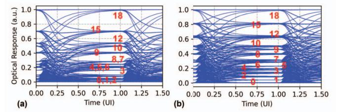

Fig. 10. Eye diagrams at 5 GHz clock cycle for a 2-element dot product operation at 2-bit precision with (a) driver with no nonlinearity compensation, and (b) ideal linearized driver. Driver -3 dB bandwidth is set to 10 GHz.

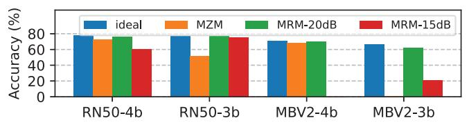

Fig. 11. Effect of nonlinearities on DNN accuracy. RN50 and MBV2 refer to ResNet-50 and MobileNet-V2, respectively.

The MRM operation is strongly dependent on the biasing conditions. We evaluate two bias points corresponding to extinction ratios (ER) of 20 dB and 15 dB (Sec. II-B2). While there is minimal accuracy loss at 20 dB ER (1-2%), the 15 dB ER shows much larger accuracy losses. Fig. 2 shows ResNet50 accuracy at 4-bit precision across these modulator configurations, including a 14 dB ER MRM, where the accuracy further drops to 47.7%.

#### *B. Effects due to inter-symbol interference*

In this section, we analyze the impact of inter-symbol interference (ISI). First, we analyze the effect of ISI on the eye width. We assume timing noise of 2 psrms in our analysis, which requires an eye-width >28 ps to achieve an error rate of 10−12. Prior transceivers have reported timing noise ranging from 0.8 ps to 3.7 ps [21], [36], [91].

Fig. 12 shows the variation of eye width with TX bandwidth (BW). TX BWs >12.5 GHz provide sufficient eye width for reliable sampling of MAC operations at a 5 GHz clock frequency. In contrast, a 4-bit SiPh MAC operation at 10 GHz clock frequency requires BW >40 GHz to achieve sufficient eye width. Such high-bandwidth TX are showcased in stateof-the-art SiPh TX [25], [35], and typically rely on extensive equalization [35], [36].

We further use eye diagrams to derive output distributions when the eye width falls below the error-free threshold. Fig. 13 and Fig. 14 show the output distributions for 4-bit MAC operation at 5 GHz, with TX driver BWs of 5 GHz and

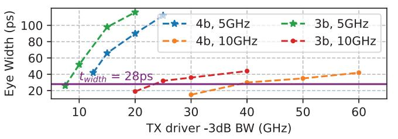

Fig. 12. Eye width plotted against TX driver BW. The purple line represents the required eye width to achieve an error rate below 10−12.

10 GHz, respectively. We observe that distributions of output values at 5 GHz BW spill over to adjacent outputs, indicating incorrect detections. At 10 GHz BW, the distributions show improved seperation between the output levels.

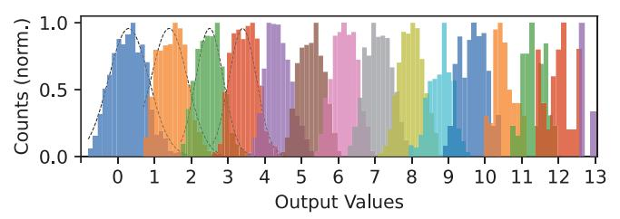

Fig. 13. Normalized histogram for output values for 4-bit SiPh MAC operation at 5 GHz with TX driver BW of 5 GHz. The dotted curves represent the Gaussian distribution fits.

Fig. 14. Normalized histogram for output values for 4-bit SiPh MAC operation at 5 GHz with TX driver BW of 10 GHz. The dotted curves represent the Gaussian distribution fits.

We use the derived output distribution to quantify DNN accuracy degradation under ISI (Fig. 15). Significant overlap in the output distributions for the 5 GHz TX driver BW results in an accuracy loss >5% across all SiPh accelerator sizes. Severe accuracy losses, >50%, are observed in smaller 32×32 arrays. Reduced output distribution overlap greatly improves accuracy for the 10GHz TX driver BW; however, a nonnegligible accuracy loss persists, with up to 9% degradation observed for ResNet-50 at 3-bit precision.

#### *C. Eye Height losses due to analog photonic MAC operation*

In this section, we present an eye height loss mechanism arising from analog photonic MAC operation, independent of the DNN model being evaluated. This loss mechanism becomes apparent only when the eye diagrams for photonic MAC are examined. Contrast the eye diagrams for 4-bit communication and 4-bit MAC, as shown in Fig. 16. Zoomedin eyes around levels '2' and '3' (Fig. 16(c) and (d)) show that eye heights in 4-bit photonic MAC are significantly reduced compared to 4-bit communication.

Fig. 15. DNN accuracies at clock frequency of 5 GHz for different SiPh accelerator sizes (from 32×32 to 128×128) under the ISI effects caused by driver BW of 5 GHz and 10 GHz.

This loss occurs in photonic MAC operation because multiple input-weight combinations produce the same output value. For instance, an optical value of '2' in 4-bit output precision can result from the following 4-bit quantized input and weight values: [(4, 4), (4, 5), (6, 3), (7, 3), (7, 4), (8, 2), (8, 3), (9, 3), (10, 3), (11, 2), (12, 2), (13, 2), (14, 2), (15, 2) ]. The receiver electronics would need to distinguish between the maximum optical level of '2' and the minimum optical level of '3', effectively compressing the decision margin, and increasing the error probability.

Fig. 17 quantifies total eye height loss, including contributions from both photonic MAC operation and ISI. Eye height losses due to photonic MACs account for the largest portion of these losses – 8.45 dB for 3-bit MAC and 11.76 dB for 4 bit MAC. These eye height losses are utilized in optical loss budgeting (Sec-IV-G3).

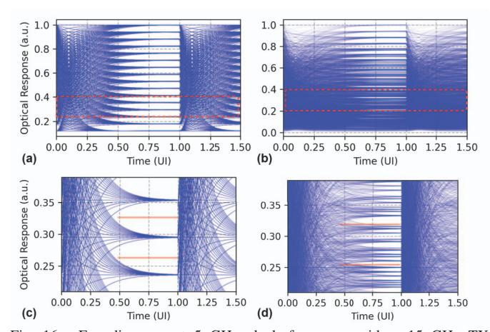

Fig. 16. Eye diagrams at 5 GHz clock frequency with a 15 GHz TX driver BW for (a) 4-bit communication, (b) 4-bit MAC operation. (c) 4-bit communication, zoomed in around optical levels '2' and '3', and (d) 4-bit MAC operation, zoomed in around the same optical levels. The solid red lines in (c) and (d) represent thresholds for detecting the levels.

#### *D. Accuracy measurements under noise*

We first examine the accuracy when a single noise sample is added to the DNN layers (Fig. 18). We can see that the low bitwidth quantized DNNs (3/4-bit) are less resilient to noise than the 8-bit quantized DNNs [92]. SNR required for

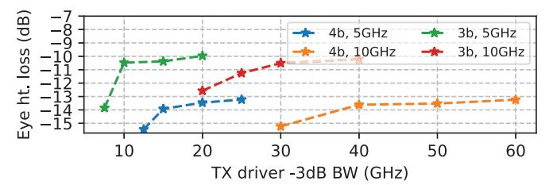

Fig. 17. Eye height loss relative to ideal eye height for MAC operations at 3 bit/4-bit precision and different TX driver bandwidths. Plotted loss comprises eye height reduction due to photonic MAC and ISI losses.

minimal accuracy loss in MobileNetV2 quantized to 3, 4 and 8-bit precisions are >20, >12 and >2, respectively, and for ResNet50 quantized to 3, 4 and 8-bit precisions are >12.5, >8.33 and >2.5, respectively. Notably, the SNR values for accuracy with 3/4-bit quantized models (SNR = 20, 8.33) exceed the SNR required for detecting 3/4-bit output values with an error rate of 10−12 (requiring SNR = 7).

The DNN accuracy under the effect of noise for different SiPh accelerator sizes is shown in Fig. 19. The largest array size (256×256) achieves noise performance close to a single noise sample addition, whereas smaller arrays require additional SNR (12-20) to maintain accuracy.

Fig. 18. Classification accuracy with single noise sample injection [86] for 3, 4 and 8-bit quantized MobileNetV2 (MBNetV2) and ResNet50 (RN50), for different SNR/(bit-precision) values.

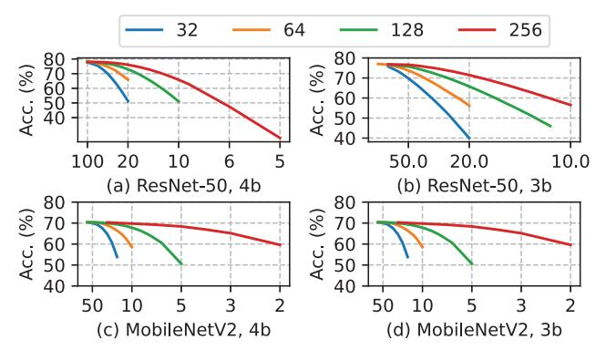

Fig. 19. DNN accuracy for different SiPh accelerator sizes (from 32×32 to 256×256) under the effect of noise. The x-axis shows SNR per bit-precision.

## *E. Perplexity measurements with quantized activations*

In this section, we examine the perplexity on the Wikitext-2 dataset [79] for Qwen2.5-7B-instruct-AWQ [80] language model. Achieved perplexity for different activation precisions and quantization granularities (per-tensor, per-feature, and per-block) (Sec. III-C) are shown in Table-II. The baseline Qwen2.5-7B-instruct-AWQ language model with weights in int4 precision and activations in fp16 precision achieves a perplexity of 6.79. Among the evaluated schemes, per-block quantization yields the lowest perplexity across all precisions.

When the activation values are quantized to int8/int7 precision, perplexity remains close to the baseline, indicating minimal disruption to the model's internal representation. However, when precision is reduced to int5/int4, perplexity increases dramatically, indicating insufficient dynamic range to capture outlier activations. Such outlier activation values are critical for achieving high performance in language models [93]. Consequently, the perplexity achieved by Qwen2.5- 7B-instruct-AWQ with int5 activation precision is worse than that of the pointer sentinel-LSTM model containing 21M parameters, introduced on the Wikitext-2 dataset in 2016 [79].

TABLE II WIKITEXT-2 PERPLEXITY (LOWER IS BETTER) FOR QWEN2.5-7B-INSTRUCT-AWQ WITH INT4 WEIGHTS UNDER DIFFERENT ACTIVATION QUANTIZATION PRECISION AND GRANULARITY.

| Activation precision | per-tensor | per-feature | per-block |
|----------------------|------------|-------------|-----------|
| fp16 (baseline)      | 6.79       | 6.79        | 6.79      |
| int8                 | 17.71      | 8.2         | 6.82      |
| int7                 | 1284.77    | 35.9        | 6.85      |
| int6                 | 30564      | 19.77       | 8.04      |
| int5                 | 83150      | 182441      | 182       |
| int4                 | 1204401    | 53317       | 2129      |

To address the dynamic range in activations, digital implementations typically perform accumulations in higher bit precisions – FP8 precision [94], [95], and 24-bit integer precision [96] accumulation is used even with multiplications in FP4 and int4 precision, respectively. Tackling the dynamic range is difficult for SiPh accelerators, as they cannot utilize bits lost due to ADC quantization [97].

The observed perplexity degradation for Qwen2.5-7Binstruct-AWQ arises solely due to activation quantization, before considering any analog signal integrity factors which have been shown to impact DNN performance (Sec. IV-A, Sec. IV-B, Sec. IV-D). Thus, further algorithm and devicelevel advances are required for the deployment of language models in SiPh accelerators.

#### *F. Mitigating analog signal integrity factors*

In this section, we discuss the techniques used to mitigate the analog signal integrity factors and quantify the energy overhead.

*1) Nonlinearity compensation in linear SiPh TX:* Nonlinearity compensation in TX is usually performed by (a) utilizing a higher resolution driver or segmented modulator ((n+k) bits) [54] to generate 2(n+k) optical levels, and (b) using a nonlinearity compensation logic that maps the n-bit data to a (n+k)-bit value to linearize the resulting optical output.

Prior SiPh TX have implemented 30 driver segments (4.9b) [20], [35], a 4-bit segmented driver [39], and a 5 bit driver [27] in 2-bit, 2-bit, and 4-bit communication, respectively, to compensate for nonlinearities. A SiPh accelerator [15] has also proposed using a 5-bit driver for compensating static nonlinearity in 4-bit modulation. These designs correspond to compensation overheads of k = 1 for [15], [27] and 2 for [20], [35], [39]. We conservatively choose k = 3 in our analysis due to the pronounced impact of nonlinearity on MAC outputs (Sec. IV-A).

Next, we estimate the total TX energy in a SiPh accelerator by calculating the driver power (Pdrv) and the nonlinearity compensation logic power (Pnlc). We estimate Pdrv by utilizing Eq. 5, where f is the modulation frequency, and α denotes the toggle rates. The toggle rates (α) are modified for multibit precision [98], and Vswing is chosen as 2 V, which can be generated by CMOS processes [34]. We choose Cmod as 40 fF. Modulator device capacitance and parasitics each contribute around 20 fF, representing advanced devices [99], and packaging techniques [73], [100].

Pnlc is calculated by synthesizing the nonlinearity compensation logic in a 16nm CMOS process with a clock frequency of 5 GHz. We time-multiplex two logic blocks to meet the timing constraints at a 10 GHz clock frequency.

$$P_{\rm drv} = \frac{1}{2} \left( \alpha f C_{\rm mod} V_{\rm swing}^2 \right) \tag{5}$$

The estimated total TX energy (driver, nonlinearity compensation and serializer) for different bit precisions is shown in Fig. 20. Energy consumed by prior SiPh TX [20], [22]– [25], [27], [34]–[36], [39], [41]–[45], [49]–[51], [99], [101], [102] are also shown for reference. Estimated TX energy is on par with the lowest energies since we assume a lower Cmod and Vswing compared to prior SiPh TX to reflect the newer devices and technology nodes [73], [74], [99], [100]. Multibit TX consumes much higher energy than binary, e.g., 419 fJ per 4-bit transmission, compared to 154 fJ for binary [22].

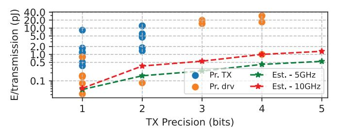

Fig. 20. Plot showing the estimated TX energy for 5 GHz and 10 GHz across different bit precisions. Energy consumed by prior SiPh TX (Pr. Tx) [20], [22]–[25], [27], [34]–[36], [39], [41]–[45], [49]–[51], [99], [101], [102] and drivers (Pr. drv) are also plotted. The plotted TX energies include the energy required for nonlinearity compensation and ISI mitigation.

- *2) Compensating inter-symbol-interference:* We mitigate ISI at the 5 GHz clock frequency by increasing the driver bandwidth (BW). Driver BW requirements at 10 GHz operating frequency (Sec. IV-B) necessitate feedforward equalization. We assume a 1-tap feedforward equalizer [36] for bandwidth extension, which roughly doubles the energy compared to a non-equalized TX. The energy consumed for ISI mitigation for higher driver bandwidths is included in Fig. 20.
- *3) Compensating eye height losses:* We compensate eye height losses arising from the photonic MAC operation and inter-symbol interference by increasing the laser power. For 3

and 4-bit MAC operations, this requires 10× and 21× higher laser power relative to the ideal scenario without eye height losses. These increases in laser power make it the largest energy consumer in SiPh accelerators (Sec. IV-G5).

An analogous approach is used in analog electronic accelerators, where signal amplification is employed after MAC operations [31], [32]. In the photonic domain, semiconductor optical amplifiers (SOA) can be an alternative [103] to amplify the optical signals. However, their usage in SiPh accelerators is currently limited by noise performance [18], [25], [103].

TABLE III VALIDATION OF THE POWER CALCULATIONS

| Prior Work | Reported (mW) | Calculated (mW) | Effects Excluded from analysis |
|---------------|------------------|--------------------|-----------------------------------|
| DEAP [6]      | 95,000           | 92,925             | Linear TX/RX, ISI                 |
| Albireo [10]  | 22,700           | 22,820             | Linear TX/RX, ISI                 |
| LT [13]       | 14,750           | 14,092             | Linear TX/RX, ISI                 |
|               |                  |                    | WG limits                         |
| OC [15]       | 3653             | 3418               | Linear RX, Laser                  |
|               |                  |                    | WPE, WG limits                    |

#### *G. Energy analysis for SiPh accelerators*

- *1) Validation:* We validate our energy calculations by excluding ISI, nonlinearity compensation, and some optical losses for architectures in prior works [6], [10], [13], [15]. The calculated values match within 6.5% of the values reported in prior works (Table-III).
- *2) SiPh accelerators chosen for evaluation:* We evaluate three SiPh accelerator topologies, each having a distinct photonic MAC technique - (a) micro-ring modulator (MRM) [6], [15], [18] (Fig. 21), (b) Mach-Zehnder modulator (MZM) [10] (Fig. 22), and (c) directional coupler (DC) [13] (Fig. 23).

Fig. 21. Architecture for micro-ring-modulator (MRM) based SiPh accelerator [6], [15]. MRM-based SiPh accelerator performs a vector-matrix multiplication between operands I and II. Operand-I vector is encoded at high speed using TX across Nx-λ and broadcasted to Ny-output lanes. The operand-II matrix is encoded by low-speed modulators in each micro-ring. Multiplication is performed in each micro-ring, and addition occurs across λ-s at the photodiode. Each output lane has a separate RX.

*3) Loss Budget Analysis:* In this section, we perform loss budget analysis [18], [76] on the chosen accelerator topologies. We quantify the total losses as SiPh accelerators scale to larger array sizes. MAC precision of 4-bit is used for choosing the eye height loss (Fig. 17) for all the accelerator topologies.

The loss budget analysis for MRM-based SiPh accelerators is shown in Fig. 24. We observe that optical power loss is predominantly due to splitting the waveguide to create larger MAC arrays. Overall, an aggregate loss of >21dB in MRM-based SiPh accelerators is observed.

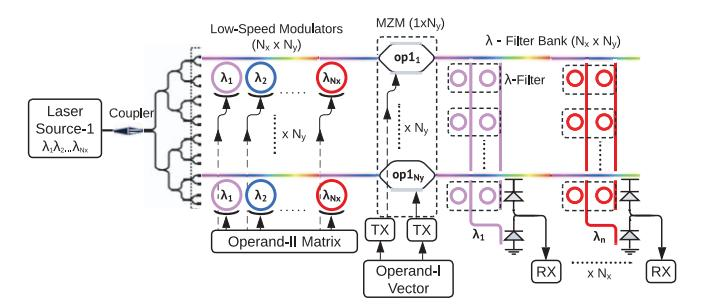

Fig. 22. Architecture for Mach-Zehnder modulator-based SiPh accelerator, adapted from [10]. MZM-based accelerator performs vector-matrix multiplication between operands I and II. MZM is high-speed modulated using TX to perform multiplication across all λ. The λs are first filtered by specific-λ via micro-rings, then added at the photodiode.

Fig. 23. Architecture for directional coupler (DC) based SiPh accelerator [13]. DC-based SiPh accelerator performs a matrix-matrix multiplication between operands I and II. Once the laser light is split 2N-ways, both operands are encoded at high speed using TX. The crossbar is formed by operand-I and operand-II broadcast to vertical and horizontal connections. Each crossbar intersection has a DC and a photodiode for performing dot products.

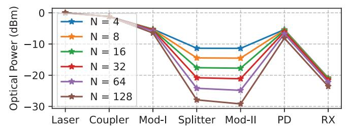

Fig. 24. Loss budget plots for micro-ring modulator-based SiPh accelerators with MAC array sizes from 4×4 to 128×128. Refer to Fig. 21 for the circuit checkpoints on the x-axis. Photodiode-to-RX loss incorporates margins (Sec-III-B), ISI and eye height losses (Sec-IV-C).

The loss budget analysis for MZM-based SiPh accelerators is shown in Fig. 25. We observe losses >22dB in the optical path for MZM-based SiPh accelerator. The loss budget analysis for a DC-based SiPh accelerator is shown in Fig. 26. A photonic crossbar requires two levels of splitting, leading to an increase of >3dB in optical loss as the array size doubles. Optical losses in DC-based SiPh accelerators start from 27dB for a 4×4 array, and reach 44dB for a 128×128 array.

*4) Laser Power required for SiPh accelerators:* Using the SNR values required for DNN accuracy, we plot MobileNetV2 accuracy vs laser power/λ plot for SiPh accelerators in Fig. 27. Laser power >35mW/λ is required to obtain accuracy within 1% of 4-bit quantized MobileNetV2. Similarly, we find that at least 20 mW/λ of laser power is required to achieve accuracy

Fig. 25. Loss budget plot for Mach-Zehnder modulator-based accelerators. Refer to Fig. 22 for the checkpoints on the x-axis.

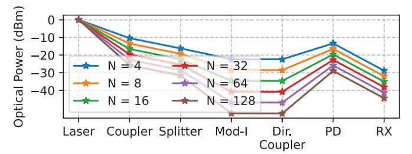

Fig. 26. Loss budget plot for directional-coupler-based SiPh accelerator. Due to two levels of splitting to create the crossbar structure, the losses increase by at least 3dB every time the array size is doubled.

within 1% of that of 4-bit quantized ResNet50.

We check the maximum optical power in the SiPh circuit to incorporate the waveguide constraints. None of the SiPh accelerators are accurate when silicon waveguides are used due to the limited optical power handling capacity. Using SiN waveguides, 16×16 MRM-based, and 8×8 MZM-based SiPh accelerators can achieve accuracy within 1% of ideal 4-bit digital DNN accuracy. Larger array sizes are possible at some accuracy loss, e.g. a 32×32 MRM-based SiPh accelerator is feasible with 5% accuracy loss.

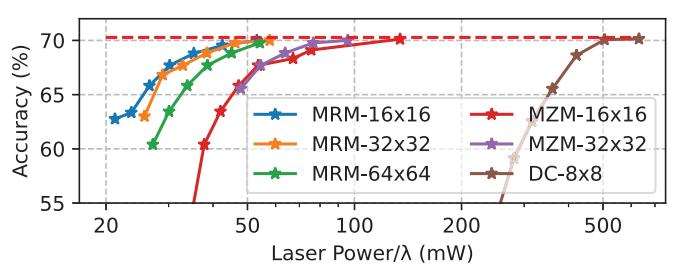

Fig. 27. MobileNetv2 accuracy vs. laser power/λ for different SiPh accelerators at 4-bit precision. Dotted line represents the digital inference accuracy at 4-bit precision (70.27%).

*5) Energy/MAC consumed by SiPh accelerators:* Fig. 28 shows the energy consumed by SiPh accelerators operating at 5GHz and 4-bit precision across various array sizes. Laser power scales poorly, increasing significantly to compensate for optical losses and for eye height reduction due to photonic MAC and ISI losses. In contrast, the energy consumed by electronics is amortized across one of the array dimensions; therefore, electronic energy is negligible compared to laser energy for a 128×128 array ( >80% of energy/MAC).

Fig. 28. Energy/MAC operation at 4-bit precision for micro-ring, Mach-Zehnder and directional coupler-based SiPh accelerators operating at 5GHz clock frequency. Bar-splits show the energy spent on different components, also in log-scale – for 8×8 micro-ring based accelerator, 0.32pJ, 0.057pJ, 0.08pJ, 5.4pJ is spent on RX, TX, heaters and laser respectively .

Operating at a 2 GHz clock frequency reduces ISI, thereby reducing energy consumption in electronic circuits. However, the system's overall throughput is reduced, resulting in less laser power amortization. Thus, the energy/MAC in SiPh accelerators operating at 2 GHz is 2.4× higher than at 5 GHz.

## *H. Comparison with prior SiPh accelerators*

In this section, we compare our analysis with prior SiPh accelerators (Table-IV). We also report the parameters considered in both prior work and our analysis, with lower values preferred, except for MAC precision, laser efficiency, and waveguide power limit. The parameters used in our analysis are optimistic or comparable to those in prior work. Prior works have not considered modulator biasing loss (Sec III-B), loss budget margin (Sec III-B), receiver linearity (Sec II-C1) and waveguide power limitations (Sec II-E).

The heater power considered in our analysis is lower than that in prior work, as we use heaters with undercut substrates that reduce power consumption compared to conventional heaters [18]. Additionally, we also share heaters across a row/column of the photonic MAC array [15]. These two heater-pertinent factors reduce overall heater energy by >9× relative to prior works that require heaters [6], [10], [13], [18]. All energy/MAC plots in this work (Fig. 28, Fig. 29, Fig. 30) incorporate the undercut heaters and heater-sharing along a row of photonic MAC array.

The modulator capacitance considered – a total of 40 fF, comprising 20 fF from the MRM capacitance and 20 fF from the packaging – is optimistic compared to prior works.

None of the prior works have considered nonlinearity in RX. We report the TIA power used in prior works, which are all binary TIAs and are insufficient for decoding multiple bits (Sec II-A). The noise values reported in the Table IV for prior works [10], [13], [14] are obtained through their cited TIA scaled to their respective operating frequency. We use the power and noise for a 4-bit linear TIA [58] in the evaluations.

Nonlinearity in TX has been considered by only one prior work [15], although the effect of nonlinearity on DNN accuracy was not considered. None of the prior works have considered the impact of ISI on SiPh accelerators, either qualitatively or quantitatively through DNN accuracy evaluations. SiPh accelerators operating at lower clock frequencies (e.g. 2GHz [15]) would experience reduced ISI effects, albeit at

1&#x27;N/R' refers to parameters required for the respective design which have not been reported.

2&#x27;-' refers to parameters not required for the respective design.

TABLE IV PARAMETERS USED IN SIPH ACCELERATORS (PRIOR WORKS AND OURS)  $^{1,2}$ 

| Prior works                       | [15] | [14]          | [13]  | [10]       | [11]          | [6]   | [16] | Ours  |
|-----------------------------------|------|---------------|-------|------------|---------------|-------|------|-------|
| Clock freq. (GHz)                 | 2    | 10            | 5     | 5          | 10            | 5     | 0.5  | 5, 10 |
| MAC prec. (bits)                  | 4    | 5             | 4     | 7          | 8             | 6     | 7    | 3, 4  |
| Number of $\lambda$               | 256  | 1             | 12    | 63         | N/R           | 9-100 | 1    | 8-128 |
| Laser power/\(\lambda\)           | 6.02 | N/R           | 11    | 6.99 [104] | N/R           | N/R   | 23   | <20   |
| (dBm) & WPE (%)                   | N/R  | 20            | 20    | 8 [104]    | 20            | N/R   | 16   | 10-20 |
| Waveguide (WG) loss (dB/cm)       | 0    | N/R           | N/R   | 0.15       | N/R           | N/R   | N/R  | 0.03  |
| WG power limit (mW)               | N/R  | N/R           | N/R   | N/R        | N/R           | N/R   | 200  | 200   |
| Power launched into WG (mW)       | 1024 | N/R           | 154   | 441        | N/R           | N/R   | 200  | <200  |
| Y-branch loss (dB)                | 0.05 | N/R           | 0.3   | 0.3        | N/R           | N/R   | 0.4  | 0.05  |
| Edge-coupler loss (dB)            | N/R  | 0.2           | N/R   | N/R        | 2             | N/R   | N/R  | 0.6   |
| Microring mod. (MRM) loss (dB)    | 2.5  | -             | -     | -          | -             | N/R   | -    | 1     |
| MRM capacitance (fF)              | 30   | -             | -     | -          | -             | N/R   | -    | 20    |
| Microring resonator loss (dB)     | -    | 0.2           | 0.93  | 0.39       | -             | -     | -    | 0.01  |
| Mach Zehnder mod. (MZM) loss (dB) | -    | -             | 1.2   | 1.2        | 1.2           | -     | 1.1  | 2.8   |
| MZM Capacitance (fF)              | -    | -             | N/R   | N/R        | N/R           | -     | N/R  | 415   |
| Directional coupler loss (dB)     | -    | -             | 0.33  | -          | -             | -     | -    | 0.06  |
| Phase shifter loss (dB)           | -    | 0.91          | 0.33  | -          | -             | -     | 0.1  | 0.33  |
| Modulator biasing loss (dB)       | N/R  | N/R           | N/R   | N/R        | N/R           | N/R   | N/R  | 3     |
| Loss budget margin (dB)           | N/R  | N/R           | N/R   | N/R        | N/R           | N/R   | N/R  | 2     |
| Photodiode Responsivity (A/W)     | 0.5  | 1.1           | N/R   | 1.1        | 0.8           | N/R   | 1.1  | 1.2   |
| Heater Power (mW)                 | 4.6  | N/R           | 2.4   | 3.1        | -             | 19.5  | N/R  | 2.8   |
| Linear TX (Y/N)                   | Y    | N             | N     | N          | N             | N     | N    | Y     |
| TX power (mW)                     | 0.65 | 68            | 17.85 | 26         | 11.06         | 26    | 72   | 4.16  |
| ISI issues (Y/N)                  | N    | Y (very high) | Y     | Y          | Y (very high) | Y     | N    | Y     |
| ISI mitigation (Y/N)              | N/A  | N             | N     | N          | N/A           | N     | N/A  | Y     |
| Linear TIA (Y/N)                  | N    | N             | N     | N          | N             | N     | N    | Y     |
| TIA power (mW)                    | 0.85 | 0.75          | 3     | 3          | N/R           | 17    | 41   | 85.2  |
| ADC Power (mW)                    | 1.2  | 11.5          | 7.4   | 29         | 29            | 76    | 66   | 5.5   |
| Noise assumed (uA)                | 0.4  | 1.128         | 0.564 | 0.564      | N/R           | N/R   | 0.4  | 1.3   |

the cost of lower energy efficiency (Sec-IV-G5) due to less amortization of the constant laser power.

None of the prior works have considered the loss mechanism due to analog photonic MAC operation. Table-IV also compares whether the prior works operate within the waveguide constraints (Sec-II-E) – most prior proposals go above the waveguide power limits.

#### I. Comparison with digital DNN accelerators

In this section, we compare the energy consumption of MAC operations in SiPh accelerators with that of digital DNN accelerators. The specifications of the digital accelerator baseline and the SiPh acceleration are shown in Table-V. A 5x(16x16) 4-bit MAC array consumes <150fJ/MAC and has an area of 0.25mm2. When scaled to a 7 nm CMOS process, our energy results align closely with the reported digital MAC energy (77 fJ [105]).

A  $16\times16$  MRM-based SiPh accelerator consumes about 3 pJ energy/MAC operation at 4-bit precision (Fig. 28), about  $20\times$  higher compared to digital MAC operation. Even for a  $128\times128$  SiPh accelerator, energy/MAC is around 900 fJ/MAC, about  $6\times$  higher than for digital.

The apparent reversal of energy efficiency gains when comparing SiPh and digital accelerators becomes clear once various factors required for an accurate SiPh accelerator are included progressively, as illustrated in Fig. 29. An SiPh accelerator without accuracy loss (Fig. 29(g)) incurs a 44×

 $\label{table V} TABLE\ V$  Specifications of digital and SiPh accelerator configurations

| Parameter               | Digital | SiPh  |
|-------------------------|---------|-------|
| MAC precision           | 4       | 4     |
| Clock Frequency (GHz)   | 1       | 5     |
| MAC array               | 16×16   | 16×16 |
| Number of MAC arrays    | 5       | 1     |
| TOPS                    | 2.56    | 2.56  |
| Area (mm 2 ) | 0.25    | 5.2   |
| SRAM Bandwidth (GB/s)   | 720     | 720   |

increase in energy/MAC operation compared to a baseline ideal (Fig. 29(a)). SiPh accelerator built within the SiPh waveguide constraints (16×16, Fig. 29(h)) consumes  $>100\times$  energy compared to the baseline ideal SiPh accelerator.

## J. Future SiPh devices

We have shown that mitigating analog signal integrity issues drastically increases the energy consumption. However, SiPh is an evolving field with active research in improving optical devices [19]. We make the following aggressive assumptions for future SiPh devices to improve energy efficiency:

• Future waveguides can support up to 1.5W of continuouswave optical power without exhibiting nonlinear behaviour, or low noise semiconductor optical amplifiers are feasible, enabling a 64×64 SiPh MAC array.

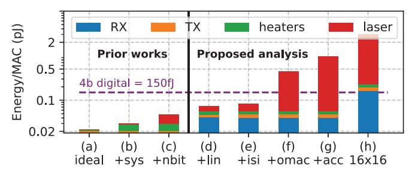

Fig. 29. Energy/MAC operation (log scale, splits also on log scale) for a 64×64 micro-ring modulator (MRM) SiPh accelerator operating at 4-bit MAC precision and 5GHz clock frequency, accounting for progressively realistic considerations. From case (f) onwards, laser energy is >0.4pJ, and other components consume negligible energy relative to the laser. (a) **baseline ideal SiPh accelerator** considers only the optical device losses (no optical loss budgeting) [6], [10], [12]. (b) Accounting for system-level optical losses (Sec-III-B). (c) Setting laser power to correctly resolve a multibit optical output (Sec-II-A). Only two prior works [13], [15] fall in this category. (d) Maintaining the linearity for MAC operation - by nonlinearity compensation in the modulator drivers, and using linear receivers (Sec-IV-A). (e) Compensating for ISI - optical loss and reduced eye width (Sec-IV-B) (f) Compensating for optical losses due to photonic MAC operation (Sec-IV-C). (g) Increasing laser power to achieve <1% DNN accuracy loss. (h) Energy/MAC operation for 16×16 MRM SiPh accelerator at 5GHz for achieving <1% DNN accuracy loss.

- Optical device losses are improved, such that the losses for edge coupler, splitter, micro-ring, Mach-Zehnder modulator, and directional coupler could be reduced to 0.1dB, 0.01dB, 0.5dB, 0.5dB and 0.01dB, respectively.
- Lasers are improved to deliver  $40\text{mW}/\lambda$  optical power across  $64-\lambda$  with at least 60% efficiency.

We plot the energy/MAC while accounting for each of the assumptions mentioned above in Fig. 30. The energy consumed by lasers becomes comparable to electronics only after laser WPE is improved to 60% (Fig. 30(d)). Even with an impossible 100% laser efficiency, the energy/MAC at 4-bit precision is around 140fJ. Increasing the clock cycle to 10 GHz is not beneficial at this point either, as it merely shifts the energy burden from lasers onto electronics.

Amongst the future assumptions, reduced optical device losses are the most attainable. In contrast, the other two assumptions – highly efficient lasers and waveguides with improved power handling capacity – seem daunting to achieve in the next decade.

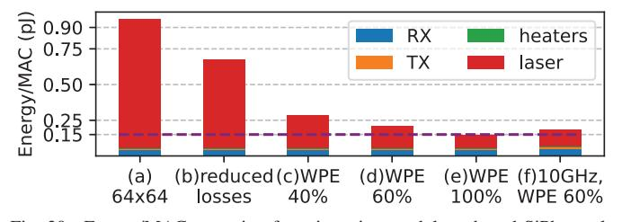

Fig. 30. Energy/MAC operation for micro-ring modulator-based SiPh accelerator with 4-bit precision, (a)-(e) at 5GHz, and (f) at 10GHz clock frequency. The dotted purple line shows energy for digital MAC at 4-bit precision. (a) 64×64 MAC array, enabled by future waveguides capable of handling 1.5W continuous-wave optical power. (b) Reduced optical losses in future SiPh devices. (c) Laser WPE at 40%. (d) Laser WPE at 60%. (e) Laser WPE at 100%. (f) 10GHz clock frequency at 60% laser WPE.

#### K. Future DNN models

Alongside advances in SiPh devices, improvements in DNN models also influence the energy efficiency achievable by SiPh accelerators. Below, we consider two ways in which future DNN models could affect this evaluation.

Future DNN models may achieve reasonable accuracy with even lower bit precision, i.e. 3-bit or lower. In this case, the eye height losses due to photonic MAC and the margins for multi-bit detection are reduced, resulting in significant energy savings for SiPh accelerators. Reducing MAC precision from 4-bit to 3-bit yields a  $3.1\times$  energy savings for a  $16\times16$  MRM-based SiPh accelerator. However, reduced bit precision would also benefit digital DNN accelerators.

Advances in hardware-aware training specific to SiPh accelerators could reduce the SNR required to maintain accuracy at the same bit precision, possibly even at an increase in DNN model size [106]. For a  $16\times16$  MRM-based SiPh accelerator, reduction in SNR requirements by  $2\times$  and  $4\times$  provides  $1.88\times$  and  $3.39\times$  energy savings, respectively.

#### V. DISCUSSION

#### A. Limitations of prior SiPh accelerator approaches

Several prior works propose techniques to improve the performance, precision or energy efficiency of SiPh accelerators. However, these approaches largely fail to maintain analog signal integrity under realistic system conditions. We categorize these limitations into three groups:

- 1) Overestimation of achieved precision: Several works report high MAC precision by analyzing the isolated optical components without accounting for the full signal chain.
  - Prior studies claim 10-bit [10] and 16-bit [12] precision based on optical device characteristics alone, but discount the limitations due to the electronics.
  - Experimental demonstrations using tabletop instruments achieve high resolution (16-bit [4]) but at the cost of high power (>80W per modulation [107], which are not representative of integrated accelerator deployments.
  - Similarly, evaluations on smaller datasets such as MNIST or CIFAR-10 [6], [107] permit operation at lower signal-to-noise ratios (SNR). When scaled to more complex workloads (e.g., ImageNet), these designs would require significantly higher SNR and therefore higher optical power to maintain accuracy.
- 2) Optimizations orthogonal to analog signal integrity: A second category of works improves specific SiPh accelerator components (e.g., weight storage, modulation mechanisms), but does not address the dominant challenge in maintaining analog signal integrity in the activation signal path.
  - High-precision weight programming has been demonstrated (9-bit [108]), but typically at low clock frequencies (hundreds of MHz). Low clock frequencies reduce the impact of ISI and therefore do not address signal integrity issues in the activation signal path.

- Architectures using optical lenses for modulation [97], [109], or optically controlled phase change material [108], [110], [111] can reduce the energy and area costs of setting the weight values. However, they leave the activation signal path unchanged and still suffer from signal integrity issues.
- Phase-based modulation schemes have been proposed as alternatives to amplitude modulation, but they introduce their own challenges, including phase-error accumulation, difficulty in supporting wavelength-division multiplexing, and poor scalability [4], [6], [8], [12].
- Techniques such as temporal accumulation on capacitances [13], [97] can improve SNR by integrating signals over time, but require additional charge management circuitry analogous to integrate-and-dump receivers [112]. The resulting power overhead is comparable to that of linear TIAs, limiting net energy savings.
- Approaches such as SCATTER [113], which reroute optical power based on sparsity, implicitly assume that additional power can be redistributed without violating waveguide power constraints (Sec. II-E).
- Approaches that implement approximate floating-point operations [114] may extend the usable dynamic range of SiPh computation through analog exponent encoding, but still suffer from signal integrity issues.
- Architectures such as Mirage [14] perform residuenumber encoded MAC operations at 5-bit precision to address the limited dynamic range of photonic MAC operations. However, photonic MAC operations at 5-bit precision would incur higher levels of nonlinearity, ISI, and noise, further worsening energy efficiency compared to digital MAC operations.
- *3) Scaling limitations in frequency and optical power:* Attempts to scale SiPh accelerators to higher performance introduce fundamental tradeoffs that negate expected gains.
  - Increasing clock frequencies to match optical communication links (>25 GHz) reduces the energy/MAC contribution from the lasers, but exacerbates noise and ISI, and significantly increases receiver power consumption, particularly in ADCs [115], [116]. Mitigating the ISI might also require power-intensive digital signal processing (DSP) [53], offsetting any possible energy benefits.
  - Optical phased-array systems have demonstrated operation at high optical power levels (e.g., 10 W [117]), but rely on pulsed operation (e.g., 10 ns pulses at 100 kHz). Applying similar pulsed schemes to SiPh accelerators would result in extremely low utilization (<0.1%), making them unsuitable for sustained compute workloads.

## *B. Future SiPh accelerators*

We expect future SiPh accelerator designs to be viable only in regimes where analog signal integrity constraints are either bypassed or explicitly mitigated through architectural co-design. We identify two such directions.

*1) Application-specific implementations:* A SiPh accelerator could be beneficial in applications where inputs exist natively in the optical domain, relaxing the signal integrity challenges discussed in this work. An example of such an application would be in-network optical computing. In such systems, the optical receiver can be augmented to perform MAC operations directly on the incoming optical signals. Thus, the optical power provided by the transmitter can be *harvested* for performing MAC operations.

While there has been some preliminary work on such computing platforms [118], [119], a complete system design remains open. In particular, realizing such architectures requires joint consideration of analog signal integrity, dataflow scheduling, and interactions with the transmitter(s). Prior results from electronic in-network computation has shown up to 6.2× speedups for matrix-multiplication workloads over multicore CPUs [120].

Another example of such an application is optical sensing and imaging, where free-space optics could be used to perform early layers of computation. Thus, an analog processing pipeline using a SiPh accelerator before digitization could be attractive, similar to analog in-sensor computing proposals like RedEye [32].

*2) Hybrid digital-SiPh implementations:* A more general direction is adopting hybrid architectures that combine SiPh accelerators with digital processing, explicitly accounting for signal integrity limitations. In this case, SiPh accelerators perform MAC operations at low precision (<4-bits), while higher-precision computation, and error correction are handled by digital pipelines (4-16 bits).

Recent models using low-precision operations [94] are already aligned for such accelerators since they include low precision (1 to 4-bit) layers interspersed with numerous higher precision (4 to 8-bit) linear layers and activation functions [121]. Techniques from prior outlier-aware digital accelerators [122], [123] can also be incorporated to improve robustness for large language models (Sec. IV-E).

# VI. CONCLUSION

Numerous accelerators have proposed using Silicon Photonics for DNN inference acceleration; however, the effects of analog signal integrity factors have been underexplored.

Our results show that SiPh accelerators incur significant accuracy losses when analog signal integrity is not maintained and compensation incurs high energy costs, losing the energyefficiency advantage relative to digital DNN accelerators.

#### ACKNOWLEDGMENT

The authors thank CMC Microsystems for providing access to PDKs and CAD tools, Intel University Program for PDKs, and Omid Esmaeeli and Mohammad Al-Qadasi for helpful technical discussions. We thank the anonymous reviewers for their valuable feedback.

# REFERENCES

[1] N. Verma, H. Jia, H. Valavi, Y. Tang, M. Ozatay, L.-Y. Chen, B. Zhang, and P. Deaville, "In-memory computing: Advances and prospects," *IEEE Solid-State Circuits Magazine*, vol. 11, no. 3, pp. 43–55, 2019.

- [2] R. Khaddam-Aljameh, M. Stanisavljevic, J. F. Mas, G. Karunaratne, M. Brandli, F. Liu, A. Singh, S. M. M ¨ uller, U. Egger, A. Petropoulos ¨ *et al.*, "HERMES-core—A 1.59-TOPS/mm2 PCM on 14-nm CMOS in-memory compute core using 300-ps/LSB linearized CCO-based ADCs," *IEEE Journal of Solid-State Circuits*, vol. 57, no. 4, pp. 1027– 1038, 2022.
- [3] A. Mukherjee, K. Saurav, P. Nair, S. Shekhar, and M. Lis, "A Case for Emerging Memories in DNN Accelerators," in *2021 Design, Automation & Test in Europe Conference & Exhibition (DATE)*. IEEE, 2021, pp. 938–941.
- [4] Y. Shen, N. C. Harris, S. Skirlo, M. Prabhu, T. Baehr-Jones, M. Hochberg, X. Sun, S. Zhao, H. Larochelle, D. Englund *et al.*, "Deep learning with coherent nanophotonic circuits," *Nature photonics*, vol. 11, no. 7, pp. 441–446, 2017.
- [5] W. Liu, W. Liu, Y. Ye, Q. Lou, Y. Xie, and L. Jiang, "Holylight: A nanophotonic accelerator for deep learning in data centers," in *2019 Design, Automation & Test in Europe Conference & Exhibition (DATE)*. IEEE, 2019, pp. 1483–1488.
- [6] V. Bangari, B. A. Marquez, H. Miller, A. N. Tait, M. A. Nahmias, T. F. De Lima, H.-T. Peng, P. R. Prucnal, and B. J. Shastri, "Digital electronics and analog photonics for convolutional neural networks (DEAP-CNNs)," *IEEE Journal of Selected Topics in Quantum Electronics*, vol. 26, no. 1, pp. 1–13, 2019.
- [7] J. Peng, Y. Alkabani, S. Sun, V. J. Sorger, and T. El-Ghazawi, "Dnnara: A deep neural network accelerator using residue arithmetic and integrated photonics," in *Proceedings of the 49th International Conference on Parallel Processing*, 2020, pp. 1–11.
- [8] G. Mourgias-Alexandris, A. Totovic, A. Tsakyridis, N. Passalis, K. Vyr- ´ sokinos, A. Tefas, and N. Pleros, "Neuromorphic Photonics With Coherent Linear Neurons Using Dual-IQ Modulation Cells," *Journal of Lightwave Technology*, vol. 38, no. 4, pp. 811–819, 2020.
- [9] K. Shiflett, D. Wright, A. Karanth, and A. Louri, "Pixel: Photonic neural network accelerator," in *2020 IEEE International Symposium on High Performance Computer Architecture (HPCA)*. IEEE, 2020, pp. 474–487.
- [10] K. Shiflett, A. Karanth, R. Bunescu, and A. Louri, "Albireo: Energyefficient acceleration of convolutional neural networks via silicon photonics," in *2021 ACM/IEEE 48th Annual International Symposium on Computer Architecture (ISCA)*. IEEE, 2021, pp. 860–873.
- [11] C. Demirkiran, F. Eris, G. Wang, J. Elmhurst, N. Moore, N. C. Harris, A. Basumallik, V. J. Reddi, A. Joshi, and D. Bunandar, "An electrophotonic system for accelerating deep neural networks," *arXiv preprint arXiv:2109.01126*, 2021.
- [12] F. Sunny, A. Mirza, M. Nikdast, and S. Pasricha, "CrossLight: A Cross-Layer Optimized Silicon Photonic Neural Network Accelerator," in *2021 58th ACM/IEEE Design Automation Conference (DAC)*, 2021, pp. 1069–1074.
- [13] H. Zhu, J. Gu, H. Wang, Z. Jiang, Z. Zhang, R. Tang, C. Feng, S. Han, R. T. Chen, and D. Z. Pan, "Lightening-transformer: A dynamicallyoperated optically-interconnected photonic transformer accelerator," in *2024 IEEE International Symposium on High-Performance Computer Architecture (HPCA)*. IEEE, 2024, pp. 686–703.
- [14] C. Demirkiran, G. Yang, D. Bunandar, and A. Joshi, "Mirage: An RNS-Based Photonic Accelerator for DNN Training," in *2024 ACM/IEEE 51st Annual International Symposium on Computer Architecture (ISCA)*, 2024, pp. 73–87.
- [15] T.-C. Hsueh, Y. Fainman, and B. Lin, "Optical Comb-Based Monolithic Photonic-Electronic Accelerators for Self-Attention Computation," *IEEE Journal of Selected Topics in Quantum Electronics*, 2024.
- [16] S. R. Ahmed, R. Baghdadi, M. Bernadskiy, N. Bowman, R. Braid, J. Carr, C. Chen, P. Ciccarella, M. Cole, J. Cooke *et al.*, "Universal photonic artificial intelligence acceleration," *Nature*, vol. 640, no. 8058, pp. 368–374, 2025.
- [17] C. Cole, "Optical and electrical programmable computing energy use comparison," *Optics Express*, vol. 29, no. 9, pp. 13 153–13 170, 2021.
- [18] M. Al-Qadasi, L. Chrostowski, B. Shastri, and S. Shekhar, "Scaling up silicon photonic-based accelerators: Challenges and opportunities," *APL Photonics*, vol. 7, no. 2, p. 020902, 2022.
- [19] S. Shekhar, W. Bogaerts, L. Chrostowski, J. E. Bowers, M. Hochberg, R. Soref, and B. J. Shastri, "Roadmapping the next generation of silicon photonics," *Nature Communications*, vol. 15, no. 1, p. 751, 2024.
- [20] H. Li, G. Balamurugan, T. Kim, M. N. Sakib, R. Kumar, H. Rong, J. Jaussi, and B. Casper, "A 3-D-Integrated Silicon Photonic Microring-Based 112-Gb/s PAM-4 Transmitter With Nonlinear Equalization and

- Thermal Control," *IEEE Journal of Solid-State Circuits*, vol. 56, no. 1, pp. 19–29, 2021.
- [21] M. Raj, Y. Frans, P.-C. Chiang, S. L. Chaitanya Ambatipudi, D. Mahashin, P. De Heyn, S. Balakrishnan, J. Van Campenhout, J. Grayson, M. Epitaux, and K. Chang, "Design of a 50-Gb/s Hybrid Integrated Si-Photonic Optical Link in 16-nm FinFET," *IEEE Journal of Solid-State Circuits*, vol. 55, no. 4, pp. 1086–1095, 2020.
- [22] M. Rakowski, Y. Ban, P. De Heyn, N. Pantano, B. Snyder, S. Balakrishnan, S. Van Huylenbroeck, L. Bogaerts, C. Demeurisse, F. Inoue, K. J. Rebibis, P. Nolmans, X. Sun, P. Bex, A. Srinivasan, J. De Coster, S. Lardenois, A. Miller, P. Absil, P. Verheyen, D. Velenis, M. Pantouvaki, and J. Van Campenhout, "Hybrid 14nm FinFET - Silicon Photonics Technology for Low-Power Tb/s/mm2 Optical I/O," in *2018 IEEE Symposium on VLSI Technology*, 2018, pp. 221–222.
- [23] D. F. Logan, S. Gebrewold, K. Murray, A. Dewanjee, E. Huante-Ceron, D. Kim, A. Baker, M. Kukiela, F. Znidarsic, M. Koehler, J. Whiteaway, R. Chen, C. Dorschky, and G. Roell, "800 Gb/s Silicon Photonic Transmitter for CoPackaged Optics," in *2020 IEEE Photonics Conference (IPC)*, 2020, pp. 1–2.
- [24] S. Fathololoumi, C. Malouin, D. Hui, K. Al-hemyari, K. Nguyen, P. Seddighian, Y.-J. Chen, Y. Wang, A. Yan, R. Defrees, T. Liljeberg, and L. Liao, "Highly Integrated 4 Tbps Silicon Photonic IC for Compute Fabric Connectivity," in *2022 IEEE Symposium on High-Performance Interconnects (HOTI)*, 2022, pp. 1–4.
- [25] C. S. Levy, Z. Xuan, J. Sharma, D. Huang, R. Kumar, C. Ma, G.-L. Su, S. Liu, J. Kim, X. Wu, T. Acikalin, H. Rong, G. Balamurugan, and J. E. Jaussi, "8-λ × 50 Gbps/λ Heterogeneously Integrated Si-Ph DWDM Transmitter," *IEEE Journal of Solid-State Circuits*, vol. 59, no. 3, pp. 690–701, 2024.
- [26] A. Netherton, M. Dumont, Z. Nelson, J. Jhonsa, A. Mo, J. Koo, D. McCarthy, N. Pestana, S. Deckoff-Jones, C. Poulton, M. Frankel, J. Bovington, L. Theogarajan, and J. Bowers, "25.1 Short-Reach Silicon Photonic Interconnects with Quantum Dot Mode Locked Laser Comb Sources," in *2024 IEEE International Solid-State Circuits Conference (ISSCC)*, vol. 67, 2024, pp. 422–424.
- [27] X. Wu, B. Dama, P. Gothoskar, P. Metz, K. Shastri, S. Sunder, J. Van der Spiegel, Y. Wang, M. Webster, and W. Wilson, "A 20Gb/s NRZ/PAM-4 1V transmitter in 40nm CMOS driving a Si-photonic modulator in 0.13μm CMOS," in *2013 IEEE International Solid-State Circuits Conference Digest of Technical Papers*, 2013, pp. 128–129.
- [28] A. Hashemi Talkhooncheh, W. Zhang, M. Wang, D. J. Thomson, M. Ebert, L. Ke, G. T. Reed, and A. Emami, "A 100-Gb/s PAM4 Optical Transmitter in a 3-D-Integrated SiPh-CMOS Platform Using Segmented MOSCAP Modulators," *IEEE Journal of Solid-State Circuits*, vol. 58, no. 1, pp. 30–44, 2023.
- [29] C. Huang, V. J. Sorger, M. Miscuglio, M. Al-Qadasi, A. Mukherjee, L. Lampe, M. Nichols, A. N. Tait, T. Ferreira de Lima, B. A. Marquez *et al.*, "Prospects and applications of photonic neural networks," *Advances in Physics: X*, vol. 7, no. 1, p. 1981155, 2022.
- [30] D. Harris and N. Weste, "CMOS VLSI design," *ed: Pearson Education, Inc*, 2010.
- [31] A. Shafiee, A. Nag, N. Muralimanohar, R. Balasubramonian, J. P. Strachan, M. Hu, R. S. Williams, and V. Srikumar, "ISAAC: A convolutional neural network accelerator with in-situ analog arithmetic in crossbars," *ACM SIGARCH Computer Architecture News*, vol. 44, no. 3, pp. 14–26, 2016.
- [32] R. LiKamWa, Y. Hou, J. Gao, M. Polansky, and L. Zhong, "Redeye: analog convnet image sensor architecture for continuous mobile vision," *ACM SIGARCH Computer Architecture News*, vol. 44, no. 3, pp. 255–266, 2016.
- [33] L. Liu, S. R. Kari, X. Xin, N. Youngblood, Y. Zhang, and J. Yang, "LightML: A Photonic Accelerator for Efficient General Purpose Machine Learning," in *Proceedings of the 52nd Annual International Symposium on Computer Architecture*, 2025, pp. 18–33.
- [34] S. Moazeni, S. Lin, M. Wade, L. Alloatti, R. J. Ram, M. Popovic,´ and V. Stojanovic, "A 40-Gb/s PAM-4 Transmitter Based on a Ring- ´ Resonator Optical DAC in 45-nm SOI CMOS," *IEEE Journal of Solid-State Circuits*, vol. 52, no. 12, pp. 3503–3516, 2017.
- [35] H. Li, G. Balamurugan, M. Sakib, J. Sun, J. Driscoll, R. Kumar, H. Jayatilleka, H. Rong, J. Jaussi, and B. Casper, "A 112 Gb/s PAM4 Silicon Photonics Transmitter With Microring Modulator and CMOS Driver," *Journal of Lightwave Technology*, vol. 38, no. 1, pp. 131–138, 2020.

- [36] J. F. Buckwalter, X. Zheng, G. Li, K. Raj, and A. V. Krishnamoorthy, "A Monolithic 25-Gb/s Transceiver With Photonic Ring Modulators and Ge Detectors in a 130-nm CMOS SOI Process," *IEEE Journal of Solid-State Circuits*, vol. 47, no. 6, pp. 1309–1322, 2012.
- [37] J. Deng, W. Dong, R. Socher, L.-J. Li, K. Li, and L. Fei-Fei, "Imagenet: A large-scale hierarchical image database," in *2009 IEEE conference on computer vision and pattern recognition*. Ieee, 2009, pp. 248–255.
- [38] K. He, X. Zhang, S. Ren, and J. Sun, "Deep residual learning for image recognition," in *Proceedings of the IEEE conference on computer vision and pattern recognition*, 2016, pp. 770–778.
- [39] A. Roshan-Zamir, B. Wang, S. Telaprolu, K. Yu, C. Li, M. A. Seyedi, M. Fiorentino, R. Beausoleil, and S. Palermo, "A 40 Gb/s PAM4 silicon microring resonator modulator transmitter in 65nm CMOS," in *2016 IEEE Optical Interconnects Conference (OI)*, 2016, pp. 8–9.
- [40] H. Li, C.-M. Hsu, J. Sharma, J. Jaussi, and G. Balamurugan, "A 100-Gb/s PAM-4 Optical Receiver With 2-Tap FFE and 2-Tap Direct-Feedback DFE in 28-nm CMOS," *IEEE Journal of Solid-State Circuits*, vol. 57, no. 1, pp. 44–53, 2022.
- [41] M. G. Ahmed, T. N. Huynh, C. Williams, Y. Wang, P. K. Hanumolu, and A. Rylyakov, "34-GBd Linear Transimpedance Amplifier for 200- Gb/s DP-16-QAM Optical Coherent Receivers," *IEEE Journal of Solid-State Circuits*, vol. 54, no. 3, pp. 834–844, 2019.
- [42] A. Zandieh, P. Schvan, and S. P. Voinigescu, "Linear Large-Swing Push–Pull SiGe BiCMOS Drivers for Silicon Photonics Modulators," *IEEE Transactions on Microwave Theory and Techniques*, vol. 65, no. 12, pp. 5355–5366, 2017.
- [43] R. J. A. Baker, J. Hoffman, P. Schvan, and S. P. Voinigescu, "SiGe BiCMOS linear modulator drivers with 4.8-Vpp differential output swing for 120-GBaud applications," in *2017 IEEE Radio Frequency Integrated Circuits Symposium (RFIC)*, 2017, pp. 260–263.
- [44] H. Uemura, T. Misawa, N. Itabashi, M. Kurokawa, Y. Sugimoto, S. Kumagai, M. Takechi, and K. Tanaka, "A 19-dB Peaking at 72- GHz and 4.1-Vppd Output Swing SiGe BiCMOS Linear Driver with Dynamic Cascode Output Buffer," in *2023 IEEE BiCMOS and Compound Semiconductor Integrated Circuits and Technology Symposium (BCICTS)*, 2023, pp. 159–162.
- [45] M. H. Mahmud, H. Al-Rubaye, and G. M. Rebeiz, "Broadband Linear Drivers for 800G/1.6T Energy Efficient Optical Links," in *2024 IEEE BiCMOS and Compound Semiconductor Integrated Circuits and Technology Symposium (BCICTS)*, 2024, pp. 103–106.
- [46] A. H. Ahmed, L. Vera, L. Iotti, R. Shi, S. Shekhar, and A. Rylyakov, "A Dual-Polarization Silicon-Photonic Coherent Receiver Front-End Supporting 528 Gb/s/Wavelength," *IEEE Journal of Solid-State Circuits*, vol. 58, no. 8, pp. 2202–2213, 2023.
- [47] K. R. Lakshmikumar, A. Kurylak, M. Nagaraju, R. Booth, R. K. Nandwana, J. Pampanin, and V. Boccuzzi, "A Process and Temperature Insensitive CMOS Linear TIA for 100 Gb/s/ λ PAM-4 Optical Links," *IEEE Journal of Solid-State Circuits*, vol. 54, no. 11, pp. 3180–3190, 2019.
- [48] S. Daneshgar, H. Li, T. Kim, and G. Balamurugan, "A 128 Gb/s, 11.2 mW Single-Ended PAM4 Linear TIA With 2.7 μArms Input Noise in 22 nm FinFET CMOS," *IEEE Journal of Solid-State Circuits*, vol. 57, no. 5, pp. 1397–1408, 2022.
- [49] B. R. Moss, C. Sun, M. Georgas, J. Shainline, J. S. Orcutt, J. C. Leu, M. Wade, Y.-H. Chen, K. Nammari, X. Wang, H. Li, R. Ram, M. A. Popovic, and V. Stojanovic, "A 1.23pJ/b 2.5Gb/s monolithically integrated optical carrier-injection ring modulator and all-digital driver circuit in commercial 45nm SOI," in *2013 IEEE International Solid-State Circuits Conference Digest of Technical Papers*, 2013, pp. 126– 127.
- [50] C. Li, R. Bai, A. Shafik, E. Z. Tabasy, B. Wang, G. Tang, C. Ma, C.- H. Chen, Z. Peng, M. Fiorentino, R. G. Beausoleil, P. Chiang, and S. Palermo, "Silicon Photonic Transceiver Circuits With Microring Resonator Bias-Based Wavelength Stabilization in 65 nm CMOS," *IEEE Journal of Solid-State Circuits*, vol. 49, no. 6, pp. 1419–1436, 2014.
- [51] S. Saeedi and A. Emami, "A 10Gb/s, 342fJ/bit micro-ring modulator transmitter with switched-capacitor pre-emphasis and monolithic temperature sensor in 65nm CMOS," in *2016 IEEE Symposium on VLSI Circuits (VLSI-Circuits)*, 2016, pp. 1–2.
- [52] H. Li, Z. Xuan, A. Titriku, C. Li, K. Yu, B. Wang, A. Shafik, N. Qi, Y. Liu, R. Ding, T. Baehr-Jones, M. Fiorentino, M. Hochberg, S. Palermo, and P. Y. Chiang, "A 25 Gb/s, 4.4 V-Swing, AC-Coupled Ring Modulator-Based WDM Transmitter with Wavelength Stabiliza-

- tion in 65 nm CMOS," *IEEE Journal of Solid-State Circuits*, vol. 50, no. 12, pp. 3145–3159, 2015.
- [53] A. H. Ahmed, D. Lim, A. Elmoznine, Y. Ma, T. Huynh, C. Williams, L. Vera, Y. Liu, R. Shi, M. Streshinsky *et al.*, "30.6 A 6V swing 3.6% THD >40ghz driver with 4.5× bandwidth extension for a 272Gb/s dual-polarization 16-QAM silicon photonic transmitter," in *2019 IEEE International Solid-State Circuits Conference-(ISSCC)*. IEEE, 2019, pp. 484–486.
- [54] J. Davis, G. Kyriazidis, Y. Hu, H. Warner, X. Zhu, L. Magalhaes, M. Modisette, N. Lippok, K. Yang, B. Vakoc *et al.*, "Digital-To-Optical Converters (DOCs) With Improved Nonlinearity for Energy-Efficient Optical Data Transmission," in *2025 Symposium on VLSI Technology and Circuits (VLSI Technology and Circuits)*. IEEE, 2025, pp. 1–3.
- [55] A. Cevrero, I. Ozkaya, P. A. Francese, C. Menolfi, T. Morf, M. Brandli, D. Kuchta, L. Kull, J. Proesel, M. Kossel, D. Luu, B. Lee, F. Doany, M. Meghelli, Y. Leblebici, and T. Toifl, "29.1 A 64Gb/s 1.4pJ/b NRZ optical-receiver data-path in 14nm CMOS FinFET," in *2017 IEEE International Solid-State Circuits Conference (ISSCC)*, 2017, pp. 482– 483.
- [56] R. Pandey, G. Takahashi, S. Bhagavatheeswaran, E. Tangen, M. Heins, and J. Muellrich, "Highly-Integrated Quad-Channel Transimpedance Amplifier for Next Generation Coherent Optical Receiver," in *2016 IEEE Compound Semiconductor Integrated Circuit Symposium (CSICS)*, 2016, pp. 1–4.
- [57] A. Awny, R. Nagulapalli, D. Micusik, J. Hoffmann, G. Fischer, D. Kissinger, and A. C. Ulusoy, "23.5 A dual 64Gbaud 10k 5% THD linear differential transimpedance amplifier with automatic gain control in 0.13μm BiCMOS technology for optical fiber coherent receivers," in *2016 IEEE International Solid-State Circuits Conference (ISSCC)*, 2016, pp. 406–407.
- [58] I. G. Lopez, A. Awny, P. Rito, M. Ko, A. Ulusoy, and D. Kissinger, ´ "A 60 GHz bandwidth differential linear TIA in 130 nm SiGe:C BiCMOS with <5.5 pA/Hz," in *2017 IEEE Bipolar/BiCMOS Circuits and Technology Meeting (BCTM)*, 2017, pp. 114–117.
- [59] I. Garc´ıa Lopez, A. Awny, P. Rito, M. Ko, A. C. Ulusoy, and ´ D. Kissinger, "100 Gb/s Differential Linear TIAs With Less Than 10 pA/ √Hz in 130-nm SiGe:C BiCMOS," *IEEE Journal of Solid-State Circuits*, vol. 53, no. 2, pp. 458–469, 2018.
- [60] H. Li, G. Balamurugan, J. Jaussi, and B. Casper, "A 112 Gb/s PAM4 Linear TIA with 0.96 pJ/bit Energy Efficiency in 28 nm CMOS," in *ESSCIRC 2018 - IEEE 44th European Solid State Circuits Conference (ESSCIRC)*, 2018, pp. 238–241.
- [61] M. M. Khafaji, G. Belfiore, and F. Ellinger, "A Linear 65-GHz Bandwidth and 71-dB Gain TIA With 7.2 pA/Hz in 130-nm SiGe BiCMOS," *IEEE Solid-State Circuits Letters*, vol. 4, pp. 76–79, 2021.
- [62] D. Jung, Z. Zhang, J. Norman, R. Herrick, M. J. Kennedy, P. Patel, K. Turnlund, C. Jan, Y. Wan, A. C. Gossard, and J. E. Bowers, "Highly Reliable Low-Threshold InAs Quantum Dot Lasers on On-Axis (001) Si with 87% Injection Efficiency," *ACS Photonics*, vol. 5, no. 3, pp. 1094–1100, 2018. [Online]. Available: https://doi.org/10.1021/acsphotonics.7b01387
- [63] R. Jones, P. Doussiere, J. B. Driscoll, W. Lin, H. Yu, Y. Akulova, T. Komljenovic, and J. E. Bowers, "Heterogeneously Integrated InPSilicon Photonics: Fabricating Fully Functional Transceivers," *IEEE Nanotechnology Magazine*, vol. 13, no. 2, pp. 17–26, 2019.
- [64] M. Wade, C. Sun, M. Sysak, V. Stojanovic, P. Tadayon, R. Mahajan, ´ and B. Sabi, "Driving Compute Scale-out Performance with Optical I/O Chiplets in Advanced System-in-Package Platforms," in *2023 IEEE Hot Chips 35 Symposium (HCS)*, 2023, pp. 1–1.
- [65] R. Baets, A. Z. Subramanian, S. Clemmen, B. Kuyken, P. Bienstman, N. Le Thomas, G. Roelkens, D. Van Thourhout, P. Helin, and S. Severi, "Silicon photonics: Silicon nitride versus silicon-on-insulator," in *2016 Optical Fiber Communications Conference and Exhibition (OFC)*, 2016, pp. 1–3.
- [66] J. Ralston and R. Chang, "Optical limiting in semiconductors," *Applied Physics Letters*, vol. 15, no. 6, pp. 164–166, 1969.
- [67] M. Tokushima, J. Ushida, and T. Nakamura, "Nonlinear loss characterization of continuous wave guiding in silicon wire waveguides," *Applied Physics Express*, vol. 14, no. 12, p. 122008, 2021.
- [68] E. C. Blow, S. Bilodeau, W. Zhang, T. Ferreira de Lima, J. C. Lederman, B. Shastri, and P. R. Prucnal, "Radio-Frequency Linear Analysis and Optimization of Silicon Photonic Neural Networks," *Advanced Photonics Research*, p. 2300306, 2024.

- [69] M.-C. Tien, J. F. Bauters, M. J. Heck, D. J. Blumenthal, and J. E. Bowers, "Ultra-low loss Si3N4 waveguides with low nonlinearity and high power handling capability," *Optics express*, vol. 18, no. 23, pp. 23 562–23 568, 2010.
- [70] J. King, D. Leyba, and G. D. LeCheminant, "TDECQ (transmitter dispersion eye closure quaternary) replaces historic eye-mask and TDP test for 400 Gb/s PAM4 optical transmitters," in *2017 Optical Fiber Communications Conference and Exhibition (OFC)*, 2017, pp. 1–3.
- [71] D. Hong, C.-K. Ong, and K.-T. Cheng, "BER estimation for serial links based on jitter spectrum and clock recovery characteristics," in *2004 International Conferce on Test*. IEEE, 2004, pp. 1138–1147.
- [72] M. Rakowski, C. Meagher, K. Nummy, A. Aboketaf, J. Ayala, Y. Bian, B. Harris, K. Mclean, K. McStay, A. Sahin, L. Medina, B. Peng, Z. Sowinski, A. Stricker, T. Houghton, C. Hedges, K. Giewont, A. Jacob, T. Letavic, D. Riggs, A. Yu, and J. Pellerin, "45nm CMOS — Silicon Photonics Monolithic Technology (45CLO) for Next-Generation, Low Power and High Speed Optical Interconnects," in *2020 Optical Fiber Communications Conference and Exhibition (OFC)*, 2020, pp. 1–3.
- [73] H. Hsia, C. Tsai, K. Ting, F. Kuo, C. Lin, C. Wang, S. Hou, W. Chiou, and D. C. Yu, "Heterogeneous Integration of a Compact Universal Photonic Engine for Silicon Photonics Applications in HPC," in *2021 IEEE 71st Electronic Components and Technology Conference (ECTC)*, 2021, pp. 263–268.
- [74] E. Timurdogan, C. M. Sorace-Agaskar, J. Sun, E. Shah Hosseini, A. Biberman, and M. R. Watts, "An ultralow power athermal silicon modulator," *Nature communications*, vol. 5, no. 1, pp. 1–11, 2014.
- [75] A. Bayoumi, M. Oktay, A. Elshazly, H. Kobbi, R. Magdziak, G. Lepage, C. Marchese, J. R. Vaskasi, S. Bipul, D. Bode, D. Velenis, M. Chakrabarti, P. Verheyen, P. Absil, F. Ferraro, Y. Ban, J. V. Campenhout, W. Bogaerts, and Q. Deng, "Enhanced Operation Range of Silicon MZI Filters Using a Broadband Bent Directional Coupler," *IEEE Photonics Technology Letters*, pp. 1–1, 2025.
- [76] A. H. Ahmed, A. Sharkia, B. Casper, S. Mirabbasi, and S. Shekhar, "Silicon-photonics microring links for datacenters—Challenges and opportunities," *IEEE Journal of Selected Topics in Quantum Electronics*, vol. 22, no. 6, pp. 194–203, 2016.
- [77] A. Paszke, S. Gross, F. Massa, A. Lerer, J. Bradbury, G. Chanan, T. Killeen, Z. Lin, N. Gimelshein, L. Antiga *et al.*, "Pytorch: An imperative style, high-performance deep learning library," *Advances in neural information processing systems*, vol. 32, 2019.
- [78] M. Sandler, A. Howard, M. Zhu, A. Zhmoginov, and L.-C. Chen, "Mobilenetv2: Inverted residuals and linear bottlenecks," in *Proceedings of the IEEE conference on computer vision and pattern recognition*, 2018, pp. 4510–4520.
- [79] S. Merity, C. Xiong, J. Bradbury, and R. Socher, "Pointer sentinel mixture models," *arXiv preprint arXiv:1609.07843*, 2016.
- [80] Qwen, :, A. Yang, B. Yang, B. Zhang, B. Hui, B. Zheng, B. Yu, C. Li, D. Liu, F. Huang, H. Wei, H. Lin, J. Yang, J. Tu, J. Zhang, J. Yang, J. Yang, J. Zhou, J. Lin, K. Dang, K. Lu, K. Bao, K. Yang, L. Yu, M. Li, M. Xue, P. Zhang, Q. Zhu, R. Men, R. Lin, T. Li, T. Tang, T. Xia, X. Ren, X. Ren, Y. Fan, Y. Su, Y. Zhang, Y. Wan, Y. Liu, Z. Cui, Z. Zhang, and Z. Qiu, "Qwen2.5 Technical Report," 2025. [Online]. Available: https://arxiv.org/abs/2412.15115
- [81] M. Nagel, M. Fournarakis, Y. Bondarenko, and T. Blankevoort, "Overcoming oscillations in quantization-aware training," in *International Conference on Machine Learning*. PMLR, 2022, pp. 16 318–16 330.
- [82] J. Lin, J. Tang, H. Tang, S. Yang, W.-M. Chen, W.-C. Wang, G. Xiao, X. Dang, C. Gan, and S. Han, "AWQ: Activation-aware Weight Quantization for LLM Compression and Acceleration," in *MLSys*, 2024.
- [83] E. Frantar, S. Ashkboos, T. Hoefler, and D. Alistarh, "GPTQ: Accurate post-training quantization for generative pre-trained transformers," *arXiv preprint arXiv:2210.17323*, 2022.
- [84] T. Dettmers and L. Zettlemoyer, "The case for 4-bit precision: kbit inference scaling laws," in *International Conference on Machine Learning*. PMLR, 2023, pp. 7750–7774.
- [85] Y. Ma, H. Li, X. Zheng, F. Ling, X. Xiao, R. Wang, S. Wen, F. Chao, and R. Ji, "Affinequant: Affine transformation quantization for large language models," *arXiv preprint arXiv:2403.12544*, 2024.
- [86] A. S. Rekhi, B. Zimmer, N. Nedovic, N. Liu, R. Venkatesan, M. Wang, B. Khailany, W. J. Dally, and C. T. Gray, "Analog/Mixed-Signal Hardware Error Modeling for Deep Learning Inference," in *2019 56th ACM/IEEE Design Automation Conference (DAC)*, 2019, pp. 1–6.

- [87] C.-H. Chan, Y. Zhu, S.-W. Sin, U. Seng-Pan, and R. P. Martins, "26.5 A 5.5mW 6b 5GS/S 4×-lnterleaved 3b/cycle SAR ADC in 65nm CMOS," in *2015 IEEE International Solid-State Circuits Conference - (ISSCC) Digest of Technical Papers*, 2015, pp. 1–3.
- [88] J. Liu, M. Hassanpourghadi, and M. S.-W. Chen, "A 10GS/s 8b 25fJ/c-s 2850um2 Two-Step Time-Domain ADC Using Delay-Tracking Pipelined-SAR TDC with 500fs Time Step in 14nm CMOS Technology," in *2022 IEEE International Solid-State Circuits Conference (ISSCC)*, vol. 65, 2022, pp. 160–162.
- [89] A. Parashar, P. Raina, Y. S. Shao, Y.-H. Chen, V. A. Ying, A. Mukkara, R. Venkatesan, B. Khailany, S. W. Keckler, and J. Emer, "Timeloop: A systematic approach to dnn accelerator evaluation," in *2019 IEEE international symposium on performance analysis of systems and software (ISPASS)*. IEEE, 2019, pp. 304–315.
- [90] Y.-H. Chen, T. Krishna, J. S. Emer, and V. Sze, "Eyeriss: An energyefficient reconfigurable accelerator for deep convolutional neural networks," *IEEE journal of solid-state circuits*, vol. 52, no. 1, pp. 127–138, 2016.
- [91] Q. Liao, N. Qi, M. Li, S. Hu, J. He, B. Yin, J. Shi, J. Liu, P. Y. Chiang, X. Xiao, and N. Wu, "A 50-Gb/s PAM4 Si-Photonic Transmitter With Digital-Assisted Distributed Driver and Integrated CDR in 40 nm CMOS," *IEEE Journal of Solid-State Circuits*, vol. 55, no. 5, pp. 1282–1296, 2020.
- [92] S. Kariyappa, H. Tsai, K. Spoon, S. Ambrogio, P. Narayanan, C. Mackin, A. Chen, M. Qureshi, and G. W. Burr, "Noise-Resilient DNN: Tolerating Noise in PCM-Based AI Accelerators via Noise-Aware Training," *IEEE Transactions on Electron Devices*, vol. 68, no. 9, pp. 4356–4362, 2021.
- [93] Y. Bondarenko, M. Nagel, and T. Blankevoort, "Quantizable transformers: Removing outliers by helping attention heads do nothing," *Advances in Neural Information Processing Systems*, vol. 36, pp. 75 067–75 096, 2023.
- [94] B. Chmiel, M. Fishman, R. Banner, and D. Soudry, "FP4 all the way: Fully quantized training of LLMs," *arXiv preprint arXiv:2505.19115*, 2025.
- [95] NVIDIA, "Introducing NVFP4 for Efficient and Accurate Low-Precision Inference," https://developer.nvidia.com/blog/introducingnvfp4-for-efficient-and-accurate-low-precision-inference/, Jun. 2025, nVIDIA Developer Blog, accessed: 2026-03-06.
- [96] B. Keller, R. Venkatesan, S. Dai, S. G. Tell, B. Zimmer, W. J. Dally, C. Thomas Gray, and B. Khailany, "A 17–95.6 TOPS/W Deep Learning Inference Accelerator with Per-Vector Scaled 4-bit Quantization for Transformers in 5nm," in *2022 IEEE Symposium on VLSI Technology and Circuits (VLSI Technology and Circuits)*, 2022, pp. 16–17.
- [97] S. Li, H. Yang, C. W. Wong, V. J. Sorger, and P. Gupta, "PhotoFourier: A Photonic Joint Transform Correlator-Based Neural Network Accelerator," in *2023 IEEE International Symposium on High-Performance Computer Architecture (HPCA)*, 2023, pp. 15–28.
- [98] R. Dube-Demers, S. LaRochelle, and W. Shi, "Ultrafast pulse- ´ amplitude modulation with a femtojoule silicon photonic modulator," *Optica*, vol. 3, no. 6, pp. 622–627, 2016.
- [99] R. Ding, Y. Liu, Q. Li, Z. Xuan, Y. Ma, Y. Yang, A. E.-J. Lim, G.- Q. Lo, K. Bergman, T. Baehr-Jones, and M. Hochberg, "A Compact Low-Power 320-Gb/s WDM Transmitter Based on Silicon Microrings," *IEEE Photonics Journal*, vol. 6, no. 3, pp. 1–8, 2014.
- [100] H. Hsia, S. Tai, C. Liu, C. Tseng, S. Lu, Y. Wu, C. Chang, J. Wu, K. Yee, C. Wu *et al.*, "Integrated Optical Interconnect Systems (iOIS) for silicon photonics applications in HPC," in *2023 IEEE 73rd Electronic Components and Technology Conference (ECTC)*. IEEE, 2023, pp. 612–616.
- [101] Y. Liu, R. Ding, Q. Li, Z. Xuan, Y. Li, Y. Yang, A. E.-J. Lim, P. G.- Q. Lo, K. Bergman, T. Baehr-Jones, and M. Hochberg, "Ultra-compact 320 Gb/s and 160 Gb/s WDM transmitters based on silicon microrings," in *OFC 2014*, 2014, pp. 1–3.
- [102] M. S. Akhter, P. Somogyi, C. Sun, M. Wade, R. Meade, P. Bhargava, S. Lin, and N. Mehta, "WaveLight: A Monolithic Low Latency Silicon-Photonics Communication Platform for the Next-Generation Disaggregated Cloud Data Centers," in *2017 IEEE 25th Annual Symposium on High-Performance Interconnects (HOTI)*, 2017, pp. 25–28.
- [103] B. Shi, N. Calabretta, and R. Stabile, "Deep neural network through an InP SOA-based photonic integrated cross-connect," *IEEE Journal of Selected Topics in Quantum Electronics*, vol. 26, no. 1, pp. 1–11, 2019.

- [104] A. Descos, C. Jany, D. Bordel, H. Duprez, G. B. de Farias, P. Brianceau, S. Menezo, and B. B. Bakir, "Heterogeneously integrated III-V/Si distributed Bragg reflector laser with adiabatic coupling," in *39th European Conference and Exhibition on Optical Communication (ECOC 2013)*. IET, 2013, pp. 1–3.
- [105] N. P. Jouppi, D. H. Yoon, M. Ashcraft, M. Gottscho, T. B. Jablin, G. Kurian, J. Laudon, S. Li, P. Ma, X. Ma *et al.*, "Ten lessons from three generations shaped google's TPUv4i: Industrial product," in *2021 ACM/IEEE 48th Annual International Symposium on Computer Architecture (ISCA)*. IEEE, 2021, pp. 1–14.
- [106] B. Moons, K. Goetschalckx, N. Van Berckelaer, and M. Verhelst, "Minimum energy quantized neural networks," in *2017 51st Asilomar Conference on Signals, Systems, and Computers*. IEEE, 2017, pp. 1921–1925.
- [107] B. Bai, Q. Yang, H. Shu, L. Chang, F. Yang, B. Shen, Z. Tao, J. Wang, S. Xu, W. Xie *et al.*, "Microcomb-based integrated photonic processing unit," *Nature Communications*, vol. 14, no. 1, p. 66, 2023.
- [108] J. Feldmann, N. Youngblood, M. Karpov, H. Gehring, X. Li, M. Stappers, M. Le Gallo, X. Fu, A. Lukashchuk, A. S. Raja *et al.*, "Parallel convolutional processing using an integrated photonic tensor core," *Nature*, vol. 589, no. 7840, pp. 52–58, 2021.
- [109] M. Miscuglio, Z. Hu, S. Li, J. K. George, R. Capanna, H. Dalir, P. M. Bardet, P. Gupta, and V. J. Sorger, "Massively parallel amplitude-only Fourier neural network," *Optica*, vol. 7, no. 12, pp. 1812–1819, 2020.
- [110] P. Guo, S. Yu, W. Hou, and L. Guo, "Phase-change material-assisted all-optical temporal differentiator," *Optics Express*, vol. 31, no. 3, pp. 4306–4318, 2023.
- [111] S. X. Gan, J. W. Chew, K. B. Ng, L. S. Tey, W. Y. Chong, B. T. Goh, C. K. Lai, D.-Y. Choi, S. Madden, and H. Ahmad, "Single-mode fiber multi-level all-optical switching using GSST-graphene oxide hybrid thin film structure," *Journal of Applied Physics*, vol. 136, no. 6, 2024.
- [112] T. D. Gathman and J. F. Buckwalter, "An integrate-and-dump receiver for high dynamic range photonic analog-to-digital conversion," in *2012 IEEE 12th Topical Meeting on Silicon Monolithic Integrated Circuits in RF Systems*, 2012, pp. 155–158.
- [113] Z. Yin, N. Gangi, M. Zhang, J. Zhang, R. Huang, and J. Gu, "SCAT-TER: algorithm-circuit co-sparse photonic accelerator with thermaltolerant, power-efficient in-situ light redistribution," in *Proceedings of the 43rd IEEE/ACM International Conference on Computer-Aided Design*, 2024, pp. 1–9.
- [114] A. Sobhanan, A. Fardoost, D. Desai, F. G. Vanani, Z. Zhu, S. S. Pang, and G. Li, "Photonic floating point multiplication using cascaded SSB-SC modulation," *Optics Express*, vol. 32, no. 22, pp. 39 177–39 191, 2024.
- [115] Y. Duan and E. Alon, "A 12.8GS/s time-interleaved SAR ADC with 25GHz 3dB ERBW and 4.6b ENOB," in *Proceedings of the IEEE 2013 Custom Integrated Circuits Conference*, 2013, pp. 1–4.
- [116] S. S. Kumar, M. Kudo, V. Cretu, A. Morineau, A. Matsuda, M. Yoshida, M. Marutani, A. H. Maniyar, and J. Kumar, "A 750mW 24GS/s 12b Time-Interleaved ADC for Direct RF Sampling in Modern Wireless Systems," in *2023 IEEE International Solid-State Circuits Conference (ISSCC)*, 2023, pp. 1–3.
- [117] L. Zhang, Y. Li, Y. Hou, Y. Wang, M. Tao, B. Chen, Q. Na, Y. Li, Z. Zhi, X. Liu *et al.*, "Investigation and demonstration of a high-power handling and large-range steering optical phased array chip," *Optics Express*, vol. 29, no. 19, pp. 29 755–29 765, 2021.
- [118] A. Sludds, S. Bandyopadhyay, Z. Chen, Z. Zhong, J. Cochrane, L. Bernstein, D. Bunandar, P. B. Dixon, S. A. Hamilton, M. Streshinsky *et al.*, "Delocalized photonic deep learning on the internet's edge," *Science*, vol. 378, no. 6617, pp. 270–276, 2022.
- [119] K. Shiflett, A. Karanth, R. Bunescu, and A. Louri, "Flumen: Dynamic processing in the photonic interconnect," in *Proceedings of the 50th Annual International Symposium on Computer Architecture*, 2023, pp. 1–13.
- [120] K. Sangaiah, M. Lui, R. Kuttappa, B. Taskin, and M. Hempstead, "SnackNoC: Processing in the communication layer," in *2020 IEEE International Symposium on High Performance Computer Architecture (HPCA)*. IEEE, 2020, pp. 461–473.
- [121] N. Guo, J. Bethge, C. Meinel, and H. Yang, "Join the high accuracy club on imagenet with a binary neural network ticket," *arXiv preprint arXiv:2211.12933*, 2022.
- [122] E. Park, D. Kim, and S. Yoo, "Energy-efficient neural network accelerator based on outlier-aware low-precision computation," in *2018*

- *ACM/IEEE 45th Annual International Symposium on Computer Architecture (ISCA)*. IEEE, 2018, pp. 688–698.
- [123] J. Lee, J. Lee, D. Han, J. Lee, G. Park, and H.-J. Yoo, "7.7 LNPU: A 25.3 TFLOPS/W sparse deep-neural-network learning processor with fine-grained mixed precision of FP8-FP16," in *2019 IEEE International Solid-State Circuits Conference-(ISSCC)*. IEEE, 2019, pp. 142–144.