# SingularBit: Exploiting Synergy of Singular Value Decomposition and Low-Bit Quantization for Weight and KV Compression in LLM Inference

Seongyon Hong *KAIST* sy.hong@kaist.ac.kr

Hyundeok Kong *KAIST* bosco0127@kaist.ac.kr

Jungwan Lee *KAIST* milelion@kaist.ac.kr

Sangjin Kim *GIST* sangjinkim@gist.ac.kr

Hoi-Jun Yoo *KAIST* hjyoo@kaist.ac.kr

*Abstract*—Large language models (LLMs) have become indispensable across diverse domains, while inference-time scaling has further enhanced their ability to tackle complex real-world tasks through long-context processing and extended generation. However, autoregressive decoding with extended sequences intensifies the memory bandwidth bottleneck through repeated weight access and growing key-value (KV) caches, a challenge we term the Dual Memory Wall. Although quantization and low-rank approximation have been explored independently for weight and KV compression, existing approaches remain insufficient for the demands of modern LLM inference. We present SingularBit, the first accelerator to exploit the synergy between singular value decomposition (SVD) and low-bit quantization for both offline weight and online KV cache compression. Our key insight is that singular values decay rapidly in both weight matrices and attention distributions, enabling aggressive compression of less critical components while preserving model accuracy through rank-aware mixed-precision allocation. SingularBit comprises two algorithm-hardware co-designs. First, SingularBit-W applies rank-aware mixed-precision quantization to weights, compressing most parameters to 1-2 bits guided by singular value magnitude, executed efficiently by the SingularBit Tensor Core supporting rank-wise mixed-precision computation. Second, SingularBit-KV extends this principle to online KV cache compression, dynamically allocating precision based on both token importance and rank significance, accelerated by the SingularBit Compression Engine. Synthesized in 28nm CMOS, SingularBit achieves stateof-the-art algorithmic efficiency across standard language modeling, commonsense reasoning, and long-context benchmarks.

# I. INTRODUCTION

Frontier large language models (LLMs) [1]–[3] have advanced beyond basic text generation toward long-context understanding, extended generation, multi-step reasoning, and complex problem solving. A key driver of this progress is inference-time scaling, where models allocate additional computation or token budget at inference time to improve output quality. This scaling can take multiple forms, including processing longer contexts, sustaining extended generations, sampling or searching over multiple candidate outputs, refining intermediate drafts, and verifying partial results. Reasoningoriented methods such as Chain-of-Thought (CoT) prompting [4], Monte Carlo Tree Search (MCTS) [5], Process Reward

This work was supported by the Commercialization Promotion Agency for R&D Outcomes(COMPA) grant funded by the Korea government(Ministry of Science and ICT) (2710086165).

Models (PRMs) [6], and iterative self-correction [7] instantiate this principle in multi-step reasoning and problem solving.

However, this shift toward larger inference-time token budgets, spanning long-context inputs and extended generations, fundamentally reshapes the memory bottlenecks of LLM inference. Prior work has studied weight compression [8], [9] and key-value (KV) cache compression [10], [11] largely in isolation, but modern inference-time scaling workloads require a unified solution to the dual memory wall of model weights and KV caches.

- (1) Weight Memory Bottleneck: Each decoding step repeatedly accesses model parameters from external memory. For a model with L layers and hidden dimension D, each token generation incurs O(L · D2 · bW ) weight memory traffic, where bW denotes the weight bitwidth. This cost is constant per token and dominates latency in the early stages of generation, before the KV cache becomes sufficiently large. Prior approaches have explored quantization [8], [9], [12] and low-rank approximation [13], [14] independently, but they either suffer accuracy degradation at aggressive compression ratios or provide limited hardware efficiency.
- (2) KV Cache Memory Bottleneck: Each decoding step accesses key-value vectors from all preceding tokens. The KV cache grows as O(N ·L·D · bKV ), where N is the number of generated tokens and bKV is the average KV bitwidth. Unlike weight traffic, KV traffic increases with sequence length and becomes the dominant bottleneck in later decoding stages, especially in long-context reasoning tasks where N can reach tens of thousands. Recent methods apply eviction policies [10], [15] or KV quantization [11], [16], but they typically focus on a single compression dimension, leaving joint token-wise and channel-wise KV-cache compression largely underexplored.

These two bottlenecks are not mutually exclusive; rather, they arise as sequential phases within each generative request. A decoding session begins as a weight-bound workload, where loading model parameters dominates latency. As the sequence length N grows, KV-cache traffic increases and eventually surpasses weight access as the primary bottleneck. In realworld inference scenarios, the crossover point is difficult to predict. Each session begins with a different number of context tokens in its prompt and terminates after a different number of generated tokens, as inference-time scaling works dynamically

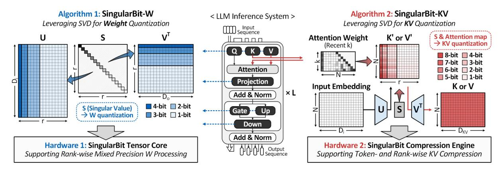

Fig. 1: Overview of the proposed SingularBit algorithm and hardware accelerator.

based on query types. A system optimized for only one regime can therefore underperform across diverse workloads, a challenge also recognized by recent LLM inference systems that target distinct execution regimes [17]–[19]. Achieving low end-to-end generation latency across diverse inferencetime scaling workloads therefore requires a unified algorithm– hardware approach that jointly reduces both weight and KVcache memory costs.

We present SingularBit, an LLM accelerator that exploits the synergy between singular value decomposition (SVD) and low-bit quantization to compress both weights and KV caches. Our key insight is that singular values in LLM weight matrices decay rapidly, indicating that rank components contribute unequally to model quality. Rather than treating SVD and quantization as alternative compression techniques, SingularBit combines them: SVD provides a rank-wise importance signal, while quantization uses it to allocate precision accordingly. To the best of our knowledge, SingularBit is the first unified algorithm–hardware framework that applies the synergy between SVD and quantization to both model-weight and KV-cache compression. It consists of two algorithm– hardware co-designs.

(1) SingularBit-W applies rank-aware mixed-precision quantization to offline weight compression. By analyzing the singular value spectrum of each weight matrix, SingularBit-W assigns higher precision, e.g., 4 bits, to leading singular components that capture dominant signal energy, while compressing less significant components to 1–2 bits. To execute this heterogeneous precision efficiently, we introduce the SingularBit Tensor Core, a specialized core that performs bit-serial mixed-precision matrix multiplication using lookup tables for low-bit operations.

(2) SingularBit-KV extends the same rank-aware principle to online KV cache compression during inference. Unlike static weight compression, KV compression must adapt as new tokens are generated. SingularBit-KV allocates precision based on both token importance, measured by aggregated attention scores [10], and rank significance, derived from the SVD of the KV projection weights. We design the SingularBit Compression Engine, a specialized hardware unit that performs online attention-aware and rank-aware KV quantization and dequantization in the KV cache datapath.

We evaluate SingularBit across diverse benchmarks on LLaMA (7B, 13B, 30B) [20], Llama 2 (7B, 13B) [21], Llama 3 (8B-Instruct) [22], and DeepSeek-R1-Distill reasoning models [2]. For weight compression, SingularBit-W is evaluated using perplexity on Wikitext-2 [23] and C4 [24], as well as zero-shot accuracy averaged over six commonsense reasoning benchmarks: PIQA, ARC-Easy, ARC-Challenge, BoolQ, HellaSwag, and WinoGrande. SingularBit-W consistently outperforms competing methods, including GPTQ [8], AWQ [9], OmniQuant [25], and GuidedQuant [26], across model sizes and bitwidths. In the ultra-low-bit regime, where conventional methods often suffer severe perplexity degradation, SingularBit-W maintains stable performance, demonstrating the effectiveness of rank-aware mixed-precision quantization.

For KV cache compression, SingularBit-KV is evaluated on generation quality, including CoQA [27] and TruthfulQA [28], and mathematical reasoning using GSM8K [29]. It outperforms KIVI [11], GEAR [30], KVQuant [16], PALU [31], ReCalKV [32], and ZipCache [33]. We further validate SingularBit-WKV on prefill-heavy long-context workloads using LongBench [34] and decode-heavy reasoning scenarios, where it outperforms the best prior combination across diverse inference regimes.

Synthesized in 28nm CMOS, the SingularBit accelerator achieves up to 5.3× speedup and 4.8× energy savings on decode-heavy reasoning tasks, and up to 9× throughput improvement with 79% system energy reduction on standard inference workloads compared to the FP16 baseline. These results demonstrate that SingularBit effectively addresses the dual memory wall in modern LLM deployment.

This paper makes the following contributions:

- We identify the synergy between SVD and low-bit quantization for LLM compression, showing that rank-aware mixed-precision allocation exploits rapid singular value decay to achieve superior compression-accuracy tradeoffs.
- We propose SingularBit-W, an offline weight compression algorithm based on rank-aware quantization, and

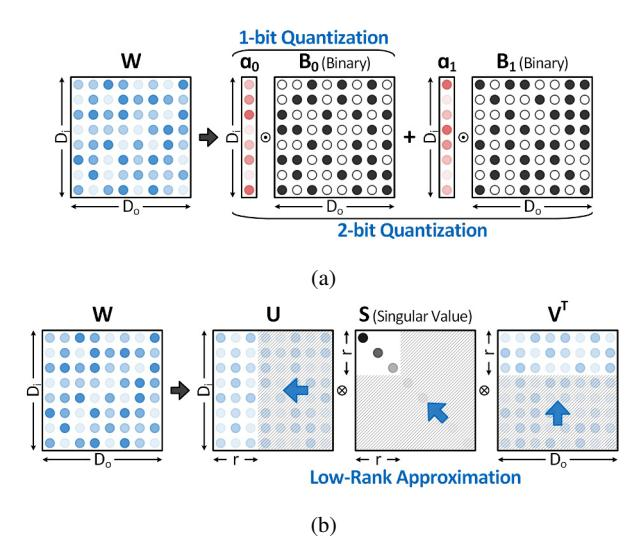

Fig. 2: Background on representative LLM compression techniques: (a) low-bit quantization and (b) SVD-based low-rank approximation.

design the SingularBit Tensor Core to execute rank-wise mixed-precision computation efficiently.

- We propose SingularBit-KV, an online KV cache compression algorithm that dynamically allocates precision based on token importance and rank significance, along with the SingularBit Compression Engine for real-time compression.
- We implement and evaluate a full-system SingularBit accelerator in 28nm CMOS technology, demonstrating state-of-the-art performance across standard benchmarks, long-context inference, and reasoning tasks while maintaining competitive accuracy.

#### II. BACKGROUND

This section first reviews two representative approaches to LLM weight compression—low-bit quantization and low-rank approximation—and then discusses KV cache compression.

#### A. Low-Bit Quantization

Post-training quantization (PTQ) has become a practical approach for compressing LLM weights [8], [9], [25], [35]. GPTQ [8] minimizes layer-wise quantization error using approximate second-order information, achieving competitive 3–4 bit weight compression. AWQ [9] identifies salient weight channels from activation statistics and protects them through activation-aware scaling, while SmoothQuant [35] shifts quantization difficulty from activations to weights through perchannel scaling. OmniQuant [25] optimizes quantization parameters through learnable weight clipping and equivalent transformation, supporting both weight-only and weight-activation quantization. However, PTQ methods still face substantial accuracy degradation as the bitwidth approaches 1–2 bits.

Extreme 1–2 bit quantization has therefore been explored mainly through training-aware approaches. BitNet [36] and

TABLE I: Comparison of SingularBit with prior LLM compression and acceleration approaches.

| Approaches                  | <b>Weight</b> Q LR |              | <b>KV</b> Q LR |              | Accelerator Co-Design |  |
|-----------------------------|-----------------------|--------------|-------------------|--------------|--------------------------|--|
| GPTQ, AWQ, OmniQuant        | <b>√</b>              | ×            | ×                 | ×            | ×                        |  |
| SVD-LLM, ASVD               | ×                     | $\checkmark$ | ×                 | ×            | ×                        |  |
| KIVI, KVQuant, ZipCache     | ×                     | ×            | ✓                 | ×            | ×                        |  |
| GEAR                        | ×                     | ×            | ✓                 | ✓            | ×                        |  |
| PALU, MatryoshkaKV, ReCalKV | ×                     | ×            | ×                 | $\checkmark$ | ×                        |  |
| SingularBit                 | ✓                     | ✓            | ✓                 | ✓            | ✓                        |  |

O = quantization, LR = low-rank approximation.

BitNet b1.58 [37] explore native low-bit LLM training, with BitNet b1.58 representing weights using ternary values  $\{-1,0,+1\}$ . OneBit [38] represents weight matrices with a 1-bit sign matrix and lightweight value vectors, combined with knowledge distillation. As shown in Figure 2(a), such methods represent weights using binary bases  $B_i$  and scale factors  $\alpha_i$  to minimize reconstruction error. Although uniform aggressive quantization achieves high compression ratios, it often causes severe accuracy degradation, especially on conversational and reasoning tasks.

#### B. Low-Rank Approximation

Singular Value Decomposition (SVD) factorizes a weight matrix  $\mathbf{W} \in \mathbb{R}^{m \times n}$  into  $\mathbf{W} = \mathbf{U}\mathbf{S}\mathbf{V}^T$ . SVD-based compression exploits the rapid decay of singular values by retaining only the leading rank components and truncating the lowenergy tail, as illustrated in Figure 2(b). ASVD [39] applies activation-aware transformations before decomposition to mitigate activation outliers, while SVD-LLM [40] uses truncation-aware data whitening to better align singular values with compression loss. SliceGPT [41] applies orthogonal transformations that preserve model computation and then removes less significant rows and columns to reduce the embedding dimension. Despite their theoretical optimality under the Frobenius norm, SVD-based methods often provide less aggressive compression than quantization under comparable accuracy constraints. Moreover, the interaction between quantization and low-rank decomposition remains underexplored, leaving substantial compression potential unused.

#### C. KV Cache Compression

The memory bandwidth bottleneck also extends to the key-value (KV) cache during autoregressive decoding. KIVI [11] applies asymmetric 2-bit quantization, using per-channel quantization for keys and per-token quantization for values, based on the observation that keys exhibit channel-wise outliers whereas values show token-wise patterns. KVQuant [16] introduces pre-RoPE quantization and non-uniform quantization to handle long-context inference. ZipCache [33] further improves KV quantization by assigning token-wise bitwidths based on attention-derived saliency. GEAR [30] complements quantization with low-rank correction and sparse outlier compensation to reduce KV quantization error. Recent methods such as PALU [31] reduce KV dimensionality through low-rank

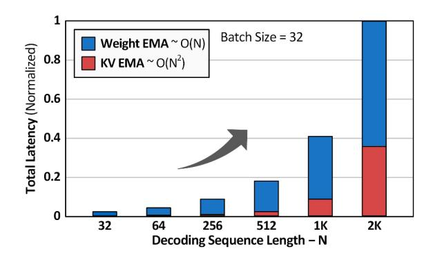

Fig. 3: Memory bottlenecks across varying sequence lengths.

projection, caching compressed intermediate states and reconstructing keys and values on the fly, and MatryoshkaKV [42] uses trainable orthogonal projections for adaptive KV compression. ReCalKV [32] further improves low-rank KV compression through head reordering and offline calibration. However, most existing methods exploit quantization and low-rank structure either separately or only for a single compression target, leaving their joint use across offline weight compression and online KV cache management underexplored.

#### III. MOTIVATION

The Dual Memory Wall in LLM Inference. LLM inference faces a growing memory bandwidth bottleneck as context length increases. As illustrated in Figure 3, this bottleneck arises from two major sources: weight access and KV cache access. Weight access incurs a constant cost per generated token, leading to O(N) total memory traffic over N decoding steps, since model weights are repeatedly fetched from offchip memory during generation. In contrast, KV cache access grows with sequence length, resulting in O(N2 ) total memory traffic over the decoding session. At moderate context lengths up to 1K tokens, weight access dominates, accounting for over 70% of total memory latency. However, as context lengths extend to tens of thousands of tokens for reasoning and longcontext applications, KV-cache traffic becomes the primary bottleneck. Addressing this dual memory wall therefore requires compressing both weights and KV caches, yet prior approaches largely treat them separately.

Limitations of Isolated Optimization. Existing LLM acceleration techniques typically optimize either weights or KV caches, but not both under a unified compression framework. As summarized in Table I, prior weight compression methods primarily rely on either quantization or low-rank approximation. GPTQ [8], AWQ [9], and OmniQuant [25] reduce weight memory with low-bit representations, whereas SVD-LLM [40] and ASVD [39] reduce parameter redundancy through matrix decomposition. However, these methods target static weights and do not address the dynamically growing KV cache during decoding.

KV compression methods have also emerged along several directions. Quantization-based approaches such as KIVI [11], KVQuant [16], and ZipCache [33] reduce KV cache size

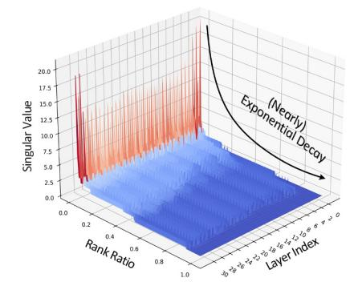

Fig. 4: Layer-wise singular value distributions of Llama2-7B, showing rapid decay across rank components.

through low-bit or saliency-aware quantization. GEAR [30] further complements KV quantization with low-rank correction and sparse outlier compensation to reduce quantization error. Other methods, such as PALU [31], MatryoshkaKV [42], and ReCalKV [32], explore low-rank or projection-based KV compression.

Beyond these compression techniques, recent architecturelevel works explore complementary directions, including entropy-aware cache compression [43], prefill-decode overlap scheduling [17], CPU-GPU/CXL-based offloading [18], and alternative execution substrates such as in-flash, chiplet-based, and PIM-enabled architectures [44]–[46]. However, they target specific inference bottlenecks rather than jointly compressing weights and KV caches under a unified algorithm-hardware framework.

The Key to Unified Compression: Synergy of SVD and Low-Bit Quantization. The key to unifying weight and KV compression is to exploit the complementary strengths of low-rank approximation and quantization. Low-rank decomposition reveals which rank components carry dominant information, while quantization provides a fine-grained mechanism to compress each component according to its importance. As shown in Figure 4, the singular values of Llama2- 7B [21] decrease sharply across layers as rank increases, indicating that the leading rank components capture most of the representational capacity, while the long tail contributes much less to model outputs. This motivates a rank-aware mixed-precision strategy: components associated with larger singular values retain higher precision, whereas components associated with smaller singular values can be compressed more aggressively to 1–2 bits. SingularBit applies this rankaware mixed-precision principle to both static weights and intermediate KV representations, and co-designs hardware to execute it efficiently across the inference pipeline.

### IV. PROPOSED ALGORITHM

#### *A. SingularBit-W for Weight Compression*

Unlike prior work based on coarse SVD truncation or uniform quantization, SingularBit-W applies rank-aware finegrained precision allocation to W. By assigning precision according to the singular-value importance of each rank

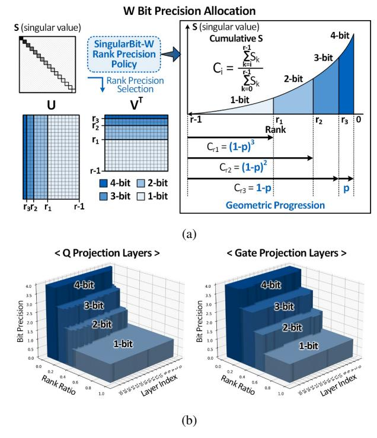

Fig. 5: Proposed SingularBit-W method for weight compression. (a) Detailed algorithm and (b) layer-wise precision allocation results.

component, it achieves a refined compression-accuracy tradeoff without fine-tuning. Moreover, unlike empirical methods that rely on exhaustive per-model or per-layer hyperparameter search, our theoretically grounded strategy generalizes across diverse architectures without manual tuning.

We formalize the weight compression by first performing SVD on the weight matrix W:

$$\mathbf{W}^{\mathbf{T}} = \sum_{i} \sigma_{i} \mathbf{u}_{i} \mathbf{v}_{i}^{T}. \tag{1}$$

Each outer product  $\mathbf{u}_i \mathbf{v}_i^T$ , formed by orthonormal bases spanning the column and row spaces of W, contributes information proportional to its singular value  $\sigma_i$ . As shown in Figure 4, the singular values of weight matrices in LLMs exhibit approximately exponential decay. This property implies that a small fraction of leading components account for the dominant share of signal energy, while the remaining components are progressively less significant.

Based on this observation, we partition the columns of U and rows of  $V^T$  into K precision regions, assigning higher precision to basis pairs associated with larger singular values. In our specific implementation of SingularBit-W, we employ K=4 regions, assigning 4, 3, 2, and 1-bit precisions respectively, as illustrated in Figure 5a. To quantify the information density, we define the cumulative tail sum from rank i onward Algorithm 1 SingularBit-W Compression

#### **Input:**

- $\mathbf{W} \in \mathbb{R}^{och \times ich}$ : original weight matrix
- $\mathbf{x} \in \mathbb{R}^{N \times ich}$ : calibration input matrix
- $B_{avg} \in \mathbb{R}$ : target average precision

- $\widehat{\mathbf{U}} \in \mathbb{R}^{ich \times r}$ : quantized U matrix
- $\widehat{\mathbf{V}}^{\mathbf{T}} \in \mathbb{R}^{r \times och}$ : quantized V matrix

1: 
$$\mathbf{U}, \mathbf{S}, \mathbf{V^T} \leftarrow \text{SVD}(\mathbf{W^T})$$

2: 
$$\mathbf{r} = \{r_1, r_2, ..., r_K\} \leftarrow \text{BOUNDARY}(\mathbf{S}, B_{avg})$$

$$\mathbf{H}_{U} \approx \mathbf{x}^{T}\mathbf{x}$$
  $\triangleright$  Hessian for  $\mathbf{U}$ 

4: for  $idx \leftarrow ich$  to 0 step -blocksize do

5: 
$$\alpha_r, \alpha_c, \mathbf{B} \leftarrow \mathsf{QUANTIZE}(\mathbf{U}, \mathbf{r}, idx) \qquad \triangleright \mathsf{Quantize} \ \mathbf{U}$$

6: 
$$\hat{\mathbf{U}} \leftarrow \sum \alpha_{r,i} \alpha_{c,i} \mathbf{B}_i$$

7: 
$$\mathbf{E}_u \leftarrow \mathbf{U} - \widehat{\mathbf{U}}$$

7: 
$$\mathbf{E}_u \leftarrow \mathbf{\hat{U}} - \mathbf{\hat{U}}$$
  
8:  $\mathbf{U} \leftarrow \mathbf{U} - \mathbf{E}_u \times \mathbf{H}_U^{-1}$ 

10: 
$$\mathbf{H}_{V^T} = \mathbf{S} \hat{\mathbf{U}}^T \mathbf{H}_U \hat{\mathbf{U}} \mathbf{S}$$
  $\triangleright$  Effective Hessian for  $\mathbf{V}^T$ 

11: for 
$$idx \leftarrow 0$$
 to  $r$  step blocksize do

12: 
$$\alpha_r, \alpha_c, \mathbf{B} \leftarrow \text{QUANTIZE}(\mathbf{V^T}, \mathbf{r}, idx) \Rightarrow \text{Quantize } \mathbf{V^T}$$

13: 
$$\hat{\mathbf{V}}^{\mathbf{T}} \leftarrow \sum \alpha_{r,i} \alpha_{c,i} \mathbf{B}_i$$

14: 
$$\mathbf{E}_v = \mathbf{V^T} - \widehat{\mathbf{V}^T}$$

14: 
$$\mathbf{E}_v = \mathbf{V^T} - \widehat{\mathbf{V}^T}$$
  
15:  $\mathbf{V^T} = \mathbf{V^T} - \mathbf{E}_v \times \mathbf{H}_{V_T}^{-1}$ 

17: return  $\widehat{\mathbf{U}}$ .  $\widehat{\mathbf{V}}^{\mathbf{T}}$ 

as:

$$C_i = \frac{\sum\limits_{k=i}^{r-1} \sigma_k}{\sum\limits_{k=0}^{r-1} \sigma_k}$$
 (2)

The region boundaries  $\{r_1, r_2, ..., r_{K-1}\}$  are determined by a rank ratio  $p \in (0,1)$ , representing the fraction of remaining information assigned to each successive precision level. By ensuring that the information content decreases exponentially across regions, the boundary conditions for K regions are derived as  $C_{r_k}=(1-p)^{K-k}$ . For K=4 regions, this yields:

$$C_{r_1} = (1-p)^3$$
 $C_{r_2} = (1-p)^2$ 
 $C_{r_3} = (1-p)$ 
 $C_0 = 1$ 
(3)

where 0 is a single parameter controlling the rate ofinformation decay across regions.

A key advantage of SingularBit-W is its analytical nature, which eliminates the need for empirical simulations. The average precision  $B_{avg}$  of a layer is a deterministic function of the boundaries  $\{r_k\}$  and their corresponding bit-widths  $\{b_k\}$ :

$$B_{avg} = \frac{1}{R} \sum_{k=1}^{K} b_k \cdot (r_k - r_{k-1})$$
 (4)

where  $r_0 = 0$ ,  $r_K$  is the total rank R, and  $b_k$  denotes the bit-width assigned to the k-th region. Given a target average precision, the parameter p can be solved by combining Eq. 4 with the boundary conditions in Eq. 3. As shown in Figure 5b, this procedure applies consistently to every linear layer, requiring no heuristic search.

Regarding the precision range, we observed that extending the maximum precision beyond 4 bits requires assigning a larger portion of ranks to low-precision regions to meet the target  $B_{\rm avg}$ , which offsets the benefit of using higher precision. We also exclude 0-bit allocation, i.e., pruning, because reducing a component from (n+1) to n bits only lowers its representational capacity, whereas assigning 0 bits represents a total loss of information. This helps explain why rank-truncation methods often suffer from larger accuracy degradation than our mixed-precision approach.

SingularBit-W integrates the proposed algorithm into a GPTQ error-feedback framework [8] to minimize accuracy degradation. Unlike standard GPTQ, which directly quantizes the original weight matrix, we apply error compensation to the SVD components. The overall procedure is summarized in Algorithm 1.

After decomposing  $\mathbf{W}$  into  $\mathbf{U}$ ,  $\mathbf{S}$ , and  $\mathbf{V}^T$ , we first quantize  $\mathbf{U}$  in sequential blocks using the precision levels  $b_k \in \{4,3,2,1\}$  determined by the boundaries  $\{r_1,r_2,r_3\}$ . This process is guided by the Hessian  $\mathbf{H}_U = \mathbf{x}^T\mathbf{x}$  computed from the calibration inputs. For each block, the quantization error  $\mathbf{E}_{\text{block}} = \mathbf{U}_{\text{block}} - \widehat{\mathbf{U}}_{\text{block}}$  is multiplied by the inverse Hessian and used to update the remaining unquantized parameters. This error-feedback mechanism allows later blocks to compensate for the accumulated quantization error from earlier blocks.

For the subsequent quantization of  $\mathbf{V}^T$ , we derive an effective Hessian  $\mathbf{H}_{\mathbf{V}^T}$  that accounts for the previously quantized  $\hat{\mathbf{U}}$ . From the linear relation  $\mathbf{x}\mathbf{W}^T \approx \mathbf{x}\hat{\mathbf{U}}\mathbf{S}\mathbf{V}^T = \mathbf{z}\mathbf{V}^T$ , the Hessian for  $\mathbf{V}^T$  is given by

$$\mathbf{H}_{\mathbf{V}^{T}} = \mathbf{z}^{T} \mathbf{z}$$

$$= \mathbf{S} \hat{\mathbf{U}}^{T} \mathbf{x}^{T} \mathbf{x} \hat{\mathbf{U}} \mathbf{S}$$

$$= \mathbf{S} \hat{\mathbf{U}}^{T} \mathbf{H}_{U} \hat{\mathbf{U}} \mathbf{S}.$$
(5)

The resulting  $\mathbf{H}_{\mathbf{V}^T}$  allows the quantization of  $\mathbf{V}^T$  to account for both the calibration activations and the previously quantized  $\widehat{\mathbf{U}}$ , reducing cumulative error across the SVD components.

To represent each precision region, we adopt hierarchical binary quantization based on ARB-LLM [47]. Each quantized block is decomposed into a series of binary bases  $\mathbf{B}_i \in \{-1,+1\}^{och \times ich}$ , scaled by row-wise and column-wise factors  $(\alpha_{r,i}$  and  $\alpha_{c,i}$ , respectively. For a region assigned bitwidth  $b_k$ , the quantized weights are reconstructed as

$$\mathbf{W} = \sum_{i=1}^{b_k} \alpha_{r,i} \, \alpha_{c,i} \, \mathbf{B}_i. \tag{6}$$

This hierarchical representation is naturally compatible with the bit-serial execution of the SingularBit Tensor Core, allow-

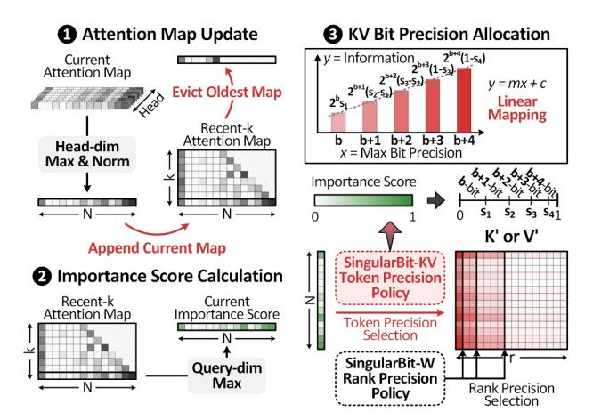

Fig. 6: Proposed SingularBit-KV pipeline for online KV-cache compression.

ing the assigned bitwidth  $b_k$  to translate directly into hardware latency and energy savings.

#### B. SingularBit-KV for KV Cache Compression

KV cache compression requires an online scheme, as the cache grows dynamically during autoregressive generation and token importance changes at every decoding step. Attention patterns, which indicate token importance, exhibit locality and sparsity; thus, not all cached tokens contribute equally to generation [10], [15]. Existing methods exploit this property by either pruning unimportant tokens [10] or assigning lower bitwidths to them [33]. However, they treat tokens in a binary manner—as important or unimportant—and fail to capture intermediate levels of token importance.

SingularBit-KV improves the accuracy-compression trade-off by compressing the KV cache along two complementary dimensions. Along the token dimension, it assigns one of five or more bitwidth levels according to attention-based importance. Along the rank dimension, it extends the rank-aware quantization principle of SingularBit-W to apply mixed precision within each token. Specifically, the cache is stored in intermediate representations K' and V', obtained by multiplying the input embeddings only with  $\mathbf{U}_{W_K}$  or  $\mathbf{U}_{W_V}$ . Since K' and V' are later multiplied by  $\mathbf{V}_{W_K}^T$  and  $\mathbf{V}_{W_V}^T$  during attention computation, respectively, their rank-wise precision is determined by the singular-value magnitudes of the corresponding components in these matrices. This enables finegrained bit allocation across both tokens and rank components, maximizing compression while minimizing information loss.

As illustrated in Figure 6, SingularBit-KV operates in three stages at each decoding step: (1) attention map update to track recent attention patterns, (2) importance score computation to quantify each token's contribution to generation, and (3) bit precision allocation and compression based on both token importance and rank significance.

(1) Attention Map Update. At each decoding step t, we maintain a recent-k attention map window (e.g. k=128) to capture temporal attention dynamics. The current attention

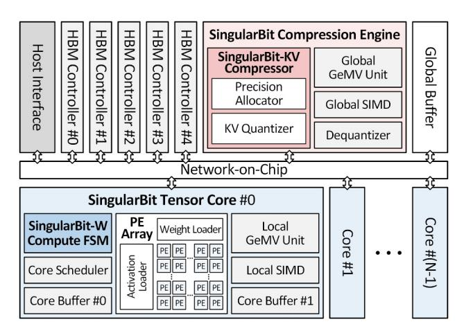

Fig. 7: Overall architecture of the SingularBit accelerator.

map  $\mathbf{A}_t \in \mathbb{R}^{H \times N_t}$  is aggregated via head-wise max pooling followed by normalization to produce  $\tilde{\mathbf{a}}_t \in \mathbb{R}^{N_t}$ . This resulting vector is appended to the window  $\mathcal{M}_t \in \mathbb{R}^{k \times N_t}$ , while the oldest entry is evicted to maintain the fixed window size. Head-wise max pooling preserves tokens required by any attention head at higher precision, as different heads may attend to complementary information [48]. The window provides sufficient temporal context to smooth out transient attention patterns while maintaining computational efficiency.

(2) Importance Score Calculation. From the recent-k attention maps in  $\mathcal{M}_t$ , we compute per-token importance scores by taking the query-wise maximum:

$$\mathcal{I}_i = \max_{j \in [t-k+1,t]} \tilde{\mathbf{a}}_j[i] \tag{7}$$

We use max pooling instead of averaging due to the irreversibility of online quantization: once a token is stored at a lower bitwidth, recovering the discarded information requires recomputing its higher-precision KV representation, incurring substantial inference overhead. This motivates a conservative strategy that captures each token's peak attention over recent steps, ensuring that tokens critical to any recent decoding step are preserved with sufficient precision.

(3) KV Bit Precision Allocation. The precision allocation follows two nested policies. First, the SingularBit-KV token precision policy maps each token importance score to one of five bitwidth levels, from b to b+4, where b is the base precision. Let  $0=s_0 < s_1 < \cdots < s_5 = 1$  denote the interval boundaries over the normalized importance-score range, and let  $l_i = s_{i+1} - s_i$  be the length of the interval assigned to bitwidth b+i. Since a b+i bit quantizer provides  $2^{b+i}$  representable levels,  $l_i 2^{b+i}$  represents the effective capacity allocated to that importance region.

Considering the heavy-tailed nature of attention-based importance scores, where a small fraction of tokens receives dominant attention while the majority receives low attention [10], a desirable allocation should provide higher capacity to high-importance regions without letting high-precision intervals absorb too many tokens, which would degrade the

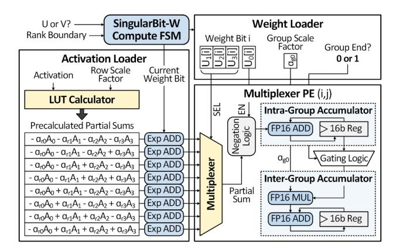

Fig. 8: Modified multiplexer PE supporting both binary and group-wise quantized operations.

overall compression ratio. To this end, we use a linearly increasing capacity schedule:

$$l_i \cdot 2^{b+i} = m \cdot i + c, \quad i \in \{0, 1, 2, 3, 4\}.$$
 (8)

Here, m controls the increase in capacity for higher-importance regions, and c sets the baseline capacity. The interval lengths are obtained by solving Eq. (8) with  $\sum_{i=0}^4 l_i = 1$ , after which the boundaries are recovered as cumulative sums of  $l_i$ .

Second, the **SingularBit-W rank precision policy** is applied within each token's allocated maximum bitwidth. Rank components with larger singular values retain higher precision, while less significant components are assigned progressively lower precision according to the SingularBit-W rank boundaries. This nested policy enables two-dimensional mixed precision over token importance and rank significance.

#### V. PROPOSED HARDWARE ARCHITECTURE

#### A. Overall Architecture

Figure 7 presents the overall architecture of the SingularBit accelerator. The system interfaces with 80GB of external DRAM through HBM controllers, providing 2.0 TB/s offchip bandwidth, and receives commands via a PCIe-based host interface. The accelerator consists of two main components: SingularBit Tensor Cores for mixed-precision matrix multiplication and a SingularBit Compression Engine for online KV cache compression. Each SingularBit Tensor Core includes a  $32 \times 32$  PE array that performs bit-serial mixed-precision weight computation with FP16 activations. The SingularBit-W Compute FSM coordinates mixed-precision execution, while the core scheduler manages data movement and buffer operations. Each core also includes local GeMV units for matrixvector operations and SIMD units for element-wise operations such as bias addition and nonlinear functions. The SingularBit Compression Engine handles attention computation and KV compression. Its global GeMV and SIMD units compute attention scores and softmax, and the SingularBit-KV Compressor compresses the KV cache based on token importance and rank information.

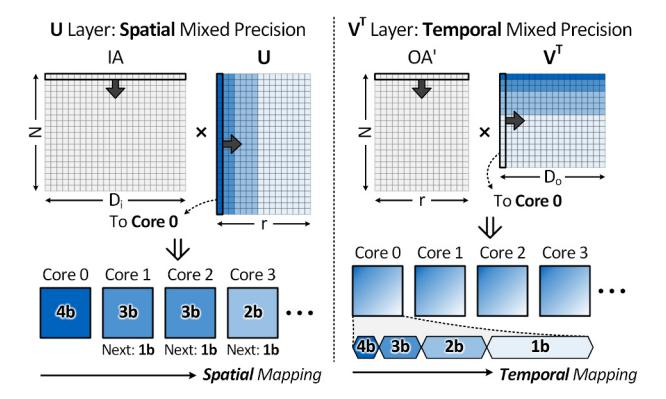

Fig. 9: Data mapping on the SingularBit Tensor Core for rankaware mixed-precision execution.

### *B. SingularBit Tensor Core*

Figure 8 shows the SingularBit Tensor Core architecture, which supports rank-aware mixed-precision computation within a unified datapath. Unlike conventional cores, which often require separate datapaths or incur reconfiguration overhead to support multiple precisions [49], [50], our design processes 1–4 bit weights through the same hardware path by exploiting the precision hierarchy of SVD-decomposed matrices.

Our tensor core builds on lookup table (LUT)-based computation paradigm for low-bit LLM inference [51]–[53] and adds dual-level accumulation for group quantization and rankaware mixed precision. The activation loader precomputes FP16 partial sums over four input channels and broadcasts them to each PE row. To reduce the number of LUT entries, it generates only eight entries: the 0th channel is used to encode the sign, while all possible magnitude combinations are precomputed for the 1st–3rd channels. During computation, the 1st–3rd weight bits select the corresponding partial sum through a multiplexer, and the 0th bit determines whether the selected value is negated.

The SingularBit-W compute FSM provides the current bit position to both the activation and weight loaders. The activation loader applies this bit offset to the exponent of the FP16 partial sums, enabling bit-serial computation, while the weight loader broadcasts the corresponding weight bits to the PE columns. To support group quantization, the weight loader also delivers group scale factors to the PEs in sync with group boundaries. The intra-group accumulator performs FP16 accumulation within each quantization group, while the inter-group accumulator applies group-specific scale factors and aggregates the group outputs.

Figure 9 illustrates how SVD-decomposed matrices are mapped to exploit precision heterogeneity. For the U computation, we use spatial mixed precision, where precision varies across ranks assigned to different cores. Each core processes an entire rank at the precision determined by its singular value, while multiple cores execute ranks with different precisions in parallel. Since bit-serial latency depends on the assigned

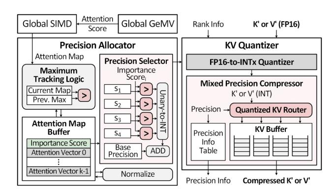

Fig. 10: SingularBit Compression Engine for online tokenwise and rank-wise KV-cache compression.

precision, the core scheduler assigns the next rank to the first available core, improving load balance.

For the VT computation, we use temporal mixed precision, where precision varies across ranks along the reduction dimension within each core. Each core processes output chunks sequentially while accumulating partial sums across rankwise precision transitions. Since all cores follow the same precision sequence over the reduction dimension, they finish synchronously, eliminating the need for dynamic scheduling.

#### *C. SingularBit Compression Engine*

Figure 10 shows the SingularBit Compression Engine, which performs attention-aware online KV cache compression. It dynamically assigns token-wise precision based on attention importance and progressively reduces rank-wise precision using singular-value-based rank boundaries.

The precision allocator receives attention scores from the global GeMV unit, which computes QKT, and the global SIMD unit, which applies softmax. The maximum-tracking logic performs head-wise max pooling, normalizes the scores to [0, 1], and maintains a recent-k attention window with k = 128. It then computes each key token's importance score as the maximum attention value across recent query positions. The precision selector maps these scores to tokenwise precision levels using predefined thresholds, which are added to a base precision to determine each token's maximum bitwidth. Adjusting the base precision controls the compression-accuracy trade-off.

The KV quantizer receives K' and V', intermediate key and value representations obtained by multiplying the input activations only with the U matrices of the K and V projection weights. Using the token-wise maximum bitwidth and rank metadata, the FP16-to-INTx quantizer progressively reduces precision across rank boundaries. Given the token-wise maximum bitwidth from the precision allocator and rank metadata indicating the corresponding rank positions, the FP16-to-INTx quantizer reduces precision progressively across rank boundaries, starting from each token's maximum bitwidth. The mixed-precision compressor then packs the quantized values into a compact format without bit-level padding. The quantized KV router performs bit-level packing in the KV

TABLE II: Perplexity comparison on Wikitext-2 and C4 for LLaMA and Llama 2 model families under low-bit weight quantization.

| Method        | Average Precision | Group | LLaMA-7B |        | LLaMA-13B |        | LLaMA-30B |        | Llama2-7B |        | Llama2-13B |        |
|---------------|----------------------|-------|----------|--------|-----------|--------|-----------|--------|-----------|--------|------------|--------|
|               |                      | Size  | Wiki     | C4     | Wiki      | C4     | Wiki      | C4     | Wiki      | C4     | Wiki       | C4     |
| Baseline      | FP16                 | –     | 5.68     | 7.08   | 5.09      | 6.61   | 4.10      | 5.98   | 5.47      | 6.97   | 4.88       | 6.46   |
| RTN           | W2A16                | 128   | 1.9e3    | 1.0e3  | 781.20    | 447.64 | 68.04     | 99.45  | 4.2e3     | 4.9e3  | 122.08     | 139.65 |
| GPTQ          | W2A16                | 128   | 44.01    | 27.71  | 15.60     | 15.29  | 10.92     | 11.93  | 36.77     | 33.70  | 28.14      | 20.97  |
| AWQ           | W2A16                | 128   | 2.6E+5   | 1.9E+5 | 2.8E+5    | 2.3E+5 | 2.4E+5    | 2.4E+5 | 2.2E+4    | 1.7E+5 | 1.2E+5     | 9.4E+4 |
| OmniQuant     | W2A16                | 128   | 9.72     | 12.97  | 7.93      | 10.36  | 7.12      | 9.36   | 11.06     | 15.02  | 8.26       | 11.05  |
| MagR+OPTQ     | W2A16                | 128   | 9.89     | 13.14  | 9.22      | 10.62  | 6.72      | 8.05   | 9.94      | 14.08  | 7.63       | 10.57  |
| SingularBit-W | W2*A16               | 128   | 7.56     | 11.02  | 6.59      | 9.23   | 5.34      | 7.93   | 8.85      | 12.97  | 6.63       | 10.43  |

buffer and translates logical token indices into physical storage addresses according to each token's bitwidth. A precision information table records each token's bitwidth to enable correct dequantization.

#### VI. EVALUATION

We present a comprehensive evaluation of SingularBit, validating its algorithm-hardware co-design across multiple dimensions. We first establish the algorithmic efficiency of SingularBit-W and SingularBit-KV by comparing them against state-of-the-art weight and KV cache compression methods. We then demonstrate that the SingularBit accelerator realizes these algorithmic gains into system-level improvements in throughput and energy efficiency, alongside an analysis of hardware overhead and implementation cost. Finally, we conduct ablation studies including two types of scenarios that stress the dual memory wall most severely: (i) prefillheavy long-context scenarios and (ii) decode-heavy reasoning scenarios, confirming that SingularBit achieves state-of-the-art performance across diverse inference regimes.

#### *A. Experimental Setup*

Hardware Configuration. We use an NVIDIA A100 80GB GPU with 2TB/s memory bandwidth for our baseline. To ensure a fair comparison, the hardware configurations of SingularBit and all baseline accelerators are normalized to match the A100 in both peak throughput and memory bandwidth. This iso-resource setup enables a controlled evaluation of our architectural and algorithmic innovations.

Datasets. For language modeling, we measure perplexity on Wikitext-2 [23] and C4 [24]. For commonsense reasoning, we report the average zero-shot accuracy across six multiple-choice benchmarks: PIQA [54], ARC-Easy, ARC-Challenge [55], BoolQ [56], HellaSwag [57], and Wino-Grande [58]. For generation quality, we employ CoQA [27], a conversational reading comprehension benchmark, and TruthfulQA [28], which measures the factual accuracy of generated responses. To address prefill-heavy long-context scenarios, we use LongBench [34], a multitask benchmark designed to stress long-context comprehension. For decode-heavy reasoning scenarios, we use GSM8K [29], a mathematical reasoning benchmark requiring extended multi-step generation.

Models. Our evaluation spans the LLaMA (7B, 13B, 30B) [20], Llama 2 (7B, 13B) [21], and Llama 3 (8B-Instruct) [22] families to establish scalability across diverse model sizes. Additionally, we validate our performance on reasoning-specialized models, such as DeepSeek-R1-Distill-Qwen-1.5B and DeepSeek-R1-Distill-LLaMA-8B [2].

Baselines. For weight compression, we compare SingularBit-W against RTN [59], GPTQ [8], AWQ [9], OmniQuant [25], MagR [60], Olive [61], SpQR [62], SqueezeLLM [63], and GuidedQuant [26]. For KV cache compression, we compare SingularBit-KV with KIVI [11], GEAR [30], KVQuant [16], PALU [31], ReCalKV [32], and ZipCache [33]. For hardware comparisons, we additionally compare against LUT tensor core [51] for weight compression acceleration, and Oaken [64] for KV cache acceleration, both representing specialized architectures for LLM inference.

# *B. Algorithmic Performance*

We evaluate the algorithmic effectiveness of SingularBit-W and SingularBit-KV against state-of-the-art compression baselines. For weight compression, we assess SingularBit-W using perplexity and zero-shot accuracy, highlighting its robustness in the ultra-low-bit regime. For KV-cache compression, we evaluate SingularBit-KV on generation quality and multi-step reasoning under aggressive compression.

Ultra-Low-Bit Effectiveness. Table II compares perplexity at 2-bit precision, with all measurements using a context window of 2,048 tokens. Conventional methods such as RTN, GPTQ, and AWQ suffer severe perplexity degradation at this precision, whereas SingularBit-W maintains stable performance across all evaluated settings. SingularBit-W also outperforms specialized low-bit methods, including OmniQuant and MagR+OPTQ, achieving the best perplexity with margins ranging from 0.14 to 2.63. These gains are consistent across model families, model sizes, and benchmarks, demonstrating the generality of our approach. We attribute this advantage to the synergy between SVD and mixed-precision quantization, which preserves critical spectral components while reducing quantization error at extremely low average bitwidths.

Language Modeling. Figure 11 shows Wikitext-2 perplexity versus total model size, where each method is evaluated at multiple compression levels, including 2-, 3-, and 4 bit settings. SingularBit-W consistently achieves the lowest

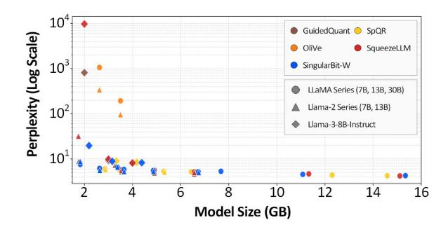

Fig. 11: Wikitext-2 perplexity versus compressed model size for weight quantization baselines.

Fig. 12: Zero-shot commonsense reasoning accuracy versus compressed model size for weight quantization baselines.

perplexity across model sizes, forming a Pareto frontier. In the smallest model-size range, aggressive compression causes several baselines, such as SqueezeLLM and OliVe, to collapse, whereas SingularBit-W maintains stable perplexity. Even compared with strong baselines such as GuidedQuant and SpQR, SingularBit-W achieves comparable or better results across all settings.

Multiple Choice Reasoning. Figure 12 further supports these findings by reporting zero-shot commonsense reasoning accuracy under the same model-size and compression settings. SingularBit-W achieves the highest accuracy in nearly all configurations, with larger gains in smaller models and ultra-lowbit regimes. The consistent improvement in both perplexity and zero-shot accuracy shows that SingularBit-W preserves overall model quality rather than improving language modeling metrics alone.

Generation Quality. Table III evaluates the generation quality of SingularBit-KV on CoQA and TruthfulQA using Llama-3-8B-Instruct at 2-bit and 3-bit precision. Although each method targets a nominal bitwidth, the effective compression ratio differs across methods due to heterogeneous precision allocation. SingularBit-KV achieves the best accuracy across all bitwidth and benchmark combinations. Existing methods such as KVQuant, PALU, and ReCalKV suffer significant accuracy degradation at 2-bit precision, whereas SingularBit-KV remains robust, with only a 2.0% drop on CoQA and a 0.5% drop on TruthfulQA relative to the FP16 baseline. Compared with ZipCache, SingularBit-KV consistently delivers higher accuracy while maintaining a higher

TABLE III: Accuracy (%) and compression ratio (%) comparison on CoQA and TruthfulQA for Llama-3-8B-Instruct.

|                | CoQA |      |      |      | TruthfulQA |      |      |      |  |  |
|----------------|------|------|------|------|------------|------|------|------|--|--|
| Precision      | KV3  |      | KV2  |      | KV3        |      | KV2  |      |  |  |
| Method         | Acc  | CR   | Acc  | CR   | Acc        | CR   | Acc  | CR   |  |  |
| FP16           |      |      | 63.5 |      | 60.0       |      |      |      |  |  |
| GEAR           | 63.7 | 78.1 | 59.6 | 84.2 | 58.5       | 78.1 | 54.0 | 84.2 |  |  |
| KVQuant        | 58.8 | 80.4 | 20.6 | 86.6 | 49.0       | 80.4 | 24.5 | 86.6 |  |  |
| PALU           | 22.4 | 85.9 | 2.2  | 90.6 | 42.0       | 85.9 | 9.0  | 90.6 |  |  |
| ReCalKV        | 62.6 | 60.0 | 36.5 | 70.0 | 47.0       | 60.0 | 40.0 | 70.0 |  |  |
| ZipCache       | 63.5 | 80.9 | 56.4 | 86.9 | 60.0       | 80.9 | 52.0 | 86.9 |  |  |
| SingularBit-KV | 67.6 | 83.1 | 61.5 | 86.8 | 60.0       | 81.2 | 59.5 | 84.5 |  |  |

compression ratio in most configurations, yielding a better accuracy-compression trade-off.

CoT Reasoning. Table IV shows the robustness of SingularBit-KV on GSM8K, a mathematical reasoning benchmark that requires multi-step chain-of-thought generation. At 2-bit precision, most competing methods, including KVQuant, PALU, and ZipCache, suffer severe accuracy degradation, dropping to the 0–30% range and losing much of their reasoning capability. In contrast, SingularBit-KV maintains performance close to the FP16 baseline, including on the DeepSeek-R1-Distill series. This robustness comes from its joint consideration of token importance and rank significance, which preserves critical contextual information throughout extended decoding under aggressive compression.

#### *C. Hardware Performance*

We evaluate the system-level performance of Singular-Bit in terms of throughput and energy efficiency under an iso-resource constraint. We consider three configurations: SingularBit-W, SingularBit-KV, and SingularBit-WKV. For throughput, we sweep sequence lengths, batch sizes, and model sizes to show that SingularBit-WKV mitigates the dual memory wall across diverse inference scenarios. For energy efficiency, we evaluate the SingularBit algorithms on both a GPU and the SingularBit accelerator to separate algorithmic gains from hardware specialization. We further analyze speedup and energy savings on reasoning workloads.

Hardware Throughput Analysis. Figure 13 reports throughput in tokens per second across varying sequence lengths and batch sizes for LLaMA2-7B and LLaMA2-13B. To ensure an iso-accuracy comparison, we match the compression ratio of SingularBit-W to competing weight-compression methods by adjusting the rank ratio, and select SingularBit-KV operating points that incur less than a 1% accuracy drop on CoQA and TruthfulQA.

The results show that SingularBit-WKV effectively addresses the dual memory wall that limits existing approaches. Weight-compression methods such as OmniQuant and LUT-TensorCore perform well at short sequence lengths but lose efficiency as the KV cache grows. In contrast, KV-compression methods such as KIVI and Oaken improve throughput at long sequence lengths but remain limited by weight memory traffic at shorter sequences. SingularBit-WKV compresses both

TABLE IV: Accuracy and compression ratio (%) comparison on GSM8K across Llama-3 and DeepSeek-R1-Distill models.

|                |            |      | Llama-3-8B-Instruct |      |      |      | R1-Distill-Qwen-1.5B |      | R1-Distill-Llama-8B |      |      |      |
|----------------|------------|------|---------------------|------|------|------|----------------------|------|---------------------|------|------|------|
| Precision      | KV3 KV2 |      |                     | KV3  |      |      | KV2                  |      | KV3                 |      | KV2  |      |
| Method         | Acc        | CR   | Acc                 | CR   | Acc  | CR   | Acc                  | CR   | Acc                 | CR   | Acc  | CR   |
| FP16           | 0.77       |      |                     | 0.85 |      |      |                      | 0.82 |                     |      |      |      |
| GEAR           | 0.77       | 78.1 | 0.66                | 84.2 | 0.80 | 78.1 | 0.55                 | 84.2 | 0.80                | 78.1 | 0.74 | 84.2 |
| KVQuant        | 0.81       | 80.4 | 0.36                | 86.6 | 0.77 | 80.4 | 0.24                 | 86.6 | 0.70                | 80.4 | 0.04 | 86.6 |
| PALU           | 0.43       | 85.9 | 0.03                | 90.6 | 0.29 | 85.9 | 0.03                 | 90.6 | 0.34                | 85.9 | 0.00 | 90.6 |
| ReCalKV        | 0.69       | 60.0 | 0.36                | 70.0 | 0.65 | 60.0 | 0.34                 | 70.0 | 0.58                | 60.0 | 0.26 | 70.0 |
| ZipCache       | 0.73       | 80.9 | 0.72                | 86.9 | 0.03 | 80.9 | 0.00                 | 86.9 | 0.88                | 80.9 | 0.00 | 86.6 |
| SingularBit-KV | 0.82       | 81.1 | 0.81                | 85.1 | 0.81 | 79.1 | 0.85                 | 84.4 | 0.80                | 82.1 | 0.82 | 86.0 |

Fig. 13: Throughput comparison across sequence lengths and batch sizes.

sources of memory traffic, maintaining high throughput across the full sequence-length range. Individually, SingularBit-W outperforms weight-compression baselines through rank-aware mixed precision, while SingularBit-KV surpasses KIVI and Oaken at long sequences where KV cache traffic dominates. These gains remain consistent across model sizes, from 7B to 13B, and batch sizes, from 16 to 64, demonstrating robust scalability.

System Energy Analysis. Figure 14 presents a system energy breakdown across on-chip computation, on-chip SRAM, and off-chip DRAM. We evaluate both GPU and SingularBit accelerator execution to distinguish algorithmic benefits from hardware specialization. Even without specialized hardware, the compression algorithms reduce system energy by 25.5– 29.1% for weight compression, 30.8–32.8% for KV compression, and 34.7–37.3% for combined compression. However, the GPU cannot fully exploit these reductions because it lacks native support for fine-grained KV compression and rank-wise mixed-precision execution.

The SingularBit accelerator closes this gap through two specialized units. The SingularBit Tensor Core operates directly on reduced bitwidth values without dequantization, reducing both computation and on-chip SRAM access. It further employs a LUT-based structure that precomputes group scaling factor multiplications and channel-wise accumulations across four inputs, reusing the results across PE lines to minimize arithmetic energy. The SingularBit Compression Engine supports fine-grained precision selection, quantization, and bit packing in dedicated hardware, avoiding the formatconversion and data-movement overheads incurred by GPUbased implementations. Together, these units fully realize the algorithmic benefits, delivering 78.6% (7B) and 79.1% (13B) total system energy reduction compared to the FP16 baseline.

Reasoning Performance. Figure 15 evaluates end-to-end speedup and energy savings on decode-heavy reasoning tasks for DeepSeek-R1-Distill-Qwen-1.5B and DeepSeek-R1- Distill-LLaMA-8B, comparing GPU and accelerator execution across SingularBit-W, SingularBit-KV, and SingularBit-WKV configurations. Even on a GPU, the compression algorithms alone achieve 4.00× speedup on both models using 3-bit average weight precision and 78.18% KV compression, demonstrating the substantial contribution of our algorithmic design. The SingularBit accelerator further amplifies these gains: SingularBit-WKV achieves 5.27× speedup and 4.64×

Fig. 14: System energy breakdown for Llama2-7B and Llama2-13B, comparing GPU execution with SingularBit accelerator execution to separate algorithmic and hardware gains.

Fig. 15: End-to-end speedup and energy savings on decodeheavy reasoning workloads.

energy savings on Qwen-1.5B, and 5.32× speedup and 4.78× energy savings on LLaMA-8B. These consistent gains across both models show that SingularBit provides robust hardware efficiency regardless of model architecture. The performance gap between GPU and accelerator execution highlights that, while the algorithm reduces memory traffic, the SingularBit accelerator is necessary to fully exploit these savings by natively supporting rank-wise mixed-precision execution and fine-grained KV compression.

#### *D. Overhead Analysis*

We analyze four potential sources of overhead in the SingularBit accelerator: online SVD, KV compression, KV reconstruction, and mixed-precision control.

No Online SVD Overhead. A possible misunderstanding is that SingularBit-KV performs an online SVD step to compress the KV cache. This is not the case. SVD is applied only once offline to the weight tensors, and no decomposition is performed during inference. At runtime, KV generation computes only xUWK and xUWV , denoted as K' and V'. The runtime compression path consists only of token- and rank-aware mixed-precision quantization and packing on K' and V'.

Compression Engine Overhead. The SingularBit compression engine supports online KV compression using the attention map, rank metadata, and K' and V' activations as input. It determines token- and rank-aware precision and bitpacks the quantized values into the compressed KV format. These functions require additional control, quantization, and packing logic. As shown in Table VII, the compressor occupies 21.5 mW (23.3%) and 1.23 mm2 (27.9%) within the compression engine. Since one compression engine is shared across at least eight SingularBit tensor cores, the chip-level overhead remains below 4% in both area and power. Compression also proceeds in parallel with the post-attention computation and finishes before the next attention layer begins KV compression across all evaluated configurations. Therefore, it is not on the critical path and does not increase end-to-end latency.

KV Reconstruction Overhead. The main runtime overhead of SingularBit-KV comes from the additional VT recomputation during decoding. Because the stored cache contains only K' and V', the original K and V tensors must be reconstructed before attention. This reconstruction is executed on the SingularBit tensor core and increases latency by 5% at context length 64 and by 2% at context length 2,048. In contrast, SingularBit-KV reduces KV-related DRAM traffic by approximately 5×, while SingularBit-WKV reduces total DRAM traffic by up to 8.5×. As a result, the added VT recomputation cost remains smaller than the performance and energy gains obtained from reducing off-chip memory accesses.

Mixed-Precision Control Overhead. The last overhead concerns the control logic required to support rank-wise mixed-precision execution in the SingularBit Tensor Core. As shown in Table VII, the total control logic per Tensor Core occupies only 0.09 mm2 (1.6% of area) and consumes 23.4 mW (7.6% of power). These numbers include the entire Tensor Core control path, including standard matmul orchestration, rather than only the additional logic for mixed-precision scheduling. Therefore, the overhead attributable specifically to rank-wise mixed-precision support is smaller still.

# *E. Ablation Study: Long-Context Scenarios*

We conduct an ablation study to analyze the individual and combined contributions of SingularBit-W and SingularBit-KV in long-context scenarios, comparing them against strong baselines for weight compression (GuidedQuant) and KV cache compression (ReCalKV), both individually and in combination.

Table V evaluates performance on LongBench across eight prefill-heavy long-context tasks at 3-bit weight and KV precisions. Both SingularBit-W and SingularBit-KV individually outperform their corresponding baselines, with particularly

TABLE V: LongBench accuracy (%) comparison for Llama-2-7B under 3-bit weight and KV-cache compression.

|            | Method                | Qasper | QMSum | MultiNews | TREC | TriviaQA | SAMSum | LCC  | RepoBench-P | Avg. |
|------------|-----------------------|--------|-------|-----------|------|----------|--------|------|-------------|------|
| Original   | FP16                  | 9.6    | 21.2  | 3.5       | 66.0 | 87.7     | 41.7   | 66.7 | 59.8        | 44.5 |
| Prior SOTA | GuidedQuant           | 5.4    | 15.9  | 3.4       | 69.0 | 86.6     | 33.6   | 62.9 | 54.0        | 41.3 |
|            | ReCalKV               | 3.3    | 15.4  | 0.1       | 53.0 | 66.2     | 32.6   | 34.1 | 32.2        | 29.6 |
|            | GuidedQuant + ReCalKV | 1.3    | 14.4  | 7.4       | 32.0 | 77.3     | 14.6   | 49.6 | 40.2        | 29.6 |
| Ours       | SingularBit-W         | 6.4    | 19.5  | 19.8      | 65.0 | 85.8     | 31.5   | 65.4 | 56.2        | 43.7 |
|            | SingularBit-KV        | 7.5    | 20.3  | 14.1      | 67.5 | 89.0     | 32.4   | 66.8 | 57.4        | 44.4 |
|            | SingularBit-WKV       | 6.4    | 19.6  | 19.8      | 65.0 | 85.8     | 31.4   | 65.5 | 55.9        | 43.7 |

TABLE VI: Accuracy comparison on CoQA (%), TruthfulQA (%), and GSM8K for Llama-3-8B-Instruct under 3-bit weight and KV-cache compression.

|       | Method                | CoQA | TQA  | GSM8K |
|-------|-----------------------|------|------|-------|
| Prior | GuidedQuant           | 54.8 | 41.6 | 0.54  |
|       | ReCalKV               | 36.6 | 40.0 | 0.36  |
|       | GuidedQuant + ReCalKV | 49.2 | 36.0 | 0.40  |
| Ours  | SingularBit-W         | 63.2 | 39.7 | 0.50  |
|       | SingularBit-KV        | 61.5 | 59.5 | 0.81  |
|       | SingularBit-WKV       | 63.3 | 44.6 | 0.57  |

pronounced gains on document summarization tasks such as MultiNews and Qasper. In this prefill-heavy setting, KV-cache compression has a greater impact on long-context fidelity than weight compression, as reflected by the higher average score of SingularBit-KV. Most critically, while the combination of GuidedQuant and ReCalKV yields a degraded average of 29.6%, SingularBit-WKV achieves 43.7%, a 14.1% improvement that demonstrates the benefit of our unified compression framework.

# *F. Ablation Study: Reasoning Scenarios*

Following the long-context analysis, we conduct a complementary ablation study to validate SingularBit in decodeheavy scenarios, evaluating generation quality and reasoning performance on CoQA, TruthfulQA, and GSM8K using the same comparison structure. Table VI presents results on Llama-3-8B-Instruct at 3-bit weight and KV precisions. While individual components of SingularBit may occasionally trail specific prior arts in isolation, SingularBit-WKV consistently achieves superior performance when both compression axes are applied, outperforming the GuidedQuant+ReCalKV combination by 14.1% on CoQA, 8.6% on TruthfulQA, and 0.17 on GSM8K. Notably, combining GuidedQuant and ReCalKV degrades performance relative to either method alone, whereas SingularBit-WKV minimizes accuracy loss upon combination, demonstrating the stability and compatibility of our joint compression framework.

#### *G. Hardware Implementation*

Table VII summarizes synthesis results for the SingularBit accelerator in 28nm CMOS technology at 1GHz operating frequency. In each SingularBit tensor core, which handles

TABLE VII: Synthesis results of SingularBit accelerator.

| Hardware              | Power (mW) | Power Ratio | Area (mm2 ) | Area Ratio |
|-----------------------|---------------|----------------|-------------------|---------------|
| 1× Tensor Core        | 307.3         | 100%           | 5.58              | 100%          |
| PE Array              | 168.1         | 54.7%          | 2.73              | 48.9%         |
| Buffer                | 99.2          | 32.3%          | 1.94              | 34.8%         |
| GeMV, SIMD            | 16.6          | 5.4%           | 0.82              | 14.7%         |
| Control, etc.         | 23.4          | 7.6%           | 0.09              | 1.6%          |
| 1× Compression Engine | 92.0          | 100%           | 4.41              | 100%          |
| Compressor            | 21.5          | 23.3%          | 1.23              | 27.9%         |
| GeMV, SIMD            | 66.2          | 72.0%          | 3.15              | 71.4%         |
| Control, etc.         | 4.3           | 4.7%           | 0.03              | 0.7%          |

rank-wise mixed-precision computation, the PE array occupies 48.9% of area and consumes 54.7% of power. In the SingularBit compression engine, responsible for online KV cache compression, the compressor accounts for 27.9% of area and 23.3% of power. The remaining resources are allocated to control logic, interconnect, and memory interfaces. When scaled to a full accelerator configuration, where four or more tensor cores are integrated per compression engine to meet the high-throughput demands of LLM workloads, the relative power and area overhead of the compression engine is further amortized. This confirms that our online KV compression is introduced at minimal cost to the overall system.

#### VII. CONCLUSION

We presented SingularBit, an accelerator that jointly exploits singular value decomposition and low-bit quantization for offline weight compression and online KV cache compression. SingularBit algorithm combines SVD-guided rank-aware precision allocation with low-bit quantization, and extends the same principle to online KV cache compression by incorporating attention-based token importance. Across diverse model families, bitwidths, and benchmarks, SingularBit achieves state-of-the-art algorithmic performance, and long-context and reasoning evaluations confirm the effectiveness of the unified SingularBit-WKV framework. The SingularBit accelerator further translates these algorithmic gains into system-level improvements in throughput and energy efficiency through native support for rank-wise mixed-precision execution and finegrained online KV compression. Overall, SingularBit provides an effective algorithm-hardware solution to the dual memory wall in modern LLM inference.

#### REFERENCES

- [1] OpenAI, "OpenAI o3 and o4-mini System Card," OpenAI, Tech. Rep., April 2025. [Online]. Available: https://cdn.openai.com/pdf/2221c875- 02dc-4789-800b-e7758f3722c1/o3-and-o4-mini-system-card.pdf
- [2] D. Guo, D. Yang, H. Zhang, J. Song, P. Wang, Q. Zhu, R. Xu, R. Zhang, S. Ma, X. Bi *et al.*, "Deepseek-r1: Incentivizing reasoning capability in llms via reinforcement learning," *arXiv preprint arXiv:2501.12948*, 2025.
- [3] Anthropic, "Claude Opus 4 & Claude Sonnet 4 System Card," Anthropic, Tech. Rep., May 2025. [Online]. Available: https://wwwcdn.anthropic.com/4263b940cabb546aa0e3283f35b686f4f3b2ff47.pdf
- [4] J. Wei, X. Wang, D. Schuurmans, M. Bosma, F. Xia, E. Chi, Q. V. Le, D. Zhou *et al.*, "Chain-of-thought prompting elicits reasoning in large language models," *Advances in neural information processing systems*, vol. 35, pp. 24 824–24 837, 2022.
- [5] S. Hao, Y. Gu, H. Ma, J. Hong, Z. Wang, D. Wang, and Z. Hu, "Reasoning with language model is planning with world model," in *Proceedings of the 2023 Conference on Empirical Methods in Natural Language Processing*, 2023, pp. 8154–8173.
- [6] H. Lightman, V. Kosaraju, Y. Burda, H. Edwards, B. Baker, T. Lee, J. Leike, J. Schulman, I. Sutskever, and K. Cobbe, "Let's verify step by step," in *The twelfth international conference on learning representations*, 2023.
- [7] A. Madaan, N. Tandon, P. Gupta, S. Hallinan, L. Gao, S. Wiegreffe, U. Alon, N. Dziri, S. Prabhumoye, Y. Yang *et al.*, "Self-refine: Iterative refinement with self-feedback," *Advances in neural information processing systems*, vol. 36, pp. 46 534–46 594, 2023.
- [8] E. Frantar, S. Ashkboos, T. Hoefler, and D. Alistarh, "GPTQ: Accurate Post-Training Quantization for Generative Pre-trained Transformers," in *International Conference on Learning Representations*, 2023.
- [9] J. Lin, J. Tang, H. Tang, S. Yang, W.-M. Chen, W.-C. Wang, G. Xiao, X. Dang, C. Gan, and S. Han, "Awq: Activation-aware weight quantization for on-device llm compression and acceleration," *Proceedings of machine learning and systems*, vol. 6, pp. 87–100, 2024.
- [10] Z. Zhang, Y. Sheng, T. Zhou, T. Chen, L. Zheng, R. Cai, Z. Song, Y. Tian, C. Re, C. Barrett ´ *et al.*, "H2o: Heavy-hitter oracle for efficient generative inference of large language models," *Advances in Neural Information Processing Systems*, vol. 36, pp. 34 661–34 710, 2023.
- [11] Z. Liu, J. Yuan, H. Jin, S. Zhong, Z. Xu, V. Braverman, B. Chen, and X. Hu, "Kivi: a tuning-free asymmetric 2bit quantization for kv cache," in *Proceedings of the 41st International Conference on Machine Learning*, 2024.
- [12] T. Dettmers, M. Lewis, Y. Belkada, and L. Zettlemoyer, "Gpt3. int8 (): 8-bit matrix multiplication for transformers at scale," *Advances in neural information processing systems*, vol. 35, pp. 30 318–30 332, 2022.
- [13] Y.-C. Hsu, T. Hua, S. Chang, Q. Lou, Y. Shen, and H. Jin, "Language model compression with weighted low-rank factorization," *arXiv preprint arXiv:2207.00112*, 2022.
- [14] A. Potapczynski, M. Finzi, G. Pleiss, and A. G. Wilson, "Cola: Exploiting compositional structure for automatic and efficient numerical linear algebra," *Advances in Neural Information Processing Systems*, vol. 36, pp. 43 894–43 917, 2023.
- [15] G. Xiao, Y. Tian, B. Chen, S. Han, and M. Lewis, "Efficient streaming language models with attention sinks," *arXiv preprint arXiv:2309.17453*, 2023.
- [16] C. Hooper, S. Kim, H. Mohammadzadeh, M. W. Mahoney, Y. S. Shao, K. Keutzer, and A. Gholami, "Kvquant: Towards 10 million context length llm inference with kv cache quantization," *Advances in Neural Information Processing Systems*, vol. 37, pp. 1270–1303, 2024.
- [17] A. K. Kamath, R. Prabhu, J. Mohan, S. Peter, R. Ramjee, and A. Panwar, "Pod-attention: Unlocking full prefill-decode overlap for faster llm inference," in *Proceedings of the 30th ACM International Conference on Architectural Support for Programming Languages and Operating Systems, Volume 2*, 2025, pp. 897–912.
- [18] H. Kim, N. Wang, Q. Xia, J. Huang, A. Yazdanbakhsh, and N. S. Kim, "Lia: A single-gpu llm inference acceleration with cooperative amxenabled cpu-gpu computation and cxl offloading," in *Proceedings of the 52nd Annual International Symposium on Computer Architecture*, 2025, pp. 544–558.
- [19] C. Li, Y. Yin, X. Wu, J. Zhu, Z. Gao, D. Niu, Q. Wu, X. Si, Y. Xie, C. Zhang *et al.*, "H2-llm: Hardware-dataflow co-exploration for heterogeneous hybrid-bonding-based low-batch llm inference," in

- *Proceedings of the 52nd Annual International Symposium on Computer Architecture*, 2025, pp. 194–210.
- [20] H. Touvron, T. Lavril, G. Izacard, X. Martinet, M.-A. Lachaux, T. Lacroix, B. Roziere, N. Goyal, E. Hambro, F. Azhar ` *et al.*, "Llama: Open and efficient foundation language models," *arXiv preprint arXiv:2302.13971*, 2023.
- [21] H. Touvron, L. Martin, K. Stone, P. Albert, A. Almahairi, Y. Babaei, N. Bashlykov, S. Batra, P. Bhargava, S. Bhosale *et al.*, "Llama 2: Open foundation and fine-tuned chat models," *arXiv preprint arXiv:2307.09288*, 2023.
- [22] A. Grattafiori, A. Dubey, A. Jauhri, A. Pandey, A. Kadian, A. Al-Dahle, A. Letman, A. Mathur, A. Schelten, A. Vaughan *et al.*, "The llama 3 herd of models," *arXiv preprint arXiv:2407.21783*, 2024.
- [23] S. Merity, C. Xiong, J. Bradbury, and R. Socher, "Pointer sentinel mixture models," *arXiv preprint arXiv:1609.07843*, 2016.
- [24] C. Raffel, N. Shazeer, A. Roberts, K. Lee, S. Narang, M. Matena, Y. Zhou, W. Li, and P. J. Liu, "Exploring the limits of transfer learning with a unified text-to-text transformer," *Journal of machine learning research*, vol. 21, no. 140, pp. 1–67, 2020.
- [25] W. Shao, M. Chen, Z. Zhang, P. Xu, L. Zhao, Z. Li, K. Zhang, P. Gao, Y. Qiao, and P. Luo, "OmniQuant: Omnidirectionally Calibrated Quantization for Large Language Models," in *International Conference on Learning Representations*, 2024.
- [26] J. Kim, M. E. Halabi, W. Park, C. J. Schaefer, D. Lee, Y. Park, J. W. Lee, and H. O. Song, "Guidedquant: Large language model quantization via exploiting end loss guidance," in *International Conference on Machine Learning*, 2025.
- [27] S. Reddy, D. Chen, and C. D. Manning, "CoQA: A Conversational Question Answering Challenge," in *Transactions of the Association for Computational Linguistics*, vol. 7, 2019, pp. 249–266.
- [28] S. Lin, J. Hilton, and O. Evans, "TruthfulQA: Measuring How Models Mimic Human Falsehoods," in *Proceedings of the 60th Annual Meeting of the Association for Computational Linguistics*, 2022, pp. 3214–3252.
- [29] K. Cobbe, V. Kosaraju, M. Bavarian, M. Chen, H. Jun, L. Kaiser, M. Plappert, J. Tworek, J. Hilton, R. Nakano *et al.*, "Training Verifiers to Solve Math Word Problems," *arXiv preprint arXiv:2110.14168*, 2021.
- [30] H. Kang, Q. Zhang, S. Kundu, G. Jeong, Z. Liu, T. Krishna, and T. Zhao, "Gear: An efficient kv cache compression recipe for nearlossless generative inference of llm," *arXiv preprint arXiv:2403.05527*, 2024.
- [31] C.-C. Chang, W.-C. Lin, C.-Y. Lin, C.-Y. Chen, Y.-F. Hu, P.-S. Wang, N.-C. Huang, L. Ceze, M. S. Abdelfattah, and K.-C. Wu, "Palu: Compressing kv-cache with low-rank projection," *arXiv preprint arXiv:2407.21118*, 2024.
- [32] X. Yan, Z. Li, T. Zhang, H. Qin, L. Kong, Y. Zhang, and X. Yang, "Recalkv: Low-rank kv cache compression via head reordering and offline calibration," *arXiv preprint arXiv:2505.24357*, 2025.
- [33] Y. He, L. Zhang, W. Wu, J. Liu, H. Zhou, and B. Zhuang, "Zipcache: Accurate and efficient kv cache quantization with salient token identification," *Advances in Neural Information Processing Systems*, vol. 37, pp. 68 287–68 307, 2024.
- [34] Y. Bai, X. Lv, J. Zhang, H. Lyu, J. Tang, Z. Huang, Z. Du, X. Liu, A. Zeng, L. Hou *et al.*, "Longbench: A bilingual, multitask benchmark for long context understanding," in *Proceedings of the 62nd annual meeting of the association for computational linguistics (volume 1: Long papers)*, 2024, pp. 3119–3137.
- [35] G. Xiao, J. Lin, M. Seznec, H. Wu, J. Demouth, and S. Han, "SmoothQuant: Accurate and efficient post-training quantization for large language models," in *Proceedings of the 40th International Conference on Machine Learning*, 2023, pp. 38 087–38 099.
- [36] H. Wang, S. Ma, L. Dong, S. Huang, H. Wang, L. Ma, F. Yang, R. Wang, Y. Wu, and F. Wei, "Bitnet: Scaling 1-bit transformers for large language models," *arXiv preprint arXiv:2310.11453*, 2023.
- [37] S. Ma, H. Wang, L. Ma, L. Wang, W. Wang, S. Huang, L. Dong, R. Wang, J. Xue, and F. Wei, "The era of 1-bit llms: All large language models are in 1.58 bits," *arXiv preprint arXiv:2402.17764*, 2024.
- [38] Y. Xu, X. Han, Z. Yang, S. Wang, Q. Zhu, Z. Liu, W. Liu, and W. Che, "Onebit: Towards extremely low-bit large language models," in *Advances in Neural Information Processing Systems*, 2024, pp. 66 357– 66 382.
- [39] Z. Yuan, Y. Shang, Y. Song, D. Yang, Q. Wu, Y. Yan, and G. Sun, "Asvd: Activation-aware singular value decomposition for compressing large language models," *arXiv preprint arXiv:2312.05821*, 2025.

- [40] X. Wang, Y. Zheng, Z. Wan, and M. Zhang, "Svd-llm: Truncation-aware singular value decomposition for large language model compression," in *International Conference on Learning Representations*, 2025.
- [41] S. Ashkboos, M. L. Croci, M. G. do Nascimento, T. Hoefler, and J. Hensman, "Slicegpt: Compress large language models by deleting rows and columns," *arXiv preprint arXiv:2401.15024*, 2024.
- [42] B. Lin, Z. Zeng, Z. Xiao, S. Kou, T. Hou, X. Gao, H. Zhang, and Z. Deng, "Matryoshkakv: Adaptive kv compression via trainable orthogonal projection," *arXiv preprint arXiv:2410.14731*, 2024.
- [43] F. Cheng, C. Guo, C. Wei, J. Zhang, C. Zhou, E. Hanson, J. Zhang, X. Liu, H. Li, and Y. Chen, "Ecco: Improving memory bandwidth and capacity for llms via entropy-aware cache compression," in *Proceedings of the 52nd Annual International Symposium on Computer Architecture*, 2025, pp. 793–807.
- [44] J. Lee, H. Kim, S. Oh, M. Chun, M. Kim, and J. Kim, "Aif: Accelerating on-device llm inference using in-flash processing," in *Proceedings of the 52nd Annual International Symposium on Computer Architecture*, 2025, pp. 529–543.
- [45] Z. Yu, S. Liang, T. Ma, Y. Cai, Z. Nan, D. Huang, X. Song, Y. Hao, J. Zhang, T. Zhi *et al.*, "Cambricon-llm: A chiplet-based hybrid architecture for on-device inference of 70b llm," in *2024 57th IEEE/ACM International Symposium on Microarchitecture (MICRO)*. IEEE, 2024, pp. 1474–1488.
- [46] C. Li, Z. Zhou, S. Zheng, J. Zhang, Y. Liang, and G. Sun, "Specpim: Accelerating speculative inference on pim-enabled system via architecturedataflow co-exploration," in *Proceedings of the 29th ACM International Conference on Architectural Support for Programming Languages and Operating Systems, Volume 3*, 2024, pp. 950–965.
- [47] Z. Li, X. Yan, T. Zhang, H. Qin, D. Xie, J. Tian, zhongchao shi, L. Kong, Y. Zhang, and X. Yang, "Arb-llm: Alternating refined binarizations for large language models," in *International Conference on Learning Representations (ICLR)*, 2025.
- [48] P. Michel, O. Levy, and G. Neubig, "Are sixteen heads really better than one?" in *Advances in Neural Information Processing Systems*, H. Wallach, H. Larochelle, A. Beygelzimer, F. d'Alche-Buc, ´ E. Fox, and R. Garnett, Eds., vol. 32. Curran Associates, Inc., 2019. [Online]. Available: https://proceedings.neurips.cc/paper files/ paper/2019/file/2c601ad9d2ff9bc8b282670cdd54f69f-Paper.pdf
- [49] S. Markidis, S. W. Der Chien, E. Laure, I. B. Peng, and J. S. Vetter, "NVIDIA Tensor Core Programmability, Performance & Precision," in *2018 IEEE International Parallel and Distributed Processing Symposium Workshops (IPDPSW)*, 2018, pp. 522–531.
- [50] H. Sharma, J. Park, N. Suda, L. Lai, B. Chau, J. K. Kim, V. Chandra, and H. Esmaeilzadeh, "Bit fusion: Bit-level dynamically composable architecture for accelerating deep neural network," in *2018 ACM/IEEE 45th Annual International Symposium on Computer Architecture (ISCA)*, 2018, pp. 764–775.
- [51] Z. Mo, L. Wang, J. Wei, Z. Zeng, S. Cao, L. Ma, N. Jing, T. Cao, J. Xue, F. Yang, and M. Yang, "Lut tensor core: A software-hardware co-design for lut-based low-bit llm inference," in *Proceedings of the 52nd Annual International Symposium on Computer Architecture*. Association for Computing Machinery, 2025, p. 514–528.
- [52] S. Kim, J. Lee, and H.-J. Yoo, "Slim-llama: A 4.69mw large-languagemodel processor with binary/ternary weights for billion-parameter llama model," in *2025 IEEE International Solid-State Circuits Conference (ISSCC)*, vol. 68, 2025, pp. 421–423.
- [53] N. Lee, S. Kim, S. Hong, J. Choi, and H.-J. Yoo, "A 65.1 tops/w digital cim processor for ultra-low-bit transformers with multiplexer-based adder and scaling factor-based reordering," in *2025 IEEE International Symposium on Circuits and Systems (ISCAS)*, 2025, pp. 1–5.
- [54] Y. Bisk, R. Zellers, R. Le bras, J. Gao, and Y. Choi, "Piqa: Reasoning about physical commonsense in natural language," *Proceedings of the AAAI Conference on Artificial Intelligence*, vol. 34, no. 05, pp. 7432– 7439, Apr. 2020.
- [55] P. Clark, I. Cowhey, O. Etzioni, T. Khot, A. Sabharwal, C. Schoenick, and O. Tafjord, "Think you have solved question answering? try arc, the ai2 reasoning challenge," *arXiv preprint arXiv:1803.05457*, 2018.
- [56] C. Clark, K. Lee, M.-W. Chang, T. Kwiatkowski, M. Collins, and K. Toutanova, "BoolQ: Exploring the surprising difficulty of natural yes/no questions," in *Proceedings of the 2019 Conference of the North American Chapter of the Association for Computational Linguistics: Human Language Technologies, Volume 1 (Long and Short Papers)*. Association for Computational Linguistics, Jun. 2019, pp. 2924–2936.

- [57] R. Zellers, A. Holtzman, Y. Bisk *et al.*, "HellaSwag: Can a Machine Really Finish Your Sentence?" in *Proceedings of the 57th Annual Meeting of the Association for Computational Linguistics*, Jul. 2019, pp. 4791–4800.
- [58] K. Sakaguchi *et al.*, "WinoGrande: An adversarial winograd schema challenge at scale," in *AAAI*, 2021.
- [59] B. Jacob, S. Kligys, B. Chen, M. Zhu, M. Tang, A. Howard, H. Adam, and D. Kalenichenko, "Quantization and training of neural networks for efficient integer-arithmetic-only inference," in *Proceedings of the IEEE Conference on Computer Vision and Pattern Recognition (CVPR)*, Jun. 2018.
- [60] A. Zhang, N. Wang, Y. Deng, X. Li, Z. Yang, and P. Yin, "Magr: weight magnitude reduction for enhancing post-training quantization," in *Proceedings of the 38th International Conference on Neural Information Processing Systems*, 2024.
- [61] C. Guo, J. Tang, W. Hu, J. Leng, C. Zhang, F. Yang, Y. Liu, M. Guo, and Y. Zhu, "Olive: Accelerating large language models via hardwarefriendly outlier-victim pair quantization," in *Proceedings of the 50th Annual International Symposium on Computer Architecture*, 2023.
- [62] T. Dettmers, R. Svirschevski, V. Egiazarian, D. Kuznedelev, E. Frantar, S. Ashkboos, A. Borzunov, T. Hoefler, and D. Alistarh, "Spqr: A sparsequantized representation for near-lossless llm weight compression," in *International Conference on Learning Representations (ICLR)*, 2024.
- [63] S. Kim, C. Hooper, A. Gholami, Z. Dong, X. Li, S. Shen, M. W. Mahoney, and K. Keutzer, "Squeezellm: Dense-and-sparse quantization," in *International Conference on Machine Learning (ICML)*, 2024, pp. 17 162–17 176.
- [64] M. Kim, S. Hong, R. Ko, S. Choi, H. Lee, J. Kim, J.-Y. Kim, and J. Park, "Oaken: Fast and efficient llm serving with online-offline hybrid kv cache quantization," in *Proceedings of the 52nd Annual International Symposium on Computer Architecture*, ser. ISCA '25. Association for Computing Machinery, 2025.