# TDMSim: Enabling High-Density and Energy-Efficient GPU DRAM Caches with 2D-Materials for Data-Intensive Applications

Chao Fu† Shaoxin Laboratory Fudan University Shaoxing, China cfu19@fudan.edu.cn

Xiangqi Dong State Key Laboratory of ICS Fudan University Shanghai, China xqdong21@m.fudan.edu.cn

WenZhong Bao State Key Laboratory of ICS Fudan University Shanghai, China baowz@fudan.edu.cn

Jingyang Zheng† State Key Laboratory of ICS Fudan University Shanghai, China 24212020260@m.fudan.edu.cn

> Zheng Cao State Key Laboratory of ICS Fudan University Shanghai, China 25113040054@m.fudan.edu.cn

Peng Zhou State Key Laboratory of ICS Fudan University Shanghai, China pengzhou@fudan.edu.cn

Xinliu He State Key Laboratory of ICS Fudan University Shanghai, China 23112020008@m.fudan.edu.cn

> Yuning Zhan State Key Laboratory of ICS Fudan University Shanghai, China 25213040240@m.fudan.edu.cn

Jun Han∗ State Key Laboratory of ICS Fudan University Shanghai, China junhan@fudan.edu.cn

*Abstract*—Modern GPUs provision increasingly large last-level caches (LLCs) to sustain the high data-reuse demands of artificial intelligence and high-performance computing workloads. As capacity scales, conventional cache designs are fundamentally constrained by a tightly coupled trade-off among density, access latency, and energy. Two-dimensional (2D) materials, with intrinsically low leakage current and atomic-scale thickness, offer a promising approach for building high-density, energy-efficient cache arrays. However, architects lack a cross-level design methodology that can propagate device-level characteristics of 2D materials into quantitative architectural guidance, leaving the system-level potential of 2D-material caches unexplored.

To this end, we present TDMSim, a validated cross-level simulation toolkit that bridges transistor-level, circuit-level, and system-level modeling for 2D-material-based architectures. Based on this toolkit, we integrate 2D-material DRAM cache designs into a CPU-GPU system, and propagate the intrinsic retentiontime variability of 2D-material arrays to system-level metrics. To mitigate the impact of this variability, we design a retentionaware policy that steers 2D-material DRAM caches toward their ideal performance limit, achieving a 75.6% reduction in access interference rate and a 65.4% reduction in refresh energy.

We evaluate the above proposed 2D-material DRAM caches under realistic GPU workloads, observing a 79.4% reduction in energy consumption alongside a 42.1% improvement in system performance under the same area budget as an SRAM cache. Moreover, 2D-material DRAM caches deliver 25.4% higher performance and 42.7% lower energy consumption than conventional DRAM caches with state-of-the-art optimizations.

- † Equal contribution
- ∗ Corresponding author

TDMSim will be released as open source to foster cross-level research on emerging 2D materials and to establish device-aware modeling as a general methodology for future 2D-material-based architectures.

*Index Terms*—cross-level simulation toolkit, DRAM cache, GPU, two-dimensional materials

## I. INTRODUCTION

The rapid growth of data size in data-intensive workloads has intensified demands for the memory systems of GPUs. Moreover, the scaling of GPU memory capacity has lagged far behind compute throughput [1]. To sustain throughput and energy efficiency, modern GPU architectures have explored various techniques, such as heterogeneous memory expansion [2] and dataflow graph optimization [3].

Among these approaches, increasing last-level cache (LLC) capacity of GPUs still stands out as one of the widely endorsed directions in current GPU architecture research and development, due to its clear impact on improving energy efficiency for data-intensive workloads, such as large language models (LLMs), graph analytics, and sparse linear algebra. This trend is evident in commercial products, with NVIDIA H100 featuring a 50 MB on-chip L2 cache [4] and AMD MI300X offering a 256 MB Infinity Cache [5]. Beyond industrial practices, academic research has extensively explored techniques to optimize LLC capacity efficiency. For instance, Morpheus exploits idle cache resources across thread blocks to increase the effective LLC capacity [6].

Fig. 1: (a) Performance scaling with increasing LLC capacity for a 32MB Baseline. (b) Power and average access latency scaling of SRAM/DRAM caches based on different cell technologies and materials with increasing capacity. (c) Energy-efficiency and density of different cache designs. See the Section VI-A for details of the experimental methodology.

To experimentally corroborate these insights, we demonstrate the performance benefits of enlarging GPU LLC capacity for representative data-intensive workloads. As shown in Figure 1a, KMeans with a dataset of  $10^6$  10-dimensional points achieves up to  $2.46\times$  speedup when LLC capacity is increased to 256 MB, allowing all cluster centers and data points to be cached in LLC. Similarly, Llama achieves a  $1.8\times$  performance improvement with the same LLC capacity, as the larger LLC can accommodate a portion of the weights and Key-Value(KV) cache, enhancing memory performance during the decode stage of LLM inference [7].

However, achieving both high-density and energy-efficiency in cache design remains a significant challenge. Figure 1b illustrates that increasing cache size typically can lead to higher access latency, greater static power, and increased area overhead. 6T-SRAM LLC is widely adopted in prevalent designs for its low access latency and high bandwidth, but its large cell area results in poor scalability. Meanwhile, DRAM caches have been incorporated into commercial products [8], [9], owing to their high density. Nevertheless, they necessitate frequent refresh operations, resulting in additional energy overhead and potential access interference [10].

The rapid advancement in two-dimensional(2D) materials provides a promising foundation for addressing the cache capacity scaling challenge discussed above. 2D materials feature atomically thin layers, which leads to excellent electrostatic control and aggressive device scaling. These properties make 2D materials promising for memory designs. Specifically, transistors fabricated with 2D materials as the channel can achieve ultra-low leakage and compact layout area [11], enabling memory cells with longer retention time and higher integration density. This allows caches built with 2D-material cells to better approach the high-density and energy-efficiency characteristics of ideal GPU caches compared to conventional designs, as shown in Figure 1c.

Furthermore, the practical feasibility of 2D materials has advanced beyond the laboratory stage. Leading research institutions such as IMEC and IRDS have outlined concrete roadmap targets for 2D material integration in next-generation logic and memory devices [12]–[14]. Major foundries such as TSMC, Intel, and IBM have also reported the fabrication of 2D-material-based prototypes [15]–[17]. These efforts establish 2D materials as a viable near-term solution for next-generation architectures.

Despite these advancements, the evaluation of 2D-material DRAM cache architecture remains noticeably insufficient. The main barrier to further progress is **the lack of a comprehensive, cross-level simulation framework that bridges 2D-material device research and architectural design.** This gap prevents a thorough design exploration around the potential of 2D-material caches at the system level and impedes accurate performance impact projections for system architecture. Moreover, the intrinsic retention-time variability (discussed in Section VII) of 2D-material arrays prevents them from delivering optimal performance when simply integrated into conventional cache hierarchies without system-level enhancements.

This paper addresses the above challenges by introducing <u>Two-Dimensional Material Simulator</u> (TDMSim), a validated cross-level simulation toolkit designed specifically for 2D-material memory devices. TDMSim comprises two modules, *TDM-Transistor* and *TDM-Memory*. Based on 2DFETs [18], TDM-Transistor takes process and device parameters as input, and produces intrinsic properties of 2D-material transistors. TDM-Memory, built on a modified CACTI [19] framework, synthesizes candidate memory cells from these intrinsic parameters, constructs optimal caches, and quantifies access latency and energy consumption. The output from TDMSim can then be used in system simulators to evaluate the overall system performance with realistic workloads, facilitating systematic sensitivity analysis of 2D-material-based designs.

For validation, we verify the transistor models produced by TDM-Transistor with device characteristics measured from our 2D-material transistor tape-outs. We also validate the TDM-Memory cell and array models against measurements of memory arrays fabricated with our 2D-material cells.

Additionally, this study reveals the impact of retention-time variability in 2D-material arrays, which can significantly influence system-level behavior when propagated through TDMSim. To mitigate the impact of variability, we implement a retention-aware refresh policy within a 2D-material DRAM cache. Full-system gem5 simulations evaluate the integrated 2D-material DRAM cache and retention-aware policy in a CPU-GPU heterogeneous system prototype. The results demonstrate up to 79.4% reduction in cache energy and 42.1% improvement in system performance, reflecting the combined benefits of the policy and the 2D-material cache integration.

These results highlight that TDMSim provides a bridging infrastructure to enable architects to systematically translate intrinsic device-level properties of emerging 2D-material memories into practical system-level optimizations. The retentionaware refresh policy is included merely as an initial proofof-concept, illustrating the feasibility of this design paradigm, and represents just one of the many architectural opportunities that TDMSim opens for future exploration of 2D-material technologies.

The main contributions of this paper are as follows.

- The first cross-level simulation toolkit for systemlevel design of high-density, energy-efficient DRAM caches using 2D materials. Our toolkit covers transistorlevel, circuit-level, and system-level simulation for 2Dmaterial-based designs, with models validated with real tapeout measurements. We plan to open-source TDMSim to release future research potential in computer architecture with 2D materials.
- A retention-aware policy that enhances 2D-material DRAM cache efficiency. We observe pronounced retention-time variability in fabricated 2D-material memory arrays and propose a lightweight refresh and data placement policy. The policy reduces access interference rate by 75.6% and lowers refresh energy by 65.4% over the 2D-material DRAM cache without it.
- Remarkable benefits of integrating 2D-material DRAM caches into GPU systems. We integrate several DRAM cache designs into a CPU–GPU system modeled with TDMSim and evaluate them on GPU workloads. The results demonstrate 79.4% energy reduction and 42.1% performance improvement, highlighting their potential for shaping future energy-efficient GPU memory hierarchies.

## II. BACKGROUND AND MOTIVATION

#### *A. Benefits of 2D Materials*

The unique physical properties of 2D materials, including atomic-scale thickness and distinctive electronic behaviors, offer transformative improvements to memory cell performance.

First, memory cells offer extended retention times, primarily due to the superior electrostatic control of atomically thin channels. This feature yields significantly lower leakage currents and a subthreshold swing approaching the theoretical limit of 60mV /dec [20]. Consequently, capacitor-based memories utilizing these access transistors demonstrate prolonged data retention [10].

Another crucial advantage of 2D materials is their potential to enhance memory cell energy efficiency. In 2D-material memory arrays, reduced switching capacitance significantly lowers dynamic energy consumption. This reduction arises from two factors. First, the higher integration density enabled by atomically thin channels shortens wordline and bitline routing, thereby reducing parasitic capacitances of interconnect. Second, the extremely low leakage current of 2D-material devices allows designers to use smaller storage capacitors while still maintaining long retention.

## *B. Challenges of Deploying 2D Materials*

Despite rapid progress in 2D-material devices, computerarchitecture research that faithfully incorporates 2D-material behavior remains severely constrained by simulation tools.

TABLE I: Comparative Analysis of Memory Technology and Hierarchy Support in Prevalent Simulation Tools.

| Simulation tool                                   | Device | Cell | Array | System | 2D-Material Feature Support |
|---------------------------------------------------|--------|------|-------|--------|--------------------------------|
| HSPICE + 2D Models (2DFETs [18], S2DS [21])    | √      | √    | √     | ×      | √                              |
| CACTI [19] Variants (NVSim [22], DESTINY [23]) | ×      | √    | √     | ×      | ×                              |
| NVMExplorer [24]                                  | ×      | √    | √     | √      | ×                              |
| gem5 [25]                                         | ×      | ×    | ×     | √ 1    | ×                              |
| TDMSim (This work)                                | √      | √    | √     | √      | √                              |

1 only supports refresh-free caches

As summarized in Table I, existing simulators are fragmented across abstraction levels, breaking the linkage from the physical device to the array and system outcomes. Prevailing silicon-centric or NVM-oriented assumptions exclude the physical properties of 2D materials and lead to inaccurate latency, power, and reliability estimates for 2D-material cells.

The absence of a cross-level simulation infrastructure has limited progress in evaluating 2D-material memory architectures. In its absence, studies have relied on simplified analytical estimates, which obscure interactions among device retention, peripheral design, and cache management. For example, although recent works report millisecond-scale retention in 2D-material DRAM cells, their effects on refresh scheduling, interconnect loading, and controller timing remain largely speculative. This gap severely hinders the practical deployment of 2D-material memories by leaving architects without quantitative guidance on their attainable benefits, the penalties they may introduce, or the architectural modifications required for their effective integration. In particular, critical questions such as how to design refresh strategies for 2D DRAM caches and how to address the challenges posed by immature fabrication processes at the architectural level remain unresolved. Without resolving these issues, the reliable deployment of 2D-material DRAM caches in real-world systems is not feasible.

This work addresses the gap with a cross-level simulation framework that connects device parameters to outcomes under realistic benchmark workloads. The framework enables defensible quantification of latency, power, and refresh overhead, and turns advances in 2D materials into reproducible architectural guidance.

#### III. 2D-MATERIAL SIMULATION TOOLKIT

The TDMSim toolkit provides comprehensive modeling and simulation of 2D-material memories spanning the transistor, circuit, and system levels, as shown in Figure 2. The TDM-Transistor model takes user-specified process, temperature, and voltage parameters as inputs and outputs intrinsic transistor characteristics. Using these parameters, the TDM-Memory model constructs candidate cell and array organizations, identifies optimal designs, and then reports the corresponding metrics. The resulting parameters are passed to the system simulator, which instantiates the specified components of systems and executes the evaluation under realistic workloads.

The TDMSim toolkit is built on several existing models and calibrated to accurately reflect the distinctive properties

Fig. 2: TDMSim architecture overview.

of 2D materials. We standardize the inputs and outputs of all TDMSim modules, enabling the system simulator to automatically acquire key parameters of 2D-material DRAM caches for simulation, thereby eliminating manual processing. The following sections summarize the limitations of existing models and detail our extensions that enable full simulation support for 2D-material DRAM caches.

#### A. TDM Transistor Model

The distinct physical properties of 2D-material transistors fundamentally distinguish 2D-material DRAM caches from their silicon counterparts. Hence, accurate TDM-Transistor modeling is critical for capturing device-level behavior. The primary goal of this work is to provide the architecture community with a device-to-architecture simulation toolkit for emerging 2D materials. To this end, TDM-Transistor is designed to balance modeling accuracy with scalability for large array simulations. While device-level simulators such as S2DS [21] and Yadav [26] capture physical features with high fidelity, they are limited to single devices and difficult to scale due to long simulation times and poor convergence. Therefore, we employ the 2DFETs model [18] within the BSIM-CMG framework [27] as the baseline, which provides analytical expressions of 2D-material transistors.

Nevertheless, the baseline model retains several idealized assumptions inherited from silicon transistor formulations, thereby limiting its fidelity in representing practical 2D-material devices. To this end, we extend it to construct a 2D-material transistor model that faithfully captures the features of fabricable devices, as depicted in Figure 3.

1) Trapped Charge Model: Fabrication of 2D-material devices commonly employs electron-beam evaporation to deposit an ultrathin metallic seed layer on the surface of 2D material, which enables uniform ALD of the gate dielectric [28], [29]. These process-critical interfaces are susceptible to structural and chemical imperfections, leading to appreciable trapped charge. The resulting trap states substantially perturb key electrical characteristics, including capacitance, threshold voltage, and subthreshold swing [30], and thus necessitate explicit modeling. Accordingly, we augment the TDM-Transistor model to incorporate trapped charge effects as follows:

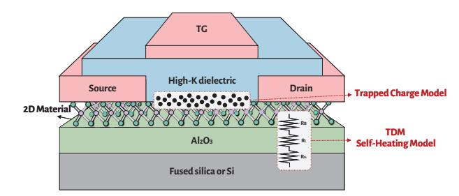

Fig. 3: Extension of baseline transistor models to 2D materials.

$$C_{ox}\left(V_{as} - V_{fb} - \varphi_s\right) = Q_m + Q_D + Q_t \tag{1}$$

where  $C_{ox}$  represents the gate-oxide capacitance per unit area,  $V_{fb}$  is the flat-band voltage,  $\varphi_s$  denotes the semiconductor potential,  $Q_m$ ,  $Q_D$ ,  $Q_t$  denotes the free charge density, dopant-induced charge density, and the trap-charged density introduced by this model, which  $Q_t$  is calculated as:

$$Q_t = q \cdot \sum_{i} \frac{D_{\text{trap},i}}{1 + \exp\left(\frac{V_{\text{ch}} - \varphi_s + E_{it,i}/q}{V_t}\right)}$$
(2)

where  $V_{ch}$  is the channel potential,  $D_{trap,i}$  and  $E_{it,i}$  are the trap density and trap energy level with respect to conduction band minima for the  $i_{th}$  number of trap level, respectively.

2) Self-Heating Model: High current density of 2D-material transistors can produce appreciable self-heating within the channel [31]. Moreover, heat dissipation is hindered by the high interface thermal resistance of 2D materials [32], leading to intensified self-heating effects in 2D-material transistors. Therefore, an explicit self-heating model is required, since thermal assumptions in conventional silicon transistor models are inadequate for 2D-material devices.

BSIM-CMG models self-heating through an equivalent thermal network with a thermal resistance  $R_{TH}$ , which incorporates three primary resistance components [21]: the thermal boundary resistance between the 2D-material channel and the bottom insulator  $R_B$ , the spreading resistance of the insulator  $R_i$ , and the spreading thermal resistance into the substrate

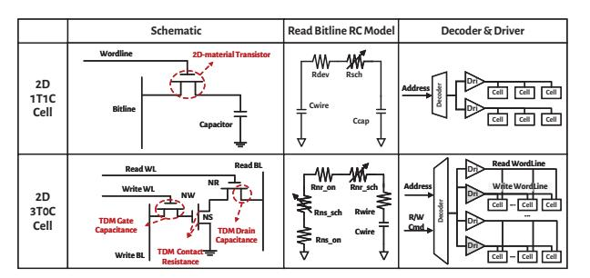

Fig. 4: Extension of the baseline cell model and array model to support 2D material features.

 $R_{Si}$ . Given that  $R_{TH}=R_B+R_i+R_{Si}$ , with  $R_B \propto \frac{1}{W}$ ,  $R_i \sim \frac{1}{W}$ , and  $R_{Si} \propto \frac{1}{\sqrt{W}}$  [33], the total thermal resistance in the self-heating network can be expressed as:

$$R_{TH} = \frac{R_{TH0}}{W} + \frac{R_{TH1}}{\sqrt{W}} \tag{3}$$

where  $R_{TH0}$  and  $R_{TH1}$  are empirical fitting coefficients, and W describes the effective device width.

These two extensions facilitate a more precise yet compact representation of 2D-material transistor behavior under realistic process conditions.

## B. TDM Memory Model

CACTI [19] serves as the baseline framework for modeling memory cells and arrays. Based on the specified memory type and TDM-Transistor parameters, the model performs circuit-level design space exploration to select cell technology, and returns the estimates of energy consumption, access latency, and area for the selected organization.

In contemporary processors, 6T-SRAM cells remain the dominant primitives for caches. Meanwhile, certain work explores DRAM cache designs that employ 1T1C-DRAM and 3T0C-DRAM cells to increase capacity density [34], [35]. However, the unavoidable charge leakage necessitates periodic refresh for DRAM caches, which introduces nontrivial energy overhead [36]. In practice, 3T0C-DRAM cells are rarely adopted because their shorter retention time demands a much higher refresh frequency [37], [38].

The ultra-low leakage of 2D-material transistors establishes a new design opportunity for 1T1C and 3T0C DRAM cells by slowing charge leakage and extending retention time, thereby reducing refresh frequency while mitigating associated energy and performance penalties [10], [39]. Although TDM-Transistor can also be employed in 6T-SRAM cells for lower leakage, the inherent structural complexity of the cell limits scalability and yields a negligible latency advantage. Guided by these considerations, we implement 1T1C and 3T0C DRAM cells in TDM-Memory using the simulation results of the TDM-Transistor model, as illustrated in Figure 4.

Although CACTI supports modeling of 1T1C DRAM [19], [37], and prior work extends it to 3T0C DRAM [37], its built-in models are calibrated for silicon and diverge significantly from the characteristics of 2D-material cells. First,

the capacitance formulation in 2D-material transistors differs from silicon transistors, and non-negligible Schottky contact resistances reshape the RC characteristics of bitline networks. Second, the characteristics of 2D FETs and memory cells can vary across the array due to process-induced nonuniformities in 2D FET fabrication (as discussed in Section VII).

To address these limitations, we extend CACTI with a gate capacitance model, a drain capacitance model, and a Schottky contact resistance model. Furthermore, we account for variability within the array. In addition, the decoder and driver designs are updated to reflect the architectural differences between the 3TOC and 1T1C arrays. The 3TOC array includes one additional input to the decoder and twice the number of drivers because the read and write transistors are separated.

1) Wordline Gate Capacitance Model: In 2D-material transistors, the atomically thin body and the intrinsically low density of states make the quantum capacitance effect particularly pronounced. [40], [41]. Because the gate capacitance is the series combination of quantum capacitance and oxide capacitance, the quantum capacitance can dominate the overall gate response. We therefore augment the gate-capacitance formulation to include parasitic contributions of 2D materials. The modified gate capacitance  $C_{gate}$  consists of the oxide capacitance per unit gate width  $C_{og}$ , quantum capacitance  $C_q$ , fringing capacitance  $C_{fr}$ , overlap capacitance  $C_{ov}$ , and the polysilicon line capacitance per unit length  $C_{pw}$ :

$$C_{\text{gate}} = \left(\frac{C_{og} \cdot C_q}{C_{og} + C_q} + C_{fr} + C_{ov}\right) \cdot W + C_{pw} \cdot L_{phy} \quad (4)$$

where W denotes the device width and  $L_{phy}$  denotes the physical length of the poly line entering the gate.

2) Bitline Drain Capacitance Model: The difficulty of achieving effective doping in 2D materials leads to expanded depletion regions at the source/drain-channel interfaces [42], [43]. Consequently, the junction capacitance in 2D-material transistors is suppressed, similar to the ideal SOI transistors [21], [44]. We therefore exclude the junction capacitance term from the drain-capacitance model and include only  $C_{fr}$ ,  $C_{ov}$ , and metal interconnect capacitances  $C_{metal}$ :

$$C_{\text{drain}} = (C_{fr} + C_{ov}) \cdot H_{\text{drain}} + C_{\text{metal}} \cdot W_{\text{drain}}$$
 (5)

where  $H_{drain}$  denotes the total drain height for capacitance with respect to the gate, and the  $W_{drain}$  denotes the total drain width.

3) Bitline Schottky Contact Resistance Model: The limited dopability of 2D-channel-materials precludes the use of heavy active-region doping to realize low-resistance ohmic contacts. As a result, 2D-material transistors inherently exhibit Schottky contact resistance [45]:

$$R_{\rm sch} \propto \exp(-V_{gs}) + \exp(-V_{gd})$$
 (6)

where  $R_{sch}$  is voltage dependent and varies with the gate-source voltage  $V_{gs}$  and the gate-drain voltage  $V_{gd}$ . During simulation, the TDM-Memory model calculates  $R_{sch}$  from the RC abstraction of the array and cell at the applied voltage, then integrates it into the bitline model.

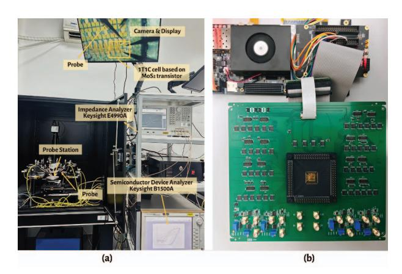

Fig. 5: Experimental validation setup for (a) TDM-Transistor and (b) TDM-Memory models.

*4) Variability Model:* TDM-Memory incorporates a variability model derived from small-scale fabricated arrays and extrapolates it for large-scale caches. TDMSim leverages a broad range of transistor configurations from TDM-Transistor, whereas conventional CACTI models typically use a single FET configuration. TDMSim accounts for variations based on each cell's location within the array; for example, accesses at the array edges may incur longer latency. Static power is computed by weighting all transistor configurations according to their distribution across the array.

## IV. MODEL VALIDATION

## *A. Experimental Setup*

Figure 5a illustrates the device-level experimental platform used to validate the proposed TDMSim toolkit. The platform consists of a probe station integrated with a Keysight B1500A Semiconductor Device Analyzer and a Keysight E4990A Impedance Analyzer. Fabricated 2D-material transistor and cache cells are mounted on the probe chuck for measurement of key electrical quantities. The resulting measurements are used to extract the I–V and impedance characteristics required for model parameterization. Figure 5b depicts the experimental platform for evaluating memory arrays fabricated with 2Dmaterial transistors. This setup measures the access latency on actual tapeout arrays and compares the results with TDM-Memory model simulations, providing calibration data and quantitative validation of model accuracy.

The fabricated short-channel transistors use a CVD-grown monolayer MoS2/sapphire substrate [46]. Fabrication involved electron-beam lithography to pattern Au source and drain electrodes, atomic-layer deposition of a high-k HfO2 as the gate dielectric, and electron-beam evaporation of the top Au gate [47], [48]. These transistors have a channel length of 30 nm and a contacted gate pitch (CGP) of 130 nm, exhibiting low contact resistance and high on/off current ratio.

## *B. 2D-material Transistor Validation*

The proposed TDM-Transistor model is validated against experimental data collected from the fabricated 2D-material

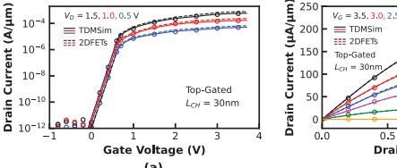

Fig. 6: Validation result of the TDM-Transistor model: comparison with (a) the measured Id–Vg and (b) Id–Vd characteristics of a typical fabricated 2D-material transistor.

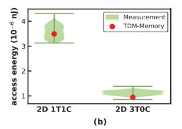

Fig. 7: Cell-level validation results of the TDM-Memory model: (a) access latency, (b) access energy.

transistors. As illustrated in Figure 6, the TDM-Transistor model accurately reproduces the measured Id–Vg and Id–Vd characteristics, demonstrating higher fidelity compared with the baseline model [18].

Figure 6 shows that the fabricated top-gated transistor exhibits an on-state current exceeding 200 A/m and an offstate current below 10−12 A/μm, which is primarily limited by the resolution of the measurement instrument and even lower in practice. To estimate the off-current, a logic high is first written into the DRAM cell, after which the access transistor is turned off. The voltage variation across the capacitor is then measured over time, from which we derive the off-current. At 330K, the average off-current is approximately 10−17 A/μm, with a peak value reaching around 10−15 A/μm, demonstrating excellent leakage suppression and strong electrostatic control.

## *C. 2D-material Memory Cell Validation*

The TDM-Memory model captures behavior at both the cell and array organization, and each is validated against measurements from fabricated chips. Cell-level validation targets the evaluation of access latency and energy consumption on 2D 1T1C and 3T0C cells. The simulated results are compared with the data collected from the test platform shown in Figure 5.

Figure 7 shows the validation results, where violin plots summarize the distributions across one hundred measured samples, and superimposed scatter points indicate predictions from the TDM-Memory model. The strong alignment between the simulation results and the measurements for both single-cell access latency and power consumption confirms the accuracy of the model. Meanwhile, the low access latency and energy consumption of a single cell highlight its potential for efficient integration into larger systems.

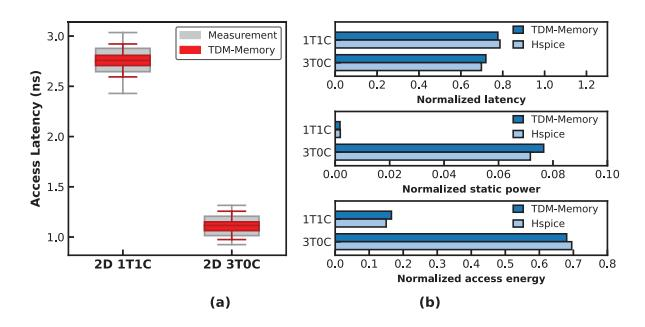

Fig. 8: Array-level validation results of the TDM-Memory model: comparison with (a) the fabricated cache and (b) the large-scale cache evaluated in Hspice. The results of (b) are normalized to the 32MB SRAM cache.

#### *D. 2D-material Memory Array Validation*

The validation of the TDM-Memory model at the array level is conducted in two stages. The first stage verifies correctness by comparing model predictions with measurements from a taped-out memory array fabricated with 2D-material 1T1C and 3T0C cells. Since large-scale arrays fabricated with 2D materials are beyond our current fabrication capabilities, we then construct an Hspice reference to examine the scalability of TDM-Memory. To ensure scientific rigor, all device and cell parameters in the large-scale reference are fixed to the values calibrated from small-scale tape-outs without any additional tuning. Peripheral circuits for the large-scale design are adopted from previously fabricated and verified Hspice implementations [49], [50].

Figure 8a presents the fabricated and simulated access latency of the 2D-material arrays. The box plots depict the statistical distribution of the measured data and TDM-Memory, respectively. The close agreement between them confirms that TDM-Memory accurately captures the timing behavior and variability of 2D-material memory arrays. Figure 8b shows the validation results for a 32 MB DRAM-cache array and its peripheral circuits, where TDM-Memory closely tracks the Hspice reference for access latency, static power, and dynamic energy, with deviations under 6%. These results demonstrate that TDM-Memory maintains accuracy at scale and is suitable for system-level performance and energy analysis across arbitrary array sizes.

# V. MODELING RESULTS

Building on the validated TDMSim tool, this section evaluates the effectiveness of different 2D-material cell based DRAM caches. The 2D DRAM cache is organized as an LHcache [51] with 16-way associativity and 16 banks, wherein a single DRAM row constitutes a cache set, with memory cells partitioned into multiple ways for both tags and data. Specifically, several ways are reserved for tag storage, while the remaining ways store data. Upon a tag access, the memory controller first issues activation and read commands to load the entire row into the row buffer. The controller subsequently reads tag bits from tag ways to determine a hit. The row

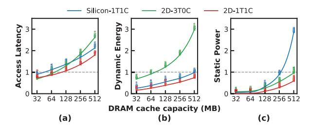

Fig. 9: (a) Access latency, (b) dynamic energy, and (c) static power of DRAM caches based on different cell structures and materials as capacity increases. Values are normalized to the 32MB SRAM cache. The scatter points represent feasible configurations identified during the design space exploration.

buffer is then reserved to prevent it from being closed by other requests, thereby ensuring a row buffer hit on a cache hit.

To align with the system configuration detailed in Section VI, the baseline employs a 32 MB 6T-SRAM LLC implemented in a 30 nm process node, with a CGP matched to that of our 2D-DRAM tape-outs [52]. All caches considered in the comparison utilize the same 30 nm silicon process for peripheral circuits and interconnects, providing a consistent basis for evaluation.

The layout area of this 32 MB 6T-SRAM LLC serves as the reference budget for systematically exploring feasible compositions. Within this area constraint, we examine three alternatives: Silicon-1T1C, 2D-1T1C, and 2D-3T0C. The refresh strategy follows JEDEC DDR4 standards [53], with a reduced refresh rate to accommodate 2D-material retention characteristics. In the Silicon-1T1C baseline, rows are refreshed every 64 ms. For 2D-material caches, the cycles are conservatively set to 0.5 s for 2D-1T1C and 0.1 s for 2D-3T0C, corresponding to a roughly 20× safety margin over the measured minimum retention time.

## *A. Access Latency Evaluation*

Figure 9a illustrates the relationship between access latency and capacity for Silicon-1T1C, 2D-1T1C, and 2D-3T0C DRAM cache, normalized to a 32 MB SRAM cache. The 1T1C structures achieve up to 512 MB within an area comparable to a 32 MB SRAM cache, offering exceptional area efficiency due to its high integration density. In contrast, the 3T0C structure provides approximately twice the density of SRAM [38], allowing a maximum capacity of around 64 MB within the same area constraint.

At 32 MB, the 2D-3T0C structure exhibits the lowest access latency, driven by two primary factors. First, its higher integration density compared to 6T-SRAM results in a smaller layout area at the same capacity, which substantially reduces the interconnect delay. Second, the 3T0C structure reads data through a float node discharge, thus faster than 1T1C.

As cache capacity grows to 64 MB and beyond, the 1T1C structure exhibits significantly lower access latency than the 3T0C and 6T-SRAM structures of equivalent capacity, owing to its high integration density and compact layout. At 128 MB, although the capacity is 4× larger than the baseline, the 2D-1T1C structure still maintains comparable access latency.

Across all evaluated capacities, the 2D-1T1C DRAM cache consistently exhibits robust performance, delivering about 12 ∼ 18% higher performance than the Silicon 1T1C DRAM cache. This improvement stems from the higher integration density enabled by the smaller 2D-material device size. While Figure 9a reports single-access latency, the reduced refresh frequency of 2D-material DRAM caches is expected to yield even greater performance gains in realistic GPU systems. We demonstrate this in Section VI.

#### *B. Dynamic Energy Evaluation*

Figure 9b illustrates the dynamic energy consumption as a function of cache capacity. For caches of such large capacity, dynamic energy is dominated by interconnects and exhibits weak dependence on the cell structure [54]. Under these conditions, higher cell density generally leads to lower dynamic energy. Therefore, the 2D-3T0C structure reduces dynamic energy by approximately 30% at 32 MB compared with the baseline, primarily due to its nearly halved cell area. The 2D-1T1C structure maintains dynamic energy below the baseline up to 256 MB, as its layout area remains smaller than the baseline design. When the capacity reaches 512 MB, however, the dynamic energy of 1T1C structures exceeds the baseline because they require additional restore operations that can increase energy consumption [55].

At equal capacity, 2D-material DRAM caches exhibit lower dynamic power than their silicon counterparts for two reasons. First, the smaller device dimensions reduce interconnect and driver energy by shrinking the total array area. Second, the lower leakage of 2D materials enables smaller storage capacitors in a 1T1C structure, which further lowers dynamic energy.

## *C. Static Power Evaluation*

Figure 9c reports static power across capacities for three designs, with refresh power included in the totals. At 32 MB, both 2D-1T1C and 2D-3T0C structures exhibit only 1.7% and 8% of the baseline static power due to their strong leakage suppression. The 2D-3T0C structure stores charge in the gate parasitic capacitance, which shortens retention and increases refresh frequency. Hence, 2D-3T0C structures inherently incur higher static power than their 2D-1T1C counterparts.

The static power of the Silicon-1T1C structure scales poorly with capacity and reaches roughly about 2 ∼ 3× the baseline at 512MB. Each refresh operation can incur substantial overhead in large arrays because the large cell population and long interconnects raise RC parasitics on wordlines and bitlines. In contrast, the 2D-1T1C structure refreshes far less frequently, thereby reducing refresh power and keeping static power near 87% of the SRAM baseline at 512MB and about 30.6% of an iso-capacity Silicon-1T1C cache. These results indicate that the 2D-1T1C structure achieves superior power performance over silicon-based counterparts, and the advantage increases with capacity and array size.

TABLE II: System Configurations.

| Parameter                                                                      | Value                                             |  |  |
|--------------------------------------------------------------------------------|---------------------------------------------------|--|--|
| Number CUs                                                                     | 40                                                |  |  |
| Frequency                                                                      | 1 GHz                                             |  |  |
| Num SIMD per CU                                                                | 4                                                 |  |  |
| Wavefront per SIMD                                                             | 10                                                |  |  |
| Wavefront Size                                                                 | 64                                                |  |  |
| Vector Register per CU                                                         | 128 KiB                                           |  |  |
| L1 Data Cache                                                                  | 32 KiB, 128 B line, 16 ways, treePLRU, 55 cycles  |  |  |
| L2 Cache                                                                       | 4 MiB, 128 B line, 16 ways, treePLRU, 100 cycles  |  |  |
| LLC                                                                            | 32 MiB, 128 B line, 16 ways, treePLRU, 200 cycles |  |  |
| Number HBM Stacks                                                              | 2                                                 |  |  |
| Main Memory                                                                    |                                                   |  |  |
| 24 GiB, FR-FCFS, HBM3, 660GB/s, 64 entries/read queue, 128 entries/write queue |                                                   |  |  |
| HBM Timing                                                                     |                                                   |  |  |
| tRCD=12, tRCD WR=6, tCCD L=2, tRP=14, tRAD=28,                                 |                                                   |  |  |
| tCL=18, tCWL=7, tRRD=2, tXAW=16, tRL core=2, tRTW int=1                        |                                                   |  |  |

## VI. 2D-MATERIAL DRAM CACHES ARCHITECTURE MODELING

Based on the preceding latency and power analyses, this section performs a system-level evaluation of representative DRAM cache candidates emerging from the cross-dimensional exploration of device materials, cell structures, and capacities, analyzing their performance on realistic workloads.

#### *A. System Architecture Setup*

We construct a full CPU-GPU heterogeneous system using the cycle-accurate gem5 simulator [25]. Because our study focuses on the impact of alternative LLC configurations on GPU performance, we run gem5 in KVM mode for the CPU to expedite simulation and attach a detailed GPU model over a modeled PCIe interconnect, consistent with common practice. The system boots an operating system and executes widely used GPU workloads. Our simulation framework is based on the AMD MI300X GPU architecture. To mitigate the prohibitive runtime associated with full-scale simulations, we evaluate a single-XCD configuration, which captures representative system behavior without loss of generality. The number of HBM stacks and the corresponding cache capacities are scaled proportionally, as summarized in Table II. Furthermore, we extend the gem5 MI300X model to include a DRAM cache component that accurately characterizes the observed operational behaviors of 2D-material caches, including the requirement for periodic refresh operations.

We evaluate twelve applications drawn from the Pannotia [56], Rodinia [57], AMDSDK [58], Llama [59], and MLPerf [60]. These workloads are widely used in prior GPUarchitecture studies and have been identified as exhibiting dataintensive memory behaviors [6], [61], [62], thereby providing a representative stress test for large LLCs. Each application runs to completion. Gem5 combines access and refresh statistics with TDMSim-provided access latency, dynamic energy, and static energy parameters to derive system-level performance and cache energy consumption.

We select nine representative configurations for system-level LLC evaluation, as illustrated in the legends of Figure 10 and Figure 11. Each configuration follows the naming format *material structure capacity*. For instance, the *2D 1T1C 128* refers to a 128-MB 2D-material 1T1C DRAM cache. The

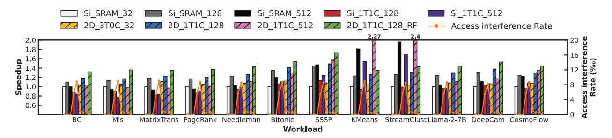

Fig. 10: Performance and access interference rate comparison of several DRAM cache configurations for common GPU workloads. The shaded regions denote configurations based on 2D-material DRAM caches.

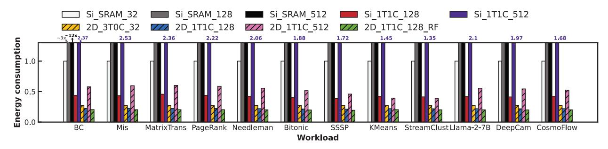

Fig. 11: Energy consumption comparison of several DRAM cache configurations for common GPU workloads.

selected configurations span key design points in the comprehensive trade-off space. The *2D 3T0C 32* represents the lowest-latency design point due to its fast 3T0C cell structure. Conversely, the 512-MB design represents the highest capacity achievable under a 32-MB SRAM area budget. As shown in Section V, the *2D 1T1C 128* provides a balanced operating point, achieving significantly higher capacity and energy efficiency while maintaining access latency comparable to the baseline *Si SRAM 32*, and is therefore identified as the baseline 2D-material DRAM cache design. All subsequent evaluations of the retention-aware and refresh-free policies are conducted based on this configuration (i.e., *2D 1T1C 128 RA* and *2D 1T1C 128 RF*). The 2D 1T1C 128 RF eliminates refresh, thereby serving as the upper bound for performance and the lower bound for energy consumption. To contextualize the benefits of 2D material, we include silicon-based DRAM designs (e.g., *Si 1T1C 128*) for comparison. We also consider *Si SRAM 128* and *Si SRAM 512* to better illustrate the performance, though these configurations are not feasible within the layout budget.

Section VII provides a detailed analysis of the proposed 2Dmaterial DRAM cache with the state-of-the-art DRAM cache techniques TDRAM [63], BEAR [64] and NDC [35].

## *B. 2D-material Dram Caches Performance*

Figure 10 reports workload speedup and access interference probability under eight configurations. The *2D 3T0C 32* yields a 6.7% performance improvement, attributable to its reduced access latency. The *2D 1T1C 512* delivers notable gains on workloads that benefit from the larger capacity, but its substantially higher access latency suppresses improvements on others. The *2D 1T1C 128* is the most stable design, with an average speedup of 28.8%. In contrast, frequent refresh causes slowdowns for the *Si 1T1C 128* on several workloads, despite providing 4× capacity of the baseline.

We define the access interference rate as the fraction of requests mapped to a DRAM cache bank that is undergoing refresh and cannot be served. The *Si SRAM 32* and *2D 1T1C 128 RF* require no refresh and therefore exhibit zero conflicts. The *2D 1T1C 128* also shows a near-zero access interference rate because long retention permits infrequent refresh. By contrast, the *Si 1T1C 128* incurs noticeably higher access interference rates, which raises overall memory access latency even when their cell access latency is comparable to that of the *2D 1T1C 128*. These findings indicate that suppressing refresh interference enables 2D-material DRAM caches to remain competitive as a large LLC.

#### *C. 2D-material Dram Caches Energy Consumption*

Figure 11 reports total cache energy consumption during workload execution, including static energy, refresh energy, and dynamic access energy, normalized to the *Si SRAM 32*. The results show that all evaluated configurations reduce energy consumption relative to the *Si SRAM 32*, either due to the simpler structure or the low-leakage characteristics of the 2D material. The *2D 1T1C 128* achieves the lowest total energy consumption among all evaluated configurations. Despite offering 4× capacity of the *Si SRAM 32* configuration, it still reduces energy consumption by 77.8%. In contrast, the *Si 1T1C 128* provides comparable capacity but experiences frequent refresh and higher static energy, yielding roughly twice the energy consumption. Compared to

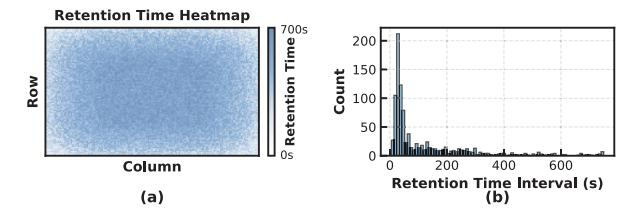

Fig. 12: (a) Spatial retention time map of a 2D-material array. (b) Distribution of retention time across all cells.

the *2D 1T1C 128*, the *2D 3T0C 32* exhibits higher energy consumption due to its more frequent refresh operations. The *2D 1T1C 512* consumes more energy overall because its large capacity raises both dynamic and static components. Overall, these results indicate that the proposed 2D-material DRAM caches deliver substantial energy advantages over both SRAM and silicon 1T1C designs while maintaining stable efficiency across diverse GPU workloads.

Figure 10 and Figure 11 both indicate that the *2D 1T1C 128* still falls short of the refresh-free configuration in both energy and performance. Section VII analyzes the sources of this gap and introduces optimizations that further approach the ideal limit.

## VII. RETENTION-AWARE POLICY

Building on TDMSim and the GPU memory hierarchy framework introduced in Section VI, this section introduces the intrinsic retention-time variability of 2D-material arrays and proposes a retention-aware policy to push 2D-material DRAM caches toward their ideal performance limit.

## *A. Characterization of Retention-time Variability*

In practice, 2D-material memory arrays exhibit intrinsic non-uniformity in retention time. Measurements from our 2Dmaterial memory arrays reveal a consistent radial retention gradient, where cells near the array periphery retain charge for shorter durations than interior cells. This gradient likely stems from lithography proximity effects, contact resistance variation, and local interconnect parasitics, all of which exacerbate off-state leakage at the boundaries [65], [66]. Figure 12a visualizes the measured retention time map, while Figure 12b summarizes that 2D-material cells exhibit retention spanning 10 s to 700 s, and the vast majority of cells exceed 30 s retention time. To maintain data integrity under temperature variation reaching 360 K and process-induced tail cells, the baseline refresh rate is conservatively set to 0.5 s, providing a roughly 20× safety margin over the measured minimum retention time. This conservative configuration is necessary to accommodate the weakest cells but consequently demands a higher refresh frequency, leading to additional performance overheads.

## *B. Design of Retention-aware Policy*

The measured retention-time distribution indicates considerable headroom for further performance improvement, as only about 20% of cells exhibit retention below 30 s. Although prior studies have extensively investigated cell retention variability in silicon DRAM [36], [67], [68], these approaches are not directly applicable to 2D-material DRAM caches. Existing methods typically assume that weak cells are randomly distributed across the memory array [69], allowing variability to be addressed at the row level. In contrast, 2D-material arrays exhibit a pronounced radial retention gradient. Applying conventional row-level techniques to such a spatially structured distribution would prevent optimal tuning of refresh cycles, as each row would inevitably contain edge tiers with short retention times. Furthermore, previous works do not consider the placement of hot data within leaky regions, which could significantly constrain achievable performance improvements.

To address the retention-time variability inherent in 2Dmaterial DRAM arrays, we propose a *retention-aware policy* composed of three complementary mechanisms: *refresh scheduling*, *cyclic replacement*, and *hot-page remapping*. Each mechanism targets a distinct aspect of array-level variability, and together they optimize reliability, performance, and energy efficiency. As illustrated in Figure 13, the policy coordinates refresh cycles and data placement according to the spatial retention profile of the array, providing a systematic architectural solution to device-level non-uniformity.

*1) Refresh Scheduling:* The refresh scheduling organizes the array along both vertical and horizontal axes. From the vertical perspective, rows near the array edges, which exhibit the weakest retention, are assigned a conservative 0.5 s refresh cycle, while central rows with predominantly longer-retention tiers are refreshed less frequently.

Horizontally, a group of adjacent memory cells within a DRAM row constitutes the physical retention tier, which serves as the minimum granularity for characterizing nonuniform retention time. Multiple physical retention tiers are consolidated to map a single architectural cache way. Since the tiers adjacent to the left and right edges typically exhibit shorter retention times, cache ways containing these tiers are subject to strict allocation constraints. These ways are exclusively reserved for clean blocks, such as instructions and prefetched data, forming what we refer to as *clean ways*. Such constraints guarantee that data stored in these ways neither requires snoop operations to upstream caches with non-inclusive strategies nor needs to be written back, since the contents are coherent with main memory. Each row is equipped with a validity indicator implemented as a counter that increments over time and is reset to zero upon a write or refresh operation. When the counter reaches a pre-defined threshold, the clean cache way is considered invalid, signaling a potential retention-time violation. This mechanism allows the controller to safely detect violations and refill the data from the backing store without corrupting architectural state. Ultimately, these allocation constraints guarantee that leakageprone edge tiers do not compromise overall cache coherence and enable the refresh cycle for central rows to be safely extended to 1.5 s. The behavior of this policy has been formally validated with the Murphi model checker [70].

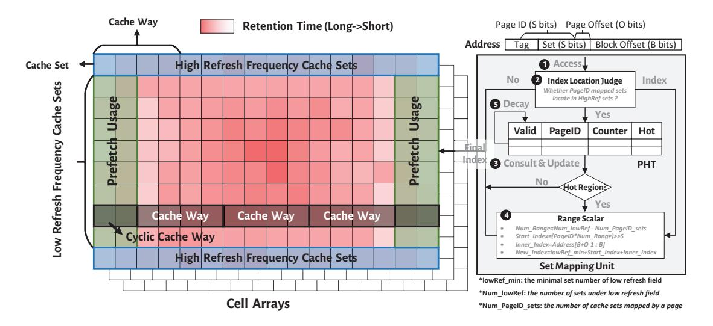

Fig. 13: Overview of the retention-aware policy.

*2) Cyclic Replacement:* In a typical row, reserving separate clean ways for edge tiers would consume considerable space. By logically connecting the leftmost and rightmost ends of the row, it becomes possible to consolidate these weak tiers into a single dedicated structure, reducing the number of required clean ways.

Inspired by this, the leftmost and rightmost weak tiers are grouped into dedicated cyclic cache ways, as illustrated in Figure 13. This design minimizes the spatial overhead of clean ways while maintaining data integrity, reducing the likelihood of retention violations and improving the efficiency of the refresh scheduling. In addition, tag information is strictly mapped to non-cyclic cache ways to ensure tag validity throughout the standard refresh interval.

*3) Hot-Page Remapping:* The array is partitioned into highrefresh (HighRef) and low-refresh (LowRef) regions due to refresh scheduling, as illustrated in Figure 13. Placing frequently accessed pages in HighRef sets can lead to stalls during refresh operations, degrading performance. To mitigate this, the hotpage remapping mechanism dynamically relocates hot pages from HighRef to LowRef sets. Each memory access is evaluated by the Index Location Judge and the Page Hotness Table (PHT) to determine hotness; the Range Scalar computes the remapped set index. Counters in the PHT are periodically aged to reflect temporal hotness changes, and previous mappings are invalidated upon promotion to ensure coherence.

Upon each memory access (❶), the Index Location Judge determines whether the access falls within the HighRef sets (❷). If so, it consults the Page Hotness Table (PHT) to determine whether the corresponding page is classified as hot or cold (❸). When a page is marked hot, the Range Scalar applies the designated scaling factors to remap the access to the LowRef sets (❹); otherwise, the original set index is retained. In this process, the Range Scalar computes the remapped set index by combining the minimum boundary of the low-refresh region, the intra-page offset, and the PageID- shifted starting position. Each memory access may also update the PHT. Specifically, if a memory access to the HighRef sets stalls due to a refresh operation, an entry is recorded in the PHT, and subsequent accesses increment the counter. Once the counter saturates, the page is promoted to hot. To model temporal aging, all PHT counters are periodically halved every 10K accesses, enabling a renewed evaluation of regional hotness (❺). Finally, when a page's hotness state changes, the mechanism invalidates data residing in the sets associated with the previous mapping, ensuring coherence and promptly reclaiming cache capacity for hotter pages.

#### *C. Overhead*

The set mapping unit is implemented at the Register-Transfer Level with a four-stage pipeline. Its latency is negligible relative to the overall DRAM cache access, which typically spans tens of cycles. The hardware overhead of the proposed retention-aware policy primarily arises from the PHT. Each PHT entry contains 26 bits, including a 16-bit page ID and an 8-bit counter, resulting in a total storage cost of approximately 13KB for 4K entries. In addition, the per-row validity indicators incur an extra storage overhead of 46KB. This overhead is minimal compared to the DRAM cache layout area, while the additional logic for cache index calculation, range scaling, and cold-page invalidation contributes only marginally to the total hardware cost, resulting in an insignificant increase in chip area.

#### *D. Ablation Study of the Retention-Aware Policy*

We evaluate the contribution of each component in the retention-aware policy using the system model described in Section VI, with results shown in Figure 14.

The *refresh scheduling*, which extends the refresh cycle of central rows, reduces access interference and refresh energy, yielding an 8.7% improvement in system performance and a 65.4% reduction in refresh energy. Incorporation of the

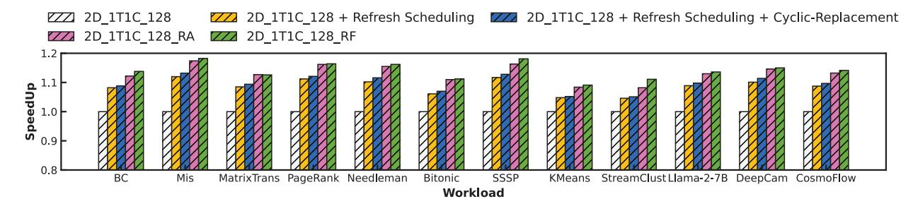

Fig. 14: Evaluation of system performance for 2D-material DRAM caches with the proposed retention-aware policy.

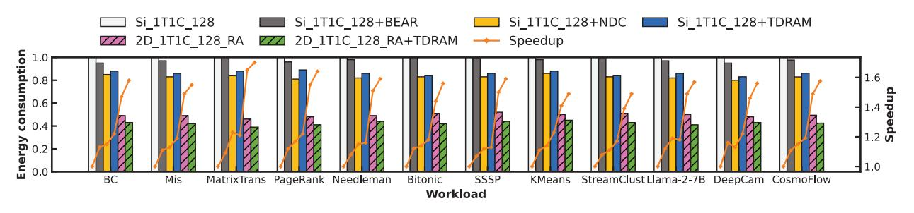

Fig. 15: Comparison of normalized energy consumption and performance among silicon DRAM caches with prior DRAMcache techniques, 2D-material DRAM caches with the proposed retention-aware policy, and the TDRAM design [63].

*cyclic-replacement* mechanism, which consolidates weak edge tiers, further enhances performance by 0.9%. Finally, the *hotpage remapping* mechanism directs frequently accessed data away from HighRef sets, mitigating refresh-induced stalls and contributing an additional 3.7% performance improvement.

In combination, these mechanisms result in a total performance improvement of 13.3% and a 65.4% reduction in refresh energy relative to the 2D-material DRAM cache without the retention-aware refresh policy, and a 42.1% higher performance and 79.4% lower total energy consumption compared to the baseline SRAM system.

Overall, this study demonstrates how TDMSim systematically translates 2D-material device insights into architecturelevel optimizations, establishing a general methodology for future exploration of emerging memory technologies.

## *E. Analysis with conventional DRAM cache technologies*

Figure 15 also compares the proposed 2D-material DRAM cache with representative silicon 1T1C DRAM cache technologies, including BEAR [64], TDRAM [63], and NDC [35]. While these prior designs improve DRAM cache efficiency through optimizations such as fine-grained tag placement, adaptive refresh scheduling, and locality-aware data mapping, the 2D-material DRAM cache still achieves higher performance and lower energy consumption.

In essence, the benefits of 2D-material cells are orthogonal to prior DRAM-cache optimizations and can be applied concurrently. As shown in Figure 15, integrating the proposed retention-aware policy with the state-of-the-art TDRAM yields an additional 5% performance improvement and 15.6% energy reduction compared with the standalone 2D-material DRAM cache. These results demonstrate that material-level enhancements complement existing DRAM-cache designs and expand the overall optimization space for future architectures.

## VIII. RELATED WORK

Research on DRAM caches focuses on exploring tag/data organization and cache management policies. TDRAM [63] embeds an in-DRAM tag probing mechanism that overlaps tag checks with data transfers, reducing queuing delay and read-miss latency without altering the DRAM array. NDC [35] re-architects DRAM to natively support cache functionality by performing tag matching, way selection, and replacement entirely within each subarray, achieving high associativity and near-DRAM latency. BEAR [64] reduces DRAM-cache bandwidth overhead by co-optimizing miss handling and tag probing, improving performance and efficiency without altering the DRAM array. Overall, these designs trade off hit latency, bandwidth cost, and system complexity to meet different architectural goals.

Within 2D materials, MoS2 has emerged as a leading channel material because its atomically thin body enables strong electrostatic control, favorable transport characteristics, and compatibility with layer-stacked integration. Zhong et al. [71] demonstrated nondestructive threshold-voltage tuning in MoS2 FETs using Al2O3 interlayers, enabling well-matched p/n-type devices for high-performance CMOS circuits. Yu et al. [72] reported monolithic integration of MoS2 transistors with three-dimensional vertical RRAM at sub-300 °C process temperatures, where MoS2 FETs drive multi-level RRAM states and circuit-level simulations indicate smaller area and lower energy than planar implementations. At the system level, Ao et al. [73] integrated approximately 5900 MoS2 transistors into a 32-bit RISC-V processor, demonstrating the scalability of MoS2 devices for system-level logic integration.

Research on DRAM caches and 2D materials has advanced considerably, but work bridging these fields remains limited. Addressing this gap is crucial for integrating emerging materials into computer architectures. Prior studies that cooptimize devices and architecture under unconventional conditions highlight this opportunity. Lee et al. [74] develop a simulation framework for low-temperature DRAM and propose temperature-aware designs at 77 K that reduce power and improve access latency in CMOS systems. Min et al. [37] examine cache hierarchies under cryogenic conditions, and their CryoCache architecture, combining 6T-SRAM and 3TeDRAM cells, achieves higher access speeds at 77 K compared with room temperature.

## IX. DISCUSS ON FUTURE RESEARCH

- *1) Broad Applicability:* Although this work focuses on GPU workloads, the proposed 2D-material DRAM cache architecture and TDMSim toolkit are not limited to GPUs. To demonstrate broader applicability, we additionally evaluate representative HPC and ML workloads, observing consistent improvements as shown in Figure 10. Since these gains stem from improved cache capacity and energy efficiency, the same advantages naturally extend to CPU systems running memoryintensive applications.
- *2) Extensibility:* TDMSim is designed with modularity and extensibility as core principles, allowing design space exploration across a wide range of transistor configurations.

At the device modeling level, TDMSim adopts a generic analytical model with an automated calibration flow. Instead of rebuilding models for different 2D materials or device structures, their variations are captured through key electrical parameters (e.g., on-current, subthreshold swing and Schottky resistance) [75]–[77]. By calibrating model coefficients, TDM-Sim can accurately reproduce the I–V characteristics of a wide range of reported or newly proposed 2D FETs. We further validate this capability using representative devices [78]–[82]. Table III summarizes these validated devices, illustrating the versatility and coverage of the modeling framework.

At the architecture level, TDMSim decouples device characteristics from system simulation through standardized interfaces, abstracting device variations into key metrics such as latency, power, and retention. For example, TDMSim can quantify the impact of contact resistance on read/write latency across array locations. This design supports diverse transistor technologies for comprehensive design space exploration without modifying the simulator framework.

*3) Architectural Opportunities Enabled by TDMSim:* TDMSim opens opportunities for architecture–device codesign opportunities beyond the scope of this paper. Historically, NAND Flash evolved from an unreliable device

TABLE III: Validated Device Categories in TDMSim

| 2D Materials       | MoS2, WS2                            |  |  |
|--------------------|--------------------------------------|--|--|
| Gate Structures    | top-gate, back-gate, dual-gate       |  |  |
| Contact Structures | top-contact, edge-contact            |  |  |
| Channel Lengths    | 30nm, 55nm, 60nm, 75nm               |  |  |
|                    | 100nm, 200nm, 1um, 5um               |  |  |
| Process Features   | Au/Ti/Ni composite contact electrode |  |  |
|                    | hBN interfacial layer                |  |  |
|                    | novel self-aligned process           |  |  |

into a cornerstone of modern AI infrastructure through fullstack modeling frameworks [83]–[85] that connected device non-idealities with architectural mechanisms such as wearleveling [86] and bad-block management [87]. TDMSim aims to play a similar role for 2D materials, enabling architects to translate device properties into system-level innovations. Promising research directions include (1) native sparsity support, where the high on/off ratio of 2D transistors enables hardware-level zero-skipping for efficient sparse AI inference; (2) dynamic precision storage, leveraging multi-bit cells to adapt memory precision across neural network layers; and (3) dense 3D compute-in-memory architectures, exploiting the atomic thickness of 2D materials to tightly integrate logic and memory and significantly reduce data movement.

*4) Technology Scaling Outlook:* The 30 nm SRAM baseline used in this paper corresponds to the contacted gate pitch of our fabricated 2D devices used for model calibration. While current yield constraints limit our own advanced-node tapeouts, we extend our evaluation using parameters extracted from recently reported Si 7 nm-equivalent 2D material devices [78]. TDMSim reports that a DRAM cache based on these devices outperforms 7 nm SRAM by 27.6% in performance and 85.9% in energy efficiency, highlighting its long-term potential. Prior studies further suggest that 2D FETs may offer superior scaling characteristics compared with silicon devices [75], [88], [89]. As fabrication technologies mature, TDMSim will play an important role in accelerating the integration of 2D materials into future processor architectures.

## X. CONCLUSION

As the scale of LLM inference and HPC workloads continues to grow, conventional GPUs are increasingly limited by memory capacity and energy budgets. This work presents TDMSim, a cross-level simulation toolkit that links 2Dmaterial device physics to circuit and system behavior. Leveraging TDMSim, we integrate 2D-material DRAM cache into a CPU-GPU system and propose a retention-aware policy that exploits spatial retention-time variability with practical overheads. Evaluation shows that 2D-material DRAM caches with the proposed policy improve performance by up to 42.1% and reduce energy by up to 79.4% compared with conventional SRAM caches. Overall, TDMSim provides a concrete design paradigm for integrating 2D-material memory hierarchies into modern architectures, and it will be released as open source, providing a quantitative approach for more emerging materials into arbitrary system architectures.

## REFERENCES

- [1] NVIDIA Corporation, "NVIDIA Tesla P100 whitepaper," NVIDIA Corporation, Tech. Rep., Apr 2016. [Online]. Available: https://images.nvidia.com/content/pdf/tesla/whitepaper/ pascal-architecture-whitepaper.pdf
- [2] J. Hong, S. Cho, G. Park, W. Yang, Y.-H. Gong, and G. Kim, "Bandwidth-effective dram cache for gpu s with storage-class memory," in *2024 IEEE International Symposium on High-Performance Computer Architecture (HPCA)*. IEEE, 2024, pp. 139–155.
- [3] L. Wang, J. Ye, Y. Zhao, W. Wu, A. Li, S. L. Song, Z. Xu, and T. Kraska, "Superneurons: Dynamic gpu memory management for training deep neural networks," in *Proceedings of the 23rd ACM SIGPLAN symposium on principles and practice of parallel programming*, 2018, pp. 41–53.
- [4] M. Andersch, G. Palmer, R. Krashinsky, N. Stam, V. Mehta, G. Brito, and S. Ramaswamy. (2022, mar) Nvidia hopper architecture in-depth. NVIDIA Technical Blog. [Online]. Available: https://developer.nvidia. com/blog/nvidia-hopper-architecture-in-depth/
- [5] P. Alcorn. (2023, dec) Amd unveils instinct mi300x gpu and mi300a apu, claims up to 1.6x lead over nvidia's competing gpus. Accessed: December 7, 2023. [Online]. Available: https://www.tomshardware.com/tech-industry/amd-unveils-instinctmi300x-gpu-and-mi300a-apu-claims-up-to-16x-lead-over-nvidiascompeting-gpus
- [6] S. Darabi, M. Sadrosadati, N. Akbarzadeh, J. Lindegger, M. Hosseini, J. Park, J. Gomez-Luna, O. Mutlu, and H. Sarbazi-Azad, "Morpheus: ´ Extending the last level cache capacity in gpu systems using idle gpu core resources," in *2022 55th IEEE/ACM International Symposium on Microarchitecture (MICRO)*. IEEE, 2022, pp. 228–244.
- [7] R. Pope, S. Douglas, A. Chowdhery, J. Devlin, J. Bradbury, J. Heek, K. Xiao, S. Agrawal, and J. Dean, "Efficiently scaling transformer inference," *Proceedings of machine learning and systems*, vol. 5, pp. 606–624, 2023.
- [8] A. Biswas and S. Kottapalli, "Next-gen intel xeon cpu sapphire rapids," in *Hot Chips 33*. Hot Chips, Aug 2021. [Online]. Available: https://www.hotchips.org/hc33/
- [9] D. D. Sharma, "System on a package innovations with universal chiplet interconnect express (ucie) interconnect," *IEEE Micro*, vol. 43, no. 2, pp. 76–85, 2023.
- [10] K. Xiao, J. Wan, H. Xie, Y. Zhu, T. Tian, W. Zhang, Y. Chen, J. Zhang, L. Zhou, S. Dai *et al.*, "High performance si-mos2 heterogeneous embedded dram," *Nature Communications*, vol. 15, no. 1, p. 9782, 2024.
- [11] C. Liu, Y. Jiang, B. Shen, S. Yuan, Z. Cao, Z. Bi, C. Wang, Y. Xiang, T. Wang, H. Wu *et al.*, "A full-featured 2d flash chip enabled by system integration," *Nature*, pp. 1–8, 2025.
- [12] U. Celano, D. Schmidt, C. Beitia, G. Orji, A. V. Davydov, and Y. Obeng, "Metrology for 2d materials: a perspective review from the international roadmap for devices and systems," *Nanoscale Advances*, vol. 6, no. 9, pp. 2260–2269, 2024.
- [13] P. Research, "2d materials market revenue to attain usd 3.64 bn by 2033," Press release, Precedence Research, Sep. 2025, accessed: 2025- 11-03. [Online]. Available: https://www.precedenceresearch.com/pressrelease/2d-materials-market
- [14] imec, "Introducing 2d-material based devices in the logic scaling roadmap: A path from planar 2d-fets to high-performance 2dcfets," Online article, imec, Jan. 2025, accessed: 2025-11-03. [Online]. Available: https://www.imec-int.com/en/articles/introducing-2d-material-based-devices-logic-scaling-roadmap
- [15] A. Liu, X. Zhang, Z. Liu, Y. Li, X. Peng, X. Li, Y. Qin, C. Hu, Y. Qiu, H. Jiang *et al.*, "The roadmap of 2d materials and devices toward chips," *Nano-Micro Letters*, vol. 16, no. 1, p. 119, 2024.
- [16] Intel Corporation. (2024, Dec.) Intel foundry unveils technology advancements at IEDM 2024. Official press release detailing Intel Foundry's technology breakthroughs in transistor and packaging technologies presented at IEEE IEDM 2024. [Online]. Available: https://www.intel.com/content/www/us/en/newsroom/news/ intel-foundry-unveils-technology-advancements-iedm-2024.html
- [17] X. Liu, A. K. Sachan, S. T. Howell, A. Conde-Rubio, A. W. Knoll, G. Boero, R. Zenobi, and J. Brugger, "Thermomechanical nanostraining of two-dimensional materials," *Nano letters*, vol. 20, no. 11, pp. 8250– 8257, 2020.
- [18] J.-H. Chen, A. Pampori, C.-T. Tung, S. Salahuddin, and C. Hu, "A bsim compact model of two-dimensional semiconductor field effect transis-

- tors," in *2025 9th IEEE Electron Devices Technology & Manufacturing Conference (EDTM)*. IEEE, 2025, pp. 1–3.
- [19] K. Chen, S. Li, N. Muralimanohar, J. H. Ahn, J. B. Brockman, and N. P. Jouppi, "Cacti-3dd: Architecture-level modeling for 3d die-stacked dram main memory," in *2012 Design, Automation & Test in Europe Conference & Exhibition (DATE)*. IEEE, 2012, pp. 33–38.
- [20] J. Wang, L. Cai, J. Chen, X. Guo, Y. Liu, Z. Ma, Z. Xie, H. Huang, M. Chan, Y. Zhu *et al.*, "Transferred metal gate to 2d semiconductors for sub-1 v operation and near ideal subthreshold slope," *Science advances*, vol. 7, no. 44, p. eabf8744, 2021.
- [21] S. V. Suryavanshi and E. Pop, "S2ds: Physics-based compact model for circuit simulation of two-dimensional semiconductor devices including non-idealities," *Journal of Applied Physics*, vol. 120, no. 22, 2016.
- [22] X. Dong, C. Xu, Y. Xie, and N. P. Jouppi, "Nvsim: A circuit-level performance, energy, and area model for emerging nonvolatile memory," *IEEE Transactions on Computer-Aided Design of Integrated Circuits and Systems*, vol. 31, no. 7, pp. 994–1007, 2012.
- [23] M. Poremba, S. Mittal, D. Li, J. S. Vetter, and Y. Xie, "Destiny: A tool for modeling emerging 3d nvm and edram caches," in *2015 Design, Automation & Test in Europe Conference & Exhibition (DATE)*. IEEE, 2015, pp. 1543–1546.
- [24] L. Pentecost, A. Hankin, M. Donato, M. Hempstead, G.-Y. Wei, and D. Brooks, "Nvmexplorer: A framework for cross-stack comparisons of embedded non-volatile memories," in *2022 IEEE International Symposium on High-Performance Computer Architecture (HPCA)*. IEEE, 2022, pp. 938–956.
- [25] N. Binkert, B. Beckmann, G. Black, S. K. Reinhardt, A. Saidi, A. Basu, J. Hestness, D. R. Hower, T. Krishna, S. Sardashti *et al.*, "The gem5 simulator," *ACM SIGARCH computer architecture news*, vol. 39, no. 2, pp. 1–7, 2011.
- [26] C. Yadav, A. Agarwal, and Y. S. Chauhan, "Compact modeling of transition metal dichalcogenide based thin body transistors and circuit validation," *IEEE transactions on electron devices*, vol. 64, no. 3, pp. 1261–1268, 2017.
- [27] BSIM Group, "BSIM-CMG: Common Multi-Gate FET compact model," https://bsim.berkeley.edu/models/bsimcmg/, 2019, version 111.0.0, Released September 12, 2019. [Online]. Available: https://bsim.berkeley.edu/models/bsimcmg/
- [28] J.-S. Ko, S. Lee, R. K. Bennett, K. Schauble, M. Jaikissoon, K. Neilson, A. T. Hoang, A. J. Mannix, K. Kim, K. C. Saraswat *et al.*, "Subnanometer equivalent oxide thickness and threshold voltage control enabled by silicon seed layer on monolayer mos2 transistors," *Nano letters*, vol. 25, no. 7, pp. 2587–2593, 2025.
- [29] C. J. McClellan, E. Yalon, K. K. Smithe, S. V. Suryavanshi, and E. Pop, "High current density in monolayer mos2 doped by alo x," *ACS nano*, vol. 15, no. 1, pp. 1587–1596, 2021.
- [30] J. Kumar, M. A. Kuroda, M. Z. Bellus, S.-J. Han, and H.-Y. Chiu, "Full-range electrical characteristics of ws2 transistors," *Applied Physics Letters*, vol. 106, no. 12, 2015.
- [31] M.-H. Bae, S. Islam, V. E. Dorgan, and E. Pop, "Scaling of highfield transport and localized heating in graphene transistors," *ACS nano*, vol. 5, no. 10, pp. 7936–7944, 2011.
- [32] Y. Liu, Z.-Y. Ong, J. Wu, Y. Zhao, K. Watanabe, T. Taniguchi, D. Chi, G. Zhang, J. T. Thong, C.-W. Qiu *et al.*, "Thermal conductance of the 2d mos2/h-bn and graphene/h-bn interfaces," *Scientific reports*, vol. 7, no. 1, p. 43886, 2017.
- [33] M. J. Mleczko, R. L. Xu, K. Okabe, H.-H. Kuo, I. R. Fisher, H.-S. P. Wong, Y. Nishi, and E. Pop, "High current density and low thermal conductivity of atomically thin semimetallic wte2," *ACS nano*, vol. 10, no. 8, pp. 7507–7514, 2016.
- [34] A. Shahab, M. Zhu, A. Margaritov, and B. Grot, "Farewell my shared llc! a case for private die-stacked dram caches for servers," in *2018 51st Annual IEEE/ACM International Symposium on Microarchitecture (MICRO)*. IEEE, 2018, pp. 559–572.
- [35] Y. Ryu, Y. Kim, G. Jung, J. H. Ahn, and J. Kim, "Native dram cache: Re-architecting dram as a large-scale cache for data centers," in *2024 ACM/IEEE 51st Annual International Symposium on Computer Architecture (ISCA)*. IEEE, 2024, pp. 1144–1156.
- [36] M. Ghosh and H.-H. S. Lee, "Smart refresh: An enhanced memory controller design for reducing energy in conventional and 3d diestacked drams," in *40th Annual IEEE/ACM international symposium on microarchitecture (MICRO 2007)*. IEEE, 2007, pp. 134–145.
- [37] D. Min, I. Byun, G.-H. Lee, S. Na, and J. Kim, "Cryocache: A fast, large, and cost-effective cache architecture for cryogenic computing,"

- in *Proceedings of the Twenty-Fifth International Conference on Architectural Support for Programming Languages and Operating Systems*, 2020, pp. 449–464.
- [38] M.-T. Chang, P. Rosenfeld, S.-L. Lu, and B. Jacob, "Technology comparison for large last-level caches (l 3 cs): Low-leakage sram, low write-energy stt-ram, and refresh-optimized edram," in *2013 IEEE 19th international symposium on high performance computer architecture (HPCA)*. IEEE, 2013, pp. 143–154.
- [39] C. U. Kshirsagar, W. Xu, Y. Su, M. C. Robbins, C. H. Kim, and S. J. Koester, "Dynamic memory cells using mos2 field-effect transistors demonstrating femtoampere leakage currents," *Acs Nano*, vol. 10, no. 9, pp. 8457–8464, 2016.
- [40] S. Luryi, "Quantum capacitance devices," *Applied Physics Letters*, vol. 52, no. 6, pp. 501–503, 1988.
- [41] N. Ma and D. Jena, "Carrier statistics and quantum capacitance effects on mobility extraction in two-dimensional crystal semiconductor fieldeffect transistors," *2D Materials*, vol. 2, no. 1, p. 015003, 2015.
- [42] A. Afzalian, "Ab initio perspective of ultra-scaled cmos from 2d-material fundamentals to dynamically doped transistors," *npj 2D Materials and Applications*, vol. 5, no. 1, p. 5, 2021.
- [43] F. A. Chaves, P. C. Feijoo, and D. Jimenez, "2d pn junctions driven ´ out-of-equilibrium," *Nanoscale advances*, vol. 2, no. 8, pp. 3252–3262, 2020.
- [44] R. Vaddi, R. P. Agarwal, S. Dasgupta, and T. T. Kim, "Design and analysis of double-gate mosfets for ultra-low power radio frequency identification (rfid): Device and circuit co-design," *Journal of Low Power Electronics and Applications*, vol. 1, no. 2, pp. 277–302, 2011.
- [45] W. Li, X. Gong, Z. Yu, L. Ma, W. Sun, S. Gao, C¸. Koro ¨ glu, W. Wang, ˘ L. Liu, T. Li *et al.*, "Approaching the quantum limit in two-dimensional semiconductor contacts," *Nature*, vol. 613, no. 7943, pp. 274–279, 2023.
- [46] Y. Wang, H. Tang, Y. Xie, X. Chen, S. Ma, Z. Sun, Q. Sun, L. Chen, H. Zhu, J. Wan *et al.*, "An in-memory computing architecture based on two-dimensional semiconductors for multiply-accumulate operations," *Nature communications*, vol. 12, no. 1, p. 3347, 2021.
- [47] H. Chen, X. He, J. Zhang, J. Wang, S. Wang, Y. Tian, S. Gou, X. Dong, M. Ao, Q. Sun *et al.*, "Optimization of short-channel top-gate mos 2 fets via a non-transfer fabrication," in *2025 9th IEEE Electron Devices Technology & Manufacturing Conference (EDTM)*. IEEE, 2025, pp. 1–3.
- [48] Y. Wang, S. Gou, X. Dong, X. Chen, X. Wang, Q. Sun, Y. Xia, Y. Zhu, Z. Zhang, D. Wang *et al.*, "A biologically inspired artificial neuron with intrinsic plasticity based on monolayer molybdenum disulfide," *Nature Electronics*, pp. 1–9, 2025.
- [49] J. Barth, D. Plass, E. Nelson, C. Hwang, G. Fredeman, M. Sperling, A. Mathews, T. Kirihata, W. R. Reohr, K. Nair *et al.*, "A 45 nm soi embedded dram macro for the power™ processor 32 mbyte on-chip l3 cache," *IEEE Journal of Solid-State Circuits*, vol. 46, no. 1, pp. 64–75, 2010.
- [50] M. Huang, M. Mehalel, R. Arvapalli, and S. He, "An energy efficient 32-nm 20-mb shared on-die l3 cache for intel® xeon® processor e5 family," *IEEE Journal of Solid-State Circuits*, vol. 48, no. 8, pp. 1954– 1962, 2013.
- [51] G. H. Loh and M. D. Hill, "Efficiently enabling conventional block sizes for very large die-stacked dram caches," in *Proceedings of the 44th Annual IEEE/ACM International Symposium on Microarchitecture*, 2011, pp. 454–464.
- [52] W. Li, M. Du, C. Zhao, G. Xiong, W. Gan, L. Liu, T. Li, Y. Gao, F. Hou, J. Lin *et al.*, "Scaling mos 2 transistors to 1 nm node," in *2024 IEEE International Electron Devices Meeting (IEDM)*. IEEE, 2024, pp. 1–4.
- [53] JEDEC DDR4 DRAM Sub-committee JC-42.3, *DDR4 SDRAM*, Nov. 2013.
- [54] N. Muralimanohar, R. Balasubramonian, and N. P. Jouppi, "Cacti 6.0: A tool to understand large caches," *University of Utah and Hewlett Packard Laboratories, Tech. Rep*, vol. 147, 2009.
- [55] Y. Wang, A. Tavakkol, L. Orosa, S. Ghose, N. M. Ghiasi, M. Patel, J. S. Kim, H. Hassan, M. Sadrosadati, and O. Mutlu, "Reducing dram latency via charge-level-aware look-ahead partial restoration," in *2018 51st Annual IEEE/ACM International Symposium on Microarchitecture (MICRO)*. IEEE, 2018, pp. 298–311.
- [56] S. Che, B. M. Beckmann, S. K. Reinhardt, and K. Skadron, "Pannotia: Understanding irregular gpgpu graph applications," in *2013 IEEE International Symposium on Workload Characterization (IISWC)*. IEEE, 2013, pp. 185–195.

- [57] S. Che, M. Boyer, J. Meng, D. Tarjan, J. W. Sheaffer, S.-H. Lee, and K. Skadron, "Rodinia: A benchmark suite for heterogeneous computing," in *2009 IEEE international symposium on workload characterization (IISWC)*. Ieee, 2009, pp. 44–54.
- [58] Advanced Micro Devices, Inc., "Amd software development kit," 2025, accessed: 2025-11-06. [Online]. Available: https://developer.amd.com/
- [59] H. Touvron, L. Martin, K. Stone, P. Albert, A. Almahairi, Y. Babaei, N. Bashlykov, S. Batra, P. Bhargava, S. Bhosale *et al.*, "Llama 2: Open foundation and fine-tuned chat models," *arXiv preprint arXiv:2307.09288*, 2023.
- [60] P. Mattson, C. Cheng, G. Diamos, C. Coleman, P. Micikevicius, D. Patterson, H. Tang, G.-Y. Wei, P. Bailis, V. Bittorf *et al.*, "Mlperf training benchmark," *Proceedings of Machine Learning and Systems*, vol. 2, pp. 336–349, 2020.
- [61] X. Chen, "Graphcage: Cache aware graph processing on gpus," *arXiv preprint arXiv:1904.02241*, 2019.
- [62] P. Gera, H. Kim, P. Sao, H. Kim, and D. Bader, "Traversing large graphs on gpus with unified memory," *Proceedings of the VLDB Endowment*, vol. 13, no. 7, pp. 1119–1133, 2020.
- [63] M. Babaie, A. Akram, W. Elsasser, B. Haukness, M. Miller, T. Song, T. Vogelsang, S. Woo, and J. Lowe-Power, "Tdram: Tag-enhanced dram for efficient caching," *arXiv preprint arXiv:2404.14617*, 2024.
- [64] C. Chou, A. Jaleel, and M. K. Qureshi, "Bear: Techniques for mitigating bandwidth bloat in gigascale dram caches," *ACM SIGARCH Computer Architecture News*, vol. 43, no. 3S, pp. 198–210, 2015.
- [65] I.-F. H.-S. M. FETs, "Evidence of contact-induced variability in industrially-fabricated highly-scaled mos2 fets."
- [66] M. Lanza, Q. Smets, C. Huyghebaert, and L.-J. Li, "Yield, variability, reliability, and stability of two-dimensional materials based solid-state electronic devices," *Nature communications*, vol. 11, no. 1, p. 5689, 2020.
- [67] J. Liu, B. Jaiyen, R. Veras, and O. Mutlu, "Raidr: Retention-aware intelligent dram refresh," *ACM SIGARCH Computer Architecture News*, vol. 40, no. 3, pp. 1–12, 2012.
- [68] P. Nair, C.-C. Chou, and M. K. Qureshi, "A case for refresh pausing in dram memory systems," in *2013 IEEE 19th International Symposium on High Performance Computer Architecture (HPCA)*. IEEE, 2013, pp. 627–638.
- [69] T. Hamamoto, S. Sugiura, and S. Sawada, "On the retention time distribution of dynamic random access memory (dram)," *IEEE Transactions on Electron devices*, vol. 45, no. 6, pp. 1300–1309, 1998.
- [70] D. L. Dill, "The mur φ verification system," in *International Conference on Computer Aided Verification*. Springer, 1996, pp. 390–393.
- [71] J. Ma, X. Chen, X. Wang, J. Bian, L. Tong, H. Chen, X. Guo, Y. Xia, X. Zhang, Z. Xu *et al.*, "Engineering top gate stack for wafer-scale integrated circuit fabrication based on two-dimensional semiconductors," *ACS Applied Materials & Interfaces*, vol. 14, no. 9, pp. 11 610–11 618, 2022.
- [72] M. Xie, Y. Jia, C. Nie, Z. Liu, A. Tang, S. Fan, X. Liang, L. Jiang, Z. He, and R. Yang, "Monolithic 3d integration of 2d transistors and vertical rrams in 1t–4r structure for high-density memory," *Nature Communications*, vol. 14, no. 1, p. 5952, 2023.
- [73] M. Ao, X. Zhou, X. Kong, S. Gou, S. Chen, X. Dong, Y. Zhu, Q. Sun, Z. Zhang, J. Zhang *et al.*, "A risc-v 32-bit microprocessor based on two-dimensional semiconductors," *Nature*, pp. 1–8, 2025.
- [74] G.-h. Lee, D. Min, I. Byun, and J. Kim, "Cryogenic computer architecture modeling with memory-side case studies," in *Proceedings of the 46th International Symposium on Computer Architecture*, 2019, pp. 774– 787.
- [75] S. Zeng, C. Liu, and P. Zhou, "Transistor engineering based on 2d materials in the post-silicon era," *Nature Reviews Electrical Engineering*, vol. 1, no. 5, pp. 335–348, 2024.
- [76] S. Das, A. Sebastian, E. Pop, C. J. McClellan, A. D. Franklin, T. Grasser, T. Knobloch, Y. Illarionov, A. V. Penumatcha, J. Appenzeller *et al.*, "Transistors based on two-dimensional materials for future integrated circuits," *Nature Electronics*, vol. 4, no. 11, pp. 786–799, 2021.
- [77] Y. Liu, X. Duan, H.-J. Shin, S. Park, Y. Huang, and X. Duan, "Promises and prospects of two-dimensional transistors," *Nature*, vol. 591, no. 7848, pp. 43–53, 2021.
- [78] S. Chen, S. Wang, Z. Liu, T. Wang, Y. Zhu, H. Wu, C. Liu, and P. Zhou, "Channel and contact length scaling of two-dimensional transistors using composite metal electrodes," *Nature Electronics*, pp. 1–9, 2025.

- [79] A. Sebastian, R. Pendurthi, T. H. Choudhury, J. M. Redwing, and S. Das, "Benchmarking monolayer mos2 and ws2 field-effect transistors," *Nature communications*, vol. 12, no. 1, p. 693, 2021.
- [80] H.-Y. Lan, J. Appenzeller, and Z. Chen, "Dielectric interface engineering for high-performance monolayer mos transistors via hbn interfacial layer and ta seeding," in *2022 International Electron Devices Meeting (IEDM)*. IEEE, 2022, pp. 7–7.
- [81] Y.-Y. Chung, W.-S. Yun, B.-J. Chou, C.-F. Hsu, S.-M. Yu, G. Arutchelvan, M.-Y. Li, T.-E. Lee, B.-J. Lin, C.-Y. Li *et al.*, "Monolayermos stacked nanosheet channel with c-type metal contact," in *2023 International Electron Devices Meeting (IEDM)*. IEEE, 2023, pp. 1–4.
- [82] Y. Zhu, J. Zhang, H. Xie, Y. Xia, X. Dong, S. Gou, Z. Zhang, X. He, H. Chen, M. Ao *et al.*, "Development of self-aligned topgate transistor arrays on wafer-scale two-dimensional semiconductor," *Advanced Science*, vol. 12, no. 15, p. 2415250, 2025.
- [83] Y. Kim, B. Tauras, A. Gupta, and B. Urgaonkar, "Flashsim: A simulator for nand flash-based solid-state drives," in *2009 First International Conference on Advances in System Simulation*. IEEE, 2009, pp. 125– 131.
- [84] M. Jung, E. H. Wilson, D. Donofrio, J. Shalf, and M. T. Kandemir, "Nandflashsim: Intrinsic latency variation aware nand flash memory system modeling and simulation at microarchitecture level," in *2012 IEEE 28th Symposium on Mass Storage Systems and Technologies (MSST)*. IEEE, 2012, pp. 1–12.
- [85] D. Gouk, M. Kwon, J. Zhang, S. Koh, W. Choi, N. S. Kim, M. Kandemir, and M. Jung, "Amber: Enabling precise full-system simulation with detailed modeling of all ssd resources," in *2018 51st Annual IEEE/ACM International Symposium on Microarchitecture (MICRO)*. IEEE, 2018, pp. 469–481.
- [86] M.-C. Yang, Y.-M. Chang, C.-W. Tsao, P.-C. Huang, Y.-H. Chang, and T.-W. Kuo, "Garbage collection and wear leveling for flash memory: Past and future," in *2014 International Conference on Smart Computing*. IEEE, 2014, pp. 66–73.
- [87] C. Wang and W.-F. Wong, "Extending the lifetime of nand flash memory by salvaging bad blocks," in *2012 Design, Automation & Test in Europe Conference & Exhibition (DATE)*. IEEE, 2012, pp. 260–263.
- [88] C. Klinkert, A. Szab ´ o, C. Stieger, D. Campi, N. Marzari, and M. Luisier, ´ "2-d materials for ultrascaled field-effect transistors: One hundred candidates under the ab initio microscope," *ACS nano*, vol. 14, no. 7, pp. 8605–8615, 2020.
- [89] S. Kanungo, G. Ahmad, P. Sahatiya, A. Mukhopadhyay, and S. Chattopadhyay, "2d materials-based nanoscale tunneling field effect transistors: current developments and future prospects," *npj 2D Materials and Applications*, vol. 6, no. 1, p. 83, 2022.