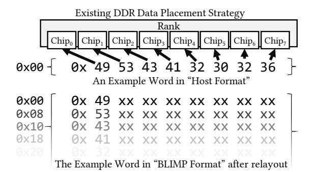
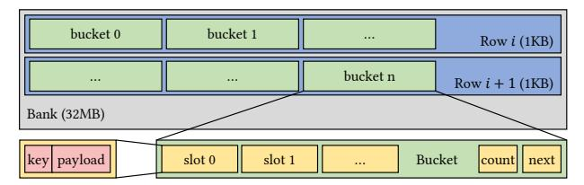
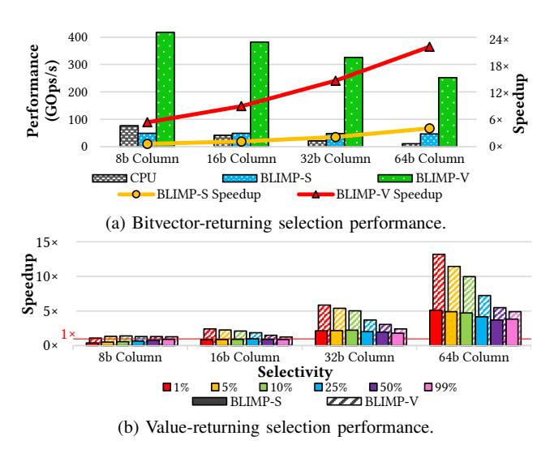
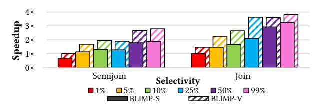
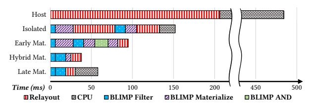
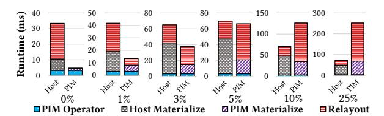
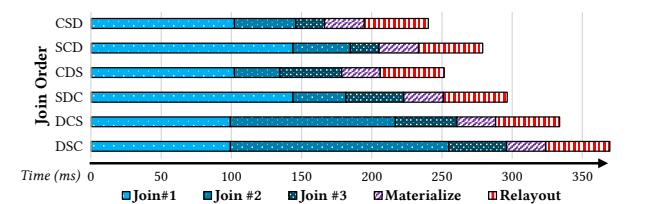
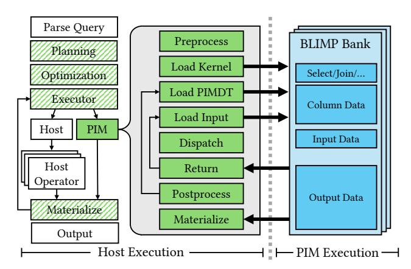
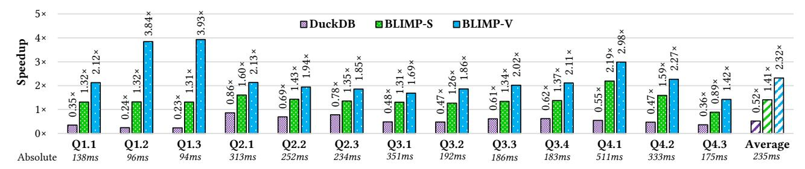

# Taking Analytic Databases to the Bank

Alexandar Devic *Pennsylvania State University* University Park, USA devic@psu.edu

Martin Prammer *Carnegie Mellon University* Pittsburgh, USA mprammer@cs.cmu.edu

Kevin Gaffney *Microsoft* Barcelona, Spain kevin.gaffney@microsoft.com Siddhartha Balakrishna Rai *Advanced Micro Devices* Austin, USA raisiddhartha91@gmail.com

Anand Sivasubramaniam *Pennsylvania State University* University Park, USA axs53@psu.edu

Jignesh M. Patel *Carnegie Mellon University* Pittsburgh, USA jignesh@cmu.edu

Ameen Akel *Micron Technology* Folsom, USA aakel@micron.com

*Abstract*—

The explosion of big data has spotlighted the bottlenecks of data movement in traditional von-Neumann architectures. Data analytic applications, such as online analytic query processing (OLAP) databases, are especially burdened by these bottlenecks, given that latency is a key driver in these workloads. Thus, these applications turn to specialized hardware to overcome these otherwise insurmountable challenges. While there are many hardware options, processing in memory (PIM) techniques have gained relevance due to their recent availability as commodity DDR DRAM devices and their relatively cheap expected cost (in terms of power, area, and monetary considerations). However, even with such prevalence, existing research has yet to explore the impact of PIM on end-to-end OLAP workloads fully. In this work, we consider every aspect within a database system; the storage and memory layout, operator implementation, and the data sharing considerations. In particular, we find that ensuring data layout interoperability between query operators is an under-explored consideration that has a significant impact on performance. Using the Star Schema Benchmark, we show that for conservative PIM hardware, up to 17.1× query latency improvement can be achieved over a state-of-the-art, CPUfocused DBMS.

*Index Terms*—Processing in memory, heterogeneous orchestration, OLAP database analytics, performance characterization.

## I. INTRODUCTION

Fundamental to data processing tasks is, patently, the ability to process the data in question. However, as the ever-present "memory wall" has demonstrated, data movement from memory to processing elements is critically bottlenecked [78], [5], [16], [35]. One such class of application that is especially burdened by data movement costs is database management systems (DBMSes), particularly in latency-driven online analytical query processing (OLAP) [17], [15], [14], [9]. Recent studies have noted that these systems consume over 10% of cycles in Google's ecosystem [38].

For this reason, various alternative processing paradigms have been proposed to address ongoing DBMS performance bottlenecks, including database machines [11], [27], [26], [10], [13], [18], [47], [51], [52], [68], GPUs [22], [42], [41], and near-data accelerators [75], [79]. While each has its merit, recently, processing-in-memory (PIM) has been thrust into the

This research was supported in part by the National Science Foundation (NSF) under grants 2211018, CCF-2407690, and OAC-1835446, as well as CRISP, one of six centers in JUMP, a Semiconductor Research Corporation (SRC) program sponsored by DARPA.

spotlight as an enticing option due to its promise of bypassing the memory wall [69], [72], [40], [55], [32], [25], [64]. By moving compute to memory, memory-internal bandwidth can be leveraged to its maximum potential (instead of saturating external links), enabling considerable increases in efficiency, parallelism, and bandwidth at a low relative cost. Given these promises, significant industry effort has brought PIM into the commercial and commodity market [3], [44], [49], [1].

Numerous prior works have explored databases on PIM architectures [46], [57], [50], [45], [34], [37], [75], [79]. While these studies have made valuable contributions, they have primarily focused on individual database operators (e.g., selects and joins) in isolation, or on "end-to-end" studies with limited scope. To our knowledge, no work has comprehensively addressed how chaining PIM database operations introduces complications from data format incompatibilities, relayout overhead, scale, memory constraints that limit algorithm design, and inherent CPU-centric assumptions that break down in the PIM context – all of which fundamentally change end-to-end performance. While operator evaluation in isolation or in limited scope is essential and informative, holistic endto-end query execution requires a careful co-design approach that accounts for all system-level interactions between the host and the memory processors.

In this work, we systematically examine key aspects of a PIM-based analytical database from data storage and algorithms to query planning heuristics. Among various PIM architectures, we focus on "bank-level in-memory processing" (BLIMP) platforms [25], [64] due to recent commercial efforts in this space [3], [24]. BLIMP platforms typically feature general-purpose RISC-V processors within each DDR memory bank. This architecture is becoming a focus of PIM research due to the proximity of BLIMP cores to storage circuitry, which allows for low-latency data access without undue impact on the density of memory cells. Our motivation is not to argue BLIMP's superiority over other hardware, but rather to study how best to co-design analytical query processing for this emerging commercial platform.

Tackling end-to-end query execution on a BLIMP system is difficult, as BLIMP cores are restricted to their local bank's memory, requiring CPU-centric database operators to be reimplemented considering BLIMP's architecture. Data and

message exchanges between peer BLIMP cores are not feasible, as no widely used DRAM specification enables remote bank-to-bank communication without host involvement; thus data transfers between BLIMP cores occur as CPU-driven read-then-write operations. Even if a DBMS operator can be feasibly accelerated using BLIMP, there is no guarantee that doing so will lead to an overall reduction in query latency. Further, BLIMP cores are significantly more limited than their CPU counterparts, operating at lower clock speeds with reduced instruction sets, resulting in lower per-core performance. Additionally, data layout choices introduce trade-offs between record access latency and parallelism opportunities, while bank capacity limits the design space of algorithms used to implement query operators. For example, traditional hashbased joins which utilize more space to reduce latency are not directly mappable to PIM as they can only utilize a limited and pre-allocated scratch-reserved memory.

The sequence of operators involved in a user query will also impact not just who does the work in each stage (host or BLIMP) but also how the data is (re-)laid out, how the operators are chained, and the data materialization strategy at each stage. Partly as a consequence of these complications, prior PIM and database studies focus on a smaller subset of query components to optimize [21], [43], [60], [36], [37]. In contrast, this work performs an end-to-end evaluation of an analytics-focused DBMS benchmark: the Star Schema Benchmark (SSB) [62]. We find that high performance requires codesigned solutions that exploit unique nuances of both the host and PIM environment. We make the following contributions: Contribution #1: We co-design two novel foundational structures for PIM-based DBMSes: 1) a PIM-focused storage format called the PIMDT – a new data storage layout that enables data sharing outside of a "single-use" context, and 2) a BLIMP-optimized hash table specifically tailored to DDR bank (not host cache) constraints. (Sec. IV)

Contribution #2: Using these co-designed data structures, we implement three core analytics-focused DBMS operations for BLIMP architectures: select, join, and aggregate. We provide detailed performance characterizations using a cycle-accurate simulator to study how selectivity, data size, and architecture affect performance in isolation. (Sec. V)

Contribution #3: Taking our isolated operators and integrating them into query execution plans, we find that CPUcentric query planning heuristics do not carry over to BLIMPaugmented systems. We identify PIM-specific planning heuristics and demonstrate that traditional CPU optimizations and materialization strategies have diminished (and even negative) impact in BLIMP contexts, significantly affecting individual operator and end-to-end performance. (Sec. VI)

Contribution #4: We perform end-to-end evaluations using the Star Schema Benchmark, demonstrating that 1) PIMaware query planning fundamentally differs from CPU-centric approaches (as noted in [31] as well), which affects latency (up to 40%), and 2) holistic consideration of data movement and materialization yields substantial performance benefits (up to 4.2×) compared to isolated operator extrapolation. (Sec. VII)

#### II. BACKGROUND

In the following section, we describe background on DDR DRAM organization and address mapping schemes. We then detail the BLIMP architecture and its nuances in DDR systems. Finally, we discuss different DBMS terms, ideas, and techniques, necessary for their implementation on BLIMP.

## *A. DDR DRAM Organization and Layout*

DDR memory systems are organized hierarchically. To access memory, requests are sent via memory channels, each channel having one or multiple "slots" for Dual In-line Memory Modules (DIMMs). Within each DIMM, there are multiple ranks, each with a set of DRAM chips. Each DRAM chip is composed of multiple banks, each bank being further subdivided into subarrays and mats. The bank can be viewed as a 2D grid of data (16-128MB in capacity) abstracted by rows and columns. To service requests, a 1D row structure called a row-buffer (typically 1-4KB in size) reads/writes rows of data from/into each bank.

When data is placed in a DIMM, various address and data mapping schemes are used. A common strategy involves the use of "8 ×8 chips" in a rank, where bytes of a 64-bit word are striped across 8 chips within a rank. Then, to service a memory request, each "×8" chip will contribute 8 bits (or a byte) of data. Within the chip, several bank placement strategies are used, but for the purpose of this work, we assume a simple address mapping scheme where lower addresses target the first bank while higher addresses target the last bank. When considering a 64-bit word stored at address X, the first byte is mapped to bank 0 of chip 0, the next byte (at address X+1) is mapped to bank 0 of chip 1, and so on. It is only a byte mapped to address X+8 that falls again on bank 0 of chip 0, but at address X+1 locally within the bank. We call this layout scheme the "host format".

## *B. Bank-Level In-Memory Processors*

Bank-Level In-Memory Processors (BLIMPs) are a class of PIM where small, typically RISC, processors are placed in each DDR DRAM bank [3], [64]. BLIMP cores access data using the row buffer, sending read/write access commands to their local bank. Presently, no hardware path exists for banks to access other, remote banks, without host intervention. Consequently, BLIMP DIMMs operate in two modes: memory mode, where the DIMM is used just like any other DIMM, and compute mode, where each BLIMP core assumes control of its local memory bank to execute instructions on data within. A consequence of this architecture is that while in compute mode, the host is not able to access data in a BLIMP bank until computation from the bank core ends or is terminated.

As the host facilitates all data placement and communication explicitly before BLIMP computation can begin, data placement and organization within the DIMM become important. If the address mapping schemes of conventional DDR memory systems are used (Sec. II-A), *bytes of a single word will not be local to a single bank*; rather, they will be byte-striped across banks of *different* chips. Modifying this mapping scheme is not a viable option: i) it would require a dramatic change to



Fig. 1: The "relayout" procedure for offloading an arbitrary word from host format to BLIMP format.

accepted memory standards, and ii) parallelism and bandwidth benefits would diminish while BLIMP DIMMs operate in memory mode. Instead, the host is relied on for ensuring a "BLIMP-friendly" layout such that entire words are accessible to local BLIMP cores. To do this, a software data "relayout" algorithm is used, where bytes of a word are shuffled across locations such that when stored in memory, the existing hardware address mapping "undoes" the software shuffle, resulting in specific bytes from consecutive words to reside on a target bank, as shown in Fig. 1. For example, to write a 64-bit word from the host into a particular bank requires 8 memory writes, while reading 64 bits of data from a particular bank requires 8 memory reads for the host. The BLIMP core, however, sees 8 bytes of a 64-bit word to be successively located within its bank. This relayout procedure incurs runtime penalties both before and after BLIMP execution and can be a significant factor for any computational PIM offload [25].

#### C. Analytical Ouery Processing

A database management system (DBMS) provides structured mechanisms to perform a variety of data-related tasks. In this work, we are primarily concerned with analytics-focused DBMSes, particularly online analytical processing (OLAP) DBMSes. OLAP workloads are generally characterized by their focus on *drilling down*, where large amounts of data are filtered, grouped, and sliced based on a number of *dimensions*. Modern OLAP workloads make heavy use of structured relationships between data. This behavior is commonly exemplified by a single database containing multiple *tables*, each of which stores a collection of *records* (tuples). Across a table, all records share the same named and typed *fields*.

Growing demand for fast "human-in-the-loop" data-driven business analytics has pushed OLAP DBMSes to primarily focus on latency [58], [28], [56]. OLAP workloads typically scan entire tables of data, primarily characterized by read-only data operators such as selects, joins, and aggregations, with only a few updates, inserts, or deletes (performed in large batches in infrequent cycles). These scans are used to perform large scale analytics, and typically employ a single query at a time (unlike OLTP workloads), even if the query itself involves multiple operators (selects/joins/aggregations, etc.). Consequently, a major driver is latency performance rather than throughput over multiple queries, which in turn is largely

dependent on data movement between the host memory and the CPU. To mitigate this issue, rather than use a row-by-row storage mechanism, OLAP DBMSes are organized as *column-stores*, where the same fields (column) of different records are laid out contiguously. The rationale for this is i) even if scanning entire tables, queries are often only interested in a handful of columns, and ii) the CPU can exploit spatial locality when reading columns of successive rows.

OLAP workloads place heavy stress on the performance of the underlying systems. A common trend within analytical query optimization is the notion of *selectivity*, which is directly correlated with the proportion of records that remain after some action is applied [65]. Selectivity tends to have nonlinear ramifications, requiring disparate optimizations in both the highly selective and less selective cases. For example, an index-based lookup is less useful when almost an entire column passes through a filter; in comparison, such an index would be a nice way to shortcut inspecting an entire column if we only retrieve a single value.

Analytic DBMSes are characterized by three key operators: 1) Selection: A selection operation scans a column of data while applying a boolean predicate to determine surviving records. Predicates can be simple, such as relational functions, or more complex, e.g. membership tests. Columnar selections generally output results in one of two formats: a bitvector (also known as a bitmask or hitmap), or an index array (also known as a position list or value array). As the selected-upon column is usually not the only column retrieved as part of the query, some mechanism must be present to return the proper records after the selection is performed. The index array is the most straightforward solution: it returns an array of values that map to record numbers. The size of the output index array is variable, scaling linearly with selectivity. In the case of high selectivity queries, the size of such an index array is comparable to the data itself. Instead, one bit can be mapped to each row of the original table, where each bit represents the truth value of that record's inclusion in the output. Using a bitvector, the output is always of a fixed size; this is both a benefit and cost, as selectivity insensitivity means that low selectivity queries must output large arrays of zeroes.

Bitvectors have the added benefit of simplifying the process of pipelining intermediate results between operators. Consider the case of intersecting two filters, which can be performed by ANDing the two respective bitvectors. However, other operators may not accept a bitvector as an input. Such an operator is identified as forcing materialization, requiring the bitvectors to be applied to the original data and thus producing an intermediate record set. However, due to the nuances of the impact of selectivity on operator performance, some DBMSes opt to use early materialization strategies, which materialize before it is required as an optimization strategy. In contrast, other DBMSes use late materialization strategies and are thus optimized around using bitvectors as a common operator intermediate result. Materialization strategies have profound effects on the performance of end-to-end queries and thus are well studied in existing literature [20], [71], [4].

2) Join: In a join, rows from two tables are merged based on a related/shared column between them, sometimes resulting in an extended table. Determining which rows are merged can be the result of a selection predicate or simple column-bycolumn match. If the join is not required to merge additional columns/data and instead only tests congruence, it is termed a semijoin. Various join algorithms exist in typical DBMSes, such as nested loop, sort-merge, and hash join approaches. Each has its own runtime characteristics, influenced by factors such as selectivity and table size. Of all strategies, however, the hash join is most flexible across a variety of join conditions and is widely adopted in many DBMSes. The hash-based join involves two phases; the build phase - where values of a "joined-in" column (the build-side relation) are hashed and inserted into a hash table, and the probe phase - where values of the "joined-against" column (the probe-side relation) are hashed and checked for presence in the built hash table. If a full join is performed, the hash table also stores payloads of columns or data on probe hits.

3) Aggregate: Aggregation consolidates and summarizes an array (or column) of data. Unlike selections and joins, where output varies in size by selectivity or column size, aggregations implement a concise mathematical operation, such as sum, average, count, minimum, or maximum. In addition to aggregations on an entire column, aggregations can also be grouped, where aggregations are bucketized by another "grouping" column. This "group-by aggregate" can either i) use the grouping column value to index into an array of aggregators, or ii) if the grouping values span a large range (known as its *cardinality*), use a hash table to index groups into aggregator payloads.

## III. PLATFORM DETAILS AND METHODOLOGY

Evaluating end-to-end queries in a heterogeneous DBMS requires changes to a variety of systems, algorithms, and implementations, with in-depth discussions on performance and tradeoffs. However, we cannot discuss a heterogeneous DBMS's performance on a standardized benchmark (Sec. VII) before we first describe how such a prototype DBMS is organized and what considerations it needs to make (Sec. VI). Moreover, DBMSes rely on underlying operators to perform such queries, which will require their own evaluation in isolation (Sec. V) to understand varying performance and architecture tradeoffs. Finally, query operators are tightly coupled with the data layout and data structures upon which they rely, so these aspects must be studied as well (Sec. IV). Because the following sections all involve their own results and discussions, we will discuss our evaluation methodology now. Table I details our heterogeneous system configuration.

## A. BLIMP Memory System

Despite commercial BLIMP-like platform offerings [24], [1], [49], none possess all capabilities that we wish to investigate in this work (e.g., vector engines), nor do they allow for fine-grained flexibility in parameters, hardware, or integration. Instead, we opt to simulate our BLIMP architecture using

| Specification | Configuration Parameters                                 |  |  |  |  |
|---------------|----------------------------------------------------------|--|--|--|--|
| Baseline Host | 2× Intel(R) Xeon(R) Silver 4114 CPU @ 2.20GHz            |  |  |  |  |
|               | Total: 20 Phys, L1: 1280KiB, L2: 20MiB, LLC: 27.5MiB     |  |  |  |  |
|               | SK Hynix 384GB/64GB×6 2933 DDR4                          |  |  |  |  |
| BLIMP DRAM    | PIM-enabled 16GB/8GB×2 2133 DDR4; 2 channels, 2 ranks,   |  |  |  |  |
|               | 8 chips/rank, 16 banks/chip; 512 Total BLIMP Cores,      |  |  |  |  |
|               | 32MB/bank, 1KB Row Buffer, tRP = tRCD = 21ns             |  |  |  |  |
|               | tRFC = 640ns, tREFI = 7.8us                              |  |  |  |  |
| BLIMP-S Core  | RISC-V RV64GC SSIO Core @ 200MHz                         |  |  |  |  |
|               | 1KB Instr Buffer, 1KB Scratchpad 5×1KB R/W Buffer (v1-5) |  |  |  |  |
| BLIMP-V Core  | RISC-V "V0.9" RV64GCV SSIO Core @ 200MHz                 |  |  |  |  |
|               | 1KB Instr Buffer, 1KB Scratchpad                         |  |  |  |  |
|               | 5×1KB R/W Vector Register (v1-5) 32×64b vALUs            |  |  |  |  |
|               |                                                          |  |  |  |  |

TABLE I: System Specifications

a validated framework to fully control the hardware and software stack. We configure our DRAM to utilize a 1KB row buffer on 32MB of subarray storage, and define two flavors of BLIMP: BLIMP-scalar (BLIMP-S) and BLIMP-vector (BLIMP-V). BLIMP-S places single-threaded 200MHz RISC-V (RV64GC) processors in every bank of an 8GB DDR4 DIMM¹. The BLIMP-V platform places 200MHz RISC-V (RV64GCV) processors in the banks, each core having a local vector engine, capable of executing RISC-V"-V" SIMD instructions. Although distinct, BLIMP-S and BLIMP-V platforms are referred to/classified as BLIMP cores.

The evaluation framework leverages validated cycle-level simulators used in prior work [2], [25], with detailed DDR4 DRAM memory timings [66]. Our framework is hardware and software configurable, allowing parameterized simulation of any kernel that can run on BLIMP. To model execution, we run offloaded kernels in the context of a single BLIMP-enabled bank. We assume the data is homogeneous, compute is symmetric, and the overall runtime is that of the slowest bank. For compute not performed within BLIMP banks, we isolate and evaluate these kernels on a real-world host.

#### B. Host System

Applications or kernels designated for execution on the host are not subject to simulation; these host kernels are run on our real-world hardware, shown in Table I. This host has an Intel Xeon Silver CPU clocked at 2.2GHz with 20 cores and a 27.5MB LLC. The memory subsystem allows for 8 DDR4 DIMMs, 6 of which are 64GB conventional DIMMs (with the two remaining DIMMs reserved for BLIMP DIMMs when simulating heterogeneous execution). When applications are run at the host, we ensure the entire host is utilized (multithreaded on 40 threads using SIMD (AVX512) instructions when possible) and under idealized system conditions (idle system, warmed cache).

## IV. DATA COMPONENTS AND STRUCTURES

DBMSes implement a variety of query kernels, or operators. These operators, in turn, use a variety of systems and data structures to perform query actions. As such, careful attention must be made to ensure all aspects of data movement and usage in a PIM context are conducive to offloaded compute, as host and PIM memory operate under different constraints. In the following section, we will explore data layouts, storage formats, and data structures which must be made PIM-aware

<sup>&</sup>lt;sup>1</sup>Prior works have shown this overhead to be < 4% [64] of the bank area.

|      |   | PIMDT                                      |   |       |  | OrderDate PIMDT<br>BLIMP Bank<br>BLIMP Bank                  |  |
|------|---|--------------------------------------------|---|-------|--|--------------------------------------------------------------|--|
|      |   | OrderKey LineNumber OrderDate Tax ShipMode |   |       |  | Chunk #i                                                     |  |
| 42   | 1 | 19960922                                   | 8 | RAIL  |  | Chunk #k<br>Chunk #j<br>Chunk #j                             |  |
| 88   | 5 | 19970312                                   | 7 | AIR   |  | 19960922,<br>19910620,<br>Chunk #k<br>19911223,<br>19970312, |  |
| 409  | 3 | 19931117                                   | 8 | TRUCK |  | 19960203,<br>19931117,                                       |  |
| 1738 | 1 | 19910620                                   | 0 | AIR   |  |                                                              |  |

Fig. 2: PIMDT-specified columns on an example database; these can be chunked to accommodate BLIMP memory constraints.

prior to discussing how such would be used in computation and how they interact in a heterogeneous context.

#### *A. Storage Management*

A DBMS storage manager is responsible for storing data and processing requests to it. When we consider moving data into or out of PIM, translating the data from host- or PIMconducive layout via a relayout (Sec. II-B) is the biggest concern due to its high overhead cost [25] (for context, our host performs relayout at 29GBps on average, despite a maximum memory bandwidth of 90GBps). Performing a relayout of an entire database at query-time would be infeasible at large scales. Moreover, pre-laying out an entire database a priori leaves all data in a non-host-conducive format, requiring yet again a relayout for when an offload to PIM is not possible. Furthermore, because BLIMP cores operate in limited memory environments (32MB per bank), efficient use of the available bank memory must be taken into consideration. Due to all these factors, a storage manager for a BLIMP-aware DBMS would ideally i) only offload required data to each BLIMP core in a bank, and ii) reduce any relayout dependence on the host, *re-using* relayed data as much as possible.

To accomplish this, we introduce a new PIM-based columnar storage Data Type for BLIMP-aware storage management systems: the *PIMDT*. In this format, specified database columns are laid out in "PIM-conducive" formats at rest, leaving other "host" columns untouched. This allows the host to easily load only necessary, "prelaidout" data into BLIMP banks without requiring a relayout at query-time, as shown in Fig. 2. However, there are several considerations when handling data in this format. First, we cannot naively store a PIMDT contiguously into BLIMP DIMMs. Since each BLIMP core has limited memory, space must be reserved in each bank for not just the column but also an operator's instructions, any input data, and output data. Likewise, it would be ideal to evenly distribute work to all available cores to reduce the overall query runtime. To address this, the storage manager must be able to chunk PIMDT data at query-time into configurable sizes such that they are evenly distributed to all available BLIMP cores and satisfy bank memory constraints. Another consideration is data mutation; once data is in PIMDT format, it must be reformatted whenever data is inserted or updated *by the host*, resulting in a write for every byte of the inserted column value. These considerations and requirements incur runtime penalties, which will be discussed in Sec. VI and VII. Using SQL, we envision a new column constraint used in the database table schema to dictate PIMDT columns:

```
CREATE TABLE NewTable (
    ID int UNIQUE, Foo tinyint,
    Bar bigint NOT NULL PIMDT(BLIMP)
);
```

Given that columns must be explicitly designated to be in PIMDT format prior to query execution, the question of *which* columns should be stored in this format arises. There are two main considerations: storage tradeoffs and PIM-amenability (runtime). Regarding the former, the decision mirrors that of index creation in traditional database design, i.e., are the columns queried often enough to warrant the storage requirements in exchange for (potential) accelerated query performance? This inherently is a highly contextual decision where no general recommendation can be made. Regarding PIM-amenability, one must account for two constraints. First, because PIMDT columns must be quickly chunked along element boundaries prior to being loaded into a bank, only column values of known or fixed size may be used (variable length strings, unstructured blobs, and other similar types are therefore incompatible with the PIMDT layout). Second, even if data is well-partitioned and query patterns suggest a benefit, the operations working on a column must themselves be PIM-amenable. Many prior works in PIM (and BLIMP) have identified what algorithms (and under what contexts) fall into this category [76], [25], [64], [69], [57], [50], [37], [32]. In general, highly parallelizable (or vectorizable) operations with little to no cross-data dependencies (i.e., data-parallel or Map-Reduce algorithms) perform well. We will further discuss database operator amenability later in Sec. V-D.

## *B. Hash Tables*

Hash tables are useful structures that support a variety of database operators such as joins, grouped aggregations, and set operations. However, in the context of BLIMP, careful consideration is needed to enable performant hash table inserts and lookups; not only because BLIMP cores are slow compared to their CPU counterparts but also because BLIMP cores access memory at a row buffer granularity. If a CPU-oriented hash table is used, entries may become row buffer misaligned (due to non-aligned payload sizes) and cause row buffer thrashing or require unnecessary reads/row buffer switches (due to pointer chasing). To address this, we need to ensure: i) ease of indexing; after hashing a value, we should easily be able to target a row to read/write into, ii) row buffer alignment; to reduce row buffer switching, and iii) collision locality; upon a hash index collision, similarly-hashed values should co-reside in the same row for spatial locality.

With these desirables, we design a row-buffer-aligned bucket-based hash table, as in Fig. 3. Our hash table is a collection of row-buffer-aligned hash-indexed buckets. When initializing the hash table, the initial number of buckets is determined by an expected load factor, dependent on the stored data. To keep row buffer alignment and enable fast hash indexing, we restrict the number of initial buckets to be a



Fig. 3: BLIMP-designed hierarchical hash table where each row contains hash-indexed buckets, each with slots for inserted data (keys for semijoins, keys and payloads for joins).

power-of-two, with bucket sizes picked to neatly fit the row buffer. Buckets contain metadata and a series of slots to allow hash-colliding locality. Each slot represents one column value, which can carry with it optional payload data. Upon a collision when inserting into the bucket, a slot is appended to the end of that bucket's slot list. If the bucket is filled, we create a new bucket at the end of our bucket list and insert a new slot there. In the original bucket, we store the location of the next bucket in the chain. A drawback to this design is that once a bucket is indexed into, we must serially check the slot list to find our entry; the larger the bucket, the larger the scan time. In case of frequent collisions resulting in long bucket chains, this can impact lookup performance as we have to not only load new row buffers to fetch new buckets but also serially check those buckets for our entry. Ideally, the bucket size, or consequently the slot list length, should be such that the time it takes to scan the bucket is close to the time it takes to fetch a new bucket on a different row. This differs drastically between BLIMP-S and BLIMP-V, particularly due to BLIMP-V's SIMD capability<sup>2</sup> .

As individual BLIMP cores are much weaker than host cores, our hash function must be lightweight and provide strong anti-collision properties. We use the following multiplicative hash function [54], [53]:

```
1 uint hindex(uint value, uint initial_buckets) {
2 uint hash = 3634946921 * value + 2096170329;
3 return hash & (initial_buckets - 1);
4 }
```

Since buckets remain fixed in size, we can use this index to also calculate the bucket's residing row buffer memory address, allowing for fast index to memory translation for hash table lookups and bucket chain traversal.

#### V. DATABASE OPERATORS IN BLIMP

Prior studies have demonstrated how to perform various database operators in PIM, from those implementing specific algorithms [57], [50] to those working across different levels in the memory hierarchy [69], [40], [76], [25]. In this section, we implement and characterize three fundamental OLAP database operators (selections, joins, and aggregations) on columnarstorage databases, specifically co-designed to take advantage of BLIMP hardware and our data structures, as well as discuss other operators which have amenability considerations.

#### *A. Select*

Given a PIMDT partition in a bank, Algorithm 1 performs a selection (predicate-based filtering) operation in BLIMP. We

## Algorithm 1 BLIMP Select Kernel (bitvector-returning)

```
Require: Data d, Bitvector b, Predicate p, Element size w
 1: procedure FILTERTOBITVECTOR(in *d, out *b, func p)
 2: v2 ← [0, ...], eproc ← 0
 3: for each data row r in d do
 4: v1 ← FetchMem(r)
 5: v1 ← apply(p, v1)
 6: v1 ← coalesce(v1, w, mod(eproc, 8192))
 7: v2 ← v1 ∨ v2
 8: eproc ← eproc + ElementsPerRow(w)
 9: if mod(eproc, 8192) = 0 then
10: vs ← FetchMem(b[HitmapRow(eproc)])
11: v2 ← vs ∧ v2
12: StoreMem(v2, b[HitmapRow(eproc)])
13: v2 ← [0, ...]
14: end if
15: end for
16: if mod(eproc, 8192) ̸= 0 then
17: vs ← FetchMem(b[HitmapRow(eproc)])
18: StoreMem(vs ∧ v2, b[HitmapRow(eproc)])
19: ZeroMaskRemainder(b[HitmapRow(eproc)], eproc)
20: end if
21: end procedure
```

begin with the local BLIMP cores reading input values at row buffer granularity (1KB). Once read, predicate functions are applied element-wise (either serially via BLIMP-S or vectorized via BLIMP-V) to the row. Because BLIMP cores are general purpose and arbitrarily programmable, nearly any predicate can be applied across the column values. Once evaluated, the result of the predicate is saved back to a designated output region of the bank.

We evaluate our host CPU and BLIMP platforms by performing a simple scan-based filter over a column spanning one billion values with a uniform random distribution between [0, 100). We store this column in BLIMP as contiguous arrays of 8-bit, 16-bit, 32-bit, and 64-bit values. We then apply filters using a LESS THAN operation with a predicate value based on the desired filter selectivity, such as 1 for 1% selectivity. The results of this scan are depicted in Fig. 4 without including the costs for data loading, relayout, and post-processing. We will discuss and include such costs when evaluating full queries in Sec. VI and VII. For our host, we use a multithreaded, SIMD (AVX512), hand-tuned, C++ kernel. In BLIMP, we distribute the column evenly amongst all (512) BLIMP cores.

Fig. 4a demonstrates how BLIMP platforms perform against the host CPU across standard column sizes when returning bitvectors. Because bitvectors maintain constant size regardless of selectivity, changes in selectivity have a < 0.5% performance effect per column size on all architectures. Despite the host operating at its maximum memory bandwidth (90GBps), BLIMP-S and BLIMP-V achieve average speedups of 2.0× and 12.9×, respectively. This result is primarily due to the BLIMP platform's bank-level parallelism and significant internal memory bandwidth (12.5TBps). In fact, bandwidth differences become apparent as column size increases; despite

<sup>2</sup>To give some insight, an optimal 32-bit hash table with 8-bit payloads has 5 and 24 slots per bucket for BLIMP-S/-V respectively.



Fig. 4: Predicate (<) selection performance with varying output modes, selectivity, column size, and platform architecture.

all platforms decreasing in performance due to increased data movement, the host degrades faster than BLIMP platforms, increasing the relative performance gap between the two. Finally, it is only at low column sizes that we find a slowdown in BLIMP-S. Despite superior memory bandwidth, processing 1,024 items (8-bit elements in a 1KB row buffer) is slow on the weak 200MHz cores, resulting in more time proportionally spent in computation than in data movement (this is not seen in BLIMP-V due to the wide vector engine).

Fig. 4b shows speedup of BLIMP against the host CPU across column size and selectivity when returning predicated column values. BLIMP-S and BLIMP-V provide speedups of  $2.0\times$  and  $4.2\times$ , respectively. Just as before, memory bandwidth differences are evident for the memory reads to apply the predicate (increasing column sizes), with larger columns benefiting from BLIMP bandwidth. However, unlike reads, memory writes required for output results grow with increasing selectivity; because value-returning predicates must spend additional BLIMP cycles storing and maintaining larger result data back into the bank, increasing selectivity degrades BLIMP performance due to slow bank cores.

#### B. Joins and Semijoins

Utilizing the hash table data structure that we detailed in Sec. IV-B, we implement a hash-based join due to the flexibility of the algorithm across a variety of table sizes and data requirements. In order to build the hash table, the entire build-side relation must be hashed and inserted (along with any potential payload data) into our hash table. As a result, it seems rather wasteful to have each bank compute the same hash table prior to the probe phase. For this reason, we rely on the host to build the hash table, and, once built, replicate it (via relayout) to each bank to make it available for each core. In our studies, we find that our hash table has comparable build times on the host to other CPU-oriented hash table implementations [67].

Recall however that each bank has limited memory, namely 32MB, and since each bank receives the same hash table, it

## Algorithm 2 BLIMP Semijoin Kernel (bitvector-returning)

```
Require: Data d, Bitvector b, Hashset h, Element size w
Ensure: b is initialized, h is loaded
 1: procedure SEMIJOINPROBE(in *d, out *b, hashset h)
         v2 \leftarrow [0, ...], eproc \leftarrow 0
 2:
         for each data row r in d do
 3:
 4:
              ds \leftarrow \text{FetchMem}(r)
              v1 \leftarrow \text{copy}(ds)
 5:
              v1 \leftarrow \mathsf{hash}(v1, h.mask, w)
 6:
              for each key k at index i in ds do
 7:
 8:
                  repeat
                      v3 \leftarrow \text{FetchMem}(h + \text{BucketRow}(v1[i]))
 9:
                      hit \leftarrow k \in v3
10.
11:
                      v1[i] \leftarrow \text{BucketNext}(v3)
12.
                  until IsNull(v1[i]) or hit
13.
                  v1[i] \leftarrow hit
              end for
14:
15:
              v1 \leftarrow \text{coalesce}(v1, w, \text{mod}(eproc, 8192))
16:
              v2 \leftarrow v1 \lor v2
              eproc \leftarrow eproc + ElementsPerRow(w)
17.
              if mod(eproc, 8192) = 0 then
18.
                  StoreMem(v2, b[HitmapRow(eproc)])
19:
20.
                  v2 \leftarrow [0, \dots]
              end if
21.
         end for
22:
         if mod(eproc, 8192) \neq 0 then
23:
              StoreMem(v2, b[HitmapRow(eproc)])
24:
              ZeroMaskRemainder(b[HitmapRow(eproc)], eproc)
25.
         end if
26:
27: end procedure
```

could be that the built table is larger than each bank's capacity – this is especially true for extremely large data scales or queries with large build-side relations. In these situations, we partition the build-side relation into chunks whose hash tables satisfy bank-memory constraints, performing a full build-probe cycle per partition. That is, for each PIMDT dispatched, a join is potentially performed in multiple rounds – one per hash table partition – where each round offloads a partitioned hash table, performs the probing on the PIMDT column, and leaves the result in memory to be OR'd with the next join's (partition) result. This continues until all partitions are processed.

Given a PIMDT column and hash table stored in a bank (either done by host, or from a prior operation), a BLIMP core can begin executing the probe phase, shown by Algorithm 2. BLIMP cores read row-buffer chunks of column values at a time, hashing values to generate bucket indices. For BLIMP-S, hashes are performed serially; for BLIMP-V, hashes are vectorized. Once all values are processed, subsequent hash probes are serially performed (as arbitrary memory look-ups cannot be vectorized). For each probe, we perform a bucket lookup and row buffer read, traverse the slot list for our value, and traverse any bucket chains (should there be any). The output is either a bitvector (for semijoins) or hash table payload values (for joins).



Fig. 5: Join and Semijoin performance with varying selectivity and platform architecture, normalized against host execution.

We evaluate our host and BLIMP platforms by performing a hash-probe across varying selectivity on a probe-side relation of one billion 32-bit values with a build-side relation of one million 32-bit values <sup>3</sup>. When performing a full join, 4-byte payloads are used. Selectivity determines not only the fraction of probe-side records that find a match, but also the number of build-side records inserted into the hash table during the build phase (e.g., a 1% selectivity denotes (i)  $\sim 10,000$ build-side records are inserted into the hash table, and (ii)  $\sim 10,000,000$  probe-side records survive the probe phase). Fig. 5 demonstrates BLIMP performance speedups against a multithreaded, SIMD (AVX512), hand-tuned C++ host kernel across selectivity and join type. As before, timings are focused on the PIM-domain compute – that is, we measure only the probe phase for all systems; timings for the build phase, data loading, relayout, and post-processing are not considered here and will be addressed in the next section. Finally, we focus on the case where only one round of the probe phase occurs.

Overall, BLIMP-S and BLIMP-V achieve average semijoin speedups of  $1.4\times$  and  $2.1\times$ , respectively, and  $2.1\times$  and  $3.0\times$ , respectively, for joins. We find that as selectivity increases, both BLIMP platforms improve their relative speedups, with joins and semijoins benefiting similarly. This is in direct contrast to selection, where not only does the output type change performance trends, but the relationship between selectivity and performance is reversed. This can be attributed to a variety of reasons. First, unlike selection where runtime is characterized by stream-based accesses, joins are characterized by random-access hash table lookups and traversals. When selectivity is low, nearly the entire hash table can fit inside the host's cache, therefore allowing the host fast probe lookup times. In contrast, for BLIMP, the hash table still may reside on multiple row buffers, therefore forcing row buffer switches which are rather costly (comparatively). However, as the hash table size increases (and selectivity increases), cache performance at the host due to L2/L3 cache misses negatively impacts performance more than the row buffer switching penalty in BLIMP overall. Finally, differences between BLIMP-S and BLIMP-V are relatively consistent across selectivity; unlike selection, on average, BLIMP-V is  $1.6 \times$  faster than BLIMP-S across the board. Despite the SIMD capabilities of BLIMP-V, the only vectorizable portion of the hash-probe kernel is in hashing column values prior to serially hash-probing; this speedup is directly related to this effect.

#### C. Aggregations

Aggregations are implemented similarly to selections: rows of values are read in, an aggregation function is applied serially (or, if vectorizable, SIMD in BLIMP-V), and the output is stored in a specified output region. For group-by aggregations, we implement two versions: i) for low-cardinality grouping attributes (we arbitrarily pick 4 row buffers of 32-bit values, i.e., a range of 1,024), we use the grouping value to directly index output aggregators in the bank memory, and ii) for highcardinality grouping attributes, we employ our hash table using the hash of the value to index into a bucket/slot, with the payload of that slot being our aggregator. Depending on the aggregator, the operation may not be complete until the host retrieves all results and does the final processing (for example, an average aggregator), since each bank operates on an independent set of data - this can be organized similarly to a reduce phase in the Map-Reduce paradigm. We leave the remaining post-processing aggregation to the host.

We evaluate each platform by performing a SUM aggregation over a column spanning one billion 32-bit values. Since nongrouped aggregation is similar to selection, we observe similar speedup characteristics for BLIMP-S/-V, outperforming the host by  $2.1\times$  and  $33.7\times$ , respectively. This is due to: i) aforementioned memory bandwidth differences, ii) minimal output data that needs to be stored, and iii) the aggregation function is not expensive for the weak BLIMP cores, with vectorization capabilities of BLIMP-V further helping. Groupedaggregation, on the other hand, mirrors the performance of our semijoins since both rely heavily on hash probe performance. When performing an aggregation with a group cardinality of 10,000, we find grouped aggregation (by hash probe) performs  $1.9\times$  and  $2.1\times$  better than the host on BLIMP-S and BLIMP-V, respectively. Recall that in the join operator, the buildside relation contained one million records, which, with 1% selectivity, yields an identically sized hash table for our 10,000 group aggregate<sup>4</sup>. The difference in speedup between the two operators is driven by the fact that the hash table is being built as it is probed during the aggregation operation – therefore fewer bucket and slot traversals are needed compared to semijoins where the hash table is already built.

## D. Other Operators and PIM Limitations

While we have demonstrated specific implementations for select, hash-based joins, and aggregation, these are far from all expressive query operators. As discussed in prior sections, whether an operator is PIM-amenable or not largely depends on its parallelization, memory access pattern, and to a degree its compute cost. Operators with lightweight, independent, per-element work with stream-based memory access are the strongest candidates for PIM offload (e.g., selects, bitwise operations, column arithmetic, non-grouped aggregates). That said, recall that BLIMP cores are rather weak – kernels which

<sup>&</sup>lt;sup>3</sup>32-bit foreign relational keys are common in most DBMSes [73].

<sup>&</sup>lt;sup>4</sup>These numbers were chosen as they yield a hash table of equivalent size to our join experiment at 1% selectivity, enabling performance comparison between the two hash-probe-dependent operators with similar access patterns.

require significant per-element work lose their bandwidth benefits and become unamenable (e.g., encryption, cryptographic hashing, certain user-defined functions). In the context of joins, sort-merge joins are typical considerations in host-centric designs but are unamenable in PIM, as the sort phase requires synchronized, global ordering across relations that cannot be parallelized across banks without host intervention. More broadly, operations which require a global invariant or crossdata dependencies – e.g., sorting, order by, non-decomposable aggregates – are poor fits for BLIMP offload. Finally, variablelength data types such as strings present a fundamental incompatibility with the PIMDT storage format (Sec. IV); even if strings are fixed-width or bounded, predicates over them (e.g., LIKE, IN, regex) carry significant per-element compute costs relative to simple relational predicates, making them canonically poor PIM performers [25]. Such operations are best executed by the host.

There are many operators that are built with implicit hostcentric design or assumptions, but could be capable of becoming amenable in PIM if significant work is invested in algorithm and data structure design to effectively use BLIMP's row buffer to mitigate heavy random memory access. While not an exhaustive list, such operations would include radixbased sort-merges, lightweight compression, de-duplication, set operations, and others. We leave the exploration of these operators as future work, as each presents unique data structure and algorithmic challenges that warrant dedicated study.

## VI. QUERY PLANNING FOR BLIMP

Given the operators defined earlier, we explore the endto-end considerations necessary in order to facilitate query planning using a PIM-enabled system. We do not provide an automatic tool for constructing PIM-enabled query plans; rather, we explore the complexities that arise from integrating PIM-optimized operators into a larger DBMS.

Many prior works either demonstrate microkernel/operator performance or naively chain them together for a heterogeneous system. But a DBMS is not just a collection of individual operators; rather, DBMSes play a pivotal role in determining *how* operators are orchestrated, *when* they are performed, *where*, and with *what* data format – drastically impacting performance not just of the end-to-end query but even of its individual operators. In a heterogeneous environment, this issue is further nuanced by the fact that not only is there an alternate processing option (CPU or BLIMP), but also that data output from one operator could be in a format not conducive to a subsequent operator or processing domain (due to PIMDT layout requirements). As a result, when building query execution plans in a BLIMP-aware DBMS, careful consideration must be taken in determining when to remain in PIM vs. when to transition and incur runtime relayout penalties. This introduces a large number of parameters into an already complex space of query planning; even focusing on BLIMPclass devices alone does not significantly reduce the options of PIM-aware query plans even for a single query. While a complete query planner is outside the scope of this paper, we



Fig. 6: Runtime breakdowns of five varying query plans. Operations are performed as they appear, left to right.

take the important steps of identifying and evaluating aspects of query planning that must be rethought in the context of PIM. In particular, PIM's relayout cost and memory access characteristics necessitate departures from traditional strategies for *result materialization* and *operator ordering*.

#### *A. Query Materialization*

Consider a query using PIMDT columns Fizz and Buzz: SELECT ... WHERE Fizz < 25 AND Buzz BETWEEN 1 AND 3 Here, two selections occur; one < and one BETWEEN, as well as a logical AND operation to merge the results. Using the selection operators (from Sec. V-A), an "end-to-end" query could be planned in one of the following ways:

- #1: (Host) Perform the query at the CPU by performing a full relayout on both PIMDT columns prior to evaluation.
- #2: (Isolated) Dispatch BLIMP select operators in isolation, without considering relayout or materialization.
- #3: (Early Mat.) Dispatch BLIMP operators, considering relayout, but materialize all results in BLIMP.
- #4: (Hybrid Mat.) Dispatch BLIMP operators, considering relayout, but only materialize results before a compute domain transition.
- #5: (Late Mat.) Dispatch BLIMP operators, considering relayout, but let the host materialize all results.

Notice how these plans not only have different methodologies in *when* to perform operations, but also *where* and *how* to compute and move data. Each has a different runtime characteristic, which we showcase in Fig. 6 by executing them on our heterogeneous system with the BLIMP-S platform. <sup>5</sup>

It is evident that for Plan #1 (Host), performing the query at the host is far too expensive due to the relayout required for each PIMDT column prior to evaluation. This plan highlights the expensive nature of the data format transformation that needs to be done to traverse computation domains and shows why relayout operations should be minimized at all costs. Instead of traversing computation domains early, Plan #2 (Isolated) utilizes BLIMP to perform the operation, output matching values, and only lets the host relay output data. *Many traditional PIM and database studies evaluate their operators and algorithms in this way, isolating kernels as oneoff operators* – while this is a valid approach for operator-level characterization, this misses system-level holistic understanding. Extrapolating results and planning in this way is inefficient because the host ingests data that has not fully satisfied the query predicate; the results from each filter operation are returned separately, necessitating the host to perform a final

<sup>5</sup>This query is taken from SSB Q1.1 at scale factor 100 (Sec. VII).



Fig. 7: Runtime breakdowns of varying materialization strategies across a range of bank-level predicate selectivities.

AND. Because of this, relayout is still a large issue due to the unnecessary data sent back to the CPU. Plan #3 (Early Mat.) addresses this by leaving data in BLIMP for as long as possible. Instead of immediately requiring an offload for output data, kernels are planned to leave their output inside the bank, allowing both selections to store their output arrays together. A customized BLIMP logical AND operator can then be dispatched to perform the final evaluation on these arrays. It is only after this final AND that the host receives the output data that fully satisfies the query, minimizing total relayout overheads. This plan, though relayout efficient, is still holistically inefficient due to the early materialization of the first filter not allowing records in the next filter to be masked out. Had a holistic view been made about materialization, as in Plans #4 and #5, runtimes could be reduced simply by materializing output late and returning bitvectors for the first filter. Not only do these two plans fully minimize relayout needs from the host, but they also implicitly perform the AND operation while the second filter is processing in parallel. Determining the final materialization method, by way of materializing in PIM (Plan #4 Hybrid Mat.) or at the host (Plan #5 Late Mat.), depends exclusively on the selective nature of the overall query. From Fig. 7, we find that these materialization costs differ wildly across selectivity bands. The primary factor is the fixed size of bitvectors, which causes a fixed amount of data movement vs. the returned value array, which requires a linearly increasing amount of data movement.

#### B. Query Ordering

In understanding which operators can chain their inputs to other subsequent operators, a fundamental idea of operator ordering becomes evident. For example, in the preceding query, should we perform the < operation before or after the BETWEEN operation? While the host is able to perform multiple operations and kernels in parallel, BLIMP is restricted to operating on one operation at a time. For BLIMP, the order of operations is crucial for an efficient and effective query plan. Consider a guery with three joins on PIMDT columns C, S, and D, all with 8-bit payloads. Although there are 6 possible permutations of these join orders, a DBMS is tasked with deciding upon a single, ideally optimal, plan. Existing database research generally recommends two heuristics to optimize hash join ordering: i) apply highly selective predicates first to minimize records that successive joins must process, and ii) minimize hash table size to minimize hash table access time,

 $^6 This$  exemplar query is part of SSB Q3.1 at scale factor 100 (Sec. VII). We note that joins C, S, and D have selectivity of 20%, 20%, and 86% respectively, with hash tables of size 6MB, 400KB, and 11KB.



Fig. 8: BLIMP-S SSB Q3.1 performance on varied orders.

e.g., fitting a hash table in CPU caches instead of memory [61], [19], [12]. As a result of the first heuristic, query optimizers regularly restrict the output plan space to "left-deep" query plans [65]. Like these other query optimizers, we restrict our evaluation to left-deep query plans to both i) fully pipeline our query plans and ii) reduce the plan search space.

Fig. 8 showcases the results of running this exemplar query while exhaustively exploring all 6 candidate query plans when executing joins in the order in which they are typeset. While ordering CSD is the fastest, it is not the plan that CPU-driven heuristics recommend. Instead, CPU heuristics recommend ordering SDC, which is the 4th worst plan, performing 23% slower than the optimal join ordering. <sup>7</sup> These results indicate that a different strategy fundamentally drives join ordering heuristics in PIM-aware systems. In CPU-centric designs, both the selectivity and hash table size correlate to the overall time spent waiting for hash table probes. In PIM, a hash table probe requires opening a target row in the memory array, which itself requires closing another row. While hash table size is relevant when considering space efficiency and the likelihood of an already open row containing the next hash-probe, it otherwise has no performance impact since the row buffer can be seen as a 1KB cache line for BLIMP architectures. Therefore, after a hash table becomes more than just a few kilobytes in size, hash table size becomes less impactful due to the probe phase performing random memory accesses, decreasing hit rates. In summary, selectivity alone becomes the main heuristic driver for join ordering in PIM.

Similar to CPU-based query plans, simply stringing together individual operators without considering the entire chain of operators and their data sizes will be highly inefficient. By exploring both join ordering and materialization strategies, we identify that many traditional query planning heuristics are implicitly CPU-centric and must be reevaluated for PIMenabled systems. Our exploratory results indicate an alternative set of BLIMP heuristics, which we will leverage in our end-to-end query evaluation.

# C. End-to-end Query Workflow

Fig. 9 illustrates the workflow of a query in a BLIMP-aware DBMS. We make no changes to query parsing (uncolored box) and analysis of a conventional DBMS, apart from extracting semantics to understand the PIMDT column constraint proposed in Sec. IV-A. For the query planner and optimizer (hatched boxes), we use heuristics discussed earlier to make it PIM-friendly: operator pipelining, low-selectivity-first ordering, and late materialization strategies.

<sup>&</sup>lt;sup>7</sup>This "CPU recommendation" comes from a DuckDB plan (Sec. VII).



Fig. 9: High-level query workflow. Uncolored components follow "typical" DBMS design. Solid-colored components are implementations for running on PIM. Hatched-boxes are components that we have "hand-tailored" (future work to automate) based on heuristics outlined in Sec. VI. Solid arrows denote relayout, either from or to PIM.

These heuristics drive the final query plan, which a query executor will follow. For operators performed on non-PIMDT columns, normal host execution and pipelining are followed. For operators targeting PIMDT columns, a query executor will need to recognize if the operation is implemented/available. In case of unsupported operations, the executor should fall back to the host. If supported, it is dispatched using the operator's distinct workflow. Importantly, while PIM computation is happening, all PIM data access to said column is restricted (as discussed in Sec. II-B), therefore downstream and even parallel-adjacent operations must be stalled. However, the host could do meaningful work during this time, e.g. other independent parts of the query, partial materialization, etc.

Most operations on PIM (solid boxes) have a generalized workflow, with slight distinctions. In general, each operator has a pre-processing step, taking into consideration how much data is to be processed (where to partition the PIMDT) and setting up data structures (e.g., building hash tables). After pre-processing, the kernel executable, PIMDT partitions, and any input/auxiliary data are loaded into BLIMP banks via relayout routines (solid arrows). Once all banks receive their data, they begin execution. Kernels execute until completion or exception, following a fetch, execute, store workflow. Once done, the operator may need to supply additional input data to complete the computation for the partition. This can be used to facilitate host-mediated cross-bank data transfer or to alleviate restrictive memory constraints (e.g., joins may perform multiple rounds of computation as each hash table partition will need its own round of offload as discussed in Sec. V-B). After all computation on a PIMDT partition is complete, the operator begins partition postprocessing. Here the operator may partially materialize results or leave them in situ for later operators. Additionally, there may be cases where not all partitions of a PIMDT column were consumed (e.g., a 32GB column on a 16GB BLIMP memory system). In such cases, the process is repeated where unconsumed

partitions are processed (as discussed in Sec. IV-A). Once all partitions are served, the operator may materialize or consume the output, depending on the query plan. Finally, this pipeline is repeated for each operator scheduled to execute on PIM until all scheduled operations (host or PIM) complete, materialize, and the final result is delivered.

#### VII. END-TO-END QUERY EVALUATION FOR BLIMP

Thus far, we have discussed the implementation and performance of individual DBMS operators, the layout requirements necessary to enable PIM computation on columns of data, the modified (CPU-oriented) strategies for operator materialization, chaining, and ordering, and the orchestration steps needed for offload. We are now ready to consider the performance of end-to-end queries on a prototype PIM-aware DBMS utilizing the BLIMP-S and BLIMP-V platforms. As one baseline for comparison, we consider the host running *DuckDB*, a stateof-the-art analytical DBMS [63]. However, a DBMS such as DuckDB includes significantly higher overhead in its query execution than bare-metal performance (due to parsing, query optimization, logging, etc.), thus widely differing from the maximum possible performance of the CPU. To consider this, we also implement highly optimized, multithreaded, SIMD (AVX512) C++ queries under best-case scenarios, which we use as a true *baseline*. These kernels are programmed statically to perform each query and are hand-tuned to extract the best performance from our host (without using PIM).

#### *A. Star Schema Benchmark (SSB)*

We use a real-world, standardized query benchmark suite: the Star Schema Benchmark [62]. SSB is designed to evaluate the performance of data warehouse DBMSes, and consists of a single fact table (LINEORDER) that is accompanied by several dimension tables (CUSTOMER, DATE, PART, and SUPPLIER). Despite being based on TPC-H [74], it features several query modifications that aim to provide both functional and selectivity coverage across all query flights to model common data warehouse query workloads. There are four query flights, QF1-QF4, with increasing query complexity in later flights. Within each flight there are 3-4 queries, where later queries are progressively more selective. To evaluate a prototype heterogeneous DBMS on SSB, we specify the following LINEORDER columns to be in PIMDT format: i) all foreign key columns (lo\_orderdate, lo\_partkey, lo\_suppkey, and lo\_custkey) to evaluate in-memory joins, and ii) common filter columns (lo\_quantity, lo\_discount) to evaluate in-memory filtering. We run SSB at scale factor 100 (totaling 60GB of data) for all evaluations.

#### *B. Overall Baseline Comparisons*

Fig. 10 demonstrates SSB query flight speedups for DuckDB and BLIMP platforms normalized against a handoptimized C++ query baseline. In this evaluation, relayout, host orchestration, hash-build, data loading, and postprocessing times for PIM *are now considered*. Overall, we



Fig. 10: SSB query flight runtime speedup of BLIMP-S/-V and DuckDB normalized against "hand-optimized" (a well-engineered, compiled query that bypasses typical inter-operator boundaries and other realistic limitations of many modern DBMSes) CPU queries. Absolute runtimes for the hand-optimized kernels are given below each query.

find (state-of-the-art) DuckDB is  $2.3\times$  slower than the maximum performance achievable by the hand-tuned host version, while in contrast we find BLIMP-S and BLIMP-V speedups averaging  $1.4\times$  and  $2.3\times$ , respectively, over the baseline, and  $3.1\times$  and  $5.8\times$ , respectively, against DuckDB.

We emphasize the use of a hand-optimized C++ baseline, which we use to represent an ideal performance target. Each baseline query is hand-designed and hand-optimized, leveraging machine-specific knowledge when constructing each query. Furthermore, because each query is implemented as a single, monolithic (C++) function, a compiler can optimize this kernel-per-query far beyond what typical database management systems can achieve. In effect, each query is performed via a singular compiled and fused operator. While this approach yields exceptionally high single-operator performance, it is usually too rigid for practical use in any currently available open-source database management system. We use this baseline to assess performance beyond a strong baseline; anticipating that DuckDB will benefit from future advancements, we create a baseline that more closely reflects the maximum performance modern machines are capable of.

Considering BLIMP-S vs. BLIMP-V, we find that, on average, BLIMP-V is  $1.7\times$  faster than BLIMP-S. The most notable performance difference between the two platforms is between QF1 and QF2-4. This is due to the fact that QF1 is the only query flight that contains two predicate-based filters on the fact table, while query flights 2-4 are primarily join-focused. When looking at these separately, BLIMP-V outperforms BLIMP-S in QF1 by an average of  $2.5\times$ , and by an average of  $1.4\times$  in QF2-4. These results reflect the importance of the vectorization engine in selection. However, not all query components benefit from the vector engine. For example, while the hashing algorithm can be vectorized with BLIMP-V, each hash lookup cannot. Of the vectorizable components, scan-based filtering operators tend to deliver the strongest use case for BLIMP-V.

When considering BLIMP-S speedups against the baseline, we find relatively consistent performance across query flights, with two outliers: Q4.1 and Q4.3. Query flight 4 is the most memory-intensive of the SSB query suite, as it includes queries that join the LINEORDER table with *all* four dimension tables. Therefore, these queries are heavily impacted by memory access overheads. For Q4.1, we find higher than average performance for BLIMP-S. This query has the longest host

execution runtime (both in C++ implementation and DuckDB), largely due to the cost of joining-in all dimension tables. In PIM, we do not suffer from this same drawback because we are already operating in memory, thereby allowing BLIMP-S to achieve higher-than-usual performance against the host.

Further, the Q4.3 CPU baseline is unique: Unlike all other queries, where DuckDB generates a left-deep join tree, it uses a "bushy" join tree instead [59]. Among other differences, bushy join trees require rebuilding hash tables after successive joins. While this join strategy is performant on the CPU, it would require multiple hash table builds using data output from previous joins, incurring repeated relayout, hash table build, and broadcast costs that cannot be mitigated by host-PIM parallelism. Similar to previous discussions (Sec. VI-B), this computational pattern is antithetical to our overarching goals of minimizing relayout costs.

#### C. Understanding End-to-End Performance

The results shown in Fig. 10 are from the best query plans for a PIM-aware query planner. Motivated by earlier discussions on the importance of PIM-awareness, we consider stringing individual operations together rather than taking holistic approaches and consider when we use a CPUfocused planner (as provided by DuckDB). To do this, we re-evaluate the SSB suite using BLIMP-S on three query-plan methodologies: i) Isolated: dispatch isolated operators to PIM, performing operations as they come, one after another (similar to Plan #2 in Sec. VI-A); ii) CPU-optimal: dispatch operators to PIM with the context of CPU-driven heuristics (Sec. VI-B); and iii) PIM-optimal: dispatch operators to PIM using PIMaware heuristics (those reported in Fig. 10). We break down the results from these query plans in Fig. 11, showing time spent in each operator, their order, and data relayout, materialization, and host orchestration costs.

Similar to the discussion in Sec. VI-A, we extrapolate operator results (Sec. V) in isolation to evaluate each SSB query, assuming operators execute one after another. This time, timings for orchestration, data layout, movement, and transformation are taken into consideration to perform the operation. Despite these queries performing slightly better than DuckDB, we find this methodology far from efficient: on average,  $2.1\times$  worse than baseline and  $3.2\times$  worse than PIM-optimal plans. As earlier, we find relayout to be the biggest culprit; on average, 22% of query runtimes are in


Fig. 11: End-to-end query flight breakdown of Isolated, CPUoptimized, and PIM-optimized query plans using BLIMP-S.

relayout routines due to output data being sent back to the host. Besides relayout, inefficient use of operator chaining and materialization also cause join algorithms to perform 3.1× worse on average than PIM-optimized joins. These results are expected: performing joins in isolation is known to generate poor query plans. In the CPU and PIM-opt configurations, we use left-deep join trees to leverage selectivity during the join pipeline, causing later joins to process fewer records, reducing end-to-end latency [65]. Evaluating operator performance in isolation leads to results that become antithetical to a goal of PIM: *reducing data movement*.

Following discussions in Sec. VI-B, we use DuckDB to generate CPU-centric optimal join orders of the SSB query suite. For some queries, the CPU-driven plans match the PIM-optimal query plans, such as in queries Q1.1-3, Q2.1, Q2.3, Q3.2, and Q3.4. As these query plans are the same, there is no difference in end-to-end runtime. However, for the remaining queries, differences in join orderings account for runtime differences of 28% on average against PIM-optimal plans, with a maximum difference of 40% in the case of Q3.3. This difference in runtime is directly related to the CPU-driven join ordering, which does not prioritize intermediate selectivity between the join operators; in the case of BLIMP, additional time is spent processing records that could have been excluded in a previous join. Instead, the CPU-centric plans prioritized other optimizations, such as smaller hash table sizes, which do not improve performance in the PIM context.

In summary, while studying individual operators and the impact of input parameters on their performance is valid, extrapolating results while assuming non-holistic views will not rigorously evaluate an operator's overall contribution to end-to-end query performance. Further, using existing CPUcentric query planning will not extract the utmost performance possible from PIM environments due to a *fundamental* difference in processing paradigm and system architecture.

## VIII. RELATED WORK

Many works merge databases with PIM; from those on specialized accelerators [21], [8], [43], [60], [36], [70] to those targeting specific database operations such as partitioning [77], selection [75], [79], hashing [39], [48], and joins [33], [57], [50] on a variety of PIM architectures such as UPMEM and AxDIMM. While some works target generalized databases, some focus on OLTP databases, which feature different access patterns [46]. There are also works which incorporate vector engines to accelerate database operators [7], [30], [29], [6] in HMC. In contrast to all these prior efforts, we not only implement and study individual database operators (both scalar and vector), but also evaluate end-to-end query planning, materialization, and orchestration holistically for OLAP databases. Finally, other heterogeneous environments have been explored to accelerate database workloads (such as GPUs, TPUs, and customized accelerators) [22], [42], [41], [75], [23]. While our study focuses on BLIMP, we do not defend or claim that this is the best or only heterogeneous option. In fact, we believe our study to be useful for other architectures, since they face similar constraints (memory and/or orchestration), and can benefit from our findings and work.

#### IX. CONCLUDING REMARKS

As the non-von Neumann era evolves to explore alternative hardware paradigms for different application domains, processing-in-memory offers a rich set of design options and opportunities for analytical databases. Existing studies in PIM demonstrate the feasibility of operator-specific query acceleration. However, extrapolating the performance of individual operators in isolation for an "end-to-end" evaluation requires significant assumptions regarding operator chaining and data format conversion costs. In this work, we do not make such assumptions and instead consider a holistic view of query evaluation, including facets such as data structure and storage requirements, operator implementation, materialization, and query planning. During our evaluation, we discovered that many existing heuristics to improve query performance are inherently CPU-centric and not fully amenable in a heterogeneous context. To remedy this deficiency, we identify an alternative set of query planning heuristics to improve end-toend query latency in PIM while performing a true end-to-end evaluation of an analytical database benchmark, SSB. We find that, in general, PIM-focused query plans perform better than CPU-derived query plans and that queries where holistic data movement is considered are significantly faster (on average 3.2×) than plans where operators are performed in isolation. Broadly, we find that our work expands the domain of OLAP DBMS research in the BLIMP domain, yielding many novel concepts and meaningful insights that could be applied to other heterogeneous domains.

## REFERENCES

- [1] (2021) Hbm pim technology samsung semiconductor. [Online]. Available: https://www.samsung.com/semiconductor/solutions/ technology/hbm-processing-in-memory/
- [2] (2021) riscvovpsim free imperas risc-v instruction set simulator; github. [Online]. Available: https://github.com/riscv-ovpsim/imperas-riscv-tests
- [3] (2021) Upmem; upmem is releasing a true processing-in-memory (pim) acceleration solution. [Online]. Available: https://www.upmem.com/
- [4] D. J. Abadi, D. S. Myers, D. J. DeWitt, and S. R. Madden, "Materialization strategies in a column-oriented dbms," in *2007 IEEE 23rd International Conference on Data Engineering*, 2007, pp. 466–475.
- [5] A. Ailamaki, D. J. DeWitt, M. D. Hill, and D. A. Wood, "Dbmss on a modern processor: Where does time go?" in *Proceedings of the 25th International Conference on Very Large Data Bases*, ser. VLDB '99. San Francisco, CA, USA: Morgan Kaufmann Publishers Inc., 1999, p. 266–277.
- [6] M. A. Z. Alves, M. Diener, P. C. Santos, and L. Carro, "Large vector extensions inside the hmc," in *2016 Design, Automation I& Test in Europe Conference I& Exhibition (DATE)*, 2016, pp. 1249–1254.
- [7] M. A. Z. Alves, P. C. Santos, M. Diener, and L. Carro, "Opportunities and challenges of performing vector operations inside the DRAM," in *Proceedings of the 2015 International Symposium on Memory Systems, MEMSYS 2015, Washington DC, DC, USA, October 5-8, 2015*, B. L. Jacob, Ed. ACM, 2015, pp. 22–28. [Online]. Available: https://doi.org/10.1145/2818950.2818953
- [8] C. Balkesen, N. Kunal, G. Giannikis, P. Fender, S. Sundara, F. Schmidt, J. Wen, S. Agrawal, A. Raghavan, V. Varadarajan, A. Viswanathan, B. Chandrasekaran, S. Idicula, N. Agarwal, and E. Sedlar, "Rapid: Inmemory analytical query processing engine with extreme performance per watt," in *Proceedings of the 2018 International Conference on Management of Data*, ser. SIGMOD '18. New York, NY, USA: Association for Computing Machinery, 2018, p. 1407–1419. [Online]. Available: https://doi.org/10.1145/3183713.3190655
- [9] C. Balkesen, J. Teubner, G. Alonso, and M. T. Ozsu, "Main-memory ¨ hash joins on multi-core cpus: Tuning to the underlying hardware," in *2013 IEEE 29th International Conference on Data Engineering (ICDE)*. IEEE, 2013, pp. 362–373.
- [10] F. Bancilhon and M. Scholl, "Design of a backend processor for a data base machine," in *Proceedings of the 1980 ACM SIGMOD International Conference on Management of Data*, ser. SIGMOD '80. New York, NY, USA: Association for Computing Machinery, 1980, p. 93–93g. [Online]. Available: https://doi.org/10.1145/582250.582265
- [11] Banerjee, Hsiao, and Kannan, "Dbc—a database computer for very large databases," *IEEE Transactions on Computers*, vol. C-28, no. 6, pp. 414– 429, 1979.
- [12] R. Barber, G. Lohman, I. Pandis, V. Raman, R. Sidle, G. Attaluri, N. Chainani, S. Lightstone, and D. Sharpe, "Memory-efficient hash joins," *Proc. VLDB Endow.*, vol. 8, no. 4, p. 353–364, dec 2014. [Online]. Available: https://doi.org/10.14778/2735496.2735499
- [13] J. L. Bentley and H. T. Kung, "A tree machine for searching problems," 1979. [Online]. Available: https://api.semanticscholar.org/CorpusID: 59702475
- [14] S. Blanas, Y. Li, and J. M. Patel, "Design and evaluation of main memory hash join algorithms for multi-core cpus," in *Proceedings of the 2011 ACM SIGMOD International Conference on Management of data*, 2011, pp. 37–48.
- [15] P. A. Boncz, M. L. Kersten, and S. Manegold, "Breaking the memory wall in monetdb," *Communications of the ACM*, vol. 51, no. 12, pp. 77–85, 2008.
- [16] P. A. Boncz, S. Manegold, and M. L. Kersten, "Database architecture optimized for the new bottleneck: Memory access," in *Proceedings of the 25th International Conference on Very Large Data Bases*, ser. VLDB '99. San Francisco, CA, USA: Morgan Kaufmann Publishers Inc., 1999, p. 54–65.
- [17] P. A. Boncz, S. Manegold, M. L. Kersten *et al.*, "Database architecture optimized for the new bottleneck: Memory access," in *VLDB*, vol. 99, 1999, pp. 54–65.
- [18] S. A. Browning, "The tree machine: A highly concurrent computing environment," Ph.D. dissertation, USA, 1980, aAI8014303.
- [19] S. Chen, A. Ailamaki, P. Gibbons, and T. Mowry, "Improving hash join performance through prefetching," in *Proceedings. 20th International Conference on Data Engineering*, 2004, pp. 116–127.

- [20] G. Chernishev, V. Galaktionov, V. Grigorev, E. Klyuchikov, and K. Smirnov, "A comprehensive study of late materialization strategies for a disk-based column-store," in *Proceedings of the 24th International Workshop on Design, Optimization, Languages and Analytical Processing of Big Data (DOLAP) co-located with the 25th International Conference on Extending Database Technology and the 25th International Conference on Database Theory(EDBT/ICDT 2022)*, ser. DOLAP' 22, 2022.
- [21] E. S. Chung, J. D. Davis, and J. Lee, "Linqits: big data on little clients," in *The 40th Annual International Symposium on Computer Architecture, ISCA'13, Tel-Aviv, Israel, June 23-27, 2013*, A. Mendelson, Ed. ACM, 2013, pp. 261–272. [Online]. Available: https://doi.org/10.1145/2485922.2485945
- [22] A. Dakkak, C. Li, J. Xiong, I. Gelado, and W.-m. Hwu, "Accelerating reduction and scan using tensor core units," in *Proceedings of the ACM International Conference on Supercomputing*, ser. ICS '19. New York, NY, USA: Association for Computing Machinery, 2019, p. 46–57. [Online]. Available: https://doi.org/10.1145/3330345.3331057
- [23] C. Dennl, D. Ziener, and J. Teich, "Acceleration of sql restrictions and aggregations through fpga-based dynamic partial reconfiguration," in *2013 IEEE 21st Annual International Symposium on Field-Programmable Custom Computing Machines*, 2013, pp. 25–28.
- [24] F. Devaux, "The true processing in memory accelerator," in *2019 IEEE Hot Chips 31 Symposium (HCS), Cupertino, CA, USA, August 18-20, 2019*. IEEE, 2019, pp. 1–24. [Online]. Available: https://doi.org/10.1109/HOTCHIPS.2019.8875680
- [25] A. Devic, S. B. Rai, A. Sivasubramaniam, A. Akel, S. Eilert, and J. Eno, "To pim or not for emerging general purpose processing in ddr memory systems," in *49th IEEE/ACM International Symposium on Computer Architecture, ISCA 2022*. Institute of Electrical and Electronics Engineers Inc., 2022, pp. 231–244.
- [26] D. J. DeWitt, "Direct a multiprocessor organization for supporting relational data base management systems," in *Proceedings of the 5th Annual Symposium on Computer Architecture*, ser. ISCA '78. New York, NY, USA: Association for Computing Machinery, 1978, p. 182–189. [Online]. Available: https://doi.org/10.1145/800094.803046
- [27] D. DeWitt, S. Ghandeharizadeh, D. Schneider, A. Bricker, H.-I. Hsiao, and R. Rasmussen, "The gamma database machine project," *IEEE Transactions on Knowledge and Data Engineering*, vol. 2, no. 1, pp. 44–62, 1990.
- [28] A. Doan, "Human-in-the-loop data analysis: A personal perspective," in *Proceedings of the Workshop on Human-In-the-Loop Data Analytics*, ser. HILDA '18. New York, NY, USA: Association for Computing Machinery, 2018. [Online]. Available: https://doi.org/10.1145/3209900. 3209913
- [29] S. R. dos Santos, T. R. Kepe, and M. A. Z. Alves, "Improved computation of database operators via vector processing near-data," in *35th IEEE International Symposium on Computer Architecture and High Performance Computing, SBAC-PAD 2023, Porto Alegre, Brazil, October 17-20, 2023*. IEEE, 2023, pp. 1–11. [Online]. Available: https://doi.org/10.1109/SBAC-PAD59825.2023.00010
- [30] S. R. dos Santos, F. B. Moreira, T. R. Kepe, and M. A. Z. Alves, "Advancing database system operators with near-data processing," in *30th Euromicro International Conference on Parallel, Distributed and Network-based Processing, PDP 2022, Valladolid, Spain, March 9-11, 2022*, A. Gonzalez-Escribano, J. D. Garc ´ ´ıa, M. Torquati, and A. Skavhaug, Eds. IEEE, 2022, pp. 127–134. [Online]. Available: https://doi.org/10.1109/PDP55904.2022.00028
- [31] M. Drumond, A. Daglis, N. Mirzadeh, D. Ustiugov, J. Picorel, B. Falsafi, B. Grot, and D. Pnevmatikatos, "The mondrian data engine," in *Proceedings of the 44th Annual International Symposium on Computer Architecture*, ser. ISCA '17. New York, NY, USA: Association for Computing Machinery, 2017, p. 639–651. [Online]. Available: https://doi.org/10.1145/3079856.3080233
- [32] J. D. Ferreira, G. Falcao, J. Gomez-Luna, M. Alser, L. Orosa, ´ M. Sadrosadati, J. S. Kim, G. F. Oliveira, T. Shahroodi, A. Nori, and O. Mutlu, "pluto: Enabling massively parallel computation in dram via lookup tables," in *2022 55th IEEE/ACM International Symposium on Microarchitecture (MICRO)*, 2022, pp. 900–919.
- [33] M. S. Franco, S. Dominico, T. R. Kepe, L. C. P. Albini, E. C. de Almeida, and M. A. Z. Alves, "Evaluation of hash join operations performance executing on SDN switches: A cost model approach," *J. Inf. Data Manag.*, vol. 13, no. 2, 2022. [Online]. Available: https://doi.org/10.5753/jidm.2022.2515

- [34] M. Frouzakis, J. Gomez-Luna, G. F. Oliveira, M. Sadrosadati, and ´ O. Mutlu, "Pimdal: Mitigating the memory bottleneck in data analytics using a real processing-in-memory system," *arXiv preprint arXiv:2504.01948*, 2025.
- [35] A. Gholami, Z. Yao, S. Kim, C. Hooper, M. W. Mahoney, and K. Keutzer, "Ai and memory wall," *IEEE Micro*, 2024.
- [36] B. Gold, A. Ailamaki, L. Huston, and B. Falsafi, "Accelerating database operators using a network processor," in *Proceedings of the 1st International Workshop on Data Management on New Hardware*, ser. DaMoN '05. New York, NY, USA: Association for Computing Machinery, 2005, p. 1–es. [Online]. Available: https://doi.org/10.1145/1114252.1114260
- [37] J. Gomez-Luna, I. El Hajj, I. Fernandez, C. Giannoula, G. F. Oliveira, ´ and O. Mutlu, "Benchmarking a new paradigm: Experimental analysis and characterization of a real processing-in-memory system," *IEEE Access*, vol. 10, pp. 52 565–52 608, 2022.
- [38] A. Gonzalez, A. Kolli, S. Khan, S. Liu, V. Dadu, S. Karandikar, J. Chang, K. Asanovic, and P. Ranganathan, "Profiling hyperscale big data processing," in *Proceedings of the 50th Annual International Symposium on Computer Architecture*, 2023, pp. 1–16.
- [39] S. Haas, O. Arnold, B. Nothen, S. Scholze, G. Ellguth, A. Dixius, ¨ S. Hoppner, S. Schiefer, S. Hartmann, S. Henker, T. Hocker, J. Schreiter, ¨ H. Eisenreich, J.-U. Schlußler, D. Walter, T. Seifert, F. Pauls, M. Hasler, ¨ Y. Chen, H. Hensel, S. Moriam, E. Matus, C. Mayr, R. Sch ´ uffny, and ¨ G. P. Fettweis, "An mpsoc for energy-efficient database query processing," in *2016 53nd ACM/EDAC/IEEE Design Automation Conference (DAC)*, 2016, pp. 1–6.
- [40] N. Hajinazar, G. F. Oliveira, S. Gregorio, J. D. Ferreira, N. M. Ghiasi, M. Patel, M. Alser, S. Ghose, J. Gomez-Luna, and O. Mutlu, "Simdram: ´ a framework for bit-serial simd processing using dram," in *Proceedings of the 26th ACM International Conference on Architectural Support for Programming Languages and Operating Systems*, 2021, pp. 329–345.
- [41] D. He, S. C. Nakandala, D. Banda, R. Sen, K. Saur, K. Park, C. Curino, J. Camacho-Rodr´ıguez, K. Karanasos, and M. Interlandi, "Query processing on tensor computation runtimes," *Proc. VLDB Endow.*, vol. 15, no. 11, p. 2811–2825, jul 2022. [Online]. Available: https://doi.org/10.14778/3551793.3551833
- [42] Y.-C. Hu, Y. Li, and H.-W. Tseng, "Tcudb: Accelerating database with tensor processors," in *Proceedings of the 2022 International Conference on Management of Data*, ser. SIGMOD '22. New York, NY, USA: Association for Computing Machinery, 2022, p. 1360–1374. [Online]. Available: https://doi.org/10.1145/3514221.3517869
- [43] Z. Istvan, G. Alonso, M. Blott, and K. Vissers, "A flexible hash table ´ design for 10gbps key-value stores on fpgas," in *2013 23rd International Conference on Field programmable Logic and Applications*, 2013, pp. 1–8.
- [44] L. Ke, X. Zhang, J. So, J.-G. Lee, S.-H. Kang, S. Lee, S. Han, Y. Cho, J. H. Kim, Y. Kwon, K. Kim, J. Jung, I. Yun, S. J. Park, H. Park, J. Song, J. Cho, K. Sohn, N. S. Kim, and H.-H. S. Lee, "Near-memory processing in action: Accelerating personalized recommendation with axdimm," *IEEE Micro*, vol. 42, no. 1, pp. 116–127, 2022.
- [45] T. R. Kepe, E. C. de Almeida, and M. A. Alves, "Database processing-inmemory: An experimental study," *Proceedings of the VLDB Endowment*, vol. 13, no. 3, pp. 334–347, 2019.
- [46] H. Kim, Y. Zhao, A. Pavlo, and P. B. Gibbons, "No cap, this memory slaps: Breaking through the memory wall of transactional database systems with processing-in-memory," *Proceedings of the VLDB Endowment*, vol. 18, no. 11, pp. 4241–4254, 2025.
- [47] W. Kim, D. Gajski, and D. J. Kuck, "A parallel pipelined relational query processor," *ACM Trans. Database Syst.*, vol. 9, no. 2, p. 214–235, jun 1984. [Online]. Available: https://doi.org/10.1145/329.332
- [48] O. Kocberber, B. Grot, J. Picorel, B. Falsafi, K. Lim, and P. Ranganathan, "Meet the walkers accelerating index traversals for in-memory databases," in *2013 46th Annual IEEE/ACM International Symposium on Microarchitecture (MICRO)*, 2013, pp. 468–479.
- [49] Y. Kwon, K. Vladimir, N. Kim, W. Shin, J. Won, M. Lee, H. Joo, H. Choi, G. Kim, B. An, J. Kim, J. Lee, I. Kim, J. Park, C. Park, Y. Song, B. Yang, H. Lee, S. Kim, D. Kwon, S. Lee, K. Kim, S. Oh, J. Park, G. Hong, D. Ka, K. Hwang, J. Park, K. Kang, J. Kim, J. Jeon, M. Lee, M. Shin, M. Shin, J. Cha, C. Jung, K. Chang, C. Jeong, E. Lim, I. Park, J. Chun, and S. Hynix, "System architecture and software stack for gddr6-aim," in *2022 IEEE Hot Chips 34 Symposium (HCS)*, 2022, pp. 1–25.

- [50] D. Lee, J. So, M. AHN, J.-G. Lee, J. Kim, J. Cho, R. Oliver, V. C. Thummala, R. s. JV, S. S. Upadhya, M. I. Khan, and J. H. Kim, "Improving in-memory database operations with acceleration dimm (axdimm)," in *Proceedings of the 18th International Workshop on Data Management on New Hardware*, ser. DaMoN '22. New York, NY, USA: Association for Computing Machinery, 2022. [Online]. Available: https://doi.org/10.1145/3533737.3535093
- [51] P. L. Lehman, *A Systolic (VLSI) Array for Processing Simple Relational Queries*. Berlin, Heidelberg: Springer Berlin Heidelberg, 1981, pp. 285– 295. [Online]. Available: https://doi.org/10.1007/978-3-642-68402-9 31
- [52] H.-O. Leilich, G. Stiege, and H. C. Zeidler, "A search processor for data base management systems," in *Proceedings of the Fourth International Conference on Very Large Data Bases - Volume 4*, ser. VLDB '78. VLDB Endowment, 1978, p. 280–287.
- [53] D. Lemire, "Fast Random Integer Generation in an Interval," *ACM Transactions on Modeling and Computer Simulation*, vol. 29, no. 1, pp. 3:1–3:12, Jan. 2019. [Online]. Available: https://dl.acm.org/doi/10. 1145/3230636
- [54] D. Lemire and O. Kaser, "Strongly Universal String Hashing is Fast," *The Computer Journal*, vol. 57, no. 11, pp. 1624–1638, Nov. 2014. [Online]. Available: https://doi.org/10.1093/comjnl/bxt070
- [55] M. Lenjani, P. Gonzalez, E. Sadredini, S. Li, Y. Xie, A. Akel, S. Eilert, M. R. Stan, and K. Skadron, "Fulcrum: A simplified control and access mechanism toward flexible and practical in-situ accelerators," in *2020 IEEE International Symposium on High Performance Computer Architecture (HPCA)*. IEEE, Feb. 2020. [Online]. Available: https://doi.org/10.1109/hpca47549.2020.00052
- [56] G. Li, "Human-in-the-loop data integration," *Proc. VLDB Endow.*, vol. 10, no. 12, p. 2006–2017, aug 2017. [Online]. Available: https://doi.org/10.14778/3137765.3137833
- [57] C. Lim, S. Lee, J. Choi, J. Lee, S. Park, H. Kim, J. Lee, and Y. Kim, "Design and analysis of a processing-in-dimm join algorithm: A case study with upmem dimms," *Proc. ACM Manag. Data*, vol. 1, no. 2, jun 2023. [Online]. Available: https://doi.org/10.1145/3589258
- [58] J. Liu, A. Wilson, and D. Gunning, "Workflow-based human-in-the-loop data analytics," in *Proceedings of the 2014 Workshop on Human Centered Big Data Research*, ser. HCBDR '14. New York, NY, USA: Association for Computing Machinery, 2014, p. 49–52. [Online]. Available: https://doi.org/10.1145/2609876.2609888
- [59] G. Moerkotte and T. Neumann, "Dynamic programming strikes back," in *Proceedings of the 2008 ACM SIGMOD international conference on Management of data*, 2008, pp. 539–552.
- [60] R. Mueller, J. Teubner, and G. Alonso, "Streams on wires: A query compiler for fpgas," *Proc. VLDB Endow.*, vol. 2, no. 1, p. 229–240, aug 2009. [Online]. Available: https://doi.org/10.14778/1687627.1687654
- [61] H. Q. Ngo, E. Porat, C. Re, and A. Rudra, "Worst-case optimal join ´ algorithms," *J. ACM*, vol. 65, no. 3, mar 2018. [Online]. Available: https://doi.org/10.1145/3180143
- [62] P. O'Neil, E. O'Neil, X. Chen, and S. Revilak, *The Star Schema Benchmark and Augmented Fact Table Indexing*. Berlin, Heidelberg: Springer-Verlag, 2009, p. 237–252. [Online]. Available: https://doi.org/10.1007/978-3-642-10424-4 17
- [63] M. Raasveldt and H. Muhleisen, "Duckdb: An embeddable analytical ¨ database," in *Proceedings of the 2019 International Conference on Management of Data*, ser. SIGMOD '19. New York, NY, USA: Association for Computing Machinery, 2019, p. 1981–1984.
- [64] S. B. Rai, A. Sivasubramaniam, A. Kumar, P. V. Rengasamy, V. Narayanan, A. Akel, and S. Eilert, "Design space for scaling-in general purpose computing within the ddr dram hierarchy for mapreduce workloads," in *Proceedings of the 18th ACM International Conference on Computing Frontiers*, 2021, pp. 113–123.
- [65] R. Ramakrishnan and J. Gehrke, *Database management systems*. McGraw-Hill, Inc., 2002.
- [66] P. Rosenfeld, E. Cooper-Balis, and B. L. Jacob, "Dramsim2: A cycle accurate memory system simulator," *IEEE Comput. Archit. Lett.*, vol. 10, no. 1, pp. 16–19, 2011. [Online]. Available: https://doi.org/10.1109/L-CA.2011.4
- [67] Sam Benzaquen, Alkis Evlogimenos, Matt Kulukundis, and Roman Perepelitsa, "Swiss Table Design Notes." [Online]. Available: https: //abseil.io/about/design/swisstables#credits
- [68] Schuster, Nguyen, Ozkarahan, and Smith, "Rap.2—an associative processor for databases and its applications," *IEEE Transactions on Computers*, vol. C-28, no. 6, pp. 446–458, 1979.

- [69] V. Seshadri, D. Lee, T. Mullins, H. Hassan, A. Boroumand, J. Kim, M. A. Kozuch, O. Mutlu, P. B. Gibbons, and T. C. Mowry, "Ambit: Inmemory accelerator for bulk bitwise operations using commodity dram technology," in *Proceedings of the 50th Annual IEEE/ACM International Symposium on Microarchitecture*, 2017, pp. 273–287.
- [70] V. Seshadri, T. Mullins, A. Boroumand, O. Mutlu, P. B. Gibbons, M. A. Kozuch, and T. C. Mowry, "Gather-scatter dram: In-dram address translation to improve the spatial locality of non-unit strided accesses," in *Proceedings of the 48th International Symposium on Microarchitecture*, ser. MICRO-48. New York, NY, USA: ACM, 2015, pp. 267–280. [Online]. Available: http://doi.acm.org/10.1145/2830772.2830820
- [71] L. Shrinivas, S. Bodagala, R. Varadarajan, A. Cary, V. Bharathan, and C. Bear, "Materialization strategies in the vertica analytic database: Lessons learned," in *2013 IEEE 29th International Conference on Data Engineering (ICDE)*, 2013, pp. 1196–1207.
- [72] H. S. Stone, "A logic-in-memory computer," *IEEE Transactions on Computers*, vol. C-19, no. 1, pp. 73–78, 1970.
- [73] The PostgreSQL Global Development Group. (2024, Feb) PostgreSQL 16.2 Documentation: 8.1.4. Serial Types. [Online]. Available: https://www.postgresql.org/docs/16/datatype-numeric.html# DATATYPE-SERIAL
- [74] T. P. P. C. (TPC), "TPC Benchmark H," Apr. 2022. [Online]. Available: https://www.tpc.org/TPC Documents Current Versions/pdf/ TPC-H v3.0.1.pdf
- [75] L. Woods, Z. Istvan, and G. Alonso, "Ibex: An intelligent storage ´ engine with support for advanced sql offloading," *Proc. VLDB Endow.*, vol. 7, no. 11, p. 963–974, jul 2014. [Online]. Available: https://doi.org/10.14778/2732967.2732972
- [76] L. Wu, R. Sharifi, M. Lenjani, K. Skadron, and A. Venkat, "Sieve: Scalable in-situ DRAM-based accelerator designs for massively parallel k-mer matching," in *2021 ACM/IEEE 48th Annual International Symposium on Computer Architecture (ISCA)*. IEEE, Jun. 2021. [Online]. Available: https://doi.org/10.1109/isca52012.2021.00028
- [77] L. Wu, R. J. Barker, M. A. Kim, and K. A. Ross, "Navigating big data with high-throughput, energy-efficient data partitioning," in *The 40th Annual International Symposium on Computer Architecture, ISCA'13, Tel-Aviv, Israel, June 23-27, 2013*, A. Mendelson, Ed. ACM, 2013, pp. 249–260. [Online]. Available: https://doi.org/10.1145/2485922.2485944
- [78] W. A. Wulf and S. A. McKee, "Hitting the memory wall: Implications of the obvious," *SIGARCH Comput. Archit. News*, vol. 23, no. 1, pp. 20–24, Mar. 1995. [Online]. Available: http: //doi.acm.org/10.1145/216585.216588
- [79] S. L. Xi, A. Augusta, M. Athanassoulis, and S. Idreos, "Beyond the wall: Near-data processing for databases," in *Proceedings of the 11th International Workshop on Data Management on New Hardware*, ser. DaMoN'15. New York, NY, USA: Association for Computing Machinery, 2015. [Online]. Available: https://doi.org/10.1145/2771937. 2771945