# TensorPrism: Rethinking Sparse High-order Tensor Acceleration via Co-occurrence Graph

Fangzhou Ye, Shilin Tian, Amir Ghazizadeh Ahsaei, Hao Zheng *University of Central Florida, Orlando, FL, USA* {fangzhou.ye, shilin.tian, amir.g, hao.zheng}@ucf.edu

*Abstract*—Sparse high-order tensors are a key computational primitive across diverse domains, including large language models, scientific computing, recommendation systems, and multidimensional signal processing. Existing work primarily relies on tensor contraction to unfold high-order tensors into twodimensional sparse–dense matrix multiplications (SpMM), enabling direct reuse of well-studied SpMM optimization techniques. A complementary line of research adopts tensor-native approaches, which operate directly on the multi-dimensional tensor structure to improve data locality. However, both unfoldingbased and tensor-native techniques are inefficient to fully exploit data reuse in sparse high-order tensor computations, due to (1) the expansion of matrix dimensions and (2) missed reuse opportunities across different tensor modes.

In this paper, we posit that matricization dismantles highdimensional data reuse, erasing the correlations among nonzero elements across multiple tensor modes. We propose TensorPrism, a novel acceleration framework for sparse high-order tensor computation based on a co-occurrence graph abstraction. The central idea is to transform a high-order tensor into a cooccurrence graph that captures nonzero correlations across all tensor dimensions. Building on this abstraction, TensorPrism introduces three key designs. First, we formulate a co-occurrence graph representation that redefines dataflow and tiling to improve data reuse. Second, we introduce a new dataflow strategy that enhances reuse opportunities across tensor modes. Finally, we provide an efficient accelerator design tailored to the graph-based computation. Our evaluation shows that TensorPrism delivers performance speedups of 2.22×, 2.40×, 1.71×, and 1.76× over state-of-the-art designs SPADE [1], HotTiles [2], GSpTC [3], and TCP [4], respectively.

# I. INTRODUCTION

Sparse high-order tensor operations are pervasive in modern machine learning and scientific applications ranging from large language models (LLMs) [5], [6] to recommendation systems [7]. For example, transformer-based LLMs [5] operate on a 4-dimensional activation tensor, including batch, head, sequence length, and channel dimensions, and therefore, the attention computation is abstracted as a high-order tensor contraction rather than a simple two-dimensional matrix multiplication. However, sparse high-order tensor computations pose fundamental challenges because sparsity varies across dimensions, which limits both spatial and temporal data locality. The challenge is compounded by complex sparsity dependencies that span multiple tensor modes.

Prior work [8]–[11] attempted to accelerate sparse tensor contraction by unfolding tensors into two-dimensional sparse–dense matrix multiplications (SpMM). This reformulation enables the direct use of well-established matrix multiplication optimization techniques, including dataflow scheduling, tiling, and matrix reordering, to enhance data reuse and parallelism. For instance, inner-product [10], [12], [13], outer-product [14], [15], and row-wise dataflows [16]–[18] have been extensively adopted to improve locality in SpMM kernels. Sparse matrix reordering techniques such as matrix reordering [19], column permutation [20], [21], and graph islandization [22] have been explored to regularize sparsity patterns. In addition, adaptive matrix tiling [18], [23], [24] has proven effective at balancing the distribution of nonzero elements across partitions. However, tensor unfolding dismantles high-dimensional data reuse, erasing the correlations among nonzero elements across multiple tensor modes [25].

In addition, recent efforts have explored tensor-native approaches that optimize contraction directly in the multidimensional tensor domain rather than unfolding it to SpMMs. For example, Gund ¨ uz et al. [26] represent sparse tensors as ¨ hypergraphs and leverage KaHyPar [27] to obtain partitions with minimal edge cuts while maintaining load balance. TCP [4] directly optimizes reuse at the tensor level rather than relying on unfolded matrix forms. GSpTC [3] further proposes fine-grained partitioning and scheduling techniques to improve parallelism in sparse tensor contraction. Despite significant efforts, existing approaches primarily depend on high-dimensional loop transformations or hypergraph formulations to extract data reuse in sparse tensors. However, their complexity increases rapidly with tensor order, making it difficult to extract reuse across dimensions.

In this paper, we argue that the core limitation of existing sparse tensor contraction methods is the absence of crossdimensional correlations. Conventional tensor and hypergraph abstractions are ineffective at exposing high-dimensional data reuse across tensor modes and parallelism opportunities. For example, in hypergraphs, coordinate overlap is not directly provided to capture cross-dimensional nonzero relationships. Our key insight is to record such crucial information through a co-occurrence graph that exposes cross-dimensional relationships, enabling a new transformation framework for designing efficient tensor contraction accelerators.

Specifically, this paper makes the following contributions:

• We propose a new graph formulation that transforms sparse high-order tensors into a co-occurrence graph whose weighted edges encode cross-mode nonzero correlations, enabling quantification of both input and output

TABLE I
TENSOR CONTRACTION APPLICATIONS AND CHARACTERISTICS.

| Application                             | Order  | Density Range           | Representative Designs                 |  |  |  |  |  |
|-----------------------------------------|--------|-------------------------|----------------------------------------|--|--|--|--|--|
| Large Language & Deep Learning Models   |        |                         |                                        |  |  |  |  |  |
| LLM Attention Activation                | 4      | Highly-Mildly (0%-50%)  | BigBird [28], MInference [29]          |  |  |  |  |  |
| DNN Convolutional Feature Map           | 4      | Highly-Mildly (0%-40%)  | NullHop [30], Cnvlutin [31]            |  |  |  |  |  |
| Computer Vision                         |        |                         |                                        |  |  |  |  |  |
| Video Clip Temporal Tensor              | 5      | Highly-Mildly (0%-50%)  | DeltaCNN [32], SparseTem [33]          |  |  |  |  |  |
| Volumetric Medical Image (CT/MRI)       | 3-5    | Highly Sparse (0%-10%)  | Submanifold [34], MinkowskiEngine [35] |  |  |  |  |  |
| Scientific & High-Performance Computing |        |                         |                                        |  |  |  |  |  |
| LiDAR Point Cloud Voxel                 | 3      | Highly Sparse (0%-10%)  | VoxelNet [36], PointPillars [37]       |  |  |  |  |  |
| Numerical Multilinear Algebra           | 3-6+   | Diverse Sparse (0%-99%) | Tucker [38], TensorLy [39]             |  |  |  |  |  |
| Atmospheric Spatial Event               | 3-5    | Highly Sparse (0%-10%)  | ESS'20 [40],ESA'26 [41]                |  |  |  |  |  |
| Recommendation Systems                  |        |                         |                                        |  |  |  |  |  |
| User-Item-Context Interaction           | 3-4    | Highly Sparse (0%-5%)   | PITF [42], RecSys'10 [43]              |  |  |  |  |  |
| Quantum Computing Simulation            |        |                         |                                        |  |  |  |  |  |
| Quantum State Tensor                    | 20-400 | Highly Mildly (0% 50%)  | GraFeyn [44], ablaze [45]              |  |  |  |  |  |

reuse and providing a theoretical basis for dataflow and tiling optimization.

- Leveraging the co-occurrence graph abstraction, we formulate high-order tensor tiling as a modified Prize-Collecting Steiner Tree (PCST) problem to exploit data reuse across high-order tensors while ensuring workload balance. This reduces the complexity of tiling from traditional matrix or hypergraph approaches to linear time. Moreover, we introduce a graph-based dataflow that systematically captures high-dimensional data reuse, in contrast to traditional techniques constrained to two-dimensional representations.
- We propose a hardware accelerator based on the graph dataflow, including a co-occurrence-graph scheduler and unified PE array specialized for clique-based tensor contraction. The architecture dynamically constructs partitions, exploits discovered reuse, and handles irregular tensor shapes.

We conduct a detailed performance and energy evaluation through simulation and show that TensorPrism delivers performance speedups of  $2.22\times$ ,  $2.40\times$ ,  $1.71\times$ , and  $1.76\times$  over state-of-the-art designs SPADE [1], HotTiles [2], GSpTC [3], and TCP [4], respectively.

#### II. BACKGROUND

# A. High-order Tensor Contraction

High-order tensors, which extend matrices to three or more dimensions, are a foundational computational abstraction in contemporary machine learning and scientific computing. For example, transformer-based large language models employ fourth-order attention tensors to capture token-to-token dependencies across batch, sequence, and head dimensions. A high-order tensor is a multi-dimensional array in which each dimension corresponds to a *mode*, and its *order* (i.e., rank) is defined as the total number of dimensions. A *fiber* is the tensor analogue of a vector along a given mode. For instance, given a 3-order tensor as shown in Figure 1,  $\mathcal{A}_{I,J,K} \in \mathbb{R}^{I \times J \times K}$ , its coordinates can be presented as a list c; e.g., if c = i, j, then  $\mathcal{A}_{i,j,k} = \mathcal{A}_{c,k}$ .

Tensor contraction [46], [47] generalizes matrix multiplication to higher dimensions. Essentially, tensor contraction computes a sum over shared modes between two or more tensors,

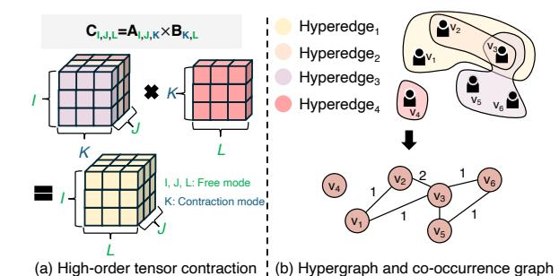

Fig. 1. High-order tensor contraction, Hypergraph, and Co-occurrence graph. producing an output tensor of reduced order. Specifically, the tensor contraction could be formulated as:

$$C_{f_1, f_2} = \sum_{c} \mathcal{A}_{\{f_1\}, \{c\}} \mathcal{B}_{\{c\}, \{f_2\}}$$
 (1)

Here,  $\{f_1\}$  and  $\{f_2\}$  denote the *free modes* that are not involved in contraction, while  $\{c\}$  represents the contraction modes. Importantly, the fiber length along every contraction mode in one operand must match the corresponding fiber length in the other operand. If the two input tensors contain m and n modes, respectively, the resulting tensor will have  $m+n-2|\{c\}|$  modes, where  $|\{c\}|$  is the number of contraction modes. For instance, as illustrated in Fig. 1(a), contracting tensors  $\mathcal{A}_{I,J,K}$  and  $\mathcal{B}_{K,L}$  produces a third-order tensor  $\mathcal{C}_{I,J,L}$ .

Essentially, tensor contraction transforms high-order matrix multiplication into a sequence of matrix multiplications. Common approaches include mode unfolding (matrixization), Einstein summation lowering (einsum), and loop transformation. While these methods enable reusing optimized sparse—dense matrix multiplication (SpMM) kernels, they introduce several limitations: (1) unfolding can inflate intermediate matrix dimensions by orders of magnitude, (2) different unfolding choices lead to different sparsity patterns, making optimization mode-dependent, and (3) compromised data reuse and intermediate data reuse due to tensor unfolding.

**Tensor Contraction in Real-world Applications.** Sparse tensor contraction has emerged as a fundamental computational kernel across a wide spectrum of real-world applications, spanning from machine learning to scientific computing. Table I summarizes applications of high-order tensor contraction across diverse tensor orders and density characteristics. For example, in LLMs, multi-head attention operates on 4D tensors (batch, heads, sequence length, channel dimension), where the attention scores and context are computed via contractions over the feature dimension [48]. In computer vision and video analytics, activations and inputs are naturally 4D-5D, and operations such as 3D convolution can be expressed as high-order contractions across channel and kernel modes. In scientific computing, atmospheric and ocean simulations represent evolving physical fields as high-order tensors over time, latitude, longitude, altitude level, and physical variables. Even though prior work, such as Trapezoid [49] and Misam [50], improves the performance of sparse tensor computation across varying sparsity ratios, current solutions primarily target low-order tensors. Consequently, high-order


Fig. 2. The impacts of matrix tiling on different unfolding modes: (a) Two matrices across different unfolding modes, and (b) Traditional matrix partition in two different unfolding ways.

sparse contractions remain largely underexplored.

#### B. Hypergraph and Co-occurrence Graph

Graph theory has been widely used to find parallelism and data reuse opportunities for sparse tensor computations [51]. For example, sparse-dense matrix multiplication (SpMM), Y = AX, can be equivalently expressed as a graph computation, and vice versa, where  $A \in \mathbb{R}^{N \times N}$  is a sparse matrix,  $X \in \mathbb{R}^{N \times F}$  is a dense feature matrix, and  $Y \in \mathbb{R}^{N \times F}$  is the output. When interpreting A as the adjacency matrix of a graph G = (V, E) with |V| = N, each nonzero entry  $A_{ij} \neq 0$  corresponds to a directed edge  $j \rightarrow i$ .

Similarly, as shown in Figure 1, high-order tensors can be represented as hypergraphs or co-occurrence graphs. For example, a hypergraph generalizes a traditional graph by allowing a single edge to connect an arbitrary number of vertices. Formally, a hypergraph is defined as  $H=(V,\mathcal{E})$ , where V denotes the vertex set and each hyperedge  $e\in\mathcal{E}$  is a subset of V with  $|e|\geq 2$ . Consider a simple example with six vertices  $V=\{v_1,v_2,v_3,v_4,v_5,v_6\}$ , three hyperedges capture high-order relationships:  $e_1=\{v_1,v_2,v_3\},\ e_2=\{v_2,v_3\},$  and  $e_3=\{v_3,v_5,v_6\}$ , which results in the hypergraph  $H=(V,\mathcal{E}),\ \mathcal{E}=\{e_1,e_2,e_3\}.$ 

A co-occurrence graph provides an alternative representation that encodes hyperedge relationships using weighted pairwise edges. Any pair of vertices  $(v_i,v_j)$  is connected if they co-occur in at least one hyperedge, and the edge weight equals the number of hyperedges in which they co-exist  $w(v_i,v_j)=|\{e\in\mathcal{E}\mid v_i,v_j\in e\}|$ . For example, as illustrated in Figure 1, two hyperedges involving  $v_2$  and  $v_3$  are represented as a single edge with weight 2. This preserves the vertex set but converts hyperedge connectivity into pairwise edge representation, enabling reuse of well-established graph-based optimizations.

#### C. Prize-Collecting Steiner Tree

The Prize-Collecting Steiner Tree (PCST) [52] is a classical combinatorial optimization problem in graph theory. Given an undirected graph G = (V, E), each edge  $e \in E$  is associated

with a non-negative cost  $c_e$ , and each vertex  $v \in V$  is assigned a non-negative prize  $\pi_v$ . The objective of PCST is to identify a connected subgraph that balances the trade-off between minimizing edge costs and maximizing collected prizes (e.g., optimization objective). Formally, let  $T = (V_T, E_T)$  denote a tree with  $V_T \subseteq V$  and  $E_T \subseteq E$ . The objective function is defined as:  $\min_T \left(\sum_{e \in E_T} c_e + \sum_{v \notin V_T} \pi_v\right)$ . PCST has been widely used for combinatorial optimization in large-scale graph systems.

#### III. MOTIVATION AND CHALLENGES

#### A. Dataflow in High-order Tensor Contraction

Sparse tensor contraction commonly flattens high-order tensors into two-dimensional forms to leverage existing SpMM optimizations such as matrix tiling and dataflow. For example, the 3D tensor contraction  $C_{i,j,l} = \sum_k A_{i,j,k} \times B_{k,l}$ , with  $A \in \mathbb{R}^{I \times J \times K}$  and  $B \in \mathbb{R}^{K \times L}$ , produces an output tensor  $C \in \mathbb{R}^{I \times J \times L}$  that keeps modes (i,j) intact and contracts over mode k. The 3D tensor can be unfolded along either the J-mode (JIK, KL  $\rightarrow$  JIL) or the I-mode (IJK, KL  $\rightarrow$  IJL) using einsum notation. Mathematically, the unfolding reshapes matrix A into a matrix of size  $(JI \times K)$  or a matrix of size  $(IJ \times K)$ . By unfolding, the high-order sparse tensor operation is mapped to a traditional SpMM kernel, such as  $C_{M,L}$  =  $A_{M,K} \times B_{K,L}$  (e.g., M = IJ or M = JI), which allows the reuse of established dataflow techniques such as inner-product, outer-product, and Gustavson algorithm [10], [15], [53]-[55]. Specifically, the inner-product dataflow optimizes reuse of the output matrix, but it suffers from relatively poor locality for the input dense matrix because the dense inputs could be fetched repeatedly. The outer-product dataflow achieves high reuse and locality for the dense operand (i.e.,  $Patial\_C_{M,L} =$  $\sum_{k} A_{:,k} \times B_{k,:}$  by broadcasting dense rows (i.e.,  $B_{k,:}$ ) along the shared dimension, but it often requires substantial storage for partial sums (or expensive synchronization of  $Patial\_C_{M,L}$ ) to accumulate scattered updates to the output. The Gustavson dataflow fetches one row of sparse tensor at a time and streams the corresponding rows from the input matrix into output accumulation, balancing input and output data locality.

In addition, traditional matrix tiling and reordering techniques remain applicable for optimizing data locality in sparse tensor contraction. For example, the unfolded tensor can be tiled along the free modes (the I and J dimensions) or along the contraction mode (the K dimension). Despite their higher dimensionality, sparse high-order tensors can still be reordered to expose locally dense subregions, thereby enhancing computational regularity and improving data locality.

#### B. Challenges in Tensor Contraction

As high-order tensors become increasingly common in today's applications, optimization techniques generally fall into two categories: (1) unfolding tensors into lower-dimensional operations and (2) directly operating on tensors natively.

TABLE II
CONCLUSION OF STATE-OF-THE-ART SPARSE ACCELERATION DESIGNS.

| Prior<br>Designs   | Tensor<br>Order    | Tensor<br>Repr.     | Dataflow<br>Strategy | Operation<br>Kernel | Tiling<br>Strategy | Cross-mode<br>Dep. Capture |
|--------------------|--------------------|---------------------|----------------------|---------------------|--------------------|----------------------------|
| Sparse-dense Mati  | rix Multiplication | n .                 |                      |                     |                    |                            |
| ExTensor [10]      | Matrix/Tensor      | 2D Unfolding        | Inner-product        | SpMM&SpMSpM         | Fixed              | ×                          |
| DRT [24]           | Matrix/Tensor      | 2D Unfolding        | Inner/Outer/Row-wise | SpMM&SpMSpM         | Dynamic Reflexive  | ×                          |
| SEXTANS [23]       | Matrix             | 2D Unfolding        | Row-wise             | SpMM                | Adaptive           | ×                          |
| SPADE [1]          | Matrix             | 2D Unfolding        | Row-wise             | SpMM                | Adaptive           | ×                          |
| HotTiles [2]       | Matrix             | 2D Unfolding        | Row-wise             | SpMM                | Heterogeneous      | ×                          |
| Trapezoid [49]     | Matrix             | 2D Unfolding        | Inner/Gustavson      | SpMSpM              | Fixed              | ×                          |
| Misam [50]         | Matrix             | 2D Unfolding        | Inner/Outer/Row-wise | SpMM&SpMSpM         | ML-driven          | ×                          |
| Sparse Convolutio  | n Networks         |                     |                      |                     |                    |                            |
| SCNN [56]          | Tensor             | 2D Unfolding        | Inner-product        | Contraction(Conv)   | -                  | ×                          |
| Sparten [57]       | Tensor             | 2D Unfolding        | Row-wise             | Contraction(Conv)   | -                  | ×                          |
| Traditional Tensor | Contraction        |                     |                      |                     |                    |                            |
| GSpTC [3]          | Tensor             | Native Tensor       | Outer-product        | Contraction         | Chunk-based        | •                          |
| TCP [4]            | Tensor             | Native Tensor       | Inner-product        | Contraction         | Dynamic            | •                          |
| Co-occurrence Gra  | aph-driven Tens    | or Contraction      |                      |                     |                    |                            |
| TensorPrism        | 2D Graph           | Co-occurrence Graph | Graph-native         | Contraction         | PCST-based         | /                          |

Partial cross-mode dependency capture (limited to unfolded or single-mode analysis)

1) Unfolding high-order tensors to 2D SpMM Kernels: Even though SpMM optimization techniques [1], [10], [22]–[24], [58], [59] can still be applied to high-order sparse tensor computation, unfolding tensors into lower-dimensional forms inflates input metadata and misses reuse opportunities.

Metadata Overhead for Sparse Tensor Unfolding. Metadata for sparse tensor unfolding can increase significantly when an unfolded mode becomes a product of multiple dimensions. For example, as shown in Figure 2, a third-order tensor  $A_{i,j,k}$  can be matricized by grouping (i,j) into the row index, which leads to a matrix of size  $(IJ) \times K$  (equivalently  $(JI) \times K$ ). In tensor-native sparse formats, metadata typically scales with the sum of mode sizes, i.e.,  $\mathcal{O}(I+J+K)$ . After unfolding into a sparse matrix format that uses per-row/per-column pointers (e.g., CSR/CSC), the metadata scales with the number of rows or columns. As a result, the size becomes  $\mathcal{O}(IJ+K)$ . Consequently, when a mode size explodes into a product such as IJ, the metadata can dominate the storage cost even if the number of nonzeros remains unchanged.

Reuse Distance Issues for Tensor Unfolding. Beyond metadata overhead, tensor unfolding can also compromise locality by (1) increasing reuse distance and (2) reducing immediate reuse opportunities. Inspired by reuse distance analysis in cache performance modeling [60], we define reuse **distance** as the number of distinct sparse rows (or columns) accessed between two consecutive accesses to the same row (or column) of the dense tensor. As illustrated in Figure 2, for a third-order sparse tensor  $A_{i,j,k}$ , the maximum reuse distance is bounded by I + J (the sum of the free-mode extents), since the coordinate information in the two free modes is sufficient to identify a unique sparse data element. After unfolding (i, j) into a single matrix dimension, the corresponding bound inflates to  $I \times J$  (the product of the free-mode extents). This expansion can substantially degrade temporal locality and exceed the capacity of the limited on-chip storage.

Unfolding also reduces the number of adjacent neighbors available for immediate reuse. In a 2D sparse matrix, each nonzero can have at most four structurally adjacent neighbors that share a row or column index. These adjacent nonzero elements typically reuse the same dense tensors. In contrast, in a third-order tensor, each nonzero can share an index with neighbors along three modes, increasing the total number of

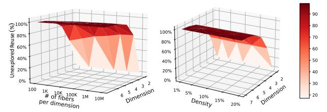

Fig. 3. Data reuse analysis with various tensor dimensions.

adjacent neighbors to six. The combination of fewer adjacent neighbors and a much larger worst-case reuse distance highlights compromised data locality when representing sparse tensors as 2D matrices.

We summarize state-of-the-art sparse accelerator designs in Table II. Specifically, Extensor [10] improves sparse kernel efficiency via coordinate intersection mechanisms; however, its benefits for SpMM are limited, as the dense matrix operand does not require intersection, restricting the overall optimization potential. DRT [24] extends Extensor by introducing dynamic sparsity-aware tiling with flexible tile sizes to better exploit data locality. More recent designs, including Trapezoid [49] and Misam [50], target a broader spectrum of input density ranges. Trapezoid adapts to increasing row/column intersection parallelism and multi-fiber intersection dataflows, whereas Misam leverages an MLdriven decision tree to dynamically select hardware configurations(e.g., compression format, PE numbers) and dataflows tailored to the input characteristics. While prior work maps multi-dimensional tensors into two-dimensional space to exploit efficient data locality and cross-mode data reuse, overlooking higher-dimensional index semantics makes parts of the computation irrecoverable when mapping intermediate results back to the original tensor domain. As shown in Figure 3, our results show that current loop transformation techniques in tensor unfolding fail to capture 50-60% of potential data reuse. This inefficiency is exacerbated in higher dimensions used in scientific applications, such as quantum simulation [45], where nearly 90% of reuse opportunities go unharnessed.

2) Tensor-native Dataflow Optimization: Recent work avoids the drawbacks of tensor unfolding by adopting tensornative strategies that enhance data reuse and computational efficiency. Gündüz et al. [26] represent sparse tensors as hypergraphs and leverage KaHyPar [27] to obtain partitions with minimal edge cuts while maintaining load balance. TCP [4] directly optimizes reuse at the tensor level rather than relying on unfolded matrix forms. GSpTC [3] further proposes finegrained partitioning and scheduling techniques to improve parallelism in sparse tensor contraction.

GSpTC and TCP extend outer-product and inner-product dataflows to high-order tensor contractions. For example, outer-product dataflow broadcasts a contraction-mode vector (e.g., dense input tensors) to accumulate partial results across free-mode output locations (e.g., output tensors), which effectively captures input reuse. Similarly, the inner-product dataflow computes each output entry as a dot product between a sparse row of the sparse input and the corresponding dense


Fig. 4. (a) Hypergraph and Co-occurrence graph representation of sparse tensor (b) Sparse contraction computation in co-occurrence graph.

column, iterating over the contraction-mode operands (e.g., dense input) and accumulating into a single fixed output accumulator to maximize output locality and reuse. However, current dataflows are inefficient in simultaneously capturing (1) both input and output reuse and (2) cross-mode reuse.

#### IV. GRAPH ABSTRACTION OF TENSOR CONTRACTION

Graph abstractions have been explored to model tensor computations and improve data locality and parallelism [10], [26], [27], [55]. However, applying current graph abstractions directly to sparse tensor contraction remains challenging due to (1) their limited ability to capture high-order tensor structures, and (2) the complexity that grows with contraction order when exploring cross-dimensional sparsity relationships. To address this issue, we reformulate sparse high-order tensor contraction using a Co-occurrence Graph that reveals inherent data reuse and parallel execution opportunities. For example, converting hyperedges into pairwise weighted edges in co-occurrence graphs can enable efficient reordering without losing high-order semantics.

Co-occurrence Graph Abstraction for Sparse Tensor **Contraction.** For two-dimensional tensors [8], [9], [11], sparse matrix-dense matrix multiplication (SpMM) and graph computation are mathematically equivalent, where each nonzero tensor element corresponds to a graph vertex, while edges represent aggregation operations that accumulate rows of the input dense matrix. When extending to high-order tensors, a single vertex (i.e., a coordinate index) can no longer uniquely identify a nonzero element, since multiple indices are required to locate an entry in a high-dimensional space. Consequently, hypergraphs were introduced to encode nonzero elements, where each hyperedge captures the full set of high-order tensor indices. While hypergraphs list all nonzero tensor elements as hyperedges, extracting index overlap, an indicator of data reuse, remains challenging. To this end, we repurpose the co-occurrence graph for sparse high-order tensors, enabling explicit tracking of index overlap while preserving hyperedges to recover the original nonzero elements in high-dimensional space. For example, in a co-occurrence graph as shown in Fig-

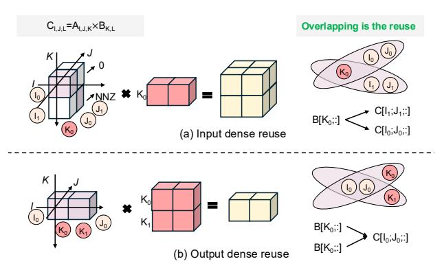

Fig. 5. The reuse definition of sparse tensor with hypergraph representation. ure 4(a), each vertex represents an index of the sparse tensor, and edges capture the connectivity and frequency of their co-occurrence. Both the hypergraph and the co-occurrence graph are mathematically equivalent.

Specifically, for a given co-occurrence graph CoG = (V, E), the edge weight between vertices i and j could be directly formulated to represent the nonzero element in the sparse tensor A as:

$$W((i,j)) = nnz(A[..;i;..;j;..]), \forall i,j$$
 (2)

For a third-order sparse tensor  $A_{I,J,K}$ , its co-occurrence graph CoG(V,E) contains |V|=I+J+K vertices. As shown in Figure 4(b), a  $2\times 2\times 2$  tensor generates a co-occurrence graph with |V|=6 vertices, where vertices  $I_0$  and  $K_1$  exhibit a co-occurrence weight of  $W(I_0,K_1)=\max(A[I_0,:,K_1])=2$ . A complete subgraph, such as a clique  $(I_0,J_0,$  and  $K_0)$ , corresponds to a nonzero tensor element. Each nonzero tensor indicates one vector-wise operation similar to SpMM.

However, unlike conventional SpMM dataflows such as the Push (outer-product), Pull (inner-product), or Gustavson execution models, the pull/push behavior of vertices in a co-occurrence graph cannot be mapped directly to traditional inner- or outer-product execution. In tensor contraction, the dataflow is determined by both pull/push operations and index mode. For example, vertices corresponding to the *contraction modes* (e.g., modes K) determine the vector location in the input dense tensor, whereas vertices associated with the *free modes* (e.g., mode I and J) determine the output tensor locations. Specifically, vertices  $I_0$  and  $J_0$  identify the destination vector in the output matrix, while vertex  $K_0$  selects the source vector in the dense input matrix. The pull or push operations on the destination vertex set  $\{I_0, J_0\}$  are equivalent to inner-or outer-product execution.

Quantify Reuse in Sparse Tensor Contraction. Quantifying data reuse in sparse tensor computations is difficult due to irregular sparsity patterns. The fundamental challenge lies in that coordinate representations of sparse tensors do not expose their sparsity structure. For SpMM and sparse tensor contraction, tiling along tensor dimensions, whether adaptive or fixed, does not ensure that both input dense matrices are reduced to their minimum possible dimensions. Such variations also make data reuse difficult to quantify. Graph abstraction provides

a way to quantify data reuse in sparse tensor contraction. By co-locating vertex connectivity, it captures reuse through hyperedge intersections as shown in Figure 5. Please note that we only use hyperedge to visualize the data reuse, and we measure the data reuse directly on the co-occurrence graph. Tensor contraction exhibits two distinct forms of reuse: (1) input reuse from shared vertices in contraction modes, and (2) output reuse from shared vertices in free modes.

**Input reuse** occurs when two hyperedges share a vertex K in a contraction mode. In this case, both hyperedges access the same subtensor B[K,:], but contribute to different output coordinates in C. As illustrated in Figure 5(a), the subtensor  $B[K_0,:]$  is reused by hyperedges  $(I_0,J_0,K_0)$  and  $(I_1,J_1,K_0)$  to update  $C[I_0,J_0,:]$  and  $C[I_1,J_1,:]$ , respectively.

**Output reuse**, in contrast, occurs when two hyperedges share vertices in free modes. When hyperedges overlap on free-mode vertices, they access different input elements but accumulate into the same output location. As shown in Figure 5(b), the output subtensor  $C[I_0,J_0,:]$  aggregates contributions from both  $B[K_0,:]$  and  $B[K_1,:]$ , because vertices  $I_0$  and  $J_0$  are shared by hyperedges  $(I_0,J_0,K_0)$  and  $(I_0,J_0,K_1)$ .

Formally, we could extract the reuse of sparse tensor contraction using its co-occurrence graph abstraction. Given a co-occurrence graph CoG(V,E) for tensor contraction:  $C_{\{f_1\},\{f_2\}} = A_{\{f_1\},\{c\}} \times B_{\{c\},\{f_2\}}$ , the reuse of sparse tensor contraction thus can be expressed as:

$$Reuse = \frac{\sum_{v_i \in V_{f_1}} D(v_i)}{|\{f_1\}|} + \frac{\sum_{v_j \in V_c} D(v_j)}{|\{c\}|} - \prod_{v_i \in V_c} v_i - \prod_{v_j \in V_{f_1}} v_j$$
(3)

Here,  $V_c$  is the contraction mode vertices and  $V_{f_1}$  is the free mode vertices in the co-occurrence graph. D(V) is the degree of each vertex. As such, the tensor tiling problem can be naturally formed as a graph partitioning problem.

# A. DRAM Access Modeling for Tensor Contraction

To explicitly model DRAM access for tensor contraction, we propose an analytical model based on co-occurrence graph abstraction, where all tensor dimensions are considered. Specifically, we use Compressed Sparse Row format (CSR) [61], [62] to store the co-occurrence graph, so the memory footprint of the co-occurrence graph representing an r-order tensor containing N nonzero elements is:

$$M_{CSR} = \left(\sum |r| + 1\right) \times 4 + E \times 4 \tag{4}$$

where E represents the count of edges that do not overlap between the two index vertices, which is  $E << N \times \binom{r}{2}$ . Here, we use 32-bit floating-point precision (i.e., FP32). As such, each data point is 4 bytes.

For a given tensor contraction:  $C_{\{f_1\},\{f_2\}} = A_{\{f_1\},\{c\}} \times B_{\{c\},\{f_2\}}$  with a co-occurrence graph CoG(V,E), partitioning the co-occurrence will directly affect the tiling factors for all tensors A, B, and C, as vertex indices of sparse tensor A,  $f_1$  and c, are part of tensors B and C. Please note that both  $f_1$  and c represent sets of free-mode and contraction-mode indices as the tensor dimensionality increases. Tiling along


Fig. 6. Proposed modified Prize-collection Steiner tree partitioning algorithm for co-occurrence graph-based sparse tensor partitioning.

 $f_1$  impacts the storage requirement of the output tensor C, whereas adjusting the tiling factor along c affects the storage footprint of tensor B. The tensor dimension,  $f_2$ , is shared by both tensors B and C, and its tiling factor  $(M_t)$  determines the data locality for both dense tensors. A smaller  $M_t$  value enables more fibers of the sparse tensor A to reside in the onchip buffer, vice versa. To find an optimal set of tiling factors, we analyze the memory consumption of dense tensor B and C as well as sparse tensor A in the constrained on-chip buffer capacity  $M_{cap}$ :

$$(\prod_{V_{c_i} \in V_c} |V_{c_i}| + \prod_{V_{f_j} \in V_{f_1}} |V_{f_j}|) \times 4 \times M_t +$$

$$4 \times (2 \times E_I^p + E_Y^p) \le M_{cap}$$

$$(5)$$

Here,  $E_I^p$  represents internal edges (both endpoints in partition p), and  $E_X^p$  represents cut edges (one endpoint in partition p). Factor 2 represents that CoG is an undirected graph.

Based on the DRAM access model, we can determine that the number of vertices from both the free and contraction modes should be grouped into each partition.

#### B. Co-occurrence Graph Partitioning for Tensor Contraction

The formulation of the co-occurrence graph implies that tiling sparse tensors is critical in determining workload distribution, optimizing data locality, and ultimately selecting an appropriate dataflow. While several hypergraph partitioning algorithms [63]–[66] for tensor contraction have been proposed, they are typically limited to balancing the number of vertices and reducing edge cuts. This is because the hyperedge representation captures individual nonzero elements but not their sparsity patterns. Given the enriched semantics of co-occurrence graph, we repurpose the Prize-Collecting Steiner Tree (PCST) algorithm [52], called CoGTP, to select a connected subset of vertices that maximizes data reuse and workload balancing minus connectivity cost. The formulation of our PCST algorithm adheres to the following set of objectives.

**Intra-Tile Data Reuse.** As discussed earlier, edge weights in the co-occurrence graph quantify reuse frequency during tensor contraction. Grouping vertices connected by highweight edges within the same partition increases temporal locality and minimizes redundant tensor fetches.

**Inter-Tile Connectivity.** Cross-partition connectivity occurs when indices contributing to the same contraction reside in

#### **Algorithm 1:** Co-occurrence graph tensor partitioning.

```
Input: Tensor: T: Number of partitions: N
             Output: Partitions: P_0, P_1, ..., P_{N-1}
           Function Update(P)
                              best\_move \leftarrow null, max\_gain \leftarrow 0;
                               V_{boundary} \leftarrow \{v \in V \mid \exists u \in V\}
                                    Neighbors(v), membership[u] \neq membership[v]\};
                              for i \leftarrow 0 to N-1 do
                                                V_i^{boundary} \leftarrow V_{boundary} \cap P_i;
                                                for v \in V_i^{boundary} and |P_i| > 1 do
                                                                 // Find candidate target partitions
                                                                                 (neighbors of v)
                                                                 \mathcal{C}_v \leftarrow \{membership[u] \mid u \in
                                                                        Neighbors(v), membership[u] \neq i\};
                                                                 for j \in \mathcal{C}_v do
                                                                                   // Compute incremental gain
  10
                                                                                   gain \leftarrow \Delta \mathcal{F}(v, i \rightarrow j);
  11
                                                                                   if gain > max\_gain then
  12
  13
                                                                                                     max\_gain \leftarrow gain; best\_move \leftarrow (v, i, j);
  14
15
16
                              end
17
                                          Apply best move if improvement found
18
                              if best\_move \neq null then
                                              (v^*, i^*, j^*) \leftarrow best\_move; P_{i^*} \leftarrow P_{i^*} \setminus \{v^*\};
                                                    P_{j^*} \leftarrow P_{j^*} \cup \{v^*\};
                             return P:
20
21
                          Step 1: Construct Co-occurrence Graph
                       \leftarrow Indices(NNZ(T)), w(u,v) \leftarrow T[...;u;...;v;...];
                          G = (V, E, w) \leftarrow (V, w) // Step 2: Initialize
           D(v) = \sum_{u} w(u, v); Initialize(P); // Step 3: Optimize
                    T(P) = \alpha \sum_{i=0}^{N-1} \sum_{e \in P_i} w(e) - \lambda_{cu} \sum_{e \in \text{cul}} w(e) - \lambda_{cu} \sum_{e \in \text{cul}} w(e) - \lambda_{cu} \sum_{e \in \text{cul}} w(e) - \lambda_{cu} \sum_{e \in \text{cul}} w(e) - \lambda_{cu} \sum_{e \in \text{cul}} w(e) - \lambda_{cu} \sum_{e \in \text{cul}} w(e) - \lambda_{cu} \sum_{e \in \text{cul}} w(e) - \lambda_{cu} \sum_{e \in \text{cul}} w(e) - \lambda_{cu} \sum_{e \in \text{cul}} w(e) - \lambda_{cu} \sum_{e \in \text{cul}} w(e) - \lambda_{cu} \sum_{e \in \text{cul}} w(e) - \lambda_{cu} \sum_{e \in \text{cul}} w(e) - \lambda_{cu} \sum_{e \in \text{cul}} w(e) - \lambda_{cu} \sum_{e \in \text{cul}} w(e) - \lambda_{cu} \sum_{e \in \text{cul}} w(e) - \lambda_{cu} \sum_{e \in \text{cul}} w(e) - \lambda_{cu} \sum_{e \in \text{cul}} w(e) - \lambda_{cu} \sum_{e \in \text{cul}} w(e) - \lambda_{cu} \sum_{e \in \text{cul}} w(e) - \lambda_{cu} \sum_{e \in \text{cul}} w(e) - \lambda_{cu} \sum_{e \in \text{cul}} w(e) - \lambda_{cu} \sum_{e \in \text{cul}} w(e) - \lambda_{cu} \sum_{e \in \text{cul}} w(e) - \lambda_{cu} \sum_{e \in \text{cul}} w(e) - \lambda_{cu} \sum_{e \in \text{cul}} w(e) - \lambda_{cu} \sum_{e \in \text{cul}} w(e) - \lambda_{cu} \sum_{e \in \text{cul}} w(e) - \lambda_{cu} \sum_{e \in \text{cul}} w(e) - \lambda_{cu} \sum_{e \in \text{cul}} w(e) - \lambda_{cu} \sum_{e \in \text{cul}} w(e) - \lambda_{cu} \sum_{e \in \text{cul}} w(e) - \lambda_{cu} \sum_{e \in \text{cul}} w(e) - \lambda_{cu} \sum_{e \in \text{cul}} w(e) - \lambda_{cu} \sum_{e \in \text{cul}} w(e) - \lambda_{cu} \sum_{e \in \text{cul}} w(e) - \lambda_{cu} \sum_{e \in \text{cul}} w(e) - \lambda_{cu} \sum_{e \in \text{cul}} w(e) - \lambda_{cu} \sum_{e \in \text{cul}} w(e) - \lambda_{cu} \sum_{e \in \text{cul}} w(e) - \lambda_{cu} \sum_{e \in \text{cul}} w(e) - \lambda_{cu} \sum_{e \in \text{cul}} w(e) - \lambda_{cu} \sum_{e \in \text{cul}} w(e) - \lambda_{cu} \sum_{e \in \text{cul}} w(e) - \lambda_{cu} \sum_{e \in \text{cul}} w(e) - \lambda_{cu} \sum_{e \in \text{cul}} w(e) - \lambda_{cu} \sum_{e \in \text{cul}} w(e) - \lambda_{cu} \sum_{e \in \text{cul}} w(e) - \lambda_{cu} \sum_{e \in \text{cul}} w(e) - \lambda_{cu} \sum_{e \in \text{cul}} w(e) - \lambda_{cu} \sum_{e \in \text{cul}} w(e) - \lambda_{cu} \sum_{e \in \text{cul}} w(e) - \lambda_{cu} \sum_{e \in \text{cul}} w(e) - \lambda_{cu} \sum_{e \in \text{cul}} w(e) - \lambda_{cu} \sum_{e \in \text{cul}} w(e) - \lambda_{cu} \sum_{e \in \text{cul}} w(e) - \lambda_{cu} \sum_{e \in \text{cul}} w(e) - \lambda_{cu} \sum_{e \in \text{cul}} w(e) - \lambda_{cu} \sum_{e \in \text{cul}} w(e) - \lambda_{cu} \sum_{e \in \text{cul}} w(e) - \lambda_{cu} \sum_{e \in \text{cul}} w(e) - \lambda_{cu} \sum_{e \in \text{cul}} w(e) - \lambda_{cu} \sum_{e \in \text{cul}} w(e) - \lambda_{cu} \sum_{e \in \text{cul}} w(e) - \lambda_{cu} \sum_{e \in \text{cul}} w(e) - \lambda_{cu} \sum_{e \in \text{cul}} w(e) - \lambda_{cu} \sum_{e \in \text{cul}} w(e) - \lambda_{cu} \sum_{e \in \text{cul}} w(e) - \lambda_{cu} \sum_{e \in \text{cul}} w(e) - \lambda_{cu} \sum_{e \in \text{cul}} w(e) - \lambda
                  \lambda_b \sum_{i=0}^{N-1} \left( \sum_{v \in P_i} (D(v) - \frac{W}{N})^2 \right);
            F \leftarrow \mathcal{F}(P), \Delta \mathcal{F} \leftarrow \mathcal{F}(P);
26
          while \Delta \mathcal{F} > \epsilon do
                            \mathbf{Update}(P);\,\Delta\mathcal{F}\leftarrow\mathcal{F}(P)-F;\,F\leftarrow\mathcal{F}(P);
27
             28 end
29 return optimized partitions \{P_0, \ldots, P_{N-1}\};
```

different tiles, where tensor elements or partial results need to be exchanged across partitions. Such connectivity can lead to either irregular DRAM access or communication between computing nodes. To discourage inter-tile connectivity, we impose a cut penalty on cross-partition edges  $e_{\rm cross}$ , proportional to their associated weights.

**Workload Balancing.** To avoid uneven partition sizes, we introduce a quadratic load-imbalance penalty. The workload of each vertex is estimated by its weighted degree  $D(v) = \sum_u W(u,v)$ , which reflects its computational cost. Accordingly, the total workload of partition  $P_i$  is approximated by  $\sum_{v \in P_i} D(v)$ , and deviations across partitions are penalized.

Given this, the objective function of our proposed graph partitioning algorithm is formulated as follows:

$$\max\{\alpha \sum_{i}^{N} \sum_{e \in P_{i}} W(e) - \lambda_{cut} \sum_{\forall ecross \notin T} W(e) - \lambda_{b} \lfloor \sqrt{\sum_{i}^{N} \left( \sum_{v \in P_{i}} (D(v) - \frac{W}{N})^{2} \right)} \rfloor \}$$
 (6)

where  $P_i$  denotes the i-th partition,  $e_{cross} \notin T$  is the edge cuts across tiles. The parameters  $\alpha$ ,  $\lambda_{cut}$ , and  $\lambda_b$  control the trade-offs between the three objectives. We select  $\alpha=2.0$ ,  $\lambda_{cut}=1.0$ , and  $\lambda_b=1.0$  based on structural properties of co-occurrence graphs and memory-intensive characteristics of tensor contraction workloads. Specifically,  $\alpha=2.0$  reflects that high-degree vertices provide quadratic reuse opportunities

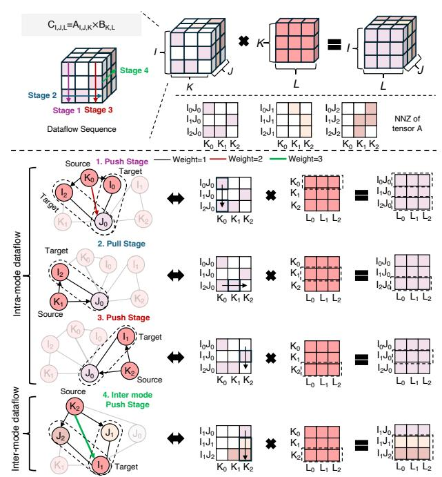

Fig. 7. Proposed co-occurrence graph-based dataflow for multidimensional tensor reuse.

 $(\mathcal{O}(k^2))$  pairwise interactions) while incurring linear storage cost  $(\mathcal{O}(k))$ , establishing a 2:1 benefit-to-cost ratio that prioritizes data reuse. The unit penalties  $\lambda_{cut}=1.0$  and  $\lambda_b=1.0$  match unit communication cost (already normalized by data volume) and the typical coefficient of variation in workload distributions for power-law graphs [67]. Section VII-G provides empirical validation of these parameter choices across diverse tensor structures. The detailed process is depicted in Algorithm 1, Lines 21-29.

To initialize partitions, we apply a breadth-first search (BFS) to cluster high-connectivity regions within the co-occurrence graph. The BFS runs in parallel from multiple seed vertices, maximizing the first term of the objective function. As shown in Figure 6, a score of  $\mathcal{F}(P) = 5$  is calculated for initial partitions. Following initialization, CoGTP performs an iterative local refinement procedure (Algorithm 1, Lines 1-20) inspired by the Kernighan-Lin algorithm [68]. A greedy hillclimbing strategy is employed to escape local optima and progressively improve the objective. To constrain the search space, the refinement considers only single-vertex migrations between partition pairs whose vertices are located on current partition boundaries that contribute to edge cuts. In each iteration, a candidate vertex v is tentatively moved to every other partition  $P_i$   $(i \neq j)$ , and the corresponding objective change  $\Delta \mathcal{F}$  is evaluated. For example, the attempted relocation of  $K_1$  is discarded due to its negative impact on the score, whereas moving  $K_0$  is retained because it provides a positive gain as shown in the Figure 6. The iteration terminates once  $\Delta \mathcal{F}$  falls below a threshold  $\epsilon$ . The per-iteration complexity is  $\mathcal{O}(\sqrt{|V|}d)$ , where d denotes the average unweighted vertex degree. Since most tensor workloads are highly sparse, d typically ranges from 1 to 10, enabling efficient convergence.


Fig. 8. An overview of TensorPrism accelerator design, which includes processing element (PE) architecture, co-occurrence graph (CoG) scheduler, contraction engine, and weight computation unit.

# V. CO-OCCURRENCE DATAFLOW FOR MULTI-DIMENSIONAL TENSOR REUSE

Traditional dataflows rely on dimension-based tiling to exploit data locality. For example, SpMM execution is typically optimized in Push (i.e., outer-product) or Pull (i.e., inner- or row-wise) modes. The Push model favors dense input row reuse, whereas the Pull model improves reuse within the output tensor. Such benefits are typically limited to a two-dimensional tensor space. In contrast, our proposed CoGTP algorithm performs sparse contraction partitioning without adhering to the original tensor dimension order. Instead, CoGTP groups a heterogeneous set of nonzero elements across multiple dimensions to maximize data locality. To fully capture reuse opportunities in high-order tensors, we introduce a new co-occurrence graph-based dataflow that integrates both intramode and inter-mode data reuse.

The key idea of our dataflow is to perform computation based on the traversal order of the co-occurrence graph and dynamically employ pull or push operations to fully utilize the data. Specifically, in the proposed dataflow, any contraction-mode vertex in the co-occurrence graph, such as vertex  $K_0$ , pushes its feature to the corresponding target vertex sets, such as  $(I_2, J_0)$  and  $(I_0, J_0)$ , as illustrated in Figure 7. Please note that two vertices are needed to locate data in dense tensors. This operation indicates that row  $B[K_0,:]$  will be multiplied with all nonzero elements in the sparse tensor slice  $A[J_0,:,K_0]$ , during which  $B[K_0,:]$  is temporally reused. The partial products, i.e., rows of  $C[J_0,:,:]$ , are stored in the buffer.

After completing column-wise traversal along tensor dimensions I and K, the dataflow transitions to a PULL operation. In this phase, the target vertices  $(I_2, J_0)$  pull features from the remaining source vertex  $K_1$ , which is equivalent to a row-wise dataflow. This process repeats until all nonzero elements along dimensions I and K have been traversed, which we refer to as the intra-mode dataflow. In this example, source vertex  $K_2$  pushes its feature to the corresponding target vertex sets.

Similarly, when a contraction-mode vertex such as  $K_2$  pushes its feature to target vertices in a different dimension (e.g.,  $J_1$  and  $J_2$ ), the dense tensor row  $B[K_2,:]$  is reused across multiple tensor modes, including  $J_1$ ,  $J_2$ , and  $J_3$ . This step enables data reuse across different tensor modes.

#### VI. PROPOSED TENSORPRISM ACCELERATOR DESIGN

Building on the co-occurrence graph abstraction and dataflow, we propose a specialized accelerator architecture for sparse tensor contraction. The architecture includes a new processing element (PE) microarchitecture capable of executing co-occurrence graph-based contraction operations, enabling both input and intermediate tensor reuse. In addition, we introduce a dedicated compute engine for the proposed partitioning algorithm and a contraction engine tailored for sparse tensor workloads.

Figure 8 illustrates the overall architecture of our proposed accelerator, TensorPrism. The design consists of four major components: a multi-bank global buffer (GLB), a task controller, a co-occurrence graph scheduler, and an array of processing elements (PEs). The accelerator connects to off-chip DRAM through a DRAM controller, while PE array exchanges data with GLB via a crossbar interconnect. GLB stores input data (e.g., sparse tensors), outputs (e.g., partial sums and final results), graph metadata (e.g., the constructed co-occurrence graph), and dense-buffer data (e.g., dense tensors). A centralized control unit orchestrates system-wide operations and interacts with the host through a request dispatcher. Dispatcher compiles incoming requests into instructions and forwards them to the instruction buffers. Instruction dispatcher then tracks in-flight instructions, manages completion, generates buffer addresses, and distributes instructions to both the cooccurrence graph scheduler and PE array.

#### A. PE Microarchitecture

As shown in Figure 8, TensorPrism consists of 16 processing elements (PEs) connected via a mesh interconnect, making it scalable for larger PE arrays. Each PE implements a sparse tensor contraction pipeline composed of eight sets of fetch units, contraction engines, intermediate-result (IR) buffers, and commit units. A **Co-occurrence Graph Scheduler** dispatches partitioned workloads, including metadata, co-occurrence graphs, and dense-tensor operands, from global buffers (GLBs) to the PE array, where all PEs perform sparse tensor contraction in parallel.

**Fetch Unit.** Since each PE receives its assigned workload partition and instructions that specify which graph entries

and dense tensor rows to access. Each fetch unit sequentially retrieves the corresponding co-occurrence graph and tensor metadata from GLB. Specifically, each fetch unit integrates a fetch sequencer that converts partition indices into explicit address streams for the memory banks. To avoid redundant GLB accesses, dense tensors are partitioned across fetch units, with each unit owning a disjoint slice to retrieve and cache. When a fetch unit needs a dense tile owned by another, it issues a request to the owning fetch unit, which forwards the requested data to the appropriate contraction engine. The fetch units are connected via a ring to reduce the network diameter, which leads to lower request latency.

Contraction Engine performs scalar–vector multiplication followed by vector accumulation, as illustrated in the right part of Figure 8. It consists of a feed unit, register files, operator controllers, and a set of multiplier–accumulator (MAC) units, all orchestrated by an operation controller. Each MAC unit integrates eight MACs (i.e., 64 MACs per engine), which consume two input vectors—one streamed from the feed unit and the other sourced from the register files, each containing 32 FP32 elements. The eight MACs share the sparse input supplied by the feed unit (i.e., broadcast for reuse) while receiving distinct dense inputs from the register files. Under the control of the operation controller, the feed unit further enhances temporal reuse by issuing the same data to the eight MACs over consecutive cycles. To support such temporal reuse, multiple accumulators are employed to maintain different partial sums. The register files, built from singleport SRAMs, augmented with a small cache, provide local storage to maximize input reuse during MAC operations. As for the load balancing, at the algorithmic level, the CoGTP objective function (Equation 6) incorporates a tunable imbalance penalty λ<sup>b</sup> that penalizes unequal workload distribution across PEs during the graph partitioning phase. This is a static, ahead-of-time balancing mechanism. Additionally, the Operation Controller redistributes local Buffer entries to underutilized MAC units through the DMUX control signal. As such, it improves workload balancing at runtime during the computation.

Commit Unit. Coupled with the Multidimensional Address Generator (MAG), the Commit Unit is responsible for assigning sequentially produced results to their corresponding memory locations, mapping tensor indices to physical addresses for storage.

# *B. Co-occurrence Graph Scheduler*

Co-occurrence graph (COG) scheduler implements the proposed partitioning algorithm and dataflow to improve data reuse and parallelism, as demonstrated in Figure 8. It consists of a weight computation unit, a graph generator, a cost analyzer with a PE partition index buffer. The Weight Computation Unit processes sparse tensor metadata to extract index co-occurrence patterns and maintain running counts of how frequently different index pairs appear together in nonzero elements. Extracted index pairs by Coordinate Parser and Dimension Pair Selector are buffered in the Index Pair Buffer, a FIFO structure with configurable depth (e.g., 256 entries). Each buffer entry contains the index pair (i, j), ∀i, j along with metadata pointing back to the original element. The Hash-based Engine ensures the non-repeated vertex pairs. Moreover, the Graph Generator constructs co-occurrence graphs from sparse tensor metadata, guiding the further partitioning and execution. The Adder aggregates cost metrics from all analyzers to compute an overall scheduling quality score. The Partition Indices Buffer stores the final mapping of operations to specific PEs.

# VII. EVALUATION

## *A. Evaluation Setup*

Simulation Framework. We develop a cycle-accurate simulator for TensorPrism following established methodologies from prior accelerator research [18], [49], [69]. The simulator integrates with Ramulator [70] to model HBM2 memory with 307.2 GB/s bandwidth and captures cycle-level behavior of all compute, memory, and control components. The TensorPrism accelerator is configured with 16 PEs organized in a 4×4 mesh topology, each containing a contraction engine with 512 FP32 MACs (8K MACs total), operating at 650 MHz. GLB is provisioned with 2.5 MB capacity, partitioned into 1 MB for metadata storage, 1 MB for dense tensor operands, and 512 KB for co-occurrence graph metadata and intermediate buffers. Each PE maintains 48 KB of local storage for register files and accumulators. For ASIC evaluation, we synthesize the design in Verilog RTL using TSMC 28nm technology with Synopsys Design Compiler. Power analysis is performed using Synopsys PrimeTime PX, with switching activity extracted from postsynthesis waveform traces. On-chip SRAM energy and area are modeled using CACTI 7.0 [71].

Datasets. We evaluate TensorPrism across eight real-world tensor datasets from the FROSTT repository [72], [73] spanning diverse scientific and machine learning domains, as detailed in Table III. Our benchmark suite includes: temporalspatial tensor from ride-sharing services (Uber), scientific publication topic modeling (Nips), large-scale knowledge graphs (Nell-1, Nell-2), social media interaction networks (Flickr), network traffic analysis (LBNL-Networks), urban analytics (Chicago-Crime), and e-commerce recommendation systems (Amazon-Reviews). These datasets exhibit order ranging from 3D to 5D tensors, with densities spanning 14 orders of magnitude (10<sup>−</sup><sup>14</sup> to 10<sup>−</sup><sup>2</sup> ), and nonzero counts from millions to billions, providing comprehensive coverage of tensor contraction workloads encountered in practice.

Baseline Accelerators. We compare TensorPrism against four state-of-the-art tensor acceleration frameworks: (1) SPADE [1], which employs tile-based scheduling with barrier synchronization for SpMM and extends to tensor operations via matricization; (2) HotTiles [2], which partitions tensors into dense and sparse regions processed by heterogeneous compute units; (3) GSpTC [3], a GPU-based framework using contraction-mode chunking strategies; and (4) TCP [4], which performs dynamic tensor partitioning with communicationaware tile sizing. Furthermore, we compare TensorPrism with

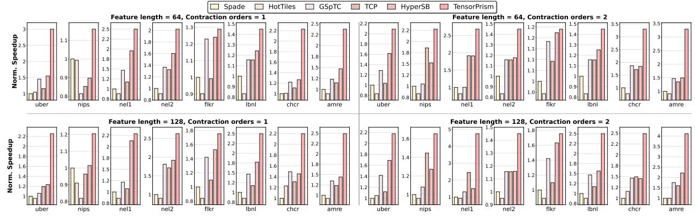

Fig. 9. Normalized speedup comparison of TensorPrism over SPADE, HotTiles, GSpTC and TCP across different datasets.

DIMENSIONS AND DENSITY OF DIFFERENT TENSOR INPUTS.

| Dataset        | Acr. | Dimensions                                                    | NNZs          | Density               |
|----------------|------|---------------------------------------------------------------|---------------|-----------------------|
| Uber           | uber | $183 \times 24 \times 1, 140 \times 1, 717$                   | 3,309,490     | $3.8 \times 10^{-4}$  |
| Nips           | nips | $2,482 \times 2,862 \times 14,036 \times 17$                  | 3,101,609     | $1.8 \times 10^{-6}$  |
| Nell-1         | nel1 | $2,902,330 \times 2,143,368 \times 25,495,389$                | 143,599,552   | $9.1 \times 10^{-13}$ |
| Nell-2         | nel2 | $12,092 \times 9,184 \times 28,818$                           | 76,879,419    | $2.4 \times 10^{-5}$  |
| Flickr         | flkr | $319,686 \times 28,153,045 \times 1,607,191 \times 731$       | 112,890,310   | $1.1 \times 10^{-14}$ |
| LBNL-Network   | lbnl | $1,605 \times 4,198 \times 1,631 \times 4,209 \times 868,131$ | 1,698,825     | $4.2 \times 10^{-14}$ |
| Chicago-Crime  | chcr | $6,186\times24\times77\times32$                               | 5,330,673     | $1.4 \times 10^{-2}$  |
| Amazon-Reviews | amre | $4,821,207 \times 1,774,269 \times 1,805,187$                 | 1,741,809,018 | $1.1 \times 10^{-10}$ |

a hypergraph partitioning algorithm [27], **HyperSB**, for performance analysis. To ensure fair comparison, all baseline designs are scaled to match TensorPrism's computational resources. We implement each baseline's core algorithmic contributions—SPADE's barrier-based tiling, HotTiles' heterogeneous scheduling, GSpTC's chunking strategy, TCP's dynamic partitioning, and HyperSB's KaHyPar partitioning to cluster the non-zeros—while normalizing hardware parameters. For accelerators originally designed for SpMM (SPADE, HotTiles), we extend them to tensor contraction following the matricization approach described in their respective papers. Performance measurements include end-to-end execution time encompassing tensor loading, co-occurrence graph construction, kernel execution, and result writeback to host memory.

#### B. Performance Analysis

Figure 9 presents normalized speedup comparisons across feature lengths  $(k \in \{64,128\})$  and contraction orders  $(f = |\{f\}| \in \{1,2\})$ . TensorPrism achieves geometric mean speedups of  $2.22\times$ ,  $2.40\times$ ,  $1.71\times$ ,  $1.76\times$ , and  $1.49\times$  over SPADE, HotTiles, GSpTC, TCP, and HyperSB, respectively.

Unfolding Approaches with SpMM Kernels. SPADE and HotTiles exhibit the largest performance gaps  $(2.22\times$  and  $2.40\times$  slower) because matricization destroys cross-mode locality by flattening multi-dimensional tensors into 2D matrices. This index merging obscures coordinate relationships and forces redundant memory fetches due to compromised data locality. On *uber* with k=64, f=2, SPADE incurs  $2.09\times$  excess execution time, with 91% of overhead from repeated fetches of dense-tensor rows that TensorPrism loads once through co-occurrence graph representation. HotTiles' heterogeneity-aware partitioning operates post-unfolding on


Fig. 10. The energy efficiency breakdown across different datasets. 2D tiles, missing cross-mode reuse patterns that TensorPrism captures natively.

**Tensor-Native Baselines.** GSpTC narrows the gap to  $1.57 \times$ through tensor-native partitioning, yet suffers from sequential partition matching that discovers dependencies reactively during execution. We observe that only 14.2% is spent on computation versus 67.4% on preprocessing and writeback. The critical bottleneck is the reduction phase (i.e., accumulating/synchronizing partial sums): adding multiple outputs into output dense-rows with synchronization operations forces thread serialization on shared memory addresses. On chcr with k = 64, f = 2, reduction contention accounts for 73% of execution time. TensorPrism's co-occurrence dataflow eliminates this serialization by pushing input dense rows to different output addresses, guaranteeing no write conflicts. TCP's circuit-switched fetch network relies on a fixed dataflow pattern decided ahead of execution, which restricts how tensors can be partitioned and prevents the system from adapting to irregular shapes and having a balanced workload. For nell, who has very large dimension sizes, the mismatch between input and hardware memory and computation resources forces extra data rearrangement steps, and the predefined network structure and dataflow of TCP are unable to relieve the resulting overhead. On amre with k = 128, f = 2, powerof-2 division requirements of partition force padding that wastes 2.89× bandwidth compared to TensorPrism's adaptive partitioning, satisfying 94% of accesses from on-chip buffers.

**Hypergraph Partitioning.** TensorPrism achieves an average of  $1.49\times$  speedup over HyperSB, with gains stemming from two primary factors. The key idea of HyperSB is to cluster vertices to reduce the edge cuts between different

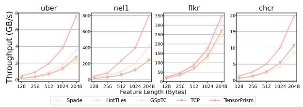

Fig. 11. Throughput comparison across different feature sizes. partitions while balancing the vertex count. However, workload balancing remains unsolved, as edge count represents the nonzero elements and their associated computations. In addition, data reuse is not directly considered in HyperSB's objective function. Despite this, HyperSB still outperforms GSpTC and TCP thanks to the direct presentation of high-dimensional order. This eliminates the inflated intermediate data caused by tensor unfolding.

**Dataset Characteristics.** Performance gains vary by tensor structure and size. For power-law tensors (*uber*, flkr), the graph abstraction proposed by TensorPrism exhibits superior performance compared with TCP and GSpTC due to more flexible partition ways. Similarly, the hypergraph-based approach of HyperSB also shows a better performance. Notably, when f=1, SPADE and HotTiles exhibit better performance than TCP and GSpTC because the size of the last mode of nips is very small (only 17). On *nell* with extreme degree variance, TensorPrism achieves  $2.95\times$  speedup at 2KB features by concentrating super-high-degree vertices within partitions. For uniform tensors (*lbnl*), advantages narrow to  $1.16\times$  and  $1.45\times$  as even sparsity reduces partitioning effectiveness, though TensorPrism maintains gains by eliminating unfolding overhead.

Scalability Study. As feature length increases from k=64 to k=128, advantages amplify for irregular tensors. On nel1, speedup over SPADE increases from  $2.50\times$  to  $4.74\times$ . TensorPrism's contraction engines broadcast inputs to eight parallel units with temporal reuse through the feed unit, achieving up to  $128\times$  reuse per fetch. Matricization-based approaches exhibit linear memory traffic growth with feature dimensions. For larger contractions (f=2), performance gaps widen further, on amre with k=128, f=2, TensorPrism achieves  $4.11\times$  speedup versus  $2.38\times$  for f=1, as deeper nesting exposes richer reuse patterns invisible to unfolding-based methods treating contractions independently.

# C. Energy Efficiency

Figure 10 presents the energy breakdown of Tensor-Prism compared against SPADE [1], HotTiles [2], TCP [4] and GSpTC [3] across eight datasets. Overall, TensorPrism achieves 44.6%, 42.3%, 26.9%, and 15.7% reductions compared to SPADE, HotTiles, TCP, and GSpTC. The major difference among all designs is off-chip memory access. SPADE and HotTiles unfold high-order tensors into a matrix, as the unfolding could lead to compromised cross-mode data reuse. Additionally, TCP's partitioning and dataflow prioritize reduced communication between partitions but have limited applicability to capture cross-mode data reuse, where off-chip

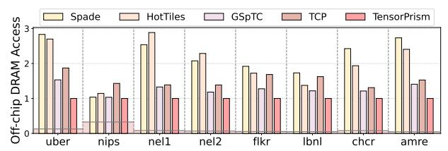

Fig. 12. Off-chip DRAM access normalized to TensorPrism. memory access accounts for 79.1% of total energy. GSpTC improves upon this through fine-grained chunk-based partitioning to regularize the memory access via exploiting continuous data access, thereby reducing off-chip energy to 67.0%. However, regularizing memory access still cannot capture cross-mode data reuse inherent in high-order tensors. TensorPrism's cooccurrence graph abstraction exposes a critical architectural insight: By formulating partitioning as a graph optimization problem (Equation 6), CoGTP can uncover inter-mode data reuse which, along with our proposed architecture design, can significantly reduce DRAM accesses. This benefit holds across datasets: on nel1 with irregular sparsity, TensorPrism reduces off-chip energy from 91.0% (TCP) to 65.6%, whereas on the denser chcr dataset, the reduction is from 88.9% to 67.9%. The quadratic reuse growth when concentrating highdegree vertices within partitions explains why TensorPrism achieves 47.4% off-chip energy on average compared to TCP's 79.1%—a 1.68× improvement that directly translates to superior performance per watt for memory-intensive tensor workloads.

#### D. Throughput Analysis

Figure 11 presents throughput measurements across feature dimensions from 128 to 2048 bytes on four representative datasets. TensorPrism achieves  $2.07\times$ ,  $1.71\times$ , and  $1.55\times$ average throughput improvements over GSpTC, TCP, and SPADE/HotTiles, with increased gains on irregular tensors (nel1: 2.95× speedup at 2KB features). The performance gap shows two architectural bottlenecks in prior work. GSpTC suffers from synchronization conflicts when multiple PEs write back partial sums, leading to contention. TCP's circuitswitched fetch network relies on a fixed communication pattern decided by the compiler, which prevents the system from adapting to irregular input datasets. On the other hand, TensorPrism eliminates both limitations through cooccurrence dataflow. The co-occurrence graph (Equation 3) quantifies reuse potential before execution, enabling CoGTP's objective function (Equation 6) to concentrate high-degree vertices where reuse growth occurs. Further, our proposed cooccurrence dataflow, where complete subgraphs (i.e., cliques) represent operations, exposes natural parallelism without output write conflicts, eliminating synchronization conflicts. The packet-switched fetch network of TensorPrism dynamically routes data according to discovered connectivity rather than pre-fixed topology, adapting to irregular sparsity. This demonstrates that throughput fundamentally depends on reuse orchestration discovered through graph analysis rather than bandwidth provisioning or thread-level parallelism alone.

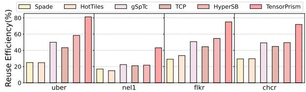

Fig. 13. Data reuse comparison of TensorPrism vs. prior works.

#### E. DRAM Access Evaluation

Figure 12 presents off-chip DRAM access normalized to TensorPrism across eight datasets, revealing that prior frameworks incur  $2.18 \times , 2.11 \times , 1.27 \times ,$  and  $1.53 \times$  higher memory traffic for SPADE, HotTiles, GSpTC, and TCP, respectively. The DRAM access directly exposes each architecture's ability to exploit multi-mode input reuse inherent in sparse tensor structure. Notably, the shaded region indicates the theoretical minimum DRAM access for each dataset, which corresponds to  $0.11 \times .$  For nips with a small contraction-mode size, we approach  $0.32 \times .$  of the theoretical minimum. This improvement stems from the ability to retain more input-dense rows on-chip, thereby reducing redundant DRAM fetches.

SPADE and HotTiles exhibit the highest DRAM traffic  $(2.1\times)$  because matricization destroys cross-mode locality. For example, unfolding a tensor into a matrix merges two dimensions into a single axis, destroying their original coupling and forcing partition boundaries that ignore how these dimensions were related (reuse distance increases after unfolding), thereby requiring redundant memory loads. GSpTC reduces DRAM access to 1.27× through chunk-based partitioning, yet their sequential partition blocks via linear access cannot predict which partition boundaries minimize cross-partition dependencies, where partitions are formed reactively by input sparse tensors without analyzing the dense tensor's reuse potential across free modes. TCP achieves 1.53× traffic through compiler-explored tactics (i.e., predefined partitions and dataflow) and asynchronous communication-compute overlap, but the circuitswitched fetch network's fixed datapath determined at compile time cannot adapt when there are irregular inputs. Tensor-Prism's DRAM reduction is a result of CoGTP partition optimization. TensorPrism's co-occurrence graph analyzes how tensor indices intersect across all dimensions simultaneously before partitioning begins, enabling predictive placement of frequently co-occurring indices within the same partition to minimize cross-partition communication while maximizing on-chip data reuse. This reveals that DRAM efficiency requires predictive analysis that unifies all tensor dimensions during partitioning, not reactive matching or fixed tactics that optimize each dimension independently.

# F. Data Reuse Analysis

We compute on-chip data reuse efficiency as the percentage of actual reuse achieved relative to the theoretical maximum, where the theoretical maximum is defined as the total number of times each input and output tensor entry could be reused before eviction under an unlimited on-chip buffer. As shown in Figure 13, TensorPrism achieves an average reuse efficiency

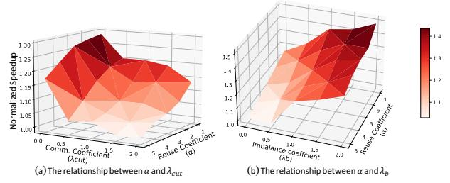

Fig. 14. Sensitivity study on the parameter choices in the Flickr dataset.

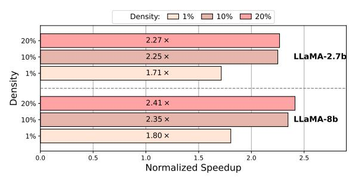

Fig. 15. Normalized speedup of TensorPrism over SPADE in LLM-related datasets across various densities.

of 67.86% across all four tensors. It improves reuse efficiency over prior work on average, outperforming SPADE, HotTiles, GSpTC, TCP, and HyperSB by 56.5%, 57.4%, 33.8%, 42.6%, and 23.7%, respectively. This stems from the intra-tile data reuse mechanism proposed by TensorPrism, which both exploit temporal locality in input fibers and output accumulators. On the other hand, nel1 exhibits extreme irregularity, introducing minimal reuse efficiency.

#### G. Sensitivity Study

**CoGTP Parameter Setup Influence Analysis.** Figure 14 presents a sensitivity analysis of CoGTP's objective function parameters across two parameter spaces: (a) Intra-tile data reuse coefficient ( $\alpha$ ) versus inter-tile communication penalty ( $\lambda_{cut}$ ), and (b) reuse coefficient versus imbalance penalty ( $\lambda_b$ ). The 3D surfaces reveal how parameter choices impact partitioning quality, measured by normalized speedup on the Flickr dataset. We normalized speedup over the slowest parameter setup, respectively. To be noted, the static parameter( $\lambda_b$  in (a) and  $\lambda_{cut}$  in (b)) is all set to 1.0. The results expose three critical insights into CoGTP's design space.

First, when  $\alpha \leq 3$ , the performance remains relatively stable, exhibiting only smooth variations. However, the performance collapses transparently when  $\alpha > 3$ , indicating saturation where most high-degree vertices are already optimally placed. Moreover, an excessively large reuse-benefit coefficient can conflict with workload balancing, which further contributes to the performance decline.

Second, penalty terms provide coupled refinement. As shown in Figure 14(a), within each  $\alpha$  level, performance gradually decreases as  $\lambda_{cut}$  increases, with a noticeably sharper decline beyond 1.5. This demonstrates that a larger intertile communication penalty could not guarantee performance improvement, proving that the TCP method may not be a wise choice all the time. Similarly, the imbalance penalty

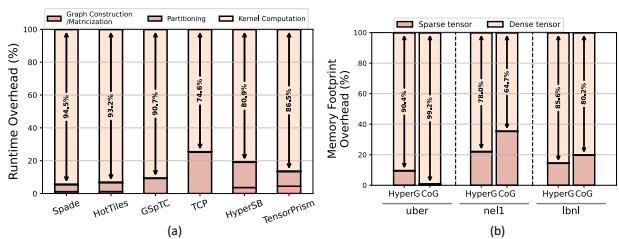

Fig. 16. Practical overhead analysis: (a) Preprocessing overhead of TensorPrism and baselines in the nel1 dataset. (b) Graph storage overhead of hypergraph (HyperG) and co-occurrence graph (CoG).

λ<sup>b</sup> ensures vertices distribute evenly across PEs, preventing pathological cases where high-degree vertex concentration in a few partitions starves other PEs. Figure 14(b) indicates that with the increase of λb, the performance improves, reaching the peak at 1.0-1.5, but beyond this limit, the performance improvement is weakened. This illustrates the importance of workload balancing in tensor contractions. Moreover, due to the inherent power-law distribution of the Flickr dataset, it highlights the effect of workload balancing.

Third, the selected configuration (α = 2, λcut = 1, λ<sup>b</sup> = 1) represents a conservative sweet spot. It achieves 93.8% of peak performance while avoiding aggressive reuse-only strategies (α ≥ 4) that overfit to specific tensor structures. It also steers clear of overly vigorous workload-balancing schemes that benefit only certain datasets, such as power-law datasets. This choice prioritizes robustness across diverse sparsity patterns in the benchmark suite over maximum performance on individual datasets, consistent with the observation that memory-intensive tensor workloads benefit more from moderate reuse improvements applied consistently than from extreme optimization that may fail on irregular tensors. The surface topology in Figure 14 confirms that CoGTP's three-term objective function requires joint optimization, where no single parameter dominates across all regimes, validating the coupled formulation in Equation 6.

Performance Evaluation in Mildly Sparse Datasets. Further, to assess TensorPrism at midly sparsity (Density ≥ 1%), we include two sparse tensors from intermediate attention maps of LLaMA models [74]. Each tensor has a batch size of 2, 32 attention heads, a sequence length of 512, and a perhead dimension of 128 for LLaMA-8B or 80 for LLaMA-2.7B, consistent with the official architecture specifications. Tensors are sparsified to three density levels (1%, 10%, and 20% nnzs) via magnitude-based pruning, following the methodology adopted in state-of-the-art LLM compression work such as SparseGPT [75]. As shown in Figure 15, TensorPrism achieves up to 2.41× speedup over SPADE, demonstrating its effectiveness in mildly sparse regimes.

# *H. Overhead Analysis*

Preprocessing Overhead. As shown in Figure 16(a), TensorPrism increases modest preprocessing overhead compared with SPADE, HotTiles, and GSpTC by 8.0%, 6.7%, and 4.2%. TCP exhibits the highest preprocessing overhead (25.4%) among all baselines, because, before execution, it explores a large number of possible implementation choices (e.g., tile

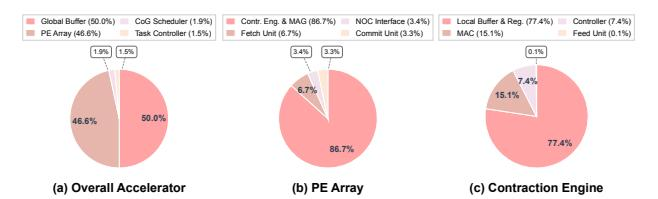

Fig. 17. Area breakdown of TensorPrism Accelerator. sizes and operation kernels). The low cost of TensorPrism

highlights the practicality of incorporating the co-occurrence graph into tensor contraction.

Graph Storage Overhead. To eliminate the impact of on-chip memory size limitations, we evaluate the memory footprint of the input metadata, as illustrated in Figure 16(b). CoG incurs a modest overhead compared with hypergraph representation, with increases of 3.0% on average. Importantly, our primary optimization target is the dense tensor input rather than sparse metadata. Therefore, this slight increase in sparse tensor memory consumption does not constitute a bottleneck and has a negligible impact on overall system efficiency.

## *I. Area Breakdown*

Figure 17 presents the area breakdown of TensorPrism's accelerator. At the accelerator level, the GLB consumes 50% of the total area, and the PE Array takes 46.6% of the total accelerator area. Within each PE, the Contraction Engine dominates at 86.2%, which includes 77.4% of the area allocated to local buffers and registers and 15.1% of the area for MACs. These ratios reflect the design choice to provision substantial local storage per PE, enabling the graph-based dataflow to exploit temporal reuse without frequent GLB accesses. The cooccurrence graph scheduler only incurs 1.9% overhead of total area, in which the cost analyzer takes 62.9% of the scheduler area for partition metadata management.

# VIII. CONCLUSION

In this paper, we posit that matricization dismantles highdimensional data reuse, erasing correlations among nonzero elements across multiple tensor modes. We propose TensorPrism, a novel acceleration framework for sparse highorder tensor computation based on a co-occurrence graph abstraction. The central idea is to transform a high-order tensor into a co-occurrence graph that captures nonzero correlations across all tensor dimensions. Building on this abstraction, TensorPrism introduces three key designs. First, we formulate a co-occurrence graph representation that redefines dataflow and tiling to improve data reuse. Second, we introduce a new dataflow that enhances reuse opportunities across tensor modes. Finally, we provide an efficient accelerator design tailored to graph-based computation. Our evaluation shows that TensorPrism delivers performance speedups of 2.22×, 2.40×, 1.71×, and 1.76× over state-of-the-art designs SPADE [1], HotTiles [2], GSpTC [3], and TCP [4], respectively.

# ACKNOWLEDGEMENTS

This work is supported by the U.S. National Science Foundation under CAREER Award CCF-2441973.

# REFERENCES

- [1] Gerasimos Gerogiannis, Serif Yesil, Damitha Lenadora, Dingyuan Cao, Charith Mendis, and Josep Torrellas. Spade: A flexible and scalable accelerator for spmm and sddmm. In *Proceedings of ACM/IEEE International Symposium on Computer Architecture (ISCA)*, pages 1– 15. IEEE, 2023.
- [2] Gerasimos Gerogiannis, Sriram Aananthakrishnan, Josep Torrellas, and Ibrahim Hur. Hottiles: Accelerating spmm with heterogeneous accelerator architectures. In *Proceedings of IEEE International Symposium on High-Performance Computer Architecture (HPCA)*, pages 1012–1028. IEEE, 2024.
- [3] Guoqing Xiao, Chuanghui Yin, Yuedan Chen, Mingxing Duan, and Kenli Li. Efficient utilization of multi-threading parallelism on heterogeneous systems for sparse tensor contraction. *IEEE Transactions on Parallel and Distributed Systems (TPDS)*, 35(6):1044–1055, 2024.
- [4] Hanjoon Kim, Younggeun Choi, Junyoung Park, Byeongwook Bae, Hyunmin Jeong, Sang Min Lee, Jeseung Yeon, Minho Kim, Changjae Park, Boncheol Gu, et al. Tcp: A tensor contraction processor for ai workloads industrial product. In *Proceedings of ACM/IEEE 51st Annual International Symposium on Computer Architecture (ISCA)*, pages 890– 902. IEEE, 2024.
- [5] Ashish Vaswani, Noam Shazeer, Niki Parmar, Jakob Uszkoreit, Llion Jones, Aidan N Gomez, Łukasz Kaiser, and Illia Polosukhin. Attention is all you need. In *Proceedings of Advances in Neural Information Processing Systems (NeurIPS)*, volume 30, 2017.
- [6] Humza Naveed, Asad Ullah Khan, Shi Qiu, Muhammad Saqib, Saeed Anwar, Muhammad Usman, Naveed Akhtar, Nick Barnes, and Ajmal Mian. A comprehensive overview of large language models. *ACM Transactions on Intelligent Systems and Technology (TIST)*, 16(5):1–72, 2025.
- [7] Ling Liang, Jianyu Xu, Lei Deng, Mingyu Yan, Xing Hu, Zheng Zhang, Guoqi Li, and Yuan Xie. Fast search of the optimal contraction sequence in tensor networks. *IEEE Journal of Selected Topics in Signal Processing (J-STSP)*, 15(3):574–586, 2021.
- [8] Rong Hu, Haotian Wang, Wangdong Yang, Renqiu Ouyang, Keqin Li, and Kenli Li. Bcb-sptc: An efficient sparse high-dimensional tensor contraction employing tensor core acceleration. *IEEE Transactions on Parallel and Distributed Systems (TPDS)*, 2024.
- [9] Khalid Ahmad, Cris Cecka, Michael Garland, and Mary Hall. Exploring data layout for sparse tensor times dense matrix on gpus. *ACM Transactions on Architecture and Code Optimization (TACO)*, 21(1):1– 20, 2024.
- [10] Kartik Hegde, Hadi Asghari-Moghaddam, Michael Pellauer, Neal Crago, Aamer Jaleel, Edgar Solomonik, Joel Emer, and Christopher W Fletcher. Extensor: An accelerator for sparse tensor algebra. In *Proceedings of IEEE/ACM International Symposium on Microarchitecture (MICRO)*, pages 319–333. IEEE, 2019.
- [11] Jinliang Shi, Shigang Li, Youxuan Xu, Rongtian Fu, Xueying Wang, and Tong Wu. Flashsparse: Minimizing computation redundancy for fast sparse matrix multiplications on tensor cores. In *Proceedings of the 30th ACM SIGPLAN Annual Symposium on Principles and Practice of Parallel Programming (PPoPP)*, pages 312–325, 2025.
- [12] Kartik Hegde, Jiyong Yu, Rohit Agrawal, Mengjia Yan, Michael Pellauer, and Christopher Fletcher. Ucnn: Exploiting computational reuse in deep neural networks via weight repetition. In *Proceedings of ACM/IEEE International Symposium on Computer Architecture (ISCA)*, pages 674–687. IEEE, 2018.
- [13] Eric Qin, Ananda Samajdar, Hyoukjun Kwon, Vineet Nadella, Sudarshan Srinivasan, Dipankar Das, Bharat Kaul, and Tushar Krishna. Sigma: A sparse and irregular gemm accelerator with flexible interconnects for dnn training. In *2020 IEEE International Symposium on High Performance Computer Architecture (HPCA)*, pages 58–70. IEEE, 2020.
- [14] Subhankar Pal, Jonathan Beaumont, Dong-Hyeon Park, Aporva Amarnath, Siying Feng, Chaitali Chakrabarti, Hun-Seok Kim, David Blaauw, Trevor Mudge, and Ronald Dreslinski. Outerspace: An outer product based sparse matrix multiplication accelerator. In *2018 IEEE International Symposium on High Performance Computer Architecture (HPCA)*, pages 724–736. IEEE, 2018.
- [15] Zhekai Zhang, Hanrui Wang, Song Han, and William J Dally. Sparch: Efficient architecture for sparse matrix multiplication. In *Proceedings of IEEE International Symposium on High-Performance Computer Architecture (HPCA)*, pages 261–274. IEEE, 2020.
- [16] Guowei Zhang, Nithya Attaluri, Joel S Emer, and Daniel Sanchez. Gamma: Leveraging gustavson's algorithm to accelerate sparse matrix

- multiplication. In *Proceedings of ACM International Conference on Architectural Support for Programming Languages and Operating Systems (ASPLOS)*, pages 687–701. ACM, 2021.
- [17] Nitish Srivastava, Hanchen Jin, Jie Liu, David Albonesi, and Zhiru Zhang. Matraptor: A sparse-sparse matrix multiplication accelerator based on row-wise product. In *Proceedings of IEEE/ACM International Symposium on Microarchitecture (MICRO)*, pages 766–780. IEEE, 2020.
- [18] Zhiyao Li, Jiaxiang Li, Taijie Chen, Dimin Niu, Hongzhong Zheng, Yuan Xie, and Mingyu Gao. Spada: Accelerating sparse matrix multiplication with adaptive dataflow. In *Proceedings of ACM International Conference on Architectural Support for Programming Languages and Operating Systems (ASPLOS)*, pages 747–761. ACM, 2023.
- [19] Chris Mueller. Sparse matrix reordering algorithms for cluster identification. *Machine Learning in Bioinformatics*, 23, 2004.
- [20] Timothy A Davis, John R Gilbert, Stefan I Larimore, and Esmond G Ng. A column approximate minimum degree ordering algorithm. *ACM Transactions on Mathematical Software (TOMS)*, 30(3):353–376, 2004.
- [21] Yi-Jou Hsiao, Chin-Fu Nien, and Hsiang-Yun Cheng. Respar: Reordering algorithm for reram-based sparse matrix-vector multiplication accelerator. In *Proceedings of IEEE 39th International Conference on Computer Design (ICCD)*, pages 260–268. IEEE, 2021.
- [22] Tong Geng, Chunshu Wu, Yongan Zhang, Cheng Tan, Chenhao Xie, Haoran You, Martin Herbordt, Yingyan Lin, and Ang Li. I-GCN: A graph convolutional network accelerator with runtime locality enhancement through islandization. In *Proceedings of IEEE/ACM International Symposium on Microarchitecture (MICRO)*, pages 1051–1063. IEEE, 2021.
- [23] Linghao Song, Yuze Chi, Atefeh Sohrabizadeh, Young-kyu Choi, Jason Lau, and Jason Cong. Sextans: A streaming accelerator for generalpurpose sparse-matrix dense-matrix multiplication. In *Proceedings of ACM/SIGDA International Symposium on Field-Programmable Gate Arrays (FPGA)*, pages 65–77. ACM, 2022.
- [24] Toluwanimi O Odemuyiwa, Hadi Asghari-Moghaddam, Michael Pellauer, Kartik Hegde, Po-An Tsai, Neal C Crago, Aamer Jaleel, John D Owens, Edgar Solomonik, Joel S Emer, et al. Accelerating sparse data orchestration via dynamic reflexive tiling. In *Proceedings of the 28th ACM International Conference on Architectural Support for Programming Languages and Operating Systems (ASPLOS)*, pages 18– 32, 2023.
- [25] Norm Jouppi, George Kurian, Sheng Li, Peter Ma, Rahul Nagarajan, Lifeng Nai, Nishant Patil, Suvinay Subramanian, Andy Swing, Brian Towles, et al. Tpu v4: An optically reconfigurable supercomputer for machine learning with hardware support for embeddings. In *Proceedings of the 50th annual international symposium on computer architecture (ISCA)*, pages 1–14, 2023.
- [26] Gunduz Vehbi Demirci, Cagatay Dikici, and Tim Atherton. Accelerating sparse deep learning via multi-layer tensor reordering and partitioning. In *Proceedings of 2025 IEEE High Performance Extreme Computing Conference (HPEC)*, pages 1–8, 2025.
- [27] Sebastian Schlag, Tobias Heuer, Lars Gottesburen, Yaroslav Akhremtsev, ¨ Christian Schulz, and Peter Sanders. High-quality hypergraph partitioning. *ACM Journal of Experimental Algorithmics*, 27:1–39, 2023.
- [28] Manzil Zaheer, Guru Guruganesh, Kumar Avinava Dubey, Joshua Ainslie, Chris Alberti, Santiago Ontanon, Philip Pham, Anirudh Ravula, Qifan Wang, Li Yang, et al. Big bird: Transformers for longer sequences. In *Proceedings of Advances in Neural Information Processing Systems (NeurIPS)*, volume 33, pages 17283–17297, 2020.
- [29] Huiqiang Jiang, Yucheng Li, Chengruidong Zhang, Qianhui Wu, Xufang Luo, Surin Ahn, Zhenhua Han, Amir H Abdi, Dongsheng Li, Chin-Yew Lin, et al. Minference 1.0: Accelerating pre-filling for long-context llms via dynamic sparse attention. In *Proceedings of Advances in Neural Information Processing Systems (NeurIPS)*, volume 37, pages 52481– 52515, 2024.
- [30] Alessandro Aimar, Hesham Mostafa, Enrico Calabrese, Antonio Rios-Navarro, Ricardo Tapiador-Morales, Iulia-Alexandra Lungu, Moritz B Milde, Federico Corradi, Alejandro Linares-Barranco, Shih-Chii Liu, et al. Nullhop: A flexible convolutional neural network accelerator based on sparse representations of feature maps. *IEEE Transactions on Neural Networks and learning systems (TNNLS)*, 30(3):644–656, 2018.
- [31] Jorge Albericio, Patrick Judd, Tayler Hetherington, Tor Aamodt, Natalie Enright Jerger, and Andreas Moshovos. Cnvlutin: Ineffectualneuron-free deep neural network computing. *ACM SIGARCH Computer Architecture News*, 44(3):1–13, 2016.

- [32] Mathias Parger, Chengcheng Tang, Christopher D Twigg, Cem Keskin, Robert Wang, and Markus Steinberger. Deltacnn: End-to-end cnn inference of sparse frame differences in videos. In *Proceedings of the IEEE/CVF conference on computer vision and pattern recognition (CVPR)*, pages 12497–12506. IEEE, 2022.
- [33] Kunyun Wang, Shuo Yang, Jieru Zhao, Wenchao Ding, Quan Chen, Jingwen Leng, and Minyi Guo. Sparsetem: Boosting the efficiency of cnn-based video encoders by exploiting temporal continuity. In *Proceedings of International Symposium on Advanced Parallel Processing Technologies (APPT)*, pages 246–256. Springer, 2025.
- [34] Benjamin Graham, Martin Engelcke, and Laurens Van Der Maaten. 3d semantic segmentation with submanifold sparse convolutional networks. In *Proceedings of the IEEE conference on computer vision and pattern recognition (CVPR)*, pages 9224–9232, 2018.
- [35] Christopher Choy, JunYoung Gwak, and Silvio Savarese. 4d spatiotemporal convnets: Minkowski convolutional neural networks. In *Proceedings of the IEEE/CVF conference on computer vision and pattern recognition (CVPR)*, pages 3075–3084, 2019.
- [36] Yin Zhou and Oncel Tuzel. Voxelnet: End-to-end learning for point cloud based 3d object detection. In *Proceedings of the IEEE conference on computer vision and pattern recognition (CVPR)*, pages 4490–4499, 2018.
- [37] Alex H Lang, Sourabh Vora, Holger Caesar, Lubing Zhou, Jiong Yang, and Oscar Beijbom. Pointpillars: Fast encoders for object detection from point clouds. In *Proceedings of the IEEE/CVF conference on computer vision and pattern recognition (CVPR)*, pages 12697–12705, 2019.
- [38] Morten Mørup, Lars Kai Hansen, and Sidse M Arnfred. Algorithms for sparse nonnegative tucker decompositions. *Neural computation*, 20(8):2112–2131, 2008.
- [39] Jean Kossaifi, Yannis Panagakis, Anima Anandkumar, and Maja Pantic. Tensorly: Tensor learning in python. *Journal of Machine Learning Research*, 20(26):1–6, 2019.
- [40] Dongshuang Li, Zhaoyuan Yu, Fan Wu, Wen Luo, Yong Hu, and Linwang Yuan. The tensor-based feature analysis of spatiotemporal field data with heterogeneity. *Earth and Space Science (ESS)*, 7(2):e2019EA001037, 2020.
- [41] Guojin Si, Min Xie, Fengqi Zhang, Tangbin Xia, and Lifeng Xi. A framework for wind field forecasting from sparse observations via integrated tensor completion and prediction. *Expert Systems with Applications (ESA)*, page 131401, 2026.
- [42] Steffen Rendle and Lars Schmidt-Thieme. Pairwise interaction tensor factorization for personalized tag recommendation. In *Proceedings of ACM international conference on Web search and data mining (WSDM)*, pages 81–90, 2010.
- [43] Alexandros Karatzoglou, Xavier Amatriain, Linas Baltrunas, and Nuria Oliver. Multiverse recommendation: n-dimensional tensor factorization for context-aware collaborative filtering. In *Proceedings of ACM conference on Recommender systems (RecSys)*, pages 79–86, 2010.
- [44] Sam Westrick, Pengyu Liu, Byeongjee Kang, Colin McDonald, Mike Rainey, Mingkuan Xu, Jatin Arora, Yongshan Ding, and Umut A Acar. Grafeyn: Efficient parallel sparse simulation of quantum circuits. In *Proceedings of IEEE International Conference on Quantum Computing and Engineering (QCE)*, volume 1, pages 1132–1142. IEEE, 2024.
- [45] Hristo Venev, Thien Udomsrirungruang, Dimitar Dimitrov, Timon Gehr, and Martin Vechev. qblaze: An efficient and scalable sparse quantum simulator. In *Proceedings of the ACM on Programming Languages (PACMPL)*, volume 9, pages 444–470. ACM New York, NY, USA, 2025.
- [46] Gabriel Kulp, Andrew Ensinger, and Lizhong Chen. Flaash: Flexible accelerator architecture for sparse high-order tensor contraction. *arXiv preprint arXiv:2404.16317*, 2024.
- [47] Andrew Ensinger, Gabriel Kulp, Victor Agostinelli, Dennis Lyakhov, and Lizhong Chen. Swift: High-performance sparse tensor contraction for scientific applications. *arXiv preprint arXiv:2410.10094*, 2024.
- [48] Haonan Wang, Xuxin Xiao, Mingyu Yan, Zhuoyuan Zhu, Dengke Han, Duo Wang, Wenming Li, Xiaochun Ye, Cunchen Hu, Hongyang Chen, et al. A systematic characterization of llm inference on gpus. *arXiv preprint arXiv:2512.01644*, 2025.
- [49] Yifan Yang, Joel S Emer, and Daniel Sanchez. Trapezoid: A versatile accelerator for dense and sparse matrix multiplications. In *Proceedings of ACM/IEEE 51st Annual International Symposium on Computer Architecture (ISCA)*, pages 931–945. IEEE, 2024.
- [50] Sanjali Yadav, Amirmahdi Namjoo, and Bahar Asgari. Misam: Machine learning assisted dataflow selection in accelerators for sparse matrix

- multiplication. In *Proceedings of the 58th IEEE/ACM International Symposium on Microarchitecture (MICRO)*, pages 824–838, 2025.
- [51] Jiajia Li, Bora Uc¸ar, Umit V C¸ ataly ¨ urek, Jimeng Sun, Kevin Barker, ¨ and Richard Vuduc. Efficient and effective sparse tensor reordering. In *Proceedings of the ACM International Conference on Supercomputing (ICS)*, pages 227–237, 2019.
- [52] David S Johnson, Maria Minkoff, and Steven Phillips. The prize collecting steiner tree problem: theory and practice. In *Proceedings of the eleventh annual ACM-SIAM symposium on Discrete algorithms (SODA)*, pages 760–769, 2000.
- [53] Xiaoyang Lu, Boyu Long, Xiaoming Chen, Yinhe Han, and Xian-He Sun. Aces: Accelerating sparse matrix multiplication with adaptive execution flow and concurrency-aware cache optimizations. In *Proceedings of ACM International Conference on Architectural Support for Programming Languages and Operating Systems (ASPLOS)*, pages 71– 85. ACM, 2024.
- [54] Ranggi Hwang, Minhoo Kang, Jiwon Lee, Dongyun Kam, Youngjoo Lee, and Minsoo Rhu. GROW: A row-stationary sparse-dense gemm accelerator for memory-efficient graph convolutional neural networks. In *Proceedings of IEEE International Symposium on High-Performance Computer Architecture (HPCA)*, pages 42–55. IEEE, 2022.
- [55] Amir Ghazizadeh Ahsaei, Lingxiang Yin, Shilin Tian, Fangzhou Ye, Fan Yao, and Hao Zheng. Rethinking tiling and dataflow for spmm acceleration: A graph transformation framework. In *Proceedings of the 58th IEEE/ACM International Symposium on Microarchitecture (MICRO)*, pages 1535–1548, 2025.
- [56] Angshuman Parashar, Minsoo Rhu, Anurag Mukkara, Antonio Puglielli, Rangharajan Venkatesan, Brucek Khailany, Joel Emer, Stephen W Keckler, and William J Dally. Scnn: An accelerator for compressed-sparse convolutional neural networks. *ACM SIGARCH computer architecture news*, 45(2):27–40, 2017.
- [57] Ashish Gondimalla, Noah Chesnut, Mithuna Thottethodi, and TN Vijaykumar. Sparten: A sparse tensor accelerator for convolutional neural networks. In *Proceedings of the 52nd Annual IEEE/ACM International Symposium on Microarchitecture (MICRO)*, pages 151–165, 2019.
- [58] Yuke Wang, Boyuan Feng, Gushu Li, Shuangchen Li, Lei Deng, Yuan Xie, and Yufei Ding. GNNAdvisor: An adaptive and efficient runtime system for GNNs acceleration on GPUs. In *Proceedings of USENIX symposium on operating systems design and implementation (OSDI)*, pages 515–531. USENIX, 2021.
- [59] Shuangyan Yang, Minjia Zhang, Wenqian Dong, and Dong Li. Betty: Enabling large-scale GNN training with batch-level graph partitioning. In *Proceedings of ACM International Conference on Architectural Support for Programming Languages and Operating Systems (ASPLOS)*, pages 103–117, 2023.
- [60] Qingpeng Niu, James Dinan, Qingda Lu, and Ponnuswamy Sadayappan. Parda: A fast parallel reuse distance analysis algorithm. In *Proceedings of International Parallel and Distributed Processing Symposium (IPDPS)*, pages 1284–1294. IEEE, 2012.
- [61] Fangzhou Ye, Lingxiang Yin, Amir Ghazizadeh Ahsaei, and Hao Zheng. Egma: Enhancing data reuse and workload balancing in message passing gnn acceleration via gram matrix optimization. In *Proceedings of the 61st ACM/IEEE Design Automation Conference (DAC)*, pages 1– 6, 2024.
- [62] Sanjay Gandham, Lingxiang Yin, Hao Zheng, and Mingjie Lin. Saga: Sparsity-agnostic graph convolutional network acceleration with nearoptimal workload balance. In *Proceedings of 2023 IEEE/ACM International Conference on Computer Aided Design (ICCAD)*, pages 1–9. IEEE, 2023.
- [63] Stefanie Jegelka. Theory of graph neural networks: Representation and learning. In *arXiv preprint arXiv:2204.07697*, 2022.
- [64] Christian Mayer, Ruben Mayer, Sukanya Bhowmik, Lukas Epple, and Kurt Rothermel. Hype: massive hypergraph partitioning with neighborhood expansion. In *Proceedings of 2018 IEEE International Conference on Big Data (Big Data)*, pages 458–467. IEEE, 2018.
- [65] Lars Gottesburen, Tobias Heuer, Nikolai Maas, Peter Sanders, and ¨ Sebastian Schlag. Scalable high-quality hypergraph partitioning. *ACM Transactions on Algorithms*, 20(1):1–54, 2024.
- [66] Robert Krause, Lars Gottesburen, and Nikolai Maas. Deterministic ¨ parallel high-quality hypergraph partitioning. In *Proceedings of the Conference on Applied and Computational Discrete Algorithms (ACDA)*, pages 222–236. SIAM, 2025.
- [67] Aaron Clauset, Cosma Rohilla Shalizi, and Mark EJ Newman. Powerlaw distributions in empirical data. *SIAM review*, 51(4):661–703, 2009.

- [68] Shantanu Dutt. New faster kernighan-lin-type graph-partitioning algorithms. In *Proceedings of 1993 International Conference on Computer Aided Design (ICCAD)*, pages 370–377. IEEE, 1993.
- [69] Hyoukjun Kwon, Prasanth Chatarasi, Michael Pellauer, Angshuman Parashar, Vivek Sarkar, and Tushar Krishna. Understanding reuse, performance, and hardware cost of dnn dataflow: A data-centric approach. In *Proceedings of IEEE/ACM International Symposium on Microarchitecture (MICRO)*, pages 754–768, 2019.
- [70] Yoongu Kim, Weikun Yang, and Onur Mutlu. Ramulator: A fast and extensible dram simulator. *IEEE Computer Architecture Letters*, 15(1):45–49, 2015.
- [71] Rajeev Balasubramonian, Andrew B Kahng, Naveen Muralimanohar, Ali Shafiee, and Vaishnav Srinivas. Cacti 7: New tools for interconnect exploration in innovative off-chip memories. *ACM Transactions on Architecture and Code Optimization (TACO)*, 14(2):1–25, 2017.
- [72] Shaden Smith, Jee W Choi, Jiajia Li, Richard Vuduc, Jongsoo Park, Xing Liu, and George Karypis. Frostt: The formidable repository of open sparse tensors and tools, 2017.
- [73] Jiajia Li, Jimeng Sun, and Richard Vuduc. Hicoo: Hierarchical storage of sparse tensors. In *Proceedings of International Conference for High Performance Computing, Networking, Storage and Analysis (SC)*, pages 238–252. IEEE, 2018.
- [74] Hugo Touvron, Louis Martin, Kevin Stone, Peter Albert, Amjad Almahairi, Yasmine Babaei, Nikolay Bashlykov, Soumya Batra, Prajjwal Bhargava, Shruti Bhosale, et al. Llama 2: Open foundation and finetuned chat models. *arXiv preprint arXiv:2307.09288*, 2023.
- [75] Elias Frantar and Dan Alistarh. Sparsegpt: Massive language models can be accurately pruned in one-shot. In *Proceedings of International Conference on machine learning (ICML)*, pages 10323–10337. PMLR, 2023.