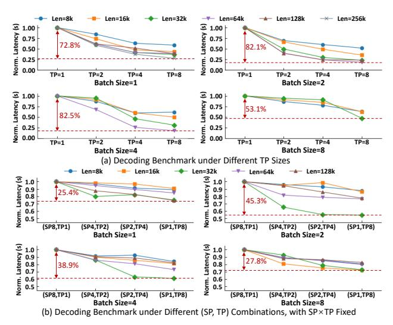
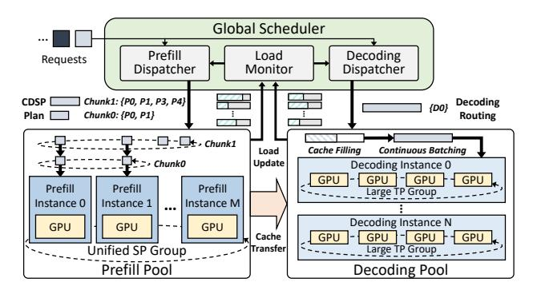
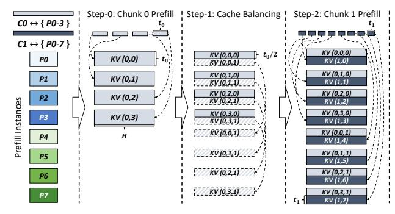
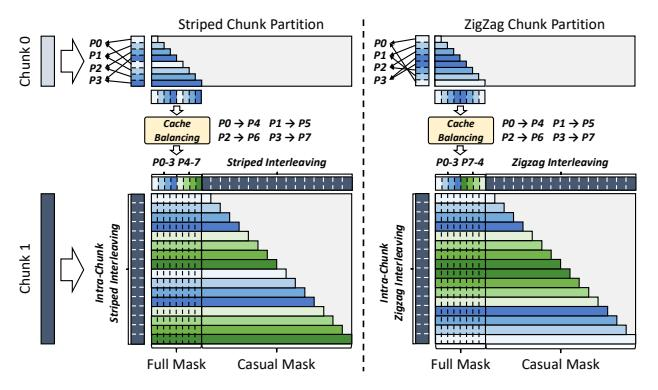
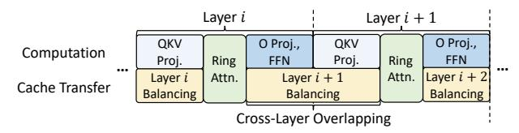
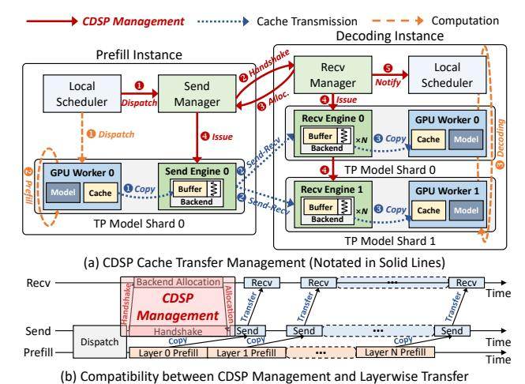
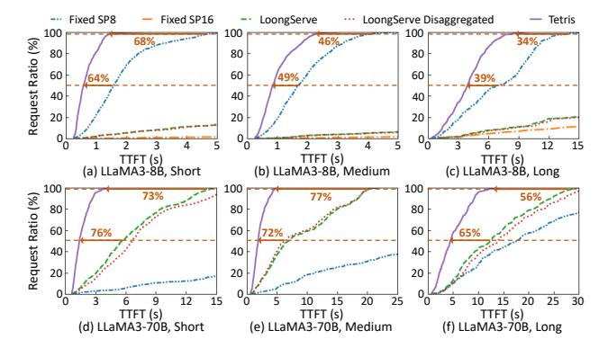
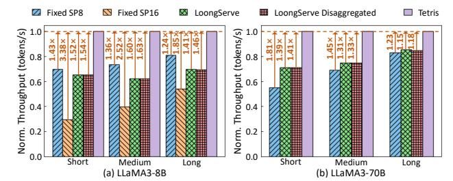
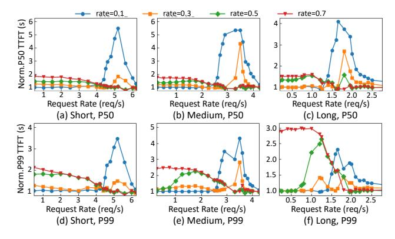
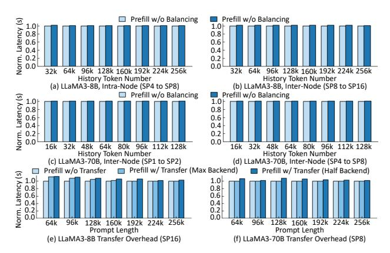

# Tetris: Efficient Long-context LLM Serving with Chunkwise Dynamic Sequence Parallelism

Cong Li\*1,4, Yuzhe Yang<sup>2</sup> , Xuegui Zheng<sup>2</sup> , Qifan Yang<sup>2</sup> , Yijin Guan<sup>3</sup> , Size Zheng<sup>2</sup> , Li-Wen Chang<sup>2</sup> , Shufan Liu<sup>2</sup> , Xin Liu<sup>2</sup> , Guangyu Sun†1,4 <sup>1</sup>*School of Integrated Circuits, Peking University*, <sup>2</sup>*ByteDance Seed*, <sup>3</sup>*ByteDance*, <sup>4</sup>*Beijing Advanced Innovation Center for Integrated Circuits* {*leesou, gsun*}*@pku.edu.cn*, {*yangyuzhe.gilsaix, zhengxuegui.0, yangqifan, yijin.gyj*}*@bytedance,com*, {*zheng.size, liwen.chang, liushufan.amos, liuxin.ai*}*@bytedance.com*

*Abstract*—With the advancement of large language models (LLMs), their context windows have rapidly expanded. To meet diverse demands from varying-length requests in online services, existing state-of-the-art systems adjust resource allocation by tuning the sequence parallelism (SP) allocation. However, current dynamic SP allocation lacks flexibility to (1) support stage-specific parallelism requirements in LLM inference, (2) mitigate the global latency degradation from excessive SP allocation, and (3) exploit resource fragments arising from SP size variation.

To tackle this problem, we propose Chunkwise Dynamic Sequence Parallelism (CDSP), a fine-grained parallelism strategy that assigns SP sizes across *intra-request* token segments. Based on CDSP, we build Tetris, an LLM serving system that (1) efficiently integrates CDSP into disaggregated cluster architecture to satisfy parallelism heterogeneity, (2) dynamically regulates SP size expansion based on real-time load conditions, and (3) adaptively explores chunking plans to utilize fragmented resources while meeting per-request demands. Compared with state-ofthe-art systems, Tetris achieves up to 4.35× lower time-to-firsttoken (TTFT) under max sustainable loads, reduces median timebetween-tokens (TBT) by up to 40.1%, and increases the max request capacity by up to 45%.

## I. INTRODUCTION

Large Language Models (LLMs) have achieved outstanding performance in a wide range of generative tasks, such as chatbot [14], [30], code completion [12], [25], and reasoning [41], [42]. Such capability drives many cloud companies to deploy online LLM services [2], [4], [14], [30]. As LLMs continue to advance, their context lengths have notebly expanded. For example, OpenAI's GPT-4o [29] supports 128K contexts, Anthropic's Claude-3 [3] supports 200K, and Google's Gemini-2.5 pro [13] supports up to 1M tokens.

With the growth of sequence length, LLM inference requires proportionally more resources. To augment resource provision for long-context requests, sequence parallelism (SP) has been widely applied [5], [11], [16]–[18], [20], [21], [40], [43], [44]. Among these implementations, ring-attention-based SP [21] (also known as context parallelism, CP [11], [40], [44]) has been introduced to LLM serving [43], [44]. Specifically, it scatters long sequences across multiple LLM instances and performs distributed attention computation through peer-topeer (P2P) KV cache transmission. By overlapping cache transmission with attention computation, ring attention demonstrates better scalability than tensor parallelism (TP), especially when populating resources beyond a single node [44].

The expansion of context window also widens request length gaps, thereby amplifying variability in per-request resource demands. To cope with this, existing state-of-the-art long-context LLM serving system, LoongServe [43], proposes elastic sequence parallelism (ESP). ESP dynamically adjusts SP allocation *in the granularity of request batch* to satisfy diverse resource demands. In contrast, non-SP systems have to statically configure resource allocation at startup due to the high overhead of model weight resharding, limiting their ability to respond to highly variable resource demands when serving long-context LLMs.

Although LoongServe has surpassed existing best-performing non-SP systems [1], [19], [23], [47], its *coarse-grained SP allocation* fails to fully optimize online long-context LLM serving's performance: First, ESP enforces a uniform TP size across all instances. However, prefill benefits from smaller TP for better resource allocation flexibility, while decoding prefers larger TP to minimize compute latency. Second, LoongServe assigns requests to fixed batches and exhaustively optimizes per-batch latency. However, since this local-optimal strategy lacks global load awareness, its excessive SP expansion fails to optimize system's overall latency distribution. Third, dynamic SP allocation leads to varying queuing delays across instances. However, since ring attention requires synchronous computation across instances, such an imbalance results in idle slots and degrades overall resource efficiency.

To tackle these problems, we first propose Chunkwise Dynamic Sequence Parallelism (CDSP), a *fine-grained intrarequest SP allocation* strategy. It splits each request's prompt into multiple chunks and assigns each chunk a distinct SP size, enabling efficient utilization of resource fragments while fully optimizing prefill latency. Based on CDSP, we build Tetris, a system for efficient online long-context LLM serving. Tetris efficiently integrates CDSP into prefill-decoding disaggregated cluster by extending attention load-balancing strategy and KV cache transfer management, thereby fully accommodating the parallelism heterogeneity across different stages. For online scheduling, Tetris regulates SP size allocation based

<sup>\*</sup> Work done during Cong Li's internship at Bytedance Seed.

<sup>†</sup> Corresponding author.

on real-time request arrival pressure, thus preventing excessive SP expansion from degrading global latency. In addition, Tetris integrates a load-aware chunk partitioning strategy that dynamically determines the optimal execution plan for each request, maximizing the benefits of CDSP. To summarize, we have made the following contributions:

- We identify existing dynamic SP allocation strategy's rigidity in handling inter-request resource variability under online long-context LLM serving scenarios.
- We propose CDSP for intra-request fine-grained SP allocation and build Tetris's inference engine to fully satisfy
  the heterogeneous demands in long-context LLM serving.
- We propose real-time load-aware SP size allocation and chunk partitioning strategies in Tetris's scheduler to optimize the service's overall latency distribution.

Extensive experiments on workloads collected from a *real-world online long-context LLM service* [6] demonstrate that Tetris achieves up to  $4.35\times$  lower time-to-first-token (TTFT) under state-of-the-art systems' max sustainable loads, reduces median time-between-tokens (TBT) by up to 40.1%, and increases the max request capacity by up to 45%.

#### II. BACKGROUND AND MOTIVATION

## A. Transformer-based LLMs

Mainstream LLMs are built on transformer decoder layers [39], which contain an attention block and a feed-forward network (FFN) block. In the attention block, the inputs are projected to query, key, and value vectors, which interact with each other through self-attention. Then, the outputs of the attention block are processed by multi-layer perceptrons (MLPs) in the FFN block to produce the decoder layer outputs. After passing a stack of transformer layers, the final outputs can be used for downstream generative tasks.

LLM's generation procedure contains two stages: prefill and decoding. In the prefill stage, the LLM processes all tokens of the input prompt in parallel to produce the first output token. Then, moving on to the decoding stage, the LLM takes the token generated previously as input and predicts one new token per iteration, gradually building the full output sequence. Since self-attention requires each token to interact with all previous tokens' key/value vectors, these intermediate states are stored throughout LLM inference to avoid redundant computation, which is known as KV Cache [33].

# B. LLM Serving

Online LLM service has been widely deployed by cloud companies [2], [4], [14], [30], which receives requests from multiple users, conducts inference on a GPU cluster, and returns decoding outputs in real-time. To evaluate the serving quality (or Service Level Objectives, SLOs), service providers proposed several metrics: The Prefill stage is measured by time to first token (TTFT), which is the duration between request arrival and the finish of prefill computation. For decoding stage, time between tokens (TBT) is employed to measure the smoothness of the output streaming procedure.


Fig. 1. Prefill Ring Attention Computation Procedure.

To jointly optimize TTFT/TBT and improve the serving system's efficiency, several system optimizations have been proposed: Iteration-level scheduling adds new requests once the current decoding iteration finishes, reducing the queuing latency of each request [45]. PagedAttention eliminates the memory fragmentation caused by the variance of prompt and decoding lengths via managing the KV cache in block granularity [19]. Prefill-decoding disaggregation routes requests under different stages to distinct model instances to avoid the interference between the two stages [32], [47].

## C. Sequence Parallelism for Long-Context LLMs

Sequence parallelism (SP) has been a pivotal approach to handle long-context requests' compute and memory demands [5], [11], [16]–[18], [20], [21], [40], [43], [44]. In this paper, we mainly focus on ring-attention-style SP, which has been adopted in LLM inference [43], [44]. Ring attention distributes the tokens of one sequence to multiple model instances. As shown in Fig. 1-(a), during the prefill stage, each instance first calculates its local tokens' query, key, and value tensors together with their attention results. Then, it sends key-value tensors to the next neighbor and receives new key-value tensors from the previous neighbor iteratively to interact local query tensors with full key-value tensors. After the distributed attention computation, each instance computes the remaining operators without communication.

In prefill ring attention, since the causal mask adopted by LLMs only requires each token to compute with all preceding tokens, splitting the sequence into multiple consecutive shards will lead to imbalanced workload distribution across instances, as shown in Fig. 1-(b). Several optimized partition strategies have been proposed to alleviate this issue: Striped Attention [5] partitions the sequence into evenly-spaced stripes and assigns them to each instance in a round-robin manner, so that each instance can conduct computation to every KV cache shard. Another strategy [11], [16], [44] interleaves the KV Cache


Fig. 2. Decoding Ring Attention Computation Procedure.

across instances in a "zigzag" manner, which partitions the sequence into 2N shards S0, ..., S2N−<sup>1</sup> for N SP instances, and allocates (S<sup>i</sup> , S2N−i−1) to instance i, In this way, each instance is assigned with identical computation workload.

During the decoding stage, instead of passing key-value tensors, ring attention transfers query vectors because their smaller data volume can reduce the ring communication overhead [43], [44]. As shown in Fig. 2, suppose the context KV cache is distributed across four instances. Decoding ring attention designates a master instance (e.g., instance 0) to process the decoding input. In each iteration, current token's query vector is forwarded to each instance to compute partial attention results. After all instances complete computation, the master instance aggregates all partial results and proceeds with the remaining local layers. When multiple requests are present in the decoding batch, each instance can serve as the master for a subset of requests, enabling full utilization of compute resources across all instances.

## *D. Limitations of Existing SP-Serving Systems*

Despite SP's strong performance, existing systems still exhibit several limitations, preventing them from fully utilizing SP in online long-context LLM serving scenarios:

Limitation #1 (Fixed-SP System): Partitioning the cluster with a fixed SP size fails to meet the inter-request resource demand variation, which manifests in two aspects: *(1) Large SP Size is an overkill for short requests*. First, excessive SP size allocation leaves each instance with only a marginal compute workload, which leads to low GPU utilization. Second, the undersized compute workload cannot fully overlap ring communication, which can even cause the performance to be inferior to a reduced SP size. *(2) Small SP Size severely prolongs long requests' prefill latency*, which can even reach to tens of seconds, thereby significantly hurting the system's overall TTFT distribution.

To elucidate such disparity, we benchmark the prefill latency of LLaMA3-8B [15] on A100 GPUs. Detailed setups are listed in Sec. VII-A. We set the batch size to 1 and vary the prompt length from 4k to 256k. The SP size is adjusted from 1 to 16, with the TP size of 1. As listed in Table I, *for short lengths* (e.g., 4k, 8k), adopting a moderate SP size is enough to achieve the optimal performance. Further enlarging the SP size incurs 1.2×-3× higher latency. *For long requests* (e.g., 128k, 256k), enlarging the SP size delivers a

TABLE I PREFILL LATENCY (SECONDS) COMPARISON OF LLAMA3-8B, TESTED ON A100 GPUS. THE OPTIMAL LATENCY IS MARKED IN BOLD.

| Prompt Length<br>4k<br>8k<br>16k<br>32k<br>64k<br>128k<br>256k         |
|------------------------------------------------------------------------|
| SP=1 Latency<br>0.28<br>0.57<br>1.29<br>3.22<br>9.05<br>29.20<br>OOM   |
| SP=2 Latency<br>0.16<br>0.31<br>0.69<br>1.67<br>4.61<br>14.30<br>50.07 |
| SP=4 Latency<br>0.13<br>0.20<br>0.39<br>0.92<br>2.43<br>7.32<br>24.77  |
| SP=8 Latency<br>0.21<br>0.24<br>0.31<br>0.58<br>1.37<br>3.96<br>12.81  |
| SP=16 Latency<br>0.39<br>0.43<br>0.46<br>0.53<br>0.96<br>2.31<br>7.02  |

quasi-linear improvement, with a latency gap of up to 43.05s. This phenomenon remains consistent across varying TP sizes and model scales. Considering online serving processes highly dynamic requests with substantial context length variation as listed above, a fixed SP configuration cannot fully satisfy such diverse resource demands.

Limitation #2 (Existing Dynamic-SP System): Existing state-of-the-art long-context serving system, LoongServe [43], shares similar insights, which proposes Elastic Sequence Parallelism (ESP) to adjust resource allocation: ESP groups all instances into a unified SP pool sharing the same TP size. By assigning different SP sizes to request batches, it changes resource allocation without re-partitioning LLM parameters. Although it has achieved SOTA performance compared with best-performing non-SP systems [1], [19], [23], [47], its inflexible SP management fails to fully unlock SP's performance benefits, with limitations evident in three aspects:

*(1) Cluster Architecture: Unified TP size fails to satisfy the disparate characteristics between prefill and decoding.* Given the device budget, larger SP size (+ smaller TP size) is preferred by prefill in existing SP-based inference systems [43], [44] due to the following reasons: (1) SP provides more flexibility in adjusting resource provision, since we only need to split tokens across model instances. In contrast, adjusting TP requires resharding LLM's weight matrices, which suspends the underlying devices to serve new requests. (2) Compared with TP, SP demonstrates better cross-node scalability because TP's all-reduce latency increases significantly given the low inter-host network bandwidth [44]. However, constraining decoding to prefill's small TP, as in ESP, severely degrades its performance. To demonstrate this issue, we evaluate the decoding latency of LLaMA3-8B under different TP sizes using A100 GPUs. As shown in Fig. 3-(a), compared with TP=8, TP=1, TP=2, and TP=4 incurs up to 5.73×, 3.87×, and 1.93× higher latency, respectively. Such a slowdown severely hurts the SLO attainment of online LLM services with stringent TBT objectives [35], [47].

LoongServe mitigates such inefficiency by augmenting decoding batches' SP size when it detects heightened resource demand. However, given the same device budget, increasing SP is less effective than enlarging TP for decoding. We conduct experiments on LLaMA3-8B with 8 A100 GPUs to reveal the performance gap. As shwon in Fig. 3-(b), adopting (SP8, TP1), (SP4, TP2), and (SP2, TP4) inflates decoding latency by up to 1.83×, 1.41×, and 1.15×, respectively, relative to (SP1, TP8). Such behavior persists when larger models are



Fig. 3. Decoding Latency Analysis.

partitioned across multiple GPU nodes. For example, Yang et al. [44] report that (SP2, TP8) incurs higher decoding latency than (SP1, TP16) on LLaMA3-405B. The main reason is that the scant compute workload of decoding attention is insufficient to fully mask the ring communication overhead. Therefore, an ideal online serving system should be aware of the disparity in parallelism strategy requirements to sufficiently optimize both TTFT and TBT.

(2) Batching Strategy: Greedily expanding SP size for fixed batches fails to optimize global latency distribution. LoongServe adopts greedy static batching for request scheduling: It selects multiple pending requests and adopts dynamic programming to decide prefill SP instances, which assigns the largest SP size to exhaustively minimize per-batch prefill latency. Once all requests finish prefill computation, the entire batch proceeds to decoding collectively. During the entire decoding stage, the batch is fixed — no additional requests are added until the phase terminates.

Batching multiple long-context requests improves the prefill throughput, which is advantageous for offline inference tasks operating on a large, pre-specified input set (e.g., posttraining model evaluation). However, **combining long-context requests into one prefill batch severely hurts the system's TTFT**, as early-arriving requests have to wait for the entire batch to complete time-consuming prefill computation. Such inter-request TTFT interference should be avoided by the online service scheduler (e.g., constraining each prefill batch to a single request [35]).

Besides, the local optimum provided by the greedy scheduler lacks awareness of real-time load conditions, failing to optimize the overall TTFT distribution. For example, consider a system with 16 LLaMA3-8B SP instances (TP=1), each with 1-second queuing delay. If a 32k request is greedily assigned SP=16 by LoongServe scheduler (based on Table I), and a subsequent 16k request arrives, the TTFTs of (32k, 16k) requests are (1.53s, 1.84s). In contrast, if we assign SP=8 to the 32k request and reserve 8 instances for the 16k request,

the TTFTs become (1.58s, 1.31s). With only a 0.05s increase in the 32k request's TTFT, the system's average/max TTFTs are reduced by 0.24/0.26s, respectively. However, an effective mechanism is still lacking to adaptively select the most suitable SP allocation based on the system's load conditions, under highly dynamic serving workloads.

Additionally, **static batching brings inefficient resource usage for decoding**. The resource utilization progressively declines as requests in a decoding batch complete execution. However, static batching precludes the addition of new requests during decoding, preventing the adoption of continuous batching to boost utilization [45], [47].

(3) SP Allocation Granularity: Request-level SP allocation cannot achieve both low TTFT and high resource utilization at the same time. Allocating SP sizes by treating all tokens of a request as a whole, as in the ESP mechanism, provides an intuitive way to meet inter-request diverse resource demands. However, in online serving with unpredictable request arrivals, this strategy induces a trade-off between TTFT optimization and resource utilization: Directly assigning large SP to long requests can cause resource idleness, as SP's ring communication requires all instances to start computation simultaneously. When a long request arrives, a short request with a smaller SP size may already be running. To reduce TTFT, the scheduler may assign the long request a larger SP size by reusing instances occupied by the short request. In this case, the additional instances allocated to the long request remain idle during the short request's execution, hurting resource utilization. However, allocating small SP for better resource utilization significantly degrades long requests' TTFT, because larger SP sizes substantially reduce long requests' prefill latency.

For example, given 16 LLaMA3-8B SP instances (TP=1), if a 16k request is assigned SP=8 before the arrival of a 128k request, assigning SP=16 to the 128k request results in 8 instances idle for 0.31 seconds. However, directly assigning SP=8 using the 8 idle instances incurs a 1.34-second TTFT increase. This underscores the need for a fine-grained SP allocation strategy capable of jointly minimizing TTFT and maximizing resource utilization.

To address these limitations, we propose chunkwise dynamic sequence parallelism (CDSP) and build a distributed system, Tetris, to fully utilize CDSP for online long-context LLM serving. In the following sections, we will first present CDSP's basic concept and Tetris's system overview. Then, we will describe Tetris's inference engine and scheduler design. Finally, we will introduce Tetris's prototype implementation.

## III. TETRIS OVERVIEW

## A. Chunkwise Dynamic Sequence Parallelism

Request-level SP scheduling assigns SP uniformly to each request's all tokens. Although this approach tries to satisfy perrequest resource demand, it creates imbalance across instances due to dynamic SP allocation. Such an imbalance results in instance idleness when allocating large SP sizes to reduce TTFT, as ring attention mandates simultaneous KV cache


Fig. 4. Basic concept of Chunkwise Dynamic SP (CDSP).

transfer across all instances. Conversely, decreasing SP size to mitigate resource idleness notably prolongs TTFT for long requests, whose prefill latency fluctuates by tens of seconds when shrinking SP sizes. For example, as shown in Fig. 4-(a), when current request arrives, due to dynamic SP allocation of prior requests, instances 0–1 have a queuing delay of  $t_1$ , instance 2 has a delay of  $t_0$ , and instance 3 is immediately available. Assigning SP=4 to minimize TTFT causes instances 2 and 3 to remain idle for  $t_1$ - $t_0$  and  $t_1$ , respectively, reducing cluster utilization. Conversely, assigning SP=1 or SP=2 improves utilization but significantly increases prefill latency compared to SP=4, resulting in substantially higher TTFT.

To fulfill requests' SP requirements without compromising resource utilization, we propose chunkwise dynamic sequence parallelism (CDSP), a more fine-grained parallelism strategy. As depicted in Fig. 4-(b), rather than allocating a fixed SP size to the entire request, CDSP subdivides each request into multiple chunks and selects appropriate SP sizes for them. Specifically, CDSP applies larger SP to latter chunks (e.g., SP=4 to chunk 2) to accommodate the computation demands of long requests. In contrast, preceding segments are scheduled with smaller SP sizes (e.g., SP=1/2 to chunk 0/1), allowing partial execution to start earlier by leveraging idle resource fragments. By progressively expanding the SP size across chunks — akin to filling the gaps in the tetris game — CDSP maximizes resource utilization (e.g., fully utilizes instance 2-3 in Fig. 4) and further reduces TTFT beyond request-level scheduling (e.g.,  $t_1+t_{SP4}^{C2} < min\{t_1+t_{SP4}, t_0+t_{SP2}, t_{SP1}\}$ ).

## B. Serving System Overview

Tetris is built on prefill-decoding disaggregated cluster architecture, as shown in Fig. 5. In contrast to existing designs where all prefill instances operate independently, Tetris connects all prefill instances into a unified SP group and assigns each a smaller TP size (e.g., TP=1 in Fig. 5), maximizing resource allocation flexibility. On the other hand, each decoding instance adopts a larger TP size (e.g., TP=4 in Fig. 5) to fully optimize the TBT performance. For each request, the prefill dispatcher generates CDSP execution plan based



Fig. 5. System Architecture of Tetris.

on real-time load conditions. The designated prefill instances conduct CDSP prefill and stream KV cache to the target decoding instance, which adds the request through continuous batching and proceeds with output generation.

## C. Design Considerations and Challenges

**Design Goal:** Tetris aims to enable fine-grained dynamic SP mechanism, while remaining fully compatible with SOTA optimization techniques. To address the limitations of existing dynamic SP schemes discussed above, Tetris is designed with three key objectives: (G1) The cluster must satisfy distinct parallelism demands between prefill and decoding. (G2) The scheduler must fully consider real-time load conditions when regulating the SP allocation of each request. (G3) The inference engine must fully optimize CDSP prefill computation to maximize its acceleration potential.

Although prefill-decoding disaggregation can achieve (G1), existing designs are built solely on tensor/pipeline parallelism (TP/PP), lacking support for dynamic SP in disaggregation cluster [32], [35], [47]. To fully realize (G2) and (G3), Tetris must address the following challenges:

Challenge #1: Inference Engine Adaptation: (1) Attention Computation. As shown in Fig. 4-(b), SP size expansion results in uneven KV cache distribution, creating inter-instance load imbalance. Therefore, we need to tailor attention computation for CDSP to maximize its resource utilization. (2) Cache Transfer Management. Unlike existing non-SP disaggregated clusters, where each request's full KV cache is located on a single prefill instance, CDSP distributes each chunk's KV cache across multiple prefill instances. We need to coordinate cache transfer to ensure timely delivery of each request's all cache chunks to the decoding instance.

Challenge #2: Scheduler Customization: (1) For CDSP Execution Plan, we need to determine the chunk number, each chunk's token number, and the corresponding prefill instance allocation. They define a vast scheduling space given the large context window and numerous prefill instances. An efficient CDSP plan solver is vital to meet real-time requirements. (2) For SP Size Regulation, efficiently integrating real-time load impacts into the CDSP plan solver is also vital to achieve optimal global TTFT distribution.

The subsequent sections will elaborate on how Tetris addresses these issues.



Fig. 6. CDSP's Prefill Computation Procedure



Fig. 7. Compatibility between CDSP Prefill and Balanced Ring Attention.

## IV. TETRIS INFERENCE ENGINE

#### A. CDSP Prefill Computation

**Overall Procedure:** As shown in Fig. 6, during CDSP computation, each chunk's tokens are evenly interleaved across the assigned prefill instance group. All instance groups compute sequentially following the chunk order. Before computing each chunk, the KV cache of all preceding chunks is evenly redistributed to current chunk's instance group to balance the attention workload distribution. To reduce cache balancing overhead, we constrain that each chunk's instance group must include all instances involved in preceding chunks, which is ensured by the CDSP scheduler discussed later. In Fig. 6's two-chunk example, chunk-0 is first executed on instances *P0-P3*. Before chunk-1's execution, *P0-P3* forward the second half of their local KV cache to *P4-P7*, equalizing the cache load across chunk-1's instances.

**Implementation Simplification:** Balanced CDSP prefill can be achieved by augmenting existing striped/zigzag attention mechanisms, given that each chunk computes attention with all historical tokens. In Fig. 7, we follow the example in Fig. 6 to demonstrate such extension. During computation, chunk 0 is partitioned across prefill instances *P0-P3* using striped/zigzag interleaving, achieving balanced computation. For chunk 1, since it attends to chunk 0 through a full attention mask, balanced computation is achieved by uniformly redistributing chunk 0's KV cache across *P0-P7*. Specifically, during cache balancing, since striped/zigzag attention has already assigned two equal-length KV cache segments to each instance *P0-P3*, we only need to transfer the latter segment on each instance *Pi* 



Fig. 8. Overlap Between Prefill Computation and Cache Balancing.



Fig. 9. Handshake-based CDSP Transfer Management.

to instance P4+i ( $0 \le i \le 3$ ). For intra-chunk attention in chunk 1, we can apply the same balanced interleaving strategy used for chunk 0 to ensure load balance. This approach allows CDSP prefill to reuse existing striped/zigzag ring attention implementations, significantly reducing integration complexity. Cache-Balancing Latency Overlap: Cache balancing intro-

Cache-Balancing Latency Overlap: Cache balancing introduces additional KV cache transfer. To eliminate its impact on TTFT, we propose a layer-wise overlap mechanism between prefill computation and cache balancing. The key insight is that fully connected layers perform computation independently of the KV cache. As shown in Fig. 8, once the ring attention in current layer completes, its inter-instance communicator can be reused to perform cache balancing for the next layer. This cross-layer overlap efficiently hides cache balancing latency, ensuring to fully unveil CDSP's benefits.

## B. CDSP Cache Transfer Management

Challenge: Backend Starvation. For each request, decoding instance begins computation only after receiving its full KV cache from all prefill instance groups. Since most transfer backends require GPU buffers [22], [28], [35], long-context serving, producing huge intermediate tensors, may leave insufficient memory to reserve a dedicated transfer backend for each prefill instance. Under this case, some instances may never obtain any backend without proper management, preventing the decoding instance from receiving the full KV cache. This starvation not only delays decoding execution, but also causes partially filled cache to occupy decoding instances for extended periods, reducing memory utilization.

**Backend Allocation Handshake:** To address this issue, we introduce a handshake mechanism into prefill-decoding cache transfer procedure. As shown in Fig. 9-(a), prefill instance's

send manager initiates a handshake before issuing KV cache transfer (②). If the receive engine is either buffer-free [7] or has sufficient backends, the handshake merely signals the receive manager to launch transfer using current prefill instance's dedicated backend. Otherwise, requests are sorted by the first handshake timestamp. The receive manager sequentially reserves backends for each request until all its chunks are transferred, preventing the starvation from interrupting latter chunks' transmission.

Overall Transfer Procedure: As shown in Fig. 9-(a), each request chunk is first dispatched to both the GPU workers (1) and the send manager (1). While GPU workers are computing (2), the send manager issues a handshake to the target receive manager for backend allocation (2). Once the allocation is confirmed (3), both the send and receive managers issue cache transfer (3). Then, send and receive engines use high-performance communication libraries [22], [28], [35] for transfer execution (1-3). After receiving all chunks' KV cache by repeating the above procedure, the receive manager will notify the local scheduler (5) to insert the request into the decoding batch using iteration-level scheduling (3).

Handshake Latency Overlap: As shown in Fig. 9-(b), since prefill computation is independent with handshake, the whole handshake procedure (@-8 in Fig. 9-(a)) can be seamlessly integrated into layer-wise cache transmission [32], [35]. In this way, we can overlap the handshake with prefill computation to efficiently hide its latency overhead.

## V. TETRIS SCHEDULING ALGORITHM

## A. CDSP Prefill Scheduling

**Prefill Latency Model:** Given LLMs' huge context windows, exhaustive chunk size searching leads to prohibitive scheduling complexity. Therefore, we follow previous works' practice [43], [47] and adopt a latency model based on floating point operations (FLOPs) to guide scheduling. For a request chunk R, denote its historical token number as C, and the token number within it as L. The prefill latency under the SP size of s can be estimated as:

$$T_s(R) = a_s + b_s \cdot L + c_s \cdot (C \cdot L) + d_s \cdot L^2, \tag{1}$$

where  $a_s$ ,  $b_s$ ,  $c_s$ ,  $d_s$  are coefficients for the overhead of constant factors, fully-connected layers, attention with historical tokens, and attention within current tokens, respectively. The latency model of each target SP size can be obtained from least-squares fitting by collecting latency data across various (C,L) pairs. This fitting process can be performed offline, and the performance models can be reused during subsequent online serving until the GPU/model type changes.

**Overall Scheduling Workflow:** As listed in Algorithm 1, CDSP's scheduling algorithm employs a recursive approach to search for the optimal chunking strategy dynamically. It takes four inputs: (1) Unallocated token number L. (2) Previous chunk allocation  $A = [a_0, ..., a_{l-1}]$ , where  $a_i$  records chunk i's token number and prefill instance group. For a new request (i.e., the first invocation of Algorithm 1), A is initialized as an empty list. (3) The candidate set of SP sizes  $S = \frac{1}{2} \sum_{i=1}^{n} a_i \sum_{i=1}^{n} a_i \sum_{i=1}^{n} a_i \sum_{i=1}^{n} a_i \sum_{i=1}^{n} a_i \sum_{i=1}^{n} a_i \sum_{i=1}^{n} a_i \sum_{i=1}^{n} a_i \sum_{i=1}^{n} a_i \sum_{i=1}^{n} a_i \sum_{i=1}^{n} a_i \sum_{i=1}^{n} a_i \sum_{i=1}^{n} a_i \sum_{i=1}^{n} a_i \sum_{i=1}^{n} a_i \sum_{i=1}^{n} a_i \sum_{i=1}^{n} a_i \sum_{i=1}^{n} a_i \sum_{i=1}^{n} a_i \sum_{i=1}^{n} a_i \sum_{i=1}^{n} a_i \sum_{i=1}^{n} a_i \sum_{i=1}^{n} a_i \sum_{i=1}^{n} a_i \sum_{i=1}^{n} a_i \sum_{i=1}^{n} a_i \sum_{i=1}^{n} a_i \sum_{i=1}^{n} a_i \sum_{i=1}^{n} a_i \sum_{i=1}^{n} a_i \sum_{i=1}^{n} a_i \sum_{i=1}^{n} a_i \sum_{i=1}^{n} a_i \sum_{i=1}^{n} a_i \sum_{i=1}^{n} a_i \sum_{i=1}^{n} a_i \sum_{i=1}^{n} a_i \sum_{i=1}^{n} a_i \sum_{i=1}^{n} a_i \sum_{i=1}^{n} a_i \sum_{i=1}^{n} a_i \sum_{i=1}^{n} a_i \sum_{i=1}^{n} a_i \sum_{i=1}^{n} a_i \sum_{i=1}^{n} a_i \sum_{i=1}^{n} a_i \sum_{i=1}^{n} a_i \sum_{i=1}^{n} a_i \sum_{i=1}^{n} a_i \sum_{i=1}^{n} a_i \sum_{i=1}^{n} a_i \sum_{i=1}^{n} a_i \sum_{i=1}^{n} a_i \sum_{i=1}^{n} a_i \sum_{i=1}^{n} a_i \sum_{i=1}^{n} a_i \sum_{i=1}^{n} a_i \sum_{i=1}^{n} a_i \sum_{i=1}^{n} a_i \sum_{i=1}^{n} a_i \sum_{i=1}^{n} a_i \sum_{i=1}^{n} a_i \sum_{i=1}^{n} a_i \sum_{i=1}^{n} a_i \sum_{i=1}^{n} a_i \sum_{i=1}^{n} a_i \sum_{i=1}^{n} a_i \sum_{i=1}^{n} a_i \sum_{i=1}^{n} a_i \sum_{i=1}^{n} a_i \sum_{i=1}^{n} a_i \sum_{i=1}^{n} a_i \sum_{i=1}^{n} a_i \sum_{i=1}^{n} a_i \sum_{i=1}^{n} a_i \sum_{i=1}^{n} a_i \sum_{i=1}^{n} a_i \sum_{i=1}^{n} a_i \sum_{i=1}^{n} a_i \sum_{i=1}^{n} a_i \sum_{i=1}^{n} a_i \sum_{i=1}^{n} a_i \sum_{i=1}^{n} a_i \sum_{i=1}^{n} a_i \sum_{i=1}^{n} a_i \sum_{i=1}^{n} a_i \sum_{i=1}^{n} a_i \sum_{i=1}^{n} a_i \sum_{i=1}^{n} a_i \sum_{i=1}^{n} a_i \sum_{i=1}^{n} a_i \sum_{i=1}^{n} a_i \sum_{i=1}^{n} a_i \sum_{i=1}^{n} a_i \sum_{i=1}^{n} a_i \sum_{i=1}^{n} a_i \sum_{i=$ 

## **Algorithm 1:** CDSP Scheduling Algorithm

```
1 Input: unallocated prompt length L, previous chunk allocation A,
     SP size candidates S, prefill instance pool P.
2 Step 0: Initial (single-chunk) plan generation
   instance\_group \leftarrow SingleChunkSchedule(L, A, S, P)
   opt\_allocation \leftarrow A.append((L, instance\_group))
5 Step 1: Chunk plan exploration
   S_{CDSP} \leftarrow \{s_i | s_i \in S, s_i \leq |instance\_group|\}
   SizePair \leftarrow \{(s_i, s_j) | s_i \in S_{CDSP}, s_j \in S_{CDSP}, s_i < s_j\}
   for each (s_{current}, s_{next}) \in SizePair do
        // solve for current chunk's plan
        current\_chunk\_plan \leftarrow
          GetChunkPlan(L, A, s_{current}, s_{next}, instance\_group)
11
        if Illegal(current\_chunk\_plan) then
         continue
12
        // generate full chunk plan recursively
        L^{'} \leftarrow L - current\_chunk\_plan.chunk\_length
        A' \leftarrow A.append(current\_chunk\_plan)
15
        S' \leftarrow \{s_i | s_i \in S_{CDSP}, s_i \ge s_{next}\}
16
17
        P' \leftarrow instance\_group.update(current\_chunk\_plan)
        chunk\_allocation \leftarrow CDSPSchedule(L', A', S', P')
18
        // compare and update the best allocation record
19
        \label{eq:chunk_allocation} \textbf{if} \ opt\_allocation.TTFT > chunk\_allocation.TTFT \ \textbf{then}
20
          | \quad opt\_allocation \leftarrow chunk\_allocation
```

22 return opt\_allocation

 $\{s_0,...,s_{m-1}\}$ , where each  $s_j$  denotes an available SP size for allocation. (4) The prefill instance pool  $P=\{p_0,...,p_{n-1}\}$ , where each  $p_k$  maintains the queuing time  $T_k$  when the remaining tokens are scheduled for execution.

Given these inputs, the algorithm first treats all remaining tokens as a single chunk to conduct initial instance group allocation (details will be discussed later), which determines the max SP size according to real-time request pressure (line **3-4**). Then, the algorithm further investigates the gains from CDSP chunking. It enumerates all valid SP size pairs for the current and subsequent chunks, according to the instance number of the initial allocation (line 6-7). For each pair, the algorithm first solves current chunk's execution plan based on s<sub>current</sub>'s corresponding instance subgroup (details will be discussed later) (line 10). It then filters out illegal plans, such as those with negative chunk sizes or chunk lengths that are too short to yield benefits under  $s_{current}$  (line 11-12). If current\_chunk\_plan is valid, the algorithm modifies input states and recursively solves for the complete chunk allocation (line 14-18). To avoid double-counting historical queuing delays, instance\_group's queuing latency must be updated before each recursive call. Assume current\_chunk\_plan's prefill computation latency and max instance queuing latency are  $T_{prefill}$  and  $T_{queue}$ , respectively. For each instance  $p_i \in$  $instance\_group$ , its queuing latency  $T_i$  is updated as follows:

$$T_i \leftarrow max\{0, T_i - (T_{queue} + T_{prefill})\}$$
 (2)

When  $S_{CDSP}$  contains only one candidate, the recursive search terminates and directly returns the single-chunk plan. After recursive searching returns, the algorithm updates the best allocation record based on the TTFT estimation (line 20-21). Once all SP pairs in SizePair are explored, the algorithm returns the optimal allocation (line 22).

Single-chunk Scheduling (line 3 in Algorithm 1): As listed

## **Algorithm 2:** Single-chunk Scheduling Algorithm

```
1 Input: unallocated prompt length L, previous chunk allocation A,
     SP size candidates S, prefill instance pool P.
2 (opt\_TTFT, opt\_group) \leftarrow (INF, \emptyset)
3 // get previous chunks' token number and instance allocation
4 C \leftarrow A.get\_total\_chunk\_length()
\texttt{5} \ initial\_group \leftarrow A.get\_all\_instances()
6 for each s \in S do
        // extend previous allocation to generate new instance group
        instance\_group \leftarrow GetGroup(P, initial\_group, s)
        T_{queue} \leftarrow \max_{x} \{T_i | p_i \in instance\_group\}
        T_{prefill} \leftarrow PerformanceModel(s, C, L)
TTFT \leftarrow T_{queue} + T_{prefill}
        // ensure sufficient performance gains to avoid over-expansion
12
        if TTFT < opt\_TTFT \times (1 - improvement\_rate) then
13
         | (opt\_TTFT, opt\_group) \leftarrow (TTFT, instance\_group)
15 return opt_group
```

in Algorithm 2, for each SP size s, it constructs instance group by extending the instance set allocated to previous chunks (**line 8**), reducing cache balancing overhead as discussed in Sec. IV-A. It then estimates the TTFT by combining the prefill latency predicted by Eq. (1) with the max instance queueing latency (**line 9-11**), which is used to update the best allocation (**line 13-14**). Specifically, to avoid excessive SP expansion, the algorithm increases SP size only when the TTFT gain exceeds a certain threshold, which is dynamically adjusted based on real-time request arrival pressure.

The **instance group extension** (i.e., GetGroup in line 8) proceeds as follows: (1) When initial\_group is empty (i.e., first-chunk allocation), the algorithm first checks whether s can be satisfied within a single node. If so, it selects the node with the minimal s-th shortest queuing latency and takes its s shortest-queued instances to avoid cross-node fragmentation. Otherwise, if s spans k full nodes, the algorithm selects the top-k nodes with the shortest queuing latency. For remaining instances, the same intra-node selection strategy is applied across the unallocated nodes. (2) When initial\_group is non-empty, the algorithm first adds instances within the nodes containing initial\_group's instances. If additional instances are still needed, the algorithm applies the same strategy as (1) to the remaining free nodes.

To select **real-time load-aware improvement rate**, we implement a simulator-based search mechanism. The key insight is that the request length distribution of long-context services remains stable over days or weeks. Therefore, we can periodically collect the length distribution and sample requests under various request arrival rates to simulate different load conditions. For each arrival rate, we can use Eq. (1) to simulate TTFT on the corresponding request sample under various improvement rates, yielding the one that minimizes TTFT. This profiling can be performed offline. During online serving, the scheduler monitors the request rate within a sliding time window and dynamically updates the improvement rate by querying the pre-profiled optimal rate records.

Chunk Plan Solving (line 10 in Algorithm 1): As listed in Algorithm 3, it first allocates instance groups to  $s_{current}$  and  $s_{next}$  using the instance group extension strategy discussed

# Algorithm 3: Chunk Plan Solving Algorithm

```
Input: unallocated prompt length L, previous chunk allocation A, current chunk's SP size s_{current}, subsequent chunks' minimal SP size s_{next}, prefill instance pool P.

2 // get previous chunks' token number and instance allocation

3 C \leftarrow A.get\_total\_chunk\_length()

4 initial\_group \leftarrow A.get\_all\_instances()

5 // get current and next instance groups

6 current\_group \leftarrow GetGroup(P, initial\_group, s_{current})

7 next\_group \leftarrow GetGroup(P, current\_group, s_{next})

8 // estimate chunk computation latency budget

9 T_{queue}^{current} \leftarrow \max_{T_i} \{T_i | p_i \in current\_group\}

10 T_{queue}^{next} \leftarrow \max_{T_i} \{T_j | p_j \in next\_group\}

11 T_{budget} \leftarrow T_{queue}^{next} - T_{queue}^{current}

12 // use performance model to solve chunk size

13 L_{chunk} \leftarrow min(L, SolvePerformanceModel(T_{budget}, s_c, C))

14 \mathbf{return}(L_{chunk}, current\_group)
```

above (**line 6-7**). Then, the algorithm sets the current chunk's prefill latency budget as the difference between the queuing delays of  $next\_group$  and  $current\_group$  (**line 9-11**). For example, in the case shown in Fig. 4-(b), when solving the plan for chunk 1 with  $s_{current}$ =2 and  $s_{next}$ =4, the budget is obtained by comparing the maximum queuing latencies of instances 0–3 and 2–3. Given the latency budget and the historical token number, the performance model in Eq. (1) becomes a polynomial in the chunk size, which can be solved numerically (e.g., using Newton's method) to determine the current chunk's token number (**line 13-14**).

#### B. CDSP Prefill Scheduling Example

To provide a clearer illustration of the whole scheduling workflow, we walk through Algorithm 1 using the example shown in Fig. 4. The overall procedure is depicted in Fig. 10. Assuming the prompt lengths of chunk 0, chunk 1, and chunk 2 in Fig. 4-(b) are  $C_0$ ,  $C_1$ , and  $C_2$ , respectively, and the SP size candidates are powers of two. Algorithm 1 is invoked with the following inputs: (1) prompt length  $L=C_0+C_1+C_2$ ; (2) previous chunk allocation  $A=\emptyset$ ; (3) SP size candidates  $S=\{1,2,4\}$ ; and (4) instance pool  $P=\{p_0,p_1,p_2,p_3\}$ , where the queuing delays of  $p_0$  and  $p_1$  are  $t_1$ ,  $p_2$  is  $t_0$ , and  $p_3$  is 0.

Given these inputs, Algorithm 1 first invokes Algorithm 2 to select the single-chunk SP execution plan that satisfies the improvement rate. Assuming the improvement rate in Algorithm 2 is set to 0 (i.e., any TTFT reduction is accepted), Algorithm 2 selects the single-chunk strategy with SP size 4, as shown in Fig. 4-(a). This strategy is used as the initial optimal CDSP execution plan, denoted as  $[(L, \{p_0, p_1, p_2, p_3\})]$ . Accordingly, we obtain three  $(s_{current}, s_{next})$  pairings: (1, 2) (1, 4), and (2, 4). Without loss of generality, we use  $(s_{current}, s_{next})$ =(1, 2) to illustrate the subsequent recursive process.

Given  $(s_{current}, s_{next})$ =(1,2), Algorithm 1 invokes Algorithm 3 to determine current chunk's token count. Since the instance sets with minimum queuing delays for SP=1 and SP=2 are  $\{p_3\}$  and  $\{p_2, p_3\}$ , respectively, with a delay gap of  $t_0$ , Algorithm 3 thus determines the chunk length  $C_0$  that fills this gap. Then, Algorithm 1 updates the input state and


Fig. 10. A Walking-through Example of CDSP Prefill Scheduling. proceeds recursively. Specifically, the remaining prompt length becomes L=C1+C2, the allocation record A is updated to include (C0, {p3}), the SP size candidate set is reduced to S={2, 4}, and the queuing delay of p<sup>3</sup> is updated to t0.

At recursion depth 1, Algorithm 1 again invokes Algorithm 2 to obtain the initial optimal strategy. It adopts SP=4 to process the whole remaining tokens, denoted as [C<sup>1</sup> + C2, {p0, p1, p2, p3}]. Then, the algorithm identifies the only valid pairing (scurrent, snext)=(2, 4), calls Algorithm 3 to determine corresponding chunking plan (C1, {p2, p3}), and proceeds to the next recursive level. At recursion depth 2, since only one SP size candidate (SP=4) remains, Algorithm 1 directly returns the result from Algorithm 2, denoted as [C2, {p0, p1, p2, p3}]. This result is then combined with (C1, {p2, p3}) to form the execution plan corresponding to (scurrent, snext)=(2, 4). After comparing the TTFT with the initial optimal strategy, the recursion at depth 1 returns the current best execution plan, which is combined with (C0, {p3}) to form the complete execution plan for (scurrent, snext)=(1, 2). After comparing this plan with other candidate strategies, Algorithm 1 at depth 0 returns the one with the lowest TTFT as the final CDSP execution plan.

# *C. Decoding Scheduling*

Since decoding instances operate independently, we can reuse existing scheduling strategies [35], [37], [47]. Currently, we extend the "virtual usage" proposed by Llumnix [37] in decoding scheduler: The KV cache slots of requests with ongoing cache transfer is treated as virtual sage. During scheduling, each new request is routed to the instance with the highest freeness rate, defined as the ratio between available slots (excluding virtual usage) and the active batch size. To improve load estimation accuracy, the scheduler updates slot statistics each time a request returns its decoding output.

```
# HTTP API for scheduler metadata update
@app.post("/update")
async def update(http_request)
# CDSP Scheduler's Metadata
@dataclass
class CDSPScheduleMetadata:
    improvement_rate_mapping: Dict[float, float]
    sp_size_candidates: List[int]
    improvement_rate_update_period: float
# Scheduler interface augmentation
class Scheduler:
    def initialize_schedule(
        self,
        init_improvement_rate,
        latency_model_map,
        cdsp_schedule_metadata
    )
    def update_schedule(
        self, new_cdsp_schedule_metadata
    )
    def cdsp_schedule(
        self, prefill_request
    )
# Model parallelism initialization interface
def initialize_model_parallel(
    prefill_tp, prefill_sp, decoding_tp, decoding_dp
)
```

Code Listing 1. Interface Modification

# VI. IMPLEMENTATION

Tetris's serving framework is implemented with ˜17.5K lines of code based on C++ and Python, including an API frontend, a control plane, and an inference backend. The frontend adopts FastAPI [10] to receive requests, and provides an interface to update improvement rate when request distribution shifts. Code 1 exemplifies a FastAPI-style HTTP interface. By issuing a POST request to {service\_url}/update, Tetris parses the metadata required by the CDSP scheduler and invokes Scheduler's corresponding function to update scheduling configuration. The scheduler metadata includes three components: (1) Improvement rate mapping, which stores the optimal improvement rate for each request rate, obtained via offline simulation. (2) SP size candidates, corresponding to S in Algorithm 1. (3) Improvement rate update period, which defines how frequently the scheduler self-refreshes the improvement rate used in Algorithm 2. Since request arrival rates vary over time, the scheduler tracks the observed arrival rate within each update period and self-updates the improvement rate from the improvement rate mapping.

The control plane is built on vLLM [19], which contains a global manager and each instance's local managers. The global manager is mainly implemented with Python, with the CDSP scheduler (Algorithm 1) written in C++ to eliminate scheduling latency. To support CDSP scheduling, we extend vLLM's scheduler with three interfaces: (1) initialize\_schedule. At service initialization, the scheduler records the user-provided metadata, initializes latency model under different SP sizes, and sets the initial improvement rate used in Algorithm 2 to the user-specified init\_improvement\_rate. (2) update\_schedule. This function is invoked by the metadata update API discussed above. It updates the scheduler metadata and renews the improvement rate used in Algorithm 2 from the new rate mapping based on the observed request rate. (3) cdsp\_schedule. This function receives the incoming prefill request and invokes Algorithm 1 to generate a CDSP execution plan. Based on this plan, it constructs per-instance metadata, which the global manager forwards to local managers for execution. It also updates the request rate statistics and automatically refreshes the improvement rate when the elapsed time exceeds the configured update period. Ray [24] is used to communicate between the global manager and model instances. Each instance's local managers are assigned to distinct Python coroutines, which use Ray to manage computation or KV cache transmission.

The inference backend is build on Pytorch [31] and Triton-distributed [46], and reuses some components of vLLM [19]. During distributed cluster initialization, as shown in initialize\_model\_parallel (Code 1), we explicitly configure SP size in the unified prefill instance pool to establish the ring attention communicators. For decoding instances, we instead specify the data parallelism (DP) size and deploy multiple instances in parallel to ensure low-latency inference. For prefill computation, we extend Flash Attention [8] to support zigzag ring attention for historical tokens, and use NVSHMEM [27] to reduce ring communication overhead. For decoding computation, we adopt Flash Decoding [9] for attention and use CUDAGraph [34] to eliminate kernel launch overhead. CDSP cache balancing and prefill-decoding cache transfer are implemented with NCCL [28], which has supported concurrent communicator execution since v2.26 [26]. We reserve dedicated buffers and CUDA streams for cache transfer to improve bandwidth utilization.

Tetris also contains a simulator-based improvement rate profiler implemented with ˜2.1K lines of Python. For each request rate, the simulator generates timestamps using a Poisson process and samples requests from the given length distribution. It then simulates prefill execution as discrete events [36] using latency models. After comparing TTFTs under different improvement rates, the simulator identifies the optimal improvement rates for the CDSP scheduler.

# VII. EVALUATION

## *A. Experiment Setup*

Model: To evaluate Tetris's performance at different scales, we use LLaMA3-8B and LLaMA3-70B [15] models. We employ their context-extended variants with RoPE scaling [38] to support the context window in our workloads.

Testbed: We conduct experiments on A100 GPU clusters. Each node contains eight NVIDIA-A100-SXM4-80GB GPUs connected with NVLINK, 128 CPU cores, 2TB host memory, and eight 200 Gbps InfiniBand NICs. We deploy LLaMA3-8B on four nodes and LLaMA3-70B on eight nodes.

Workload: We collect three real-world request traces with different length distributions from an online long-context LLM service provided by Bytedance Doubao Service [6]. Specifically, the Short trace's sequence length ranges from 4k to 95k, with an average length of 23.6k. The Medium trace's sequence

length ranges from 8k to 142k, with an average length of 32.8k. The Long trace's sequence length ranges from 16k to 190k, with an average length of 50.1k.

Metric: As discussed in Sec. II-B, we adopt TTFT and TBT, the key metrics for online LLM serving, to measure each system's performance. We report both P50 and P99 values to characterize the overall latency distribution.

Baseline: We compare Tetris with the following baselines:

- (1) LoongServe [43]: It is the first and the only SPenabled long-context LLM serving framework. Moreover, it reports state-of-the-art long-context LLM serving performance compared with existing best-performing non-SP serving systems [1], [19], [23], [47]. We set TP=1 for LLaMA3-8B and TP=4 for LLaMA3-70B to maximize its flexibility (i.e., ESP size) while ensuring sufficient cache slots on each instance. To avoid TTFT interference as discussed in Sec. II-D (*Limitation (2)*), we adopt single-request scheduling to minimize its TTFT. (2) LoongServe Disaggregated: This is a prefill-decoding decoupled cluster similar to Tetris's architecture, while the prefill scheduler adopts LoongServe's single-request scheduling. We set the P/D ratio to 1:1 after carefully balancing TTFT and TBT. For LLaMA3-8B, the TP sizes of prefill and decoding instances are 1 (identical to LoongServe) and 8. For LLaMA3- 70B, since decoding latency reports marginal improvement beyond TP=4, we set TP size to 4 (identical to LoongServe) for all instances and focus on TTFT evaluation.
- (3) Fixed-SP Scheduling: It also adopts the prefill-decoding disaggregation architecture, where prefill instances are organized into multiple independent SP groups. We evaluate fixed SP sizes of 8 and 16, co-locating each group's instances on the same node where possible. Requests are scheduled to the group with the lowest queuing delay, which is estimated using Eq. (1). The P/D ratio and TP size allocation are identical to LoongServe Disaggregated.

For Tetris, we also adopt the same P/D ratio and TP size allocation as LoongServe Disaggregated for fair comparison. The SP size candidates are set to powers of two to reduce resource fragmentation. We adopt the simulator to collect optimal improvement rates (ranging from 0.05 to 0.75) for request rates incremented by 0.5 req/s. During serving, the improvement rate is updated every 30 seconds. The scheduler selects the recorded request rate closest to the observed value and applies the corresponding optimal improvement rate.

# *B. Comparison against Baselines*

We first compare Tetris with the baselines through stress tests on the collected real workloads, where different load conditions are simulated by scaling the request arrival timestamps. Similar to LoongServe [43], we normalize all results to 25× of the light-load latency. As shown in Fig. 11, for LLaMA3- 8B, fixing the SP size to 16 reports the worst TTFT due to the resource over-provision. It not only degrades short requests' TTFTs but also postpones subsequent requests' execution. Shrinking the fixed SP size to 8 improves TTFT. However, it hurts long requests' TTFTs and remains inflexible for short requests, as SP-8 can still over-allocate resources for their


Fig. 11. Comparison against Baselines on LLaMA3-8B/70B under Different Workloads.

demands. LoongServe and LoongServe Disaggregated perform between the two fixed-SP configs. Although they can mitigate TTFT degradation for short requests, excessive SP expansion still delays request execution and hurts overall TTFT. Besides, although LoongServe exposes all instances to the prefill scheduler via ESP, it must reserve dedicated instances for decoding batches, resulting in marginal performance gains over LoongServe Disaggregated. Compared with the best-performing baseline (i.e., Fixed SP 8), Tetris can increase the max load by 20%-45%, owing to its fine-grained SP adjustment and prudent control of SP expansion. As to TBT, although LoongServe reports comparable P99 latency, its P50 latency is 55%-67% higher than the large-TP configuration enabled by the disaggregated architecture.

For LLaMA3-70B, since prefill adopts TP-4 and decoding reports marginal TBT gains from TP-4 to TP-8, we mainly compare the TTFT results. LoongServe (Disaggregated) can outperform Fixed SP8, as SP-8 is already an over-provision for short requests under TP-4. Compared with these baselines, Tetris enhances the max load by 21%-43%. CDSP remains effective as model and system scales increase.

## C. Performance Analysis

**TTFT Distribution Analysis:** To analyze Tetris's TTFT benefits, we compare the cumulative TTFT distributions under the highest request rate where the best-performing baseline maintains low latency to preserve user experience. Each sys-



Fig. 12. TTFT Distribution Analysis.

tem's critical request rates are marked by vertical dashed lines in Fig. 11. As Fig. 12 shows, Tetris achieves 1.64-  $2.78 \times /2.86$ - $4.17 \times$  lower P50 TTFT on LLaMA3-8B/70B. As to P99 TTFT, it yields 1.52- $3.13 \times /2.27$ - $4.35 \times$  lower values, respectively. Tetris can effectively enhance the serving quality compared with existing SOTA systems.

**Throughput Analysis:** To assess Tetris's resource efficiency, we then compare all systems' throughput under their critical request rates. As shown in Fig. 13, Tetris improves the throughput by 1.24-3.38×/1.15-1.81× for LLaMA3-8B/70B, while maintaining low latency for user experience. The finegrained and moderate SP allocation in Tetris can better adapt to varying request lengths, enhancing resource utilization.



Fig. 13. Throughput Analysis under TTFT Constraints.



Fig. 14. Improvement Rate Analysis on LLaMA3-8B.

## D. Ablation Study

**Improvement Rate Analysis:** To analyze how improvement rate preferences vary with loads, we compare Tetris's TTFT under different fixed rates, which span the range used in rate exploration. All results are normalized to the TTFT under dynamic rate adjustment. As shown in Fig. 14-15, under low request rates, TTFT is dominated by prefill latency. Therefore, enforcing a smaller improvement rate (e.g., 0.1, 0.3) helps allocate larger SP sizes, reducing computation time and improving overall TTFT. As request load increases, queuing delay becomes a larger contributor to TTFT. Increasing the improvement rate (e.g., 0.5, 0.7) mitigates excessive SP expansion, enabling earlier execution of later requests and reducing queuing-driven TTFT. When the system is highly saturated, queuing delay constitutes the majority of TTFT, rendering it less sensitive to rate variation. Compared with fixed-rate settings, our dynamic rate adjustment can select near-optimal rates across varying load conditions, enabling CDSP to effectively optimize TTFT.

Chunking Analysis: To quantify the benefits of CDSP chunking, we compare CDSP scheduling with single-chunk scheduling (i.e., skipping line 5-21 in Algorithm 1). As shown in Fig. 16, single-chunk scheduling incurs up to 2.33-4.17×/2.71-4.77× higher P50 TTFT on LLaMA3-8B/70B. For P99 TTFT, it yields 2.64-3.58×/2.43-3.23× higher values, respectively. Under light loads, each request's minimal queuing delay limits CDSP's search space and makes single-chunk plan efficient enough. As the load increases, queuing latency becomes more pronounced, and the resource fragmentation intensifies. Therefore, CDSP's fine-grained SP allocation can significantly improve resource efficiency and reduce TTFT. When the


Fig. 15. Improvement Rate Analysis on LLaMA3-70B.


Fig. 16. TTFT Slowdown under Single-Chunk Scheduling.

system is highly saturated, similar to the improvement rate, accumulated queuing delays reduce the system's sensitivity to chunking, leading to diminishing TTFT gains.

# E. Cache Transfer Overhead Analysis

**CDSP Cache Balancing:** To evaluate the overhead under different length ratios, we set current chunk's token number to 128k/64k for LLaMA3-8B/70B, and vary the historical token number from 25% to  $2\times$  of it. For each setting, we test both intra-node and inter-node overheads. As shown in Fig. 17-(a)~(d), CDSP balancing only incurs up to 1.8% extra overhead, proving the efficiency of the overlap strategy.

**CDSP Handshake:** To assess the multi-instance cache transfer overhead, we first test under the largest SP sizes with max backend allocation. Since the capacity is sufficient under our settings, each prefill instance can be assigned a dedicated backend. As shown in Fig. 17-(e)~(f), cache transfer incurs 0.6%-11.8% (average 2.1%) overhead. We then halve the backend number to conduct stress tests under limited capacity, which results in only 1.5%-5.4% (average 3.8%) additional RPC overhead. The handshake-based management mechanism can efficiently utilize buffer-backed transfer backends.

# F. Scheduler Analysis

**Simulator Accuracy:** To evaluate the performance model's accuracy, we collect prefill latency measurements across all combinations of historical token numbers (0-256k, in 8k steps) and current token numbers (8k-256k, in 8k steps). After



Fig. 17. Cache Transfer Overhead Analysis.

TABLE II
SCHEDULER OVERHEAD UNDER DIFFERENT SP SIZES.

| Max SP Size           | 8         | 16        | 32        | 64        | 128       |
|-----------------------|-----------|-----------|-----------|-----------|-----------|
| Avg./Max Latency (us) | 22.8/52.5 | 25.8/86.8 | 22.9/53.4 | 24.9/45.1 | 30.6/73.7 |

skipping out-of-memory points, a subset is sampled at 16k intervals for model fitting, and accuracy is assessed on the full dataset. For all SP size candidates, the model yields up to 7.64%/6.35% error on LLaMA3-8B/70B, respectively.

We also assess the fidelity of the performance-model-based simulator by simulating all test cases of Tetris in Fig. 11. The simulator yields 0.9%–13.3%/0.4%–14.3% error on LLaMA3-8B/70B, with average errors of 6.9%/2.5%, respectively. The performance model is reliable enough to guide CDSP scheduling and improvement rate selection.

CDSP Scheduling Overhead: To evaluate the efficiency of CDSP prefill scheduling, we measure its execution latency under different SP sizes by randomly sampling request length and instance queuing latency. Each SP size is tested 1000 times. As listed in Table II, even when SP=128, the scheduling latency remains ≤86.8us, proving Algorithm 1's efficiency in meeting the real-time requirements of online serving.

To quantify the end-to-end scheduling overhead of CDSP in a serving system, we measure the scheduler latency for requests with varying prompt lengths during LLaMA3-8B/-70B deployment. The cluster configuration follows Sec. VII-A. To capture diverse queuing conditions, we randomly sampled instance queuing delays and request arrival timestamps from serving logs in Sec. VII-B. Each prompt length is evaluated over 1,000 trials. As shown in Table III-IV, the scheduling overhead is bounded by 93.79µs/32.90µs for LLaMA3-8B/-70B, respectively. Given that prefill latency typically spans hundreds of milliseconds or more (Table I), these results demonstrate that CDSP scheduling incurs negligible end-to-end overhead in online serving systems.

## VIII. DISCUSSION

# A. CDSP with Prefix Caching

CDSP prefill scheduling can be seamlessly integrated into prefill instance pools that support prefix caching. Similar to Mooncake [35], upon request arrival, we first identify the prefill instances that hold the cached prefix. Then, we enumerate

TABLE III SCHEDULER OVERHEAD IN LLAMA3-8B SERVING.

| Prompt Length   4k        | 8k    | 16k   | 32k   | 64k   | 128k  | 256k  |
|---------------------------|-------|-------|-------|-------|-------|-------|
| Avg. Latency (us)   24.89 | 20.22 | 23.51 | 32.19 | 30.90 | 28.56 | 70.78 |
| Max Latency (us)   48.16  | 20.50 | 29.56 | 38.62 | 31.47 | 36.72 | 93.79 |

TABLE IV SCHEDULER OVERHEAD IN LLAMA3-70B SERVING.

| Prompt Length   4k        | 8k    | 16k   | 32k   | 64k   | 128k  | 256k  |
|---------------------------|-------|-------|-------|-------|-------|-------|
| Avg. Latency (us)   19.22 | 19.03 | 21.70 | 30.09 | 29.85 | 26.04 | 26.04 |
| Max Latency (us)   20.98  | 19.55 | 23.84 | 32.90 | 30.52 | 27.66 | 26.70 |

different reuse ratios according to SP size candidates. For each reuse ratio, we invoke Algorithm 1 to obtain the corresponding optimal CDSP scheduling strategy. Finally, we select the strategy that minimizes TTFT across all reuse configurations.

For example, suppose the cached prefix has length x and resides on instances  $\{P_0,P_1\}$ , and the incoming prompt has length y. We can explore three reuse configurations: (1) No reuse: set L=x+y and  $A=\emptyset$  in Algorithm 1. (2) Reuse half of the prefix: set  $L=\frac{x}{2}+y$  and  $A=\left[\left(\frac{x}{2},\{P_0\}\right)\right]$  in Algorithm 1. (3) Reuse the entire prefix: set L=y and  $A=\left[\left(x,\{P_0,P_1\}\right)\right]$  in Algorithm 1. Among all candidates, the one minimizing TTFT is selected as the execution strategy.

To ensure prefix reuse, each instance must persist a contiguous KV cache segment (e.g., in the above example,  $P_0$  stores the first  $\frac{x}{2}$  entries and  $P_1$  stores the remaining  $\frac{x}{2}$ ). To achieve this, we can introduce an auxiliary KV cache buffer in addition to persistent storage, similar to LoongServe's design [43]. During ring attention, this buffer transfers KV cache partitions generated by each instance. The prefix caching engine selectively persists entries based on the intersection between the required storage range and the buffer contents. Since prefill computation proceeds layer by layer, the buffer only needs to hold KV cache entries for a single layer. Given that LLMs typically contain dozens of layers, this additional buffer incurs negligible memory overhead [43].

## IX. CONCLUSION

This paper proposes Tetris, a serving system empowered by chunkwise dynamic sequence parallelism (CDSP) for online long-context LLM serving. CDSP's fine-grained SP allocation satisfies diverse resource demands while maximizing resource utilization. With the load-aware scheduling, Tetris fully unveils CDSP's benefits under dynamic online workloads. Experiments on real-world workloads shows that Tetris achieves up to  $4.35 \times$  lower TTFT than existing SOTA systems and increases max serving capacity by up to 45%.

## ACKNOWLEDGMENT

We thank all reviewers for their valuable suggestions. This work is supported by New Generation Artificial Intelligence-National Science and Technology Major Project (2025ZD0122105), Beijing Natural Science Foundation (L243001), and 111 Project (B18001).

# REFERENCES

- [1] A. Agrawal, N. Kedia, A. Panwar, J. Mohan, N. Kwatra, B. Gulavani, A. Tumanov, and R. Ramjee, "Taming {Throughput-Latency} tradeoff in {LLM} inference with {Sarathi-Serve}," in *18th USENIX Symposium on Operating Systems Design and Implementation (OSDI 24)*, 2024, pp. 117–134.
- [2] D. AI, "Deepseek." https://chat.deepseek.com/, 2026.
- [3] Anthropic, "All models overview." https://docs.anthropic.com/en/docs/ about-claude/models/all-models, 2025.
- [4] ——, "Claude." https://www.anthropic.com/claude, 2026.
- [5] W. Brandon, A. Nrusimha, K. Qian, Z. Ankner, T. Jin, Z. Song, and J. Ragan-Kelley, "Striped attention: Faster ring attention for causal transformers," *arXiv preprint arXiv:2311.09431*, 2023.
- [6] Bytedance, "Doubao," https://www.doubao.com/chat/, 2026.
- [7] S. Chen, R. Jiang, D. Yu, J. Xu, M. Chao, F. Meng, C. Jiang, W. Xu, and H. Liu, "Kvdirect: Distributed disaggregated llm inference," *arXiv preprint arXiv:2501.14743*, 2024.
- [8] T. Dao, D. Fu, S. Ermon, A. Rudra, and C. Re, "Flashattention: Fast and ´ memory-efficient exact attention with io-awareness," *Advances in neural information processing systems*, vol. 35, pp. 16 344–16 359, 2022.
- [9] T. Dao, D. Haziza, F. Massa, and G. Sizov, "Flash-decoding for longcontext inference." https://crfm.stanford.edu/2023/10/12/flashdecoding. html, 2023.
- [10] FastAPI, "Fastapi." https://github.com/tiangolo/fastapi, 2026.
- [11] H. Ge, J. Feng, Q. Huang, F. Fu, X. Nie, L. Zuo, H. Lin, B. Cui, and X. Liu, "Bytescale: Efficient scaling of llm training with a 2048k context length on more than 12,000 gpus," *arXiv preprint arXiv:2502.21231*, 2025.
- [12] Github, "Copilot." https://github.com/features/copilot, 2026.
- [13] Google, "Gemini 2.5 pro." https://deepmind.google/technologies/gemini/ pro/, 2025.
- [14] ——, "Gemini." https://gemini.google.com/app, 2026.
- [15] A. Grattafiori, A. Dubey, A. Jauhri, A. Pandey, A. Kadian, A. Al-Dahle, A. Letman, A. Mathur, A. Schelten, A. Vaughan, A. Yang, A. Fan, A. Goyal, A. Hartshorn, A. Yang, A. Mitra, A. Sravankumar, A. Korenev, A. Hinsvark, A. Rao, A. Zhang, A. Rodriguez, A. Gregerson, A. Spataru, B. Roziere, B. Biron, B. Tang, B. Chern, C. Caucheteux, C. Nayak, C. Bi, C. Marra, C. McConnell, C. Keller, C. Touret, C. Wu, C. Wong, C. C. Ferrer, C. Nikolaidis, D. Allonsius, D. Song, D. Pintz, D. Livshits, D. Wyatt, D. Esiobu, D. Choudhary, D. Mahajan, D. Garcia-Olano, D. Perino, D. Hupkes, E. Lakomkin, E. AlBadawy, E. Lobanova, E. Dinan, E. M. Smith, F. Radenovic, F. Guzman, F. Zhang, G. Synnaeve, ´ G. Lee, G. L. Anderson, G. Thattai, G. Nail, G. Mialon, G. Pang, G. Cucurell, H. Nguyen, H. Korevaar, H. Xu, H. Touvron, I. Zarov, I. A. Ibarra, I. Kloumann, I. Misra, I. Evtimov, J. Zhang, J. Copet, J. Lee, J. Geffert, J. Vranes, J. Park, J. Mahadeokar, J. Shah, J. van der Linde, J. Billock, J. Hong, J. Lee, J. Fu, J. Chi, J. Huang, J. Liu, J. Wang, J. Yu, J. Bitton, J. Spisak, J. Park, J. Rocca, J. Johnstun, J. Saxe, J. Jia, K. V. Alwala, K. Prasad, K. Upasani, K. Plawiak, K. Li, K. Heafield, K. Stone, K. El-Arini, K. Iyer, K. Malik, K. Chiu, K. Bhalla, K. Lakhotia, L. Rantala-Yeary, L. van der Maaten, L. Chen, L. Tan, L. Jenkins, L. Martin, L. Madaan, L. Malo, L. Blecher, L. Landzaat, L. de Oliveira, M. Muzzi, M. Pasupuleti, M. Singh, M. Paluri, M. Kardas, M. Tsimpoukelli, M. Oldham, M. Rita, M. Pavlova, M. Kambadur, M. Lewis, M. Si, M. K. Singh, M. Hassan, N. Goyal, N. Torabi, N. Bashlykov, N. Bogoychev, N. Chatterji, N. Zhang, O. Duchenne, O. C¸ elebi, P. Alrassy, P. Zhang, P. Li, P. Vasic, P. Weng, P. Bhargava, P. Dubal, P. Krishnan, P. S. Koura, P. Xu, Q. He, Q. Dong, R. Srinivasan, R. Ganapathy, R. Calderer, R. S. Cabral, R. Stojnic, R. Raileanu, R. Maheswari, R. Girdhar, R. Patel, R. Sauvestre, R. Polidoro, R. Sumbaly, R. Taylor, R. Silva, R. Hou, R. Wang, S. Hosseini, S. Chennabasappa, S. Singh, S. Bell, S. S. Kim, S. Edunov, S. Nie, S. Narang, S. Raparthy, S. Shen, S. Wan, S. Bhosale, S. Zhang, S. Vandenhende, S. Batra, S. Whitman, S. Sootla, S. Collot, S. Gururangan, S. Borodinsky, T. Herman, T. Fowler, T. Sheasha, T. Georgiou, T. Scialom, T. Speckbacher, T. Mihaylov, T. Xiao, U. Karn, V. Goswami, V. Gupta, V. Ramanathan, V. Kerkez, V. Gonguet, V. Do, V. Vogeti, V. Albiero, V. Petrovic, W. Chu, W. Xiong, W. Fu, W. Meers, X. Martinet, X. Wang, X. Wang, X. E. Tan, X. Xia, X. Xie, X. Jia, X. Wang, Y. Goldschlag, Y. Gaur, Y. Babaei, Y. Wen, Y. Song, Y. Zhang, Y. Li, Y. Mao, Z. D. Coudert, Z. Yan, Z. Chen, Z. Papakipos, A. Singh, A. Srivastava, A. Jain, A. Kelsey, A. Shajnfeld, A. Gangidi, A. Victoria, A. Goldstand, A. Menon, A. Sharma, A. Boesenberg, A. Baevski, A. Feinstein, A. Kallet, A. Sangani, A. Teo, A. Yunus, A. Lupu, A. Alvarado,
- A. Caples, A. Gu, A. Ho, A. Poulton, A. Ryan, A. Ramchandani, A. Dong, A. Franco, A. Goyal, A. Saraf, A. Chowdhury, A. Gabriel, A. Bharambe, A. Eisenman, A. Yazdan, B. James, B. Maurer, B. Leonhardi, B. Huang, B. Loyd, B. D. Paola, B. Paranjape, B. Liu, B. Wu, B. Ni, B. Hancock, B. Wasti, B. Spence, B. Stojkovic, B. Gamido, B. Montalvo, C. Parker, C. Burton, C. Mejia, C. Liu, C. Wang, C. Kim, C. Zhou, C. Hu, C.-H. Chu, C. Cai, C. Tindal, C. Feichtenhofer, C. Gao, D. Civin, D. Beaty, D. Kreymer, D. Li, D. Adkins, D. Xu, D. Testuggine, D. David, D. Parikh, D. Liskovich, D. Foss, D. Wang, D. Le, D. Holland, E. Dowling, E. Jamil, E. Montgomery, E. Presani, E. Hahn, E. Wood, E.-T. Le, E. Brinkman, E. Arcaute, E. Dunbar, E. Smothers, F. Sun, F. Kreuk, F. Tian, F. Kokkinos, F. Ozgenel, F. Caggioni, F. Kanayet, F. Seide, G. M. Florez, G. Schwarz, G. Badeer, G. Swee, G. Halpern, G. Herman, G. Sizov, Guangyi, Zhang, G. Lakshminarayanan, H. Inan, H. Shojanazeri, H. Zou, H. Wang, H. Zha, H. Habeeb, H. Rudolph, H. Suk, H. Aspegren, H. Goldman, H. Zhan, I. Damlaj, I. Molybog, I. Tufanov, I. Leontiadis, I.-E. Veliche, I. Gat, J. Weissman, J. Geboski, J. Kohli, J. Lam, J. Asher, J.-B. Gaya, J. Marcus, J. Tang, J. Chan, J. Zhen, J. Reizenstein, J. Teboul, J. Zhong, J. Jin, J. Yang, J. Cummings, J. Carvill, J. Shepard, J. McPhie, J. Torres, J. Ginsburg, J. Wang, K. Wu, K. H. U, K. Saxena, K. Khandelwal, K. Zand, K. Matosich, K. Veeraraghavan, K. Michelena, K. Li, K. Jagadeesh, K. Huang, K. Chawla, K. Huang, L. Chen, L. Garg, L. A, L. Silva, L. Bell, L. Zhang, L. Guo, L. Yu, L. Moshkovich, L. Wehrstedt, M. Khabsa, M. Avalani, M. Bhatt, M. Mankus, M. Hasson, M. Lennie, M. Reso, M. Groshev, M. Naumov, M. Lathi, M. Keneally, M. Liu, M. L. Seltzer, M. Valko, M. Restrepo, M. Patel, M. Vyatskov, M. Samvelyan, M. Clark, M. Macey, M. Wang, M. J. Hermoso, M. Metanat, M. Rastegari, M. Bansal, N. Santhanam, N. Parks, N. White, N. Bawa, N. Singhal, N. Egebo, N. Usunier, N. Mehta, N. P. Laptev, N. Dong, N. Cheng, O. Chernoguz, O. Hart, O. Salpekar, O. Kalinli, P. Kent, P. Parekh, P. Saab, P. Balaji, P. Rittner, P. Bontrager, P. Roux, P. Dollar, P. Zvyagina, P. Ratanchandani, P. Yuvraj, Q. Liang, R. Alao, R. Rodriguez, R. Ayub, R. Murthy, R. Nayani, R. Mitra, R. Parthasarathy, R. Li, R. Hogan, R. Battey, R. Wang, R. Howes, R. Rinott, S. Mehta, S. Siby, S. J. Bondu, S. Datta, S. Chugh, S. Hunt, S. Dhillon, S. Sidorov, S. Pan, S. Mahajan, S. Verma, S. Yamamoto, S. Ramaswamy, S. Lindsay, S. Lindsay, S. Feng, S. Lin, S. C. Zha, S. Patil, S. Shankar, S. Zhang, S. Zhang, S. Wang, S. Agarwal, S. Sajuyigbe, S. Chintala, S. Max, S. Chen, S. Kehoe, S. Satterfield, S. Govindaprasad, S. Gupta, S. Deng, S. Cho, S. Virk, S. Subramanian, S. Choudhury, S. Goldman, T. Remez, T. Glaser, T. Best, T. Koehler, T. Robinson, T. Li, T. Zhang, T. Matthews, T. Chou, T. Shaked, V. Vontimitta, V. Ajayi, V. Montanez, V. Mohan, V. S. Kumar, V. Mangla, V. Ionescu, V. Poenaru, V. T. Mihailescu, V. Ivanov, W. Li, W. Wang, W. Jiang, W. Bouaziz, W. Constable, X. Tang, X. Wu, X. Wang, X. Wu, X. Gao, Y. Kleinman, Y. Chen, Y. Hu, Y. Jia, Y. Qi, Y. Li, Y. Zhang, Y. Zhang, Y. Adi, Y. Nam, Yu, Wang, Y. Zhao, Y. Hao, Y. Qian, Y. Li, Y. He, Z. Rait, Z. DeVito, Z. Rosnbrick, Z. Wen, Z. Yang, Z. Zhao, and Z. Ma, "The llama 3 herd of models," *arXiv preprint arXiv:2407.21783*, 2024.
- [16] D. Gu, P. Sun, Q. Hu, T. Huang, X. Chen, Y. Xiong, G. Wang, Q. Chen, S. Zhao, J. Fang, Y. Wen, T. Zhang, X. Jin, and X. Liu, "Loongtrain: Efficient training of long-sequence llms with head-context parallelism," *arXiv preprint arXiv:2406.18485*, 2024.
- [17] S. A. Jacobs, M. Tanaka, C. Zhang, M. Zhang, S. L. Song, S. Rajbhandari, and Y. He, "Deepspeed ulysses: System optimizations for enabling training of extreme long sequence transformer models," *arXiv preprint arXiv:2309.14509*, 2023.
- [18] V. A. Korthikanti, J. Casper, S. Lym, L. McAfee, M. Andersch, M. Shoeybi, and B. Catanzaro, "Reducing activation recomputation in large transformer models," *Proceedings of Machine Learning and Systems*, vol. 5, pp. 341–353, 2023.
- [19] W. Kwon, Z. Li, S. Zhuang, Y. Sheng, L. Zheng, C. H. Yu, J. Gonzalez, H. Zhang, and I. Stoica, "Efficient memory management for large language model serving with pagedattention," in *Proceedings of the 29th Symposium on Operating Systems Principles*, 2023, pp. 611–626.
- [20] D. Li, R. Shao, A. Xie, E. Xing, J. E. Gonzalez, I. Stoica, X. Ma, and H. Zhang, "Lightseq: Sequence level parallelism for distributed training of long context transformers," *URL https://arxiv.org/abs/2310.03294*, 2023.
- [21] H. Liu, M. Zaharia, and P. Abbeel, "Ring attention with blockwise transformers for near-infinite context, 2023," *URL https://arxiv. org/abs/2310.01889*, 2023.
- [22] Meta, "Gloo collective communication library." https://github.com/

- facebookincubator/gloo, 2026.
- [23] Microsoft, "Deepspeed model implementations for inference (mii)." https://github.com/deepspeedai/DeepSpeed-MII, 2026.
- [24] P. Moritz, R. Nishihara, S. Wang, A. Tumanov, R. Liaw, E. Liang, M. Elibol, Z. Yang, W. Paul, M. I. Jordan, and I. Stoica, "Ray: A distributed framework for emerging {AI} applications," in *13th USENIX symposium on operating systems design and implementation (OSDI 18)*, 2018, pp. 561–577.
- [25] E. Nijkamp, B. Pang, H. Hayashi, L. Tu, H. Wang, Y. Zhou, S. Savarese, and C. Xiong, "Codegen: An open large language model for code with multi-turn program synthesis," *arXiv preprint arXiv:2203.13474*, 2022.
- [26] NVIDIA, "Using multiple nccl communicators concurrently," https://docs.nvidia.com/deeplearning/nccl/user-guide/docs/usage/ communicators.html#using-multiple-nccl-communicators-concurrently, 2025.
- [27] ——, "Nvshmem," https://docs.nvidia.com/nvshmem/api/using.html, 2026.
- [28] ——, "Optimized primitives for collective multi-gpu communicatio resources." https://github.com/NVIDIA/nccl, 2026.
- [29] OpenAI, "Gpt-4o." https://platform.openai.com/docs/models/gpt-4o, 2025.
- [30] ——, "Chatgpt." https://chatgpt.com/, 2026.
- [31] A. Paszke, S. Gross, F. Massa, A. Lerer, J. Bradbury, G. Chanan, T. Killeen, Z. Lin, N. Gimelshein, L. Antiga, A. Desmaison, A. Kopf, ¨ E. Z. Yang, Z. DeVito, M. Raison, A. Tejani, S. Chilamkurthy, B. Steiner, L. Fang, J. Bai, and S. Chintala, "Pytorch: An imperative style, highperformance deep learning library," in *Advances in Neural Information Processing Systems 32: Annual Conference on Neural Information Processing Systems 2019, NeurIPS 2019, December 8-14, 2019, Vancouver, BC, Canada*, 2019.
- [32] P. Patel, E. Choukse, C. Zhang, A. Shah, ´I. Goiri, S. Maleki, and R. Bianchini, "Splitwise: Efficient generative llm inference using phase splitting," in *2024 ACM/IEEE 51st Annual International Symposium on Computer Architecture (ISCA)*. IEEE, 2024, pp. 118–132.
- [33] R. Pope, S. Douglas, A. Chowdhery, J. Devlin, J. Bradbury, A. Levskaya, J. Heek, K. Xiao, S. Agrawal, and J. Dean, "Efficiently scaling transformer inference," 2022. [Online]. Available: https://arxiv.org/abs/2211.05102
- [34] PyTorch, "Cudagraph," https://pytorch.org/docs/stable/generated/torch. cuda.CUDAGraph.html, 2025.
- [35] R. Qin, Z. Li, W. He, J. Cui, F. Ren, M. Zhang, Y. Wu, W. Zheng, and X. Xu, "Mooncake: Trading more storage for less computation—a {KVCache-centric} architecture for serving {LLM} chatbot," in *23rd USENIX Conference on File and Storage Technologies (FAST 25)*, 2025, pp. 155–170.
- [36] S. Robinson, *Simulation: the practice of model development and use*. Bloomsbury Publishing, 2014.
- [37] B. Sun, Z. Huang, H. Zhao, W. Xiao, X. Zhang, Y. Li, and W. Lin, "Llumnix: Dynamic scheduling for large language model serving," in *18th USENIX Symposium on Operating Systems Design and Implementation (OSDI 24)*, 2024, pp. 173–191.
- [38] G. Team, "Scaling rotational embeddings for long-context language models," https://www.gradient.ai/blog/scaling-rotational-embeddingsfor-long-context-language-models, 2024.
- [39] A. Vaswani, N. Shazeer, N. Parmar, J. Uszkoreit, L. Jones, A. N. Gomez, L. Kaiser, and I. Polosukhin, "Attention is all you need," *Advances in Neural Information Processing Systems*, 2017.
- [40] Y. Wang, S. Wang, S. Zhu, F. Fu, X. Liu, X. Xiao, H. Li, J. Li, F. Wu, and B. Cui, "Flexsp: Accelerating large language model training via flexible sequence parallelism," in *Proceedings of the 30th ACM International Conference on Architectural Support for Programming Languages and Operating Systems, Volume 2*, 2025, pp. 421–436.
- [41] J. Wei, Y. Tay, R. Bommasani, C. Raffel, B. Zoph, S. Borgeaud, D. Yogatama, M. Bosma, D. Zhou, D. Metzler, E. H. Chi, T. Hashimoto, O. Vinyals, P. Liang, J. Dean, and W. Fedus, "Emergent abilities of large language models," *arXiv preprint arXiv:2206.07682*, 2022.
- [42] J. Wei, X. Wang, D. Schuurmans, M. Bosma, B. Ichter, F. Xia, E. Chi, Q. Le, and D. Zhou, "Chain-of-thought prompting elicits reasoning in large language models," *Advances in neural information processing systems*, vol. 35, pp. 24 824–24 837, 2022.
- [43] B. Wu, S. Liu, Y. Zhong, P. Sun, X. Liu, and X. Jin, "Loongserve: Efficiently serving long-context large language models with elastic sequence parallelism," in *Proceedings of the ACM SIGOPS 30th Symposium on Operating Systems Principles*, 2024, pp. 640–654.

- [44] A. Yang, J. Yang, A. Ibrahim, X. Xie, B. Tang, G. Sizov, J. Reizenstein, J. Park, and J. Huang, "Context parallelism for scalable million-token inference, 2024," *URL https://arxiv. org/abs/2411.01783*, 2024.
- [45] G.-I. Yu, J. S. Jeong, G.-W. Kim, S. Kim, and B.-G. Chun, "Orca: A distributed serving system for {Transformer-Based} generative models," in *16th USENIX Symposium on Operating Systems Design and Implementation (OSDI 22)*, 2022, pp. 521–538.
- [46] S. Zheng, W. Bao, Q. Hou, X. Zheng, J. Fang, C. Huang, T. Li, H. Duanmu, R. Chen, R. Xu, Y. Guo, N. Zheng, Z. Jiang, X. Di, D. Wang, J. Ye, H. Lin, L.-W. Chang, L. Lu, Y. Liang, J. Zhai, and X. Liu, "Tritondistributed: Programming overlapping kernels on distributed ai systems with the triton compiler," *arXiv preprint arXiv:2504.19442*, 2025.
- [47] Y. Zhong, S. Liu, J. Chen, J. Hu, Y. Zhu, X. Liu, X. Jin, and H. Zhang, "{DistServe}: Disaggregating prefill and decoding for goodput-optimized large language model serving," in *18th USENIX Symposium on Operating Systems Design and Implementation (OSDI 24)*, 2024, pp. 193–210.