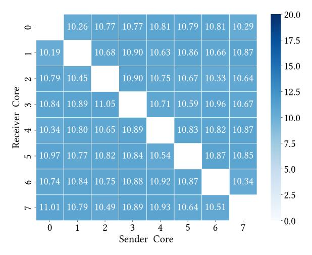
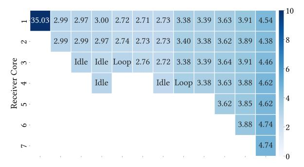
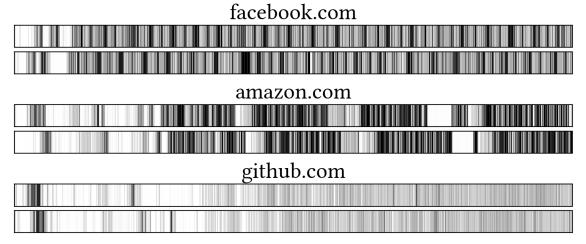

# Towards Practical Interrupt Side-Channel Attacks on macOS for Apple Silicon

Xin Zhang<sup>†\*</sup>, Chang Liu<sup>‡\*</sup>, Jiajun Zou<sup>†</sup>, Yi Yang<sup>†</sup>, Qingni Shen<sup>†(⊠)</sup>, Zhi Zhang<sup>§(⊠)</sup>, Trevor E. Carlson<sup>¶</sup>

†Peking University, {zhangxin00, jjzou2002, tkike}@stu.pku.edu.cn, qingnishen@ss.pku.edu.cn

<sup>‡</sup>Tsinghua University, cliu21@mails.tsinghua.edu.cn

§The University of Western Australia, zzhangphd@gmail.com

¶National University of Singapore, tcarlson@comp.nus.edu.sg

Abstract—In recent years, the high-end CPU landscape has shifted from an x86-dominated market to one increasingly featuring heavyweight Arm designs, most notably Apple's M-series. While prior work has examined side-channel resilience in the Apple ecosystem, interrupt-based channels remain an open and unexplored area. This is due to Apple's proprietary hardware and software implementation, the practicality of interrupt side channel attacks are constrained by two open challenges: precise interrupt detection and having a clear understanding of the interrupt delivery mechanism.

In this paper, we propose TIDE, a precise interrupt detection technique that exploits an explicit macOS behavior arising from Apple's Double Map mitigation. Specifically, Double Map overwrites the user-visible x18 register during kernel mapping restoration and interrupt handler branching on user-to-kernel transitions. To prevent kernel information from being accessed by user-space, macOS further clears x18 on kernel-to-user transitions in a subsequent update. Leveraging this behavior, TIDE enables two primitives without reliance on architectural timers: measuring intervals between consecutive interrupts and filtering interrupt-induced noise. Using TIDE, we reverse-engineer Apple's closed-source interrupt delivery mechanism and reveal that, unlike Linux, Apple's interrupt controller uniformly distributes shared peripheral interrupts across all active cores.

We then demonstrate the benefits of both TIDE itself and the reverse-engineering results through three case studies. First, we fingerprint websites running on Safari with an accuracy of 93.8% in a closed-world setting and 91.2% in an open-world setting, and video fingerprinting with an accuracy of 78.1%. Next, we use TIDE to filter out interrupt noise in countingthread timers, where TIDE tracks the number of noisy interrupts and only introduces an overhead of only 0.06%. With this, we have sigificiantly improved the SysBumps attack by increasing its success rate from 54% to 81%. Third, we examine the effect of our reverse-engineering results on the loop-counting attack, and find that a compute-intensive thread that generates no interrupts can reduce its accuracy from 94.8% to only 39.3%. By augmenting the training dataset with the number of active cores, we successfully enhance the robustness of the attack, achieving accuracies to 92.8% and 93.6% with and without noise, respectively. Further, we apply TIDE to build a timer-less covert channel with a high bandwidth of 111.65 b/s. Finally, TIDE successfully extracts the keys from Cloudflare's Interoperable Reusable Cryptographic Library (CIRCL) v1.1.

- ⊠ Corresponding authors: Zhi Zhang and Qingni Shen.
- \* Most of this work was done while visiting National University of Singapore.

### I. Introduction

Recently, Apple transitioned its Mac product line from Intel x86 CPUs to its custom-designed Arm-based Apple silicon. This shift has delivered notable gains in performance and energy efficiency, but the platform's closed design constrains independent security analysis. Despite its widespread deployment, Apple silicon remains comparatively poorly understood, with public studies of its security still scarce [1], [2], [3], [4], [5] relative to the extensive body of work on commodity x86 processors [6], [7], [8], [9], [10], [11], [12], [13].

In particular, although recent research exposes nontrivial attack surfaces and side channels on Apple silicon, none of them target interrupt side channels. As critical hardware primitives that enable efficient multitasking [14], [15], [16], interrupts allow the process scheduler to preempt a running process through context switches, and have also been widely exploited as side channels on other architectures including x86 [17], [18], [19], [20], [21], [22] and non-Apple Arm [23], [24]. By detecting and analyzing interrupt timing, an unprivileged adversary can eavesdrop on keystrokes [18], [25], [19], infer website visits [7], [22], monitor GPU activity [21], [20], and fingerprint processes [21], [23], [24].

Mounting practical side-channel attacks requires precise detection of the relevant events and a solid understanding of the underlying architecture design. However, on macOS for Apple silicon, both remain underexplored. First, macOS exposes no interface for interrupt statistics, rendering software-based interrupt detection ineffective. For hardwarebased detection, mainstream techniques exploit x86-specific design [17], [22], [19], [26], [20] that do not exist on Apple silicon, leaving timer-based detection [7], [18], [25] as the only theoretically applicable option. Moreover, these timer-based detection techniques can be mitigated by a series of timing defenses [27], [28], [29], [30], [31], [32] and are known to suffer noise from halted CPU cycles on x86 processors [33], [34]; whether similar noise arises on Apple silicon also remains unclear. Second, for the interrupt delivery mechanism, Apple macOS with M-series processors uses a closed-source OS design where only kernel code is available and only supports limited extensions through well-defined interfaces (i.e., Kernel Debug Kit [35]). To the best of our knowledge,

This work was supported in part by the National Natural Science Foundation of China under Grant No. 61672062, and in part by the Ministry of Education, Singapore, under Tier 2 award MOE-T2EP20222-0007.

none of existing kernel extensions provide interrupt counters. Apart from the Asahi Linux documentation which provides a short definition of Apple's proprietary interrupt controller, other public sources provide only brief functional descriptions for this hardware [\[36\]](#page-13-35).

Motivated by the growing adoption of Apple silicon, we investigate the following questions:

*Can we precisely detect interrupts from user-space on Apple silicon? Do established interrupt side-channel conclusions generalize to Apple silicon, or does Apple's interrupt delivery design invalidate them?*

In this work, we answer the two questions by presenting TIDE[1](#page-1-0) , a timer-less technique that detects precise interrupts on the macOS for Apple silicon. It overcomes the challenges posed by defenses against architectural timers, and can be used as a tool for reverse-engineering the Apple interrupt delivery mechanism.

To build TIDE, our key insight is to exploit the footprints left by the interrupt handler routine at the architectural level. Through a comprehensive analysis of all available registers defined by the procedure call standard for the Arm architecture (AAPCS), we have found that x18, a platform register, will always be reset to 0 when system context switches from kernel-space to user-space. This arises from a mitigationoriented macOS/Arm architecture design interaction between Apple's Double Map mitigation, XNU's exception-entry/return implementation, and a stable user-space observation of x18. By simply checking a user-controlled value in the x18 register, an unprivileged attacker can detect whether their process has been interrupted.

We then compare the value of this pre-set x18 register with two timing-based interrupt detection techniques: one using an architectural timer and one using a self-constructed timer implemented as a counting thread. The counting-thread based technique performs poorly (45.0%–80.5% accuracy) and is often unreliable. The architectural-timer-based technique is far stronger with an over 99% accuracy but still exhibits occasional jumps in timestamp even without context switches, and it can be mitigated by existing timer defenses. In contrast, TIDE does not rely on timers and thus remains robust to such defenses, i.e., timer-less interrupt detection, while avoiding these false reports.

Further, we design two types of primitives. *First*, we build a TIDE-based interrupt timing primitive, which incorporates a counter program in the same thread to represent the interval between two consecutive interrupts. To achieve this, we assign x18 register with a non-zero value and then increment this counter until x18 register is cleared. *Second*, we apply TIDE to distinguish interrupted measurements, thereby filtering out the noise for any measurement that is sensitive to interrupts. By setting the x18 value, and watching for it to be cleared, we can actively filter out the corresponding measurement to eliminate the noise of interrupts.

We then apply TIDE to reverse-engineer the proprietary interrupt controller design [\[37\]](#page-13-36), [\[36\]](#page-13-35) adopted by Apple. This is a primary requirement before deploying TIDE (as well as timing-based detection) in practical interrupt side-channel attacks, as it only detects interrupts on its running core. We find that Apple does not adopt use the interrupt affinity design. Instead, all shared peripheral interrupts (SPIs) are always delivered to all active cores uniformly. This observation invalidates prior conclusions derived from non-Apple platforms that SPIs could be mitigated by binding them to non-attacker cores [\[7\]](#page-13-6), and further rules out the feasibility of Mwait- and IdleLeak-style attacks [\[22\]](#page-13-21), [\[20\]](#page-13-19) on Apple silicon.

In our evaluation, we demonstrate the benefits of both TIDE itself and the reverse-engineering results through five case studies. *First*, we infer website visits with high top-1 accuracy of 93.8% (closed world) and 91.2% (open world) on the Safari browser. We also fingerprint videos from YouTube with a high top-1 accuracy of 78.1%. *Next*, we apply TIDE to filter out the interrupts (as noise) for counting-thread timers with a small overhead of 0.06%. With our denoised timer, the success rate of the SysBumps attack [\[2\]](#page-13-1) has been increased from 54% to 81% under an interrupt-heavy environment. *Thirdly*, we examine the effects of the Apple interrupt delivery mechanism on the loop counting attack [\[7\]](#page-13-6). We find that a computingintensive thread reduces its accuracy from 94.8% to only 39.3%. By augmenting the training dataset with the number of active cores, we significantly enhance the robustness of the attack, achieving accuracies to 92.8% and 93.6% with and without noise, respectively. *Fourthly*, we applied TIDE to build cross-core covert channels without architectural timers, which achieves a high bandwidth of 111.65 bps and an error rate of 4.45%. *Lastly*, we successfully extract the private keys of the Supersingular Isogeny Key Encapsulation (SIKE) algorithm. Summary of contributions. The main contributions of this paper are summarized below:

- We propose TIDE, a timer-less interrupt detection technique for macOS on M-series CPUs, revealing an unintended side effect of Apple's Double Map implementation on the Arm architecture.
- TIDE incorporates two exploitations, including measuring time intervals between two consecutive interrupts and filtering out interrupt noise.
- We use TIDE to reverse-engineer the Apple interrupt delivery mechanism, results of which show that it uniformly delivers shared peripheral interrupts to every active core.
- We successfully apply TIDE to mount website and video fingerprinting attacks, build covert channels, extract cryptographic keys, and to enhance counting-thread timers. We also leverage the reverse-engineering results to strengthen loop-counting attacks.

Vulnerability disclosure. We disclosed our findings to Apple's hardware security team on January 22, 2025, and macOS security team on February 2, 2025. In both cases, Apple classified x18 register events as out-of-scope under their threat model and allowed us to proceed to publish this

<span id="page-1-0"></span><sup>1</sup>Timer-less Interrupt Detection

work. Specifically, the hardware security team responded on February 2 and stated: *We have forwarded your report to the appropriate team to investigate as a potential future hardening effort*. The macOS security team requested a copy of our manuscript on March 15, 2025, and completed their review on April 9, 2025. They commented: *Our engineers found your paper intriguing, and it helped shed more light on the sidechannel techniques you describe. This helps with the team's considerations for possible platform enhancements.*

# II. BACKGROUND AND RELATED WORK

# *A. Interrupt Side Channels*

Interrupts are fundamental hardware signals for modern computer systems to effectively manage parallel tasks. An interrupt can temporarily halt the execution of a running process, allowing the system to switch its context to kernel-space to perform critical tasks [\[14\]](#page-13-13), [\[15\]](#page-13-14), [\[16\]](#page-13-15). However, as interrupts are triggered when a process requests system resources (e.g., network) or when a user inputs data through devices, they have been exploited as unprivileged side channels. These device interrupts, also know as shared peripheral interrupts, have been exploited by unprivileged attackers to monitor keystrokes [\[25\]](#page-13-24), [\[18\]](#page-13-17), [\[20\]](#page-13-19), [\[19\]](#page-13-18), infer website visits [\[22\]](#page-13-21), [\[17\]](#page-13-16), [\[20\]](#page-13-19), [\[7\]](#page-13-6), [\[19\]](#page-13-18), and detect video streams [\[38\]](#page-13-37), [\[20\]](#page-13-19).

Interrupt delivery. To mount above interrupt side channel attacks, an attacker must first determine which core handles the target interrupts before detecting the interrupts on that core [\[39\]](#page-13-38). This requirement stems from how Linux handles interrupt routing. Although the IRQ affinity mask can nominally include multiple cores (and defaults to all cores), the Linux kernel ultimately uses an effective\_affinity mask that binds each interrupt to a single core. The update of effective\_affinity is event driven and can be triggered by daemons such as irqbalance based on runtime conditions and user-configured affinity mask. As a result, even though the affinity mask allows for multiple candidate cores, interrupt delivery tends to be concentrated on a single core at any given time. Once the attacker identifies the target core, a second key requirement is the ability to accurately detect the occurrence of interrupts, which can be coarsely divided into three categories. Non-Apple software-based detection. The second category of attacks uses Linux-based software interfaces to obtain interrupt statistics, e.g., /proc/interrupts [\[40\]](#page-13-39), [\[23\]](#page-13-22), [\[21\]](#page-13-20). Through this interface, an unprivileged attacker can obtain the exact number of each type of interrupts on every core, which is updated at millisecond intervals. Relying on these information, attackers have demonstrated fingerprinting attacks across different devices [\[23\]](#page-13-22), processes [\[21\]](#page-13-20), [\[40\]](#page-13-39), or videos [\[21\]](#page-13-20). However, the software interface is easy to constrain and has already been constrained on many systems [\[41\]](#page-13-40), [\[42\]](#page-13-41), [\[43\]](#page-13-42). More importantly, macOS does not provide such interrupt statistics through any interface.

Non-Apple hardware-based detection. Lastly, some recent techniques exploit various hardware-based mechanisms to detect interrupts [\[22\]](#page-13-21), [\[17\]](#page-13-16), [\[20\]](#page-13-19), [\[19\]](#page-13-18). Specifically, Zhang et al. [\[22\]](#page-13-21) exploit the umwait on Intel, monitorx on AMD, and wait-for-interrupt (wfi) on Arm to detect interrupts. Notably, while Apple processors adopt the similar architecture to Arm, they do not support wfi instructions in user-space. Besides, to detect interrupts on x86, IdleLeak [\[20\]](#page-13-19) exploit tpause instructions and SegScope [\[17\]](#page-13-16) exploit segment protection mechanism. Lastly, Rauscher et al. [\[19\]](#page-13-18) exploit user and virtualized inter-processor interrupts (IPIs), a new hardware feature that has not been officially supported by the Linux kernel. Notably, none of these hardware features are supported by Apple silicon.

Timer-based detection. First, the majority of existing interrupt side channel attacks [\[18\]](#page-13-17), [\[25\]](#page-13-24), [\[7\]](#page-13-6) rely on an architectural timer to indirectly detect interrupts. Their key insight is that if a given process is interrupted, there will be a jump in its timestamp. Some attacks [\[18\]](#page-13-17), [\[25\]](#page-13-24) use a high-resolution architectural timer (e.g., the cntvct\_el0 updating at 24 MHz on M1 to M3 processors) to monitor timestamps and conclude an interrupt has occurred if the timestamp increment exceeds a predefined threshold. Other works [\[18\]](#page-13-17), [\[7\]](#page-13-6) apply a lowresolution architectural timer to detect interrupts. Specifically, they build a loop counting program where a low-resolution timer (e.g., with millisecond-level granularity) samples a selfincrementing counter at fixed intervals. If an interrupt occurs in the interval, the counter value will be lower than that of uninterrupted intervals. However, both of these techniques rely on architectural timers, which limits their applicability in timer-constrained scenarios. Although the attackers can build their own timer-implemented counting threads to re-enable the above techniques, such threads introduce additional noise to Apple interrupt delivery (Section [IV-B\)](#page-7-0) as they increase the number of active CPU cores, and cannot reliably detect interrupts as they require uninterrupted execution (Section [III-B\)](#page-4-0).

# <span id="page-2-0"></span>*B. Timer-less Side Channel Attacks*

Timer-constrained scenarios. Numerous works have discussed how to mitigate side channels by constraining the use of architectural timers, including detecting timers [\[28\]](#page-13-27), [\[44\]](#page-14-0), [\[29\]](#page-13-28), making timers privileged [\[4\]](#page-13-3), [\[45\]](#page-14-1), and crippling timers [\[31\]](#page-13-30), [\[32\]](#page-13-31), [\[46\]](#page-14-2), [\[47\]](#page-14-3), [\[7\]](#page-13-6). Particularly, Apple has removed the unprivileged access to cycle-accurate timers (i.e., the kperf API) [\[1\]](#page-13-0). Besides, both MASCAT [\[28\]](#page-13-27) and Oyama et al. [\[29\]](#page-13-28) are static binary analysis tools, which can identify the use of architectural timers. Last, in some sandbox environments, defenders can inject their carefully designed noise to architectural timers, thereby making them not depend on the secret information anymore [\[48\]](#page-14-4), [\[47\]](#page-14-3), [\[31\]](#page-13-30), [\[32\]](#page-13-31).

To bypass these countermeasures, the attackers have to either build their own timers [\[27\]](#page-13-26) or seek a timer-less technique to detect related hardware events (e.g., cache writes [\[22\]](#page-13-21), [\[30\]](#page-13-29), [\[49\]](#page-14-5)). The self-built timers, implemented as counting threads, require concurrent, uninterrupted execution, and shared memory resources. While they have been used for micro-architectural attacks in a range of systems [\[50\]](#page-14-6), [\[4\]](#page-13-3), [\[51\]](#page-14-7), they are typically less accurate and noisier than architectural timers [\[22\]](#page-13-21).

To address the challenge of lack of timers, the other works aim to provide a timer-less way to detect related microarchitectural events [\[22\]](#page-13-21), [\[30\]](#page-13-29), [\[17\]](#page-13-16), [\[1\]](#page-13-0), [\[49\]](#page-14-5), [\[52\]](#page-14-8). Among them, only two techniques can work on Apple silicon [\[1\]](#page-13-0), [\[30\]](#page-13-29). Specifically, Yu et al. [\[30\]](#page-13-29) exploit the Load-Linked/Store-Conditional (LL/SC) instructions on the Apple M1 to directly measure whether cache evictions have occurred. However, due to the lack of huge pages on macOS, their evaluation has to be only demonstrated on a Linux-based OS running on M1 processors. Besides, iLeakage [\[1\]](#page-13-0) races two threads to update a shared variable. By observing the order of completion, the attacker can distinguish cache hits from misses without relying on external timers. Compared to the two techniques, TIDE is an orthogonal technique that detects a different microarchitectural event (i.e., interrupts) without assumption of a customized OS.

# <span id="page-3-1"></span>*C. Procedure Call Standard for the AArch64 Architecture*

The procedure call standard for the Arm architecture (AAPCS) is a key component of the Arm application binary interface (ABI) specification [\[53\]](#page-14-9). It establishes conventions for function calls and parameter passing on Arm platforms, covering register usage, stack management, and the handling of parameters and return values. After transitioning from x86 to its proprietary M-series processors in 2020, Apple employs a variant of AAPCS for the Arm 64-bit architecture, known as AAPCS64 [\[54\]](#page-14-10). In this standard, Apple provides 31 generalpurpose registers for developers, named from x0 to x30, which are implemented at hardware-level and can be broadly divided into two categories.

The first category is used for program calls. Specifically, registers x0–x8 are used to pass up to integer or pointer arguments and return value. Besides, x9–x15 are callersaved temporary registers for intermediate computations, while x19–x28 are callee-saved registers but used for local variables that persist across function calls. Finally, x29 register serves as the frame pointer to facilitate debugging and stack unwinding, and x30 register, known as the link register, holds return addresses during function calls.

Second, for a platform usage perspective, registers x16 and x17 operate as intra-procedure-call registers and are primarily used by the linker for dynamic linking and system calls. Besides, register x18 is reserved for platform-specific purposes, whose use is defined by the execution environment. For example, Apple uses x18 as a scratch register in context switches on hardware where cross-privilege Spectre mitigation [\[55\]](#page-14-11) is needed and Windows uses x18 as a thread-local storage (TLS) pointer [\[56\]](#page-14-12). On these platforms, leveraging x18 for general-purpose application is discouraged [\[57\]](#page-14-13), [\[54\]](#page-14-10), [\[56\]](#page-14-12). For instance, LLVM replaces the use of x18 with x15 to prevent potential crashes [\[58\]](#page-14-14).

### <span id="page-3-2"></span>*D. Double Map*

To protect Apple silicon from being affected by Meltdown attacks [\[59\]](#page-14-15), [\[2\]](#page-13-1), Apple introduced the Double Map feature in macOS 10.13.2 and iOS 11.2 (XNU kernel 4570.31.3) [\[60\]](#page-14-16). The key insight behind Double Map is to retain kernel translations while rendering them inaccessible during EL0 execution, rather than fully unmapping the kernel address space. This effectively avoids unnecessary TLB invalidation and thus reduces the runtime overhead of privilege transitions [\[59\]](#page-14-15).

<span id="page-3-0"></span>

Fig. 1: Address translation under the Double Map mitigation.

On Apple's Arm-based platforms, Double Map is implemented by leveraging the two Translation Table Base Registers (TTBRs) available on ARMv8-A processors together with the Translation Control Register (TCR). As illustrated in Figure [1,](#page-3-0) in XNU, TTBR0\_EL1 holds the base address of the translation tables associated with the current process address space, whereas TTBR1\_EL1 references the translation tables used to map the kernel address space shared across all processes. Both registers also carry the Address Space Identifier (ASID), which participates in TLB lookups. Updating the ASID changes the effective translation context without requiring full TLB invalidation, as previously cached entries become non-matching under the new ASID. During each user-to-kernel transition, TTBR0\_EL1 is required to switch the translation context (e.g., the ASID) to kernel, while TTBR1\_EL1 remains unchanged because the kernel address space is shared across all processes.

The TCR\_EL1 register defines the translation regime, including virtual address size, translation granularity, and table-walk behavior. In XNU's Double Map implementation, TCR\_EL1 is switched between two translation configurations. One configuration (TCR\_EL1\_BOOT) restores the full kernelvisible address mappings used during EL1 execution, while the other (TCR\_EL1\_USER) restricts the virtual address range accessible during EL0 execution. During privilege transitions, TCR\_EL1 must be updated before memory accesses to ensure that address translation is performed under the intended translation regime.

### III. TIDE

<span id="page-3-3"></span>Experimental setup. We evaluate TIDE on multiple machines as shown in Table [I,](#page-4-1) including physical machines and cloud instances with different M-series CPUs and macOS versions.

### *A. Threat Model*

In this paper we focus on Apple systems equipped with Mseries processors running macOS. Our primary threat model

TABLE I: System configurations.

<span id="page-4-1"></span>

| Machine               | CPU    | os                 | Cores   |
|-----------------------|--------|--------------------|---------|
| MacBook Pro 2021      | M1 Pro | macOS Ventura 13.6 | 2 E+8 P |
| Mac mini 2023         | M2     | macOS Ventura 13.7 | 4 E+4 P |
| MacBook Air 2023      | M3     | macOS Sonoma 14.6  | 4 E+4 P |
| MacBook Pro 2023      | M3 Max | macOS Sonoma 14.7  | 4E+10P  |
| Mac mini 2020 (Cloud) | M1     | macOS Sonoma 14.6  | 4 E+4 P |
| Mac mini 2024 (Cloud) | M4     | macOS Sequoia 15.2 | 6 E+4 P |

assumes a native adversary that can execute user-space code on the same macOS host as the victim without elevated privileges. This aligns with existing interrupt side channels [23], [19], [20], [22], [17], as well as previously demonstrated side channels on Apple silicon [5], [2], [61], [30]. It can be achieved under multiple real-world settings, including a multi-user workstation with untrusted user processes and post-compromise execution (e.g., a malicious application). Since binding execution to a specific core requires privileges on macOS, we make no assumption about the attacker core, which differs from prior attacks based on single-core interrupt detection [17], [20], [22].

Further, while the attacker has access to local system resources, we assume a timer-constrained scenario where the attacker has no access to any timing source (such as the kperf API or cntvct\_el0). This assumption is motivated by prior defenses targeting architectural timers [28], [29], [4], [27], [31], [32], [46] and aligns with existing timer-less side-channel attacks on Apple silicon [1], [30] (see Section II-B for details). Unless otherwise specified, the timer-constrained native model underlies most of our experiments and case studies, where TIDE serves as a detection technique.

Besides the timer-constrained native model, we consider a browser-based adversary in Section V-C, where the victim visits a malicious webpage. Importantly, this model does not rely on TIDE itself, since deploying TIDE requires native code execution. Instead, we access the impact of our reverse-engineering insights about Apple's interrupt delivery on existing browser-based attack [7]. In this attack, a millisecond-granularity timer provided by the browser is needed.

### <span id="page-4-0"></span>B. Overview

**Insight.** The key insight of TIDE is to exploit the footprints during context switches at the architectural level. Specifically, interrupts are hardware signals that transition the context of the received core from user space to kernel space to execute the corresponding kernel handler. Upon completion, the OS explicitly triggers another context switch to resume execution in user-space. During these transitions, the processor must correctly save and restore the running state of the interrupted process, especially the registers. Any footprint left by the context switches may allow a user process to detect the presence of an interrupt on its operating core.

After moving from x86 architecture to Apple silicon in 2020, Apple adopts the procedure call standard for the Arm architecture (AAPCS). Under this standard, 31 general registers (x0-x30) are accessible in user-space, and can be read

and written without requiring elevated privileges (see more details in Section II-C). As the first step of our study, we design an experiment to automatically identify whether/which architectural registers can be exploited.

Triggering reliable context switches. Since interrupts can only be triggered indirectly on Apple systems (e.g., by requesting a hardware resource), we identify two additional methods to deterministically trigger context switches: system calls (e.g., read(), fsync(), stat(), gettimeofday(), and mmap()) and exceptions (e.g., division-by-zero errors, segmentation faults, and debug traps). To avoid any possible optimization that bypasses context switches (e.g., commpage can reduce context switches caused by the C-based function gettimeofday [62]), we use svc instructions to test the 5 syscalls mentioned before. For each register, we assign it with a known value, invoke the system call, and then check whether the value remains unchanged after the call returns. By repeating this process for all accessible registers, we can identify the registers that are modified during context switches. **Observation**. We observe consistent results across all tested machines listed in Table I. In particular, four registers are consistently altered following a context switch triggered by an arbitrary system call: x0, x1, x16, and x18. Among them, x0 is used to store the return value and x1 serves an additional parameter-passing role, and x16 is preserved for internal linkage (i.e., the ID of system call in this test). All three registers function as a part of the system call mechanism. In contrast, x18, the platform register mandated by the AAPCS standard, is consistently cleared to zero after a context switch and independent of the execution results of our system calls. Root cause. To understand how x18 is cleared, we investigated the XNU kernel source [63]. We found that this behavior is enforced by the XNU kernel as a part of Apple's Double Map mitigation. Specifically, XNU introduced the use of x18 as a scratch register with Apple's Double Map feature [59] in version 4570.31.3 [60], released in December 2017. Subsequently, it further added the explicit clearing of x18 in version 4570.61.3 [64], released in March 2018. Our analysis reveals a dependency between Double Map and the x18 behavior. Specifically, prior to saving the interrupted user registers (including the original x18) in Lel0 irg vector 64 long, the exception entry path executes two macros (Listing 1), both of which reuse x18 as a scratch register and thus overwrite its original user value.

The first one is MAP\_KERNEL (Line 1-10), which restores a kernel-consistent translation regime by updating the both TTBRO\_EL1 and TCR\_EL1 registers (see Section II-D for details). Both steps require a general-purpose register (GPR) operand where updating TTBRO\_EL1 uses a read-modify-write sequence (mrs/orr/msr), and restoring TCR\_EL1 requires msr TCR\_EL1, Xt, where the source value must come from a GPR (i.e., no immediate operand is allowed).

The second one is BRANCH\_TO\_KVA\_VECTOR (Line 13-20), which resolves the appropriate exception handler in the kernel virtual address (KVA) space and transfers control to it. Under Double Map, kernel exception handlers

```
.macro MAP_KERNEL
2
        /* Switch to the kernel ASID for the task. */
3
                x18, TTBR0 EL1
       mrs
4
                x18, x18, #(1 << TTBR_ASID_SHIFT)
       orr
                TTBR0_EL1, x18
5
       msr
6
        /* Update the TCR to map the kernel using the
        kernel ASID. */
7
       MOV64
                x18, TCR_EL1_BOOT
                TCR_EL1, x18
8
       msr
9
       ish
                sy
10
    .endmacro
11
12
    .macro BRANCH_TO_KVA_VECTOR
        /* Find the kernelcache table for the exception
13
        vectors by accessing the per-CPU data. \star/
14
                x18, TPIDR_EL1
15
       ldr
                x18, [x18, ACT_CPUDATAP]
16
       ldr
                x18, [x18, CPU_EXC_VECTORS]
17
        /*Branch to the corresponding handler.*/
18
       ldr
                x18, [x18, #($1 << 3)]
19
       br
                x18
20
    .endmacro
21
22
   Lel0_
         _irq_vector_64:
23
       MAP_KERNEL
24
        BRANCH_TO_KVA_VECTOR Le10_irq_vector_64_long, 9
```

Listing 1: Use of x18 as a scratch register in the XNU kernel. The generic purpose registers are saved after branching to Lel0\_irq\_vector\_64\_long.

are no longer statically reachable and must be dynamically resolved through per-CPU metadata. Therefore, the macro first reads TPIDR\_EL1 to obtain the current thread pointer, then traverses the per-CPU data structure to locate the CPU\_EXC\_VECTORS table, and finally indexes the table to fetch the corresponding handler address before executing an indirect branch (br). Each of these steps reuses x18 as a temporary pointer register.

Although the kernel could theoretically save the GPRs before executing BRANCH\_TO\_KVA\_VECTOR, at least one GPR must still be used as a scratch register to establish a kernel-consistent translation regime via MAP\_KERNEL. XNU uses  $\times 18$  for this purpose, which causes the user's original  $\times 18$  value to be overwritten before it can be saved. To mitigate potential kernel information leakage, XNU subsequently introduced explicit clearing of  $\times 18$  before returning from kernel space to user space [64].

Compared to existing interrupt detection techniques. Although previous timer-based detection techniques [25], [65] are not applicable in our timer-constrained scenario, we still compare TIDE with them to demonstrate its high precision. As the processor is temporarily preempted by the kernel during interrupt handler routine, these two techniques exploit the discontinuity of time in user-space to detect interrupts. To make a comparison, we apply TIDE to verify whether all observed jumps in timestamps are indeed caused by interrupts. Further, to demonstrate that the counting-thread timers are not a reliable way to detect interrupts, we also apply the counting-thread timer to capture jumps in its counter under the timer constrained scenario.

To achieve this, we monitor the corresponding jumps in timestamps by reading <code>cntvct\_el0</code> register and select a

<span id="page-5-1"></span>

Fig. 2: Comparisons between TIDE and timer-based detection. Not all jumps in timestamps clears the x18 register (red dots), which means no kernel-userspace context switch occurs.

pre-determined threshold (i.e.,  $1\mu s$ ) for each machine for determining whether an jump is caused by an interrupt [25]. To verify whether a context switch occurs after each detected jump, we insert x18 read and write operations immediately before and after the timestamp check. We observe consistent results on all our tested machines in Table I.

Figure 2 shows the jumps in timestamps on our Macbook Air 2023 equipped with an M3 processor (whose cntvct el0 increments at a fixed frequency of 24 MHz) and cloud Mac mini equipped with an M4 processor (whose cntvct\_el0 increments at a higher frequency of 1 GHz). Both the blue and red dots in the figure represent jumps in timestamps, which the timer-based method classifies as interrupt-induced. However, based on the ground truth obtained from TIDE, we observe that not every timestamp jump on Apple CPUs is accompanied by a clear of the x18 register. Since this clearing is performed by the kernel during a context switch, the absence of a clear indicates that no kernel-userspace context switch occurred. This implies that such timestamp jumps are unlikely to be caused by interrupts. On our test machines, approximately 0.2%-0.5% of jumps in timestamps are at the same level of interrupted jumps, leading to false positives for timer-based detection techniques.

In addition, across all our machines, the counter increments produced by counting threads are consistently less reliable than those observed with TIDE. For instance, when TIDE detects 100,000 interrupts, only 45.0% of them are detected by counting threads with a threshold of 2,000 on the M3 Pro machine, compared to 62.9% on the M1 Pro machine and 80.5% on the M3 Air machine.

**Exploitation**. With the precise interrupt detection, we design two primitives. *First*, we build a TIDE-based interrupt timing primitive, which incorporates a counter program in the same thread. To use this counter to represent the interrupt timing duration, we assign the  $\times 18$  register with a non-zero value and then make the counter increment until the  $\times 18$  is cleared. *Second*, we apply TIDE to distinguish the interrupted measurements, thereby filtering out the interrupt noise to improve their robustness to system noise. For instance, since interrupts are a common source of noise in counting-thread timers, TIDE can maintain its accuracy even in an interrupt-heavy environment.

<span id="page-6-0"></span>

Fig. 3: TIDE-based interrupt timing leverages a counter to represent the time interval between two consecutive interrupts.

### *C. TIDE-based Interrupt Timing*

First, we design a primitive that can measure the interval between two consecutive interrupts, i.e., interrupt timing. As this interrupt timing information can reflect when the victim requests a resource, it is considered as sensitive information and has served as a foundation in a large number of interrupt side channel attacks [\[7\]](#page-13-6), [\[22\]](#page-13-21), [\[20\]](#page-13-19) fingerprinting.

To represent this time interval, prior attacks commonly relied on an external timer to record precise timestamps upon detecting an interrupt. However, architectural timers are not available in our threat model and counting-thread timers are badly noised under interrupt-rich scenarios. To overcome this challenge, we define a counter to denote the time interval between two consecutive interrupts.

Figure [3](#page-6-0) illustrates how this counter works, which consists of four main steps. *First*, we assign x18 with a non-zero value (e.g., 0x1). *Second*, we define a loop function, inside which we check x18 and increment the counter after each check. *Third*, during this period of time, if an interrupt occurs, the context switches from user-space to kernel-space. The OS kernel temporally occupies this core and uses x18 for its own aim (e.g., x18 has been used for mitigation against cross-privilege Spectre leakages [\[55\]](#page-14-11)). Before the processor returns from an interrupt handler to user-space, macOS explicitly clears x18 to 0. *Lastly*, upon detecting the x18's value change, we break the loop and record the counter. This counter value denotes the number of executed loops and reflects the elapsed time in user-space before the detected interrupt occurs.

# *D. TIDE-based Denoising*

We then introduce a TIDE-based de-noising technique that accurately detects and filters out interrupted measurements. We note that interrupts are a well-known source of noise in both performance benchmarking [\[66\]](#page-14-22), [\[67\]](#page-14-23), [\[68\]](#page-14-24) and microarchitectural attacks [\[22\]](#page-13-21), [\[69\]](#page-14-25). As interrupts frequently occur to handle various system events, the timing and overhead of each interrupt is inherently non-deterministic, introducing variability in performance measurements. Moreover, in some attacks [\[22\]](#page-13-21), after the attacker has tricked the processor into a specific micro-architectural state, interrupts can trigger the execution of unrelated code that disrupts this state, e.g., by evicting primed cache lines [\[25\]](#page-13-24) or waking up idle cores [\[22\]](#page-13-21).

<span id="page-6-1"></span>

Fig. 4: TIDE-based denoising inserts at most one x18 read and one x18 write between every two pieces of code.

Our denoising primitive is built using TIDE's ability to accurately detect whether the current process has been interrupted after the x18 register is set. By placing the measurement between an x18 write and an x18 read, we can determine whether it is noised by interrupts, without interfering with its execution. By removing noisy measurements from a set of samples, one can significantly improve the accuracy of the final results.

Figure [4](#page-6-1) illustrates the workflow of TIDE-based de-noising. Before executing the code under measurement, we set the x18 register to a non-zero value. After each measurement, we check whether the value of x18 is cleared. If it remains unchanged, the current process is considered uninterrupted during the execution of our code. Otherwise, if x18 is cleared, it indicates an interrupt or exception occurred, and the corresponding measurement is discarded or repeated. The number of x18 writes can be further reduced to optimize the overhead if the current x18 is already a non-zero value. In this way, we achieve accurate de-noising with the cost of at most one register write and one register read.

### <span id="page-6-3"></span>IV. UNDERSTANDING APPLE'S INTERRUPT DELIVERY

Aligned with previous interrupt detection techniques [\[20\]](#page-13-19), [\[17\]](#page-13-16), [\[22\]](#page-13-21), TIDE is also limited to detecting interrupts on its own operating core, i.e., local-core detection. Extending such techniques to cross-core side channels requires detecting interrupts that are triggered on one core but handled on another. Thus, we investigate shared peripheral interrupts (SPIs)[2](#page-6-2) , which are generated by devices external to the processor cores (e.g., network cards, keyboards, and GPUs) and delivered to one or more cores for handling. However, these attacks have so far been demonstrated only on Linux-based systems [\[25\]](#page-13-24), [\[18\]](#page-13-17), [\[19\]](#page-13-18), [\[20\]](#page-13-19), [\[17\]](#page-13-16) and Intel-based macOS [\[7\]](#page-13-6), where interrupt delivery mechanisms are open-source and well documented [\[70\]](#page-14-26). On Apple silicon, by contrast, the proprietary and poorly understood interrupt delivery design makes mounting crosscore attacks substantially more challenging.

Particularly, unlike traditional Arm architectures that employ a hardware named generic interrupt controller (GIC) to determine the target handling cores, Apple silicon adopts its own proprietary and closed-source hardware design, referred to as Apple interrupt controller (AIC) [\[37\]](#page-13-36). Starting from the

<span id="page-6-2"></span><sup>2</sup>While some processor-triggered interrupts can also be delivered across cores, their number is typically limited, and our results show that SPIs are the primary enabler of cross-core attack on Apple systems (Section [V-C\)](#page-10-0).

M1 Pro, Apple's AICv2 employs a hardware-based mechanism to dispatch interrupts to willing cores [\[36\]](#page-13-35). All platforms evaluated in this paper follow this design. This incompatibility introduces significant challenges for both custom operating system development[3](#page-7-1) and interrupt-related attacks.

Goals. Due to Apple's proprietary design and restricted kernel instrumentation, fully reverse-engineering its interrupt delivery is difficult. As a meaningful first step, this paper concentrates on two questions that are particularly critical for enabling cross-core interrupt side-channel attacks. Specifically, we ask:

- Q1: How does AIC deliver shared peripheral interrupts?
- Q2: What factors can affect interrupt delivery decisions?

Metrics: interrupt delivery efficiency. To investigate how AIC delivers SPIs to an attack core, we consider a setup in which we have complete control over both the attack code and the victim code. To quantify how often interrupts are received under a certain setting, we use the *efficiency* metric, defined as the ratio between the number of SPI requests generated and the number of interrupts successfully received. Except for some cases where a single request may trigger multiple interrupts (e.g., each keystroke may generate two interrupts [\[25\]](#page-13-24), [\[26\]](#page-13-25)), the efficiency typically ranges from 1 to +∞. An SPI request refers to a hardware resource request, such as receiving a network packet or tapping a keyboard. Since macOS does not provide an API to reliably activate an SPI, we use this metric to evaluate the interrupt receiving rate under different resource request frequencies.

# <span id="page-7-4"></span>*A. Interrupt Delivery Strategy*

To answer Q1, we investigate three types of SPIs, including network interrupts, mouse interrupts, and keyboard interrupts. As the first step of our study, we validate whether they can be delivered to the attack core using default scheduling strategy. To this end, we separately request the three types of resources (i.e, mouse movement, keystroke, and network package) from a sender process, thereby triggering the corresponding SPIs. At the same time, we use TIDE to detect interrupts from another receiver process. Our goal is to validate whether an attack process can detect the SPIs triggered by the victim, or only on some specific cores as previous attacks on x86 [\[7\]](#page-13-6), [\[25\]](#page-13-24), [\[18\]](#page-13-17) or Arm [\[23\]](#page-13-22) architectures.

Experimental setup. To generate network interrupts, we use udp protocol to send a packet of 1 B or 9 KB to one of our controlled ports. To generate mouse interrupts, we use a C-based program that invokes the CGEventRef API to simulate user input, thereby moving the mouse in place. To trigger keyboard interrupts, we use another C-based program to repeatedly press backspace. To avoid disrupting normal system behavior, we set the interrupt request frequency to 200 kHz for network interrupts, and 5 kHz for both mouse and keyboard interrupts.

First, we run our experiments for 10 seconds to evaluate the *efficiency* under default macOS settings and just let the macOS

<span id="page-7-3"></span>TABLE II: Efficiency for three types of interrupts on our tested machines. Mac mini devices are not equipped with a mouse or keyboard, and are therefore marked as '–'.

| Setting               |        | Network (1 B) Network (9 KB) Mouse Keyboard |      |      |
|-----------------------|--------|---------------------------------------------|------|------|
| MacBook Pro 2021      | 8.01   | 7.41                                        | 1.13 | 4.32 |
| Mac mini 2023         | 33.74  | 10.96                                       | –    | –    |
| MacBook Air 2023      | 122.82 | 111.2                                       | 1.06 | 0.56 |
| MacBook Pro 2023      | 149.27 | 180.70                                      | 0.76 | 2.91 |
| Mac mini 2020 (Cloud) | 6.03   | 6.05                                        | –    | –    |
| Mac mini 2024 (Cloud) | 12.47  | 12.43                                       | –    | –    |

schedule them. Second, we examine the influence of the CPU core on which our program executes. As macOS does not provide the interface to control the affinity from user-space, we employ CoreBinder[4](#page-7-2) , a kernel extension that allows pinning threads to specific CPU cores on Apple silicon [\[73\]](#page-14-29). With CoreBinder, we sequentially assign the sender process to each core while ensuring that the receiver process runs on a different core on Mac mini 2023. Since this machine has 8 cores, we evaluate the *efficiency* of network interrupts using 9 kB under 56 settings. It is important to note that while both installing CoreBinder and cntvct\_el0 fall out of our threat model, they are used solely for validation and are not necessary in our attacks in Section [V.](#page-8-0)

Experimental results. Table [II](#page-7-3) presents the results on all our tested machines under default system setting. Since the underlying delivery algorithm is closed source, we cannot explain the variations in efficiency across settings. Nonetheless, we observe that these SPIs can be detected under all the settings although their efficiencies vary. Besides, as our tested Mac mini 2023 has 8 cores, there are 56 different possibilities for our sender core and receiver core. Figure [5](#page-8-1) shows the efficiencies across these 56 settings. When the two processes are pinned to different cores, we obtain stable efficiencies, which is 10.73 ± 0.20 (avg ± std). The results indicate that interrupts are delivered uniformly across all cores and irrespective of the sender's core. We note that this mechanism is completely different from that observed in Linux-based systems [\[7\]](#page-13-6), where device interrupts are routed to a fixed core via interrupt affinity. In addition, we also observe that the total number of interrupts received does not exactly match the rate at which we trigger SPIs. We hypothesize that macOS aggregates multiple resource requests into a single interrupt to reduce context-switch overhead.

Observation 1: Unlike Linux-based systems, the combination of Apple silicon and macOS does not adopt an interrupt affinity mechanism, and deliver shared peripheral interrupts to a fixed core.

# <span id="page-7-0"></span>*B. Factors of Interrupt Delivery*

To address Q2, we investigate whether Apple's interrupt controller (AIC) forwards all SPIs to active cores while ignoring idle ones. This design could explain why TIDE detects interrupts on an arbitrary core and would also align

<span id="page-7-1"></span><sup>3</sup>AIC has prevented Windows Arm64 from running natively on Apple silicon [\[71\]](#page-14-27), [\[72\]](#page-14-28).

<span id="page-7-2"></span><sup>4</sup>https://github.com/junjie1475/MacOS CoreBinder

<span id="page-8-1"></span>

Fig. 5: The efficiencies of network interrupts when we bind sender and receiver to specific cores.

with Apple Silicon's emphasis on power efficiency. On Linuxbased systems running on Arm or x86, SPIs are consistently routed to the core specified by interrupt affinity, regardless of whether that core is idle. This design enables Mwait- [\[22\]](#page-13-21) and IdleLeak-style [\[20\]](#page-13-19) attacks, which exploit interrupt-induced wakeups from idle states.

Experimental setup. We consider three types of user processes on Mac mini 2023. The first is implemented identically to the receiver process, which measures the number of received interrupts on its core. The second is a busy-looping program, and the third is a process that actively sleeps, causing its core to enter the idle state. First, we reuse the sender process in Section [IV-A](#page-7-4) and use CoreBinder [\[73\]](#page-14-29) to pin it to core 0. This process loops to send network packets of 9 kB at a fixed frequency of 100 kHz via udp protocol. In the meanwhile, we run varying numbers of receiver processes (from 1 to 7). Next, we change some of the receiver processes to our busy-looping programs or idle programs.

Experimental results. Figure [6](#page-8-2) shows the number of detected interrupts in different settings. We find that the number of interrupts detected on each receiver core remains similar across all settings. In addition, when we replace some receivers with busy-looping processes, the number of interrupts received by the remaining receivers stays the same. However, when we replace them with idle processes, the number of detected interrupts drops in line with the number of active receivers. This indicates that AIC delivers SPIs only to active cores and ignores idle cores. This design reduces power consumption and fundamentally blocks Mwait- and IdleLeak-style side-channel attacks, as they rely on the interrupt-induced wakeups from idle states to detect cross-core interrupts. In the past, such attacks were considered infeasible only due to the lack of available instructions on Apple silicon [\[22\]](#page-13-21). Moreover, as all active cores will receive the similar number of interrupts, using a counting-thread timer to detect interrupts on Apple silicon becomes ineffective (Section [III-B\)](#page-4-0). Last, our results show

<span id="page-8-2"></span>

Fig. 6: The efficiencies under different settings are shown in separate columns, where a process running on core 0 loops to trigger network interrupts. The absence of the number for a core means that core is idle. The number of active cores can decide the efficiencies for a given SPI requesting frequency.

consistent behavior across both P-cores and E-cores, which suggests that Apple treats the two core types identically during the interrupt-delivery decision phase.

Observation 2: Apple silicon with macOS uniformly delivers SPIs to all active cores and ignores the idle cores.

### V. CASE STUDIES

### <span id="page-8-3"></span><span id="page-8-0"></span>*A. Timer-free Website and Video Fingerprinting*

As demonstrated in Section [IV,](#page-6-3) network cards can generate interrupts that are delivered to all active cores uniformly. When accessing a website or video streams, distinctive network packets will be sent and received, which generates distinctive network interrupts. Besides, the time between packets depends on the loaded content and remote servers. Thus, an attacker can use TIDE to detect a certain number of interrupts to observe the distinctive interrupt patterns in network packets. The exact website accessed or video stream watched by the user can then be inferred based on a machine learning (ML) model, i.e., MLassisted side channel attack [\[7\]](#page-13-6), [\[74\]](#page-14-30).

Attack design. Aligned with existing work [\[75\]](#page-14-31), [\[7\]](#page-13-6), [\[76\]](#page-14-32), [\[77\]](#page-14-33), [\[78\]](#page-14-34), [\[79\]](#page-14-35), [\[20\]](#page-13-19), [\[17\]](#page-13-16), [\[19\]](#page-13-18), our attack consists of two phases: an offline preparation phase and an online attack phase. In the offline phase, we use TIDE to collect enough interrupt traces incurred by website visiting or video playing for model training. In the online phase, we use the well-trained model to predict the website or video that has been visited or watched. Experimental setup. We evaluate the website fingerprinting attack in both closed-world and open-world scenarios. For the *closed-world* scenario, we assume the attacker knows the complete set of the websites that the victim will visit. The attacker aims to distinguish the victim's accesses of 100 different websites. We select the top 100 websites according to Alexa [\[80\]](#page-14-36) and collect 100 traces for each of the explicitly classified websites. For the open-world scenario, we add an other-class for websites not part of the top 100 from the Alexa top 1 million list, and collect the traces of 2000 additional websites (one per website). For the video fingerprinting attack,

<span id="page-9-0"></span>

Fig. 7: Example TIDE traces of different websites. Darker regions indicate shorter intervals between interrupts.

<span id="page-9-1"></span>TABLE III: Classification accuracy across 10-fold cross validation for our website and video fingerprinting (FP) attack.

| Attack Scenario                                              | Default                 |                         | Fixed Frequency         |                         |
|--------------------------------------------------------------|-------------------------|-------------------------|-------------------------|-------------------------|
|                                                              | Top-1 Acc               | Top-5 Acc               | Top-1 Acc               | Top-5 Acc               |
| Closed-world Website FP<br>Open-world Website FP<br>Video FP | 93.8%<br>91.5%<br>78.1% | 98.7%<br>98.5%<br>97.9% | 93.1%<br>91.1%<br>87.2% | 98.5%<br>98.3%<br>98.3% |

we use a closed-world setting to distinguish between the top 20 trending videos in the US at the time of writing for YouTube, and collect 200 traces for each video. By default, we collect the interrupt side channel data on the Macbook Air M3, which is equipped with 4 E-cores and 4 P-cores.

Since our research focus is not in the ML algorithm, we use the same routine to process data from website finger-printing and video fingerprinting. Specifically, we partition the collected traces into 10 folds, using one fold as the test set and the remaining traces split into a training set (81%) and a validation set (9%). These collected TIDE traces are directly fed into a Long Short-Term Memory (LSTM) model with 32 units, using the open-source implementation of Cook et al. [7], without any preprocessing.

**Experimental results.** Figure 7 shows the example TIDE traces of 3 different websites. We can observe sufficiently distinctive patterns for each webpage. Table III presents the results of our attack, where the top-n accuracy refers to the accuracy of correctly identifying a set of n possible websites, one of which is the actual website being accessed. For the closed-world website fingerprinting, the base top-1 accuracy is 1% for random guess between 100 possible websites, while our attack achieves a high top-1 accuracy of 93.8%. Besides, we achieve top-1 accuracy of 91.5% for the open-world website fingerprinting and 78.1% for the video fingerprinting. Attacks without frequency throttling. Considering that TIDE-based interrupt timing incorporates a counter which is likely impacted by CPU frequency, we then perform an ablation study to remove the impact of frequency changes. However, macOS does not provide the ability to fix CPU frequency from user-space. Thus, we replace the counter in TIDE with an architectural timer, i.e., cntvct\_el0, which is updated at a fixed frequency of 24 MHz. With this timer, we re-perform all aforementioned fingerprinting attacks. As shown in Table III, we obtain a top-1 accuracy of 93.1% in the closed-world website fingerprinting and 91.1% in the openworld website fingerprinting. For the video fingerprinting, we achieve a top-1 accuracy of 87.2% and top-5 accuracy of 98.3%. It can be concluded that our attack remains highly effective even without any signal due to frequency scaling.

Attacks across various hardware. To investigate whether the number of overall processor cores impacts its accuracy, we further run the same closed-world website fingerprinting attack using 10 websites when only one attack thread is running. Under this setting, we achieve a top-1 accuracy of 96.9% on the MacBook Air M3 (4 E-cores and 4 P-cores), 93.3% on our MacBook Pro 2021 (2 E-cores and 8 P-cores), and 80.1% on our MacBook Pro 2023 M3 Max (4 E-cores and 10 P-cores). The results show that our attack works well across different hardwares, with acceptable accuracy.

**Attacks with two threads**. We further investigate whether combining two TIDE threads can improve the accuracy of the attack. Specifically, we launch two TIDE-based threads to independently collect interrupt traces. Using the same classifier, we perform website fingerprinting across 10 websites. With combined traces from the two threads, we achieve an accuracy of 95.7% on the MacBook Air 2023, 69.3% on the MacBook Pro 2021, and 74.2% on the MacBook Pro 2023. We found that the additional attack thread provides limited or even negative benefit on certain platforms. This is likely due to Apple's interrupt distribution strategy, which tends to deliver interrupts uniformly across cores. In addition, increasing the number of active cores may reduce the number of received interrupts per core (as discussed in Section IV-B), ultimately degrading the quality of the captured signal. To validate this hypothesis, we re-evaluate fingerprinting using only one TIDEbased thread when an additional computing-intensive thread runs in background during the training and testing phase. The resulting accuracies are 94.6% on the MacBook Air 2023, 69.5% on the MacBook Pro 2021, and 72.6% on the MacBook Pro 2023, similar to the results using two attack threads.

Attacks with video playback. We evaluate the sensitivity of our attack to realistic background noise by continuously playing a 60 s video during website fingerprinting. Video playback introduces asynchronous interrupts and varies CPU core utilization. Our results show that the website fingerprinting still keeps an accuracy of 60.6%, which demonstrates the robustness of our TIDE-based interrupt side channels.

Comparison with timer-based technique [7]. While our attack is the first interrupt-based website and video finger-printing on macOS for Apple silicon without relying on architectural timers, its performance is also comparable to or better than existing timer-based interrupt side-channels [22], [20], [19], [17], [7]. We followed Cook et al. [7] to implement their loop counting attack on our MacBook 2023 Air machine, which achieves an accuracy of 94.8% for the website fingerprinting attack (while TIDE achieves 93.8%), and 74.5% for the video fingerprinting attack (while TIDE achieves 78.1%). Thus, our results are in line with timer-based attacks, with its additional advantage of applicability in a timer-constrained scenario. To prove this, we further deployed the random timer defense proposed by Cook et al. [7], and

found that our attack remains effective because it does not rely on the noisy architectural timers. In contrast, the top-1 accuracy of the timer-based attack drops to approximately 1% for website fingerprinting and 5% for video fingerprinting, which is close to random guessing.

### *B. Denoising Counting-Thread Timers*

Interrupts are a common source of noise for both sidechannel attacks [\[22\]](#page-13-21) and performance benchmarks. As discussed in Section [IV,](#page-6-3) in macOS for Apple silicon, the interrupt noise cannot be avoided directly because it is not possible to set device interrupt affinity on macOS without the use of custom kernel modules. In this subsection, we evaluate TIDEbased de-noising by measuring its impact on counting-thread based timers. By distinguishing and filtering out interrupted measurements, TIDE substantially reduces this distortion.

Counting-thread timers rely on uninterrupted execution to maintain timing accuracy [\[22\]](#page-13-21), [\[30\]](#page-13-29), [\[17\]](#page-13-16), as the internal counter stops incrementing when its operating core receives an interrupt. Here, we introduce a second shared counter, referred to as the TIDE-based counter, that tracks the number of interrupts received. Each time before incrementing the timing counter, the counting thread checks the x18 register that is preset to a non-zero value. If it has been cleared (indicating an interrupt), the thread increments the TIDE-based counter and restores x18 to a non-zero value. When using this enhanced counting thread to measure code execution time, both counters are read before and after the target code execution.

Overhead. We compare the original and enhanced counting threads by measuring their counter increments per second (i.e., granularity). Across 100 runs on the M3 MacBook Air, we observe only a 0.06% reduction in timing granularity under an idle environment. This is because register reads are much faster than the memory writes already present in the original loop. In addition, the extra register writes and memory writes occur only when an interrupt is detected, which happens infrequently compared to the number of loop iterations.

Enhanced SysBumps attack. To show demonstrate how TIDE helps de-noise counting-thread timers, we use the Sys-Bumps attack [\[2\]](#page-13-1) as a representative example. This attack breaks kernel address space layout randomization (KASLR) on macOS versions 13.1 through 15.1. Although the user page table and kernel page table are isolated by Apple's Double Map mitigation, the data TLB (dTLB) is still shared across privilege levels. When speculative execution is triggered on a mapped physical address, the resulting architectural effects evict a primed entry in the shared dTLB even though the speculative results themselves are isolated. To extract the micro-architectural effects at architectural level, Sysbumps applies a Prime+Probe technique and uses a counting-thread timer to measure the probe time. Similar to other KASLR derandomization attacks, Sysbumps iterates over each candidate address (32,768 slots for macOS) and distinguishes whether each address has a valid physical mapping. Our key idea is to use TIDE as a signal to identify and discard time windows that are heavily perturbed by interrupts.

We deploy SysBumps using its open-source code without any optimization. When introducing dynamic interrupt noise, we use Chrome browser v130.0 to play the videos sequentially from the YouTube short video category in the foreground. Each transition to a new video triggers a burst of interrupts and memory activity. We observe that SysBumps has included several techniques intended to reduce interrupt-induced noise. For instance, it selects a valid range of memory accesses and repeats the Prime+Spectre+Probe if a measured access time is unrealistically small or large. Nevertheless, they are insufficient in an environment with heavy interrupts, because interrupts can occur during both the prime phase and the speculative execution phase.

Experimental results. Under an idle setting, our original SysBumps attack achieves 92% success rate on our M3 MacBook Air under across 100 runs, which is comparable with the 95.7%-98.8% reported in SysBumps [\[2\]](#page-13-1). However, the success rate of the original SysBumps decreases to only 54% when our video noise is introduced. We then apply the TIDEenhanced timer to distinguish and re-execute the Prime+Probe measurements that experience one or more interrupts, results of which show that it improves the success rate to 81%. The remaining gap to 100% is due to dTLB-level noise introduced by video playback and other system noise. Such interference can occur without triggering interrupts, which prevents it from being fully eliminated by our interrupt-based filtering. Nonetheless, the results confirm that the majority of noise stems from interrupts and can be effectively mitigated through TIDE's denoising capability.

### <span id="page-10-0"></span>*C. Enhancing Loop-Counting Attack*

After demonstrating the benefits of TIDE itself, we now turn to our reverse-engineering results. We aim to show that these insights provide a deeper understanding of interrupt-based side channels. We consider the loop-counting attack [\[7\]](#page-13-6), which increments a counter in a tight loop and detects interrupts by sampling the number of iterations completed within fixed time intervals. Because it only requires a coarse-grained timer with millisecond resolution, this attack is applicable in browser environments and has therefore attracted significant attention in recent years [\[39\]](#page-13-38), [\[81\]](#page-14-37), [\[74\]](#page-14-30), [\[82\]](#page-14-38), [\[83\]](#page-14-39).

On x86 architectures, loop-counting attack has been well studied under two thread-placement settings [\[7\]](#page-13-6), i.e., when attacker core and victim core are separate or co-located. However, as discussed in Section [IV,](#page-6-3) Apple's interrupt delivery is decided by the number of active cores. This design renders interrupt side channels on macOS for Apple silicon more complex than on x86, and raises concerns on whether the loopcounting attack can withstand interference from additional processes that alter the number of active cores.

Loop-counting attack under noise. To model noise from a varying number of active cores, we introduce a simple compute-intensive thread implemented as an infinite loop that does not generate interrupts. We evaluate its impact in both the training and testing phases. During training, an attacker unaware of Apple's interrupt delivery may inadvertently include

<span id="page-11-1"></span>

Fig. 8: Normalized trace values averaged over 100 runs on our M3 Air. A compute-intensive thread that produces no interrupts can significantly distort the trace profiles.

<span id="page-11-0"></span>TABLE IV: Classification accuracy under different settings.

| Train<br>Test | Noise (0%) | Noise (20%) | Noise (100%) | Enhanced |
|---------------|------------|-------------|--------------|----------|
| Noise (0%)    | 94.8%      | 89.4%       | 39.3%        | 93.6%    |
| Noise (100%)  | 40.7%      | 66.4%       | 92.7%        | 92.8%    |

such noise when collecting data. To capture this possibility, we vary the proportion of perturbed samples in the training set, corresponding to 0%, 20%, and 100% poisoned levels. During testing, where the attacker requires only a single trace for an online attack, we examine two scenarios: a noise-free trace and a trace perturbed by a compute-intensive thread.

For data collection and processing, we use 100 websites on an M3 MacBook Air. For each website, we collect 100 traces, with each trace lasts 10 seconds. The classifier design and the dataset split are identical to that described in Section [V-A.](#page-8-3) The noise is introduced by injecting perturbed samples into either the training or testing set, depending on the scenario. When deriving the validation set from the training set, noise present in the training data may influence the validation subset.

Experimental results. Table [IV](#page-11-0) summarizes the classification accuracy under the aforementioned settings. Only training under the consistent thread setting yields a high accuracy of over 90%. While the strong fitting capacity of the ML model limits the impact of noise during training, accuracy degrades sharply when noise is introduced at inference phase, dropping to about 40%. This indicates that the baseline attack is not robust to the noise caused by the varying active cores. Figure [8](#page-11-1) further compares traces collected from different websites under noise-free and noisy conditions. Each plot reports the average of 100 runs for a given website, with values normalized by the maximum iteration count observed by the attacker. The results clearly demonstrate that introducing an additional thread substantially distorts the trace profiles.

Enhanced loop-counting attack. With our understanding of Apple's interrupt-delivery behavior that the number of active cores is the primary factor influencing delivery patterns, attackers can augment the training dataset by incorporating the number of active cores into the labeling process. Each class becomes a pair consisting of a website and the corresponding number of active cores. This modification effectively mitigate the noise from additional running threads by enlarging both the dataset and the label space. We retain the same classifier architecture and evaluation workflow, adjusting only the final layer to accommodate the enlarged set of output classes. Under this configuration, the classifier jointly predicts the number of active cores and the visited website. Our results show that the classifier achieves accuracies of 92.8% and 93.6% on the M3 Air with and without background noise, respectively.

## *D. Cross-core Covert Channel*

Lastly, we apply TIDE to build a cross-core covert channel [\[20\]](#page-13-19), [\[19\]](#page-13-18), [\[17\]](#page-13-16), to evaluate both the signal-to-noise ratio (SNR) and the bandwidth of our side channel. To evaluate the SNR results, we use a millisecond timer for synchronization, and record the number of detected interrupts during each fixed interval. To evaluate the end-to-end bandwidth, we do not rely on any timer without computing the interrupt arrival rate. Instead, the sender encodes each bit by issuing a fixed number of SPI requests (thus a known number of interrupts detected on the receiver side) and varying the delay between them using deterministic busy-wait loops. These delays differ for transmitting a bit '0' or '1'. Each SPI request is triggered by sending a 9 KB UDP packet on our Mac mini 2023 in Table [I.](#page-4-1) Experimental results. For the SNR evaluation, we vary the number of active cores while sampling the signal at 1 ms intervals. We encode bit values by either issuing periodic network interrupts (bit '1') or remaining busy wait (bit '0'). Under 0, 1, 2, 3 additional active cores, the measured SNR values are 1.35, 1.63, 0.98, and 0.93 respectively. These results indicate that moderate core-level activity does not substantially weaken the side-channel signal. To further demonstrate this, we run a compute-intensive process in the background when evaluating our covert channel. For the covert channel, our sender uses a busy-wait loop with 100 iterations to encode bit '0' and 10,000 iterations to encode bit '1', introducing distinguishable timing intervals of different bits for the receiver. Additionally, the sender fixes the number of SPI requests, issuing 3,000 network-packet requests for bit '0' and 1,000 for bit '1', to ensure that the total number of interrupts detected from the receiver per bit remains approximately fixed (e.g., 320 in our experiments). For one run of the covert channel, the sender transmits 1 kB data from /dev/urandom. Across 10 runs, we achieved an averaged bandwidth of 111.65 bps with an average error rate of 4.45%. The main reason for the error bits is our coarse-grained alignment of the counters.

# *E. Extracting Cryptographic Keys*

Lastly, we apply TIDE to extract cryptographic keys by exploiting frequency-related counter variations and the fixed interval of timer interrupts on macOS running on Apple silicon. Following the only interrupt-based key extraction attack [\[17\]](#page-13-16), we target the Supersingular Isogeny Key Encapsulation (SIKE) implementation in Cloudflare's Interoperable Reusable Cryptographic Library (CIRCL) [\[84\]](#page-14-40), a meaningful target for recent side-channel research [\[11\]](#page-13-10). SIKE processes key bits sequentially and its algorithm results in data-dependent execution behavior. When the i-th and (i − 1)-th bits of m differ (m<sup>i</sup> ̸= mi−1), the (i + 1)-th step of the Montgomery ladder generates a zero intermediate value that causes a pipeline stall during decryption and reduces the computing intensity. In contrast, when m<sup>i</sup> = mi−1, the computation proceeds without a stall, leading to higher workload.

Experimental setup. As Apple uses close-sourced hardware and OS design, we first investigate the intervals of timer interrupts in Apple silicon. To achieve this, we loop to record the counter value between every two consecutive interrupts in a relatively idle system and then quantitatively analyze the impact of interrupts on counter values. Then, we execute our attack program on our MacBook M3 Air while CIRCL spawns 300 concurrent go routines and utilizes 10 randomly generated 378-bit keys, aligned with prior work [\[6\]](#page-13-5), [\[17\]](#page-13-16). We collect 50,000 TIDE-based counter values during each bit-guessing attempt. To mitigate noise, we retain only samples exceeding 30 million when computing the average, as lower values are more likely to be affected by noisy interrupts.

Experimental results. For the first experiment, we observe consistent results across all tested machines listed in Table [I.](#page-4-1) Taking the MacBook Air 2023 with an M3 CPU as representative examples, approximately 40% of the counter values fall between 40,470,000 and 40,540,000. Given the performance core frequencies of 4.050 GHz for the M3, these counter ranges correspond to a frequency of 100 Hz.For the second experiment, we verify that the key bits can be reliably inferred via the TIDE-based counter values. On our MacBook Air 2023, a correct key-bit guess (m<sup>i</sup> = mi−1) leads to higher counter values, with an average of 32,119,284. In contrast, when m<sup>i</sup> ̸= mi−1, the processor operates at a lower frequency, and the counter values decrease to an average of 31,362,263. Once we can reliably distinguish whether m<sup>i</sup> ̸= mi−1, recovering the entire key reduces to guessing the first bit, which can be either 0 or 1. The remaining bits can then be inferred sequentially, which means the search space is reduced to only two candidates.

# VI. DISCUSSION

TIDE on other platforms. We now discuss the feasibility of porting TIDE to other systems. First, as iOS shares the same XNU kernel with macOS and the iPhone also runs on the Arm architecture, building TIDE on iOS systems is also feasible[5](#page-12-0) . We have confirmed this on an iPhone 16 Pro equipped with an A18 Pro processor running iOS 26.3 using a developer account. Based on the same architecture and kernel design, we believe the newly released MacBook Neo with an A18 Pro processor is also likely affected. On Linux-based systems, we do not detect the same footprints in x18, as Linux uses kernel page table isolation (KPTI) rather than Double Map to mitigate Meltdown, and it restores x18 as a normal register. Lastly, we evaluated Apple's Virtualization.framework on our MacBook Air 2023 running macOS 14.6 as the host system, and confirmed that an unprivileged user within the guest macOS-based VM user can detect interrupts via x18.

Mitigation against TIDE. Ideally, fully mitigating TIDE can be achieved by preserving the user's original x18 value. However, as x18 is required to be overwritten before the kernel mapping is established, saving its original value like other registers by future OS patches is non-trivial. As we do not observe the same signal in the Arm implementation of Linux's KPTI mitigation, OS-only mitigation might require redesign of the Double Map based on KPTI principles.

For hardware-assisted mitigation, one straightforward way would be to restrict the unprivileged access to x18. However, this may break backward compatibility, as some software and toolchains have historically repurposed this register. As a representative example, LLVM only migrated away from x18 to x15 starting from version 21.1.0 in June 2025 [\[58\]](#page-14-14). As a result, imposing architectural restrictions on x18 could render legacy binaries unusable. Alternatively, vendors could introduce a dedicated hidden scratch register to replace the current use of x18 during early kernel mapping restoration, thereby saving and restoring x18 like other registers. However, this increases hardware complexity and design cost. Lastly, vendors can also virtualize x18 by maintaining a perthread logical x18 that is preserved across context switches. Achieving this requires architectural support, e.g., a trap on user-space reads or writes of x18, and incurs additional runtime overhead.

Without the above OS or hardware modifications, injecting artificial jitter can serve as a general mitigation strategy that reduces signal strength rather than eliminating the side channel entirely. We use the same technology with Cook et al. [\[7\]](#page-13-6), which schedules thousands of activity bursts and network pings at random intervals, which generates thousands of interrupts per second. The experimental results show that it decreases our attack's accuracy from 93.8% to 61.8%, with an average load time of 10.8% increase for Alexa top-100 websites (2.69 seconds to 2.98 seconds).

# VII. CONCLUSION

In this work, we study the side-channel resilience of macOS for Apple silicon to interrupt side channels. As a first step toward practical interrupt side-channel attacks on this platform, we make two key contributions. First, we propose TIDE, the first timer-less interrupt detection technique in macOS for Apple silicon, identifying a vulnerability arising from the Arm implementation of Apple's Double Map mitigation. Second, through systematic experiments with TIDE, we reverseengineer Apple's interrupt delivery mechanism, revealing that interrupts are consistently delivered to all active cores. Our case studies demonstrate that TIDE enables high-resolution website and video fingerprinting attacks, cross-core covert channels, and SIKE key extraction, and further strengthens existing primitives such as counting-thread timers and loopcounting attacks.

<span id="page-12-0"></span><sup>5</sup>Diao et al. [\[23\]](#page-13-22) has explored interrupt side channels on Android devices via /proc/interrupts interfaces that are not present in iPhone.

### REFERENCES

- <span id="page-13-0"></span>[1] J. Kim, S. van Schaik, D. Genkin, and Y. Yarom, "Ileakage: Browserbased timerless speculative execution attacks on apple devices," in *ACM SIGSAC Conference on Computer and Communications Security*, 2023, p. 2038–2052.
- <span id="page-13-1"></span>[2] H. Jang, T. Kim, and Y. Shin, "Sysbumps: Exploiting speculative execution in system calls for breaking kaslr in macos for apple silicon," in *ACM SIGSAC Conference on Computer and Communications Security*, 2024, p. 64–78.
- <span id="page-13-2"></span>[3] J. R. S. Vicarte, M. Flanders, R. Paccagnella, G. Garrett-Grossman, A. Morrison, C. W. Fletcher, and D. Kohlbrenner, "Augury: Using data memory-dependent prefetchers to leak data at rest," in *IEEE Symposium on Security and Privacy*, 2022, pp. 1491–1505.
- <span id="page-13-3"></span>[4] J. Ravichandran, W. T. Na, J. Lang, and M. Yan, "Pacman: Attacking arm pointer authentication with speculative execution," in *International Symposium on Computer Architecture*, 2022, p. 685–698.
- <span id="page-13-4"></span>[5] B. Chen, Y. Wang, P. Shome, C. Fletcher, D. Kohlbrenner, R. Paccagnella, and D. Genkin, "GoFetch: Breaking Constant-Time cryptographic implementations using data Memory-Dependent prefetchers," in *USENIX Security Symposium*, 2024, pp. 1117–1134.
- <span id="page-13-5"></span>[6] Y. Wang, R. Paccagnella, E. T. He, H. Shacham, C. W. Fletcher, and D. Kohlbrenner, "Hertzbleed: Turning power Side-Channel attacks into remote timing attacks on x86," in *USENIX Security Symposium*, 2022, pp. 679–697.
- <span id="page-13-6"></span>[7] J. Cook, J. Drean, J. Behrens, and M. Yan, "There's always a bigger fish: A clarifying analysis of a machine-learning-assisted side-channel attack," in *International Symposium on Computer Architecture*, 2022, p. 204–217.
- <span id="page-13-7"></span>[8] Y. Wang, R. Paccagnella, A. Wandke, Z. Gang, G. Garrett-Grossman, C. W. Fletcher, D. Kohlbrenner, and H. Shacham, "DVFS frequently leaks secrets: Hertzbleed attacks beyond SIKE, cryptography, and CPUonly data," in *IEEE Symposium on Security and Privacy*, 2023, pp. 2306–2320.
- <span id="page-13-8"></span>[9] W. Liu, J. Ravichandran, and M. Yan, "Entrybleed: A universal kaslr bypass against kpti on linux," in *International Workshop on Hardware and Architectural Support for Security and Privacy*, 2023, p. 10–18.
- <span id="page-13-9"></span>[10] C. Liu, S. Feng, Y. Li, D. Wang, W. He, Y. Lyu, and T. E. Carlson, "Mdpeek: Breaking balanced branches in sgx with memory disambiguation unit side channels," in *Architectural Support for Programming Languages and Operating Systems*, 2025, p. 622–638.
- <span id="page-13-10"></span>[11] I. Chun, I. Siu, and R. Paccagnella, "Scheduled disclosure: Turning power into timing without frequency scaling," in *IEEE Symposium on Security and Privacy*, 2025, pp. 3617–3635.
- <span id="page-13-11"></span>[12] H. Xiao and S. Ainsworth, "Hacky racers: Exploiting instruction-level parallelism to generate stealthy fine-grained timers," in *Architectural Support for Programming Languages and Operating Systems*, 2023.
- <span id="page-13-12"></span>[13] A. Wang, B. Chen, Y. Wang, C. W. Fletcher, D. Genkin, D. Kohlbrenner, and R. Paccagnella, "Peek-a-walk: Leaking secrets via page walk side channels," in *IEEE Symposium on Security and Privacy*, 2025, pp. 3534– 3548.
- <span id="page-13-13"></span>[14] A. Tai, I. Smolyar, M. Wei, and D. Tsafrir, "Optimizing storage performance with calibrated interrupts," *ACM Transactions on Storage*, vol. 18, no. 1, 2022.
- <span id="page-13-14"></span>[15] Y. Lee, C. Min, and B. Lee, "ExpRace: Exploiting kernel races through raising interrupts," in *30th USENIX Security Symposium (USENIX Security 21)*, 2021, pp. 2363–2380.
- <span id="page-13-15"></span>[16] C. Ye, Y. Cai, and C. Zhang, "When threads meet interrupts: Effective static detection of Interrupt-Based deadlocks in linux," in *USENIX Security Symposium*, 2024, pp. 6167–6184.
- <span id="page-13-16"></span>[17] X. Zhang, Z. Zhang, Q. Shen, W. Wang, Y. Gao, Z. Yang, and J. Zhang, "Segscope: Probing fine-grained interrupts via architectural footprints," in *High Performance Computer Architecture*, 2024.
- <span id="page-13-17"></span>[18] M. Lipp, D. Gruss, M. Schwarz, D. Bidner, C. Maurice, and S. Mangard, "Practical keystroke timing attacks in sandboxed javascript," in *European Symposium on Research in Computer Security*, 2017, pp. 191–209.
- <span id="page-13-18"></span>[19] F. Rauscher and D. Gruss, "Cross-core interrupt detection: Exploiting user and virtualized ipis," in *ACM SIGSAC Conference on Computer and Communications Security*, 2024.
- <span id="page-13-19"></span>[20] F. Rauscher, A. Kogler, J. Juffinger, and D. Gruss, "Idleleak: Exploiting idle state side effects for information leakage," in *Network and Distributed System Security Symposium*, 2024.

- <span id="page-13-20"></span>[21] H. Ma, J. Tian, D. Gao, and C. Jia, "On the effectiveness of using graphics interrupt as a side channel for user behavior snooping," *IEEE Transactions on Dependable and Secure Computing*, pp. 3257–3270, 2021.
- <span id="page-13-21"></span>[22] R. Zhang, T. Kim, D. Weber, and M. Schwarz, "(M)WAIT for It: Bridging the Gap between Microarchitectural and Architectural Side Channels," in *USENIX Security Symposium*, 2023.
- <span id="page-13-22"></span>[23] W. Diao, X. Liu, Z. Li, and K. Zhang, "No pardon for the interruption: New inference attacks on android through interrupt timing analysis," in *IEEE Symposium on Security and Privacy*, 2016, pp. 414–432.
- <span id="page-13-23"></span>[24] X. Tang, Y. Lin, D. Wu, and D. Gao, "Towards dynamically monitoring android applications on non-rooted devices in the wild," in *ACM Conference on Security & Privacy in Wireless and Mobile Networks*, 2018, p. 212–223.
- <span id="page-13-24"></span>[25] M. Schwarz, M. Lipp, D. Gruss, S. Weiser, C. Maurice, R. Spreitzer, and S. Mangard, "Keydrown: Eliminating software-based keystroke timing side-channel attacks," in *Network and Distributed System Security Symposium*, 2018.
- <span id="page-13-25"></span>[26] D. Weber, F. Thomas, L. Gerlach, R. Zhang, and M. Schwarz, "Indirect meltdown: Building novel side-channel attacks from transient-execution attacks," in *European Symposium on Research in Computer Security*, 2023, p. 22–42.
- <span id="page-13-26"></span>[27] M. Lipp, D. Gruss, R. Spreitzer, C. Maurice, and S. Mangard, "AR-Mageddon: Cache attacks on mobile devices," in *USENIX Security Symposium*, 2016, pp. 549–564.
- <span id="page-13-27"></span>[28] G. Irazoqui, T. Eisenbarth, and B. Sunar, "Mascat: Preventing microarchitectural attacks before distribution," in *ACM Conference on Data and Application Security and Privacy*, 2018, p. 377–388.
- <span id="page-13-28"></span>[29] Y. Oyama, "How does malware use rdtsc? a study on operations executed by malware with cpu cycle measurement," in *Detection of Intrusions and Malware, and Vulnerability Assessment*, 2019, pp. 197–218.
- <span id="page-13-29"></span>[30] J. Yu, A. Dutta, T. Jaeger, D. Kohlbrenner, and C. W. Fletcher, "Synchronization storage channels (S2C): Timer-less cache Side-Channel attacks on the apple m1 via hardware synchronization instructions," in *USENIX Security Symposium*, 2023, pp. 1973–1990.
- <span id="page-13-30"></span>[31] R. Martin, J. Demme, and S. Sethumadhavan, "Timewarp: Rethinking timekeeping and performance monitoring mechanisms to mitigate sidechannel attacks," in *International Symposium on Computer Architecture*, 2012, pp. 118–129.
- <span id="page-13-31"></span>[32] B. C. Vattikonda, S. Das, and H. Shacham, "Eliminating fine grained timers in xen," in *ACM Workshop on Cloud Computing Security Workshop*, 2011, p. 41–46.
- <span id="page-13-32"></span>[33] J. Juffinger, S. Kalinin, D. Gruss, and F. Mueller, "Suit: Secure undervolting with instruction traps," in *Architectural Support for Programming Languages and Operating Systems*, 2024, pp. 1128–1145.
- <span id="page-13-33"></span>[34] A. Gendler, E. Knoll, and Y. Sazeides, "I-dvfs: Instantaneous frequency switch during dynamic voltage and frequency scaling," *IEEE Micro*, vol. 41, no. 5, pp. 76–84, 2021.
- <span id="page-13-34"></span>[35] "Debugging a custom kernel extension," 2025. [Online]. Available: [https://developer.apple.com/documentation/apple-silicon/](https://developer.apple.com/documentation/apple-silicon/debugging-a-custom-kernel-extension) [debugging-a-custom-kernel-extension](https://developer.apple.com/documentation/apple-silicon/debugging-a-custom-kernel-extension)
- <span id="page-13-35"></span>[36] H. Martin, "Apple interrupt controller," [https://www.kernel.org/doc/](https://www.kernel.org/doc/Documentation/devicetree/bindings/interrupt-controller/apple%2Caic2.yaml) [Documentation/devicetree/bindings/interrupt-controller/apple%2Caic2.](https://www.kernel.org/doc/Documentation/devicetree/bindings/interrupt-controller/apple%2Caic2.yaml) [yaml,](https://www.kernel.org/doc/Documentation/devicetree/bindings/interrupt-controller/apple%2Caic2.yaml) 2022, accessed: 2025-08-15.
- <span id="page-13-36"></span>[37] ——, "Apple interrupt controller (aic)," [https://asahilinux.org/docs/hw/](https://asahilinux.org/docs/hw/soc/aic/) [soc/aic/,](https://asahilinux.org/docs/hw/soc/aic/) 2021.
- <span id="page-13-37"></span>[38] H. T. Maia, C. Xiao, D. Li, E. Grinspun, and C. Zheng, "Can one hear the shape of a neural network?: Snooping the gpu via magnetic side channel," in *USENIX Security Symposium*, 2022.
- <span id="page-13-38"></span>[39] X. Zhang, Q. Shen, Z. Zhang, Y. Gao, J. Zou, Y. Yang, and Z. Wu, "Fantastic interrupts and where to find them: Exploiting non-movable interrupts on x86," *IEEE Transactions on Information Forensics and Security*, 2025.
- <span id="page-13-39"></span>[40] X. Zhang, Z. Zhang, Q. Shen, W. Wang, Y. Gao, Z. Yang, and Z. Wu, "Thermalscope: A practical interrupt side channel attack based on thermal event interrupts," in *Design Automation Conference*, 2024.
- <span id="page-13-40"></span>[41] G. I. Tracker, "Android o prevents access to /proc/stat." 2017. [Online]. Available:<https://issuetracker.google.com/issues/37140047>
- <span id="page-13-41"></span>[42] Docker, "Mask thermal interrupt info," 2025. [Online]. Available: <https://github.com/moby/moby-ghsa-6fw5-f8r9-fgfm/pull/1>
- <span id="page-13-42"></span>[43] K. Zhang and X. Wang, "Peeping tom in the neighborhood: Keystroke eavesdropping on multi-user systems," in *USENIX Security Symposium*, 2009, p. 17–32.

- <span id="page-14-0"></span>[44] Z. Ning and F. Zhang, "Ninja: Towards transparent tracing and debugging on ARM," in *USENIX Security Symposium*, 2017, pp. 33–49.
- <span id="page-14-1"></span>[45] S. Fan, Z. Hua, Y. Xia, H. Chen, and B. Zang, "Isa-grid: Architecture of fine-grained privilege control for instructions and registers," in *International Symposium on Computer Architecture*, 2023.
- <span id="page-14-2"></span>[46] M. Lipp, V. Hadziˇ c, M. Schwarz, A. Perais, C. Maurice, and D. Gruss, ´ "Take a way: Exploring the security implications of amd's cache way predictors," in *Asia Conference on Computer and Communications Security*, 2020, p. 813–825.
- <span id="page-14-3"></span>[47] D. Kohlbrenner and H. Shacham, "Trusted browsers for uncertain times," in *USENIX Security Symposium*, 2016, pp. 463–480.
- <span id="page-14-4"></span>[48] J. Gray, "On analyzing the bus-contention channel under fuzzy time," in *[1993] Proceedings Computer Security Foundations Workshop VI*, 1993, pp. 3–9.
- <span id="page-14-5"></span>[49] C. Disselkoen, D. Kohlbrenner, L. Porter, and D. Tullsen, "Prime+Abort: A Timer-Free High-Precision l3 cache attack using intel TSX," in *USENIX Security Symposium*, pp. 51–67.
- <span id="page-14-6"></span>[50] M. Schwarz, S. Weiser, D. Gruss, C. Maurice, and S. Mangard, "Malware guard extension: Using sgx to conceal cache attacks," in *Detection of Intrusions and Malware, and Vulnerability Assessment*, 2017, p. 3–24.
- <span id="page-14-7"></span>[51] S. B. Dutta, H. Naghibijouybari, N. Abu-Ghazaleh, A. Marquez, and K. Barker, "Leaky buddies: cross-component covert channels on integrated cpu-gpu systems," in *International Symposium on Computer Architecture*, 2021, p. 972–984.
- <span id="page-14-8"></span>[52] S. Kim, M. Han, and W. Baek, "Dprime+dabort: A high-precision and timer-free directory-based side-channel attack in non-inclusive cache hierarchies using intel tsx," in *High Performance Computer Architecture*, 2022, pp. 67–81.
- <span id="page-14-9"></span>[53] ARM, "Procedure call standard for arm architecture (aapcs)," 2025. [Online]. Available: [https://developer.arm.com/documentation/](https://developer.arm.com/documentation/107656/0101/Getting-started-with-Armv8-M-based-systems/Procedure-Call-Standard-for-Arm-Architecture--AAPCS-) [107656/0101/Getting-started-with-Armv8-M-based-systems/](https://developer.arm.com/documentation/107656/0101/Getting-started-with-Armv8-M-based-systems/Procedure-Call-Standard-for-Arm-Architecture--AAPCS-) [Procedure-Call-Standard-for-Arm-Architecture--AAPCS-](https://developer.arm.com/documentation/107656/0101/Getting-started-with-Armv8-M-based-systems/Procedure-Call-Standard-for-Arm-Architecture--AAPCS-)
- <span id="page-14-10"></span>[54] Apple, "Writing arm64 code for apple platforms," 2024. [Online]. Available: [https://developer.apple.com/documentation/xcode/](https://developer.apple.com/documentation/xcode/writing-arm64-code-for-apple-platforms) [writing-arm64-code-for-apple-platforms](https://developer.apple.com/documentation/xcode/writing-arm64-code-for-apple-platforms)
- <span id="page-14-11"></span>[55] H. News, "Writing arm64 code for apple platforms," 2024. [Online]. Available:<https://news.ycombinator.com/item?id=27616018>
- <span id="page-14-12"></span>[56] V. Dzhidzhoev, "Treat x18 as callee-saved in functions with windows calling convention on darwin," 2021. [Online]. Available: [https://lists.llvm.org/pipermail/llvm-commits/](https://lists.llvm.org/pipermail/llvm-commits/Week-of-Mon-20220801/1063512.html) [Week-of-Mon-20220801/1063512.html](https://lists.llvm.org/pipermail/llvm-commits/Week-of-Mon-20220801/1063512.html)
- <span id="page-14-13"></span>[57] "The gnu multiple precision arithmetic library," 2021. [Online]. Available:<https://gmplib.org/>
- <span id="page-14-14"></span>[58] "Fix trampoline implementation: use x15," 2025. [Online]. Available: <https://github.com/llvm/llvm-project/pull/126743>
- <span id="page-14-15"></span>[59] D. Gruss, H. Dave, and G. Brendan, "Kernel isolation: From an academic idea to an efficient patch for every computer," in *USENIX login*, 2018.
- <span id="page-14-16"></span>[60] "Xnu source code v4570.31.3," 2026. [Online]. Available: [https://github.com/apple-oss-distributions/xnu/blob/xnu-4570.31.](https://github.com/apple-oss-distributions/xnu/blob/xnu-4570.31.3/osfmk/arm64/locore.s#L146) [3/osfmk/arm64/locore.s#L146](https://github.com/apple-oss-distributions/xnu/blob/xnu-4570.31.3/osfmk/arm64/locore.s#L146)
- <span id="page-14-17"></span>[61] Y. Y. Jason Kim, Daniel Genkin, "Slap: Data speculation attacks via load address prediction on apple silicon," in *IEEE Symposium on Security and Privacy*, 2025.
- <span id="page-14-18"></span>[62] A. Singh, *Mac OS X internals: a systems approach*. Addison-Wesley Professional, 2006.
- <span id="page-14-19"></span>[63] "Xnu source code," 2026. [Online]. Available: [https://github.com/](https://github.com/apple-oss-distributions/xnu/tags) [apple-oss-distributions/xnu/tags](https://github.com/apple-oss-distributions/xnu/tags)
- <span id="page-14-20"></span>[64] "Xnu source code v4570.61.1," 2026. [Online]. Available: [https://github.com/apple-oss-distributions/xnu/blob/xnu-4570.61.](https://github.com/apple-oss-distributions/xnu/blob/xnu-4570.61.1/osfmk/arm64/locore.s#L403) [1/osfmk/arm64/locore.s#L403](https://github.com/apple-oss-distributions/xnu/blob/xnu-4570.61.1/osfmk/arm64/locore.s#L403)
- <span id="page-14-21"></span>[65] J. Trostle, "Timing attacks against trusted path," in *IEEE Symposium on Security and Privacy*, 1998, pp. 125–134.
- <span id="page-14-22"></span>[66] D. Tsafrir, Y. Etsion, D. G. Feitelson, and S. Kirkpatrick, "System noise, os clock ticks, and fine-grained parallel applications," in *Proceedings of the 19th Annual International Conference on Supercomputing*, 2005, p. 303–312.
- <span id="page-14-23"></span>[67] D. Tsafrir, "The context-switch overhead inflicted by hardware interrupts (and the enigma of do-nothing loops)," in *Proceedings of the 2007 Workshop on Experimental Computer Science*, 2007, p. 4–es.
- <span id="page-14-24"></span>[68] A. Morari, R. Gioiosa, R. W. Wisniewski, F. J. Cazorla, and M. Valero, "A quantitative analysis of os noise," in *2011 IEEE International Parallel & Distributed Processing Symposium*, 2011, pp. 852–863.

- <span id="page-14-25"></span>[69] F. Liu, Y. Yarom, Q. Ge, G. Heiser, and R. B. Lee, "Last-level cache side-channel attacks are practical," in *IEEE Symposium on Security and Privacy*, 2015, pp. 605–622.
- <span id="page-14-26"></span>[70] R. Love, "Linux interrupt control," 2025. [Online]. Available: [https:](https://litux.nl/mirror/kerneldevelopment/0672327201/ch06lev1sec7.html) [//litux.nl/mirror/kerneldevelopment/0672327201/ch06lev1sec7.html](https://litux.nl/mirror/kerneldevelopment/0672327201/ch06lev1sec7.html)
- <span id="page-14-27"></span>[71] P. Bordoloi, "Windows on m1 is cumbersome, but there's workaround," [https://analyticsindiamag.com/ai-features/](https://analyticsindiamag.com/ai-features/windows-on-m1-is-cumbersome-but-theres-workaround/) [windows-on-m1-is-cumbersome-but-theres-workaround/,](https://analyticsindiamag.com/ai-features/windows-on-m1-is-cumbersome-but-theres-workaround/) 2021.
- <span id="page-14-28"></span>[72] "Apple silicon project mu uefi firmware," [https://github.com/](https://github.com/AppleWOA/apple_silicon_platforms_mu) [AppleWOA/apple](https://github.com/AppleWOA/apple_silicon_platforms_mu) silicon platforms mu, 2025.
- <span id="page-14-29"></span>[73] "Kernel extension allows to pin thread on a certain cpu core on apple silicon machines," [https://github.com/junjie1475/MacOS](https://github.com/junjie1475/MacOS_CoreBinder) CoreBinder, 2025.
- <span id="page-14-30"></span>[74] Z. Zhang, Z. Lai, and U. Parampalli, "R+r: Demystifying ml-assisted side-channel analysis framework: A case of image reconstruction," in *Annual Computer Security Applications Conference*, 2024, pp. 393–409.
- <span id="page-14-31"></span>[75] Z. Zhang, S. Liang, F. Yao, and X. Gao, "Red alert for power leakage: Exploiting intel rapl-induced side channels," in *Asia Conference on Computer and Communications Security*, 2021, p. 162–175.
- <span id="page-14-32"></span>[76] A. Shusterman, L. Kang, Y. Haskal, Y. Meltser, P. Mittal, Y. Oren, and Y. Yarom, "Robust website fingerprinting through the cache occupancy channel," in *USENIX Security Symposium*, 2019, pp. 639–656.
- <span id="page-14-33"></span>[77] Y. Cohen, K. S. Tharayil, A. Haenel, D. Genkin, A. D. Keromytis, Y. Oren, and Y. Yarom, "Hammerscope: Observing dram power consumption using rowhammer," in *ACM SIGSAC Conference on Computer and Communications Security*, 2022, p. 547–561.
- <span id="page-14-34"></span>[78] S. Wu, J. Yu, M. Yang, and Y. Cao, "Rendering contention channel made practical in web browsers," in *USENIX Security Symposium*, 2022, pp. 3183–3199.
- <span id="page-14-35"></span>[79] D. R. Dipta and B. Gulmezoglu, "Df-sca: Dynamic frequency side channel attacks are practical," in *Annual Computer Security Applications Conference*, 2022, p. 841–853.
- <span id="page-14-36"></span>[80] "The top 1 million sites on the web," 2023. [Online]. Available: <https://www.alexa.com/topsites>
- <span id="page-14-37"></span>[81] N. R. Holtryd, M. Manivannan, and P. Stenstrom, "Sok: Analysis of root ¨ causes and defense strategies for attacks on microarchitectural optimizations," in *European Symposium on Security and Privacy (EuroS&P)*, 2023, pp. 631–650.
- <span id="page-14-38"></span>[82] S. Kim, S. H. Na, J. Kim, S. Shin, and H. Choi, "Avxprobe: Enhancing website fingerprinting with side-channel-assisted kernel-level traces," in *Asia Conference on Computer and Communications Security*, 2025, p. 1250–1264.
- <span id="page-14-39"></span>[83] Y. Feng, S. O'Connel, X. Zhang, C. Chuengsatiansup, D. Genkin, Y. Yarom, Y. Zhang, and Z. Zhang, "Fish and chips: on the root causes of co-located website-fingerprinting attacks," *IEEE Transactions on Dependable and Secure Computing*, pp. 1–16, 2025.
- <span id="page-14-40"></span>[84] A. Faz-Hernandez and K. Kwiatkowski, "Introducing CIRCL: An ´ advanced cryptographic library," *Cloudflare*, 2019. [Online]. Available: <https://github.com/cloudflare/circl.>

### APPENDIX

### *A. Abstract*

As discussed in the paper, we investigate the resilience of Apple Silicon-based macOS systems to interrupt side-channel attacks. We first propose TIDE, a precise interrupt detection technique that exploits a macOS behavior during kernelto-user context switches. Using TIDE, we further reverseengineer Apple's closed-source interrupt delivery mechanism and show that, unlike Linux, Apple's interrupt controller uniformly distributes shared peripheral interrupts across all active cores.

This artifact is designed to enable reviewers to reproduce our main findings end to end and to empirically validate the paper's central claims. In particular, it includes: (1) an implementation of TIDE, our timer-less interrupt detection technique (Section [III\)](#page-3-3), (2) the code used to reverse-engineer interrupt delivery behavior using TIDE (Section [IV\)](#page-6-3), and (3) an implementation of our end-to-end attack (Section [V\)](#page-8-0).

### *B. Artifact check-list (meta-information)*

- Experiments: We describe three experiments, i.e., timerless interrupt detection, Apple interrupt controller reverseengineering, and TIDE-based website fingerprinting.
- How much disk space is required (approximately)?: 1 GB.
- Publicly available?: The code of three aforementioned experiments is publicly available. The other code of this paper is available upon request.
- Code licenses (if publicly available)?: GPL v3.0.

### *C. Description*

- *1) How to access:* The artifact source code is available at: [https://zenodo.org/records/19450550.](https://zenodo.org/records/19450550)
- *2) Hardware dependencies:* The artifact requires an Apple MacBook equipped with an Apple Silicon processor, from M1 Pro to M5. Reproducing the full website fingerprinting experiment over 100 websites additionally requires access to a GPU server for model training. To avoid this requirement during artifact evaluation, we also provide a simplified version of the experiment.
- *3) Software dependencies:* The artifact requires macOS with the Safari browser installed. No specific macOS or Safari version is required. Standard build tools, including gcc and make, as well as Python 3, are also needed. Reproducing the 100-website fingerprinting experiment further requires TensorFlow 2.x.

# *D. Major Claims*

- *1) C1:* Context switches reliably clear the x18 register. Based on this property, we build TIDE, a new technique for detecting interrupts without relying on any architectural timer.
- *2) C2:* Unlike Linux-based systems, Apple Silicon running macOS does not employ interrupt affinity for shared peripheral interrupts. Instead, these interrupts are distributed uniformly across active cores, while idle cores are excluded.
- *3) C3:* TIDE enables realistic interrupt-based side-channel attacks without requiring explicit core binding.

### *E. Experiments*

### *1) E1:* Validating the x18 behavior

How to. We use a timestamp-based interrupt detection method as a baseline to identify interrupt arrivals. During this process, we repeatedly set the x18 register to a nonzero value and check whether it is cleared when an interrupt is detected by the baseline method.

Results. The artifact shows that the x18 register is cleared in 100% of detected interrupts. This result validates the key assumption underlying TIDE: it can precisely detect interrupts without requiring a high-resolution timer.

*2) E2:* Reverse-engineering the Apple interrupt controller How to. We generate controlled network interrupts and detect them using TIDE. We then compute the ratio of generated interrupt requests to successfully observed interrupts, referred to as the efficiency metric in Section [IV.](#page-6-3)

Results. The artifact reproduces the behavior reported in Figure [6](#page-8-2) of the paper. In contrast to Linux-based systems, Apple Silicon running macOS does not deliver shared peripheral interrupts to a fixed core. Instead, shared peripheral interrupts are distributed uniformly across active cores, while idle cores do not receive them.

*3) E3:* Applying TIDE to a realistic attack

How to. We apply TIDE to monitor website-induced interrupts while a webpage is loading. The resulting traces are then used to infer the visited website.

Results. The artifact reproduces the end-to-end website fingerprinting attack reported in Table [III](#page-9-1) of the paper. Even without explicit core binding, TIDE infers website visits with high accuracy, achieving 93.8% top-1 accuracy on Safari on our test machine.

For additional details on how to build, run, and validate each experiment, please refer to the README.md file in the corresponding subdirectory.