# UniCore: A Bit-Width Scalable GEMM Unit for Unified LLM Inference

Yonghao Chen\*, Jiaxiang Zou\*, Xingyu Chen, Chenxi Xu, Jingyu Guo, Xinyu Chen†

The Hong Kong University of Science and Technology (Guangzhou)

Guangzhou, China

{ychen433, jzou521, xchen740, cxu930, jyguo012}@connect.hkust-gz.edu.cn,

xinyuchen@hkust-gz.edu.cn

Abstract—Large Language Models (LLMs) have achieved remarkable success across a broad range of applications but impose extreme computational and memory demands due to their reliance on massive General Matrix-Matrix Multiplication (GEMM) operations. Quantization has emerged as a key approach to improve efficiency by reducing data precision; however, modern LLMs exhibit diverse sensitivities to quantization, requiring multiple precision settings. Existing hardware accelerators fail to efficiently support this diversity: fixed-function accelerators are limited to a few discrete formats, while bitcomposable architectures suffer from quadratic resource scaling, leading to severe performance degradation at higher precision. We propose UniCore, a unified GEMM architecture that achieves both bit-width scalability and accuracy preservation through a hardware-software co-design. UniCore introduces Scalable FPMA (S-FPMA), the first composable FPMA primitive that fuses into different precisions using uniform adder slices, maintaining linear hardware scaling. To ensure numerical fidelity, UniCore integrates a lightweight format-conversion and dualpath compensation pipeline that corrects FPMA's structured approximation error. Complementing the architecture, DvnFP, a distribution-adaptive low-bit floating-point format, improves representational accuracy for diverse LLM weight and activation distributions. UniCore delivers 1.24×-3.95× higher area efficiency for W4A4/W4A8/W8A8 and up to 5.26× at W16A16 compared to prior composable-multiplier accelerators, while achieving the highest accuracy in nearly all configurations. UniCore is opensourced at: https://github.com/CLab-HKUST-GZ/isca53-unicore Index Terms—Large Language Model, Approximate Comput-

#### I. Introduction

ing, Quantization, Hardware Accelerator.

Large Language Models (LLMs) have demonstrated remarkable capabilities across tasks such as language understanding, translation, and generative content creation [27], [35], [40], [46], [48]. However, their inference remains computationally intensive due to the heavy use of general matrix multiplication (GEMM) operations over billions of parameters. To make large-scale LLM deployment practical, quantization has become a widely adopted technique. By reducing the precision of weights (W) and activations (A), quantization effectively lowers memory footprint and computational cost.

Quantization introduces a trade-off between computational efficiency and model accuracy. This trade-off is complex, as

Fig. 1: UNICORE enables efficient and accurate LLM inference across diverse quantization formats.

different LLMs exhibit diverse sensitivities to precision. For instance, models such as Llama-1&2 [40], [41] and OPT [48] maintain accuracy under 4-bit weight-activation quantization, whereas larger or activation-sensitive models (e.g., Llama-3 [14]) require higher-bit settings (e.g., W8A8) to alleviate accuracy loss [25], [45], [49]. Furthermore, even a single model may require different precision to meet the demands of diverse use cases, such as a high-throughput, low-precision "draft" mode versus a high-precision "quality" mode [21]. This creates a critical design challenge for LLM accelerators: *no single quantization format is universally applicable*. Therefore, an ideal hardware solution must provide *bit-width flexibility* to accommodate varying quantization methods.

However, existing hardware architectures remain limited in achieving bit-width flexibility. Most of the LLM accelerators [13], [19], [33], [50] are overly rigid, supporting only a fixed-format or singular precision that cannot efficiently map to the wide spectrum of quantization formats. Bit-composable architectures [15], [18], [22], [39] offer configurability by fusing small compute units, but they suffer from a fundamental quadratic performance collapse: their throughput decreases roughly in proportion to  $1/n^2$ , because multiplier resources scale as  $O(n^2)$  in both area and delay [39]. This inherent limitation allows high throughput at low-bit settings (e.g., W4A4) but causes severe degradation at higher precisions (e.g., W8A8, W16A16). Consequently, there remains a critical architectural gap: no existing architecture scales efficiently with bit-width while maintaining high utilization.

Our core insight is that the computational primitive determines whether a GEMM engine can scale efficiently

\*Contributed equally to this work.

†Corresponding author.

with bit width. While prior work has explored *floating-point* multiplication approximation with integer addition (FPMA) for specific quantization settings [50], we recognize that its addition-based structure enables hardware cost to scale linearly, O(n), with bit-width, offering a far more scalable alternative to multiplier-based designs. However, this promising path presents two critical challenges: 1) Accuracy Preservation: FPMA is an approximation, and its inherent computational error, especially in low-bit modes, can lead to inevitable losses in model fidelity. 2) Architectural Unification: Existing FPMA units [50] are fixed-function (e.g., W4A16) and cannot be fused or decomposed to support different precisions. Achieving bit-width flexibility requires a unified FPMA architecture that scales efficiently.

In this paper, we propose UNICORE, a unified GEMM architecture that harnesses the linear-scaling potential of FPMA through a holistic software-hardware co-design (Figure 1).

- We introduce a lightweight format-conversion and compensation pipeline that addresses FPMA's structured approximation error. Through subnormal removal, mantissa reconstruction, and dual-path fine- and coarse-grained compensation, UNICORE maintains high numerical fidelity.
- We design a unified GEMM engine built on S-FPMA, a dynamically fusible FPMA compute primitive composed of uniform adder slices. By cascading these slices, UNICORE achieves strictly linear (O(n)) hardware scaling and can be reconfigured on demand to support diverse formats.
- To complement the compute architecture, we propose DynFP, a configurable low-bit floating-point format that adapts exponent—mantissa allocation, eliminates redundant encodings, and better captures the diverse weight and K/V distributions in LLMs.

Experimental results show that UNICORE achieves 1.24×-3.95× higher area efficiency for W4A4/W4A8/W8A8 and up to 5.26× higher efficiency at W16A16 compared to state-of-the-art accelerators. Meanwhile, UNICORE achieves the highest accuracy across nearly all configurations. It provides the lowest perplexity in 4-bit modes and near-FP16 accuracy at higher bit-widths (e.g., 8-bit).

# II. BACKGROUND AND RELATED WORK

# A. LLM Inference and Quantization

Modern Large Language Models (LLMs) are composed of stacked transformer blocks [35], [40], [48], where masked self-attention is paired with large linear layers. The majority of computation and parameter storage comes from the linear layers in feed-forward networks and attention projections [27], [35], [40], [48]. These modules are built upon general matrix—matrix multiplication (GEMM) operations, which execute large-scale dense linear mappings between activations and weights. Prior studies, including AxCore [50] and FIGNA [19], show that GEMM contributes 69–99% of LLM inference time and remains the primary cost even within attention, especially during prefill.

Quantization improves LLM inference efficiency by representing high-precision tensors with low-bit values. In general,

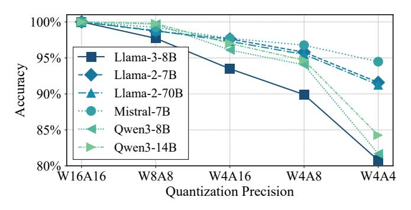

Fig. 2: Accuracy degradation of various LLMs under different quantization precisions. The degree of accuracy loss differs significantly across models and bit-widths.

a tensor is mapped to a compact format by dividing its values by a scale factor and rounding them to the nearest representable code, which may be an integer (INT) or a floating-point variant (FP4/FP8) [30], [28], [49]. Modern LLMs predominantly adopt group quantization, where weights or activations are partitioned into small groups (e.g., 32–128 elements), and each group receives its own scale or floating-point parameters. This grouping allows the quantizer to adapt to local distribution variation—critical for enabling aggressive low-bit formats such as W4A4 and W4A8 [25], [49]. While weight-only quantization [12], [24] is critical for reducing memory footprint, joint weight and activation (W+A) quantization directly lowers both memory and computational cost by enabling low-bit matrix manipulation [3], [36].

# B. Diverse Quantization Requirements

Quantization introduces a fundamental trade-off between computational efficiency and model fidelity. While moderatebit quantization (e.g., 8-bit or 6-bit) can often maintain nearlossless accuracy with techniques such as outlier smoothing and channel shifting [38], [42], [45], aggressive low-bit quantization (e.g., 4-bit or below) amplifies rounding errors and distribution mismatch, leading to noticeable accuracy degradation [5], [11]. Our empirical results reveal that quantization behavior varies widely across both model families and format choices. As shown in Figure 2, different LLMs exhibit distinct sensitivities to precision reduction: for instance, Llama-3-8B and Qwen3 [46] models experience noticeably larger degradation than Llama-2-7B or Mistral-7B [20] when moving from W8A8 to W4A4. Even within the same architecture family, models of different scales (e.g., Llama-2-7B vs. Llama-2-70B, or Qwen3-8B vs. Qwen3-14B) respond differently, indicating that model size and parameter distributions strongly influence robustness. These variations collectively underscore that no single quantization format can achieve the optimal efficiency-accuracy balance across all models and use cases. Therefore, LLM accelerators must support bit-width flexibility, enabling efficient execution of diverse quantization methods within a unified architecture.

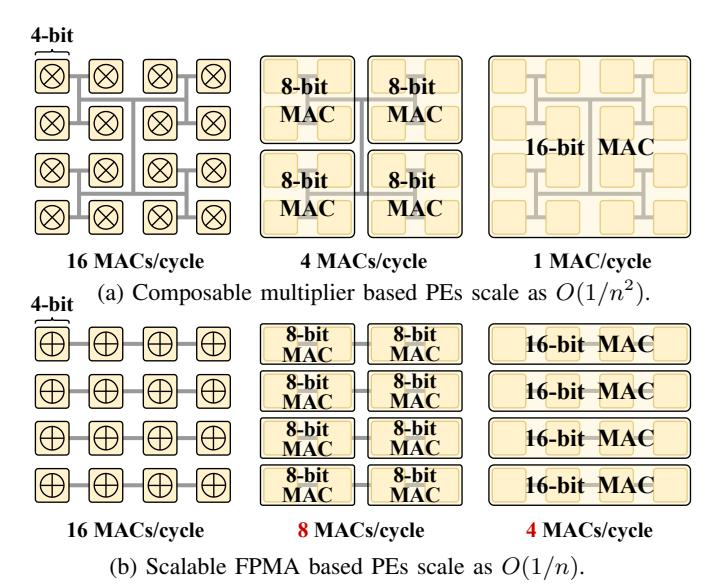

Fig. 3: Comparison of performance scaling under a fixed area.

### C. Limitations of Existing Architectures

The growing diversity of quantization formats exposes key limitations in current accelerator designs. Existing approaches generally fall into two categories, yet both struggle to provide efficient support across multiple bit-widths.

**Fixed-Precision Accelerators.** Most existing accelerators [13], [19], [33], [50] are built around fixed-precision datapaths, offering only a small, predetermined set of supported formats (e.g., W4A16). These designs achieve high efficiency for their targeted precisions but cannot adapt to the heterogeneous formats. This makes them unsuitable for deployment scenarios where quantization settings vary across layers, models, or hardware constraints.

Bit-Composable Accelerators. A complementary line of work introduces bit-composable architectures, where small compute units can be fused to emulate larger bit-widths. Bit-Fusion [39] is a pioneering example, enabling reconfigurable integer Processing Elements (PEs) that dynamically assemble into wider operators. This approach has since inspired many designs targeting adaptive quantization and outlier processing [15], [16], [18], [22]. However, despite their flexibility, these architectures are fundamentally limited by the quadratic  $O(n^2)$  cost of multipliers. Because partial-product generation and accumulation grow with  $n^2$ , the achievable throughput of fused PEs decreases proportionally to  $1/n^2$  as precision increases. This "dynamic tax" allows good efficiency at 4-bit, but causes severe throughput collapse when switched to 8-bit or 16-bit modes. As shown in Figure 3a, these designs become prohibitively inefficient for higher-precision formats.

Consequently, the current accelerator landscape leaves a critical architectural gap: there is no hardware that can deliver both high performance and true bit-width scalability. This gap motivates the need for a new GEMM architecture that remains efficient across diverse precisions.

### III. MOTIVATION: LINEAR SCALABILITY WITH FPMA

We observe that the inefficiency of existing bit-flexible designs originates from their reliance on multipliers, whose cost grows quadratically with bit-width. With a more efficient scaling primitive, a bit-width-flexible architecture could achieve high efficiency. A promising direction is floating-point multiplication approximation (FPMA) [17], [26], which replaces floating-point multipliers with integer adders.

# A. Tackling Efficiency with Linearly Scalable FPMA

**FPMA Definition.** FPMA begins with the IEEE normalized floating-point representation [1]:

$$x = (-1)^{S_x} \cdot 2^{E_x - B} \cdot (1 + M_x) \tag{1}$$

where  $S_x$  is the sign bit,  $E_x$  the exponent,  $M_x$  the mantissa, and B the exponent bias. Based on Mitchell's logarithmic approximation [31]:  $\log_2(1+M_x) \approx M_x$ , FPMA approximates a floating-point number x in the logarithmic domain as:

$$\log_2(|x|) = E_x - B + \log_2(1 + M_x) \approx E_x - B + M_x \quad (2)$$

Then, the floating-point multiplication  $r = x \cdot y$  in logarithmic domain is approximated as:

$$\log_2(|r|) = \log_2(|x \cdot y|) \approx (E_x + M_x) + (E_y + M_y) - 2B$$
 (3)

Since the product r can also be denoted as  $\log_2(|r|) \approx E_r + M_r - B$ , it enables the approximate multiplication:

$$R \approx X + Y - B \tag{4}$$

where 
$$X = E_x + M_x$$
,  $Y = E_y + M_y$ , and  $R = E_r + M_r$ .

**FPMA's Potential.** FPMA fundamentally departs from conventional (approximate) multiplier-centric designs by *eliminating multipliers*: it replaces floating-point multiplication with integer addition over the concatenated exponent–mantissa field. This makes precision scaling slice-composable, where the datapath expands by chaining adder slices, yielding nearlinear (O(n)) growth in area and critical delay (Figure. 3b), rather than the superlinear cost of multiplier-based datapaths. As a result, FPMA can span aggressive low-bit modes and higher-precision execution (e.g., 8/16-bit) with modest overhead, enabling a single GEMM engine to sustain high throughput across mixed-precision LLM workloads.

# B. Challenges of Unified GEMM Design with FPMA

While FPMA offers a compelling path toward linearly scalable arithmetic, its direct application to GEMM architecture introduces several non-trivial challenges.

Challenge 1: Preserving accuracy under approximation error and low-bit quantization. FPMA introduces approximation errors by linearizing logarithmic relationships between operands. At the same time, achieving high accuracy at low-bit is intrinsically challenging: formats like FP4/FP3 suffer from subnormal distortion and narrow dynamic range. These difficulties compound with FPMA's approximation error, leading to severe accuracy degradation. Maintaining fidelity requires overcoming both the algorithmic limitations of low-bit floating-point and the approximation errors of FPMA.

Challenge 2: Efficient unified hardware architecture for bit-width scalability. Existing FPMA-based accelerators such as AxCore [50] use fixed datapaths optimized for a single mode (e.g., W4A16) and cannot be adapted to other precisions. Supporting multiple bit-widths within one GEMM engine requires a reconfigurable FPMA fabric that can scale exponent and mantissa handling while incorporating lightweight correction across modes. Without such architectural unification, multi-precision support would require duplicating hardware for each format, undermining the efficiency benefits of FPMA.

### IV. UNICORE OVERVIEW

UNICORE addresses these challenges by incorporating three key techniques that together enable a unified, multi-precision GEMM engine.

Technique 1: Lightweight Accuracy Preservation. To mitigate FPMA's approximation error and stabilize computation under low-bit quantization, UNICORE introduces a lightweight format-conversion and compensation pipeline. All inputs are first normalized into an expanded floating-point domain to eliminate subnormals and ensure consistent exponent alignment. Within the compute path, UNICORE applies dual-path compensation: fine-grained mantissa reconstruction restores low-order detail, while coarse-grained adjustment corrects high-order approximation error. These mechanisms enable FPMA-based GEMM to maintain high numerical fidelity even in aggressive 4-bit configurations.

Technique 2: Unified Bit-Width Scalable Architecture. UNICORE builds a unified GEMM engine on S-FPMA, a dynamically fusible FPMA primitive composed of uniform adder slices. Each slice handles a fixed low-bit segment (e.g., 4 bits), and wider precisions are formed by cascading slices with simple carry propagation. Because each additional bit contributes only one slice, the hardware cost and delay grow strictly linearly, O(n), with precision. This directly resolves the architectural unification challenge: a single datapath now supports diverse formats without redundant hardware.

Technique 3: Distribution-Adaptive Quantization with DynFP. UNICORE strengthens numerical fidelity in low-bit quantization through DynFP, a distribution-adaptive low-bit floating-point format. DynFP improves representational expressiveness by adjusting exponent—mantissa allocation and removing redundant encodings to match the asymmetric, heavy-tailed distributions in LLM layers. By improving the numerical quality of low-bit data, DynFP reinforces UNICORE's accuracy goals and complements the FPMA correction pipeline—further addressing Challenge 1, while supporting stable multi-bit-width execution (Challenge 2).

### V. ACCURACY-PRESERVED SCALABLE FPMA

### A. Eliminating Subnormals with Format Conversion

1) Subnormals break FPMA: In the IEEE floating-point standard, normal numbers (as shown in Equation 1) have a hidden leading 1 (i.e., 1+M) for the mantissa, which imposes a minimum representable magnitude:  $v_{\min,normal} = 2^{1-B}$ . As a result, values smaller than this threshold would jump directly

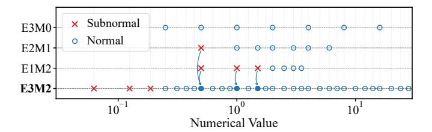

Fig. 4: Subnormal numbers from diverse FP4 variants are losslessly remapped to the normal range of a wider FP format.

to zero. To avoid this abrupt underflow, IEEE-754 introduces subnormal numbers, encoded with:

$$v_{\text{subnormal}} = (-1)^S \cdot 2^{1-B} \cdot (0+M)$$
 (5)

This gradually extends the representable range toward zero, providing smooth underflow. However, without the leading 1 for mantissa, their logarithmic behavior no longer satisfies FPMA's approximation (i.e.,  $\log_2(1+M_x)\approx M_x$ ). This is particularly problematic in low-bit formats (FP4/FP3), where up to 25–50% of representable values may be subnormals. As a result, FPMA can generate large, systematic inaccuracies for these inputs. Prior work, such as AxCore [50], mitigates this issue by remapping subnormals to nearby values in the normal-number domain. However, this conversion is itself approximate and inevitably introduces additional numerical noise.

2) Normalizing Subnormals via Bit-Width Expansion: To eliminate subnormal-induced FPMA errors, we convert low-bit floating-point operands into a wider format in which every representable value becomes a normal number. For example, a subnormal in any FP4 variant (E3M0, E2M1, E1M2) has a mantissa of the form (0+M). We normalize these values by left-shifting their mantissas until they fall within [1,2), while reducing the exponent by the same amount. This bit-width expansion preserves the exact numerical value but requires that the target format must keep at least as many mantissa bits as the source  $(M' \geq M)$  and provide enough exponent range to absorb up to M normalization shifts  $(B' \geq B + M)$ .

Figure 4 illustrates this process using FP4 variants (E3M0, E2M1, E1M2) and the target E3M2 format. The red crosses indicate subnormal values across several FP4 variants. Because these formats use short mantissas and narrow exponent ranges, many of their smallest values fall below the normal range. When projected into the expanded E3M2 format, each of these subnormals maps to a unique, exact normal representation, shown by the blue dots. E3M2 provides two additional mantissa bits and a larger exponent bias, ensuring that normalization never causes re-underflow and that all significant bits are preserved. As shown in the figure, the entire subnormal region of FP4 lies squarely within the normal range of E3M2. Even the smallest FP4 subnormal (0.5 in E1M2) shifts cleanly into E3M2's normal range after normalization.

This bit-expanded representation removes all subnormals before the FPMA computation begins, guaranteeing that every operand satisfies the assumptions of FPMA's logarithmic approximation. Importantly, all weights and activations remain stored and transferred in their original low-bit formats; the

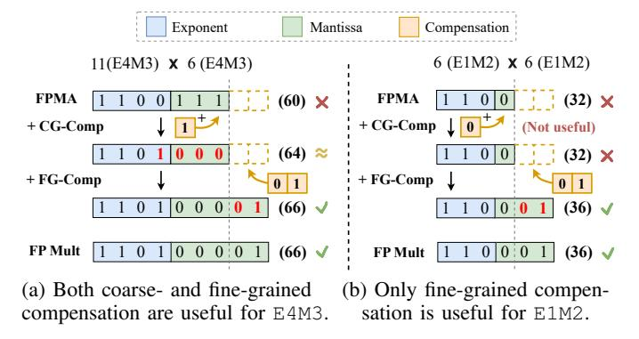

Fig. 5: While coarse-grained compensation [6] fails in low bit-width FPMA, fine-grained compensation can improve accuracy for both low and higher bit-width situations.

temporary E3M2 expansion is a precision-preserving internal re-encoding confined to the compute datapath, thereby retaining the system-level benefits of low-bit storage while enabling stable, subnormal-free arithmetic. Although this conversion will slightly expand the bit-width of the calculation datapaths, the resource overhead remains minimal for FPMA due to its addition nature.

# B. Dual-Path Error Compensation for FPMA

After subnormal normalization, all FPMA operands are represented as normal floating-point numbers. The remaining inaccuracy then comes purely from FPMA's approximate realization of multiplication in the logarithmic domain. This approximation distorts the exact product across mantissa bits.

1) Limitation of Coarse-grained Compensation: To achieve hardware-efficient error compensation, existing FPMA designs (e.g., April [6]) introduce a coarse-grained (CG) compensation term where a down-sampled or error of nearby mantissa combinations is injected into the mantissa field of the FPMA result. This works reasonably well at higher precision. Figure 5a illustrates an example with FP8 (E4M3) operands. FPMA underestimates the exact product (66) and produces 60. Adding a 1-bit coarse compensation shifts the result to 64, which already aligns closely with the true product. The remaining fine-grain error is small because the 3-bit mantissa still preserves most of the significant information.

However, this method is not effective in ultra-low-bit formats such as FP4 (E1M2). As shown in Figure 5b, FPMA again underestimates the exact product (36) and yields 32. However, the mantissa is now only 2 bits wide. Since CG-Comp operates at this coarse 2-bit granularity, it fails to represent the correction, as the error magnitude is too small to trigger the last bit. In the example, even after CG-Comp, the result remains 32, and the large error persists.

2) Fine-grained Compensation via Bit Concatenation: To overcome this limitation, we introduce fine-grained (FG) compensation, which explicitly reconstructs the missing low-order information by extending the effective mantissa width of the FPMA result. For a given mantissa pair  $(M_A, M_W)$ , FPMA and exact multiplication are both deterministic. We

(c) Four Fused S-FPMA for W16A16.

Fig. 6: Illustration of the fusible S-FPMA arithmetic.

therefore precompute, offline, the residual between the exact product and the FPMA result in an extended-precision domain. We then encode the fine-grained portion of this residual as a short bit-pattern and store it in a tiny LUT indexed by  $(M_A, M_W)$ . At runtime, FPMA produces its approximate result within the original mantissa width, and the corresponding FG compensation bits  $C_{fg}(M_A, M_W)$  are concatenated to the LSB side of this result, effectively extending the mantissa. It is noteworthy that the two error compensation methods together enable FPMA to achieve exact results under the FP4 format.

This mechanism is illustrated in Figure 5: for FP8 (E4M3), FPMA produces 60. CG-Comp adjusts the high-order bits to 64, and FG-Comp concatenates the missing fine bits ("01"), recovering the exact result 66, while for FP4 (E1M2), CG-Comp cannot change the result (still 32), but once FG-Comp appends the fine bits ("01"), the result becomes 36, exactly matching full-precision multiplication.

# C. Composable and Scalable FPMA Arithmetic (S-FPMA)

To support multiple quantization formats within one architecture, the arithmetic unit must scale its bit-width without duplicating full datapaths. Existing FPMA designs [50], however, are rigidly tied to a single operand width and cannot expand to wider precisions. UNICORE addresses this by decomposing FPMA into a uniform slice (4-bit as the example), enabling the construction of wider FPMA operators simply by chaining slices through their carry interfaces. Because FPMA fundamentally performs an integer addition on the concatenated exponent—mantissa field, its datapath naturally decomposes into fixed-width adders, unlike multipliers whose partial-product structures do not compose linearly.

Figure 6a illustrates one such slice operating as a complete W4×A4 FPMA. Each 4-bit slice independently processes a local exponent–mantissa segment, subtracts the bias, and incorporates both fine-grained (FG) and coarse-grained (CG) compensation. FG compensation is injected at the LSB side of the slice to restore the missing lower-order bits of the product.

Wider precisions are obtained by fusing slices. In W8×A8 mode (Figure 6b), the lower slice processes the low 4 bits and

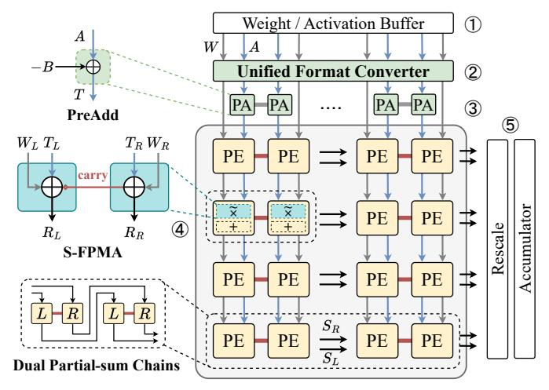

Fig. 7: UNICORE systolic array architecture.

the upper slice processes the next 4 bits, with the carry from the first feeding the second. FG compensation remains in the lowest slice so that the restored fine detail propagates through the fused adder chain, while CG compensation uses the empty bits of B to participate in addition to coarse mantissa bits. This extends naturally to W16×A16, where four slices form a 16-bit FPMA operator (Figure 6c). Carries ripple through all slices, and compensation remains correctly aligned. Because the fused datapath is still a single addition, area and delay scale linearly with bit-width.

S-FPMA therefore allows the same hardware to operate efficiently in W4A4, W8A8, and W16A16 modes, providing full utilization and multi-precision capability without duplicating FPUs or widening multiplier arrays.

### VI. UNICORE ARCHITECTURE

# A. Overview

Figure 7 illustrates the UNICORE architecture using 4/8bit support as an example; this is for clarity only, and the design naturally generalizes to other bit-widths. UNICORE employs a weight-stationary dataflow where both weights (W)and activations (A) are fed vertically in the column direction. Before entering the array, both are processed by the Unified Format Converter, which performs the dual role of translating low-bit inputs into an internal format to normalize subnormal values (i.e., E3M2) as well as supporting our quantization framework to enhance data representation (Section VII). All tensors remain stored and transferred in their original lowbit formats; the E3M2 encoding is confined to the compute datapath. Following this unified conversion, their data paths diverge: weights are pre-loaded and held stationary within the PE columns, while activations are first routed to a PreAdd (PA) unit. This PA unit computes an intermediate value T = A - Bby applying an exponent bias correction (-B). This corrected activation T is then streamed continuously downward for column-wide reuse. Each PE is built from a dual-slice S-FPMA that supports bit-flexible approximate multiplication. In independent mode, the Left (L) and Right (R) slices

Fig. 8: Composable Processing Element (C-PE) efficiently supports W4A4 and W8A8 MAC by reusing operators.

compute two separate low-bit MACs (e.g., two W4 lanes). In fused mode, the same slices are combined through an internal carry chain so that  $W_L$  and  $W_R$  form the low/high bits of a single wider operand (e.g., W8), enabling dynamic precision scaling. The outputs of PEs feed into a dual-chain accumulation datapath, where separate  $S_L$  and  $S_R$  horizontal chains maintain bit-width-adaptive partial sums. Finally, the post-processing pipeline performs dequantization via Rescale and combines the scaled results with previously stored values in the Accumulator.

# B. Composable Processing Elements

UNICORE's PEs are designed as composable pairs based on the S-FPMA primitive. As illustrated in Figure 8a, two adjacent PEs can either operate in parallel or dynamically fuse into a single, wider computational unit. The internal datapath of each PE is mostly identical, and switching between modes requires only minimal mux logic. Each PE receives the stationary weight (W) and a corrected activation (T), the latter of which is generated beforehand by the PreAdd block applying an exponent bias correction to the original activation (T = A - B). Inside the PE, it performs an addition on these inputs (T+W), and then enhances the accuracy through both fine-grained and coarse-grained compensation. Both compensation terms are generated by lightweight lookup tables (LUTs): FG compensation ( $C_{fq}$ ) is directly concatenated to the FPMA output to restore the missing fine bits, while CG compensation  $(C_{cg})$  provides a 1-bit coarse adjustment injected as a carry-in at the lowest adder slice, consistent with the FP8 case where only one coarse bit is required. The resulting approximation product R in floatingpoint format will pass through a shifter and be converted into a sign-magnitude representation. Finally, a specialized adder performs a mixed-format accumulation, summing this sign-magnitude product with the incoming two's complement

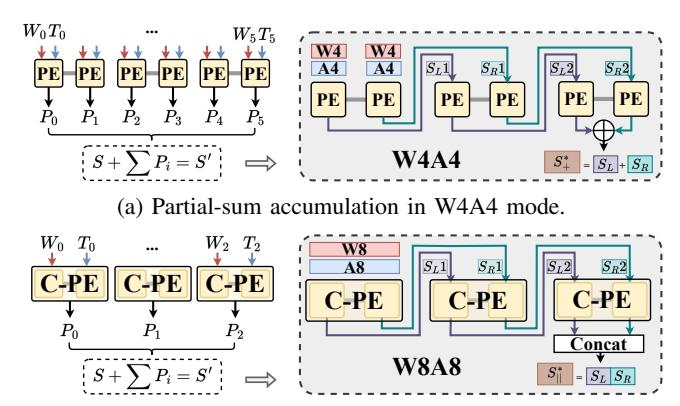

(b) Partial-sum accumulation in W8A8 mode.

Fig. 9: The adaptive dual-chain partial-sum (S) accumulation datapath that supports W4A4 (summing) and W8A8 (concatenating) modes without multiplexer overhead.

partial sum (S) to generate the new partial sum (S'), which then propagates to the next PE.

In W4A4 mode (Figure 8b), the Left and Right slices function as distinct, parallel MACs. Each slice independently receives its respective E3M2 operands (W and T), performs the T+W operation, and concatenates the fine-grained compensation value  $C_{fg}$ , the only compensation needed to preserve fidelity in this low-bit mode, to produce an E4M4 product. This product is then converted into sign-magnitude via shifting before being accumulated with an incoming partial sum (S), avoiding a costly FP adder. This configuration results in two independent partial sums (S) being generated and propagated separately from each slice.

In W8A8 mode (Figure 8c), the two PE slices are dynamically fused via carry chains to process the wider E4M3 operands. This fused operation requires both fine-grained compensation ( $C_{fg}$ ) and coarse-grained compensation ( $C_{cg}$ ). As our design employs only a 1-bit  $C_{cg}$ , it is efficiently injected into the adder chain using the carry logic. The E5M4 product's exponent (E5) is used to drive both shifters in parallel: the lower 4 bits (E5[3:0]) control the right shifter, while the left shifter is driven by the non-negative value of exponent minus a fixed offset (E5 $-\delta$ ). The final output is obtained by clipping the left shifter's result and concatenating it with the right shifter's result, prepared for later accumulation.

# C. Bit-width-Composable Dataflow

To efficiently accumulate partial sums generated by the composable PEs in different bit-width modes, UNICORE introduces an adaptive dual-chain accumulation datapath. As detailed in Figure 9, partial sums (S) are accumulated horizontally via the dual-chain datapath, which implements two independent accumulation chains within each row: one connecting the Left PE slices and another connecting the Right PE slices. This chain dynamically adapts to operational modes.

In W4A4 mode (Figure 9a), where all PEs in each row contribute to a single result, the outputs of the two chains are summed by a final adder to produce a unified output  $(S_+^*)$ .

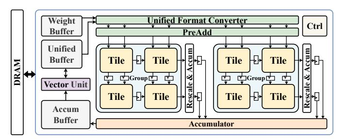

Fig. 10: UNICORE-based LLM accelerator architecture.

Conversely, in W8A8 mode (Figure 9b), the fused-PE (F-PE) acts as a single wide MAC unit with an activated internal carry chain. Therefore, the outputs from the two chains are simply concatenated to produce the final wide-bit-width result  $(S_{||}^*)$ . This dual-chain routing scheme allows the partial-sum connections between PEs to be fixed, eliminating the need for multiplexers or other complex routing logics and achieving high bit-width adaptability in a hardware-efficient manner.

# D. UniCore for LLM Inference

Figure 10 provides the system architecture of UNICOREbased LLM accelerator. At its core is the GEMM Unit (UNICORE), implemented as a scalable 2D array of Tiles, each composed of multiple S-FPMA-based composable PEs. Tiles are organized into Groups whose PE column counts match the quantization group size, enabling each Group to process one group in parallel and naturally support low-bit per-group quantization. Within each Group, partial sums are accumulated and rescaled using the group's scale factor, and the outputs from all Groups are merged in the global Accumulator. Surrounding the GEMM Unit, a Weight Buffer supplies quantized weights, while a Unified Buffer streams activations and intermediate results for both GEMM and the Vector Unit that handles layer-wise operations. The Control Unit schedules instructions, manages on-chip buffers and DRAM traffic, and controls the precision-dependent muxes that select between independent and fused PE operation, ensuring scalable, systolic-friendly inference under group-wise quantization.

# VII. DISTRIBUTION-ADAPTIVE QUANTIZATION WITH DYNAMIC FLOATING-POINT FORMAT

Aggressive low-bit quantization (e.g., 3–4 bits) is essential for reducing GEMM compute cost, yet standard low-bit floating-point formats (FP4/FP3) struggle to represent the highly diverse, fine-grained data distributions seen in modern LLMs. UNICORE therefore integrates a distribution-aware quantization framework that co-designs the numerical format with the S-FPMA datapath to achieve high fidelity under ultralow bit precision.

### A. Non-uniform Data Distribution in LLMs

Although tensor-wise activation or weight distributions appear well-behaved, their per-group distributions (e.g., 32-element groups used in modern scaling quantization) are highly non-uniform and vary dramatically across layers and channels. Figure 11 shows that while tensor-level CDFs are

Fig. 11: Cumulative distribution functions (CDFs) of the Llama-2-7B attention output projection (layers 0 and 29) at tensor-, channel-, block-, and group-level granularities. Specifically, block-wise and group-wise granularities refer to partition sizes of  $64 \times 64$  and  $1 \times 64$ , respectively. Tensor-wise plots use a single tensor, whereas the other plots show CDFs for 32 sampled instances from the corresponding tensor.

smooth, per-group distributions can be heavy-tailed, asymmetric, or tightly concentrated. Consequently, a single static format (e.g., standard FP4) is ill-equipped to represent this wide spectrum of group-level distributions under aggressive quantization, resulting in notable accuracy degradation compared with higher-bit-width formats [7], [15], [16], [18], [22], [38], [42], [45]. This motivates a flexible, per-group floating-point format tailored to each distribution.

# B. Dynamic Floating-Point (DynFP) Data Format

To address this diversity, UNICORE introduces Dynamic Floating-Point (DynFP), a per-group configurable 4-bit (or 3-bit) format, which is defined as:

$$DynFP(W_E, W_M, Z, I)$$

where  $W_E$  and  $W_M$  are exponent and mantissa bit-widths, respectively. Z is the remapped special value replacing the redundant "-0" code, and I is the optional "gap-insertion" flag that inserts an empty bit to improve representability of non-uniform distributions. DynFP provides the following features.

**Adaptive E/M Allocation.** First, as shown in Figure 12, each group chooses its floating-point layout (e.g., E3M0, E2M1, E1M2) to prioritize either dynamic range (larger exponent) or precision (more mantissa bits). This follows the findings of AxCore [50] and M-ANT [18] that optimal E/M allocation significantly reduces quantization error.

Range Extension via Empty-Bit Insertion (I-flag). Second, inserting a small "gap" between exponent and mantissa codes reshapes the ladder of representable values. This helps match odd-shaped distributions—e.g., clusters separated by wide gaps—without increasing bit-width. Formally, for a raw exponent code  $E \in [0, 2^{W_E} - 1]$ , we split E at position  $\ell$  into  $E_{\rm hi} = \lfloor E/2^\ell \rfloor$  and  $E_{\rm lo} = E \bmod 2^\ell$ . With the I-flag enabled, we define the effective exponent mapping  $\Phi(I, \ell, E)$  such that  $\Phi(0, \ell, E) = E$  and  $\Phi(1, \ell, E) = E_{\rm hi} \cdot 2^{\ell+1} + E_{\rm lo}$ , which is equivalent to inserting a zero bit between the two parts. This remapping introduces a controlled gap in the exponent ladder, modestly extending the covered range to better fit irregular value distributions.

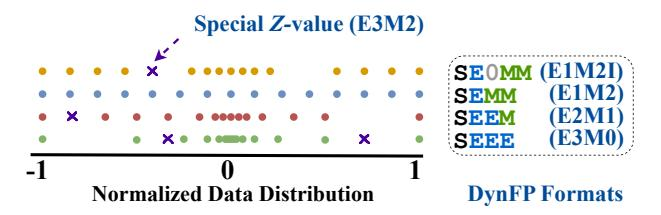

Fig. 12: Overview of the proposed DynFP format. (S: sign, E: exponent, M: mantissa).

Fig. 13: Unified Format Converter with DynFP support.

# Remapping the Redundant Negative Zero (Z-value).

Third, standard low-bit FP formats waste one code for "negative zero" [7]. DynFP reclaims this code and maps it to a useful normal value from the internal E3M2 range in Figure 12, either a finer-resolution intermediate value, or a larger outlier to extend dynamic range. If Z exceeds the group's format max  $F_{max}$ , the group becomes asymmetric, and its sign can be absorbed into the scaling factor with no extra datapath cost.

Together, these mechanisms define the numerical semantics of DynFP as follows:

$$v = \begin{cases} Z, & \text{if } E = 0, \ M = 0, \ S = 1, \\ (-1)^S \cdot 2^{1-B} \cdot M, & \text{if } E = 0, \ M \neq 0, \\ (-1)^S \cdot 2^{\Phi(I,\ell,E) - B} \cdot (1 + M), & \text{if } E \neq 0. \end{cases}$$

where S, E, M, and B denote the sign, exponent, mantissa, and bias, respectively. The parameter Z remaps the redundant negative-zero code, while the I-flag affects the effective exponent only through  $\Phi(I,\ell,E)$ . Collectively, these mechanisms allow a low-bit format to realize a small set of distribution-aware numerical behaviors in a unified format.

Hardware support. Figure 13 illustrates the datapath of the Unified Format Converter used to implement DynFP in hardware. The converter receives DynFP3/4 inputs and a per-group format index that selects the corresponding DynFP from the supported format set. The format parameters are realized through a small look-up table (LUT). The LUT uses the combined format index and data value as its lookup index, mapping DynFP encodings (e.g., with different E/M allocations or the I-flag enabled for gap insertion) to their equivalent E3M2 representations used for computation. To support the Z-value mechanism, the converter detects negative zero (-0) and selects a predefined Z-value in E3M2 format via a multiplexer; otherwise the LUT-converted value is used.

# C. Automated Weight Quantization via Greedy Search

A single tensor may require many distinct DynFP configurations across its constituent groups, and the corresponding

search space is prohibitively large, spanning multiple exponent, mantissa layouts, optional gap-insertion variants, and numerous candidate Z-values. Exhaustive or manual exploration is therefore impractical. To navigate this combinatorial space efficiently, we introduce an automated search framework that systematically synthesizes the optimal DynFP configuration for each group. Unlike prior approaches that rely on a fixed or globally uniform format, our method constructs a datadriven numerical representation that adapts to each group's local distribution within a compact format set, preserving pergroup flexibility while reducing quantization error.

We describe the procedure using DynFP-4 as an example. The algorithm builds a palette of k formats (e.g., k = 16) for each tensor through an iterative, greedy selection process. The workflow comprises three phases.

Candidate Pool Generation. The framework first enumerates all viable DynFP-4 configurations, generating a pool of 96 candidate formats. These candidates arise from four base E/M layouts (E3M0, E2M1, E1M2, and E1M2I) combined with 24 possible Z-value assignments. To avoid reintroducing subnormals, Z is restricted to values within the normal region of the internal E3M2 domain (Z ≥ 0.5).

Iterative Greedy Format Search. Instead of allowing each group to choose freely among all 96 candidates—which would be costly in metadata and search time—the algorithm constructs a compact tensor-level palette P of size k. Initially, P is empty. In the initialization step (t = 1), the algorithm evaluates every candidate format and selects the one that minimizes the global mean squared error (MSE) across all groups. This format becomes f1 in the palette. In the subsequent greedy iterations (t = 2 to k), each remaining candidate ft is evaluated by computing the global MSE obtained when every group is allowed to choose its best format from P ∪ ft. The candidate that yields the largest marginal reduction in global MSE is appended to the palette. The process repeats until P contains k formats.

Final Format Assignment. Once the palette is finalized, the algorithm performs a final pass over the tensor. Each group selects the single format in P that minimizes its local quantization error. The index of the chosen format (e.g., a 4 bit value for a 16-entry palette) is then stored alongside the group's scaling factor. And the Z of each format is loaded into UNICORE's Unified Format Converter when computing a new weight tensor.

This greedy search procedure behaves similarly to clustering the weights in representation space, requires no activation calibration, does not introduce distribution bias, and is highly efficient as a one-time offline step per checkpoint. For instance, quantizing Llama-2-7B with this method completes in about two minutes on a single RTX 6000 Ada GPU, after which inference only uses the stored format indices and scales, requiring no runtime format search.

# *D. Efficient Attention Quantization with Crest Factor*

Unlike offline weight-format search, K/V activations are quantized online during inference and require a lightweight method that avoids evaluating all DynFP candidates per group. To achieve this, UNICORE uses the *crest factor* κ [\[5\]](#page-14-21) as a lightweight proxy for a group's dynamic format selection. Different DynFP formats exhibit distinct quantization signalto-noise ratio (QSNR) [\[9\]](#page-14-31) behaviors as functions of κ, allowing us to precompute a small set of thresholds that map κ to the most suitable E/M layout.

During inference, κ is computed in a single streaming pass using one max-abs reduction and one RMS reduction, incurring only four scalar operations per element [\[43\]](#page-15-6). The overhead is negligible: for typical sequence lengths (L ≥ 2K), the crest-factor computation contributes less than 0.2% of the FLOPs of QK⊤ and remains fully memory-bound, enabling seamless fusion into the quantization kernel. This crest-factorguided selection provides accurate, distribution-aware DynFP quantization for K/V activations with negligible runtime cost.

# *E. Metadata Overhead of DynFP*

DynFP uses a 4-bit and 1-bit per-group format index for weights and K/V cache, respectively, together with an 8-bit per-group scaling factor. For typical 4-bit weight quantization with group size 32, this leads to an effective bit-width of 4.375 bits, only a 2.9% increase (0.125 bits) compared to MXFP4 [\[36\]](#page-14-19). Metadata is stored in main memory and loaded with weight tensors. At runtime, the Unified Format Converter decodes the format index within 1 cycle to select E/M settings and special-case mappings (Figure. [13\)](#page-7-2), while scaling factors are held in dedicated 8-bit registers in the GEMM array's Rescale unit, contributing only 0.73% of GEMM area.

# VIII. EVALUATION

# *A. Experimental Setup*

*1) Hardware Setup:* We implement UNICORE in Spinal-HDL [\[10\]](#page-14-32) and synthesize the generated RTL using Synopsys Design Compiler targeting a TSMC 28 nm process and a 1 GHz clock frequency. This setup is used consistently across all accelerator comparisons. To assess system-level behavior, we extend the BitMoD cycle-accurate simulator [\[7\]](#page-14-30) with timing and energy models derived from our post-synthesis RTL. All accelerators are evaluated under the same area constraint and equipped with a 512 KB activation buffer and a 512 KB weight buffer, both modeled using CACTI [\[32\]](#page-14-33) followed the configurations of BitMoD to ensure a controlled comparison. Off-chip memory energy is estimated using the DDR4 configuration with a 25.6 GB/s bandwidth in DRAMSim3 [\[23\]](#page-14-34) for the prefill phase. For the decode phase evaluation, we include an additional HBM2 setting with a 256 GB/s bandwidth.

*2) Baselines:* We compare UNICORE against five representative GEMM accelerators for LLMs. For hardware evaluation, we use three bit-parallel composable-multiplier designs: OliVe [\[15\]](#page-14-10), Tender [\[22\]](#page-14-12), and M-ANT [\[18\]](#page-14-11). To cover fixedwidth mixed-precision designs, we additionally include two state-of-the-art accelerators BitMoD [\[7\]](#page-14-30) and AxCore [\[50\]](#page-15-4).

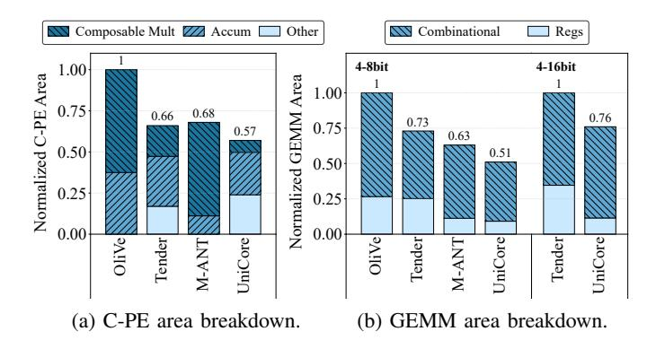

Fig. 14: Normalized area breakdown of C-PE and GEMM.

3) Quantization Settings: Our evaluation is based on posttraining quantization (PTQ). We compare the accuracy in four W/A/KV bit configurations: 4/4/16, 4/8/16, 3/8/16, and 4/4/4. We further include AxCore in its native 4/16/16 fixed-width configuration for comparison. We extend BitMoD and M-ANT to support integer activation quantization at different bit-widths, implementing their quantization schemes within a unified evaluation framework. To ensure a fair and consistent evaluation, we apply the calibration-free mode of BitMoD to M-ANT and AxCore, aligning all baselines with the evaluation protocol of UNICORE. All 8-bit settings use per-channel weight quantization and per-token activation quantization. In 4-bit and 3-bit quantization scenarios, for accelerators that natively support fine-grained group quantization (INT, MXFP4, M-ANT, BitMoD, AxCore, UNICORE), we fix the group size at 32. For architectures that do not support fine-grained quantization (OliVe and Tender), we employ channel-wise or tensor-wise quantization. UNICORE quantizes activations using standard floating-point formats together with an INT8 scale. When enabling K/V quantization, we also quantize Q and the softmax output P using the same group size and bitwidth as the activation, while only K and V perform online format selection (Section VII-D). All quantized models are obtained from BF16 checkpoints on Hugging Face [44].

### B. Area Efficiency

- 1) PE Level: Figure 14a compares the normalized area breakdown of composable PE (C-PE) of each design. The breakdown includes composable multiplication (Composable Mult), accumulators (Accum), and other logic; registers are excluded because different systolic dataflows require different buffering. Across multiplier-based baselines, the Composable Mult block dominates PE area (up to 83.6%) in some designs, due to the quadratic cost of partial-product generation. Instead, UNICORE yields a 13.6%–43% reduction in PE area relative to prior designs. The larger Others component—mainly the shifting logic for FP-to-sign-magnitude conversion—avoids a full FP adder and is reused across all bit-width modes.
- 2) GEMM Level: Figure 14b extends this comparison to the full GEMM unit, showing that UNICORE attains the smallest normalized GEMM area (0.51), corresponding to a 19%–49% area reduction over all baselines. Both the combinational logic

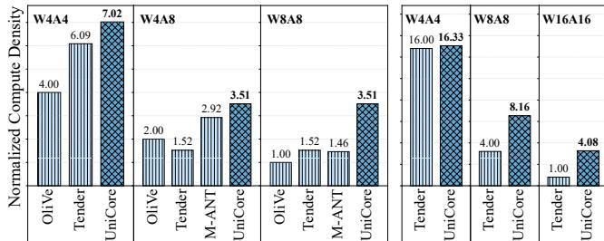

Fig. 15: Normalized compute density of the C-PE across different implementations and precisions.

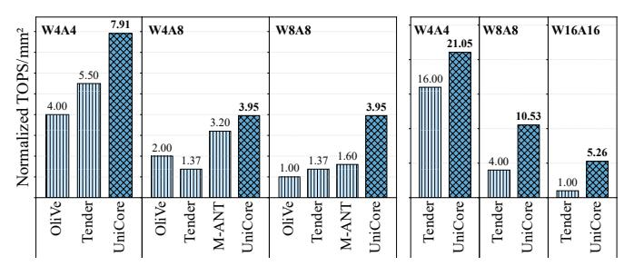

Fig. 16: Normalized compute density (TOPS/mm2) of the GEMM array across different precisions.

and register overhead of UNICORE are the lowest among all designs, indicating that the S-FPMA-based pipeline reduces both the compute core and the surrounding buffering cost. To evaluate scalability up to 16-bit precision, we extend Tender to support W16A16. As shown in Figure 14b, 16-bit support slightly increases accumulator width but introduces only modest overhead; UNICORE still maintains a 24% smaller GEMM area than Tender. This demonstrates that the S-FPMA pipeline remains compact and preserves its area advantage even as precision increases.

# C. Compute Density Evaluation

- 1) PE Level: Figure 15 shows the normalized C-PE compute density (throughput/area) in the 4–8 bit setting. In W8A8 mode, UNICORE achieves a PE efficiency of 3.51, outperforming all baselines by  $2.31\times-3.51\times$  and clearly reflecting the benefit of linear S-FPMA scaling. The same trend holds even at lower precision: UNICORE delivers the highest W4A4 efficiency (7.02), a  $1.15\times-1.76\times$  improvement, and in mixed-precision W4A8 mode it retains its 8-bit efficiency while still exceeding all baselines by  $1.20\times-2.31\times$ . For the extended 4–16 bit PE scaling, the gap widens further with precision: UNICORE is only slightly ahead of Tender at W4A4, grows to over  $2\times$  at W8A8, and exceeds  $4\times$  at W16A16, where multiplier-based designs suffer from quadratic overhead.
- 2) GEMM Level: These PE-level gains translate directly into higher GEMM-level compute density (Figure 16). Across all bit-width modes, UNICORE achieves the highest TOPS/mm2: in W4A4 it provides 1.44×-1.98× higher efficiency, in W4A8 it improves upon baselines by 1.23×-2.88×, and in W8A8 it reaches 3.95 TOPS/mm2, a 2.47×-3.95× advantage over prior designs. Extending the comparison to

Fig. 17: Normalized speedup of UNICORE compared with baselines under diverse precisions.

16-bit execution further highlights the benefit of the S-FPMA datapath. As precision increases, UNICORE's advantage grows rapidly: it delivers 1.32× higher TOPS/mm² than Tender at W4A4, rises to 2.63× at W8A8, and reaches 5.26× at W16A16. This widening gap reflects the fundamental architectural difference—UNICORE's S-FPMA scales linearly, whereas multiplier-based composable designs such as Tender incur quadratic performance collapse as bit-width increases.

# D. Performance and Energy Efficiency

We evaluate end-to-end prefill and decode performance and energy efficiency using Llama-2-7B and Llama-3-8B with a sequence length of 8192, a configuration commonly used in real-world deployments [34].

1) Performance: Figure 17 presents normalized prefill performance under four precision settings: W4A4, W4A8, W8A8, and W16A16. Tender, M-ANT, and UNICORE quantize the K/V cache using the same bit-width as activations, whereas OliVe retains 16-bit K/V due to the lack of compatible quantization support. With normalized GEMM compute area, UNICORE consistently achieves higher speedups than every baseline, with particularly pronounced gains at higher bit-widths owing to the linear scalability of S-FPMA. On average across OliVe, Tender, and M-ANT, UNICORE delivers 3.21×, 2.91×, and 2.51× speedups, respectively.

As decode is more memory-bound than prefill, we evaluate decode performance (batch size = 128) under DDR4 (25.6 GB/s) and HBM2 (256 GB/s), as shown in Figure 19 and Figure 20. UNICORE achieves average speedups of  $2.96\times$ ,  $1.04\times$ , and  $1.08\times$  over OliVe, Tender, and M-ANT under DDR4, and  $2.00\times$ ,  $1.35\times$ , and  $1.60\times$  under HBM2.

2) Energy: Figure 18 reports the energy breakdown and normalized energy efficiency under the DDR4 prefill setting. With K/V cache quantization, UNICORE, M-ANT, and Tender significantly reduce DRAM energy compared to OliVe. Across all precision settings, UNICORE achieves the lowest overall energy, enabled by its addition-only C-PE, bit-flexible dataflow, and linear-complexity multiplication structure. In

Fig. 18: Energy breakdown and normalized energy efficiency of UNICORE compared with baselines.

TABLE I: WikiText-2 perplexity (PPL) of different quantization methods across various models. UNICORE-Q enables distribution-adaptive DynFP quantization.

| FP16                                                                                                                                                                                                                                                                                                                                                                                                                                                                                                                                                                                                                                                                                                                                                                                                                                                                                                                                                                                                                                                                                                                                                                                                                                                                                                      | Method    | Bits     | OPT     | Llar  | na-2  | Llama-3 | Qw    | en3   |
|-----------------------------------------------------------------------------------------------------------------------------------------------------------------------------------------------------------------------------------------------------------------------------------------------------------------------------------------------------------------------------------------------------------------------------------------------------------------------------------------------------------------------------------------------------------------------------------------------------------------------------------------------------------------------------------------------------------------------------------------------------------------------------------------------------------------------------------------------------------------------------------------------------------------------------------------------------------------------------------------------------------------------------------------------------------------------------------------------------------------------------------------------------------------------------------------------------------------------------------------------------------------------------------------------------------|-----------|----------|---------|-------|-------|---------|-------|-------|
| UNICORE   16/16/16   10.88   5.48   3.32   6.17   9.69   8.64   INT   8/8/16   22.85   5.58   3.48   6.27   9.63   8.70   Tender   8/8/16   10.93   5.77   3.48   /                                                                                                                                                                                                                                                                                                                                                                                                                                                                                                                                                                                                                                                                                                                                                                                                                                                                                                                                                                                                                                                                                                                                       | Method    | W/A/KV   | 6.7B    | 7B    | 70B   | 8B      | 8B    | 14B   |
| INT                                                                                                                                                                                                                                                                                                                                                                                                                                                                                                                                                                                                                                                                                                                                                                                                                                                                                                                                                                                                                                                                                                                                                                                                                                                                                                       | FP16      | 16/16/16 | 10.86   | 5.47  | 3.32  | 6.14    | 9.72  | 8.64  |
| Tender OliVe         8/8/16         10.93         5.77         3.48         /         /         /         /         /         /         /         /         /         /         /         /         /         /         /         /         /         /         /         /         /         /         /         /         /         /         /         /         /         /         /         /         /         /         /         /         /         /         /         /         /         /         /         /         /         /         /         /         /         /         /         /         /         /         /         /         /         /         /         /         /         /         /         /         /         /         /         /         /         /         /         /         /         /         /         /         /         /         /         /         /         /         /         /         /         /         /         /         /         /         /         /         /         /         /         /         /         /         /         /         /<                                                                                                                                                                                    | UNICORE   | 16/16/16 | 10.88   | 5.48  | 3.32  | 6.17    | 9.69  | 8.64  |
| Olive         8/8/16         11.24         5.73         /         /         /         /         /         /         /         /         /         /         /         /         /         /         /         /         /         /         /         /         /         /         /         /         /         /         /         /         /         /         /         /         /         /         /         /         /         /         /         /         /         /         /         /         /         /         /         /         /         /         /         /         /         /         /         /         /         /         /         /         /         /         /         /         /         /         /         /         /         /         /         /         /         /         /         /         /         /         /         /         /         /         /         /         /         /         /         /         /         /         /         /         /         /         /         /         /         /         /         /         /         /                                                                                                                                                                                               | INT       | 8/8/16   | 22.85   | 5.58  | 3.48  | 6.27    | 9.63  | 8.70  |
| UNICORE   8/8/16   10.98   5.50   3.34   6.20   9.77   8.72   INT   4/4/16   11.18   5.95   3.62   7.39   10.51   9.22   Tender   4/4/16   13.56   36.47   13.43   /                                                                                                                                                                                                                                                                                                                                                                                                                                                                                                                                                                                                                                                                                                                                                                                                                                                                                                                                                                                                                                                                                                                                      | Tender    | 8/8/16   | 10.93   | 5.77  | 3.48  | /       | /     | /     |
| INT                                                                                                                                                                                                                                                                                                                                                                                                                                                                                                                                                                                                                                                                                                                                                                                                                                                                                                                                                                                                                                                                                                                                                                                                                                                                                                       | OliVe     | 8/8/16   | 11.24   | 5.73  | /     | /       | /     | /     |
| Tender Olive         4/4/16 4/4/16         13.56 36.47         13.43 7 7 7 7 7 7 7 7 7 7 7 7 7 7 7 7 7 7 7                                                                                                                                                                                                                                                                                                                                                                                                                                                                                                                                                                                                                                                                                                                                                                                                                                                                                                                                                                                                                                                                                                                                                                                                | UNICORE   | 8/8/16   | 10.98   | 5.50  | 3.34  | 6.20    | 9.77  | 8.72  |
| OliVe         4/4/16         39.18         44.07         /         /         /         /         /         /         /         /         /         /         /         /         /         /         /         /         /         /         /         /         /         /         /         /         /         /         /         /         /         /         /         /         /         /         /         /         /         /         /         /         /         /         /         /         /         /         /         /         /         /         /         /         /         /         /         /         /         /         /         /         /         /         /         /         /         /         /         /         /         /         /         /         /         /         /         /         /         /         /         /         /         /         /         /         /         /         /         /         /         /         /         /         /         /         /         /         /         /         /         /         /         /                                                                                                                                                                                              | INT       | 4/4/16   | 11.18   | 5.95  | 3.62  | 7.39    | 10.51 | 9.22  |
| MXFP4         4/4/16         11.26         5.99         3.61         7.50         10.74         9.50           BitMoD         4/4/16         11.08         5.82         3.56         7.13         10.33         9.20           M-ANT         4/4/16         11.14         5.85         3.56         7.11         10.33         9.29           UNICORE         4/4/16         11.15         5.81         3.55         7.05         10.37         9.16           UNICORE-Q         4/4/16         10.93         5.76         3.51         6.85         10.09         9.07           INT         4/8/16         79.26         5.76         3.51         6.82         10.00         8.93           BitMoD         4/8/16         45.95         5.67         3.55         6.60         9.92         8.84           M-ANT         4/8/16         44.12         5.70         3.55         6.69         9.28         8.90           UNICORE         4/8/16         11.11         5.67         3.44         6.66         10.26         8.97           UNICORE-Q         4/8/16         11.06         5.72         3.44         6.69         10.11         8.86           INT                                                                                                                                       | Tender    | 4/4/16   | 13.56   | 36.47 | 13.43 | /       | /     | /     |
| BitMoD         4/4/16         11.08         5.82         3.56         7.13         10.33         9.20           M-ANT         4/4/16         11.14         5.85         3.56         7.11         10.33         9.29           UNICORE         4/4/16         11.15         5.81         3.55         7.05         10.37         9.16           UNICORE-Q         4/4/16         10.93         5.76         3.51         6.85         10.09         9.07           INT         4/8/16         79.26         5.76         3.61         6.82         10.00         8.93           BitMoD         4/8/16         45.95         5.67         3.55         6.60         9.92         8.84           M-ANT         4/8/16         44.12         5.70         3.55         6.69         9.92         8.84           UNICORE         4/8/16         11.11         5.67         3.44         6.66         10.26         8.97           UNICORE-Q         4/8/16         11.06         5.72         3.44         6.69         10.11         8.86           INT         3/8/16         2158.19         6.97         4.27         13.92         13.84         12.53           BitMoD                                                                                                                                  | OliVe     | 4/4/16   | 39.18   | 44.07 | /     | /       | /     | /     |
| M-ANT         4/4/16         11.14         5.85         3.56         7.11         10.33         9.29           UNICORE         4/4/16         11.15         5.81         3.55         7.05         10.37         9.16           UNICORE-Q         4/4/16         10.93         5.76         3.51         6.85         10.09         9.07           INT         4/8/16         79.26         5.76         3.61         6.82         10.00         8.93           BitMoD         4/8/16         45.95         5.67         3.55         6.60         9.92         8.84           M-ANT         4/8/16         44.12         5.70         3.55         6.59         9.86         8.90           UNICORE         4/8/16         11.11         5.67         3.44         6.66         10.26         8.97           UNICORE-Q         4/8/16         10.88         5.62         3.40         6.46         9.93         8.90           AxCore         4/16/16         11.06         5.72         3.44         6.69         10.11         8.86           INT         3/8/16         2158.19         6.97         4.27         13.92         13.84         12.53           BitMoD                                                                                                                                  | MXFP4     | 4/4/16   | 11.26   | 5.99  | 3.61  | 7.50    | 10.74 | 9.50  |
| UNICORE         4/4/16         11.15         5.81         3.55         7.05         10.37         9.16           UNICORE-Q         4/4/16         10.93         5.76         3.51         6.85         10.09         9.07           INT         4/8/16         79.26         5.76         3.61         6.82         10.00         8.93           BitMoD         4/8/16         45.95         5.67         3.55         6.60         9.92         8.84           M-ANT         4/8/16         44.12         5.70         3.55         6.59         9.86         8.90           UNICORE         4/8/16         11.11         5.67         3.44         6.66         10.26         8.97           UNICORE-Q         4/8/16         11.06         5.72         3.44         6.69         10.11         8.86           INT         3/8/16         2158.19         6.97         4.27         13.92         13.84         12.53           BitMoD         3/8/16         190.12         6.13         3.84         7.82         11.20         9.61           UNICORE         3/8/16         14.60         6.40         3.94         9.27         12.32         9.95           UNICORE-                                                                                                                             | BitMoD    | 4/4/16   | 11.08   | 5.82  | 3.56  | 7.13    | 10.33 | 9.20  |
| UNICORE-Q         4/4/16         10.93         5.76         3.51         6.85         10.09         9.07           INT         4/8/16         79.26         5.76         3.61         6.82         10.00         8.93           BitMoD         4/8/16         45.95         5.67         3.55         6.60         9.92         8.84           M-ANT         4/8/16         44.12         5.70         3.55         6.59         9.86         8.90           UNICORE         4/8/16         11.11         5.67         3.44         6.66         10.26         8.97           UNICORE-Q         4/8/16         10.88         5.62         3.40         6.46         9.93         8.90           AxCore         4/16/16         11.06         5.72         3.44         6.69         10.11         8.86           INT         3/8/16         2158.19         6.97         4.27         13.92         13.84         12.53           BitMoD         3/8/16         190.12         6.13         3.84         7.82         10.96           UNICORE         3/8/16         14.60         6.40         3.94         9.27         12.32         9.95           UNICORE-Q         3/8/                                                                                                                             | M-ANT     | 4/4/16   | 11.14   | 5.85  | 3.56  | 7.11    | 10.33 | 9.29  |
| INT         4/8/16         79.26         5.76         3.61         6.82         10.00         8.93           BitMoD         4/8/16         45.95         5.67         3.55         6.60         9.92         8.84           M-ANT         4/8/16         44.12         5.70         3.55         6.59         9.86         8.90           UNICORE         4/8/16         11.11         5.67         3.44         6.66         10.26         8.97           UNICORE-Q         4/8/16         10.88         5.62         3.40         6.46         9.93         8.90           AxCore         4/16/16         11.06         5.72         3.44         6.69         10.11         8.86           INT         3/8/16         2158.19         6.97         4.27         13.92         13.84         12.53           BitMoD         3/8/16         190.12         6.13         3.84         7.82         11.20         9.61           UNICORE         3/8/16         14.60         6.40         3.94         9.27         12.32         9.95           UNICORE-Q         3/8/16         11.77         5.95         3.63         7.42         10.45         9.44           INT                                                                                                                                   | UNICORE   | 4/4/16   | 11.15   | 5.81  | 3.55  | 7.05    | 10.37 | 9.16  |
| BitMoD         4/8/16         45.95         5.67         3.55         6.60         9.92         8.84           M-ANT         4/8/16         44.12         5.70         3.55         6.59         9.86         8.90           UNICORE         4/8/16         11.11         5.67         3.44         6.66         10.26         8.97           UNICORE-Q         4/8/16         10.88         5.62         3.40         6.46         9.93         8.90           AxCore         4/16/16         11.06         5.72         3.44         6.69         10.11         8.86           INT         3/8/16         2158.19         6.97         4.27         13.92         13.84         12.53           BitMoD         3/8/16         19.012         6.13         3.84         7.82         11.20         9.61           UNICORE         3/8/16         14.60         6.40         3.94         9.27         12.32         9.95           UNICORE-Q         3/8/16         11.77         5.95         3.63         7.42         10.45         9.44           INT         4/4/4         11.33         6.73         4.57         8.38         11.27         10.00           UNICORE </td <td>UNICORE-Q</td> <td>4/4/16</td> <td>10.93</td> <td>5.76</td> <td>3.51</td> <td>6.85</td> <td>10.09</td> <td>9.07</td> | UNICORE-Q | 4/4/16   | 10.93   | 5.76  | 3.51  | 6.85    | 10.09 | 9.07  |
| M-ANT         4/8/16         44.12         5.70         3.55         6.59         9.86         8.90           UNICORE         4/8/16         11.11         5.67         3.44         6.66         10.26         8.97           UNICORE-Q         4/8/16         10.88         5.62         3.40         6.46         9.93         8.90           AxCore         4/16/16         11.06         5.72         3.44         6.69         10.11         8.86           INT         3/8/16         2158.19         6.97         4.27         13.92         13.84         12.53           BitMoD         3/8/16         190.12         6.13         3.84         7.82         11.20         9.95           UNICORE         3/8/16         14.60         6.40         3.94         9.27         12.32         9.95           UNICORE-Q         3/8/16         11.77         5.95         3.63         7.42         10.45         9.44           INT         4/4/4         11.33         6.73         4.57         8.38         11.27         10.00           UNICORE         4/4/4         11.54         6.23         3.82         7.86         10.78         9.39                                                                                                                                                | INT       | 4/8/16   | 79.26   | 5.76  | 3.61  | 6.82    | 10.00 | 8.93  |
| UNICORE         4/8/16         11.11         5.67         3.44         6.66         10.26         8.97           UNICORE-Q         4/8/16         10.88         5.62         3.40         6.46         9.93         8.90           AxCore         4/16/16         11.06         5.72         3.44         6.69         10.11         8.86           INT         3/8/16         2158.19         6.97         4.27         13.92         13.84         12.53           BitMoD         3/8/16         190.12         6.13         3.84         7.82         11.20         9.61           UNICORE         3/8/16         14.60         6.40         3.94         9.27         12.32         9.95           UNICORE-Q         3/8/16         11.77         5.95         3.63         7.42         10.45         9.44           INT         4/4/4         11.33         6.73         4.57         8.38         11.27         10.00           UNICORE         4/4/4         11.54         6.23         3.82         7.86         10.78         9.39                                                                                                                                                                                                                                                              | BitMoD    | 4/8/16   | 45.95   | 5.67  | 3.55  | 6.60    | 9.92  | 8.84  |
| UNICORE-Q         4/8/16         10.88         5.62         3.40         6.46         9.93         8.90           AXCORE         4/16/16         11.06         5.72         3.44         6.69         10.11         8.86           INT         3/8/16         2158.19         6.97         4.27         13.92         13.84         12.53           BitMoD         3/8/16         190.12         6.13         3.84         7.82         11.20         9.61           UNICORE         3/8/16         14.60         6.40         3.94         9.27         12.32         9.95           UNICORE-Q         3/8/16         11.77         5.95         3.63         7.42         10.45         9.44           INT         4/4/4         11.33         6.73         4.57         8.38         11.27         10.00           UNICORE         4/4/4         11.54         6.23         3.82         7.86         10.78         9.39                                                                                                                                                                                                                                                                                                                                                                               | M-ANT     | 4/8/16   | 44.12   | 5.70  | 3.55  | 6.59    | 9.86  | 8.90  |
| AxCore         4/16/16         11.06         5.72         3.44         6.69         10.11         8.86           INT         3/8/16         2158.19         6.97         4.27         13.92         13.84         12.53           BitMoD         3/8/16         190.12         6.13         3.84         7.82         11.20         9.61           UNICORE         3/8/16         14.60         6.40         3.94         9.27         12.32         9.95           UNICORE-Q         3/8/16         11.77         5.95         3.63         7.42         10.45         9.44           INT         4/4/4         11.33         6.73         4.57         8.38         11.27         10.00           UNICORE         4/4/4         11.54         6.23         3.82         7.86         10.78         9.39                                                                                                                                                                                                                                                                                                                                                                                                                                                                                                 | UniCore   | 4/8/16   | 11.11   | 5.67  | 3.44  | 6.66    | 10.26 | 8.97  |
| INT         3/8/16         2158.19         6.97         4.27         13.92         13.84         12.53           BitMoD         3/8/16         190.12         6.13         3.84         7.82         11.20         9.61           UNICORE         3/8/16         14.60         6.40         3.94         9.27         12.32         9.95           UNICORE-Q         3/8/16         11.77         5.95         3.63         7.42         10.45         9.44           INT         4/4/4         11.33         6.73         4.57         8.38         11.27         10.00           UNICORE         4/4/4         11.54         6.23         3.82         7.86         10.78         9.39                                                                                                                                                                                                                                                                                                                                                                                                                                                                                                                                                                                                                  | UniCore-Q | 4/8/16   | 10.88   | 5.62  | 3.40  | 6.46    | 9.93  | 8.90  |
| BitMoD         3/8/16         190.12         6.13         3.84         7.82         11.20         9.61           UNICORE         3/8/16         14.60         6.40         3.94         9.27         12.32         9.95           UNICORE-Q         3/8/16         11.77         5.95         3.63         7.42         10.45         9.44           INT         4/4/4         11.33         6.73         4.57         8.38         11.27         10.00           UNICORE         4/4/4         11.54         6.23         3.82         7.86         10.78         9.39                                                                                                                                                                                                                                                                                                                                                                                                                                                                                                                                                                                                                                                                                                                                   | AxCore    | 4/16/16  | 11.06   | 5.72  | 3.44  | 6.69    | 10.11 | 8.86  |
| UNICORE         3/8/16         14.60         6.40         3.94         9.27         12.32         9.95           UNICORE-Q         3/8/16         11.77         5.95         3.63         7.42         10.45         9.44           INT         4/4/4         11.33         6.73         4.57         8.38         11.27         10.00           UNICORE         4/4/4         11.54         6.23         3.82         7.86         10.78         9.39                                                                                                                                                                                                                                                                                                                                                                                                                                                                                                                                                                                                                                                                                                                                                                                                                                                    | INT       | 3/8/16   | 2158.19 | 6.97  | 4.27  | 13.92   | 13.84 | 12.53 |
| UNICORE-Q         3/8/16         11.77         5.95         3.63         7.42         10.45         9.44           INT         4/4/4         11.33         6.73         4.57         8.38         11.27         10.00           UNICORE         4/4/4         11.54         6.23         3.82         7.86         10.78         9.39                                                                                                                                                                                                                                                                                                                                                                                                                                                                                                                                                                                                                                                                                                                                                                                                                                                                                                                                                                     | BitMoD    | 3/8/16   | 190.12  | 6.13  | 3.84  | 7.82    | 11.20 | 9.61  |
| INT 4/4/4 11.33 6.73 4.57 8.38 11.27 10.00 UNICORE 4/4/4 11.54 6.23 3.82 7.86 10.78 9.39                                                                                                                                                                                                                                                                                                                                                                                                                                                                                                                                                                                                                                                                                                                                                                                                                                                                                                                                                                                                                                                                                                                                                                                                                  | UNICORE   | 3/8/16   | 14.60   | 6.40  | 3.94  | 9.27    | 12.32 | 9.95  |
| UNICORE 4/4/4 11.54 6.23 3.82 7.86 10.78 9.39                                                                                                                                                                                                                                                                                                                                                                                                                                                                                                                                                                                                                                                                                                                                                                                                                                                                                                                                                                                                                                                                                                                                                                                                                                                             | UniCore-Q | 3/8/16   | 11.77   | 5.95  | 3.63  | 7.42    | 10.45 | 9.44  |
|                                                                                                                                                                                                                                                                                                                                                                                                                                                                                                                                                                                                                                                                                                                                                                                                                                                                                                                                                                                                                                                                                                                                                                                                                                                                                                           | INT       | 4/4/4    | 11.33   | 6.73  | 4.57  | 8.38    | 11.27 | 10.00 |
|                                                                                                                                                                                                                                                                                                                                                                                                                                                                                                                                                                                                                                                                                                                                                                                                                                                                                                                                                                                                                                                                                                                                                                                                                                                                                                           | UniCore   | 4/4/4    | 11.54   | 6.23  | 3.82  | 7.86    | 10.78 | 9.39  |
| UNICORE-Q 4/4/4 11.10 6.19 3.78 7.59 10.45 9.28                                                                                                                                                                                                                                                                                                                                                                                                                                                                                                                                                                                                                                                                                                                                                                                                                                                                                                                                                                                                                                                                                                                                                                                                                                                           | UNICORE-Q | 4/4/4    | 11.10   | 6.19  | 3.78  | 7.59    | 10.45 | 9.28  |

terms of energy efficiency, UNICORE delivers the highest normalized TOPS/W under every precision and model combination. Overall, UNICORE provides 1.86× higher TOPS/W than baselines, reaching up to 2.73× improvement in some settings. As shown in Figure 19 and Figure 20, in the decode phase under both DDR4 and HBM2 configurations, UNICORE achieves the lowest total energy consumption and the highest TOPS/W in nearly all evaluated settings, demonstrating that its energy advantage persists even in memory-bound scenarios.

# E. End-to-end model accuracy

Tables I–II summarize WikiText-2 [29] perplexity and zero-shot accuracy [4], [8], [37], [47] for UNICORE and prior accelerators under several W/A/KV bit configurations on OPT-6.7B,

TABLE II: Zero-shot performance on four benchmark datasets. Higher scores indicate better accuracy. UNICORE-Q enables distribution-adaptive DynFP quantization.

| Model        | Method    | Bits     | ARC-e | Hella. | Piqa  | Wino. | Avg.(↑) |
|--------------|-----------|----------|-------|--------|-------|-------|---------|
| WIOGCI       |           |          |       |        |       | 73.09 |         |
| Llama-3-8B   | FP16      | 16/16/16 | 77.82 | 79.25  | 80.79 |       | 77.74   |
|              | INT       | 8/8/16   | 77.36 | 78.99  | 79.98 | 73.64 | 77.49   |
|              | UniCore   | 8/8/16   | 77.61 | 79.09  | 80.41 | 73.24 | 77.59   |
|              | INT       | 4/4/16   | 75.13 | 76.78  | 79.98 | 70.09 | 75.49   |
| Liailia-3-6D | M-ANT     | 4/4/16   | 73.48 | 76.99  | 78.94 | 70.09 | 74.88   |
|              | BitMoD    | 4/4/16   | 73.65 | 76.75  | 78.40 | 69.77 | 74.64   |
|              | UNICORE   | 4/4/16   | 73.61 | 76.66  | 78.24 | 70.88 | 74.85   |
|              | UniCore-Q | 4/4/16   | 75.21 | 77.72  | 79.16 | 70.64 | 75.68   |
| Qwen3-8B     | FP16      | 16/16/16 | 80.64 | 74.94  | 77.37 | 67.72 | 75.17   |
|              | INT       | 8/8/16   | 79.34 | 75.06  | 77.48 | 67.80 | 74.92   |
|              | UniCore   | 8/8/16   | 80.72 | 74.53  | 77.53 | 67.88 | 75.16   |
|              | INT       | 4/4/16   | 73.82 | 71.53  | 75.24 | 65.98 | 71.64   |
|              | M-ANT     | 4/4/16   | 76.05 | 71.90  | 74.97 | 65.82 | 72.19   |
|              | BitMoD    | 4/4/16   | 78.03 | 71.41  | 74.97 | 65.19 | 72.40   |
|              | UNICORE   | 4/4/16   | 78.24 | 72.74  | 75.90 | 66.85 | 73.43   |
|              | UniCore-Q | 4/4/16   | 78.28 | 73.01  | 76.01 | 66.30 | 73.40   |

Llama-2-7B, Llama-3-8B, and Qwen3-8B/14B. All methods use direct-cast quantization without calibration, and FP16 serves as the accuracy reference. UNICORE-Q additionally uses offline weight-format search and online K/V format selection when K/V quantization is enabled.

1) Perplexity: As shown in Table I, in WikiText-2 perplexity, existing 4-bit formats (INT, MXFP4, BitMoD, and M-ANT) already show noticeable degradation at 4/4/16, with higher perplexity than FP16 across all models, whereas UNI-CORE-Q consistently achieves the lowest perplexity in each 4/4/16 column (e.g., 10.93 vs. 11.08–11.26 on OPT-6.7B, with similar gaps on Llama-2/3 and Qwen3). At 4/8/16 and 3/8/16, UNICORE-Q maintains more stable perplexity than other schemes and attains the best or near-best perplexity in almost all cases; the 4/4/4 setting follows the same trend. The few exceptions mainly arise when Owen3's smoother activations better match INT activation quantization, or when outlier groups/layers trigger PPL spikes. Compared with fixed-width mixed-precision designs under the 4/16/16 setting (AxCore), UNICORE-Q achieves lower perplexity on most models even with lower activation precision (e.g., 4/8/16). Overall, across nearly all models ranging from 6.7B to 70B parameters and bit-width combinations, the UNICORE family achieves leading perplexity among quantized schemes, while competing formats incur larger degradation or even become unstable in the most aggressive regimes.

2) Zero-shot Performance: The zero-shot results in Table II exhibit a similar pattern. Across both models, the UNICORE family consistently matches or surpasses most low-bit baselines and often approaches FP16 performance. At the 8/8/16 setting, UNICORE achieves leading average accuracy among quantized methods. Under the more aggressive 4/4/16 configuration, the UNICORE family continues to outperform INT, M-ANT, and BitMoD on most tasks, with DynFP (UNICORE-Q) providing further gains in most cases and helping the family achieve the best 4-bit average accuracy across both evaluated models. Minor task-level fluctuations occur because small quantization-induced logit shifts can flip discrete zero-shot predictions. Overall, UNICORE variants deliver state-of-

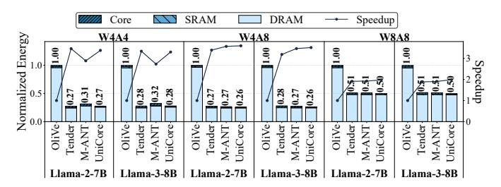

Fig. 19: Normalized energy and speedup of UNICORE compared with baselines in decode phase equipped with DDR4.

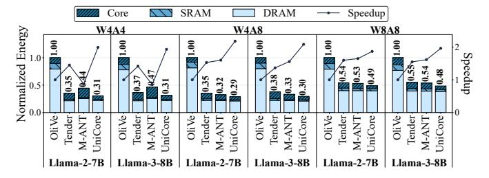

Fig. 20: Normalized energy and speedup of UNICORE compared with baselines in decode phase equipped with HBM2.

the-art zero-shot performance in the low-bit regime, with clear gains from DynFP-based weight adaptation.

# F. Ablation Study on Error Compensation

Table III evaluates the impact of different FPMA compensation schemes across models. In FP16, UNICORE uses coarsegrained (CG) compensation and preserves near-identical PPL to the FP16 reference. In FP8, the coarse-grained (CG) variant is insufficient to reach lossless performance; integrating finegrained (FG) compensation restores the missing low-order detail and closely matches the original FP8 fused multiply-add. For FP4, approximate multiplication without FG compensation results in significant errors, as FPMA alone cannot recover low-bit mantissa precision. After applying FG compensation, UNICORE achieves PPL identical to the original FP4 because UNICORE can represent exact FP4 results with dual-path compensation. These results highlight that error compensation must scale with precision: CG correction is adequate for highprecision FPMA, while FG compensation becomes essential as mantissa width shrinks. More importantly, they validate that UNICORE maintains accuracy across all supported bitwidths by adapting the level of compensation to the numerical characteristics of each format.

# G. Comparison with Fixed-precision Designs

To isolate the effect of composability, we compare fixed-precision UNICORE GEMM units with baselines built using (i) Synopsys DesignWare IP (DW IP) and (ii) a modified Tender design without composability, all under a weight-stationary dataflow. UNICORE achieves the highest compute density across all fixed-precision settings: 6.46 at W4A4 (2.78× and  $1.32\times$  over DesignWare and Tender), 3.42 at W8A8 ( $1.94\times$  and  $1.19\times$ ), and 2.05 at W16A16 ( $2.05\times$  and  $1.90\times$ ), as shown in Figure 21a. These results indicate that the

TABLE III: WikiText-2 perplexity (PPL) of FPMA with different kinds of compensation. FG: Fine-Grained Compensation; CG: Coarse-Grained Compensation. UNICORE adapts both FG and CG to maintain accuracy, without DynFP quantization.

| Method  | Bits | OPT-6.7B | Llama-2-7B | Llama-3-8B | Qwen3-8B | Qwen3-14B |
|---------|------|----------|------------|------------|----------|-----------|
| FP16    | 16   | 10.86    | 5.47       | 6.14       | 9.72     | 8.64      |
| UniCore | 16   | 10.88    | 5.48       | 6.17       | 9.69     | 8.64      |
| FP8     | 8    | 10.98    | 5.50       | 6.20       | 9.76     | 8.71      |
| FPMA+CG | 8    | 11.02    | 5.52       | 6.23       | 9.84     | 8.77      |
| UniCore | 8    | 10.98    | 5.50       | 6.20       | 9.77     | 8.72      |
| FP4     | 4    | 11.15    | 5.81       | 7.05       | 10.37    | 9.14      |
| FPMA    | 4    | 1.1E+4   | 3.4E+4     | 3.6E+5     | 4.9E+6   | 1.5E+6    |
| UniCore | 4    | 11.15    | 5.81       | 7.05       | 10.37    | 9.14      |

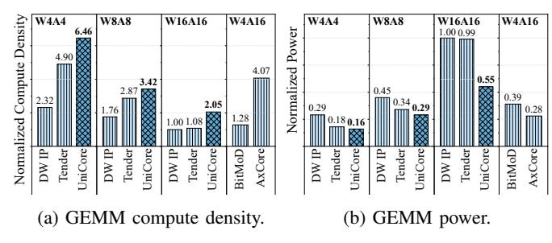

Fig. 21: Normalized compute density and power of standalone fixed-precision GEMM variants across different precisions.

UNICORE's advantage stems from the lightweight S-FPMA datapath rather than composability alone.

We further include fixed-width mixed-precision baselines BitMoD [7] and AxCore [50]. Figure 21a shows that using the fixed-precision UNICORE W16A16 GEMM unit (2.05) as the A16-compatible reference, UNICORE achieves 1.60× BitMoD (1.28) and 0.50× AxCore (4.07) under W4A16. The gap stems from AxCore specializing in fixed weight-only mixed precision, whereas UNICORE supports composable precision with joint W+A quantization. Under the same W4 setting, UNICORE reaches 1.59× AxCore with comparable accuracy (Table I), highlighting the advantage of lowering activation precision. In addition, as shown in Figure 21b, the fixed-width UNICORE GEMM also maintains competitive or lower normalized power across precisions. Across fixed-precision settings, UNICORE reduces normalized power by 35.6%–45.0% over DesignWare and 11.1%–44.4% over Tender.

### H. Ablation Study on Quantization Group Sizes

We evaluate the perplexity results of UNICORE across multiple quantization group sizes and compare it with INT, M-ANT, and BitMoD. Table IV reports results with group-wise quantization on both weights and activations. As expected, smaller groups improve all methods by providing finer-grained scaling, while UNICORE maintains the best PPL across all group sizes. These results show that UNICORE's accuracy advantage is robust to quantization granularity.

# I. Online Activation Quantization Overhead

Figure 22 reports the latency impact of online activation quantization. On Llama-2-7B, activation quantization accounts for 7.1%–20.7% of prefill latency but only 0.3%–1.6% during

TABLE IV: WikiText-2 perplexity (PPL) of different methods in different group sizes (GS). The PPL of FP16 is 5.47.

| Llama-2-7B |        | UniCore | M-ANT | BitMoD | INT  |
|------------|--------|---------|-------|--------|------|
|            | GS-128 | 5.98    | 6.36  | 6.39   | 6.54 |
| W4A4       | GS-64  | 5.84    | 6.02  | 5.99   | 6.14 |
|            | GS-32  | 5.76    | 5.85  | 5.82   | 5.95 |

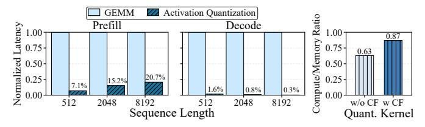

Fig. 22: Normalized Latency of online activation quantization compared with GEMM operations in W4A4KV4 configuration on Llama-2-7B and Compute/Memory ratio of the quantization kernel with or without crest factor (CF) calculation.

decode for sequence lengths 512–8192. Importantly, quantization can largely overlap with GEMM execution. While prior works do not explicitly evaluate online activation quantization, its cost is largely comparable across designs under the same quantization granularity and memory system. Figure 22 shows that UNICORE's CF computation raises arithmetic intensity from 0.63 to 0.87 (extra reductions, sqrt, and division), yet remains memory-bound with no measurable overhead.

# IX. CONCLUSION

We introduced UNICORE, a unified GEMM architecture that delivers efficient and accurate LLM inference across a broad spectrum of quantization formats. At the core of UNICORE is S-FPMA, a linearly scalable and dynamically fusible FPMA primitive that avoids the quadratic overhead of multiplier-based composable designs. Together with a lightweight format-conversion pipeline, dual-path error compensation, and the distribution-adaptive DynFP quantization scheme, UNICORE preserves numerical fidelity even in aggressive low-bit regimes. Our extensive evaluation shows that UNICORE achieves  $1.24 \times -3.95 \times$  area-efficiency gains across common low-bit modes and up to 5.26× at W16A16, when compared with state-of-the-art accelerators. Unlike existing designs optimized for a narrow precision range, UNICORE provides a single, bit-flexible datapath that maintains high utilization across W4A4, W4A8, W8A8, and W16A16 modes. These results demonstrate that FPMA, when combined with principled architectural and quantization co-design, offers a compelling foundation for next-generation LLM accelerators.

# ACKNOWLEDGEMENTS

This work is supported by National Key Research and Development Program of China (No. 2024YFB4504200) and the Guangzhou-HKUST(GZ) Joint Funding Program (No. 2025A03J3568). We also thank the AMD Heterogeneous Accelerated Compute Cluster (HACC) Program [2] for providing access to hardware resources.

# APPENDIX

# *A. Artifact Abstract*

This artifact contains the necessary components to reproduce the key results of this paper. It includes: (1) The SpinalHDL RTL code for the UNICORE hardware design; (2) Evaluation scripts for Large Language Model (LLM) accuracy; (3) A cycle-accurate simulator for end-to-end performance evaluation. These components facilitate the full reproduction of data shown in Tables I-IV, Figures 17-20.

# *B. Artifact check-list (meta-information)*

- Compilation: NVCC 12.4, GCC 11.4.0.
- Model: OPT-6.7B, Llama-2-7B, Llama-2-70B, Llama-3-8B, Qwen3-8B, Qwen3-14B.
- Data set: WikiText-2, ARC-e, HellaSwag, PiQA, Winogrande.
- Run-time environment: Ubuntu 22.04.5 LTS, CUDA 12.4, and PyTorch 2.6.0.
- Hardware: A server with an x86 processor and four NVIDIA RTX 6000 Ada GPUs.
- Output: Model perplexity and accuracy, simulator energy and performance.
- How much disk space is required?: About 240 GB.
- How much time is needed to prepare workflow?: It takes about 30 minutes to prepare the environment.
- How much time is needed to complete experiments (approximately)?: It takes approximately 100 hours to execute all experiments using the server equipped with GPUs. The most time-consuming experiment requires about 20 hours to finish.
- Publicly available?: Yes.
- Data licenses (if publicly available)?: The datasets are publicly available through their original licensing terms.
- Workflow automation framework used?: Conda, shell scripts.
- Archived DOI: <https://doi.org/10.5281/zenodo.19449314>

# *C. Description*

- *1) How to access:* We archive the source code at zenodo: [https://doi.org/10.5281/zenodo.19449314.](https://doi.org/10.5281/zenodo.19449314) We also recommend you to access our GitHub repository for the latest version: [https://github.com/CLab-HKUST-GZ/isca53-unicore.](https://github.com/CLab-HKUST-GZ/isca53-unicore)
- *2) Hardware dependencies:* We evaluate the models with our server equipped with four NVIDIA RTX 6000 Ada GPUs (48 GB).
- *3) Software dependencies:* The experiments rely on the following software components.
  - Ubuntu 22.04.5 LTS
  - Python 3.10.18
  - PyTorch 2.6.0
  - Conda 25.1.1
  - GCC 11.4.0
  - CUDA 12.4
- *4) Data sets:* We evaluate perplexity on the WikiText-2 dataset. For zero-shot evaluations, we employ a suite of benchmarks, including ARC-e, HellaSwag, PiQA, and Winogrande.
- *5) Models:* We evaluate a suite of foundation models from the Hugging Face Hub. For perplexity measurements, we use OPT-6.7B, Llama-2-7B, Llama-2-70B, Llama-3-8B, Qwen3- 8B, Qwen3-14B. For the zero-shot performance evaluation, we focus on the two models: Llama-3-8B and Qwen3-8B.

# *D. Installation*

Installation instructions for the experiments are provided at [https://github.com/CLab-HKUST-GZ/isca53-unicore.](https://github.com/CLab-HKUST-GZ/isca53-unicore)

# *E. Experiment workflow*

The artifact evaluation is split into three main parts, each designed to reproduce a specific set of results from the paper.

# 1. Functional verification of UNICORE hardware:

- 1) Please refer to the detailed evaluation instructions in Hardware/UniCore/. A Docker environment has also been provided for functional verification.
- 2. Evaluation of LLM accuracy (reproduces Table I-IV):
- 1) Create the Environment: Set up the Conda environment following the instructions in Software/Accuracy/.
- 2) Execute evaluation: Run the corresponding shell script for each table. The script will automatically download the required models and datasets from the Hugging Face Hub (if not cached) and then perform the UNICORE evaluation.

# 3. Performance of the UNICORE simulator (reproduces Figure 17-20):

- 1) Create the Environment: Set up the Conda environment following the instructions in Software/Simulator/.
- 2) Run Simulator and plot results: Execute the provided script to run all simulations. The final plot will be generated as figure/\*.pdf.

# *F. Evaluation and expected results*

Our experiments have three major parts: the evaluation of UNICORE hardware design, the evaluation of LLM accuracy and the performance of the UNICORE simulator.

- Hardware/UniCore: Contains all components for hardware design and functional verification.
- Software/Accuracy: Contains the PyTorch-based framework for LLM accuracy evaluation.
- Software/Simulator: Contains the cycle-accurate simulator for performance and energy evaluation.

To run these experiments, please consult the README.md file in each directory for detailed guidance. For verification, we have included the expected results for Tables I-IV, Figures 17-20 within these README.md files.

# *G. Methodology*

Submission, reviewing and badging methodology:

- [https://www.acm.org/publications/policies/artifact](https://www.acm.org/publications/policies/artifact-review-and-badging-current)[review-and-badging-current](https://www.acm.org/publications/policies/artifact-review-and-badging-current)
- <https://cTuning.org/ae>

# REFERENCES

- [1] "IEEE standard for floating-point arithmetic," *IEEE Std 754-2019 (Revision of IEEE 754-2008)*, pp. 1–84, 2019.
- [2] Heterogeneous Accelerated Compute Cluster (HACC) at NUS. [Online]. Available: [https://xacchead.ddns.comp.nus.edu.sg/.](https://xacchead.ddns.comp.nus.edu.sg/) Accessed: May 2026.
- [3] S. Ashkboos, A. Mohtashami, M. L. Croci, B. Li, P. Cameron, M. Jaggi, D. Alistarh, T. Hoefler, and J. Hensman, "QuaRot: Outlier-free 4-bit inference in rotated LLMs," *Advances in Neural Information Processing Systems*, vol. 37, pp. 100 213–100 240, 2024.
- [4] Y. Bisk, R. Zellers, J. Gao, Y. Choi *et al.*, "PIQA: Reasoning about physical commonsense in natural language," in *Proceedings of the AAAI conference on artificial intelligence*, vol. 34, no. 05, 2020, pp. 7432– 7439.
- [5] M. Chen, M. Wu, H. Jin, Z. Yuan, J. Liu, C. Zhang, Y. Li, J. Huang, J. Ma, Z. Xue *et al.*, "INT v.s. FP: A comprehensive study of fine-grained low-bit quantization formats," *arXiv preprint arXiv:2510.25602*, 2025.
- [6] Y. Chen, J. Zou, and X. Chen, "April: Accuracy-improved floatingpoint approximation for neural network accelerators," in *2025 62nd ACM/IEEE Design Automation Conference (DAC)*. IEEE, 2025, pp. 1–7.
- [7] Y. Chen, A. F. AbouElhamayed, X. Dai, Y. Wang, M. Andronic, G. A. Constantinides, and M. S. Abdelfattah, "BitMoD: Bit-serial mixture-ofdatatype LLM acceleration," in *2025 IEEE International Symposium on High Performance Computer Architecture (HPCA)*. IEEE, 2025, pp. 1082–1097.
- [8] P. Clark, I. Cowhey, O. Etzioni, T. Khot, A. Sabharwal, C. Schoenick, and O. Tafjord, "Think you have solved question answering? try ARC, the AI2 reasoning challenge," *arXiv preprint arXiv:1803.05457*, 2018.
- [9] B. Darvish Rouhani, R. Zhao, V. Elango, R. Shafipour, M. Hall, M. Mesmakhosroshahi, A. More, L. Melnick, M. Golub, G. Varatkar *et al.*, "With shared microexponents, a little shifting goes a long way," in *Proceedings of the 50th Annual International Symposium on Computer Architecture*, 2023, pp. 1–13.
- [10] Dolu1990, "SpinalHDL: An alternative hardware description language," Chaos Computer Club e.V., 2017.
- [11] V. Egiazarian, R. L. Castro, D. Kuznedelev, A. Panferov, E. Kurtic, S. Pandit, A. Marques, M. Kurtz, S. Ashkboos, T. Hoefler *et al.*, "Bridging the gap between promise and performance for microscaling FP4 quantization," *arXiv preprint arXiv:2509.23202*, 2025.
- [12] E. Frantar, S. Ashkboos, T. Hoefler, and D. Alistarh, "GPTQ: Accurate post-training quantization for generative pre-trained transformers," *arXiv preprint arXiv:2210.17323*, 2022.
- [13] D. Gope, J. Beu, and M. Mattina, "High throughput matrix-matrix multiplication between asymmetric bit-width operands," *arXiv preprint arXiv:2008.00638*, 2020.
- [14] A. Grattafiori, A. Dubey, A. Jauhri, A. Pandey, A. Kadian, A. Al-Dahle, A. Letman, A. Mathur, A. Schelten, A. Vaughan *et al.*, "The Llama 3 herd of models," *arXiv preprint arXiv:2407.21783*, 2024.
- [15] C. Guo, J. Tang, W. Hu, J. Leng, C. Zhang, F. Yang, Y. Liu, M. Guo, and Y. Zhu, "OliVe: Accelerating large language models via hardwarefriendly outlier-victim pair quantization," in *Proceedings of the 50th Annual International Symposium on Computer Architecture*, 2023, pp. 1–15.
- [16] C. Guo, C. Zhang, J. Leng, Z. Liu, F. Yang, Y. Liu, M. Guo, and Y. Zhu, "ANT: Exploiting adaptive numerical data type for low-bit deep neural network quantization," in *2022 55th IEEE/ACM international symposium on microarchitecture (MICRO)*. IEEE, 2022, pp. 1414–1433.
- [17] O. Gustafsson and N. Hellman, "Approximate floating-point operations with integer units by processing in the logarithmic domain," in *2021 IEEE 28th Symposium on Computer Arithmetic (ARITH)*. IEEE, 2021, pp. 45–52.
- [18] W. Hu, H. Zhang, C. Guo, Y. Feng, R. Guan, Z. Hua, Z. Liu, Y. Guan, M. Guo, and J. Leng, "M-ANT: Efficient low-bit group quantization for LLMs via mathematically adaptive numerical type," in *2025 IEEE International Symposium on High Performance Computer Architecture (HPCA)*. IEEE, 2025, pp. 1112–1126.
- [19] J. Jang, Y. Kim, J. Lee, and J.-J. Kim, "FIGNA: Integer unit-based accelerator design for FP-INT GEMM preserving numerical accuracy," in *2024 IEEE International Symposium on High-Performance Computer Architecture (HPCA)*. IEEE, 2024, pp. 760–773.

- [20] A. Q. Jiang, A. Sablayrolles, A. Mensch, C. Bamford, D. S. Chaplot, D. de las Casas, F. Bressand, G. Lengyel, G. Lample, L. Saulnier *et al.*, "Mistral 7B," *arXiv preprint arXiv:2310.06825*, 2023.
- [21] D. Lee and H. O. Song, "Q-Palette: Fractional-bit quantizers toward optimal bit allocation for efficient LLM deployment," *arXiv preprint arXiv:2509.20214*, 2025.
- [22] J. Lee, W. Lee, and J. Sim, "Tender: Accelerating large language models via tensor decomposition and runtime requantization," in *2024 ACM/IEEE 51st Annual International Symposium on Computer Architecture (ISCA)*. IEEE, 2024, pp. 1048–1062.
- [23] S. Li, Z. Yang, D. Reddy, A. Srivastava, and B. Jacob, "DRAMsim3: A cycle-accurate, thermal-capable DRAM simulator," *IEEE Computer Architecture Letters*, vol. 19, no. 2, pp. 106–109, 2020.
- [24] J. Lin, J. Tang, H. Tang, S. Yang, W.-M. Chen, W.-C. Wang, G. Xiao, X. Dang, C. Gan, and S. Han, "AWQ: Activation-aware weight quantization for on-device LLM compression and acceleration," *Proceedings of machine learning and systems*, vol. 6, pp. 87–100, 2024.
- [25] Y. Lin, H. Tang, S. Yang, Z. Zhang, G. Xiao, C. Gan, and S. Han, "QServe: W4A8KV4 quantization and system co-design for efficient LLM serving," *Proceedings of Machine Learning and Systems*, vol. 7, 2025.
- [26] T. Lindberg and O. Gustafsson, "On approximate 8-bit floating-point operations using integer operations," *arXiv preprint arXiv:2406.18441*, 2024.
- [27] A. Liu, B. Feng, B. Xue, B. Wang, B. Wu, C. Lu, C. Zhao, C. Deng, C. Zhang, C. Ruan *et al.*, "DeepSeek-V3 technical report," *arXiv preprint arXiv:2412.19437*, 2024.
- [28] S.-y. Liu, Z. Liu, X. Huang, P. Dong, and K.-T. Cheng, "LLM-FP4: 4-bit floating-point quantized transformers," in *Proceedings of the 2023 conference on empirical methods in natural language processing*, 2023, pp. 592–605.
- [29] S. Merity, C. Xiong, J. Bradbury, and R. Socher, "Pointer sentinel mixture models," *arXiv preprint arXiv:1609.07843*, 2016.
- [30] P. Micikevicius, D. Stosic, N. Burgess, M. Cornea, P. Dubey, R. Grisenthwaite, S. Ha, A. Heinecke, P. Judd, J. Kamalu *et al.*, "FP8 formats for deep learning," *arXiv preprint arXiv:2209.05433*, 2022.
- [31] J. N. Mitchell, "Computer multiplication and division using binary logarithms," *IRE Transactions on Electronic Computers*, no. 4, pp. 512– 517, 1962.
- [32] N. Muralimanohar, R. Balasubramonian, and N. Jouppi, "Optimizing NUCA organizations and wiring alternatives for large caches with CACTI 6.0," in *40th Annual IEEE/ACM International Symposium on Microarchitecture (MICRO 2007)*. IEEE, 2007, pp. 3–14.
- [33] G. Park, H. Kwon, J. Kim, J. Bae, B. Park, D. Lee, and Y. Lee, "FIGLUT: An energy-efficient accelerator design for FP-INT GEMM using look-up tables," in *2025 IEEE International Symposium on High Performance Computer Architecture (HPCA)*. IEEE, 2025, pp. 1098– 1111.
- [34] R. Qin, Z. Li, W. He, J. Cui, H. Tang, F. Ren, T. Ma, S. Cai, Y. Zhang, M. Zhang *et al.*, "Mooncake: A KVCache-centric disaggregated architecture for LLM serving," *ACM Transactions on Storage*, 2024.
- [35] A. Radford, J. Wu, R. Child, D. Luan, D. Amodei, and I. Sutskever, "Language models are unsupervised multitask learners," 2019.
- [36] B. D. Rouhani, R. Zhao, A. More, M. Hall, A. Khodamoradi, S. Deng, D. Choudhary, M. Cornea, E. Dellinger, K. Denolf *et al.*, "Microscaling data formats for deep learning," *arXiv preprint arXiv:2310.10537*, 2023.
- [37] K. Sakaguchi, R. L. Bras, C. Bhagavatula, and Y. Choi, "WinoGrande: An adversarial Winograd schema challenge at scale," *Communications of the ACM*, vol. 64, no. 9, pp. 99–106, 2021.
- [38] W. Shao, M. Chen, Z. Zhang, P. Xu, L. Zhao, Z. Li, K. Zhang, P. Gao, Y. Qiao, and P. Luo, "OmniQuant: Omnidirectionally calibrated quantization for large language models," *arXiv preprint arXiv:2308.13137*, 2023.
- [39] H. Sharma, J. Park, N. Suda, L. Lai, B. Chau, J. K. Kim, V. Chandra, and H. Esmaeilzadeh, "Bit Fusion: Bit-level dynamically composable architecture for accelerating deep neural network," in *2018 ACM/IEEE 45th Annual International Symposium on Computer Architecture (ISCA)*. IEEE, 2018, pp. 764–775.
- [40] H. Touvron, T. Lavril, G. Izacard, X. Martinet, M.-A. Lachaux, T. Lacroix, B. Roziere, N. Goyal, E. Hambro, F. Azhar ` *et al.*, "LLaMA: Open and efficient foundation language models," *arXiv preprint arXiv:2302.13971*, 2023.
- [41] H. Touvron, L. Martin, K. Stone, P. Albert, A. Almahairi, Y. Babaei, N. Bashlykov, S. Batra, P. Bhargava, S. Bhosale *et al.*, "Llama

- 2: Open foundation and fine-tuned chat models," *arXiv preprint arXiv:2307.09288*, 2023.
- [42] X. Wei, Y. Zhang, Y. Li, X. Zhang, R. Gong, J. Guo, and X. Liu, "Outlier Suppression+: Accurate quantization of large language models by equivalent and effective shifting and scaling," in *Proceedings of the 2023 Conference on Empirical Methods in Natural Language Processing*, 2023, pp. 1648–1665.
- [43] B. P. Welford, "Note on a method for calculating corrected sums of squares and products," *Technometrics*, vol. 4, no. 3, pp. 419–420, 1962.
- [44] T. Wolf, L. Debut, V. Sanh, J. Chaumond, C. Delangue, A. Moi, P. Cistac, T. Rault, R. Louf, M. Funtowicz *et al.*, "HuggingFace's Transformers: State-of-the-art natural language processing," *arXiv preprint arXiv:1910.03771*, 2019.
- [45] G. Xiao, J. Lin, M. Seznec, H. Wu, J. Demouth, and S. Han, "SmoothQuant: Accurate and efficient post-training quantization for large language models," in *International conference on machine learning*. PMLR, 2023, pp. 38 087–38 099.

- [46] A. Yang, A. Li, B. Yang, B. Zhang, B. Hui, B. Zheng, B. Yu, C. Gao, C. Huang, C. Lv *et al.*, "Qwen3 technical report," *arXiv preprint arXiv:2505.09388*, 2025.
- [47] R. Zellers, A. Holtzman, Y. Bisk, A. Farhadi, and Y. Choi, "HellaSwag: Can a machine really finish your sentence?" in *Proceedings of the 57th Annual Meeting of the Association for Computational Linguistics*, 2019.
- [48] S. Zhang, S. Roller, N. Goyal, M. Artetxe, M. Chen, S. Chen, C. Dewan, M. Diab, X. Li, X. V. Lin *et al.*, "OPT: Open pre-trained transformer language models," *arXiv preprint arXiv:2205.01068*, 2022.
- [49] Y. Zhao, C.-Y. Lin, K. Zhu, Z. Ye, L. Chen, S. Zheng, L. Ceze, A. Krishnamurthy, T. Chen, and B. Kasikci, "Atom: Low-bit quantization for efficient and accurate LLM serving," *Proceedings of Machine Learning and Systems*, vol. 6, pp. 196–209, 2024.
- [50] J. Zou, Y. Chen, X. Chen, C. Xu, and X. Chen, "AxCore: A quantizationaware approximate gemm unit for llm inference," in *Proceedings of the 58th IEEE/ACM International Symposium on Microarchitecture*, 2025, pp. 839–853.